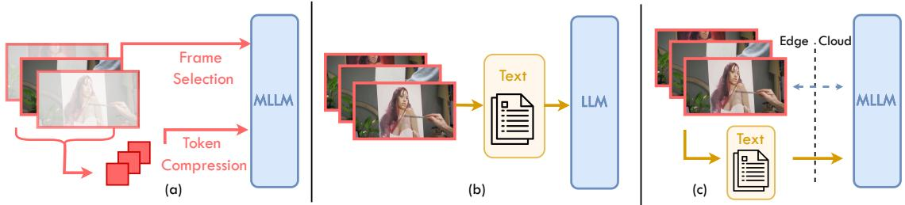
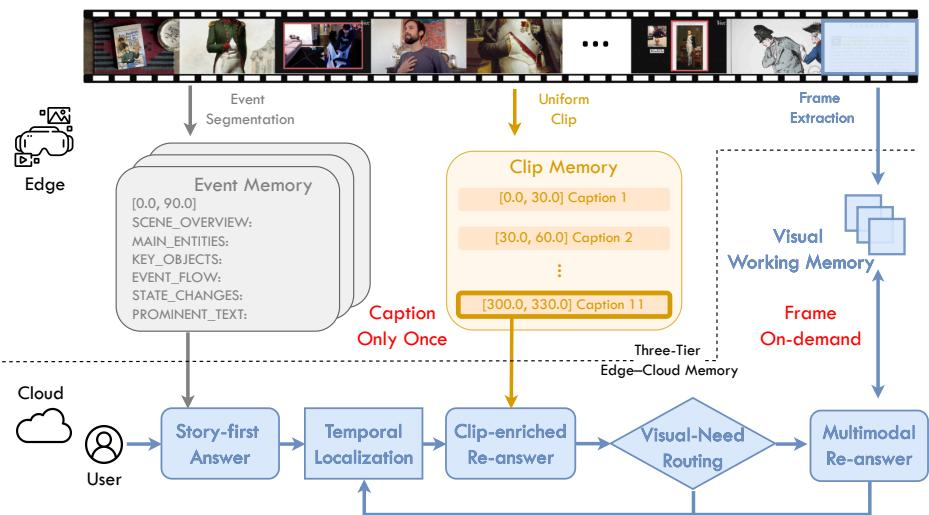
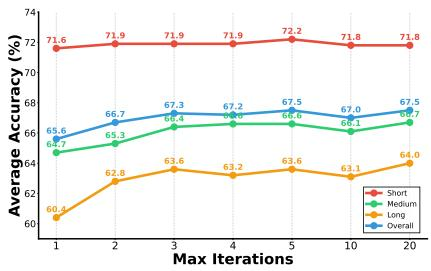
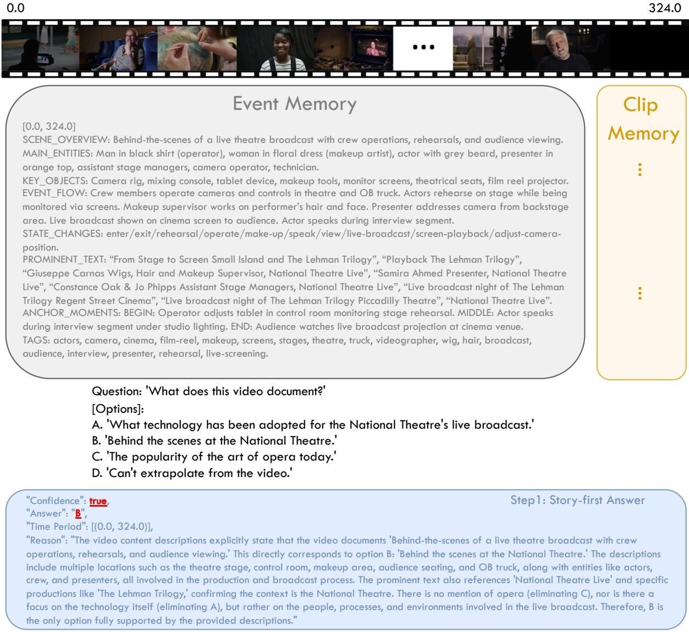
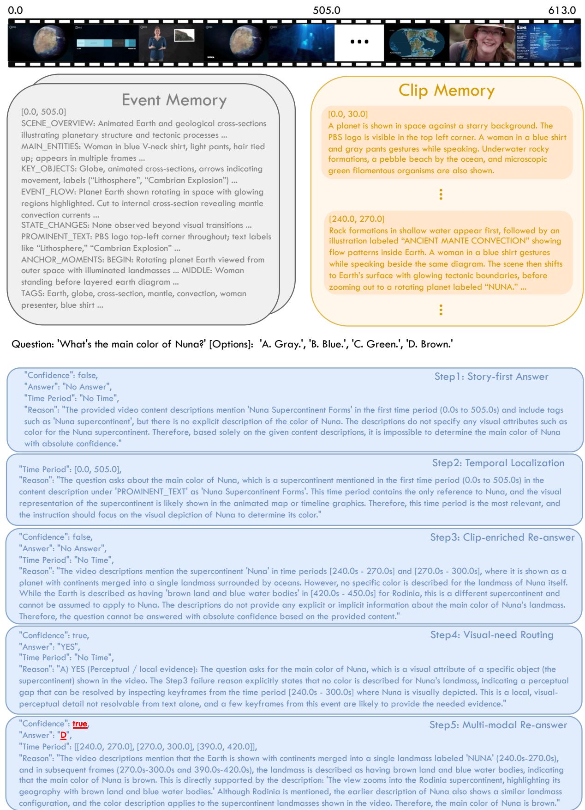

# Caption-once, Frames-on-Demand: Visual-Need Routing for Budget-Aware Agentic Long Video Understanding

Weitong Cai<sup>1</sup>, Hang Zhang<sup>2</sup>\*, Yukai Huang<sup>3</sup>, Yiqiao Xie<sup>4</sup>, Shan Gao<sup>5</sup>, Jiankang Deng<sup>4</sup>, Songcen Xu<sup>5</sup>, Jifei Song<sup>5</sup>, Zhensong Zhang<sup>5</sup>\*

<sup>1</sup>Queen Mary University of London, <sup>2</sup>Independent Researcher,

<sup>3</sup>Durham University, <sup>4</sup>Imperial College London, <sup>5</sup>Huawei

weitong.cai@qmul.ac.uk, miruku.hzhang@gmail.com, zhangzhensong@huawei.com

## Abstract

Long-video understanding on edge devices must reason over hours of content under tight compute and bandwidth budgets. Subsampling visual tokens loses temporal structure, while text-only video memories lose fine-grained visual attributes. We observe a visual-textual duality: language memories carry long-range temporal structure better than dense frames, while pixels remain decisive for attribute-level perception. Building on this insight, we propose Caption-once, Frames-on-Demand (CFD), a budget-aware edge-cloud agentic framework. The edge runs a single offline captioning pass that builds a dual-track narrative index, an event-level story skeleton plus a clip-level micro-log, cached and reused across queries without re-captioning. At query time, a cloud-side MLLM reasons over the index in a story-first loop centered on a lightweight Visual-Need Router: a per-query gating module that triggers bounded keyframe retrieval only for perceptual questions (appearance, on-screen text, attribute disambiguation) and keeps temporal-structural questions in language space. The router turns visual access into a first-class, query-conditioned cost, capping per-query frame consumption regardless of video length. Experiments on long-video benchmarks demonstrate strong accuracy-efficiency trade-offs while substantially reducing online visual processing.

## 1 Introduction

Long-form video understanding underlies a growing class of multimodal applications, from interactive video assistants and on-device personal memory to wearable visual aids, each constrained by tight inference budgets imposed by either edge hardware or latency-sensitive cloud serving (Paruchuri et al., 2025; Singh and Gill, 2023). Under such constraints, long video QA becomes a joint modeling and resource-allocation problem: the system must preserve query-relevant memory over the entire video horizon, yet missing even a small but decisive event or attribute can directly cause incorrect answers (Mangalam et al., 2023).

Existing approaches can be viewed along two intertwined design axes: (i) Visual compression methods (fig. 1(a)) reduce cost by sampling fewer frames or compressing visual tokens, but may sacrifice coverage or fidelity on long videos (Qian et al., 2024; Jiang et al., 2025). (ii) Textual translation methods (fig. 1(b)) convert videos into captions, transcripts, or language memories and perform retrieval and reasoning in text space, or iteratively revisit video segments to produce updated textual memories across multiple rounds (Fan et al., 2024; Zhi et al., 2025; Zuo et al., 2025; Cai et al., 2025). These strategies improve scalability, but text-centric representations can lose fine-grained visual evidence (Wang et al., 2023; Kahatapitiya et al., 2025), while iterative revisiting often introduces query-time cost that grows with interaction rounds and is difficult to bound under strict edge budgets (Fan et al., 2024; Zhi et al., 2025).

In preliminary studies, we observe a consistent duality. For image-level referencing (Table 1), caption-only reasoning falls short of reasoning from original pixels, since fine-grained properties such as identity, color, and attribute binding are easily lost under aggressive linguistic compression (Yang et al., 2025a). In contrast, for longhorizon temporal reasoning (Table 2), language memories can sometimes be more effective than dense visual inputs for chronological understanding and event-level relations, because they provide a compact, discrete record of what happened and in what order (Wang et al., 2023; Kahatapitiya et al., 2025). This suggests that text is not merely a lossy substitute for video: it can be a stronger carrier for temporal structure, while sparse raw frames remain essential for verifiable visual evidence. The intuition aligns with human memory: we rarely retain every pixel-level detail, but we can retain and query a concise storyline of an experience.

  
Figure 1: Long video understanding. (a) Visual compression methods (frame selection or token compression) reduce visual tokens fed to an MLLM but risk losing coverage on long videos. (b) Textual translation methods convert video into language memories for LLM reasoning, improving scalability but losing fine-grained visual evidence. (c) Our approach separates offline narrative indexing on the edge from on-demand visual verification on the cloud, combining textual temporal coverage with targeted pixel-level evidence only when needed.

Motivated by this observation, we propose a Caption-once, Frames-on-Demand (CFD) paradigm (fig. 1(c)) for budget-aware long video understanding in an edge-cloud setting. The key idea is to index temporal structure once in language and reuse it across queries, while retrieving raw frames only when fine-grained visual attribution is necessary. Under this view, efficiency does not come from uniformly reducing visual computation, but from allocating visual access selectively to attribute-critical moments. We instantiate this paradigm with CFD, a budget-aware edge-cloud agentic pipeline for long video understanding. On the edge, a lightweight MLLM performs singlepass, question-agnostic indexing of the full video stream to build two complementary timestamped language memories: an event-level story skeleton derived from shot/event segmentation (Soucek and Lokoc, 2024), and a uniform clip-level microlog that preserves local temporal details between events. Both memory tracks are produced once per video and cached for reuse across subsequent queries without re-captioning the video.

At query time, a stronger cloud-side MLLM reasons over the cached narrative index in an iterative backtracking loop. It first attempts a story-first answer from the event memory. If confidence is insufficient, the agent localizes a relevant unexplored event, enriches it with overlapping clip-level captions, and re-attempts answering. A lightweight Visual-Need Router then predicts whether pixellevel inspection is required: it favors frame retrieval for perceptual queries (e.g., appearance, on-screen text) and skips it for temporally grounded questions when narrative memory is sufficient. When visual inspection is triggered, the system retrieves a bounded set of keyframes from the localized event into a fixed-capacity FIFO working memory, ensuring that per-query visual cost remains controlled regardless of video length. The agent then performs multimodal re-reasoning over textual memory and retrieved visual evidence in a unified prompt. The loop repeats until confidence is reached or the query budget is exhausted.

In summary, our contributions are threefold:

• Visual-Need Router. We introduce a perquery gating module that classifies each question as perceptual or temporal-structural and triggers raw-frame retrieval only for the former. To our knowledge, this is the first agentic video-QA design that conditions visual access on question type, converting frame retrieval from an emergent pipeline byproduct into an explicit, query-conditioned cost.

• Caption-once, Frames-on-Demand framework. Building on prior caption-once paradigms (Zhang et al., 2024a; Kahatapitiya et al., 2025), we couple a reusable dual-track narrative index (event skeleton plus clip-level micro-log) with the Visual-Need Router and a fixed-capacity FIFO working memory, exposing per-query visual cost as an explicit hyperparameter rather than an implicit consequence of interaction depth.

• Empirical study. On Video-MME and InfiniBench, CFD reaches accuracy competitive with prior agent-based methods while using roughly an order of magnitude fewer frames per question, supporting the design hypothesis that visual access can be allocated selectively rather than uniformly.

An extended discussion of related work is provided in Appendix C.

Table 1: CaptionQA (Yang et al., 2025a). Caption:Qwen2. $\mathsf { J - V L - 7 B } ;$ Reasoning:Qwen3-VL-4B.  
Table 2: InfiniBench (Ataallah et al., 2025). Use Qwen3-VL-32B for caption and reasoning. Results show captions have better performance on temporal context understanding than raw videos.
<table><tr><td>Input</td><td>Overall (%)</td></tr><tr><td>Image</td><td>92.32</td></tr><tr><td>Caption</td><td>77.17</td></tr></table>

<table><tr><td>Pipeline</td><td>Chronological Understanding</td><td>Global Appearance</td><td>Scene Transitions</td><td>Character Actions</td></tr><tr><td>Video</td><td>48.44</td><td>70.54</td><td>53.97</td><td>67.04</td></tr><tr><td>60s / Caption</td><td>56.46</td><td>53.49</td><td>58.73</td><td>53.07</td></tr></table>

## 2 Method

We present Caption-once, Frames-on-Demand (CFD), a budget-aware edge-cloud agentic framework for long video understanding. The framework consists of three parts: a three-tier memory architecture that separates offline narrative indexing from online visual verification (section 2.1), four agent roles (section 2.2), and a story-first reasoning loop that orchestrates these agents under a controlled visual budget (section 2.3). An overview is shown in fig. 2.

## 2.1 Three-Tier Edge-Cloud Memory Architecture

A central challenge in long video understanding is that different questions demand different evidence. Temporal and causal questions (e.g., “What happened after the man left?”) can often be resolved from a compact narrative record, while perceptual questions $( e . g .$ , “What color was the mug?”) require direct pixel-level verification. Serving both needs efficiently calls for a memory that provides broad temporal coverage by default, fine-grained textual detail on demand, and targeted visual evidence only when language alone is insufficient.

CFD addresses this with a three-tier memory architecture under an edge-cloud setting. Prior agentbased systems (Zuo et al., 2025) adopt a hierarchical memory where deeper levels are generated online by repeatedly invoking the captioning model during question answering, incurring query-time visual cost that grows with interaction depth. In contrast, CFD constructs all textual memories $o f \mathrm { - }$ fline in a single question-agnostic indexing pass, and introduces a third, visual tier that provides raw pixel evidence when text is insufficient. This decoupling ensures that query-time reasoning operates primarily in language space, with visual access as a bounded, selective supplement rather than a recurring expense. We emphasise that the framework does not presume the offline captions to be sufficient on their own: the visual tier is designed precisely for cases where the question-agnostic index lacks the needed detail, with the Visual-Need Router (section 2.2) deciding when to escalate from text to pixels rather than committing to a possibly wrong text-only answer.

Tier 1: Event memory (global story skeleton). Given a video V of duration D seconds, we segment it into semantically coherent events using a shot-boundary detector (Soucek and Lokoc, 2024). Adjacent segments shorter than a threshold $\tau _ { \mathrm { m i n } }$ are merged into the preceding segment, yielding variable-length events $\{ e _ { 1 } , \ldots , e _ { K } \}$ . A lightweight captioning MLLM then processes each event to produce a structured narrative profile:

$$
m _ { k } ^ { E } = \mathrm { C a p t i o n e r } ( e _ { k } , p _ { \mathrm { e v e n t } } ) ,\tag{1}
$$

where a prompt $p _ { \mathrm { e v e n t } }$ instructs the captioner to produce a story-skeleton description including scene overview, entity listing, chronological event flow, and retrieval anchor tags. The full event memory $\mathcal { M } _ { E } = \{ m _ { k } ^ { E } \} _ { k = 1 } ^ { K }$ spans the entire video and is always presented in full to the reasoning agent, serving as the global timeline and starting point for all question answering.

Tier 2: Clip memory (local temporal details). Independent of event segmentation, we partition V into fixed-length clips of duration $\tau _ { c }$ with configurable stride, yielding a sequence of clips $\{ c _ { 1 } , \ldots , c _ { L } \}$ . Each clip is captioned with a microaction-level prompt $p _ { \mathrm { c l i p } }$ designed for high temporal granularity, one action per sentence:

$$
m _ { j } ^ { C } = \mathrm { C a p t i o n e r } ( c _ { j } , \ p _ { \mathrm { c l i p } } ) .\tag{2}
$$

$\mathcal { M } _ { C } = \{ m _ { j } ^ { C } \} _ { j = 1 } ^ { L }$ captures local temporal details (micro-actions, state changes, visible text) that may be too fine-grained for the event-level skeleton.

Crucially, the clip memory is not fed to the reasoning agent in full. Instead, it is activated selectively: when the reasoning loop localizes a specific event $e ^ { * }$ , all clip captions whose time intervals overlap with $e ^ { * }$ are injected as nested subdescriptions within $e ^ { * } \mathrm { { s } }$ narrative text (section 2.3). This on-demand injection avoids overwhelming the LLM context with full clip-level detail for the entire video, while providing dense local information exactly where it is needed. Moreover, these enrichments are cumulative: once clip captions are injected for an explored event, they persist in the narrative memory for all subsequent reasoning steps within the same query. This mechanism replaces the online re-captioning used in prior work (Zuo et al., 2025): instead of invoking the MLLM again to generate finer descriptions, CFD composes already-cached captions through pure text operations at zero additional visual cost.

Tier 3: Visual working memory (pixel-level evidence). The first two tiers operate entirely in language space. For questions that require direct visual verification, CFD maintains a Visual Working Memory W, a FIFO queue with a deliberately small fixed capacity $N _ { \mathrm { w m } }$ that stores raw image frames extracted from the video. When the reasoning loop determines that pixel-level inspection is necessary for an event $e ^ { * }$ , keyframes are adaptively sampled from $e ^ { * }$ and pushed into W; when W is full, the oldest frames are evicted. The capacity $N _ { \mathrm { w m } }$ is set to be orders of magnitude smaller than the total frame count of the video (e.g., 16 frames for a one-hour video). This compact design serves two purposes: it prevents excessive visual tokens from diluting the LLM’s attention over the context, and it minimizes the volume of visual data transmitted from edge to cloud, keeping uplink bandwidth and energy consumption under control. By introducing a bounded visual channel alongside the narrative, CFD can ground perceptual claims in actual pixels while keeping the visual footprint minimal.

The three tiers form a coarse-to-fine progression that mirrors the caption-once, frames-on-demand principle: Event Memory provides breadth across the full video, Clip Memory adds depth at targeted time periods, and Visual Working Memory supplies pixel-level evidence when language alone is insufficient. All three tiers are jointly presented to the answering agent in a single multimodal prompt, with textual memories providing the reasoning context and visual evidence grounding fine-grained attributes.

## 2.2 Agent Roles in the CFD Framework

CFD employs four agent roles instantiated through prompt engineering, inspired by prior multi-agent designs for video understanding (Zuo et al., 2025; Zhi et al., 2025; Fan et al., 2024). A key difference from these systems is the absence $o f$ an Instruction Agent: prior pipelines use a dedicated agent to analyze what information is missing and generate re-captioning instructions, triggering additional VLM calls at query time (Zuo et al., 2025). CFD eliminates this role entirely by substituting it with two complementary mechanisms: the precomputed clip memory (which already contains the finer-grained descriptions that an Instruction Agent would request) and a Visual-Need Router (which decides when to look at raw pixels instead of generating more text).

Captioning Agent (offline only). An edge-side MLLM processes each event clip and uniform clip according to eqs. (1) and (2). This agent is active only during the offline indexing stage on the edge. Once the dual-track memory is cached, the agent is not invoked again for any subsequent query on the same video.

Answering Agent. Given the current narrative memory M (which may include injected clip details) and the visual working memory W, this agent evaluates whether the available evidence is sufficient to answer the question $Q$ with confidence:

$$
( a , \ c o n f , \ r ) = \mathrm { A N S A G E N T } ( \mathcal { M } , \ \mathcal { W } , \ Q ) ,\tag{3}
$$

where $a$ is the candidate answer, conf $\in$ {true, false} is the confidence flag, and r is a chainof-thought reason. The textual memory and visual evidence are assembled into a single multimodal prompt: images from W are interleaved with their timestamps before the textual narrative, allowing the LLM to jointly ground visual details and temporal context. When $c o n f = t r u e$ , the answer a is returned; otherwise, the system enters/continues the reasoning loop.

Localization Agent. This agent identifies the single most question-relevant event from the narrative memory, excluding previously explored events:

$$
e ^ { * } = \mathrm { L o c A G E N T } ( \mathcal { M } _ { E } \ \backslash \ S _ { \mathrm { t r i e d } } , \ \mathcal { W } , \ Q ) ,\tag{4}
$$

where $S _ { \mathrm { t r i e d } }$ is the set of events already visited in the current query session. By operating over progressively narrowed candidate sets, the agent ensures that each reasoning iteration explores a new temporal region, expanding the breadth of evidence gathering.

Visual-Need Router. After an enriched text-only answer attempt fails to reach confidence, this agent decides whether pixel-level inspection of the selected event $e ^ { * }$ is likely to improve correctness:

$$
n e e d \_ \nu i s u a l = \mathrm { R o U T E R } ( e ^ { * } , ~ Q , ~ r ) ,\tag{5}
$$

  
Figure 2: Overview of CFD. On the edge, a lightweight MLLM performs a single offline captioning pass to build a dual-track narrative index: an event-level story skeleton and a clip-level micro-log, both cached and reused across queries without re-captioning. At query time, a cloud-side MLLM reasons over the cached index through a story-first iterative loop, enriching targeted events with clip details and retrieving raw frames on demand only when the Visual-Need Router determines pixel-level evidence is necessary.

where r is the reason from the preceding answer attempt. The router follows a perceptual-versustemporal rubric. It accepts (triggers frame extraction) when the question targets visual attributes such as appearance, on-screen text, spatial layout, or object disambiguation, i.e., evidence that cannot be reliably inferred from text alone. It declines (skips frame extraction) when the question primarily concerns temporal ordering, scene transitions, or long-range narrative structure, where the textual memory already provides a suitable abstraction. When declining, the router clears the visual working memory W and directs the loop to the next iteration without incurring any visual cost. This role is unique to CFD: existing agent-based video systems (Zuo et al., 2025; Wang et al., 2025d; Ma et al., 2025) do not gate visual access based on question type, and therefore either always or never use visual frames regardless of whether the question demands them.

Crucially, the router is not a downstream perception module but an explicit cost-control gate: it deliberately routes some questions away from frames in order to keep the per-query frame budget tight. This means the router may sacrifice marginal accuracy on attribute-centric questions in exchange for a substantially lower average visual footprint, a trade-off we view as a feature rather than a bug, because it exposes per-query visual cost as a tunable hyperparameter rather than an emergent byproduct of pipeline depth. Applications that prioritise attribute fidelity over visual cost can simply disable the router and always route to frames; we report both configurations in our ablations (section 3).

## 2.3 Story-First Reasoning Loop

At query time, the system receives a question $Q$ and the pre-built memories $\mathcal { M } _ { E }$ and $\mathcal { M } _ { C }$ . It initializes the visual working memory $\mathcal { W } = \emptyset$ , the explored set $S _ { \mathrm { t r i e d } } = \emptyset$ , and a cumulative clip enrichment bank $\boldsymbol { B } = \boldsymbol { \mathcal { O } }$ that tracks which clip captions have been injected into which events. The reasoning proceeds through the following steps, with a maximum budget of $T$ iterations.

Step 1: Story-first answer. The Answering Agent receives the full Event Memory $\mathcal { M } _ { E }$ and the empty $\mathcal { W } ,$ and attempts to answer Q. If confident, the answer is returned immediately. This early exit handles temporal and narrative questions that can be resolved from the story skeleton alone, requiring only a single LLM call for the entire query. Importantly, CFD does not only route between textual and visual evidence. Its story-first agentic loop also adaptively allocates the depth of reasoning and evidence access according to whether the currently available memory is sufficient.

Step 2: Temporal localization. The Localization Agent selects the most relevant event $e ^ { * }$ from $\mathcal { M } _ { E } \backslash$ $S _ { \mathrm { t r i e d } } .$ , and $e ^ { * }$ is added to $S _ { \mathrm { t r i e d } }$

Step 3: Clip-enriched re-answer. All Clip Memory entries overlapping with $e ^ { * }$ are collected and injected as nested sub-descriptions within $e ^ { * } { \boldsymbol { \mathbf { \mathit { s } } } }$ event caption, and these enrichments are added to $B .$ The narrative memory is then rebuilt: for every event $e _ { k }$ if B contains clip enrichments for $e _ { k }$ , the clip captions are appended chronologically under a “More details” block within $\boldsymbol { e } _ { k } \boldsymbol { \mathbf { \acute { s } } }$ text; the base event text is always restored first to prevent nesting accumulation. The Answering Agent re-attempts with this enriched memory. Because B accumulates across iterations, the narrative grows progressively richer as more events are explored, carrying forward all previously gathered local detail. If confident, the answer is returned.

Step 4: Visual-Need Router. If the answer is not confident, the Visual-Need Router evaluates whether pixel-level inspection of $e ^ { * }$ would help, following eq. (5). If the router declines, W is cleared and the loop returns to Step 2 for the next iteration.

Step 5: On-demand frame extraction. When the router accepts, keyframes are adaptively sampled from $e ^ { * }$ . The sampling rate is $f _ { \mathrm { e v } } ,$ capped at $N _ { \mathrm { f r } }$ frames per event; when the frame count exceeds $N _ { \mathrm { f r } } ,$ frames are redistributed uniformly across the event duration. Extracted frames are pushed into the FIFO working memory W with capacity $N _ { \mathrm { w m } }$

Step 6: Multimodal re-answer. The Answering Agent receives the enriched narrative memory (with all cumulative clip injections) together with the visual evidence in W, in a single multimodal prompt. If confident, the answer is returned.

Fallback. If T iterations are exhausted without a confident answer, a must-answer fallback forces the agent to commit to its best answer using all accumulated textual and visual evidence.

Steps 2–6 repeat, and with each iteration the system’s memory of the video becomes progressively richer: new events are explored (breadth), their clip details are permanently injected (depth), and visual evidence accumulates in W (grounding). The full procedure is summarized as pseudocode in Algorithm 1 of the appendix.

## 3 Experiment

We evaluate CFD on two long-video benchmarks: Video-MME (Fu et al., 2025) under the standard without-subtitle setting, and InfiniBench (Ataallah et al., 2025) on its four grounding-based skills (Chronological Understanding, Character Actions Tracking, Scene Transitions, and Global Appearance). Full dataset descriptions are provided in Appendix B.

## 3.1 Implementation details

We use Qwen3-VL-8B-Instruct (Bai et al., 2025a) as the frozen edge-side Captioning Agent (MLLM) and Qwen3-VL-32B-Instruct (Bai et al., 2025a) as the cloud-side reasoning MLLM that instantiates the Answering Agent, Localization Agent, and Visual-Need Router. Both models are served via vLLM (Kwon, 2025). Offline indexing (edge). For the event memory, we apply TransNetV2 (Soucek and Lokoc, 2024) (threshold 0.5) for shot-boundary detection, with a minimum segment merging threshold $\tau _ { \mathrm { m i n } } = 6 0 \mathrm { s }$ . Event-level captions use a structured prompt (scene overview, entity listing, chronological event flow, and anchor tags) at 1 FPS. For the clip memory, we use uniform clips of $\tau _ { c } ~ = ~ 3 0 \mathrm { s }$ with stride equal to $\tau _ { c }$ (nonoverlapping), captioned at 1 FPS with a microaction prompt (one action per sentence). Both memory tracks are cached under a deterministic configuration fingerprint and reused across queries. Online reasoning (cloud). The maximum number of backtracking iterations is $T = 5$ . For ondemand frame extraction in Step 5, we use a sampling rate of $f _ { \mathrm { e v } } = 0 . 1 \mathrm { F P S }$ (1 frame per 10 s of event duration), capped at $N _ { \mathrm { f r } } ~ = ~ 8$ frames per event. When the ideal frame count exceeds $N _ { \mathrm { f r } }$ frames are redistributed uniformly across the event span. The FIFO visual working memory has capacity $N _ { \mathrm { w m } } = 1 6$ . The Visual-Need Router uses a perceptual-versus-temporal rubric and operates as a single LLM call with structured JSON output. Detailed agent prompt designs are provided in Appendix F.

## 3.2 Comparison with other methods

Table 3 reports results on Video-MME. Opensourced MLLMs typically feed hundreds to nearthousands of densely sampled frames; for instance, Qwen3-VL-32B reaches 75.9 overall at 768 frames per question. CFD achieves 67.5 overall with only 5.8 frames per question on average, more than two orders of magnitude fewer than dense baselines. This asymmetry suggests that competitive temporal reasoning does not require saturating the context window with visual tokens, provided the right frames are retrieved at the right time. Among agent-based systems, VideoAgent (Fan et al., 2024), VideoTree (Wang et al., 2025d), DrVideo (Ma et al., 2025), and VideoLucy (Zuo et al., 2025) densely caption the full video during preprocessing and further revisit raw frames at query time to refine their textual memory, while MemVid (Yuan et al., 2025) avoids re-captioning but compensates with dense 1 fps uniform sampling (64.0 overall, 73.9 on short videos). CFD matches or exceeds all reported agent-based baselines (VideoLucy 64.7, MemVid 64.0) while using roughly an order of magnitude fewer frames per question. We do not aim to match dense-inference upper bounds such as Qwen3-VL-32B at 768 frames; we target the accuracy-efficiency frontier under bounded visual budgets. The gains over agent-based methods are most pronounced on medium and long videos (66.6 and 63.6), where re-captioning and dense sampling suffer most from context saturation and redundant visual processing.

Table 3: Performance comparison on Video-MME (Fu et al., 2025). † denotes reproduced results under strictly identical setups using the authors’ code. #Captions denotes the average temporal span covered by each caption. Re-caption? indicates whether a method revisits video frames at query time to (re)caption or refine its textual memory. #Frames counts the number of frames fed to the answering model at the final inference stage.
<table><tr><td rowspan="2"></td><td rowspan="2">#Captions</td><td rowspan="2">Re-caption?</td><td rowspan="2">#Frames</td><td colspan="4">Video-MME</td></tr><tr><td>short</td><td>medium</td><td>long</td><td>overall</td></tr><tr><td>Leading Open-source MLLMs</td><td></td><td></td><td></td><td></td><td></td><td></td><td></td></tr><tr><td>VideoChat2-7B (Li et al., 2024b)</td><td></td><td></td><td>16</td><td>48.3</td><td>37.0</td><td>33.2</td><td>39.5</td></tr><tr><td>LongVA-7B (Zhang et al., 2024b)</td><td></td><td></td><td>128</td><td>61.1</td><td>50.4</td><td>46.2</td><td>52.6</td></tr><tr><td>Kangaroo-7B (Liu et al., 2024)</td><td></td><td></td><td>64</td><td>66.1</td><td>55.3</td><td>46.6</td><td>56.0</td></tr><tr><td>Video-CCAM-14B (Fei et al., 2024)</td><td></td><td></td><td>96</td><td>62.2</td><td>50.6</td><td>46.7</td><td>53.2</td></tr><tr><td>VideoXL-7B (Shu et al., 2025)</td><td></td><td></td><td>128</td><td>64.0</td><td>53.2</td><td>49.2</td><td>55.5</td></tr><tr><td>Dispider-7B (Qian et al., 2025)</td><td></td><td></td><td>1 fps</td><td></td><td></td><td></td><td>57.2</td></tr><tr><td>VideoChat-Online-4B (Huang et al., 2025)</td><td></td><td></td><td>2 fps</td><td></td><td></td><td>47.1</td><td>54.4</td></tr><tr><td>TimeChat-Online-7B (Yao et al., 2025)</td><td></td><td></td><td>1 fps</td><td></td><td></td><td>48.4</td><td>62.4</td></tr><tr><td>Qwen3-VL-32B (Bai et al., 2025a)</td><td></td><td></td><td>768</td><td>82.4</td><td>76.3</td><td>69.0</td><td>75.9</td></tr><tr><td>Agent-based Systems</td><td></td><td></td><td></td><td></td><td></td><td></td><td></td></tr><tr><td>VideoAgent (Fan et al., 2024)</td><td>2s / caption</td><td>√</td><td></td><td></td><td></td><td>46.4</td><td></td></tr><tr><td>VideoTree (Wang et al., 2025d)</td><td>8s / caption</td><td>√</td><td></td><td>67.8</td><td>59.9</td><td>54.2</td><td>60.6</td></tr><tr><td>DrVideo (Ma et al., 2025)</td><td>5s / caption</td><td>√</td><td></td><td></td><td></td><td>51.7</td><td></td></tr><tr><td>MemVid (Yuan et al., 2025)</td><td></td><td>x</td><td>1 fps</td><td>73.9</td><td>63.1</td><td>55.0</td><td>64.0</td></tr><tr><td>VideoLucy (Zuo et al., 2025)†</td><td>&lt; 30s / caption</td><td>√</td><td></td><td>73.2</td><td>64.7</td><td>56.2</td><td>64.7</td></tr><tr><td>CFD (Ours)</td><td>233.1s / caption</td><td>x</td><td>5.8</td><td>72.2</td><td>66.6</td><td>63.6</td><td>67.5</td></tr></table>

Table 4: Performance comparison on InfiniBench (Ataallah et al., 2025). #Captions denotes the average temporal span covered by each caption. #Frames counts the number of frames fed to the answering model at the final inference stage. Chronological Understanding evaluates ordering events across the full video; Character Actions Tracking requires aggregating and sequencing a character’s actions; Scene Transitions tests recognizing and ordering scene/location shifts; Global Appearance tracks long-term appearance changes of a character (e.g., outfit changes).
<table><tr><td>Method</td><td>#Captions</td><td>#Frames</td><td>Chronological Understanding</td><td>Global Appearance</td><td>Scene Transitions</td><td>Character Actions</td></tr><tr><td>LLaVA-OneVision (Li et al., 2024a)</td><td></td><td>128</td><td>43.91</td><td>37.21</td><td>25.40</td><td>20.11</td></tr><tr><td>InternVL2.5 (Chen et al., 2024b)</td><td></td><td>128</td><td>42.16</td><td>34.88</td><td>20.63</td><td>21.60</td></tr><tr><td>Qwen2-VL (Wang et al., 2024a)</td><td></td><td>768</td><td>48.41</td><td>31.01</td><td>23.81</td><td>32.59</td></tr><tr><td>Qwen2.5-VL (Bai et al., 2025b)</td><td></td><td>768</td><td>27.17</td><td>37.98</td><td>22.22</td><td>22.53</td></tr><tr><td>InternVL3 (Zhu et al., 2025)</td><td></td><td>128</td><td>36.29</td><td>33.33</td><td>28.57</td><td>23.46</td></tr><tr><td>Qwen3-VL (Bai et al., 2025a)</td><td></td><td>768</td><td>48.44</td><td>70.54</td><td>53.97</td><td>67.04</td></tr><tr><td>CFD (Ours)</td><td>206s / caption</td><td>14.8</td><td>55.10</td><td>58.90</td><td>52.40</td><td>56.20</td></tr></table>

Table 4 reports results on the four groundingbased skills of InfiniBench. CFD achieves the best Chronological Understanding score (55.10), exceeding the 768-frame dense baselines Qwen3- VL (48.44) and Qwen2-VL (48.41), and remains competitive on Scene Transitions (52.40 vs. 53.97 for Qwen3-VL), at only 14.8 frames per question on average. These two skills are most aligned with our design principle: ordering events and recognising scene-level shifts are temporally structured tasks for which the event-level narrative skeleton provides a compact discrete record. On Global Appearance and Character Actions, CFD (58.90 / 56.20) is ahead of agent-based baselines but below the dense Qwen3-VL, consistent with the visualtextual duality identified in Section 1: fine-grained attribute binding benefits from dense pixel access, and a tight on-demand budget does not fully substitute for exhaustive sampling. Even so, within the agent-based regime the Visual-Need Router still recovers a substantial fraction of the appearancegrounding evidence under a tight frame budget.

Table 5: Component Study. $( ^ { * } )$ denotes that all clip captions in one video are used for the ablation experiment.
<table><tr><td colspan="7"></td><td colspan="5">Video-MME</td></tr><tr><td></td><td></td><td>Event Clip ReasoningLoop Frames Router</td><td></td><td>short</td><td>medium</td><td>long</td><td>overall</td><td>Chronological Understanding</td><td>Global Appearance</td><td>Scene Transitions</td><td>Character Actions</td></tr><tr><td>√</td><td></td><td></td><td></td><td></td><td>62.0</td><td>53.7</td><td>56.3 57.3</td><td>52.30</td><td>9.30</td><td>39.70</td><td>16.90</td></tr><tr><td></td><td></td><td></td><td></td><td></td><td>68.2</td><td>66.4</td><td>62.0 65.5</td><td>55.70</td><td>38.00</td><td>65.10</td><td>43.90</td></tr><tr><td>VV</td><td>ン</td><td></td><td></td><td></td><td>68.8</td><td>64.0</td><td>63.0 65.3</td><td>55.10</td><td>45.00</td><td>52.40</td><td>53.40</td></tr><tr><td></td><td>√</td><td>√√</td><td>√</td><td></td><td>72.3</td><td>66.7</td><td>62.6 67.2</td><td>51.70</td><td>62.80</td><td>58.70</td><td>65.90</td></tr><tr><td>√</td><td>√</td><td>√</td><td>√</td><td>√</td><td>72.2</td><td>66.6</td><td>63.6 67.5</td><td>55.10</td><td>58.90</td><td>52.40</td><td>56.20</td></tr></table>

Table 6: Comparison across different captioner model sizes.
<table><tr><td>Caption Model Size short medium long</td><td></td><td></td><td></td><td></td><td>g overall</td></tr><tr><td rowspan="3">Qwen3-VL</td><td>2B</td><td>67.7</td><td>61.9</td><td>58.1</td><td>62.6</td></tr><tr><td>8B</td><td>72.2</td><td>66.6</td><td>63.6</td><td>67.5</td></tr><tr><td>32B</td><td>72.4</td><td>67.1</td><td>61.0</td><td>66.8</td></tr></table>

## 3.3 Ablation study

Component Analysis. Table 5 ablates each component. Event memory alone is too sparse (57.3 overall, Global Appearance 9.30). Dense clip memory alone (Row 2) recovers most of the gap (65.5 overall, Chronological Understanding 55.70) but Global Appearance remains limited (38.00), confirming that text alone cannot substitute for visual evidence. Adding the reasoning loop over the dual-track memory without any frames (Row 3) achieves comparable overall performance (65.3), corroborating that language memories are a strong carrier for temporal structure while attribute perception remains the bottleneck of text-only reasoning. Enabling on-demand frames without the router (Row 4) brings sharp gains on appearance-centric tasks (Global Appearance 62.80, Character Actions 65.90) at the cost of Chronological Understanding (51.70) and long-video accuracy (62.6), reflecting that indiscriminate frame injection dilutes the narrative context on temporally structured questions. The full model with the Visual-Need Router (Row 5) suppresses frames on those questions, recovering Chronological Understanding to 55.10 and long-video accuracy to 63.6 while keeping the average frame count low, achieving a more balanced accuracy-efficiency trade-off than always-on frame retrieval. This confirms that text and frames are complementary: text excels at long-horizon temporal structure, while frames remain decisive for fine-grained attribute perception, and routing between them captures the best of both regimes.

Table 7: Comparison across different budget settings.
<table><tr><td> $\overline { { N _ { \mathrm { f r } } } }$ </td><td> $\overline { { N _ { \mathrm { w m } } } }$ </td><td></td><td>short medium</td><td>long</td><td>overall</td></tr><tr><td>2</td><td>4</td><td>71.8</td><td>66.3</td><td>63.6</td><td>67.2</td></tr><tr><td>8</td><td>16</td><td>72.2</td><td>66.6</td><td>63.6</td><td>67.5</td></tr><tr><td>32</td><td>64</td><td>72.1</td><td>66.6</td><td>64.2</td><td>67.6</td></tr></table>

Offline captioner model size. Table 6 sweeps three Qwen3-VL captioner sizes used during offline indexing. Scaling 2B→8B brings a substantial gain (62.6→67.5 overall); scaling further to 32B marginally helps short and medium videos but degrades long-video accuracy (61.0 vs. 63.6). We attribute this to verbosity accumulation: larger captioners produce longer, more detailed descriptions per segment, which compound across the many events of a long video and inflate the total narrative context beyond what the reasoning agent can attend to within a fixed inference budget. We therefore adopt Qwen3-VL-8B as the default, balancing indexing cost, caption conciseness, and downstream accuracy. The Qwen3-VL-2B captioner reaches 62.6 overall and provides a lower-resource alternative for more constrained offline indexing tiers.

Budget sensitivity. Table 7 sweeps the per-event frame cap $N _ { \mathrm { f r } }$ and FIFO capacity $N _ { \mathrm { w m } }$ over an 8× range. Overall accuracy varies by only 0.4%, indicating that a few targeted frames suffice; the middle setting $( N _ { \mathrm { f r } } { = } 8 , N _ { \mathrm { w m } } { = } 1 6 )$ is within 0.1% of the largest budget at one-quarter the visual cost. Long videos benefit most (63.6→64.2), consistent with sparser event memory leaving more room for visual verification. These results support the core premise of CFD: a small, bounded set of on-demand frames closes most of the gap that narrative memory alone cannot cover.

Frame reduction and routing. Even when the Router is disabled and every localized event is routed to frames, the caption-once memory, temporal localization, iterative backtracking, bounded frame extraction, and fixed-capacity visual working memory reduce online frame usage from 768 to 6.63 frames/query, corresponding to 99.1% fewer frames, or approximately a 116× reduction. Within this already sparse pipeline, the Visual-Need Router further reduces frame usage from 6.63 to 5.76 frames/query, a further 13.1% reduction, while improving accuracy from 67.2 to 67.5 (+0.3 percentage points). Frame savings do not imply lower wall-clock latency in every configuration, because the prompt-based Router introduces an additional LLM call. The matched budget sweep reports the corresponding online frame counts in Table 8. Increasing the budget from 2/4 to 8/16 improves accuracy by 0.3 points, while further increasing it to 32/64 yields only another 0.1 point despite a substantially larger frame footprint. We therefore treat 8/16 as an accuracy–cost operating point rather than exhaustive visual coverage.

Table 8: Visual-budget sweep on Video-MME.
<table><tr><td> $N _ { \mathrm { f r } }$ </td><td> $\overline { { N _ { \mathrm { w m } } } }$ </td><td>Frames/query</td><td>Accuracy</td></tr><tr><td>2</td><td>4</td><td>1.83</td><td>67.2</td></tr><tr><td>8</td><td>16</td><td>5.76</td><td>67.5</td></tr><tr><td>32</td><td>64</td><td>8.93</td><td>67.6</td></tr></table>

Table 9: Controlled routing comparison on Video-MME. Each cell is (accuracy / online frames per query).
<table><tr><td>Policy</td><td>Short</td><td>Medium</td><td>Long</td><td>Average</td></tr><tr><td>No frames</td><td>68.8 / 0.00</td><td>64.0 / 0.00</td><td>63.0 / 0.00</td><td>65.3 / 0.00</td></tr><tr><td>Visual-Need Router</td><td>72.2 / 2.38</td><td>66.6 / 5.81</td><td>63.6 / 9.09</td><td>67.5 / 5.76</td></tr><tr><td>Always frames</td><td>72.3 / 2.54</td><td>66.7 / 6.57</td><td>62.6 / 10.78</td><td>67.2 / 6.63</td></tr></table>

Routing policy. Table 9 reports the controlled comparison among no-frame, Visual-Need Router, and always-frame inference. The Router improves average accuracy by 2.2 points over no-frame reasoning and slightly exceeds always-frame inference (67.5 vs. 67.2) while reducing online frames by 13.1% on average. The full policy table and outcome-oracle analysis are provided in Appendix E. Table 16 in Appendix E reports trigger statistics from the same paired diagnostic rerun used to construct the outcome oracle. The Router retrieves frames for 46.2% of questions and therefore leaves 53.8% entirely in language space, while capturing 127 of 133 (95.5%) cases in which frames empirically improve the answer. These cases are outcome-based diagnostics, not human routing annotations.

Iteration budget. Figure 3 shows performance as a function of the maximum iteration budget T. Shortvideo accuracy saturates rapidly, reaching 71.9 at

  
Figure 3: Effect of the maximum iteration budget T on Video-MME accuracy across short, medium, long, and overall splits.

Table 10: Clip-caption activation on Video-MME. Counts are captions per query, not seconds per caption or captioning runtime.
<table><tr><td>Method</td><td>Short</td><td>Medium</td><td>Long</td><td>Average</td></tr><tr><td>All 30-s clip captions</td><td>3.10</td><td>17.69</td><td>82.66</td><td>34.49</td></tr><tr><td>CFD-activated captions</td><td>1.52</td><td>9.29</td><td>24.05</td><td>11.62</td></tr><tr><td>Caption reduction</td><td>51.2%</td><td>47.5%</td><td>70.9%</td><td>66.3%</td></tr></table>

$T { \ = } 2 .$ , while medium-video performance improves until T=4 (66.6) and then plateaus. Long-video accuracy continues improving from 60.4 at $T =$ =1 to 64.0 at T=20, indicating that longer videos benefit from additional retrieval iterations. We adopt T=5 as the default, which achieves the best overall score of 67.5 and provides a favorable trade-off across duration splits.

Clip-caption activation. As shown in Table 10, CFD uses 66.3% fewer clip captions on average while outperforming the all-clip baseline overall. Event Memory uses TransNetV2 boundaries, whereas Clip Memory is generated uniformly and independently of event segmentation. The outcome oracle uses frames only when the always-frame policy corrects an error made by the no-frame policy; it is an empirical upper bound rather than semantic ground-truth annotation. Its 133 frame-beneficial cases correspond to a 4.9% trigger rate over all 2,700 questions, distinct from the Router’s 46.2% YES rate. The oracle obtains 69.5% accuracy with 0.64 frames/query, compared with the Router’s 67.5 accuracy and 5.76 frames/query.

## 4 Conclusion

We presented CFD, a budget-aware edge-cloud framework that indexes video into reusable narrative memory once and retrieves sparse visual frames only when language alone cannot ground the answer. Experiments across long-video benchmarks confirm that this caption-once, frameson-demand design achieves competitive accuracy while substantially reducing online visual cost.

## Limitations

Caption quality and segmentation sensitivity. Our framework is fundamentally bottlenecked by the quality of the offline captioning pass. If question-critical visual details are not captured in the question-agnostic memories, purely textbased backtracking cannot recover them afterwards. Sparse visual backtracking partially alleviates this issue, but its effectiveness still depends on whether the system can correctly diagnose why text-only reasoning failed and route the query to the appropriate event. Moreover, even after the correct event is localized, the bounded keyframe extraction stage may still miss highly transient cues, small objects, or brief textual overlays that fall outside the sampled frames. It may also miss subtle motion. Failure of both textual localization and sparse visual retrieval therefore remains possible. The framework is also sensitive to the quality of upstream event segmentation: overly coarse segmentation can bury useful evidence inside broad summaries, whereas overly fine segmentation may fragment semantically coherent episodes and weaken later localization. On the modeling side, both the captioner and the Visual-Need Router currently operate in a generic zero-shot setting, and would likely benefit from domain-specific supervision or lightweight fine-tuning to improve structured caption fidelity and routing accuracy. Finally, our edge-cloud setup is validated under simulated separation rather than physical deployment, so the practical impact of device-side compute constraints, communication overhead, and network latency variability remains to be systematically characterized on representative edge hardware.

Router granularity. The current Visual-Need Router operates as a binary, zero-shot classifier over a perceptual-versus-temporal rubric. While this coarse dichotomy is sufficient to demonstrate that question-type-conditioned visual gating yields meaningful cost savings, it inevitably mis-routes queries that fall on the boundary (e.g., a chronological question whose answer hinges on a specific visual change). A continuous, calibrated confidence score, possibly trained from a small held-out routing set or distilled from oracle traces, would likely improve per-skill balance, particularly on InfiniBench’s attribute-heavy skills where the current router under-allocates frames relative to the no-router configuration (Row 4 of Table 5).

Egocentric and content-dependent segmentation. Our event memory relies on TransNetV2 shotboundary detection, which is effective for edited video (TV shows, documentaries, lectures) but is not designed for continuous egocentric or wearable recordings where hard cuts are rare. Adapting CFD to egocentric streams would require replacing shot-boundary segmentation with an audio-visual event detector (e.g., EgoTrigger (Paruchuri et al., 2025)) or an LLM-prompted scene-change estimator over coarse-frame thumbnails; both are orthogonal to our framework and represent natural follow-up work.

Definition of “edge”. We use “edge” to denote a separation of inference tiers (offline indexing vs. online cloud reasoning) rather than a claim that the captioner runs on mobile-class hardware. Our default captioner (Qwen3-VL-8B) targets a modest server-class device or a powerful desktop with a single GPU; deploying onto smartphones or smart glasses would require additional model compression (e.g., Qwen3-VL-2B with quantisation), which we leave to future work alongside end-to-end latency and energy measurements on representative hardware.

## References

Kirolos Ataallah, Eslam Mohamed Bakr, Mahmoud Ahmed, Chenhui Gou, Khushbu Pahwa, Jian Ding, and Mohamed Elhoseiny. 2025. Infinibench: A benchmark for large multi-modal models in longform movies and tv shows. In Proceedings of the 2025 Conference on Empirical Methods in Natural Language Processing, pages 19485–19512.

Shuai Bai, Yuxuan Cai, Ruizhe Chen, Keqin Chen, Xionghui Chen, Zesen Cheng, Lianghao Deng, Wei Ding, Chang Gao, Chunjiang Ge, et al. 2025a. Qwen3-vl technical report. arXiv preprint arXiv:2511.21631.

Shuai Bai, Keqin Chen, Xuejing Liu, Jialin Wang, Wenbin Ge, Sibo Song, Kai Dang, Peng Wang, Shijie Wang, Jun Tang, et al. 2025b. Qwen2.5-vl technical report. arXiv preprint arXiv:2502.13923.

Daniel Bolya, Cheng-Yang Fu, Xiaoliang Dai, Peizhao Zhang, Christoph Feichtenhofer, and Judy Hoffman. 2022. Token merging: Your vit but faster. arXiv preprint arXiv:2210.09461.

Weitong Cai, Jiabo Huang, Shaogang Gong, Hailin Jin, and Yang Liu. 2025. Mllm as video narrator: Mitigating modality imbalance in video moment retrieval. Pattern Recognition, 166:111670.

Shimin Chen, Xiaohan Lan, Yitian Yuan, Zequn Jie, and Lin Ma. 2024a. Timemarker: A versatile video-

llm for long and short video understanding with superior temporal localization ability. arXiv preprint arXiv:2411.18211.

Zhe Chen, Weiyun Wang, Yue Cao, Yangzhou Liu, Zhangwei Gao, Erfei Cui, Jinguo Zhu, Shenglong Ye, Hao Tian, Zhaoyang Liu, et al. 2024b. Expanding performance boundaries of open-source multimodal models with model, data, and test-time scaling. arXiv preprint arXiv:2412.05271.

Hyomin Choi and Ivan V Bajic. 2018. Deep feature´ compression for collaborative object detection. In 2018 25th IEEE International Conference on Image Processing (ICIP), pages 3743–3747. IEEE.

Yue Fan, Xiaojian Ma, Rujie Wu, Yuntao Du, Jiaqi Li, Zhi Gao, and Qing Li. 2024. Videoagent: A memory-augmented multimodal agent for video understanding. In ECCV, pages 75–92. Springer.

Jiajun Fei, Dian Li, Zhidong Deng, Zekun Wang, Gang Liu, and Hui Wang. 2024. Video-ccam: Enhancing video-language understanding with causal crossattention masks for short and long videos. arXiv preprint arXiv:2408.14023.

Chaoyou Fu, Yuhan Dai, Yongdong Luo, Lei Li, Shuhuai Ren, Renrui Zhang, Zihan Wang, Chenyu Zhou, Yunhang Shen, Mengdan Zhang, et al. 2025. Video-mme: The first-ever comprehensive evaluation benchmark of multi-modal llms in video analysis. In CVPR, pages 24108–24118.

Daya Guo, Dejian Yang, Haowei Zhang, Junxiao Song, Peiyi Wang, Qihao Zhu, Runxin Xu, Ruoyu Zhang, Shirong Ma, Xiao Bi, et al. 2025. Deepseek-r1: Incentivizing reasoning capability in llms via reinforcement learning. arXiv preprint arXiv:2501.12948.

Zhenpeng Huang, Xinhao Li, Jiaqi Li, Jing Wang, Xiangyu Zeng, Cheng Liang, Tao Wu, Xi Chen, Liang Li, and Limin Wang. 2025. Online video understanding: Ovbench and videochat-online. In CVPR, pages 3328–3338.

Jindong Jiang, Xiuyu Li, Zhijian Liu, Muyang Li, Guo Chen, Zhiqi Li, De-An Huang, Guilin Liu, Zhiding Yu, Kurt Keutzer, et al. 2025. Storm: Token-efficient long video understanding for multimodal llms. In IEEE/CVF International Conference on Computer Vision Workshops (ICCVW), pages 5889–5900. IEEE.

Kumara Kahatapitiya, Kanchana Ranasinghe, Jongwoo Park, and Michael S Ryoo. 2025. Language repository for long video understanding. In Findings of the Associationfor Computational Linguistics: ACL 2025, pages 5627–5646.

Yiping Kang, Johann Hauswald, Cao Gao, Austin Rovinski, Trevor Mudge, Jason Mars, and Lingjia Tang. 2017. Neurosurgeon: Collaborative intelligence between the cloud and mobile edge. ACM SIGARCH Computer Architecture News, 45(1):615– 629.

Woosuk Kwon. 2025. vLLM: An Efficient Inference Engine for Large Language Models. Ph.D. thesis, UC Berkeley.

Pingrui Lai, Zihao Xie, and Hua Yang. 2025. Haven: From human guidance to assistant by evolution network in vision-and-language navigation. In 2025 International Joint Conference on Neural Networks (IJCNN), pages 1–8. IEEE.

Bo Li, Yuanhan Zhang, Dong Guo, Renrui Zhang, Feng Li, Hao Zhang, Kaichen Zhang, Peiyuan Zhang, Yanwei Li, Ziwei Liu, et al. 2024a. Llavaonevision: Easy visual task transfer. arXiv preprint arXiv:2408.03326.

Kunchang Li, Yali Wang, Yinan He, Yizhuo Li, Yi Wang, Yi Liu, Zun Wang, Jilan Xu, Guo Chen, Ping Luo, et al. 2024b. Mvbench: A comprehensive multi-modal video understanding benchmark. In CVPR, pages 22195–22206.

Wei Li, Hehe Fan, Yongkang Wong, Mohan Kankanhalli, and Yi Yang. 2024c. Topa: Extending large language models for video understanding via textonly pre-alignment. NeurIPS, 37:5697–5738.

Xinhao Li, Yi Wang, Jiashuo Yu, Xiangyu Zeng, Yuhan Zhu, Haian Huang, Jianfei Gao, Kunchang Li, Yinan He, Chenting Wang, et al. 2026. Videochat-flash: Hierarchical compression for long-context video modeling. In ICLR, volume 2026, pages 109089–109117.

Jiajun Liu, Yibing Wang, Hanghang Ma, Xiaoping Wu, Xiaoqi Ma, Xiaoming Wei, Jianbin Jiao, Enhua Wu, and Jie Hu. 2024. Kangaroo: A powerful videolanguage model supporting long-context video input. arXiv preprint arXiv:2408.15542.

Ziyu Ma, Chenhui Gou, Hengcan Shi, Bin Sun, Shutao Li, Hamid Rezatofighi, and Jianfei Cai. 2025. Drvideo: Document retrieval based long video understanding. In CVPR, pages 18936–18946.

Karttikeya Mangalam, Raiymbek Akshulakov, and Jitendra Malik. 2023. Egoschema: A diagnostic benchmark for very long-form video language understanding. NeurIPS, 36:46212–46244.

Akshay Paruchuri, Sinan Hersek, Lavisha Aggarwal, Qiao Yang, Xin Liu, Achin Kulshrestha, Andrea Colaco, Henry Fuchs, and Ishan Chatterjee. 2025. Egotrigger: Toward audio-driven image capture for human memory enhancement in all-day energyefficient smart glasses. IEEE Transactions on Visualization and Computer Graphics.

Rui Qian, Shuangrui Ding, Xiaoyi Dong, Pan Zhang, Yuhang Zang, Yuhang Cao, Dahua Lin, and Jiaqi Wang. 2025. Dispider: Enabling video llms with active real-time interaction via disentangled perception, decision, and reaction. In CVPR, pages 24045– 24055.

Rui Qian, Xiaoyi Dong, Pan Zhang, Yuhang Zang, Shuangrui Ding, Dahua Lin, and Jiaqi Wang. 2024. Streaming long video understanding with large language models. NeurIPS, 37:119336–119360.

Qwen Team. 2026. Qwen3.5. https://qwen.ai/ blog?id=qwen3.5.

Aniket Rege, Arka Sadhu, Yuliang Li, Kejie Li, Ramya Korlakai Vinayak, Yuning Chai, Yong Jae Lee, and Hyo Jin Kim. 2026. Agentic very long video understanding. arXiv preprint arXiv:2601.18157.

Xiaoqian Shen, Yunyang Xiong, Changsheng Zhao, Lemeng Wu, Jun Chen, Chenchen Zhu, Zechun Liu, Fanyi Xiao, Balakrishnan Varadarajan, Florian Bordes, et al. 2024. Longvu: Spatiotemporal adaptive compression for long video-language understanding. arXiv preprint arXiv:2410.17434.

Yan Shu, Zheng Liu, Peitian Zhang, Minghao Qin, Junjie Zhou, Zhengyang Liang, Tiejun Huang, and Bo Zhao. 2025. Video-xl: Extra-long vision language model for hour-scale video understanding. In CVPR, pages 26160–26169.

Raghubir Singh and Sukhpal Singh Gill. 2023. Edge ai: a survey. Internet of Things and Cyber-Physical Systems, 3:71–92.

Tomás Soucek and Jakub Lokoc. 2024. Transnet v2: An effective deep network architecture for fast shot transition detection. In Proceedings ofthe 32nd ACM International Conference on Multimedia, pages 11218– 11221.

Peng Wang, Shuai Bai, Sinan Tan, Shijie Wang, Zhihao Fan, Jinze Bai, Keqin Chen, Xuejing Liu, Jialin Wang, Wenbin Ge, et al. 2024a. Qwen2-vl: Enhancing vision-language model’s perception of the world at any resolution. arXiv preprint arXiv:2409.12191.

Weihan Wang, Zehai He, Wenyi Hong, Yean Cheng, Xiaohan Zhang, Ji Qi, Ming Ding, Xiaotao Gu, Shiyu Huang, Bin Xu, et al. 2025a. Lvbench: An extreme long video understanding benchmark. In ICCV, pages 22958–22967.

Weiyun Wang, Zhangwei Gao, Lixin Gu, Hengjun Pu, Long Cui, Xingguang Wei, Zhaoyang Liu, Linglin Jing, Shenglong Ye, Jie Shao, et al. 2025b. Internvl3. 5: Advancing open-source multimodal models in versatility, reasoning, and efficiency. arXiv preprint arXiv:2508.18265.

Xiao Wang, Qingyi Si, Jianlong Wu, Shiyu Zhu, Li Cao, and Liqiang Nie. 2024b. Retake: Reducing temporal and knowledge redundancy for long video understanding. arXiv preprint arXiv:2412.20504.

Xiao Wang, Qingyi Si, Shiyu Zhu, Jianlong Wu, Li Cao, and Liqiang Nie. 2025c. Adaretake: Adaptive redundancy reduction to perceive longer for videolanguage understanding. In Findings of the Association for Computational Linguistics: ACL 2025, pages 5417–5432.

Xiaohan Wang, Yuhui Zhang, Orr Zohar, and Serena Yeung-Levy. 2024c. Videoagent: Long-form video understanding with large language model as agent. In European Conference on Computer Vision, pages 58–76. Springer.

Ying Wang, Yanlai Yang, and Mengye Ren. 2023. Lifelongmemory: Leveraging llms for answering queries in long-form egocentric videos. arXiv preprint arXiv:2312.05269.

Ziyang Wang, Shoubin Yu, Elias Stengel-Eskin, Jaehong Yoon, Feng Cheng, Gedas Bertasius, and Mohit Bansal. 2025d. Videotree: Adaptive tree-based video representation for llm reasoning on long videos. In CVPR, pages 3272–3283.

Siwei Wen, Zhangcheng Wang, Xingjian Zhang, Lei Huang, and Wenjun Wu. 2026. Eventmemagent: Hierarchical event-centric memory for online video understanding with adaptive tool use. arXiv preprint arXiv:2602.15329.

Haoning Wu, Dongxu Li, Bei Chen, and Junnan Li. 2024. Longvideobench: A benchmark for longcontext interleaved video-language understanding. NeurIPS, 37:28828–28857.

Shijia Yang, Yunong Liu, Bohan Zhai, Ximeng Sun, Zicheng Liu, Emad Barsoum, Manling Li, and Chenfeng Xu. 2025a. Captionqa: Is your caption as useful as the image itself? arXiv preprint arXiv:2511.21025.

Zeyuan Yang, Delin Chen, Xueyang Yu, Maohao Shen, and Chuang Gan. 2025b. Vca: Video curious agent for long video understanding. In ICCV, pages 20168– 20179.

Linli Yao, Yicheng Li, Yuancheng Wei, Lei Li, Shuhuai Ren, Yuanxin Liu, Kun Ouyang, Lean Wang, Shicheng Li, Sida Li, et al. 2025. Timechat-online: 80% visual tokens are naturally redundant in streaming videos. In Proceedings of the 33rd ACM International Conference on Multimedia, pages 10807– 10816.

Yufei Yin, Qianke Meng, Minghao Chen, Jiajun Ding, Zhenwei Shao, and Zhou Yu. 2025. Videoarm: Agentic reasoning over hierarchical memory for long-form video understanding. arXiv preprint arXiv:2512.12360.

Huaying Yuan, Zheng Liu, Minghao Qin, Hongjin Qian, Yan Shu, Zhicheng Dou, Ji-Rong Wen, and Nicu Sebe. 2025. Memory-enhanced retrieval augmentation for long video understanding. arXiv preprint arXiv:2503.09149.

Boqiang Zhang, Kehan Li, Zesen Cheng, Zhiqiang Hu, Yuqian Yuan, Guanzheng Chen, Sicong Leng, Yuming Jiang, Hang Zhang, Xin Li, et al. 2025a. Videollama 3: Frontier multimodal foundation models for image and video understanding. arXiv preprint arXiv:2501.13106.

Ce Zhang, Taixi Lu, Md Mohaiminul Islam, Ziyang Wang, Shoubin Yu, Mohit Bansal, and Gedas Bertasius. 2024a. A simple llm framework for long-range video question-answering. In Proceedings of the 2024 Conference on Empirical Methods in Natural Language Processing, pages 21715–21737.

Peiyuan Zhang, Kaichen Zhang, Bo Li, Guangtao Zeng, Jingkang Yang, Yuanhan Zhang, Ziyue Wang, Haoran Tan, Chunyuan Li, and Ziwei Liu. 2024b. Long context transfer from language to vision. arXiv preprint arXiv:2406.16852.

Xiaoyi Zhang, Zhaoyang Jia, Zongyu Guo, Jiahao Li, Bin Li, Houqiang Li, and Yan Lu. 2025b. Deep video discovery: Agentic search with tool use for long-form video understanding. arXiv preprint arXiv:2505.18079.

Zhuo Zhi, Qiangqiang Wu, Minghe shen, Wenbo Li, Yinchuan Li, Kun Shao, and Kaiwen Zhou. 2025. Videoagent2: Enhancing the llm-based agent system for long-form video understanding by uncertaintyaware cot. arXiv preprint arXiv:2504.04471.

Junjie Zhou, Yan Shu, Bo Zhao, Boya Wu, Zhengyang Liang, Shitao Xiao, Minghao Qin, Xi Yang, Yongping Xiong, Bo Zhang, et al. 2025. Mlvu: Benchmarking multi-task long video understanding. In CVPR, pages 13691–13701.

Jinguo Zhu, Weiyun Wang, Zhe Chen, Zhaoyang Liu, Shenglong Ye, Lixin Gu, Hao Tian, Yuchen Duan, Weijie Su, Jie Shao, et al. 2025. Internvl3: Exploring advanced training and test-time recipes for open-source multimodal models. arXiv preprint arXiv:2504.10479.

Jialong Zuo, Yongtai Deng, Lingdong Kong, Jingkang Yang, Rui Jin, Yiwei Zhang, Nong Sang, Liang Pan, Ziwei Liu, and Changxin Gao. 2025. Videolucy: Deep memory backtracking for long video understanding. arXiv preprint arXiv:2510.12422.

This appendix complements the main paper with additional analyses, organized as follows.

Appendix A (Reasoning Loop Algorithm) presents the pseudocode of the story-first reasoning loop with on-demand frame retrieval that orchestrates the four agent roles described in the main paper.

Appendix B (Datasets) provides full descriptions of the Video-MME and InfiniBench benchmarks used in the main experiments, together with the evaluation protocol and the rationale for focusing on InfiniBench’s grounding-based skills.

Appendix C (Related Work) positions CFD with respect to prior work on long video understanding with MLLMs, agentic video understanding, and video understanding on edge devices.

Appendix D (Results on LVBench) extends the main evaluation to LVBench, a challenging hourscale benchmark, demonstrating the generalizability of CFD.

Appendix E (Further Ablation Study) studies cloud reasoning model size, cross-family backbone generalization, component and budget sensitivity, inference efficiency, practical cost accounting, and Visual-Need Router reliability. It also presents qualitative visualizations of representative inference trajectories illustrating the story-first, evidence-ondemand behavior.

Appendix F (More Implementation Details) supplies the full agent prompts used in our system.

## A Reasoning Loop Algorithm

For completeness, Algorithm 1 presents the pseudocode of the story-first reasoning loop with ondemand frame retrieval described in Section 2.3 of the main paper. The procedure operates over the dual-track narrative memory $( \mathcal { M } _ { E } , \mathcal { M } _ { C } )$ and the visual working memory W, invoking the Answering, Localization, and Visual-Need Router agents under a bounded iteration budget T and a fixed frame budget governed by $N _ { \mathrm { f r } }$ and the FIFO capacity $N _ { \mathrm { w m } }$

## B Datasets

Video-MME. Video-MME (Fu et al., 2025) is a comprehensive multimodal evaluation benchmark for video understanding, containing 900 manually curated videos and 2,700 expert-annotated multiple-choice questions (3 per video). The benchmark covers 6 primary visual domains with 30 finegrained subcategories and spans a wide range of durations: short (<2 min, avg. 82.5s), medium (4–15 min, avg. 562.7s), and long (30–60 min, avg. 2,385.5s). Question types encompass temporal perception, spatial reasoning, action recognition, object recognition, and information synopsis, among others. All experiments follow the standard without-subtitle setting, and we report accuracy on each duration split as well as the overall average. InfiniBench. InfiniBench (Ataallah et al., 2025) is a large-scale benchmark targeting long-form video understanding in movies and TV episodes, featuring an average video duration of 53 minutes and over 87.7K question-answer pairs. We evaluate our system exclusively on its four grounding-based skills, which assess a model’s ability to retrieve, order, and structure video content without requiring causal inference: Chronological Understanding measures the ability to correctly sequence a set of events across the full video. Character Actions Tracking requires grouping and ordering all actions performed by a specific character over the video duration. Scene Transitions tests recognition and sequential ordering of scene-level location shifts. Global Appearance evaluates long-term tracking of changes in a character’s visual appearance (e.g., the sequence of outfit changes throughout the video). All four skills are posed as multiple-choice questions and evaluated with standard classification accuracy. We focus on these skills because they directly probe temporally-extended visual localization, the core capability our system is designed to address, without conflating performance with the higher-level causal and narrative inference required by the reasoning-based skills.

## C Related Work

Long video understanding with MLLMs. Benchmarks from EgoSchema (Mangalam et al., 2023) to hour-scale suites such as Video-MME (Fu et al., 2025), MLVU (Zhou et al., 2025), LVBench (Wang et al., 2025a), and LongVideoBench (Wu et al., 2024) consistently show that performance degrades with duration, motivating work along two axes. Visual compression methods reduce token count so that more frames fit within an MLLM’s context: Video-XL (Shu et al., 2025) condenses KV states across intervals, LongVU (Shen et al., 2024) filters redundant frames via DINOv2 similarity, and VideoChat-Flash (Li et al., 2026) applies hierarchical token merging (Bolya et al., 2022). Textual translation methods instead convert video into language surrogates: LLoVi (Zhang et al., 2024a) chains dense captioning with LLM summarization, LangRepo (Kahatapitiya et al., 2025) maintains a prunable language repository, and TOPA (Li et al., 2024c) demonstrates temporal reasoning from synthetic textual videos alone. Text compactly encodes temporal topology but systematically loses fine-grained visual attributes (Yang et al., 2025a), motivating our factorization of language narrative and on-demand visual evidence. The observation that captions can carry much of the long-range temporal reasoning load is already implicit in LLoVi (EgoSchema results) and made explicit in TOPA; we therefore treat this visual-textual duality as established prior context rather than a primary contribution, and focus instead on how to systematically gate visual access via a query-conditioned router so that the duality is exploited under explicit cost control rather than left to emergent pipeline behaviour. Agentic video understanding. Rather than processing all frames at once, agent-based systems treat videos as searchable environments. Early examples include VideoAgent (Fan et al., 2024) (iterative planning and retrieval), DrVideo (Ma et al., 2025) (document-augmented agent loops), and VideoTree (Wang et al., 2025d) (query-adaptive keyframe trees). Recent work introduces richer memory and search: VideoLucy (Zuo et al., 2025) proposes hierarchical memory with iterative backtracking; VideoARM (Yin et al., 2025), DVD (Zhang et al., 2025b), HAVEN (Lai et al., 2025), EGAgent (Rege et al., 2026), and Event-MemAgent (Wen et al., 2026) further explore dynamic multimodal memory, multi-granular toolsets, entity-aware indexing, and online memory with agentic RL. Ours shares the evidence-gathering paradigm but factorises the representation into a reusable narrative index plus on-demand visual evidence, and explicitly optimizes for edge-cloud cost rather than accuracy alone. Several recent agentic systems (DVD (Zhang et al., 2025b), EGAgent (Rege et al., 2026), EventMemAgent (Wen et al., 2026)) appeared concurrently with this work; we do not include head-to-head numbers because their public implementations were not yet available at the time of submission, and we leave systematic cross-comparison to follow-up work.

```csv
Algorithm 1 Story-First Reasoning with On-Demand Frames
Require: Video V, question $Q ,$ , memories $\mathcal { M } _ { E } , \mathcal { M } _ { C }$ , agents ANSAGENT, LOCAGENT, ROUTER, bud
get T, FIFO capacity $N _ { \mathrm { w m } } .$ max frames $N _ { \mathrm { f r } }$ , sampling rate $f _ { \mathrm { e v } }$
$\ u _ { : } \ \mathcal { W } \gets \emptyset ; \ S _ { \mathrm { t r i e d } } \gets \emptyset ; \ \mathcal { B } \gets \emptyset$ ▷ working memory, explored set, clip bank
▷ Step 1: Story-first answer
2: $( a , c o n f , r ) \gets \mathrm { A N S A G E N T } ( \mathcal { M } _ { E } , \mathcal { W } , Q )$
3: if confthen return a
4: end if
5: for $i = 1$ to T do
▷ Step 2: Temporal localization
6: $e ^ { * } \gets \mathrm { L o c A G E N T } ( \mathcal { M } _ { E } \setminus S _ { \mathrm { t r i e d } } , \mathcal { W } , Q )$
7: $S _ { \mathrm { t r i e d } }  S _ { \mathrm { t r i e d } } \cup \{ e ^ { * } \}$
▷ Step 3: Clip-enriched re-answer
8: $\begin{array} { r } { B  B \cup \{ ( e ^ { * } , \{ m _ { j } ^ { C } : c _ { j } \cap e ^ { * } \neq \emptyset \} ) \} } \end{array}$ ▷ accumulate clip enrichments
9: $\mathcal { M }  \mathrm { R E B U I L D } ( \bar { \mathcal { M } } _ { E } , \mathcal { B } )$ ▷ inject all accumulated clips
10: $( a , c o n f , r ) \gets \mathrm { A N S A G E N T } ( \mathcal { M } , \mathcal { W } , Q )$
11: if confthen return a
12: end if
▷ Step 4: Visual-Need routing
13: need_visual ← ROUTER $( e ^ { * } , Q , r )$
14: if ¬ need_visual then
15: $\mathcal { W }  \mathcal { D } ;$ continue ▷ skip frames, next iteration
16: end if
▷ Step 5: On-demand frame extraction
17: $\mathcal { F } \gets \mathrm { A D A P T I V E S A M P L E } ( V , e ^ { * } , f _ { \mathrm { e v } } , N _ { \mathrm { f r } } )$
18: $\mathcal { W }  \mathrm { F I F O \_ P U S H } ( \mathcal { W } , \mathcal { F } ,  { N _ { \mathrm { w m } } } )$
▷ Step 6: Multimodal re-answer
19: $( a , c o n f , r ) \gets \mathrm { A N S A G E N T } ( \mathcal { M } , \mathcal { W } , Q )$
20: if confthen return a
21: end if
22: end for
23: return MUSTANSWER(M, W, Q) ▷ Fallback
```

Video understanding on edge devices. Collaborative intelligence (Kang et al., 2017) and deep feature compression (Choi and Bajic´, 2018) study DNN partitioning and intermediate-feature codecs for split inference but target single-inference offloading. EgoTrigger (Paruchuri et al., 2025) gates camera activation on smart glasses via audio cues, reducing capture by 54% while preserving QA accuracy. Our framework operates at a higher semantic level: instead of gating the camera, we gate the representation sent to the cloud, transmitting compact narrative memory by default and reserving frame uploads for moments requiring visual attribution.

## D Results on LVBench

In this section, we conduct more comprehensive comparisons on the LVBench (Wang et al., 2025a). LVBench (Wang et al., 2025a) is a benchmark specifically designed for long video understanding. It contains 103 manually curated long-form YouTube videos spanning 117 hours in total, with an average duration of 4,101 seconds per video, making it substantially longer than most existing video understanding benchmarks. The videos cover six diverse domains, including sports, documentary, event record, lifestyle, TV shows, and cartoons, and are paired with 1,549 human-annotated questionanswer instances. To comprehensively evaluate long-range video comprehension, LVBench organizes evaluation around six core capabilities: entity recognition, event understanding, key information retrieval, temporal grounding, reasoning, and summarization. An additional strength of LVBench is its high-quality annotation protocol, where questions are manually designed to require visual evidence and are accompanied by temporal clues indicating the minimal relevant video segment. These properties make LVBench a challenging and representative benchmark for assessing multimodal models under extended temporal contexts.

Table 11 presents results on LVBench (Wang et al., 2025a). CFD achieves an overall score of 52.9, outperforming all agent-based systems that use open-source models, including MemVid (44.4), VCA (41.3), VideoTree (28.8), and VideoAgent (29.3), and remaining competitive with the leading open-source MLLM AdaReTaKe-72B (53.3) despite operating through a bounded agentic pipeline rather than dense end-to-end inference. VideoLucy (58.8) employs DeepSeek-R1 (Guo et al., 2025) as its agent base model (denoted †), yet CFD narrows the gap to 5.9 points using only open-source components throughout, demonstrating that our captiononce, frames-on-demand design remains competitive even against pipelines backed by frontier closed-source reasoning models. Among the six evaluation dimensions, CFD achieves its strongest result on Key Information Retrieval (63.9), where the dual-track narrative index provides precisely timestamped textual anchors that facilitate accurate localization of query-relevant content.

Notably, CFD uses identical hyperparameters across all evaluated benchmarks without any dataset-specific tuning, indicating that the captiononce dual-track indexing and the visual-need routing strategy generalize robustly across substantially different video durations and evaluation protocols, from the short-to-long splits of Video-MME to the hour-long narratives of LVBench and InfiniBench.

## E Further Ablation Study

Cloud reasoning model size. Table 12 ablates the size of the cloud-side MLLM responsible for the Answering Agent, Localization Agent, and Visual-Need Router. Performance scales consistently with model size across all duration splits, from 49.7 overall at 2B to 67.5 at 32B, confirming that reasoning quality and routing accuracy are meaningful bottlenecks in the pipeline. The gap between 2B and 8B (9.2 points overall) is substantially larger than that between 8B and 32B (8.6 points), suggesting diminishing returns at the upper end. In contrast to the captioner size ablation (Table 6 in the main paper), where scaling to 32B slightly degraded long video performance due to caption verbosity accumulation, the cloud reasoning model benefits monotonically from scale, as larger models provide more reliable event localization and more accurate routing decisions without inflating the narrative context. We further observe that the 2B model frequently terminates at Step 1 by returning a confident answer directly from the event-level story skeleton, bypassing the localization and visual verification stages entirely. This suggests that smaller models lack the calibration to assess their own uncertainty reliably, and that effective agentic workflows with iterative backtracking currently require sufficiently large reasoning models to engage the full pipeline. Generalization across model families. To assess the generalizability of CFD beyond a single model family, we evaluate two additional backbone configurations: InternVL3.5 (Wang et al., 2025b), a widely adopted open-source MLLM family, and Qwen3.5 (Qwen Team, 2026), a recently released series with stronger reasoning capabilities. Table 13 shows that CFD with Qwen3- VL (8B captioner, 32B reasoner) achieves 67.5 overall at 5.8 frames per question, while the InternVL3.5 configuration (8B + 38B) reaches 64.3 at 7.6 frames, demonstrating that the pipeline transfers across model families without architectural changes. Replacing both the captioner and reasoner with Qwen3.5 (9B + 27B) further improves overall performance to 69.4 with only 2.5 frames per question, outperforming all agent-based baselines and substantially closing the gap with Qwen3-VL-32B (75.9) at 768 frames. The lower frame count indicates that the Qwen3.5 backbone configuration triggers visual verification less frequently. Because both the captioner and reasoner are changed simultaneously, we do not attribute this reduction solely to routing quality; it may also reflect stronger textual memories, earlier confidence-based exits, or different localization behavior. Overall, these results demonstrate that CFD transfers across model families without architectural changes. Notably, Qwen3.5 is a natively multimodal model that processes interleaved text and visual inputs within a unified architecture, confirming that supplying a small number of on-demand frames alongside rich textual memories at reasoning time is both compatible with and well-suited to the emerging paradigm of native multimodal reasoning.

Table 11: Performance comparison on LVBench (Wang et al., 2025a) across six evaluation dimensions: Entity Recognition (ER), Event Understanding (EU), Key Information Retrieval (KIR), Temporal Grounding (TG), Reasoning (Rea), and Summarization (Sum). Overall denotes the average score over all six dimensions. † denotes methods that employ a closed-source LLM as the agent base model.
<table><tr><td>Method</td><td>ER</td><td>EU</td><td>KIR</td><td>TG</td><td>Rea</td><td>Sum</td><td>Overall</td></tr><tr><td>Leading Open-source MLLMs</td><td></td><td></td><td></td><td></td><td></td><td></td><td></td></tr><tr><td>TimeMarker-8B (Chen et al., 2024a)</td><td>42.8</td><td>39.1</td><td>34.9</td><td>38.7</td><td>38.2</td><td>48.8</td><td>41.3</td></tr><tr><td>VideoLLaMA3-7B (Zhang et al., 2025a)</td><td>45.8</td><td>42.4</td><td>47.8</td><td>35.9</td><td>45.8</td><td>36.2</td><td>45.3</td></tr><tr><td>InternVL2.5-78B (Chen et al., 2024b)</td><td>43.8</td><td>42.0</td><td>42.1</td><td>36.8</td><td>51.0</td><td>37.9</td><td>43.6</td></tr><tr><td>Qwen2-VL-72B (Wang et al., 2024a)</td><td>38.0</td><td>41.1</td><td>38.3</td><td>41.4</td><td>46.5</td><td>46.6</td><td>41.3</td></tr><tr><td>ReTake-7B (Wang et al., 2024b)</td><td>49.8</td><td>46.2</td><td>52.9</td><td>45.0</td><td>45.8</td><td>27.6</td><td>47.8</td></tr><tr><td>VideoChat-Flash-7B (Li et al., 2026)</td><td>51.1</td><td>46.0</td><td>49.0</td><td>38.9</td><td>48.5</td><td>34.5</td><td>48.2</td></tr><tr><td>AdaReTaKe-72B (Wang et al., 2025c)</td><td>53.0</td><td>50.7</td><td>62.2</td><td>45.5</td><td>54.7</td><td>37.9</td><td>53.3</td></tr><tr><td>InternVL3-8B (Zhu et al., 2025)</td><td>47.7</td><td>43.0</td><td>42.6</td><td>42.3</td><td>46.8</td><td>25.9</td><td>44.5</td></tr><tr><td>Agent-based Systems</td><td></td><td></td><td></td><td></td><td></td><td></td><td></td></tr><tr><td>VideoAgent (Wang et al., 2024c)</td><td>28.0</td><td>30.3</td><td>28.0</td><td>29.3</td><td>28.0</td><td>36.4</td><td>29.3</td></tr><tr><td>VideoTree (Wang et al., 2025d)</td><td>30.3</td><td>25.1</td><td>26.5</td><td>27.7</td><td>31.9</td><td>25.5</td><td>28.8</td></tr><tr><td>MemVid (Yuan et al., 2025)</td><td>53.4</td><td>40.6</td><td>46.3</td><td>34.9</td><td>43.2</td><td>28.1</td><td>44.4</td></tr><tr><td>VCA (Yang et al., 2025b)</td><td>43.7</td><td>40.7</td><td>37.8</td><td>38.0</td><td>46.2</td><td>27.3</td><td>41.3</td></tr><tr><td>VideoLucy (Zuo et al., 2025)</td><td>54.3</td><td>59.8</td><td>75.6</td><td>51.7</td><td>55.9</td><td>49.1</td><td>58.8</td></tr><tr><td>CFD (Ours)</td><td>53.9</td><td>50.2</td><td>63.9</td><td>48.2</td><td>48.3</td><td>37.9</td><td>52.9</td></tr></table>

Table 12: Video-MME accuracy with different cloud reasoning model sizes.
<table><tr><td>Reasoning Model</td><td>Size</td><td>short</td><td>medium</td><td>long</td><td>overall</td></tr><tr><td rowspan="3">Qwen3-VL</td><td>2B</td><td>57.3</td><td>47.7</td><td>44.1</td><td>49.7</td></tr><tr><td>8B</td><td>61.6</td><td>61.6</td><td>53.6</td><td>58.9</td></tr><tr><td>32B</td><td>72.2</td><td>66.6</td><td>63.6</td><td>67.5</td></tr></table>

Reasoning efficiency. Table 14 reports online LLM serving time for no-frame, always-frame, and routed inference. It is worth noting that the Router adds an LLM call, so frame savings do not imply lower wall-clock latency in every configuration.

Qualitative visualizations. Figure 4 presents the complementary direct-answer mode of CFD, where the question can already be resolved from coarse event memory without any further backtracking. In this example, the retrieved event memory explicitly summarizes the video as a behindthe-scenes record of a live theatre broadcast, covering crew operations, rehearsals, makeup, controlroom monitoring, and audience viewing, while the prominent text repeatedly anchors the scene to National Theatre Live. As a result, the model answers correctly at the initial story-first stage with high confidence, selecting option B directly from the global semantic storyline. Unlike the first case, this question does not depend on a fine-grained perceptual attribute or a narrowly localized visual cue; instead, it is fully supported by high-level narrative evidence already available in the event memory. This example therefore demonstrates the efficiency-oriented side of CFD: when the memory abstraction is already sufficiently informative, the system stops early and avoids unnecessary event localization, routing, and visual evidence retrieval.

Table 13: Performance comparison on Video-MME (Fu et al., 2025) across multiple backbone configurations. † denotes reproduced results under strictly identical setups using the authors’ code. #Captions denotes the average temporal span covered by each caption. Re-caption? indicates whether a method revisits video frames at query time to (re)caption or refine its textual memory. #Frames counts only raw frames sent to the online answering model.
<table><tr><td rowspan="2"></td><td rowspan="2">#Captions</td><td rowspan="2">Re-caption?</td><td rowspan="2">#Frames</td><td colspan="4">Video-MME</td></tr><tr><td>short</td><td>medium</td><td>long</td><td>overall</td></tr><tr><td>Leading Open-source MLLMs</td><td></td><td></td><td></td><td></td><td></td><td></td><td></td></tr><tr><td>VideoChat2-7B (Li et al., 2024b)</td><td></td><td></td><td>16</td><td>48.3</td><td>37.0</td><td>33.2</td><td>39.5</td></tr><tr><td>LongVA-7B (Zhang et al., 2024b)</td><td></td><td></td><td>128</td><td>61.1</td><td>50.4</td><td>46.2</td><td>52.6</td></tr><tr><td>Kangaroo-7B (Liu et al., 2024)</td><td></td><td></td><td>64</td><td>66.1</td><td>55.3</td><td>46.6</td><td>56.0</td></tr><tr><td>Video-CCAM-14B (Fei et al., 2024)</td><td></td><td></td><td>96</td><td>62.2</td><td>50.6</td><td>46.7</td><td>53.2</td></tr><tr><td>VideoXL-7B (Shu et al., 2025)</td><td></td><td></td><td>128</td><td>64.0</td><td>53.2</td><td>49.2</td><td>55.5</td></tr><tr><td>Dispider-7B (Qian et al., 2025)</td><td></td><td></td><td>1 fps</td><td></td><td></td><td></td><td>57.2</td></tr><tr><td>VideoChat-Online-4B (Huang et al., 2025)</td><td></td><td></td><td>2 fps</td><td></td><td></td><td>47.1</td><td>54.4</td></tr><tr><td>TimeChat-Online-7B (Yao et al., 2025)</td><td></td><td></td><td>1 fps</td><td></td><td></td><td>48.4</td><td>62.4</td></tr><tr><td>Qwen3-VL-32B (Bai et al., 2025a)</td><td></td><td></td><td>768</td><td>82.4</td><td>76.3</td><td>69.0</td><td>75.9</td></tr><tr><td>Agent-based Systems</td><td></td><td></td><td></td><td></td><td></td><td></td><td></td></tr><tr><td>VideoAgent (Fan et al., 2024)</td><td>2s / caption</td><td>√</td><td></td><td></td><td></td><td>46.4</td><td></td></tr><tr><td>VideoTree (Wang et al., 2025d)</td><td>8s / caption</td><td>√</td><td></td><td>67.8</td><td>59.9</td><td>54.2</td><td>60.6</td></tr><tr><td>DrVideo (Ma et al., 2025)</td><td>5s / caption</td><td>√</td><td></td><td></td><td></td><td>51.7</td><td></td></tr><tr><td>MemVid (Yuan et al., 2025)</td><td></td><td>x</td><td>1 fps</td><td>73.9</td><td>63.1</td><td>55.0</td><td>64.0</td></tr><tr><td>VideoLucy (Zuo et al., 2025)†</td><td>&lt; 30s / caption</td><td>√</td><td></td><td>73.2</td><td>64.7</td><td>56.2</td><td>64.7</td></tr><tr><td>CFD (Qwen3-VL-8B + Qwen3-VL-32B)</td><td>233.1s / caption</td><td>x</td><td>5.8</td><td>72.2</td><td>66.6</td><td>63.6</td><td>67.5</td></tr><tr><td>CFD (InternVL3.5-8B + InternVL3.5-38B)</td><td>233.1s / caption</td><td>x</td><td>7.6</td><td>69.0</td><td>63.1</td><td>60.7</td><td>64.3</td></tr><tr><td>CFD (Qwen3.5-9B + Qwen3.5-27B)</td><td>233.1s / caption</td><td>x</td><td>2.5</td><td>73.7</td><td>70.4</td><td>64.1</td><td>69.4</td></tr></table>

Table 14: Online LLM serving time on Video-MME.
<table><tr><td>Policy</td><td>Online LLM serving time per query</td></tr><tr><td>No frames</td><td>59.6 s</td></tr><tr><td>Always frames</td><td>63.3 s</td></tr><tr><td>Visual-Need Router</td><td>68.0 s</td></tr></table>

Figure 5 visualizes the full inference trajectory of CFD on a representative attribute perception example, where the question asks for the main color of Nuna. The case clearly illustrates the core design of our framework: story first, evidence on demand. Starting from coarse Event Memory, the model first attempts a story-level answer but correctly abstains, since the retrieved memory only indicates that “Nuna Supercontinent Forms” appears in the relevant event, while no explicit color cue is provided. It then performs temporal localization and selects the large event spanning [0.0, 505.0], after which a clip-enriched re-answer further narrows the relevant evidence to the local spans around [240,300] seconds, where NUNA explicitly appears, yet still remains uncertain because the textual memory does not fully specify the target attribute. At this point, the Visual-Need Router correctly identifies the question as a local perceptual query, rather than a long-horizon temporal reasoning problem, and triggers sparse evidence extraction only when textual memory is insufficient. The final multimodal re-answer then resolves the ambiguity by incorporating a small set of visual keyframes, leading to the correct prediction.

Together, the two examples highlight two important properties of CFD: first, it avoids unnecessary visual access when high-level memory is already sufficient; second, when the missing information is fine-grained and perceptual, it can selectively backtrack to visual evidence instead of reprocessing the entire video. Overall, the visualization demonstrates how our method progressively refines its evidence source from coarse narrative memory, to localized clip memory, and finally to sparse visual grounding, which is precisely the behavior needed for efficient long-video question answering.

  
Figure 4: A qualitative visualization of the direct-answer mode of CFD on a Video-MME example. Since the coarse event memory already provides sufficient global semantic evidence, the model answers correctly at the initia story-first stage without temporal backtracking or visual evidence retrieval.

Practical motivation and cost accounting. A representative application is interactive wearable lifelogging. Commercial products such as Looki L1 capture daily experiences hands-free and transform them into lifelogs, stories, videos, and searchable memories. In our single-device, single-run handson test, approximately 30 minutes of footage required around two hours to transfer from the device to the phone and then to the cloud, followed by more than five hours of preprocessing before AI interaction became available. We report this only as an illustrative observation under our specific device and network conditions, rather than as a general benchmark of the product. These observations motivate a clear separation between one-time indexing and interactive QA: CFD constructs the Event and Clip Memories once during offline indexing and reuses them across questions, so the cloud operates on the compact cached index by default and transfers only localized sparse keyframes when textual evidence is insufficient.

Table 15 makes this cost structure explicit, reporting offline captioning time, online serving time, cached-memory size, and GPU energy under the fixed eight-worker setup, using one H200 for Qwen3-VL-8B captioning and one H200 for Qwen3-VL-32B reasoning.

The table separates the one-time offline cost from the per-query online cost. The amortized serving time is $T _ { \mathrm { a m o r t i z e d } } ( Q ) = T _ { \mathrm { o f f i n e } } / Q + T _ { \mathrm { o n l i n e } } ,$ where Q is the number of questions sharing the same cached caption memories, $T _ { \mathrm { o f f i n e } }$ is the onetime offline captioning time per video, and $T _ { \mathrm { o n l i n e } }$ is the online LLM serving time per query. Including preprocessing, cache writing, frame extraction, and orchestration, the corresponding end-to-end averages are 229.3 s/video offline and 68.2 s/query online; these end-to-end measurements are distinct from model-serving time. These measurements include server idle and serving overhead and should therefore be interpreted as conservative server-level measurements, not as measurements on a smartphone or wearable device.

Visual-Need Router reliability. Since Video-MME has no routing annotations, we construct an outcome oracle from a paired diagnostic rerun over all 2,700 questions. The oracle uses frames only when the always-frame policy corrects an error made by the no-frame policy; it is an empirical upper bound rather than semantic ground-truth annotation. Table 16 summarizes the Router’s trigger rates and its coverage of frame-beneficial cases.

Oracle YES means that always-frame is correct while no-frame is wrong; Oracle NO means that noframe is correct; cases where neither policy is correct are unresolved. Among 1,876 decidable questions, the confusion matrix gives 68.5% routing accuracy and 95.5% recall for frame-beneficial questions (Table 17). Table 18 compares the outcome oracle with the no-frame, always-frame, and Router policies across duration splits.

The comparison highlights the remaining failure modes: mixed temporal-perceptual questions, unnecessary routing caused by low textual confidence, and missed evidence after correct routing due to localization or sparse sampling. Confidence calibration, lightweight supervision, and learned routing policies are promising future directions.

Evidence-depth allocation and perceptual diagnostics. The component and budget studies in the main paper establish the overall accuracy–cost trade-off; here we make explicit how the system allocates evidence at different depths. The captionactivation comparison in Table 10 shows that the all-clip baseline supplies all uniformly sampled 30-second Clip Memory captions to every query, whereas CFD activates only captions overlapping localized events. Text-only backtracking cannot recover evidence absent from the offline index, so this selective activation provides local detail without exposing the full clip memory. Event Memory uses TransNetV2 boundaries, while Clip Memory is generated uniformly and independently of event segmentation. The story-first loop then adapts reasoning depth to evidence sufficiency: simple global questions can terminate after coarse Event Memory, whereas harder questions progressively invoke temporal localization, localized Clip Memory, and, only when necessary, sparse visual evidence. Figures 4 and 5 illustrate these two evidence-depth regimes.

The complete per-category Router statistics are reported in Table 19; routing is especially frequent for Attribute Perception and OCR, where pixellevel evidence is most likely to be decisive.

Table 20 reports the additional matched diagnostic comparison, in which on-demand pixels improve 76.98→82.73 on OCR and 70.37→75.93 on Spatial Perception.

## F More Implementation Details

Captioning Agent. The offline Captioning Agent runs on the edge device and is invoked once per video in a question-agnostic indexing pass. It operates under two distinct prompt regimes depending on the memory tier being constructed. For Event Memory, the agent is prompted to produce a structured event profile covering scene overview, entity listing, chronological event flow, state changes, prominent text, and three retrieval anchor moments. For Clip Memory, the agent is prompted to produce plain-sentence micro-action descriptions at high temporal granularity, one observable action per sentence, with explicit instructions on object attribute inclusion, spatial relations, and verbatim transcription of visible text. The full prompts are provided in Tables 21 and 22.

Answering Agent. Following prior agent-based video QA systems (Zuo et al., 2025), the Answering Agent receives the current narrative memory assembled from Event Memory with selectively injected Clip Memory entries, and optionally the visual evidence in the FIFO working memory W, assembled into a single multimodal prompt. Given

Table 15: Offline/online cost accounting on Video-MME. Offline captioning is one-time per video; online serving is per query. Energy integrates both H200 GPUs over one offline indexing pass and three Video-MME questions per video.
<table><tr><td>Metric</td><td>Short</td><td>Medium</td><td>Long</td><td>Average</td></tr><tr><td>Offline captioning (s/video)</td><td>34.7</td><td>129.1</td><td>502.4</td><td>222.1</td></tr><tr><td>Online LLM serving (s/query)</td><td>39.3</td><td>66.7</td><td>97.9</td><td>68.0</td></tr><tr><td>Cached caption memory (MB/video)</td><td>0.0042</td><td>0.0191</td><td>0.0826</td><td>0.0353</td></tr><tr><td>GPU energy (Wh/video + 3 queries)</td><td>2.91</td><td>7.24</td><td>20.53</td><td>10.23</td></tr></table>

$$
Q { = } 1 / 3 / 5 / 1 0 ( \mathrm { s / q u e r y } )
$$

Table 16: Router trigger statistics from the paired diagnostic rerun.
<table><tr><td>Metric</td><td>Short</td><td>Medium</td><td>Long</td><td>Average</td></tr><tr><td>Queries retrieving frames</td><td>34.1%</td><td>46.1%</td><td>58.3%</td><td>46.2%</td></tr><tr><td>Frame-beneficial cases captured</td><td>42/46 (91.3%)</td><td>46/47 (97.9%)</td><td>39/40 (97.5%)</td><td>127/133 (95.5%)</td></tr></table>

Table 17: Router decisions against the outcome oracle on the 1,876 decidable questions in the paired diagnostic rerun.
<table><tr><td></td><td>Router YES</td><td>Router NO</td></tr><tr><td>Oracle YES</td><td>127</td><td>6</td></tr><tr><td>Oracle NO</td><td>585</td><td>1,158</td></tr></table>

Table 18: Outcome-oracle analysis on Video-MME. The oracle is an empirical upper bound, not a deployable policy. Each cell is (accuracy / online frames per query).
<table><tr><td>Policy</td><td>Short</td><td>Medium</td><td>Long</td><td>Average</td></tr><tr><td>Outcome oracle</td><td>74.0 / 0.33</td><td>69.9 / 0.73</td><td>64.6 / 0.87</td><td>69.5 / 0.64</td></tr><tr><td>Visual-Need Router72.2 / 2.38</td><td></td><td>66.6 / 5.81</td><td>63.6 / 9.09</td><td>67.5 / 5.76</td></tr></table>

this context and the question, the agent determines whether the available evidence is sufficient to answer with confidence. It outputs a structured dictionary with four fields: Confidence (boolean), Answer (the selected option letter when confident, "No Answer" otherwise), Time Period (supporting time intervals when confident, "No Time" otherwise), and Reason (a chain-of-thought justification that must provide absolute evidential support for the answer). The full prompt is provided in Table 23.

Localization Agent. Following (Zuo et al., 2025), the Localization Agent identifies the single most question-relevant unexplored event from the current narrative memory, excluding all time periods already visited in the current query session. It outputs the selected time period with reasons. The full prompt is provided in Table 24.

Visual-Need Router. After a text-only answer attempt fails to reach confidence, the router receives the selected event, the question, and the Step 3 failure reason, and decides whether sparse keyframes from the current event are likely to improve correctness. The routing decision follows a perceptualversus-temporal rubric: it returns YES when the missing evidence is visual-perceptual in nature, such as object appearance, clothing color, visible text, spatial layout, or fine-grained state cues that cannot be reliably inferred from text descriptions alone; it returns NO when the question primarily concerns temporal structure, scene transitions, or long-horizon narrative unfolding, where the textual memory already provides a more suitable abstraction than sparse frames. The full prompt is provided in Table 25.

Table 19: Category-level Router statistics from the paired diagnostic rerun.
<table><tr><td>Category</td><td>Router YES rate</td><td>Frames/query</td><td>Accuracy</td></tr><tr><td>Attribute Perception</td><td>83.57%</td><td>4.02</td><td>77.93</td></tr><tr><td>OCR Problems</td><td>86.96%</td><td>3.37</td><td>82.73</td></tr><tr><td>Temporal Reasoning</td><td>69.76%</td><td>6.45</td><td>63.28</td></tr><tr><td>Action Reasoning</td><td>74.89%</td><td>9.51</td><td>58.25</td></tr></table>

Table 20: Matched diagnostic comparison of text-only evidence and on-demand pixels.
<table><tr><td>Category</td><td>Text-only</td><td>On-demand pixels</td></tr><tr><td>OCR</td><td>77.0</td><td>82.7</td></tr><tr><td>Spatial Perception</td><td>70.4</td><td>75.9</td></tr></table>

Table 21: Event Memory captioning prompt (Captioning Agent, offline).  
Goal   
You are an event-level video indexer. The input is ONE event clip cropped from a longer video. Your   
output will be used for: (1) retrieval / localization, (2) building a storyline skeleton, (3) deciding what   
to inspect in finer memory.   
Rules   
- Describe ONLY what is directly observable in this event clip. Do NOT guess names, roles (e.g.,   
protagonist/antagonist), intent, emotions, relationships, or causes.   
- Avoid subjective tone words (e.g., tense, dramatic, emotional, suspicious, implied).   
- If something is uncertain, state it as “unclear” rather than guessing.   
- Keep it compact: prefer short phrases over long sentences.   
- If the event contains multiple distinct scenes/locations, explicitly represent the scene breaks and the   
chronological order.   
Output Format (strict key-value; no extra text)   
SCENE\_OVERVIEW: ⟨1 sentence: dominant setting + time/lighting if visible   
LOCATION\_SEQUENCE:   
- ⟨L1: place/area descriptor   
- ⟨L2: place/area descriptor⟩ . . .   
MAIN\_ENTITIES: ⟨comma-separated; include visible attributes: clothing color/type, notable features   
KEY\_OBJECTS: ⟨comma-separated; only salient objects that appear or are interacted with⟩   
EVENT\_FLOW (chronological phases; 4–8 bullets, each is ONE major beat):   
- ⟨Phase 1: who + where + main visible action/change   
- ⟨Phase 2: . . . ⟩   
STATE\_CHANGES: ⟨opened/closed/on/off/enter/exit/sit/stand/hand-off etc. | none   
PROMINENT\_TEXT: ⟨verbatim visible overlay/sign/subtitle | none | unreadable⟩   
ANCHOR\_MOMENTS (for retrieval; exactly 3):   
- BEGIN: ⟨one short factual snapshot⟩   
- MIDDLE: ⟨one short factual snapshot   
- END: ⟨one short factual snapshot⟩   
TAGS (max 60; comma-separated): ⟨only concrete nouns/short phrases: people attributes, objects,   
locations, visible texts, core actions; no full sentences   
User turn: Write the event profile now.

  
Figure 5: A qualitative visualization of the inference trajectory of CFD on a Video-MME example. The model first reasons over coarse event memory, then progressively narrows the relevant temporal span with clip memory, and invokes sparse visual backtracking only when textual evidence remains insufficient.

Table 22: Clip Memory captioning prompt (Captioning Agent, offline).
<table><tr><td>1) Task Description You are a precise visual captioner for micro-detail video logging. The input is one short clip cropped from a longer video. Your output will be used for retrieval, evidence alignment, and answering questions later.</td></tr><tr><td>2) Instructions - Output ONLY plain sentences. No headers, no bullet points, no structured keys. - Describe ONLY what is directly observable. Do not guess intent, emotions, names, or unseen causes. - POV rule: if the video is clearly first-person POV, use first-person (“I. ..&quot;); otherwise use third-person (“A person. ..&quot;, “The man. ..&quot;, “The camera. . .&quot;).</td></tr><tr><td>- Granularity rule: exactly ONE micro-action per sentence. If nothing moves, write one sentence describing the stable state (who/what/where). Information density: include object attributes (color/type/shape), spatial relations (left/right/on/in/near/behind), and state changes (opened/closed/on/off) whenever visible. If any text or symbol appears, transcribe it verbatim. If text is present but unreadable, write “text</td></tr><tr><td>unreadable&quot;. - Keep sentences short and factual. Prefer concrete nouns over pronouns when possible.</td></tr><tr><td>3) Examples I am in a kitchen. I pick up a red mug from the table.</td></tr><tr><td>A man stands by a white refrigerator. He opens the refrigerator door. User turn: Caption this clip:</td></tr></table>

Table 23: Prompt for the Answering Agent. Given the current narrative memory and optional visual evidence, the agent determines whether sufficient information exists to answer confidently.
<table><tr><td>The following provides a rough description of what&#x27;s shown in the video during different time periods: {Current Memory List (Time Period + Content Description)} Note that since these descriptions are not very complete and detailed, some key information in the video segments of each time period may not all appear in these content descriptions. Now, a question has been raised regarding the content descriptions of this video. {Question and Options} Please read the given video content descriptions and the question in depth, and determine whether you</td></tr><tr><td>can accurately answer the given question solely based on the currently provided descriptions. If you can answer it with absolute confidence, please answer this question and provide the time periods you are referring to. The answer you provide must have completely and absolutely objective support in the video descriptions. Do not make inferences arbitrarily. Please note that there is only one option that can answer this question. If you think the current content descriptions of the video are still insufficient to accurately answer the question, please do not answer it and give me your reason. You must note that if an ordinal number appears in the provided question, in the vast majority of cases,</td></tr><tr><td>you should not simply assume that this ordinal number represents the ordinal of the provided time period. You need to focus on understanding the specific meaning of this ordinal number within the question based on all the content descriptions.</td></tr><tr><td>Output in a strictly standardized dictionary with four key-value pairs: &quot;Confidence&quot;: boolean. True if certain; False if not. &quot;Answer&quot;: the answer option letter when confident; &quot;No Answer&quot; otherwise. &quot;Time Period&quot;: list of (start, end) tuples when confident; &quot;No Time&quot; otherwise.</td></tr></table>

Table 24: Prompt for the Localization Agent. Given the current narrative memory and the set of already-explored events, the agent identifies the single most question-relevant unexplored time period.
<table><tr><td>There is currently a video with a total duration of {video length} seconds. The following gives a general description of what is shown in the video during certain time periods: {Current Memory List (Time Period + Content Description)}</td></tr><tr><td>Now, a question has been raised regarding this entire video. {Question and Options} Please read the given video content descriptions and the question in depth. You do not need to answer</td></tr><tr><td>this question. Your task is to identify, based on the video content in each time period, the single time period that is</td></tr><tr><td>most relevant to the question and that you think requires further elaboration of its video content details to make the answer to this question more explicit. Notably, you only need to select the most relevant one from the time periods other than the following already-explored periods: {Already Searched Time</td></tr><tr><td>Periods} Output in a strictly standardized dictionary with two key-value pairs:</td></tr><tr><td>&quot;Time Period&quot;: list containing the single most relevant (start, end).</td></tr><tr><td>&quot;Reason&quot;: justification for the selected time period. No additional comments should be added within</td></tr></table>

Table 25: Prompt for the Visual-Need Router. Given the current selected event, the question, and the Step 3 failure reason, the router decides whether sparse keyframes from the selected event will improve correctness.

You are a routing agent for an agentic multimodal long video QA system. We already attempted answering using text memories (EventMemory + injected ClipMemory captions), but confidence was low. Keyframes are sparse local evidence; captions are better for temporal abstraction (scene transitions, long-horizon unfolding). Now decide whether to extract a few visual keyframes from the current selected event. Important: you are not deciding whether video is useful in general; you are deciding whether keyframes from this event will likely improve correctness for this question.

Current Event: from {start}s to {end}s. Event Text Memory: {Event Memory}

Step 3 Failure Reason: {Reason}

Question: {Question and Options}

A) Return YES, the missing evidence is visual-perceptual and likely visible in a few keyframes from this event: appearance (clothing, colors, patterns); object attributes (type/shape/color); visible text, signs, overlays, logos; spatial/state cues (left/right, holding, on/in/near, open/closed, on/off); micro-action disambiguation within this event (which hand/tool, exact contact, small gesture). Step 3 reason indicates ambiguity that a look can resolve (cannot distinguish options based on text).

B) Return NO, the question requires temporal abstraction where captions are more suitable: temporal context focus (how things evolve over time, what happens first/then/later, timeline/unfolding, duration-based reasoning); scene transitions (when/where the scene changes, cut/transition/montage, switching locations/activities across a long segment); multi-stage processes within a long span where captions already summarize phases better than a few frames; global narrative linking multiple events or summarization-level questions. Step 3 reason indicates need for broader temporal coverage (earlier/later parts, multiple moments) rather than local visual detail.

C) Keyword heuristics (weak signals): lean YES: color, wearing, looks like, logo, label, text says/reads, number on, left/right, holding, where is the object. Lean NO: scene change/transition/cut, timeline, unfold, sequence, earlier/later, before/after (across moments), how long, over time, montage.

D) Default policy (type-driven): if the question is primarily perceptual-local → YES; if primarily temporal-structural / scene-transition → NO; if mixed, follow Step 3 failure reason: perceptual uncertainty → YES, temporal coverage uncertainty → NO.

Output a valid JSON object with exactly four keys:

"Confidence": boolean.

"Answer": "YES" or "NO".