# Fast and Accurate Monomodal 3D High Resolution Deep Registration of Drosophila Larval Brain Volumes

Daniel Reisenb¨uchler1, Yousef Sadegheih1, Michael Dittrich1, Pratibha Kumari1, Muhammad Usman1, Dorit Merhof1,2\*

1Faculty of Informatics and Data Science, University of Regensburg, Regensburg, Germany.

2Fraunhofer Institute for Digital Medicine, MEVIS, Bremen, Germany.

\*Corresponding author(s). E-mail(s): dorit.merhof@informatik.uni-regensburg.de; Contributing authors: daniel.reisenbuechler@informatik.uni-regensburg.de;   
yousef.sadegheih@informatik.uni-regensburg.de; michael.dittrich@informatik.uniregensburg.de; pratibha.kumari@informatik.uni-regensburg.de; muhammad.usman@informatik.uni-regensburg.de;

## Abstract

The larval stage of Drosophila melanogaster is a compact model system for neuroscience whose genetic toolkit allows fluorescent markers to be expressed in defined neural populations, and comparing the resulting expression patterns across animals requires every brain to be registered into a shared anatomical reference space. Existing pipelines for this task are predominantly based on classical registration methods, which perform a new optimization for each volume, often require per-case parameter tuning, and can take minutes per brain, limiting their use as a routine preprocessing step. We present a trained deep registration pipeline that deformably aligns a larval brain to a reference template in a single forward pass at high spatial resolution, on volumes that hold several times more voxels than those learned 3D registration is normally reported on, together with the preprocessing and anatomy-anchored evaluation pipeline required to apply it. Against eleven classical and seven further learned baselines on a held-out collection acquired with diferent acquisition and quality strata, the proposed pipeline is the most accurate, improving on the strongest classical baseline by 23 percentage points of anatomical landmark-local mutual information. It registers a volume one to two orders of magnitude faster than the classical deformable pipelines, and it retains more of its accuracy than any other method as acquisition quality degrades. The network, its trained weights and the full pipeline are released as the open-source deep larval brain registration framework: https://github.com/agentdr1/deep-larval-brain-reg.

Keywords: Drosophila melanogaster, Deformable Image Registration, Deep Learning, Larval Brain Registration, Fluorescence Microscopy

## 1 Introduction

The fruit fly Drosophila melanogaster is a central model organism in neuroscience, supported by an extensive genetic toolkit for labeling, manipulating and tracing defined neural populations. At the larval stage, its brain contains only around 10, 000 neurons (Nassif et al. 2002), yet retains many structural features of the adult nervous system, making it a tractable system for studying neural organization at cellular resolution. Despite this anatomical simplicity, larvae exhibit a rich behavioral repertoire, enabling the study of sensorydriven behaviors, including responses to odors (Gerber and Stocker 2006) and light (Keene and Sprecher 2012). Genetic tools are central to mapping the larval brain. The GAL4/UAS system, for example, enables expression of markers such as green fluorescent protein within a defined subpopulation of neurons (Brand and Perrimon 1993; Venken et al. 2011). Comparing these expression patterns across individuals requires a common reference space in which brains from diferent animals can be aligned. Muenzing et al. (2017) introduced a standard larval brain template derived from microscopy images that combine neuropil (NP, anti-N-cadherin antibody) and nerve tract (NT, anti-neuroglian antibody) staining. In this framework, anatomical NP channels from individual brains are registered to the template, and the resulting transformations are then applied to the corresponding NT and gene expression channels to bring them into the shared anatomical space.

The accuracy of this mapping depends critically on image registration. Muenzing et al. (2017) showed that an elastix-based sequential cascade (afine followed by B-spline) can produce highquality larval brain alignments. However, four practical limitations restrict the applicability of classical registration as a routine preprocessing tool for large-scale studies. First, classical registration methods are slow: a single volume requires up to minutes of CPU optimization, and the most accurate deformable variants sit at the slow end of that range. This makes interactive use impractical and increases the cost of large-cohort studies. Second, new cases often require per-sample tuning of parameters such as step size, smoothing strength and related optimization settings. These settings must be retuned when acquisition conditions change, and the resulting configurations do not transfer cleanly across laboratories or microscope setups. Third, classical registration is optimized independently for each image pair and cannot learn from previous cases, which limits its ability to improve with additional data. Fourth, readily available registration methods for this domain are predominantly classical. No trained model for larval brain registration is available, so each new study assembles its own pipeline and repeats a per-volume optimization from scratch.

Learned registration instead trains a neural network to predict the deformation field from a moving volume and a fixed template in a single forward pass. Once trained, inference is amortized into a single forward pass that takes well under a second per volume on a GPU, two orders of magnitude below the cost of the accurate classical methods. Moreover, the network requires a limited set of training-time hyperparameters, rather than a per-volume optimization schedule during inference. VoxelMorph (Balakrishnan et al. 2018) has become a reference framework for learned biomedical image registration, and subsequent backbones have extended this paradigm in several directions, including transformer- and attention-based architectures (Chen et al. 2022, 2021; Sadegheih et al. 2025), coarse-to-fine and recursive pyramids (Mok and Chung 2020; Wang et al. 2024), frequency-domain formulations (Jia et al. 2023) and state-space models (Guo et al. 2024). We adopt several of these as learned baselines and describe each in Section 3.

A further dificulty is the spatial resolution at which such a model has to operate. Many published studies of learned 3D deformable registration operate on volumes with roughly 160–224 voxels per dimension (Balakrishnan et al. 2018; Chen et al. 2022; Mok and Chung 2020), including the widely used 160×192×224 brain volumes, whereas larval brain acquisitions retain anatomical detail on a much finer in-plane grid. A 64 × 768 × 512 volume holds about four times more voxels than a 160×192×224 one, and a 3D convolutional network has to hold the activations of the entire volume in memory while it is trained. For the Drosophila melanogaster larval brain it therefore remains unclear whether a learned model, under the architectural and memory constraints imposed by deep neural networks, can improve on classical pipelines at this resolution.

In this study, we present Deep Larval Brain Registration (DLBR), a trained deep learning based registration pipeline for larval Drosophila brain volumes that is designed to remain robust to biological and experimental variation, including brain deformation, inhomogeneous staining and inconsistencies in sample preparation across data acquired over extended periods. We establish the necessary preprocessing steps, set up a comprehensive evaluation protocol that anchors intensity agreement to the annotated anatomical landmarks, and train a single network on the Janelia collection spanning diferent image-quality levels. We then evaluate DLBR against eleven classical and seven further learned registration methods on the independently curated Larvalign test set (Muenzing et al. 2017), which no method sees during training or model selection. DLBR is realized as the open-source deep-larval-brain-reg package, a computational framework that combines image preprocessing, network inference and evaluation into one ready-to-use pipeline for the registration of larval Drosophila brain microscopy images. Our contributions are summarized as follows.

(i) High accuracy at high resolution: DLBR aligns larval Drosophila brain volumes to a common template at a resolution well above the one that learned 3D deep learning based registration studies commonly operate on, and is the most accurate of all classical and learned methods we compare.

(ii) Fast inference: A single forward pass replaces the per-volume optimization of the classical pipelines, so the cost of optimization is paid once during training rather than again for every new brain. Registration drops from up to minutes to a fraction of a second per volume.

(iii) Generalization and quality robustness: Trained on the Janelia collection alone and evaluated on the external Larvalign one, DLBR retains more of its accuracy than any other method we evaluate as acquisition quality degrades.

(iv) Open-source deep-larval-brain-reg package: We release DLBR together with its trained weights in a PyTorch-based framework that supports preprocessing, inference and evaluation for larval Drosophila brain registration.

In the following, we introduce a comprehensive training and evaluation framework, and subsequently an extensive empirical evaluation across biological variation to demonstrate the practical applicability of the method for registration.

## 2 Material

## 2.1 Larval Brain 3D Volume Data

We use two larval brain datasets. The first dataset, referred to here as Janelia, was acquired at the

Table 1 Overview of the two larval brain datasets used for training and external testing. For each dataset, we report the native acquisition resolution, including voxel spacing (constant across volumes) and voxel-grid dimensions, together with the number of volumes in each image-quality stratum. The reported grid is the median across volumes, and the observed range along each of the X, Y and Z axes is listed beneath it.
<table><tr><td>Dataset</td><td>Spacing (in µm)</td><td>Voxel grid (X×Y×Z)</td><td></td><td>Quality # Vol.</td></tr><tr><td rowspan="3">Janelia (Train/Val)</td><td rowspan="3">X: 0.411 Y: 0.411 Z: 2.0</td><td>978×1430×76</td><td>bad</td><td>200</td></tr><tr><td>X: 890-1009 Y:1256-1485</td><td>edge</td><td>200</td></tr><tr><td>Z: 58-101</td><td>good total</td><td>200 600</td></tr><tr><td rowspan="3">Larvalign (Test)</td><td>X: 0.4566</td><td>979×1432×79</td><td>random</td><td>25</td></tr><tr><td>Y: 0.4566</td><td>X: 892-986 Y:1258-1439</td><td>medium good</td><td>21</td></tr><tr><td>Z: 2.0</td><td>Z: 67-161</td><td>total</td><td>20 66</td></tr></table>

Janelia Research Campus (Virginia, USA). The second dataset is the Larvalign collection introduced by Muenzing et al. (2017), an independently curated and image-quality stratified collection that we use only for testing. Sample sizes, native acquisition resolutions and image-quality stratifications for both datasets are summarized in Table 1. Representative raw volumes from both datasets, spanning their diferent image-quality strata, are shown in Figure 1. We maintained a strict separation between the two datasets: the Janelia data were used only for training and validation, whereas the entire Larvalign collection was held out as an external test set and was never used during training or model selection. The Janelia dataset was split into training and validation subsets using a validation fraction of 0.1. The split was stratified by image quality so that the three quality strata (bad, edge, and good) were represented in the same 90/10 proportion in both subsets, yielding 540 training and 60 validation volumes, or 180/20 volumes per quality stratum. All reported test results were computed on the full Larvalign collection of 66 volumes.

## 2.2 Reference Template and Landmarks

We use a single fixed larval brain volume as the registration template, shared across all methods, scales and evaluations. This template is the Larvalign atlas of Muenzing et al. (2017), on which we adopt the L = 30 anatomical landmarks that were carefully annotated by domain experts in neurobiology for the Larvalign study. The landmarks cover the principal anatomical structures, including the anterior and posterior upper commissure, the central subesophageal zone, the mushroombody vertical and medial lobes, the peduncles, the antennal and anterior larval optic nerves, the upper-most anterior nerve entries, the posterior basal brain neuropil borders, the paired thoracic nerve entries $\left( T _ { 1 }  – T _ { 3 } \right)$ , the abdominal nerve entries $\left( A _ { 6 } – A _ { 8 } \right)$ , and the posterior tip of the ventral nerve cord. Their spatial layout on the template is shown in Figure 2, where each landmark is labeled with its full anatomical name and colorcoded by anatomical region. These landmarks are annotated only on the template volume. They are propagated into the evaluation metrics by sampling local neighborhoods on the fixed (template) side, as described in Section 3.5. This removes the need for per-volume manual annotation of the moving images. The shared reference template and its 30 landmarks are shown in Figure 3(c), next to a newly acquired case before and after preprocessing in panels (a) and (b).

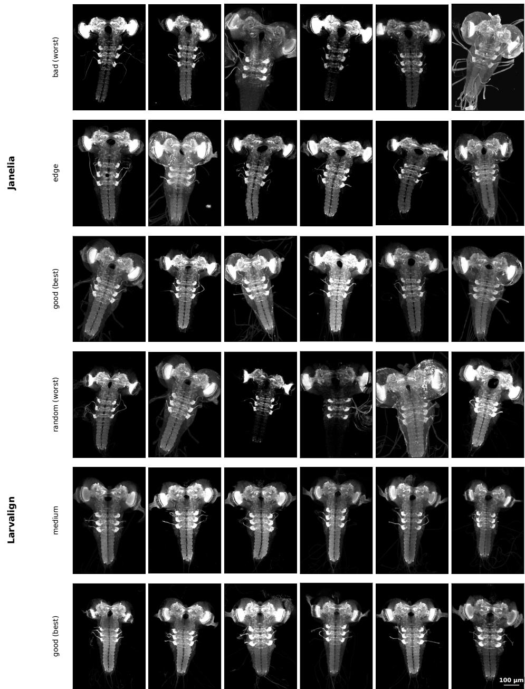  
Fig. 1 Example raw volumes from the Janelia and Larvalign datasets across image-quality strata. Each panel is a Z maximum-intensity projection, with rows for dataset and quality tier and columns for example specimens.

## 3 Methods

## 3.1 Preprocessing

All raw volumes passed through a single preprocessing pipeline, applied identically to the Janelia and Larvalign collections so that every downstream method operates on the same template pre-aligned, intensity-normalized volumes (Figure 3). Janelia volumes were stored as compressed Zeiss LSM stacks and Larvalign volumes as multi-page TIFFs. We transposed each volume to a canonical $( Z , Y , X )$ axis order with the sectioning axis as $Z .$ Each volume was then intensity-normalized by clipping to the 0.01 and 99.9 percentiles of its foreground voxels and rescaling to [0, 1] in single precision. Restricting the percentiles to foreground voxels prevents the large background region from dominating the statistics, and the clipping suppresses saturated outliers while preserving intra-brain contrast. The normalized volume was registered to the shared template with an afine transform, using SimpleITK’s multi-resolution mutual-information framework, following Mattes et al. (2001, 2003); Lowekamp et al. (2013). We used a Mattes mutualinformation metric with 50 histogram bins and 0.2% seeded random voxel sampling, geometric initialization of the transform, and regular-step gradient-descent optimization over a four-level image pyramid. This afine stage removed coarse diferences in pose, scale and orientation so that all methods began from a common baseline, and the identity comparator as naive baseline measures how much alignment this step alone achieves. Finally, each aligned volume was resampled onto a fixed reference grid by cubic B-spline interpolation, preserving the template’s physical extent and clipping any interpolation overshoot back to [0, 1]. We generated three target grids that span a geometric progression in in-plane resolution while keeping the anisotropic sectioning axis fixed at $Z ~ = ~ 6 4 , ~ ( Z , Y , X ) ~ \in \quad$ {(64, 256, 128), (64, 512, 256), (64, 768, 512)}. The highest-resolution grid (64, 768, 512) is the featured scale used in the main results, with the two coarser grids supporting the resolution-scale ablation of Section 4.6. Figure 3(b) shows a representative volume after this afine pre-alignment. Further examples spanning the acquisition-quality tiers of the Larvalign test set are shown in Figure 6, and the corresponding raw volumes of both datasets in Figure 1.

## 3.2 3D Image Registration

Let $\Omega \subset \mathbb { R } ^ { 3 }$ denote the image domain, i.e. the spatial extent of the volume grid. Registration always acts on a pair of volumes. Throughout this paper the fixed image $I _ { f }$ is the shared reference template of Section 2.2. It is the same volume for every case and defines the anatomical space into which all brains are mapped. The moving image $I _ { m }$ is a newly acquired brain volume that has to be brought into that space. A registration method estimates a spatial transformation $\phi$ that relates positions in the fixed image to positions in the moving image, and applying it to $I _ { m }$ produces the moved image $I _ { m } \circ \phi$ , which is the new acquisition resampled onto the template grid. Registration quality is then judged by how closely the moved image agrees with the fixed template.

Classical deformable image registration is formulated as the search for a spatial transformation $\phi : \Omega \to \Omega$ that maximizes a similarity measure $\boldsymbol { S } ( I _ { f } , I _ { m } \circ \phi )$ between a fixed image $I _ { f }$ and a moving image $I _ { m }$ warped by $\phi ,$ subject to a smoothness prior $\mathcal { R } ( \phi )$ . The transformation is typically composed of a linear pre-alignment (e.g., afine) followed by a non-linear component, parameterized either as a free-form B-spline deformation, introduced by Rueckert et al. (1999), or as a velocity field whose flow defines a difeomorphism, as in Balakrishnan et al. (2018). Two families of methods dominate the practical landscape and are used as baselines throughout this paper: Classical registration methods optimize each image pair independently, whereas deep-learning-based methods learn the registration during training and apply it directly to new cases at inference.

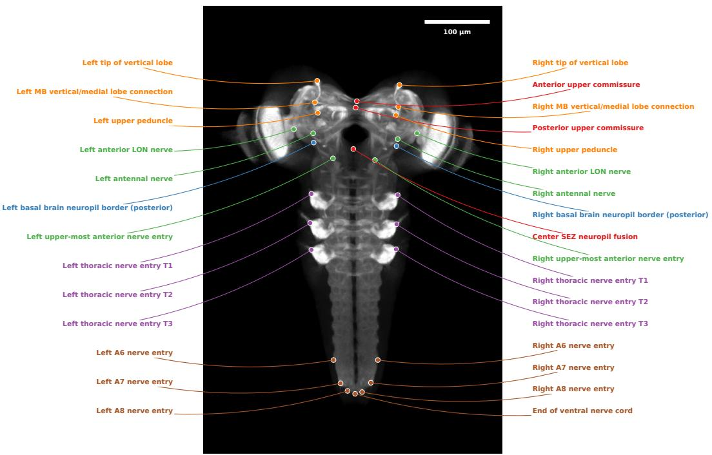

Fig. 2 The anatomical landmarks on the Larvalign template. Maximum-intensity projection with each landmark drawn as a labeled filled marker and colored by anatomical region. Landmarks are annotated only on the fixed template and are not available for a newly acquired volume.  
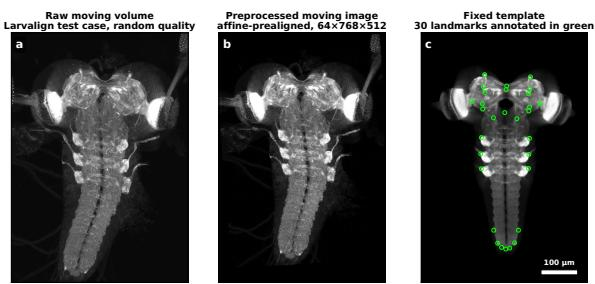  
Fig. 3 Preprocessing pipeline and reference template. Maximum-intensity Z projections. (a) A raw Larvalign acquisition at native resolution. (b) The same volume after afine pre-alignment and resampling onto the fixed 64×768×512 grid, which is the input the model consumes. (c) The atlas template with the L = 30 landmarks overlaid.

## 3.3 Classical Registration Methods

Classical methods optimize the transformation ϕ separately for each moving–fixed pair, with no information shared across cases. We compare against eleven such baselines, all evaluated on the same preprocessed, template pre-aligned volumes and scored under the same metrics as the learned model. The identity comparator applies no deformation beyond the preprocessing afine and serves as a reference floor that shows how much of the alignment is already achieved before any method is run. As linear baselines we use rigid and afine registration from the SimpleITK toolkit of Lowekamp et al. (2013), each driven by a Mattes mutual-information metric, following Mattes et al. (2003), optimized by regular-step gradient descent over a four-level image pyramid. The same two transform models are also run through elastix, following Klein et al. (2010), which brings its own default metric parameterization and a stochastic optimizer, so each linear transform model is represented by two independent implementations rather than by a single toolkit. The deformable baselines are built around the free-form B-spline deformation of Rueckert et al. (1999), in which a lattice of control points parameterizes a smooth displacement field. We evaluate a bare SimpleITK B-spline, an elastix B-spline that adds an explicit bending-energy penalty for a smoother field, a two-stage elastix pipeline that runs an afine map followed by a B-spline, and the NiftyReg reg f3d free-form deformation of Modat et al. (2010) as a third independent B-spline baseline. These four share one transform model but difer in how they constrain it. The SimpleITK variant is driven by a quasi-Newton optimizer and is regularized only through the coarseness of its control-point lattice, the elastix variants add a bending-energy penalty under a stochastic optimizer, and NiftyReg carries an explicit bending-energy weight. The free-form deformation is therefore not judged through a single implementation of it. Two difeomorphic baselines enforce invertibility by construction: SimpleITK difeomorphic Demons of Vercauteren et al. (2009), which Gaussian-smooths the deformation at every iteration, and ANTs symmetric normalization $( \mathrm { S y N } )$ of Avants et al. (2008), the de facto gold-standard classical deformable method, run in its deformable-only mode because the data are already afine-aligned. Every method is otherwise run under the defaults of its own toolkit, including its similarity metric, its multi-resolution scheme and its convergence criteria.

## 3.4 Deep Learning based Registration with DLBR

DLBR is the registration pipeline we propose. It couples the preprocessing of Section 3.1 to a learned registration model, and that model follows the VoxelMorph approach of Balakrishnan et al. (2018), which replaces the per-sample optimization of the classical methods with a single convolutional network gθ that learns to register any moving volume $I _ { m }$ to the shared template $I _ { f } .$ The network is trained once over the Janelia collection and, at test time, predicts a dense deformation $\phi$ for an unseen volume in a single forward pass, so the cost of optimization is paid during training rather than separately for every new brain. The remainder of this section describes the network, its training and the evaluation protocol in turn, and Figure 4 gives an overview of the full pipeline from a raw acquisition to an aligned volume.

## 3.4.1 Network architecture

The moving and fixed volumes are stacked into a two-channel input $[ I _ { m } , I _ { f } ] \in \mathbb { R } ^ { 2 \times D \times H \times W }$ and passed through the 3D U-Net of Ronneberger et al. (2015). Both volumes enter the network, because a displacement can only be predicted from the diference between where anatomy currently sits in the moving volume and where the template expects it. The fixed template is used a second time at training time, where it forms one side of the similarity term. The encoder has four levels. Each level applies two consecutive $3 \times 3 \times 3$ convolutions, each followed by a LeakyReLU activation with negative slope 0.2, and the three transitions between levels halve the spatial resolution through $3 \times 3 \times 3$ convolutions of stride two. Encoder feature widths are 16, 32, 32 and 32 channels, so the bottleneck sits at one eighth of the input resolution along every axis, which is a grid of $8 \times 9 6 \times 6 4$ voxels at the featured scale.

The decoder mirrors this contracting path in two phases. Three upsampling stages restore resolution by trilinear interpolation to the size of the matching encoder level, concatenate that level through a skip connection and apply a further pair of convolutions, with widths 32, 32 and 32. Four refinement blocks then operate at full resolution with widths 32, 32, 16 and 16, again as convolution pairs. The skip connections let the coarse pose of the brain and the fine detail around individual structures be recovered together. A final $3 \times 3 \times 3$ convolution maps the 16 decoder features to a three-component field $u : \Omega \to \mathbb { R } ^ { 3 }$ over the image grid. Table 2 summarizes the resolution and width at every stage. The complete network holds 604,195 trainable parameters. The network is therefore small, but a single full-resolution feature map at the featured grid already holds more than 400 million values, so the memory needed to train it is set by the activations rather than by the weights.

## 3.4.2 Deformation model and spatial transformer

The predicted field is a dense displacement in voxel units, ordered $\boldsymbol { u } = ( u _ { z } , u _ { y } , u _ { x } )$ to match the canonical $( Z , Y , X )$ axis order of the preprocessed volumes. It defines the deformation

$$
\phi ( p ) \ : = \ : p + u ( p ) , \qquad p \in \Omega ,\tag{1}
$$

so that the moved volume is obtained by sampling the moving volume at the displaced positions,

$$
( I _ { m } \circ \phi ) ( p ) \ : = \ : I _ { m } \bigl ( p + u ( p ) \bigr ) .\tag{2}
$$

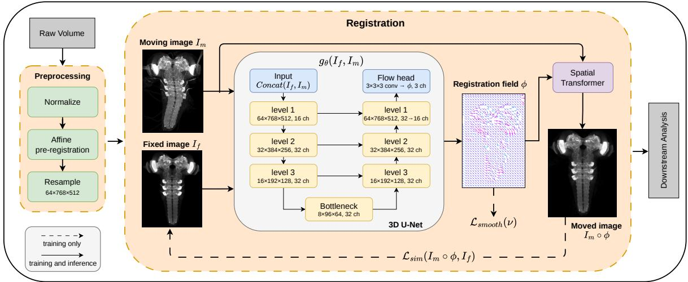  
Fig. 4 Overview of the DLBR registration workflow. Preprocessing normalizes a raw acquisition, pre-registers it afinely to the template and resamples it onto the fixed $6 4 \times 7 6 8 \times 5 1 2$ grid. The resulting moving volume $I _ { m }$ and the fixed template $I _ { f }$ are concatenated into a two-channel input and passed through the 3D U-Net ${ \mathit { g } } _ { \boldsymbol { \theta } } ,$ with the resolution and channel width of every encoder, bottleneck and decoder level annotated in the figure. A final $3 \times 3 \times 3$ convolution emits the three-channel registration field ϕ, and a spatial transformer warps $I _ { m }$ into the moved volume $I _ { m } \circ \phi ,$ , which is what downstream analysis consumes. The similarity loss between moved volume and template and the smoothness penalty on the predicted field are evaluated during training only, while every other stage runs at both training and inference time.

Table 2 DLBR 3D U-Net configuration. Every encoder and decoder block is a pair of $3 \times 3 \times \mathrm { ~ \dot { 3 } ~ }$ convolutions with LeakyReLU activations of negative slope 0.2. Downsampling uses strided convolutions, and each upsampling stage interpolates to the size of the matching encoder level and concatenates it through a skip connection.
<table><tr><td>Stage</td><td>Block</td><td>Resolution</td><td>Ch.</td></tr><tr><td>Input</td><td>concat  $[ I _ { m } , I _ { f } ]$ </td><td>64×768×512</td><td>2</td></tr><tr><td rowspan="4">Encoder</td><td>level 1</td><td>64×768×512</td><td>16</td></tr><tr><td>level 2</td><td>32×384×256</td><td>32</td></tr><tr><td>level 3</td><td>16×192×128</td><td>32</td></tr><tr><td>bottleneck</td><td>8×96×64</td><td>32</td></tr><tr><td rowspan="8">Decoder</td><td>upsample 1 + skip</td><td>16×192×128</td><td>32</td></tr><tr><td>upsample  $2 + { \mathrm { s k i p } }$ </td><td>32×384×256</td><td>32</td></tr><tr><td>upsample  $3 + { \mathrm { s k i p } }$ </td><td> $6 4 \times 7 6 8 \times 5 1 2$ </td><td>32</td></tr><tr><td>refine 1</td><td>64×768×512</td><td>32</td></tr><tr><td>refine 2</td><td>64×768×512</td><td>32</td></tr><tr><td>refine 3</td><td>64×768×512</td><td>16</td></tr><tr><td>refine 4</td><td>64×768×512</td><td>16</td></tr><tr><td>3×3×3 conv</td><td>64×768×512</td><td>3</td></tr></table>

Because $p + u ( p )$ is in general not a grid point, the right hand side is evaluated by trilinear interpolation over the eight neighboring voxels. This makes the warp diferentiable with respect to both the displacement and the intensities of $I _ { m }$ , so gradients propagate back to the network weights θ. We implement it as the diferentiable spatial transformer of Jaderberg et al. (2015). Sampling positions are expressed in normalized coordinates on [−1, 1] along each axis, so a displacement of one voxel along an axis of length n corresponds to a normalized step of $2 / ( n - 1 )$ , with the outermost voxel centers placed exactly at −1 and 1. Positions that fall outside the volume are resolved by clamping to the border rather than by zero padding, which prevents the warp from introducing spurious dark tissue where a brain extends beyond the field of view.

## 3.4.3 Training objective

Training is fully unsupervised and requires no landmarks or segmentations on the moving volumes. The total objective combines an imagesimilarity term on the moved-and-fixed pair with a smoothness penalty on the field predicted by the network,

$$
\begin{array} { l } { \displaystyle { \mathcal { L } } ( \theta ; I _ { m } , I _ { f } ) = { \mathcal { L } } _ { \mathrm { s i m } } ( I _ { m } \circ \phi , I _ { f } ) } \\ { \displaystyle ~ + ~ \lambda _ { \mathrm { s m o o t h } } { \mathcal { L } } _ { \mathrm { s m o o t h } } ( u ) . } \end{array}\tag{3}
$$

Algorithm 1 DLBR forward pass and training   
step   
Require: moving volume $I _ { m } ,$ template $I _ { f } ,$ net  
work $g _ { \boldsymbol { \theta } }$ , smoothness weight λsmooth   
Ensure: moved volume $I _ { m } \circ \phi ,$ deformation $\phi ,$   
loss $\mathcal { L }$   
1: x ← concat $( I _ { m } , I _ { f } )$   
2: $f \gets \mathrm { U N e t } _ { \theta } ( x )$   
3: $u \gets \mathrm { C o n v } _ { 3 \times 3 \times 3 } ( f )$   
4: $\phi  \operatorname { I d } + u$   
5: $I _ { m } \circ \phi \gets \mathsf { S }$ patialTransformer $( I _ { m } , \phi )$   
6: $\mathcal { L } \gets \mathcal { L } _ { \mathrm { s i m } } ( I _ { m } \circ \phi , I _ { f } ) + \lambda _ { \mathrm { s m o o t h } } \mathcal { L } _ { \mathrm { s m o o t h } } ( u )$   
7: update θ with Adam on $\nabla _ { \boldsymbol { \theta } } \mathcal { L }$

For the similarity term we use normalized crosscorrelation (NCC), computed over the whole volume,

$$
{ \mathcal { L } } _ { \mathrm { N C C } } ( I , J ) = 1 - { \frac { \sum _ { p } { \tilde { I } } ( p ) { \tilde { J } } ( p ) } { { \sqrt { \sum _ { p } { \tilde { I } } ( p ) ^ { 2 } } } { \sqrt { \sum _ { p } { \tilde { J } } ( p ) ^ { 2 } } } + \varepsilon } } ,\tag{4}
$$

where $\tilde { I } \ = \ I - \ \mu _ { I }$ and $\tilde { \cal J } ~ = ~ { \cal J } - \mu _ { \cal J }$ are the mean-centered volumes, $\mu _ { I }$ and $\mu _ { J }$ are their mean intensities, $\varepsilon = 1 0 ^ { - 5 }$ guards against division by zero and every sum runs over all voxels $p \in \Omega$

The smoothness penalty is the squared- $L _ { 2 }$ first-order gradient of the predicted field, averaged over the three spatial axes, the three field components and all voxels,

$$
\mathcal { L } _ { \mathrm { s m o o t h } } ( u ) = \frac { 1 } { 9 | \Omega | } \sum _ { p \in \Omega } \sum _ { d } \sum _ { c } \bigl ( \partial _ { d } u _ { c } ( p ) \bigr ) ^ { 2 } ,\tag{5}
$$

discretized with first-order forward diferences. Here |Ω| is the number of voxels in the image domain, $u _ { c }$ is the component of the field along axis c and $\partial _ { d }$ is the partial derivative along axis $d ,$ with both c and d running over the three spatial axes z, y and x. The penalty is therefore the squared first derivative averaged over every axis, every field component and every voxel. It always acts on the raw field u emitted by the network. Algorithm 1 summarizes the complete forward pass and training step.

## 3.4.4 Comparable Deep Learning Methods

We compare DLBR against seven further learned registration networks that span the dominant architectural families in the recent literature. Each one follows its reference implementation, adapted to our framework so that every method shares the same training and evaluation setup and differs only in the network $g _ { \theta }$ that maps the stacked moving-and-fixed pair to a deformation field. TransMorph from Chen et al. (2022) replaces the U-Net encoder with a Swin Transformer whose shifted-window self-attention captures long-range dependencies, while ViT-V-Net from Chen et al. (2021) tokenizes the deepest features of a convolutional stem and reasons over them with a Vision Transformer encoder. LH-Morph from Sadegheih et al. (2025) uses the light hybrid LHU-Net backbone, a convolutional encoder-decoder in which the type of attention block is selected according to the depth level of the network, and MambaMorph from Guo et al. (2024) instead inserts selective state-space (Mamba) blocks for global context with linear memory cost. LapIRN from Mok and Chung (2020) and RDP from Wang et al. (2024) both adopt a coarse-to-fine pyramid that accumulates residual displacements across levels with a weight-shared network, capturing large shifts and fine deformation together. Fourier-Net from Jia et al. (2023) predicts the deformation in the frequency domain by retaining only learnable low-frequency modes, so band-limiting acts as an intrinsic smoothness prior.

## 3.4.5 Implementation Details

Each step pairs one Janelia volume with the shared template at a batch size of one. The network is implemented in PyTorch and optimized with the Adam optimizer of Kingma and Ba (2015) at a learning rate of $3 \times 1 0 ^ { - 4 }$ under bf16 mixed precision on a single NVIDIA H100 GPU. We hold out a fixed, quality-stratified 10% of the Janelia volumes as a validation set, train for up to 500 epochs, and stop early once the validation loss has not improved for 20 epochs, retaining the checkpoint with the lowest validation loss. The Janelia train and validation partition is held fixed across all runs so that every model is exposed to the same split. The similarity loss term is the normalized cross-correlation of Eq. 4 and the smoothness weight is $\lambda _ { \mathrm { s m o o t h } } ~ = ~ 0 . 0 1$ . The field predicted by the network is used directly as the displacement of Eq. 1. These settings were fixed on the Janelia validation split and applied unchanged to the held-out Larvalign test set.

Algorithm 2 DLBR registration of a new acqui  
sition   
Require: raw acquisition, template $I _ { f }$ , reference   
grid, trained network gθ   
Ensure: moved volume $I _ { m } \circ \phi ,$ deformation $\phi$   
1: select the anatomical signal channel and trans  
pose to $( Z , Y , X )$   
2: attach the physical voxel spacing of the acqui  
sition   
3: clip to the 0.01 and 99.9 foreground per  
centiles, rescale to [0, 1]   
4: $A  \mathrm { A }$ fineRegister(volume, $I _ { f } )$   
5: $I _ { m } \gets \mathrm { R }$ esample(volume, A, reference grid)   
6: $u \gets \mathrm { C o n v } _ { 3 \times 3 \times 3 } \big ( \mathrm { U N e t } _ { \theta } ( \mathrm { c o n c a t } ( I _ { m } , I _ { f } ) ) \big )$   
7: $\phi  \operatorname { I d } + u$   
8: $I _ { m } \circ \phi \gets \mathrm { S p a t i a l T r a n s f o r m e r } ( I _ { m } , \phi )$   
9: return $I _ { m } \circ \phi , \phi$

Algorithm 2 states what registering one new acquisition involves once the network is trained. It covers the whole path from the raw microscope stack to the moved volume, so the preprocessing of Section 3.1 and the network forward pass appear as the single procedure a user actually runs. No optimization happens anywhere in it beyond the fast coarse afine pre-alignment.

## 3.5 Evaluation Metrics

The learned models and the classical baselines are scored under one identical metric protocol, which we discuss in the following. All scores compare the moved volume $I _ { m } \circ \phi$ against the fixed template $I _ { f }$ . Two global scores measure intensity agreement over the whole volume. The first is a normalized mutual information (NMI), taken in the overlapinvariant sense introduced by Studholme et al. (1999) and used here in the symmetric form bounded in [0, 1],

$$
\mathrm { N M I } \big ( I _ { m } \circ \phi , I _ { f } \big ) \ : = \ : \frac { 2 \sum _ { a , b } p ( a , b ) \log \frac { p ( a , b ) } { p _ { X } ( a ) p _ { Y } ( b ) } } { H ( I _ { m } \circ \phi ) + H ( I _ { f } ) } ,\tag{6}
$$

where $\textstyle p ( a , b )$ is the joint intensity histogram, $p _ { X }$ and $p _ { Y }$ are its marginals and $H ( \cdot )$ are the marginal entropies. We use normalization so that identical volumes score 1.

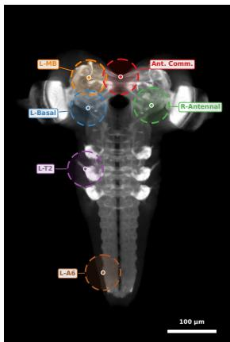  
Fig. 5 Landmark-local measurement regions on the template. The landmark-local metrics are evaluated inside the ellipsoidal neighborhoods E of Eq. 8. Six of the $L = 3 0$ regions are drawn as examples.

The second global score is the global Pearson cross-correlation in [−1, 1],

$$
\mathrm { N C C } \left( I _ { m } \circ \phi , I _ { f } \right) = \frac { \sum _ { p } \tilde { I } _ { m } ( p ) \tilde { I } _ { f } ( p ) } { \sqrt { \sum _ { p } \tilde { I } _ { m } ( p ) ^ { 2 } } \sqrt { \sum _ { p } \tilde { I } _ { f } ( p ) ^ { 2 } } } ,\tag{7}
$$

where $\tilde { I } _ { m } = ( I _ { m } \circ \phi ) - \mu _ { m }$ and $\tilde { I } _ { f } = I _ { f } - \mu _ { f }$ are the mean-centered volumes, $\mu _ { m }$ and $\mu _ { f }$ are their mean intensities and every sum runs over all voxels $p \in \Omega$ . For both global scores, higher is better.

To anchor accuracy to anatomy we use the $L =$ 30 landmarks of the reference template. Around each landmark $c _ { \ell } ~ = ~ ( c _ { \ell , z } , c _ { \ell , y } , c _ { \ell , x } )$ we take an anisotropic ellipsoidal neighborhood

$$
\begin{array} { r l r } & { } & { E _ { \ell } = \Big \{ p \in \Omega : \Big ( \frac { p _ { z } - c _ { \ell , z } } { r _ { z } } \Big ) ^ { 2 } + \Big ( \frac { p _ { y } - c _ { \ell , y } } { r _ { y } } \Big ) ^ { 2 } } \\ & { } & { \qquad + \Big ( \frac { p _ { x } - c _ { \ell , x } } { r _ { x } } \Big ) ^ { 2 } \leq 1 \Big \} , } \end{array}\tag{8}
$$

with radii $( r _ { x } , r _ { y } , r _ { z } ) ~ = ~ ( 4 0 , 4 0 , 2 0 )$ voxels held fixed across methods. Figure 5 illustrates these measurement regions on the template, with one representative ellipsoid drawn per anatomical group. Inside $E _ { \ell }$ we evaluate two complementary errors.

The first is the local NMI of Eq. 6 restricted to $E _ { \ell } .$ denoted $\mathrm { N M I } _ { \mathrm { l o c } } ^ { ( \ell ) }$

The second is the local intensity mean squared error (MSE)

$$
\mathrm { M S E } _ { \mathrm { l o c } } ^ { ( \ell ) } = \frac { 1 } { | E _ { \ell } | } \sum _ { p \in E _ { \ell } } \big ( I _ { f } ( p ) - ( I _ { m } \circ \phi ) ( p ) \big ) ^ { 2 } .\tag{9}
$$

Each is summarized per case as an arithmetic mean and a voxel-count-weighted mean over the valid landmarks, for example

$$
\overline { { \mathrm { N M I } } } _ { \mathrm { l o c } } = \frac { 1 } { L } \sum _ { \ell = 1 } ^ { L } \mathrm { N M I } _ { \mathrm { l o c } } ^ { ( \ell ) } ,\tag{10}
$$

and is also retained for every individual landmark.

The mean local NMI is the primary accuracy axis in the results. Larval brain volumes are dominated by dark background, so a whole-volume score is driven largely by voxels that carry no anatomy at all. Restricting the comparison to the expert-annotated landmark neighborhoods measures agreement exactly where the anatomy is, and mutual information tolerates the stainingintensity diferences between specimens that a direct intensity diference would penalize.

## 3.6 Statistical Analysis

All statistics are computed over per-case results, where one case is one test volume scored under the protocol of Section 3.5. Aggregates are formed per method, per resolution scale and per acquisitionquality stratum, as well as over the complete test set. Each aggregate is the mean over its cases together with the standard deviation across them, so the reported spread describes how much a metric varies from one specimen to the next. Confidence intervals come from a non-parametric bootstrap over the per-case results, drawing 2000 resamples with replacement and taking the 95% percentile interval between the 2.5 and 97.5 points.

Significance is assessed at $\begin{array} { l l l } { \alpha } & { = } & { 0 . 0 5 } \end{array}$ with two-sided paired Wilcoxon signed-rank tests on the per-case mean local NMI. Cases are matched by index, so every comparison is paired on the same volumes, and the tests are run within each acquisition-quality stratum as well as on the complete test set. Two comparisons are drawn per stratum. The first places DLBR against the runner-up learned method in that stratum, and the second places the weakest learned method against the strongest classical method in that stratum, so the two tests together cover the margin at the top of the ranking and the margin at the boundary between the learned and the classical family. Bonferroni correction is applied over the full set of comparisons drawn.

The same bootstrap supports two further analyses. The fraction of accuracy a method loses as acquisition quality degrades is given a confidence interval by resampling each quality stratum independently. The configuration ablation varies one training setting at a time and quantifies each setting by the change in mean local NMI relative to the featured configuration, with a bootstrap interval on that change, so the magnitude of an efect is visible alongside its uncertainty.

## 4 Results

We evaluate every method under the single shared protocol of Section 3.5. All methods register the same preprocessed and template pre-aligned volumes at the highest preprocessing resolution and are scored on the same held-out Larvalign test set. Because DLBR is trained only on Janelia volumes and tested only on the Larvalign collection, every accuracy number reported below is an outof-distribution result. The section is organized as follows. Section 4.1 measures overall registration accuracy across all methods. Section 4.2 asks how much of that accuracy survives when the acquisition quality degrades. Section 4.3 resolves the result into the individual anatomical structures, and Section 4.4 turns from accuracy to the cost of registering one volume. Section 4.5 inspects the alignments themselves and provides qualitative results. Section 4.6 reports two ablations, one over the DLBR training configuration and one over the preprocessing resolution at which the main results are reported. Section 4.7 closes with the memory bound that sets the highest resolution at which the model can be trained.

## 4.1 Registration accuracy across methods

Table 3 and Table 4 report the global (cf. Eq. 6) and landmark-local (cf. Eq. 10) normalized mutual information, Table 5 the landmark-local intensity mean squared error (cf. Eq. 9), and Table 6 the global normalized cross-correlation (cf. Eq. 7).

Qualitative Assessment of Registration across Specimen-Quality Levels  
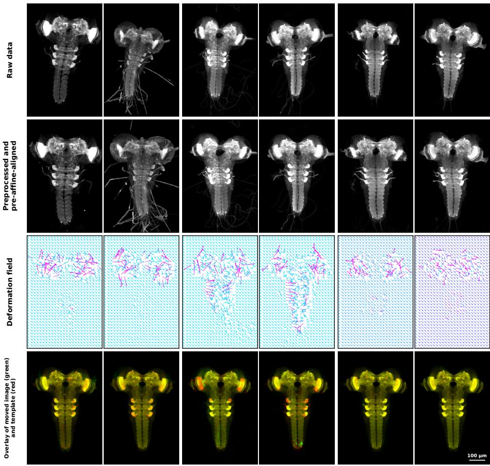  
Fig. 6 Qualitative DLBR registration on six representative test cases. Maximum-resolution results, columns ordered from random to good quality. Rows show the raw resampled input, the preprocessed and afine pre-aligned input, the predicted deformation field, and the overlay of the moved volume in green on the template in red, where yellow marks agreement. All panels are Z maximum-intensity projections.

The two landmark-local metrics are both evaluated inside the neighborhoods of Eq. 8. Three findings hold across all four metrics.

First, DLBR provides the most accurate alignment (i.e. the highest landmark-local NMI) among the evaluated methods. It attains a complete-set landmark-local NMI of 0.508, a global NMI of 0.585 and a global NCC of 0.958, the best value in each case. Its margin over the strongest classical method is 0.230 of local NMI, a gain of roughly 23 percentage points over the 0.278 reached by difeomorphic Demons.

Second, the gain is one of learned over classical registration rather than of one particular network. On the complete test set every learned network exceeds the strongest classical baseline on both the global and the landmark-local intensity agreement. Among the classical methods the deformable ones lead, with difeomorphic Demons reaching a local NMI of 0.278 and NiftyReg F3D and ANTs SyN tied behind it at 0.245, while the afine and rigid baselines stay close to the no-registration identity floor of 0.144. All learned networks except the two pyramidal ones clear the best classical value by a wide margin, so the separation between the two families is far larger than the spread within the learned family.

Third, the learned methods show generally higher performance, with DLBR and MambaMorph forming the top two methods. MambaMorph is the closest competitor throughout, trailing DLBR by 0.036 in complete-set landmarklocal NMI and by 0.028 in global NMI, and it takes the second position in almost every comparison. The remaining transformer and hybrid networks, namely ViT-V-Net, LH-Morph, TransMorph and Fourier-Net, form a consistent second tier, and the pyramidal LapIRN and RDP trail the other learned methods on intensity agreement while still improving on every classical baseline. The closest the field comes to DLBR is the global NCC within the medium-quality stratum, where DLBR and ViT-V-Net are on par at 0.942 against 0.943.

## 4.2 Statistical significance and robustness to image quality

Figure 7 resolves the accuracy comparison within each acquisition-quality tier and attaches the significance tests defined in Section 3.6. Within every tier we run paired Wilcoxon signed-rank tests with Bonferroni correction across the family of comparisons. DLBR substantically outperforms the strongest classical baseline in the good, medium and random strata alike, and the same holds for the learned methods as a group, so the gain over classical registration is not confined to the easiest acquisitions. The per-case boxes also show that the learned methods carry a much tighter case-to-case spread than the classical deformable methods, so the advantage is not driven by a small number of easy cases.

Figure 8 makes the robustness to input quality explicit. Each bar is the fraction of landmarklocal NMI a method loses when the input degrades from good to random quality. DLBR is the most robust method on this axis, losing 10.9 percent. The five learned methods behind it lose between 12 and 16 percent and the two pyramidal networks between 25 and 27 percent, whereas the classical deformable methods lose between 30 and 42 percent. Since the entire Larvalign collection is external to the training distribution, this smaller degradation suggests that a network trained on one laboratory’s data can transfer to volumes acquired under diferent imaging conditions and retain its performance as acquisition quality varies.

## 4.3 Per-landmark anatomical analysis

Figure 9 breaks the landmark-local NMI of the best DLBR model into its 30 individual landmarks across all test cases. The model aligns the head structures most accurately, with the commissures, the mushroom-body lobes and the peduncles at the top of the ranking. The ventral nerve cord and the paired thoracic and abdominal nerve entries are more challenging, which is expected because these posterior structures show the largest pose and shape variation across specimens and sit where the field of view and staining are least consistent. The per-case points confirm the quality trend of Section 4.2, with good-quality cases concentrated toward higher local NMI at almost every landmark.

## 4.4 Inference speed

Registration accuracy is only useful in practice if it comes at an acceptable cost per volume. The learned model registers one volume in a single forward pass of $g _ { \boldsymbol { \theta } } .$ , so the optimization cost is paid once during training rather than separately for every new brain. Classical methods ofer no such amortization, because every new volume restarts the full iterative optimization from scratch. At the highest resolution the most accurate classical baseline, difeomorphic Demons, needs a median of 61.5 s per volume, and the elastix afine to B-spline cascade on which the Larvalign pipeline of Muenzing et al. (2017) is built needs 13.2 s. We measured that inference time by re-running the cascade with a current elastix release on current hardware, so that the almost ten years of processor and software progress since the original publication count in favor of the baseline rather than inflating our speedup. That publication reported several minutes per stack for its full pipeline, so we compare against the faster modern re-run rather than against the published number. DLBR registers the same volume in 0.43 s on a GPU, a 144-fold speedup over Demons and a 31-fold speedup over the elastix cascade. The speedup is not traded against quality, since DLBR is at the same time the most accurate method in Section 4.1. Sub-second inference is a property of the learned family as a whole rather than of DLBR alone, so the runtime diferences among the

Table 3 Whole-volume mutual information on the external Larvalign test set. Per-case whole-volume NMI (cf. Eq. 6), stratified by image quality and over the complete set. Cells report mean ± standard deviation over test cases, higher is better. Best value per column in bold, second best underlined.
<table><tr><td rowspan="2">Method</td><td rowspan="2"></td><td colspan="4">Global NMI ↑</td></tr><tr><td>Random</td><td>Medium</td><td>Good</td><td>All</td></tr><tr><td rowspan="13">CI1ascal Mettods De-ng</td><td></td><td> $0 . 2 2 6 \pm 0 . 0 6 9$ </td><td> $0 . 2 2 1 \pm 0 . 0 8 4$ </td><td> $0 . 3 1 1 \pm 0 . 0 9 0$ </td><td></td><td> $0 . 2 5 0 \pm 0 . 0 9 0$ </td></tr><tr><td>Identity Rigid (SimpleITK) (2013)</td><td> $0 . 2 3 3 \pm 0 . 0 6 7$ </td><td> $0 . 2 2 6 \pm 0 . 0 8 3$ </td><td> $0 . 3 1 4 \pm 0 . 0 9 1$ </td><td></td><td> $0 . 2 5 6 \pm 0 . 0 8 9$ </td></tr><tr><td>Affine (SimpleITK) (2013)</td><td> $0 . 2 2 8 \pm 0 . 0 6 4$ </td><td> $0 . 2 2 2 \pm 0 . 0 7 4$ </td><td></td><td> $0 . 3 2 4 \pm 0 . 0 9 9$ </td><td> $0 . 2 5 5 \pm 0 . 0 9 1$ </td></tr><tr><td>B-spline (SimpleITK) (1999)</td><td> $0 . 3 0 9 \pm 0 . 0 7 1$ </td><td> $0 . 3 3 7 \pm 0 . 0 3 9$ </td><td></td><td> $0 . 3 8 8 \pm 0 . 0 6 2$ </td><td>0.342 ± 0.068</td></tr><tr><td>Demons (SimpleITK)(2009)</td><td> $0 . 3 4 6 \pm 0 . 0 8 3$ </td><td> $0 . 3 3 5 \pm 0 . 1 0 3$ </td><td></td><td> $0 . 4 4 7 \pm 0 . 1 0 3$ </td><td>0.373 ± 0.108</td></tr><tr><td>Elastix rigid (2010)</td><td> $0 . 2 3 6 \pm 0 . 0 6 7$ </td><td> $0 . 2 4 0 \pm 0 . 0 7 4$ </td><td></td><td> $0 . 3 1 6 \pm 0 . 0 8 9$ </td><td>0.261 ± 0.085</td></tr><tr><td>Elastix affine (2010)</td><td> $0 . 2 3 4 \pm 0 . 0 6 4$ </td><td> $0 . 2 3 2 \pm 0 . 0 7 8$ </td><td></td><td> $0 . 3 2 4 \pm 0 . 0 9 3$ </td><td>0.261 ± 0.089</td></tr><tr><td>Elastix B-spline (2010)</td><td> $0 . 2 5 7 \pm 0 . 0 7 3$ </td><td> $0 . 2 8 5 \pm 0 . 0 5 1$ </td><td></td><td> $0 . 3 5 3 \pm 0 . 0 8 4$ </td><td>0.295 ± 0.081</td></tr><tr><td>Elastix affine+B-spline (2010)</td><td> $0 . 2 5 6 \pm 0 . 0 7 1$ </td><td> $0 . 2 7 8 \pm 0 . 0 5 6$ </td><td></td><td> $0 . 3 5 4 \pm 0 . 0 8 3$ </td><td> $0 . 2 9 3 \pm 0 . 0 8 2$ </td></tr><tr><td>ANTs SyN (2008)</td><td> $0 . 2 9 8 \pm 0 . 0 8 7$ </td><td> $0 . 2 8 7 \pm 0 . 1 1 6$ </td><td></td><td> $0 . 3 9 8 \pm 0 . 1 1 5$ </td><td> $0 . 3 2 5 \pm 0 . 1 1 6$ </td></tr><tr><td>NiftyReg F3D (2010)</td><td> $0 . 3 5 0 \pm 0 . 0 7 7$ </td><td> $0 . 3 5 9 \pm 0 . 0 6 0$ </td><td></td><td> $0 . 4 2 3 \pm 0 . 0 8 9$ </td><td> $0 . 3 7 5 \pm 0 . 0 8 2$ </td></tr><tr><td>TransMorph (2022)</td><td> $0 . 4 8 8 \pm 0 . 0 7 8$ </td><td> $0 . 4 7 6 \pm 0 . 0 5 9$ </td><td></td><td> $0 . 5 4 0 \pm 0 . 0 7 5$ </td><td> $0 . 5 0 0 \pm 0 . 0 7 6$ </td></tr><tr><td>LapIRN (2020) Mettods</td><td> $0 . 3 7 1 \pm 0 . 0 8 2$ </td><td> $0 . 3 4 0 \pm 0 . 1 2 3$ </td><td></td><td> $0 . 4 6 0 \pm 0 . 1 1 6$ </td><td> $0 . 3 8 8 \pm 0 . 1 1 7$ </td></tr><tr><td>RDP (2024)</td><td> $0 . 3 5 8 \pm 0 . 0 8 1$ </td><td> $0 . 3 3 1 \pm 0 . 1 1 8$ </td><td></td><td> $0 . 4 4 9 \pm 0 . 1 1 4$ </td><td> $0 . 3 7 7 \pm 0 . 1 1 5$ </td></tr><tr><td>Fourier-Net (2023)</td><td> $0 . 4 8 5 \pm 0 . 0 9 9$ </td><td> $0 . 4 5 2 \pm 0 . 1 0 1$ </td><td></td><td> $0 . 5 4 6 \pm 0 . 1 0 8$ </td><td> $0 . 4 9 3 \pm 0 . 1 0 9$ </td></tr><tr><td>ViT-V-Net (2021)</td><td> $0 . 5 3 4 \pm 0 . 0 7 6$ </td><td> $0 . 5 2 9 \pm 0 . 0 4 6$ </td><td></td><td> $0 . 5 8 0 \pm 0 . 0 6 8$ </td><td> $0 . 5 4 6 \pm 0 . 0 6 9$ </td></tr><tr><td>MambaMorph (2024)</td><td> $\underline { { 0 . 5 4 9 } } \pm 0 . 0 8 2$ </td><td> $\underline { { 0 . 5 2 9 } } \pm 0 . 0 7 1$ </td><td></td><td> $\underline { { 0 . 5 9 5 } } \pm 0 . 0 8 2$ </td><td> $\underline { { 0 . 5 5 7 } } \pm 0 . 0 8 3$ </td></tr><tr><td>LH-Morph (2025)</td><td> $0 . 4 9 8 \pm 0 . 0 9 0$ </td><td> $0 . 4 8 8 \pm 0 . 0 6 3$ </td><td></td><td> $0 . 5 5 2 \pm 0 . 0 8 6$ </td><td> $0 . 5 1 1 \pm 0 . 0 8 6$ </td></tr><tr><td>DLBR</td><td> $\mathbf { 0 . 5 7 9 } \pm 0 . 0 8 1$ </td><td> $\mathbf { 0 . 5 5 4 \ : \pm { \ : 0 . 0 7 9 } }$ </td><td></td><td> ${ \bf 0 . 6 2 6 \pm 0 . 0 8 5 }$ </td><td> $\mathbf { 0 . 5 8 5 \ : \pm { \ : 0 . 0 8 6 } }$ </td></tr></table>

Table 4 Landmark-local mutual information on the external Larvalign test set. Per-case mean landmark-local NMI (cf. Eq. 10) across the small local neighborhoods of the 30 anatomical landmarks (cf. Eq. 8), stratified by image quality and over the complete set. Cells report mean ± standard deviation over test cases, higher is better. Best value per column in bold, second best underlined
<table><tr><td rowspan="2">Method</td><td rowspan="2"></td><td colspan="4">Local NMI ↑</td></tr><tr><td>Random</td><td>Medium</td><td>Good</td><td>All</td></tr><tr><td rowspan="10">CIasscal Mettods</td><td>Identity</td><td> $0 . 1 2 2 \pm 0 . 0 5 6$ </td><td> $0 . 1 2 7 \pm 0 . 0 4 9$ </td><td> $0 . 1 9 1 \pm 0 . 0 6 3$ </td><td> $0 . 1 4 4 \pm 0 . 0 6 4$ </td></tr><tr><td>Rigid (SimpleITK) (2013)</td><td> $0 . 1 2 8 \pm 0 . 0 5 3$ </td><td> $0 . 1 3 2 \pm 0 . 0 4 7$ </td><td> $0 . 1 9 3 \pm 0 . 0 6 3$ </td><td>0.149 ± 0.062</td></tr><tr><td>Affine (SimpleITK) (2013)</td><td> $0 . 1 2 0 \pm 0 . 0 5 3$ </td><td> $0 . 1 2 8 \pm 0 . 0 4 2$ </td><td> $0 . 2 0 1 \pm 0 . 0 7 2$ </td><td> $0 . 1 4 7 \pm 0 . 0 6 7$ </td></tr><tr><td>B-spline (SimpleITK) (1999)</td><td> $0 . 1 7 0 \pm 0 . 0 8 1$ </td><td> $0 . 2 0 4 \pm 0 . 0 3 4$ </td><td>0.262 ± 0.072</td><td>0.209 ± 0.077</td></tr><tr><td>Demons (SimpleITK) (2009)</td><td> $0 . 2 4 7 \pm 0 . 0 9 1$ </td><td> $0 . 2 4 4 \pm 0 . 0 8 9$ </td><td> $0 . 3 5 3 \pm 0 . 0 9 1$ </td><td>0.278 ± 0.103</td></tr><tr><td>Elastix rigid (2010)</td><td> $0 . 1 2 9 \pm 0 . 0 5 3$ </td><td> $0 . 1 4 0 \pm 0 . 0 4 2$ </td><td>0.196 ± 0.064</td><td>0.153 ± 0.061</td></tr><tr><td>Elastix affine (2010)</td><td> $0 . 1 1 8 \pm 0 . 0 4 9$ </td><td> $0 . 1 3 3 \pm 0 . 0 4 3$ </td><td>0.201 ± 0.068</td><td>0.148 ± 0.065</td></tr><tr><td>Elastix B-spline (2010)</td><td> $0 . 1 4 1 \pm 0 . 0 6 2$ </td><td> $0 . 1 5 5 \pm 0 . 0 4 4$ </td><td>0.236 ± 0.080</td><td>0.174 ± 0.076</td></tr><tr><td>Elastix affine+B-spline (2010)</td><td> $0 . 1 3 7 \pm 0 . 0 6 3$ </td><td> $0 . 1 5 8 \pm 0 . 0 4 2$ </td><td>0.237 ± 0.079</td><td>0.174 ± 0.076</td></tr><tr><td>ANTs SyN (2008) NiftyReg F3D (2010)</td><td> $0 . 2 1 0 \pm 0 . 0 9 5$ </td><td> $0 . 2 1 4 \pm 0 . 0 9 0$ </td><td>0.322 ± 0.100 0.312 ± 0.096</td><td>0.245 ± 0.108 0.245 ± 0.096</td></tr><tr><td rowspan="10">De-ng Mettods</td><td></td><td> $0 . 2 1 2 \pm 0 . 0 9 2$ </td><td> $0 . 2 2 2 \pm 0 . 0 6 4$ </td><td></td><td></td></tr><tr><td>TransMorph (2022)</td><td> $0 . 3 8 1 \pm 0 . 0 7 8$ </td><td> $0 . 3 6 6 \pm 0 . 0 7 9$ </td><td> $0 . 4 4 4 \pm 0 . 0 6 5$ </td><td> $0 . 3 9 5 \pm 0 . 0 8 1$ </td></tr><tr><td> $\mathrm { L a p I R N } \ \mathrm { ( \dot { 2 } 0 2 \dot { 0 } ) }$ </td><td> $0 . 2 7 8 \pm 0 . 0 9 0$ </td><td> $0 . 2 5 9 \pm 0 . 0 9 8$ </td><td> $0 . 3 7 3 \pm 0 . 0 9 5$ </td><td> $0 . 3 0 1 \pm 0 . 1 0 6$ </td></tr><tr><td>RDP (2024)</td><td> $0 . 2 6 5 \pm 0 . 0 8 8$ </td><td> $0 . 2 5 0 \pm 0 . 0 9 5$ </td><td> $0 . 3 6 1 \pm 0 . 0 9 3$ </td><td> $0 . 2 8 9 \pm 0 . 1 0 3$ </td></tr><tr><td> $\mathrm { F o u r i e r  – N e t } \ ( 2 0 2 3 )$ </td><td> $0 . 3 9 7 \pm 0 . 0 9 7$ </td><td> $0 . 3 6 0 \pm 0 . 1 1 2$ </td><td> $0 . 4 7 3 \pm 0 . 0 8 9$ </td><td> $0 . 4 0 8 \pm 0 . 1 1 0$ </td></tr><tr><td> $\mathrm { V i T - V - N e t ~ ( \dot { 2 } 0 2 1 ) } ^ { \prime }$ </td><td> $0 . 4 3 1 \pm 0 . 0 7 8$ </td><td> $0 . 4 2 5 \pm 0 . 0 7 1$ </td><td> $0 . 4 9 2 \pm 0 . 0 5 9$ </td><td> $0 . 4 4 8 \pm 0 . 0 7 6$ </td></tr><tr><td> $\mathrm { M a m b a M o r p h ~ ( 2 0 2 4 ) }$ </td><td> $\underline { { 0 . 4 6 1 } } \pm 0 . 0 8 4$   $0 . 3 9 4 \pm 0 . 0 9 3$ </td><td> $\underline { { 0 . 4 3 7 } } \pm 0 . 0 9 0$   $\overline { { 0 . 3 8 9 } } \pm 0 . 0 7 6$ </td><td> $\underline { { 0 . 5 2 2 } } \pm 0 . 0 7 0$ </td><td> $\underline { { 0 . 4 7 2 } } \pm 0 . 0 8 9$ </td></tr><tr><td>LH-Morph (2025)</td><td></td><td></td><td> $0 . 4 6 8 \pm 0 . 0 6 7$ </td><td> $0 . 4 1 5 \pm 0 . 0 8 8$ </td></tr><tr><td>DLBR</td><td> $\mathbf { 0 . 4 9 8 \ : \pm { \ : 0 . 0 8 5 } }$ </td><td> $\mathbf { 0 . 4 7 2 \ : \pm { \ : 0 . 0 9 3 } }$ </td><td> $\mathbf { 0 . 5 5 9 } \pm \mathbf { 0 . 0 7 1 }$ </td><td> $\mathbf { 0 . 5 0 8 \ : \pm { \ : 0 . 0 9 1 } }$ </td></tr></table>

## 4.5 Qualitative results

learned methods carry little practical weight and the comparison within that family rests on accuracy. Larvalign is the reference pipeline for this species and developmental stage, so this places DLBR one to two orders of magnitude ahead of the current state of the art for larval brain registration and turns a per-volume cost measured in tens of seconds into an interactive one.

Figure 6 shows the model on six representative test cases spanning the quality tiers. For each case the panels show the raw input resampled onto the reference grid, the preprocessed and afine pre-aligned volume the model consumes, the predicted deformation field, and the overlay of the moved volume on the fixed template. The overlays

Table 5 Landmark-local intensity error on the external Larvalign test set. Per-case mean landmark-local intensity MSE (cf. Eq. 9) across the small local neighborhoods of the 30 anatomical landmarks (cf. Eq. 8), stratified by image quality and over the complete set. Cells report mean ± standard deviation over test cases, lower is better. Best value per column in bold, second best underlined.
<table><tr><td rowspan="2">Method</td><td rowspan="2"></td><td colspan="6">Local MSE ↓</td></tr><tr><td>Random</td><td>Medium</td><td></td><td>Good</td><td>All</td></tr><tr><td rowspan="13">CI1asscal Mettods</td><td>Identity</td><td> $0 . 0 2 2 3 \pm 0 . 0 0 8 6$ </td><td></td><td> $0 . 0 2 8 1 \pm 0 . 0 0 9 2$ </td><td> $0 . 0 2 1 0 \pm 0 . 0 0 8 6$ </td><td></td><td> $0 . 0 2 3 7 \pm 0 . 0 0 9 3$ </td></tr><tr><td>Rigid (SimpleITK) (2013)</td><td> $0 . 0 2 1 7 \pm 0 . 0 0 8 3$ </td><td> $0 . 0 2 7 9 \pm 0 . 0 0 9 1$ </td><td></td><td> $0 . 0 2 0 7 \pm 0 . 0 0 8 5$ </td><td></td><td> $0 . 0 2 3 4 \pm 0 . 0 0 9 2$ </td></tr><tr><td>Affine (SimpleITK) (2013)</td><td> $0 . 0 2 2 6 \pm 0 . 0 0 8 5$ </td><td></td><td> $0 . 0 3 0 4 \pm 0 . 0 0 9 3$ </td><td> $0 . 0 2 0 5 \pm 0 . 0 1 0 1$ </td><td></td><td> $0 . 0 2 4 5 \pm 0 . 0 1 0 1$ </td></tr><tr><td>B-spline (SimpleITK) (1999)</td><td> $0 . 0 2 6 3 \pm 0 . 0 1 7 1$ </td><td></td><td> $0 . 0 3 3 9 \pm 0 . 0 1 2 3$ </td><td> $0 . 0 2 0 1 \pm 0 . 0 1 3 8$ </td><td></td><td> $0 . 0 2 6 9 \pm 0 . 0 1 5 7$ </td></tr><tr><td>Demons (SimpleITK) (2009)</td><td> $0 . 0 1 1 0 \pm 0 . 0 0 5 1$ </td><td></td><td> $0 . 0 1 3 7 \pm 0 . 0 0 4 7$ </td><td> $0 . 0 0 8 0 \pm 0 . 0 0 4 7$ </td><td></td><td> $0 . 0 1 0 9 \pm 0 . 0 0 5 3$ </td></tr><tr><td>Elastix rigid (2010)</td><td> $0 . 0 2 1 6 \pm 0 . 0 0 8 2$ </td><td></td><td> $0 . 0 2 8 7 \pm 0 . 0 0 9 2$ </td><td> $0 . 0 2 0 8 \pm 0 . 0 0 8 9$ </td><td></td><td> $0 . 0 2 3 6 \pm 0 . 0 0 9 4$ </td></tr><tr><td>Elastix affine (2010)</td><td> $0 . 0 2 2 6 \pm 0 . 0 0 7 9$ </td><td></td><td> $0 . 0 3 1 5 \pm 0 . 0 1 1 2$ </td><td> $0 . 0 2 0 4 \pm 0 . 0 1 0 4$ </td><td></td><td> $0 . 0 2 4 8 \pm 0 . 0 1 0 9$ </td></tr><tr><td>Elastix B-spline (2010)</td><td> $0 . 0 2 0 8 \pm 0 . 0 0 8 7$ </td><td></td><td> $0 . 0 3 2 4 \pm 0 . 0 1 2 4$ </td><td> $0 . 0 1 8 5 \pm 0 . 0 1 2 0$ </td><td></td><td> $0 . 0 2 3 8 \pm 0 . 0 1 2 5$ </td></tr><tr><td>Elastix affine+B-spline (2010)</td><td> $0 . 0 2 1 1 \pm 0 . 0 0 8 5$ </td><td></td><td> $0 . 0 3 3 7 \pm 0 . 0 1 3 2$ </td><td></td><td> $0 . 0 1 8 7 \pm 0 . 0 1 2 7$ </td><td> $0 . 0 2 4 4 \pm 0 . 0 1 3 1$ </td></tr><tr><td>ANTs SyN (2008)</td><td> $0 . 0 1 5 0 \pm 0 . 0 0 8 8$ </td><td></td><td> $0 . 0 1 8 1 \pm 0 . 0 0 9 0$ </td><td></td><td> $0 . 0 1 1 0 \pm 0 . 0 0 8 1$ </td><td> $0 . 0 1 4 8 \pm 0 . 0 0 9 1$ </td></tr><tr><td>NiftyReg F3D (2010)</td><td> $0 . 0 1 7 1 \pm 0 . 0 1 0 4$ </td><td></td><td> $0 . 0 2 2 5 \pm 0 . 0 1 2 3$ </td><td></td><td> $0 . 0 1 3 0 \pm 0 . 0 1 0 6$ </td><td> $0 . 0 1 7 5 \pm 0 . 0 1 1 7$ </td></tr><tr><td>TransMorph (2022) De-ng LapIRN (2020)</td><td> $0 . 0 0 3 6 \pm 0 . 0 0 1 8$ </td><td></td><td> $0 . 0 0 5 3 \pm 0 . 0 0 2 5$ </td><td></td><td> $0 . 0 0 3 4 \pm 0 . 0 0 1 9$ </td><td> $0 . 0 0 4 1 \pm 0 . 0 0 2 2$ </td></tr><tr><td>Metods</td><td></td><td> $0 . 0 1 0 0 \pm 0 . 0 0 5 3$ </td><td> $0 . 0 1 5 3 \pm 0 . 0 0 7 8$ </td><td></td><td> $0 . 0 0 9 0 \pm 0 . 0 0 6 2$ </td><td> $0 . 0 1 1 4 \pm 0 . 0 0 7 0$ </td></tr><tr><td>RDP (2024)</td><td> $0 . 0 1 0 2 \pm 0 . 0 0 5 1$ </td><td></td><td> $0 . 0 1 4 7 \pm 0 . 0 0 6 8$ </td><td></td><td> $0 . 0 0 9 1 \pm 0 . 0 0 5 6$ </td><td> $0 . 0 1 1 3 \pm 0 . 0 0 6 3$ </td></tr><tr><td>Fourier-Net (2023)</td><td> $0 . 0 0 4 4 \pm 0 . 0 0 2 8$ </td><td></td><td> $0 . 0 0 6 3 \pm 0 . 0 0 3 3$ </td><td> $0 . 0 0 3 2 \pm 0 . 0 0 2 4$ </td><td></td><td> $0 . 0 0 4 7 \pm 0 . 0 0 3 1$ </td></tr><tr><td>ViT-V-Net (2021)</td><td> $0 . 0 0 2 8 \pm 0 . 0 0 1 6$ </td><td></td><td> $0 . 0 0 4 1 \pm 0 . 0 0 1 8$ </td><td> $0 . 0 0 2 7 \pm 0 . 0 0 1 5$ </td><td></td><td> $0 . 0 0 3 2 \pm 0 . 0 0 1 7$ </td></tr><tr><td>MambaMorph (2024)</td><td> $\underline { { 0 . 0 0 2 4 } } \pm 0 . 0 0 1 5$ </td><td></td><td> $\underline { { 0 . 0 0 3 7 } } \pm 0 . 0 0 2 0$ </td><td> $\underline { { 0 . 0 0 2 4 } } \ : \pm \ : 0 . 0 0 1 4$ </td><td></td><td> $\underline { { 0 . 0 0 2 8 } } \pm 0 . 0 0 1 7$ </td></tr><tr><td>LH-Morph (2025)</td><td> $0 . 0 0 3 3 \pm 0 . 0 0 1 9$ </td><td></td><td> $0 . 0 0 4 0 \pm 0 . 0 0 1 8$ </td><td> $\underline { { 0 . 0 0 2 4 } } \ : \pm \ : 0 . 0 0 1 5$ </td><td></td><td> $0 . 0 0 3 2 \pm 0 . 0 0 1 9$ </td></tr><tr><td>DLBR</td><td> $\mathbf { 0 . 0 0 1 9 \ : \pm { \ : 0 . 0 0 1 3 } }$ </td><td></td><td> $\mathbf { 0 . 0 0 2 6 \ : \pm { \ : 0 . 0 0 1 6 } }$ </td><td></td><td> $\mathbf { 0 . 0 0 1 3 } \pm 0 . 0 0 1 1$ </td><td> $\mathbf { 0 . 0 0 2 0 \ : \pm { \ : 0 . 0 0 1 5 } }$ </td></tr></table>

Table 6 Whole-volume cross-correlation on the external Larvalign test set. Per-case whole-volume NCC (cf. Eq. 7), stratified by image quality and over the complete set. Cells report mean ± standard deviation over test cases, higher is better. Best value per column in bold, second best underlined.
<table><tr><td rowspan="2">Method</td><td rowspan="2"></td><td colspan="4">Global NCC ↑</td></tr><tr><td>Random</td><td>Medium</td><td>Good</td><td>All</td></tr><tr><td rowspan="10">CIascal Mettods</td><td>Identity</td><td> $0 . 5 5 2 \pm 0 . 1 4 9$ </td><td> $0 . 5 5 0 \pm 0 . 1 2 9$ </td><td> $0 . 7 0 4 \pm 0 . 1 5 6$ </td><td>0.597 ± 0.161</td></tr><tr><td>Rigid (SimpleITK) (2013)</td><td> $0 . 5 6 1 \pm 0 . 1 4 6$ </td><td> $0 . 5 5 9 \pm 0 . 1 2 9$ </td><td> $0 . 7 0 6 \pm 0 . 1 5 5$ </td><td> $0 . 6 0 4 \pm 0 . 1 5 9$ </td></tr><tr><td>Affine (SimpleITK) (2013)</td><td> $0 . 5 5 0 \pm 0 . 1 4 7$ </td><td> $0 . 5 4 7 \pm 0 . 1 1 1$ </td><td> $0 . 7 1 1 \pm 0 . 1 6 6$ </td><td> $0 . 5 9 8 \pm 0 . 1 6 1$ </td></tr><tr><td>B-spline (SimpleITK) (1999)</td><td>0.654 ± 0.143</td><td> $0 . 7 0 1 \pm 0 . 0 5 8$ </td><td> $0 . 8 0 5 \pm 0 . 1 2 0$ </td><td> $0 . 7 1 5 \pm 0 . 1 3 1$ </td></tr><tr><td>Demons (SimpleITK) (2009)</td><td>0.760 ± 0.118</td><td> $0 . 7 3 0 \pm 0 . 1 3 4$ </td><td> $0 . 8 6 1 \pm 0 . 1 2 4$ </td><td>0.781 ± 0.137</td></tr><tr><td>Elastix rigid (2010)</td><td>0.563 ± 0.144</td><td> $0 . 5 8 2 \pm 0 . 1 1 6$ </td><td> $0 . 7 1 0 \pm 0 . 1 5 3$ </td><td>0.613 ± 0.153</td></tr><tr><td>Elastix affine (2010)</td><td>0.558 ± 0.148</td><td> $0 . 5 7 5 \pm 0 . 1 2 5$ </td><td> $0 . 7 2 1 \pm 0 . 1 5 5$ </td><td>0.613 ± 0.161</td></tr><tr><td>Elastix B-spline (2010)</td><td>0.601 ± 0.161</td><td> $0 . 6 5 4 \pm 0 . 0 9 0$ </td><td> $0 . 7 7 4 \pm 0 . 1 5 0$ </td><td>0.670 ± 0.156</td></tr><tr><td>Elastix affine+B-spline (2010)</td><td>0.594 ± 0.166</td><td> $0 . 6 5 1 \pm 0 . 0 9 3$ </td><td> $0 . 7 7 6 \pm 0 . 1 4 5$ </td><td>0.667 ± 0.159</td></tr><tr><td>ANTs SyN (2008) NiftyReg F3D (2010)</td><td>0.696 ± 0.167</td><td> $0 . 6 8 0 \pm 0 . 1 7 2$ </td><td> $0 . 8 3 0 \pm 0 . 1 6 7$   $0 . 8 5 8 \pm 0 . 1 2 9$ </td><td>0.732 ± 0.181 0.776 ± 0.142</td></tr><tr><td rowspan="10">Deng Mettods</td><td></td><td> $0 . 7 1 3 \pm 0 . 1 5 5$ </td><td> $0 . 7 7 3 \pm 0 . 0 9 0$ </td><td></td><td></td></tr><tr><td>TransMorph (2022)</td><td> $0 . 9 3 2 \pm 0 . 0 3 8$ </td><td> $0 . 9 0 0 \pm 0 . 0 5 3$ </td><td> $0 . 9 4 4 \pm 0 . 0 4 9$ </td><td> $0 . 9 2 5 \pm 0 . 0 5 0$ </td></tr><tr><td> $\mathrm { L a p I R N } \ \mathrm { ( \bar { 2 } 0 2 0 ) }$ </td><td> $0 . 7 9 5 \pm 0 . 1 1 1$ </td><td> $0 . 7 5 7 \pm 0 . 1 2 9$ </td><td> $0 . 8 7 7 \pm 0 . 1 1 3$ </td><td> $0 . 8 0 8 \pm 0 . 1 2 7$ </td></tr><tr><td> $\mathrm { R \bar { D P } ~ ( 2 0 \dot { 2 } 4 ) }$ </td><td> $0 . 7 8 6 \pm 0 . 1 1 4$ </td><td> $0 . 7 4 9 \pm 0 . 1 2 9$ </td><td>0.870 ± 0.115</td><td> $0 . 8 0 0 \pm 0 . 1 2 9$ </td></tr><tr><td> $\mathrm { F o u r i e r  – N e t } \ ( 2 0 2 3 )$ </td><td> $0 . 9 1 2 \pm 0 . 0 5 8$ </td><td> $0 . 8 6 4 \pm 0 . 0 7 9$ </td><td> $0 . 9 2 8 \pm 0 . 0 8 2$ </td><td> $0 . 9 0 2 \pm 0 . 0 7 7$ </td></tr><tr><td> $\mathrm { V i T - V - N e t ~ ( \dot { 2 } 0 2 1 ) }$ </td><td> $0 . 9 5 2 \pm 0 . 0 2 8$ </td><td> $\mathbf { 0 . 9 4 3 \ : \pm { \ : 0 . 0 2 4 } }$ </td><td> $0 . 9 6 4 \pm 0 . 0 2 7$ </td><td> $0 . 9 5 3 \pm 0 . 0 2 8$ </td></tr><tr><td> $\mathrm { M a m b a M o r p h ~ ( 2 0 2 4 ) }$ </td><td> $\underline { { 0 . 9 5 5 } } \pm 0 . 0 2 7$   $0 . 9 3 1 \pm 0 . 0 4 3$ </td><td> $0 . 9 3 5 \pm 0 . 0 3 7$   $0 . 9 1 4 \pm 0 . 0 4 4$ </td><td> $\underline { { 0 . 9 6 4 } } \pm 0 . 0 3 5$ </td><td> $0 . 9 5 1 \pm 0 . 0 3 5$ </td></tr><tr><td> $\mathrm { L H { - } M o r p h ~ ( 2 0 2 5 ) }$ </td><td></td><td></td><td> $0 . 9 4 8 \pm 0 . 0 4 5$ </td><td> $0 . 9 3 1 \pm 0 . 0 4 6$ </td></tr><tr><td>DLBR</td><td> $\mathbf { 0 . 9 6 1 \pm 0 . 0 2 7 }$ </td><td> $\underline { { 0 . 9 4 2 } } \pm 0 . 0 3 2$ </td><td> $\mathbf { 0 . 9 6 9 \ : \pm { \ : 0 . 0 3 1 } }$ </td><td> $\mathbf { 0 . 9 5 8 \pm 0 . 0 3 2 }$ </td></tr></table>

## 4.6 Ablation studies

show substantial agreement (indicated in yellow) between the moved brain and the template, also for the random-quality cases, while the predicted deformation fields remain smooth without obvious local distortions. The visual result matches the quantitative ranking, with the good-quality cases showing the closest overlays and the randomquality cases still well aligned over the main neuropil.

We report two ablations that support the main result. The first checks that the headline highresolution comparison is not specific to one scale. The second checks that the featured DLBR configuration is a sound and stable choice within other configurations.

Registration performance by quality levels: Top-5 deep learning based and top-3 classical methods  
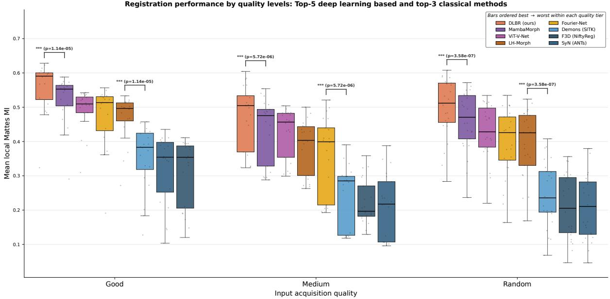  
Fig. 7 Registration accuracy by input acquisition quality tier. Per-case landmark-local NMI over the 30 landmarks on the 66 Larvalign test cases (cf. Eq. 10), grouped into good, medium and random tiers. Each tier shows the five strongest learned methods, DLBR leftmost, then the three strongest classical methods, as per-case boxplots with jittered points. Brackets are paired Wilcoxon signed-rank tests, Bonferroni-corrected. Higher is better.

## 4.6.1 Resolution-scale ablation

Figure 10 repeats the comparison at the two coarser preprocessing scales $6 4 \times 2 5 6 \times 1 2 8$ and $6 4 \times 5 1 2 \times 2 5 6$ and places them next to the featured $6 4 \times 7 6 8 \times 5 1 2$ scale. The learned methods lead their classical comparators at every scale, so the advantage of the learned approach is not a by-product of the chosen resolution. Absolute local NMI tracks the resolution, since more voxels expose more anatomical detail for the intensity metrics to reward, and the best DLBR model stays at the top of the learned field across all three scales. The headline result at $6 4 \times 7 6 8 \times$ 512 is therefore representative rather than scalespecific, and the two coarser scales characterize the accuracy that is available at lower downscaled resolutions.

## 4.6.2 Configuration sensitivity

Figure 11 varies the DLBR training hyperparameters one at a time around the featured configuration, holding all other settings fixed. We vary the similarity loss term, the learning rate, the number of integration steps and the smoothness weight λsmooth.

The integration steps are the one setting that changes the deformation model itself rather than a training choice. Instead of the displacement of Eq. 1, the field predicted by the network is interpreted as a stationary velocity v and integrated into a difeomorphic warp by scaling and squaring, following Dalca et al. (2019). Integration starts from a scaled displacement and repeatedly composes the field with itself,

$$
\begin{array} { r c l } { { \phi ^ { ( 0 ) } = \mathrm { I d } + 2 ^ { - N } v , } } \\ { { \phi ^ { ( k + 1 ) } = \phi ^ { ( k ) } \circ \phi ^ { ( k ) } , \quad k = 0 , \ldots , N - 1 , } } \\ { { \phi = \phi ^ { ( N ) } , } } \end{array}\tag{11}
$$

where each composition is itself carried out with the spatial transformer of Eq. 2, and the smoothness penalty of Eq. 5 then acts on the velocity v rather than on a displacement. The number of integration steps N controls the fidelity of the integration, and setting $N = 0$ recovers the plain displacement field that the featured model uses.

Among the configurations tested, the choice of the similarity term has the largest efect on landmark-local NMI. Replacing normalized crosscorrelation by mean squared error costs 0.157 of mean landmark-local NMI, by far the largest efect in the ablation. Enabling scaling-and-squaring integration with seven steps costs 0.092. Raising the smoothness weight from $\lambda _ { \mathrm { s m o o t h } } = 0 . 0 1$ to 0.1 costs 0.064 and raising it to 0.5 costs 0.109, so an over-regularized field loses the fine local alignment that the landmark neighborhoods measure. The learning rate is essentially flat, with the two values separated by 0.001 of mean landmark-local NMI. The featured configuration is therefore a stable choice within its neighborhood. The size of the similarity-term efect also shows that a direct intensity diference by the mean squared error is not an adequate objective for these volumes. Staining and illumination vary between specimens, so at this resolution mean squared error is driven by brightness diferences rather than by misalignment, whereas normalized cross-correlation is insensitive to them.

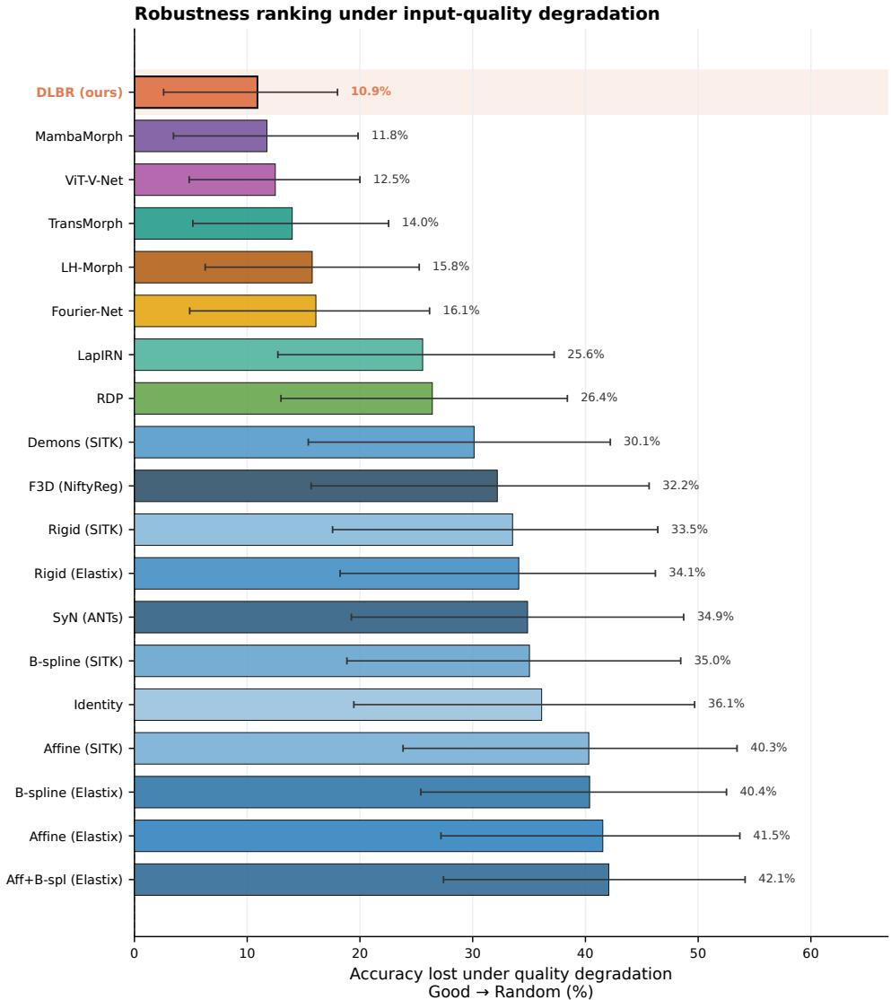  
Fig. 8 Robustness of accuracy to input acquisition quality. Each bar is the percentage of landmark-local NMI (cf. Eq. 10) a method loses from good-quality to random-quality inputs, sorted from most to least robust with DLBR highlighted. Error bars are bootstrap 95 percent confidence intervals. Lower loss is better.

## 4.7 Limitations of the trainable resolution

Finer input grids are desirable in this domain because much of the anatomical signal sits in structures that are only a few voxels across, such as the nerve entries and the tracts of the ventral nerve cord. The featured grid resolves these structures, but the maximum training resolution is constrained by the memory required to store activations during training. We measured the peak GPU memory of a full training step across input resolutions on a single NVIDIA H100 with 93 GB, shown in Figure 12. Memory grows in proportion to the number of voxels at 0.80 GB per megavoxel, and almost all of it is held by the fullresolution activations rather than by the network weights. Training fails altogether above roughly 45 megavoxels, a limit imposed by how the kernels index volumes of millions of voxels rather than by the capacity of the card. Within that bound, $6 4 \times 7 6 8 \times 5 1 2$ is the resolution we adopt. It keeps the in-plane aspect ratio at 1.50, close to the native median of 1.46, and every axis length remains divisible by the factor of two applied at each of the three downsampling stages of the network. The next step in the same series, obtained by doubling the in-plane grid to 64 × 1536 × 1024, contains 101 megavoxels and is out of reach, as is the native acquisition grid, which would need about 110 GB and is moreover still capped by indexing. This limitation applies to training alone. Registering a new volume with the released model holds no gradients and needs about 6.7 GB at the featured resolution, which a modern workstation GPU provides comfortably, so the hardware demand falls on training the model rather than on applying it.

Per-landmark local mutual information  
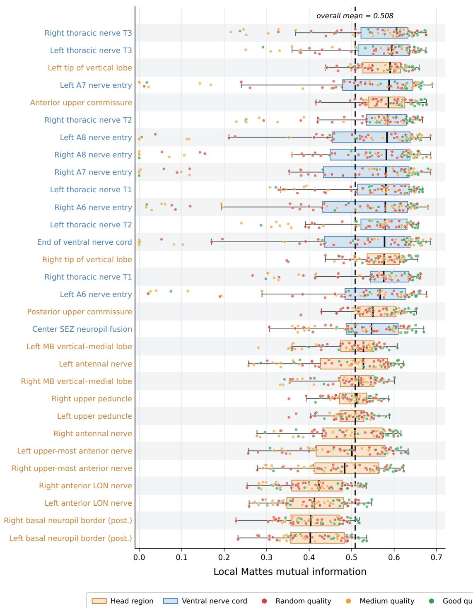  
Fig. 9 Per-landmark accuracy of the DLBR model. Landmark-local NMI across the 66 Larvalign test cases (cf. Eq. 10). Each row is one of the L = 30 landmarks, sorted by median local NMI. Color encodes anatomical region, and each point is a test case colored by quality tier. The dashed line marks the overall mean. Higher is better.

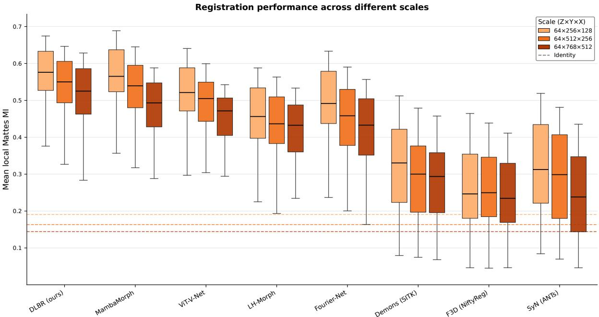  
Fig. 10 Registration accuracy across the three preprocessing scales. Per-case mean landmark-local NMI over the 66 Larvalign test cases (cf. Eq. 10) for the five strongest learned and three strongest classical methods, one box per scale. Dashed lines mark the no-registration identity floor at each scale. Higher is better.

## 5 Discussion

The central aim of this work is to provide a registration method for Drosophila larval brain volumes that is accurate at high spatial resolution and fast enough to serve as a routine preprocessing step. DLBR meets both requirements. Trained once on the Janelia collection and applied unchanged to the Larvalign test dataset, it reaches the best landmark-local NMI, the best global NMI and the best global NCC of any method we evaluated at the featured $6 4 \times 7 6 8 \times 5 1 2$ resolution. It provides a clear improvement over the strongest classical baseline in landmark-local NMI, ofers a gain of about 23 percentage points over difeomorphic Demons, and it produces each alignment in a single forward pass of 0.43 s rather than up to minutes of per-case optimization that the classical pipelines require. The paired tests of Section 4.2 place that margin inside every acquisition-quality stratum rather than only on the easiest cases, and the resolution-scale ablation shows that it also holds at the two coarser preprocessing scales.

Smoothness weight λ  
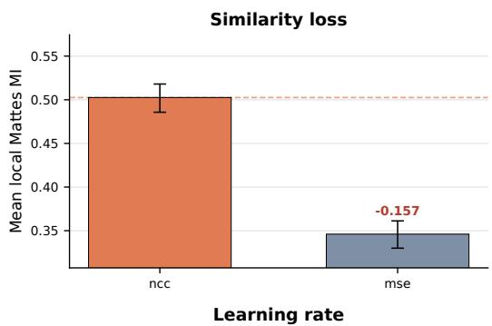

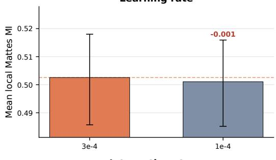

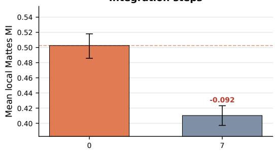

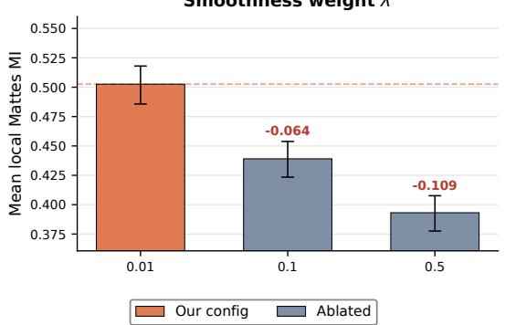  
Fig. 11 Configuration ablation of the DLBR training parameters. Each panel varies one parameter around the configuration, from top to bottom the similarity loss, learning rate, integration steps and smoothness weight λ. Bars are annotated with the change in mean landmarklocal NMI (cf. Eq. 10) relative to our configuration in orange, with the dashed line at the best-configuration accuracy and bootstrap 95 percent confidence intervals over the 66 test cases. Higher is better.

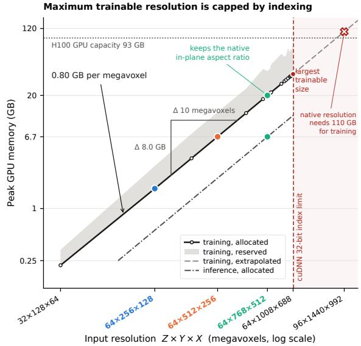  
Fig. 12 Maximum input resolution limitations. Peak GPU memory of a DLBR training step against input resolution, measured on one NVIDIA H100 with 93 GB at batch size 1. Memory grows at 0.80 GB per megavoxel, the shaded band is the additional memory the card must have free, and colored markers are the three preprocessing scales of this study. The lower curve is the cost at inference. The dashed line marks the resolution above which training fails for reasons of kernel indexing. Both axes are logarithmic.

The results suggest that the distinction between learned and classical registration is more consequential than the diferences among the learned architectures evaluated here. On the complete test set every learned network exceeds every classical baseline on both mutual-information scores, and the separation between the two families is several times larger than the spread inside the learned family. Among the classical methods the deformable ones lead with difeomorphic Demons, while the rigid and afine baselines stay close to the floor of the identity baseline. That floor is itself informative, since it shows that what remains after the preprocessing afine is a nonlinear error and cannot be recovered by a better cascading linear fit.

The robustness analysis suggests why the learned family separates so cleanly. Classical registration solves every pair on its own terms, so its similarity metric has to carry all of the anatomical knowledge, and the staining and illumination diferences between specimens act directly on the objective being optimized. A network trained on 540 Janelia volumes can instead exploit patterns of anatomical and acquisition-related variation learned from the training population when processing a new case. This shows up as a much smaller loss of accuracy when input quality degrades. Going from good to random quality DLBR loses 10.9 percent of its landmarklocal NMI, the smallest loss of any method we evaluated, whereas the classical deformable methods lose between 30 and 42 percent. Since the entire Larvalign collection lies outside the training dataset, the same result is evidence that a model trained in one dataset transfers to volumes acquired in other settings.

The configuration ablation points in the same direction. The similarity term is by far the most consequential choice in the DLBR recipe. Replacing normalized cross-correlation by mean squared error costs around 16 percentage points of landmark-local NMI, which is larger than the accuracy diference between any two learned architectures we compared. Mean squared error reads brightness diferences between specimens as misalignment, and that is precisely the variation this data carries. Two further observations are worth recording. Difeomorphic integration by scaling and squaring cost 0.092 of landmark-local NMI here, so the featured model uses the predicted field directly as a displacement, and raising the smoothness weight above $\lambda _ { \mathrm { s m o o t h } } = 0 . 0 1$ cost accuracy at every value we tried. The network itself is small at 604,195 parameters, so what constrains training at this resolution is the memory held by full-resolution activations rather than model capacity, which is the bound Section 4.7 quantifies. Registering a new volume carries none of that cost.

These findings place DLBR in the same role for this domain that the Larvalign pipeline of Muenzing et al. (2017) played with classical registration. Where Larvalign established an elastix-based cascade as an accurate way to bring individual larval brains into a shared anatomical space, DLBR is a learned counterpart that moves the compute cost to a one-time training stage, removes the pervolume parameter tuning, reaches higher accuracy and stays the most robust of all methods we compare as acquisition quality degrades. Together with the released package, registration changes from a step that each study has to assemble and tune into one that a study can simply call.

## 6 Conclusion

We present DLBR, a fast and accurate learned registration network for Drosophila larval brains that operates at high spatial resolution, leads eleven classical and seven further learned methods on the landmark-local accuracy of an external test set, and degrades least when acquisition quality varies. The network, its trained weights and the full preprocessing and evaluation pipeline are released as the open-source deep-larval-brain-reg framework to support reproducible research and adoption in downstream larval-brain analysis.

Acknowledgements. This work was supported by the German Research Foundation (Deutsche Forschungsgemeinschaft, DFG) under project number 441181781. We thank James W. Truman from the Janelia Research Campus (US) for providing data. The authors gratefully acknowledge the computational and data resources provided by the Leibniz Supercomputing Centre (www.lrz.de).

## References

Avants, B.B., Epstein, C.L., Grossman, M., Gee, J.C.: Symmetric difeomorphic image registration with cross-correlation: Evaluating automated labeling of elderly and neurodegenerative brain. Medical Image Analysis 12(1), 26–41 (2008) https://doi.org/10.1016/j.media. 2007.06.004

Brand, A.H., Perrimon, N.: Targeted gene expression as a means of altering cell fates and generating dominant phenotypes. Development 118(2), 401–415 (1993) https://doi.org/10. 1242/dev.118.2.401

Balakrishnan, G., Zhao, A., Sabuncu, M.R., Guttag, J., Dalca, A.V.: An unsupervised learning model for deformable medical image registration. In: Proceedings of the IEEE Conference on

Computer Vision and Pattern Recognition, pp. 9252–9260 (2018)

Chen, J., Frey, E.C., He, Y., Segars, W.P., Li, Y., Du, Y.: TransMorph: Transformer for unsupervised medical image registration. Medical Image Analysis 82, 102615 (2022) https://doi.org/10. 1016/j.media.2022.102615

Chen, J., He, Y., Frey, E.C., Li, Y., Du, Y.: ViT-V-Net: Vision Transformer for unsupervised volumetric medical image registration (2021)

Dalca, A.V., Balakrishnan, G., Guttag, J., Sabuncu, M.R.: Unsupervised learning of probabilistic difeomorphic registration for images and surfaces. Medical Image Analysis 57, 226– 236 (2019) https://doi.org/10.1016/j.media. 2019.07.006

Gerber, B., Stocker, R.F.: The drosophila larva as a model for studying chemosensation and chemosensory learning: A review. Chemical Senses 32(1), 65–89 (2006) https://doi.org/10. 1093/chemse/bjl030

Guo, T., Wang, Y., Shu, S., Chen, D., Tang, Z., Meng, C., Bai, X.: MambaMorph: a Mamba-based framework for medical MR-CT deformable registration (2024)

Jia, X., Bartlett, J., Zhang, T., Lu, W., Qiu, Z., Duan, J.: Fourier-Net: Fast image registration with band-limited deformation. In: Proceedings of the AAAI Conference on Artificial Intelligence, vol. 37, pp. 1015–1023 (2023). https:// doi.org/10.1609/aaai.v37i1.25182

Jaderberg, M., Simonyan, K., Zisserman, A., Kavukcuoglu, K.: Spatial transformer networks. In: Advances in Neural Information Processing Systems (NeurIPS), vol. 28, pp. 2017–2025 (2015)

Kingma, D.P., Ba, J.: Adam: A method for stochastic optimization. In: International Conference on Learning Representations (ICLR) (2015)

Keene, A.C., Sprecher, S.G.: Seeing the light: photobehavior in fruit fly larvae. Trends in Neurosciences 35(2), 104–110 (2012) https://doi.

org/10.1016/j.tins.2011.11.003

Klein, S., Staring, M., Murphy, K., Viergever, M.A., Pluim, J.P.W.: elastix: A toolbox for intensity-based medical image registration. IEEE Transactions on Medical Imaging 29(1), 196–205 (2010) https://doi.org/10.1109/TMI. 2009.2035616

Lowekamp, B.C., Chen, D.T., Ib´a˜nez, L., Blezek, D.: The design of SimpleITK. Frontiers in Neuroinformatics 7, 45 (2013) https://doi.org/10. 3389/fninf.2013.00045

Mok, T.C.W., Chung, A.C.S.: Large deformation difeomorphic image registration with Laplacian pyramid networks. In: Medical Image Computing and Computer Assisted Intervention (MICCAI). LNCS, vol. 12263, pp. 211–221. Springer, ??? (2020). https://doi.org/10.1007/ 978-3-030-59716-0 21

Mattes, D., Haynor, D.R., Vesselle, H., Lewellen, T.K., Eubank, W.: Nonrigid multimodality image registration. In: Medical Imaging 2001: Image Processing. Proceedings of SPIE, vol. 4322, pp. 1609–1620. SPIE, ??? (2001). https: //doi.org/10.1117/12.431046

Mattes, D., Haynor, D.R., Vesselle, H., Lewellen, T.K., Eubank, W.: PET-CT image registration in the chest using free-form deformations. IEEE Transactions on Medical Imaging 22(1), 120– 128 (2003) https://doi.org/10.1109/TMI.2003. 809072

Modat, M., Ridgway, G.R., Taylor, Z.A., Lehmann, M., Barnes, J., Hawkes, D.J., Fox, N.C., Ourselin, S.: Fast free-form deformation using graphics processing units. Computer Methods and Programs in Biomedicine 98(3), 278–284 (2010) https://doi.org/10.1016/j.cmpb.2009.09.002

Muenzing, S.E.A., Strauch, M., Truman, J.W., B¨uhler, K., Thum, A.S., Merhof, D.: larvalign: Aligning gene expression patterns from the larval brain of drosophila melanogaster. Neuroinformatics 16(1), 65–80 (2017) https://doi.org/ 10.1007/s12021-017-9349-6

Nassif, C., Noveen, A., Hartenstein, V.: Early

development of the ¡i¿drosophila¡/i¿ brain: Iii. the pattern of neuropile founder tracts during the larval period. Journal of Comparative Neurology 455(4), 417–434 (2002) https://doi.org/ 10.1002/cne.10482

Ronneberger, O., Fischer, P., Brox, T.: U-Net: Convolutional networks for biomedical image segmentation. In: Medical Image Computing and Computer-Assisted Intervention (MIC-CAI). Lecture Notes in Computer Science, vol. 9351, pp. 234–241 (2015). https://doi.org/10. 1007/978-3-319-24574-4 28

Rueckert, D., Sonoda, L.I., Hayes, C., Hill, D.L.G., Leach, M.O., Hawkes, D.J.: Nonrigid registration using free-form deformations: application to breast mr images. IEEE Transactions on Medical Imaging 18(8), 712–721 (1999) https: //doi.org/10.1109/42.796284

Sadegheih, Y., Bozorgpour, A., Kumari, P., Azad, R., Merhof, D.: LHU-Net: A lean hybrid U-Net for cost-eficient, high-performance volumetric segmentation. In: International Conference on Medical Image Computing and Computer-Assisted Intervention, pp. 326–336 (2025). Springer

Studholme, C., Hill, D.L.G., Hawkes, D.J.: An overlap invariant entropy measure of 3D medical image alignment. Pattern Recognition 32(1), 71–86 (1999) https://doi.org/10.1016/ S0031-3203(98)00091-0

Vercauteren, T., Pennec, X., Perchant, A., Ayache, N.: Difeomorphic demons: Eficient non-parametric image registration. NeuroImage 45(1), 61–72 (2009) https://doi.org/10.1016/j. neuroimage.2008.10.040

Venken, K.J.T., Simpson, J.H., Bellen, H.J.: Genetic manipulation of genes and cells in the nervous system of the fruit fly. Neuron 72(2), 202–230 (2011) https://doi.org/10.1016/ j.neuron.2011.09.021

Wang, H., Ni, D., Wang, Y.: Recursive deformable pyramid network for unsupervised medical image registration. IEEE Transactions on Medical Imaging 43(6), 2229–2240 (2024) https:// doi.org/10.1109/TMI.2024.3362968