# FreeFlow: A Bias-free Hierarchical Transformer for Optical Flow Estimation

Vladislav Bargatin1,2⋆ , Alexander Yakovenko1,2,3⋆† , Khaled Abud1,2,3 , and Dmitriy Vatolin3

1 AI Center, Lomonosov MSU, Moscow, Russia 2 Lomonosov Moscow State University, Moscow, Russia 3 MSU Institute for Artificial Intelligence, Moscow, Russia {vladislav.bargatin, alexander.yakovenko}@graphics.cs.msu.ru, {khaled.abud, dmitriy}@graphics.cs.msu.ru https://github.com/msu-video-group/freeflow

Abstract. Optical flow methods typically rely on task-specific inductive biases, such as correlation volumes, feature warping, and iterative refinement, among others, to reach high accuracy. While efective, such biases constrain the model to predefined heuristics, which can limit its expressivity and lead to more complex pipelines and additional computational cost. We present FreeFlow, a hierarchical transformer built without any flow-specific components, using instead a single feed-forward encoder– decoder. FreeFlow combines three attention variants: window attention for local processing, shifted-window attention for cross-window information exchange, and a global attention operating at a reduced resolution. The resulting architecture scales naturally with model capacity, enabling a consistent accuracy gain from small to large variants. Despite the absence of standard inductive biases, FreeFlow achieves state-of-theart results on major benchmarks, including Sintel (0.68/1.48 EPE on Clean/Final), KITTI-2015 (3.23 Fl-all), and Spring (3.192 1px), while remaining memory eficient at 1080p inference.

Keywords: Optical flow · Vision Transformers · High-resolution

## Introduction

Optical flow estimation (the dense per-pixel motion between frames) is a fundamental task in low-level vision, with applications ranging from video under-a standing [32,44,62] and tracking to video restoration and synthesis [6,12,24,57].

Early optical flow methods posed estimation as variational optimization [10, 27], later accumulating stronger regularization [41], coarse-to-fine schemes, and hand-crafted descriptors [53] at the cost of growing complexity.

Deep learning initially simplified optical flow, as FlowNet [9] showed that a feed-forward network can regress flow directly, but later work reintroduced classical biases in highly efective yet hard-wired architectures. PWC-Net [42] combined pyramids, warping, and local correlation volumes, while RAFT [45] popularized iterative refinement over an all-pairs correlation volume and convex upsampling; many follow-ups then build upon these foundations with additional modules for occlusions [14], temporal cues [7, 38], and training/inference refinements [50]. Which improve accuracy, but lead to complex pipelines that are harder to modify, scale, and repurpose beyond optical flow.

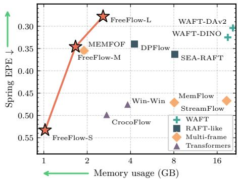  
(a) Spring EPE (↓) versus 1080p inference memory (GB), with FreeFlow variants (S/M/L) illustrating model scaling.

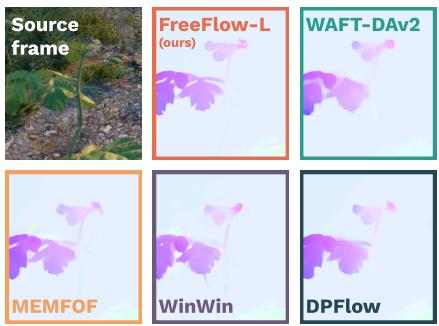  
(b) Qualitative comparison of predicted flow fields on a crop of a visually challenging scene with heavy blur (best viewed zoomed in).  
Fig. 1: FreeFlow overview. Our method achieves state-of-the-art accuracy on Spring with low 1080p inference memory and the sharpest motion borders among strong baselines, as evidenced by (a) the accuracy–memory scatter plot and (b) the qualitative crop gallery.

In parallel, the broader computer vision literature has moved in the opposite direction: vision transformers [8] increasingly replace bespoke pipelines in detection [5], segmentation [16,18], depth prediction [58,59], and 3D tasks [15,46,47], driven by the observation that generic, data-driven feed-forward models can learn MEMFOFthe required structure from scale and supervision. This trend motivates revisiting optical flow through the same lens: can we omit flow-specific components and still obtain a state-of-the-art approach?

Several recent approaches move toward more generic architectures, but still retain flow-specific structure or incur practical limitations. DDVM [37] casts optical flow prediction in a difusion framework, but the prediction is still produced through iterative process. CroCo [52] is close to a pure transformer, yet it operates at a relatively small fixed resolution and typically requires tiling for higherresolution inputs, while still relying on a large convolutional decoder. Most recently, WAFT [49] and GeoViT [54] explicitly aim for generality, but still rely on iterations and require warping (of features and input frames, respectively). Additionally, these approaches are trained at relatively small, sub-megapixel resolutions, which might become a limiting factor for accuracy at high-resolution inference [1].

We therefore propose FreeFlow, a bias-free hierarchical transformer for optical flow estimation. FreeFlow is designed for high-resolution processing, which recent work has shown to be beneficial for optical flow [1] and depth estimation [3]. At high resolution, accurate flow requires both strong local reasoning (to preserve fine structures and motion boundaries) and efective long-range information flow (to resolve large displacements). FreeFlow addresses this with a hierarchical attention design that combines tiled processing with repeated local– global feature interaction: local attention focuses on within-region detail, crossregion exchange propagates information between neighboring tiles, and global mixing enables long-range correspondence. FreeFlow sets a new state-of-the-art on Sintel [4] (EPE clean: 0.68; EPE final: 1.48), KITTI-2015 [30] (Fl-all: 3.23), and Spring [29] (1px: 3.192).

Our key contributions are:

– Bias-free optical flow transformer. We introduce FreeFlow, a hierarchical transformer for optical flow built without common flow-specific inductive biases and modules (e.g., explicit cost/correlation volumes, warping-based update pipelines, and specialized upsampling), using a single end-to-end trainable architecture.

– Hierarchical local–global feature interaction for high-resolution processing. We propose a tiled transformer design with repeated local and long-range feature interaction, enabling accurate flow at high resolutions by combining local detail modeling with global information flow.

– State-of-the-art performance across benchmarks. FreeFlow achieves state-of-the-art results on Sintel, KITTI-2015, and Spring, all while being memory-eficient and scalable to smaller parameter counts.

## 2 Related Works

## 2.1 Inductive Biases of Optical Flow

Early optical flow methods formulated estimation as variational optimization under photometric constancy and smoothness regularization [10,27,41,53]. Learningbased approaches later treated optical flow as supervised dense prediction [9], and subsequent advances largely introduced explicit architectural priors tailored to correspondence estimation. Representative flow-specific inductive biases include multi-scale pyramids [31,42], warping-based alignment [42,49,54], explicit correlation volumes for large-displacement matching [1,45], iterative refinement, and convex upsampling [1, 45, 50]. While these choices are efective, they have contributed to increasingly complex pipelines; recent work has started to remove individual priors [17] and move toward more generic formulations [37], but existing methods typically retain some of these biases rather than eliminating them entirely.

## 2.2 Vision Transformers in Dense Prediction

Vision transformers [8] (ViTs) are now widely used for dense prediction and geometry-oriented tasks, enabled by large-scale data and a general architecture that can learn the dependencies from supervision rather than relying on handcrafted priors. This has led to strong results across depth [3, 33, 58, 59], segmentation [16, 18], and 3D settings [15, 46, 47], where feed-forward transformer backbones provide a common foundation for dense outputs and geometric reasoning. Importantly, many of these systems remain architecturally simple. A common pattern is a ViT backbone combined with a convolutional prediction head or decoder for producing dense maps [33,34]. Other approaches further reduce decoder structure and rely on minimal output token processing, suggesting that heavy convolutional decoders are not necessary to obtain competitive dense predictions [15, 16]. However, scaling such models to high resolution is challenging; common workarounds such as downsampling or tiling can harm accuracy and limit long-range interaction. Swin [22,25] addresses the issue by using localwindow self-attention and shifted windows to pass information across window boundaries, while Hiera [36] provides a simple hierarchical multi-scale ViT backbone for large images. Alternatively, DepthPro does high-resolution processing via a multi-scale pyramid design with late feature fusion [3].

Table 1: Architectural Inductive Biases in Optical Flow Methods. We summarize common design choices used to inject task-specific structure compared to our approach, which has no flow-specific inductive biases and uses a simple decoder head. "DPT head" refers to the decoder head from Dense Prediction Transformer (DPT) [33].
<table><tr><td>Method</td><td>Correlation Feature Volume</td><td></td><td>Pyramid</td><td>Iterative Warping Refinement Refinement Upsampling</td><td>Convex</td><td>Inference time Tiling</td><td>Flow Head</td></tr><tr><td>PWC-Net [42]</td><td>√</td><td>√</td><td>√</td><td>×</td><td>x</td><td>X</td><td>X</td></tr><tr><td>RAFT [45]</td><td>√</td><td>×</td><td>×</td><td>√</td><td>√</td><td>X</td><td>X</td></tr><tr><td>FlowFormer [11]</td><td>√</td><td>×</td><td>×</td><td>√</td><td>√</td><td>√</td><td>X</td></tr><tr><td>UniMatch [56]</td><td>×</td><td>√</td><td>√</td><td>√</td><td>√</td><td>×</td><td>X</td></tr><tr><td>TransFlow [26]</td><td>√</td><td>X</td><td>X</td><td>√</td><td>√</td><td>X</td><td>X</td></tr><tr><td>DPFlow [31]</td><td>√</td><td>X</td><td>√</td><td>√</td><td>√</td><td>X</td><td>X</td></tr><tr><td>MEMFOF [1]</td><td>√</td><td>×</td><td>×</td><td>√</td><td>√</td><td>X</td><td>X</td></tr><tr><td>WAFT [49]</td><td>X</td><td>√</td><td>X</td><td>√</td><td>√</td><td>X</td><td>X</td></tr><tr><td>Geo-VIT [54]</td><td>×</td><td>√</td><td>X</td><td>√</td><td>√</td><td>√</td><td>X</td></tr><tr><td>CroCo-Flow [52]</td><td>X</td><td>×</td><td>×</td><td>×</td><td>×</td><td>√</td><td>DPT head</td></tr><tr><td>Win-Win [20]</td><td>X</td><td>X</td><td>X</td><td>X</td><td>X</td><td>X</td><td>DPT head</td></tr><tr><td>FreeFlow (ours)</td><td>X</td><td>×</td><td>×</td><td>×</td><td>×</td><td>X</td><td>Simple Conv.</td></tr></table>

## 2.3 Transformers in Optical Flow Estimation

Recent transformer-based optical flow methods difer mainly in which flowspecific inductive biases they retain. Some methods keep explicit matching as a central operation via correlation/cost-based similarity: UniMatch and Trans-Flow follow this direction [26, 56], while FlowFormer explicitly constructs and processes a 4D cost volume with a transformer-style decoder [11].

While others move closer to generic transformer formulations, they unfortunately still leave some biases in place. CroCo-Flow was among the first transformer approaches with competitive accuracy, leveraging binocular pretraining for dense matching, but it relies on slow dense tiling at high resolution [52]. Win-

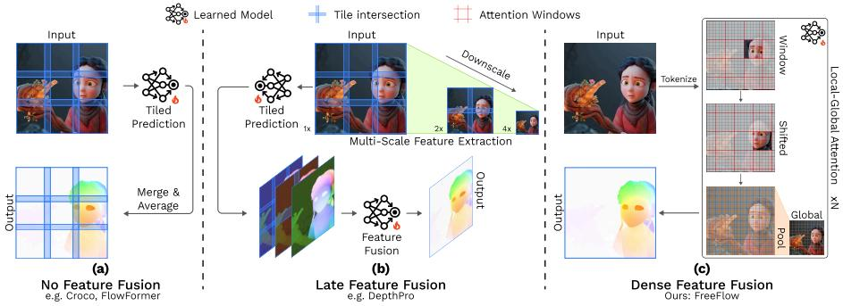  
Fig. 2: Comparison of high-resolution prediction techniques. (a) No Feature Fusion: per-tile prediction without inter-tile feature exchange (limited global coherence; long-range motions spanning multiple tiles not captured). (b) Late Feature Fusion: multi-scale features are fused only in the decoder (global context arrives late and may not propagate to full-resolution features; with small overlap and no information flow across tile borders, seams may remain visible; see supplementary). (c) Dense Feature Fusion (ours): repeated cross-tile/global feature exchange across the network (information flow is not restricted to the decoder).

Win builds on CroCo to enable FullHD training and inference without tiling, but does not improve over CroCo-Flow in accuracy [20]. WAFT and GeoViT remove cost volumes but retain iterative warping-based updates (warping features and input images, respectively) [49,54]. Overall, transformers have often been incorporated by incrementally replacing parts of established optical flow pipelines, which can improve performance yet further diversify and complicate the set of design choices. We summarize these choices in Tab. 1 using common inductive biases and compare to our bias-free approach.

## 3 Method

In this section, we present FreeFlow, an inductive-bias-free transformer for optical flow estimation (Fig. 3). We design this approach with two goals in mind. First, we aim to demonstrate that state-of-the-art optical flow can be achieved without the flow-specific architectural modules that dominate modern pipelines, such as correlation volumes, feature warping, iterative refinement, etc. (summarized in Tab. 1). Second, we seek a design that remains practical at high resolutions and ensures repeated information exchange across processing scales.

To this end, we study existing high-resolution prediction strategies, identify their limitations, and derive a principled alternative (Fig. 2). A straightforward solution is inference-time tiling in CroCo-/FlowFormer-style pipelines (Fig. 2a), but tiles interact only through late-stage averaging, so information does not flow across tile borders during feature extraction, and the number of forward passes grows with resolution. An alternative is multi-scale decoding with Late Feature Fusion as in DepthPro-like designs (Fig. 2b), which reduces the number of forward passes, but keeps information exchange delayed and tied to fixedresolution assumptions, and is unreliable in the binocular setting when objects cross tile boundaries. FreeFlow resolves these issues by using a fixed and eficient getiling scheme while enabling dense feature exchange throughout the network (Fig. 2c), combining local processing with cross-tile and global interactions.

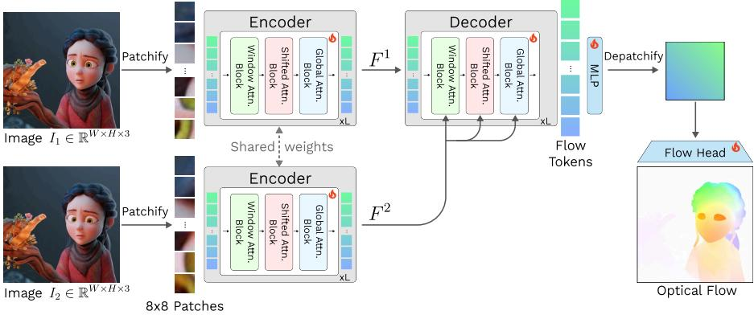  
Fig. 3: Method overview. Given an image pair $( I _ { 1 } , I _ { 2 } )$ , we patchify each input into 8 8 tokens and extract features using two shared-weight encoders composed of Window, Shifted-Window, and Global attention blocks (Fig. 4), producing $F ^ { 1 }$ and $F ^ { 2 } , \mathrm {  ~ A ~ }$ transformer decoder combines self-attention with cross-attention between $F ^ { 1 }$ and $F ^ { 2 }$ to form flow tokens, which are depatchified and mapped to a dense optical flow field by a lightweight prediction head.

We next give a functional description of the architecture and then formalize the attention variants used by FreeFlow.

## 3.1 Approach

We adopt the CroCo/DUSt3R/MASt3R encoder–decoder high-level architecture for binocular reasoning, i.e., a Siamese ViT encoder followed by a decoder that Patchifyalternates self- and cross-attention between the two views.

Given two input images $I _ { 1 } , I _ { 2 } \in \mathbb { R } ^ { H \times W \times 3 }$ , we embed each image into a sequence of non-overlapping $P { \times } P$ ..patches (with P=8) using a standard patch projection, producing token sequences $X _ { 1 } , \dot { X _ { 2 } } \in \mathbb { R } ^ { N \times D }$ where $\begin{array} { r } { N = \frac { H } { P } \cdot \frac { W } { P } } \end{array}$ . Both sequences are processed by a Siamese transformer encoder with shared weights to obtain feature representations

$$
F ^ { 1 } = \operatorname { E n c o d e r } ( X _ { 1 } ) , \qquad F ^ { 2 } = \operatorname { E n c o d e r } ( X _ { 2 } ) ,\tag{1}
$$

with $F ^ { 1 } , F ^ { 2 } \in \mathbb { R } ^ { N \times D }$

A transformer decoder then produces flow tokens

$$
Z = { \mathrm { D e c o d e r } } ( F ^ { 1 } , F ^ { 2 } ) ,\tag{2}
$$

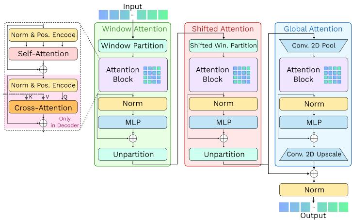  
Fig. 4: Attention block variants. Our architecture uses three attention patterns: (i) Window attention over a 4 4 partition (16 non-overlapping windows), (ii) Shifted-InputWindow attention with a half-window ofset to exchange information across window boundaries, and (iii) Global attention applied at $2 \times$ lower spatial resolution via down/up-sampling. See Fig. 2 for the partitioning visualization.

where each decoder block combines self-attention over the current tokens with cross-attention from $F ^ { 1 }$ (queries) to $F ^ { 2 }$ indow Partition Shi(keys/values), enabling repeated information exchange between the two views. The output $Z \in \mathbb { R } ^ { \tilde { N } \times \tilde { D } }$ is reshaped into a spatial feature map $Z _ { \mathrm { m a p } } \in \mathbb { R } ^ { \frac { H } { P } \times \frac { W } { P } \times D }$ and mapped to a dense flow and confidence field $U \in \mathbb { R } ^ { H \times W \times 5 }$ by a prediction head.

AtAttention(BlockAttention Block Types. To predict highly-detailed globally consistent flow fields, FreeFlow uses a hierarchical attention design that mixes local processing, Norm & Pos. Encodecross-window exchange, and global context. Each block follows the CroCo-style transformer structure: encoder blocks apply self-attention, while decoder blocks additionally use cross-attention to utilize tokens from the other view. We use three attention variants (Fig. 4):

– Window (Win) Attention Block. The token map of size $\textstyle { \frac { H } { 8 } } \times { \frac { W } { 8 } }$ is partitioned into a $4 \times 4$ MLPgrid of 16 non-overlapping windows, each containing $\frac { H } { 3 2 } \times \frac { W } { 3 2 }$ tokens. Attention is computed independently within each window.

– Shifted-Window (Swin) Attention Block. To enable information flow across window (and tile) boundaries, we apply a half-window shift by $\lfloor \frac { W } { 6 4 } \rfloor$ tokens horizontally and $\left\lfloor { \frac { H } { 6 4 } } \right\rfloor$ tokens vertically, partition into the same $4 \times 4$ windows, Uperform window attention, and shift back.

– Global Attention Block. To incorporate global context at controlled cost, we downsample by $2 \times$ with a stride-2 convolution, apply full attention at the reduced resolution, and upsample by 2× with a stride-2 transposed convolution. We apply normalization after the residual connection.

Each encoder/decoder layer applies the blocks in the fixed order: Win, Swin, and Global. Since attention cost scales quadratically with the number of tokens, the $2 \times$ downsampling in the Global block keeps its attention cost comparable to Win/Swin at the original resolution. To encode token positional information within the image, we rely on Rotary Positional Embedding (RoPE) [40].

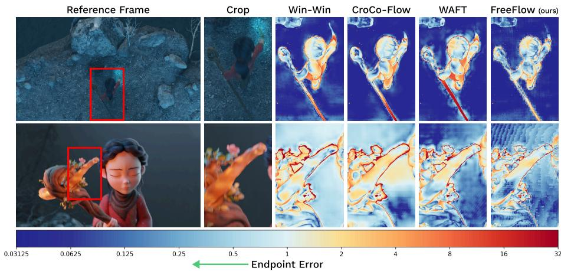  
Fig. 5: Qualitative comparison on the Spring benchmark [29]. Examples of error-maps of Win-Win [20], CroCo-Flow [52], WAFT [49], and FreeFlow predictions; the colorbar represents endpoint error. Our approach combines high level of detail (note the hole in the staf that only our method captures and the thin object bounds) with high motion consistency (note the staf’s end in the top example and the low error in the background of the bottom example). Crops are sourced from oficial leaderboard submissions.

Attention Scale Factor. Following prior work [7] on resolution-adaptive attention scaling, we multiply the attention logits by a logarithmic factor of the token count, which improves generalization when running inference at resolutions higher than those seen during training. For a token map of size ${ \frac { H } { 8 } } \times { \frac { W } { 8 } }$ we use

$$
\operatorname { S e l f - A t t e n t i o n } ( Q , K , V ) = \operatorname { S o f t m a x } \left( { \frac { \log ( H / 8 \times W / 8 ) } { \sqrt { D } } } \times Q K ^ { T } \right) \times V\tag{3}
$$

$$
\mathrm { C r o s s - A t t e n t i o n } ( Q _ { 1 } , K _ { 2 } , V _ { 2 } ) = \mathrm { S o f t m a x } \left( \frac { \log ( H / 8 \times W / 8 ) } { \sqrt { D } } \times Q _ { 1 } K _ { 2 } ^ { T } \right) \times V _ { 2 }\tag{4}
$$

Unlike prior formulations that normalize the factor to be 1 at the training token count, we use the unnormalized variant and found it to work well in practice.

Flow Head. Most high-performing optical flow pipelines rely on flow-specific prediction machinery, such as iterative update stages and convex upsampling. In addition, bias-free transformer baselines often use DPT-style heads from [33] that aggregate features from multiple layers (and, in CroCo-style designs, may also reuse encoder features) to form the final prediction. In contrast, FreeFlow predicts flow directly from the final decoded patch map using a simple three-layer head, without iterative refinement or convex upsampling.

Table 2: Training procedure details. Dataset abbreviations: TA: TartanAir [48], T: Things [28], S: Sintel [4], K: KITTI-2015 [30], H: HD1K [19]. Inspired by SEA-RAFT [50] and MEMFOF [1], the dataset distributions for the TaTSKH stages are TA (0.23), S(0.25), T(0.24), K(0.09), H(0.19).
<table><tr><td>Stage</td><td>Weights</td><td>Datasets</td><td>Scale</td><td>Crop size</td><td>LR WD Batch Steps</td><td></td><td></td></tr><tr><td>Pretrain</td><td></td><td>ARKitScenes [2] MegaDepth [21]</td><td>1x</td><td></td><td>[224, 224] 8e-4 5e-2 2048 346k</td><td></td><td></td></tr><tr><td></td><td></td><td>3DStreetView [60]</td><td></td><td></td><td></td><td></td><td></td></tr><tr><td>TaTSKH</td><td>Pretrain</td><td> $\mathrm { T A + T + S + K + H }$ </td><td>2x</td><td></td><td>10880 tok. 4e-5 1e-2</td><td>32</td><td>450k</td></tr><tr><td>TaTSKH-hq</td><td>TaTSKH</td><td> $\mathrm { T A + T + S + K + H }$ </td><td>2x</td><td>32640 tok. 1e-5 1e-5</td><td></td><td>32</td><td>90k</td></tr><tr><td>Sintel-ft</td><td>TaTSKH-hq</td><td>S</td><td>2x</td><td>[872, 2048] 1e-5 1e-5</td><td></td><td>32</td><td>12.5k</td></tr><tr><td>KITTI-ft</td><td>TaTSKH-hq</td><td>K</td><td>2x</td><td>[750, 2484] 1e-5 1e-5</td><td></td><td>32</td><td>2.5k</td></tr><tr><td>Spring-ft</td><td>TaTSKH-hq</td><td>Spring [29]</td><td>1x</td><td>[1080, 1920] 1e-5 1e-5</td><td></td><td>32</td><td>60k</td></tr></table>

Given $F \in \mathbb { R } ^ { \frac { H } { 8 } \times \frac { W } { 8 } \times D }$ , we apply a $3 { \times } 3$ convolution to expand channels to 4D, followed by a 1×1 convolution to 4096 channels, and a transposed convolution with kernel and stride 8 to upsample to $H \times W$ . The head outputs R $H \times W \times 5$ where the first two channels represent optical flow and the remaining three parameterize the uncertainty terms used by the mixture-of-Laplace loss (following SEA-RAFT [50]). Finally, we multiply the flow channels by 8 (the patch size) to obtain flow in pixel units.

## 4 Experiments

We first detail our training pipeline, consisting of cross-view completion pretraining followed by finetuning for optical flow. We evaluate our method on three popular optical flow benchmarks: Spring [29] (high-resolution real-world sequences), Sintel [4] (synthetic scenes with complex motion and rendering effects), and KITTI-2015 [30] (real driving scenes). Finally, we provide ablations of key design choices, including the attention configuration, pretraining masking ratio, and model scaling.

## 4.1 Training Details

Following CroCo [51,52], we first pre-train our model on the cross-view completion task and then finetune the resulting weights with a new head for optical flow estimation. In cross-view completion, a large fraction of patches in one view is replaced by a learned token $e _ { \mathrm { m a s k } }$ , and the model reconstructs the missing content conditioned on the second view. Due to its two-image nature, this objective encourages learning dense long-range correspondences, which is well aligned with the downstream task of binocular matching. Training details and datasets are summarized in Tab. 2; please refer to the supplementary for additional details.

Pre-train. We follow the pre-training stage protocol from CroCo with minor adjustments. During cross-view completion training, a model takes as input two images that represent diferent views of the same scene: one view is severely masked, and the model has to predict the masked regions using the information from the second view. We sample image pairs from ARKitScenes [2], MegaDepth [21], and 3DStreetView [60], resulting in 3.7M data samples in total. We use fixedsize crops of 224×224 resolution and pretrain the model for 346k steps.

The only significant diference from the CroCo setup is when the learned masked patch representation $e _ { \mathrm { m a s k } }$ is introduced. In CroCo, masked tokens are removed from the first view and the corresponding $e _ { \mathrm { m a s k } }$ tokens are added only at the decoder input. Here, due to the hierarchical nature of our model, we replace masked patches with $e _ { \mathrm { m a s k } }$ at the encoder input, while keeping the completion objective unchanged.

Optical Flow Finetune. The finetuning stage protocol is inspired by MEM-FOF [1]; specifically, we adopt their 2× upsampling of training frames, which better matches the motion distribution of FullHD inputs and improves highresolution performance. Unlike MEMFOF and other curriculum-based training recipes that use multiple sequential stages, we use a single main dataset mixture, denoted TaTSKH in Tab. 2, for simplicity. For additional speed, we split this finetuning into a low- and high-token-count stage (TaTSKH and TaTSKH-hq in Tab. 2).

Instead of using a fixed crop size, to avoid unnecessary padding and to expose the model to a wider motion range, we use variable-resolution training with a fixed token budget per minibatch. More specifically, for each sample we randomly choose one spatial dimension (height or width), sample its value, and set the other dimension to the largest value such that the resulting token count does not exceed the prescribed budget. This produces rectangular crops with varying aspect ratios while keeping compute and memory controlled. The implementation is straightforward as we use a batch size of 1 sample/GPU during the finetuning stage. For benchmark submissions, we further finetune with fixed crop sizes (Sintel-ft, KITTI-ft, Spring-ft in Tab. 2). Following SEA-RAFT [50], we use the Mixture-of-Laplace loss.

In total, it takes from 4 to 5 days to pre-train and around 3 days to finetune our largest model on 32 GPUs.

## 4.2 Results

We adopt four widely used metrics from established benchmarks in this study: endpoint error (EPE), 1-pixel outlier rate (1px), Fl-score, and WAUC error. Please refer to [4, 29–31, 35] or the supplementary for their definitions.

Results on Spring. FreeFlow achieves state-of-the-art performance on Spring. FreeFlow-L sets the best EPE and Fl among all compared methods (Tab. 3), while remaining on par with the strongest approaches in 1px and WAUC; in particular, it attains the best WAUC among two-frame methods. Compared to WAFT-DAv2-a2, FreeFlow-L improves EPE by 9% and reduces Fl by 14%. Owing to tiling-free native 1080p inference, FreeFlow preserves fine detail while maintaining global motion consistency (Fig. 5). We further highlight that native 1080p processing is possible within a low inference memory budget (Fig. 1).

Table 3: Spring benchmark results. "\*" indicates that it was submitted by the Spring team without being finetuned on the provided training set. Speed (runtime) and peak GPU memory consumption were measured on a Nvidia RTX 3090 GPU (24 GB) with automatic mixed precision and without memory eficient correlation volumes, where "—" denotes no available data or implementation for a given model and "†" denotes our best estimate based on the authors description. "MF" indicates that the method uses multiple frames (three or more). The best results are indicated in bold, second-best are underlined, third best are indicated in italic. Method configurations are taken from submissions to the Spring benchmark if present, and from submissions to the Sintel benchmark otherwise.
<table><tr><td rowspan="3">Method</td><td colspan="2">Inf. Cost (1080p)</td><td rowspan="3">Params (M)</td><td colspan="4">Spring</td></tr><tr><td colspan="2">Memory (GB)</td><td rowspan="2">1px ↓</td><td rowspan="2">EPE↓</td><td rowspan="2">Fl↓</td><td rowspan="2">WAUC ↑</td></tr><tr><td></td><td>Time (ms)</td></tr><tr><td>FlowNet2 [13]</td><td>3.01</td><td>110</td><td>162.52</td><td>6.710*</td><td>1.040*</td><td>2.823*</td><td>90.907*</td></tr><tr><td>PWC-Net [42]</td><td>0.57</td><td>48</td><td>9.37</td><td>82.265*</td><td>2.288*</td><td>4.889*</td><td>45.670*</td></tr><tr><td>RAFT [45]</td><td>7.97</td><td>406</td><td>5.26</td><td>6.790*</td><td>1.476*</td><td>*3.198*</td><td>90.920*</td></tr><tr><td>GMA [14]</td><td>11.81</td><td>830</td><td>5.88</td><td>7.074*</td><td></td><td>0.914* 3.079*</td><td>90.722*</td></tr><tr><td>GMFlow [55]</td><td>8.22</td><td>8024</td><td>4.72</td><td>10.355*0.945*</td><td></td><td>2.952*</td><td>82.337*</td></tr><tr><td>FlowFormer [11]</td><td>1.90</td><td>2084†</td><td>16.17</td><td>6.510*</td><td>0.723*</td><td>2.384*</td><td>91.679*</td></tr><tr><td>SEA-RAFT (M) [50]</td><td>8.12</td><td>198</td><td>19.67</td><td>3.686</td><td>0.363</td><td>1.347</td><td>94.534</td></tr><tr><td>DPFlow [31]</td><td>4.26</td><td>401</td><td>10.02</td><td>3.442</td><td>0.340</td><td>1.311</td><td>94.980</td></tr><tr><td>MemFlow(MF) [7]</td><td>8.06</td><td>754</td><td>6.27</td><td>4.482</td><td>0.471</td><td>1.416</td><td>93.855</td></tr><tr><td>StreamFlow(MF) [43]</td><td>18.61</td><td>898</td><td>14.25</td><td>4.152</td><td>0.467</td><td>1.424</td><td>94.404</td></tr><tr><td>MEMFOF(MF) [1]</td><td>1.90</td><td>262</td><td>75.78</td><td>3.289</td><td>0.355</td><td>1.238</td><td>95.186</td></tr><tr><td>ARFlow(MF) [23]</td><td></td><td></td><td>76.50</td><td>3.265</td><td>0.353</td><td>1.212</td><td>95.283</td></tr><tr><td>CroCo-Flow [52]</td><td>2.73</td><td>3266</td><td>447.47</td><td>4.565</td><td>0.498</td><td>1.508</td><td>93.660</td></tr><tr><td>Win-Win [20]</td><td>3.82†</td><td>305†</td><td>229.77†</td><td>5.371</td><td>0.475</td><td>1.621</td><td>92.720</td></tr><tr><td>WAFT-DAv2-a2 [49]</td><td>20.58</td><td>489</td><td>56.93</td><td>3.298</td><td>0.304</td><td>1.197</td><td>94.990</td></tr><tr><td>WAFT-DINOv3-a2 [49]</td><td>18.96</td><td>408</td><td>56.47</td><td>3.182</td><td>0.325</td><td>1.246</td><td>95.051</td></tr><tr><td>FreeFlow-S (ours)</td><td>1.02</td><td>144</td><td>34.58</td><td>5.087</td><td>0.533</td><td>1.452</td><td>90.196</td></tr><tr><td>FreeFlow-M (ours)</td><td>1.66</td><td>325</td><td>102.46</td><td>3.392</td><td>0.346</td><td>1.171</td><td>94.919</td></tr><tr><td>FreeFlow-L (ours)</td><td>2.58</td><td>607</td><td>230.72</td><td>3.192</td><td>0.278</td><td>1.048</td><td>95.235</td></tr></table>

Results on Sintel and KITTI. Following MEMFOF, we finetune on 2× upsampled frames. Accordingly, for Sintel and KITTI submissions we upscale input images by 2× and downscale the predicted flow by 2×. FreeFlow-L ranks first on Sintel on both Clean and Final (Tab. 4), improving over GeoVIT [54] by 14% on Clean (0.79→0.68) and 10% over VideoFlow-MOF [38] on Final (1.65→1.48). Notably, FreeFlow-M is already highly competitive: it is second only to FreeFlow-L on Clean, and ranks fourth on Final, surpassed only by the 3- and 5-frame VideoFlow variants. On KITTI-2015, FreeFlow-L achieves 3.23 Fl-all, outperforming all non-stereo and non-multiframe methods on KITTI-15 (Tab. 4). Qualitative results show that the model captures complex motion patterns using only two frames (Fig. 6). Additional visual comparisons and zero-shot evaluations are provided in the supplementary material.

Table 4: Sintel [4] and KITTI-15 [30] benchmark results. Sintel uses EPE as it’s metric for both splits, while KITTI-15 uses the Fl-all outliers metric. "—" indicates no published results and "MF" indicates that the method used multiple frames (three or more) to generate it’s submissions.
<table><tr><td colspan="2">Method</td><td colspan="2">Sintel</td><td>KITTI-15</td></tr><tr><td colspan="2"></td><td colspan="2">Clean ↓ Final ↓</td><td>Fl-all ↓</td></tr><tr><td colspan="2">FlowNet2 [13]</td><td>4.16</td><td>5.74</td><td>10.41</td></tr><tr><td colspan="2">PWC-Net [42]</td><td>3.90</td><td>5.04</td><td>9.60</td></tr><tr><td colspan="2">RAFT [45]</td><td>1.61</td><td>2.86</td><td>5.10</td></tr><tr><td colspan="2">GMA [14]</td><td>1.39</td><td>2.47</td><td>5.15</td></tr><tr><td colspan="2">GMFlow+ [56]</td><td>1.03</td><td>2.37</td><td>4.49</td></tr><tr><td colspan="2">FlowFormer [11]</td><td>1.16</td><td>2.09</td><td>4.68</td></tr><tr><td colspan="2">FlowFormer++ [39]</td><td>1.07</td><td>1.94</td><td>4.52</td></tr><tr><td colspan="2">TransFlow [26]</td><td>1.06</td><td>2.08</td><td>4.32</td></tr><tr><td colspan="2">SEA-RAFT (L) [50]</td><td>1.31</td><td>2.60</td><td>4.30</td></tr><tr><td colspan="2">DPFlow [31]</td><td>1.05</td><td>1.98</td><td>3.56</td></tr><tr><td colspan="2">VideoFlow-BOF(MF) [38]</td><td>1.00</td><td>1.71</td><td>4.44</td></tr><tr><td colspan="2">VideoFlow-MOF(MF) [38]</td><td>0.99</td><td>1.65</td><td>3.65</td></tr><tr><td colspan="2">MEMFOF(MF) [1]</td><td>0.99</td><td>1.94</td><td>2.94</td></tr><tr><td colspan="2">MEMFOF-XL(F) [1]</td><td>0.93</td><td>1.89</td><td></td></tr><tr><td colspan="2">ARFlow(MF) [23]</td><td>0.96</td><td>1.79</td><td>2.85</td></tr><tr><td colspan="2">DDVM [37]</td><td>1.75</td><td>2.48</td><td>3.26</td></tr><tr><td colspan="2">CroCo-Flow [52]</td><td>1.09</td><td>2.44</td><td>3.64</td></tr><tr><td colspan="2">Win-Win [20]</td><td>1.15</td><td>2.34</td><td></td></tr><tr><td colspan="2">WAFT-DAv2-a2 [49]</td><td>0.94</td><td>2.33</td><td>3.31</td></tr><tr><td colspan="2">WAFT-DINOv3-a2 [49]</td><td>0.95</td><td>2.02</td><td>3.56</td></tr><tr><td colspan="2">GeoVIT [54]</td><td>0.79</td><td>1.88</td><td>3.79</td></tr><tr><td colspan="2">FreeFlow-S (ours)</td><td>1.03</td><td>1.99</td><td>4.06</td></tr><tr><td colspan="2">FreeFlow-M (ours)</td><td>0.80</td><td>1.77</td><td>3.33</td></tr><tr><td colspan="2">FreeFlow-L (ours)</td><td>0.68</td><td>1.48</td><td>3.23</td></tr></table>

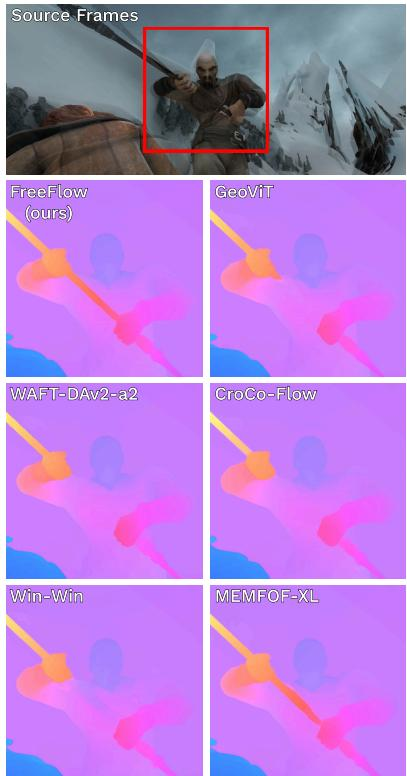  
Fig. 6: Qualitative comparison on Sintel. Examples of FreeFlow-L, GeoViT [54], WAFT-DAv2-a2 [49], CroCo-Flow [52], Win-Win [20], and MEMFOF-XL [1] outputs on the Sintel [4] benchmark. Sourced from the oficial leaderboard submissions.

## 4.3 Ablation Study

Unless stated otherwise, all ablations use a scaled-down FreeFlow configuration with 8 encoder and 8 decoder layers, width 256, and 8 attention heads, and are trained with the same training recipe. Following SEA-RAFT and WAFT, we report results on the Spring sub-validation split (scenes 0045 and 0047) after finetuning on the remaining training data. Additional experiments in the supplementary isolate the architecture from the training procedure and study the efect of adding iterative flow-specific biases back into FreeFlow.

Table 5: Masking ratio and attentionblock ablation. Spring sub-validation results for FreeFlow variants with different cross-view completion masking ratios and active attention subblocks (Win/Swin/Global). Gray marks the configuration selected for the main model; best and second-best results are shown in bold and underlined, respectively.
<table><tr><td rowspan="2">Mask. Subblock type Ratio</td><td colspan="2">Spring (sub-val)</td></tr><tr><td>Win Swin Global 1px ↓</td><td>EPE↓</td></tr><tr><td>0.9 X X √</td><td>1.133</td><td>0.229</td></tr><tr><td>0.9 √ X √</td><td>0.801</td><td>0.190</td></tr><tr><td>0.9 √ √ X</td><td>0.659</td><td>0.167</td></tr><tr><td>0.9 √ √ √ √</td><td>0.688</td><td>0.170</td></tr><tr><td>0.925 √ √</td><td>0.685</td><td>0.166</td></tr><tr><td>0.95 √ √</td><td>X 0.658</td><td>0.166</td></tr><tr><td>0.95 √ √ 0.975 √ √</td><td>√ 0.624 0.656</td><td>0.157 0.174</td></tr></table>

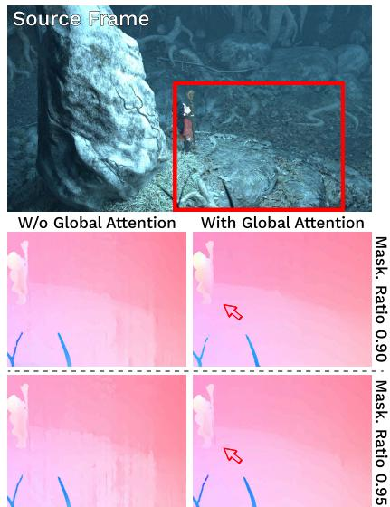  
Fig. 7: Qualitative ablation compari son of FreeFlow models with and without Global Attention block and pretrained with diferent masking ratios on the Spring benchmark. Zoom in for better view.

Architecture and Masking Ratio Ablation. We study the interaction between the cross-view completion masking ratio and the hierarchical attention design of FreeFlow (Tab. 5). The masking ratio controls the fraction of patches in the target view that are replaced by the learned token $e _ { \mathrm { m a s k } }$ during pretraining, while the attention configuration determines which subblock types (Win/Swin/Global) are present in the encoder and decoder.

With all three subblocks enabled, a masking ratio of 0.95 performs best, improving over the CroCo default 0.9 by 9.3% in 1px and 7.6% in EPE. This is consistent with FreeFlow using smaller patches than CroCo (8×8 vs. 16×16), which reduces the distance to visible regions and makes a higher mask rate beneficial as it makes the pretraining task suficiently challenging.

We also observe an interaction between masking ratio and attention configuration. At the CroCo default ratio (0.9), removing Global does not hurt and can even slightly improve the sub-validation metrics, whereas at 0.95 Global becomes important for the best performance. This indicates that the masking ratio is an important hyperparameter that should be chosen jointly with the model architecture. Shifted-Window attention consistently contributes to accuracy, and removing it leads to a clear drop on this split. Additionally, for both masking ratios, qualitative comparisons (Fig. 7) show that removing the Global block can introduce obvious motion inconsistencies, even when the sub-validation metrics change only marginally.

Table 6: Model configurations. Architectural hyperparameters of FreeFlow variants and our best-efort estimates for transformerbased baselines. “+” denotes separate encoder and decoder widths (or counts), while “ ” denotes repeated recurrent decoder calls.
<table><tr><td>Name</td><td>Patch Sizes</td><td>Width</td><td>Attn. Count</td><td>Attn. Heads</td><td>MLP Count</td><td>Params (M)</td></tr><tr><td>GeoViT</td><td>16</td><td>1024</td><td>24×6</td><td>16</td><td>24×6</td><td>377</td></tr><tr><td>WAFT</td><td>16</td><td>384+384 12+12×5</td><td></td><td></td><td>6+6 12+12×5</td><td>56</td></tr><tr><td>CroCo-Flow</td><td>16</td><td>1024+768</td><td>24+24</td><td>16+12</td><td>24+12</td><td>447</td></tr><tr><td>Win-Win</td><td>16</td><td>768+768</td><td>12+24</td><td>12</td><td>12+12</td><td>230</td></tr><tr><td>GMFlow+</td><td>8/4</td><td>0+128</td><td>0+12×2</td><td>0+1</td><td>0+6×2</td><td>4.7</td></tr><tr><td>FreeFlow-S</td><td>8</td><td>256+256</td><td>12+24</td><td>4+4</td><td>12+12</td><td>35</td></tr><tr><td>FreeFlow-M</td><td>8</td><td>384+384</td><td>18+36</td><td>6+6</td><td>18+18</td><td>102</td></tr><tr><td>FreeFlow-L</td><td>8</td><td>512+512</td><td>24+48</td><td>8+8</td><td>24+24</td><td>231</td></tr></table>

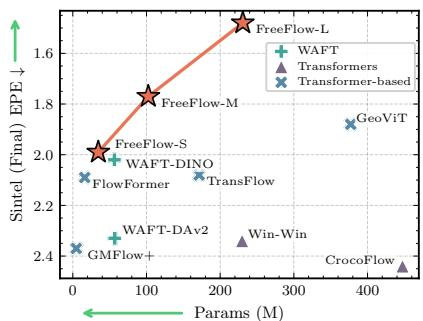  
Fig. 8: Model scaling on Sintel. Sintel Final EPE ( ) versus parameter count (M), $\times 1 0 ^ { 6 }$ for FreeFlow variants and transformer-based baselines.

Model Scaling. A benefit of FreeFlow’s simple, uniform encoder–decoder design is that it can be scaled in a straightforward manner by adjusting depth and width. We therefore study how performance evolves across model sizes (S/M/L) on common optical flow benchmarks. We follow common ViT scaling [61] best practices by co-scaling depth, width, and the number of attention heads while keeping the overall architecture and patch size fixed. The resulting configurations are summarized in Tab. 6.

As shown in Fig. 8, FreeFlow scales predictably: larger variants yield consistent accuracy gains, while smaller variants retain strong performance, indicating that the approach remains efective even when scaled down. Memory scaling with model size is reported in Fig. 1a.

## 5 Conclusion

In this work, we introduced FreeFlow, a bias-free hierarchical transformer for optical flow estimation that removes conventional flow-specific design components such as correlation volumes, feature warping, and iterative refinement. Instead, FreeFlow relies on a simple feed-forward encoder–decoder architecture that combines window, shifted-window, and reduced-resolution global attention to capture motion across multiple spatial scales. This design provides a flexible and scalable framework that improves consistently with model capacity while maintaining eficient high-resolution inference.

We show that these standard optical-flow inductive biases are not required to achieve top performance. FreeFlow reaches state-of-the-art results on all popular benchmarks, including Sintel, KITTI-2015, and Spring, demonstrating that strong motion estimation can be obtained from a general-purpose transformer architecture without specialized flow modules. We hope that this work encourages further exploration of simpler and more general architectures for motion estimation and related dense correspondence tasks.

## Acknowledgements

The work of Vladislav Bargatin, Alexander Yakovenko and Khaled Abud was supported by the The Ministry of Economic Development of the Russian Federation in accordance with the subsidy agreement (agreement identifier 000000C313925P4H0002; grant No 139-15-2025-012). The research was carried out using the MSU-270 supercomputer of Lomonosov Moscow State University.

## References

1. Bargatin, V., Chistov, E., Yakovenko, A., Vatolin, D.: MEMFOF: High-resolution training for memory-eficient multi-frame optical flow estimation. In: Proceedings of the IEEE/CVF International Conference on Computer Vision (ICCV). pp. 8187– 8196 (2025). https://doi.org/10.1109/ICCV51701.2025.00767

2. Baruch, G., Chen, Z., Dehghan, A., Feigin, Y., Fu, P., Gebauer, T., Kurz, D., Dimry, T., Jofe, B., Schwartz, A., Shulman, E.: ARKitScenes: A diverse real-world dataset for 3d indoor scene understanding using mobile rgb-d data. In: Proceedings of the Neural Information Processing Systems Track on Datasets and Benchmarks. vol. 1 (2021)

3. Bochkovskiy, A., Delaunoy, A., Germain, H., Santos, M., Zhou, Y., Richter, S., Koltun, V.: Depth Pro: Sharp monocular metric depth in less than a second. In: International Conference on Learning Representations. vol. 2025, pp. 75602–75637 (2025)

4. Butler, D.J., Wulf, J., Stanley, G.B., Black, M.J.: A naturalistic open source movie for optical flow evaluation. In: Computer Vision – ECCV 2012. pp. 611– 625. Springer Berlin Heidelberg, Berlin, Heidelberg (2012). https://doi.org/10. 1007/978-3-642-33783-3\_44

5. Carion, N., Massa, F., Synnaeve, G., Usunier, N., Kirillov, A., Zagoruyko, S.: Endto-end object detection with transformers. In: Computer Vision – ECCV 2020. pp. 213–229. Springer International Publishing, Cham (2020). https://doi.org/10. 1007/978-3-030-58452-8\_13

6. Chan, K.C., Wang, X., Yu, K., Dong, C., Loy, C.C.: BasicVSR: The search for essential components in video super-resolution and beyond. In: 2021 IEEE/CVF Conference on Computer Vision and Pattern Recognition (CVPR). pp. 4945–4954 (2021). https://doi.org/10.1109/CVPR46437.2021.00491

7. Dong, Q., Fu, Y.: MemFlow: Optical flow estimation and prediction with memory. In: 2024 IEEE/CVF Conference on Computer Vision and Pattern Recognition (CVPR). pp. 19068–19078 (2024). https://doi.org/10.1109/CVPR52733.2024. 01804

8. Dosovitskiy, A., Beyer, L., Kolesnikov, A., Weissenborn, D., Zhai, X., Unterthiner, T., Dehghani, M., Minderer, M., Heigold, G., Gelly, S., Uszkoreit, J., Houlsby, N.: An image is worth 16x16 words: Transformers for image recognition at scale. In: International Conference on Learning Representations (2021)

9. Dosovitskiy, A., Fischer, P., Ilg, E., Häusser, P., Hazirbas, C., Golkov, V., Smagt, P.v.d., Cremers, D., Brox, T.: FlowNet: Learning optical flow with convolutional networks. In: 2015 IEEE International Conference on Computer Vision (ICCV). pp. 2758–2766 (2015). https://doi.org/10.1109/ICCV.2015.316

10. Horn, B.K., Schunck, B.G.: Determining optical flow. Artificial Intelligence 17(1- 3), 185–203 (1981). https://doi.org/10.1016/0004-3702(81)90024-2

11. Huang, Z., Shi, X., Zhang, C., Wang, Q., Cheung, K.C., Qin, H., Dai, J., Li, H.: FlowFormer: A transformer architecture for optical flow. In: Computer Vision – ECCV 2022. pp. 668–685. Springer Nature Switzerland, Cham (2022). https: //doi.org/10.1007/978-3-031-19790-1\_40

12. Huang, Z., Zhang, T., Heng, W., Shi, B., Zhou, S.: Real-time intermediate flow estimation for video frame interpolation. In: Computer Vision – ECCV 2022. pp. 624–642. Springer Nature Switzerland, Cham (2022). https://doi.org/10.1007/ 978-3-031-19781-9\_36

13. Ilg, E., Mayer, N., Saikia, T., Keuper, M., Dosovitskiy, A., Brox, T.: FlowNet 2.0: Evolution of optical flow estimation with deep networks. In: 2017 IEEE Conference on Computer Vision and Pattern Recognition (CVPR). pp. 1647–1655 (2017). https://doi.org/10.1109/CVPR.2017.179

14. Jiang, S., Campbell, D., Lu, Y., Li, H., Hartley, R.: Learning to estimate hidden motions with global motion aggregation. In: 2021 IEEE/CVF International Conference on Computer Vision (ICCV). pp. 9752–9761 (2021). https://doi.org/10. 1109/ICCV48922.2021.00963

15. Jin, H., Jiang, H., Tan, H., Zhang, K., Bi, S., Zhang, T., Luan, F., Snavely, N., Xu, Z.: LVSM: A large view synthesis model with minimal 3d inductive bias. In: International Conference on Learning Representations. vol. 2025, pp. 60001–60021 (2025)

16. Kerssies, T., Cavagnero, N., Hermans, A., Norouzi, N., Averta, G., Leibe, B., Dubbelman, G., De Geus, D.: Your vit is secretly an image segmentation model. In: 2025 IEEE/CVF Conference on Computer Vision and Pattern Recognition (CVPR). pp. 25303–25313 (2025). https://doi.org/10.1109/CVPR52734.2025. 02356

17. Kiefhaber, S., Roth, S., Schaub-Meyer, S.: Removing cost volumes from optical flow estimators. In: Proceedings of the IEEE/CVF International Conference on Computer Vision (ICCV). pp. 79–89 (2025). https://doi.org/10.1109/ICCV51701. 2025.00015

18. Kirillov, A., Mintun, E., Ravi, N., Mao, H., Rolland, C., Gustafson, L., Xiao, T., Whitehead, S., Berg, A.C., Lo, W.Y., Dollár, P., Girshick, R.: Segment anything. In: 2023 IEEE/CVF International Conference on Computer Vision (ICCV). pp. 3992–4003 (2023). https://doi.org/10.1109/ICCV51070.2023.00371

19. Kondermann, D., Nair, R., Honauer, K., Krispin, K., Andrulis, J., Brock, A., Güssefeld, B., Rahimimoghaddam, M., Hofmann, S., Brenner, C., Jähne, B.: The HCI Benchmark Suite: Stereo and flow ground truth with uncertainties for urban autonomous driving. In: 2016 IEEE Conference on Computer Vision and Pattern Recognition Workshops (CVPRW). pp. 19–28 (2016). https://doi.org/10.1109/ CVPRW.2016.10

20. Leroy, V., Revaud, J., Lucas, T., Weinzaepfel, P.: Win-Win: Training highresolution vision transformers from two windows. In: International Conference on Learning Representations. vol. 2024, pp. 48749–48767 (2024)

21. Li, Z., Snavely, N.: MegaDepth: Learning single-view depth prediction from internet photos. In: 2018 IEEE/CVF Conference on Computer Vision and Pattern Recognition. pp. 2041–2050 (2018). https://doi.org/10.1109/CVPR.2018.00218

22. Liang, J., Cao, J., Sun, G., Zhang, K., Van Gool, L., Timofte, R.: SwinIR: Image restoration using swin transformer. In: 2021 IEEE/CVF International Conference on Computer Vision Workshops (ICCVW). pp. 1833–1844 (2021). https://doi. org/10.1109/ICCVW54120.2021.00210

23. Liu, J., Liu, M., Zhu, S., Zhang, Y., Li, J., Yang, M.Y., Nex, F., Cheng, H., Wang, H.: ARFlow: Auto-regressive optical flow estimation for arbitrary-length videos via progressive next-frame forecasting. In: International Conference on Learning Representations. vol. 2026 (2026)

24. Liu, X., Liu, H., Lin, Y.: Video frame interpolation via optical flow estimation with image inpainting. International Journal of Intelligent Systems 35(12), 2087–2102 (2020). https://doi.org/10.1002/int.22285

25. Liu, Z., Lin, Y., Cao, Y., Hu, H., Wei, Y., Zhang, Z., Lin, S., Guo, B.: Swin Transformer: Hierarchical vision transformer using shifted windows. In: 2021 IEEE/CVF International Conference on Computer Vision (ICCV). pp. 9992–10002 (2021). https://doi.org/10.1109/ICCV48922.2021.00986

26. Lu, Y., Wang, Q., Ma, S., Geng, T., Chen, Y.V., Chen, H., Liu, D.: TransFlow: Transformer as flow learner. In: 2023 IEEE/CVF Conference on Computer Vision and Pattern Recognition (CVPR). pp. 18063–18073 (2023). https://doi.org/10. 1109/CVPR52729.2023.01732

27. Lucas, B.D., Kanade, T.: An Iterative Image Registration Technique with an Application to Stereo Vision. In: IJCAI’81: 7th international joint conference on Artificial intelligence. vol. 2, pp. 674–679. Vancouver, Canada (1981)

28. Mayer, N., Ilg, E., Häusser, P., Fischer, P., Cremers, D., Dosovitskiy, A., Brox, T.: A large dataset to train convolutional networks for disparity, optical flow, and scene flow estimation. In: 2016 IEEE Conference on Computer Vision and Pattern Recognition (CVPR). pp. 4040–4048 (2016). https://doi.org/10.1109/CVPR. 2016.438

29. Mehl, L., Schmalfuss, J., Jahedi, A., Nalivayko, Y., Bruhn, A.: Spring: A highresolution high-detail dataset and benchmark for scene flow, optical flow and stereo. In: 2023 IEEE/CVF Conference on Computer Vision and Pattern Recognition (CVPR). pp. 4981–4991 (2023). https://doi.org/10.1109/CVPR52729. 2023.00482

30. Menze, M., Geiger, A.: Object scene flow for autonomous vehicles. In: 2015 IEEE Conference on Computer Vision and Pattern Recognition (CVPR). pp. 3061–3070 (2015). https://doi.org/10.1109/CVPR.2015.7298925

31. Morimitsu, H., Zhu, X., Cesar, R.M., Ji, X., Yin, X.C.: DPFlow: Adaptive optical flow estimation with a dual-pyramid framework. In: 2025 IEEE/CVF Conference on Computer Vision and Pattern Recognition (CVPR). pp. 17810–17820 (2025). https://doi.org/10.1109/CVPR52734.2025.01659

32. Piergiovanni, A., Ryoo, M.S.: Representation flow for action recognition. In: 2019 IEEE/CVF Conference on Computer Vision and Pattern Recognition (CVPR). pp. 9937–9945 (2019). https://doi.org/10.1109/CVPR.2019.01018

33. Ranftl, R., Bochkovskiy, A., Koltun, V.: Vision transformers for dense prediction. In: 2021 IEEE/CVF International Conference on Computer Vision (ICCV). pp. 12159–12168 (2021). https://doi.org/10.1109/ICCV48922.2021.01196

34. Ravi, N., Gabeur, V., Hu, Y.T., Hu, R., Ryali, C., Ma, T., Khedr, H., Rädle, R., Rolland, C., Gustafson, L., Mintun, E., Pan, J., Alwala, K.V., Carion, N., Wu, C.Y., Girshick, R., Dollar, P., Feichtenhofer, C.: SAM 2: Segment anything in images and videos. In: International Conference on Learning Representations. vol. 2025, pp. 28085–28128 (2025)

35. Richter, S.R., Hayder, Z., Koltun, V.: Playing for benchmarks. In: 2017 IEEE International Conference on Computer Vision (ICCV). pp. 2232–2241 (2017). https://doi.org/10.1109/ICCV.2017.243

36. Ryali, C., Hu, Y.T., Bolya, D., Wei, C., Fan, H., Huang, P.Y., Aggarwal, V., Chowdhury, A., Poursaeed, O., Hofman, J., Malik, J., Li, Y., Feichtenhofer, C.: Hiera: A hierarchical vision transformer without the bells-and-whistles. In: Proceedings of the 40th International Conference on Machine Learning. Proceedings of Machine Learning Research, vol. 202, pp. 29441–29454. PMLR (2023)

37. Saxena, S., Herrmann, C., Hur, J., Kar, A., Norouzi, M., Sun, D., Fleet, D.J.: The surprising efectiveness of difusion models for optical flow and monocular depth estimation. In: Advances in Neural Information Processing Systems. vol. 36, pp. 39443–39469. Curran Associates, Inc. (2023)

38. Shi, X., Huang, Z., Bian, W., Li, D., Zhang, M., Cheung, K.C., See, S., Qin, H., Dai, J., Li, H.: VideoFlow: Exploiting temporal cues for multi-frame optical flow estimation. In: 2023 IEEE/CVF International Conference on Computer Vision (ICCV). pp. 12435–12446 (2023). https://doi.org/10.1109/ICCV51070.2023. 01146

39. Shi, X., Huang, Z., Li, D., Zhang, M., Cheung, K.C., See, S., Qin, H., Dai, J., Li, H.: FlowFormer++: Masked cost volume autoencoding for pretraining optical flow estimation. In: 2023 IEEE/CVF Conference on Computer Vision and Pattern Recognition (CVPR). pp. 1599–1610 (2023). https://doi.org/10.1109/ CVPR52729.2023.00160

40. Su, J., Ahmed, M., Lu, Y., Pan, S., Bo, W., Liu, Y.: RoFormer: Enhanced transformer with rotary position embedding. Neurocomputing 568, 127063 (2024). https://doi.org/https://doi.org/10.1016/j.neucom.2023.127063

41. Sun, D., Roth, S., Black, M.J.: Secrets of optical flow estimation and their principles. In: 2010 IEEE Computer Society Conference on Computer Vision and Pattern Recognition. pp. 2432–2439 (2010). https://doi.org/10.1109/CVPR.2010. 5539939

42. Sun, D., Yang, X., Liu, M.Y., Kautz, J.: PWC-Net: Cnns for optical flow using pyramid, warping, and cost volume. In: 2018 IEEE/CVF Conference on Computer Vision and Pattern Recognition. pp. 8934–8943 (2018). https://doi.org/10. 1109/CVPR.2018.00931

43. Sun, S., Liu, J., Li, H., Liu, G., Li, T.H., Gao, W.: StreamFlow: Streamlined multi-frame optical flow estimation for video sequences. In: Advances in Neural Information Processing Systems. vol. 37, pp. 9205–9228. Curran Associates, Inc. (2024). https://doi.org/10.52202/079017-0292

44. Sun, S., Kuang, Z., Sheng, L., Ouyang, W., Zhang, W.: Optical flow guided feature: A fast and robust motion representation for video action recognition. In: 2018 IEEE/CVF Conference on Computer Vision and Pattern Recognition. pp. 1390– 1399 (2018). https://doi.org/10.1109/CVPR.2018.00151

45. Teed, Z., Deng, J.: RAFT: Recurrent all-pairs field transforms for optical flow. In: Computer Vision – ECCV 2020. pp. 402–419. Springer International Publishing, Cham (2020). https://doi.org/10.1007/978-3-030-58536-5\_24

46. Wang, J., Chen, M., Karaev, N., Vedaldi, A., Rupprecht, C., Novotny, D.: VGGT: Visual geometry grounded transformer. In: 2025 IEEE/CVF Conference on Computer Vision and Pattern Recognition (CVPR). pp. 5294–5306 (2025). https: //doi.org/10.1109/CVPR52734.2025.00499

47. Wang, S., Leroy, V., Cabon, Y., Chidlovskii, B., Revaud, J.: DUSt3R: Geometric 3d vision made easy. In: 2024 IEEE/CVF Conference on Computer Vision and Pattern Recognition (CVPR). pp. 20697–20709 (2024). https://doi.org/10.1109/ CVPR52733.2024.01956

48. Wang, W., Zhu, D., Wang, X., Hu, Y., Qiu, Y., Wang, C., Hu, Y., Kapoor, A., Scherer, S.: TartanAir: A dataset to push the limits of visual slam. In: 2020 IEEE/RSJ International Conference on Intelligent Robots and Systems (IROS). pp. 4909–4916 (2020). https://doi.org/10.1109/IROS45743.2020.9341801

49. Wang, Y., Deng, J.: WAFT: Warping-alone field transforms for optical flow. In: International Conference on Learning Representations. vol. 2026 (2026)

50. Wang, Y., Lipson, L., Deng, J.: SEA-RAFT: Simple, eficient, accurate raft for optical flow. In: Computer Vision – ECCV 2024. pp. 36–54. Springer Nature Switzerland, Cham (2025). https://doi.org/10.1007/978-3-031-72667-5\_3

51. Weinzaepfel, P., Leroy, V., Lucas, T., Brégier, R., Cabon, Y., Arora, V., Antsfeld, L., Chidlovskii, B., Csurka, G., Revaud, J.: CroCo: Self-supervised pre-training for 3d vision tasks by cross-view completion. In: Advances in Neural Information Processing Systems. vol. 35, pp. 3502–3516. Curran Associates, Inc. (2022)

52. Weinzaepfel, P., Lucas, T., Leroy, V., Cabon, Y., Arora, V., Brégier, R., Csurka, G., Antsfeld, L., Chidlovskii, B., Revaud, J.: CroCo v2: Improved cross-view completion pre-training for stereo matching and optical flow. In: 2023 IEEE/CVF International Conference on Computer Vision (ICCV). pp. 17923–17934 (2023). https://doi.org/10.1109/ICCV51070.2023.01647

53. Weinzaepfel, P., Revaud, J., Harchaoui, Z., Schmid, C.: DeepFlow: Large displacement optical flow with deep matching. In: 2013 IEEE International Conference on Computer Vision. pp. 1385–1392 (2013). https://doi.org/10.1109/ICCV.2013. 175

54. Wu, H., Cheng, K.T., Lin, S., Wu, Z.: A study of finetuning video transformers for multi-view geometry tasks. Proceedings of the AAAI Conference on Artificial Intelligence (2026). https://doi.org/10.1609/aaai.v40i13.38038

55. Xu, H., Zhang, J., Cai, J., Rezatofighi, H., Tao, D.: GMFlow: Learning optical flow via global matching. In: 2022 IEEE/CVF Conference on Computer Vision and Pattern Recognition (CVPR). pp. 8111–8120 (2022). https://doi.org/10. 1109/CVPR52688.2022.00795

56. Xu, H., Zhang, J., Cai, J., Rezatofighi, H., Yu, F., Tao, D., Geiger, A.: Unifying flow, stereo and depth estimation. IEEE Transactions on Pattern Analysis and Machine Intelligence 45(11), 13941–13958 (2023). https://doi.org/10.1109/ TPAMI.2023.3298645

57. Xu, X., Siyao, L., Sun, W., Yin, Q., Yang, M.H.: Quadratic video interpolation. In: Advances in Neural Information Processing Systems. vol. 32, pp. 1645–1654. Curran Associates, Inc. (2019)

58. Yang, L., Kang, B., Huang, Z., Xu, X., Feng, J., Zhao, H.: Depth Anything: Unleashing the power of large-scale unlabeled data. In: 2024 IEEE/CVF Conference on Computer Vision and Pattern Recognition (CVPR). pp. 10371–10381 (2024). https://doi.org/10.1109/CVPR52733.2024.00987

59. Yang, L., Kang, B., Huang, Z., Zhao, Z., Xu, X., Feng, J., Zhao, H.: Depth Anything V2. In: Advances in Neural Information Processing Systems. vol. 37, pp. 21875– 21911. Curran Associates, Inc. (2024). https://doi.org/10.52202/079017-0688

60. Zamir, A.R., Wekel, T., Agrawal, P., Wei, C., Malik, J., Savarese, S.: Generic 3d representation via pose estimation and matching. In: Computer Vision – ECCV 2016. pp. 535–553. Springer International Publishing, Cham (2016). https://doi. org/10.1007/978-3-319-46487-9\_33

61. Zhai, X., Kolesnikov, A., Houlsby, N., Beyer, L.: Scaling vision transformers. In: Proceedings of the IEEE/CVF Conference on Computer Vision and Pattern Recognition (CVPR). pp. 12104–12113 (2022). https://doi.org/10.1109/CVPR52688. 2022.01179

62. Zhao, Y., Man, K.L., Smith, J., Siddique, K., Guan, S.U.: Improved two-stream model for human action recognition. EURASIP Journal on Image and Video Processing 2020(1), 24 (2020). https://doi.org/10.1186/s13640-020-00501-x

# FreeFlow: A Bias-free Hierarchical Transformer for Optical Flow Estimation

## Supplementary Material

This supplementary provides additional details and context on training and evaluation protocols, metric and loss definitions, and extended qualitative and ablation results, and is organized as follows:

– Sec. A formally defines evaluation metrics and the loss function;

– Sec. B discusses Dense Feature Fusion and the efectiveness of FreeFlow;

– Sec. C provides additional ablations and results;

– Sec. D shows more qualitative examples.

## A Definitions

In the following sections, $\mu _ { \mathrm { g t } } ( u , v )$ is the target flow vector at position $( u , v )$ , µ is the predicted flow vector at position $( u , v )$ , N is the number of valid pixels in the target flow field, and [·] is the Iverson bracket. Sums of the form $\textstyle \sum _ { u , v }$ are calculated only over valid pixels.

## A.1 Metrics

Endpoint Error. Endpoint error (EPE) is defined as:

$$
\mathbf { E P E } = \frac { 1 } { N } \sum _ { u , v } \Vert \mu _ { \mathrm { g t } } ( u , v ) - \mu ( u , v ) \Vert _ { 2 } .\tag{1}
$$

and ranges from +∞ at worst to 0 at best. It is adopted as the main metric for the Sintel benchmark.

One-pixel Outlier Rate. The 1-pixel outlier rate (1px) is defined as:

$$
\mathbf { 1 p x } = \frac { 1 0 0 } { N } \sum _ { u , v } \left[ \| \mu _ { \mathrm { g t } } ( u , v ) - \mu ( u , v ) \| _ { 2 } > 1 \right] .\tag{2}
$$

and ranges from 100 at worst to 0 at best. It is adopted as the main metric for the Spring benchmark.

Fl-all Outliers Metric. The Fl-all outliers metric (Fl-all score) is defined as:

$$
\mathbf { F l - a l l } = \frac { 1 0 0 } { N } \sum _ { u , v } \left[ \Vert \mu _ { \mathrm { g t } } ( u , v ) - \mu ( u , v ) \Vert _ { 2 } > \operatorname* { m a x } ( 0 . 0 5 \cdot \mu _ { \mathrm { g t } } ( u , v ) , 3 ) \right] ,\tag{3}
$$

and ranges from 100 at worst to 0 at best. Is is adopted as the main metric for the KITTI-15 benchmark due to the noisy nature of the collected real-world data.

Weighted Area Under the Curve. The weighted area under the curve (WAUC) is formally defined as:

$$
\mathbf { W A U C } = \frac { 2 } { 5 } \int _ { 0 } ^ { 5 } \left( \frac { 1 0 0 } { N } \sum _ { u , v } [ \| \mu _ { \mathrm { g t } } ( u , v ) - \mu ( u , v ) \| _ { 2 } \leq x ] \right) \cdot \frac { 5 - x } { 5 } d x ,\tag{4}
$$

and ranges from 0 at worst to 100 at best. In practice, this integral is usually approximated with 100 bins. WAUC can be also viewed as a generalization of 1px score.

## A.2 Mixture-of-Laplace Loss

For a single flow vector coordinate, the Mixture-of-Laplace (MoL) in SEA-RAFT is defined as:

$$
\mathrm { M i x L a p } ( \mu _ { g t } ; \alpha , \beta , \mu ) = - \log \left( \frac { \alpha } { 2 } \cdot e ^ { - | \mu _ { g t } - \mu | } + \frac { 1 - \alpha } { 2 e ^ { \beta } } \cdot e ^ { - \frac { | \mu _ { g t } - \mu | } { e ^ { \beta } } } \right) ,\tag{5}
$$

where $\mu _ { \mathrm { g t } }$ is the target flow coordinate, $\mu$ is the predicted flow coordinate, α is the predicted mixing coeficient, and $\beta$ is the predicted scale parameter, clamped to the range [0, 10]. In practice and as is used in the oficial implementation, α and $1 - \alpha$ are calculated as the softmax of two outputs $\alpha _ { 1 }$ and $\alpha _ { 2 }$ . The final MoL loss is then defined as:

$$
\mathcal { L } _ { M o L } = \frac { 1 } { 2 N } \sum _ { u , v } \sum _ { d \in \{ x , y \} } \mathrm { M i x L a p } \big ( \mu _ { \mathrm { g t } } ( u , v ) _ { d } ; \alpha ( u , v ) , \beta ( u , v ) , \mu ( u , v ) _ { d } \big ) .\tag{6}
$$

## B Architecture Discussion

To isolate the role of feature fusion, we implemented a DepthPro-style Late Feature Fusion baseline by replacing the monocular ViT backbone with a pretrained CroCo encoder–decoder and fusing pyramid features in a DPT-decoder (which we call CroCo-Pro). As shown in Fig. 1a, this design does not reliably propagate information across scales and tile boundaries: coarse-scale cues are weakly utilized and have limited influence on the final full-resolution prediction. The resulting flow can preserve fine local structure, yet exhibits reduced global coherence, especially when displacements span multiple tiles or when texture is ambiguous.

FreeFlow addresses this limitation by exchanging features throughout the network rather than only at the final decoding stage (Fig. 1b). Shifted-window blocks provide repeated cross-tile communication, while reduced-resolution global attention injects long-range context, allowing coarse and fine signals to reinforce each other during decoding. Beyond accuracy, this design is practical at high resolution: all interaction mechanisms are expressed via standard attention operators (windowed, shifted-window, and global attention on a downsampled map), whose token counts are balanced so that their computational cost is comparable. As a result, FreeFlow directly benefits from of-the-shelf eficient attention kernels that have been heavily optimized in recent years, whereas flow-specific modules such as correlation volume indexing, feature warping, or iterative update pipelines require task-specific engineering to reach similar eficiency.

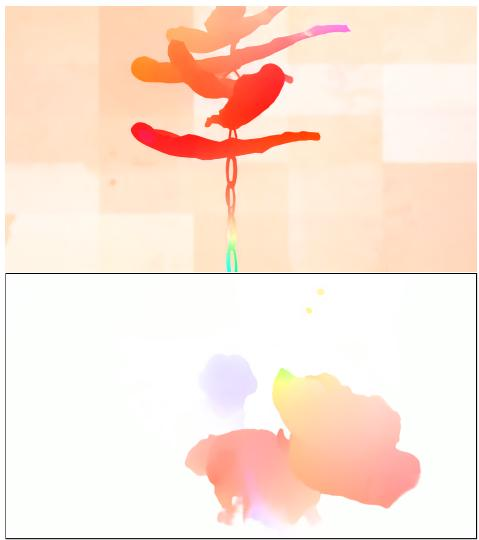  
(a) CroCo-Pro (Late Feature Fusion)

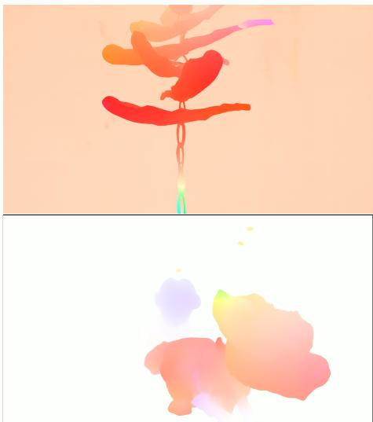  
(b) FreeFlow-L (Dense Feature Fusion)  
Fig. 1: Feature fusion ablation. We compare a DepthPro-style Late Feature Fusion baseline (CroCo backbone with multi-scale decoding) to FreeFlow with Dense Feature Fusion. Late fusion does not reliably propagate information between scales and tiles: the model tends to rely on the finest-level tiles and under-utilize coarse-scale features, leading to globally inconsistent flow despite sharp local detail (left). Dense fusion exchanges features throughout the network, yielding predictions that are both locally detailed and globally consistent (right).

## C Additional results

## C.1 Training Details

We use AdamW with $\beta _ { 1 } = 0 . 9$ and $\beta _ { 2 } = 0 . 9 5$ . For pretraining, we adopt a linear warmup followed by a cosine learning-rate decay. For optical flow finetuning, we use a linear warmup followed by a linear decay schedule, which is standard in optical flow training. We train with the Mixture-of-Laplace (Sec. A.2) loss from S A A

Table 1: Patch size ablation. We compare FreeFlow-S with a $1 6 \times 1 6$ variant at matched 1080p inference time. To account for the larger image area represented by each token, we increase the variant’s width and number of attention heads. The base model still achieves better 1px accuracy with much lower memory and parameter cost.
<table><tr><td rowspan="2">size</td><td rowspan="2">Patch Pre-train Mask. crop</td><td rowspan="2">ratio</td><td rowspan="2">Width</td><td colspan="2">Inf. Cost (1080p)</td><td rowspan="2">Params (M)</td><td colspan="2">Spring (sub-val)</td></tr><tr><td>Memory (GB) Time (ms)</td><td></td><td>1px ↓</td><td>EPE↓</td></tr><tr><td>8×8</td><td>[224, 224]</td><td>0.95</td><td>256</td><td>1.02</td><td>144</td><td>34.58</td><td>0.181</td><td>0.709</td></tr><tr><td>16×16</td><td>[256, 256]</td><td>0.9</td><td>768</td><td>2.91</td><td>120</td><td>278.88</td><td>0.174</td><td>0.798</td></tr></table>

## C.2 Patch Size Ablation

We investigate the role of the patch size on our method’s performance. As the base $8 \times 8$ model, we take FreeFlow-S. For the 16×16 model, to make for a fair comparision, we increase the width from 256 to 768 and the number of attention heads from 4 to 12, resulting in similar execution time.

Tab. 1 shows that the 16×16 variant is only marginally better in EPE (0.174 vs. 0.181), while being worse in 1px (0.798 vs. 0.709) and substantially more expensive in parameters and memory (279M and 2.91 GB vs. 35M and 1.02 GB). Overall, this supports using smaller patches in our setting, as they provide comparable accuracy at a substantially lower memory and parameter cost.

## C.3 Comparison to Vanilla ViT

To study the performance of the proposed architecture separately from the used training procedure, we trained a variant in which FreeFlow encoder/decoder modules are substituted for vanilla ViTs. This model closely resembles Croco-Flow’s and Win-Win’s designs (except for the DPT-head used in the postprocessing stage). The results are presented in Tab. 2 (rows 1–3). Even within a larger computational budget (270–410 ms vs 131 ms), the ViT-based model results in a larger prediction error, while the quality diference between the ViT and FreeFlow models with similar parameter counts is negligible (with the ViT model being almost 6 times slower). This confirms that the proposed Local-Global attention design, not the training recipe alone, improves on the qualityperformance tradeof of a standard ViT-based approach.

## C.4 Injecting Biases back into FreeFlow

We modified FreeFlow to include explicit optical flow biases, testing a GeoViTlike iterative warping procedure as it is straightforward to integrate and currently among the most efective iterative transformer-based approaches. We do not change the model during pretraining, only introducing warping and the recursive module (the same ConvGRU as in GeoViT) during the optical flow fine-tuning stage. Results are provided in Tab. 2 (rows 6–8). The GeoViT-like variant shows slightly better prediction quality within the same parameter budget in some configurations, but at the cost of slightly slower inference due to its iterative nature. This is consistent with expectations: the inductive bias ofloads taskspecific knowledge into an explicit operator, increasing the efective capacity of the model. This further illustrates that flow-specific biases are not necessary to reach SOTA performance, but can be added to FreeFlow to improve accuracy at the cost of speed and architectural generality.

Table 2: Comparison with close alternative approaches, results on Spring (sub-val) after Spring (sub-train). All models have a width of 256 with 4 attention heads (except for FreeFlow-S+, which has 8), used a masking ratio of 0.95 during pre-training, and followed the training procedure described above. The "iters" column indicates the number of iterative refinements used in GeoViT warping (during both training and inference). "+" splits time into the transformer and the postprocessing head parts.
<table><tr><td>Type</td><td>Layers Iters</td><td>Time (ms) Params (1080p)</td><td>(M) 1px↓</td><td>Spring (sub-val)</td></tr><tr><td rowspan="3">ViT</td><td>4</td><td>278+13</td><td>15.36 1.021</td><td>EPE↓ 0.217</td></tr><tr><td>6</td><td>415+13</td><td>19.05 0.809</td><td>0.216</td></tr><tr><td>12</td><td>829+13</td><td>30.11 0.698</td><td>0.192</td></tr><tr><td></td><td></td><td></td><td></td><td></td></tr><tr><td>FreeFlow-S</td><td>4</td><td>131+13</td><td>34.58 0.709</td><td>0.181</td></tr><tr><td>FreeFlow-S+</td><td>8</td><td>256+13</td><td>60.90 0.624</td><td>0.157</td></tr><tr><td>FreeFlow-S</td><td>4 1</td><td>131+40</td><td>33.12 0.660</td><td>0.165</td></tr><tr><td>with GeoViT</td><td>2 2</td><td>131+62</td><td>19.96 0.719</td><td>0.171</td></tr><tr><td>warping</td><td>4 2</td><td>262+53</td><td>33.12</td><td>0.583 0.148</td></tr></table>

## C.5 Zero-shot Performance

We evaluate zero-shot transfer on the Sintel and KITTI training sets by finetuning only on TartanAir (TA) and FlyingThings3D. Specifically, we remove the Sintel, KITTI, and HD1K portions from the TaTSKH / TaTSKH-hq stages and report performance after completing the “hq” stage (Tab. 3).

FreeFlow attains reasonable zero-shot performance on Sintel and KITTI under TA+Things finetuning, but does not improve monotonically with model size. This behavior is expected for a bias-free model in a data-limited regime: transfer is primarily constrained by the motion and appearance coverage of the available training signal, and increasing capacity alone does not guarantee gains.

This trend is reflected by the methods that use broader pretraining datasets. GeoViT, pretrained on the large Kinetics-400 video dataset, achieves the strongest zero-shot performance on Sintel, consistent with exposure to substantially more varied motion. In contrast, CroCo-Flow, pretrained only with CroCo-style data and without the use of TA during training, exhibits weaker transfer. Finally, the WAFT variants suggest that large-scale monocular pretraining alone is not always suficient for zero-shot optical flow: despite substantially larger pretraining datasets, their transfer does not match methods pretrained on binocular or video data, indicating the importance of multi-view and motion-centric pretraining signals.

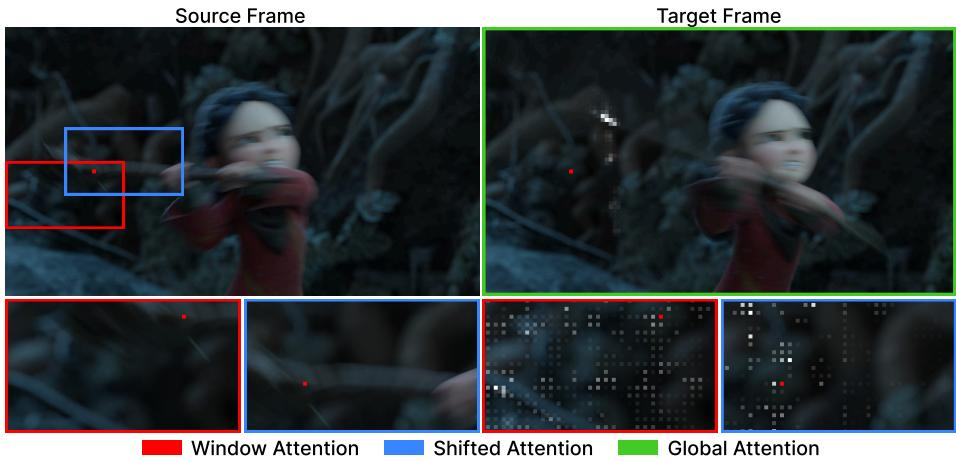  
Fig. 2: Visualization of the softmax logits for diferent parts of the proposed localglobal attention. The red point represents the query token.

## C.6 Additional Model Analysis

We show visualizations for diferent attention types in Fig. 2: global attention helps FreeFlow capture large displacements, while local attention processes small shifts. On shifted-window attention in the decoder, the window partition is shifted identically in both frames so that corresponding regions remain colocated across the pair.

## D Additional Qualitative Comparisons

We provide additional qualitative samples for Sintel (Fig. 3) and KITTI-15 (Fig. 4) datasets.

Table 3: Zero-shot comparison. We report zero-shot evaluation results on the Sintel and KITTI-15 training sets. By default, all methods are trained or fine-tuned for optical flow estimation on (FlyingChairs +) FlyingThings3D, with the "TA" column indicating that TartanAir was additionally used. Method biases abbreviations: IR: Iterative Refinement, CV: Correlation Volume, W: Warping. The pre-train column indicates whether some part of the method was not trained from scratch, size is reported as the total number of frames in the dataset (for CroCo, this is double the number of image pairs, for Kinetics, this is the total number of frames in all videos). "MF" indicates that the method used multiple frames (three or more) to generate it’s submissions.
<table><tr><td rowspan="2">Method</td><td colspan="3">Biases</td><td colspan="2">Pre-train</td><td rowspan="2">TA</td><td colspan="2">Sintel (train)</td><td colspan="2">KITTI-15 (train)</td></tr><tr><td>IR CV W</td><td></td><td></td><td>Name</td><td>Size</td><td></td><td></td><td>Clean↓ Final↓ Fl-epe↓</td><td>Fl-all↓</td></tr><tr><td>RAFT</td><td></td><td></td><td></td><td></td><td></td><td>X</td><td>1.43</td><td>2.71</td><td>5.04</td><td>17.4</td></tr><tr><td>GMA</td><td></td><td>√</td><td></td><td></td><td></td><td>X</td><td>1.30</td><td>2.74</td><td>4.69</td><td>17.1</td></tr><tr><td>FlowFormer</td><td></td><td>√</td><td></td><td>ImageNet-1K 1.3M</td><td></td><td>X</td><td>1.01</td><td>2.40</td><td>4.09</td><td>14.7</td></tr><tr><td>SEA-RAFT (S)</td><td></td><td>√</td><td></td><td>ImageNet-1K 1.3M</td><td></td><td>√</td><td>1.27</td><td>3.74</td><td>4.43</td><td>15.1</td></tr><tr><td>SEA-RAFT (M)</td><td>√</td><td>√</td><td></td><td>ImageNet-1K 1.3M</td><td></td><td>X</td><td>1.21</td><td>4.04</td><td>4.29</td><td>14.2</td></tr><tr><td>SEA-RAFT (L)</td><td>√</td><td>√</td><td></td><td>ImageNet-1K 1.3M</td><td></td><td>X</td><td>1.19</td><td>4.11</td><td>3.62</td><td>12.9</td></tr><tr><td>DPFlow</td><td></td><td>√</td><td></td><td></td><td></td><td>X</td><td>1.02</td><td>2.26</td><td>3.37</td><td>11.1</td></tr><tr><td>VideoFlow-BOF(MF)</td><td></td><td>√</td><td></td><td>ImageNet-1K 1.3M</td><td></td><td>X</td><td>1.03</td><td>2.19</td><td>3.96</td><td>15.3</td></tr><tr><td>VideoFlow-MOF(MF)</td><td></td><td></td><td></td><td>ImageNet-1K 1.3M</td><td></td><td>×</td><td>1.18</td><td>2.56</td><td>3.89</td><td>14.2</td></tr><tr><td>MemFlow(MF)</td><td></td><td></td><td></td><td></td><td></td><td>X</td><td>0.93</td><td>2.08</td><td>3.88</td><td>13.7</td></tr><tr><td>MemFlow-T(MF)</td><td></td><td></td><td>×××××××××××××××</td><td>ImageNet-1K 1.3M</td><td></td><td>X</td><td>0.85</td><td>2.06</td><td>3.38</td><td>12.8</td></tr><tr><td>StreamFlow(MF)</td><td></td><td></td><td></td><td>ImageNet-1K 1.3M</td><td></td><td>X</td><td>0.87</td><td>2.11</td><td>3.85</td><td>12.6</td></tr><tr><td>MEMFOF(MF)</td><td></td><td>V</td><td></td><td>ImageNet-1K 1.3M</td><td></td><td>X</td><td>1.10</td><td>2.70</td><td>3.31</td><td>10.1</td></tr><tr><td>MEMFOF(MF)</td><td></td><td>」</td><td></td><td>ImageNet-1K 1.3M</td><td></td><td>√</td><td>1.20</td><td>3.91</td><td>2.93</td><td>9.9</td></tr><tr><td>ARFlow(MF)</td><td></td><td>√</td><td></td><td>ImageNet-1K 1.3M</td><td></td><td>√</td><td>0.88</td><td>2.07</td><td>2.86</td><td>9.2</td></tr><tr><td>WAFT-Twins-a2</td><td>&lt;&gt;&gt;&gt;</td><td>X</td><td>v&gt;</td><td>ImageNet-1K 1.3M</td><td></td><td>√</td><td>1.02</td><td>2.46</td><td>2.98</td><td>9.9</td></tr><tr><td>WAFT-DAv2-a2</td><td></td><td>X</td><td></td><td>DAv2</td><td>63M</td><td></td><td>1.01</td><td>2.49</td><td>3.28</td><td>10.9</td></tr><tr><td>WAFT-DINOv3-a2</td><td></td><td>X</td><td></td><td>LVD-1689M</td><td>1.7B</td><td>V</td><td>1.28</td><td>2.56</td><td>3.49</td><td>12.9</td></tr><tr><td>GeoViT</td><td></td><td>X</td><td></td><td>Kinetics-400</td><td>59M</td><td>X</td><td>0.69</td><td>1.78</td><td>3.15</td><td>11.5</td></tr><tr><td>CroCo-Flow</td><td>X</td><td>X</td><td>X</td><td>CroCo v2</td><td>15M</td><td>X</td><td>1.28</td><td>2.58</td><td></td><td></td></tr><tr><td>FreeFlow-S (ours)</td><td>×</td><td>X</td><td>×</td><td>CroCo v2</td><td>7.4M</td><td>√</td><td>0.91</td><td>3.16</td><td>3.41</td><td>10.4</td></tr><tr><td>FreeFlow-M (ours)</td><td>×</td><td>X</td><td>X</td><td>CroCo v2</td><td>7.4M√</td><td></td><td>1.01</td><td>3.12</td><td>5.89</td><td>14.6</td></tr><tr><td>FreeFlow-L (ours)</td><td>X</td><td>X</td><td>X</td><td>CroCo v2</td><td>7.4M√</td><td></td><td>1.04</td><td>2.30</td><td>4.77</td><td>12.9</td></tr></table>

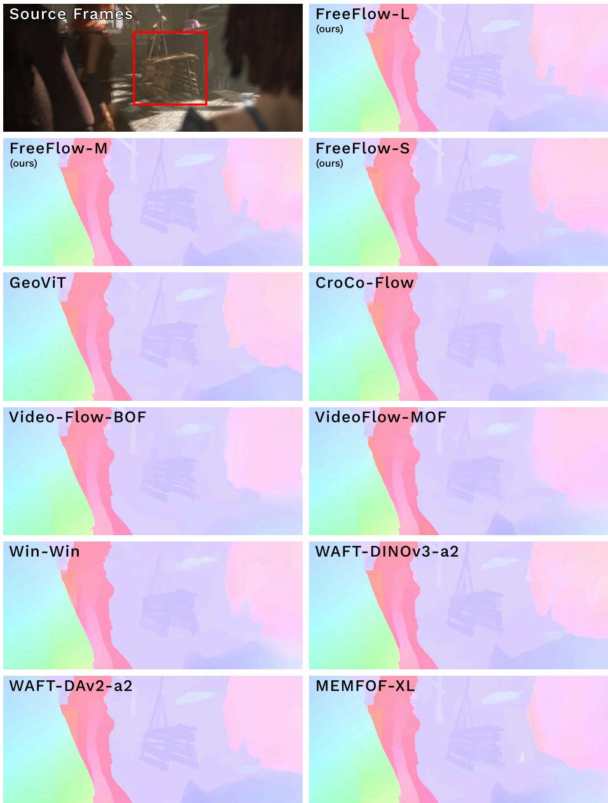  
Fig. 3: Additional qualitative samples on Sintel. Across the board FreeFlow models produce the sharpest details and efectively separate the wooden structure from the background. Images are sourced from the oficial leaderboard webpages. Viewer is advised to zoom in.

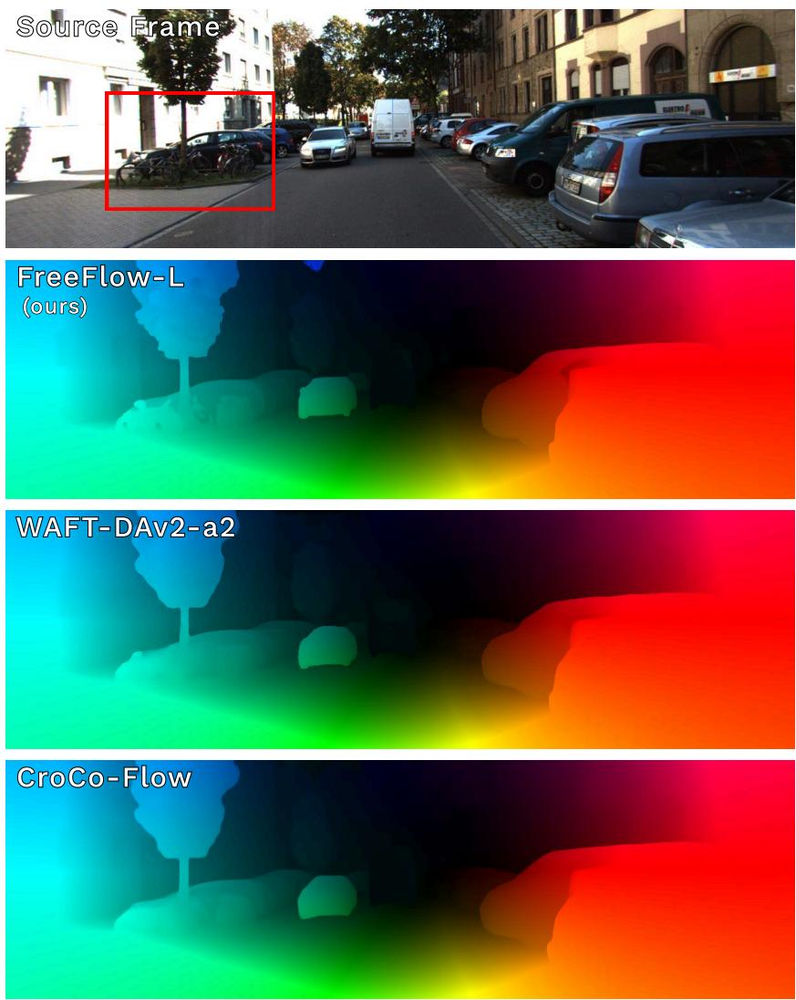  
Fig. 4: Additional qualitative samples on KITTI-15. FreeFlow has significantly more details on complex objects such as the wheels of bicycles, side-view mirrors of cars and tree foliage. Images are sourced from the oficial leaderboard webpages. Viewer is advised to zoom in.