# Harnessing Intrinsic Subject-Aware Attention for Controllable Multi-Subject Video Generation

Niange Yu1⋆, Ye Tian2, Biaolong Chen1, Miao Lu1, Aixi Zhang1, Hao Jiang1, Yunhai Tong2, and Pipei Huang1

1 Alibaba Group

2 Peking University

Abstract. Multi-subject video generation faces two key challenges: uncontrollable fidelity strength and potential semantic drift. We address these by analyzing the internal mechanisms of Difusion Transformers (DiTs). We found that certain attention blocks naturally form an Intrinsic Spatial Grounding Map (ISGM) that precisely locates reference subjects. Building on this insight, we propose Dual-phase Intrinsic Attention Leveraging (DIAL), a framework that uses these internal signals for both training and inference. In low-noise stages, we use ISGM to guide the attention mechanism, allowing precise control over fidelity strength during inference without retraining. In high-noise stages, we use these same maps to automatically build preference pairs at no additional cost for Reinforcement Learning (RL). This RL procedure efectively anchors the model’s attention to reference subjects and mitigates semantic drift. Extensive experiments show that DIAL significantly outperforms baseline models on the OpenS2V-Eval benchmark, consistently improving identity consistency and enabling controllable fidelity strength.

## 1 Introduction

Recent advances in difusion models [16, 27] enables significant breakthroughs in video generation [21, 28, 32, 35], delivering realistic and temporally coherent results across text-to-video (T2V) [14, 32] and image-to-video (I2V) [3] tasks. Despite these successes, general-purpose models still struggle to provide finegrained, user-centric controllability, especially when users require multiple personalized subjects to remain visually consistent in a dynamic sequence.

This trend has pushed the field toward a more demanding frontier: Subjectto-Video (S2V) generation [23, 24, 38]. Unlike T2V, S2V requires the model to strictly adhere to the visual identities provided by one or multiple reference images while accurately executing complex motion instructions. This capability is critical for high-value applications such as personalized storytelling, virtual try-on, and cinematic production.

While existing approaches have tackled consistency via high-quality dataset curation [24], Vision-Language Model (VLM) feature extraction [23], and novel model architectures [38], two critical limitations remain largely unexplored. First, the fidelity strength in most models is inflexible and uncontrollable. Typically, consistency strength is dictated solely by the training data. For example, crop-based paired data often induces a rigid copy-paste efect, while cross-domain data yields weaker fidelity. As a result, users cannot dynamically adjust the consistency strength to suit diferent scenarios at inference time. Second, existing models often sufer from semantic drift, where the generated content deviates from the reference-conditioned semantics. This drift typically appears as (i) subject disappearance, (ii) attribute mismatch, and (iii) multi-reference entanglement, where identities or attributes across multiple references are mixed or swapped, as is shown in Fig. 1.

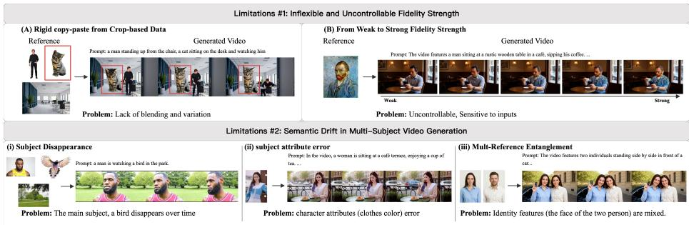  
Fig. 1: Limitations for current subject-to-video generation methods: (Top) Inflexible fidelity strength: existing models either produce unnatural “copy-paste” efects due to training data bias (A) or exhibit uncontrollable sensitivity to inputs (B). (Bottom) Semantic drift: models frequently sufer from (i) subject disappearance over time, (ii) attribute errors (e.g., clothing color drift), and (iii) multi-reference entanglement where identities from diferent subjects are mixed.

To address these limitations, we hypothesize that both uncontrollable fidelity and semantic drift are rooted in misaligned attention to reference subjects during denoising. We therefore investigate the internal mechanics of Difusion Transformers (DiTs) with a layer-wise analysis of cross-attention. We obtain subject masks from a semantic segmentation pipeline and use them as ground truth, and measure the spatial correlation between these masks and the attention weights at each layer and timestep.

This analysis reveals a surprising pattern(Fig. 2): Certain attention block(s) consistently assigns the strongest and most spatially concentrated attention to the reference subjects, yielding markedly higher grounding accuracy than other layers. We term these peaking internal signals the Intrinsic Spatial Grounding Map (ISGM). The ISGM precisely localizes reference subjects in the video latent space, providing an intrinsic guidance signal that can be leveraged to modulate and strengthen subject consistency throughout the denoising process.

Inspired by this finding, we propose Dual-phase Intrinsic Attention Leveraging (DIAL), which exploits ISGM for both training-free inference control and training-time alignment.

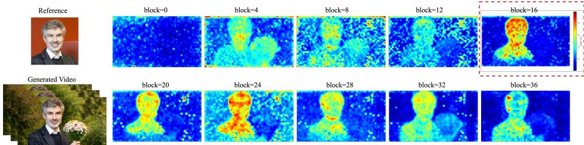  
Fig. 2: Visualization of the attention peaking phenomenon and Intrinsic Spatial Grounding Maps (ISGM) in Kaleido [38] Baseline. Layer-wise analysis reveals that while most attention blocks produce difuse noise, a certain block consistently exhibits the most spatially concentrated grounding to the reference subject.

In the late denoising stages, ISGM is sharp and spatially reliable. We extract ISGM from the identified blocks, binarize it into subject-specific spatial guides, and use them to inject a controllable attention bias into all attention blocks during denoising. This mechanism is training-free and also supports independent, adjustable guidance for each reference subject in multi-subject scenarios, leading to large gains in identity consistency.

In the early denoising stages, attention is noisier and ISGM is not suitable for direct supervision. To better exploit its signal, we introduce a zerocost preference construction pipeline for Reinforcement Learning (RL) finetuning. Specifically, we score generated denoising trajectories by measuring how well their ISGM aligns with the ground-truth masks. These scores allow us to automatically build preference pairs without manual annotation, and we use them to fine-tune the model to anchor attention to reference subjects. This procedure stabilizes reference grounding and mitigates potential semantic drift.

Applied to strong subject-to-video baselines [24,38], DIAL delivers consistent improvements in both quantitative and qualitative evaluations, and achieves state-of-the-art performance on the OpenS2V-Eval [36] benchmark. Further analyses and ablations show that DIAL enables free and fine-grained fidelity control at inference time without sacrificing overall visual quality. Moreover, it substantially reduces semantic drift and leads to more reliable subject grounding. Our contributions are as follows:

1. We uncover a subset of high-quality attention blocks in DiT architectures whose attention patterns form an Intrinsic Spatial Grounding Map (ISGM) that precisely localizes reference subjects.

2. We propose a training-free, inference-time guided attention mechanism that enables precise, region-adaptive, and user-controllable fidelity enhancement for multi-subject generation.

3. We introduce a zero-cost preference pair construction strategy and leverage reinforcement learning to efectively anchor reference grounding and mitigate semantic drift.

4. By combining these components, our unified framework DIAL achieves stateof-the-art performance on the OpenS2V-Eval benchmark [36].

## 2 Related Work

## 2.1 Subject-to-Video Generation

Subject-to-video (S2V) generation has evolved from computationally expensive per-subject optimization or fine-tuning [8, 33] to eficient end-to-end adapters that enable zero-shot identity preservation [20,23,24]. Representative frameworks such as Phantom [24] and VACE [20] utilize joint injection and unified context adapters to facilitate multimodal alignment. More recent models like Hunyuan-Custom [18], MAGREF [11], and PolyVivid [19] have further refined identity injection through region-aware masking and 3D-RoPE. Notably, Kaleido [38] improves reference grounding via Reference Rotary Positional Encoding (R-RoPE) and curated data construction. However, these models still frequently sufer from semantic drift—such as subject disappearance or attribute entanglement—and lack a mechanism for user-controllable fidelity strength, as the consistency level is typically fixed by the training data bias [24].

## 2.2 Attention Analysis in Difusion Models

Attention maps are widely utilized as diagnostic and control interfaces in difusion models. In U-Net architectures, cross-attention maps facilitate groundingaware editing [15] and subject emphasis [7], while self-attention serves as a structural cue for training-free guidance in methods like SAG [17] and PAG [1]. Recently, these techniques have been extended to Difusion Transformers (DiTs). DiTCtrl [5] explores attention control in MM-DiT for coherent video generation, and DiT4Edit [13] adapts these controls for image editing. Despite this progress, existing literature rarely characterizes which specific internal DiT blocks provide the most reliable Intrinsic Spatial Grounding Map (ISGM) for multi-subject synthesis. DIAL fills this gap by identifying privileged attention layers that naturally act as grounding modules.

## 2.3 Reinforcement Learning for Difusion Models

Reinforcement learning (RL) has become a practical tool for aligning difusion models with downstream objectives. Early methods like DDPO [2] optimized models via policy gradients, while modern approaches favor preference-based alignment. Difusion-DPO [31] adapted Direct Preference Optimization to the difusion paradigm, and video-specific variants like VideoDPO [25] and Dance-GRPO [34] have scaled these techniques to temporal generation. However, these methods typically depend on expensive human feedback or external reward models. In contrast, DIAL introduces a zero-cost preference construction pipeline that scores denoising trajectories based on the spatial alignment between the ISGM and ground-truth subject masks, enabling automated anchoring of subject semantics.

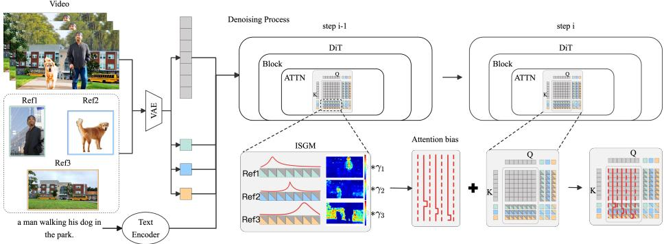  
Fig. 3: Phase I: Attention Guidance via ISGM. This training-free mechanism extracts the Intrinsic Spatial Grounding Map (ISGM) from step i − 1 to guide the self-attention (ATTN) in step i. Each subject has an independent, spatially-aligned ISGM used to construct an attention bias matrix. The guidance strength (γk) can be adjusted independently for each subject, enabling precise identity fidelity control without requiring model updates.

## 3 Method

## 3.1 Preliminaries

Video Difusion Models We adopt a text-conditioned Difusion Transformer (DiT) architecture [27] for latent video generation. Let $\mathbf { x } _ { 0 } = \{ \mathbf { x } _ { 0 } ^ { ( f ) } \} _ { f = 1 } ^ { F }$ denote a video clip with $F$ frames. A spatio-temporal VAE encoder $E ( \cdot ) \dot { }$ maps the video into a compact latent representation $\mathbf { z } _ { 0 } ~ = ~ E ( \mathbf { x } _ { 0 } ) ~ \in ~ \mathbb { R } ^ { T \times \dot { C } \times H \times \hat { W } } ~ [ 3 2 ]$ Following the rectified flow matching framework [26, 32], generation is modeled as an interpolation between the data latent $\mathbf { z } _ { 0 }$ and Gaussian noise ${ \bf z } _ { 1 } \sim \mathcal { N } ( { \bf 0 } , { \bf I } )$ For $t \sim \mathcal { U } ( 0 , 1 )$ , the noisy latent is formed as:

$$
{ \bf z } _ { t } = ( 1 - t ) { \bf z } _ { 0 } + t { \bf z } _ { 1 } ,\tag{1}
$$

with the target velocity defined as $\begin{array} { r } { { \bf v } _ { t } = \frac { d { \bf z } _ { t } } { d t } = { \bf z } _ { 1 } - { \bf z } _ { 0 } } \end{array}$ . A DiT-based network predicts the velocity $\mathbf { v } _ { \theta } ( \mathbf { z } _ { t } , t , \mathbf { c } )$ conditioned on text tokens c, and is optimized using the flow-matching objective:

$$
\mathcal { L } _ { \mathrm { f m } } = \mathbb { E } _ { t , { \mathbf { z } _ { 0 } } , { \mathbf { z } _ { 1 } } } \left[ \left\| \mathbf { v } _ { t } - \mathbf { v } _ { \theta } ( { \mathbf { z } _ { t } } , t , \mathbf { c } ) \right\| _ { 2 } ^ { 2 } \right] .\tag{2}
$$

During inference, the video is generated by numerically solving the ODE $d \mathbf { z } _ { t } / d t =$ $\mathbf { v } _ { \theta } ( \mathbf { z } _ { t } , t , \mathbf { c } )$ from t = 1 to t = 0, followed by VAE decoding $\hat { \mathbf { x } } _ { 0 } = D ( \mathbf { z } _ { 0 } )$ [32].

Subject-to-Video Generation Subject-to-video (S2V) generation aims to synthesize a video $\hat { \mathbf { x } } _ { 0 }$ that aligns with a text prompt y while maintaining the visual identity of a set of reference subjects $\mathcal { R } = \{ \mathbf { I } _ { k } \} _ { k = 1 } ^ { K } \ [ 2 4 , 3 8 ]$

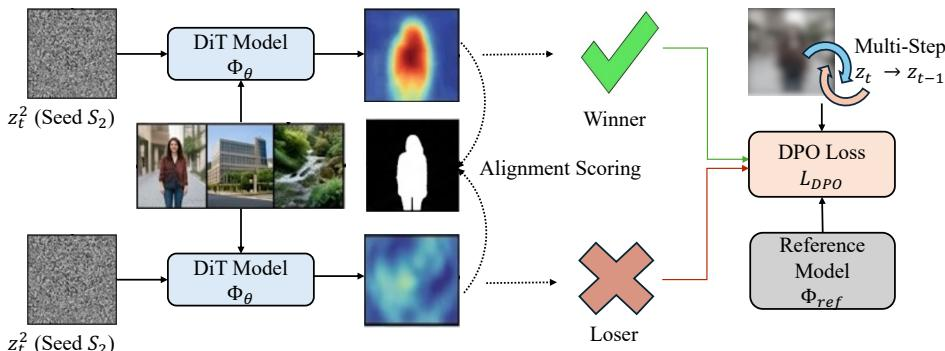  
Phase II: High-noise RL Anchoring via Preference Optimization  
Fig. 4: Phase II: Dual-Seed Preference Optimization. We construct preference pairs by evaluating the spatial alignment between the subject mask ${ { \bf { M } } _ { k } }$ and ISGMs generated from distinct random seeds. Then we use DPO to optimize the model policy, enabling proactive anchoring of subject semantics and mitigation of drift during the high-noise denoising phase.

Following current state-of-the-art backbones [32, 38], reference information is injected through intrinsic latent-token interaction. Each reference image $\mathbf { I } _ { k }$ is mapped to a spatial latent $\mathbf { z } _ { \mathrm { i m g } } ^ { ( k ) } = E ( \mathbf { I } _ { k } )$ . At each denoising step t, the video latent $\mathbf { z } _ { t }$ and all reference latents are concatenated:

$$
\widetilde { \mathbf { z } } _ { t } = \mathrm { C o n c a t } _ { c } \left( \mathbf { z } _ { \mathrm { i m g } } ^ { ( 1 ) } , \cdot \cdot \cdot , \mathbf { z } _ { \mathrm { i m g } } ^ { ( K ) } , \mathbf { z } _ { t } \right) .\tag{3}
$$

The resulting tensor is patchified and linearly projected to form the initial token sequence $\mathbf { H } ^ { ( 0 ) } = \mathrm { P a t c h } \mathbf { \bar { E } } \mathrm { m b e d } ( \tilde { \mathbf { z } } _ { t } )$ . In this unified sequence, video and reference tokens coexist, enabling the DiT’s self-attention layers to perform joint spatiotemporal modeling and cross-modal identity transfer [38]. Textual conditions are typically incorporated via cross-attention. In our framework, we primarily focus on manipulating these spatio-temporal self-attention blocks to achieve controllable fidelity and mitigate semantic drift.

## 3.2 Identification of Intrinsic Spatial Grounding Maps (ISGM)

We begin with a practical observation on current open-source S2V systems [24, 38] as shown in Fig. 1: despite strong overall quality, they frequently exhibit semantic drift in real usage. In these failure cases, the reference subjects are missing, attributes deviate, or multiple references become entangled. These errors suggest a mismatch between what the references specify and how the model actually uses them during denoising. Intuitively, this points to a failure in the interaction between the noisy video latent and reference-image latents, which in DiT backbones is primarily mediated by self-attention over the joint token sequence. To resolve this, we conducted a layer-wise investigation of the attention blocks to locate the source of this misalignment.

Token Layout. At denoising step i, the DiT processes a token sequence $\mathbf { H } _ { i } =$ $[ \mathbf { H } _ { i , 1 } ^ { \mathrm { r e f } } ; \ldots ; \mathbf { H } _ { i , K } ^ { \mathrm { r e f } } ; \mathbf { H } _ { i } ^ { \mathrm { v i d } } ]$ . Here, ${ \bf { H } } _ { i , k } ^ { \mathrm { r e f } }$ represents tokens from the k-th reference latent and $\mathbf { H } _ { i } ^ { \mathrm { v i d } }$ denotes tokens from the noisy video latent. Given $N _ { k }$ as the token length of ${ \bf { H } } _ { i , k } ^ { \mathrm { r e f } }$ and $N _ { b }$ as the length of $\mathbf { H } _ { i } ^ { \mathrm { v i d } }$ , the total sequence length is $N =$ $\textstyle \sum _ { k = 1 } ^ { K } N _ { k } + N _ { b }$

Extracting per-subject Attention Maps. For each self-attention module, let queries and keys be $\mathbf { Q } \in \mathbf { \bar { \mathbb { R } } } ^ { h \times N \times d }$ and $\mathbf { K } \in \mathbb { R } ^ { h \times N \times d }$ . We measure the attention from video tokens to each reference subject by computing:

$$
\mathbf { A } = \frac { 1 } { h } \sum _ { m = 1 } ^ { h } \mathrm { s o f t m a x } \left( \frac { \mathbf { Q } _ { \mathrm { v i d } } ^ { ( m ) } ( \mathbf { K } ^ { ( m ) } ) ^ { \top } } { \sqrt { d } } \right) \in \mathbb { R } ^ { N _ { b } \times N }\tag{4}
$$

where $\mathbf { Q } _ { \mathrm { v i d } } ^ { ( m ) }$ corresponds to queries from the video tokens. The per-subject attention score is then defined as:

$$
\mathbf { s } _ { k } = \sum _ { j \in \mathcal { T } _ { k } } \mathbf { A } _ { : , j } \in \mathbb { R } ^ { N _ { b } } , \quad \mathcal { T } _ { k } = \left[ \sum _ { \ell < k } N _ { \ell } , \sum _ { \ell \leq k } N _ { \ell } \right)\tag{5}
$$

We aggregate these into a joint score matrix ${ \bf S } = [ { \bf s } _ { 1 } , \dots , { \bf s } _ { K } ] \in \mathbb { R } ^ { N _ { b } \times K }$

The Peaking Phenomenon. We evaluate S for each attention block and identify the block that yields the highest grounding accuracy. Our analysis is shown in Fig. 5. This reveals a consistent peaking phenomenon across diverse prompts. Among the numerous attention blocks, a specific block yields the highest interaction score. The attention map in the specific block is highly concentrated and aligns precisely with the subject regions. We define this refined signal as the Intrinsic Spatial Grounding Map (ISGM). The discovery of these intrinsic maps suggests that the DiT backbone contains a specialized grounding layer for subject-to-video information transfer. This layer serves as the foundation for our Dual-phase Intrinsic Attention Leveraging(DIAL).

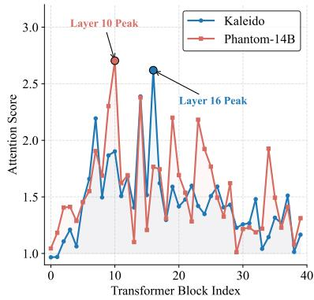  
Fig. 5: Attention peaking across blocks.

## 3.3 DIAL Phase I: Low-noise Inference Guidance

Building on the discovery of ISGMs, we first utilize this intrinsic attention signal to implement training-free fidelity control. Our observations indicate that during the later stages of the denoising process, typically the final $8 0 \%$ of timesteps, the attention maps for individual subjects become highly structured and spatially consistent. These maps serve as reliable spatial anchors to guide the synthesis of fine-grained details in subsequent steps.

Let $\mathbf { S } _ { i - 1 }$ be the extracted ISGM from step i−1. We normalize it to obtain a soft spatial guide $\tilde { \mathbf { S } } _ { i - 1 } ( : , k ) = \mathbf { S } _ { i - 1 } ( : , k ) / \operatorname* { m a x } ( \mathbf { S } _ { i - 1 } ( : , k ) )$ ). Optionally, a binary guide can be obtained by thresholding. At step i, we modulate all self-attention modules in the DiT backbone by injecting a controllable bias matrix $\mathbf { M } _ { i }$ into the attention logits. This bias specifically targets the interaction between video queries and reference subject keys:

$$
\mathbf { M } _ { i } ( q , j ) = \left\{ \begin{array} { l l } { \log ( \gamma _ { k } ) \cdot \tilde { \mathbf { S } } _ { i - 1 } ( q , k ) , } & { q \in \mathbb { Z } _ { \mathrm { v i d } , j } \in \mathbb { Z } _ { k } , } \\ { 0 , } & { \mathrm { o t h e r w i s e } } \end{array} \right.\tag{6}
$$

where $\gamma _ { k } > 0$ is a user-specified fidelity scale for subject k, $\begin{array} { r } { \mathcal { T } _ { \mathrm { v i d } } = [ \sum _ { k = 1 } ^ { K } N _ { k } } \end{array}$ , N) denotes the index range of video tokens, and $\mathcal { T } _ { k }$ denotes the key range of the k-th reference as above.

For an attention module at step $i ,$ the biased attention is computed as

$$
\mathrm { A t t n } _ { i } ( \mathbf { Q } _ { i } , \mathbf { K } _ { i } , \mathbf { V } _ { i } ) = \mathrm { s o f t m a x } \Bigg ( \frac { \mathbf { Q } _ { i } \mathbf { K } _ { i } ^ { \top } } { \sqrt { d } } + \mathbf { M } _ { i } \Bigg ) \mathbf { V } _ { i } .\tag{7}
$$

Intuitively, Mi selectively increases the attention paid by guided video regions to the corresponding reference subject, enabling independent and continuous fidelity control in multi-subject generation. This mechanism, as is shown in $\mathrm { F i g . 3 } ,$ is training-free and requires no model updates; it only reuses ISGM from the previous denoising step and adds a lightweight log-scale bias. This process is illustrated in Algorithm 1 and Fig. 3.

## 3.4 DIAL Phase II: High-noise Anchoring via Preference Optimization

While the inference-time guidance in Phase I efectively enhances subject fidelity, its performance relies heavily on the clarity of the extracted ISGM. Our investigations reveal that this is insuficient during the high-noise regime, typically the initial 20% of denoising steps. In this stage, the intrinsic attention signals are highly stochastic and difused, failing to provide the precise spatial boundaries required for deterministic bias injection. Relying solely on inference guidance during high-noise stages often leads to unstable spatial layouts and irreversible semantic drift.

Since early denoising largely determines global layout and attribute grounding, we introduce a learning-based anchoring mechanism for this regime. Although pixel-wise supervision is unreliable at high noise, we can still rank denoising trajectories by how well their intrinsic maps align with reference subjects. We therefore cast high-noise alignment as a preference optimization problem in latent space and optimize the model toward trajectories with better grounding.

Algorithm 1 DIAL Phase I: Low-noise Inference Guidance   
Require: Pre-trained DiT model Φ, Reference subjects $R \ = \ \{ R _ { 1 } , . . . , R _ { K } \}$ , Text   
prompt T, Fidelity scales $\boldsymbol { \Gamma } = \{ \gamma _ { 1 } , \dots , \gamma _ { K } \}$ , Denoising steps $N .$   
Ensure: Generated video latent $\mathbf { z } _ { 0 }$   
1: Initialize ${ \mathbf z } _ { N } \sim \mathcal { N } ( 0 , I ) ;$   
2: $\mathbf { S } ^ { ( N + 1 ) } $ None;   
3: for $i = N$ to 1 do   
4: // Step 1: Fidelity Bias Construction   
5: if $\mathbf { S } ^ { ( i + 1 ) }$ is not None and $i \le 0 . 8 N$ then   
6: Normalize $\mathbf { S } ^ { ( i + 1 ) }$ to obtain spatial guide $\tilde { \mathbf { S } } ^ { ( i + 1 ) } \colon$   
7: Construct Bias Matrix Mi using $\tilde { \mathbf { S } } ^ { ( i + 1 ) }$ and $T ;$ {Eq. (6)}   
8: Inject M into DiT attention modules;   
9: else   
10: Set ${ \bf M } _ { i } = { \bf 0 }$ (Disable guidance);   
11: end if   
12: $/ /$ Step 2: Denoising and Map Extraction   
13: $[ v _ { \theta } ( \mathbf { z } _ { i } ) , \mathbf { A } ^ { ( i ) } ]  \phi ( \mathbf { z } _ { i } , T , R , \mathbf { M } _ { i } ) ;$   
14: $\mathbf { z } _ { i - 1 } $ Denoise(zi, vθ(zi));   
15: // Step 3: ISGM Update for Next Step   
16: S(i) ← Extract $( \mathbf { A } ^ { ( i ) } , R ) ;$   
17: end for   
18: return ${ \bf z } _ { 0 } ;$

Zero-cost Preference Construction. Inspired by this, we leverage the intrinsic grounding capability of ISGM to automatically construct preference pairs without human annotation. For a training sample (V, T, R), we first obtain the ground-truth segmentation masks $\{ \mathbf { M } _ { k } \} _ { k = 1 } ^ { K }$ for each reference subject from the video V . We then generate two independent attention trajectories using diferent random seeds $S _ { 1 }$ and $S _ { 2 }$ . We define a Preference Score $P$ based on the spatial overlap between the extracted ISGM and the ground-truth mask:

$$
P = \sum _ { k = 1 } ^ { K } \frac { \sum ( \mathbf { M } _ { k } \odot \mathrm { I S G M } _ { k } ) } { \sum \mathrm { I S G M } _ { k } }\tag{8}
$$

where ⊙ denotes the element-wise product. $P$ quantifies the model’s self-consistency in grounding reference subjects within the latent space. For each sample, the trajectory with the higher $P$ is designated as the winner $v ^ { w }$ , while the other is the loser $v ^ { l }$

Multi-step DPO Training. To ensure stable semantic anchoring, we employ a multi-step Direct Preference Optimization (DPO) strategy. Unlike standard DPO that often relies on single-step noise prediction, our approach utilizes $T _ { \mathrm { d p o } }$ steps to obtain a more accurate evaluation of the attention layout. For each iteration $i \in \{ 1 , \dots , T _ { \mathrm { d p o } } \}$ , we compute the noise prediction $v _ { \theta }$ and the reference model prediction $v _ { r e f }$ (obtained by disabling adapters). The normalized DPO

Algorithm 2 DIAL Phase II: High-noise Anchoring via Preference Optimization   
Require: Pipeline Φ, training sample $( V , T , R )$ , Subject masks $\left\{ \mathbf { M } _ { k } \right\}$ , DPO iterations   
$T _ { \mathrm { d p o } } ,$ , beta $\beta .$   
Ensure: Updated LoRA weights for DiT.   
1: Sample $t \in [ t _ { m i n } , t _ { m a x } ]$ within high-noise boundary $( \mathrm { e . g . , } t \in [ 0 , 0 . 2 N ] ) ;$   
2: Initialize two noisy latents ${ \mathbf z } _ { t } ^ { 1 } , { \mathbf z } _ { t } ^ { 2 }$ with seeds $S _ { 1 } , S _ { 2 } ;$   
3: for $i = 1$ to $T _ { \mathrm { d p o } }$ do   
4: $v _ { \theta } ^ { 1 } , A ^ { 1 }  \phi ( \dot { \mathbf { z } _ { t } ^ { 1 } } , T , R ) ; v _ { \theta } ^ { 2 } , A ^ { 2 }  \phi ( \mathbf { z } _ { t } ^ { 2 } , T , R ) ;$   
5: Compute preference scores $P _ { 1 } , P _ { 2 }$ using $\left\{ \mathbf { M } _ { k } \right\}$ via Eq. 8;   
6: Identify winner $v ^ { w }$ and loser $v ^ { l }$ based on ma $\lbrack P _ { 1 } , P _ { 2 } ) ;$   
7: $v _ { r e f } ^ { w } , v _ { r e f } ^ { l }  \phi _ { r e f } ( \mathbf { z } _ { t } ^ { w , l } , T , R )$ (with adapters disabled);   
8: Compute $\mathcal { L } _ { D P O }$ using normalized logits via Eq. $^ { 9 ; }$   
9: Backpropagate and update $\theta ;$   
10: Update $\mathbf { z } _ { t } ^ { 1 , \breve { 2 } }$ for the next denoising step;   
11: end for

loss is defined as:

$$
\mathcal { L } _ { D P O } = - \mathbb { E } \left[ \log \sigma \left( \frac { ( \mathcal { L } _ { r e f } ^ { w } - \mathcal { L } _ { r e f } ^ { l } ) - ( \mathcal { L } _ { t r a i n } ^ { w } - \mathcal { L } _ { t r a i n } ^ { l } ) } { \tau } \right) \right]\tag{9}
$$

where $\mathcal { L } = \| v _ { \theta } - v _ { t a r g e t } \| ^ { 2 }$ is the mean squared error of the noise prediction, and $\tau$ is a dynamic scale factor derived from the running mean of the loss diferences to maintain numerical stability. This procedure efectively anchors the model’s spatial attention to the reference subjects, decoupling identity maintenance from specific prompt structures. This method is further detailed in Algorithm 2 and shown in Fig. 4.

## 4 Experiments

## 4.1 Experimental Settings

Benchmark and Metrics. We evaluate on OpenS2V-Eval [36] and follow its oficial protocol. The benchmark includes 180 prompts from seven categories, covering single-subject cases (face, body, entity) as well as multi-subject and human–entity interactions. We report the automated metrics provided by the protocol, where higher is better. These include Aesthetics [29] for visual appeal, MotionSmoothness and MotionAmplitude [4] for temporal dynamics, and FaceSim [37] for identity preservation. We also report OpenS2V-Eval’s benchmark-specific scores, including NexusScore for subject consistency, NaturalScore for overall naturalness, and GmeScore for text–video relevance [36].

Implementation Details. We apply DIAL to two representative open-source S2V baselines, Phantom-14B [24] and Kaleido-14B [38]. Both models are finetuned from the DiT-based foundation model Wan2.1-T2V-14B [32]. For Phase II preference learning, we construct a training set of approximately 14K samples from Phantom-Data. For Phase I inference-time guidance, we use a single fidelity scale γ shared by all subjects and report results with $\gamma \in \{ 0 , 2 , 4 , 8 , 1 6 \}$ . Here $\gamma = 0$ corresponds to the baseline that disables Phase I guidance and uses only the Phase II preference-optimized model. More details can be found in Appendix C.

Baselines. We compare DIAL with recent open-sourced S2V approaches, including baseline Phantom-14B [24], Kaleido [38], along with VACE [20], SkyReels-A2 [12], MAGREF [11], BindWeave [23] and most recent SkyReels-v3 [22].

## 4.2 Main Results

Quantitative Results As summarized in Table 1, DIAL achieves state-of-theart performance on OpenS2V-Eval benchmark. A salient feature of our framework is its controllable fidelity, where the scale factor γ enables monotonic improvement in identity preservation. Specifically, when integrated with the Kaleido backbone, increasing γ from 2 to 8 yields a substantial rise in FaceSim from 43.80% to 57.46%, representing a 31.2% relative gain without significant degradation in video naturalness. This scaling behavior underscores the eficacy of our Phase I step-wise guidance mechanism in anchoring subject-specific details within the denoising trajectory. Crucially, the impact of our Phase II RL anchoring in mitigating semantic drift is empirically validated by the performance of DIAL at $\gamma = 0 ,$ , where Phase I guidance is disabled. In this configuration, we observe a consistent improvement in NexusScore—a metric within the OpenS2V-Eval protocol designed to evaluate subject consistency and identity persistence. Compared to original backbones, DIAL $( \gamma = 0 )$ improves NexusScore from 38.62% to 41.22% for Kaleido and from 41.10% to 42.76% for Phantom-14B. These gains directly link preference optimization to the reduction of semantic drift, confirming that Phase II efectively anchors the model’s spatial attention to reference subjects during high-noise stages.

Qualitative Results As shown in Fig. 6, DIAL exhibits stronger subject faithfulness and reduced semantic drift compared to SkyReels-v3 and BindWeave. It preserves fine-grained identity cues (e.g., hairstyle) and object attributes (e.g., hair dryer design) that baselines often corrupt. In multi-subject scenarios, DIAL prevents identity entanglement and geometric mismatches (e.g., fruit basket shape) seen in competitors. Compared to the backbone, DIAL enhances facial consistency and shape stability without sacrificing visual aesthetics or naturalness.

## 4.3 Ablation Study

Efect of ISGM in Fidelity Strength Control Fidelity strength control can be implemented without the use of ISGM by substituting the spatially-aware $\mathbf { S } _ { i - 1 }$ in Eq. 6 with a uniform all-ones matrix, a baseline variant we denote as Uni [30]. As demonstrated in Table 2, the Uni method sufers from a significant decline in NaturalScore even at a minimal enhancement scale of (γ = 2). In contrast, ISGM (γ = 16) achieves identity consistency (FaceSim) comparable to that of Uni (γ = 2) while maintaining a much higher and more competitive NaturalScore of 75.23%. These results indicate that applying a uniform strength enhancement across the entire latent space tends to degrade overall video realism, whereas ISGM provides localized, region-adaptive guidance that preserves visual quality. Additional qualitative comparisons supporting these findings are provided in Appendix A.

Table 1: Main Results on OpenS2V-Eval. We evaluate DIAL across various DiTbased models. Our method, under each base model, aims to show the performance gain across diferent fidelity control strengths (γ). Metrics: Aes. (Aesthetics), Smth. (MotionSmoothness), Amp. (MotionAmplitude), Face (FaceSim), Gme. (GmeScore), Nex. (NexusScore), and Nat. (NaturalScore). All values are percentages (%). Bold marks the best and underline the second best value within each block.
<table><tr><td rowspan="2">Method</td><td>Total</td><td>Quality</td><td colspan="2">Dynamics</td><td colspan="3">Consistency</td><td rowspan="2">Realism</td></tr><tr><td>Score↑</td><td>Aes.↑</td><td>Smth.↑ Amp.↑</td><td></td><td>Face↑</td><td>Gme.↑</td><td>Nex.↑ Nat.↑</td></tr><tr><td colspan="8">General Baselines</td></tr><tr><td>MAGREF-480P [11]</td><td>52.51</td><td>45.02</td><td>93.17</td><td>21.81</td><td>30.83</td><td>70.47</td><td>43.04</td><td>66.90</td></tr><tr><td>VACE-P1.3B [20]</td><td>48.98</td><td>47.34</td><td>96.80</td><td>12.03</td><td>16.59</td><td>71.38</td><td>40.19</td><td>64.31</td></tr><tr><td>VACE-1.3B [20]</td><td>49.89</td><td>48.24</td><td>97.20</td><td>18.83</td><td>20.57</td><td>71.26</td><td>37.91</td><td>65.46</td></tr><tr><td>VACE-14B [20]</td><td>57.55</td><td>47.21</td><td>94.97</td><td>15.02</td><td>55.09</td><td>67.27</td><td>44.08</td><td>67.04</td></tr><tr><td>SkyReels-A2 [12]</td><td>52.25</td><td>39.41</td><td>87.93</td><td>25.60</td><td>45.95</td><td>64.54</td><td>43.75</td><td>60.32</td></tr><tr><td>Phantom-1.3B [24]</td><td>54.89</td><td>46.67</td><td>93.30</td><td>14.29</td><td>48.56</td><td>69.43</td><td>42.48</td><td>62.50</td></tr><tr><td>BindWeave [23]</td><td>57.61</td><td>45.55</td><td>95.90</td><td>13.91</td><td>53.71</td><td>67.79</td><td>46.84</td><td>66.85</td></tr><tr><td>VINO [36]</td><td>57.85</td><td>45.92</td><td>94.73</td><td>12.30</td><td>52.00</td><td>69.69</td><td>42.67</td><td>71.99</td></tr><tr><td>SkyReels-v3 [22]</td><td>59.26</td><td>46.92</td><td>99.78</td><td>15.17</td><td>45.90</td><td>67.98</td><td>39.70</td><td>84.12</td></tr><tr><td colspan="9">Results on Kaleido backbone</td></tr><tr><td>Kaleido [38] + DIAL</td><td>56.00</td><td>51.75</td><td>97.98</td><td>8.50</td><td>31.81</td><td>70.37</td><td>38.62</td><td>79.77</td></tr><tr><td>(γ = 0) + DIAL</td><td>56.32</td><td>50.40</td><td>97.07 97.09</td><td>10.05 9.84</td><td>31.79</td><td>70.54</td><td>41.22</td><td>79.86</td></tr><tr><td>(γ = 2) + DIAL (γ = 4)</td><td>58.38</td><td>50.42</td><td></td><td></td><td>43.80</td><td>70.23</td><td>42.18</td><td>77.78</td></tr><tr><td>+ DIAL</td><td>59.88</td><td>50.45</td><td>97.02</td><td>9.94</td><td>52.37</td><td>69.92</td><td>42.40</td><td>76.85</td></tr><tr><td>(γ = 8) + DIAL (γ = 16)</td><td>60.78</td><td>50.23</td><td>96.99</td><td>9.96</td><td>57.46</td><td>69.65</td><td>42.40</td><td>76.62</td></tr><tr><td></td><td>61.14</td><td>50.11</td><td>96.70</td><td>9.71</td><td>60.64</td><td>69.50</td><td>43.02</td><td>75.23</td></tr><tr><td colspan="9">Results on Phantom-14B backbone</td></tr><tr><td>Phantom-14B [24]</td><td>60.43</td><td>50.46</td><td>98.24</td><td>9.40</td><td>56.50</td><td>69.46</td><td>41.10</td><td>76.76</td></tr><tr><td> + DIAL (γ = 0)</td><td>60.41</td><td>50.29</td><td>98.39</td><td>8.41</td><td>57.04</td><td>69.14</td><td>42.76</td><td>75.14</td></tr><tr><td>+ DIAL (γ = 2)</td><td>60.69</td><td>50.28</td><td>98.31</td><td>8.30</td><td>57.82</td><td>69.14</td><td>42.81</td><td>75.65</td></tr><tr><td>+ DIAL (γ = 4)</td><td>60.62</td><td>50.29</td><td>98.45</td><td>8.14</td><td>58.00</td><td>69.13</td><td>42.80</td><td>75.19</td></tr><tr><td>+ DIAL (γ = 8)</td><td>60.70</td><td>50.32</td><td>98.47</td><td>8.33</td><td>58.61</td><td>69.07</td><td>42.83</td><td>75.00</td></tr><tr><td>+ DIAL (γ = 16)</td><td>60.78</td><td>50.27</td><td>98.41</td><td>8.40</td><td>58.92</td><td>69.05</td><td>43.10</td><td>74.91</td></tr><tr><td></td><td></td><td></td><td></td><td></td><td></td><td></td><td></td><td></td></tr></table>

  
Prompt: The video features a man sitting in a red armchair, enjoying a cup of coffee or tea. he is dressed in a light-colored outfit and has long darkhaired hair. The setting appears to be indoors, with large windows providing a view of a misty or foggy coastal landscape outside. ...

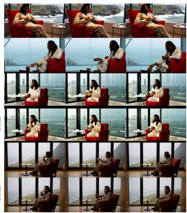

  
Prompt: The video features a woman walking down a city street at night, engrossed in her smartphone. she is dressed in a formal suit and tie, suggesting she might be a professional or businessman. The street is illuminated with various neon lights and signs, creating a vibrant and lively atmosphere. ..

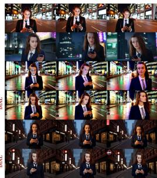

  
Fig. 6: Qualitative comparisons with recent open-sourced models and our baselines.

Table 2: Ablation on Uni and ISGM in Fidelity Strength Control on the Kaleido backbone. Bold marks the best and underline the second best value per column.
<table><tr><td rowspan="2"> $\mathbf { S } _ { i - 1 }$ </td><td>Total</td><td>Quality</td><td colspan="2">Dynamics</td><td colspan="3">Consistency</td><td>Realism</td></tr><tr><td>Score↑</td><td>Aes.↑</td><td>Smth.↑</td><td>Amp.↑</td><td>Face↑</td><td>Gme.↑</td><td>Nex.↑</td><td>Nat.↑</td></tr><tr><td> $\gamma = 0$ </td><td>56.32</td><td>50.40</td><td>97.07</td><td>10.05</td><td>31.79</td><td>70.54</td><td>41.22</td><td>79.86</td></tr><tr><td>ISGM (γ = 2)</td><td>58.38</td><td>50.42</td><td>97.09</td><td>9.84</td><td>43.80</td><td>70.23</td><td>42.18</td><td>77.78</td></tr><tr><td>ISGM (γ = 4)</td><td>59.88</td><td>50.45</td><td>97.02</td><td>9.94</td><td>52.37</td><td>69.92</td><td>42.40</td><td>76.85</td></tr><tr><td>ISGM (γ = 8)</td><td>60.78</td><td>50.23</td><td>96.99</td><td>9.96</td><td>57.46</td><td>69.65</td><td>42.40</td><td>76.62</td></tr><tr><td>ISGM (γ = 16)</td><td>61.14</td><td>50.11</td><td>96.70</td><td>9.71</td><td>60.64</td><td>69.50</td><td>43.02</td><td>75.23</td></tr><tr><td>Uni (γ = 2)</td><td>59.63</td><td>50.23</td><td>97.39</td><td>9.75</td><td>59.21</td><td>69.47</td><td>43.26</td><td>69.03</td></tr></table>

Efect of Multi-step DPO Iterations We first study how the multi-step preference horizon, denoted by $T _ { \mathrm { d p o } } ,$ , afects Phase II alignment. Table 3 shows that $T _ { \mathrm { d p o } } \mathrm { { = } 2 }$ yields the best overall trade-of, improving identity-related metrics while maintaining stable realism. With $T _ { \mathrm { d p o } } { = } 1$ the preference signal is computed from a single step and becomes less reliable, leading to weaker identity preservation. Increasing to $T _ { \mathrm { d p o } } { = } 3$ brings marginal gains on some consistency metrics but slightly degrades overall realism, suggesting overemphasis on early-step preferences. We therefore use $T _ { \mathrm { d p o } } \mathrm { { = } 2 }$ as the default setting in all experiments.

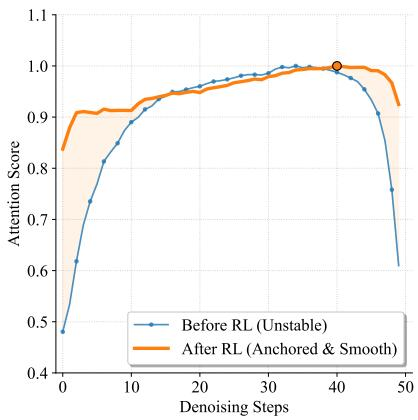  
Fig. 7: Evolution of attention scores (with normalization) across denoising steps.

Table 3: Ablation on the number of DPO iterations $\left( T _ { \mathrm { d p o } } \right)$ on the Kaleido backbone with $\scriptstyle \gamma = 0 . \ T _ { \mathrm { d p o } } = 0$ corresponds to the baseline. Bold marks the best value per column.
<table><tr><td rowspan="2"> $T _ { \mathrm { d p o } }$ </td><td>Total</td><td>Quality</td><td colspan="2">Dynamics</td><td colspan="3">Consistency</td><td>Realism</td></tr><tr><td>Score↑</td><td>Aes.↑</td><td>Smth.↑</td><td>Amp.↑</td><td>Face↑</td><td>Gme.↑</td><td>Nex.↑</td><td>Nat.↑</td></tr><tr><td>0</td><td>56.00</td><td>51.75</td><td>97.98</td><td>8.50</td><td>31.81</td><td>70.37</td><td>38.62</td><td>79.77</td></tr><tr><td>1</td><td>56.00</td><td>51.11</td><td>98.09</td><td>9.80</td><td>31.74</td><td>70.19</td><td>39.20</td><td>79.60</td></tr><tr><td>2</td><td>56.32</td><td>50.40</td><td>97.07</td><td>10.05</td><td>31.79</td><td>70.54</td><td>41.22</td><td>79.86</td></tr><tr><td>3</td><td>55.64</td><td>50.65</td><td>98.07</td><td>13.61</td><td>31.68</td><td>70.40</td><td>38.71</td><td>78.55</td></tr></table>

Attention Dynamics Enhancement in Phase II We examine how Phase II changes reference grounding over denoising timesteps. Fig. 7 reports the average grounding score across timesteps. Before preference optimization, the score is low in the initial high-noise steps, matching our observation that early attention is difuse. After Phase II, the early-stage score increases markedly, and the curve becomes smoother, indicating that anchoring encourages correct reference attention earlier and reduces error propagation to later refinement. We include more in-depth analysis in Appendix B.

## 5 Conclusion

We introduced DIAL, a unified dual-phase framework for controllable subject-tovideo (S2V) generation. Central to our work is the identification of Intrinsic Spatial Grounding Map (ISGM) within specific DiT blocks, which provide reliable and intrinsic subject localization signals. DIAL leverages these maps through a two-phase strategy: Phase I implements training-free, inference-time guidance for fine-grained and independent fidelity control; and Phase II utilizes a zero-cost preference optimization to anchor subject semantics during high-noise stages. Extensive experiments on the OpenS2V-Eval benchmark demonstrate that DIAL achieves state-of-the-art performance, significantly improving identity consistency and mitigating semantic drift without compromising visual quality.

## References

1. Ahn, D., Cho, H., Min, J., Jang, W., Kim, J., Kim, S., Park, H.H., Jin, K.H., Kim, S.: Self-rectifying difusion sampling with perturbed-attention guidance. In: European Conference on Computer Vision. pp. 1–17. Springer (2024)

2. Black, K., Janner, M., Du, Y., Kostrikov, I., Levine, S.: Training difusion models with reinforcement learning. arXiv preprint arXiv:2305.13301 (2023)

3. Blattmann, A., Dockhorn, T., Kulal, S., Mendelevitch, D., Kilian, M., Lorenz, D., Levi, Y., English, Z., Voleti, V., Letts, A., et al.: Stable video difusion: Scaling latent video difusion models to large datasets. arXiv preprint arXiv:2311.15127 (2023)

4. Bradski, G., Kaehler, A., et al.: OpenCV. Dr. Dobb’s journal of software tools 3(2) (2000)

5. Cai, M., Cun, X., Li, X., Liu, W., Zhang, Z., Zhang, Y., Shan, Y., Yue, X.: DiTCtrl: Exploring attention control in multi-modal difusion transformer for tuning-free multi-prompt longer video generation. In: Proceedings of the Computer Vision and Pattern Recognition Conference. pp. 7763–7772 (2025)

6. Carion, N., Gustafson, L., Hu, Y.T., Debnath, S., Hu, R., Suris, D., Ryali, C., Alwala, K.V., Khedr, H., Huang, A., et al.: SAM 3: Segment anything with concepts. arXiv preprint arXiv:2511.16719 (2025)

7. Chefer, H., Alaluf, Y., Vinker, Y., Wolf, L., Cohen-Or, D.: Attend-and-excite: Attention-based semantic guidance for text-to-image difusion models. ACM transactions on Graphics (TOG) 42(4), 1–10 (2023)

8. Chen, H., Wang, X., Zhang, Y., Zhou, Y., Zhang, Z., Tang, S., Zhu, W.: DisenStudio: Customized multi-subject text-to-video generation with disentangled spatial control. In: Proceedings of the 32nd ACM International Conference on Multimedia. pp. 3637–3646 (2024)

9. Chen, Z., Li, B., Ma, T., Liu, L., Liu, M., Zhang, Y., Li, G., Li, X., Zhou, S., He, Q., et al.: Phantom-Data: Towards a general subject-consistent video generation dataset. arXiv preprint arXiv:2506.18851 (2025)

10. Cheng, T., Song, L., Ge, Y., Liu, W., Wang, X., Shan, Y.: YOLO-World: Real-time open-vocabulary object detection. In: Proceedings of the IEEE/CVF conference on computer vision and pattern recognition. pp. 16901–16911 (2024)

11. Deng, Y., Guo, X., Yin, Y., Fang, J.Z., Yang, Y., Wang, Y., Yuan, S., Wang, A., Liu, B., Huang, H., et al.: MAGREF: Masked guidance for any-reference video generation. arXiv preprint arXiv:2505.23742 (2025)

12. Fei, Z., Li, D., Qiu, D., Wang, J., Dou, Y., Wang, R., Xu, J., Fan, M., Chen, G., Li, Y., et al.: SkyReels-A2: Compose anything in video difusion transformers. arXiv preprint arXiv:2504.02436 (2025)

13. Feng, K., Ma, Y., Wang, B., Qi, C., Chen, H., Chen, Q., Wang, Z.: DiT4Edit: Difusion transformer for image editing. In: Proceedings of the AAAI Conference on Artificial Intelligence. vol. 39, pp. 2969–2977 (2025)

14. HaCohen, Y., Chiprut, N., Brazowski, B., Shalem, D., Moshe, D., Richardson, E., Levin, E., Shiran, G., Zabari, N., Gordon, O., et al.: LTX-Video: Realtime video latent difusion. arXiv preprint arXiv:2501.00103 (2024)

15. Hertz, A., Mokady, R., Tenenbaum, J., Aberman, K., Pritch, Y., Cohen-Or, D.: Prompt-to-prompt image editing with cross attention control. arXiv preprint arXiv:2208.01626 (2022)

16. Ho, J., Jain, A., Abbeel, P.: Denoising difusion probabilistic models. Advances in neural information processing systems 33, 6840–6851 (2020)

17. Hong, S., Lee, G., Jang, W., Kim, S.: Improving sample quality of difusion models using self-attention guidance. In: Proceedings of the IEEE/CVF International Conference on Computer Vision. pp. 7462–7471 (2023)

18. Hu, T., Yu, Z., Zhou, Z., Liang, S., Zhou, Y., Lin, Q., Lu, Q.: HunyuanCustom: A multimodal-driven architecture for customized video generation. arXiv preprint arXiv:2505.04512 (2025)

19. Hu, T., Yu, Z., Zhou, Z., Zhang, J., Zhou, Y., Lu, Q., Yi, R.: PolyVivid: Vivid multi-subject video generation with cross-modal interaction and enhancement. In: NeurIPS (2025)

20. Jiang, Z., Han, Z., Mao, C., Zhang, J., Pan, Y., Liu, Y.: VACE: All-in-one video creation and editing. In: ICCV (2025)

21. Kong, W., Tian, Q., Zhang, Z., Min, R., Dai, Z., Zhou, J., Xiong, J., Li, X., Wu, B., Zhang, J., et al.: HunyuanVideo: A systematic framework for large video generative models. arXiv preprint arXiv:2412.03603 (2024)

22. Li, D., Fei, Z., Li, T., Dou, Y., Chen, Z., Yang, J., Fan, M., Xu, J., Wang, J., Gu, B., et al.: SkyReels-V3 technique report. arXiv preprint arXiv:2601.17323 (2026)

23. Li, Z., Qian, D., Su, K., Diao, Q., Xia, X., Liu, C., Yang, W., Zhang, T., Yuan, Z.: BindWeave: Subject-consistent video generation via cross-modal integration. arXiv preprint arXiv:2510.00438 (2025)

24. Liu, L., Ma, T., Li, B., Chen, Z., Liu, J., He, Q., Wu, X.: Phantom: Subject-consistent video generation via cross-modal alignment. arXiv preprint arXiv:2502.11079 (2025)

25. Liu, R., Wu, H., Zheng, Z., Wei, C., He, Y., Pi, R., Chen, Q.: VideoDPO: Omnipreference alignment for video difusion generation. In: Proceedings of the Computer Vision and Pattern Recognition Conference. pp. 8009–8019 (2025)

26. Liu, X., Gong, C., Liu, Q.: Flow straight and fast: Learning to generate and transfer data with rectified flow. arXiv preprint arXiv:2209.03003 (2022)

27. Peebles, W., Xie, S.: Scalable difusion models with transformers. In: Proceedings of the IEEE/CVF international conference on computer vision. pp. 4195–4205 (2023)

28. Polyak, A., Zohar, A., Brown, A., Tjandra, A., Sinha, A., Lee, A., Vyas, A., Shi, B., Ma, C.Y., Chuang, C.Y., et al.: Movie Gen: A cast of media foundation models. arXiv preprint arXiv:2410.13720 (2024)

29. Schuhmann, C.: improved-aesthetic-predictor. https://github.com/ christophschuhmann/improved-aesthetic-predictor (2024)

30. Tan, Z., Liu, S., Yang, X., Xue, Q., Wang, X.: OminiControl: Minimal and universal control for difusion transformer. In: Proceedings of the IEEE/CVF International Conference on Computer Vision. pp. 14940–14950 (2025)

31. Wallace, B., Dang, M., Rafailov, R., Zhou, L., Lou, A., Purushwalkam, S., Ermon, S., Xiong, C., Joty, S., Naik, N.: Difusion model alignment using direct preference optimization. In: Proceedings of the IEEE/CVF Conference on Computer Vision and Pattern Recognition. pp. 8228–8238 (2024)

32. Wan, T., Wang, A., Ai, B., Wen, B., Mao, C., Xie, C.W., Chen, D., Yu, F., Zhao, H., Yang, J., et al.: Wan: Open and advanced large-scale video generative models. arXiv preprint arXiv:2503.20314 (2025)

33. Wang, Z., Li, A., Zhu, L., Guo, Y., Dou, Q., Li, Z.: CustomVideo: Customizing text-to-video generation with multiple subjects. arXiv preprint arXiv:2401.09962 (2024)

34. Xue, Z., Wu, J., Gao, Y., Kong, F., Zhu, L., Chen, M., Liu, Z., Liu, W., Guo, Q., Huang, W., et al.: DanceGRPO: Unleashing GRPO on visual generation. arXiv preprint arXiv:2505.07818 (2025)

35. Yang, Z., Teng, J., Zheng, W., Ding, M., Huang, S., Xu, J., Yang, Y., Hong, W., Zhang, X., Feng, G., et al.: CogVideoX: Text-to-video difusion models with an expert transformer. arXiv preprint arXiv:2408.06072 (2024)

36. Yuan, S., He, X., Deng, Y., Ye, Y., Huang, J., Lin, B., Luo, J., Yuan, L.: OpenS2V-Nexus: A detailed benchmark and million-scale dataset for subject-to-video generation. arXiv preprint arXiv:2505.20292 (2025)

37. Yuan, S., Huang, J., He, X., Ge, Y., Shi, Y., Chen, L., Luo, J., Yuan, L.: Identitypreserving text-to-video generation by frequency decomposition. arXiv preprint arXiv:2411.17440 (2024)

38. Zhang, Z., Teng, J., Yang, Z., Cao, T., Wang, C., Gu, X., Tang, J., Guo, D., Wang, M.: Kaleido: Open-sourced multi-subject reference video generation model. arXiv preprint arXiv:2510.18573 (2025)

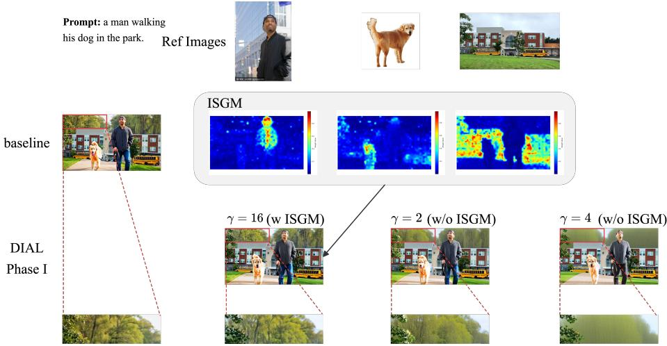  
Fig. 8: Localized (ISGM-guided) vs. global guidance in Phase I. We compare our ISGM-based spatially localized guidance with a global baseline that applies a uniform guidance signal to all spatial locations. Without ISGM, increasing γ noticeably degrades overall video quality; the magnified insets show severe background blurring and texture loss already at γ = 2 and γ = 4. In contrast, ISGM-guided attention bias allows strong fidelity enhancement $( \mathrm { e . g . } , \gamma = 1 6 )$ while preserving sharp backgrounds, indicating that our guidance is confined to subject-specific regions.

## A Additional Qualitative Results for Low-noise Inference Guidance

Phase I performs training-free attention guidance in the low-noise denoising regime by injecting an ISGM-conditioned bias into attention logits (cf. Eq. 6– 7 in the main paper). Here we provide additional qualitative results to support three claims: (i) ISGM is crucial for localized fidelity enhancement, (ii) the ISGM signal becomes reliable only after suficient denoising, and (iii) the fidelity scale γ ofers smooth and robust controllability.

ISGM enables localized enhancement. We first compare ISGM-guided attention bias with a global baseline that applies uniform guidance to all spatial locations. As shown in Fig. 8, uniform guidance tends to introduce global artifacts, whereas ISGM guidance preserves the background while strengthening subject fidelity.

ISGM is reliable mainly in the low-noise regime. Fig. 9 visualizes how ISGM evolves across denoising steps. The early high-noise stage yields scattered maps, motivating our choice to disable Phase I guidance there; as denoising proceeds, the maps become sharply localized, enabling efective spatially conditioned control.

Table 4: Phase II improves subject presence (video-level detection). We evaluate subject presence using an image-prompt open-vocabulary detector [10], where each reference image is used as the query. The benchmark contains 180 cases with varying numbers of reference subjects, resulting in 320 (case, subject) instances in total. An instance is counted as a Match if the queried subject is detected in at least one frame of the generated video; otherwise it is counted as a miss. “Total” is the number of evaluated (case, subject) instances, and “Ratio” is computed as Matches/Total. All results are reported with Phase I guidance disabled (γ = 0) to isolate the efect of Phase II.
<table><tr><td>Method</td><td>Matches↑</td><td>Total Ratio↑</td></tr><tr><td>Kaleido [38]</td><td>155</td><td>320 0.48</td></tr><tr><td>+ DIAL (γ = 0)</td><td>163</td><td>320 0.51</td></tr></table>

Continuous controllability via γ. Fig. 10 illustrates that increasing γ yields consistent improvements in identity similarity on Kaleido [38], and remains efective under prompt–reference ambiguity and cross-domain references.

## B Analysis of Semantic Drift Mitigation

Phase II targets the high-noise regime where deterministic ISGM-based bias injection is less reliable. We therefore anchor reference grounding via preference optimization over denoising trajectories (cf. Algorithm 2 in the main paper).

Quantifying subject disappearance. We quantify subject presence using an imageprompt open-vocabulary detector [10], with each reference image as the query. We use the detector implementation released with OpenS2V-Eval 3. As shown in Table 4, Phase II increases the match ratio, indicating that fewer reference subjects are completely missing from the generated videos (with Phase I disabled, γ = 0).

Qualitative evidence. Fig. 11 shows representative examples where Phase II better preserves the identities and key attributes of the reference subjects than the Kaleido backbone, consistent with the reduced subject disappearance reported in Table 4.

## C Additional Implementation Details

## C.1 Identification of Intrinsic Spatial Grounding Maps (ISGM)

Attention score. In Fig. 5, we quantify the grounding strength of an attention block by the ratio between attention mass inside the predicted subject region

and that outside. For each reference $k \in \{ 1 , \ldots , K \}$ , we compute

$$
r _ { k } \ = \ \frac { \frac { 1 } { | \mathcal { T } _ { + } ^ { k } | } \sum _ { q \in \mathcal { T } _ { + } ^ { k } } s _ { k } ( q ) } { \frac { 1 } { | \mathcal { T } _ { - } ^ { k } | } \sum _ { q \in \mathcal { T } _ { - } ^ { k } } s _ { k } ( q ) } ,\tag{10}
$$

where $q$ indexes video queries (patch tokens), $s _ { k } ( q )$ is the per-reference attention score at query q (cf. Eq. (5) in the main paper), and $\mathcal { T } _ { + } ^ { k } ~ / ~ \mathcal { T } _ { - } ^ { k }$ denote the foreground/background query sets, respectively. We then aggregate across references as

$$
R = \frac { 1 } { K } \sum _ { k = 1 } ^ { K } r _ { k } .\tag{11}
$$

Foreground/background region construction. We use the image-prompt detection model provided by OpenS2V-Eval [36] to obtain a bounding box for each reference subject in each generated frame. We map the predicted box to the latent token grid to form $\mathcal { T } _ { + } ^ { k }$ , and define $\mathcal { T } _ { - } ^ { k }$ as its complement over video query tokens. The score reported in Fig. 5 is the average of $R$ over all 180 prompts in OpenS2V-Eval.

## C.2 DIAL Phase I: Low-noise Inference Guidance

ISGM computation. In practice, ISGM is extracted from a pre-identified privileged attention block (see Fig. 5). We compute ISGM from this block independently at each denoising step. Since only a single block is used, the additional overhead is minimal.

Inference settings. Some baselines adopt prompt rephrasing during OpenS2V evaluation. For Kaleido [38], we use the original prompts; for Phantom [24], we follow the oficial recommendation to rephrase prompts before evaluation. Unless specified otherwise, all evaluations use $T = 5 0$ denoising steps and the default resolution of each backbone.

## C.3 DIAL Phase II: High-noise Anchoring via Preference Optimization

Training set. We sample 14K multi-reference training examples from Phantom-Data [9]. We use SAM3 [6] to obtain pseudo segmentation masks $\{ \mathbf { M } _ { k } \} _ { k = 1 } ^ { K }$ for each subject as supervision for preference construction. Although Phantom-Data has limited background-style references, we observe that Phase II training still improves consistency for background references (see Fig. 11), suggesting that our anchoring objective improves reference utilization and generalization.

Training hyperparameters. We train with 48 NVIDIA H100 GPUs using LoRA with rank 16. We use a learning rate of $1 \times 1 0 ^ { - 4 }$ and train for 800 steps (approximately two epochs).

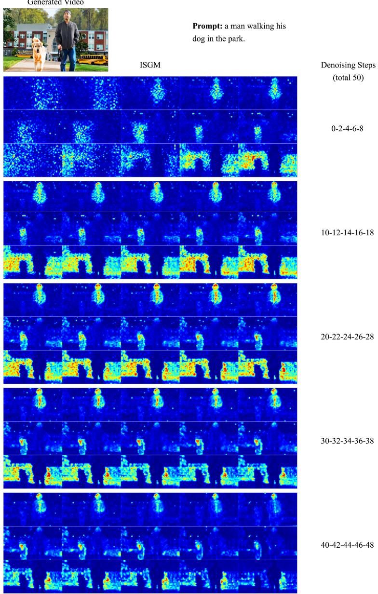  
Fig. 9: Evolution of ISGM across denoising steps. In the early high-noise regime (roughly the first 20% steps; e.g., steps 0–8), ISGM is difuse and provides unreliable spatial localization; thus we disable Phase I guidance in this regime. As denoising proceeds, ISGM becomes progressively sharper and expands to cover the full subject extent. Near the final low-noise steps $\left( \mathrm { e . g . , > 4 0 } \right)$ , the activation often concentrates on discriminative regions (e.g., faces), which are critical for identity preservation.

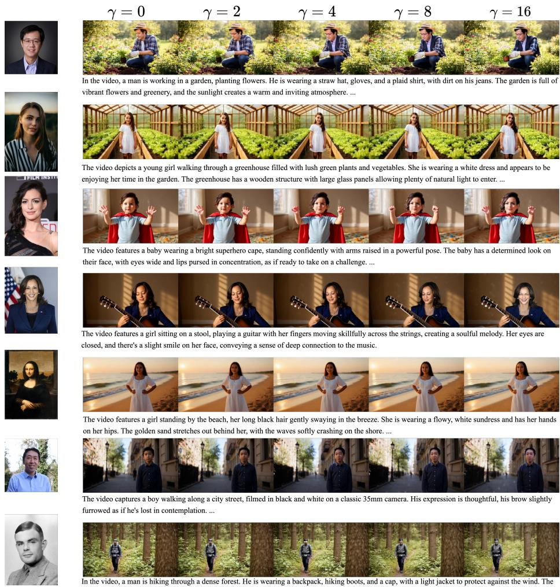  
Fig. 10: Efect of fidelity scale γ on identity preservation. Increasing γ from 0 to 16 yields a monotonic improvement in identity similarity. This controllability remains efective under challenging conditions, including prompt–reference ambiguity (Row 3: prompt “a baby” with an adult reference) and cross-domain generation (Row 5: reference image in an oil-painting style). The backbone is Kaleido [38].

Prompt: a man walking his dog in the park.

Prompt: a man playing with his dog in front of the house

  
Prompt: The video features a man standing at an easel, focused intently as his brush dances across the canvas..

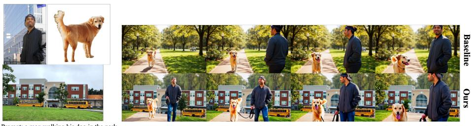

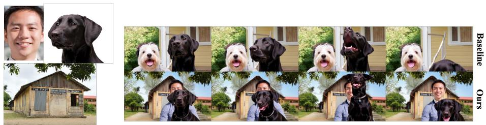

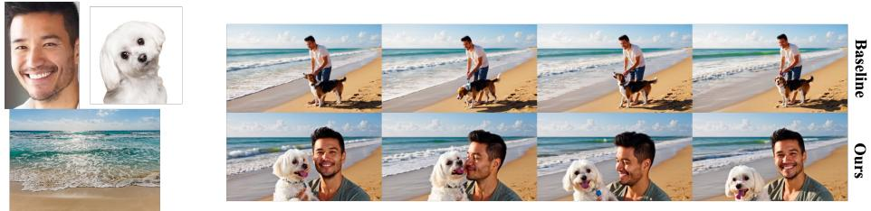  
Prompt: a man playing with his dog on the beach

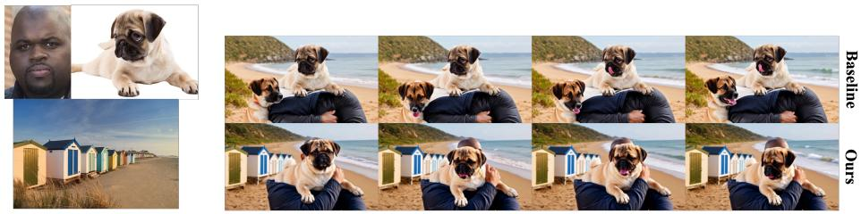  
Prompt: A man is standing on the beach, holding a dog in his arms

Fig. 11: Efect of Phase II high-noise anchoring via preference optimization. Baseline: Kaleido backbone [38]. Ours: Phase II model with Phase I guidance disabled (γ = 0).