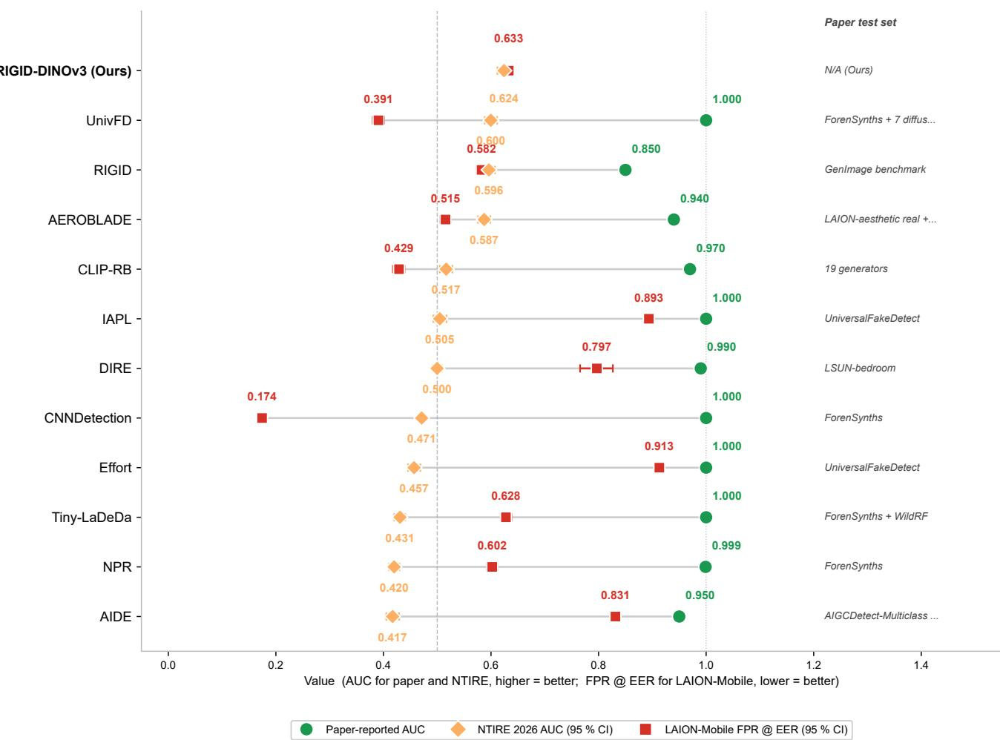
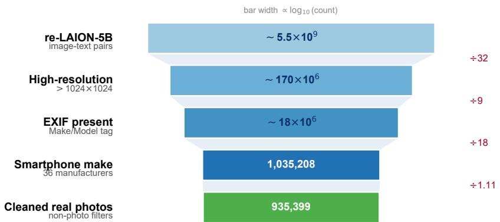
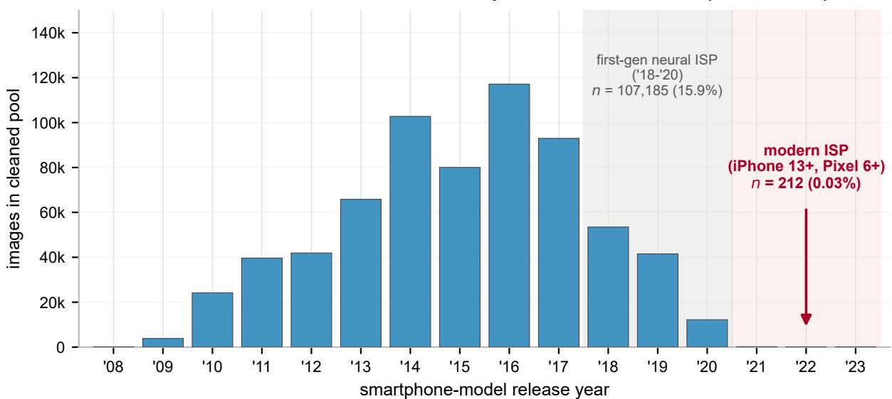
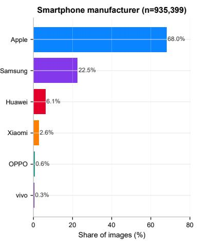
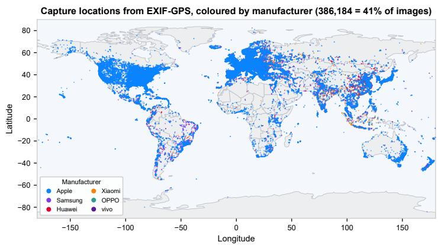
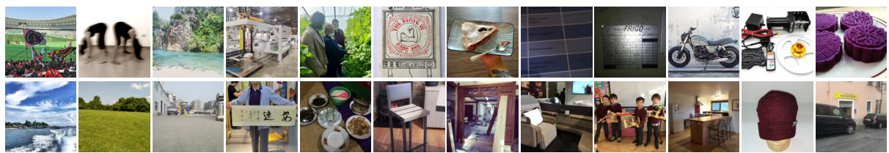
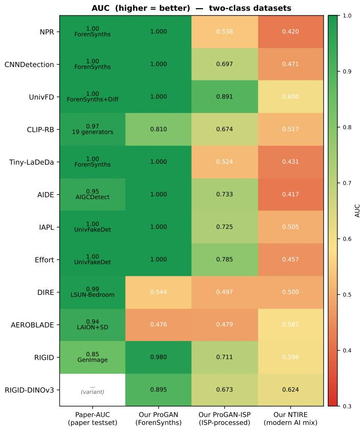
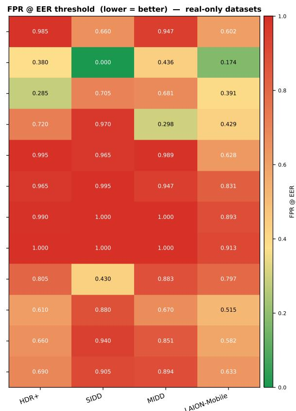
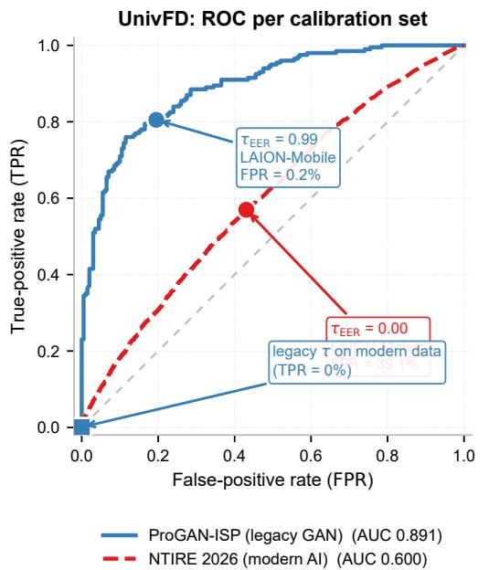
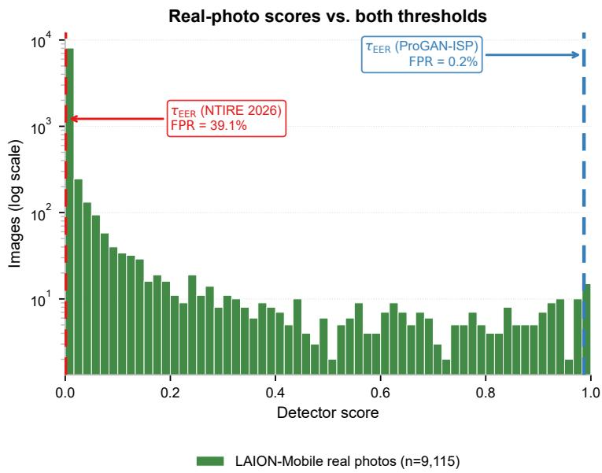

# LAION-Mobile: Evaluating Deepfake Detectors On One Million Smartphone Photos

Achim von Stryk

Janis Keuper

Stralsund University, Germany

IMLA, Ofenburg University, Germany

achim.vonStryk@gmail.com

keuper@imla.ai

## Abstract

Most Deepfake detectors report near-perfect AUC scores on their reference benchmarks. However, a recent ICML position paper argues that these evaluations collectively neglect the impact of modern smartphone photography: the widely used on-device neural image-signal processing pipelines (like multi-sensor fusion or noise and motion-blur suppression) increasingly shift the imaging paradigm from simple lens projections towards computational photography. Hence, devices actually generate, rather than record photos. This increases the risk that deepfake detectors may flag ordinary phone photos as fake. Due to the lack of large-scale datasets containing images from modern smartphones, this hypothesis has so far only been tested in small proof-ofconcept studies. The aim of this paper is to close this gap.

We introduce “LAION-Mobile”, an open dataset containing ∼ 1 million smartphone images with EXIF metadata distilled from re-LAION-5B. Evaluating twelve state-of-the-art deepfake detectors with their original paper checkpoints on a 9,115-image evaluation sample of this pool (DIRE on 738), we report three key findings: (i) On modern AI content no detector exceeds AUC 0.624, and five of twelve fall below chance. (ii) Real photo false-alarm rates are an artefact of threshold calibration: thresholds fitted on legacy GAN data make several detectors look deployable (≤11% FPR), yet the same detectors flag 17–91% of real photos once the identical criterion is refit on modern content. (iii) Consequently, no detector both beats chance on modern AI content and keeps a deployable real-photo false-alarm rate. Mirroring the device mix of web collections, the corpus probes the first neural-ISP generation (2018–2020); current flagships are essentially absent, leaving the modern-ISP regime as the open gap.

The “LAION-Mobile” dataset, including per-image EXIF metadata is available at https://huggingface. co/datasets/laionmobile/laion-mobile.

Keywords: Deepfake detection; Cross-domain evaluation; LAION; Computational photography; Benchmark

## 1 Introduction

More than 90% of photographs today are taken with smartphones [24]. This makes them the most important data source for the evaluation of image-based algorithms. However, in the context of deepfake detection, a recent ICML position paper [10] showed that current benchmarks collectively neglect smartphone images in their evaluation and instead rely on older internet sources for "real" image samples. Consequently, [10] argues that this is highly problematic, since modern smartphones heavily rely on computational photography: On-device neural image-signal-processing (ISP) stacks denoising, motion blur suppression and exposure burst fusion into a single high-dynamic-range image, using learned models conceptually close to generative networks [14]; these are just some of the neural algorithms marketed as Apple Smart HDR, Google HDR+ [7] or Samsung Scene Optimizer. Hence, these computational-photography pipelines increasingly generate rather than merely record images. In consequence, the line between a “real” photograph and a synthetic one erodes, and a detector trained to flag “generated” content risks flagging ordinary camera captures as fake.

So far, this argument has been made in [10] from first principles and demonstrated only on a small, controlled dataset; whether it holds at the scale and diversity of real smartphone photography remained mostly open. This paper aims to close this gap and to verify the key concerns raised in [10].

Modern deepfake detectors report detection AUC ≥ 0.99 on their reference benchmarks [13, 15, 22], but on data that closely resemble their own training distribution. We instead audit twelve detectors (eleven published methods plus a DINOv3 variant of RIGID) with their original paper checkpoints and measure how often they flag real, unmodified photographs from a re-LAION-5B-derived pool of 935,399 smartphone images (section 3) with ondevice ISP processing already baked in. For context we also evaluate on the NTIRE 2026 challenge benchmark [6], a modern AI-generated mixture. Cross-generator shift is the main failure mode already discussed in depth in the literature [22,25]; it serves here as a calibrated ordinary distribution shift, against which smartphone photographs prove the harder case: the same detectors that merely degrade on NTIRE collapse into flagging the majority of real phone photos as fake. This large-scale result confirms the central concern of the position paper [10].

Contributions. (i) We assemble a publicly-derivable real-photo evaluation subset of 9,115 smartphone images from the LAION-Mobile re-LAION-5B collection (∼1 M EXIF-identified IDs) and release the filter manifest and per-image EXIF (section 3), turning the position paper’s claim [10] into a reusable measurement instrument. (ii) We audit twelve detectors with original checkpoints on three regimes: in-domain ForenSynths (correctness check), NTIRE 2026 (modern AI mix), and the LAION-Mobile real photos (section 5). (iii) We show that the low false-alarm rates several detectors appear to enjoy are an artefact of the calibration set: a threshold fitted on legacy GAN data understates the real-world rate several-fold, and once it is fitted on modern AI content, no detector both beats chance there and stays deployable on real photos (section 5.5).

  
Figure 1: The deepfake-detection reality gap. For each detector, we visualize three diferent measurements: paper-reported AUC on its own test set (green); NTIRE 2026 AUC [6] (orange, 95% bootstrap CI); and the LAION-Mobile false-alarm rate at the detector’s own NTIRE-calibrated EER threshold (red, n=9,115, DIRE on 738; the τ(NTIRE) column of table 4). Paper-AUC bars are published headlines under each method’s own protocol (context only); directly comparable are the NTIRE and LAION-Mobile columns under our uniform protocol (section 5.1). A deployable detector needs a high NTIRE AUC and a low LAION-Mobile FPR; across the roster the two are mutually exclusive. Results are sorted by descending NTIRE AUC.

Figure 1 summarizes the result: near-perfect paper AUC coexists with NTIRE AUC no higher than 0.624 and, at modern-calibrated operating points, LAION-Mobile raises false-alarm rates up to 91%.

## 2 Related Work

Deepfake detection methods. Modern methods divide along three lines: (i) Convolutional fingerprint detectors utilize the spectral artefacts left by the up-sampling layers of generative networks, which fail to reproduce natural spectral distributions [4]. Prominent examples for this approach are CNNDetection [22], NPR [21], Tiny LaDeDa [2]. (ii) CLIP [17]-feature linear probes exploit semantic representations (UnivFD [15], CLIP-Raising the-Bar [3], IAPL [13], Efort [26]).

(iii) Reconstruction-error and training-free representation-invariance detectors form the third family (DIRE [23], AEROBLADE [18], RIGID [8]);

AIDE [25] hybridises DCT-band selection with a ConvNeXt-XXL classifier. We include representatives of each family (twelve detectors, counting our variant that swaps RIGID’s DINOv2 [16] backbone for DINOv3 [20]).

Cross-domain evaluation. Brittleness across generators is well documented: Wang et al. [22] already report drops from 1.000 on ProGAN [9] to 0.66 on DeepFake, and the “sanity check” work [25] shows similar overfitting in newer detectors. What this leaves open is the position paper’s claim itself [10]: Existing real-photo evaluations are too small to tell whether computational-photography artefacts make detectors misfire at scale: they are curated laboratory captures (SIDD [1]; Google’s HDR+ burst set [7]) of at most 103 images from a handful of devices.

Figure 2: Distillation funnel from re-LAION-5B to the cleaned LAION-Mobile pool. Each tier is annotated with its image count and the reduction factor from the stage above; bar width is proportional to log (count), as the five stages span four orders of magnitude. The green tier is the 935,399-image cleaned pool from which all evaluation images are drawn (non-photo filtering detailed below).  
  
Figure 3: A sample of the 99,809 entries removed by the three-stage non-photo filter, spanning its categories (in reading order): illustrations and paintings, logos and graphics, social-media screenshots, maps, and document scans. Each carries a smartphone Make/Model in its EXIF yet is not a photograph of a physical scene. Thumbnails for illustration only; imagery is not redistributed.

Hence, we introduce the LAION-Mobile subset (section 3) to close this gap, extending real-photo evaluation by an order of magnitude in size and device diversity. Unlike challenge mixes such as NTIRE 2026 [6], which pair general real and generated imagery and score AUC, LAION-Mobile is real-only and phone-native, isolating the false-alarm rate on unmodified consumer photographs.

## 3 The LAION-Mobile Smartphone-Photo Subset

Source and filtering. In order to validate the hypothesis proposed in [10], we build a real-photo set from publicly available smartphone images. Starting from re-LAION-5B [12], the safety-reviewed 2024 re-release of LAION-5B [19], we narrow the image samples in three steps (fig. 2): (i) the high-resolution subset (over 1024 × 1024) [11]; (ii) those carrying EXIF, for which re-LAION distributes Make/Model; (iii) IDs whose EXIF make matches one of 36 smartphone manufacturers (Apple, Samsung, Xiaomi, etc.). After perceptual-hash/URL deduplication, dropping dead URLs and manufacturer-balanced sampling, 1,035,208 unique IDs remain (the “LAION-Mobile-1M” manifest).

Removing non-photographs. An EXIF Make/Model can be written by editing software, so a match alone does not guarantee a raw camera capture. We therefore apply three independent non-photo filters and discard the union of their flags. (i) A caption filter regex-matches the per-image text annotations, flagging 69,407 images (6.7%) as illustrations (44,270), logos and graphics (13,985), and the remainder UI screenshots, documents, maps, QR codes and placeholders. (ii) An aspect-ratio filter flags the tall display ratios (max / min > 1.9) typical of screenshots. (iii) An EXIF-completeness filter rejects entries exposing none of focal length, aperture, exposure time or ISO. The heuristics are complementary: a screenshot whose caption hallucinates a real scene is still caught by aspect ratio or missing EXIF. The union flags 99,809 entries, leaving 935,399 cleaned real-photo IDs, from which all evaluation images are drawn; fig. 3 shows a sample of the removed content.

Composition. The cleaned pool’s manufacturer mix is dominated by Apple (68.0%) and Samsung (22.5%), then Huawei (6.1%), Xiaomi (2.6%), OPPO and vivo, reflecting the device composition of web image collections rather than market share. The most frequent models (table 1) are older iPhones (iPhone 6, 6s, 7, 5s, 4S, 5), i.e. devices from roughly 2011 to 2017 that largely predate neural ISPs (fig. 4); this skew is relevant to section 5.4, which consequently sees few heavily-processed devices. Valid, in-range EXIF-GPS coordinates are available for 41.3% of the cleaned pool (fig. 5), concentrated in Europe, North America and East Asia (94.2% northern-hemisphere); a few implausible ones (18 Antarctic coordinates) confirm that real is a high-precision heuristic, not GPS-verified ground truth (section 7). Apple and Samsung dominate every populated region, so brand and geography are entangled rather than independent (fig. 5). Figure 6 shows an uncurated sample.

Evaluation subset. We download a manufacturer-balanced random subset of 10,000 IDs; 9,171 are retrieved (∼8% URL rot) and 9,115 carry valid detector scores. Each image keeps its EXIF (Model, focal length, aperture,

LAION-Mobile: Distribution of Smartphone Release Years (n = 675,816)  
  
Figure 4: Device-era coverage of the full cleaned LAION-Mobile pool (935,399 images): release-dated images per smartphone-model release year (n=675,816 release-dated; detector- and threshold-independent). The pool peaks at 2014– 2016 hardware and collapses after 2020: only 212 images (0.03%) come from phones released in 2021 or later, so the modern-ISP regime (iPhone 13+, Pixel 6+) the position paper targets is essentially absent. The 2018–2020 heavy bin of section 5.4 is only the first neural-ISP generation.

  
Figure 5: Provenance of the cleaned LAION-Mobile pool (n=935,399). Left: share of images per smartphone manufacturer, each bar in its brand colour. Right: EXIF-GPS capture locations of the geotagged images (386,184, 41.3%), each point coloured by the same manufacturer palette.

  
Figure 6: Random, uncurated sample of the cleaned LAION-Mobile real-photo pool (24 images, manufacturer-stratified; the pool holds 935,399). Thumbnails for illustration only; imagery is not redistributed. The occasional residual non-photograph reflects the imperfect heuristic (section 7).

Table 1: The twelve most frequent phone models in the cleaned pool $\left( n { = } 9 3 5 , 3 9 9 \right)$ , with ISP era (none/light/heavy ML aggressiveness, classified from manufacturer specifications; cf. section 5.4). The pool is dominated by pre-2018 devices: only 10.9% of images come from heavy-ISP phones (iPhone XS and later), against 40.9% none, 18.4% light and 29.8% unclassified. This skew motivates the future-work direction in section 8.
<table><tr><td>Model</td><td>ISP era</td><td>Images</td><td>Share</td></tr><tr><td>iPhone 6</td><td>none</td><td>74294</td><td>7.9%</td></tr><tr><td>iPhone 6s</td><td>none</td><td>51 232</td><td>5.5%</td></tr><tr><td>iPhone 7</td><td>light</td><td>49 035</td><td>5.2%</td></tr><tr><td>iPhone 5s</td><td>none</td><td>47940</td><td>5.1%</td></tr><tr><td>iPhone 4S</td><td>none</td><td>39 644</td><td>4.2%</td></tr><tr><td>iPhone 5</td><td>none</td><td>39 023</td><td>4.2%</td></tr><tr><td>iPhone 7 Plus</td><td>light</td><td>33142</td><td>3.5%</td></tr><tr><td>iPhone X</td><td>light</td><td>30146</td><td>3.2%</td></tr><tr><td>iPhone 4</td><td>none</td><td>24178</td><td>2.6%</td></tr><tr><td>iPhone 8 Plus</td><td>light</td><td>23 222</td><td>2.5%</td></tr><tr><td>iPhone 8</td><td>light</td><td>22570</td><td>2.4%</td></tr><tr><td>iPhone 6 Plus</td><td>none</td><td>20 817</td><td>2.2%</td></tr></table>

Table 2: Per-field EXIF completeness over the smartphone-make pool (n=1,035,208; the cleaned subset is drawn from these). Fields below 50% (lower block) are excluded from analysis.
<table><tr><td>EXIF field</td><td>%</td><td>EXIF field</td><td>%</td></tr><tr><td>Make / Model</td><td>100.0</td><td>Scene/exposure modes†</td><td>95.0–96.8</td></tr><tr><td>DateTimeOriginal</td><td>98.4</td><td>BrightnessValue</td><td>90.6</td></tr><tr><td>FocalLength</td><td>98.3</td><td>ExposureBias</td><td>81.9</td></tr><tr><td>ISO / FNumber / Exp. time</td><td>97.8-98.2</td><td>MakerNote (binary)</td><td>58.9</td></tr><tr><td>Flash</td><td>97.6</td><td></td><td></td></tr><tr><td>GPSInfo</td><td>46.7</td><td>SubjectDistance (AF)</td><td>0.3</td></tr><tr><td>LightSource</td><td>14.4</td><td>AmbientTemperature</td><td>0.0</td></tr><tr><td>SubjectDistanceRange</td><td>5.6</td><td></td><td></td></tr></table>

†WhiteBalance, MeteringMode, ExposureProgram, SceneCaptureType, ExposureMode.

ISO, exposure time, pixel dimensions); the set spans five major manufacturers, ∼80 models and an exposure range of seven f-stops. Table 3 summarizes it alongside the other evaluation sets.

Table 2 reports per-field EXIF completeness over the full pool: the funnel guarantees only that a row carries an EXIF block with a smartphone make, so individual fields may still be empty. The exposure triangle (ISO, aperture, exposure time) and the capture timestamp are populated for 98% of images, making a physical illumination proxy (the ISO-100 exposure value $\mathrm { E V _ { 1 0 0 } } )$ computable almost everywhere (section 5.4). Two intuitively interesting variables are not analysable: the standard ambient-temperature tag is absent from the corpus entirely (phones write thermal data, if at all, only into the proprietary binary MakerNote), and autofocus distance is populated for 0.3% of images, since smartphones do not write their focus state back into standard EXIF.

What “real” means, and labels. We call an image real if it is a camera capture of a physical scene, regardless of on-device ISP processing, and fake only if a generative model synthesised its content. A Smart HDR or Night Mode photograph is therefore real, and a detector that flags it is in error: the audit asks precisely whether detectors honour this content-level notion of authenticity or instead react to the processing pipeline. All LAION-Mobile images are real (label = 0), so the set supports one-class evaluation (false-positive rate) only; we obtain operating points from EER thresholds fit on held-out two-class data (section 5.5).

Release and ethics. We release (a) the cleaned LAION-Mobile 1M ID list with the three non-photo flags, (b) the EXIF-enriched metadata of the 9,115-image sample with a per-image content hash, and (c) the per-image scores, so future detectors can be added without re-downloading and the headline numbers stay reproducible as URLs rot. Per LAION policy we redistribute manifests, metadata and scores only; we do not redistribute imagery, and downstream users fetch images from the original URLs. Where licences permit we additionally provide a frozen archive of the evaluation sample. We rely on the maintainers’ content filtering and recommend the safety-reviewed re-release for reproduction.

## 4 Methodology

Detectors and protocol. We evaluate the twelve detectors of table 4, each with its original paper checkpoint where available; we never substitute a fine-tuned variant when a paper checkpoint is published. CLIP-Raisingthe-Bar needs a configuration override (OpenAI CLIP backbone with QuickGELU instead of the CommonPool default; inverted score convention) to match its training setup, documented in the released code. Each forward pass uses the input size and normalisation of the original paper (e.g., 224×224 for CLIP-family, 256×256 for AEROBLADE / AIDE / DIRE). For two-class data (ForenSynths variants, NTIRE 2026) we report AUC; for the one-class LAION-Mobile set we report FPR at the default τ=0.5 and at a per-detector EER threshold fit separately on each two-class set, $\tau ( \mathrm { P r o G A N  – I S P } )$ and τ (NTIRE). Reporting both exposes calibration drift (legacy GAN vs. modern AI). On two-class data we additionally report TPR at fixed $1 \% / 5 \%$ FPR budgets, the operating points a deployment would fix. Throughout, deployable means beating chance on modern AI content while keeping a low single-digit real-photo false-alarm rate at the calibrated operating point. Bootstrap 95% CIs use 2,000 stratified resamples.

Table 3: Datasets used in this study; “Real”/“Fake” are the total images available in each dataset.
<table><tr><td>Dataset</td><td>Source</td><td>Real</td><td>Fake</td><td>Used for</td></tr><tr><td colspan="5">Paper test sets</td></tr><tr><td>ForenSynths-13gen</td><td>[22]</td><td>45169</td><td>45160</td><td>implementation replication</td></tr><tr><td colspan="5">Modern AI mix</td></tr><tr><td>NTIRE 2026 shard 0</td><td>[6]</td><td>17982</td><td>32018</td><td>modern cross-domain test</td></tr><tr><td colspan="5">ISP-processed paired</td></tr><tr><td>ProGAN-ISP</td><td>ours, Neural-ISP on [22]</td><td>1689</td><td>1700</td><td>ISP-effect study</td></tr><tr><td colspan="5">Real-only smartphone / camera</td></tr><tr><td>HDR+ subset</td><td>[7]</td><td>153 bursts</td><td> $\mathrm { n / a }$ </td><td>smartphone ISP baseline</td></tr><tr><td>SIDD-Medium-sRGB</td><td>[1]</td><td>160 scenes</td><td> $\mathrm { n / a }$ </td><td>smartphone capture baseline</td></tr><tr><td>MIDD</td><td>[5]</td><td>1732</td><td> $\mathrm { n } / \mathrm { a }$ </td><td>sensor-stratified baseline</td></tr><tr><td>LAION-Mobile (this work)</td><td>re-LAION-5B-filt. [12]</td><td>935 399</td><td> $\mathrm { n / a }$ </td><td>headline real-world test</td></tr></table>

Coverage. We evaluate each detector on a fixed random sample of every dataset, so the CIs reflect the evaluation sample size; table 3 lists the total available per source, which exceeds the evaluated sample (for LAION-Mobile, the 9,115 scored images of section 3; DIRE on 738, as its per-image difusion reconstruction is far costlier than a forward pass).

## 5 Results

## 5.1 Implementation Correctness (ForenSynths Replication)

Using the original paper checkpoints on the original ForenSynths test set [22] (13 generators, n=200 per class), the three detectors with explicit per-generator paper tables reproduce the in-domain ProGAN row within 0.001 AUC, and 18 of 25 (72%) per-generator cells reproduce within 0.05 (the largest gaps fall in categories the original papers flag as hard). This confirms our architecture, preprocessing and weight-loading are correct; detectors without published per-generator tables are sanity-checked against their paper headline and our ProGAN AUC (fig. 7, “Our ProGAN”).

## 5.2 Cross-Domain Failure on Modern AI Content

On the NTIRE 2026 shard 0 benchmark (n=10,000; 3,610 real / 6,390 fake), NTIRE AUC ranges from 0.42 to 0.62, with 95% bootstrap CIs of about ±0.01 (table 4). Only five detectors are statistically above chance and two are indistinguishable from it; the remaining five sit below 0.5 with CIs excluding it, having inverted their score ordering on modern content. Even the best detector clears chance by only 0.12 AUC. Fixed false-alarm budgets sharpen the picture further: no detector exceeds 13.5% TPR at 5% FPR, or 3.8% at 1% (table 4).

## 5.3 False Alarms on Real Smartphone Photos

NTIRE is an ordinary cross-generator shift on which detectors merely degrade; real smartphone photos are the harder case. We report LAION-Mobile FPR under two operating points (table 4). At τ=0.5 the rates are uninformative: several detectors show 0.0% while another flags 98.1%, because the biased detectors output real regardless of input. The fair reading is the FPR at each detector’s EER threshold, but which two-class set fixes it decides the answer: calibrated on the legacy GAN set (ProGAN-ISP) several detectors look deployable (≤11% FPR, UnivFD as low as 0.2%), yet re-fitting the same criterion on modern NTIRE content lifts every one of them to 17–91%. This gap is calibration drift: the safe-looking operating point is set on a 2019-era GAN distribution unrelated to anything a deployed detector now sees. At the modern-calibrated threshold no detector occupies the deployable quadrant of high NTIRE AUC and low LAION-Mobile FPR: even the most deployable detector, UnivFD, still flags 39.1%, and the only one under 20% is itself below chance on NTIRE.

The same pattern holds on three independent curated real-photo sets (HDR+, SIDD, MIDD; right panel of fig. 7): the high-FPR detectors misfire on the large majority of these laboratory captures too, so the false alarms are not a LAION artefact.

## 5.4 Computational-Photography Era: the Modern Regime is Missing

Since real smartphone images and AI-generated images now share a family of neural-network artefacts, the position paper [10] predicts that phones with heavier neural ISPs produce higher false-alarm rates. Labelling each phone model none/light/heavy from its manufacturer’s pipeline description and comparing the heavy and none bins per detector (two-proportion z-test, Benjamini–Hochberg corrected), we find the prediction does not hold: only two detectors move with it, four move significantly against it (most strongly Tiny-LaDeDa, $\Delta { = } - 0 . 4 9 4$ , and AIDE, −0.388), and the remaining six are indistinguishable from $\Delta { = } 0$

  
Figure 7: All-datasets matrix. Left: AUC on two-class datasets (higher better): paper-reported, then our ProGAN-ISP and NTIRE 2026. Right: false-positive rate on real-only smartphone/camera datasets at each detector’s NTIRE-calibrated EER threshold (lower better). FPR=0 can reflect a discriminating detector or a default-biased one outputting real unconditionally; the left column disambiguates.

Table 4: Per-detector summary on the three regimes. “Paper $\mathrm { A U C } ^ { \mathfrak { v } }$ is the published headline; “NTIRE $\mathrm { A U C } ^ { \mathfrak { v } }$ is on the modern challenge mix [6], followed by TPR at fixed 1%/5% FPR budgets on the same set (section 4). The two “LAION-Mobile FPR” columns are the smartphone-photo false-positive rate at each detector’s EER threshold, calibrated per dataset: τ(ProGAN-ISP) (legacy GAN) versus τ(NTIRE) (modern). Their gap is the calibration drift. All 95% bootstrap CIs in brackets; detectors sorted by NTIRE AUC.
<table><tr><td>Detector</td><td>Paper AUC</td><td>NTIRE AUC (95% CI)</td><td></td><td>NTIRE TPR @ 1% FPR</td><td>NTIRE TPR @ 5% FPR</td><td>LAION-Mobile FPR @ τ(ProGAN-ISP) (95% CI)</td><td>LAION-Mobile FPR @ τ(NTIRE) (95% CI)</td></tr><tr><td>RIGID-DINOv3</td><td>NA</td><td>0.624</td><td>[0.612, 0.635]</td><td>0.017</td><td>0.065</td><td>0.977 [0.974, 0.980</td><td>0.633 [0.623, 0.643]</td></tr><tr><td>UnivFD</td><td>1.000</td><td>0.600</td><td>[0.588, 0.611]</td><td>0.029</td><td>0.103</td><td>0.002 [0.001, 0.003]</td><td>0.391 [0.380, 0.401]</td></tr><tr><td>RIGID</td><td>0.850</td><td>0.596</td><td>[0.584, 0.607]</td><td>0.018</td><td>0.084</td><td>0.979 [0.977, 0.982]</td><td>0.582 [0.573, 0.592]</td></tr><tr><td>AEROBLADE</td><td>0.940</td><td>0.587</td><td>[0.576, 0.599]</td><td>0.010</td><td>0.068</td><td>0.946 [0.941, 0.950]</td><td>0.515 [0.505, 0.525]</td></tr><tr><td>CLIP-RB</td><td>0.970</td><td>0.517</td><td>[0.505, 0.528]</td><td>0.015</td><td>0.062</td><td>0.061 [0.056, 0.066]</td><td>0.429 [0.418, 0.439]</td></tr><tr><td>IAPL</td><td>1.000</td><td>0.505 [0.493, 0.517]</td><td></td><td>0.038</td><td>0.135</td><td>0.021 [0.018, 0.024]</td><td>0.893 [0.887, 0.900]</td></tr><tr><td>DIRE</td><td>0.990</td><td>0.500</td><td>[0.492, 0.508]</td><td>0.000</td><td>0.000</td><td>0.797 [0.766, 0.827</td><td>0.797 [0.766, 0.827]</td></tr><tr><td>CNNDetection</td><td>1.000</td><td>0.471</td><td>[0.464, 0.478]</td><td>0.008</td><td>0.029</td><td>0.105 [0.099, 0.111]</td><td>0.174 [0.166, 0.182]</td></tr><tr><td>Effort</td><td>1.000</td><td>0.457</td><td>[0.446, 0.469]</td><td>0.022</td><td>0.081</td><td>0.036 [0.032, 0.040]</td><td>0.913 [0.907, 0.919]</td></tr><tr><td>Tiny-LaDeDa</td><td>1.000</td><td>0.431</td><td>[0.420, 0.440]</td><td>0.000</td><td>0.032</td><td>0.384 [0.374, 0.395]</td><td>0.628 [0.618, 0.638]</td></tr><tr><td>NPR</td><td>0.999</td><td>0.420 [0.410, 0.430]</td><td></td><td>0.000</td><td>0.034</td><td>0.466 [0.456, 0.476]</td><td>0.602 [0.593, 0.612]</td></tr><tr><td>AIDE</td><td>0.950</td><td>0.417 [0.405, 0.429]</td><td></td><td>0.005</td><td>0.028</td><td>0.446 [0.436, 0.457]</td><td>0.831 [0.823, 0.839]</td></tr></table>

At τ=0.5 the FPR is bimodal: 0.0% for real-biased detectors, up to 98.1% (DIRE).

  
Figure 8: Calibration drift on the best-case detector (UnivFD). Left: ROC curves on the two calibration sets, each EER operating point annotated with the LAION-Mobile false-alarm rate its threshold produces; the square marker projects the legacy threshold onto the modern curve, where it detects essentially nothing. Right: score distribution of the real smartphone photos (log scale) with both EER thresholds. The two defensible calibrations sit at opposite ends of the score range, yielding 0.2% vs. 39.1% FPR on identical photographs.

Reading this inversion as “modern ISPs are harmless” would be wrong; it is an artefact of which phones a web corpus contains. Every heavy ISP image comes from a 2018–2020 device (iPhone XS through iPhone 12, Galaxy S9): the first generation of default-on neural ISPs, dominated by classical multi-frame denoising rather than the generative texture synthesis of current flagships. Along a continuous, threshold-free axis (the Spearman correlation between a detector’s fake-score and the phone-model release year over 2010–2020), the high-frequency detectors decline monotonically (e.g. Tiny-LaDeDa $\rho { = } - 0 . 4 0$ , AIDE −0.34; all $p { < } 1 0 ^ { - 7 0 } )$ , consistent with newer ISPs removing the noise residue these detectors mistake for synthesis rather than adding generative artefacts. Crucially, the corpus stops exactly where the hypothesis becomes interesting (fig. 4): almost none of its releasedated images come from phones released in 2021 or later, and none from the iPhone 13–15 or Pixel 6+ class the position paper targets. Even among images captured in 2021+, only 0.3% (vs. 0.03% across the whole corpus) run on 2021+ hardware, so this reflects the devices people carry, not the scrape date. The in-the-wild data therefore probes only the most conservative, pre-generative slice of the computational-photography hypothesis; settling it needs controlled capture on current devices (section 8).

Capture conditions do not explain the false alarms. Since the EXIF exposure triangle is near-complete (section 3), we also stratified the false-alarm rate by physical illumination (the ISO-100 exposure value), ISO band and time of day. Most detectors are flat: ten of twelve vary by less than 8 percentage points across illumination bands, including every CLIP-feature detector; the only exceptions are AIDE (24.6 points higher FPR in very low light) and NPR (12.0). False alarms are thus driven by the processing pipeline and the detector’s training distribution, not by scene brightness.

## 5.5 Threshold Calibration Cannot Save Default-Biased Detectors

A natural defence of the high-FPR detectors is that τ=0.5 is mis-calibrated. Figure 8 makes this concrete for the best case, UnivFD: its ROC curve is near-perfect on the legacy GAN set but sags on modern content, so its two EER calibrations sit at opposite ends of the score range and the legacy threshold, projected onto the modern curve, detects essentially nothing. Moving the threshold shifts the operating point but cannot recover performance once the score distributions overlap. Five detectors have an NTIRE AUC whose 95% CI lies entirely below 0.5 (AUC is threshold-independent), so no threshold helps; and the detectors that looked “zero-FPR” at τ=0.5 flip to LAION-Mobile false-alarm rates above 50% once their threshold is fit on modern content (table 4), confirming that apparent safety was a calibration artefact, not a property of the detector.

## 6 Discussion

The artefact-convergence problem. One reading of sections 5.2 and 5.4 is that the artefact-fingerprint hypothesis behind most detectors (upsampling operator, GAN spectrum or VAE reconstruction) has converged with the side-efects of modern computational photography: smartphone JPEGs already contain learned-network artefacts (HDR fusion, lens-corrected sharpening, semantic denoising), and a detector trained to flag any such artefact may misfire on real photos. The size and even the sign of the efect are detector-specific, and our era stratification is correlational, not causal: the position paper’s prediction that heavier ISP processing raises the false-alarm rate does not hold for most detectors (section 5.4). That variability is itself the central observation: behaviour on modern smartphone photography is governed less by the image’s authenticity than by the interaction between training-distribution and capture-pipeline artefacts. Two caveats bound this. First, our corpus barely reaches the modern ISP era, so the convergence is a conservative lower bound measured on first-generation (2018–2020) pipelines (section 5.4). Second, calibration drift alone already swings a single detector between negligible and double-digit false alarms (fig. 8), without ever testing a current flagship. Both point the same way: adjudicating deepfake detection on today’s phones requires controlled, paired data from current devices (section 8).

Is any detector deployable? No. Five detectors clear chance on modern AI content, but the best reaches only AUC 0.624, and at a modern-calibrated threshold each still flags a large fraction of real smartphone photos (table 4). UnivFD [15] comes closest (highest discrimination, lowest modern-calibrated false-alarm rate), yet its 39% remains far too high for content moderation, and the apparent escape hatch of calibrating on legacy GAN data is fit to a 2019 distribution that degrades sharply on modern photographs (section 5.5). The rest either invert their score ordering on modern content or fail at every operating point (table 4).

## 7 Limitations

LAION-Mobile is one-class real-only by construction, so we cannot report two-class AUC on it. Authenticity is inferred from EXIF Make/Model plus the non-photo filtering of section 3, not verified per image: EXIF can be copied or forged, and a web corpus may still contain edited images carrying camera EXIF. The three-stage filter removes the bulk of mislabelled non-photographs, but the real label remains a high-precision heuristic rather than certified ground truth. Because EER thresholds are fit on the synthetic two-class sets and transferred to LAION-Mobile, each reported FPR also reflects cross-domain score-scale shift, the calibration drift we report. The era stratification rests on manufacturer-disclosed specifications and may mis-classify firmware-updated phones; more fundamentally, the corpus is dominated by pre-2021 hardware and cannot probe current-flagship ISPs (section 5.4). We report a single rerun per (detector, dataset); forward passes are deterministic, but the bootstrap CIs do not capture training-run variance. Finally, copyright precludes redistributing the source images, so they must be re-fetched from URLs, a fraction of which decay. We release fixed per-image scores and content hashes, so the reported numbers stay reproducible and re-fetched images can be verified against ours.

## 8 Conclusion and Future Work

We audit twelve detectors on their paper benchmarks, NTIRE 2026, and a 9,115-image re-LAION-5B smartphone subset. The detectors with per-generator paper tables reproduce their published AUC, so the pipeline is sound; generalisation then collapses on modern AI content, where only five detectors beat chance, and once calibrated on that content even these flag 39–63% of real smartphone photos (table 4). Real-world false-alarm rates are thus a property less of the detector than of its calibration: the same detector can look deployable or unusable depending only on which legacy set fixes its threshold. No detector in our roster is simultaneously above chance on modern content and deployable on real photographs. This both confirms and qualifies the position paper [10]: its central worry holds at scale, since detectors do flag real smartphone photographs as fake, but the false alarms track each detector’s training distribution and threshold calibration far more than the ISP era itself (section 5.4), so computational photography is corroborated in its efect yet, on this web corpus, not isolated as the cause.

A second, more fundamental gap is the device era. LAION-Mobile mirrors the device mix of web image collections, dominated by pre-2018 phones (fig. 4), so it tests only the most conservative version of the computational photography argument. The sharpest test is still ahead: today’s flagships (iPhone 13 and later) make up just 0.03% of our release-dated corpus and the cutting edge is absent entirely, yet their neural ISP fuses, denoises and re-synthesises so extensively that the boundary between a captured and a generated pixel becomes genuinely ambiguous. We therefore plan to collect a real-smartphone set from current devices, with paired RAW and ISP processed variants and image-to-image generated counterparts; it closes the AUC-on-smartphone gap the one-class LAION-Mobile data cannot fill and lets us test whether lightweight adaptation recovers deployable performance.

## References

[1] Abdelrahman Abdelhamed, Stephen Lin, and Michael S. Brown. A high-quality denoising dataset for smartphone cameras. In Proceedings of the IEEE/CVF Conference on Computer Vision and Pattern Recognition (CVPR), 2018.

[2] Bar Cavia, Eliahu Horwitz, Tal Reiss, and Yedid Hoshen. Real-time deepfake detection in the real-world. arXiv preprint, 2024. Introduces LaDeDa and the distilled Tiny-LaDeDa variant used in this work.

[3] Davide Cozzolino, Giovanni Poggi, Riccardo Corvi, Matthias Nießner, and Luisa Verdoliva. Raising the bar of AI generated image detection with CLIP. arXiv preprint, 2024. Latest revision April 2024.

[4] Ricard Durall, Margret Keuper, and Janis Keuper. Watch your up-convolution: CNN based generative deep neural networks are failing to reproduce spectral distributions. In Proceedings of the IEEE/CVF Conference on Compute Vision and Pattern Recognition (CVPR), pages 7890–7899, 2020.

[5] Roman Flepp, Andrey Ignatov, Radu Timofte, and Luc Van Gool. Real-world mobile image denoising dataset with eficient baselines. In Proceedings of the IEEE/CVF Conference on Computer Vision and Pattern Recognition (CVPR), 2024. MIDD dataset (20 mobile camera sensors, paired noisy/denoised captures); project page https://aiff22. github.io/midd.html.

[6] Aleksandr Gushchin, Radu Timofte, Dmitry Vatolin, et al. NTIRE 2026 challenge on robust AI-generated image detection in the wild. arXiv preprint, 2026. CVPR Workshops (NTIRE); modern AI-generated image detection benchmark used in this work.

[7] Samuel W. Hasinof, Dillon Sharlet, Ryan Geiss, Andrew Adams, Jonathan T. Barron, Florian Kainz, Jiawen Chen, and Marc Levoy. Burst photography for high dynamic range and low-light imaging on mobile cameras. ACM Transactions on Graphics (Proc. SIGGRAPH Asia), 35(6), 2016.

[8] Zhiyuan He, Pin-Yu Chen, and Tsung-Yi Ho. RIGID: A training-free and model-agnostic framework for robust AIgenerated image detection. arXiv preprint, 2024.

[9] Tero Karras, Timo Aila, Samuli Laine, and Jaakko Lehtinen. Progressive growing of GANs for improved quality, stability, and variation. International Conference on Learning Representations (ICLR), 2018.

[10] Janis Keuper and Margret Keuper. Position: We need to re-think the concept of “real” images, 2026. arXiv:2509.21864. Position paper, to appear at the International Conference on Machine Learning (ICML) 2026.

[11] LAION e.V. LAION-5B high-resolution: A subset of LAION-5B with images over 1024x1024. https://laion.ai/ projects/, 2022. Subset of LAION-5B with 170 million image–text pairs above 1024x1024 px; high-resolution source pool of the smartphone subset used in this work.

[12] LAION e.V. Releasing re-LAION-5B: Transparent iteration on LAION-5B with additional safety fixes. https:// laion.ai/blog/relaion-5b/, August 2024. Safety-reviewed re-release of LAION-5B (5.5 billion image–text pairs); source of the smartphone subset used in this work.

[13] Yiheng Li, Zichang Tan, Guoqing Xu, Zhen Lei, Xu Zhou, and Yang Yang. Towards generalizable AI-generated image detection via image-adaptive prompt learning. arXiv preprint, 2025. To appear, CVPR 2026; method referred to as IAPL.

[14] Umar Masud, Abhijith Punnappurath, Luxi Zhao, David B. Lindell, and Michael S. Brown. Addressing image authenticity when cameras use generative ai. In Proceedings of the IEEE/CVF Conference on Computer Vision and Pattern Recognition (CVPR) Workshops, pages 10728–10737, 2026.

[15] Utkarsh Ojha, Yuheng Li, and Yong Jae Lee. Towards universal fake image detectors that generalize across generative models. In Proceedings of the IEEE/CVF Conference on Computer Vision and Pattern Recognition (CVPR), 2023.

[16] Maxime Oquab, Timothée Darcet, Théo Moutakanni, Huy V. Vo, Marc Szafraniec, Vasil Khalidov, Pierre Fernandez, Daniel Haziza, Francisco Massa, Alaaeldin El-Nouby, et al. DINOv2: Learning robust visual features without supervision. In Transactions on Machine Learning Research (TMLR), 2024.

[17] Alec Radford, Jong Wook Kim, Chris Hallacy, Aditya Ramesh, Gabriel Goh, Sandhini Agarwal, Girish Sastry, Amanda Askell, Pamela Mishkin, Jack Clark, Gretchen Krueger, and Ilya Sutskever. Learning transferable visual models from natural language supervision. In Proceedings of the 38th International Conference on Machine Learning (ICML), 2021.

[18] Jonas Ricker, Denis Lukovnikov, and Asja Fischer. AEROBLADE: Training-free detection of latent difusion images using autoencoder reconstruction error. In Proceedings of the IEEE/CVF Conference on Computer Vision and Pattern Recognition (CVPR), 2024.

[19] Christoph Schuhmann, Romain Beaumont, Richard Vencu, Cade Gordon, Ross Wightman, Mehdi Cherti, Theo Coombes, Aarush Katta, Clayton Mullis, Mitchell Wortsman, et al. LAION-5B: An open large-scale dataset for training next generation image-text models. In Advances in Neural Information Processing Systems (NeurIPS), 2022.

[20] Oriane Siméoni, Huy V. Vo, Maximilian Seitzer, Federico Baldassarre, Maxime Oquab, et al. DINOv3. arXiv preprint, 2025. Meta AI; self-supervised vision foundation model.

[21] Chuangchuang Tan, Huan Liu, Yao Zhao, Shikui Wei, Guanghua Gu, Ping Liu, and Yunchao Wei. Rethinking the up-sampling operations in CNN-based generative network for generalizable deepfake detection. In Proceedings of the IEEE/CVF Conference on Computer Vision and Pattern Recognition (CVPR), 2024.

[22] Sheng-Yu Wang, Oliver Wang, Richard Zhang, Andrew Owens, and Alexei A. Efros. CNN-generated images are surprisingly easy to spot... for now. In Proceedings of the IEEE/CVF Conference on Computer Vision and Pattern Recognition (CVPR), 2020.

[23] Zhendong Wang, Jianmin Bao, Wengang Zhou, Weilun Wang, Hezhen Hu, Hong Chen, and Houqiang Li. DIRE for difusion-generated image detection. In Proceedings of the IEEE/CVF International Conference on Computer Vision (ICCV), 2023.

[24] M. Woolf. Top mobile photography statistics. https://tinyurl.com/4xb969wf, 2025. Published 2025-05-20.

[25] Shilin Yan, Ouxiang Li, Jiayin Cai, Yanbin Hao, Xiaolong Jiang, Yao Hu, and Weidi Xie. A sanity check for AIgenerated image detection. arXiv preprint, 2024.

[26] Zhiyuan Yan, Jiangming Wang, Peng Jin, Ke-Yue Zhang, Chengchun Liu, Shen Chen, Taiping Yao, Shouhong Ding, Baoyuan Wu, and Li Yuan. Orthogonal subspace decomposition for generalizable AI-generated image detection. In Proceedings of the 42nd International Conference on Machine Learning (ICML), 2025. ICML 2025 (Oral); method commonly referred to as “Efort”.