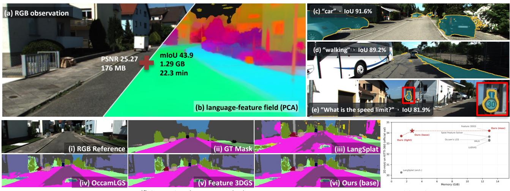
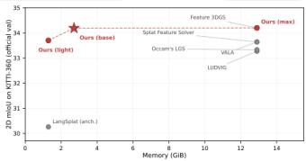
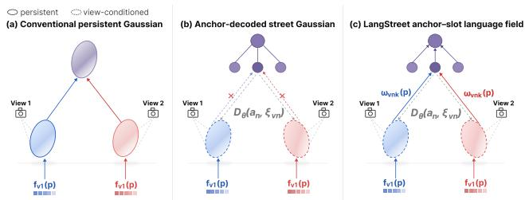
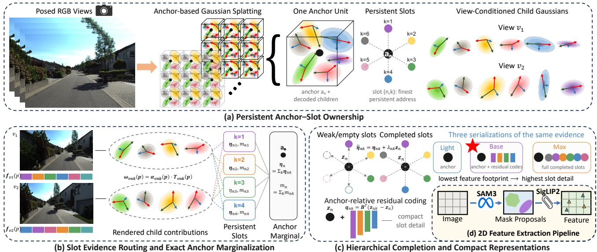
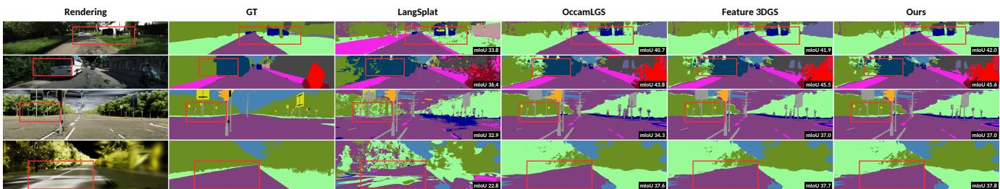
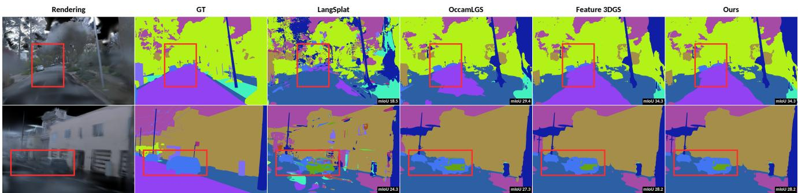
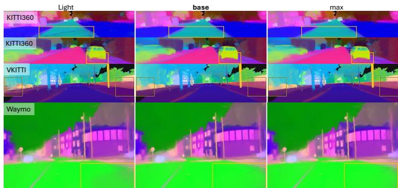
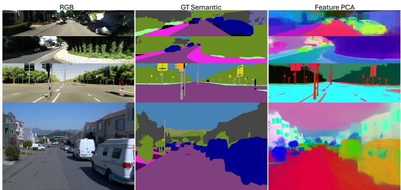

# LangStreet: Persistent Language Fields for Anchor-Decoded Street Gaussians

Runyi Yang1 Deheng Zhang1 Xiaoye Wang1 Mengjiao Ma1 Lei Sun1 Kanzhi Wu2 Ajad Chhatkuli1 Luc Van Gool1 Danda Pani Paudel1

1INSAIT, Sofia University “St. Kliment Ohridski” 2vivo Mobile Communication Co., Ltd., Shenzhen, China

  
(f) Comparison between methods

  
(g) Performance vs Memory  
Figure 1. Using posed RGB images and fixed pretrained priors, LangStreet assigns language to persistent anchors and slots without scene labels. Panels (a) and (b) show an RGB observation and the language field using the first three principal components. Panels (c)–(e) illustrate object, affordance, and scene-level text queries. Panel (f) compares semantic predictions across methods. Panel (g) summarizes the accuracy–storage trade-off: LangStreet (base) nearly matches the full-slot field while using substantially less feature storage.

## Abstract

Language Gaussian fields implicitly assume that the primitive carrying semantics remains identifiable across views. This assumption breaks in scalable anchor-decoded representations, where persistent anchors generate view-conditioned child Gaussians whose geometry and appearance vary with the camera. We introduce LangStreet, a persistent language field for such structured Gaussian scenes. Our key idea is semantic ownership: transient children route observations, while persistent decoder slots and their parent anchors own the language field. We use alpha-compositing responsibilities to accumulate additive directional evidence at slots; these statistics marginalize exactly to anchors. We then complete weakly supported slots with anchor-aligned evidence while preserving the anchor direction, and represent slot detail through low-rank residuals in anchor-relative semantic coordinates. Our primary model, LangStreet (base), stores anchorfeatures together with compact slot residuals.

LangStreet (light) retains only anchor features, whereas LangStreet (max) stores thefull-dimensional completed slot features explicitly. Without scene-specific semantic optimization, LangStreet (base) nearly matches LangStreet (max) across KITTI-360, vKITTI2, and Waymo. On KITTI-360, it achieves 34.19 2D mIoU with a 2.72 GiB effective feature footprint, compared with 34.20 mIoU and 12.90 GiB for LangStreet (max). The same accuracy–storage trend holds on vKITTI2 and Waymo. These results show that language fields on view-conditioned splats require persistent semantic ownership, conserved evidence, and a hierarchy that balances stability, detail, and representation cost. Our code, checkpoints, and benchmark suite will be publicly available.

## 1. Introduction

Street-scale Gaussian representations reconstruct long urban trajectories with high visual fidelity and interactive rendering [5, 11, 21, 39, 42, 44]. They are increasingly useful for autonomous driving, simulation, map maintenance, and urban digital twins, yet their contents remain difficult to access semantically. Language fields address this limitation by embedding vision–language features in 3D, enabling textual queries over scenes [12, 26, 29, 43]. As illustrated in Fig. 1, our goal is to turn a street reconstruction into a persistent, language-queryable spatial asset.

  
Figure 2. Semantic ownership in view-conditioned splats. (a) Persistent Gaussians can own language directly. (b) Anchor decoders generate view-conditioned children without persistent addresses. (c) LangStreet uses children to route observations to persistent slots, whose evidence aggregates to anchors.

Making such an asset persistent requires deciding where language fields live. Conventional language Gaussian fields attach semantics to stored Gaussians whose indices remain valid across views. Anchor-decoded models break this correspondence: they store persistent anchors and indexed decoder slots, but instantiate child Gaussians whose geometry and activity vary with the camera [23, 28]. As shown in Fig. 2, a child can route an observation through the renderer, but cannot own persistent semantics. We treat the slot as the finest persistent address and its anchor as a coarser parent. A slot need not possess semantics beforehand; its semantic content is induced by observations repeatedly routed to the same address.

This ownership structure creates two coupled challenges. A slot receives evidence only when its child is active, visible, and contributes to a rendered pixel, leaving many slots weakly supported or entirely unobserved. Meanwhile, storing a full-dimensional vision–language feature at every slot repeatedly encodes content shared within the same anchor. A scalable language field must therefore preserve fine slot-level detail, recover unsupported slots, and exploit anchor-level structure for compactness.

We introduce LangStreet, an anchor–slot language field built around semantic ownership. As shown in Fig. 2(c), view-conditioned children route 2D observations to persistent slots through their alpha-compositing responsibilities. Rather than storing only normalized slot embeddings, we retain their additive directional evidence; summing these sufficient statistics recovers the parent-anchor evidence exactly. The anchor then supplies aligned evidence to weakly supported slots while preserving the coarse anchor direction. Finally, we treat each anchor as a local semantic origin and encode only low-rank slot residuals, retaining sub-anchor detail without storing a full-dimensional feature at every slot.

This construction yields three model variants, illustrated in Fig. 1. Our primary configuration, LangStreet (base), stores one full-dimensional feature per anchor together with compact anchor-relative codes for its slots. LangStreet (light) retains only the anchor field, while LangStreet (max) stores the completed slot features explicitly as a full-slot reference. All three are derived from the same renderer-routed evidence without scene-specific semantic optimization. Because they store vision–language embeddings rather than fixed class logits, the fields can be scored against new text queries without rebuilding the 3D representation.

We evaluate LangStreet under a controlled estimator protocol in which all methods share the same anchordecoded geometry, construction views, 2D observations, prompts, renderer, and evaluator. The compared rows are therefore matched adaptations of their estimation principles rather than full end-to-end reproductions. KITTI-360 serves as our main real-street benchmark, Waymo is evaluated independently, and vKITTI2 isolates sparse slot evidence. As previewed in Fig. 1, LangStreet (base) retains nearly all of the accuracy of LangStreet (max) while using substantially less feature storage on KITTI-360 and Waymo. On vKITTI2, hierarchical completion primarily improves sparse slot-level 3D queries rather than rendered 2D accuracy.

Our contributions are as follows:

• Semantic ownership for view-conditioned splats. We separate transient child Gaussians that route observations from persistent slots and anchors that own language.

• An evidence-conserving hierarchy. Compositing responsibilities accumulate additive slot evidence that marginalizes exactly to anchors. Anchor-aligned completion preserves the anchor direction, while anchor-relative residuals yield the compact LangStreet (base) representation.

• A strong accuracy–storage trade-off at street scale. Across three datasets, LangStreet (base) closely matches dense full-slot accuracy at a substantially smaller feature footprint. Controlled analysis further separates the effects of semantic carrier, completion, coding, and readout.

## 2. Related Work

Structured urban Gaussian representations. Streetscale Gaussian models scale through object decomposition, spatial partitioning, and levels of detail [5, 10, 11, 21, 39, 42, 44]; SUNDAE instead compresses them by spectral graph pruning and neural compensation [40]. Scaffold-GS and Octree-GS decode view-conditioned children from persistent anchors and slots [23, 28], while Gaussian-JEPA learns reusable embeddings of Gaussian assets [27]. These works target reconstruction, compression, or representation learning; LangStreet asks which native persistent address should own language.

Language fields and compact semantics. LERF and OpenNeRF lift image features into radiance fields, while OpenMask3D aggregates multi-view CLIP evidence for 3D instances [8, 12, 33]. LangSplat, LEGaussians, Feature 3DGS, and OpenGaussian attach semantics to explicit Gaussians, and 4D LangSplat extends this setting to dynamics [16, 26, 29, 35, 43]. GARField learns a separately optimized hierarchical affinity field [13]. Training-free estimators lift frozen observations by rendering, diffusion, solving, or visibility-aware aggregation [6, 25, 34, 37]. SceneSplat, Chorus, SceneSplat++, and LangFlash study transferable, generalizable, or feed-forward language splatting [17, 18, 22, 24]. Compact and query-time methods reduce dense storage [1, 2, 9, 14, 15, 45]. LangSplatV2 uses a global dictionary with sparse per-Gaussian coefficients; LangStreet instead codes slot residuals in local anchor-relative coordinates. Prior methods generally use persistent Gaussians or separate semantic structures, whereas ours follows the decoder’s native anchor–slot hierarchy.

Semantic street scenes. MARS decomposes driving scenes into persistent background and foreground radiance fields, supporting controllable appearance and trajectories together with RGB, depth, and semantic rendering [36]. Cityscale continual mapping couples environment- and instancelevel fields [30]. Recent outdoor language-Gaussian systems support open-vocabulary understanding or generation [7, 19, 32, 38], while Query3D interprets questions over an existing field [4]. They do not address ownership when transient children are decoded from persistent anchors and slots.

## 3. Preliminaries and Problem Setup

Persistent Gaussian addresses. A conventional Gaussian scene stores an indexed set of primitives $\mathcal { G } \ = \ \{ g _ { j } \} _ { j = 1 } ^ { M } ,$ where $g _ { j } = ( \mu _ { j } , \pmb { \Sigma } _ { j } , o _ { j } , \pmb { c } _ { j } )$ denotes its center, covariance, opacity, and appearance parameters. We call an index persistent if it refers to the same stored scene state independently of the viewing camera. Thus, even when appearance is view dependent, the record indexed by j remains identifiable across views. Conventional language Gaussian fields exploit this property by attaching a normalized vision–language feature $\mathbf { z } _ { j } \in \mathbb { S } ^ { D - 1 }$ to each stored primitive [26, 29, 43]. For a normalized text embedding $\mathbf { e } _ { t } \in \mathbb { S } ^ { D - 1 }$ , relevance is measured by the cosine score $\left. \mathbf { z } _ { j } , \mathbf { e } _ { t } \right.$

Anchor-decoded Gaussian scenes. We are given posed RGB observations

$$
\mathcal { D } = \{ ( I _ { v } , \pi _ { v } , \mathbf { o } _ { v } ) \} _ { v = 1 } ^ { V } ,
$$

where $\pi _ { v }$ is the calibrated camera projection and $\mathbf { o } _ { v }$ is the camera center, together with a frozen anchor-decoded Gaussian reconstruction. The representation stores persistent anchors $\mathcal { A } = \{ a _ { n } \} _ { n = 1 } ^ { N }$ . Anchor $a _ { n }$ has position ${ \bf x } _ { n }$ and $K$ indexed decoder outputs. We call the anchor-local index k a slot, so $( n , k )$ is a persistent decoder address.

Let $\Delta _ { n k }$ be the learned anchor-local offset of slot $( n , k )$ and $\pmb { \mu } _ { n k } = \mathbf { x } _ { n } + \pmb { \Delta } _ { n k }$ its canonical center. Let $D _ { \theta }$ denote the frozen view-conditioned decoder of the reconstruction, parameterized by θ. Given the stored state of anchor $a _ { n } ,$ slot index $k ,$ and camera–anchor condition $\xi _ { v n } .$ , it predicts the covariance, opacity, and appearance of the corresponding child Gaussian:

$$
\begin{array} { r l } & { \bigl ( \Sigma _ { v n k } , o _ { v n k } , \mathbf { c } _ { v n k } \bigr ) = D _ { \theta } \bigl ( a _ { n } , k , \xi _ { v n } \bigr ) , } \\ & { \qquad \widetilde { g } _ { v n k } = \bigl ( \pmb { \mu } _ { n k } , \pmb { \Sigma } _ { v n k } , o _ { v n k } , \mathbf { c } _ { v n k } \bigr ) . } \end{array}\tag{1}
$$

View- and level-of-detail-dependent selection retains an active subset ${ \cal K } _ { v } ( n ) \subseteq \{ 1 , \ldots , K \}$ , and the rasterizer receives $\mathcal { G } _ { v } = \{ \widetilde { g } _ { v n k } | 1 \leq n \leq N , \ : \dot { k } \in \mathcal { K } _ { v } ( n ) \}$ . The slot address $( n , k )$ and its canonical center persist across views, but the complete child Gaussian is a view-conditioned realization: its covariance, opacity, appearance, and active state may change with the camera. The child is therefore not a separately stored semantic owner. Importantly, we do not assume that a slot has semantics a priori; it only provides a persistent address to which observations can be assigned.

Rendering responsibility. For pixel $p$ in view $v ,$ let $\alpha _ { v n k } ( p ) \in [ 0 , 1 ]$ be the projected opacity of an active child. Its front-to-back alpha-compositing contribution is

$$
\omega _ { v n k } ( p ) = \alpha _ { v n k } ( p ) \prod _ { ( m , \ell ) \prec _ { v , p } ( n , k ) } \left( 1 - \alpha _ { v m \ell } ( p ) \right) ,\tag{2}
$$

where $( m , \ell ) \prec _ { v , p } ( n , k )$ denotes a child composited earlier along the ray through $p$ . We set $\omega _ { v n k } ( p ) = 0$ when slot $( n , k )$ is inactive. Thus, $\omega _ { v n k } ( p )$ measures the contribution of the child generated from slot $( n , k )$ to the rendered pixel, accounting jointly for its footprint, opacity, and occlusion.

Persistent language-field objective. A fixed 2D vision– language engine provides a unit observation $\mathbf { f } _ { v } ( p ) \in \mathbb { S } ^ { D - 1 }$ for pixels $p \in \Omega _ { v } ^ { \mathrm { o b s } }$ , where $\Omega _ { v } ^ { \mathrm { { o b s } } }$ denotes pixels covered by the 2D engine. We seek a persistent hierarchical language field

$$
\begin{array} { r } { \boldsymbol { \mathcal { Z } } = \left\{ \mathbf { z } _ { n } \right\} _ { n = 1 } ^ { N } \cup \left\{ \mathbf { z } _ { n k } \right\} _ { n = 1 , k = 1 } ^ { N , K } , \qquad \mathbf { z } _ { n } , \mathbf { z } _ { n k } \in \mathbb { S } ^ { D - 1 } , } \end{array}\tag{3}
$$

where slots provide fine-grained addresses and anchors provide their coarser parents. A text query $\mathbf { e } _ { t } \in \mathbb { S } ^ { D - 1 }$ scores either level by $\left. \mathbf { z } , \mathbf { e } _ { t } \right.$

The reconstruction, decoder, and 2D engine remain frozen throughout field construction, and no scene-specific semantic labels or feature-field optimization are used. The challenge is to route observations from view-conditioned children to persistent slots, obtain a consistent anchor summary, recover slots with sparse or zero evidence, and avoid storing a full D-dimensional feature at all NK slot addresses.

## 4. LangStreet

Figure 3 summarizes LangStreet. Section 4.1 routes 2D observations to persistent slots and marginalizes them to anchors; Sec. 4.2 completes weakly supported slots while preserving the anchor direction; Sec. 4.3 derives the compact LangStreet (base) representation; and Sec. 4.4 describes construction and query readout. The reconstruction, decoder, and 2D engine remain frozen throughout.

## 4.1. Renderer-Routed Additive Evidence

As illustrated in Fig. 3(b), the frozen renderer already specifies how each view-conditioned child contributes to a pixel. For $p \in \Omega _ { v } ^ { \mathrm { o b s } }$ , define its preceding transmittance as

$$
T _ { v n k } ( p ) : = \prod _ { ( m , \ell ) \prec _ { v , p } ( n , k ) } \left( 1 - \alpha _ { v m \ell } ( p ) \right) .\tag{4}
$$

The corresponding child responsibility is $\begin{array} { r l } { \omega _ { v n k } ( p ) } & { { } = } \end{array}$ $\alpha _ { v n k } ( p ) T _ { v n k } ( p )$ , with $\omega _ { v n k } ( p ) \ = \ 0$ when slot $( n , k )$ is inactive. This renderer-native weight routes language while already accounting for projected footprint, opacity, and occlusion.

We accumulate the weighted language observations and their support at each persistent slot, then sum the same statistics to its parent anchor:

$$
\begin{array} { l } { { \displaystyle { \eta _ { n k } : = \sum _ { v = 1 , \dots , V } \omega _ { v n k } ( p ) \mathbf { f } _ { v } ( p ) } , \quad { \eta _ { n } : = \sum _ { k = 1 } ^ { K } \eta _ { n k } } , } } \\ { { \displaystyle { \qquad p \in \Omega _ { v } ^ { \mathrm { o b s } } } } } \\ { { \displaystyle { m _ { n k } : = \sum _ { v = 1 , \dots , V } \omega _ { v n k } ( p ) } , \qquad m _ { n } : = \sum _ { k = 1 } ^ { K } m _ { n k } . } } \\ { { \displaystyle { \qquad p \in \Omega _ { v } ^ { \mathrm { o b s } } } } } \end{array}\tag{5}
$$

Here $\eta _ { n k }$ is unnormalized directional evidence and $m _ { n k }$ is its observation support. Because these statistics are additive, the right-hand definitions are exact anchor marginals; normalized feature directions would not satisfy this property.

For nonzero resultants, the raw slot and anchor directions are

$$
\mathbf { z } _ { n k } ^ { \mathrm { r a w } } = \frac { \pmb { \eta } _ { n k } } { \lVert \pmb { \eta } _ { n k } \rVert _ { 2 } } , \qquad \mathbf { z } _ { n } = \frac { \pmb { \eta } _ { n } } { \lVert \pmb { \eta } _ { n } \rVert _ { 2 } } .\tag{6}
$$

A node with resultant norm at most ϵ has no valid direction and abstains; its mass remains available as a support statistic.

## 4.2. Direction-Preserving Hierarchical Completion

Slots preserve sub-anchor detail but receive uneven evidence, whereas their anchor is better supported and spatially coarser. We therefore complete weak slots in evidence space. For any nonnegative anchor-aligned mass $\lambda _ { n k }$ , define

$$
\widehat { \pmb { \eta } } _ { n k } : = \pmb { \eta } _ { n k } + \lambda _ { n k } \mathbf { z } _ { n } , \qquad \mathbf { z } _ { n k } ^ { \mathrm { p o o l } } = \frac { \widehat { \pmb { \eta } } _ { n k } } { \vert \vert \widehat { \pmb { \eta } } _ { n k } \vert \vert _ { 2 } } .\tag{7}
$$

The second expression is used only when its numerator is nonzero; an anchor without a valid direction contributes no completion mass.

Anchor-direction preservation. Let $\begin{array} { r c l } { \Lambda _ { n } } & { = } & { \sum _ { k } \lambda _ { n k } } \end{array}$ Since ${ \bf z } _ { n } ~ = ~ \eta _ { n } / \| { \pmb \eta } _ { n } \| _ { 2 }$

$$
\sum _ { k = 1 } ^ { K } { \widehat { \eta } } _ { n k } = \left( 1 + { \frac { \Lambda _ { n } } { \| { \pmb { \eta } } _ { n } \| _ { 2 } } } \right) { \pmb { \eta } } _ { n } .\tag{8}
$$

Thus, any nonnegative anchor-aligned completion changes the anchor resultant only by a positive scale and preserves its normalized direction.

We allocate completion according to sibling agreement and target-slot support:

$$
R _ { n } : = \frac { \| \eta _ { n } \| _ { 2 } } { \operatorname* { m a x } \Bigl ( \sum _ { k = 1 } ^ { K } \| \eta _ { n k } \| _ { 2 } , \epsilon \Bigr ) } , \qquad \bar { m } _ { n } : = \frac { m _ { n } } { K } ,\tag{9}
$$

$$
\lambda _ { n k } = \beta R _ { n } \bar { m } _ { n } \frac { \bar { m } _ { n } } { \bar { m } _ { n } + m _ { n k } } , \qquad \beta \geq 0 .\tag{10}
$$

By the triangle inequality, $\begin{array} { l l l } { R _ { n } } & { \in } & { [ 0 , 1 ] } \end{array}$ and measures agreement among sibling slot resultants. The remaining factors set an anchor-specific evidence scale and concentrate completion on poorly supported slots. Hence an unsupported slot inherits the anchor direction, while the update becomes negligible as its own evidence grows.

## 4.3. Anchor-Relative Coding

A full D-dimensional direction at every completed slot repeatedly stores content already shared with its anchor. We instead use the anchor as a local semantic origin and define

$$
\delta _ { n k } : = \mathbf { z } _ { n k } ^ { \mathrm { p o o l } } - \mathbf { z } _ { n } .\tag{11}
$$

We fit a rank-r orthonormal basis $B \in \mathbb { R } ^ { D \times r }$ to supported residuals using truncated SVD. Each slot stores only

$$
\mathbf { q } _ { n k } = B ^ { \top } \delta _ { n k } , \widetilde { \mathbf { z } } _ { n k } = \mathrm { n o r m a l i z e } ( \mathbf { z } _ { n } + B \mathbf { q } _ { n k } ) .\tag{12}
$$

The shared basis captures recurring within-anchor variation, while $\mathbf { q } _ { n k }$ retains slot-specific detail. This coding step uses no semantic labels or feature-field optimization.

The same construction yields three storage variants:

$$
\begin{array} { r } { { \bf z } _ { n } ^ { \mathrm { l i g h t } } = { \bf z } _ { n } , \qquad { \bf z } _ { n k } ^ { \mathrm { b a s e } } = { \widetilde { \bf z } } _ { n k } , \qquad { \bf z } _ { n k } ^ { \mathrm { m a x } } = { \bf z } _ { n k } ^ { \mathrm { p o o l } } . } \end{array}\tag{13}
$$

We use base as our primary configuration. Light omits the slot codes, whereas max stores every completed slot direction explicitly. Ignoring lower-order support and validity metadata, their dominant directional payloads are

$$
\mathcal { C } _ { \mathrm { l i g h t } } = N D , \mathcal { C } _ { \mathrm { b a s e } } = N D + N K r + D r , \mathcal { C } _ { \mathrm { m a x } } = N K D .\tag{14}
$$

Since $r \ll D _ { \colon }$ , base retains slot-level variation with substantially less storage than max.

  
Figure 3. LangStreet overview. A fixed SAM 3/SigLIP 2 engine (d) extracts unit language observations from posed images. A frozen anchor-decoded reconstruction (a) retains persistent anchor–slot addresses while instantiating view-conditioned child Gaussians. Their compositing responsibilities route 2D observations to additive slot evidence, whose unnormalized statistics sum exactly to the ancho marginal (b). Anchor-aligned completion recovers weakly supported slots, and anchor-relative residual coding yields LangStreet (base), with anchor-only LangStreet (light) and full-slot LangStreet (max) providing compact and high-capacity variants, respectively (c).

## 4.4. Construction and Query Readout

Closed-form construction. Let $\mathcal { R } _ { v } ( \{ \mathbf { h } _ { v n k } \} )$ denote alpha-compositing of arbitrary per-child channels. Linearity in $\mathbf { h } _ { v n k }$ gives

$$
\nabla _ { \mathbf { h } _ { v n k } } \sum _ { p \in \Omega _ { v } ^ { \mathrm { o b s } } } \langle \mathcal { R } _ { v } ( \{ \mathbf { h } \} ) ( p ) , \mathbf { f } _ { v } ( p ) \rangle = \sum _ { p \in \Omega _ { v } ^ { \mathrm { o b s } } } \omega _ { v n k } ( p ) \mathbf { f } _ { v } ( p ) .\tag{15}
$$

A standard renderer backward pass therefore accumulates $\eta _ { n k } ;$ a scalar seed of ones analogously accumulates $m _ { n k } .$ We use the stock gsplat rasterizer [41], process feature channels in blocks, and apply completion and coding after accumulation, without a semantic CUDA kernel or scenespecific semantic optimization.

Text scoring and readout. For any stored or decoded unit direction z and normalized text embedding et, we use the cosine score $s _ { t } ( \mathbf { z } ) : = \langle \mathbf { z } , \mathbf { e } _ { t } \rangle$ . In light, each active child inherits its anchor direction; in base and max it inherits the corresponding decoded or explicit slot direction. A rendered 2D query composites these scores with the same responsibilities:

$$
S _ { v , t } ^ { \tau } ( p ) = \sum _ { n = 1 } ^ { N } \sum _ { k \in \mathcal { K } _ { v } ( n ) } \omega _ { v n k } ( p ) s _ { t } ( \mathbf { z } _ { n k } ^ { \tau } ) , \quad \quad\tag{16}
$$

where ${ \bf z } _ { n k } ^ { \mathrm { l i g h t } } : = { \bf z } _ { n } . { \sf A }$ 3D query instead accesses a declared persistent anchor or canonical slot address; the spatial assignment and fallback rule are specified with each evaluation.

These address-selection rules are readout policies, not part of the stored field. Replacing the text bank changes only the dot products and does not rebuild the scene or language field.

## 5. Experiments

## 5.1. Datasets

KITTI-360. We evaluate eight independently reconstructed KITTI-360 street windows [20]. Official validation labels define the 2D protocol, and accumulated semantic points define the 3D protocol under the same 17-class mapping; unsupported points count as errors.

Virtual KITTI 2. We use all five vKITTI2 clones [3]. Camera 0 provides construction observations, while camera 1 is held out for 2D evaluation and depth-backprojected 3D evaluation. Released depth only seeds reconstruction, making vKITTI2 a controlled diagnostic of sparse slot evidence.

Waymo. We evaluate an eleven-segment core from Waymo’s five-camera rig [31] as an independent benchmark. We report matched 2D results, but no 3D headline because it lacks a semantic-point target comparable to KITTI-360.

## 5.2. Implementation Details

All experiments run on one NVIDIA H200. The 3D reconstructions and per-view SAM 3/SigLIP 2 observations are preprocessed once and shared by every method. We accumulate evidence in FP32, store semantic payloads in

(a) KITTI-360
<table><tr><td>Method</td><td>PSNR ↑</td><td>2D↑</td><td>3D↑</td><td>Build ↓</td><td>Payload ↓</td><td>FPS ↑</td></tr><tr><td>Image Teacher (SAM3)</td><td></td><td>32.91</td><td></td><td></td><td></td><td></td></tr><tr><td>LangSplat (anchor)</td><td>20.28</td><td>30.26</td><td>12.28</td><td>506.6s</td><td>1.29 GiB</td><td>861</td></tr><tr><td>Feature 3DGS</td><td>20.28</td><td>34.20</td><td>16.29</td><td>124.0s</td><td>12.90 GiB</td><td>137</td></tr><tr><td>OccamLGS</td><td>20.28</td><td>33.33</td><td>15.28</td><td>13.3s</td><td>12.90 GiB</td><td>137</td></tr><tr><td>LUDVIG</td><td>20.28</td><td>33.27</td><td>16.27</td><td>235.0 s</td><td>12.90 GiB</td><td>137</td></tr><tr><td>SFS</td><td>20.28</td><td>33.64</td><td>13.67</td><td>153.9min</td><td>12.90 GiB</td><td>137</td></tr><tr><td>VALA</td><td>20.28</td><td>33.64</td><td>15.75</td><td>95.3 min</td><td>12.90 GiB</td><td>137</td></tr><tr><td>LangStreet (light)</td><td>20.28</td><td>33.70</td><td>17.63</td><td>95.3 s</td><td>1.29 GiB</td><td>860</td></tr><tr><td>LangStreet (base)</td><td>20.28</td><td>34.19</td><td>20.62</td><td>22.3 min</td><td>2.72 GiB</td><td>145</td></tr><tr><td>LangStreet (max)</td><td>20.28</td><td>34.20</td><td>20.56</td><td>154.6s</td><td>12.90 GiB</td><td>137</td></tr></table>

(b) Virtual KITTI 2
<table><tr><td>Method</td><td>PSNR ↑</td><td>2D↑</td><td>3D↑</td><td>Build ↓</td><td>Payload ↓</td><td>FPS ↑</td></tr><tr><td>Image Teacher (SAM3)</td><td></td><td>42.69</td><td></td><td></td><td></td><td></td></tr><tr><td>LangSplat (anchor)</td><td>20.94</td><td>31.82</td><td>10.59</td><td>12.6 min</td><td>0.57 GiB</td><td>1261</td></tr><tr><td>Feature 3DGS</td><td>20.94</td><td>42.86</td><td>22.32</td><td>153.2s</td><td>5.69 GiB</td><td>372</td></tr><tr><td>OccamLGS</td><td>20.94</td><td>41.78</td><td>22.10</td><td>17.5s</td><td>5.69 GiB</td><td>371</td></tr><tr><td>LUDVIG</td><td>20.94</td><td>41.39</td><td>22.71</td><td>174.8s</td><td>5.69 GiB</td><td>372</td></tr><tr><td>SFS</td><td>20.94</td><td>42.67</td><td>18.38</td><td>187.3 min</td><td>5.69 GiB</td><td>372</td></tr><tr><td>VALA</td><td>20.94</td><td>42.37</td><td>21.96</td><td>95.3 min</td><td>5.69 GiB</td><td>371</td></tr><tr><td>LangStreet (light)</td><td>20.94</td><td>42.58</td><td>22.70</td><td>238.6s</td><td>0.57 GiB</td><td>1258</td></tr><tr><td>LangStreet (base)</td><td>20.94</td><td>42.87</td><td>25.25</td><td>281.0s</td><td>1.20 GiB</td><td>372</td></tr><tr><td>LangStreet (max)</td><td>20.94</td><td>42.87</td><td>25.30</td><td>165.4s</td><td>5.69 GiB</td><td>371</td></tr></table>

Table 1. Controlled comparison on KITTI-360 and vKITTI2. All methods share reconstruction, observations, prompts, renderer, and evaluator. Red bold and blue underlined mark the best and second-best comparable results.

<table><tr><td>Method</td><td>PSNR ↑</td><td>2D↑</td><td>Build↓</td><td>Payload ↓ FPS ↑</td><td></td></tr><tr><td>Image Teacher (SAM3)</td><td></td><td>15.55</td><td></td><td></td><td></td></tr><tr><td>LangSplat (anchor)</td><td>27.67</td><td>7.95</td><td>17.0 min</td><td>1.10 GiB</td><td>872</td></tr><tr><td>Feature 3DGS</td><td>27.67</td><td>16.27</td><td>147.9s</td><td>11.04 GiB</td><td>144</td></tr><tr><td>OccamLGS</td><td>27.67</td><td>15.39</td><td>140.8s</td><td>11.04 GiB</td><td>144</td></tr><tr><td>SFS</td><td>27.67</td><td>14.06</td><td>349.6 min</td><td>11.04 GiB</td><td>144</td></tr><tr><td>VALA</td><td>27.67</td><td>16.06</td><td>180.1 min</td><td>11.04 GiB</td><td>144</td></tr><tr><td>LangStreet (light)</td><td>27.67</td><td>16.14</td><td>147.8 s</td><td>1.10 GiB</td><td>866</td></tr><tr><td>LangStreet (base)</td><td>27.67</td><td>16.25</td><td>795.5 s</td><td>2.32 GiB</td><td>144</td></tr><tr><td>LangStreet (max)</td><td>27.67</td><td>16.27</td><td>168.3 s</td><td>11.04 GiB</td><td>144</td></tr></table>

Table 2. Controlled comparison on Waymo. All rows use the same eleven-segment evaluation set and the same incremental fieldconstruction accounting.

FP16, and use rank-128 codes for LangStreet (base) unless stated otherwise. Reconstruction, decoder, and 2D language engine remain frozen during field construction.

## 5.3. Benchmarking Protocol

Reconstruction and baselines. Each segment is reconstructed with an Octree-GS anchor decoder [28] using the gsplat MCMC recipe [41], then frozen. We compare controlled adaptations of LangSplat, Feature 3DGS, Occam’s LGS, LUDVIG, Splat Feature Solver, and VALA [6, 25, 26, 34, 37, 43]. They share geometry, views, observations, prompts, renderer, and evaluator, so the comparison isolates language-field estimation rather than reproducing each original end-to-end system. LangSplat is anchor-adapted because native slot optimization exceeds the memory of a single H200. Image Teacher accesses the target image and is a privileged reference, not a persistent 3D field.

Evaluation and accounting. We report standard 2D and 3D mIoU; PSNR only verifies the shared reconstruction. Each representation uses its declared persistent readout, with a common-readout control in the supplement. Build measures incremental field construction after reconstruction and 2D preprocessing, including lifting, completion or solving, coding, and serialization. Payload counts stored FP16 semantic variables and excludes shared geometry and

2D features. FPS measures scoring and rendering for a preencoded text embedding. Peak memory and scratch cover incremental field construction and exclude shared inputs; detailed traces are in the supplement.

## 5.4. Quantitative Results

Base balances accuracy and storage. Tables 1 and 2 show that base nearly matches max while using far less semantic storage. On KITTI-360, it is within 0.01 2D mIoU of max using 2.72 rather than 12.90 GiB; on Waymo it remains within 0.02 mIoU at a 4.8× smaller payload. Light is cheaper but loses fine spatial detail. Anchor-relative coordinates therefore make slot detail inexpensive enough to retain.

Completion improves spatial access, not image fitting. Under the fixed hierarchical readout in Tab. 3(b), supportaware completion raises 3D mIoU from 18.47 to 20.56 on KITTI-360 and from 23.12 to 25.30 on vKITTI2, while leaving 2D accuracy essentially unchanged. The canonicalslot control in the supplement shows that the field-level gain is substantially larger under sparse vKITTI2 support. Completion therefore repairs weak persistent addresses rather than fitting construction images more aggressively.

Representation and estimator are complementary. Direct lifting, diffusion, robust aggregation, and coupled solving trade accuracy against construction cost, but do not resolve where semantics should persist or how dense slot detail should be stored. LangStreet (base) addresses this orthogonal representation problem, giving the strongest KITTI-360 3D result and near-max accuracy on all three datasets. The controlled study is not an official ranking of the original systems.

## 5.5. Qualitative Results

Figures 4–6 follow the same rate–distortion trend. Base and max preserve thin structures and object boundaries that light smooths; completion fills sparse slot holes, while mixedsurface anchors remain the characteristic failure case. The same ordering also holds on Waymo.

  
Figure 4. Qualitative segmentation results on KITTI-360 and vKITTI2. We compare RGB, ground truth, matched baselines, and LangStreet (base) on representative frames.

  
Figure 5. Qualitative segmentation results on Waymo. We compare RGB, ground truth, matched baselines, and LangStreet (base) on representative frames.

  
Figure 6. PCA visualizations of light, base, and max features. A shared projection within each scene shows that base preserves the fine-grained structure of max, while light exhibits anchor-level smoothing.

## 6. Ablation Study

Table 3 follows the three method stages. Block (a) traces the progressive deployed ladder; block (b) fixes full-dimensional slots and one hierarchical readout while varying completion; block (c) fixes that completed field and readout while varying only its code.

(a) Why use the native hierarchy? The continuous + ladder maps each operation to a model: exact anchor marginalization gives light, support-aware completed slots give max, and anchor-relative coding turns the same slot field into base. Block (a) is therefore a system progression that reproduces the LangStreet rows in Tab. 1; blocks (b) and (c) provide controlled attribution.

<table><tr><td></td><td colspan="3">KITTI-360</td><td colspan="3">vKITTI2</td></tr><tr><td>Variant</td><td>2D↑</td><td>3D↑</td><td>GiB↓</td><td>2D↑</td><td>3D↑</td><td>GiB↓</td></tr><tr><td colspan="7">(a) Progressive hierarchy and operating points (declared readouts)</td></tr><tr><td>Raw slot field (no anchor sharing)</td><td>34.20</td><td>16.29</td><td>12.90</td><td>42.86</td><td>22.32</td><td>5.69</td></tr><tr><td>+ exact anchor marginal = LangStreet (light)</td><td>33.70</td><td>17.63</td><td>1.29</td><td>42.58</td><td>22.70</td><td>0.57</td></tr><tr><td>+ support-aware completion = LangStreet (max)</td><td>34.20</td><td>20.56</td><td>12.90</td><td>42.87</td><td>25.30</td><td>5.69</td></tr><tr><td>+ rank-128 residual coding = LangStreet (base)</td><td>34.19</td><td>20.62</td><td>2.72</td><td>42.87</td><td>25.25</td><td>1.20</td></tr><tr><td colspan="7">(b) Completion under the fixed deployed hierarchical readout</td></tr><tr><td>No completion (λnk =0)</td><td>34.20</td><td>18.47</td><td>12.90</td><td>42.86</td><td>23.12</td><td>5.69</td></tr><tr><td>Empty-slot fallback</td><td>34.20</td><td>19.59</td><td>12.90</td><td>42.86</td><td>22.81</td><td>5.69</td></tr><tr><td>Uniform pseudo-mass</td><td>34.11</td><td>20.01</td><td>12.90</td><td>42.83</td><td>22.96</td><td>5.69</td></tr><tr><td>Leave-one-out anchor prior</td><td>34.14</td><td>20.54</td><td>12.90</td><td>42.86</td><td>25.30</td><td>5.69</td></tr><tr><td>Support-aware, Eq. (10) = LangStreet (max field)</td><td>34.20</td><td>20.56</td><td>12.90</td><td>42.87</td><td>25.30</td><td>5.69</td></tr><tr><td colspan="7">(c) Coding the same completed field under the same readout</td></tr><tr><td>Full completed slots = LangStreet (max)</td><td>34.20</td><td>20.56</td><td>12.90</td><td>42.87</td><td>25.30</td><td>5.69</td></tr><tr><td>Anchor-relative, rank 128 = LangStreet (base)</td><td>34.19</td><td>20.62</td><td>2.72</td><td>42.87</td><td>25.25</td><td>1.20</td></tr><tr><td>Anchor-relative, rank 8</td><td>33.53</td><td>19.88</td><td>1.38</td><td>42.80</td><td>25.06</td><td>0.61</td></tr></table>

Table 3. Progressive and controlled ablations. (a) follows the deployed + ladder with each tier’s declared readout. (b) fixes full slots and one hierarchical readout, varying only completion; its final row is max and the source field for base. (c) fixes this field and readout, varying only coding.

(b) Why support-aware completion? All rows use the same full slot capacity and hierarchical readout, so only $\lambda _ { n k }$ changes. Support-aware completion improves 3D mIoU from 18.47 to 20.56 on KITTI-360 and from 23.12 to 25.30 on vKITTI2 while retaining 2D accuracy. On KITTI-360, increasingly evidence-aware priors improve steadily; on vKITTI2, empty-slot fallback and uniform mass degrade the raw field, whereas sibling-conditioned priors recover sparse addresses. Leave-one-out reaches the same vKITTI2 score, but constructs a different prior for every slot; our rule slightly improves KITTI-360 and 2D accuracy while retaining one shared anchor prior and the direction-preservation guarantee in Eq. (8). Its final row is the max field and the field coded

  
Figure 7. Granularity beyond the benchmark taxonomy. The 17-class mask merges distinct surfaces, while a label-free PCA projection retains finer local structure.

<table><tr><td>Teacher</td><td>Added oracle</td><td>2D↑</td><td>slot 3D ↑</td></tr><tr><td>Automatic priors (SAM 3 + SigLIP 2)</td><td></td><td>42.87</td><td>25.25</td></tr><tr><td>+ GT regions (encoder kept)</td><td>+ regions</td><td>47.26</td><td>29.65</td></tr><tr><td>+ GT regions + GT labels</td><td>+ labels</td><td>68.85</td><td>39.36</td></tr></table>

Table 4. Observation ceiling on vKITTI2. Reconstruction and field estimation are fixed; only observations change.

to form base.

(c) Why code relative to anchors? With field and readout fixed, rank-128 stays within 0.01 2D mIoU of max on KITTI-360 while reducing payload from 12.90 to 2.72 GiB; on vKITTI2 it reduces payload from 5.69 to 1.20 GiB. Rank-8 nearly halves the coded payload again, but lowers KITTI-360 2D/3D mIoU from 34.20/20.56 to 33.53/19.88; the loss is smaller on vKITTI2, from 42.87/25.30 to 42.80/25.06. We therefore use rank-128 for the default base model and report rank-8 as a more aggressive compression setting.

Completion versus readout. Using the deployed readout in block (b) remains controlled because it is identical for every completion rule. The complementary canonical-slot test in the supplement attributes 0.31 and 2.18 3D points to completion on KITTI-360 and vKITTI2, respectively; a readout-only test measures the additional gain from hierarchical fallback. Thus the raw-to-max progression in block (a) combines two distinct effects: completion repairs weak semantic evidence, whereas fallback improves coverage of persistent spatial addresses.

What does fixed-taxonomy mIoU miss? Figure 7 shows that moderate mIoU need not imply a coarse field. Evaluation projects continuous features onto 17 text embeddings and rewards only the resulting hard label, giving no credit to coherent within-class material, boundary, or surface variation. PCA exposes this retained granularity but remains a diagnostic, not a replacement for mIoU.

Where does the remaining ceiling come from? In Tab. 4, ground-truth regions improve 2D and slot-3D mIoU by

4.39 and 4.40 points, so observation coverage transfers consistently through our accumulation. Adding ground-truth labels gives a further 21.59 points in 2D but 9.71 in 3D: label alignment directly fixes image decisions, whereas a 3D address must also be reconstructed, observed, and matched to an evaluation point. Upstream semantics, geometry, and sparse support therefore remain distinct bottlenecks.

What survives compact coding? Figures 6 and 7, together with Tab. 3, show that base preserves coherent withinclass boundaries instead of collapsing features onto the benchmark taxonomy. Light smooths local variation, while rank-8 exposes the expected loss from an aggressive bitrate. This visual ordering supports the quantitative conclusion that anchor-relative coding preserves max-level detail until the residual budget becomes very small.

Cross-dataset consistency. The three benchmarks expose complementary regimes. On well-observed KITTI-360, coding determines the practical accuracy–storage trade-off. The held-out camera of vKITTI2 makes sparse-support completion substantially more visible. Independently reconstructed Waymo segments preserve the base–max ordering under a different five-camera rig. These trends indicate that ownership, completion, and coding address representation-level failures rather than one dataset-specific artifact.

Additional per-unit results, common-readout and readoutonly controls, support-stratified completion, coding, robustness, efficiency, and qualitative analyses are provided in the supplement.

## 7. Conclusion

LangStreet makes anchor-decoded street Gaussians language-queryable by separating transient routing from persistent semantic ownership. Renderer responsibilities accumulate evidence at stable slots, exact marginalization recovers anchor summaries, anchor-aligned completion stabilizes sparse support, and anchor-relative codes retain local detail compactly. Across three driving benchmarks, base nearly matches max while using substantially less feature storage, and completion helps most when slot evidence is sparse. More broadly, scalable language fields should inherit the persistent hierarchy of the reconstruction and report the stored field separately from its readout.

## References

[1] Jaehun Bang, Jinhyeok Kim, Minji Kim, Seungheon Jeong, and Kyungdon Joo. LightSplat: Fast and memory-efficient open-vocabulary 3d scene understanding in five seconds. arXiv preprint arXiv:2603.24146, 2026. 3

[2] Lovre Antonio Budimir, Yushi Guan, Steve Ryhner, Sven Loncaric, and Nandita Vijaykumar. Sparse code uplifting for efficient 3d language gaussian splatting. arXiv preprint arXiv:2605.13600, 2026. 3

[3] Yohann Cabon, Naila Murray, and Martin Humenberger. Virtual KITTI 2. arXiv preprint arXiv:2001.10773, 2020. 5

[4] Amirhosein Chahe and Lifeng Zhou. Query3D: LLMpowered open-vocabulary scene segmentation with language embedded 3D gaussians. In Proceedings of the Winter Conference on Applications of Computer Vision Workshops, pages 1051–1060, 2025. 3

[5] Ziyu Chen, Jiawei Yang, Jiahui Huang, Riccardo de Lutio, Janick Martinez Esturo, Boris Ivanovic, Or Litany, Zan Gojcic, Sanja Fidler, Marco Pavone, Li Song, and Yue Wang. OmniRe: Omni urban scene reconstruction. In International Conference on Learning Representations (ICLR), 2025. 1, 2

[6] Jiahuan Cheng, Jan-Nico Zaech, Luc Van Gool, and Danda Pani Paudel. Occam’s LGS: A simple approach for language gaussian splatting. arXiv preprint arXiv:2412.01807, 2024. 3, 6

[7] Tianchen Deng, Xuefeng Chen, Yi Chen, Qu Chen, Yuyao Xu, Lijin Yang, Le Xu, Yu Zhang, Bo Zhang, Wuxiong Huang, and Hesheng Wang. GaussianDWM: 3D gaussian driving world model for unified scene understanding and multi-modal generation. In Proceedings of the IEEE/CVF Conference on Computer Vision and Pattern Recognition, pages 10656– 10667, 2026. 3

[8] Francis Engelmann, Fabian Manhardt, Michael Niemeyer, Keisuke Tateno, Marc Pollefeys, and Federico Tombari. OpenNeRF: Open set 3d neural scene segmentation with pixel-wise features and rendered novel views. In International Conference on Learning Representations, 2024. 3

[9] Yuang Jia, Jinlong Wang, Junhong Lin, Ruiting Dai, and Wei Gao. CoSAG: Compact semantic anchor gaussians via training-free rate–distortion coding. arXiv preprint arXiv:2607.10237, 2026. 3

[10] Lihan Jiang, Kerui Ren, Mulin Yu, Linning Xu, Junting Dong, Tao Lu, Feng Zhao, Dahua Lin, and Bo Dai. Horizon-GS: Unified 3d gaussian splatting for large-scale aerial-toground scenes. In Proceedings of the IEEE/CVF Conference on Computer Vision and Pattern Recognition, pages 26789– 26799, 2025. 2

[11] Bernhard Kerbl, Andreas Meuleman, Georgios Kopanas, Michael Wimmer, Alexandre Lanvin, and George Drettakis. A hierarchical 3D Gaussian representation for real-time rendering of very large datasets. ACM Transactions on Graphics, 43(4):62:1–62:15, 2024. 1, 2

[12] Justin Kerr, Chung Min Kim, Ken Goldberg, Angjoo Kanazawa, and Matthew Tancik. LERF: Language embedded radiance fields. In ICCV, 2023. 2, 3

[13] Chung Min Kim, Mingxuan Wu, Justin Kerr, Ken Goldberg, Matthew Tancik, and Angjoo Kanazawa. GARField: Group anything with radiance fields. In Proceedings of the IEEE/CVF Conference on Computer Vision and Pattern Recognition, pages 21530–21539, 2024. 3

[14] Hyunjoon Lee, Joonkyu Min, and Jaesik Park. CF3: Compact and fast 3d feature fields. In Proceedings of the IEEE/CVF International Conference on Computer Vision, pages 27906– 27916, 2025. 3

[15] Wanhua Li, Yujie Zhao, Minghan Qin, Yang Liu, Yuanhao Cai, Chuang Gan, and Hanspeter Pfister. LangSplatV2: Highdimensional 3d language gaussian splatting with 450+ fps. arXiv preprint arXiv:2507.07136, 2025. 3

[16] Wanhua Li, Renping Zhou, Jiawei Zhou, Yingwei Song, Johannes Herter, Minghan Qin, Gao Huang, and Hanspeter Pfister. 4D LangSplat: 4d language gaussian splatting via multimodal large language models. In Proceedings of the IEEE/CVF Conference on Computer Vision and Pattern Recognition, pages 22001–22011, 2025. 3

[17] Yue Li, Qi Ma, Runyi Yang, Huapeng Li, Mengjiao Ma, Bin Ren, Nikola Popovic, Nicu Sebe, Ender Konukoglu, Theo Gevers, et al. SceneSplat: Gaussian splatting-based scene understanding with vision-language pretraining. In Proceedings ofthe IEEE/CVF International Conference on Computer Vision, pages 4961–4972, 2025. 3

[18] Yue Li, Qi Ma, Runyi Yang, Mengjiao Ma, Bin Ren, Nikola Popovic, Nicu Sebe, Theo Gevers, Luc Van Gool, Danda Pani Paudel, et al. CHORUS: Multi-teacher pretraining for holistic 3d gaussian scene encoding. arXiv preprint arXiv:2512.17817, 2025. 3

[19] Zhida Li, Jianqiao Zhu, Hejin Huang, Yipeng Qin, Sibei Yang, and Guanbin Li. Direct language embedding enables gaussian splatting for large scenes. In Proceedings of the IEEE/CVF Conference on Computer Vision and Pattern Recognition Findings, pages 7231–7240, 2026. 3

[20] Yiyi Liao, Jun Xie, and Andreas Geiger. KITTI-360: A novel dataset and benchmarks for urban scene understanding in 2D and 3D. IEEE Transactions on Pattern Analysis and Machine Intelligence, 45(3):3292–3310, 2023. 5

[21] Yang Liu, Chuanchen Luo, Lue Fan, Naiyan Wang, Junran Peng, and Zhaoxiang Zhang. CityGaussian: Real-time highquality large-scale scene rendering with Gaussians. In European Conference on Computer Vision (ECCV), 2024. 1, 2

[22] Yilong Liu, Wanhua Li, Zhu-Tian Chen, and Hanspeter Pfister. LangFlash: Feed-forward 3d language gaussian splatting from sparse unposed images. arXiv preprint arXiv:2605.23287, 2026. 3

[23] Tao Lu, Mulin Yu, Linning Xu, Yuanbo Xiangli, Limin Wang, Dahua Lin, and Bo Dai. Scaffold-GS: Structured 3D Gaussians for view-adaptive rendering. In Proceedings of the IEEE/CVF Conference on Computer Vision and Pattern Recognition (CVPR), pages 20654–20664, 2024. 2

[24] Mengjiao Ma, Qi Ma, Yue Li, Jiahuan Cheng, Runyi Yang, Bin Ren, Nikola Popovic, Mingqiang Wei, Nicu Sebe, Luc Van Gool, Theo Gevers, Martin R. Oswald, and Danda Pani Paudel. SceneSplat++: A large dataset and comprehensive

benchmark for language gaussian splatting. arXiv preprint arXiv:2506.08710, 2025. 3

[25] Juliette Marrie, Romain Menegaux, Michael Arbel, Diane Larlus, and Julien Mairal. LUDVIG: Learning-free uplifting of 2d visual features to gaussian splatting scenes. In Proceedings of the IEEE/CVF International Conference on Computer Vision, 2025. 3, 6

[26] Minghan Qin, Wanhua Li, Jiawei Zhou, Haoqian Wang, and Hanspeter Pfister. LangSplat: 3d language gaussian splatting. In CVPR, 2024. 2, 3, 6

[27] Bin Ren, Qi Ma, Yue Li, Zongyan Han, Yidi Li, Yuqian Fu, Rao Muhammad Anwer, Theo Gevers, Fahad Shahbaz Khan, and Salman Khan. Gaussian-JEPA: Joint-embedding predictive learning for 3d gaussian splats. arXiv preprint arXiv:2608.15651, 2026. 2

[28] Kerui Ren, Lihan Jiang, Tao Lu, Mulin Yu, Linning Xu, Zhangkai Ni, and Bo Dai. Octree-GS: Towards consistent real-time rendering with LOD-structured 3D Gaussians. IEEE Transactions on Pattern Analysis and Machine Intelligence, 2025. 2, 6

[29] Jin-Chuan Shi, Miao Wang, Hao-Bin Duan, and Shao-Hua Guan. Language embedded 3d gaussians for open-vocabulary scene understanding. In CVPR, 2024. 2, 3

[30] Yongliang Shi, Runyi Yang, Zirui Wu, Pengfei Li, Caiyun Liu, Hao Zhao, and Guyue Zhou. City-scale continual neural semantic mapping with three-layer sampling and panoptic representation. Knowledge-Based Systems, 284:111145, 2024. 3

[31] Pei Sun, Henrik Kretzschmar, Xerxes Dotiwalla, Aurelien Chouard, Vijaysai Patnaik, Paul Tsui, James Guo, Yin Zhou, Yuning Chai, Benjamin Caine, Vijay Vasudevan, Wei Han, Jiquan Ngiam, Hang Zhao, Aleksei Timofeev, Scott Ettinger, Maxim Krivokon, Amy Gao, Aditya Joshi, Yu Zhang, Jonathon Shlens, Zhifeng Chen, and Dragomir Anguelov. Scalability in perception for autonomous driving: Waymo open dataset. In Proceedings of the IEEE/CVF Conference on Computer Vision and Pattern Recognition (CVPR), pages 2446–2454, 2020. 5

[32] Laszlo Szilagyi, Francis Engelmann, and Jeannette Bohg. SLAG: Scalable language-augmented gaussian splatting. arXiv preprint arXiv:2505.08124, 2025. 3

[33] Ayca Takmaz, Elisabetta Fedele, Robert Sumner, Marc Pollefeys, Federico Tombari, and Francis Engelmann. Open-Mask3D: Open-vocabulary 3d instance segmentation. In Advances in Neural Information Processing Systems, 2023. 3

[34] Sen Wang, Kunyi Li, Siyun Liang, Elena Alegret, Jing Ma, Nassir Navab, and Stefano Gasperini. VALA: Visibility-aware language aggregation for open-vocabulary segmentation in 3d gaussian splatting. arXiv preprint arXiv:2509.05515, 2025. 3, 6

[35] Yanmin Wu, Jiarui Meng, Haijie Li, Chenming Wu, Yahao Shi, Xinhua Cheng, Chen Zhao, Haocheng Feng, Errui Ding, Jingdong Wang, and Jian Zhang. OpenGaussian: Towards point-level 3d gaussian-based open vocabulary understanding. In NeurIPS, 2024. 3

[36] Zirui Wu, Tianyu Liu, Liyi Luo, Zhide Zhong, Jianteng Chen, Hongmin Xiao, Chao Hou, Haozhe Lou, Yuantao Chen, Runyi

Yang, Yuxin Huang, Xiaoyu Ye, Zike Yan, Yongliang Shi, Yiyi Liao, and Hao Zhao. MARS: An instance-aware, modular and realistic simulator for autonomous driving. In CAAI International Conference on Artificial Intelligence (CICAI), pages 3–15, 2023. 3

[37] Butian Xiong, Rong Liu, Kenneth Xu, Meida Chen, and Andrew Feng. Splat feature solver. arXiv preprint arXiv:2508.12216, 2025. 3, 6

[38] Xia Yan, He Wu, Yanghui Xu, Zizhao Wu, and Jiazhou Chen. OutLangSplat: 3d language gaussian splatting for uav outdoor scenes. arXiv preprint arXiv:2608.04560, 2026. 3

[39] Yunzhi Yan, Haotong Lin, Chenxu Zhou, Weijie Wang, Haiyang Sun, Kun Zhan, Xianpeng Lang, Xiaowei Zhou, and Sida Peng. Street Gaussians: Modeling dynamic urban scenes with Gaussian splatting. In European Conference on Computer Vision (ECCV), 2024. 1, 2

[40] Runyi Yang, Zhenxin Zhu, Zhou Jiang, Baijun Ye, Xiaoxue Chen, Yifei Zhang, Yuantao Chen, Jian Zhao, and Hao Zhao. SUNDAE: Spectrally pruned gaussian fields with neural compensation. arXiv preprint arXiv:2405.00676, 2024. 2

[41] Vickie Ye, Ruilong Li, Justin Kerr, Matias Turkulainen, Brent Yi, Zhuoyang Pan, Otto Seiskari, Jianbo Ye, Jeffrey Hu, Matthew Tancik, and Angjoo Kanazawa. gsplat: An opensource library for Gaussian splatting. Journal of Machine Learning Research, 26(34):1–17, 2025. 5, 6

[42] Hongyu Zhou, Jiahao Shao, Lu Xu, Dongfeng Bai, Weichao Qiu, Bingbing Liu, Yue Wang, Andreas Geiger, and Yiyi Liao. HUGS: Holistic urban 3D scene understanding via Gaussian splatting. In Proceedings of the IEEE/CVF Conference on Computer Vision and Pattern Recognition (CVPR), pages 21336–21345, 2024. 1, 2

[43] Shijie Zhou, Haoran Chang, Sicheng Jiang, Zhiwen Fan, Zehao Zhu, Dejia Xu, Pradyumna Chari, Suya You, Zhangyang Wang, and Achuta Kadambi. Feature 3DGS: Supercharging 3d gaussian splatting to enable distilled feature fields. In CVPR, 2024. 2, 3, 6

[44] Xiaoyu Zhou, Zhiwei Lin, Xiaojun Shan, Yongtao Wang, Deqing Sun, and Ming-Hsuan Yang. DrivingGaussian: Composite Gaussian splatting for surrounding dynamic autonomous driving scenes. In Proceedings of the IEEE/CVF Conference on Computer Vision and Pattern Recognition (CVPR), pages 21634–21643, 2024. 1, 2

[45] Xiuyuan Zhu, Ke Lu, Zijie Yang, Chao Yue, Jian Xue, and Dongming Zhang. QueryGaussian: Scalable and trainingfree open-vocabulary 3d instance retrieval. arXiv preprint arXiv:2606.19733, 2026. 3