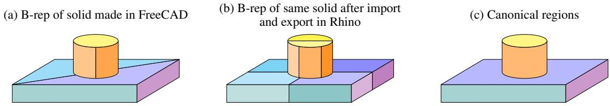
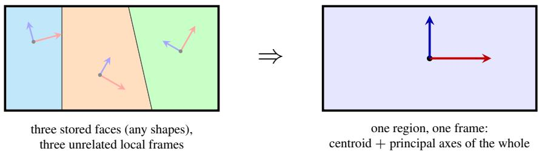
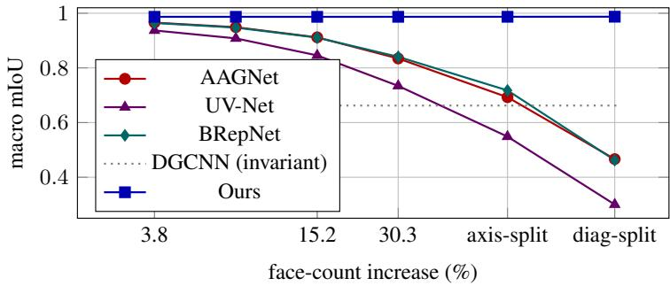
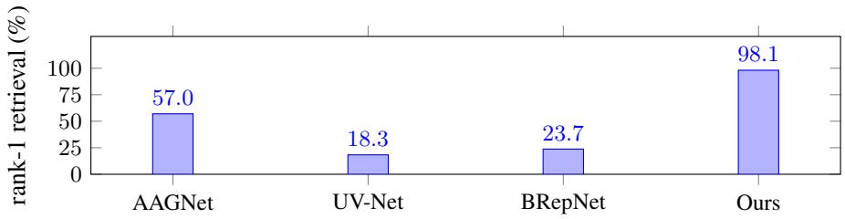

# Learn the Solid, Not the File: Canonical Inputs for Neural Networks on CAD Boundary Representations

Heinrich Jiang, Hager Yasser Mohamed, Alexander Hitt, Valeriia Lomakina,

Henning Jiang, Jennifer Jang

StoryGold AI

{heinrich,hager,alex,valeriia,henning,jennifer}@storygold.com

## ABSTRACT

Boundary representation (B-rep) is the standard format used by modern CAD systems for parametric 3D models. It turns out, the exact same solid can be represented by different B-reps: for example, two engineers using different operations, a geometry kernel rebuilding the file, and an export setting repartitioning faces will lead to different B-reps even though the underlying solid remains the same.

We show that existing B-rep encoders are not robust to variation in the B-rep with the same solid on perturbations applied to standard benchmarks, naturally occurring variations inherent to CAD software, and differences in how designers model the same part via a human dataset we created in FreeCAD. The performance of popular B-rep encoders often collapses catastrophically.

We propose the canonical region graph, an input representation whose nodes, features and coordinate frame are derived from the solid itself and show theoretical invariance guarantees on repartitioning and rigid motions. It matches the strongest baseline on standard benchmarks, and is stable under every perturbation we test.

## 1 INTRODUCTION

Computer Aided Design (CAD) is a long-standing technology that has had a profound influence on how just about any object was designed, from everyday consumer goods to architectural infrastructure and aerospace vehicles (Groover & Zimmers, 1983). Boundary representations (B-reps) are the most popular and standard format for most modern CAD software (Weiler, 1986). A B-rep describes a solid by its bounding surface patches (faces), the curves where patches meet (edges), and their connectivity. It gives the precise mathematical instructions to create the object (Stroud, 2006).

A growing body of work trains neural networks directly on B-reps and have been used for wide range of applications such as machine feature recognition (Yao et al., 2026), semantic segmentation (Lou et al., 2023), part classification (Li et al., 2026), CAD retrieval (Usama et al., 2026), generative design (Jayaraman et al., 2022), CAD synthesis (Xu et al., 2024), CAD sequence reconstruction (Zhang et al., 2024), manufacturability and cost estimation (Ballegeer et al., 2026), assembly and joint prediction (Willis et al., 2022) and engineering simulation Heidari & Iosifidis (2025).

It turns out that the B-rep is only one of many valid ways to represent the same solid. There are many different decompositions of the same surface: the same geometric boundary can admit arbitrarily many valid topological decompositions into faces and edges (Tierney et al., 2017), placed in any coordinate frame with rigid motions, and its surfaces written as analytic primitives or as splines (ISO 10303-42, 2025). An export setting in the CAD software itself can re-partition a solid’s boundary. Moreover, the final B-rep often is decided by factors no mechanical engineer thinks are conscious design decisions (e.g. the order of modeling operations, whether a profile was sketched as one curve or two, a cleanup checkbox, and which geometry kernel produced or last translated the file) (Park et al., 2021; Zhang et al., 2020). Two engineers modeling the same part, or one file passing through two CAD systems, routinely yield different drawings of an identical solid. As such, every solid admits an equivalence class of B-reps.

Therefore, one should naturally expect that a B-rep neural network, should be robust to the equivalence class of B-reps. That is, any valid B-rep of the solid should produce the same output, or at least approximately so. To our knowledge, none of the existing preprocessing methods enforce such robustness; and moreover, we show on standard benchmark datasets that these models often significantly break down in performance when such valid perturbations of the B-rep are applied. Despite the widespread use and the amount of research interest in these B-rep neural networks, such a lack of robustness surprisingly remains.

  
Figure 1: Canonical Regions. We show the face partitionings of the same solid that can naturally arise and how the canonical regions re-partitions the solid. (a) A B-rep that was made in FreeCAD. (b) The same solid after importing it and exporting it in Rhino 3D CAD software. (c) Canonical regions of this solid which is used to construct the canonical region graph. Both (a) and (b) therefore would lead to the same graph using our method, while for the baselines, the graph depends on the original partitioning.

We present a new graph-based B-rep input representation called canonical region graph. There are two key components. The first is canonical regions: undo the arbitrary cuts: wherever several faces are pieces of the same underlying surface (e.g. multiple arcs of one cylinder, two halves of one plane) and merge them, so that a node of our graph is a whole surface region, not whichever fragment of it the file happened to contain; two nodes are connected when their corresponding regions touch. The second is canonical frames: orient coordinate system in a frame from the solid itself, that is, the origin at its center of mass, and axes along its principal directions. Thus, the frame is invariant to rotations, rigid motions, and coordinate system of the file. Then, the features computed along these canonical regions and boundaries become provably invariant to repartitioning and rigid motions.

We provide a study showing that popular B-rep encoders are not invariant to this equivalence class of B-rep models for the same solid. We demonstrate this on two kinds of perturbations. The first is automatic: to every benchmark test solid, we apply re-partitioning of faces by axis-aligned planes, random rigid motion, re-expression of every analytic surface as its exact NURBS equivalent the operation kernel translators perform, and a plain import/export round-trip through a commercial NURBS-native kernel on the entire test split. The second is human: a dataset we created and labeled by CAD experts in FreeCAD. The dataset was labeled independently by two CAD experts, with one of the experts giving three different ways of modeling the same solid so that we capture both variations possible from one labeler and variations across labels. In all cases, the popular B-rep encoders collapse in performance when such perturbations are introduced, while our method is not only robust but matches or exceeds the compared methods in performance on the standard benchmarks.

## 2 RELATED WORK

Learning on B-reps. There has been a lot of interest in encoder models on B-reps (Liu et al., 2025; Dai et al., 2025; Liang et al., 2025; Kim et al., 2026; Jiang & Jang, 2026). A native B-rep cannot be used directly as input for a standard neural network: it must be first preprocessed into a tractable input format. The field has consolidated to a handful of approaches to turn a B-rep into a neural network input and each inherits specific properties of the B-rep that may not be relevant the underlying solid itself. UV-Net (Jayaraman et al., 2021) attaches to every face a small image grid sampled in the face’s own UV parameterization (and to every edge a curve grid), encodes both convolutionally, and passes messages over the face-adjacency graph: the features therefore inherit the parameterization of the faces. BRepNet (Lambourne et al., 2021) defines convolution directly on the coedge structure with learned kernels expressed as topological walks. The topology is from the B-rep, so splitting or merging a face rewrites the very walks the kernels are defined over. AAGNet (Wu et al., 2024) combines per-face UV grids with face and edge attributes for semantic and instance machining-feature recognition. All three express geometry in the file’s coordinate frame, so a rigid motion moves every feature. Other approaches include tokenizing the hierarchical tree of the B-rep and using the sequence as the input (Zhang et al., 2024), which directly depends on the hierarchical tree of the B-rep, and reducing the B-rep down to a list of primitives (Wu et al., 2021); however, this can only be used on very primitive CADs. Our canonical graph region method is a new input that focuses on the information about the solid and avoids using information that’s particular to how the B-rep was constructed.

  
Figure 2: Canonical Frame. Left: Each stored face carries its own local frame (and parameterization), all of which change when the file is re-cut or re-expressed. Right: we use a single canonical frame computed from the whole which cannot change, because the whole does not.

Robustness for B-rep Neural Networks. The UV-Net work observed a piece of the problem (Jayaraman et al., 2021), that a face’s UV grid can be sampled in several equivalent orders and plain grid convolutions are sensitive to the choice, for which they propose to fix the sampling of a fixed face on a fixed partition of the solid’s boundary into faces; but it does not address changes to the partitioning, and both the UV-Net and AAGNet inherit this. BRepGAT (Lee et al., 2023) mentions a large gap in performance on between their own dataset and on externally authored models, and attributes it to topological structure differing across CAD systems; however, they don’t provide any solutions. Some recent work improve B-rep output validity and error reduction (Hafez & Rashid, 2023; Shen et al., 2025; Liu et al., 2026; Qin et al., 2026b; Qi et al., 2026; Qin et al., 2026a). Lee et al. (2025a) addresses one source of B-rep representation variability by replacing NURBS surfaces with analytic primitives and Jones et al. (2023) learns entity correspondence under topology changes. Sun et al. (2010) simplifies B-reps by removing unwanted features. Ballegeer & Benoit (2026) proposes a rotation-invariant method.

## 3 THE CANONICAL REGION GRAPH

Like many B-rep encoding methods, our model consumes a graph and is trained with a graph neural network. Existing methods typically use a graph whose nodes are the faces that are stored in the file, with features sampled from that face’s parameterization in the file’s coordinate frame. Our graph replaces all of this with quantities that can be computed from the solid itself: one node per canonical region and coordinate system computed relative to the solid’s own frame rather than the file’s. The full detailed construction of what we will discuss here is defined end-to-end, along with keys, tolerances, frame, grid, and every constant in Appendix E.

Nodes and Edges: In the canonical region graph, the nodes are the maximally connected regions after undoing the arbitrary cuts (i.e. merging faces that are pieces of one underlying surface). In order to do this, each face gets an exact key identifying its surface in the following way: if the face is an analytic surface (a plane, cylinder, sphere, cone or torus), then the key is based on the surface type and parameters defining it. Next, if the face is saved as a spline (i.e. in NURBS, CAD’s generic freeform format that defines a surface using a grid of control points rather than an equation) but actually an analytic surface up to a tolerance, the key is based on the analytic surface. The same applies when the file describes the surface procedurally rather than by shape (e.g. a straight line revolved about an axis, or a circle dragged along a direction), which is a third way a kernel can write down the identical cylinder or plane. Recovering analytic surfaces from freeform representations, and preferring the simplest primitive that fits, is standard practice in reverse engineering (Varady´ et al., 1997); ours is a deterministic least-squares variant with the selection rule and its failure cases in Appendix E. If it’s genuinely a complex NURBs surface, the key is based on the control grid, read from the underlying untrimmed surface. In a B-rep, a face in this case is stored as a bounded portion of a larger underlying surface, and splitting a face only redraws the bounds. Both pieces still point at the same underlying surface, so the key survives any cutting. It is important to note here that the key is computed based on the underlying untrimmed surface the face inherits from (as the B-rep contains this information), rather than only the bounded portion defining the face. Two faces merge exactly when their keys are equal and they share an edge. The shared-edge condition is required because sometimes two separate features are machined to the same surface (e.g. two identical sub-parts) must still remain two separate regions, and not merge into one. These maximally connected faces become the canonical region and becomes a node in the canonical region graph. Two nodes share an edge if the corresponding canonical regions share a boundary curve.

The Canonical Frame. Several features to be consumed by the graph neural network depend on positions and directions. A coordinate is only meaningful relative to a frame. The B-rep’s frame is arbitrary because it depends on how the designer oriented the part. We compute one from the solid instead: the origin is the boundary’s centroid, and the axes are its principal directions. Each axis’s sign is chosen by which side of the perpendicular plane through the centroid carries more boundary area (i.e. a third-moment ”lopsidedness”); when a part is too symmetric for this to decide, the two choices are smoothly blended by the lopsidedness weight in order to have continuity. In cases where the principal axis directions themselves are ambiguous, we average feature values across the ambiguous rotations, in closed form. At non-degenerate configurations, the frame transforms equivariantly under rigid motions. At symmetric configurations, where no unique frame exists, we instead construct averaged features that are independent of the ambiguous basis. Keeping mirror images distinct requires some additional care in the frame construction; see Appendix D. Lastly, scale: before any feature is computed, the solid is uniformly rescaled so that its total boundary area is 1. As a consequence, our method is also scale-invariant, a property the popular baselines already have (Jayaraman et al., 2021; Wu et al., 2024).

Node and Edge Features. Each node carries 115 features summarizing its region and each edge has 10 features summarizing the shared boundary between two regions, with every position and direction expressed in the canonical frame. The features are largely the attributes the field has always used such as surface type, area and convexity (Joshi & Chang, 1988) and overlap with that of BRepNet almost item for item (Lambourne et al., 2021). What differs is where they are computed: regions in the canonical frame and not the stored faces in the B-rep’s frame. Thus, every feature inherits the desired invariance properties from its region and frame. In particular, there are no UV grids or features that read a parameterization.

Learning on the graph. The network is a standard graph transformer: standardized features pass through an MLP stem, 8 rounds of edge-conditioned multi-head attention with residual feed-forward blocks (width 512, 8 heads, 17.5M parameters), and a linear head producing per-region logits. On tasks that require us to make a prediction based on a B-rep face, the face simply inherits its region’s prediction, so any two faces of one region agree by construction. Exact details in Appendix E.

## 4 INVARIANCE GUARANTEES

We show a number of guarantees for the canonical region graph. Throughout, S denotes the solid and ∂S its boundary surface. We call a partition of ∂S into faces valid if every face is contained in a single supporting parametric surface (i.e. patches do not straddle distinct surfaces) and distinct faces meet only along piecewise-regular curves and isolated vertices (i.e. finitely many smooth arcs, excluding degenerate intersections). These conditions hold for the valid B-reps: each B-rep face is a trimmed region of a single supporting surface, and face adjacencies are represented by finitely many topological edges supported by curves. Inputs violating the required B-rep validity conditions are rejected during intake (ISO 10303-42, 2025).

The first result shows that valid B-reps composed of the supported analytic surfaces of the same solid yield the same decomposition into canonical regions. All proofs are in Appendix A.

Proposition 1 (Canonicality). ∂S decomposes uniquely into maximal connected patches ofanalytic surfaces. For every valid partition P, whose faces lie on analytic surfaces (natively or recognized at machine precision) the region graph G(P) is isomorphic (with identical node geometry) to the graph of these patches. G is therefore a function of the solid, not of P.

Table 1: Invariance under perturbations on MFInstSeg test solids. For each class of perturbations, we compare the perturbed version with the original in whether the region graph structure match and by how much the largest feature differs as a multiple of the standard deviation of that feature in the training set. We show the 50 and 99 percentiles and worst number among the solids.
<table><tr><td colspan="2"></td><td colspan="3">exact-feature residual (σ)</td></tr><tr><td>perturbation</td><td>identical region graph</td><td>p50</td><td>p99</td><td>worst</td></tr><tr><td>diag-split (re-partition)</td><td>99.9%</td><td>0</td><td>4×10−7</td><td>0.002</td></tr><tr><td>NURBS re-expression</td><td>100%</td><td>0.0007</td><td>0.009</td><td>0.022</td></tr><tr><td>random rigid motion</td><td>100%</td><td>0</td><td>0.002</td><td>0.007</td></tr></table>

The next result shows that totals computed from the pieces of the same surface equals the total over the entire surface. This makes features computable from any file and, applied to the whole boundary, makes the canonical frame itself partition-invariant.

Proposition 2 (Additivity over subdivisions). Surface and edge integrals are additive over subdivisions. Therefore, subdividing any region into valid subregions does not change the resulting features, so they are invariant to the choice ofvalid partition P of∂S.

Next, we show that a partition-invariant model can use only the information from the shape.

Proposition 3 (Lower bound on partition-invariance). A predictor is partition-invariant ifand only if its prediction depends only on the underlying solid geometry. Consequently, for any label Y (e.g., a modeling operation), the risk ofa partition-invariant predictor is bounded below by the irreducible disagreement of Y among B-reps representing the same geometry. Thus, any predictor achieving lower risk must exploit information in the B-rep partition that is not determined by the geometry.

Some features (e.g. the integrated normal, the curvature totals, the dihedral histograms, the occupancy grid) cannot be computed in closed form and they are evaluated by quadrature on a triangle mesh of the surface; that is the integral approximated as a finite sum, the integrand evaluated at one sample point per triangle in the mesh and weighted by that triangle’s area. The next result guarantees that such features remain invariant up to tolerance proportional to the mesh error.

Lemma 1 (Stability of the mesh-computed features). The following holds for any mesh-computed feature that is Lipschitz continuous in the quadrature sample positions and area weights. A mesh perturbation ofsize ε (i.e. a re-triangulation ofthe same surface that changes each sample position and area weight by at most ε) changes every suchfeature by at most O(ε).

The final result shows that under the canonical frame, the features are invariant under rigid motion.

Proposition 4 (Rigid-motion invariance). The centroid and principal-axis frame transform equivariantly under rigid motions. Consequently, features expressed in this canonical frame (after the sign blending and degenerate-subspace averaging, which are functions of invariants alone) are exactly invariant to translation and rotation, and remain partition-invariant.

Verification in practice. Table 1 measures invariance at the representation level. We take the 3000 sample test set of MFInstSeg (Wu et al., 2024) and make three different perturbations: repartitioning, NURBS re-expresson, and rigid motions. We compare the perturbed version with the original by first comparing the canonical region graph. We match the counts and then the largest feature disagreement after optimally matching regions. We show residuals in units of σ, the channel’s standard deviation over the training set. We see that the invariance properties hold in practice. Appendix F provides an in-depth analysis of the invariance.

## 5 EXPERIMENTS

We compare our method with popular baselines UV-Net (Jayaraman et al., 2021), AAGNet (Wu et al., 2024) and BrepNET (Lambourne et al., 2021). We also include a point cloud method

Table 2: Segmentation under automatic perturbations. We show that our method is robust to different perturbations of the datapoints across a range of benchmark segmentation tasks, while the performance of popular baselines degrades significantly.
<table><tr><td>dataset</td><td>model</td><td>clean</td><td>axis-split</td><td>diag-split</td><td>rotation</td><td>NURBS</td><td>composed</td></tr><tr><td>MFInstSeg</td><td>AAGNet</td><td>0.9851</td><td>0.6927</td><td>0.4663</td><td>0.4811</td><td>0.0604</td><td>0.0055</td></tr><tr><td>MFInstSeg</td><td>UV-Net</td><td>0.9725</td><td>0.5486</td><td>0.3001</td><td>0.3392</td><td>0.0035</td><td>0.0026</td></tr><tr><td>MFInstSeg</td><td>BRepNet</td><td>0.9828</td><td>0.7176</td><td>0.4626</td><td>0.7746</td><td>0.9564</td><td>0.4428</td></tr><tr><td>MFInstSeg</td><td>DGĆNN</td><td>0.6622</td><td>0.6622</td><td>0.6622</td><td>0.1231</td><td>0.6622</td><td>0.1231</td></tr><tr><td>MFInstSeg</td><td>Ours</td><td>0.9862</td><td>0.9870</td><td>0.9873</td><td>0.9867</td><td>0.9868</td><td>0.9862</td></tr><tr><td>MFCAD++</td><td>AAGNet</td><td>0.9851</td><td>0.6737</td><td>0.4357</td><td>0.6027</td><td>0.0275</td><td>0.0056</td></tr><tr><td>MFCAD++</td><td>UV-Net</td><td>0.9770</td><td>0.5964</td><td>0.3569</td><td>0.4115</td><td>0.0079</td><td>0.0040</td></tr><tr><td>MFCAD++</td><td>BRepNet</td><td>0.9842</td><td>0.7593</td><td>0.5209</td><td>0.7491</td><td>0.9596</td><td>0.4661</td></tr><tr><td>MFCAD++</td><td>DGCNN</td><td>0.6571</td><td>0.6571</td><td>0.6571</td><td>0.1095</td><td>0.6571</td><td>0.1095</td></tr><tr><td>MFCAD++</td><td>Ours</td><td>0.9870</td><td>0.9887</td><td>0.9884</td><td>0.9851</td><td>0.9856</td><td>0.9846</td></tr><tr><td>CADSynth</td><td>AAGNet</td><td>0.9904</td><td>0.4698</td><td>0.4499</td><td>0.9463</td><td>0.0360</td><td>0.0219</td></tr><tr><td>CADSynth</td><td>UV-Net</td><td>0.9859</td><td>0.4257</td><td>0.3975</td><td>0.9141</td><td>0.0250</td><td>0.0089</td></tr><tr><td>CADSynth</td><td>BRepNet</td><td>0.9904</td><td>0.6487</td><td>0.6212</td><td>0.9766</td><td>0.9121</td><td>0.7249</td></tr><tr><td>CADSynth</td><td>DGĆNN</td><td>0.6142</td><td>0.6142</td><td>0.6142</td><td>0.2673</td><td>0.6142</td><td>0.2673</td></tr><tr><td>CADSynth</td><td>Ours</td><td>0.9922</td><td>0.9926</td><td>0.9930</td><td>0.9906</td><td>0.9909</td><td>0.9816</td></tr></table>

  
Figure 3: Re-paritition intensity effect on MFInstSeg (log scale in the x-axis). Every B-rep baseline degrades monotonically in the amount of face splitting while ours is flat at parity accuracy. DGCNN’s point-cloud input is partition-invariant by construction, but at a massive accuracy cost.

DGCNN (Wang et al., 2019), which does not depend on the B-rep (but less accurate because the point clouds give less information than the B-rep). We use each baseline’s published weights where they exist and retrain at a shared budget where they do not. Full details in Appendix B.

There are several ways to automatically generate different valid B-reps for a solid. We explore:

• axis-split. Re-partitioning each face by sectioning two axis-aligned planes

• diag-split. Re-partitioning each face is sectioned by four planes including diagonals

• split-k. Re-partitioning where exactly k faces are split.

• rotation. Applies one random rigid motion per part, shared by every model.

• NURBS re-expression. Rewrite each analytic surface as its exact B-spline form.

• composed. Applies diag-split, rotation and re-expression at once.

Segmentation Benchmark: We use standard benchmark datasets and compare the accuracy on the original task vs accuracy on a task where the datapoints are perturbed automatically. Table 2 shows the results. All accuracy numbers are macro mIoU (per-class intersection-over-union of predicted vs. true face labels), averaged over classes with 1.0 being the perfect score. For each perturbation, the geometry of the solid remains unchanged (up to a very small tolerance). We see that our method has robust performance under these perturbations, while the popular baselines’ performances decay significantly. It’s worth noting that DGCNN consumes point clouds sampled from the geometry, so re-partitioning and re-expression remains unchanged but is affected by rotation. Figure 3 shows how performance monotonically decays for the B-rep baselines as we increase the amount of repartitioning, while our method remains stable.

Table 3: Retrieval self-identification on 3000 real Fusion 360 parts. We report the rank-1 accuracy of retrieving a part’s own clean B-rep (with retrieval database consisting of all the clean B-reps) from a query that is the same solid under one perturbation. DGCNN’s queries are re-sampled point clouds so there is some variance even in the columns it’s theoretically invariant to.
<table><tr><td>model</td><td>axis-split</td><td>diag-split</td><td>rotation</td><td>NURBS</td><td>composed</td></tr><tr><td>AAGNet</td><td>22.6%</td><td>6.3%</td><td>25.5%</td><td>0.7%</td><td>0.2%</td></tr><tr><td>UV-Net</td><td>5.5%</td><td>1.0%</td><td>7.3%</td><td>0.3%</td><td>0.1%</td></tr><tr><td>BRepNet</td><td>10.6%</td><td>7.8%</td><td>16.5%</td><td>98.1%</td><td>3.6%</td></tr><tr><td>DGCNN</td><td>85.9%</td><td>85.6%</td><td>7.7%</td><td>86.3%</td><td>7.8%</td></tr><tr><td>Ours</td><td>96.1%</td><td>96.3%</td><td>88.3%</td><td>80.5%</td><td>76.1%</td></tr></table>

Table 4: Predictive churn on 3,000 MFInstSeg solids. Percentage of individual face predictions that change with perturbation, and the fraction of solids with at least one change.
<table><tr><td></td><td>axis-split</td><td>diag-split</td><td>rotation</td><td>NURBS</td><td>composed</td></tr><tr><td colspan="6">faces flipped</td></tr><tr><td>AAGNet</td><td>11.90%</td><td>27.29%</td><td>35.83%</td><td>74.68%</td><td>96.81%</td></tr><tr><td>UV-Net</td><td>21.66%</td><td>45.69%</td><td>50.29%</td><td>97.80%</td><td>98.19%</td></tr><tr><td>BRepNet Ours</td><td>10.75% 0.00%</td><td>24.45% 0.00%</td><td>8.98%</td><td>1.20%</td><td>29.90%</td></tr><tr><td></td><td></td><td></td><td>0.00%</td><td>0.00%</td><td>0.02%</td></tr><tr><td colspan="6">solids affected</td></tr><tr><td>AAGNet</td><td>85.63%</td><td>100.00%</td><td>96.77%</td><td>99.93%</td><td>100.00%</td></tr><tr><td>UV-Net</td><td>96.00%</td><td>100.00%</td><td>99.83%</td><td>100.00%</td><td>100.00%</td></tr><tr><td>BRepNet</td><td>86.00%</td><td>99.30%</td><td>64.10%</td><td>20.87%</td><td></td></tr><tr><td>Ours</td><td>0.00%</td><td>0.00%</td><td>0.00%</td><td>0.03%</td><td>99.10% 0.33%</td></tr></table>

Retrieval Benchmark: We build a label-free retrieval benchmark from 3000 real Fusion 360 Gallery parts. The retrieval database consists of the clean B-reps, and each query is the same solid under one perturbation. No retrieval training is performed. Table 3 shows the results. BRepNet is best with NURBS perturbation as re-expression changes nothing its features read, so its embeddings barely move but performs poorly under other perturbations. Ours is the only model that consistently performs across perturbations.

Predictive Churn. It is quite common for models to have very different individual predictions, even with similar accuracy. This is known as predictive churn (Jiang et al., 2021); which can be seen as a more direct measure of stability than for e.g. accuracy on downstream tasks. We see in Table 4 that our method has very low churn while the baselines all exhibit a high amount, sometimes near 100% in terms of number of face predictions changed, a clear sign of representation collapse.

Why augmentation is not the answer. A natural approach is to train with the perturbations applied via data augmentation. Table 5 shows the results with each baseline trained with each of the augmentations, evaluated on every perturbation. Augmentation genuinely helps and in all cases, substantially improves the results for its corresponding perturbation; however, the transfer is not as strong across different perturbations. Furthermore in all cases, our method without any data augmentation surpasses the performance on each individual perturbation, suggesting that our method of fixing the problem at the architecture level is superior to augmenting the data.

Kernel-induced re-partitioning. In our automatic perturbations based on re-partitioning, we use SplitShape command in OpenCASCADE on the B-rep. We show that our results also hold when we don’t use a splitting operator and instead rewrite the CAD program itself in OpenCASCADE in the following way: whenever a sketch is extruded by extent E, we make the same sketch extruded E/2, plus a second copy on a plane offset by E/2, extruded E/2 so in the end it is still the same solid but now each extrusion is partitioned into two. The dataset we use is 1,049 pairs, generated procedurally based on CAD-Recode (Rukhovich et al., 2025). Figure 4 shows the results and our method outperforms significantly.

Table 5: Data augmentation matrix: every baseline and every augmentation, evaluated on every perturbation. We report macro mIoU on MFInstSeg test set.
<table><tr><td>model</td><td>clean</td><td>axis-split</td><td>diag-split</td><td>NURBS</td><td>composed</td></tr><tr><td>AAGNet + axis aug.</td><td>0.9850</td><td>0.9759</td><td>0.8558</td><td>0.0450</td><td>0.0054</td></tr><tr><td>+ diag aug.</td><td>0.9828</td><td>0.9774</td><td>0.9703</td><td>0.0469</td><td>0.0043</td></tr><tr><td>+ NURBS aug.</td><td>0.9851</td><td>0.6778</td><td>0.4711</td><td>0.9853</td><td>0.2358</td></tr><tr><td>+ composed aug.</td><td>0.9802</td><td>0.9421</td><td>0.5725</td><td>0.9674</td><td>0.9502</td></tr><tr><td>UV-Net + axis aug.</td><td>0.9876</td><td>0.9630</td><td>0.7622</td><td>0.0072</td><td>0.0066</td></tr><tr><td>+ diag aug.</td><td>0.9827</td><td>0.9561</td><td>0.9421</td><td>0.0104</td><td>0.0053</td></tr><tr><td>+ NURBS aug.</td><td>0.9744</td><td>0.5420</td><td>0.3108</td><td>0.9744</td><td>0.1893</td></tr><tr><td>+ composed aug.</td><td>0.9717</td><td>0.8152</td><td>0.5083</td><td>0.9456</td><td>0.9326</td></tr><tr><td>BRepNet + axis aug.</td><td>0.9849</td><td>0.9830</td><td>0.9192</td><td>0.9587</td><td>0.3037</td></tr><tr><td>+ diag aug.</td><td>0.9828</td><td>0.9793</td><td>0.9780</td><td>0.9565</td><td>0.6115</td></tr><tr><td>+ NURBS aug.</td><td>0.9785</td><td>0.7238</td><td>0.4752</td><td>0.9588</td><td>0.5832</td></tr><tr><td>+ composed aug.</td><td>0.9816</td><td>0.9740</td><td>0.8125</td><td>0.9586</td><td>0.9639</td></tr><tr><td>Ours (no aug.)</td><td>0.9862</td><td>0.9870</td><td>0.9873</td><td>0.9868</td><td>0.9862</td></tr></table>

  
Figure 4: Kernel-induced re-partitioning in OpenCASCADE: rank-1 retrieval accuracy.

Table 6: Region ablation: we keep features the same but test merging (into regions) vs not merging (keeping the existing faces) for the input graph. We use MFInstSeg test split under axis/diag repartitioning. “Solids stable” is the fraction of test solids whose predictions are bit-identical between the clean file and its re-partitioned version.
<table><tr><td rowspan="2"></td><td colspan="2">mIoU</td><td colspan="2">solids stable</td></tr><tr><td>axis</td><td>diag</td><td>axis</td><td>diag</td></tr><tr><td>face nodes (merging off)</td><td>0.5653</td><td>0.3502</td><td>4.80%</td><td>0.07%</td></tr><tr><td>region nodes (merging on)</td><td>0.9828</td><td>0.9840</td><td>99.73%</td><td>99.70%</td></tr></table>

Region Ablation In Table 6, we show the importance of face merging in our region-based approach. We compare the robustness under our automatic re-partitioning perturbation using an input graph with the region-based nodes (with merging) vs the input graph without merging (using the original faces as nodes).

Kernel round-trips. Here we explore the effect of a real-world perturbation: a plain import/export round-trip in Rhino, a popular commercial CAD software which uses the openNURBS kernel. Table 7 shows the results: AAGNet and UV-Net collapse catastrophically, while BRepNet holds better: its features do not read surface parameterizations. Our method is still the most stable.

Human study. The human study runs in FreeCAD where we have two experts who labeled 25 parts. One labeler made 3 different FreeCAD scripts for each part and a second labeler made one script for each part. We compare both variation in scripts made by the same expert and variation made by different experts. The results are in Table 8, and full details are in Appendix C. We compare the methods on the segmentation predictive churn on each methods’ corresponding MFInstSegtrained checkpoint for both within-expert and cross-expert B-rep pairs. We see that our method is far more consistent than the baselines.

Table 7: Robustness to an ordinary Rhino import/export of the entire MFInstSeg test split. We show macro mIoU as in Table 2 and additionally the predictive churn at both face-level and solid-level (if at least one face’s prediction in the solid was changed).
<table><tr><td></td><td>clean</td><td>round-trip</td><td>faces flipped</td><td>solids affected</td></tr><tr><td>AAGNet (publ.)</td><td>0.9851</td><td>0.2838</td><td>47.04%</td><td>99.50%</td></tr><tr><td>UV-Net</td><td>0.9725</td><td>0.0433</td><td>89.98%</td><td>100.00%</td></tr><tr><td>BRepNet</td><td>0.9828</td><td>0.9674</td><td>0.37%</td><td>5.13%</td></tr><tr><td>Ours</td><td>0.9862</td><td>0.9870</td><td>0.00%</td><td>0.04%</td></tr></table>

Table 8: The human study: segmentation predictive churn (percentage) between two independently authored FreeCAD scripts of the same geometry.
<table><tr><td></td><td>AAGNet</td><td>UV-Net</td><td>BRepNet</td><td>Ours</td></tr><tr><td>scripts from same expert</td><td>11.8</td><td>30.1</td><td>12.6</td><td>0.5</td></tr><tr><td>scripts from different experts</td><td>13.1</td><td>15.1</td><td>12.5</td><td>0.2</td></tr></table>

Table 9: Fusion 360 under the automatic perturbations, same conventions as Table 2
<table><tr><td>model</td><td>clean</td><td>axis-split</td><td>diag-split</td><td>rotation</td><td>NURBS</td><td>composed</td></tr><tr><td>AAGNet</td><td>0.7412</td><td>0.4842</td><td>0.3151</td><td>0.5512</td><td>0.2473</td><td>0.0697</td></tr><tr><td>UV-Net</td><td>0.6977</td><td>0.3772</td><td>0.2218</td><td>0.4576</td><td>0.2895</td><td>0.0950</td></tr><tr><td>BRepNet</td><td>0.7162</td><td>0.3541</td><td>0.2419</td><td>0.5167</td><td>0.5707</td><td>0.2415</td></tr><tr><td>DGĆNN (points)</td><td>0.4025</td><td>0.4025</td><td>0.4025</td><td>0.1436</td><td>0.4025</td><td>0.1436</td></tr><tr><td>Ours</td><td>0.6148</td><td>0.6048</td><td>0.5725</td><td>0.6153</td><td>0.6150</td><td>0.6142</td></tr></table>

The cost of invariance (a limitation). Our method has a limitation in situations the information in the B-rep itself can be useful and not using it would hurt performance. One such situation is the Fusion 360 Gallery segmentation, where it labels each face by the modeling operation that created it. As such, a partition-invariant model cannot always recover such labels, while a model free to read the boundary decomposition can exploit residual traces of the history. Table 9 shows the results. We do see that our method performs worse than the B-rep baselines on the clean dataset; however, when automatic perturbations are applied, our robustness overcomes the decay in the baselines when faced with the perturbations.

## 6 CONCLUSION

We showed that existing B-rep encoders are not robust to variation in the B-rep used to represent the solid. We proposed the canonical region graph, an input representation whose nodes, features and coordinate frame are derived from the solid itself with theoretical invariance guarantees. It matches the strongest baseline on standard benchmarks and is stable under variation of B-rep.

Our findings may have implications for B-rep generators that count re-descriptions of the same solid as distinct or novel samples (Xu et al., 2024; Lee et al., 2025b; Xu et al., 2025; Li et al., 2025a;b) and those that use element-matching reconstruction scores (Guo et al., 2022), which can penalize correct solids decomposed differently from the one reference B-rep.

Future work includes extending the method to use feature trees and construction histories but with invariance constraints in order to leverage potentially useful information contained in the B-rep. Another direction is extending the method to work for assemblies, which are files with multiple parts, instead of just a single part, as well as 2D sketches and drawings.

## REFERENCES

Industrial automation systems and integration—product data representation and exchange—part 42: Integrated generic resource: Geometric and topological representation, 2025. URL https: //www.iso.org/standard/91386.html.

Matteo Ballegeer and Dries F Benoit. Fov-net: Rotation-invariant cad b-rep learning via field-ofview ray casting. arXiv preprint arXiv:2602.24084, 2026.

Matteo Ballegeer, Toon Van Camp, Willem Jaspers, Alp Bayar, Aung Nyein Soe, Martin Roelfs, Dries F Benoit, Bieke Decraemer, and Joost R Duflou. Cad-feature enhanced machine learning for manufacturing effort estimation on sheet metal bending parts. arXiv preprint arXiv:2605.12266, 2026.

Yongkang Dai, Xiaoshui Huang, Yunpeng Bai, Hao Guo, Hongping Gan, Ling Yang, and Yilei Shi. Brepformer: Transformer-based b-rep geometric feature recognition. In Proceedings of the 2025 International Conference on Multimedia Retrieval, pp. 155–163, 2025.

Mikell Groover and EWJR Zimmers. CAD/CAM: computer-aided design and manufacturing. Pearson Education, 1983.

Haoxiang Guo, Shilin Liu, Hao Pan, Yang Liu, Xin Tong, and Baining Guo. Complexgen: Cad reconstruction by b-rep chain complex generation. ACM Transactions on Graphics (TOG), 41(4): 1–18, 2022.

Omar M Hafez and Mark M Rashid. A robust workflow for b-rep generation from image masks. Graphical Models, 128:101174, 2023.

Negar Heidari and Alexandros Iosifidis. Geometric deep learning for computer-aided design: A survey. IEEE Access, 13:119305–119334, 2025.

Pradeep Kumar Jayaraman, Aditya Sanghi, Joseph G Lambourne, Karl DD Willis, Thomas Davies, Hooman Shayani, and Nigel Morris. Uv-net: Learning from boundary representations. In 2021 IEEE/CVF Conference on Computer Vision and Pattern Recognition (CVPR), pp. 11698–11707. IEEE, 2021.

Pradeep Kumar Jayaraman, Joseph G Lambourne, Nishkrit Desai, Karl DD Willis, Aditya Sanghi, and Nigel JW Morris. Solidgen: An autoregressive model for direct b-rep synthesis. arXiv preprint arXiv:2203.13944, 2022.

Heinrich Jiang and Jennifer Jang. Masked topology modeling for self-supervised learning on parametric cad. arXiv preprint arXiv:2607.20642, 2026.

Heinrich Jiang, Harikrishna Narasimhan, Dara Bahri, Andrew Cotter, and Afshin Rostamizadeh. Churn reduction via distillation. arXiv preprint arXiv:2106.02654, 2021.

Benjamin Jones, James Noeckel, Milin Kodnongbua, Ilya Baran, and Adriana Schulz. B-rep matching for collaborating across cad systems. arXiv preprint arXiv:2306.03169, 2023.

Sanjay Joshi and Tien-Chien Chang. Graph-based heuristics for recognition of machined features from a 3d solid model. Computer-aided design, 20(2):58–66, 1988.

Mingi Kim, Yongjun Kim, Jungwoo Kang, and Hyungki Kim. Brepcoder: A unified multimodal large language model for multi-task b-rep reasoning. arXiv preprint arXiv:2602.22284, 2026.

Joseph G Lambourne, Karl DD Willis, Pradeep Kumar Jayaraman, Aditya Sanghi, Peter Meltzer, and Hooman Shayani. Brepnet: A topological message passing system for solid models. arXiv preprint arXiv:2104.00706, 2021.

Jihui Lee, Changmo Yeo, Kyung Cheol Bae, and Duhwan Mun. Replacing nurbs surfaces with analytic surfaces based on isocurve characteristics in b-rep models. Journal of Computational Design and Engineering, 12(8):78–106, 2025a.

Jinwon Lee, Changmo Yeo, Sang-Uk Cheon, Jun Hwan Park, and Duhwan Mun. Brepgat: Graph neural network to segment machining feature faces in a b-rep model. Journal of Computational Design and Engineering, 10(6):2384–2400, 2023.

Mingi Lee, Dongsu Zhang, Clement Jambon, and Young Min Kim. Brepdiff: Single-stage b-rep dif-´ fusion model. In Proceedings ofthe Special Interest Group on Computer Graphics and Interactive Techniques Conference Conference Papers, pp. 1–11, 2025b.

Jing Li, Yihang Fu, and Falai Chen. Dtgbrepgen: A novel b-rep generative model through decoupling topology and geometry. In 2025 IEEE/CVF Conference on Computer Vision and Pattern Recognition (CVPR), pp. 21438–21447. IEEE, 2025a.

Pu Li, Wenhao Zhang, Weize Quan, Biao Zhang, Peter Wonka, and Dongming Yan. Brepgpt: Autoregressive b-rep generation with voronoi half-patch. ACM Transactions on Graphics (TOG), 44(6):1–18, 2025b.

Yifei Li, Kang Wu, Wenming Wu, and Xiao-Ming Fu. Masked brep autoencoder via hierarchical graph transformer. arXiv preprint arXiv:2603.14927, 2026.

JianFei Liang, FaZhi He, RuBin Fan, YiYang Chu, and Xiaohu Yan. Cadcl: Reconstruct parametric cad models from b-rep via contrastive learning. Journal of Computational Design and Engineering, 12(10):176–184, 2025.

Yilin Liu, Duoteng Xu, Xingyao Yu, Xiang Xu, Daniel Cohen-Or, Hao Zhang, and Hui Huang. Hola: B-rep generation using a holistic latent representation. ACM Transactions on Graphics (TOG), 44(4):1–25, 2025.

Yilin Liu, Pradeep Jayaraman, Chinthala Reddy, Xiang Xu, and Hooman Shayani. Dualbrep: A dual-field continuous representation for b-rep modelling. In Proceedings of the Special Interest Group on Computer Graphics and Interactive Techniques Conference Conference Papers, pp. 1–11, 2026.

Yunzhong Lou, Xueyang Li, Haotian Chen, and Xiangdong Zhou. Brep-bert: Pre-training boundary representation bert with sub-graph node contrastive learning. In Proceedings of the 32nd ACM International Conference on Information and Knowledge Management, pp. 1657–1666, 2023.

Michael A Park, Robert Haimes, Nicholas J Wyman, Patrick A Baker, and Adrien Loseille. Boundary representation tolerance impacts on mesh generation and adaptation. In AIAA aviation 2021 forum, pp. 2992, 2021.

Dacheng Qi, Chenyu Wang, Jingwei Xu, Tianzhe Chu, Zibo Zhao, Wen Liu, Wenrui Ding, Yi Ma, and Shenghua Gao. Pointer-cad: Unifying b-rep and command sequences via pointer-based edges & faces selection. arXiv preprint arXiv:2603.04337, 2026.

Dafei Qin, Rui Xu, Zeyu Shen, Kaichun Qiao, Hongyang Lin, Qixuan Zhang, Huaijin Pi, Lan Xu, Jingyi Yu, Wenping Wang, et al. Autoregressive b-rep shape generation with parametric surfaces. arXiv preprint arXiv:2607.17093, 2026a.

Feiwei Qin, Chenqi Luo, Junhao Hou, Meie Fang, and Ligang Liu. Brep-gd: a graph diffusion model for cad boundary representation generation. IEEE Transactions on Visualization and Computer Graphics, 2026b.

Danila Rukhovich, Elona Dupont, Dimitrios Mallis, Kseniya Cherenkova, Anis Kacem, and Djamila Aouada. Cad-recode: Reverse engineering cad code from point clouds. In 2025 IEEE/CVF International Conference on Computer Vision (ICCV), pp. 9801–9811. IEEE, 2025.

Zeyu Shen, Mingyang Zhao, Dong-Ming Yan, and Wencheng Wang. Mesh2brep: B-rep reconstruction via robust primitive fitting and intersection-aware constraints. IEEE Transactions on Visualization and Computer Graphics, 31(10):6661–6676, 2025.

Ian Stroud. Boundary representation modelling techniques. Springer, 2006.

Rui Sun, Shuming Gao, and Wei Zhao. An approach to b-rep model simplification based on region suppression. Computers & Graphics, 34(5):556–564, 2010.

Christopher M Tierney, Liang Sun, Trevor T Robinson, and Cecil G Armstrong. Using virtual topology operations to generate analysis topology. Computer-Aided Design, 85:154–167, 2017.

Muhammad Usama, Didier Stricker, Mohammad Sadil Khan, and Muhammad Zeshan Afzal. Brepclip: Contrastive multimodal pretraining on brep primitives for cad understanding. arXiv preprint arXiv:2606.05515, 2026.

Tamas V ´ arady, Ralph R Martin, and Jordan Cox. Reverse engineering of geometric models—an ´ introduction. Computer-aided design, 29(4):255–268, 1997.

Yue Wang, Yongbin Sun, Ziwei Liu, Sanjay E Sarma, Michael M Bronstein, and Justin M Solomon. Dynamic graph cnn for learning on point clouds. ACM Transactions on Graphics (tog), 38(5): 1–12, 2019.

Kevin J Weiler. Topological structures for geometric modeling (Boundary representation, manifold, radial edge structure). Rensselaer Polytechnic Institute, 1986.

Karl DD Willis, Pradeep Kumar Jayaraman, Hang Chu, Yunsheng Tian, Yifei Li, Daniele Grandi, Aditya Sanghi, Linh Tran, Joseph G Lambourne, Armando Solar-Lezama, et al. Joinable: Learning bottom-up assembly of parametric cad joints. In 2022 IEEE/CVF Conference on Computer Vision and Pattern Recognition (CVPR), pp. 15828–15839. IEEE, 2022.

Hongjin Wu, Ruoshan Lei, Yibing Peng, and Liang Gao. Aagnet: A graph neural network towards multi-task machining feature recognition. Robotics and Computer-Integrated Manufacturing, 86: 102661, 2024.

Rundi Wu, Chang Xiao, and Changxi Zheng. Deepcad: A deep generative network for computeraided design models. In 2021 IEEE/CVF International Conference on Computer Vision (ICCV), pp. 6752–6762. IEEE, 2021.

Xiang Xu, Joseph Lambourne, Pradeep Jayaraman, Zhengqing Wang, Karl Willis, and Yasutaka Furukawa. Brepgen: A b-rep generative diffusion model with structured latent geometry. ACM Transactions on Graphics (TOG), 43(4):1–14, 2024.

Xiang Xu, Pradeep Jayaraman, Joseph Lambourne, Yilin Liu, Durvesh Malpure, and Pete Meltzer. Autobrep: Autoregressive b-rep generation with unified topology and geometry. In Proceedings ofthe SIGGRAPH Asia 2025 Conference Papers, pp. 1–12, 2025.

Can Yao, Kang Wu, Zuheng Zheng, Siyuan Xing, and Xiao-Ming Fu. Brepmae: Self-supervised masked brep autoencoders for machining feature recognition. arXiv preprint arXiv:2602.22701, 2026.

Shuming Zhang, Zhidong Guan, Hao Jiang, Tao Ning, Xiaodong Wang, and Pingan Tan. Brep2seq: a dataset and hierarchical deep learning network for reconstruction and generation of computeraided design models. Journal of Computational Design and Engineering, 11(1):110–134, 2024.

Yingzhong Zhang, Yufei Fu, Jia Jia, and Xiaofang Luo. An approach to automatic boundary segmentation of solid models using virtual topology: Toward reconstruction of design features. Journal ofComputational Design and Engineering, 7(3):367–385, 2020.

## A PROOFS

Proof of Proposition 1. Analyticity gives uniqueness of the surface decomposition: two distinct analytic surfaces agree at most on a set with empty interior in either, so every point of $\partial \cal S$ off a measure-zero seam set lies in exactly one maximal surface, and the patches are the connected components $\Sigma _ { 1 } , \ldots , \Sigma _ { m }$ of the corresponding subsets of $\partial \cal S$ . Let $P$ be a valid partition. Each face lies in exactly one $\Sigma _ { j }$ , and the faces contained in $\Sigma _ { j }$ cover it with disjoint interiors. It remains to show the edge-adjacency graph of the faces covering one connected $\Sigma _ { j }$ is connected: for x, y in the interiors of two such faces, take a path in $\Sigma _ { j }$ avoiding the (finitely many) face vertices; the path crosses face boundaries finitely often, each crossing at an interior point of a shared piecewise regular curve, i.e. a positive-length shared edge. The sequence of faces along the path is a walk in the adjacency graph. Hence regions = patches, for every $P ;$ region adjacencies and shared boundary curves are likewise determined by the patches alone. □

Proof of Proposition 2. Throughout, $\varphi$ denotes an arbitrary integrable function on $\partial \cal S$ (the integrand of any surface feature) and dA the surface area element. If region R is cut into faces $f _ { 1 } , \ldots , f _ { k }$ with disjoint interiors, then $\textstyle \int _ { R } \varphi d A = \sum _ { i } \int _ { f _ { i } } \varphi d A$ because seams have measure zero. For boundary features — integrals $\displaystyle \int _ { \Gamma }$ ψ dℓ of a function ψ along a boundary curve Γ, dℓ the arc-length element: by Proposition $1 , \partial R$ and each shared boundary $\partial { \cal R } \cap \partial { \cal R } ^ { \prime } \ : ( { \cal R } ^ { \prime }$ ranging over the other regions) are partition-independent sets; internal seams introduced by splitting separate faces of the same region and are excluded by construction, so boundary integrals also decompose over faces. □

Proof of Proposition 3. Partition-invariance of a predictor $f$ means $f ( x ) = f ( x ^ { \prime } )$ whenever its inputs $x , x ^ { \prime }$ are B-reps of the same solid, i.e. f factors through the geometry map $g -$ the map sending a B-rep to the solid it bounds (unrelated to the rigid motion g of Proposition $5 )$ . For any such f, a B-rep-valued random input X, and its label ${ \check { Y } } , \operatorname* { P r } [ f ( X ) ^ { \circ } \neq Y ] { \dot { = } } \operatorname { \mathbb { E } } [ \operatorname* { P r } [ f \neq Y ^ { \circ } ]$ $\begin{array} { r } { g ( X ) ] ] \ge \mathbb { E } \big [ \operatorname* { m i n } _ { c } \operatorname* { P r } [ Y \ne c \mid g ( X ) ] \big ] } \end{array}$ , the Bayes risk of predicting $Y$ from geometry alone (the minimum ranging over label values c). If two histories with different labels produce the same solid with positive probability, this bound is strictly positive; conversely any predictor with lower risk cannot factor through $g$ and therefore depends on the representation of $\partial S -$ the partition. □

Proof of Proposition 4. Write $C ( S )$ for the boundary’s area centroid, $I _ { C } ( S )$ for its inertia tensor, $V ( S )$ for the matrix of principal axes (eigenvectors of $I _ { C } )$ , and $g = ( \mathbf { R } , \mathbf { t } )$ for a rigid motion — rotation R, translation $\mathbf { t } - \mathrm { w i t h } \ g S$ the moved solid. Translation: the centroid is area-mean of a boundary integral, so $C ( g S ) = \bar { \mathbf { R } } C ( S ) + \mathbf { t }$ is immediate; centred coordinates $x - C$ eliminate t. Rotation: for the centred inertia $\begin{array} { r } { I _ { C } = \dot { \int } \big ( \| x - C \| ^ { 2 } E - ( x - C ) ( x - C ) ^ { \top } \big ) d A - x } \end{array}$ ranging over ∂S and E the $3 \times 3$ identity matrix — substituting $x \mapsto$ Rx + t gives $I _ { C } ( g S ) = \mathbf { R } I _ { C } ( S ) \mathbf { R } ^ { \intercal }$ , whose eigenvectors are $\mathbf { R } V$ with the same eigenvalues. The residual ambiguity group is $\{ \pm 1 \} ^ { 3 }$ on signs times $S O ( 2 )$ (rotations within a plane; $S O ( 3 )$ , all 3D rotations, for triple degeneracy) within each degenerate eigenspace; the sign choice is a function of the third moments — the integrals $\int \langle v _ { j } , x -$ $C \rangle ^ { 3 } d A$ along the principal axes $v _ { j }$ , invariants after centring and rotation — and the degeneratesubspace average is by construction constant on orbits of the ambiguity group. Features that are tensors expressed in this frame are therefore fixed points of the whole nuisance group. Partitioninvariance is inherited because every ingredient $- C , I _ { C }$ , the third moments — is an integral over $\partial \cal S$ (Proposition 2). An improper orthogonal transformation can reverse the handedness of the skeworiented eigenframe. Independent sign fixing does not by itself preserve uniqueness under reflection, because coordinates expressed in the corresponding reflected frame can coincide. The frame is therefore constrained to be right-handed: when the sign fixes land left-handed, the determinant correction is distributed over the near-tied smallest-skew axes by continuously reweighting their sign blends (reducing to a single axis flip when the minimum is unique). Mirror pairs are then distinguished whenever all three skew statistics exceed the blend band, the smallest skew magnitude is untied, and the inertia spectrum is simple; at a tie or inside the band, discrimination degrades continuously to zero and is not guaranteed. □

Proof of Lemma 1. Soft binning assigns mass m at coordinate t to bins $\lfloor t \rfloor , \lfloor t \rfloor + 1$ with weights $1 - \{ t \} , \{ t \}$ , writing ⌊t⌋ for the integer part and $\{ t \}$ for the fractional part of $t ;$ here w is the bin width, coordinates are measured in units of w, and in our histograms the mass m is the sample’s quadrature weight — its triangle’s area (its segment’s length for the boundary histograms). The map t 7→ (weight vector) is piecewise linear with slope $\pm 1 / w$ into two coordinates, so a perturbation δ of one sample moves the histogram by at most $2 m \bar { | } \delta | / u$ in $L _ { \mathrm { 1 } } ;$ summing over samples gives the bound. The histogram is also linear in the masses, each mass spreading with total weight one, so perturbing an area weight by $\delta$ moves it by at most $| \delta |$ in $\ L _ { 1 } { \mathrm { : } }$ Lipschitz constant 1 in the weights. The remaining mesh-computed features — the integrated normal and the curvature totals — are plain quadrature sums $\textstyle \sum _ { T } a _ { T } \varphi ( x _ { T } )$ over triangles $\check { T }$ with area weights $a _ { T }$ , sample positions $x _ { T }$ , and integrand $\varphi$ (unit normals; curvatures): linear in the $a _ { T }$ with coefficients bounded by sup $| \varphi |$ , and Lipschitz in the $x _ { T }$ with constant $\mathrm { L i p } ( \varphi ) \sum _ { T } a _ { T }$ , where $\operatorname { L i p } ( \varphi )$ — finite because each integrand is smooth on the fixed analytic surface the samples lie on — is the integrand’s Lipschitz constant there. Grid blending is Lipschitz in the blend weight for fixed binnings; this does not establish continuity across spatial bin boundaries. The histogram and quadrature bounds above establish the result for these features. Neither hard variant admits any bound: hard binning moves a sample’s full mass m between bins when a perturbation $\delta  0$ crosses a bin edge (an $L _ { 1 }$ jump of 2m regardless of $\delta )$ , and a hard sign choice $( w \in \{ 0 , 1 \} )$ likewise has no finite Lipschitz constant — this is why the rotation row of Table 1 concentrates its residual in histogram channels. □

## B EXPERIMENT IMPLEMENTATION DETAILS

Perturbation construction. Re-partitioning uses $\mathtt { B R e p F e a t \_ S p l i t S h a p e }$ along section curves that lie on the faces they cut. A split face’s children inherit its label. The acceptance tolerance quoted throughout as $\mathbf { \ddot { a } }$ very small tolerance” is relative and unit-free: a perturbed solid is kept only if $\lvert \Delta V \rvert / \hat { V } \le 1 0 ^ { - 9 }$ and $| \dot { \Delta } A | / A \le 1 0 ^ { - 9 }$ , i.e. volume (V) and surface area $( \mathrm { A } )$ each match the original to within one part in $1 \dot { 0 } ^ { 9 }$ , independent of the model’s units. Every other tolerance in the paper is relative in the same sense unless stated otherwise.

Rotation and re-expression. Rotation draws a uniform random axis and an angle uniform in [0.2, π] and every model sees the identical rotated solid. Re-expression uses OpenCASCADE’s NurbsConvert. Labels transfer to perturbed files by index where face order survives (rotation) and by multi-point interior on-surface matching with an unambiguity requirement; faces with no unambiguous parent are explicitly rejected and excluded from the metric identically for every model, with rejected-face counts and surface-area share reported per dataset and perturbation (with the clean solid first moved by the same rotation, so both solids sit in the same model-space coordinates). A small fraction of perturbed files crash some baseline’s own feature extractor; such parts are dropped from that column for all models.

Training. For our models: we use AdamW, lr $1 0 ^ { - 3 }$ , a OneCycleLR schedule, batch 64, label smoothing 0.05, EMA 0.999; d=512, 8 EdgeGAT layers, 8 heads (17.5M parameters). Synthetic benchmarks train 80 epochs; Fusion 360 trains 200 epochs with inverse-frequency class weights at exponent 0.3. Released checkpoints retain their original training protocols; retrained baselines are identified separately.

Evaluation. We evaluate on the official test split, and only for examples whose perturbations pass the validity test. Checkpoints were always selected by validation, but the choice among the Fusion 360 feature variants involved repeated test evaluations and validation-based selection would pick a variant within 0.3 mIoU of the top performing result. DGCNN on MFInstSeg and Fusion 360 uses a configuration of 4096 points and doubled epochs. We train and evaluate our method on three random initializations, trained once on that dataset’s official training split, and for the baselines we use their released weights (or one retraining at the shared budget where none are released). Every number in the paper, on every perturbation and study, is an inference-mode evaluation of these fixed checkpoints. Epoch checkpoints were selected by validation mIoU. Feature-variant development on Fusion 360 involved repeated test evaluations, so its test results should not be interpreted as an untouched development holdout. After fixing the representation and training protocol, we trained three random initializations per dataset. The main tables report the run selected by validation mIoU. Baselines use released weights where available and otherwise a retraining under the stated protocol. Reported evaluations use fixed checkpoints in inference mode, with no further adaptation during evaluation. DGCNN on MFInstSeg and Fusion 360 uses 4,096 points and twice the stated epoch budget.

Table 10: The human study’s full results for predictive churn: the percentage of faces whose predicted label changes between two independently authored constructions of the same geometry. Upper block: within-designer pairs. Lower block: the between-designer.
<table><tr><td></td><td>AAGNet</td><td>UV-Net</td><td>BRepNet</td><td>Ours</td></tr><tr><td>geometry-exact pairs (87 of them)</td><td>11.8</td><td>30.1</td><td>12.6</td><td>0.5</td></tr><tr><td>all 113 pairs (bodies pooled)</td><td>11.7</td><td>27.5</td><td>11.1</td><td>0.6</td></tr><tr><td>raw file vs. its canonical twin</td><td>11.4</td><td>12.1</td><td>9.0</td><td>0.2</td></tr><tr><td>raw cross-version pairs</td><td>13.5</td><td>35.9</td><td>13.1</td><td>0.3</td></tr><tr><td>cross-designer geometry-exact pairs (24 of them)</td><td>13.1</td><td>15.1</td><td>12.5</td><td>0.2</td></tr><tr><td>2nd designer&#x27;s solids, axis-split</td><td>18.9</td><td>64.1</td><td>30.6</td><td>0.2</td></tr><tr><td>2nd designer&#x27;s solids, diag-split</td><td>27.4</td><td>75.4</td><td>39.8</td><td>0.0</td></tr><tr><td>unchanged faces across designers</td><td>15.7</td><td>18.9</td><td>15.0</td><td>0.7</td></tr></table>

Retrieval embeddings. We use mean+max pools of each model’s own node features, taken from the released checkpoints without any retrieval training; we cosine similarity on the embeddings to find the top-1 in the database.

## C THE HUMAN STUDY IN DETAIL

Calibration. Before the study we checked how a designer’s habits reach the exported file. They do indeed affect the exported file: e.g. draw a circular profile as two half-arcs and the exported cylin drical face arrives split in two; model half a part and mirror it, and the mirror plane leaves extra seam faces. One pass of the standard cleanup (refine, OCC’s UnifySameDomain) removed many artifacts, and the kernel normalizes some route choices before they even reach the file (building a cylinder by lofting between two circles stores the same analytic cylinder as extruding one). Because much of the software stack applies such cleanup automatically, habit-level variation rarely reaches a consumer; the study therefore cleans every file first, and the deployment-scale measurements target the paths where no cleanup intervenes i.e. kernels that store everything as NURBS (Rhino’s openNURBS) and translation between kernels.

Multi-body intake. Some parts are built as several separate pieces rather than one solid, and two files of the same part need not list those pieces in the same order. Pieces are therefore matched by size and position (volume and centroid). Evaluating piece by piece and pooling the per-face results recovers every program the one-solid intake rejects (27 of the 100 are genuinely multi-body), so all 100 human programs are usable.

Staging and audit. All files from both experts are produced by executing their 100 FreeCAD programs through one deterministic runner. Files come from people re-typing dimensions off drawings, and a single mistyped value makes the two solids genuinely different shape. Sameness is therefore tested per pair. Pairs are gated by a spatial identity check: maximum bidirectional deviation of interior on-surface sample points within 1e-6 relative (agreement at the stated sampling resolution, not an exact certificate) — with volume/area agreement at 1e-6 as a confirmatory scalar check. Scalars alone are insufficient: a feature moved inside a part can leave every scalar unchanged. Among 122 pairs satisfying the scalar gate, checks at three sampling densities confirm 116 within the stated spatial tolerance; three are tolerance-boundary cases and three are geometrically different. The confirmed set contains 92 within-designer pairs and 24 cross-designer pairs. The primary comparison further requires successful predictions from every compared model, leaving 87 within-designer pairs and all 24 cross-designer pairs. Boundary cases, different geometries, and model-specific extraction failures are reported separately.

Scoring support. Consistency for every model is computed on the same face support: faces whose cross-construction correspondence is accepted (ambiguous or off-surface transfers are excluded identically for all models), restricted to pairs on which every compared model produces a prediction. Five within-expert pairs (two designs) are unparseable by the baselines’ own feature extractors; they are excluded from the paired comparison but reported, and per-model coverage accompanies each table.

Between-designer geometric identity. Free modeling from a drawing does not produce geometrically identical solids. The experts were instructed to match the output dimensions after making a first pass independently. Of the 35 staged cross-designer pairs, there were 26 pairs whose volume and surface area agree within the specified tolerance. Then checking additional points on both models’ surfaces, we classified 24 as confirmed within tolerance, one as tolerance-boundary, and one as geometrically different.

Derived measurements. Re-partitioning the second user’s own solids exercises human-authored geometry under our synthetic families. The results are in Table 10.

The unchanged-face cell. For pairs whose geometry does not match exactly, consistency is scored only on the faces both users built identically (matched at $1 0 ^ { - 6 }$ in surface type, area and centroid). One caveat applies to every model equally: all of these are graph networks, so a prediction on an unchanged face may legitimately move because the rest of the part differs. This is therefore a softer test.

## D CANONICAL FRAME DETAILS

Some of the model’s features describe placement i.e. where a region sits and which way it is oriented. Coordinates require a reference frame, and the file’s own frame is arbitrary: rotate the part and every such feature changes, which is exactly the rotation sensitivity the baselines exhibit. We compute the canonical frame from the solid itself: the eigenvectors of its boundary inertia tensor, which is built from integrals and is therefore partition-invariant too.

An inertia frame, however, is not automatically well-defined. Eigenvectors come with two ambiguities: each axis is defined only up to sign, and when two eigenvalues are (nearly) equal the axes are defined only up to a rotation within that subspace. We resolve both. Axis signs are fixed by the solid’s third-order moments (its skew along each axis), exactly with a closed-form cubic over the mesh triangles. When a skew is too close to the threshold, the two sign choices are blended continuously instead of hard-switched; when eigenvalues are nearly equal, frame-dependent features are blended toward their exact averages over rotations of the degenerate subspace: with per-gap degeneracy weights a and b, a feature X is replaced by the convex combination

$$
( 1 - a ) \cdot ( 1 - b ) \cdot X \ + \ a \cdot ( 1 - b ) \cdot P _ { 0 1 } ( X ) \ + \ ( 1 - a ) \cdot b \cdot P _ { 1 2 } ( X ) \ + \ a \cdot b \cdot P _ { 3 } ( X ) ,
$$

where $P _ { 0 1 }$ and $P _ { 1 2 }$ are the closed-form averages over rotations within each eigenvalue pair’s plane and $P _ { 3 }$ is the full rotational average $( \operatorname { t r } ( X ) / 3 \cdot I$ for tensors, 0 for vectors). The projections are applied independently to the original value (composing them sequentially is order-dependent when both gaps are small) so the result is exactly basis-independent at any full degeneracy, pairwise or triple, and continuous in the eigenvalue gaps. A genuinely symmetric solid has no preferred frame and correctly receives none.

One further ambiguity remains: the sign fixes alone can land on either a right- or left-handed set of axes, and a mirrored solid would then receive the mirrored frame — and identical features. We therefore constrain the frame to be right-handed. When the sign fixes land left-handed, the correction is applied on the axis whose skew is least trusted, and when several axes are nearly tied for that role the correction is blended across them continuously, the same way the sign choices themselves are blended. Mirror pairs are consequently distinguished when all three skews are confident, the leasttrusted one is untied, and the inertia spectrum is non-degenerate; otherwise discrimination degrades continuously and is not guaranteed (near-ties occur on 4.3% of MFInstSeg parts).

## E THE PROCEDURE IN FULL

Type selection on ambiguous patches. A patch’s samples do not always determine its surface type uniquely: more than one analytic fit can clear the acceptance tolerance. The simplest admissible type wins i.e. the one with the fewest defining parameters (plane, then sphere, cylinder, cone, torus). Fits meeting the machine-precision threshold take priority; multiple qualifying fits are resolved by the deterministic type-selection rule.

<table><tr><td>stage</td><td>what it does</td></tr><tr><td>rescale</td><td>the solid is uniformly scaled to unit boundary area (factor  $1 / \sqrt { A } )$  , so all later toler- ances are size- and unit-independent; uniform scaling is rotation-invariant, unlike the bounding-box normalization the baselines use</td></tr><tr><td>surface keys</td><td>every face is labelled by the surface it lies on. For the five analytic types the label is the handful of numbers that define the surface (a cylinder&#x27;s axis and radius, a plane&#x27;s normal and offset), written in a unique standard form and rounded to  $1 0 ^ { - 6 }$  so the same surface always produces the same label. Kernels often re-save a simple surface in the generic freeform (NURBS) format — the way  $1 / 2$  can be written 0.5000 — so every freeform face is first tested against the five types by fitting sampled points and normals: a fit is accepted below  $1 0 ^ { - 6 }$  •scale residual (genuine matches measure  $\sim 1 0 ^ { - 9 }$  , non-matches  $\bar { O } ( 1 ) )$  , and the face is then labelled as its</td></tr><tr><td>regions</td><td>analytic self; truly freeform surfaces are labelled by their defining control points faces are grouped transitively into regions: two faces join the same region when they share an edge and carry the same surface label. Regions are the graph&#x27;s nodes; a face&#x27;s prediction is its region&#x27;s prediction</td></tr><tr><td>canonical frame</td><td>positions and directions are expressed in the solid&#x27;s own natural axes (the principal axes of its boundary inertia, as in mechanics) rather than the file&#x27;s arbitrary frame. Each axis&#x27;s sign is fixed by the solid&#x27;s asymmetry (third-order moments); when an axis&#x27;s asymmetry is too small to trust (skew within 0.01–0.04) the two choices are blended, and when two axes are interchangeable (near-equal inertia) features are blended toward the exact rotational average over the ambiguous subspace; mirror images are deliberately kept distinct</td></tr><tr><td>node features (115)</td><td>per region: which surface type it is and its defining numbers; exact integrals over the region (area, centroid, average normal direction, spread of positions and nor- mals, total curvatures); how many boundary loops it has and how long they are; how much of its border is sharp, concave, convex; a smoothed 8-bin histogram of the bend angle along its border; and a coarse  $4 ^ { 3 }$  map of where its area sits within its own bounding box</td></tr><tr><td>edge features (10)</td><td>per pair of touching regions: how long the shared border is, the average and dis- tribution (6 soft bins) of the bend angle across it, and how much of it is sharp or concave</td></tr><tr><td>quadrature</td><td>all sampled quantities are computed on the kernel&#x27;s triangle mesh, refined to at most 2M triangles per solid; histogram bins overlap smoothly so a value near a bin edge changes features continuously (Lemma 1)</td></tr><tr><td>network</td><td>a standard graph network over the region graph: 8 layers of edge-conditioned at- tention, width 512, 8 heads, dropout 0.1; a linear head scores each region and every face inherits its region&#x27;s score</td></tr></table>

## F REPRESENTATION-LEVEL VERIFICATION IN FULL

This section verifies the representation with no model involved. For each solid and its perturbed twin, both canonical region graphs are built and compared directly. We test whether a single bijection between the two graphs’ nodes simultaneously preserves adjacency and matches features: node counts first, then a feature-matched assignment checked as a permuted edge set with per-edge feature residuals. Where symmetric, feature-identical nodes make that assignment fail adjacency spuriously, a colored graph-isomorphism search decides whether any structure-preserving bijection exists, and every reported residual (node, edge, and constant-channel drift) is then recomputed under that one common bijection. “Identical structure” below means this full test passed, not a node-count match. If the construction is invariant as claimed, structures match and the feature differences are numerical noise. Differences are reported in units of σ (the feature’s standard deviation across the training set). This is the empirical backing for the propositions, measured at benchmark scale and independent of any training.

Feature classes. Features split into two classes by how their invariance is established. Exact features (areas, moments, types, parameters) are accumulated by the kernel’s exact integrator, so their invariance is provable and their measured drift is machine noise. Mesh-tolerance features (anything computed on the triangle mesh: normal and curvature integrals, histograms, the grid) carry no invariance guarantee: they drift whenever a perturbation makes the kernel re-mesh the solid or the canonical frame is recomputed. For them, the claim is weaker and three-part: Lemma 1 bound how fast they can drift, the table below measures how far they actually do, and the experiment sec-

tions price what that drift costs at prediction level. Only the exact class is invariant by proof. The measured drifts below are raw relative errors on the split stress set (not σ units).
<table><tr><td>family</td><td>class</td><td>measured residual</td></tr><tr><td>area, centroid, moments, type, axes/radii, exact (GProp) loops, boundary length</td><td></td><td> $\leq 1 0 ^ { - 1 5 }$ </td></tr><tr><td>normal integrals</td><td>mesh-tolerance</td><td> $\leq 1 . 8 \times 1 0 ^ { - 7 }$ </td></tr><tr><td>curvature integrals</td><td>mesh-tolerance</td><td>0</td></tr><tr><td>dihedral histograms (node, edge)</td><td>mesh-tolerance</td><td> $\leq 3 \times 1 0 ^ { - 8 }$ </td></tr><tr><td>inertia-frame grid</td><td>mesh-tolerance</td><td> $\leq 2 . 3 \times 1 0 ^ { - 5 }$ </td></tr></table>

Table 11: Feature drift between each solid and its perturbed twin, by perturbation: N pairs; “ident.” = the fraction whose region graphs have identical structure; then percentiles over pairs of each pair’s largest channel residual, in σ units, separately for the exact and mesh-sampled feature classes sampled features drift where a perturbation forces a re-mesh and, for frame-expressed channels, where the canonical frame is itself recomputed.
<table><tr><td></td><td></td><td></td><td colspan="4">exact features (σ)</td><td colspan="4">sampled features (σ)</td></tr><tr><td>perturbation</td><td>N</td><td>ident.</td><td> $\mathsf { p 5 0 }$ </td><td> $\mathsf { p } 9 0$ </td><td> $\mathsf { p } 9 9$ </td><td>worst</td><td> $\mathsf { p 5 0 }$ </td><td> $\mathsf { p } 9 0$ </td><td> $\mathsf { p } 9 9$ </td><td>worst</td></tr><tr><td>constr. fixtures</td><td>24</td><td>24/24</td><td>0</td><td>0</td><td>0</td><td>0</td><td>2e-15</td><td>0.003</td><td>0.003</td><td>0.003</td></tr><tr><td>curved-split</td><td>3</td><td>3/3</td><td>0</td><td>0</td><td>0</td><td>0</td><td>0.001</td><td>0.003</td><td>0.003</td><td>0.003</td></tr><tr><td>diag-split</td><td>3000</td><td>99.9%</td><td>0</td><td>0</td><td>4e-7</td><td>0.002</td><td>0.015</td><td>0.040</td><td>0.40</td><td>13.5</td></tr><tr><td>NURBS re-expr.</td><td>3000</td><td>100%</td><td>0.0007</td><td>0.003</td><td>0.009</td><td>0.022</td><td>0.041</td><td>0.29</td><td>3.2</td><td>94</td></tr><tr><td>random rigid motion</td><td>3000</td><td>100%</td><td>0</td><td>0</td><td>0.002</td><td>0.007</td><td>4.8</td><td>9.7</td><td>15</td><td>38</td></tr><tr><td>all combined</td><td>3000</td><td>99.3%</td><td>0.0006</td><td>0.003</td><td>0.007</td><td>3.2</td><td>4.8</td><td>9.7</td><td>15</td><td>80</td></tr><tr><td>human cross-ver.</td><td>42</td><td>38/42</td><td>0</td><td> $1 0 ^ { - 6 }$ </td><td> $< 1 0 ^ { - 4 }$ </td><td> $< 1 0 ^ { - 4 }$ </td><td>0.010</td><td>1.9</td><td>3.6</td><td>3.6</td></tr></table>