# MI NDTOPO: Can Foundation Models Reason in Topological Space?

Yunfei Ge\*<sup>1</sup>, Anbang Liu\*<sup>1</sup>, Qineng Wang\*<sup>1†</sup>, Johnalbert Garnica\*<sup>1</sup>, Jianwen Lyu<sup>1</sup>, Zihan Wang<sup>1</sup>, Reuben Tan<sup>2</sup>, Jianfeng Gao<sup>2</sup>, Ruohan Zhang<sup>1,3</sup>, Yining Hong<sup>3</sup>, Jiajun Wu<sup>3</sup>, Manling Li<sup>1</sup>

<sup>1</sup>Northwestern University <sup>2</sup>Microsoft Research <sup>3</sup>Stanford University \* Equal contribution; † Project lead.

<sup>€</sup> Website <sup>§</sup> Code Dataset

Spatial reasoning depends not only on metric properties such as distance, angle, and shape, but also on topological relations that remain invariant under continuous deformation. Cognitive science identifies these relations as foundational to spatial understanding, yet foundation-model evaluations largely focus on metric or viewpoint-dependent relations. We introduce MI N DTO PO, a benchmark of topological intuition across five properties grounded in cognitive science and formal topology: continuity, separation, order, enclosure, and knots. MINDTOP O evaluates each property at two cognitive levels. Reasoning asks a model to identify topological relations or infer how they change. Planning instantiates a foundation model as a closed-loop agent whose policy selects environment actions. MINDTOPO contains 11,030 instances across 13 procedurally generated task types with controllable difficulty. We benchmark 14 MLLMs and study agent configurations augmented with image and video generation, including 3 video generative models in planning settings. Every MLLM performs better on reasoning than on planning, and the bestperforming model remains far below observed human performance. On Qwen3-VL-2B-Instruct, supervised fine-tuning and reinforcement learning improve reasoning more than planning. Generated observations retain local cues and reach plausible endpoints, but audited rollouts do not reliably follow environment dynamics or preserve topology across transitions.

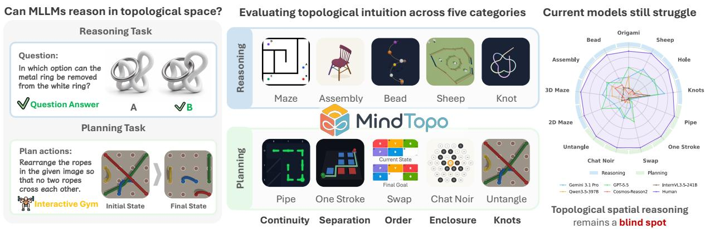  
Figure 1 | Overview of MINDTOPO. Five topological properties (continuity, separation, order, enclosure, knots) probed at two cognitive levels: reasoning (visual QA over rendered scenes) and planning (interactive gym).

## 1. Introduction

“Representational space has to reconstruct, on its own plane and in the same order of succession, the elementary spatial relationships — first topological, then euclidean and projective.”

— Jean Piaget & Bärbel Inhelder, The Child’s Conception of Space (1956)

Spatial reasoning in the physical world involves more than Euclidean or metric properties such as distance, angle, and shape. Consider bending, stretching, or coiling a closed rope loop without cutting it or passing one segment through another. Its distances, angles, and shape can change greatly while its knot remains the same. Topology studies spatial relations of this kind, which remain invariant under continuous deformation [1, 2]. Recognizing the invariant is only the beginning when a foundation model must act. It must predict when an intervention will alter the relation and select actions that produce a desired one. We use topological intuition for this ability to perceive, infer about, and operate on topological relations.

Cognitive science places these relations at the foundation of spatial understanding. Piaget argued that topological relations precede Euclidean and projective relations in spatial development [3]. Studies of adult vision likewise found that the visual system extracts topological invariants before Euclidean features [4, 5]. Together, these findings motivate evaluating topology as a distinct layer of spatial reasoning. Yet spatial benchmarks for foundation models largely test metric or viewpoint-dependent relations such as distance, direction, size, shape, and threedimensional location [6, 7, 8]. Recent work isolates path connectivity or knot reasoning [9, 10], but does not show whether models can reason across a broader set of topological relations and act on them. We therefore ask: to what extent can current foundation models reason about topological structure and plan actions that transform it?

To answer this question, we introduce MINDTOPO (Figure 1), a benchmark organized around five properties informed by Piaget’s classification and later cognitive work [3, 11, 12]. Continuity and separation describe how a scene divides into connected parts. Order records the sequence of marked elements along a path or boundary. Enclosure describes the division between inside and outside, including holes. Knots capture entanglement that persists under deformation. Formal topology supplies the invariants and related structural targets used to instantiate these properties [1, 2, 13]. The cognitive taxonomy determines what MINDTOP O tests, while the formal targets determine how its tasks are generated and evaluated.

The same property can pose different cognitive demands depending on what a model must do with it. MINDTOP O therefore evaluates each property at two cognitive levels. Reasoning tasks present one or more rendered scenes and ask the model to identify a topological relation or infer how a specified change affects it. Planning tasks instantiate a foundation model as a closed-loop agent in an interactive environment. At each step, the agent receives a rendered observation. Its policy selects an action that builds, preserves, or alters the corresponding structure. A foundation model may recognize that a loop is knotted yet fail to plan how to untangle it. The two levels thus test whether reasoning about a topological relation transfers to action. Each task type comes from a parametric generator with controllable difficulty and ground truth computed from the scene state. MINDTOPO contains 11,030 instances across 13 task types, comprising 8,030 reasoning questions and 3,000 planning episodes.

This two-level design lets us compare reasoning with action. We benchmark 14 multimodal large language models (MLLMs) across the full suite. The best-performing model remains far below observed human performance, and every MLLM scores higher on reasoning than on planning. We also examine whether supervised fine-tuning and reinforcement learning can reduce these deficits on Qwen3-VL-2B-Instruct. Supervised fine-tuning followed by reinforcement learning gives the strongest average performance, but gains are much larger for reasoning than for planning. Reinforcement learning across reasoning tasks produces uneven gains on held-out tasks. The remaining reasoning–planning gap raises a further question: can visual prediction help a foundation-model agent preserve topology while acting? We study agent configurations augmented with image and video generation, including 3 video generative models in planning environments. Each configuration is evaluated through the behavior it produces. Generated observations can retain local cues and reach plausible endpoints, but audited rollouts do not reliably follow environment dynamics or preserve topology across transitions. These results expose a gap between reasoning about a topological relation and using it to guide valid actions.

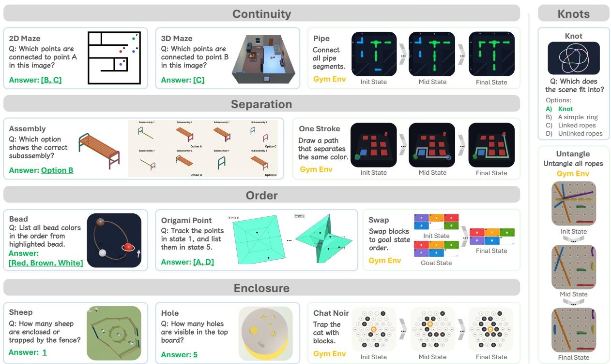  
Figure 2 | MI NDTOPO task overview. The 13 tasks by topological property and cognitive level. Gym Env marks the interactive planning environments; the remaining tasks pair a rendered scene with a visual question.

Overall, our contributions are fourfold. First, we formulate topological intuition as an evaluation target for spatial reasoning, grounding five properties in cognitive science and formal topology. Second, we introduce a scalable benchmark with 13 procedurally generated task types that probe these properties through reasoning and planning under controllable difficulty. Third, we benchmark 14 MLLMs and study agent configurations involving 3 video generative models in planning environments, revealing a consistent gap between reasoning about topological structure and acting on it. Fourth, we examine supervised fine-tuning and reinforcement learning on Qwen3-VL-2B-Instruct, showing that training improves reasoning more than planning and produces uneven gains on held-out tasks.

## 2. MINDTOPO Benchmark

## 2.1. Problem Formulation

Following Piaget’s account of topological space [3], we study topological intuition as one part of spatial reasoning. It is the ability to recognize and use spatial relations that remain unchanged when a scene is continuously deformed. MINDTOP O evaluates this ability at two cognitive levels [3, 12], reasoning and planning.

Scenes and properties. Each instance begins with a parametric scene state �. The state determines the spatial structure and the marked elements relevant to the task. A renderer produces one or more visual observations � = render(�). We write �(�) ∈ X for the resulting embedded structure, including its task-relevant marks, and V for the task-dependent value space of a property Φ : X → V.

A topological property Φ assigns a value to an embedded structure and remains unchanged under ambient isotopy. In other words,

$$
X \simeq X ^ { \prime } \quad \implies \quad \Phi ( X ) = \Phi ( X ^ { \prime } ) .\tag{1}
$$

Here $X \simeq X ^ { \prime }$ means that one structure can be continuously deformed into the other without cutting, joining, or passing one part through another [2, Ch. 1]. Some tasks evaluate a closely related target rather than the invariant itself. Appendix A.2 gives the exact definitions and identifies these cases.

Reasoning. A reasoning instance is a triple $( o , q , a ^ { * } )$ . The question � asks a foundation model to identify a topological relation in the observation or predict how it changes after a stated edit. The model returns

$$
\hat { a } = M ( o , q ) .\tag{2}
$$

and the prediction is correct when $\hat { a } = a ^ { * }$ . The reference answer $a ^ { * }$ is computed from the scene state. Scalar and categorical answers are scored by exact match, while unordered answers are compared as sets.

Planning. A planning episode starts from a scene state $s _ { 0 } ,$ , a task instruction $u ,$ and a horizon �. At step �, the environment renders $o _ { t } = \operatorname { r e n d e r } ( s _ { t } )$ . Let $h _ { t }$ denote the interaction history made available to the evaluated configuration through step �, including the current observation and any retained previous observations and actions. An evaluated configuration � built around a foundation model induces the policy

$$
a _ { t } \sim \pi _ { C } ( \cdot \mid u , h _ { t } ) .\tag{3}
$$

The simulator then applies the selected action and updates the scene state according to

$$
s _ { t + 1 } \sim P \big ( \cdot \mid s _ { t } , a _ { t } \big ) .\tag{4}
$$

Together, the configuration and the environment interface form the agent evaluated by MIND-TOP O, which acts in a closed loop. The episode succeeds if its goal predicate � is satisfied in some state $s _ { t }$ with $t \leq H$ . The policy belongs to the complete configuration, whether it uses an MLLM alone or also uses image or video generation.

Reasoning tests whether a foundation model can identify or predict a topological relation. Planning tests whether that relation can guide a valid sequence of actions.

## 2.2. Topological Properties

Figure 2 shows representative scenes, questions, and gym environments for every task in the suite; each property below describes its cognitive grounding, our reasoning task, and the matched planning task. Appendix A.1 expands the cognitive-science grounding of the five properties, and Appendix A gives the full specification of every task, including scene generation, difficulty parameterization, and metrics.

Continuity. Continuity captures whether a path or surface forms an unbroken whole, and is among the earliest spatial concepts a child acquires [3]. It underlies many practical reasoning tasks, such as navigating a maze, deciding whether a wire is severed, or threading a cable through an opening. Our reasoning task asks the model which of several marked points in a rendered maze are reachable from a designated target point, so the answer hinges on topological cuts rather than on metric layout. We additionally include what- $^ { - i f }$ sub-questions that probe how reachability changes if a wall is added or removed. The matched planning task places the agent in a grid of rotatable pipe segments; through $9 0 ^ { \circ }$ rotations it must connect every pipe segment back to the source, probing whether it can construct continuity, not only recognize it.

Separation. Separation is the complement of proximity [12] and undergirds object individuation [3]. Distinguishing adjacent units as distinct is the prerequisite for any reasoning beyond an undifferentiated whole. Our reasoning task, Assembly, is a furniture subassembly judgment: given a fully assembled object and several candidate sub-assemblies, the model selects the subset that forms a topologically separable component. We add what-if sub-questions asking how the partition changes if a connector is removed. The planning counterpart is a One-Stroke partitioning environment, where the agent draws a single corner-to-corner path through a colored grid that separates same-colored cells into shared regions, operationalizing the act of creating separation between previously contiguous regions.

Order. Order captures the sequential arrangement of elements along a path or boundary [3]. It is essential whenever a model must track which comes before which under a transformation of the scene. Our reasoning task adapts Piaget’s bead-replication paradigm: given a curved or twisted string of colored beads, the model enumerates the sequence from a designated starting bead, or decides whether two strings preserve the same cyclic order. We further include what-if sub-questions that ask how the order changes under a folding or rotation of the string. The accompanying planning environment is a sliding-block puzzle: the agent reaches a target color permutation by repeatedly moving a chosen block into the single empty slot, isolating ordering reasoning from geometric and color confounds.

Enclosure. Enclosure is the inside/outside relation induced by a closed boundary, and is identified by Piaget as the topological origin of three-dimensional “insideness” [3]. We instantiate two reasoning tasks. Fence & Sheep asks the model which animals lie strictly inside a top-down enclosure boundary; Hole Detection asks it to count the through-holes in a solid object. Both include what-if sub-questions, e.g., how the count changes if a piece of material is added or removed. The matched planning task is Chat Noir: on a hexagonal grid the agent places one block per turn so as to encircle a moving cat before it escapes to the boundary, requiring forward reasoning about whether a partial boundary can still be closed.

Knots. Piaget originally subsumed knots under enclosure, but subsequent cognitive evidence supports treating them as a distinct ability. Strohecker characterizes knots as the “mother structure” that coordinates all other topological relations [11]. Croom and Firestone show that humans reason about knots far worse than they perceive them, dissociating knot understanding from domain-general physical reasoning [14]. Our reasoning task presents one or more rendered ropes and loops and asks a battery of topology questions: whether a single loop is truly knotted or just visually tangled, whether two loops are linked, and what-if variants asking which rings become free after a specified ring is cut and removed. The matched planning environment is Untangle: given a board of plug positions joined by ropes, the agent moves plugs across a discrete grid until no two ropes cross.

## 2.3. Data Collection and Statistics

Figure 3 shows the four stage pipeline that builds every task in MINDTOPO. All four stages are automated and use fixed seeds. Scene Generation samples scene states and renders them using simulators or rendering scripts specific to each task. Topological Annotation refers to programmatic labeling rather than human annotation. Code specific to each task derives the reference answer or success condition directly from the generated state and metadata. Depending on the task, this computation uses graph search, geometric membership tests, known construction metadata, or simulator predicates. Difficulty Control varies parameters that change topological complexity, including wall count, grid size, and crossing count, to produce easy, medium, and hard instances. Instances Generation converts each accepted state into either a templated reasoning question or a planning episode with an initial state, goal, and success condition. Reasoning and planning tasks are matched at the topological property level, but their scenes are produced separately by their respective task generators.

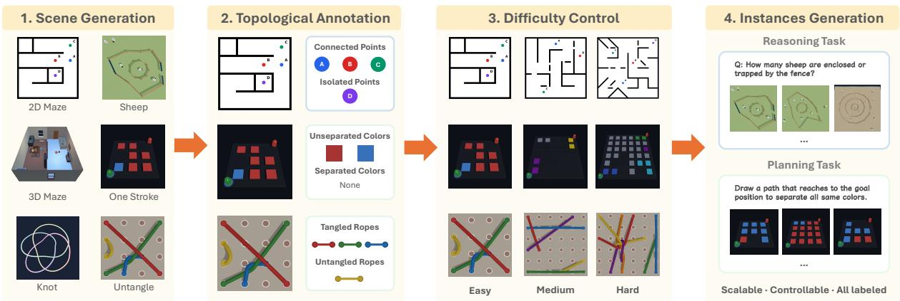  
Figure 3 | Fully automated data collection pipeline for MINDTOPO. Topological Annotation refers to programmatic construction of reference answers and success conditions from generated state and metadata rather than human annotation. Acceptance checks specific to each task filter invalid or ambiguous instances before export.

Quality control. Before export, each generator applies construction and acceptance criteria specific to its task. Depending on the task, these criteria enforce valid scene structure, reject ambiguous or unsolvable configurations, check visibility when the task depends on visible marks or components, and confirm that the generated answer or success condition agrees with the accepted state. Each exported record retains its generation seed and configuration metadata. Planning records also retain the initial state and action budget. Appendix A describes the scene generation, difficulty settings, output formats, scoring rules, and applicable acceptance criteria for every task.

Potential generation bias. Procedural rendering and templated questions can introduce visual, language, or answer prior shortcuts. We evaluate matched text only, answer prior, appearance only, and symbolic input controls in Appendix B.9. The Limitations section separately discusses the lack of visual variation from real world scenes.

Figure 4 summarizes the resulting dataset. MINDTOPO contains a total of 11,030 instances across the thirteen task types and the five topological properties, split 73% reasoning and 27% planning. The eight reasoning tasks (2D Maze, 3D Maze, Assembly, Bead, Origami Point, Sheep, Hole, and Knots) each contribute roughly 1,000 instances, and the five planning tasks (Pipe, One Stroke, Swap 2D Puzzle, Chat Noir, Untangle) each contribute 600. Per-task statistics and the evalua-

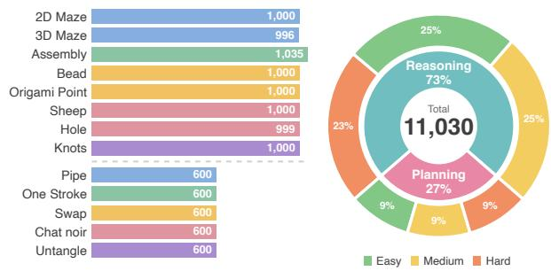  
Figure 4 | Data statistics for MINDTOPO.

tion design appear in Appendix A.10 and Appendix A.11.

## 3. Experiments

## 3.1. Experimental Setups

Models. We benchmark 14 MLLMs, five proprietary and nine open-weight. The proprietary tier includes Gemini-3.1-Flash-Lite [15], Gemini-3.1-Pro [16], GPT-5.4-mini [17], GPT-5.5 [18], and GPT-5.6-Sol [19]. The open-weight tier includes Nemotron-Nano-12B-VL-v2 [20], Qwen3.5-397B-A17B [21], Llama-4-Maverick-17B-128E [22], Ministral-3-14B-Instruct-2512 [23], InternVL3.5- 241B [24], Gemma-4-31B-IT [25], Cosmos-Reason2-8B [26], BAGEL-7B [27], and ThinkMorph-

<table><tr><td rowspan="2">Model</td><td colspan="3">Continuity</td><td colspan="2">Separation</td><td colspan="3">Order</td><td colspan="3">Enclosure</td><td colspan="2">Knots</td></tr><tr><td>2D Maze 3D Maze</td><td></td><td>Pipe</td><td>AssemblyOne Stroke</td><td></td><td>Bead Origami Point</td><td></td><td>Swap</td><td>Sheep Hole</td><td></td><td></td><td>Chat Noir Knots Untangle</td><td></td></tr><tr><td>Proprietary Models</td><td></td><td></td><td></td><td></td><td></td><td></td><td></td><td></td><td></td><td></td><td></td><td></td><td></td></tr><tr><td>GPT-5.6-Sol</td><td>84.40</td><td>63.05</td><td>50.50</td><td>56.92</td><td>35.00</td><td>77.00</td><td>64.20</td><td>87.30</td><td></td><td>63.9463.96</td><td>69.30</td><td>61.20</td><td>21.67</td></tr><tr><td>GPT-5.5</td><td>58.00</td><td>45.48</td><td>2.17</td><td>54.13</td><td>9.83</td><td>33.90</td><td>60.00</td><td>47.67</td><td></td><td>54.2063.86</td><td>36.00</td><td>60.60</td><td>26.00</td></tr><tr><td>GPT-5.4-mini</td><td>15.20</td><td>19.58</td><td>0.17</td><td>33.94</td><td>0.00</td><td>27.60</td><td>27.20</td><td>10.50</td><td></td><td>19.5016.72</td><td>6.33</td><td>25.40</td><td>23.83</td></tr><tr><td>Gemini-3.1-Flash-Lite</td><td>28.80</td><td>31.02</td><td>0.00</td><td>42.79</td><td>0.00</td><td>33.80</td><td>42.20</td><td>9.33</td><td></td><td>48.5022.62</td><td>6.50</td><td>63.50</td><td>19.83</td></tr><tr><td>Gemini-3.1-Pro</td><td>31.70</td><td>53.61</td><td>5.50</td><td>50.38</td><td>3.33</td><td>44.10</td><td>41.10</td><td></td><td></td><td>17.5064.0059.46</td><td>40.67</td><td>73.60</td><td>29.17</td></tr><tr><td>Open-Weight Models</td><td></td><td></td><td></td><td></td><td></td><td></td><td></td><td></td><td></td><td></td><td></td><td></td><td></td></tr><tr><td>Nemotron-Nano-12B-VL-v2</td><td>12.60</td><td>10.44</td><td>0.00</td><td>28.46</td><td>0.00</td><td>17.40</td><td>26.70</td><td>1.33</td><td></td><td>15.307.01</td><td>0.17</td><td>24.60</td><td>3.33</td></tr><tr><td>Qwen3.5-397B-A17B</td><td>12.20</td><td>34.04</td><td>0.00</td><td>41.35</td><td>0.00</td><td>18.60</td><td>42.60</td><td>9.50</td><td></td><td>6.7024.92</td><td>9.17</td><td>31.90</td><td>7.67</td></tr><tr><td>Llama-4-Maverick-17B-128E</td><td>22.50</td><td>15.66</td><td>0.00</td><td>34.23</td><td>0.00</td><td>26.30</td><td>17.10</td><td>6.33</td><td></td><td>11.502.60</td><td>1.83</td><td>30.70</td><td>7.67</td></tr><tr><td>Ministral-3-14B-Instruct-2512</td><td>18.10</td><td>11.14</td><td>0.00</td><td>27.98</td><td>0.00</td><td>14.00</td><td>18.40</td><td>4.17</td><td></td><td>11.805.11</td><td>4.00</td><td>41.20</td><td>11.83</td></tr><tr><td>InternVL3.5-241B</td><td>15.00</td><td>11.04</td><td>0.00</td><td>13.37</td><td>0.00</td><td>23.20</td><td>19.50</td><td>4.17</td><td></td><td>17.3015.52</td><td>1.00</td><td>43.50</td><td>3.67</td></tr><tr><td>Gemma-4-31B-IT</td><td>26.40</td><td>16.77</td><td>0.00</td><td>18.85</td><td>0.00</td><td>8.00</td><td>1.60</td><td>1.00</td><td></td><td>8.600.00</td><td>13.67</td><td>5.60</td><td>10.17</td></tr><tr><td>Cosmos-Reason2-8B</td><td>9.20</td><td>10.14</td><td>0.00</td><td>33.37</td><td>0.00</td><td>29.20</td><td>8.40</td><td>3.17</td><td></td><td>16.4012.41</td><td>1.17</td><td>25.00</td><td>11.00</td></tr><tr><td>BAGEL-7B</td><td>12.60</td><td>13.15</td><td>0.00</td><td>20.19</td><td>0.00</td><td>11.10</td><td>11.10</td><td>1.00</td><td></td><td>6.800.00</td><td>0.00</td><td>16.70</td><td>0.33</td></tr><tr><td>ThinkMorph-7B</td><td>14.40</td><td>12.65</td><td>0.00</td><td>20.19</td><td>0.00</td><td>2.90</td><td>9.50</td><td>0.17</td><td></td><td>7.900.60</td><td>0.00</td><td>22.20</td><td>0.00</td></tr><tr><td>Random Chance</td><td>8.30</td><td>5.92</td><td>0.00</td><td>19.42</td><td>0.00</td><td>7.40</td><td>12.40</td><td>1.33</td><td></td><td>6.30 7.91</td><td>1.00</td><td>12.90</td><td>7.17</td></tr><tr><td>Human</td><td>98.20</td><td>96.79</td><td>100.00</td><td>93.82</td><td>99.67</td><td>95.80</td><td>96.12</td><td></td><td>100.00 97.80 99.60</td><td></td><td>99.67</td><td>94.80</td><td>100.00</td></tr></table>

Table 1 | Performance on MINDTOPO (%). Reasoning task and Planning task denote task type. Dark/light lavender and dark/light blue mark the four highest distinct positive MLLM scores per environment, respectively; ties share a color. Human, Random Chance, zero-valued cells, and blank cells are excluded from ranking.

7B [28]. We additionally report human performance and random-chance baselines. Evaluated snapshots, decoding configuration, and prompt templates appear in Appendix B.1.

Human evaluation. Five professional annotators evaluated 11,008 of the 11,030 benchmark examples under the same instructions as the models, with one completed annotation per example. Three annotators also independently evaluated a shared 200-example subset, yielding an interannotator agreement score of 0.89. Full details appear in Appendix B.4.1 and Appendix B.4.2.

Protocol. All models are evaluated with deterministic decoding (temperature 0). Reasoning tasks are scored by exact match for scalar and multiple-choice answers and by set equality for unordered list answers. Planning tasks are scored by executing the predicted actions in the corresponding environment and counting an episode as successful only when it reaches the task-defined terminal condition. Primary metrics are task accuracy for reasoning and episode success rate for planning.

## 3.2. Benchmark Results

Models recognize topology but fail to operate on it. Table 1 reports accuracy across the 13 task types. By task-macro average, the leading model, GPT-5.6-Sol, reaches 61.42%, far below the observed human performance of 97.87%. The largest gap is between reasoning and planning. GPT-5.6-Sol drops from 66.83% on reasoning to 52.75% on planning, Gemini-3.1-Pro from 52.24% to 19.23%, GPT-5.5 from 53.77% to 24.33%, and Qwen3.5-397B-A17B from 26.54% to 5.27%. Current MLLMs identify a topological relation in a single rendered scene, yet topology breaks once they have to act on it.

The action gap widens with model tier. The strongest proprietary models retain a larger fraction of their reasoning competence in the planning regime, while the open-weight tier collapses. The best open-weight model on planning, Qwen3.5-397B-A17B, reaches only 5.27% on average, and every open-weight model scores 0% on both Pipe and One Stroke. The gap between reasoning and planning is therefore not a uniform property of the benchmark, and current open-source scaling does not close the planning bottleneck.

<table><tr><td>Training</td><td>2D Maze</td><td>Knots</td><td>Assembly</td><td>Bead</td><td>Sheep</td><td>One Stroke</td><td>Untangle</td><td>Pipe</td><td>Swap</td></tr><tr><td>Base</td><td>9.20</td><td>11.20</td><td>32.08</td><td>9.31</td><td>9.40</td><td>0.00</td><td>0.80</td><td>0.00</td><td>0.00</td></tr><tr><td>SFT</td><td>14.10</td><td>75.50</td><td>57.35</td><td>41.74</td><td>51.00</td><td>0.80</td><td>11.81</td><td>0.00</td><td>7.21</td></tr><tr><td>RL</td><td>10.10</td><td>42.70</td><td>38.52</td><td>34.73</td><td>25.30</td><td>0.00</td><td>15.42</td><td>0.00</td><td>1.40</td></tr><tr><td>Leave-one-task-out RL</td><td>8.20</td><td>15.50</td><td>31.32</td><td>26.53</td><td>8.90</td><td></td><td></td><td></td><td></td></tr><tr><td>SFT + RL</td><td>13.50</td><td>79.60</td><td>53.41</td><td>52.95</td><td>58.20</td><td>0.50</td><td>17.42</td><td>0.00</td><td>7.41</td></tr></table>

Table 2 | Qwen3-VL-2B-Instruct performance (%) across selected reasoning and planning tasks under the Base, supervised fine-tuning (SFT), reinforcement learning (RL), leave-one-task-out RL, and SFT + RL settings. For leave-one-task-out RL, each reasoning-task result comes from a separate policy trained on the other four reasoning tasks and evaluated on the excluded task. Reasoning task and Planning task denote task type.

No single model dominates across topological primitives. Per-property leadership splits between GPT-5.6-Sol (continuity 65.98%, separation 45.96%, order 76.17%, and enclosure 65.73%) and Gemini-3.1-Pro (knots 51.38%). Within a single property the reasoning leader and the planning leader can differ: Gemini-3.1-Pro leads Sheep reasoning (64.00% vs. GPT-5.6-Sol’s 63.94%), whereas GPT-5.6-Sol leads Chat Noir planning (69.30% vs. Gemini’s 40.67%). The five Piagetian primitives engage different MLLM weaknesses, so a model’s strength on one primitive is not predictive of its strength on the others.

Three planning environments remain challenging. Across all 14 MLLMs, the best scores are 50.50% on Pipe and 35.00% on One Stroke, both achieved by GPT-5.6-Sol, and 29.17% on Untangle, achieved by Gemini-3.1-Pro. Most open-weight models score near 0% on the three. Each environment requires a sequence of legal actions toward a structural goal: a connected pipe network, color-consistent regions, or zero projected rope crossings. In particular, Untangle evaluates a viewpoint-dependent crossing criterion, not preservation of a three-dimensional knot class. The low success rates establish that these tasks remain challenging under the evaluated protocol.

GPT-5.6-Sol performs best on Swap among the planning tasks. GPT-5.6-Sol reaches 87.30% on Swap, compared with 47.67% for GPT-5.5 and 17.50% for Gemini-3.1-Pro. The best openweight score is Qwen3.5-397B-A17B at 9.50%. Swap targets a discrete permutation, while Pipe, One Stroke, and Untangle also admit discrete task-state descriptions. These scores show environment-specific differences in planning performance. Isolating their causes requires controlled comparisons of state representation, task difficulty, and action horizon; the present results do not separate these factors. Full per-difficulty breakdowns appear in Appendix B.5.

Shortcut controls separate scene evidence from prompt and label priors. We compare the full input with matched text only, answer prior, appearance only, and symbolic input controls. This analysis also measures dependence on rendering cues and explicit state descriptions. Full results appear in Appendix B.9. Appendix B.8 additionally describes the controlled camera and viewpoint factors, and Appendix B.10 analyzes recurring topological biases behind these scores.

<sup></sup> Key Takeaways: Topology Recognition Does Not Transfer to Action

• Planning exposes failures that static reasoning scores do not reveal.

• Models plan more successfully when the relevant state is compact and discrete.

• Aggregate scores hide uneven performance across topological primitives.

## 3.3. Training

Methodology. We test whether the deficits exposed by MINDTOP O can be improved through task-specific training. Starting from Qwen3-VL-2B-Instruct [29], we compare the frozen base policy with answer-only supervised fine-tuning (SFT), Group Relative Policy Optimization (GRPO), and SFT followed by GRPO. The comparison covers five reasoning tasks and four planning tasks. For planning, the model predicts a complete action sequence from the initial observation. The sequence is executed in the corresponding environment and receives credit only if it reaches the task-defined success state. We additionally train five leave-one-task-out RL policies, each on four reasoning tasks and evaluate it on the fifth. Full data, optimization, and evaluation details appear in Appendix B.2.

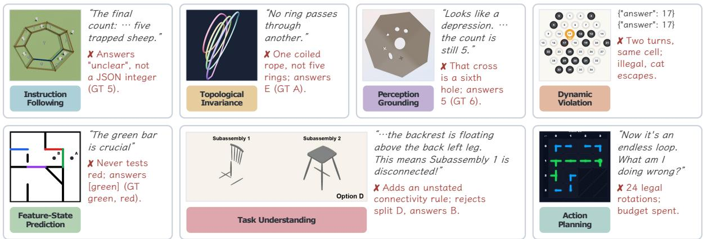  
Figure 5 | One labeled failure per error category. Each panel pairs the frame the model saw with a verbatim line from its response.

SFT and RL substantially improve task-specific performance. The base policy averages 8.00% across the nine tasks in Table 2. SFT raises this average to 28.83%, GRPO alone to 18.69%, and SFT followed by GRPO to 31.44%. The combined policy achieves the strongest result on Knots (79.60%), Bead (52.95%), Sheep (58.20%), and Untangle (17.42%). SFT is stronger than GRPO alone on average, while the additional RL stage further improves several tasks after supervised initialization.

Training improves reasoning more than planning. For SFT followed by GRPO, average reasoning accuracy reaches 51.53%, compared with 14.24% for the base policy. Planning success rises from 0.20% to only 6.33%. Pipe remains at 0% under every training condition, and the best One Stroke result is 0.80%. The gains therefore do not remove the central reasoning–planning gap: supervision can teach task-specific visual and answer patterns, but long action sequences remain difficult to execute successfully.

Held-out transfer is selective rather than systematic. Training on the other four reasoning tasks improves held-out Bead from 9.31% to 26.53% and held-out Knots from 11.20% to 15.50%, but does not improve the held-out 2D Maze, Assembly, or Sheep tasks. The broader transfer results in Appendix B.2 show the same uneven pattern. Training on related topological tasks can transfer, but it does not yet produce a general topological policy.

## <sup></sup> Key Takeaways: Training Helps, but Planning Remains the Bottleneck

• SFT followed by GRPO gives the strongest average performance.

• Training gains are much larger for reasoning than for planning.

• Held-out transfer is substantial on selected tasks but not systematic.

## 3.4. Error Analysis

Methodology. We analyze Gemini-3.1-Pro and InternVL3.5-241B as representatives of the proprietary and open-weight tiers. For each of the 26 model–task pairs, we uniformly sample 35 incorrect predictions, yielding 910 labeled failures. Each failure receives one primary category from a seven-class taxonomy that follows the processing pipeline from instruction compliance to action planning. Categories are assigned in fixed causal priority order so an early failure is never credited to a later stage. We project each pair’s sampled category distribution to its full error population before aggregation. Figure 5 shows one representative example per category. Full definitions, sampling details, and per-model distributions appear in Appendix C.1.

Failure modes shift downstream from reasoning to planning. Figure 6 shows that 58.1% of reasoning errors are perceptiongrounding failures, followed by instruction following (17.0%) and feature-state prediction (10.4%). Planning errors instead concentrate in action planning (43.3%) and dynamic violations (24.5%), with feature-state prediction contributing another 16.0%. Thus static reasoning is primarily gated by extracting the relevant visual state, whereas interactive planning is primarily gated by choosing and executing a valid sequence of state transitions.

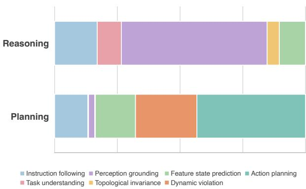  
Figure 6 | Error category distribution on reasoning vs. planning tasks from Gemini-3.1-Pro and InternVL3.5- 241B.

## Reasoning failures are dominated by visual

grounding. Perception grounding accounts for 64.2% of Gemini-3.1-Pro’s reasoning errors and 54.6% of InternVL3.5-241B’s. The next bottleneck differs by model: Gemini more often predicts the wrong feature state after a specified change (19.7%), whereas InternVL more often violates the answer protocol (20.1%) or misunderstands the task (14.7%). Explicit topologicalinvariance errors are comparatively infrequent in this single-primary-label analysis (3.8% and 5.4%), because earlier perception or task failures take precedence when they already explain the wrong answer.

Planning failures split between action choice, dynamics, and state prediction. Gemini-3.1- Pro’s largest category is action planning (56.6%), followed by feature-state prediction (29.1%); dynamic violations account for 4.3%. InternVL3.5-241B shows a different late-stage profile: dynamic violations lead at 41.0%, action planning contributes 32.4%, and instruction following contributes 21.4%. Environment-level distributions clarify the division: Swap is overwhelmingly action-planning limited, One Stroke is dominated by feature-state prediction and dynamics, and Untangle carries most instruction-following failures. Full distributions appear in Appendix C.3.

## <sup></sup> Key Takeaways: Reasoning and Planning Fail at Different Stages

• For the audited models, visual grounding dominates reasoning errors.

• Planning errors shift to state prediction, dynamics, and action choice.

• The two settings therefore require different diagnostic targets.

## 3.5. Probing Experiment

Methodology. Section 3.4 shows that planning failures on MINDTOPO are largely dynamic rather than declarative. Frontier models read the scene correctly but lose topological state across actions. We probe whether explicit visual prediction can supply that state. The successrate configurations use GPT-5.6-Luna [19] as the planner on six tasks (Knots, Sheep, 2D Maze, Untangle, One Stroke, and Pipe). The baseline acts directly from the rendered observation. The interleaved variant calls GPT-Image-2 [30] at every step to render the predicted next state. The video variants use Wan2.2-I2V-A14B [31] and Seedance-2.0-Mini [32] to roll out candidate plans. LTX-2.3 [33] is included in the video diagnostic study below. Figure 7 separately audits legacy

<table><tr><td></td><td colspan="3">Knots</td><td colspan="3">Sheep</td><td colspan="3">2D Maze</td><td colspan="3">Untangle</td><td colspan="3">One Stroke</td><td colspan="3">Pipe</td></tr><tr><td>Configuration</td><td>E</td><td>M</td><td>H</td><td>E</td><td>M</td><td>H</td><td>E</td><td>M</td><td>H</td><td>E</td><td>M</td><td>H</td><td>E</td><td>M</td><td>H</td><td>E</td><td>M</td><td>H</td></tr><tr><td>Baseline (planner only)</td><td></td><td></td><td></td><td></td><td></td><td></td><td></td><td></td><td></td><td></td><td></td><td></td><td></td><td></td><td></td><td></td><td></td><td></td></tr><tr><td>GPT-5.6-Luna</td><td>54.00</td><td>19.50</td><td>4.50</td><td>52.00</td><td>13.50</td><td>25.50</td><td>42.50</td><td>16.50</td><td>7.50</td><td>18.00</td><td>7.50</td><td>4.50</td><td>1.00</td><td>0.50</td><td>0.00</td><td>10.00</td><td>1.50</td><td>0.50</td></tr><tr><td>GPT-5.4-mini</td><td>27.02</td><td>25.64</td><td>23.12</td><td>21.08</td><td>17.66</td><td>19.76</td><td>17.66</td><td>14.37</td><td>13.55</td><td>59.50</td><td>9.50</td><td>2.50</td><td>0.00</td><td>0.00</td><td>0.00</td><td>0.50</td><td>0.00</td><td>0.00</td></tr><tr><td>InternVL3.5-241B</td><td>46.19</td><td>42.31</td><td>40.84</td><td>21.99</td><td>16.77</td><td>13.17</td><td>15.87</td><td>16.17</td><td>12.95</td><td>11.00</td><td>0.00</td><td>0.00</td><td>0.00</td><td>0.00</td><td>0.00</td><td>0.00</td><td>0.00</td><td>0.00</td></tr><tr><td colspan="10">Video Interleaved (planner + video generator) GPT-5.6-Luna</td><td></td><td></td><td></td><td></td><td></td><td></td><td></td><td></td><td></td></tr><tr><td>+ Wan2.2-I2V-A14B</td><td></td><td></td><td></td><td></td><td></td><td></td><td></td><td></td><td></td><td>54.29</td><td>20.00</td><td>0.00</td><td>0.00</td><td>0.00</td><td>0.00</td><td>20.00</td><td>8.57</td><td>0.00</td></tr><tr><td>GPT-5.6-Luna + Seedance-2.0-Mini</td><td></td><td></td><td></td><td></td><td></td><td></td><td></td><td></td><td></td><td>40.00</td><td>28.57</td><td>8.57</td><td>0.00</td><td>0.00</td><td>0.00</td><td>11.43</td><td>8.57</td><td>0.00</td></tr><tr><td>GPT-5.6-Luna + Veo-3.1-Lite</td><td></td><td></td><td></td><td></td><td></td><td></td><td></td><td></td><td></td><td>51.4</td><td>25.7</td><td>5.7</td><td>0.00</td><td>0.00</td><td>0.00</td><td>19.0</td><td>11.4</td><td>2.9</td></tr><tr><td>InternVL3.5-241B + Wan2.2-I2V-A14B</td><td></td><td></td><td></td><td></td><td></td><td></td><td></td><td></td><td></td><td>11.43</td><td>0.00</td><td>2.86</td><td>0.00</td><td>0.00</td><td>0.00</td><td>0.00</td><td>0.00</td><td>0.00</td></tr><tr><td colspan="10">Image Interleaved (planner + image generator)</td><td></td><td></td><td></td><td></td><td></td><td></td><td></td><td></td><td></td></tr><tr><td>GPT-5.6-Luna + GPT-Image-2</td><td>74.29</td><td>57.14</td><td>40.00</td><td>60.00</td><td>74.29</td><td>71.43</td><td>68.57</td><td>60.00</td><td>57.14</td><td>48.57</td><td>20.00</td><td>5.71</td><td>0.00</td><td>0.00</td><td>0.00</td><td>31.43</td><td>25.71</td><td>2.86</td></tr><tr><td>GPT-5.4-mini + GPT-Image-2</td><td></td><td></td><td></td><td></td><td></td><td></td><td></td><td></td><td></td><td></td><td></td><td>0.00</td><td></td><td></td><td></td><td>0.00</td><td></td><td>0.00</td></tr><tr><td>InternVL3.5-241B + GPT-Image-2</td><td>80.00</td><td>54.29</td><td>45.71 42.86</td><td>62.86 37.14</td><td>62.86 25.71</td><td>45.71 28.57</td><td>28.57 17.14</td><td>5.71 8.57</td><td>2.86 14.29</td><td>20.00 0.00</td><td>0.00 0.00</td><td>0.00</td><td>0.00 0.00</td><td>0.00 0.00</td><td>0.00 0.00</td><td>0.00</td><td>0.00 0.00</td><td>0.00</td></tr></table>

Table 3 | Probing success rate (%) by difficulty (E = Easy, M = Medium, H = Hard). Configurations list the planner followed by the generator, where applicable. Lavender marks the best/second-best result per column; an em dash means not evaluated. Reasoning task and Planning task denote task type.

GPT-5.4-mini outputs whose exports omit the exact snapshot. The full imagined-rollout protocol and failure-mode analysis appear in Appendix B.7.

Interleaved image prediction remains weakest on trajectory-wide invariants. With GPT-5.6- Luna, the GPT-Image-2 condition averages 68.6% on Sheep and 61.9% on 2D Maze across the three displayed tiers (Table 3). The same condition scores 0% across all One Stroke tiers and 5.71% on hard Untangle. Generated frames can retain task-relevant local cues, but they do not resolve tasks whose invariant depends on a complete action trajectory.

Video endpoint success collapses with difficulty and does not certify a valid rollout. With GPT-5.6-Luna, Wan2.2-I2V-A14B reaches 54.29%, 20.00%, and 0.00% on easy, medium, and hard Untangle, respectively, and 0.00% across all One Stroke tiers (Table 3). Figure 7 explains why these endpoints cannot be read as topological simulation. Wan2.2-I2V-A14B violates dynamics in 116 of 119 audited rollouts, with topologicalinvariance errors in 93 and consistency errors in 90. The generator can reach a plausible endpoint without preserving a valid path to it.

Computer-vision diagnostics expose violations that endpoint success misses. We audit 945 rollouts from LTX-2.3, Wan2.2-I2V-

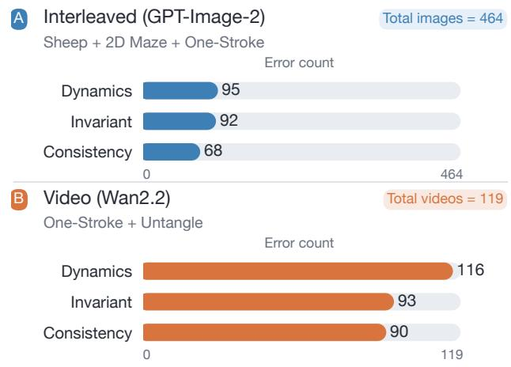  
Figure 7 | Per-generation errors by category. Top: 464 GPT-Image-2 images (Sheep, 2D Maze, One Stroke). Bottom: 119 Wan2.2-I2V-A14B videos (One Stroke, Untangle).

A14B, and MiniMax-H3 [34] on three planning environments, plus 315 planner-free LTX-2.5 rollouts and 300 planner-free Veo-3.1-Lite rollouts. Each task and generator cell contains 105 videos (100 for Veo-3.1-Lite). We parse each sampled frame into a task state, apply static checks to individual frames and dynamic checks to adjacent frames, and take a strict video-level conjunction over every applicable check (Table 4 and Figure 10). An unreadable terminal state fails the composite criterion rather than disappearing from its denominator. Appendix B.7.1, particularly Tables 31–33, gives the complete status mapping, operational definition of every check, aggregation rule, and human-validation protocol.

<table><tr><td></td><td colspan="6">Static checks</td><td colspan="3">Dynamic checks</td><td colspan="2">Outcome</td></tr><tr><td>Video generator</td><td>Color sep.</td><td>Direction valid.</td><td>Path cont.</td><td>Path valid.</td><td>Start/end valid.</td><td>Static (all)</td><td>Grid-cell temp.</td><td>Path temp.</td><td>Dynamic (all)</td><td>Final-state success</td><td>Process- valid</td></tr><tr><td>One Stroke</td><td></td><td></td><td></td><td></td><td></td><td></td><td></td><td></td><td></td><td></td><td></td></tr><tr><td>LTX-2.3</td><td>1.0</td><td>7.6</td><td>2.9</td><td>7.6</td><td>18.1</td><td>0.0</td><td>1.0</td><td>0.0</td><td>0.0</td><td>0.0</td><td>0.0</td></tr><tr><td>LTX-2.5</td><td>0.0</td><td>0.0</td><td>0.0</td><td>0.0</td><td>0.0</td><td>0.0</td><td>1.9</td><td>0.0</td><td>0.0</td><td>0.0</td><td>0.0</td></tr><tr><td>Veo-3.1-Lite</td><td>0.0</td><td>0.0</td><td>0.0</td><td>0.0</td><td>0.0</td><td>0.0</td><td>4.0</td><td>1.0</td><td>0.0</td><td>0.0</td><td>0.0</td></tr><tr><td>Wan2.2-I2V-A14B</td><td>0.0</td><td>52.4</td><td>27.6</td><td>52.4</td><td>56.2</td><td>0.0</td><td>18.1</td><td>16.2</td><td>1.9</td><td>0.0</td><td>0.0</td></tr><tr><td>MiniMax-H3</td><td>0.0</td><td>0.0</td><td>0.0</td><td>0.0</td><td>0.0</td><td>0.0</td><td>2.0</td><td>0.0</td><td>0.0</td><td>0.0</td><td>0.0</td></tr><tr><td></td><td colspan="3">Static checks</td><td colspan="6"></td><td colspan="2">Outcome</td></tr><tr><td>Video generator</td><td colspan="2">Connectivity- color match</td><td>Static</td><td colspan="2">Cell</td><td>Dynamic checks Pipe-type</td><td colspan="2">Rotation</td><td colspan="2">Dynamic Final-state</td><td>Process- valid</td></tr><tr><td></td><td></td><td></td><td>(all)</td><td>occupancy</td><td></td><td>consist.</td><td>valid.</td><td>(all)</td><td></td><td>success</td><td></td></tr><tr><td>Pipe</td><td></td><td></td><td></td><td></td><td></td><td></td><td></td><td>0.0</td><td></td><td></td><td>0.0</td></tr><tr><td>LTX-2.3</td><td>0.0 0.0</td><td></td><td>0.0 0.0</td><td>0.0</td><td></td><td>0.0</td><td>0.0</td><td>0.0</td><td></td><td>3.8</td><td>0.0</td></tr><tr><td>LTX-2.5 Veo-3.1-Lite</td><td>1.0</td><td></td><td>1.0</td><td>1.9 3.0</td><td></td><td>1.0 0.0</td><td>0.0 0.0</td><td>0.0</td><td></td><td>35.2 6.0</td><td>0.0</td></tr><tr><td>Wan2.2-I2V-A14B</td><td>0.0</td><td></td><td>0.0</td><td>5.7</td><td></td><td>0.0</td><td>0.0</td><td>0.0</td><td></td><td>13.3</td><td>0.0</td></tr><tr><td>MiniMax-H3</td><td>0.0</td><td></td><td>0.0</td><td>2.9</td><td></td><td>0.0</td><td>0.0</td><td>0.0</td><td></td><td>19.0</td><td>0.0</td></tr><tr><td></td><td colspan="3"></td><td colspan="6"></td><td colspan="2"></td></tr><tr><td></td><td colspan="2">Endpoint</td><td>Static checks Rope</td><td>Static</td><td>Endpoint</td><td></td><td>Dynamic checks Topology</td><td>Dynamic</td><td>Final-state</td><td>Outcome</td><td>Process-</td></tr><tr><td>Video generator</td><td>config.</td><td></td><td>integrity</td><td>(all)</td><td>tracking</td><td></td><td>flicker</td><td>(all)</td><td>success</td><td></td><td>valid</td></tr><tr><td>Untangle</td><td></td><td></td><td></td><td></td><td></td><td></td><td></td><td></td><td>32.4</td><td></td><td></td></tr><tr><td>LTX-2.3</td><td>0.0</td><td></td><td>1.0</td><td>0.0</td><td>0.0 1.0</td><td></td><td>67.3</td><td>0.0 1.0</td><td></td><td></td><td>0.0 0.0</td></tr><tr><td>LTX-2.5</td><td>1.0 0.0</td><td></td><td>7.6 6.0</td><td>1.0 0.0</td><td>0.0</td><td></td><td>73.3 34.0</td><td>0.0</td><td></td><td>6.7 1.0</td><td>0.0</td></tr><tr><td>Veo-3.1-Lite</td><td>0.0</td><td></td><td>21.0</td><td>0.0</td><td>0.0</td><td></td><td>46.7</td><td>0.0</td><td></td><td>2.9</td><td>0.0</td></tr><tr><td>Wan2.2-I2V-A14B</td><td>5.1</td><td></td><td>45.9</td><td>4.1</td><td>3.1</td><td></td><td>61.2</td><td>1.0</td><td></td><td>6.1</td><td>0.0</td></tr><tr><td>MiniMax-H3</td><td></td><td></td><td></td><td></td><td></td><td></td><td></td><td></td><td></td><td></td><td></td></tr></table>

Table 4 | Strict video-level CV pass rates (%). Final-state success checks the terminal state; Process-valid additionally requires all applicable static and dynamic checks to pass. Definitions: Appendix B.7.1.

Untangle videos keep a flicker-free topology readout in 73.3% of cases for LTX-2.5, 67.3% for LTX-2.3, 46.7% for Wan2.2-I2V-A14B, and 61.2% for MiniMax-H3, yet no generator achieves process-valid task success. Endpoint tracking stays at or near zero for every generator because the check requires a consistent match across every transition, so this rate alone cannot separate generator failure from parser brittleness. Final-state task success is likewise insufficient. The terminal oracle parses 32.4% of LTX-2.3 Untangle videos as solved, but the scorability gate rarely rejects an unscorable terminal state, and every parsed success still violates at least one static or dynamic constraint along the way. Generator quality is local and uneven. Wan2.2-I2V-A14B scores higher than LTX-2.3 on most One Stroke and Untangle static checks but reaches the Untangle solution an order of magnitude less often. MiniMax-H3 was evaluated without a planner, generating one conditioned clip per episode, and shows the same dissociation from the opposite direction: it leads all generators on Untangle rope integrity at 45.9% and on Pipe terminal success at 19.0%, yet it clears every applicable static check in only 4.1% of Untangle videos, in none of the Pipe videos, and in none of the One Stroke videos. LTX-2.5, also evaluated without a planner, is the sharpest case in the table: its terminal oracle accepts 35.2% of its Pipe clips, the highest final-state success we measure, while no clip keeps connectivity-consistent colouring throughout and none is process-valid. MiniMax-H3 shows the same pattern on Pipe, where nearly a fifth of its clips end in an accepted state. A balanced human audit of 180 videos agrees with every sampled video-level metric decision. Because the strict conjunction fails almost every video, this agreement offers limited evidence about whether valid rollouts are wrongly rejected. The terminal scorability gate itself agrees with human judgment on 77.8% of the audited videos, so we report its standalone validation only in Appendix B.7.1 and do not use it to rank generators.

What the two probes tell us together. Generated observations retain local task cues but do not reliably preserve valid state transitions. Interleaved images remain useful on tasks whose relevant relation is visible in one frame, yet performance collapses on One Stroke and hard Untangle. The video audit sharpens this boundary: across 1,560 rollouts, no generator achieves process-valid task success on One Stroke, Pipe, or Untangle, although some terminal states satisfy the task oracle. Local visual plausibility and endpoint success therefore do not establish a topology-preserving world model.

<sup></sup> Key Takeaways: Endpoint Success Does Not Certify Topological Rollouts

• Generated predictions retain local cues but often lose invariants across a trajectory.

• A solved endpoint can still follow an invalid path.

• Rollout evaluation must verify topology throughout the process.

## 4. Related Work

Cognitive and Topological Evaluation. Cognitive studies motivate evaluating topological relations as a foundation of spatial understanding [3, 4, 5]. BabyVision tests basic visual abilities through both language and generated visual outputs [35], while related work examines vision models’ sensitivity to geometric and topological concepts [36]. Benchmarks that directly target topology differ in the structures and responses they evaluate. CurveBench asks models to recover containment trees from images of nested curves [37], whereas TopoBench requires complete solutions to symbolic grid puzzles governed by global spatial constraints [38]. KnotGym brings topology into interactive evaluation through rope manipulation from visual observations [10]. MINDTOP O broadens this coverage by organizing five topological properties within one suite and evaluating each through both reasoning questions and interactive planning tasks.

Spatial Reasoning and Interaction. Spatial benchmarks evaluate relations within scenes and the integration of information across viewpoints [39, 40, 41, 7, 8]. Theory of Space extends this perspective to constructing and revising spatial beliefs through active exploration [42]. Planning with the Views examines whether models can compose individual camera movements into longer plans [43]. Interactive evaluations include sliding puzzles in iVISPAR [44] and tasks across simulation environments in SpatialWorld [45], alongside broader studies of embodied decision interfaces and visual action selection [46, 47]. ESI-Bench grounds active perception and manipulation in Spelke’s core knowledge systems [48]. MI NDTOPO organizes reasoning and planning around topological properties, providing the complementary coverage summarized in Table 5.

World Modeling and Agent Training. Predicting the consequences of actions connects spatial evaluation with world modeling. CausalSpatial uses generated visual evidence to answer questions about specified object motions [49], while ENACT evaluates forward and inverse world modeling through observation and action sequence reordering [50]. For agents acting across multiple turns, RAGEN [51] and RAGEN-2 [52] study training stability, while VAGEN [53] reinforces world model reasoning. Our generated rollout diagnostics complement these approaches by checking whether predicted transitions preserve task topology. Appendix D discusses additional cognitive, spatial, and world model studies.

## 5. Conclusion and Limitations

Conclusion. We presented MINDTOPO, a systematic benchmark for evaluating topological intuition in foundation models. Grounded in Piaget’s classification, the benchmark covers five topological properties (continuity, separation, order, enclosure, and knots) at two cognitive levels (reasoning and planning) across 13 procedurally generated task types. Across 14 MLLMs spanning five proprietary and nine open-weight models, the central finding is that topological intuition remains a blind spot. Models recognize a topological relation in a static rendered scene but cannot maintain or operate on it across an action sequence. Training improves task performance on Qwen3-VL-2B-Instruct, but planning success remains low and gains on held-out tasks are uneven. We further evaluate 3 video generative models as policies in the planning environments. Their rollouts can reach plausible endpoints, but they do not preserve valid topological transitions. We hope MINDTOP O and its parametric pipeline serve as a controlled diagnostic for future foundation models that aim to internalize the qualitative structure of the physical world.

<table><tr><td>Benchmark</td><td>Type</td><td>#Topo.</td><td>#Tasks</td><td>Size</td><td>QA</td><td>Inter.</td><td> $\mathbf { C o g . }$ </td><td>Diff.</td><td>Scale</td></tr><tr><td colspan="10">General visual and abstract reasoning</td></tr><tr><td>BlindTest† [54]</td><td>Visual perception</td><td></td><td>7</td><td>4,860</td><td></td><td>x</td><td>x</td><td>V</td><td></td></tr><tr><td>GameQA [55]</td><td>Game reasoning</td><td>1</td><td>158</td><td>~140K</td><td>√</td><td>x</td><td>x</td><td>√</td><td></td></tr><tr><td>PuzzleVQA [56]</td><td>Abstract patterns</td><td></td><td>20</td><td>2,000</td><td></td><td>x</td><td>V</td><td>x</td><td></td></tr><tr><td colspan="10">Euclidean spatial reasoning</td></tr><tr><td>CausalSpatial [49]</td><td>Causal spatial</td><td></td><td>4</td><td>1,012</td><td>√</td><td>x</td><td>x</td><td>√</td><td>√</td></tr><tr><td>3DSRBench [39]</td><td>Euclidean</td><td></td><td>12</td><td>2,772</td><td></td><td>x</td><td>x</td><td>x</td><td>x</td></tr><tr><td>iVISPAR [44]</td><td>Interactive spatial</td><td></td><td>1</td><td>300</td><td>x</td><td>V</td><td>x</td><td></td><td></td></tr><tr><td>Mind the Gap [57]</td><td>Euclidean</td><td></td><td>6</td><td>1,800</td><td></td><td>x</td><td></td><td>V</td><td></td></tr><tr><td>MindCube [8]</td><td>Euclidean</td><td></td><td>3</td><td>21,154</td><td></td><td>x</td><td></td><td>x</td><td>x</td></tr><tr><td>OmniSpatial† [41]</td><td>Euclidean</td><td></td><td>50</td><td>8,400</td><td></td><td>x</td><td></td><td>x</td><td>x</td></tr><tr><td>SITE [40]</td><td>Euclidean</td><td></td><td>6</td><td>8,068</td><td></td><td>x</td><td></td><td>x</td><td>x</td></tr><tr><td>SpatialMQA [58]</td><td>Euclidean</td><td></td><td>6</td><td>5,392</td><td></td><td>x</td><td>x</td><td>X</td><td>x</td></tr><tr><td>SpatialVLM [6]</td><td>Euclidean</td><td></td><td>2</td><td>546</td><td></td><td>x</td><td>x</td><td>X</td><td>√</td></tr><tr><td>SpatialWorld [45]</td><td>Interactive spatial</td><td></td><td>6</td><td>760</td><td>x</td><td>√</td><td>x</td><td>√</td><td>x</td></tr><tr><td>VSI-Bench [7]</td><td>Euclidean</td><td></td><td>8</td><td>5,130</td><td>√</td><td>x</td><td>√</td><td>x</td><td>x</td></tr><tr><td colspan="10">Topological spatial reasoning</td></tr><tr><td>CurveBench [37]</td><td>Topological</td><td>2</td><td>1</td><td>756</td><td>x</td><td>x</td><td>x</td><td>V</td><td>x</td></tr><tr><td>KnotGym [10]</td><td>Topological</td><td>1</td><td>3</td><td>Proc.</td><td>x</td><td></td><td>x</td><td></td><td></td></tr><tr><td>TopoBench [38]</td><td>Topological</td><td>3</td><td>6</td><td>900</td><td>X</td><td>x</td><td>x</td><td>V</td><td></td></tr><tr><td>MINDTOPO (ours)</td><td>Topological</td><td>5</td><td>13</td><td>11,030</td><td>√</td><td>√</td><td>√</td><td>√</td><td>√</td></tr></table>

Table 5 | Benchmark comparison. #Topo.: topological primitives; Inter.: interactive evaluation; Cog.: explicit human-cognition framework; Diff.: difficulty levels; Scale: automatic generation; Proc.: procedural episodes. † Includes topology without making it the main focus.

Limitation. MINDTOPO has limitations that point to natural directions for future work. First, all scenes in the benchmark are procedurally rendered via Three.js or task-specific simulators, which gives clean ground truth but lacks the visual variability of real-world photographs. Second, our video-policy evaluation covers 3 video generative models. A broader evaluation is needed to determine how general the observed failures are. Third, the five Piagetian primitives covered here do not exhaust topological space. Topology-flavored relations such as orientation, continuous deformation under composed transformations, and higher-genus surfaces remain out of scope and could be added in future releases. Fourth, the annotation audit in Figure 7 covers 464 generated images and 119 scored videos from 120 targeted videos; one Untangle video was unavailable. This sample is sufficient for the coarse comparisons we draw, but larger annotation samples would tighten statistical bounds on subtle effects.

## Acknowledgments

This work used Delta at NCSA through ACCESS allocation CIS250698, supported by NSF grants #2138259, #2138286, #2138307, #2137603, and #2138296 [59], and the Quest high performance computing facility at Northwestern University.

## References

[1] Allen Hatcher. Algebraic Topology. Cambridge University Press, 2002.

[2] Dale Rolfsen. Knots and Links. Publish or Perish, Berkeley, CA, 1976.

[3] Jean Piaget and Bärbel Inhelder. Child’s Conception of Space: Selected Works vol 4. Routledge, 2013.

[4] Lin Chen. Topological structure in visual perception. Science, 218(4573):699–700, 1982.

[5] Lin Chen. The topological approach to perceptual organization. Visual Cognition, 12(4):553– 637, 2005.

[6] Boyuan Chen, Zhuo Xu, Sean Kirmani, Brain Ichter, Dorsa Sadigh, Leonidas Guibas, and Fei Xia. Spatialvlm: Endowing vision-language models with spatial reasoning capabilities. In Proceedings of the IEEE/CVF Conference on Computer Vision and Pattern Recognition, pages 14455–14465, 2024.

[7] Jihan Yang, Shusheng Yang, Anjali W Gupta, Rilyn Han, Li Fei-Fei, and Saining Xie. Thinking in space: How multimodal large language models see, remember, and recall spaces. In Proceedings of the Computer Vision and Pattern Recognition Conference, pages 10632–10643, 2025.

[8] Qineng Wang, Baiqiao Yin, Pingyue Zhang, Jianshu Zhang, Kangrui Wang, Zihan Wang, Jieyu Zhang, Keshigeyan Chandrasegaran, Han Liu, Ranjay Krishna, Saining Xie, Jiajun Wu, Li Fei-Fei, and Manling Li. MindCube: Spatial mental modeling from limited views. In C. Vondrick, B. Hariharan, C. Raffel, L. Pinto, D. Yang, and A. Faust, editors, International Conference on Learning Representations, volume 2026, pages 82559–82622, 2026.

[9] Alan Dao and Dinh Bach Vu. Alphamaze: Enhancing large language models’ spatial intelligence via grpo. arXiv preprint arXiv:2502.14669, 2025.

[10] Zizhao Chen and Yoav Artzi. Knot so simple: A minimalistic environment for spatial reasoning. arXiv preprint arXiv:2505.18028, 2025.

[11] Carol Strohecker. Why knot? PhD thesis, Massachusetts Institute of Technology, 1991.

[12] J Larry Martin. An analysis of some of piaget’s topological tasks from a mathematical point of view. Journal for research in mathematics education, 7(1):8–24, 1976.

[13] Edward V Huntington. A set of independent postulates for cyclic order. Proceedings of the National Academy of Sciences, 2(11):630–631, 1916.

[14] Sholei Croom and Chaz Firestone. Tangled physics: knots strain intuitive physical reasoning. Open Mind, 8:1170–1190, 2024.

[15] The Gemini Team. Gemini 3.1 Flash-Lite: Built for intelligence at scale. https://blog.g oogle/innovation-and-ai/models-and-research/gemini-models/gemini-3 -1-flash-lite, 2026.

[16] The Gemini Team. Gemini 3.1 Pro: A smarter model for your most complex tasks. https: //blog.google/innovation-and-ai/models-and-research/gemini-models/ gemini-3-1-pro/, 2026.

[17] OpenAI. Introducing GPT-5.4 mini and nano. https://openai.com/index/introdu cing-gpt-5-4-mini-and-nano/, 2026.

[18] OpenAI. GPT-5.5 system card. https://openai.com/index/gpt-5-5-system-car d/, 2026.

[19] OpenAI. GPT-5.6: Frontier intelligence that scales with your ambition. https://openai .com/index/gpt-5-6/, 2026.

[20] NVIDIA, Amala Sanjay Deshmukh, Kateryna Chumachenko, Tuomas Rintamaki, Matthieu Le, Tyler Poon, Danial Mohseni Taheri, Ilia Karmanov, Guilin Liu, Jarno Seppanen, Guo Chen, et al. NVIDIA Nemotron Nano V2 VL. arXiv preprint arXiv:2511.03929, 2025.

[21] Qwen Team. Qwen3.5: Towards native multimodal agents. https://qwen.ai/blog?i d=qwen3.5, February 2026.

[22] Meta AI. The llama 4 herd: The beginning of a new era of natively multimodal AI innovation. https://ai.meta.com/blog/llama-4-multimodal-intelligence/, 2025.

[23] Mistral AI. Ministral 3 14b instruct 2512. Model card, https://huggingface.co/mistr alai/Ministral-3-14B-Instruct-2512, 2025.

[24] Weiyun Wang, Zhangwei Gao, Lixin Gu, Hengjun Pu, Long Cui, Xingguang Wei, Zhaoyang Liu, Linglin Jing, Shenglong Ye, Jie Shao, et al. InternVL3.5: Advancing open-source multimodal models in versatility, reasoning, and efficiency. arXiv preprint arXiv:2508.18265, 2025.

[25] Google DeepMind. Gemma 4 model card. https://deepmind.google/models/gemma /gemma-4/, 2026.

[26] NVIDIA. Cosmos-Reason2. https://docs.nvidia.com/cosmos/latest/reason2/ index.html, 2026.

[27] Chaorui Deng, Deyao Zhu, Kunchang Li, Chenhui Gou, Feng Li, Zeyu Wang, Shu Zhong, Weihao Yu, Xiaonan Nie, Ziang Song, Guang Shi, and Haoqi Fan. Emerging properties in unified multimodal pretraining. arXiv preprint arXiv:2505.14683, 2025.

[28] Jiawei Gu, Yunzhuo Hao, Huichen Will Wang, Linjie Li, Michael Qizhe Shieh, Yejin Choi, Ranjay Krishna, and Yu Cheng. ThinkMorph: Emergent properties in multimodal interleaved chain-of-thought reasoning. arXiv preprint arXiv:2510.27492, 2025.

[29] Shuai Bai, Yuxuan Cai, Ruizhe Chen, Keqin Chen, Xionghui Chen, Zesen Cheng, Lianghao Deng, Wei Ding, Chang Gao, Chunjiang Ge, et al. Qwen3-VL technical report. arXiv preprint arXiv:2511.21631, 2025.

[30] OpenAI. Introducing ChatGPT Images 2.0. https://openai.com/index/introduci ng-chatgpt-images-2-0/, April 2026. Accessed: 2026-05-07.

[31] Team Wan, Ang Wang, Baole Ai, Bin Wen, Chaojie Mao, Chen-Wei Xie, Di Chen, Feiwu Yu, Haiming Zhao, Jianxiao Yang, Jianyuan Zeng, Jiayu Wang, Jingfeng Zhang, Jingren Zhou, Jinkai Wang, Jixuan Chen, Kai Zhu, Kang Zhao, Keyu Yan, Lianghua Huang, Mengyang Feng, Ningyi Zhang, Pandeng Li, Pingyu Wu, Ruihang Chu, Ruili Feng, Shiwei Zhang, Siyang Sun, Tao Fang, Tianxing Wang, Tianyi Gui, Tingyu Weng, Tong Shen, Wei Lin, Wei Wang, Wei Wang, Wenmeng Zhou, Wente Wang, Wenting Shen, Wenyuan Yu, Xianzhong Shi, Xiaoming Huang, Xin Xu, Yan Kou, Yangyu Lv, Yifei Li, Yijing Liu, Yiming Wang, Yingya Zhang, Yitong Huang, Yong Li, You Wu, Yu Liu, Yulin Pan, Yun Zheng, Yuntao Hong, Yupeng Shi, Yutong Feng, Zeyinzi Jiang, Zhen Han, Zhi-Fan Wu, and Ziyu Liu. Wan: Open and advanced large-scale video generative models, 2025.

[32] ByteDance Seed. Seedance 2.0 Mini. https://seed.bytedance.com/en/seedance, 2026.

[33] Lightricks. LTX-2.3: Open-source video generation model. https://huggingface.co/L ightricks/LTX-2.3, 2026.

[34] MiniMax. MiniMax-H3: First-last-frame-to-video generation model. https://huggingf ace.co/MiniMaxAI/MiniMax-H3, 2026.

[35] Liang Chen, Weichu Xie, Yiyan Liang, Hongfeng He, Hans Zhao, Zhibo Yang, Zhiqi Huang, Haoning Wu, Haoyu Lu, Yiping Bao, et al. Babyvision: Visual reasoning beyond language. arXiv preprint arXiv:2601.06521, 2026.

[36] Zekun Wang and Sashank Varma. Computer vision models show human-like sensitivity to geometric and topological concepts. arXiv preprint arXiv:2505.13281, 2025.

[37] Amirreza Mohseni, Mona Mohammadi, Morteza Saghafian, and Naser Talebizadeh Sardari. CurveBench: A benchmark for exact topological reasoning over nested jordan curves. arXiv preprint arXiv:2605.14068, 2026.

[38] Mayug Maniparambil, Nils Hoehing, Janak Kapuriya, Arjun Karuvally, Ellen Rushe, Anthony Ventresque, Noel O’Connor, and Fergal Reid. TopoBench: Benchmarking LLMs on hard topological reasoning. arXiv preprint arXiv:2603.12133, 2026. Accepted at the Workshop on Logical Reasoning of Large Language Models at ICLR 2026.

[39] Wufei Ma, Haoyu Chen, Guofeng Zhang, Yu-Cheng Chou, Jieneng Chen, Celso de Melo, and Alan Yuille. 3dsrbench: A comprehensive 3d spatial reasoning benchmark. In Proceedings of the IEEE/CVF International Conference on Computer Vision, pages 6924–6934, 2025.

[40] Wenqi Wang, Reuben Tan, Pengyue Zhu, Jianwei Yang, Zhengyuan Yang, Lijuan Wang, Andrey Kolobov, Jianfeng Gao, and Boqing Gong. Site: towards spatial intelligence thorough evaluation. In Proceedings of the IEEE/CVF International Conference on Computer Vision, pages 9058–9069, 2025.

[41] Mengdi Jia, Zekun Qi, Shaochen Zhang, Wenyao Zhang, Xinqiang Yu, Jiawei He, He Wang, and Li Yi. Omnispatial: Towards comprehensive spatial reasoning benchmark for vision language models. arXiv preprint arXiv:2506.03135, 2025.

[42] Pingyue Zhang, Zihan Huang, Yue Wang, Jieyu Zhang, Letian Xue, Zihan Wang, Qineng Wang, Keshigeyan Chandrasegaran, Ruohan Zhang, Yejin Choi, Ranjay Krishna, Jiajun Wu, Li Fei-Fei, and Manling Li. Theory of space: Can foundation models construct spatial beliefs through active exploration? In C. Vondrick, B. Hariharan, C. Raffel, L. Pinto, D. Yang, and A. Faust, editors, International Conference on Learning Representations, volume 2026, pages 136983–137020, 2026.

[43] Kangrui Wang, Linjie Li, Zhengyuan Yang, Shiqi Chen, Zihan Wang, Li Fei-Fei, Jiajun Wu, Leonidas Guibas, Lijuan Wang, and Manling Li. Planning with the views. arXiv preprint arXiv:2605.29563, 2026.

[44] Julius Mayer, Mohamad Ballout, Serwan Jassim, Farbod Nosrat Nezami, and Elia Bruni. ivispar—an interactive visual-spatial reasoning benchmark for vlms. In Proceedings of the 2025 Conference on Empirical Methods in Natural Language Processing, pages 26745–26769, 2025.

[45] Hongcheng Gao, Hailong Qu, Jingyi Tang, Jiahao Wang, Zihao Huang, Hengkang Qiao, Shihong Huang, Junming Yang, Yi Li, Hongyixuan Yuan, Wenjie Li, Bohan Zeng, Wenbo Li, Bo Wang, Jianhui Liu, Olive Huang, Haoyang Huang, Wentao Zhang, Guoqing Huang, Nan Duan, and Yinpeng Dong. SpatialWorld: Benchmarking interactive spatial reasoning of multimodal agents in real-world tasks. arXiv preprint arXiv:2606.09669, 2026.

[46] Manling Li, Shiyu Zhao, Qineng Wang, Kangrui Wang, Yu Zhou, Sanjana Srivastava, Cem Gokmen, Tony Lee, Li Erran Li, Ruohan Zhang, Weiyu Liu, Percy Liang, Li Fei-Fei, Jiayuan Mao, and Jiajun Wu. Embodied agent interface: Benchmarking LLMs for embodied decision making. In A. Globerson, L. Mackey, D. Belgrave, A. Fan, U. Paquet, J. Tomczak, and C. Zhang, editors, Advances in Neural Information Processing Systems, volume 37, pages 100428–100534. Curran Associates, Inc., 2024.

[47] Rui Yang, Hanyang Chen, Junyu Zhang, Mark Zhao, Cheng Qian, Kangrui Wang, Qineng Wang, Teja Venkat Koripella, Marziyeh Movahedi, Manling Li, Heng Ji, Huan Zhang, and Tong Zhang. EmbodiedBench: Comprehensive benchmarking multi-modal large language models for vision-driven embodied agents. In Aarti Singh, Maryam Fazel, Daniel Hsu, Simon Lacoste-Julien, Felix Berkenkamp, Tegan Maharaj, Kiri Wagstaff, and Jerry Zhu, editors, Proceedings of the 42nd International Conference on Machine Learning, volume 267 of Proceedings of Machine Learning Research, pages 70576–70631. PMLR, 13–19 Jul 2025.

[48] Yining Hong, Jiageng Liu, Han Yin, Manling Li, Leonidas Guibas, Li Fei-Fei, Jiajun Wu, and Yejin Choi. ESI-Bench: Towards embodied spatial intelligence that closes the perceptionaction loop. arXiv preprint arXiv:2605.18746, 2026.

[49] Wenxin Ma, Chenlong Wang, Ruisheng Yuan, Hao Chen, Nanru Dai, S. Kevin Zhou, Yijun Yang, Alan Yuille, and Jieneng Chen. CausalSpatial: A benchmark for object-centric causal spatial reasoning. arXiv preprint arXiv:2601.13304, 2026.

[50] Qineng Wang, Wenlong Huang, Yu Zhou, Hang Yin, Tianwei Bao, Jianwen Lyu, Weiyu Liu, Ruohan Zhang, Jiajun Wu, Li Fei-Fei, and Manling Li. ENACT: Evaluating embodied cognition with world modeling of egocentric interaction. In C. Vondrick, B. Hariharan, C. Raffel, L. Pinto, D. Yang, and A. Faust, editors, International Conference on Learning Representations, volume 2026, pages 153022–153077, 2026.

[51] Zihan Wang, Kangrui Wang, Qineng Wang, Pingyue Zhang, Linjie Li, Zhengyuan Yang, Xing Jin, Kefan Yu, Minh Nhat Nguyen, Licheng Liu, Eli Gottlieb, Yiping Lu, Kyunghyun Cho, Jiajun Wu, Li Fei-Fei, Lijuan Wang, Yejin Choi, and Manling Li. RAGEN: Understanding self-evolution in LLM agents via multi-turn reinforcement learning. arXiv preprint arXiv:2504.20073, 2025.

[52] Zihan Wang, Chi Gui, Xing Jin, Qineng Wang, Licheng Liu, Kangrui Wang, Shiqi Chen, Linjie Li, Zhengyuan Yang, Pingyue Zhang, Yiping Lu, Jiajun Wu, Li Fei-Fei, Lijuan Wang, Yejin Choi, and Manling Li. RAGEN-2: Reasoning collapse in agentic RL. arXiv preprint arXiv:2604.06268, 2026.

[53] Kangrui Wang, Pingyue Zhang, Zihan Wang, Yaning Gao, Linjie Li, Qineng Wang, Hanyang Chen, Chi Wan, Yiping Lu, Zhengyuan Yang, Lijuan Wang, Ranjay Krishna, Jiajun Wu, Li Fei-Fei, Yejin Choi, and Manling Li. VAGEN: Reinforcing world model reasoning for multi-turn VLM agents. In D. Belgrave, C. Zhang, H. Lin, R. Pascanu, P. Koniusz, M. Ghassemi, and N. Chen, editors, Advances in Neural Information Processing Systems, volume 38, pages 172871–172933. Curran Associates, Inc., 2025.

[54] Pooyan Rahmanzadehgervi, Logan Bolton, Mohammad Reza Taesiri, and Anh Totti Nguyen. Vision language models are blind. In Proceedings of the Asian Conference on Computer Vision, pages 18–34, 2024.

[55] Jingqi Tong, Jixin Tang, Hangcheng Li, Yurong Mou, Ming Zhang, Jun Zhao, Yanbo Wen, Fan Song, Jiahao Zhan, Yuyang Lu, et al. Game-RL: Synthesizing multimodal verifiable

game data to boost VLMs’ general reasoning. In The Fourteenth International Conference on Learning Representations, 2026.

[56] Yew Ken Chia, Vernon Toh, Deepanway Ghosal, Lidong Bing, and Soujanya Poria. PuzzleVQA: Diagnosing multimodal reasoning challenges of language models with abstract visual patterns. In Findings of the Association for Computational Linguistics: ACL 2024, pages 16259–16273, 2024.

[57] Ilias Stogiannidis, Steven McDonagh, and Sotirios A Tsaftaris. Mind the gap: Benchmarking spatial reasoning in vision-language models. arXiv preprint arXiv:2503.19707, 2025.

[58] Jingping Liu, Ziyan Liu, Zhedong Cen, Yan Zhou, Yinan Zou, Weiyan Zhang, Haiyun Jiang, and Tong Ruan. Can multimodal large language models understand spatial relations? In Proceedings of the 63rd Annual Meeting of the Association for Computational Linguistics (Volume 1: Long Papers), pages 620–632, 2025.

[59] Timothy J. Boerner, Stephen Deems, Thomas R. Furlani, Shelley L. Knuth, and John Towns. ACCESS: Advancing innovation: NSF’s advanced cyberinfrastructure coordination ecosystem: Services & support. In Practice and Experience in Advanced Research Computing 2023: Computingfor the Common Good, 2023.

[60] Henri Poincaré. Science and Hypothesis. Walter Scott Publishing, 1905. English translation of La Science et l’Hypothèse, 1902.

[61] Matt Deitke, Eli VanderBilt, Alvaro Herrasti, Luca Weihs, Jordi Salvador, Kiana Ehsani, Winson Han, Eric Kolve, Ali Farhadi, Aniruddha Kembhavi, and Roozbeh Mottaghi. ProcTHOR: Large-scale embodied AI using procedural generation. In Advances in Neural Information Processing Systems, 2022.

[62] Eric Kolve, Roozbeh Mottaghi, Winson Han, Eli VanderBilt, Luca Weihs, Alvaro Herrasti, Daniel Gordon, Yuke Zhu, Abhinav Gupta, and Ali Farhadi. AI2-THOR: An interactive 3D environment for visual AI. arXiv preprint arXiv:1712.05474, 2017.

[63] Amanda Ghassaei, Erik D. Demaine, and Neil Gershenfeld. Fast, interactive origami simulation using GPU computation. In Origami<sup>7</sup>: Proceedings of the 7th International Meeting on Origami in Science, Mathematics and Education (7OSME), pages 1151–1166. Tarquin, 2018.

[64] Qi Cai, Jingwen Chen, Chengmin Gao, Zijian Gong, Yehao Li, Yingwei Pan, Yi Peng, Zhaofan Qiu, Kai Yu, Yiheng Zhang, et al. HiDream-O1-Image: A natively unified image generative foundation model with pixel-level unified transformer. arXiv preprint arXiv:2605.11061, 2026.

[65] Zhuoyi Yang, Jiayan Teng, Wendi Zheng, Ming Ding, Shiyu Huang, Jiazheng Xu, Yuanming Yang, Wenyi Hong, Xiaohan Zhang, Guanyu Feng, et al. CogVideoX: Text-to-video diffusion models with an expert transformer. arXiv preprint arXiv:2408.06072, 2024.

[66] Evert Willem Beth and Jean Piaget. Mathematical epistemology and psychology. D. Reidel, 1966. Translated by W. Mays.

[67] Seymour Papert. Mindstorms: children, computers, and powerful ideas, 1980.

[68] Roberto Casati and Achille C Varzi. Holes and other superficialities. The MIT Press, 1994.

[69] Rolf Nelson and Stephen E Palmer. Of holes and wholes: The perception of surrounded regions. Perception, 30(10):1213–1226, 2001.

[70] Marco Bertamini and Camilla J Croucher. The shape of holes. Cognition, 87(1):33–54, 2003.

[71] Peter Gärdenfors. Conceptual Spaces: The Geometry of Thought. MIT Press, Cambridge, MA, 2000.

[72] Yijiang Li, Qingying Gao, Haoran Sun, Haiyun Lyu, Dezhi Luo, and Hokin Deng. Cogdevelop2k: Reversed cognitive development in multi-modal large language models. arXiv preprint arXiv:2410.10855, 2024.

[73] Xinglin Wang, Peiwen Yuan, Shaoxiong Feng, Yiwei Li, Boyuan Pan, Heda Wang, Yao Hu, and Kan Li. Coglm: Tracking cognitive development of large language models. In Proceedings of the 2025 Conference of the Nations of the Americas Chapter of the Association for Computational Linguistics: Human Language Technologies (Volume 1: Long Papers), pages 73–87, 2025.

[74] Dezhi Luo, Haiyun Lyu, Qingying Gao, Haoran Sun, Yijiang Li, and Hokin Deng. Vision language models know law of conservation without understanding more-or-less. arXiv preprint arXiv:2410.00332, 2024.

[75] Qingying Gao, Yijiang Li, Haiyun Lyu, Haoran Sun, Dezhi Luo, and Hokin Deng. Vision language models see what you want but not what you see. arXiv preprint arXiv:2410.00324, 2024.

[76] Eunice Yiu, Maan Qraitem, Anisa Noor Majhi, Charlie Wong, Yutong Bai, Shiry Ginosar, Alison Gopnik, and Kate Saenko. Kiva: Kid-inspired visual analogies for testing large multimodal models. arXiv preprint arXiv:2407.17773, 2024.

[77] Rui Xu, Dakuan Lu, Zicheng Zhao, Xiaoyu Tan, Xintao Wang, Siyu Yuan, Jiangjie Chen, and Yinghui Xu. Origamispace: Benchmarking multimodal llms in multi-step spatial reasoning with mathematical constraints. arXiv preprint arXiv:2511.18450, 2025.

[78] Ryan Spencer, Roey Yaari, Ritvik Vemavarapu, Joyce Yang, Steven Ngo, and Utkarsh Sharma. Gamibench: Evaluating spatial reasoning and 2d-to-3d planning capabilities of mllms with origami folding tasks. arXiv preprint arXiv:2512.22207, 2025.

[79] Christopher Driggers-Ellis, Gabriel Ayoubi, and Christan Grant. Optical: An abstract positional reasoning benchmark for vision language models. In 2025 IEEE International Conference on Data Mining Workshops (ICDMW), pages 1437–1441. IEEE, 2025.

[80] Chen Yang, Guanxin Lin, Youquan He, Peiyao Chen, Guanghe Liu, Yufan Mo, Zhouyuan Xu, Linhao Wang, Guohui Zhang, Zihang Zhang, et al. Thinking in structures: Evaluating spatial intelligence through reasoning on constrained manifolds. arXiv preprint arXiv:2602.07864, 2026.

[81] Xinmiao Huang, Qisong He, Zhenglin Huang, Boxuan Wang, Zhuoyun Li, Guangliang Cheng, Yi Dong, and Xiaowei Huang. Spatial-dise: A unified benchmark for evaluating spatial reasoning in vision-language models. arXiv preprint arXiv:2510.13394, 2025.

[82] Qiucheng Wu, Handong Zhao, Michael Saxon, Trung Bui, William Yang Wang, Yang Zhang, and Shiyu Chang. Vsp: Assessing the dual challenges of perception and reasoning in spatial planning tasks for vlms. arXiv preprint arXiv:2407.01863, 2024.

[83] Chan Hee Song, Valts Blukis, Jonathan Tremblay, Stephen Tyree, Yu Su, and Stan Birchfield. Robospatial: Teaching spatial understanding to 2d and 3d vision-language models for robotics. In Proceedings of the Computer Vision and Pattern Recognition Conference, pages 15768–15780, 2025.

[84] Shiqi Chen, Tongyao Zhu, Ruochen Zhou, Jinghan Zhang, Siyang Gao, Juan Carlos Niebles, Mor Geva, Junxian He, Jiajun Wu, and Manling Li. Why is spatial reasoning hard for VLMs? an attention mechanism perspective on focus areas. In Proceedings of the 42nd International Conference on Machine Learning, volume 267 of Proceedings of Machine Learning Research, pages 9910–9932. PMLR, 2025.

[85] Fanqing Meng, Jiaqi Liao, Xinyu Tan, Wenqi Shao, Quanfeng Lu, Kaipeng Zhang, Yu Cheng, Dianqi Li, Yu Qiao, and Ping Luo. Towards world simulator: Crafting physical commonsense-based benchmark for video generation. arXiv preprint arXiv:2410.05363, 2024.

[86] Qin Zhang, Peiyu Jing, Hong-Xing Yu, Fangqiang Ding, Fan Nie, Weimin Wang, Yilun Du, James Zou, Jiajun Wu, and Bing Shuai. Physion-eval: Evaluating physical realism in generated video via human reasoning. arXiv preprint arXiv:2603.19607, 2026.

[87] Hu Yue, Siyuan Huang, Yue Liao, Shengcong Chen, Pengfei Zhou, Liliang Chen, Maoqing Yao, and Guanghui Ren. Ewmbench: Evaluating scene, motion, and semantic quality in embodied world models. arXiv preprint arXiv:2505.09694, 2025.

[88] Yu Shang, Zhuohang Li, Yiding Ma, Weikang Su, Xin Jin, Ziyou Wang, Lei Jin, Xin Zhang, Yinzhou Tang, Haisheng Su, et al. Worldarena: A unified benchmark for evaluating perception and functional utility of embodied world models. arXiv preprint arXiv:2602.08971, 2026.

[89] Jiahan Zhang, Muqing Jiang, Nanru Dai, Taiming Lu, Arda Uzunoglu, Shunchi Zhang, Yana Wei, Jiahao Wang, Vishal M Patel, Paul Pu Liang, et al. World-in-world: World models in a closed-loop world. arXiv preprint arXiv:2510.18135, 2025.

[90] Chak-Wing Mak, Guanyu Zhu, Boyi Zhang, Hongji Li, Xiaowei Chi, Kevin Zhang, Yichen Wu, Yangfan He, Chun-Kai Fan, Wentao Lu, et al. Physicsmind: Sim and real mechanics benchmarking for physical reasoning and prediction in foundational vlms and world models. arXiv preprint arXiv:2601.16007, 2026.

[91] Zefan Cai, Haoyi Qiu, Tianyi Ma, Haozhe Zhao, Gengze Zhou, Kung-Hsiang Huang, Parisa Kordjamshidi, Minjia Zhang, Wen Xiao, Jiuxiang Gu, et al. Mmgr: Multi-modal generative reasoning. arXiv preprint arXiv:2512.14691, 2025.

[92] Harold Haodong Chen, Disen Lan, Wen-Jie Shu, Qingyang Liu, Zihan Wang, Sirui Chen, Wenkai Cheng, Kanghao Chen, Hongfei Zhang, Zixin Zhang, et al. Tivibench: Benchmarking think-in-video reasoning for video generative models. arXiv preprint arXiv:2511.13704, 2025.

[93] Jingqi Tong, Yurong Mou, Hangcheng Li, Mingzhe Li, Yongzhuo Yang, Ming Zhang, Qiguang Chen, Tianyi Liang, Xiaomeng Hu, Yining Zheng, et al. Thinking with video: Video generation as a promising multimodal reasoning paradigm. arXiv preprint arXiv:2511.04570, 2025.

[94] Wei Chow, Jiageng Mao, Boyi Li, Daniel Seita, Vitor Guizilini, and Yue Wang. Physbench: Benchmarking and enhancing vision-language models for physical world understanding. arXiv preprint arXiv:2501.16411, 2025.

[95] Xinrun Xu, Pi Bu, Ye Wang, Börje F Karlsson, Ziming Wang, Tengtao Song, Qi Zhu, Jun Song, Zhiming Ding, and Bo Zheng. Deepphy: Benchmarking agentic vlms on physical reasoning. In Proceedings of the AAAI Conference on Artificial Intelligence, volume 40, pages 34160–34168, 2026.

[96] Yuhao Wu, Maojia Song, Yihuai Lan, Lei Wang, Zhiqiang Hu, Yao Xiao, Heng Zhou, Weihua Zheng, Dylan Raharja, Soujanya Poria, et al. From perception to action: An interactive benchmark for vision reasoning. arXiv preprint arXiv:2602.21015, 2026.

[97] Chi Wan, Kangrui Wang, Yuan Si, Pingyue Zhang, and Manling Li. WorldAgen: Unified state-action prediction with test-time world model training. In Proceedings of the AAAI Conference on Artificial Intelligence, volume 40, pages 18584–18592, 2026.

## Appendix

## Table of Contents

A MINDTOPO: Benchmark Details 24   
A.1 Cognitive-Science Grounding of the Five Properties 24   
A.2 Mathematical Foundations of the Five Properties 25   
A.3 Task Catalog Overview . 27   
A.4 Shared Generation and Quality Control 27   
A.5 Continuity Tasks 28   
A.6 Separation Tasks . 31   
A.7 Order Tasks 32   
A.8 Enclosure Tasks 35   
A.9 Knots Tasks 37   
A.10 Dataset Statistics 39   
A.11 Evaluation Design . 39   
B Experiments and Analysis 40   
B.1 Models and Setup . 40   
B.2 Training . 42   
B.3 Illegal Actions 43   
B.4 Human Evaluation 44   
B.5 Full Results by Difficulty 45   
B.6 Reading the Per-Difficulty Tables 49   
B.7 Generative Models as Topological World Models . 49   
B.8 Camera and Viewpoint Controls 52   
B.9 Shortcut and Input Representation Controls 54   
B.10 Do Foundation Models Have Topological Biases? 56   
C Error Analysis 56   
C.1 Annotation Framework 56   
C.2 Error Category Definitions 57   
C.3 Cross-Model and Cross-Task Distributions 61   
D Extended Related Work Discussion 63   
E Prompt Templates 65   
E.1 Property-Level Prompt Templates 65   
E.2 Task-Level Prompt Cards . 67   
F The Use of Large Language Models 93

## A. MINDTOPO: Benchmark Details

## A.1. Cognitive-Science Grounding of the Five Properties

Our taxonomy is grounded in the developmental psychology account of topological cognition initiated by Piaget and Inhelder [3], refined by subsequent mathematical and educational analyses [12, 11], and formalized in standard algebraic topology [1]. We depart from Piaget’s original five classes—proximity, separation, order, enclosure, and continuity—in one place: proximity, which develops in tandem with separation and is constitutive of it [12], is absorbed into our Separation property, and Knots is promoted to a property of its own for the reasons given below.

Continuity. Continuity, in Piaget’s phrasing, is the perception of a line, surface, or spatial field as an unbroken whole [3]. Poincaré captures its minimal form as a relation in which adjacent elements are indistinguishable (�=�, �=�) while distant ones are not (�≠�) [60]. Piaget himself treats continuity as the synthesis of the other four primitives rather than a primitive on the same level, a view that Martin reinforces by showing the four to be mutually constitutive [12]. The standard mathematical formalization is path-connectedness, the existence of a continuous map from [0, 1] joining two points [1, Ch. 1]. Our Continuity tasks (2D MAZE, 3D MAZE, PIPE) ask whether two locations lie in the same path-component of a region given only its visual depiction.

Separation. Separation is the ability to distinguish neighboring elements. Piaget illustrates the lack of it with the syncretic infant percept of an object leaning against a wall, perceived as a single ill-defined patch until separation analyses it into two units [3]. Martin argues that proximity and separation develop in tandem, finer separation does not displace proximity but allows the child to perceive different degrees of it over larger fields [12]. The topological correspondent is the decomposition of a space into its connected components, the most basic invariant preserved under homeomorphism [1, Ch. 0]. Our Separation tasks (AS S EMBLY, ONE STR OKE) ask the model to decide which substructures are independent units and which belong to a single connected whole.

Order. Order is the relation of spatial succession, by which elements are arranged one after another along a direction. Piaget documents it in the infant’s gaze across the rungs of a cot and in the way young children seriate objects along a line [3]. Piaget treats seriation as one of the deep epistemic structures whose combination underwrites mathematical thought, and Martin notes that, among Piaget’s primitives, order admits the cleanest mathematical formalization [12]. Its Euclidean refinement gives oriented coordinate systems and similarity transformations that preserve relative position. Our Order tasks test sequence read-out along a one-dimensional substrate (BEA D), point-tracking through ordered folds (ORIG AMI POINT), and recovery of permutations under elementary operations (SWA P 2D PUZZ LE).

Enclosure. Enclosure, which Piaget calls surrounding, is the relation by which a boundary partitions space into an interior and an exterior [3]. In three dimensions it takes the form of insideness, exemplified by an object inside a closed box or by the contrast between a surface with a hole and one without. Algebraic topology formalizes both sides of this intuition. The Jordan Curve Theorem [1, §2.B] shows that any subspace of $S ^ { 2 }$ homeomorphic to $S ^ { 1 }$ separates $S ^ { 2 }$ into two components, and a hole in a higher-dimensional space is detected by a spherical cycle bounding a missing interior [1, Ch. 2]. Our Enclosure tasks cover three faces of this property: SHEEP tests interior versus exterior judgment under fence-induced partition, HOLE tests the enumeration of bounded missing regions, and CHAT NOIR tests planning under a closing-boundary constraint.

Knots. Knots occupy an ambiguous place in Piaget’s own framework. Chapter 4 of The Child’s Conception of Space uses them to probe surrounding, arguing that distinguishing a true knot from a deceptive one requires grasping how a strand encloses itself [3]. Strohecker later repositions knot cognition as a comprehensive ability that draws on all of Piaget’s substructures at once, together with set- and group-theoretic intuitions that are absent from the original primitives [11]. Recent empirical work supports this dissociation, showing that knot reasoning fails to track other physical-intuition abilities [14]. We therefore give Knots its own property column: it captures phenomena such as crossing parity, linking number, and isotopy that no single Piagetian primitive accounts for. Our tasks KNOT S and UNTANG LE test the perceptual and interventional sides of this composite ability.

## A.2. Mathematical Foundations of the Five Properties

This section defines each property mathematically and explains how the benchmark tasks use the resulting invariants and related structural targets. A scene specification � determines an embedded structure $X ( s ) = ( { \cal E } , { \cal K } , \mu )$ . Here ${ \cal E } \in \{ \breve { \mathbb { R } } ^ { 2 } , \mathbb { R } ^ { 3 } \}$ is the ambient space, $K \subset E$ is the compact embedded structure, and � contains the marked elements. When � denotes a free region, we use its closure inside the compact board domain $D \subset E$ . This convention makes � compact in every task.

Two marked embedded structures $X = \left( E , K , \mu \right)$ and $X ^ { \prime } = \left( E , K ^ { \prime } , \mu ^ { \prime } \right)$ are ambient-isotopic, written $X \simeq X ^ { \prime }$ , if there is a continuous map $h \colon E \times [ 0 , 1 ] \to E$ such that, for every $t \in [ 0 , 1 ]$ the map $h _ { t } ( \cdot ) = h ( \cdot , t )$ is a homeomorphism, $h _ { 0 } = \mathrm { i d } _ { E } , h _ { 1 } ( K ) = K ^ { \prime }$ , and $h _ { 1 }$ carries every marked element in � to its corresponding marked element in $\mu ^ { \prime } \left[ 2 , \mathrm { C h } . 1 \right]$

These definitions draw on four sources. Hatcher provides the algebraic topology used for Continuity, Separation, and Enclosure [1]. Rolfsen provides the knot theory used for Knots [2]. Order follows Huntington’s postulates for cyclic order [13]. Martin’s mathematical analysis of Piaget’s primitives connects the cognitive taxonomy to these formal notions [12].

The structures produced by our generators are locally path-connected. Therefore, connected components and path components coincide. We write $\pi _ { 0 } ( K )$ for the set of components of $K .$ A task’s cognitive category does not guarantee that it evaluates the corresponding invariant directly. Some tasks instead use a derived structural target. We identify each such case below.

## Definition 1 (Continuity).

Let $p , q \in K$ be marked points. The continuity invariant is $\Phi _ { \mathrm { c o n t } } ( X ) = { \bf 1 } [ \mathbf { \Psi } [ p ] = [ q ] \mathrm { i n } \pi _ { 0 } ( K ) \mathbf { \Psi } ]$ , that is, whether some continuous path $\gamma \colon [ 0 , 1 ] \to K$ joins � to $q \ [ 1 , \mathrm { C h } . 1 ]$

2D MA ZE and 3D MA ZE query $\Phi _ { \mathrm { c o n t } }$ with � the closed free region of the board. A whatif edit inserts or removes a wall, which changes � and hence possibly $\pi _ { 0 } ( K )$ . PIP E uses the invariant as its goal predicate: writing $K ( \theta )$ for the union of pipe segments in rotation state $\theta ,$ the goal set contains exactly the states in which every segment lies in the component of the source.

## Definition 2 (Separation).

The separation invariant $\Phi _ { \mathsf { s e p } } ( X )$ is the partition of the marked elements induced by the components of $K \colon$ two marks are identified exactly when they lie in the same element of $\pi _ { 0 } ( K )$ [1, Ch. 0].

Piaget defines separation as mere disjointness of two sets, which Martin shows to be strictly weaker than the mathematical notion and to be preserved by arbitrary injections [12]. We therefore formalize the object individuation his tasks target by the component partition instead. AS S EMBLY applies the same machinery one level down. The assembled object is a single component, so its own partition is trivial. The task instead asks, for each candidate two-part split of the primitive-part set, whether both sides’ part unions are connected substructures, a predicate derived from $\pi _ { 0 }$ of candidate substructures with ground truth drawn from the part catalog’s attachment structure. ONE STR OKE evaluates the invariant on the complement: the drawn stroke � partitions the board interior, and an episode succeeds when the components of the board minus � induce exactly the color classes of the marked cells.

## Definition 3 (Order).

Let $\gamma \subset E$ be an embedded arc or circle carrying marked points $\boldsymbol { \mu } = \left( p _ { 1 } , \ldots , p _ { n } \right)$ together with a decoration that fixes a start mark and a traversal direction. The order invariant $\Phi _ { \mathrm { o r d } } ( X )$ is the sequence in which the marks are met when � is traversed from the start mark in the given direction. The underlying linear or cyclic order type is preserved by orientation-preserving homeomorphisms of � and reversed by orientation-reversing ones [13], and the decoration selects one representative of this orbit under rotations and reversals.

In BEA D, the decoration is rendered explicitly as a white start marker and a tangential direction arrow, so the sequence answer is unique. The relationship queries compare two undecorated strings inside the orbit, with IDENTICAL, REVERSED, CYCLIC\_ROTATION, and DIFFERENT naming the orbit relations. Martin verifies that these order relations are topological invariants and that arc, circle, and figure eight are pairwise non-homeomorphic [12]. The other two Order tasks sit next to this invariant rather than inside it. ORIGAMI POINT belongs to the Order category cognitively, but its formal target is a correspondence: it tracks marks through a fold trajectory, a sequence of embeddings of the sheet into $\mathbb { R } ^ { 3 }$ , conserving each mark’s intrinsic position on the sheet while its Euclidean position varies, and it scores the recovered correspondence between marks and labels by set equality [3]. SWAP 2D PUZZLE’s goal predicate matches the full labeled grid arrangement against a target rather than an order type along an embedded curve. It operationalizes ordered rearrangement in the planning setting.

## Definition 4 (Enclosure).

For a closed structure � in the plane, the enclosure invariant labels each marked point $p \in E \setminus K$ by whether it lies in a bounded component of � \ �. For a Jordan curve, the complement has exactly one bounded component, its interior [1, §2.B]. For a solid $K \subset \mathbb { R } ^ { 3 }$ , the hole-count invariant is the first Betti number $b _ { 1 } ( K ) = \operatorname { r a n k } H _ { 1 } ( K ) \ [ 1 , \operatorname { C h . } 2 ]$

SHEEP queries the planar labeling with � the fence layout, so a sheep is enclosed exactly when its position has no path to the unbounded component of the complement. HOLE queries $b _ { 1 }$ of the rendered board. The generator produces solids that are handlebodies with no internal cavities, so $H _ { 1 } ( K )$ is free and $b _ { 1 }$ equals the number of through-handles: each through-hole contributes one independent cycle while pits and shallow depressions contribute none. CHAT NOIR uses enclosure as its goal predicate: an episode succeeds when the cat’s cell lies in a component of unblocked cells that contains no boundary cell.

## Definition 5 (Knots).

Let � be one or more disjoint embedded circles in $\mathbb { R } ^ { 3 }$ . The knot invariant is the ambient isotopy class of $K \left[ 2 , { \mathrm { C h . 1 } } \right]$ . The tasks query it coarsely: a single loop is unknotted if it is ambient-isotopic to the standard circle, and two loops are split if an embedded sphere separates them. With both components oriented, the linking number lk is the sum of crossing signs where one loop passes under the other in a diagram [2, §5.D]. lk $\neq 0$ certifies a non-split link, while lk = 0 does not certify splitness, as the Whitehead link shows.

KNOTS asks for these classifications from a single rendering, together with component counts and what-if queries about removing one loop. Link relation ground truth is recorded at generation time in the scene’s link graph rather than recovered from an invariant. UNTANGLE operates on the projected diagram rather than on the isotopy class: its goal set contains the configurations whose overhead projection has zero crossings between rope paths, a projectionlevel, viewpoint-dependent surrogate for disentanglement rather than an isotopy invariant.

## A.3. Task Catalog Overview

MINDTOP O comprises 13 task types organized by the five topological properties and two cognitive levels (Reasoning, Planning). Table 6 lists every task with its property slot, cognitive level, dataset size, and the appendix subsection in which it is described in detail. The remainder of this section (§A.5–§A.9) provides the per-task description.

<table><tr><td>Task</td><td>Property</td><td>Level</td><td>#Reason. Q</td><td>#Plan. inst.</td><td>Section</td></tr><tr><td>2D Maze</td><td>Continuity</td><td>Reasoning</td><td>1,000</td><td></td><td>§A.5.1</td></tr><tr><td>3D Maze</td><td>Continuity</td><td>Reasoning</td><td>996</td><td></td><td>§A.5.2</td></tr><tr><td>Pipe</td><td>Continuity</td><td>Planning</td><td></td><td>600</td><td>§A.5.3</td></tr><tr><td>Assembly</td><td>Separation</td><td>Reasoning</td><td>1,035</td><td></td><td>§A.6.1</td></tr><tr><td>One Stroke</td><td>Separation</td><td>Planning</td><td>一</td><td>600</td><td>§A.6.2</td></tr><tr><td>Bead</td><td>Order</td><td>Reasoning</td><td>1,000</td><td></td><td>§A.7.1</td></tr><tr><td>Origami Point</td><td>Order</td><td>Reasoning</td><td>1,000</td><td>二</td><td>SA.7.2</td></tr><tr><td>Swap 2D Puzzle</td><td>Order</td><td>Planning</td><td></td><td>600</td><td>§A.7.3</td></tr><tr><td>Hole</td><td>Enclosure</td><td>Reasoning</td><td>999</td><td></td><td>§A.8.1</td></tr><tr><td>Sheep</td><td>Enclosure</td><td>Reasoning</td><td>1,000</td><td></td><td>§A.8.2</td></tr><tr><td>Chat Noir</td><td>Enclosure</td><td>Planning</td><td></td><td>600</td><td>§A.8.3</td></tr><tr><td>Knots</td><td>Knots</td><td>Reasoning</td><td>1,000</td><td></td><td>§A.9.1</td></tr><tr><td>Untangle</td><td>Knots</td><td>Planning</td><td></td><td>600</td><td>§A.9.2</td></tr><tr><td>Total</td><td></td><td></td><td>8,030</td><td>3,000</td><td></td></tr></table>

Table 6 | MINDTOPO task catalog. #Reason. Q counts single-shot reasoning instances and #Plan. inst. counts planning episodes (multi-step rollouts); Section points to the subsection describing each task’s scene generator, difficulty tiers, and scoring rule.

## A.4. Shared Generation and Quality Control

All benchmark instances are produced automatically by generators specific to each task that use fixed seeds. Each generator samples a state, renders the model visible observation, and derives the reference answer or terminal success condition from the generated state and metadata. Depending on the task, this computation uses graph search, geometric membership tests, known construction metadata, or simulator predicates. Human annotators are not used to create benchmark labels.

Every exported record stores a generation seed and configuration metadata. Reasoning records contain the rendered inputs, question, reference answer, and difficulty. Planning records contain the initial state, difficulty, and action budget, while the success condition is implemented by the environment.

Quality control differs by task because the validity criteria differ. Depending on the task, the generator enforces structural constraints, rejects ambiguous or unsolvable states, verifies visibility when visibility is required, or checks the requested difficulty constraints. An instance is exported only after its applicable conditions hold. Planning environments validate submitted actions and evaluate success from the resulting simulator state.

The following task sections describe the generation settings, difficulty controls, output formats, scoring rules, and applicable acceptance criteria for every task.

## A.5. Continuity Tasks

## A.5.1. 2D Maze (Continuity, Reasoning)

Targeted ability. The 2D Maze environment isolates a model’s ability to reason about global connectivity purely from a top-down rendering, with no symbolic graph input.

Task formulation. We instantiate two question types over the same scene generator. Q1 (reachability\_set) samples 3–5 labeled points and asks which others are connected to target �, with the answer returned as a bracketed name list (e.g., [B, D]). Q2 (bar\_removal) fixes two points �, � that are guaranteed disconnected in the base maze, then paints � colored bars over a subset of the blocking walls; the model must list every bar whose single-bar removal reconnects � and � (e.g. [purple, red]). Both share answer\_type = name\_list and are scored by set equality.

Scene generation. Each scene is produced in three deterministic, seed-driven stages, with ground truth supplied by a connectivity oracle.

Skeleton (DFS). Recursive-backtracking DFS on the �×� grid yields a spanning tree, then � = round(� �) of the � = 2�(�−1) internal walls are closed/opened to hit the target wall density �.

Wall taxonomy. A fraction diagonal\_ratio of closed walls is converted into full diagonal walls (Mode-dA); a fraction partial\_ratio is further demoted to half-length variants (Mode-B/C for horizontal/vertical edges, Mode-dB/dC for diagonals). The renderer admits five wall types in three families (Table 7): full walls (Mode-A on a shared cell edge, Mode-dA across a cell diagonal) block passage, while every partial wall (Mode-B/C/dB/dC) leaves an unobstructed sub-segment of its host edge and therefore does not separate the adjacent regions in the underlying maze graph. Mode-dA walls partition their host cell into two halves through the cell center, so labeled points at cell centers are never placed in diagonal-bearing cells.

Annotation. Q1 samples points uniformly from diagonal-free cells under a min-pairwisedistance constraint; Q2 additionally paints � colored bars on blocking walls (Mode-A horizontal/vertical or Mode-dA diagonal) and rejects the scene unless �, � are disconnected and at least one bar’s single removal reconnects them.

Connectivity oracle. Ground truth is computed by a BFS over a 4-triangle decomposition of each cell (��, ��, ��, �� sharing the cell center). Each horizontal/vertical edge is owned by one triangle and each cell-internal diagonal separates exactly two of them, so a single BFS uniformly handles axial walls and diagonal walls. Because labeled points sit at cell centers (the shared vertex of all four triangles), the start cell’s four triangles are all seeded at hop 0. The same routine drives both the answer key and the OR AC LE sanity baseline (which by construction achieves acc. = 1.000).

<table><tr><td>Wall type</td><td>Has passage?</td><td>Geometry (cell edge length = 1)</td></tr><tr><td>Mode-A</td><td>X</td><td>full horizontal/vertical edge, length 1</td></tr><tr><td>Mode-B</td><td>√</td><td>centered half-edge, length 1/2</td></tr><tr><td>Mode-C</td><td>√</td><td>endpoint-anchored half-edge, length 1/2</td></tr><tr><td>Mode-dA</td><td>X</td><td>full cell diagonal, length √2</td></tr><tr><td>Mode-dB / dC</td><td>√</td><td>partial cell diagonal, length √2/2</td></tr></table>

Table 7 | Wall taxonomy of the 2D Maze renderer: five wall types organized by geometric embedding, assuming unit cell edge length. “Has passage?” indicates whether the two regions adjacent to the wall remain connected in the underlying maze graph.

Difficulty tiers. Difficulty is determined directly by the generation configuration rather than by a post-hoc score. Easy/Medium/Hard differ in grid size, wall density, and which wall shapes are admitted; Medium and Hard additionally apply rejection-sampling constraints that exclude trivially-solvable scenes (Table 8).
<table><tr><td>Parameter</td><td>Easy</td><td>Medium</td><td>Hard</td></tr><tr><td>grid_size</td><td>4</td><td>5</td><td>6</td></tr><tr><td>wall_density (jitter range)</td><td>0.35-0.45</td><td>0.40-0.50</td><td>0.45-0.55</td></tr><tr><td>diagonal_ratio</td><td>0</td><td>0</td><td>0.25</td></tr><tr><td>partial_ratio</td><td>0</td><td>0.30</td><td>0.30</td></tr><tr><td>Q1 min_pairwise_distance</td><td>0</td><td>3</td><td>3</td></tr><tr><td>Q2 min_pairwise_distance</td><td>0</td><td>3</td><td>5</td></tr><tr><td>Q2 min_correct_removals</td><td>1</td><td>2</td><td>2</td></tr><tr><td>Q2 min_area_fraction</td><td>0</td><td>1/4</td><td>1/3</td></tr><tr><td>Questions</td><td>334</td><td>334</td><td>332</td></tr></table>

Table 8 | Difficulty tiers for the 2D Maze task. The lower block lists per-tier rejection-sampling constraints that suppress trivially-solvable scenes: pairs that are too close, single-answer Q2 instances (guessable at 1/�), and lopsided components in which the smaller side’s surrounding bars dominate the correct set.

Output format and scoring. Both Q1 and Q2 share the name\_list answer contract: the prompt instructs the model to return JSON only, with schema {"answer" : [⟨name⟩, . . . ]} and [] reserved for the empty case. The legal vocabulary is sample-specific—Q1 is restricted to the scene’s labeled point names and Q2 to its bar colors. Predictions and ground truth are coerced to uppercased, whitespace-stripped frozensets and compared by set equality, so order, case, and duplicates do not affect the score; parsing and aggregation follow the shared pipeline of Section A.11. The complete task prompt and qualitative examples appear in Figs. 19 and 20 (Appendix E.2).

## A.5.2. 3D Maze (Continuity, Reasoning)

Targeted ability. This task evaluates whether a model can infer global connectivity in a metric 3D environment from visual evidence alone. Unlike the 2D Maze task, the scene contains furnished rooms, occlusions, and door states, so the model must integrate multiple views before deciding whether two marked locations belong to the same connected component.

Task formulation. Each instance provides five rendered views of the same ProcTHOR [61] house: a top-down view and four oblique views in front, right, rear, and left directions relative to the sampled house orientation. Labeled navigation points are placed on valid floor locations. We use two reasoning question types. In the target-point connectivity question, the model is given a source point and must list every other labeled point reachable from it. In the door-opening question, all controllable doors begin closed and the model must list the doors that need to be opened to connect the indicated points.

Scene generation. We instantiate furnished indoor layouts with the ProcTHOR/AI2-THOR renderer [61, 62] and treat each house as a 3D maze over valid navigation locations. For each sampled scene, the generator fixes the requested number of rooms, controllable doors, and labeled points, then samples door states and point locations with a deterministic seed. The five views are rendered from the same state and stored with the question row. Ground truth is computed by a navigation connectivity oracle that respects walls, closed doors, furniture, and other solid obstacles, while open doors and open floor or corridor spaces remain passable.

Difficulty tiers. Difficulty is defined by the sampled room–door–point setup tuple (Table 9). The current split contains 996 rendered houses and reasoning questions, with 166 target-point connectivity questions and 166 door-opening questions in each tier.
<table><tr><td>Difficulty</td><td>Rooms</td><td>Doors</td><td>Points</td><td>Scenes</td><td>Questions</td></tr><tr><td>Easy</td><td>3-4</td><td>2-3</td><td>4</td><td>332</td><td>332</td></tr><tr><td>Medium</td><td>4-5</td><td>3-4</td><td>4</td><td>332</td><td>332</td></tr><tr><td>Hard</td><td>6-7</td><td>5-6</td><td>5</td><td>332</td><td>332</td></tr></table>

Table 9 | Difficulty tiers for the 3D Maze task.

Output format and scoring. For target-point connectivity questions, the expected answer is a JSON list of point names, e.g., {"answer":["B","D"]}, and the empty set is represented as {"answer":[]}. Door-opening questions use the same schema with door color names. Both are scored by exact set equality after normalization. The complete task prompt and qualitative examples appear in Figs. 21 and 22 (Appendix E.2).

## A.5.3. Pipe (Continuity, Planning)

Targeted ability. Pipe evaluates sequential continuity reasoning under local rotations. A successful model must identify disconnected pipe components, anticipate how 90-degree rotations change openings, and plan a sequence that connects every pipe segment to the source.

Task formulation. The model observes a square pipe board at each step. The green source marks the root of the network; connected pipes are rendered in green and disconnected pipes in blue. At every turn, the model chooses one non-empty cell and the environment rotates that pipe clockwise by 90<sup>◦</sup>. An episode succeeds when all non-empty pipe cells are connected to the source through matching openings before the action budget is exhausted.

Scene generation. Each puzzle is generated from a connected tree-shaped pipe network. The generator first samples a square grid, source cell, active pipe count, and number of three-way junctions, rejects loops and four-way junctions, and then scrambles each pipe by seeded random rotations. This construction preserves a known solved state while requiring the model to recover it through local rotations from the rendered board.

Difficulty tiers. Difficulty controls grid size, network density, branching, and oracle solution length (Table 10). The benchmark uses 200 episodes per tier and records the oracle rotation count together with an action budget equal to a slackened multiple of the solution length.
<table><tr><td>Difficulty</td><td>Grid</td><td>Active pipes</td><td>Junctions</td><td>Oracle rotations</td><td>Budget</td></tr><tr><td>Easy</td><td>4×4</td><td>10-13</td><td>2-3</td><td>13-17</td><td>17-23</td></tr><tr><td>Medium</td><td>5×5</td><td>13-17</td><td>3-5</td><td>17-23</td><td>23-30</td></tr><tr><td>Hard</td><td>5×5</td><td>17-23</td><td>5-7</td><td>23-27</td><td>30-36</td></tr></table>

Table 10 | Difficulty tiers for the Pipe task. Each tier contains 200 planning episodes.

Output format and scoring. The action contract is {"answer":{"x": <column>, "y": <row>}}, where columns and rows follow the visual labels on the board. We evaluate the full trajectory rather than individual moves: an episode is correct if the environment reaches a state in which every non-empty pipe belongs to the source-connected component within the prescribed step budget. The complete task prompt and qualitative examples appear in Fig. 23 (Appendix E.2).

## A.6. Separation Tasks

A.6.1. Assembly (Separation, Reasoning)

Targeted ability. Assembly tests whether a model can recover object decomposition from a rendered 3D assembly. The task targets separation reasoning: the complete object must be mentally partitioned into valid subassemblies, while distractors preserve plausible shape and category cues.

Task formulation. Each instance contains one image of a complete object and five candidate decomposition options. The complete-object image combines two oblique views, while each option shows a proposed split into two subassemblies. The model must select the option that exactly matches a valid decomposition of the original object.

Scene generation. We build the task from a catalog of assembly-style objects with known primitive parts and object categories. For each object, the generator selects a valid two-part split as the correct option and constructs four structured distractors: same-category component replacements, missing-component variants, and extra-component variants sampled from different target partitions. The five options are shuffled deterministically, yielding one complete-object rendering and five option renderings per question.

Difficulty tiers. Difficulty is defined by the primitive part count of the complete object (Table 11). The current split contains 1,035 reasoning questions from 84 represented objects and six object categories. Each represented object is sampled with repeated seeds so that option ordering and distractor selection vary while the underlying decomposition remains exact.

<table><tr><td>Difficulty</td><td>Part count</td><td>Object categories</td><td>Questions</td></tr><tr><td>Easy</td><td>3-5</td><td>Bench, Chair, Misc, Table</td><td>346</td></tr><tr><td>Medium</td><td>6-10</td><td>Bench, Chair, Misc, Shelf, Table</td><td>533</td></tr><tr><td>Hard</td><td>11-19</td><td>Bench, Chair, Desk, Misc, Shelf, Table</td><td>156</td></tr></table>

Table 11 | Difficulty tiers for the Assembly task.

Output format and scoring. The canonical response is a multiple-choice JSON answer, e.g., {"answer":"E"}. Predictions are normalized to the option letter and scored by exact match against the shuffled correct option. The complete task prompt and qualitative examples appear in Figs. 24–27 (Appendix E.2).

## A.6.2. One Stroke (Separation, Planning)

Targeted ability. One Stroke evaluates separation-aware path planning. The model must draw a single continuous stroke that separates differently colored regions while keeping cells of the same color connected on the same side of the stroke.

Task formulation. The environment presents a colored grid with a cursor starting at the bottom-left corner and a target at the top-right corner. At every turn, the model issues one of four moves, U, D, L, or R. The stroke cannot leave the board, reuse an edge, or create a closed loop. Moving back over the most recent edge is legal and undoes that edge. The episode succeeds only when the completed path reaches the target while satisfying the color-region separation constraint.

Scene generation. Each puzzle is produced by first sampling a legal no-loop construction path, then filling region-safe color blocks induced by that path. The generator recomputes the shortest valid solution with BFS and keeps only instances whose shortest solution length falls inside the tier range. The stored oracle is therefore the shortest path for the accepted puzzle rather than the initially sampled construction path.

Difficulty tiers. Difficulty is controlled by board size, number of colors, and shortest solution length (Table 12). The per-instance action budget is 1.2 times the sampled construction-path length, rounded up. The benchmark contains 200 planning episodes per tier.
<table><tr><td>Difficulty</td><td>Board</td><td>Vertex grid</td><td>Colors</td><td>Shortest solution</td><td>Budget</td></tr><tr><td>Easy</td><td>4×4</td><td>5×5</td><td>3</td><td>10-14</td><td>12-20</td></tr><tr><td>Medium</td><td>5×5</td><td>6×6</td><td>3-5</td><td>12-18</td><td>17-27</td></tr><tr><td>Hard</td><td>6×6</td><td>7×7</td><td>5-6</td><td>20</td><td>24-34</td></tr></table>

Table 12 | Difficulty tiers for the One Stroke planning task.

Output format and scoring. The action contract is {"answer":"U"} with the answer drawn from {U,D,L,R}. We score the full trajectory: an episode is successful if the model reaches the target within the action budget and the final stroke satisfies the same-color grouping and different-color separation constraints. The complete task prompt and qualitative examples appear in Fig. 28 (Appendix E.2).

## A.7. Order Tasks

## A.7.1. Bead (Order, Reasoning)

Targeted ability. Bead String tests whether a model can recover color order along a string embedded as a complex 3D curve, including curves that close into a loop. Each bead is identified by its color. A white marker designates the first bead and a tangential arrow specifies the traversal direction, so the required structure is the ordered color sequence encountered from that marked starting point.

Task formulation. The benchmark contains two question types. The sequence task (T\_BS01) presents one image and asks the model to start at the marked bead, follow the indicated direction, and list every bead color in traversal order. The colors are separated by commas, as in "RED, BLUE, GREEN". The relationship task (T\_BS02) presents two images that each show a bead string and asks whether their full color sequences are IDENTICAL, REVERSED, a CYCLIC\_ROTATION of one another, or DIFFERENT.

Scene generation. The renderer is implemented as a Vite + Playwright pipeline. For each instance, the generator samples an open or closed 3D curve. The released scenes include arcs, S curves, helices, random splines, rings, wavy rings, and tangled torus-knot loops. Beads are placed at equal arc-length intervals and assigned colors from an eight-color palette using distinct, mixed, similar-color, palindromic, or periodic sequence modes. The scene is rendered at 1024×1024 from isometric-front, oblique, top, or front-facing views. Ground truth is the generated color sequence, and is exactly reproducible from the deterministic scene seed.

Difficulty tiers. Difficulty is controlled jointly by bead count, curve topology, occlusion, color similarity, and camera viewpoint (Table 13). The evaluated benchmark contains 1,000 reasoning questions: 667 sequence-description questions and 333 pair-relationship questions. Their tier distribution is 333 Easy, 333 Medium, and 334 Hard.
<table><tr><td>Difficulty</td><td>Bead count</td><td>Curve families</td><td>Questions</td></tr><tr><td>Easy</td><td>6-8</td><td>open curves and simple rings</td><td>333</td></tr><tr><td>Medium</td><td>9-11</td><td>complex open curves and wavy rings</td><td>333</td></tr><tr><td>Hard</td><td>6-8</td><td>tangled torus-knot loops</td><td>334</td></tr></table>

Table 13 | Difficulty tiers for the Bead task.

Output format and scoring. T\_BS01 returns a JSON string such as {"answer":"RED, BLUE, GREEN"}. The parser converts this string into an ordered list of color names from the eight color palette. A prediction is correct only when both order and multiplicity match the ground truth exactly. T\_BS02 returns one of IDENTICAL, REVERSED, CYCLIC\_ROTATION, or DIFFERENT and is scored by exact match after case normalization. The complete task prompt and qualitative examples appear in Figs. 29 and 30 (Appendix E.2).

## A.7.2. Origami Point (Order, Reasoning)

Targeted ability. Under Piaget’s framework of conservation under transformation [3], this task tests whether current multimodal large language models are capable of distinguishing the invariant (the identity of marked points on a piece of paper) from the variant (their Euclidean location in 3D space) as the paper is folded.

Task formulation. We modify the Origami Simulator [63] to predefine points on the paper and to progress through a preset rotation trajectory. We instantiate the task across eight origami bases (bird, boat, map-fold, open-sink, pinwheel, simple-vertex, square, and waterbomb) and three difficulty tiers, producing 1,000 instances. Each instance is a sequence of � rendered images of an origami model, morphing between a flat sheet and a folded-and-rotated state, with � labeled points (two always-visible anchors and one to four points revealed in the folded state). We label the points alphabetically and reveal these labels in the folded state. We evaluate both the forward progression, from flat to folded, and the reverse progression, from folded to flat.

Scene generation. For each (model, difficulty) cell, we generate trajectories by searching over sequences of (fold percentage, camera viewpoint, model rotation) tuples. A trajectory is accepted only if both anchor points remain geometrically visible at every step and all hidden points become visible at the final step. Visibility is computed in closed form: each labeled point lies at a fixed barycentric coordinate on a mesh face, and a ray cast from the point to the camera is tested against the full mesh, since folded panels block sight from either side. After acceptance, each point’s barycentric position is refined on a small grid to maximize visibility, and the sequence is replayed end to end in the simulator to confirm the refined placements. Every label is a geometric property of the simulated mesh rather than a human annotation, so ground truth is exact and reproducible from a fixed seed.

Difficulty tiers. We define difficulty along two axes: peak rotation magnitude and whether the rotation animates across the sequence. The Easy tier presents an origami model at a constant pose with no inter-step rotation, with only one side visible throughout. The Medium tier progressively ramps from a flat hero-shot view to a peak magnitude, with only one side of the

paper visible throughout. The Hard tier doubles the rotation strength and additionally places points on the underside of the paper, requiring the model to reason about points that become visible only after rotation. Per-tier parameters are summarized in Table 14.
<table><tr><td>Parameter</td><td>Easy</td><td>Medium</td><td>Hard</td></tr><tr><td>Initial Points</td><td>2</td><td>2</td><td>2</td></tr><tr><td>Total Points</td><td>3-5</td><td>3-5</td><td>4-6</td></tr><tr><td>Back-side reveals</td><td>no</td><td>no</td><td>yes</td></tr><tr><td>Peak yaw (rad)</td><td>0.5</td><td>0.5</td><td>1.0</td></tr><tr><td>Step Čount</td><td>5</td><td>10</td><td>10</td></tr><tr><td>Questions</td><td>334</td><td>333</td><td>333</td></tr></table>

Table 14 | Difficulty tiers for the Origami Point task.

Output format and scoring. The expected response is a JSON list of upper-case letters drawn from the instance-specific label set, e.g. {"answer":["A","C"]}; the empty case is {"answer":[]}. Predictions and ground truth are coerced into frozensets and compared by set equality, so the answer is order-insensitive but identity-sensitive. Every emitted letter must correspond to one of the unmarked dots shown on the flat sheet, and no spurious letters are allowed. The complete task prompt and qualitative examples appear in Figs. 31–34 (Appendix E.2).

## A.7.3. Swap 2D Puzzle (Order, Planning)

Targeted ability. Swap 2D Puzzle evaluates whether a model can reason about order through a sequence of constrained permutations. The model must transform an initial grid into a target grid by using the blank cell as the only exchange medium.

Task formulation. Each episode provides two images at every turn: the current arrangement and the goal arrangement. The grid contains a blank cell and � colored blocks. At each step, the model selects one non-empty cell; the chosen block is swapped with the blank. The task is solved when the current arrangement exactly matches the target arrangement.

Scene generation. For each block count, the generator samples an initial arrangement and a goal arrangement under a deterministic seed, then computes the exact shortest-path distance in the state graph where any non-empty slot may swap with the blank. The benchmark retains this theoretical minimum step count and sets a step budget by multiplying it by 1.2 and rounding up.

Difficulty tiers. Difficulty is determined by the grid shape (Table 15). The current split contains 200 planning episodes per tier.
<table><tr><td>Difficulty</td><td>Grid shapes</td><td>Blocks</td><td>Episodes</td><td>Shortest distance</td><td>Budget</td></tr><tr><td>Easy</td><td>2×2, 2×3, 3×2, 3×3</td><td>3-8</td><td>200</td><td>1-10</td><td>2-12</td></tr><tr><td>Medium</td><td>3×4,4×3</td><td>11</td><td>200</td><td>7-15</td><td>9-18</td></tr><tr><td>Hard</td><td>4×4</td><td>15</td><td>200</td><td>11-19</td><td>14-23</td></tr></table>

Table 15 | Difficulty tiers for the Swap 2D Puzzle task.

Output format and scoring. Actions specify a grid position, e.g., {"answer":{"row":1, "col":2}}. We evaluate the executed episode: the prediction is correct only if the model reaches the goal arrangement within the step budget. The complete task prompt and qualitative examples appear in Fig. 35 (Appendix E.2).

## A.8. Enclosure Tasks

## A.8.1. Hole (Enclosure, Reasoning)

Targeted ability. Hole evaluates enclosure reasoning over solid 3D objects. The model must count only through-holes that connect the top surface to open space, while ignoring pits, shadows, and shallow depressions that do not pass through the board.

Task formulation. Each instance shows a single top-down rendering of a procedurally generated board. The prompt asks for the number of visible holes on the top board. If a lower board is visible in the scene, the model must ignore it and evaluate only the top board.

Scene generation. The renderer samples a board shape from rectangles, circles, and polygons, then places openings and distractor depressions according to the selected difficulty. Ground truth is generated directly from the procedural layout: only openings that pass through the board to open space contribute to the answer.

Difficulty tiers. Difficulty controls both the target answer range and the set of distractor hole types. The current split contains 999 reasoning questions, with 333 questions per tier and one rendered image per question. Table 16 reports both the generator’s target visible-hole range and the observed ground-truth range in the current data split.

<table><tr><td>Difficulty</td><td>Target holes</td><td>Observed GT</td><td>Board shapes</td><td>Questions</td></tr><tr><td>Easy</td><td>5-10</td><td>4-10</td><td>rect, circle, polygon</td><td>333</td></tr><tr><td>Medium</td><td>7-13</td><td>5-13</td><td>rect, circle, polygon</td><td>333</td></tr><tr><td>Hard</td><td>9-17</td><td>6-18</td><td>rect, circle, polygon</td><td>333</td></tr></table>

Table 16 | Difficulty tiers for the Hole reasoning task.

Output format and scoring. The expected answer is a scalar integer, e.g., {"answer":6}. Predictions are scored by exact integer match after parsing; off-by-one counts and counts that include non-through pits are marked incorrect. The complete task prompt and qualitative examples appear in Fig. 36 (Appendix E.2).

## A.8.2. Sheep (Enclosure, Reasoning)

Targeted ability. Sheep probes inside–outside and bounded-region reasoning in nested and partitioned fence layouts. The model must recover each labeled sheep’s enclosing layer or partition cell and determine whether an opening in the outer fence leaves a route to the outside. These judgments operationalize the enclosure relation induced by closed planar boundaries [1, §2.B].

Task formulation. Each instance shows an elevated 3D rendering of a pasture in which numbered sheep are scattered across a fence layout. The benchmark contains four question types. Q1, asked for both scene families, requires counting the sheep that cannot reach the outside without crossing a fence. For nested-fence scenes, Q2 returns the sheep IDs that can escape through outer-fence gaps, and Q4 asks how many such gaps must be repaired to close the outermost fence. For partitioned scenes, Q3 asks which labeled cell contains the most sheep.

Scene generation. Scenes are produced by a Vite and Playwright renderer that supports two layout families. Nested-fence scenes contain two to four nested convex, concave, or irregular boundaries, with zero or more gaps placed only on the outermost fence. Partitioned scenes divide one closed enclosure into labeled cells using one of five layouts: grid, hex-cross, nested polygon, polygon star, or radial. For each scene, the generator samples its shape or partition parameters, camera elevation, and sheep coordinates from a deterministic seed, then derives ground truth from geometric layer and cell membership. In a nested-fence scene, a sheep in the outermost layer can escape whenever the outer fence has at least one gap, whereas sheep in deeper layers cannot. In a partitioned scene, every sheep inside the closed outer boundary is counted as unable to escape. Scenes are resampled until all requested sheep satisfy spacing constraints. Nested-fence scenes must contain at least one non-escaping sheep, and partitioned scenes must have a unique most-populated cell containing at least two sheep.

Difficulty tiers. Difficulty controls nesting depth, fence shape and gaps, partition layout and cell count, sheep count, and camera elevation (Table 17). The rendered source pool contains 540 scenes, with 90 scenes for every difficulty–family combination. After task expansion and stratified selection, the released split contains 1,000 questions: 470 Q1, 270 Q2, 30 Q3, and 230 Q4 instances. The final tier counts are 332 Easy, 334 Medium, and 334 Hard.

<table><tr><td>Difficulty</td><td>Nested layers</td><td>Sheep (nested/partitioned)</td><td>Partition cells</td><td>Questions</td></tr><tr><td>Easy</td><td>2-3</td><td>7-10 / 8-11</td><td>4-9</td><td>332</td></tr><tr><td>Medium</td><td>2-4</td><td>10-14 / 10-14</td><td>4-14</td><td>334</td></tr><tr><td>Hard</td><td>3-4</td><td>13-18 / 12-16</td><td>4-16</td><td>334</td></tr></table>

Table 17 | Difficulty tiers for the Sheep task.

Output format and scoring. Q1 and Q4 return JSON integers. Q2 returns a list of sheep IDs separated by commas or "NONE". Q3 returns a region label. Integer answers and region labels are scored by exact match after parsing. Q2 answers are compared as sets of IDs, so their order does not affect correctness. The complete task prompt and qualitative examples appear in Figs. 37–40 (Appendix E.2).

## A.8.3. Chat Noir (Enclosure, Planning)

Targeted ability. Chat Noir evaluates adversarial enclosure planning. The model must progressively block a hex-grid board so that the moving cat loses every path to the boundary before it can escape.

Task formulation. At each turn, the model observes the current board and selects one open non-cat cell to block. The cat then moves according to the tier’s policy. The episode succeeds if the cat has no remaining path from its current cell to any boundary cell, and fails if the cat reaches the boundary or the action budget is exhausted.

Scene generation. The generator samples board radius, cat position, and initial blockers from a deterministic seed. Initial blockers are drawn uniformly from non-cat cells, then a bounded search filter rejects setups in which the cat is already trapped, has no legal move, lacks a path to the boundary, or has too few winning first block actions. This produces episodes that are solvable but still require multi-step enclosure planning.

Difficulty tiers. Difficulty is defined by the cat policy rather than by board radius. Easy uses a mixed walker that follows a shortest path with probability 0.5 and otherwise samples a legal adjacent move uniformly. Medium uses greedy shortest-path movement. Hard uses a connectivity-aware greedy policy that avoids immediate one-move traps when possible (Table 18). The current split contains 600 planning episodes, with 200 per tier.
<table><tr><td>Difficulty</td><td>Cat policy</td><td>Radius</td><td>Initial blockers</td><td>Budget</td><td>Episodes</td></tr><tr><td>Easy</td><td>mixed random/greedy</td><td>3-4</td><td>8-13</td><td>26-50</td><td>200</td></tr><tr><td>Medium</td><td>greedy shortest path</td><td>3-4</td><td>10-16</td><td>24-47</td><td>200</td></tr><tr><td>Hard</td><td>connectivity-aware greedy</td><td>3-4</td><td>12-19</td><td>22-44</td><td>200</td></tr></table>

Table 18 | Difficulty tiers for the Chat Noir planning task.

Output format and scoring. The canonical action is a blocked cell index, e.g., {"answer":12}. We score the resulting interaction: an episode is correct only if the model traps the cat before escape and within the maximum number of allowed actions. The complete task prompt and qualitative examples appear in Fig. 41 (Appendix E.2).

## A.9. Knots Tasks

## A.9.1. Knots (Knots, Reasoning)

Targeted ability. The Knots task evaluates recognition of global knot and link structure from a single 3D rendering. It tests whether a model can distinguish knots from visually deceptive unknots and open ropes, count continuous rope components, recover link relations among multiple components, and reason counterfactually about removing one component.

Task formulation. Each question presents a single rendered image of one or more ropes. T01 assigns one of six categories to the whole scene: A, simple closed ring; B, knot; C, open-ended rope with no knot; D, link; E, unlinked multiple ropes; and F, others (mixed). T02 counts the number of distinct ropes. T03 classifies a closed ring scene as A, not linked; B, chain (including a two-ring paired link); C, all interlocked; or D, mixed. T04 asks which remaining rings become free after a specified colored ring is cut and removed. This removal question is generated only for supported configurations with three to six distinctly colored rings and metadata that records the link graph. Finally, T05 counts how many ropes are linked to at least one other rope.

Scene generation. The renderer instantiates ropes from a catalog of 24 generated scene types. Its 16 types with one rope cover closed and open unknots, visually deceptive unknots, trefoil and figure eight knots, torus knots with more crossings, and loose or occluded variants. The other 8 types cover Hopf links, unlinked rings, chains, Borromean rings, multiple link groups, and mixed scenes containing both linked and free rings. Viewpoint, rope color, and curve slackness and deformation are controlled by a deterministic seed. Loose knots, deceptive unknots, occlusion, and mixed connectivity provide explicit visual traps. The source collection contains 678 scene records and 2,226 renders, including three regular camera views per scene and distinct solid color variants for eligible T04 scenes. Each benchmark question uses one selected view.

Difficulty tiers. Difficulty is assigned at the question level rather than copied directly from the rendered scene. For T01, the scene score combines crossing number, slackness, and explicit visual traps, with deceptive, occluded, visually open, and mixed link types assigned to harder tiers. For T02 and T05, the tier depends on the number of components or linked components. For T03, the tier depends on the link graph family. T04 uses the number of components, the number of rings freed, and whether the scene mixes linked and free groups. Camera views are then selected according to the assigned tier. The final benchmark contains 1,000 questions. Of these, 387 are for T01, 386 for T02, 93 for T03, 40 for T04, and 94 for T05. Their difficulty distribution is shown in Table 19.

<table><tr><td>Difficulty</td><td>Representative assignment rule</td><td>Questions</td></tr><tr><td>Easy</td><td>Basic structures and component or linked counts of at most two</td><td>433</td></tr><tr><td>Medium</td><td>Deceptive cases with one rope, counts from three to six, and chain or moderate removal reasoning</td><td>234</td></tr><tr><td>Hard</td><td>Dense or mixed link structures, counts above six, and complex removal reasoning</td><td>333</td></tr></table>

Table 19 | Difficulty tiers for the Knots task.

Output format and scoring. T01 returns one option letter from A through F. T03 returns one option letter from A through D. T02 and T05 return zero or positive integers. T04 returns a JSON list of the colors of all rings that become free, or ["none"] when none do. Primary correctness requires an exact match after parsing. The T04 color list is compared as a set, so list order does not affect correctness. The complete task prompt and qualitative examples appear in Figs. 42–45 (Appendix E.2).

## A.9.2. Untangle (Knots, Planning)

Targeted ability. The Untangle task evaluates sequential spatial planning for eliminating crossings among simulated ropes on a pegboard. The model must track rope endpoints, anticipate how relocating a lifted endpoint changes the projected rope layout, and select a sequence of legal moves that removes all crossings between rope paths in the projection from above. The task therefore probes planning over projected entanglement rather than determining the isotopy class of a knot in three dimensions.

Task formulation. The environment presents an overhead view of a �×� grid of holes through which � colored ropes are threaded, with each rope’s two endpoints occupying distinct holes. Following the renderer’s coordinate convention, row indices are shown along the top edge and increase from left to right, while column indices are shown along the left edge and increase from top to bottom. At every turn, the model observes the rendered grid and selects an occupied endpoint and an unoccupied target hole. The environment lifts the endpoint above the other ropes, moves it to the target hole, lowers it, and advances the rope physics for 60 frames. After the ropes settle, the crossing count is recomputed as the number of rope pairs whose simulated centerline paths intersect in the projection from above. An episode succeeds when this count reaches zero before the action budget is exhausted. Invalid or illegal actions consume one step without changing the state.

Scene generation. For each tier, the generator starts from a bank of noncrossing endpoint templates formed by parallel rows or columns, then performs multiple seeded scramble searches using legal endpoint relocations. Immediate reversals are excluded. Intermediate moves are weighted by the target crossing range, the number and connectivity of involved ropes, crossing separation, and visual readability. The generator samples a candidate that completes the tier’s scramble depth and passes its final structural constraints. For Hard scenes, the generator also seeds a compact central tangle before physics relaxation. Evaluation also computes auxiliary metadata with a symbolic endpoint solver. This solver represents each rope by the straight segment joining its two holes. It runs breadth first search to remove all segment overlaps defined using the rope width, subject to a time limit of 10 seconds and an expansion limit of 200,000 states. The resulting plan length is reported as a proxy for the theoretical minimum and also drives the local oracle policy. The solver does not compute an exact shortest plan for the simulated rope physics.

Difficulty tiers. Difficulty scales the grid dimension, the rope count, and the scramble depth (Table 20). It also increases the required crossing participation and graph structure. Hard candidates must contain a compact component involving several ropes. At least three ropes must each cross more than one other rope, and the crossing graph must contain at least one cycle. All tiers share the same step budget of 15 actions, and each contains 200 episodes for a total of 600 planning instances. The table reports the initial visual crossing counts recorded in the benchmark manifest.

<table><tr><td>Difficulty</td><td>Grid</td><td>Ropes</td><td>Scramble</td><td>Crossings</td><td>Budget</td><td>Episodes</td></tr><tr><td>Easy</td><td>5×5</td><td>4</td><td>2 to 3</td><td>2 to 3</td><td>15</td><td>200</td></tr><tr><td>Medium</td><td>6×6</td><td>5</td><td>5 to 6</td><td>4 to 6</td><td>15</td><td>200</td></tr><tr><td>Hard</td><td>6×6</td><td>6</td><td>7 to 9</td><td>5 to 7</td><td>15</td><td>200</td></tr></table>

Table 20 | Difficulty tiers for the Untangle task.

Output format and scoring. Each turn returns a nested JSON action with four integer fields named src\_row, src\_col, tgt\_row, and tgt\_col. These fields identify the occupied source hole and the empty target hole. An episode is correct only when the executed actions reduce the crossing count to zero within the action budget. Illegal actions leave the state unchanged and still consume one step. The complete task prompt and qualitative examples appear in Fig. 46 (Appendix E.2).

## A.10. Dataset Statistics

Table 21 breaks the full benchmark down by topological property, cognitive level, and difficulty tier.
<table><tr><td>Property</td><td>Reason. #Q</td><td>Plan. inst.</td><td>Easy</td><td>Medium</td><td>Hard</td><td>Total</td></tr><tr><td>Continuity</td><td>1,996</td><td>600</td><td>866</td><td>866</td><td>864</td><td>2,596</td></tr><tr><td>Separation</td><td>1,035</td><td>600</td><td>546</td><td>733</td><td>356</td><td>1,635</td></tr><tr><td>Order</td><td>2,000</td><td>600</td><td>867</td><td>866</td><td>867</td><td>2,600</td></tr><tr><td>Enclosure</td><td>1,999</td><td>600</td><td>865</td><td>867</td><td>867</td><td>2,599</td></tr><tr><td>Knots</td><td>1,000</td><td>600</td><td>633</td><td>434</td><td>533</td><td>1,600</td></tr><tr><td>Total</td><td>8,030</td><td>3,000</td><td>3,777</td><td>3,766</td><td>3,487</td><td>11,030</td></tr></table>

Table 21 | MINDTOP O dataset composition across the five topological properties, the Reasoning and Planning levels, and the three difficulty tiers. Planning instances are distributed uniformly across tiers.

## A.11. Evaluation Design

Reasoning tasks. Reasoning tasks share a single response contract. The model receives one rendered scene or a fixed bundle of views, emits one JSON response, and is scored without rollout. Across the eight static tasks, the answers fall into four families. Set answers occur in 2D MAZE Q1/Q2, 3D MAZE connectivity, ORIG AMI POI NT TRA C KING, SH EEP escape IDs, and KNOTS T04 free ring colors. Sequence answers occur in the BEAD STRING sequence description task. Scalar integer answers occur in HOLE, SHEEP Q1/Q4, and KNOTS T02/T05. Categorical label answers occur in AS S EMBLY, KNOT S T01/T03, the BEA D STR ING sequence relationship task, and SH EEP Q3. All four families are parsed by the same layered extractor in topobench\_eval.answer\_parser. It first attempts a strict {"answer": ...} JSON extraction. If that fails, it tries final answer phrase matching, scans the text for legal values, and examines the response tail before declaring a parse failure. Set answers are scored by frozenset equality, sequences by ordered list equality, scalars by exact integer match, and labels by exact match against the legal vocabulary for each instance.

Planning tasks. Planning tasks expose an action interface and are scored on the executed trajectory rather than on the textual plan. At every turn the model receives the current rendered state and emits one JSON action; the environment validates legality, applies the action or charges the budget for an illegal one, and renders the next state. Each task ships with a per-instance step budget computed from its generation reference: 1.3× for PIPE, 1.2× (rounded up) for SWAP 2D PU ZZLE, and 1.2× the sampled construction-path length (rounded up) for ONE STR OKE (Table 12), a fixed 15-action cap for KNOTS UNTANG LE, and a tier-specific table for CHAT NOIR. There is no retry: budget exhaustion or violation of the success predicate ends the episode and counts as a failure. Each planning task additionally ships with two reference policies: an ORA C LE solver and a RA ND OM policy that samples legal actions uniformly under the same budget. The reference is exact where an environment exposes a precomputed optimal plan; for KNOTS UNTANGLE, it is the auxiliary symbolic endpoint solver described above rather than an exact oracle for the simulated rope physics.

Metrics. The primary per-task metric is accuracy: per-instance 0/1 correctness averaged over the evaluation split. For diagnosis, the pipeline also computes a JSON parse rate (fraction recovered by the strict-JSON layer) and an answer-format hit rate (fraction whose strict JSON additionally passes the per-instance shape and legal-value validator), isolating format-following failures from reasoning failures, and, for planning tasks, a mean over-optimality, the average gap between the executed trajectory length and the task’s reference plan length on solved episodes; the tables in this paper report accuracy. The Untangle reference length is the symbolic endpoint proxy defined above. We aggregate accuracy in two ways. The per level mean reports separate averages for Reasoning and Planning. The macro property mean averages the five property accuracies, weighting each topological invariant equally regardless of its question count.

Summary. The unified pipeline therefore handles three sources of answer non-uniqueness in a consistent way: set-valued answers are coerced to frozensets so that order, case, and duplicates do not inflate or deflate the score; multi-valid planning trajectories are accepted as long as the final-state predicate holds within the budget, so any plan that unties the knot or traps the cat is correct; and length-mismatched sequences (e.g., a bead-color list of the wrong length) fall through the strict equality check and are marked incorrect, rather than being partially credited.

## B. Experiments and Analysis

## B.1. Models and Setup

Models. Table 22 lists every foundation model and generative backend assessed in this study, together with the evaluated snapshot and the pipeline each one enters.

Evaluation protocol. For reasoning tasks, each model answers a single-turn visual question. Decoding uses temperature=0 and do\_sample=false, with at most 2048 newly generated tokens. Each prompt asks for exactly one JSON object, and the evaluator applies the shared fallback parser only after the model has finished. Planning tasks use the same deterministic decoding settings and run through the Hydra+Playwright environment runner; each turn includes the current rendered observation, the task rules, and the legal answer schema. We do not give symbolic state graphs, oracle connectivity, or hidden generator metadata to any model. Failed API calls are retried according to the per-provider configuration, after which the episode or sample is marked invalid.

All static images are supplied at the renderer’s native resolution and preserved as PNG inputs. Planning screenshots are captured from the browser frontend; environments that need a fixed viewport use the configured 1440×960 or 1440×1080 viewport before scene-only cropping.
<table><tr><td>Organization</td><td>Model Name</td><td>Snapshot</td><td>Full Name</td><td>Evaluation Pipeline</td></tr><tr><td colspan="5">Proprietary Models</td></tr><tr><td>OpenAI</td><td>GPT-5.6-Sol [19]</td><td>OpenAI API</td><td>gpt-5.6-sol</td><td>Reasoning + planning</td></tr><tr><td>OpenAI</td><td>GPT-5.5 [18]</td><td>OpenAI API</td><td>gpt-5.5</td><td>Reasoning + planning</td></tr><tr><td>OpenAI</td><td>GPT-5.4 mini [17]</td><td>OpenAI API</td><td>gpt-5.4-mini-2026-03-17</td><td>Reasoning + planning</td></tr><tr><td>OpenAI</td><td>GPT-5.6-Luna [19]</td><td>OpenAI API</td><td>gpt-5.6-luna</td><td>Probing reasoner</td></tr><tr><td>OpenAI</td><td>GPT-5.4 mini [17]</td><td>OpenAI API</td><td>gpt-5.4-mini</td><td>Legacy probing audit</td></tr><tr><td>Google</td><td>Gemini 3.1 Pro [16] Gemini 3.1 Flash-</td><td>Google AI Studio</td><td>gemini-3.1-pro-preview</td><td>Reasoning + planning</td></tr><tr><td>Google</td><td>Lite [15]</td><td>Google AI Studio</td><td>gemini-3.1-flash-lite-preview</td><td>Reasoning + planning</td></tr><tr><td colspan="5">Open-Weight Models</td></tr><tr><td>InternLM</td><td>InternVL3.5- 241B [24]</td><td>Intern-AI API</td><td>OpenGVLab/InternVL3_5-241B-A28 B-Instruct</td><td>Reasoning + planning</td></tr><tr><td>NVIDIA</td><td>Nemotron Nano 12B</td><td>NIM</td><td>nvidia/NVIDIA-Nemotron-Nano-12B</td><td>Reasoning + planning</td></tr><tr><td>Google</td><td>v2 VL [20] Gemma-4-31B-</td><td>NIM</td><td>-v2-VL-BF16 google/gemma-4-31B-it</td><td>Reasoning + planning</td></tr><tr><td>Alibaba</td><td>IT [25] Qwen3.5-397B-</td><td>NIM</td><td>Qwen/Qwen3.5-397B-A17B</td><td>Reasoning + planning</td></tr><tr><td>Meta</td><td>A17B [21] Llama-4-Maverick-</td><td>NIM</td><td>meta-llama/Llama-4-Maverick-17B</td><td>Reasoning + planning</td></tr><tr><td>Mistral AI</td><td>17B-128E [22] Ministral 3 14B</td><td>NIM</td><td>-128E-Instruct mistralai/Ministral-3-14B-Instr</td><td>Reasoning + planning</td></tr><tr><td>NVIDIA</td><td>Instruct 2512 [23] Cosmos-</td><td>self-hosted NIM</td><td>uct-2512 nvidia/Cosmos-Reason2-8B</td><td>Reasoning + planning</td></tr><tr><td>ByteDance</td><td>Reason2 [26] BAGEL-7B [27]</td><td>self-hosted</td><td>ByteDance-Seed/BAGEL-7B-MoT</td><td>Reasoning + planning</td></tr><tr><td>ThinkMorph</td><td>ThinkMorph-7B [28]</td><td>self-hosted</td><td>ThinkMorph/ThinkMorph-7B</td><td>Reasoning + planning</td></tr><tr><td colspan="5">Image Generative Models</td></tr><tr><td>OpenAI</td><td>GPT-Image-2 [30]</td><td>OpenAI API</td><td>gpt-image-2</td><td>Image-edited imagined rollouts</td></tr><tr><td>HiDream-ai</td><td>HiDream-O1-</td><td>OpenAI API</td><td>hidream-o1-image</td><td>Image imagined</td></tr><tr><td>ByteDance</td><td>Image [64] BAGEL-7B [27]</td><td>self-hosted</td><td>ByteDance-Seed/BAGEL-7B-MoT</td><td>rollouts Image imagined</td></tr><tr><td></td><td>ThinkMorph ThinkMorph-7B [28] self-hosted</td><td></td><td>ThinkMorph/ThinkMorph-7B</td><td>rollouts Image imagined rollouts</td></tr><tr><td colspan="5">Video Generative Models</td></tr><tr><td>Lightricks</td><td>LTX-2.3 [33]</td><td>self-hosted</td><td>Lightricks/LTX-2.3</td><td>CV-audited image-to-video rollouts</td></tr><tr><td>Wan-AI</td><td>Wan2.2-I2V-</td><td>self-hosted</td><td>Wan-AI/Wan2.2-I2V-A14B</td><td>Image-to-video rollouts</td></tr><tr><td>ByteDance</td><td>A14B [31] Seedance 2.0</td><td>API</td><td>seedance-2.0-mini</td><td>Image-to-video rollouts</td></tr><tr><td>THUDM</td><td>Mini [32] CogVideoX-5B / I2V [65]</td><td>self-hosted</td><td>zai-org/CogVideoX-5b,zai-org/CogVideo replay ablations VideoX-5b-I2V</td><td></td></tr></table>

Table 22 | Details of foundation models and generative backends assessed in this study. “Snapshot” records the evaluated API/checkpoint snapshot when no stable public release date is available.

Prompts. We use one prompt template per task type, kept fixed across all models, with no task-specific prompt tuning after seeing model outputs. Representative property-level prompt templates appear at the end of the paper in Appendix E.1, Figs. 14–18.

## B.2. Training

Training tasks and data splits. All training experiments start from Qwen/Qwen3-VL-2B-Ins truct. The reasoning suite contains 2D Maze, Assembly, Bead, Sheep, and Knots, while the planning suite contains Pipe, One Stroke, Swap, and Untangle. For each single-task experiment, we construct a deterministic 8:1:1 train/validation/test split with seed 20260705. Reasoning examples are stratified jointly by question type and difficulty. Planning examples are stratified by difficulty. The held-out experiments train on all examples from four reasoning tasks and divide the fifth task between validation and test with a 1:4 ratio. For Bead, we use a simplified variant with fewer beads than in the standard benchmark.

Supervised fine-tuning. SFT uses answer-only supervision. Reasoning targets contain only the JSON answer required by the benchmark, with no chain-of-thought or explanatory text. For planning, the target is one complete JSON action sequence from the initial observation. One Stroke uses exact shortest-path search, Pipe uses the minimum required clockwise rotations, Swap uses the environment’s shortest action sequence, and Untangle uses exact breadth-first search under the same width-aware overlap criterion as the environment. Every planning target is replayed and must solve the corresponding environment before it enters the training set.

We train completion-only LoRA adapters for one epoch with a global batch size of 5. The prompt and assistant-prefix tokens are masked from the loss. LoRA is applied to all linear modules with rank 32, alpha 64, and dropout 0.05. We use AdamW with learning rate $1 0 ^ { - 4 }$ cosine decay, a 0.03 warmup ratio, weight decay 0.01, gradient clipping at 1.0, BF16, and gradient checkpointing. The maximum completion length is 128 tokens for reasoning and 2048 tokens for planning.

Reinforcement learning. RL uses GRPO through the VAGEN/VERL training stack [53]. Each update contains five prompts. We sample eight completions per reasoning prompt and 32 per planning prompt, giving 40 and 160 sampled completions per update, respectively. Rollouts use temperature 0.8 and top-� 0.95. We train for one epoch with learning rate $1 0 ^ { - 6 }$ and KL coefficient 0.001. A correct answer or successful action sequence receives reward 1.0, a parseable but incorrect answer receives 0.0, and an invalid output receives −0.1. Planning reward is computed by executing the predicted sequence in the actual environment. No credit is assigned for intermediate actions that do not reach the success state. The RL runs do not enable LoRA and update the model from either the base checkpoint or the merged SFT checkpoint.

SFT followed by RL and leave-one-task-out RL. For SFT + RL, we merge the task-specific LoRA adapter into the base checkpoint and initialize GRPO from the merged model. The subsequent data split, reward, sampling, and optimization settings are identical to the corresponding RL-only run. For leave-one-task-out RL, we train five separate policies. Each policy sees four reasoning environments during training and is evaluated on the excluded environment, so every value in the Leave-one-task-out RL row of Table 2 comes from a different held-out policy.

Evaluation protocol. Decoding is deterministic with one greedy completion per example. Reasoning predictions use the benchmark’s answer parser and task-specific scorer. Planning predictions are parsed as complete action sequences and executed from a fresh environment reset. A prediction is correct only if execution reaches the task-defined success state. The singletask comparisons keep the input format, scorer, and test examples fixed across Base, SFT, RL, and SFT + RL, using the test partition of the 8:1:1 train/validation/test split. Leave-one-task-out RL uses the same input format and scorer but is evaluated on the test partition of the excluded task’s 1:4 validation/test split.

<table><tr><td>Training</td><td>3D Maze</td><td>Origami Point</td><td>Hole</td></tr><tr><td>Base</td><td>18.37</td><td>19.60</td><td>0.10</td></tr><tr><td>Held-out 2D Maze</td><td>一</td><td>0.90</td><td>4.80</td></tr><tr><td>Held-out Sheep</td><td>18.78</td><td>0.40</td><td>一</td></tr><tr><td>Held-out Knots</td><td>18.57</td><td>0.90</td><td>8.41</td></tr><tr><td>Held-out Bead</td><td>20.28</td><td>1</td><td>4.20</td></tr><tr><td>Held-out Assembly</td><td>18.78</td><td>6.50</td><td>0.00</td></tr></table>

Table 23 | Transfer performance (%) for the Base policy and RL policies trained while holding out one reasoning task.

Held-out transfer. Table 23 evaluates the five leave-one-task-out RL policies on three additional reasoning tasks. Performance on 3D Maze remains close to the base policy, ranging from 18.57% to 20.28% across the applicable held-out policies. All policies fall below the 19.60% base result on Origami Point, while Hole improves from 0.10% to at most 8.41% but remains low in absolute terms. Together with the held-out results in the main table, these results show that cross-task transfer is uneven and depends on the target relation rather than following automatically from multi-environment training.

## B.3. Illegal Actions

Legality rules. An action is illegal when it falls outside the environment-specific legal-action set. The precise rejection conditions differ by environment and are summarized in Table 24. These checks are applied by the environment after parsing the model output and before any state transition is executed.

<table><tr><td>Environment</td><td>Illegal-action condition</td></tr><tr><td>knots_untangle</td><td>The source is not a movable occupied endpoint, the target is not an empty in-bounds hole, or the source-target pair is not a permitted endpoint move.</td></tr><tr><td>continuity_pipe</td><td>The selected coordinate is out of bounds or points to an empty cell.</td></tr><tr><td>separation_one_stroke</td><td>The direction is invalid, leaves the board, reuses a prohibited edge, or creates a closed loop. Immediate backtracking over the previous edge remains legal.</td></tr><tr><td>order_swap_2d_puzzle</td><td>The selected coordinate is out of bounds or does not identify a movable non-empty cell.</td></tr><tr><td>enclosure_chat_noir</td><td>The selected index is out of bounds, is already blocked, or identifies the cat&#x27;s current cell.</td></tr></table>

Table 24 | Environment-specific conditions under which a parsed action is rejected as illegal.

Invalid responses and API failures. Malformed model output is recorded as an invalid response and converted to an invalid-action sentinel before environment execution. API failures are tracked separately and do not reach the environment, so they are not counted as environmentlevel illegal actions.

Effect of rejection. An illegal action leaves the environment state unchanged and consumes one interaction step. The harness records both the rejection flag and its associated reason, but under the default evaluation protocol the model receives only the resulting unchanged observation rather than an explicit rejection message. Legal-action lists can be exposed to the model by setting run.include\_legal\_moves\_in\_prompt=true; this option is disabled by default.

## B.4. Human Evaluation

## B.4.1. Annotation Interface and Human Performance Evaluation

Human annotators use the same visual inputs and answer schemas as model evaluations. For reasoning tasks, the interface loads each JSONL sample, renders the image panel(s), exposes a task-specific answer widget (single choice, integer field, set/list entry, or sequence entry), and saves an optional comment field for ambiguous cases. For planning tasks, annotators play the same browser-based environment as the model runner: the system resets the episode from the JSONL reset\_config, records every selected action, and scores success from the environment terminal state rather than from self-reported answers. Figures 8 and 9 show the two interfaces.

Five annotators were recruited through a professional annotation company and had substantial experience in visual data annotation. Before production, each annotator received written instructions and video training, completed 300 trial examples, and passed a qualification round. Two additional auditors monitored annotation quality throughout the evaluation. Annotators were paid more than 1.5 times the applicable local minimum hourly wage and agreed that their answers and performance results could be used for research. The evaluation used only synthetic puzzle data and collected no personal or sensitive information. It did not involve institutional review.

The five annotators evaluated 11,008 unique benchmark examples, with one completed annotation per example. They answered 10,732 examples correctly, yielding a sample-micro accuracy of 97.49%. These completed annotations cover 11,008 of the 11,030 benchmark instances. The remaining 22 instances are not represented in this human result (1 Bead and 21 Origami Point). The benchmark totals and human-evaluated counts therefore have different scopes. The reported Human row in Table 1 is computed with the same parser and scorer used for models. Set-valued answers are canonicalized by sorting and de-duplicating labels, scalar answers are normalized through the shared answer parser, and planning episodes are marked correct only when the environment terminates successfully. Table 25 reports exact counts and results for every task and difficulty tier. These numbers are an empirical human-upper-bound check: ground-truth labels remain generator-derived.

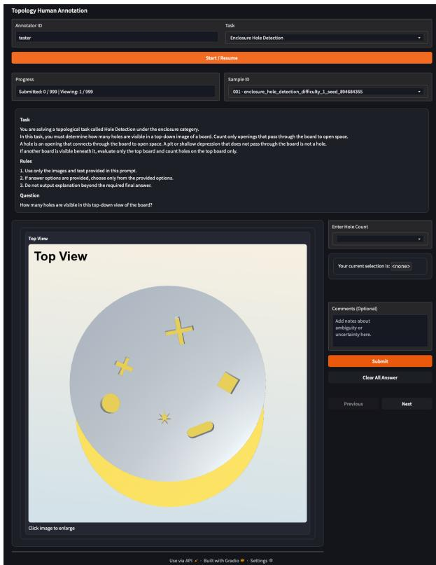  
Figure 8 | Human annotation interface for reasoning tasks. Annotators are shown the same visual inputs and task instructions used in model evaluation, together with a task-specific answer widget and an optional comment field for ambiguous cases.

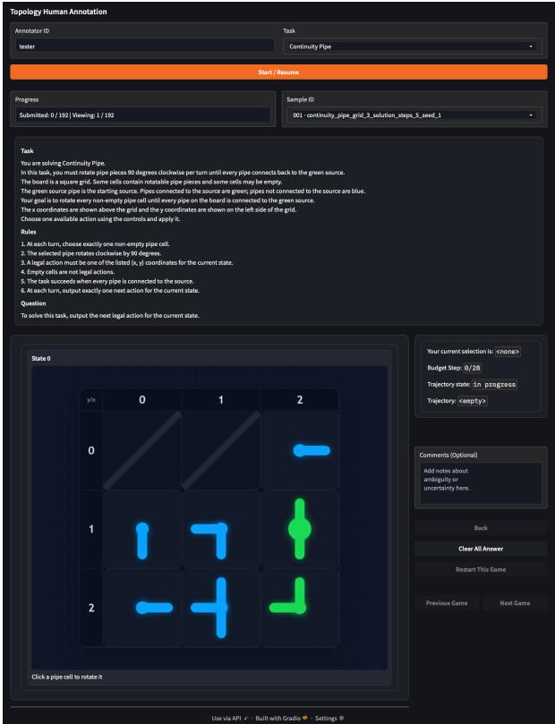  
Figure 9 | Human annotation interface for planning tasks. Annotators interact with the same browserbased environment used by the model runner, and success is determined from the environment terminal state.

## B.4.2. Inter-Annotator Agreement

To measure inter-annotator agreement (IAA), three annotators independently evaluated a shared subset of 200 examples across both reasoning and planning tasks under the same instructions as the models. After applying the same answer canonicalization used by the benchmark scorer, the IAA score is 0.89, indicating high consistency among annotators.

For reasoning tasks, agreement is computed by exact match after answer canonicalization. For planning tasks, agreement is computed under the task’s deterministic evaluation protocol: two annotations agree only when they reach the same evaluated outcome. Disagreements are not resolved by majority vote for the purpose of IAA calculation. Instead, they are reviewed separately to identify potential ambiguity, interface issues, or annotation errors.

## B.5. Full Results by Difficulty

Table 1 aggregates each task across the full evaluation split. Here we report the corresponding per-difficulty results, retaining the same model grouping and evaluation metrics as the main table. Tables 26–30 organize the results by topological category. Within each table, every task is split into adjacent Easy (E), Medium (M), and Hard (H) columns to support direct comparison across difficulty tiers.

<table><tr><td rowspan="2">Difficulty</td><td colspan="2">Continuity</td><td colspan="3">Separation</td><td colspan="3">Order</td><td colspan="3">Enclosure</td><td colspan="2">Knots</td></tr><tr><td>2D Maze</td><td>3D Maze</td><td>Pipe</td><td>Assembly</td><td>One Stroke</td><td>Bead</td><td>Origami Point</td><td>Swap</td><td>Sheep</td><td>Hole</td><td>Chat Noir</td><td>Knots</td><td>Untangle</td></tr><tr><td rowspan="3">Easy</td><td>329/334</td><td></td><td>325/332 200/200</td><td>336/346</td><td>198/200</td><td>327/332</td><td>297/313</td><td>200/200</td><td>330/332</td><td>332/333</td><td>200/200</td><td>431/433</td><td>200/200</td></tr><tr><td>(98.50)</td><td>(97.89)</td><td>(100.00)</td><td>(97.11)</td><td>(99.00)</td><td>(98.49)</td><td>(94.89)</td><td>(100.00)</td><td>(99.40)</td><td>(99.70)</td><td>(100.00)</td><td>(99.54)</td><td>(100.00)</td></tr><tr><td>327/334</td><td>322/332</td><td>200/200</td><td>505/533</td><td>200/200</td><td>319/333</td><td>316/333</td><td>200/200</td><td>326/334</td><td>332/333</td><td>199/200</td><td>211/234</td><td>200/200</td></tr><tr><td rowspan="2">Medium</td><td>(97.90)</td><td>(96.99)</td><td>(100.00)</td><td>(94.75)</td><td>(100.00)</td><td>(95.80)</td><td>(94.89)</td><td>(100.00)</td><td>(97.60)</td><td>(99.70)</td><td>(99.50)</td><td>(90.17)</td><td>(100.00)</td></tr><tr><td>326/332</td><td>317/332</td><td>200/200</td><td>130/156</td><td>200/200</td><td>311/334</td><td>328/333</td><td>200/200</td><td>322/334</td><td>331/333</td><td>199/200</td><td>306/333</td><td>200/200</td></tr><tr><td rowspan="2">Hard</td><td>(98.19)</td><td>(95.48)</td><td>(100.00)</td><td>(83.33)</td><td>(100.00)</td><td>(93.11)</td><td>(98.50)</td><td>(100.00)</td><td>(96.41)</td><td>(99.40)</td><td>(99.50)</td><td>(91.89)</td><td>(100.00)</td></tr><tr><td></td><td></td><td>982/1,000 964/996 600/600 971/1,035</td><td></td><td>598/600</td><td>957/999</td><td>941/979</td><td></td><td>600/600 978/1,000 995/999</td><td></td><td>598/600</td><td></td><td></td></tr><tr><td rowspan="2">Total</td><td>(98.20)</td><td>(96.79)</td><td>(100.00)</td><td>(93.82)</td><td></td><td>(95.80)</td><td></td><td></td><td></td><td></td><td></td><td></td><td>948/1,000 600/600</td></tr><tr><td></td><td></td><td></td><td></td><td>(99.67)</td><td></td><td>(96.12)</td><td>(100.00)</td><td>(97.80)</td><td>(99.60)</td><td>(99.67)</td><td>(94.80)</td><td>(100.00)</td></tr></table>

Table 25 | Human accuracy on reasoning tasks and episode success rate on planning tasks, stratified by benchmark difficulty. Each cell reports correct/evaluated and the corresponding percentage in parentheses. Evaluated counts refer to completed human annotations, not the full benchmark size; coverage is 11,008 of 11,030 instances. The Total row matches the Human row in Table 1.
<table><tr><td rowspan="2">Model</td><td colspan="3">2D Maze</td><td colspan="3">3D Maze</td><td colspan="3">Pipe</td></tr><tr><td>Easy</td><td>Medium</td><td>Hard</td><td>Easy</td><td>Medium</td><td>Hard</td><td>Easy</td><td>Medium</td><td>Hard</td></tr><tr><td>Proprietary Models</td><td></td><td></td><td></td><td></td><td></td><td></td><td></td><td></td><td></td></tr><tr><td>Gemini-3.1-Flash-Lite</td><td>39.52</td><td>26.65</td><td>20.18</td><td>35.84</td><td>29.52</td><td>27.71</td><td>0.00</td><td>0.00</td><td>0.00</td></tr><tr><td>Gemini-3.1-Pro</td><td>41.92</td><td>30.24</td><td>22.89</td><td>54.52</td><td>53.31</td><td>53.01</td><td>13.00</td><td>3.00</td><td>0.50</td></tr><tr><td>GPT-5.4 mini</td><td>17.66</td><td>14.37</td><td>13.55</td><td>26.51</td><td>18.37</td><td>13.86</td><td>0.50</td><td>0.00</td><td>0.00</td></tr><tr><td>GPT-5.5</td><td>85.63</td><td>60.78</td><td>27.41</td><td>49.40</td><td>46.69</td><td>40.36</td><td>6.00</td><td>0.50</td><td>0.00</td></tr><tr><td>Open-Weight Models</td><td></td><td></td><td></td><td></td><td></td><td></td><td></td><td></td><td></td></tr><tr><td>Nemotron-Nano-12B-VL-v2</td><td>12.87</td><td>12.28</td><td>12.65</td><td>15.36</td><td>11.14</td><td>4.82</td><td>0.00</td><td>0.00</td><td>0.00</td></tr><tr><td>Qwen3.5-397B-A17B</td><td>11.38</td><td>12.57</td><td>12.65</td><td>35.24</td><td>34.94</td><td>31.93</td><td>0.00</td><td>0.00</td><td>0.00</td></tr><tr><td>Llama-4-Maverick-17B-128E</td><td>27.84</td><td>21.86</td><td>17.77</td><td>18.98</td><td>15.96</td><td>12.05</td><td>0.00</td><td>0.00</td><td>0.00</td></tr><tr><td>Ministral-3-14B-Instruct-2512</td><td>16.47</td><td>19.16</td><td>18.67</td><td>14.76</td><td>9.04</td><td>9.64</td><td>0.00</td><td>0.00</td><td>0.00</td></tr><tr><td>InternVL3.5-241B</td><td>15.87</td><td>16.17</td><td>12.95</td><td>14.16</td><td>12.35</td><td>6.63</td><td>0.00</td><td>0.00</td><td>0.00</td></tr><tr><td>Gemma-4-31B-IT</td><td>32.34</td><td>25.75</td><td>21.08</td><td>27.71</td><td>15.36</td><td>7.23</td><td>0.00</td><td>0.00</td><td>0.00</td></tr><tr><td>Cosmos-Reason2-8B</td><td>8.98</td><td>8.08</td><td>10.54</td><td>12.65</td><td>11.14</td><td>6.63</td><td>0.00</td><td>0.00</td><td>0.00</td></tr><tr><td>BAGEL-7B</td><td>14.37</td><td>13.17</td><td>10.24</td><td>13.86</td><td>13.25</td><td>12.35</td><td>0.00</td><td>0.00</td><td>0.00</td></tr><tr><td>ThinkMorph-7B</td><td>15.27</td><td>14.67</td><td>13.25</td><td>13.25</td><td>12.65</td><td>12.05</td><td>0.00</td><td>0.00</td><td>0.00</td></tr></table>

Table 26 | Continuity results by difficulty. Accuracy (%) for reasoning tasks and episode success rate (%) for planning tasks, per difficulty tier. Blue shading uses a shared 0–100 scale across all five category tables, darker is higher; lavender marks the best and second-best result in each task–tier column.
<table><tr><td rowspan="2">Model</td><td colspan="3">Assembly</td><td colspan="3">One Stroke</td></tr><tr><td>Easy</td><td>Medium</td><td>Hard</td><td>Easy</td><td>Medium</td><td>Hard</td></tr><tr><td colspan="7">Proprietary Models</td></tr><tr><td>Gemini-3.1-Flash-Lite</td><td>44.44</td><td>46.15</td><td>27.56</td><td>0.00</td><td>0.00</td><td>0.00</td></tr><tr><td>Gemini-3.1-Pro</td><td>60.68</td><td>48.97</td><td>32.05</td><td>6.50</td><td>3.50</td><td>0.00</td></tr><tr><td>GPT-5.4 mini</td><td>38.46</td><td>34.90</td><td>20.51</td><td>0.00</td><td>0.00</td><td>0.00</td></tr><tr><td>GPT-5.5</td><td>62.39</td><td>53.66</td><td>37.18</td><td>16.50</td><td>13.00</td><td>0.00</td></tr><tr><td colspan="7">Open-Weight Models</td></tr><tr><td>Nemotron-Nano-12B-VL-v2</td><td>31.05</td><td>26.83</td><td>28.21</td><td>0.00</td><td>0.00</td><td>0.00</td></tr><tr><td>Qwen3.5-397B-A17B</td><td>48.72</td><td>41.65</td><td>23.72</td><td>0.00</td><td>0.00</td><td>0.00</td></tr><tr><td>Llama-4-Maverick-17B-128E</td><td>32.19</td><td>37.34</td><td>28.21</td><td>0.00</td><td>0.00</td><td>0.00</td></tr><tr><td>Ministral-3-14B-Instruct-2512</td><td>29.06</td><td>27.95</td><td>25.64</td><td>0.00</td><td>0.00</td><td>0.00</td></tr><tr><td>InternVL3.5-241B</td><td>10.83</td><td>14.07</td><td>16.67</td><td>0.00</td><td>0.00</td><td>0.00</td></tr><tr><td>Gemma-4-31B-IT</td><td>16.81</td><td>20.26</td><td>18.59</td><td>0.00</td><td>0.00</td><td>0.00</td></tr><tr><td>Cosmos-Reason2-8B</td><td>36.47</td><td>35.27</td><td>19.87</td><td>0.00</td><td>0.00</td><td>0.00</td></tr><tr><td>BAGEL-7B</td><td>21.08</td><td>19.89</td><td>19.23</td><td>0.00</td><td>0.00</td><td>0.00</td></tr><tr><td>ThinkMorph-7B</td><td>21.08</td><td>19.89</td><td>19.23</td><td>0.00</td><td>0.00</td><td>0.00</td></tr></table>

Table 27 | Separation results by difficulty. Accuracy (%) for reasoning tasks and episode success rate (%) for planning tasks; shading and highlighting as in Table 26.

<table><tr><td rowspan="2">Model</td><td colspan="3">Bead</td><td colspan="3">Origami Point</td><td colspan="3">Swap</td></tr><tr><td>Easy</td><td>Medium</td><td>Hard</td><td>Easy</td><td>Medium</td><td>Hard</td><td>Easy</td><td>Medium</td><td>Hard</td></tr><tr><td colspan="10">Proprietary Models</td></tr><tr><td>Gemini-3.1-Flash-Lite</td><td>57.36</td><td>28.23</td><td>15.87</td><td>57.49</td><td>31.83</td><td>37.24</td><td>28.00</td><td>0.00</td><td>0.00</td></tr><tr><td>Gemini-3.1-Pro</td><td>73.27</td><td>47.15</td><td>11.98</td><td>58.38</td><td>37.84</td><td>27.03</td><td>19.00</td><td>27.50</td><td>6.00</td></tr><tr><td>GPT-5.4 mini</td><td>52.55</td><td>18.92</td><td>11.38</td><td>24.55</td><td>31.23</td><td>25.83</td><td>31.00</td><td>0.50</td><td>0.00</td></tr><tr><td>GPT-5.5</td><td>62.16</td><td>33.03</td><td>6.59</td><td>78.74</td><td>63.06</td><td>38.14</td><td>70.50</td><td>19.50</td><td>53.00</td></tr><tr><td colspan="10">Open-Weight Models</td></tr><tr><td>Nemotron-Nano-12B-VL-v2</td><td>31.23</td><td>10.51</td><td>10.48</td><td>31.44</td><td>24.92</td><td>23.72</td><td>4.00</td><td>0.00</td><td>0.00</td></tr><tr><td>Qwen3.5-397B-A17B</td><td>41.14</td><td>11.71</td><td>2.99</td><td>55.39</td><td>41.14</td><td>31.23</td><td>27.00</td><td>1.50</td><td>0.00</td></tr><tr><td>Llama-4-Maverick-17B-128E</td><td>50.15</td><td>16.82</td><td>11.98</td><td>13.77</td><td>16.52</td><td>21.02</td><td>19.00</td><td>0.00</td><td>0.00</td></tr><tr><td>Ministral-3-14B-Instruct-2512</td><td>17.42</td><td>16.22</td><td>8.38</td><td>12.57</td><td>24.02</td><td>18.62</td><td>12.00</td><td>0.50</td><td>0.00</td></tr><tr><td>InternVL3.5-241B</td><td>45.65</td><td>17.72</td><td>6.29</td><td>19.76</td><td>26.73</td><td>12.01</td><td>12.50</td><td>0.00</td><td>0.00</td></tr><tr><td>Gemma-4-31B-IT</td><td>7.51</td><td>8.41</td><td>8.08</td><td>3.59</td><td>0.60</td><td>0.60</td><td>3.00</td><td>0.00</td><td>0.00</td></tr><tr><td>Cosmos-Reason2-8B</td><td>53.75</td><td>21.92</td><td>11.98</td><td>9.58</td><td>7.51</td><td>8.11</td><td>9.50</td><td>0.00</td><td>0.00</td></tr><tr><td>BAGEL-7B</td><td>15.92</td><td>9.01</td><td>8.38</td><td>12.87</td><td>9.61</td><td>10.81</td><td>3.00</td><td>0.00</td><td>0.00</td></tr><tr><td>ThinkMorph-7B</td><td>7.21</td><td>0.90</td><td>0.60</td><td>9.88</td><td>11.11</td><td>7.51</td><td>0.50</td><td>0.00</td><td>0.00</td></tr></table>

Table 28 | Order results by difficulty. Accuracy (%) for reasoning tasks and episode success rate (%) for planning tasks; shading and highlighting as in Table 26.

<table><tr><td rowspan="2">Model</td><td colspan="3">Sheep</td><td colspan="3">Hole</td><td colspan="3">Chat Noir</td></tr><tr><td>Easy</td><td>Medium</td><td>Hard</td><td>Easy</td><td>Medium</td><td>Hard</td><td>Easy</td><td>Medium</td><td>Hard</td></tr><tr><td colspan="10">Proprietary Models</td></tr><tr><td>Gemini-3.1-Flash-Lite</td><td>54.22</td><td>47.01</td><td>44.31</td><td>34.23</td><td>32.43</td><td>1.20</td><td>16.00</td><td>2.50</td><td>1.00</td></tr><tr><td>Gemini-3.1-Pro</td><td>66.27</td><td>63.47</td><td>62.28</td><td>94.59</td><td>81.38</td><td>2.40</td><td>55.00</td><td>24.00</td><td>43.00</td></tr><tr><td>GPT-5.4 mini</td><td>21.08</td><td>17.66</td><td>19.76</td><td>31.23</td><td>18.62</td><td>0.30</td><td>15.00</td><td>0.50</td><td>3.50</td></tr><tr><td>GPT-5.5</td><td>60.54</td><td>50.90</td><td>51.20</td><td>96.70</td><td>93.39</td><td>1.50</td><td>60.50</td><td>7.00</td><td>40.50</td></tr><tr><td colspan="10">Open-Weight Models</td></tr><tr><td>Nemotron-Nano-12B-VL-v2</td><td>12.95</td><td>19.16</td><td>13.77</td><td>13.21</td><td>7.81</td><td>0.00</td><td>0.00</td><td>0.00</td><td>0.50</td></tr><tr><td>Qwen3.5-397B-A17B</td><td>15.36</td><td>2.40</td><td>2.40</td><td>43.24</td><td>31.23</td><td>0.30</td><td>17.00</td><td>5.50</td><td>5.00</td></tr><tr><td>Llama-4-Maverick-17B-128E</td><td>11.45</td><td>12.57</td><td>10.48</td><td>6.31</td><td>1.50</td><td>0.00</td><td>5.00</td><td>0.00</td><td>0.50</td></tr><tr><td>Ministral-3-14B-Instruct-2512</td><td>9.34</td><td>14.37</td><td>11.68</td><td>11.41</td><td>3.90</td><td>0.00</td><td>11.50</td><td>0.00</td><td>0.50</td></tr><tr><td>InternVL3.5-241B</td><td>21.99</td><td>16.77</td><td>13.17</td><td>26.13</td><td>20.42</td><td>0.00</td><td>1.50</td><td>0.00</td><td>1.50</td></tr><tr><td>Gemma-4-31B-IT</td><td>15.06</td><td>8.38</td><td>2.40</td><td>0.00</td><td>0.00</td><td>0.00</td><td>27.50</td><td>7.00</td><td>6.50</td></tr><tr><td>Cosmos-Reason2-8B</td><td>20.18</td><td>15.57</td><td>13.47</td><td>22.52</td><td>14.41</td><td>0.30</td><td>2.50</td><td>0.00</td><td>1.00</td></tr><tr><td>BAGEL-7B</td><td>5.42</td><td>7.78</td><td>7.19</td><td>0.00</td><td>0.00</td><td>0.00</td><td>0.00</td><td>0.00</td><td>0.00</td></tr><tr><td>ThinkMorph-7B</td><td>6.93</td><td>10.48</td><td>6.29</td><td>1.50</td><td>0.30</td><td>0.00</td><td>0.00</td><td>0.00</td><td>0.00</td></tr></table>

Table 29 | Enclosure results by difficulty. Accuracy (%) for reasoning tasks and episode success rate (%) for planning tasks; shading and highlighting as in Table 26.

<table><tr><td rowspan=1 colspan=7>Knots                                    UntangleModelEasy       Medium       Hard         Easy       Medium       Hard</td></tr><tr><td rowspan=1 colspan=7>Proprietary Models</td></tr><tr><td rowspan=1 colspan=1>Gemini-3.1-Flash-Lite</td><td rowspan=1 colspan=1>59.58</td><td rowspan=1 colspan=1>75.64</td><td rowspan=1 colspan=1>60.06</td><td rowspan=1 colspan=1>51.00</td><td rowspan=1 colspan=1>8.00</td><td rowspan=1 colspan=1>0.50</td></tr><tr><td rowspan=1 colspan=1>Gemini-3.1-Pro</td><td rowspan=1 colspan=1>70.90</td><td rowspan=1 colspan=1>69.23</td><td rowspan=1 colspan=1>80.18</td><td rowspan=1 colspan=1>61.00</td><td rowspan=1 colspan=1>22.00</td><td rowspan=1 colspan=1>4.50</td></tr><tr><td rowspan=1 colspan=1>GPT-5.4 mini</td><td rowspan=1 colspan=1>27.02</td><td rowspan=1 colspan=1>25.64</td><td rowspan=1 colspan=1>23.12</td><td rowspan=1 colspan=1>59.50</td><td rowspan=1 colspan=1>9.50</td><td rowspan=1 colspan=1>2.50</td></tr><tr><td rowspan=1 colspan=1>GPT-5.5</td><td rowspan=1 colspan=1>51.96</td><td rowspan=1 colspan=1>70.94</td><td rowspan=1 colspan=1>64.56</td><td rowspan=1 colspan=1>52.50</td><td rowspan=1 colspan=1>18.50</td><td rowspan=1 colspan=1>7.00</td></tr><tr><td rowspan=1 colspan=1>Open-Weight Models</td><td rowspan=1 colspan=1></td><td rowspan=1 colspan=1></td><td rowspan=1 colspan=1></td><td rowspan=1 colspan=1></td><td rowspan=1 colspan=2></td></tr><tr><td rowspan=1 colspan=1>Nemotron-Nano-12B-VL-v2</td><td rowspan=1 colspan=1>29.33</td><td rowspan=1 colspan=1>9.83</td><td rowspan=1 colspan=1>28.83</td><td rowspan=1 colspan=1>9.50</td><td rowspan=1 colspan=1>0.50</td><td rowspan=1 colspan=1>0.00</td></tr><tr><td rowspan=1 colspan=1>Qwen3.5-397B-A17B</td><td rowspan=1 colspan=1>28.64</td><td rowspan=1 colspan=1>26.92</td><td rowspan=1 colspan=1>39.64</td><td rowspan=1 colspan=1>22.50</td><td rowspan=1 colspan=1>0.00</td><td rowspan=1 colspan=1>0.50</td></tr><tr><td rowspan=1 colspan=1>Llama-4-Maverick-17B-128E</td><td rowspan=1 colspan=1>32.56</td><td rowspan=1 colspan=1>26.92</td><td rowspan=1 colspan=1>30.93</td><td rowspan=1 colspan=1>20.50</td><td rowspan=1 colspan=1>1.00</td><td rowspan=1 colspan=1>1.50</td></tr><tr><td rowspan=1 colspan=1>Ministral-3-14B-Instruct-2512</td><td rowspan=1 colspan=1>66.97</td><td rowspan=1 colspan=1>25.64</td><td rowspan=1 colspan=1>18.62</td><td rowspan=1 colspan=1>31.50</td><td rowspan=1 colspan=1>2.00</td><td rowspan=1 colspan=1>2.00</td></tr><tr><td rowspan=1 colspan=1>InternVL3.5-241B</td><td rowspan=1 colspan=1>46.19</td><td rowspan=1 colspan=1>42.31</td><td rowspan=1 colspan=1>40.84</td><td rowspan=1 colspan=1>11.00</td><td rowspan=1 colspan=1>0.00</td><td rowspan=1 colspan=1>0.00</td></tr><tr><td rowspan=1 colspan=1>Gemma-4-31B-IT</td><td rowspan=1 colspan=1>3.00</td><td rowspan=1 colspan=1>2.56</td><td rowspan=1 colspan=1>11.11</td><td rowspan=1 colspan=1>28.00</td><td rowspan=1 colspan=1>2.00</td><td rowspan=1 colspan=1>0.50</td></tr><tr><td rowspan=3 colspan=1>Cosmos-Reason2-8BBAGEL-7BThinkMorph-7B</td><td rowspan=1 colspan=1>25.17</td><td rowspan=1 colspan=1>16.24</td><td rowspan=1 colspan=1>30.93</td><td rowspan=1 colspan=1>33.00</td><td rowspan=1 colspan=1>0.00</td><td rowspan=1 colspan=1>0.00</td></tr><tr><td rowspan=1 colspan=1>10.39</td><td rowspan=1 colspan=1>9.83</td><td rowspan=1 colspan=1>29.73</td><td rowspan=1 colspan=1>1.00</td><td rowspan=1 colspan=1>0.00</td><td rowspan=1 colspan=1>0.00</td></tr><tr><td rowspan=1 colspan=1>30.72</td><td rowspan=1 colspan=1>8.97</td><td rowspan=1 colspan=1>20.42</td><td rowspan=1 colspan=1>0.00</td><td rowspan=1 colspan=2>0.00         0.00</td></tr></table>

Table 30 | Knots results by difficulty. Accuracy (%) for reasoning tasks and episode success rate (%) for planning tasks; shading and highlighting as in Table 26.

## B.6. Reading the Per-Difficulty Tables

Four patterns in Tables 26–30 look like scoring failures and are not. We state their causes here so that the tables can be read without them.

The Hole cliff is an exact-count effect, not a broken tier. All models shown in Table 29 score at most 2.40% on Hard Hole, whereas GPT-5.5 and Gemini-3.1-Pro reach 81–97% on Easy and Medium. Hole is scored by exact integer equality, and the generator raises both the number of through-holes and the number of confusable structures per tier: the sampled hole count is 5–10 (Easy), 7–13 (Medium), and 9–17 (Hard), and only the Hard tier mixes all four hole and pit types. The error magnitude moves accordingly rather than collapsing: on GPT-5.5 the mean absolute count error is 0.05 (Easy), 0.08 (Medium), and 2.95 (Hard), with no invalid responses in any tier. Hard Hole therefore measures exact enumeration under distractor structures, and a near-zero exact-match rate is the expected consequence of scoring it by equality.

Chat Noir is non-monotonic by construction. Frontier models score higher on Hard than on Medium Chat Noir (GPT-5.5: 60.50, 7.00, 40.50). The difficulty tier of this environment is defined by the cat policy alone. The number of cells blocked before the first player action is a separate setup parameter that the generator samples per policy and radius, and it increases with the tier: radius 3 uses 8–10 (Easy), 10–12 (Medium), and 12–14 (Hard) initial blocks, and radius 4 uses 10–13, 13–16, and 16–19. A denser initial board makes the cat easier to enclose, which partly offsets the stronger policy. The Easy-to-Medium drop is the effect of the policy; the Medium-to-Hard rise is the effect of the extra initial blocks.

Some open-weight cells reflect a constant answer. Three cells that read as task scores are produced by a model emitting the same answer for every instance. BAGEL-7B and ThinkMorph-7B both answer option E throughout their Assembly evaluations. On the current 1,035 Assembly questions, this option has a base rate of 20.19%, matching their identical entries rather than two independent measurements of task competence. Gemma-4-31B-IT answers 0 on all 999 Hole questions, which is why its Hole row is 0.00 in all three tiers.

Two Hole cells are limited by answer format, not by counting. BAGEL-7B and ThinkMorph-7B emit {"answer":{10}} instead of {"answer": 10} on Hole, which the shared parser rejects: 999 of 999 BAGEL responses and 950 of 999 ThinkMorph responses are scored invalid. A lenient integer recovery applied to those responses would yield 6.71 for BAGEL and 13.91 for ThinkMorph instead of the reported 0.00 and 0.60. We keep the strict shared parser for every model and every task so that the reported numbers remain comparable, and we treat these two cells as format failures under category 0 of the error taxonomy (Appendix C.2.1) rather than as evidence about hole counting.

## B.7. Generative Models as Topological World Models

Setup. We evaluate generative models as auxiliary world models rather than as direct answerers. At each step, a reasoner first writes an image or video prompt describing a plausible topological rollout from the current observation. The generator then produces an imagined future observation, and the same reasoner commits to an answer or action from the original observation plus the generated artifact. Image experiments use edit-mode generation anchored to the current PNG observation, with gpt-image-2, BAGEL, or ThinkMorph as the image backend. Video experiments use image-to-video rollouts with Wan2.2-I2V-A14B or CogVideoX-style replay backends. Controls keep the reasoner, initial observation, task prompt, and action budget fixed across no-imagination and imagination variants.

Imagined-rollout protocol. For continuity tasks, the imagined artifact is asked to show a path opening, pipe flow, or maze traversal after the candidate manipulation. For separation, the rollout visualizes whether a stroke or object remains one connected piece. For order, it shows the post-fold or post-swap ordering. For enclosure, it shows escape paths, boundary closure, or hole visibility after a viewpoint or state change. For knots, it asks the generator to simulate an endpoint move or strand deformation while preserving over/under crossings. The reasoner may call the image generator at every step, capped at ten calls per episode. The end-to-end video setting uses one video per episode. Per-task success rates for the interleaved-image and video variants appear in Table 3. Generated conditions use 35 episodes per difficulty tier (105 per task). The GPT-5.4-mini and InternVL planner-only rows reuse the full-benchmark baselines: 1,000 instances per displayed reasoning task and 600 per planning task. Luna planning baselines use 105 episodes per task, with 35 per tier. These sample counts distinguish the full-benchmark baselines from the probing subsets. The three probing analyses draw on different samples. The error annotation in Figure 7 uses a separate set of Wan2.2-I2V-A14B rollouts: 60 videos were targeted for One Stroke and 60 for Untangle. One Untangle video was unavailable, leaving 60 scored One Stroke videos and 59 scored Untangle videos (119 total). The CV diagnostic audit in Table 4 uses a third sample of 35 videos per difficulty tier for each LTX-2.3 or Wan2.2 task–generator pair (105 per cell, 630 total).

Failure modes. Imagined rollouts often look locally plausible while violating the exact topological invariant that the task tests. Rather than a ranked taxonomy of visual subtypes, our annotations track three diagnostics: dynamics, invariance, and cross-frame consistency. Across the 119 annotated Wan2.2-I2V-A14B video rollouts, 116 contain a dynamics error, 93 an invariance error, and 90 a consistency error. Qualitative manifestations include identity drift, silent crossings, hallucinated openings, and visually smooth but impossible transitions. We therefore treat generated rollouts as an auxiliary diagnostic rather than a replacement for oracle state transitions.

## B.7.1. Computer-Vision Video Diagnostics

Verifier and aggregation. We apply task-specific computer-vision verifiers to One Stroke, Pipe, and Untangle rollouts from LTX-2.3, Wan2.2-I2V-A14B, MiniMax-H3, and Veo 3.1 Lite. Each task and generator cell contains 105 videos (100 for Veo 3.1 Lite), for 1,245 videos in total. Static checks test whether each selected parsed frame preserves the task state. Dynamic checks test whether consecutive frames form a valid transition. The reported CV audit uses the default sample\_41 mode, which samples 41 evenly spaced frames from each video, including the first and last frames. A video passes a check only when every applicable frame or transition passes. Unscorable videos count as failures, while a check with no applicable instance is excluded only from that check’s denominator. Table 4 gives the full counts.

Terminal-state parser status and scorability. Parser labels describe detector completeness, not whether the task itself is solved. They are task-specific and are converted to the common binary terminal state scorable gate only after parsing. For the three tasks in Table 4, ok and degraded are readable, whereas failed and grid\_not\_found are unreadable. Thus, a degraded frame can remain scorable when it contains enough state for the task metrics, while a failed frame is counted as a failure in outcome, static, dynamic, and overall video-level aggregates. Table 31 states the exact triggers and observed terminal-frame counts.

Operational metric definitions. Tables 32 and 33 define every task-specific metric in Table 4. Static metrics are evaluated on four evenly spaced static frames on which they apply, while terminal outcome metrics use the final sampled frame. Dynamic metrics compare adjacent sampled frames. Only rows explicitly marked not\_applicable are omitted from a check’s denominator. Low-confidence rows remain applicable and their pass/fail decision is retained. At video level, static validity and dynamic validity are strict logical conjunctions over their respective applicable rows. Final-state task success applies the task-specific terminal oracle, and processvalid task success requires terminal scorability, task success, static validity, and dynamic validity simultaneously.

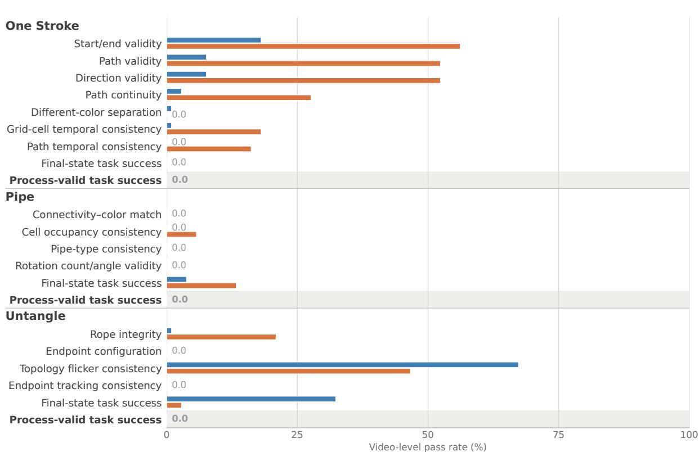  
Figure 10 | Per-check video-level pass rates from Table 4, ordered loosest to strictest. The shaded process-valid task success row combines terminal-state success with every applicable static and dynamic check. The two per-group aggregates are omitted here for readability.

Qualitative examples. Figure 11 connects sampled generated-video frames to the task-specific CV overlays used for dynamic verification. Its three columns cover Pipe, Untangle, and One Stroke. The overlays illustrate the cross-frame correspondences defined in Tables 32 and 33.

Human validation. We use manual review to audit the CV evaluator, rather than to estimate the quality of either video generator. The evaluator-validation set is a balanced, difficultystratified sample of 180 videos: 10 videos for each of three difficulty levels in every task and generator cell. For each video, a single reviewer inspects the video and detection overlays, then records whether the visible task state is scorable, whether the CV parse matches it exactly or at least partially, and whether the resulting automatic metric decision agrees with manual review. Because this diagnostic audit uses one reviewer, we do not report inter-annotator agreement for it.

Panel A of Table 34 shows that every sampled parse is usable (partial or exact) and that all 180 video-level metric decisions agree with the manual audit. These results support using the

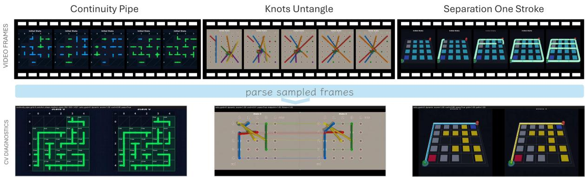  
Figure 11 | Video sampling and computer-vision transition diagnostics. For Pipe, Untangle, and One Stroke, the top filmstrips show five sampled frames from representative generated rollouts, and the bottom panels show task-specific overlays for adjacent-frame checks.

<table><tr><td>Environment</td><td>Raw terminal status</td><td>Operational trigger</td><td>Scorable</td><td>LTX-2.3</td><td>Wan2.2-I2V-A14B</td></tr><tr><td rowspan="3">One Stroke</td><td>ok</td><td>At least one colored cell and both start and end markers are detected.</td><td>Yes</td><td>87</td><td>102</td></tr><tr><td>degraded</td><td>Colored cells are detected, but either the start or end marker is missing.</td><td>Yes</td><td>11</td><td>3</td></tr><tr><td>failed</td><td>No colored cells are detected in the terminal frame.</td><td>No</td><td>7</td><td>0</td></tr><tr><td rowspan="2">Pipe</td><td>ok</td><td>At least one active pipe cell is detected on the fitted board grid.</td><td>Yes</td><td>97</td><td>105</td></tr><tr><td>grid_not_found</td><td>No active pipe cell is detected, so no pipe state can be constructed.</td><td>No</td><td>8</td><td>0</td></tr><tr><td rowspan="3">Untangle</td><td>ok</td><td>The hole lattice is fitted and every detected rope has exactly two connected, unambiguous end- points resolved to lattice holes.</td><td>Yes</td><td>2</td><td>3</td></tr><tr><td>degraded</td><td>The hole lattice and at least one expected rope are detected, but endpoint evidence is incomplete, extra, isolated, ambiguous, or not fully resolved.</td><td>Yes</td><td>96</td><td>102</td></tr><tr><td>failed</td><td>The hole lattice cannot be fitted, or no expected rope mask survives the minimum-area detector threshold.</td><td>No</td><td>7</td><td>0</td></tr></table>

Table 31 | Task-specific terminal parser statuses and their mapping to terminal-state scorability. Counts are terminal frames among the 105 videos in each environment–generator cell. Status is a detectorcompleteness label: failed does not mean that a readable puzzle was merely unsolved.

CV verifier to compute the diagnostic pass rates in Table 4; the lower exact-parse rate, especially on Untangle, indicates that this evidence should not be read as perfect state reconstruction. Panel B provides an error analysis of a separate component, the terminal-state scorability gate. Its 77.8% accuracy is dominated by its 98.6% recall on the more frequent human-scorable class: recall on human-unscorable videos is only 9.5%, yielding 54.0% balanced accuracy. In particular, 38 of the 40 errors arise when the parser accepts a terminal state that the reviewer considers unscorable. Thus, the human study supports the reliability of the downstream metric decisions on the audited sample while identifying weak rejection of unscorable states as a limitation of the coverage gate; neither panel is intended to rank generator quality.

## B.8. Camera and Viewpoint Controls

Controlled camera factors. The benchmark deliberately separates topological difficulty from viewpoint difficulty. Static generators store the scene seed and render camera metadata, so we can rerender the same underlying topology under a canonical top view, oblique view, wider field of view, tighter crop, or distractor-heavy view. For planning environments, the browser

<table><tr><td>Type</td><td>Metric</td><td>Operational pass condition</td></tr><tr><td>Static</td><td>Different-color separation</td><td>On the final frame, the detected path partitions the board so that no connected region contains cells of more than one color. This isolates the separation constraint from the full task oracle.</td></tr><tr><td>Static</td><td>Direction validity</td><td>The detected arrowhead lies at the advancing path endpoint, points away from the start, and points toward the end. An orientable path without reliable arrowhead evidence is retained as a low-confidence pass.</td></tr><tr><td>Static</td><td>Path continuity</td><td>The stroke mask and skeleton each have one significant component, the snapped legal-edge graph is connected, fitted segment gaps remain below the grid-scaled tolerance, and combined confidence is at least 0.60.</td></tr><tr><td>Static</td><td>Path validity</td><td>The connected stroke snaps to one or more legal up/down/left/right board edges with snap confidence at least 0.55 and sufficient evidence that it does not cut through colored cells; a straight diagonal fails.</td></tr><tr><td>Static</td><td>Start/end validity</td><td>An intermediate path remains anchored at the start; on the final frame, one connected stroke must touch both the start and end markers.</td></tr><tr><td>Dynamic</td><td>Grid-cell temporal consistency</td><td>Adjacent frames preserve the number and color of cells and match each cell to a same-color position within the grid-scaled spatial tolerance. The current path retains the preceding legal-edge set, adds no disconnected branch,</td></tr><tr><td></td><td>Dynamic Path temporal consistency</td><td>and keeps sufficient adjacent-frame overlap. When edge snapping is unavailable, path area retention must be at least 0.75 and pixel overlap at least 0.45; either branch is also gated by per-frame path continuity.</td></tr><tr><td></td><td>Outcome Final-state task success</td><td>The final frame contains one connected start-to-end path on legal grid edges and passes the environment&#x27;s exact region-constraint solver.</td></tr></table>

Table 32 | Operational definitions of the One Stroke CV metrics. Early frames before any path is drawn are marked not applicable for path-based checks rather than counted as passes.
<table><tr><td>Environment</td><td>Type</td><td>Metric</td><td>Operational pass condition</td></tr><tr><td rowspan="4">Pipe</td><td>Static</td><td>Connectivity-color match</td><td>For every detected pipe cell, green means reachable from the source under the parsed arm connections and blue means unreachable; the source must be green.</td></tr><tr><td></td><td>Dynamic Cell occupancy consistency</td><td>The set of occupied pipe-grid cells is identical in adjacent frames; no pipe cell appears or disappears.</td></tr><tr><td></td><td>Dynamic Pipe-type consistency</td><td>Every occupied cell shared by adjacent frames keeps the same rotation-invariant pipe shape; orientation may change, but endpoint, straight, elbow, and tee identities may not.</td></tr><tr><td></td><td>Dynamic Rotation count/angle validity</td><td>At most one pipe changes orientation in an adjacent transition, and it moves to a registered legal orientation no more than one quarter-turn away. The pixel-angle fallback likewise requires an absolute rotation below 90°.</td></tr><tr><td rowspan="4">Untangle</td><td></td><td>Outcome Final-state task success</td><td>Every ground-truth active pipe cell is connected to the source in the parsed terminal configuration. Every detected rope has nonzero mask area, exactly two selected and</td></tr><tr><td>Static Static</td><td>Endpoint configuration</td><td>resolved endpoints, no extra endpoint candidate, and no isolated endpoint cap. Each rope mask has sufficient area and is not visibly fragmented: its</td></tr><tr><td></td><td>Rope integrity</td><td>largest component covers at least 45% of rope area or it has at most two large components (each at least 12% of rope area). At least 90% of ropes must pass. Each rope persists across adjacent frames and its two endpoints can</td></tr><tr><td></td><td>Dynamic Endpoint tracking consistency</td><td>be matched within half the nearest hole spacing. Missing ropes, un- readable endpoint counts, or larger jumps fail; ambiguity is retained as low confidence rather than an automatic hard failure. Crossing count may not change while endpoint-to-hole assignments</td></tr><tr><td></td><td></td><td></td><td>are fixed or endpoints are nearly stationary, and endpoint-to-hole assignments may not change while endpoints are nearly stationary. A topology change accompanied by visible endpoint motion is not applicable to this flicker check.</td></tr><tr><td></td><td></td><td>Outcome Final-state task success</td><td>The terminal crossing count is readable and equals zero.</td></tr></table>

Table 33 | Operational definitions of the Pipe and Untangle CV metrics. Dynamic checks are evaluated on every adjacent pair of sampled frames for which the check is applicable.

Panel A: Parse quality and CV metric agreement by environment and generator
<table><tr><td>Environment</td><td>Generator</td><td>N</td><td>Human-scorable view</td><td>Exact CV parse</td><td>Usable CV parse</td><td>CV metric agreement</td></tr><tr><td>Pipe</td><td>LTX-2.3</td><td>30</td><td>76.7%</td><td>96.7%</td><td>100.0%</td><td>100.0%</td></tr><tr><td>Pipe</td><td>Wan2.2-I2V-A14B</td><td>30</td><td>100.0%</td><td>100.0%</td><td>100.0%</td><td>100.0%</td></tr><tr><td>One Stroke</td><td>LTX-2.3</td><td>30</td><td>76.7%</td><td>43.3%</td><td>100.0%</td><td>100.0%</td></tr><tr><td>One Stroke</td><td>Wan2.2-I2V-A14B</td><td>30</td><td>100.0%</td><td>100.0%</td><td>100.0%</td><td>100.0%</td></tr><tr><td>Untangle</td><td>LTX-2.3</td><td>30</td><td>6.7%</td><td>3.3%</td><td>100.0%</td><td>100.0%</td></tr><tr><td>Untangle</td><td>Wan2.2-I2V-A14B</td><td>30</td><td>100.0%</td><td>23.3%</td><td>100.0%</td><td>100.0%</td></tr><tr><td>Overall</td><td>Both</td><td>180</td><td>76.7%</td><td>61.1%</td><td>100.0%</td><td>100.0%</td></tr></table>

Panel B: Human versus automatic terminal-state scorability
<table><tr><td></td><td>Human: scorable</td><td>Human: unscorable</td></tr><tr><td>CV parser: scorable</td><td>75.6%</td><td>21.1%</td></tr><tr><td>CV parser: unscorable</td><td>1.1%</td><td>2.2%</td></tr><tr><td>Derived gate metrics</td></tr><tr><td>Accuracy</td><td colspan="2">77.8% (140/180 correctly classified videos)</td></tr><tr><td>Scorable recall</td><td colspan="2">98.6% (136/138 human-scorable videos accepted)</td></tr><tr><td>Unscorable recall</td><td colspan="2">9.5% (4/42 human-unscorable videos rejected)</td></tr><tr><td>Balanced accuracy</td><td colspan="2">54.0% (mean of scorable and unscorable recall)</td></tr></table>

Table 34 | Human audit of the computer-vision verifier and terminal-state scorability gate. A balanced set of 180 videos spanning three environments, two generators, and three difficulty levels (10 per cell). Panel A: parse quality and agreement between automatic video-level metric decisions and manual review; a usable parse may be partial but retains enough evidence for the diagnostic decision. Panel B: automatic terminal parser acceptance against the human judgment of whether the visible state is scorable, each cell a percentage of all 180 videos.

viewport is fixed and scene-only screenshots are captured at each step, which prevents accidental resolution changes from becoming a hidden model-specific advantage. Table 35 summarizes the diagnostic role of each controlled camera factor.
<table><tr><td>Camera factor</td><td>Diagnostic role</td></tr><tr><td>Top vs. oblique</td><td>Tests whether models preserve connectivity, enclosure, and knot over/under relations when Euclidean projection changes.</td></tr><tr><td>Field of view</td><td>Separates global topology errors from missed off-screen or cropped boundary segments.</td></tr><tr><td>Zoom/crop</td><td>Identifies failures caused by small gaps, thin walls, or subtle through-holes rather than by task semantics.</td></tr><tr><td>Multi-view pair</td><td>Checks whether an answer is stable when one view exposes depth or occlusion cues missing from another view.</td></tr></table>

Table 35 | Controlled camera factors in scene generation. The same seed can be rerendered under controlled view changes while keeping the topological ground truth fixed.

## B.9. Shortcut and Input Representation Controls

Protocol. We test whether performance depends on scene structure that determines the answer or on cues that remain after this structure is removed. Full input contains the rendered observation and the complete task prompt. Text only removes the rendered observation while retaining the question for each instance. Answer prior also removes the information specific to each question and therefore measures the signal carried by the answer distribution. Appearance only retains visual style cues without the original scene structure. Within each row, all conditions use the same instances and decoding configuration. Table 36 reports these controls for the task and model pairs on which all three were evaluated. We additionally probe the input representation with a symbolic condition that replaces the rendering with a symbolic description of the same state. This condition covers every task and model with a completed matched symbolic run, and Table 37 compares it against the full input.

<table><tr><td rowspan="2">Task</td><td rowspan="2">Model</td><td rowspan="2">N</td><td rowspan="2">Full input</td><td colspan="3">Shortcut controls</td></tr><tr><td>Text only</td><td>Answer prior</td><td>Appearance only</td></tr><tr><td colspan="7">Reasoning tasks</td></tr><tr><td rowspan="2">2D Maze</td><td>Gemini-3.1-Flash-Lite</td><td>100</td><td>21.00</td><td>8.00</td><td>8.00</td><td>36.00</td></tr><tr><td>InternVL3.5-241B</td><td>100</td><td>10.00</td><td>14.00</td><td>8.00</td><td>6.00</td></tr><tr><td rowspan="2">Sheep</td><td>Gemini-3.1-Flash-Lite</td><td>100</td><td>61.00</td><td>56.00</td><td>56.00</td><td>43.00</td></tr><tr><td>InternVL3.5-241B</td><td>100</td><td>28.00</td><td>23.00</td><td>28.00</td><td>18.00</td></tr><tr><td colspan="7">Planning tasks</td></tr><tr><td rowspan="2">Pipe</td><td>Gemini-3.1-Flash-Lite</td><td>60</td><td>0.00</td><td>0.00</td><td>0.00</td><td>0.00</td></tr><tr><td>InternVL3.5-241B</td><td>60</td><td>1.67</td><td>0.00</td><td>0.00</td><td>0.00</td></tr><tr><td rowspan="2">One Stroke</td><td>Gemini-3.1-Flash-Lite</td><td>60</td><td>0.00</td><td>0.00</td><td>0.00</td><td>0.00</td></tr><tr><td>InternVL3.5-241B</td><td>60</td><td>0.00</td><td>0.00</td><td>0.00</td><td>0.00</td></tr></table>

Table 36 | Shortcut controls on matched evaluation subsets, where full input denotes the rendered scene with the complete prompt. Values are accuracy (%) for reasoning tasks and episode success rate (%) for planning tasks; each row compares conditions on the same instances. Rates use the same approximate convention as Table 37: integer percentages for reasoning and the nearest multiple of 100/60 percentage points for planning, displayed to two decimals.
<table><tr><td>Task</td><td>Model</td><td>N</td><td>Full input</td><td>Symbolic input</td></tr><tr><td>Reasoning tasks</td><td></td><td></td><td></td><td></td></tr><tr><td rowspan="2">2D Maze</td><td>Gemini-3.1-Flash-Lite</td><td>100</td><td>21.00</td><td>27.00</td></tr><tr><td>InternVL3.5-241B</td><td>100</td><td>10.00</td><td>7.00</td></tr><tr><td rowspan="2">Sheep</td><td>Gemini-3.1-Flash-Lite</td><td>100</td><td>61.00</td><td>9.00</td></tr><tr><td>InternVL3.5-241B</td><td>100</td><td>28.00</td><td>4.00</td></tr><tr><td>Planning tasks</td><td></td><td></td><td></td><td></td></tr><tr><td rowspan="2">Pipe</td><td>Gemini-3.1-Flash-Lite</td><td>60</td><td>0.00</td><td>0.00</td></tr><tr><td>InternVL3.5-241B</td><td>60</td><td>1.67</td><td>0.00</td></tr><tr><td rowspan="2">One Stroke</td><td>Gemini-3.1-Flash-Lite</td><td>60</td><td>0.00</td><td>0.00</td></tr><tr><td>InternVL3.5-241B</td><td>60</td><td>0.00</td><td>0.00</td></tr><tr><td rowspan="2">Swap</td><td>Gemini-3.1-Flash-Lite</td><td>60</td><td>13.33</td><td>46.67</td></tr><tr><td>InternVL3.5-241B</td><td>60</td><td>13.33</td><td>8.33</td></tr><tr><td rowspan="2">Chat Noir</td><td>Gemini-3.1-Flash-Lite</td><td>60</td><td>25.00</td><td>40.00</td></tr><tr><td>InternVL3.5-241B</td><td>60</td><td>6.67</td><td>3.33</td></tr></table>

Table 37 | Symbolic input probe on matched evaluation subsets, where the rendered scene is replaced by a symbolic description of the same state and the rest of the prompt is fixed. Values are accuracy (%) for reasoning tasks and episode success rate (%) for planning tasks; each row compares the two conditions on the same instances. Rates are approximate: reasoning values are truncated to integer percentages, and planning values are rounded to the nearest multiple of 100/60 percentage points before formatting to two decimals.

Prompt and answer priors are concentrated in Sheep. Of the two reasoning tasks probed, Sheep carries the strongest prior: Gemini 3.1 Flash-Lite scores 61.0 with the full Sheep input and retains 56.0 under both text only and answer prior input. InternVL3.5-241B shows the same pattern. Its full input score is 28.0 and its answer prior score is 28.0. These results show that the answer distribution explains most of the measured Sheep performance on this matched subset. The 2D Maze results differ. Removing the scene lowers Gemini from 21.0 to 8.0, so its full input score depends on visual evidence from each instance. The appearance-only control, however, reaches 36.0 on the same matched subset—above the full input—so style cues alone carry nontrivial answer signal there, and we read these controls as a diagnostic rather than an exact decomposition of the score.

Explicit structure helps selected planning tasks. Symbolic input raises Gemini by approximately 33.3 percentage points on Swap (13.33 to 46.67) and by 15.0 points on Chat Noir (25.00 to 40.0), while InternVL3.5-241B gains on neither task. The effect therefore depends on both the environment and the model rather than following from symbolic input alone.

Explicit structure does not remove the general planning bottleneck. Pipe and One Stroke remain at zero or near zero under every tested input condition. Their failures persist after the rendered scene is replaced by an explicit state description. Input representation alone therefore does not account for these failures. The remaining errors are consistent with limits in state transition reasoning and action selection. Symbolic input also lowers Sheep performance for both models. It is therefore a representation probe rather than an oracle upper bound.

## B.10. Do Foundation Models Have Topological Biases?

Percentages in this subsection are projected from the sampled-failure annotation of the two representative models described in Appendix C, using its seven-category taxonomy.

Connectivity-by-default bias. In the two annotated models, a connection is frequently inferred from visual proximity. This appears in 2D/3D Maze errors where adjacent rooms, bars, or cells are treated as connected despite a blocking wall, and in planning runs where illegal transitions attempt to move through occupied, blocked, or out-of-bounds cells. Across the two Maze reasoning environments, 81.0% of projected failures are perception-grounding errors, compared with 7.8% instruction-following errors. Pipe planning moves the bottleneck downstream: action planning accounts for 61.4% and dynamic violations for 17.6% of projected errors.

Hole undercounting. Hole exposes a consistent tendency to undercount through-holes, especially in hard scenes with occlusion, multiple cavities, or ambiguous shading. Under the causal-priority taxonomy, these failures are assigned primarily to perception grounding (80.8%), followed by task understanding (15.4%) and instruction following (3.8%); none of the projected Hole Detection errors receive the later topological-invariance label. The dominant mistake is therefore grounding a visible depression, tunnel, or opening as the wrong kind of structure, before an invariance judgment can be credited.

Knot-structure collapse. Static knot and link questions expose the largest explicit topologicalinvariance share among the reasoning environments: 57.3% of projected Knots failures receive that label, while another 35.1% are assigned to perception grounding. Annotation notes distinguish misclassified knot/link structure from miscounted strands at crossings. Untangle has a different profile: instruction following accounts for 61.3% of projected failures and action planning for 20.6%, so the interactive deficit cannot be summarized as the same static-recognition error. Table 38 summarizes these environment-specific error signatures.

## C. Error Analysis

## C.1. Annotation Framework

Motivation. MINDTOP O evaluates whether foundation models can ground visual scenes, identify topological relations, predict state changes under manipulation, and plan valid actions.

<table><tr><td>Error signature</td><td>Where it appears</td><td>Current evidence</td></tr><tr><td>Connectivity grounding</td><td>2D Maze, 3D Maze</td><td>Perception grounding accounts for 81.0% of projected failures.</td></tr><tr><td>Hole-type grounding</td><td>Hole</td><td>Perception grounding accounts for 80.8%; topological invariance accounts for 0.0%.</td></tr><tr><td>Knot-structure</td><td>Knots</td><td>Topological invariance accounts for 57.3%, with another 35.1% assigned to perception grounding.</td></tr><tr><td>classification Downstream planning</td><td>Pipe, Swap, One Stroke, Untangle</td><td>The dominant label shifts by environment: action planning (61.4%), action planning (91.4%), feature-state</td></tr><tr><td></td><td></td><td>prediction (60.8%), and instruction following (61.3%), respectively.</td></tr></table>

Table 38 | Environment-specific error signatures in the current annotation set. Percentages are projected from the sampled failures using the procedure in Appendix C.

A single perception-vs.-reasoning split is therefore too coarse: an incorrect answer may come from a bad output format, a mistaken task objective, a visual grounding failure, a wrong belief about topological invariance, an incorrect final-state prediction, an impossible transition, or a poor action plan. We use the following seven primary categories to separate these failure sources.

Top-level categories. Full definitions, subcategories, and labeled examples for each category appear in Section C.2.

0. Instruction Following (§C.2.1). Unparseable or protocol-violating response.

1. Task Understanding (§C.2.2). The model solves the wrong task or applies the wrong rule.

2. Perception Grounding (§C.2.3). The response relies on a wrong visual fact.

3. Topological Invariance (§C.2.4). The model misjudges whether a relation survives an allowed transformation.

4. Feature State Prediction (§C.2.5). Wrong post-action state of a relevant feature.

5. Dynamic (§C.2.6). An impossible transition is assumed during motion.

6. Action Planning (§C.2.7). A poor legal action or multi-step plan is selected.

## C.2. Error Category Definitions

## C.2.1. 0. Instruction Following Error

The model fails to provide a response that can be evaluated under the prompt’s requested protocol. This category captures answer-format and response-compliance failures rather than visual or topological capability failures. We assign category 0 after applying the benchmark’s fallback parser; if the fallback parser can recover a valid answer, the prediction is analyzed under categories 1–6 instead.

0a. Invalid Answer Format. The output cannot be parsed into the required type or schema. Examples: the prompt asks for {"answer": 3} but the model returns prose; the JSON key is missing; a cell index is returned as a sentence; the answer type is a list when a scalar is required.

0b. Multiple, Hedged, or Missing Final Answer. The task expects one answer but the model gives several candidates, hedges between options, or never states a final answer. Examples: returning “A or C” for a multiple-choice task; listing two candidate moves; explaining the image without an answer.

0c. Prompt-Protocol Violation. The model ignores explicit output constraints even though it appears to understand the broad task. Examples: emitting chain-of-thought when only the final answer is requested; using a free-form action when the prompt requires a fixed enum; adding extra fields that break the evaluator.

0d. CoT/Output Internal Inconsistency. The chain-of-thought reaches one conclusion but the structured answer field reports a different value, so the parser commits a verdict that contradicts the model’s own stated reasoning. This is distinct from 0a/0b/0c because the response is wellformed and a single answer is emitted; the failure is purely in the link between rationale and final field. Examples: a fence-repair trace concluding “there are zero gaps; done” followed by an answer field of 1; a hole-count walk-through that enumerates three holes followed by an answer field of 4; a knot-classification thought block stating “this is an unknot” followed by the knot label B.

0e. Output-Budget Truncation. The model devotes its output budget to deliberation and is cut off before any structured answer is produced. The fallback parser cannot recover an answer because no structured field was ever emitted. This differs from 0c (intentional protocol violation): the model is trying to comply but never reaches the answer. Examples: a long endpoint enumeration on a knot-untangling step that hits the response cap mid-sentence; a multi-hundred-word deliberation on a separation question that ends without a final letter.

## C.2.2. 1. Task Understanding Error

The response is syntactically usable, but the model has misunderstood the task objective, the permitted operation, or the relevant rule set. This category is different from category 0: the answer may be parseable, but it is generated for the wrong problem.

1a. Wrong Objective. The model optimizes or answers the wrong target. Examples: counting objects when the task asks whether an object is enclosed; reporting the current state when the prompt asks for the post-action state; selecting the visually closest option when the task requires topological equivalence.

1b. Wrong Rule Semantics. The model applies an incorrect rule for the environment. Examples: treating diagonal grid contact as connectivity when only four-neighbor connectivity is allowed; assuming a pipe piece can connect through a closed side; misunderstanding whether a rope can be lifted over another rope in the specified setting.

1c. Wrong Entity or Reference Binding. The model answers for a different referenced object or option than the one requested by the prompt. Examples: comparing option B to the target when the prompt asks about option C; moving the red rope when the instruction refers to the blue rope; using the goal state as the current state in a swap puzzle.

1d. Multi-Turn Task Drift. Specific to interactive tasks. The model identifies the task correctly on the first turn, but in subsequent turns its reasoning context drifts to a different problem framing, causing all later decisions to optimize the wrong objective. Distinct from 1a/1b because the failure is not a one-shot misreading of the prompt; it is a loss of task identity across turns despite the original instructions still being supplied. Examples: a one-stroke planner recognizing the rules at step 0 then describing the same board as a robotic-arm pick-and-place scene from step 1 onward; a cat-and-mouse encloser switching to hypothesizing prime-number patterns in the cell labels by the second move; a pipe puzzle reframed as “Unblock Me” or as a sliding-block puzzle once intermediate states are shown.

## C.2.3. 2. Perception Grounding Error

The model fails at the visual-grounding stage. The relevant task is understood, but the response relies on a wrong visual fact.

2a. Object, Color, or Attribute Misidentification. A visible element is detected but its identity or attribute is wrong. Examples: confusing the blue and red ropes; misreading a through-hole as filled; treating a blocked cell as free; mistaking an open pipe side for a closed side.

2b. Location or Relative-Position Grounding Error. The model misreads where elements are or how they are positioned relative to each other. Examples: reversing the relative position of A and B; assigning an object to the wrong grid cell; missing that one endpoint lies inside a loop; confusing left/right or above/below relations in the rendered scene.

2c. Missed or Hallucinated Visual Element. A relevant element is absent from or added to the model’s internal scene representation, including fine-grained material or depth cues that distinguish a real opening from a surface marking. Examples: missing a hole, sheep, rope crossing, wall segment, or pipe piece; hallucinating an extra obstacle or connection; mistaking a printed symbol or shaded depression for a through-hole, or misreading interior shading as a solid floor.

2d. Multi-Image Correspondence Error. The model parses individual images but fails to align corresponding objects, views, or states. Examples: mismatching the current and goal states in a swap puzzle; aligning the wrong point across 3D maze views; confusing a target object with a candidate option in separation tasks.

## C.2.4. 3. Topological Invariance Understanding Error

The model grounds the scene, but misjudges whether the relevant topological relation is preserved or changed. This category targets topological concepts such as connectivity, enclosure, separation, overlap, crossing, linking, and inside/outside relations under transformations. A common failure is to rely on visible coordinates or shape similarity while missing that topology has changed, or to infer a topological change from a purely geometric deformation.

3a. False Invariance. The model says a topological relation is unchanged when it has changed. Examples: concluding that two configurations are equivalent because endpoints or object positions look unchanged, even though a rope crossing, overlap, enclosure, or connectivity relation has changed.

3b. False Change. The model says a topological relation changes under a transformation that preserves it. Examples: treating translation, rotation, stretching, or a viewpoint change as breaking connectivity, enclosure, or linkage when the topological relation remains the same.

3c. Wrong Topological Relation. The model reasons about the correct objects but assigns the wrong topological relation. Examples: linked vs. unlinked ropes; connected vs. separated pipe components; inside vs. outside a loop; trapped vs. reachable in a maze-like enclosure.

## C.2.5. 4. Feature State Prediction Error

The model understands the instruction and initial scene, but predicts the wrong final state of a feature after a specified manipulation. This category concerns the resulting state, not whether the intermediate motion was physically possible. For example, after the prompt describes lifting a blue rope and placing it in the upper-left region, the model may predict that the blue rope no longer overlaps the red rope, even though the ground-truth final state still contains an overlap.

4a. Wrong Post-Action Topological Feature. The predicted final connectivity, overlap, crossing, enclosure, or separation state is wrong. Examples: predicting that a moved rope no longer overlaps another rope when it still does; predicting that a rotated pipe network is connected when one joint remains disconnected; predicting that a blocked cell traps the cat when an escape route remains.

4b. Wrong Post-Action Visual or Discrete State. The model applies the action to the wrong state variable. Examples: wrong post-rotation orientation of a pipe cell; wrong final slot after a swap; wrong cell status after placing a block; wrong endpoint location after a move.

4c. Incomplete State Update. The model updates one feature but leaves another dependent feature in the old state. Examples: moving a rope endpoint but not updating crossings; rotating a pipe cell but not updating which cells become source-connected; blocking a cell but not updating reachability.

## C.2.6. 5. Dynamic Error

The model assumes an impossible intermediate transition during motion. Unlike category 4, which concerns the final state after an action, category 5 concerns whether the path from the initial state to the final state violates the environment’s dynamics or physical constraints.

5a. Barrier or Collision Violation. The model moves through an obstacle, wall, boundary, or occupied cell. Examples: planning a maze step through a wall; sliding a block through another block; routing a path through a forbidden cell; moving the cat through a blocked cell.

5b. Topological Barrier Violation. The model permits a transition that would require crossing, cutting, or teleporting through a topological constraint that the task forbids. Examples: passing a rope through another rope without an allowed lift; untangling a knot by crossing strands through each other; separating linked components through an impossible motion.

5c. Unsupported Continuous Motion. The model predicts a valid-looking final arrangement but provides or assumes no legal continuous path to reach it. Examples: moving an object from one enclosed region to another without crossing a boundary; rotating a component through a collision; placing a feature behind an occluding barrier as if it could pass through it.

## C.2.7. 6. Action Planning Error

Specific to interactive tasks. The model follows the output protocol, understands the task, grounds the relevant scene facts, and does not assume an impossible transition, but still chooses a poor legal action or action sequence.

6a. Legal but Irrelevant Action. The action is allowed but does not advance the objective. Examples: rotating a non-critical pipe piece; blocking a cell that is not on any escape route; moving a puzzle tile that leaves the state equally far from the goal; adjusting a rope segment that does not reduce crossings.

6b. Short-Horizon or Trap-Inducing Plan. The action appears locally reasonable but causes later failure. Examples: blocking a cell that lets the cat escape elsewhere; forming a one-stroke path that cuts off an unvisited region; making a swap that increases the minimum remaining distance; untangling one crossing while creating a worse downstream crossing.

6c. State-Tracking Planning Error. The model chooses a later action based on a stale but otherwise valid state estimate. Examples: forgetting a previously rotated pipe piece; treating an already blocked cell as free; planning from the initial rather than current puzzle state; repeating an action that has already been applied.

## C.3. Cross-Model and Cross-Task Distributions

Sampling protocol. For each (model, task) pair we collected all incorrect predictions, drew up to 35 errors uniformly at random (all errors when fewer than 35 were available), assigned each sampled prediction one primary category, and projected the per-sample distribution onto the absolute population by $\widehat { n } _ { c } = ( n _ { c } ^ { \mathrm { s a m p l e } } / n ^ { \mathrm { s a m p l e } } )$ · �, where � is the total number of errors for that pair. The reasoning split contains the 8 reasoning tasks (continuity-2d-maze, continuity-3dmaze, enclosure-hole-detection, enclosure-sheep, knots-static, order-bead-string, order-origami, separation-objects); the planning split contains the 5 planning tasks (continuity-pipe, enclosurechat-noir, knots-untangle, order-swap-puzzle, separation-one-stroke). Figures 12 and 13 provide the environment-level and model-level breakdowns, and Tables 39 and 40 give the full per-(model, task) projected category counts behind them.

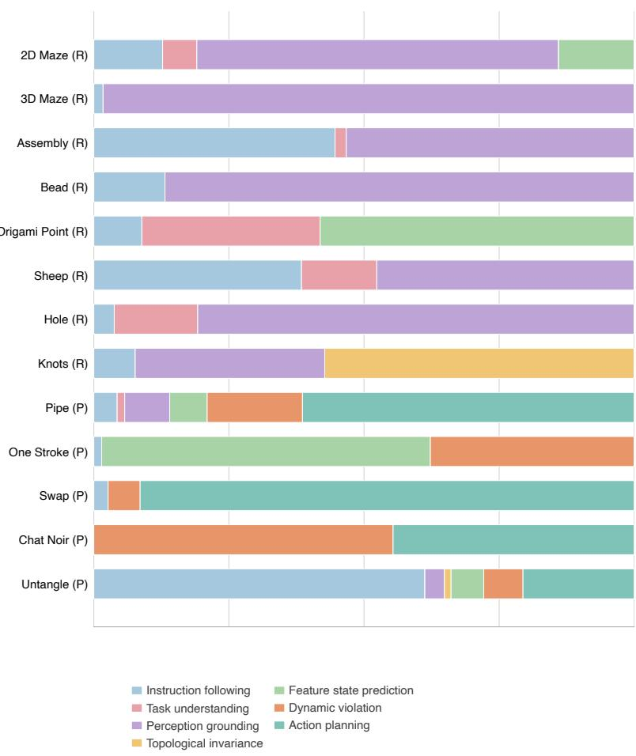  
Figure 12 | Environment-level error distributions. For each environment, errors from Gemini 3.1 Pro and InternVL3.5-241B are pooled using the number of errors as weights, and bars show the percentage assigned to each error category.

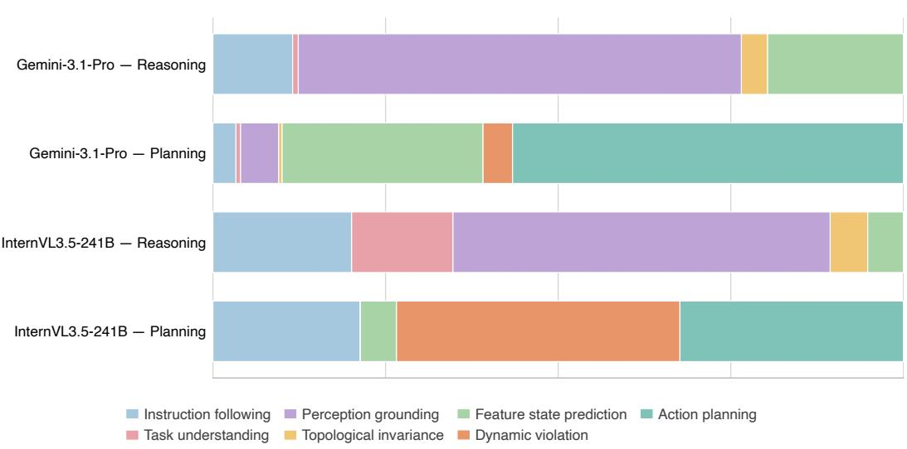  
Figure 13 | Model-level error distributions across reasoning and planning. Each bar normalizes projected category counts within one model and split.

Per-environment breakdown. Figure 12 keeps the reasoning and planning tasks within a topological property distinct, which prevents perception, invariance, state-prediction, dynamic, and planning failures from being collapsed into one aggregate error rate.

Comparison with human annotators. The same category definitions can be applied to human responses. This lets us distinguish human-like task or perception mistakes from model-specific failures such as invalid output formatting, brittle topological invariance judgments, or impossible dynamic transitions.
<table><tr><td></td><td colspan="2">Gemini-3.1-Pro</td><td colspan="2">InternVL3.5-241B</td><td colspan="2">Combined</td></tr><tr><td>Category</td><td>count</td><td>%</td><td>count</td><td> $\%$ </td><td>count</td><td>%</td></tr><tr><td>0. Instruction following</td><td>412</td><td>11.5</td><td>1253</td><td>20.1</td><td>1665</td><td>17.0</td></tr><tr><td>1. Task understanding</td><td>29</td><td>0.8</td><td>915</td><td>14.7</td><td>945</td><td>9.6</td></tr><tr><td>2. Perception grounding</td><td>2294</td><td>64.2</td><td>3408</td><td>54.6</td><td>5701</td><td>58.1</td></tr><tr><td>3. Topological invariance</td><td>136</td><td>3.8</td><td>339</td><td>5.4</td><td>475</td><td>4.8</td></tr><tr><td>4. Feature state prediction</td><td>703</td><td>19.7</td><td>322</td><td>5.2</td><td>1025</td><td>10.4</td></tr><tr><td>5. Dynamic violation</td><td>0</td><td>0.0</td><td>0</td><td>0.0</td><td>0</td><td>0.0</td></tr><tr><td>6. Action planning</td><td>0</td><td>0.0</td><td>0</td><td>0.0</td><td>0</td><td>0.0</td></tr><tr><td>Annotation projection population</td><td>3574</td><td>100</td><td>6237</td><td>100</td><td>9811</td><td>100</td></tr><tr><td>Full-benchmark errors (Table 1)</td><td>3838</td><td>一</td><td>6446</td><td></td><td>10284</td><td></td></tr></table>

Table 39 | Reasoning split, projected category counts and full-benchmark error counts. Category estimates retain the original annotation populations of 3,574 and 6,237 errors; percentages use these populations as denominators. The final row reports errors under the scoring used in Table 1, computed from its accuracies and the task sizes in Table 6. The populations differ in 3D Maze (answer normalization) and Bead (annotation/result alignment); category estimates have not been recomputed for the full-benchmark populations. Projected counts are real-valued (Appendix C.3) and rounded independently, so a displayed column can differ from its projection population by one.

<table><tr><td></td><td colspan="2">Gemini-3.1-Pro</td><td colspan="2">InternVL3.5-241B</td><td colspan="2">Combined</td></tr><tr><td>Category</td><td>count</td><td> $\%$ </td><td>count</td><td> $\%$ </td><td>count</td><td>%</td></tr><tr><td>0. Instruction following</td><td>81</td><td>3.3</td><td>629</td><td>21.4</td><td>710</td><td>13.2</td></tr><tr><td>1. Task understanding</td><td>16</td><td>0.7</td><td>0</td><td>0.0</td><td>16</td><td>0.3</td></tr><tr><td>2. Perception grounding</td><td>134</td><td>5.5</td><td>0</td><td>0.0</td><td>134</td><td>2.5</td></tr><tr><td>3. Topological invariance</td><td>12</td><td>0.5</td><td>0</td><td>0.0</td><td>12</td><td>0.2</td></tr><tr><td>4. Feature state prediction</td><td>705</td><td>29.1</td><td>154</td><td>5.2</td><td>859</td><td>16.0</td></tr><tr><td>5. Dynamic violation</td><td>104</td><td>4.3</td><td>1210</td><td>41.0</td><td>1313</td><td>24.5</td></tr><tr><td>6. Action planning</td><td>1371</td><td>56.6</td><td>954</td><td>32.4</td><td>2325</td><td>43.3</td></tr><tr><td>Total errors</td><td>2423</td><td>100</td><td>2947</td><td>100</td><td>5370</td><td>100</td></tr></table>

Table 40 | Planning split, projected error counts and percentages; rounding as in Table 39.

## D. Extended Related Work Discussion

This appendix expands the condensed Related Work in Section 4 into the longer, per-work discussion that did not fit in the main body.

Topological Cognition. Cognitive development positions topology as a primitive layer of spatial cognition that precedes projective and Euclidean reasoning. Piaget and Inhelder [3] introduced the original five-class taxonomy of proximity, separation, order, enclosure, and continuity, with subsequent mathematical and constructionist extensions by Beth and Piaget [66] and Papert [67]. Adult perception shows a related sensitivity. Chen [4, 5] showed that the visual system extracts topological invariants such as connectedness and number of holes ahead of feature-based attributes. Holes have been formalized as dependent entities by Casati and Varzi [68], with perceptual evidence on surrounded regions and hole shape from Nelson and

Palmer [69] and Bertamini and Croucher [70]. Knots constitute a distinct cognitive domain, characterized by Strohecker [11] as the “mother structure” that coordinates the other relations, and shown by Croom and Firestone [14] to strain adult intuitive physics. Hatcher [1] provides the algebraic-topology formalization, Martin [12] clarifies how Piagetian tasks map onto formal topological constructs, and Gärdenfors [71] argues that natural categories rest on topological notions such as connectedness and convexity. MINDTOPO translates this body of evidence into a unified visual taxonomy and asks whether modern foundation models exhibit the same topological primacy.

Cognitively Grounded and Topology-Adjacent Benchmarks. A closer line of work either revisits developmental psychology or tests topology through controlled spatial tasks. Piagetinspired benchmarks diagnose developmental gaps in foundation models. CogDevelop2K [72] and CogLM [73] stage tests of reversed cognitive development. ConserveBench [74] and PerspectBench [75] target conservation and perspective-taking. KiVA [76] and BabyVision [35] extend the developmental lens to visual analogy and pre-linguistic vision. These benchmarks evaluate abilities adjacent to rather than organized around topological invariants. Individual spatial tasks include path connectivity in AlphaMaze [9], knots in KnotGym [10], folding in ORIGAMISPACE [77] and GamiBench [78], abstract positional reasoning in OPTiCAL [79], and constrained-manifold puzzles in Thinking in Structures [80]. Related work also probes how vision models respond to topological and geometric concepts [36].

TopoBench is the closest recent benchmark of global topology-focused constraint solving [38]. It contains 900 instances from six grid-puzzle families at three difficulty levels. The families cover path and network connectivity, loop closure, region partitioning under rotational symmetry, reflection-based visibility, and contiguity across intersecting axes. Puzzle-specific verifiers score complete solution grids. An analysis of 750 reasoning traces identifies recurring errors, and controlled interventions show that premature commitment and constraint forgetting directly reduce downstream accuracy. Additional experiments with cell-aligned representations and structured constraint tools attribute much of the remaining difficulty to extracting constraints from spatial representations. TopoBench presents symbolic grid inputs to reasoning LLMs and does not evaluate visual perception or closed-loop action. MINDTOPO instead grounds five Piagetian properties in rendered scenes and pairs reasoning questions with interactive planning environments.

Spatial Reasoning Benchmarks for MLLMs. Most spatial-reasoning benchmarks for multimodal large language models target Euclidean and viewpoint-centric competence rather than topological invariance. Static VQA benchmarks measure metric properties such as distance, direction, and inter-object relations. SpatialVLM [6] and SpatialMQA [58] ground this line. Broader aggregations including OmniSpatial [41], SITE [40], 3DSRBench [39], SPATIAL-DISE [81], and Mind the Gap [57] expand coverage but stay within a metric grammar. CausalSpatial moves from static relations to object-centric causal anticipation [49]. Its 1,012 multiple-choice examples cover collision, occlusion, compatibility, and trajectory at two difficulty levels. Each question pairs a rendered 3D scene with a hypothetical motion that changes one or more objects. The accompanying Causal Object World model derives object trajectories and renders videos that provide additional evidence to the MLLM. CausalSpatial therefore tests whether a model can predict the visual consequence of a specified intervention, while its fixed-question protocol does not test closed-loop action selection. Cognitive-map and viewpoint-integration benchmarks such as Thinking in Space [7], MindCube [8], and Theory of Space [42] probe spatial memory and limited-view inference. Interactive evaluations including iVISPAR [44], VSP [82], and RoboSpatial [83] test multi-step spatial control and affordance use.

SpatialWorld extends interactive spatial evaluation across heterogeneous environments [45]. It contains 760 human-annotated tasks from six scenario categories that are instantiated in eight simulation backends. Agents receive only egocentric RGB observations under partial observability and express high-level decisions through a shared text-based action interface. Each task includes a human-validated initial state, a reference trajectory, and a terminal-state verifier. The benchmark evaluates 15 multimodal agents, with the strongest reaching a task success rate of 17.4%. Its categories organize application domains and action complexity rather than topological invariants. SpatialWorld therefore tests broad cross-environment interaction, while MINDTOPO pairs reasoning and planning under a five-primitive topological taxonomy. Neither SpatialWorld nor the other spatial benchmarks isolate invariants under continuous deformation. Their tasks hinge on quantitative geometry, viewpoint, intervention outcomes, or application goals rather than qualitative spatial structure.

Mechanistic studies offer a complementary account of spatial reasoning failures. Attention analysis finds that errors in spatial relation questions often coincide with attention directed toward irrelevant objects [84]. The resulting ADAPTVIS method adjusts visual attention using model confidence. This work motivates examining visual grounding alongside task accuracy, while our error annotations describe observable failures without identifying their internal attention mechanisms.

World Models and Physical Reasoning. A separate line of work evaluates MLLMs and video models as world simulators or physical reasoners, with focus on physical fidelity rather than topology preservation. World-model benchmarks such as PhyGenBench [85], Physion-Eval [86], EWMBench [87], WorldArena [88], World-in-World [89], and PhysicsMind [90] score image and video rollouts on commonsense and dynamics realism. Reasoning-oriented evaluations including MMGR [91], TiViBench [92], and VideoThinkBench [93] extend this view to multi-modal generative reasoning, and ENACT [50] casts embodied cognition as forward and inverse world modeling from egocentric interaction. Adjacent agentic benchmarks such as PhysBench [94], DeepPHY [95], and CHAIN [96] emphasize physics- and affordance-level reasoning. Phenomena such as objects passing through holes, surfaces being cut or sealed, and ropes tightening or untangling either appear only incidentally or are scored by metric and visual fidelity rather than by invariance under continuous deformation. MINDTOPO complements this line with topology-grounded probes that decouple topology preservation from physical realism, providing a controlled diagnostic for whether MLLMs internalize the qualitative structure of the physical world.

WorldAgen connects world modeling directly to action prediction through a shared model and adapts to new environments by learning from exploratory transitions at test time [97]. Its evaluation on robotic manipulation tasks addresses how improved dynamics prediction supports control. Our rollout audit examines a complementary requirement by testing whether generated state transitions obey the structural constraints of each environment.

## E. Prompt Templates

## E.1. Property-Level Prompt Templates

We use one prompt template per task type, kept fixed across all models. Representative propertylevel templates are shown below.

Figure 14 | Prompt for Continuity tasks.

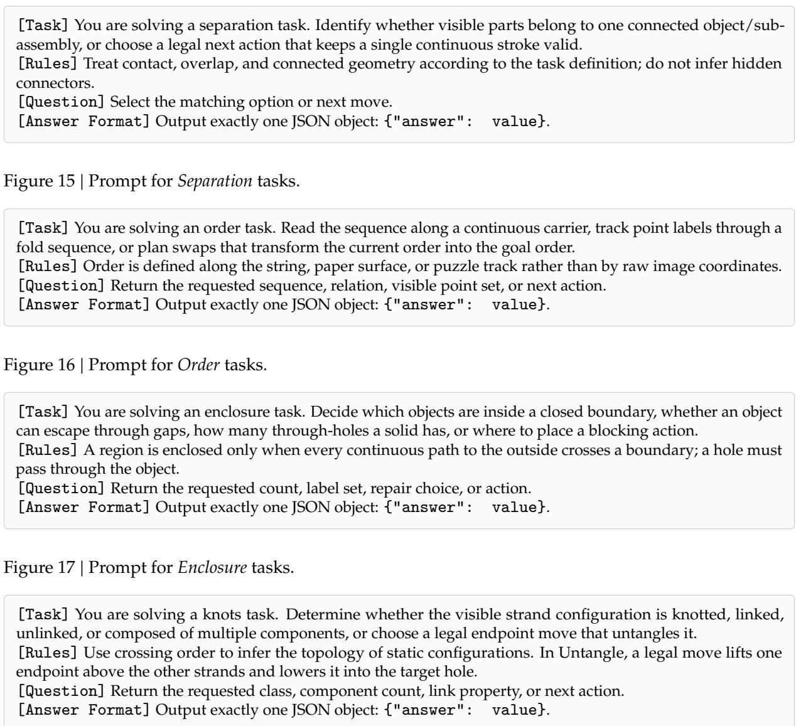  
Figure 18 | Prompt for Knots tasks.

## E.2. Task-Level Prompt Cards

The following cards reproduce the complete task-level prompts and qualitative examples, grouped by topological category and task. Each task’s full specification appears in Appendix A.

## E.2.1. Continuity

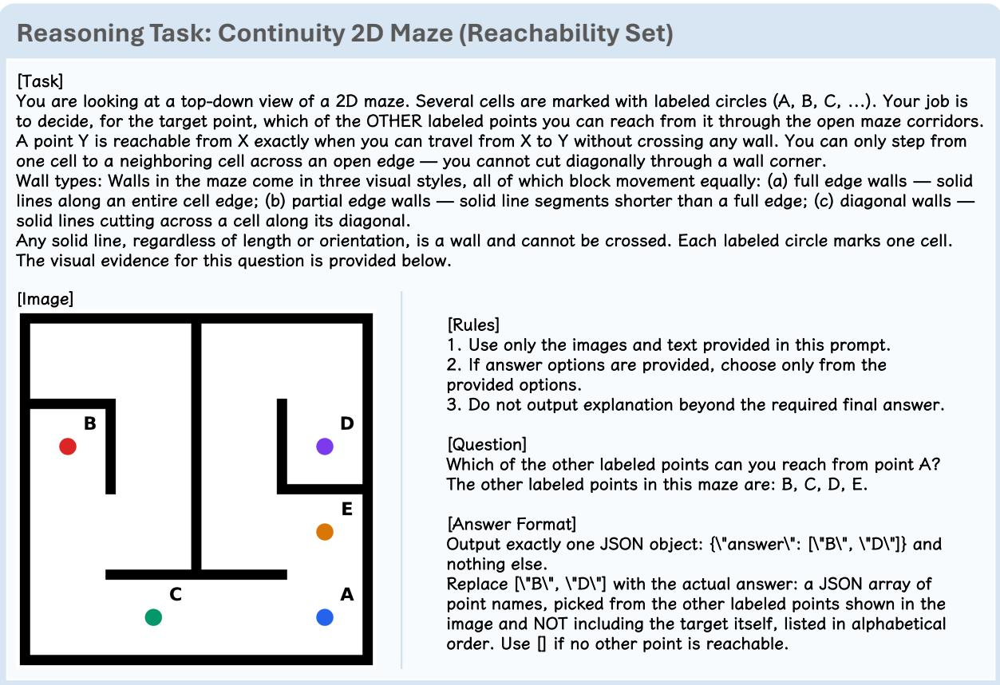  
Figure 19 | 2D Maze qualitative examples (reachability set).

## Reasoning Task: Continuity 2D Maze (Bar Removal)

## [Task]

You are looking at a top-down view of a 2D maze. Two cells are marked with labeled circles A and B; in the current maze they are blocked from each other. Some of the maze's internal walls have been recolored as colored bars (purple / red / green / blue / yellow / orange). Suppose you are allowed to remove EXACTLY ONE bar — which colors of bar, when removed alone, would let A and B reach each other? Evaluate each bar independently: imagine removing only that one bar, leave every other bar in place, and check whether a path from A to B opens up. List EVERY color that works. Wall types: Walls in the maze come in three visual styles, all of which block movement equally: (a) full edge walls — solid lines along an entire cell edge; (b) partial edge walls — solid line segments shorter than a full edge; (c) diagonal walls — solid lines cutting across a cell along its diagonal. Any solid line, regardless of length or orientation, is a wall and cannot be crossed. Each labeled circle marks one cell. A bar is a colored (non-black) wall; black walls are NOT bars. Scoring: your answer is correct ONLY if you list every color whose single-bar removal reconnects A and B — no missing colors and no extras. A partial list, an extra color, or an empty answer when at least one qualifying bar exists, all count as wrong.

The visual evidence for this question is provided below.

[Image]  
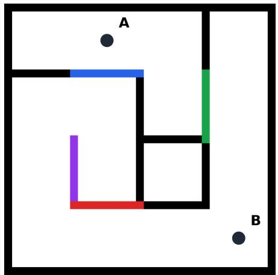  
Figure 20 | 2D Maze qualitative examples (bar removal).

## [Rules]

1. Use only the images and text provided in this prompt. 2. If answer options are provided, choose only from the provided options.

3. Do not output explanation beyond the required final answer.

## [Question]

Identify EVERY color of bar that, if removed alone, reconnects point A and point B (which are currently blocked from each other). List all qualifying colors — missing any one of them counts as wrong. The bars in this maze are colored: blue, green, purple, red.

## [Answer Format]

Output exactly one JSON object: {\"answer\": [\"green\", \"red\"]} and nothing else.\nReplace [\"green\", \"red\"] with the actual answer: a JSON array of color names from the bars shown in the image, in alphabetical order. Use [] only if NO single-bar removal connects them.

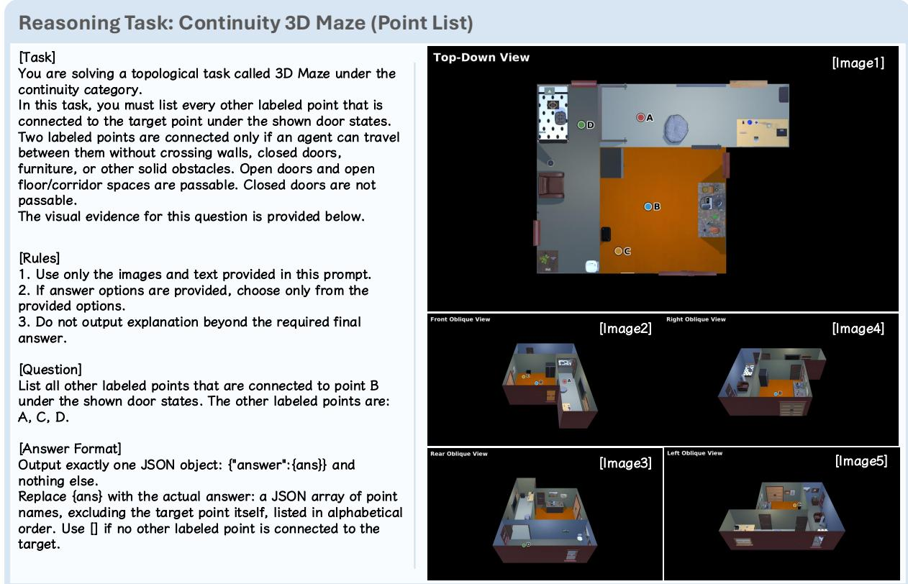  
Figure 21 | 3D Maze qualitative examples (point list).

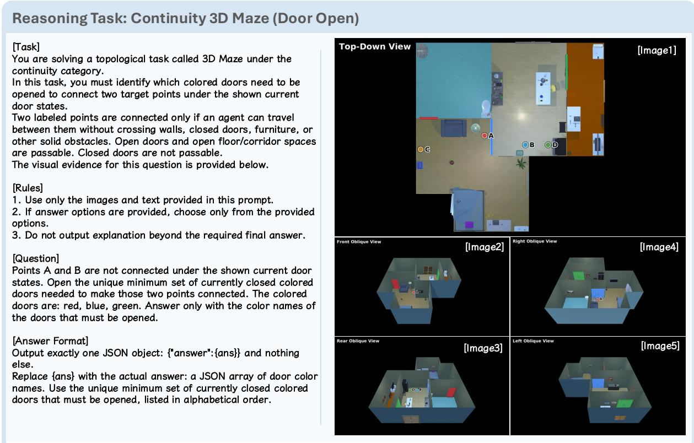  
Figure 22 | 3D Maze qualitative examples (door opening).

## Interactive Task: Continuity Pipe

## [Task]

You are solving Continuity Pipe.

In this task, you must rotate pipe pieces 90 degrees clockwise per turn until every pipe connects back to the green source.

The board is a square grid. Some cells contain rotatable pipe pieces and some cells may be empty.

The green source pipe is the starting source. Pipes connected to the source are green; pipes not connected to the source are blue.

Your goal is to rotate every non-empty pipe cell until every pipe on the board is connected to the green source. The x coordinates are shown above the grid and the y coordinates are shown on the left side of the grid. The board size is 4x4. 4x4

$$
( \mathsf { x } = 0 , \mathsf { y } = 0 ) , ( \mathsf { x } = 1 , \mathsf { y } = 0 ) , ( \mathsf { x } = 0 , \mathsf { y } = 1 ) , ( \mathsf { x } = 1 , \mathsf { y } = 1 ) , ( \mathsf { x } = 2 , \mathsf { y } = 1 ) , ( \mathsf { x } = 3 , \mathsf { y } = 1 ) , ( \mathsf { x } = 0 , \mathsf { y } = 2 ) ,
$$

To solve this task, output the next legal action for the current state.

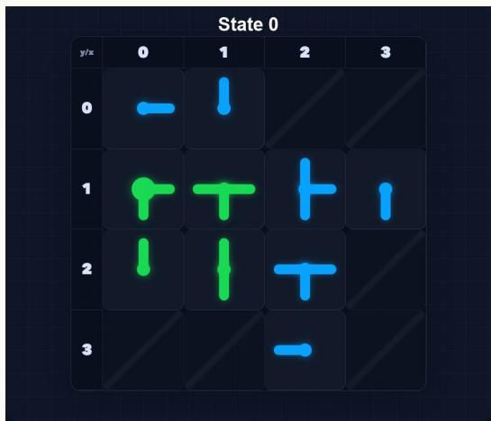  
Figure 23 | Pipe qualitative examples.

## [Rules]

1. At each turn, choose exactly one non-empty pipe cell.

2. The selected pipe rotates clockwise by 90 degrees.

3. A legal action must be one of the listed (x, y)

coordinates for the current state.

4. Empty cells are not legal actions.

5. The task succeeds when every pipe is connected to the source.

6. At each turn, output exactly one next action for the current state.

## [Answer Format]

Output exactly one JSON object: {"answer":{"x": {x}, "y": {y}}} and nothing else.

Replace {x} and {y} with the selected legal grid coordinate, wrapped inside the "answer" field.

## [Current Task]

The current state image is shown below.

## E.2.2. Separation

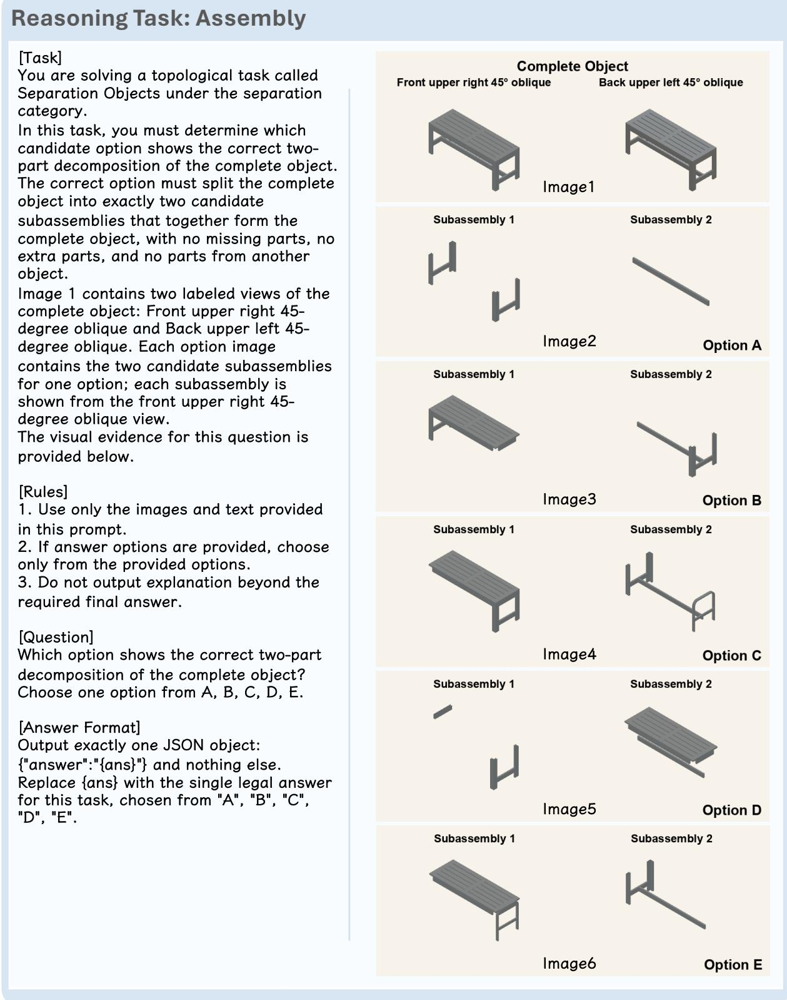  
Figure 24 | Assembly qualitative examples (bench, Sialland).

## Reasoning Task: Assembly (Bench Applaro)

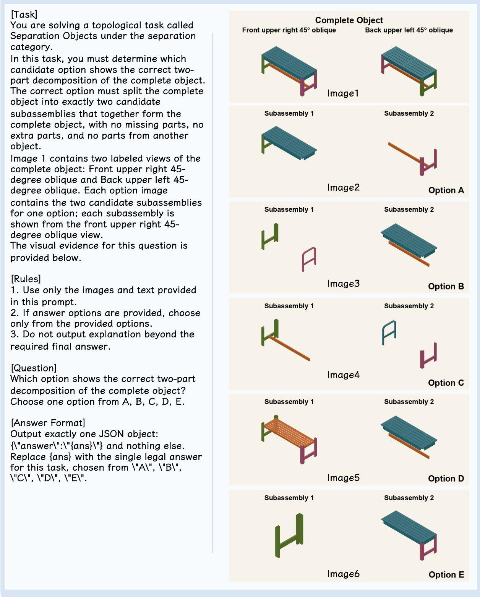  
Figure 25 | Assembly qualitative examples (bench, Applaro).

## Reasoning Task: Assembly (Chair Agam)

You are solving a topological task called Separation Objects under the separation category.

In this task, you must determine which candidate option shows the correct twopart decomposition of the complete object. The correct option must split the complete object into exactly two candidate subassemblies that together form the complete object, with no missing parts, no extra parts, and no parts from another object.

Image 1 contains two labeled views of the complete object: Front upper right 45- degree oblique and Back upper left 45- degree oblique. Each option image contains the two candidate subassemblies for one option; each subassembly is shown from the front upper right 45- degree oblique view.

The visual evidence for this question is provided below.

1. Use only the images and text provided in this prompt.

2. If answer options are provided, choose only from the provided options.

3. Do not output explanation beyond the required final answer.

Which option shows the correct two-part decomposition of the complete object? Choose one option from A, B, C, D, E.

[Answer Format]   
Output exactly one JSON object:   
{\"answer\":\"{ans}\"} and nothing   
else.\nReplace {ans} with the single legal answer for this task, chosen from \"A\", \"B\", \"C\", \"D\", \"E\".

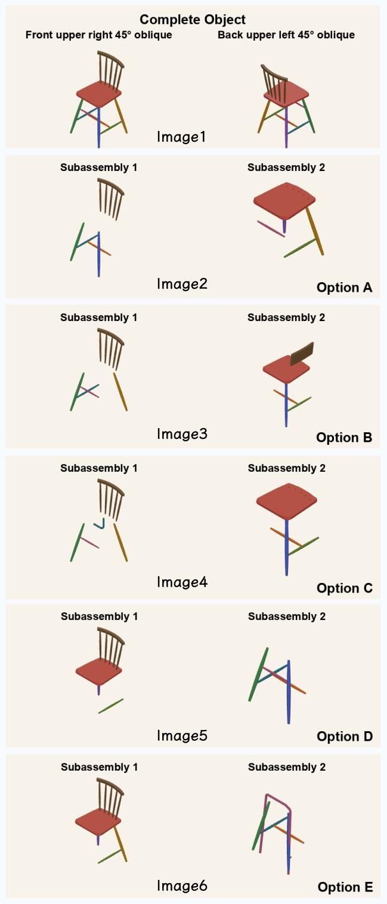  
Figure 26 | Assembly qualitative examples (chair, Agam).

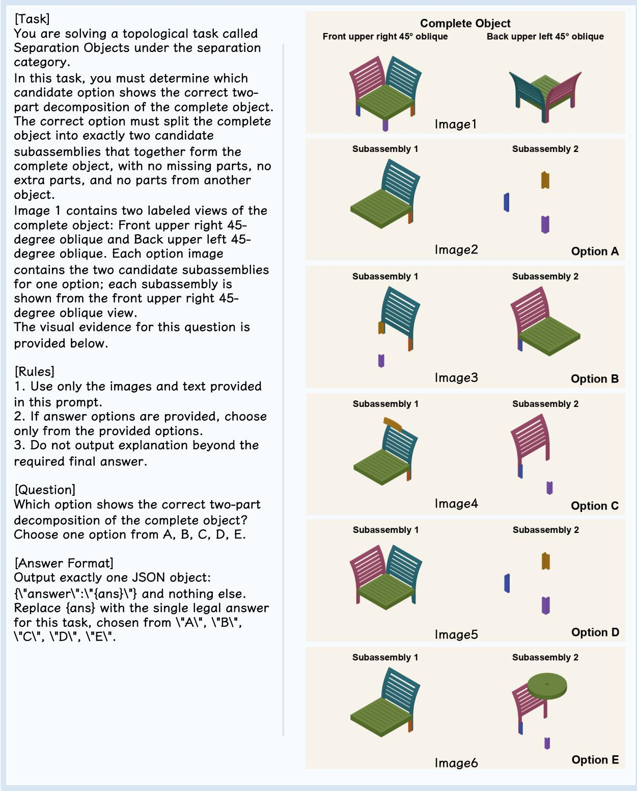  
Figure 27 | Assembly qualitative examples (chair, Applaro).

## Interactive Task: One-Stroke

[Task]

You are solving One-Stroke Color Grouping.

In this task, you must draw one continuous stroke from the bottom-left to the top-right so same-colored cells stay together and different colors are separated.

In this task, you must extend the current stroke from the bottom-left start vertex to the top-right goal vertex so that samecolored cells end up in the same region and different-colored cells end up in different regions.

In each board image, the white stroke is the current path, the green peg marks the start, and the red peg marks the goal.

Legal actions for this turn: U, R.

To solve this task, output the next legal action for the current state.

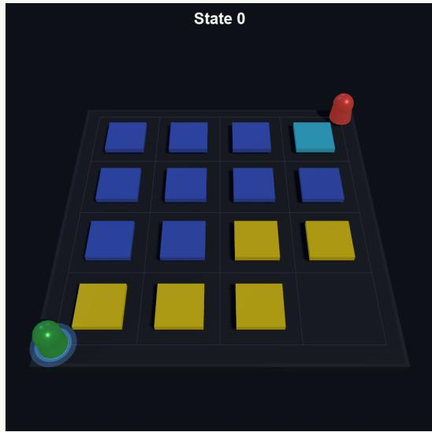  
Figure 28 | One Stroke qualitative examples.

[Rules]

1. At each turn, choose exactly one move from U, D, L, or R to extend the current stroke by one edge. U means up, D means down, L means left, and R means right.

2. A legal action must be one of the legal actions listed for the current state. You must not reuse an edge or create a closed loop. Backtracking over the most recent edge is allowed and acts like undoing the last move.

3. After each action, the environment returns the next state. Illegal actions keep the board state unchanged but still count as a step.

4. The task is solved when the stroke reaches the top-right goal vertex and the final regions satisfy the color-separation rule. 5. The episode ends when the puzzle reaches a done state or the step budget is exhausted.

6. At each turn, output exactly one next action for the current state.

## [Answer Format]

Output exactly one JSON object: {"answer":"{ans}"} and nothing else.

Replace {ans} with the single legal answer for this task, chosen from "U", "D", "L", "R", using the JSON shape {"answer":"{ans}"}.

[Current Task]

The current state image is shown below.

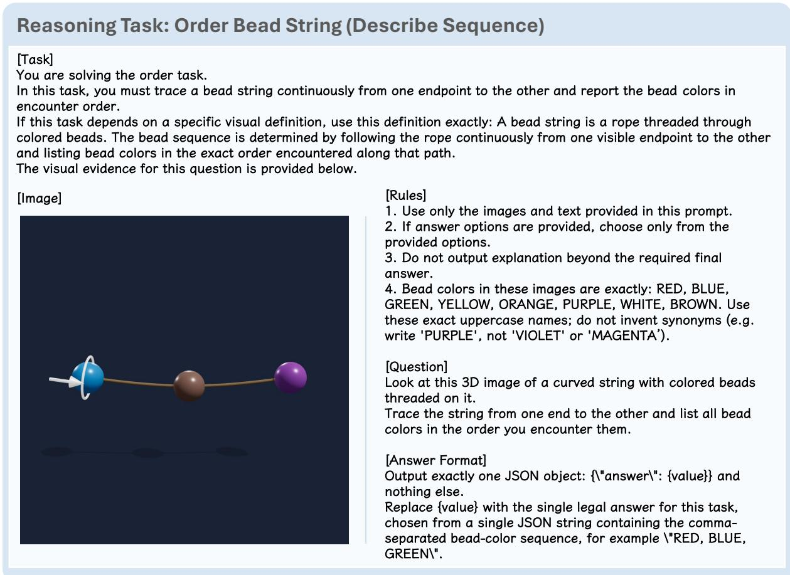  
Figure 29 | Bead qualitative examples (sequence read-out).

# Reasoning Task: Order Bead String (Pair Relationship)

## [Task]

You are solving the order task. In this task, you must compare the bead-color sequences shown in two bead-string images and classify their relationship. If this task depends on a specific visual definition, use this definition exactly: A bead string is a rope threaded through colored beads. IDENTICAL means the two sequences match exactly; REVERSED means one is the exact reverse of the other; CYCLIC\_ROTATION means one is a cyclic shift of the other; DIFFERENT means none of the above.

The visual evidence for this question is provided below.

[Image2]  
[Image1]  
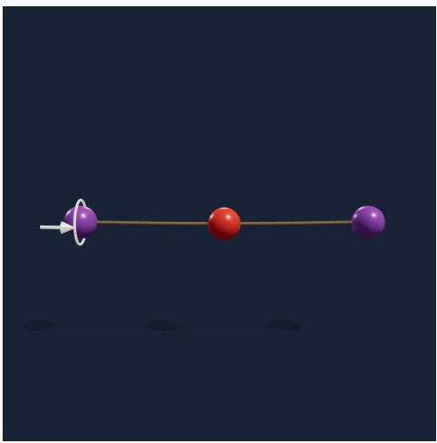

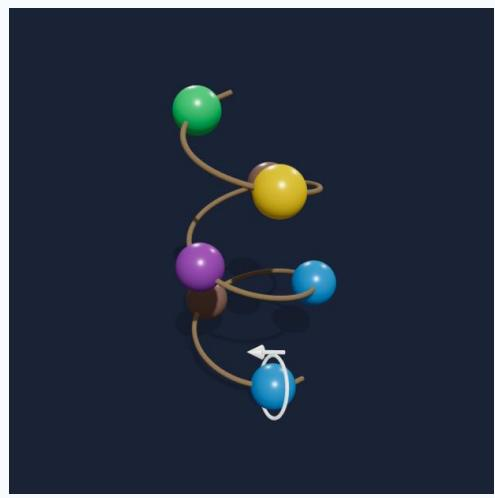  
Figure 30 | Bead qualitative examples (pair relationship).

[Rules]

1. Use only the images and text provided in this prompt.

2. If answer options are provided, choose only from the provided options.

3. Do not output explanation beyond the required final answer.

4. Bead colors in these images are exactly: RED, BLUE, GREEN, YELLOW, ORANGE, PURPLE, WHITE, BROWN. Use these exact uppercase names; do not invent synonyms (e.g. write 'PURPLE', not 'VIOLET' or 'MAGENTA’).

## [Question]

You are shown two images of bead strings. Each string has colored beads on a curved rope.

Compare the bead color sequences on both strings and determine their relationship.

Ignore the shape of the string — focus only on the sequence of bead colors.

## [Answer Format]

Output exactly one JSON object: {\"answer\": {value}} and nothing else. Replace {value} with the single legal answer for this task, chosen from one of the JSON strings \"IDENTICAL\", \"REVERSED\", \"CYCLIC\_ROTATION\", or \"DIFFERENT\".

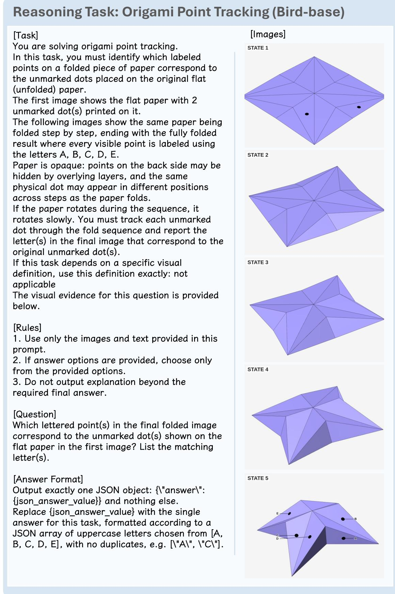  
Figure 31 | Origami Point qualitative examples (bird base) across the three difficulty tiers.

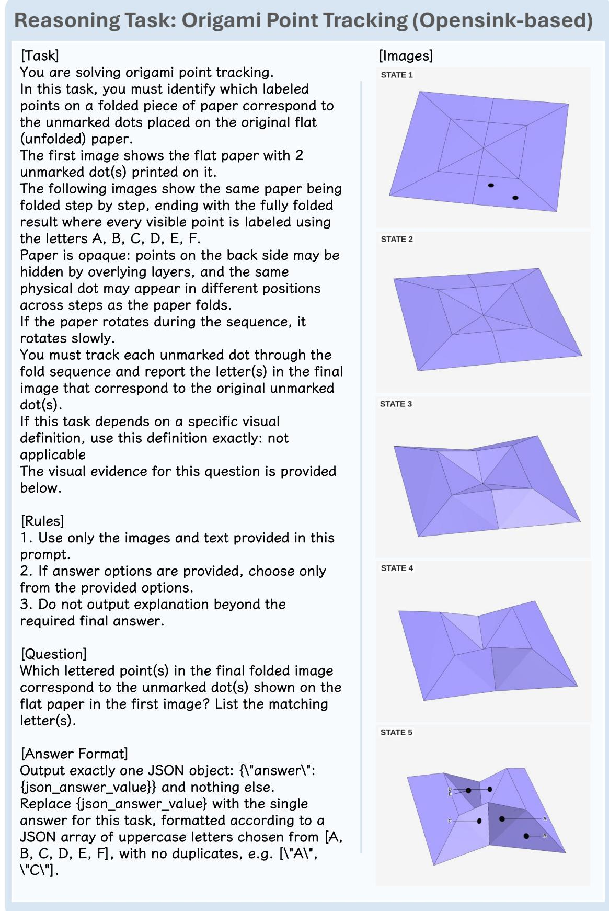  
Figure 32 | Origami Point qualitative examples (open-sink base) across the three difficulty tiers.

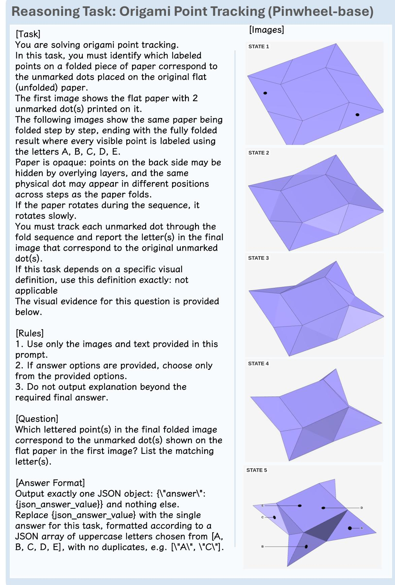  
Figure 33 | Origami Point qualitative examples (pinwheel base) across the three difficulty tiers.

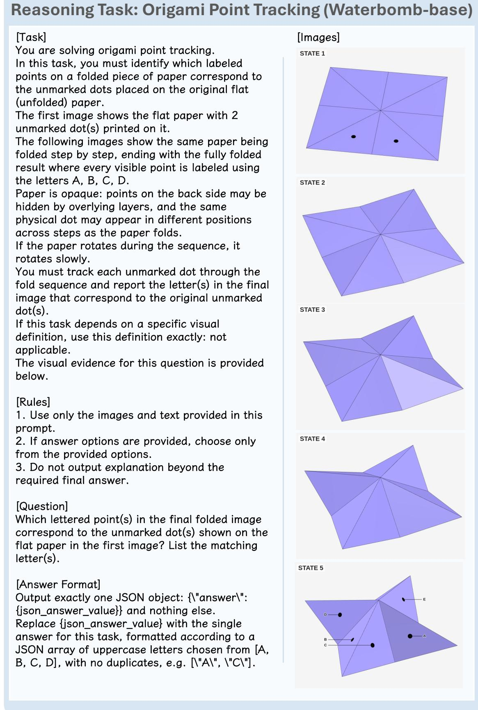  
Figure 34 | Origami Point qualitative examples (waterbomb base) across the three difficulty tiers.

## Interactive Task: Swap 2D Puzzle

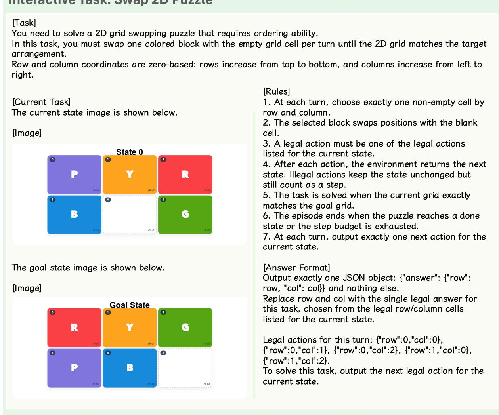  
Figure 35 | Swap 2D Puzzle qualitative examples.

## E.2.4. Enclosure

## Reasoning Task: Enclosure Hole Detection

## [Task]

You are solving a topological task called Hole Detection under the enclosure category.

In this task, you must determine how many holes are visible in a top-down image of a board. Count only openings that pass through the board to open space.

A hole is an opening that connects through the board to open space. A pit or shallow depression that does not pass through the board is not a hole.

If another board is visible beneath it, evaluate only the top board and count holes on the top board only.   
The visual evidence for this question is provided below.

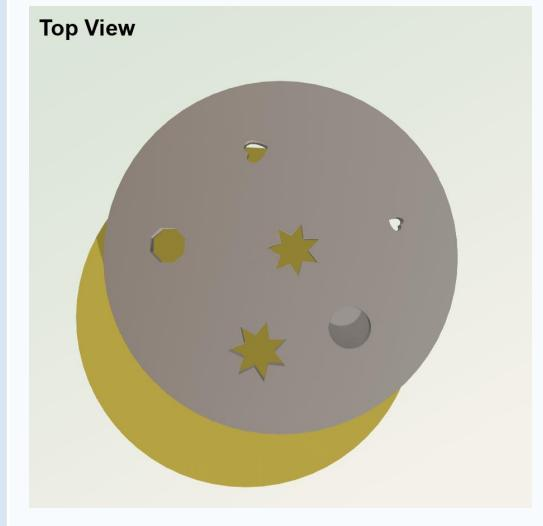  
Figure 36 | Hole qualitative examples.

[Rules]

1. Use only the images and text provided in this prompt. 2. If answer options are provided, choose only from the provided options.

3. Do not output explanation beyond the required final answer.

How many holes are visible in this top-down view of the board?

[Answer Format]

Output exactly one JSON object: {"answer":{ans}} and nothing else.

Replace {ans} with the single legal answer for this task, chosen from the valid integers for this task.

## Reasoning Task: Enclosure Sheep (Count Inside)

## [Task]

You are solving the enclosure task.

In this task, you must look at a 3D scene with fences and numbered sheep, and count how many sheep cannot escape to the outside.

If this task depends on a specific visual definition, use this definition exactly: A sheep cannot escape if it is trapped inside fences and there is no continuous path from the sheep to the outside without crossing a fence segment. Sheep already outside all fences do not count. Sheep inside a fence with a usable gap to the outside also do not count.

The visual evidence for this question is provided below.

[Image]  
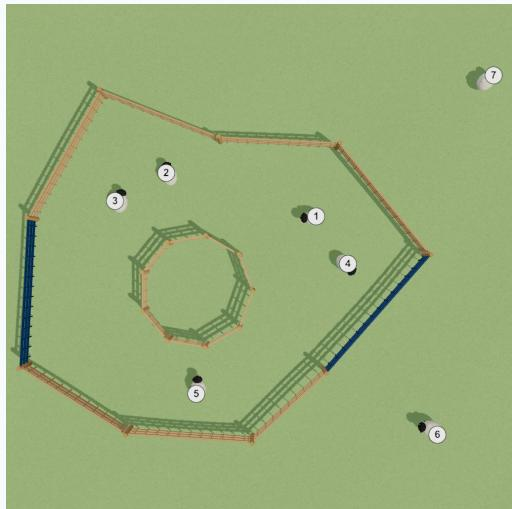  
Figure 37 | Sheep qualitative examples (enclosed count and escaping sheep).

## [Rules]

1. Use only the images and text provided in this prompt. 2. If answer options are provided, choose only from the provided options.

3. Do not output explanation beyond the required final answer.

## [Question]

How many sheep cannot escape to the outside? Count sheep that are trapped inside fences. Do not count sheep that are already outside all fences or sheep that can escape through a gap.

## [Answer Format]

Output exactly one JSON object: {\"answer\": {value}} and nothing else.

Replace {value} with the single legal answer for this task, chosen from a single JSON integer representing the count of sheep that cannot escape to the outside, for example 3.

## Reasoning Task: Enclosure Sheep (Escape Possibility)

## [Task]

You are solving the enclosure task.

In this task, you must look at a 3D scene with fences and numbered sheep, and identify which sheep can escape to the outside through fence gaps.

If this task depends on a specific visual definition, use this definition exactly: An enclosure is a closed region formed by connected fence segments. A gap is a missing fence segment that creates an opening. A sheep can escape if there exists a continuous path from that sheep to the exterior that passes only through gaps and does not cross any fence segment.

The visual evidence for this question is provided below.

[Image]  
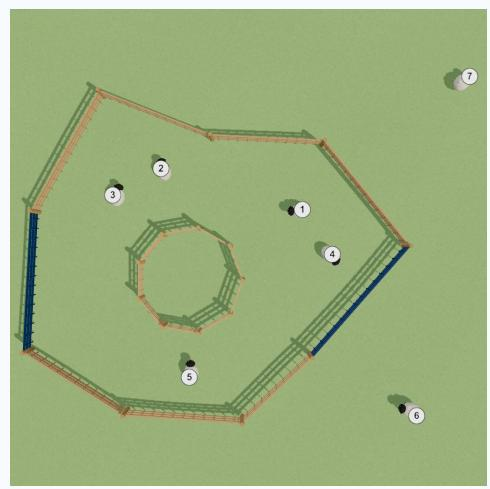  
Figure 38 | Sheep qualitative examples (escaping sheep).

## [Rules]

1. Use only the images and text provided in this prompt. 2. If answer options are provided, choose only from the provided options.

3. Do not output explanation beyond the required final answer.

## [Question]

Which sheep can escape to the outside through gaps in the fence? List their IDs.

## [Answer Format]

Output exactly one JSON object: {\"answer\": {value}} and nothing else.

Replace {value} with the single legal answer for this task, chosen from the JSON string \"NONE\" or a single JSON string containing the escaping sheep IDs in ascending order, separated by commas, for example \"1, 3, 5\".

## [Image]

## Reasoning Task: Enclosure Sheep (Max Cell Count)

## [Task]

You are solving the enclosure task.

In this task, you must look at a partitioned enclosure scene where inner fences divide the enclosure into labeled regions, and determine which region contains the most sheep.

If this task depends on a specific visual definition, use this definition exactly: A partitioned enclosure is divided into multiple labeled cells by inner fences. If multiple regions tie for the largest count, any tied label is acceptable.

The visual evidence for this question is provided below.

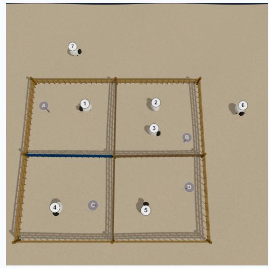  
Figure 39 | Sheep qualitative examples (densest cell and gap repair).

## [Rules]

1. Use only the images and text provided in this prompt. 2. If answer options are provided, choose only from the provided options.\n3. Do not output explanation beyond the required final answer.

## [Question]

This scene shows a partitioned fenced area with labeled regions (A, B, C, ...).

Which region contains the most sheep?

## [Answer Format]

Output exactly one JSON object: {\"answer\": {value}} and nothing else.

Replace {value} with the single legal answer for this task, chosen from a single JSON string containing one region label visible in the image, such as \"A\", \"B\", or \"C\".

## Reasoning Task: Enclosure Sheep (Fence Repair)

## [Task]

You are solving the enclosure task.

In this task, you must look at a 3D scene with a partially broken outermost fence and determine the minimum number of fence gaps that must be repaired to fully close it.

If this task depends on a specific visual definition, use this definition exactly: An enclosure is a closed region formed by connected fence segments. A gap is a missing fence segment that breaks the outermost fence. Each distinct gap counts as one repair, and the answer is the minimum number of repairs needed so that the outermost fence becomes fully closed.

The visual evidence for this question is provided below.

## [Image]

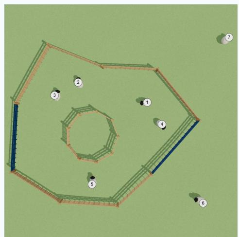  
Figure 40 | Sheep qualitative examples (gap repair).

## [Rules]

1. Use only the images and text provided in this prompt. 2. If answer options are provided, choose only from the provided options.

3. Do not output explanation beyond the required final answer.

## [Question]

What is the minimum number of fence gaps that must be repaired to fully close the outermost fence?

## [Answer Format]

Output exactly one JSON object: {\"answer\": {value}} and nothing else.

Replace {value} with the single legal answer for this task, chosen from a single JSON integer representing the minimum number of fence gaps that must be repaired, for example 2.

## Interactive Task: Enclosure Chat Noir

## [Task]

You are solving Chat Noir / Encircle the Cat.   
In this task, you must block one hex cell per turn to surround the cat before it reaches the boundary.   
In this task, you must trap the cat by blocking one open non-cat cell at each turn before the cat reaches any boundary cell.   
Each cell index is printed directly on the board image. The board radius is 3.   
The current cat index is 18.   
Legal actions for this turn: 0, 1, 2, 3, 5, 8, 9, 10, 11, 13, 14, 17, 19, 20, 22, 23, 24, 25, 27, 28, 30, 31, 33, 34, 35, 36. To solve this task, output the next legal action for the current state.

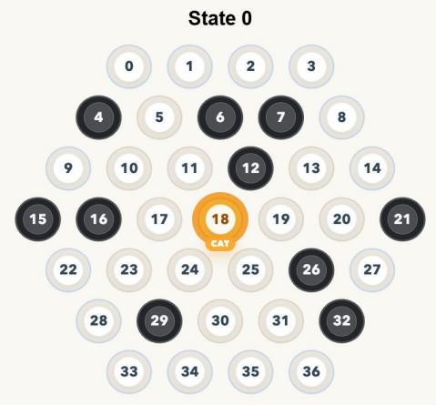  
Figure 41 | Chat Noir qualitative examples.

## [Rules]

1. At each turn, choose exactly one open non-cat cell index to block.

2. After your action, the environment applies the block and then the cat may stay still or move one hex step according to the configured cat policy.

3. A legal action must be one of the legal actions listed for the current state.

4. Illegal actions keep the state unchanged but still count as a step.

5. The task succeeds when the cat has no remaining path to any boundary cell.

6. The task fails when the cat reaches a boundary cell.

7. At each turn, output exactly one next action for the current state.

[Answer Format]   
Output exactly one JSON object: {"answer":{cell\_index}} and nothing else.   
Replace {cell\_index} with the single legal answer for this task, chosen from the legal cell indices listed for the current state, using the JSON shape {"answer":{cell\_index}}.

[Current Task] The current state image is shown below.

## E.2.5. Knots

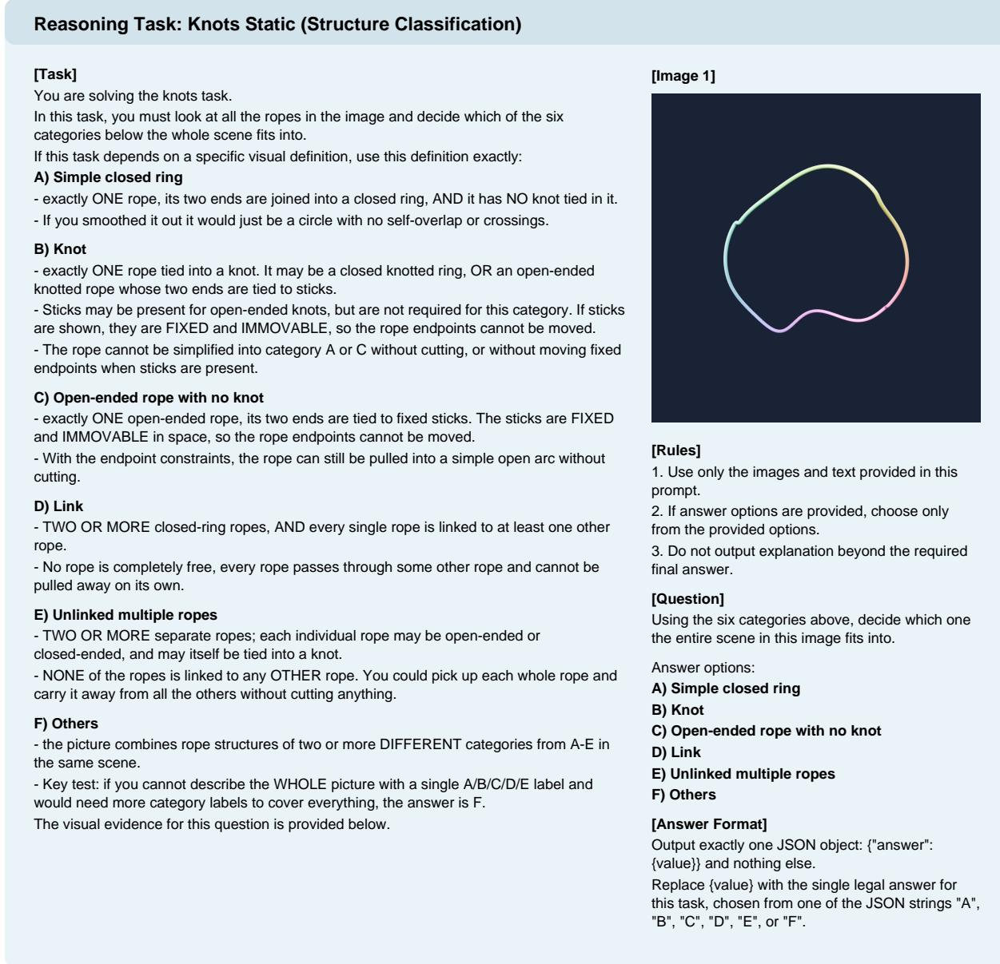  
Figure 42 | Knots qualitative examples (structure classification).

## Reasoning Task: Knots Static (Component Count)

## [Task]

You are solving the knots task.

In this task, you must count how many separate ropes are in the picture.

If this task depends on a specific visual definition, use this definition exactly: A 'rope' is a single continuous strand.

## Important:

\- If two ropes are tied together, threaded through each other, tangled up, or just lying on top of each other in the picture, they still count as TWO. We are counting physical strands, NOT how many groups would fall apart if you shook them.

\- A single rope that crosses over itself (self-crossings) is still ONE, not several ones.

The visual evidence for this question is provided below.

## [Image]

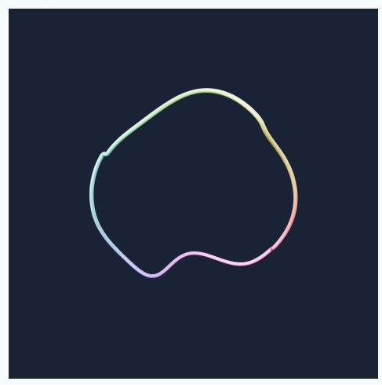  
Figure 43 | Knots qualitative examples (component count).

## [Rules]

1. Use only the images and text provided in this prompt. 2. If answer options are provided, choose only from the provided options.

3. Do not output explanation beyond the required final answer.

## [Question]

How many separate ropes are there in this image?

## [Answer Format]

Output exactly one JSON object: {\"answer\": {value}} and nothing else.

Replace {value} with the single legal answer for this task, chosen from a single non-negative JSON integer giving the number of ropes, for example 3."

## Reasoning Task: Knots Static (Link Topology)

## [Task]

You are solving the knots task.

In this task, you must look at how the rings in the image are caught onto each other and pick which pattern matches the whole picture.

If this task depends on a specific visual definition, use this definition exactly:

All ropes here are closed rings, like rings on a key chain. Two rings are 'linked' when they go through each other so they cannot be pulled apart without cutting one open.

Rings that just touch, sit next to each other, or look tangled but would slide apart with enough wiggling are NOT linked.

\- no two rings go through each other.

\- Every ring could be lifted away from all the others without cutting.

## B) Chain

\- TWO OR MORE rings are hooked together one after another, like a metal chain.

\- A two-ring paired link counts as a chain with two rings.

\- Each ring is caught only on its direct neighbour(s) in its chain group, not on rings farther down the chain.

\- If the picture contains multiple separate chain groups and no free rings or all-interlocked groups, the answer is still B.

## C) All interlocked

\- exactly THREE rings are woven together as a group.

\- Any TWO rings by themselves would NOT be caught on each other, but the three together cannot be pulled apart unless one is cut.

## D) Mixed

- no single A/B/C label describes the WHOLE picture.   
- This also includes scenes where some rings are caught together while other rings are entirely free, such as a chain plus loose rings or an all-interlocked trio plus a free ring. - This also includes scenes that combine chain-style links with all-interlocked groups. - Key test: if you cannot describe the WHOLE picture with a single A/B/C label and would need more pattern labels to cover everything, the answer is D.   
The visual evidence for this question is provided below.

Figure 44 | Knots qualitative examples (link topology).  


## [Rules]

1. Use only the images and text provided in this prompt.

2. If answer options are provided, choose only from the provided options.

3. Do not output explanation beyond the required final answer.

## [Question]

Using the four patterns above, decide which one the entire scene in this image fits into.

Answer options:   
A) Not linked   
B) Chain   
C) All interlocked   
D) Mixed [Answer Format]   
Output exactly one JSON object: {"answer":   
{value}} and nothing else.   
Replace {value} with the single legal answer for this task, chosen from one of the JSON strings "A", "B", "C", or "D".

## Reasoning Task: Knots Static (Link Property)

## [Task]

You are solving the knots task.

In this task, you must imagine cutting and removing the ring of a specified color, then list the colors of every remaining ring that is now FREE (not linked to any other remaining ring).

If this task depends on a specific visual definition, use this definition exactly: Setup:

\- Each ring in this picture has a distinct solid color, drawn from the palette: red, blue, green, brown, white, purple.

\- You will be told the color of one specific ring. Imagine you cut that ring open and pull it out of the picture.

\- Look at all the rings that REMAIN.

## Definitions:

\- 'Linked' = two rings pass through each other and cannot be pulled apart no matter how much you wiggle them; the only way to separate them would be to cut one open. Rings that just touch, sit next to each other, or look tangled but would slide apart with enough wiggling are NOT linked.

\- A remaining ring is FREE if it is not linked to ANY other remaining ring; you could pick it up and carry it away from all th e other remaining rings without cutting anything.

\- A remaining ring is NOT free if it is still linked to at least one other remaining ring.

## What to output:

\- List the colors of every remaining ring that is now FREE.

\- Use only the color names from the palette: red, blue, green, brown, white, purple.

\- The colors may be listed in any order.

\- Do NOT include the color of the ring that was removed.

\- If a remaining ring is still linked to at least one other remaining ring, do NOT include its color.

\- If NO remaining ring is free (every remaining ring is still linked to at least one other), output exactly [\"none\"]. Do NOT output an empty list.

The visual evidence for this question is provided below.

## [Image]

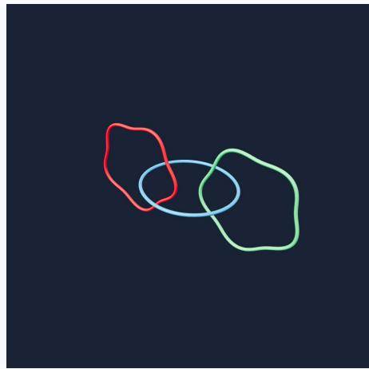  
Figure 45 | Knots qualitative examples (link property).

## [Rules]

1. Use only the images and text provided in this prompt.

2. If answer options are provided, choose only from the provided options.

3. Do not output explanation beyond the required final answer.

## [Question]

Imagine you cut and remove the red ring from this configuration. After removing it, which of the remaining rings are now FREE (not linked to any other remaining ring)? List the colors of all rings that are now free.

## [Answer Format]

Output exactly one JSON object: {\"answer\": {value}} and nothing else. Replace {value} with the single legal answer for this task, chosen from a JSON list of one or more strings drawn from {\"red\", \"blue\", \"green\", \"brown\", \"white\", \"purple\", \"none\"}; list every remaining ring that is now free; colors may appear in any order; for example [\"red\", \"blue\"]; if NO remaining ring is free output exactly [\"none\"] (never an empty list)."

## Interactive Task: Knots Untangle

You are solving Knots Untangle. In this task, you must untangle the ropes by moving one endpoint at a time so no two ropes cross.

The pegboard is a square grid of indexed holes. Each rope connects two holes. A move relocates one endpoint from its current hole to an empty hole. Two ropes count as crossing when their top-down projected paths overlap, including cases where rope bodies touch because of rope thickness.

```jsonl
Current state summary:
- State index: 0
- Difficulty: easy
- Pegboard: 5x5 grid (rows/columns 0..4)
- Coordinate convention: holes are
addressed as (row, col). Row numbers are
shown along the top edge and increase
from left to right; column numbers are
shown along the left edge and increase
from top to bottom. The top-left hole is
(row=0, col=0).
- Rope count: 4
- Crossings remaining: 1
- Goal: reduce crossings to 0
Ropes on the board:
- Rope 0 (red) endpoints at (row=0,col=1)
and (row=4,col=1)
- Rope 1 (green) endpoints at
(row=0,col=4) and (row=4,col=4)
- Rope 2 (blue) endpoints at
(row=2,col=0) and (row=4,col=2)
- Rope 3 (yellow) endpoints at
(row=0,col=3) and (row=4,col=3)
Occupied holes:
(row=0,col=1), (row=4,col=1),
(row=0,col=4), (row=4,col=4),
(row=2,col=0), (row=4,col=2),
(row=0,col=3), (row=4,col=3)
Legal actions for this turn: not provided;
infer one legal move from the current
state image and task rules
Output ONLY a single JSON object in this
exact format and nothing else:
{"answer":{"src_row":R,"src_col":C,"tgt_ro
w":R,"tgt_col":C}}
```  
Figure 46 | Untangle qualitative examples.

1. At each turn, infer one legal move from the current image and task information. No legal-action list will be provided.

2. A legal action must move one rope endpoint from an occupied source hole to an empty target hole.

3. After each action, the environment returns the next state. Illegal actions keep the board state unchanged but still count as a step.

4. The task is solved when zero crossings remain.

5. The episode ends when the puzzle is solved or when the step budget (15) is exhausted.

6. At each turn, output exactly one next action for the current state.

Output exactly one JSON object: {"answer": {value}} and nothing else. Replace {value} with the single legal answer for this task, chosen from a JSON object with integer fields "src\_row", "src\_col", "tgt\_row", and "tgt\_col" describing one legal move for the current turn, for example {"src\_row":0,"src\_col":1,"tgt\_row":2,"tgt\_col":2}.

[Current Task] The current state image is shown below.

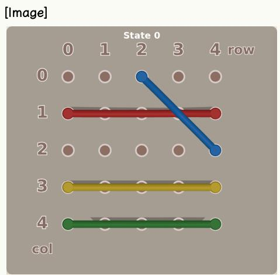

## F. The Use of Large Language Models

We used large language models (LLMs), including Google’s Gemini 3.1 Pro and OpenAI’s GPT-5.5, as auxiliary tools to assist with writing, editing, and conducting the literature review for this manuscript. All content was critically revised and fact-checked by the human authors to ensure its scientific validity and originality. The authors are fully responsible for all statements and conclusions presented in this paper.