# MMGait: Benchmarking and Unifying Gait Recognition across Heterogeneous Modalities

Saihui Hou, Member, IEEE, Chenye Wang, Qingyuan Cai, Aoqi Li, Yongzhen Huang, Senior Member, IEEE

Abstract—Gait recognition is commonly studied using RGB videos or their derived silhouettes and poses. Yet human walking produces heterogeneous photometric, geometric, and motion cues that cannot be systematically examined with RGB-centered benchmarks. We present MMGait, a large-scale multi-sensor benchmark that brings visible, infrared, depth, LiDAR, and radar observations into sequence-level correspondence. It provides diverse modalities spanning appearance, contours, geometry, motion, and body structure. Under a shared impostoraugmented protocol, we systematically evaluate single-modal recognition, cross-modal recognition via directed retrieval, and multi-modal recognition using task-specific experts. Across the evaluated settings, modality rankings vary with probe conditions, cross-modal alignment remains difficult, and fusion often provides complementary gains. This analysis also exposes a scalability problem: individual modalities, modality pairs, and fusion configurations are typically handled by separately trained experts. We therefore formulate Omni-Modal Gait Recognition, which unifies single-modal, cross-modal, and multi-modal recognition within a shared identity space. To instantiate this formulation, OmniGait++ uses modality-specific front ends followed by a shared identity encoder to preserve modality-dependent cues while learning comparable identity descriptors. An anchorguided fusion module then aggregates modality subsets of varying size without requiring frame-level synchronization. A single jointly trained checkpoint operates across the three recognition settings and accommodates modality subsets of different compositions and cardinalities. Experiments show that OmniGait++ remains competitive with task-specific experts in many shared settings and extends to higher-cardinality fusion unavailable to fixed-pair models. These results establish MMGait as a common testbed for heterogeneous gait sensing and demonstrate the feasibility of unified recognition under varying modality availability.

Index Terms—Gait Recognition, Heterogeneous Sensing, Cross-Modal Recognition, Multi-Modal Fusion.

## I. INTRODUCTION

Gait recognition identifies individuals from their walking patterns at a distance and without requiring explicit cooperation, making it attractive for non-contact biometric applications [1]. Human walking is an inherently multi-faceted physical process whose identity-related cues are conveyed through appearance, body shape, three-dimensional structure, and motion. Yet most existing studies observe this process through RGB videos or their derived modalities, particularly silhouettes [2], [3] and poses [4], [5]. Despite strong performance in controlled and unconstrained environments [6], [7], these modalities remain different abstractions of the same projected visual source. This leaves a fundamental question: given corresponding gait sequences, how discriminative is each modality, how well can heterogeneous modalities be aligned, and to what extent can they complement one another?

Existing multi-sensor benchmarks cannot adequately answer this question because their sensing breadth remains limited. Earlier datasets provide heterogeneous or non-RGB observations but contain only a few hundred identities and offer sparse view coverage [8], [9]. Recent benchmarks increase the population to more than one thousand identities, but largely concentrate on RGB–LiDAR sensing [10], [11]. Consequently, photometric, geometric, and motion-related cues are rarely observed together for the same identities, walking conditions, and viewpoints, making their discriminability, redundancy, and complementarity difficult to study systematically.

To overcome this bottleneck, we present MMGait, a largescale multi-sensor gait benchmark comprising 1,015 identities, five sensing streams, twelve gait modalities, ten walking directions, and three walking conditions. After quality control, MMGait contains 482,327 gait-sequence instances spanning visible and infrared (IR) appearance, body contours, dense depth, 3D point clouds, projected geometry, event-based motion, and 2D/3D pose. By bringing these photometric, geometric, and motion-related observations together with sequencelevel correspondence, MMGait provides a common testbed for examining how heterogeneous gait cues differ, align, and complement one another.

Using this common data foundation, we establish a unified, impostor-augmented protocol to evaluate heterogeneous gait sensing in three settings: single-modal recognition for standalone discriminability, cross-modal recognition via directed retrieval for identity alignment, and multi-modal recognition via cue fusion for complementarity. We benchmark all twelve modalities individually and, given the rapidly growing configuration space, representative directed cross-modal retrieval tasks and two-modality fusion configurations using task-specific experts. Results show that robustness varies across modalities and probe conditions, cross-modal alignment remains challenging and pair-dependent, and fusion often provides substantial gains over individual modalities. Together, these findings show that a gait modality’s utility reflects its standalone discriminability, cross-modal compatibility, and complementarity

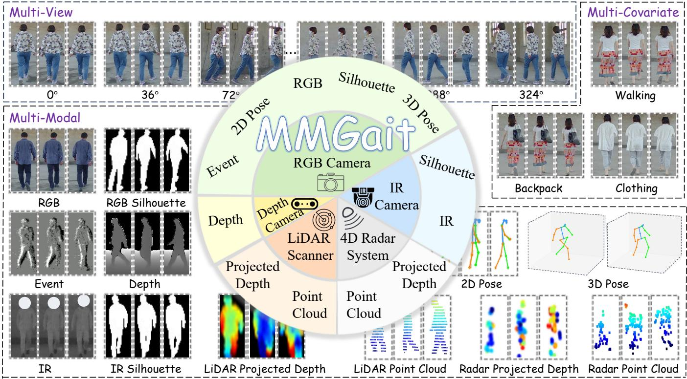  
Fig. 1. Overview of MMGait. Five sensing streams provide twelve raw or derived gait modalities across ten views and three walking conditions

with other sensing cues.

This systematic evaluation also exposes a deeper scalability problem: each single modality, cross-modal pair, and fusion subset is typically handled by a separately trained expert. The number of such models grows rapidly as the supported modality set expands, making exhaustive development and deployment impractical. We therefore formulate Omni-Modal Gait Recognition, which treats the input as a set of available modalities rather than a fixed modality configuration and learns one shared identity space for single-modal recognition, cross-modal recognition, and multi-modal recognition. Its central challenge is to preserve the distinctive physical information of each modality while maintaining identity comparability as the number and composition of the available inputs change.

To address this challenge, we propose OmniGait++. Unlike conventional methods designed for a predefined modality or modality combination, OmniGait++ supports different modality subsets within a unified model. Its modality-specific encoders preserve distinctive input characteristics, while shared representation learning maps heterogeneous observations into a common identity space. When multiple modalities are available, an adaptive fusion module integrates their features and recalibrates their contributions according to the modality combination. We evaluate a single jointly trained model across 9 single-modal settings, 12 directed cross-modal retrieval tasks, and 19 variable-cardinality fusion configurations. Single-modal recognition, cross-modal recognition, and multimodal recognition thus become different operating settings of one shared framework rather than separate models.

In summary, our contributions are threefold:

• We construct MMGait, a large-scale benchmark that contains five heterogeneous sensing streams and provides twelve gait modalities for 1,015 identities. Its dense crossview coverage and sequence-level correspondence enable physically different gait cues to be studied within one common experimental basis.

• We establish a common, impostor-augmented evaluation across single-modal recognition, cross-modal recognition, and multi-modal recognition. Beyond ranking individual modalities, the resulting study characterizes their robustness across probe conditions, cross-modal identity compatibility, and complementary value.

• We formulate Omni-Modal Gait Recognition and propose OmniGait++, whose shared identity learning and adaptive variable-cardinality fusion enable a single jointly trained model to support single-modal recognition, crossmodal recognition, and multi-modal recognition across different modality subsets.

This article substantially extends our preliminary conference work [12] along the data, evaluation, and modeling dimensions. First, we re-audit the original 725-participant collection for multi-sensor recording completeness, retain recordings from 685 participants, and add data from 330 newly recorded participants, producing a 1,015-identity benchmark with improved data completeness. Second, we introduce an impostoraugmented evaluation protocol and re-run all single-modal, cross-modal, and multi-modal experiments on the expanded benchmark rather than reusing conference results. Third, we formulate Omni-Modal Gait Recognition and implement it by extending the pairwise OmniGait model to OmniGait++ with adaptive variable-cardinality fusion. We also establish a 19-configuration registry for evaluating variable-cardinality fusion. Together, these additions provide a substantially expanded benchmark, a more challenging evaluation protocol, and a unified model for variable-cardinality fusion.

## II. RELATED WORK

## A. Gait Recognition with Diverse Modalities

Binary silhouettes remain the dominant gait modality because they suppress appearance and background details while preserving body shape and motion. GaitSet treats a sequence as an unordered set [2], whereas GaitPart learns localized temporal patterns from horizontal body regions [13]. GaitGL subsequently combines global and local representations [14]. More recent studies revisit general-purpose architectures at larger scales: GaitBase establishes a strong convolutional baseline, and DeepGaitV2 examines the effect of network depth [3], [15]. Other methods improve robustness through causal analysis, motion modeling, or clothing-related representation learning [16]–[20]. Despite this progress, silhouettes depend on foreground segmentation. They also discard texture, depth, and other physical measurements.

Pose modalities provide a complementary description based on body joints and their temporal dynamics. PoseGait extracts identity cues from estimated 3D joint trajectories [4], while GaitGraph and GaitGraph2 model skeleton sequences as spatio-temporal graphs [21], [22]. GPGait introduces humanprior-guided pose modeling [23], and subsequent studies improve pose estimation or temporal representation [24], [25]. SkeletonGait instead renders poses as heatmaps, retaining spatial structure for convolutional processing [5]. Pose is compact and less dependent on texture, but recognition remains sensitive to estimation errors under occlusion, low resolution, or unusual viewpoints.

Recent work broadens gait recognition toward appearance, spectral, temporal, geometric, and radio-frequency information. RGB retains texture and color. BigGait and BiggerGait use large vision models to extract gait-related features from RGB videos [6], [7]. Infrared imaging supplies spectrumdependent appearance under weak visible illumination [8]. Event-based approaches emphasize temporal changes: Edino-Gait studies event representation learning [26], while Event-Gait separates high-frequency motion and shape cues [27]. Depth cameras provide dense geometry with reduced dependence on texture [28]. PointGait processes 3D point-cloud sequences [29], whereas LidarGait and LidarGait++ develop LiDAR-specific representations [10], [30]. Radar further captures motion responses relevant to gait identification under weak visual conditions [31]. These sensing mechanisms expose complementary physical properties, yet they are generally studied on separate datasets with dedicated models. Controlled comparison and joint modeling across heterogeneous sensing modalities therefore remain difficult.

## B. Cross-Modal, Multi-Modal, and Unified Gait Recognition

Cross-modal gait recognition matches a probe in one modality against a gallery represented in another and is typically evaluated through directed retrieval. Existing gait methods mainly study this task between cameras and LiDAR. CrossGait learns modality-shared prototypes and feature adapters [32], whereas CL-Gait uses contrastive pre-training with paired silhouettes and synthetic point clouds [33]. TCFDNet further employs text-guided feature disentanglement to separate shared identity information from modality-specific characteristics [34]. These methods improve 2D–3D alignment, and some also preserve within-modality recognition. Their cross-modal components, nevertheless, remain optimized for a predefined modality pair.

Multi-modal gait recognition instead exploits complementary observations that are simultaneously available. MMGait-Former and TriGait combine silhouette–pose cues through multi-branch architectures [35], [36]. MultiGait++ investigates shared and distinctive information in silhouettes, human parsing, and optical flow [37]. Beyond RGB-derived modalities, EMGaitNet integrates camera–LiDAR observations using semantic guidance [38]. These methods establish the value of complementary observations, but most assume a fixed pair or a small predetermined modality set. UGaitNet relaxes this assumption by accepting a variable number of grayscale, optical flow, depth, or silhouette inputs [39]. Its inputs, however, remain primarily camera-centric.

Beyond gait recognition, person ReID provides related progress toward a common identity space across heterogeneous inputs. All-in-One learns consistent representations from RGB, infrared, sketch, and text through a modality-aware shared model [40]. ReID5o introduces a five-modality benchmark and expert routing for variable query combinations [41]. These studies demonstrate the feasibility of unified identity modeling, but they primarily concern appearance-based or semantic inputs. Multi-sensor gait introduces further physical heterogeneity because its modalities encode spectrumdependent appearance, geometry at different densities, sparse motion responses, or body structure. Existing methods thus cover only part of the target task space. Omni-Modal Gait Recognition instead unifies single-modal recognition, crossmodal recognition, and multi-modal recognition over variablecardinality modality subsets within a shared identity space.

## C. Gait Recognition Benchmarks

Controlled RGB benchmarks established the standard settings for cross-view and cross-condition gait recognition [42], [43]. CASIA-B includes normal walking, bag carrying, and clothing change across multiple views [44], whereas OU-MVLP substantially increases the population scale for crossview evaluation [45]. CCPG emphasizes clothing variation [46]. CCGR provides larger-scale cross-view and crosscondition observations [47]. Gait3D and GREW extend gait recognition to unconstrained scenes, trajectories, and pedestrian appearances [48], [49]. These benchmarks have driven substantial progress, but their commonly used modalities are predominantly derived from RGB videos.

Non-RGB and multi-sensor benchmarks broaden the sensing scope. CASIA-C provides thermal-infrared sequences captured at night [8], while TUM-GAID combines RGB, depth, and audio observations [9]. SUSTech1K provides synchronized camera–LiDAR data for point-cloud gait recognition [10]. FreeGait extends camera–LiDAR acquisition to unconstrained outdoor trajectories [11], whereas LRGait emphasizes synchronized long-range and cross-distance sensing [38]. These datasets demonstrate the value of cross-spectrum or 3D observations, but each covers only a limited portion of the sensor combinations encountered in heterogeneous perception systems. MMGait instead combines broader sensing diversity with dense multi-view coverage and sequence-level correspondence under a unified evaluation framework, enabling controlled comparison of physically different gait modalities.

TABLE I  
SPECIFICATIONS OF THE FIVE SENSING STREAMS AND THEIR TWELVERAW OR DERIVED MODALITIES IN MMGAIT.
<table><tr><td>Sensor</td><td>Range</td><td>Resolution</td><td>Modalities</td></tr><tr><td>RGB</td><td>0.4–10 m</td><td>1280×800</td><td>RGB, RGB Silhouette, 2D/3D Pose, Event</td></tr><tr><td>IR</td><td>0.4–10 m</td><td>1280×700</td><td>IR, IR Silhouette</td></tr><tr><td>Depth</td><td>0.4–10 m</td><td>1280×800</td><td>Depth</td></tr><tr><td>LiDAR</td><td>0.5–100 m</td><td>128 beams</td><td>Point Cloud, Projected Depth</td></tr><tr><td>4D Radar</td><td>0.2–170 m</td><td></td><td>Point Cloud, Projected Depth</td></tr></table>

## III. MMGAIT BENCHMARK

MMGait is a large-scale multi-sensor gait benchmark containing 1,015 identities and 482,327 released gait sequences. As illustrated in Fig. 1, the benchmark provides five sensing streams: RGB, depth, IR, LiDAR, and 4D radar. These streams are processed into twelve gait modalities spanning visible and IR appearance, body contours, 2D/3D pose, dense depth, 3D point clouds, projected geometry, and event-based motion. Each participant is recorded from ten walking directions under normal walking, backpack carrying, and clothing change. MMGait therefore jointly provides population scale, multiview coverage, and sensing diversity for studying single-modal recognition, cross-modal recognition, multi-modal recognition, and unified Omni-Modal Gait Recognition.

## A. Multi-Sensor Data Acquisition

Table I summarizes the sensor specifications and resulting gait modalities. The RGB and depth streams are captured using an Orbbec Gemini 2 XL RGB-D camera module [50]. The RGB stream records visible appearance, whereas the infrared-enhanced stereo depth stream captures dense body geometry with reduced dependence on texture. IR videos are recorded by an independent industrial camera operating at a 940-nm narrowband wavelength. The 940-nm wavelength was selected to reduce interference from the LiDAR laser while providing spectrum-dependent appearance under weak visible illumination. The LiDAR stream is acquired using an Ouster OS0-7 scanner [51], which records 3D point clouds. The GPAL Ares-R7861 4D radar [52] provides sparse point clouds that encode complementary spatial and motion responses.

Using this acquisition system, participants walk along the five-pointed-star route shown in Fig. 2. The route produces ten walking directions distributed over a full circle at intervals of approximately 36◦. Each walking direction is assigned a view label according to its orientation relative to the fixed sensing system. Each participant is recorded four times while walking the full route under three walking conditions: twice during normal walking, once while carrying a backpack, and once after a clothing change. Each full-route recording is divided into ten direction-specific gait sequences following the predefined route segments. The resulting sequences have four sequence types—NM-01 and NM-02 for normal walking, BG-01 for backpack carrying, and CL-01 for clothing change—and each sequence inherits the view label of its walking direction. Participants use their own backpacks and independently change both upper and lower garments, introducing natural intra-condition diversity instead of using a single standardized accessory or outfit.

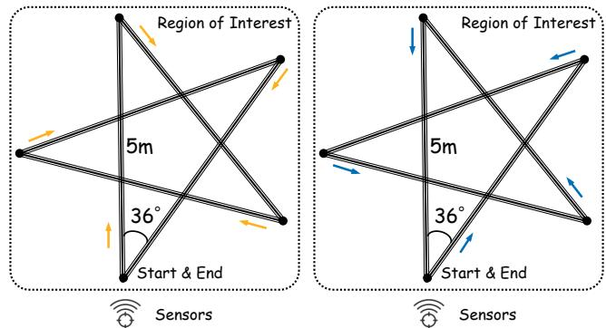  
Fig. 2. Five-pointed-star route used for MMGait acquisition. The two panels show opposite traversals of five segments, together yielding ten walking directions at approximately 36◦ intervals relative to the fixed sensing system.

During each recording, the five sensing streams observe the same participant under a common walking condition. RGB and depth originate from the same RGB-D module, whereas the IR, LiDAR, and radar streams use separate acquisition interfaces without a common hardware trigger or time base. MMGait therefore retains the native sequences and associates them at the sequence level using the identity label, sequence type, and view label, without imposing potentially inaccurate frame-level alignment. This design supports cross- and multimodal recognition without frame-level synchronization.

## B. Data Processing and Statistics

Because the sensing mechanisms and data structures differ substantially, we construct a stream-specific processing pipeline for each sensing stream. The pipelines transform the raw recordings into modality-specific gait sequences while preserving the physical characteristics of individual modalities.

RGB camera. We first apply pedestrian tracking [53] to obtain human bounding boxes from RGB videos. The resulting boxes are used to crop the RGB appearance sequences. Within each box, a segmentation model extracts the corresponding binary silhouette [54]. Beyond appearance and silhouette extraction, the RGB videos are also used to derive pose and event data. Pose estimators generate the 2D and 3D pose sequences [55], [56], while V2E [57] converts the RGB videos into event sequences.

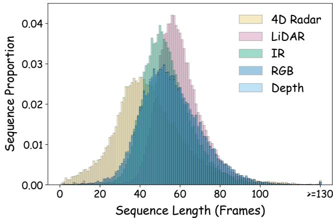  
Fig. 3. Sequence-length distributions of MMGait across sensing streams.

IR camera. Pedestrian tracking is performed independently on the IR videos to obtain human bounding boxes. The boxes are used to crop the IR appearance sequences, while pedestrian segmentation within each box produces the corresponding binary silhouettes.

Depth camera. Because RGB and depth are captured by the same RGB-D module, we transform the RGB-derived bounding boxes into depth-image coordinates and use them to crop the corresponding human depth regions.

LiDAR scanner. We first crop the LiDAR scans to the predefined region of interest covering the walking route. Ground points are removed using Patchwork++ [58], followed by density-based filtering [59] to suppress scattered noise and irrelevant objects. The filtered points form LiDAR point-cloud sequences and are further converted into 2D projected-depth maps following established LiDAR gait processing [10].

4D radar. For the radar stream, we use the corresponding walking-area region of interest to discard off-route detections. The retained sparse detections form radar point-cloud sequences, from which 2D projected-depth maps are generated using the LiDAR projection procedure described above.

After the stream-specific processing described above, the resulting sequence-length distributions vary across sensing streams, as shown in Fig. 3. This variation reflects differences in acquisition rates and independently determined temporal boundaries. Consistent with the sequence-level association described in the preceding subsection, the released sequences retain their original frame counts and are not temporally resampled to a uniform length. Beyond these within-dataset statistics, Table II compares MMGait with representative gait benchmarks. Notably, MMGait complements existing benchmarks with controlled ten-direction observations from five heterogeneous sensing streams under a common identity and condition structure.

## C. Unified Evaluation Protocols

We use an identity-disjoint split, with 300 identities for training and the remaining 715 for testing. To isolate the effect of gallery composition, we define two protocols that share the same probes and positive templates but differ in their non-target samples. Protocol V1 evaluates matching against a compact, view-specific normal-walking template gallery, whereas Protocol V2 evaluates robustness to a substantially larger impostor gallery.

Both protocols apply to single-modal recognition, crossmodal recognition, and multi-modal recognition. Cross-modal recognition is evaluated as directed probe-to-gallery retrieval. We denote the evaluated modality configuration—a single modality, an ordered probe–gallery modality pair, or a modality subset, respectively—by c. Let $\mathcal { X } _ { g } ^ { ( c ) }$ denote the available gallery-side test instances under c. Each $x _ { i } \in \mathcal { X } _ { g } ^ { ( c ) }$ has identity label $y _ { i }$ , view label $v _ { i }$ , and sequence type $s _ { i }$

BG-01 and CL-01 instances in the probe-side configuration serve as queries. For a query with identity label $y$ and a designated template view $v _ { t } ,$ its available NM-01 and NM-02 gallery-side instances with identity label y at $v _ { t }$ are positive. Separate $1 0 \times 1 0$ probe-view-by-template-view matrices are constructed for BG and CL. Rank-1 accuracy and average precision (AP) are computed for each query against the protocol-specific gallery and averaged within each matrix cell. To focus on cross-view performance, the final Rank-1 accuracy and mean average precision (mAP) are obtained by uniformly averaging the off-diagonal cells.

1) Protocol V1: Template-Only Gallery: Let $\begin{array} { r l } { S _ { \mathrm { { N M } } } } & { { } = } \end{array}$ {NM-01, NM-02} denote the normal-walking sequence types. For a positive-template view $v _ { t }$ , the gallery contains the available templates of all test identities at that view:

$$
\mathcal { G } _ { \mathrm { V 1 } } ^ { ( c ) } ( v _ { t } ) = \{ x _ { i } \in \mathcal { X } _ { g } ^ { ( c ) } \mid v _ { i } = v _ { t } , \ s _ { i } \in S _ { \mathrm { N M } } \} .\tag{1}
$$

2) Protocol V2: Impostor-Augmented Gallery: For a query with identity label y and a positive-template view $v _ { t } ,$ , Protocol V2 augments the V1 gallery with every available galleryside instance from non-target identities, regardless of view or sequence type:

$$
\mathcal G _ { \mathrm { V 2 } } ^ { ( c ) } ( y , v _ { t } ) = \mathcal G _ { \mathrm { V 1 } } ^ { ( c ) } ( v _ { t } ) \cup \{ x _ { i } \in \mathcal X _ { g } ^ { ( c ) } \mid y _ { i } \neq y \} .\tag{2}
$$

All other instances with identity label $y ,$ including normalwalking templates at other views, are excluded. Thus, the positive set remains identical to that of Protocol V1.

## D. Ethics, Privacy, and Responsible Use

Consent and Pseudonymization. Participation was voluntary, and all participants provided written informed consent before recording. The consent procedure explicitly covered the collection of multi-sensor gait data, its use in academic research and publications, and its release to qualified researchers. Direct personal identifiers and demographic attributes are not included in the released benchmark. Dataset annotations identify each participant only by a pseudonymous participant ID. No mapping between these IDs and participants’ realworld identities is retained.

Controlled Access and Permitted Use. MMGait is distributed through an application process rather than unrestricted public download. Applicants must identify their institutional affiliation and intended research purpose and agree to the dataset license before access is granted. The license restricts the benchmark to research use and prohibits redistribution.

TABLE II  
COMPARISON OF MMGAIT WITH REPRESENTATIVE GAIT-RECOGNITION BENCHMARKS.
<table><tr><td>Dataset</td><td>Year</td><td>Identities</td><td>Views</td><td>Sequences</td><td>Sensing Streams</td><td>Highlights</td></tr><tr><td>CASIA-B [44]</td><td>2006</td><td>124</td><td>11</td><td>13,640</td><td>RGB</td><td>Cross-View and Covariates</td></tr><tr><td>OU-MVLP [45]</td><td>2018</td><td>10,307</td><td>14</td><td>288,596</td><td>RGB</td><td>Cross-View</td></tr><tr><td>GREW [49]</td><td>2021</td><td>26,345</td><td>882</td><td>128,671</td><td>RGB</td><td>In-the-Wild</td></tr><tr><td>Gait3D [48]</td><td>2022</td><td>4,000</td><td>39</td><td>25,309</td><td>RGB</td><td>In-the-Wild</td></tr><tr><td>CCPG [46]</td><td>2023</td><td>200</td><td>10</td><td>16,566</td><td>RGB</td><td>Clothing Change</td></tr><tr><td>CCGR [47]</td><td>2024</td><td>970</td><td>33</td><td>1,580,617</td><td>RGB</td><td>Cross-Condition</td></tr><tr><td>CASIA-C [8]</td><td>2006</td><td>153</td><td>1</td><td>1,530</td><td>Thermal Infrared</td><td>Nighttime Thermal</td></tr><tr><td>TUM-GAID [9]</td><td>2012</td><td>305</td><td>1</td><td>3,370</td><td>RGB, Depth, Audio</td><td>RGB-Depth-Audio Covariates</td></tr><tr><td>SUSTech1K [10]</td><td>2023</td><td>1,050</td><td>12</td><td>25,239</td><td>RGB, LiDAR</td><td>Camera-LiDAR</td></tr><tr><td>FreeGait [11]</td><td>2024</td><td>1,195</td><td>1</td><td>11,950</td><td>RGB, LiDAR</td><td>Free-Trajectory</td></tr><tr><td>MMGait</td><td>2026</td><td>1,015</td><td>10</td><td>482,327</td><td>RGB, IR, Depth, LiDAR, 4D Radar</td><td>Five-Stream Heterogeneous Sensing</td></tr></table>

These conditions apply to both the raw sensor observations and all derived modality data.

Residual Risks and Participant Rights. Pseudonymization cannot eliminate privacy risks because sensor observations and derived modality data may retain biometric information. Users are therefore required to handle MMGait as sensitive humansubject data and comply with the access conditions throughout their research. Participants may contact the authors to request the removal of their data from subsequent releases. The authors also provide a contact channel for questions about data access and for reporting potential misuse.

## IV. SYSTEMATIC EVALUATION OF GAIT MODALITIES

Before introducing a unified omni-modal model, we systematically characterize the gait modalities provided by MMGait through three complementary questions. First, how much standalone identity information does each modality preserve under different probe conditions and gallery definitions? Second, to what extent can identity descriptors be compared across heterogeneous modalities? Third, when multiple modalities are jointly available, do they provide complementary information beyond what each modality provides individually? We address these questions using representative task-specific baselines. All evaluations follow the official identity-disjoint split, gallery construction, and metrics defined in Section III-C. For singlemodal recognition, we report both Protocol V1 and Protocol V2 to characterize sensitivity to the impostor-augmented gallery, whereas the cross-modal and multi-modal evaluations focus on Protocol V2.

## A. Single-Modal Recognition

1) Single-Modal Baseline: Single-modal baselines are selected according to the data structure of each modality. For the established RGB-silhouette and pose modalities, we compare multiple specialized methods. The pose comparison includes coordinate-based methods for both 2D and 3D pose, together with the heatmap-based SkeletonGait [5] for 2D pose. For systematic coverage, DeepGaitV2-P3D [15] serves as the common baseline for image-like inputs, while LidarGait++ [30] processes native LiDAR and radar point clouds. Each method– modality combination is trained independently. Table III provides method-level comparisons for RGB silhouettes and poses, together with task-appropriate baselines for all twelve MMGait modalities.

2) Sensitivity to Gallery Construction: Moving from Protocol V1 to Protocol V2 enlarges the gallery by adding samples from non-target identities across all available views and sequence types, while leaving the probes and positive templates unchanged. The resulting performance change therefore reflects the joint effect of a larger gallery and greater view and sequence-type diversity among its impostor samples.

The effect of this change depends strongly on both modality and probe condition. RGB and IR appearance remain comparatively stable under BG, whereas depth and the event modality are more sensitive to the enlarged gallery. Under CL, substantial degradation occurs across nearly all modalities, indicating that the enlarged gallery particularly amplifies identity ambiguity for CL probes. The magnitude of the degradation nevertheless varies across modalities, revealing modalityspecific sensitivity to gallery construction under Protocol V2.

3) Comparative Analysis of Gait Modalities: The leading RGB-silhouette method is stable across probe conditions and protocols: DeepGaitV2-P3D consistently achieves the best Rank-1 and mAP. By contrast, the best-performing 2D pose method changes with the probe condition: SkeletonGait performs best under BG, whereas GPGait++ achieves the strongest results under CL. GPGait++ also consistently outperforms GPGait for both 2D and 3D pose. With GPGait++ held fixed, however, estimated 3D pose remains substantially below 2D pose. This gap may reflect differences in the pose representations and estimation pipelines rather than an inherent limitation of 3D body structure.

Turning to modality-level comparisons, we use the bestperforming method in each setting when a modality is evaluated with multiple methods. Across both protocols, RGB and IR appearance lead under BG, whereas LiDAR projected depth and IR appearance lead under CL. Depth also consistently outperforms RGB appearance under CL. By contrast, the event modality and both radar modalities remain comparatively weak under Protocol V2, especially for CL probes.

Comparisons within individual sensing streams further show how modality-specific processing affects the retained identity information. In the RGB stream, appearance is more discriminative than the silhouette under BG, whereas the silhouette performs better under CL. In the IR stream, appearance consistently outperforms the silhouette; this gap may reflect both the removal of near-infrared appearance cues during binarization and errors introduced by IR silhouette segmentation.

TABLE III  
SINGLE-MODAL RECOGNITION ON MMGAIT UNDER PROTOCOLS V1 AND V2. RESULTS ARE REPORTED AS RANK-1 ACCURACY AND MAP (%). BOLDVALUES DENOTE THE BEST RESULT WHEN MULTIPLE METHODS ARE COMPARED FOR THE SAME MODALITY.
<table><tr><td rowspan="3">Sensing Streams</td><td rowspan="3">Modality</td><td rowspan="3">Method</td><td colspan="4">Protocol V1</td><td colspan="4">Protocol V2</td></tr><tr><td colspan="2">BG</td><td colspan="2">CL</td><td colspan="2">BG</td><td colspan="2">CL</td></tr><tr><td>R1</td><td>mAP</td><td>R1</td><td>mAP</td><td>R1</td><td>mAP</td><td>R1</td><td>mAP</td></tr><tr><td rowspan="10">RGB</td><td rowspan="5">Silhouette</td><td>GaitSet [2]</td><td>92.7</td><td>92.3</td><td>55.7</td><td>60.0</td><td>79.4</td><td>77.9</td><td>29.9</td><td>31.9</td></tr><tr><td>GaitPart [13]</td><td>95.4</td><td>95.1</td><td>59.9</td><td>64.1</td><td>83.5</td><td>82.5</td><td>33.1</td><td>35.3</td></tr><tr><td>GaitGL [14]</td><td>94.3</td><td>93.4</td><td>57.4</td><td>61.3</td><td>73.2</td><td>73.6</td><td>24.2</td><td>27.7</td></tr><tr><td>GaitBase [3]</td><td>98.0</td><td>97.9</td><td>72.3</td><td>75.7</td><td>92.0</td><td>91.6</td><td>45.0</td><td>47.4</td></tr><tr><td>DeepGaitV2-P3D [15]</td><td>98.9</td><td>98.8</td><td>73.7</td><td>77.2</td><td>94.0</td><td>93.7</td><td>47.0</td><td>49.5</td></tr><tr><td rowspan="5">2D Pose</td><td>GaitGraph [21]</td><td>41.7</td><td>45.9</td><td>26.0</td><td>31.6</td><td>15.6</td><td>17.6</td><td>7.3</td><td>9.2</td></tr><tr><td>GaitGraph2 [22]</td><td>12.7</td><td>15.0</td><td>7.9</td><td>10.5</td><td>3.8</td><td>4.5</td><td>1.6</td><td>2.1</td></tr><tr><td>GaitTR [60]</td><td>66.1</td><td>68.1</td><td>47.2</td><td>51.5</td><td>37.3</td><td>38.4</td><td>21.4</td><td>23.6</td></tr><tr><td>GPGait [23]</td><td>74.2</td><td>74.7</td><td>48.6</td><td>52.2</td><td>42.8</td><td>44.8</td><td>21.6</td><td>24.2</td></tr><tr><td>GPGait++ [24] SkeletonGait [5]</td><td>79.5 80.9</td><td>80.0 80.9</td><td>59.8 52.8</td><td>62.7 56.0</td><td>53.4 56.1</td><td>54.3 56.3</td><td>33.7 27.6</td><td>35.7</td></tr><tr><td rowspan="3">3D Pose</td><td></td><td></td><td></td><td></td><td></td><td></td><td></td><td></td><td></td><td>29.4</td></tr><tr><td>GPGait [23] GPGait++ [24]</td><td>35.3</td><td>38.8 41.6</td><td>22.5</td><td>26.8</td><td></td><td>7.2</td><td>10.3</td><td>3.5</td><td>5.6</td></tr><tr><td>RGB</td><td></td><td>38.2</td><td></td><td>29.6</td><td>33.6</td><td>9.9</td><td>12.9</td><td>6.8 38.5</td><td>9.4</td></tr><tr><td rowspan="2"></td><td>Event</td><td>DeepGaitV2-P3D [15] DeepGaitV2-P3D [15]</td><td>99.6 64.5</td><td>99.7 67.6</td><td>58.3 19.7</td><td>66.1 24.8</td><td>99.2 28.7</td><td>99.2 31.9</td><td>5.3</td><td>42.0 7.0</td></tr><tr><td></td><td>DeepGaitV2-P3D [15]</td><td>99.2</td><td>99.2</td><td>76.1</td><td>81.2</td><td>97.2</td><td>97.2</td><td>54.8</td><td>58.3</td></tr><tr><td rowspan="2">IR Depth</td><td>IR Silhouette</td><td>DeepGaitV2-P3D [15]</td><td>96.2</td><td>96.0</td><td>55.5</td><td>60.4</td><td>85.4</td><td>84.6</td><td>25.5</td><td>28.3</td></tr><tr><td></td><td></td><td></td><td></td><td>73.7</td><td>76.7</td><td>72.6</td><td>73.0</td><td>42.9</td><td>45.4</td></tr><tr><td rowspan="2">LiDAR</td><td>Depth Projected Depth</td><td>DeepGaitV2-P3D [15]</td><td>93.2</td><td>93.1</td><td></td><td></td><td></td><td></td><td></td><td></td></tr><tr><td>Point Cloud</td><td>DeepGaitV2-P3D [15]</td><td>94.9</td><td>95.5 94.5</td><td>79.4 75.6</td><td>82.5 80.0</td><td>83.9 81.2</td><td>84.6 81.6</td><td>55.6 52.3</td><td>58.0 54.7</td></tr><tr><td rowspan="2">4D Radar</td><td>Projected Depth</td><td>LidarGait++ [30]</td><td>93.9</td><td></td><td></td><td></td><td></td><td></td><td></td><td></td></tr><tr><td>Point Cloud</td><td>DeepGaitV2-P3D [15] LidarGait++ [30]</td><td>12.9 26.8</td><td>18.4 34.6</td><td>11.2 23.2</td><td>17.0 31.6</td><td>1.9 5.1</td><td>3.0 7.5</td><td>1.2 3.6</td><td>2.4 5.9</td></tr></table>

The preferred encoding also differs between the LiDAR and radar streams. LiDAR projected depth slightly outperforms its native point cloud, whereas the radar point cloud is stronger than its projection. This opposite pattern may reflect greater information loss when sparse radar returns are projected onto a regular image plane.

Overall, no evaluated modality–model pair is uniformly superior across probe conditions and gallery protocols. Singlemodal discriminability depends on the probe condition, input representation, and recognition method. Single-modal evaluation alone, however, cannot determine whether identity descriptors are compatible across modalities or whether jointly available modalities provide complementary information. We examine these questions next through cross-modal and multimodal recognition.

## B. Cross-Modal Recognition

1) Cross-Modal Baseline: Cross-modal gait recognition matches a probe in one modality against a gallery represented in another. We evaluate it as directed retrieval, with each modality serving as the probe and gallery in turn. We adopt CL-Gait [33] as the task-specific baseline, training one model for each selected unordered modality pair. Early layers are modality-specific and deeper layers are shared. The two branches are jointly optimized using identity classification and a symmetric cross-modal triplet objective. Symmetry is achieved by constructing triplets in both directions: each modality alternately supplies anchor samples, while positive and negative samples are drawn from the other modality. This objective encourages identity discrimination and cross-modal alignment simultaneously.

To obtain a controlled comparison across sensing streams, we select four modalities with a compatible spatial organization: RGB silhouette, IR silhouette, depth, and LiDAR projected depth. The two silhouettes provide a shared contour abstraction across visible and infrared sensing, while depth and LiDAR projected depth provide spatially compatible geometric measurements. This selection uses one representative from each of four sensing streams rather than exhaustively pairing all twelve modalities. The resulting six unordered pairings cover cross-spectrum contour, contour-to-geometry, and geometry-to-geometry retrieval, corresponding to twelve directed tasks. In particular, radar projected depth is excluded because its limited standalone discriminability would make it difficult to distinguish alignment quality from modalityspecific recognition failure. Radar projected depth is nevertheless included in the subsequent multi-modal evaluation to test whether it can provide complementary cues when fused with stronger modalities. All results in this subsection are evaluated under Protocol V2.

2) Pairwise Retrieval: Table IV reports the twelve directed retrieval tasks together with pair-level and overall averages. The equal-weight Cross-Modal Avg. reaches 51.2% Rank-1 and 52.3% mAP under BG. Under CL, it decreases to 19.4% Rank-1 and 21.9% mAP. The decline across all six modality pairs shows that clothing change further increases the difficulty of cross-modal matching.

Cross-modal retrieval between RGB and IR silhouettes achieves the strongest performance, suggesting that their shared contour abstraction facilitates cross-modal matching.

TABLE IV  
CROSS-MODAL RECOGNITION UNDER PROTOCOL V2 (%). THE ARROWDENOTES PROBE-TO-GALLERY RETRIEVAL; BIDIRECTIONAL AVG. IS THEARITHMETIC MEAN OF THE TWO DIRECTIONS, AND CROSS-MODAL AVG.EQUALLY WEIGHTS THE SIX MODALITY PAIRS. LIDAR DENOTES LIDARPROJECTED DEPTH.
<table><tr><td rowspan="2">Cross-Modal Settings</td><td colspan="2">BG</td><td colspan="2">CL</td></tr><tr><td>R1</td><td>mAP</td><td>R1</td><td>mAP</td></tr><tr><td>RGB Sil. → IR Sil.</td><td>86.0</td><td>85.3</td><td>31.0</td><td>33.3</td></tr><tr><td>IR Sil. → RGB Sil.</td><td>83.7</td><td>83.8</td><td>28.1</td><td>31.0</td></tr><tr><td>Bidirectional Avg.</td><td>84.9</td><td>84.5</td><td>29.5</td><td>32.1</td></tr><tr><td>RGB Sil. → Depth</td><td>51.0</td><td>51.6</td><td>18.2</td><td>20.5</td></tr><tr><td>Depth → RGB Šil.</td><td>38.2</td><td>40.6</td><td>16.1</td><td>18.5</td></tr><tr><td>Biirectional Avg.</td><td>44.6</td><td>46.1</td><td>17.2</td><td>19.5</td></tr><tr><td>RGB Sil. → LiDAR</td><td>59.6</td><td>60.4</td><td>24.8</td><td>27.4</td></tr><tr><td>LiDAR → RGB Sil.</td><td>50.8</td><td>52.3</td><td>22.5</td><td>25.0</td></tr><tr><td>Bidirectional Avg.</td><td>55.2</td><td>56.4</td><td>23.6</td><td>26.2</td></tr><tr><td>IR Sil. → Depth</td><td>39.8</td><td>41.2</td><td>10.6</td><td>12.9</td></tr><tr><td>Depth → IR Šil.</td><td>33.2</td><td>34.8</td><td>11.6</td><td>13.7</td></tr><tr><td>Bidirectional Avg.</td><td>36.5</td><td>38.0</td><td>11.1</td><td>13.3</td></tr><tr><td>IR Sil. → LiDAR</td><td>52.3</td><td>53.7</td><td>17.0</td><td>19.8</td></tr><tr><td>LiDAR → IR Sil.</td><td>47.3</td><td>47.9</td><td>17.7</td><td>19.7</td></tr><tr><td>Bidirectional Avg.</td><td>49.8</td><td>50.8</td><td>17.3</td><td>19.7</td></tr><tr><td>Depth → LiDAR</td><td>35.1</td><td>37.8</td><td>17.5</td><td>20.3</td></tr><tr><td> $\mathrm { L i } \hat { \mathrm { D A R } } \to \mathrm { D e p t h }$ </td><td>37.3</td><td>38.8</td><td>17.8</td><td>20.3</td></tr><tr><td>Bidirectional Āvg.</td><td>36.2</td><td>38.3</td><td>17.6</td><td>20.3</td></tr><tr><td>Cross-Modal Avg.</td><td>51.2</td><td>52.3</td><td>19.4</td><td>21.9</td></tr></table>

Pairing either silhouette with a geometric modality is markedly harder. Notably, depth and LiDAR projected depth achieve comparatively strong single-modal recognition, but their bidirectional cross-modal Rank-1 average is only 36.2% under BG and 17.6% under CL. Shared geometric information and standalone discriminability are therefore insufficient to guarantee cross-modal descriptor compatibility. These results demonstrate the difficulty of cross-modal alignment for the evaluated modality pairs. We next examine whether modalities provide complementary identity information through fusion.

## C. Multi-Modal Recognition

1) Multi-Modal Baseline: We evaluate jointly available modalities using the two-modality fusion strategy of Multi-Gait++ [37], implemented with two feature streams. Each modality is first processed by a separate shallow encoder, after which the two feature streams are aggregated for joint identity learning. We use RGB silhouettes as the anchor because they are widely adopted and provide an appearance-reduced structural reference based primarily on body shape and motion. Keeping the anchor fixed provides a consistent reference for comparing the anchor-relative performance gains produced by different auxiliary modalities, with each configuration pairing it with one auxiliary input. The 2D pose coordinates are rendered as joint and limb heatmaps, while LiDAR and radar denote their projected-depth modalities.

We group the configurations according to the source of the auxiliary modality. Intra-sensor fusion pairs RGB silhouettes with one of three RGB-derived auxiliary inputs: 2D pose heatmaps, event sequences, or RGB appearance. This setup tests whether alternative descriptions of the same visual signal provide additional information. Inter-sensor fusion pairs the same anchor with depth, LiDAR projected depth, radar projected depth, IR appearance, or IR silhouettes to evaluate complementarity across physical sensing streams. Each configuration is handled by a separately trained expert model. These pairwise expert settings provide task-specific references for comparing intra- and inter-sensor complementarity.

TABLE V  
MULTI-MODAL RECOGNITION UNDER PROTOCOL V2 (%). EACH BLOCK FIRST LISTS THE RGB-SILHOUETTE ANCHOR. SUPERSCRIPTS DENOTE CHANGES RELATIVE TO THIS ANCHOR; GREEN AND RED INDICATE IMPROVEMENTS AND DEGRADATIONS. TWO-STREAM AVG. EQUALLY WEIGHTS THE EIGHT FUSION CONFIGURATIONS AND EXCLUDES THE REPEATED ANCHOR ROWS. LIDAR AND RADAR DENOTE THEIR PROJECTED-DEPTH MODALITIES.
<table><tr><td rowspan="2">Multi-Modal</td><td colspan="2">BG</td><td colspan="2">CL</td></tr><tr><td>R1</td><td>mAP</td><td>R1</td><td>mAP</td></tr><tr><td></td><td>Intra-Sensor</td><td></td><td></td><td></td></tr><tr><td>RGB Sil.</td><td> $9 4 . 0$   $9 4 . 6 ^ { + 0 . 6 }$ </td><td>93.7  $9 4 . 1 ^ { + 0 . 4 }$ </td><td>47.0  $5 2 . 3 ^ { + 5 . 3 }$ </td><td>49.5  $5 4 . 5 ^ { + 5 . 0 }$ </td></tr><tr><td>+ Pose + Event</td><td> $9 3 . 8 ^ { - 0 . 2 }$ </td><td> $9 3 . 4 ^ { - 0 . 3 }$ </td><td> $5 0 . 5 ^ { + 3 . 5 }$ </td><td> $5 2 . 8 ^ { + 3 . 3 }$ </td></tr><tr><td>+ RGB</td><td> $9 9 . 3 ^ { + 5 . 3 }$ </td><td> $9 9 . 4 ^ { + 5 . 7 } $ </td><td> $5 0 . 4 ^ { + 3 . 4 }$ </td><td> $5 3 . 7 ^ { + 4 . 2 }$ </td></tr><tr><td></td><td></td><td>Inter-Sensor</td><td></td><td></td></tr><tr><td>RGB Sil.</td><td>94.0</td><td>93.7</td><td>47.0</td><td></td></tr><tr><td>+ Depth</td><td> $9 6 . 4 ^ { + 2 . 4 }$ </td><td> $9 6 . 1 ^ { + 2 . 4 }$ </td><td> $6 6 . 5 ^ { + 1 9 . 5 }$ </td><td>49.5  $6 8 . 2 ^ { + 1 8 . 7 }$ </td></tr><tr><td></td><td> $9 6 . 6 ^ { + 2 . 6 }$ </td><td> $9 6 . 4 ^ { + 2 . 7 } $ </td><td> $6 6 . 7 ^ { + 1 9 . 7 }$ </td><td></td></tr><tr><td> $+ \_ { \mathrm { L i D A R } }$ </td><td></td><td></td><td></td><td> $6 9 . 1 ^ { + 1 9 . 6 }$ </td></tr><tr><td>+ Radar</td><td> $9 4 . 9 ^ { + 0 . 9 } $ </td><td> $9 4 . 6 ^ { + 0 . 9 } $ </td><td> $6 0 . 1 ^ { + 1 3 . 1 }$ </td><td> $6 2 . 2 ^ { + 1 2 . 7 }$ </td></tr><tr><td> $+ \textrm { I R }$ </td><td> $9 8 . 8 ^ { + 4 . 8 }$ </td><td> $9 8 . 8 ^ { + 5 . 1 }$ </td><td> $7 0 . 9 ^ { + 2 3 . 9 }$ </td><td> $7 3 . 4 ^ { + 2 3 . 9 }$ </td></tr><tr><td> $+ \ \mathrm { I R } \ \mathrm { S i l } .$ </td><td> $9 4 . 4 ^ { + 0 . 4 } $ </td><td> $9 3 . 8 ^ { + 0 . 1 }$ </td><td> $4 8 . 2 ^ { + 1 . 2 }$ </td><td> $5 0 . 6 ^ { + 1 . 1 }$ </td></tr><tr><td>Two-Stream Avg.</td><td>96.1</td><td>95.8</td><td>58.2</td><td>60.6</td></tr></table>

2) Intra- and Inter-Sensor Fusion: Table V reports the eight two-modality fusion configurations, labeled Two-Stream, under Protocol V2 and groups them into intra- and inter-sensor settings. The equal-weight Two-Stream Avg. reaches 96.1% Rank-1 and 95.8% mAP under BG. Under CL, it decreases to 58.2% Rank-1 and 60.6% mAP.

The intra-sensor results reveal condition-dependent complementarity among alternative representations derived from the RGB stream. The pose and event modalities contribute substantially more under CL than under BG, with event fusion slightly degrading the anchor in the latter condition. RGB appearance exhibits a different pattern: its fusion with the silhouette substantially improves upon the anchor under BG but only marginally surpasses the already strong RGB-appearance single-modal baseline; under CL, it clearly outperforms both the anchor and the RGB-appearance baseline.

All five inter-sensor fusion configurations outperform both the RGB-silhouette anchor and their corresponding auxiliary single-modal baselines. Depth, LiDAR projected depth, and IR appearance produce particularly large anchor-relative gains, indicating substantial complementarity with RGB contours under the selected expert baseline. Among them, IR appearance gives the best inter-sensor fusion performance. In contrast, IR silhouettes provide only limited gains, which may reflect both contour redundancy and the quality of IR silhouette extraction. Radar projected depth remains useful as an auxiliary modality despite its weak standalone discriminability, showing that standalone strength does not fully determine fusion value.

## D. Discussion and Key Findings

Discriminability across probe conditions. The singlemodal results show that no modality is uniformly superior across the probe conditions. RGB and IR appearance lead under BG, whereas IR appearance and LiDAR geometry are strongest under CL. Comparisons among alternative modalities derived from the same sensing stream suggest that input construction and encoder choice jointly affect recognition. A unified model should therefore preserve modality-specific cues rather than impose identical processing on all inputs.

Cross-modal compatibility and fusion complementarity. Standalone discriminability, cross-modal compatibility, and fusion utility do not necessarily coincide. Depth and LiDAR projected depth perform comparatively well in single-modal recognition, yet cross-modal retrieval between them remains challenging. Conversely, radar projected depth is weak in standalone recognition but useful as an auxiliary modality under $\mathrm { C L , }$ whereas IR silhouettes provide limited gains and event fusion can introduce negative transfer under BG. These contrasts motivate fusion mechanisms that adapt to the available modality combination rather than treating every auxiliary modality as uniformly beneficial.

Scalability of task-specific experts. Under the task-specific expert paradigm evaluated above, each individual modality, cross-modal pair, and fusion configuration is handled by a separately trained model. As the number of supported modalities increases, pair-specific models grow quadratically and subsetspecific fusion experts grow combinatorially, making exhaustive model development, storage, and deployment increasingly impractical. These findings motivate a unified model that preserves modality-specific cues, aligns heterogeneous modalities, and adaptively aggregates a variable subset of the supported modalities within a shared identity space.

## V. OMNI-MODAL GAIT RECOGNITION

In this section, we formulate Omni-Modal Gait Recognition to replace a growing collection of task-specific experts with one jointly trained model. The model operates with different modality inputs and supports single-modal recognition, cross-modal recognition, and multi-modal recognition. We instantiate this formulation with OmniGait++, which combines modality-aware identity encoding with anchor-guided variablecardinality temporal fusion.

## A. Problem Formulation

MMGait provides twelve heterogeneous gait modalities whose native data structures include image sequences, point clouds, and joint coordinates. As a first step toward fully omni-modal gait recognition, we focus on the nine modalities that can be expressed as image-like sequences and processed through a common network interface. Together, these modalities retain observations from all five sensing streams and span appearance, body contours, geometry, motion, and body structure. Keeping the input structure and backbone family comparable allows us to isolate the central challenges of omni-modal learning—preserving modality-specific cues, aligning heterogeneous identity descriptors, and fusing variable-cardinality inputs—without conflating them with architectural differences between image-, point-, and coordinate-based encoders. We denote this model-level modality set by M:

$$
\begin{array} { r l } & { \mathcal { M } = \{ { \tt r g b \_ s i l s } , { \tt r g b } , \mathrm { i } \tt r \_ s i l s } , \mathrm { i } \mathrm { r } ,  \\ & { \quad \quad \mathrm { d e p t h } , \mathrm { l i d a r \_ d e p t h } , \tt r a d a r \_ d e p t h } ,  \\ & { \quad \quad \mathrm { e v e n t } , \tt p o s e \} . } \end{array}\tag{3}
$$

Here, pose denotes 2D pose rendered as joint-and-limb heatmaps. Native LiDAR and radar point clouds are left to extensions with dedicated point-cloud encoders. Likewise, 3D pose is left to a coordinate-based encoder.

For a modality $m \in { \mathcal { M } }$ , let $\mathbf { X } ^ { m } ~ = ~ \{ \mathbf { x } _ { t } ^ { m } \} _ { t = 1 } ^ { T _ { m } }$ denote a gait sequence of modality-dependent length $T _ { m }$ . The sensing streams in MMGait have different acquisition rates and independently determined temporal boundaries. We therefore associate modality-specific sequences by identity, sequence type, and view, but do not require one-to-one frame correspondence across modalities.

Let $\mathbf { z } _ { m }$ denote the identity descriptor obtained from one modality and $\mathbf { z } _ { S }$ the fused identity descriptor obtained from a modality subset $S \subseteq { \mathcal { M } }$ . The same jointly learned model is used in three operating modes:

$$
\begin{array} { r l } & { \mathrm { s i n g l e - m o d a l : } \quad d ( \mathbf { z } _ { m } ^ { p } , \mathbf { z } _ { m } ^ { g } ) , } \\ & { \mathrm { c r o s s - m o d a l : } \quad d ( \mathbf { z } _ { m _ { p } } ^ { p } , \mathbf { z } _ { m _ { g } } ^ { g } ) , \quad m _ { p } \neq m _ { g } , } \\ & { \mathrm { m u l t i - m o d a l : } \quad d ( \mathbf { z } _ { S } ^ { p } , \mathbf { z } _ { S } ^ { g } ) , \quad | S | \geq 2 , } \end{array}\tag{4}
$$

where superscripts $p$ and $g$ denote probe and gallery, respectively, and $d ( \cdot , \cdot )$ is the descriptor distance. Cross-modal recognition is evaluated through directed retrieval because the probe and gallery modalities play different roles, whereas multimodal recognition compares probe and gallery descriptors constructed from the same modality subset S.

This formulation imposes three requirements on a unified model. First, it should preserve modality-specific physical cues rather than forcing heterogeneous inputs into an identical low-level representation. Second, it should make identity descriptors sufficiently compatible for cross-modal recognition. Third, it should adapt the contribution of each modality to the composition of $S ,$ avoiding the assumption that all modalities are uniformly beneficial. OmniGait++ addresses these requirements through a modality-specific front-end, a modality-aware shared identity encoder, and an anchor-guided temporal fusion module.

## B. Overview of OmniGait++

Figure 4 provides an overview of OmniGait++, which adopts a private-to-shared architecture to separate low-level modality adaptation from high-level identity learning. For each modality $m \in { \mathcal { M } }$ , a modality-specific tokenizer ${ \mathcal { T } } _ { m } ,$ implemented as an input stem, first adapts the modality’s input channel structure to a common feature format. The backbone then processes the tokenized sequence through four sequential feature-extraction stages [15]. We use $s ~ \in ~ \{ 1 , 2 , 3 , 4 \}$ to denote the last private stage: Stages 1–s form the modalityspecific encoder $E _ { m , 1 : s } ^ { \mathrm { p r i } } ,$ while the remaining stages, if any, form the shared encoder $E _ { s } ^ { \mathrm { s h } }$ . Unless otherwise stated, we use $s = 3$ . When $s = 4$ , no shared backbone stage remains, and $E _ { 4 } ^ { \mathrm { s h } }$ is the identity mapping. The private encoder produces $\mathbf { U } ^ { \star } \in \mathbb { R } ^ { C \times T _ { m } \times \bar { H } \times W }$ at this boundary while retaining the native temporal length $T _ { m }$

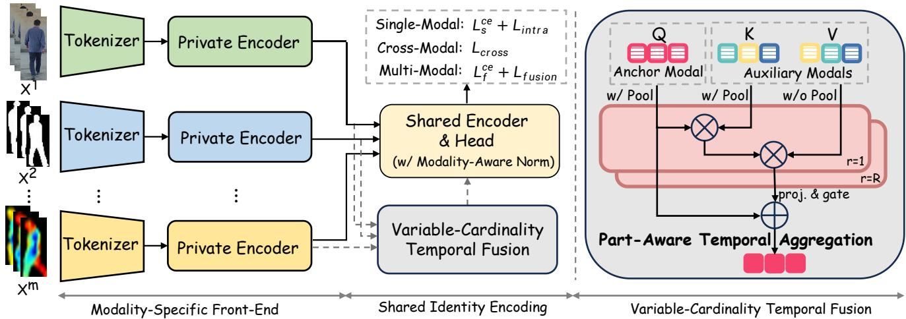  
Fig. 4. Architecture of OmniGait++. Each modality input $\mathbf { X } ^ { i }$ is processed by a modality-specific tokenizer and private encoder to preserve heterogeneous low-level cues. For single- and cross-modal recognition, the private features are passed directly to the shared identity encoder and head; for multi-modal recognition, anchor-guided temporal fusion first integrates auxiliary feature sequences whose number and temporal lengths may vary. Within each horizontal region $r \in \{ 1 , \ldots , \bar { R } \}$ , pooled anchor and auxiliary tokens form $\dot { Q }$ and K, respectively, while the unpooled auxiliary regional features form V ; the attended context is projected, gated, and added to the anchor representation. The loss block summarizes the single-modal and fused classification losses $\mathcal { L } _ { \mathrm { s } } ^ { \mathrm { c e } }$ and ${ \mathcal { L } } _ { \mathrm { f } } ^ { \mathrm { c e } }$ together with the intra-modal, cross-modal, and fusion triplet objectives $\mathcal { L } _ { \mathrm { { i n t r a } } } , \mathcal { L } _ { \mathrm { { c r o s s } } } ,$ and ${ \mathcal { L } } _ { \mathrm { f u s i o n } }$

For a single-modal input, the descriptor pathway is

$$
{ \bf U } ^ { m } = E _ { m , 1 : s } ^ { \mathrm { p r i } } \big ( \mathcal { T } _ { m } ( { \bf X } ^ { m } ) \big ) , \qquad { \bf z } _ { m } = \mathcal { H } \big ( E _ { s } ^ { \mathrm { s h } } ( { \bf U } ^ { m } ; m ) \big ) ,\tag{5}
$$

where H comprises temporal pooling, horizontal part pooling, and part-wise feature projection following common gaitrecognition practice [3]. The argument after the semicolon selects the modality-aware normalization branch, with m denoting the branch for the current single modality. Thus, the private prefix preserves modality-dependent cues, while the shared encoder and descriptor head map them through a common high-level parameterization.

When multiple modalities are jointly available, let $S \subseteq { \mathcal { M } }$ be an evaluated fusion subset containing the RGB-silhouette anchor $a = { \tt r g b \_ s i l s }$ . OmniGait++ inserts a single anchorguided fusion module Φ at the private-to-shared boundary:

$$
\begin{array} { r l } & { \widetilde { \mathbf { U } } ^ { S } = \Phi \big ( \mathbf { U } ^ { a } , \{ \mathbf { U } ^ { m } \} _ { m \in S \backslash \{ a \} } \big ) , } \\ & { \mathbf { z } _ { S } = \mathcal { H } \big ( E _ { s } ^ { \mathrm { s h } } ( \widetilde { \mathbf { U } } ^ { S } ; \mathrm { f u s i o n } ) \big ) . } \end{array}\tag{6}
$$

The module aggregates the auxiliary private features into the anchor representation, producing $\widetilde { \mathbf { U } } ^ { \bar { S } }$ with the anchor timeline and spatial layout. The fused feature then passes through the same shared identity encoder and descriptor head as the singlemodal feature, while fusion selects a dedicated normalization branch. Sharing both Φ and the downstream pathway allows one model to process subsets with different compositions and cardinalities without configuration-specific networks.

These two descriptor pathways instantiate the three operating modes in Eq. (4). Single-modal recognition compares descriptors $\mathbf { z } _ { m }$ from the same modality. Cross-modal recognition independently encodes the probe and gallery modalities and directly compares $\mathbf { z } _ { m _ { p } }$ with $\mathbf { z } _ { m _ { g } }$ without invoking Φ. Multi-modal recognition applies Φ to the same subset S on the probe and gallery sides and compares their fused descriptors $\mathbf { z } _ { S } .$ . All branches are learned jointly with intra-modal, crossmodal, and fusion-specific supervision.

From OmniGait to OmniGait++. The primary extension from the preliminary OmniGait model [12] to OmniGait++ is fusion scalability. OmniGait restricts each fusion input to an RGB-silhouette anchor and exactly one auxiliary modality, and therefore supports only fixed-cardinality pairwise fusion. In contrast, OmniGait++ represents the auxiliary modalities as a variable-size set and uses one shared temporal attention module to aggregate anchor-containing subsets with different compositions and cardinalities. The same fusion pathway can therefore accommodate different numbers and types of available modalities without changing the fusion architecture. In addition, OmniGait uses a shallow modality-specific frontend followed by shared backbone stages, whereas OmniGait++ extends modality-specific processing to a configurable privateto-shared boundary and applies modality-aware normalization in the shared encoder.

## C. Modality-Aware Shared Identity Encoder

Heterogeneous gait observations exhibit substantially different low-level statistics, yet their identity descriptors must remain comparable across modalities. OmniGait++ addresses this tension by decomposing its encoder into a modalityspecific front-end and a shared identity-encoding pathway. The former absorbs input-dependent appearance and geometry, while the latter promotes a common high-level representation through shared convolutional and projection parameters. Modality-aware normalization is inserted into the shared pathway to prevent incompatible modality statistics from being indiscriminately mixed.

1) Modality-Specific Front-End: The modalities in M differ in channel structure and physical meaning. Silhouettes contain binary contours; RGB/IR inputs retain appearance; projected depth encodes geometry; the event modality emphasizes motion; pose heatmaps encode body structure. Applying a common stem directly to these inputs can force the earliest layers to account simultaneously for incompatible signal distributions. We instead associate each modality m with an independent tokenizer $\mathcal { T } _ { m }$ , implemented as an input stem that maps its frames to a common feature format.

The tokenized sequence is subsequently processed through Stage s by a modality-specific private encoder, producing the private feature ${ \bf U } ^ { m }$ in Eq. (5). All convolutional and normalization parameters in this private prefix are independently learned for each modality, preserving modality-dependent patterns before the features enter either the shared encoder or the fusion module. Meanwhile, the common output format ensures that all ${ \mathbf U } ^ { m }$ have compatible channel and spatial dimensions while retaining their native sequence lengths $T _ { m }$

2) Shared Identity Encoding: After private Stage s, both single-modal features ${ \mathbf U } ^ { m }$ and fused features $\widetilde { \mathbf { U } } ^ { \widetilde { S } }$ are processed by the shared encoder $E _ { s } ^ { \mathrm { s h } }$ . Its convolutional parameters are shared across modalities and fusion subsets, encouraging identity-related structures to be represented through a common set of high-level transformations.

To obtain sequence-level descriptors, we first apply temporal max pooling over the valid frames and then divide the resulting feature map into horizontal parts [3]. Within each part, the average- and max-pooled responses are summed to retain both distributed and salient information. Part-specific linear projections, shared across all modalities and fusion subsets, produce the final $\mathbf { z } _ { m }$ and $\mathbf { z } _ { S }$ . Sharing the encoder and part-specific projections across modalities and fusion subsets gives the three operating modes a common high-level parameterization.

3) Modality-Aware Normalization: Conventional batch normalization in the shared pathway would estimate one set of statistics from mixed single-modal and fused features. Such mixed statistics can obscure modality-dependent distributions. Inspired by the general principle of domain-specific batch normalization [61], we therefore use a modality-aware variant in the shared encoder. For a normalization key $q \in \mathcal { M } \cup \{ \mathrm { f u s i o n } \}$ the operation is written as

$$
\mathcal { N } ( \mathbf { x } ; q ) = \gamma _ { q } \frac { \mathbf { x } - \mu _ { q } } { \sqrt { \sigma _ { q } ^ { 2 } + \epsilon } } + \beta _ { q } ,\tag{7}
$$

where $( \mu _ { q } , \sigma _ { q } ^ { 2 } )$ are running statistics specific to $q .$ For the nine single modalities, the affine parameters are tied, $( \gamma _ { q } , \beta _ { q } ) =$ $( \gamma _ { \mathrm { s i n g l e } } , \beta _ { \mathrm { s i n g l e } } )$ for $q \in { \mathcal { M } } .$ , while the fusion branch keeps its own affine parameters. This design preserves modalitydependent feature calibration without relaxing the shared convolutional representation into independent encoders. The same mechanism is applied to the spatial and temporal normalization layers of the shared P3D blocks [62]. In contrast, the tokenizer and private stages maintain independently learned normalization parameters for each modality.

Following the BNNeck design [63], we further use modality-aware BNNecks for identity classification. Each single modality maintains its own BN statistics but uses a common single-modal classifier, whereas all fused descriptors use a dedicated fusion BN branch and classifier:

$$
\ell _ { m } = C _ { \mathrm { s i n g l e } } \big ( B _ { m } ( \mathbf { z } _ { m } ) \big ) , \ \ell _ { S } = C _ { \mathrm { f u s i o n } } \big ( B _ { \mathrm { f u s i o n } } ( \mathbf { z } _ { S } ) \big ) .\tag{8}
$$

The shared single-modal classifier provides common identity supervision across modalities, while the separate fusion classifier accommodates the distribution shift introduced by feature aggregation. The pre-BN descriptors $\mathbf { z } _ { m }$ and $\mathbf { z } _ { S }$ remain the inputs to metric learning and retrieval.

## D. Variable-Cardinality Temporal Fusion

Conventional channel-wise feature concatenation typically assumes a fixed set of input modalities and therefore requires the aggregation layer to be redesigned when the modality composition changes. It is also poorly suited to MMGait, whose sensing streams have different sequence lengths and no prescribed frame-level correspondence. We instead formulate fusion as anchor-guided temporal aggregation over a variablesize auxiliary set. This formulation fixes the output reference while allowing the number, type, and temporal extent of auxiliary observations to change across operating settings.

1) Anchor-Guided Fusion Formulation: Let $\bar { S }$ be an evaluated fusion subset containing $a = { \underline { { \operatorname { r g b } } } } _ { \mathbf { \lambda } }$ \_sils as the anchor. RGB silhouettes are used as the anchor because they suppress appearance variation while retaining body contours, providing a consistent spatial reference across fusion configurations. The anchor-guided temporal fusion module Φ maps the anchor feature $\mathbf { U } ^ { a }$ , together with the auxiliary set $\{ \mathbf { U } ^ { m } \} _ { m \in S \backslash \{ a \} }$ , to the fused representation $\widetilde { \mathbf { U } } ^ { S }$ . This representation has the same shape as $\mathbf { U } ^ { a } \colon$ the anchor determines the output timeline and feature layout, whereas the remaining modalities provide auxiliary evidence. Because the auxiliary inputs are represented as a set rather than assigned to fixed branches, the same Φ is reused for all anchor-containing subsets.

2) Part-Aware Temporal Aggregation: Gait cues are not distributed uniformly over the human body, and the reliability of corresponding regions can differ across modalities. We therefore partition the feature height into R non-overlapping horizontal regions $\{ \Omega _ { r } \} _ { r = 1 } ^ { R }$ and perform temporal aggregation separately within each region. These fusion regions are independent of the horizontal parts used by the output head. For modality $m ,$ spatial averaging within region $\Omega _ { r }$ produces a sequence of part-aware tokens:

$$
\mathbf { T } _ { r } ^ { m } = \operatorname { P o o l } _ { \Omega _ { r } } ( \mathbf { U } ^ { m } ) + \mathbf { e } _ { m } , \qquad \mathbf { T } _ { r } ^ { m } \in \mathbb { R } ^ { T _ { m } \times C } ,\tag{9}
$$

where $\mathbf { e } _ { m }$ is a learnable modality embedding. It identifies the source of each token after auxiliary modalities are gathered into a common sequence.

For each region, the anchor tokens form the queries, while tokens from all auxiliary modalities are concatenated along the joint modality–time dimension to form the keys. Let $\mathbf { U } _ { r } ^ { m }$ denote the corresponding full feature map in region $\Omega _ { r }$ . The queries, keys, and values are constructed as

$$
\begin{array} { r l } & { \mathbf { Q } _ { r } = \mathcal { P } _ { r } ^ { Q } \big ( \mathcal { N } _ { r } ( \mathbf { T } _ { r } ^ { a } ) \big ) , } \\ & { \mathbf { K } _ { r } = \operatorname * { C o n c a t } _ { m \in S \backslash \{ a \} } \mathcal { P } _ { r } ^ { K } \big ( \mathcal { N } _ { r } ( \mathbf { T } _ { r } ^ { m } ) \big ) , } \\ & { \mathbf { V } _ { r } = \operatorname * { C o n c a t } _ { m \in S \backslash \{ a \} } \mathcal { P } _ { r } ^ { V } \big ( \mathcal { N } _ { r } ^ { V } ( \mathbf { U } _ { r } ^ { m } ) \big ) , } \end{array}\tag{10}
$$

where $\textstyle { \mathcal { N } } _ { r }$ and $\mathcal { P } _ { r }$ denote the corresponding normalization and projection operators, respectively. Crucially, the anchor is excluded from both the key and value sets and participates in attention only as the query. The values retain the complete feature map inside each horizontal region rather than only its pooled token. Consequently, token similarity determines how full local feature maps from auxiliary modalities and times contribute to each anchor position.

Aggregation is implemented with multi-head normalized attention [64]. For region r, its attention weights can be written compactly as

$$
\mathbf { A } _ { r } = \mathrm { s o f t m a x } \left( \rho _ { r } \cos ( \mathbf { Q } _ { r } , \mathbf { K } _ { r } ) \right) ,\tag{11}
$$

where $\rho _ { r }$ is a positive learnable scale. Cosine similarity reduces sensitivity to modality-dependent feature magnitudes, while multiple heads allow different relationships among modalities to be captured in parallel. The attended values produce an anchor-conditioned local context $\mathbf { C } _ { r } \mathbf { \Psi } = \mathbf { A } _ { r } \mathbf { V } _ { r } .$ Because auxiliary observations are concatenated along the joint modality–time dimension, this aggregation accommodates unequal sequence lengths without requiring frame-level correspondence. The number of anchor queries determines the temporal length of $\mathbf { C } _ { r } ,$ thereby aligning it with the anchor timeline. Although conditioned on the anchor queries, $\mathbf { C } _ { r }$ aggregates only auxiliary values. Contexts from all regions are concatenated in their original vertical order and passed through a spatial projection $\mathcal { O }$ to form an auxiliary correction. The original anchor feature bypasses value aggregation and is retained through the residual path:

$$
\widetilde { \mathbf { U } } ^ { S } = \mathbf { U } ^ { a } + \alpha \mathcal { O } \left( \mathrm { C o n c a t } _ { H } ( \mathbf { C } _ { 1 } , \ldots , \mathbf { C } _ { R } ) \right) ,\tag{12}
$$

where $\alpha \in \mathbb { R }$ is a learnable scalar initialized to 0.1. This exclusion prevents the anchor’s self-response from competing with auxiliary evidence in the key–value set. The residual connection preserves the strong single-modal reference, while α controls the contribution of the auxiliary correction when an auxiliary modality is noisy or weakly complementary.

## E. Unified Identity Learning and Inference

Having defined the single-modal and fused descriptors, we optimize their geometry in the shared identity space with objectives aligned to the three operating modes. We first learn discriminative features within each modality, then enforce directed cross-modal alignment, and finally supervise the fused descriptors. The resulting descriptors are then directly reused by the corresponding inference modes.

1) Single-Modal Identity Learning: The nine single-modal branches are trained jointly using classification and metric objectives. As described in Eq. (8), their modality-aware BNNecks share one classifier. This exposes the classifier to every modality and encourages their normalized features to predict identity labels using a common decision space. We apply label-smoothed cross-entropy to the part-wise logits of every modality and average their contributions equally, denoting the resulting objective by $\mathcal { L } _ { \mathrm { s } } ^ { \mathrm { c e } }$

Classification alone does not explicitly constrain the retrieval geometry of the pre-BN descriptors. We therefore additionally apply a batch-all triplet objective [65] independently within each modality and average the nine losses to obtain $\mathcal { L } _ { \mathrm { i n t r a } }$ . This group-wise computation gives every modality equal weight and prevents cross-modal distances from being introduced into the intra-modal objective.

2) Cross-Modal Identity Alignment: The shared classifier provides an implicit connection among modalities, but does not directly optimize distances between probe and gallery descriptors from different modalities. We impose explicit cross-modal metric supervision on the four modalities used by the directed cross-modal retrieval protocol: rgb\_sils, ir\_sils, depth, and lidar\_depth. For each ordered pair, descriptors from the first modality serve as anchors, while same-identity and different-identity descriptors from the second modality form positives and negatives, respectively. A batch-all triplet loss is computed independently for every horizontal part. Reversing a pair changes the modality that supplies the anchors and therefore produces a distinct optimization direction. We optimize all twelve directions formed by the four modalities and average their losses equally to obtain $\mathcal { L } _ { \mathrm { c r o s s } }$ . This directly matches the directed cross-modal retrieval protocol and prevents any modality pair from dominating the shared identity space.

3) Multi-Modal Fusion Learning: The distribution of a fused descriptor differs from that of a single-modal descriptor. Fused descriptors are therefore supervised through the dedicated fusion BNNeck and classifier in Eq. (8). The fusion configurations processed in each training iteration share the fusion classifier, and their label-smoothed cross-entropy losses are averaged to form $\mathcal { L } _ { \mathrm { f } } ^ { \mathrm { c e } }$ . Sharing this classifier encourages fused descriptors from subsets with different compositions and cardinalities to remain identity-discriminative under a common set of decision boundaries.

To preserve the retrieval geometry of each fusion setting, batch-all triplets are formed separately within each training fusion configuration and then averaged across configurations, yielding ${ \mathcal { L } } _ { \mathrm { f u s i o n } }$ . This keeps metric learning consistent with multi-modal evaluation, where probe and gallery inputs are constructed from the same modality subset.

4) Overall Objective: The complete learning objective combines the two classification terms and three task-specific metric terms:

$$
{ \mathcal { L } } = { \mathcal { L } } _ { \mathrm { s } } ^ { \mathrm { c e } } + { \mathcal { L } } _ { \mathrm { f } } ^ { \mathrm { c e } } + { \mathcal { L } } _ { \mathrm { i n t r a } } + { \mathcal { L } } _ { \mathrm { c r o s s } } + { \mathcal { L } } _ { \mathrm { f u s i o n } } .\tag{13}
$$

All terms are equally weighted, and a common margin is used for the three triplet objectives. Computing each term groupwise before averaging ensures that optimization is balanced over modalities, retrieval directions, and fusion subsets rather than being biased toward the task containing the largest number of descriptors.

5) Unified Inference: At inference, the identity classifiers are discarded and retrieval uses Euclidean distance between pre-BN descriptors. Given one modality $m ,$ OmniGait++ produces $\mathbf { z } _ { m }$ for single-modal recognition. For cross-modal recognition, it independently encodes the probe and gallery modality inputs and performs directed retrieval by comparing $\mathbf { z } _ { m _ { p } }$ with $\mathbf { z } _ { m _ { g } }$ without invoking fusion. Given an anchorcontaining subset $S ,$ multi-modal recognition produces $\mathbf { z } _ { S }$ and uses the same modality composition for probe and gallery.

MULTI-MODAL FUSION-TO-FUSION EVALUATION REGISTRY. EVERY SET CONTAINS THE RGB-SILHOUETTE ANCHOR AND IS USED FOR BOTH PROBE AND GALLERY FUSION; GROUP LABELS DESCRIBE THE AUXILIARY MODALITIES.  
TABLE VI
<table><tr><td>Group</td><td>Fusion Set</td><td>Diagnostic Role</td></tr><tr><td>Two-Stream</td><td>RGB Sil. + Depth RGB Sil. + IR Sil. RGB Sil. + LiDAR RGB Sil. + Radar RGB Sil. + Event RGB Sil. + Pose RGB Sil. + RGB</td><td>Dense depth geometry complements visible contours. Cross-spectrum contour consistency. Active 3D structure from LiDAR projected depth. Radar geometry tests robustness beyond optical sensing. Motion-sensitive evidence from temporal changes. Structural body layout from pose heatmaps. Raw RGB appearance beyond silhouette extraction.</td></tr><tr><td>Within-Group</td><td> $\mathrm { R G B \ S i l . + R G B + I R \ S i l . + I R }$   $\mathrm { R G B \ S i l . + D e p t h + L i D A R + R a d a r }$   $\mathrm { R G B \ S i l . } + \mathrm { E v e n t + P o s e }$   $\mathrm { R G B \ S i l . + I R \ S i l . + D e p t h }$ </td><td>Visible/infrared appearance and contour fusion. Range-based geometry modalities fused with anchor. Motion and pose fusion without range sensors. Visible contour, IR contour, and metric geometry.</td></tr><tr><td>Across-Group</td><td> $\mathrm { R G B \ S i l . + R G B + D e p t h }$   $\mathrm { R G B \ S i l . + E v e n t + D e p t h }$   $\mathrm { R G B \ S i l . + P o s e + L i D A R }$   $\mathrm { R G B \ S i l . + E v e n t + R a d a r }$   $\mathrm { R G B \ S i l . } + \mathrm { D e p t h + I R \ S i l . }$ </td><td>Contour, raw appearance, and camera geometry. Contour, motion, and camera geometry. Contour, pose structure, and LiDAR geometry. Contour, motion, and radar-derived geometry.</td></tr><tr><td>RGB Omni-Fusion RGB</td><td> $+ \ \mathrm { L i D A R } \ + \ \mathrm { R a d a r }$   $\mathrm { S i l . + R G B + I R \ S i l . + I R + D e p t h }$   $+ \ \mathrm { L i D A R } \ + \ \mathrm { R a d a r }$   $\mathrm { S i l . + R G B + I R \ S i l . + I R + D e p t h }$   $+ \ \mathrm { L i D A R } + \mathrm { R a d a r } + \mathrm { E v e n t } + \mathrm { P o s e }$ </td><td>Omni-5 contour-and-geometry fusion subset. Omni-7, adding appearance modalities to Omni-5. Omni-9 full fusion over all available modalities.</td></tr></table>

The same checkpoint therefore supports all three modes without task-specific fine-tuning, score-level fusion, or separately trained networks.

## VI. EXPERIMENTS ON OMNI-MODAL GAIT RECOGNITION

## A. Experimental Setup

All main OmniGait++ results in Section VI-B use one jointly trained checkpoint for single-modal recognition, crossmodal recognition, and multi-modal recognition, without taskspecific fine-tuning or additional checkpoints.

1) Evaluation Settings and Metrics: Unless otherwise stated, all results follow Protocol V2 with the impostoraugmented gallery defined in Section III-C. The omni-modal experiments reuse the same probe, positive-template, and impostor definitions as the expert study. Rank-1 accuracy and mAP are reported separately for BG and CL after uniformly averaging the off-diagonal view pairs.

2) Operating Modes and Evaluation Tasks: The three operating modes in Eq. (4) are instantiated as follows. Singlemodal recognition compares probe and gallery descriptors from the same modality, yielding nine tasks. Cross-modal recognition performs retrieval in both directions over the six unordered pairs among RGB silhouettes, IR silhouettes, depth, and LiDAR projected depth, yielding twelve directed tasks without invoking the fusion module. Multi-modal recognition uses a fusion-to-fusion protocol in which probe and gallery are encoded from the same modality subset S.

3) Fusion Configuration Registry: To evaluate variablecardinality fusion systematically, we define the 19 configurations in Table VI as a structured diagnostic registry. Every configuration contains the RGB-silhouette anchor; therefore, the group labels refer only to the relationships among the eight auxiliary modalities. We organize these auxiliaries into three cue families: appearance/contour (RGB, IR silhouette, and IR), geometry (depth, LiDAR projected depth, and radar projected depth), and motion/structure (event and pose).

The registry comprises four diagnostic groups. Two-Stream pairs the anchor with exactly one auxiliary and exhausts all eight choices, isolating the contribution of each auxiliary modality. Within-Group combines the anchor with all auxiliaries from one cue family, yielding three family-level configurations. Across-Group combines two auxiliaries from different cue families while fixing the total fusion cardinality at three; each configuration pairs a geometry modality with a contour, appearance, motion, or structure modality. These five configurations are representative rather than exhaustive. Finally, the nested Omni-5, Omni-7, and Omni-9 configurations progressively extend contour-and-geometry fusion with appearance and then motion/structure cues. This organization supports complementary analyses of single-auxiliary utility, within-family aggregation, cross-family complementarity, and scaling to broader modality subsets.

4) Implementation Details: OmniGait++ builds on the DeepGaitV2-P3D architecture [15], using a modality-specific tokenizer followed by a private-to-shared backbone.1 By default, Stages 1–3 form the modality-specific private encoder, after which a shared Stage-4 identity encoder, temporal max pooling, horizontal part pooling, and part-wise projections produce the retrieval descriptors. Fusion is performed after private Stage 3 and before shared Stage 4. The fusion module uses R=8 horizontal fusion regions, eight attention heads, cosine similarity, learnable modality embeddings, and residual correction. Modality-aware normalization is applied in both the shared encoder and the BNNecks.

TABLE VII  
SINGLE-MODAL RESULTS OF OMNIGAIT++ UNDER PROTOCOL V2. RESULTS ARE REPORTED AS RANK-1 ACCURACY AND MAP (%).
<table><tr><td rowspan="2">Modality</td><td colspan="2">BG</td><td colspan="2">CL</td></tr><tr><td>R1</td><td>mAP</td><td>R1</td><td>mAP</td></tr><tr><td>RGB Sil.</td><td>90.6</td><td>90.3</td><td>37.8</td><td>40.6</td></tr><tr><td>RGB</td><td>99.0</td><td>99.0</td><td>45.3</td><td>48.8</td></tr><tr><td>IR Sil.</td><td>79.8</td><td>79.2</td><td>20.8</td><td>23.5</td></tr><tr><td>IR</td><td>96.8</td><td>96.9</td><td>55.7</td><td>59.3</td></tr><tr><td>Depth</td><td>69.2</td><td>70.3</td><td>32.3</td><td>35.3</td></tr><tr><td>LiDAR</td><td>81.7</td><td>82.3</td><td>42.1</td><td>45.2</td></tr><tr><td>Radar</td><td>1.5</td><td>2.4</td><td>0.9</td><td>1.7</td></tr><tr><td>Event</td><td>21.6</td><td>24.0</td><td>3.7</td><td>5.0</td></tr><tr><td>Pose</td><td>49.0</td><td>49.7</td><td>20.3</td><td>22.5</td></tr><tr><td>Average</td><td>65.5</td><td>66.0</td><td>28.8</td><td>31.3</td></tr></table>

TABLE VIII

CROSS-MODAL RECOGNITION OF OMNIGAIT++ UNDER PROTOCOL V2(%). THE ARROW DENOTES PROBE-TO-GALLERY RETRIEVAL;BIDIRECTIONAL AVG. IS THE ARITHMETIC MEAN OF THE TWODIRECTIONS, AND CROSS-MODAL AVG. EQUALLY WEIGHTS THE SIXMODALITY PAIRS. LIDAR DENOTES LIDAR PROJECTED DEPTH.
<table><tr><td rowspan="2">Cross-Modal Settings</td><td colspan="2">BG</td><td colspan="2">CL</td></tr><tr><td>R1</td><td>mAP</td><td>R1</td><td>mAP</td></tr><tr><td>RGB Sil. → IR Sil.</td><td>79.1</td><td>78.2</td><td>23.9</td><td>26.3</td></tr><tr><td>IR Sil. → RGB Sil.</td><td>77.0</td><td>77.5</td><td>22.5</td><td>25.5</td></tr><tr><td>Bidirectional Avg.</td><td>78.0</td><td>77.8</td><td>23.2</td><td>25.9</td></tr><tr><td>RGB Sil. → Depth</td><td>59.6</td><td>60.3</td><td>19.1</td><td>21.8</td></tr><tr><td>Depth → RGB Sil.</td><td>46.2</td><td>48.3</td><td>17.3</td><td>19.9</td></tr><tr><td>Bidirectional Avg.</td><td>52.9</td><td>54.3</td><td>18.2</td><td>20.8</td></tr><tr><td>RGB Sil. → LiDAR</td><td>66.1</td><td>66.6</td><td>25.3</td><td>27.9</td></tr><tr><td>LiDAR → RGB Sil.</td><td>55.7</td><td>56.6</td><td>22.0</td><td>24.7</td></tr><tr><td>Bidirectional Avg.</td><td>60.9</td><td>61.6</td><td>23.7</td><td>26.3</td></tr><tr><td>IR Sil. → Depth</td><td>50.5</td><td>51.8</td><td>13.6</td><td>16.3</td></tr><tr><td>Depth → IR Sil.</td><td>39.4</td><td>41.1</td><td>12.9</td><td>15.1</td></tr><tr><td>Bidirectional Avg.</td><td>45.0</td><td>46.5</td><td>13.3</td><td>15.7</td></tr><tr><td>IR Sil. → LiDAR</td><td>59.7</td><td>60.6</td><td>18.7</td><td>21.6</td></tr><tr><td>LiDAR → IR Sil.</td><td>50.7</td><td>51.2</td><td>17.3</td><td>19.5</td></tr><tr><td>Bidirectional Avg.</td><td>55.2</td><td>55.9</td><td>18.0</td><td>20.6</td></tr><tr><td>Depth → LiDAR</td><td>50.7</td><td>52.1</td><td>23.2</td><td>25.9</td></tr><tr><td>LiDAR → Depth</td><td>49.0</td><td>50.2</td><td>20.6</td><td>23.5</td></tr><tr><td>Bidirectional Âvg.</td><td>49.9</td><td>51.2</td><td>21.9</td><td>24.7</td></tr><tr><td>Cross-Modal Avg.</td><td>57.0</td><td>57.9</td><td>19.7</td><td>22.3</td></tr></table>

Each mini-batch contains 8 identities and 4 sequences per identity. We sample 30 ordered frames and apply random perspective, horizontal flipping, and rotation, each with probability 0.2. Optimization uses SGD with learning rate 0.1, momentum 0.9, and weight decay $5 \times 1 0 ^ { - 4 }$ , decayed at 20k, 40k, and 50k iterations for a total of 60k iterations. The five loss terms in Eq. (13) are equally weighted; the triplet margin is 0.2. Cross-modal triplets are computed over the twelve directed tasks defined above. In each iteration, eight fusion subsets are sampled by drawing two configurations from each of the four registry groups, while evaluation always uses the full 19-set registry. At inference, the classifiers are discarded

TABLE IX  
VARIABLE-CARDINALITY MULTI-MODAL FUSION RESULTS OF OMNIGAIT++ UNDER PROTOCOL V2. RESULTS ARE RANK-1 ACCURACY AND MAP (%), WITH EACH GROUP FOLLOWED BY ITS AVERAGE. OMNI-5 FUSES RGB SILHOUETTES WITH IR SILHOUETTES, DEPTH, LIDAR, AND RADAR; OMNI-7 ADDS RGB AND IR APPEARANCE; OMNI-9 USES ALL NINE IMAGE-LIKE MODALITIES.
<table><tr><td>Fusion Set</td><td colspan="2">BG</td><td colspan="2">CL</td></tr><tr><td></td><td>R1</td><td>mAP</td><td>R1</td><td>mAP</td></tr><tr><td>RGB Sil.+Depth</td><td>95.7</td><td>95.4</td><td>57.5</td><td>59.9</td></tr><tr><td>RGB Sil.+IR Sil.</td><td>93.4</td><td>93.1</td><td>42.7</td><td>45.6</td></tr><tr><td>RGB Sil.+LiDAR</td><td>96.7</td><td>96.7</td><td>61.8</td><td>64.5</td></tr><tr><td>RGB Sil.+Radar</td><td>93.5</td><td>93.2</td><td>54.7</td><td>57.3</td></tr><tr><td>RGB Sil.+Event</td><td>93.2</td><td>93.0</td><td>45.4</td><td>48.2</td></tr><tr><td>RGB Sil.+Pose</td><td>92.0</td><td>91.5</td><td>46.4</td><td>48.9</td></tr><tr><td>RGB Sil.+RGB</td><td>99.7</td><td>99.7</td><td>64.6</td><td>67.5</td></tr><tr><td>RGB Sil.+IR</td><td>99.4</td><td>99.4</td><td>75.4</td><td>77.6</td></tr><tr><td>Two-Stream Avg.</td><td>95.5</td><td>95.3</td><td>56.1</td><td>58.7</td></tr><tr><td>RGB Sil.+RGB+IR Sil.+IR</td><td>99.8</td><td>99.8</td><td>76.1</td><td>78.2</td></tr><tr><td>RGB Sil.+Depth+LiDAR+Radar</td><td>98.6</td><td>98.5</td><td>75.1</td><td>77.1</td></tr><tr><td>RGB Sil.+Event+Pose</td><td>94.3</td><td>93.9</td><td>50.8</td><td>53.4</td></tr><tr><td>Within-Group Avg.</td><td>97.6</td><td>97.4</td><td>67.3</td><td>69.5</td></tr><tr><td>RGB Sil.+IR Sil.+Depth</td><td>97.0</td><td>96.7</td><td>59.5</td><td>61.7</td></tr><tr><td>RGB Sil.+RGB+Depth</td><td>99.7</td><td>99.7</td><td>70.5</td><td>72.8</td></tr><tr><td>RGB Sil.+Event+Depth</td><td>96.4</td><td>96.1</td><td>58.3</td><td>60.6</td></tr><tr><td>RGB Sil.+Pose+LiDAR</td><td>97.2</td><td>97.0</td><td>65.2</td><td>67.5</td></tr><tr><td>RGB Sil.+Event+Radar</td><td>95.5</td><td>95.3</td><td>57.4</td><td>60.0</td></tr><tr><td>Across-Group Avg.</td><td>97.1</td><td>97.0</td><td>62.2</td><td>64.5</td></tr><tr><td>Omni-5</td><td>98.8</td><td>98.7</td><td>75.9</td><td>77.7</td></tr><tr><td>Omni-7</td><td>99.8</td><td>99.9</td><td>83.0</td><td>84.7</td></tr><tr><td>Omni-9</td><td>99.8</td><td>99.8</td><td>83.5</td><td>85.2</td></tr><tr><td>Omni-Fusion Avg.</td><td>99.5</td><td>99.5</td><td>80.8</td><td>82.5</td></tr></table>

and Euclidean distance is computed on the pre-BN descriptors.

## B. Performance Evaluation

1) Single-Modal Recognition: Table VII reports singlemodal recognition for all nine inputs. This evaluation examines whether joint omni-modal training retains discriminative identity descriptors for each individual modality.

Under BG, the appearance modalities are the most discriminative, with RGB reaching 99.0% Rank-1 accuracy, while the silhouette and geometric modalities occupy an intermediate range and the event and radar modalities remain weak. Under CL, IR provides the strongest result at 55.7%, while LiDAR and depth retain comparatively useful geometric cues. Notably, the unified RGB branch reaches 45.3% Rank-1 accuracy under CL, outperforming the RGB-specific DeepGaitV2-P3D baseline by 6.8 percentage points.

The overall pattern is consistent with the task-specific study in Section IV: joint training retains meaningful modalitydependent strengths and failure modes within one model.

2) Cross-Modal Recognition: Table VIII reports all twelve directed retrieval tasks. The Cross-Modal Avg. gives equal weight to the six modality pairs.

Among the six modality pairs, RGB and IR silhouettes achieve the strongest compatibility, reaching 78.0% bidirectional-average Rank-1 accuracy under BG. Retrieval between silhouettes and geometric modalities is more difficult, while depth and LiDAR also remain imperfectly aligned despite both encoding body geometry. Compared with the pairspecific CL-Gait results in Table IV, OmniGait++ performs better on five of the six modality pairs under both probe conditions, with RGB Sil.↔IR Sil. as the only exception.

TABLE X  
COMPARISON WITH OMNIGAIT UNDER PROTOCOL V2. EACH CELL IS RANK-1 / MAP (%). THE COMMON SINGLE-MODAL, CROSS-MODAL, AND TWO-STREAM COLUMNS AVERAGE THE SAME NINE MODALITIES, SIX MODALITY PAIRS, AND EIGHT FUSION CONFIGURATIONS, RESPECTIVELY. OMNIGAIT DOES NOT SUPPORT VARIABLE-CARDINALITY FUSION BEYOND PAIRWISE ANCHOR–AUXILIARY CONFIGURATIONS.
<table><tr><td rowspan="2">Method</td><td colspan="2">Single-Modal</td><td colspan="2">Cross-Modal</td><td colspan="2">Two-Stream</td><td colspan="2">Within-Group</td><td colspan="2">Across-Group</td><td colspan="2">Omni-Fusion</td></tr><tr><td>BG</td><td>CL</td><td>BG</td><td>CL</td><td>BG</td><td>CL</td><td>BG</td><td>CL</td><td>BG</td><td>CL</td><td>BG</td><td>CL</td></tr><tr><td>OmniGait</td><td></td><td></td><td>57.2/58.016.8/19.350.6/51.711.1/13.489.6/89.330.1/33.2</td><td></td><td></td><td></td><td>-1-</td><td>-1-</td><td>-1-</td><td>-1-</td><td>-1-</td><td>-1-</td></tr><tr><td>OmniGait++ 65.5/66.0 28.8/31.3 57.0/57.919.7/22.3 95.5/95.3 56.1/58.7 97.6/97.4 67.3/69.5 97.1/97.0 62.2/64.5 99.5/99.5 80.8/82.5</td><td></td><td></td><td></td><td></td><td></td><td></td><td></td><td></td><td></td><td></td><td></td><td></td></tr></table>

These results show that the jointly trained identity space enables direct retrieval across heterogeneous modalities without pair-specific fine-tuning. They also confirm that standalone discriminability and shared physical content do not by themselves guarantee cross-modal compatibility.

3) Multi-Modal Recognition: Table IX reports all 19 fusion configurations evaluated using the same checkpoint and fusion module. For each of the four registry groups, we additionally report the unweighted mean over its constituent configurations for each metric and probe condition.

Every Two-Stream configuration surpasses the single-modal results of both its RGB-silhouette anchor and corresponding auxiliary modality under BG and CL. The gains are particularly pronounced under clothing change: RGB Sil.+IR reaches 75.4% Rank-1 accuracy, while RGB Sil.+Radar improves the anchor from 37.8% to 54.7% despite the weak standalone performance of radar. Standalone strength therefore does not fully determine a modality’s value in fusion. Compared with the separately trained MultiGait++ models in Table V, Omni-Gait++ performs better when RGB or IR appearance is used as the auxiliary modality, but generally trails the task-specific models for the remaining auxiliaries.

The higher-cardinality results further show that both composition and cardinality matter. Within-group appearance/contour and geometry fusion are more effective than motion/structure fusion, while the across-group settings provide different gains according to their constituent cues. In the nested omni-fusion sequence, adding RGB and IR appearance to Omni-5 improves CL Rank-1 by 7.1 percentage points, whereas further adding event and pose in Omni-9 contributes only 0.5 percentage points. This diminishing increment indicates that auxiliary cues become partly redundant once appearance, contour, and geometry are jointly available.

4) Comparison with OmniGait: Table X compares OmniGait++ with its preliminary version, OmniGait, under the same Protocol V2. For their three shared operating modes, the averages cover nine single-modal settings, six cross-modal pairs, and eight Two-Stream configurations.

OmniGait++ consistently improves recognition in all three overlapping modes. The gains are larger under clothing change, where single- and cross-modal Rank-1 accuracy each increase by more than 8 percentage points and Two-Stream recognition rises from 30.1% to 56.1%. More importantly, OmniGait is restricted to fixed fusion between an RGB silhouette anchor and one auxiliary modality, whereas OmniGait++ extends the same checkpoint to within-group, across-group, and omni-fusion inputs of different compositions and cardinalities. OmniGait++ is therefore not merely a stronger pairwise model, but a transition toward unified omni-modal recognition.

## C. Ablation Study

Table XI evaluates the main design choices of OmniGait++. Each block changes one factor from the full model while retaining the remaining settings, and reports the same categorylevel averages used above. Because one checkpoint must serve all operating modes, we select the default configuration according to its consistency across tasks and probe conditions rather than an isolated maximum.

1) Ablation Study on Fusion Stage: Here, Stage s denotes fusion immediately after private Stage s, with the remaining backbone stages forming the shared encoder. We evaluate fusion after Stages 2–4. Fusion immediately after Stage 1 is not included: its feature maps contain four times as many spatial locations as those of Stage 2, and retaining dense spatial values for multiple variable-cardinality fusion subsets incurs prohibitive GPU memory consumption under the same training protocol. Fusion at Stage 3 provides the strongest overall balance across the six task groups. Earlier fusion at Stage 2 yields a small advantage on BG cross-modal retrieval, but is less effective for most fusion settings, suggesting that the features have not yet received sufficient modality-specific adaptation. Conversely, delaying fusion to Stage 4 causes broad degradation, reducing Omni-Fusion Rank-1 under CL by 8.6 percentage points. At this boundary, no shared backbone stage remains after aggregation to reconcile the heterogeneous inputs. We therefore use Stage 3 to balance modality-specific adaptation with shared post-fusion identity encoding.

2) Ablation Study on Modality-Aware Normalization: Having established the fusion boundary, we next examine how features from different modalities are normalized along the shared pathway. Modality-aware normalization in the shared encoder is particularly important for heterogeneous identity alignment. Removing it reduces cross-modal BG Rank-1 from 57.0% to 43.2% and also degrades all fusion groups. Removing only the modality-aware BNNeck has little effect on single- and crossmodal recognition, with slight improvements in a few crossmodal entries, but consistently weakens fusion, especially at higher cardinalities. Removing both normalization components produces the deepest cross-modal degradation. These results show that applying modality-aware normalization to the shared encoder and BNNeck better accommodates heterogeneous modality statistics and improves consistency across the unified operating modes.

TABLE XI  
ABLATION OF OMNIGAIT++ UNDER PROTOCOL V2. EACH CELL IS RANK-1/MAP (%). FULL DENOTES THE DEFAULT SETTING (FUSION AT STAGE 3, MODALITY-AWARE NORMALIZATION IN BOTH THE SHARED ENCODER AND BNNECK, R=8 HORIZONTAL FUSION REGIONS, AND THE ANCHOR EXCLUDED FROM THE KEY–VALUE SET). IN (D), ANCHOR ∈/ KV IS THE DEFAULT QUERY-ONLY SETTING.
<table><tr><td rowspan="2">Setting</td><td colspan="2">Single-Modal</td><td colspan="2">Cross-Modal</td><td colspan="2">Two-Stream</td><td colspan="2">Within-Group</td><td colspan="2">Across-Group</td><td colspan="2">Omni-Fusion</td></tr><tr><td>BG</td><td>CL</td><td>BG</td><td>CL</td><td>BG</td><td>CL</td><td>BG</td><td>CL</td><td>BG</td><td>CL</td><td>BG</td><td>CL</td></tr><tr><td colspan="9">(a) Fusion stage (private-to-shared boundary)</td><td></td><td></td><td></td></tr><tr><td>Stage 2 Stage 3</td><td>63.8/64.2</td><td>28.7/31.3 28.8/31.3</td><td>57.9/58.7 57.0/57.9</td><td>19.5/22.1 19.7/22.3</td><td>94.9/94.7 95.5/95.3</td><td>54.3/56.9 56.1/58.7</td><td>96.9/96.7 97.6/97.4</td><td>63.5/65.7 67.3/69.5</td><td>96.2/96.0 97.1/97.0</td><td>58.9/61.4 62.2/64.5</td><td>99.2/99.1</td><td>77.2/79.1</td></tr><tr><td colspan="9">65.5/66.0 Stage 4</td><td></td><td>99.5/99.5 99.3/99.3</td><td>80.8/82.5 72.2/74.5</td></tr><tr><td>(b) Modality-aware normalization</td><td>63.9/64.4</td><td>24.6/27.1</td><td>47.6/49.1 (abbreviated</td><td>16.0/18.6 as MN)</td><td>94.7/94.5</td><td>52.4/55.0</td><td>97.1/97.0</td><td>62.8/65.3</td><td>96.5/96.4</td><td>57.9/60.4</td><td></td><td></td></tr><tr><td colspan="9">Full 65.5/66.0 28.8/31.3 57.0/57.9 19.7/22.3 95.5/95.3 56.1/58.7 97.6/97.4 67.3/69.5 97.1/97.0</td><td>62.2/64.5</td><td>99.5/99.5</td><td>80.8/82.5</td></tr><tr><td>w/o Enc. MN w/o Neck MN w/o MN 64.1/64.7</td><td>63.8/64.4 65.2/65.8</td><td>26.5/29.2 28.7/31.3 27.3/29.9</td><td>43.2/45.1 57.6/58.4 41.7/43.5</td><td>13.9/16.4 19.9/22.5 13.0/15.5</td><td>94.4/94.3 95.4/95.2 94.7/94.5</td><td>52.5/55.2 55.6/58.3 53.0/55.9</td><td>96.7/96.6 97.5/97.4 96.9/96.8</td><td>63.8/66.1 66.8/69.1 64.3/66.6</td><td>95.9/95.8 97.1/96.9 96.2/96.1</td><td>57.5/60.1 61.3/63.9 58.1/60.7</td><td>99.1/99.1 99.4/99.4 99.3/99.2</td><td>76.6/78.6 78.9/80.7 75.6/77.7</td></tr><tr><td colspan="9">(c) Part-aware temporal fusion (R: number of horizontal fusion regions)</td><td></td><td></td><td></td></tr><tr><td>R=1 R=4 R=8 65.5/66.0</td><td>64.8/65.4 65.4/65.9</td><td>27.8/30.4 27.8/30.5 28.8/31.3</td><td>57.0/57.9 57.7/58.6 57.0/57.9</td><td>19.0/21.6 19.3/22.0 19.7/22.3</td><td>93.5/93.1 95.3/95.1 95.5/95.3</td><td>53.0/55.4 55.6/58.3 56.1/58.7</td><td>96.0/95.7 97.4/97.3 97.6/97.4</td><td>62.2/64.3 66.6/68.9 67.3/69.5</td><td>95.3/95.0 97.0/96.9</td><td>58.8/61.0 61.6/64.0</td><td>98.9/98.8 99.4/99.4</td><td>75.3/77.1 80.0/81.8</td></tr><tr><td colspan="9">R=16 65.2/65.8 28.0/30.6 57.6/58.4 19.8/22.4 95.4/95.2 55.0/57.6 97.4/97.3 66.0/68.2</td><td>97.1/97.0 62.2/64.5 97.0/96.8 60.9/63.3</td><td>99.5/99.5 99.3/99.3</td><td>80.8/82.5 79.3/81.1</td></tr><tr><td colspan="10">(d) Anchor exclusion (KV: key-value set) 95.5/95.3 56.1/58.7 97.6/97.4</td><td></td><td></td><td></td><td>80.8/82.5</td></tr><tr><td>Anchor ∉ KV Anchor ∈ KV 65.0/65.5 27.9/30.5 56.3/57.2</td><td colspan="8">65.5/66.0 28.8/31.3 57.0/57.9 19.7/22.3 19.1/21.8</td><td colspan="4">67.3/69.5 97.1/97.0 62.2/64.5 99.5/99.5 63.1/65.6 96.7/96.6 56.7/59.4 99.4/99.3</td></tr></table>

3) Ablation Study on Part-Aware Temporal Fusion: With the encoder interface fixed, we turn to the internal fusion design, beginning with its spatial granularity. Collapsing the feature height into one region (R=1) consistently harms fusion, including a drop of 5.5 percentage points in Omni-Fusion Rank-1 under CL. This confirms that global temporal aggregation can obscure spatially localized gait cues. Increasing the number of regions to 4, 8, or 16 substantially narrows the gap, but the improvements are not monotonic: overly fine partitioning provides no consistent benefit. We adopt R=8 because it gives the most stable performance across the fusion groups, balancing local correspondence with sufficient information in each region.

4) Ablation Study on Anchor Exclusion: After determining the regional granularity, we examine the roles assigned to the anchor and auxiliary modalities in attention. Including the RGB-silhouette anchor in the key–value set degrades every fusion group under CL; for example, Across-Group Rank-1 decreases from 62.2% to 56.7%. Keeping the anchor query-only prevents its self-response from competing with auxiliary evidence. The attention module consequently estimates a correction from the auxiliary modalities, while the residual path preserves the anchor features. This separation is especially beneficial when the auxiliary set contains multiple heterogeneous modalities.

## VII. SCOPE AND FUTURE DIRECTIONS

Broader Acquisition Settings. MMGait’s matched multisensor recordings support controlled comparisons across sensors, modalities, views, and walking conditions. By holding participant identity and recording context consistent across sensing streams, this design reduces confounding factors when analyzing modality-specific discriminability and complementarity. Future data collections can complement this controlled setting with greater environmental and device diversity, enabling systematic evaluation of transfer across capture domains and deployment conditions.

Native Structured Modalities. OmniGait++ establishes a common learning and fusion interface for nine image like modalities spanning all five sensing streams. Using a common backbone family makes it possible to study modality adaptation, identity alignment, and variable-cardinality fusion under a consistent architecture. The modular private front-end also provides a natural insertion point for native point-cloud tokenizers for LiDAR and radar, as well as a coordinatebased tokenizer for 3D pose. These additions would extend the same shared identity and fusion space to all twelve MMGait modalities while preserving their native structures.

Flexible Modality Availability. The 19-configuration registry systematically varies auxiliary composition and cardinality around a common RGB-silhouette anchor, while the setbased fusion design remains independent of fixed auxiliary branches. In particular, the shared attention module accepts auxiliary sets with different sizes and compositions without introducing configuration-specific parameters. This structure provides a basis for studying broader availability patterns, including alternative anchors and asymmetric probe–gallery modality subsets. Incorporating modality-quality estimates could further allow the model to adjust the contribution of noisy or degraded observations.

Responsible Use. MMGait’s provisions for informed consent, pseudonymization, controlled access, and participant rights are detailed in Section III-D. These measures provide a governance framework for research involving sensitive gait data. Future dataset extensions and system deployments should preserve these protections while documenting data access, model evaluation, and intended-use boundaries.

Together, these directions extend MMGait and OmniGait++ toward broader, more flexible, and responsible omni-modal gait recognition.

## VIII. CONCLUSION

This work presents MMGait as a common experimental basis for heterogeneous gait recognition. MMGait combines matched observations from five sensing streams and twelve modalities with an identity-disjoint split and an impostoraugmented protocol, enabling single-modal, cross-modal, and multi-modal recognition to be compared under consistent evaluation. The results show that standalone discriminability, cross-modal compatibility, and fusion complementarity are distinct properties: standalone strength does not necessarily predict cross-modal alignment or value in fusion.

To unify recognition across heterogeneous modality inputs and operating modes, we developed OmniGait++. Its private-to-shared architecture preserves modality-dependent cues while learning comparable identity descriptors, and its anchor-guided temporal fusion accommodates modality subsets with different sizes and compositions. Experiments demonstrate that one jointly trained checkpoint supports this unified coverage while remaining competitive with separately trained task-specific models.

Overall, MMGait provides the empirical foundation for systematically studying heterogeneous gait information, while OmniGait++ offers a scalable framework for learning from it. Together, they establish a common basis for advancing omnimodal gait recognition.

## REFERENCES

[1] A. Sepas-Moghaddam and A. Etemad, “Deep gait recognition: A survey,” TPAMI, vol. 45, no. 1, pp. 264–284, 2022.

[2] H. Chao, Y. He, J. Zhang, and J. Feng, “Gaitset: Regarding gait as a set for cross-view gait recognition,” in AAAI, vol. 33, no. 01, 2019, pp. 8126–8133.

[3] C. Fan, J. Liang, C. Shen, S. Hou, Y. Huang, and S. Yu, “Opengait: Revisiting gait recognition towards better practicality,” in CVPR, 2023, pp. 9707–9716.

[4] R. Liao, S. Yu, W. An, and Y. Huang, “A model-based gait recognition method with body pose and human prior knowledge,” Pattern Recognition, vol. 98, p. 107069, 2020.

[5] C. Fan, J. Ma, D. Jin, C. Shen, and S. Yu, “Skeletongait: Gait recognition using skeleton maps,” in AAAI, vol. 38, no. 2, 2024, pp. 1662–1669.

[6] D. Ye, C. Fan, J. Ma, X. Liu, and S. Yu, “Biggait: Learning gait representation you want by large vision models,” in CVPR, 2024, pp. 200–210.

[7] D. Ye, C. Fan, Z. Huang, C. Luo, J. Li, S. Yu, and X. Liu, “Biggergait: Unlocking gait recognition with layer-wise representations from large vision models,” arXiv preprint arXiv:2505.18132, 2025.

[8] D. Tan, K. Huang, S. Yu, and T. Tan, “Efficient night gait recognition based on template matching,” in International Conference on Pattern Recognition, vol. 3, 2006, pp. 1000–1003.

[9] M. Hofmann, J. Geiger, S. Bachmann, B. Schuller, and G. Rigoll, “The tum gait from audio, image and depth (gaid) database: Multimodal recognition of subjects and traits,” Journal of Visual Communication and Image Representation, vol. 25, no. 1, pp. 195–206, 2014.

[10] C. Shen, C. Fan, W. Wu, R. Wang, G. Q. Huang, and S. Yu, “Lidargait: Benchmarking 3d gait recognition with point clouds,” in CVPR, 2023, pp. 1054–1063.

[11] X. Han, Y. Ren, P. Cong, Y. Sun, J. Wang, L. Xu, and Y. Ma, “Gait recognition in large-scale free environment via single lidar,” in ACM MM, 2024, pp. 380–389.

[12] C. Wang, Q. Cai, S. Hou, A. Li, and Y. Huang, “MMGait: Towards multi-modal gait recognition,” in CVPR, 2026.

[13] C. Fan, Y. Peng, C. Cao, X. Liu, S. Hou, J. Chi, Y. Huang, Q. Li, and Z. He, “Gaitpart: Temporal part-based model for gait recognition,” in CVPR, 2020, pp. 14 225–14 233.

[14] B. Lin, S. Zhang, M. Wang, L. Li, and X. Yu, “Gaitgl: Learning discriminative global-local feature representations for gait recognition,” arXiv preprint arXiv:2208.01380, 2022.

[15] C. Fan, S. Hou, Y. Huang, and S. Yu, “Exploring deep models for practical gait recognition,” arXiv preprint arXiv:2303.03301, 2023.

[16] H. Xiong, B. Feng, X. Wang, and W. Liu, “Causality-inspired discriminative feature learning in triple domains for gait recognition,” in ECCV, 2024, pp. 251–270.

[17] K. Ma, Y. Fu, D. Zheng, C. Cao, X. Hu, and Y. Huang, “Dynamic aggregated network for gait recognition,” in CVPR, 2023, pp. 22 076– 22 085.

[18] K. Ma, Y. Fu, C. Cao, S. Hou, Y. Huang, and D. Zheng, “Learning visual prompt for gait recognition,” in CVPR, 2024, pp. 593–603.

[19] P. Huang, S. Hou, J. Huang, and Y. Huang, “Learning a unified template for gait recognition,” in ICCV, 2025, pp. 12 459–12 469.

[20] S. Yang, J. Wang, S. Hou, X. Liu, C. Cao, L. Wang, and Y. Huang, “Bridging gait recognition and large language models sequence modeling,” in CVPR, 2025, pp. 3460–3469.

[21] T. Teepe, A. Khan, J. Gilg, F. Herzog, S. Hormann, and G. Rigoll, “Gait-¨ graph: Graph convolutional network for skeleton-based gait recognition,” in ICIP, 2021, pp. 2314–2318.

[22] T. Teepe, J. Gilg, F. Herzog, S. Hormann, and G. Rigoll, “Towards a ¨ deeper understanding of skeleton-based gait recognition,” in CVPRW, 2022, pp. 1569–1577.

[23] Y. Fu, S. Meng, S. Hou, X. Hu, and Y. Huang, “Gpgait: Generalized pose-based gait recognition,” in ICCV, 2023, pp. 19 595–19 604.

[24] S. Meng, Y. Fu, S. Hou, X. Hu, C. Cao, X. Liu, and Y. Huang, “From fastposegait to gpgait++: Bridging the past and future for pose-based gait recognition,” TPAMI, 2025.

[25] Y. Guo, A. Shah, J. Liu, A. Gupta, R. Chellappa, and C. Peng, “Gaitcontour: Efficient gait recognition based on a contour-pose representation,” in IEEE/CVF Winter Conference on Applications of Computer Vision, 2025, pp. 1051–1061.

[26] L. Chen, Z. Zhang, and Y. Wang, “Edinogait: Transferring large visual models to event-based vision for enhancing gait recognition,” TMM, 2025.

[27] S. Xu, S. Chen, C. Shen, K. Liu, Z. Sun, C. Cao, and X. Fu, “EventGait: Towards robust gait recognition with event streams,” in CVPR, 2026, pp. 22 323–22 334.

[28] A. Haque, A. Alahi, and L. Fei-Fei, “Recurrent attention models for depth-based person identification,” in CVPR, 2016, pp. 1229–1238.

[29] R. Wang, C. Shen, C. Fan, G. Q. Huang, and S. Yu, “Pointgait: Boosting end-to-end 3d gait recognition with point clouds via spatiotemporal modeling,” in IEEE International Joint Conference on Biometrics, 2023, pp. 1–10.

[30] C. Shen, R. Wang, L. Duan, and S. Yu, “Lidargait++: Learning local features and size awareness from lidar point clouds for 3d gait recognition,” in CVPR, 2025, pp. 6627–6636.

[31] Z. Meng, S. Fu, J. Yan, H. Liang, A. Zhou, S. Zhu, H. Ma, J. Liu, and N. Yang, “Gait recognition for co-existing multiple people using millimeter wave sensing,” in AAAI, vol. 34, no. 01, 2020, pp. 849–856.

[32] R. Wang, C. Shen, M. J. Marin-Jimenez, G. Q. Huang, and S. Yu, “Cross-modality gait recognition: Bridging lidar and camera modalities for human identification,” in International Joint Conference on Biometrics, 2024, pp. 1–11.

[33] W. Guo, Y. Liang, Z. Pan, Z. Xi, J. Feng, and J. Zhou, “Camera-lidar cross-modality gait recognition,” in ECCV, 2024, pp. 439–455.

[34] Z. Lu and M. Cheng, “Text-guided feature disentanglement for crossmodal gait recognition,” in CVPR, 2026, pp. 25 484–25 493.

[35] Y. Cui and Y. Kang, “Multi-modal gait recognition via effective spatialtemporal feature fusion,” in CVPR, 2023, pp. 17 949–17 957.

[36] Y. Sun, X. Feng, X. Liu, L. Ma, L. Hu, and M. S. Nixon, “Trigait: hybrid fusion strategy for multimodal alignment and integration in gait recognition,” TBIOM, vol. 7, no. 1, pp. 82–94, 2024.

[37] D. Jin, C. Fan, W. Chen, and S. Yu, “Exploring more from multiple gait modalities for human identification,” in AAAI, vol. 39, no. 4, 2025, pp. 4120–4128.

[38] Z. Lu, W. Jiang, T. Wu, Z. Wang, C. Zhang, S. Shen, and M. Cheng, “Walking further: Semantic-aware multimodal gait recognition under long-range conditions,” in AAAI, vol. 40, no. 9, 2026, pp. 7618–7626.

[39] M. J. Mar´ın-Jimenez, F. M. Castro, R. Delgado-Esca´ no, V. Kalogeiton,˜ and N. Guil, “UGaitNet: Multimodal gait recognition with missing input modalities,” TIFS, vol. 16, pp. 5452–5462, 2021.

[40] H. Li, M. Ye, M. Zhang, and B. Du, “All in one framework for multimodal re-identification in the wild,” in CVPR, 2024, pp. 17 459– 17 469.

[41] J. Zuo, Y. Deng, M. Tan, R. Jin, D. Wu, N. Sang, L. Pan, and C. Gao, “ReID5o: Achieving omni multi-modal person re-identification in a single model,” in NeurIPS, vol. 38, 2025.

[42] A. Li, S. Hou, C. Wang, Q. Cai, and Y. Huang, “Aerialgait: Bridging aerial and ground views for gait recognition,” in ACM MM, 2024, pp. 1139–1147.

[43] C. Wang, S. Hou, A. Li, Q. Cai, and Y. Huang, “Ra-gar: A richly annotated benchmark for gait attribute recognition,” in AAAI, vol. 39, no. 7, 2025, pp. 7591–7599.

[44] S. Yu, D. Tan, and T. Tan, “A framework for evaluating the effect of view angle, clothing and carrying condition on gait recognition,” in International Conference on Pattern Recognition, vol. 4, 2006, pp. 441– 444.

[45] N. Takemura, Y. Makihara, D. Muramatsu, T. Echigo, and Y. Yagi, “Multi-view large population gait dataset and its performance evaluation for cross-view gait recognition,” IPSJ transactions on Computer Vision and Applications, vol. 10, pp. 1–14, 2018.

[46] W. Li, S. Hou, C. Zhang, C. Cao, X. Liu, Y. Huang, and Y. Zhao, “An in-depth exploration of person re-identification and gait recognition in cloth-changing conditions,” in CVPR, 2023, pp. 13 824–13 833.

[47] S. Zou, C. Fan, J. Xiong, C. Shen, S. Yu, and J. Tang, “Cross-covariate gait recognition: A benchmark,” in AAAI, vol. 38, no. 7, 2024, pp. 7855– 7863.

[48] J. Zheng, X. Liu, W. Liu, L. He, C. Yan, and T. Mei, “Gait recognition in the wild with dense 3d representations and a benchmark,” in CVPR, 2022, pp. 20 228–20 237.

[49] Z. Zhu, X. Guo, T. Yang, J. Huang, J. Deng, G. Huang, D. Du, J. Lu, and J. Zhou, “Gait recognition in the wild: A benchmark,” in ICCV, 2021, pp. 14 789–14 799.

[50] https://www.orbbec.com/products/stereo-vision-camera/gemini-2xl/.

[51] https://ouster.com/products/hardware/os0-lidar-sensor.

[52] https://www.geometricalpal.com/hardware/1.

[53] Y. Zhang, P. Sun, Y. Jiang, D. Yu, F. Weng, Z. Yuan, P. Luo, W. Liu, and X. Wang, “Bytetrack: Multi-object tracking by associating every detection box,” in ECCV, 2022, pp. 1–21.

[54] Y. Liu, L. Chu, G. Chen, Z. Wu, Z. Chen, B. Lai, and Y. Hao, “Paddleseg: A high-efficient development toolkit for image segmentation,” arXiv preprint arXiv:2101.06175, 2021.

[55] J. Wang, K. Sun, T. Cheng, B. Jiang, C. Deng, Y. Zhao, D. Liu, Y. Mu, M. Tan, X. Wang et al., “Deep high-resolution representation learning for visual recognition,” TPAMI, vol. 43, no. 10, pp. 3349–3364, 2020.

[56] Q. Cai, X. Hu, S. Hou, L. Yao, and Y. Huang, “Disentangled diffusionbased 3d human pose estimation with hierarchical spatial and temporal denoiser,” in AAAI, vol. 38, no. 2, 2024, pp. 882–890.

[57] Y. Hu, S.-C. Liu, and T. Delbruck, “v2e: From video frames to realistic dvs events,” in CVPRW, 2021, pp. 1312–1321.

[58] S. Lee, H. Lim, and H. Myung, “Patchwork++: Fast and robust ground segmentation solving partial under-segmentation using 3d point cloud,” in International Conference on Intelligent Robots and Systems, 2022, pp. 13 276–13 283.

[59] M. Ester, H.-P. Kriegel, J. Sander, X. Xu et al., “A density-based algorithm for discovering clusters in large spatial databases with noise,” in International Conference on Knowledge Discovery and Data Mining, vol. 96, no. 34, 1996, pp. 226–231.

[60] C. Zhang, X.-P. Chen, G.-Q. Han, and X.-J. Liu, “Spatial transformer network on skeleton-based gait recognition,” Expert Systems, vol. 40, no. 6, p. e13244, 2023.

[61] W.-G. Chang, T. You, S. Seo, S. Kwak, and B. Han, “Domain-specific batch normalization for unsupervised domain adaptation,” in CVPR, 2019, pp. 7354–7362.

[62] Z. Qiu, T. Yao, and T. Mei, “Learning spatio-temporal representation with pseudo-3d residual networks,” in ICCV, 2017, pp. 5533–5541.

[63] H. Luo, Y. Gu, X. Liao, S. Lai, and W. Jiang, “Bag of tricks and a strong baseline for deep person re-identification,” in CVPRW, 2019, pp. 1487–1495.

[64] A. Vaswani, N. Shazeer, N. Parmar, J. Uszkoreit, L. Jones, A. N. Gomez, L. Kaiser, and I. Polosukhin, “Attention is all you need,” in NeurIPS, vol. 30, 2017, pp. 5998–6008.

[65] A. Hermans, L. Beyer, and B. Leibe, “In defense of the triplet loss for person re-identification,” arXiv preprint arXiv:1703.07737, 2017.

## SUPPLEMENTARY MATERIAL

## S1. COMPUTATIONAL COST

Table S1 compares the model size and path-wise inference complexity of the task-specific baselines, OmniGait, and OmniGait++. Total Params denotes the parameter count of one independently trained checkpoint for a task-specific baseline and that of the complete unified checkpoint for OmniGait and OmniGait++; it is therefore fixed across their operating settings. Active Params denotes the union of the parameters required by a specified operating path, with shared parameters counted once and repeated execution reflected in FLOPs. Both parameter measures exclude the BNNeck and identity classifiers.

FLOPs are measured before the BNNeck using batch size one. Each selected modality provides a 30-frame input under the default preprocessing setting. Gallery matching is excluded. For each configuration, we count one forward pass through every distinct descriptor path required by the setting: one modality path for single-modal inference, two modality paths without fusion for cross-modal inference, and one fused path over the selected modalities for multi-modal inference.

All quantities are measured per configuration and then averaged with equal weight within each operating setting. Singlemodal Avg., Cross-modal Avg., and Two-Stream Avg. cover nine modalities, six unordered modality pairs, and eight fusion configurations, respectively. Task-specific parameter counts are averaged per checkpoint rather than summed over the expert collection, whereas Omni-5, Omni-7, and Omni-9 are reported directly. For Omni-9, the inactive single-modal normalization branches make Active Params slightly lower than Total Params.

TABLE S1  
MODEL SIZE AND PATH-WISE INFERENCE COST. PARAMETER COUNTS AND FLOPS EXCLUDE THE BNNECK AND IDENTITY CLASSIFIERS; FLOPS ALSO EXCLUDE GALLERY MATCHING. EACH MODALITY PROVIDES 30 FRAMES WITH BATCH SIZE ONE. “AVG.” IS AN EQUAL-WEIGHT AVERAGE OVER THE APPLICABLE CONFIGURATIONS
<table><tr><td>Method</td><td>Operating Setting</td><td>Total Params (M)</td><td>Active Params (M)</td><td>FLOPs (G)</td></tr><tr><td>DeepGaitV2-P3D</td><td>Single-modal Avg.</td><td>8.03</td><td>8.03</td><td>55.85</td></tr><tr><td>CL-Gait</td><td>Cross-modal Avg.</td><td>10.20</td><td>10.20</td><td>114.78</td></tr><tr><td>MultiGait++</td><td>Two-Stream Avg.</td><td>11.09</td><td>11.09</td><td>105.58</td></tr><tr><td rowspan="3">OmniGait</td><td>Single-modal Avg.</td><td>9.14</td><td>7.23</td><td>73.16</td></tr><tr><td>Cross-modal Avg.</td><td>9.14</td><td>7.46</td><td>146.25</td></tr><tr><td>Two-Stream Avg.</td><td>9.14</td><td>7.51</td><td>105.45</td></tr><tr><td rowspan="6">OmniGait++</td><td>Single-modal Avg.</td><td>24.12</td><td>8.27</td><td>82.22</td></tr><tr><td>Cross-modal Avg.</td><td>24.12</td><td>9.98</td><td>164.37</td></tr><tr><td>Two-Stream Avg.</td><td>24.12</td><td>12.15</td><td>135.24</td></tr><tr><td>Omni-5</td><td>24.12</td><td>17.28</td><td>280.95</td></tr><tr><td>Omni-7</td><td>24.12</td><td>20.70</td><td>378.16</td></tr><tr><td>Omni-9</td><td>24.12</td><td>24.11</td><td>475.30</td></tr></table>

The two parameter measures reveal complementary aspects of scalability. Although the full OmniGait++ descriptor model is larger than an individual task-specific descriptor model, covering the shared evaluation settings requires nine single-modal experts, six pair-specific cross-modal experts, and eight Two-Stream experts. Using the rounded per-model averages in Table S1, their aggregate size is approximately 9(8.03)+6(10.20)+8(11.09) = 222.19M parameters, compared with 24.12M for the full OmniGait++ descriptor model. Relative to storing all 23 task-specific descriptor models, the unified model therefore reduces descriptor-model storage by approximately 89% while additionally supporting variable-cardinality fusion.

At the level of an active path, OmniGait++ remains close to the corresponding task-specific models. Relative to OmniGait, the additional capacity and computation accompany broader modality coverage and the consistent recognition gains in Table X. Moreover, expanding from Omni-5 to Omni-7 and from Omni-7 to Omni-9 adds 3.42M and 3.41M Active Params and 97.21G and 97.14G FLOPs, respectively, indicating predictable growth as pairs of modalities are added. Overall, OmniGait++ trades additional per-path computation for substantially lower collection-level storage and broader coverage within one checkpoint.

## S2. ADDITIONAL MMGAIT VISUALIZATIONS

Figures S1 and S2 present processed examples from two participants using the same layout. Rows group the raw and derived modalities by sensing stream and indicate their walking directions, whereas columns compare normal walking, backpack carrying, and clothing change.

Depth

Walking  
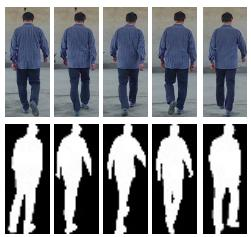

Backpack  
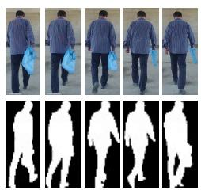  
Clothing

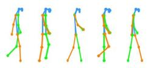

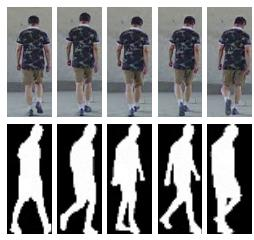

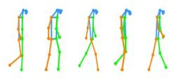

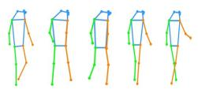

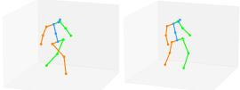

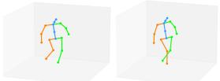

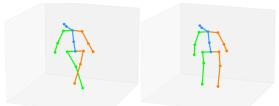

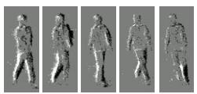

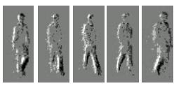

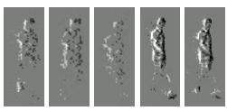

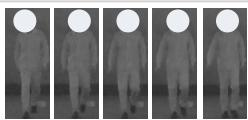

IR Silhouette

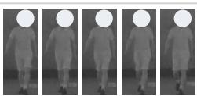

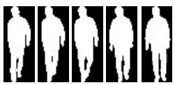

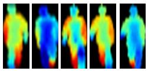

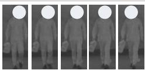

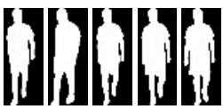

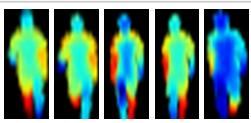

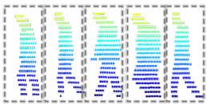

Projected Depth

Point Cloud

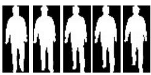

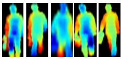

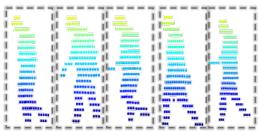

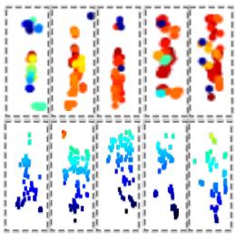  
Depth Camera

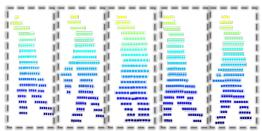

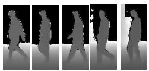

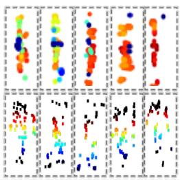

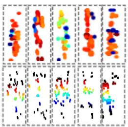

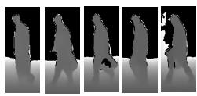

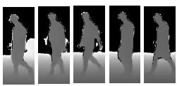  
Fig. S1. Representative MMGait sequences for one participant. Rows cover the twelve raw or derived gait modalities at the annotated walking directions, while columns show normal walking, backpack carrying, and clothing change.

Walking  
Backpack  
Clothing  
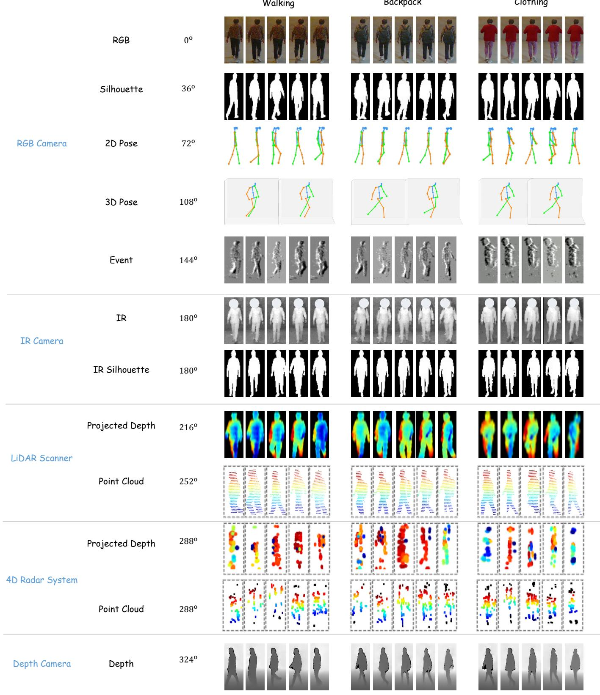  
Fig. S2. Additional representative MMGait sequences from another participant, showing the twelve raw or derived gait modalities at the annotated walking directions under normal walking, backpack carrying, and clothing change.