# A 25-µs/inf Event-driven Graph Neural Network Processor with Spatiotemporal Caching and Spline Convolution for Ultra-low-latency AI at the Edge

Adrian Kneip1,2, Member, IEEE, Martin Lefebvre1, Member, IEEE, Daniel Gehrig3,4, Member, IEEE, Victoria Catalan Pastor´ 3, Graduate Student Member, IEEE, Davide Scaramuzza3, Senior Member, IEEE, Marian Verhelst2,∗, Fellow, IEEE, and Charlotte Frenkel1,∗, Member, IEEE

1Delft University of Technology (TU Delft), 2628 CD Delft, The Netherlands. 2KU Leuven, 3000 Leuven, Belgium.   
3University of Zurich (UZH), 8050 Z ¨ urich, Switzerland. ¨ 4University of Pennsylvania, Philadelphia, PA 19104, USA.

Abstract—Dynamic-vision-sensor (DVS) cameras generate events on a per-pixel basis with a µs-level temporal resolution, calling for new algorithm-hardware co-design approaches compared to standard frame-based vision. While event-driven graph neural networks (EV-GNNs) emerge as a promising algorithmic solution, they raise new HW challenges by mixing dense-regular compute operations and sparse-irregular memory accesses. We present ETHEREAL, the first EV-GNN accelerator that scales to 640×480 resolutions, thanks to a neighbor-parallel splineconvolution engine and a 2D/3D-split memory hierarchy with a novel region-of-interest spatiotemporal caching mechanism. Measurement results demonstrate end-to-end inference with 25.6µs latency and 1.7µJ energy per event on state-of-the-art workloads such as DAGr-GNN, a 10-to-1000× improvement over prior art. Index Terms—Low latency, graph neural networks (GNNs), event-based computing, digital AI processors.

## I. INTRODUCTION

U LTRA-LOW-LATENCY detection is key for smart real-time edge applications, from safe autonomous car/drone navigation to virtual-reality headsets [1], [2], [3] (Fig. 1(a)). Unlike conventional frame-based cameras, which have a latency of several ms, dynamic vision sensors (DVS) generate asynchronous event streams with a µs-level temporal resolution [4]. However, today’s vision processing systems fail to achieve both high accuracy and low latency [5], [6], [7]. Recently, event-driven graph neural networks (EV-GNNs) have emerged as a promising approach to bridge this gap by exploiting the sparsity and locality of event streams, first by adding each new event as a node of a spatiotemporal graph, then by using a GNN to exploit efficient local updates between the new node and its neighbors (NB) (Fig. 1(b)) [8], [9].

While a few EV-GNN accelerators have been proposed on FPGA [8], [10], they are limited to low-resolution toy setups, as three critical challenges impede hardware (HW) scalability to high-resolution workloads such as DAGr-GNN [9] (Fig. 2): (1) Modern EV-GNNs rely on spline-convolution to encode positional information in the weights, which improves detection accuracy by up to 2×. However, the lack of efficient HW support for spline-convolution operations, which involve up to 800% more compute than linear graph convolution [11], hinders their deployment within acceptable footprints.

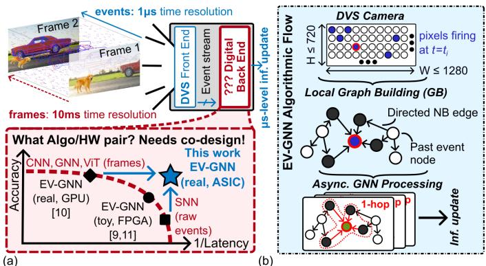  
Fig. 1. (a) Algorithm-hardware co-design challenge for state-of-the-art lowlatency event-based processing. (b) Working principle of EV-GNNs.

(2) Such EV-GNNs first consist of a few 3D layers, which are memory-bound. Indeed, they rely on spatiotemporal (x, y, t) high-resolution maps, with a low number of channel features per node. Neighborhoods are defined within a spatiotemporal radius, leading to significant external-memory accesses (EMAs) to the graph’s large-footprint 3D data maps that are both sparse and irregular.

(3) The 3D layers are followed by several 2D layers, after a pooling projection that removes the explicit time dimension. These 2D layers are compute-bound: they consist of lowerresolution voxel maps, where each voxel (vx, vy) carries spatial-only position information, but contains many feature channels as well as the overall graph connectivity. Although neighborhoods are limited to adjacent spatial voxels,their sparse connection is usually encoded as source-to-destination edge lists, which hinders leveraging high parallelism for low latency due to costly look-ups.

To address these challenges, we propose ETHEREAL, the first EV-GNN processor chip (Fig. 3). Embedded in a lowfootprint RISC-V-based SoC for control, its EV-GNN accelerator features (i) an output-parallel-and-stationary datapath with eight 4/8b-configurable spline-convolution message-passing (MP) cores followed by a unified aggregation and nodeupdate unit, (ii) a 3D spatiotemporal data cache that leverages neighbors locality within regions of interest to reduce irregular EMAs, (iii) a fully on-chip 2D data scratchpad that enables NB-parallel processing through simultaneous multi-neighbor node-data access and one-hot encoding of the 2D-edge connectivity, thereby solving the three HW challenges above and unlocking scalability to modern EV-GNN workloads.

DAGr-GNN Architecture [Gehrig et al., Nature '24]  
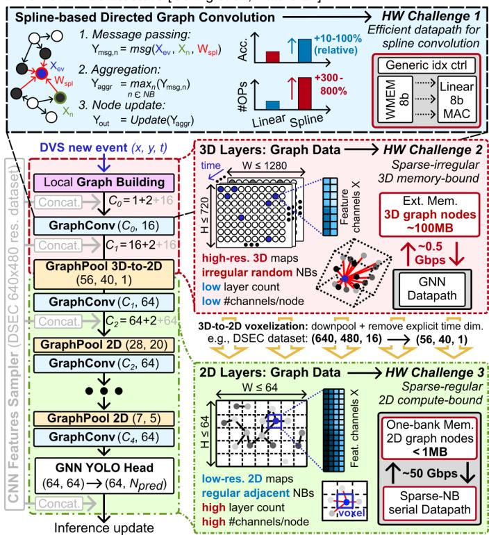  
Fig. 2. State-of-the-art DAGr-GNN workload and its HW challenges.

This paper is organized as follows: Section II presents ETHEREAL’s event-driven spline convolution and its dedicated MP cores. Section III then details the 3D and 2D memory architectures, including memory-datapath dataflow scheduling. Finally, Section IV presents chip measurements.

## II. SPLINE-CONVOLUTION DATAFLOW AND DATAPATH

Conventional 2D/3D convolutions apply static filter weights to a pixel neighborhood, where all positions are predetermined. In contrast, spline-based convolution embeds the positional difference $( d x , d y )$ between a node and its NB by modulating weights W with splines of a certain degree D and kernel K [11], turning knowledge of positional information into accuracy gains. For 2D splines with $D = 1$ and $K = 3$ , the MP output $Y _ { m s g }$ is a linear combination of $( D + 1 ) ^ { 2 } = 4$ base kernels. By expressing $Y _ { m s g }$ as a decomposition of regular MAC operations, we identify three phases (Fig. 4(a)): (1) an initialization to find the position-dependent set of $( D + 1 ) ^ { 2 } = 4$ spline indices idx that determine the weight tensors W[idx] to apply to each NB; (2) a linear MAC between the looked-up weights and input features X, yielding an intermediate $Y _ { M A C }$ result; (3) a spline MAC between $Y _ { M A C }$ and bilinear, positiondependent spline coefficients Z that apply a position-dependent modulation. To leverage spatial weight reuse, we propose to directly iterate over the spline indices idx (Fig. 4(b)). Indeed, weights W[idx] can be shared across different (active) MP cores at each iteration, thereby maximizing utilization of the 1024b-bandwidth WMEM. This spline-iterative MP phase is followed by the aggregation and node update phases, yielding the spline-convolution output features $Y _ { o u t }$ in Fig. 4(b).

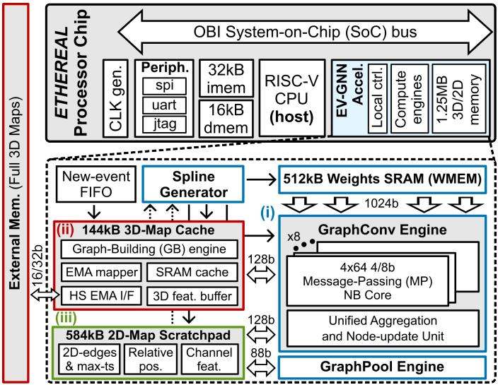

Fig. 3. Overview of (a) the ETHEREAL chip and (b) its EV-GNN accelerator.  
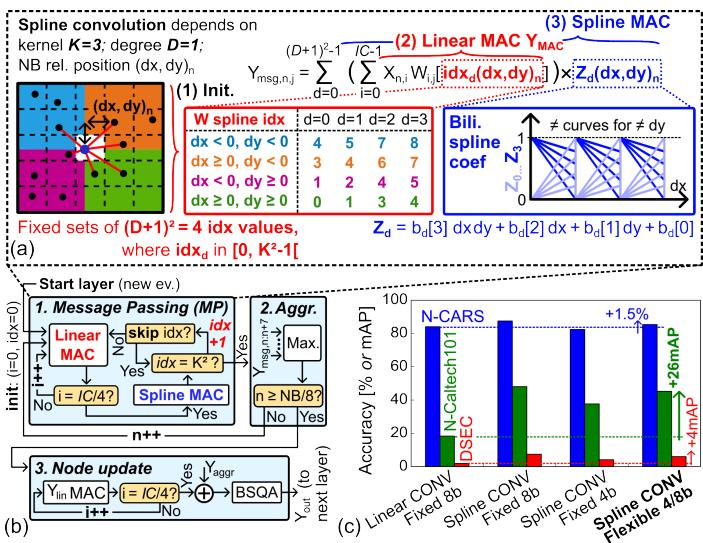  
Fig. 4. (a) Three-phase decomposition of spline-based MP into MACs, and (b) its iterative execution across W spline indices in ETHEREAL’s graphconvolution dataflow. (c) Accuracy benefit of precision-flexible splines.

We exploit this dataflow in both the 3D and 2D layers in ETHEREAL’s reconfigurable graph-convolution datapath, which features eight NB-parallel MP cores (Fig. 5(a)-(b)) whose outputs gather into a unified aggregation and nodeupdate unit. Each MP core consists of a 4×64 configurable-MAC array with 5/4b processing elements (PEs) followed by spline accumulators that add four $Y _ { M A C }$ values into an output message $Y _ { m s g } .$ . Each PE embeds a linear multiplier whose sign and operands change with the MP phase. During the linear-MAC phase (Fig. 5(a)), signed 4b weights W are broadcast to all MP cores in parallel, while 8×4 4b (un)signed NB inputs X are fed to the PEs. In this phase, mixed-4/8b operations are supported by multi-cycle MACs with post-accumulation leftshift bit alignment: this configurability is key to preserve high accuracy with minimum latency and memory footprints (Fig. 4(c)). During the spline-MAC phase (Fig. 5(b)), the signed 20b partial sum $Y _ { M A C }$ is split column-wise across PEs in four packs of 5b, while the second input operand of the PEs is now fed with the unsigned spline coefficients Z. These are generated by a bilinear-interpolation unit based on the relative position (dx, dy) of NB nodes, and precompiled parameters b[idx]. The two-mode configurability limits the MP core’s area overhead compared to a linear MAC array below 30%.

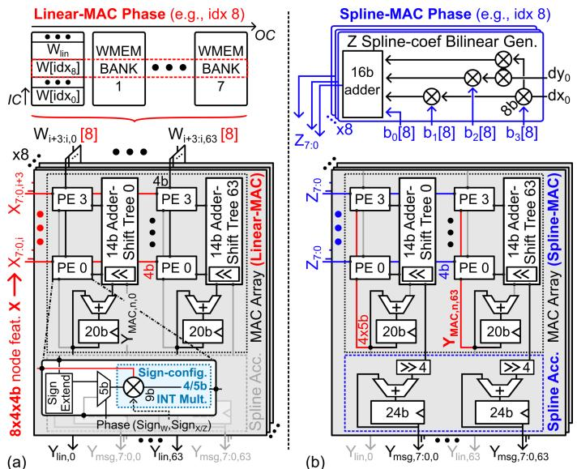  
Fig. 5. Reconfigurable MP cores during (a) linear and (b) spline MAC phases.

## III. SPLIT-3D/2D DATA MEMORY SYSTEM

To address 3D sparse-irregular and 2D sparse-regular nodedata accesses, we split the EV-GNN memory in two parts.

3D memory: we leverage the spatiotemporal locality of NBs in the event graph to reduce EMAs in the memorybounded 3D layers. To that end, we introduce an 8-way set-associative 3D cache (256 sets/way), that keeps track of event data from regions of interest (RoIs) in the event-stream graph (Fig. 6(a)). The 3D-cache architecture is intertwined with the EV-GNN’s graph-building process, similar to [8] (Fig. 6(a)-(b)). Upon the reception of a new event at location (x, y), a new spatial candidate is derived from a spiral-like spatial NB search. First, a cache lookup compares the NB candidate’s spatial tag with that of all ways of the indexed set. Then, upon a hit, a temporal search compares the cache entry’s timestamp (ts) with that of the new event: if their difference lies within a user-defined temporal radius, the NB candidate is deemed valid. Its features X are then finally transferred at 5Gbps to a 3D buffer for NB-parallel reshaping, before being streamed to the graph-convolution engine. Upon a spatial miss, the search process triggers EMAs at a 0.5Gbps bandwidth, thereby making the NB search 10× slower. This bandwidth gap underlines the importance of maximizing cache hits to minimize the latency overhead. Analyzing edge-vision datasets with various DVS camera resolutions, we found out that storing only the most-recent ts per (x, y) location usually maximizes the hit rate, at a fixed cache size and number of ways (Fig. 6(c)). Hit rates reaching up to 58% turn into a 2.4× reduction in read EMAs, thereby significantly alleviating the memory-bound regime of 3D layers.

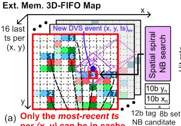

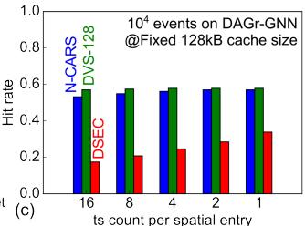

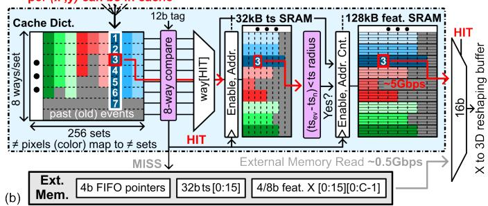  
Fig. 6. (a) Illustration of spatiotemporal locality (RoIs) in the external memory’s 3D-FIFO maps, and example of spatial NB search for a new event. (b) 3D cache architecture, illustrating the most-recent-timestamp (ts), 8-spatialways mapping policy, with a three-phase hit-read scheme that intertwines temporal search. (c) Hit rate for different datasets and caching schemes.

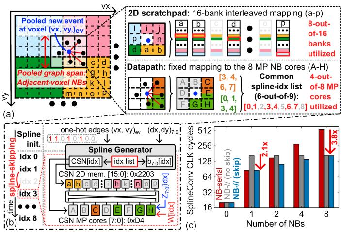

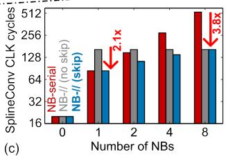  
Fig. 7. (a) Mapping of a new 2D voxel event and its neighbors to 2D memory and datapath cores. (b) Illustration of the corresponding splineiterative dataflow with skipping. (c) Latency benefits of spline skipping.

2D memory: we leverage the regularity of spatial-only neighborhoods in the 2D layers to foster high parallelism and avoid EMAs altogether. To that end, we take advantage of the observed spatial-adjacency property of NB candidates in 2D voxel maps: node data are mapped to a 16-bank memory in a 2D-interleaved manner, whereas processing of each of the eight potential NBs is attributed to a fixed MP core (Fig. 7(a)). This mapping enables peak parallelism across neighbors by continuously streaming 8×16b 2D node features X per cycle from the 2D memory. Moreover, by directly accessing the relative NB-to-event position (dx, dy) and the set of inbound 2D neighbor edges in the 2D memory, the spline generator initializes the list of valid spline indices in a single cycle, as opposed to the 3D case that necessitates prior graph building. Additional latency and energy gains are respectively leveraged by skipping unnecessary spline indices during the spline-iterative MP phase, and by clock gating unused memory banks/MP cores (Fig. 7(b)). This dataflow improves latency per inference by up-to 3.8× compared to a NB-serial splineconvolution (extrapolated from [8]) (Fig. 7(c)).

(d)  
TABLE I COMPARISON TO THE STATE OF THE ART  
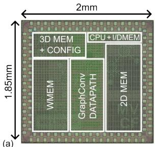

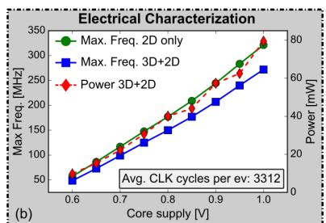

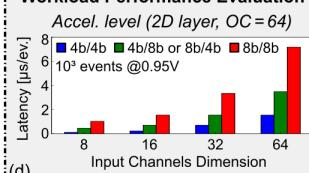

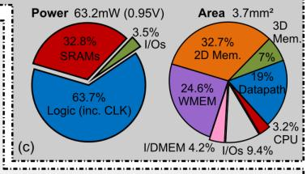  
System level (DAGr-GNN end-to-end on N-Caltech101 workload)

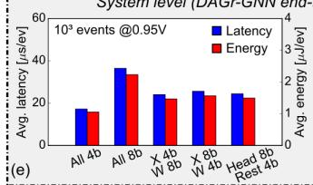

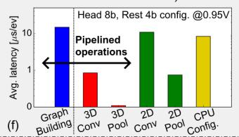  
Fig. 8. Measurements: (a) chip microphotograph, (b)-(c) electrical performance, and workload evaluation at the accelerator (d) and system (e)-(f) levels.

## IV. MEASUREMENT RESULTS

The ETHEREAL chip has been implemented in a TSMC 28nm process (Fig. 8(a)) and reaches up to 250MHz at a target 0.95V on DAGr-GNN (Fig. 8(b)). ETHEREAL’s total power of 63.2mW is then dominated by logic operations, whereas SRAMs occupy the majority of the chip area (Fig. 8(c)).

Performance evaluation of ETHEREAL on the DAGr-GNN DVS workload demonstrates its flexible trade-off between latency, energy and accuracy. At the accelerator level (Fig. 8(d)), the per-layer latency ranges from 0.3 to 7.1µs for a representative 64×48 voxel map, showcasing performance adaptivity to various channel dimensions and bit precision. At the system level (Fig. 8(e)), the layer-wise configuration of the bit precision determines the end-to-end performance (related to the accuracy target in Fig. 4(c)), yielding a per-event latency (resp. energy) between 17.8 and 36.5µs (resp. 1.1 and 2.3µJ) at 0.95V. An end-to-end latency breakdown (Fig. 8(f))) highlights the balance between processing and configuration arising from the event-driven dataflow, where graph building is pipelined with other operations to reduce the total latency by 1.8×.

<table><tr><td></td><td>GPU</td><td colspan="3">SNN</td><td colspan="3">EV-GNN</td></tr><tr><td></td><td>Measured</td><td>[6]ii)</td><td>[7][i)</td><td>[12]ii)</td><td>[8]</td><td>[10]</td><td>This Work(ii)</td></tr><tr><td>Year</td><td>2026</td><td>2021</td><td>2022</td><td>2024</td><td>2025</td><td>2025</td><td>2026</td></tr><tr><td>Technology</td><td>A100</td><td>14nm</td><td>28nm</td><td>40nm</td><td>FPGA</td><td>FPGA</td><td>28nm</td></tr><tr><td>Supply [V]</td><td>0.9</td><td>0.8</td><td>0.5-0.8</td><td>一</td><td>0.8</td><td>0.8</td><td>0.6-1</td></tr><tr><td>Freq. [MHz]</td><td>一</td><td>60</td><td>13-115</td><td>50-200</td><td>200</td><td>NA</td><td>280</td></tr><tr><td>Total Memory</td><td>1</td><td>27MB</td><td>138kB</td><td>一</td><td>780kB</td><td>NA</td><td>1.25MB</td></tr><tr><td>Area [mm2]</td><td></td><td>60</td><td>0.9</td><td>2.2</td><td></td><td></td><td>3.7</td></tr><tr><td>X/W Precision</td><td>FP64</td><td>1/8b</td><td>1/8b</td><td>1-8/8b</td><td>8b</td><td>8b</td><td>4-8/4-8b</td></tr><tr><td>Max. Img. Res.</td><td>640×480</td><td></td><td></td><td>128×128128×128128×128</td><td>120×100</td><td>240×180</td><td>640×480</td></tr><tr><td>Repr. workload Acc. on HW</td><td>N-CARS 90.7(iv) N-Cal.101 52.6(iv)</td><td>N-CARS 94.5 DVS128 90.5</td><td>一 DVS128</td><td>一 DVS128 96.1</td><td>N-CARS 87.8</td><td>N-CARS 92.5 N-Cal.101 62.8</td><td>N-CARS 86.7(iv),(v),(vi) N-Cal.101 48.1(iv),(v),(vi)</td></tr><tr><td>Peak Thrput.</td><td>DSEC 12.4(iv)</td><td>一</td><td>一</td><td></td><td></td><td>一</td><td>DSEC 7.6(iv),(v),(vi)</td></tr><tr><td>[TOPS/b](i.(ii))</td><td>一</td><td>0.04</td><td>0.04</td><td>92</td><td>一</td><td>0.24</td><td>16</td></tr><tr><td></td><td></td><td></td><td></td><td></td><td></td><td></td><td></td></tr><tr><td></td><td></td><td>0.48</td><td>12</td><td>2740</td><td></td><td></td><td></td></tr><tr><td></td><td></td><td></td><td></td><td></td><td></td><td></td><td></td></tr><tr><td></td><td></td><td></td><td></td><td></td><td></td><td></td><td></td></tr><tr><td>Peak Ene. Eff.</td><td></td><td></td><td></td><td></td><td></td><td></td><td>113</td></tr><tr><td>[TOPS/W/b](i),(ii)</td><td></td><td></td><td></td><td></td><td></td><td></td><td></td></tr><tr><td></td><td></td><td></td><td></td><td></td><td></td><td></td><td></td></tr><tr><td>Avg. Latency/inf.</td><td>140ms</td><td></td><td>600µs</td><td>2.2ms</td><td></td><td></td><td>17-36μs(iv),(v)</td></tr><tr><td>Avg. Energy/inf.</td><td>400mJ</td><td>900μs 320μJ</td><td>46µJ</td><td>6.2µJ</td><td>16μs</td><td>≥ 5.1ms</td><td>1.1-2.3μJ(iv),(v)</td></tr></table>

(i) Linearly normalized to 1b inputs and weights. (ii) 1 MAC = 2 OP. (iii) System level (excl. DRAM). (iv) DAGr-S, GNN only (directed) (v) Mixed 4/8b with QAT (0.95V). (vi) End-to-end acc. simulated with HW model, measured end-to-end validity on synth. data.

Compared to the SotA (Table I), ETHEREAL is the only design to achieve a µs-level inference on deep networks, improving the detection latency by up to 1000× over prior works while achieving comparable accuracy. These include existing EV-GNN accelerators evaluated on N-CARS and N-Caltech101, which are limited to low-resolution (≤240×180) DVSes. In contrast, ETHEREAL is the first work to demonstrate scalability toward high-resolution DVS by mapping DSEC (640×480) with records 25.6µs latency and 1.7µJ energy per event inference.

## V. CONCLUSION

In this work, we presented ETHEREAL, the first EV-GNN processor for ultra-low-latency, high-resolution edge vision. To address the three scalability challenges of modern EV-GNNs, it features a precision-flexible spline-convolution datapath, a 3D spatiotemporal cache for regions of interest, and a 2Dinterleaved memory that enables NB parallelism. Measurement results showcase a 25.6µs latency and a 1.7µJ energy per inference on the SotA DAGr-GNN for DSEC. ETHEREAL thereby achieves a 10-to-1000× improvement over prior designs, and is the first to scale up to 640×480 DVS inputs.

## REFERENCES

[1] A. Gupta et al., Array, vol. 10, pp. 1–20, 2021.

[2] M. Elbamby et al., IEEE Network, vol. 32, no. 2, pp. 78–84, 2018.

[3] A. Verma et al., in Proc. IEEE/CVF CVPR, 2024, pp. 22 637–22 646.

[4] P. Lichtsteiner et al., IEEE JSSC, vol. 43, no. 2, pp. 556–576, 2008.

[5] M. Scherer et al., in Proc. IEEE Cool Chips, 2023, pp. 42–48.

[6] A. Viale et al., in Proc. IEEE IJCNN, 2021, pp. 1–10.

[7] C. Frenkel and G. Indiveri, in Proc. IEEE ISSCC, 2022, pp. 1–2.

[8] Y. Yang et al., IEEE TCASAI, vol. 2, no. 1, pp. 37–50, 2025.

[9] D. Gehrig and D. Scaramuzza, Nature, vol. 629, pp. 1034–1040, 2024.

[10] K. Jeziorek et al., arXiv preprint arXiv:2406.07318, pp. 1–16, 2025.

[11] J. L. M. Fey et al., in Proc. IEEE/CVF CVPR, 2018, pp. 869–877.