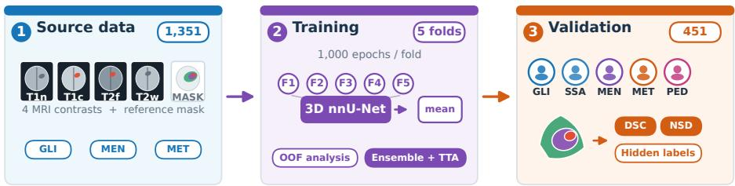
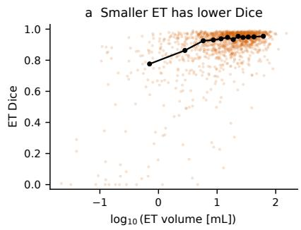
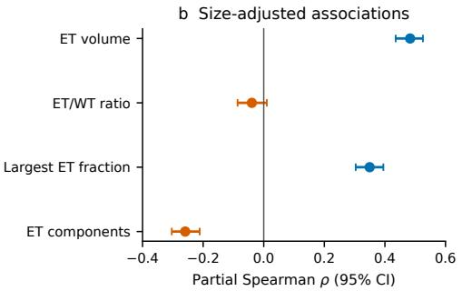
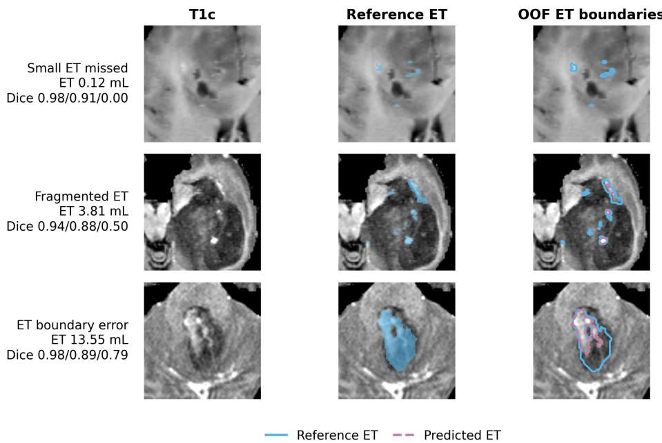

# Assessing nnU-Net Generalization across Brain Tumor Populations in BraTS-GoAT 2026

Tristan Kirscher1,2, Vivian Metzger2, Philippe Meyer1,2, and Xavier Coubez1,2

1 ICube Laboratory, CNRS UMR 7357, University of Strasbourg, Strasbourg, France 2 CLCC Institut Strauss, Strasbourg, France tristan.kirscher@unistra.fr

Abstract. BraTS-GoAT evaluates tumor segmentation across heterogeneous populations. We trained a conventional 3D nnU-Net on 1,351 labeled cases using five-fold cross-validation and 1,000 epochs per fold. The final predictor averaged all folds and applied test-time mirroring. On pooled oficial validation, global DSC values were 0.7805, 0.8288, and 0.8854 for enhancing tumor (ET), tumor core (TC), and whole tumor (WT). Under matched fold-0 inference, mean regional Dice decreased from 0.9058 on source out-of-fold (OOF) cases to 0.8310 on pooled validation (diference −0.0747). Mirroring gave small single-fold gains but no clear ensemble benefit; a residual-encoder alternative reached 0.8282 mean Dice. In labeled OOF predictions, failure cases had substantially smaller reference ET volumes; after adjustment for ET and WT volume, lower Dice remained associated with more disconnected ET components and a smaller fraction of ET contained in the largest component.

Keywords: Brain tumor segmentation · MRI · nnU-Net · model ensemble · test-time augmentation · generalization · failure analysis

## 1 Introduction

Automatic brain-tumor segmentation supports quantitative assessment, treatment planning, and follow-up, but robustness across populations and acquisition protocols remains challenging. BraTS established a common evaluation framework for multisequence MRI tumor segmentation [12, 2, 3]. The BraTS Generalizability Across Tumors (BraTS-GoAT) task extends this objective across adult glioma, glioma from sub-Saharan Africa, meningioma, brain metastases, and pediatric brain tumors [1, 10, 13, 7, 6].

Tumor size, multiplicity, appearance, and imaging characteristics vary across cohorts. nnU-Net provides a self-configuring reference [4], while previous GoAT work combined multiple architectures with adaptive post-processing [5]. Population shifts may also interact with nnU-Net’s data-driven configuration. In pediatric CT organ segmentation, configuration plans derived from adult dataset fingerprints have been shown to underperform on pediatric anatomy, particularly for small structures [9]. Motivated by these observations, we evaluated a fixed nnU-Net protocol, ensembling, mirroring, and a residual encoder, and then analyzed out-of-fold (OOF) failures. Because validation population labels were unavailable, all target-domain analyses were necessarily pooled.

  
Fig. 1. Study design. One protocol was fitted to labeled source data and evaluated on the pooled validation cohort without population-specific adaptation.

## 2 Materials and Methods

## 2.1 Task, data, and target regions

We used only challenge data, without external data or pretrained weights. The pooled, anonymized training set contained 1,351 labeled cases drawn from three source populations: adult glioma (GLI), meningioma (MEN), and brain metastases (MET). Verified per-case cohort labels were unavailable. Inputs were noncontrast T1-weighted (T1n), contrast-enhanced T1-weighted (T1c), T2-FLAIR (T2f), and T2-weighted (T2w) MRI. The pooled validation set contained 451 cases from the three source populations and two additional target populations: glioma from sub-Saharan Africa (SSA) and pediatric brain tumors (PED). Validation reference labels and the case-to-population mapping were hidden. Figure 1 summarizes the resulting source and pooled-validation data flow.

Class 1 was NCR/NET; class 2, edema/invaded tissue; and class 3, ET. NCR/NET is the necrotic and non-enhancing core. Evaluation used ET {3}, tumor core (TC) {1, 3}, and whole tumor (WT) {1, 2, 3}. Each output was a NIfTI label map in the input image space.

## 2.2 Preprocessing and network configuration

We used nnU-Net v2.6.2 with its selected 3d\_fullres configuration. Modalities were resampled to 1-mm isotropic spacing and z-score normalized within the nonzero mask. The six-stage 3D PlainConvUNet used $1 2 8 \times 1 6 0 \times 1 1 2$ patches, batch size 2, encoder widths 32, 64, 128, 256, 320, and 320, and overlapping sigmoid outputs for WT, TC, and ET. The encoder stages and the five decoder stages each used two $3 \times 3 \times 3$ convolutions. Downsampling was $2 \times 2 \times 2$ except for a $2 \times 2 \times 1$ deepest transition. Convolutions were followed by instance normalization and leaky ReLU.

## 2.3 Training protocol

A model was trained from scratch for each deterministic fold for 1,000 epochs (250 training and 50 validation iterations per epoch) using the standard nnU-Net sum of region-based Dice and binary-cross-entropy losses, deep supervision, foreground oversampling, and augmentations. Optimization used stochastic gradient descent, Nesterov momentum 0.99, initial learning rate $1 0 ^ { - 2 }$ , weight decay $3 \times 1 0 ^ { - 5 }$ , and polynomial decay. We retained the epoch-1,000 final checkpoint for every fold. In each cross-validation rotation, 270 or 271 source cases formed the held-out fold used for internal validation; this internal split was distinct from the hidden challenge validation cohort. Foreground oversampling was 0.33. Standard augmentations covered geometry, noise and blur, intensity, simulated resolution, gamma, and mirroring. Checkpoints were not selected using challenge validation scores. No hyperparameter search was performed: preprocessing, architecture, patch and batch sizes, loss, optimizer, and schedule followed the nnU-Net plan and stock trainer. Training plus final OOF validation took 12.1–12.5 h per fold (mean 12.3 h) on one NVIDIA A100 40-GB GPU. Peak allocated VRAM was not instrumented.

## 2.4 Five-fold inference and test-time augmentation

The final configuration averaged folds 0–4 and nnU-Net’s mirrored predictions over spatial axes (0, 1, 2). Probability maps were averaged before conversion of overlapping regions to atomic labels, and nnU-Net restored the input geometry. This was a cross-validation ensemble—members were trained on diferent 80% subsets—rather than a deep ensemble trained repeatedly on the full set. It reused the models required for OOF analysis; recent controlled evidence found no consistent OOD winner between the two constructions and recommends reporting them explicitly [8]. No connected-component post-processing or tuned region threshold was applied.

## 2.5 Alternative architecture and ablation design

The alternative five-fold ResidualEncoderUNet-L used $1 6 0 \times 1 9 2 \times 1 6 0$ patches, batch size 3, and the same trainer and 1,000-epoch schedule. It changed the automatically planned encoder and patch geometry while preserving the split and inference procedure. The five submitted configurations compared fold 0 with five-fold probability averaging, with and without mirroring, and the residual alternative. Challenge validation results were used only for this post hoc comparison, not for checkpoint selection or parameter tuning.

## 2.6 Validation metrics

The server returned per-case global semantic Dice similarity coeficient (DSC), normalized surface Dice (NSD), and 95th-percentile Hausdorf distance (HD95). DSC and NSD are the announced ranking metrics; the organizers specified τ = 1 for final NSD scoring without specifying its unit. The tolerance and unit used by the validation server were not disclosed; consequently, we report its NSD values without assigning a millimeter tolerance. We retain HD95 as a complementary diagnostic [11]. Paired contrasts used finite shared cases and 10,000-resample percentile bootstrap intervals. We report efect estimates rather than hypothesis tests because configurations were selected post hoc. Table 1 contains marginal means and case-level standard deviations of the server-returned metrics over finite cases. Paired contrasts instead exclude non-finite cases jointly for each comparison and metric.

## 2.7 Pooled source–validation comparison

For a model-matched comparison, we applied the same fold-0 checkpoint with mirroring to its 271 held-out source cases and to the oficial validation cohort. We defined the performance diference as pooled-validation DSC minus source OOF DSC. Source and validation cases were resampled independently, and the regional mean was recomputed in each of 10,000 bootstrap replicates. This descriptive diference combines evaluator implementation, case mixture, and possible distributional efects; it is not an estimate of pure population shift.

## 2.8 Out-of-fold failure analysis

Each training case was predicted by its excluding fold. The outcome was strict mean ET/TC/WT Dice; 1,343 cases had three finite values. Failures were defined as cases in the bottom decile of the strict mean regional Dice distribution. Robustness to this threshold was assessed using alternative bottom-5% and bottom-20% definitions.

Reference-mask features comprised volume, 26-connected components of at least 10 voxels (to suppress isolated voxel-scale fragments), largest-component fraction, and ET/WT ratio. At 1-mm isotropic spacing, voxel counts were divided by 1,000 to report volumes in mL. We used rank-biserial efects for group contrasts and partial Spearman correlations, computed from rank residuals after adjustment for the stated volume covariates. Benjamini–Hochberg correction was applied separately to the morphology screen and four targeted follow-up tests. Within each of 2,000 fold-stratified bootstrap resamples, ranks and residual models were re-estimated. Intervals quantify case-sampling uncertainty with the trained segmentation models fixed; they omit retraining and hidden-populationmixture uncertainty. All failure analyses remain exploratory because hypotheses and estimates used the same cases and folds had overlapping training sets.

## 2.9 Container and reproducibility controls

The ofline Linux/AMD64 container pins nnU-Net 2.6.2, PyTorch 2.6.0, CUDA 12.4, and cuDNN 9. It reads /input, writes one flat NIfTI map per case to /output, and validates modalities, cases, and geometry against T1n. Code, nnU-Net plans, container files, inference configuration, validation checks, and analysis

scripts are available at https://github.com/Kirscher/BraTS2026. A versioned bundle of the five epoch-1,000 checkpoints is linked from the repository. Challenge data, predictions, and oficial score exports are not redistributed; analyses that depend on them therefore support inspection but not regeneration from a clean clone. Five-fold mirrored inference over the 451-case validation archive took 1 h 55 min on one NVIDIA Quadro RTX 6000 24-GB GPU (15.3 s/case); peak allocated VRAM was not instrumented.

## 3 Results

## 3.1 Internal five-fold cross-validation

The unweighted mean of the mean foreground Dice values in the five final nnU-Net fold summaries was 0.9022 (SD 0.0073; range 0.8913–0.9090). Pooled percase OOF regional Dice was 0.8674 (SD 0.1962) for ET (n = 1,343), 0.9125 (0.1573) for TC (n = 1,350), and 0.9267 (0.1081) for WT (n = 1,351). The strict complete-case mean was 0.9034 (SD 0.1275; n = 1,343).

## 3.2 Oficial validation results

All five 451-case archives were accepted. The server omitted case 02845 from every per-case score file, leaving the same 450 rows. The five-fold TTA model had the highest mean DSC (0.8315) and NSD (0.5164), while fold-0 TTA reached 0.8310 and 0.5140. The residual configuration had lower DSC point estimates in every region, but its paired intervals against PlainConv included zero (Table 1).

## 3.3 Quantitative ablation efects

Paired complete-case efects need not equal diferences between the marginal means in Table 1. For fold 0, TTA increased ET and WT DSC by 0.0021 (95% interval 0.0003–0.0039) and 0.0011 (0.00003–0.0021); TC changed by 0.0005 (−0.0022–0.0032). NSD gains were 0.0040–0.0055. After five-fold ensembling, every DSC and NSD change was within 0.0008 of zero and all intervals included zero.

Five folds gave no clear paired DSC improvement over fold 0. Without TTA, ensembling increased NSD by 0.0056–0.0082; with TTA, intervals included zero. Residual minus conventional five-fold TTA DSC changes were −0.0047, −0.0039, and −0.0033, with intervals including zero.

An exploratory cross-fitted OOF sweep over ET probability thresholds and minimum component sizes did not improve the default operating point: ET DSC changed by −0.00072 (95% interval −0.00122 to −0.00032), and ET NSD by −0.00225 (−0.00334 to −0.00137). Because calibration-fold models had seen some evaluated cases during training, this sweep was not fully nested; it did not inform the final pipeline.

Table 1. Oficial pooled validation results: mean (case-level SD) over finite serverreturned values. All configurations share 450 scored cases from 451-case archives; the server omitted case 02845, and finite counts vary for empty ET/TC regions. Higher is better for DSC and NSD, and lower for HD95; bold marks the best mean per column. “+TTA” denotes mirroring.
<table><tr><td rowspan="2">Configuration</td><td colspan="3">Global DSC ↑</td><td colspan="3">Global NSD ↑</td></tr><tr><td>ET</td><td>TC</td><td>WT</td><td>ET</td><td>TC</td><td>WT</td></tr><tr><td>PlainConv, fold 0</td><td>0.7738 (.297)</td><td>0.8246 (.250)</td><td>0.8859 (.166)</td><td>0.5392 (.257)</td><td>0.5025 (.274)</td><td>0.4825 (.198)</td></tr><tr><td>PlainConv, fold  $0 + \mathrm { T T A }$ </td><td>0.7811 (.292)</td><td>0.8251 (.254)</td><td>0.8869 (.167)</td><td>0.5476 (.256)</td><td>0.5065 (.276)</td><td>0.4880 (.202)</td></tr><tr><td>PlainConv, folds 0–4</td><td>0.7777 (.299)</td><td>0.8269 (.249)</td><td>0.8855 (.174)</td><td>0.5472 (.263)</td><td>0.5082 (.281)</td><td>0.4907 (.204)</td></tr><tr><td>PlainConv, folds  $0 { - } 4 + \mathrm { T T A }$ </td><td>0.7805 (.297)</td><td>0.8288 (.247)</td><td>0.8854 (.175)</td><td>0.5495 (.264)</td><td>0.5089 (.282)</td><td>0.4908 (.206)</td></tr><tr><td>Residual-L, folds  $0 { - } 4 + \mathrm { T T A }$ </td><td>0.7776 (.306)</td><td>0.8249 (.259)</td><td>0.8821 (.190)</td><td>0.5476 (.275)</td><td>0.5063 (.291)</td><td>0.4910 (.222)</td></tr></table>

<table><tr><td rowspan="2">Configuration</td><td colspan="3">Global HD95 ↓</td></tr><tr><td>ET</td><td>TC</td><td>WT</td></tr><tr><td>PlainConv, fold 0</td><td>41.67 (109.60) 39.87</td><td>20.19 (67.78) 20.65</td><td>12.75 (50.65) 13.43</td></tr><tr><td>PlainConv, fold 0 +TTA</td><td>(107.69)</td><td>(69.68)</td><td>(53.33)</td></tr><tr><td>PlainConv, folds 0–4</td><td>40.35 (108.65)</td><td>18.83 (65.45)</td><td>12.70 (50.62)</td></tr><tr><td>PlainConv, folds  $0 { - } 4 + \mathrm { T T A }$ </td><td>41.18 (110.04)</td><td>19.35 (67.51)</td><td>13.58 (53.48)</td></tr><tr><td>Residual-L, folds  $0 { - } 4 + \mathrm { T T A }$ </td><td>44.31 (114.57)</td><td>23.13 (77.06)</td><td>16.62 (65.05)</td></tr></table>

## 3.4 Descriptive pooled source–validation gap

Under matched fold-0 TTA inference, mean regional DSC decreased from 0.9058 internally to 0.8310 on pooled validation (−0.0747, 95% interval −0.0976 to −0.0523; Table 2). TC and ET had the largest gaps. Hidden labels prevent population-specific attribution.

## 3.5 Failure conditions in labeled out-of-fold predictions

The bottom-decile threshold (mean Dice 0.7877) identified 135 of 1,343 cases. Failure cases had a median reference ET volume of 1.04 versus 18.66 mL for the non-failure cases (rank-biserial efect −0.808, $q = 2 . 3 4 \times 1 0 ^ { - 5 2 } )$ . The rankbiserial efect comparing reference ET volume between failure and non-failure cases remained negative under the bottom-5%, bottom-10%, and bottom-20% failure definitions (−0.938, −0.808, and −0.702, respectively).

After adjustment for WT volume, ET volume remained associated with mean Dice $( \rho = 0 . 4 8 3$ , 95% bootstrap interval 0.436–0.526). Conditional on ET and WT volume, a larger dominant ET component was favorable $( \rho = 0 . 3 5 0 , 0 . 3 0 4 -$ 0.395), whereas more ET components were unfavorable $( \rho = - 0 . 2 5 9 , - 0 . 3 0 4$ to −0.212). The ET/WT volume ratio added no clear association after size adjustment $( \rho ~ = ~ - 0 . 0 3 9 , ~ - 0 . 0 8 6 ~ \mathrm { t o } ~ 0 . 0 1 0 ; ~ q ~ = ~ 0 . 1 5 1 )$ . The associations for ET volume, largest ET component fraction, and ET component count each had $q < 1 0 ^ { - 2 0 }$ , although all four targeted analyses remain exploratory. Figure 2 summarizes the volume efect and the size-adjusted associations. Three selected cases illustrate missed small ET, incomplete fragmented ET, and local boundary errors despite accurate WT (Fig. 3).

Table 2. Matched fold-0 TTA source–validation DSC (n = 271 source; n = 450 validation). Source and validation cases were independently resampled 10,000 times; intervals report validation minus source.
<table><tr><td>Region</td><td>Source OOF</td><td>Pooled validation</td><td></td><td>Validation — source [95% interval]</td></tr><tr><td>ET</td><td>0.8666</td><td>0.7811</td><td>-0.0856</td><td> $\left[ - 0 . 1 2 1 3 , - 0 . 0 4 9 0 \right]$ </td></tr><tr><td>TC</td><td>0.9174</td><td>0.8251</td><td>-0.0923</td><td> $\left[ - 0 . 1 2 1 7 , - 0 . 0 6 3 1 \right]$ </td></tr><tr><td>WT</td><td>0.9333</td><td>0.8869</td><td>-0.0464</td><td> $[ - 0 . 0 6 4 2 , - 0 . 0 2 9 2 ]$ </td></tr><tr><td>Mean</td><td>0.9058</td><td>0.8310</td><td>-0.0747</td><td> $\left[ - 0 . 0 9 7 6 , - 0 . 0 5 2 3 \right]$ </td></tr></table>

  
Fig. 2. Exploratory OOF failures. a ET Dice versus reference ET volume; black points connect 12 equal-frequency bin medians. b Partial Spearman associations with mean regional Dice: ET volume adjusted for WT volume; the other features adjusted for ET and WT volume. Intervals are fold-stratified 95% bootstrap intervals.

  
Fig. 3. Illustrative OOF ET failures on T1c: a small missed ET (GoAT-01055, fold 3), incomplete fragmented ET (GoAT-00330, fold 3), and local boundary undersegmentation (GoAT-01029, fold 1). Dice values, recomputed from the displayed 3D masks, are for WT/TC/ET respectively. Selected examples do not reflect failure frequencies or population efects and illustrate only these error modes.

## 4 Discussion and Conclusion

Validation DSC was lower than source OOF DSC. Mirroring helped fold 0 but not the ensemble; neither the residual configuration nor the ET sweep clearly improved performance. Five-fold TTA was selected post hoc by mean validation DSC and NSD and does not establish general superiority.

OOF failures concentrated in small and fragmented ET, but source-only mask associations are neither causal nor deployable and may not characterize SSA or PED. The source–validation gap combines evaluator, case-mixture, and possible distributional efects rather than pure shift. Limitations include hidden validation labels and population mapping, post hoc selection, an undisclosed validation

NSD tolerance, and intervals omitting retraining uncertainty. Overall, conventional nnU-Net was a transparent baseline; the tested additions gave no clear improvement.

Acknowledgments. Data used in this publication were obtained as part of the Challenge project through Synapse ID (syn74274097). The authors thank the BraTS 2026 organizers and contributors. This work of the Interdisciplinary Thematic Institute HealthTech, as part of the ITI 2021–2028 program of the University of Strasbourg, CNRS, and Inserm, was partially supported by IdEx Unistra (ANR-10-IDEX-0002) and SFRI (STRAT’US project, ANR-20-SFRI-0012) under the framework of the French Investments for the Future Program. The authors acknowledge the High Performance Computing Center of the University of Strasbourg for scientific support and access to computing resources. Part of the computing resources was funded by the Equipex Equip@Meso project (Programme Investissements d’Avenir) and the CPER Alsacalcul/Big Data.

Ethics statement. This study is a secondary analysis of anonymized, organizerprovided challenge data; the authors had no access to direct patient identifiers.

Disclosure of Interests. The authors have no competing interests to declare that are relevant to the content of this article.

## References

1. Adewole, M., Rudie, J.D., Gbadamosi, A., Toyobo, O., Raymond, C., Zhang, D., et al.: The brain tumor segmentation (BraTS) challenge 2023: Glioma segmentation in Sub-Saharan Africa patient population (BraTS-Africa). arXiv preprint arXiv:2305.19369 (2023). https://doi.org/10.48550/arXiv.2305.19369

2. Baid, U., Ghodasara, S., Mohan, S., Bilello, M., Calabrese, E., Colak, E., et al.: The RSNA-ASNR-MICCAI BraTS 2021 benchmark on brain tumor segmentation and radiogenomic classification. arXiv preprint arXiv:2107.02314 (2021). https://doi.org/10.48550/arXiv.2107.02314

3. Bakas, S., Akbari, H., Sotiras, A., Bilello, M., Rozycki, M., Kirby, J.S., et al.: Advancing The Cancer Genome Atlas glioma MRI collections with expert segmentation labels and radiomic features. Scientific Data 4, 170117 (2017). https://doi.org/10.1038/sdata.2017.117

4. Isensee, F., Jaeger, P.F., Kohl, S.A.A., Petersen, J., Maier-Hein, K.H.: nnU-Net: A self-configuring method for deep learning-based biomedical image segmentation. Nature Methods 18, 203–211 (2021). https://doi.org/10.1038/s41592-020-01008-z

5. Jiang, Z., Capellán-Martín, D., Parida, A., Liu, X., Ledesma-Carbayo, M.J., Anwar, S.M., Linguraru, M.G.: Enhancing generalizability in brain tumor segmentation: Model ensemble with adaptive post-processing. In: 2024 IEEE International Symposium on Biomedical Imaging (ISBI). pp. 1–4 (2024). https://doi.org/10.1109/ISBI56570.2024.10635469

6. Kazerooni, A.F., Khalili, N., Liu, X., Gandhi, D., Jiang, Z., Anwar, S.M., et al.: The brain tumor segmentation in pediatrics (BraTS-PEDs) challenge: Focus on pediatrics. arXiv preprint arXiv:2404.15009 (2024). https://doi.org/10.48550/arXiv.2404.15009

7. Kazerooni, A.F., Khalili, N., Liu, X., Haldar, D., Jiang, Z., Anwar, S.M., et al.: The brain tumor segmentation (BraTS) challenge 2023: Focus on pediatrics (BraTS-PEDs). arXiv preprint arXiv:2305.17033 (2023). https://doi.org/10.48550/arXiv.2305.17033

8. Kirscher, T., Bujotzek, M., Kirchhof, Y., Rokuss, M., Isensee, F., Kahl, K.C., Kovacs, B., Maier-Hein, K.: Lost in the folds: When cross-validation is not a deep ensemble for uncertainty estimation. arXiv preprint arXiv:2605.18329 (2026). https://doi.org/10.48550/arXiv.2605.18329

9. Kirscher, T., Faisan, S., Coubez, X., Barrier, L., Meyer, P.: PSAT: Pediatric segmentation approaches via adult augmentations and transfer learning. In: Medical Image Computing and Computer Assisted Intervention – MICCAI 2025. Lecture Notes in Computer Science, vol. 15966, pp. 474–483. Springer Nature Switzerland (2025). https://doi.org/10.1007/978-3-032-04981-0\_45

10. LaBella, D., Adewole, M., Alonso-Basanta, M., Altes, T., Anwar, S.M., Baid, U., et al.: The ASNR-MICCAI brain tumor segmentation (BraTS) challenge 2023: Intracranial meningioma. arXiv preprint arXiv:2305.07642 (2023). https://doi.org/10.48550/arXiv.2305.07642

11. Maier-Hein, L., Reinke, A., Godau, P., Tizabi, M.D., Buettner, F., Christodoulou, E., et al.: Metrics reloaded: Recommendations for image analysis validation. Nature Methods 21, 195–212 (2024). https://doi.org/10.1038/s41592-023-02151-z

12. Menze, B.H., Jakab, A., Bauer, S., Kalpathy-Cramer, J., Farahani, K., Kirby, J., et al.: The multimodal brain tumor image segmentation benchmark (BRATS). IEEE Transactions on Medical Imaging 34(10), 1993–2024 (2015). https://doi.org/10.1109/TMI.2014.2377694

13. Moawad, A.W., Janas, A., Baid, U., Ramakrishnan, D., Saluja, R., Ashraf, N., et al.: The brain tumor segmentation (BraTS-METS) challenge 2023: Brain metastasis segmentation on pre-treatment MRI. arXiv preprint arXiv:2306.00838 (2023). https://doi.org/10.48550/arXiv.2306.00838