# Automated Perceptually-Motivated Assessment of Photographic Consistency in Paired Clinical Photographs: Pipeline Development and Internal Evaluation

Derrick Lin<sup>a,\*</sup>, Samantha Rabinovich<sup>a</sup>, Joclin Rabinovich<sup>b</sup>, Kassra Garoosi<sup>a</sup>, Sumun Khetpal<sup>a</sup>, Evan Delanoy<sup>c</sup>, Neel Bhardwaj<sup>d</sup>, Jason Roostaeian

<sup>a</sup>Division of Plastic and Reconstructive Surgery, Department of Surgery, David Geffen School of Medicine at UCLA, Los Angeles, California, United States

<sup>b</sup>Cornell University, Ithaca, New York, United States

<sup>c</sup>Tulane University, New Orleans, Louisiana, United States

<sup>d</sup>University of Pittsburgh School of Medicine, Pittsburgh, Pennsylvania, United States

Corresponding author. E-mail: DRLin@mednet.ucla.edu

Abstract. Purpose: Paired pre- and post-operative photographs are the standard unit of evidence for plastic surgical outcomes, yet no objective metric verifies whether two images of the same patient were captured under conditions consistent for comparison.

Approach: We developed a perceptually motivated pipeline that analyzes pre/post pairs across thirteen calibrated sub-metrics, partitioned by unsupervised correlation-structure analysis into five data-driven clusters (photometric, texture / sharpness, pose, illumination direction, and pitch), averaged within each cluster and combined across clusters by a weighted sum into a single consistency score. Each sub-metric is calibrated so that its median difference across published within-patient pairs scores 0.5, which is a reference point and carries no pass/fail meaning. The pipeline was calibrated on 134 matched within-patient published pre/post pairs and evaluated against identical-image pairs, synthetic-perturbation pairs, and 134 mismatched cross-publication pairs.

Results: The master consistency score S separated matched from mismatched pairs (sensitivity index d<sup>′</sup> = 2.15, 95% confidence interval (CI) [1.83, 2.55]; area under the receiver operating characteristic curve AUC = 0.928, 95% CI [0.896, 0.959]), closely matching Gaussian-equalvariance predictions. The three head-pose angles did not fall in one cluster: yaw and roll grouped together while pitch separated. Identical pairs scored at ceiling (S ≈ 0.99) and the master score fell monotonically with perturbation magnitude on all five perturbation axes.

Conclusions: The score quantifies photographic comparability, not aesthetic or surgical quality, and provides a freely available web tool for auditing the photographic comparability of pre/post pairs, pending validation against expert judgment.

Keywords: photographic consistency, medical photography, image quality assessment, signal detection theory, perceptual calibration, reproducibility.

## 1 Introduction

Paired pre- and post-operative photographs are the standard visual record in facial plastic and aesthetic surgery. Chart review, publication, training, and medicolegal documentation often reference them. Each of these uses assumes the visible differences came from the procedure. Standardized technique exists to make that comparison valid.<sup>1</sup> Capture conditions like lighting, exposure, focus, and pose vary between sessions and can mimic or obscure real change. When that assumption fails, the photograph shows a difference the procedure did not cause, and every later use of the pair rests on a premise the images cannot support.

Photographic standards for plastic surgery have existed for nearly three decades, beginning with the DiBernardo et al. 1998 standard<sup>1</sup> and refined in the digital era by Prantl and colleagues<sup>2</sup> and at the society level by the ASPS Photographic Guide.<sup>3</sup> All three are purely prescriptive. They specify how to capture a photograph but offer no way to confirm whether a given pair actually met the standard. No published plastic-surgery standard supplies an imagederived check of its own requirements. Where conformance has been assessed, it has been by human raters applying a checklist.<sup>4</sup> Consistency is left to the eye of whoever views the pair.

Automated approaches to image quality and to objective outcome assessment already exist. Generic image-quality metrics rate one image at a time.<sup>5</sup> Face-biometrics programs compare two images to decide whether they show the same person, and publish tolerances for how far pose may drift between them.<sup>6</sup> Sub-specialty outcome scores rate the surgical result.<sup>7,</sup> <sup>8</sup> None asks whether two clinical photographs were captured alike. They assume the two photographs were comparable in the first place, but never check.

This paper supplies the missing check. The pipeline reduces each pair to 13 measurements, which group into five interpretable clusters, and combines them into a single consistency score. We calibrate and evaluate it on four datasets spanning identical self-pairs to unrelated-patient negatives, then release it as a public web tool meant to support the existing prescriptive standards.<sup>1–3</sup>

## 2 Methods

## 2.1 Study Design

This was a retrospective methods-development study. We built an automated measure of photographic consistency for paired clinical photographs and characterized how it behaves on controlled comparison sets. No human raters were involved.

## 2.2 Dataset Assembly

All photographs analyzed in this study were obtained exclusively from previously published peer-reviewed literature; no new patient photographs were collected, no individual patient records were accessed, and no patient was contacted. Under the U.S. Common Rule definition (45 CFR 46.102(e)), the activity is not human-subjects research, and no institutional review board review or exemption letter was obtained. Ethics oversight for the original image acquisition rests with the source institutions.

## 2.2.1 Source photographs

The photograph pool was assembled from a structured PubMed Boolean search covering 2010–2025, run on 1 August 2025, combining facial cosmetic-procedure, photographic-documentation, and methodology terms. The full search string is given in Supplementary Methods S1. Records were screened independently by two reviewers (D.L., J.R.) against the inclusion criteria in Section 2.2.2, with discrepancies resolved by discussion to consensus. Facial photographs from retained publications were extracted and role-tagged as pre- or post-operative. Search yield, retention, and per-stage attrition are reported in Section 3.1.

## 2.2.2 Inclusion criteria and quality gates

Inclusion criteria were applied at two levels: a paper-level review of search records against publication-type criteria, and a photo-level review of extracted images against a sequence of automated quality gates. At the paper level, records were reviewed against four inclusion criteria: publication date between 2010 and 2025, publication in a USbased journal or availability of an English translation, retrievable patient photographs, and content depicting human facial anatomy. Duplicate and off-topic records were removed at the same stage.

At the photo level, extracted photographs were screened through six sequential automated gates assessing minimum resolution, color content, exposure, absence of text overlays, face detectability, and head-pose recoverability. Gates were applied in the order listed, with first-fail attribution. A photograph that failed multiple criteria was counted only under the first failing gate. Verbatim threshold values and the underlying detection libraries are reported in Supplementary Methods S2. Per-stage retention and exclusion attribution are reported in Section 3.1 (Figure 1).

## 2.3 Comparison Sets

Eligible photographs were assembled into four comparison sets, each serving a different role: trivial positives (Set 1), a sensitivity sweep (Set 2), real pre/post pairs (Set 3), and mismatched pairs (Set 4). Both members of every pair had to pass all photo-level inclusion gates. The full source-publication provenance is reported in Supplementary Methods S1. Per-set pair counts, unique-photograph counts, contributing-publication counts, and composition are reported in Section 3.2 (Table 1).

Set 1, Trivial positives. Each eligible photograph was paired with itself (n = 309). The two images are identical, so these pairs should score at the top of the range. Set 1 establishes that upper bound and confirms the pipeline reaches it. Failure on this set indicates instability in the measurement pipeline itself.

Set 2, Sensitivity sweep. Twelve source photographs drawn at random from the eligible pool were perturbed along five axes, one axis at a time: Gaussian blur, global brightness, white-balance shift, in-plane rotation, and uniform scale. Across 43 magnitude levels in total this yielded 12 × 43 = 516 source-vs-perturbed pairs and a magnitude–response curve per axis. Metrics governed by three-dimensional capture geometry (out-of-plane pose, illumination direction; Section 2.4) cannot be synthesized as controlled 2D perturbations, so Set 2 covers the synthesizable axes and leaves the rest to Set 3. Controlled-distortion testing of this kind is standard in the assessment of image-quality metrics.<sup>5</sup> Set 2 is not used to fit the cluster weights (Section 2.5). Per-axis units and magnitude values are reported in Supplementary Methods S1.

Set 3, Real pre/post pairs. Within-patient pre- and post-operative photographs from the same publication were paired by patient identifier as given in the source publication $( n = 1 3 4 )$ . These are real clinical photographs taken across an operative interval, under the lighting and positioning variation typical of routine before-and-after documentation. Set 3 is the reference set against which all sub-metrics are calibrated (Section 2.4.1). It is also the positive class in the reported discriminant, so the same pairs both calibrate and evaluate the score. Section 2.5 bounds the resulting optimism.

Set 4, Mismatched pairs. Cross-study pairs were constructed by randomly pairing one patient’s photograph with an unrelated patient’s photograph from a different publication $( n = 1 3 4 )$ , equal in count to Set 3. The two images come from independent clinical settings, equipment, and subjects, so these are inconsistent pairs by construction, and they are the negative class in the Set 3-versus-Set 4 discriminant.

## 2.4 Photographic Consistency Metrics

Photographic consistency between a pair of images is summarized by a single overall score S on [0, 1], with 1 indicating maximum agreement and 0 indicating maximum disagreement.

The score combines 13 sub-metrics: brightness, contrast, shadow extent, global and median-pixel $\Delta E _ { 0 0 }$ , CIELAB lightness offset, image gradient, focus, noise, yaw, pitch, roll, and illumination direction. The sub-metrics are not grouped in advance. They are partitioned into clusters by an unsupervised correlation analysis.

Each sub-metric measures a capture condition that published photographic standards require to be held constant: illumination, film and sensor response, and patient position.<sup>1–3</sup> A systematic review of facial photography adds exposure, focus, cast shadow, and view.<sup>4</sup> A sub-metric was included when its requirement could be recovered from the image pair alone, without capture metadata. Requirements with no corresponding sub-metric are either unrecoverable from the pair or were not implemented (Section 4.7). Noise is the one exception to that rule, included on imagequality grounds<sup>5</sup> because no published standard specifies a noise requirement. The full requirement-to-sub-metric correspondence is given in Supplementary Methods S6.

A calibrated score of 0.5, on a sub-metric or on the master score S, marks the median disagreement in routine published pre/post pairs (Set 3). It carries no pass/fail or perfect-to-chance meaning.

The remainder of this subsection describes how each sub-metric is calibrated to a common [0, 1] scale, including the full empirical-anchor argument (Section 2.4.1), and how calibrated sub-metric scores are aggregated into the overall score (Sections 2.4.2–2.5).

## 2.4.1 Empirical calibration to a common $[ 0 , 1 ]$ scale

All sub-metrics are calibrated to Set 3, because it is the only set with a spread of differences between pre/post photographs. Each calibration is fit so that the median Set 3 raw difference maps to a calibrated score of 0.5. Supplementary Methods S5 tests an alternative anchoring at the endpoints, mapping Set 1 to 1 and the 95th percentile of Set 4 raw differences to 0, and reports how far the headline results move.

Each sub-metric is converted into a [0, 1] consistency score in two steps. First, the raw absolute difference between the two images is passed through a metric-specific monotone transform (square-root, ln(1 + x), or identity) chosen to stabilize variance. Brightness and lightness follow CIELAB $L ^ { * } , { } ^ { 9 , 1 0 }$ color difference follows CIEDE2000,<sup>11</sup> and the rotational angles follow operational head-pose tolerances.<sup>6,</sup> <sup>12</sup>

Second, the transformed difference is mapped to a score by one of two backends. A Signal Detection Theory (SDT)<sup>13</sup> mapping (Equation S1) serves the five sub-metrics whose transformed Set 3 distributions are wellapproximated by a Gaussian (brightness, contrast, global and median-pixel $\Delta E _ { 0 0 }$ , and the CIELAB lightness offset). A direct empirical-CDF lookup against the Set 3 distribution (Equation S2) serves the remaining eight, whose raw differences are bounded, heavy-tailed, or zero-inflated. The assignment is fixed in advance.

The Signal Detection Theory backend implements the median anchor through a fitted Just-Noticeable-Difference $\mathrm { ( J N D } _ { t }$ , in transformed units). The JND is therefore a calibration parameter, despite the perceptual name. Literature values such as NIST FRVT pose tolerances and CIEDE2000 $\Delta E$ serve as cross-checks on the fitted value. Permetric transforms, backend assignments, fitted JND values, and the underlying perceptual references are reported in Supplementary Methods S3. An empirical walk-through of the procedure on the global $\Delta E _ { 0 0 }$ sub-metric is presented in Section 3.3 (Figure 2).

## 2.4.2 Aggregation and cluster weights

Calibrated sub-metric scores are aggregated into the overall photographic consistency score in two stages. First, the thirteen sub-metrics are partitioned into clusters on Set 3 alone, grouping sub-metrics whose calibrated scores co-vary across real within-patient pre/post pairs. The partition uses average-linkage hierarchical clustering on a $1 - | \rho |$ distance, where $\rho$ is the Pearson correlation between sub-metric calibrated-score vectors across Set 3 pairs, cut at height 0.75 (Supplementary Methods S4). Each cluster score is the unweighted mean of its member calibrated scores, and the discovered cluster count and membership, with the interpretive labels, are reported in Section 3.4. Clustering on Set 2 instead would encode the experimenter-chosen perturbation axes.

Second, the cluster scores $\bar { s } _ { c }$ are combined into the master consistency score by a weighted sum,

$$
S = \sum _ { c } w _ { c } \bar { s } _ { c } , \sum _ { c } w _ { c } = 1 ,\tag{1}
$$

where $w _ { c }$ is the weight of cluster c. The cluster weights are fit by the discriminant-maximization procedure described in the next section, and the fitted values are reported in Section 3.5. Clustering limits the contribution of correlated sub-metrics, which would otherwise enter the weighted sum as near-redundant terms. Clusters are also the unit at which discriminant performance is reported (Section 3.6).

## 2.5 Cluster weightfitting: discriminant maximization

Clusters differ in how much they separate Set 3 from Set 4. Calibration equalizes each sub-metric’s median and leaves its discriminative power untouched.

The cluster weights are fit by directly maximizing the between-set discriminant, the sensitivity index $d ^ { \prime }$ between the master scores on Set 3 (real within-patient pre/post) and Set 4 (mismatched pairs),

$$
d ^ { \prime } = \frac { \mu _ { S _ { 3 } } - \mu _ { S _ { 4 } } } { \sigma _ { \mathrm { p o o l e d } } } , \qquad \sigma _ { \mathrm { p o o l e d } } ^ { 2 } = \frac { 1 } { 2 } \big ( \sigma _ { S _ { 3 } } ^ { 2 } + \sigma _ { S _ { 4 } } ^ { 2 } \big ) ,\tag{2}
$$

following the standard SDT definition,<sup>13,</sup> <sup>14</sup> where $\mu$ and σ are the mean and standard deviation of the master score on the indicated set. The fit objective is the same statistic the master is evaluated on (Section 2.6), so the headline discriminant is not held out in the strict sense. No human-rated consistency labels exist, and fitting instead on Set 2 would tie the weights to the perturbation design.

They are constrained to be non-negative, to sum to one, and to lie within [0.02, 0.70], and are obtained by sequential least-squares quadratic programming (SLSQP) from 24 restarts, one uniform start plus 23 symmetric-Dirichlet draws, with random seed 0. All 24 restarts converged.

Cross-validation re-estimates the cluster weights on each of five folds (seed 0), with the sub-metric calibration and the cluster partition held fixed at their full-Set 3 values. This bounds optimism from the weight fit. It does not bound optimism from the calibration or the clustering, which are unsupervised with respect to the Set 3-versus-Set 4 contrast. A group split by source publication (Supplementary Methods S4) additionally guards against leakage between folds.

## 2.6 Discriminant evaluation

Separation between two comparison sets is reported as the sensitivity index $d ^ { \prime 1 3 , 1 4 }$ of Equation 2. For interpretability, $d ^ { \prime }$ is also mapped to the area under the receiver operating characteristic curve (AUC) under an equal-variance Gaussian model,<sup>14</sup>

$$
\mathrm { A U C } \ = \ \Phi \big ( d ^ { \prime } / \sqrt { 2 } \big ) ,\tag{3}
$$

where Φ is the standard normal cumulative distribution function. The AUC computed directly from the score distributions is reported alongside it as the empirical AUC.

Set 3 versus Set 4 is the primary development discriminant, and is recomputed on each cluster score $\bar { s } _ { c }$ to give a per-cluster $d ^ { \prime }$ (Section 3.6). Set 1 and Set 2 are reported as mean scores. Set 1 has zero within-set variance. Any $d ^ { \prime }$ computed against it rescales a mean difference.

Bootstrap confidence intervals. $d ^ { \prime } ,$ , empirical AUC, mean scores, and the Set 3–Set 4 mean-score difference are reported with 95% bootstrap percentile confidence intervals. Resampling draws whole source publications, because images from one publication share capture conditions and resampling individual pairs would underestimate variance.

Each iteration draws 51 source publications at random with replacement, the number contributing to Set 3 or Set 4, and rebuilds both sets from those drawn. A Set 3 pair enters once for each time its publication is drawn. A Set 4 pair spans two publications, so it enters once if both are drawn and is not duplicated if either is drawn twice. The statistics are recomputed on the rebuilt sets, once per iteration. The 95% confidence interval for each runs from the 2.5th to the 97.5th percentile of its $B = 5 { , } 0 0 0$ values. The same procedure is applied per cluster, and the random seed and bootstrap output are released with the code (Section 2.8).

## 2.7 Within-cohort grading of clinical pre/post pairs

Set 3 is split into tertiles by master score, and the mean per-cluster score is computed in each tertile. This tests whether the master score separates pairs within a single clinical cohort as well as between sets. The top-minus-bottom-tertile difference $\Delta _ { c } = \bar { s } _ { c } ^ { \mathrm { t o p } } - \bar { s } _ { c } ^ { \mathrm { b o t t o m } }$ identifies which clusters carry the within-cohort signal.

## 2.8 Implementation: web-based analysis tool

The full pipeline of Sections 2.4–2.7 is packaged as a self-contained web application to make the consistency analysis usable at the point of care without local installation. The analysis backend wraps the pipeline of Section 2.4 in a Python REST API (FastAPI, Uvicorn) exposing single-pair and batch endpoints; batch jobs stream pair-level progress to the client over WebSockets. The frontend is a single-page React/TypeScript client (Vite, Tailwind) that uploads image pairs, reports the master and cluster scores as percentiles of the Set 3 distribution, and offers side-by-side, overlay, and difference views of the pair. Sub-metric implementations (Section 2.4), face alignment (MediaPipe), head pose (6DRepNet), and the photometric, color, and quality metrics, are shared between the analysis scripts that produced the results below and the deployed tool, so the manuscript scores and the tool scores are bit-identical for the same inpu pair.

Image reproduction. Clinical photographs reproduced as figures in this manuscript and its supplement (Figure S1; Figure 6) are taken from an open-access source publication distributed under a Creative Commons Attribution (CC BY) licence,<sup>15</sup> which permits reproduction and modification with attribution. Both figures are attributed in their captions, and the perturbed panels of Figure S1 are identified there as modifications. No clinical photographs are reproduced beyond what is necessary to illustrate the method.

Web-tool data handling. The deployed web tool is intentionally stateless. Uploaded image pairs are written to an ephemeral per-job temporary directory, passed to the analysis pipeline, and deleted at the end of the request; no image bytes are persisted to disk, no analysis results are cached server-side, and image bytes do not appear in application logs. The tool is hosted on a managed ephemeral container platform whose container model additionally clears state on container restart.

Intended use. The tool is intended for methodological and research use, specifically, for auditing the photographic comparability of pre/post pairs prior to outcome analysis or before-and-after publication. It is not a clinical diagnostic device, does not produce a clinical determination, and has not been evaluated against any regulatory framework for clinical decision support. Users are advised against uploading identifiable patient photographs to the public deployment; for clinical-image workflows, the implementation should be obtained from the corresponding author and run locally.

## 3 Results

## 3.1 Photograph pool assembly

Applying the search strategy and inclusion criteria of Section 2.2.2, the PubMed search returned 282 records. Of these, 185 failed at least one paper-level criterion: photographs not retrievable $( n = 1 2 7 )$ , outside the date range $( n = 2 8 )$ non-US journal without an English translation $( n = 2 1 )$ , not depicting facial or human subjects (n = 7), and duplicate or off-topic (n = 2). The remaining 97 publications went to image extraction.

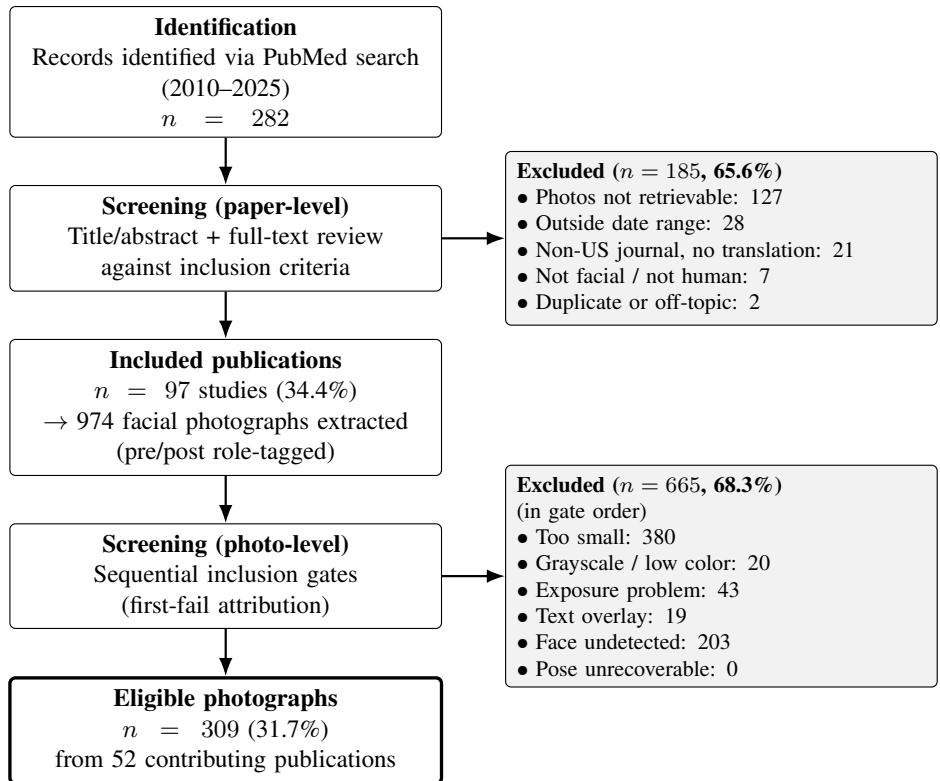  
Fig 1 PRISMA-style photograph pool assembly flow. Paper-level screening reduced 282 PubMed records to 97 included publications, from which 974 facial photographs were extracted. Photo-level screening applied six sequential inclusion gates (first-fail attribution) covering minimum resolution, color content, exposure, absence of overlaid text, face detectability, and head-pose recoverability, retaining 309 photographs (31.7%) from 52 contributing publications. Assembly of these eligible photographs into the four comparison sets is reported in Section 3.2 and Table 1.

From those publications, 974 facial photographs were extracted and screened through the six photo-level gates. First-fail attribution excluded 665 photographs (68.3%): below minimum resolution $( n = 3 8 0 )$ , face undetected $( n =$ 203), exposure problem $( n = 4 3 )$ , grayscale or low color $( n = 2 0 )$ , text overlay (n = 19), and pose unrecoverable $( n = 0 )$ . This left 309 eligible photographs from 52 contributing publications (Figure 1). Per-publication yield is summarized in Supplementary Methods S1.

## 3.2 Comparison-set assembly

The 309 eligible photographs were assembled into the four comparison sets defined in Section 2.3, yielding a final evaluation pool of 1,093 image pairs. Per-set pair counts, unique-photograph counts, contributing-publication counts, and composition are reported in Table 1. Set 3 (real within-patient pre/post) used 268 of the 309 eligible photographs, drawn from 46 of the 52 contributing publications. The remaining 41 photographs had no within-patient counterpart. Six publications contributed none at all: their photographs passed the photo-level gates but yielded no pre/post pair for the same patient under the pairing rule of Section 2.3. These are single-photo case reports, cross-sectional series, or pre-only and post-only cohorts. Set 4 (mismatched pairs) draws on 50 of the 52 contributing publications; one publication contributes eligible photographs but appears in neither Set 3 nor Set 4.

## 3.3 Sub-metric calibration: a worked example

To make the calibration procedure of Section 2.4.1 concrete, Figure 2 traces it end-to-end for one sub-metric, the global CIEDE2000 color difference $( \Delta E _ { 0 0 } )$ , on Set $3 \ : ( n = 1 3 4$ within-patient pre/post pairs). The raw absolute pairwise $\Delta E _ { 0 0 }$ values (Figure 2a) are right-skewed (skewness +1.69). The variance-stabilizing ln(1+x) transform removes that skew (skewness −0.04) and brings the sample close to Gaussian (Shapiro–Wilk $W = 0 . 9 8 ;$ ; Figure 2b), as the Signal Detection Theory backend assumes. The fitted Just-Noticeable-Difference is $\mathrm { J N D } _ { t } = 1 . 2 9 2$ , which maps the median Set 3 raw difference to a calibrated score of 0.5 (Figure 2c). Every sub-metric follows the same two steps, with its own transform and backend. Supplementary Methods S3 tabulates the transform, backend, and fitted JND for each.

Table 1 Composition of the four comparison sets. “Unique photographs” counts distinct source photographs appearing in the set (a photograph may participate in multiple pairs; for Set 2 the perturbed variants are not counted separately). “Source publications” counts the number of contributing publications in the eligible pool (52 in total). Pair-construction conventions for each set are footnoted below.
<table><tr><td>Set</td><td>Pairs</td><td>Unique photographs</td><td>Source publications</td></tr><tr><td>1. Trivial positivesª</td><td>309</td><td>309</td><td>52</td></tr><tr><td>2. Sensitivity sweepb</td><td>516</td><td>12</td><td>11</td></tr><tr><td>3. Real  $\mathrm { p r e / p o s t ^ { c } }$ </td><td>134</td><td>268</td><td>46</td></tr><tr><td>4. Mismatched  $\mathrm { p a i r s } ^ { \mathrm { d } }$ </td><td>134</td><td>179</td><td>50</td></tr><tr><td>Total</td><td>1,093</td><td>一</td><td></td></tr></table>

<sup>a</sup>Each eligible photograph paired with itself; establishes the upper-bound identity ceiling.  
<sup>b</sup>12 source photographs perturbed at 43 magnitudes across 5 single-axis perturbations (Gaussian blur, brightness, white-balance, rotation, scale).  
484 of the 516 constructed pairs could be scored; 32 failed face detection at the strongest perturbations.  
<sup>c</sup>Within-patient pre- and post-operative pairs drawn from the same publication.  
<sup>d</sup>Random cross-publication pairs, equal in count to Set 3; both members from different patients in different publications.

(a) Raw differences  
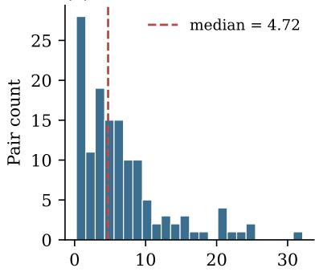  
Raw $\Delta E _ { 0 0 }$ (Set 3 pre/post)

(b) After ln(1+x) transform  
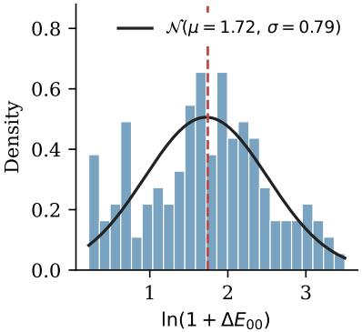

(c) SDT score curve, JND<sub>t</sub> = 1.292  
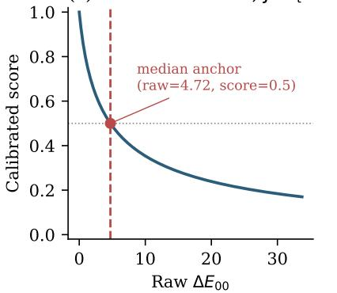  
Fig 2 Single-metric calibration walk-through for global $\Delta E _ { 0 0 }$ on Set $3 ( n = 1 3 4$ within-patient pre/post pairs). (a) Distribution of raw absolute pairwise CIEDE2000 differences; the red dashed line marks the Set 3 median. (b) Same data after the variance-stabilizing ln(1+x) transform, overlaid with a Gaussian fit $( \mu ,$ σ estimated from the transformed sample) used by the Signal Detection Theory backend. (c) Resulting calibrated score curve (Equation S1), with $\mathrm { J N D } _ { t }$ fit so that the Set 3 median raw difference maps to a calibrated score of 0.5 (red marker).

## 3.4 Cluster structure

Average-linkage hierarchical clustering on the Set 3 correlation distance (Section 2.4.2) between the thirteen calibrated sub-metrics returned five clusters at a cut of 0.75 (Figure 3a; Supplementary Methods S4). The cut sits at the broadest natural gap in the dendrogram; coarser cuts merge groups with different photographic meanings (notably pitch with yaw and roll), while finer cuts fragment the photometric block. The five clusters, their member sub-metrics, and their mean within-cluster |ρ| on Set 3 are:

• C1 photometric: brightness, contrast, shadow extent, global and median-pixel $\Delta E _ { 0 0 } ,$ CIELAB lightness offset $( | \rho | = 0 . 5 1 )$

• C2 texture/sharpness: image gradient, focus, noise $( | \rho | = 0 . 3 4 )$

• C3 pose: yaw, roll $( | \rho | = 0 . 3 8 )$

• C4 illumination direction: dominant-illuminant angular distance (singleton)

• C5 pitch: pitch (singleton)

The procedure determined the number of clusters and their membership. We assigned the labels afterward, by inspecting what each group has in common photographically.

Clustering on Set 2 alone recovers a single three-member pose cluster (Figure 3c), because Set 2’s in-plane rotation axis perturbs only roll, leaving pitch and yaw coupled in its correlation structure only through their shared zeroresponse baseline.

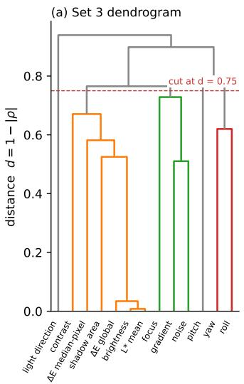

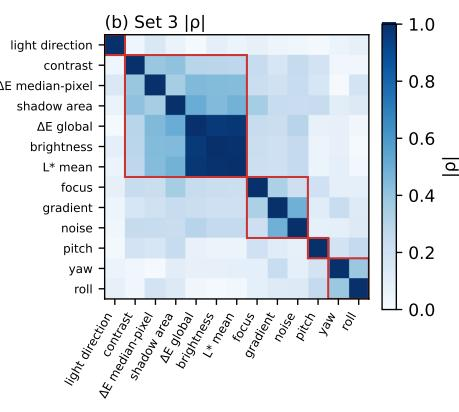

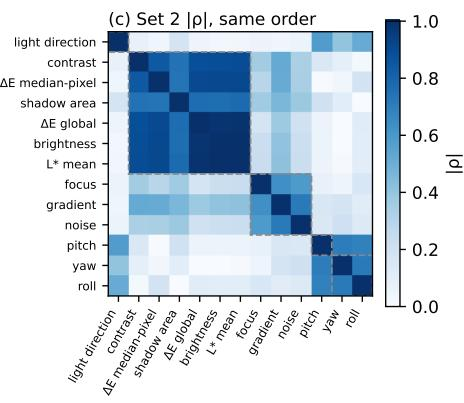  
Fig 3 Cluster structure of the thirteen calibrated sub-metrics, defined on Set 3. (a) Average-linkage dendrogram on the Set 3 correlation distance (Section 2.4.2). The dashed red line marks the cut at 0.75, yielding five clusters (C1–C5) used throughout the discriminant fit and per-cluster analyses (Section 3.6). (b) Set 3 Pearson |ρ| matrix with rows and columns ordered by dendrogram leaves; red rectangles outline the five clusters. (c) Set 2 Pearson |ρ| matrix, plotted in the same leaf order with the same cluster outlines overlaid as dashed gray. On Set 2 the three pose metrics (pitch, yaw, roll) bundle into a single block, whereas on Set 3 pitch (C5) separates from pose (C3), so the split is not a clustering-protocol artifact. The cluster definition used throughout is the one derived from all of Set 3 (Supplementary Methods S4).

## 3.5 Cluster weight fit: discriminant maximization

The fitted cluster weights $w _ { c }$ (Equation 1) were $w _ { 1 } = 0 . 3 3 9 \ : ( \mathrm { C 1 }$ photometric), $w _ { 2 } = 0 . 2 6 2$ (C2 texture/sharpness), $w _ { 3 } = 0 . 1 0 8$ (C3 pose), $w _ { 4 } = 0 . 1 5 3$ (C4 illumination direction), and $w _ { 5 } = 0 . 1 3 8$ (C5 pitch). No weight saturated against the bounds.

Fitting the weights raised the between-set discriminant (Equation 2) from $d ^ { \prime } = 2 . 0 3$ at equal weights to $d ^ { \prime } = 2 . 1 5$ on the full Set 3/Set 4 contrast. Under 5-fold cross-validation (Section 2.5) the fitted weights give $d ^ { \prime } = 2 . 1 3 \pm 0 . 4 2$ $( \mathrm { m e a n } \pm \mathrm { S D }$ across folds), against 2.15 on the full data. Supplementary Methods S4 (Table S5) compares the fivecluster weighted aggregation against alternative schemes.

A stricter cross-validation excludes any pair sharing a publication with the test fold (Supplementary Methods S4, Section S4.3.1). The fitted weights give a pooled held-out $d ^ { \prime } = 2 . 2 0$ (empirical AUC 0.936), against an equal-weight baseline of 2.13 under the same splits.

Set 2 provides an independent magnitude–response check on the aggregation. Of the 516 constructed pairs, 484 could be scored. The other 32 failed face detection at the strongest perturbation levels. On the scored pairs the master score decreases monotonically with perturbation magnitude on all five Set 2 axes (Figure 4). The cluster scores do the same on four axes; on the scale axis, four of the five rise at one magnitude step.

## 3.6 Discriminant performance

The master consistency score $S ,$ computed with the cluster weights of Section 3.5, ordered Sets 1, 3 and 4 as their construction predicts (Table 2): identical pairs at the ceiling $( S = 0 . 9 9 0 )$ ), real within-patient pre/post pairs next, and mismatched pairs lowest. The highest-scoring real pair reached $S = 0 . 7 9 3$ , and the lowest $S = 0 . 1 8 3$

The primary development contrast, Set 3 versus Set 4, gave $d ^ { \prime } = 2 . 1 5$ (95% CI [1.83, 2.55]) by Equation 2. The two sets’ interquartile ranges are disjoint (Table 2). Mean scores differed by $\Delta \mu = 0 . 2 4 4$ (95% CI [0.210, 0.276]). The empirical area under the ROC curve was 0.928 (95% CI [0.896, 0.959]), within 0.008 of the 0.936 predicted by Equation 3 (Figure 5b). Confidence intervals throughout are bootstrap percentile intervals over resampled source publications $( B = 5 , 0 0 0$ ; Section 2.6).

The same contrast was recomputed on each of the five cluster scores defined in Section 2.4.2 to localize where the discriminant comes from (Table 3). Every cluster separated the two sets on its own, from $d ^ { \prime } = 0 . 7 2$ for pose (C3) to $d ^ { \prime } = 1 . 4 1$ for texture/sharpness (C2). The master exceeds the strongest single cluster by 0.74.

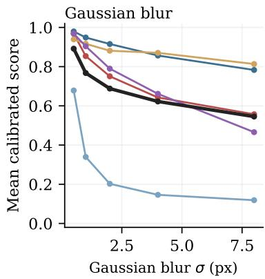

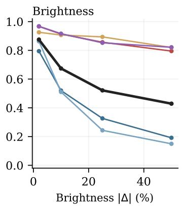

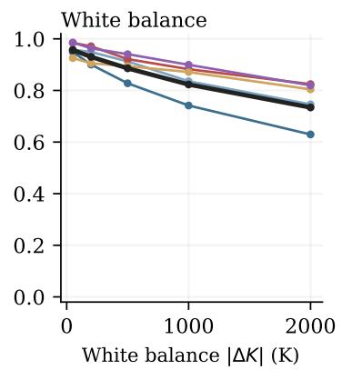

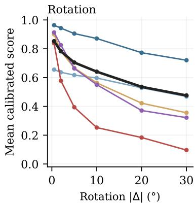  
Fig 4 Set 2 magnitude–response curves by cluster and master, an independent check on the cluster aggregation. Each panel plots the mean calibrated score (averaged across the 12 Set 2 source photographs at each magnitude level) against the perturbation magnitude in native units for one of the five Set 2 axes (Gaussian blur σ in px, brightness |∆| in %, white-balance shift |∆K| in K, rotation |∆| in degrees, scale factor). The colored lines show the five cluster scores (C1 photometric, C2 texture/sharpness, C3 pose, C4 illumination direction, C5 pitch); the heavy black line is the master consistency score S computed with the discriminant-maximization cluster weights. The master decreases monotonically with magnitude on all five axes. Cluster-level curves show the expected within-cluster sensitivities: texture/sharpness collapses under blur, photometric tracks brightness and white balance, and pose responds to in-plane rotation. No single cluster dominates the master.

Supplementary Methods S4 recomputes the Set 3 versus Set 4 contrast under five alternative aggregation schemes (Table S5). Changing the weights moves the discriminant little: equal cluster weights give $d ^ { \prime } = 2 . 0 3$ . Removing measurements costs more, with a reduced three-metric score at $d ^ { \prime } = 1 . 3 9$

Table 2 Master consistency score S by comparison set. n denotes the number of pairs with a successfully computed master score. $S \in [ 0 , 1 ]$ with 1 = identical. Set 2 is summarized here for completeness; its scores are read against perturbation magnitude in Section 3.5 (Figure 4), not as a level. Set 2’s 32 unscored pairs (Table 1) are excluded from these summary statistics.
<table><tr><td>Set</td><td>n</td><td>Mean</td><td>Median</td><td>SD</td><td>IQR</td></tr><tr><td>1. Trivial positives</td><td>309</td><td>0.990</td><td>0.990</td><td>0.000</td><td>[0.990, 0.990]</td></tr><tr><td>2. Sensitivity sweep</td><td>484</td><td>0.730</td><td>0.755</td><td>0.162</td><td>[0.624, 0.865]</td></tr><tr><td>3. Real pre/post (within-pt.)</td><td>134</td><td>0.504</td><td>0.517</td><td>0.126</td><td>[0.418, 0.582]</td></tr><tr><td>4. Mismatched pairs</td><td>134</td><td>0.261</td><td>0.244</td><td>0.099</td><td>[0.196, 0.328]</td></tr></table>

## 3.7 Within-cohort grading of clinical pre/post pairs

The master consistency score also grades pairs within Set 3 itself. Scores there span [0.18, 0.79], and Table 2 gives the distribution.

Splitting Set 3 into tertiles by master score and computing the mean per-cluster score in each (Table 4) identifies which clusters vary most across those tertiles. Every cluster scores higher in the top tertile than in the bottom, from

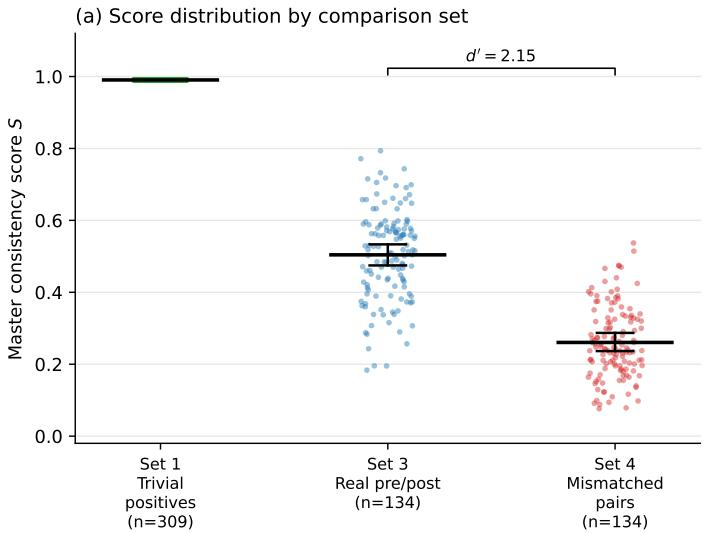

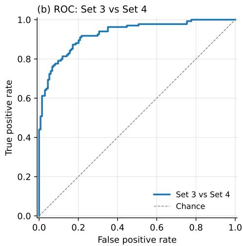  
Fig 5 Discriminant performance of the master consistency score $S .$ (a) Per-pair scores by comparison set (Sets 1, 3, and 4). Horizontal bars show set means, and whiskers the 95% bootstrap CI of the mean over resampled source publications. Set 1 has zero within-set variance and carries neither a whisker nor a $. d ^ { \prime }$ bracket; any $d ^ { \prime }$ computed against it rescales a mean difference. Set 2 (sensitivity sweep) is omitted. The bracket gives d<sup>′</sup> for the primary development contrast, Set 3 versus Set 4 (Section 2.6). (b) Receiver operating characteristic for the same contrast, with Set 3 as the positive class. The empirical area under the curve is 0.928 (95% CI [0.896, 0.959]), against 0.936 predicted by Equation 3.

Table 3 Per-cluster discriminant performance on the Set 3 versus Set 4 contrast $( n _ { \mathrm { S e t } 3 } = n _ { \mathrm { S e t } 4 } = 1 3 4 ) .$ Cluster membership and the cluster weights $w _ { c }$ of Equation 1 are defined in Sections 2.4.2–2.5. The master row repeats the headline d<sup>′</sup> for comparison. The weight ordering and the $d ^ { \prime }$ ordering differ; Section 4.3 reads the two together. The Set 3 means sit near 0.500 by construction: the empirical-CDF backend (Section 2.4.1) maps Set 3 to a uniform distribution. C1 is the exception at 0.513, because it holds all five Signal Detection Theory sub-metrics.
<table><tr><td>Cluster</td><td> $w _ { c }$ </td><td>Mean (Set 3)</td><td>Mean (Set 4)</td><td> $d ^ { \prime }$ </td><td>95% CI</td></tr><tr><td>C1 Photometric (6 sub-metrics)</td><td>0.339</td><td>0.513</td><td>0.294</td><td>1.39</td><td>[1.07, 1.76]</td></tr><tr><td>C2 Texture / sharpness (3 sub-metrics)</td><td>0.262</td><td>0.500</td><td>0.227</td><td>1.41</td><td>[1.09, 1.79]</td></tr><tr><td>C3 Pose (2 sub-metrics)</td><td>0.108</td><td>0.500</td><td>0.321</td><td>0.72</td><td>[0.38, 1.07]</td></tr><tr><td>C4 Illumination direction (1 sub-metric)</td><td>0.153</td><td>0.499</td><td>0.237</td><td>0.94</td><td>[0.69, 1.30]</td></tr><tr><td>C5 Pitch (1 sub-metric)</td><td>0.138</td><td>0.500</td><td>0.220</td><td>1.03</td><td>[0.72, 1.43]</td></tr><tr><td>Master S</td><td></td><td>0.504</td><td>0.261</td><td>2.15</td><td>[1.83, 2.55]</td></tr></table>

$\Delta = + 0 . 2 0 1$ for illumination direction (C4) to $\Delta = + 0 . 3 4 9$ for pitch (C5). Pose (C3) is the one cluster that does not rise monotonically: its middle and top tertiles are level (0.572 and 0.571).

## 3.8 Deployed analysis tool

The pipeline of Sections 2.4–2.7 is packaged as a publicly accessible web tool (Section 2.8; Figure 6). For a single pair it reports the master score and the five cluster scores as percentiles of the Set 3 distribution, together with the thirteen sub-metrics, and it processes batches with live progress reporting. The interface bands those percentiles into well-matched, typical, and re-shoot or flag labels for workflow use. These bands are presentational conveniences and not validated decision thresholds (Section 2.4).

## 4 Discussion

## 4.1 Principal findings

We developed a score for photographic consistency between paired clinical images. Twelve of its 13 sub-metrics measure a capture condition that published standards require to be held constant, and noise is included on imagequality grounds (Section 2.4). Correlation structure on within-patient pre/post pairs sorted the sub-metrics into five clusters. The score is a weighted sum of the five cluster scores.

Table 4 Mean cluster and master scores by Set 3 master-score tertile (n = 45, 44 and 45). Tertiles are formed from the master score, and each cluster contributes to the split it is measured against. ∆ is the top-minus-bottom-tertile difference; larger values identify the clusters whose variation tracks the master score within the cohort. It is a raw mean difference and is not comparable with the d<sup>′</sup> of Table 3, which divides by the pooled standard deviation.
<table><tr><td>Cluster</td><td>Bottom</td><td>Middle</td><td>Top</td><td> $\Delta$ </td></tr><tr><td>C1 Photometric (6 sub-metrics)</td><td>0.387</td><td>0.530</td><td>0.621</td><td>+0.234</td></tr><tr><td>C2 Texture / sharpness (3 sub-metrics)</td><td>0.320</td><td>0.517</td><td>0.663</td><td>+0.342</td></tr><tr><td>C3 Pose (2 sub-metrics)</td><td>0.359</td><td>0.572</td><td>0.571</td><td>+0.212</td></tr><tr><td>C4 Illumination direction (1 sub-metric)</td><td>0.404</td><td>0.488</td><td>0.604</td><td>+0.201</td></tr><tr><td>C5 Pitch (1 sub-metric)</td><td>0.341</td><td>0.468</td><td>0.690</td><td>+0.349</td></tr><tr><td>Master S</td><td>0.363</td><td>0.516</td><td>0.634</td><td>+0.271</td></tr></table>

The between-set contrast tests whether the score carries signal at all. It separated within-patient pre/post pairs from pairs of unrelated patients at $d ^ { \prime } = 2 . 1 5$ (Section 3.6). The within-cohort test holds identity fixed, since every pair is one patient’s own pre and post. Splitting Set 3 by master score and reading the clusters back is a decomposition of that score rather than an independent test of it: every cluster scored higher in the top tertile than in the bottom, though pose did not rise monotonically (Section 3.7). The perturbation sweep alters one photograph along a single axis, holding the subject fixed; the score fell monotonically with magnitude (Section 3.5). The separation is not an artifact of leakage between publications or of the Gaussian model behind d<sup>′</sup> (Sections 3.5–3.6).

## 4.2 Comparison with prior literature

None of the three prescriptive standards for clinical photography supplies a metric by which a given pre/post pair can be checked against the standard it nominally meets.<sup>1–3</sup> That check is still done by eye.

The tools to measure what those standards require already exist, each built for another purpose. CIEDE2000 quantifies perceived color difference.<sup>11</sup> Computer vision estimates head pose from a single photograph,<sup>16</sup> and facerecognition programs publish tolerances for how far that pose may drift between two images.<sup>6</sup> The sharpness and noise metrics come from image-quality research;<sup>17,</sup> <sup>18</sup> the direction of the illuminant is recovered from the shading on a face.<sup>19–21</sup> To our knowledge they have not been assembled into a single image-derived score for the clinical pre/post pair.

We assembled these existing measurements into thirteen sub-metrics for the clinical pre/post pair. They arrive in incompatible units: a color difference in $\Delta E _ { 0 0 } ,$ a head rotation in degrees, a shadow extent as a fraction of dark pixels, a noise difference as a log ratio. We calibrated them onto one scale. Each is mapped to a score between 0 and 1, anchored so that each sub-metric’s median across 134 within-patient pairs from 46 publications scores 0.5 (Section 2.4.1). A score of 0.4 then represents the same thing on every axis: less consistent than half of the published pairs. We then grouped the calibrated scores by how closely they track each other across those pairs (Section 2.4.2). Correlated sub-metrics would otherwise enter the sum as near-redundant terms. The five cluster scores are combined into one master score.

## 4.3 Mechanistic interpretation

The score breaks down along lines a photographer can act on. The five clusters returned by the correlation structure of the 134 within-patient pairs (Section 3.4) line up with five separate controls at capture: the level of the room lighting and the white balance (C1), the camera and its settings (C2), how the patient’s head is turned (C3), where the light sits relative to the face (C4), and the height of the camera (C5). The algorithm was given the correlations between calibrated scores, with no labels and no capture data. The alignment was not built in

The split also indicates who holds each control. The three head-pose angles did not stay together: yaw and roll fell in one cluster, while pitch stood alone. An instruction to the patient corrects yaw and roll. Pitch depends on how high the photographer holds the camera. Illumination direction also stood alone. A pair can fail on either singleton while the rest looks normal. Each carries a full cluster’s weight; a flat average over the thirteen sub-metrics would give it far less.

The weights themselves matter little. Equal weights across the five clusters work almost as well as the fitted ones (Section 3.5).

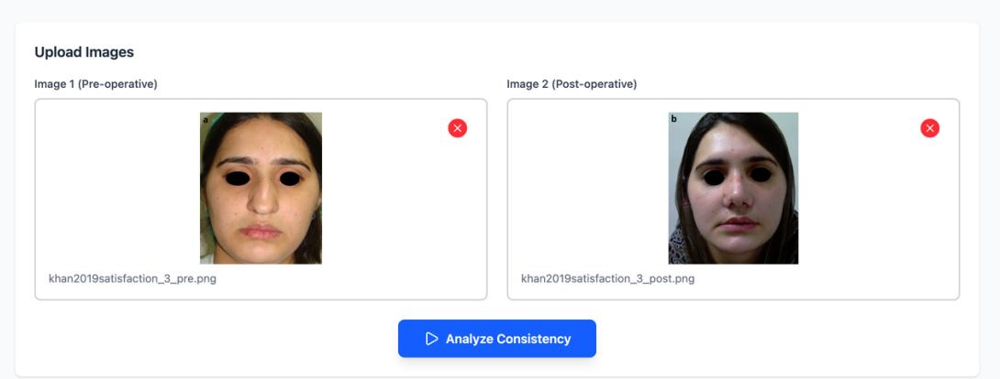

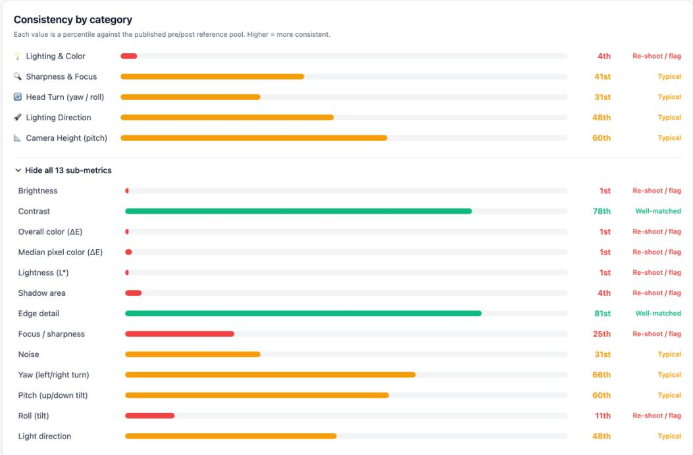  
Fig 6 Web interface for the photographic consistency tool, single-pair result view. Scores are shown as percentiles of the Set 3 distribution; the pair illustrated sits at the 21st percentile and is shown as an example of a pair the tool flags. The interface labels the five clusters by their photographi meaning. Against the tags of Table 3, Lighting & Color is C1, Sharpness & Focus is C2, Head Turn is C3, Lighting Direction is C4, and Camera Height is C5. Source pair reproduced under CC BY from.<sup>15</sup>

## 4.4 Score interpretation

Three reference points fix what a score means. Set 1 pairs each photograph with itself and sits at $S = 0 . 9 9 0 .$ . Set 4 pairs photographs drawn from different publications and sits at 0.261, which is what the pipeline returns when two captures match only by chance. Real pre/post pairs (Set 3) sit between the two, averaging 0.504 (Table 2).

A real pre/post pair cannot reach the identity ceiling. The surgery itself moves some of the sub-metrics: swelling shifts skin color, and a reshaped nose casts a different shadow. The best pair in the pool scored 0.793 (Section 3.6). Capture differences move the same sub-metrics, and the score does not say how a given gap divides between the two. A pair can also be consistent and still be two poor photographs, which this score does not address.

## 4.5 Clinical implications

The five clusters suggest a capture checklist. No capture practice was observed in this study; each item below follows from what its cluster tracks. C1 covers the photographic environment: the room lighting, the backdrop, and the white balance. C2 covers the optics: the camera, its distance from the subject, and its settings. C3 covers what a verbal cue can address, since yaw and roll follow from how the patient holds the head. C4 and C5 belong to the photographer, who sets where the light falls and how high the camera sits.

During the post-operative visit, the score can be computed against the archived pre-operative photograph while a re-shoot is still possible. Before submission, a surgeon can audit a pair the same way. For an existing archive, the score ranks pairs for inclusion in a case series or an outcome study.

A reader who did not take the photographs faces the same question: how much of the visible change belongs to the procedure. The score makes that question explicit. A pair near the middle of the published distribution carries the capture variability of most of the literature. A lower-scoring pair differs more, and the photographs alone cannot say how much of that difference is the procedure. The pipeline reports percentiles against that pool (Section 3.8).

## 4.6 Strengths

A disagreement with a master score can be traced to a cluster, from there to a sub-metric, and from there to the calibrated tolerances behind it (Supplementary Methods S3). Those tolerances are fit on real within-patient pairs and cross-checked against published photographic and color-science just-noticeable differences. The five clusters carry the discriminant on their own, so equal weights are a workable default where refitting is not possible (Section 4.3). The pipeline runs as a web tool that keeps nothing: uploaded pairs are deleted at the end of the request and no image bytes are written to disk or to logs (Section 2.8).

## 4.7 Limitations andfuture work

Three limitations qualify these results, and each points at the work that would settle it.

The ground truth is a proxy. Set 3 versus Set 4 tests whether the score separates real pairs from unrelated ones, and no reader study asked a clinician whether a pair is acceptable, so this study reports no operating cutoffs and recommends scoring within a cohort. Surgeon raters, blinded to the score, grading held-out pre/post pairs on lighting, focus and pose would replace the proxy and show where the calibration departs from expert judgment. The contrast also conflates capture style with patient identity; the 35 publications contributing more than one Set 3 pair (Table S1) yield 224 same-publication, different-patient combinations, enough for a size-matched control set that would separate the two.

The cluster weights were fitted by maximizing d<sup>′</sup> on the same Set 3 versus Set 4 contrast the headline reports; cross-validated and publication-level held-out values are given in Section 3.5 and Supplementary Methods S4. A future version could drop the fit, and the circularity with it (Section 4.3).

All photographs are single frontal views published between 2010 and 2025 in US-based journals or with an English translation, and five published capture requirements have no sub-metric at all, among them subject-to-camera distance and facial expression (Supplementary Methods S6). Lateral, oblique and intraoral views need a pose-aware alignment stage and a calibration of their own. Every contributing publication is facial surgery, so the pose sub-metrics assume a head; reaching breast or body contouring would take different measurements. Applying the pipeline outside the US would test geographic transfer.

## 5 Conclusion

We built a score for how consistently a pre/post pair was captured, from thirteen sub-metrics grouped into five clusters discovered in the correlation structure of published pairs. On the development contrast it separated real within-patient pairs from mismatched pairs at d<sup>′</sup> = 2.15. A reader study is the next step, and no operating threshold should be set before it.

## Disclosures

The authors declare no conflicts of interest.

## Code, Data, and Materials Availability

The analysis code, fitted cluster weights, and the declared dependency requirements used to produce all results reported here are available from the corresponding author upon reasonable request. The deployed web application is publicly hosted at https://rick95125-photographic-consistency.hf.space. All photographs analysed were extracted from published articles; the contributing publications are listed in Supplementary Methods S1.

## Ethics Statement

This study analysed photographs already published in the peer-reviewed literature and did not involve interaction with human subjects or access to identifiable private information, and so does not constitute human-subjects research unde 45 CFR 46.102(e) (Section 2.1). Figure S1 reproduces an image published under a Creative Commons Attribution licence, with the licence and the modification stated in the caption.

## Acknowledgments

No funding supported this work. During the preparation of this manuscript the authors used large language models (ChatGPT, OpenAI; Claude, Anthropic) to improve readability and language. After using these tools the authors reviewed and edited the content and take full responsibility for the content of the publication.

## References

1 Barry E. DiBernardo, Ronald L. Adams, Janice Krause . . . Giulio Gheradini, “Photographic standards in plastic surgery,” Plastic and Reconstructive Surgery 102(2), 559–568 (1998). PMID: 9703100. Foundational technical standards for pre/post comparison photography.

2 Lukas Prantl, Dirk Brandl, and Patricia Ceballos, “A proposal for updated standards of photographic documentation in aesthetic medicine,” Plastic and Reconstructive Surgery – Global Open 5(8), e1389 (2017). PMID: 28894653. Digital-era update to DiBernardo 1998 standards.

3 American Society of Plastic Surgeons, “Photographic guide in plastic surgery.” https: //www.plasticsurgery.org/documents/health-policy/guidelines/ photographic-guidelines.pdf (2026). Society guidance document, undated; year given is the access year. Public summary only, full version paywalled. Accessed: 2026-05-18. Distinct from the 2006 ASPS/PSF Photographic Standards in Plastic Surgery.

4 Erin M. Wolfe, Gabriela Najera-Sweeney, Zoe P. Berman . . . Eduardo D. Rodriguez, “Establishing photographic standards for facial transplantation: A systematic review of the literature,” Plastic and Reconstructive Surgery – Global Open 8(5), e2834 (2020). PMID 33154875; PMC7605848; open access (CC BY-NC-ND). Verified against PubMed 2026-09-12.

5 Zhou Wang, Alan C. Bovik, Hamid R. Sheikh . . . Eero P. Simoncelli, “Image quality assessment: from error visibility to structural similarity,” IEEE Transactions on Image Processing 13(4), 600–612 (2004). PMID: 15376593. Foundational SSIM paper.

6 National Institute of Standards and Technology, “Face recognition vendor test (FRVT) – ongoing evaluation.” https://pages.nist.gov/frvt/ (2024). Operational pose tolerance specifications.

7 Min Soon Kim, Gregory P. Reece, Elisabeth K. Beahm . . . Mia K. Markey, “Objective assessment of aesthetic outcomes of breast cancer treatment: measuring ptosis from clinical photographs,” Computers in Biology and Medicine 37(1), 49–59 (2006). PMID: 16438948. Early objective photographic outcome metric; reports interobserver variability of manual fiducial marking.

8 Muhammad Daiem, Ghulam Q. Fayyaz, Sohaib Irfan . . . Corstiaan Breugem, “Exploring the feasibility of a deep learning algorithm for postoperative outcome assessment in unilateral cleft lip repair: A pilot study,” Journal of Craniofacial Surgery 37(3–4), 767–773 (2025). PMID: 41263442. Recent DL approach to clinical outcome scoring; explicitly cites inter-rater variability as the limit of traditional subjective assessment.

9 International Commission on Illumination (CIE), “CIE 15:2004 – colorimetry, 3rd edition.” CIE Central Bureau, Vienna (2004).

10 Marc Mahy, Luc Van Eycken, and Andre Oosterlinck, “Evaluation of uniform color spaces developed after the´ adoption of CIELAB and CIELUV,” Color Research & Application 19(2), 105–121 (1994).

11 Gaurav Sharma, Wencheng Wu, and Edul N. Dalal, “The CIEDE2000 color-difference formula: Implementation notes, supplementary test data, and mathematical observations,” Color Research & Application 30(1), 21–30 (2005).

12 Hugh R. Wilson, Frances Wilkinson, Li-Ming Lin . . . Manuela Castillo, “Perception of head orientation,” Vision Research 40(5), 459–472 (2000).

13 David M. Green and John A. Swets, Signal Detection Theory and Psychophysics, Wiley, New York (1966).

14 Neil A. Macmillan and C. Douglas Creelman, Detection Theory: A User’s Guide, Lawrence Erlbaum Associates, Mahwah, NJ, 2nd ed. (2005).

15 Nasir Khan, Mamoon Rashid, Ibrahim Khan . . . Noor Fatima, “Satisfaction in patients after rhinoplasty using the rhinoplasty outcome evaluation questionnaire,” Cureus 11(7), e5283 (2019).

16 Thorsten Hempel, Ahmed A. Abdelrahman, and Ayoub Al-Hamadi, “6D rotation representation for unconstrained head pose estimation,” in IEEE International Conference on Image Processing (ICIP), (2022).

17 Said Pertuz, Domenec Puig, and Miguel Angel Garcia, “Analysis of focus measure operators for shape-fromfocus,” Pattern Recognition 46(5), 1415–1432 (2013).

18 David L. Donoho and Iain M. Johnstone, “Ideal spatial adaptation by wavelet shrinkage,” Biometrika 81(3), 425–455 (1994).

19 Jan J. Koenderink, Andrea J. van Doorn, and Sylvia C. Pont, “Illumination direction from texture shading,” Journal ofthe Optical Society ofAmerica A 20(6), 987–995 (2003).

20 Ravi Ramamoorthi and Pat Hanrahan, “On the relationship between radiance and irradiance: determining the illumination from images of a convex Lambertian object,” in Journal of the Optical Society of America A, 18(10), 2448–2459 (2001).

21 Wei Zhou, Yixin Yan, Mingbing Lyu . . . Jianbo Liu, “Illumination normalization of face image based on illuminant direction estimation and improved Retinex,” PLOS ONE 10(4), e0122200 (2015).

22 Rajiv Agarwal and Ramesh Chandra, “Alar web in cleft lip nose deformity: Study in adult unilateral clefts,” Journal of Craniofacial Surgery 23(5), 1349–1354 (2012).

23 Nebahat Demet Akpolat and Sezin Unlu, “Effect of clinical photography on postprocedure patient satisfaction in female patients who underwent nonsurgical rhinoplasty,” J Cosmet Dermatol 21(3), 956–961 (2022).

24 Amin Amali, Amir A. Sazgar, and Mehrdad Jafari, “Assessment of nasal function after tip surgery with a cephalic hinged flap of the lateral crura: A randomized clinical trial,” Aesthetic Surgery Journal 34(5), 687–695 (2014).

25 Fazil Apaydin, “Nasal valve surgery,” Facial Plast Surg 27(2), 179–91 (2011).

26 Mauro Barone, Rosa Salzillo, Riccardo De Bernardis . . . Paolo Persichetti, “Reconstruction of scroll and pitanguy’s ligaments in open rhinoplasty: A controlled randomized study,” Aesthetic Plast Surg 48(12), 2261–2268 (2024).

27 Robert Dorfman, Irene Chang, Sean Saadat . . . Jason Roostaeian, “Making the subjective objective: Machine learning and rhinoplasty,” Aesthet Surg J 40(5), 493–498 (2020).

28 Sherif Mohamed Elkashty, Ahmed Abdelaziz Taalab, and Mohammed Saad AboShaban, “Outcomes of open rhinoplasty for unilateral cleft patients using photogrammetric analysis - an evaluative study,” Ann Maxillofac Surg 13(1), 3–8 (2023).

29 Sabri Baki Eren, Selahattin Tugrul, Berke Ozucer . . . Orhan Ozturan, “Autospreading spring flap technique for reconstruction of the middle vault,” Aesthetic Plast Surg 38(2), 322–8 (2014).

30 Volker Gassling, Bernd Koos, Falk Birkenfeld . . . Corinna E Zimmermann, “Secondary cleft nose rhinoplasty: Subjective and objective outcome evaluation,” J Craniomaxillofac Surg 43(9), 1855–62 (2015).

31 Farhad Hafezi, Rouhollah Naghipour, Bijan Naghibzadeh . . . Siamak Farokh Forghani, “Practical classification of upper lateral cartilage in middle vault asymmetry,” Plast Reconstr Surg 145(6), 1410–1417 (2020).

32 Ji Heui Kim and Yong Ju Jang, “Use of diced conchal cartilage with perichondrial attachment in rhinoplasty,” Plast Reconstr Surg 135(6), 1545–1553 (2015).

33 Aaron M Kosins, Val Lambros, and Rollin K Daniel, “The plunging tip: analysis and surgical treatment,” Aesthet Surg J 35(4), 367–77 (2015).

34 Yoon Seok Lee, Dong Hyeok Shin, Hyun Gon Choi . . . Ki Il Uhm, “Columella lengthening with a full-thickness skin graft for secondary bilateral cleft lip and nose repair,” Arch Plast Surg 42(6), 704–8 (2015).

35 Soo Hyang Lee, Han Byul Lee, and Eun Taek Kang, “Nasal elongation with septal half extension graft: Modification of conventional septal extension graft using minimal septal cartilage,” Aesthetic Plast Surg 42(6), 1648–1654 (2018).

36 Young-Ha Lee, Yoon Seok Choi, Chang Hoon Bae . . . Hyung Gyun Na, “Crushed septal cartilage-covered diced cartilage glue (ccdg) graft: A hybrid technique of crushed septal cartilage,” Aesthetic Plast Surg 46(5), 2428– 2437 (2022).

37 Tito Marianetti, Pietro De Luca, Antonio Iademarco . . . Luca Perna, “The alar extension graft technique for the treatment of external nasal valve collapse: Preliminary results of a single-centre prospective analysis,” Aesthetic Plast Surg 49(1), 108–114 (2025).

38 George L Murrell, “Correlation between subjective and objective results in nasal surgery,” Aesthet Surg J 34(2), 249–57 (2014).

39 Chuong Dinh Nguyen, Tho Thi-Kieu Nguyen, Son Thiet Tran . . . John M Hodges, “Bony cartilaginous graft in unilateral cleft lip rhinoplasty,” J Craniofac Surg 33(8), 2513–2521 (2022).

40 Orhan Ozturan, Berke Ozucer, Fadlullah Aksoy . . . Selahattin Tugrul, “Wide-open dorsal approach rhinoplasty for droopy noses,” Aesthetic Plast Surg 39(1), 25–35 (2015).

41 Guncel ¨ Ozt <sup>¨</sup> urk, “New approaches for the let-down technique,” ¨ Aesthetic Plast Surg 44(5), 1725–1736 (2020).

42 Keon M Parsa, Karina Charipova, Kathleen Coerdt . . . Michael J Reilly, “The role of age and gender on perception of women after cosmetic rhinoplasty,” Aesthetic Plast Surg 45(3), 1184–1190 (2021).

43 Michaela Plath, Carlo Cavaliere, Svenja Seide . . . Karim Zaoui, “Does a closed reduction improve aesthetical and functional outcome after nasal fracture?,” European Archives ofOto-Rhino-Laryngology 280(5), 2299–2308 (2023).

44 Thomas Radulesco, Cecile Winter, Philippe Kestemont . . . Justin Michel, “Liquid spreader grafts: Internal nasal´ valve opening with hyaluronic acid,” Aesthetic Plast Surg 46(6), 2912–2916 (2022).

45 Thomas Radulesco, Dario Ebode, Charbel Medawar . . . Justin Michel, “Prospective evaluation of aesthetic and functional outcomes following video-assisted rhino-septoplasty,” Aesthetic Plastic Surgery 48(23), 4855–4861 (2024).

46 Christopher Roxbury, Masaru Ishii, Andres Godoy . . . Lisa E Ishii, “Impact of crooked nose rhinoplasty on observer perceptions of attractiveness,” Laryngoscope 122(4), 773–8 (2012).

47 Amir Arvin Sazgar, Azadeh Kheradmand, Ali Razfar . . . Amir Keyvan Sazgar, “Different techniques for caudal extension graft placement in rhinoplasty,” Braz J Otorhinolaryngol 87(2), 188–192 (2021).

48 Stefan W Shuaib, Satyen Undavia, Juan Lin . . . Howard D Stupak, “Can functional septorhinoplasty independently treat obstructive sleep apnea?,” Plast Reconstr Surg 135(6), 1554–1565 (2015).

49 Joong Min Suh and Ki Il Uhm, “Change in nostril ratio after cleft rhinoplasty: correction of nostril stenosis with full-thickness skin graft,” Arch Craniofac Surg 22(2), 85–92 (2021).

50 Yohei Tanaka, “Oriental nose occidentalization and perinasal shaping by augmentation of the underdeveloped anterior nasal spine,” Plast Reconstr Surg Glob Open 2(8), e197 (2014).

51 William H C Tiong, Mohd Ali Mat Zain, and Normala Hj Basiron, “Augmentation rhinoplasty in cleft lip nasal deformity: preliminary patients’ perspective,” Plast Surg Int 2014, 202560 (2014).

52 L Wang, Y E Han, X M Yu . . . Y Yuan, “[clinical efficacy analysis of functional rhinoplasty assisted by nasal endoscopy],” Zhonghua Er Bi Yan Hou Tou Jing Wai Ke Za Zhi 58, 333–338 (2023).

53 Jiao Wei, Tanja Herrler, Ning Deng . . . Chuanchang Dai, “The use of expanded polytetrafluoroethylene in short nose elongation: Fourteen years of clinical experience,” Ann Plast Surg 81(1), 7–11 (2018).

54 Cheng-I Yen, Ping-Hsun Lee, Chun-Shin Chang . . . Yen-Chang Hsiao, “A comparative study between classic derotation graft and novel double v cutting folded derotation graft,” Aesthetic Plast Surg 45(4), 1721–1729 (2021).

55 Ruobing Zheng, Xin Wang, Huan Wang . . . Fei Fan, “Improvement of nasal dorsal onlay graft appearance after augmentation rhinoplasty with costal cartilage for thin-skinned patients,” Aesthetic Plast Surg 47(1), 330–335 (2023).

56 Ozan Bitik, “Sub-smas transposition of the buccal fat pad,” Aesthet Surg J 40(4), NP114–NP122 (2020).

57 Ozan Bitik, “Intraorbital fixation midface lift,” Aesthet Surg J 43(3), 269–286 (2023).

58 Johannes Franz Hoenig, Daniel Knutti, and Antonio de la Fuente, “Vertical subperiosteal mid-face-lift for treatment of malar festoons,” Aesthetic Plast Surg 35(4), 522–9 (2011).

59 Hakan S¸irinoglu, Burak Ergun Tatar, and Emre G¨ uvercin, “Long terms results of temporal facelift: 6 years of¨ experience in 250 cases,” J Craniofac Surg 36(2), e188–e192 (2024).

60 Catherine Weng and Vito Quatela, “Achieving a youthful midface: Examination of midface anatomy improvement following lower blepharoplasty with fat transposition and transtemporal midface lift with lower lid skin pinch,” Aesthet Surg J 39(10), NP416–NP428 (2019).

61 Thanapoom Boonipat, Amjed Abu-Ghname, Jason Lin . . . Mitchell A Stotland, “Impact of surgical rejuvenation on visual processing and character attribution of periorbital aging,” Plast Reconstr Surg 150(3), 539–548 (2022).

62 Chelsea E Kesty and Katarina R Kesty, “A novel technique for eye rejuvenation: A case series of the combined use of co(2) laser blepharoplasty and erbium: Yag resurfacing and a novel artificial intelligence model to quantify laser results,” J Cosmet Dermatol 24(2), e70022 (2025).

63 Soo Shin Kim, “Effects in the upper face of far east asians after oriental blepharoplasty: a scientific perspective on why oriental blepharoplasty is essential,” Aesthetic Plast Surg 37(5), 863–8 (2013).

64 Nk Seong Park, “Choosing upper blepharoplasty, infra-brow lift, and forehead lift in asians: An algorithmic approach from personal experience,” Aesthetic Plast Surg 48(4), 644–651 (2024).

65 Tomas Gomes Patrocinio, Bruno Alvarenga Silva Loredo, Carlos Eduardo Arnez Arevalo . . . Jose Antonio Pa-´ trocinio, “Complications in blepharoplasty: how to avoid and manage them,” Braz J Otorhinolaryngol 77(3), 322–7 (2011).

66 Andreia Soares, Fernando Faria-Correia, Nuno Franqueira . . . Sara Ribeiro, “Effect of superior blepharoplasty on tear film: objective evaluation with the keratograph 5m - a pilot study,” Arq Bras Oftalmol 81(6), 471–474 (2018).

67 Dominik L Feinendegen, Mihai A Constantinescu, Daniel A Knutti . . . J Camilo Roldan, “Brow reduction, re-´ shaping and suspension by a 20-degree beveled brow incision technique,” J Craniomaxillofac Surg 44(8), 958–63 (2016).

68 Selcuk Isik and Ismail Sahin, “Contour restoration of the forehead by lipofilling: our experience,” Aesthetic Plast Surg 36(4), 761–6 (2012).

69 Telma Cerbino Cintra Lots, “Effect of pdo facelift threads on facial skin tissues: An ultrasonographic analysis,” J Cosmet Dermatol 22(9), 2534–2541 (2023).

70 Aris Sterodimas, Beatriz Nicaretta, Agathi Koytsouveli . . . Grigoris Champsas, “A prospective study on heliumbased plasma radiofrequency for management of the lower eyelids in greece,” Plast Reconstr Surg Glob Open 13(5), e6796 (2025).

71 Amy Forman Taub, Deborah Sarnoff, Michael Gold . . . Carolyn Jacob, “Effect of multisyringe hyaluronic acid facial rejuvenation on perceived age,” Dermatol Surg 36(3), 322–8 (2010).

72 Jose Enrique Barrera, Michael Julian Adame, Josh A Lospinoso . . . Thomas M Beachkofsky, “Efficacy of laser resurfacing and facial plastic surgery using age, glogau, and fitzpatrick rating,” Plast Reconstr Surg Glob Open 6(10), e1740 (2018).

73 Camillo Lugaresi, Jiuqiang Tang, Hadon Nash . . . Matthias Grundmann, “MediaPipe: A framework for building perception pipelines.” arXiv:1906.08172 (2019).

74 Ernst Heinrich Weber, De pulsu, resorptione, auditu et tactu: Annotationes anatomicae et physiologicae, Koehler, Leipzig (1834). Original statement of Weber’s Law for sensory discrimination.

75 M. Ronnier Luo and Bryan Rigg, “Chromaticity-discrimination ellipses for surface colours,” Color Research & Application 11(1), 25–42 (1986).

76 Manuel Melgosa, “Testing CIELAB-based color-difference formulas,” Color Research & Application 25(1), 49– 55 (2000).

77 Dieter Kraft, “A software package for sequential quadratic programming,” Technical Report DFVLR-FB 88-28, DFVLR, Oberpfaffenhofen, Germany (1988).

## Supplementary Methods

S1 Source photographs: provenance, inclusion attrition, and Set 2 perturbation axes

PubMed search string. The photograph pool was retrieved from PubMed on 1 August 2025 (publications dated 2010–2025) with the following Boolean query, applied to the Title/Abstract fields:

```clojure
("facial plastic surgery"[Title/Abstract] OR "aesthetic surgery"[Title/Abstract]
OR rhinoplasty[Title/Abstract] OR facelift[Title/Abstract]
OR blepharoplasty[Title/Abstract])
AND
("before and after"[Title/Abstract] OR "clinical photography"[Title/Abstract]
OR "standardized photography"[Title/Abstract]
OR "photographic documentation"[Title/Abstract])
AND
(methods[Title/Abstract] OR methodology[Title/Abstract]
OR "photo bias"[Title/Abstract] OR "photographic bias"[Title/Abstract]
OR lighting[Title/Abstract] OR expression[Title/Abstract]
OR framing[Title/Abstract] OR makeup[Title/Abstract]
OR positioning[Title/Abstract])
```

Source publications. Search yield and per-stage inclusion attrition are reported in Section 3.1 (Figure 1). Among the 52 publications that contributed at least one photograph clearing all inclusion gates, the per-study yield ranged from 1 to 18 photographs (median 4, mean 5.9); five publications contributed a single photograph, 23 contributed 2–5, 18 contributed 6–10, and six contributed more than 10. The full per-publication characteristics, journal, publication year, procedure type, study design, and the number of photographs and within-patient pre/post pairs contributed, are listed in Table S1.

Table S1: Characteristics of the included publications contributing facial pre/post photographs to the photograph pool. “Photographs” is the number of eligible photographs contributed and “Pairs” the number of real within-patient pre/post image pairs (Set 3). Procedure type was verified against each article; study design is classified from PubMed publication types and abstract design language.
<table><tr><td>First author (year)</td><td>Journal</td><td>Procedure</td><td>Design</td><td>Photos</td><td>Pairs</td></tr><tr><td>Agarwal 201222</td><td>J Craniofac Surg</td><td>Rhinoplasty/nasal</td><td>Case series</td><td>5</td><td>2</td></tr><tr><td>Akpolat 202223</td><td>J Cosmet Dermatol</td><td>Rhinoplasty/nasal</td><td>Prospective</td><td>2</td><td>1</td></tr><tr><td>Amali 201424</td><td>Aesthet Surg J</td><td>Rhinoplasty/nasal</td><td>RCT</td><td>4</td><td>2</td></tr><tr><td>Apaydin 201125</td><td>Facial Plast Surg</td><td>Rhinoplasty/nasal</td><td>Case series</td><td>6</td><td>3</td></tr><tr><td>Barone 202426</td><td>Aesthetic Plast Surg</td><td>Rhinoplasty/nasal</td><td>RCT</td><td>2</td><td>1</td></tr><tr><td>Dorfman 202027</td><td>Aesthet Surg J</td><td>Rhinoplasty/nasal</td><td>Retrospective</td><td>8</td><td>4</td></tr><tr><td>Elkashty 202328</td><td>Ann Maxillofac Surg</td><td>Rhinoplasty/nasal</td><td>Case series</td><td>7</td><td>3</td></tr><tr><td>Eren 201429</td><td>Aesthetic Plast Surg</td><td>Rhinoplasty/nasal</td><td>Case series</td><td>6</td><td>2</td></tr><tr><td>Gassling 201530</td><td>J Craniomaxillofac Surg</td><td>Rhinoplasty/nasal</td><td>Case series</td><td>4</td><td>2</td></tr><tr><td>Hafezi 202031</td><td>Plast Reconstr Surg</td><td>Rhinoplasty/nasal</td><td>Case series</td><td>2</td><td>1</td></tr><tr><td>Khan 2019i5</td><td>Cureus</td><td>Rhinoplasty/nasal</td><td>Case series</td><td>6</td><td>3</td></tr><tr><td>Kim 201532</td><td>Plast Reconstr Surg</td><td>Rhinoplasty/nasal</td><td>Retrospective</td><td>7</td><td>3</td></tr><tr><td>Kosins 201533</td><td>Aesthet Surg J</td><td>Rhinoplasty/nasal</td><td>Prospective</td><td>4</td><td>2</td></tr><tr><td>Lee 201534</td><td>Arch Plast Surg</td><td>Rhinoplasty/nasal</td><td>Case report</td><td>1</td><td>0</td></tr><tr><td>Lee 201835</td><td>Aesthetic Plast Surg</td><td>Rhinoplasty/nasal</td><td>Case series</td><td>3</td><td>1</td></tr><tr><td>Lee 202236</td><td>Aesthetic Plast Surg</td><td>Rhinoplasty/nasal</td><td>Retrospective</td><td>18</td><td>9</td></tr><tr><td>Marianetti 202537</td><td>Aesthetic Plast Surg</td><td>Rhinoplasty/nasal</td><td>Case series</td><td>3</td><td>1</td></tr><tr><td>Murrell 201438</td><td>Aesthet Surg J</td><td>Rhinoplasty/nasal</td><td>Prospective</td><td>3</td><td>1</td></tr><tr><td>Nguyen 202239</td><td>J Craniofac Surg</td><td>Rhinoplasty/nasal</td><td>Case series</td><td>10</td><td>5</td></tr><tr><td>Ozturan 201540</td><td>Aesthetic Plast Surg</td><td>Rhinoplasty/nasal</td><td>Case series</td><td>1</td><td>0</td></tr><tr><td>Ozturk 202041</td><td>Aesthetic Plast Surg</td><td>Rhinoplasty/nasal</td><td>Case series</td><td>18</td><td>9</td></tr><tr><td>Parsa 202142</td><td>Aesthetic Plast Surg</td><td>Rhinoplasty/nasal</td><td>Retrospective</td><td>4</td><td>2</td></tr><tr><td>Plath 202343</td><td>Eur Arch Otorhinolaryn- gol</td><td>Rhinoplasty/nasal</td><td>Prospective</td><td>7</td><td>3</td></tr><tr><td>Radulesco 202244</td><td>Aesthetic Plast Surg</td><td>Rhinoplasty/nasal</td><td>Case series</td><td>1</td><td>0</td></tr></table>

continued on next page

Table S1 – continued from previous page
<table><tr><td>First author (year)</td><td>Journal</td><td>Procedure</td><td>Design</td><td>Photos</td><td>Pairs</td></tr><tr><td>Radulesco  $2 0 2 4 ^ { 4 5 }$ </td><td>Aesthetic Plast Surg</td><td>Rhinoplasty/nasal</td><td>Prospective</td><td>6</td><td>3</td></tr><tr><td>Roxbury  $2 0 1 2 ^ { 4 6 }$ </td><td>Laryngoscope</td><td>Rhinoplasty/nasal</td><td>RCT</td><td>2</td><td>1</td></tr><tr><td>Sazgar  $2 0 2 1 ^ { 4 7 }$ </td><td>Braz J Otorhinolaryngol</td><td>Rhinoplasty/nasal</td><td>Prospective</td><td>7</td><td>3</td></tr><tr><td>Shuaib  $2 0 1 5 ^ { 4 8 }$ </td><td>Plast Reconstr Surg</td><td>Rhinoplasty/nasal</td><td>Retrospective</td><td>12</td><td>6</td></tr><tr><td>Suh 2021 49</td><td>Arch Craniofac Surg</td><td>Rhinoplasty/nasal</td><td>Case series</td><td>4</td><td>2</td></tr><tr><td>Tanaka  $2 0 1 4 ^ { 5 0 }$ </td><td>Plast Reconstr Surg Glob</td><td>Rhinoplasty/nasal</td><td>Case series</td><td>4</td><td>2</td></tr><tr><td> $\mathrm { T i o n g } 2 0 1 4 ^ { 5 1 }$ </td><td>Open Plast Surg Int</td><td>Rhinoplasty/nasal</td><td>Retrospective</td><td>1</td><td>0</td></tr><tr><td>Wang  $2 0 2 3 ^ { 5 2 }$ </td><td>Zhonghua Er Bi Yan Hou Tou Jing Wai Ke Za</td><td>Rhinoplasty/nasal</td><td>Retrospective</td><td>6</td><td>3</td></tr><tr><td> $\mathrm { W e i } 2 0 1 8 ^ { 5 3 }$ </td><td>Zhi Ann Plast Surg</td><td>Rhinoplasty/nasal</td><td>Retrospective</td><td>3</td><td>1</td></tr><tr><td>Yen  $2 0 2 1 ^ { 5 4 }$ </td><td>Aesthetic Plast Surg</td><td>Rhinoplasty/nasal</td><td>Retrospective</td><td>4</td><td>2</td></tr><tr><td> $Z { \mathrm { h e n g } } 2 0 2 3 ^ { 5 5 }$ </td><td>Aesthetic Plast Surg</td><td>Rhinoplasty/nasal</td><td>Case series</td><td>13</td><td>6</td></tr><tr><td> $\mathrm { B i t i k } \bar { 2 } 0 2 0 ^ { 5 6 }$ </td><td>Aesthet Surg J</td><td>Facelift/midface</td><td>Retrospective</td><td>14</td><td>6</td></tr><tr><td> $\operatorname { B i t i k } 2 0 2 3 ^ { 5 7 }$ </td><td>Aesthet Surg J</td><td>Facelift/midface</td><td>Retrospective</td><td>18</td><td>8</td></tr><tr><td> $\mathrm { H o e n i g } 2 0 1 1 ^ { 5 8 }$ </td><td>Aesthetic Plast Surg</td><td>Facelift/midface</td><td>Case series</td><td>9</td><td>2</td></tr><tr><td> $\mathrm { S i r i n o g l u } 2 0 2 5 ^ { 5 9 }$ </td><td>J Craniofac Surg</td><td>Facelift/midface</td><td>Retrospective</td><td>10</td><td>5</td></tr><tr><td> $\mathrm { W e n g } \bar { 2 } 0 1 9 ^ { 6 0 }$ </td><td>Aesthet Surg J</td><td>Facelift/midface</td><td>Retrospective</td><td>8</td><td>4</td></tr><tr><td> $\mathbf { B o o n i p a t } 2 0 2 2 ^ { 6 1 }$ </td><td>Plast Reconstr Surg</td><td>Periorbital</td><td>Case series</td><td>6</td><td>3</td></tr><tr><td> $\mathrm { K e s t y } \stackrel { - } { 2 } 0 2 5 ^ { 6 2 }$ </td><td>J Cosmet Dermatol</td><td>Periorbital</td><td>Case report</td><td>2</td><td>1</td></tr><tr><td> $\mathrm { K i m } \overset { \cdot } { 2 } 0 1 3 ^ { 6 3 }$ </td><td>Aesthetic Plast Surg</td><td>Periorbital</td><td>Retrospective</td><td>2</td><td>0</td></tr><tr><td> $\operatorname { P a r k } 2 0 2 4 ^ { 6 4 }$ </td><td>Aesthetic Plast Surg</td><td>Periorbital</td><td>Retrospective</td><td>10</td><td>2</td></tr><tr><td> $\operatorname* { P a t r o c i n i o } 2 0 1 1 ^ { 6 5 }$ </td><td>Braz J Otorhinolaryngol</td><td>Periorbital</td><td>Retrospective</td><td>4</td><td>2</td></tr><tr><td> $\mathrm { S o a r e s } 2 0 1 8 ^ { 6 6 }$ </td><td>Arq Bras Oftalmol</td><td>Periorbital</td><td>Prospective</td><td>2</td><td>1</td></tr><tr><td> $\mathrm { F e i n e n d e g e n } 2 0 1 6 ^ { 6 7 }$ </td><td>J Craniomaxillofac Surg</td><td>Brow</td><td>Case series</td><td>4</td><td>2</td></tr><tr><td> $\operatorname { I s i k } 2 0 1 2 ^ { \overset { \cdot } { 6 } 8 }$ </td><td>Aesthetic Plast Surg</td><td>Forehead</td><td>Case series</td><td>3</td><td>1</td></tr><tr><td> $\operatorname { L o t s } 2 0 2 3 ^ { 6 9 }$ </td><td>J Cosmet Dermatol</td><td>Injectable</td><td>Case series</td><td>1</td><td>0</td></tr><tr><td> $\mathrm { S t e r o d i m a s } 2 0 2 5 ^ { 7 0 }$ </td><td>Plast Reconstr Surg Glob</td><td>Injectable</td><td>Prospective</td><td>8</td><td>3</td></tr><tr><td>Taub  $2 0 1 0 ^ { 7 1 }$ </td><td>Open Dermatol Surg</td><td>Injectable</td><td>Case series</td><td>10</td><td>3</td></tr><tr><td>Barrera  $2 0 1 8 ^ { 7 2 }$ </td><td>Plast Reconstr Surg Glob</td><td>Other</td><td>Retrospective</td><td>4</td><td>2</td></tr><tr><td>Total</td><td>Open</td><td></td><td></td><td>309</td><td>134</td></tr></table>

Set 2 perturbation axes. Set 2 (sensitivity sweep, Section 2.3) consists of single-axis perturbations applied independently to 12 source photographs drawn from the eligible pool. Table S2 lists the five perturbation axes, their units, and the magnitude values applied; each of the 12 source photographs was perturbed at every listed magnitude on every axis, producing $1 2 \times 4 3 = 5 1 6$ source-vs-perturbed pairs.

Table S2 Set 2 perturbation axes. Each of 12 source photographs was perturbed independently along every axis at every listed magnitude, producing $1 2 \times 4 3 = 5 1 6$ source-vs-perturbed pairs.
<table><tr><td>Axis</td><td>Unit</td><td># Levels</td><td>Magnitude values</td></tr><tr><td>Gaussian blur</td><td> $\sigma \left( \mathrm { p x } \right)$ </td><td>5</td><td> $0 . 5 , \ 1 , \ 2 , \ 4 , \ 8$ </td></tr><tr><td>Brightness</td><td>% offset</td><td>8</td><td> $\pm 2 , \pm 1 0 , \pm 2 5 , \pm 5 0$ </td></tr><tr><td>White balance</td><td>∆K</td><td>10</td><td> $\pm 5 0 , \pm 2 0 0 , \pm 5 0 0 , \pm 1 0 0 0 , \pm 2 0 0 0$ </td></tr><tr><td>Rotation</td><td>degrees</td><td>12</td><td> $\pm 0 . 5 , \pm 2 , \pm 5 , \pm 1 0 , \pm 2 0 , \pm 3 0$ </td></tr><tr><td>Scale</td><td>factor</td><td>8</td><td>0.90, 0.95, 0.97, 0.99, 1.01, 1.03, 1.05, 1.10</td></tr><tr><td>Total</td><td></td><td>43</td><td></td></tr></table>

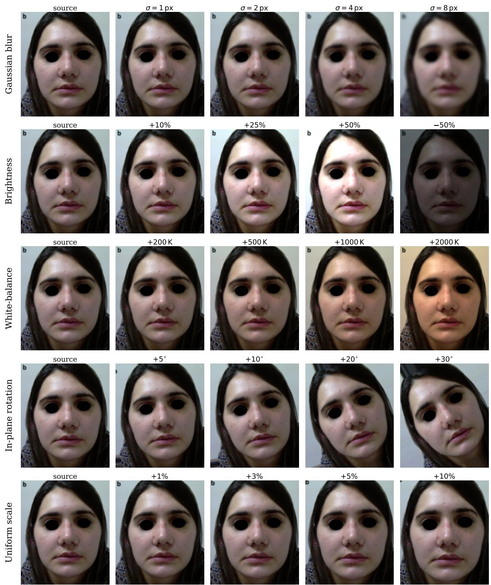  
Fig S1 Set 2 perturbation panel for a representative source photograph (khan2019satisfaction 3 post), reproduced and modified under CC BY from.<sup>15</sup> Rows show the five single-axis perturbations applied independently in Set 2; columns show the unperturbed source alongside four increasing-magnitude perturbations sampled from the magnitude grid of Table S2. The brightness row’s final column shows −50% to demonstrate the symmetric response to bilateral perturbations. The smaller magnitudes shown (e.g., σ=1 px blur, +200 K white-balance shift, +1% scale) are near-imperceptible at this print size. Set 2 includes magnitudes below and above the visible threshold, and is not used to fit the cluster weights (Section 3.5). The rotation operator preserves canvas dimensions (641 × 753 px), so at +30<sup>◦</sup> the original-image corners rotate out of frame and the new corners are filled with content from outside the original bounds.

## S2 Photo-level inclusion gates: thresholds and detection libraries

Table S3 gives the measurement, exclusion threshold, and implementing library for each of the six gates described in Section 2.2.2. A photograph is attributed to the first gate it fails and is not evaluated against the rest. Static gates

read the BGR image returned by OpenCV cv2.imread, and HSV statistics use the OpenCV scale (S, $V \in [ 0 , 2 5 5 ] )$ .   
Per-gate attrition is reported in Section 3.1.

Table S3 Photo-level inclusion gates. Order is fixed; a photograph is attributed to the first gate it fails.
<table><tr><td>Gate</td><td>Measurement</td><td>Exclusion threshold</td><td>Library</td></tr><tr><td>Too small</td><td>min(w, h) in pixels</td><td>&lt; 300</td><td>OpenCV</td></tr><tr><td>Grayscale / low color</td><td>Mean HSV saturation S</td><td> $\bar { S } \le 1 2 . 0$ </td><td>OpenCV</td></tr><tr><td>Exposure prob- lem</td><td>Fraction of near-black pixels  $( V < 1 0 )$  or frac- tion of saturated-highlight pixels (V &gt; 245)</td><td>near-black fraction ≥ 0.15 or high- light fraction ≥ 0.10</td><td>OpenCV</td></tr><tr><td>Text overlay</td><td>Canny edge-pixel fraction (fixed thresholds 100,200)</td><td>≥ 0.060</td><td>OpenCV</td></tr><tr><td>Face undetected</td><td>MediaPipe Face Detector landmark extraction succeeds on the highest-confidence detection</td><td>face min_detection_confidence = 0.5</td><td>MediaPipe Tasks73</td></tr><tr><td>Pose unrecover- able</td><td>6DRepNet head-pose estimation succeeds</td><td>estimator returns failure</td><td>6DRepNet16</td></tr></table>

The four static gates run on every photograph. The two model-based gates run only on photographs that clear all four, because MediaPipe and 6DRepNet inference costs far more than an image statistic. The four static thresholds were fixed in advance and were not tuned against any result reported here. The gate implementation is covered by the code availability statement in the end matter.

## S3 Sub-metric calibration: transforms, backends, andfitted JNDs

Each of the thirteen calibrated sub-metrics maps a raw between-photograph difference to a [0, 1] consistency score through a two-step pipeline. The transform and backend are fixed at calibration time. Every result in this paper uses one frozen calibration, fit on Set $3 ( n = 1 3 4$ real pre/post pairs) and never refit thereafter.

Step 1, variance-stabilizing transform. The absolute raw difference $x \ge 0$ is passed through a metric-specific monotone transform $T ( \cdot )$ chosen by inspection of the Set 3 distribution and the underlying perceptual framework:

• Square-root $( T ( x ) = { \sqrt { x } } )$ for lightness differences, on the CIELAB L<sup>∗</sup> axis and on HSV $V . ^ { 9 , 1 0 }$

$\ln ( 1 + x )$ for differences with a heavy upper tail: the two $\Delta E _ { 0 0 }$ color differences and the contrast difference.

• Identity $( T ( x ) = x )$ for metrics that already lie on a bounded or near-symmetric scale (pose angle differences, log-ratio quality metrics, normalized illumination-direction cosine distance).

Step 2, backend mapping. The transformed difference $T ( x )$ is mapped to a score by one of two backends.

Signal Detection Theory (SDT) backend. For metrics whose transformed distribution is approximately Gaussian under Set 3 real pairs, we use the classical SDT formulation:<sup>13</sup>

$$
d _ { m } ^ { \prime } = \frac { T ( x ) } { \mathrm { J N D } _ { t } } , \qquad \mathrm { s c o r e } ( x ) = 2 \Phi ^ { \mathrm { c } } \biggl ( \frac { d _ { m } ^ { \prime } } { 2 } \biggr ) ,\tag{S1}
$$

where $\Phi ^ { \mathrm { c } } ( z ) = 1 - \Phi ( z )$ is the complementary Gaussian cumulative distribution function and $\mathrm { J N D } _ { t }$ is the metric’s fitted Just-Noticeable-Difference in transformed units. The per-pair, per-metric quantity $d _ { m } ^ { \prime }$ is written with a subscript to distinguish it from the between-set discriminant $d ^ { \prime }$ of main-text Equation 2. JND is chosen empirically so that the median Set 3 real pre/post pair lands at $d _ { m } ^ { \prime } = 2 \Phi ^ { - 1 } ( 0 . 7 5 ) \approx 1 . 3 4 9$ , the sensitivity index at which a two-alternative forced-choice observer is $7 5 \%$ correc $\mathrm { t } ; { } ^ { 1 3 , 1 4 }$ this anchors the median score at 0.5 by construction. Equivalently, $\mathrm { J N D } _ { t } =$ $T ( x _ { \mathrm { m e d } } ) / 2 \Phi ^ { - 1 } ( 0 . 7 5 )$ , where $x _ { \mathrm { m e d } }$ is that sub-metric’s median raw difference on Set 3.

Empirical CDF (ECDF) backend. For metrics whose transformed distribution remains non-Gaussian (heavytailed, bimodal, or supported on a bounded interval), we replace the SDT mapping with a direct empirical-CDF lookup against the Set 3 real pre/post distribution:

$$
\mathrm { s c o r e } ( x ) = 1 - \widehat { F } ( x ) ,\tag{S2}
$$

where $\widehat F$ is the linearly-interpolated empirical CDF built from the sorted Set 3 values with Hazen plotting positions ${ \widehat F } ( x _ { ( k ) } ) = ( k - \textstyle { \frac { 1 } { 2 } } ) / n$ . The ECDF backend requires no JND parameter and is monotone-invariant, so no transform is needed $( T ( x ) = x )$

Per-metric assignments. Table S4 reports, for each of the thirteen sub-metrics: its cluster assignment, raw measurement, transform, backend, fitted JND<sub>t</sub> (transformed units, SDT only), and the perceptual or biometric references that motivate the measurement and serve as cross-checks on the fitted threshold. The cluster weights are fit separately, on the same Set 3, and are reported in Section 3.5.

Table S4 Per-metric calibration. Transform T(·) is applied to the raw absolute difference; Backend selects between Equation S1 (SDT) and Equation S2 (ECDF). JND<sub>t</sub> is the fitted JND in transformed units; a dash indicates the ECDF backend, which is parameter-free. All fits use Set 3 $( n = 1 3 4 ) .$
<table><tr><td>Cluster</td><td>Sub-metric</td><td>Raw measurement</td><td>T(·)</td><td>Backend</td><td>JNDt</td><td>Refs</td></tr><tr><td>C1 Photometric</td><td>brightness_diff</td><td> $\mid \bar { V } _ { \mathrm { p r e } } - \bar { V } _ { \mathrm { p o s t } } \mid \mathrm { o n } \ : V \ : ( \mathrm { H S V } )$ </td><td> $\sqrt { x }$ </td><td>SDT</td><td>2.209</td><td>9,10,74</td></tr><tr><td>C1 Photometric</td><td>contrast_diff</td><td> $| \sigma _ { V , \mathrm { p r e } } - \sigma _ { V , \mathrm { p o s t } } |$ </td><td> $\ln ( 1 + x )$ </td><td>SDT</td><td>1.276</td><td>74</td></tr><tr><td>C1 Photometric</td><td>shadow_area_diff</td><td> $\mid A _ { \mathrm { s h a d o w , p r e } }$   $\begin{array} { r l r } { A _ { \mathrm { s h a d o w , p o s t } } \ \vert } & { { } \mathrm { ( f r a c . } } \end{array}$  of  $\mathrm { p i x e l s ~ w i t h ~ } V <$  adaptive</td><td>x</td><td>ECDF</td><td></td><td>9</td></tr><tr><td>C1 Photometric</td><td>global_delta_e</td><td>threshold) Mean CIEDE2000  $\Delta E _ { 0 0 }$  over aligned skin region</td><td>ln(1+x)</td><td>SDT</td><td>1.292</td><td>11,75</td></tr><tr><td>C1 Photometric</td><td>median_pixel_delta_e</td><td>Median per-pixel CIEDE2000  $\Delta E _ { 0 0 }$  over aligned skin region</td><td> $\ln ( 1 + x )$ </td><td>SDT</td><td>1.422</td><td>11,76</td></tr><tr><td>C1 Photometric</td><td>lab_l_mean_diff</td><td> $\mid \bar { L } _ { \mathrm { p r e } } ^ { \ast } - \bar { L } _ { \mathrm { p o s t } } ^ { \ast } \mid \mathrm { i n C I E L A B }$ </td><td> $\sqrt { x }$ </td><td>SDT</td><td>2.259</td><td>9,10</td></tr><tr><td>C2 Texture</td><td>gradient_diff</td><td> $\begin{array} { r l } & { \big | \overline { { | \nabla I | } } _ { \mathrm { p r e } } - \overline { { | \nabla I | } } _ { \mathrm { p o s t } } \big | ( \mathrm { S o b e l } } \\ & { \mathrm { m a g n i t u d e } ) } \end{array}$ </td><td>x</td><td>ECDF</td><td></td><td>17</td></tr><tr><td>C2 Texture</td><td>focus_lapv_log-ratio</td><td> $\begin{array} { l } { \mathrm { | \ln ( L A P V _ { p r e } / L A P V _ { p o s t } ) | } } \\ { \mathrm { ( v a r i a n c e \ o f L a p l a c i a n ) } } \end{array}$ </td><td>x</td><td>ECDF</td><td></td><td>17</td></tr><tr><td>C2 Texture</td><td>noise_estimate_log_ratio</td><td> $| \operatorname { l n } _ { \cdot } ( \hat { \sigma } _ { \mathrm { p r e } } / \hat { \sigma } _ { \mathrm { p o s t } } ) |$  (MAD</td><td>x</td><td>ECDF</td><td></td><td>18</td></tr><tr><td>C3 Pose</td><td>yaw_diff</td><td>noise estimator)  $\begin{array} { l } { \mathrm { | \ y a w _ { p r e } ~ - \ y a w _ { p o s t } | } } \\ { \mathrm { f r o m 6 D R e p N e t } } \end{array}$  (deg)</td><td>x</td><td>ECDF</td><td></td><td>6,12,16</td></tr><tr><td>C5 Pitch</td><td>pitch_diff</td><td> $\begin{array} { l } { \mathrm { \left| \ p i t c h _ { p r e } - p i t c h _ { p o s t } \right| ( d e g ) } } \\ { \mathrm { f r o m 6 D R e p N e t } } \end{array}$ </td><td>x</td><td>ECDF</td><td></td><td>6,12,16</td></tr><tr><td>C3 Pose</td><td>roll_diff</td><td> $| \ \mathrm { r o l l } _ { \mathrm { p r e } } \ \mathrm { ~ - ~ } \ \mathrm { r o l l } _ { \mathrm { p o s t } } \ | \quad \mathrm { ( d e g ) }$ </td><td>x</td><td>ECDF</td><td></td><td>6,12,16</td></tr><tr><td>C4 Illum. dir.</td><td>light_direction_diff</td><td>from 6DRepNet Angular distance between esti- mated dominant illuminant di- rections (rad)</td><td>x</td><td>ECDF</td><td></td><td>19–21</td></tr></table>

Cross-checks against literature thresholds. The literature-derived thresholds referenced in the main text appear in this work as motivation for the transform choice and as sanity checks on the fitted JND, not as the JND values themselves. For the five SDT metrics, the fitted $\mathrm { J N D } _ { t }$ corresponds (after inverting the transform) to raw differences in the range conventionally judged perceptible by an attentive observer $( \mathrm { J N D } _ { t } = 2 . 2 0 9$ on $\sqrt { \cdot }$ for brightness corresponds to a raw V-difference of ≈ 4.9 on [0, 255], comfortably above the Weber-fraction floor;<sup>74</sup> $\mathrm { J N D } _ { t } = 1 . 2 9 2$ on ln(1+·) for global $\Delta E _ { 0 0 }$ corresponds to $\approx 2 . 6 4 ~ \Delta E$ units, in the range identified by Sharma<sup>11</sup> and Luo $\& \ \mathrm { \mathrm { R i g g } ^ { 7 5 } }$ as justperceptible). For the eight ECDF metrics, NIST FRVT pose tolerances<sup>6</sup> and Wilson et $a l . ^ { 1 2 }$ provide qualitative anchors for the rotational angles, and the Koenderink $^ { 1 9 } / \mathrm { Z h o u } ^ { 2 1 } /$ Ramamoorthi<sup>20</sup> bodies of work motivate the use of an illumination-direction discrepancy rather than a color-only summary.

## S4 Cluster construction and weight fitting

This section gives the full specification of the two-stage aggregation referenced in main-text Sections 2.4.2 and 2.5: first, how the thirteen calibrated sub-metrics are partitioned into five clusters, and second, how the five cluster weights are fit. The final model uses Set 3-derived correlation clustering and Set 3 vs Set 4 discriminant maximization.

S4.1 Correlation-based clustering of sub-metrics. The cluster partition is fit by hierarchical agglomerative clustering on the calibrated sub-metric correlation structure on Set 3 alone. From the calibrated Set 3 scores we compute the $1 3 \times 1 3$ Pearson |ρ| matrix, convert it to a distance via $d _ { i j } = 1 - | \rho _ { i j } |$ , and apply average-linkage agglomerative clustering (main-text Figure 3a). The dendrogram has its broadest natural gap in merge distance near d $\approx 0 . 7 5 ;$ cutting there returns five clusters, and the choice is robust within the gap (Section 3.4). Within-cluster mean pairwise $| \rho |$ on Set 3 is 0.51 for C1 (photometric, six sub-metrics), 0.34 for C2 (texture / sharpness, three sub-metrics), and 0.38 for C3 (pose, two sub-metrics); C4 (illumination direction) and C5 (pitch) are singletons and so have no within-cluster pairwise |ρ| to report. Set 3 is used for clustering because the discriminant the cluster weights are subsequently fit against (Section 2.5) is defined on Set 3 vs Set 4 pairs, and Set 3’s real within-patient pre/post variation reflects the clinical co-variation structure the master score is intended to characterize. As a contrast case, the Set 2 Pearson |ρ| matrix, displayed with the Set 3-derived cluster outlines overlaid in main-text Figure 3c, shows the three pose metrics (pitch, yaw, roll) bundling into a single block on Set 2. Set 2’s in-plane rotation axis perturbs only roll, so pitch and yaw are coupled there only through their shared zero-response baseline. The Set 3 split of pitch (C5) from yaw and roll (C3) is therefore a property of the clinical data itself. This procedure yields the five clusters reported in main-text Section 3.4; the partition was inspected for face-validity against known photographic mechanisms but was not adjusted to match them.

S4.2 Objective: Set 3 vs Set 4 discriminant maximization. Cluster weights are fit by maximizing the master-score discriminant on the contrast between Set 3 (real within-patient pre/post pairs, $n = 1 3 4 )$ and Set 4 (cross-publication mismatched pairs, $n = 1 3 4 )$ . For a candidate weight vector w, the master score on every pair i is the weighted cluster mean $\begin{array} { r } { S _ { i } ( { \bf w } ) = \sum _ { c } w _ { c } \bar { s } _ { c , i } } \end{array}$ , where $\bar { s } _ { c , i }$ is the unweighted mean of cluster c’s calibrated sub-metric scores on pair i (Section S3). The between-set sensitivity index is

$$
d ^ { \prime } ( { \bf w } ) = \frac { \mu _ { S _ { 3 } } ( { \bf w } ) - \mu _ { S _ { 4 } } ( { \bf w } ) } { \sigma _ { \mathrm { p o o l e d } } ( { \bf w } ) } , \qquad \sigma _ { \mathrm { p o o l e d } } ^ { 2 } ( { \bf w } ) = \textstyle { \frac { 1 } { 2 } } \big ( \sigma _ { S _ { 3 } } ^ { 2 } ( { \bf w } ) + \sigma _ { S _ { 4 } } ^ { 2 } ( { \bf w } ) \big ) ,\tag{S3}
$$

where $\mu$ and σ are the empirical mean and standard deviation of $S ( \mathbf { w } )$ on the indicated set. The cluster weights are chosen to maximize this discriminant,

$$
\mathbf { w } ^ { \star } = \arg \operatorname* { m a x } _ { \mathbf { w } } d ^ { \prime } ( \mathbf { w } ) ,\tag{S4}
$$

subject to

(i) $\textstyle \sum _ { c } w _ { c } = 1$ (probability-simplex constraint);

$$
\mathrm { ( i i ) } \ w _ { c } \in [ w _ { \mathrm { m i n } } , w _ { \mathrm { m a x } } ] = [ 0 . 0 2 , 0 . 7 0 ] .
$$

The floor of 0.02 prevents any cluster from collapsing to zero, including clusters whose failure modes the Set 3/Set 4 contrast under-rewards relative to their clinical relevance. No weight reached either bound in the reported fit. The ceiling of 0.70 prevents any single cluster from absorbing all the weight, which would reduce the aggregate to effectively one cluster. Monotonicity of the master score under single-axis perturbations is checked afterwards against Set 2 (main-text Section 3.5; Figure 4). It is not a fit constraint, and Set 2 enters the fit nowhere.

S4.3 Solver, cross-validation, and within-cluster distribution. Equation S4 is solved by sequential quadratic programming<sup>77</sup> from twenty-four initializations, one uniform and twenty-three drawn from a symmetric Dirichlet with concentration $\alpha = 1$ (random seed 0), and the highest-d<sup>′</sup> feasible solution is retained. Out-of-fit performance of the resulting weights is evaluated by 5-fold stratified cross-validation on the Set 3 and Set 4 samples; the cluster partition is held fixed at the full-Set 3 derivation (Section S4.1), and only the weights are re-fit per fold. The cross-validated mean test $d ^ { \prime }$ is 2.13 ± 0.42 (mean ± SD across folds), within 0.02 of the full-data $d ^ { \prime } = 2 . 1 5$ , indicating that the weight fit does not materially overfit the Set 3/Set 4 contrast. Within each cluster, the cluster weight is distributed evenly across members. Fitted values are reported in main-text Section 3.5.

S4.3.1 Publication-level cross-validation. The 5-fold cross-validation reported above splits at the pair level; pairs from the same publication may therefore appear in both training and test folds. To rule out within-publication leakage as a source of the headline discriminant, we additionally performed a 5-fold group cross-validation that splits at the publication level. The publication universe is the union of the 46 Set 3 publications and the 50 publications appearing as endpoints of the cross-publication Set 4 pairs (51 publications in total; 45 shared between Set 3 and Set 4). Publications were partitioned into five folds. A Set 3 pair was assigned to the fold of its publication; a Set 4 pair was assigned to a fold only if both endpoint publications shared that fold, and was otherwise dropped from that fold to prevent leakage. One fold collapsed to a single Set 4 test pair after this filter and is excluded; the remaining four folds were usable. Within each fold, clusters were frozen to the full-Set 3 derivation (identical to S4.3) and only the cluster weights were re-fit via SLSQP on the training publications. Pooling across the four usable held-out folds, the publication-level cross-validated discriminant is $d ^ { \prime } = 2 . 2 0 \ ( \mathrm { A U C } = 0 . 9 3 6 )$ , within 0.05 units of the full-data d<sup>′</sup> = 2.15 (95% CI [1.83, 2.55]) (AUC = 0.928, 95% CI [0.896, 0.959]); the per-fold mean is $d ^ { \prime } = 2 . 2 7 \pm 0 . 5 2 \ : ( \mathrm { A U C } = 0 . 9 4 6 \pm 0 . 0 3 8 )$ . The equal-weight 5-cluster baseline under the same publication-level splits achieves $d ^ { \prime } = 2 . 1 3 ( \mathrm { A U C } = 0 . 9 2 7 )$ , confirming the Section S4.4 finding that the discriminant is supported by the breadth of measurement rather than by the precise weight vector. Optimism, defined as the full-data $d ^ { \prime }$ minus the pooled held-out $d ^ { \prime } .$ , is −0.05; the headline discriminant therefore does not reflect overfitting to source publications. The full per-fold table and weights are available under the code availability statement in the end matter.

S4.4 Sensitivity of the master discriminant to aggregation scheme. To bound the risk that the headline discriminant depends on the particular cluster partition derived in Section S4.1, we recomputed the master consistency score under five alternative aggregations and report the resulting Set 3 vs Set 4 discriminant (Table S5). The published 5-cluster, $d ^ { \prime } .$ -maximized aggregation attains $d ^ { \prime } = 2 . 1 5$ (95% CI [1.83, 2.55]) (AUC 0.928, 95% CI [0.896, 0.959]). Weighting the same five clusters equally attains $d ^ { \prime } \ = \ 2 . 0 3$ (AUC 0.917), within 0.12 units of the fitted scheme, evidence that the discriminant is not materially dependent on the precise weight vector. The earlier shipped-v1 4- cluster sensitivity-equalized aggregation (Set 2-derived, calibration-optimized rather than discriminant-optimized) attains $d ^ { \prime } = 1 . 7 5$ (AUC 0.892), and the domain and single-sub-metric schemes land in the same neighborhood. A reduced 3-metric aggregation is noticeably worse, which is where breadth of measurement shows: the discriminant survives a change of weights but not a loss of measurements.

Table S5 Sensitivity of the master consistency score’s discriminant performance (Set 3 vs Set 4) to the choice of aggregation scheme. The published 5-cluster d<sup>′</sup>-maximized scheme attains d<sup>′</sup> = 2.15 (95% CI [1.83, 2.55]; bootstrap over resampled source publications, $B = 5 { , } 0 0 0 { \mathrm { ; } }$ see main-text Section 2.6). Confidence intervals for the alternative aggregation schemes (rows 2–6) were not separately bootstrapped, so the table reports point estimates only. Weighting the five clusters equally is within 0.12 units of the headline, establishing that the headline result is not materially dependent on the precise weight vector. The a-priori 4 categories are lighting, color, composition, and quality. Rows 2–5 are quoted from the earlier shipped-v1 calibration (Set 2-derived sensitivity-equalization) and have not been independently re-fit under v3; row 6 is computed under v3, and its d<sup>′</sup> sits within 0.12 units of the headline, suggesting the qualitative ordering of rows 2–5 is preserved
<table><tr><td>Aggregation scheme</td><td> $d ^ { \prime }$  (S3 vs S4)</td><td>AUC</td></tr><tr><td>Cluster (5-cluster, this work, d&#x27;-max)</td><td>+2.15</td><td>0.928</td></tr><tr><td>Cluster (4-cluster, shipped-v1 sens.-eq.)</td><td>+1.75</td><td>0.892</td></tr><tr><td>Domain (a-priori 4 categories)</td><td>+1.80</td><td>0.899</td></tr><tr><td>Sub-metric (13, no clustering)</td><td>+1.91</td><td>0.912</td></tr><tr><td>3-core (reduced 3-metric)</td><td>+1.39</td><td>0.837</td></tr><tr><td>Equal cluster weights (no fitting)</td><td>+2.03</td><td>0.917</td></tr></table>

## S5 Endpoint-anchored calibration: sensitivity of the master discriminant

S5.1 Motivation. The per-sub-metric calibration described in Methods 2.4.1 anchors a calibrated score of 0.5 to the median Set 3 raw absolute difference, an empirical-median anchor. This section quantifies the sensitivity of the headline master discriminant (d<sup>′</sup> = 2.15, 95% CI [1.83, 2.55], AUC = 0.928, 95% CI [0.896, 0.959] on Set 3 vs Set 4) to an alternative endpoint-anchored calibration in which the upper anchor is the identical-pair contrast (Set 1) and the lower anchor is the 95th percentile of cross-publication mismatched-pair differences (Set 4).

## S5.2 Anchor definitions. Two anchoring schemes are compared:

Anchor A (empirical median, published): For each sub-metric m, the metric-specific monotone transform $T _ { m }$ (squareroot, ln(1 + x), or identity; Methods 2.4.1) is applied to the raw absolute difference $| \Delta _ { m } |$ , and the transformed value is linearly mapped so that the median of $T _ { m } ( | \Delta _ { m } | )$ over Set 3 is at calibrated score 0.5.

Anchor B (endpoint-anchored): The same transform $T _ { m }$ is retained, but the linear map is re-anchored such that $T _ { m } ( 0 ) \mapsto 1$ (the identical-pair ceiling) and the 95th percentile of $T _ { m } ( | \Delta _ { m } | )$ over Set $4 \mapsto 0$ (the mismatched pair floor). Values are clipped to [0, 1] outside the anchor range.

S5.3 Recovery of raw differences and validation. Set 1 and Set 4 raw differences were not persisted alongside the published Set 3 raw-difference table. They were recovered by inverting the saved per-pair calibrated sub-metric scores through the Anchor A mapping; per-metric transform shapes were inferred by fitting $\mathrm { c a l } = a + b \cdot T ( \mathrm { r a w } )$ on Set 3 <sub>with T ∈ {identity,</sub> √<sub>·, ln(1+x)}</sub> $( R ^ { 2 } = 0 . 8 2 – 0 . 9 9 5 ;$ ; ln(1 + x) selected for nine sub-metrics and $\sqrt { \cdot }$ for four). These inversion-approximation fits are used only to recover raw differences from the saved calibrated scores and are distinct from the production calibration transforms of Table S4. Inversion fidelity was validated on Set 1 identical pairs, on which the recovered $| \Delta _ { m } |$ collapsed to within $1 0 ^ { - 3 }$ of zero for all sub-metrics. As a stronger end-to-end check, Anchor A was re-applied to the recovered raw differences and the master discriminant on Set 3 vs Set 4 recomputed to $d ^ { \prime } = 2 . 1 5 3$ and $\mathrm { A U C } = 0 . 9 2 8$ , reproducing the published baseline and confirming that the inversion does not bias the comparison reported below.

S5.4 Headline comparison. Cluster weights are held at the published v3 fit (Section S4); only the per-sub-metric calibration mapping is swapped from Anchor A to Anchor B. Headline statistics on Set 3 versus Set 4 are reported in Table S6.

Table S6 Master-score statistics under Anchor A (median, published) and Anchor B (endpoint-anchored). Cluster weights held fixed at the v3 fit; only the per-sub-metric calibration mapping is swapped.
<table><tr><td>Statistic</td><td>Anchor A</td><td>Anchor B</td></tr><tr><td>d&#x27; (Set 3 vs Set 4)</td><td>2.153</td><td>2.169</td></tr><tr><td>AUC (empirical)</td><td>0.928</td><td>0.930</td></tr><tr><td>μS3</td><td>0.504</td><td>0.505</td></tr><tr><td>μS4</td><td>0.261</td><td>0.245</td></tr><tr><td> $\sigma _ { \mathrm { p o o l e d } }$ </td><td>0.113</td><td>0.120</td></tr><tr><td>Set 1 master mean</td><td>0.990</td><td>0.995</td></tr><tr><td>Set 4 master 95th percentile</td><td>0.440</td><td>0.432</td></tr></table>

S5.5 Per-cluster discriminant. The cluster-level d<sup>′</sup> (Methods 2.6) is stable under the anchor swap (Table S7). All five clusters’ marginal discriminants shift by $| \Delta d ^ { \prime } | \le 0 . 0 5$ and all remain positive. The two strongest exchange rank: C1 and C2 read 1.39 and 1.41 under Anchor A, and 1.44 and 1.42 under Anchor B.

Table S7 Per-cluster d<sup>′</sup> on Set 3 vs Set 4 under each anchor.
<table><tr><td>Cluster</td><td>Anchor A</td><td>Anchor B</td></tr><tr><td>C1 Photometric</td><td>1.39</td><td>1.44</td></tr><tr><td>C2 Texture / sharpness</td><td>1.41</td><td>1.42</td></tr><tr><td>C3 Pose</td><td>0.72</td><td>0.72</td></tr><tr><td>C4 Illumination direction</td><td>0.94</td><td>0.95</td></tr><tr><td>C5 Pitch</td><td>1.03</td><td>1.03</td></tr></table>

S5.6 Interpretation. Re-anchoring moves the master $d ^ { \prime }$ by +0.016 and the empirical AUC by +0.002. The separation therefore does not depend on the empirical-median anchor. Anchor B raises the Set 1 ceiling and compresses the mismatched-pair distribution, both by construction.

## S6 Provenance ofthe sub-metrics

Table S8 maps each published capture requirement to the sub-metric that measures it, and lists the requirements for which no sub-metric exists.

Table S8 Capture requirements from published photographic standards and the sub-metrics that measure them. The middle block lists sub-metrics included on image-quality grounds, for which no photographic standard specifies a requirement. Requirements in the final block have no corresponding sub-metric here. Focal length and subject-to-camera distance cannot be recovered from an image pair without capture metadata; the remaining three were not implemented.
<table><tr><td>Requirement</td><td>Sub-metric(s)</td><td>Source</td></tr><tr><td>Same lighting / illumination; appro- priate exposure</td><td>Brightness, contrast, lightness offset</td><td>1,4</td></tr><tr><td>No cast shadow; lighting angle</td><td>Shadow extent, illumination direction</td><td>4</td></tr><tr><td>Same film / sensor colour response and illumination colour</td><td>Global  $\Delta E _ { 0 0 } .$  median-pixel  $\Delta E _ { 0 0 }$ </td><td>1,4</td></tr><tr><td>Adequate focus</td><td>Image gradient, focus</td><td>1,4</td></tr><tr><td>Same patient position; consistent view</td><td>t Yaw, pitch, roll</td><td>1,4</td></tr><tr><td>No standard requirement</td><td>Noise</td><td>5,18</td></tr><tr><td>Same lens focal length and lens set- ting</td><td></td><td>1</td></tr><tr><td>Same subject-to-camera distance</td><td></td><td>1</td></tr><tr><td>Uniform background</td><td></td><td>4 4</td></tr><tr><td>Preparation (clothing, jewellery, makeup)</td><td></td><td></td></tr><tr><td>Facial expression</td><td></td><td>4</td></tr></table>