# BVB: Benchmarking Agentic Video Understanding via Programmatic Reconstruction in Blender

Yolo Y. Tang Daiki Shimada♣ Jiayue Meng ♢ Jing Bi♢ Pinxin Liu♢ Yicheng Wang 3 Yunzhong Xiao Zhangyun Tan ♢ Zeliang Zhang Blender-VideoBench Blender-Videc BVI BVB Chao Huang♢ Susan Liang♢ Qianxiang Shen Luchuan Song ♢ Ali Vosoughi ♢ Mingqian Feng ♢ Melika Filvantorkaman♢ Chenliang Xu ♢ ♢ University of Rochester ♣ Sony Group Corporation ♡ Carnegie Mellon University ♠ University of Washington

## Link: Project Page | GitHub

Abstract: Multimodal agents can create complex videos in software such as Blender by coding without relying on diffusion models. Yet video understanding benchmarks still evaluate models mainly through question answering. If an agent truly understands a video, it can reconstruct it programmatically. We introduce BVB, Blender-VideoBench, a benchmark that tests this ability by asking agents to reconstruct real-world videos as animated Blender scenes. To ensure fair comparison, each agent programs the reconstruction through a lightweight harness, Mini-BVB, in an identical sandbox under a shared cost limit. The benchmark renders each reconstruction from its animated camera and evaluates it on two axes: (1) Dual VQA measures how many spatiotemporal facts the reconstruction preserves. (2) Latent Similarity measures how closely the reconstruction matches the source video perceptually. Our overall score, a square-root mean, favors balanced performance. We evaluate 51 configurations from 10 model families and analyze semantic retention, perceptual similarity, reasoning effort, and cost. The best model reaches 88.6 Latent Similarity but retains only 53.7% of the source-correct spatiotemporal answers. Additional reasoning improves visual similarity but does not close this gap in factual accuracy. In a blind study with 15 raters and five configurations, Latent Similarity correlates strongly with human preference. These results show that programmatic reconstruction is a viable test of agentic video understanding, and that semantic retention remains the main challenge.

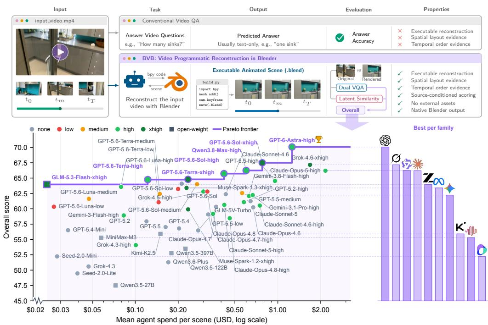  
Figure 1: BVB overview and Overall cost frontier across 51 configurations.

## 1 Introduction

Video understanding is usually measured by question answering (Tang et al., 2025a; Jang et al., 2017; Lei et al., 2018; Yu et al., 2019; Xiao et al., 2021; Patr˘ aucean et al., 2023; Li et al., 2024; Wu˘ et al., 2024; Fu et al., 2025; Tang et al., 2025b), but a correct answer alone does not demonstrate that the model fully understood the scene. A model can pick the right option from answer priors or a single frame (Lei et al., 2023), so a correct answer does not show that the model tracked the scene over time. If an agent truly understands a video, it can reconstruct it programmatically. This is because a reconstruction must match the source in object placement, camera trajectory, and event ordering. These details cannot be guessed from a single frame or answer prior. The agent needs to work from video frames alone, without depth maps, segmentation, or 3D ground truth, so it must infer the full scene from pure 2D observation. Also, it is much harder to fake a reconstruction than to pick a correct answer. To rebuild a video, an agent must combine spatial, temporal, and compositional understanding with reasoning and coding. Existing video benchmarks test these abilities separately.

This test has recently become possible. Multimodal agents can now construct visual content by coding, without relying on diffusion models. Recent systems build animated Blender scenes through agent-driven code (OpenAI, 2026; Ricouard, 2026; Yin et al., 2026; He et al., 2025; Ahuja, 2025), suggesting that these agents may already have a certain degree of spatiotemporal understanding capability. However, existing results come from selected scenes, often with repeated human guidance and external asset libraries, so they do not show how reliably an agent can handle new scenes, how performance changes across model families, or how well the resulting scene matches the source in layout and dynamics. BVB evaluates this ability at scale through holistic reconstruction of real indoor videos under a shared protocol without external assets.

To enable such controlled evaluation, we introduce BVB, Blender-VideoBench, a benchmark asking multimodal agents to reconstruct real-world videos as animated Blender scenes, as shown in Figure 1. To ensure that agents are required to understand actual scenes, and to keep reconstruction complexity manageable while preserving rich spatiotemporal structure, we construct the benchmark with the egocentric real-world indoor videos and question-answer pairs from VSI-Bench (Yang et al., 2025). Each agent interacts through a lightweight harness (Mini-BVB) that offers two actions, inspecting video frames and executing code in a Blender sandbox, under a shared cost limit. External asset libraries are disallowed, so the agent must construct the scene from primitives, animate its cam era along the source trajectory, and save the result as an editable Blender file instead of a generated image or a pre-rendered video.

A faithful reconstruction must preserve the source video’s layout and dynamics, so BVB evaluates each reconstruction along two axes: (1) Dual VQA (DV) measures how many spatiotemporal facts the reconstruction preserves. It asks a VLM judge the same spatial and temporal questions on the source and reconstruction, from object counts and distances to route plans and appearance order, and scores retention only on questions the judge answers correctly on the source. (2) Latent Similarity (LS) measures how closely the reconstruction matches the source video perceptually, comparing the two videos with frozen V-JEPA 2.1 representations (Bardes et al., 2024; Assran et al., 2025; Mur-Labadia et al., 2026). We report both axes and rank configurations by their square-root mean (Overall), which favors balanced performance across the two axes.

We evaluate 51 configurations across 10 proprietary and open-weight model families and analyze semantic retention, perceptual similarity, reasoning effort, and cost. GPT-6-Astra-high leads at 70.07 Overall, but semantic retention never exceeds 53.7%, while visual similarity is much higher. Current agents therefore build reconstructions that look right but get many facts wrong. Additiona reasoning improves visual similarity but does not close this gap in factual accuracy. To validate the automatic evaluation, we conduct a blind human study with 15 raters whose configuration ranking matches Overall exactly. These results show that programmatic reconstruction is already a viable test of video understanding, but that the best models still miss nearly half the spatiotemporal facts a VLM judge can verify.

In short, our contributions are threefold:

• We introduce BVB, a benchmark that tests agentic video understanding by asking multimodal agents to reconstruct real-world indoor videos as animated Blender scenes under a standardized, cost-controlled, asset-free setup.

• We evaluate 51 configurations across 10 model families, including GPT-6 Astra, and find that current agents produce visually plausible but semantically incomplete reconstructions.

• We design a two-axis evaluation that favors balanced performance across semantic retention and perceptual similarity, validate it against blind human rankings, and present findings that identify which video understanding abilities remain unsolved and can guide future work.

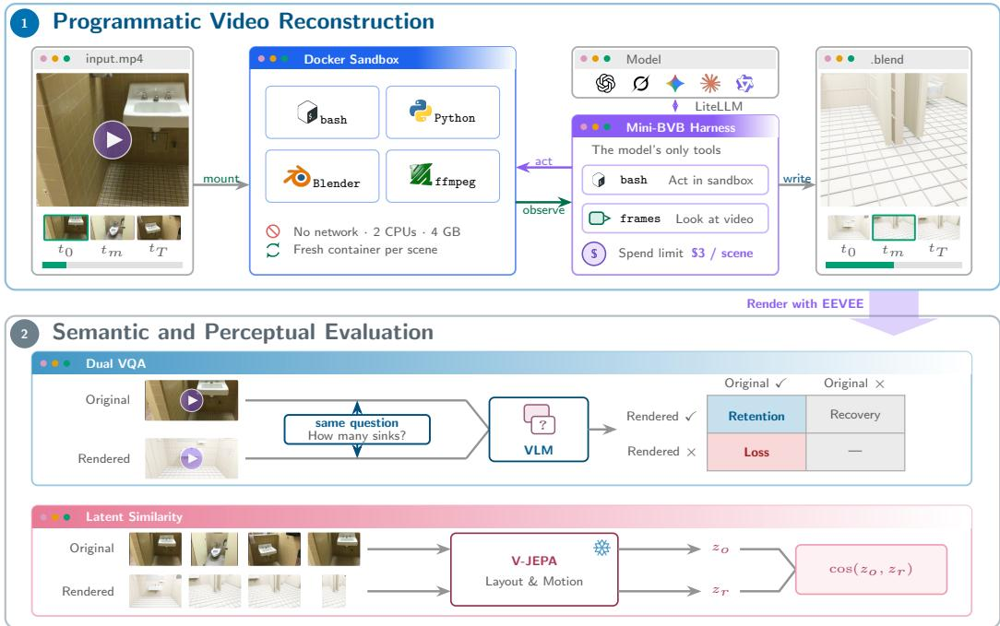  
Figure 2: Controlled reconstruction and evaluation. A model alternates between viewing source frames and running Python code in a Docker sandbox under a cost limit, then saves an animated Blend scene. Dual VQA measures how well the rendered video retains answers the judge gets right on the source, and Latent Similarity compares layout and motion using frozen V-JEPA features.

## 2 BVB: Blender-VideoBench

## 2.1 Benchmark Construction

BVB is built on the real indoor egocentric clips of VSI-Bench (Yang et al., 2025), drawn from ARKitScenes (Baruch et al., 2021), ScanNet (Dai et al., 2017), and ScanNet++ (Yeshwanth et al., 2023). We evaluate its 288 test scenes, which come with 5,130 spatiotemporal questions, so every reconstruction is evaluated against the same set of questions. Stage 1 (Figure 2) gives each agent a Docker sandbox with Blender and a lightweight harness called Mini-BVB Harness, which exposes exactly two actions. bash runs sandbox commands including Python code for Blender, and frames requests video frames by timestamp or uniform count. Every model uses this same harness. In this agentic setting, the model itself decides how much of the video to look at and how long to work, with no step or frame budget. The only limit is a per-scene spend cap. External asset libraries are disallowed, so geometry must be built from primitives and basic Blender operations. A run is valid only if the agent observed the source video and produced a renderable Blender file. Stage 2 scores this file and never re-enters the loop. Appendix A gives the loop in full and reproduces the system prompt, which is identical for every configuration, so every model faces the same sandbox, prompt, and cost ceiling.

## 2.2 Evaluation Metrics

BVB evaluates each reconstruction on two complementary axes (Figure 2). Dual VQA measures how much semantic content the reconstruction retains. Latent Similarity measures how closely the reconstruction matches the source in overall visual appearance. We combine both axes into Overall (Equation (1)).

Dual VQA (DV). A faithful reconstruction should retain the spatial and temporal facts of the source. A VLM judge answers the VSI-Bench questions on uniformly sampled frames of both the source and rendered video. The retention rate of DV is defined as $| C _ { s } \dot { \cap } C _ { r } | \dot { / } | C _ { s } | ,$ , where $C _ { s }$ and $C _ { r }$ are the questions answered correctly on the source and reconstruction. Conditioning on $C _ { s }$ means the metric captures what the reconstruction keeps, not the judge’s baseline accuracy.

Latent Similarity (LS). Correct answers to discrete questions do not guarantee that a reconstruction looks like the source, so we add a continuous perceptual axis. A frozen V-JEPA encoder (Bardes et al., 2024; Assran et al., 2025; Mur-Labadia et al., 2026) maps both clips to latent features. We compare spatial arrangement and temporal dynamics separately, reporting them as Layout and Motion, and average them to get LS. The encoder is a self-supervised video model, never fine-tuned on BVB, so the metric reflects general visual agreement rather than benchmark-specific patterns. If an agent fails to produce a renderable file, that scene scores zero on both axes. Excluding failed scenes would let a model raise its average by skipping hard ones. The agent never sees its evaluation scores, so scoring cannot influence reconstruction. Appendix F gives the formal definition and pipeline details.

Overall. The two axes measure different aspects of reconstruction quality. DV is a semantic retention rate and LS is a perceptual similarity score. Under the arithmetic mean $\bar { s } _ { i } = 1 / \vert \mathcal { A } \vert \sum _ { a \in \mathcal { A } } s _ { i } ^ { a }$ , a gain on one axis exactly offsets an equal loss on the other. A 10-point increase in LS fully compensates for a 10-point decrease in DV, which is not the trade-off we want the aggregate to encode. To favor configurations that are strong on both axes we instead use the square-root mean:

$$
\bar { s } _ { i } = \left( \frac { 1 } { \vert \mathcal { A } \vert } \sum _ { a \in \mathcal { A } } \sqrt { s _ { i } ^ { a } } \right) ^ { 2 } , \qquad \mathcal { A } = \{ \mathbf { D } \mathbf { V } , \mathbf { L } \mathbf { S } \} .\tag{1}
$$

Both axes are expressed on a 0–100 scale. We clip a negative cosine score to zero before taking its square root. No evaluated configuration requires this clipping. Equivalently, the square-root mean is the arithmetic mean corrected by a cross-axis dispersion penalty, $\begin{array} { r } { \bar { s } _ { i } = \bar { 1 } / | \mathcal { A } | \sum _ { a \in \mathcal { A } } s _ { i } ^ { a } - } \end{array}$ $\mathrm { V a r } _ { a \in \mathcal { A } } \big ( \sqrt { s _ { i } ^ { a } } \big )$ , as Appendix D derives. Thus, equal-sized gains and losses on different axes no longer necessarily cancel, and more uneven performance receives a larger penalty. Moreover, unlike the geometric mean, the square-root mean does not become zero when only one axis is zero. We therefore use it as the aggregate score for leaderboard ranking.

## 3 Experiments

## 3.1 Experimental Setup

Baselines. We evaluate frontier multimodal models as zero-shot reconstruction agents, without fine-tuning. The suite covers ten families of proprietary API and open-weight models, namely OpenAI GPT-5.x and GPT-6 Astra (OpenAI, 2026), xAI Grok, Anthropic Claude, Google Gemini (Gemini Team, 2025), Meta Muse Spark (Meta, 2026), Zhipu GLM (GLM-V Team, 2025; Z.ai, 2026), Alibaba Qwen (Qwen Team, 2025), Moonshot Kimi (Kimi Team, 2025), MiniMax (MiniMax, 2025), and ByteDance Seed (ByteDance Seed, 2025). When a model supports adjustable reasoning effort, we test none, low, medium, high, and xhigh when available.

Implementation details. All agents run through the same Mini-BVB Harness and Stage 1 sandbox defined in Section 2. Each configuration is evaluated on all 288 scenes using the 5,130 spatiotemporal questions. Unless noted, we use a common \$3 per-scene cost ceiling and the same system prompt, which shows the agent its source video and requires an executable Blender program and a final result.blend. The Docker sandbox comes pre-installed with Bash, Python, Blender 4.2, and FFmpeg. For Dual VQA, the VLM judge is gpt-5.4-mini, answering all VSI-Bench questions on 16 uniformly sampled frames from both the source and rendered video. Original-video accuracy is $A _ { o } { = } 3 5 . 6 \%$ . We report retention per VSI-Bench task, covering object counting, absolute and relative distance, sizes, direction, route planning, and appearance order. Rel.

Table 1: A subset of the BVB results, with proprietary and open-weight models listed separately. Rank is the global ordering over all 51 configurations (Table 3). Colored effort badges encode the reasoning setting (red for low, amber for medium, green for high or xhigh, no badge for none). Darker and lighter purple mark the best and second-best among shown rows.
<table><tr><td></td><td rowspan=2 colspan=2>Model &amp;Reasoning Effort</td><td rowspan=2 colspan=2></td><td rowspan=1 colspan=9>Dual VQA (DV) ↑</td><td rowspan=1 colspan=3>LS↑</td></tr><tr><td></td><td rowspan=1 colspan=9>Abs. Dist.Obj. SizeRoom SizeRel. Dist.Rel. Dir.Route PlanAppr. Order   L</td><td rowspan=1 colspan=3>ayoutMotionAvg.</td></tr><tr><td></td><td rowspan=1 colspan=2>Proprietary Models</td><td rowspan=1 colspan=2></td><td rowspan=1 colspan=2></td><td rowspan=1 colspan=1></td><td rowspan=1 colspan=1></td><td rowspan=1 colspan=3></td><td rowspan=1 colspan=2></td><td rowspan=1 colspan=3></td></tr><tr><td></td><td rowspan=1 colspan=2>GPT-6-Astra high</td><td rowspan=1 colspan=1></td><td rowspan=1 colspan=1>70.07</td><td rowspan=1 colspan=1>48.5</td><td rowspan=1 colspan=1>33.5</td><td rowspan=1 colspan=1>73.7</td><td rowspan=1 colspan=1>33.1</td><td rowspan=1 colspan=1>49.0</td><td rowspan=1 colspan=2>50.054.8</td><td rowspan=1 colspan=2>36.053.7|</td><td rowspan=1 colspan=3>|87.3 90.0 88.6</td></tr><tr><td></td><td rowspan=2 colspan=2>GPT-5.6-SolxhighØ Grok-4.6xhigh</td><td rowspan=1 colspan=1>2</td><td rowspan=1 colspan=1>67.49</td><td rowspan=1 colspan=1>38.0</td><td rowspan=1 colspan=1>39.9</td><td rowspan=1 colspan=1>69.0</td><td rowspan=1 colspan=1>53.1</td><td rowspan=1 colspan=1>43.6</td><td rowspan=1 colspan=2>50.747.3</td><td rowspan=1 colspan=2>16.051.7</td><td rowspan=1 colspan=3>84.086.7 85.4</td></tr><tr><td></td><td rowspan=1 colspan=1>3</td><td rowspan=1 colspan=1>67.17</td><td rowspan=1 colspan=1>40.5</td><td rowspan=1 colspan=1>42.2</td><td rowspan=1 colspan=1>66.2</td><td rowspan=1 colspan=1>46.9</td><td rowspan=1 colspan=1>42.7</td><td rowspan=1 colspan=2>52.559.1</td><td rowspan=1 colspan=2>24.052.1</td><td rowspan=1 colspan=3>82.985.5 84.2</td></tr><tr><td></td><td rowspan=1 colspan=2>Qwen3.8-Max high</td><td rowspan=1 colspan=1>4</td><td rowspan=1 colspan=1>66.24</td><td rowspan=1 colspan=1>42.5</td><td rowspan=1 colspan=1>37.6</td><td rowspan=1 colspan=1>65.8</td><td rowspan=1 colspan=1>45.4</td><td rowspan=1 colspan=1>38.6</td><td rowspan=1 colspan=1>56.1</td><td rowspan=1 colspan=1>72.0</td><td rowspan=1 colspan=2>30.052.7</td><td rowspan=1 colspan=3>79.982.8 81.3</td></tr><tr><td></td><td rowspan=1 colspan=2>Claude-Opus-5high</td><td rowspan=1 colspan=1>5</td><td rowspan=1 colspan=1>66.21</td><td rowspan=1 colspan=1>42.0</td><td rowspan=1 colspan=1>46.2</td><td rowspan=1 colspan=1>66.4</td><td rowspan=1 colspan=1>43.8</td><td rowspan=1 colspan=1>44.0</td><td rowspan=1 colspan=1>52.0</td><td rowspan=1 colspan=1>65.6</td><td rowspan=1 colspan=1>16.0</td><td rowspan=1 colspan=1>52.6</td><td rowspan=1 colspan=2>79.882.9</td><td rowspan=1 colspan=1>81.4</td></tr><tr><td></td><td rowspan=1 colspan=2>GPT-5.6-Sol high</td><td rowspan=1 colspan=1>6</td><td rowspan=1 colspan=1>65.73</td><td rowspan=1 colspan=1>34.5</td><td rowspan=1 colspan=1>37.6</td><td rowspan=1 colspan=1>65.0</td><td rowspan=1 colspan=1>40.8</td><td rowspan=1 colspan=1>37.8</td><td rowspan=1 colspan=1>52.2</td><td rowspan=1 colspan=1>63.4</td><td rowspan=1 colspan=1>26.0</td><td rowspan=1 colspan=1>49.8</td><td rowspan=1 colspan=2>82.585.3</td><td rowspan=1 colspan=1>83.9</td></tr><tr><td></td><td rowspan=1 colspan=2>GPT-5.6-Terra high</td><td rowspan=1 colspan=1>8</td><td rowspan=1 colspan=1>64.76</td><td rowspan=1 colspan=1>37.5</td><td rowspan=1 colspan=1>34.1</td><td rowspan=1 colspan=1>66.2</td><td rowspan=1 colspan=1>45.4</td><td rowspan=1 colspan=1>30.3</td><td rowspan=1 colspan=1>52.5</td><td rowspan=1 colspan=1>63.4</td><td rowspan=1 colspan=1>16.0</td><td rowspan=1 colspan=1>49.2</td><td rowspan=1 colspan=1>81.0</td><td rowspan=1 colspan=1>83.9</td><td rowspan=1 colspan=1>82.4</td></tr><tr><td></td><td rowspan=1 colspan=2>GPT-5.6-Sol</td><td rowspan=1 colspan=1>10</td><td rowspan=1 colspan=1>64.09</td><td rowspan=1 colspan=1>31.0</td><td rowspan=1 colspan=1>37.0</td><td rowspan=1 colspan=1>67.1</td><td rowspan=1 colspan=1>37.7</td><td rowspan=1 colspan=1>40.2</td><td rowspan=1 colspan=1>50.7</td><td rowspan=1 colspan=1>61.3</td><td rowspan=1 colspan=1>22.0</td><td rowspan=1 colspan=1>49.5</td><td rowspan=1 colspan=1>79.1</td><td rowspan=1 colspan=2>82.0 80.6</td></tr><tr><td></td><td rowspan=1 colspan=2>GPT-5.6-Lunahigh</td><td rowspan=1 colspan=1>13</td><td rowspan=1 colspan=1>63.58</td><td rowspan=1 colspan=1>28.5</td><td rowspan=1 colspan=1>36.4</td><td rowspan=1 colspan=1>65.2</td><td rowspan=1 colspan=1>34.6</td><td rowspan=1 colspan=1>37.3</td><td rowspan=1 colspan=1>54.4</td><td rowspan=1 colspan=1>54.8</td><td rowspan=1 colspan=1>10.0</td><td rowspan=1 colspan=1>48.2</td><td rowspan=1 colspan=1>79.682.7</td><td rowspan=1 colspan=2>81.1</td></tr><tr><td></td><td rowspan=1 colspan=2>∞ Muse-Spark-1.3xhigh</td><td rowspan=1 colspan=1>14</td><td rowspan=1 colspan=1>63.40</td><td rowspan=1 colspan=1>35.0</td><td rowspan=1 colspan=1>36.4</td><td rowspan=1 colspan=1>64.1</td><td rowspan=1 colspan=1>35.4</td><td rowspan=1 colspan=1>40.2</td><td rowspan=1 colspan=1>51.2</td><td rowspan=1 colspan=1>62.4</td><td rowspan=1 colspan=1>20.0</td><td rowspan=1 colspan=1>48.9</td><td rowspan=1 colspan=1>78.3</td><td rowspan=1 colspan=1>81.2</td><td rowspan=1 colspan=1>79.7</td></tr><tr><td rowspan=2 colspan=3>Grok-4.5 highGemini-3.1-Prohigh</td><td rowspan=1 colspan=1>16</td><td rowspan=1 colspan=1>62.81</td><td rowspan=1 colspan=1>35.0</td><td rowspan=1 colspan=1>39.3</td><td rowspan=1 colspan=1>64.1</td><td rowspan=1 colspan=1>42.3</td><td rowspan=1 colspan=1>39.8</td><td rowspan=1 colspan=1>47.3</td><td rowspan=1 colspan=1>59.1</td><td rowspan=1 colspan=1>14.0</td><td rowspan=1 colspan=1>48.4</td><td rowspan=1 colspan=1>77.6</td><td rowspan=1 colspan=1>80.4</td><td rowspan=1 colspan=1>79.0</td></tr><tr><td rowspan=1 colspan=1>21</td><td rowspan=1 colspan=1>62.23</td><td rowspan=1 colspan=1>30.0</td><td rowspan=1 colspan=1>44.5</td><td rowspan=1 colspan=1>65.2</td><td rowspan=1 colspan=1>43.1</td><td rowspan=1 colspan=1>41.1</td><td rowspan=1 colspan=1>55.1</td><td rowspan=1 colspan=1>63.4</td><td rowspan=1 colspan=1>20.0</td><td rowspan=1 colspan=1>51.1</td><td rowspan=1 colspan=1>72.9</td><td rowspan=1 colspan=1>76.1</td><td rowspan=1 colspan=1>74.5</td></tr><tr><td rowspan=1 colspan=3>Gemini-3.8-Flash high</td><td rowspan=1 colspan=1>22</td><td rowspan=1 colspan=1>62.08</td><td rowspan=1 colspan=1>41.5</td><td rowspan=1 colspan=1>35.8</td><td rowspan=1 colspan=1>65.4</td><td rowspan=1 colspan=1>37.7</td><td rowspan=1 colspan=1>42.7</td><td rowspan=1 colspan=1>44.9</td><td rowspan=1 colspan=1>51.6</td><td rowspan=1 colspan=1>18.0</td><td rowspan=1 colspan=1>48.4</td><td rowspan=1 colspan=1>76.0</td><td rowspan=1 colspan=1>78.8</td><td rowspan=1 colspan=1>77.4</td></tr><tr><td></td><td rowspan=2 colspan=2>米 Claude-Sonnet-50high米Claude-Sonnet-4.6high</td><td rowspan=1 colspan=1>27</td><td rowspan=1 colspan=1>60.63</td><td rowspan=1 colspan=1>29.0</td><td rowspan=1 colspan=1>37.0</td><td rowspan=1 colspan=1>65.4</td><td rowspan=1 colspan=1>28.5</td><td rowspan=1 colspan=1>39.8</td><td rowspan=1 colspan=1>54.7</td><td rowspan=1 colspan=1>54.8</td><td rowspan=1 colspan=1>10.0</td><td rowspan=1 colspan=1>48.3</td><td rowspan=1 colspan=1>72.7</td><td rowspan=1 colspan=1>76.1</td><td rowspan=1 colspan=1>74.4</td></tr><tr><td></td><td rowspan=1 colspan=1>28</td><td rowspan=1 colspan=1>60.53</td><td rowspan=1 colspan=1>35.5</td><td rowspan=1 colspan=1>32.4</td><td rowspan=1 colspan=1>62.8</td><td rowspan=1 colspan=1>34.6</td><td rowspan=1 colspan=1>36.9</td><td rowspan=1 colspan=1>52.9</td><td rowspan=1 colspan=1>58.1</td><td rowspan=1 colspan=1>12.0</td><td rowspan=1 colspan=1>47.7</td><td rowspan=1 colspan=1>73.4</td><td rowspan=1 colspan=1>76.5</td><td rowspan=1 colspan=1>74.9</td></tr><tr><td rowspan=3 colspan=2>Cla</td><td rowspan=1 colspan=1>Claude-Opus-4.6</td><td rowspan=1 colspan=1>31</td><td rowspan=1 colspan=1>60.23</td><td rowspan=1 colspan=1>28.0</td><td rowspan=1 colspan=1>39.3</td><td rowspan=1 colspan=1>63.7</td><td rowspan=1 colspan=1>30.0</td><td rowspan=1 colspan=1>46.1</td><td rowspan=1 colspan=1>48.0</td><td rowspan=1 colspan=1>50.5</td><td rowspan=1 colspan=1>24.0</td><td rowspan=1 colspan=1>47.5</td><td rowspan=1 colspan=1>73.0</td><td rowspan=1 colspan=1>75.9</td><td rowspan=1 colspan=1>74.5</td></tr><tr><td rowspan=1 colspan=1></td><td rowspan=1 colspan=1>Gemini-3-Flash high</td><td rowspan=1 colspan=1>35</td><td rowspan=1 colspan=1>58.91</td><td rowspan=1 colspan=1>31.5</td><td rowspan=1 colspan=1>38.7</td><td rowspan=1 colspan=1>66.4</td><td rowspan=1 colspan=1>40.8</td><td rowspan=1 colspan=1>39.0</td><td rowspan=1 colspan=1>52.5</td><td rowspan=1 colspan=1>58.1</td><td rowspan=1 colspan=1>18.0</td><td rowspan=1 colspan=1>49.6</td><td rowspan=1 colspan=1>67.3</td><td rowspan=1 colspan=1>70.7</td><td rowspan=1 colspan=1>69.0</td></tr><tr><td rowspan=1 colspan=1>ude-Opus-4.8high</td><td rowspan=1 colspan=1>36</td><td rowspan=1 colspan=1>58.46</td><td rowspan=1 colspan=1>29.0</td><td rowspan=1 colspan=1>33.5</td><td rowspan=1 colspan=1>60.9</td><td rowspan=1 colspan=1>30.0</td><td rowspan=1 colspan=1>41.1</td><td rowspan=1 colspan=1>51.7</td><td rowspan=1 colspan=1>54.8</td><td rowspan=1 colspan=1>16.0</td><td rowspan=1 colspan=1>46.4</td><td rowspan=1 colspan=1>69.9</td><td rowspan=1 colspan=1>73.9</td><td rowspan=1 colspan=1>71.9</td></tr><tr><td rowspan=1 colspan=2>SGPT</td><td rowspan=1 colspan=1>-5.5</td><td rowspan=1 colspan=1>38</td><td rowspan=1 colspan=1>57.03</td><td rowspan=1 colspan=1>21.5</td><td rowspan=1 colspan=1>24.3</td><td rowspan=1 colspan=1>59.8</td><td rowspan=1 colspan=1>30.8</td><td rowspan=1 colspan=1>34.9</td><td rowspan=1 colspan=1>46.3</td><td rowspan=1 colspan=1>59.1</td><td rowspan=1 colspan=1>14.0</td><td rowspan=1 colspan=1>42.6</td><td rowspan=1 colspan=1>71.8</td><td rowspan=1 colspan=1>75.4</td><td rowspan=1 colspan=1>73.6</td></tr><tr><td rowspan=1 colspan=2>7</td><td rowspan=1 colspan=1>GLM-5V-Turbo</td><td rowspan=1 colspan=1>41</td><td rowspan=1 colspan=1>56.47</td><td rowspan=1 colspan=1>25.5</td><td rowspan=1 colspan=1>42.2</td><td rowspan=1 colspan=1>61.5</td><td rowspan=1 colspan=1>36.9</td><td rowspan=1 colspan=1>32.8</td><td rowspan=1 colspan=1>52.9</td><td rowspan=1 colspan=1>59.1</td><td rowspan=1 colspan=1>12.0</td><td rowspan=1 colspan=1>46.8</td><td rowspan=1 colspan=1>65.4</td><td rowspan=1 colspan=1>68.7</td><td rowspan=1 colspan=1>67.0</td></tr><tr><td rowspan=1 colspan=2>SG</td><td rowspan=1 colspan=1>rok-4.3 high</td><td rowspan=1 colspan=1>44</td><td rowspan=1 colspan=1>54.08</td><td rowspan=1 colspan=1>22.0</td><td rowspan=1 colspan=1>36.4</td><td rowspan=1 colspan=1>57.5</td><td rowspan=1 colspan=1>32.3</td><td rowspan=1 colspan=1>41.1</td><td rowspan=1 colspan=1>51.0</td><td rowspan=1 colspan=1>52.7</td><td rowspan=1 colspan=1>12.0</td><td rowspan=1 colspan=1>44.7</td><td rowspan=1 colspan=1>62.8</td><td rowspan=1 colspan=1>65.9</td><td rowspan=1 colspan=1>64.3</td></tr><tr><td rowspan=1 colspan=2>0</td><td rowspan=1 colspan=1>Seed-2.0-Mini</td><td rowspan=1 colspan=1>47</td><td rowspan=1 colspan=1>52.24</td><td rowspan=1 colspan=1>17.0</td><td rowspan=1 colspan=1>31.8</td><td rowspan=1 colspan=1>61.5</td><td rowspan=1 colspan=1>20.8</td><td rowspan=1 colspan=1>31.1</td><td rowspan=1 colspan=1>52.9</td><td rowspan=1 colspan=1>61.3</td><td rowspan=1 colspan=1>4.0</td><td rowspan=1 colspan=1>43.4</td><td rowspan=1 colspan=1>59.8</td><td rowspan=1 colspan=1>64.0</td><td rowspan=1 colspan=1>61.9</td></tr><tr><td rowspan=1 colspan=2>女Q</td><td rowspan=1 colspan=1>wen3.6-Plus</td><td rowspan=1 colspan=1>48</td><td rowspan=1 colspan=1>51.28</td><td rowspan=1 colspan=1>20.5</td><td rowspan=1 colspan=1>31.8</td><td rowspan=1 colspan=1>54.1</td><td rowspan=1 colspan=1>30.0</td><td rowspan=1 colspan=1>29.9</td><td rowspan=1 colspan=1>48.5</td><td rowspan=1 colspan=2>61.3  12.0</td><td rowspan=1 colspan=1>41.4</td><td rowspan=1 colspan=1>60.8</td><td rowspan=1 colspan=1>63.7</td><td rowspan=1 colspan=1>62.2</td></tr><tr><td rowspan=1 colspan=2>S</td><td rowspan=1 colspan=1>eed-2.0-Lite</td><td rowspan=1 colspan=1>50</td><td rowspan=1 colspan=1>49.47</td><td rowspan=1 colspan=1>10.5</td><td rowspan=1 colspan=1>33.5</td><td rowspan=1 colspan=1>57.9</td><td rowspan=1 colspan=1>30.0</td><td rowspan=1 colspan=1>32.0</td><td rowspan=1 colspan=1>48.5</td><td rowspan=1 colspan=2>52.7  8.0</td><td rowspan=1 colspan=1>41.3</td><td rowspan=1 colspan=1>56.2</td><td rowspan=1 colspan=1>60.6</td><td rowspan=1 colspan=1>58.4</td></tr><tr><td rowspan=1 colspan=3>Open-weight Models</td><td rowspan=1 colspan=1></td><td rowspan=1 colspan=1></td><td rowspan=1 colspan=1></td><td rowspan=1 colspan=1></td><td rowspan=1 colspan=1></td><td rowspan=1 colspan=1></td><td rowspan=1 colspan=1></td><td rowspan=1 colspan=3></td><td rowspan=1 colspan=1></td><td rowspan=1 colspan=2></td><td rowspan=1 colspan=1></td></tr><tr><td rowspan=1 colspan=3>GLM-5.3-Flashxhigh</td><td rowspan=1 colspan=1>12</td><td rowspan=1 colspan=1>63.96|</td><td rowspan=1 colspan=1>35.0</td><td rowspan=1 colspan=1>38.2</td><td rowspan=1 colspan=1>64.5</td><td rowspan=1 colspan=1>46.2</td><td rowspan=1 colspan=1>46.9</td><td rowspan=1 colspan=3>51.754.8 28.0</td><td rowspan=1 colspan=1>50.8|</td><td rowspan=1 colspan=1>77.08</td><td rowspan=1 colspan=1>0.3 7</td><td rowspan=1 colspan=1>8.7</td></tr><tr><td rowspan=1 colspan=2>KKi</td><td rowspan=1 colspan=1>mi-K2.5</td><td rowspan=1 colspan=1>42</td><td rowspan=1 colspan=1>55.91</td><td rowspan=1 colspan=1>24.0</td><td rowspan=1 colspan=2>32.959.2</td><td rowspan=1 colspan=1>33.8</td><td rowspan=1 colspan=1>36.9</td><td rowspan=1 colspan=3>47.558.1  6.0</td><td rowspan=1 colspan=1>44.0</td><td rowspan=1 colspan=1>67.7</td><td rowspan=1 colspan=1>70.8</td><td rowspan=1 colspan=1>69.2</td></tr><tr><td rowspan=1 colspan=2>Mi</td><td rowspan=1 colspan=1>niMax-M3</td><td rowspan=1 colspan=1>43</td><td rowspan=1 colspan=1>55.29</td><td rowspan=1 colspan=1>20.0</td><td rowspan=1 colspan=2>35.861.5</td><td rowspan=1 colspan=1>30.8</td><td rowspan=1 colspan=1>40.2</td><td rowspan=1 colspan=1>49.5</td><td rowspan=1 colspan=2>62.4  14.0</td><td rowspan=1 colspan=1>45.6</td><td rowspan=1 colspan=1>64.3</td><td rowspan=1 colspan=1>67.6</td><td rowspan=1 colspan=1>65.9</td></tr><tr><td rowspan=1 colspan=2>Qwe</td><td rowspan=1 colspan=1>n3.5-122B</td><td rowspan=1 colspan=1>45</td><td rowspan=1 colspan=1>53.50</td><td rowspan=1 colspan=1>16.5</td><td rowspan=1 colspan=2>32.9 63.9</td><td rowspan=1 colspan=1>25.4</td><td rowspan=1 colspan=1>29.0</td><td rowspan=1 colspan=1>52.9</td><td rowspan=1 colspan=2>57.0  8.0</td><td rowspan=1 colspan=1>44.1</td><td rowspan=1 colspan=1>62.0</td><td rowspan=1 colspan=1>65.6</td><td rowspan=1 colspan=1>63.8</td></tr><tr><td rowspan=2 colspan=3>Qwen3.5-397BQwen3.5-27B</td><td rowspan=1 colspan=4>Owen3.5-397B</td><td rowspan=1 colspan=1>46</td><td rowspan=1 colspan=1>52.75</td><td rowspan=1 colspan=4>16.0 32.9 60.9 29.2</td><td rowspan=1 colspan=1>38.2</td><td rowspan=1 colspan=3>45.1 57.0  10.043.0</td></tr><tr><td rowspan=1 colspan=1>51</td><td rowspan=1 colspan=1>47.50</td><td rowspan=1 colspan=4>13.5 27.2 54.5 26.2</td><td rowspan=1 colspan=1>30.7</td><td rowspan=1 colspan=4>45.3 49.5  4.0 38.6</td><td rowspan=1 colspan=3>55.858.9 57.3</td></tr></table>

Dir. micro-aggregates the easy, medium, and hard subsets. For Latent Similarity, we render 64 frames from each reconstruction with Blender’s EEVEE renderer along the scene-camera timeline and sample 64 frames from the source clip. The encoder is V-JEPA 2.1 ViT-G (Mur-Labadia et al., 2026).

## 3.2 Main Results

Overview. Table 1 shows a subset of the results. Appendix B lists all 51 configurations. Across all 51 configurations, Overall spans 47.50–70.07, DV spans 38.6–53.7, and LS spans 57.2–88.6. Better configurations tend to improve on both axes, but neither axis determines the other. Most importantly, the best DV is only 53.7. Nearly half of the spatiotemporal answers available from the source are therefore lost even at the top of the leaderboard.

Rank and frontier. GPT-6-Astra-high leads at 70.07 Overall, followed by GPT-5.6-Sol-xhigh at 67.49 and Grok-4.6-xhigh at 67.17. The top-two Overall gap of 2.58 points is statistically significant (see Appendix C for bootstrap details), confirming that BVB separates even the strongest models. The corresponding difference in DV is not statistically significant. Leading proprietary models still score higher on both axes. GLM-5.3-Flash-xhigh is the strongest open-weight configuration at rank 12 and 63.96 Overall. Different price points also lead to different winners. Figure 1 shows that GPT-5.6-Sol-xhigh reaches 96% of the highest Overall while spending only 62% of Astra’s mean per-scene cost. Appendix Figure 25 separates the same comparison by axis, and Section 4 examines semantic failure, human alignment, and the effect of extra reasoning effort.

Finding 1. Coding agents can already understand video through programmatic reconstruction, but the best models still miss nearly half the semantic content that a VLM judge can verify. BVB is not saturated and separates models at every price tier.

Blind human ranking. Fifteen human raters ranked five anonymized reconstructions against the source video on nine scenes each, without knowing which model produced which reconstruction. Table 2 shows that their mean ranking matches the Overall order exactly (Spearman ρ=1.00). When measured per scene and per model, their preference correlates strongly with LS (Spearman ρ=0.83). Appendix J gives the full protocol and scene-level calibration.

Table 2: Blind ranking matches the BVB Overall order for all five evaluated configurations (ρ=1.00).
<table><tr><td>Model &amp; Reasoning Effort</td><td>Human rank↓</td><td>Mean rank↓</td><td>BVB rank↓</td></tr><tr><td>GPT-5.6-Sol xhigh</td><td>1</td><td>1.47</td><td>2</td></tr><tr><td>Ø Grok-4.5 high</td><td>2</td><td>2.23</td><td>16</td></tr><tr><td>L Gemini-3.1-Pro high</td><td>3</td><td>3.03</td><td>21</td></tr><tr><td>Claude-Opus-4.6</td><td>4</td><td>3.70</td><td>31</td></tr><tr><td>Qwen3.5-397B</td><td>5</td><td>4.58</td><td>46</td></tr></table>

## 4 Analysis

Section 3 ranks configurations by Overall, but a single score does not show which spatial and temporal facts are lost, whether the metrics match human judgment, or how reasoning effort and cost affect the results. We examine each of these questions below.

## 4.1 How large is the gap between looking right and being right?

The best LS reaches 88.6, yet the best DV is only 53.7. In absolute terms, 981 of the 1,827 spatiotemporal questions that the VLM judge answers correctly on the source video are still answered correctly after reconstruction. The remaining 846 questions are lost even by the strongest model. High visual similarity from the frozen V-JEPA encoder therefore does not guarantee that the reconstruction preserves the spatial and temporal facts of the source.

This gap also appears at the scene level. The top model does not win on every scene, and the DV difference between the top two configurations is not statistically significant even though their Overall gap is (see Appendix C for bootstrap details and Appendix Figure 6 for per-scene comparisons).

Finding 2. Looking right is not the same as being right. The best model reaches 88.6 LS but retains only 53.7% of the source-correct answers, so nearly half of verifiable semantic content is still lost after reconstruction.

## 4.2 What spatiotemporal information is retained after reconstruction?

Figure 3 combines the score distribution across all configurations with representative model profiles. Across all 51 configurations, object size and route planning have the highest mean retention at 63.0% and 58.5%, while appearance order and object count are lowest at 16.1% and 29.3%. The benchmark therefore exposes a shared hierarchy of task difficulty. Tasks that depend on more scene structure have lower retention. Object size is a property of a single object, and it has the highest retention. Object counting requires enumerating every instance in the room, and appearance order requires tracking the full camera trajectory. Both tasks lose most of their originally correct answers after reconstruction.

The spread across models also varies by task. Object count spans 10.5–48.5% across configurations, room size spans 20.8–53.1%, and appearance order spans 4.0–36.0%. Relative direction is much more compressed at 44.9–57.4%. The heatmap further shows that no configuration dominates every task. Thus BVB contains both shared difficulty patterns and task-specific model rankings.

Finding 3. BVB exposes a stable task hierarchy without reducing models to one uniform capability scale. Retention is highest for single-object properties such as size, and lowest for tasks that require reasoning over the whole scene, such as counting and appearance order. Model strengths still vary by task.

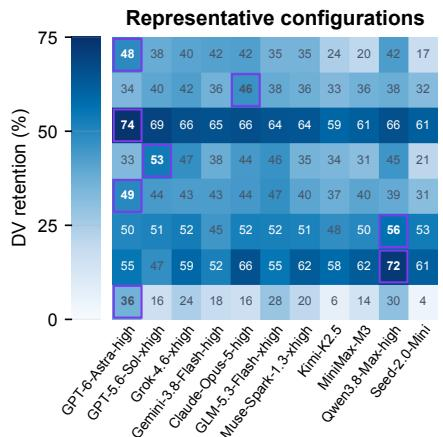

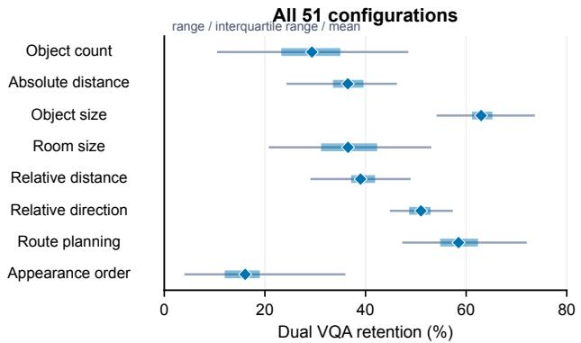

Figure 3: BVB reveals shared task difficulty and model-specific variation. The left panel shows retention across eleven representative configurations. The right panel shows the full range, interquartile range, and mean over all 51 configurations for each task. Purple boxes mark the best shown value in each task.  
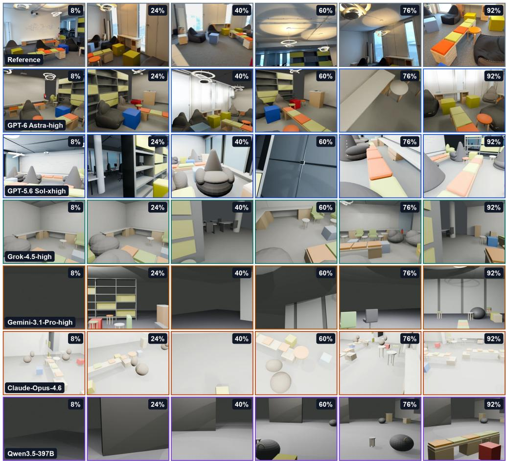  
Figure 4: Cross-model reconstructions at six matched video times.

## 4.3 Are the metrics complementary and human-aligned?

DV and LS improve together overall, but they rank tasks and models differently. This disagreement motivates reporting both axes beside Overall.

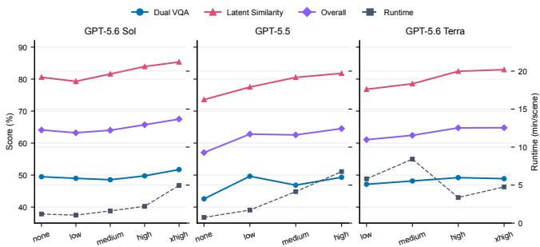  
(a) Provider effort ladders

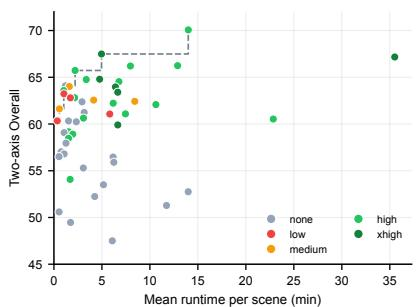  
(b) Runtime versus Overall  
Figure 5: Reasoning effort and runtime show different scaling behavior. LS rises more consistently than DV across provider effort ladders, while Overall combines the two axes and still reverses at intermediate steps. Longer runtime alone does not mean higher Overall.

Figure 4 shows representative examples. Given the same source video, each model reconstructs different objects, different layouts, and different portions of the timeline.

The blind human ranking from Section 3.2 lets us test whether the automatic metrics agree with human judgment. At the scene-model level, LS correlates with human preference at Spearman ρ=0.83 (Appendix Figure 23). DV is much weaker at $\rho { = } 0 . 1 1$ . Human rankings align more strongly with perceptual similarity than with question-based factual retention in our study. At the model level, Overall preserves the complete human ordering of the five tested configurations (Spearman $\rho { = } 1 . 0 0 )$ . The two metrics therefore serve different roles. LS tracks perceptual preference, while DV ensures that visually similar reconstructions do not receive a high score when they lose factual content. Appendix G examines the questions that the judge answers incorrectly on the source video.

Finding 4. DV and LS are related but not interchangeable. Reconstructions reproduce appearance more reliably than factual content. LS tracks human preference, while DV measures semantic retention and stays below 54 percent.

## 4.4 How do reasoning effort and runtime affect scores?

Provider reasoning controls do not change the two scores equally (Figure 5a). Across the GPT-5.6 Sol, GPT-5.5, and GPT-5.6 Terra ladders, LS generally rises with effort, whereas DV stays flat or even decreases. A likely explanation is that additional reasoning helps the model refine geometry, materials, and camera motion, all of which improve visual similarity, but does not lead the model to verify factual details such as object counts or spatial relations. Overall improves from the lowest to the highest available effort in each family, but the intermediate steps do not always increase.

Runtime shows a similar pattern (Figure 5b). Slower configurations do not consistently score higher. Several configurations with longer runtimes remain below faster ones on the Overall frontier. Extra inference time is therefore not a sufficient explanation for score differences and not a reliable indicator of reconstruction quality.

Finding 5. Across the tested effort ladders, higher reasoning effort generally improves LS more reliably than DV. Longer runtime does not mean higher Overall.

## 4.5 What does the frontier cost?

Mean Stage-1 spend ranges from \$0.024 to \$2.157 per scene, so the most expensive configuration costs roughly 90 times more than the cheapest (Figure 1). Spending more does not always improve quality. The top Overall configuration costs \$1.258 per scene, while GPT-5.6-Sol-xhigh reaches 96% of that score at \$0.778 and GLM-5.3-Flash-xhigh reaches 91% at \$0.024. The cost difference is driven mainly by model family and reasoning effort level, not by scene difficulty. The DV and LS frontiers differ across price tiers (Appendix Figure 25), so the most cost-effective configurations depend on the evaluation axis. Evaluating one top-ranked configuration on all 288 scenes costs about \$360, and most configurations cost much less, so adding a new model to the leaderboard is affordable.

Finding 6. Cost and quality do not scale together. Configurations at a fraction of the top price still reach over 90% of the best Overall, although the most cost-effective configurations differ between the two axes.

## 5 Related Work

Benchmarking video understanding. Most video-understanding benchmarks evaluate models through question answering. VSI-Bench (Yang et al., 2025) probes visual-spatial intelligence in real indoor captures and finds that spatial reasoning remains a hard problem. EgoSchema (Mangalam et al., 2023) targets long-form video understanding, MMPerspective (Tang et al., 2025c) probes perspective understanding, and Eagle (Bi et al., 2024) targets egocentric video. Questions in this format can often be answered from static appearance alone, as single-frame models can match multiframe ones (Lei et al., 2023). A second family asks agents to act on video rather than answer questions about it. VideoGUI (Lin et al., 2024) evaluates GUI automation from instructional video, VideoWebArena (Jang et al., 2025) evaluates web tasks that need video evidence, and ScreenSpot-Pro (Li et al., 2025) and GUIXplore (Sun et al., 2025) test screen grounding across applications. These benchmarks score task completion in 2D screen environments. BVB instead asks the agent to rebuild what the video shows as an editable 3D scene whose render must preserve the source’s layout and dynamics.

Programs as visual representations. Writing code is an increasingly common intermediate step in visual reasoning because it produces a persistent artifact that can be executed and revised. ViperGPT (Sur´ıs et al., 2023) and VisProg (Gupta & Kembhavi, 2023) compose perception modules into generated Python and read answers from execution traces. A second line generates programs that rebuild depicted content. VIGA (Yin et al., 2026) iteratively writes, renders, and revises Blender code, and Kubrick (He et al., 2025) coordinates multimodal agents that compose Blender scripts for synthetic video. BlenderGym (Gu et al., 2025) benchmarks graphics editing across placement, lighting, and geometry. EZBlender (Wang et al., 2026) decomposes editing instructions with a Plan-and-ReAct agent, and BlenderMCP (Ahuja, 2025) exposes Blender as a language model tool. Related systems address spatial variables (Chen et al., 2026), simulator code (Liang et al., 2026), vector animation (Yang et al., 2026b), and top-down room synthesis (Yang et al., 2026a). SceneAct-Bench (Zhao et al., 2026) evaluates layout, camera, articulation, reconstruction, and dynamics from images or video under a shared Blender loop, with hidden geometric ground truth. Its calibrated and decomposed tasks provide stronger task-specific geometric supervision. BVB instead studies one holistic reconstruction from uncalibrated real egocentric video, supplies no assets, covers a larger model pool, and uses source-conditioned semantic and perceptual evaluation where aligned hidden geometry is unavailable.

## 6 Conclusion

We introduced BVB, a controlled benchmark that evaluates spatiotemporal video understanding by asking agents to reconstruct real videos as editable Blender scenes. Across 51 configurations, coding agents already produce recognizable reconstructions, showing that programmatic reconstruction is a viable test of spatiotemporal understanding. At the same time, the best models reach high visual similarity but retain only about half of the source-correct spatiotemporal answers, and additiona reasoning improves visual similarity more reliably than factual accuracy. Blind human rankings align more strongly with Latent Similarity than with Dual VQA, which measures question-based factual retention. BVB provides a reproducible evaluation for agentic video understanding, built on real videos, shared budgets, and released editable artifacts.

## Acknowledgements

This work was supported by Sony Group Corporation. We would like to thank Naofumi Akimoto, Tamaki Kojima, Sayaka Nakamura, and Jerry Jun Yokono for their insightful discussions.

## References

Siddharth Ahuja. BlenderMCP: Connecting Blender to LLMs through the model context protocol. https://github.com/ahujasid/blender-mcp, 2025.

Mahmoud Assran, Adrien Bardes, David Fan, Quentin Garrido, Russell Howes, Mojtaba Komeili, Matthew Muckley, Ammar Rizvi, Claire Roberts, Koustuv Sinha, et al. V-JEPA 2: Self-supervised video models enable understanding, prediction and planning. arXiv preprint arXiv:2506.09985, 2025.

Adrien Bardes, Quentin Garrido, Jean Ponce, Xinlei Chen, Michael Rabbat, Yann LeCun, Mido Assran, and Nicolas Ballas. Revisiting feature prediction for learning visual representations from video. Transactions on Machine Learning Research, 2024.

Gilad Baruch, Zhuoyuan Chen, Afshin Dehghan, Tal Dimry, Yuri Feigin, Peter Fu, Thomas Gebauer, Brandon Joffe, Daniel Kurz, Arik Schwartz, and Elad Shulman. ARKitScenes: A diverse real world dataset for 3d indoor scene understanding using mobile RGB-D data. In Advances in Neural Information Processing Systems (NeurIPS), Datasets and Benchmarks Track, 2021.

Jing Bi, Yunlong Tang, Luchuan Song, Ali Vosoughi, Nguyen Nguyen, and Chenliang Xu. EA-GLE: Egocentric AGgregated language-video engine. In Proceedings of the ACM International Conference on Multimedia (MM), 2024.

ByteDance Seed. Seed1.5-VL technical report. arXiv preprint arXiv:2505.07062, 2025.

Jieneng Chen, Wenxin Ma, Ruisheng Yuan, Yunzhi Zhang, Jiajun Wu, and Alan Yuille. Thinking with spatial code for physical-world video reasoning. arXiv preprint arXiv:2603.05591, 2026.

Angela Dai, Angel X. Chang, Manolis Savva, Maciej Halber, Thomas Funkhouser, and Matthias Nießner. ScanNet: Richly-annotated 3d reconstructions of indoor scenes. In Proceedings of the IEEE Conference on Computer Vision and Pattern Recognition (CVPR), 2017.

Chaoyou Fu, Yuhan Dai, Yongdong Luo, Lei Li, Shuhuai Ren, Renrui Zhang, et al. Video-MME: The first-ever comprehensive evaluation benchmark of multi-modal LLMs in video analysis. In Proceedings ofthe IEEE/CVF Conference on Computer Vision and Pattern Recognition (CVPR), 2025.

Gemini Team. Gemini 2.5: Pushing the frontier with advanced reasoning, multimodality, long context, and next generation agentic capabilities. arXiv preprint arXiv:2507.06261, 2025.

GLM-V Team. GLM-4.5V and GLM-4.1V-thinking: Towards versatile multimodal reasoning with scalable reinforcement learning. arXiv preprint arXiv:2507.01006, 2025.

Yunqi Gu, Ian Huang, Jihyeon Je, Guandao Yang, and Leonidas Guibas. BlenderGym: Benchmarking foundational model systems for graphics editing. In Proceedings ofthe IEEE/CVF Conference on Computer Vision and Pattern Recognition (CVPR), pp. 18574–18583, 2025.

Tanmay Gupta and Aniruddha Kembhavi. Visual programming: Compositional visual reasoning without training. In Proceedings of the IEEE/CVF Conference on Computer Vision and Pattern Recognition (CVPR), pp. 14953–14962, 2023.

Liu He, Yizhi Song, Hejun Huang, Pinxin Liu, Yunlong Tang, Daniel Aliaga, and Xin Zhou. Kubrick: Multimodal agent collaborations for synthetic video generation. In Proceedings of the IEEE/CVF Conference on Computer Vision and Pattern Recognition (CVPR) Workshops, 2025.

Lawrence Keunho Jang, Yinheng Li, Dan Zhao, Charles Ding, Justin Lin, Paul Pu Liang, Rogerio Bonatti, and Kazuhito Koishida. VideoWebArena: Evaluating long context multimodal agents with video understanding web tasks. In International Conference on Learning Representations (ICLR), 2025.

Yunseok Jang, Yale Song, Youngjae Yu, Youngjin Kim, and Gunhee Kim. TGIF-QA: Toward spatiotemporal reasoning in visual question answering. In Proceedings of the IEEE Conference on Computer Vision and Pattern Recognition (CVPR), 2017.

Kimi Team. Kimi K2: Open agentic intelligence. arXiv preprint arXiv:2507.20534, 2025.

Jie Lei, Licheng Yu, Mohit Bansal, and Tamara L. Berg. TVQA: Localized, compositional video question answering. In Proceedings of the Conference on Empirical Methods in Natural Language Processing (EMNLP), 2018.

Jie Lei, Tamara L. Berg, and Mohit Bansal. Revealing single frame bias for video-and-language learning. In Proceedings of the Annual Meeting of the Association for Computational Linguistics (ACL), 2023.

Kaixin Li, Ziyang Meng, Hongzhan Lin, Ziyang Luo, Yuchen Tian, Jing Ma, Zhiyong Huang, and Tat-Seng Chua. ScreenSpot-Pro: GUI grounding for professional high-resolution computer use. In ICLR Workshop on Reasoning and Planningfor Large Language Models, 2025.

Kunchang Li, Yali Wang, Yinan He, Yizhuo Li, Yi Wang, Yi Liu, Zun Wang, Jilan Xu, Guo Chen, Ping Luo, Limin Wang, and Yu Qiao. MVBench: A comprehensive multi-modal video understanding benchmark. In Proceedings of the IEEE/CVF Conference on Computer Vision and Pattern Recognition (CVPR), 2024.

Jiarong Liang, Max Ku, Ka-Hei Hui, Ping Nie, and Wenhu Chen. VisPhyWorld: Probing physical reasoning via code-driven video reconstruction. arXiv preprint arXiv:2602.13294, 2026.

Kevin Qinghong Lin, Linjie Li, Difei Gao, Qinchen Wu, Mingyi Yan, Zhengyuan Yang, Lijuan Wang, and Mike Zheng Shou. VideoGUI: A benchmark for GUI automation from instructional videos. In Advances in Neural Information Processing Systems (NeurIPS), Datasets and Benchmarks Track, 2024.

Karttikeya Mangalam, Raiymbek Akshulakov, and Jitendra Malik. EgoSchema: A diagnostic benchmark for very long-form video language understanding. In Advances in Neural Information Processing Systems (NeurIPS), Datasets and Benchmarks Track, 2023.

Meta. Introducing Muse Spark 1.3, 2026. URL https://research.meta.ai/blog/ introducing-muse-spark-1-3.

MiniMax. MiniMax-01: Scaling foundation models with lightning attention. arXiv preprint arXiv:2501.08313, 2025.

Lorenzo Mur-Labadia, Matthew Muckley, Amir Bar, Mido Assran, Koustuv Sinha, Mike Rabbat, Yann LeCun, Nicolas Ballas, and Adrien Bardes. V-JEPA 2.1: Unlocking dense features in video self-supervised learning. arXiv preprint arXiv:2603.14482, 2026.

OpenAI. GPT-6 Astra: A new generation of intelligence. https://openai.com/index/ gpt-6-astra/, September 2026. Accessed September 7, 2026.

Viorica Patr˘ aucean, Lucas Smaira, Ankush Gupta, Adri˘ a Recasens, et al. Perception test: A diag-\` nostic benchmark for multimodal video models. In Advances in Neural Information Processing Systems (NeurIPS), Datasets and Benchmarks Track, 2023.

Qwen Team. Qwen2.5-VL technical report. arXiv preprint arXiv:2502.13923, 2025.

Thomas Ricouard. Architectural visualization with Astra. https://developers.openai. com/blog/architectural-visualization-with-astra, September 2026. Accessed September 7, 2026.

Yuchen Sun, Shanhui Zhao, Tao Yu, Hao Wen, Samith Va, Mengwei Xu, Yuanchun Li, and Chongyang Zhang. GUI-Xplore: Empowering generalizable GUI agents with one exploration. In Proceedings ofthe IEEE/CVF Conference on Computer Vision and Pattern Recognition (CVPR), pp. 19477–19486, 2025.

D´ıdac Sur´ıs, Sachit Menon, and Carl Vondrick. ViperGPT: Visual inference via python execution for reasoning. In Proceedings of the IEEE/CVF International Conference on Computer Vision (ICCV), pp. 11888–11898, 2023.

Yunlong Tang, Jing Bi, Siting Xu, Luchuan Song, Susan Liang, Teng Wang, Daoan Zhang, Jie An, Jingyang Lin, Rongyi Zhu, Ali Vosoughi, Chao Huang, Zeliang Zhang, Pinxin Liu, Mingqian Feng, Feng Zheng, Jianguo Zhang, Ping Luo, Jiebo Luo, and Chenliang Xu. Video understanding with large language models: A survey. IEEE Transactions on Circuits and Systems for Video Technology (TCSVT), 2025a.

Yunlong Tang, Junjia Guo, Hang Hua, Susan Liang, Mingqian Feng, Xinyang Li, Rui Mao, Chao Huang, Jing Bi, Zeliang Zhang, Pooyan Fazli, and Chenliang Xu. VidComposition: Can MLLMs analyze compositions in compiled videos? In Proceedings of the IEEE/CVF Conference on Computer Vision and Pattern Recognition (CVPR), 2025b.

Yunlong Tang, Pinxin Liu, Zhangyun Tan, Mingqian Feng, Rui Mao, Chao Huang, Jing Bi, Yunzhong Xiao, Susan Liang, Hang Hua, Ali Vosoughi, Luchuan Song, Zeliang Zhang, and Chenliang Xu. MMPerspective: Do MLLMs understand perspective? a comprehensive benchmark for perspective perception, reasoning, and robustness. In Advances in Neural Information Processing Systems (NeurIPS), Datasets and Benchmarks Track, 2025c.

Hao Wang, Wenhui Zhu, Shao Tang, Zhipeng Wang, Xuanzhao Dong, Xin Li, Xiwen Chen, Ashish Bastola, Xinhao Huang, Yalin Wang, and Abolfazl Razi. EZBlender: Efficient 3d editing with plan-and-react agent. In Proceedings of the IEEE/CVF Winter Conference on Applications of Computer Vision (WACV) Workshops, pp. 1343–1352, 2026.

Haoning Wu, Dongxu Li, Bei Chen, and Junnan Li. LongVideoBench: A benchmark for longcontext interleaved video-language understanding. In Advances in Neural Information Processing Systems (NeurIPS), Datasets and Benchmarks Track, 2024.

Junbin Xiao, Xindi Shang, Angela Yao, and Tat-Seng Chua. NExT-QA: Next phase of questionanswering to explaining temporal actions. In Proceedings ofthe IEEE/CVF Conference on Computer Vision and Pattern Recognition (CVPR), 2021.

Jihan Yang, Shusheng Yang, Anjali W. Gupta, Rilyn Han, Li Fei-Fei, and Saining Xie. Thinking in space: How multimodal large language models see, remember, and recall spaces. In Proceedings of the IEEE/CVF Conference on Computer Vision and Pattern Recognition (CVPR), pp. 10632– 10643, 2025.

Yixuan Yang, Zhen Luo, Wanshui Gan, Jinkun Hao, Junru Lu, Jinghao Yan, Zhaoyang Lyu, and Xudong Xu. Code-as-room: Generating 3d rooms from top-down view images via agentic code synthesis. arXiv preprint arXiv:2605.18451, 2026a.

Yiying Yang, Wei Cheng, Sijin Chen, Honghao Fu, Xianfang Zeng, Yujun Cai, Gang Yu, and Xingjun Ma. OmniLottie: Generating vector animations via parameterized lottie tokens. In Proceedings of the IEEE/CVF Conference on Computer Vision and Pattern Recognition (CVPR), pp. 39293–39303, 2026b.

Chandan Yeshwanth, Yueh-Cheng Liu, Matthias Nießner, and Angela Dai. ScanNet++: A highfidelity dataset of 3D indoor scenes. In Proceedings of the IEEE/CVF International Conference on Computer Vision (ICCV), 2023.

Shaofeng Yin, Jiaxin Ge, Zora Zhiruo Wang, Chenyang Wang, Xiuyu Li, Michael J. Black, Trevor Darrell, Angjoo Kanazawa, and Haiwen Feng. Vision-as-inverse-graphics agent via interleaved multimodal reasoning. arXiv preprint arXiv:2601.11109, 2026.

Zhou Yu, Dejing Xu, Jun Yu, Ting Yu, Zhou Zhao, Yueting Zhuang, and Dacheng Tao. ActivityNet-QA: A dataset for understanding complex web videos via question answering. In Proceedings of the AAAI Conference on Artificial Intelligence (AAAI), 2019.

Z.ai. GLM-5.3-Flash model card, 2026. URL https://huggingface.co/zai-org/ GLM-5.3-Flash.

Yifei Zhao, Xiangxin Zhou, Wenhao Yang, Jiaqi Tang, Pu Jian, Huanjin Yao, Jiarui Yao, Haowei Lin, Chunchao Guo, Zhuo Chen, Wenkai Lyu, Jianzhu Ma, Xueqian Wang, and Wenxi Zhu. SceneActBench: Can agents act on the 3d scenes they see? arXiv preprint arXiv:2607.22393, 2026.

## A Stage-1 Harness and Agent Prompt

Section 2.1 describes the Stage-1 loop. The agent runs on the host and drives a fresh Blender 4.2 Docker container for each scene. At every turn it may execute a bash block or request video frames with a frames block. The harness sets no turn or frame budget. The only effort limit is a perscene dollar budget computed from provider usage. A run finishes when the model has consumed at least one frame, saved /workspace/output/result.blend, and returned DONE. Evaluation never feeds information back into this loop.

System prompt. Every configuration receives the prompt below unchanged. Only the video and dollar limit vary by scene.

You are a video-understanding agent evaluated on reconstructing an indoor scene   
from a video as Blender Python (bpy). You drive a Linux sandbox with Blender   
installed.   
Interface:   
‘‘‘bash block: the harness runs it in the sandbox and returns stdout/stderr.   
Run Blender headless as: blender\_run --python /workspace/scratch/build.py   
(wraps ‘xvfb-run -a blender --background‘).   
‘‘‘frames block: request video frames to look at. The harness extracts them   
and shows them to you as images on the next turn. Content is either explicit   
timestamps in seconds (e.g. ‘0, 4.5, 12, 30‘) or ‘count=N‘ for N evenly-spaced   
frames (optionally with ‘start=‘ ‘end=‘ seconds). Look at as many frames as   
you need; request more whenever you want.   
When the scene is finished and saved, reply with the single word DONE.   
Work in this order - do NOT skip looking at the video:   
1. FIRST request frames with a ‘‘‘frames block, on their own, and WAIT. Do not   
write any bpy or say DONE in the same message as a ‘‘‘frames request - the   
frames you request are only shown to you on the next turn.   
2. Look at the returned frames, then build the scene with ‘‘‘bash.   
3. Request more frames to check details whenever useful, then revise.   
4. Only after you have actually seen frames and saved result.blend, say DONE.   
A scene built without looking at any frame is a failure.   
You decide how much effort to spend: how many frames, how many turns. The raw   
video is also at /workspace/video/video.mp4 inside the sandbox.   
Scene/output rules:   
- The final scene MUST be saved to /workspace/output/result.blend.   
Build ALL geometry from basic primitives only (cube, plane, cylinder, cone,   
uv\_sphere, torus) and assemblies of them. Group each object’s parts in a   
Collection named after the object.   
No imported models, no sculpting/arbitrary meshes, no geometry nodes,   
particles, physics, or image textures. Materials = a single Principled BSDF   
with numeric values only.   
1 Blender unit = 1 meter. Keep Unit Scale = 1.0. Use radians for rotations.   
Include at least one camera and one light.   
- Reproduce object counts, sizes, positions, and spatial relationships as   
faithfully as you can from the video.   
Camera trajectory / temporal reconstruction:   
- Reconstruct camera motion as an ANIMATION, not a single static viewpoint.   
- Insert keyframes for camera location and rotation\_euler over time and set   
frame\_start / frame\_end to span the motion.

## B Full Leaderboard

Table 3 reports all 51 configurations. Overall is the two-axis square-root mean in Equation (1), and ranks are global over this full set. The main text retains representative peak and default configurations plus all open-weight ones.

Table 3: Full BVB results over 51 configurations. Dual VQA reports retention on the judge-correct source subset, and Latent Similarity reports frozen V-JEPA layout and motion agreement. Darker and lighter purple mark the best and second-best values.
<table><tr><td rowspan=2 colspan=2>Model &amp;              RReasoning Effort</td><td rowspan=2 colspan=2>ank   Ob</td><td rowspan=2 colspan=9>Dual VQA (DV) ↑j. CountAbs. Dist.Obj. SizeRoom SizeRel. Dist.Rel. Dir.Route PlanAppr. OrderAvg</td><td rowspan=1 colspan=3>LS↑</td></tr><tr><td rowspan=1 colspan=3>.   MotionAvg.</td></tr><tr><td rowspan=1 colspan=2>Proprietary Models</td><td rowspan=1 colspan=2></td><td rowspan=1 colspan=2></td><td rowspan=1 colspan=1></td><td rowspan=1 colspan=1></td><td rowspan=1 colspan=1></td><td rowspan=1 colspan=3></td><td rowspan=1 colspan=1></td><td rowspan=1 colspan=3></td></tr><tr><td rowspan=1 colspan=2>GPT-6-Astra high</td><td rowspan=1 colspan=1></td><td rowspan=1 colspan=1>70.07</td><td rowspan=1 colspan=1>48.5</td><td rowspan=1 colspan=1>33.5</td><td rowspan=1 colspan=1>73.7</td><td rowspan=1 colspan=1>33.1</td><td rowspan=1 colspan=1>49.0</td><td rowspan=1 colspan=1>50.0</td><td rowspan=1 colspan=2>54.8 36.0</td><td rowspan=1 colspan=1>53.7|</td><td rowspan=1 colspan=3>87.3 90.0 88.6</td></tr><tr><td rowspan=1 colspan=2>GPT-5.6-Sol xhigh</td><td rowspan=1 colspan=1>2</td><td rowspan=1 colspan=1>67.49</td><td rowspan=1 colspan=1>38.0</td><td rowspan=1 colspan=1>39.9</td><td rowspan=1 colspan=1>69.0</td><td rowspan=1 colspan=1>53.1</td><td rowspan=1 colspan=1>43.6</td><td rowspan=1 colspan=1>50.7</td><td rowspan=1 colspan=1>47.3</td><td rowspan=1 colspan=1>16.0</td><td rowspan=1 colspan=1>51.7</td><td rowspan=1 colspan=3>84.086.7 85.4</td></tr><tr><td rowspan=1 colspan=2>Grok-4.6 xhigh</td><td rowspan=1 colspan=1>3</td><td rowspan=1 colspan=1>67.17</td><td rowspan=1 colspan=1>40.5</td><td rowspan=1 colspan=1>42.2</td><td rowspan=1 colspan=1>66.2</td><td rowspan=1 colspan=1>46.9</td><td rowspan=1 colspan=1>42.7</td><td rowspan=1 colspan=1>52.5</td><td rowspan=1 colspan=1>59.1</td><td rowspan=1 colspan=1>24.0</td><td rowspan=1 colspan=1>52.1</td><td rowspan=1 colspan=3>82.985.5 84.2</td></tr><tr><td rowspan=1 colspan=2>女Qwen3.8-Max high</td><td rowspan=1 colspan=1>4</td><td rowspan=1 colspan=1>66.24</td><td rowspan=1 colspan=1>42.5</td><td rowspan=1 colspan=1>37.6</td><td rowspan=1 colspan=1>65.8</td><td rowspan=1 colspan=1>45.4</td><td rowspan=1 colspan=1>38.6</td><td rowspan=1 colspan=1>56.1</td><td rowspan=1 colspan=1>72.0</td><td rowspan=1 colspan=1>30.0</td><td rowspan=1 colspan=1>52.7</td><td rowspan=1 colspan=3>79.982.8 81.3</td></tr><tr><td rowspan=1 colspan=2>* Claude-Opus-5 high</td><td rowspan=1 colspan=1>5</td><td rowspan=1 colspan=1>66.21</td><td rowspan=1 colspan=1>42.0</td><td rowspan=1 colspan=1>46.2</td><td rowspan=1 colspan=1>66.4</td><td rowspan=1 colspan=1>43.8</td><td rowspan=1 colspan=1>44.0</td><td rowspan=1 colspan=1>52.0</td><td rowspan=1 colspan=1>65.6</td><td rowspan=1 colspan=1>16.0</td><td rowspan=1 colspan=1>52.6</td><td rowspan=1 colspan=3>79.882.9 81.4</td></tr><tr><td rowspan=1 colspan=2>GPT-5.6-Sol high</td><td rowspan=1 colspan=1>6</td><td rowspan=1 colspan=1>65.73</td><td rowspan=1 colspan=1>34.5</td><td rowspan=1 colspan=1>37.6</td><td rowspan=1 colspan=1>65.0</td><td rowspan=1 colspan=1>40.8</td><td rowspan=1 colspan=1>37.8</td><td rowspan=1 colspan=3>52.263.4 26.0</td><td rowspan=1 colspan=1>49.8</td><td rowspan=1 colspan=3>82.585.3 83.9</td></tr><tr><td rowspan=1 colspan=2>GPT-5.6-Terra xhigh</td><td rowspan=1 colspan=1>7</td><td rowspan=1 colspan=1>64.79</td><td rowspan=1 colspan=1>33.0</td><td rowspan=1 colspan=1>30.6</td><td rowspan=1 colspan=1>65.8</td><td rowspan=1 colspan=1>43.1</td><td rowspan=1 colspan=1>40.2</td><td rowspan=1 colspan=1>50.7</td><td rowspan=1 colspan=2>62.4 12.0</td><td rowspan=1 colspan=1>48.9</td><td rowspan=1 colspan=3>81.684.3 82.9</td></tr><tr><td rowspan=1 colspan=2>GPT-5.6-Terra high</td><td rowspan=1 colspan=1>8</td><td rowspan=1 colspan=1>64.76</td><td rowspan=1 colspan=1>37.5</td><td rowspan=1 colspan=1>34.1</td><td rowspan=1 colspan=1>66.2</td><td rowspan=1 colspan=1>45.4</td><td rowspan=1 colspan=1>30.3</td><td rowspan=1 colspan=1>52.5</td><td rowspan=1 colspan=1>63.4</td><td rowspan=1 colspan=1>16.0</td><td rowspan=1 colspan=1>49.2</td><td rowspan=1 colspan=3>81.083.9 82.4</td></tr><tr><td rowspan=1 colspan=2>GPT-5.5 high</td><td rowspan=1 colspan=1>9</td><td rowspan=1 colspan=1>64.53</td><td rowspan=1 colspan=1>34.5</td><td rowspan=1 colspan=1>34.7</td><td rowspan=1 colspan=1>65.8</td><td rowspan=1 colspan=1>46.2</td><td rowspan=1 colspan=1>37.8</td><td rowspan=1 colspan=1>50.5</td><td rowspan=1 colspan=1>63.4</td><td rowspan=1 colspan=1>12.0</td><td rowspan=1 colspan=1>49.3</td><td rowspan=1 colspan=1>80.4</td><td rowspan=1 colspan=2>83.2 81.8</td></tr><tr><td rowspan=1 colspan=2>SGPT-5.6-Sol</td><td rowspan=1 colspan=1>10</td><td rowspan=1 colspan=1>64.09</td><td rowspan=1 colspan=1>31.0</td><td rowspan=1 colspan=1>37.0</td><td rowspan=1 colspan=1>67.1</td><td rowspan=1 colspan=1>37.7</td><td rowspan=1 colspan=1>40.2</td><td rowspan=1 colspan=1>50.7</td><td rowspan=1 colspan=1>61.3</td><td rowspan=1 colspan=1>22.0</td><td rowspan=1 colspan=1>49.5</td><td rowspan=1 colspan=1>79.1</td><td rowspan=1 colspan=2>82.0 80.6</td></tr><tr><td rowspan=1 colspan=2>GPT-5.6-Sol medium</td><td rowspan=1 colspan=1>11</td><td rowspan=1 colspan=1>64.01</td><td rowspan=1 colspan=1>35.0</td><td rowspan=1 colspan=1>40.5</td><td rowspan=1 colspan=1>64.3</td><td rowspan=1 colspan=1>33.8</td><td rowspan=1 colspan=1>41.1</td><td rowspan=1 colspan=1>48.0</td><td rowspan=1 colspan=1>61.3</td><td rowspan=1 colspan=1>18.0</td><td rowspan=1 colspan=1>48.5</td><td rowspan=1 colspan=3>80.183.1 81.6</td></tr><tr><td rowspan=1 colspan=2>GPT-5.6-Luna high</td><td rowspan=1 colspan=1>13</td><td rowspan=1 colspan=1>63.58</td><td rowspan=1 colspan=1>28.5</td><td rowspan=1 colspan=1>36.4</td><td rowspan=1 colspan=1>65.2</td><td rowspan=1 colspan=1>34.6</td><td rowspan=1 colspan=1>37.3</td><td rowspan=1 colspan=1>54.4</td><td rowspan=1 colspan=1>54.8</td><td rowspan=1 colspan=1>10.0</td><td rowspan=1 colspan=1>48.2</td><td rowspan=1 colspan=1>79.6</td><td rowspan=1 colspan=2>82.7 81.1</td></tr><tr><td rowspan=1 colspan=1>Mus</td><td rowspan=1 colspan=1>e-Spark-1.3 xhigh</td><td rowspan=1 colspan=1>14</td><td rowspan=1 colspan=1>63.40</td><td rowspan=1 colspan=1>35.0</td><td rowspan=1 colspan=1>36.4</td><td rowspan=1 colspan=1>64.1</td><td rowspan=1 colspan=1>35.4</td><td rowspan=1 colspan=1>40.2</td><td rowspan=1 colspan=1>51.2</td><td rowspan=1 colspan=1>62.4</td><td rowspan=1 colspan=1>20.0</td><td rowspan=1 colspan=1>48.9</td><td rowspan=1 colspan=1>78.3</td><td rowspan=1 colspan=2>81.2 79.7</td></tr><tr><td rowspan=1 colspan=1>GPT</td><td rowspan=1 colspan=1>-5.6-Sol Tow</td><td rowspan=1 colspan=1>15</td><td rowspan=1 colspan=1>63.23</td><td rowspan=1 colspan=1>28.5</td><td rowspan=1 colspan=1>41.0</td><td rowspan=1 colspan=1>63.0</td><td rowspan=1 colspan=1>35.4</td><td rowspan=1 colspan=1>39.4</td><td rowspan=1 colspan=1>54.4</td><td rowspan=1 colspan=1>62.4</td><td rowspan=1 colspan=1>22.0</td><td rowspan=1 colspan=1>49.0</td><td rowspan=1 colspan=1>77.8</td><td rowspan=1 colspan=2>80.8 79.3</td></tr><tr><td rowspan=1 colspan=1>S</td><td rowspan=1 colspan=1> Grok-4.5 high</td><td rowspan=1 colspan=1>16</td><td rowspan=1 colspan=1>62.81</td><td rowspan=1 colspan=1>35.0</td><td rowspan=1 colspan=1>39.3</td><td rowspan=1 colspan=1>64.1</td><td rowspan=1 colspan=1>42.3</td><td rowspan=1 colspan=1>39.8</td><td rowspan=1 colspan=1>47.3</td><td rowspan=1 colspan=1>59.1</td><td rowspan=1 colspan=1>14.0</td><td rowspan=1 colspan=1>48.4</td><td rowspan=1 colspan=1>77.6</td><td rowspan=1 colspan=2>80.4 79.0</td></tr><tr><td rowspan=1 colspan=1></td><td rowspan=1 colspan=1>GPT-5.5low</td><td rowspan=1 colspan=1>17</td><td rowspan=1 colspan=1>62.80</td><td rowspan=1 colspan=1>35.0</td><td rowspan=1 colspan=1>33.5</td><td rowspan=1 colspan=1>61.8</td><td rowspan=1 colspan=1>42.3</td><td rowspan=1 colspan=1>44.8</td><td rowspan=1 colspan=1>54.4</td><td rowspan=1 colspan=1>55.9</td><td rowspan=1 colspan=1>26.0</td><td rowspan=1 colspan=1>49.6</td><td rowspan=1 colspan=3>76.079.0 77.5</td></tr><tr><td rowspan=1 colspan=2>GPT-5.5medium</td><td rowspan=1 colspan=1>18</td><td rowspan=1 colspan=1>62.56</td><td rowspan=1 colspan=1>25.5</td><td rowspan=1 colspan=1>35.8</td><td rowspan=1 colspan=1>63.9</td><td rowspan=1 colspan=1>41.5</td><td rowspan=1 colspan=1>37.8</td><td rowspan=1 colspan=1>50.0</td><td rowspan=1 colspan=1>51.6</td><td rowspan=1 colspan=1>12.0</td><td rowspan=1 colspan=1>46.9</td><td rowspan=1 colspan=3>79.181.9 80.5</td></tr><tr><td rowspan=1 colspan=1>S</td><td rowspan=1 colspan=1>GPT-5.6-Terra medium</td><td rowspan=1 colspan=1>19</td><td rowspan=1 colspan=1>62.43</td><td rowspan=1 colspan=1>36.0</td><td rowspan=1 colspan=1>34.1</td><td rowspan=1 colspan=1>62.4</td><td rowspan=1 colspan=1>39.2</td><td rowspan=1 colspan=1>43.2</td><td rowspan=1 colspan=1>47.3</td><td rowspan=1 colspan=1>55.9</td><td rowspan=1 colspan=1>34.0</td><td rowspan=1 colspan=1>48.2</td><td rowspan=1 colspan=3>77.080.1 78.5</td></tr><tr><td rowspan=1 colspan=1>米</td><td rowspan=1 colspan=1>Claude-Sonnet-4.6</td><td rowspan=1 colspan=1>20</td><td rowspan=1 colspan=1>62.37</td><td rowspan=1 colspan=1>30.5</td><td rowspan=1 colspan=1>37.0</td><td rowspan=1 colspan=1>63.9</td><td rowspan=1 colspan=1>43.8</td><td rowspan=1 colspan=1>43.2</td><td rowspan=1 colspan=1>57.4</td><td rowspan=1 colspan=1>62.4</td><td rowspan=1 colspan=1>14.0</td><td rowspan=1 colspan=1>50.6</td><td rowspan=1 colspan=3>73.876.9 75.3</td></tr><tr><td rowspan=1 colspan=1>1</td><td rowspan=1 colspan=1>Gemini-3.1-Prohigh</td><td rowspan=1 colspan=1>21</td><td rowspan=1 colspan=1>62.23</td><td rowspan=1 colspan=1>30.0</td><td rowspan=1 colspan=1>44.5</td><td rowspan=1 colspan=1>65.2</td><td rowspan=1 colspan=1>43.1</td><td rowspan=1 colspan=1>41.1</td><td rowspan=1 colspan=1>55.1</td><td rowspan=1 colspan=1>63.4</td><td rowspan=1 colspan=1>20.0</td><td rowspan=1 colspan=1>51.1</td><td rowspan=1 colspan=1>72.9</td><td rowspan=1 colspan=2>76.1 74.5</td></tr><tr><td rowspan=1 colspan=1></td><td rowspan=1 colspan=1>Gemini-3.8-Flash high</td><td rowspan=1 colspan=1>22</td><td rowspan=1 colspan=1>62.08</td><td rowspan=1 colspan=1>41.5</td><td rowspan=1 colspan=1>35.8</td><td rowspan=1 colspan=1>65.4</td><td rowspan=1 colspan=1>37.7</td><td rowspan=1 colspan=1>42.7</td><td rowspan=1 colspan=1>44.9</td><td rowspan=1 colspan=1>51.6</td><td rowspan=1 colspan=1>18.0</td><td rowspan=1 colspan=1>48.4</td><td rowspan=1 colspan=1>76.0</td><td rowspan=1 colspan=2>78.8 77.4</td></tr><tr><td rowspan=1 colspan=1>GPT</td><td rowspan=1 colspan=1>-5.6-Luna medium</td><td rowspan=1 colspan=1>23</td><td rowspan=1 colspan=1>61.62</td><td rowspan=1 colspan=1>23.0</td><td rowspan=1 colspan=1>31.8</td><td rowspan=1 colspan=1>62.2</td><td rowspan=1 colspan=1>35.4</td><td rowspan=1 colspan=1>41.9</td><td rowspan=1 colspan=1>52.5</td><td rowspan=1 colspan=1>53.8</td><td rowspan=1 colspan=1>14.0</td><td rowspan=1 colspan=1>46.5</td><td rowspan=1 colspan=1>77.2</td><td rowspan=1 colspan=2>80.5 78.8</td></tr><tr><td rowspan=1 colspan=1>米</td><td rowspan=1 colspan=1>Claude-Sonnet-5</td><td rowspan=1 colspan=1>24</td><td rowspan=1 colspan=1>61.24</td><td rowspan=1 colspan=1>30.0</td><td rowspan=1 colspan=1>39.9</td><td rowspan=1 colspan=1>62.4</td><td rowspan=1 colspan=1>36.2</td><td rowspan=1 colspan=1>40.7</td><td rowspan=1 colspan=1>54.9</td><td rowspan=1 colspan=1>64.5</td><td rowspan=1 colspan=1>18.0</td><td rowspan=1 colspan=1>49.2</td><td rowspan=1 colspan=1>72.9</td><td rowspan=1 colspan=2>76.3 74.6</td></tr><tr><td rowspan=1 colspan=1>S</td><td rowspan=1 colspan=1>GPT-5.2 high</td><td rowspan=1 colspan=1>25</td><td rowspan=1 colspan=1>61.08</td><td rowspan=1 colspan=1>39.0</td><td rowspan=1 colspan=1>38.2</td><td rowspan=1 colspan=1>60.9</td><td rowspan=1 colspan=1>46.2</td><td rowspan=1 colspan=1>32.4</td><td rowspan=1 colspan=1>51.2</td><td rowspan=1 colspan=1>59.1</td><td rowspan=1 colspan=1>12.0</td><td rowspan=1 colspan=1>47.9</td><td rowspan=1 colspan=1>74.4</td><td rowspan=1 colspan=2>77.2 75.8</td></tr><tr><td rowspan=1 colspan=1></td><td rowspan=1 colspan=1>GPT-5.6-Terra low</td><td rowspan=1 colspan=1>26</td><td rowspan=1 colspan=1>61.07</td><td rowspan=1 colspan=1>27.0</td><td rowspan=1 colspan=1>36.4</td><td rowspan=1 colspan=1>62.4</td><td rowspan=1 colspan=1>38.5</td><td rowspan=1 colspan=1>40.2</td><td rowspan=1 colspan=1>49.0</td><td rowspan=1 colspan=1>57.0</td><td rowspan=1 colspan=1>24.0</td><td rowspan=1 colspan=1>47.1</td><td rowspan=1 colspan=1>75.2</td><td rowspan=1 colspan=2>78.4 76.8</td></tr><tr><td rowspan=1 colspan=1>米</td><td rowspan=1 colspan=1>Claude-Sonnet-5 high</td><td rowspan=1 colspan=1>27</td><td rowspan=1 colspan=1>60.63</td><td rowspan=1 colspan=1>29.0</td><td rowspan=1 colspan=1>37.0</td><td rowspan=1 colspan=1>65.4</td><td rowspan=1 colspan=1>28.5</td><td rowspan=1 colspan=1>39.8</td><td rowspan=1 colspan=1>54.7</td><td rowspan=1 colspan=1>54.8</td><td rowspan=1 colspan=1>10.0</td><td rowspan=1 colspan=1>48.3</td><td rowspan=1 colspan=1>72.7</td><td rowspan=1 colspan=2>76.1 74.4</td></tr><tr><td rowspan=1 colspan=1>米</td><td rowspan=1 colspan=1>Claude-Sonnet-4.6high</td><td rowspan=1 colspan=1>28</td><td rowspan=1 colspan=1>60.53</td><td rowspan=1 colspan=1>35.5</td><td rowspan=1 colspan=1>32.4</td><td rowspan=1 colspan=1>62.8</td><td rowspan=1 colspan=1>34.6</td><td rowspan=1 colspan=1>36.9</td><td rowspan=1 colspan=1>52.9</td><td rowspan=1 colspan=1>58.1</td><td rowspan=1 colspan=1>12.0</td><td rowspan=1 colspan=1>47.7</td><td rowspan=1 colspan=1>73.4</td><td rowspan=1 colspan=2>76.5 74.9</td></tr><tr><td rowspan=1 colspan=1>S</td><td rowspan=1 colspan=1>GPT-5.6-Luna low</td><td rowspan=1 colspan=1>29</td><td rowspan=1 colspan=1>60.33</td><td rowspan=1 colspan=1>20.5</td><td rowspan=1 colspan=1>35.8</td><td rowspan=1 colspan=1>60.5</td><td rowspan=1 colspan=1>34.6</td><td rowspan=1 colspan=1>43.2</td><td rowspan=1 colspan=1>51.2</td><td rowspan=1 colspan=1>67.7</td><td rowspan=1 colspan=1>18.0</td><td rowspan=1 colspan=1>46.8</td><td rowspan=1 colspan=1>73.9</td><td rowspan=1 colspan=2>77.3 75.6</td></tr><tr><td rowspan=1 colspan=1>米C</td><td rowspan=1 colspan=1>laude-Opus-4.7</td><td rowspan=1 colspan=1>30</td><td rowspan=1 colspan=1>60.32</td><td rowspan=1 colspan=1>36.0</td><td rowspan=1 colspan=1>41.0</td><td rowspan=1 colspan=1>61.5</td><td rowspan=1 colspan=1>34.6</td><td rowspan=1 colspan=1>42.3</td><td rowspan=1 colspan=1>54.9</td><td rowspan=1 colspan=1>57.0</td><td rowspan=1 colspan=1>8.0</td><td rowspan=1 colspan=1>49.2</td><td rowspan=1 colspan=1>70.9</td><td rowspan=1 colspan=2>74.3 72.6</td></tr><tr><td rowspan=1 colspan=1>米C</td><td rowspan=1 colspan=1>laude-Opus-4.6</td><td rowspan=1 colspan=1>31</td><td rowspan=1 colspan=1>60.23</td><td rowspan=1 colspan=1>28.0</td><td rowspan=1 colspan=1>39.3</td><td rowspan=1 colspan=1>63.7</td><td rowspan=1 colspan=1>30.0</td><td rowspan=1 colspan=1>46.1</td><td rowspan=1 colspan=1>48.0</td><td rowspan=1 colspan=1>50.5</td><td rowspan=1 colspan=1>24.0</td><td rowspan=1 colspan=1>47.5</td><td rowspan=1 colspan=1>73.0</td><td rowspan=1 colspan=1>75.9</td><td rowspan=1 colspan=1>74.5</td></tr><tr><td rowspan=1 colspan=1>∞ Mu</td><td rowspan=1 colspan=1>se-Spark-1.2xhigh</td><td rowspan=1 colspan=1>32</td><td rowspan=1 colspan=1>59.90</td><td rowspan=1 colspan=1>33.5</td><td rowspan=1 colspan=1>32.4</td><td rowspan=1 colspan=1>62.8</td><td rowspan=1 colspan=1>36.9</td><td rowspan=1 colspan=1>34.0</td><td rowspan=1 colspan=1>47.5</td><td rowspan=1 colspan=1>62.4</td><td rowspan=1 colspan=1>10.0</td><td rowspan=1 colspan=1>46.2</td><td rowspan=1 colspan=1>74.1</td><td rowspan=1 colspan=1>76.7</td><td rowspan=1 colspan=1>75.4</td></tr><tr><td rowspan=1 colspan=1>米</td><td rowspan=1 colspan=1>Claude-Opus-4.7 high</td><td rowspan=1 colspan=1>33</td><td rowspan=1 colspan=1>59.17</td><td rowspan=1 colspan=1>33.5</td><td rowspan=1 colspan=1>42.2</td><td rowspan=1 colspan=1>61.5</td><td rowspan=1 colspan=1>35.4</td><td rowspan=1 colspan=1>38.2</td><td rowspan=1 colspan=1>53.7</td><td rowspan=1 colspan=1>55.9</td><td rowspan=1 colspan=1>14.0</td><td rowspan=1 colspan=1>48.3</td><td rowspan=1 colspan=1>69.3</td><td rowspan=1 colspan=1>72.9</td><td rowspan=1 colspan=1>71.1</td></tr><tr><td rowspan=1 colspan=1>C</td><td rowspan=1 colspan=1>laude-Opus-4.8</td><td rowspan=1 colspan=1>34</td><td rowspan=1 colspan=1>59.07</td><td rowspan=1 colspan=1>30.5</td><td rowspan=1 colspan=1>37.0</td><td rowspan=1 colspan=1>62.0</td><td rowspan=1 colspan=1>35.4</td><td rowspan=1 colspan=1>41.9</td><td rowspan=1 colspan=1>48.8</td><td rowspan=1 colspan=1>57.0</td><td rowspan=1 colspan=1>18.0</td><td rowspan=1 colspan=1>47.2</td><td rowspan=1 colspan=1>70.4</td><td rowspan=1 colspan=1>74.1</td><td rowspan=1 colspan=1>72.2</td></tr><tr><td rowspan=1 colspan=1></td><td rowspan=1 colspan=1>Gemini-3-Flash high</td><td rowspan=1 colspan=1>35</td><td rowspan=1 colspan=1>58.91</td><td rowspan=1 colspan=1>31.5</td><td rowspan=1 colspan=1>38.7</td><td rowspan=1 colspan=1>66.4</td><td rowspan=1 colspan=1>40.8</td><td rowspan=1 colspan=1>39.0</td><td rowspan=1 colspan=1>52.5</td><td rowspan=1 colspan=1>58.1</td><td rowspan=1 colspan=1>18.0</td><td rowspan=1 colspan=1>49.6</td><td rowspan=1 colspan=1>67.3</td><td rowspan=1 colspan=1>70.7</td><td rowspan=1 colspan=1>69.0</td></tr><tr><td rowspan=1 colspan=1>米</td><td rowspan=1 colspan=1>Claude-Opus-4.8 high</td><td rowspan=1 colspan=1>36</td><td rowspan=1 colspan=1>58.46</td><td rowspan=1 colspan=1>29.0</td><td rowspan=1 colspan=1>33.5</td><td rowspan=1 colspan=1>60.9</td><td rowspan=1 colspan=1>30.0</td><td rowspan=1 colspan=1>41.1</td><td rowspan=1 colspan=1>51.7</td><td rowspan=1 colspan=1>54.8</td><td rowspan=1 colspan=1>16.0</td><td rowspan=1 colspan=1>46.4</td><td rowspan=1 colspan=1>69.9</td><td rowspan=1 colspan=2>73.9 71.9</td></tr><tr><td rowspan=1 colspan=1></td><td rowspan=1 colspan=1>GPT-5.2</td><td rowspan=1 colspan=1>37</td><td rowspan=1 colspan=1>57.95</td><td rowspan=1 colspan=1>30.0</td><td rowspan=1 colspan=1>41.0</td><td rowspan=1 colspan=1>60.9</td><td rowspan=1 colspan=1>31.5</td><td rowspan=1 colspan=1>40.2</td><td rowspan=1 colspan=1>50.7</td><td rowspan=1 colspan=1>50.5</td><td rowspan=1 colspan=1>12.0</td><td rowspan=1 colspan=1>46.7</td><td rowspan=1 colspan=1>68.7</td><td rowspan=1 colspan=2>72.2 70.4</td></tr><tr><td rowspan=1 colspan=1>GPT</td><td rowspan=1 colspan=1>-5.5</td><td rowspan=1 colspan=1>38</td><td rowspan=1 colspan=1>57.03</td><td rowspan=1 colspan=1>21.5</td><td rowspan=1 colspan=1>24.3</td><td rowspan=1 colspan=1>59.8</td><td rowspan=1 colspan=1>30.8</td><td rowspan=1 colspan=1>34.9</td><td rowspan=1 colspan=1>46.3</td><td rowspan=1 colspan=1>59.1</td><td rowspan=1 colspan=1>14.0</td><td rowspan=1 colspan=1>42.6</td><td rowspan=1 colspan=1>71.8</td><td rowspan=1 colspan=1>75.4</td><td rowspan=1 colspan=1>73.6</td></tr><tr><td rowspan=1 colspan=1>GPT</td><td rowspan=1 colspan=1>-5.4</td><td rowspan=1 colspan=1>39</td><td rowspan=1 colspan=1>56.80</td><td rowspan=1 colspan=1>23.5</td><td rowspan=1 colspan=1>41.6</td><td rowspan=1 colspan=1>64.8</td><td rowspan=1 colspan=1>43.1</td><td rowspan=1 colspan=1>32.8</td><td rowspan=1 colspan=1>48.5</td><td rowspan=1 colspan=1>50.5</td><td rowspan=1 colspan=1>16.0</td><td rowspan=1 colspan=1>46.6</td><td rowspan=1 colspan=1>66.3</td><td rowspan=1 colspan=1>69.6</td><td rowspan=1 colspan=1>68.0</td></tr><tr><td rowspan=1 colspan=1>GPT</td><td rowspan=1 colspan=1>-5.4-Mini</td><td rowspan=1 colspan=1>40</td><td rowspan=1 colspan=1>56.51</td><td rowspan=1 colspan=1>19.5</td><td rowspan=1 colspan=1>45.1</td><td rowspan=1 colspan=1>60.9</td><td rowspan=1 colspan=1>23.8</td><td rowspan=1 colspan=1>40.7</td><td rowspan=1 colspan=1>52.2</td><td rowspan=1 colspan=1>63.4</td><td rowspan=1 colspan=1>14.0</td><td rowspan=1 colspan=1>46.5</td><td rowspan=1 colspan=1>65.7</td><td rowspan=1 colspan=1>69.4</td><td rowspan=1 colspan=1>67.5</td></tr><tr><td rowspan=1 colspan=1>ZG</td><td rowspan=1 colspan=1>LM-5V-Turbo</td><td rowspan=1 colspan=1>41</td><td rowspan=1 colspan=1>56.47</td><td rowspan=1 colspan=1>25.5</td><td rowspan=1 colspan=1>42.2</td><td rowspan=1 colspan=1>61.5</td><td rowspan=1 colspan=1>36.9</td><td rowspan=1 colspan=1>32.8</td><td rowspan=1 colspan=1>52.9</td><td rowspan=1 colspan=1>59.1</td><td rowspan=1 colspan=1>12.0</td><td rowspan=1 colspan=1>46.8</td><td rowspan=1 colspan=1>65.4</td><td rowspan=1 colspan=2>68.7 67.0</td></tr><tr><td rowspan=1 colspan=1>Gro</td><td rowspan=1 colspan=1>k-4.3 high</td><td rowspan=1 colspan=1>44</td><td rowspan=1 colspan=1>54.08</td><td rowspan=1 colspan=1>22.0</td><td rowspan=1 colspan=1>36.4</td><td rowspan=1 colspan=1>57.5</td><td rowspan=1 colspan=1>32.3</td><td rowspan=1 colspan=1>41.1</td><td rowspan=1 colspan=1>51.0</td><td rowspan=1 colspan=1>52.7</td><td rowspan=1 colspan=1>12.0</td><td rowspan=1 colspan=1>44.7</td><td rowspan=1 colspan=1>62.8</td><td rowspan=1 colspan=2>65.9 64.3</td></tr><tr><td rowspan=1 colspan=1>0S</td><td rowspan=1 colspan=1>eed-2.0-Mini</td><td rowspan=1 colspan=1>47</td><td rowspan=1 colspan=1>52.24</td><td rowspan=1 colspan=1>17.0</td><td rowspan=1 colspan=1>31.8</td><td rowspan=1 colspan=1>61.5</td><td rowspan=1 colspan=1>20.8</td><td rowspan=1 colspan=1>31.1</td><td rowspan=1 colspan=1>52.9</td><td rowspan=1 colspan=1>61.3</td><td rowspan=1 colspan=1>4.0</td><td rowspan=1 colspan=1>43.4</td><td rowspan=1 colspan=1>59.8</td><td rowspan=1 colspan=2>64.0 61.9</td></tr><tr><td rowspan=1 colspan=1>Qwe</td><td rowspan=1 colspan=1>n3.6-Plus</td><td rowspan=1 colspan=1>48</td><td rowspan=1 colspan=1>51.28</td><td rowspan=1 colspan=1>20.5</td><td rowspan=1 colspan=1>31.8</td><td rowspan=1 colspan=1>54.1</td><td rowspan=1 colspan=1>30.0</td><td rowspan=1 colspan=1>29.9</td><td rowspan=1 colspan=1>48.5</td><td rowspan=1 colspan=1>61.3</td><td rowspan=1 colspan=1>12.0</td><td rowspan=1 colspan=1>41.4</td><td rowspan=1 colspan=1>60.8</td><td rowspan=1 colspan=2>63.7 62.2</td></tr><tr><td rowspan=1 colspan=1>Grok</td><td rowspan=1 colspan=1>-4.3</td><td rowspan=1 colspan=1>49</td><td rowspan=1 colspan=1>50.59</td><td rowspan=1 colspan=1>13.0</td><td rowspan=1 colspan=1>29.5</td><td rowspan=1 colspan=1>59.0</td><td rowspan=1 colspan=1>30.0</td><td rowspan=1 colspan=1>40.2</td><td rowspan=1 colspan=1>52.5</td><td rowspan=1 colspan=1>68.8</td><td rowspan=1 colspan=1>12.0</td><td rowspan=1 colspan=1>44.4</td><td rowspan=1 colspan=1>55.4</td><td rowspan=1 colspan=2>59.0 57.2</td></tr><tr><td rowspan=1 colspan=1>See</td><td rowspan=1 colspan=1>d-2.0-Lite</td><td rowspan=1 colspan=1>50</td><td rowspan=1 colspan=1>49.47</td><td rowspan=1 colspan=1>10.5</td><td rowspan=1 colspan=1>33.5</td><td rowspan=1 colspan=1>57.9</td><td rowspan=1 colspan=1>30.0</td><td rowspan=1 colspan=1>32.0</td><td rowspan=1 colspan=1>48.5</td><td rowspan=1 colspan=1>52.7</td><td rowspan=1 colspan=1>8.0</td><td rowspan=1 colspan=1>41.3</td><td rowspan=1 colspan=1>56.2</td><td rowspan=1 colspan=2>60.6 58.4</td></tr><tr><td rowspan=1 colspan=1>Ope</td><td rowspan=1 colspan=1>n-weight Models</td><td rowspan=1 colspan=1></td><td rowspan=1 colspan=1></td><td rowspan=1 colspan=1></td><td rowspan=1 colspan=1></td><td rowspan=1 colspan=1></td><td rowspan=1 colspan=1></td><td rowspan=1 colspan=1></td><td rowspan=1 colspan=1></td><td rowspan=1 colspan=1></td><td rowspan=1 colspan=1></td><td rowspan=1 colspan=1></td><td rowspan=1 colspan=1></td><td rowspan=1 colspan=2></td></tr><tr><td rowspan=1 colspan=1></td><td rowspan=1 colspan=1>Z GLM-5.3-Flash xhigh</td><td rowspan=1 colspan=1>12</td><td rowspan=1 colspan=1>63.96|</td><td rowspan=1 colspan=1>35.0</td><td rowspan=1 colspan=1>38.2</td><td rowspan=1 colspan=1>64.5</td><td rowspan=1 colspan=1>46.2</td><td rowspan=1 colspan=1>46.9</td><td rowspan=1 colspan=1>51.7</td><td rowspan=1 colspan=1>54.8</td><td rowspan=1 colspan=1>28.0</td><td rowspan=1 colspan=1>50.8</td><td rowspan=1 colspan=1>80.3</td><td rowspan=1 colspan=2>78.7</td></tr><tr><td rowspan=1 colspan=2>K&#x27; Kimi-K2.5</td><td rowspan=1 colspan=1>42</td><td rowspan=1 colspan=1>55.91</td><td rowspan=1 colspan=1>24.0</td><td rowspan=1 colspan=1>32.9</td><td rowspan=1 colspan=1>59.2</td><td rowspan=1 colspan=1>33.8</td><td rowspan=1 colspan=1>36.9</td><td rowspan=1 colspan=1>47.5</td><td rowspan=1 colspan=1>58.1</td><td rowspan=1 colspan=1>6.0</td><td rowspan=1 colspan=1>44.0</td><td rowspan=1 colspan=1>67.7</td><td rowspan=1 colspan=2>70.8 69.2</td></tr><tr><td rowspan=1 colspan=2>MiniMax-M3</td><td rowspan=1 colspan=1>43</td><td rowspan=1 colspan=1>55.29</td><td rowspan=1 colspan=1>20.0</td><td rowspan=1 colspan=1>35.8</td><td rowspan=1 colspan=1>61.5</td><td rowspan=1 colspan=1>30.8</td><td rowspan=1 colspan=1>40.2</td><td rowspan=1 colspan=1>49.5</td><td rowspan=1 colspan=1>62.4</td><td rowspan=1 colspan=1>14.0</td><td rowspan=1 colspan=1>45.6</td><td rowspan=1 colspan=1>64.3</td><td rowspan=1 colspan=2>67.6 65.9</td></tr><tr><td rowspan=1 colspan=2>Qwen3.5-122B</td><td rowspan=1 colspan=1>45</td><td rowspan=1 colspan=1>53.50</td><td rowspan=1 colspan=1>16.5</td><td rowspan=1 colspan=1>32.9</td><td rowspan=1 colspan=1>63.9</td><td rowspan=1 colspan=1>25.4</td><td rowspan=1 colspan=1>29.0</td><td rowspan=1 colspan=1>52.9</td><td rowspan=1 colspan=1>57.0</td><td rowspan=1 colspan=1>8.0</td><td rowspan=1 colspan=1>44.1</td><td rowspan=1 colspan=1>62.0</td><td rowspan=1 colspan=2>65.6 63.8</td></tr><tr><td rowspan=1 colspan=2>女Qwen3.5-397B</td><td rowspan=1 colspan=1>46</td><td rowspan=1 colspan=1>52.75</td><td rowspan=1 colspan=1>16.0</td><td rowspan=1 colspan=1>32.9</td><td rowspan=1 colspan=1>60.9</td><td rowspan=1 colspan=1>29.2</td><td rowspan=1 colspan=1>38.2</td><td rowspan=1 colspan=1>45.1</td><td rowspan=1 colspan=1>57.0</td><td rowspan=1 colspan=1>10.0</td><td rowspan=1 colspan=1>43.0</td><td rowspan=1 colspan=1>61.9</td><td rowspan=1 colspan=2>65.2 63.5</td></tr><tr><td rowspan=1 colspan=2>女Qwen3.5-27B</td><td rowspan=1 colspan=1>51</td><td rowspan=1 colspan=1>47.50</td><td rowspan=1 colspan=1>13.5</td><td rowspan=1 colspan=1>27.2</td><td rowspan=1 colspan=1>54.5</td><td rowspan=1 colspan=1>26.2</td><td rowspan=1 colspan=1>30.7</td><td rowspan=1 colspan=1>45.3</td><td rowspan=1 colspan=2>49.5  4.0</td><td rowspan=1 colspan=1>38.6</td><td rowspan=1 colspan=3>55.858.9 57.3</td></tr></table>

## C Leaderboard Uncertainty

We quantify the gap between GPT-6-Astra-high and GPT-5.6-Sol-xhigh with a paired scene bootstrap. Each of 10,000 repetitions samples the 288 scene IDs with replacement, then recomputes DV from retained and original-correct question counts, LS from the scene mean, and Overall from the two resampled axes.

Table 4: Paired scene-bootstrap intervals for the top two configurations. Brackets give 95% percentile intervals, and the final column is the fraction of bootstrap repetitions with a positive Astraminus-Sol difference.
<table><tr><td>Metric</td><td>Astra high</td><td>Sol xhigh</td><td>Difference</td><td> $\mathrm { P r } _ { \mathrm { b o o t } } ( \Delta > 0 )$ </td></tr><tr><td>Dual VQA</td><td>53.69 [51.24, 56.18]</td><td>51.72 [49.31, 54.12]</td><td>+1.97 [-0.91, +4.79]</td><td>0.903</td></tr><tr><td>Latent Similarity</td><td>88.62 [88.32, 88.92]</td><td>85.36 [84.00, 86.46]</td><td> $+ 3 . 2 7 \ [ + 2 . 2 0 , + 4 . 6 0 ]$ </td><td>1.000</td></tr><tr><td>Overall</td><td>70.07 [68.65, 71.51]</td><td>67.49 [65.78, 69.10]</td><td>+2.58 [+0.72, +4.45]</td><td>0.997</td></tr></table>

The Overall lead is 2.58 points with a 95% interval of [0.72, 4.45]. The LS advantage is likewise stable, while the 1.97-point DV difference has an interval that crosses zero. We therefore treat Astra as the Overall and LS leader but do not claim a statistically significant DV advantage over Sol-xhigh.

## D Derivation of the Square-Root Mean

For configuration i, let the set of evaluation axes be $A = \{ \mathrm { D V , L S } \}$ . Writing $r _ { i } ^ { a } = \sqrt { s _ { i } ^ { a } }$ and $\bar { r } _ { i } = | \mathcal { A } | ^ { - 1 } \sum _ { a \in \mathcal { A } } r _ { i } ^ { a }$ , Equation (1) defines $\bar { s } _ { i } = \bar { r } _ { i } ^ { 2 }$ . Using the population variance across axes,

$$
\operatorname { V a r } _ { a \in \mathcal { A } } ( r _ { i } ^ { a } ) = \frac { 1 } { | \mathcal { A } | } \sum _ { a \in \mathcal { A } } s _ { i } ^ { a } - \bar { s } _ { i } ,\tag{2}
$$

$$
\bar { s } _ { i } = \frac { \mathrm { D V } _ { i } + \mathrm { L S } _ { i } + 2 \sqrt { \mathrm { D V } _ { i } \mathrm { L S } _ { i } } } { 4 } .\tag{3}
$$

Hence the square-root mean is the arithmetic mean corrected by $\mathrm { V a r } ( \sqrt { s _ { i } ^ { a } } )$ . It lies between the geometric and arithmetic means, increases whenever either axis improves, and remains nonzero when only one axis is zero. The choice does not determine the headline ordering. GPT-6 Astra, Sol-xhigh, and Grok-4.6-xhigh remain the top three under arithmetic and geometric aggregation, and the full 51-model ranks correlate with the square-root ranks at $\rho { = } 0 . 9 9 9$ and 0.998, respectively.

## E Dual VQA Protocol

Dual VQA uses the judge gpt-5.4-mini. For every VSI-Bench question q, we sample 16 frames from the original video and 16 from the reconstructed camera render, ask the same shortestanswer prompt, and score both answers against the VSI-Bench target. Original-video answers are queried once and shared across every model run. The prompt instructs the judge to use only the provided frames and return a number, short phrase, or option letter without explanation. We set max completion tokens=32, omit temperature, and retry transient API failures up to six times. All reported runs use the same gpt-5.4-mini API alias.

Let $o _ { q }$ and $r _ { i , q }$ indicate whether the original and reconstruction answers are correct for configuration i. We report conditional retention

$$
\mathrm { D V } _ { i } = \frac { \sum _ { q } o _ { q } r _ { i , q } } { \sum _ { q } o _ { q } } .\tag{4}
$$

The denominator contains the 1,827 questions the judge answers correctly from the original clips, out of 5,130 total questions. The judge-correct denominators for object count, absolute distance, object size, room size, relative distance, relative direction, route planning, and appearance order are respectively 200, 173, 532, 130, 241, 408, 93, and 50. This control prevents judge failures on the source video from being attributed to a reconstruction. Results are also reported by VSI-Bench task, with relative-direction easy, medium, and hard subsets micro-aggregated into one column.

## F Latent Similarity with V-JEPA 2.1

BVB compares each original video and camera render with a frozen V-JEPA 2.1 ViT-G encoder (apiantonio/vjepa2.1-vit-gigantic-384) (Bardes et al., 2024; Assran et al., 2025; Mur-Labadia et al., 2026). The encoder is never fine-tuned on BVB. This makes the metric independent of the evaluated agent and avoids training a scoring head on benchmark reconstructions.

Paired clips. We render T=64 RGB frames uniformly across the reconstruction’s Blender camera timeline with EEVEE at 512-pixel resolution and sample 64 frames uniformly from the original mp4. Both clips cover their full temporal extent without assuming framewise registration.

Encoding and scores. Let $z _ { \mathrm { o r i g } } , z _ { \mathrm { r e n d } } \in \mathbb { R } ^ { N \times D }$ denote the last-layer token sequences. We average all tokens for a global clip representation and reshape tokens onto a $\dot { T } _ { g } \times H \times W$ grid for a temporally pooled layout map:

$$
\bar { z } _ { c } ^ { \mathrm { m o t } } = \mathrm { m e a n } _ { i = 1 } ^ { N } ( z _ { c , i } ) ,\tag{5}
$$

$$
\bar { z } _ { c } ^ { \mathrm { l a y } } = \mathrm { m e a n } _ { t = 1 } ^ { T _ { g } } \big ( \mathrm { r e s h a p e } ( z _ { c } ; T _ { g } , H , W , D ) _ { t , : , : , : } \big ) ,\tag{6}
$$

$$
\mathrm { m o t i o n . s i m } = \cos \left( \bar { z } _ { \mathrm { o r i g } } ^ { \mathrm { m o t } } , \bar { z } _ { \mathrm { r e n d } } ^ { \mathrm { m o t } } \right) ,\tag{7}
$$

$$
\mathrm { l a y o u t . s i m } = \frac { 1 } { H W } \sum _ { h , w } \cos \big ( \bar { z } _ { \mathrm { o r i g } } ^ { \mathrm { l a y } } [ h , w ] , \bar { z } _ { \mathrm { r e n d } } ^ { \mathrm { l a y } } [ h , w ] \big ) ,\tag{8}
$$

$$
\mathrm { L S } = \textstyle { \frac { 1 } { 2 } } \big ( \mathrm { l a y o u t \_ s i m + m o t i o n \_ s i m } \big ) .\tag{9}
$$

Features are discarded after scoring. The release retains per-scene JSONL records and one run-level summary.

## G Additional Score Diagnostics

These diagnostics use the same fixed source-correct question set, missing output handling, and perscene LS records as the leaderboard. They show variation that a single run-level aggregate does not capture. Figure 6 enlarges the task profile from the main text and reports scene-level pairwise wins. Figures 7–8 then compare source collections and paired score differences.

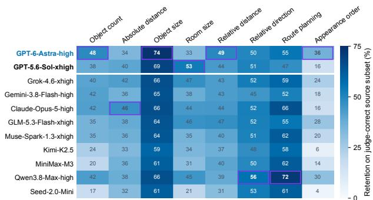  
(a) Dual VQA retention by task

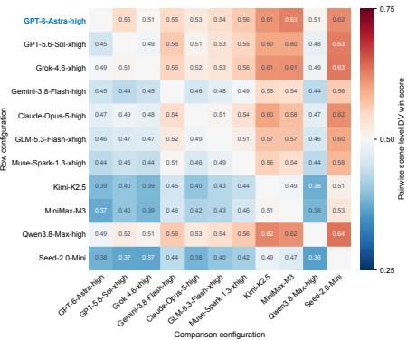  
(b) Pairwise scene-level DV wins  
Figure 6: Dual VQA difficulty is structured, and aggregate ranks do not reflect scene-level ties. (a) Object size and route planning are retained more reliably than appearance order and object count. Purple boxes mark the best shown value in each task. (b) Each off-diagonal cell is the row configuration’s scene-level DV win score against the column configuration over the same 278 scenes. Ties contribute one half.

Panel (b) of Figure 6 gives the top pair a scene-level win score of 0.55, considerably less decisive than a rank alone suggests. This agrees with the paired-bootstrap result that the top-two DV difference is not statistically significant. Table 5 gives the exact distribution summary behind the task-level plots.

Table 5: Task difficulty and discrimination differ across BVB tasks. Statistics summarize tasklevel DV over all 51 configurations. Object size has the highest mean, while object count has the widest range.
<table><tr><td>Task</td><td>Mean</td><td>Interquartile range</td><td>Full range</td></tr><tr><td>Object count</td><td>29.3</td><td>[23.2, 35.0]</td><td>[10.5, 48.5]</td></tr><tr><td>Absolute distance</td><td>36.5</td><td>[33.5, 39.6]</td><td>[24.3, 46.2]</td></tr><tr><td>Object size</td><td>63.0</td><td>[61.2, 65.2]</td><td>[54.1, 73.7]</td></tr><tr><td>Room size</td><td>36.5</td><td>[31.2, 42.3]</td><td>[20.8, 53.1]</td></tr><tr><td>Relative distance</td><td>39.0</td><td>[37.1, 41.9]</td><td>[29.0, 49.0]</td></tr><tr><td>Relative direction</td><td>51.0</td><td>[48.7, 52.9]</td><td>[44.9, 57.4]</td></tr><tr><td>Route planning</td><td>58.5</td><td>[54.8, 62.4]</td><td>[47.3, 72.0]</td></tr><tr><td>Appearance order</td><td>16.1</td><td>[12.0, 19.0]</td><td>[4.0, 36.0]</td></tr></table>

Recovery on judge-failed source questions. Retention conditions on the questions the judge answers correctly from the source, and we examine recovery on questions outside this subset. Restricted to scenes with a successful render, the judge recovers on average 22.6% of the judge-failed multiple-choice questions from the render, and no configuration exceeds 25.1%. Both values sit below the 27.9% chance level obtained by blending the two-, three-, and four-option formats over this question pool. Recovery on these questions remains below the nominal chance baseline across all evaluated configurations. On the numeric tasks the recovery rate instead ranges from 14.5% to 19.9% and correlates with retention at Spearman 0.60 across the 51 configurations.

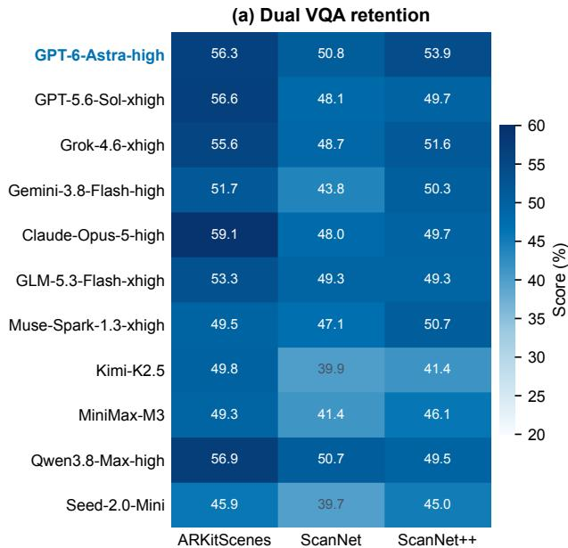

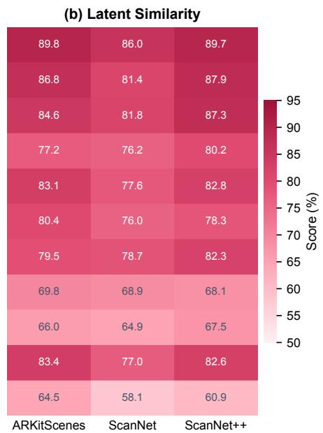  
Figure 7: Source collection shifts both evaluation axes. Every shown configuration scores higher on ARKitScenes than ScanNet for both DV and LS. DV is micro-averaged over source-correct questions within each collection, while LS is averaged over its scene records.

The source profile in Figure 7 shows a domain effect shared across otherwise different configurations. Because the collections differ in capture style, scene composition, and question mix, these differences show sensitivity to the source domain rather than any single dataset factor.

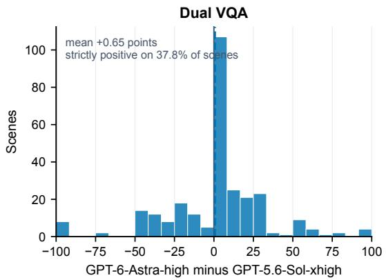

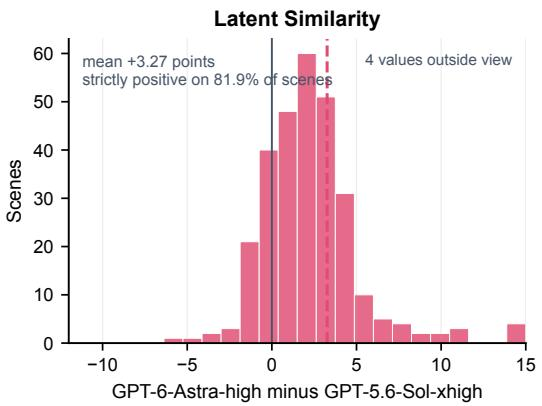  
Figure 8: Top-line gains are not uniform across scenes. DV contains many ties and both positive and negative scene differences. LS is positive on most scenes. Four LS values beyond the displayed range correspond to Sol render failures scored as zero under the leaderboard policy.

The unweighted mean scene-level DV difference in Figure 8 is +0.65 points, whereas the pooled question-level leaderboard difference is +1.97 points. Scene-level DV denominators vary with the number of source-correct questions, so the pooled score and paired scene summary answer different questions.

## H Effort and Runtime Details

Table 6 reports how consistently each metric changes as provider-defined reasoning effort increases.

Table 6: Latent Similarity responds most monotonically to effort. Entries are within-family Spearman correlations between ordered effort settings and each score.
<table><tr><td>Model family</td><td>Settings</td><td>DV</td><td>LS</td><td>Overall</td></tr><tr><td>GPT-5.5</td><td>4</td><td>+0.40</td><td>+1.00</td><td>+0.80</td></tr><tr><td>GPT-5.6 Luna</td><td>3</td><td>+0.50</td><td>+1.00</td><td>+1.00</td></tr><tr><td>GPT-5.6 Sol</td><td>5</td><td>+0.60</td><td>+0.90</td><td>+0.70</td></tr><tr><td>GPT-5.6 Terra</td><td>4</td><td>+0.80</td><td>+1.00</td><td>+1.00</td></tr><tr><td>Mean</td><td></td><td>+0.57</td><td>+0.97</td><td>+0.88</td></tr></table>

Figure 9 separates the runtime and score change for each adjacent effort step.  
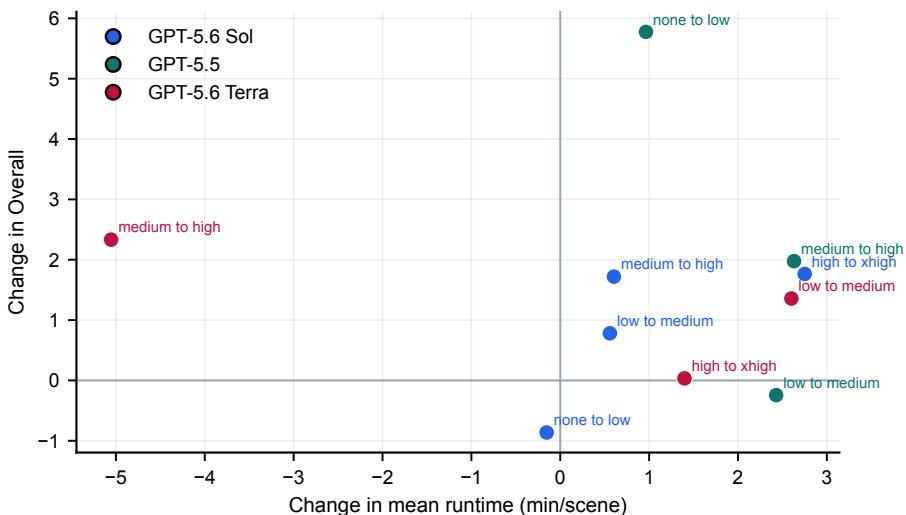  
Figure 9: Additional runtime is neither necessary nor sufficient for a Overall gain. Each point compares adjacent effort settings within one provider family. Some steps improve Overall while reducing runtime, whereas others add runtime with little or negative score change.

The pattern supports treating effort as a provider-specific control rather than a common compute scale. It also explains why the main-text runtime scatter does not form a single quality curve.

## I Qualitative Reconstruction Cases

The full candidate pool contains four scenes from each source. Figure 4 shows Candidate 12 in the main text, and the remaining eleven appear below. Every row uses the same six normalized clip times. From top to bottom, each candidate shows the reference, GPT-6 Astra, GPT-5.6 Sol, Grok, Gemini, Claude, and Qwen. The five non-Astra configurations are exactly those used in the blind human study. These candidates support visual selection and do not estimate failure prevalence.

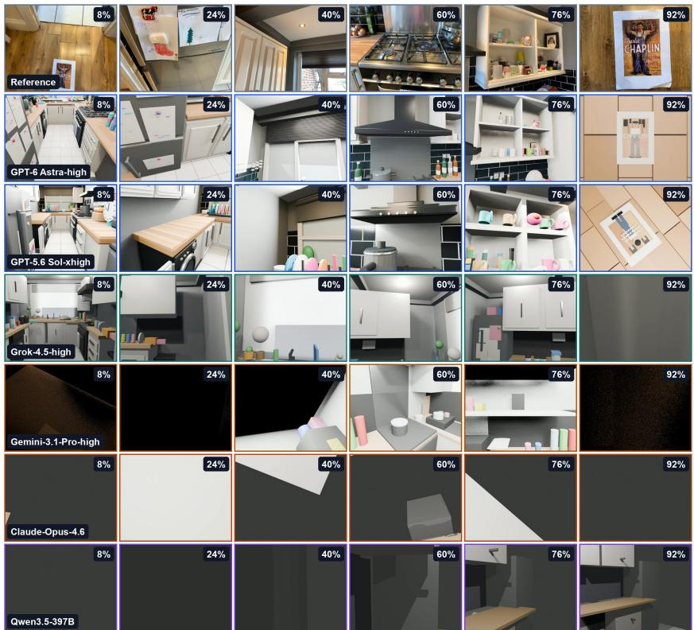  
Figure 10: Candidate 1: cluttered kitchen. ARKitScenes scene 42446049 at six matched timestamps.

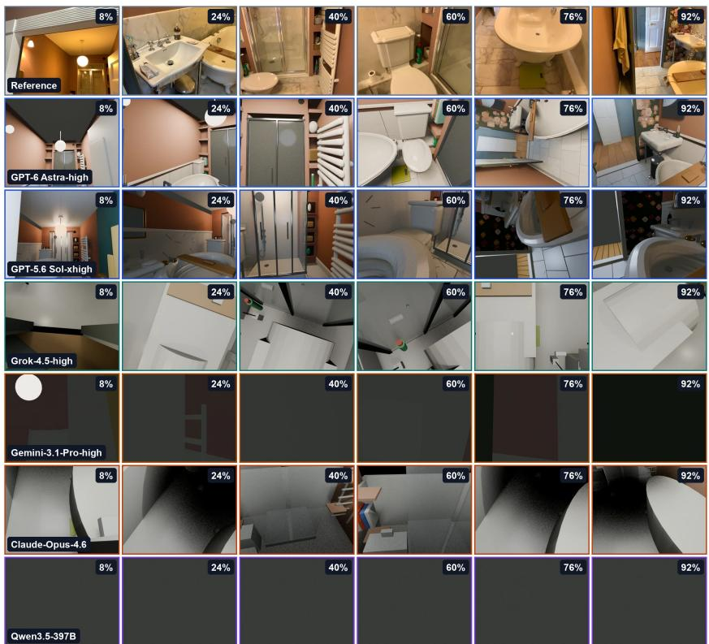  
Figure 11: Candidate 2: compact furnished room. ARKitScenes scene 45260900 at six matched timestamps.

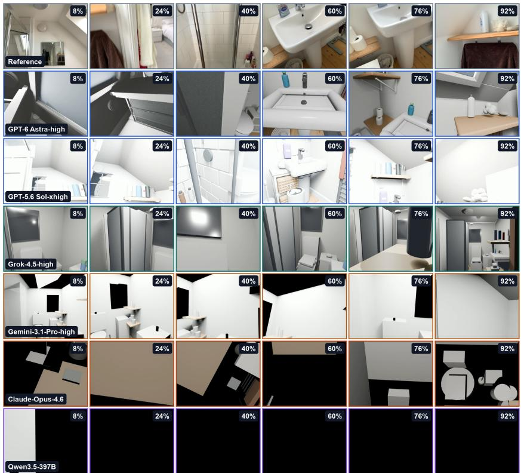  
Figure 12: Candidate 3: bathroom fixtures. ARKitScenes scene 45261182 at six matched timestamps.

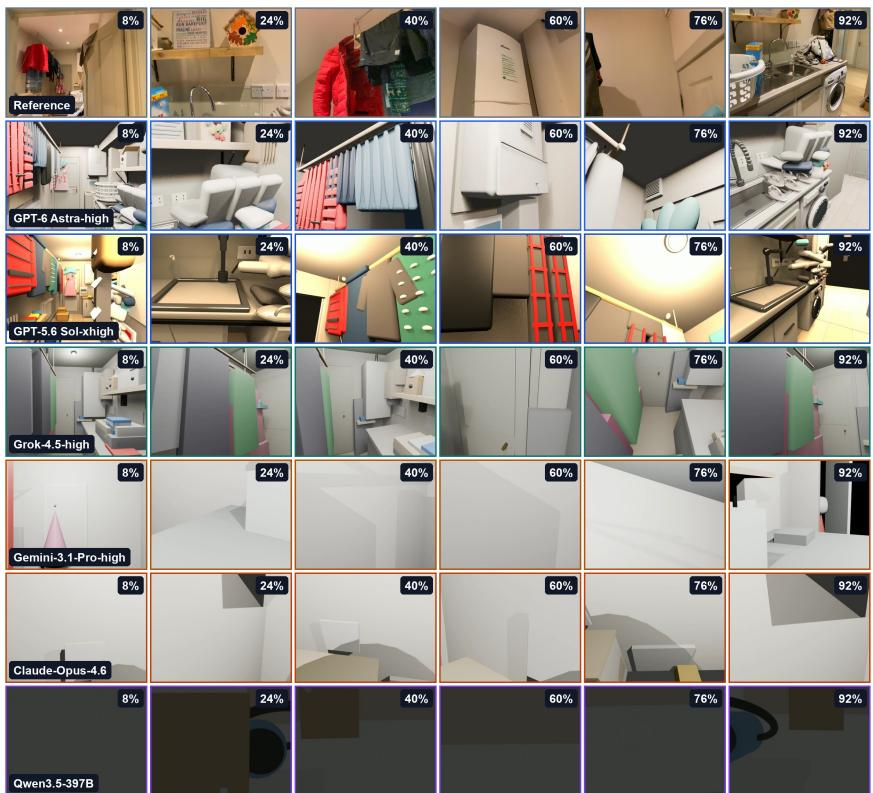  
Figure 13: Candidate 4: cluttered storage room. ARKitScenes scene 42898817 at six matched timestamps.

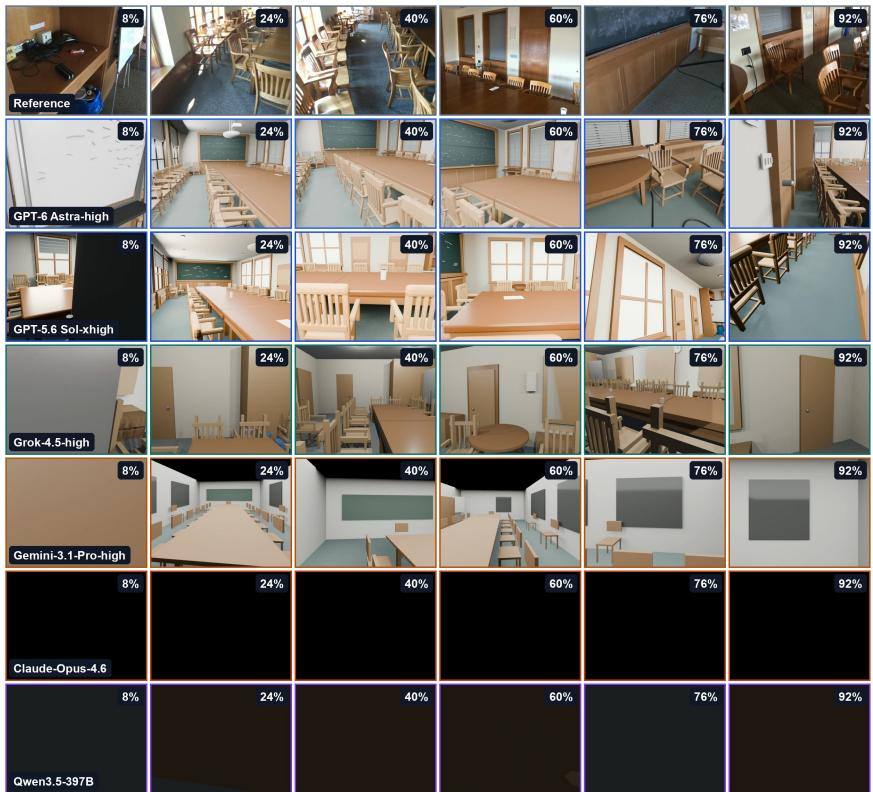  
Figure 14: Candidate 5: repeated-instance classroom. ScanNet scene scene0500 00 at six matched timestamps.

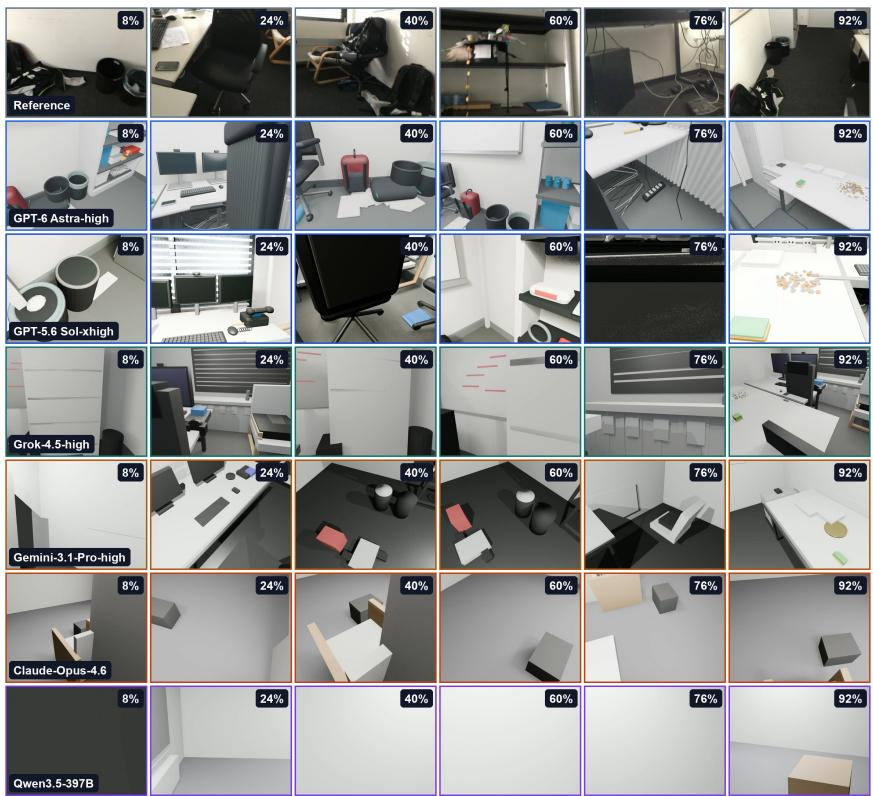  
Figure 15: Candidate 6: cluttered desktop. ScanNet scene scene0700 02 at six matched timestamps.

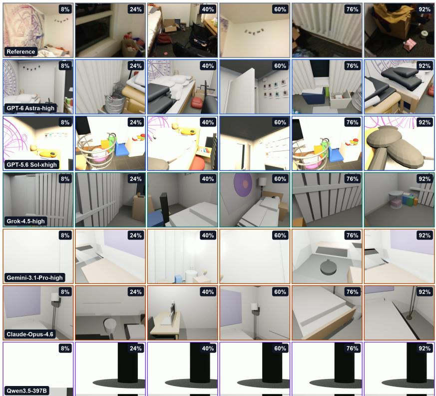  
Figure 16: Candidate 7: bedroom workspace. ScanNet scene scene0695 00 at six matched timestamps.

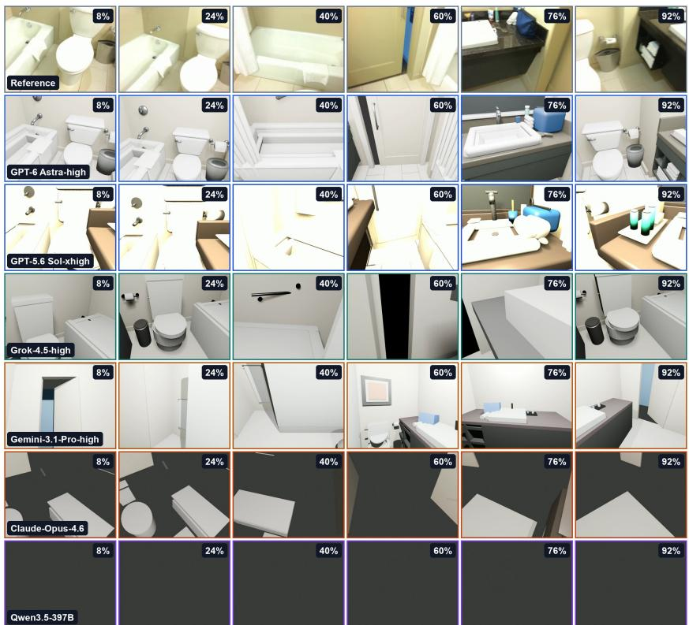  
Figure 17: Candidate 8: bathroom counter. ScanNet scene scene0664 02 at six matched timestamps.

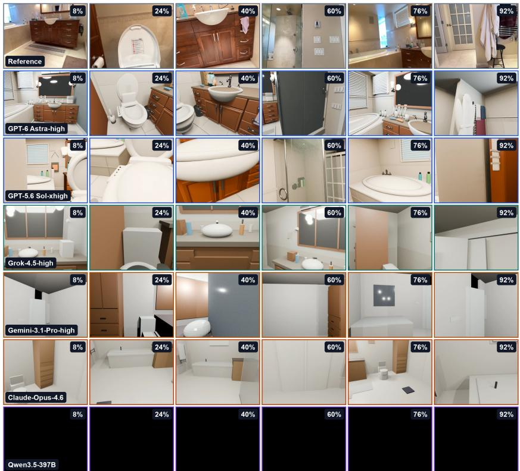  
Figure 18: Candidate 9: bathroom and doorway. ScanNet++ scene e7af285f7d at six matched timestamps.

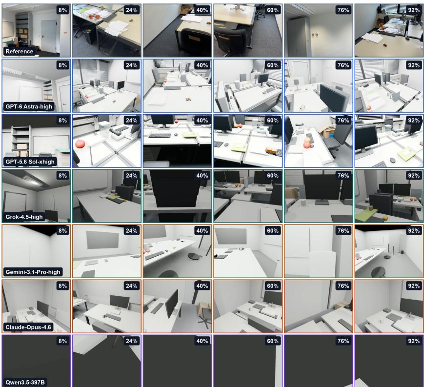  
Figure 19: Candidate 10: shared office. ScanNet++ scene acd95847c5 at six matched timestamps.

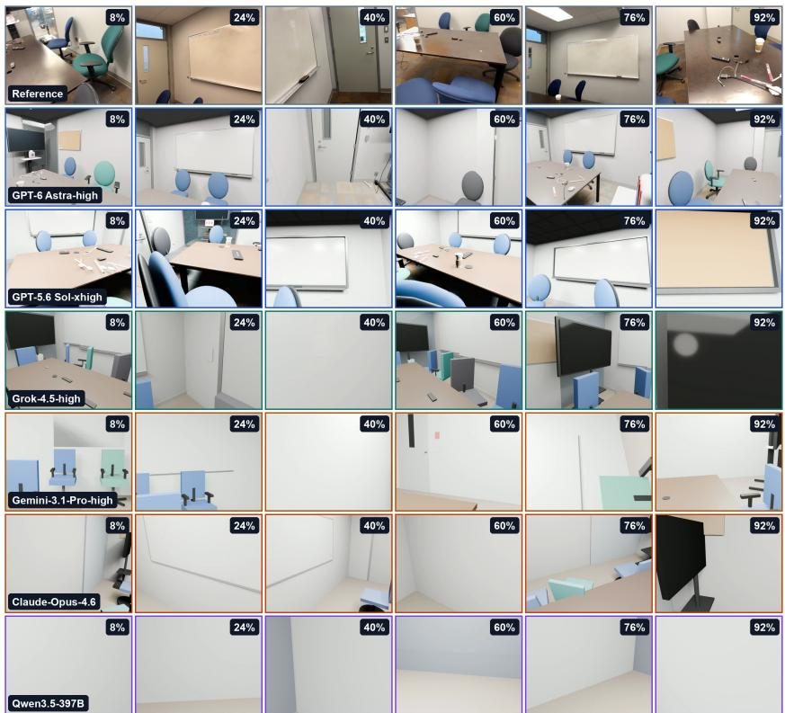  
Figure 20: Candidate 11: meeting room. ScanNet++ scene 5748ce6f01 at six matched timestamps.

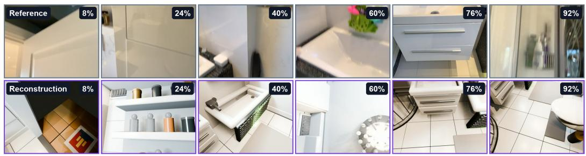

Metric-complementarity cases. The single-configuration strips in Figures 21 and 22 provide focused source-versus-reconstruction views of four localized semantic failures. They illustrate metric complementarity and do not estimate failure prevalence.

(a) Scene 47429912: size and room-scale retention  
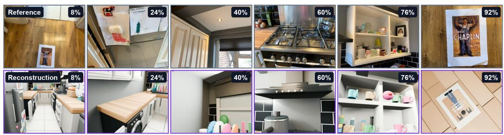  
(b) Scene 42446049: direction and route retention  
Figure 21: High perceptual similarity does not prevent localized semantic loss. Panel (a) reaches 89.4 LS but retains neither of its two source-correct size questions. Panel (b) reaches 89.0 LS but misses its source-correct room-size, relative-direction, and route questions.

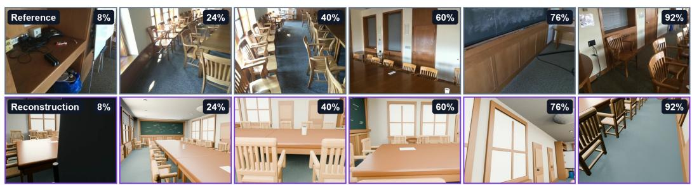  
(a) Scene scene0500 00: object-count retention

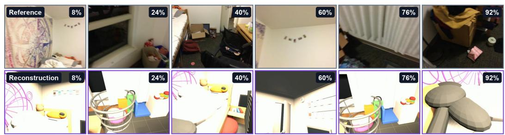  
(b) Scene scene0695 00: appearance-order retention  
Figure 22: Inventory and temporal coverage remain distinct failure modes. Panel (a) reaches 84.2 LS but misses its source-correct object-count question. Panel (b) reaches 81.8 LS but retains none of three source-correct appearance-order questions and misses its route question.

## J Blind Human Ranking Study

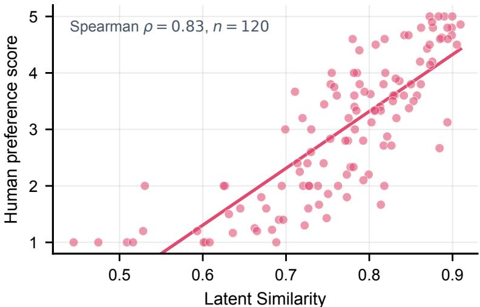  
Figure 23: Latent Similarity tracks blind visual preference. Each point is one scene-model pair from the existing five-model study; higher human preference and higher LS agree at Spearman ρ=0.83.

Fifteen raters each saw nine of a fixed pool of 24 scenes balanced across ARKitScenes, ScanNet, and ScanNet++. For every scene, raters viewed the source clip beside five anonymized reconstructions and ranked them on object identity, spatial layout, camera path, and appearance order. The resulting 135 judgments per configuration yield mean ranks of 1.47, 2.23, 3.03, 3.70, and 4.58. Table 2 reports these model-level results in the main text.

At the scene-model level, human preference correlates with Latent Similarity at Spearman ρ=0.83 over 120 observations. Dual VQA has lower correlation $( \rho { = } 0 . 1 1 , n { = } 1 1 0 )$ , consistent with its different role as a semantic retention measure. Its sample is smaller because 10 scene-model cases contain no judge-correct source question and therefore have no defined conditional retention. These observations are clustered within 24 scenes and five configurations, so the correlations are descriptive rather than based on 120 independent samples. The study supports the perceptual metric and the ordering of the five sampled configurations.

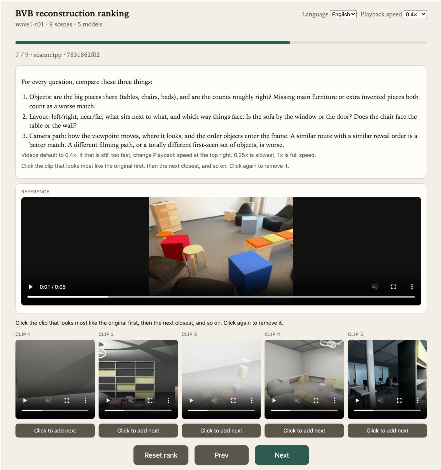  
Figure 24: Blind-ranking interface. The reference video appears above five anonymized candidate reconstructions. Model identities were hidden, candidate order was randomized, and the form provided English and Chinese instructions.

## K Cost Frontier

For each configuration, agent spend is the mean Stage-1 API cost per scene from provider usage accounting. It excludes the Dual VQA judge and frozen V-JEPA encoder, so it measures the cost of producing the reconstruction, not of scoring it. Across 51 configurations, spend ranges from \$0.024 to \$2.157 per scene.

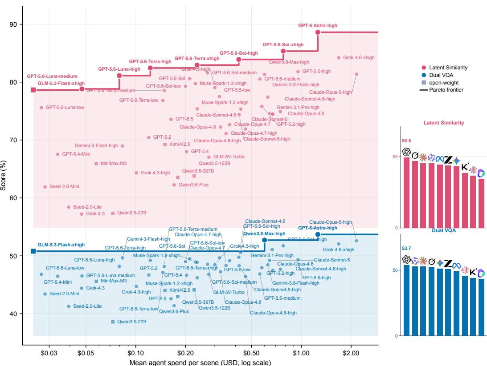  
Figure 25: Semantic and perceptual quality have different cost frontiers. Each staircase contains configurations that no cheaper run outperforms on that axis, and the right panels show the best configuration from each model family.

Three configurations lie on the DV frontier and eight on the LS frontier. Both start with GLM-5.3-Flash and end with GPT-6 Astra; the DV frontier passes through Qwen3.8-Max, while the LS frontier includes Luna, Terra, and Sol. Astra reaches 53.7 DV and 88.6 LS at \$1.258 per scene. Sol-xhigh reaches 51.7 and 85.4 at \$0.778, while GLM-5.3-Flash-xhigh reaches 50.8 and 78.7 at \$0.024. GLM-5.3-Flash is the only open-weight configuration on either measured frontier.

## L Limitations

BVB covers indoor egocentric videos from three capture sources, and broader environments, outdoor scenes, and interactive editing remain future work. Performance also depends on coding ability and familiarity with Blender, so BVB evaluates video understanding through an agent’s ability to express it programmatically. Both axes evaluate the rendered video, not the underlying 3D geometry, which matches the source-conditioned setting where aligned ground-truth geometry is unavailable. As in other judge-based evaluations, Dual VQA depends on a VLM judge. Conditioning on the judge-correct source subset and keeping the judge fixed across all configurations mitigate this dependence. The blind ranking study covers five configurations, and extending it to newer models is straightforward under the released protocol. Finally, the shared per-scene cost ceiling keeps comparisons uniform and affordable, though individual configurations might improve further under larger budgets.