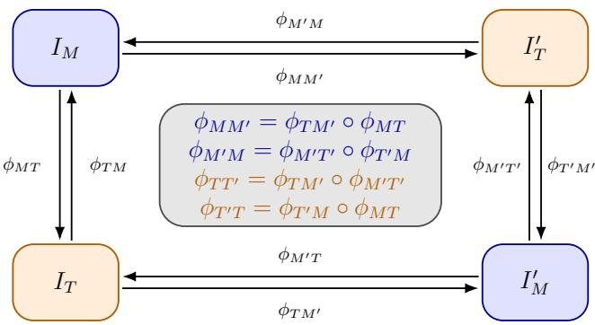
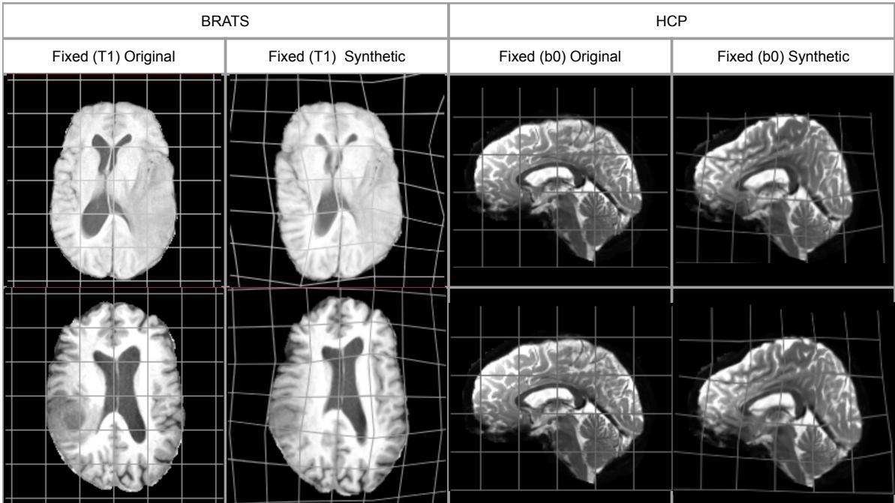
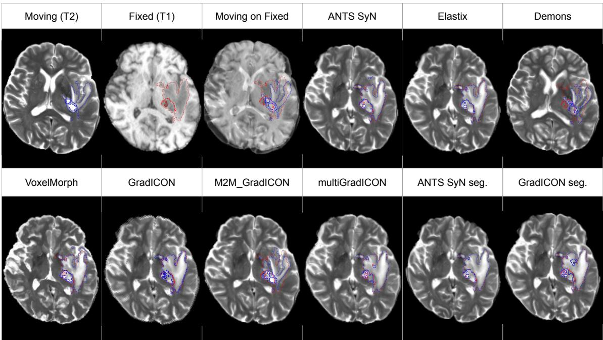
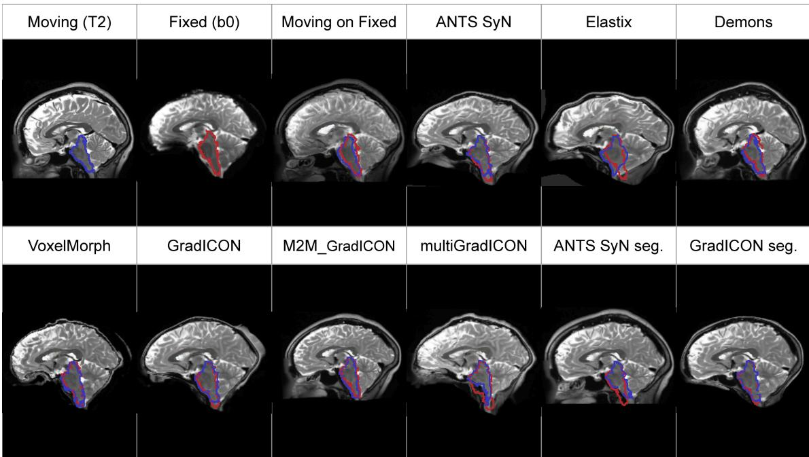
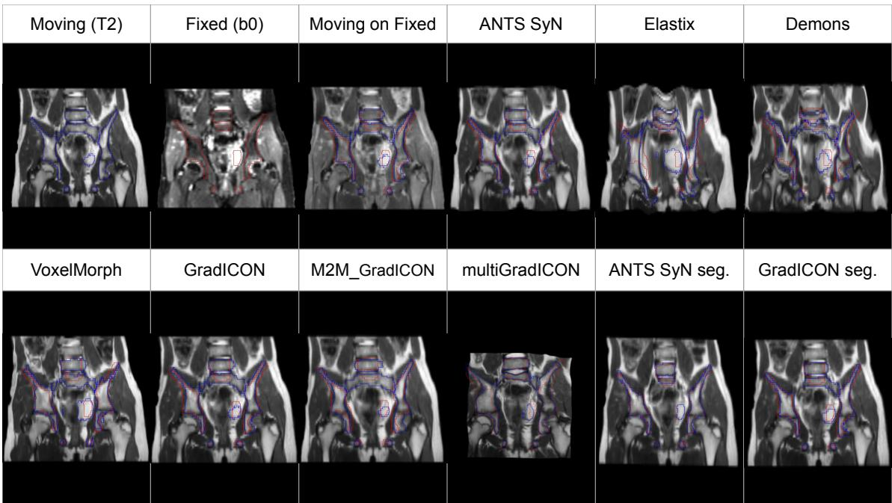

# Benchmarking Intra-Patient 3D Deformable Multimodal Image Registration

Matteo BARBIERIa, Giammarco LA BARBERAd,a, Juan Pablo DE LA PLATAd,a, Sabine SARNACKIe,a, Isabelle BLOCHb,a,c, Pietro GORIc,∗

aIMAG2, Institut IMAGINE, Université Paris Cité, Paris, France bSorbonne Université, CNRS, LIP6, Paris, France

cLTCI, Télécom Paris, Institut Polytechnique de Paris, Palaiseau, France dReplico SAS, Paris, France

eUniversité Paris Cité, Department of Pediatric Surgery, Hôpital Necker Enfants-Malades, Assistance Publique–Hôpitaux de Paris (AP-HP), Paris, France

## Abstract

Multimodal image registration is a key component of many clinical workflows, yet it remains challenging because corresponding anatomical structures often exhibit substantially diferent image intensities across modalities. In this work, we present a comprehensive benchmark of intra-patient 3D multimodal deformable registration methods across three datasets covering diferent anatomical regions and dificulty levels, including both synthetic deformation recovery and real clinical scenarios.

We evaluate classical optimization-based approaches and modern learning-based methods, including recent deep learning and foundation models, using complementary metrics: Average Dice similarity coeficient (DSC), average 95th-percentile Hausdorf distance (HD95), and a modality-independent structural similarity measure based on the MIND self-similarity context (MIND-SSC). Results show high variability across datasets, with learning-based methods demonstrating superior performance on large synthetic benchmarks, while only limited improvements are observed in real pelvic registration.

A key finding of this study is the consistent disagreement between geometric metrics (DSC, HD95) and image-based similarity metrics (MIND-SSC), highlighting that improved overlap does not necessarily imply better global multimodal correspondence. Furthermore, anatomy-guided approaches achieve the highest overlap scores but exhibit degraded performance outside of segmented regions, revealing a

trade-of between label-driven alignment and global structural coherence.

Overall, our results indicate that no current method achieves robust performance across anatomies and modalities. We demonstrate that intra-patient 3D multimodal registration requires multi-criteria evaluation, including deformation-based metrics, and remains an open problem. This benchmark provides guidance for future research toward more generalizable, anatomically consistent, and clinically relevant registration frameworks.

Keywords: Multimodal registration, Deep Learning, Deformable registration

## 1. Introduction

Image registration is one of the building blocks for achieving personalized precision medicine, as it enables the consistent spatial alignment of anatomical structures across images acquired using diferent modalities, at diferent time points or from diferent patients. By establishing spatial correspondences, registration plays a critical role in numerous clinical and research applications, including longitudinal disease monitoring [1, 2], population analysis [3, 4], image-guided interventions [5], as well as fundamental research in the understanding of the human organs, such as the brain, where complementary anatomical information and functional information are integrated into a common reference frame [6, 7, 8].

Formally, image registration consists in estimating an optimal spatial transformation — typically represented as a dense displacement field or a parametric mapping — that aligns a moving image onto a fixed reference image. Transformation models are commonly divided into linear (e.g., rigid or afine), which apply global transformations governed by a small number of parameters, and deformable and non-linear models, which allow for spatially varying deformations and are essential for capturing complex anatomical variability [9]. Deformable registration is often further constrained through regularization terms to ensure smoothness, topology preservation, or difeomorphic properties, thereby enforcing anatomically plausible mappings [10, 11].

From an algorithmic perspective, registration approaches are traditionally classified into classical iterative methods and learning-based (data-driven) methods. Classical methods formulate registration as an energy minimization problem combining a similarity measure and a regularization term, solved iteratively using numerical optimization techniques. These approaches benefit from well-established theoretical foundations and explicit control over transformation properties [6]. By contrast, learning-based methods aim to directly infer transformation using neural networks, trading explicit modeling for statistical learning and enabling real-time inference once trained [12, 8].

In addition to these general categorizations, several application-dependent factors critically influence the choice of a registration strategy. Among them, the imaging modalities of the input images (e.g., Computed Tomography (CT), Magnetic Resonance Imaging (MRI), Ultrasound (US)) and whether they correspond to the same modality (monomodal) or diferent modalities (multimodal) is particularly important, as it determines the validity of assumptions regarding intensity correspondence. Other factors include the dimensionality of the data (e.g. 2D vs. 3D), the anatomical region of interest (e.g. brain, pelvis, abdomen, etc.), and whether the task involves intra-subject (longitudinal) or inter-subject (population-level) alignment [13, 14, 15]. These considerations directly drive the design of similarity measures [16], transformation models, and learning strategies.

Since the advent of digital medical imaging, research has focused mainly on monomodal registration, achieving significant improvement of similarity and structurebased metrics even in cases with complex geometrical mismatch. Multimodal registration, used for multiparametric studies or intra-operative visualization, still represents a challenging problem, as the assessment of registration quality through superimposition of anatomical features can no longer pass through intensity-based metrics. While some authors have attempted to provide better suited similarity metrics such as MIND [17] or MIND-SSC [18], others have developed learning-based similarity approximations such as REE-UNET [19] and used them in registration pipelines [20, 21, 22].

This work specifically focuses on deformable intra-patient multimodal registration. Our aim is to provide a methodological and clinically-relevant benchmark on two publicly available datasets and one private dataset for a selected number of stateof-the-art multimodal deformable registration strategies. This benchmark evaluates two distinct capabilities: (i) recovery of known transformations under modality shifts, and (ii) estimation of true correspondence in realistic multimodal settings. Based on synthetic and real misaligned data, we perform a comparative study of the registration ability of diferent methods in setups of increasing dificulty, while varying modalities and regions of interest. Eventually, we evaluate the current state of multimodal deformable registration and provide the research community with guidelines for further work.

The paper is organized as follows. After summarizing related work in Section 2, a brief introduction to the functioning of each evaluated method is provided in Section 3. The specifics of the benchmarking methodology — such as datasets, protocols and evaluation metrics — are described in Section 4, and associated results are presented in Section 5. Eventually, a discussion presenting the outcomes and limitations of the current benchmark, as well as guidelines for future work on deformable multimodal image registration is provided in Section 6. A conclusion summarizing the findings is provided in Section 7.

## 2. Related work

Let $I _ { T } , I _ { M } : \Omega $ R denote the target (i.e. reference) and moving images, respectively, defined on a domain of the d-dimensional real space $( \Omega \subset \mathbb { R } ^ { d } )$ . Deformable image registration aims to estimate a spatial transformation $\phi : \Omega \to \Omega$ such that $I _ { M } \circ \phi \approx ~ I _ { T }$ , so that the moving image $I _ { M }$ , warped by the transformation $\phi ,$ should match the target image $I _ { T }$ . This problem is commonly formulated as the minimization of an energy functional of the following form:

$$
\begin{array} { r } { \pmb { \mathcal { E } } ( \phi ) = \mathcal { D } \Big ( I _ { T } , I _ { M } \circ \phi \big ) + \lambda \mathcal { R } ( \phi ) , } \end{array}\tag{1}
$$

where D is a similarity measure between images, $\mathcal { R }$ is a regularization functional enforcing smoothness or physical plausibility, and $\lambda ~ > ~ 0$ balances the two terms.

Diferent registration methods can be distinguished by their parameterization of $\phi ,$ the choice of similarity metric D, and the form of regularization R. To better understand the dificulties of multimodal registration, and since some monomodal registration methods are sometimes directly used for multimodal registration, we present in the following section registration methods for both the monomodal and multimodal registration problem. Please note that we will consider only methods accounting for geometric transformations, without intensity/iconographic modifications, thereby excluding frameworks such as metamorphosis [23, 24, 25].

## 2.1. Monomodal image registration

Monomodal registration is characterized by the assumption that voxels representing the same point in the physical space within moving and target images have similar intensity distributions. In this setting, intensity-based similarity metrics such as sum of squared diferences (SSD) or cross-correlation (CC) are well suited, enabling accurate alignment in applications such as longitudinal analysis, where one can assume that moving $I _ { M }$ and target $I _ { T }$ images only difer by Gaussian noise (SSD) or that there is a linear relationship between them (CC).

Among the classical approaches, Advanced Normalization Tools (ANTs) [10] and Elastix [26] have emerged as widely adopted frameworks for medical image registration. In particular, the Symmetric Normalization (SyN) algorithm [10], based on a difeomorphic formulation with a symmetric energy functional, is often regarded as the reference method for brain MRI registration due to its robustness, inverse consistency, and strong performance in benchmark evaluations. For applications involving large, spatially heterogeneous, and highly non-linear deformations (such as those encountered in thoracic or abdominal imaging), dense non-parametric approaches remain essential. In particular, free-form deformation (FFD) models based on B-splines [27] provide flexible local control, while variational difeomorphic frameworks such as Large Deformation Difeomorphic Metric Mapping (LD-DMM) [4, 28, 29, 30, 16] ofer strong theoretical guarantees on smoothness and invertibility. In parallel, algorithms based on optical-flow inspired updates such as Deformable demons and its difeomorphic extensions remain highly competitive due to their computational eficiency and ability to handle large displacement fields [31, 32].

More recently, deep learning-based methods have significantly transformed monomodal registration by replacing iterative optimization with feedforward inference. Early frameworks such as VoxelMorph [33] demonstrated that Convolutional Neural Networks (CNN) can learn to predict dense deformation fields in an unsupervised manner using diferentiable spatial transformers. Subsequent extensions introduced probabilistic formulations and difeomorphic constraints via stationary velocity fields [11], improving both robustness and topology preservation. Alternatively, methods such as GradICON [34] enforce inverse consistency through gradient-based regularization, leading to improved numerical stability and more consistent mappings. Meanwhile weakly-supervised frameworks incorporate anatomical priors by means of keypoints or full organ segmentations to enforce reliable anatomical displacement fields [35, 36]. A significant diference between the developments of deep learning methods with respect to the previously described classical methods is that the expression of physical properties (such as difeomorphism) is not formally enforced but rather implicitly encouraged through the tuning of parameters that balance competing criteria.

Building on these convolutional approaches, more recent architectures leverage transformer-based designs to better capture long-range spatial dependencies. Unlike CNNs, which rely on local receptive fields and hierarchical feature aggregation, transformers exploit global context through self-attention mechanisms, enabling direct interactions between distant regions of the image. This property is particularly advantageous in medical image registration, where large anatomical displacements and weak local correspondences can challenge purely local models. Transformer-based registration methods such as TransMorph [37], Vit-v-Net [38] and others reported by Ramadan et al. in [39] typically combine attention modules with multi-scale representations, allowing them to jointly encode fine-grained details and global structural alignment.

Finally, hybrid methods have emerged to bridge the gap between purely datadriven approaches and classical variational frameworks. These approaches integrate learned components, such as similarity metrics or feature embeddings, into explicit energy minimization schemes. For example, learned similarity metrics have been shown to outperform handcrafted metrics in challenging registration scenarios [40, 41, 42]. More recently, learned semantic feature representations have been incorporated into optimization-based registration frameworks to improve robustness across modalities while retaining the interpretability and regularization properties of classical formulations [43, 44].

## 2.2. Multimodal image registration

By contrast, multimodal image registration remains significantly more challenging due to the absence of direct intensity correspondence between modalities such as Computed Tomography (CT), Magnetic Resonance Imaging (MRI) or ultrasound. Early approaches addressed this issue using similarity metrics derived from information theory, most notably Mutual Information (MI) [45], which quantifies statistical dependence between image intensities and remains a strong baseline for both rigid and deformable registration, alongside early gradient-based formulations [46]. However, MI sufers from limited spatial specificity and sensitivity to interpolation artifacts. To overcome these limitations, a second class of methods introduced modalityinvariant descriptors that rely on structural (rather than intensity-based) information. A prominent example is the Modality Independent Neighborhood Descriptor (MIND-SSC) [18], which encodes local self-similarity patterns and has become a standard for multimodal deformable registration. Other descriptors, such as binary gradient angle representations [47] or self-similarity-based features [18, 48], further exploit the structural consistency of anatomical patterns across modalities.

Deep learning has had a particularly strong impact in the multimodal setting, as it enables the learning of modality-invariant representations directly from data. Early works explored weakly-supervised and adversarial learning strategies [49, 35, 50], as well as deep similarity metrics [40], to bridge modality gaps. Other approaches relied on image-to-image translation [51, 52, 53], although their efectiveness has been shown to be modality-dependent and sometimes inferior to direct registration methods [54]. More recent methods leverage contrastive learning and shared embedding spaces [21, 55, 56], cycle-consistent training strategies [51], cross-modal attention mechanisms [57], or self-supervised anatomical representations [58]. In parallel, differentiable similarity learning frameworks such as DISA [59] have been proposed to generalize similarity modeling across modalities.

Contemporary state-of-the-art approaches focus on end-to-end deformation prediction with strong geometric constraints. Examples include reinforcement learningbased formulations [60], geometry-consistent adversarial models [61], and transformerbased architectures [37]. Recent advances also explore foundation models and largescale pretraining, such as multiGradICON [62], which extends inverse-consistent diffeomorphic frameworks to multimodal settings, and universal matching models [63]. Additional recent contributions include anatomy-aware architectures such as MAIR-Net [64] and strategies that explicitly reduce modality gaps via mono-modalization [65] Emerging directions further include difusion-based similarity modeling [22], implicit neural representations [66], and modality-agnostic feature learning from large pretrained models [20].

## 2.3. Limitations of existing benchmarks and methods

Overall, while classical methods based on MI and handcrafted descriptors remain competitive in controlled or low-variability scenarios, learning-based approaches increasingly define the state of the art in multimodal deformable registration, particularly in settings involving large modality gaps, heterogeneous datasets, and real-time constraints. The field is progressively moving toward unified, generalizable frameworks capable of handling diverse modalities, anatomies, and acquisition conditions within a single model.

However, the efectiveness of both classical and learning-based multimodal deformable registration methods remains limited in many clinical applications where sub-millimetric to millimetric accuracy (typically < 1–2 mm) is required, such as stereotactic radiotherapy, neurosurgical navigation, and image-guided interventions. Despite substantial progress, extensive evaluations consistently report residual Target Registration Errors (TRE) in the range of 1–3 mm for state-of-the-art deformable registration methods, even in relatively controlled settings such as the Learn2Reg challenge [67]. The Learn2Reg challenge editions (2020–2024) provide a comprehensive multi-anatomy benchmarking framework that reveals persistent task-dependent gaps [68, 67]: median TRE values of approximately 1–2 mm are achievable in brain registration, whereas abdominal registration remains substantially harder, with 95th- percentile Hausdorf distances reaching up to 20 mm even for top-ranked methods. These results highlight the impact of respiratory motion, sliding organ interfaces, and large non-linear deformations that introduce fundamental ambiguities in defining voxel-level correspondence, particularly in homogeneous or biomechanically complex regions [6, 69]. Furthermore, among the best-performing methods in Learn2Reg 2024, intra-method variability in TRE can exceed 1 mm across tasks, underscoring that no single architecture generalizes robustly across anatomies and modalities [68].

In the case of larger structures, the lack of quality is also visible from the Dice results. For instance, on large-scale brain MRI benchmarks (e.g. OASIS, ABIDE, ADHD200), mean Dice Similarity Coeficient (DSC) scores for cortical and subcortical structures cluster around 75–78% for modern approaches such as VoxelMorph and its difeomorphic variants [11, 33].

The challenge becomes even more pronounced in scenarios involving highly heterogeneous image appearances, large unconstrained fields of view, or significant modality-specific artifacts — such as speckle noise in ultrasound or bias fields in MRI. In registration of prostate MRI with Transrectal Ultrasound (TRUS), one of the most clinically relevant and extensively studied multimodal tasks, state-of-the-art methods — including learning-based approaches — consistently report TRE values in the range of 4–11 mm, with only marginal improvements over classical iterative techniques despite the focus on small regions of interest during prediction [40]. This is particularly concerning, given that the clinically tolerated targeting error for prostate biopsy guidance is often cited as ≤2.5 mm [70]. More broadly, recent surveys confirm that ultrasound-based multimodal registration constitutes one of the most challenging subfields, reporting an average TRE of 4.95 mm for the best considered method on a manually curated dataset [48]. Even methods specifically designed for CT–ultrasound or MRI–ultrasound settings, including those leveraging self-similarity descriptors [17, 18] or cross-modal attention [57], have not demonstrated consistent sub-3 mm accuracy in prospective clinical evaluations, reflecting the fundamental dificulty of establishing reliable correspondences across such dissimilar intensity distributions.

In addition, the performance and generalization of deep learning-based registration methods are strongly constrained by the scarcity of large-scale annotated datasets with accurate voxel-wise correspondence ground truth. Unlike for the monomodal settings, multimodal registration inherently lacks “ground truth” deformation fields, necessitating weakly-supervised, synthetic, or self-supervised training strategies that introduce additional uncertainty [35, 8]. This issue is further compounded by domain shift across scanners, acquisition protocols, and patient populations, which have been shown to degrade TRE performance by several millimeters when models are evaluated outside their training distribution [67]. Concretely, methods achieving median TRE values below 2 mm on in-distribution test sets have been observed to exceed 4–5 mm on out-of-distribution data [68, 67], a degradation that is especially acute for learning-based methods that overfit to scanner-specific contrast profiles or resolution characteristics. Recent large-scale approaches, including inverse-consistent difeomorphic frameworks such as multiGradICON [62], aim to address these challenges through improved regularization, symmetry constraints, and scalability to diverse training distributions. While these methods demonstrate im proved stability and competitive benchmark performance, evaluations on populationscale datasets, such as UK Biobank [71], reveal persistent variability in alignment quality, with residual errors still exceeding clinically desirable thresholds (Dice coefficient > 0.8, TRE > 5 mm) [72] in a non-negligible fraction of cases, highlighting the gap between controlled benchmark performance and real-world clinical deployment.

## 3. Evaluated registration methods

Based on the previous analysis of related work, we focus on largely used, stateof-the-art methods. For better representativeness, we evaluate methods spanning classical optimization, handcrafted multimodal descriptors, and modern deep learning approaches including CNN- and foundation-model-based registration frameworks. The methods were selected on the basis of how widely they were used and the availability of ready-to-use packages or github implementations.

Given these constraints, Table 1 summarizes the methods investigated in this study, reporting their original publications and how to retrieve them, while a brief presentation of each of them is provided below. Given the common trend of using handcrafted similarity-based metrics when training DL methods, we chose to use the MIND-SSC loss metric $\left( \mathcal { L } _ { M I N D - S S C } \right)$ as a common ground when training models. This also includes the pretrained version of the multiGradICON foundation model, which was already trained using MIND-SSC loss by the authors [62].

Anatomically-guided registration. In addition to the proposed experiments, an assessment of the performance of anatomically-guided registration is proposed and implemented for the ANTs SyN and GradICON methods, respectively called ANTS SyN seg. and GradICON seg. in the following, representing the classical and deeplearning side of the optimization strategies. For classical methods, such as ANTs SyN, this is performed by giving as input the segmentation masks of homologous structures in $I _ { M }$ and $I _ { T }$ instead of the target and moving images. The resulting deformation map is then applied to the full image. For GradICON, the modified implementation consists in the introduction of an additional soft Dice loss term, evaluating the matching of the registered (linear interpolation) and target segmentations, thus favoring the alignment of segmented structures during training.

ANTs SyN. ANTs SyN [10] performs deformable registration in the space of difeomorphisms, ensuring smoothness and invertibility of the estimated mappings. The transformations are generated by time-dependent velocity fields through forward $\phi _ { M T }$ and backward $\phi _ { T M }$ flows, defined by:

Table 1: Considered multimodal deformable registration methods for benchmark.
<table><tr><td>Method</td><td>Reference publi- Category cation</td><td></td><td>Code repository</td></tr><tr><td>ANTs SyN</td><td>[10]</td><td>Classic</td><td>https: //antspyx. readthedocs.io/</td></tr><tr><td>Elastix</td><td>[26]</td><td>Classic</td><td>en/latest/ https: //github.com/ InsightSoftwareConsortium/ ITKElastix</td></tr><tr><td>Deforming demons [32, 31]</td><td></td><td>Classic</td><td>https: //github.com/ InsightSoftwareConsortium/</td></tr><tr><td>VoxelMorph</td><td>[33]</td><td>CNN</td><td>ITKElastix https://github. com/htwin/ voxelmorph_ torch/tree/</td></tr><tr><td>GradICON</td><td>[34]</td><td>CNN</td><td>master https: //github.com/ MICV-yonsei/</td></tr><tr><td>M2M-GradICON</td><td>[65]</td><td>CNN</td><td>M2M-Reg https: //github.com/ MICV-yonsei/</td></tr><tr><td>multiGradICON</td><td>[62]</td><td>Foundation model https://github.</td><td>M2M-Reg com/uncbiag/ uniGradICON</td></tr></table>

$$
\begin{array} { r l r } & { \displaystyle \frac { \partial \phi _ { M T } ( x , t ) } { \partial t } = v _ { M T } ( \phi _ { M T } ( x , t ) , t ) , \qquad } & { \phi _ { M T } ( x , 0 ) = x , } \\ & { \displaystyle \frac { \partial \phi _ { T M } ( x , t ) } { \partial t } = v _ { T M } ( \phi _ { T M } ( x , t ) , t ) , \qquad } & { \phi _ { T M } ( x , 0 ) = x . } \end{array}\tag{2}
$$

Here, $\phi _ { M T } ( x , t )$ (resp. $\phi _ { T M } ( x , t ) )$ denotes the position at time t of a point initially located at $x , \mathrm { { i . e . , \ a } }$ pointwise evaluation of the flow, whereas $\phi _ { M T } ( \cdot , t )$ (resp. $\phi _ { T M } ( \cdot , t ) )$ denotes the full deformation map at time t, i.e., a difeomorphism from Ω to Ω.

SyN adopts a symmetric formulation by introducing two velocity fields $v _ { M T } ( x , t )$ and $v _ { T M } ( x , t )$ , defined for $t \in [ 0 , \frac { 1 } { 2 } ]$ , which transport the moving image $I _ { M }$ and the target image $I _ { T }$ toward a common midpoint. The corresponding energy functional is

$$
\mathcal { E } ( v _ { M T } , v _ { T M } ) = \int _ { 0 } ^ { 1 / 2 } \Big ( \| L v _ { M T } ( \cdot , t ) \| _ { 2 } ^ { 2 } + \| L v _ { T M } ( \cdot , t ) \| _ { 2 } ^ { 2 } \Big ) \ d t + \mathcal { D } \Big ( I _ { M } \circ \phi _ { M T } ( \cdot , \frac { 1 } { 2 } ) , \ I _ { T } \circ \phi _ { T M } ( \cdot , \frac { 1 } { 2 } ) \Big ) ,\tag{3}
$$

where $L$ is $\mathrm { a }$ diferential operator enforcing regularity and D is a similarity measure between images. The final transformation mapping $I _ { M }$ to $I _ { T }$ is obtained as

$$
\begin{array} { r } { \phi = \phi _ { M T } ( \cdot , \frac { 1 } { 2 } ) \circ \phi _ { T M } ^ { - 1 } ( \cdot , \frac { 1 } { 2 } ) . } \end{array}\tag{4}
$$

This symmetric construction makes the method invariant to the choice of reference image and improves inverse consistency.

Deforming Demons. Deforming Demons estimates a dense displacement field $\phi _ { M T }$ through iterative updates derived from optical flow principles. At each iteration, the update is computed as

$$
\phi _ { M T } ^ { k + 1 } = \phi _ { M T } ^ { k } + \frac { ( I _ { T } - I _ { M } \circ ( I d + \phi _ { M T } ^ { k } ) ) \nabla I _ { T } } { ( I _ { T } - I _ { M } \circ ( I d + \phi _ { M T } ^ { k } ) ) ^ { 2 } + \| \nabla I _ { T } \| _ { 2 } ^ { 2 } } ,\tag{5}
$$

which aligns image intensities using local gradient information. The displacement field is regularized via Gaussian smoothing to enforce spatial coherence. Extensions to difeomorphic Demons introduce symmetrization or parametrize the transformation by a stationary velocity field $v _ { M T }$ , and compute $\phi _ { M T } = \exp ( v _ { M T } )$ , ensuring invertibility while retaining the same local update mechanism.

Elastix parametric registration. Elastix implements parametric registration by modeling the transformation as a linear combination of basis functions. The deformation

is expressed as

$$
\phi _ { M T } ^ { \theta } ( x ) = x + \sum _ { i = 1 } ^ { p } \theta _ { i } \beta _ { i } ( x ) ,\tag{6}
$$

where $\beta _ { i }$ are typically B-spline basis functions defined on a control point grid, and $p$ is the number of such functions. The parameters $\theta _ { i }$ are optimized by minimizing the energy functional given in Equation 1. This formulation constrains the deformation to a low-dimensional space, enabling eficient optimization and explicit control over smoothness.

VoxelMorph. VoxelMorph formulates registration as a supervised or unsupervised learning problem, where a neural network $f _ { \theta }$ predicts a dense deformation field from image pairs:

$$
\phi _ { M T } = f _ { \theta } ( I _ { T } , I _ { M } ) .\tag{7}
$$

The network is trained by minimizing the energy functional of Equation 1 with $\mathcal { R } = \| \nabla \phi _ { M T } \| _ { 2 } ^ { 2 }$ . Difeomorphic variants predict a stationary velocity field $v _ { M T }$ and compute $\phi _ { M T } = \exp ( v _ { M T } )$ using scaling-and-squaring integration, ensuring invertibility of the transformation.

GradICON. GradICON learns bidirectional transformations between image pairs and enforces inverse consistency during training. The model predicts forward and backward deformations $\phi _ { T M }$ and $\phi _ { M T }$ , and minimizes a loss function that includes the inverse-consistency constraint $\mathcal { L } _ { I C }$

$$
\mathcal { L } _ { I C } = \| \nabla [ \phi _ { T M } \circ \phi _ { M T } ] - I d \| _ { 2 } ^ { 2 } ,\tag{8}
$$

as an additional regularizer R, which penalizes deviations from perfect inversion. The full objective function also includes an image similarity term and smoothness regularization. Spatial image gradients are incorporated in the learning process to stabilize correspondence estimation and improve alignment near edges.

M2M-GradICON. M2M-GradICON addresses multimodal registration by first mapping the input images into a shared, mono-modal representation. To enforce consistency between the two modalities, the authors introduce a four-image cyclic registration scheme, illustrated in Figure 1. Specifically, in addition to the original reference and moving images, $I _ { T }$ and $I _ { M }$ , the authors also consider their corresponding $( b r i d g e )$ images in the shared representation, ${ { I } _ { { { T } ^ { \prime } } } }$ and ${ \cal { I } } _ { M ^ { \prime } }$ . Deformation fields are estimated between the original and shared representations, namely $\phi _ { M M ^ { \prime } }$ and $\phi _ { M ^ { \prime } M }$ between $I _ { M }$ and IM′, and $\phi _ { T T ^ { \prime } }$ and $\phi _ { T ^ { \prime } T }$ between $I _ { T }$ and ${ { I } _ { { { T } ^ { \prime } } } }$ . Two weighting hyperparameters, $\lambda _ { c a n }$ and $\lambda _ { I C }$ , control the contributions of the canonical consistency regularizer $\mathcal { L } _ { c a n }$ and the inverse-consistency regularizer $\mathcal { L } _ { I C }$ , respectively. The resulting cost is :

  
Figure 1: Schematic cyclic registration from M2M-GradICON.

$$
\mathcal { L } = \mathcal { L } _ { s i m } + \lambda _ { c a n } \mathcal { L } _ { c a n } + \lambda _ { I C } \mathcal { L } _ { I C } ,\tag{9}
$$

with

$$
\begin{array} { r l } & { \mathcal { L } _ { s i m } = \mathcal { D } \Big ( \big ( I _ { M } \circ \phi _ { M M ^ { \prime } } \big ) , I _ { M ^ { \prime } } \Big ) + \mathcal { D } \Big ( \big ( I _ { M ^ { \prime } } \circ \phi _ { M ^ { \prime } M } \big ) , I _ { M } \Big ) + } \\ & { \qquad \mathcal { D } \Big ( \big ( I _ { T } \circ \phi _ { T T ^ { \prime } } \big ) , I _ { T ^ { \prime } } \Big ) + \mathcal { D } \Big ( \big ( I _ { T ^ { \prime } } \circ \phi _ { T ^ { \prime } T } \big ) , I _ { T } \Big ) } \end{array}
$$

$$
\begin{array} { r l } & { \mathcal { L } _ { c a n } = \| \nabla [ \phi _ { M T } \circ \phi _ { T M ^ { \prime } } \circ \phi _ { M ^ { \prime } T ^ { \prime } } \circ \phi _ { T ^ { \prime } M } - I d ] \| _ { 2 } ^ { 2 } } \\ & { \mathcal { L } _ { I C } = \| \nabla [ \phi _ { T M } \circ \phi _ { M T } ] - I d \| _ { 2 } ^ { 2 } } \end{array}
$$

This ensures transitive consistency of the deformation fields. The optimization is performed over a shared network that produces pairwise mappings, resulting in a globally coherent transformation space across the dataset.

Note: The present description matches the code provided by the github link in Table 1, which is slightly diferent from the one described in [65].

multiGradICON. multiGradICON incorporates multi-scale and group-wise registration within an inverse-consistent learning framework. The deformation is represented as a composition of transformations across resolution levels:

$$
\phi = \phi ^ { ( 1 ) } \circ \cdots \circ \phi ^ { ( L ) } ,\tag{10}
$$

where each $\phi ^ { ( l ) }$ captures deformations at a specific scale. Training enforces similarity, smoothness, and consistency constraints at each level, improving robustness to large deformations and reducing local minima. The hierarchical structure enables coarseto-fine alignment while maintaining global coherence across multiple images.

## 4. Benchmarking methodology

This section describes the experimental framework used to evaluate and compare multimodal deformable registration methods. The benchmark is designed to assess performance across multiple anatomical regions, imaging modalities, and registration scenarios. We first present the datasets and the synthetic deformation protocol used to establish quantitative ground truth. We then describe the training strategy, evaluation metrics, and benchmarking procedures adopted to ensure a fair and reproducible comparison between classical and learning-based approaches.

## 4.1. Datasets

The benchmark study is conducted on three datasets that cover healthy and pathological subjects on diferent anatomical regions and multimodal configurations. The first dataset is the publicly available BRATS dataset [73, 74], containing pre-registered T1 and T2-weighted images of patients with gliomas, including low-grade and high grade brain tumors (e.g., astrocytomas and glioblastomas). The second dataset is the publicly available Human Connectome Project (HCP) [75], already pre-processed as described in [76] and containing pre-registered T2-weighted and difusion $b _ { 0 }$ images of healthy young adults with no major neurological abnormalities afecting brain anatomy. The third dataset, called IMAG2 (Pelvis), is a private one containing multimodal pelvic MRI of 80 pediatric subjects from the Hôpital Necker Enfants-Malades, acquired under the ClinicalTrials ID NCT06224985. It contains a mixture of control patients (10%) and patients with pelvic tumors (40%) or pelvic malformations (50%). More information about this dataset can be found in [77]. For each patient, it contains unregistered coronal T2-weighted MRI (reconstruction voxel size $0 . 8 6 \times 0 . 8 8 \times 0 . 8 6 ~ m m ^ { 3 } )$ and multi-gradient axial DWI image (acquisition voxel size $3 . 3 { \times } 2 . 3 { \times } 3 . 6 m m ^ { 3 }$ , NEX 2, 1 $b _ { 0 }$ image, 25 directions at b-value 600 $s / m m ^ { 2 } )$ acquired on a 3T GE Discovery MR700 during the same procedure. Difusion-weighted images were preprocessed using MRtrix3 [78], including denoising, Gibbs ringing artifact removal, motion and eddy-current correction, and bias field homogenization. The $b _ { 0 }$ image was subsequently generated by extracting the only non-difusion-weighted (bvalue $= 0 \ s / m m ^ { 2 } )$ volume from the preprocessed difusion dataset.

These datasets include brain and pelvic anatomies of control and tumor/malfomation subjects, enabling evaluation across distinct anatomical structures and deformation

regimes ranging from controlled synthetic transformations to real intra-patient multimodal misalignment. All datasets are preprocessed using a standardized pipeline. For the BRATS and HCP datasets, the images are exploited at their respective resampled resolution of $1 \times 1 \times 1$ mm and $1 . 2 5 \times 1 . 2 5 \times 1 . 2 5$ mm, while the IMAG2 (pelvis) data uses a resampling of $1 . 2 5 \times 1 . 2 5 \times 3 . 5$ mm corresponding to the mean resolution of all available images. Intensity normalization is performed using z-scoring, and a cropping to a common Field-Of-View (FOV) is performed using the information present in the DICOM headers. Each dataset is exploited at a specific cropping size to balance computational eficiency and FOV: BRATS and HCP are cropped at $1 9 2 \times 1 9 2 \times 1 9 2$ to minimize the impact of dark background on the computation cost while the IMAG2 (pelvis) dataset is of size $1 9 2 \times 2 5 6 \times 1 2 8$ , to provide a trade-of between keeping additional anatomical information and computation time. Segmentation labels for the BRATS and HCP datasets are provided by the respective project leaders. For the IMAG2 (pelvis) dataset, manual T2w image segmentations of the Hipbones, Sacrum, L5 vertebra and Bladder were provided by a medical expert and checked by at least two other experts, including an experienced radiologist. Given the dificulty of segmenting bone structures in $b _ { 0 }$ images, the segmentation was obtained under the assumption that bones are rigid structures and do not change between the consecutive T2w and $b _ { 0 }$ images. Hence, a rigid registration from the T2w to the $b _ { 0 }$ image was performed and checked manually to align the T2w mask with visible anatomy in the $b _ { 0 }$ image. The bladder was very visible in the $b _ { 0 }$ and manually segmented from scratch.

For each dataset, 20% of the subjects are held out as a test set, while maintaining the proportions of healthy vs. pathological cases as close as possible to the one of the entire set. The remaining 80% are split into training and validation subsets using an 80/20 ratio, resulting in 64% training, 16% validation, and 20% testing. Learningbased methods use the validation set to select the best model during the training process based on the minimum validation loss value, whereas classical registration methods use it for grid-search of optimal parameters. The test set is strictly held out and used exclusively for final evaluation across all methods. The number of subjects and split distribution are reported in Table 2.

Table 2: Dataset description.
<table><tr><td>Dataset</td><td> $\#$  Cases</td><td> $\#$  Train-val-test</td><td>Availability</td></tr><tr><td>BRATS [74]</td><td>1251</td><td>801-200-250</td><td>Public</td></tr><tr><td>HCP [75]</td><td>708</td><td>454-113-141</td><td>Public</td></tr><tr><td>IMAG2 (pelvis)</td><td>80</td><td>52-12-16</td><td>Proprietary</td></tr></table>

## 4.2. Synthetic Deformation Protocol

For datasets containing pre-registered pairs (e.g. BRATS and HCP), synthetic transformations are generated to enable a quantitative evaluation of the registration results. For each pair of registered source and target modality images, random Bspline displacement fields are sampled independently using a coarse control grid and interpolated over the full target modality image domain. The control point grid size is fixed to $( 4 \times 4 \times 4 )$ , corresponding to the minimum grid size imposed to support cubic B-splines (degree (3, 3, 3)). Such a coarse grid induces smooth, low-frequency deformations, as each control point influences a large spatial region through the compact support of the spline basis functions, thereby limiting the representation of high-frequency spatial variations. The resulting displacement field is then applied to the target modality image to obtain a synthetically deformed target image. Two samples from the BRATS and HCP datasets are shown in Figure 2. Control point displacements $\mathbf { c } _ { i }$ are resampled independently from a uniform distribution:

$$
\mathbf { c } _ { i } \sim \mathcal { U } ( - s , s ) ^ { 3 } ,\tag{11}
$$

where $s = 1 5$ voxels (15-19 mm) defines the maximum displacement amplitude along each spatial dimension, thus providing an overall spectrum of small and large patient displacements, corresponding to slipping or intentional motion, representing a range of plausible anatomical intra-subject displacements observed in clinical practice. The dense displacement field is obtained via BSpline interpolation of the control grid over normalized spatial coordinates in $[ 0 , 1 ] ^ { 3 }$ , yielding spatially smooth deformation fields without additional explicit regularization. The target modality image (resp. segmentation) is then warped using trilinear (resp. nearest neighbor) interpolation according to the resulting displacement field to create a synthetic target image. Part of the resulting images were checked for anatomical consistency by a biomedical engineer with more than 7 years of experience in medical imaging.

## 4.3. Training protocol

For all the methods that require training, the paradigm applied is the one described in their respective papers and, where applicable, the similarity metric is replaced with the MIND-SSC loss. For consistency and fair comparison, the training is unsupervised for all methods. We accumulate gradients to match an efective batch size of 8 samples and perform validation every 5 training epochs. All models are trained with an Adam optimizer with an initial learning rate of $1 0 ^ { - 4 }$ and a learning rate scheduler stepping based on the validation loss with a patience of 10 epochs and decrease factor of 0.5. Early stopping is called when the learning rate falls below $1 0 ^ { - 7 }$ . Furthermore, all trainings were performed on the IDRIS Jean-Zay cluster using the pytorch-gpu/py3/2.8.0 environment. VoxelMorph, and GradICON trainings were performed on a single NVIDIA Tesla V100 SXM2 with 32 GB VRAM. M2M-GradICON required more memory and used a single NVIDIA A100 SXM4 with 80 GB VRAM.

  
Figure 2: Synthetic deformation examples on the BRATS and HCP datasets. Each row corresponds to a diferent patient sample. The grid overlay illustrates the global deformation pattern.

## 4.4. Evaluation Metrics

The registration performance is evaluated using overlap-based and boundarybased metrics computed on raw images and anatomical segmentations. As a result, five complementary accuracy metrics are presented hereafter. The Dice similarity coeficient (DSC) is used to measure volumetric overlap between registered and reference segmentations, and is reported as the average across all studied anatomical structures. In the following, it will be noted as DSC for simplicity. Boundary accuracy is assessed using the 95th-percentile Hausdorf Distance (HD95), averaged across all studied anatomical structures and noted as HD95 in the following. The value of the MIND-SSC loss is also reported as a surrogate measure of structural similarity to assess the global image improvement.

The MIND-SSC loss is defined as follows. Given a local neighborhood ${ \mathcal { N } } .$ an image I, a global noise estimate $\sigma$ and SSD the Sum of Squared Diferences, the self-similarity descriptor between two patches x and y in $\mathcal { N }$ is given by:

$$
S ( I , x , y ) = \exp \left( - \frac { S S D ( x , y ) } { \sigma ^ { 2 } } \right)\tag{12}
$$

Given I and J two images defined on an image domain Ω and $x \in \Omega$ the center of a homologous patch within these two images, the MIND-SSC loss $\mathcal { L } _ { M I N D - S S C }$ is obtained as:

$$
\mathcal { L } _ { M I N D - S S C } = \frac { 1 } { | \mathcal { N } | } \sum _ { x \in \Omega } \sum _ { y \in \mathcal { N } } | S ( I , x , y ) - S ( J , x , y ) | .\tag{13}
$$

In addition, the determinant of the Jacobian of the displacement field is computed to obtain the folding-ratio (f\_ratio) percentage of the proposed transformation. Finally, given that the registration on the BRATS and HCP datasets was computed on synthetically displaced images and that the original displacement field is available, it is interesting to report the relative error of the Root-Mean-Square-Error (DVF rel. error) between the original displacement field and the one predicted for the registration. The result is provided as a percentage value of the diference with respect to the norm of the original displacement field.

A detailed description of these metrics is given in Table 3 where a and b denote binary segmentations; $A _ { l }$ and $B _ { l }$ denote binary segmentation of multilabel segmentations A and B restrained to label $l \in [ 1 ; N ] ; d ( \cdot , \cdot )$ is the surface distance; $P _ { 9 5 }$ denotes the $9 5 ^ { \mathrm { t h } }$ -percentile; $\phi$ is the estimated transformation; $J _ { \phi }$ its Jacobian matrix; Ω the image domain; and $\phi _ { \mathrm { p r e d } }$ and $\phi _ { \mathrm { g t } }$ the predicted and ground-truth displacement vector fields (DVFs), respectively.

All metrics are computed by propagating segmentation labels from the moving image using the estimated transformation and comparing them to the reference labels in the target image space. Results are reported as mean and standard deviation among subjects.

In addition, we report computational eficiency metrics such as the runtime, throughput, CPU and GPU usage. Runtime and throughput were measured over 50 repeated inference runs on the same hardware platform. CPU utilization is normalized over the total available system capacity. GPU memory corresponds to peak allocated GPU memory during inference.

All reported metrics were computed using a Linux WSL2 environment (Linux 6.6.87.2) using Python 3.12.3 on a 32-core x86\_64 CPU system equipped with 31.2 GB of RAM and a single NVIDIA GeForce RTX 5090 GPU with 31.8 GB

Table 3: Summary of the evaluation metrics.
<table><tr><td>Metric</td><td>Definition</td></tr><tr><td>DSC</td><td> $\mathrm { D S C } ( a , b ) = \frac { 2 | a \cap b | } { | a | + | b | }$ </td></tr><tr><td>DSC</td><td> $\overline { { \mathrm { D S C } } } ( A , B ) = \frac { 1 } { N } \sum _ { l = 1 } ^ { N } \mathrm { D S C } ( A _ { l } , B _ { l } )$ </td></tr><tr><td>HD95</td><td> $\mathrm { H D 9 5 } ( a , b ) = \operatorname* { m a x } ( \bar { P } _ { 9 5 } ( d ( a , b ) ) , P _ { 9 5 } ( d ( b , a ) ) )$ </td></tr><tr><td>HD95</td><td> $\overline { { \mathrm { H D 9 5 } } } ( A , B ) = \frac { 1 } { N } \sum _ { l = 1 } ^ { N } \mathrm { H D 9 5 } ( A _ { l } , B _ { l } )$ </td></tr><tr><td> $\mathcal { L } _ { M I N D - S S C }$ </td><td> $\mathcal { L } _ { M I N D - S S C } = \frac { 1 } { | \mathcal { N } | } \sum _ { x \in \Omega } \sum _ { y \in \mathcal { N } } | S ( I , x _ { i } , y ) - S ( J , x _ { j } , y ) | .$ </td></tr><tr><td>f_ratio</td><td> $\# \{ x : \operatorname* { d e t } ( J _ { \phi } ( x ) ) < 0 \}$  100 #Ω</td></tr><tr><td>DVF rel. error 100 .</td><td> $\lVert \phi _ { \mathrm { p r e d } } - \dot { \phi } _ { \mathrm { g t } } \rVert _ { 2 }$   $\lVert \phi _ { \mathrm { g t } } \rVert _ { 2 }$ </td></tr></table>

VRAM running CUDA 13.0.

## 4.5. Benchmarking Protocol

All methods are evaluated under a unified benchmarking framework to ensure fair comparison. Identical preprocessing steps, image pairs, and intra-patient registration settings are used across all methods. The same evaluation pipeline is applied uniformly to all outputs.

For each classical registration method, the main set of tunable hyper-parameters was selected and optimized on a subset of 10 cases from the validation set. Hyperparameter configurations were ranked according to the average Dice similarity coefficient (DSC), and the best-performing configuration was subsequently used for all evaluations on the corresponding dataset. The selected hyper-parameters for each method and dataset are reported in Table 4. As for learning-based methods the large training cost makes it intractable to perform extensive hyper-parameter grid-search, we thus decided to evaluate them using their default hyper-parameters, as proposed in their respective articles. Unlike the other learning-based methods, the pretrained multiGradICON model imposes a fixed input size of $1 7 5 \times 1 7 5 \times 1 7 5$ voxels. Consequently, all images evaluated with this model were cropped to satisfy this constraint while conserving the maximum amount of segmented organs within the bounds of the test images. The resulting performance should therefore be interpreted in light of this architectural limitation.

Table 4: Best hyper-parameter configurations selected for each classical registration method and dataset.
<table><tr><td>Method</td><td>Hyper-parameter</td><td>BRATS</td><td>HCP</td><td>IMAG2 (pelvis)</td></tr><tr><td rowspan="4">ANTs SyN</td><td>grad_step</td><td>0.2</td><td>0.2</td><td>0.1</td></tr><tr><td>flow_sigma</td><td>3.0</td><td>2.0</td><td>3.0</td></tr><tr><td>total_sigma</td><td>0.5</td><td>0.0</td><td>0.0</td></tr><tr><td>reg_iterations</td><td>(80,40,20)</td><td>(80,40,20)</td><td>(80,40,20)</td></tr><tr><td rowspan="4">Elastix</td><td>maximum_number_of_iterations 512</td><td></td><td>256</td><td>512</td></tr><tr><td>number_of_resolutions</td><td>3</td><td>3</td><td>4</td></tr><tr><td>number_of_spatial_samples</td><td>2048</td><td>2048</td><td>2048</td></tr><tr><td>bspline_final_grid_spacing</td><td>32.0</td><td>16.0</td><td>32.0</td></tr><tr><td rowspan="3">Log-Demons</td><td>(mm) n_iter</td><td>30</td><td>80</td><td>30</td></tr><tr><td>sigma_update</td><td>1.5</td><td>1.5</td><td>1.5</td></tr><tr><td>sigma_field</td><td>1.0</td><td>1.0</td><td>1.0</td></tr></table>

## 5. Results

This section presents the quantitative and qualitative results of the benchmark described in Section 4. The quantitative section focuses on the analyses of the metrics reported in Section 4.4 applied to all the registration methods, including their anatomy-based versions described in paragraph “Anatomically guided registration” of Section 3. Qualitative results are then presented in Section 5.2.

## 5.1. Registration Accuracy

This section presents the quantitative results for all registration approaches defined in Section 3. Given the diference in input data between the anatomy-guided and image-guided registration experiments, the presentation of the respective results is divided in Sections 5.1.1 and 5.1.2

## 5.1.1. Image-guided registration

Tables 5–7 summarize the registration performance of all evaluated methods using the metrics defined in Section 4.4. Higher DSC values indicate better overlap, whereas lower HD95, $\mathcal { L } _ { M I N D - S S C }$ , DVF error, and $f _ { \mathrm { r a t i o } }$ values indicate superior performance. Note that DVF error is only available for BRATS and HCP because these datasets were generated using known synthetic deformations. The IMAG2 (pelvis) dataset corresponds to a real registration task and therefore does not provide a deformation ground truth. Across all datasets, substantial variability is observed between methods and anatomical regions, highlighting the dificulty of multimodal deformable registration without explicit anatomical supervision. Moreover, the diferent metrics reveal important trade-ofs between segmentation overlap, image-based similarity, deformation recovery, and transformation regularity. On the BRATS dataset, all methods except Demons achieved substantial improvements over the initial misalignment. Among the classical approaches, Elastix obtained the strongest overlap-based performance, reaching a DSC of 74.8±9.6 and an HD95 of $2 . 4 \pm 1 . 0$ mm. However, its DVF error remained high $( 9 9 . 0 { \pm } 1 4 . 3 ) $ , indicating poor recovery of the underlying synthetic deformation despite good anatomical alignment. Demons achieved the lowest MIND-SSC loss among classical methods $( 3 8 . 5 \pm 5 . 2 ) $ but failed to improve DSC and HD95 compared with the unregistered baseline. Among learning-based approaches, GradI-CON produced the best geometric registration accuracy, achieving the highest DSC $( 7 7 . 0 \pm 8 . 0 ) $ and the lowest HD95 $( 1 . 9 \pm 0 . 5 ~ \mathrm { m m } )$ . VoxelMorph achieved the lowest MIND-SSC loss overall $( 1 0 . 8 \pm 2 . 4 ) $ , suggesting excellent local structural alignment, while multiGradICON obtained the lowest DVF error $( 8 1 . 2 \pm 6 . 0 ) $ , closely followed by GradICON $( 8 1 . 3 \pm 4 . 7 ) $ . In terms of topology preservation, the classical methods produced almost perfectly difeomorphic transformations with negligible folding ratios, whereas VoxelMorph and GradICON exhibited substantial folding $( f _ { \mathrm { r a t i o } } = 2 . 5 6$ and 3.26, respectively). M2M-GradICON represented a compromise between both families, achieving low folding (0.0018) at the cost of reduced registration accuracy.

Table 5: Registration accuracy results on BRATS.
<table><tr><td>Method</td><td>DSC (%) ↑ HD95 (mm) ↓</td><td> $\mathcal { L } _ { M I N D } .$ </td><td>−ssc ↓ DVF rel. error (%)↓ f_ratio ·102 (%) ↓</td><td></td></tr><tr><td>Unregistered</td><td> $4 2 . 6 \pm 1 3 . 5$ </td><td> $7 . 6 \pm 2 . 1$ </td><td> $4 7 . 6 \pm 5 . 5$ </td><td>100</td></tr><tr><td>ANTs SyN</td><td> $5 9 . 2 \pm 1 9 . 0$ </td><td> $7 . 1 \pm 1 7 . 8$ </td><td> $5 0 . 8 \pm 1 5 . 8$   $9 4 . 3 \pm 2 . 3$ </td><td> $0 . 0 0 0 3 \pm 0 . 0 0 1 2$ </td></tr><tr><td>Elastix</td><td> $7 4 . 8 \pm 9 . 6$ </td><td> $2 . 4 \pm 1 . 0$ </td><td> $4 4 . 9 \pm 9 . 5$   $9 9 . 0 \pm 1 4 . 3$ </td><td> $\underline { { \mathbf { 0 . 0 0 0 0 } } } \pm \mathbf { 0 . 0 0 0 0 }$ </td></tr><tr><td>Demons</td><td> $4 1 . 8 \pm 1 3 . 3$ </td><td> $7 . 7 \pm 2 . 1$ </td><td> $3 8 . 5 \pm 5 . 2$ </td><td> $9 9 . 4 \pm 0 . 3 $   $0 . 0 0 0 1 \pm 0 . 0 0 0 4$ </td></tr><tr><td>VoxelMorph</td><td> $6 2 . 3 \pm 1 1 . 1$ </td><td> $3 . 9 \pm 1 . 4$ </td><td> $\underline { { { \bf 1 0 . 8 \pm 2 . 4 } } }$   $8 8 . 5 \pm 2 . 5$ </td><td> $2 . 5 5 6 2 \pm 0 . 4 6 1 1$ </td></tr><tr><td>GradICON</td><td> $7 7 . 0 \pm 8 . 0$ </td><td> $1 . 9 \pm 0 . 5$ </td><td> $1 2 . 2 \pm 3 . 2$   $8 1 . 3 \pm 4 . 7$ </td><td> $3 . 2 6 3 3 \pm 0 . 7 5 6 5$ </td></tr><tr><td>M2M_GradICON</td><td> $5 5 . 1 \pm 1 2 . 5$ </td><td> $4 . 9 \pm 1 . 7$ </td><td> $2 3 . 0 \pm 3 . 8$   $8 9 . 5 \pm 2 . 4$ </td><td> $0 . 0 0 1 8 \pm 0 . 0 0 4 6$ </td></tr><tr><td>multiGradICON</td><td> $6 4 . 0 \pm 1 1 . 9$ </td><td> $3 . 9 \pm 1 . 8$ </td><td> $2 0 . 7 \pm 4 . 8$   $\mathbf { 8 1 . 2 \ : \pm { \ : 6 . 0 } }$ </td><td> $0 . 0 0 6 1 \pm 0 . 0 0 6 3$ </td></tr><tr><td>ANTs SyN seg.</td><td> $\mathbf { 9 3 . 3 \ : \pm { \ : 3 . 9 } }$ </td><td> $\underline { { \mathbf { 1 . 1 \pm 0 . 3 } } }$ </td><td> $8 7 . 3 \pm 1 2 . 0$   $9 9 . 7 \pm 0 . 3 $ </td><td> $0 . 0 0 0 0 \pm 0 . 0 0 0 0$ </td></tr><tr><td>GradICON seg.</td><td> $7 6 . 7 \pm 9 . 9$ </td><td> $2 . 0 \pm 0 . 7$ </td><td> $1 6 . 5 \pm 3 . 6$   $8 2 . 0 \pm 4 . 6$ </td><td> $0 . 0 2 6 8 \pm 0 . 0 3 2 1$ </td></tr></table>

The HCP dataset exhibits a similar pattern but with a greater separation between methods. ANTs SyN degraded alignment relative to the baseline, yielding lower DSC $( 1 7 . 0 \pm 1 1 . 6 ) $ , higher HD95 $( 1 5 . 4 \pm 4 . 8 ~ \mathrm { m m } )$ , and increased MIND-SSC loss $( 1 2 0 . 1 \pm 9 . 0 ) $ . Elastix improved overlap considerably (DSC 44.7± 9.8), but again showed very poor deformation recovery with a DVF error exceeding 200. Among the learning-based methods, GradICON achieved the highest DSC $( 5 7 . 0 \pm 4 . 4 ) $ , whereas VoxelMorph obtained the lowest HD95 $( 3 . 0 \pm 0 . 3 ~ \mathrm { m m } )$ and lowest MIND-SSC loss $( 8 . 7 \pm 1 . 4 ) $ . By contrast, M2M-GradICON produced the most accurate recovery of the synthetic deformation, obtaining the lowest DVF error $( 9 4 . 0 \pm 3 . 1 ) $ , substantially outperforming all competing approaches. MultiGradICON showed limited improvements over the baseline, performing poorly across DSC, HD95, and MIND-SSC loss despite maintaining a relatively low folding ratio.

Table 6: Registration accuracy results on HCP.
<table><tr><td>Method</td><td colspan="4">DSC (%) ↑ HD95 (mm) ↓ LMIND−SSC ↓ DVF rel. error (%)↓ f_ratio ·102 (%) ↓</td></tr><tr><td>Unregistered</td><td> $1 9 . 7 \pm 4 . 6$ </td><td> $9 . 5 \pm 1 . 5$ </td><td> $1 1 6 . 2 \pm 9 . 3$ </td><td></td></tr><tr><td>ANTs SyN</td><td> $1 7 . 0 \pm 1 1 . 6$ </td><td> $1 5 . 4 \pm 4 . 8$ </td><td> $1 2 0 . 1 \pm 9 . 0$   $9 9 . 5 \pm 0 . 5$ </td><td> $0 . 0 1 3 5 \pm 0 . 0 1 3 5$ </td></tr><tr><td>Elastix</td><td> $4 4 . 7 \pm 9 . 8$ </td><td> $5 . 9 \pm 2 . 2$ </td><td> $1 2 1 . 6 \pm 7 . 6$   $2 1 1 . 3 \pm 3 8 . 2$ </td><td> $0 . 0 1 6 9 \pm 0 . 0 7 0 7$ </td></tr><tr><td>Demons</td><td> $2 9 . 7 \pm 8 . 2$ </td><td> $8 . 4 \pm 1 . 7$ </td><td> $1 1 5 . 2 \pm 9 . 5$   $9 8 . 6 \pm 0 . 5$ </td><td> $0 . 0 0 1 7 \pm 0 . 0 0 2 2$ </td></tr><tr><td>VoxelMorph</td><td> $5 4 . 7 \pm 3 . 0$ </td><td> $3 . 0 \pm 0 . 3$ </td><td> $\underline { {             { \bf 8 . 7 \pm 1 . 4 } } }$   $1 4 2 . 3 \pm 8 . 3$ </td><td> $6 . 4 1 6 5 \pm 0 . 6 4 3 0$ </td></tr><tr><td>GradICON</td><td> $5 7 . 0 \pm 4 . 4$ </td><td> $3 . 7 \pm 0 . 5$   $1 7 . 7 \pm 2 . 6$ </td><td> $2 1 1 . 2 \pm 1 4 . 3$ </td><td> $4 . 9 4 5 6 \pm 0 . 2 1 6 4$ </td></tr><tr><td>M2M_GradICON</td><td> $4 5 . 0 \pm 6 . 6$ </td><td> $4 . 4 \pm 4 . 2$ </td><td> $9 1 . 8 \pm 7 . 4$   $\mathbf { 9 4 . 0 \ : \pm { \ : 3 . 1 } }$ </td><td> $0 . 0 0 1 1 \pm 0 . 0 0 4 2$ </td></tr><tr><td>multiGradICON</td><td> $2 2 . 3 \pm 7 . 5$ </td><td> $1 0 . 4 \pm 2 . 1$ </td><td> $6 7 . 4 \pm 3 . 9$   $1 5 5 . 9 \pm 1 4 . 8$ </td><td> $0 . 6 3 0 5 \pm 0 . 2 7 7 1$ </td></tr><tr><td>ANTs SyN seg.</td><td> $\mathbf { 8 6 . 3 \\\\pm 3 . 6 }$ </td><td> $1 . 8 \pm 0 . 5$   $1 3 9 . 1 \pm 1 1 . 2$ </td><td> $9 8 . 5 \pm 0 . 8$ </td><td> $\underline { { \mathbf { 0 . 0 0 0 1 } \pm \mathbf { 0 . 0 0 0 5 } } }$ </td></tr><tr><td>GradICON seg.</td><td> $7 4 . 6 \pm 3 . 3$ </td><td> ${ \bf \underline { { 1 . 6 ~ } } } \pm \bf { 0 . 3 }$ </td><td> $2 1 . 8 \pm 2 . 0$   $1 6 2 . 2 \pm 1 0 . 9$ </td><td> $2 . 3 0 1 2 \pm 0 . 1 9 9 0$ </td></tr></table>

The IMAG2 (pelvis) dataset proved considerably more challenging than the synthetic brain benchmarks. Most methods produced only marginal improvements relative to the unregistered baseline, and several degraded performance. Among the classical methods, ANTs SyN preserved the baseline overlap (DSC 66.2±12.8) and HD95 $( 7 . 9 { \pm } 3 . 7 \ : \mathrm { m m } )$ but substantially increased the MIND-SSC loss $( 4 2 . 2 \pm 2 1 . 3 )$ , suggesting poorer multimodal structural consistency. Elastix and Demons generally reduced overlap performance relative to the baseline. Among learning-based methods, GradI-CON achieved the highest DSC $( 6 7 . 1 \pm 1 4 . 3 )$ , matching the baseline performance while maintaining a low MIND-SSC loss $( 1 7 . 2 \pm 9 . 7 ) $ . VoxelMorph produced the lowest MIND-SSC loss value overall $( 1 4 . 6 \pm 1 2 . 1 ) $ and competitive HD95 (7.9±3.7 mm), but at the expense of a large folding ratio $( 1 . 8 4 \pm 1 . 0 1 ) $ . By contrast, GradICON and M2M-GradICON generated essentially fold-free transformations $\left( f _ { \mathrm { r a t i o } } \approx 0 \right)$ while maintaining comparable registration accuracy. MultiGradICON performed poorly on this dataset, yielding a substantially increased MIND-SSC loss $( 8 1 . 0 \pm 3 1 . 2 ) $ and lower overlap than the baseline.

Overall, the results demonstrate that registration performance depends strongly on the anatomical region and imaging characteristics. On the synthetic BRATS and HCP datasets, learning-based approaches outperformed classical methods in terms of overlap accuracy and image consistency. However, a distinction emerges between methods that best recover the known synthetic deformation and those that optimize image-based registration metrics. In particular, M2M-GradICON and multiGradI-CON generally achieved the lowest DVF errors and folding ratios, whereas GradI-CON and VoxelMorph achieved superior DSC, HD95, and MIND-SSC loss scores. This suggests that accurate reconstruction of the synthetic deformation does not necessarily translate into the best anatomical alignment under the chosen evaluation criteria. On the real IMAG2 (pelvis) dataset, where no deformation ground truth is available, all methods exhibited more modest gains, indicating that the registration task is substantially more dificult.

Table 7: Registration accuracy results on IMAG2 (pelvis).
<table><tr><td>Method</td><td>DSC (%) ↑ HD95 (mm) ↓</td><td> $\mathcal { L } _ { M I N D - S S C } ~ .$ </td><td>↓ DVF rel. error (%)↓ f_ratio</td></tr><tr><td>Unregistered</td><td> $6 7 . 0 \pm 1 4 . 3$ </td><td> $8 . 0 \pm 4 . 2$   $1 7 . 3 \pm 9 . 7$ </td><td></td></tr><tr><td>ANTs SyN</td><td> $6 6 . 2 \pm 1 2 . 8$ </td><td> $7 . 9 \pm 3 . 7$   $4 2 . 2 \pm 2 1 . 3$ </td><td> $0 . 0 2 1 3 \pm 0 . 0 8 4 6$ </td></tr><tr><td>Elastix</td><td> $5 9 . 2 \pm 1 3 . 8$   $1 0 . 3 \pm 5 . 2$ </td><td> $2 6 . 9 \pm 1 7 . 6$ </td><td> $0 . 0 1 3 4 \pm 0 . 0 5 3 6$ </td></tr><tr><td>Demons</td><td> $6 1 . 3 \pm 1 4 . 1$   $9 . 0 \pm 4 . 1$ </td><td> $2 3 . 8 \pm 1 1 . 9$ </td><td> $0 . 0 9 1 2 \pm 0 . 0 7 8 1$ </td></tr><tr><td>VoxelMorph</td><td> $6 5 . 1 \pm 1 4 . 8$   $7 . 9 \pm 3 . 7$ </td><td> $\mathbf { 1 4 . 6 \ : \pm { \ : 1 2 . 1 } }$ </td><td> $1 . 8 3 7 0 \pm 1 . 0 1 3 1$ </td></tr><tr><td>GradICON</td><td> $6 7 . 1 \pm 1 4 . 3$   $8 . 0 \pm 4 . 2$ </td><td> $1 7 . 2 \pm 9 . 7$ </td><td> $\mathbf { 0 . 0 0 0 0 \ : \pm { \ : 0 . 0 0 0 0 } }$ </td></tr><tr><td>M2M_GradICON</td><td> $6 1 . 6 \pm 1 1 . 7$   $9 . 0 \pm 4 . 2$ </td><td> $2 3 . 4 \pm 1 2 . 4$ </td><td> $0 . 0 0 0 0 \pm 0 . 0 0 0 0$ </td></tr><tr><td>multiGradICON</td><td> $6 0 . 8 \pm 1 0 . 4$   $8 . 7 \pm 3 . 9$ </td><td> $8 1 . 0 \pm 3 1 . 2$ </td><td> $0 . 1 8 8 7 \pm 0 . 1 6 7 4$ </td></tr><tr><td>ANTs SyN seg.</td><td> ${ \bf 8 1 . 2 \pm 9 . 5 }$   ${ \bf 5 . 5 \pm 4 . 4 }$ </td><td> $4 0 . 0 \pm 1 8 . 2$ </td><td> $0 . 0 0 2 5 \pm 0 . 0 0 8 7$ </td></tr><tr><td>GradICON seg.</td><td> $6 7 . 1 \pm 1 3 . 9$   $7 . 9 \pm 4 . 0$ </td><td> $1 9 . 4 \pm 1 0 . 1$ </td><td> $0 . 0 0 1 0 \pm 0 . 0 0 2 3$ </td></tr></table>

Among the unsupervised methods, GradICON provided the most consistent behavior across datasets, combining strong overlap accuracy with low MIND-SSC loss, while maintaining near-difeomorphic transformations on IMAG2 (pelvis).

## 5.1.2. Anatomy-guided registration

The lower part of Tables 5–7 reports the performance of registration methods when anatomical segmentations are explicitly incorporated into the optimization process. Because these approaches exploit supervision unavailable to the unsupervised methods, they should be interpreted separately and may be viewed as an approximate upper bound on the achievable registration accuracy when anatomical annotations are available.

On the BRATS dataset, ANTs SyN seg. achieved the strongest overlap-based performance, obtaining a DSC of $9 3 . 3 \pm 3 . 9$ and the lowest HD95 of $1 . 1 \pm 0 . 3$ mm. However, these improvements were accompanied by a very large MIND-SSC loss $( 8 7 . 3 \pm 1 2 . 0 ) $ , substantially higher than all learning-based methods and even higher than the unregistered baseline. Furthermore, despite the excellent overlap performance, the DVF error remained high $( 9 9 . 7 \pm 0 . 3 ) $ , indicating poor recovery of the underlying synthetic deformation. By contrast, GradICON seg. achieved lower overlap (DSC $7 6 . 7 \pm 9 . 9 )$ but substantially improved image-based consistency, yielding a much lower MIND-SSC loss value $( 1 6 . 5 \pm 3 . 6 ) $ than ANTs SyN seg. while remaining higher than the standard GradICON version. Its DVF error $( 8 2 . 0 \pm 4 . 6 ) $ was also markedly lower than that of ANTs SyN seg., indicating a deformation closer to the ground-truth transformation. Topology preservation further distinguished the two approaches: ANTs SyN seg. remained essentially fold-free $\left( f _ { \mathrm { r a t i o } } \approx 0 \right)$ , whereas GradICON seg. introduced a small amount of folding $( 0 . 0 2 6 8 { \pm } 0 . 0 3 2 1 )$ . These results illustrate that maximizing anatomical overlap does not necessarily imply improved multimodal consistency or more accurate recovery of the true deformation.

The same trend is observed on HCP. ANTs SyN seg. achieved the highest DSC $( 8 6 . 3 \pm 3 . 6 ) $ and near-optimal topology preservation with an almost-zero folding ratio $( 0 . 0 0 0 1 \pm 0 . 0 0 0 5 )$ However, it also produced the highest MIND-SSC loss $( 1 3 9 . 1 { \pm } 1 1 . 2 ) $ among all evaluated methods and a DVF error of $9 8 . 5 { \pm } 0 . 8 $ . GradICON seg. achieved slightly lower overlap (DSC $7 4 . 6 \pm 3 . 3 )$ but produced the best HD95 $( 1 . 6 \pm 0 . 3 ~ \mathrm { m m } )$ , indicating more accurate boundary alignment. More importantly, its MIND-SSC loss $( 2 1 . 8 \pm 2 . 0 ) $ was dramatically lower than that obtained by ANTs SyN seg., suggesting substantially better preservation of multimodal structural information. Nevertheless, its DVF error remained high $( 1 6 2 . 2 \pm 1 0 . 9 ) $ , indicating that neither anatomy-guided approach accurately recovered the known synthetic deformation despite achieving strong registration metrics. This is probably because, while the anatomical input provides a solid basis for the registration of the segmentations, no constraint is available outside of the segmented area. As such, any field transforming the partial field (on the segmented areas) into a near-difeomorphic one is considered a correct solution, thus limiting their ability to recover the actual deformation.Compared with the unsupervised variants, anatomy-guided optimization primarily improved geometric alignment measures while providing less clear benefits in terms of deformation recovery.

On the IMAG2 (pelvis) dataset, where no deformation ground truth is available, ANTs SyN seg. again produced the highest overlap accuracy, achieving a DSC of $8 1 . 2 \pm 9 . 5$ and the lowest HD95 $( 5 . 5 \pm 4 . 4 \ : \mathrm { m m } )$ . However, this gain was accompanied by a relatively large MIND-SSC loss $( 4 0 . 0 \pm 1 8 . 2 ) $ , suggesting that the optimization focused strongly on aligning annotated structures. GradICON seg. achieved substantially lower overlap, matching the baseline but preserved multimodal consistency more efectively, obtaining a considerably lower MIND-SSC loss value $( 1 9 . 4 \pm 1 0 . 1 ) $ Both methods produced nearly difeomorphic transformations, with very small folding ratios, although GradICON seg. generated the smoother deformation field overall $( 0 . 0 0 1 0 \pm 0 . 0 0 2 3$ versus $0 . 0 0 2 5 \pm 0 . 0 0 8 7 )$ . As observed on the synthetic datasets, the improvements obtained through segmentation guidance were much more pronounced on overlap-based metrics than on image-based similarity measures.

Overall, anatomy-guided registration substantially improves geometric alignment metrics, particularly DSC and HD95, and enables very accurate matching of annotated anatomical structures. However, the results consistently reveal a trade-of between segmentation overlap and multimodal image consistency. ANTs SyN seg. systematically achieves the highest overlap scores across all datasets while maintaining nearly fold-free transformations, but often produces substantially worse MIND-SSC loss values and does not consistently recover the underlying synthetic deformation. Conversely, GradICON seg. generally yields lower overlap performance but produces markedly lower MIND-SSC loss and, on BRATS, substantially better DVF recovery. These findings suggest that optimizing directly for anatomical correspondence can bias the registration towards the labeled structures and may not necessarily yield globally consistent multimodal alignments. Consequently, anatomy-guided methods should be evaluated using multiple complementary metrics rather than overlap measures alone.

## 5.2. Qualitative results

Figures 3, 4 and 5 show the qualitative registration results for the three employed datasets, compared across all the methods described in Section 3. The subjects selected for display are the ones showing — regardless of the registration method — the highest improvement (largest diference between pre- and post-registration) on global Dice score for each dataset.

Figure 3 shows improved registration results for ANTs SyN and Elastix. The largest structure is globally matched and the smallest inner one partly overlaps. The result of the Demons registration remains questionable. As for the deep-learning based algorithms, similar results are obtained. General overlap of the brain as a whole and the largest structure is obtained for all methods with the exception of M2M\_GradICON which has more limited success as summarized in the quantitative table. Considering ANTs SyN Seg., the structural overlap of all the visible object is striking and has the overall smallest diferences.

Figure 4 reports the registration results on the HCP dataset focusing on the brain stem. The displayed patient mostly shows limited improvement with unrealistic registration of the skull of the T2 image and a poor overlap of the other structures in the brain. The ANTs SyN Seg. and GradICON Seg. showcase the best improvement in the structural overlap even though a significant misalignment subsists on the brain stem on ANTs SyN seg.

  
Figure 3: Qualitative registration result of case BraTS-GLI-01259-000 (BRATS) with segmentation masks of the whole tumor. Top row: Moving T2 image (blue segmentation), Fixed T1 image (red segmentation), Initial overlay, overlay of the fixed and registerd image for classic approaches. Bottom row: Overlay of fixed and registered images from deep learning approaches as well as the comparison of GradICON and Ants SyN with additional anatomical guidance.

Figure 5 presents the results on a case from the IMAG2 (pelvis) dataset. At first glance, it is clear that the misalignment between the structues is less explicit than for the other datasets. As such, most of the registrations do not seem to significantly improve the results and some like Elastix, Demons and multiGradICON deteriorate the alignment of the pelvis. ANTs SyN seg. is the only method that improves the alignment of all the labeled structures.

## 5.3. Computational Performance

Table 8 reports computational eficiency on the HCP dataset. Learning-based methods were substantially faster than iterative optimization-based registration algorithms. VoxelMorph achieved the lowest runtime at 0.028 s per registration pair and the highest throughput of 35.5 registrations/s. multiGradICON also demonstrated high eficiency with 0.179 s runtime and 5.59 registrations/s.

  
Figure 4: Qualitative registration result of case HCP-792564 (HCP) with segmentation masks of the brain stem. Top row: Moving T2 image (blue segmentation), Fixed T1 image (red segmentation), Initial overlay, overlay of the fixed and registerd image for classic approaches. Bottom row: Overlay of fixed and registered images from deep learning approaches as well as the comparison of GradICON and Ants SyN with additional anatomical guidance.

By contrast, classical methods required substantially longer execution times. Elastix was the slowest approach with 22.7 s runtime, followed by ANTs SyN at 8.78 s. Demons achieved moderate runtime performance (4.38 s) but exhibited the highest CPU utilization (90.8%). Learning-based methods relied on GPU acceleration and required between 7.60 GB and 24.56 GB of GPU memory, whereas classical methods operated exclusively on CPU resources.

Overall, the results highlight a clear trade-of between registration accuracy and computational eficiency. While segmentation-guided classical approaches achieved the highest accuracy, learning-based methods enabled inference times that were two

  
Figure 5: Qualitative registration result of case 1-2-42\_190415 of the IMAG2 (pelvis) dataset. Segmentations include the Pelvis, L5 vertebra, Sacrum and bladder. Top row: Moving T2 image (blue segmentation), Fixed T1 image (red segmentation), Initial overlay, overlay of the fixed and registered image for classic approaches. Bottom row: Overlay of fixed and registered images from deep learning approaches as well as the comparison of ANTS SyN seg. and GradICON seg. The visible reduced size of the multiGradICON image is caused by the cropping of the images to fit multiGradICON’s input size parameters.

to three orders of magnitude faster.

## 6. Discussion

Multimodal deformable image registration remains a highly challenging problem. Unlike monomodal registration, multimodal registration cannot rely on direct intensity correspondence and must instead infer spatial relationships between images that encode the same anatomy through fundamentally diferent physical contrast mechanisms. Consequently, the registration quality depends simultaneously on the transformation model, similarity measure, regularization strategy, anatomical region and modality pair. The results of this benchmark demonstrate that no evaluated method achieves consistently superior performance across all datasets and evaluation criteria, and that registration in a real-world scenario with limited training data remains a challenging and unsolved problem in many clinically relevant settings..

Table 8: Computational performance comparison of registration methods on the HCP dataset.
<table><tr><td>Method</td><td>Runtime ↓ (s)</td><td>Throughput ↑  $\left( \mathrm { r e g / s } \right)$ </td><td>CPU↓ (%)</td><td>GPU↓ (GB)</td></tr><tr><td>ANTs SyN</td><td> $8 . 7 8 \pm 0 . 2 9$ </td><td> $0 . 1 1 4 \pm 0 . 0 0 4$ </td><td> $2 4 . 5 4 \pm 0 . 8 1$ </td><td> $0 . 0 0 \pm 0 . 0 0$ </td></tr><tr><td>Elastix</td><td> $2 2 . 7 \pm 0 . 4 2$ </td><td> $0 . 0 4 4 \pm 0 . 0 0 0$ </td><td> $4 5 . 5 \pm 0 . 4$ </td><td> $0 . 0 0 \pm 0 . 0 0$ </td></tr><tr><td>Demons</td><td> $4 . 3 8 \pm 0 . 0 8$ </td><td> $0 . 2 2 8 \pm 0 . 0 0 4$ </td><td> $9 0 . 8 \pm 1 . 0 0$ </td><td> $0 . 0 0 \pm 0 . 0 0$ </td></tr><tr><td>VoxelMorph</td><td> $\mathbf { 0 . 0 2 8 \ : \pm { \ : 0 . 0 0 1 } }$ </td><td> ${ \bf 3 5 . 5 \pm 0 . 7 }$ </td><td> $3 . 2 0 \pm 0 . 4 0$ </td><td> $\mathbf { 7 . 6 0 \ : \pm { \ : 0 . 0 0 } }$ </td></tr><tr><td>GradICON</td><td> $0 . 3 5 0 \pm 0 . 0 1 9$ </td><td> $2 . 8 6 \pm 0 . 1 5$ </td><td> ${ \bf 3 . 1 6 \pm 0 . 0 7 }$ </td><td> $9 . 6 8 \pm 0 . 0 0$ </td></tr><tr><td>M2M-GradICON</td><td> $0 . 7 1 3 \pm 0 . 0 1 0$ </td><td> $1 . 4 0 \pm 0 . 0 2$ </td><td> ${ \bf 3 . 1 8 \pm 0 . 0 2 }$ </td><td> $2 4 . 5 6 \pm 0 . 0 0$ </td></tr><tr><td>multiGradICON</td><td> $0 . 1 7 9 \pm 0 . 0 0 3$ </td><td> $5 . 5 9 \pm 0 . 1 0$ </td><td> $3 . 2 0 \pm 0 . 1 0$ </td><td> $1 5 . 2 4 \pm 0 . 0 0$ </td></tr></table>

Metrics: Runtime corresponds to mean wall-clock inference time per registration pair. Throughput denotes registrations processed per second and is derived as the inverse runtime. CPU usage is normalized over all logical CPU cores. GPU peak corresponds to maximum allocated GPU memory during inference.

A first major observation is the strong dependence of registration performance on anatomical region and modality pair. Classical methods exhibit particularly heterogeneous behavior. ANTs SyN achieves moderate improvements on BRATS but degrades performance on HCP, whereas Elastix performs competitively on the synthetic brain benchmarks but deteriorates substantially on IMAG2 (Pelvis). This variability suggests that handcrafted multimodal similarity measures remain highly sensitive to the appearance relationship between modalities and to the anatomical context. In this specific case, the low visibility of the skull in the b0 of the HCP dataset is assumed to be the cause of such a failure for ANTs SyN. By contrast, learning-based approaches provide more consistent performance across datasets, with GradICON and VoxelMorph generally outperforming classical methods on BRATS and HCP. However, even the best-performing methods exhibit only limited to no improvement on the IMAG2 (pelvis) dataset, indicating that robust multimodal registration remains highly dependent on the clinical setup.

A second and perhaps more surprising finding concerns the relationship between deformation recovery and registration accuracy. On the synthetic BRATS and HCP benchmarks, the availability of ground-truth deformation fields made it possible to evaluate both the quality of the resulting registration and the accuracy with which the original deformation was recovered. First of all, for both classical and learningbased methods, the DVF percentage error remains over 80% and goes up to 211%, which outlines a poor recovery capability. DVF errors remain high, indicating that the recovered deformations difer substantially from the synthetic fields used for data generation. However, because image registration is inherently non-identifiable, deformation recovery should not be interpreted as a direct measure of registration accuracy. In addition, the results reveal that these two objectives are not equivalent. In several cases, methods achieving the lowest DVF errors did not produce the highest DSC or lowest HD95 values. For example, M2M-GradICON consistently achieved among the lowest deformation recovery errors while remaining substantially inferior to GradICON in terms of overlap-based metrics. Conversely, GradICON and Voxel-Morph frequently obtained superior DSC, HD95, and MIND-SSC loss values while exhibiting larger deformation errors. This observation suggests that a deformation field capable of producing optimal anatomical correspondence according to registration metrics may difer significantly from the synthetic deformation used to generate the benchmark. More broadly, these results indicate that synthetic deformation recovery and multimodal anatomical registration should be regarded as related but distinct tasks.

A third major observation is the trade-of between registration accuracy and transformation regularity. The folding-ratio results demonstrate that the methods producing the largest gains in overlap and boundary alignment are often those generating the largest number of local topology violations (although the maximum occurrence remains very limited). In particular, VoxelMorph and GradICON achieved some of the strongest registration performances on BRATS and HCP but also produced the highest folding ratios. Conversely, M2M-GradICON, multiGradICON, and the classical methods generated nearly fold-free transformations, albeit at the expense of reduced registration accuracy. This trade-of highlights a fundamental challenge in deformable registration. Maximizing image alignment alone can encourage transformations that are anatomically implausible, while strong regularization can limit the ability of the model to match complex deformations. Since local folding corresponds to non-invertible mappings that cannot be interpreted as physically meaningful anatomical transformations, deformation regularity should be considered a primary evaluation criterion rather than a secondary quality measure.

The anatomy-guided experiments provide additional insight into the behavior of multimodal registration algorithms. Incorporating segmentation information dramatically improves overlap-based metrics, with ANTs SyN seg. achieving DSC values above 90% on BRATS and above 80% on both HCP and IMAG2 (Pelvis). However, these improvements do not translate consistently to the remaining evaluation criteria. In particular, anatomy-guided approaches often exhibit substantially worse MIND-SSC loss values than their unsupervised counterparts and do not systematically improve deformation recovery. This observation suggests that anatomy-guided registration should not be interpreted simply as a more accurate version of unsupervised registration. Instead, anatomical supervision changes the optimization objective itself by explicitly prioritizing agreement on annotated structures. Such a behavior may be desirable in applications focusing on contour propagation, treatment planning, or organ tracking. However, it also indicates that high segmentation overlap does not necessarily imply improved global multimodal correspondence throughout the image volume.

The comparison between ANTs SyN seg. and GradICON seg. further highlights this distinction. ANTs SyN seg. consistently achieves the highest DSC values and among the lowest HD95 values, demonstrating its ability to maximize alignment of labeled structures. By contrast, GradICON seg. systematically produces substantially lower MIND-SSC loss and, on BRATS, markedly better deformation recovery. These results suggest that the two methods optimize diferent notions of registration quality. Whereas ANTs SyN seg. focuses on matching annotated structures as accurately as possible, GradICON seg. appears to preserve a broader notion of multimodal structural consistency. This is a direct consequence of the training protocol used for GradICON seg. which combined both segmentation overlap and MIND-SSC loss value in its optimization criterion whereas ANTs SyN seg. only focused on segmentation overlap. This distinction reinforces the importance of evaluating anatomy-guided methods using multiple complementary metrics rather than overlap measures alone.

The behavior of multiGradICON deserves particular attention. As a foundation model trained on a large and diverse collection of registration tasks, one might expect it to generalize more efectively than task-specific approaches. However, the results demonstrate that multiGradICON does not provide consistent performance across datasets and neither consistently outperform the smaller GradICON models. In fact, it is frequently inferior in terms of DSC, HD95, and LMIND−SSC, particularly on IMAG2 (pelvis). Several explanations are possible. First, the model was evaluated in a zero-shot setting without dataset-specific adaptation. Secondly, the training objective of multiGradICON emphasizes transformation consistency and robustness across tasks rather than optimization for any single registration benchmark. Regardless of the underlying cause, these results indicate that large-scale pretraining alone does not currently guarantee robust multimodal registration performance across anatomies and modality pairs.

Perhaps the most clinically relevant finding of this benchmark is the discrepancy between performance on synthetic and real registration tasks. On BRATS and HCP, multiple methods substantially improve registration accuracy across most metrics. By contrast, on IMAG2 (Pelvis), virtually no unsupervised method achieves a meaningful improvement over the unregistered baseline. The best-performing methods do not modify the DSC and HD95 at all despite the use of state-of-the-art registration frameworks. This contrast suggests that current synthetic benchmarks may overestimate the capability of registration algorithms to solve real multimodal correspondence problems. While synthetic deformations provide a valuable controlled evaluation setting, they cannot reproduce all the uncertainty associated with anatomical variability, modality-specific visibility, partial volume efects, acquisition artifacts, and ambiguous correspondences encountered in clinical practice. These findings therefore highlight the need for larger collections of real multimodal datasets with expert annotations and clinically meaningful evaluation criteria.

The benchmark also exposes a broader limitation of multimodal registration research: the absence of dense ground-truth correspondences. Each available evaluation strategy captures only a part of the problem. The segmentation overlap evaluates selected structures but ignores unlabeled anatomy. DVF recovery is only available for synthetic experiments and may not correlate with registration performance. Image-based similarity metrics such as MIND-SSC loss provide dense measurements but do not necessarily reflect clinically relevant structure alignment. Topology-preservation metrics quantify transformation plausibility but not registration accuracy. Consequently, the registration quality cannot be characterized by any single metric. The disagreement observed throughout this benchmark strongly supports the adoption of multi-criteria evaluation protocols incorporating geometric, photometric, deformation-based, and anatomical measures simultaneously.

An additional challenge revealed by this benchmark concerns the interpretation of quantitative metrics themselves. Although numerical evaluation is essential for objective comparison, quantitative scores do not always reflect the perceived quality or practical usefulness of a registration. Across several datasets, visual inspection often suggested a more favorable alignment than indicated by the reported metrics. For example, in BRATS, the complex and irregular morphology of brain tumors can lead to moderate DSC values despite visually satisfactory alignment of the tumor boundaries. Similarly, the highly folded cortical anatomy can amplify local discrepancies captured by image-based similarity metrics such as MIND-SSC, even when the overall anatomical correspondence appears clinically acceptable. In HCP, the problem is further complicated by modality-specific visibility diferences. Since structures outside the brain, including portions of the skull and facial anatomy, are hardly visible on $b _ { 0 }$ images, registration methods may introduce substantial deformations in these regions that negatively afect quantitative measurements while having limited impact on the clinically relevant intracranial alignment. Finally, in IMAG2 (Pelvis), the lower image quality of the fixed image and the dificulty of establishing unambiguous multimodal correspondences result in only small visual diferences between methods despite measurable quantitative variations. Depending on the intended application, such discrepancies may or may not be clinically meaningful.

Several limitations of the present study should nevertheless be acknowledged. First, the brain experiments rely on synthetically generated deformations and therefore evaluate the recovery of known transformations rather than true multimodal correspondence estimation. Secondly, the benchmark remains dependent on the availability and quality of anatomical segmentations. Thirdly, although for classical methods we performed a dataset-specific hyperparameter tuning, learning-based approaches were evaluated using the hyperparameters proposed by their authors. This choice was made because performing a comparable grid search would have been prohibitively time-consuming. As a result, some performance diferences may reflect hyperparameter sensitivity rather than intrinsic methodological superiority. Finally, the IMAG2 (pelvis) dataset remains relatively small and does not provide dense correspondence annotations, preventing a precise evaluation of voxel-level registration accuracy.

Future progress in multimodal deformable registration will likely require advances beyond similarity metrics alone. In particular, the acquisition of large real-world multimodal datasets will probably determine the outcome of future research. Specific focus should be laid on providing datasets containing genuinely aligned multimodal acquisitions (through animal or human acquisitions on sedated patients) and segmentation labels distributed throughout the whole field of view to maximize the correspondence between the anatomical and similarity metrics. On a similar level, evaluation protocols tied to downstream clinical tasks may be an alternate solution to assess clinical validity of the registration strategies, as it helps to tie back the registration performance to a single relevant metric. On a second level, improved anatomical and biomechanical priors and stronger topology-preserving optimization strategies represent promising directions. More generally, the results of this benchmark suggest that future methods should not optimize exclusively for overlap accuracy or image similarity, but instead seek a balanced compromise between anatomical correspondence, multimodal consistency, accurate deformation estimation, and transformation plausibility.

## 7. Conclusion

Overall, the results of this benchmark demonstrate that multimodal deformable registration remains an open and highly context-dependent problem. Anatomyguided methods can achieve excellent alignment of labeled structures, but may not guarantee global multimodal consistency. Learning-based methods such as GradI-CON and VoxelMorph provide competitive and sometimes more balanced performance, but their robustness across anatomical regions and real clinical deformation scenarios remains limited. Classical methods remain useful baselines but show strong dataset dependence. These findings support the need for comprehensive, multimetric evaluation and suggest that clinically reliable multimodal registration will require methods that jointly address anatomical accuracy, image-based consistency, physically plausible deformation and downstream clinical task performance.

## Acknowledgments

This work has been funded and supported by Ligue contre le cancer.

The data for the IMAG2 (Pelvis) dataset was acquired following the ClinicalTrials ID NCT06224985, APHP ID 2015-A01705-44.

This project was provided with computing AI and storage resources by GENCI at IDRIS thanks to the grant 2025-AD010316730 on the supercomputer Jean Zay V100 and A100 partitions.

## References

[1] S. Durrleman, X. Pennec, A. Trouvé, G. Gerig, N. Ayache, Spatiotemporal atlas estimation for developmental delay detection in longitudinal datasets, in: Medical Image Computing and Computer-Assisted Intervention – MICCAI 2009, Vol. 5761 of Lecture Notes in Computer Science, Springer, 2009, pp. 297–304. doi:10.1007/978-3-642-04268-3\_37.

[2] M. Lorenzi, X. Pennec, Eficient parallel transport of deformations in time series of images: A robust framework for longitudinal analysis, IEEE Transactions on Medical Imaging (2013).

[3] P. Gori, O. Colliot, Y. Worbe, L. Marrakchi-Kacem, S. Lecomte, C. Poupon, A. Hartmann, N. Ayache, S. Durrleman, Bayesian atlas estimation for the variability analysis of shape complexes, in: Medical Image Computing and Computer-Assisted Intervention – MICCAI 2013, Vol. 8149 of Lecture Notes in Computer Science, Springer, 2013, pp. 267–274. doi:10.1007/ 978-3-642-40811-3\_34.

[4] P. Gori, O. Colliot, L. Marrakchi-Kacem, Y. Worbe, C. Poupon, A. Hartmann, N. Ayache, S. Durrleman, A bayesian framework for joint morphometry of sur-

face and curve meshes in multi-object complexes, Medical Image Analysis 35 (2017) 458–474. doi:10.1016/j.media.2016.08.011.

[5] M. Zanello, R. Carron, S. Peeters, P. Gori, A. Roux, I. Bloch, C. Oppenheim, J. Pallud, Automated neurosurgical stereotactic planning for intraoperative use: a comprehensive review of the literature and perspectives, Neurosurgical Review 44 (2) (2021) 867–888. doi:10.1007/s10143-020-01315-1.

[6] A. Sotiras, C. Davatzikos, N. Paragios, Deformable medical image registration: A survey, IEEE Transactions on Medical Imaging 32 (7) (2013) 1153–1190.

[7] H. Xiao, X. Teng, C. Liu, T. Li, G. Ren, R. Yang, D. Shen, J. Cai, A review of deep learning-based three-dimensional medical image registration methods, Quantitative Imaging in Medicine and Surgery 11 (12) (2021) 4895.

[8] J. Zou, B. Gao, Y. Song, J. Qin, A review of deep learning-based deformable medical image registration, Frontiers in Oncology 12 (2022) 1047215.

[9] B. D. De Vos, F. F. Berendsen, M. A. Viergever, H. Sokooti, M. Staring, I. Išgum, A deep learning framework for unsupervised afine and deformable image registration, Medical Image Analysis 52 (2019) 128–143.

[10] B. B. Avants, C. L. Epstein, M. Grossman, J. C. Gee, Symmetric difeomorphic image registration with cross-correlation: evaluating automated labeling of elderly and neurodegenerative brain, Medical Image Analysis 12 (1) (2008) 26–41.

[11] A. V. Dalca, G. Balakrishnan, J. Guttag, M. R. Sabuncu, Unsupervised learning of probabilistic difeomorphic registration for images and surfaces, Medical Image Analysis 57 (2019) 226–236.

[12] J. Chen, Y. Liu, S. Wei, Z. Bian, S. Subramanian, A. Carass, J. L. Prince, Y. Du, A survey on deep learning in medical image registration: New technologies, uncertainty, evaluation metrics, and beyond, Medical Image Analysis 100 (2025) 103385.

[13] Y. Fu, Y. Lei, T. Wang, W. J. Curran, T. Liu, X. Yang, Deep learning in medical image registration: A review, Physics in Medicine & Biology 65 (20) (2020) 20TR01.

[14] P. Gori, O. Colliot, L. Marrakchi-Kacem, Y. Worbe, A. Routier, C. Poupon, A. Hartmann, N. Ayache, S. Durrleman, Joint morphometry of fiber tracts and gray matter structures using double difeomorphisms, in: Information Processing in Medical Imaging, Vol. 9123 of Lecture Notes in Computer Science, Springer, 2015, pp. 275–287. doi:10.1007/978-3-319-19992-4\_21.

[15] P. Gori, O. Colliot, L. M. Kacem, Y. Worbe, A. Routier, C. Poupon, A. Hartmann, N. Ayache, S. Durrleman, Double difeomorphism: Combining morphometry and structural connectivity analysis, IEEE Transactions on Medical Imaging 37 (9) (2018) 2033–2043.

[16] N. Charon, B. Charlier, J. Glaunes, P. Gori, P. Roussillon, Fidelity metrics between curves and surfaces: Currents, varifolds, and normal cycles, in: Riemannian Geometric Statistics in Medical Image Analysis, Elsevier, 2019, pp. 441–477. doi:10.1016/B978-0-12-814725-2.00021-2.

[17] M. P. Heinrich, M. Jenkinson, M. Bhushan, T. Matin, F. V. Gleeson, M. Brady, J. A. Schnabel, MIND: Modality Independent Neighbourhood Descriptor for multi-modal deformable registration, Medical Image Analysis 16 (7) (2012) 1423–1435.

[18] M. P. Heinrich, M. Jenkinson, B. W. Papież, S. M. Brady, J. A. Schnabel, Towards realtime multimodal fusion for image-guided interventions using selfsimilarities, in: International Conference on Medical Image Computing and Computer-Assisted Intervention, Springer, 2013, pp. 187–194.

[19] L. Nascimento, Q. François, B. Duplat, S. Haliyo, I. Bloch, Image synthesis and transfer learning for estimating multi-modal brain registration error, in: 2026 IEEE 23rd International Symposium on Biomedical Imaging (ISBI), IEEE, 2026, pp. 1–5.

[20] Y. He, M. Liu, Q. Liu, J. Wang, Y. Wang, H. Zhang, X. Chen, SAMIR, an eficient registration framework via robust feature learning from SAM, arXiv preprint arXiv:2509.13629 (2025).

[21] T. C. Mok, Z. Li, Y. Bai, J. Zhang, W. Liu, Y.-J. Zhou, K. Yan, D. Jin, Y. Shi, X. Yin, et al., Modality-agnostic structural image representation learning for deformable multi-modality medical image registration, in: Proceedings of the IEEE/CVF Conference on Computer Vision and Pattern Recognition, 2024, pp. 11215–11225.

[22] N. Tursynbek, H. Greer, B. Demir, M. Niethammer, Guiding registration with emergent similarity from pre-trained difusion models, in: International Conference on Medical Image Computing and Computer-Assisted Intervention, Springer, 2025, pp. 240–251.

[23] A. François, P. Gori, J. Glaunès, Metamorphic image registration using a semilagrangian scheme, in: Geometric Science of Information, Springer, 2021, pp. 781–788. doi:10.1007/978-3-030-80209-7\_84.

[24] A. François, M. Maillard, C. Oppenheim, J. Pallud, I. Bloch, P. Gori, J. Glaunès, Weighted metamorphosis for registration of images with diferent topologies, in: Biomedical Image Registration, Springer, 2022, pp. 8–17. doi:10.1007/ 978-3-031-11203-4\_2.

[25] M. Maillard, A. Francois, J. Glaunes, I. Bloch, P. Gori, A deep residual learning implementation of metamorphosis, in: 2022 IEEE 19th International Symposium on Biomedical Imaging (ISBI), IEEE, 2022, pp. 1–4. doi:10.1109/ ISBI52829.2022.9761422.

[26] S. Klein, M. Staring, K. Murphy, M. A. Viergever, J. P. Pluim, Elastix: a toolbox for intensity-based medical image registration, IEEE Transactions on Medical Imaging 29 (1) (2009) 196–205.

[27] D. Rueckert, L. I. Sonoda, C. Hayes, D. L. Hill, M. O. Leach, D. J. Hawkes, Nonrigid registration using free-form deformations: application to breast MR images, IEEE Transactions on Medical Imaging 18 (8) (2002) 712–721.

[28] J. Ashburner, Difeomorphic registration using geodesic shooting and gaussnewton optimisation, NeuroImage 55 (3) (2011) 954–967. doi:10.1016/j. neuroimage.2010.12.049.

[29] B. B. Avants, C. L. Epstein, M. Grossman, J. C. Gee, Symmetric difeomorphic image registration with cross-correlation: Evaluating automated labeling of elderly and neurodegenerative brain, Medical Image Analysis 12 (1) (2008) 26–41. doi:10.1016/j.media.2007.06.004.

[30] M. F. Beg, M. I. Miller, A. Trouvé, L. Younes, Computing large deformation metric mappings via geodesic flows of difeomorphisms, International Journal of Computer Vision 61 (2) (2005) 139–157.

[31] H. Lombaert, L. Grady, X. Pennec, N. Ayache, F. Cheriet, Spectral log-demons: difeomorphic image registration with very large deformations, International Journal of Computer Vision 107 (3) (2014) 254–271.

[32] T. Vercauteren, X. Pennec, A. Perchant, N. Ayache, Difeomorphic demons: Eficient non-parametric image registration, NeuroImage 45 (1) (2009) S61–S72.

[33] G. Balakrishnan, A. Zhao, M. R. Sabuncu, J. Guttag, A. V. Dalca, Voxelmorph: a learning framework for deformable medical image registration, IEEE Transactions on Medical Imaging 38 (8) (2019) 1788–1800.

[34] L. Tian, H. Greer, F.-X. Vialard, R. Kwitt, R. S. J. Estépar, R. J. Rushmore, N. Makris, S. Bouix, M. Niethammer, GradICON: Approximate difeomorphisms via gradient inverse consistency, in: Proceedings of the IEEE/CVF Conference on Computer Vision and Pattern Recognition, 2023, pp. 18084– 18094.

[35] Y. Hu, M. Modat, E. Gibson, W. Li, N. Ghavami, E. Bonmati, G. Wang, S. Bandula, C. M. Moore, M. Emberton, et al., Weakly-supervised convolutional neural networks for multimodal image registration, Medical Image Analysis 49 (2018) 1–13.

[36] B. Jian, M. F. Azampour, F. De Benetti, J. Oberreuter, C. Bukas, A. S. Gersing, S. C. Foreman, A.-S. Dietrich, J. Rischewski, J. S. Kirschke, et al., Weaklysupervised biomechanically-constrained CT/MRI registration of the spine, in: International Conference on Medical Image Computing and Computer-Assisted Intervention, Springer, 2022, pp. 227–236.

[37] J. Chen, E. C. Frey, Y. He, W. P. Segars, Y. Li, Y. Du, TransMorph: Transformer for unsupervised medical image registration, Medical Image Analysis 82 (2022) 102615.

[38] J. Chen, Y. He, E. C. Frey, Y. Li, Y. Du, Vit-V-Net: Vision transformer for unsupervised volumetric medical image registration, arXiv preprint arXiv:2104.06468 (2021).

[39] H. Ramadan, D. El Bourakadi, A. Yahyaouy, H. Tairi, Medical image registration in the era of transformers: A recent review, Informatics in Medicine Unlocked 49 (2024) 101540.

[40] G. Haskins, J. Kruecker, U. Kruger, S. Xu, P. A. Pinto, B. J. Wood, P. Yan, Learning deep similarity metric for 3D MR–TRUS image registration, International Journal of Computer Assisted Radiology and Surgery 14 (3) (2019) 417–425.

[41] M. Niethammer, R. Kwitt, F.-X. Vialard, Metric learning for image registration, in: 2019 IEEE/CVF Conference on Computer Vision and Pattern Recognition (CVPR), IEEE, 2019, pp. 8455–8464.

[42] M. Simonovsky, B. Gutiérrez-Becker, D. Mateus, N. Navab, N. Komodakis, A deep metric for multimodal registration, in: International conference on medical image computing and computer-assisted intervention, Springer, 2016, pp. 10–18.

[43] S. Czolbe, O. Krause, A. Feragen, Semantic similarity metrics for learned image registration, in: Medical Imaging with Deep Learning, PMLR, 2021, pp. 105– 118.

[44] G. Haskins, U. Kruger, P. Yan, Deep learning in medical image registration: a survey, Machine Vision and Applications 31 (1) (2020) 8.

[45] F. Maes, A. Collignon, D. Vandermeulen, G. Marchal, P. Suetens, Multimodality image registration by maximization of mutual information, IEEE transactions on Medical Imaging 16 (2) (2002) 187–198.

[46] E. Haber, J. Modersitzki, Intensity gradient based registration and fusion of multi-modal images, in: International Conference on Medical Image Computing and Computer-Assisted Intervention, Springer, 2006, pp. 726–733.

[47] D. Jiang, Y. Shi, D. Yao, Y. Fan, M. Wang, Z. Song, Multimodal image registration based on binary gradient angle descriptor, International Journal of Computer Assisted Radiology and Surgery 12 (12) (2017) 2157–2167.

[48] Y. Wang, T. Fu, C. Wu, J. Xiao, J. Fan, H. Song, P. Liang, J. Yang, Multimodal registration of ultrasound and mr images using weighted self-similarity structure vector, Computers in Biology and Medicine 155 (2023) 106661.

[49] J. Fan, X. Cao, Q. Wang, P.-T. Yap, D. Shen, Adversarial learning for mono-or multi-modal registration, Medical Image Analysis 58 (2019) 101545.

[50] Z. Xu, J. Luo, J. Yan, R. Pulya, X. Li, W. Wells III, J. Jagadeesan, Adversarial uni-and multi-modal stream networks for multimodal image registration, in:

International Conference on Medical Image Computing and Computer-Assisted Intervention, Springer, 2020, pp. 222–232.

[51] B. Kim, D. H. Kim, S. H. Park, J. Kim, J.-G. Lee, J. C. Ye, CycleMorph: cycle consistent unsupervised deformable image registration, Medical Image Analysis 71 (2021) 102036.

[52] L. Kong, C. Lian, D. Huang, Y. Hu, Q. Zhou, et al., Breaking the dilemma of medical image-to-image translation, Advances in Neural Information Processing Systems 34 (2021) 1964–1978.

[53] D. Wei, S. Ahmad, J. Huo, W. Peng, Y. Ge, Z. Xue, P.-T. Yap, W. Li, D. Shen, Q. Wang, Synthesis and inpainting-based MR-CT registration for image-guided thermal ablation of liver tumors, in: International Conference on Medical Image Computing and Computer-Assisted Intervention, Springer, 2019, pp. 512–520.

[54] J. Lu, et al., Is image-to-image translation the panacea for multimodal image registration? A comparative study, Medical Image Analysis (2021).

[55] N. Dey, J. Schlemper, S. S. M. Salehi, B. Zhou, G. Gerig, M. Sofka, ContraReg: Contrastive learning of multi-modality unsupervised deformable image registration, in: International Conference on Medical Image Computing and Computer-Assisted Intervention, Springer, 2022, pp. 66–77.

[56] N. Pielawski, E. Wetzer, J. Öfverstedt, J. Lu, C. Wählby, J. Lindblad, N. Sladoje, CoMIR: Contrastive Multimodal Image Representation for registration, Advances in neural information processing systems 33 (2020) 18433–18444.

[57] X. Song, H. Chao, X. Xu, H. Guo, S. Xu, B. Turkbey, B. J. Wood, T. Sanford, G. Wang, P. Yan, Cross-modal attention for multi-modal image registration, Medical Image Analysis 82 (2022) 102612.

[58] F. Liu, K. Yan, A. P. Harrison, D. Guo, L. Lu, A. L. Yuille, L. Huang, G. Xie, J. Xiao, X. Ye, et al., SAME: Deformable image registration based on selfsupervised anatomical embeddings, in: International Conference on Medical Image Computing and Computer-Assisted Intervention, Springer, 2021, pp. 87– 97.

[59] M. Ronchetti, W. Wein, N. Navab, O. Zettinig, R. Prevost, DISA: DIferentiable Similarity Approximation for universal multimodal registration, in: International Conference on Medical Image Computing and Computer-Assisted Intervention, Springer, 2023, pp. 761–770.

[60] J. Hu, Z. Luo, X. Wang, S. Sun, Y. Yin, K. Cao, Q. Song, S. Lyu, X. Wu, End-to-end multimodal image registration via reinforcement learning, Medical Image Analysis 68 (2021) 101878.

[61] Y. Liu, W. Wang, Y. Li, H. Lai, S. Huang, X. Yang, Geometry-consistent adversarial registration model for unsupervised multi-modal medical image registration, IEEE Journal of Biomedical and Health Informatics 27 (7) (2023) 3455–3466.

[62] B. Demir, L. Tian, H. Greer, R. Kwitt, F.-X. Vialard, R. S. J. Estépar, S. Bouix, R. Rushmore, E. Ebrahim, M. Niethammer, multiGradICON: A foundation model for multimodal medical image registration, in: International Workshop on Biomedical Image Registration, Springer, 2024, pp. 3–18.

[63] X. He, H. Yu, S. Peng, D. Tan, Z. Shen, H. Bao, X. Zhou, MatchAnything: Universal cross-modality image matching with large-scale pre-training. arxiv 2025, arXiv preprint arXiv:2501.07556 (2025).

[64] X. Gao, W. Zhong, R. Wang, A. F. Heimann, M. Tannast, G. Zheng, MAIRNet: weakly supervised anatomy-aware multimodal articulated image registration network, International Journal of Computer Assisted Radiology and Surgery 19 (3) (2024) 507–517.

[65] K. Choo, H. Han, J. Kim, C. Yoon, S. J. Hwang, Mono-Modalizing extremely heterogeneous multi-modal medical image registration, in: International Conference on Medical Image Computing and Computer-Assisted Intervention, Springer, 2025, pp. 433–443.

[66] J. Wang, R. Liu, Y. Lei, M. J. Baine, T. Liu, Weakly supervised spatial implicit neural representation learning for 3D MRI-Ultrasound deformable image registration in HDR prostate brachytherapy: TU-130-202-10, Medical Physics 52 (10) (2025) e70059527–e70059528.

[67] A. Hering, L. Hansen, T. C. Mok, A. C. Chung, H. Siebert, S. Häger, A. Lange, S. Kuckertz, S. Heldmann, W. Shao, et al., Learn2Reg: comprehensive multitask medical image registration challenge, dataset and evaluation in the era of deep learning, IEEE Transactions on Medical Imaging 42 (3) (2022) 697–712.

[68] L. Hansen, W. Heyer, C. Großbröhmer, F. Madesta, T. Sentker, W. Jiazheng, Y. Zhang, H. Zhang, M. Liu, J. Wang, et al., Learn2Reg 2024: New benchmark

datasets driving progress on new challenges, arXiv preprint arXiv:2509.01217 (2025).

[69] W. R. Crum, O. Camara, D. L. Hill, Generalized overlap measures for evaluation and validation in medical image analysis, IEEE Transactions on Medical Imaging 25 (11) (2006) 1451–1461.

[70] G. Tilak, K. Tuncali, S.-E. Song, J. Tokuda, O. Olubiyi, F. Fennessy, A. Fedorov, T. Penzkofer, C. Tempany, N. Hata, 3T MR-guided in-bore transper ineal prostate biopsy: A comparison of robotic and manual needle-guidance templates, Journal of Magnetic Resonance Imaging 42 (1) (2015) 63–71.

[71] C. Sudlow, J. Gallacher, N. Allen, V. Beral, P. Burton, J. Danesh, P. Downey, P. Elliott, J. Green, M. Landray, et al., UK Biobank: an open access resource for identifying the causes of a wide range of complex diseases of middle and old age, PLoS medicine 12 (3) (2015) e1001779.

[72] K. K. Brock, S. Mutic, T. R. McNutt, H. Li, M. L. Kessler, Use of image registration and fusion algorithms and techniques in radiotherapy: Report of the aapm radiation therapy committee task group no. 132, Medical physics 44 (7) (2017) e43–e76.

[73] M. Adewole, J. D. Rudie, A. Gbdamosi, O. Toyobo, C. Raymond, D. Zhang, O. Omidiji, R. Akinola, M. A. Suwaid, A. Emegoakor, et al., The BRAin Tumor Segmentation (BRATS) challenge 2023: Glioma segmentation in sub-saharan africa patient population (BRATS-africa), ArXiv (2023) arXiv–2305.

[74] B. H. Menze, A. Jakab, S. Bauer, J. Kalpathy-Cramer, K. Farahani, J. Kirby, Y. Burren, N. Porz, J. Slotboom, R. Wiest, et al., The multimodal BRAin Tumor image Segmentation benchmark (BRATS), IEEE Transactions on Medical Imaging 34 (10) (2014) 1993–2024.

[75] D. C. Van Essen, S. M. Smith, D. M. Barch, T. E. Behrens, E. Yacoub, K. Ugurbil, W.-M. H. Consortium, et al., The Wu-Minn Human Connectome Project: an overview, Neuroimage 80 (2013) 62–79.

[76] M. F. Glasser, S. N. Sotiropoulos, J. A. Wilson, T. S. Coalson, B. Fischl, J. L. Andersson, J. Xu, S. Jbabdi, M. Webster, J. R. Polimeni, et al., The minimal preprocessing pipelines for the Human Connectome Project, Neuroimage 80 (2013) 105–124.

[77] L. Pio, R. Kassir, G. La Barbera, C. Lozach, E. Bonnot, T. Isla, J. P. de la Plata Alcalde, P. Gori, I. Bloch, S. Sarnacki, 3d imaging contribution in pediatric surgical oncology: a multi-stakeholder assessment study, Scientific Reports 16 (2026) 14264. doi:10.1038/s41598-026-44543-z.

[78] J.-D. Tournier, R. Smith, D. Rafelt, R. Tabbara, T. Dhollander, M. Pietsch, D. Christiaens, B. Jeurissen, C.-H. Yeh, A. Connelly, MRtrix3: A fast, flexible and open software framework for medical image processing and visualisation, Neuroimage 202 (2019) 116137.