# Closed-form Bayesian homography estimation from noisy point correspondences

Hanne Beuter   
Technische Hochschule Augsburg   
TTZ Landsberg am Lech   
Augsburg, Germany   
hanne.beuter@tha.de   
Sebastian Dorn   
Technische Hochschule Augsburg   
TTZ Landsberg am Lech   
Augsburg, Germany   
sebastian.dorn@tha.de

## Abstract

While homographies are fundamental to many computer vision tasks, the majority of conventional estimation techniques provide only point estimates without directly quantifying uncertainty introduced by noisy observations. Uncertainty, though, propagates to subsequent processing steps such as camera calibration and 3D reconstruction and is particularly relevant in safety-critical and socially relevant fields including medical imaging, autonomous driving, and defense. We present a fast Bayesian formulationfor homography estimationfrompoint correspondences that explicitly incorporates measurement uncertainty and prior knowledge while providing a posterior distribution over the homography parameters. A closed-form solution of the posterior mean of the homography is derived in homogeneous coordinates and supplemented by an iterative Bayesian approach to handle non-linearities. Synthetic experiments demonstrate the applicability to projective transformations and show improved estimation accuracy over DLT under varying noise conditions. Image stitching experiments further demonstrate applicability to real image correspondences while additionally providing uncertainty information.

## 1. Introduction

A homography is a projective transformation that maps the corresponding points between two images of the same planar scene taken from different viewpoints [13, 23] and is a central concept in Computer Vision (CV). Many fundamental methods, including image registration and stitching [22], Bird’s Eye View transformations [5], Camera Calibration (CC) [26], and visual SLAM [18], rely on it. Medical imaging [1, 17], UAV geolocation in defense [3], and autonomous driving [5, 25] are examples of safety-critical application fields utilizing homographies where errors in perception can directly affect system decisions or outputs and consequently pose a risk to human safety [20, 25].

This makes the uncertainty of an estimated homography matrix important information for subsequent processing in homography-based CV systems. Traditional homography estimation (HE) methods such as Direct Linear Transformation (DLT) [13] provide deterministic point estimates rather than directly inferring parameter uncertainty or incorporating prior parameter knowledge. In contrast, Bayesian Inference (BI) provides both by posterior inference [10]. However, recent implementations require computationally expensive sampling [11, 21] or information about camera motion over time [4, 8]. We derive a closed-form Bayesian inference method including Uncertainty Quantification (UQ) for feature-based HE on static image correspondences. Our contributions are as follows:

• Theoretical derivation of the inference method to determine the posterior mean of a homography from point correspondences.

• UQ of the homography matrix parameters via posterior distributions.

• Proof of Concept (PoC) on synthetic and image stitching data with application specific noise modeling.

## 2. Related work

In order to determine the homography transformations, feature detectors usually first identify keypoints and assign them pairwise, before the homographic parameters are estimated by standard methods of linear algebra, e.g. by the DLT [13]. The robustness of the solution is usually ensured by removing outlier keypoints with additional algorithms like RANSAC [9], resulting in precise estimates for accurately localized point correspondences. Estimation accuracy, however, decreases as localization noise increases [27]. Although often precise enough, the homography matrix remains a point estimate without directly providing information on its uncertainty [19]. While likelihood-based error propagation is used [13], standard DLT-based estimation does not allow for the inclusion of prior knowledge potentially available from previous experiments or expert judgments. BI allows treating unknown parameters as random variables and inferring posterior distributions while explicitly modeling uncertainty [10]. Bayesian approaches for HE and CC share the central motivation of mitigating the consequences of uncertain parameter estimates for subsequent processing [4, 8, 11, 21]. Previous works [4, 8] formulate sequential Bayesian filtering frameworks to exploit information from preceding video frames for HE. In [4], visual feature correspondences, rate-gyro measurements and a camera motion model are combined within a Bayesian state estimator, providing both a homography estimate and an associated state covariance. The approach in [8] instead derives information about camera movement entirely from image observations. A two-stage Kalman filter first tracks keypoint positions and their uncertainties and subsequently estimates the homography and its uncertainty while incorporating information from preceding video frames. Both approaches improve robustness when visual information is limited, but rely on sequential observations and temporal information.

Bayesian estimation without a temporal component has also been investigated for camera parameter estimation [11, 21]. The method in [21] formulates a posterior over extrinsic camera parameters based on noisy point correspondences, allowing the resulting parameter uncertainty to be propagated into subsequent 3D reconstruction. Another method [11] considers uncertainty characterization for Zhang’s camera calibration procedure [26] and infers intrinsic and lens-distortion parameters. Although homographies are used for the estimation of initial extrinsic parameters within the calibration procedure, they are not themselves inferred probabilistically. A common computational aspect of these non-temporal approaches is that the resulting posterior distributions are not evaluated in closed form and computationally expensive Markov Chain Monte Carlo (MCMC) sampling is used [11, 21].

Taken together, the related methods demonstrate the effectiveness of Bayesian methods for uncertainty-aware geometric vision problems, ranging from HE to CC. However, the approaches are either limited by a necessity for sampling techniques, leading to approximations and high runtime, making the methods not real-time applicable, or their dependence on video sequences for temporal information. In contrast to these approaches, our work introduces an exact, closed-form solution to infer homographic projections. It can cope with noisy observations (e.g. from feature detections), few data points and is computationally cheap. Additionally, it allows for incorporation of prior knowledge.

## 3. Methodology

We aim to introduce Bayesian inference theory to estimate homographic transformations especially for 2D image points in 3D homogeneous coordinates. Since all findings

below hold without any restrictions for arbitrarily high dimensions, we carry out the derivations for the general case of points in k−dim. homogeneous coordinates.

## 3.1. Observation model

We observe a given image S of a specific scenery in $\left( k - 1 \right)$ dimensions. E.g. for $k = 3$ we observe a 2D image as a projection of a 3D scenery. A point within S in homogeneous coordinates is given by $s _ { i } \ \overset { \cdot } { \in } \ \mathbb { P } ^ { k - 1 } \ \subset \ \mathbb { R } ^ { k }$ The specific points, following named keypoints, might have been detected automatically by a computer vision algorithm. Subsequently, we observe a second image D including parts of the scenery observed already in $s$ from a different perspective. The relation between the image points is modeled as follows: Out of all points in $s ,$ a specific subset of n points $s _ { i } , ~ i = 1 , . . . , \mathrm { n }$ , is respectively transformed by a homographic operator $\mathbf { R } \in \mathbb { R } ^ { k \times k }$ to new data points $d _ { i }$ being part of the second image $\mathcal { D } .$ . The data generation is in general affected by some noise $n _ { i }$ , that is in general different for each point $d _ { i } .$ This might be caused in practice by, e.g., non-optimal keypoints detection/location or deviations from homographic assumptions (planar scenes). Subsequently the noise is considered to be additive and Gaussian1, $n _ { i } \sim \mathcal { G } ( 0 , \mathbf { N } _ { i } )$ with

$$
\mathcal { G } ( n _ { i } , \mathbf { N } _ { i } ) = | 2 \pi \mathbf { N } _ { i } | ^ { - \frac { 1 } { 2 } } \exp \bigg ( { - \frac { 1 } { 2 } n _ { i } ^ { t } \mathbf { N } _ { i } ^ { - 1 } n _ { i } } \bigg ) ,\tag{1}
$$

where $\mathbf { N } _ { i }$ denotes the noise covariance matrix, | · | the determinant, and $( \cdot ) ^ { t }$ the transposition operation. The observation equation is then given by

$$
d _ { i } = \mathbf { R } s _ { i } + n _ { i } .\tag{2}
$$

In vector notation the equation reads $d = { \hat { \mathbf { R } } } s + n$

$$
\begin{array} { r } { \hat { \mathbf { R } } = \left[ \begin{array} { c c c c } { \mathbf { R } } & { 0 } & { \cdots } & { 0 } \\ { 0 } & { \mathbf { R } } & { \cdots } & { 0 } \\ { \vdots } & { \vdots } & { \ddots } & { \vdots } \\ { 0 } & { 0 } & { \cdots } & { \mathbf { R } } \end{array} \right] , \hat { \mathbf { N } } = \left[ \begin{array} { c c c c } { \mathbf { N } _ { 1 } } & { 0 } & { \cdots } & { 0 } \\ { 0 } & { \mathbf { N } _ { 2 } } & { \cdots } & { 0 } \\ { \vdots } & { \vdots } & { \ddots } & { \vdots } \\ { 0 } & { 0 } & { \cdots } & { \mathbf { N } _ { \mathrm { n } } } \end{array} \right] . } \end{array}\tag{3}
$$

with $s , n , d \in \mathbb { R } ^ { k \mathrm { n } }$ and $\hat { \mathbf { R } } , \hat { \mathbf { N } } \in \mathbb { R } ^ { k \mathrm { n } \times k \mathrm { n } }$ . Note that also the original points $s _ { i }$ might suffer from noise. Due to the linear structure of the observation equation, this can be absorbed in $n _ { i }$ as well.

The subsequent general-purpose derivation is done using a generic Gaussian noise model without further restrictions to $\mathbf { N } _ { i }$ . Specific noise models that are relevant for CV are discussed in Sec. 4.

## 3.2. Prior knowledge about the homographic transformation

The goal, as described in Sec. 1, is to statistically infer the homographic transformation R, given d and s (observed images). This means that we treat R as a statistical quantity with statistical properties like mean and covariance. In order to infer R, we calculate the posterior probability distribution

$$
\mathcal { P } ( \mathbf { R } | d , s ) = \frac { \mathcal { P } ( d , s | \mathbf { R } ) \mathcal { P } ( \mathbf { R } ) } { \mathcal { P } ( d , \mathbf { s } ) } = \frac { \mathcal { P } ( d | \mathbf { R } , s ) \mathcal { P } ( \mathbf { R } ) } { \mathcal { P } ( d | s ) }\tag{4}
$$

$$
\propto \mathcal { P } ( d \vert \mathbf { R } , s ) \mathcal { P } ( \mathbf { R } ) .\tag{5}
$$

The prior term ${ \mathcal { P } } ( \mathbf { R } )$ in equation (5) enables us to include prior knowledge about the homographic transformation itself. If, for instance, the type of transformation is already known (euclidean, affine, . . . ) and/or the expected range of the parameters, describing the transformation, can be estimated, this information can be included in P(R).

To model the prior, we choose within this work a Gaussian probability distribution. Reasons for this choice rely theoretically on maximum entropy arguments for potentially known first and second moment of the distribution as well as practically on the fact that a Gaussian is a conjugate prior to the likelihood of equation (5), i.e. the posterior is a Gaussian as well. Since R is a matrix, a matrix normal distribution is required,

$$
\mathcal { P } ( \mathbf { R } ) = \mathcal { G } ( \mathbf { R } , ( \mathbf { U } , \mathbf { V } ) )
$$

$$
= ( 2 \pi ) ^ { - { \frac { k ^ { 2 } } { 2 } } } | \mathbf { V } | ^ { - { \frac { k } { 2 } } } | \mathbf { U } | ^ { - { \frac { k } { 2 } } } \mathrm { e } ^ { { \big ( } - { \frac { 1 } { 2 } } \mathrm { t r } { \big [ } \mathbf { V } ^ { - 1 } \mathbf { R } ^ { t } \mathbf { U } ^ { - 1 } \mathbf { R } { \big ] } { \big ) } }\tag{6}
$$

(7)

$$
= ( 2 \pi ) ^ { - { \frac { k ^ { 2 } } { 2 } } } | \mathbf { V } \otimes \mathbf { U } | ^ { - { \frac { 1 } { 2 } } } \mathrm { e } ^ { \left( - { \frac { 1 } { 2 } } \mathrm { v e c } ( \mathbf { R } ) ^ { t } ( \mathbf { V } \otimes \mathbf { U } ) ^ { - 1 } \mathrm { v e c } ( \mathbf { R } ) \right) }\tag{8}
$$

$$
\scriptstyle \mathbf { \equiv } { \mathcal { G } } ( \operatorname { v e c } ( \mathbf { R } ) , \mathbf { V } \otimes \mathbf { U } ) \ ,\tag{9}
$$

with covariance matrices U, $\mathbf { V } \in \mathbb { R } ^ { k \times k }$ to model the correlation structure among the rows and columns, respectively. vec(·) denotes the vectorization of a matrix and ⊗ the Kronecker product. The above formulation assumes a zeromean prior, but prior knowledge of an expected homography $\mathbf { R } _ { 0 }$ can be incorporated as $\mathcal { P } ( { \bf R } ) = \mathcal { G } ( \mathrm { v e c } ( { \bf R } ) -$ vec $( \mathbf { R } _ { 0 } ) , \mathbf { V } \otimes \mathbf { U } )$ .

In fact, a homographic mapping, as described in homogeneous coordinates, only has 8 degrees of freedom. In practice, however, it is common to infer all components of R followed by a normalization, e.g. by setting $\mathbf { R } [ 9 ] = 1$ , or $| | \mathrm { v e c } ( \mathbf { R } ) | | _ { 2 } ^ { 2 } = 1$ , etc.

## 3.3. Bayesian inference of the homographic transformation

To perform the Bayesian inference step we need the likelihood,

$$
\mathcal { P } ( d | \mathbf { R } , s ) = \int d n \mathcal { P } ( d | \mathbf { R } s , n ) \mathcal { P } ( n | \mathbf { R } , s )\tag{10}
$$

$$
= \int \delta ( d - { \hat { \mathbf { R } } } s - n ) { \mathcal { G } } ( n , N ) = { \mathcal { G } } ( d - { \hat { \mathbf { R } } } s , N ) .\tag{11}
$$

$$
\equiv \exp \left( - \mathcal { H } ( d \vert \mathbf { R } , s ) \right)\tag{12}
$$

where the information H was introduced,

$$
\begin{array} { r l } & { \mathcal { H } ( { \bf R } | d , s ) = - \ln \mathcal { P } ( { \bf R } | d , s ) } \\ & { \quad \quad = - \ln \mathcal { P } ( d | { \bf R } , s ) - \ln \mathcal { P } ( { \bf R } ) + \mathcal { H } _ { 0 } . } \end{array}\tag{13}
$$

(14)

$\mathcal { H } _ { 0 }$ (and $\mathcal { H } _ { 0 } ^ { \prime }$ below) summarize all terms constant in R. Inserting Eqs. (7) and (12) into Eq. (14) yields the posterior information

$$
\mathcal { H } ( \mathbf { R } | d , s ) = \frac { 1 } { 2 } s ^ { t } \hat { \mathbf { R } } ^ { t } \hat { \mathbf { N } } ^ { - 1 } \hat { \mathbf { R } } s - d ^ { t } \hat { \mathbf { N } } ^ { - 1 } \hat { \mathbf { R } } s\tag{15}
$$

$$
+ \frac { 1 } { 2 } \mathrm { t r } \left[ \mathbf { V } ^ { - 1 } \mathbf { R } ^ { t } \mathbf { U } ^ { - 1 } \mathbf { R } \right] + \mathcal { H } _ { 0 } ^ { \prime }\tag{16}
$$

$$
\quad = { \frac { 1 } { 2 } } \sum _ { i } \left( s _ { i } ^ { t } \mathbf { R } ^ { t } \mathbf { N } _ { i } ^ { - 1 } \mathbf { R } s _ { i } - 2 d _ { i } ^ { t } \mathbf { N } _ { i } ^ { - 1 } \mathbf { R } s _ { i } \right)\tag{17}
$$

$$
+ \frac { 1 } { 2 } \mathrm { t r } \left[ \mathbf { V } ^ { - 1 } \mathbf { R } ^ { t } \mathbf { U } ^ { - 1 } \mathbf { R } \right] + \mathcal { H } _ { 0 } ^ { \prime }\tag{18}
$$

$$
\equiv \frac { 1 } { 2 } \sum _ { i } \left[ ( \mathcal { H } _ { 1 } ) _ { i } - ( \mathcal { H } _ { 2 } ) _ { i } \right] + \mathcal { H } _ { \mathrm { p r i o r } } + \mathcal { H } _ { 0 } ^ { \prime } .\tag{19}
$$

Given the posterior information we can calculate the maximum a posteriori estimate ${ \bf R } _ { \mathrm { M A P } }$ by determining the global minima of $\mathcal { H } ( \mathbf { R } | d , s )$ . Since the posterior information contains terms up to quadratic order in R the MAP solution is simultaneously the posterior mean solution $\mathbf { R } _ { \mathrm { m } }$

$$
\mathbf { R } _ { \mathbf { m } , k l } = \int \left( \prod _ { k , l } d \mathbf { R } _ { k l } \right) \mathbf { R } _ { k l } \mathcal { P } ( \mathbf { R } | d , s ) .\tag{20}
$$

Thus, the following matrix derivatives are needed

$$
\frac { \partial ( \mathcal { H } _ { 1 } ) _ { i } } { \partial \mathbf { R } } = 2 \mathbf { N } _ { i } ^ { - 1 } \mathbf { R } ( s _ { i } s _ { i } ^ { t } ) \mathrm { ~ , ~ }\tag{21}
$$

$$
\frac { \partial ( \mathcal { H } _ { 2 } ) _ { i } } { \partial \mathbf { R } } = 2 \mathbf { N } _ { i } ^ { - 1 } ( d _ { i } s _ { i } ^ { t } ) , \frac { \partial \mathcal { H } _ { \mathrm { p r i o r } } } { \partial \mathbf { R } } = \mathbf { U } ^ { - 1 } \mathbf { R } \mathbf { V } ^ { - 1 }\tag{22}
$$

Taking the derivate of (Eq. (19)) with regard to R, and equating to zero then leads to

$$
\sum _ { i } \left[ { \bf N } _ { i } ^ { - 1 } { \bf R } _ { \mathrm { m } } ( s _ { i } s _ { i } ^ { t } ) - { \bf N } _ { i } ^ { - 1 } ( d _ { i } s _ { i } ^ { t } ) \right] + { \bf U } ^ { - 1 } { \bf R } _ { \mathrm { m } } { \bf V } ^ { - 1 } = 0 .\tag{23}
$$

Vectorization of Eq. (23) and solving for $\mathbf { R } _ { \mathrm { m } }$ yields

$$
\begin{array} { l } { { \displaystyle \mathrm { v e c } ( { \bf R } _ { \mathrm { m } } ) = } } \\ { { \displaystyle \left[ \sum _ { i } \left( s _ { i } s _ { i } ^ { t } \right) \otimes { \bf N } _ { i } ^ { - 1 } + ( { \bf V } ^ { t } \otimes { \bf U } ) ^ { - 1 } \right] ^ { - 1 } \sum _ { i } s _ { i } \otimes { \bf N } _ { i } ^ { - 1 } d _ { i } \ : , } } \end{array}\tag{24}
$$

and represents the closed-form Wiener filter [24] solution.

## 3.4. Simplification of the observation model

Eqs. (23) and (24) provides a way to compute the posterior mean $\mathbf { R } _ { \mathrm { m } }$ in general for arbitrary covariance matrices $\mathbf { U } , \mathbf { V } , \mathbf { N } _ { i }$ . In practice, it is often more convenient and even more realistic to apply the following simplifications:

• Noise: a) Instead of using individual Noise covariances $\mathbf { N } _ { i }$ for each data point, one might assume that all points obey one and the same statistics, i.e. $\mathbf { N _ { i } } = \mathbf { N } \forall i$ . Often it is sufficient to use white noise statistics, $\mathbf { N } = \sigma _ { n } ^ { 2 } \mathbf { 1 } ^ { \mathrm { k } \times \mathrm { k } } \equiv$ diag $\left( \sigma _ { n } ^ { 2 } \right)$

b) If it is required to have individual noise covariances per data point, e.g. due to local image properties affecting the keypoints detection algorithm, one could still use $\mathbf { N } _ { i } =$ diag $( \sigma _ { n , i } ^ { 2 } )$

• Prior: General covariance matrices U, V allow for arbitrary correlations among rows and columns. Often, however, it is sufficient to assume an isotropic scenario: $\mathbf { U } = \sigma _ { u } ^ { 2 } \mathbb { 1 } ^ { \mathrm { k } \times \mathrm { k } } \equiv \mathbf { d i a g } ( \sigma _ { u } ^ { 2 } ) , \mathbf { V } = \sigma _ { v } ^ { 2 } \mathbb { 1 } ^ { \mathrm { k } \times \mathrm { k } } \equiv \mathbf { d i a g } ( \sigma _ { v } ^ { 2 } )$ I.e. the entries of distribution samples are statistically in dependent and identical.

Applying the prior and the noise simplifications a to Equation (23) leads to

$$
{ \bf R } _ { \mathrm { m , a } } = \left( \sum _ { i } d _ { i } s _ { i } ^ { t } \right) \left( { \bf d i a g } \left( \frac { \sigma _ { n } ^ { 2 } } { \sigma _ { v } ^ { 2 } \sigma _ { u } ^ { 2 } } \right) + \sum _ { i } s _ { i } s _ { i } ^ { t } \right) ^ { - 1 } ,\tag{25}
$$

with diag(x) denoting a diagonal matrix with diagonal elements equal to the scalar x. Using instead noise simplification b) yields

$$
\begin{array} { l } { { \displaystyle { \bf R } _ { \mathrm { m , b } } = \left( \sum _ { i } { \bf d i a g } \left( \sigma _ { n , i } ^ { - 2 } \right) \left( d _ { i } s _ { i } ^ { t } \right) \right) } \ ~ } \\ { { \displaystyle ~ \times \left( { \bf d i a g } \left( \sigma _ { v } ^ { - 2 } \sigma _ { u } ^ { - 2 } \right) + \sum _ { i } { \bf d i a g } \left( \sigma _ { n , i } ^ { - 2 } \right) \left( s _ { i } s _ { i } ^ { t } \right) \right) ^ { - 1 } } } \end{array}\tag{26}
$$

(27)

Interpretation of equations (25, 27): Without any prior knowledge with regard to the transformation, i.e. $\sigma _ { u } ^ { - 2 } = $ $\sigma _ { v } ^ { - 2 } = 0 ,$ the equations (25, 27) are consistent with findings in optimal linear filter theory for inference of scalar-valued quantities [14]. Eq. (27) reduces to

$$
\begin{array} { c l } { \displaystyle { { \bf R } _ { \mathrm { m , b } } } = \left( \sum _ { i } { \bf d i a g } \left( \sigma _ { n , i } ^ { - 2 } \right) \left( d _ { i } s _ { i } ^ { t } \right) \right) } \\ { \displaystyle \mathrm { ~  ~ \times ~ } \left( \sum _ { i } { \bf d i a g } \left( \sigma _ { n , i } ^ { - 2 } \right) \left( s _ { i } s _ { i } ^ { t } \right) \right) ^ { - 1 } } \end{array}\tag{28}
$$

(29)

that is the ratio between a noise-weighted sum over $d _ { i } s _ { i } ^ { t }$ and ${ s } _ { i } { s } _ { i } ^ { t }$ , respectively. Data points with huge noise, $\sigma _ { n , i } ^ { 2 } \ \approx \infty$ will not contribute to the sum. For $\sigma _ { n , i } ^ { 2 } = \sigma _ { n } ^ { 2 }$ ∀i the result becomes independent of noise

$$
\mathbf { R } _ { \mathrm { m , b } } ) = \left( \sum _ { i } \left( d _ { i } s _ { i } ^ { t } \right) \right) \left( \sum _ { i } \left( s _ { i } s _ { i } ^ { t } \right) \right) ^ { - 1 } .\tag{30}
$$

## 3.5. Uncertainty quantification

There are several fields of application where reliable results of computer vision algorithms are crucial. Examples are safety-critical areas in robotics, medical imaging, autonomous systems - in particular autonomous driving - as well as research in general or high-quality requirements in user experience. Statistical confidence is required for reliability. To this end we derive probabilistic error bars assigned to the posterior mean $\mathbf { R } _ { \mathrm { m } }$ below.

From Eq. (19) we see that the posterior distribution of R is Gaussian, since only terms up to the quadratic order are contained in ${ \mathcal { H } } ( \mathbf { R } | d , s )$ . The uncertaity quantification in terms of the posterior covariance is thus determined by the inverse of

$$
\begin{array} { l } { { \displaystyle { \pmb \Sigma } ^ { - 1 } \equiv \frac { \partial ^ { 2 } { \mathcal { H } } ( { \bf R } | d , s ) } { \partial { \bf R } ^ { 2 } } = \sum _ { i } \frac { \partial ^ { 2 } ( { \mathcal { H } } _ { 1 } ) _ { i } } { \partial { \bf R } ^ { 2 } } + \frac { \partial ^ { 2 } { \mathcal { H } } _ { \mathrm { p r i o r } } } { \partial { \bf R } ^ { 2 } } } \ ~ } \\ { { \displaystyle ~ = \sum _ { i } ( s _ { i } s _ { i } ^ { t } ) \otimes { \bf N } _ { i } ^ { - 1 } + ( { \bf V } ^ { t } \otimes { \bf U } ) ^ { - 1 } } . } \end{array}\tag{31}
$$

(32)

Note, that for $\mathbf { N } _ { i } = 0$ the covariance $\Sigma = 0$ , i.e. zero uncertainty in the reconstruction. For elements $\mathbf { N } _ { i }$ larger than zero we see from equation (32) that the total uncertainty, given by $\Sigma ,$ is decreasing with the number of points n. For the simplified observation model, Eq. (25), the covariance becomes

$$
\pmb { \Sigma } _ { a ) } ^ { - 1 } = \sigma _ { n } ^ { - 2 } \sum _ { i } ( s _ { i } s _ { i } ^ { t } ) \otimes \pmb { \mathrm { 1 } } ^ { k \times k } + \sigma _ { v } ^ { - 2 } \sigma _ { u } ^ { - 2 } \pmb { \mathrm { 1 } } ^ { k ^ { 2 } \times k ^ { 2 } } .\tag{33}
$$

Given mean and covariance of R we are now able to provide the exact posterior probability distribution in vectorized form,

$$
\begin{array} { r } { \mathcal { P } \left( \mathbf { R } | d , s \right) = \mathcal { G } ( \mathrm { v e c } ( \mathbf { R } ) - \mathrm { v e c } ( \mathbf { R } _ { \mathrm { m } } ) , \Sigma ) . } \end{array}\tag{34}
$$

The 1σ− uncertainty interval $\boldsymbol { \mathcal { U } } _ { 1 \sigma }$ with respect to the posterior mean $\mathbf { R } _ { \mathrm { m } }$ is given by

$$
\mathcal { U } _ { 1 \sigma } = \left[ \mathrm { v e c } ( \mathbf { R } _ { \mathrm { m } } ) - \sqrt { \mathrm { d i a g } ( \Sigma ) } , \mathrm { v e c } ( \mathbf { R } _ { \mathrm { m } } ) + \sqrt { \mathrm { d i a g } ( \Sigma ) } \right]\tag{35}
$$

where diag(Σ) denotes a vector, given by the diagonal of the matrix Σ.

## 3.6. Demonstration on a simple example

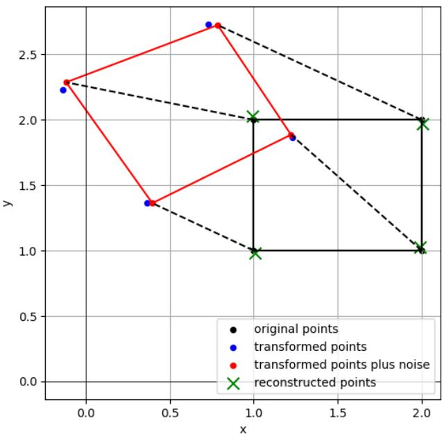  
Figure 1. Original black key points $s _ { i }$ within image $s$ are observable as red key points $d _ { i }$ in image D under a different perspective. Key point detection was noisy $( \sigma _ { n } ^ { 2 } )$ , illustrated when comparing it to the noiseless (blue) points. The probabilistically inferred inverse transformation $\mathbf { R } _ { \mathrm { m } } ^ { - 1 }$ applied to red points $d _ { i }$ yields the reconstructed (green) crosses and proofs the concept.

We provide a first proof of the derived concept with a simple example in 2 dimensions and without using homogeneous coordinates. An experiment setup with projective transformations and homogenous coordinates is described in Sec. 5.1. Assume we identified four key points in the images S (original) and D (other perspective). We do not know the transformation between the keypoints and have no prior knowledge about the transformation, i.e. $\sigma _ { u } ^ { - 2 } = $ $\sigma _ { v } ^ { - 2 } = 0$ . We further assume to know how precise the keypoint detection algorithm works, i.e. the noise covariance $\sigma _ { n } ^ { 2 } > 0$ is known. For the sake of convenience we choose a rotation matrix, parametrized by rotation angle Θ.

For a simple experiment, we choose $\Theta = \pi / 6 , \sigma _ { n } ^ { 2 } =$ $1 0 ^ { - 2 }$ to generate mock data,

$$
d ^ { \mathrm { m o c k } } = \mathbf { R } ^ { \mathrm { m o c k } } s + n = \left[ \begin{array} { l l } { 0 . 8 7 } & { - 0 . 5 } \\ { 0 . 5 } & { 0 . 8 7 } \end{array} \right] s + n .\tag{36}
$$

Reconstruction of transformation matrix $\mathbf { R } _ { \mathrm { m } } .$ , given mock data points $d ^ { \mathrm { m o c k } }$ and s, by applying equation (30) and equations (33,35) for uncertainty quantification, yields

$$
\mathbf { R } _ { \mathrm { m } } = \left[ \begin{array} { c c } { 0 . 8 6 } & { - 0 . 4 8 } \\ { 0 . 4 9 } & { 0 . 8 9 } \end{array} \right] \pm \left[ \begin{array} { c c } { 0 . 0 2 } & { 0 . 0 2 } \\ { 0 . 0 2 } & { 0 . 0 2 } \end{array} \right] .\tag{37}
$$

Fig. 1 visualizes the results of this experiment and serves as first PoC for optimally inferring the transformation from noisy data.

## 4. Image and perspective noise

Uncertainty in homographic projections can arise from different sources and at different stages of the imaging process. Conventional feature-localization uncertainty is introduced in the image plane and is therefore modeled as additive noise after perspective normalization (details below). Before that, deviations of the underlying imaging geometry already act on the projective mapping itself. Examples include uncertainty in camera intrinsics or extrinsics, uncertainty in a previously estimated homography, temporal misalignment between cameras observing a dynamic scene, and small geometric deviations of the observed surface from the assumed planar model. Thus, additive homogeneous noise is not introduced as an alternative representation of pixel noise, but as a local stochastic model of uncertainty in the geometry or in the physical process underlying the projection.

The homogeneous measurement model is given by

$$
d _ { \mathrm { H } } = \mathbf { R } s _ { \mathrm { H } } + n _ { \mathrm { H } } \ ,\tag{38}
$$

where $s _ { \mathrm { H } }$ and $d _ { \mathrm { H } }$ denote a single matched pair of homogeneous source and target keypoints, respectively, and $n _ { \mathrm { H } } = \left\lceil n _ { x } n _ { y } n _ { w } \right\rceil ^ { t } \sim \mathcal { G } \left( 0 , \mathbf { N } _ { \mathrm { H } } \right) , \mathbf { N } _ { \mathbf { H } } \in \mathbb { R } ^ { \left( 3 \times 3 \right) } \mathrm { ~ d e }$ notes the noise in homogeneous coordinates. Note that for simplicity, the point index i is omitted throughout this section unless explicitly required. All derived relations apply individually to each pair of matched points.

The homogeneous projection $\mathbf { R } s _ { \mathrm { H } }$ contains the projective component $w : = ( { \bf R } s _ { \mathrm { H } } ) _ { 3 } = r _ { 3 1 } s _ { x } + r _ { 3 2 } s _ { y } + r _ { 3 3 }$ , which is used for perspective normalization. Note that $r _ { 3 3 } = 1$ in all cases due to normalization of the homography matrix.

Projection of Eq. (38) onto the two-dimensional Euclidean image plane yields

$$
d _ { \mathrm { P } } = \mathrm { P } ( d _ { \mathrm { H } } ) = \frac { ( \mathbf { R } s _ { \mathrm { H } } ) _ { [ 1 : 2 ] } + ( n _ { \mathrm { H } } ) _ { [ 1 : 2 ] } } { w + n _ { w } } \mathrm { ~ , ~ }\tag{39}
$$

and introduces non-linearity into the measurement model, where subscript P denotes projected quantities and $\mathrm { P } ( \cdot )$ is the projection operator. Pixel noise introduced directly in the two-dimensional Euclidean image space is a common special case in image-based CV problems. While the homogeneous measurement model, Eq. (38), with $n _ { w } ~ = ~ 0$ remains applicable in close-to-affine scenarios (w ≈ 1) and low noise cases, $n \ll 1$ , we have to account for nonlinearities otherwise.

Keypoint observations are commonly modeled by additive Gaussian noise [13, 26],

$$
d _ { \mathrm { P } } = \mathrm { P } \left( \mathbf { R } \tilde { s } _ { \mathrm { P } } \right) + n _ { \mathrm { P } } , \qquad n _ { \mathrm { P } } \sim \mathcal { G } ( 0 , \mathbf { N } _ { \mathrm { P } } ) ,\tag{40}
$$

where $s _ { \mathrm { P } }$ and $d _ { \mathrm { P } }$ denote a single matched pair of source and target image keypoints, respectively, ˜· denotes the normalized homogeneous representation of an image point.

To model pixel noise we set $n _ { w } = 0$ in Eq. (39). Comparison with Eq. (40) gives $( n _ { \mathrm { H } } ) _ { [ 1 : 2 ] } = w n _ { \mathrm { P } }$ and therefore

$$
\left( { \bf N } _ { \mathrm { H } } \right) _ { [ 1 : 2 , 1 : 2 ] } = w ^ { 2 } { \bf N } _ { \mathrm { P } } \mathrm { ~ . ~ }\tag{41}
$$

Thus, Gaussian measurement noise specified in image coordinates can be represented in homogeneous coordinates by scaling its covariance with the squared projective component w. Considering Eq. (41) and after simple rearranging, Eq. (40) becomes

$$
\tilde { d } _ { \mathrm { P } } = \frac { 1 } { w } { \bf R } \tilde { s } _ { \mathrm { P } } + \tilde { n } _ { \mathrm { P } } .\tag{42}
$$

Since w depends on R and each signal point $s _ { i }$ itself, Eq. (42) is still a nonlinear inference problem that might be solved by methods of variational inference. To still use the linear model derived in Sec. 3, we propose the following approach: We initially assume that R and w are independent and alternately infer R using Eq. (24) for a fixed $1 / w ,$ , and 1/w for a fixed R. During this process, the mean of $1 / w$ is also estimated by a Wiener filter in each iteration step,

$$
\left( \frac { 1 } { w _ { i } } \right) _ { m } = \left[ W _ { \mathrm { i n v , i } } ^ { - 1 } + ( x ^ { i } ) ^ { t } \mathbf { N } _ { \mathrm { P } } ^ { - 1 } ( x ^ { i } ) \right] ^ { - 1 }\tag{43}
$$

$$
\times \left( ( x ^ { i } ) ^ { t } { \bf N } _ { \mathrm { P } } ^ { - 1 } { \tilde { d } } _ { \mathrm { P } } ^ { i } + W _ { \mathrm { i n v , i } } ^ { - 1 } { \overline { { \left( { \frac { 1 } { w _ { i } } } \right) } } } \right) \ \forall i \ ,\tag{44}
$$

where $W _ { \mathrm { i n v } , i }$ denotes the prior variance of $1 / w _ { i } , \overline { { ( 1 / w _ { i } ) } }$ its prior mean, and $x ^ { i } \equiv \mathbf { R } \tilde { s } _ { \mathrm { F } } ^ { i }$ . This process repeats until convergence, e.g., when the changes in $\mathbf { R } _ { \mathrm { m } }$ between iterations fall below a certain threshold. By initializing the approach with a good choice for R (e.g. the DLT solution), convergence is accelerated.

## Non-Gaussian noise

Although the derivation in Sec. 3 uses a Gaussian noise model, the results are valid for other noise models. Let ${ \mathcal { P } } _ { n }$ be a general noise distribution. Then the likelihood is given by

$$
\mathcal { P } ( d \vert \mathbf { R } , s ) = \mathcal { P } _ { n } ( d - \hat { \mathbf { R } } s ) \ .\tag{45}
$$

To keep the approach analytically, but without loss of generality for non-Gaussian noise, one might use a conjugate prior with regard to the noise probability distribution $\mathcal { P } _ { \mathrm { c o n j u g a t e } } ( \mathbf { R } )$ to include prior knowledge of R. Hence, the posterior information reads

$$
\mathcal { H } ( \mathbf { R } \mid d , s ) = - \ln \mathcal { P } _ { n } ( d - \hat { \mathbf { R } } s ) - \ln \mathcal { P } _ { \mathrm { c o n j u g a t e } } ( \mathbf { R } ) + \mathcal { H } _ { 0 } .\tag{46}
$$

Following Secs. 3.3 to 3.5 one might derive analytical expressions for the posterior mean or maximum, depending on the specific noise/prior distribution used.

## 5. Experimental Setup

## 5.1. Synthetic Data

This proof of concept is an extension of Sec. 3.6 in homogeneous coordinates and for projective transformations. Again, all parameters $( \mathbf { R } ^ { \mathrm { m o c k } }$ , sH and $d _ { \mathrm { H } } ^ { \mathrm { m o c k } } )$ are known. The noise is modeled according to Sec. 4. Noise levels are given in the units of the synthetic coordinate system. For numerical stability, Hartley normalization [12, 13] is applied to the noisy keypoints before homography estimation.

For a given noise level, 100 independent runs are performed. In each run, a new noise vector is sampled and added to $\mathbf { R } ^ { \mathrm { m o c k } } s _ { \mathrm { H } }$ A posterior mean homography matrix $\mathbf { R } _ { \mathrm { m } }$ and its parameter uncertainty (Eqs. (32) and (35)) are then inferred using Eq. (24). The iterative BI (Eq. (24), Eq. (44)) is considered converged when between two consecutive iterations the relative change between the homography matrices and the displacement of the transformed keypoints fall below certain thresholds $( \epsilon _ { \Delta \mathbf { R } } =$ $1 0 ^ { - 6 } , \ \epsilon _ { \Delta \mathrm { p o i n t s } } \ = \ 1 0 ^ { - 3 } )$ . For comparison, DLT is applied to the same noisy keypoint correspondences in each run. The estimated homographies are applied to the source keypoints and compared to the noise-free target keypoints $\mathbf { R } ^ { \mathrm { m o c k } } s _ { \mathrm { H } }$ . The resulting Root Mean Squared Error (RMSE) (see details in Sec. 5.2) is calculated for each run and averaged over the 100 independent noise realizations. This procedure is repeated for several noise levels to evaluate the estimation accuracy under increasing observation noise. Results can be found in Fig. 2 and are discussed in the subsequent section.

## 5.2. Image Stitching Experiment

In a next step, we extend the PoC to image stitching, using images from the StitchBench dataset collection [6] and HPatches [2]. The proprosed method is still applied in a controlled environment, but now not all parameters are known, namely R and $w _ { i }$ (see Sec. 4). $s _ { \mathrm { P } }$ and $d _ { \mathrm { P } }$ are detected using Scale Invariant Feature Transform (SIFT) [16] and are matched between the two images. In total, only four2 keypoint pairs across foreground and background regions are selected and used for homography estimation. No additional outlier removal is implemented. Noise samples of different zero mean Gaussian noise are added to the homogeneous destination coordinates ${ \tilde { d } } _ { \mathrm { P } }$ which acts as $d _ { \mathrm { H } }$ . A second set of correspondences is selected as a test set and is not used during homography estimation. For both DLT and the Bayesian estimator, Hartley normalization [12, 13] is applied to $s _ { \mathrm { H } } , \ d _ { \mathrm { H } }$ and the estimated homographies are transformed back to the original image coordinate system for evaluation. The probabilistic estimation of $( 1 / w ) _ { \mathrm { m } }$ and $\mathbf { R } _ { \mathrm { m } }$ is done as described in Sec. 4. $\mathbf { R } ^ { \mathrm { i n i t } }$ is initialized using either DLT or a single run using the Bayesian estimator. For the estimation of $\mathbf { R } _ { \mathrm { B a y e s } } ^ { \mathrm { i n i t } }$ a zero mean prior is assumed, because of a lack of further information on the true homography matrix. Regardless of the initialization method, $\mathbf { R } ^ { \mathrm { i n i t } }$ is used for the initialization of wˆ and as the prior mean for R during inference. Performance is evaluated using the two-dimensional RMSE between the original destination keypoints and the corresponding source keypoints of the test data set transformed by the estimated homographies. The Bayesian estimator additionally reports the posterior 1σ standard deviations of the inferred homography parameters as parameter uncertainty. Convergence of the iterative estimator is controlled according to the criteria introduced in Sec. 5.1. See Fig. 3 and Appendix B for representative examples and Sec. 6 for further discussion.

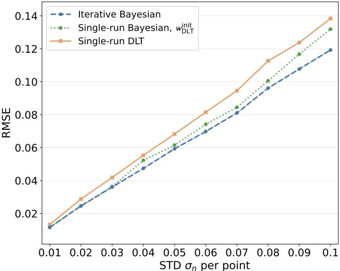  
(a) Mean RMSE over 100 runs.

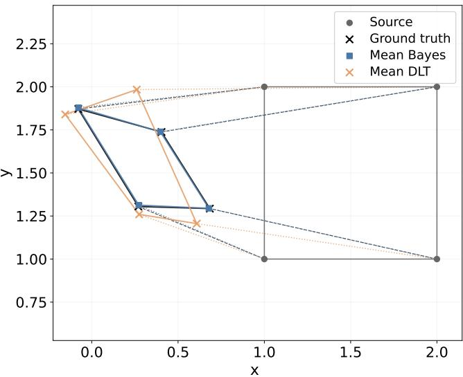  
(b) Mean homography matrices over 100 runs for $\sigma _ { \mathrm { n } } = 0 . 0 4$  
Figure 2. Results for the experiment given a projective transformation.

## 6. Results

## 6.1. Synthetic Data

The experiment was performed for the complete range of considered noise levels $\begin{array} { r c l } { \mathbf { N } _ { \mathrm { P } } } & { = } & { \mathbf { d i a g } ( \sigma _ { n } ^ { 2 } ) , \sigma _ { n } \quad \in } \end{array}$ $\{ 0 . 0 1 , 0 . 0 2 , \ldots , 0 . 1 0 \}$ and the ground truth matrices,

$$
\mathbf { R } _ { \mathrm { a f f i n e } } ^ { \mathrm { m o c k } } = \left[ \begin{array} { c c c } { 0 . 8 6 } & { - 0 . 5 0 } & { 0 . 0 2 } \\ { 0 . 5 0 } & { 0 . 8 6 } & { 0 . 5 0 } \\ { 0 . 0 0 } & { 0 . 0 0 } & { 1 . 0 0 } \end{array} \right] \mathrm { ~ , ~ }
$$

$$
\mathbf { R } _ { \mathrm { p r o j e c t i v e } } ^ { \mathrm { m o c k } } = \left[ \begin{array} { c c c } { 0 . 8 6 } & { - 0 . 5 0 } & { 0 . 0 2 } \\ { 0 . 5 0 } & { 0 . 8 6 } & { 0 . 5 0 } \\ { 0 . 4 0 } & { 0 . 0 3 } & { 1 . 0 0 } \end{array} \right] \mathrm { ~ , ~ }\tag{47}
$$

with results being aggregated over 100 runs per noise level. Note that as discussed in $\mathrm { S e c . ~ } 4 , n _ { w } = 0$ , but $( \mathbf { N } _ { \mathrm { H } } ) _ { 3 3 } \approx 0$ to avoid matrix singularity. To reflect only little knowledge about R, high values for the prior parameters are chosen: $\mathbf { U } _ { \mathrm { a f f i n e } } ~ = ~ \mathbf { d i a g } ( 1 0 , 1 0 , 1 0 ^ { - 4 } ) , ~ \mathbf { V } _ { \mathrm { a f f n e } } ~ = ~ \mathbf { d i a g } ( 1 , 1 , 2 . 5 )$ and $\begin{array} { r l r } { { \bf U } _ { \mathrm { p r o j e c t i v e } } } & { { } = } & { { \bf d i a g } ( 1 0 , 1 0 , 2 . 5 ) } \end{array}$ $\begin{array} { r l } { \mathbf { V } _ { \mathrm { p r o j e c t i v e } } } & { { } = } \end{array}$ $\mathbf { d i a g } ( 1 . 0 )$ . We modify this assumption in the image stitching proof of concept as described in Sec. 5.2. In the projective case, the third row of R should not be pushed towards an affine solution, which is why $\mathbf { U } _ { 3 3 } , \mathbf { V } _ { 3 3 }$ differ in the affine and projective cases.

Fig. 2 shows results for the projective case. The graphs in Fig. 2a show the mean RMSE for the different estimation methods per noise level. Fig. 2a depicts a standard DLT solution (orange), a single-run BI estimation, where the DLT solution has been used for initialization of w (Sec. 4) (green) and the proposed iterative BI (blue) method. For the iterative BI method w has been initialized separately with 1 and $w _ { \mathrm { D L T } } ^ { \mathrm { i n i t } }$ . Both initializations lead to non-distinguishable overlapping curves, which is why only a single iterative Bayesian curve is shown. Accuracy improves with iterative optimization, whereas the single-run BI method performs between the iterative approach and standard DLT while additionally providing uncertainty quantification. Although all three methods perform better in lower noise levels, the difference between DLT and BI increases, with our proposed method achieving lower RMSE. The ground truth transformation (black) in Fig. 2b is accurately matched by the mean homography inferred with our proposed method (blue). The orange DLT solution under noise differs considerably from the real transformation. This is expected because our proposed method shows lower spread across the

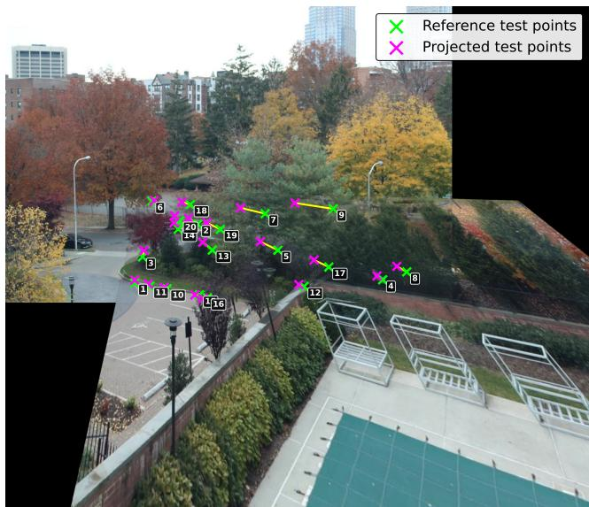  
(a) DLT estimation (RMSE= 47.47 px). The DLT solution is visibly distorted.

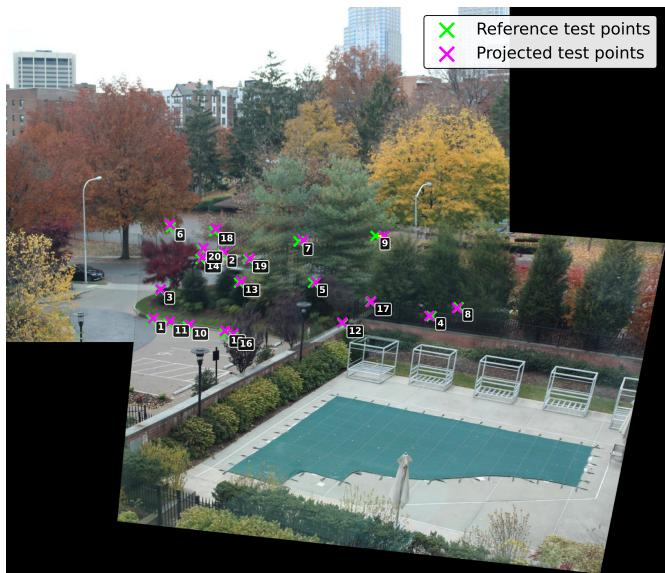  
(b) Iterative Bayesian approach with probabilistic estimation of w and initialization with Bayes (RMSE= 8.92 px).

Figure 3. Comparison of a stitched panorama with four point correspondences estimated by DLT (left) and our proposed iterative Bayesian approach (right) on images from the StitchBench[6]/AANAP skyline[15] dataset.

individual homography parameters and DLT shows extreme cases in outliers for each matrix parameter, which leads to the distorted transformations. Comparing the mean estimates over 100 runs, the iterative Bayesian method is considerably closer to the ground-truth homography than the DLT estimate. See Appendix A.2 for the numerical parameters and Appendix A.1 for the affine experiment results. This PoC in a controlled environment demonstrates that the theory behind the proposed approach is solid even for projective transformations.

## 6.2. Image Stitching Example

The image sets used are AANAP/skyline [15], NISwGSP-06 PalazzoPubblico [7], OBJ-GSP-03 river, Aerial/Restaurant, included in the StitchBench dataset collection [6], and HPatches/v graffiti [2]. For AANAP/skyline, Gaussian noise with $\begin{array} { r l r } { \sigma _ { n } } & { { } = } & { 1 0 . 0 \mathrm { p } } \end{array}$ x is added to $d _ { \mathrm { H } }$ . The DLT solution (Fig. 3a) shows visible distortion with an RMSE of 47.42 px and a runtime of 1 ms. With empirically selected parameters, initialization using $\hat { w } _ { \mathrm { B a y e s } } ^ { \mathrm { i n i t } }$ , and a prior of (V ⊗ U) = diag(0.1), the iterative Bayesian approach converges after 184 iterations in 2.18 ms and reduces the RMSE to 8.92 px (Fig. 3b). The corresponding homography matrices are provided in Appendix B.1, along with stitching results other than those shown in Fig. 3 (Appendix B.2–B.5).

For v graffiti, Gaussian noise with $\sigma _ { n } = 5 . 0$ px is used and the iterative approach is initialized with DLT without a prior. While DLT requires 1.43 ms and reaches an RMSE of 16.95 px, the iterative approach requires 1507 iterations and 1679 ms but improves the initial solution to 14.11 px. Thus, despite initialization with DLT, the iterative estimation further optimizes the homography based on the introduced projective information. Detailed matrices and the resulting panorama are provided in Appendix B.2.

With this PoC, we have demonstrated, that the iterative Bayesian approach with pixel noise is able to outperform the DLT method, even though we introduced the initial independence of w and R. If the proposed method is efficiently initialized, it can derive better results as the initialization method. In scenarios where the iterative method is not improving from the initial DLT guess, our approach still adds uncertainty quantification to the mean estimator.

## 7. Conclusion

This work presented a Bayesian formulation for homography estimation that incorporates measurement uncertainty and prior knowledge and provides posterior estimates of the homography parameters and their uncertainty. A closedform solution has been derived for the posterior mean in the linear homogeneous-noise model and has been extended by an iterative approach to account for the nonlinearities introduced by perspective normalization in the pixel-noise case. Proof-of-concept experiments on synthetic data and real image correspondences demonstrate the applicability of the proposed formulations under their respective assumptions. It demonstrates the feasibility of Bayesian homography estimation with explicit incorporation of measurement and parameter uncertainty.

The further development of the iterative Bayesian PoCmethod for the nonlinear pixel-noise case to some direct Bayesian method, followed by an intensive benchmark comparison using this direct method is left for future work. Additionally, research on the application of the presented Bayesian method to uncertainty in the geometry or in the physical process underlying the projection is planned.

## Acknowledgements

This research was funded by the Free State of Bavaria, Germany, through the Hightech Agenda Bayern, and supported by the Technical University of Applied Sciences Augsburg and its Technology Transfer Center (TTZ) Data Science and Autonomous Systems Landsberg am Lech. The authors would also like to thank Adrian Schlosser for his valuable feedback on the manuscript.

## References

[1] Milica Badza Atanasijeviˇ c, Tijana Radovi´ c, Milica M.´ Jankovic, and Marko Barjaktarovi´ c. Open-source application´ for MRI and CT registration using homography transformation. In Proceedings of the 9th International Conference on Bioinformatics Research and Applications, pages 111–115, Berlin Germany, 2022. ACM. 1

[2] Vassileios Balntas, Karel Lenc, Andrea Vedaldi, and Krystian Mikolajczyk. Hpatches: A benchmark and evaluation of handcrafted and learned local descriptors. In CVPR, 2017. 6, 8, 11

[3] Fatih Baykal, Mehmet ˙Irfan Gedik, Constantino Carlos Reyes-Aldasoro, and Cefa Karabag. Image matching for˘ UAV geolocation: Classical and deep learning approaches. Journal ofImaging, 11(11):409, 2025. 1

[4] Arturo Del Castillo Bernal, Philippe Decoste, and James Richard Forbes. Bayesian filtering for homography estimation. IEEE Robotics and Automation Letters, 8 (12):8216–8223, 2023. Publisher: Institute of Electrical and Electronics Engineers (IEEE). 1, 2

[5] Massimo Bertozzi, Alberto Broggi, and Alessandra Fascioli. Stereo inverse perspective mapping: Theory and applications. Image and Vision Computing, 16(8):585–590, 1998. 1

[6] Wenxiao Cai and Wankou Yang. Object-level geometric structure preserving for natural image stitching. In Proceedings of the AAAI Conference on Artificial Intelligence, pages 1926–1934, 2025. 6, 8, 10, 11

[7] Yu-Sheng Chen and Yung-Yu Chuang. Natural image stitching with the global similarity prior. In Proceedings of European Conference on Computer Vision (ECCV 2016), pages V186–201, 2016. 8, 11

[8] Paul Johannes Claasen and Johan Pieter De Villiers. Videobased sequential Bayesian homography estimation for soccer field registration. Expert Systems with Applications, 252: 124156, 2024. 1, 2

[9] Martin A. Fischler and Robert C. Bolles. Random sample consensus: A paradigm for model fitting with applications to

image analysis and automated cartography. Communications ofthe ACM, 24(6):381–395, 1981. 1

[10] Andrew Gelman, John B. Carlin, Hal S. Stern, David B. Dunson, Aki Vehtari, and Donald B. Rubin. Bayesian Data Analysis. CRC Press, Taylor & Francis Group, Boca Raton, third edition edition, 2014. 1, 2

[11] Ramon Guti´ errez-Moizant, Mar´ ´ıa Jesus L. Boada, Mar´ ´ıa Ram´ırez-Berasategui, and Abdulla Al-Kaff. Novel Bayesian Inference-Based Approach for the Uncertainty Characterization of Zhang’s Camera Calibration Method. Sensors, 23 (18):7903, 2023. Publisher: MDPI AG. 1, 2

[12] R.I. Hartley. In defense of the eight-point algorithm. IEEE Transactions on Pattern Analysis and Machine Intelligence, 19(6):580–593, 1997. 6

[13] Richard Hartley and Andrew Zisserman. Multiple View Geometry in Computer Vision. Cambridge University Press, 2 edition, 2004. 1, 5, 6

[14] T. Kailath. A view of three decades of linear filtering theory. IEEE Transactions on Information Theory, 20(2):146–181, 1974. 4

[15] Chung-Ching Lin, Sharathchandra U. Pankanti, Karthikeyan Natesan Ramamurthy, and Aleksandr Y. Aravkin. Adaptive as-natural-as-possible image stitching. In Proceedings of the IEEE Conference on Computer Vision and Pattern Recognition (CVPR), pages 1155–1163, 2015. 8, 10

[16] David G. Lowe. Distinctive image features from scaleinvariant keypoints. International Journal of Computer Vi sion, 60(2):91–110, 2004. 6

[17] Kapil Mundada, Shivam Dapkekar, Shambhavi Deshpande, Raghav Deshpande, and Sweety Deshmane. Automated X-Ray Image Stitching for Enhanced Medical Diagnostics and Visualization. In 2025 2nd International Conference on Integration of Computational Intelligent System (ICICIS), pages 1–6, Lohegaon, India, 2025. IEEE. 1

[18] Raul Mur-Artal, J. M. M. Montiel, and Juan D. Tard´ os. Orb-´ slam: A versatile and accurate monocular SLAM system. IEEE Transactions on Robotics, 31(5):1147–1163, 2015. 1

[19] Rahul Raguram, Jan-Michael Frahm, and Marc Pollefeys. Exploiting uncertainty in random sample consensus. In 2009 IEEE 12th International Conference on Computer Vision, pages 2074–2081, Kyoto, 2009. IEEE. 1

[20] Lujie Song, Haibo Zou, Zhenyu Ji, Xiaoming Xie, and Wei Li. A novel iterative matching scheme based on homography method for x-ray image. Journal of Mechanics in Medicine and Biology, 20(06):2050038, 2020. 1

[21] R. Sundareswara and P.R. Schrater. Bayesian modelling of camera calibration and reconstruction. In Fifth International Conference on 3-D Digital Imaging and Modeling (3DIM’05), pages 394–401, Ottawa, ON, Canada, 2005. IEEE. 1, 2

[22] Richard Szeliski. Image alignment and stitching: A tutorial. Foundations and Trends® in Computer Graphics and Vision, 2(1):1–104, 2007. 1

[23] Richard Szeliski. Computer Vision: Algorithms and Appli cations. Springer International Publishing, Cham, 2022. 1

[24] Norbert Wiener. Extrapolation, Interpolation, and Smoothing of Stationary Time Series: With Engineering Applications. The MIT Press, 1949. 4

[25] Ju Hee Yoo, Ho Gi Jung, and Jae Kyu Suhr. Accurate road user position estimation for v2i using point clouds from mobile mapping systems. Electronics, 15(6), 2026. 1

[26] Z. Zhang. A flexible new technique for camera calibration. IEEE Transactions on Pattern Analysis and Machine Intelligence, 22(11):1330–1334, 2000. 1, 2, 5

[27] Chunyang Zhao and Huaici Zhao. Accurate and robust feature-based homography estimation using HALF-SIFT and feature localization error weighting. Journal of Visual Communication and Image Representation, 40:288– 299, 2016. 1

## A. Synthetic results

## A.1. Affine transformation

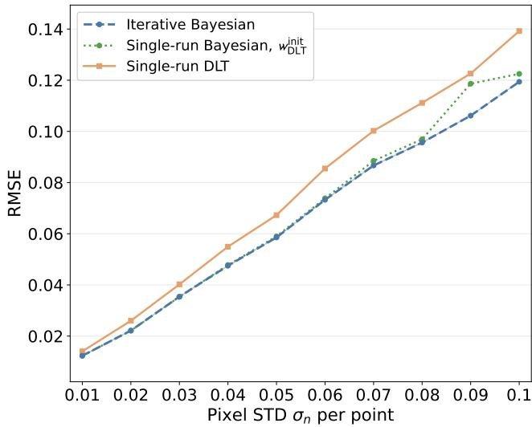  
Figure 4. Affine scenario: Mean RMSE over 100 runs. Iterative Bayesian (Blue) performs best, while Single run Bayesian $( w _ { \mathrm { i n i t } } ^ { \mathrm { D L T } } )$ performs similarly, unlike in the projective case.

The inferred Bayesian parameters $\mathbf { R } _ { \mathrm { m } } ^ { \mathrm { B a y e s 3 } }$ and the DLT solution $\mathbf { R } ^ { \mathrm { D L T } }$ for the affine case at $\sigma _ { n } = 0 . 0 4$ are

$$
\mathbf { R } ^ { \mathrm { D L T } } = \left[ \begin{array} { c c c } { 0 . 9 3 } & { - 0 . 5 2 } & { - 0 . 0 2 } \\ { 0 . 5 8 } & { 0 . 9 8 } & { 0 . 3 8 } \\ { 0 . 0 2 } & { 0 . 0 3 } & { 1 . 0 0 } \end{array} \right] ~ ,\tag{48}
$$

$$
\begin{array} { r l } { \mathbf { R } _ { \mathrm { m } } ^ { \mathrm { B a y e s } } = \left[ \begin{array} { l l l } { 0 . 8 7 } & { - 0 . 5 0 } & { 0 . 0 2 } \\ { 0 . 5 0 } & { 0 . 8 7 } & { 0 . 5 0 } \\ { 0 . 0 0 } & { 0 . 0 0 } & { 1 . 0 0 } \end{array} \right] } & { } \\ { \pm \left[ \begin{array} { l l l } { 0 . 0 4 } & { 0 . 0 4 } & { 0 . 0 9 } \\ { 0 . 0 4 } & { 0 . 0 4 } & { 0 . 0 9 } \\ { 0 . 0 0 } & { 0 . 0 0 } & { 0 . 0 0 } \end{array} \right] . } \end{array}\tag{49}
$$

(50)

In contrast to the projective case, the single-run BI follows the iterative solution more closely, as the affine transformation does not introduce a projective scale w. Iterative optimization consistently achieves the lowest RMSE. At $\sigma _ { n } ~ = ~ 0 . 0 4$ , the Bayesian estimate closely recovers the ground-truth affine transformation, while the DLT estimate shows larger parameter deviations. Isotropic noise yields identical uncertainties in the first two rows, while $( \mathbf { N } _ { \mathrm { H } } ) _ { 3 3 } ~ \ll ~ 1$ introduces small near-zero uncertainties in the third row despite $n _ { w } = 0$

## A.2. Projective transformation

The inferred Bayesian parameters $\mathbf { R } _ { \mathrm { m } } ^ { \mathrm { B a y e s } }$ and the DLT $\mathbf { R } ^ { \mathrm { D L T } }$ solution of the projective case at $\sigma _ { n } = 0 . 0 4$ are

$$
\mathbf { R } _ { \mathrm { m } } ^ { \mathrm { D L T } } = \left[ \begin{array} { l l l } { 0 . 1 4 } & { - 0 . 2 4 } & { 0 . 2 8 } \\ { - 0 . 1 8 } & { - 0 . 0 5 } & { 1 . 0 4 } \\ { - 0 . 1 2 } & { - 0 . 2 3 } & { 1 . 0 0 } \end{array} \right] \ \mathrm { ~ , ~ }\tag{51}
$$

$$
\begin{array} { r } { \mathbf { R } _ { \mathrm { m } } ^ { \mathrm { B a y e s } } = \left[ \begin{array} { l l l } { 0 . 8 5 } & { - 0 . 5 0 } & { 0 . 0 4 } \\ { 0 . 4 9 } & { 0 . 8 7 } & { 0 . 5 2 } \\ { 0 . 4 0 } & { 0 . 0 3 } & { 1 . 0 0 } \end{array} \right] } \\ { \pm \left[ \begin{array} { l l l } { 0 . 0 7 } & { 0 . 0 6 } & { 0 . 1 4 } \\ { 0 . 0 7 } & { 0 . 0 6 } & { 0 . 1 4 } \\ { 0 . 0 0 } & { 0 . 0 0 } & { 0 . 0 0 } \end{array} \right] . } \end{array}\tag{52}
$$

(53)

The uncertainty structure follows the same noise assumptions as in the affine case.

## B. Image stitching results

## B.1. AANAP/skyline

The numerical transformation parameters for the AANAP skyline [15] images from the StitchBench [6] dataset collection are

$$
\mathbf { R } ^ { \mathrm { D L T } } = \left[ \begin{array} { c c c } { 0 . 5 4 } & { - 0 . 5 0 } & { 4 6 4 . 6 3 } \\ { - 0 . 0 9 } & { 0 . 1 7 } & { 6 3 1 . 9 7 } \\ { 0 . 0 0 } & { 0 . 0 0 } & { 1 . 0 0 } \end{array} \right] ~ ,\tag{54}
$$

$$
\begin{array} { r l r } { \mathbf { R } _ { \mathrm { m } } ^ { \mathrm { B a y e s } } = \left[ \begin{array} { l l l } { 0 . 9 6 } & { - 0 . 0 6 } & { 4 2 6 . 5 8 } \\ { 0 . 0 5 } & { 1 . 0 5 } & { 6 0 5 . 4 7 } \\ { 0 . 0 0 } & { 0 . 0 0 } & { 1 . 0 0 } \end{array} \right] } & { } & \\ { \pm \left[ \begin{array} { l l l } { 0 . 0 1 } & { 0 . 0 3 } & { 0 . 3 2 } \\ { 0 . 0 1 } & { 0 . 0 3 } & { 0 . 3 2 } \\ { 0 . 0 1 } & { 0 . 0 1 } & { 0 . 3 2 } \end{array} \right] . } & { } & \end{array}\tag{55}
$$

(56)

For the resulting panoramas see Fig. 3 in the main paper.   
The low uncertainty is a result of the chosen prior.

## B.2. HPatches/v graffiti

The numerical transformation parameters for the HPatches/v graffiti images4 [2] are

$$
\mathbf { R } ^ { \mathrm { { D L T } } } = \left[ \begin{array} { r r r } { 0 . 8 5 } & { - 0 . 3 6 } & { 1 3 0 . 7 0 } \\ { 0 . 1 6 } & { 0 . 8 1 } & { - 8 7 . 0 2 } \\ { 0 . 0 0 } & { 0 . 0 0 } & { 1 . 0 0 } \end{array} \right] ~ ,\tag{57}
$$

$$
\begin{array} { r l r } { \mathbf { R } _ { \mathrm { m } } ^ { \mathrm { B a y e s } } = \left[ \begin{array} { l l l } { 1 . 1 9 } & { - 0 . 4 0 } & { 8 7 . 2 9 } \\ { 0 . 2 7 } & { 1 . 0 4 } & { - 1 5 1 . 8 0 } \\ { 0 . 0 0 } & { 0 . 0 0 } & { 1 . 0 0 } \end{array} \right] } & { } & \\ { \pm \left[ \begin{array} { l l l } { 0 . 0 2 } & { 0 . 0 3 } & { 1 0 . 7 9 } \\ { 0 . 0 2 } & { 0 . 0 3 } & { 1 0 . 7 9 } \\ { 0 . 0 1 } & { 0 . 0 1 } & { 4 . 8 3 } \end{array} \right] . } & { } & \end{array}\tag{58}
$$

(59)

The resulting panoramas are shown in Fig. 5. Assuming isotropic noise as before, the iterative Bayesian estimate shows a lower RMSE than DLT for the considered point correspondences, with larger absolute translational uncertainties reflecting their pixel scale. Similar behavior in the following examples is not discussed further.

## B.3. OBJ-GSP-03 river

The numerical transformation parameters for the OBJ-GSP-03 river images from the StitchBench [6] dataset are

$$
\mathbf { R } ^ { \mathrm { D L T } } = \left[ \begin{array} { l l l } { 0 . 6 1 } & { 0 . 0 0 } & { 3 8 3 . 1 9 } \\ { - 0 . 2 5 } & { 0 . 7 9 } & { 1 4 8 . 5 3 } \\ { 0 . 0 0 } & { 0 . 0 0 } & { 1 . 0 0 } \end{array} \right] ~ ,\tag{60}
$$

$$
\begin{array} { r } { \mathbf { R } _ { \mathrm { m } } ^ { \mathrm { B a y e s } } = \left[ \begin{array} { l l l } { 0 . 6 6 } & { 0 . 0 1 } & { 3 8 1 . 5 4 ^ { 7 } } \\ { - 0 . 2 3 } & { 0 . 8 3 } & { 1 2 6 . 8 0 } \\ { 0 . 0 0 } & { 0 . 0 0 } & { 1 . 0 0 } \end{array} \right] } \\ { \pm \left[ \begin{array} { l l l } { 0 . 0 2 } & { 0 . 0 1 } & { 1 4 . 8 4 ^ { 7 } } \\ { 0 . 0 2 } & { 0 . 0 1 } & { 1 4 . 8 4 ^ { 7 } } \\ { 0 . 0 1 } & { 0 . 0 0 } & { 4 . 6 9 } \end{array} \right] . } \end{array}\tag{61}
$$

(62)

The resulting panoramas are shown in Fig. 6.

## B.4. Aerial/Restaurant

The numerical transformation parameters for the Aerial/Restaurant images5 from the StitchBench [6] dataset are

$$
\mathbf { R } ^ { \mathrm { D L T } } = \left[ \begin{array} { r r r } { 1 . 3 3 } & { - 0 . 0 8 } & { 1 0 8 . 9 4 } \\ { 0 . 1 3 } & { 1 . 3 6 } & { - 9 9 5 . 2 7 } \\ { 0 . 0 0 } & { 0 . 0 0 } & { 1 . 0 0 } \end{array} \right] ~ ,\tag{63}
$$

$$
\begin{array} { r l } { \mathbf { R } _ { \mathrm { m } } ^ { \mathrm { B a y e s } } = \left[ \begin{array} { l l l } { 0 . 9 7 } & { - 0 . 0 7 } & { 1 1 0 . 5 2 } \\ { 0 . 0 7 } & { 1 . 0 0 } & { - 6 4 9 . 4 8 } \\ { 0 . 0 0 } & { 0 . 0 0 } & { 1 . 0 0 } \end{array} \right] } & { { } } \\ { \pm \left[ \begin{array} { l l l } { 0 . 0 0 } & { 0 . 0 0 } & { 2 . 8 0 } \\ { 0 . 0 0 } & { 0 . 0 0 } & { 2 . 8 0 } \\ { 0 . 0 0 } & { 0 . 0 0 } & { 2 . 0 4 } \end{array} \right] . } \end{array}\tag{64}
$$

(65)

Table 1. Parameters of the image stitching examples.
<table><tr><td>Image</td><td> $\sigma _ { n } \left( \mathrm { p x } \right)$ </td><td>Method</td><td> $\hat { w } ^ { \mathrm { i n i t } }$ </td><td>Prior</td><td>RMSE (px)</td></tr><tr><td>Skyline</td><td>10.00</td><td>DLT</td><td></td><td></td><td>47.42</td></tr><tr><td>Skyline</td><td>10.00</td><td>Bayes</td><td> $\hat { w } _ { \mathrm { B a y e s } } ^ { \mathrm { i n i t } }$ </td><td>0.10</td><td>8.92</td></tr><tr><td>v-graffiti</td><td>5.00</td><td>DLT</td><td></td><td></td><td>16.95</td></tr><tr><td>v_graffiti</td><td>5.00</td><td>Bayes</td><td> $\hat { w } _ { \mathrm { D L T } } ^ { \mathrm { i n i t } }$ </td><td>None</td><td>14.11</td></tr><tr><td>River</td><td>10.00</td><td>DLT</td><td></td><td></td><td>17.03</td></tr><tr><td>River</td><td>10.00</td><td>Bayes</td><td> $\hat { w } _ { \mathrm { D L T } } ^ { \mathrm { i n i t } }$ </td><td>None</td><td>11.44</td></tr><tr><td>Restaurant</td><td>5.00</td><td>DLT</td><td></td><td></td><td>277.45</td></tr><tr><td>Restaurant</td><td>5.00</td><td>Bayes</td><td> $\hat { w } _ { \mathrm { B a y e s } } ^ { \mathrm { i n i t } }$ </td><td>10.00</td><td>235.88</td></tr><tr><td>Palazzo</td><td>5.00</td><td>DLT</td><td></td><td></td><td>14.48</td></tr><tr><td>Palazzo</td><td>5.00</td><td>Bayes</td><td> $\hat { w } _ { \mathrm { D L T } } ^ { \mathrm { i n i t } }$ </td><td>None</td><td>11.48</td></tr></table>

The resulting panoramas are shown in Fig. 7.

## B.5. NISwGSP-06 PalazzoPubblico

The numerical transformation parameters for the NISwGSP-06 PalazzoPubblico [7] images6 from the StitchBench [6] dataset collection are

$$
\mathbf { R } ^ { \mathrm { D L T } } = \left[ \begin{array} { c c c } { 2 . 8 1 } & { - 0 . 1 5 } & { - 3 1 4 5 . 3 0 } \\ { 0 . 7 8 } & { 2 . 7 4 } & { - 4 7 1 5 . 4 8 } \\ { 0 . 0 0 } & { 0 . 0 0 } & { 1 . 0 0 } \end{array} \right] ~ ,\tag{66}
$$

$$
\begin{array} { r l } { \mathbf { R } _ { \mathrm { m } } ^ { \mathrm { B a y e s } } = \left[ \begin{array} { l l l } { 2 . 3 9 } & { - 0 . 1 3 } & { - 2 6 5 1 . 5 5 } \\ { 0 . 6 3 } & { 2 . 3 5 } & { - 3 9 6 9 . 7 4 } \\ { 0 . 0 0 } & { 0 . 0 0 } & { 1 . 0 0 } \end{array} \right] } & { , } \\ { \equiv \left[ \begin{array} { l l l } { 1 . 3 0 } & { - 0 . 0 7 } & { - 1 4 4 0 . 4 2 } \\ { 0 . 3 4 } & { 1 . 2 7 } & { - 2 1 5 6 . 5 2 } \\ { 0 . 0 0 } & { 0 . 0 0 } & { 0 . 5 4 } \end{array} \right] } \\ { \mathrm { ~ d } } & { \geq \left[ \begin{array} { l l l } { 0 . 0 1 } & { 0 . 0 1 } & { 1 2 . 8 9 } \\ { 0 . 0 1 } & { 0 . 0 1 } & { 1 2 . 8 9 } \\ { 0 . 0 0 } & { 0 . 0 0 } & { 5 . 7 7 } \end{array} \right] . } \end{array}\tag{67}
$$

(68)

(69)

The resulting panoramas are shown in Fig. 8.

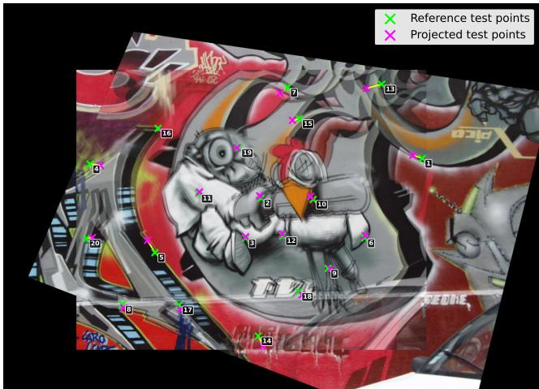  
(a) DLT estimation (RMSE= 16.95 px).

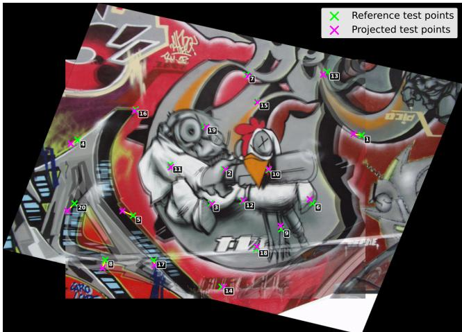  
(b) Iterative Bayesian approach (RMSE = 14.11 px).  
Figure 5. Comparison of a HPatches/v graffiti panorama.

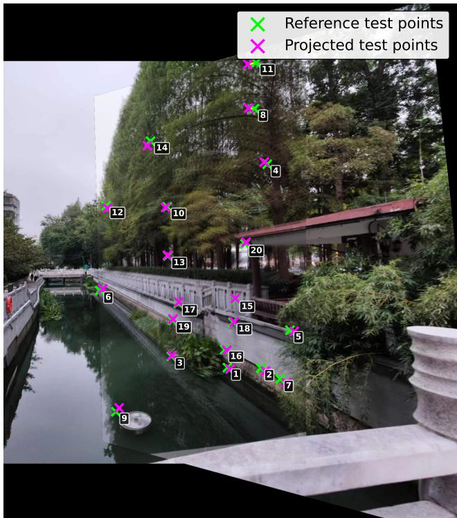  
(a) DLT estimation (RMSE= 17.03 px).

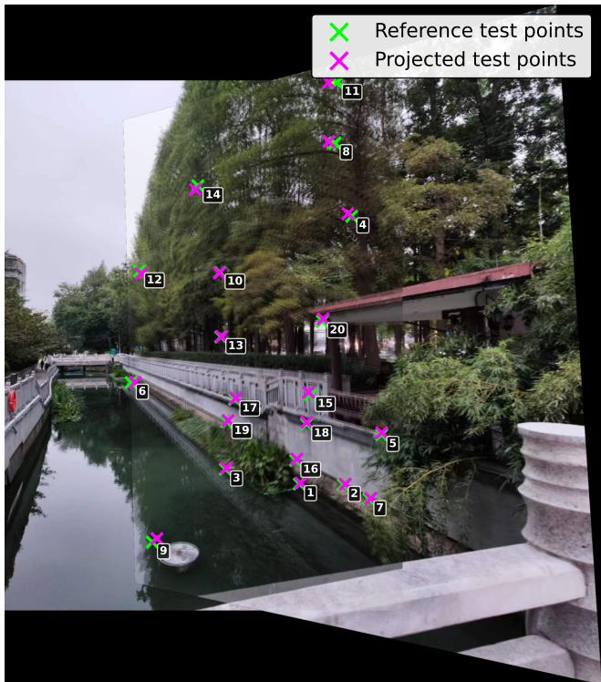  
(b) Iterative Bayesian approach (RMSE= 11.44px).  
Figure 6. Comparison of a OBJ-GSP-03 river panorama.

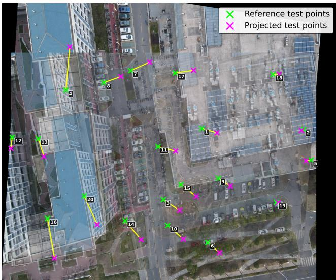  
(a) DLT estimation (RMSE= 277.45 px).

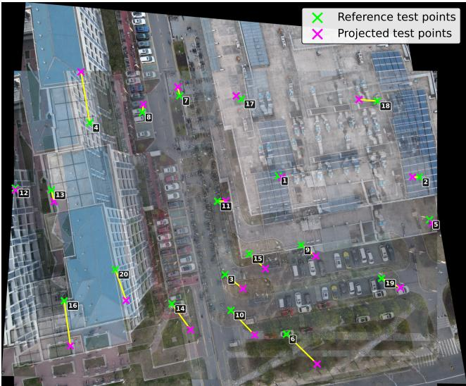  
(b) Iterative Bayesian approach (RMSE= 235.88, px).

Figure 7. Comparison of a Aerial/Restaurant panorama.  
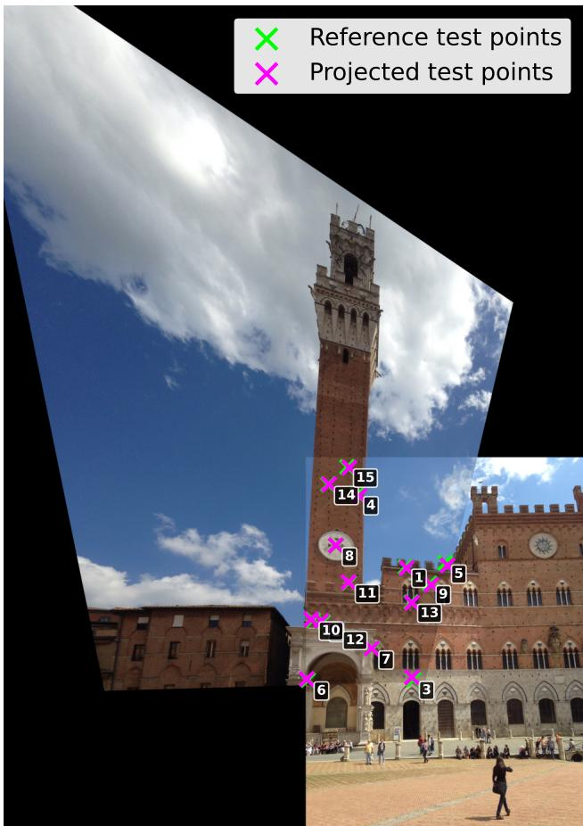  
(a) DLT estimation (RMSE= 14.48 px).

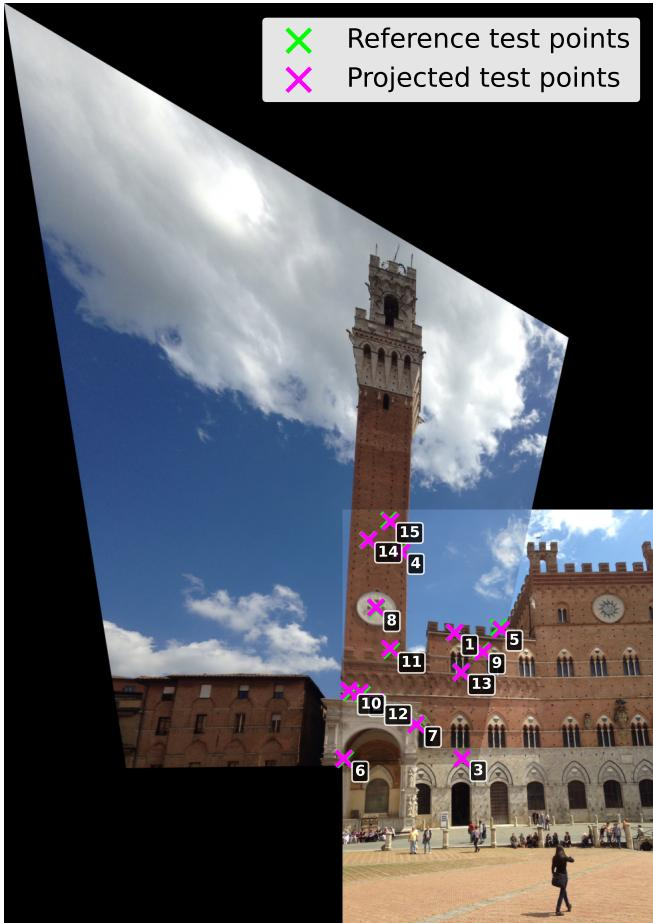  
(b) Iterative Bayesian approach (RMSE= 11.48 px).  
Figure 8. Comparison of a NISwGSP-06 PalazzoPubblico panorama.