# DNF-SR: Dual-Input and Negative-Aware Feature Fine-Tuning for Real-World Image Super-Resolution

Shuhao Han1,2 Wenjie Liao1,2 Hayden Vance3 Hang Dong3 Rui Zhang3 Chun-Le Guo1,2 Chongyi Li1,2\* 1VCIP, CS, Nankai University 2NKIARI, Shenzhen Futian 3Independent Researcher

## Abstract

Benefiting from the powerful generative priors of diffusion models, diffusion-based real-world image super-resolution (Real-ISR) methods have demonstrated impressive performance. To achieve efficient Real-ISR, several recent works have designed one-step diffusion-based models. However, unmediatedly feeding LR into a diffusion model creates a distributional gap with the model’s original input. A straightforward approach to reduce the distribution gap is to introduce noise to the LR latents. However, directly adding noise inevitably corrupts the content of the LR images. In this study, we propose DNF-SR, a Dual-input and Negative-aware Feature fine-tuning method for Real-ISR. Specifically, we use a dual-input strategy that concatenates the original LR image with the noisy LR input and feeds them into a diffusion-based image editing model, ensuring both high-fidelity one-step super-resolution and improved perceptual and content consistency. Additionally, the noise present in the noisy LR input introduces randomness and diversity into the outputs. We exploit this property and propose a post-training optimization method, Negative-aware Feature Fine-Tuning (NF²T), which guides the model towardproducing higher-quality results. NF2T classifies multiple outputs into positive and negative subsets and then defines implicit policy improvement directions in both the image and feature spaces, thereby further enhancing the stability of the optimization. Extensive experiments show that DNF-SR outperforms other methods. Code is available at https://github.com/SHH-Han/DNF-SR.

## 1. Introduction

Image Super-Resolution (ISR) aims to reconstruct a clear high-resolution (HR) image from a degraded low-resolution (LR) image suffering from noise, blur, and other degradations. To better reconstruct low-quality real-world images that are affected by a wider range of degradations into more realistic images, many researchers have begun exploring the use of generative models [10, 35] for image super-resolution. Recently, as large-scale pretrained diffusion generative models [32, 34] have demonstrated impressive performance in image generation, an increasing number of studies [13, 24, 37, 50] have adopted techniques such as LoRA [18] or ControlNet [62] to transfer the powerfu high-quality image generation priors of diffusion models to Real-ISR, yielding more realistic and clearer restored images. Meanwhile, optimization under data constraints has also been explored [9].

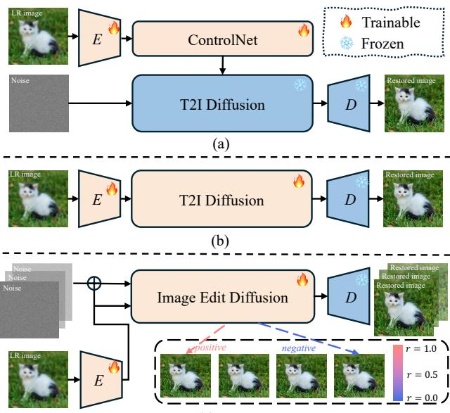  
(c) ours  
Figure 1. Different model architectures for one-step SR. (a) Utilizing ControlNet [62] to inject LR into a text-to-image (T2I) model, enabling one-step SR from noise directly to HR. (b) Directly using LR as input and fine-tuning a T2I model to generate HR. (c) We adopt a dual-input method, feeding noisy LR and original LR into the image editing model to generate HR, and utilize a Negativeaware Feature Fine-Tuning method for post-training.

Due to the multi-step denoising process inherent to diffusion models, they suffer from slow inference. To better leverage diffusion models for efficient super-resolution, recent works [12, 25, 39, 45, 49, 53, 60] have explored one-step diffusion-based SR models. As shown in Fig. 1, the current mainstream frameworks for one-step diffusionbased SR methods can be broadly categorized into the following two types. (a) Distilling multi-step super-resolution diffusion networks that use ControlNet (e.g., resshift [59], seesr [50]) into a one-step mapping from noise to highresolution images, as in SinSR [45] and AddSR-1s [54]. These methods increase the parameter count by incorporating ControlNet. And the design that directly restores an HR image from noise in a single step limits the model’s performance. (b) Directly feeding the LR image into the diffusion model and fine-tuning the model with LoRA to reconstruct a clear image has been explored by works such as OSEDiff [49], TSDSR [12], and FluxSR [22]. These methods replace the diffusion model’s original noise input at the initial timesteps of the denoising process with the LR image latent, which introduces a substantial distributional gap in the model inputs and consequently degrades performance. Recent works such as OMGSR [53] and TADSR [63], which still follow the (b) architecture, explore using intermediate timesteps to perform one-step diffusion super resolution. However, both the HR latent and the noise contain more high-frequency information than the LR latent. Therefore, at any intermediate timestep, the LR latent differs from the diffusion model’s original input in terms of high-frequency information. Adding noise to LR is the most straightforward method to reduce the distribution gap, but it may destroy the content of LR.

To address the issues above, we propose DNF-SR, a Dual-input and Negative-aware Feature Fine-Tuning method for Real-ISR, with its framework shown in Fig. 1(c). Specifically, we design a dual-input strategy that inputs noisy LR to eliminate the gap with the original input of the Diffusion model, while additionally incorporating the original LR as a condition to ensure fidelity. And using Flux-Kontext [4] as a pretrained diffusion model, we patchify both the noisy LR and the original LR, then concatenate them along the token dimension and feed these tokens into the DiT [31] blocks for image super-resolution. With this dual-input design, our method reduces the input distribution gap of the diffusion model, more effectively leverages the generative prior of the diffusion model, and preserves the fidelity of the LR image. Rather than employing the text-to-image generation model Flux, using an editing model can better perceive the original LR content as a condition, thereby improving the quality of outputs.

Due to the introduction of noise, our one-step SR model can generate diverse restored images. To further improve the quality of generated images, we propose a novel super-resolution post-training method named Negative-aware Feature Fine-Tuning, named NF2T. NF2T draws on the approach of DiffusionNFT [64] by partitioning the multiple generated images into positive and negative subsets according to a reward model and then defining an implicit policy improvement direction to enhance model performance. However, we observed that applying DiffusionNFT to the super-resolution task introduces pronounced grid artifacts in the reconstructed images due to the implicit optimization direction in the latent space. Therefore, we adopt ${ \mathrm { N F ^ { 2 } T } } ,$ , transferring the optimization from the latent space to the image and the feature spaces for improved performance. Compared with other reinforcement learning methods [27, 41], $\mathrm { N F ^ { 2 } T }$ omits probabilistic modeling in sampling and optimization, improving generative model performance by directly optimizing the predicted velocity in flow matching. Meanwhile, $\mathrm { N F ^ { 2 } T }$ can be optimized exploiting multiple sampled images, unlike DiffusionDPO, which only uses image pairs. During post-training, we evaluate the multiple generated images using several IQA methods [7, 11, 21, 42, 57], including full reference (FR) and no reference (NR) metrics, and then aggregate the normalized scores into a single reward for optimization. The use of diverse metrics provides clearer optimization signals for the model and thereby enables recovery of higher quality images.

The main contributions of our work are as follows:

• We design a dual-input strategy that feeds both noisy LR and original LR into an image-editing model, which can effectively capture conditional LR image information. This approach better leverages the model’s generative prior while ensuring higher fidelity, thereby further enhancing the performance of SR model.

• We propose a novel SR optimization method named Negative-aware Feature Fine-Tuning. It categorizes multiple sampled restored images into positive and negative optimization directions within the image and feature spaces, which further improves the quality of outputs.

## 2. Related Work

Real-World Image Super-Resolution. Recently, largescale pretrained diffusion generative models [32, 34] have achieved strong results in Real-ISR tasks [13, 24, 36, 37, 44, 50, 51, 56], yielding more realistic and clearer restored images. However, the multi-step denoising process results in high computational and time costs. Consequently, one-step Real-ISR models have become a primary research focus for faster inference. OSEDiff [49] introduces the VSD loss to distill the pre-trained SD model. Building upon this, TSD-

SR [12] designs a Target Score Distillation for SR. SinSR [45] achieves one-step ISR from noise to HR by distilling a multi-step diffusion model into a student network through deterministic mapping. OMGSR [53] injects the LR image latent distribution at a pre-computed mid-timestep, achieving the state-of-the-art performance. Nevertheless, there is a gap between the LR latent and the diffusion model’s original input in terms of high-frequency information. To eliminate this gap, we design dual-input methods, inputting noisy LR and incorporating original LR as a condition. Furthermore, an image-editing model is employed to leverage this dual-path input better, thereby producing higher-quality outputs.

Preference Alignment for Diffusion Models. Since the proposal of GRPO [17], Reinforcement Learning from Human Feedback (RLHF) [3, 30] has emerged as one of the most prominent and widely studied research topics. Diffusion models and rectified flows can also benefit significantly from alignment with human feedback for their generation diversity. Many methods are based on likelihood estimation, including: (1) Policy gradient methods from PPO-style [5, 14] decompose trajectory likelihoods stepwise without forward consistency, while recent GRPO extensions [27, 55] convert ODE to SDE samplers, proving effective and scalable for diffusion RL. However, this method is hard to apply to one-step Real-ISR diffusion since it requires a multi-step denoising process to guarantee diversity. (2) Direct Policy Optimization (DPO)-style [33] methods. Diffusion-DPO [41] adapts DPO to diffusion, and it is inherently confined to paired human preference data, whose annotation process is labor-intensive and expensive. Moreover, its pairwise training paradigm hinders the exploitation of accurate ranking information among multiple generated results, thereby limiting the speed of optimization. Recently, DiffusionNFT [64] eliminates the reliance on likelihood estimation and SDE-based reverse process by formulating policy improvement as a contrast between positive and negative generations. It fully utilizes information from multiple sampled results to determine a better optimization direction. However, directly applying DiffusionNFT to SR tasks introduces a pronounced grid artifact. To address this issue, we propose a novel Negative-aware feature fine-tune (NF2T) method.

## 3. Methodology

## 3.1. Preliminaries

Flow-matching Model in Flux. As a core generative model used by Flux [6], flow matching (FM) [26] aims to learn a continuous normalizing flow that maps a simple distribution (e.g., standard Gaussian distribution $\epsilon \in \mathcal { N } ( 0 , \mathbf { I } ) )$ to the target data distribution $x _ { 0 } \sim \pi _ { 0 } = p _ { d a t a }$ . The specific training

loss function is as follows:

$$
\begin{array} { r } { \mathcal { L } = \mathbb { E } _ { \boldsymbol { x } _ { 0 } \sim \pi _ { 0 } , \boldsymbol { \epsilon } \sim \mathcal { N } ( \boldsymbol { 0 } , \mathbf { I } ) , t } | | \boldsymbol { v } _ { \boldsymbol { \theta } } ( \boldsymbol { x } _ { t } , t ) - \boldsymbol { v } | | ^ { 2 } , } \end{array}\tag{1}
$$

where v denotes the velocity at any time $t \in [ 0 , 1 ]$ predicted by the model. Flux adopts the same method from Rectified Flow [28], which assumes a simple linear path $x _ { t } = ( 1 - t ) x _ { 0 } + t \epsilon$ , thereby deriving the optimization target for velocity as $v = \epsilon - x _ { 0 }$

DiffusionNFT for Preference Alignment. DiffusionNFT adopts a novel Preference Alignment Paradigm for diffusion models to achieve efficient alignment with human or taskspecific preferences. The specific approach of Diffusion-NFT involves computing the reward r for multiple sampled data from the diffusion model, normalizing these rewards to the range [0, 1], then leveraging positive and negative sample signals to implicitly model preference directions. The specific training objective is as follows:

$$
\begin{array} { r } { \mathcal { L } = \mathbb { E } _ { { x _ { 0 } } \sim { \pi _ { o l d } ( x _ { 0 } | c ) } , \epsilon \sim \mathcal { N } ( 0 , \mathbf { I } ) , c , t } \Big [ r | | v _ { \theta } ^ { + } ( x _ { t } , c , t ) - v | | ^ { 2 } } \\ { + ( 1 - r ) | | v _ { \theta } ^ { - } ( x _ { t } , c , t ) - v | | ^ { 2 } \Big ] , } \end{array}\tag{2}
$$

where implicit positive policy:

$$
v _ { \theta } ^ { + } ( x _ { t } , c , t ) : = ( 1 - \beta ) v ^ { \mathrm { o l d } } ( x _ { t } , c , t ) + \beta v _ { \theta } ( x _ { t } , c , t ) ,
$$

and implicit negative policy:

$$
\begin{array} { r } { v _ { \theta } ^ { - } ( x _ { t } , c , t ) : = ( 1 + \beta ) v ^ { \mathrm { o l d } } ( x _ { t } , c , t ) - \beta v _ { \theta } ( x _ { t } , c , t ) . } \end{array}
$$

In Eq. (2), $\pi _ { \mathrm { o l d } }$ denotes the pretrained diffusion policy, vold and vθ represent the velocity predictor of the pretrained diffusion and the optimized diffusion model, respectively, c denotes conditional control, and $\beta$ is a hyperparameter representing the guidance strength.

## 3.2. Overview of DNF-SR

As shown in Fig. 2, DNF-SR mainly consists of two parts. One part is the model structure of DNF-SR, where we use Flux-kontext as a pre-trained model and design a single-step super-resolution model with a dual-input at a mid-timestep $t _ { m i d } .$ The other part is the post-training of DNF-SR, where we adopt a Negatively-aware Feature Fine-Tuning $( \mathbf { N F ^ { 2 } T } )$ method, achieving preference optimization by dividing sampled data into positive and negative optimization direction in both image and feature spaces.

## 3.3. Model Structure of DNF-SR

The model structure of DNF-SR is shown in Fig. 2(a). The inputs to DNF-SR are the LR image $x _ { L R } .$ , its caption c, and randomly initialized noise ϵ. First, $x _ { L R }$ is fed into a fine-tuned Encoder $E _ { \theta }$ to obtaion $z _ { L R } .$ . Then $z _ { L R }$ and ϵ are weighted according to a fixed mid-timestep $t _ { m i d }$ to get $z _ { m i x } = ( 1 - t _ { m i d } ) z _ { L R } + t _ { m i d } \epsilon$ . Next, DNF-SR feeds the concatenated $z _ { m i x }$ and $z _ { L R }$ along with the text condition $z _ { t e x t }$ (encoded using c) into fine-tuned DiT blocks, as employed in Flux-Kontext. Specifically, all tokens from $z _ { m i x } ,$ $z _ { L R }$ , and $z _ { t e x t }$ are concatenated after passing through multiple MM-DiT blocks. This combined sequence then goes through several Single-DiT blocks. Subsequently, the output at the position corresponding to $z _ { m i x }$ is extracted as the model’s predicted velocity $v _ { \theta }$ , which is then used to obtain $\hat { z } _ { H R } = z _ { m i x } - t _ { m i d } v _ { \theta }$ . Finally, $\hat { z } _ { H R }$ is passed through a fixed-parameter decoder $D _ { \varphi }$ to obtain $\scriptstyle { \hat { x } } _ { H R } .$

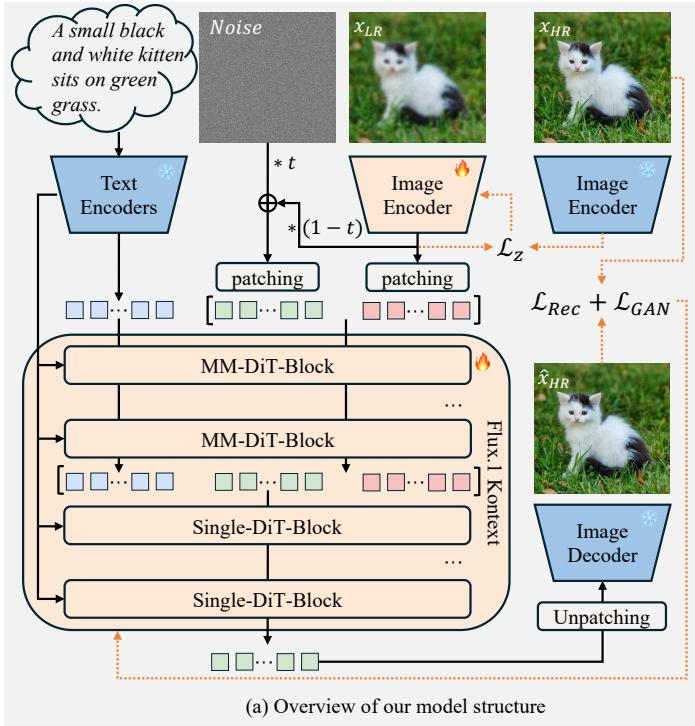

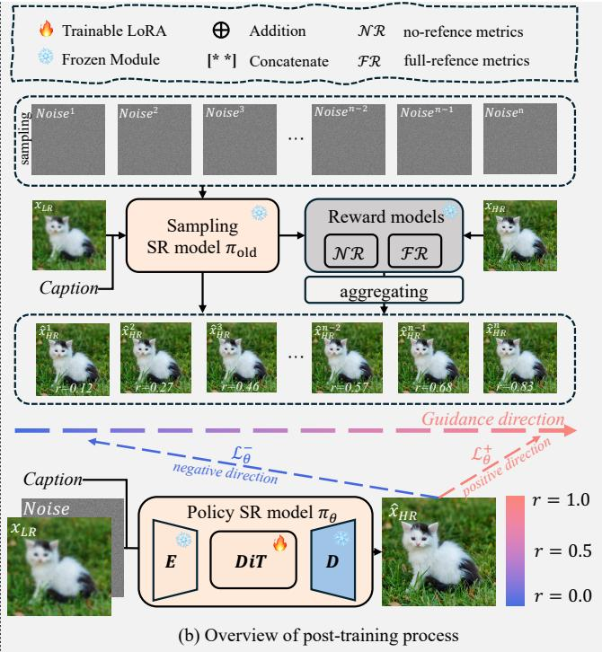  
Figure 2. Overview of the DNF-SR framework. (a) The model structure adopts a dual-input design: noisy LR latents $( z _ { m i x } )$ and original LR latents (z\_{LR} ) are concatenated with text tokens (encoded from image captions) and fed into fine-tuned DiT blocks of the Flux-Kontext pretrained model. We employed multiple loss functions to ensure the performance of the model. (b)The post-training process of Negative aware Feature Fine-Tuning: multiple restored results are generated with different input noises, evaluated by combined full-reference (FR) and no-reference (NR) IQA metrics to obtain reward scores, and divided into positive and negative subsets. By constructing positive $\mathcal { L } _ { \theta } ^ { + }$ and negative $\mathcal { L } _ { \theta } ^ { - }$ optimization directions within both the image and the feature spaces, the quality of the restored images is improved.

In comparison to other methods, our primary improvements involve employing a dual input for SR and perform ing a one-step denoising at mid-timestep.

Dual-input for SR. Most current single-step SR methods directly feed the LR image $x _ { L R }$ into a Diffusion model to obtain the HR image $\scriptstyle { \hat { x } } _ { H R } .$ . Compared to the original noise input of Diffusion models, there’s a significant distribution gap between the LR data and noise. Directly replacing the input makes it difficult for Diffusion’s pre-trained parameters to be effectively applied to SR tasks. Although recent works [53, 63] have explored replacing the input at midtimestep to mitigate this gap between LR and the Diffusion model’s original input, this introduces a new question: At which timestep t does the LR latent $z _ { L R }$ have a smaller distribution difference with the original Diffusion model’s latent input $z _ { t } ?$ In fact, from a frequency perspective, zLR is most consistent with the latent representation of a natural image $z _ { \mathrm { 0 } }$ at $t = 0$ , rather than an arbitrary mid-timestep’s $z _ { t }$ . Relative to $x _ { 0 } , x _ { t } = ( 1 - t ) x _ { 0 } + t \epsilon$ exhibits richer highfrequency components owing to noise injection. For superresolution, low-resolution (LR) images contain fewer highfrequency components than high-resolution (HR) images $x _ { 0 }$ . Thus, $x _ { 0 }$ is distributionally more similar to LR images in the diffusion framework. However, in SR tasks, if $t = 0 ,$ the model would be unable to optimize effectively due to $\hat { z } _ { H R } = z _ { L R } - t v _ { \theta }$ . To address this issue and better eliminate the distribution gap between $z _ { L R }$ and $z _ { t } ,$ , one straightforward method is adding noise to $z _ { L R }$ to obtain $z _ { m i x }$ as the input to the model. However, it can corrupt the content of the LR images. Therefore, to avoid content degradation caused by adding noise to $z _ { L R } ,$ , we design a dualinput method, which feeds the original $z _ { L R }$ as a conditional control along with $z _ { m i x }$ into the Diffusion model. Meanwhile, unlike other single-step super-resolution approaches, which use text-to-image models as the pretrained backbone, we employ a pretrained image-editing model. This enables more effective utilization of the original LR image as a conditioning signal, thereby further enhancing super-resolution performance. Through this approach, we better leverage the model’s pre-trained parameters while maintaining image fidelity, generating high-quality $\scriptstyle { \hat { x } } _ { H R }$

One-step denoising at mid-timestep. Diffusion models focus on generating different frequency components at various timesteps. Specifically, as t decreases, the model’s attention shifts from generating low-frequency information (i.e., the overall structure of the image) towards prioritizing the generation of high-frequency information (i.e., finegrained details and textures). To ensure both fidelity and visual quality, we choose the latent $z _ { m i x }$ corresponding to an intermediate timestep $t _ { m i d }$ as the model input, rather than pure noise ϵ.

Training Objective. As shown in Fig. 2, the loss functions during the fine-tuning stage of DNF-SR consist of three components: $\mathcal { L } _ { z } , \mathcal { L } _ { R e c } ,$ and $\mathcal { L } _ { G A N }$ . Specifically, $\mathcal { L } _ { z }$ is designed to align the LR latent $z _ { L R }$ , after passing through the fine-tuned Encoder $E _ { \theta }$ , with the origin HR latent $z _ { H R } .$ . This is formulated as:

$$
\mathcal { L } _ { z } = \mathcal { L } _ { M S E } ( z _ { L R } , z _ { H R } ) .\tag{3}
$$

$\mathcal { L } _ { R e c }$ represents the reconstruction loss between the restored $\scriptstyle { \hat { x } } _ { H R }$ and the ground-truth HR image $x _ { H R } .$ , calculated as:

$$
\begin{array} { r } { \mathcal { L } _ { R e c } ( \hat { x } _ { H R } , x _ { H R } ) = \mathcal { L } _ { M S E } ( \hat { x } _ { H R } , x _ { H R } ) } \\ { + \mathcal { L } _ { D I S T S } ( \hat { x } _ { H R } , x _ { H R } ) . } \end{array}\tag{4}
$$

$\mathcal { L } _ { G A N }$ is the generative adversarial [15], where we employ DINOv3 as the discriminator. Ultimately, the total loss is:

$$
\mathcal { L } _ { s f t } = \lambda _ { 1 } \mathcal { L } _ { z } + \lambda _ { 2 } \mathcal { L } _ { M S E } + \lambda _ { 3 } \mathcal { L } _ { D I S T S } + \lambda _ { 4 } \mathcal { L } _ { G A N } .\tag{5}
$$

## 3.4. Post-training of DNF-SR

To further enhance the quality of the reconstructed images, we adopt DiffusionNFT, a preference optimization method based on Negative-aware Fine-Tuning (NFT), to improve model performance.

When applying DiffusionNFT, according to Eq. (2), we set the guidance strength $\beta ~ = ~ 1$ and use a fixed midtimestep $t _ { m i d }$ , resulting in the NFT optimization objective for single-step super-resolution as:

$$
\begin{array} { r } { \mathcal { L } _ { N F T } = \mathbb { E } _ { \pi _ { o l d } \left( \hat { z } _ { H R } \vert z _ { L R } \right) , z _ { L R } } \bigg [ r \vert \vert v _ { \theta } ^ { + } ( z _ { m i x } , z _ { L R } ) - v \vert \vert ^ { 2 } } \\ { + ( 1 - r ) \vert \vert v _ { \theta } ^ { - } ( z _ { m i x } , z _ { L R } ) - v \vert \vert ^ { 2 } \bigg ] , } \end{array}\tag{6}
$$

where $z _ { m i x } ~ = ~ t _ { m i d } \epsilon + ( 1 - t _ { m i d } ) z _ { L R } , ~ v ~ = ~ ( z _ { m i x } -$ ${ \hat { z } } _ { H R } ) / t _ { m i d } , v _ { \theta } ^ { + } = v _ { \theta } , v _ { \theta } ^ { - } = 2 v _ { o l d } - v _ { \theta }$ and r represents

the reward of $\scriptstyle { \hat { x } } _ { H R }$ . Simultaneously, we define $\mathcal { L } _ { \theta } ^ { + }$ to represent the positive optimization objective and $ { \mathcal { L } } _ { \theta } ^ { - }$ to represent the negative optimization objective:

$$
\mathcal { L } _ { \theta } ^ { + } = r | | v _ { \theta } ^ { + } - v | | ^ { 2 } , \mathcal { L } _ { \theta } ^ { - } = ( 1 - r ) | | v _ { \theta } ^ { - } - v | | ^ { 2 } .\tag{7}
$$

Feature Space Optimization. We observe that directly using $\mathcal { L } _ { \theta } ^ { + }$ and $ { \mathcal { L } } _ { \theta } ^ { - }$ as optimization objective led to noticeable grid artifacts in the output images of the optimized model. Therefore, we transform the optimization in the velocity space to the image space using a function $f ( v ) =$ $D _ { \varphi } ( z _ { m i x } - t _ { m i d } v ) . ~ v _ { \theta } ^ { + } , v _ { \theta } ^ { - }$ , v are fed into $f ( v )$ to obtain $\hat { x } _ { \theta } ^ { + } , \hat { x } _ { \theta } ^ { - } , \hat { x } _ { H R }$ . Then, by utilizing the $\mathcal { L } _ { r e c }$ from the SFT training phase, we derive new positive optimization objectives $ { \mathcal { L } } _ { \theta } ^ { ' + }$ and negative optimization objectives $ { \mathcal { L } } _ { \theta } ^ { ' - }$ in image and feature space:

$$
\begin{array} { r } { \mathcal { L } _ { \theta } ^ { ' + } = r \mathcal { L } _ { R e c } ( \hat { x } _ { \theta } ^ { + } , \hat { x } _ { H R } ) , \mathcal { L } _ { \theta } ^ { ' - } = ( 1 - r ) \mathcal { L } _ { R e c } ( \hat { x } _ { \theta } ^ { - } , \hat { x } _ { H R } ) . } \end{array}\tag{8}
$$

This results in the final training objective for DNF-SR as follows:

$$
\begin{array} { r } { \mathcal { L } _ { N F ^ { 2 } T } = \mathbb { E } _ { \pi _ { o l d } ( \hat { z } _ { H R } | z _ { L R } ) , z _ { L R } } \Big [ r \mathcal { L } _ { R e c } ( \hat { x } _ { \theta } ^ { + } , \hat { x } _ { H R } ) } \\ { + ( 1 - r ) \mathcal { L } _ { R e c } ( \hat { x } _ { \theta } ^ { - } , \hat { x } _ { H R } ) \Big ] . } \end{array}\tag{9}
$$

Unlike reinforcement learning methods that require explicit probability modeling, $\mathrm { N F ^ { 2 } T }$ directly enhances model performance through implicit optimization directions. This characteristic makes it particularly well-suited for one-step SR tasks. Furthermore, in contrast to DiffusionDPO, $\mathrm { N F ^ { 2 } T }$ can leverage multiple sampled images to determine the optimization direction, whereas DiffusionDPO is limited to pairwise preference data, which restricts data utilization efficiency during training.

Reward Calculation. Regarding the calculation of rewards, for the K samples generated during each optimization step, we employ multiple evaluation metrics as rewards to ensure the accuracy of the optimization direction. The evaluation metrics used are broadly categorized into full-reference and no-reference metrics. Full-reference (FR) metrics include LPIPS [7] and DISTS [11], while no-reference (NR) metrics include CLIPIQA [42], MUSIQ [21] and MANIQA [57]. After computing $r _ { i } ^ { r a w }$ for the i-th metric, we standardize the rewards within the batch to obtain $r _ { i } ^ { s t d }$ . Assuming $r _ { i } ^ { s t d }$ follows a standard Gaussian distribution, we obtain the normalized reward $r _ { i }$ by calculating $r _ { i } = \Phi ( X < r _ { i } ^ { \mathrm { s t d } } )$ , where $\Phi ( \cdot )$ is the standard Gaussian cumulative distribution function. Finally, the $r _ { i }$ values from different metrics are averaged to yield the ultimate reward.

## 4. Experiments

## 4.1. Experimental Settings.

Training Datasets. Following DiT4SR [13], we adopt DIV2K [1], DIV8K [16], Flickr2K [40], NKUSR8K [13], and the first 10K face images from FFHQ [20] as our training dataset. Additionally, we utilize Real-ESRGAN’s [43] degradation pipeline to synthesize LR-HR paired data.

Caption: A black Nokia flip phone with a camera module and Nokia logo, held in a person's hand, against a blurred green outdoor background.  
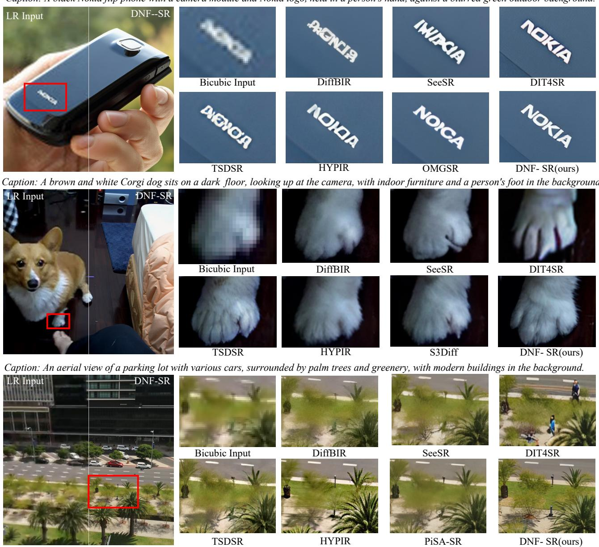  
Figure 3. Visual comparisons of different Real-ISR methods. Please zoom in for a better view.

Test Datasets. We evaluate our model using four datasets: RealSR [8], DrealSR [47], DIV2K-Val [1], and RealLQ250 [2]. Among these, DIV2K-Val is a synthetic dataset. RealSR and DrealSR are real-world datasets that include reference HR images, while RealLQ250 is a real-world dataset without reference HR images.

Evaluation Metrics. We employ two reference-based evaluation metrics, PSNR and LPIPS [7], to assess image fidelity and perceptual quality, respectively. However, as claimed in previous studies [13, 19, 58], full-reference metrics, such as PSNR and SSIM [46], often struggle to accurately reflect the visual effects of restored results. Consequently, we employ several no-reference metrics, including MUSIQ[21], MANIQA [57], CLIPIQA [42], QALIGN [48] and VQ-R1 [52], to evaluate image quality.

Implementation Details. We utilize FLUX.1-Kontextdev [4] as our pre-trained model. During the supervised fine-tuning stage, we fine-tune the VAE Encoder and DiT Block using LoRA [18], while keeping the VAE Decoder fixed. In Eq. (5), we adopt the same settings in OMGSR [53], where $\lambda _ { 1 } = 5 , \lambda _ { 2 } = 2 , \lambda _ { 3 } = 5 , \lambda _ { 4 } = 0 . 5$ . We employ the AdamW [29] optimizer with a learning rate of 2e-5 and a batch size of 1, training for 5000 steps across 8 H20 GPUs. In the post-training phase, we exclusively fine-tune the DiT Block with LoRA, setting the number of samples per optimization step to 8. For both of these stages, we set the LoRA rank to 64. We employ Qwen3-VL(8B) as an image caption generator to produce captions for both the trainingstage high-resolution (HR) images and the inference-stage low-resolution (LR) images. The same caption is also employed during inference for other models.

Table 1. Quantitative comparison of DNF-SR with SOTA Real-ISR methods on four datasets. DNF-SR(sft) representing DNF-SR only undergoing supervised fine-tuning (without $N F ^ { 2 } T$ post-training) and DNF-SR denoting the full model with $N \bar { F } ^ { 2 } T$
<table><tr><td rowspan="2">Datasets</td><td rowspan="2">Metrics</td><td colspan="3">Multi-step Methods</td><td colspan="8">One-step Methods</td></tr><tr><td>DiffBIR</td><td>SeeSR</td><td>DiT4SR</td><td>SinSR-1s</td><td>OSEDiff</td><td>S3Diff</td><td>PisaSR</td><td>TSDSR</td><td>HYPIR</td><td>OMGSR</td><td>DNF-SR(sft) DNF-SR</td></tr><tr><td rowspan="7">RealSR</td><td>PSNR↑</td><td>24.835</td><td>25.147</td><td>23.479</td><td>26.166</td><td>25.141 25.183</td><td>25.503</td><td>23.404</td><td>22.785</td><td>25.882</td><td>25.628</td><td>24.970</td></tr><tr><td>LPIPS↓</td><td>0.3650</td><td>0.3007</td><td>0.3154</td><td>0.3062</td><td>0.3209 0.2721</td><td>0.2672</td><td>0.2805</td><td>0.3107</td><td>0.2779</td><td>0.2925</td><td>0.3239</td></tr><tr><td>CLIPIQA↑</td><td>0.7054</td><td>0.6706</td><td>0.6319</td><td>0.6243</td><td>0.6613</td><td>0.6732 0.6698</td><td>0.7196</td><td>0.6491</td><td>0.6682</td><td>0.6903</td><td>0.7257</td></tr><tr><td>MUSIQ↑</td><td>69.279</td><td>69.822</td><td>68.197</td><td>61.370 67.263</td><td>67.828</td><td>70.149</td><td>70.766</td><td>66.559</td><td>69.527</td><td>70.672</td><td>72.040</td></tr><tr><td>MANIQA↑</td><td>0.6502</td><td>0.6451</td><td>0.6594</td><td>0.5418</td><td>0.6317 0.6424</td><td>0.6551</td><td>0.6312</td><td>0.6558</td><td>0.6695</td><td>0.6856</td><td>0.6930</td></tr><tr><td>QALIGN↑</td><td>3.7894</td><td>3.7187</td><td>3.3974</td><td>3.1774</td><td>3.6634</td><td>3.6632 3.6334</td><td>3.7754</td><td>3.6931</td><td>3.8507</td><td>3.9162</td><td>4.0718</td></tr><tr><td>VQ-R1↑</td><td>3.9388</td><td>3.7811</td><td>3.7111</td><td>3.2470</td><td>3.9522</td><td>3.9541 3.8162</td><td>3.8224</td><td>3.9600</td><td>4.1285</td><td>4.1310</td><td>4.2646</td></tr><tr><td rowspan="7">DrealSR</td><td>PSNR↑</td><td>25.904</td><td>28.070</td><td>25.681</td><td>28.149</td><td>27.924</td><td>27.539 28.319</td><td>26.197</td><td>25.899</td><td>28.928</td><td>28.254</td><td>28.141</td></tr><tr><td>LPIPS↓</td><td>0.4670</td><td>0.3174</td><td>0.3693</td><td>0.3479</td><td>0.2966 0.3109</td><td>0.2960</td><td>0.3115</td><td>0.3391</td><td>0.2952</td><td>0.3210</td><td>0.3531</td></tr><tr><td>CLIPIQA↑</td><td>0.7065</td><td>0.6910</td><td>0.6658</td><td>0.6564</td><td>0.6963 0.7133</td><td>0.6971</td><td>0.7302</td><td>0.6429</td><td>0.6914</td><td>0.6914</td><td>0.7559</td></tr><tr><td>MUSIQ↑</td><td>66.137</td><td>65.085</td><td>64.861</td><td>57.242</td><td>64.692 63.955</td><td>66.108</td><td>66.120</td><td>61.084</td><td>65.862</td><td>67.247</td><td>68.732</td></tr><tr><td>MANIQA↑</td><td>0.6221</td><td>0.6052</td><td>0.6253</td><td>0.5027</td><td>0.5898</td><td>0.6124 0.6160</td><td>0.5820</td><td>0.6055</td><td>0.6315</td><td>0.6542</td><td>0.6515</td></tr><tr><td>QALIGN↑</td><td>3.7142</td><td>3.5867</td><td>3.3592</td><td>3.1929</td><td>3.5434 3.6155</td><td>3.5828</td><td>3.6943</td><td>3.5447</td><td>3.6877</td><td>3.7166</td><td>3.7997</td></tr><tr><td>VQ-R1↑</td><td>3.6708</td><td>3.4905</td><td>3.4919</td><td>3.1672</td><td>3.6619</td><td>3.6538</td><td>3.5911</td><td>3.6615</td><td>3.6865 3.8938</td><td>3.8478</td><td>3.9152</td></tr><tr><td rowspan="7">DIV2K</td><td>PSNR↑</td><td>23.145</td><td>23.678</td><td>21.789</td><td>24.291</td><td>23.724</td><td>23.530 23.867</td><td>22.173</td><td>22.252</td><td>24.050</td><td>23.524</td><td>23.631</td></tr><tr><td>LPIPS↓</td><td>0.3669</td><td>0.3194</td><td>0.3490</td><td>0.3226</td><td>0.2942</td><td>0.2581 0.2823</td><td>0.2736</td><td>0.3042</td><td>0.2924</td><td>0.3030</td><td>0.3234</td></tr><tr><td>CLIPIQÀ↑</td><td>0.7300</td><td>0.6936</td><td>0.6636</td><td>0.6532</td><td>0.6680 0.7001</td><td>0.6927</td><td>0.7149</td><td>0.6512</td><td>0.6828</td><td>0.7028</td><td>0.7723</td></tr><tr><td>MUSIQ↑</td><td>69.872</td><td>68.672</td><td>68.039</td><td>63.276</td><td>67.963 67.924</td><td>69.679</td><td>70.651</td><td>65.644</td><td>68.624</td><td>69.889</td><td>71.546</td></tr><tr><td>MANIQA↑</td><td>0.6440</td><td>0.6222</td><td>0.6413</td><td>0.5410</td><td>0.6131 0.6311</td><td>0.6375</td><td>0.6077</td><td>0.6227</td><td>0.6500</td><td>0.7009</td><td>0.6703</td></tr><tr><td>QALIGN↑</td><td>4.1015</td><td>3.9766</td><td>3.7256</td><td>3.5216</td><td>3.8352 3.8664</td><td>3.8806</td><td>3.9271</td><td>3.8159</td><td>3.9967</td><td>4.0604</td><td>4.1563</td></tr><tr><td>VQ-R1↑</td><td>4.0356</td><td>4.0486</td><td>3.9834</td><td>3.3441</td><td>4.0326</td><td>3.9861</td><td>4.0576</td><td>3.8899 3.9462</td><td>4.2884</td><td>4.2899</td><td>4.3630</td></tr><tr><td rowspan="5">RealLQ250</td><td>CLIPIQA↑</td><td>0.7137</td><td>0.7031</td><td>0.7338</td><td>0.7140</td><td>0.6724 0.7044</td><td>0.7055</td><td>0.7219</td><td>0.6875</td><td>0.7435</td><td>0.7683</td><td>0.7997</td></tr><tr><td>MUSIQ↑</td><td>67.531</td><td>70.860</td><td>72.085</td><td>65.305</td><td>69.556</td><td>69.193</td><td>71.245</td><td>72.099 68.991</td><td>71.975</td><td>73.077</td><td>73.700</td></tr><tr><td>MANIQA↑</td><td>0.5878</td><td>0.6001</td><td>0.6826</td><td>0.5258</td><td>0.5782 0.6016</td><td>0.6053</td><td>0.5829</td><td>0.6044</td><td>0.6864</td><td>0.6990</td><td>0.7029</td></tr><tr><td>QALIGN↑</td><td>3.9757</td><td>4.1543</td><td>3.9903</td><td>3.7532</td><td>4.2481</td><td>4.2903</td><td>4.2070 4.1687</td><td>4.2316</td><td>4.3073</td><td>4.4017</td><td>4.4752</td></tr><tr><td>VQ-R1↑</td><td>4.1460</td><td>4.3657</td><td>4.2968</td><td>3.6513</td><td>4.4707 4.3840</td><td>4.4426</td><td>4.2756</td><td>4.4300</td><td>4.4951</td><td>4.5706</td><td>4.6090</td></tr></table>

## 4.2. Comparison with Existing Methods

Compared Methods. We compare our method with SOTA Diffusion-based Real-ISR methods, which include both single-step and multi-step super-resolution approaches. The multi-step methods comprise DiffBIR [24], SeeSR [50], and DiT4SR [13], while the single-step methods include S3Diff [60], PisaSR [38], SinSR-1s [45], OSEDiff [49], TS-DSR [12], HYPIR [25], and OMGSR [53].

Quantitative Comparisons. Quantitative comparisons with state-of-the-art Real-ISR methods on four benchmarks are presented in Tab. 1. It shows that our DNF-SR achieves overwhelming performance across all no-reference metrics on all benchmarks. Even DNF-SR(sft), which only undergoes supervised fine-tuning without negative-aware feature fine-tuning, still obtains highly competitive performance. Notably, we only use no-reference metrics CLIP-

Table 2. Ablation of the DNF-SR model design. ∗ denotes the use of the text-to-image model Flux as the pre-trained model; all others use Flux-Kontext.
<table><tr><td>Input</td><td>Timestep</td><td>LPIPS↓</td><td>MUSIQ↑</td><td>MANIQA↑</td><td>QALIGN↑</td></tr><tr><td> $z _ { \mathrm { m i x } } ^ { * }$ </td><td>t=0.5</td><td>0.3349</td><td>69.838</td><td>0.6729</td><td>3.9363</td></tr><tr><td> $z _ { \mathrm { L R } } ^ { * }$ </td><td>t=0.5</td><td>0.3040</td><td>70.441</td><td>0.6808</td><td>3.8771</td></tr><tr><td> $( z _ { \operatorname* { m i x } } , z _ { \mathrm { L R } } ) ^ { * }$ </td><td>t=0.5</td><td>0.2995</td><td>71.116</td><td>0.6718</td><td>3.9057</td></tr><tr><td>(zmix, ZLR)</td><td>t=0.5</td><td>0.2925</td><td>70.672</td><td>0.6903</td><td>3.9162</td></tr><tr><td>(E, zLR)</td><td>t=1</td><td>0.30250</td><td>70.333</td><td>0.6853</td><td>3.8574</td></tr><tr><td> $( z _ { \operatorname* { m i x } } , z _ { \mathrm { L R } } )$ </td><td>t=0.25</td><td>0.2945</td><td>70.493</td><td>0.6870</td><td>3.8688</td></tr><tr><td> $( z _ { \operatorname* { m i x } } , z _ { \mathrm { L R } } )$ </td><td>t=0.75</td><td>0.2960</td><td>70.526</td><td>0.6790</td><td>3.9304</td></tr><tr><td> $( z _ { \operatorname* { m i x } } , z _ { \mathrm { L R } } )$ </td><td>t=0.5</td><td>0.2925</td><td>70.672</td><td>0.6903</td><td>3.9162</td></tr></table>

IQA, MANIQA, and MUSIQ to calculate the reward, and do not employ the multimodal large language model-based evaluation methods QALIGN and VQ-R1. The state-of-theart evaluation scores of our method on QALIGN and VQ-R1 fully demonstrate its performance.

Qualitative Comparisons. During inference, we feed the LR image into Qwen3-VL to generate captions, which are then applied to various super-resolution algorithms. The qualitative comparison with other methods is presented in Fig. 3. From the results in the first row, it can be observed that DNF-SR can accurately generate “NOKIA” even when the LR image content is severely corrupted. This is attributed to our improved utilization of the diffusion model’s prior, allowing it to retain strong generative capabilities when applied to super-resolution tasks. It can be seen that DiT4SR also generates a relatively good logo, but due to its multi-step super-resolution approach, DNF-SR has an advantage in performance. The results from the second row indicate that our method can produce more realistic outcomes (e.g., the dog’s toes and fur). The third row demonstrates that our method can generate clearer results.

Caption: Stacked Siemens product boxes with gray and beige design, featuring brand logo and leaf motif, arranged in orderly rows. Make this image more realistic and detailed.  
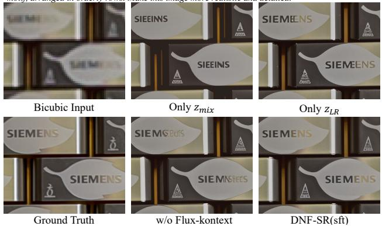  
Figure 4. Visualizing the ablation study of the model design.

## 4.3. Ablation Study

To further demonstrate the effectiveness of DNF-SR, we conduct an ablation study on RealSR. Specifically, we perform ablation experiments on the model design and posttraining algorithm $\mathrm { N F ^ { 2 } T }$ used in DNF-SR, respectively.

Model Design. In Tab. 2, we conduct ablation experiments on three aspects of the DNF-SR model structure: dual-path input, using the editing model, and denoising at intermediate timesteps. 1) dual-path input and using editing model. Tab. 2 shows that the dual-input in DNF-SR achieves better performance compared to using only LR latent $z _ { L R } 0 \mathrm { r }$ only noisy LR latent $z _ { m i x }$ . Additionally, using the image editing model FLUX-Kontext further enhances performance. As depicted in Fig. 5, DNF-SR effectively leverages the prior knowledge of the generative model under a given caption, producing more accurate content while maintaining fidelity. 2) denoising at intermediate timesteps. We also report the metrics for single-step denoising of DNF-SR at different timesteps t. Compared to denoising from pure noise in a single step, denoising at any intermediate timestep yields better performance. To balance realism and fidelity, we chose $t = 0 . 5$

Negative-aware Feature Fine-Turing. In Tab. 3, we conduct ablation experiments on the post-training algorithm of our proposed ${ \mathrm { N F } } ^ { 2 } { \mathrm { T } } .$ It can be observed that DNF-SR achieves significant improvements in all no-reference metrics, especially QALIGN (not involved in reward calculation). As shown in Fig. 5, DNF-SR with $\mathrm { N F ^ { 2 } T }$ yields notably clearer results. In contrast, the HR ground truth is blurrier, which leads to a decrease in the reference-based LPIPS metric for DNF-SR. Meanwhile, as shown in Fig. 5, if NFT is used for optimization in the latent space, it exhibits obvious grid artifacts. Regarding the use of the reward model, we find that incorporating full-reference (FR) metrics when using NF2T can further improve no-reference (NR) metrics while preventing degradation of FR metrics. Additionally, it can generate more natural results.

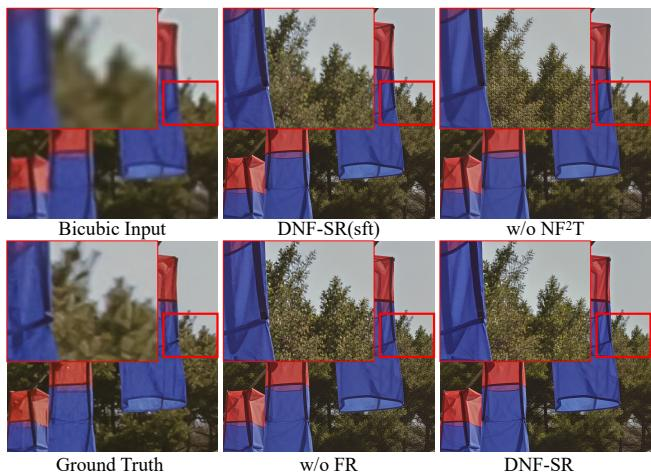  
Figure 5. Visualizing the ablation study of the $N F ^ { 2 } T$ method.

Table 3. Ablation study of the $\mathrm { N F ^ { 2 } T }$ method.
<table><tr><td>Setting</td><td>Reward Model</td><td>LPIPS↓</td><td>MUSIQ↑</td><td>MANIQA↑</td><td>QALIGN↑</td></tr><tr><td></td><td></td><td>0.2925</td><td>70.6717</td><td>0.6903</td><td>3.9162</td></tr><tr><td>NFT</td><td>NR+FR</td><td>0.3250</td><td>71.1682</td><td>0.6413</td><td>3.943</td></tr><tr><td>NF2T</td><td>NR</td><td>0.3255</td><td>71.0911</td><td>0.6925</td><td>3.9979</td></tr><tr><td>NF²T</td><td>NR+FR</td><td>0.3239</td><td>72.0396</td><td>0.693</td><td>4.0718</td></tr></table>

## 5. Conclusion

This paper presents DNF-SR, a novel framework for realworld image super-resolution (Real-ISR). DNF employs a dual-input architecture that concatenates noisy LR latents with original LR latents to narrow the distribution gap between LR inputs and diffusion models’ native inputs while preserving content fidelity. Additionally, the Flux-Kontext image-editing pretrained model is utilized to better leverage generative model priors. Furthermore, we propose Negative-aware Feature Fine-Tuning (NF²T), which shifts optimization from the latent space to image and feature spaces, using aggregated rewards to enhance realism and suppress artifacts. Experiments demonstrate that DNF-SR achieves state-of-the-art performance across multiple benchmarks and can generate superior results.

## 6. Acknowledgments

This work was supported in part by the National Natural Science Foundation of China (62306153, 62225604), Tianjin Natural Science Foundation Project (25ZXRGGX00290, 24JCJQJC00020, 25JCQNJC01390), the Young Elite Scientists Sponsorship Program by CAST (YESS20240686), the Fundamental Research Funds for the Central Universities (Nankai University, 63253223, 63253219), “Science and Technology Yongjiang 203” key technology breakthrough plan project (2024Z120), Chinese government-guided local science and technology development fund projects (scientific and technological achievement transfer and transformation projects)(254Z0102G) and Shenzhen Science and Technology Program (JCYJ20240813114237048). The computational devices is supported by the Supercomputing Center of Nankai University (NKSC).

## Supplementary Material

In this Supplementary Material, we provide additional details, including the comparison with GAN-based methods in Section A, discussion on perception and restoration in Section B, more visual comparisons in Section C, and the algorithm in Section D. We conduct these additional comparisons and analyses to validate the effectiveness of DNF-SR.

## A. Comparison with GAN-based Methods

We compare DNF-SR with three GAN-based Real-ISR methods: BSRGAN [61], RealESRGAN [43], and LDL [23]. Quantitative evaluations are conducted on the DIV2K [1], RealSR [8], DrealSR [47] and RealLQ [2] datasets, with results summarized in Tab. 4. The experimental results demonstrate that DNF-SR, leveraging a dual-input strategy and a novel post-training optimization method NF²T, achieves significantly superior no-reference metrics compared to GAN-based methods.

Additionally, Fig 7 presents a visual comparison between DNF-SR and other GAN-based methods. The results show that DNF-SR reconstructs more photorealistic and natural outcomes. When compared to GAN-based methods, DNF-SR demonstrates distinct advantages in visual fidelity. Specifically, it achieves higher precision in restoring structured elements (e.g., text and architectural details) while rendering complex materials such as fabrics and natural textures with enhanced realism. This enables DNF-SR to more accurately reproduce the fine-grained detail hierarchy and authentic visual texture characteristic of highresolution images, outperforming the GAN-based methods in both structural integrity and perceptual quality.

## B. Discussion on Perception and Restoration

In experiments, we observe that existing multi-modal large language models (MLLMs) can effectively perceive the content in images. Even for challenging low-resolution (LR) images, they can infer reasonable content for blurred regions based on the overall image information. Meanwhile, current DiT-based generative models can adhere well to captions for image generation. However, in SR tasks, restoring strongly semantic structures such as text and logos is extremely challenging. As shown in the first row of Fig. 6, when no additional caption is used for the SR model, it is difficult to restore text with normal semantics. As shown in Fig 6, when captions generated by MLLMs are used as conditions, DiT-based SR models can effectively alleviate this issue. Nevertheless, when we manually replace “Nokia” with “Nckia”, DiT4SR exhibits poor prompt-following performance. This is because when applying text-to-image models to SR task, the model is caused to focus more on LR images, which impairs the inherent prompt-following capability of the original text-to-image model. In contrast, our method DNF-SR narrows the gap between LR and the original input of generative models through a dual-path input design. It also initializes with an image editing model to better perceive the information of LR used as conditions. This enables DNF-SR to better preserve the inherent generation capability and prompt-following ability of the original generative model when applied to SR tasks, thereby allowing it to better adhere to captions and restore more realistic and reasonable images.

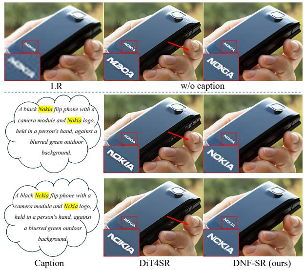  
Figure 6. Visual comparisons between DNF-SR and DiT4SR when using different captions including no caption, a reasonable caption with “Nokia”, and an unreasonable caption where “Nokia” is replaced with “Nckia”. DiT4SR exhibits structural issues at the position indicated by the red arrow.

However, current SR methods still obtain captions by leveraging MLLMs to perceive image content before applying them to restoration tasks. Only using text caption may sometimes fail to fully convey image information, and the separate execution of perception and restoration steps also introduces redundancy. Thus, it is highly meaningfu to develop an integrated perception-restoration model that can accurately perceive semantic information in LR images and perform restoration within a single framework.

## C. More Visual Comparisons

In Fig. 8 and 9, we provide more visual comparisons with other diffusion-based Real-ISR methods. As shown in Fig. 8, DNF-SR can better adhere to the content of the caption and restore more accurate text information. And in close-up scenarios, DNF-SR can better restore the texture and details of the image. Meanwhile, as shown in Fig. 9, DNF-SR can restore more realistic images under severe degradation. These examples all demonstrate the performance and robustness of DNF-SR for Real-ISR.

Table 4. A comprehensive evaluation against state-of-the-art GAN-based methods across synthetic and real-world datasets. The top performing results under each metric are marked in red.
<table><tr><td>Datasets</td><td>Methods</td><td>PSNR ↑</td><td>LPIPS [7] ↓</td><td>CLIPIQA [42] ↑</td><td>MUSIQ [21] ↑</td><td>MAINIQA [57] ↑</td><td>QALIGN [48] ↑</td><td>VQ-R1 [52] ↑</td></tr><tr><td rowspan="5">DIV2k</td><td>BSRGAN</td><td>24.583</td><td>0.3351</td><td>0.5246</td><td>61.193</td><td>0.5040</td><td>3.1703</td><td>3.3063</td></tr><tr><td>RealESRGAN</td><td>24.293</td><td>0.3112</td><td>0.5276</td><td>61.049</td><td>0.5484</td><td>3.2764</td><td>3.2623</td></tr><tr><td>LDL</td><td>23.828</td><td>0.3256</td><td>0.5179</td><td>60.040</td><td>0.5328</td><td>3.1798</td><td>3.1018</td></tr><tr><td>DNF-SR</td><td>23.631</td><td>0.3234</td><td>0.7723</td><td>71.546</td><td>0.6703</td><td>4.1563</td><td>4.3630</td></tr><tr><td>BSRGAN</td><td>28.702</td><td>0.2858</td><td>0.5092</td><td>57.159</td><td>0.4844</td><td>2.9572</td><td>3.0559</td></tr><tr><td rowspan="4">DrealSR</td><td>RealESRGAN</td><td>28.618</td><td>0.2818</td><td>0.4517</td><td>54.275</td><td>0.4902</td><td>2.8638</td><td>2.7683</td></tr><tr><td>LDL</td><td>28.196</td><td>0.2790</td><td>0.4473</td><td>53.948</td><td>0.4894</td><td>2.8576</td><td>2.6129</td></tr><tr><td>DNF-SR</td><td>28.141</td><td>0.3531</td><td>0.7559</td><td>68.732</td><td>0.6515</td><td>3.7997</td><td>3.9152</td></tr><tr><td>BSRGAN</td><td>26.379</td><td>0.2656</td><td>0.5114</td><td>63.283</td><td>0.5419</td><td>3.1829</td><td>3.4907</td></tr><tr><td rowspan="4">RealSR</td><td>RealESRGAN</td><td>25.687</td><td>0.2710</td><td>0.4489</td><td>60.364</td><td>0.5504</td><td>3.1081</td><td>3.1342</td></tr><tr><td>LDL</td><td>25.280</td><td>0.2750</td><td>0.4556</td><td>60.930</td><td>0.5495</td><td>3.0898</td><td>2.9897</td></tr><tr><td>DNF-SR</td><td>24.970</td><td>0.3239</td><td>0.7257</td><td>70.040</td><td>0.6930</td><td>4.0718</td><td>4.2646</td></tr><tr><td>BSRGAN</td><td></td><td></td><td>0.5940</td><td>66.289</td><td>0.5963</td><td>3.4794</td><td>3.8124</td></tr><tr><td rowspan="4">RealLQ250</td><td>RealESRGAN</td><td></td><td></td><td>0.6253</td><td>66.990</td><td>0.6148</td><td>3.6471</td><td>3.8088</td></tr><tr><td>LDL</td><td></td><td></td><td>0.6183</td><td>67.027</td><td>0.6147</td><td>3.6357</td><td>3.6940</td></tr><tr><td>DNF-SR</td><td></td><td></td><td>0.7997</td><td>73.700</td><td>0.7029</td><td>4.4752</td><td>4.6090</td></tr><tr><td></td><td></td><td></td><td></td><td></td><td></td><td></td><td></td></tr></table>

## D. Algorithm Details

The training of DNF-SR consists of two stages: supervised fine-tuning (SFT) and post-training. In the SFT stage, we use multiple losses to perform supervised fine-tuning on the paired (xL, xH, c) dataset. In the post-training stage, we adopt a Negative-aware Feature Fine-Tuning method for reinforcement learning. Specifically, we sample K noises to generate K restored images, then compute rewards using multiple reward functions, which are normalized and aggregated into a single r. Subsequently, we define positive and negative optimization directions to improve model performance. Here, K = 8 . Details are in Algorithm 1.

## References

[1] Eirikur Agustsson and Radu Timofte. Ntire 2017 challenge on single image super-resolution: Dataset and study. In CVPRW, 2017.

[2] Yuang Ai, Xiaoqiang Zhou, Huaibo Huang, Xiaotian Han, Zhengyu Chen, Quanzeng You, and Hongxia Yang. Dreamclear: High-capacity real-world image restoration with privacy-safe dataset curation. In NeurIPS, 2025.

[3] Yuntao Bai, Andy Jones, Kamal Ndousse, Amanda Askell, Anna Chen, Nova DasSarma, Dawn Drain, Stanislav Fort, Deep Ganguli, Tom Henighan, et al. Training a helpful and harmless assistant with reinforcement learning from human feedback. ArXiv preprint, 2022.

[4] Stephen Batifol, Andreas Blattmann, Frederic Boesel, Saksham Consul, Cyril Diagne, Tim Dockhorn, Jack English, Zion English, Patrick Esser, Sumith Kulal, et al. Flux. 1 kontext: Flow matching for in-context image generation and editing in latent space. ArXiv preprint, 2025.

[5] Kevin Black, Michael Janner, Yilun Du, Ilya Kostrikov, and Sergey Levine. Training diffusion models with reinforcement learning. ArXiv preprint, 2023.

[6] blackforestlabs.ai. Flux, offering state-of-the-art perfor mance image generation, 2024.

[7] Yochai Blau and Tomer Michaeli. The perception-distortion tradeoff. In CVPR, 2018.

[8] Jianrui Cai, Hui Zeng, Hongwei Yong, Zisheng Cao, and Lei Zhang. Toward real-world single image super-resolution: A new benchmark and a new model. In ICCV, 2019.

[9] Xiaofeng Cao, Mingwei Xu, Xin Yu, Jiangchao Yao, Wei Ye, Shengjun Huang, Minling Zhang, Ivor Tsang, Yew-Soon Ong, James T Kwok, et al. Analytical survey of learning with low-resource data: From analysis to investigation. ACM Computing Surveys, 2025.

[10] Junsong Chen, Jincheng Yu, Chongjian Ge, Lewei Yao, Enze Xie, Yue Wu, Zhongdao Wang, James Kwok, Ping Luo, Huchuan Lu, et al. Pixart-alpha: Fast training of diffusion transformer for photorealistic text-to-image synthesis. ArXiv preprint, 2023.

[11] Keyan Ding, Kede Ma, Shiqi Wang, and Eero P Simoncelli. Image quality assessment: Unifying structure and texture similarity. TPAMI, 2020.

[12] Linwei Dong, Qingnan Fan, Yihong Guo, Zhonghao Wang, Qi Zhang, Jinwei Chen, Yawei Luo, and Changqing Zou. Tsd-sr: One-step diffusion with target score distillation for real-world image super-resolution. In CVPR, 2025.

[13] Zheng-Peng Duan, Jiawei Zhang, Xin Jin, Ziheng Zhang, Zheng Xiong, Dongqing Zou, Jimmy S Ren, Chunle Guo, and Chongyi Li. Dit4sr: Taming diffusion transformer for real-world image super-resolution. In ICCV, 2025.

[14] Ying Fan, Olivia Watkins, Yuqing Du, Hao Liu, Moonkyung Ryu, Craig Boutilier, Pieter Abbeel, Mohammad Ghavamzadeh, Kangwook Lee, and Kimin Lee. Dpok: Reinforcement learning for fine-tuning text-to-image diffu sion models. In NeurIPS, 2023.

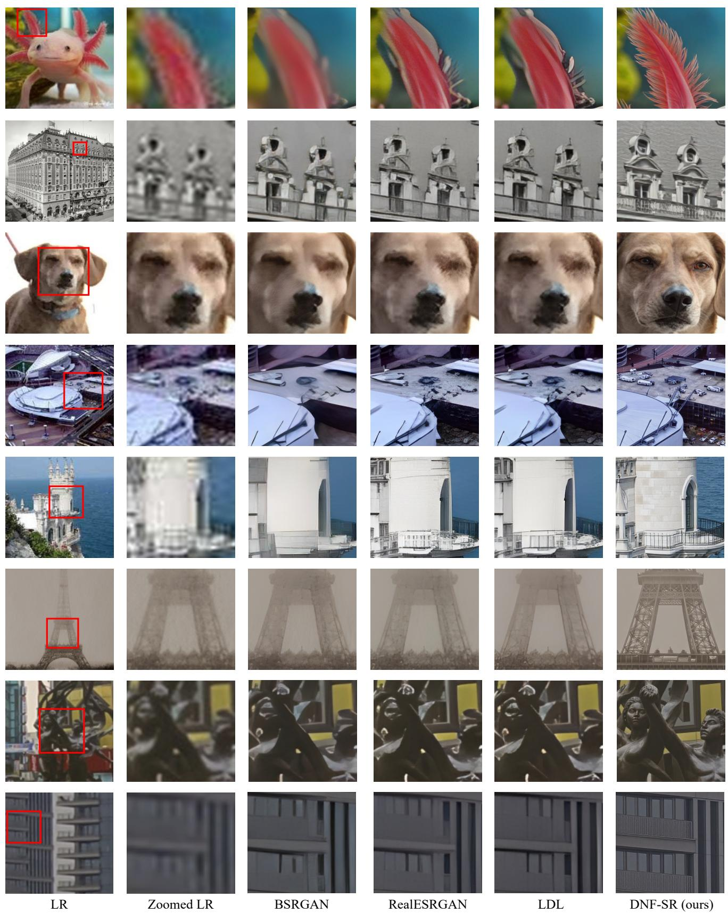  
Figure 7. Vision comparisons between DNF-SR and GAN-based Real-ISR methods [23, 43, 61]. Zoom in for a better view.

TSDSR

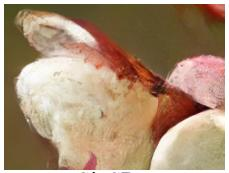  
HYPIR

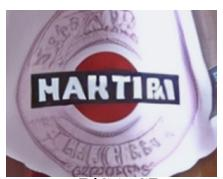

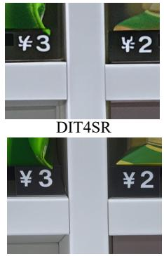

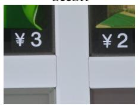

Caption: Close-up of a vending machine grid with compartments, some holding snacks priced ¥3 and ¥2, white dividers, and empty slots.

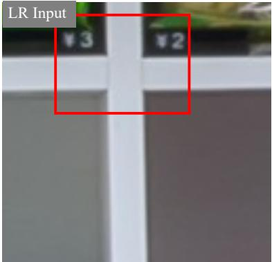

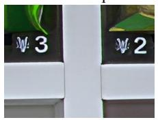

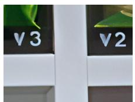  
Caption: Close-up of a Martini bottle and a Kronenbourg 664 Blanc bottle, with colorful pencils in the background, vibrant still life.

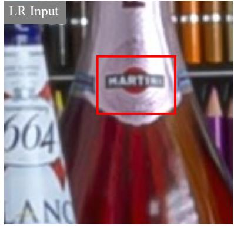

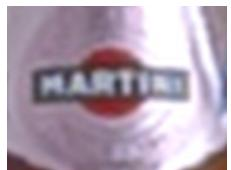

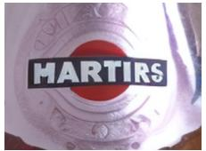

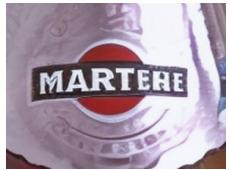

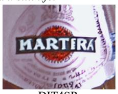

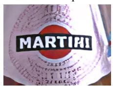

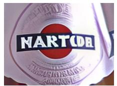

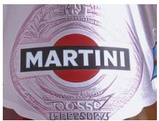

Caption: Close-up of delicate white and pink flowering branches with a soft green background, featuring tender blossoms and buds in a serene.

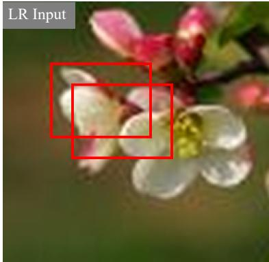

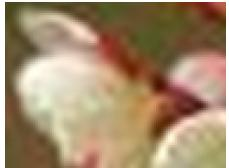

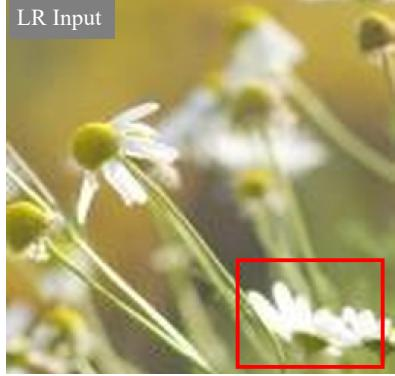

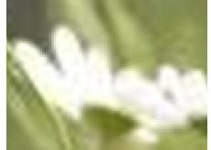

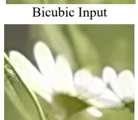

  
TSDSR

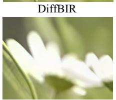  
HYPIR

  
S3Diff

  
DNF-SR (ours)

Figure 8. Vision comparisons between DNF-SR and different diffusion-based Real-ISR methods [12, 13, 24, 25, 38, 45, 50, 53, 60].

DIT4SR

Bicubic Input

S3Diff

SeeSR  
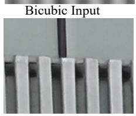

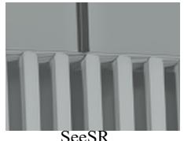

Caption: Medieval stone castle with tall towers, crenellated walls, flag on highest tower. Bright blue sky with scattered clouds, green grassy field, small bushes around.

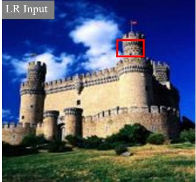

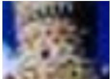

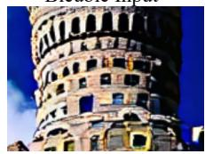  
TSDSR

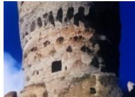  
DiffBIR

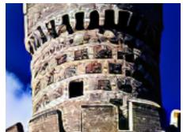

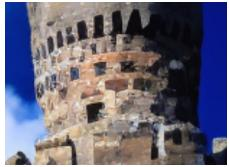  
HYPIR

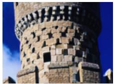

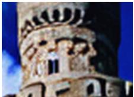  
OMGSR

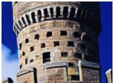  
DNF-SR (ours)  
Caption: Young child in blue shirt with colorful patterns, eating from white paper plate. Buffet table with red tomatoes, yellow chips, condiment bottles. Bright, casual family gathering scene.

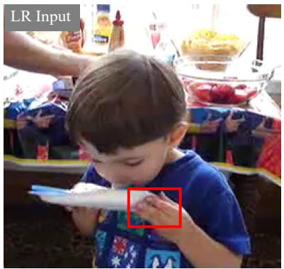

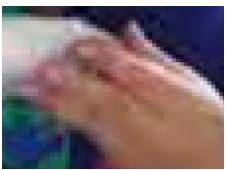

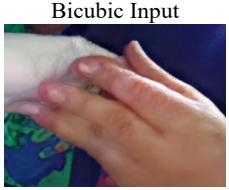

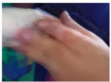

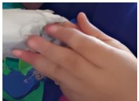  
DiffBIR  
TSDSR

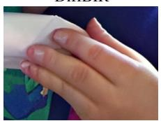

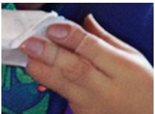  
HYPIR

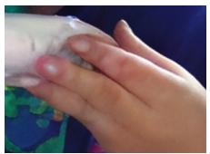

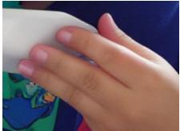  
DNF-SR (ours)  
Caption: Black and white vintage-style photo of a woman with voluminous curly hair, wearing a white dress with a black wide belt, leaning on metal rails.

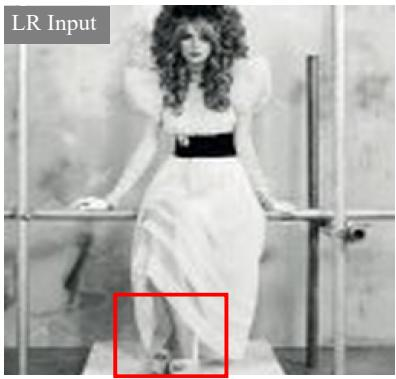

  
TSDSR

  
HYPIR

  
OMGSR

  
DNF-SR (ours)  
Caption: Modern building facade with white vertical slats, rectangular windows, grid pattern, monochromatic gray and white tones.

  
TSDSR

  
HYPIR  
PiSA-SR

  
DNF-SR (ours)

Figure 9. Vision comparisons between DNF-SR and different diffusion-based Real-ISR methods [12, 13, 24, 25, 38, 45, 50, 53, 60].

Algorithm 1: Training Procedure of Negativate-aware Feature Fine-tuning in DNF-SR   
Input: Training datasets $\{ x _ { L } , x _ { H } , c \}$ , fine-tuning one-step Diffusion-based SR Model including VAE encoder $E _ { r e f }$   
and velocity prediction network $v _ { r e f }$ , pre-trained VAE decoder $D _ { \varphi }$ , number of samples $K$ per training step,   
N raw reward functions $r ^ { r a w } ( \cdot ) \in \bar { \mathbb { R } } ,$ , one fixed mid-timestep $t _ { m i d } .$   
Output: Post-trained one-step velocity prediction network $v _ { \theta }$ for $\mathrm { { S R } } .$   
1 Initialize data collection policy for velocity prediction $v _ { o l d }  v _ { r e f }$ . Initialize training policy for velocity prediction   
vθ $ v _ { r e f } .$ . Initialize data buffer $\mathcal { D }  \emptyset$ while train do   
/\* Rollout ${ \mathrm { S t e p , } }$ Data Collection \*/   
2 for each sampled data $( x _ { L } , x _ { H } , c ) \sim \mathcal { D }$ do   
3 Sample $K$ standard Gaussian noises $\epsilon ^ { 1 : K }$ and collect $K$ restored images $\hat { x } _ { H } ^ { 1 : K }$ using $v _ { o l d }$ . Compute rewards   
$\left\{ r _ { 1 : N } ^ { r a w } \right\} ^ { 1 : K }$ using N raw reward functions, respectively. Standardize raw rewards in group:   
$r _ { i } ^ { s t i ^ { * } } { : = ( r _ { i } ^ { r a w } - m e a n ( \{ r _ { i } ^ { r a w } \} ^ { 1 : K } ) ) / s t d ( \{ r _ { i } ^ { r a w } \} ^ { 1 : K } ) }$ . Normalize rewards using the standard Gaussian   
cumulative distribution function: $r _ { i } = \Phi ( X < r ^ { s t d } )$ . Average the N rewards: $r = a v g ( r _ { 1 : N } )$   
$D \gets \{ c , x _ { L } , \hat { x } _ { H } ^ { 1 : K } , r ^ { 1 : K } \}$   
4 end   
/ Gradient Step, Policy Optimization \*/   
5 for each mini batch $\{ c , x _ { L } , \hat { x } _ { H } , r \}$ do   
6 Encode the LR image: $z _ { L } = E _ { r e f } ( x _ { L } )$ . Forward diffusion process: $z _ { t } = t _ { m i d } \epsilon + ( 1 - t _ { m i d } ) z _ { L }$   
/ Calculate Positive Optimization Direction \*/   
7 Implicit positive velocity: $v _ { \theta } ^ { + } : = ( 1 - \beta ) v ^ { o l d } ( z _ { t } , c , t _ { m i d } ) + \beta v _ { \theta } ( z _ { t } , c , t _ { m i d } )$ . Implicit positive image:   
$\hat { x } _ { \theta } ^ { + } : = D _ { \varphi } ( z _ { t } - t _ { m i d } v _ { \theta } ^ { + } )$ . Positive optimization direction: $\mathcal { L } _ { \theta } ^ { + } = r \mathcal { L } _ { r e c } ( \hat { x } _ { \theta } ^ { + } , \hat { x } _ { H } ) . ~ / \star$ Calculate   
Positive Optimization Direction \*/   
8 Implicit negative velocity: $v _ { \theta } ^ { - } : = ( 1 + \beta ) v ^ { o l d } ( z _ { t } , c , t _ { m i d } ) - \beta v _ { \theta } ( z _ { t } , c , t _ { m i d } )$ . Implicit negative image:   
$\hat { x } _ { \theta } ^ { - } : = D _ { \varphi } ( z _ { t } - t _ { m i d } v _ { \theta } ^ { - } )$ . Negative optimization direction: $\mathcal { L } _ { \theta } ^ { - } = ( 1 - r ) \mathcal { L } _ { r e c } ( \hat { x } _ { \theta } ^ { - } , \hat { x } _ { H } ) . ~ / \star$ Update   
Model Parameters \*/   
9 $\theta  \theta - \lambda \nabla _ { \theta } [ \mathcal { L } _ { \theta } ^ { + } + \mathcal { L } _ { \theta } ^ { - } ]$   
10 end   
/\* Online Update \*/   
11 Update data collection policy $v _ { o l d }  v _ { \theta }$ , and clear buffer $\mathcal { D }  \emptyset .$   
12 end

[15] Ian J Goodfellow, Jean Pouget-Abadie, Mehdi Mirza, Bing Xu, David Warde-Farley, Sherjil Ozair, Aaron Courville, and Yoshua Bengio. Generative adversarial nets. In NeurIPS, 2014.

[16] Shuhang Gu, Andreas Lugmayr, Martin Danelljan, Manuel Fritsche, Julien Lamour, and Radu Timofte. Div8k: Diverse 8k resolution image dataset. In ICCVW, 2019.

[17] Daya Guo, Dejian Yang, Haowei Zhang, Junxiao Song, Ruoyu Zhang, Runxin Xu, Qihao Zhu, Shirong Ma, Peiyi Wang, Xiao Bi, et al. Deepseek-r1: Incentivizing reasoning capability in llms via reinforcement learning. ArXiv preprint, 2025.

[18] Edward J Hu, Yelong Shen, Phillip Wallis, Zeyuan Allen-Zhu, Yuanzhi Li, Shean Wang, Lu Wang, Weizhu Chen, et al. Lora: Low-rank adaptation of large language models. In ICLR, 2022.

[19] Gu Jinjin, Cai Haoming, Chen Haoyu, Ye Xiaoxing, Jimmy S Ren, and Dong Chao. Pipal: a large-scale image quality assessment dataset for perceptual image restoration. In ECCV, 2020.

[20] Tero Karras. A style-based generator architecture for gener-

ative adversarial networks. ArXiv preprint, 2019.

[21] Junjie Ke, Qifei Wang, Yilin Wang, Peyman Milanfar, and Feng Yang. Musiq: Multi-scale image quality transformer. In ICCV, 2021.

[22] Jianze Li, Jiezhang Cao, Yong Guo, Wenbo Li, and Yulun Zhang. One diffusion step to real-world super-resolution via flow trajectory distillation. ArXiv preprint, 2025.

[23] Jie Liang, Hui Zeng, and Lei Zhang. Details or artifacts: A locally discriminative learning approach to realistic image super-resolution. In CVPR, 2022.

[24] Xinqi Lin, Jingwen He, Ziyan Chen, Zhaoyang Lyu, Bo Dai, Fanghua Yu, Yu Qiao, Wanli Ouyang, and Chao Dong. Diff bir: Toward blind image restoration with generative diffusion prior. In ECCV, 2024.

[25] Xinqi Lin, Fanghua Yu, Jinfan Hu, Zhiyuan You, Wu Shi, Jimmy S Ren, Jinjin Gu, and Chao Dong. Harnessing diffusion-yielded score priors for image restoration. ArXiv preprint, 2025.

[26] Yaron Lipman, Ricky TQ Chen, Heli Ben-Hamu, Maximilian Nickel, and Matt Le. Flow matching for generative modeling. In ICLR, 2023.

[27] Jie Liu, Gongye Liu, Jiajun Liang, Yangguang Li, Jiaheng Liu, Xintao Wang, Pengfei Wan, Di Zhang, and Wanli Ouyang. Flow-grpo: Training flow matching models via online rl. ArXiv preprint, 2025.

[28] Xingchao Liu, Chengyue Gong, et al. Flow straight and fast: Learning to generate and transfer data with rectified flow. In ICLR, 2023.

[29] Ilya Loshchilov and Frank Hutter. Decoupled weight decay regularization. ArXiv preprint, 2017.

[30] Long Ouyang, Jeffrey Wu, Xu Jiang, Diogo Almeida, Carroll Wainwright, Pamela Mishkin, Chong Zhang, Sandhini Agarwal, Katarina Slama, Alex Ray, et al. Training language models to follow instructions with human feedback. In NeurIPS, 2022.

[31] William Peebles and Saining Xie. Scalable diffusion models with transformers. In ICCV, 2023.

[32] Dustin Podell, Zion English, Kyle Lacey, Andreas Blattmann, Tim Dockhorn, Jonas Muller, Joe Penna, and¨ Robin Rombach. Sdxl: Improving latent diffusion models for high-resolution image synthesis. ArXiv preprint, 2023.

[33] Rafael Rafailov, Archit Sharma, Eric Mitchell, Christopher D Manning, Stefano Ermon, and Chelsea Finn. Direct preference optimization: Your language model is secretly a reward model. In NeurIPS, 2023.

[34] Robin Rombach, Andreas Blattmann, Dominik Lorenz, Patrick Esser, and Bjorn Ommer. High-resolution image syn-¨ thesis with latent diffusion models. In CVPR, 2022.

[35] Chitwan Saharia, William Chan, Saurabh Saxena, Lala Li, Jay Whang, Emily L Denton, Kamyar Ghasemipour, Raphael Gontijo Lopes, Burcu Karagol Ayan, Tim Salimans, et al. Photorealistic text-to-image diffusion models with deep language understanding. In NeurIPS, 2022.

[36] Chao Song, Shaobang Li, Frederick WB Li, and Bailin Yang. Wdfsr: Normalizing flow based on the wavelet-domain for super-resolution. Computational Visual Media, 2025.

[37] Lingchen Sun, Rongyuan Wu, Jie Liang, Zhengqiang Zhang, Hongwei Yong, and Lei Zhang. Improving the stability and efficiency of diffusion models for content consistent superresolution. ArXiv preprint, 2023.

[38] Lingchen Sun, Rongyuan Wu, Zhiyuan Ma, Shuaizheng Liu, Qiaosi Yi, and Lei Zhang. Pixel-level and semantic-level adjustable super-resolution: A dual-lora approach. In CVPR, 2025.

[39] Lingchen Sun, Rongyuan Wu, Zhiyuan Ma, Shuaizheng Liu, Qiaosi Yi, and Lei Zhang. Pixel-level and semantic-level adjustable super-resolution: A dual-lora approach. In CVPR, 2025.

[40] Radu Timofte, Eirikur Agustsson, Luc Van Gool, Ming-Hsuan Yang, and Lei Zhang. Ntire 2017 challenge on single image super-resolution: Methods and results. In CVPRW, 2017.

[41] Bram Wallace, Meihua Dang, Rafael Rafailov, Linqi Zhou, Aaron Lou, Senthil Purushwalkam, Stefano Ermon, Caiming Xiong, Shafiq Joty, and Nikhil Naik. Diffusion model alignment using direct preference optimization. In CVPR, 2024.

[42] Jianyi Wang, Kelvin CK Chan, and Chen Change Loy. Exploring clip for assessing the look and feel of images. In AAAI, 2023.

[43] Xintao Wang, Liangbin Xie, Chao Dong, and Ying Shan. Real-esrgan: Training real-world blind super-resolution with pure synthetic data. In ICCV, 2021.

[44] Xin Wang, Jing-Ke Yan, Jing-Ye Cai, Jian-Hua Deng, Qin Qin, and Yao Cheng. Super-resolution reconstruction of single image for latent features. Computational Visual Media, 2024.

[45] Yufei Wang, Wenhan Yang, Xinyuan Chen, Yaohui Wang, Lanqing Guo, Lap-Pui Chau, Ziwei Liu, Yu Qiao, Alex C Kot, and Bihan Wen. Sinsr: diffusion-based image superresolution in a single step. In CVPR, 2024.

[46] Zhou Wang, Alan C Bovik, Hamid R Sheikh, and Eero P Simoncelli. Image quality assessment: from error visibility to structural similarity. TIP, 2004.

[47] Pengxu Wei, Ziwei Xie, Hannan Lu, Zongyuan Zhan, Qix iang Ye, Wangmeng Zuo, and Liang Lin. Component divide-and-conquer for real-world image super-resolution. In ECCV, 2020.

[48] Haoning Wu, Zicheng Zhang, Weixia Zhang, Chaofeng Chen, Chunyi Li, Liang Liao, Annan Wang, Erli Zhang, Wenxiu Sun, Qiong Yan, Xiongkuo Min, Guangtai Zhai, and Weisi Lin. Q-align: Teaching lmms for visual scoring via discrete text-defined levels. In ICML, 2024.

[49] Rongyuan Wu, Lingchen Sun, Zhiyuan Ma, and Lei Zhang. One-step effective diffusion network for real-world image super-resolution. ArXiv preprint, 2024.

[50] Rongyuan Wu, Tao Yang, Lingchen Sun, Zhengqiang Zhang, Shuai Li, and Lei Zhang. Seesr: Towards semantics-aware real-world image super-resolution. In CVPR, 2024.

[51] Shixiang Wu, Chao Dong, and Yu Qiao. Exploring contextual priors for real-world image super-resolution. Computational Visual Media, 2025.

[52] Tianhe Wu, Jian Zou, Jie Liang, Lei Zhang, and Kede Ma. Visualquality-r1: Reasoning-induced image quality assessment via reinforcement learning to rank. ArXiv preprint, 2025.

[53] Zhiqiang Wu, Zhaomang Sun, Tong Zhou, Bingtao Fu, Ji Cong, Yitong Dong, Huaqi Zhang, Xuan Tang, Mingsong Chen, and Xian Wei. Omgsr: You only need one midtimestep guidance for real-world image super-resolution. ArXiv preprint, 2025.

[54] Rui Xie, Chen Zhao, Kai Zhang, Zhenyu Zhang, Jun Zhou, Jian Yang, and Ying Tai. Addsr: Accelerating diffusionbased blind super-resolution with adversarial diffusion distillation. ArXiv preprint, 2024.

[55] Zeyue Xue, Jie Wu, Yu Gao, Fangyuan Kong, Lingting Zhu, Mengzhao Chen, Zhiheng Liu, Wei Liu, Qiushan Guo, Weilin Huang, et al. Dancegrpo: Unleashing grpo on visual generation. ArXiv preprint, 2025.

[56] Jian Yang, Jiayao Xu, Chi Do-Kim Pham, and Jinjia Zhou. Jvcsr+: Adaptively learned video compressive sensing reconstruction with joint in-loop reference enhancement and out-loop super-resolution. Computational Visual Media, 2025.

[57] Sidi Yang, Tianhe Wu, Shuwei Shi, Shanshan Lao, Yuan Gong, Mingdeng Cao, Jiahao Wang, and Yujiu Yang. Maniqa: Multi-dimension attention network for no-reference image quality assessment. In CVPR, 2022.

[58] Fanghua Yu, Jinjin Gu, Zheyuan Li, Jinfan Hu, Xiangtao Kong, Xintao Wang, Jingwen He, Yu Qiao, and Chao Dong. Scaling up to excellence: Practicing model scaling for photo realistic image restoration in the wild. In CVPR, 2024.

[59] Zongsheng Yue, Jianyi Wang, and Chen Change Loy. Resshift: Efficient diffusion model for image superresolution by residual shifting. In NeurIPS, 2024.

[60] Aiping Zhang, Zongsheng Yue, Renjing Pei, Wenqi Ren, and Xiaochun Cao. Degradation-guided one-step image superresolution with diffusion priors. ArXiv preprint, 2024.

[61] Kai Zhang, Jingyun Liang, Luc Van Gool, and Radu Timofte. Designing a practical degradation model for deep blind image super-resolution. In ICCV, 2021.

[62] Lvmin Zhang, Anyi Rao, and Maneesh Agrawala. Adding conditional control to text-to-image diffusion models. In CVPR, 2023.

[63] Tainyi Zhang, Zheng-Peng Duan, Peng-Tao Jiang, Bo Li, Ming-Ming Cheng, Chun-Le Guo, and Chongyi Li. Timeaware one step diffusion network for real-world image superresolution. ArXiv preprint, 2025.

[64] Kaiwen Zheng, Huayu Chen, Haotian Ye, Haoxiang Wang, Qinsheng Zhang, Kai Jiang, Hang Su, Stefano Ermon, Jun Zhu, and Ming-Yu Liu. Diffusionnft: Online diffusion reinforcement with forward process. ArXiv preprint, 2025.