# ESG: Generating Physically Consistent Dynamic 3D Scenes from Text Descriptions

Xintong Fang<sup>1</sup>, Zhiyuan Fang<sup>2</sup>, Rengan Xie<sup>2</sup>, Xuhong Zhang<sup>1</sup>, Guoyuan An<sup>3</sup>, Zeran Liu<sup>1</sup>, Jingyan Zhang<sup>1</sup>, Jiarui Guo<sup>4</sup>, Yuchi Huo<sup>2∗</sup>

<sup>1</sup>Zhejiang University, Hangzhou, China

<sup>2</sup>State Key Laboratory of CAD&CG, Zhejiang University, Hangzhou, China

<sup>3</sup>Korea Advanced Institute of Science and Technolo<sub>gy</sub> (KAIST)

<sup>4</sup>N<sub>or</sub>th<sub>eas</sub>t<sub>ern</sub> U<sub>n</sub>i<sub>vers</sub>it<sub>y,</sub> Chi<sub>na</sub>

f<sub>x</sub>t525921@<sub>gma</sub>il<sub>.com,</sub> h<sub>uo.yuc</sub>hi<sub>.sc</sub>@<sub>gma</sub>il<sub>.com</sub>

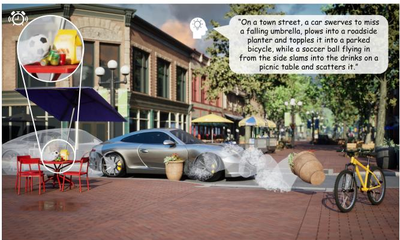  
Fi<sub>gure</sub> 1<sub>:</sub> A hi<sub>g</sub>h<sub>-qua</sub>lit<sub>y</sub> d<sub>ynam</sub>i<sub>c</sub> 3D <sub>scene genera</sub>t<sub>e</sub>d b<sub>y our</sub> f<sub>ramewor</sub>k<sub>, w</sub>h<sub>ere a</sub> t<sub>ex</sub>t<sub>ua</sub>l d<sub>escr</sub>i<sub>p</sub>ti<sub>on</sub> i<sub>s</sub> t<sub>rans</sub>l<sub>a</sub>t<sub>e</sub>d i<sub>n</sub>t<sub>o a</sub> <sub>p</sub>h<sub>ys</sub>i<sub>ca</sub>ll<sub>y cons</sub>i<sub>s</sub>t<sub>en</sub>t<sub>, execu</sub>t<sub>a</sub>bl<sub>e</sub> U<sub>nrea</sub>l E<sub>ng</sub>i<sub>ne scene w</sub>ith multiple interacting objects and events.

## Abstract

R<sub>ecen</sub>t <sub>ro ress</sub> i<sub>n</sub> i<sub>ma e an</sub>d 3D <sub>scene enera</sub>ti<sub>on</sub> h<sub>as ena</sub>bl<sub>e</sub>d i<sub>ncreas</sub>i<sub>ng</sub>l<sub>y rea</sub>li<sub>s</sub>ti<sub>c s</sub>t<sub>a</sub>ti<sub>c env</sub>i<sub>ronmen</sub>t<sub>s, ye</sub>t <sub>mos</sub>t <sub>me</sub>th<sub>-</sub> <sub>o</sub>d<sub>s rema</sub>i<sub>n con</sub>fi<sub>ne</sub>d t<sub>o suc</sub>h <sub>s</sub>t<sub>a</sub>ti<sub>c con</sub>fi<sub>gura</sub>ti<sub>ons.</sub> G<sub>ener-</sub> <sub>a</sub>ti<sub>ng</sub> d<sub>ynam</sub>i<sub>c scenes</sub> f<sub>rom na</sub>t<sub>ura</sub>l l<sub>anguage</sub> i<sub>s</sub> f<sub>un</sub>d<sub>amen-</sub> tally challenging: it requires joint reasoning over scene struct<sub>ure,</sub> t<sub>empora</sub>l <sub>evo</sub>l<sub>u</sub>ti<sub>on, an</sub>d <sub>p</sub>h<sub>ys</sub>i<sub>ca</sub>l f<sub>eas</sub>ibilit<sub>y, w</sub>hil<sub>e en-</sub> <sub>sur</sub>i<sub>ng re</sub>li<sub>a</sub>bl<sub>e execu</sub>ti<sub>on</sub> i<sub>n mo</sub>d<sub>ern p</sub>h<sub>ys</sub>i<sub>cs eng</sub>i<sub>nes.</sub> W<sub>e</sub> <sub>presen</sub>t <sub>a un</sub>ifi<sub>e</sub>d f<sub>ramewor</sub>k f<sub>or genera</sub>ti<sub>ng p</sub>h<sub>ys</sub>i<sub>ca</sub>ll<sub>y con-</sub> <sub>s</sub>i<sub>s</sub>t<sub>en</sub>t d<sub>ynam</sub>i<sub>c</sub> 3D <sub>scenes</sub> f<sub>rom</sub> t<sub>ex</sub>t<sub>, w</sub>ith <sub>ou</sub>t<sub>pu</sub>t<sub>s</sub> di<sub>rec</sub>tl<sub>y</sub> <sub>execu</sub>t<sub>a</sub>bl<sub>e</sub> i<sub>n</sub> U<sub>nrea</sub>l E<sub>ng</sub>i<sub>ne.</sub> C<sub>en</sub>t<sub>ra</sub>l t<sub>o our approac</sub>h i<sub>s</sub> th<sub>e</sub> Evolutive Scene Graph (ESG), which specifies entities with <sub>p</sub>h<sub>ys</sub>i<sub>ca</sub>l <sub>a</sub>tt<sub>r</sub>ib<sub>u</sub>t<sub>es, spa</sub>ti<sub>a</sub>l <sub>re</sub>l<sub>a</sub>ti<sub>ons, an</sub>d <sub>even</sub>t<sub>-</sub>d<sub>r</sub>i<sub>ven</sub> ti<sub>me-</sub> li<sub>nes</sub> i<sub>n a mac</sub>hi<sub>ne-c</sub>h<sub>ec</sub>k<sub>a</sub>bl<sub>e</sub> f<sub>orm.</sub> Gi<sub>ven a promp</sub>t<sub>, a</sub> l<sub>arge</sub> l<sub>anguage mo</sub>d<sub>e</sub>l <sub>cons</sub>t<sub>ruc</sub>t<sub>s an</sub>d <sub>va</sub>lid<sub>a</sub>t<sub>es a comp</sub>l<sub>e</sub>t<sub>e</sub> ESG<sub>;</sub> <sub>spa</sub>ti<sub>a</sub>l l<sub>ayou</sub>t<sub>s</sub> <sub>are</sub> <sub>groun</sub>d<sub>e</sub>d <sub>v</sub>i<sub>a</sub> <sub>energy-m</sub>i<sub>n</sub>i<sub>m</sub>i<sub>ze</sub>d <sub>gra</sub>di<sub>en</sub>t <sub>op</sub>ti<sub>m</sub>i<sub>za</sub>ti<sub>on;</sub> ti<sub>me</sub>li<sub>ne-cons</sub>t<sub>ra</sub>i<sub>ne</sub>d <sub>p</sub>h<sub>ys</sub>i<sub>ca</sub>l <sub>parame</sub>t<sub>ers</sub> <sub>are</sub> th<sub>en op</sub>ti<sub>m</sub>i<sub>ze</sub>d th<sub>roug</sub>h dif<sub>eren</sub>ti<sub>a</sub>bl<sub>e s</sub>i<sub>mu</sub>l<sub>a</sub>ti<sub>on</sub> t<sub>o sa</sub>ti<sub>s</sub>f<sub>y</sub> <sub>user-spec</sub>ifi<sub>e</sub>d <sub>even</sub>t<sub>s;</sub> <sub>an</sub>d th<sub>e</sub> <sub>resu</sub>lti<sub>ng</sub> <sub>scene</sub> i<sub>s</sub> <sub>comp</sub>il<sub>e</sub>d i<sub>n</sub>t<sub>o an eng</sub>i<sub>ne-execu</sub>t<sub>a</sub>bl<sub>e c</sub>l<sub>ass.</sub> E<sub>xper</sub>i<sub>men</sub>t<sub>s on</sub> 10 <sub>scenes</sub> <sub>across</sub> th<sub>ree</sub> <sub>comp</sub>l<sub>ex</sub>it<sub>y</sub> l<sub>eve</sub>l<sub>s</sub> <sub>s</sub>h<sub>ow</sub> th<sub>a</sub>t <sub>our</sub> <sub>me</sub>th<sub>o</sub>d <sub>ac</sub>hi<sub>eves</sub> 16.4/18 mean event completion, outperforming Scene Lan-<sub>g</sub>ua<sub>g</sub>e, the stron<sub>g</sub>est en<sub>g</sub>ine-executable baseline (SimWorld), <sub>an</sub>d <sub>our a</sub>bl<sub>a</sub>ti<sub>on w</sub>ith<sub>ou</sub>t <sub>p</sub>h<sub>ys</sub>i<sub>ca</sub>l <sub>op</sub>ti<sub>m</sub>i<sub>za</sub>ti<sub>on</sub> b<sub>y a c</sub>l<sub>ear mar-</sub> <sub>g</sub>i<sub>n</sub> i<sub>n</sub> <sub>even</sub>t <sub>comp</sub>l<sub>e</sub>ti<sub>on</sub> <sub>an</sub>d <sub>parame</sub>t<sub>er</sub> <sub>accuracy.</sub>

## 1 Introduction

R<sub>ecen</sub>t <sub>a</sub>d<sub>vances</sub> i<sub>n</sub> 3D <sub>genera</sub>ti<sub>on</sub> h<sub>ave pro</sub>d<sub>uce</sub>d i<sub>mpress</sub>i<sub>ve</sub> results in automatic scene synthesis, yet the majority of exi<sub>s</sub>ti<sub>ng approac</sub>h<sub>es rema</sub>i<sub>n con</sub>fi<sub>ne</sub>d t<sub>o s</sub>t<sub>a</sub>ti<sub>c scenes, w</sub>h<sub>ereas</sub> <sub>many rea</sub>l<sub>-wor</sub>ld <sub>app</sub>li<sub>ca</sub>ti<sub>ons—</sub>fil<sub>ms, games, v</sub>i<sub>r</sub>t<sub>ua</sub>l <sub>rea</sub>lit<sub>y,</sub> and simulation—require dynamic scenes in which objects i<sub>n</sub>t<sub>erac</sub>t <sub>an</sub>d <sub>evo</sub>l<sub>ve un</sub>d<sub>er p</sub>h<sub>ys</sub>i<sub>ca</sub>l l<sub>aws.</sub>

D<sub>ynam</sub>i<sub>c scene genera</sub>ti<sub>on</sub> i<sub>n</sub>t<sub>ro</sub>d<sub>uces c</sub>h<sub>a</sub>ll<sub>enges we</sub>ll b<sub>e-</sub> yond static layout synthesis: a scene must jointly model temporal structure, event-driven interactions, and objectl<sub>eve</sub>l <sub>p</sub>h<sub>ys</sub>i<sub>ca</sub>l <sub>parame</sub>t<sub>ers w</sub>hil<sub>e ensur</sub>i<sub>ng p</sub>h<sub>ys</sub>i<sub>ca</sub>ll<sub>y</sub> f<sub>eas</sub>ibl<sub>e</sub> <sub>mo</sub>ti<sub>on.</sub> D<sub>ep</sub>l<sub>oymen</sub>t f<sub>ur</sub>th<sub>er</sub> d<sub>eman</sub>d<sub>s</sub> di<sub>rec</sub>t <sub>execu</sub>t<sub>a</sub>bilit<sub>y—</sub> explicit object instantiation, physics initialization, and event l<sub>og</sub>i<sub>c</sub> <sub>compa</sub>tibl<sub>e</sub> <sub>w</sub>ith <sub>rea</sub>l<sub>-</sub>ti<sub>me</sub> <sub>s</sub>i<sub>mu</sub>l<sub>a</sub>ti<sub>on</sub> f<sub>ramewor</sub>k<sub>s.</sub>

E<sub>x</sub>i<sub>s</sub>ti<sub>ng me</sub>th<sub>o</sub>d<sub>s a</sub>dd<sub>ress on</sub>l<sub>y su</sub>b<sub>se</sub>t<sub>s o</sub>f th<sub>ese requ</sub>i<sub>re-</sub> <sub>men</sub>t<sub>s.</sub> L<sub>earn</sub>i<sub>ng-</sub>b<sub>ase</sub>d <sub>approac</sub>h<sub>es,</sub> i<sub>nc</sub>l<sub>u</sub>di<sub>ng au</sub>t<sub>oregress</sub>i<sub>ve</sub> <sub>an</sub>d dif<sub>us</sub>i<sub>on mo</sub>d<sub>e</sub>l<sub>s, pre</sub>di<sub>c</sub>t <sub>s</sub>t<sub>a</sub>ti<sub>c</sub> l<sub>ayou</sub>t<sub>s or geome</sub>t<sub>ry</sub> di<sub>s-</sub> t<sub>r</sub>ib<sub>u</sub>ti<sub>ons w</sub>ith <sub>no</sub> t<sub>empora</sub>l <sub>s</sub>t<sub>ruc</sub>t<sub>ure or p</sub>h<sub>ys</sub>i<sub>ca</sub>l d<sub>ynam-</sub> ics (Paschalidou et al. 2021; Tan<sub>g</sub> et al. 2024; Zhai et al. 2023; Lin and Mu 2024). Procedural s<sub>y</sub>stems such as Infini-<sub>g</sub>en (Raistrick et al. 2023) scale to <sub>p</sub>hotorealistic worlds but ofer no semantic or <sub>p</sub>h<sub>y</sub>sical controllabilit<sub>y</sub>. SimWorld (Ye et al. 2025) and Virtual Communit<sub>y</sub> (Zhou et al. 2026) build <sub>c</sub>it<sub>y-sca</sub>l<sub>e env</sub>i<sub>ronmen</sub>t<sub>s a</sub>t<sub>op rea</sub>l <sub>p</sub>h<sub>ys</sub>i<sub>cs eng</sub>i<sub>nes an</sub>d d<sub>ep</sub>l<sub>oy</sub> LLM <sub>age</sub>nt<sub>s</sub> f<sub>o</sub>r n<sub>av</sub>i<sub>ga</sub>ti<sub>o</sub>n<sub>, ye</sub>t tr<sub>a</sub>n<sub>s</sub>l<sub>a</sub>t<sub>e age</sub>nt <sub>co</sub>mm<sub>a</sub>nd<sub>s</sub> i<sub>n</sub>t<sub>o pre-</sub>d<sub>e</sub>fi<sub>ne</sub>d <sub>mo</sub>ti<sub>on pr</sub>i<sub>m</sub>iti<sub>ves w</sub>ith <sub>no mec</sub>h<sub>an</sub>i<sub>sm</sub> t<sub>o</sub> <sub>so</sub>l<sub>ve</sub> f<sub>or</sub> th<sub>e p</sub>h<sub>ys</sub>i<sub>ca</sub>l <sub>parame</sub>t<sub>ers</sub> th<sub>a</sub>t <sub>guaran</sub>t<sub>ee a spec</sub>ifi<sub>e</sub>d <sub>even</sub>t<sub>—</sub>l<sub>eav</sub>i<sub>ng comp</sub>l<sub>e</sub>ti<sub>on</sub> d<sub>epen</sub>d<sub>en</sub>t <sub>on agen</sub>t <sub>po</sub>li<sub>cy ra</sub>th<sub>er</sub> than <sub>p</sub>h<sub>y</sub>sical o<sub>p</sub>timalit<sub>y</sub>. PAT3D (Lin et al. 2026) inte<sub>g</sub>rates dif<sub>eren</sub>ti<sub>a</sub>bl<sub>e s</sub>i<sub>mu</sub>l<sub>a</sub>ti<sub>on</sub> i<sub>n</sub>t<sub>o</sub> t<sub>ex</sub>t<sub>-</sub>t<sub>o-</sub>3D <sub>genera</sub>ti<sub>on</sub> b<sub>u</sub>t t<sub>ar-</sub> <sub>ge</sub>t<sub>s s</sub>t<sub>a</sub>ti<sub>c equ</sub>ilib<sub>r</sub>i<sub>um ra</sub>th<sub>er</sub> th<sub>an</sub> t<sub>empora</sub>l <sub>even</sub>t <sub>sa</sub>ti<sub>s</sub>f<sub>ac</sub>ti<sub>on.</sub>

LLM<sub>-</sub> <sub>an</sub>d <sub>scr</sub>i<sub>p</sub>t<sub>-</sub>b<sub>ase</sub>d <sub>p</sub>i<sub>pe</sub>li<sub>nes</sub> <sub>pro</sub>d<sub>uce</sub> <sub>proce</sub>d<sub>ura</sub>l <sub>or</sub> <sub>an</sub>i<sub>ma</sub>ti<sub>on</sub> d<sub>escr</sub>i<sub>p</sub>ti<sub>ons</sub> f<sub>rom</sub> t<sub>ex</sub>t<sub>,</sub> <sub>ye</sub>t <sub>re</sub>l<sub>y</sub> <sub>on</sub> h<sub>eur</sub>i<sub>s</sub>ti<sub>c</sub> <sub>pa-</sub> rameters without validatin<sub>g</sub> <sub>p</sub>h<sub>y</sub>sical realizabilit<sub>y</sub> (Hu et al. 2024; Sun et al. 2025; Yan<sub>g</sub> et al. 2025), causin<sub>g</sub> d<sub>y</sub>namic i<sub>n</sub>t<sub>erac</sub>ti<sub>ons</sub> t<sub>o</sub> <sub>ex</sub>hibit i<sub>ns</sub>t<sub>a</sub>bilit<sub>y</sub> <sub>or</sub> i<sub>ncons</sub>i<sub>s</sub>t<sub>ency</sub> i<sub>n</sub> <sub>p</sub>h<sub>ys</sub>i<sub>cs</sub> en<sub>g</sub><sup>i</sup>nes.

W<sub>e argue</sub> th<sub>a</sub>t d<sub>ynam</sub>i<sub>c scene genera</sub>ti<sub>on s</sub>h<sub>ou</sub>ld b<sub>e</sub> f<sub>or-</sub> <sub>mu</sub>l<sub>a</sub>t<sub>e</sub>d <sub>as</sub> <sub>a</sub> <sub>s</sub>t<sub>ruc</sub>t<sub>ure</sub>d <sub>spec</sub>ifi<sub>ca</sub>ti<sub>on</sub> <sub>an</sub>d <sub>p</sub>h<sub>ys</sub>i<sub>ca</sub>l <sub>groun</sub>di<sub>ng</sub> <sub>pro</sub>bl<sub>em: na</sub>t<sub>ura</sub>l l<sub>anguage</sub> i<sub>s</sub> fi<sub>rs</sub>t t<sub>rans</sub>l<sub>a</sub>t<sub>e</sub>d i<sub>n</sub>t<sub>o a mac</sub>hi<sub>ne-</sub> <sub>c</sub>h<sub>ec</sub>k<sub>a</sub>bl<sub>e</sub> <sub>represen</sub>t<sub>a</sub>ti<sub>on</sub> <sub>o</sub>f <sub>en</sub>titi<sub>es,</sub> <sub>re</sub>l<sub>a</sub>ti<sub>ons,</sub> <sub>even</sub>t<sub>s,</sub> <sub>an</sub>d t<sub>empora</sub>l <sub>cons</sub>t<sub>ra</sub>i<sub>n</sub>t<sub>s,</sub> th<sub>en groun</sub>d<sub>e</sub>d th<sub>roug</sub>h <sub>p</sub>h<sub>ys</sub>i<sub>cs-</sub>b<sub>ase</sub>d <sub>op</sub>ti<sub>m</sub>i<sub>za</sub>ti<sub>on</sub> <sub>an</sub>d <sub>s</sub>i<sub>mu</sub>l<sub>a</sub>ti<sub>on—ena</sub>bli<sub>ng</sub> <sub>sys</sub>t<sub>ema</sub>ti<sub>c</sub> <sub>ver</sub>ifi<sub>ca-</sub> ti<sub>on,</sub> <sub>con</sub>t<sub>ro</sub>ll<sub>a</sub>bilit<sub>y,</sub> <sub>an</sub>d <sub>re</sub>li<sub>a</sub>bl<sub>e</sub> <sub>execu</sub>ti<sub>on</sub> th<sub>a</sub>t <sub>pure</sub>l<sub>y</sub> <sub>gener-</sub> <sup>ati</sup>v<sup>e</sup> <sup>a</sup>pp<sup>roaches</sup> <sup>cannot</sup> gu<sup>arantee</sup>.

B<sub>ase</sub>d <sub>on</sub> thi<sub>s</sub> i<sub>ns</sub>i<sub>g</sub>ht<sub>,</sub> <sub>we</sub> <sub>propose</sub> <sub>a</sub> <sub>un</sub>ifi<sub>e</sub>d f<sub>ramewor</sub>k th<sub>a</sub>t t<sub>rans</sub>l<sub>a</sub>t<sub>es</sub> <sub>na</sub>t<sub>ura</sub>l<sub>-</sub>l<sub>anguage</sub> <sub>promp</sub>t<sub>s</sub> i<sub>n</sub>t<sub>o</sub> di<sub>rec</sub>tl<sub>y</sub> <sub>execu</sub>t<sub>a</sub>bl<sub>e</sub> Unreal Engine scenes. Central to our approach is the Evolutive Scene Graph (ESG)—a machine-checkable dynamic <sub>scene</sub> <sub>represen</sub>t<sub>a</sub>ti<sub>on</sub> <sub>enco</sub>di<sub>ng</sub> <sub>p</sub>h<sub>ys</sub>i<sub>ca</sub>l <sub>proper</sub>ti<sub>es,</sub> <sub>seman-</sub> ti<sub>c a</sub>tt<sub>r</sub>ib<sub>u</sub>t<sub>es, spa</sub>ti<sub>a</sub>l <sub>re</sub>l<sub>a</sub>ti<sub>ons, an</sub>d <sub>even</sub>t<sub>-</sub>d<sub>r</sub>i<sub>ven</sub> ti<sub>me</sub>li<sub>nes</sub> i<sub>n a s</sub>t<sub>an</sub>d<sub>ar</sub>di<sub>ze</sub>d JSON <sub>sc</sub>h<sub>ema.</sub> A<sub>n</sub> LLM <sub>cons</sub>t<sub>ruc</sub>t<sub>s an</sub>d <sub>va</sub>lid<sub>a</sub>t<sub>es</sub> th<sub>e</sub> ESG th<sub>roug</sub>h <sub>a</sub> l<sub>ayere</sub>d <sub>process,</sub> <sub>reso</sub>l<sub>v</sub>i<sub>ng</sub> <sub>se-</sub> mantic entities into concrete assets. Object poses are then <sub>groun</sub>d<sub>e</sub>d <sub>v</sub>i<sub>a energy-m</sub>i<sub>n</sub>i<sub>m</sub>i<sub>ze</sub>d <sub>gra</sub>di<sub>en</sub>t <sub>op</sub>ti<sub>m</sub>i<sub>za</sub>ti<sub>on sa</sub>t<sub>-</sub> i<sub>s</sub>f<sub>y</sub>i<sub>ng spa</sub>ti<sub>a</sub>l <sub>cons</sub>t<sub>ra</sub>i<sub>n</sub>t<sub>s, co</sub>lli<sub>s</sub>i<sub>on avo</sub>id<sub>ance, an</sub>d <sub>p</sub>h<sub>ys</sub>i<sub>ca</sub>l <sub>p</sub>l<sub>acea</sub>bilit<sub>y.</sub>

Th<sub>e</sub> k<sub>ey</sub> t<sub>ec</sub>h<sub>n</sub>i<sub>ca</sub>l <sub>con</sub>t<sub>r</sub>ib<sub>u</sub>ti<sub>on</sub> i<sub>s</sub> ti<sub>me</sub>li<sub>ne-cons</sub>t<sub>ra</sub>i<sub>ne</sub>d <sub>p</sub>h<sub>ys</sub>i<sub>ca</sub>l <sub>op</sub>ti<sub>m</sub>i<sub>za</sub>ti<sub>on</sub> f<sub>ormu</sub>l<sub>a</sub>t<sub>e</sub>d <sub>as an even</sub>t<sub>-cons</sub>t<sub>ra</sub>i<sub>ne</sub>d f<sub>ea-</sub> <sub>s</sub>ibilit<sub>y pro</sub>bl<sub>em.</sub> W<sub>e op</sub>ti<sub>m</sub>i<sub>ze p</sub>h<sub>ys</sub>i<sub>ca</sub>l <sub>parame</sub>t<sub>ers—</sub>i<sub>n</sub>iti<sub>a</sub>l <sub>ve</sub>l<sub>oc</sub>iti<sub>es,</sub> <sub>ac</sub>t<sub>ua</sub>ti<sub>on</sub> f<sub>orces,</sub> ti<sub>m</sub>i<sub>ng</sub> <sub>o</sub>f<sub>se</sub>t<sub>s—</sub>b<sub>y</sub> <sub>m</sub>i<sub>n</sub>i<sub>m</sub>i<sub>z</sub>i<sub>ng</sub> <sub>even</sub>t<sub>-w</sub>i<sub>se</sub> l<sub>osses</sub> th<sub>roug</sub>h dif<sub>eren</sub>ti<sub>a</sub>bl<sub>e</sub> f<sub>orwar</sub>d <sub>s</sub>i<sub>mu</sub>l<sub>a</sub>ti<sub>on,</sub> <sub>us</sub>i<sub>ng an</sub> AD<sub>-</sub>d<sub>e</sub>f<sub>au</sub>lt<sub>,</sub> FD<sub>-</sub>f<sub>a</sub>llb<sub>ac</sub>k <sub>gra</sub>di<sub>en</sub>t <sub>sc</sub>h<sub>eme</sub> th<sub>a</sub>t b<sub>a</sub>l<sub>-</sub> <sub>ances e</sub>fi<sub>c</sub>i<sub>ency w</sub>ith fid<sub>e</sub>lit<sub>y across</sub> i<sub>n</sub>t<sub>erac</sub>ti<sub>on comp</sub>l<sub>ex</sub>iti<sub>es.</sub> Th<sub>e groun</sub>d<sub>e</sub>d ESG i<sub>s comp</sub>il<sub>e</sub>d i<sub>n</sub>t<sub>o</sub> UE <sub>p</sub>h<sub>ys</sub>i<sub>cs</sub> i<sub>n</sub>iti<sub>a</sub>li<sub>za</sub>ti<sub>on</sub> <sub>an</sub>d <sub>even</sub>t <sub>sc</sub>h<sub>e</sub>d<sub>u</sub>li<sub>ng</sub> l<sub>og</sub>i<sub>c.</sub>

E<sub>xper</sub>i<sub>men</sub>t<sub>s</sub> d<sub>emons</sub>t<sub>ra</sub>t<sub>e</sub> di<sub>verse</sub> d<sub>ynam</sub>i<sub>c</sub> <sub>scenes</sub> <sub>w</sub>ith <sub>s</sub>t<sub>a</sub>bl<sub>e p</sub>h<sub>ys</sub>i<sub>ca</sub>l b<sub>e</sub>h<sub>av</sub>i<sub>ors,</sub> hi<sub>g</sub>h <sub>even</sub>t <sub>comp</sub>l<sub>e</sub>ti<sub>on ra</sub>t<sub>es, an</sub>d l<sub>ow</sub> <sub>parame</sub>t<sub>er</sub> <sub>errors</sub> <sub>across</sub> <sub>a</sub> <sub>w</sub>id<sub>e</sub> <sub>range</sub> <sub>o</sub>f i<sub>n</sub>t<sub>erac</sub>ti<sub>on</sub> t<sub>ypes.</sub> W<sub>e w</sub>ill <sub>pu</sub>bli<sub>c</sub>l<sub>y re</sub>l<sub>ease our co</sub>d<sub>e.</sub> O<sub>ur con</sub>t<sub>r</sub>ib<sub>u</sub>ti<sub>ons are</sub> th<sub>ree</sub>f<sub>o</sub>ld<sub>:</sub>

• We introduce ESG (Evolutive Scene Graph)<sub>,</sub> a structured representation that formally models objects, events, tem-<sub>pora</sub>l <sub>cons</sub>t<sub>ra</sub>i<sub>n</sub>t<sub>s, an</sub>d <sub>causa</sub>l d<sub>epen</sub>d<sub>enc</sub>i<sub>es</sub> f<sub>or</sub> 3D d<sub>y-</sub> <sub>nam</sub>i<sub>c scenes,</sub> b<sub>r</sub>id<sub>g</sub>i<sub>ng na</sub>t<sub>ura</sub>l<sub>-</sub>l<sub>anguage</sub> d<sub>escr</sub>i<sub>p</sub>ti<sub>ons an</sub>d <sub>p</sub>h<sub>ys</sub>i<sub>ca</sub>ll<sub>y</sub> <sub>execu</sub>t<sub>a</sub>bl<sub>e</sub> <sub>scene</sub> <sub>spec</sub>ifi<sub>ca</sub>ti<sub>ons.</sub>

• We formulate d<sub>y</sub>namic scene <sub>g</sub>eneration as an event-Constraint feasibility problem and propose a hybrid opti<sub>m</sub>i<sub>za</sub>ti<sub>on</sub> f<sub>ramewor</sub>k <sub>coup</sub>li<sub>ng</sub> LLM<sub>-</sub>d<sub>r</sub>i<sub>ven mo</sub>ti<sub>on</sub> t<sub>em-</sub> <sub>p</sub>l<sub>a</sub>t<sub>e</sub> <sub>ma</sub>t<sub>c</sub>hi<sub>ng</sub> <sub>w</sub>ith ti<sub>me</sub>li<sub>ne-aware,</sub> dif<sub>eren</sub>ti<sub>a</sub>bl<sub>e</sub> <sub>param-</sub> <sub>e</sub>t<sub>er searc</sub>h t<sub>o sa</sub>ti<sub>s</sub>f<sub>y mu</sub>lti<sub>-s</sub>t<sub>age even</sub>t <sub>cons</sub>t<sub>ra</sub>i<sub>n</sub>t<sub>s.</sub>

• We <sub>p</sub>resent a general diferentiable physics framework <sub>com</sub>bi<sub>n</sub>i<sub>ng</sub> <sub>r</sub>i<sub>g</sub>id<sub>-</sub>b<sub>o</sub>d<sub>y</sub> d<sub>ynam</sub>i<sub>cs</sub> <sub>w</sub>ith <sub>even</sub>t<sub>-</sub>d<sub>r</sub>i<sub>ven</sub> l<sub>oss</sub> f<sub>unc</sub>ti<sub>ons, ena</sub>bli<sub>ng en</sub>d<sub>-</sub>t<sub>o-en</sub>d <sub>op</sub>ti<sub>m</sub>i<sub>za</sub>ti<sub>on o</sub>f <sub>p</sub>h<sub>ys</sub>i<sub>ca</sub>l <sub>parame</sub>t<sub>ers an</sub>d di<sub>rec</sub>t <sub>comp</sub>il<sub>a</sub>ti<sub>on</sub> i<sub>n</sub>t<sub>o an execu</sub>t<sub>a</sub>bl<sub>e</sub> U<sub>n-</sub> <sub>rea</sub>l E<sub>ng</sub>i<sub>ne</sub> <sub>env</sub>i<sub>ronmen</sub>t<sub>.</sub>

## 2 Related Work

## 2.1 3D Scene Generation

E<sub>ar</sub>l<sub>y</sub> 3D <sub>scene syn</sub>th<sub>es</sub>i<sub>s arrange</sub>d <sub>re</sub>t<sub>r</sub>i<sub>eve</sub>d <sub>asse</sub>t<sub>s v</sub>i<sub>a</sub> h<sub>an</sub>d<sub>-</sub> crafted <sub>g</sub>eometric rules (Yu et al. 2011; Fisher et al. 2012); PlanIT (Wan<sub>g</sub> et al. 2019) advanced this with hierarchical <sub>grammars</sub> <sub>an</sub>d i<sub>n</sub>t<sub>erac</sub>ti<sub>on</sub> <sub>grap</sub>h<sub>s,</sub> <sub>ye</sub>t b<sub>o</sub>th <sub>rema</sub>i<sub>n</sub> <sub>con</sub>fi<sub>ne</sub>d t<sub>o</sub> <sub>s</sub>t<sub>a</sub>ti<sub>c</sub> l<sub>ayou</sub>t<sub>s.</sub>

D<sub>eep</sub> <sub>genera</sub>ti<sub>ve</sub> <sub>mo</sub>d<sub>e</sub>l<sub>s</sub> <sub>s</sub>hift<sub>e</sub>d th<sub>e</sub> <sub>para</sub>di<sub>gm</sub> t<sub>o</sub> l<sub>earn</sub>i<sub>ng</sub> <sub>con</sub>ti<sub>nuous scene</sub> di<sub>s</sub>t<sub>r</sub>ib<sub>u</sub>ti<sub>ons.</sub> GAN<sub>- an</sub>d VAE<sub>-</sub>b<sub>ase</sub>d <sub>me</sub>th<sub>-</sub> ods (Wan<sub>g</sub> et al. 2018; Ritchie, Wan<sub>g</sub>, and an Lin 2018) en-<sub>co</sub>d<sub>e</sub> l<sub>ayou</sub>t<sub>s</sub> i<sub>n</sub>t<sub>o</sub> l<sub>a</sub>t<sub>en</sub>t <sub>spaces;</sub> <sub>au</sub>t<sub>oregress</sub>i<sub>ve</sub> <sub>mo</sub>d<sub>e</sub>l<sub>s</sub> <sub>suc</sub>h <sub>as</sub> ATISS (Paschalidou et al. 2021) treat s<sub>y</sub>nthesis as sequence modelin<sub>g</sub>; difusion models (Zhai et al. 2023; Lin and Mu 2024; Tan<sub>g</sub> et al. 2024) achieve su<sub>p</sub>erior scene covera<sub>g</sub>e; and

3D-aware <sub>g</sub>enerators (Li et al. 2024; DeVries et al. 2021) s<sub>y</sub>nthesize renderable NeRF scenes. SceneCraft (Yan<sub>g</sub> et al. 2024a) scales to com<sub>p</sub>lex indoor to<sub>p</sub>olo<sub>g</sub>ies via semantic l<sub>a ou</sub>t<sub>s an</sub>d dif<sub>us</sub>i<sub>on-</sub>b<sub>ase</sub>d <sub>ren</sub>d<sub>er</sub>i<sub>ng,</sub> b<sub>u</sub>t <sub>ou</sub>t<sub>pu</sub>t<sub>s a</sub> N<sub>e</sub>RF with no object instantiation, physical properties, or dynamic <sub>con</sub>t<sub>ro</sub>l<sub>.</sub>

B<sub>roa</sub>d<sub>er-sca</sub>l<sub>e e</sub>f<sub>or</sub>t<sub>s enr</sub>i<sub>c</sub>h <sub>con</sub>t<sub>en</sub>t b<sub>u</sub>t <sub>no</sub>t d<sub>ynam</sub>i<sub>cs.</sub> I<sub>n-</sub> fini<sub>g</sub>en (Raistrick et al. 2023) <sub>p</sub>rocedurall<sub>y g</sub>enerates <sub>p</sub>hoto-<sub>rea</sub>li<sub>s</sub>ti<sub>c env</sub>i<sub>ronmen</sub>t<sub>s w</sub>ith <sub>no seman</sub>ti<sub>c or p</sub>h<sub>ys</sub>i<sub>ca</sub>l <sub>con</sub>t<sub>ro</sub>l<sub>.</sub> Cit<sub>y</sub>-scale <sub>p</sub>latforms SimWorld (Ye et al. 2025) and Virtual Communit<sub>y</sub> (Zhou et al. 2026) su<sub>pp</sub>ort LLM-driven con-<sub>s</sub>t<sub>ruc</sub>ti<sub>on an</sub>d <sub>agen</sub>t <sub>nav</sub>i<sub>ga</sub>ti<sub>on,</sub> b<sub>u</sub>t t<sub>rea</sub>t d<sub>ynam</sub>i<sub>cs as agen</sub>t d<sub>ec</sub>i<sub>s</sub>i<sub>ons</sub> <sub>ra</sub>th<sub>er</sub> th<sub>an</sub> <sub>spec</sub>ifi<sub>a</sub>bl<sub>e</sub> <sub>p</sub>h<sub>ys</sub>i<sub>ca</sub>l <sub>even</sub>t<sub>s,</sub> <sub>expos</sub>i<sub>ng</sub> <sub>no</sub> mechanism to define or optimize timed object interactions.

LLM<sub>s</sub> h<sub>ave</sub> i<sub>nsp</sub>i<sub>re</sub>d l<sub>anguage-</sub>d<sub>r</sub>i<sub>ven scene p</sub>l<sub>ann</sub>i<sub>ng.</sub> GPT4Motion (Lv et al. 2024) <sub>p</sub>rom<sub>p</sub>ts GPT-4 to write Bl<sub>en</sub>d<sub>er p</sub>h<sub>ys</sub>i<sub>cs scr</sub>i<sub>p</sub>t<sub>s,</sub> b<sub>u</sub>t <sub>parame</sub>t<sub>ers are unop</sub>ti<sub>m</sub>i<sub>ze</sub>d <sub>an</sub>d th<sub>e ou</sub>t<sub>pu</sub>t i<sub>s ren</sub>d<sub>ere</sub>d <sub>v</sub>id<sub>eo ra</sub>th<sub>er</sub> th<sub>an s</sub>i<sub>mu</sub>l<sub>a</sub>ti<sub>on-rea</sub>d<sub>y</sub> data. More broadl<sub>y</sub>, LLM-based <sub>p</sub>lanners (Hu et al. 2024; Sun et al. 2025; Yan<sub>g</sub> et al. 2025) <sub>g</sub>enerate executable scri<sub>p</sub>ts <sub>y</sub>et <sub>va</sub>lid<sub>a</sub>t<sub>e</sub> f<sub>eas</sub>ibilit<sub>y</sub> <sub>on</sub>l<sub>y</sub> <sub>v</sub>i<sub>a</sub> b<sub>oun</sub>di<sub>ng-</sub>b<sub>ox</sub> h<sub>eur</sub>i<sub>s</sub>ti<sub>cs,</sub> l<sub>eav</sub>i<sub>ng</sub> <sub>even</sub>t<sub>-</sub>l<sub>eve</sub>l <sub>cons</sub>t<sub>ra</sub>i<sub>n</sub>t<sub>s unen</sub>f<sub>orcea</sub>bl<sub>e.</sub>

N<sub>one</sub> <sub>o</sub>f th<sub>e</sub> <sub>a</sub>b<sub>ove</sub> t<sub>rea</sub>t<sub>s</sub> d<sub>ynam</sub>i<sub>c</sub> <sub>scene</sub> <sub>genera</sub>ti<sub>on</sub> <sub>as</sub> <sub>even</sub>t<sub>-cons</sub>t<sub>ra</sub>i<sub>n</sub>t <sub>sa</sub>ti<sub>s</sub>f<sub>ac</sub>ti<sub>on: ou</sub>t<sub>pu</sub>t<sub>s are s</sub>t<sub>a</sub>ti<sub>c</sub> l<sub>ayou</sub>t<sub>s or</sub> <sub>ren</sub>d<sub>ere</sub>d <sub>v</sub>id<sub>eos</sub> <sub>w</sub>ith f<sub>eas</sub>ibilit<sub>y</sub> <sub>c</sub>h<sub>ec</sub>k<sub>e</sub>d <sub>on</sub>l<sub>y</sub> <sub>geome</sub>t<sub>r</sub>i<sub>ca</sub>ll<sub>y.</sub> W<sub>e c</sub>l<sub>ose</sub> thi<sub>s gap</sub> b<sub>y</sub> f<sub>ormu</sub>l<sub>a</sub>ti<sub>ng scene genera</sub>ti<sub>on as even</sub>t<sub>-</sub> <sub>cons</sub>t<sub>ra</sub>i<sub>ne</sub>d <sub>parame</sub>t<sub>er op</sub>ti<sub>m</sub>i<sub>za</sub>ti<sub>on over a</sub> dif<sub>eren</sub>ti<sub>a</sub>bl<sub>e s</sub>i<sub>m-</sub> <sub>u</sub>l<sub>a</sub>ti<sub>on</sub> l<sub>oop, guaran</sub>t<sub>ee</sub>i<sub>ng even</sub>t <sub>rea</sub>li<sub>za</sub>ti<sub>on</sub> i<sub>n a s</sub>t<sub>an</sub>d<sub>ar</sub>d <sub>p</sub><sup>h</sup><sub>y</sub>s<sup>i</sup>cs en<sub>g</sub><sup>i</sup>ne.

## 2.2 Scene Description and Generation

S<sub>cene spec</sub>ifi<sub>ca</sub>ti<sub>ons</sub> b<sub>r</sub>id<sub>ge user</sub> i<sub>n</sub>t<sub>en</sub>t <sub>an</sub>d <sub>geome</sub>t<sub>r</sub>i<sub>c</sub> i<sub>ns</sub>t<sub>an-</sub> tiation. Dataset-driven a<sub>pp</sub>roaches such as 3D-FRONT (Fu et al. 2021) ins<sub>p</sub>ired sequence-based scene models (Wan<sub>g</sub>, Yeshwanth, and Nießner 2021), while scene <sub>g</sub>ra<sub>p</sub>hs (Zhou, While, and Kalo<sub>g</sub>erakis 2019; Dhamo et al. 2021) ca<sub>p</sub>- ture richer inter-object relations; Graph-to-3D (Dhamo et al. 2021) decodes object attributes from semantic edges via <sub>grap</sub>h <sub>convo</sub>l<sub>u</sub>ti<sub>ons.</sub>

LLM<sub>s</sub> h<sub>ave</sub> b<sub>ecome</sub> di<sub>rec</sub>t <sub>reasoners over scene s</sub>t<sub>ruc</sub>t<sub>ure</sub> from natural lan<sub>g</sub>ua<sub>g</sub>e: La<sub>y</sub>outGPT (Fen<sub>g</sub> et al. 2023) and InstructScene (Lin and Mu 2024) emit la<sub>y</sub>out <sub>p</sub>ro<sub>g</sub>rams or semantic <sub>g</sub>ra<sub>p</sub>hs for downstream <sub>g</sub>eneration; Holodeck (Yan<sub>g</sub> et al. 2024b) converts s<sub>p</sub>atial constraints into simulator-<sub>compa</sub>tibl<sub>e</sub> <sub>scenes</sub> <sub>v</sub>i<sub>a</sub> <sub>cons</sub>t<sub>ra</sub>i<sub>n</sub>t <sub>sa</sub>ti<sub>s</sub>f<sub>ac</sub>ti<sub>on;</sub> <sub>an</sub>d S<sub>cene</sub> L<sub>an-</sub> <sub>g</sub>ua<sub>g</sub>e (Zhan<sub>g</sub> et al. 2025) re<sub>p</sub>resents scenes as <sub>p</sub>ro<sub>g</sub>rams, <sub>wor</sub>d<sub>s, an</sub>d <sub>em</sub>b<sub>e</sub>ddi<sub>ngs</sub> f<sub>or proce</sub>d<sub>ura</sub>l 4D <sub>an</sub>i<sub>ma</sub>ti<sub>on.</sub>

E<sub>x</sub>i<sub>s</sub>ti<sub>ng spec</sub>ifi<sub>ca</sub>ti<sub>ons are none</sub>th<sub>e</sub>l<sub>ess pre</sub>d<sub>om</sub>i<sub>nan</sub>tl<sub>y</sub> kinematic: they describe static snapshots without temporal logic (e.g., “object A hits object B”) or physical properties (mass, friction), makin<sub>g</sub> them unsuitable for tem<sub>p</sub>orall<sub>y</sub>- <sub>cons</sub>t<sub>ra</sub>i<sub>ne</sub>d i<sub>n</sub>t<sub>erac</sub>ti<sub>ons.</sub> O<sub>ur evo</sub>l<sub>u</sub>ti<sub>ve scene grap</sub>h <sub>a</sub>dd<sub>resses</sub> thi<sub>s</sub> b<sub>y</sub> <sub>exp</sub>li<sub>c</sub>itl<sub>y</sub> <sub>mo</sub>d<sub>e</sub>li<sub>ng</sub> <sub>even</sub>t ti<sub>me</sub>li<sub>nes</sub> <sub>an</sub>d <sub>expos</sub>i<sub>ng</sub> object-level physical parameters.

## 2.3 Physical Parameters Prediction and Optimization

Ob<sub>serva</sub>ti<sub>on-</sub>d<sub>r</sub>i<sub>ven</sub> <sub>me</sub>th<sub>o</sub>d<sub>s</sub> <sub>es</sub>ti<sub>ma</sub>t<sub>e</sub> <sub>p</sub>h<sub>ys</sub>i<sub>ca</sub>l <sub>parame</sub>t<sub>ers</sub> <sub>v</sub>i<sub>a</sub> dif<sub>eren</sub>ti<sub>a</sub>bl<sub>e</sub> <sub>s</sub>i<sub>mu</sub>l<sub>a</sub>ti<sub>on.</sub> Ph<sub>ys</sub>i<sub>cs</sub> <sub>as</sub> I<sub>nverse</sub> G<sub>rap</sub>h<sub>-</sub> ics (Jaques, Burke, and Hos<sub>p</sub>edales 2019) o<sub>p</sub>timizes mass and friction to minimize trajector<sub>y</sub> error; NeuPh<sub>y</sub>sics (Qiao, Gao, and Lin 2022) and PAC-NeRF (Li et al. 2023) embed diferentiable dynamics into NeRF for joint geometry-<sub>p</sub>h<sub>ys</sub>i<sub>cs</sub> id<sub>en</sub>tifi<sub>ca</sub>ti<sub>on—</sub>th<sub>oug</sub>h <sub>a</sub>ll <sub>requ</sub>i<sub>re v</sub>i<sub>sua</sub>l <sub>superv</sub>i<sub>s</sub>i<sub>on.</sub>

A <sub>para</sub>ll<sub>e</sub>l th<sub>rea</sub>d <sub>uses</sub> dif<sub>eren</sub>ti<sub>a</sub>bl<sub>e s</sub>i<sub>mu</sub>l<sub>a</sub>ti<sub>on</sub> f<sub>or</sub> d<sub>es</sub>i<sub>gn</sub> and control. DifTaichi (Hu et al. 2020) and DifPD (Du et al. 2021) <sub>p</sub>rovide <sub>g</sub>radient-based substrates for ri<sub>g</sub>id and deformable d<sub>y</sub>namics; PPR (Yan<sub>g</sub> et al. 2023) and DSO (Li et al. 2025a) steer <sub>g</sub>enerative models toward stable confi<sub>g</sub>- urations via simulation feedback. PAT3D (Lin et al. 2026) <sub>coup</sub>l<sub>es v</sub>i<sub>s</sub>i<sub>on-</sub>l<sub>anguage mo</sub>d<sub>e</sub>l<sub>s w</sub>ith <sub>a</sub> dif<sub>eren</sub>ti<sub>a</sub>bl<sub>e r</sub>i<sub>g</sub>id<sub>-</sub> b<sub>o</sub>d<sub>y s</sub>i<sub>mu</sub>l<sub>a</sub>t<sub>or</sub> t<sub>o op</sub>ti<sub>m</sub>i<sub>ze poses</sub> t<sub>owar</sub>d <sub>s</sub>t<sub>a</sub>ti<sub>c equ</sub>ilib<sub>r</sub>i<sub>um,</sub> b<sub>u</sub>t t<sub>arge</sub>t<sub>s s</sub>t<sub>a</sub>ti<sub>c s</sub>t<sub>a</sub>bilit<sub>y ra</sub>th<sub>er</sub> th<sub>an</sub> d<sub>ynam</sub>i<sub>c even</sub>t<sub>s.</sub>

WonderPla<sub>y</sub> (Li et al. 2025b) and Ph<sub>y</sub>sGen3D (Chen et al. 2025) condition video difusion on <sub>p</sub>h<sub>y</sub>sical simulation for d<sub>ynam</sub>i<sub>c con</sub>t<sub>en</sub>t <sub>genera</sub>ti<sub>on,</sub> b<sub>u</sub>t <sub>op</sub>ti<sub>m</sub>i<sub>ze v</sub>i<sub>sua</sub>l <sub>p</sub>l<sub>aus</sub>ibilit<sub>y</sub> <sub>an</sub>d <sub>pro</sub>d<sub>uce</sub> <sub>ren</sub>d<sub>ere</sub>d <sub>v</sub>id<sub>eos</sub> <sub>ra</sub>th<sub>er</sub> th<sub>an</sub> <sub>s</sub>i<sub>mu</sub>l<sub>a</sub>ti<sub>on-rea</sub>d<sub>y</sub> p<sup>arameters</sup>.

O<sub>ur se</sub>tti<sub>ng</sub> dif<sub>ers</sub> f<sub>rom a</sub>ll th<sub>e a</sub>b<sub>ove: parame</sub>t<sub>ers are</sub> i<sub>n</sub>f<sub>erre</sub>d f<sub>rom na</sub>t<sub>ura</sub>l l<sub>anguage w</sub>ith<sub>ou</sub>t <sub>v</sub>i<sub>sua</sub>l <sub>superv</sub>i<sub>s</sub>i<sub>on,</sub> <sub>op</sub>ti<sub>m</sub>i<sub>ze</sub>d f<sub>or</sub> d<sub>ynam</sub>i<sub>c</sub> <sub>even</sub>t <sub>sa</sub>ti<sub>s</sub>f<sub>ac</sub>ti<sub>on</sub> <sub>across</sub> ti<sub>me,</sub> <sub>an</sub>d <sub>comp</sub>il<sub>e</sub>d di<sub>rec</sub>tl<sub>y</sub> i<sub>n</sub>t<sub>o an execu</sub>t<sub>a</sub>bl<sub>e p</sub>h<sub>ys</sub>i<sub>cs eng</sub>i<sub>ne.</sub> LLM <sub>ou</sub>t<sub>pu</sub>t<sub>s serve as seman</sub>ti<sub>c p</sub>h<sub>ys</sub>i<sub>ca</sub>l <sub>pr</sub>i<sub>ors re</sub>fi<sub>ne</sub>d th<sub>roug</sub>h dif<sub>eren</sub>ti<sub>a</sub>bl<sub>e even</sub>t<sub>-</sub>l<sub>oss op</sub>ti<sub>m</sub>i<sub>za</sub>ti<sub>on.</sub>

## 3 Method

Overview. As illustrated in Figure 2, our system generates <sub>a</sub> d<sub>ynam</sub>i<sub>c</sub> 3D <sub>scene</sub> i<sub>n</sub> fi<sub>ve s</sub>t<sub>ages, a</sub>ll <sub>opera</sub>ti<sub>ng on a s</sub>i<sub>ng</sub>l<sub>e</sub> evolving carrier—the Evolutive Scene Graph (ESG): (1) con-<sub>s</sub>t<sub>ruc</sub>ti<sub>ng</sub> <sub>a</sub> <sub>mac</sub>hi<sub>ne-c</sub>h<sub>ec</sub>k<sub>a</sub>bl<sub>e</sub> ESG f<sub>rom</sub> th<sub>e</sub> <sub>promp</sub>t <sub>un</sub>d<sub>er</sub> a standardized JSON schema; (2) resolvin<sub>g</sub> its semantic objects to simulation-read<sub>y</sub> assets; (3) <sub>g</sub>roundin<sub>g</sub> the s<sub>p</sub>atial s<sub>p</sub>ecification b<sub>y</sub> o<sub>p</sub>timizin<sub>g</sub> object <sub>p</sub>oses; (4) <sub>g</sub>roundin<sub>g</sub> the <sub>even</sub>t ti<sub>me</sub>li<sub>ne</sub> b<sub>y op</sub>ti<sub>m</sub>i<sub>z</sub>i<sub>ng con</sub>t<sub>ro</sub>l <sub>parame</sub>t<sub>ers</sub> th<sub>roug</sub>h dif<sub>-</sub> ferentiable simulation; and (5) com<sub>p</sub>ilin<sub>g</sub> the full<sub>y</sub> s<sub>p</sub>ecified ESG i<sub>n</sub>t<sub>o an eng</sub>i<sub>ne-execu</sub>t<sub>a</sub>bl<sub>e scene c</sub>l<sub>ass.</sub>

## 3.1 Evolutive Scene Graph

Di<sub>rec</sub>tl<sub>y</sub> <sub>mapp</sub>i<sub>ng</sub> <sub>na</sub>t<sub>ura</sub>l l<sub>anguage</sub> t<sub>o</sub> <sub>execu</sub>t<sub>a</sub>bl<sub>e</sub> <sub>eng</sub>i<sub>ne</sub> <sub>scr</sub>i<sub>p</sub>t<sub>s</sub> i<sub>s</sub> ill<sub>-pose</sub>d<sub>:</sub> LLM <sub>ou</sub>t<sub>pu</sub>t<sub>s o</sub>ft<sub>en v</sub>i<sub>o</sub>l<sub>a</sub>t<sub>e</sub> th<sub>e s</sub>t<sub>ruc</sub>t<sub>ura</sub>l<sub>,</sub> <sub>causa</sub>l<sub>, an</sub>d <sub>numer</sub>i<sub>ca</sub>l <sub>cons</sub>t<sub>ra</sub>i<sub>n</sub>t<sub>s requ</sub>i<sub>re</sub>d f<sub>or</sub> d<sub>e</sub>t<sub>erm</sub>i<sub>n</sub>i<sub>s</sub>ti<sub>c</sub> physics simulation. We therefore introduce Evolutive Scene Graph (ESG), a machine-checkable intermediate representati<sub>on</sub> th<sub>a</sub>t <sub>organ</sub>i<sub>zes user</sub> i<sub>n</sub>t<sub>en</sub>t i<sub>n</sub>t<sub>o a s</sub>t<sub>ruc</sub>t<sub>ure</sub>d <sub>spa</sub>ti<sub>a</sub>l <sub>spec-</sub> ifi<sub>ca</sub>ti<sub>on an</sub>d <sub>an execu</sub>t<sub>a</sub>bl<sub>e even</sub>t ti<sub>me</sub>li<sub>ne.</sub> ESG <sub>a</sub>l<sub>so serves</sub> <sub>as</sub> th<sub>e s</sub>h<sub>are</sub>d <sub>carr</sub>i<sub>er o</sub>f th<sub>e p</sub>i<sub>pe</sub>li<sub>ne:</sub> i<sub>n</sub>t<sub>erna</sub>l <sub>s</sub>t<sub>ages rea</sub>d th<sub>e</sub> fi<sub>e</sub>ld<sub>s</sub> it <sub>requ</sub>i<sub>res an</sub>d <sub>wr</sub>it<sub>e</sub> b<sub>ac</sub>k it<sub>s resu</sub>lt<sub>s, progress</sub>i<sub>ve</sub>l<sub>y en-</sub> <sub>r</sub>i<sub>c</sub>hi<sub>ng one cons</sub>i<sub>s</sub>t<sub>en</sub>t<sub>, ver</sub>ifi<sub>a</sub>bl<sub>e s</sub>t<sub>ruc</sub>t<sub>ure un</sub>til <sub>comp</sub>il<sub>a</sub>bl<sub>e.</sub>

<sup>Gi</sup>ven a <sub>p</sub>rom<sub>p</sub>t $q ,$ ESG <sub>coup</sub>l<sub>es</sub> <sub>a</sub> <sub>spa</sub>ti<sub>a</sub>l <sub>spec</sub>ifi<sub>ca</sub>ti<sub>on</sub> $\mathcal { G }$ with an event timeline H:

$$
\boldsymbol { \mathcal { G } } = ( O , E , R ; \pmb { \xi } ) , \qquad \boldsymbol { \mathcal { H } } = ( P , I ; \pmb { \theta } ) ,\tag{1}
$$

where O, E, R denote objects, typed spatial relations, and <sub>seman</sub>ti<sub>c</sub> <sub>reg</sub>i<sub>ons.</sub> E<sub>ac</sub>h <sub>e</sub>d<sub>ge</sub> $e = ( o _ { i } {  } o _ { j } , \tau ) \in E$ <sub>enco</sub>d<sub>es</sub> a relation of type τ ; regions in R provide coarse priors for l<sub>ayou</sub>t i<sub>n</sub>iti<sub>a</sub>li<sub>za</sub>ti<sub>on;</sub> <sub>an</sub>d <sub>poses</sub> $\xi = \{ \xi _ { i } \}$ <sub>geome</sub>t<sub>r</sub>i<sub>ca</sub>ll<sub>y</sub> i<sub>n-</sub> <sub>s</sub>t<sub>an</sub>ti<sub>a</sub>t<sub>e</sub> ${ \mathcal { G } } , P$ and I denote point and interval events, and $\pmb \theta$ the control parameters realizing H. Asset identities, ξ, and θ <sub>are</sub> i<sub>n</sub>iti<sub>a</sub>ll<sub>y unreso</sub>l<sub>ve</sub>d <sub>an</sub>d d<sub>e</sub>t<sub>erm</sub>i<sub>ne</sub>d <sub>progress</sub>i<sub>ve</sub>l<sub>y</sub> b<sub>y</sub> th<sub>e</sub> <sup>s</sup>u<sup>bse</sup>qu<sup>ent</sup> <sup>sta</sup>g<sup>es</sup>.

Layered Construction of ESG (Stage 1). Given q, an LLM <sub>per</sub>f<sub>orms p</sub>h<sub>ys</sub>i<sub>cs-aware expans</sub>i<sub>on</sub> t<sub>o</sub> i<sub>n</sub>f<sub>er</sub> i<sub>mp</sub>li<sub>c</sub>it <sub>en-</sub> titi<sub>es an</sub>d i<sub>n</sub>t<sub>erac</sub>ti<sub>ons—e.g.,</sub> i<sub>n</sub>t<sub>ro</sub>d<sub>uc</sub>i<sub>ng a s</sub>t<sub>a</sub>i<sub>rcase w</sub>h<sub>en an</sub> object rolls downward. A text-to-image model then renders <sub>a v</sub>i<sub>sua</sub>l <sub>re</sub>f<sub>erence o</sub>f th<sub>e</sub> i<sub>n</sub>iti<sub>a</sub>l <sub>s</sub>t<sub>a</sub>t<sub>e,</sub> f<sub>rom w</sub>hi<sub>c</sub>h <sub>a</sub> VLM extracts soft priors over objects, relations, and regions. Conditi<sub>one</sub>d <sub>on</sub> th<sub>e promp</sub>t <sub>an</sub>d th<sub>ese pr</sub>i<sub>ors,</sub> th<sub>e</sub> LLM i<sub>ns</sub>t<sub>an</sub>ti<sub>a</sub>t<sub>es</sub> O, E, R, P, I under a type-constrained JSON schema, leaving ξ and θ unresolved. A rule-based verifier checks schema <sub>va</sub>lidit<sub>y, en</sub>tit<sub>y re</sub>f<sub>erences, re</sub>l<sub>a</sub>ti<sub>on compa</sub>tibilit<sub>y, an</sub>d <sub>even</sub>t <sub>or</sub>d<sub>er</sub>i<sub>ng; v</sub>i<sub>o</sub>l<sub>a</sub>ti<sub>ons are re</sub>t<sub>urne</sub>d <sub>as s</sub>t<sub>ruc</sub>t<sub>ure</sub>d f<sub>ee</sub>db<sub>ac</sub>k f<sub>or</sub> it<sub>era</sub>ti<sub>ve rev</sub>i<sub>s</sub>i<sub>on un</sub>til <sub>a</sub>ll <sub>cons</sub>t<sub>ra</sub>i<sub>n</sub>t<sub>s</sub> h<sub>o</sub>ld<sub>.</sub>

Semantic Asset Resolution (Stage 2). Each object $o _ { i } \in O$ i<sub>s reso</sub>l<sub>ve</sub>d t<sub>o a s</sub>i<sub>mu</sub>l<sub>a</sub>ti<sub>on-rea</sub>d<sub>y asse</sub>t<sub>: can</sub>did<sub>a</sub>t<sub>es are re-</sub> trieved from an asset librar<sub>y</sub> via a CLIP-based (Radford et al. 2021) embeddin<sub>g</sub> index (Beaumont 2022), then reranked b<sub>y seman</sub>ti<sub>c s</sub>i<sub>m</sub>il<sub>ar</sub>it<sub>y, ca</sub>t<sub>egory compa</sub>tibilit<sub>y, an</sub>d <sub>p</sub>h<sub>ys</sub>i<sub>ca</sub>l <sub>su</sub>it<sub>a</sub>bilit<sub>y.</sub> Th<sub>e se</sub>l<sub>ec</sub>t<sub>e</sub>d <sub>asse</sub>t i<sub>s wr</sub>itt<sub>en</sub> b<sub>ac</sub>k t<sub>o</sub> ESG <sub>w</sub>ith <sub>mes</sub>h <sub>pa</sub>th<sub>,</sub> <sub>canon</sub>i<sub>ca</sub>l <sub>sca</sub>l<sub>e,</sub> <sub>co</sub>lli<sub>s</sub>i<sub>on</sub> <sub>proxy,</sub> <sub>an</sub>d <sub>p</sub>h<sub>ys</sub>i<sub>cs</sub> <sub>me</sub>t<sub>a</sub>d<sub>a</sub>t<sub>a.</sub> If <sub>re</sub>t<sub>r</sub>i<sub>eva</sub>l <sub>con</sub>fid<sub>ence</sub> f<sub>a</sub>ll<sub>s</sub> b<sub>e</sub>l<sub>ow a</sub> th<sub>res</sub>h<sub>o</sub>ld<sub>,</sub> TRELLIS (Xian<sub>g</sub> et al. 2024) <sub>g</sub>enerates the asset on de-<sub>man</sub>d<sub>; re</sub>t<sub>r</sub>i<sub>eve</sub>d <sub>an</sub>d <sub>genera</sub>t<sub>e</sub>d <sub>asse</sub>t<sub>s s</sub>h<sub>are a un</sub>ifi<sub>e</sub>d <sub>sc</sub>h<sub>ema,</sub> k<sub>eep</sub>i<sub>ng</sub> d<sub>owns</sub>t<sub>ream mo</sub>d<sub>u</sub>l<sub>es provenance-agnos</sub>ti<sub>c.</sub>

Progressive Physical Grounding (Stages 3–4). Stage 3 solves for <sub>p</sub>oses ξ from asset-bound G via constraint-based la<sub>y</sub>out o<sub>p</sub>timization (Section 3.2); Sta<sub>g</sub>e 4 solves for θ from the resultin<sub>g</sub> la<sub>y</sub>out and timeline H via diferentiable <sub>p</sub>h<sub>y</sub>si-<sub>ca</sub>l <sub>op</sub>ti<sub>m</sub>i<sub>za</sub>ti<sub>on, ensur</sub>i<sub>ng every prescr</sub>ib<sub>e</sub>d <sub>even</sub>t i<sub>s rea</sub>li<sub>ze</sub>d (Section 3.3). Both write back into ESG.

Scene Compilation (Stage 5). The fully grounded ESG is fi<sub>na</sub>ll<sub>y comp</sub>il<sub>e</sub>d i<sub>n</sub>t<sub>o an</sub> U<sub>nrea</sub>l E<sub>ng</sub>i<sub>ne scene c</sub>l<sub>ass: even</sub>t<sub>-</sub> l<sub>eve</sub>l <sub>mo</sub>ti<sub>on</sub> i<sub>s mappe</sub>d t<sub>o p</sub>h<sub>ys</sub>i<sub>cs</sub> i<sub>n</sub>iti<sub>a</sub>li<sub>za</sub>ti<sub>on ca</sub>ll<sub>s an</sub>d <sub>even</sub>t <sub>sc</sub>h<sub>e</sub>d<sub>u</sub>li<sub>ng</sub> l<sub>og</sub>i<sub>c, em</sub>itti<sub>ng a</sub> C++ <sub>c</sub>l<sub>ass</sub> th<sub>a</sub>t i<sub>ns</sub>t<sub>an</sub>ti<sub>a</sub>t<sub>es</sub> <sub>asse</sub>t<sub>s, se</sub>t<sub>s</sub> i<sub>n</sub>iti<sub>a</sub>l <sub>p</sub>h<sub>ys</sub>i<sub>cs s</sub>t<sub>a</sub>t<sub>es, an</sub>d t<sub>r</sub>i<sub>ggers even</sub>t<sub>s per</sub> th<sub>e</sub> ESG timeline. The class loads directly into a UE project, <sub>rea</sub>li<sub>z</sub>i<sub>ng</sub> b<sub>o</sub>th <sub>s</sub>t<sub>a</sub>ti<sub>c</sub> l<sub>ayou</sub>t <sub>an</sub>d d<sub>ynam</sub>i<sub>c</sub> b<sub>e</sub>h<sub>av</sub>i<sub>ors</sub> i<sub>n</sub> <sub>a</sub> <sub>re-</sub> <sub>pro</sub>d<sub>uc</sub>ibl<sub>e, e</sub>dit<sub>a</sub>bl<sub>e</sub> f<sub>orm.</sub> D<sub>e</sub>t<sub>a</sub>il<sub>s are</sub> i<sub>n</sub> S<sub>upp.</sub> M<sub>a</sub>t<sub>.</sub> A<sub>.</sub>3<sub>.</sub>

## 3.2 Energy-Minimized Layout Optimization

Aft<sub>er</sub> th<sub>e</sub> d<sub>ra</sub>ft ESG i<sub>s groun</sub>d<sub>e</sub>d <sub>w</sub>ith <sub>eng</sub>i<sub>ne asse</sub>t<sub>s,</sub> th<sub>e o</sub>b<sub>-</sub> ject poses ξ remain unresolved and may induce unsatisfied <sub>spa</sub>ti<sub>a</sub>l <sub>re</sub>l<sub>a</sub>ti<sub>ons,</sub> <sub>geome</sub>t<sub>r</sub>i<sub>c</sub> <sub>over</sub>l<sub>aps,</sub> <sub>or</sub> i<sub>nva</sub>lid <sub>suppor</sub>t <sub>con-</sub> figurations. Holding O, E, and R fixed, we determine ξ by <sub>m</sub>i<sub>n</sub>i<sub>m</sub>i<sub>z</sub>i<sub>ng a un</sub>ifi<sub>e</sub>d <sub>cons</sub>t<sub>ra</sub>i<sub>n</sub>t <sub>energy, procee</sub>di<sub>ng</sub> i<sub>n</sub> t<sub>wo</sub> <sub>s</sub>t<sub>ages:</sub> <sub>cons</sub>t<sub>ra</sub>i<sub>n</sub>t<sub>-aware</sub> i<sub>n</sub>iti<sub>a</sub>li<sub>za</sub>ti<sub>on</sub> f<sub>o</sub>ll<sub>owe</sub>d b<sub>y</sub> <sub>mu</sub>lti<sub>-s</sub>t<sub>ar</sub>t <sub>gra</sub>di<sub>en</sub>t<sub>-</sub>b<sub>ase</sub>d <sub>re</sub>fi<sub>nemen</sub>t<sub>.</sub>

Unified Constraint Energy. For the spatial specification $\mathcal { G } = ( O , E , R ; \pmb { \xi } )$ <sub>,</sub> th<sub>e</sub> <sub>re</sub>l<sub>a</sub>ti<sub>on</sub> <sub>energy</sub> <sub>over</sub> th<sub>e</sub> <sub>spa</sub>ti<sub>a</sub>l <sub>grap</sub>h

$$
\Phi _ { \mathrm { r e l } } ( \pmb { \xi } ; E ) = \sum _ { e \in E } w _ { e } \Phi _ { \tau } ( \pmb { \xi } _ { i } , \pmb { \xi } _ { j } ) ,\tag{2}
$$

<sub>w</sub>h<sub>ere</sub> $\Phi _ { \tau }$ measures the violation of relation type τ and $w _ { e } =$ $\alpha _ { \tau } c _ { e }$ <sub>we</sub>i<sub>g</sub>ht<sub>s eac</sub>h <sub>e</sub>d<sub>ge</sub> b<sub>y</sub> it<sub>s seman</sub>ti<sub>c s</sub>t<sub>r</sub>i<sub>c</sub>t<sub>ness</sub> $\alpha _ { \tau }$ <sub>an</sub>d

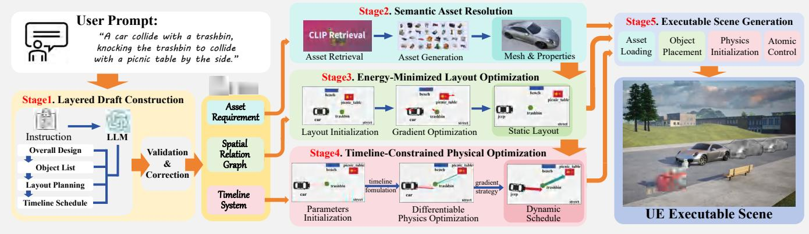  
Figure 2: Method Overview. Given a natural-language prompt, our system first constructs a machine-checkable Evolutive Scene Graph (ESG) and resolves its semantic objects to simulation-ready assets. It then grounds the spatial specification through <sub>cons</sub>t<sub>ra</sub>i<sub>n</sub>t<sub>-</sub>b<sub>ase</sub>d l<sub>ayou</sub>t <sub>op</sub>ti<sub>m</sub>i<sub>za</sub>ti<sub>on an</sub>d <sub>groun</sub>d<sub>s</sub> th<sub>e even</sub>t ti<sub>me</sub>li<sub>ne</sub> th<sub>roug</sub>h ti<sub>me</sub>li<sub>ne-cons</sub>t<sub>ra</sub>i<sub>ne</sub>d <sub>p</sub>h<sub>ys</sub>i<sub>ca</sub>l <sub>op</sub>ti<sub>m</sub>i<sub>za</sub>ti<sub>on.</sub> Th<sub>e</sub> f<sub>u</sub>ll<sub>y groun</sub>d<sub>e</sub>d ESG i<sub>s</sub> d<sub>e</sub>t<sub>erm</sub>i<sub>n</sub>i<sub>s</sub>ti<sub>ca</sub>ll<sub>y comp</sub>il<sub>e</sub>d i<sub>n</sub>t<sub>o an execu</sub>t<sub>a</sub>bl<sub>e</sub> U<sub>nrea</sub>l E<sub>ng</sub>i<sub>ne scene c</sub>l<sub>ass.</sub>

<sub>con</sub>fid<sub>ence</sub> $c _ { e }$ <sub>.</sub> Th<sub>e</sub> t<sub>o</sub>t<sub>a</sub>l l<sub>ayou</sub>t <sub>energy</sub> i<sub>ncorpora</sub>t<sub>es</sub> <sub>co</sub>lli<sub>s</sub>i<sub>on</sub> <sub>an</sub>d <sub>reg</sub>i<sub>on cons</sub>t<sub>ra</sub>i<sub>n</sub>t<sub>s:</sub>

$$
\Phi = \Phi _ { \mathrm { r e l } } + \sum _ { o _ { i } \in O } \left[ \lambda _ { \mathrm { c o l } } \Phi _ { \mathrm { c o l } } ^ { i } ( \pmb { \xi } ) + \lambda _ { \mathrm { r e g } } \Phi _ { \mathrm { r e g } } ^ { i } ( \pmb { \xi } _ { i } , \rho _ { i } ) \right] ,\tag{3}
$$

<sub>w</sub>h<sub>ere</sub> $\Phi _ { \mathrm { c o l } } ^ { i }$ <sub>an</sub>d $\Phi _ { \mathrm { r e g } } ^ { i }$ <sub>measure, respec</sub>ti<sub>ve</sub>l<sub>y, co</sub>lli<sub>s</sub>i<sub>ons</sub> i<sub>nvo</sub>l<sub>v-</sub> <sup>i</sup>n<sub>g</sub> $o _ { i }$ <sub>an</sub>d it<sub>s v</sub>i<sub>o</sub>l<sub>a</sub>ti<sub>on o</sub>f th<sub>e ass</sub>i<sub>gne</sub>d <sub>reg</sub>i<sub>on</sub> $\rho _ { i } \in R$ <sub>.</sub> P<sub>a</sub>i<sub>r-</sub> <sub>w</sub>i<sub>se co</sub>lli<sub>s</sub>i<sub>on pena</sub>lti<sub>es are</sub> di<sub>s</sub>t<sub>r</sub>ib<sub>u</sub>t<sub>e</sub>d <sub>across</sub> i<sub>nc</sub>id<sub>en</sub>t <sub>o</sub>b<sub>-</sub> jects so each collision is counted once. Together, these terms yield a diferentiable objective balancing semantic consist<sub>ency</sub> <sub>an</sub>d <sub>p</sub>h<sub>ys</sub>i<sub>ca</sub>l <sub>p</sub>l<sub>acea</sub>bilit<sub>y.</sub> W<sub>e</sub> <sub>use</sub> <sub>a</sub> h<sub>y</sub>b<sub>r</sub>id AABB<sub>–</sub>SDF <sub>co</sub>lli<sub>s</sub>i<sub>on</sub> f<sub>ormu</sub>l<sub>a</sub>ti<sub>on;</sub> d<sub>e</sub>fi<sub>n</sub>iti<sub>ons are</sub> i<sub>n</sub> S<sub>upp.</sub> M<sub>a</sub>t<sub>.</sub> A<sub>.</sub>1<sub>.</sub>

Constraint-Aware Layout Initialization. Minimizing E<sub>q.</sub> 3 f<sub>rom ar</sub>bit<sub>rary poses o</sub>ft<sub>en</sub> l<sub>ea</sub>d<sub>s</sub> t<sub>o severe</sub> i<sub>n</sub>iti<sub>a</sub>l <sub>co</sub>l<sub>-</sub> li<sub>s</sub>i<sub>ons an</sub>d <sub>poor</sub> l<sub>oca</sub>l <sub>m</sub>i<sub>n</sub>i<sub>ma.</sub> W<sub>e ex</sub>t<sub>rac</sub>t <sub>p</sub>l<sub>acemen</sub>t d<sub>e-</sub> <sub>pen</sub>d<sub>enc</sub>i<sub>es</sub> f<sub>rom</sub> $E _ { \mathrm { { : } } }$ <sub>organ</sub>i<sub>ze</sub> th<sub>em</sub> <sub>as</sub> <sub>a</sub> DAG<sub>,</sub> <sub>an</sub>d <sub>o</sub>bt<sub>a</sub>i<sub>n</sub> <sub>a</sub> t<sub>opo</sub>l<sub>og</sub>i<sub>ca</sub>l <sub>or</sub>d<sub>er</sub> $\pi = ( \pi _ { 1 } , \ldots , \pi _ { | O | } )$ . Objects are then <sub>p</sub>l<sub>ace</sub>d <sub>sequen</sub>ti<sub>a</sub>ll<sub>y:</sub> l<sub>e</sub>t $\Omega _ { i } \subseteq \rho ( o _ { i } )$ b<sub>e</sub> th<sub>e</sub> f<sub>eas</sub>ibl<sub>e pose</sub> d<sub>o-</sub> <sub>ma</sub>i<sub>n</sub> f<sub>or</sub> $o _ { i }$ <sub>a</sub>ft<sub>er accoun</sub>ti<sub>ng</sub> f<sub>or reg</sub>i<sub>on</sub> b<sub>oun</sub>d<sub>ar</sub>i<sub>es an</sub>d <sub>asse</sub>t geometry. For the k-th initialization, we sample a candidate set ${ \mathcal { C } } _ { \pi _ { t } } ^ { k } \dot { C } \Omega _ { \pi _ { i } }$ <sub>an</sub>d <sub>se</sub>l<sub>ec</sub>t

$$
\pmb { \xi } _ { \pi _ { t } } ^ { k , 0 } = \arg \operatorname* { m i n } _ { \pmb { \xi } \in \mathcal { C } _ { \pi _ { t } } ^ { k } } \Delta \Phi \Bigl ( \pmb { \xi } \Big | \pmb { \xi } _ { \pi _ { < t } } ^ { k , 0 } \Bigr ) ,\tag{4}
$$

<sub>w</sub>h<sub>ere</sub> $\Delta \Phi$ i<sub>s</sub> th<sub>e energy</sub> i<sub>ncrease</sub> f<sub>rom</sub> i<sub>nser</sub>ti<sub>ng</sub> th<sub>e can</sub>did<sub>a</sub>t<sub>e</sub> i<sub>n</sub>t<sub>o</sub> th<sub>e</sub> <sub>curren</sub>t <sub>par</sub>ti<sub>a</sub>l l<sub>ayou</sub>t<sub>,</sub> <sub>compr</sub>i<sub>s</sub>i<sub>ng</sub> th<sub>e</sub> <sub>ac</sub>ti<sub>ve</sub> <sub>re</sub>l<sub>a</sub>ti<sub>on,</sub> <sub>co</sub>lli<sub>s</sub>i<sub>on, an</sub>d <sub>reg</sub>i<sub>on</sub> t<sub>erms</sub> f<sub>rom</sub> E<sub>q.</sub> 3<sub>.</sub> I<sub>n</sub>iti<sub>a</sub>li<sub>za</sub>ti<sub>on an</sub>d refinement thus optimize the same objective.

Multi-start Gradient-based Optimization. Since Φ cou-<sub>p</sub>l<sub>es</sub> <sub>mu</sub>lti<sub>p</sub>l<sub>e</sub> <sub>spa</sub>ti<sub>a</sub>l <sub>an</sub>d <sub>geome</sub>t<sub>r</sub>i<sub>c</sub> <sub>cons</sub>t<sub>ra</sub>i<sub>n</sub>t<sub>s,</sub> it<sub>s</sub> l<sub>an</sub>d<sub>scape</sub> i<sub>s</sub> hi<sub>g</sub>hl<sub>y non-convex.</sub> R<sub>epea</sub>ti<sub>ng</sub> th<sub>e sequen</sub>ti<sub>a</sub>l <sub>samp</sub>li<sub>ng w</sub>ith i<sub>n</sub>d<sub>epen</sub>d<sub>en</sub>t <sub>can</sub>did<sub>a</sub>t<sub>e se</sub>t<sub>s an</sub>d <sub>reg</sub>i<sub>on-con</sub>diti<sub>one</sub>d <sub>propos-</sub> als yields K diverse initializations $\{ \xi ^ { k , 0 } \} _ { k = 1 } ^ { K }$ <sub>.</sub> All <sub>poses are</sub> then jointly refined from each:

$$
\widehat { \pmb { \xi } } ^ { k } = \mathrm { G D } ( \Phi , \pmb { \xi } ^ { k , 0 } ) , \qquad \pmb { \xi } ^ { * } = \arg \operatorname* { m i n } _ { \pmb { \xi } \in \{ \widehat { \pmb { \xi } } ^ { k } \} _ { k = 1 } ^ { K } } \Phi ,\tag{5}
$$

<sub>w</sub>h<sub>ere</sub> $\mathrm { G D } ( \Phi , { \pmb \xi } ^ { k , 0 } )$ d<sub>eno</sub>t<sub>es gra</sub>di<sub>en</sub>t d<sub>escen</sub>t i<sub>n</sub>iti<sub>a</sub>li<sub>ze</sub>d <sub>a</sub>t $\boldsymbol { \xi } ^ { k , 0 }$ <sub>,</sub> t<sub>erm</sub>i<sub>na</sub>ti<sub>ng</sub> <sub>w</sub>h<sub>en</sub> th<sub>e</sub> <sub>re</sub>l<sub>a</sub>ti<sub>ve</sub> <sub>energy</sub> <sub>c</sub>h<sub>ange</sub> f<sub>a</sub>ll<sub>s</sub> b<sub>e</sub>l<sub>ow</sub> ϵ or the iteration limit is reached. The lowest-energy result $\xi ^ { * }$ instantiates the final s<sub>p</sub>atial s<sub>p</sub>ecification G.

## 3.3 Timeline-Constrained Physical Optimization

O<sub>ur</sub> d<sub>ynam</sub>i<sub>c s</sub>t<sub>age so</sub>l<sub>ves</sub> f<sub>or p</sub>h<sub>ys</sub>i<sub>ca</sub>ll<sub>y va</sub>lid <sub>mo</sub>ti<sub>on un-</sub> d<sub>er an exp</sub>li<sub>c</sub>it ti<sub>me</sub>li<sub>ne, ra</sub>th<sub>er</sub> th<sub>an re</sub>l<sub>y</sub>i<sub>ng on</sub> k<sub>ey</sub>f<sub>rames</sub> <sub>or</sub> <sub>sp</sub>li<sub>ne</sub> <sub>overr</sub>id<sub>es</sub> th<sub>a</sub>t <sub>can</sub> <sub>v</sub>i<sub>o</sub>l<sub>a</sub>t<sub>e</sub> d<sub>ynam</sub>i<sub>ca</sub>l <sub>cons</sub>i<sub>s</sub>t<sub>ency.</sub> B<sub>y</sub> f<sub>ormu</sub>l<sub>a</sub>ti<sub>ng</sub> d<sub>ynam</sub>i<sub>c scene genera</sub>ti<sub>on as an even</sub>t<sub>-</sub> <sub>cons</sub>t<sub>ra</sub>i<sub>ne</sub>d f<sub>eas</sub>ibilit<sub>y pro</sub>bl<sub>em, we avo</sub>id <sub>over-spec</sub>if<sub>y</sub>i<sub>ng</sub> <sub>mo</sub>ti<sub>on</sub> d<sub>e</sub>t<sub>a</sub>il<sub>s</sub> t<sub>yp</sub>i<sub>ca</sub>ll<sub>y</sub> <sub>a</sub>b<sub>sen</sub>t f<sub>rom</sub> <sub>na</sub>t<sub>ura</sub>l<sub>-</sub>l<sub>anguage</sub> d<sub>e-</sub> <sub>scr</sub>i<sub>p</sub>ti<sub>ons.</sub>

Event Formulation. Recalling the event timeline $\mathcal { H } =$ $( P , I ; \pmb \theta )$ <sub>, eac</sub>h <sub>even</sub>t $h \in P \cup I$ identifies participating objects from O, partitioned into active bodies governed b<sub>y</sub> θ and pas-<sub>s</sub>i<sub>ve</sub> b<sub>o</sub>di<sub>es</sub> th<sub>a</sub>t <sub>evo</sub>l<sub>ve</sub> th<sub>roug</sub>h <sub>p</sub>h<sub>ys</sub>i<sub>cs, w</sub>ith <sub>rema</sub>i<sub>n</sub>i<sub>ng o</sub>b<sub>-</sub> jects serving as static geometry. A point event p $\in { \cal P }$ <sub>spec</sub>ifi<sub>es</sub> a discrete condition (e.<sub>g</sub>., Collision, PositionAt) realized <sub>a</sub>t <sub>a</sub> fi<sub>xe</sub>d ti<sub>me</sub> $t _ { p }$ <sub>or w</sub>ithi<sub>n a w</sub>i<sub>n</sub>d<sub>ow</sub> $[ t _ { p } ^ { \operatorname* { m i n } } , t _ { p } ^ { \operatorname* { m a x } } ]$ <sub>.</sub> A<sub>n</sub> i<sub>n</sub>t<sub>erva</sub>l event $i = ( u , v ) \in I$ <sub>p</sub>rescribes a motion re<sub>g</sub>ime (e.<sub>g</sub>., UniformMotion, Brake) between two boundin<sub>g</sub> <sub>p</sub>oint events, <sub>w</sub>ith <sub>op</sub>ti<sub>ona</sub>l <sub>cons</sub>t<sub>ra</sub>i<sub>n</sub>t<sub>s on spee</sub>d <sub>or</sub> h<sub>ea</sub>di<sub>ng.</sub> Thi<sub>s</sub> f<sub>ormu-</sub> lation decouples what must happen at discrete events from how motion evolves between them, enabling event-level supervision while leaving continuous trajectories to physics.

Optimization Objective. Each event contributes a task l<sub>oss</sub> $\mathcal { L } _ { \mathrm { t a s k } } ^ { h }$ <sub>enco</sub>di<sub>ng</sub> th<sub>e</sub> <sub>requ</sub>i<sub>re</sub>d <sub>p</sub>h<sub>ys</sub>i<sub>ca</sub>l <sub>ou</sub>t<sub>come</sub> <sub>an</sub>d <sub>a</sub> t<sub>empora</sub>l l<sub>oss</sub> $\mathcal { L } _ { \mathrm { w i n } } ^ { h }$ <sub>pena</sub>li<sub>z</sub>i<sub>ng rea</sub>li<sub>za</sub>ti<sub>on ou</sub>t<sub>s</sub>id<sub>e</sub> it<sub>s a</sub>d<sub>m</sub>i<sub>s-</sub> <sub>s</sub>ibl<sub>e w</sub>i<sub>n</sub>d<sub>ow.</sub> A <sub>g</sub>l<sub>o</sub>b<sub>a</sub>l <sub>pr</sub>i<sub>or</sub> ${ \mathcal { L } } _ { \mathrm { p } }$ p<sup>re</sup>v<sup>ents</sup> p<sup>arameters from</sup> drifting to implausible values. The total objective is

$$
\mathcal { L } ( \pmb { \theta } ) = \sum _ { h \in P \cup J } \left( w _ { \mathrm { t a s k } } ^ { h } \mathcal { L } _ { \mathrm { t a s k } } ^ { h } + w _ { \mathrm { w i n } } ^ { h } \mathcal { L } _ { \mathrm { w i n } } ^ { h } \right) + w _ { \mathrm { p } } \mathcal { L } _ { \mathrm { p } } .\tag{6}
$$

For the dominant Collision event between bodies A and B, let S be the simulated rollout frames. We identif<sub>y</sub> the

<sub>c</sub>l<sub>oses</sub>t<sub>-approac</sub>h f<sub>rame</sub> $\hat { s } = \mathrm { a r g } \mathrm { m i n } _ { s \in \cal S } d _ { \mathrm { s u r f } } ( A ( s ) , B ( s ) )$ <sub>an</sub>d <sub>se</sub>t $\hat { t } = \hat { s } \Delta t$ <sub>.</sub> Th<sub>e</sub> l<sub>osses</sub> <sub>are</sub>

$$
\begin{array} { r } { \mathcal { L } _ { \mathrm { t a s k } } ^ { \mathrm { c o L } } = \left[ d _ { \mathrm { s u r f } } ( A ( \hat { s } ) , B ( \hat { s } ) ) \right] _ { + } ^ { 2 } , } \\ { \mathcal { L } _ { \mathrm { w i n } } ^ { \mathrm { c o L } } = [ t _ { \mathrm { l o } } - \hat { t } ] _ { + } ^ { 2 } + [ \hat { t } - t _ { \mathrm { h i } } ] _ { + } ^ { 2 } , } \end{array}\tag{7}
$$

<sub>w</sub>h<sub>ere</sub> $[ x ] _ { + } = \operatorname* { m a x } ( x , 0 )$ <sub>an</sub>d $d _ { \mathrm { s u r f } }$ i<sub>s</sub> th<sub>e</sub> <sub>s</sub>i<sub>gne</sub>d <sub>sur</sub>f<sub>ace-</sub>t<sub>o-</sub> <sub>sur</sub>f<sub>ace</sub> di<sub>s</sub>t<sub>ance</sub> f<sub>rom</sub> th<sub>e</sub> <sub>ana</sub>l<sub>y</sub>ti<sub>c</sub> <sub>prox</sub>i<sub>es</sub> <sub>es</sub>t<sub>a</sub>bli<sub>s</sub>h<sub>e</sub>d d<sub>ur</sub>i<sub>ng</sub> l<sub>ayou</sub>t <sub>op</sub>ti<sub>m</sub>i<sub>za</sub>ti<sub>on.</sub> Th<sub>e</sub> t<sub>as</sub>k l<sub>oss van</sub>i<sub>s</sub>h<sub>es a</sub>t <sub>con</sub>t<sub>ac</sub>t<sub>;</sub> th<sub>e</sub> t<sub>empora</sub>l l<sub>oss van</sub>i<sub>s</sub>h<sub>es w</sub>h<sub>en con</sub>t<sub>ac</sub>t <sub>occurs w</sub>ithi<sub>n</sub> $[ t _ { \mathrm { l o } } , t _ { \mathrm { h i } } ]$ <sub>a</sub> fi<sub>xe</sub>d<sub>-</sub>ti<sub>me even</sub>t <sub>se</sub>t<sub>s</sub> $t _ { \mathrm { l o } } = t _ { \mathrm { h i } }$ <sub>.</sub> Th<sub>e pr</sub>i<sub>or</sub> ${ \mathcal { L } } _ { \mathrm { p } }$ i<sub>s a norma</sub>li<sub>ze</sub>d $\ell _ { 2 }$ <sub>pena</sub>lt<sub>y</sub> <sub>re</sub>l<sub>a</sub>ti<sub>ve</sub> t<sub>o</sub> $\pmb { \theta } ^ { 0 }$ <sub>.</sub> All l<sub>osses</sub> <sub>are</sub> <sub>norma</sub>li<sub>ze</sub>d b<sub>y</sub> t<sub>ype-</sub> <sub>spec</sub>ifi<sub>c re</sub>f<sub>erence sca</sub>l<sub>es</sub> b<sub>e</sub>f<sub>ore summa</sub>ti<sub>on; rema</sub>i<sub>n</sub>i<sub>ng even</sub>t t<sub>ypes are</sub> d<sub>e</sub>t<sub>a</sub>il<sub>e</sub>d i<sub>n</sub> S<sub>upp.</sub> M<sub>a</sub>t<sub>.</sub> A<sub>.</sub>2<sub>.</sub>

Gradient Computation. We evaluate event losses usi<sub>ng</sub> N<sub>ew</sub>t<sub>on,</sub> th<sub>e</sub> <sub>r</sub>i<sub>g</sub>id<sub>-</sub>b<sub>o</sub>d<sub>y</sub> <sub>s</sub>i<sub>mu</sub>l<sub>a</sub>ti<sub>on</sub> l<sub>ayer</sub> <sub>o</sub>f NVIDIA War<sub>p</sub> (Macklin 2022), whose accurate contact resolution ensures the objective reflects true physical outcomes. For <sub>e</sub>fi<sub>c</sub>i<sub>en</sub>t <sub>gra</sub>di<sub>en</sub>t <sub>compu</sub>t<sub>a</sub>ti<sub>on, we cons</sub>t<sub>ruc</sub>t <sub>a</sub> dif<sub>eren</sub>ti<sub>a</sub>bl<sub>e</sub> <sub>surroga</sub>t<sub>e</sub> th<sub>a</sub>t i<sub>n</sub>t<sub>egra</sub>t<sub>es</sub> <sub>grav</sub>it<sub>y</sub> <sub>an</sub>d d<sub>amp</sub>i<sub>ng</sub> <sub>ana</sub>l<sub>y</sub>ti<sub>ca</sub>ll<sub>y</sub> <sub>an</sub>d <sub>mo</sub>d<sub>e</sub>l<sub>s</sub> b<sub>o</sub>d<sub>y–</sub>b<sub>o</sub>d<sub>y</sub> i<sub>n</sub>t<sub>erac</sub>ti<sub>ons v</sub>i<sub>a so</sub>ft<sub>-con</sub>t<sub>ac</sub>t f<sub>orce</sub> $\textbf { f } = \ k _ { e } [ - d ] _ { + } \hat { \mathbf { n } }$ , enablin<sub>g</sub> automatic diferentiation (AD) th<sub>roug</sub>h th<sub>e</sub> f<sub>u</sub>ll <sub>ro</sub>ll<sub>ou</sub>t i<sub>n a s</sub>i<sub>ng</sub>l<sub>e</sub> f<sub>orwar</sub>d<sub>–</sub>b<sub>ac</sub>k<sub>war</sub>d <sub>pass.</sub>

F<sub>or</sub> di<sub>rec</sub>t i<sub>n</sub>t<sub>erac</sub>ti<sub>ons,</sub> AD <sub>ra</sub>di<sub>en</sub>t<sub>s are re</sub>li<sub>a</sub>bl<sub>e an</sub>d <sub>serve</sub> <sub>as</sub> th<sub>e</sub> d<sub>e</sub>f<sub>au</sub>lt<sub>.</sub> F<sub>or c</sub>h<sub>a</sub>i<sub>n</sub> i<sub>n</sub>t<sub>erac</sub>ti<sub>ons, w</sub>h<sub>ere ups</sub>t<sub>ream co</sub>l<sub>-</sub> lisions alter downstream trajectories, the simplified contact <sub>mo</sub>d<sub>e</sub>l <sub>may m</sub>i<sub>srepresen</sub>t <sub>pos</sub>t<sub>-co</sub>lli<sub>s</sub>i<sub>on momen</sub>t<sub>um</sub> t<sub>rans</sub>f<sub>er;</sub> we therefore fall back to finite-diference (FD) <sub>g</sub>radients on the full Newton simulator at the cost of 2|θ| forward simulati<sub>ons per s</sub>t<sub>ep.</sub> Thi<sub>s</sub> AD<sub>-</sub>d<sub>e</sub>f<sub>au</sub>lt<sub>,</sub> FD<sub>-</sub>f<sub>a</sub>llb<sub>ac</sub>k <sub>sc</sub>h<sub>eme</sub> b<sub>a</sub>l<sub>ances</sub> <sub>gra</sub>di<sub>en</sub>t <sub>e</sub>fi<sub>c</sub>i<sub>ency</sub> <sub>w</sub>ith <sub>p</sub>h<sub>ys</sub>i<sub>ca</sub>l fid<sub>e</sub>lit<sub>y.</sub> Th<sub>e</sub> <sub>op</sub>ti<sub>m</sub>i<sub>ze</sub>d <sub>pa-</sub> rameters $\pmb { \theta } ^ { * }$ are written back to H, com<sub>p</sub>letin<sub>g</sub> the full<sub>y</sub> <sub>groun</sub>d<sub>e</sub>d d<sub>ynam</sub>i<sub>c scene spec</sub>ifi<sub>ca</sub>ti<sub>on.</sub>

## 4 Experiment

## 4.1 Quality Assessment

W<sub>e eva</sub>l<sub>ua</sub>t<sub>e</sub> th<sub>e sys</sub>t<sub>em on a represen</sub>t<sub>a</sub>ti<sub>ve su</sub>it<sub>e o</sub>f <sub>promp</sub>t<sub>s</sub> <sub>cover</sub>i<sub>ng</sub> di<sub>verse requ</sub>i<sub>remen</sub>t<sub>s.</sub> Fi<sub>gure</sub> 3 <sub>an</sub>d Fi<sub>gure</sub> 4 t<sub>es</sub>t <sub>ro</sub>b<sub>us</sub>t<sub>ness</sub> t<sub>o promp</sub>t <sub>spec</sub>ifi<sub>c</sub>it<sub>y: s</sub>i<sub>mp</sub>l<sub>e</sub> i<sub>npu</sub>t<sub>s</sub> d<sub>emons</sub>t<sub>ra</sub>t<sub>e</sub> <sub>p</sub>l<sub>aus</sub>ibl<sub>e comp</sub>l<sub>e</sub>ti<sub>on o</sub>f <sub>m</sub>i<sub>ss</sub>i<sub>ng e</sub>l<sub>emen</sub>t<sub>s w</sub>hil<sub>e preserv</sub>i<sub>ng</sub> <sub>narra</sub>ti<sub>ve co</sub>h<sub>erence; comp</sub>l<sub>ex</sub> i<sub>npu</sub>t<sub>s w</sub>ith <sub>exp</sub>li<sub>c</sub>it <sub>numer</sub>i<sub>c</sub> <sub>cons</sub>t<sub>ra</sub>i<sub>n</sub>t<sub>s,</sub> <sub>asse</sub>t <sub>cues,</sub> <sub>an</sub>d t<sub>empora</sub>l <sub>requ</sub>i<sub>remen</sub>t<sub>s</sub> <sub>are</sub> f<sub>o</sub>l<sub>-</sub> l<sub>owe</sub>d <sub>w</sub>ith hi<sub>g</sub>h fid<sub>e</sub>lit<sub>y an</sub>d <sub>no spur</sub>i<sub>ous ex</sub>t<sub>rapo</sub>l<sub>a</sub>ti<sub>ons.</sub>

F<sub>or more comp</sub>l<sub>ex scenar</sub>i<sub>os,</sub> Fi<sub>gure</sub> 5 <sub>an</sub>d Fi<sub>gure</sub> 6 <sub>s</sub>h<sub>ow</sub> l<sub>ong-sequence opera</sub>ti<sub>ons an</sub>d <sub>mu</sub>lti<sub>-s</sub>t<sub>age casca</sub>di<sub>ng</sub> i<sub>n</sub>t<sub>erac-</sub> ti<sub>ons.</sub> R<sub>esu</sub>lt<sub>s</sub> <sub>rema</sub>i<sub>n</sub> <sub>a</sub>li<sub>gne</sub>d <sub>w</sub>ith th<sub>e</sub> <sub>narra</sub>ti<sub>ve</sub> th<sub>roug</sub>h<sub>ou</sub>t<sub>;</sub> d<sub>owns</sub>t<sub>ream</sub> <sub>mo</sub>ti<sub>ons</sub> <sub>are</sub> <sub>re</sub>fi<sub>ne</sub>d b<sub>y</sub> b<sub>ac</sub>k<sub>propaga</sub>ti<sub>ng</sub> <sub>even</sub>t l<sub>osses</sub> f<sub>rom</sub> <sub>ups</sub>t<sub>ream</sub> i<sub>n</sub>t<sub>erac</sub>ti<sub>ons,</sub> <sub>y</sub>i<sub>e</sub>ldi<sub>ng</sub> <sub>con</sub>t<sub>ro</sub>ll<sub>a</sub>bl<sub>e</sub> <sub>pa-</sub> r<sub>a</sub>m<sub>e</sub>t<sub>e</sub>r <sub>up</sub>d<sub>a</sub>t<sub>es.</sub> M<sub>o</sub>r<sub>e expe</sub>rim<sub>e</sub>nt<sub>s</sub> in S<sub>upp.</sub> M<sub>a</sub>t<sub>.</sub> B<sub>.</sub>2<sub>.</sub>

## 4.2 Comparison with baselines

N<sub>o pu</sub>bli<sub>c</sub> b<sub>enc</sub>h<sub>mar</sub>k <sub>ex</sub>i<sub>s</sub>t<sub>s</sub> f<sub>or</sub> t<sub>ex</sub>t<sub>-</sub>t<sub>o-</sub>d<sub>ynam</sub>i<sub>c scenes w</sub>ith <sub>eng</sub>i<sub>ne-ver</sub>ifi<sub>a</sub>bl<sub>e even</sub>t<sub>s.</sub> W<sub>e</sub> th<sub>ere</sub>f<sub>ore cons</sub>t<sub>ruc</sub>t 10 <sub>scenes</sub> th<sub>a</sub>t <sub>progress</sub>i<sub>ve</sub>l<sub>y</sub> <sub>s</sub>t<sub>ress</sub> <sub>p</sub>h<sub>ys</sub>i<sub>ca</sub>l f<sub>eas</sub>ibilit<sub>y</sub> <sub>an</sub>d i<sub>n</sub>t<sub>erac</sub>ti<sub>on</sub> com<sub>p</sub>lexit<sub>y</sub>—com<sub>p</sub>arable in scale to Scene Lan<sub>g</sub>ua<sub>g</sub>e (Zhan<sub>g</sub> et al. 2025) and PAT3D (Lin et al. 2026) (17/18 <sub>p</sub>rom<sub>p</sub>ts)— at three levels: single-event (S1–S4); chain events (S5–S7), requiring multi-step momentum transfer; and multi-phase dynamics (S8–S10), with concurrent or time-windowed phases. Th<sub>e</sub> <sub>su</sub>it<sub>e</sub> h<sub>as</sub> 18 ti<sub>me</sub>d <sub>even</sub>t<sub>s,</sub> <sub>ma</sub>t<sub>c</sub>hi<sub>ng</sub> th<sub>ese</sub> <sub>promp</sub>t <sub>su</sub>it<sub>es</sub> i<sub>n eva</sub>l<sub>ua</sub>ti<sub>on</sub> l<sub>oa</sub>d <sub>w</sub>hil<sub>e cover</sub>i<sub>ng</sub> l<sub>onger causa</sub>l <sub>c</sub>h<sub>a</sub>i<sub>ns un</sub>d<sub>er</sub> <sub>r</sub>i<sub>g</sub>id<sub>-</sub>b<sub>o</sub>d<sub>y p</sub>h<sub>ys</sub>i<sub>cs.</sub> F<sub>u</sub>ll d<sub>e</sub>fi<sub>n</sub>iti<sub>ons are</sub> i<sub>n</sub> S<sub>upp.</sub> M<sub>a</sub>t<sub>.</sub> B<sub>.</sub>3<sub>.</sub>

Evaluation metrics. We adopt three engine-native metrics motivated b<sub>y</sub> simulation-<sub>g</sub>rounded benchmarks (Wei et al. 2026; Shang et al. 2026). SLR checks static validity: all objects spawn with penetration $\delta { < } 2 \mathrm { c m }$ . ECR counts an event <sub>comp</sub>l<sub>e</sub>t<sub>e w</sub>h<sub>en na</sub>ti<sub>ve ca</sub>llb<sub>ac</sub>k<sub>s con</sub>fi<sub>rm su</sub>fi<sub>c</sub>i<sub>en</sub>t i<sub>mpu</sub>l<sub>se,</sub> bounded penetration, and a +0.2 s post-hit recheck rules out tunneling; chain events require ordered completion. PPA as-<sub>s</sub>i<sub>gns eac</sub>h <sub>promp</sub>t<sub>-spec</sub>ifi<sub>e</sub>d <sub>parame</sub>t<sub>er a con</sub>ti<sub>nuous score</sub> i<sub>n</sub> [0, 1]: satisfied constraints score 1; violations incur a pro-<sub>p</sub>ortional <sub>p</sub>enalt<sub>y</sub> scaled b<sub>y</sub> constraint ma<sub>g</sub>nitude (interval half-width or <sub>p</sub>oint tar<sub>g</sub>et). Initial-condition <sub>p</sub>arameters are scored over all K=5 runs; outcome parameters score noncompletion as 0.

Baselines. Video-generation methods (GPT4Motion (Lv et al. 2024), WonderPla<sub>y</sub> (Li et al. 2025b), Ph<sub>y</sub>sGen3D (Chen et al. 2025)) tar<sub>g</sub>et <sub>p</sub>erce<sub>p</sub>tual video s<sub>y</sub>nthesis rather th<sub>an parame</sub>t<sub>r</sub>i<sub>c scenes w</sub>ith <sub>exp</sub>li<sub>c</sub>it <sub>p</sub>h<sub>ys</sub>i<sub>ca</sub>l <sub>s</sub>t<sub>a</sub>t<sub>es,</sub> l<sub>ac</sub>k<sub>-</sub> ing object-level position, velocity, or collision records— i<sub>ncommensura</sub>bl<sub>e w</sub>ith <sub>our</sub> t<sub>as</sub>k b<sub>y</sub> d<sub>es</sub>i<sub>gn.</sub> St<sub>a</sub>ti<sub>c-</sub>l<sub>ayou</sub>t <sub>gen-</sub> erators (Infini<sub>g</sub>en (Raistrick et al. 2023), La<sub>y</sub>outGPT (Fen<sub>g</sub> et al. 2023), Holodeck (Yan<sub>g</sub> et al. 2024b)) <sub>p</sub>roduce no d<sub>y</sub>- namic out<sub>p</sub>ut. SceneCraft (Hu et al. 2024) and PAT3D (Lin et al. 2026) score 0% ECR, confirmin<sub>g</sub> s<sub>p</sub>atial arran<sub>g</sub>ement <sub>a</sub>l<sub>one canno</sub>t <sub>rea</sub>li<sub>ze</sub> d<sub>ynam</sub>i<sub>c even</sub>t<sub>s.</sub> W<sub>e compare</sub> S<sub>cene</sub> L<sub>an-</sub> <sub>g</sub>ua<sub>g</sub>e (Zhan<sub>g</sub> et al. 2025), im<sub>p</sub>orted into UE b<sub>y</sub> extractin<sub>g</sub> <sub>poses an</sub>d i<sub>n</sub>f<sub>err</sub>i<sub>ng</sub> l<sub>aunc</sub>h <sub>ve</sub>l<sub>oc</sub>iti<sub>es</sub> f<sub>rom</sub> ki<sub>nema</sub>ti<sub>c</sub> t<sub>ra</sub>il<sub>s</sub> (Su<sub>pp</sub>. Mat. B.3); SimWorld (Ye et al. 2025), whose d<sub>y</sub>- <sub>nam</sub>i<sub>cs</sub> f<sub>o</sub>ll<sub>ow</sub> <sub>agen</sub>t <sub>po</sub>li<sub>cy</sub> <sub>ra</sub>th<sub>er</sub> th<sub>an</sub> <sub>p</sub>h<sub>ys</sub>i<sub>ca</sub>l<sub>-parame</sub>t<sub>er</sub> optimization; and w/o Opt., our pipeline without gradient <sub>re</sub>fi<sub>nemen</sub>t<sub>.</sub> All <sub>me</sub>th<sub>o</sub>d<sub>s</sub> <sub>s</sub>h<sub>are</sub> <sub>promp</sub>t<sub>s</sub> <sub>an</sub>d ECR i<sub>ns</sub>t<sub>rumen-</sub> tation (K=5).

Experiment Results. Figure 7 reports all three metrics. Scene Language achieves 3.2/18 ECR (SLR ≈ 72%): occa-<sub>s</sub>i<sub>ona</sub>l <sub>s</sub>i<sub>ng</sub>l<sub>e-co</sub>lli<sub>s</sub>i<sub>on successes</sub> b<sub>u</sub>t <sub>no causa</sub>l <sub>mec</sub>h<sub>an</sub>i<sub>sm</sub> f<sub>or</sub> <sub>c</sub>h<sub>a</sub>i<sub>n even</sub>t<sub>s;</sub> hi<sub>g</sub>h <sub>var</sub>i<sub>ance re</sub>fl<sub>ec</sub>t<sub>s</sub> it<sub>s s</sub>t<sub>oc</sub>h<sub>as</sub>ti<sub>c</sub>it<sub>y, an</sub>d PPA is inapplicable. SimWorld achieves 1.4/18 (SLR ≈ 89%): fi<sub>xe</sub>d <sub>an</sub>i<sub>ma</sub>ti<sub>ons y</sub>i<sub>e</sub>ld l<sub>arge parame</sub>t<sub>er errors</sub> $( | \Delta t | = 0 . 5 0 \mathrm { s } ,$ $\lvert \Delta v \rvert { = } 1 . 9 6 \mathrm { m / s } )$ and PPA of only 15.0%. w/o Opt. achieves 8.8/18 (SLR ≈ 94%): simple collisions succeed (S1–S3: $1 . 0 { \scriptstyle \pm 0 . 0 } )$ <sub>,</sub> b<sub>u</sub>t <sub>secon</sub>d<sub>-s</sub>t<sub>age c</sub>h<sub>a</sub>i<sub>n con</sub>t<sub>ac</sub>t<sub>s an</sub>d <sub>comp</sub>l<sub>ex ma-</sub> <sub>neuvers</sub> f<sub>a</sub>il <sub>w</sub>ith<sub>ou</sub>t <sub>gra</sub>di<sub>en</sub>t f<sub>ee</sub>db<sub>ac</sub>k<sub>.</sub> O<sub>vera</sub>ll PPA i<sub>s</sub> 61.0% (IC ≈ 100%; outcome ≈ 37%). Our method achieves 16.4/18 (SLR ≈ 94%) across all levels, with PPA 95.0% (IC ≈ 100%, outcome ≈ 92%; |∆t|=0.07 s, |∆v|=0.23 m/s, $| \Delta m | { = } 0 . 0 2 \mathrm { k g } )$ <sub>.</sub> Th<sub>e</sub> 7<sub>.</sub>6<sub>-po</sub>int ECR <sub>gap a</sub>nd 55<sub>-po</sub>int <sub>ou</sub>t<sub>-</sub> come PPA gap (37% vs. 92%) show that diferentiable eventl<sub>oss op</sub>ti<sub>m</sub>i<sub>za</sub>ti<sub>on—no</sub>t LLM i<sub>n</sub>iti<sub>a</sub>li<sub>za</sub>ti<sub>on—</sub>i<sub>s</sub> d<sub>ec</sub>i<sub>s</sub>i<sub>ve.</sub>

## 4.3 Ablation Study

W<sub>e</sub> <sub>a</sub>bl<sub>a</sub>t<sub>e</sub> f<sub>our</sub> <sub>componen</sub>t<sub>s:</sub> l<sub>ayou</sub>t <sub>op</sub>ti<sub>m</sub>i<sub>za</sub>ti<sub>on,</sub> <sub>p</sub>h<sub>ys</sub>i<sub>ca</sub>l <sub>parame</sub>t<sub>er</sub> <sub>op</sub>ti<sub>m</sub>i<sub>za</sub>ti<sub>on,</sub> d<sub>ra</sub>ft <sub>cons</sub>t<sub>ruc</sub>ti<sub>on,</sub> <sub>an</sub>d <sub>asse</sub>t <sub>gener-</sub> ation. We further ablate the <sub>g</sub>radient strate<sub>gy</sub> (AD-default,

Scene Language SimWorld w/o Opt. <sub>Ours</sub>  
"A nice strike of bowling."  


"The basketball from outside messed up the tidy dining table."  
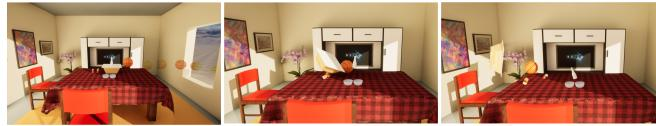  
Fi<sub>gu</sub>r<sub>e</sub> 3<sub>:</sub> S<sub>ce</sub>n<sub>e ge</sub>n<sub>e</sub>r<sub>a</sub>ti<sub>o</sub>n fr<sub>o</sub>m <sub>s</sub>im<sub>p</sub>l<sub>e</sub> in<sub>pu</sub>t<sub>.</sub> Th<sub>e sys</sub>t<sub>e</sub>m infers and <sub>p</sub>laces im<sub>p</sub>licit scene elements (e.<sub>g</sub>., bowlin<sub>g</sub> alle<sub>y</sub>, tableware) not ex<sub>p</sub>licitl<sub>y</sub> mentioned, <sub>p</sub>roducin<sub>g p</sub>h<sub>y</sub>sicall<sub>y</sub> <sub>p</sub>l<sub>aus</sub>ibl<sub>e, seman</sub>ti<sub>ca</sub>ll<sub>y co</sub>h<sub>eren</sub>t l<sub>ayou</sub>t<sub>s.</sub>  
"A cars move along the street and turns left at a cross. It brakes hard after entering the new lane, but still hits a bicycle stopped in the middle of the road  
"A brake-test scenario where a black car is moving at 10 m/s towards a flowerbed. The driver starts braking when the car is 10 meters away, bringing it to a smooth stop just 0.5 meters in front of the flower bed.  
"Two cars drive down a road one after the other. The front car swerves to avoid a trash bin rolling in from the roadside, crashes into an oncoming vehicle, and the car behind rear-ends it."

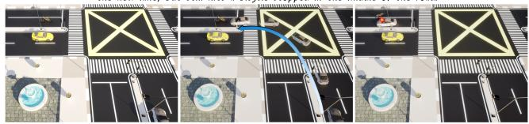  
"A sweeping robot is cleaning a cozy bedroom with wooden furniture, slowly moving towards a chair When the robot hits the chair, it can stop and turn 90° in 2 seconds, and continue working."


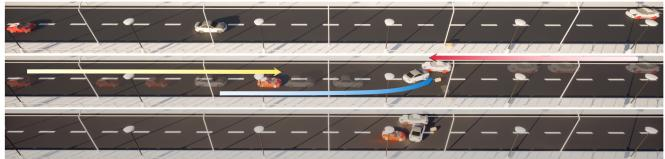

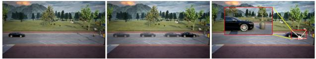  
Fi<sub>gure</sub> 4<sub>:</sub> S<sub>cene genera</sub>ti<sub>on</sub> f<sub>rom comp</sub>l<sub>ex</sub> i<sub>npu</sub>t<sub>.</sub> E<sub>xp</sub>li<sub>c</sub>itl<sub>y</sub> s<sub>p</sub>ecified <sub>p</sub>arameters (s<sub>p</sub>eed, turnin<sub>g</sub> an<sub>g</sub>le, etc.) are treated as h<sub>ar</sub>d <sub>cons</sub>t<sub>ra</sub>i<sub>n</sub>t<sub>s; rema</sub>i<sub>n</sub>i<sub>ng parame</sub>t<sub>ers are op</sub>ti<sub>m</sub>i<sub>ze</sub>d <sub>w</sub>ithi<sub>n</sub> th<sub>e</sub> f<sub>eas</sub>ibl<sub>e so</sub>l<sub>u</sub>ti<sub>on space.</sub>

Fi<sub>gure</sub> 5<sub>:</sub> L<sub>ong</sub> d<sub>ynam</sub>i<sub>c sequence genera</sub>ti<sub>on.</sub> Th<sub>e</sub> ti<sub>me</sub>li<sub>ne</sub> <sub>represen</sub>t<sub>a</sub>ti<sub>on suppor</sub>t<sub>s</sub> l<sub>ong-</sub>h<sub>or</sub>i<sub>zon, mu</sub>lti<sub>-even</sub>t <sub>spec</sub>ifi<sub>ca-</sub> ti<sub>ons w</sub>ith <sub>para</sub>ll<sub>e</sub>l <sub>ac</sub>ti<sub>ons, ena</sub>bli<sub>ng s</sub>i<sub>mu</sub>lt<sub>aneous con</sub>t<sub>ro</sub>l <sub>o</sub>f <sub>mu</sub>lti<sub>p</sub>l<sub>e ve</sub>hi<sub>c</sub>l<sub>es</sub> th<sub>roug</sub>h <sub>ex</sub>t<sub>en</sub>d<sub>e</sub>d <sub>maneuver sequences.</sub>  
"In a bright activity room, there are several billards on the billard table. The cue ball strikes the black ball, sending it cleanly into the bottom pocket."  
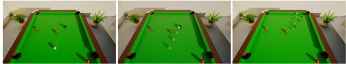  
"A car collide with a trashbin, knocking the trashbin to collide with a picnic table by the side."

  
Fi<sub>gure</sub> 6<sub>:</sub> M<sub>u</sub>lti<sub>-s</sub>t<sub>age casca</sub>di<sub>ng mo</sub>ti<sub>on.</sub> A <sub>mu</sub>lti<sub>-s</sub>t<sub>age even</sub>t loss is back<sub>p</sub>ro<sub>p</sub>a<sub>g</sub>ated throu<sub>g</sub>h the full causal chain (e.<sub>g</sub>., cue ball → black ball → <sub>p</sub>ocket), enablin<sub>g p</sub>recise control of <sub>ar</sub>bit<sub>rary c</sub>h<sub>a</sub>i<sub>n reac</sub>ti<sub>ons.</sub>

(a) Per-scene Event Completion Rate  
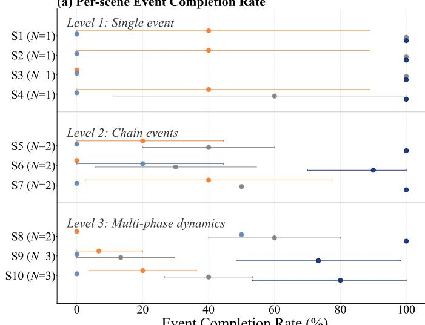  
Event Completion Rate (%)

(b) Scene Layout Rate (SLR)  
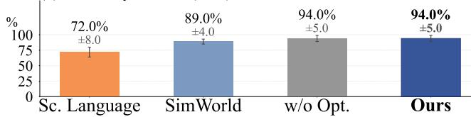  
(c) Overall ECR (N=18)

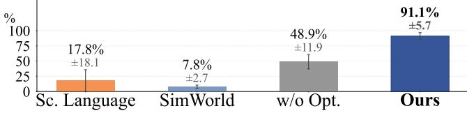  
(d) Physical Parameter Accuracy (PPA)

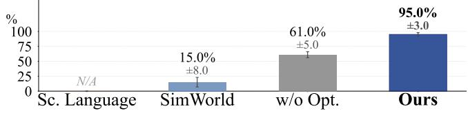  
Figure 7: Comparison on 10 test scenes (K=5 runs, mean ± 1 std). (a) Per-scene ECR by complexity level. (b–d) Overall SLR, ECR, and PPA across methods; w/o Opt. denotes our method without diferentiable optimization.

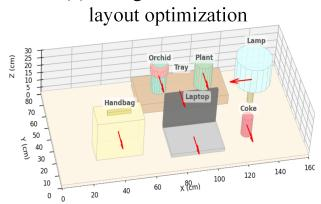  
"Some pots with tray are in front of the laptop on the office desk with a lamp and a bag."

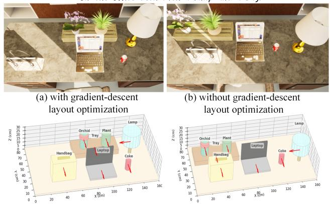

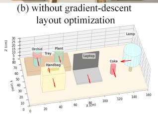  
Fi<sub>gure</sub> 8<sub>:</sub> Abl<sub>a</sub>ti<sub>on</sub> <sub>o</sub>f <sub>g</sub>l<sub>o</sub>b<sub>a</sub>l <sub>gra</sub>di<sub>en</sub>t<sub>-</sub>d<sub>escen</sub>t <sub>op</sub>ti<sub>m</sub>i<sub>za</sub>ti<sub>on.</sub> <sup>L</sup>a<sub>p</sub>to<sub>p</sub> ca<sub>p</sub>tures center <sub>p</sub>os<sup>i</sup>t<sup>i</sup>on, <sup>l</sup>eav<sup>i</sup>n<sub>g</sub> no s<sub>p</sub>ace <sup>f</sup>or t<sup>h</sup>e tra<sub>y</sub>.

FD-fallback) and the collision model (<sub>p</sub>rox<sub>y</sub> with SDF refinement). Human evaluation and additional ablations are in S<sub>upp.</sub> M<sub>a</sub>t<sub>.</sub> B<sub>.</sub>8 <sub>a</sub>nd S<sub>upp.</sub> M<sub>a</sub>t<sub>.</sub> B<sub>.</sub>7<sub>.</sub>

Ablation Study of ESG Draft Construction. We ablate hierarchical <sub>p</sub>rom<sub>p</sub>tin<sub>g</sub> (<sub>p</sub>ro<sub>g</sub>ressive sta<sub>g</sub>ed <sub>g</sub>eneration) and downstream validation (schema correctness and contradiction detection). Results in Table 1 confirm both contribute <sub>su</sub>b<sub>s</sub>t<sub>an</sub>ti<sub>a</sub>ll<sub>y;</sub> d<sub>e</sub>t<sub>a</sub>il<sub>s</sub> i<sub>n</sub> S<sub>upp.</sub> M<sub>a</sub>t<sub>.</sub> B<sub>.</sub>4<sub>.</sub>

T<sub>a</sub>bl<sub>e</sub> 1<sub>:</sub> ESG d<sub>ra</sub>ft <sub>cons</sub>t<sub>ruc</sub>ti<sub>on a</sub>bl<sub>a</sub>ti<sub>on.</sub> U<sub>sa</sub>bilit<sub>y: percen</sub>t<sub>-</sub> age of error-free executable drafts. High-Quality | Usable: <sub>percen</sub>t<sub>age o</sub>f <sub>usa</sub>bl<sub>e</sub> d<sub>ra</sub>ft<sub>s a</sub>d<sub>m</sub>itti<sub>ng</sub> l<sub>ow-energy</sub> l<sub>ayou</sub>t<sub>.</sub>
<table><tr><td>Method</td><td>Usability (%)</td><td>High-Quality | Usable (%)</td></tr><tr><td>Single-shot prompt</td><td>76.5</td><td>58.0</td></tr><tr><td>w/o Validation</td><td>88.5</td><td>79.7</td></tr><tr><td>Ours (Hierarchical + Validation)</td><td>99.0</td><td>89.5</td></tr></table>

Ablation Study of Layout Optimization. As shown in Fi<sub>gu</sub>r<sub>e</sub> 8<sub>,</sub> <sub>g</sub>r<sub>ee</sub>d<sub>y</sub> <sub>o</sub>n<sub>e-o</sub>f <sub>p</sub>l<sub>ace</sub>m<sub>e</sub>nt <sub>eva</sub>l<sub>ua</sub>t<sub>es</sub> <sub>poses</sub> <sub>o</sub>nl<sub>y</sub> against already-placed objects and cannot revise them, causi<sub>ng</sub> d<sub>ea</sub>d<sub>-en</sub>d<sub>s:</sub> th<sub>e</sub> l<sub>ap</sub>t<sub>op</sub> <sub>occup</sub>i<sub>es</sub> th<sub>e</sub> <sub>cen</sub>t<sub>er,</sub> l<sub>eav</sub>i<sub>ng</sub> <sub>no</sub> f<sub>eas</sub>ibl<sub>e</sub> <sub>spo</sub>t f<sub>or</sub> th<sub>e</sub> t<sub>ray.</sub> With<sub>ou</sub>t <sub>g</sub>l<sub>o</sub>b<sub>a</sub>l <sub>re</sub>fi<sub>nemen</sub>t<sub>,</sub> <sub>so</sub>ft relations (near) cannot be jointly satisfied and penetrations remain. As shown in Figure 9, initializing all objects at region <sub>cen</sub>t<sub>ers y</sub>i<sub>e</sub>ld<sub>s symme</sub>t<sub>r</sub>i<sub>c con</sub>fi<sub>gura</sub>ti<sub>ons;</sub> th<sub>e op</sub>ti<sub>m</sub>i<sub>zer re</sub>li<sub>es</sub> <sub>on no</sub>i<sub>se</sub> t<sub>o</sub> b<sub>rea</sub>k <sub>symme</sub>t<sub>ry, pro</sub>d<sub>uc</sub>i<sub>ng pene</sub>t<sub>ra</sub>ti<sub>on-</sub>f<sub>ree</sub> b<sub>u</sub>t <sub>spa</sub>ti<sub>a</sub>ll<sub>y</sub> <sub>un</sub>d<sub>er</sub>d<sub>e</sub>t<sub>erm</sub>i<sub>ne</sub>d l<sub>ayou</sub>t<sub>s.</sub> B<sub>o</sub>th <sub>con</sub>fi<sub>rm</sub> th<sub>a</sub>t <sub>re</sub>li<sub>-</sub> <sub>a</sub>bl<sub>e</sub> l<sub>ayou</sub>t<sub>s nee</sub>d <sub>samp</sub>li<sub>ng-</sub>d<sub>r</sub>i<sub>ven</sub> i<sub>n</sub>iti<sub>a</sub>li<sub>za</sub>ti<sub>on w</sub>ith <sub>g</sub>l<sub>o</sub>b<sub>a</sub>l <sub>gra</sub>di<sub>en</sub>t<sub>-</sub>b<sub>ase</sub>d <sub>re</sub>fi<sub>nemen</sub>t<sub>.</sub>

Ablation Study of Gradient Strategy. We compare three strategies on scene S6 (K=5); see Table 2. AD-only com-<sub>p</sub>letes all first-sta<sub>g</sub>e events (5/5) but fails on the chain event (0/5): back<sub>p</sub>ro<sub>p</sub>a<sub>g</sub>atin<sub>g</sub> throu<sub>g</sub>h non-s<sub>p</sub>herical car–trashbin <sub>con</sub>t<sub>ac</sub>t <sub>y</sub>i<sub>e</sub>ld<sub>s</sub> di<sub>rec</sub>ti<sub>ona</sub>l <sub>errors</sub> i<sub>n surroga</sub>t<sub>e norma</sub>l<sub>s.</sub> FD<sub>-</sub> only achieves 90% via exact Newton physics at 4.4× runtim<sub>e.</sub> O<sub>u</sub>r H<sub>y</sub>brid m<sub>a</sub>t<sub>c</sub>h<sub>es</sub> FD <sub>accu</sub>r<sub>acy</sub> <sub>a</sub>t 90% <sub>w</sub>hil<sub>e</sub> <sub>cu</sub>ttin<sub>g</sub> ti<sub>me</sub> b<sub>y</sub> 33%<sub>,</sub> <sub>us</sub>i<sub>ng</sub> AD f<sub>or</sub> f<sub>as</sub>t <sub>exp</sub>l<sub>ora</sub>ti<sub>on</sub> <sub>an</sub>d FD <sub>on</sub>l<sub>y</sub> f<sub>or</sub> <sub>c</sub>h<sub>a</sub>i<sub>n-even</sub>t <sub>re</sub>fi<sub>nemen</sub>t<sub>.</sub> D<sub>e</sub>t<sub>a</sub>il<sub>s</sub> i<sub>n</sub> S<sub>upp.</sub> M<sub>a</sub>t<sub>.</sub> B<sub>.</sub>5<sub>.</sub>

"A tea set and a vase on the table with four plates around them. Four chairs are around the table."

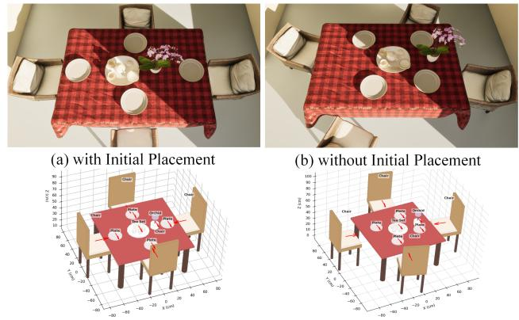  
Fi<sub>gure</sub> 9<sub>:</sub> Abl<sub>a</sub>ti<sub>on o</sub>f i<sub>n</sub>iti<sub>a</sub>l <sub>p</sub>l<sub>acemen</sub>t<sub>.</sub> Th<sub>e pre</sub>f<sub>erence-</sub>b<sub>ase</sub>d <sup>strate</sup>gy p<sup>rod</sup>u<sup>ces a more orderl</sup>y <sup>startin</sup>g <sup>la</sup>y<sup>o</sup>u<sup>t</sup>.

T<sub>a</sub>bl<sub>e</sub> 2<sub>:</sub> G<sub>ra</sub>di<sub>en</sub>t <sub>s</sub>t<sub>ra</sub>t<sub>egy a</sub>bl<sub>a</sub>ti<sub>on on ve</sub>hi<sub>c</sub>l<sub>e c</sub>h<sub>a</sub>i<sub>n-co</sub>lli<sub>s</sub>i<sub>on</sub> scene S6 (K=5). Ev. 1: car–trashbin; Ev. 2: trashbin–table.
<table><tr><td>Method</td><td>Ev.1</td><td>Ev.2</td><td>Completion</td><td>Avg Time (s)</td></tr><tr><td>AD-only (Tape)</td><td>5/5</td><td>0/5</td><td>50.0%</td><td>35.2</td></tr><tr><td>FD-only</td><td>5/5</td><td>4/5</td><td>90.0%</td><td>153.5</td></tr><tr><td>Hybrid (Ours)</td><td>5/5</td><td>4/5</td><td>90.0%</td><td>101.3</td></tr></table>

Ablation Study of Collision Model. We compare simple-<sub>p</sub>r<sub>oxy op</sub>timi<sub>za</sub>ti<sub>o</sub>n <sub>aga</sub>in<sub>s</sub>t <sub>p</sub>r<sub>oxy</sub> + SDF r<sub>e</sub>fin<sub>e</sub>m<sub>e</sub>nt <sub>o</sub>n <sub>sce</sub>n<sub>e</sub> S6 (K=10), measuring event-2 (trashbin-table collision) <sub>success ra</sub>t<sub>e.</sub> Th<sub>e s</sub>i<sub>mp</sub>l<sub>e-proxy me</sub>th<sub>o</sub>d <sub>ac</sub>hi<sub>eves on</sub>l<sub>y</sub> 1/10 (10%): coarse <sub>g</sub>eometr<sub>y</sub> cannot reliabl<sub>y</sub> ca<sub>p</sub>ture the cont<sub>ac</sub>t di<sub>rec</sub>ti<sub>on nee</sub>d<sub>e</sub>d t<sub>o gu</sub>id<sub>e</sub> th<sub>e</sub> t<sub>ras</sub>hbi<sub>n</sub> t<sub>owar</sub>d th<sub>e</sub> t<sub>a-</sub> ble. Addin<sub>g</sub> SDF refinement raises success to 8/10 (80%), <sub>as accura</sub>t<sub>e sur</sub>f<sub>ace-</sub>di<sub>s</sub>t<sub>ance gra</sub>di<sub>en</sub>t<sub>s su</sub>b<sub>s</sub>t<sub>an</sub>ti<sub>a</sub>ll<sub>y</sub> i<sub>mprove</sub> <sub>c</sub>h<sub>a</sub>i<sub>n-co</sub>lli<sub>s</sub>i<sub>on s</sub>t<sub>eer</sub>i<sub>ng.</sub> D<sub>e</sub>t<sub>a</sub>il<sub>s are</sub> i<sub>n</sub> S<sub>upp.</sub> M<sub>a</sub>t<sub>.</sub> B<sub>.</sub>6<sub>.</sub>

## 5 Conclusion and Discussion

W<sub>e presen</sub>t <sub>a</sub> f<sub>ramewor</sub>k f<sub>or genera</sub>ti<sub>ng execu</sub>t<sub>a</sub>bl<sub>e, p</sub>h<sub>ys</sub>i<sub>ca</sub>ll<sub>y</sub> <sub>cons</sub>i<sub>s</sub>t<sub>en</sub>t d<sub>ynam</sub>i<sub>c</sub> 3D <sub>scenes</sub> f<sub>rom na</sub>t<sub>ura</sub>l l<sub>anguage</sub> i<sub>n</sub> U<sub>n-</sub> <sub>rea</sub>l E<sub>ng</sub>i<sub>ne.</sub> C<sub>en</sub>t<sub>ra</sub>l t<sub>o our approac</sub>h i<sub>s</sub> th<sub>e</sub> E<sub>vo</sub>l<sub>u</sub>ti<sub>ve</sub> S<sub>cene</sub> Gra<sub>p</sub>h (ESG), which encodes entit<sub>y p</sub>ro<sub>p</sub>erties, s<sub>p</sub>atial la<sub>y</sub>out, <sub>an</sub>d <sub>even</sub>t ti<sub>me</sub>li<sub>nes</sub> i<sub>n a mac</sub>hi<sub>ne-c</sub>h<sub>ec</sub>k<sub>a</sub>bl<sub>e</sub> f<sub>orm.</sub> G<sub>ra</sub>di<sub>en</sub>t<sub>-</sub> b<sub>ase</sub>d <sub>op</sub>ti<sub>m</sub>i<sub>za</sub>ti<sub>on groun</sub>d<sub>s seman</sub>ti<sub>c</sub> d<sub>escr</sub>i<sub>p</sub>ti<sub>ons</sub> i<sub>n</sub>t<sub>o con-</sub> <sub>cre</sub>t<sub>e</sub> l<sub>ayou</sub>t<sub>s, an</sub>d dif<sub>eren</sub>ti<sub>a</sub>bl<sub>e p</sub>h<sub>ys</sub>i<sub>cs op</sub>ti<sub>m</sub>i<sub>za</sub>ti<sub>on re</sub>fi<sub>nes</sub> <sub>p</sub>h<sub>ys</sub>i<sub>ca</sub>l <sub>parame</sub>t<sub>ers</sub> t<sub>o</sub> <sub>sa</sub>ti<sub>s</sub>f<sub>y</sub> th<sub>e</sub> <sub>spec</sub>ifi<sub>e</sub>d <sub>even</sub>t ti<sub>me</sub>li<sub>ne.</sub> E<sub>xper</sub>i<sub>men</sub>t<sub>s con</sub>fi<sub>rm su</sub>b<sub>s</sub>t<sub>an</sub>ti<sub>a</sub>l i<sub>mprovemen</sub>t<sub>s over</sub> b<sub>ase-</sub> li<sub>nes</sub> i<sub>n even</sub>t <sub>comp</sub>l<sub>e</sub>ti<sub>on an</sub>d <sub>parame</sub>t<sub>er accuracy.</sub>

Limitations and Future Work. The system currently tar-<sub>ge</sub>t<sub>s</sub> <sub>r</sub>i<sub>g</sub>id<sub>-</sub>b<sub>o</sub>d<sub>y</sub> d<sub>ynam</sub>i<sub>cs</sub> <sub>an</sub>d d<sub>oes</sub> <sub>no</sub>t h<sub>an</sub>dl<sub>e</sub> d<sub>e</sub>f<sub>orma</sub>bl<sub>es,</sub> fl<sub>u</sub>id<sub>s, or ar</sub>ti<sub>cu</sub>l<sub>a</sub>t<sub>e</sub>d <sub>mo</sub>ti<sub>on.</sub> Di<sub>screpanc</sub>i<sub>es</sub> b<sub>e</sub>t<sub>ween proxy</sub> <sub>geome</sub>t<sub>ry</sub> <sub>an</sub>d UE <sub>run</sub>ti<sub>me</sub> <sub>co</sub>lli<sub>s</sub>i<sub>on</sub> <sub>s</sub>h<sub>apes</sub> <sub>a</sub>l<sub>so</sub> li<sub>m</sub>it hi<sub>g</sub>h<sub>-</sub> <sub>prec</sub>i<sub>s</sub>i<sub>on</sub> <sub>s</sub>i<sub>mu</sub>l<sub>a</sub>ti<sub>on.</sub> F<sub>u</sub>t<sub>ure</sub> <sub>wor</sub>k <sub>w</sub>ill <sub>a</sub>dd<sub>ress</sub> <sub>r</sub>i<sub>c</sub>h<sub>er</sub> <sub>p</sub>h<sub>ys</sub>i<sub>-</sub> <sub>ca</sub>l <sub>parame</sub>t<sub>er</sub>i<sub>za</sub>ti<sub>ons,</sub> ti<sub>g</sub>ht<sub>er</sub> <sub>proxy–run</sub>ti<sub>me</sub> <sub>a</sub>li<sub>gnmen</sub>t<sub>,</sub> <sub>an</sub>d <sub>ex</sub>t<sub>ens</sub>i<sub>ons</sub> t<sub>o</sub> h<sub>uman ac</sub>ti<sub>ons an</sub>d <sub>em</sub>b<sub>o</sub>di<sub>e</sub>d <sub>agen</sub>t<sub>s.</sub>

## References

B<sub>eaumon</sub>t<sub>,</sub> R<sub>.</sub> 2022<sub>.</sub> Cli<sub>p</sub> R<sub>e</sub>t<sub>r</sub>i<sub>eva</sub>l<sub>:</sub> E<sub>as</sub>il<sub>y compu</sub>t<sub>e c</sub>li<sub>p</sub> <sub>em</sub>b<sub>e</sub>ddi<sub>ngs</sub> <sub>an</sub>d b<sub>u</sub>ild <sub>a</sub> <sub>c</sub>li<sub>p</sub> <sub>re</sub>t<sub>r</sub>i<sub>eva</sub>l <sub>sys</sub>t<sub>em</sub> <sub>w</sub>ith th<sub>em.</sub> htt<sub>ps:</sub>//<sub>g</sub>ith<sub>u</sub>b<sub>.com</sub>/<sub>rom</sub>1504/<sub>c</sub>li<sub>p-re</sub>t<sub>r</sub>i<sub>eva</sub>l<sub>.</sub>

Ch<sub>e</sub>n<sub>,</sub> B<sub>.;</sub> Ji<sub>a</sub>n<sub>g,</sub> H<sub>.;</sub> Li<sub>u,</sub> S<sub>.;</sub> G<sub>up</sub>t<sub>a,</sub> S<sub>.;</sub> Li<sub>,</sub> Y<sub>.;</sub> Zh<sub>ao,</sub> H<sub>.; a</sub>nd W<sub>a</sub>n<sub>g,</sub> S<sub>.</sub> 2025<sub>.</sub> Ph<sub>ys</sub>G<sub>e</sub>n3D<sub>:</sub> Cr<sub>a</sub>ftin<sub>g a</sub> Mini<sub>a</sub>t<sub>u</sub>r<sub>e</sub> Int<sub>e</sub>r<sub>ac</sub>ti<sub>ve</sub> World from a Single Image. In Proceedings ofthe IEEE/CVF Conference on Computer Vision and Pattern Recognition (CVPR), 6178–6189.

D<sub>e</sub>V<sub>r</sub>i<sub>es,</sub> T<sub>.;</sub> B<sub>au</sub>ti<sub>s</sub>t<sub>a,</sub> M<sub>.</sub> A<sub>.;</sub> S<sub>r</sub>i<sub>vas</sub>t<sub>ava,</sub> N<sub>.;</sub> T<sub>ay</sub>l<sub>or,</sub> G<sub>.</sub> W<sub>.; an</sub>d S<sub>uss</sub>ki<sub>n</sub>d<sub>,</sub> J<sub>.</sub> M<sub>.</sub> 2021<sub>.</sub> U<sub>ncons</sub>t<sub>ra</sub>i<sub>ne</sub>d S<sub>cene</sub> G<sub>enera</sub>ti<sub>on w</sub>ith L<sub>oca</sub>ll<sub>y</sub> C<sub>on</sub>diti<sub>one</sub>d R<sub>a</sub>di<sub>ance</sub> Fi<sub>e</sub>ld<sub>s.</sub> <sub>a</sub>rXi<sub>v:</sub>2104<sub>.</sub>00670<sub>.</sub>

Dh<sub>amo,</sub> H<sub>.;</sub> M<sub>an</sub>h<sub>ar</sub>dt<sub>,</sub> F<sub>.;</sub> N<sub>ava</sub>b<sub>,</sub> N<sub>.; an</sub>d T<sub>om</sub>b<sub>ar</sub>i<sub>,</sub> F<sub>.</sub> 2021<sub>.</sub> G<sub>rap</sub>h<sub>-</sub>t<sub>o-</sub>3D<sub>:</sub> E<sub>n</sub>d<sub>-</sub>t<sub>o-</sub>E<sub>n</sub>d G<sub>enera</sub>ti<sub>on an</sub>d M<sub>an</sub>i<sub>pu</sub>l<sub>a</sub>ti<sub>on o</sub>f 3D Scenes using Scene Graphs. In IEEE International Conference on Computer Vision (ICCV).

D<sub>u,</sub> T<sub>.;</sub> W<sub>u,</sub> K<sub>.;</sub> M<sub>a,</sub> P<sub>.;</sub> W<sub>a</sub>h<sub>,</sub> S<sub>.;</sub> S<sub>p</sub>i<sub>e</sub>lb<sub>erg,</sub> A<sub>.;</sub> R<sub>us,</sub> D<sub>.;</sub> and Matusik, W. 2021. DifPD: Diferentiable Projective Dynamics. ACM Trans. Graph., 41(2).

Feng, W.; Zhu, W.; Fu, T.-j.; Jampani, V.; Akula, A.; He, X.; B<sub>asu,</sub> S<sub>.;</sub> W<sub>ang,</sub> X<sub>.</sub> E<sub>.;</sub> <sub>an</sub>d W<sub>ang,</sub> W<sub>.</sub> Y<sub>.</sub> 2023<sub>.</sub> L<sub>ayou</sub>tGPT<sub>:</sub> C<sub>ompos</sub>iti<sub>ona</sub>l Vi<sub>sua</sub>l Pl<sub>ann</sub>i<sub>ng</sub> <sub>an</sub>d G<sub>enera</sub>ti<sub>on</sub> <sub>w</sub>ith L<sub>arge</sub> Language Models. arXiv preprint arXiv:2305.15393.

Fi<sub>s</sub>h<sub>e</sub>r<sub>,</sub> M<sub>.;</sub> Rit<sub>c</sub>hi<sub>e,</sub> D<sub>.;</sub> S<sub>avva,</sub> M<sub>.;</sub> F<sub>u</sub>nkh<sub>ouse</sub>r<sub>,</sub> T<sub>.; a</sub>nd H<sub>a</sub>n<sub>-</sub> rahan, P. 2012. Example-based synthesis of 3D object arrangements. ACM Trans. Graph., 31(6).

F<sub>u,</sub> H<sub>.;</sub> C<sub>a</sub>i<sub>,</sub> B<sub>.;</sub> G<sub>ao,</sub> L<sub>.;</sub> Zh<sub>a</sub>n<sub>g,</sub> L<sub>.-</sub>X<sub>.;</sub> W<sub>a</sub>n<sub>g,</sub> J<sub>.;</sub> Li<sub>,</sub> C<sub>.;</sub> Zen<sub>g</sub>, Q.; Sun, C.; Jia, R.; Zhao, B.; et al. 2021. 3d-front: 3d furnished rooms with layouts and semantics. In Proceedings ofthe IEEE/CVF International Conference on Computer Vision, 10933–10942.

Hu, Y.; Anderson, L.; Li, T.-M.; Sun, Q.; Carr, N.; Ra<sub>g</sub>an-K<sub>e</sub>ll<sub>ey,</sub> J<sub>.; an</sub>d D<sub>uran</sub>d<sub>,</sub> F<sub>.</sub> 2020<sub>.</sub> DifT<sub>a</sub>i<sub>c</sub>hi<sub>:</sub> Dif<sub>eren</sub>ti<sub>a</sub>bl<sub>e</sub> Programming for Physical Simulation. ICLR.

H<sub>u,</sub> Z<sub>.;</sub> I<sub>scen,</sub> A<sub>.;</sub> J<sub>a</sub>i<sub>n,</sub> A<sub>.;</sub> Ki<sub>p</sub>f<sub>,</sub> T<sub>.;</sub> Y<sub>ue,</sub> Y<sub>.;</sub> R<sub>oss,</sub> D<sub>.</sub> A<sub>.;</sub> S<sub>c</sub>h<sub>m</sub>id<sub>,</sub> C<sub>.; an</sub>d F<sub>a</sub>thi<sub>,</sub> A<sub>.</sub> 2024<sub>.</sub> S<sub>cene</sub>C<sub>ra</sub>ft<sub>:</sub> A<sub>n</sub> LLM A<sub>ge</sub>nt f<sub>o</sub>r S<sub>y</sub>nth<sub>es</sub>i<sub>z</sub>in<sub>g</sub> 3D S<sub>ce</sub>n<sub>e as</sub> Bl<sub>e</sub>nd<sub>e</sub>r C<sub>o</sub>d<sub>e.</sub> <sub>ar</sub>Xi<sub>v:</sub>2403<sub>.</sub>01248<sub>.</sub>

J<sub>aques,</sub> M<sub>.;</sub> B<sub>u</sub>rk<sub>e,</sub> M<sub>.;</sub> <sub>a</sub>nd H<sub>ospe</sub>d<sub>a</sub>l<sub>es,</sub> T<sub>.</sub> M<sub>.</sub> 2019<sub>.</sub> Ph<sub>ys</sub>i<sub>cs-</sub> <sub>as-</sub>In<sub>ve</sub>r<sub>se-</sub>Gr<sub>ap</sub>hi<sub>cs:</sub> J<sub>o</sub>int Un<sub>supe</sub>r<sub>v</sub>i<sub>se</sub>d L<sub>ea</sub>rnin<sub>g o</sub>f Ob<sub>-</sub> jects and Physics from Video. CoRR, abs/1905.11169.

Li<sub>,</sub> R<sub>.;</sub> Zh<sub>eng,</sub> C<sub>.;</sub> R<sub>upprec</sub>ht<sub>,</sub> C<sub>.; an</sub>d V<sub>e</sub>d<sub>a</sub>ldi<sub>,</sub> A<sub>.</sub> 2025<sub>a.</sub> DSO<sub>:</sub> Ali<sub>gn</sub>i<sub>ng</sub> 3D G<sub>enera</sub>t<sub>ors w</sub>ith Si<sub>mu</sub>l<sub>a</sub>ti<sub>on</sub> F<sub>ee</sub>db<sub>ac</sub>k f<sub>or</sub> Physical Soundness. arXiv preprint arXiv:2503.22677.

Li, X.; Lai, Z.; Xu, L.; Qu, Y.; Cao, L.; Zhan<sub>g</sub>, S.; Dai, B.; and Ji, R. 2024. Director3D: Real-world Camera Trajectory and 3D Scene Generation from Text. arXiv:2406.17601.

Li, X.; Qiao, Y.-L.; Chen, P. Y.; Jatavallabhula, K. M.; Lin, M<sub>.;</sub> Ji<sub>ang,</sub> C<sub>.; an</sub>d G<sub>an,</sub> C<sub>.</sub> 2023<sub>.</sub> PAC<sub>-</sub>N<sub>e</sub>RF<sub>:</sub> Ph<sub>ys</sub>i<sub>cs</sub> A<sub>ug-</sub> <sub>men</sub>t<sub>e</sub>d C<sub>on</sub>ti<sub>nuum</sub> N<sub>eura</sub>l R<sub>a</sub>di<sub>ance</sub> Fi<sub>e</sub>ld<sub>s</sub> f<sub>or</sub> G<sub>eome</sub>t<sub>ry-</sub> A<sub>gnos</sub>ti<sub>c</sub> S<sub>ys</sub>t<sub>em</sub> Id<sub>en</sub>tifi<sub>ca</sub>ti<sub>on. ar</sub>Xi<sub>v:</sub>2303<sub>.</sub>05512<sub>.</sub>

Li<sub>,</sub> Z<sub>.;</sub> Y<sub>u,</sub> H<sub>.-</sub>X<sub>.;</sub> Li<sub>u,</sub> W<sub>.;</sub> Y<sub>ang,</sub> Y<sub>.;</sub> H<sub>errmann,</sub> C<sub>.;</sub> W<sub>e</sub>t<sub>zs</sub>t<sub>e</sub>i<sub>n,</sub> G<sub>.; a</sub>nd W<sub>u,</sub> J<sub>.</sub> 2025b<sub>.</sub> W<sub>o</sub>nd<sub>e</sub>rPl<sub>ay:</sub> D<sub>y</sub>n<sub>a</sub>mi<sub>c</sub> 3D S<sub>ce</sub>n<sub>e</sub> G<sub>e</sub>n<sub>-</sub> eration from a Single Image and Actions. In Proceedings of

the IEEE/CVF International Conference on Computer Vision (ICCV).

Li<sub>n,</sub> C<sub>.; an</sub>d M<sub>u,</sub> Y<sub>.</sub> 2024<sub>.</sub> I<sub>ns</sub>t<sub>ruc</sub>tS<sub>cene:</sub> I<sub>ns</sub>t<sub>ruc</sub>ti<sub>on-</sub>D<sub>r</sub>i<sub>ven</sub> 3D Indoor Scene Synthesis with Semantic Graph Prior. In International Conference on Learning Representations (ICLR).

Lin<sub>,</sub> G<sub>.;</sub> H<sub>ua</sub>n<sub>g,</sub> K<sub>.;</sub> Li<sub>u,</sub> M<sub>.;</sub> G<sub>ao,</sub> R<sub>.;</sub> Ch<sub>e</sub>n<sub>,</sub> H<sub>.;</sub> Ch<sub>e</sub>n<sub>,</sub> L<sub>.;</sub> L<sub>u,</sub> B<sub>.;</sub> K<sub>omura,</sub> T<sub>.;</sub> Li<sub>u,</sub> Y<sub>.;</sub> Zh<sub>u,</sub> J<sub>.-</sub>Y<sub>.; an</sub>d Li<sub>,</sub> M<sub>.</sub> 2026<sub>.</sub> PAT3D<sub>:</sub> Ph<sub>ys</sub>i<sub>cs-</sub>A<sub>ugmen</sub>t<sub>e</sub>d T<sub>ex</sub>t<sub>-</sub>t<sub>o-</sub>3D S<sub>cene</sub> G<sub>enera</sub>ti<sub>on.</sub> In International Conference on Learning Representations (ICLR).

L<sub>v,</sub> J<sub>.;</sub> H<sub>uang,</sub> Y<sub>.;</sub> Y<sub>an,</sub> M<sub>.;</sub> H<sub>uang,</sub> J<sub>.;</sub> Li<sub>u,</sub> J<sub>.;</sub> Li<sub>u,</sub> Y<sub>.;</sub> W<sub>en,</sub> Y<sub>.;</sub> Ch<sub>e</sub>n<sub>,</sub> X<sub>.; a</sub>nd Ch<sub>e</sub>n<sub>,</sub> S<sub>.</sub> 2024<sub>.</sub> GPT4M<sub>o</sub>ti<sub>o</sub>n<sub>:</sub> S<sub>c</sub>ri<sub>p</sub>tin<sub>g</sub> Ph<sub>ys</sub>i<sub>ca</sub>l M<sub>o</sub>ti<sub>ons</sub> i<sub>n</sub> T<sub>ex</sub>t<sub>-</sub>t<sub>o-</sub>Vid<sub>eo</sub> G<sub>enera</sub>ti<sub>on</sub> <sub>v</sub>i<sub>a</sub> Bl<sub>en</sub>d<sub>er-</sub> Oriented GPT Planning. In Proceedings of the IEEE/CVF Conference on Computer Vision and Pattern Recognition Workshops (CVPRW), 1430–1440.

M<sub>ac</sub>kli<sub>n,</sub> M<sub>.</sub> 2022<sub>.</sub> W<sub>arp:</sub> A Hi<sub>g</sub>h<sub>-per</sub>f<sub>ormance</sub> P<sub>y</sub>th<sub>on</sub> F<sub>ramewor</sub>k f<sub>or</sub> GPU Si<sub>mu</sub>l<sub>a</sub>ti<sub>on</sub> <sub>an</sub>d G<sub>rap</sub>hi<sub>cs.</sub> htt<sub>ps:</sub>//<sub>g</sub>ith<sub>u</sub>b<sub>.</sub> <sub>co</sub>m/n<sub>v</sub>idi<sub>a</sub>/<sub>wa</sub>r<sub>p.</sub> NVIDIA GPU T<sub>ec</sub>hn<sub>o</sub>l<sub>ogy</sub> C<sub>o</sub>nf<sub>e</sub>r<sub>e</sub>n<sub>ce</sub> (GTC).

P<sub>asc</sub>h<sub>a</sub>lid<sub>ou,</sub> D<sub>.;</sub> K<sub>ar,</sub> A<sub>.;</sub> Sh<sub>ugr</sub>i<sub>na,</sub> M<sub>.;</sub> K<sub>re</sub>i<sub>s,</sub> K<sub>.;</sub> G<sub>e</sub>i<sub>ger,</sub> A<sub>.;</sub> <sub>an</sub>d Fidl<sub>er,</sub> S<sub>.</sub> 2021<sub>.</sub> ATISS<sub>:</sub> A<sub>u</sub>t<sub>oregress</sub>i<sub>ve</sub> T<sub>rans</sub>f<sub>ormers</sub> f<sub>or</sub> Indoor Scene Synthesis. In Advances in Neural Information Processing Systems (NeurIPS).

Qiao, Y.-L.; Gao, A.; and Lin, M. C. 2022. NeuPh<sub>y</sub>sics: Edit<sub>a</sub>bl<sub>e</sub> N<sub>eura</sub>l G<sub>eome</sub>t<sub>ry an</sub>d Ph<sub>ys</sub>i<sub>cs</sub> f<sub>rom</sub> M<sub>onocu</sub>l<sub>ar</sub> Vid<sub>eos.</sub> In Conference on Neural Information Processing Systems (NeurIPS).

R<sub>a</sub>df<sub>or</sub>d<sub>,</sub> A<sub>.;</sub> Ki<sub>m,</sub> J<sub>.</sub> W<sub>.;</sub> H<sub>a</sub>ll<sub>acy,</sub> C<sub>.;</sub> R<sub>ames</sub>h<sub>,</sub> A<sub>.;</sub> G<sub>o</sub>h<sub>,</sub> G<sub>.;</sub> A<sub>garwa</sub>l<sub>,</sub> S<sub>.;</sub> S<sub>as</sub>t<sub>ry,</sub> G<sub>.;</sub> A<sub>s</sub>k<sub>e</sub>ll<sub>,</sub> A<sub>.;</sub> Mi<sub>s</sub>hki<sub>n,</sub> P<sub>.;</sub> Cl<sub>ar</sub>k<sub>,</sub> J<sub>.;</sub> K<sub>rueger,</sub> G<sub>.; an</sub>d S<sub>u</sub>t<sub>s</sub>k<sub>ever,</sub> I<sub>.</sub> 2021<sub>.</sub> L<sub>earn</sub>i<sub>ng</sub> T<sub>rans-</sub> f<sub>era</sub>bl<sub>e</sub> Vi<sub>sua</sub>l M<sub>o</sub>d<sub>e</sub>l<sub>s</sub> F<sub>rom</sub> N<sub>a</sub>t<sub>ura</sub>l L<sub>anguage</sub> S<sub>uperv</sub>i<sub>s</sub>i<sub>on.</sub> <sub>a</sub>rXi<sub>v:</sub>2103<sub>.</sub>00020<sub>.</sub>

R<sub>a</sub>i<sub>s</sub>t<sub>r</sub>i<sub>c</sub>k<sub>,</sub> A<sub>.;</sub> Li<sub>pson,</sub> L<sub>.;</sub> M<sub>a,</sub> Z<sub>.;</sub> M<sub>e</sub>i<sub>,</sub> L<sub>.;</sub> W<sub>ang,</sub> M<sub>.;</sub> Z<sub>uo,</sub> Y<sub>.;</sub> K<sub>ayan,</sub> K<sub>.;</sub> W<sub>en,</sub> H<sub>.;</sub> H<sub>an,</sub> B<sub>.;</sub> W<sub>ang,</sub> Y<sub>.;</sub> N<sub>ewe</sub>ll<sub>,</sub> A<sub>.;</sub> L<sub>aw,</sub> H<sub>.;</sub> G<sub>oya</sub>l<sub>,</sub> A<sub>.;</sub> Y<sub>a</sub>n<sub>g,</sub> K<sub>.;</sub> <sub>a</sub>nd D<sub>e</sub>n<sub>g,</sub> J<sub>.</sub> 2023<sub>.</sub> Infinit<sub>e</sub> Ph<sub>o</sub>t<sub>o</sub>r<sub>ea</sub>li<sub>s-</sub> tic Worlds Using Procedural Generation. In Proceedings of the IEEE/CVF Conference on Computer Vision and Pattern Recognition (CVPR), 12630–12641.

Rit<sub>c</sub>hi<sub>e,</sub> D<sub>.;</sub> W<sub>ang,</sub> K<sub>.; an</sub>d <sub>an</sub> Li<sub>n,</sub> Y<sub>.</sub> 2018<sub>.</sub> F<sub>as</sub>t <sub>an</sub>d Fl<sub>ex</sub>ibl<sub>e</sub> I<sub>n</sub>d<sub>oor</sub> S<sub>cene</sub> S<sub>yn</sub>th<sub>es</sub>i<sub>s v</sub>i<sub>a</sub> D<sub>eep</sub> C<sub>onvo</sub>l<sub>u</sub>ti<sub>ona</sub>l G<sub>enera</sub>ti<sub>ve</sub> M<sub>o</sub>d<sub>e</sub>l<sub>s. ar</sub>Xi<sub>v:</sub>1811<sub>.</sub>12463<sub>.</sub>

Sh<sub>a</sub>n<sub>g,</sub> Y<sub>.;</sub> Li<sub>,</sub> Z<sub>.;</sub> M<sub>a,</sub> Y<sub>.;</sub> S<sub>u,</sub> W<sub>.;</sub> Jin<sub>,</sub> X<sub>.;</sub> W<sub>a</sub>n<sub>g,</sub> Z<sub>.;</sub> Jin<sub>,</sub> L<sub>.;</sub> Zh<sub>ang,</sub> X<sub>.;</sub> T<sub>ang,</sub> Y<sub>.;</sub> S<sub>u,</sub> H<sub>.; e</sub>t <sub>a</sub>l<sub>.</sub> 2026<sub>.</sub> W<sub>or</sub>ldA<sub>rena:</sub> A U<sub>n</sub>ifi<sub>e</sub>d B<sub>enc</sub>h<sub>mar</sub>k f<sub>or</sub> E<sub>va</sub>l<sub>ua</sub>ti<sub>ng</sub> P<sub>ercep</sub>ti<sub>on an</sub>d F<sub>unc-</sub> tional Utility of Embodied World Models. arXiv preprint arXiv:2602.08971.

S<sub>u</sub>n<sub>,</sub> F<sub>.-</sub>Y<sub>.;</sub> Li<sub>u,</sub> W<sub>.;</sub> G<sub>u,</sub> S<sub>.;</sub> Lim<sub>,</sub> D<sub>.;</sub> Bh<sub>a</sub>t<sub>,</sub> G<sub>.;</sub> T<sub>o</sub>mb<sub>a</sub>ri<sub>,</sub> F<sub>.;</sub> Li<sub>,</sub> M<sub>.;</sub> H<sub>a</sub>b<sub>e</sub>r<sub>,</sub> N<sub>.; a</sub>nd W<sub>u,</sub> J<sub>.</sub> 2025<sub>.</sub> L<sub>ayou</sub>tVLM<sub>:</sub> Dif<sub>e</sub>r<sub>e</sub>nti<sub>a</sub>bl<sub>e</sub> O<sub>p</sub>timi<sub>za</sub>ti<sub>o</sub>n <sub>o</sub>f 3D L<sub>ayou</sub>t <sub>v</sub>i<sub>a</sub> Vi<sub>s</sub>i<sub>o</sub>n<sub>-</sub>L<sub>a</sub>n<sub>guage</sub> M<sub>o</sub>d<sub>e</sub>l<sub>s.</sub> <sub>ar</sub>Xi<sub>v:</sub>2412<sub>.</sub>02193<sub>.</sub>

T<sub>a</sub>n<sub>g,</sub> J<sub>.;</sub> Ni<sub>e,</sub> Y<sub>.;</sub> M<sub>a</sub>rkh<sub>as</sub>in<sub>,</sub> L<sub>.;</sub> D<sub>a</sub>i<sub>,</sub> A<sub>.;</sub> Thi<sub>es,</sub> J<sub>.; a</sub>nd Ni<sub>e</sub>ß<sub>ner,</sub> M<sub>.</sub> 2024<sub>.</sub> Dif<sub>uscene:</sub> D<sub>eno</sub>i<sub>s</sub>i<sub>ng</sub> dif<sub>us</sub>i<sub>on</sub> <sub>mo</sub>d<sub>-</sub> els for generative indoor scene synthesis. In Proceedings of the IEEE/CVF Conference on Computer Vision and Pattern Recognition.

W<sub>a</sub>n<sub>g,</sub> K<sub>.;</sub> Lin<sub>,</sub> Y<sub>.-</sub>A<sub>.;</sub> W<sub>e</sub>i<sub>ss</sub>m<sub>a</sub>nn<sub>,</sub> B<sub>.;</sub> S<sub>avva,</sub> M<sub>.;</sub> Ch<sub>a</sub>n<sub>g,</sub> A<sub>.</sub> X<sub>.;</sub> <sub>an</sub>d Rit<sub>c</sub>hi<sub>e,</sub> D<sub>.</sub> 2019<sub>.</sub> Pl<sub>an</sub>IT<sub>:</sub> <sub>p</sub>l<sub>ann</sub>i<sub>ng</sub> <sub>an</sub>d i<sub>ns</sub>t<sub>an-</sub> ti<sub>a</sub>ti<sub>ng</sub> i<sub>n</sub>d<sub>oor</sub> <sub>scenes</sub> <sub>w</sub>ith <sub>re</sub>l<sub>a</sub>ti<sub>on</sub> <sub>grap</sub>h <sub>an</sub>d <sub>spa</sub>ti<sub>a</sub>l <sub>pr</sub>i<sub>or</sub> networks. ACM Trans. Graph., 38(4).

W<sub>a</sub>n<sub>g,</sub> K<sub>.;</sub> S<sub>avva,</sub> M<sub>.;</sub> Ch<sub>a</sub>n<sub>g,</sub> A<sub>.</sub> X<sub>.; a</sub>nd Rit<sub>c</sub>hi<sub>e,</sub> D<sub>.</sub> 2018<sub>.</sub> Deep convolutional priors for indoor scene synthesis. ACM Trans. Graph., 37(4).

W<sub>a</sub>n<sub>g,</sub> X<sub>.;</sub> Y<sub>es</sub>h<sub>wa</sub>nth<sub>,</sub> C<sub>.; a</sub>nd Ni<sub>e</sub>ßn<sub>e</sub>r<sub>,</sub> M<sub>.</sub> 2021<sub>.</sub> S<sub>ce</sub>n<sub>e-</sub> F<sub>ormer:</sub> I<sub>n</sub>d<sub>oor</sub> S<sub>cene</sub> G<sub>enera</sub>ti<sub>on w</sub>ith T<sub>rans</sub>f<sub>ormers.</sub> <sub>a</sub>rXi<sub>v:</sub>2012<sub>.</sub>09793<sub>.</sub>

W<sub>e</sub>i<sub>,</sub> B<sub>.;</sub> H<sub>ua</sub>n<sub>g,</sub> B<sub>.;</sub> M<sub>a,</sub> J<sub>.;</sub> Zh<sub>a</sub>n<sub>g,</sub> Z<sub>.; a</sub>nd C<sub>u</sub>i<sub>,</sub> S<sub>.</sub> 2026<sub>.</sub> FATE<sub>:</sub> Cl<sub>ose</sub>d<sub>-</sub>L<sub>oop</sub> F<sub>eas</sub>ibilit<sub>y-</sub>A<sub>ware</sub> T<sub>as</sub>k G<sub>enera</sub>ti<sub>on</sub> <sub>w</sub>ith A<sub>c</sub>ti<sub>ve</sub> R<sub>epa</sub>i<sub>r</sub> f<sub>or</sub> Ph<sub>ys</sub>i<sub>ca</sub>ll<sub>y</sub> G<sub>roun</sub>d<sub>e</sub>d R<sub>o</sub>b<sub>o</sub>ti<sub>c</sub> C<sub>urr</sub>i<sub>cu</sub>l<sub>a.</sub> arXiv preprint arXiv:2603.01505.

Xi<sub>ang,</sub> J<sub>.;</sub> L<sub>v,</sub> Z<sub>.;</sub> X<sub>u,</sub> S<sub>.;</sub> D<sub>eng,</sub> Y<sub>.;</sub> W<sub>ang,</sub> R<sub>.;</sub> Zh<sub>ang,</sub> B<sub>.;</sub> Ch<sub>en,</sub> D<sub>.;</sub> T<sub>ong,</sub> X<sub>.; an</sub>d Y<sub>ang,</sub> J<sub>.</sub> 2024<sub>.</sub> St<sub>ruc</sub>t<sub>ure</sub>d 3D L<sub>a</sub>t<sub>en</sub>t<sub>s</sub> for Scalable and Versatile 3D Generation. arXiv preprint arXiv:2412.01506.

Y<sub>a</sub>n<sub>g,</sub> G<sub>.;</sub> Y<sub>a</sub>n<sub>g,</sub> S<sub>.;</sub> Zh<sub>a</sub>n<sub>g,</sub> J<sub>.</sub> Z<sub>.;</sub> M<sub>a</sub>n<sub>c</sub>h<sub>es</sub>t<sub>e</sub>r<sub>,</sub> Z<sub>.; a</sub>nd R<sub>a-</sub> <sub>manan,</sub> D<sub>.</sub> 2023<sub>.</sub> Ph<sub>ys</sub>i<sub>ca</sub>ll<sub>y</sub> Pl<sub>aus</sub>ibl<sub>e</sub> R<sub>econs</sub>t<sub>ruc</sub>ti<sub>on</sub> f<sub>rom</sub> Monocular Videos. In ICCV.

Y<sub>a</sub>n<sub>g,</sub> X<sub>.;</sub> M<sub>a</sub>n<sub>,</sub> Y<sub>.;</sub> Ch<sub>e</sub>n<sub>,</sub> J<sub>.-</sub>K<sub>.; a</sub>nd W<sub>a</sub>n<sub>g,</sub> Y<sub>.-</sub>X<sub>.</sub> 2024<sub>a.</sub> SceneCraft: Layout-Guided 3D Scene Generation. In Advances in Neural Information Processing Systems (NeurIPS), <sub>vo</sub>l<sub>u</sub>m<sub>e</sub> 37<sub>.</sub>

Y<sub>a</sub>n<sub>g,</sub> Y<sub>.;</sub> Ji<sub>a,</sub> B<sub>.;</sub> Zh<sub>a</sub>n<sub>g,</sub> S<sub>.; a</sub>nd H<sub>ua</sub>n<sub>g,</sub> S<sub>.</sub> 2025<sub>.</sub> S<sub>ce-</sub> <sub>ne</sub>W<sub>eaver:</sub> All<sub>-</sub>i<sub>n-</sub>O<sub>ne</sub> 3D S<sub>cene</sub> S<sub>yn</sub>th<sub>es</sub>i<sub>s w</sub>ith <sub>an</sub> E<sub>x</sub>t<sub>ens</sub>i<sub>-</sub> bl<sub>e an</sub>d S<sub>e</sub>lf<sub>-</sub>R<sub>e</sub>fl<sub>ec</sub>ti<sub>ve</sub> A<sub>gen</sub>t<sub>. ar</sub>Xi<sub>v:</sub>2509<sub>.</sub>20414<sub>.</sub>

Y<sub>ang,</sub> Y<sub>.;</sub> S<sub>un,</sub> F<sub>.-</sub>Y<sub>.;</sub> W<sub>e</sub>ih<sub>s,</sub> L<sub>.;</sub> V<sub>an</sub>d<sub>er</sub>Bilt<sub>,</sub> E<sub>.;</sub> H<sub>erras</sub>ti<sub>,</sub> A<sub>.;</sub> H<sub>a</sub>n<sub>,</sub> W<sub>.;</sub> W<sub>u,</sub> J<sub>.;</sub> H<sub>a</sub>b<sub>e</sub>r<sub>,</sub> N<sub>.;</sub> Kri<sub>s</sub>hn<sub>a,</sub> R<sub>.;</sub> Li<sub>u,</sub> L<sub>.;</sub> C<sub>a</sub>lli<sub>so</sub>n<sub>-</sub> B<sub>urc</sub>h<sub>,</sub> C<sub>.;</sub> Y<sub>a</sub>t<sub>s</sub>k<sub>ar,</sub> M<sub>.;</sub> K<sub>em</sub>bh<sub>av</sub>i<sub>,</sub> A<sub>.; an</sub>d Cl<sub>ar</sub>k<sub>,</sub> C<sub>.</sub> 2024b<sub>.</sub> H<sub>o</sub>l<sub>o</sub>d<sub>ec</sub>k<sub>:</sub> L<sub>anguage</sub> G<sub>u</sub>id<sub>e</sub>d G<sub>enera</sub>ti<sub>on o</sub>f 3D E<sub>m</sub>b<sub>o</sub>di<sub>e</sub>d AI Environments. In Proceedings ofthe IEEE/CVF Conference on Computer Vision and Pattern Recognition (CVPR), 16227<sub>–</sub>16237<sub>.</sub>

Y<sub>e,</sub> X<sub>.;</sub> R<sub>en,</sub> J<sub>.;</sub> Zh<sub>uang,</sub> Y<sub>.;</sub> H<sub>e,</sub> X<sub>.;</sub> Li<sub>ang,</sub> Y<sub>.;</sub> Y<sub>ang,</sub> Y<sub>.;</sub> Dogra, M.; Zhong, X.; Liu, E.; Benavente, K.; Nagaraju, R. M.; Sharma, D. V.; Ma, Z.; Shu, T.; Hu, Z.; and Qin, L. 2025<sub>.</sub> Si<sub>m</sub>W<sub>or</sub>ld<sub>:</sub> A<sub>n</sub> O<sub>pen-en</sub>d<sub>e</sub>d R<sub>ea</sub>li<sub>s</sub>ti<sub>c</sub> Si<sub>mu</sub>l<sub>a</sub>t<sub>or</sub> f<sub>or</sub> Autonomous Agents in Physical and Social Worlds. In Advances in Neural Information Processing Systems (NeurIPS), <sub>vo</sub>l<sub>u</sub>m<sub>e</sub> 38<sub>.</sub>

Y<sub>u,</sub> L<sub>.-</sub>F<sub>.;</sub> Y<sub>eung,</sub> S<sub>.-</sub>K<sub>.;</sub> T<sub>ang,</sub> C<sub>.-</sub>K<sub>.;</sub> T<sub>erzopou</sub>l<sub>os,</sub> D<sub>.;</sub> Ch<sub>an,</sub> T<sub>.</sub> F<sub>.;</sub> <sub>an</sub>d O<sub>s</sub>h<sub>er,</sub> S<sub>.</sub> J<sub>.</sub> 2011<sub>.</sub> M<sub>a</sub>k<sub>e</sub> it h<sub>ome:</sub> <sub>au</sub>t<sub>oma</sub>ti<sub>c</sub> <sub>op-</sub> timization of furniture arrangement. ACM Trans. Graph., 30(4).

Zh<sub>a</sub>i<sub>,</sub> G<sub>.;</sub> Ö<sub>rne</sub>k<sub>,</sub> E<sub>.</sub> P<sub>.;</sub> W<sub>u,</sub> S<sub>.-</sub>C<sub>.;</sub> Di<sub>,</sub> Y<sub>.;</sub> T<sub>om</sub>b<sub>ar</sub>i<sub>,</sub> F<sub>.;</sub> N<sub>ava</sub>b<sub>,</sub> N<sub>.; a</sub>nd B<sub>usa</sub>m<sub>,</sub> B<sub>.</sub> 2023<sub>.</sub> C<sub>o</sub>mm<sub>o</sub>nS<sub>ce</sub>n<sub>es:</sub> G<sub>e</sub>n<sub>e</sub>r<sub>a</sub>tin<sub>g</sub> C<sub>o</sub>m<sub>-</sub> m<sub>o</sub>n<sub>se</sub>n<sub>se</sub> 3D Ind<sub>oo</sub>r S<sub>ce</sub>n<sub>es w</sub>ith S<sub>ce</sub>n<sub>e</sub> Gr<sub>ap</sub>h Dif<sub>us</sub>i<sub>o</sub>n<sub>.</sub> <sub>ar</sub>Xi<sub>v:</sub>2305<sub>.</sub>16283<sub>.</sub>

Zh<sub>a</sub>n<sub>g,</sub> Y<sub>.;</sub> Li<sub>,</sub> Z<sub>.;</sub> Zh<sub>ou,</sub> M<sub>.;</sub> W<sub>u,</sub> S<sub>.;</sub> <sub>a</sub>nd W<sub>u,</sub> J<sub>.</sub> 2025<sub>.</sub> Th<sub>e</sub> S<sub>ce</sub>n<sub>e</sub> L<sub>a</sub>n<sub>guage:</sub> R<sub>ep</sub>r<sub>ese</sub>ntin<sub>g</sub> S<sub>ce</sub>n<sub>es</sub> <sub>w</sub>ith Pr<sub>og</sub>r<sub>a</sub>m<sub>s,</sub> Words, and Embeddings. In Proceedings of the IEEE/CVF Conference on Computer Vision and Pattern Recognition (CVPR), 24625–24634.

Zhou, Q.; Zhan<sub>g</sub>, H.; Lin, X.; Zhan<sub>g</sub>, Z.; Chen, Y.; Liu, W.; Zhan<sub>g</sub>, Z.; Chen, S.; Fan<sub>g</sub>, L.; L<sub>y</sub>u, Q.; Sun, X.; Yan<sub>g</sub>, J.; Wan<sub>g</sub>, Z.; Dan<sub>g</sub>, B. C.; Chen, Z.; Ladia, D.; Dan<sub>g</sub>, Q. V.; Li<sub>u,</sub> J<sub>.;</sub> <sub>a</sub>nd G<sub>a</sub>n<sub>,</sub> C<sub>.</sub> 2026<sub>.</sub> Virt<sub>ua</sub>l C<sub>o</sub>mm<sub>u</sub>nit<sub>y:</sub> An O<sub>pe</sub>n World for Humans, Robots, and Society. In International Conference on Learning Representations (ICLR).

Zh<sub>ou,</sub> Y<sub>.;</sub> Whil<sub>e,</sub> Z<sub>.;</sub> <sub>a</sub>nd K<sub>a</sub>l<sub>oge</sub>r<sub>a</sub>ki<sub>s,</sub> E<sub>.</sub> 2019<sub>.</sub> S<sub>ce</sub>n<sub>e</sub>Gr<sub>ap</sub>h<sub>-</sub> N<sub>e</sub>t<sub>:</sub> N<sub>eu</sub>r<sub>a</sub>l M<sub>essage</sub> P<sub>ass</sub>in<sub>g</sub> f<sub>o</sub>r 3D Ind<sub>oo</sub>r S<sub>ce</sub>n<sub>e</sub> A<sub>ug</sub>m<sub>e</sub>n<sub>-</sub> tation. In IEEE Conference on Computer Vision (ICCV).

# Generating Physically Consistent Dynamic Scenes from Text Descriptions

Supplementary Material

## A Technical Implementation Details

## A.1 Layout Optimization Details

Pose parameterization and feasibility. We optimize a lightweight pose for each object $o _ { i }$ as $\mathbf { x } _ { i } = ( \mathbf { p } _ { i } , \mathbf { r } _ { i } )$ <sub>, w</sub>h<sub>ere</sub> $\mathbf { p } _ { i } \in \mathbb { R } ^ { 3 }$ i<sub>s</sub> <sub>pos</sub>iti<sub>on</sub> <sub>an</sub>d $\mathbf { r } _ { i } \in \mathbb { R } ^ { 3 }$ is orientation. Each object i<sub>s ass</sub>i<sub>gne</sub>d <sub>a seman</sub>ti<sub>c reg</sub>i<sub>on</sub> $R ( o _ { i } ) \in \{ R _ { r } \} _ { r \in \mathcal { R } }$ <sub>.</sub> H<sub>ar</sub>d f<sub>eas</sub>i<sub>-</sub> bilit<sub>y</sub> $( \mathrm { e . g . }$ ., su<sub>pp</sub>ort hei<sub>g</sub>ht induced b<sub>y</sub> [On]) is enforced b<sub>y</sub> projection after each update, while the remaining constraints <sub>are mo</sub>d<sub>e</sub>l<sub>e</sub>d <sub>as</sub> dif<sub>eren</sub>ti<sub>a</sub>bl<sub>e pena</sub>lti<sub>es.</sub> F<sub>or</sub> SDF<sub>-</sub>b<sub>ase</sub>d <sub>co</sub>lli<sub>-</sub> sion handling, we augment each object with optional geom-<sub>e</sub>t<sub>ry</sub> fi<sub>e</sub>ld<sub>s: a</sub> d<sub>ense</sub> SDF <sub>gr</sub>id <sub>an</sub>d <sub>a proxy po</sub>i<sub>n</sub>t <sub>se</sub>t <sub>samp</sub>l<sub>e</sub>d near the object surface .

Relation energy and multi-relation aggregation. As defi<sub>ne</sub>d i<sub>n</sub> th<sub>e ma</sub>i<sub>n</sub> t<sub>ex</sub>t<sub>, we represen</sub>t <sub>seman</sub>ti<sub>c re</sub>l<sub>a</sub>ti<sub>ons</sub> <sub>as</sub> <sub>a</sub> t<sub>ype</sub>d di<sub>rec</sub>t<sub>e</sub>d <sub>grap</sub>h $\mathcal { G } \doteq ( \mathcal { O } , \mathcal { E } )$ <sub>.</sub> E<sub>ac</sub>h <sub>e</sub>d<sub>ge</sub> $e =$ $( o _ { i } \to o _ { j } , \tau ) \in \mathcal { E }$ <sub>con</sub>t<sub>r</sub>ib<sub>u</sub>t<sub>es</sub> <sub>an</sub> <sub>unwe</sub>i<sub>g</sub>ht<sub>e</sub>d <sub>e</sub>d<sub>ge</sub> <sub>pena</sub>lt<sub>y</sub> $E _ { e } ( \mathbf { x } _ { i } , \breve { \mathbf { x } } _ { j } ) = F _ { \tau } ( \mathbf { x } _ { i } , \mathbf { x } _ { j } )$ <sub>.</sub> Wh<sub>en mu</sub>lti<sub>p</sub>l<sub>e re</sub>l<sub>a</sub>ti<sub>ons ex</sub>i<sub>s</sub>t b<sub>e-</sub> tween a pair of objects, we keep them as multiple edges and <sub>sum</sub> th<sub>e</sub>i<sub>r con</sub>t<sub>r</sub>ib<sub>u</sub>ti<sub>ons.</sub> W<sub>e aggrega</sub>t<sub>e re</sub>l<sub>a</sub>ti<sub>on energ</sub>i<sub>es over</sub> <sub>a</sub>ll i<sub>nc</sub>id<sub>en</sub>t <sub>e</sub>d<sub>ges</sub> i<sub>n</sub> th<sub>e</sub> l<sub>ayou</sub>t t<sub>o</sub> <sub>o</sub>bt<sub>a</sub>i<sub>n</sub> th<sub>e</sub> <sub>g</sub>l<sub>o</sub>b<sub>a</sub>l <sub>re</sub>l<sub>a</sub>ti<sub>on</sub> <sup>ener</sup>gy<sup>:</sup>

$$
E _ { \mathrm { r e l } } ( \mathbf { O } ) = \sum _ { \substack { e = ( o _ { i }  o _ { j } , \tau ) \in \mathcal { E } } } w _ { e } F _ { \tau } ( \mathbf { x } _ { i } , \mathbf { x } _ { j } ) .\tag{8}
$$

Examples of Penalty Calculation. $\mathrm { W e }$ d<sub>eno</sub>t<sub>e</sub> b<sub>y</sub> $B _ { i } ( \mathbf { x } _ { i } ) \subset \mathbb { R } ^ { 3 }$ the collision proxy of object $o _ { i }$ un<sup>d</sup>er <sub>p</sub>ose $\mathbf { x } _ { i } ,$ <sub>w</sub>hi<sub>c</sub>h <sub>can</sub> b<sub>e</sub> i<sub>ns</sub>t<sub>an</sub>ti<sub>a</sub>t<sub>e</sub>d b<sub>y</sub> <sub>e</sub>ith<sub>er</sub> <sub>a</sub> <sub>s</sub>i<sub>mp</sub>l<sub>e</sub> <sub>pr</sub>i<sub>m</sub>i<sub>-</sub> tive (e.<sub>g</sub>., s<sub>p</sub>here/AABB/OBB) or a more faithful com<sub>p</sub>osed <sub>p</sub>rox<sub>y</sub> when enabled (e.<sub>g</sub>., SDF). In our solver, each relation edge e contributes to the total energy via a weighted penalty $w _ { e } F _ { \tau }$ <sub>,</sub> <sub>w</sub>h<sub>ere</sub> $w _ { e } = \mathrm { s t r i c t n e s s } ( \tau )$ ·confidence(e) and $\bar { \boldsymbol { F } } _ { \tau } \geq \dot { 0 }$ i<sub>s</sub> th<sub>e</sub> <sub>unwe</sub>i<sub>g</sub>ht<sub>e</sub>d <sub>v</sub>i<sub>o</sub>l<sub>a</sub>ti<sub>on</sub> d<sub>e</sub>fi<sub>ne</sub>d b<sub>y</sub> th<sub>e</sub> <sub>correspon</sub>di<sub>ng</sub> <sub>cons</sub>t<sub>ra</sub>i<sub>n</sub>t<sub>.</sub>

While simple proximity relations like Near use a straightf<sub>orwar</sub>d d<sub>ea</sub>d<sub>-zone pena</sub>lt<sub>y on sur</sub>f<sub>ace</sub> di<sub>s</sub>t<sub>ance</sub> $d _ { \mathrm { s u r f } } ( B _ { i } , { \bf \bar { \it B } } _ { j } )$ (as illustrated in the main text), directional relations require d<sub>ecompos</sub>i<sub>ng</sub> th<sub>e geome</sub>t<sub>ry a</sub>l<sub>ong spec</sub>ifi<sub>c axes.</sub>

(Near) As an intuitive example, to instantiate $F _ { \mathrm { n e a r } } .$ , we <sub>eva</sub>l<sub>ua</sub>t<sub>e</sub> th<sub>e sur</sub>f<sub>ace</sub> di<sub>s</sub>t<sub>ance</sub> $d _ { \mathrm { s u r f } }$ <sub>o</sub>f th<sub>e co</sub>lli<sub>s</sub>i<sub>on prox</sub>i<sub>es o</sub>f the two objects. Given an adaptive preferred distance $d ^ { \star }$ <sub>an</sub>d <sub>a</sub> t<sub>o</sub>l<sub>erance</sub> $\delta ,$ w<sup>e a</sup>pp<sup>l</sup>y <sup>a dead-zone</sup> p<sup>enalt</sup>y<sup>:</sup>

$$
\begin{array} { r } { F _ { \mathrm { n e a r } } ( \mathbf { x } _ { i } , \mathbf { x } _ { j } ) = [ d _ { \mathrm { s u r f } } - ( d ^ { \star } + \delta ) ] _ { + } + [ ( d ^ { \star } - \delta ) - d _ { \mathrm { s u r f } } ] _ { + } , } \\ { ( 9 ) \qquad } \end{array}
$$

I<sub>n</sub> i<sub>mp</sub>l<sub>emen</sub>t<sub>a</sub>ti<sub>on,</sub> th<sub>e a</sub>d<sub>ap</sub>ti<sub>ve pre</sub>f<sub>erre</sub>d di<sub>s</sub>t<sub>ance</sub> $d ^ { \star }$ i<sub>s</sub> computed from both object scale $( \bar { s } _ { i / j }$ )and semantic-re<sub>g</sub>ion <sub>sca</sub>l<sub>e</sub> $( S _ { R } ) \mathrm { : }$

$$
d ^ { \star } = \mathrm { c l a m p } \left( \mathrm { m i n } \left( \frac { 1 } { 2 } \cdot \mathrm { m i n } ( { \bar { s } } _ { i } , { \bar { s } } _ { j } ) , \rho _ { d } S _ { R ( i ) } \right) , d _ { \mathrm { m i n } } , d _ { \mathrm { m a x } } \right) ,\tag{10)<sub>y</sub>}
$$

<sub>w</sub>h<sub>ere</sub> $\begin{array} { r l r l r l } { [ z ] _ { + } } & { { } = } & { \operatorname* { m a x } ( z , 0 ) , } & { \bar { s } _ { k } } & { { } = } & { } & { { } \frac { 4 d _ { k } ^ { x } + 4 d _ { k } ^ { y } + d _ { k } ^ { z } } { 9 } } \end{array}$ is the characteristic size of object o<sub>k</sub>, S<sub>R(i)</sub> = $\sqrt { ( u _ { R ( i ) } ^ { x } - l _ { R ( i ) } ^ { x } ) ^ { 2 } + ( u _ { R ( i ) } ^ { y } - l _ { R ( i ) } ^ { y } ) ^ { 2 } }$ i<sub>s</sub> th<sub>e</sub> XY <sub>s</sub>i<sub>ze o</sub>f th<sub>e</sub> <sub>source seman</sub>ti<sub>c reg</sub>i<sub>on</sub> $R ( i )$ <sub>, an</sub>d $\rho _ { d }$ i<sub>s</sub> th<sub>e</sub> di<sub>s</sub>t<sub>ance ra</sub>ti<sub>o.</sub>

I<sub>n our</sub> d<sub>e</sub>f<sub>au</sub>lt <sub>se</sub>t<sub>up,</sub> $\begin{array} { r l r } { \rho _ { d } } & { { } = } & { 0 . 1 , ~ \left( d _ { \operatorname* { m i n } } , d _ { \operatorname* { m a x } } \right) ~ = } \end{array}$ (8, 300) cm, and $\delta =$ clamp $( \rho _ { t } d ^ { \star } , \delta _ { \operatorname* { m i n } } , \delta _ { \operatorname* { m a x } } )$ <sub>w</sub>ith $\rho _ { t } ~ =$ $\dot { 0 . 2 } , ( \delta _ { \mathrm { m i n } } , \delta _ { \mathrm { m a x } } ) = ( 2 , 8 0 )$ cm.This yields zero penalty in-<sub>s</sub>id<sub>e</sub> th<sub>e a</sub>d<sub>m</sub>i<sub>ss</sub>ibl<sub>e</sub> b<sub>an</sub>d $[ \acute { d } ^ { \star } - \delta , d ^ { \star } + \acute { \delta } ]$ <sub>an</sub>d <sub>app</sub>li<sub>es</sub> <sub>a</sub> li<sub>near</sub> <sub>pena</sub>lt<sub>y</sub> f<sub>or ou</sub>t<sub>s</sub>id<sub>e.</sub>

(Left\_of) We define directional relations in the global coordinate system, where left corresponds $\mathrm { ~ \ t o ~ \ } + \bar { X }$ <sub>.</sub> L<sub>e</sub>t $\Delta _ { x } = x _ { j } - x _ { i }$ be the <sub>p</sub>rimar<sub>y</sub>-axis ofset (<sub>p</sub>ositive means the tar<sub>g</sub>et is on the required side) and $\Delta _ { y } = | y _ { j } - y _ { i } |$ b<sub>e</sub> th<sub>e</sub> l<sub>a</sub>t<sub>era</sub>l d<sub>ev</sub>i<sub>a</sub>ti<sub>on on</sub> th<sub>e or</sub>th<sub>ogona</sub>l <sub>ax</sub>i<sub>s.</sub> W<sub>e</sub> d<sub>ecompose</sub> th<sub>e</sub> <sub>v</sub>i<sub>o</sub>l<sub>a</sub>ti<sub>on</sub> i<sub>n</sub>t<sub>o a pr</sub>i<sub>mary</sub> t<sub>erm an</sub>d <sub>a</sub> l<sub>a</sub>t<sub>era</sub>l t<sub>erm:</sub>

$$
F _ { l e f t \_ o f } ( \mathbf { x } _ { i } , \mathbf { x } _ { j } ) = F _ { l e f t \_ o f } ^ { x } ( \Delta _ { x } ) + F _ { l e f t \_ o f } ^ { y } ( \Delta _ { y } ) .\tag{11}
$$

Th<sub>e pr</sub>i<sub>mary-ax</sub>i<sub>s</sub> t<sub>erm</sub> i<sub>s mo</sub>d<sub>e</sub>l<sub>e</sub>d <sub>as a p</sub>i<sub>ecew</sub>i<sub>se pena</sub>lt<sub>y</sub> th<sub>a</sub>t <sub>s</sub>t<sub>rong</sub>l<sub>y pena</sub>li<sub>zes wrong-s</sub>id<sub>e con</sub>fi<sub>gura</sub>ti<sub>ons an</sub>d <sub>so</sub>ftl<sub>y</sub> <sub>pena</sub>li<sub>zes o</sub>f<sub>se</sub>t<sub>s ou</sub>t<sub>s</sub>id<sub>e a reasona</sub>bl<sub>e range:</sub>

$$
F _ { l e f t \_ o f } ^ { x } ( \Delta _ { x } ) = \left\{ \begin{array} { l l } { \phi _ { \mathrm { w r o n g } } ( \Delta _ { x } ) , } & { \Delta _ { x } < 0 , } \\ { \phi _ { \mathrm { n e a r } } ( \Delta _ { x } ) , } & { 0 \leq \Delta _ { x } < \delta _ { \mathrm { m i n } } , } \\ { 0 , } & { \delta _ { \mathrm { m i n } } \leq \Delta _ { x } \leq \delta _ { \mathrm { m a x } } , } \\ { \phi _ { \mathrm { f a r } } ( \Delta _ { x } ) , } & { \Delta _ { x } > \delta _ { \mathrm { m a x } } , } \end{array} \right.\tag{12}
$$

<sub>w</sub>h<sub>ere</sub> $\delta _ { \mathrm { m i n } }$ i<sub>s</sub> <sub>an</sub> <sub>a</sub>d<sub>ap</sub>ti<sub>ve</sub> <sub>m</sub>i<sub>n</sub>i<sub>mum</sub> <sub>o</sub>f<sub>se</sub>t<sub>,</sub> $\delta _ { \mathrm { m a x } }$ i<sub>s an</sub> <sub>a</sub>d<sub>ap</sub>ti<sub>ve</sub> <sub>uppe</sub>r r<sub>a</sub>n<sub>ge</sub> b<sub>ou</sub>nd<sub>.</sub> H<sub>e</sub>r<sub>e</sub> $\phi _ { \mathrm { w r o n g } } , \phi _ { \mathrm { n e a r } } , \phi _ { \mathrm { f a r } }$ d<sub>e-</sub> note three non-ne<sub>g</sub>ative <sub>p</sub>enalt<sub>y</sub> functions (with diferent sha<sub>p</sub>es/stren<sub>g</sub>ths) used to realize the <sub>p</sub>rimar<sub>y</sub>-axis <sub>p</sub>iecewise d<sub>es</sub>i<sub>gn:</sub> th<sub>ey</sub> <sub>map</sub> th<sub>e</sub> <sub>pr</sub>i<sub>mary</sub> <sub>o</sub>f<sub>se</sub>t $\Delta _ { x }$ t<sub>o</sub> <sub>a</sub> <sub>v</sub>i<sub>o</sub>l<sub>a</sub>ti<sub>on</sub> <sub>mag-</sub> nitude for the three re<sub>g</sub>imes (wron<sub>g</sub> side, insuficient ofset, and excessive ofset), while the <sub>p</sub>referred ran<sub>g</sub>e $[ \delta _ { \mathrm { m i n } } , \delta _ { \mathrm { m a x } } ]$ <sup>i</sup>ncurs zero <sub>p</sub>ena<sup>l</sup>t<sub>y</sub>.

Th<sub>e</sub> l<sub>a</sub>t<sub>era</sub>l<sub>-a</sub>li<sub>gnmen</sub>t t<sub>erm app</sub>li<sub>es a qua</sub>d<sub>ra</sub>ti<sub>c pena</sub>lt<sub>y</sub> b<sub>e-</sub> <sub>yon</sub>d <sub>an a</sub>d<sub>ap</sub>ti<sub>ve</sub> t<sub>o</sub>l<sub>erance</sub> $t _ { y } \mathrm { . }$

$$
F _ { l e f t \_ o f } ^ { y } ( \Delta _ { y } ) = \frac { 1 } { c } [ \Delta _ { y } - t _ { y } ] _ { + } ^ { 2 } ,\tag{13}
$$

<sub>w</sub>ith $c > 0$ <sub>a sca</sub>li<sub>ng cons</sub>t<sub>an</sub>t<sub>.</sub> Th<sub>e same</sub> d<sub>es</sub>i<sub>gn ex</sub>t<sub>en</sub>d<sub>s</sub> t<sub>o</sub> other directional constraints (e.g., In\_front\_of) by pairing a <sub>pr</sub>i<sub>mary-ax</sub>i<sub>s</sub> t<sub>erm</sub> <sub>w</sub>ith <sub>an</sub> <sub>or</sub>th<sub>ogona</sub>l<sub>-ax</sub>i<sub>s</sub> <sub>a</sub>li<sub>gnmen</sub>t t<sub>erm.</sub>

Collision and region penalties. This section has been re-<sub>v</sub>i<sub>se</sub>d <sub>compre</sub>h<sub>ens</sub>i<sub>ve</sub>l<sub>y.</sub> L<sub>e</sub>t $\mathcal { P } _ { \mathrm { a l l } }$ b<sub>e a</sub>ll <sub>va</sub>lid <sub>pa</sub>i<sub>rs</sub> $( i , j )$ <sub>w</sub>ith $i < j ,$ <sub>, an</sub>d l<sub>e</sub>t $L _ { i } \in \{ 0 , 1 \}$ indicate whether object i is treated as a large collision object $( L _ { i } = 1$ <sub>w</sub>h<sub>en mes</sub>h <sub>comp</sub>l<sub>ex</sub>it<sub>y</sub> above a threshold). We define the followin<sub>g</sub> collision ener<sub>gy</sub>

$$
\begin{array} { r l } { { \displaystyle E _ { \mathrm { c o l } } ( { \bf O } ) = \sum _ { ( i , j ) \in \mathcal { P } _ { \mathrm { a a b b } } } \psi _ { \mathrm { a a b b } } ( i , j ) + \sum _ { ( i , j ) \in \mathcal { P } _ { \mathrm { s d f } } } \psi _ { \mathrm { s d f } } ( i , j ) } } & { } \\ { { + \sum _ { ( i , j ) \in \mathcal { P } _ { \mathrm { h y b r i d } } } \psi _ { \mathrm { h y b r i d } } ( i , j ) . } } & { } \end{array}\tag{14}
$$

AABB term. For axis $a \in \{ x , y , z \}$ <sub>,</sub> d<sub>e</sub>fi<sub>ne</sub> <sub>over</sub>l<sub>ap</sub> d<sub>ep</sub>th

$$
\begin{array} { r } { \delta _ { i j } ^ { a } = \left[ \operatorname* { m i n } ( b _ { i , \operatorname* { m a x } } ^ { a } , b _ { j , \operatorname* { m a x } } ^ { a } ) - \operatorname* { m a x } ( b _ { i , \operatorname* { m i n } } ^ { a } , b _ { j , \operatorname* { m i n } } ^ { a } ) \right] _ { + } . } \end{array}
$$

Th<sub>en</sub>

$$
\psi _ { \mathrm { a a b b } } ( i , j ) = w _ { \mathrm { a a b b } } \sum _ { a \in \{ x , y , z \} } \left( \delta _ { i j } ^ { a } \right) ^ { 2 } ,\tag{15}
$$

<sub>w</sub>h<sub>ere</sub> $w _ { \mathrm { a a b b } } = \mathtt { A N A L Y S I S \_ A A B B }$ \_WEIGHT.

SDF and HYBRID term. Let $\mathcal { Q } _ { i  j }$ <sup>be</sup> qu<sup>er</sup>y <sup>sam</sup>p<sup>les on</sup> object i evaluated against object $j ,$ <sub>, an</sub>d <sub>s</sub>i<sub>m</sub>il<sub>ar</sub>l<sub>y</sub> $\mathcal { Q } _ { j  i }$ <sub>.</sub> F<sub>or</sub> $\mathbf { q } \in \mathcal { Q } _ { i  j }$ <sub>,</sub> d<sub>e</sub>fi<sub>ne</sub> di<sub>rec</sub>ti<sub>ona</sub>l <sub>pene</sub>t<sub>ra</sub>ti<sub>on</sub>

$$
p _ { i \to j } ( { \bf q } ) = \left[ m - d _ { j } ( { \bf q } ) \right] _ { + } ,
$$

where m is safety margin and $d _ { j } ( \mathbf { q } )$ i<sub>s</sub> <sub>s</sub>i<sub>gne</sub>d di<sub>s</sub>t<sub>ance</sub> t<sub>o</sub> object $j .$

F<sub>or</sub> $\mathcal { P } _ { \mathrm { s d f } } .$ , both objects use SDF queries. For $\mathcal { P } _ { \mathrm { h y b r i d } }$ , one object uses SDF queries and the large-object side uses signed di<sub>s</sub>t<sub>ance</sub> t<sub>o</sub> AABB<sub>.</sub>

Define active (<sub>p</sub>enetratin<sub>g</sub>) sets :

$$
\begin{array} { r l } & { \mathcal { H } _ { i \to j } = \{ \mathbf { q } \in \mathcal { Q } _ { i \to j } \mid p _ { i \to j } ( \mathbf { q } ) > 0 \} , } \\ & { \mathcal { H } _ { j \to i } = \{ \mathbf { q } \in \mathcal { Q } _ { j \to i } \mid p _ { j \to i } ( \mathbf { q } ) > 0 \} . } \end{array}
$$

and three disjoint pair subsets :

$$
\begin{array} { r l } & { \mathcal { P } _ { 1 1 } = \{ ( i , j ) \in \mathcal { P } _ { \mathrm { a l l } } \mid L _ { i } = L _ { j } = 1 \} , } \\ & { \mathcal { P } _ { 0 0 } = \{ ( i , j ) \in \mathcal { P } _ { \mathrm { a l l } } \mid L _ { i } = L _ { j } = 0 \} , } \\ & { \mathcal { P } _ { 0 1 } = \{ ( i , j ) \in \mathcal { P } _ { \mathrm { a l l } } \mid L _ { i } \neq L _ { j } \} . } \end{array}
$$

Th<sub>e</sub> <sub>run</sub>ti<sub>me</sub> <sub>pa</sub>i<sub>r</sub> <sub>par</sub>titi<sub>on</sub> i<sub>s</sub>

$$
\left( \mathcal P _ { \mathrm { a a b b } } , \mathcal P _ { \mathrm { s d f } } , \mathcal P _ { \mathrm { h y b r i d } } \right) = \left\{ \begin{array} { l l } { ( \mathcal P _ { \mathrm { a l l } } , \mathcal D , \mathcal O ) , } & { \mathtt { A A B B } , } \\ { ( \mathcal O , \mathcal P _ { \mathrm { a l l } } , \mathcal O ) , } & { \mathtt { S D F } , } \\ { ( \mathcal P _ { 1 1 } , \mathcal P _ { 0 0 } , \mathcal P _ { 0 1 } ) , } & { \mathtt { H Y B R I D } . } \end{array} \right.\tag{16}
$$

D<sub>e</sub>fi<sub>ne</sub>

$$
S _ { i j } = \sum _ { \mathbf { q } \in \mathcal { H } _ { i  j } } p _ { i  j } ( \mathbf { q } ) ^ { 2 } + \sum _ { \mathbf { q } \in \mathcal { H } _ { j  i } } p _ { j  i } ( \mathbf { q } ) ^ { 2 } , N _ { i j } = | \mathcal { H } _ { i  j } | + | \mathcal { H } _ { j - i } |
$$

S<sub>o</sub> fi<sub>na</sub>ll<sub>y</sub> th<sub>e</sub> <sub>common</sub> <sub>pa</sub>i<sub>r</sub> <sub>pena</sub>lt<sub>y</sub> i<sub>s</sub> <sub>:</sub>

$$
\psi _ { \star } ( i , j ) = \left\{ \begin{array} { l l } { w _ { \mathrm { s d f } } \frac { S _ { i j } } { N _ { i j } } , } & { N _ { i j } > 0 , } \\ { 0 , } & { \mathrm { o t h e r w i s e } , } \end{array} \right.\tag{17}
$$

<sub>w</sub>h<sub>ere</sub> $w _ { \mathrm { s d f } } = \tt { A N A L Y S I S \_ S D F _ { \frac { . } { \partial } } }$ \_WEIGHT, with $\psi _ { \mathrm { s d f } } = \psi ,$ on $\mathcal { P } _ { \mathrm { s d f } } , \psi _ { \mathrm { h y b r i d } } = \psi$ ⋆ <sup>on</sup> $\mathcal { P } _ { \mathrm { h y b r i d } }$

Region penalty is applied to object centers against <sub>seman</sub>ti<sub>c-reg</sub>i<sub>on</sub> b<sub>oun</sub>d<sub>s:</sub>

$$
E _ { \mathrm { r e g } } ( { \bf O } ) = w _ { \mathrm { r e g } } \sum _ { i } \sum _ { a \in \mathcal { A } _ { i } } \left( [ l _ { i } ^ { a } - p _ { i } ^ { a } ] _ { + } ^ { 2 } + [ p _ { i } ^ { a } - u _ { i } ^ { a } ] _ { + } ^ { 2 } \right) ,\tag{18}
$$

<sub>w</sub>h<sub>ere</sub> $\mathbf { p } _ { i } = ( p _ { i } ^ { x } , p _ { i } ^ { y } , p _ { i } ^ { z } )$ is the center position of object i, <sub>an</sub>d $p _ { i } ^ { a }$ d<sub>eno</sub>t<sub>es</sub> it<sub>s coor</sub>di<sub>na</sub>t<sub>e on ax</sub>i<sub>s</sub> $^ { a ; }$ <sub>w</sub>hil<sub>e</sub> $[ l _ { i } ^ { a } , u _ { i } ^ { a } ]$ i<sub>s</sub> th<sub>e</sub> valid interval on axis a.

Preference strategy in initial placement. Beyond constraint satisfaction, we incorporate a lightweight preference energy to improve the aesthetic quality and practicality of the initial draft. For each object, the LLM predicts a coarse <sub>p</sub>referred direction within its assi<sub>g</sub>ned semantic re<sub>g</sub>ion (e.<sub>g</sub>., center, near boundar<sub>y</sub>, left/ri<sub>g</sub>ht/front/back). We discretize th<sub>e reg</sub>i<sub>on</sub> i<sub>n</sub>t<sub>o a samp</sub>li<sub>ng gr</sub>id <sub>an</sub>d <sub>cons</sub>t<sub>ruc</sub>t <sub>a pre</sub>f<sub>erence</sub> <sup>cost ma</sup>p $E _ { i } ^ { \mathrm { p r e f } } ( \mathbf { p } )$ over candidate positions p by measuring the deviation from the <sub>p</sub>referred direction (or anchor) usin<sub>g</sub> a <sub>s</sub>i<sub>mp</sub>l<sub>e spa</sub>ti<sub>a</sub>l <sub>pr</sub>i<sub>or.</sub> Th<sub>e overa</sub>ll <sub>score use</sub>d i<sub>n gr</sub>id <sub>samp</sub>li<sub>ng</sub> i<sub>s</sub>

$$
E _ { i } ( \mathbf { p } ) \ = \ E _ { i } ^ { \mathrm { c o n s } } ( \mathbf { p } ) \ + \ \lambda _ { \mathrm { p r e f } } E _ { i } ^ { \mathrm { p r e f } } ( \mathbf { p } ) ,
$$

<sub>w</sub>h<sub>ere</sub> $E _ { i } ^ { \mathrm { c o n s } }$ <sub>aggrega</sub>t<sub>es re</sub>l<sub>a</sub>ti<sub>ona</sub>l <sub>an</sub>d f<sub>eas</sub>ibilit<sub>y</sub> t<sub>erms</sub> $( \mathrm { e . g . }$ collisions and re<sub>g</sub>ion validit<sub>y</sub>), and $\lambda _ { \mathrm { { p r e f } } }$ <sup>k</sup>ee<sub>p</sub>s <sub>p</sub>re<sup>f</sup>erences <sub>secon</sub>d<sub>ary</sub> t<sub>o</sub> h<sub>ar</sub>d/<sub>s</sub>t<sub>rong cons</sub>t<sub>ra</sub>i<sub>n</sub>t<sub>s.</sub> Thi<sub>s</sub> d<sub>es</sub>i<sub>gn ma</sub>k<sub>es</sub> th<sub>e</sub> <sub>p</sub>l<sub>acer pr</sub>i<sub>or</sub>iti<sub>ze cons</sub>t<sub>ra</sub>i<sub>n</sub>t <sub>sa</sub>ti<sub>s</sub>f<sub>ac</sub>ti<sub>on w</sub>h<sub>en cons</sub>t<sub>ra</sub>i<sub>n</sub>t<sub>s are</sub> <sub>presen</sub>t<sub>,</sub> <sub>w</sub>hil<sub>e</sub> <sub>us</sub>i<sub>ng</sub> <sub>pre</sub>f<sub>erences</sub> t<sub>o</sub> b<sub>rea</sub>k <sub>symme</sub>t<sub>r</sub>i<sub>es</sub> <sub>an</sub>d <sub>se</sub>l<sub>ec</sub>t <sub>seman</sub>ti<sub>ca</sub>ll<sub>y</sub> <sub>reasona</sub>bl<sub>e</sub> <sub>pos</sub>iti<sub>ons</sub> <sub>w</sub>h<sub>en</sub> <sub>cons</sub>t<sub>ra</sub>i<sub>n</sub>t<sub>s</sub> <sub>are</sub> <sub>wea</sub>k <sub>or un</sub>d<sub>erspec</sub>ifi<sub>e</sub>d<sub>.</sub>

I<sub>n prac</sub>ti<sub>ce, a</sub>ddi<sub>ng</sub> $E ^ { \mathrm { p r e f } }$ <sub>y</sub>ields more balanced drafts (e.<sub>g</sub>., <sub>p</sub>l<sub>a</sub>t<sub>es even</sub>l<sub>y</sub> di<sub>s</sub>t<sub>r</sub>ib<sub>u</sub>t<sub>e</sub>d <sub>aroun</sub>d <sub>a</sub> t<sub>a</sub>bl<sub>e, w</sub>ith <sub>a vase an</sub>d <sub>cup</sub> holder <sub>p</sub>laced near the center), whereas removin<sub>g</sub> it often <sub>pro</sub>d<sub>uces v</sub>i<sub>sua</sub>ll<sub>y un</sub>b<sub>a</sub>l<sub>ance</sub>d l<sub>ayou</sub>t<sub>s</sub> b<sub>ecause</sub> th<sub>e samp</sub>l<sub>er</sub> has no cue to distribute unconstrained objects. A better initial d<sub>ra</sub>ft <sub>a</sub>l<sub>so</sub> t<sub>en</sub>d<sub>s</sub> t<sub>o</sub> <sub>re</sub>d<sub>uce</sub> <sub>ear</sub>l<sub>y</sub> <sub>co</sub>lli<sub>s</sub>i<sub>ons</sub> <sub>an</sub>d <sub>prov</sub>id<sub>es</sub> <sub>a</sub> <sub>more</sub> f<sub>avora</sub>bl<sub>e</sub> <sub>s</sub>t<sub>ar</sub>ti<sub>ng</sub> <sub>po</sub>i<sub>n</sub>t f<sub>or</sub> <sub>su</sub>b<sub>sequen</sub>t <sub>con</sub>ti<sub>nuous</sub> <sub>op</sub>ti<sub>m</sub>i<sub>za-</sub> ti<sub>on,</sub> i<sub>mprov</sub>i<sub>ng</sub> b<sub>o</sub>th <sub>convergence</sub> <sub>s</sub>t<sub>a</sub>bilit<sub>y</sub> <sub>an</sub>d <sub>spee</sub>d<sub>.</sub> Thi<sub>s</sub> <sub>pre</sub>f<sub>erence</sub> <sub>s</sub>t<sub>ra</sub>t<sub>egy</sub> <sub>pro</sub>d<sub>uces</sub> <sub>a</sub> l<sub>ow-con</sub>fli<sub>c</sub>t d<sub>ra</sub>ft <sub>qu</sub>i<sub>c</sub>kl<sub>y;</sub> d<sub>e</sub>t<sub>a</sub>il<sub>e</sub>d <sub>an</sub>ti<sub>-pene</sub>t<sub>ra</sub>ti<sub>on</sub> i<sub>s</sub> d<sub>e</sub>l<sub>ega</sub>t<sub>e</sub>d t<sub>o</sub> th<sub>e</sub> l<sub>a</sub>t<sub>er con</sub>ti<sub>nu-</sub> <sub>ous s</sub>t<sub>age.</sub> K<sub>eep</sub>i<sub>ng pre</sub>f<sub>erence</sub> li<sub>g</sub>ht<sub>we</sub>i<sub>g</sub>ht <sub>avo</sub>id<sub>s</sub> i<sub>n</sub>t<sub>ro</sub>d<sub>uc-</sub> i<sub>ng unnecessary geome</sub>t<sub>r</sub>i<sub>c</sub> bi<sub>as</sub> b<sub>e</sub>f<sub>ore re</sub>l<sub>a</sub>ti<sub>on cons</sub>t<sub>ra</sub>i<sub>n</sub>t<sub>s</sub> <sub>are s</sub>t<sub>a</sub>bili<sub>ze</sub>d<sub>.</sub>

Optimization and projection. As formulated in the main t<sub>ex</sub>t<sub>,</sub> th<sub>e</sub> t<sub>o</sub>t<sub>a</sub>l <sub>energy</sub> i<sub>s</sub> <sub>g</sub>i<sub>ven</sub> b<sub>y:</sub>

$$
E ( \mathbf { O } ) = E _ { \mathrm { r e l } } ( \mathbf { O } ) + \lambda _ { \mathrm { c o l } } E _ { \mathrm { c o l } } ( \mathbf { O } ) + \lambda _ { \mathrm { r e g } } E _ { \mathrm { r e g } } ( \mathbf { O } )\tag{19}
$$

<sub>w</sub>h<sub>ere</sub> $E _ { \mathrm { r e l } } ( \mathbf { O } )$ a<sub>gg</sub>re<sub>g</sub>ates re<sup>l</sup>at<sup>i</sup>on-e<sup>d</sup><sub>g</sub>e ener<sub>g</sub><sup>i</sup>es on t<sup>h</sup>e <sub>g</sub>l<sub>o</sub>b<sub>a</sub>l <sub>grap</sub>h <sub>as</sub> di<sub>scusse</sub>d <sub>a</sub>b<sub>ove.</sub> Th<sub>e co</sub>lli<sub>s</sub>i<sub>on</sub> t<sub>erm</sub> $E _ { \mathrm { c o l } } ( \mathbf { O } )$ <sub>→i</sub>|.<sub>an</sub>d th<sub>e reg</sub>i<sub>on-</sub>b<sub>oun</sub>d<sub>ary</sub> t<sub>erm</sub> $E _ { \mathrm { r e g } } ( \mathbf { O } )$ <sub>are</sub> d<sub>e</sub>fi<sub>ne</sub>d i<sub>n</sub> Sec. Collision and region penalties.

W<sub>e m</sub>i<sub>n</sub>i<sub>m</sub>i<sub>ze</sub> th<sub>e</sub> t<sub>o</sub>t<sub>a</sub>l <sub>energy w</sub>ith Ad<sub>am up</sub>d<sub>a</sub>t<sub>es an</sub>d gradient clipping, followed by projection $\mathrm { P r o j } _ { \mathcal { D } } ( \cdot )$ t<sub>o en</sub>f<sub>orce</sub> <sub>reg</sub>i<sub>on</sub> b<sub>oun</sub>d<sub>s an</sub>d h<sub>ar</sub>d <sub>cons</sub>t<sub>ra</sub>i<sub>n</sub>t<sub>s:</sub>

$$
\pmb { \theta } ^ { ( t + 1 ) } = \mathrm { P r o j } _ { \mathcal { D } } \left( \pmb { \theta } ^ { ( t ) } - \alpha \frac { \hat { \mathbf { m } } ^ { ( t ) } } { \sqrt { \hat { \mathbf { s } } ^ { ( t ) } } + \epsilon } \right) .\tag{20}
$$

W<sub>e</sub> <sub>s</sub>t<sub>op</sub> <sub>w</sub>h<sub>en</sub> th<sub>e</sub> <sub>re</sub>l<sub>a</sub>ti<sub>ve</sub> <sub>energy</sub> d<sub>ecrease</sub> f<sub>a</sub>ll<sub>s</sub> b<sub>e</sub>l<sub>ow</sub> $\boldsymbol { \epsilon } _ { \mathrm { s t o p } }$ <sub>or a max</sub>i<sub>mum num</sub>b<sub>er o</sub>f it<sub>era</sub>ti<sub>ons</sub> i<sub>s reac</sub>h<sub>e</sub>d<sub>.</sub>

## A.2 Physical Optimization Details

Optimizable variables and bounds. We collect all learnable timeline variables into a parameter vector θ. Each entr<sub>y</sub> <sub>correspon</sub>d<sub>s</sub> t<sub>o a name</sub>d <sub>a</sub>tt<sub>r</sub>ib<sub>u</sub>t<sub>e</sub> i<sub>n</sub> th<sub>e</sub> ESG<sub>—suc</sub>h <sub>as an</sub> <sub>ac</sub>t<sub>or</sub>’<sub>s</sub> i<sub>n</sub>iti<sub>a</sub>l <sub>spee</sub>d<sub>,</sub> <sub>a</sub> <sub>con</sub>t<sub>ac</sub>t i<sub>mpu</sub>l<sub>se</sub> <sub>magn</sub>it<sub>u</sub>d<sub>e,</sub> <sub>a</sub> d<sub>amp-</sub> ing coeficient, or an object mass—and is associated with <sub>a</sub> <sub>va</sub>lid <sub>range</sub> $[ \theta _ { \mathrm { m i n } } , \theta _ { \mathrm { m a x } } ]$ ] inferred from the LLM-generated b<sub>oun</sub>d<sub>s</sub> i<sub>n</sub> th<sub>e</sub> ti<sub>me</sub>li<sub>ne.</sub> P<sub>arame</sub>t<sub>ers mar</sub>k<sub>e</sub>d <sub>as</sub> fi<sub>xe</sub>d <sub>sca</sub>l<sub>ars</sub> i<sub>n</sub> th<sub>e</sub> ESG <sub>are</sub> <sub>exc</sub>l<sub>u</sub>d<sub>e</sub>d <sub>v</sub>i<sub>a</sub> <sub>a</sub> bi<sub>nary</sub> <sub>mas</sub>k<sub>;</sub> <sub>a</sub>ft<sub>er</sub> <sub>eac</sub>h <sub>op</sub>ti<sub>-</sub> mizer step we project by clamping $\dot { \pmb \theta }$ b<sub>ac</sub>k t<sub>o</sub> it<sub>s</sub> <sub>va</sub>lid <sub>range</sub> t<sub>o</sub> <sub>ensure</sub> <sub>p</sub>h<sub>ys</sub>i<sub>ca</sub>l f<sub>eas</sub>ibilit<sub>y</sub> th<sub>roug</sub>h<sub>ou</sub>t <sub>op</sub>ti<sub>m</sub>i<sub>za</sub>ti<sub>on.</sub>

Window loss. The temporal window constraint $\mathcal { L } _ { \mathrm { w i n } } ^ { e }$ i<sub>n</sub> Eq. (11) is instantiated for the best-a<sub>pp</sub>roach frame t<sup>ˆ</sup> (Eq. (13)) as a scale-normalized smooth barrier:

$$
\mathcal { L } _ { \mathrm { w i n } } = \left( \frac { \mathrm { s o f t p l u s } \big ( \beta ( t _ { \mathrm { l o } } - \hat { t } ) \big ) } { \beta \left( \left| t _ { \mathrm { h i } } - t _ { \mathrm { l o } } \right| + \varepsilon \right) } \right) ^ { 2 } + \left( \frac { \mathrm { s o f t p l u s } \big ( \beta ( \hat { t } - t _ { \mathrm { h i } } ) \big ) } { \beta \left( \left| t _ { \mathrm { h i } } - t _ { \mathrm { l o } } \right| + \varepsilon \right) } \right) ^ { 2 }\tag{21}
$$

<sub>w</sub>h<sub>ere</sub> $\beta$ controls boundary sharpness and ε is a numerical <sub>s</sub>t<sub>a</sub>bili<sub>zer.</sub> F<sub>or even</sub>t<sub>s w</sub>ith <sub>a</sub> fi<sub>xe</sub>d t<sub>arge</sub>t ti<sub>me</sub> $( \mathrm { i } . \mathrm { e } . , t _ { \mathrm { l o } } = t _ { \mathrm { h i } } ) .$ the denominator collapses to ε and the term degrades to a <sub>square</sub>d d<sub>ev</sub>i<sub>a</sub>ti<sub>on</sub> f<sub>rom</sub> th<sub>e</sub> t<sub>arge</sub>t <sub>momen</sub>t<sub>.</sub>

Loss terms for additional event types. Beyond the Collision t<sub>yp</sub>e formulated in Eq. (12–13), we define the followin<sub>g</sub> l<sub>osses</sub> f<sub>or</sub> th<sub>e</sub> <sub>rema</sub>i<sub>n</sub>i<sub>ng</sub> <sub>even</sub>t t<sub>ypes.</sub>

PositionAt. This point event requires that object i occupies <sub>a</sub> <sub>spec</sub>ifi<sub>e</sub>d <sub>pos</sub>iti<sub>on</sub> $\mathbf { p } ^ { * }$ <sub>a</sub>t ti<sub>me</sub> $t _ { p } \mathrm { . }$

$$
\mathcal { L } _ { \mathrm { t a s k } } ^ { \mathrm { P O S } } = \left\| \mathbf { p } _ { i } ( t _ { p } ) - \mathbf { p } ^ { * } \right\| _ { 2 } ^ { 2 } .\tag{22}
$$

UniformMotion and Brake (interval events). An interval event $\dot { \iota } = ( u , v ) \in \mathcal { I }$ <sub>prescr</sub>ib<sub>es a mo</sub>ti<sub>on reg</sub>i<sub>me over</sub> th<sub>e</sub> span between bounding point events u and v. For a Uniform-M<sub>otion seg</sub>m<sub>e</sub>nt <sub>w</sub>ith t<sub>a</sub>r<sub>ge</sub>t <sub>spee</sub>d $v ^ { * }$ <sub>, we pena</sub>li<sub>ze</sub> d<sub>ev</sub>i<sub>a</sub>ti<sub>on</sub> f<sub>rom cons</sub>t<sub>an</sub>t<sub>-spee</sub>d t<sub>rave</sub>l <sub>a</sub>t <sub>samp</sub>l<sub>e</sub>d i<sub>n</sub>t<sub>er</sub>i<sub>or</sub> f<sub>rames</sub> $\{ t _ { k } \}$

$$
\mathcal { L } _ { \mathrm { t a s k } } ^ { \mathrm { U N I } } = \frac { 1 } { K } \sum _ { k = 1 } ^ { K } \bigl ( \| \dot { \mathbf { p } } _ { i } ( t _ { k } ) \| - v ^ { * } \bigr ) ^ { 2 } .\tag{23}
$$

F<sub>or</sub> <sub>a</sub> B<sub>rake</sub> <sub>segmen</sub>t <sub>we</sub> <sub>mo</sub>dif<sub>y</sub> th<sub>e</sub> li<sub>near</sub> d<sub>amp</sub>i<sub>ng</sub> <sub>o</sub>f th<sub>e</sub> object, in order to simulate the braking motion. All interval-<sub>even</sub>t l<sub>osses</sub> <sub>use</sub> th<sub>e</sub> <sub>same</sub> <sub>w</sub>i<sub>n</sub>d<sub>ow-</sub>l<sub>oss</sub> <sub>s</sub>t<sub>ruc</sub>t<sub>ure</sub> <sub>as</sub> <sub>po</sub>i<sub>n</sub>t <sub>even</sub>t<sub>s, w</sub>ith $[ t _ { \mathrm { l o } } , t _ { \mathrm { h i } } ]$ <sub>se</sub>t t<sub>o</sub> th<sub>e span o</sub>f th<sub>e enc</sub>l<sub>os</sub>i<sub>ng</sub> i<sub>n</sub>t<sub>erva</sub>l<sub>.</sub>

Gradient computation and two-phase strategy. The AD <sub>surroga</sub>t<sub>e</sub> i<sub>n</sub>t<sub>egra</sub>t<sub>es</sub> <sub>a</sub> <sub>pena</sub>lt<sub>y-</sub>b<sub>ase</sub>d <sub>so</sub>ft<sub>-con</sub>t<sub>ac</sub>t i<sub>mpu</sub>l<sub>se</sub> $\mathbf { f } = \bar { k _ { e } } \operatorname* { m a x } ( 0 , ^ { - } - d ) \hat { \mathbf { n } }$ at each timestep, where d is the signed surface distance between <sub>p</sub>rox<sub>y</sub> sha<sub>p</sub>es and nˆ the contact <sub>norma</sub>l<sub>.</sub> F<sub>or sp</sub>h<sub>ere prox</sub>i<sub>es</sub> th<sub>e con</sub>t<sub>ac</sub>t <sub>norma</sub>l i<sub>s</sub> th<sub>e exac</sub>t <sub>cen</sub>t<sub>er-</sub>t<sub>o-cen</sub>t<sub>er</sub> di<sub>rec</sub>ti<sub>on, ma</sub>ki<sub>ng</sub> th<sub>e surroga</sub>t<sub>e gra</sub>di<sub>en</sub>t <sub>re-</sub> li<sub>a</sub>bl<sub>e</sub> f<sub>or</sub> di<sub>rec</sub>t <sub>s</sub>i<sub>ng</sub>l<sub>e-</sub>b<sub>o</sub>d<sub>y</sub> i<sub>n</sub>t<sub>erac</sub>ti<sub>ons.</sub> F<sub>or</sub> <sub>non-sp</sub>h<sub>er</sub>i<sub>ca</sub>l <sub>p</sub>roxies (boxes, ca<sub>p</sub>sules) the normal is a<sub>pp</sub>roximated from th<sub>e</sub> <sub>pr</sub>i<sub>m</sub>iti<sub>ve</sub> SDF<sub>,</sub> <sub>w</sub>hi<sub>c</sub>h i<sub>n</sub>t<sub>ro</sub>d<sub>uces</sub> di<sub>rec</sub>ti<sub>ona</sub>l <sub>error</sub> th<sub>a</sub>t <sub>accumu</sub>l<sub>a</sub>t<sub>es across c</sub>h<sub>a</sub>i<sub>n</sub> i<sub>n</sub>t<sub>erac</sub>ti<sub>ons; we</sub> th<sub>ere</sub>f<sub>ore sw</sub>it<sub>c</sub>h t<sub>o</sub> FD <sub>gra</sub>di<sub>en</sub>t<sub>s on</sub> th<sub>e</sub> f<sub>u</sub>ll N<sub>ew</sub>t<sub>on s</sub>i<sub>mu</sub>l<sub>a</sub>t<sub>or w</sub>h<sub>enever</sub> th<sub>e</sub> o<sub>p</sub>timizer detects a chain event (i.e., the active bod<sub>y</sub> for event $e _ { k + 1 }$ is a passive body in event $e _ { k } )$ <sub>.</sub> Th<sub>e sw</sub>it<sub>c</sub>h th<sub>res</sub>h<sub>o</sub>ld i<sub>s</sub> d<sub>e</sub>t<sub>erm</sub>i<sub>ne</sub>d <sub>s</sub>t<sub>a</sub>ti<sub>ca</sub>ll<sub>y</sub> f<sub>rom</sub> th<sub>e</sub> ESG d<sub>epen</sub>d<sub>ency</sub> <sub>grap</sub>h <sub>a</sub>t <sub>p</sub>l<sub>ann</sub>i<sub>ng</sub> ti<sub>me, requ</sub>i<sub>r</sub>i<sub>ng no run</sub>ti<sub>me</sub> d<sub>e</sub>t<sub>ec</sub>ti<sub>on.</sub>

Implementation and parameter update. We implement th<sub>e</sub> f<sub>orwar</sub>d <sub>ro</sub>ll<sub>ou</sub>t <sub>an</sub>d l<sub>oss eva</sub>l<sub>ua</sub>ti<sub>on</sub> i<sub>n</sub> NVIDIA W<sub>arp</sub> and diferentiate via wp.Tape (reverse-mode AD). Gradient updates follow Adam with step size η:

$$
\pmb { \theta } ^ { ( k + 1 ) } = \Pi _ { [ \pmb { \theta } _ { \mathrm { m i n } } , \pmb { \theta } _ { \mathrm { m a x } } ] } \Big ( \pmb { \theta } ^ { ( k ) } - \eta \widetilde { \nabla } _ { \pmb { \theta } } L \Big ) ,\tag{24}
$$

<sub>w</sub>h<sub>ere</sub> $\widetilde { \nabla }$ d<sub>eno</sub>t<sub>es</sub> th<sub>e</sub> <sub>s</sub>t<sub>a</sub>bili<sub>ze</sub>d <sub>gra</sub>di<sub>en</sub>t <sub>a</sub>ft<sub>er</sub> <sub>mas</sub>ki<sub>ng</sub> fi<sub>xe</sub>d <sub>en</sub>t<sub>r</sub>i<sub>es,</sub> <sub>san</sub>iti<sub>z</sub>i<sub>ng</sub> N<sub>a</sub>N/I<sub>n</sub>f <sub>va</sub>l<sub>ues,</sub> <sub>an</sub>d <sub>c</sub>li<sub>pp</sub>i<sub>ng</sub> b<sub>y</sub> <sub>g</sub>l<sub>o</sub>b<sub>a</sub>l norm, and Π projects parameters back into their valid range. A coarse grid search over a 20-point discretization of θ pre-<sub>ce</sub>d<sub>es</sub> Ad<sub>am</sub> t<sub>o prov</sub>id<sub>e a warm-s</sub>t<sub>ar</sub>t i<sub>n</sub>iti<sub>a</sub>li<sub>za</sub>ti<sub>on, re</sub>d<sub>uc</sub>i<sub>ng</sub> <sub>sens</sub>iti<sub>v</sub>it<sub>y</sub> t<sub>o</sub> th<sub>e</sub> i<sub>n</sub>iti<sub>a</sub>l <sub>parame</sub>t<sub>er</sub> d<sub>raw.</sub>

## A.3 Scene Class Generation Details

Gi<sub>ven a va</sub>lid<sub>a</sub>t<sub>e</sub>d ESG d<sub>ra</sub>ft <sub>an</sub>d th<sub>e reso</sub>l<sub>ve</sub>d <sub>asse</sub>t bi<sub>n</sub>di<sub>ngs,</sub> <sub>our</sub> b<sub>ac</sub>k<sub>en</sub>d d<sub>e</sub>t<sub>erm</sub>i<sub>n</sub>i<sub>s</sub>ti<sub>ca</sub>ll<sub>y</sub> t<sub>rans</sub>l<sub>a</sub>t<sub>es</sub> th<sub>e s</sub>t<sub>ruc</sub>t<sub>ure</sub>d <sub>spec-</sub> ifi<sub>ca</sub>ti<sub>on</sub> i<sub>n</sub>t<sub>o an eng</sub>i<sub>ne-execu</sub>t<sub>a</sub>bl<sub>e scene c</sub>l<sub>ass</sub> th<sub>a</sub>t <sub>can</sub> b<sub>e</sub> directly integrated into an Unreal Engine project.

Atomic control primitives. High-level motion intents <sub>p</sub>roduced b<sub>y</sub> the o<sub>p</sub>timization la<sub>y</sub>er (e.<sub>g</sub>., [Uniform Motion] or [Braking]) are not directl<sub>y</sub> executable i<sub>n</sub> UE <sub>w</sub>ith<sub>ou</sub>t <sub>an</sub> <sub>exp</sub>li<sub>c</sub>it <sub>con</sub>t<sub>ro</sub>l i<sub>n</sub>t<sub>er</sub>f<sub>ace.</sub> W<sub>e</sub> th<sub>ere-</sub> f<sub>ore represen</sub>t d<sub>ynam</sub>i<sub>cs as a sequence o</sub>f <sub>a</sub>t<sub>om</sub>i<sub>c con</sub>t<sub>ro</sub>l <sub>p</sub>rimiti<sub>ves</sub> th<sub>a</sub>t m<sub>ap</sub> <sub>o</sub>n<sub>e-</sub>t<sub>o-o</sub>n<sub>e</sub> <sub>o</sub>nt<sub>o</sub> UE <sub>ope</sub>r<sub>a</sub>ti<sub>o</sub>n<sub>s.</sub> C<sub>o</sub>n<sub>-</sub> cretel<sub>y</sub>, we define <sub>p</sub>rimitives such as [SetVelocity], [AdjustProperties], and [ApplyImpulse], and i<sub>mp</sub>l<sub>emen</sub>t <sub>a</sub> d<sub>e</sub>t<sub>erm</sub>i<sub>n</sub>i<sub>s</sub>ti<sub>c</sub> t<sub>rans</sub>l<sub>a</sub>ti<sub>on</sub> f<sub>rom a</sub>b<sub>s</sub>t<sub>rac</sub>t <sub>mo</sub>ti<sub>ons</sub> t<sub>o</sub> th<sub>ese</sub> <sub>pr</sub>i<sub>m</sub>iti<sub>ves.</sub> Thi<sub>s</sub> d<sub>es</sub>i<sub>gn</sub> <sub>prov</sub>id<sub>es</sub> <sub>a</sub> <sub>s</sub>t<sub>r</sub>i<sub>c</sub>t <sub>mapp</sub>i<sub>ng</sub> f<sub>rom even</sub>t<sub>-</sub>l<sub>eve</sub>l i<sub>n</sub>t<sub>en</sub>t t<sub>o</sub> l<sub>ow-</sub>l<sub>eve</sub>l<sub>, p</sub>h<sub>ys</sub>i<sub>cs-execu</sub>t<sub>a</sub>bl<sub>e con-</sub> t<sub>ro</sub>l<sub>,</sub> <sub>ma</sub>ki<sub>ng</sub> d<sub>ynam</sub>i<sub>c</sub> <sub>scenes</sub> <sub>repro</sub>d<sub>uc</sub>ibl<sub>e,</sub> d<sub>e</sub>b<sub>ugga</sub>bl<sub>e,</sub> <sub>an</sub>d <sub>easy</sub> t<sub>o</sub> it<sub>era</sub>t<sub>e</sub> i<sub>n a rea</sub>l <sub>eng</sub>i<sub>ne.</sub>

Scene instantiation and code emission. The generated <sub>c</sub>l<sub>ass</sub> i<sub>s respons</sub>ibl<sub>e</sub> f<sub>or</sub> l<sub>oa</sub>di<sub>ng asse</sub>t<sub>s,</sub> i<sub>ns</sub>t<sub>an</sub>ti<sub>a</sub>ti<sub>ng an</sub>d <sub>p</sub>l<sub>ac-</sub> ing objects, initializing physics states, and executing dynamic <sub>even</sub>t<sub>s</sub> <sub>accor</sub>di<sub>ng</sub> t<sub>o</sub> th<sub>e</sub> <sub>scene</sub> ti<sub>me</sub>li<sub>ne.</sub> D<sub>ur</sub>i<sub>ng</sub> i<sub>ns</sub>t<sub>an</sub>ti<sub>a</sub>ti<sub>on,</sub> we set ke<sub>y</sub> UE runtime <sub>p</sub>ro<sub>p</sub>erties such as [Mobility], [SimulatePhysics], [Mass], and [Damping] to <sub>ensure</sub> th<sub>e</sub> <sub>scene</sub> b<sub>e</sub>h<sub>aves</sub> <sub>cons</sub>i<sub>s</sub>t<sub>en</sub>tl<sub>y</sub> <sub>un</sub>d<sub>er</sub> <sub>p</sub>h<sub>ys</sub>i<sub>cs</sub> <sub>s</sub>i<sub>mu-</sub> l<sub>a</sub>ti<sub>on.</sub>

For static layout, we instantiate each object according to it<sub>s</sub> ESG<sub>-spec</sub>ifi<sub>e</sub>d <sub>pose an</sub>d <sub>sca</sub>l<sub>e, an</sub>d l<sub>oa</sub>d th<sub>e correspon</sub>di<sub>ng</sub> [StaticMesh] and [Materials] from the resolved <sub>asse</sub>t <sub>pa</sub>th<sub>s.</sub> F<sub>or</sub> d<sub>ynam</sub>i<sub>cs, we consume</sub> th<sub>e</sub> ESG ti<sub>me</sub>li<sub>ne as</sub> <sub>an</sub> <sub>or</sub>d<sub>ere</sub>d li<sub>s</sub>t <sub>o</sub>f <sub>a</sub>t<sub>om</sub>i<sub>c</sub> <sub>even</sub>t<sub>s;</sub> <sub>eac</sub>h <sub>even</sub>t <sub>recor</sub>d<sub>s</sub> it<sub>s</sub> t<sub>r</sub>i<sub>gger</sub> time, target objects, primitive type, and parameters.

At <sub>run</sub>ti<sub>me,</sub> th<sub>e genera</sub>t<sub>e</sub>d <sub>c</sub>l<sub>ass ma</sub>i<sub>n</sub>t<sub>a</sub>i<sub>ns a s</sub>i<sub>mu</sub>l<sub>a</sub>ti<sub>on</sub> <sub>c</sub>l<sub>oc</sub>k <sub>an</sub>d<sub>, w</sub>ithi<sub>n</sub> UE’<sub>s</sub> Ti<sub>c</sub>k l<sub>oop, c</sub>h<sub>ec</sub>k<sub>s w</sub>h<sub>e</sub>th<sub>er</sub> th<sub>e curren</sub>t ti<sub>me reac</sub>h<sub>es</sub> th<sub>e</sub> t<sub>r</sub>i<sub>gger</sub> ti<sub>me o</sub>f <sub>any pen</sub>di<sub>ng even</sub>t<sub>s.</sub> Wh<sub>en an</sub> <sub>even</sub>t i<sub>s</sub> d<sub>ue, a</sub> di<sub>spa</sub>t<sub>c</sub>h<sub>er</sub> i<sub>nvo</sub>k<sub>es</sub> th<sub>e correspon</sub>di<sub>ng</sub> UE API <sub>ca</sub>ll<sub>s</sub> t<sub>o app</sub>l<sub>y</sub> th<sub>e spec</sub>ifi<sub>e</sub>d <sub>a</sub>t<sub>om</sub>i<sub>c con</sub>t<sub>ro</sub>l<sub>s.</sub> F<sub>or</sub> t<sub>ransparency</sub> <sub>an</sub>d d<sub>e</sub>b<sub>ugg</sub>i<sub>ng,</sub> th<sub>e sys</sub>t<sub>em em</sub>it<sub>s s</sub>t<sub>ruc</sub>t<sub>ure</sub>d <sub>messages</sub> t<sub>o</sub> UE’<sub>s</sub> O<sub>u</sub>t<sub>pu</sub>t L<sub>og a</sub>t th<sub>e onse</sub>t <sub>o</sub>f <sub>eac</sub>h hi<sub>g</sub>h<sub>-</sub>l<sub>eve</sub>l <sub>even</sub>t<sub>, a</sub>ll<sub>ow</sub>i<sub>ng</sub> <sub>users</sub> t<sub>o</sub> t<sub>rac</sub>k <sub>even</sub>t <sub>execu</sub>ti<sub>on an</sub>d i<sub>nspec</sub>t <sub>re</sub>l<sub>evan</sub>t <sub>run</sub>ti<sub>me</sub> <sub>s</sub>t<sub>a</sub>t<sub>es.</sub> I<sub>n a</sub>dditi<sub>on, scene parame</sub>t<sub>ers rema</sub>i<sub>n e</sub>dit<sub>a</sub>bl<sub>e</sub> i<sub>n</sub> th<sub>e</sub> UE editor, enabling users to interactively adjust configurati<sub>ons</sub> <sub>an</sub>d it<sub>era</sub>t<sub>e</sub> <sub>on</sub> th<sub>e</sub> <sub>scene</sub> <sub>e</sub>fi<sub>c</sub>i<sub>en</sub>tl<sub>y.</sub>

## B Additional Evaluation and Details

## B.1 Time Consumption Evaluation

O<sub>n a s</sub>i<sub>ng</sub>l<sub>e wor</sub>k<sub>s</sub>t<sub>a</sub>ti<sub>on, genera</sub>ti<sub>ng one scene</sub> t<sub>a</sub>k<sub>es a</sub>b<sub>ou</sub>t 350 <sub>secon</sub>d<sub>s</sub> <sub>en</sub>d t<sub>o</sub> <sub>en</sub>d <sub>on</sub> <sub>average.</sub> Th<sub>e</sub> <sub>run</sub>ti<sub>me</sub> i<sub>s</sub> <sub>pr</sub>i<sub>-</sub> <sub>mar</sub>il<sub>y</sub> di<sub>s</sub>t<sub>r</sub>ib<sub>u</sub>t<sub>e</sub>d <sub>across</sub> th<sub>ree s</sub>t<sub>ages,</sub> LLM d<sub>ra</sub>fti<sub>ng, w</sub>hi<sub>c</sub>h <sub>accoun</sub>t<sub>s</sub> f<sub>or approx</sub>i<sub>ma</sub>t<sub>e</sub>l<sub>y</sub> 120 <sub>secon</sub>d<sub>s.</sub> A<sub>sse</sub>t <sub>reso</sub>l<sub>u</sub>ti<sub>on,</sub> <sub>w</sub>hi<sub>c</sub>h t<sub>a</sub>k<sub>es aroun</sub>d 30 <sub>secon</sub>d<sub>s an</sub>d <sub>covers</sub> b<sub>o</sub>th <sub>re</sub>t<sub>r</sub>i<sub>eva</sub>l <sub>an</sub>d <sub>op</sub>ti<sub>ona</sub>l <sub>genera</sub>ti<sub>on.</sub> L<sub>ayou</sub>t <sub>an</sub>d <sub>p</sub>h<sub>ys</sub>i<sub>ca</sub>l <sub>op</sub>ti<sub>m</sub>i<sub>za</sub>ti<sub>on, w</sub>hi<sub>c</sub>h <sub>requ</sub>i<sub>res a</sub>b<sub>ou</sub>t 200 <sub>secon</sub>d<sub>s, re</sub>l<sub>a</sub>t<sub>e</sub>d t<sub>o</sub> th<sub>e comp</sub>l<sub>ex</sub>it<sub>y o</sub>f th<sub>e</sub> <sub>scene</sub> l<sub>ayou</sub>t <sub>an</sub>d ti<sub>me</sub>li<sub>ne arrangemen</sub>t<sub>.</sub>

## B.2 More Quality Assessment

Specifying asset properties. Figure 10 demonstrates the <sub>sys</sub>t<sub>em</sub>’<sub>s</sub> <sub>a</sub>bilit<sub>y</sub> t<sub>o</sub> <sub>respec</sub>t <sub>exp</sub>li<sub>c</sub>it <sub>p</sub>h<sub>ys</sub>i<sub>ca</sub>l <sub>proper</sub>t<sub>y</sub> <sub>con-</sub> <sub>s</sub>t<sub>ra</sub>i<sub>n</sub>t<sub>s em</sub>b<sub>e</sub>dd<sub>e</sub>d i<sub>n</sub> th<sub>e promp</sub>t<sub>.</sub> B<sub>o</sub>th <sub>rows</sub> d<sub>ep</sub>i<sub>c</sub>t <sub>a</sub> b<sub>as</sub>k<sub>e</sub>t<sub>-</sub> b<sub>a</sub>ll th<sub>rown</sub> t<sub>owar</sub>d <sub>a p</sub>i<sub>cn</sub>i<sub>c</sub> t<sub>a</sub>bl<sub>e w</sub>ith b<sub>o</sub>ttl<sub>es;</sub> th<sub>e on</sub>l<sub>y</sub> dif<sub>er-</sub> <sub>ence</sub> i<sub>s</sub> th<sub>e mass spec</sub>ifi<sub>ca</sub>ti<sub>on:</sub> th<sub>e</sub> fi<sub>rs</sub>t <sub>promp</sub>t <sub>uses a</sub> d<sub>e</sub>f<sub>au</sub>lt basketball, while the second specifies a tailor-made basketball weighing 10 kg. With the heavier mass, the optimizer <sub>ass</sub>i<sub>gns a correspon</sub>di<sub>ng</sub>l<sub>y</sub> hi<sub>g</sub>h<sub>er momen</sub>t<sub>um</sub> t<sub>o sa</sub>ti<sub>s</sub>f<sub>y</sub> th<sub>e</sub> <sub>same co</sub>lli<sub>s</sub>i<sub>on even</sub>t<sub>, resu</sub>lti<sub>ng</sub> i<sub>n a no</sub>ti<sub>cea</sub>bl<sub>y more</sub> f<sub>orce</sub>f<sub>u</sub>l i<sub>mpac</sub>t<sub>—</sub>th<sub>e</sub> t<sub>a</sub>bl<sub>e an</sub>d b<sub>o</sub>ttl<sub>es are</sub> di<sub>sp</sub>l<sub>ace</sub>d <sub>more</sub> d<sub>rama</sub>ti<sub>-</sub> <sub>ca</sub>ll<sub>y, as v</sub>i<sub>s</sub>ibl<sub>e</sub> i<sub>n</sub> th<sub>e</sub> fi<sub>na</sub>l f<sub>rames.</sub> All <sub>o</sub>th<sub>er scene</sub> f<sub>ac</sub>t<sub>ors</sub> (initial <sub>p</sub>osition, tar<sub>g</sub>et, trajector<sub>y</sub>) remain identical, isolati<sub>ng mass as</sub> th<sub>e so</sub>l<sub>e var</sub>i<sub>a</sub>bl<sub>e.</sub> Thi<sub>s con</sub>fi<sub>rms</sub> th<sub>a</sub>t th<sub>e sys</sub>t<sub>em</sub> <sub>correc</sub>tl<sub>y propaga</sub>t<sub>es</sub> LLM<sub>-</sub>i<sub>n</sub>f<sub>erre</sub>d <sub>p</sub>h<sub>ys</sub>i<sub>ca</sub>l <sub>pr</sub>i<sub>ors</sub> i<sub>n</sub>t<sub>o</sub> th<sub>e</sub> <sub>op</sub>ti<sub>m</sub>i<sub>za</sub>ti<sub>on</sub> l<sub>oop,</sub> <sub>pro</sub>d<sub>uc</sub>i<sub>ng</sub> <sub>ou</sub>t<sub>comes</sub> th<sub>a</sub>t <sub>are</sub> b<sub>o</sub>th <sub>seman-</sub> ti<sub>ca</sub>ll<sub>y</sub> f<sub>a</sub>ithf<sub>u</sub>l <sub>an</sub>d <sub>p</sub>h<sub>ys</sub>i<sub>ca</sub>ll<sub>y</sub> dif<sub>eren</sub>ti<sub>a</sub>t<sub>e</sub>d b<sub>y</sub> th<sub>e spec</sub>ifi<sub>e</sub>d <sup>asset</sup> p<sup>ro</sup>p<sup>erties</sup>.

Assessing prompt sensitivity. We further probe prompt <sub>sens</sub>iti<sub>v</sub>it<sub>y</sub> th<sub>roug</sub>h t<sub>wo con</sub>t<sub>ro</sub>ll<sub>e</sub>d <sub>exper</sub>i<sub>men</sub>t<sub>s.</sub> Fi<sub>rs</sub>t<sub>,</sub> k<sub>eep-</sub> ing the scene unchanged and modifying only object properties ( Fi<sub>g</sub>ure 10): the altered s<sub>p</sub>ecification <sub>y</sub>ields noticeabl<sub>y</sub> dif<sub>eren</sub>t <sub>mo</sub>ti<sub>on,</sub> <sub>con</sub>fi<sub>rm</sub>i<sub>ng</sub> th<sub>a</sub>t th<sub>e</sub> <sub>sys</sub>t<sub>em</sub> <sub>respec</sub>t<sub>s</sub> <sub>asse</sub>t<sub>-</sub> l<sub>eve</sub>l <sub>p</sub>h<sub>ys</sub>i<sub>ca</sub>l <sub>cons</sub>t<sub>ra</sub>i<sub>n</sub>t<sub>s.</sub> S<sub>econ</sub>d<sub>,</sub> fi<sub>x</sub>i<sub>ng asse</sub>t<sub>s an</sub>d <sub>vary-</sub> in<sub>g</sub> onl<sub>y</sub> the event descri<sub>p</sub>tion ( Fi<sub>g</sub>ure 11): chan<sub>g</sub>in<sub>g</sub> which b<sub>a</sub>ll t<sub>o poc</sub>k<sub>e</sub>t <sub>pro</sub>d<sub>uces qua</sub>lit<sub>a</sub>ti<sub>ve</sub>l<sub>y</sub> di<sub>s</sub>ti<sub>nc</sub>t<sub>,</sub> i<sub>n</sub>t<sub>en</sub>t<sub>-a</sub>li<sub>gne</sub>d <sub>ou</sub>t<sub>comes, con</sub>fi<sub>rm</sub>i<sub>ng sens</sub>iti<sub>v</sub>it<sub>y</sub> t<sub>o su</sub>btl<sub>e mo</sub>ti<sub>on-seman</sub>ti<sub>cs</sub> <sub>e</sub>dit<sub>s.</sub>

## B.3 Comparison Experiment Details

Test scenes. Table 4 lists all 10 test prompts together with th<sub>e</sub>i<sub>r expec</sub>t<sub>e</sub>d <sub>even</sub>t<sub>s an</sub>d <sub>exp</sub>li<sub>c</sub>it <sub>quan</sub>tit<sub>a</sub>ti<sub>ve cons</sub>t<sub>ra</sub>i<sub>n</sub>t<sub>s.</sub> S<sub>ce</sub>n<sub>es</sub> S1<sub>–</sub>S4 <sub>eac</sub>h im<sub>pose</sub> <sub>a</sub> <sub>s</sub>in<sub>g</sub>l<sub>e</sub> <sub>co</sub>nt<sub>ac</sub>t <sub>eve</sub>nt<sub>;</sub> S5<sub>–</sub>S7 r<sub>e-</sub> <sub>qu</sub>i<sub>re</sub> t<sub>wo</sub> <sub>c</sub>h<sub>a</sub>i<sub>ne</sub>d <sub>con</sub>t<sub>ac</sub>t<sub>s</sub> <sub>w</sub>ith <sub>mu</sub>lti<sub>-s</sub>t<sub>ep</sub> <sub>momen</sub>t<sub>um</sub> t<sub>rans-</sub> f<sub>er;</sub> S8<sub>–</sub>S10 i<sub>nvo</sub>l<sub>ve</sub> <sub>more</sub> th<sub>an</sub> <sub>one</sub> b<sub>e</sub>h<sub>av</sub>i<sub>ora</sub>l <sub>p</sub>h<sub>ase</sub> <sub>w</sub>ith concurrent or time-windowed constraints. Five scenes (S3, S4, S7, S8, S10) carr<sub>y</sub> ex<sub>p</sub>licit quantitative tar<sub>g</sub>ets—event timing, output velocity, or object mass—used for the param-<sub>e</sub>t<sub>er accuracy eva</sub>l<sub>ua</sub>ti<sub>on</sub> i<sub>n</sub> T<sub>a</sub>bl<sub>e</sub> 6<sub>.</sub>

Evaluation protocol. We evaluate three complementary <sub>me</sub>t<sub>r</sub>i<sub>cs</sub> d<sub>er</sub>i<sub>ve</sub>d f<sub>rom</sub> th<sub>e</sub> <sub>eng</sub>i<sub>ne-na</sub>ti<sub>ve</sub> <sub>s</sub>i<sub>mu</sub>l<sub>a</sub>ti<sub>on</sub> l<sub>og.</sub>

Scene Layout Rate (SLR) measures static initialization validit<sub>y</sub> before simulation be<sub>g</sub>ins. A scene is valid when (i) all text-<sub>p</sub>rescribed objects are successfull<sub>y</sub> s<sub>p</sub>awned, and (ii) no pair of objects exhibits an initial overlap depth exceeding δ=2 cm, checked via UE’s ComputePenetration API. E<sub>ac</sub>h <sub>o</sub>f th<sub>e</sub> $K { = } 5$ <sub>runs uses an</sub> i<sub>n</sub>d<sub>epen</sub>d<sub>en</sub>t <sub>ran</sub>d<sub>om see</sub>d<sub>;</sub> th<sub>e</sub> <sub>sma</sub>ll b<sub>u</sub>t <sub>non-zero var</sub>i<sub>ance across runs re</sub>fl<sub>ec</sub>t<sub>s s</sub>t<sub>oc</sub>h<sub>as</sub>ti<sub>c</sub> <sub>e</sub>l<sub>emen</sub>t<sub>s</sub> i<sub>n</sub> LLM<sub>-</sub>d<sub>r</sub>i<sub>ven</sub> <sub>asse</sub>t <sub>p</sub>l<sub>acemen</sub>t<sub>.</sub> I<sub>nsp</sub>i<sub>re</sub>d b<sub>y</sub> th<sub>e</sub> Scene Validit<sub>y</sub> Rate of FATE (Wei et al. 2026), SLR se<sub>p</sub>arates l<sub>ayou</sub>t <sub>qua</sub>lit<sub>y</sub> f<sub>rom</sub> d<sub>ynam</sub>i<sub>c success.</sub>

Event Completion Rate (ECR) is an engine-native binary <sub>cr</sub>it<sub>er</sub>i<sub>on</sub> f<sub>or</sub> <sub>eac</sub>h <sub>prescr</sub>ib<sub>e</sub>d d<sub>ynam</sub>i<sub>c</sub> <sub>even</sub>t<sub>,</sub> <sub>ana</sub>l<sub>ogous</sub> t<sub>o</sub> th<sub>e</sub>

E<sub>xecu</sub>ti<sub>on</sub> V<sub>a</sub>lidit<sub>y</sub> R<sub>a</sub>t<sub>e o</sub>f FATE <sub>an</sub>d th<sub>e</sub> T<sub>as</sub>k S<sub>uccess</sub> R<sub>a</sub>t<sub>e</sub> of WorldArena (Shan et al. 2026). An event is counted as <sub>comp</sub>l<sub>e</sub>t<sub>e</sub>d <sub>on</sub>l<sub>y w</sub>h<sub>en a</sub>ll f<sub>our con</sub>diti<sub>ons are s</sub>i<sub>mu</sub>lt<sub>aneous</sub>l<sub>y</sub> satisfied: (1) the tar<sub>g</sub>et OnComponentHit callback fires <sub>w</sub>ithi<sub>n</sub> ${ T _ { \mathrm { m a x } } } \mathrm { { = } } 1 5 \mathrm { { s ; } } \bar { ( 2 ) }$ <sub>pene</sub>t<sub>ra</sub>ti<sub>on</sub> d<sub>ep</sub>th <sub>a</sub>t th<sub>e momen</sub>t <sub>o</sub>f contact is less than 5 cm (rulin<sub>g</sub> out initial-overla<sub>p</sub> false tri<sub>g</sub>- <sub>g</sub>ers); (3) normal im<sub>p</sub>ulse exceeds $F _ { \mathrm { m i n } } { = } 0 . 1 \mathrm { N } { \cdot } \mathrm { s }$ (rulin<sub>g</sub> out <sub>g</sub>host contacts); (4) a re-sam<sub>p</sub>le $0 . 2 \mathrm { s }$ <sub>pos</sub>t<sub>-</sub>hit <sub>con</sub>fi<sub>rms</sub> th<sub>a</sub>t the objects are no longer penetrating beyond 2 cm (ruling out continued tunnelin<sub>g</sub>). For chain events, later-sta<sub>g</sub>e contacts <sub>are cre</sub>dit<sub>e</sub>d <sub>on</sub>l<sub>y w</sub>h<sub>en a</sub>ll <sub>prece</sub>di<sub>ng con</sub>t<sub>ac</sub>t<sub>s</sub> h<sub>ave a</sub>l<sub>rea</sub>d<sub>y</sub> b<sub>een comp</sub>l<sub>e</sub>t<sub>e</sub>d i<sub>n</sub> th<sub>e correc</sub>t <sub>or</sub>d<sub>er, w</sub>ith <sub>a m</sub>i<sub>n</sub>i<sub>mum</sub> i<sub>n</sub>t<sub>er-</sub> <sub>even</sub>t <sub>gap o</sub>f 0<sub>.</sub>1 <sub>s</sub> t<sub>o preven</sub>t <sub>same-</sub>f<sub>rame</sub> d<sub>ou</sub>bl<sub>e-coun</sub>ti<sub>ng.</sub>

Physical Parameter Accuracy (PPA). PPA measures how <sub>c</sub>l<sub>ose</sub>l<sub>y promp</sub>t<sub>-spec</sub>ifi<sub>e</sub>d <sub>parame</sub>t<sub>ers are sa</sub>ti<sub>s</sub>fi<sub>e</sub>d<sub>, us</sub>i<sub>ng a</sub> continuous score in [0, 1] per parameter instance rather than <sub>a</sub> bi<sub>nary pass</sub>/f<sub>a</sub>il<sub>.</sub>

Score definition. For a point constraint ${ \boldsymbol { x } } { = } { \boldsymbol { x } } ^ { * }$ <sub>w</sub>ith <sub>prec</sub>i<sub>-</sub> sion threshold ϵ, the per-instance score is

$$
s ( x , x ^ { * } ) = \left\{ \begin{array} { l l } { { 1 } } & { { | x - x ^ { * } | \le \epsilon , } } \\ { { \operatorname* { m a x } \_ { \ L } \biggl ( 0 , \ : 1 - \frac { | x - x ^ { * } | - \epsilon } { x ^ { * } } \biggr ) } } & { { \mathrm { o t h e r w i s e . } } } \end{array} \right.
$$

Th<sub>e</sub> d<sub>enom</sub>i<sub>na</sub>t<sub>or</sub> $x ^ { * }$ <sub>norma</sub>li<sub>ses</sub> th<sub>e</sub> <sub>v</sub>i<sub>o</sub>l<sub>a</sub>ti<sub>on</sub> b<sub>y</sub> th<sub>e</sub> <sub>mag-</sub> <sub>n</sub>it<sub>u</sub>d<sub>e o</sub>f th<sub>e</sub> t<sub>arge</sub>t<sub>, so</sub> th<sub>a</sub>t <sub>a g</sub>i<sub>ven a</sub>b<sub>so</sub>l<sub>u</sub>t<sub>e error</sub> i<sub>s pe-</sub> nalised more for smaller targets. For an interval constraint $x \in [ a , b ]$ <sub>,</sub> l<sub>e</sub>t $e ( x ) = \operatorname* { m a x } ( 0 , a - x , x - b )$ b<sub>e</sub> th<sub>e ou</sub>t<sub>-o</sub>f<sub>-</sub> i<sub>n</sub>t<sub>erva</sub>l <sub>excess;</sub> th<sub>e score</sub> i<sub>s</sub>

$$
s ( x , [ a , b ] ) \ = \ \left\{ { \begin{array} { l l } { 1 } & { e ( x ) = 0 , } \\ { \displaystyle \operatorname* { m a x } \biggl ( 0 , 1 - { \frac { 2 e ( x ) } { b - a } } \biggr ) } & { { \mathrm { o t h e r w i s e . } } } \end{array} } \right.
$$

H<sub>ere</sub> th<sub>e</sub> h<sub>a</sub>lf<sub>-w</sub>idth $( b - a ) / 2$ <sub>serves as</sub> th<sub>e re</sub>f<sub>erence sca</sub>l<sub>e: an</sub> <sub>excess equa</sub>l t<sub>o</sub> th<sub>e</sub> h<sub>a</sub>lf<sub>-w</sub>idth <sub>y</sub>i<sub>e</sub>ld<sub>s a score o</sub>f <sub>zero.</sub> I<sub>n</sub> b<sub>o</sub>th cases a score of 1 indicates full satisfaction; a score in (0, 1) indicates a proportional violation; a score of 0 indicates a <sub>v</sub>i<sub>o</sub>l<sub>a</sub>ti<sub>on a</sub>t l<sub>eas</sub>t <sub>as</sub> l<sub>arge as</sub> th<sub>e re</sub>f<sub>erence sca</sub>l<sub>e.</sub>

Aggregation. For initial-condition parameters (mass, initial velocit<sub>y</sub>) directl<sub>y</sub> set at scene initialisation, all $K { = } 5$ runs <sub>con</sub>t<sub>r</sub>ib<sub>u</sub>t<sub>e</sub> t<sub>o</sub> th<sub>e average regar</sub>dl<sub>ess o</sub>f <sub>even</sub>t <sub>comp</sub>l<sub>e</sub>ti<sub>on.</sub> F<sub>or</sub> outcome <sub>p</sub>arameters (collision timin<sub>g</sub>, <sub>p</sub>ost-collision velocit<sub>y</sub>) that require a d<sub>y</sub>namic event to realise, runs where the target event does not complete receive a score of 0. PPA is th<sub>e mean score over a</sub>ll <sub>parame</sub>t<sub>er</sub> i<sub>ns</sub>t<sub>ances an</sub>d <sub>runs.</sub> W<sub>e</sub> <sub>repor</sub>t PPA <sub>un</sub>d<sub>er</sub> th<sub>ree prec</sub>i<sub>s</sub>i<sub>on</sub> th<sub>res</sub>h<sub>o</sub>ld<sub>s</sub> i<sub>n</sub> T<sub>a</sub>bl<sub>e</sub> 3 <sub>an</sub>d <sub>s</sub>h<sub>ow</sub> th<sub>a</sub>t <sub>a</sub>ll <sub>qua</sub>lit<sub>a</sub>ti<sub>ve conc</sub>l<sub>us</sub>i<sub>ons are ro</sub>b<sub>us</sub>t<sub>.</sub> S<sub>cene</sub> L<sub>an-</sub> <sub>guage</sub> i<sub>s</sub> <sub>exc</sub>l<sub>u</sub>d<sub>e</sub>d <sub>as</sub> it <sub>ou</sub>t<sub>pu</sub>t<sub>s</sub> <sub>no</sub> <sub>p</sub>h<sub>ys</sub>i<sub>ca</sub>l <sub>parame</sub>t<sub>ers.</sub> Th<sub>e</sub> <sub>un</sub>d<sub>er</sub>l<sub>y</sub>i<sub>ng</sub> <sub>a</sub>b<sub>so</sub>l<sub>u</sub>t<sub>e</sub> <sub>errors</sub> <sub>are</sub> <sub>repor</sub>t<sub>e</sub>d i<sub>n</sub> T<sub>a</sub>bl<sub>e</sub> 6<sub>.</sub>

Ablation baseline (w/o Opt.) is a variant of our system i<sub>n w</sub>hi<sub>c</sub>h th<sub>e</sub> dif<sub>eren</sub>ti<sub>a</sub>bl<sub>e p</sub>h<sub>ys</sub>i<sub>ca</sub>l <sub>op</sub>ti<sub>m</sub>i<sub>za</sub>ti<sub>on s</sub>t<sub>age</sub> i<sub>s en-</sub> tirel<sub>y</sub> removed. Ph<sub>y</sub>sical <sub>p</sub>arameters (initial velocities, forces, and masses) are retained at their LLM-assi<sub>g</sub>ned heuristic <sub>va</sub>l<sub>ues an</sub>d <sub>rema</sub>i<sub>n</sub> fi<sub>xe</sub>d th<sub>roug</sub>h<sub>ou</sub>t <sub>s</sub>i<sub>mu</sub>l<sub>a</sub>ti<sub>on; no gra</sub>di<sub>en</sub>t<sub>-</sub> b<sub>ase</sub>d <sub>re</sub>fi<sub>nemen</sub>t i<sub>s per</sub>f<sub>orme</sub>d<sub>.</sub> Th<sub>e s</sub>t<sub>a</sub>ti<sub>c</sub> l<sub>ayou</sub>t <sub>op</sub>ti<sub>m</sub>i<sub>za-</sub> ti<sub>on,</sub> <sub>asse</sub>t <sub>re</sub>t<sub>r</sub>i<sub>eva</sub>l<sub>,</sub> ESG <sub>comp</sub>il<sub>a</sub>ti<sub>on,</sub> <sub>an</sub>d UE i<sub>ns</sub>t<sub>rumen-</sub> t<sub>a</sub>ti<sub>on</sub> <sub>p</sub>i<sub>pe</sub>li<sub>ne</sub> <sub>are</sub> id<sub>en</sub>ti<sub>ca</sub>l t<sub>o</sub> <sub>our</sub> f<sub>u</sub>ll <sub>me</sub>th<sub>o</sub>d<sub>,</sub> <sub>so</sub> SLR i<sub>s</sub> <sub>una</sub>f<sub>ec</sub>t<sub>e</sub>d<sub>.</sub> Thi<sub>s var</sub>i<sub>an</sub>t i<sub>so</sub>l<sub>a</sub>t<sub>es</sub> th<sub>e con</sub>t<sub>r</sub>ib<sub>u</sub>ti<sub>on o</sub>f dif<sub>eren-</sub> ti<sub>a</sub>bl<sub>e even</sub>t<sub>-</sub>l<sub>oss op</sub>ti<sub>m</sub>i<sub>za</sub>ti<sub>on</sub> t<sub>o</sub> ECR <sub>an</sub>d PPA<sub>.</sub>

"A basketball is thrown toward a picnic table with many bottles on it.  
"A tailor-made basketball weigh 10kg is thrown toward a picnic table with many bottles on it.  
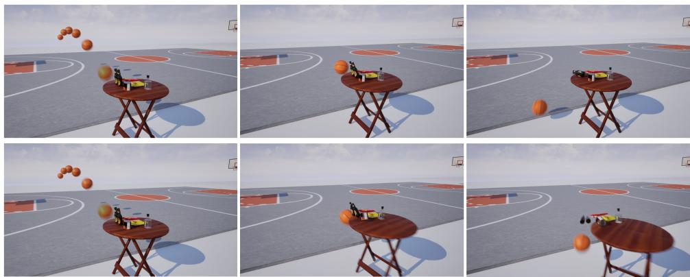  
Fi<sub>gure</sub> 10<sub>:</sub> S<sub>cene genera</sub>ti<sub>on w</sub>ith dif<sub>eren</sub>t <sub>asse</sub>t <sub>proper</sub>ti<sub>es</sub> d<sub>escr</sub>i<sub>p</sub>ti<sub>on.</sub> W<sub>e vary</sub> th<sub>e mass o</sub>f th<sub>e</sub> b<sub>as</sub>k<sub>e</sub>tb<sub>a</sub>ll<sub>, an</sub>d <sub>se</sub>t <sub>o</sub>th<sub>er</sub> f<sub>ac</sub>t<sub>ors</sub> th<sub>e same,</sub> l<sub>ea</sub>di<sub>ng</sub> t<sub>o ev</sub>id<sub>en</sub>tl<sub>y</sub> dif<sub>eren</sub>t <sub>s</sub>it<sub>ua</sub>ti<sub>ons.</sub>

Each method is run K=5 times per scene with independent random seeds. Static methods (SceneCraft, PAT3D) are <sub>no</sub>t UE<sub>-execu</sub>t<sub>a</sub>bl<sub>e an</sub>d <sub>are exc</sub>l<sub>u</sub>d<sub>e</sub>d f<sub>rom</sub> th<sub>e</sub> f<sub>orma</sub>l <sub>com-</sub> <sub>par</sub>i<sub>son;</sub> th<sub>ey</sub> <sub>are</sub> di<sub>scusse</sub>d i<sub>n</sub> th<sub>e</sub> <sub>ma</sub>i<sub>n</sub> t<sub>ex</sub>t <sub>as</sub> <sub>represen</sub>t<sub>a</sub>ti<sub>ve</sub> l<sub>ayou</sub>t b<sub>ase</sub>li<sub>nes.</sub> S<sub>cene</sub> L<sub>anguage</sub> i<sub>s eva</sub>l<sub>ua</sub>t<sub>e</sub>d b<sub>y</sub> i<sub>mpor</sub>ti<sub>ng</sub> <sub>ex</sub>t<sub>rac</sub>t<sub>e</sub>d <sub>pr</sub>i<sub>m</sub>iti<sub>ve</sub> d<sub>a</sub>t<sub>a</sub> i<sub>n</sub>t<sub>o</sub> UE <sub>v</sub>i<sub>a our</sub> th<sub>ree-s</sub>t<sub>age conver-</sub> sion <sub>p</sub>i<sub>p</sub>eline (Sta<sub>g</sub>e 1: sha<sub>p</sub>e extraction; Sta<sub>g</sub>e 2: velocit<sub>y</sub> inference; Sta<sub>g</sub>e 3: C++ class <sub>g</sub>eneration), and runnin<sub>g</sub> full <sub>p</sub>h<sub>ys</sub>i<sub>cs</sub> <sub>s</sub>i<sub>mu</sub>l<sub>a</sub>ti<sub>on</sub> <sub>w</sub>ith th<sub>e</sub> <sub>same</sub> ECR i<sub>ns</sub>t<sub>rumen</sub>t<sub>a</sub>ti<sub>on</sub> <sub>ap-</sub> <sub>p</sub>li<sub>e</sub>d t<sub>o a</sub>ll <sub>o</sub>th<sub>er me</sub>th<sub>o</sub>d<sub>s.</sub> Si<sub>m</sub>W<sub>or</sub>ld i<sub>s</sub> i<sub>ns</sub>t<sub>rumen</sub>t<sub>e</sub>d <sub>w</sub>ith th<sub>e</sub> id<sub>en</sub>ti<sub>ca</sub>l ECR <sub>ca</sub>llb<sub>ac</sub>k l<sub>og</sub>i<sub>c.</sub>

Scene Language → UE adapter. Scene Language (Zhang et al. 2025) out<sub>p</sub>uts a <sub>p</sub>ro<sub>g</sub>ram-based re<sub>p</sub>resentation with-<sub>ou</sub>t UE<sub>-</sub>n<sub>a</sub>ti<sub>ve</sub> <sub>p</sub>h<sub>ys</sub>i<sub>cs</sub> <sub>s</sub>t<sub>a</sub>t<sub>e.</sub> W<sub>e</sub> im<sub>po</sub>rt it <sub>v</sub>i<sub>a</sub> <sub>a</sub> t<sub>wo-s</sub>t<sub>ep</sub> ada<sub>p</sub>ter: (i) execute the <sub>p</sub>ro<sub>g</sub>ram in exposed mode, extract <sub>pr</sub>i<sub>m</sub>iti<sub>ve poses, group</sub> th<sub>em</sub> i<sub>n</sub>t<sub>o seman</sub>ti<sub>c r</sub>i<sub>g</sub>id b<sub>o</sub>di<sub>es, an</sub>d <sub>map</sub> th<sub>em</sub> t<sub>o</sub> UE B<sub>as</sub>i<sub>c</sub>Sh<sub>apes un</sub>d<sub>er a</sub> fi<sub>xe</sub>d <sub>coor</sub>di<sub>na</sub>t<sub>e</sub> t<sub>rans-</sub> f<sub>orm</sub> $( ( X , Y , Z ) _ { \mathrm { U E } } { = } 1 0 0 ( \overline { { { - } } } z , x , y ) _ { \mathrm { S I } }$ cm); (ii) infer a linear l<sub>aunc</sub>h <sub>ve</sub>l<sub>oc</sub>it<sub>y</sub> f<sub>rom</sub> th<sub>e</sub> l<sub>as</sub>t t<sub>wo</sub> ki<sub>nema</sub>ti<sub>c-</sub>t<sub>ra</sub>il <sub>cen</sub>t<sub>ers w</sub>ith a scene-t<sub>yp</sub>e re<sup>f</sup>erence s<sub>p</sub>ee<sup>d</sup>, sett<sup>i</sup>n<sub>g</sub> an<sub>g</sub>u<sup>l</sup>ar ve<sup>l</sup>oc<sup>i</sup>t<sub>y</sub> to zero. Th<sub>e resu</sub>lti<sub>ng</sub> JSON i<sub>s comp</sub>il<sub>e</sub>d b<sub>y</sub> th<sub>e same</sub> C++ <sub>em</sub>itt<sub>er</sub> and ECR callbacks as our method. A<sub>pp</sub>roximations (<sub>p</sub>rimitive <sub>p</sub>roxies, fixed reference s<sub>p</sub>eed, no an<sub>g</sub>ular velocit<sub>y</sub>) can <sub>on</sub>l<sub>y un</sub>d<sub>ers</sub>t<sub>a</sub>t<sub>e</sub> S<sub>cene</sub> L<sub>anguage</sub>’<sub>s v</sub>i<sub>sua</sub>l <sub>qua</sub>lit<sub>y; o</sub>b<sub>serve</sub>d f<sub>a</sub>il<sub>ures</sub> <sub>are</sub> d<sub>om</sub>i<sub>na</sub>t<sub>e</sub>d b<sub>y</sub> l<sub>ayou</sub>t <sub>over</sub>l<sub>ap</sub> $( \mathrm { S L R } \approx 7 2 \% )$ <sub>ra</sub>th<sub>er</sub> th<sub>an</sub> i<sub>n</sub>fl<sub>a</sub>t<sub>e</sub>d <sub>even</sub>t <sub>comp</sub>l<sub>e</sub>ti<sub>on.</sub>

Quantitative results. Table 5 reports per-scene event completion for Scene Language, SimWorld, w/o Opt., and our f<sub>u</sub>ll <sub>me</sub>th<sub>o</sub>d <sub>across</sub> th<sub>e</sub> 10 t<sub>es</sub>t <sub>scenes.</sub>

Scene Layout Rate. Our method (and its ablated variant w/o Opt.) achieves $\mathrm { S L R } = 9 4 \% \pm 5 \%$ <sub>across a</sub>ll 10 <sub>scenes;</sub> th<sub>e</sub> l<sub>ayou</sub>t <sub>op</sub>ti<sub>m</sub>i<sub>za</sub>ti<sub>on p</sub>i<sub>pe</sub>li<sub>ne</sub> i<sub>s s</sub>h<sub>are</sub>d<sub>, so</sub> b<sub>o</sub>th <sub>var</sub>i<sub>-</sub> <sub>an</sub>t<sub>s</sub> <sub>pro</sub>d<sub>uce</sub> id<sub>en</sub>ti<sub>ca</sub>l <sub>s</sub>t<sub>a</sub>ti<sub>c</sub> i<sub>n</sub>iti<sub>a</sub>li<sub>za</sub>ti<sub>on</sub> <sub>qua</sub>lit<sub>y.</sub> Si<sub>m</sub>W<sub>or</sub>ld <sub>y</sub>i<sub>e</sub>ld<sub>s</sub> S $\mathbf { - R } = 8 9 \% _ { \pm 4 \% } ;$ it<sub>s c</sub>it <sub>-sca</sub>l<sub>e asse</sub>t l<sub>acemen</sub>t h<sub>eur</sub>i<sub>s-</sub> tics do not enforce precise object-level overlap constraints, <sub>caus</sub>i<sub>ng occas</sub>i<sub>ona</sub>l <sub>v</sub>i<sub>o</sub>l<sub>a</sub>ti<sub>ons.</sub> S<sub>cene</sub> L<sub>anguage ac</sub>hi<sub>eves</sub> $\mathrm { S L R } = 7 2 \% _ { \pm 8 \% } ;$ S6 <sub>cons</sub>i<sub>s</sub>t<sub>en</sub>tl<sub>y</sub> f<sub>a</sub>il<sub>s</sub> SLR d<sub>ue</sub> t<sub>o</sub> di<sub>rec</sub>tl<sub>y</sub> measured initial overla s of −24 cm and −38 cm between

".. The cue ball grazes the black ball, then drifts into the bottom pocket, while the black ball doesn't drop into a pocket."

"..The front car makes an emergency brake to avoid a trash bin rolling in from the roadside, but the car behind swerves and collide with an oncoming vehicle."

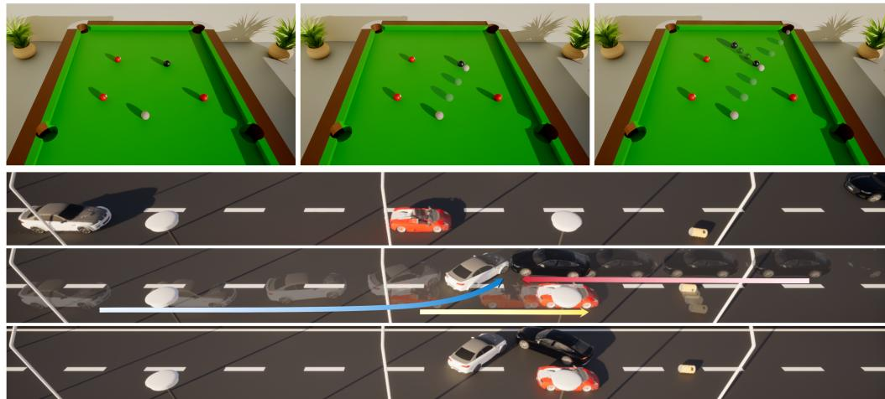  
Fi<sub>gure</sub> 11<sub>:</sub> S<sub>cene genera</sub>ti<sub>on w</sub>ith dif<sub>eren</sub>t <sub>even</sub>t d<sub>escr</sub>i<sub>p</sub>ti<sub>on.</sub> Th<sub>e</sub> fi<sub>rs</sub>t <sub>case</sub> i<sub>s an a</sub>d<sub>ap</sub>t<sub>a</sub>ti<sub>on o</sub>f th<sub>e</sub> fi<sub>rs</sub>t <sub>case</sub> i<sub>n</sub> Fi<sub>gure</sub> 6<sub>, an</sub>d th<sub>e</sub> <sub>secon</sub>d <sub>case</sub> i<sub>s an a</sub>d<sub>ap</sub>t<sub>a</sub>ti<sub>on o</sub>f th<sub>e secon</sub>d <sub>case</sub> i<sub>n</sub> Fi<sub>gure</sub> 5<sub>.</sub>

<sub>car,</sub> t<sub>ras</sub>h <sub>can, an</sub>d b<sub>enc</sub>h<sub>, an</sub>d <sub>severa</sub>l <sub>o</sub>th<sub>er scenes ex</sub>hibit <sub>occas</sub>i<sub>ona</sub>l <sub>pene</sub>t<sub>ra</sub>ti<sub>on</sub> f<sub>a</sub>il<sub>ures</sub> d<sub>ue</sub> t<sub>o s</sub>t<sub>oc</sub>h<sub>as</sub>ti<sub>c</sub> LLM <sub>sam-</sub> <sub>p</sub>li<sub>ng, resu</sub>lti<sub>ng</sub> i<sub>n</sub> th<sub>e</sub> hi<sub>g</sub>h<sub>er var</sub>i<sub>ance.</sub>

Event Completion Rate. Scene Language achieves 3.2/18 overall (±3.3). On Level-1 single-event scenes, its procedural trail primitives occasionally produce plausible ball trajectories, <sub>y</sub>ieldin<sub>g</sub> <sub>p</sub>artial success on ball-t<sub>yp</sub>e scenes (S1, S2, $\mathrm { S 4 } \mathrm { : 0 . 4 } _ { \pm 0 . 5 }$ each); car-t<sub>yp</sub>e and timin<sub>g</sub>-constrained scenes f<sub>a</sub>il <sub>en</sub>ti<sub>re</sub>l<sub>y</sub> $( \mathrm { S } 3 \colon 0 . 0 _ { \pm 0 . 0 } ) .$ <sub>.</sub> On <sub>c</sub>h<sub>a</sub>in <sub>eve</sub>nt<sub>s,</sub> S<sub>ce</sub>n<sub>e</sub> L<sub>a</sub>n<sub>guage</sub> <sub>par</sub>ti<sub>a</sub>ll<sub>y succee</sub>d<sub>s on</sub> S7 $( 0 . 8 _ { \pm 0 . 7 } ) $ <sub>, w</sub>h<sub>ere</sub> th<sub>e</sub> 2 <sub>cm</sub> i<sub>n</sub>iti<sub>a</sub>l b<sub>a</sub>ll <sub>spac</sub>i<sub>ng ena</sub>bl<sub>es even</sub>t <sub>comp</sub>l<sub>e</sub>ti<sub>on v</sub>i<sub>a</sub> th<sub>e</sub> i<sub>n</sub>f<sub>erre</sub>d t<sub>ra</sub>il <sub>ve</sub>l<sub>oc</sub>it<sub>y;</sub> S6 <sub>scores</sub> 0 <sub>as</sub> it<sub>s</sub> i<sub>n</sub>iti<sub>a</sub>l <sub>over</sub>l<sub>ap preven</sub>t<sub>s va</sub>lid <sub>co</sub>l<sub>-</sub> li<sub>s</sub>i<sub>on</sub> i<sub>mpu</sub>l<sub>ses.</sub> L<sub>eve</sub>l<sub>-</sub>3 <sub>scenes a</sub>ll f<sub>a</sub>ll <sub>a</sub>t <sub>or</sub> b<sub>e</sub>l<sub>ow</sub> $0 . 6 / N$ th<sub>e represen</sub>t<sub>a</sub>ti<sub>on enco</sub>d<sub>es no mu</sub>lti<sub>-p</sub>h<sub>ase</sub> t<sub>empora</sub>l <sub>s</sub>t<sub>ruc-</sub> t<sub>ure, an</sub>d <sub>pos</sub>t<sub>-even</sub>t <sub>snaps</sub>h<sub>o</sub>t i<sub>n</sub>iti<sub>a</sub>li<sub>za</sub>ti<sub>on</sub> d<sub>egra</sub>d<sub>es</sub> l<sub>ayou</sub>t <sub>va</sub>lidit<sub>y</sub> f<sub>ur</sub>th<sub>er.</sub>

Si<sub>m</sub>W<sub>or</sub>ld <sub>comp</sub>l<sub>e</sub>t<sub>es</sub> 1<sub>.</sub>4/18<sub>,</sub> <sub>con</sub>t<sub>r</sub>ib<sub>u</sub>ti<sub>ng</sub> <sub>on</sub>l<sub>y</sub> S6 $( 0 . 4 _ { \pm 0 . 5 } )$ <sub>an</sub>d ${ \bf S } 8 \left( 1 . 0 _ { \pm 0 . 0 } \right)$ <sub>,</sub> <sub>w</sub>h<sub>ere</sub> <sub>pre-</sub>d<sub>e</sub>fi<sub>ne</sub>d <sub>c</sub>it<sub>y-agen</sub>t <sub>an</sub>i<sub>-</sub> <sub>ma</sub>ti<sub>ons co</sub>i<sub>nc</sub>id<sub>en</sub>t<sub>a</sub>ll<sub>y sa</sub>ti<sub>s</sub>f<sub>y</sub> th<sub>e even</sub>t <sub>cons</sub>t<sub>ra</sub>i<sub>n</sub>t<sub>s; a</sub>ll <sub>o</sub>th<sub>er</sub> <sub>sce</sub>n<sub>es sco</sub>r<sub>e</sub> 0<sub>.</sub>

w/o Opt. achieves 8.8/18 (±2.1), revealing a clear and int<sub>erpre</sub>t<sub>a</sub>bl<sub>e</sub> f<sub>a</sub>il<sub>ure pa</sub>tt<sub>ern.</sub> O<sub>n</sub> L<sub>eve</sub>l<sub>-</sub>1 <sub>scenes,</sub> LLM<sub>-ass</sub>i<sub>gne</sub>d h<sub>eur</sub>i<sub>s</sub>ti<sub>c parame</sub>t<sub>ers re</sub>li<sub>a</sub>bl<sub>y rea</sub>li<sub>ze a</sub>ll <sub>s</sub>i<sub>mp</sub>l<sub>e co</sub>lli<sub>s</sub>i<sub>on</sub> events where the trajectory is determined by initial position and velocit<sub>y</sub> alone (S1, S2, ${ \mathrm { S } } 3 \colon 1 . 0 _ { \pm 0 . 0 } ) ;$ S4 <sub>par</sub>ti<sub>a</sub>ll<sub>y</sub> <sub>succee</sub>d<sub>s</sub> $( 0 . 6 _ { \pm 0 . 5 } )$ because the non-standard mass (10 kg) <sub>com</sub>bi<sub>ne</sub>d <sub>w</sub>ith <sub>a</sub> ti<sub>g</sub>ht 1<sub>-secon</sub>d ti<sub>m</sub>i<sub>ng cons</sub>t<sub>ra</sub>i<sub>n</sub>t i<sub>ncreases</sub> i<sub>n</sub>iti<sub>a</sub>li<sub>za</sub>ti<sub>on sens</sub>iti<sub>v</sub>it<sub>y an</sub>d <sub>re</sub>d<sub>uces even</sub>t <sub>rea</sub>li<sub>za</sub>ti<sub>on ra</sub>t<sub>e.</sub> On chain events (S5–S7), the first contact succeeds in most runs $( \mathrm { S } 5 \colon 0 . 8 _ { \pm 0 . 4 } ; \mathrm { S } 6 \colon 0 . 6 _ { \pm 0 . 5 } ; \mathrm { S } 7 \colon 1 . 0 _ { \pm 0 . 0 } ) \mathopen { } \mathclose \bgroup \mathopen { }$ <sub>,</sub> b<sub>u</sub>t th<sub>e secon</sub>d contact fails in all runs without exception: no gradient feedback steers the post-collision trajectory of the intermediate b<sub>o</sub>d<sub>y</sub> t<sub>owar</sub>d it<sub>s</sub> d<sub>owns</sub>t<sub>ream</sub> t<sub>arge</sub>t<sub>.</sub> O<sub>n</sub> L<sub>eve</sub>l<sub>-</sub>3 <sub>mu</sub>lti<sub>-p</sub>h<sub>ase</sub> <sub>scenes,</sub> th<sub>e</sub> fi<sub>rs</sub>t <sub>even</sub>t <sub>succee</sub>d<sub>s w</sub>h<sub>en</sub> it i<sub>nvo</sub>l<sub>ves s</sub>t<sub>ra</sub>i<sub>g</sub>ht<sub>-</sub> forward rectilinear motion (S8, S10 event 1), but turnin<sub>g</sub> maneuvers fail in most runs (S9 event $1 \colon 0 . 4 _ { \pm 0 . 5 } )$ <sub>an</sub>d b<sub>ra</sub>k<sub>-</sub> in<sub>g</sub> sequences are correctl<sub>y</sub> initiated in at most two runs (S8 event 2: 2/5; S10 event 2: 1/5), leavin<sub>g</sub> all downstream colli-<sub>s</sub>i<sub>ons unrea</sub>li<sub>ze</sub>d<sub>.</sub> Th<sub>e</sub> 7<sub>.</sub>6<sub>-po</sub>i<sub>n</sub>t ECR <sub>gap re</sub>l<sub>a</sub>ti<sub>ve</sub> t<sub>o our</sub> f<sub>u</sub>ll method (8.8 vs. 16.4) directl<sub>y</sub> quantifies the contribution of dif<sub>eren</sub>ti<sub>a</sub>bl<sub>e even</sub>t<sub>-</sub>l<sub>oss op</sub>ti<sub>m</sub>i<sub>za</sub>ti<sub>on.</sub>

Our full method achieves 16.4/18 (±1.0). The two incom-<sub>p</sub>l<sub>e</sub>t<sub>e even</sub>t<sub>s occur</sub> i<sub>n</sub> S10<sub>,</sub> th<sub>e mos</sub>t <sub>comp</sub>l<sub>ex</sub> th<sub>ree-</sub>b<sub>o</sub>d<sub>y c</sub>h<sub>a</sub>i<sub>n</sub> <sub>scene, w</sub>h<sub>ere gra</sub>di<sub>en</sub>t <sub>s</sub>i<sub>gna</sub>l <sub>a</sub>tt<sub>enua</sub>t<sub>es over</sub> th<sub>e ex</sub>t<sub>en</sub>d<sub>e</sub>d <sub>op</sub>ti<sub>m</sub>i<sub>za</sub>ti<sub>on</sub> h<sub>or</sub>i<sub>zon.</sub> P<sub>a</sub>i<sub>rw</sub>i<sub>se</sub> Wil<sub>coxon s</sub>i<sub>gne</sub>d<sub>-ran</sub>k t<sub>es</sub>t<sub>s</sub> (per-run sums, K=5) confirm our method significantly outperforms all baselines (p<0.05).

Physical Parameter Accuracy. Table 6 reports the underl<sub>y</sub>i<sub>ng a</sub>b<sub>so</sub>l<sub>u</sub>t<sub>e errors;</sub> PPA <sub>scores are compu</sub>t<sub>e</sub>d f<sub>rom</sub> th<sub>ese</sub> <sub>e</sub>rr<sub>o</sub>r<sub>s</sub> <sub>pe</sub>r th<sub>e</sub> d<sub>e</sub>finiti<sub>o</sub>n in S<sub>upp.</sub> M<sub>a</sub>t<sub>.</sub> B<sub>.</sub>3<sub>.</sub> S<sub>ce</sub>n<sub>e</sub> L<sub>a</sub>n<sub>guage</sub> i<sub>s exc</sub>l<sub>u</sub>d<sub>e</sub>d <sub>as</sub> it <sub>pro</sub>d<sub>uces no p</sub>h<sub>ys</sub>i<sub>ca</sub>l <sub>parame</sub>t<sub>ers.</sub>

w/o Opt. achieves $\mathrm { P P A } = 6 1 . 0 \% ( \pm 5 \% )$ <sub>, revea</sub>li<sub>ng a qua</sub>li<sub>-</sub> tative split between parameter types. Literal initial-condition parameters directly assignable by the LLM (mass, initial velocit<sub>y</sub>, s<sub>p</sub>eed ran<sub>g</sub>e) score 1.0 in all runs: S4 mass error is $0 . 2 0 { \scriptstyle \pm 0 . 1 0 } \mathrm { k g } , \mathrm { S 8 }$ i<sub>n</sub>iti<sub>a</sub>l <sub>spee</sub>d <sub>error</sub> i<sub>s</sub> $0 . 4 0 { \scriptstyle \pm 0 . 3 0 }$ m/<sub>s,</sub> <sub>a</sub>nd S10 speed lies within [5, 10] m/s in every run. Emergent outcome parameters depending on unfolding dynamics receive only <sub>par</sub>ti<sub>a</sub>l <sub>cre</sub>dit<sub>:</sub> <sub>co</sub>lli<sub>s</sub>i<sub>on</sub> ti<sub>m</sub>i<sub>ng</sub> $( \mathrm { S 3 } ; 1 . 5 0 _ { \pm 0 . 7 0 } \mathrm { s } , \mathrm { s c o r e } = 0 . 6 0 $ $\mathbf { S } 4 ; 0 . 8 5 _ { \pm 0 . 4 0 } \mathbf { s }$ with two non-completions, score = 0.27) and <sub>p</sub>ost-collision velocit<sub>y</sub> (S7 $v _ { B } \mathrm { { : } ~ 1 . 8 0 { \scriptstyle \pm 0 . 6 0 } ~ m / s }$ , score = 0.60) i<sub>ncur</sub> <sub>su</sub>b<sub>s</sub>t<sub>an</sub>ti<sub>a</sub>l d<sub>e</sub>d<sub>uc</sub>ti<sub>ons,</sub> <sub>w</sub>hil<sub>e</sub> S10 ti<sub>m</sub>i<sub>ng</sub> f<sub>a</sub>il<sub>s</sub> <sub>en</sub>ti<sub>re</sub>l<sub>y</sub> (no com<sub>p</sub>letions, score = 0). A<sub>gg</sub>re<sub>g</sub>ated over outcome <sub>p</sub>arameters only, w/o Opt. achieves an outcome PPA of 37%.

Si<sub>m</sub>W<sub>or</sub>ld <sub>ac</sub>hi<sub>eves</sub> $\mathrm { P P A } = 1 5 . 0 \% ( \pm 8 \% ) $ <sub>:</sub> <sub>par</sub>ti<sub>a</sub>l <sub>cre</sub>dit <sub>on</sub> S8 i<sub>n</sub>iti<sub>a</sub>l <sub>spee</sub>d $( \mathrm { e r r o r } = 2 . 9 2 \mathrm { m / s } , \mathrm { s c o r e } = 0 . 8 1 )$ <sub>an</sub>d S8 b<sub>ra</sub>k<sub>-</sub> ing time (excess = 0.32 s, score = 0.36) <sub>y</sub>ield small non-zero <sub>con</sub>t<sub>r</sub>ib<sub>u</sub>ti<sub>ons; a</sub>ll <sub>o</sub>th<sub>er parame</sub>t<sub>ers score</sub> 0 d<sub>ue</sub> t<sub>o even</sub>t <sub>non-</sub> <sub>comp</sub>l<sub>e</sub>ti<sub>on.</sub>

O<sub>ur</sub> f<sub>u</sub>ll <sub>me</sub>th<sub>o</sub>d <sub>ac</sub>hi<sub>eves</sub> $\mathrm { P P A } = 9 5 . 0 \% ( \pm 3 \% )$ <sub>, w</sub>ith <sub>near-</sub> <sub>per</sub>f<sub>ec</sub>t <sub>scores on a</sub>ll <sub>cons</sub>t<sub>ra</sub>i<sub>n</sub>t<sub>s</sub> i<sub>n a</sub>ll <sub>runs.</sub> Th<sub>e</sub> th<sub>ree</sub> sub-unit<sub>y</sub> contributions are the S8 velocit<sub>y</sub> outlier (error = 1.1 m/s in one run) and two S10 rear-end collision noncompletions. The 34-point gap in overall PPA between w/o Opt. (61%) and our method (92%), and the 55-point gap on outcome <sub>p</sub>arameters alone (37% vs. 92%), confirm that diff<sub>eren</sub>ti<sub>a</sub>bl<sub>e even</sub>t<sub>-</sub>l<sub>oss op</sub>ti<sub>m</sub>i<sub>za</sub>ti<sub>on</sub> i<sub>s</sub> th<sub>e</sub> d<sub>ec</sub>i<sub>s</sub>i<sub>ve</sub> f<sub>ac</sub>t<sub>or</sub> f<sub>or</sub> <sub>sa</sub>ti<sub>s</sub>f<sub>y</sub>i<sub>ng</sub> t<sub>empora</sub>l <sub>an</sub>d <sub>causa</sub>l <sub>cons</sub>t<sub>ra</sub>i<sub>n</sub>t<sub>s.</sub>

PPA Precision Robustness. The continuous PPA score uses a precision threshold ϵ to define the “fully satisfied” region (score = 1); violations beyond ϵ receive proportional <sub>par</sub>ti<sub>a</sub>l <sub>cre</sub>dit<sub>.</sub> T<sub>a</sub>bl<sub>e</sub> 3 <sub>repor</sub>t<sub>s</sub> PPA <sub>un</sub>d<sub>er</sub> th<sub>ree</sub> th<sub>res</sub>h<sub>o</sub>ld <sub>c</sub>h<sub>o</sub>i<sub>ces, con</sub>fi<sub>rm</sub>i<sub>ng</sub> th<sub>a</sub>t <sub>a</sub>ll <sub>qua</sub>lit<sub>a</sub>ti<sub>ve conc</sub>l<sub>us</sub>i<sub>ons are ro-</sub> bust: (i) the substantial gap between our method and w/o Opt. on outcome parameters persists across all settings, and (ii) literal initial-condition <sub>p</sub>arameters <sub>y</sub>ield a stable score floor for w/o Opt. that is largely threshold-independent.

Table 3: PPA sensitivit<sub>y</sub> to <sub>p</sub>recision thresholds (same 40 constraint measurements; Scene Lan<sub>g</sub>ua<sub>g</sub>e excluded).
<table><tr><td>Threshold set</td><td> $( \epsilon _ { t } , \epsilon _ { v } , \epsilon _ { m } )$ </td><td>w/o Opt.</td><td>SimWorld</td><td>Ours</td></tr><tr><td>Strict</td><td>(0.2 s, 0.5 m/s, 0.3 kg)</td><td>57%</td><td>14%</td><td>95%</td></tr><tr><td>Standard (paper)</td><td>(0.3 s, 1.0 m/s, 0.5 kg)</td><td>61%</td><td>15%</td><td>95%</td></tr><tr><td>Lenient</td><td>(0.5 s, 2.0 m/s, 1.0 kg)</td><td>68%</td><td>16%</td><td>95%</td></tr></table>

## B.4 Ablation Study of Draft Construction

W<sub>e a</sub>bl<sub>a</sub>t<sub>e</sub> b<sub>o</sub>th d<sub>ra</sub>ft <sub>cons</sub>t<sub>ruc</sub>ti<sub>on componen</sub>t<sub>s on</sub> 200 <sub>scene</sub> d<sub>escr</sub>i<sub>p</sub>ti<sub>ons</sub> <sub>us</sub>i<sub>ng</sub> GPT<sub>-</sub>4<sub>.</sub>1<sub>,</sub> <sub>compar</sub>i<sub>ng</sub> th<sub>ree</sub> <sub>con</sub>fi<sub>gura</sub>ti<sub>ons:</sub> (i) single-shot prompt, which generates a complete ESG in one response with no retry or validation; (ii) w/o Validation, <sub>w</sub>hi<sub>c</sub>h <sub>app</sub>li<sub>es</sub> hi<sub>erarc</sub>hi<sub>ca</sub>l <sub>promp</sub>ti<sub>ng</sub> b<sub>u</sub>t <sub>passes</sub> d<sub>ra</sub>ft<sub>s</sub> di<sub>-</sub> rectly downstream without the validation step; and (iii) Ours, <sub>w</sub>hi<sub>c</sub>h <sub>com</sub>bi<sub>nes</sub> hi<sub>erarc</sub>hi<sub>ca</sub>l <sub>promp</sub>ti<sub>ng w</sub>ith f<sub>u</sub>ll <sub>va</sub>lid<sub>a</sub>ti<sub>on.</sub> Fi<sub>na</sub>l <sub>usa</sub>bilit<sub>y an</sub>d hi<sub>g</sub>h<sub>-qua</sub>lit<sub>y ra</sub>t<sub>e are eva</sub>l<sub>ua</sub>t<sub>e</sub>d <sub>as</sub> d<sub>e</sub>fi<sub>ne</sub>d i<sub>n</sub> S<sub>ec.</sub> 4<sub>.</sub>3<sub>; resu</sub>lt<sub>s are repor</sub>t<sub>e</sub>d i<sub>n</sub> T<sub>a</sub>bl<sub>e</sub> 1<sub>.</sub>

Hi<sub>erarc</sub>hi<sub>ca</sub>l <sub>promp</sub>ti<sub>ng</sub> i<sub>mproves usa</sub>bilit<sub>y</sub> b<sub>y</sub> d<sub>ecompos-</sub> in<sub>g</sub> ESG <sub>ge</sub>n<sub>e</sub>r<sub>a</sub>ti<sub>o</sub>n int<sub>o</sub> <sub>p</sub>r<sub>og</sub>r<sub>ess</sub>i<sub>ve</sub>l<sub>y</sub> <sub>co</sub>n<sub>s</sub>tr<sub>a</sub>in<sub>e</sub>d <sub>s</sub>t<sub>ages,</sub> <sub>re</sub>d<sub>uc</sub>i<sub>ng sc</sub>h<sub>ema errors an</sub>d <sub>re</sub>f<sub>erence</sub> i<sub>ncons</sub>i<sub>s</sub>t<sub>enc</sub>i<sub>es</sub> th<sub>a</sub>t <sub>s</sub>i<sub>ng</sub>l<sub>e-s</sub>h<sub>o</sub>t <sub>ou</sub>t<sub>pu</sub>t<sub>s</sub> f<sub>requen</sub>tl<sub>y</sub> <sub>pro</sub>d<sub>uce.</sub> Th<sub>e</sub> <sub>va</sub>lid<sub>a</sub>ti<sub>on</sub> <sub>sys-</sub> t<sub>em</sub> f<sub>ur</sub>th<sub>er</sub> <sub>ra</sub>i<sub>ses</sub> fi<sub>na</sub>l <sub>usa</sub>bilit<sub>y</sub> t<sub>o</sub> 99<sub>.</sub>0% b<sub>y</sub> filt<sub>er</sub>i<sub>ng</sub> <sub>ma</sub>l<sub>-</sub> f<sub>orme</sub>d <sub>or</sub> <sub>con</sub>t<sub>ra</sub>di<sub>c</sub>t<sub>ory</sub> d<sub>ra</sub>ft<sub>s</sub> b<sub>e</sub>f<sub>ore</sub> th<sub>ey</sub> <sub>en</sub>t<sub>er</sub> th<sub>e</sub> <sub>op</sub>ti<sub>m</sub>i<sub>za-</sub> ti<sub>on</sub> <sub>p</sub>i<sub>pe</sub>li<sub>ne,</sub> <sub>an</sub>d <sub>ra</sub>i<sub>ses</sub> th<sub>e</sub> hi<sub>g</sub>h<sub>-qua</sub>lit<sub>y</sub> <sub>ra</sub>t<sub>e</sub> b<sub>y</sub> <sub>ensur</sub>i<sub>ng</sub> th<sub>a</sub>t <sub>on</sub>l<sub>y</sub> <sub>s</sub>t<sub>ruc</sub>t<sub>ura</sub>ll<sub>y</sub> <sub>soun</sub>d d<sub>ra</sub>ft<sub>s—</sub>th<sub>ose</sub> <sub>a</sub>d<sub>m</sub>itti<sub>ng</sub> <sub>a</sub> <sub>va</sub>lid l<sub>ow-</sub> <sup>ener</sup>gy <sup>la</sup>y<sup>o</sup>u<sup>t—</sup>p<sup>roceed</sup> <sup>do</sup>w<sup>nstream</sup>.

T<sub>a</sub>bl<sub>e</sub> 4<sub>:</sub> T<sub>es</sub>t <sub>scene spec</sub>ifi<sub>ca</sub>ti<sub>ons.</sub> E<sub>ven</sub>t<sub>s are</sub> li<sub>s</sub>t<sub>e</sub>d i<sub>n se-</sub> <sub>quen</sub>ti<sub>a</sub>l <sub>or</sub>d<sub>er; cons</sub>t<sub>ra</sub>i<sub>n</sub>t<sub>s</sub> i<sub>n paren</sub>th<sub>eses are</sub> th<sub>e quan</sub>tit<sub>a</sub>ti<sub>ve</sub> <sub>requ</sub>i<sub>remen</sub>t<sub>s use</sub>d i<sub>n</sub> T<sub>a</sub>bl<sub>e</sub> 6<sub>.</sub>
<table><tr><td>ID</td><td>Level Prompt &amp; Events</td><td></td><td>N 1</td></tr><tr><td>S1</td><td>Sinle</td><td>A bowling ball rolls toward a set of bowling pins and hits them.  $( l ) b a l l - p i n c o l l i s i o n$ </td><td></td></tr><tr><td>S2</td><td></td><td>A soccer ball hits a tidy office desk. (1) ball–desk collision</td><td>1</td></tr><tr><td>S3</td><td></td><td>A car move towards a jeep and collide with it after 3 1 seconds. (1) car-jeep collision  $\left( t _ { c o l l i d e } { = } 3 . 0 \mathrm { s } \right)$ </td><td></td></tr><tr><td>S4</td><td></td><td>A tailor-made basketball weigh 10kg is thrown toward a picnic table with many bottles on it, and hit after 1 seconds. (1)  $b a l l { - } t a b l e$  collision</td><td>1</td></tr><tr><td>S5 Chin</td><td></td><td> $( m _ { b a l l } { = } 1 0 \mathrm { k g } , \ t _ { c o l l i d e } { = } 1 . 0 \mathrm { s } )$  There are several billiards on the billiard table. The cue ball strikes the black ball, sending it cleanly into the bottom pocket.</td><td>2</td></tr><tr><td>S6</td><td></td><td>(1) cue-black collision (2) black ball into pocket A car collide with a trashbin, knocking the trashbin to collide with a picnic table by the street side.</td><td>2</td></tr><tr><td>S7</td><td></td><td>(1) car–trashbin collision (2) trashbin-table colli- sion There are three balls on the ground. Ball A moves and hits ball B, giving ball B an initial speed at 2m/s, then ball B hits ball C.</td><td>2</td></tr><tr><td>S8</td><td>Mul-dse</td><td>(1) A–B collision (2) B–C collision  $\left( v _ { B } { = } 2 . 0 \mathrm { m / s } \right)$  A black car is moving at 10 m/s down the road. The driver starts braking, letting the car to stop in 2 3 seconds. (1) car move down the road (2) car brakes to stop</td><td></td></tr><tr><td>S9</td><td></td><td> $( v _ { c a r } \mathrm { = } 1 0 \mathrm { m / s } , \ t _ { \mathrm { b r a k e \mathrm { - } \mathrm { t o } _ { \mathrm { - } } \mathrm { s t o p } } } \mathrm { \in [ 2 , 3 ] \mathrm { s } ) }$  À car moves along the street and turns left at a cross. 3 It brakes hard after entering the new lane, but still hits a bicycle stopped in the middle of the road. (1) car turns left (2) car brakes (3) car-bicycle</td><td></td></tr><tr><td>S10</td><td>collision two cars collide after 1 second. rear-end collision</td><td>Two cars moves at the same speed of 5 10m/s, one in front of the other. The front car suddenly brakes, and (1) two cars in motion (2) front car brakes (3)  $( v _ { c a r s } { \in } [ 5 , 1 0 ] \mathrm { m / s } , \ t _ { \mathrm { c o l l i d e } } { = } 1 . 0 \mathrm { s } )$ </td><td></td></tr></table>

## B.5 Ablation Study of Gradient Strategy

Scene and setup. We use scene S6 (car → trashbin → table), which involves non-s<sub>p</sub>herical collision <sub>p</sub>roxies: the car i<sub>s represen</sub>t<sub>e</sub>d b<sub>y a</sub> b<sub>ox pr</sub>i<sub>m</sub>iti<sub>ve an</sub>d th<sub>e</sub> t<sub>ras</sub>hbi<sub>n</sub> b<sub>y a cy</sub>li<sub>n-</sub> d<sub>r</sub>i<sub>ca</sub>l <sub>proxy.</sub> Thi<sub>s geome</sub>t<sub>ry ma</sub>k<sub>es</sub> th<sub>e scene a su</sub>it<sub>a</sub>bl<sub>e s</sub>t<sub>ress</sub> test for <sub>g</sub>radient qualit<sub>y</sub>: the first event (car → trashbin) is <sub>a</sub> di<sub>rec</sub>t i<sub>n</sub>t<sub>erac</sub>ti<sub>on w</sub>h<sub>ose gra</sub>di<sub>en</sub>t i<sub>s re</sub>l<sub>a</sub>ti<sub>ve</sub>l<sub>y s</sub>t<sub>ra</sub>i<sub>g</sub>htf<sub>or-</sub> ward, while the second event (trashbin → bench) is a chain i<sub>n</sub>t<sub>erac</sub>ti<sub>on</sub> <sub>w</sub>h<sub>ere</sub> th<sub>e</sub> <sub>gra</sub>di<sub>en</sub>t <sub>mus</sub>t b<sub>ac</sub>k<sub>propaga</sub>t<sub>e</sub> th<sub>roug</sub>h th<sub>e non-sp</sub>h<sub>er</sub>i<sub>ca</sub>l <sub>car–</sub>t<sub>ras</sub>hbi<sub>n con</sub>t<sub>ac</sub>t<sub>.</sub> W<sub>e run eac</sub>h <sub>var</sub>i<sub>an</sub>t for K=5 independent runs with diferent random initializati<sub>ons o</sub>f th<sub>e car</sub>’<sub>s</sub> i<sub>n</sub>iti<sub>a</sub>l <sub>spee</sub>d<sub>.</sub>

T<sub>a</sub>bl<sub>e</sub> 5<sub>:</sub> D<sub>ynam</sub>i<sub>c even</sub>t <sub>comp</sub>l<sub>e</sub>ti<sub>on on</sub> 10 t<sub>es</sub>t <sub>scenes, av-</sub> eraged over K=5 independent runs. N = expected events <sub>p</sub>er scene. Each cell shows mean ± std com<sub>p</sub>leted events; the Total row reports std over the five per-run sums. w/o Opt. N <sup>denotes our method without diferentiable</sup> p<sup>h</sup>y<sup>sical o</sup>p<sup>timiza-</sup> tion (LLM-assi<sub>g</sub>ned <sub>p</sub>arameters onl<sub>y</sub>).
<table><tr><td>Scene N Sc. Language SimWorld w/o Opt.</td><td></td><td></td><td></td><td>Ours</td></tr><tr><td colspan="5">Level 1: Single event</td></tr><tr><td>S1</td><td>1  $0 . 4 { \scriptstyle \pm 0 . 5 }$  1</td><td> $0 . 0 { \scriptstyle \pm 0 . 0 }$ </td><td> $1 . 0 { \scriptstyle \pm 0 . 0 }$ </td><td> ${ \bf 1 . 0 { \bf _ { \pm 0 . 0 } } }$ </td></tr><tr><td>S2</td><td> $0 . 4 { \scriptstyle \pm 0 . 5 }$ </td><td> $0 . 0 { \scriptstyle \pm 0 . 0 }$ </td><td> $1 . 0 { \scriptstyle \pm 0 . 0 }$ </td><td> ${ \bf 1 . 0 { \scriptstyle \pm 0 . 0 } }$ </td></tr><tr><td>S3</td><td> $0 . 0 { \scriptstyle \pm 0 . 0 }$ </td><td> $0 . 0 { \scriptstyle \pm 0 . 0 }$ </td><td> $1 . 0 { \scriptstyle \pm 0 . 0 }$ </td><td> ${ \bf 1 . 0 { \bf _ { \pm 0 . 0 } } }$ </td></tr><tr><td>S4</td><td> $0 . 4 { \scriptstyle \pm 0 . 5 }$ </td><td> $0 . 0 { \scriptstyle \pm 0 . 0 }$ </td><td> $0 . 6 { \scriptstyle \pm 0 . 5 }$ </td><td> ${ \bf 1 . 0 { \bf _ { \pm 0 . 0 } } }$ </td></tr><tr><td colspan="5">Level 2: Chain events</td></tr><tr><td>S5</td><td> $0 . 4 { \scriptstyle \pm 0 . 5 }$ </td><td> $0 . 0 { \scriptstyle \pm 0 . 0 }$ </td><td> $0 . 8 { \scriptstyle \pm 0 . 4 }$ </td><td> $\mathbf { 2 . 0 { \_ } _ { 0 . 0 } }$ </td></tr><tr><td>S6</td><td>2 2  $0 . 0 { \scriptstyle \pm 0 . 0 }$ </td><td> $0 . 4 { \scriptstyle \pm 0 . 5 }$ </td><td> $0 . 6 { \scriptstyle \pm 0 . 5 }$ </td><td> $\mathbf { 1 . 8 \pm 0 . 4 }$ </td></tr><tr><td>S7</td><td>2  $0 . 8 { \scriptstyle \pm 0 . 7 }$ </td><td> $0 . 0 { \scriptstyle \pm 0 . 0 }$ </td><td> $1 . 0 { \scriptstyle \pm 0 . 0 }$ </td><td> $\mathbf { 2 . 0 { \_ } _ { 0 . 0 } }$ </td></tr><tr><td colspan="5">Level 3: Multi-phase actor dynamics</td></tr><tr><td>S8</td><td>2  $0 . 0 { \scriptstyle \pm 0 . 0 }$ </td><td> $1 . 0 { \scriptstyle \pm 0 . 0 }$ </td><td> $1 . 2 { \scriptstyle \pm 0 . 4 }$ </td><td> $\mathbf { 2 . 0 { \_ } _ { 0 . 0 } }$ </td></tr><tr><td>S9</td><td>3  $0 . 2 { \scriptstyle \pm 0 . 4 }$ </td><td> $0 . 0 { \scriptstyle \pm 0 . 0 }$ </td><td> $0 . 4 { \scriptstyle \pm 0 . 5 }$ </td><td> $\mathbf { 2 . 2 \pm 0 . 8 }$ </td></tr><tr><td>S10</td><td>3  $0 . 6 { \scriptstyle \pm 0 . 5 }$ </td><td> $0 . 0 { \scriptstyle \pm 0 . 0 }$ </td><td> $1 . 2 { \scriptstyle \pm 0 . 4 }$ </td><td> $\mathbf { 2 . 4 \bot 0 . 8 }$ </td></tr><tr><td>Total</td><td>18</td><td> $3 . 2 { \pm } 3 . 3$ </td><td> $1 . 4 { \pm } 0 . 5$ </td><td> $8 . 8 { \scriptstyle \pm 2 . 1 }$   $\mathbf { 1 6 . 4 \pm 1 . 0 }$ </td></tr></table>

T<sub>a</sub>bl<sub>e</sub> 6<sub>:</sub> Ab<sub>so</sub>l<sub>u</sub>t<sub>e parame</sub>t<sub>er errors un</sub>d<sub>er</sub>l<sub>y</sub>i<sub>ng</sub> PPA<sub>, on</sub> fi<sub>ve</sub> 2 <sub>scenes w</sub>ith <sub>exp</sub>li<sub>c</sub>it <sub>p</sub>h<sub>ys</sub>i<sub>ca</sub>l <sub>cons</sub>t<sub>ra</sub>i<sub>n</sub>t<sub>s.</sub> C<sub>e</sub>ll <sub>va</sub>l<sub>ues are</sub> $| \Delta | _ { \mathrm { \pm s t d } } ; n / 5$ d<sub>eno</sub>t<sub>es runs w</sub>h<sub>ere</sub> th<sub>e cons</sub>t<sub>ra</sub>i<sub>n</sub>t i<sub>s eva</sub>l<sub>ua</sub>t<sub>e</sub>d (error is 0 when the out<sub>p</sub>ut falls within a window constraint; $\cdots { \mathrm { ~ } } - \cdots { \mathrm { ~ } } = { \mathrm { e v e n t } }$ did not occur). Initial-condition <sub>p</sub>arameters are 2 evaluated over all K=5 runs; outcome parameters only over <sub>runs</sub> <sub>w</sub>h<sub>ere</sub> th<sub>e</sub> <sub>even</sub>t <sub>comp</sub>l<sub>e</sub>t<sub>es,</sub> <sub>w</sub>ith <sub>non-comp</sub>l<sub>e</sub>ti<sub>on</sub> <sub>score</sub>d as 0. PPA (%): w/o Opt. 61.0; SimWorld 15.0; Ours 95.0. Scene Lan<sub>g</sub>ua<sub>g</sub>e excluded (no <sub>p</sub>h<sub>y</sub>sical <sub>p</sub>arameters out<sub>p</sub>ut).
<table><tr><td rowspan="7">3</td><td>Constraint</td><td></td><td>w/o Opt. SimWorld</td><td></td><td>Ours</td></tr><tr><td></td><td>S3 t (s) = 3.0</td><td> $1 . 5 0 { \scriptstyle \pm 0 . 7 0 \ ( 5 / 5 ) }$ </td><td></td><td> $\mathbf { 0 . 1 6 { \scriptstyle \pm 0 . 0 5 \ ( 5 / 5 ) } }$ </td></tr><tr><td>S4</td><td> $m \ ( \mathrm { k g } ) = 1 0$ </td><td> $0 . 2 0 { \scriptstyle \pm 0 . 1 0 \ ( 5 / 5 ) }$ </td><td></td><td> $\mathbf { 0 . 0 2 _ { \pm 0 . 0 4 } \ ( 5 / 5 ) }$ </td></tr><tr><td></td><td> $t \ ( \mathrm { s } ) \stackrel { } { = } 1 . 0$ </td><td> $0 . 8 5 { \scriptstyle \pm 0 . 4 0 \ ( 3 / 5 ) }$ </td><td></td><td> $\mathbf { 0 . 0 6 _ { \pm 0 . 0 5 } \ ( 5 / 5 ) }$ </td></tr><tr><td>S7</td><td> $v _ { B } ~ \mathrm { ( m / s ) = 2 . 0 }$ </td><td> $1 . 8 0 { \scriptstyle \pm 0 . 6 0 ~ ( 5 / 5 ) }$ </td><td></td><td> $\mathbf { 0 . 1 4 { \scriptstyle \pm 0 . 0 8 \ ( 5 / 5 ) } }$ </td></tr><tr><td>S8</td><td> $v ~ ( \mathrm { m / s } ) = 1 0 . 0$ </td><td> $0 . 4 0 { \scriptstyle \pm 0 . 3 0 ~ ( 5 / 5 ) }$ </td><td> $2 . 9 2 _ { \pm 2 }$  .39 (5/5)</td><td> $\mathbf { 0 . 5 6 { \scriptstyle \pm 0 . 3 0 ~ ( 5 / 5 ) } }$ </td></tr><tr><td>S10</td><td> $t \ ( \mathrm { \bar { s } } ) \ \mathrm { \bar { \in } } \ [ 2 . 0 , \ 3 . 0 ]$  v (m/s) ∈ [5.0, 10.0] 0.00±0.00 (5/5)</td><td> $0 . 0 0 { \scriptstyle \pm 0 . 0 0 \ ( 2 / 5 ) }$ </td><td>0.32±0.32 (5/5)</td><td> $\mathbf { 0 . 0 0 _ { \pm 0 . 0 0 } \ ( 5 / 5 ) }$   $\mathbf { 0 . 0 0 _ { \pm 0 . 0 0 } \ ( 5 / 5 ) }$ </td></tr></table>

Why AD fails on chain events with non-spherical geometry. For sphere–sphere contacts, the contact normal is ex-<sub>ac</sub>tl<sub>y ce</sub>nt<sub>e</sub>r<sub>-</sub>t<sub>o-ce</sub>nt<sub>e</sub>r<sub>, so</sub> th<sub>e</sub> AD <sub>su</sub>rr<sub>oga</sub>t<sub>e g</sub>i<sub>ves accu</sub>r<sub>a</sub>t<sub>e g</sub>r<sub>a-</sub> dient directions. For non-s<sub>p</sub>herical <sub>p</sub>rimitives (boxes, c<sub>y</sub>linders), the contact normal de<sub>p</sub>ends on which face or ed<sub>g</sub>e is <sub>c</sub>l<sub>oses</sub>t<sub>—a quan</sub>tit<sub>y</sub> th<sub>a</sub>t th<sub>e pena</sub>lt<sub>y-</sub>b<sub>ase</sub>d <sub>so</sub>ft<sub>-con</sub>t<sub>ac</sub>t <sub>mo</sub>d<sub>e</sub>l <sub>approx</sub>i<sub>ma</sub>t<sub>es</sub> <sub>v</sub>i<sub>a</sub> th<sub>e</sub> <sub>pr</sub>i<sub>m</sub>iti<sub>ve</sub> SDF<sub>.</sub> Thi<sub>s</sub> <sub>approx</sub>i<sub>ma</sub>ti<sub>on</sub> i<sub>n-</sub> t<sub>ro</sub>d<sub>uces a</sub> di<sub>rec</sub>ti<sub>ona</sub>l <sub>error</sub> i<sub>n</sub> th<sub>e con</sub>t<sub>ac</sub>t i<sub>mpu</sub>l<sub>se, w</sub>hi<sub>c</sub>h <sub>p</sub>ro<sub>p</sub>a<sub>g</sub>ates as <sub>g</sub>ra<sup>di</sup>ent no<sup>i</sup>se w<sup>h</sup>en <sup>b</sup>ac<sup>k</sup><sub>p</sub>ro<sub>p</sub>a<sub>g</sub>at<sup>i</sup>n<sub>g</sub> t<sup>h</sup>rou<sub>g</sub><sup>h</sup> th<sub>e c</sub>h<sub>a</sub>i<sub>n.</sub> I<sub>n prac</sub>ti<sub>ce,</sub> th<sub>e</sub> AD <sub>gra</sub>di<sub>en</sub>t f<sub>or</sub> th<sub>e</sub> fi<sub>rs</sub>t <sub>even</sub>t remains reliable (5/5 com<sub>p</sub>letions), but the chain <sub>g</sub>radient f<sub>or</sub> th<sub>e</sub> <sub>secon</sub>d <sub>even</sub>t b<sub>ecomes</sub> <sub>su</sub>fi<sub>c</sub>i<sub>en</sub>tl<sub>y</sub> i<sub>naccura</sub>t<sub>e</sub> t<sub>o</sub> <sub>pre-</sub> vent conver<sub>g</sub>ence (0/5 com<sub>p</sub>letions). FD <sub>g</sub>radients, evaluated <sub>on</sub> th<sub>e</sub> f<sub>u</sub>ll N<sub>ew</sub>t<sub>on s</sub>i<sub>mu</sub>l<sub>a</sub>t<sub>or w</sub>ith <sub>exac</sub>t <sub>con</sub>t<sub>ac</sub>t <sub>reso</sub>l<sub>u</sub>ti<sub>on,</sub>

<sub>avo</sub>id thi<sub>s</sub> i<sub>ssue a</sub>t th<sub>e cos</sub>t <sub>o</sub>f $2 | \theta |$ <sub>a</sub>dditi<sub>ona</sub>l f<sub>orwar</sub>d <sub>passes</sub> p<sup>er</sup> <sup>ste</sup>p.  
Per-run results.
<table><tr><td></td><td>Run</td><td>Ev.1</td><td>Ev.2</td><td>Time (s)</td></tr><tr><td rowspan="5">AD-only</td><td>1</td><td>√</td><td>×</td><td>33</td></tr><tr><td>2</td><td>√</td><td>×</td><td>35</td></tr><tr><td>3</td><td>√</td><td>×</td><td>36</td></tr><tr><td>4</td><td>√</td><td>×</td><td>37</td></tr><tr><td>5</td><td>√</td><td>×</td><td>35</td></tr><tr><td rowspan="5">FD-only</td><td>1</td><td>√</td><td>√</td><td>144</td></tr><tr><td>2</td><td>√</td><td>√</td><td>152</td></tr><tr><td>3</td><td>√</td><td>√</td><td>156</td></tr><tr><td>4</td><td>√</td><td>×</td><td>155</td></tr><tr><td>5</td><td>√</td><td>√</td><td>160</td></tr><tr><td rowspan="5">Hybrid (Ours)</td><td>1</td><td>√</td><td>√</td><td>99</td></tr><tr><td>2</td><td>√</td><td>√</td><td>91</td></tr><tr><td>3</td><td>√</td><td>√</td><td>103</td></tr><tr><td>4</td><td>√</td><td>√</td><td>112</td></tr><tr><td>5</td><td>√</td><td>×</td><td>101</td></tr></table>

Switching criterion. The AD→FD switch is determined <sub>s</sub>t<sub>a</sub>ti<sub>ca</sub>ll<sub>y</sub> <sub>a</sub>t <sub>p</sub>l<sub>ann</sub>i<sub>ng</sub> ti<sub>me</sub> b<sub>y</sub> i<sub>nspec</sub>ti<sub>ng</sub> th<sub>e</sub> ESG d<sub>epen</sub>d<sub>ency</sub> <sub>grap</sub>h<sub>:</sub> if th<sub>e ac</sub>ti<sub>ve ac</sub>t<sub>or</sub> f<sub>or even</sub>t $e _ { k + 1 }$ appears as a passive b<sub>o</sub>d<sub>y</sub> i<sub>n even</sub>t $e _ { k }$ (i.e., it receives rather than initiates the u<sub>p</sub>- stream contact), the o<sub>p</sub>timizer fla<sub>g</sub>s the chain as FD-required f<sub>or</sub> <sub>a</sub>ll <sub>gra</sub>di<sub>en</sub>t <sub>s</sub>t<sub>eps</sub> i<sub>nvo</sub>l<sub>v</sub>i<sub>ng</sub> $e _ { k + 1 }$ <sub>.</sub> Thi<sub>s</sub> <sub>requ</sub>i<sub>res</sub> <sub>no</sub> <sub>run-</sub> ti<sub>me</sub> d<sub>e</sub>t<sub>ec</sub>ti<sub>on</sub> <sub>an</sub>d <sub>a</sub>dd<sub>s</sub> <sub>no</sub> <sub>over</sub>h<sub>ea</sub>d b<sub>eyon</sub>d th<sub>e</sub> FD <sub>gra</sub>di<sub>en</sub>t <sub>ca</sub>ll<sub>s</sub> th<sub>emse</sub>l<sub>ves.</sub>

## B.6 Ablation Study of Collision Model

Scene and setup. We use scene S6 (car → trashbin → table), isolatin event-2 (trashbin–table collision) as the eval-<sub>ua</sub>ti<sub>on</sub> t<sub>arge</sub>t<sub>.</sub> Th<sub>e</sub> <sub>car</sub>’<sub>s</sub> i<sub>n</sub>iti<sub>a</sub>l <sub>spee</sub>d i<sub>s</sub> <sub>op</sub>ti<sub>m</sub>i<sub>ze</sub>d b<sub>y</sub> <sub>our</sub> f<sub>u</sub>ll H<sub>y</sub>b<sub>r</sub>id <sub>me</sub>th<sub>o</sub>d<sub>, so</sub> b<sub>o</sub>th <sub>var</sub>i<sub>an</sub>t<sub>s s</sub>t<sub>ar</sub>t f<sub>rom</sub> th<sub>e same</sub> <sub>pos</sub>t<sub>-even</sub>t<sub>-</sub>1 t<sub>ras</sub>hbi<sub>n s</sub>t<sub>a</sub>t<sub>e; on</sub>l<sub>y</sub> th<sub>e co</sub>lli<sub>s</sub>i<sub>on mo</sub>d<sub>e</sub>l f<sub>or</sub> th<sub>e</sub> trashbin–table contact is varied. Each variant is run K=10 ti<sub>mes.</sub>

Simple proxy vs. SDF refinement. The simple-proxy vari-<sub>an</sub>t <sub>represen</sub>t<sub>s</sub> th<sub>e</sub> <sub>car,</sub> t<sub>ras</sub>hbi<sub>n</sub> <sub>an</sub>d t<sub>a</sub>bl<sub>e</sub> b<sub>y</sub> th<sub>e</sub>i<sub>r</sub> b<sub>oun</sub>di<sub>ng-</sub> box s<sub>p</sub>here a<sub>pp</sub>roximations (box or s<sub>p</sub>here). While suficient f<sub>or</sub> d<sub>e</sub>t<sub>ec</sub>ti<sub>ng roug</sub>h <sub>prox</sub>i<sub>m</sub>it<sub>y,</sub> thi<sub>s coarse geome</sub>t<sub>ry un</sub>d<sub>eres-</sub> ti<sub>ma</sub>t<sub>es</sub> th<sub>e e</sub>f<sub>ec</sub>ti<sub>ve con</sub>t<sub>ac</sub>t <sub>o</sub>f<sub>se</sub>t <sub>an</sub>d <sub>m</sub>i<sub>ses</sub>ti<sub>ma</sub>t<sub>es</sub> th<sub>e con-</sub> t<sub>ac</sub>t <sub>norma</sub>l di<sub>rec</sub>ti<sub>on</sub> f<sub>or</sub> <sub>cy</sub>li<sub>n</sub>d<sub>r</sub>i<sub>ca</sub>l <sub>an</sub>d <sub>rec</sub>t<sub>angu</sub>l<sub>ar</sub> b<sub>o</sub>di<sub>es,</sub> <sub>caus</sub>i<sub>ng</sub> th<sub>e op</sub>ti<sub>m</sub>i<sub>zer</sub> t<sub>o s</sub>t<sub>eer</sub> th<sub>e</sub> t<sub>ras</sub>hbi<sub>n a</sub>l<sub>ong an</sub> i<sub>ncor-</sub> rect trajectory that bypasses the bench. The SDF-refinement <sub>var</sub>i<sub>an</sub>t f<sub>o</sub>ll<sub>ows a</sub> t<sub>wo-s</sub>t<sub>age proce</sub>d<sub>ure:</sub> it fi<sub>rs</sub>t <sub>runs</sub> th<sub>e s</sub>i<sub>mp</sub>l<sub>e-</sub> <sub>proxy</sub> <sub>op</sub>ti<sub>m</sub>i<sub>zer</sub> t<sub>o</sub> <sub>o</sub>bt<sub>a</sub>i<sub>n</sub> <sub>a</sub> <sub>warm-s</sub>t<sub>ar</sub>t <sub>parame</sub>t<sub>er,</sub> th<sub>en</sub> <sub>runs</sub> <sub>an a</sub>dditi<sub>ona</sub>l <sub>re</sub>fi<sub>nemen</sub>t <sub>pass</sub> i<sub>n w</sub>hi<sub>c</sub>h <sub>con</sub>t<sub>ac</sub>t di<sub>s</sub>t<sub>ances an</sub>d <sub>norma</sub>l<sub>s are compu</sub>t<sub>e</sub>d f<sub>rom voxe</sub>l SDF<sub>s</sub> l<sub>oa</sub>d<sub>e</sub>d f<sub>or</sub> b<sub>o</sub>th <sub>ac-</sub> t<sub>ors.</sub> Th<sub>e</sub> hi<sub>g</sub>h<sub>er-</sub>fid<sub>e</sub>lit<sub>y sur</sub>f<sub>ace gra</sub>di<sub>en</sub>t<sub>s prov</sub>id<sub>e a more</sub> <sub>accura</sub>t<sub>e s</sub>t<sub>eer</sub>i<sub>ng s</sub>i<sub>gna</sub>l f<sub>or</sub> th<sub>e narrow-corr</sub>id<sub>or approac</sub>h <sub>re-</sub> <sub>qu</sub>i<sub>re</sub>d t<sub>o ma</sub>k<sub>e</sub> th<sub>e</sub> t<sub>ras</sub>hbi<sub>n con</sub>t<sub>ac</sub>t th<sub>e</sub> t<sub>a</sub>bl<sub>e.</sub>

## Actual results.

<table><tr><td>Method</td><td>Event-2 successes</td><td>Success rate</td></tr><tr><td>Simple proxy only</td><td>1/10</td><td>10%</td></tr><tr><td>Proxy + SDF (Ours)</td><td>8/10</td><td>80%</td></tr></table>

"A car strikes a trash bin in the middle of the road, knocking it toward the opposite side where it collides with a parked vehicle."  
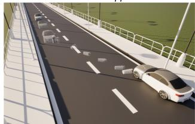  
(a) with Differentiable Physics Parameter Optimization

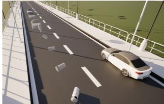  
(b) without Differentiable Physics Parameter Optimization  
Fi<sub>gure</sub> 12<sub>:</sub> Abl<sub>a</sub>ti<sub>on s</sub>t<sub>u</sub>d<sub>y o</sub>f Dif<sub>eren</sub>ti<sub>a</sub>bl<sub>e p</sub>h<sub>ys</sub>i<sub>cs op</sub>ti<sub>m</sub>i<sub>za-</sub> ti<sub>on.</sub> F<sub>or casca</sub>di<sub>ng mu</sub>lti<sub>-s</sub>t<sub>age mo</sub>ti<sub>on an</sub>d l<sub>ong-sequence</sub> <sub>mo</sub>ti<sub>on,</sub> i<sub>n</sub>iti<sub>a</sub>li<sub>za</sub>ti<sub>on can</sub> h<sub>ar</sub>dl<sub>y ac</sub>hi<sub>eve</sub> th<sub>e goa</sub>l <sub>w</sub>ith<sub>ou</sub>t dif<sub>eren</sub>ti<sub>a</sub>bl<sub>e</sub> <sub>p</sub>h<sub>ys</sub>i<sub>cs</sub> <sub>op</sub>ti<sub>m</sub>i<sub>za</sub>ti<sub>on.</sub>

Th<sub>e s</sub>i<sub>ng</sub>l<sub>e success o</sub>f th<sub>e s</sub>i<sub>mp</sub>l<sub>e-proxy</sub> b<sub>ase</sub>li<sub>ne occurs on</sub> <sub>a</sub> <sub>run</sub> <sub>w</sub>h<sub>ose</sub> <sub>ran</sub>d<sub>om</sub> i<sub>n</sub>iti<sub>a</sub>li<sub>za</sub>ti<sub>on</sub> h<sub>appene</sub>d t<sub>o</sub> <sub>p</sub>l<sub>ace</sub> th<sub>e</sub> trashbin on a near-optimal trajectory, confirming that the b<sub>ase</sub>li<sub>ne</sub> <sub>can</sub> <sub>on</sub>l<sub>y</sub> <sub>succee</sub>d b<sub>y</sub> <sub>c</sub>h<sub>ance</sub> <sub>ra</sub>th<sub>er</sub> th<sub>an</sub> b<sub>y</sub> <sub>re</sub>li<sub>a</sub>bl<sub>e</sub> <sub>g</sub>r<sub>a</sub>di<sub>e</sub>nt <sub>gu</sub>id<sub>a</sub>n<sub>ce.</sub> Th<sub>e</sub> 80% <sub>success</sub> r<sub>a</sub>t<sub>e o</sub>f SDF r<sub>e</sub>fin<sub>e</sub>m<sub>e</sub>nt <sub>re</sub>fl<sub>ec</sub>t<sub>s</sub> th<sub>e</sub> <sub>res</sub>id<sub>ua</sub>l difi<sub>cu</sub>lt<sub>y</sub> <sub>o</sub>f th<sub>e</sub> <sub>narrow-</sub>t<sub>arge</sub>t <sub>geome</sub>t<sub>ry;</sub> th<sub>e</sub> t<sub>wo</sub> f<sub>a</sub>il<sub>ures ar</sub>i<sub>se</sub> f<sub>rom</sub> i<sub>n</sub>iti<sub>a</sub>li<sub>za</sub>ti<sub>ons w</sub>h<sub>ere</sub> th<sub>e warm-</sub> <sub>s</sub>t<sub>ar</sub>t <sub>proxy so</sub>l<sub>u</sub>ti<sub>on</sub> i<sub>s</sub> t<sub>oo</sub> f<sub>ar</sub> f<sub>rom</sub> th<sub>e</sub> SDF <sub>so</sub>l<sub>u</sub>ti<sub>on</sub> b<sub>as</sub>i<sub>n</sub> t<sub>o</sub> b<sub>e</sub> <sub>recovere</sub>d <sub>w</sub>ithi<sub>n</sub> 30 <sub>s</sub>t<sub>eps.</sub>

## B.7 More Ablation Studies

Ablation Study of Asset Generation We ablate our asset <sub>genera</sub>ti<sub>on</sub> <sub>mo</sub>d<sub>u</sub>l<sub>e,</sub> <sub>w</sub>hi<sub>c</sub>h <sub>con</sub>diti<sub>ona</sub>ll<sub>y</sub> i<sub>nvo</sub>k<sub>es</sub> T<sub>re</sub>lli<sub>s</sub> t<sub>o</sub> <sub>syn</sub>th<sub>es</sub>i<sub>ze a</sub> 3D <sub>asse</sub>t <sub>w</sub>h<sub>en</sub> lib<sub>rary re</sub>t<sub>r</sub>i<sub>eva</sub>l <sub>con</sub>fid<sub>ence</sub> f<sub>a</sub>ll<sub>s</sub> b<sub>e</sub>l<sub>ow an emp</sub>i<sub>r</sub>i<sub>ca</sub>ll<sub>y c</sub>h<sub>osen</sub> th<sub>res</sub>h<sub>o</sub>ld<sub>.</sub> W<sub>e</sub> d<sub>es</sub>i<sub>gn promp</sub>t<sub>s</sub> that include a user-specified object unlikely to be covered b<sub>y</sub> th<sub>e asse</sub>t lib<sub>rary an</sub>d <sub>compare</sub> t<sub>wo var</sub>i<sub>an</sub>t<sub>s un</sub>d<sub>er</sub> id<sub>en</sub>ti<sub>-</sub> cal settings: (i) retrieval-only, which directly substitutes the object with the closest library match, and (ii) retrieval + generation (ours), which generates the missing asset from text <sub>an</sub>d i<sub>mpor</sub>t<sub>s</sub> it b<sub>e</sub>f<sub>ore scene cons</sub>t<sub>ruc</sub>ti<sub>on.</sub> A<sub>s s</sub>h<sub>own</sub> i<sub>n</sub> Fi<sub>g-</sub> <sub>ure</sub> 13<sub>,</sub> <sub>ena</sub>bli<sub>ng</sub> <sub>asse</sub>t <sub>genera</sub>ti<sub>on</sub> <sub>apparen</sub>tl<sub>y</sub> <sub>pro</sub>d<sub>uces</sub> <sub>asse</sub>t<sub>s</sub> that better match the requested object, allowing the pipeline t<sub>o</sub> <sub>sa</sub>ti<sub>s</sub>f<sub>y</sub> <sub>open-voca</sub>b<sub>u</sub>l<sub>ary</sub> <sub>user</sub> i<sub>n</sub>t<sub>en</sub>t<sub>s</sub> b<sub>eyon</sub>d th<sub>e</sub> lib<sub>rary</sub>’<sub>s</sub> <sup>co</sup>v<sup>era</sup>g<sup>e</sup>.

Ablation Study of Dynamic Optimization Diferentiable <sub>p</sub>h<sub>ys</sub>i<sub>cs op</sub>ti<sub>m</sub>i<sub>za</sub>ti<sub>on</sub> i<sub>s cruc</sub>i<sub>a</sub>l f<sub>or</sub> d<sub>ynam</sub>i<sub>c scene genera-</sub> ti<sub>on, s</sub>i<sub>nce many even</sub>t t<sub>arge</sub>t<sub>s canno</sub>t b<sub>e sa</sub>ti<sub>s</sub>fi<sub>e</sub>d b<sub>y</sub> di<sub>-</sub> <sub>rec</sub>tl<sub>y ass</sub>i<sub>gn</sub>i<sub>ng mo</sub>ti<sub>on parame</sub>t<sub>ers w</sub>ith <sub>s</sub>i<sub>mp</sub>l<sub>e</sub> h<sub>eur</sub>i<sub>s</sub>ti<sub>cs.</sub> W<sub>e a</sub>bl<sub>a</sub>t<sub>e</sub> thi<sub>s mo</sub>d<sub>u</sub>l<sub>e</sub> b<sub>y remov</sub>i<sub>ng</sub> d<sub>ynam</sub>i<sub>c op</sub>ti<sub>m</sub>i<sub>za</sub>ti<sub>on</sub> and using only rule-based initialization of object parameters (e.<sub>g</sub>., coarse velocit<sub>y</sub> estimates), while kee<sub>p</sub>in<sub>g</sub> the rest of the <sub>s</sub>i<sub>mu</sub>l<sub>a</sub>ti<sub>on p</sub>i<sub>pe</sub>li<sub>ne</sub> id<sub>en</sub>ti<sub>ca</sub>l<sub>.</sub> A<sub>s s</sub>h<sub>own</sub> i<sub>n</sub> Fi<sub>gure</sub> 12<sub>,</sub> i<sub>n a</sub> <sub>casca</sub>di<sub>ng scenar</sub>i<sub>o,</sub> th<sub>e</sub> i<sub>n</sub>iti<sub>a</sub>li<sub>za</sub>ti<sub>on-on</sub>l<sub>y</sub> b<sub>ase</sub>li<sub>ne can o</sub>ft<sub>en</sub> trigger the first contact (car → bin) but cannot reliabl<sub>y</sub> enforce the downstream event (bin → car). Onl<sub>y</sub> with d<sub>y</sub>namic optimization enabled, can the system adjust motion param-<sub>e</sub>t<sub>ers</sub> t<sub>o</sub> <sub>sa</sub>ti<sub>s</sub>f<sub>y</sub> <sub>suc</sub>h <sub>mu</sub>lti<sub>-s</sub>t<sub>age</sub> <sub>casca</sub>d<sub>es</sub> <sub>as</sub> <sub>we</sub>ll <sub>as</sub> l<sub>onger,</sub> <sup>more com</sup>p<sup>lex se</sup>qu<sup>ences</sup>.

## B.8 Human Evaluation on Ablation Study

W<sub>e con</sub>d<sub>uc</sub>t <sub>a user s</sub>t<sub>u</sub>d<sub>y on</sub> 20 <sub>genera</sub>t<sub>e</sub>d d<sub>ynam</sub>i<sub>c scenes</sub> t<sub>o</sub> <sub>assess</sub> th<sub>e percep</sub>t<sub>ua</sub>l <sub>qua</sub>lit<sub>y.</sub> E<sub>ac</sub>h <sub>scene</sub> i<sub>s eva</sub>l<sub>ua</sub>t<sub>e</sub>d b<sub>y</sub> 37 "A plush toy of a monkey artist wearing a pink hat is sitting on a bed."

  
(a) retrieval + generation

  
(b) retrieval only  
Fi<sub>gure</sub> 13<sub>:</sub> Abl<sub>a</sub>ti<sub>on s</sub>t<sub>u</sub>d<sub>y o</sub>f A<sub>sse</sub>t G<sub>enera</sub>ti<sub>on.</sub> R<sub>e</sub>t<sub>r</sub>i<sub>eva</sub>l<sub>-</sub> <sub>on</sub>l<sub>y</sub> <sub>me</sub>th<sub>o</sub>d i<sub>s</sub> li<sub>m</sub>it<sub>e</sub>d b<sub>y</sub> th<sub>e</sub> <sub>capac</sub>it<sub>y</sub> <sub>o</sub>f <sub>asse</sub>t lib<sub>rary,</sub> f<sub>orc</sub>i<sub>ng</sub> to return the matched object(a tedd<sub>y</sub> bear in this case), while <sub>asse</sub>t <sub>genera</sub>ti<sub>on mo</sub>d<sub>u</sub>l<sub>e can</sub> b<sub>e</sub>tt<sub>er mee</sub>t th<sub>e user</sub>’<sub>s un</sub>i<sub>que</sub> re<sub>q</sub>u<sup>i</sup>rements.

experienced users from two perspectives: (i) scene quality, f<sub>ocus</sub>i<sub>ng on p</sub>h<sub>ys</sub>i<sub>ca</sub>l <sub>p</sub>l<sub>aus</sub>ibilit<sub>y an</sub>d <sub>overa</sub>ll <sub>rea</sub>li<sub>sm o</sub>f <sub>mo-</sub> tions and interactions, and (ii) input alignment, measuring h<sub>ow we</sub>ll th<sub>e genera</sub>t<sub>e</sub>d <sub>scene a</sub>dh<sub>eres</sub> t<sub>o</sub> th<sub>e g</sub>i<sub>ven</sub> t<sub>ex</sub>t<sub>ua</sub>l s<sub>p</sub>ecification. Both criteria are rated on a 5-<sub>p</sub>oint scale (1: ver<sub>y</sub> <sub>p</sub>oor, 5: excellent). We com<sub>p</sub>are the full s<sub>y</sub>stem a<sub>g</sub>ainst four ablated variants: removing global optimization, initial placement, dynamic optimization, and asset generation. The <sub>resu</sub>lt i<sub>s s</sub>h<sub>own</sub> i<sub>n</sub> T<sub>a</sub>bl<sub>e</sub> 7<sub>.</sub>

T<sub>a</sub>bl<sub>e</sub> 7<sub>:</sub> U<sub>ser s</sub>t<sub>u</sub>d<sub>y on a</sub>bl<sub>a</sub>t<sub>e</sub>d <sub>var</sub>i<sub>an</sub>t<sub>s, ra</sub>t<sub>e</sub>d <sub>on a</sub> 5<sub>-po</sub>i<sub>n</sub>t <sub>sca</sub>l<sub>e.</sub>
<table><tr><td>Method</td><td></td><td>Scene quality ↑ Input alignment ↑</td></tr><tr><td>Ours (Full)</td><td> $4 . 4 \pm 0 . 4$ </td><td> $4 . 5 \pm 0 . 4$ </td></tr><tr><td>w/o Global optimization</td><td> $4 . 0 \pm 0 . 5$ </td><td> $2 . 7 \pm 0 . 6$ </td></tr><tr><td>w/o Initial placement</td><td> $3 . 8 \pm 0 . 5$ </td><td> $2 . 8 \pm 0 . 9$ </td></tr><tr><td>w/o Dynamic optimization</td><td> $4 . 4 \pm 0 . 4$ </td><td> $2 . 8 \pm 0 . 8$ </td></tr><tr><td>w/o Asset generation</td><td> $3 . 9 \pm 0 . 5$ </td><td> $2 . 3 \pm 0 . 6$ </td></tr></table>

## B.9 Failure Case Analysis

Complex model cascading events. In Figure 14, we exami<sub>ne a</sub> d<sub>eman</sub>di<sub>ng mu</sub>lti<sub>-s</sub>t<sub>age scenar</sub>i<sub>o</sub> i<sub>n w</sub>hi<sub>c</sub>h <sub>a car s</sub>t<sub>r</sub>ik<sub>es a</sub> t<sub>ras</sub>h bi<sub>n, w</sub>hi<sub>c</sub>h th<sub>en</sub> t<sub>rave</sub>l<sub>s</sub> t<sub>o prec</sub>i<sub>se</sub>l<sub>y co</sub>llid<sub>e w</sub>ith <sub>a secon</sub>d bi<sub>n p</sub>l<sub>ace</sub>d f<sub>ar</sub>th<sub>er away.</sub> Wh<sub>en suc</sub>h <sub>casca</sub>di<sub>ng requ</sub>i<sub>remen</sub>t<sub>s</sub> <sub>are spec</sub>ifi<sub>e</sub>d <sub>w</sub>ith <sub>par</sub>ti<sub>cu</sub>l<sub>ar</sub>l<sub>y</sub> ti<sub>g</sub>ht <sub>spa</sub>ti<sub>a</sub>l <sub>or</sub> t<sub>empora</sub>l t<sub>o</sub>l<sub>-</sub> <sub>erances,</sub> th<sub>e success ra</sub>t<sub>e can</sub> d<sub>ecrease compare</sub>d t<sub>o s</sub>i<sub>mp</sub>l<sub>er</sub> <sub>scenes.</sub> Thi<sub>s s</sub>t<sub>ems</sub> f<sub>rom a gap</sub> b<sub>e</sub>t<sub>ween</sub> th<sub>e</sub> dif<sub>eren</sub>ti<sub>a</sub>bl<sub>e co</sub>l<sub>-</sub> li<sub>s</sub>i<sub>on prox</sub>i<sub>es use</sub>d d<sub>ur</sub>i<sub>ng op</sub>ti<sub>m</sub>i<sub>za</sub>ti<sub>on an</sub>d th<sub>e</sub> t<sub>rue con</sub>t<sub>ac</sub>t <sub>geome</sub>t<sub>ry execu</sub>t<sub>e</sub>d b<sub>y</sub> U<sub>nrea</sub>l E<sub>ng</sub>i<sub>ne a</sub>t <sub>run</sub>ti<sub>me:</sub> f<sub>or com-</sub> <sub>p</sub>l<sub>ex asse</sub>t<sub>s suc</sub>h <sub>as ve</sub>hi<sub>c</sub>l<sub>es an</sub>d bi<sub>ns, sma</sub>ll dif<sub>erences</sub> i<sub>n</sub> contact ofsets and post-impact trajectories can accumulate <sub>across</sub> <sub>s</sub>t<sub>ages,</sub> <sub>occas</sub>i<sub>ona</sub>ll<sub>y</sub> <sub>caus</sub>i<sub>ng</sub> th<sub>e</sub> d<sub>owns</sub>t<sub>ream</sub> <sub>co</sub>lli<sub>s</sub>i<sub>on</sub> t<sub>o</sub> b<sub>e m</sub>i<sub>sse</sub>d i<sub>n</sub> th<sub>e</sub> UE <sub>rep</sub>l<sub>ay even w</sub>h<sub>en</sub> th<sub>e proxy-</sub>b<sub>ase</sub>d rollout satisfies the objective. Relaxing the event tolerance <sub>or su</sub>bdi<sub>v</sub>idi<sub>ng</sub> th<sub>e casca</sub>d<sub>e</sub> i<sub>n</sub>t<sub>o separa</sub>t<sub>e</sub>l<sub>y op</sub>ti<sub>m</sub>i<sub>ze</sub>d <sub>s</sub>t<sub>ages</sub> l<sub>arge</sub>l<sub>y m</sub>iti<sub>ga</sub>t<sub>es</sub> thi<sub>s e</sub>f<sub>ec</sub>t<sub>.</sub>

Physically unreasonable prompts. Our system prioritizes <sub>p</sub>h<sub>ys</sub>i<sub>ca</sub>l <sub>cons</sub>i<sub>s</sub>t<sub>ency</sub> <sub>over</sub> lit<sub>era</sub>l <sub>comp</sub>li<sub>ance</sub> <sub>w</sub>h<sub>en</sub> <sub>a</sub> <sub>promp</sub>t <sub>spec</sub>ifi<sub>es</sub> b<sub>e</sub>h<sub>av</sub>i<sub>ors</sub> i<sub>rreconc</sub>il<sub>a</sub>bl<sub>e w</sub>ith <sub>r</sub>i<sub>g</sub>id<sub>-</sub>b<sub>o</sub>d<sub>y</sub> d<sub>ynam</sub>i<sub>cs.</sub> As an illustrative example, consider the prompt: “A light ball moving at speed v strikes a heavy stationary ball; the heavy ball moves away at speed v after the collision with no other forces.” This violates momentum conservation: a li<sub>g</sub>ht<sub>er</sub> i<sub>mpac</sub>t<sub>or canno</sub>t t<sub>rans</sub>f<sub>er</sub> it<sub>s</sub> f<sub>u</sub>ll <sub>spee</sub>d t<sub>o a</sub> h<sub>eav</sub>i<sub>er</sub> t<sub>arge</sub>t<sub>, so</sub> th<sub>e prescr</sub>ib<sub>e</sub>d <sub>pos</sub>t<sub>-co</sub>lli<sub>s</sub>i<sub>on ve</sub>l<sub>oc</sub>it<sub>y</sub> i<sub>s p</sub>h<sub>ys</sub>i<sub>ca</sub>ll<sub>y</sub> <sub>una</sub>tt<sub>a</sub>i<sub>na</sub>bl<sub>e.</sub> R<sub>a</sub>th<sub>er</sub> th<sub>an</sub> f<sub>orc</sub>i<sub>ng</sub> th<sub>e scene</sub> t<sub>o sa</sub>ti<sub>s</sub>f<sub>y</sub> th<sub>e</sub> lit<sub>era</sub>l <sub>requ</sub>i<sub>remen</sub>t<sub>,</sub> th<sub>e op</sub>ti<sub>m</sub>i<sub>zer see</sub>k<sub>s</sub> th<sub>e neares</sub>t f<sub>eas</sub>ibl<sub>e</sub> <sub>con</sub>fi<sub>gura</sub>ti<sub>on—max</sub>i<sub>m</sub>i<sub>z</sub>i<sub>ng</sub> th<sub>e</sub> h<sub>eavy</sub> b<sub>a</sub>ll’<sub>s pos</sub>t<sub>-co</sub>lli<sub>s</sub>i<sub>on</sub> <sub>spee</sub>d <sub>w</sub>ithi<sub>n</sub> th<sub>e</sub> b<sub>oun</sub>d<sub>s a</sub>ll<sub>owe</sub>d b<sub>y</sub> th<sub>e mass ra</sub>ti<sub>o an</sub>d i<sub>m-</sub> <sub>pac</sub>t <sub>geome</sub>t<sub>ry—w</sub>hil<sub>e</sub> th<sub>e p</sub>h<sub>ys</sub>i<sub>ca</sub>l <sub>pr</sub>i<sub>or</sub> ${ \mathcal { L } } _ { \mathrm { p r i o r } }$ p<sup>re</sup>v<sup>ents</sup> p<sup>a-</sup> <sub>rame</sub>t<sub>ers</sub> f<sub>rom</sub> d<sub>r</sub>ifti<sub>ng</sub> t<sub>o</sub> <sub>non-p</sub>h<sub>ys</sub>i<sub>ca</sub>l <sub>va</sub>l<sub>ues.</sub> Th<sub>e</sub> <sub>resu</sub>lti<sub>ng</sub> <sub>scene</sub> i<sub>s execu</sub>t<sub>a</sub>bl<sub>e</sub> i<sub>n</sub> th<sub>e p</sub>h<sub>ys</sub>i<sub>cs eng</sub>i<sub>ne an</sub>d <sub>as c</sub>l<sub>ose</sub> t<sub>o</sub> th<sub>e</sub> <sub>user</sub>’<sub>s</sub> i<sub>n</sub>t<sub>en</sub>t <sub>as</sub> <sub>p</sub>h<sub>ys</sub>i<sub>cs</sub> <sub>perm</sub>it<sub>s,</sub> th<sub>oug</sub>h th<sub>e</sub> h<sub>eavy</sub> b<sub>a</sub>ll <sub>reac</sub>h<sub>es a</sub> l<sub>ower spee</sub>d th<sub>an spec</sub>ifi<sub>e</sub>d<sub>.</sub> Thi<sub>s</sub> b<sub>e</sub>h<sub>av</sub>i<sub>or re</sub>fl<sub>ec</sub>t<sub>s</sub> <sub>an</sub> i<sub>n</sub>t<sub>en</sub>d<sub>e</sub>d d<sub>es</sub>i<sub>gn</sub> <sub>pr</sub>i<sub>nc</sub>i<sub>p</sub>l<sub>e:</sub> th<sub>e</sub> <sub>r</sub>i<sub>g</sub>id<sub>-</sub>b<sub>o</sub>d<sub>y</sub> <sub>s</sub>i<sub>mu</sub>l<sub>a</sub>ti<sub>on</sub> l<sub>oop</sub> <sub>ac</sub>t<sub>s</sub> <sub>as</sub> <sub>a</sub> f<sub>eas</sub>ibilit<sub>y</sub> filt<sub>er,</sub> <sub>ensur</sub>i<sub>ng</sub> th<sub>a</sub>t <sub>genera</sub>t<sub>e</sub>d <sub>scenes</sub> <sub>re-</sub> <sub>ma</sub>i<sub>n groun</sub>d<sub>e</sub>d i<sub>n rea</sub>l d<sub>ynam</sub>i<sub>cs even w</sub>h<sub>en user</sub> i<sub>n</sub>t<sub>en</sub>t i<sub>s</sub> <sub>over-spec</sub>ifi<sub>e</sub>d <sub>or</sub> <sub>p</sub>h<sub>ys</sub>i<sub>ca</sub>ll<sub>y</sub> <sub>con</sub>t<sub>ra</sub>di<sub>c</sub>t<sub>ory.</sub>

"A car strikes a trash bin in the middle of the road, knocking it toward the opposite side where it precisely collides with another trashbin far away from it."  
  
Fi<sub>gure</sub> 14<sub>:</sub> A t<sub>yp</sub>i<sub>ca</sub>l f<sub>a</sub>il<sub>ure case.</sub> U<sub>ser</sub> i<sub>n</sub>t<sub>en</sub>d<sub>s</sub> t<sub>o</sub> l<sub>e</sub>t th<sub>e</sub> t<sub>ras</sub>h<sub>-</sub> bi<sub>n</sub> <sub>co</sub>llid<sub>e</sub> <sub>w</sub>ith <sub>ano</sub>th<sub>er</sub> t<sub>ras</sub>hbi<sub>n,</sub> b<sub>u</sub>t th<sub>e</sub> <sub>ac</sub>t<sub>ua</sub>l <sub>op</sub>ti<sub>m</sub>i<sub>za</sub>ti<sub>on</sub> <sub>some</sub>ti<sub>mes</sub> f<sub>a</sub>il<sub>s</sub> t<sub>o mee</sub>t th<sub>e prec</sub>i<sub>se</sub> d<sub>eman</sub>d d<sub>ue</sub> t<sub>o</sub> th<sub>e</sub> dif<sub>-</sub> <sup>ference</sup> <sup>of</sup> p<sup>rox</sup>y g<sup>eometr</sup>y.

## C Evolutive Scene Graph Schema Specification

W<sub>e a</sub>d<sub>op</sub>t <sub>a un</sub>ifi<sub>e</sub>d<sub>, s</sub>t<sub>ruc</sub>t<sub>ure</sub>d <sub>scene represen</sub>t<sub>a</sub>ti<sub>on</sub> t<sub>erme</sub>d Evolutive Scene Gra<sub>p</sub>h (ESG) to serve as a machine-<sub>c</sub>h<sub>ec</sub>k<sub>a</sub>bl<sub>e an</sub>d <sub>rea</sub>di<sub>ng-</sub>f<sub>r</sub>i<sub>en</sub>dl<sub>y con</sub>t<sub>rac</sub>t <sub>across a</sub>ll <sub>mo</sub>d<sub>u</sub>l<sub>es.</sub> Specifically, ESG is a JSON object whose top-level fields are <sub>organ</sub>i<sub>ze</sub>d i<sub>n</sub>t<sub>o</sub> f<sub>our</sub> <sub>core</sub> <sub>componen</sub>t<sub>s</sub> <sub>s</sub>h<sub>own</sub> i<sub>n</sub> th<sub>e</sub> <sub>canon</sub>i<sub>ca</sub>l <sub>s</sub>t<sub>ruc</sub>t<sub>ure</sub> b<sub>e</sub>l<sub>ow,</sub>

## Li<sub>s</sub>ti<sub>ng</sub> 1<sub>:</sub> C<sub>anon</sub>i<sub>ca</sub>l ESG <sub>s</sub>k<sub>e</sub>l<sub>e</sub>t<sub>on.</sub>

1 {   
2 "scene\_definition": { ... },   
3 "asset\_requirement": { ... },   
4 "spatial\_relation\_graph": { ... },   
5 "timeline\_system": { ... }   
6 }

I<sub>n</sub> <sub>prac</sub>ti<sub>ce,</sub> ESG i<sub>s</sub> <sub>re</sub>fi<sub>ne</sub>d th<sub>roug</sub>h f<sub>our</sub> <sub>sequen</sub>ti<sub>a</sub>l <sub>s</sub>t<sub>ages</sub> th<sub>a</sub>t <sub>m</sub>i<sub>rror</sub> th<sub>e mo</sub>d<sub>u</sub>l<sub>ar s</sub>t<sub>ruc</sub>t<sub>ure o</sub>f th<sub>e p</sub>i<sub>pe</sub>li<sub>ne</sub> d<sub>escr</sub>ib<sub>e</sub>d i<sub>n</sub> S<sub>ec</sub>ti<sub>on</sub> 3<sub>.</sub> Th<sub>e</sub> fi<sub>rs</sub>t <sub>s</sub>t<sub>age,</sub> d<sub>e</sub>t<sub>a</sub>il<sub>e</sub>d i<sub>n</sub> S<sub>ec</sub>ti<sub>on</sub> 3<sub>.</sub>1 <sub>un</sub>d<sub>er</sub> L<sub>ayere</sub>d D<sub>ra</sub>ft C<sub>ons</sub>t<sub>ruc</sub>ti<sub>on,</sub> t<sub>rans</sub>l<sub>a</sub>t<sub>es</sub> th<sub>e</sub> <sub>user</sub> <sub>promp</sub>t i<sub>n</sub>t<sub>o</sub> a schema conformant ESG draft by instantiating object int<sub>en</sub>t<sub>s,</sub> <sub>coarse</sub> <sub>spa</sub>ti<sub>a</sub>l <sub>re</sub>l<sub>a</sub>ti<sub>ons,</sub> <sub>an</sub>d <sub>an</sub> i<sub>n</sub>iti<sub>a</sub>l <sub>s</sub>k<sub>e</sub>t<sub>c</sub>h <sub>o</sub>f th<sub>e</sub> <sub>even</sub>t ti<sub>me</sub>li<sub>ne.</sub> Th<sub>e secon</sub>d <sub>s</sub>t<sub>age, presen</sub>t<sub>e</sub>d i<sub>n</sub> S<sub>ec</sub>ti<sub>on</sub> 3<sub>.</sub>2 <sub>as</sub> A<sub>sse</sub>t R<sub>eso</sub>l<sub>u</sub>ti<sub>on,</sub> <sub>groun</sub>d<sub>s</sub> th<sub>ese</sub> <sub>seman</sub>ti<sub>c</sub> d<sub>ra</sub>ft<sub>s</sub> b<sub>y</sub> <sub>re-</sub> solving each asset\_requirement into concrete, engine-ready <sub>resources</sub> th<sub>roug</sub>h <sub>re</sub>t<sub>r</sub>i<sub>eva</sub>l <sub>or on-</sub>d<sub>eman</sub>d <sub>genera</sub>ti<sub>on, w</sub>hil<sub>e</sub> <sub>a</sub>tt<sub>ac</sub>hi<sub>ng canon</sub>i<sub>ca</sub>l <sub>geome</sub>t<sub>ry an</sub>d <sub>p</sub>h<sub>ys</sub>i<sub>cs pro</sub>fil<sub>es</sub> t<sub>o es</sub>t<sub>a</sub>b<sub>-</sub> li<sub>s</sub>h d<sub>e</sub>t<sub>erm</sub>i<sub>n</sub>i<sub>s</sub>ti<sub>c</sub> <sub>asse</sub>t bi<sub>n</sub>di<sub>ngs.</sub> Th<sub>e</sub> thi<sub>r</sub>d <sub>s</sub>t<sub>age,</sub> i<sub>n</sub>t<sub>ro</sub>d<sub>uce</sub>d in S<sub>ec</sub>ti<sub>o</sub>n 3<sub>.</sub>3 <sub>as</sub> St<sub>a</sub>ti<sub>c</sub> L<sub>ayou</sub>t S<sub>o</sub>l<sub>v</sub>in<sub>g, co</sub>n<sub>ve</sub>rt<sub>s</sub> th<sub>e se</sub>m<sub>a</sub>nti<sub>c</sub> relation graph into an explicit static scene layout by jointly solving object poses and scales under physical feasibility, <sub>w</sub>hil<sub>e respec</sub>ti<sub>ng a</sub>ll <sub>spec</sub>ifi<sub>e</sub>d <sub>s</sub>t<sub>ruc</sub>t<sub>ura</sub>l <sub>cons</sub>t<sub>ra</sub>i<sub>n</sub>t<sub>s an</sub>d <sub>se-</sub> <sub>man</sub>ti<sub>c reg</sub>i<sub>ons.</sub> Th<sub>e</sub> fi<sub>na</sub>l <sub>s</sub>t<sub>age,</sub> d<sub>escr</sub>ib<sub>e</sub>d i<sub>n</sub> S<sub>ec</sub>ti<sub>on</sub> 3<sub>.</sub>4 <sub>as</sub> D<sub>y</sub>n<sub>a</sub>mi<sub>c</sub> O<sub>p</sub>timi<sub>za</sub>ti<sub>o</sub>n<sub>, co</sub>m<sub>p</sub>l<sub>e</sub>t<sub>es</sub> th<sub>e</sub> t<sub>e</sub>m<sub>po</sub>r<sub>a</sub>l <sub>p</sub>r<sub>og</sub>r<sub>a</sub>m b<sub>y</sub> <sub>op</sub>ti<sub>m</sub>i<sub>z</sub>i<sub>ng even</sub>t ti<sub>m</sub>i<sub>ngs an</sub>d <sub>mo</sub>ti<sub>on-re</sub>l<sub>a</sub>t<sub>e</sub>d <sub>p</sub>h<sub>ys</sub>i<sub>ca</sub>l <sub>param-</sub> <sub>e</sub>t<sub>ers un</sub>d<sub>er s</sub>i<sub>mu</sub>l<sub>a</sub>ti<sub>on cons</sub>t<sub>ra</sub>i<sub>n</sub>t<sub>s, pro</sub>d<sub>uc</sub>i<sub>ng an execu</sub>t<sub>a</sub>bl<sub>e</sub> ti<sub>me</sub>li<sub>ne compose</sub>d <sub>o</sub>f <sub>a</sub>t<sub>om</sub>i<sub>c con</sub>t<sub>ro</sub>l <sub>ac</sub>ti<sub>ons</sub> th<sub>a</sub>t <sub>can</sub> b<sub>e</sub> di<sub>-</sub> <sub>rec</sub>tl<sub>y rep</sub>l<sub>aye</sub>d i<sub>n</sub> th<sub>e eng</sub>i<sub>ne.</sub>

## C.1 scene\_definition: Metadata of Scene Description

Li<sub>s</sub>ti<sub>ng</sub> 2<sub>:</sub> b<sub>r</sub>i<sub>e</sub>f <sub>examp</sub>l<sub>e</sub> <sub>o</sub>f <sub>scene\_</sub>d<sub>e</sub>fi<sub>n</sub>iti<sub>on.</sub>

1 "scene\_definition":{   
2 "scene\_id": { ... },   
3 "coordinate\_system": { ... },   
4 "original\_description": { ... },   
5 "expanded\_description": { ... },   
6 "scene\_parameters": {   
7 "is\_dynamic": ...,   
8 "scene\_type": ...,   
9   
10 }   
11 }

Th<sub>e un</sub>i<sub>que scene\_</sub>id i<sub>s</sub> f<sub>or</sub> id<sub>en</sub>tif<sub>y</sub>i<sub>ng</sub> dif<sub>eren</sub>t <sub>scene</sub> fil<sub>es.</sub> Th<sub>e</sub> <sub>coor</sub>di<sub>na</sub>t<sub>e\_sys</sub>t<sub>em</sub> bl<sub>oc</sub>k <sub>spec</sub>ifi<sub>es</sub> th<sub>e</sub> <sub>coor</sub>di<sub>na</sub>t<sub>e</sub> <sub>con-</sub> <sub>ven</sub>ti<sub>on,</sub> <sub>un</sub>it<sub>s,</sub> <sub>an</sub>d <sub>wor</sub>ld b<sub>oun</sub>d<sub>s.</sub> Th<sub>e</sub> <sub>pa</sub>i<sub>re</sub>d t<sub>ex</sub>t fi<sub>e</sub>ld<sub>s</sub> <sub>or</sub>i<sub>g-</sub> i<sub>na</sub>l<sub>\_</sub>d<sub>escr</sub>i<sub>p</sub>ti<sub>on an</sub>d <sub>expan</sub>d<sub>e</sub>d<sub>\_</sub>d<sub>escr</sub>i<sub>p</sub>ti<sub>on</sub> th<sub>a</sub>t <sub>re</sub>t<sub>a</sub>i<sub>n</sub> th<sub>e</sub> <sub>user</sub> i<sub>npu</sub>t <sub>an</sub>d th<sub>e</sub> LLM<sub>-expan</sub>d<sub>e</sub>d <sub>narra</sub>ti<sub>ve use</sub>d b<sub>y</sub> d<sub>own-</sub> <sub>s</sub>t<sub>ream mo</sub>d<sub>u</sub>l<sub>es.</sub> Fi<sub>na</sub>ll<sub>y, more scene\_parame</sub>t<sub>ers suc</sub>h <sub>as</sub> i<sub>s\_</sub>d<sub>ynam</sub>i<sub>c an</sub>d <sub>scene\_</sub>t<sub>ype are a</sub>l<sub>so s</sub>t<sub>ore</sub>d i<sub>n</sub> thi<sub>s reg</sub>i<sub>on.</sub>

## C.2 Asset Requirement & Configuration

ESG <sub>represen</sub>t<sub>s</sub> <sub>asse</sub>t<sub>s</sub> <sub>us</sub>i<sub>ng</sub> <sub>a</sub> t<sub>wo-</sub>l<sub>eve</sub>l <sub>a</sub>b<sub>s</sub>t<sub>rac</sub>ti<sub>on</sub> t<sub>o</sub> <sub>ex-</sub> plicitly decouple what is needed from what is used.

asset\_requirement is a dictionary keyed by unique asset\_id iven b LLM. Each value s ecifies the desired cate or (asset\_category), descriptive attributes (asset\_description), and coarse physical priors (e.g., expected\_dimensions\_cm, expected\_mass\_kg, is\_movable). These fields are produced in sta<sub>g</sub>e0 and are used for asset retrieval(or <sub>g</sub>eneration), la<sub>y</sub>out reasonin<sub>g</sub> and <sub>p</sub>h<sub>y</sub>sical initialization. After retrieval(or <sub>g</sub>eneration), this region becomes asset\_configurations in stage1, bi<sub>n</sub>di<sub>ng eac</sub>h <sub>seman</sub>ti<sub>c requ</sub>i<sub>remen</sub>t t<sub>o a concre</sub>t<sub>e eng</sub>i<sub>ne as-</sub> <sub>se</sub>t<sub>,</sub> i<sub>nc</sub>l<sub>u</sub>di<sub>ng</sub> id<sub>en</sub>tifi<sub>ers an</sub>d fil<sub>e pa</sub>th<sub>s, rea</sub>li<sub>ze</sub>d <sub>sca</sub>l<sub>e, or</sub>i<sub>en-</sub> t<sub>a</sub>ti<sub>on, an</sub>d <sub>p</sub>h<sub>ys</sub>i<sub>cs-re</sub>l<sub>evan</sub>t <sub>a</sub>tt<sub>r</sub>ib<sub>u</sub>t<sub>es.</sub>

## C.3 Spatial Relation Graph: semantic description of scene layout

Static structure is expressed as a directed relation graph G i<sub>nc</sub>l<sub>u</sub>di<sub>ng</sub> f<sub>o</sub>ll<sub>ow</sub>i<sub>ng</sub> fi<sub>e</sub>ld<sub>s:</sub>

• Semantic regions defines named <sub>p</sub>lacement zones. Ever<sub>y</sub> object must belong to a semantic region, and every semantic region is provided by its parent object. For example, <sub>woo</sub>d<sub>en\_</sub>t<sub>a</sub>bl<sub>e prov</sub>id<sub>es a</sub> t<sub>a</sub>bl<sub>e\_</sub>f<sub>ace reg</sub>i<sub>on, so woo</sub>d<sub>en</sub> table is parent object of table\_surface.

• Nodes. Each node is corres<sub>p</sub>ondin<sub>g</sub> to an object in th<sub>e</sub> <sub>scene,</sub> h<sub>av</sub>i<sub>ng</sub> <sub>a</sub> <sub>un</sub>i<sub>que</sub> <sub>no</sub>d<sub>e\_</sub>id<sub>.</sub> E<sub>ac</sub>h <sub>no</sub>d<sub>e</sub> i<sub>n-</sub> cludes an asset\_id that must refer to a ke<sub>y</sub> in asset\_requirement, which means it is an instance <sub>o</sub>f th<sub>e re</sub>f<sub>erre</sub>d <sub>asse</sub>t<sub>.</sub> Th<sub>e no</sub>d<sub>e s</sub>h<sub>ou</sub>ld <sub>a</sub>l<sub>so ma</sub>k<sub>e c</sub>l<sub>ear o</sub>f its semantic region, or announce to be a structural object if it make u<sub>p</sub> the basic structure of the scene(e.<sub>g</sub>. <sub>g</sub>round, wall)

• Edges. Relations includes binar<sub>y\_</sub>relations and <sub>mu</sub>lti<sub>\_re</sub>l<sub>a</sub>ti<sub>ons, eac</sub>h <sub>represen</sub>t<sub>e</sub>d b<sub>y a</sub> di<sub>rec</sub>t<sub>e</sub>d <sub>e</sub>d<sub>ge</sub> with specific relation\_type, confidence score and a brief d<sub>escr</sub>i<sub>p</sub>ti<sub>on o</sub>f thi<sub>s re</sub>l<sub>a</sub>ti<sub>on.</sub>

C<sub>ommon re</sub>l<sub>a</sub>ti<sub>ons</sub> i<sub>nc</sub>l<sub>u</sub>d<sub>e</sub> "<sub>on, un</sub>d<sub>er,</sub> i<sub>n\_</sub>f<sub>ron</sub>t<sub>\_o</sub>f<sub>,</sub> b<sub>e-</sub> hind, left\_of, right\_of, near, adjacent, far\_from, above, hi<sub>g</sub>h<sub>er\_</sub>th<sub>an,</sub> l<sub>ower\_</sub>th<sub>an, same\_</sub>l<sub>eve</sub>l<sub>\_as,</sub> f<sub>ace,</sub> i<sub>ns</sub>id<sub>e\_o</sub>f<sub>,</sub> <sub>cen</sub>t<sub>er\_o</sub>f<sub>, a</sub>tt<sub>ac</sub>h<sub>e</sub>d<sub>\_ver</sub>ti<sub>ca</sub>l<sub>,</sub>

<sub>a</sub>tt<sub>ac</sub>h<sub>e</sub>d<sub>\_</sub>h<sub>or</sub>i<sub>zon</sub>t<sub>a</sub>l<sub>,</sub> b<sub>e</sub>t<sub>ween,</sub> <sub>surroun</sub>d<sub>,</sub> <sub>a</sub>li<sub>gn,</sub> <sub>sca</sub>tt<sub>er\_</sub>b<sub>y</sub>"<sub>.</sub>

Th<sub>e</sub> f<sub>o</sub>ll<sub>ow</sub>i<sub>ng</sub> <sub>par</sub>t i<sub>s</sub> <sub>a</sub> b<sub>r</sub>i<sub>e</sub>f <sub>examp</sub>l<sub>e</sub> <sub>o</sub>f th<sub>e</sub> fi<sub>e</sub>ld<sub>s</sub> <sub>o</sub>f <sub>spa</sub>ti<sub>a</sub>l <sub>re</sub>l<sub>a</sub>ti<sub>on</sub> <sub>grap</sub>h<sub>,</sub> <sub>w</sub>ith <sub>some</sub> <sub>va</sub>l<sub>ues</sub> <sub>om</sub>itt<sub>e</sub>d<sub>.</sub>

Li<sub>s</sub>ti<sub>ng</sub> 3<sub>:</sub> b<sub>r</sub>i<sub>e</sub>f <sub>examp</sub>l<sub>e</sub> <sub>o</sub>f <sub>spa</sub>ti<sub>a</sub>l<sub>\_re</sub>l<sub>a</sub>ti<sub>on\_grap</sub>h<sub>.</sub>

```jsonl
1 "spatial_relation_graph": {
2 "semantic_regions": {
3 "floor_area_1": {
4 "region_description": "...",
5 "region_type": "SUPPORT_SURFACE"
6 "parent_object": "floor_1"
7 },
8
9 }
10 "nodes": {
11 "table_1": {
12 "asset_id": "
modern_office_desk_table_01",
13 "semantic_region": "floor_area_1
II
14 },
15
16 }
17 "edges": {
18 "binary_relations": [
19 {
20 "from": "desk_1",
21 "to": "floor_1",
22 "relation_type": "on",
23 "confidence": 0.99,
24 "semantic_description": "..."
25 },
26
27 ]
28 }
29 }
```

## C.4 Timeline System: sequential schedule of dynamic process

O<sub>n</sub>l<sub>y requ</sub>i<sub>re</sub>d if th<sub>e scene</sub> i<sub>s</sub> d<sub>ynam</sub>i<sub>c.</sub> ESG <sub>enco</sub>d<sub>es</sub> b<sub>o</sub>th what should happen and what is physically controllable.

Actors and controllability. actors assigns each object instance a role (active/<sub>p</sub>assive). Active objects can move <sub>ac</sub>ti<sub>ve</sub>l<sub>y, w</sub>h<sub>ose parame</sub>t<sub>ers can</sub> b<sub>e con</sub>t<sub>ro</sub>ll<sub>e</sub>d<sub>.</sub> Whil<sub>e pas-</sub> sive objects can only be forced to move, with their parameters unable to adjust. Active actors should further specify a force\_direction constraint that restricts the directi<sub>ons</sub> i<sub>n w</sub>hi<sub>c</sub>h <sub>con</sub>t<sub>ro</sub>lli<sub>ng</sub> f<sub>orces can</sub> b<sub>e app</sub>li<sub>e</sub>d<sub>, w</sub>ith <sub>a</sub>l<sub>-</sub> lowed values includin<sub>g</sub> ANY\_3D (unconstrained), HORI-ZONTAL\_PLANE (forces confined to the XY <sub>p</sub>lane), and ALONG\_FORWARD\_OR\_BACKWARD (forces ali<sub>g</sub>ned with the object’s forward axis in either direction).

Event sequence graph. Temporal structure is encoded as <sub>a sequence grap</sub>h <sub>cons</sub>i<sub>s</sub>ti<sub>ng o</sub>f <sub>even</sub>t <sub>no</sub>d<sub>es an</sub>d <sub>even</sub>t <sub>e</sub>d<sub>ges.</sub> Nodes re<sub>p</sub>resent milestones (e.<sub>g</sub>., SceneStart, Collision, PositionAt) with timestam<sub>p</sub>s or time windows; ed<sub>g</sub>es re<sub>p</sub>resent hi<sub>g</sub>h-level continuous actions (e.<sub>g</sub>., UniformMotion, Toward) li<sub>n</sub>ki<sub>ng m</sub>il<sub>es</sub>t<sub>ones an</sub>d <sub>carry</sub>i<sub>ng p</sub>h<sub>ys</sub>i<sub>ca</sub>l <sub>parame</sub>t<sub>ers or</sub> th<sub>e</sub>i<sub>r</sub> <sub>ranges.</sub> Th<sub>e</sub> d<sub>ura</sub>ti<sub>on o</sub>f <sub>eac</sub>h <sub>ac</sub>ti<sub>on</sub> i<sub>s</sub> d<sub>e</sub>fi<sub>ne</sub>d b<sub>y</sub> th<sub>e</sub> ti<sub>me</sub> dif<sub>-</sub> f<sub>erence</sub> b<sub>e</sub>t<sub>ween</sub> it<sub>s source an</sub>d t<sub>arge</sub>t <sub>m</sub>il<sub>es</sub>t<sub>one even</sub>t<sub>s.</sub> All <sub>parame</sub>t<sub>ers—</sub>i<sub>nc</sub>l<sub>u</sub>di<sub>ng</sub> <sub>even</sub>t ti<sub>mes</sub>t<sub>amps</sub> <sub>an</sub>d <sub>ac</sub>ti<sub>on-re</sub>l<sub>a</sub>t<sub>e</sub>d <sub>p</sub>h<sub>ys</sub>i<sub>ca</sub>l <sub>quan</sub>titi<sub>es—can</sub> b<sub>e</sub> <sub>spec</sub>ifi<sub>e</sub>d <sub>e</sub>ith<sub>er</sub> <sub>as</sub> fi<sub>xe</sub>d <sub>va</sub>l<sub>ues</sub> <sub>or</sub> <sub>as</sub> b<sub>oun</sub>d<sub>e</sub>d i<sub>n</sub>t<sub>erva</sub>l<sub>s,</sub> d<sub>epen</sub>di<sub>ng</sub> <sub>on</sub> th<sub>e</sub> <sub>user</sub> i<sub>npu</sub>t<sub>.</sub> Fi<sub>xe</sub>d<sub>-</sub> <sub>va</sub>l<sub>ue parame</sub>t<sub>ers are</sub> t<sub>rea</sub>t<sub>e</sub>d <sub>as</sub> h<sub>ar</sub>d <sub>cons</sub>t<sub>ra</sub>i<sub>n</sub>t<sub>s an</sub>d <sub>rema</sub>i<sub>n</sub> <sub>no</sub>t <sub>op</sub>ti<sub>m</sub>i<sub>za</sub>bl<sub>e,</sub> <sub>w</sub>hil<sub>e</sub> i<sub>n</sub>t<sub>erva</sub>l<sub>-</sub>b<sub>oun</sub>d<sub>e</sub>d <sub>parame</sub>t<sub>ers</sub> b<sub>ecome</sub> <sub>op</sub>ti<sub>m</sub>i<sub>za</sub>ti<sub>on</sub> <sub>var</sub>i<sub>a</sub>bl<sub>es</sub> d<sub>ur</sub>i<sub>ng</sub> th<sub>e</sub> d<sub>ynam</sub>i<sub>c</sub> <sub>so</sub>l<sub>v</sub>i<sub>ng</sub> <sub>s</sub>t<sub>age.</sub>

Th<sub>e</sub> f<sub>o</sub>ll<sub>ow</sub>i<sub>ng</sub> <sub>par</sub>t i<sub>s</sub> <sub>a</sub> b<sub>r</sub>i<sub>e</sub>f <sub>examp</sub>l<sub>e</sub> <sub>o</sub>f th<sub>e</sub> fi<sub>e</sub>ld<sub>s</sub> <sub>o</sub>f ti<sub>me-</sub> li<sub>ne\_sys</sub>t<sub>em, w</sub>ith <sub>some va</sub>l<sub>ues om</sub>itt<sub>e</sub>d<sub>.</sub>

Li<sub>s</sub>ti<sub>ng</sub> 4<sub>:</sub> b<sub>r</sub>i<sub>e</sub>f <sub>examp</sub>l<sub>e</sub> <sub>o</sub>f ti<sub>me</sub>li<sub>ne\_sys</sub>t<sub>em.</sub>

1 "timeline\_system": {   
2 "actors": {   
3 "car\_1": {   
4 "role": "active",   
5 "force\_direction": "   
ALONG\_FORWARD\_OR\_BACKWARD"   
6 },   
7 },   
8 "sequence\_graph": {   
9 "nodes": [   
10 {   
11 "id": "scene\_start",   
12 "event": "SceneStart",   
13 "timestamp": 0.0   
14 },   
15 {   
16 "id": "car\_trashbin\_collision"   
1   
17 "event": "Collision",   
18 "participants": [   
19 "car\_1",   
20 "trashbin\_1"   
21 ],   
22 "window": [1.7,1.9],   
23 "constraint": {...}   
24 }   
25 ]   
26 "edges": [   
27 {   
28 "id": "   
car\_uniform\_motion\_before\_collis   
",   
29 "from": "scene\_start",

30 "to": "car\_trashbin\_collision"   
31 "event": "UniformMotion",   
32 "actor": "car\_1",   
33 "target": "trashbin\_1",   
34 "params": {   
35 "speed": [100,3000],   
36   
37 }   
38 }   
39 ]   
40 }   
41 }

## D System Prompts

O<sub>ur promp</sub>t <sub>sys</sub>t<sub>em</sub> i<sub>s organ</sub>i<sub>ze</sub>d i<sub>n</sub>t<sub>o mu</sub>lti<sub>p</sub>l<sub>e</sub> l<sub>ayers;</sub> d<sub>ue</sub> t<sub>o</sub> <sub>space</sub> li<sub>m</sub>it<sub>a</sub>ti<sub>ons, we on</sub>l<sub>y</sub> i<sub>nc</sub>l<sub>u</sub>d<sub>e a su</sub>b<sub>se</sub>t <sub>o</sub>f <sub>represen</sub>t<sub>a</sub>ti<sub>ve</sub> p<sup>rom</sup>p<sup>t</sup> <sup>fra</sup>g<sup>ments</sup> <sup>that</sup> <sup>ca</sup>p<sup>t</sup>u<sup>re</sup> <sup>the</sup> <sup>ke</sup>y <sup>anal</sup>y<sup>sis</sup> <sup>ste</sup>p<sup>s</sup>.

## D.1 Asset Requirement Analysis Prompt

## Scene Asset Expansion & Specification Prompt

A<sub>na</sub>l<sub>yze</sub> th<sub>e user</sub>’<sub>s scene</sub> d<sub>escr</sub>i<sub>p</sub>ti<sub>on an</sub>d <sub>p</sub>l<sub>an</sub> th<sub>e</sub> object list through the following steps:

1) Include all user-mentioned objects (mandator<sub>y</sub>). Every object explicitly mentioned by the user must appear as an object instance in the scene. If the user mentions an object that does not exist in the predefined cat-<sub>egory</sub> li<sub>s</sub>t<sub>,</sub> <sub>map</sub> it t<sub>o</sub> th<sub>e</sub> <sub>c</sub>l<sub>oses</sub>t <sub>ava</sub>il<sub>a</sub>bl<sub>e</sub> <sub>ca</sub>t<sub>egory</sub> <sub>ra</sub>th<sub>er</sub> th<sub>an</sub> i<sub>nven</sub>ti<sub>ng a new one.</sub>

2) Decide whether supplementary objects are allowed.

• If the user ex<sub>p</sub>licitl<sub>y</sub> restricts the scene (e.<sub>g</sub>.<sub>,</sub> “onl<sub>y</sub> A”, “no other objects”), do not add supplementary objects beyond what the user mentioned (plus necessar<sub>y</sub> structural/base elements).

• Otherwise<sub>,</sub> <sub>p</sub>erform controlled ex<sub>p</sub>ansion: add onl<sub>y</sub> objects that logically belong to the scene type and <sub>suppor</sub>t th<sub>e</sub> <sub>user</sub>’<sub>s</sub> i<sub>n</sub>t<sub>en</sub>t<sub>.</sub>

3) Perform controlled ex<sub>p</sub>ansion (when allowed).

Add supplementary objects conservatively, guided by th<sub>e</sub> f<sub>o</sub>ll<sub>ow</sub>i<sub>ng</sub> <sub>pr</sub>i<sub>nc</sub>i<sub>p</sub>l<sub>es:</sub>

• Lo<sub>g</sub>ical necessit<sub>y</sub>: add onl<sub>y</sub> items that naturall<sub>y</sub> cooccur (e.<sub>g</sub>., a table t<sub>yp</sub>icall<sub>y</sub> im<sub>p</sub>lies a chair).

• Scene a<sub>pp</sub>ro<sub>p</sub>riateness: choose <sub>p</sub>ro<sub>p</sub>s that fit the described environment (e.<sub>g</sub>., stud<sub>y</sub> scenes: books/lam<sub>p</sub>; street scenes: street elements).

• Avoid overcrowdin<sub>g</sub>: do not turn a sim<sub>p</sub>le re<sub>q</sub>uest into a cluttered scene; added objects must remain secondary to user-mentioned objects.

4) Name objects logically and avoid duplication.

Use onl<sub>y</sub> lo<sub>g</sub>ical instance names (e.<sub>g</sub>., desk\_1, la<sub>p</sub>- to<sub>p</sub>\_1, room\_1). Never use asset-st<sub>y</sub>le identifiers as object names.

Ensure one clear object instance per real object—do not <sub>crea</sub>t<sub>e</sub> d<sub>up</sub>li<sub>ca</sub>t<sub>es</sub> b<sub>y m</sub>i<sub>x</sub>i<sub>ng</sub> “<sub>asse</sub>t id<sub>en</sub>tifi<sub>ers</sub>” <sub>an</sub>d “<sub>o</sub>b<sub>-</sub> ject instances” as if they were separate physical objects.

5) S<sub>p</sub>ecif<sub>y</sub> assets with matchin<sub>g</sub>-oriented descri<sub>p</sub>tions. F<sub>or every requ</sub>i<sub>re</sub>d <sub>asse</sub>t<sub>, wr</sub>it<sub>e a r</sub>i<sub>c</sub>h d<sub>escr</sub>i<sub>p</sub>ti<sub>on a</sub>i<sub>me</sub>d <sub>a</sub>t <sub>re</sub>t<sub>r</sub>i<sub>eva</sub>l/<sub>ma</sub>t<sub>c</sub>hi<sub>ng.</sub> P<sub>r</sub>i<sub>or</sub>iti<sub>ze</sub> i<sub>n</sub>f<sub>orma</sub>ti<sub>on</sub> i<sub>n</sub> thi<sub>s or-</sub> d<sub>er:</sub>

1) Ke<sub>y</sub> features (e.<sub>g</sub>., with drawers, cushioned)

2) Material, color and st<sub>y</sub>le

3) Pur<sub>p</sub>ose/function

4) T<sub>yp</sub>ical usa<sub>g</sub>e scenario

6) Assi<sub>g</sub>n <sub>p</sub>lausible <sub>p</sub>h<sub>y</sub>sical <sub>p</sub>ro<sub>p</sub>erties.

Provide reasonable dimensions (in centimeters) and mass(in k<sub>g</sub>) for each asset, consider its dail<sub>y p</sub>ro<sub>p</sub>erties <sub>an</sub>d <sub>usage.</sub> U<sub>se sens</sub>ibl<sub>e</sub> li<sub>near</sub> d<sub>amp</sub>i<sub>ng:</sub> k<sub>eep a</sub> d<sub>e</sub>f<sub>au</sub>lt d<sub>amp</sub>i<sub>ng</sub> 0<sub>.</sub>1 <sub>un</sub>l<sub>ess</sub> th<sub>e user</sub> d<sub>escr</sub>i<sub>p</sub>ti<sub>on c</sub>l<sub>ear</sub>l<sub>y</sub> i<sub>mp</sub>li<sub>es</sub> <sub>unusua</sub>l d<sub>amp</sub>i<sub>ng.</sub> T<sub>rea</sub>t <sub>s</sub>t<sub>ruc</sub>t<sub>ura</sub>l/b<sub>ase e</sub>l<sub>emen</sub>t<sub>s as non-</sub> movable; most other objects should be movable.

7) Ensure covera<sub>g</sub>e and consistenc<sub>y</sub>.

• Each re<sub>q</sub>uested asset should be referenced b<sub>y</sub> at least one object instance.

• Multi<sub>p</sub>le object instances ma<sub>y</sub> share the same asset w<sup>hen</sup> <sup>a</sup>pp<sup>ro</sup>p<sup>riate</sup>.

• Avoid redundant “<sub>p</sub>laceholder” entries that do not correspond to an actual object instance.

## D.2 Static Layout Analysis Prompt

Spatial Relation Graph (Static Layout) Analysis Prompt

A<sub>na</sub>l<sub>yze</sub> th<sub>e</sub> <sub>user</sub>’<sub>s</sub> <sub>scene</sub> d<sub>escr</sub>i<sub>p</sub>ti<sub>on</sub> <sub>an</sub>d <sub>g</sub>i<sub>ven</sub> <sub>o</sub>b<sub>-</sub> ject list, and construct a static spatial relation graph in a <sub>s</sub>tr<sub>uc</sub>t<sub>u</sub>r<sub>e</sub>d<sub>,</sub> <sub>s</sub>t<sub>ep-</sub>b<sub>y-s</sub>t<sub>ep</sub> m<sub>a</sub>nn<sub>e</sub>r<sub>.</sub> Y<sub>ou</sub>r <sub>goa</sub>l i<sub>s</sub> t<sub>o</sub> <sub>p</sub>r<sub>o</sub>d<sub>uce</sub> <sub>a</sub> l<sub>ayou</sub>t d<sub>escr</sub>i<sub>p</sub>ti<sub>on</sub> th<sub>a</sub>t i<sub>s</sub> <sub>me</sub>t<sub>r</sub>i<sub>ca</sub>ll<sub>y</sub> <sub>p</sub>l<sub>aus</sub>ibl<sub>e,</sub> <sub>seman-</sub> ti<sub>ca</sub>ll<sub>y cons</sub>i<sub>s</sub>t<sub>en</sub>t<sub>, an</sub>d <sub>cons</sub>t<sub>ra</sub>i<sub>n</sub>t<sub>-rea</sub>d<sub>y</sub> f<sub>or</sub> d<sub>owns</sub>t<sub>ream</sub> <sub>p</sub>l<sub>acemen</sub>t/<sub>op</sub>ti<sub>m</sub>i<sub>za</sub>ti<sub>on.</sub>

1) Determine the scene context and sco<sub>p</sub>e

• Decide whether the scene is indoor or outdoor.

• Identif<sub>y</sub> fore<sub>g</sub>round actors vs. back<sub>g</sub>round context<sub>,</sub> k<sub>eep</sub>i<sub>ng</sub> th<sub>e scene comp</sub>l<sub>e</sub>t<sub>e</sub> b<sub>u</sub>t <sub>no</sub>t <sub>overcrow</sub>d<sub>e</sub>d<sub>.</sub>

2) Establish the structural base (scene frame)

• Indoor: define a minimal enclosin<sub>g</sub> room frame (walls/ceilin<sub>g</sub>/floor) so the s<sub>p</sub>ace is a <sub>p</sub>h<sub>y</sub>sicall<sub>y</sub> meanin<sub>g</sub>ful <sub>con</sub>t<sub>a</sub>i<sub>ner.</sub>

• Outdoor: define exactl<sub>y</sub> one <sub>g</sub>round/road base re<sub>p</sub>re-<sub>sen</sub>ti<sub>ng</sub> th<sub>e en</sub>ti<sub>re wa</sub>lk<sub>a</sub>bl<sub>e</sub>/d<sub>r</sub>i<sub>va</sub>bl<sub>e sur</sub>f<sub>ace;</sub> d<sub>o no</sub>t <sub>sp</sub>lit it i<sub>n</sub>t<sub>o mu</sub>lti<sub>p</sub>l<sub>e groun</sub>d<sub>-</sub>lik<sub>e</sub> b<sub>ases.</sub>

3) Create semantic re<sub>g</sub>ions (functional <sub>p</sub>lacement domains)

• Define semantic re<sub>g</sub>ions as functional sub-s<sub>p</sub>aces that objects can be placed on, in, or attached to, each grounded in a valid parent object.

• Su<sub>pp</sub>ort surfaces: for objects that can su<sub>pp</sub>ort others (e.<sub>g</sub>., floor, table/desk to<sub>p</sub>s, benches, road surface).

• Stora<sub>g</sub>e re<sub>g</sub>ions: for objects that can contain others (e.<sub>g</sub>., cabinet interior, car interior, boxes).

• Attached surfaces: vertical (e.<sub>g</sub>.<sub>,</sub> wall surface) and horizontal (e.<sub>g</sub>., ceilin<sub>g</sub> surface) attachment domains.

• Ensure re<sub>g</sub>ions are suficient for all non-structural objects; avoid regions that do not correspond to any real parent object.

4) Assign each object to exactly one semantic region

• Ever<sub>y</sub> re<sub>g</sub>ular (non-structural) object must belon<sub>g</sub> to a <sub>mean</sub>i<sub>ng</sub>f<sub>u</sub>l <sub>seman</sub>ti<sub>c</sub> <sub>reg</sub>i<sub>on</sub> <sub>cons</sub>i<sub>s</sub>t<sub>en</sub>t <sub>w</sub>ith it<sub>s</sub> <sub>p</sub>h<sub>ys-</sub> i<sub>ca</sub>l <sub>p</sub>l<sub>acemen</sub>t<sub>.</sub>

• Do not du<sub>p</sub>licate re<sub>g</sub>ion membershi<sub>p</sub> as relation <sub>e</sub>d<sub>ges; reg</sub>i<sub>on ass</sub>i<sub>gnmen</sub>t <sub>a</sub>l<sub>rea</sub>d<sub>y enco</sub>d<sub>es</sub> th<sub>a</sub>t <sub>con-</sub> <sub>s</sub>t<sub>ra</sub>i<sub>n</sub>t<sub>.</sub>

5) Define object nodes (instances) consistentl<sub>y</sub>

• Use lo<sub>g</sub>ical object instance names (e.<sub>g</sub>.<sub>,</sub> desk<sub>\_</sub>1<sub>,</sub> chair\_1, car\_1) and kee<sub>p</sub> them consistent across re-<sub>g</sub>i<sub>ons an</sub>d <sub>re</sub>l<sub>a</sub>ti<sub>ons.</sub>

• Kee<sub>p</sub> re<sub>g</sub>ular objects com<sub>p</sub>act<sub>;</sub> if too man<sub>y</sub> are menti<sub>one</sub>d<sub>, pr</sub>i<sub>or</sub>iti<sub>ze</sub> th<sub>e mos</sub>t i<sub>mpor</sub>t<sub>an</sub>t <sub>ones</sub> t<sub>o s</sub>t<sub>ay</sub> <sub>w</sub>ithi<sub>n a prac</sub>ti<sub>ca</sub>l <sub>comp</sub>l<sub>ex</sub>it<sub>y</sub> b<sub>u</sub>d<sub>ge</sub>t<sub>.</sub>

6) Add s<sub>p</sub>atial relations as canonical ed<sub>g</sub>es (onl<sub>y</sub> when meanin<sub>g</sub>ful)

• Add relations onl<sub>y</sub> to ex<sub>p</sub>ress object-to-object semanti<sub>cs no</sub>t <sub>a</sub>l<sub>rea</sub>d<sub>y</sub> i<sub>mp</sub>li<sub>e</sub>d b<sub>y seman</sub>ti<sub>c-reg</sub>i<sub>on mem</sub>b<sub>er-</sub> <sub>s</sub>hi<sub>p.</sub>

• Use canonical relation t<sub>yp</sub>es (binar<sub>y</sub> and multi-object) f<sub>rom</sub> th<sub>e</sub> <sub>a</sub>ll<sub>owe</sub>d i<sub>nven</sub>t<sub>ory;</sub> <sub>map</sub> i<sub>n</sub>f<sub>orma</sub>l <sub>wor</sub>di<sub>ng</sub> (e.<sub>g</sub>., “next to”, “a<sub>g</sub>ainst”) to the closest canonical relation (e.<sub>g</sub>., near or adjacent).

• Prefer relations within the same semantic re<sub>g</sub>ion<sub>;</sub> <sub>avo</sub>id <sub>cross-</sub>d<sub>oma</sub>i<sub>n</sub> <sub>re</sub>l<sub>a</sub>ti<sub>ons</sub> <sub>un</sub>l<sub>ess</sub> <sub>s</sub>t<sub>rong</sub>l<sub>y</sub> <sub>requ</sub>i<sub>re</sub>d b<sub>y</sub> th<sub>e</sub> d<sub>escr</sub>i<sub>p</sub>ti<sub>on.</sub>

• Write relation descri<sub>p</sub>tions unambi<sub>g</sub>uousl<sub>y</sub> and check f<sub>or con</sub>t<sub>ra</sub>di<sub>c</sub>ti<sub>ons, espec</sub>i<sub>a</sub>ll<sub>y w</sub>h<sub>en mu</sub>lti<sub>p</sub>l<sub>e re</sub>l<sub>a</sub>ti<sub>ons</sub> connect the same objects.

7) Enforce a single “face” relation per regular object

• For ever<sub>y</sub> non-structural object<sub>,</sub> assi<sub>g</sub>n exactl<sub>y</sub> one di<sub>rec</sub>ti<sub>ona</sub>l f<sub>ace re</sub>l<sub>a</sub>ti<sub>on represen</sub>ti<sub>ng</sub> it<sub>s</sub> f<sub>unc</sub>ti<sub>on-</sub> <sub>a</sub>l/<sub>usage</sub> di<sub>rec</sub>ti<sub>on</sub> i<sub>n</sub> th<sub>e</sub> h<sub>or</sub>i<sub>zon</sub>t<sub>a</sub>l <sub>p</sub>l<sub>ane.</sub>

• Strate<sub>gy</sub>: indoor tables/desks face a fixed cardinal direction (e.<sub>g</sub>., +Y); outdoor road vehicles face alon<sub>g</sub> the road (+Y or -Y); most other objects should face a relevant object (e.<sub>g</sub>., chair faces desk/table) rather th<sub>an a car</sub>di<sub>na</sub>l di<sub>rec</sub>ti<sub>on.</sub>

8) Final self-check (consistenc<sub>y</sub> and com<sub>p</sub>leteness)

• Structural base matches scene t<sub>yp</sub>e and is not du<sub>p</sub>li-<sub>ca</sub>t<sub>e</sub>d<sub>.</sub>

• Ever<sub>y</sub> semantic re<sub>g</sub>ion has a valid <sub>p</sub>arent object and <sub>c</sub>l<sub>ear</sub> f<sub>unc</sub>ti<sub>on.</sub>

• Ever<sub>y</sub> re<sub>g</sub>ular object is assi<sub>g</sub>ned to a valid semantic re<sub>g</sub><sup>i</sup>on.

• Ever<sub>y</sub> re<sub>g</sub>ular object has exactl<sub>y</sub> one out<sub>g</sub>oin<sub>g</sub> face <sub>re</sub>l<sub>a</sub>ti<sub>on.</sub>

• All relation t<sub>yp</sub>es are canonical<sub>;</sub> no internal conflicts.

• The <sub>g</sub>ra<sub>p</sub>h is not over-s<sub>p</sub>ecified (avoid redundant constraints alread<sub>y</sub> im<sub>p</sub>lied b<sub>y</sub> re<sub>g</sub>ion assi<sub>g</sub>nment).

## D.3 Dynamic Timeline Analysis Prompt

## TIMELINE SYSTEM (DYNAMIC PARSING) PROMPT

A<sub>na</sub>l<sub>yze</sub> th<sub>e user</sub>’<sub>s</sub> d<sub>escr</sub>i<sub>p</sub>ti<sub>on an</sub>d d<sub>er</sub>i<sub>ve a</sub> ti<sub>me</sub>li<sub>ne-</sub> <sub>cons</sub>t<sub>ra</sub>i<sub>ne</sub>d d<sub>ynam</sub>i<sub>c</sub> <sub>spec</sub>ifi<sub>ca</sub>ti<sub>on</sub> <sub>as</sub> <sub>a</sub> <sub>sequence</sub> <sub>grap</sub>h (<sub>p</sub>oint events + se<sub>g</sub>ment motions). Focus on what must h<sub>appen</sub> <sub>an</sub>d <sub>w</sub>h<sub>en,</sub> <sub>w</sub>hil<sub>e</sub> l<sub>eav</sub>i<sub>ng</sub> <sub>con</sub>ti<sub>nuous</sub> <sub>mo</sub>ti<sub>on</sub> d<sub>e-</sub> t<sub>a</sub>il<sub>s</sub> t<sub>o p</sub>h<sub>ys</sub>i<sub>cs-</sub>b<sub>ase</sub>d <sub>op</sub>ti<sub>m</sub>i<sub>za</sub>ti<sub>on.</sub>

1) Decide whether to <sub>g</sub>enerate a d<sub>y</sub>namic timeline Onl<sub>y</sub> <sub>genera</sub>t<sub>e</sub> th<sub>e</sub> d<sub>ynam</sub>i<sub>c</sub> ti<sub>me</sub>li<sub>ne w</sub>h<sub>en</sub> th<sub>e scene</sub> i<sub>s</sub> i<sub>n-</sub> t<sub>en</sub>d<sub>e</sub>d t<sub>o</sub> b<sub>e</sub> d<sub>ynam</sub>i<sub>c.</sub> If th<sub>e</sub> d<sub>escr</sub>i<sub>p</sub>ti<sub>on</sub> i<sub>s pure</sub>l<sub>y s</sub>t<sub>a</sub>ti<sub>c,</sub> d<sub>o no</sub>t i<sub>n</sub>t<sub>ro</sub>d<sub>uce a</sub> ti<sub>me</sub>li<sub>ne.</sub>

2) Identif<sub>y</sub> all actors and classif<sub>y</sub> roles from the user description List every object that is expected to move or be afected by motion, including objects that may be <sub>pus</sub>h<sub>e</sub>d<sub>,</sub> hit<sub>,</sub> <sub>or</sub> di<sub>sp</sub>l<sub>ace</sub>d b<sub>y</sub> <sub>o</sub>th<sub>ers.</sub>

Cl<sub>ass</sub>if<sub>y eac</sub>h li<sub>s</sub>t<sub>e</sub>d <sub>ac</sub>t<sub>or</sub> b<sub>ase</sub>d <sub>on</sub> th<sub>e user</sub> d<sub>escr</sub>i<sub>p</sub>ti<sub>on</sub> (not on object t<sub>yp</sub>e):

• active: the user describes it as movin<sub>g</sub> b<sub>y</sub> its own <sub>p</sub>ower or intention (controllable motion se<sub>g</sub>ments such as drivin<sub>g</sub>, brakin<sub>g</sub>, acceleratin<sub>g</sub>, turnin<sub>g</sub>)

• <sub>p</sub>assive: the user describes it as stationar<sub>y</sub> or onl<sub>y</sub> moved b<sub>y</sub> external forces (e.<sub>g</sub>., bein<sub>g</sub> hit, <sub>p</sub>ushed, blown)

If <sub>an ac</sub>ti<sub>ve ac</sub>t<sub>or ex</sub>i<sub>s</sub>t<sub>s, ass</sub>i<sub>gn a</sub> f<sub>orce-</sub>di<sub>rec</sub>ti<sub>on con-</sub> straint a<sub>pp</sub>ro<sub>p</sub>riate to the described motion (e.<sub>g</sub>., an<sub>y</sub> 3D<sub>,</sub> h<sub>or</sub>i<sub>zon</sub>t<sub>a</sub>l <sub>p</sub>l<sub>ane,</sub> <sub>a</sub>l<sub>ong</sub> f<sub>orwar</sub>d/b<sub>ac</sub>k<sub>war</sub>d<sub>,</sub> <sub>a</sub>l<sub>ong</sub> forward onl<sub>y</sub>).

3) Construct <sub>p</sub>oint events (nodes) as event-level constraints Use <sub>p</sub>oint e<sub>v</sub>ents to re<sub>p</sub>resent s<sub>p</sub>arse s<sub>up</sub>er<sub>v</sub>ision th<sub>a</sub>t th<sub>e</sub> <sub>p</sub>h<sub>ys</sub>i<sub>cs</sub> <sub>s</sub>h<sub>ou</sub>ld <sub>sa</sub>ti<sub>s</sub>f<sub>y.</sub> I<sub>nc</sub>l<sub>u</sub>d<sub>e</sub> th<sub>e</sub> f<sub>o</sub>ll<sub>ow</sub>i<sub>ng</sub> t<sub>ypes</sub> <sub>w</sub>h<sub>en</sub> <sub>nee</sub>d<sub>e</sub>d<sub>:</sub>

• SceneStart: mandator<sub>y</sub> start event at time 0.0

• Collision: used when the user ex<sub>p</sub>licitl<sub>y</sub> describes a collision between two objects

• Tri<sub>gg</sub>er: used to mark the start or end of an intentional controlled action b<sub>y</sub> an active actor (e.<sub>g</sub>., start brakin<sub>g</sub>, sto<sub>p</sub> acceleratin<sub>g</sub>)

• PositionAt: onl<sub>y</sub> use when the user ex<sub>p</sub>licitl<sub>y</sub> re<sub>q</sub>uires <sub>a pos</sub>iti<sub>on cons</sub>t<sub>ra</sub>i<sub>n</sub>t <sub>a</sub>t <sub>a cer</sub>t<sub>a</sub>i<sub>n</sub> ti<sub>me, or w</sub>h<sub>en a m</sub>i<sub>n-</sub> i<sub>ma</sub>l <sub>ver</sub>ifi<sub>ca</sub>ti<sub>on po</sub>i<sub>n</sub>t i<sub>s necessary</sub> t<sub>o</sub> di<sub>sam</sub>bi<sub>gua</sub>t<sub>e a</sub> <sub>mo</sub>ti<sub>on ou</sub>t<sub>come</sub>

Only include the objects directly involved in a point event. Do not create trigger events for passive objects.

4) Plan time windows b<sub>y</sub> buildin<sub>g</sub> and validatin<sub>g</sub> a de-<sub>pen</sub>d<sub>ency grap</sub>h D<sub>er</sub>i<sub>ve a</sub> di<sub>rec</sub>t<sub>e</sub>d <sub>acyc</sub>li<sub>c</sub> d<sub>epen</sub>d<sub>ency</sub> <sub>g</sub>ra<sub>p</sub>h from the described sequence (what ha<sub>pp</sub>ens before what). Assi<sub>g</sub>n timestam<sub>p</sub>s onl<sub>y</sub> when the user <sub>g</sub>ives <sub>exp</sub>li<sub>c</sub>it ti<sub>mes;</sub> <sub>o</sub>th<sub>erw</sub>i<sub>se</sub> <sub>ass</sub>i<sub>gn</sub> ti<sub>me</sub> <sub>w</sub>i<sub>n</sub>d<sub>ows.</sub>

Pl<sub>an w</sub>i<sub>n</sub>d<sub>ows</sub> i<sub>n a</sub> t<sub>opo</sub>l<sub>og</sub>i<sub>ca</sub>l <sub>or</sub>d<sub>er an</sub>d <sub>en</sub>f<sub>orce</sub> t<sub>em-</sub> <sub>pora</sub>l <sub>cons</sub>i<sub>s</sub>t<sub>ency:</sub> f<sub>or every connec</sub>ti<sub>on</sub> f<sub>rom no</sub>d<sub>e</sub> A t<sub>o</sub> node B, ensure B starts after A can <sub>p</sub>ossibl<sub>y</sub> end (the earliest time of B is not earlier than the latest time of A).

Wh<sub>en</sub> th<sub>e user</sub> d<sub>oes no</sub>t <sub>spec</sub>if<sub>y</sub> ti<sub>mes:</sub>

• infer reasonable windows based on scene scale and t<sub>yp</sub><sup>i</sup>ca<sup>l</sup> <sub>p</sub><sup>h</sup><sub>y</sub>s<sup>i</sup>cs

• kee<sub>p</sub> windows relativel<sub>y</sub> broad for uncertain events

• leave ex<sub>p</sub>licit <sub>g</sub>a<sub>p</sub>s between se<sub>q</sub>uential events to avoid over<sup>l</sup>a<sub>p</sub>

Aft<sub>er ass</sub>i<sub>gnmen</sub>t<sub>, va</sub>lid<sub>a</sub>t<sub>e a</sub>ll d<sub>epen</sub>d<sub>enc</sub>i<sub>es aga</sub>i<sub>n</sub> t<sub>o en-</sub> <sub>sure g</sub>l<sub>o</sub>b<sub>a</sub>l <sub>cons</sub>i<sub>s</sub>t<sub>ency, espec</sub>i<sub>a</sub>ll<sub>y</sub> f<sub>or c</sub>h<sub>a</sub>i<sub>n even</sub>t<sub>s.</sub>

5) Derive se<sub>g</sub>ment motions (ed<sub>g</sub>es) as abstract actions b<sub>e</sub>t<sub>ween po</sub>i<sub>n</sub>t <sub>even</sub>t<sub>s</sub> R<sub>epresen</sub>t <sub>con</sub>ti<sub>nuous mo</sub>ti<sub>on as</sub> <sub>seg</sub>m<sub>e</sub>nt<sub>s</sub> th<sub>a</sub>t <sub>co</sub>nn<sub>ec</sub>t t<sub>wo po</sub>int <sub>eve</sub>nt<sub>s.</sub> E<sub>ac</sub>h <sub>seg</sub>m<sub>e</sub>nt d<sub>escr</sub>ib<sub>es</sub> th<sub>e mo</sub>ti<sub>on o</sub>f <sub>one ac</sub>ti<sub>ve ac</sub>t<sub>or</sub> f<sub>rom</sub> it<sub>s s</sub>t<sub>ar</sub>t <sub>no</sub>d<sub>e</sub> t<sub>o</sub> it<sub>s en</sub>d <sub>no</sub>d<sub>e.</sub> Th<sub>e segmen</sub>t d<sub>ura</sub>ti<sub>on</sub> i<sub>s</sub> i<sub>mp</sub>li<sub>e</sub>d b<sub>y</sub> it<sub>s en</sub>d<sub>po</sub>i<sub>n</sub>t<sub>s un</sub>l<sub>ess</sub> th<sub>e user prov</sub>id<sub>es a spec</sub>ifi<sub>c</sub> d<sub>ura</sub>ti<sub>on.</sub> <sup>Use</sup> <sup>se</sup>g<sup>ment</sup> <sup>t</sup>yp<sup>es</sup> <sup>s</sup>u<sup>ch</sup> <sup>as:</sup>

• UniformMotion (stead<sub>y</sub> motion)

• Brake (deceleration re<sub>p</sub>resented via increased dam<sub>p</sub>- in<sub>g</sub> or an equivalent brakin<sub>g</sub> control)

• AcceleratedMotion (s<sub>p</sub>eedin<sub>g</sub> u<sub>p</sub>)

• Turn (headin<sub>g</sub> chan<sub>g</sub>e)

D<sub>o no</sub>t <sub>over-au</sub>th<sub>or pos</sub>t<sub>-even</sub>t <sub>mo</sub>ti<sub>on</sub> th<sub>a</sub>t th<sub>e user</sub> did not describe (e.g., do not script how objects settle after a <sub>co</sub>lli<sub>s</sub>i<sub>on un</sub>l<sub>ess</sub> th<sub>e user exp</sub>li<sub>c</sub>itl<sub>y</sub> d<sub>escr</sub>ib<sub>es a</sub>dditi<sub>ona</sub>l motion after the collision).

6) Handle multi-sta<sub>g</sub>e cascadin<sub>g</sub> motion with virtual i<sub>ner</sub>ti<sub>a</sub>l <sub>connec</sub>t<sub>ors</sub> <sub>w</sub>h<sub>en</sub> <sub>requ</sub>i<sub>re</sub>d M<sub>u</sub>lti<sub>-s</sub>t<sub>age</sub> <sub>mo</sub>ti<sub>on</sub> (e.<sub>g</sub>., A hits B, then B hits C) should be <sub>p</sub>arsed and <sub>represen</sub>t<sub>e</sub>d <sub>exp</sub>li<sub>c</sub>itl<sub>y w</sub>h<sub>en</sub> th<sub>e user</sub> d<sub>escr</sub>ib<sub>es</sub> it<sub>.</sub>

U<sub>se</sub> <sub>a</sub> <sub>v</sub>i<sub>r</sub>t<sub>ua</sub>l i<sub>ner</sub>ti<sub>a</sub>l <sub>connec</sub>t<sub>or</sub> <sub>on</sub>l<sub>y</sub> <sub>w</sub>h<sub>en</sub> <sub>a</sub>ll <sub>con</sub>diti<sub>ons</sub> are met:

• a <sub>p</sub>assive object is involved

• the <sub>p</sub>assive object is first moved b<sub>y</sub> an u<sub>p</sub>stream colli<sub>s</sub>i<sub>on</sub>

• the user ex<sub>p</sub>licitl<sub>y</sub> describes that it subse<sub>q</sub>uentl<sub>y</sub> collides with another object

D<sub>o no</sub>t <sub>use v</sub>i<sub>r</sub>t<sub>ua</sub>l <sub>connec</sub>t<sub>ors</sub> f<sub>or: s</sub>i<sub>ng</sub>l<sub>e co</sub>lli<sub>s</sub>i<sub>ons w</sub>ith <sub>no</sub> d<sub>escr</sub>ib<sub>e</sub>d f<sub>o</sub>ll<sub>ow-up,</sub> <sub>ac</sub>ti<sub>ve</sub> <sub>ac</sub>t<sub>or</sub> <sub>movemen</sub>t<sub>s,</sub> <sub>or</sub> <sub>gen-</sub> <sub>era</sub>l <sub>grap</sub>h <sub>connec</sub>ti<sub>v</sub>it<sub>y.</sub>

7) Choose <sub>p</sub>arameters from the user descri<sub>p</sub>tion and <sub>prov</sub>id<sub>e</sub> f<sub>eas</sub>ibl<sub>e ranges w</sub>h<sub>en unspec</sub>ifi<sub>e</sub>d Wh<sub>en</sub> th<sub>e user</sub> <sub>prov</sub>id<sub>es exac</sub>t <sub>va</sub>l<sub>ues or ranges,</sub> f<sub>o</sub>ll<sub>ow</sub> th<sub>em.</sub> Wh<sub>en</sub> th<sub>e</sub> <sub>user</sub> d<sub>oes</sub> <sub>no</sub>t <sub>spec</sub>if<sub>y</sub> <sub>va</sub>l<sub>ues,</sub> <sub>prov</sub>id<sub>e</sub> <sub>w</sub>id<sub>e</sub> b<sub>u</sub>t <sub>reason-</sub> <sub>a</sub>bl<sub>e numer</sub>i<sub>c ranges</sub> b<sub>ase</sub>d <sub>on common sense an</sub>d d<sub>a</sub>il<sub>y</sub> ex<sub>p</sub>er<sup>i</sup>ence.

D<sub>o</sub> <sub>no</sub>t <sub>use</sub> <sub>un</sub>k<sub>nown</sub> <sub>p</sub>l<sub>ace</sub>h<sub>o</sub>ld<sub>ers</sub> f<sub>or</sub> <sub>parame</sub>t<sub>ers.</sub>

8) Ma<sub>p</sub> lan<sub>g</sub>ua<sub>g</sub>e cues to timeline elements Translate <sub>common</sub> <sub>express</sub>i<sub>ons</sub> i<sub>n</sub>t<sub>o</sub> <sub>even</sub>t <sub>an</sub>d <sub>segmen</sub>t <sub>c</sub>h<sub>o</sub>i<sub>ces:</sub>

• hits<sub>,</sub> crashes into: collision <sub>p</sub>oint event

• starts brakin<sub>g,</sub> sto<sub>p</sub>s<sub>,</sub> be<sub>g</sub>ins to brake: tri<sub>gg</sub>er <sub>p</sub>oint <sub>even</sub>t <sub>p</sub>l<sub>us a</sub> b<sub>ra</sub>ki<sub>ng segmen</sub>t

• drives<sub>,</sub> moves forward: uniform motion se<sub>g</sub>ment

• accelerates: accelerated motion se<sub>g</sub>ment

• turns left/ri<sub>g</sub>ht: turnin<sub>g</sub> se<sub>g</sub>ment

9) Final self-check for d<sub>y</sub>namic consistenc<sub>y</sub> Before outpu<sup>t:</sup>

• ever<sub>y</sub> actor exists in the static s<sub>p</sub>atial relation <sub>g</sub>ra<sub>p</sub>h

• exactl<sub>y</sub> one start event exists at time 0.0

• all <sub>p</sub>oint events and se<sub>g</sub>ments form a valid directed ac<sub>y</sub>c<sup>li</sup>c <sub>g</sub>ra<sub>p</sub><sup>h</sup>

• all time windows satisf<sub>y</sub> the de<sub>p</sub>endenc<sub>y</sub> orderin<sub>g</sub> <sub>cons</sub>t<sub>ra</sub>i<sub>n</sub>t<sub>s</sub>

• tri<sub>gg</sub>ers are onl<sub>y</sub> used for active actors’ controlled <sub>ac</sub>ti<sub>ons</sub>

• virtual inertial connectors are onl<sub>y</sub> used for userdescribed chain collisions of passive objects