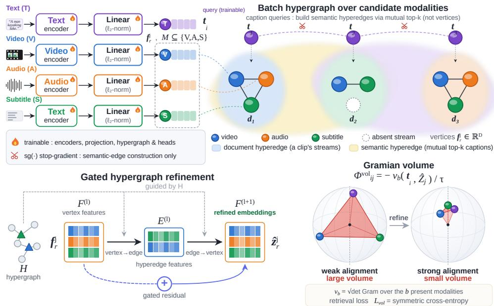
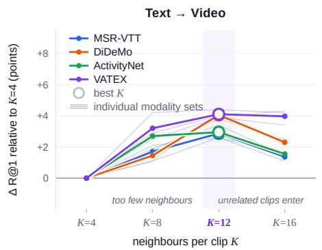
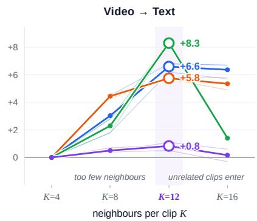

# Hypergraph-Regularized Gramian Volumes for Multimodal Retrieval

Anindya Nag Ambuj Mehrish Sebastiano Vascon Department of Environmental Science, Informatics and Statistics Ca’ Foscari University of Venice, Italy

{anindya.nag, ambuj.mehrish, sebastiano.vascon}@unive.it

## Abstract

Volume-based multimodal retrieval jointly scores a text query with a candidate’s video, audio, and subtitle embeddings. While this approach captures higher-order withincandidate alignment, the score remains candidate-local, and semantically related training samples primarily serve as contrastive negatives. This work introduces Hypergraph-Regularized Gramian Volumes (HyVol), a training-time module that incorporates these semantic relations prior to evaluating the original volume loss. Document hyperedges connect the observed modalities of each candidate, whereas semantic hyperedges link candidates whose detached captions are mutual top-k neighbors. A shallow gated hypergraph network applies residual corrections to the modality embeddings. Presence masks exclude unavailable streams from message passing, and identity padding preserves the determinant of the observed Gram submatrix without feature imputation. As refinement operates on embeddings rather than scores, the same construction applies to both Gram and HyperGram. We remove the hypergraph after training, leaving the backbone-only architecture, original scoring function, and retrieval cost unchanged. We train both backbones on a 150K-clip subset of VAST-27M and evaluate zero-shot performance on six benchmarks. Under the paired protocol, HyVol improves R@1 across allfive retrieval benchmarks, with video-to-text gains reaching +8.3 on MSR-VTT and +7.6 on VATEX. Under missing-modality masking, the V2T margin remains positive in all experimental settings, although the T2V margin becomes slightly negative infour.

## 1. Introduction

Multimodal retrieval encompasses more than matching text to visual frames; modalities such as sound, speech, and subtitles can each contribute evidence for a caption. Models including CLIP [40] and ALIGN [19] learn shared embedding spaces via pairwise similarity. In contrast, multimodal extensions align multiple streams through an anchor or integrate them before scoring [3, 15, 27, 64]. These advancements have enabled broad transfer and inspired objectives that jointly score multiple embeddings.

Gramian alignment represents one such approach. Given a query and a candidate’s modality embeddings, GRAM computes the volume of the parallelotope they span as an alignment score [6]. For two unit vectors, this volume is $\sqrt { 1 - \cos ^ { 2 } \theta } = | \sin \theta | ;$ ; for larger sets, it characterizes their joint linear configuration. Related methods utilize triangle area [5], encourage a dominant singular direction [28], or integrate Euclidean and Lorentz-hyperbolic volumes [35]. Additional research explores volume-based regularization [56], higher-order contrastive fusion [22], and hyperbolic vision–language representations [7, 39]. Despite geometric distinctions, these retrieval scores remain candidate-local: the score for candidate j depends solely on the query and the modalities of candidate j.

This candidate-local structure fails to model potentially valuable relationships among documents. While other clips are included in the contrastive objective as negatives, semantically related examples, such as alternative views of a concert or kayaking scene, do not explicitly inform each other’s representations. This limitation is especially significant when modalities are incomplete [33, 34], as each example must be learned and evaluated from a reduced set of observed streams without leveraging relationships to semantically similar training instances.

Hypergraph-Regularized Gramian Volumes (HYVOL) address this limitation by serving as a training-time module that propagates information among documents before computing the volume loss. The hypergraph consists of two edge types. A document edge links the observed modalities within a single clip, while absent streams remain unconnected. A semantic edge links clips whose detached caption features are mutual top-k neighbors. A shallow gated hypergraph network performs vertex-to-edge-to-vertex propagation, generating a residual correction to the modality embeddings. The original volume objective is then evaluated using these corrected embeddings.

HYVOL modifies embeddings rather than the scoring function, enabling a unified approach to regularize both the Euclidean volume of GRAM and the hybrid Lorentzian volume of HYPERGRAM. The hypergraph is utilized exclusively during training and is omitted at test time. Consequently, the deployed system consists solely of the backbone, introduces no additional retrieval cost or parameters, and prevents gallery embeddings from accessing the test query. Missing streams are addressed without feature imputation; they are disconnected from the graph and represented in the Gram matrix by orthonormal phantom axes, thereby preserving the determinant of the observedmodality submatrix.

HYVOL is instantiated on GRAM [6] and HYPER-GRAM [35] using identical encoders, datasets, optimization procedures, batch sizes, and training schedules for each paired comparison. Across six zero-shot benchmarks, HYVOL improves performance on five retrieval tasks under the specified protocol while maintaining comparable results on the audio-classification probe. On MSR-VTT the improvement grows with modality arity, though this trend is benchmark-dependent. On the four-modality MSR-VTT [52] benchmark, text-to-video R@1 increases from 51.8 to 55.8 for GRAM and from 52.3 to 56.1 for HYPER-GRAM. The corresponding improvements on VATEX [46] are 5.6 and 3.5 points, respectively, while the video-to-text improvement reaches +8.3 on MSR-VTT.

Our contributions are threefold. First, we examine the candidate-local structure of volume-based multimodal alignment under incomplete modality sets. Second, we introduce HYVOL, a training-time module combining presence-masked document edges, mutual top-k semantic edges, and gated hypergraph refinement. We handle missing streams without imputation through disconnected vertices and orthonormal phantom axes, supporting both Euclidean and Lorentzian volumes; the module is removed after training and adds no inference cost. Third, we evaluate HYVOL with two volume-based backbones across six zero-shot benchmarks under a unified protocol, with sensitivity analyses on the semantic neighbourhood size and on gallery-side modality loss.

## 2. Related Work

Contrastive Vision–Language and Multimodal Foundations. CLIP [40] and ALIGN [19] introduced contrastive retrieval within a unified image–text embedding space. Subsequent studies have explored sigmoid-based objectives [58], open and scalable backbone architectures [17, 43], and comprehensive analyses of contrastive learning [44]. This foundational framework has been extended to video domains via frame-level pooling [11, 29, 31], captioner-based transfer [53], and large-scale video– language models [45, 47, 49, 51, 54, 57, 61]. Parallel advancements include audio–text [9, 36, 38, 62] and point–text retrieval [59]. Omni-modal models such as VAST [3] and VALOR [27] integrate video, audio, and subtitle modalities. ImageBind [15], CLIP4VLA [41], LanguageBind [64], OmniBind [60], and UniBind [32] achieve modality alignment through image, audio, text, or learned anchors, occasionally utilizing cross-modal fusion [24]. While most approaches optimize alignment using an anchor or fused representation, explicit modeling of agreement among constituent streams is often lacking. Incorporating complementary modalities can facilitate query disambiguation [55].

Geometric Higher-Order Alignment. Recent methods have replaced pairwise cosine similarity with joint geometric objectives. GRAM [6] leverages the Gramian volume defined by the query and modality vectors, whereas TRIANGLE [5] utilizes the area of the triangle they form. PMRL [28] encourages rank-one alignment through the dominant singular value, and Symile [42] maximizes a total-correlation bound across multiple streams. HYPER-GRAM [35] generalizes the Gramian volume to a Lorentz hyperboloid, thereby linking multimodal alignment with hyperbolic representation learning [12, 37] and hierarchical vision–language embeddings [7, 39]. Although these objectives differ in geometric formulation, they treat modalities symmetrically and evaluate each document using its own embeddings. As a result, inter-document relations are primarily introduced through contrastive negatives, rather than being directly encoded in the learned representations.

Hypergraph and Relational Representation Learning. Hypergraphs represent higher-order relationships by allowing a single edge to connect multiple vertices. Hypergraph neural networks [10, 13], including dynamic variants [20], propagate information through vertex–edge– vertex incidence structures. In contrast, graph diffusion and re-ranking techniques refine retrieval over the gallery manifold [14, 18, 63], typically operating on a fixed candidate set during inference. Approaches to incompletemodality learning include reconstruction, prompting, and modality dropout [23, 33, 34, 50]. HYVOL utilizes a hypergraph solely during training to regularize embeddings for a volume-based objective and evaluates observed modalities without imputation. The hypergraph is omitted at test time, ensuring that the deployed backbone and retrieval cost remain unchanged. Section 3 provides further details on edge construction and gated refinement.

## 3. Methodology

## 3.1. Problem Formulation

Consider a training mini-batch containing B matched caption–document pairs, indexed by $i \in \{ 1 , \ldots , B \}$ . During retrieval, caption i is compared with each candidate document $j \in \{ 1 , \ldots , B \}$ ; the pair where $j = i$ is considered positive, while $j \neq i$ corresponds to an in-batch negative. The text encoder maps caption i to an $\ell _ { 2 }$ -normalised embedding $\mathbf { t } _ { i } \in \mathbb { R } ^ { D }$ . A candidate document $j$ may contain a subset $\mathcal { O } _ { j } \subseteq \mathcal { M }$ of the supported document modalities $\mathcal { M } ,$ such as video, audio, and subtitles. For each available modality $r \in { \mathcal { O } } _ { j }$ , the corresponding encoder produces an $\ell _ { 2 }$ -normalised embedding $\mathbf { f } _ { r } ^ { \hat { j } } \in \mathbb { R } ^ { \breve { D } }$ We define the modality-availability indicator as: $p _ { j , r } : = \mathbf { 1 } [ r \in \mathcal { O } _ { j } ]$

The GRAM [6] and HYPERGRAM [35] frameworks assign an alignment volume to the caption embedding and the set of available candidate-modality embeddings. GRAM uses a Euclidean Gramian volume, whereas HYPERGRAM combines Euclidean and Lorentz-hyperbolic Gramian volumes. Let $\mathcal { G } _ { \mathrm { v o l } } : = \{ \mathrm { G R A M }$ , HYPERGRAM} denote the set of volume backbones. For a caption–candidate pair $( i , j )$ this work defines

$$
v _ { i j } ^ { ( b ) } : = \nu _ { b } \big ( \mathbf { t } _ { i } , \big \{ \mathbf { f } _ { r } ^ { j } : r \in \mathcal { O } _ { j } \big \} \big ) , \qquad b \in \mathcal { G } _ { \mathrm { v o l } } ,\tag{1}
$$

where $\nu _ { b }$ denotes the volume function associated with backbone $b ,$ and $v _ { i j } ^ { ( b ) }$ is the scalar volume assigned to caption i and candidate j. We refer the reader to the original papers [6, 35] for the corresponding Gram-matrix and Lorentzian constructions.

In both backbones, a smaller volume indicates stronger alignment. The volume is therefore converted into a contrastive retrieval logit by reversing its ordering and applying a positive temperature:

$$
z _ { i j } ^ { ( b ) } : = - \frac { v _ { i j } ^ { ( b ) } } { \tau } , \qquad \tau > 0 ,\tag{2}
$$

where $\tau > 0$ is a learned temperature. A single $\tau$ is used throughout: each HYVOL model is trained on one backbone, and the same scalar scales every retrieval logit in Sec. 3.4. A smaller volume therefore yields a larger logit, encouraging the matched candidate $j ~ = ~ i$ to rank above in-batch negatives $j \neq i$ . HYVOL leaves the backbone volume $\nu _ { b }$ unchanged and instead uses batch-level relations to refine the available candidate-modality embeddings before computing the original volume and retrieval logit.

## 3.2. Hypergraph Construction

For a mini-batch containing B documents, one vertex row is defined for each candidate and modality pair. $\mathcal { V } = \{ ( j , r )$ $j \in [ B ] , r \in \mathcal { M } \}$ . A row $( j , r )$ is considered active with feature $\mathbf { f } _ { r } ^ { j }$ when $p _ { j , r } = 1 ;$ otherwise, both its feature and incidence are set to zero. Caption embeddings are excluded from the graph and are used solely, with stopped gradients, to identify semantic relations among documents. This approach prevents refined candidate embeddings from directly incorporating their paired captions and maintains query independence during inference. The graph consists of both document and semantic hyperedges.

Document hyperedges. For each document $j ,$ one hyperedge connects all of its available modality vertices. Its incidence matrix is

$$
[ H _ { \mathrm { d o c } } ] _ { ( q , r ) , j } = \left\{ \begin{array} { l l } { 1 , } & { q = j \mathrm { a n d } p _ { j , r } = 1 , } \\ { 0 , } & { \mathrm { o t h e r w i s e } . } \end{array} \right.\tag{3}
$$

here, $H _ { \mathrm { d o c } } \in \{ 0 , 1 \} ^ { | \mathcal { V } | \times B }$ is the document-hyperedge incidence matrix: row $( q , r )$ represents modality r of document $q ,$ and column $j$ represents document $j .$ Nonzero entries select the available modalities, allowing hyperedges to have different cardinalities.

Semantic hyperedges. Document hyperedges exchange information only within a candidate. To also connect related candidates, we construct semantic neighbourhoods from the paired training captions. Let

$$
\begin{array} { r } { T = \left[ \stackrel { \star _ { 1 } ^ { \top } } { \vdots } \right] \in \mathbb { R } ^ { B \times D } , \qquad C = T T ^ { \top } , } \end{array}\tag{4}
$$

where $C _ { i j }$ is the cosine similarity between captions i and $j .$ The diagonal of $C$ is ignored during neighbour selection. Define

$$
S _ { i j } = { \bf 1 } [ j \in \mathrm { t o p } { - } k ( C _ { i , : } ) ] , \qquad N _ { i j } = S _ { i j } S _ { j i } .\tag{5}
$$

Hence, $N _ { i j } ~ = ~ 1$ only when i and j select each other as neighbours. The mutual criterion reduces one-sided connections. We additionally apply symmetric edge dropout to the retained set during training, so that refinement does not come to depend on a single neighbour. We learn the relative importance of the retained neighbours from the detached caption embeddings. Let

$$
\mathbf { x } _ { i } = W _ { a } \mathbf { t } _ { i } , \qquad e _ { i j } = \mathrm { L e a k y R e L U } _ { 0 . 2 } \big ( \mathbf { a } ^ { \top } [ \mathbf { x } _ { i } \parallel \mathbf { x } _ { j } ] \big )
$$

where $[ \cdot \| \cdot ]$ denotes concatenation. For retained edges, the normalised attention and its symmetric form are

(6)

$$
A _ { i j } = \frac { \exp ( e _ { i j } ) } { \sum _ { m : N _ { i m } = 1 } \exp ( e _ { i m } ) } , \qquad { \mathrm { i f ~ } } N _ { i j } = 1 ,\tag{7}
$$

$$
\begin{array} { r } { \widetilde { \boldsymbol { A } } = \frac { 1 } { 2 } \left( \boldsymbol { A } + \boldsymbol { A } ^ { \top } \right) , } \end{array}\tag{8}
$$

with $A _ { i j } = 0$ when $N _ { i j } = 0$ , and isolated rows set to zero. Eq. (7) is row stochastic and therefore asymmetric, whereas the mutual criterion of $\operatorname { E q . } \left( 5 \right)$ is undirected; symmetrising gives each retained pair a single magnitude in Eq. (9).

We create one semantic hyperedge for each document i. It contains the available modalities of i and those of its mutual neighbours, weighted by ${ \widetilde { A } } { \mathrm { : } }$

$$
\begin{array} { r } { [ H _ { \mathrm { s e m } } ] _ { ( j , r ) , i } = p _ { j , r } \left( \mathbf { 1 } [ j = i ] + \widetilde { A } _ { j i } \right) , } \end{array}\tag{9}
$$

The complete weighted incidence matrix is the columnwise concatenation $H = \left[ H _ { \mathrm { d o c } } \parallel H _ { \mathrm { s e m } } \right]$

  
Figure 1. Overview of HYVOL. Available modality embeddings form document hyperedges, while detached captions define mutual top-k semantic hyperedges across documents. Gated message passing refines the embeddings before GRAM/HYPERGRAM volume scoring; the hypergraph is removed at inference.

## 3.3. Gated Hypergraph Refinement

Let $F ^ { ( 0 ) } ~ \in ~ \mathbb { R } ^ { | \mathcal { V } | \times D }$ contain the initial vertex features, with inactive rows set to zero. HYVOL alternates vertexto-hyperedge and hyperedge-to-vertex aggregation. Define $\Delta _ { E } = \mathrm { d i a g } ( H ^ { \top } { \bf 1 } )$ and $\Delta _ { V } = \mathrm { d i a g } ( H { \bf 1 } )$ , with degrees clamped below at 1. Layer ℓ computes

$$
\begin{array} { r } { \boldsymbol { E } ^ { ( \ell ) } = \mathrm { G E L U } \left( \boldsymbol { \Delta } _ { E } ^ { - 1 } \boldsymbol { H } ^ { \top } \boldsymbol { F } ^ { ( \ell ) } \boldsymbol { W } _ { V } ^ { ( \ell ) } \right) , } \end{array}\tag{10}
$$

$$
\begin{array} { r } { M ^ { ( \ell ) } = \Delta _ { V } ^ { - 1 } H E ^ { ( \ell ) } W _ { E } ^ { ( \ell ) } , } \end{array}\tag{11}
$$

$$
{ \cal F } ^ { ( \ell + 1 ) } = { \cal F } ^ { ( \ell ) } + \operatorname { t a n h } ( g _ { \ell } ) \phi _ { \ell } \Bigl ( { \cal M } ^ { ( \ell ) } \Bigr ) ,\tag{12}
$$

Here, $W _ { V } ^ { ( \ell ) }$ and $W _ { E } ^ { ( \ell ) }$ are learned projections, while $g _ { \ell }$ is a learned scalar that gates the residual correction. We use GELU for $\phi _ { \ell }$ in intermediate layers and the identity in the final layer, with at most two layers to limit over-smoothing.

For each available modality, let $\mathbf { u } _ { r } ^ { j } = F ^ { ( L ) } [ ( j , r ) ]$ . The backbone receives the normalized feature $\widehat { \mathbf { z } } _ { r } ^ { j } = \mathbf { u } _ { r } ^ { j } / \| \mathbf { u } _ { r } ^ { j } \| _ { 2 }$ For the auxiliary alignment loss, we pool the refined modalities as

$$
\mathbf { h } _ { j } = \mathrm { n o r m } \bigg ( W _ { \mathrm { p o o l } } \frac { \sum _ { r \in \mathcal { M } } p _ { j , r } \mathbf { u } _ { r } ^ { j } } { \sum _ { r \in \mathcal { M } } p _ { j , r } } \bigg ) ,\tag{13}
$$

The availability mask excludes missing streams from the pool.

## 3.4. Training Objective

For document $j ,$ let $\widehat { Z } ^ { j } \ = \ \{ \widehat { \mathbf { z } } _ { r } ^ { j } \ : \ r \ \in \ O _ { j } \}$ be its available refined embeddings. The backbone volume logits are $\begin{array} { r } { \Phi _ { i j } ^ { \mathrm { v o l } } \ = \ - \frac { \nu _ { b } ( \mathbf { t } _ { i } , \widehat { Z } ^ { j } ) } { \tau } } \end{array}$ , where $\tau$ is a learned temperature of Eq. (2). The auxiliary document term in Eq. (15) reuses the same τ rather than introducing a second one. The two logit families are not on identical scales, since $\Phi ^ { \mathrm { v o l } }$ is formed from volumes at the document’s full arity whereas $\Phi ^ { \mathrm { d o c } }$ uses the arity-two volume $\nu _ { b , 2 } ;$ we do not tune a separate temperature for the auxiliary term and instead let $w _ { \mathrm { d o c } }$ set its relative weight. The primary retrieval loss is the bidirectional cross-entropy

$$
\mathcal { L } _ { \mathrm { v o l } } = \frac { 1 } { 2 } \left[ \mathrm { C E } ( \Phi ^ { \mathrm { v o l } } , \mathbf { y } ) + \mathrm { C E } ( ( \Phi ^ { \mathrm { v o l } } ) ^ { \top } , \mathbf { y } ) \right] ,\tag{14}
$$

where $\mathbf { y }$ identifies the matching caption–document pairs in the gathered batch.

Two auxiliary losses are applied to the hypergraph output. First, we align each caption with the pooled document embedding in Eq. (13). Let $\nu _ { b , 2 }$ denote the arity-two form of the same backbone volume. We define

$$
\Phi _ { i j } ^ { \mathrm { d o c } } = - \frac { \nu _ { b , 2 } ( \mathbf { t } _ { i } , \mathbf { h } _ { j } ) } { \tau } ,\tag{15}
$$

and compute ${ \mathcal { L } } _ { \mathrm { d o c } }$ using the same bidirectional crossentropy as Eq. (14).

Second, a variance regulariser discourages the refined features from collapsing. Let $U _ { r }$ stack the prenormalisation features $\mathbf { u } _ { r } ^ { j }$ for the available samples of

modality r, and let $U _ { \mathrm { d o c } }$ stack the document features $\mathbf { h } _ { j }$ . With $\sigma ( X ) = \sqrt { \operatorname { V a r } ( X ) + \epsilon }$ denoting the vector of feature-wise standard deviations, we use

$$
\begin{array} { r } { \mathcal { L } _ { \mathrm { r e g } } = \displaystyle \sum _ { r \in \mathcal { M } } \mathrm { m e a n } [ \mathrm { R e L U } ( 1 - \sigma ( U _ { r } ) ) ] } \\ { + \mathrm { m e a n } [ \mathrm { R e L U } ( 1 - \sigma ( U _ { \mathrm { d o c } } ) ) ] , } \end{array}\tag{16}
$$

The complete objective is

$$
\mathcal { L } = \mathcal { L } _ { \mathrm { v o l } } + w _ { \mathrm { d o c } } \mathcal { L } _ { \mathrm { d o c } } + w _ { \mathrm { r e g } } \mathcal { L } _ { \mathrm { r e g } } + w _ { \mathrm { i t m } } \mathcal { L } _ { \mathrm { i t m } } ,\tag{17}
$$

Here, ${ \mathcal { L } } _ { \mathrm { i t m } }$ denotes the backbone’s existing caption– candidate matching loss, which is retained without modification and weighted by $w _ { \mathrm { i t m } }$ . This loss employs binary cross-entropy on a fused caption–candidate matching head, utilizing each batch row’s positive pair and in-batch negatives. Consequently, the HYVOL objective differs from its paired backbone solely through ${ \mathcal { L } } _ { \mathrm { d o c } }$ and $\mathcal { L } _ { \mathrm { r e g } } ;$ no additional matching head, reconstruction loss, or link-prediction objective is introduced. Since refinement occurs prior to $\nu _ { b }$ the same module is applicable to both GRAM [6] and HY-PERGRAM [35].

## 3.5. Training, Inference, and Missing Modalities

Training and inference. During training, HYVOL refines candidate embeddings prior to evaluating Eq. (17), while caption embeddings remain fixed. During inference, the module is omitted, and the trained encoders utilize the original GRAM [6] or HYPERGRAM [35] score. Consequently, retrieval does not require hypergraph construction or message passing.

Missing modalities. The availability indicator $p _ { j , n }$ r of Sec. 3.1 excludes missing modalities from the incidence matrices, the pooled document representation, and the refined set ${ \widehat { Z } } ^ { j }$ . Absent streams are neither imputed nor propagated. To maintain fixed-size Gram matrices for batched computation, the corresponding rows and columns are numerically replaced with identity entries. Up to a simultaneous row and column permutation,

$$
\begin{array} { c } { G _ { \mathrm { m a s k e d } } = \operatorname { d i a g } ( G _ { \mathrm { p r e s e n t } } , I ) , } \\ { \operatorname * { d e t } ( G _ { \mathrm { m a s k e d } } ) = \operatorname* { d e t } ( G _ { \mathrm { p r e s e n t } } ) . } \end{array}\tag{18}
$$

Thus, identity padding contributes a factor of one and recovers the volume computed from the observed modalities only. We apply the same rule to the Euclidean Gram matrix of GRAM and the corresponding Lorentzian matrix of HYPERGRAM.

## 4. Experiments

## 4.1. Experimental Setup

Backbones and Pretraining. All variants employ VAST modality encoders [3]: EVA-CLIP ViT-g/14 for video [43],

BEATs for audio [4], and BERT-base for captions and subtitles [8]. We remove the VAST fusion layers, project each stream to $D \ = \ 5 1 2 .$ , and apply $\ell _ { 2 }$ normalization. Models are trained for one epoch on a 150K-sample subset of VAST-27M, using two video frames, one 10-second audio clip, and a global batch size of 256. AdamW [30] is used with a weight decay of 0.01, learning rates of $2 \times 1 0 ^ { - 5 }$ for the backbone and $5 \times 1 0 ^ { - 4 }$ for the hypergraph parameters, two refinement layers, and $k = 1 2$ as described in Sec. 4.2.1. The hypergraph is constructed independently within each mini-batch, so the batch size also defines the semantic-neighbor pool. The remaining hyperparameters are $w _ { \mathrm { d o c } } = 1 . 0$ , $w _ { \mathrm { r e g } } = 0 . 1$ $w _ { \mathrm { i t m } } = 0 . 1$ , semantic-edge dropout 0.3, and $\epsilon = 1 0 ^ { - 4 }$ in Eq. (16); the temperature τ is initialised from the backbone checkpoint and continues to be optimised. We perform aggregation in float32 for numerical stability. Each variant HYVOL adopts its published training recipe, identical data, encoders, optimization, sampling, and schedule, so that the margin isolates the module. Benchmarks and Evaluation Protocols. We evaluate zero-shot performance on six benchmarks: text–video retrieval on MSR-VTT [52] (1,000 test clips), DiDeMo [16] (1,003), ActivityNet [1] (4,917), and VATEX [46] (431); text–audio retrieval on AudioCaps [21] (700); and audiovisual classification on VGGSound-5K [2]. At inference, we sample eight video frames and one 10-second audio segment per clip; VGGSound uses embeddings of its 309 class labels. The T–V, T–VA, and T–VAS settings progressively add video, audio, and subtitles to text. We evaluate all three on MSR-VTT and VATEX, and the first two on DiDeMo and ActivityNet. We report R@1 and R@10 for text-to-video (T2V), video-to-text (V2T), and text-to-audio retrieval, and top-1 and top-10 accuracy for VGGSound.

We compare against TRIANGLE [5], PMRL [28], GRAM [6], and HYPERGRAM [35]. Each computes a joint geometric retrieval score solely from an individual sample’s modality embeddings (Sec. 3), whereas HYVOL relaxes this restriction. All four are evaluated under the common protocol described in Sec. 4, enabling a fair comparison. At inference, the hypergraph is removed, and retrieval uses the original encoders and unmodified score $\nu _ { b } .$ , with no message passing or interaction among test samples. The deployed architecture and scoring procedure therefore remain identical to the backbone. Additional computation is limited to training and mainly comprises a $B \times B$ caption-similarity matrix, hyperedge construction, and two shallow message-passing layers; wall-clock overhead is not measured.

## 4.2. Main Results

MSR-VTT. Table 1 presents positive R@1 changes for both backbones across all evaluated modality sets and retrieval directions. When using T–VAS, the addition of HYVOL to GRAM increases T2V R@1 from 51.8 to 55.8 (+4.0)

Table 1. Zero-shot retrieval results on MSR-VTT [52]. HYVOL is applied on top of GRAM [6] and HYPERGRAM [35]. § published numbers (reference only); ⋆ authors’ released checkpoint, evaluated on our protocol; † trained from the authors’ released code at their recipe.
<table><tr><td rowspan="3">Method</td><td colspan="4">T-V</td><td colspan="4">T-VA</td><td colspan="4">T-VAS</td></tr><tr><td colspan="2">T2V</td><td colspan="2">V2T</td><td colspan="2">T2V</td><td colspan="2">V2T</td><td colspan="2">T2V</td><td colspan="2">V2T</td></tr><tr><td>R@1</td><td>R@10</td><td>R@1</td><td>R@10</td><td>R@1</td><td>R@10</td><td>R@1</td><td>R@10</td><td>R@1</td><td>R@10</td><td>R@1</td><td>R@10</td></tr><tr><td>Norton [26]§</td><td>10.7</td><td>31.6</td><td>4</td><td></td><td></td><td></td><td></td><td></td><td></td><td></td><td></td><td></td></tr><tr><td>UMT [25]§</td><td>33.3</td><td>66.7</td><td>33.3</td><td>66.7</td><td></td><td></td><td></td><td></td><td></td><td></td><td></td><td></td></tr><tr><td>VideoCoCa [53]§</td><td>34.3</td><td>67.0</td><td>34.3</td><td>67.0</td><td></td><td></td><td></td><td></td><td></td><td></td><td></td><td></td></tr><tr><td>HiTeA [54]§</td><td>34.4</td><td>69.9</td><td>46.8</td><td></td><td></td><td></td><td></td><td></td><td></td><td></td><td></td><td></td></tr><tr><td>ImageBind [15]§</td><td>36.8</td><td>70.0</td><td>36.8</td><td>70.0</td><td></td><td></td><td></td><td></td><td></td><td></td><td></td><td></td></tr><tr><td>TVTSv2 [57]§</td><td>38.2</td><td>73.2</td><td>38.2</td><td>73.2</td><td></td><td></td><td></td><td></td><td></td><td></td><td></td><td></td></tr><tr><td>UMT-L [25]§</td><td>40.7</td><td>71.8</td><td>40.7</td><td></td><td></td><td></td><td></td><td></td><td></td><td></td><td></td><td></td></tr><tr><td>InternVideo-L [47]§</td><td>40.7</td><td></td><td>39.6</td><td></td><td></td><td></td><td></td><td></td><td></td><td></td><td></td><td></td></tr><tr><td>OmniVL [45]§</td><td>42.0</td><td>73.0</td><td>34.6</td><td>66.6</td><td></td><td></td><td></td><td></td><td></td><td></td><td></td><td></td></tr><tr><td>ViCLIP [48]$</td><td>42.4</td><td></td><td>41.3</td><td></td><td></td><td></td><td></td><td></td><td></td><td></td><td></td><td></td></tr><tr><td>LanguageBind [64]§</td><td>44.8</td><td>78.7</td><td>40.9</td><td>75.7</td><td></td><td></td><td></td><td></td><td></td><td></td><td></td><td></td></tr><tr><td>mPLUG-2 [51]§</td><td>47.1</td><td>79.0</td><td></td><td></td><td></td><td></td><td></td><td></td><td></td><td></td><td></td><td></td></tr><tr><td>VideoPrism-b [61]§</td><td>51.4</td><td></td><td>50.2</td><td></td><td></td><td></td><td></td><td></td><td></td><td></td><td></td><td></td></tr><tr><td>VAST [3]§</td><td></td><td></td><td></td><td></td><td>49.3</td><td>80.0</td><td>43.7</td><td>77.1</td><td>50.7</td><td>74.4</td><td>49.0</td><td>76.2</td></tr><tr><td>TRIANGLE [5]*</td><td>=</td><td></td><td></td><td></td><td>50.5</td><td>79.4</td><td>49.7</td><td>80.3</td><td></td><td></td><td></td><td></td></tr><tr><td>PMRL [28]*</td><td>51.3</td><td>81.3</td><td>49.6</td><td>81.1</td><td>50.9</td><td>81.1</td><td>51.0</td><td>80.3</td><td>54.3</td><td>79.5</td><td>52.9</td><td>79.4</td></tr><tr><td>GRAM [6]*</td><td>51.9</td><td>82.4</td><td>48.7</td><td>80.7</td><td>52.0</td><td>82.0</td><td>49.3</td><td>80.7</td><td>51.8</td><td>81.9</td><td>50.1</td><td>80.3</td></tr><tr><td>w HYVoL</td><td>52.6</td><td>82.9</td><td>54.5</td><td>82.8</td><td>54.0</td><td>83.3</td><td>55.8</td><td>82.2</td><td>55.8</td><td>83.9</td><td>58.1</td><td>83.7</td></tr><tr><td></td><td>(+0.7)</td><td>(+0.5)</td><td>(+5.8)</td><td>(+2.1)</td><td>(+2.0)</td><td>(+1.3)</td><td>(+6.5)</td><td>(+1.5)</td><td>(+4.0)</td><td>(+2.0)</td><td>(+8.0)</td><td>(+3.4)</td></tr><tr><td>HYPERGRAM [35]†</td><td>50.8</td><td>82.0</td><td>48.7</td><td>82.9</td><td>51.7</td><td>81.7</td><td>49.8</td><td>82.1</td><td>52.3</td><td>83.0</td><td>50.9</td><td>83.2</td></tr><tr><td>w HYVoL</td><td>52.5 (+1.7)</td><td>82.9 (+0.9)</td><td>54.2 (+5.5)</td><td>83.9 (+1.0)</td><td>54.2 (+2.5)</td><td>83.5 (+1.8)</td><td>56.6 (+6.8)</td><td>83.9 (+1.8)</td><td>56.1 (+3.8)</td><td>83.8 (+0.8)</td><td>59.2 (+8.3)</td><td>84.7 (+1.5)</td></tr></table>

and V2T R@1 from 50.1 to 58.1 (+8.0). For HYPER-GRAM, the respective changes are 52.3 → 56.1 (+3.8) and 50.9 → 59.2 (+8.3). When only text and video are used, the T2V R@1 improvements are smaller: 51.9 → 52.6 for GRAM and 50.8 → 52.5 for HYPERGRAM. The corresponding V2T improvements are +5.8 and +5.5 points. On MSR-VTT, T2V R@1 improvement increases as audio and subtitles are incorporated for both backbones.

DiDeMo, ActivityNet, and VATEX. Table 2 reports positive R@1 changes for all paired comparisons across the three datasets, though the magnitude of improvement varies. For DiDeMo, improvements range from +2.5 to +5.1 points across different backbones, modality sets, and retrieval directions. In ActivityNet, changes span from +0.5 to +6.9, with the largest increases observed in V2T for GRAM. VATEX also exhibits positive changes, despite relatively high baseline backbone scores. Using T–VAS, GRAM improves from 88.4 to 94.0 in T2V and from 86.5 to 93.8 in V2T. The corresponding HYPERGRAM results increase from 89.8 to 93.3 and from 87.8 to 93.9. These findings confirm the direction of the measured changes under the paired training protocol. However, the results do not independently determine whether document hyperedges, semantic hyperedges, or their interaction is responsible for the observed gains.

Audio retrieval and classification. On AudioCaps (Table 3), HYVOL increases GRAM R@1/R@10 from 33.4/74.4 to 35.7/74.9 and HYPERGRAM from 32.4/72.9 to 36.1/76.8. In contrast, VGGSound-5K exhibits smaller and mixed changes: GRAM top-1/top-10 accuracy shifts from 41.0/77.8 to 40.9/77.7, while HYPERGRAM changes from 40.7/76.8 to 41.7/76.6. These four differences range from −0.2 to +1.0 points. Since each configuration is trained once and seed variance is not measured, we read the classification results as approximately unchanged. A plausible cause is the mismatch between caption-supervised neighbourhood construction and evaluation against short class labels. However, the current experiments do not isolate this factor, so this interpretation remains tentative.

Cross-benchmark observations. Across the video benchmarks, V2T R@1 gain exceeds T2V gain in 19 of 20 paired backbone–modality comparisons. The only exception is the T–V HYPERGRAM result on DiDeMo, where the changes are +3.6 in T2V and +3.1 in V2T. This directional pattern aligns with the observation that HYVOL refines candidateside representations while leaving caption embeddings outside the hypergraph.

The effect of modality cardinality varies across datasets: unlike MSR-VTT, VATEX shows no monotonic trend across T–V, T–VA, and T–VAS. Additionally, HYPER-GRAM demonstrates greater improvements than GRAM in several scenarios, though this pattern is not consistent on VATEX. These findings indicate that the effectiveness of the refinement depends on both the backbone and the benchmark. Our experiments vary two factors: the neighbourhood size k (Sec. 4.2.1) and the fraction of gallery clips with a missing stream (Sec. 4.2.2).

Table 2. Zero-shot retrieval results on DiDeMo [16], ActivityNet [1], and VATEX [46]. HYVOL is applied on top of GRAM [6] and HYPERGRAM [35]. § published numbers (reference only); ⋆ authors’ released checkpoint, evaluated on our protocol; † trained from the authors’ released code at their recipe.
<table><tr><td>Method</td><td>Modalities</td><td colspan="4">DiDeMo</td><td colspan="4">ActivityNet</td><td colspan="4">VATEX</td></tr><tr><td></td><td></td><td colspan="2">T2V</td><td colspan="2">V2T</td><td colspan="2">T2V</td><td colspan="2">V2T</td><td colspan="2">T2V</td><td colspan="2">V2T</td></tr><tr><td></td><td></td><td>R@1</td><td>R@10</td><td>R@1</td><td>R@10</td><td>R@1</td><td>R@10</td><td>R@1</td><td>R@10</td><td>R@1</td><td>R@10</td><td>R@1</td><td>R@10</td></tr><tr><td>UMT [25]§</td><td>T-V</td><td>34.0</td><td>68.7</td><td>34.0</td><td>68.7</td><td>31.9</td><td>72.0</td><td>31.9</td><td>72.0</td><td></td><td></td><td></td><td></td></tr><tr><td>VideoCoCa [53]§</td><td>T-V</td><td></td><td>=</td><td></td><td>=</td><td>34.5</td><td>76.6</td><td>34.5</td><td>76.6</td><td>53.2</td><td></td><td></td><td></td></tr><tr><td>HiTeA [54]§</td><td>T-V</td><td>43.2</td><td>79.0</td><td>56.5</td><td></td><td></td><td></td><td></td><td></td><td></td><td></td><td></td><td></td></tr><tr><td>TVTSv2 [57]§</td><td>T-V</td><td>34.6</td><td>71.5</td><td>34.6</td><td>71.5</td><td></td><td></td><td></td><td></td><td></td><td></td><td></td><td></td></tr><tr><td>UMT-L [25]§</td><td>T-V</td><td>48.6</td><td>79.0</td><td>24.9</td><td>=</td><td>41.9</td><td></td><td>39.4</td><td></td><td></td><td></td><td></td><td></td></tr><tr><td>InternVideo-L [47]§</td><td>T-V</td><td>31.5</td><td></td><td>33.5</td><td></td><td>30.7</td><td></td><td>31.4</td><td></td><td>49.5</td><td></td><td>69.5</td><td></td></tr><tr><td>OmniVL [45]§</td><td>T-V</td><td>40.6</td><td>74.3</td><td>33.3</td><td>68.5</td><td></td><td></td><td></td><td></td><td></td><td></td><td></td><td></td></tr><tr><td>ViCLIP [48]§</td><td>T-V</td><td>18.4</td><td></td><td>27.9</td><td></td><td>15.1</td><td></td><td>24.0</td><td></td><td></td><td></td><td></td><td></td></tr><tr><td>LanguageBind [64]§</td><td>T-V</td><td>39.9</td><td>74.6</td><td>39.8</td><td>76.2</td><td>41.0</td><td>80.0</td><td>39.1</td><td>81.1</td><td></td><td></td><td></td><td></td></tr><tr><td>mPLUG-2 [51]§</td><td>T-V</td><td>45.7</td><td>71.1</td><td></td><td></td><td></td><td></td><td></td><td></td><td></td><td></td><td></td><td></td></tr><tr><td>VideoPrism-b [61]§</td><td>T-V</td><td></td><td>=</td><td></td><td>=</td><td>49.6</td><td></td><td>47.9</td><td></td><td>62.5</td><td></td><td>76.2</td><td></td></tr><tr><td>PMRL [28]*</td><td>T-V</td><td>53.0</td><td>82.1</td><td>50.5</td><td>81.1</td><td>53.8</td><td>87.9</td><td>48.0</td><td>84.8</td><td>87.7</td><td>99.1</td><td>85.4</td><td>98.6</td></tr><tr><td>GRAM [6]*</td><td>T-V</td><td>51.3</td><td>78.3</td><td>49.0</td><td>77.5</td><td>55.5</td><td>88.2</td><td>49.3</td><td>84.1</td><td>87.2</td><td>99.1</td><td>84.7</td><td>98.1</td></tr><tr><td>w HYVoL</td><td>T-V</td><td>53.8 (+2.5)</td><td>78.5 (+0.2)</td><td>53.8 (+4.8)</td><td>78.4 (+0.9)</td><td>56.2 (+0.7)</td><td>88.6 (+0.4)</td><td>56.2 (+6.9)</td><td>85.2 (+1.1)</td><td>92.1 (+4.9)</td><td>99.1 (+0.0)</td><td>92.3 (+7.6)</td><td>98.1 (+0.0)</td></tr><tr><td>HYPERGRAM [35]† w HYVoL</td><td>T-V</td><td>50.0 53.6</td><td>77.5 79.2</td><td>50.7 53.8</td><td>78.1</td><td>56.1</td><td>88.4</td><td>50.5 55.8</td><td>87.9 88.5</td><td>88.4 92.6</td><td>99.1 99.1</td><td>86.3</td><td>97.6</td></tr><tr><td></td><td>T-V</td><td>(+3.6)</td><td>(+1.7)</td><td>(+3.1)</td><td>80.4 (+2.3)</td><td>56.7 (+0.6)</td><td>88.7 (+0.3)</td><td>(+5.3)</td><td>(+0.6)</td><td>(+4.2)</td><td>(+0.0)</td><td>92.4 (+6.1)</td><td>99.3 (+1.7)</td></tr><tr><td>VAST[3]§</td><td>T-VA</td><td>49.5</td><td>76.9</td><td>48.2</td><td>78.6</td><td>51.4</td><td>83.6</td><td>46.8</td><td>77.4</td><td>80.0</td><td>95.7</td><td>77.1</td><td>95.2</td></tr><tr><td>TRIANGLE [5]*</td><td>T-VA</td><td>51.0</td><td>75.5</td><td>49.4</td><td>79.2</td><td>56.0</td><td>83.8</td><td>52.3</td><td>87.2</td><td>88.9</td><td>99.8</td><td>86.5</td><td>99.1</td></tr><tr><td>PMRL [28]*</td><td>T-VA</td><td>52.5</td><td>79.9</td><td>49.3</td><td>80.4</td><td>54.1</td><td>85.3</td><td>48.6</td><td>84.1</td><td>88.9</td><td>99.8</td><td>86.1</td><td>99.1</td></tr><tr><td>GRAM [6]* w HYVoL</td><td>T-VA</td><td>50.6</td><td>77.7</td><td>49.0</td><td>76.8</td><td>56.4</td><td>87.7</td><td>49.7</td><td>84.3</td><td>88.4</td><td>99.1</td><td>86.5</td><td>98.4</td></tr><tr><td></td><td>T-VA</td><td>54.6 (+4.0)</td><td>77.9 (+0.2)</td><td>54.1 (+5.1)</td><td>78.8 (+2.0)</td><td>56.9 (+0.5)</td><td>87.9 (+0.2)</td><td>56.6 (+6.9)</td><td>84.8 (+0.5)</td><td>93.0 (+4.6)</td><td>99.3 (+0.2)</td><td>92.8 (+6.3)</td><td>98.4 (+0.0)</td></tr><tr><td>HYPERGRAM [35]†</td><td>T-VA</td><td>50.4</td><td>77.8</td><td>50.8</td><td>78.8</td><td>56.8</td><td>88.9</td><td>50.9</td><td>88.3</td><td>88.6</td><td>99.5</td><td>88.4</td><td>98.6</td></tr><tr><td>w HYVoL</td><td>T-VA</td><td>54.2 (+3.8)</td><td>78.6 (+0.8)</td><td>54.7 (+3.9)</td><td>80.0 (+1.2)</td><td>57.8 (+1.0)</td><td>89.5 (+0.6)</td><td>56.4 (+5.5)</td><td>88.7 (+0.4)</td><td>93.0 (+4.4)</td><td>99.8 (+0.3)</td><td>92.9 (+4.5)</td><td>99.3 (+0.7)</td></tr><tr><td>VAST [3]§</td><td>T-VAS</td><td></td><td></td><td></td><td></td><td></td><td></td><td></td><td></td><td>82.1</td><td>96.8</td><td>78.7</td><td>97.7</td></tr><tr><td>PMRL [28]*</td><td>T-VAS</td><td></td><td></td><td></td><td></td><td></td><td></td><td></td><td></td><td>89.6</td><td>98.8</td><td>87.0</td><td>98.4</td></tr><tr><td>GRAM [6]*</td><td>T-VAS</td><td></td><td></td><td></td><td></td><td></td><td></td><td></td><td></td><td>88.4</td><td>99.3</td><td>86.5</td><td>98.4</td></tr><tr><td>w HYVoL</td><td>T-VAS</td><td></td><td></td><td></td><td></td><td></td><td></td><td></td><td>=</td><td>94.0 (+5.6)</td><td>100.0 (+0.7)</td><td>93.8 (+7.3)</td><td>98.8 (+0.4)</td></tr><tr><td>HYPERGRAM [35]†</td><td>T-VAS</td><td></td><td></td><td></td></table>

  
Figure 2. Sensitivity to the number of semantic neighbours k. Values are R@1 changes relative to k = 4. Dark curves aggregate each benchmark and faint curves show individual modality sets; outlined markers denote the best tested k. The reported configuration uses HYVOL on top of GRAM backbone.

## 4.2.1. Neighbourhood-Size Sensitivity

Figure 2 presents a comparison of k ∈ {4, 8, 12, 16}. Performance improves as k increases from 4 to 12, with k = 12 yielding the highest benchmark averages for both retrieval directions. Compared to k = 4, V2T R@1 at $k = 1 2$ increases by 6.6 on MSR-VTT, 5.8 on DiDeMo, 8.3 on ActivityNet, and 0.8 on VATEX. Increasing k to 16 does not provide further average improvement and substantially reduces

Table 3. Zero-shot audio retrieval on AudioCaps [21] and audio– text classification on VGGSound-5K [2]. HYVOL is applied on top of GRAM [6] and HYPERGRAM [35]. § published numbers (reference only); ⋆ authors’ released checkpoint, evaluated on our protocol; † trained from the authors’ released code at their recipe.
<table><tr><td rowspan="3">Method</td><td rowspan="3">Modalities</td><td colspan="2">AudioCaps</td><td colspan="2">VGGSound-5K</td></tr><tr><td colspan="2">Retrieval</td><td colspan="2">Classification</td></tr><tr><td>R@1</td><td>R@10</td><td>Acc@1</td><td>Acc@10</td></tr><tr><td colspan="6">Audio-only and single-pair baselines</td></tr><tr><td>AVFIC [36]$</td><td>T-A</td><td>8.7</td><td>37.7</td><td></td><td></td></tr><tr><td>ImageBind [15]§</td><td>T-A</td><td>9.3</td><td>42.3</td><td></td><td></td></tr><tr><td>LanguageBind [64]§</td><td>T-A</td><td>19.7</td><td>67.6</td><td>23.8</td><td>57.1</td></tr><tr><td>VIP-ANT [62]§</td><td>T-A</td><td>27.7</td><td>37.7</td><td></td><td></td></tr><tr><td>VAST[3]§</td><td>T-A</td><td></td><td></td><td>25.6</td><td>56.2</td></tr><tr><td>LanguageBind [64]§</td><td>T-V</td><td></td><td></td><td>37.2</td><td>62.0</td></tr><tr><td>VAST[3]§</td><td>T-V</td><td></td><td></td><td>38.7</td><td>72.8</td></tr><tr><td colspan="6">Multimodal (audio + video) methods</td></tr><tr><td>AVFIC [36]§</td><td>T-AV</td><td>10.6</td><td>45.2</td><td></td><td></td></tr><tr><td>VAST[3]§</td><td>T-AV</td><td>32.1</td><td>65.4</td><td>39.6</td><td>74.5</td></tr><tr><td>TRIANGLE [5]*</td><td>T-AV</td><td>37.4</td><td>71.9</td><td>45.1</td><td>81.5</td></tr><tr><td>PMRL [28]*</td><td>T-AV</td><td>34.4</td><td>76.3</td><td>42.8</td><td>80.0</td></tr><tr><td>GRAM [6]*</td><td>T-AV</td><td>33.4</td><td>74.4</td><td>41.0</td><td>77.8</td></tr><tr><td>w HYVoL</td><td>T-AV</td><td>35.7 (+2.3)</td><td>74.9 (+0.5)</td><td>40.9 (-0.1) 77.7 (-0.1)</td><td></td></tr><tr><td>HYPERGRAM [35]†</td><td>T-AV</td><td>32.4</td><td>72.9</td><td>40.7</td><td>76.8</td></tr><tr><td>w HYVoL</td><td>T-AV</td><td>36.1 (+3.7)</td><td>76.8 (+3.9)</td><td>41.7 (+1.0)</td><td>76.6 (-0.2)</td></tr></table>

Table 4. Retrieval under missing modalities (R@1). A fraction r of gallery clips loses one randomly chosen modality (deterministic per-clip masks, identical across methods; r=0 reproduces the main protocol). HYVOL is applied on top of GRAM [6]. MSR-VTT and VATEX use the T–VAS modality set; DiDeMo and ActivityNet use T–VA. ANet: ActivityNet. ⋆ authors’ released checkpoint, evaluated on our protocol.
<table><tr><td></td><td></td><td colspan="5">T→V</td><td colspan="5">V→T</td></tr><tr><td></td><td>Method</td><td>0%</td><td>25%</td><td>50%</td><td>75%</td><td>90%</td><td>0%</td><td>25%</td><td>50%</td><td>75%</td><td>90%</td></tr><tr><td></td><td>GRAM*</td><td>51.8</td><td>49.2</td><td>44.0</td><td>41.4</td><td>39.5</td><td>50.1</td><td>46.5</td><td>42.4</td><td>38.1</td><td>36.4</td></tr><tr><td></td><td>MSR-VTT - w HYVoL</td><td>55.8</td><td>52.7</td><td>47.2</td><td>41.6</td><td>39.3</td><td>58.1</td><td>54.1</td><td>48.0</td><td>42.6</td><td>39.4</td></tr><tr><td></td><td>margin GRAM*</td><td>+4.0</td><td>+3.5</td><td>+3.2</td><td>+0.2</td><td>-0.2</td><td>+8.0</td><td>+7.6</td><td>+5.6</td><td>+4.5</td><td>+3.0</td></tr><tr><td>DiDeMo</td><td>- w HYVoL</td><td>50.6 54.6</td><td>45.5 47.5</td><td>40.6 42.4</td><td>36.6 38.1</td><td>33.5 35.2</td><td>49.0 54.1</td><td>42.5 47.5</td><td>36.7 41.1</td><td>32.1 36.1</td><td>28.6 31.2</td></tr><tr><td></td><td>margin</td><td>+4.0</td><td>+2.0</td><td>+1.8</td><td>+1.5</td><td>+1.7</td><td>+5.1</td><td>+5.0</td><td>+4.4</td><td>+4.0</td><td>+2.6</td></tr><tr><td></td><td>GRAM*</td><td>56.4</td><td>50.4</td><td>44.4</td><td>38.1</td><td>34.2</td><td>49.7</td><td>43.9</td><td>38.4</td><td>31.7</td><td>28.2</td></tr><tr><td>ANet</td><td>- w HYVoL</td><td>56.9</td><td>49.0</td><td>43.5</td><td>37.8</td><td>34.2</td><td>56.6</td><td>48.5</td><td>41.6</td><td>32.9</td><td>29.0</td></tr><tr><td></td><td>margin</td><td>+0.5</td><td>-1.4</td><td>-0.9</td><td>-0.3</td><td>±0.0</td><td>+6.9</td><td>+4.6</td><td>+3.2</td><td>+1.2</td><td>+0.8</td></tr><tr><td></td><td></td><td></td><td></td><td></td><td></td><td></td><td></td><td></td><td></td><td></td><td></td></tr><tr><td></td><td>GRAM*</td><td>88.4</td><td>80.7</td><td>74.5</td><td>67.7</td><td>64.5</td><td>86.5</td><td>79.1</td><td>73.5</td><td>67.3</td><td>64.0</td></tr><tr><td>VATEX</td><td>- w HYVoL</td><td>94.0</td><td>85.8</td><td>78.0</td><td>70.8</td><td>66.4</td><td>93.8</td><td>84.9</td><td>77.3</td><td>69.8</td><td>65.2</td></tr><tr><td></td><td>margin</td><td>+5.6 +5.1 +3.5</td><td></td><td></td><td>+3.1 +1.9</td><td></td><td>+7.3 +5.8 +3.8 +2.5 +1.2</td><td></td><td></td><td></td><td></td></tr></table>

ActivityNet V2T performance. Consequently, $k \ = \ 1 2$ is selected for the main experiments. This pattern aligns with a neighborhood-density trade-off: small k results in few cross-document edges under mutual-neighbor filtering, while large k may include less similar captions. However, this interpretation is tentative, as the number, similarity, and semantic precision of the retained edges are not directly measured. Under the paired training protocol, HYVOL increases R@1 across all five retrieval benchmarks, although the magnitude of improvement varies by dataset, retrieval direction, modality set, and backbone. The changes observed on VGGSound-5K are minimal.

## 4.2.2. Missing-Modality Ablation

Table 4 presents results where one randomly selected modality is removed from a fraction r of gallery clips, applying identical per-clip masks across both methods. When $r = 0$ , the main protocol is recovered. Missing streams are not imputed, and Eq. (18) evaluates each document based solely on its observed modalities. $\operatorname { A t } r = 0 . 9 ,$ GRAM exhibits a decrease of 13.7 V2T R@1 points on MSR-VTT and 22.5 points on VATEX compared to $r = 0$ . The impact of HYVOL differs depending on the retrieval direction. Its V2T margin remains positive across all 20 settings (ranging from $+ 0 . 8 ~ \mathrm { t o } ~ + 8 . 0 )$ , while its T2V margin is slightly negative in four cases: MSR-VTT at $r ~ = ~ 0 . 9$ and ActivityNet at $r = 0 . 2 5 \mathrm { t o } 0 . 7 5$ . This asymmetry aligns with HYVOL refining only document-side embeddings (see Sec. 3.5), resulting in greater benefits when the document is used as the query. Masking removes unavailable modalities from document hyperedges but retains caption-derived semantic edges. Across all four benchmarks, the V2T margin decreases monotonically with r but remains positive: +8.0 → +3.0 on MSR-VTT, +6.9 → +0.8 on Activi-$\mathrm { t y N e t , + 7 . 3  + 1 . 2 }$ on VATEX, and $+ 5 . 1  + 2 . 6$ on DiDeMo. This trend aligns with the hypothesis that masking reduces the arity of document hyperedges while leaving caption-derived semantic hyperedges unchanged. Nevertheless, since the remaining document hyperedges remain active, the residual margin at $r = 0 . 9$ cannot be attributed exclusively to cross-document refinement in the absence of an edge-type ablation.

## 5. Conclusion

We introduced HYVOL, a training-time hypergraph regularizer that integrates within-document and cross-document semantic relations to refine modality embeddings prior to Gramian-volume alignment. HYVOL is compatible with both GRAM and HYPERGRAM, accommodates missing streams without imputation, and incurs no additional inference-time module or retrieval cost. Evaluated on six zero-shot benchmarks, HYVOL increases R@1 across all five retrieval tasks, achieving gains of up to +8.3, while VGGSound-5K classification performance remains stable. Under missing-modality masking, the V2T margin remains positive in all 20 settings, although four T2V cases exhibit slight negative margins. These findings indicate that batchlevel candidate relations can enhance candidate-local geometric alignment while maintaining the efficiency of the deployed retrieval pathway.

## References

[1] Fabian Caba Heilbron, Victor Escorcia, Bernard Ghanem, and Juan Carlos Niebles. Activitynet: A large-scale video benchmark for human activity understanding. In IEEE/CVF Conference on Computer Vision and Pattern Recognition (CVPR), 2015.

[2] Honglie Chen, Weidi Xie, Andrea Vedaldi, and Andrew Zisserman. Vggsound: A large-scale audio-visual dataset. In IEEE International Conference on Acoustics, Speech and Signal Processing (ICASSP), pages 721–725, 2020.

[3] Sihan Chen, Handong Li, Qunbo Wang, Zijia Zhao, Mingzhen Sun, Xinxin Zhu, and Jing Liu. Vast: A vision-audio-subtitle-text omni-modality foundation model and dataset. Advances in Neural Information Processing Systems, 36:72842–72866, 2023.

[4] Sanyuan Chen, Yu Wu, Chengyi Wang, Shujie Liu, Daniel Tompkins, Zhuo Chen, Wanxiang Che, Xiangzhan Yu, and Furu Wei. BEATs: Audio pre-training with acoustic tokenizers. In International Conference on Machine Learning, pages 5178–5193, 2023.

[5] Giordano Cicchetti, Eleonora Grassucci, and Danilo Comminiello. A triangle enables multimodal alignment beyond cosine similarity. Advances in Neural Information Processing Systems, 38:112004–112022, 2025.

[6] Giordano Cicchetti, Eleonora Grassucci, Luigi Sigillo, and Danilo Comminiello. Gramian multimodal representation learning and alignment. In International Conference on Learning Representations, pages 42128–42149, 2025.

[7] Karan Desai, Maximilian Nickel, Tanmay Rajpurohit, Justin Johnson, and Shanmukha Ramakrishna Vedantam. Hyperbolic image-text representations. In International Conference on Machine Learning, pages 7694–7731. PMLR, 2023.

[8] Jacob Devlin, Ming-Wei Chang, Kenton Lee, and Kristina Toutanova. BERT: Pre-training of deep bidirectional transformers for language understanding. In North American Chapter of the Association for Computational Linguistics (NAACL), pages 4171–4186, 2019.

[9] Benjamin Elizalde, Soham Deshmukh, Mahmoud Al Ismail, and Huaming Wang. CLAP: learning audio concepts from natural language supervision. In IEEE International Conference on Acoustics, Speech and Signal Processing (ICASSP), pages 1–5. IEEE, 2023.

[10] Yifan Feng, Haoxuan You, Zizhao Zhang, Rongrong Ji, and Yue Gao. Hypergraph neural networks. In AAAI Conference on Artificial Intelligence, pages 3558–3565, 2019.

[11] Valentin Gabeur, Chen Sun, Karteek Alahari, and Cordelia Schmid. Multi-modal transformer for video retrieval. In European Conference on Computer Vision, pages 214–229. Springer, 2020.

[12] Octavian-Eugen Ganea, Gary Becigneul, and Thomas Hof-´ mann. Hyperbolic neural networks. In Neural Information Processing Systems (NeurIPS), pages 5345–5355, 2018.

[13] Yue Gao, Yifan Feng, Shuyi Ji, and Rongrong Ji. HGNN+: General hypergraph neural networks. IEEE Transactions on Pattern Analysis and Machine Intelligence, 45(3):3181– 3199, 2023.

[14] Gregor Geigle, Jonas Pfeiffer, Nils Reimers, Ivan Vulic,´ and Iryna Gurevych. Retrieve fast, rerank smart: Coopera tive and joint approaches for improved cross-modal retrieval. Transactions of the Association for Computational Linguis tics, 10:503–521, 2022.

[15] Rohit Girdhar, Alaaeldin El-Nouby, Zhuang Liu, Mannat Singh, Kalyan Vasudev Alwala, Armand Joulin, and Ishan Misra. ImageBind one embedding space to bind them all. In IEEE/CVF Conference on Computer Vision and Pattern Recognition (CVPR), pages 15180–15190, 2023.

[16] Lisa Anne Hendricks, Oliver Wang, Eli Shechtman, Josef Sivic, Trevor Darrell, and Bryan Russell. Localizing moments in video with natural language. In IEEE International Conference on Computer Vision (ICCV), pages 5804–5813, 2017.

[17] Gabriel Ilharco, Mitchell Wortsman, Ross Wightman, Cade Gordon, Nicholas Carlini, Rohan Taori, Achal Dave, Vaishaal Shankar, Hongseok Namkoong, John Miller, Han naneh Hajishirzi, Ali Farhadi, and Ludwig Schmidt. Open clip, 2021.

[18] Ahmet Iscen, Giorgos Tolias, Yannis Avrithis, Teddy Furon, and Ondˇrej Chum. Efficient diffusion on region manifolds: Recovering small objects with compact cnn representations. In IEEE Conference on Computer Vision and Pattern Recognition (CVPR), pages 2077–2086, 2017.

[19] Chao Jia, Yinfei Yang, Ye Xia, Yi-Ting Chen, Zarana Parekh, Hieu Pham, Quoc Le, Yun-Hsuan Sung, Zhen Li, and Tom Duerig. Scaling up visual and vision-language representation learning with noisy text supervision. In International Conference on Machine Learning, pages 4904–4916. PMLR, 2021.

[20] Jianwen Jiang, Yuxuan Wei, Yifan Feng, Jingxuan Cao, and Yue Gao. Dynamic hypergraph neural networks. In International Joint Conference on Artificial Intelligence (IJCAI), pages 2635–2641, 2019.

[21] Chris Dongjoo Kim, Byeongchang Kim, Hyunmin Lee, and Gunhee Kim. AudioCaps: Generating Captions for Audios in The Wild. In NAACL-HLT, 2019.

[22] Stefanos Koutoupis, Michaela Areti Zervou, Konstantinos Kontras, Maarten De Vos, Panagiotis Tsakalides, and Grigorios Tsagkatakis. The more, the merrier: Contrastive fusion for higher-order multimodal alignment. In Proceedings of the IEEE/CVF Conference on Computer Vision and Pattern Recognition, pages 8825–8835, 2026.

[23] Yi-Lun Lee, Yi-Hsuan Tsai, Wei-Chen Chiu, and Chen-Yu Lee. Multimodal prompting with missing modalities for visual recognition. In 2023 IEEE/CVF Conference on Computer Vision and Pattern Recognition (CVPR), pages 14943– 14952. IEEE, 2023.

[24] Junnan Li, Ramprasaath R. Selvaraju, Akhilesh Deepak Got mare, Shafiq R. Joty, Caiming Xiong, and Steven C. H. Hoi. Align before fuse: Vision and language representation learn ing with momentum distillation. In Neural Information Pro cessing Systems, 2021.

[25] Kunchang Li, Yali Wang, Yizhuo Li, Yi Wang, Yinan He, Limin Wang, and Yu Qiao. Unmasked teacher: Towards training-efficient video foundation models. IEEE/CVF In

ternational Conference on Computer Vision (ICCV), pages 19891–19903, 2023.

[26] Yijie Lin, Jie Zhang, Zhenyu Huang, Jia Liu, Zujie Wen, and Xi Peng. Multi-granularity correspondence learning from long-term noisy videos. In International Conference on Learning Representations, 2024.

[27] Jing Liu, Sihan Chen, Xingjian He, Longteng Guo, Xinxin Zhu, Weining Wang, and Jinhui Tang. Valor: Vision-audiolanguage omni-perception pretraining model and dataset. IEEE Transactions on Pattern Analysis and Machine Intelligence, 47(2):708–724, 2024.

[28] Xiaohao Liu, Xiaobo Xia, See-Kiong Ng, and Tat-Seng Chua. Principled multimodal representation learning. IEEE Transactions on Pattern Analysis and Machine Intelligence, 2026.

[29] Ye Liu, Siyuan Li, Yang Wu, Chang Wen Chen, Ying Shan, and Xiaohu Qie. UMT: Unified multi-modal transformers for joint video moment retrieval and highlight detection. In Proceedings of the IEEE/CVF Conference on Computer Vision and Pattern Recognition (CVPR), pages 3042–3051, 2022.

[30] Ilya Loshchilov and Frank Hutter. Decoupled weight decay regularization. In International Conference on Learning Representations, 2019.

[31] Huaishao Luo, Lei Ji, Ming Zhong, Yang Chen, Wen Lei, Nan Duan, and Tianrui Li. CLIP4Clip: An empirical study of clip for end to end video clip retrieval. Neurocomputing, 508:293–304, 2021.

[32] Yuanhuiyi Lyu, Xu Zheng, Jiazhou Zhou, and Lin Wang. UniBind: LLM-augmented unified and balanced representation space to bind them all. In IEEE/CVF Conference on Computer Vision and Pattern Recognition (CVPR), pages 26752–26762, 2024.

[33] Mengmeng Ma, Jian Ren, Long Zhao, Sergey Tulyakov, Cathy Wu, and Xi Peng. Smil: Multimodal learning with severely missing modality. In Proceedings of the AAAI conference on artificial intelligence, pages 2302–2310, 2021.

[34] Mengmeng Ma, Jian Ren, Long Zhao, Davide Testuggine, and Xi Peng. Are multimodal transformers robust to missing modality? In 2022 IEEE/CVF conference on computer vision and pattern recognition (CVPR), pages 18156–18165. IEEE, 2022.

[35] Saiyang Na, Feng Jiang, Qifeng Zhou, Wenliang Zhong, Thao M. Dang, Yuzhi Guo, Hehuan Ma, Chunyuan Li, Weizhi An, and Junzhou Huang. Hyperbolic gramian volumes for multimodal alignment. In Proceedings of the IEEE/CVF Conference on Computer Vision and Pattern Recognition (CVPR), pages 37756–37765, 2026.

[36] Arsha Nagrani, Paul Hongsuck Seo, Bryan Seybold, Anja Hauth, Santiago Manen, Chen Sun, and Cordelia Schmid.´ Learning audio-video modalities from image captions. In European Conference on Computer Vision, 2022.

[37] Maximilian Nickel and Douwe Kiela. Poincare embeddings´ for learning hierarchical representations. In Neural Information Processing Systems (NeurIPS), pages 6338–6347, 2017.

[38] Andreea-Maria Oncescu, A Koepke, Joao F Henriques, Zeynep Akata, and Samuel Albanie. Audio retrieval with natural language queries. arXiv preprint arXiv:2105.02192, 2021.

[39] Avik Pal, Max Van Spengler, Guido D’Amely di Melendugno, Alessandro Flaborea, Fabio Galasso, and Pascal Mettes. Compositional entailment learning for hyperbolic vision-language models. In International Conference on Learning Representations, pages 87371–87399, 2025.

[40] Alec Radford, Jong Wook Kim, Chris Hallacy, Aditya Ramesh, Gabriel Goh, Sandhini Agarwal, Girish Sastry, Amanda Askell, Pamela Mishkin, Jack Clark, Gretchen Krueger, and Ilya Sutskever. Learning transferable visual models from natural language supervision. In International Conference on Machine Learning (ICML), 2021.

[41] Ludan Ruan, Anwen Hu, Yuqing Song, Liang Zhang, S. Zheng, and Qin Jin. Accommodating audio modality in CLIP for multimodal processing. In AAAI Conference on Artificial Intelligence, 2023.

[42] Adriel Saporta, Aahlad Puli, Mark Goldstein, and Rajesh Ranganath. Contrasting with Symile: Simple modelagnostic representation learning for unlimited modalities. In Neural Information Processing Systems (NeurIPS), 2024.

[43] Quan Sun, Yuxin Fang, Ledell Yu Wu, Xinlong Wang, and Yue Cao. EVA-CLIP: Improved training techniques for clip at scale. ArXiv preprint: arXiv:2303.15389, 2023.

[44] Toshimitsu Uesaka, Taiji Suzuki, Yuhta Takida, Chieh-Hsin Lai, Naoki Murata, and Yuki Mitsufuji. Understanding multimodal contrastive learning through pointwise mutual infor mation. ArXiv preprint: arXiv:2404.19228, 2024.

[45] Junke Wang, Dongdong Chen, Zuxuan Wu, Chong Luo, Luowei Zhou, Yucheng Zhao, Yujia Xie, Ce Liu, Yu-Gang Jiang, and Lu Yuan. OmniVL: One foundation model for image-language and video-language tasks. In Advances in Neural Information Processing, 2022.

[46] Xin Wang, Jiawei Wu, Junkun Chen, Lei Li, Yuan-Fang Wang, and William Yang Wang. Vatex: A large-scale, high quality multilingual dataset for video-and-language research. In IEEE/CVF International Conference on Computer Vision, pages 4581–4591, 2019.

[47] Yi Wang, Kunchang Li, Yizhuo Li, Yinan He, Bingkun Huang, Zhiyu Zhao, Hongjie Zhang, Jilan Xu, Yi Liu, Zun Wang, Sen Xing, Guo Chen, Junting Pan, Jiashuo Yu, Yali Wang, Limin Wang, and Yu Qiao. Internvideo: General video foundation models via generative and discriminative learning. ArXiv prerint: arXiv:2212.03191, 2022.

[48] Yi Wang, Yinan He, Yizhuo Li, Kunchang Li, Jiashuo Yu, Xin Jian Ma, Xinyuan Chen, Yaohui Wang, Ping Luo, Ziwei Liu, Yali Wang, Limin Wang, and Y. Qiao. InternVid: A large-scale video-text dataset for multimodal understanding and generation. ArXiv preprint: arXiv:2307.06942, 2023.

[49] Yi Wang, Kunchang Li, Xinhao Li, Jiashuo Yu, Yinan He, Guo Chen, Baoqi Pei, Rongkun Zheng, Jilan Xu, Zun Wang, Yansong Shi, Tianxiang Jiang, Songze Li, Hongjie Zhang, Yifei Huang, Yu Qiao, Yali Wang, and Limin Wang. Intern-Video2: Scaling video foundation models for multimodal video understanding. ArXiv preprint: arXiv:2403.15377, 2024.

[50] Renjie Wu, Hu Wang, Hsiang-Ting Chen, and Gustavo Carneiro. Deep multimodal learning with missing modality: A survey. arXiv preprint arXiv:2409.07825, 2024.

[51] Haiyang Xu, Qinghao Ye, Mingshi Yan, Yaya Shi, Jiabo Ye, Yuanhong Xu, Chenliang Li, Bin Bi, Qiuchen Qian, Wei Wang, Guohai Xu, Ji Zhang, Songfang Huang, Feiran Huang, and Jingren Zhou. mPLUG-2: A modularized multimodal foundation model across text, image and video. In International Conference on Machine Learning, 2023.

[52] Jun Xu, Tao Mei, Ting Yao, and Yong Rui. Msr-vtt: A large video description dataset for bridging video and language. In IEEE/CVF Conference on Computer Vision and Pattern Recognition (CVPR), 2016.

[53] Shen Yan, Tao Zhu, Zirui Wang, Yuan Cao, Mi Zhang, Soham Ghosh, Yonghui Wu, and Jiahui Yu. VideoCoCa: Video-text modeling with zero-shot transfer from contrastive captioners, 2022.

[54] Qinghao Ye, Guohai Xu, Ming Yan, Haiyang Xu, Qi Qian, Ji Zhang, and Fei Huang. HiTeA: Hierarchical temporal-aware video-language pre-training. IEEE/CVF International Conference on Computer Vision (ICCV), pages 15359–15370, 2022.

[55] Sunjae Yoon, Dahyun Kim, Eunseop Yoon, Hee Suk Yoon, Junyeong Kim, and Chang Dong Yoo. HEAR: Hearing enhanced audio response for video-grounded dialogue. In Conference on Empirical Methods in Natural Language Processing, 2023.

[56] Haochen You and Baojing Liu. Mover: Multimodal optimal transport with volume-based embedding regularization. In Proceedings of the 34th ACM International Conference on Information and Knowledge Management, pages 5444– 5448, 2025.

[57] Ziyun Zeng, Yixiao Ge, Zhan Tong, Xihui Liu, Shutao Xia, and Ying Shan. TVTSv2: Learning out-of-the-box spatiotemporal visual representations at scale. ArXiv preprint: arXiv:2305.14173, 2023.

[58] Xiaohua Zhai, Basil Mustafa, Alexander Kolesnikov, and Lucas Beyer. Sigmoid loss for language image pre-training. IEEE/CVF International Conference on Computer Vision (ICCV), pages 11941–11952, 2023.

[59] Renrui Zhang, Ziyu Guo, Wei Zhang, Kunchang Li, Xupeng Miao, Bin Cui, Yu Jiao Qiao, Peng Gao, and Hongsheng Li. PointCLIP: Point cloud understanding by clip. IEEE/CVF Conference on Computer Vision and Pattern Recognition (CVPR), pages 8542–8552, 2021.

[60] Ziang Zhang, Minjie Hong, Hang Zhang, Luping Liu, Rongjie Huang, Xize Cheng, Shengpeng Ji, Tao Jin, Hengshuang Zhao, Zhou Zhao, et al. Omnibind: Large-scale omni multimodal representation via binding spaces. In International Conference on Learning Representations, pages 20831–20851, 2025.

[61] Long Zhao, Nitesh Bharadwaj Gundavarapu, Liangzhe Yuan, Hao Zhou, Shen Yan, Jennifer J. Sun, Luke Friedman, Rui Qian, Tobias Weyand, Yue Zhao, Rachel Hornung, Florian Schroff, Ming Yang, David A. Ross, Huisheng Wang, Hartwig Adam, Mikhail Sirotenko, Ting Liu, and Boqing Gong. Videoprism: A foundational visual encoder for video understanding. In International Conference on Machine Learning, 2024.

[62] Yanpeng Zhao, Jack Hessel, Youngjae Yu, Ximing Lu, Rowan Zellers, and Yejin Choi. Connecting the dots between

audio and text without parallel data through visual knowledge transfer. ACL, 2022.

[63] Zhun Zhong, Liang Zheng, Donglin Cao, and Shaozi Li. Re ranking person re-identification with k-reciprocal encoding. In IEEE Conference on Computer Vision and Pattern Recog nition (CVPR), pages 1318–1327, 2017.

[64] Bin Zhu, Bin Lin, Munan Ning, Yang Yan, Jiaxi Cui, Hongfa Wang, Yatian Pang, Wenhao Jiang, Junwu Zhang, Zongwei Li, Wancai Zhang, Zhifeng Li, Wei Liu, and Liejie Yuan. LanguageBind: Extending video-language pretraining to nmodality by language-based semantic alignment. In International Conference on Learning Representations (ICLR), 2024.

## A. Use of Large Language Models

We used large language models solely as writing aids— to polish grammar, improve clarity and word choice, and tighten length. All substantive contributions, including the research idea, method design, experimental protocol, analyses, and the numerical results, are the authors’ own. Every model-assisted edit was verified by the authors against our experimental records, and the authors take full responsibility for the entire paper and its supplementary material.

## B. Reproducibility

We will release the training and evaluation code, configuration files, the scripts that generate our tables and figures, and the trained HYVOL weights for the reported configuration. All HYVOL results use a single configuration across all six benchmarks—five retrieval tasks and one audio–visual classification task—with no benchmark-specific learning rate, temperature, neighbourhood size, or schedule.

We evaluate GRAM, TRIANGLE, and PMRL using the checkpoints released by their respective authors. As HY-PERGRAM does not provide a checkpoint, we train it from the authors’ released code following their published recipe. All evaluated methods use the VAST foundation model as the initial backbone and are assessed within the same evaluation environment and retrieval protocol. Published numbers are retained solely as reference values in the main paper.

## C. Implementation Details

Table S1 lists the reported HYVOL hyperparameters. The same configuration is used for all six benchmarks—five retrieval tasks and one audio–visual classification task—with no benchmark-specific tuning. The hypergraph parameters are optimised with a larger learning rate $( 5 \times 1 0 ^ { - 4 } )$ than the encoders $( 2 \times 1 0 ^ { - 5 } )$ , and all refinement operations run in float32 for numerical stability even when the encoders run in fp16. The semantic hyperedges are constructed per mini-batch on the per-GPU shard $( B _ { \mathrm { s h a r d } } ~ = ~ 6 4 $ of the global $B = 2 5 6 )$ ,

## D. Dataset Statistics

Continued-pretraining corpus. Our HYVOL runs, controls, ablations, and HYPERGRAM retraining use the same nominal 150K-clip subset of VAST-27M. At the time of our experiments, 136,674 of these clips remained downloadable and formed the effective corpus for the runs we performed. Training uses one epoch, and the resulting logs contain 519 optimizer steps. The released GRAM, TRIAN-GLE, and PMRL checkpoints are evaluated as provided, so the exact set of clips available when those checkpoints were originally trained cannot be reconstructed from the artifacts

Table S1. HYVOL hyperparameters. The same configuration is used for all six benchmarks (five retrieval, one classification). $B _ { \mathrm { s h a r d } } = 6 4$ is the per-GPU batch of the global B = 256.
<table><tr><td>Group</td><td>Hyperparameter</td><td>Value</td></tr><tr><td rowspan="5">Hypergraph</td><td>neighbours k (knn_k)</td><td>12</td></tr><tr><td>adaptive cap  $\lfloor B _ { \mathrm { s h a r d } } / 4 \rfloor$ </td><td>16</td></tr><tr><td>edge dropout pdrop</td><td>0.3</td></tr><tr><td>similarity floor  $\sigma _ { \mathrm { s t d } }$ </td><td>disabled</td></tr><tr><td>semantic edges</td><td>train only</td></tr><tr><td rowspan="3">Edge attention</td><td>feature dim K</td><td>512</td></tr><tr><td>LeakyReLU slope</td><td>0.2</td></tr><tr><td>a init</td><td> $\mathcal { N } ( 0 , 0 . 1 ^ { 2 } )$ </td></tr><tr><td rowspan="3">GatedHGNN</td><td>layers L</td><td>2</td></tr><tr><td>gate init gl</td><td>1.0</td></tr><tr><td>activation</td><td>GELU</td></tr><tr><td rowspan="4">Loss</td><td>temperature τ (learned)</td><td>0.07</td></tr><tr><td>label smoothing</td><td>0.1</td></tr><tr><td>doc weight  $w _ { \mathrm { d o c } }$ </td><td>1.0</td></tr><tr><td>variance weight  $w _ { \mathrm { r e g } }$ </td><td>0.1</td></tr><tr><td rowspan="8">Training</td><td>encoder lr η</td><td> $2 \times 1 0 ^ { - 5 }$ </td></tr><tr><td>graph lr ηgraph</td><td> $5 \times 1 0 ^ { - 4 }$ </td></tr><tr><td>global batch B</td><td>256</td></tr><tr><td>per GPU (×4)</td><td>64</td></tr><tr><td>epochs / frames</td><td>1/2</td></tr><tr><td>audio per clip</td><td>one 10 s clip</td></tr><tr><td></td><td></td></tr><tr><td>precision</td><td>fp16 (graph fp32)</td></tr></table>

Table S2. Dataset statistics for the evaluated protocol. V , A, and S denote video, audio, and subtitles. Eight frames and one 10 s audio segment are sampled per clip. VGGSound-5K is a 309-way audio–visual classification benchmark; the remaining datasets are used for retrieval. VATEX is evaluated on the 431 test clips that remain downloadable, so its absolute recalls are compared only within the common gallery used in this work.
<table><tr><td>Dataset</td><td>Streams</td><td>Train</td><td>Val</td><td>Test</td><td>Frames</td><td>Task</td></tr><tr><td>MSR-VTT†</td><td>V, A, S</td><td>9,000</td><td></td><td>1,000</td><td>8</td><td>Retrieval</td></tr><tr><td>DiDeMo</td><td> $V , A$ </td><td>8,394</td><td>1,065</td><td>1,003</td><td>8</td><td>Retrieval</td></tr><tr><td>ActivityNet</td><td>V, A</td><td>10,009</td><td></td><td>4,917</td><td>8</td><td>Retrieval</td></tr><tr><td>VATEX</td><td>V, A, S</td><td>14,060</td><td>一</td><td>431</td><td>8</td><td>Retrieval</td></tr><tr><td>AudioCaps</td><td>V, A</td><td>一</td><td>一</td><td>700</td><td>8</td><td>Retrieval</td></tr><tr><td>VGGSound-5K</td><td>V, A</td><td>一</td><td></td><td>5,000</td><td>8</td><td>Classification</td></tr></table>

alone.

Modality availability. The retrieval benchmarks cover two observed arities: MSR-VTT and VATEX use video, audio, and subtitles, whereas DiDeMo, ActivityNet, and AudioCaps use video and audio. VGGSound-5K, the audio– visual classification benchmark, likewise uses video and audio, with its 309 class labels serving as text queries.

## E. Additional Results and Analysis

## E.1. Evaluation-Environment Audit

Table S3 scores the released GRAM checkpoint in two environments—its published setting and ours—together with our GRAM reproduction trained from the released code and scored in our environment. Moving the same checkpoint from its published environment to ours changes textto-video R@1 by up to 3.0 points on MSR-VTT (54.8 → 51.8 on T–VAS), whereas re-scoring a fixed checkpoint within a single environment is deterministic and leaves the metric unchanged. This gap motivates the main paper’s use of artifacts scored under one environment, with published values shown only for reference.

The offset is not a constant that could simply be added back. Across MSR-VTT, DiDeMo, and ActivityNet the released checkpoint’s text-to-video R@1 falls 0.9 to 3.6 points below its published numbers under our protocol, and our reproduction trained from the released code likewise falls below published, by up to 5.3 R@1. On VA-TEX the direction reverses: on the same 431-clip gallery, both the released checkpoint and our reproduction score above the published numbers—by up to 6.1 and 6.8 R@1, respectively—under our protocol. Because the sign and magnitude of the discrepancy vary by benchmark, no single additive correction reconciles the two environments, which is why we compare only artifacts scored under one environment rather than adjusting published values.

For HyperGRAM the audit compares the published numbers with our reproduction trained from the released code and scored in our environment. The reproduction falls below the published text-to-video R@1, and the gap widens with the modality set on MSR-VTT—from 2.4 points on T–V to 4.3 on T–VAS—while staying under 1.5 points on DiDeMo and ActivityNet. On VATEX the direction reverses: evaluated on the same 431-clip gallery, our reproduction scores 9.9 R@1 above the published number. Because the sign and size of the gap vary by benchmark, we rely on artifacts scored under a single environment rather than on cross-source published values.

Table S4 repeats the audit for TRIANGLE, whose areabased aggregator we evaluate on the four video–text benchmarks in the T–VA setting; the pattern matches the volume backbones. Under our protocol the released TRIAN-GLE checkpoint’s text-to-video R@1 falls 3.7 to 4.7 points below the published numbers on MSR-VTT, DiDeMo, and ActivityNet, and our reproduction trained from the released code falls further, by up to 8.4 R@1. On VATEX the direction reverses on the same 431-clip gallery, where both the released checkpoint and our reproduction score 5.0 R@1 above the published number. The TRIANGLE paper reports R@1 only, so the published R@10 is omitted. As for GRAM and HyperGRAM, the sign and magnitude of the gap vary by benchmark, so published values from different sources cannot be compared directly—motivating the single-environment protocol used in the main paper.

## F. Limitations

Backbone coverage. All experiments use the VAST backbone family, so that GRAM, HYPERGRAM, PMRL, and TRIANGLE are compared under a shared initialisation, and HYVOL is instantiated on the two volume backbones (GRAM and HYPERGRAM). Whether the same refinement gains hold for other multimodal backbones remains to be evaluated.

Inference-inert regularization. The hypergraph module acts only during training: its hyperedges shape the encoder weights, but the graph is removed at inference and the volume backbone is scored on its own. The refinement is therefore fixed in the weights, cannot be adapted per query or per corpus at test time, and its gain over the plain volume backbone is modest and not uniform across benchmarks.

Continued-pretraining scale. Like the volume-based backbones it builds on, HYVOL performs continued pretraining on a nominal 150K-clip subset of VAST-27M rather than the full corpus. The conclusions therefore apply to this continued-pretraining regime; their behaviour at substantially larger training-scale is not established.

Table S3. Evaluation-environment audit for GRAM across all benchmarks (R@1/R@10, both directions). Weights: the released checkpoint versus our reproduction trained from the released code (retrained); Environment: the paper’s published numbers versus our protocol. Dif ferences between the published and our-protocol columns reflect the evaluation environment, motivating a single-environment comparison.
<table><tr><td colspan="2">Weights</td><td colspan="6">Text → Video</td><td colspan="6">Video → Text</td></tr><tr><td colspan="2">Environment</td><td colspan="2">released published</td><td colspan="2">released ours</td><td colspan="2">retrained ours</td><td colspan="2">released published</td><td colspan="2">released ours</td><td colspan="2">retrained ours</td></tr><tr><td>Dataset</td><td>Mode</td><td>R@1</td><td>R@10</td><td>R@1</td><td>R@10</td><td>R@1</td><td>R@10</td><td>R@1</td><td>R@10</td><td>R@1</td><td>R@10</td><td>R@1</td><td>R@10</td></tr><tr><td rowspan="2">MSR-VTT</td><td>T-V</td><td>52.8</td><td>82.9</td><td>51.9</td><td>82.4</td><td>50.6</td><td>81.8</td><td>49.5</td><td>81.7</td><td>48.7</td><td>80.7</td><td>46.7</td><td>79.0</td></tr><tr><td>T-VA T-VAS</td><td>54.2</td><td>83.9</td><td>52.0</td><td>82.0</td><td>51.5</td><td>81.5</td><td>50.5</td><td>82.2</td><td>49.3</td><td>80.7</td><td>47.1</td><td>79.6</td></tr><tr><td rowspan="2">DiDeMo</td><td></td><td>54.8</td><td>82.9</td><td>51.8</td><td>81.9</td><td>52.2</td><td>82.6</td><td>52.9</td><td>82.9</td><td>50.1</td><td>80.3</td><td>49.0</td><td>79.7</td></tr><tr><td>T-V</td><td>54.0</td><td>80.7</td><td>51.3</td><td>78.3</td><td>49.8</td><td>77.4</td><td>52.3</td><td>80.3</td><td>49.0</td><td>77.5</td><td>49.8</td><td>77.2</td></tr><tr><td rowspan="2">ActivityNet</td><td>T-VA</td><td>54.2</td><td>79.3</td><td>50.6</td><td>77.7</td><td>50.6</td><td>77.0</td><td>52.2</td><td>78.9</td><td>49.0</td><td>76.8</td><td>49.5</td><td>77.4</td></tr><tr><td>T-V</td><td>58.9</td><td>91.2</td><td>55.5</td><td>88.2</td><td>53.6</td><td>87.0</td><td>50.9</td><td>85.4</td><td>49.3</td><td>84.1</td><td>48.6</td><td>81.7</td></tr><tr><td rowspan="2"></td><td>T-VA</td><td>59.0</td><td>91.1</td><td>56.4</td><td>87.7</td><td>54.6</td><td>85.9</td><td>50.4</td><td>85.8</td><td>49.7</td><td>84.3</td><td>48.5</td><td>81.7</td></tr><tr><td>T-V</td><td>81.1</td><td>99.5</td><td>87.2</td><td>99.1</td><td>87.9</td><td>99.3</td><td>79.0</td><td>98.3</td><td>84.7</td><td>98.1</td><td>84.9</td><td>98.6</td></tr><tr><td rowspan="2">VATEX</td><td>T-VA</td><td>83.9</td><td>98.6</td><td>88.4</td><td>99.1</td><td>89.8</td><td>99.8</td><td>79.2</td><td>99.0</td><td>86.5</td><td>98.4</td><td>86.8</td><td>98.6</td></tr><tr><td>T-VAS</td><td>83.5</td><td>98.8</td><td>88.4</td><td>99.3</td><td>88.6</td><td>99.3</td><td>82.7</td><td>98.1</td><td>86.5</td><td>98.4</td><td>86.1</td><td>98.4</td></tr></table>

Table S4. Evaluation-environment audit for TRIANGLE on the four video–text benchmarks (T–VA, R@1/R@10, both directions). Weights: the released checkpoint versus our reproduction trained from the released code (retrained); Environment: the paper’s published numbers versus our protocol. The TRIANGLE paper reports R@1 only, so the published R@10 is omitted (–).
<table><tr><td rowspan="3">Weights Environment</td><td colspan="6">Text → Video</td><td colspan="6">Video → Text</td></tr><tr><td colspan="2">released published</td><td colspan="2">released ours</td><td colspan="2">retrained ours</td><td colspan="2">released published</td><td colspan="2">released ours</td><td colspan="2">retrained ours</td></tr><tr><td>R@1</td><td>R@10</td><td>R@1</td><td>R@10</td><td></td><td>R@1 R@10</td><td>R@1</td><td>R@10</td><td></td><td>R@1 R@10</td><td>R@1</td><td>R@10</td></tr><tr><td>MSR-VTT</td><td>55.2</td><td></td><td>50.5</td><td>79.4</td><td>47.2</td><td>72.0</td><td>52.5</td><td></td><td>49.7</td><td>80.3</td><td>48.6</td><td>81.1</td></tr><tr><td>DiDeMo</td><td>54.9</td><td></td><td>51.0</td><td>75.5</td><td>48.4</td><td>70.6</td><td>53.1</td><td></td><td>49.4</td><td>79.2</td><td>50.7</td><td>79.5</td></tr><tr><td>ActivityNet</td><td>59.7</td><td></td><td>56.0</td><td>83.8</td><td>51.3</td><td>75.0</td><td>54.1</td><td></td><td>52.3</td><td>87.2</td><td>52.7</td><td>87.7</td></tr><tr><td>VATEX</td><td>83.9</td><td></td><td>88.9</td><td>99.8</td><td>88.9</td><td>98.1</td><td>80.9</td><td>一</td><td>86.5</td><td>99.1</td><td>87.0</td><td>99.3</td></tr></table>