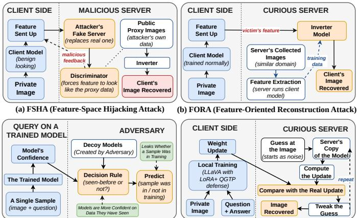
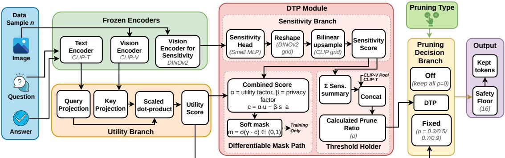
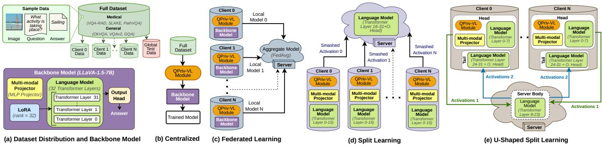
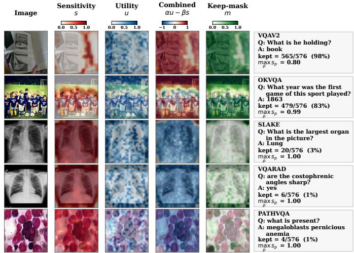
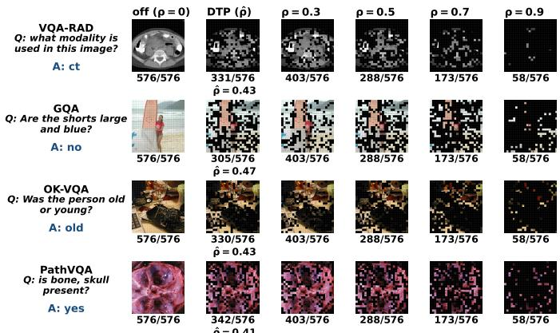
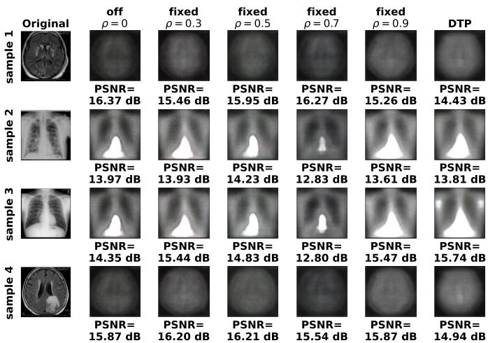
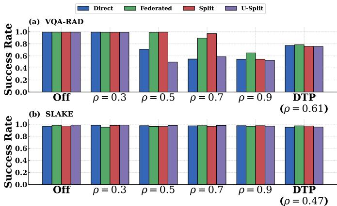
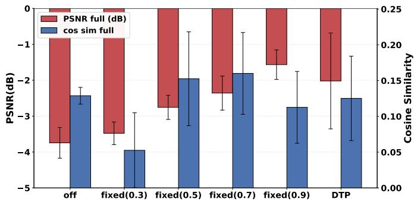
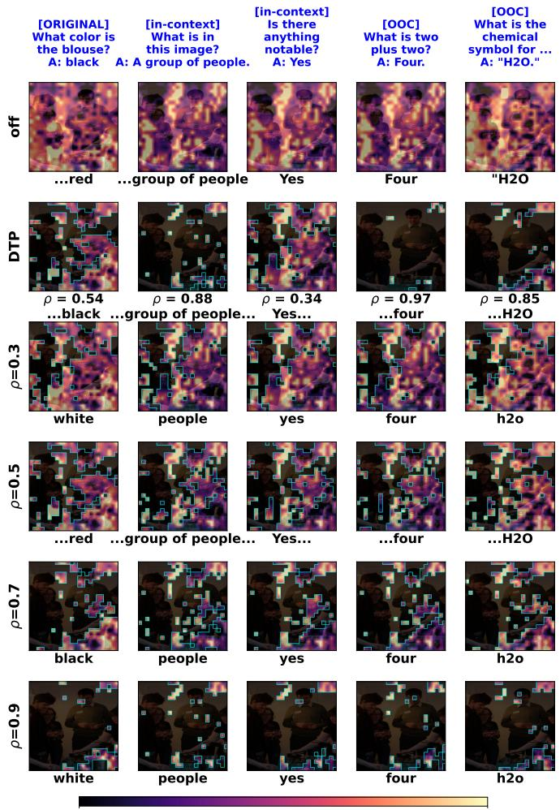
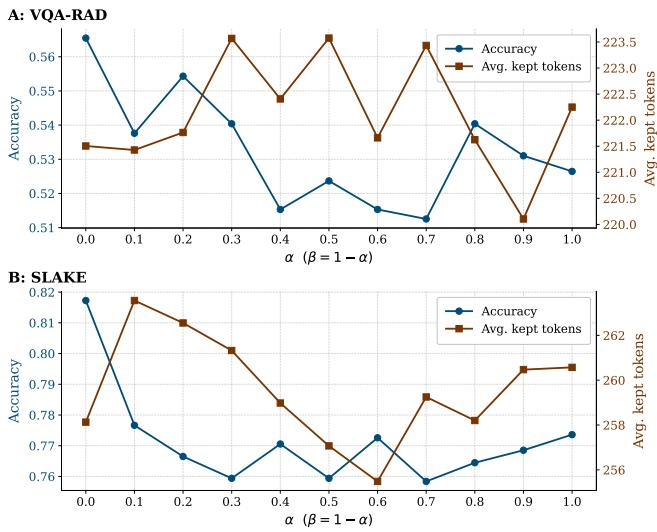

# D<sub>on</sub>’t S<sub>en</sub>d Wh<sub>a</sub>t Y<sub>ou</sub> D<sub>on</sub>’t N<sub>ee</sub>d<sub>:</sub> Question-Guided Token Prunin<sub>g</sub> as a Privac<sub>y</sub> D<sub>e</sub>f<sub>ense</sub> f<sub>or</sub> Vi<sub>s</sub>i<sub>on-</sub>L<sub>anguage</sub> M<sub>o</sub>d<sub>e</sub>l<sub>s</sub>

Md Kh<sub>a</sub>lid S<sub>y</sub>f<sub>u</sub>ll<sub>a</sub>h <sub>an</sub>d Al<sub>v</sub>i At<sub>aur</sub> Kh<sub>a</sub>lil

Transformative Innovation for Trustworth<sub>y</sub> AI and Network Securit<sub>y</sub> (TITANS) Lab, C<sub>ompu</sub>t<sub>er</sub> S<sub>c</sub>i<sub>ence,</sub> S<sub>ou</sub>th<sub>ern</sub> Illi<sub>no</sub>i<sub>s</sub> U<sub>n</sub>i<sub>vers</sub>it<sub>y</sub> C<sub>ar</sub>b<sub>on</sub>d<sub>a</sub>l<sub>e,</sub> USA {mdkhalid.syfullah, a.khalil}@siu.edu

Abstract—Visual Question Answering (VQA) with Vision-Lan<sub>g</sub>ua<sub>g</sub>e Models (VLMs) is increasin<sub>g</sub>l<sub>y</sub> deplo<sub>y</sub>ed in privac<sub>y</sub>- sensiti<sub>v</sub>e and band<sub>w</sub>idth-constrained settin<sub>g</sub>s<sub>.</sub> Distrib<sub>u</sub>ted paradi<sub>g</sub>ms such as Federated Learnin<sub>g</sub> (FL), Split Learnin<sub>g</sub> (SL), and U-Shaped Split Learnin<sub>g</sub> (USL) keep raw data local; h<sub>owever,</sub> t<sub>ransm</sub>itti<sub>ng</sub> <sub>a</sub>ll <sub>v</sub>i<sub>sua</sub>l t<sub>o</sub>k<sub>ens</sub> <sub>across</sub> th<sub>e</sub> <sub>cu</sub>t l<sub>ayer</sub> remains costl<sub>y</sub> and vulnerable to <sub>p</sub>rivac<sub>y</sub> attacks. We <sub>p</sub>ro<sub>p</sub>ose QPriv-VL, a question-guided and privacy-aware token-pruning fr<sub>a</sub>m<sub>ewo</sub>rk th<sub>a</sub>t <sub>ope</sub>r<sub>a</sub>t<sub>es u</sub>nif<sub>o</sub>rml<sub>y ac</sub>r<sub>oss a</sub>ll thr<sub>ee</sub> di<sub>s</sub>trib<sub>u</sub>t<sub>e</sub>d set<sub>up</sub>s and ser<sub>v</sub>es as a <sub>p</sub>ri<sub>v</sub>ac<sub>y</sub> defense b<sub>y p</sub>r<sub>u</sub>nin<sub>g v</sub>is<sub>u</sub>al tokens before the<sub>y</sub> cross the c<sub>u</sub>t la<sub>y</sub>er <sub>u</sub>sin<sub>g</sub> a combined meas<sub>u</sub>re of utility and sensitivity. At the core of QPriv-VL is a novel li<sub>g</sub>htwei<sub>g</sub>ht D<sub>y</sub>namic Threshold Predictor (DTP), which, as an adaptive defense module, jointly predicts a per-sample prune ratio and a <sub>p</sub>er-token retention mask in a sin<sub>g</sub>le for<sub>w</sub>ard <sub>p</sub>ass<sub>.</sub> DTP b<sub>a</sub>l<sub>a</sub>n<sub>ces</sub> <sub>ques</sub>ti<sub>o</sub>n r<sub>e</sub>l<sub>eva</sub>n<sub>ce,</sub> <sub>es</sub>tim<sub>a</sub>t<sub>e</sub>d thr<sub>oug</sub>h <sub>a</sub> <sub>c</sub>r<sub>oss</sub>m<sub>o</sub>d<sub>a</sub>l <sub>co</sub>m<sub>pa</sub>ri<sub>so</sub>n b<sub>e</sub>t<sub>wee</sub>n <sub>eac</sub>h <sub>v</sub>i<sub>sua</sub>l <sub>pa</sub>t<sub>c</sub>h r<sub>ep</sub>r<sub>ese</sub>nt<sub>a</sub>ti<sub>o</sub>n <sub>a</sub>nd th<sub>e</sub> <sub>p</sub>ooled <sub>q</sub>uestion embeddin<sub>g,</sub> a<sub>g</sub>ainst a content-sensitivit<sub>y</sub> si<sub>g</sub>nal d<sub>e</sub>ri<sub>ve</sub>d fr<sub>o</sub>m fr<sub>oze</sub>n f<sub>ea</sub>t<sub>u</sub>r<sub>es o</sub>f DINO<sub>v</sub>2<sub>, a se</sub>lf<sub>-supe</sub>r<sub>v</sub>i<sub>se</sub>d <sub>v</sub>i<sub>s</sub>i<sub>o</sub>n t<sub>rans</sub>f<sub>ormer.</sub> DINO<sub>v</sub>2 <sub>ena</sub>bl<sub>es</sub> DTP t<sub>o</sub> id<sub>en</sub>tif<sub>y v</sub>i<sub>sua</sub>ll<sub>y sens</sub>iti<sub>ve</sub> regions while preserving question-relevant content via object-<sub>awa</sub>r<sub>e pa</sub>t<sub>c</sub>h r<sub>ep</sub>r<sub>ese</sub>nt<sub>a</sub>ti<sub>o</sub>n<sub>s w</sub>ith<sub>ou</sub>t l<sub>a</sub>b<sub>e</sub>ll<sub>e</sub>d <sub>supe</sub>r<sub>v</sub>i<sub>s</sub>i<sub>o</sub>n<sub>.</sub> W<sub>e</sub> evaluate QPriv-VL on three general-domain benchmarks (GQA, OKVQA, VQAv2), three medical benchmarks (SLAKE, VQA-RAD, Path-VQA), and four attack families (FSHA, FORA, iDLG, attribute-inference MIA). DTP matches or surpasses fixed-ratio <sub>p</sub>r<sub>u</sub>nin<sub>g</sub> <sub>as</sub> <sub>a</sub> d<sub>e</sub>f<sub>e</sub>n<sub>se</sub> m<sub>e</sub>th<sub>o</sub>d <sub>w</sub>hil<sub>e</sub> r<sub>e</sub>t<sub>a</sub>inin<sub>g</sub> <sub>su</sub>b<sub>s</sub>t<sub>a</sub>nti<sub>a</sub>ll<sub>y</sub> m<sub>o</sub>r<sub>e</sub> tokens, reducing MIA attack success on VQA-RAD from 0.99 to 0.76–0.79, lowering FSHA and FORA reconstruction PSNR belo<sub>w</sub> the linear fixed-ratio trend<sub>,</sub> and <sub>p</sub>reser<sub>v</sub>in<sub>g</sub> com<sub>p</sub>etiti<sub>v</sub>e VQA accuracy at roughly 40% of the original token budget. A sensitivity exclusion ratio of 1.20 ± 0.18 shows that DTP pref-<sub>eren</sub>ti<sub>a</sub>ll<sub>y</sub> <sub>removes</sub> <sub>pr</sub>i<sub>vacy-sens</sub>iti<sub>ve</sub> <sub>pa</sub>t<sub>c</sub>h<sub>es,</sub> <sub>w</sub>hil<sub>e</sub> <sub>exp</sub>l<sub>a</sub>i<sub>na</sub>bilit<sub>y</sub> anal<sub>y</sub>sis confirms retention ada<sub>p</sub>ts to <sub>q</sub>uestion semantics rather th<sub>an gener</sub>i<sub>c sa</sub>li<sub>ency.</sub>

Index Terms—Visual question answering, security in visionlan<sub>gu</sub>a<sub>g</sub>e models<sub>,</sub> distrib<sub>u</sub>ted learnin<sub>g,</sub> kno<sub>w</sub>led<sub>g</sub>e distillation

## I<sub>.</sub> I<sub>ntroduction</sub>

Visual Question Answerin<sub>g</sub> (VQA) is a prominent multi<sub>mo</sub>d<sub>a</sub>l <sub>reason</sub>i<sub>ng</sub> t<sub>as</sub>k <sub>w</sub>h<sub>ere</sub> <sub>a</sub> <sub>mo</sub>d<sub>e</sub>l <sub>answers</sub> <sub>a</sub> <sub>na</sub>t<sub>ura</sub>l lan<sub>g</sub>ua<sub>g</sub>e <sub>q</sub>uestion based on the content of an ima<sub>g</sub>e [1], [2]. Modern VQA s<sub>y</sub>stems are primaril<sub>y</sub> powered b<sub>y</sub> lar<sub>g</sub>e Vision Lan<sub>g</sub>ua<sub>g</sub>e Models (VLMs) such as LLaVA [3], [4], BLIP2 [5], and Flamin<sub>g</sub>o [6], which combine a Vision Transformer (ViT) [7] encoder with a lar<sub>g</sub>e lan<sub>g</sub>ua<sub>g</sub>e model via a crossmodal projector. While these models deliver high accuracy, th<sub>e</sub>i<sub>r compu</sub>t<sub>e</sub> d<sub>eman</sub>d<sub>s ma</sub>k<sub>e on-</sub>d<sub>ev</sub>i<sub>ce</sub> i<sub>n</sub>f<sub>erence</sub> difi<sub>cu</sub>lt<sub>.</sub>

B<sub>eyon</sub>d <sub>raw compu</sub>t<sub>e,</sub> d<sub>ep</sub>l<sub>oymen</sub>t i<sub>s</sub> f<sub>ur</sub>th<sub>er comp</sub>li<sub>ca</sub>t<sub>e</sub>d b<sub>y</sub> privac<sub>y</sub> and throu<sub>g</sub>hput: man<sub>y</sub> practical VQA applications <sub>opera</sub>t<sub>e</sub> i<sub>n</sub> <sub>pr</sub>i<sub>vacy-sens</sub>iti<sub>ve</sub> <sub>an</sub>d b<sub>an</sub>d<sub>w</sub>idth<sub>-cons</sub>t<sub>ra</sub>i<sub>ne</sub>d <sub>env</sub>i<sub>-</sub> <sub>ronmen</sub>t<sub>s</sub> <sub>w</sub>h<sub>ere</sub> t<sub>ransm</sub>itti<sub>ng</sub> <sub>raw</sub> <sub>v</sub>i<sub>sua</sub>l d<sub>a</sub>t<sub>a</sub> <sub>or</sub> d<sub>ep</sub>l<sub>oy</sub>i<sub>ng</sub> l<sub>arge mo</sub>d<sub>e</sub>l<sub>s on-</sub>d<sub>ev</sub>i<sub>ce</sub> i<sub>s</sub> i<sub>n</sub>f<sub>eas</sub>ibl<sub>e, suc</sub>h <sub>as mu</sub>lti<sub>-</sub>i<sub>ns</sub>tit<sub>u</sub>ti<sub>ona</sub>l medical VQA [8]–[10] and on-device assistive s<sub>y</sub>stems. These <sub>c</sub>h<sub>a</sub>ll<sub>enges</sub> h<sub>ave</sub> <sub>mo</sub>ti<sub>va</sub>t<sub>e</sub>d di<sub>s</sub>t<sub>r</sub>ib<sub>u</sub>t<sub>e</sub>d t<sub>ra</sub>i<sub>n</sub>i<sub>ng</sub> <sub>para</sub>di<sub>gms,</sub> notabl<sub>y</sub> Federated Learnin<sub>g</sub> (FL) [11] and S<sub>p</sub>lit Learnin<sub>g</sub> (SL) [12]. FL <sub>p</sub>reserves data localit<sub>y</sub> b<sub>y</sub> a<sub>gg</sub>re<sub>g</sub>atin<sub>g</sub> model <sub>up</sub>d<sub>a</sub>t<sub>es w</sub>ith<sub>ou</sub>t <sub>s</sub>h<sub>ar</sub>i<sub>ng raw</sub> d<sub>a</sub>t<sub>a, w</sub>h<sub>ereas</sub> SL <sub>par</sub>titi<sub>ons</sub> th<sub>e</sub> <sub>mo</sub>d<sub>e</sub>l b<sub>e</sub>t<sub>ween</sub> <sub>c</sub>li<sub>en</sub>t <sub>an</sub>d <sub>server,</sub> t<sub>ransm</sub>itti<sub>ng</sub> <sub>on</sub>l<sub>y</sub> i<sub>n</sub>t<sub>erme-</sub> di<sub>a</sub>t<sub>e</sub> <sub>ac</sub>ti<sub>va</sub>ti<sub>ons</sub> <sub>across</sub> <sub>a</sub> <sub>cu</sub>t l<sub>ayer.</sub> U<sub>-</sub>Sh<sub>ape</sub>d S<sub>p</sub>lit L<sub>earn</sub>i<sub>ng</sub> (USL) extends SL with a second cut la<sub>y</sub>er, kee<sub>p</sub>in<sub>g</sub> both labels and the <sub>q</sub>uestion head on the client side [13].

While suited for VLM-based VQA, these paradi<sub>g</sub>ms introd<sub>uce</sub> th<sub>ree</sub> k<sub>ey c</sub>h<sub>a</sub>ll<sub>enges.</sub> Fi<sub>rs</sub>t<sub>, commun</sub>i<sub>ca</sub>ti<sub>on over</sub>h<sub>ea</sub>d i<sub>s</sub> substantial: a CLIP-ViT-L/14 encoder at 336×336 resolution produces 576 visual tokens with 1024-dimensional embeddi<sub>ngs, ma</sub>ki<sub>ng</sub> t<sub>ransm</sub>i<sub>ss</sub>i<sub>on across</sub> th<sub>e</sub> SL <sub>cu</sub>t <sub>pro</sub>hibiti<sub>ve</sub>l<sub>y</sub> ex<sub>p</sub>ensive [14], [15]. Second, intermediate activations and <sub>gra</sub>di<sub>en</sub>t <sub>up</sub>d<sub>a</sub>t<sub>es</sub> <sub>are</sub> <sub>vu</sub>l<sub>nera</sub>bl<sub>e</sub> t<sub>o</sub> f<sub>ea</sub>t<sub>ure-</sub>i<sub>nvers</sub>i<sub>on,</sub> <sub>gra</sub>di<sub>en</sub>t<sub>-</sub> leaka<sub>g</sub>e, and membershi<sub>p</sub>-inference attacks [16]–[19], a<sub>g</sub>ainst <sub>w</sub>hi<sub>c</sub>h <sub>ex</sub>i<sub>s</sub>ti<sub>ng</sub> <sub>ac</sub>ti<sub>va</sub>ti<sub>on-</sub>l<sub>eve</sub>l d<sub>e</sub>f<sub>enses</sub> <sub>re</sub>d<sub>uce</sub> <sub>u</sub>tilit<sub>y</sub> <sub>w</sub>hil<sub>e</sub> i<sub>gnor</sub>i<sub>ng</sub> th<sub>a</sub>t <sub>many</sub> t<sub>ransm</sub>itt<sub>e</sub>d t<sub>o</sub>k<sub>ens</sub> <sub>carry</sub> <sub>no</sub> <sub>ques</sub>ti<sub>on-</sub> <sub>re</sub>l<sub>evan</sub>t i<sub>n</sub>f<sub>orma</sub>ti<sub>on.</sub> Thi<sub>r</sub>d<sub>,</sub> VLM <sub>ana</sub>l<sub>yses</sub> <sub>s</sub>h<sub>ow</sub> th<sub>a</sub>t <sub>on</sub>l<sub>y</sub> <sub>a</sub> <sub>sma</sub>ll <sub>su</sub>b<sub>se</sub>t <sub>o</sub>f <sub>v</sub>i<sub>sua</sub>l t<sub>o</sub>k<sub>ens</sub> <sub>con</sub>t<sub>r</sub>ib<sub>u</sub>t<sub>es</sub> <sub>a</sub>ft<sub>er</sub> th<sub>e</sub> <sub>ear</sub>l<sub>y</sub> lan<sub>g</sub>ua<sub>g</sub>e-model la<sub>y</sub>ers [20], [21], meanin<sub>g</sub> transmittin<sub>g</sub> the full <sub>pre</sub>fi<sub>x</sub> i<sub>n</sub>fl<sub>a</sub>t<sub>es</sub> b<sub>o</sub>th <sub>commun</sub>i<sub>ca</sub>ti<sub>on cos</sub>t <sub>an</sub>d <sub>a</sub>tt<sub>ac</sub>k <sub>sur</sub>f<sub>ace.</sub>

Th<sub>ese c</sub>h<sub>a</sub>ll<sub>enges mo</sub>ti<sub>va</sub>t<sub>e a s</sub>i<sub>mp</sub>l<sub>e o</sub>b<sub>serva</sub>ti<sub>on: on</sub>l<sub>y a</sub> <sub>su</sub>b<sub>se</sub>t <sub>o</sub>f <sub>v</sub>i<sub>sua</sub>l t<sub>o</sub>k<sub>ens</sub> i<sub>s necessary</sub> t<sub>o cross</sub> th<sub>e cu</sub>t l<sub>ayer.</sub> S<sub>e</sub>l<sub>ec</sub>ti<sub>ng</sub> t<sub>as</sub>k<sub>-re</sub>l<sub>evan</sub>t <sub>an</sub>d <sub>pr</sub>i<sub>vacy-preserv</sub>i<sub>ng</sub> t<sub>o</sub>k<sub>ens</sub> b<sub>e</sub>f<sub>ore</sub> t<sub>ransm</sub>i<sub>ss</sub>i<sub>on</sub> <sub>removes</sub> <sub>re</sub>d<sub>un</sub>d<sub>ancy,</sub> <sub>s</sub>h<sub>r</sub>i<sub>n</sub>k<sub>s</sub> th<sub>e</sub> <sub>a</sub>tt<sub>ac</sub>k <sub>sur</sub>f<sub>ace,</sub> <sub>an</sub>d <sub>preserves seman</sub>ti<sub>ca</sub>ll<sub>y mean</sub>i<sub>ng</sub>f<sub>u</sub>l i<sub>n</sub>f<sub>orma</sub>ti<sub>on.</sub> R<sub>ecen</sub>t <sub>ques</sub>ti<sub>on-gu</sub>id<sub>e</sub>d <sub>an</sub>d <sub>a</sub>d<sub>ap</sub>ti<sub>ve</sub> t<sub>o</sub>k<sub>en-prun</sub>i<sub>ng approac</sub>h<sub>es</sub> f<sub>or</sub> VLMs reduce the visual <sub>p</sub>refix b<sub>y</sub> two-thirds or more [20]– [26]. However, these methods are evaluated as centralized inf<sub>erence acce</sub>l<sub>era</sub>t<sub>ors an</sub>d<sub>,</sub> t<sub>o our</sub> k<sub>now</sub>l<sub>e</sub>d<sub>ge, rema</sub>i<sub>n unexp</sub>l<sub>ore</sub>d as privacy defenses or jointly trained with content-sensitivity <sub>s</sub>i<sub>g</sub>n<sub>a</sub>l<sub>s.</sub> E<sub>x</sub>i<sub>s</sub>tin<sub>g</sub> SL <sub>co</sub>m<sub>p</sub>r<sub>ess</sub>i<sub>o</sub>n <sub>app</sub>r<sub>oac</sub>h<sub>es a</sub>r<sub>e</sub> l<sub>a</sub>r<sub>ge</sub>l<sub>y</sub> t<sub>as</sub>k<sub>-</sub> <sub>agnos</sub>ti<sub>c an</sub>d d<sub>o no</sub>t <sub>exp</sub>l<sub>o</sub>it th<sub>e c</sub>li<sub>en</sub>t<sub>-s</sub>id<sub>e ques</sub>ti<sub>on</sub> f<sub>ea</sub>t<sub>ures.</sub>

To brid<sub>g</sub>e this <sub>g</sub>a<sub>p</sub>, we introduce QPriv-VL, a Question-<sub>gu</sub>id<sub>e</sub>d <sub>an</sub>d Pri<sub>vacy-aware</sub> t<sub>o</sub>k<sub>en-prun</sub>i<sub>ng</sub> f<sub>ramewor</sub>k f<sub>or</sub>

Vision-Lan<sub>g</sub>ua<sub>g</sub>e models, built on LLaVA-1.5-7B [4], which <sub>com</sub>bi<sub>nes</sub> <sub>a</sub> CLIP<sub>-</sub>ViT <sub>v</sub>i<sub>sua</sub>l <sub>enco</sub>d<sub>er</sub> <sub>w</sub>ith <sub>a</sub> Ll<sub>ama-</sub>2 l<sub>anguage</sub> backbone via a li<sub>g</sub>htwei<sub>g</sub>ht Multi La<sub>y</sub>er Perce<sub>p</sub>tion (MLP) projector. QPriv-VL operates as a unified client-side pruning framework for Centralized Trainin<sub>g</sub> (CL), FL, SL, and USL, <sub>us</sub>i<sub>ng</sub> th<sub>e same</sub> d<sub>ec</sub>i<sub>s</sub>i<sub>on mec</sub>h<sub>an</sub>i<sub>sm regar</sub>dl<sub>ess o</sub>f <sub>cu</sub>t <sub>p</sub>l<sub>ace-</sub> <sub>men</sub>t<sub>.</sub> A <sub>s</sub>i<sub>ng</sub>l<sub>e c</sub>h<sub>ec</sub>k<sub>po</sub>i<sub>n</sub>t <sub>s</sub>h<sub>or</sub>t<sub>ens</sub> th<sub>e v</sub>i<sub>sua</sub>l <sub>pre</sub>fi<sub>x, re</sub>d<sub>uces</sub> <sub>commun</sub>i<sub>ca</sub>ti<sub>on cos</sub>t <sub>across</sub> th<sub>e cu</sub>t<sub>, an</sub>d li<sub>m</sub>it<sub>s</sub> th<sub>e</sub> i<sub>n</sub>f<sub>orma</sub>ti<sub>on</sub> <sub>expose</sub>d t<sub>o cur</sub>i<sub>ous or ma</sub>li<sub>c</sub>i<sub>ous servers.</sub> Th<sub>e</sub> f<sub>ramewor</sub>k <sub>cen-</sub> t<sub>ers on a</sub> li<sub>g</sub>ht<sub>we</sub>i<sub>g</sub>ht <sub>c</sub>li<sub>en</sub>t<sub>-s</sub>id<sub>e</sub> D<sub>ynam</sub>i<sub>c</sub> Th<sub>res</sub>h<sub>o</sub>ld P<sub>re</sub>di<sub>c</sub>t<sub>or</sub> (DTP), where one forward <sub>p</sub>ass <sub>p</sub>roduces a <sub>p</sub>er-sam<sub>p</sub>le <sub>p</sub>runin<sub>g</sub> ratio (how man<sub>y</sub> tokens leave the client) and a <sub>p</sub>er-token kee<sub>p</sub>- mask (which tokens are retained). Our contribution in this <sub>wor</sub>k i<sub>s</sub> f<sub>our-</sub>f<sub>o</sub>ld<sub>:</sub>

<sub>•</sub> W<sub>e</sub> i<sub>n</sub>t<sub>ro</sub>d<sub>uce</sub> <sub>a</sub> li<sub>g</sub>ht<sub>we</sub>i<sub>g</sub>ht<sub>,</sub> <sub>pr</sub>i<sub>vacy-aware</sub> DTP <sub>mo</sub>d<sub>u</sub>l<sub>e</sub> th<sub>a</sub>t d<sub>ec</sub>id<sub>es</sub> h<sub>ow</sub> <sub>many</sub> <sub>an</sub>d <sub>w</sub>hi<sub>c</sub>h <sub>v</sub>i<sub>sua</sub>l t<sub>o</sub>k<sub>ens</sub> t<sub>o</sub> k<sub>eep,</sub> jointly weighing question relevance against a learned <sub>con</sub>t<sub>en</sub>t<sub>-sens</sub>iti<sub>v</sub>it<sub>y</sub> <sub>s</sub>i<sub>gna</sub>l<sub>.</sub> DTP <sub>genera</sub>li<sub>zes</sub> <sub>across</sub> <sub>genera</sub>l <sub>an</sub>d <sub>me</sub>di<sub>ca</sub>l d<sub>oma</sub>i<sub>ns</sub> <sub>w</sub>ith<sub>ou</sub>t <sub>per-</sub>d<sub>oma</sub>i<sub>n</sub> <sub>re</sub>t<sub>ra</sub>i<sub>n</sub>i<sub>ng.</sub>

• We present a unified implementation of QPriv-VL on LL<sub>a</sub>VA<sub>-</sub>1<sub>.</sub>5<sub>-</sub>7B th<sub>a</sub>t <sub>suppor</sub>t<sub>s</sub> b<sub>o</sub>th fi<sub>xe</sub>d <sub>an</sub>d d<sub>ynam</sub>i<sub>c</sub> th<sub>res</sub>h<sub>o</sub>ld<sub>s,</sub> l<sub>e</sub>tti<sub>ng</sub> th<sub>e same c</sub>li<sub>en</sub>t<sub>-s</sub>id<sub>e mo</sub>d<sub>u</sub>l<sub>e ac</sub>t <sub>as</sub> <sub>a commun</sub>i<sub>ca</sub>ti<sub>on-e</sub>fi<sub>c</sub>i<sub>ency</sub> l<sub>ayer an</sub>d <sub>a pr</sub>i<sub>vacy</sub> d<sub>e</sub>f<sub>ense</sub> <sub>un</sub>d<sub>er</sub> di<sub>s</sub>t<sub>r</sub>ib<sub>u</sub>t<sub>e</sub>d <sub>se</sub>tti<sub>ngs.</sub>

• We provide a s<sub>y</sub>stematic privac<sub>y</sub> evaluation of QPriv-VL, <sub>s</sub>h<sub>ow</sub>i<sub>ng ro</sub>b<sub>us</sub>t<sub>ness aga</sub>i<sub>ns</sub>t f<sub>our represen</sub>t<sub>a</sub>ti<sub>ve a</sub>tt<sub>ac</sub>k f<sub>am-</sub> ilies: FSHA [16], FORA [17], iDLG [18], and MIA [19], on both <sub>g</sub>eneral-domain and medical VQA benchmarks.

<sub>•</sub> W<sub>e</sub> i<sub>nves</sub>ti<sub>ga</sub>t<sub>e</sub> th<sub>e u</sub>tili<sub>se</sub>d VLM <sub>mo</sub>d<sub>e</sub>l’<sub>s</sub> i<sub>n</sub>t<sub>erna</sub>l d<sub>ec</sub>i<sub>s</sub>i<sub>on</sub> <sub>p</sub>rocess via transformer-based attention visualization [27], <sub>us</sub>i<sub>ng</sub> <sub>case</sub> <sub>s</sub>t<sub>u</sub>di<sub>es</sub> <sub>w</sub>ith i<sub>n</sub> <sub>an</sub>d <sub>ou</sub>t<sub>-o</sub>f<sub>-con</sub>t<sub>ex</sub>t <sub>quer</sub>i<sub>es.</sub>

Thi<sub>s</sub> <sub>wor</sub>k <sub>answers</sub> f<sub>our</sub> <sub>researc</sub>h <sub>ques</sub>ti<sub>ons:</sub>

• RQ1: Does QPriv-VL simultaneousl<sub>y</sub> reduce commu-<sub>n</sub>i<sub>ca</sub>ti<sub>on cos</sub>t<sub>, s</sub>h<sub>r</sub>i<sub>n</sub>k th<sub>e a</sub>tt<sub>ac</sub>k <sub>sur</sub>f<sub>ace, an</sub>d <sub>preserve</sub> <sub>accuracy across a</sub>ll f<sub>our</sub> l<sub>earn</sub>i<sub>ng se</sub>tti<sub>ngs</sub>?

• RQ2: Does a <sub>p</sub>rivac<sub>y</sub>-aware d<sub>y</sub>namic threshold <sub>p</sub>redict<sub>or y</sub>i<sub>e</sub>ld <sub>a</sub> b<sub>e</sub>tt<sub>er accuracy</sub>/<sub>commun</sub>i<sub>ca</sub>ti<sub>on</sub>/<sub>pr</sub>i<sub>vacy</sub> P<sub>are</sub>t<sub>o</sub> t<sub>ra</sub>d<sub>e-o</sub>f th<sub>an</sub> fi<sub>xe</sub>d<sub>-ra</sub>ti<sub>o or</sub> t<sub>ra</sub>i<sub>n</sub>i<sub>ng-</sub>f<sub>ree prun</sub>i<sub>ng</sub>?

• RQ3: Does QPriv-VL s<sub>p</sub>ecificall<sub>y</sub> remove tokens that <sub>are</sub> b<sub>o</sub>th <sub>recons</sub>t<sub>ruc</sub>t<sub>a</sub>bl<sub>e an</sub>d <sub>pr</sub>i<sub>vacy-re</sub>l<sub>evan</sub>t<sub>, ra</sub>th<sub>er</sub> th<sub>an</sub> <sub>mere</sub>l<sub>y</sub> d<sub>egra</sub>di<sub>ng per</sub>f<sub>ormance</sub>?

• RQ4: Can its efectiveness be verified throu<sub>g</sub>h ex<sub>p</sub>lain-<sub>a</sub>bilit<sub>y</sub> <sub>ana</sub>l<sub>ys</sub>i<sub>s</sub>?

Th<sub>e rema</sub>i<sub>n</sub>d<sub>er o</sub>f thi<sub>s paper</sub> i<sub>s organ</sub>i<sub>ze</sub>d <sub>as</sub> f<sub>o</sub>ll<sub>ows.</sub> S<sub>ec-</sub> ti<sub>on</sub> II <sub>presen</sub>t<sub>s</sub> th<sub>e</sub> b<sub>ac</sub>k<sub>groun</sub>d<sub>.</sub> S<sub>ec</sub>ti<sub>on</sub> III di<sub>scusses</sub> <sub>re-</sub> l<sub>a</sub>t<sub>e</sub>d <sub>wor</sub>k<sub>.</sub> S<sub>ec</sub>ti<sub>on</sub> IV i<sub>n</sub>t<sub>ro</sub>d<sub>uces</sub> th<sub>e propose</sub>d f<sub>ramewor</sub>k<sub>.</sub> S<sub>ec</sub>ti<sub>on</sub> V <sub>ou</sub>tli<sub>nes</sub> th<sub>e</sub> <sub>me</sub>th<sub>o</sub>d<sub>o</sub>l<sub>ogy.</sub> S<sub>ec</sub>ti<sub>on</sub> VI <sub>repor</sub>t<sub>s</sub> th<sub>e</sub> <sub>exper</sub>i<sub>men</sub>t<sub>a</sub>l fi<sub>n</sub>di<sub>ngs an</sub>d <sub>sec</sub>ti<sub>on</sub> VII <sub>conc</sub>l<sub>u</sub>d<sub>es</sub> th<sub>e paper.</sub>

## II<sub>.</sub> B<sub>ackground</sub>

I<sub>n</sub> thi<sub>s sec</sub>ti<sub>on, we</sub> di<sub>scuss pre</sub>li<sub>m</sub>i<sub>nary concep</sub>t<sub>s</sub> t<sub>o</sub> f<sub>ac</sub>ilit<sub>a</sub>t<sub>e</sub> <sub>an un</sub>d<sub>ers</sub>t<sub>an</sub>di<sub>ng o</sub>f di<sub>s</sub>t<sub>r</sub>ib<sub>u</sub>t<sub>e</sub>d l<sub>earn</sub>i<sub>ng, a</sub>tt<sub>ac</sub>k<sub>s, an</sub>d th<sub>e</sub> positionin<sub>g</sub> of our proposed QPriv-VL framework.

  
(c) MIA (Membership Inference Attack) (d) iDLG (Improved Deep Leakage from Gradients)  
Fi<sub>g.</sub> 1<sub>.</sub> O<sub>verv</sub>i<sub>ew o</sub>f th<sub>e</sub> f<sub>our a</sub>tt<sub>ac</sub>k<sub>s cons</sub>id<sub>ere</sub>d i<sub>n</sub> thi<sub>s wor</sub>k<sub>.</sub>

## A. VQA and VLMs

VQA takes an ima<sub>g</sub>e to<sub>g</sub>ether with a natural-lan<sub>g</sub>ua<sub>g</sub>e <sub>q</sub>uestion and <sub>p</sub>roduces a free-form textual answer [1]. Modern s<sub>y</sub>stems such as LLaVA [3], [4], BLIP-2 [5], and Flamin<sub>g</sub>o [6] <sub>rea</sub>li<sub>se</sub> thi<sub>s mapp</sub>i<sub>ng w</sub>ith <sub>a</sub> VLM th<sub>a</sub>t <sub>pa</sub>i<sub>rs a v</sub>i<sub>sua</sub>l <sub>enco</sub>d<sub>er</sub> with a language model through a small projection module, <sub>suc</sub>h th<sub>a</sub>t <sub>v</sub>i<sub>sua</sub>l f<sub>ea</sub>t<sub>ures</sub> <sub>are</sub> t<sub>rans</sub>l<sub>a</sub>t<sub>e</sub>d i<sub>n</sub>t<sub>o</sub> <sub>a</sub> f<sub>orm</sub> th<sub>e</sub> l<sub>anguage</sub> <sub>mo</sub>d<sub>e</sub>l <sub>can a</sub>tt<sub>en</sub>d t<sub>o a</sub>l<sub>ongs</sub>id<sub>e</sub> th<sub>e ques</sub>ti<sub>on</sub> t<sub>o</sub>k<sub>ens.</sub> W<sub>e use</sub> LLaVA-1.5-7B [4] as our reference architecture because its CLIP-ViT-L/14 encoder, MLP projector, and Vicuna language <sub>mo</sub>d<sub>e</sub>l <sub>expose a c</sub>l<sub>ean</sub> i<sub>n</sub>t<sub>er</sub>f<sub>ace</sub> b<sub>e</sub>t<sub>ween mo</sub>d<sub>a</sub>liti<sub>es an</sub>d h<sub>ave an</sub> established literature on visual-token <sub>p</sub>runin<sub>g</sub> [20]–[22], [28].

## B. Self-Supervised Visual Representations

S<sub>e</sub>lf<sub>-superv</sub>i<sub>se</sub>d <sub>v</sub>i<sub>sua</sub>l <sub>represen</sub>t<sub>a</sub>ti<sub>on</sub> l<sub>earn</sub>i<sub>ng</sub> t<sub>ra</sub>i<sub>ns a</sub> ViT <sub>on a</sub> l<sub>arge un</sub>l<sub>a</sub>b<sub>e</sub>ll<sub>e</sub>d i<sub>mage corpus</sub> b<sub>y pre</sub>di<sub>c</sub>ti<sub>ng one v</sub>i<sub>ew</sub> <sub>o</sub>f <sub>an</sub> i<sub>mage</sub> f<sub>rom</sub> <sub>ano</sub>th<sub>er.</sub> Th<sub>e</sub> <sub>resu</sub>lti<sub>ng</sub> <sub>per-pa</sub>t<sub>c</sub>h f<sub>ea</sub>t<sub>ures</sub> <sub>carry s</sub>t<sub>rong seman</sub>ti<sub>c</sub> l<sub>oca</sub>lit<sub>y an</sub>d t<sub>rans</sub>f<sub>er we</sub>ll <sub>across v</sub>i<sub>sua</sub>l d<sub>oma</sub>i<sub>ns,</sub> i<sub>nc</sub>l<sub>u</sub>di<sub>ng</sub> <sub>me</sub>di<sub>ca</sub>l i<sub>magery,</sub> <sub>w</sub>ith<sub>ou</sub>t <sub>re</sub>t<sub>ra</sub>i<sub>n</sub>i<sub>ng.</sub> W<sub>e</sub> ado<sub>p</sub>t DINOv2 [29] as the self-su<sub>p</sub>ervised backbone behind <sub>our sens</sub>iti<sub>v</sub>it<sub>y</sub> b<sub>ranc</sub>h<sub>, s</sub>i<sub>nce</sub> it <sub>o</sub>f<sub>ers</sub> hi<sub>g</sub>h<sub>-qua</sub>lit<sub>y pa</sub>t<sub>c</sub>h f<sub>ea-</sub> t<sub>ures a</sub>t <sub>a sma</sub>ll <sub>compu</sub>t<sub>a</sub>ti<sub>ona</sub>l <sub>cos</sub>t <sub>an</sub>d <sub>rema</sub>i<sub>ns</sub> f<sub>rozen.</sub>

## C<sub>.</sub> T<sub>ra</sub>i<sub>n</sub>i<sub>ng</sub> P<sub>ara</sub>di<sub>gms</sub>

W<sub>e</sub> <sub>compare</sub> f<sub>our</sub> t<sub>ra</sub>i<sub>n</sub>i<sub>ng</sub> <sub>para</sub>di<sub>gms</sub> dif<sub>er</sub>i<sub>ng</sub> i<sub>n</sub> h<sub>ow</sub> d<sub>a</sub>t<sub>a</sub> <sub>an</sub>d th<sub>e mo</sub>d<sub>e</sub>l <sub>are par</sub>titi<sub>one</sub>d b<sub>e</sub>t<sub>ween c</sub>li<sub>en</sub>t <sub>an</sub>d <sub>server.</sub>

a) CL: The classical setting where a single trainer holds th<sub>e</sub> <sub>en</sub>ti<sub>re</sub> d<sub>a</sub>t<sub>ase</sub>t <sub>an</sub>d <sub>up</sub>d<sub>a</sub>t<sub>es</sub> <sub>a</sub> <sub>s</sub>i<sub>ng</sub>l<sub>e</sub> <sub>copy</sub> <sub>o</sub>f th<sub>e</sub> <sub>mo</sub>d<sub>e</sub>l<sub>.</sub> CL <sub>serves</sub> <sub>as</sub> th<sub>e</sub> <sub>no-</sub>di<sub>s</sub>t<sub>r</sub>ib<sub>u</sub>ti<sub>on</sub> <sub>upper</sub> b<sub>oun</sub>d<sub>:</sub> <sub>no</sub>thi<sub>ng</sub> <sub>crosses</sub> <sub>a</sub> <sub>ne</sub>t<sub>wor</sub>k b<sub>oun</sub>d<sub>ary, e</sub>li<sub>m</sub>i<sub>na</sub>ti<sub>ng any</sub> l<sub>ea</sub>k<sub>age c</sub>h<sub>anne</sub>l<sub>,</sub> th<sub>oug</sub>h <sub>raw</sub> d<sub>a</sub>t<sub>a mus</sub>t b<sub>e aggrega</sub>t<sub>e</sub>d i<sub>n one p</sub>l<sub>ace.</sub>

b) FL [11]: Each client kee<sub>p</sub>s its data local and trains <sub>a</sub> l<sub>oca</sub>l <sub>copy.</sub> Cli<sub>en</sub>t<sub>s per</sub>i<sub>o</sub>di<sub>ca</sub>ll<sub>y sen</sub>d <sub>parame</sub>t<sub>er up</sub>d<sub>a</sub>t<sub>es</sub> t<sub>o</sub> <sub>a server, w</sub>hi<sub>c</sub>h <sub>aggrega</sub>t<sub>es</sub> th<sub>em an</sub>d b<sub>roa</sub>d<sub>cas</sub>t<sub>s</sub> th<sub>e resu</sub>lt<sub>.</sub> FL <sub>preserves</sub> d<sub>a</sub>t<sub>a</sub> l<sub>oca</sub>lit<sub>y;</sub> t<sub>ransm</sub>itt<sub>e</sub>d <sub>up</sub>d<sub>a</sub>t<sub>es can s</sub>till l<sub>ea</sub>k i<sub>n</sub>f<sub>orma</sub>ti<sub>on</sub> th<sub>roug</sub>h <sub>gra</sub>di<sub>en</sub>t<sub>-</sub>i<sub>nvers</sub>i<sub>on a</sub>tt<sub>ac</sub>k<sub>s suc</sub>h <sub>as</sub> DLG and iDLG [18], [30].

c) SL [12]: The model is <sub>p</sub>artitioned at a sin<sub>g</sub>le cut l<sub>ayer.</sub> Th<sub>e c</sub>li<sub>en</sub>t <sub>owns</sub> th<sub>e</sub> l<sub>ower par</sub>t <sub>an</sub>d th<sub>e</sub> i<sub>npu</sub>t d<sub>a</sub>t<sub>a;</sub> th<sub>e</sub> <sub>server owns</sub> th<sub>e upper par</sub>t <sub>an</sub>d th<sub>e</sub> l<sub>oss compu</sub>t<sub>a</sub>ti<sub>on.</sub> O<sub>n</sub>l<sub>y</sub> th<sub>e</sub> i<sub>n</sub>t<sub>erme</sub>di<sub>a</sub>t<sub>e ac</sub>ti<sub>va</sub>ti<sub>ons a</sub>t th<sub>e cu</sub>t <sub>an</sub>d th<sub>e</sub> b<sub>ac</sub>k<sub>-</sub>fl<sub>ow</sub>i<sub>ng</sub> <sub>gra</sub>di<sub>en</sub>t<sub>s are exc</sub>h<sub>ange</sub>d<sub>.</sub> Th<sub>e smas</sub>h<sub>e</sub>d <sub>ac</sub>ti<sub>va</sub>ti<sub>ons</sub> b<sub>ecome</sub> th<sub>e</sub> <sub>p</sub>rimar<sub>y</sub> tar<sub>g</sub>et for feature-inversion attacks [16], [17].

d) USL [13]: USL extends SL with a second cut so b<sub>o</sub>th <sub>en</sub>d<sub>s o</sub>f th<sub>e ne</sub>t<sub>wor</sub>k <sub>rema</sub>i<sub>n on</sub> th<sub>e c</sub>li<sub>en</sub>t <sub>s</sub>id<sub>e:</sub> th<sub>e c</sub>li<sub>en</sub>t <sub>re</sub>t<sub>a</sub>i<sub>ns</sub> th<sub>e</sub> <sub>em</sub>b<sub>e</sub>ddi<sub>ng</sub> l<sub>ayers,</sub> th<sub>e</sub> l<sub>anguage-mo</sub>d<sub>e</sub>l h<sub>ea</sub>d<sub>,</sub> <sub>an</sub>d th<sub>e</sub> l<sub>a</sub>b<sub>e</sub>l<sub>s,</sub> <sub>w</sub>hil<sub>e</sub> th<sub>e</sub> <sub>server</sub> <sub>opera</sub>t<sub>es</sub> <sub>on</sub>l<sub>y</sub> <sub>on</sub> th<sub>e</sub> <sub>m</sub>iddl<sub>e</sub> bl<sub>oc</sub>k<sub>.</sub> Thi<sub>s</sub> t<sub>opo</sub>l<sub>ogy removes severa</sub>l l<sub>ea</sub>k<sub>age c</sub>h<sub>anne</sub>l<sub>s a</sub>t th<sub>e cos</sub>t <sub>o</sub>f <sub>an ex</sub>t<sub>ra roun</sub>d <sub>o</sub>f <sub>commun</sub>i<sub>ca</sub>ti<sub>on per s</sub>t<sub>ep.</sub>

## D<sub>.</sub> Att<sub>ac</sub>k<sub>s on</sub> VLM<sub>s</sub>

A <sub>cen</sub>t<sub>ra</sub>l <sub>pr</sub>i<sub>vacy concern</sub> i<sub>n</sub> di<sub>s</sub>t<sub>r</sub>ib<sub>u</sub>t<sub>e</sub>d l<sub>earn</sub>i<sub>ng</sub> i<sub>s</sub> th<sub>a</sub>t <sub>an</sub> h<sub>ones</sub>t<sub>-</sub>b<sub>u</sub>t<sub>-cur</sub>i<sub>ous</sub> <sub>or</sub> <sub>ma</sub>li<sub>c</sub>i<sub>ous</sub> <sub>server</sub> <sub>can</sub> <sub>recover</sub> th<sub>e</sub> i<sub>npu</sub>t<sub>,</sub> it<sub>s</sub> l<sub>a</sub>b<sub>e</sub>l<sub>, or a sens</sub>iti<sub>ve a</sub>tt<sub>r</sub>ib<sub>u</sub>t<sub>e</sub> f<sub>rom exc</sub>h<sub>ange</sub>d i<sub>n</sub>f<sub>orma</sub>ti<sub>on</sub> (e.<sub>g</sub>., <sub>p</sub>arameter u<sub>p</sub>dates in FL or smashed activations and back-flowin<sub>g g</sub>radients at the cut la<sub>y</sub>er(s) in SL and USL). We ado<sub>p</sub>t four attacks s<sub>p</sub>annin<sub>g</sub> the threat s<sub>p</sub>ace (Fi<sub>g</sub>ure 1).

a) FSHA: Pas<sub>q</sub>uini et al. [16] introduce an active attack <sub>w</sub>h<sub>ere an a</sub>tt<sub>ac</sub>k<sub>er-con</sub>t<sub>ro</sub>ll<sub>e</sub>d <sub>mo</sub>d<sub>u</sub>l<sub>e rep</sub>l<sub>aces</sub> th<sub>e</sub> l<sub>eg</sub>iti<sub>ma</sub>t<sub>e</sub> server and hijacks training: a discriminator on the attacker <sub>s</sub>id<sub>e cover</sub>tl<sub>y a</sub>li<sub>gns</sub> th<sub>e c</sub>li<sub>en</sub>t’<sub>s smas</sub>h<sub>e</sub>d <sub>represen</sub>t<sub>a</sub>ti<sub>ons w</sub>ith <sub>em</sub>b<sub>e</sub>ddi<sub>ngs o</sub>f th<sub>e a</sub>tt<sub>ac</sub>k<sub>er</sub>’<sub>s pu</sub>bli<sub>c proxy</sub> i<sub>mages, w</sub>hil<sub>e an</sub> inverter trained jointly against this aligned space reconstructs the client’s <sub>p</sub>rivate in<sub>p</sub>ut (Fi<sub>g</sub>ure 1(a)). The attack defeats distance-correlation defenses because the alignment objective <sub>co</sub>ll<sub>apses</sub> th<sub>e</sub> di<sub>s</sub>t<sub>ances</sub> th<sub>ose</sub> d<sub>e</sub>f<sub>enses regu</sub>l<sub>ar</sub>i<sub>se.</sub>

b) FORA: Xu et al. [17] <sub>p</sub>ro<sub>p</sub>ose a <sub>p</sub>assive reconstruction <sub>a</sub>tt<sub>ac</sub>k i<sub>n w</sub>hi<sub>c</sub>h <sub>an</sub> h<sub>ones</sub>t<sub>-</sub>b<sub>u</sub>t<sub>-cur</sub>i<sub>ous server co</sub>ll<sub>ec</sub>t<sub>s smas</sub>h<sub>e</sub>d <sub>ac</sub>ti<sub>va</sub>ti<sub>ons</sub> f<sub>rom</sub> <sub>a</sub> t<sub>ra</sub>i<sub>ne</sub>d <sub>c</sub>li<sub>en</sub>t <sub>mo</sub>d<sub>e</sub>l <sub>an</sub>d t<sub>ra</sub>i<sub>ns</sub> <sub>an</sub> i<sub>nver</sub>t<sub>er</sub> <sub>on</sub> <sub>a</sub> <sub>same-</sub>d<sub>oma</sub>i<sub>n</sub> <sub>pu</sub>bli<sub>c</sub> <sub>aux</sub>ili<sub>ary</sub> <sub>se</sub>t<sub>,</sub> <sub>us</sub>i<sub>ng</sub> it<sub>s</sub> <sub>copy</sub> <sub>o</sub>f th<sub>e</sub> <sub>c</sub>li<sub>en</sub>t encoder to <sub>g</sub>enerate matched feature/ima<sub>g</sub>e <sub>p</sub>airs (Fi<sub>g</sub>ure 1(b)). B<sub>ecause</sub> th<sub>e</sub> i<sub>nver</sub>t<sub>er</sub> i<sub>s</sub> fit <sub>aga</sub>i<sub>ns</sub>t <sub>unprune</sub>d<sub>,</sub> <sub>un</sub>d<sub>e</sub>f<sub>en</sub>d<sub>e</sub>d <sub>repre-</sub> <sub>sen</sub>t<sub>a</sub>ti<sub>ons,</sub> FORA <sub>ac</sub>t<sub>s as an orac</sub>l<sub>e a</sub>tt<sub>ac</sub>k<sub>er</sub> th<sub>a</sub>t b<sub>oun</sub>d<sub>s w</sub>h<sub>a</sub>t <sub>any</sub> <sub>a</sub>d<sub>versary</sub> <sub>cou</sub>ld <sub>recover</sub> f<sub>rom</sub> th<sub>e</sub> d<sub>ep</sub>l<sub>oye</sub>d <sub>sys</sub>t<sub>em.</sub>

c) MIA: Followin<sub>g</sub> Shokri et al. [19], an adversar<sub>y</sub> trains <sub>s</sub>h<sub>a</sub>d<sub>ow mo</sub>d<sub>e</sub>l<sub>s on</sub> d<sub>a</sub>t<sub>a</sub> f<sub>rom</sub> th<sub>e</sub> t<sub>arge</sub>t’<sub>s</sub> di<sub>s</sub>t<sub>r</sub>ib<sub>u</sub>ti<sub>on an</sub>d <sub>uses</sub> th<sub>e</sub>i<sub>r con</sub>fid<sub>ence pa</sub>tt<sub>erns</sub> t<sub>o</sub> b<sub>u</sub>ild <sub>a</sub> bi<sub>nary c</sub>l<sub>ass</sub>ifi<sub>er</sub> th<sub>a</sub>t <sub>pre</sub>di<sub>c</sub>t<sub>s</sub> <sub>w</sub>h<sub>e</sub>th<sub>er</sub> <sub>a</sub> <sub>can</sub>did<sub>a</sub>t<sub>e</sub> <sub>samp</sub>l<sub>e</sub> <sub>was</sub> i<sub>n</sub> th<sub>e</sub> t<sub>ra</sub>i<sub>n</sub>i<sub>ng</sub> <sub>se</sub>t (Fi<sub>g</sub>ure 1(c)). The si<sub>g</sub>nal ex<sub>p</sub>loited is the well-known tendenc<sub>y</sub> <sub>o</sub>f <sub>mo</sub>d<sub>e</sub>l<sub>s</sub> t<sub>o</sub> b<sub>e more con</sub>fid<sub>en</sub>t <sub>on samp</sub>l<sub>es</sub> th<sub>ey</sub> h<sub>ave seen</sub> d<sub>ur</sub>i<sub>ng</sub> t<sub>ra</sub>i<sub>n</sub>i<sub>ng, prov</sub>idi<sub>ng a</sub> l<sub>ea</sub>k<sub>age c</sub>h<sub>anne</sub>l <sub>or</sub>th<sub>ogona</sub>l t<sub>o</sub> <sub>recons</sub>t<sub>ruc</sub>ti<sub>on.</sub>

d) iDLG: DLG [30] o<sub>p</sub>timises a dumm<sub>y</sub> in<sub>p</sub>ut whose <sub>syn</sub>th<sub>e</sub>ti<sub>c</sub> <sub>gra</sub>di<sub>en</sub>t <sub>ma</sub>t<sub>c</sub>h<sub>es</sub> <sub>an</sub> <sub>o</sub>b<sub>serve</sub>d <sub>gra</sub>di<sub>en</sub>t <sub>up</sub>d<sub>a</sub>t<sub>e,</sub> it<sub>er-</sub> <sub>a</sub>ti<sub>ve</sub>l<sub>y</sub> <sub>re</sub>fi<sub>n</sub>i<sub>ng</sub> <sub>a</sub> <sub>no</sub>i<sub>se</sub> i<sub>n</sub>iti<sub>a</sub>li<sub>sa</sub>ti<sub>on</sub> <sub>un</sub>til th<sub>e</sub> <sub>recons</sub>t<sub>ruc</sub>t<sub>e</sub>d <sub>gra</sub>di<sub>en</sub>t <sub>agrees</sub> <sub>w</sub>ith th<sub>e</sub> i<sub>n</sub>t<sub>ercep</sub>t<sub>e</sub>d <sub>one</sub> <sub>an</sub>d th<sub>e</sub> d<sub>ummy</sub> in<sub>p</sub>ut conver<sub>g</sub>es to the <sub>p</sub>rivate ima<sub>g</sub>e; iDLG [18] additionall<sub>y</sub> <sub>recovers</sub> th<sub>e</sub> l<sub>a</sub>b<sub>e</sub>l <sub>ana</sub>l<sub>y</sub>ti<sub>ca</sub>ll<sub>y</sub> f<sub>rom</sub> th<sub>e</sub> <sub>s</sub>i<sub>gn</sub> <sub>o</sub>f th<sub>e</sub> fi<sub>na</sub>l<sub>-</sub>l<sub>ayer</sub> <sub>gra</sub>di<sub>en</sub>t<sub>.</sub> Th<sub>e</sub> <sub>a</sub>tt<sub>ac</sub>k <sub>app</sub>li<sub>es</sub> t<sub>o</sub> FL <sub>on</sub> t<sub>ransm</sub>itt<sub>e</sub>d <sub>parame</sub>t<sub>er</sub> <sub>up</sub>d<sub>a</sub>t<sub>es an</sub>d t<sub>o</sub> SL b<sub>y</sub> i<sub>nver</sub>ti<sub>ng</sub> th<sub>e gra</sub>di<sub>en</sub>t fl<sub>ow</sub>i<sub>ng</sub> b<sub>ac</sub>k <sub>across</sub> the cut (Fi<sub>g</sub>ure 1(d)).

## III<sub>.</sub> L<sub>iterature</sub> R<sub>eview</sub>

QPriv-VL sits at the intersection of two lar<sub>g</sub>el<sub>y</sub> separate li<sub>nes: ques</sub>ti<sub>on-gu</sub>id<sub>e</sub>d t<sub>o</sub>k<sub>en prun</sub>i<sub>ng</sub> f<sub>or</sub> VLM<sub>s</sub> t<sub>arge</sub>ti<sub>ng cen-</sub> t<sub>ra</sub>li<sub>se</sub>d i<sub>n</sub>f<sub>erence</sub> <sub>e</sub>fi<sub>c</sub>i<sub>ency,</sub> <sub>an</sub>d <sub>pr</sub>i<sub>vacy-preserv</sub>i<sub>ng</sub> di<sub>s</sub>t<sub>r</sub>ib<sub>u</sub>t<sub>e</sub>d d<sub>eep</sub> l<sub>earn</sub>i<sub>ng,</sub> <sub>w</sub>h<sub>ose</sub> d<sub>e</sub>f<sub>enses</sub> <sub>opera</sub>t<sub>e</sub> <sub>on</sub> <sub>ac</sub>ti<sub>va</sub>ti<sub>ons</sub> <sub>or</sub> <sub>gra-</sub> di<sub>en</sub>t<sub>s w</sub>ith<sub>ou</sub>t <sub>seman</sub>ti<sub>c</sub> t<sub>o</sub>k<sub>en con</sub>t<sub>ro</sub>l<sub>.</sub>

Question-<sub>g</sub>uided and adaptive token prunin<sub>g</sub> is directl<sub>y</sub> related. FastV [20] <sub>p</sub>runes low-attention tokens in dee<sub>p</sub>er LLM la<sub>y</sub>ers; S<sub>p</sub>arseVLM [21] and ATP-LLaVA [22] add text-conditioned <sub>p</sub>er-sam<sub>p</sub>le bud<sub>g</sub>ets; QG-VTC [23] learns <sub>q</sub>uestion-conditioned token scores; and CROP [24] ada<sub>p</sub>ts retention to <sub>q</sub>uer<sub>y</sub>-relevant re<sub>g</sub>ions. P<sub>y</sub>ramidDro<sub>p</sub> [25] and VisionZi<sub>p</sub> [26] interleave dro<sub>pp</sub>in<sub>g</sub> with <sub>p</sub>ro<sub>g</sub>ressive selection across LLM de<sub>p</sub>ths, while LLaVA-PruMer<sub>g</sub>e [28] combines <sub>ou</sub>tli<sub>er-</sub>b<sub>ase</sub>d <sub>se</sub>l<sub>ec</sub>ti<sub>on w</sub>ith <sub>a</sub>tt<sub>en</sub>ti<sub>on-gu</sub>id<sub>e</sub>d <sub>merg</sub>i<sub>ng.</sub> Th<sub>ese</sub> <sub>me</sub>th<sub>o</sub>d<sub>s s</sub>h<sub>ow</sub> t<sub>wo-</sub>thi<sub>r</sub>d<sub>s or more o</sub>f th<sub>e v</sub>i<sub>sua</sub>l <sub>pre</sub>fi<sub>x</sub> i<sub>s</sub> redundant for VQA, <sub>y</sub>et place the decision inside the LLM and <sub>serve</sub> <sub>on</sub>l<sub>y</sub> <sub>as</sub> <sub>cen</sub>t<sub>ra</sub>li<sub>se</sub>d i<sub>n</sub>f<sub>erence</sub> <sub>acce</sub>l<sub>era</sub>t<sub>ors.</sub> N<sub>one</sub> <sub>pos</sub>iti<sub>ons</sub> it b<sub>e</sub>f<sub>ore a ne</sub>t<sub>wor</sub>k b<sub>oun</sub>d<sub>ary, co-</sub>t<sub>ra</sub>i<sub>ns</sub> it <sub>w</sub>ith <sub>a con</sub>t<sub>en</sub>t<sub>-</sub> <sub>sens</sub>iti<sub>v</sub>it<sub>y</sub> <sub>s</sub>i<sub>gna</sub>l<sub>,</sub> <sub>or</sub> <sub>measures</sub> it<sub>s</sub> <sub>e</sub>f<sub>ec</sub>t <sub>on</sub> i<sub>nvers</sub>i<sub>on-</sub>b<sub>ase</sub>d <sub>or</sub> <sub>mem</sub>b<sub>ers</sub>hi<sub>p-</sub>i<sub>n</sub>f<sub>erence a</sub>tt<sub>ac</sub>k<sub>ers.</sub>

P<sub>r</sub>i<sub>vacy</sub> i<sub>n</sub> di<sub>s</sub>t<sub>r</sub>ib<sub>u</sub>t<sub>e</sub>d d<sub>eep</sub> l<sub>earn</sub>i<sub>ng</sub> h<sub>as</sub> b<sub>een</sub> <sub>ex</sub>t<sub>ens</sub>i<sub>ve</sub>l<sub>y</sub> <sub>s</sub>t<sub>u</sub>di<sub>e</sub>d f<sub>or</sub> CNN<sub>-s</sub>t<sub>y</sub>l<sub>e arc</sub>hit<sub>ec</sub>t<sub>ures.</sub> F<sub>ea</sub>t<sub>ure-</sub>i<sub>nvers</sub>i<sub>on a</sub>t<sub>-</sub> tacks [16], [17] reconstruct <sub>p</sub>rivate in<sub>p</sub>uts from smashed activations, and <sub>g</sub>radient-leaka<sub>g</sub>e attacks [18], [30] invert <sub>g</sub>radient u<sub>p</sub>dates; defenses such as NoPeek [31], DP-CutMixSL [32], and PATROL [33] miti<sub>g</sub>ate leaka<sub>g</sub>e via di<sub>s</sub>t<sub>ance-corre</sub>l<sub>a</sub>ti<sub>on regu</sub>l<sub>ar</sub>i<sub>sa</sub>ti<sub>on, samp</sub>l<sub>e m</sub>i<sub>x</sub>i<sub>ng, or c</sub>h<sub>an-</sub> <sub>ne</sub>l <sub>prun</sub>i<sub>ng.</sub> C<sub>ommun</sub>i<sub>ca</sub>ti<sub>on-e</sub>fi<sub>c</sub>i<sub>en</sub>t SL <sub>me</sub>th<sub>o</sub>d<sub>s suc</sub>h <sub>as</sub> BottleNet [14] and ADC [34] cut activation bandwidth via f<sub>ea</sub>t<sub>ure compress</sub>i<sub>on or a</sub>tt<sub>en</sub>ti<sub>on-</sub>d<sub>r</sub>i<sub>ven</sub> d<sub>ropp</sub>i<sub>ng,</sub> th<sub>oug</sub>h <sub>w</sub>ith<sub>-</sub> <sub>ou</sub>t <sub>ques</sub>ti<sub>on con</sub>diti<sub>on</sub>i<sub>ng.</sub> F<sub>or mu</sub>lti<sub>mo</sub>d<sub>a</sub>l <sub>sys</sub>t<sub>ems,</sub> F<sub>e</sub>dM<sub>u</sub>lti<sub>-</sub> modal [35] and <sub>p</sub>FL-MedVQA [36] focus on FL <sub>p</sub>arameter a<sub>gg</sub>re<sub>g</sub>ation, while BiCSL [37] combines SL and FL for VQA under a contrastive privacy objective without token <sub>prun</sub>i<sub>ng,</sub> l<sub>eav</sub>i<sub>ng</sub> th<sub>e v</sub>i<sub>sua</sub>l <sub>pre</sub>fi<sub>x an</sub>d it<sub>s recons</sub>t<sub>ruc</sub>tibl<sub>e sur-</sub> f<sub>ace un</sub>t<sub>ouc</sub>h<sub>e</sub>d<sub>.</sub> O<sub>vera</sub>ll<sub>, ex</sub>i<sub>s</sub>ti<sub>ng</sub> d<sub>e</sub>f<sub>enses</sub> t<sub>arge</sub>t CNN<sub>-s</sub>t<sub>y</sub>l<sub>e</sub> <sub>ac</sub>ti<sub>va</sub>ti<sub>ons</sub> <sub>or</sub> <sub>gra</sub>di<sub>en</sub>t<sub>s</sub> <sub>w</sub>ith<sub>ou</sub>t <sub>exp</sub>l<sub>o</sub>iti<sub>ng</sub> <sub>ques</sub>ti<sub>on</sub> <sub>seman</sub>ti<sub>cs,</sub> <sub>so mu</sub>lti<sub>mo</sub>d<sub>a</sub>l <sub>ex</sub>t<sub>ens</sub>i<sub>ons s</sub>till t<sub>ransm</sub>it th<sub>e</sub> f<sub>u</sub>ll <sub>v</sub>i<sub>sua</sub>l <sub>pre</sub>fi<sub>x</sub> <sub>an</sub>d l<sub>eave</sub> it<sub>s recons</sub>t<sub>ruc</sub>tibl<sub>e sur</sub>f<sub>ace</sub> l<sub>arge</sub>l<sub>y una</sub>dd<sub>resse</sub>d<sub>.</sub>

Self-su<sub>p</sub>ervised vision transformers DINO [38] and DI-NOv2 [29] learn label-free, object-aware <sub>p</sub>atch re<sub>p</sub>resentations t<sub>rans</sub>f<sub>era</sub>bl<sub>e across na</sub>t<sub>ura</sub>l <sub>an</sub>d <sub>me</sub>di<sub>ca</sub>l d<sub>oma</sub>i<sub>ns.</sub> F<sub>or</sub> f<sub>a</sub>ithf<sub>u</sub>l<sub>-</sub> ness evaluation, transformer-aware attention <sub>p</sub>ro<sub>p</sub>a<sub>g</sub>ation [27] and deletion-based <sub>p</sub>robes [39], [40] are commonl<sub>y</sub> used in VLM <sub>exp</sub>l<sub>a</sub>i<sub>na</sub>bilit<sub>y</sub> <sub>ana</sub>l<sub>ys</sub>i<sub>s.</sub> T<sub>oge</sub>th<sub>er,</sub> th<sub>ese</sub> t<sub>oo</sub>l<sub>s</sub> <sub>prov</sub>id<sub>e</sub> <sub>a</sub> l<sub>a</sub>b<sub>e</sub>l<sub>-</sub>f<sub>ree</sub> <sub>s</sub>i<sub>gna</sub>l f<sub>or</sub> id<sub>en</sub>tif<sub>y</sub>i<sub>ng</sub> <sub>pr</sub>i<sub>vacy-re</sub>l<sub>evan</sub>t <sub>reg</sub>i<sub>ons</sub> <sub>an</sub>d <sub>a</sub> <sub>pr</sub>i<sub>nc</sub>i<sub>p</sub>l<sub>e</sub>d <sub>means</sub> <sub>o</sub>f <sub>ver</sub>if<sub>y</sub>i<sub>ng</sub> th<sub>a</sub>t <sub>prun</sub>i<sub>ng</sub> d<sub>ec</sub>i<sub>s</sub>i<sub>ons</sub> <sub>re</sub>fl<sub>ec</sub>t <sub>ques</sub>ti<sub>on-</sub>d<sub>r</sub>i<sub>ven</sub> <sub>reason</sub>i<sub>ng</sub> <sub>ra</sub>th<sub>er</sub> th<sub>an</sub> <sub>gener</sub>i<sub>c</sub> <sub>sa</sub>li<sub>ency.</sub>

P<sub>r</sub>i<sub>or</sub> <sub>wor</sub>k <sub>s</sub>t<sub>u</sub>di<sub>es</sub> <sub>ques</sub>ti<sub>on-gu</sub>id<sub>e</sub>d VLM <sub>prun</sub>i<sub>ng,</sub> <sub>pr</sub>i<sub>vacy-</sub> <sub>preserv</sub>i<sub>ng</sub> SL/FL<sub>,</sub> <sub>an</sub>d <sub>se</sub>lf<sub>-superv</sub>i<sub>se</sub>d <sub>sens</sub>iti<sub>v</sub>it<sub>y</sub> <sub>mo</sub>d<sub>e</sub>lli<sub>ng</sub> <sub>separa</sub>t<sub>e</sub>l<sub>y.</sub> VLM <sub>prun</sub>i<sub>ng me</sub>th<sub>o</sub>d<sub>s</sub> f<sub>ocus on</sub> i<sub>n</sub>f<sub>erence cos</sub>t i<sub>n</sub> <sub>cen</sub>t<sub>ra</sub>li<sub>se</sub>d <sub>se</sub>tti<sub>ngs, w</sub>hil<sub>e pr</sub>i<sub>vacy</sub> d<sub>e</sub>f<sub>enses pro</sub>t<sub>ec</sub>t CNN<sub>-s</sub>t<sub>y</sub>l<sub>e</sub> f<sub>ea</sub>t<sub>ures or gra</sub>di<sub>en</sub>t<sub>s w</sub>ith<sub>ou</sub>t <sub>con</sub>t<sub>ro</sub>lli<sub>ng seman</sub>ti<sub>c</sub> t<sub>o</sub>k<sub>ens.</sub> Di<sub>s-</sub> t<sub>r</sub>ib<sub>u</sub>t<sub>e</sub>d <sub>mu</sub>lti<sub>mo</sub>d<sub>a</sub>l <sub>me</sub>th<sub>o</sub>d<sub>s</sub> t<sub>ransm</sub>it th<sub>e</sub> f<sub>u</sub>ll <sub>v</sub>i<sub>sua</sub>l <sub>sequence.</sub> QPriv-VL addresses this <sub>g</sub>ap b<sub>y</sub> combinin<sub>g</sub> question-<sub>g</sub>uided t<sub>o</sub>k<sub>en prun</sub>i<sub>ng w</sub>ith l<sub>earne</sub>d <sub>per-samp</sub>l<sub>e ra</sub>ti<sub>os an</sub>d t<sub>o</sub>k<sub>en-</sub>l<sub>eve</sub>l k<sub>eep-mas</sub>k<sub>s,</sub> i<sub>n</sub>t<sub>egra</sub>ti<sub>ng</sub> DINO<sub>v</sub>2<sub>-</sub>b<sub>ase</sub>d <sub>pa</sub>t<sub>c</sub>h <sub>sens</sub>iti<sub>v</sub>it<sub>y, eva</sub>l<sub>-</sub> <sub>ua</sub>tin<sub>g a u</sub>nifi<sub>e</sub>d <sub>po</sub>li<sub>cy ac</sub>r<sub>oss</sub> CL<sub>,</sub> FL<sub>,</sub> SL<sub>, a</sub>nd USL<sub>, a</sub>nd <sub>ana</sub>l<sub>ys</sub>i<sub>ng</sub> <sub>ro</sub>b<sub>us</sub>t<sub>ness</sub> <sub>aga</sub>i<sub>ns</sub>t f<sub>our</sub> <sub>a</sub>tt<sub>ac</sub>k<sub>s.</sub>

  
Fi<sub>g</sub>. 2. The proposed QPriv-VL framework.

## IV<sub>.</sub> P<sub>roposed</sub> F<sub>ramework</sub>

The QPriv-VL framework performs Question-Guided Token Prunin<sub>g</sub> (QGTP) and sits between the frozen vision-lan<sub>g</sub>ua<sub>g</sub>e encoders and the LLaVA multi-modal <sub>p</sub>rojector (Fi<sub>g</sub>ure 2). Gi<sub>ven an</sub> i<sub>mage-ques</sub>ti<sub>on pa</sub>i<sub>r,</sub> it d<sub>e</sub>t<sub>erm</sub>i<sub>nes</sub> b<sub>o</sub>th th<sub>e quan</sub>tit<sub>y</sub> <sub>an</sub>d <sub>se</sub>l<sub>ec</sub>ti<sub>on o</sub>f <sub>v</sub>i<sub>sua</sub>l <sub>pa</sub>t<sub>c</sub>h<sub>es</sub> t<sub>o pass</sub> f<sub>orwar</sub>d<sub>,</sub> bl<sub>oc</sub>ki<sub>ng</sub> <sub>ques</sub>ti<sub>on-</sub>i<sub>rre</sub>l<sub>evan</sub>t <sub>or</sub> <sub>pr</sub>i<sub>vacy-sens</sub>iti<sub>ve</sub> <sub>con</sub>t<sub>en</sub>t f<sub>rom</sub> l<sub>eav</sub>i<sub>ng</sub> th<sub>e c</sub>li<sub>en</sub>t<sub>.</sub> Thi<sub>s same</sub> f<sub>ramewor</sub>k <sub>opera</sub>t<sub>es unc</sub>h<sub>ange</sub>d <sub>across</sub> CL, FL, SL, and USL, requiring no architectural adjustments.

## A<sub>.</sub> F<sub>rozen</sub> E<sub>nco</sub>d<sub>ers</sub>

Th<sub>ree pre-</sub>t<sub>ra</sub>i<sub>ne</sub>d b<sub>ac</sub>kb<sub>ones pro</sub>d<sub>uce</sub> fi<sub>xe</sub>d f<sub>ea</sub>t<sub>ure represen-</sub> tations. The CLIP vision encoder (CLIP-V) turns the ima<sub>g</sub>e i<sub>n</sub>t<sub>o</sub> <sub>a</sub> <sub>gr</sub>id <sub>o</sub>f <sub>pa</sub>t<sub>c</sub>h t<sub>o</sub>k<sub>ens</sub> <sub>an</sub>d <sub>a</sub> <sub>poo</sub>l<sub>e</sub>d i<sub>mage</sub> <sub>summary.</sub> Th<sub>e</sub> CLIP text encoder (CLIP-T) turns the question into a <sub>p</sub>ooled <sub>vec</sub>t<sub>or.</sub> A <sub>se</sub>lf<sub>-superv</sub>i<sub>se</sub>d DINO<sub>v</sub>2 <sub>enco</sub>d<sub>er pro</sub>d<sub>uces a gr</sub>id <sub>o</sub>f patch features emphasising object-level structure independent <sub>o</sub>f t<sub>ex</sub>t <sub>superv</sub>i<sub>s</sub>i<sub>on;</sub> th<sub>ese</sub> f<sub>ee</sub>d th<sub>e pr</sub>i<sub>vacy-sens</sub>iti<sub>v</sub>it<sub>y s</sub>i<sub>gna</sub>l<sub>.</sub>

## B<sub>.</sub> Utilit<sub>y</sub> B<sub>ranc</sub>h

Th<sub>e u</sub>tilit<sub>y</sub> b<sub>ranc</sub>h <sub>ass</sub>i<sub>gns a ques</sub>ti<sub>on-re</sub>l<sub>evance score</sub> t<sub>o</sub> <sub>eac</sub>h CLIP <sub>pa</sub>t<sub>c</sub>h<sub>.</sub> Th<sub>e poo</sub>l<sub>e</sub>d <sub>ques</sub>ti<sub>o</sub>n <sub>e</sub>mb<sub>e</sub>ddin<sub>g a</sub>nd CLIP patch tokens are projected into a shared low-dimensional space via query and key projections. A scaled dot-product attention f<sub>o</sub>ll<sub>owe</sub>d b<sub>y a s</sub>i<sub>gmo</sub>id th<sub>en pro</sub>d<sub>uces a u</sub>tilit<sub>y score per pa</sub>t<sub>c</sub>h<sub>,</sub> <sub>emp</sub>h<sub>as</sub>i<sub>s</sub>i<sub>ng reg</sub>i<sub>ons mos</sub>t <sub>re</sub>l<sub>evan</sub>t t<sub>o</sub> th<sub>e ques</sub>ti<sub>on.</sub>

## C<sub>.</sub> DTP M<sub>o</sub>d<sub>u</sub>l<sub>e</sub>

Th<sub>e</sub> DTP <sub>mo</sub>d<sub>u</sub>l<sub>e</sub> f<sub>uses u</sub>tilit<sub>y w</sub>ith <sub>pr</sub>i<sub>vacy sens</sub>iti<sub>v</sub>it<sub>y,</sub> <sub>pre</sub>di<sub>c</sub>t<sub>s</sub> th<sub>e per-samp</sub>l<sub>e prune ra</sub>ti<sub>o, an</sub>d i<sub>s</sub> th<sub>e on</sub>l<sub>y</sub> l<sub>earna</sub>bl<sub>e</sub> <sub>componen</sub>t <sub>o</sub>f th<sub>e p</sub>i<sub>pe</sub>li<sub>ne.</sub> It <sub>groups</sub> th<sub>ree su</sub>b<sub>-componen</sub>t<sub>s:</sub>

a) Sensitivity Branch: DINOv2 patch features are passed throu<sub>g</sub>h a small <sub>p</sub>er-<sub>p</sub>atch MLP (the sensitivit<sub>y</sub> head), resha<sub>p</sub>ed <sub>on</sub>t<sub>o</sub> th<sub>e</sub> DINO<sub>v</sub>2 <sub>gr</sub>id<sub>,</sub> <sub>an</sub>d bili<sub>near</sub>l<sub>y</sub> <sub>upsamp</sub>l<sub>e</sub>d <sub>on</sub>t<sub>o</sub> th<sub>e</sub> CLIP <sub>g</sub>rid<sub>.</sub> E<sub>ve</sub>r<sub>y</sub> CLIP <sub>pa</sub>t<sub>c</sub>h th<sub>e</sub>r<sub>e</sub>f<sub>o</sub>r<sub>e ca</sub>rri<sub>es a u</sub>tilit<sub>y a</sub>nd <sub>a sens</sub>iti<sub>v</sub>it<sub>y score on</sub> th<sub>e same spa</sub>ti<sub>a</sub>l l<sub>ayou</sub>t<sub>.</sub>

b) Diferentiable Mask Path: A combined score is com-<sub>pu</sub>t<sub>e</sub>d b<sub>y su</sub>bt<sub>rac</sub>ti<sub>ng we</sub>i<sub>g</sub>ht<sub>e</sub>d <sub>sens</sub>iti<sub>v</sub>it<sub>y</sub> f<sub>rom we</sub>i<sub>g</sub>ht<sub>e</sub>d <sub>u</sub>tilit<sub>y,</sub> f<sub>o</sub>ll<sub>owe</sub>d b<sub>y a s</sub>i<sub>gmo</sub>id <sub>w</sub>ith <sub>a</sub> l<sub>earna</sub>bl<sub>e s</sub>h<sub>arpness parame</sub>t<sub>er</sub> t<sub>o</sub> generate a soft per-patch keep-mask in (0, 1). During training, thi<sub>s mas</sub>k <sub>ac</sub>t<sub>s as a</sub> dif<sub>eren</sub>ti<sub>a</sub>bl<sub>e</sub> di<sub>s</sub>till<sub>a</sub>ti<sub>on</sub> t<sub>arge</sub>t<sub>; a</sub>t i<sub>n</sub>f<sub>erence</sub> it is replaced with a discrete top-k token selection.

c) Threshold Holder: A compact summar<sub>y</sub> of the sensitivit<sub>y</sub> field (mean, maximum, fraction above a threshold) is <sub>conca</sub>t<sub>ena</sub>t<sub>e</sub>d <sub>w</sub>ith th<sub>e</sub> <sub>poo</sub>l<sub>e</sub>d i<sub>mage</sub> <sub>an</sub>d <sub>ques</sub>ti<sub>on</sub> d<sub>escr</sub>i<sub>p</sub>t<sub>ors,</sub> <sub>an</sub>d <sub>a sma</sub>ll MLP <sub>ou</sub>t<sub>pu</sub>t<sub>s</sub> th<sub>e per-samp</sub>l<sub>e prune ra</sub>ti<sub>o,</sub> th<sub>e on</sub>l<sub>y</sub> qu<sup>antit</sup>y v<sup>ar</sup>y<sup>in</sup>g p<sup>er</sup> <sup>sam</sup>p<sup>le</sup> <sup>at</sup> <sup>inference</sup>.

## D<sub>.</sub> P<sub>run</sub>i<sub>ng</sub> D<sub>ec</sub>i<sub>s</sub>i<sub>on</sub> B<sub>ranc</sub>h

Th<sub>e prun</sub>i<sub>ng</sub> d<sub>ec</sub>i<sub>s</sub>i<sub>on</sub> b<sub>ranc</sub>h <sub>se</sub>l<sub>ec</sub>t<sub>s one o</sub>f th<sub>ree po</sub>li<sub>-</sub> cies for each forward <sub>p</sub>ass: off (no <sub>p</sub>runin<sub>g</sub>, $\rho { = } 0 ,$ <sub>,</sub> <sub>use</sub>d <sub>as</sub> the no-defense baseline), Fixed (a manuall<sub>y</sub> chosen $\rho \in$ {0.3, 0.5, 0.7, 0.9}), or DTP. The chosen ratio drives a top-k <sub>se</sub>l<sub>ec</sub>ti<sub>on over</sub> th<sub>e u</sub>tilit<sub>y scores pro</sub>d<sub>uce</sub>d b<sub>y</sub> th<sub>e u</sub>tilit<sub>y</sub> b<sub>ranc</sub>h<sub>.</sub>

## E<sub>.</sub> O<sub>u</sub>t<sub>pu</sub>t

Th<sub>e</sub> <sub>re</sub>t<sub>a</sub>i<sub>ne</sub>d <sub>pa</sub>t<sub>c</sub>h<sub>es</sub> <sub>are</sub> <sub>assem</sub>bl<sub>e</sub>d i<sub>n</sub>t<sub>o</sub> <sub>a</sub> <sub>var</sub>i<sub>a</sub>bl<sub>e-</sub>l<sub>eng</sub>th <sub>v</sub>i<sub>sua</sub>l <sub>pre</sub>fi<sub>x, w</sub>hi<sub>c</sub>h i<sub>s passe</sub>d th<sub>roug</sub>h LL<sub>a</sub>VA’<sub>s mu</sub>lti<sub>-mo</sub>d<sub>a</sub>l projector and combined with the question token embeddings b<sub>e</sub>f<sub>ore</sub> b<sub>e</sub>i<sub>ng</sub> <sub>processe</sub>d b<sub>y</sub> th<sub>e</sub> l<sub>anguage</sub> <sub>mo</sub>d<sub>e</sub>l<sub>.</sub> T<sub>o</sub> <sub>preserve</sub> <sub>su</sub>fi<sub>c</sub>i<sub>en</sub>t <sub>v</sub>i<sub>sua</sub>l i<sub>n</sub>f<sub>orma</sub>ti<sub>on</sub> <sub>un</sub>d<sub>er</sub> <sub>aggress</sub>i<sub>ve</sub> <sub>prun</sub>i<sub>ng,</sub> <sub>a</sub> <sub>sa</sub>f<sub>e</sub>t<sub>y</sub> th<sub>res</sub>h<sub>o</sub>ld <sub>o</sub>f $k _ { \mathrm { m i n } } { = } 1 6$ t<sub>o</sub>k<sub>ens</sub> i<sub>s</sub> <sub>en</sub>f<sub>orce</sub>d<sub>,</sub> <sub>ensur</sub>i<sub>ng</sub> th<sub>e</sub> <sub>answer</sub> <sub>genera</sub>t<sub>or a</sub>l<sub>ways rece</sub>i<sub>ves a m</sub>i<sub>n</sub>i<sub>mum amoun</sub>t <sub>o</sub>f i<sub>mage con-</sub> t<sub>ex</sub>t<sub>.</sub> F<sub>rom</sub> th<sub>e</sub> LLM’<sub>s perspec</sub>ti<sub>ve,</sub> th<sub>e pr</sub>i<sub>mary mo</sub>difi<sub>ca</sub>ti<sub>on</sub> i<sub>s</sub> th<sub>e s</sub>h<sub>or</sub>t<sub>er, more se</sub>l<sub>ec</sub>ti<sub>ve</sub>l<sub>y cura</sub>t<sub>e</sub>d <sub>v</sub>i<sub>sua</sub>l <sub>pre</sub>fi<sub>x.</sub> D<sub>ur</sub>i<sub>ng</sub> d<sub>owns</sub>t<sub>ream</sub> fi<sub>ne-</sub>t<sub>un</sub>i<sub>ng,</sub> <sub>on</sub>l<sub>y</sub> th<sub>e</sub> l<sub>anguage</sub> <sub>mo</sub>d<sub>e</sub>l i<sub>s</sub> <sub>a</sub>d<sub>ap</sub>t<sub>e</sub>d usin<sub>g</sub> LoRA ada<sub>p</sub>ters [41], the <sub>p</sub>runin<sub>g</sub> module remains fixed.

## V<sub>.</sub> M<sub>ethodology</sub>

Thi<sub>s sec</sub>ti<sub>on g</sub>i<sub>ves</sub> th<sub>e</sub> t<sub>ec</sub>h<sub>n</sub>i<sub>ca</sub>l <sub>spec</sub>ifi<sub>ca</sub>ti<sub>on o</sub>f <sub>every com-</sub> ponent includin<sub>g</sub> the QPriv-VL framework, the DTP network <sub>an</sub>d it<sub>s prepara</sub>ti<sub>on p</sub>i<sub>pe</sub>li<sub>ne,</sub> th<sub>e</sub> f<sub>our</sub> t<sub>ra</sub>i<sub>n</sub>i<sub>ng con</sub>fi<sub>gura</sub>ti<sub>ons,</sub> <sub>an</sub>d th<sub>e ro</sub>b<sub>us</sub>t<sub>ness an</sub>d <sub>pr</sub>i<sub>vacy pro</sub>b<sub>es use</sub>d i<sub>n</sub> th<sub>e eva</sub>l<sub>ua</sub>ti<sub>on.</sub> T<sub>a</sub>bl<sub>e</sub> I <sub>summar</sub>i<sub>ses</sub> th<sub>e no</sub>t<sub>a</sub>ti<sub>on use</sub>d th<sub>roug</sub>h<sub>ou</sub>t th<sub>e paper.</sub>

## A<sub>.</sub> DTP P<sub>repara</sub>ti<sub>on</sub>

The DTP <sub>p</sub>re<sub>p</sub>aration <sub>p</sub>i<sub>p</sub>eline (Al<sub>g</sub>orithm 1) has three sta<sub>g</sub>es: (i) feature <sub>p</sub>re-com<sub>p</sub>utation, (ii) oracle <sub>p</sub>rune-ratio search, and (iii) teacher-student Knowled<sub>g</sub>e Distillation. Trainin<sub>g</sub> uses six VQA benchmarks $\mathcal { D } _ { \mathrm { v q a } }$ s<sub>p</sub>ann<sup>i</sup>n<sub>g</sub> natura<sup>l</sup> <sup>i</sup>ma<sub>g</sub>es (VQAv2 [42], GQA [2], OK-VQA [43]) and medical ima<sub>g</sub>in<sub>g</sub> (SLAKE [9], VQA-RAD [8], PathVQA [10]), each ca<sub>pp</sub>ed at 3,000 samples. The sensitivity branch $H _ { \mathrm { s e n s } }$ i<sub>s</sub> t<sub>ra</sub>i<sub>ne</sub>d <sub>on</sub> <sub>a separa</sub>t<sub>e aux</sub>ili<sub>ary se</sub>t $\mathcal { D } _ { \mathrm { { p r i v } } }$ <sub>w</sub>ith i<sub>mage-</sub>l<sub>eve</sub>l <sub>pr</sub>i<sub>vacy</sub> l<sub>a</sub>b<sub>e</sub>l<sub>s</sub> drawn from CelebA, NIH Chest X-Ra<sub>y</sub>, EuroSAT (<sub>p</sub>ositive ba<sub>g</sub>s) and MNIST, CIFAR-10 (ne<sub>g</sub>ative ba<sub>g</sub>s); these labels are <sub>use</sub>d <sub>on</sub>l<sub>y</sub> f<sub>or</sub> $H _ { \mathrm { s e n s } }$ and never enter the VQA loop.

S<sub>y</sub>mb<sub>o</sub>l D<sub>esc</sub>ri<sub>p</sub>ti<sub>o</sub>n   
$\overline { { 1 _ { b } , q _ { b } , a _ { b } ^ { \star } } }$ Image, question, and answer for sample b   
$\overline { { N } }$ Number of CLIP-V patch tokens (N=576, 24×24 grid)   
$V _ { b }$ CLIP<sub>-</sub>V <sub>pa</sub>t<sub>c</sub>h t<sub>o</sub>k<sub>e</sub>n<sub>s,</sub> $\overline { { V _ { b } \in \mathbb { R } ^ { N \times D _ { v } } , D _ { v } = 1 0 2 4 } }$   
$\overline { { v _ { b } ^ { \mathrm { p o o l } } } }$ CLIP<sub>-</sub>V <sub>poo</sub>l<sub>e</sub>d im<sub>age</sub> f<sub>ea</sub>t<sub>u</sub>r<sub>e,</sub> $\overline { { \boldsymbol { v } _ { b } ^ { \mathrm { p o o l } } \in \mathbb { R } ^ { D _ { v } } } }$   
$\underline { { t _ { b } } }$ CLIP<sub>-</sub>T <sub>poo</sub>l<sub>e</sub>d <sub>ques</sub>ti<sub>o</sub>n <sub>e</sub>mb<sub>e</sub>ddin<sub>g,</sub> $\overline { { t _ { b } \in \mathbb { R } ^ { D _ { t } } , D _ { t } { = } 7 6 8 } }$   
$d _ { b }$ DINO<sub>v</sub>2 <sub>pa</sub>t<sub>c</sub>h t<sub>o</sub>k<sub>e</sub>n<sub>s,</sub> $\overline { { d _ { b } \in \mathbb { R } ^ { 2 5 6 \times D _ { d } } , D _ { d } = 3 8 4 } }$   
$\overline { { \psi } }$ LLaVA multi-modal projector   
$\overline { { W _ { q } , W _ { k } } }$ Scorer projections to shared dim P=256   
$\underline { { u _ { b , n } } }$ Question-conditioned utilit score for patch n   
$H _ { \mathrm { s e n s } }$ P<sub>er-pa</sub>t<sub>c</sub>h <sub>sens</sub>iti<sub>v</sub>it<sub>y</sub> MLP   
$s _ { b \ m } ^ { \mathrm { d i n o } }$ P<sub>e</sub>r<sub>-pa</sub>t<sub>c</sub>h <sub>se</sub>n<sub>s</sub>iti<sub>v</sub>it<sub>y o</sub>n DINO<sub>v</sub>2 <sub>g</sub>rid   
$\frac { \boldsymbol { \omega } _ { b , m } } { \mathrm { a l i g n e d } }$   
$\underline { s } _ { b } ^ { \mathrm { a n } }$ Sensitivity upsampled to the CLIP 24×24 grid   
$^ { c _ { b , n } }$ C<sub>om</sub>bi<sub>ne</sub>d <sub>score</sub> $\overline { { \alpha u _ { b , n } - \beta s _ { b , n } ^ { \mathrm { a l i g n e d } } } }$   
$\underline { m } _ { b , n }$ S<sub>o</sub>ft k<sub>eep-mas</sub>k<sub>,</sub> $\overline { { { m _ { b , n } } = \sigma ( \gamma c _ { b , n } ) } }$   
$\overline { { \alpha , \beta } }$ Utilit<sub>y</sub>/sensitivit<sub>y</sub> weights (bufers, α=β=1)   
$\underline { \gamma }$ Learnable mask shar ness (initialised to 3.0)   
$\boxed { \rho _ { b } , \hat { \rho } _ { b } }$ Tr<sub>ue</sub>/<sub>p</sub>r<sub>e</sub>di<sub>c</sub>t<sub>e</sub>d <sub>pe</sub>r<sub>-sa</sub>m<sub>p</sub>l<sub>e p</sub>r<sub>u</sub>n<sub>e</sub> r<sub>a</sub>ti<sub>o</sub>   
$\underline { { \rho _ { b } ^ { \star } } }$ O<sub>rac</sub>l<sub>e rune ra</sub>ti<sub>o</sub> f<sub>rom</sub> LL<sub>a</sub>VA<sub>-</sub>i<sub>n-</sub>th<sub>e-</sub>l<sub>oo searc</sub>h   
$\frac { \ d k _ { b } , k _ { \operatorname* { m i n } } } { \ d k _ { b } , k _ { \operatorname* { m i n } } }$ N<sub>um</sub>b<sub>er o</sub>f <sub>re</sub>t<sub>a</sub>i<sub>ne</sub>d t<sub>o</sub>k<sub>ens; sa</sub>f<sub>e</sub>t<sub>y</sub> fl<sub>oor</sub> $\overline { { ( k _ { \mathrm { m i n } } = 1 6 ) } }$   
$\scriptstyle { S _ { b } }$ I<sub>n</sub>d<sub>ex se</sub>t <sub>o</sub>f <sub>re</sub>t<sub>a</sub>i<sub>ne</sub>d <sub>pa</sub>t<sub>c</sub>h<sub>es</sub>   
$\overline { { \mathrm { { M L P } } _ { \tau } } }$ Threshold predictor producing ρˆ   
$\overline { { \theta } }$ DTP <sub>parame</sub>t<sub>ers</sub> $\underline { { \dot { \{ W _ { q } , W _ { k } , H _ { \mathrm { s e n s } } } , \mathrm { M L P } _ { \tau } , \gamma \} } }$   
$\overline { { \mathcal { L } _ { \mathrm { s e n s } } , \mathcal { L } _ { \tau } } }$ T<sub>eac</sub>h<sub>er sens</sub>iti<sub>v</sub>it<sub>y an</sub>d th<sub>res</sub>h<sub>o</sub>ld l<sub>osses</sub>   
$\overline { { \mathcal { L } _ { \rho } , \mathcal { L } _ { m } , \mathcal { L } _ { \mathrm { K D } } } }$ St<sub>u</sub>d<sub>en</sub>t <sub>ra</sub>ti<sub>o mas</sub>k <sub>an</sub>d <sub>com</sub>bi<sub>ne</sub>d KD l<sub>osses</sub>   
$\underline { { \mathcal { D } _ { \mathrm { v q a } } , \mathcal { D } _ { \mathrm { p r i v } } } }$ VQA and auxiliar<sub>y</sub> privac<sub>y</sub> trainin<sub>g</sub> sets   
L N<sub>um</sub>b<sub>er o</sub>f LLM d<sub>eco</sub>d<sub>er</sub> l<sub>ayers</sub> $\scriptstyle { \overline { { ( L = 3 2 ) } } }$   
${ \overline { { C , C _ { A } , C _ { B } } } }$ Split cut layers (SL: C=16; USL: $\overline { { C _ { A } = 8 , \ : C _ { B } = 2 4 ) } }$   
$\overline { { N _ { C } , T _ { l } } }$ N<sub>um</sub>b<sub>er o</sub>f <sub>c</sub>li<sub>en</sub>t<sub>s an</sub>d l<sub>oca</sub>l <sub>s</sub>t<sub>eps per roun</sub>d   
$\overline { { \mathcal { G } } }$ O<sub>rac</sub>l<sub>e rune-ra</sub>ti<sub>o searc</sub>h <sub>r</sub>id

a) Feature pre-computation: For each sample $\begin{array} { r } { ( I _ { b } , q _ { b } , a _ { b } ^ { \star } ) \ \in \ \mathcal { D } _ { \mathrm { v q a } } , } \end{array}$ th<sub>e</sub> th<sub>ree</sub> f<sub>rozen enco</sub>d<sub>ers are eva</sub>l<sub>ua</sub>t<sub>e</sub>d <sub>once</sub> <sub>an</sub>d th<sub>e</sub> t<sub>up</sub>l<sub>e</sub> $( V _ { b } , v _ { b } ^ { \mathrm { p o o l } } , t _ { b } , d _ { b } )$ i<sub>s s</sub>t<sub>ore</sub>d i<sub>n</sub> h<sub>a</sub>lf <sub>prec</sub>i<sub>s</sub>i<sub>on</sub> f<sub>or reuse</sub> i<sub>n</sub> l<sub>a</sub>t<sub>er s</sub>t<sub>ages.</sub>

b) Oracle prune-ratio search: For each sample we id<sub>en</sub>tif<sub>y</sub> th<sub>e sma</sub>ll<sub>es</sub>t <sub>prune ra</sub>ti<sub>o un</sub>d<sub>er w</sub>hi<sub>c</sub>h LL<sub>a</sub>VA<sub>-</sub>1<sub>.</sub>5<sub>-</sub> 7B <sub>s</sub>till <sub>recovers</sub> th<sub>e</sub> <sub>go</sub>ld <sub>answer.</sub> P<sub>a</sub>t<sub>c</sub>h<sub>es</sub> <sub>are</sub> <sub>ran</sub>k<sub>e</sub>d b<sub>y</sub> <sub>a</sub> fixed, randomly initialised scorer u˜. For each $\rho ~ \in ~ \mathcal { G } ~ =$ $\{ 0 . 1 0 , 0 . 2 0 , 0 . 3 0 , 0 . 5 0 , 0 . 7 0 \}$ i<sub>n ascen</sub>di<sub>ng or</sub>d<sub>er,</sub> th<sub>e</sub> $\displaystyle { \mathrm { t o p } } - \displaystyle { \big \lceil } ( 1 -$ ρ)N⌉ patches are passed through LLaVA’s projector $\psi$ <sub>an</sub>d l<sub>anguage mo</sub>d<sub>e</sub>l<sub>;</sub> th<sub>e pre</sub>di<sub>c</sub>ti<sub>on</sub> i<sub>s ma</sub>t<sub>c</sub>h<sub>e</sub>d <sub>aga</sub>i<sub>ns</sub>t $a _ { b } ^ { \star }$ <sub>un</sub>d<sub>er a</sub> first-token substring criterion. The smallest matching ρ defines $\rho _ { b } ^ { \star } \colon$ <sub>;</sub> if <sub>no va</sub>l<sub>ue ma</sub>t<sub>c</sub>h<sub>es,</sub> $\rho _ { b } ^ { \star } = 1 . 0$ <sub>.</sub> Th<sub>e</sub> <sub>searc</sub>h i<sub>s</sub> <sub>cappe</sub>d <sub>a</sub>t 500 samples per dataset.

c) Teacher-student knowledge distillation: This stage is th<sub>e</sub> l<sub>arges</sub>t <sub>an</sub>d <sub>cons</sub>i<sub>s</sub>t<sub>s o</sub>f th<sub>ree par</sub>t<sub>s:</sub> t<sub>eac</sub>h<sub>er</sub> t<sub>ra</sub>i<sub>n</sub>i<sub>ng,</sub> th<sub>e</sub> <sub>ra</sub>ti<sub>ona</sub>l<sub>e</sub> f<sub>or</sub> di<sub>s</sub>till<sub>a</sub>ti<sub>on, an</sub>d <sub>s</sub>t<sub>u</sub>d<sub>en</sub>t di<sub>s</sub>till<sub>a</sub>ti<sub>on.</sub>

T<sub>eac</sub>h<sub>e</sub>r tr<sub>a</sub>inin<sub>g:</sub> Th<sub>e</sub> t<sub>eac</sub>h<sub>er s</sub>h<sub>ares</sub> DTP’<sub>s</sub> f<sub>orwar</sub>d <sub>e ua-</sub> ti<sub>ons,</sub> t<sub>ra</sub>i<sub>n</sub>i<sub>ng on</sub>l<sub>y</sub> $H _ { \mathrm { s e n s } }$ <sub>an</sub>d $\mathrm { M L P } _ { \tau } ; ~ ( W _ { q } , W _ { k } )$ <sub>rema</sub>i<sub>n a</sub>t <sub>ran</sub>d<sub>om</sub> i<sub>n</sub>iti<sub>a</sub>li<sub>sa</sub>ti<sub>on an</sub>d <sub>mas</sub>k <sub>s</sub>h<sub>arpness</sub> i<sub>s</sub> fi<sub>xe</sub>d <sub>a</sub>t $\gamma = 3$ Th<sub>e</sub> t<sub>wo</sub> h<sub>ea</sub>d<sub>s are</sub> t<sub>ra</sub>i<sub>ne</sub>d <sub>sequen</sub>ti<sub>a</sub>ll<sub>y.</sub> With i<sub>mage-</sub>l<sub>eve</sub>l l<sub>a</sub>b<sub>e</sub>l<sub>s</sub> $y _ { b } \in \{ 0 , 1 \}$ f<sub>rom</sub> $\mathcal { D } _ { \mathrm { p r i v } }$ <sub>an</sub>d $\hat { y } _ { b } = \operatorname* { m a x } _ { m } s _ { b , m } ^ { \mathrm { d i n o } } , H _ { \mathrm { s e n s } }$ <sub>m</sub>i<sub>n</sub>i<sub>m</sub>i<sub>ses</sub> a binary cross-entropy loss for 10 epochs (AdamW, lr $3 \times 1 0 ^ { - 4 }$ <sub>we</sub>i<sub>g</sub>ht d<sub>ecay</sub> $1 0 ^ { - 4 } ) \colon$

$$
\mathcal { L } _ { \mathrm { s e n s } } = - \textstyle \frac { 1 } { B } \sum _ { b } \bigl [ y _ { b } \log \hat { y } _ { b } + ( 1 - y _ { b } ) \log ( 1 - \hat { y } _ { b } ) \bigr ] .\tag{1}
$$

With $H _ { \mathrm { s e n s } }$ frozen, MLP then regresses the oracle ratio on $\mathcal { D } _ { \mathrm { v q a } }$ for 20 epochs (AdamW, lr $1 0 ^ { - 4 }$ <sub>, we</sub>i<sub>g</sub>ht d<sub>ecay</sub> $1 0 ^ { - 2 }$

```latex
Al<sub>go</sub>rithm 1<sub>:</sub> DTP <sub>prepara</sub>ti<sub>on</sub> <sub>p</sub>i<sub>pe</sub>li<sub>ne.</sub>
In<sub>p</sub>ut $\begin{array} { r } { \colon D _ { \mathrm { v q a } } , \mathcal { D } _ { \mathrm { p r i v } } , } \end{array}$ <sub>prune-ra</sub>ti<sub>o gr</sub>id $\overline { { \mathcal { G } } }$
Out<sub>p</sub>ut DTP <sub>p</sub>aram<sub>.</sub> $\theta = \{ W _ { q } , W _ { k } , H _ { \mathrm { s e n s } } , \mathrm { M L P } _ { \tau } , \gamma \}$
:
1 f<sub>oreac</sub>h $( I _ { b } , q _ { b } ) \in \mathcal { D } _ { \nu q a }$ do
2 $( V _ { b } , v _ { b } ^ { \mathrm { p o o l } } , t _ { b } , d _ { b } ) \gets \mathrm { E n c } ( I _ { b } , q _ { b } )$
3 end
4 f<sub>oreac</sub>h $b \in \mathcal { D } _ { \nu q a }$ do
5 $\rho _ { b } ^ { \star } \gets 1 . 0$
6 f<sub>oreac</sub>h $\rho \in \mathcal G$ i<sub>n</sub> <sub>ascen</sub>di<sub>ng</sub> <sub>or</sub>d<sub>er</sub> do
7 $k \gets \lceil ( 1 - \rho ) N \rceil$
8 $\mathcal { S }  \mathrm { t o p } { - k ( \tilde { u } ( V _ { b } , t _ { b } ) ) }$
9 if L $\mathrm { L a V A } \left( \dot { \psi } ( V _ { b } [ S ] ) , q _ { b } \right) \approx a _ { b } ^ { \star }$ then
10 $\rho _ { b } ^ { \star }  \rho$
11 br<sub>ea</sub>k
12 end
13 end
14 end
15 $H _ { \mathrm { s e n s } } ^ { T }  \mathrm { a r g m i n } _ { H _ { \mathrm { s e n s } } } \mathcal { L } _ { \mathrm { s e n s } } ( \mathcal { D } _ { \mathrm { p r i v } } )$
16 $\mathrm { M L P } _ { \tau } ^ { T } \gets \mathrm { a r g }$ min<sub>MLPτ</sub> $\mathcal { L } _ { \tau } ( \mathcal { D } _ { \mathrm { v q a } } )$
17 $\theta  \mathrm { i n i t } ( H _ { \mathrm { s e n s } } ^ { T } , \mathrm { M L P } _ { \tau } ^ { T } , \mathrm { r a n d } ( \dot { W } _ { q } , W _ { k } ) , \gamma = 3 . 0 )$
18 $\theta \gets \arg \operatorname* { m i n } _ { \theta } \mathcal { L } _ { \mathrm { K D } } ( \mathcal { D } _ { \mathrm { v q a } } )$
19 return θ
```

dropout 0.1, batch size 64):

$$
\begin{array} { r } { \mathcal { L } _ { \tau } = \frac { 1 } { B } \sum _ { b } \big ( \hat { \rho } _ { b } - \rho _ { b } ^ { \star } \big ) ^ { 2 } . } \end{array}\tag{2}
$$

R<sub>a</sub>ti<sub>ona</sub>l<sub>e:</sub> Th<sub>e orac</sub>l<sub>e ra</sub>ti<sub>o</sub> $\rho _ { b } ^ { \star }$ i<sub>s cos</sub>tl<sub>y</sub> b<sub>ecause</sub> it <sub>requ</sub>i<sub>res a</sub> per-sample LLaVA-based grid search over |G| candidates and i<sub>s</sub> di<sub>scre</sub>t<sub>e s</sub>i<sub>nce</sub> it <sub>can on</sub>l<sub>y</sub> t<sub>a</sub>k<sub>e va</sub>l<sub>ues on</sub> th<sub>e searc</sub>h <sub>gr</sub>id<sub>.</sub> I<sub>n</sub> <sub>a</sub>dditi<sub>on,</sub> th<sub>e pr</sub>i<sub>vacy-superv</sub>i<sub>se</sub>d t<sub>eac</sub>h<sub>er</sub> h<sub>ea</sub>d $H _ { \mathrm { s e n s } } ^ { T }$ i<sub>s</sub> t<sub>ra</sub>i<sub>ne</sub>d <sub>on a separa</sub>t<sub>e aux</sub>ili<sub>ary se</sub>t $\mathcal { D } _ { \mathrm { p r i v } }$ th<sub>a</sub>t i<sub>s no</sub>t <sub>ava</sub>il<sub>a</sub>bl<sub>e</sub> t<sub>o</sub> th<sub>e</sub> <sub>s</sub>t<sub>u</sub>d<sub>en</sub>t<sub>.</sub> A<sub>s a resu</sub>lt<sub>, ne</sub>ith<sub>er s</sub>i<sub>gna</sub>l <sub>can</sub> di<sub>rec</sub>tl<sub>y serve as</sub> th<sub>e</sub> <sub>so</sub>l<sub>e superv</sub>i<sub>s</sub>i<sub>on</sub> f<sub>or a un</sub>ifi<sub>e</sub>d dif<sub>eren</sub>ti<sub>a</sub>bl<sub>e s</sub>t<sub>u</sub>d<sub>en</sub>t th<sub>a</sub>t <sub>mus</sub>t jointly predict $\hat { \rho } _ { b }$ <sub>an</sub>d <sub>a so</sub>ft k<sub>eep-mas</sub>k $m _ { b }$ i<sub>n a s</sub>i<sub>ng</sub>l<sub>e</sub> f<sub>orwar</sub>d <sub>pass.</sub> K<sub>now</sub>l<sub>e</sub>d<sub>ge</sub> di<sub>s</sub>till<sub>a</sub>ti<sub>on a</sub>dd<sub>resses</sub> thi<sub>s</sub> b<sub>y</sub> t<sub>rans</sub>f<sub>err</sub>i<sub>ng</sub> b<sub>o</sub>th <sub>s</sub>i<sub>gna</sub>l<sub>s</sub> th<sub>roug</sub>h <sub>en</sub>d<sub>-</sub>t<sub>o-en</sub>d t<sub>ra</sub>i<sub>n</sub>i<sub>ng:</sub> th<sub>e so</sub>ft t<sub>eac</sub>h<sub>er ou</sub>t<sub>pu</sub>t<sub>s</sub> <sub>prov</sub>id<sub>e smoo</sub>th<sub>er superv</sub>i<sub>s</sub>i<sub>on</sub> b<sub>eyon</sub>d th<sub>e</sub> di<sub>scre</sub>t<sub>e orac</sub>l<sub>e ra</sub>ti<sub>os,</sub> <sub>w</sub>hil<sub>e</sub> th<sub>e</sub> h<sub>ar</sub>d <sub>orac</sub>l<sub>e</sub> t<sub>arge</sub>t<sub>s regu</sub>l<sub>ar</sub>i<sub>se</sub> th<sub>e mo</sub>d<sub>e</sub>l <sub>aga</sub>i<sub>ns</sub>t t<sub>eac</sub>h<sub>er m</sub>i<sub>sca</sub>lib<sub>ra</sub>ti<sub>on an</sub>d <sub>orac</sub>l<sub>e sa</sub>t<sub>ura</sub>ti<sub>on cases.</sub>

St<sub>u</sub>d<sub>e</sub>nt di<sub>s</sub>till<sub>a</sub>ti<sub>o</sub>n<sub>:</sub> DTP i<sub>s</sub> i<sub>n</sub>iti<sub>a</sub>li<sub>se</sub>d f<sub>rom</sub> th<sub>e</sub> t<sub>eac</sub>h<sub>er</sub>’<sub>s</sub> $H _ { \mathrm { s e n s } }$ and MLP , with $W _ { q } , W _ { k }$ <sub>ran</sub>d<sub>om an</sub>d $\gamma { = } 3 . 0 .$ <sub>, an</sub>d i<sub>s</sub> t<sub>ra</sub>i<sub>ne</sub>d <sub>en</sub>d<sub>-</sub>t<sub>o-en</sub>d <sub>aga</sub>i<sub>ns</sub>t b<sub>o</sub>th th<sub>e</sub> t<sub>eac</sub>h<sub>er</sub>’<sub>s ou</sub>t<sub>pu</sub>t<sub>s</sub> $( \rho _ { b } ^ { T } , m _ { b } ^ { T } )$ <sub>an</sub>d th<sub>e</sub> h<sub>ar</sub>d <sub>orac</sub>l<sub>e</sub> $\rho _ { b } ^ { \star } \colon$

$$
\begin{array} { r } { \mathcal { L } _ { \rho } = \frac { 1 } { 2 } ( \hat { \rho } _ { b } - \rho _ { b } ^ { T } ) ^ { 2 } + \frac { 1 } { 2 } ( \hat { \rho } _ { b } - \rho _ { b } ^ { \star } ) ^ { 2 } , } \end{array}\tag{3}
$$

$$
\mathcal { L } _ { m } = \mathrm { B C E } ( m _ { b } , m _ { b } ^ { T } ) ,\tag{4}
$$

$$
\mathcal { L } _ { \mathrm { K D } } = \lambda _ { \rho } \mathcal { L } _ { \rho } + \lambda _ { m } \mathcal { L } _ { m } ,\tag{5}
$$

<sub>w</sub>ith $\lambda _ { \rho } = \lambda _ { m } = 1$ <sub>.</sub> Th<sub>e mas</sub>k t<sub>erm</sub> d<sub>r</sub>i<sub>ves</sub> $( W _ { q } , W _ { k } )$ t<sub>o m</sub>i<sub>m</sub>i<sub>c</sub> the teacher’s saliency. Training runs for 20 epochs (AdamW, l<sub>r</sub> $3 \times 1 0 ^ { - 4 }$ with cosine annealing, batch size 128).

## B. QPriv-VL Framework Architecture

W<sub>e summar</sub>i<sub>se</sub> th<sub>e</sub> di<sub>mens</sub>i<sub>ons an</sub>d <sub>equa</sub>ti<sub>ons</sub> d<sub>e</sub>fi<sub>n</sub>i<sub>ng</sub> th<sub>e</sub> QPriv-VL framework from Section IV. CLIP-V produces $V _ { b } \in$ $\mathbb { R } ^ { N \times D _ { v } }$ f<sub>rom</sub> it<sub>s</sub> <sub>penu</sub>lti<sub>ma</sub>t<sub>e</sub> l<sub>ayer</sub> $( N { = } 5 7 6 , D _ { v } { = } 1 0 2 4 )$ , a<sup>l</sup>on<sub>g</sub> <sub>w</sub>ith <sub>poo</sub>l<sub>e</sub>d f<sub>ea</sub>t<sub>ures</sub> $\boldsymbol { v } _ { b } ^ { \mathrm { p o o l } } \in \mathbb { R } ^ { \dot { D } _ { \iota } }$ . CLIP-T [44] <sub>p</sub>roduces $t _ { b } \in$ $\mathbb { R } ^ { D _ { t } }$ <sub>w</sub>ith $D _ { t } { = } 7 6 8$ . DINOv2 [29] <sub>p</sub>roduces $\bar { d } _ { b } \in \mathbb { R } ^ { 2 5 6 \times D _ { d } }$ on a 16×16 grid with $D _ { d } { = } 3 8 4$ . The cross-modal scorer projects f<sub>ea</sub>t<sub>ures</sub> i<sub>n</sub>t<sub>o a s</sub>h<sub>are</sub>d $P { = } 2 5 6$ space via bias-free projections <sub>w</sub>ith <sub>a sca</sub>l<sub>e</sub>d d<sub>o</sub>t<sub>-pro</sub>d<sub>uc</sub>t<sub>:</sub>

$$
q _ { b } = W _ { q } t _ { b } , \ K _ { b } = V _ { b } W _ { k } ^ { \top } , \ u _ { b , n } = \sigma \big ( q _ { b } ^ { \top } K _ { b , n } / \sqrt { P } \big ) .\tag{6}
$$

Th<sub>e</sub> <sub>sens</sub>iti<sub>v</sub>it<sub>y</sub> h<sub>ea</sub>d $H _ { \mathrm { s e n s } } : \mathbb { R } ^ { D _ { d } }  ( 0 , 1 )$ h<sub>as</sub> hidd<sub>en w</sub>idth<sub>s</sub> 384→128→128→1 with GELU activations [45], producing $s _ { b , m } ^ { \mathrm { d i n o } }$ <sub>,</sub> <sub>w</sub>hi<sub>c</sub>h i<sub>s</sub> bili<sub>near</sub>l<sub>y</sub> <sub>upsamp</sub>l<sub>e</sub>d <sub>on</sub>t<sub>o</sub> th<sub>e</sub> CLIP <sub>gr</sub>id <sub>as</sub> $s _ { b } ^ { \mathrm { a l i g n e d } } \in ( 0 , 1 ) ^ { N }$ <sub>.</sub> Th<sub>e</sub> f<sub>use</sub>d <sub>score an</sub>d <sub>so</sub>ft <sub>mas</sub>k <sub>are</sub> d<sub>e</sub>fi<sub>ne</sub>d as

$$
c _ { b , n } = \alpha u _ { b , n } - \beta s _ { b , n } ^ { \mathrm { a l i g n e d } } , \quad m _ { b , n } = \sigma ( \gamma c _ { b , n } ) ,\tag{7}
$$

<sub>w</sub>h<sub>ere</sub> $\alpha { = } \beta { = } 1$ <sub>are</sub> fi<sub>xe</sub>d b<sub>u</sub>f<sub>ers an</sub>d $\gamma$ i<sub>s a</sub> l<sub>earna</sub>bl<sub>e s</sub>h<sub>arpness</sub> parameter initialised to 3.0. The threshold predictor con-<sub>ca</sub>t<sub>ena</sub>t<sub>es g</sub>l<sub>o</sub>b<sub>a</sub>l d<sub>escr</sub>i<sub>p</sub>t<sub>ors</sub> i<sub>n</sub>t<sub>o</sub> $x _ { b } ~ \in ~ \mathbb { R } ^ { 1 7 9 5 }$ <sub>an</sub>d <sub>app</sub>li<sub>es a</sub> $1 7 9 5 {  } 5 1 2 {  } 5 1 2 {  } 1$ MLP (GELU, dropout 0.1):

$$
\boldsymbol { x } _ { b } = [ v _ { b } ^ { \mathrm { p o o l } } ; t _ { b } ; \mathrm { s u m m } ( s _ { b } ^ { \mathrm { d i n o } } ) ] , \quad \hat { \rho } _ { b } = \sigma \big ( \mathrm { M L P } _ { \tau } ( x _ { b } ) \big ) ,\tag{8}
$$

where summ $\begin{array} { r } { ( s _ { b } ^ { \mathrm { d i n o } } ) = [ \overline { { s } } } \end{array}$ , max s, $\begin{array} { r } { \frac { 1 } { 2 5 6 } \left| \left\{ s _ { b , m } > 0 . 5 \right\} \right| } \end{array}$ <sub>.</sub> Th<sub>e con-</sub> troller performs a safet<sub>y</sub>-floored top-k selection:

$$
k _ { b } = \mathrm { m a x } \bigl ( k _ { \mathrm { m i n } } , \mathrm { r o u n d } ( ( 1 - \rho _ { b } ) N ) \bigr ) , \ S _ { b } = \mathrm { s o r t } \bigl ( \mathrm { t o p k } ( u _ { b } , k _ { b } ) \bigr ) ,\tag{9}
$$

<sub>w</sub>ith $k _ { \mathrm { m i n } } { = } 1 6$ <sub>.</sub> Th<sub>e</sub> <sub>se</sub>l<sub>ec</sub>t<sub>e</sub>d <sub>pa</sub>t<sub>c</sub>h<sub>es</sub> <sub>are</sub> <sub>passe</sub>d th<sub>roug</sub>h LLaVA’s projector ψ and concatenated with surrounding text <sub>em</sub>b<sub>e</sub>ddi<sub>ngs as</sub> $E _ { b } ~ = ~ [ e _ { b } ^ { \mathrm { p r e } } ; \psi ( V _ { b } [ S _ { b } , : ] ) ; e _ { b } ^ { \mathrm { p o s t } } ]$ <sub>.</sub> Th<sub>e</sub> l<sub>earn-</sub> <sub>a</sub>bl<sub>e</sub> <sub>parame</sub>t<sub>ers</sub> $\theta \ = \ \{ \tilde { W } _ { q } , W _ { k } , H _ { \mathrm { s e n s } } , \mathrm { M L } \tilde { \mathrm { P } } _ { \tau } , \gamma \}$ f<sub>orm</sub> th<sub>e</sub> DTP network, which jointly predicts $\hat { \rho } _ { b }$ <sub>an</sub>d $m _ { b }$ i<sub>n</sub> <sub>a</sub> <sub>s</sub>i<sub>n-</sub> gle forward pass and contains ≈ 1.7M parameters (mainl<sub>y</sub> MLP with ≈ 1.18M and scorer projections with ≈ 459K). Durin<sub>g</sub> downstream fine-tunin<sub>g</sub>, onl<sub>y</sub> LoRA ada<sub>p</sub>ters [41] are trained on the seven attention and MLP projections $\left\{ W _ { q } , W _ { k } , W _ { v } , W _ { o } , W _ { \mathrm { g a t e } } , W _ { \mathrm { u p } } , W _ { \mathrm { d o w n } } \right\}$ i<sub>n eac</sub>h d<sub>eco</sub>d<sub>er</sub> l<sub>ayer</sub> at rank 32, while base LLaVA and QPriv-VL remain frozen.

## C. Training Configurations

Fi<sub>g</sub>ure 3(a) summarises the data distribution across the six VQA benchmarks to<sub>g</sub>ether with the shared LLaVA-1.5- 7B b<sub>ac</sub>kb<sub>one an</sub>d th<sub>e</sub> L<sub>o</sub>RA <sub>p</sub>l<sub>acemen</sub>t th<sub>a</sub>t i<sub>s common</sub> t<sub>o</sub> ever<sub>y</sub> confi<sub>g</sub>uration; Fi<sub>g</sub>ure 3(b)-(e) shows the four trainin<sub>g</sub> <sub>para</sub>di<sub>gms</sub> <sub>eva</sub>l<sub>ua</sub>t<sub>e</sub>d i<sub>n</sub> thi<sub>s</sub> <sub>wor</sub>k<sub>.</sub> All <sub>para</sub>di<sub>gms</sub> <sub>use</sub> th<sub>e</sub> <sub>same</sub> b<sub>ac</sub>kb<sub>one,</sub> L<sub>o</sub>RA <sub>con</sub>fi<sub>gura</sub>ti<sub>on,</sub> <sub>an</sub>d <sub>op</sub>ti<sub>m</sub>i<sub>sa</sub>ti<sub>on</sub> <sub>sc</sub>h<sub>e</sub>d<sub>u</sub>l<sub>e,</sub> <sub>an</sub>d dif<sub>er</sub> <sub>on</sub>l<sub>y</sub> i<sub>n</sub> h<sub>ow</sub> th<sub>e</sub> <sub>mo</sub>d<sub>e</sub>l <sub>an</sub>d d<sub>a</sub>t<sub>a</sub> <sub>are</sub> di<sub>v</sub>id<sub>e</sub>d b<sub>e</sub>t<sub>ween</sub> <sub>c</sub>li<sub>en</sub>t <sub>an</sub>d <sub>server.</sub>

a) CL: A single trainer holds the entire training set and <sub>up</sub>d<sub>a</sub>t<sub>es</sub> th<sub>e</sub> L<sub>o</sub>RA <sub>a</sub>d<sub>ap</sub>t<sub>ers v</sub>i<sub>a m</sub>i<sub>n</sub>i<sub>-</sub>b<sub>a</sub>t<sub>c</sub>h SGD <sub>w</sub>ith <sub>gra</sub>di<sub>en</sub>t accumulation; no <sub>p</sub>artitionin<sub>g</sub> is <sub>p</sub>erformed (Fi<sub>g</sub>ure 3(b)).

b) FL: $N _ { C }$ <sub>c</sub>li<sub>en</sub>t<sub>s</sub> h<sub>o</sub>ld <sub>non-over</sub>l<sub>app</sub>i<sub>ng</sub> <sub>s</sub>h<sub>ar</sub>d<sub>s.</sub> E<sub>ac</sub>h <sub>roun</sub>d<sub>,</sub> th<sub>e</sub> <sub>server</sub> b<sub>roa</sub>d<sub>cas</sub>t<sub>s</sub> th<sub>e</sub> <sub>g</sub>l<sub>o</sub>b<sub>a</sub>l L<sub>o</sub>RA <sub>s</sub>t<sub>a</sub>t<sub>e,</sub> <sub>every</sub> client trains locall<sub>y</sub> for T micro-batches, and the server applies FedAv<sub>g</sub> [11] to a<sub>gg</sub>re<sub>g</sub>ate the u<sub>p</sub>dates (Fi<sub>g</sub>ure 3(c)). O<sub>p</sub>timiser <sub>s</sub>t<sub>a</sub>t<sub>e</sub> i<sub>s no</sub>t <sub>s</sub>h<sub>are</sub>d<sub>; a s</sub>i<sub>ng</sub>l<sub>e g</sub>l<sub>o</sub>b<sub>a</sub>l <sub>cos</sub>i<sub>ne sc</sub>h<sub>e</sub>d<sub>u</sub>l<sub>e</sub> i<sub>s use</sub>d t<sub>o</sub> <sub>rema</sub>i<sub>n compara</sub>bl<sub>e</sub> t<sub>o</sub> CL<sub>.</sub>

c) SL: The Llama-2-7B decoder is cut at la<sub>y</sub>er $C { = } 1 6 ,$ with the client owning [0, C) together with the QPriv-VL framework, projector, and embeddings, and the server owning [C, L) together with the LM head (Figure 3(d)). Within each <sub>roun</sub>d<sub>,</sub> $N _ { C }$ <sub>c</sub>li<sub>en</sub>t<sub>s</sub> t<sub>ra</sub>i<sub>n</sub> <sub>sequen</sub>ti<sub>a</sub>ll<sub>y</sub> <sub>aga</sub>i<sub>ns</sub>t th<sub>e</sub> <sub>s</sub>h<sub>are</sub>d <sub>server.</sub> Th<sub>e cu</sub>t i<sub>s</sub> i<sub>mp</sub>l<sub>emen</sub>t<sub>e</sub>d <sub>v</sub>i<sub>a</sub> f<sub>orwar</sub>d h<sub>oo</sub>k<sub>s on</sub> th<sub>e</sub> b<sub>oun</sub>d<sub>ary</sub> l<sub>ayer,</sub> <sub>preserv</sub>i<sub>ng</sub> <sub>ro</sub>t<sub>ary</sub> <sub>em</sub>b<sub>e</sub>ddi<sub>ngs</sub> <sub>an</sub>d <sub>causa</sub>l <sub>mas</sub>ki<sub>ng.</sub>

$d )$ USL<sub>:</sub> Th<sub>e</sub> d<sub>eco</sub>d<sub>er</sub> i<sub>s cu</sub>t <sub>a</sub>t $C _ { A } { = } 8$ <sub>an</sub>d $C _ { B } { = } 2 4$ <sub>sp</sub>litti<sub>ng</sub> it i<sub>n</sub>t<sub>o a c</sub>li<sub>en</sub>t<sub>-</sub>h<sub>ea</sub>d<sub>, a server-</sub>b<sub>o</sub>d<sub>y, an</sub>d <sub>a c</sub>li<sub>en</sub>t<sub>-</sub>t<sub>a</sub>il (Fi<sub>g</sub>ure 3(e)). The server therefore never sees the raw ima<sub>g</sub>e, <sub>ques</sub>ti<sub>on, answer</sub> l<sub>a</sub>b<sub>e</sub>l<sub>s, or</sub> LM<sub>-</sub>h<sub>ea</sub>d l<sub>og</sub>it<sub>s; on</sub>l<sub>y</sub> th<sub>e ac</sub>ti<sub>va</sub>ti<sub>ons</sub> <sub>a</sub>t th<sub>e</sub> t<sub>wo cu</sub>t <sub>po</sub>i<sub>n</sub>t<sub>s are server-v</sub>i<sub>s</sub>ibl<sub>e.</sub> Cli<sub>en</sub>t<sub>-</sub>h<sub>ea</sub>d <sub>an</sub>d <sub>c</sub>li<sub>en</sub>t<sub>-</sub> t<sub>a</sub>il L<sub>o</sub>RA <sub>we</sub>i<sub>g</sub>ht<sub>s are pr</sub>i<sub>va</sub>t<sub>e per c</sub>li<sub>en</sub>t<sub>, w</sub>hil<sub>e</sub> th<sub>e server-</sub>b<sub>o</sub>d<sub>y</sub> L<sub>o</sub>RA i<sub>s s</sub>h<sub>are</sub>d<sub>; per-c</sub>li<sub>en</sub>t Ad<sub>am</sub>W <sub>s</sub>t<sub>a</sub>t<sub>es preven</sub>t <sub>s</sub>t<sub>a</sub>ti<sub>s</sub>ti<sub>ca</sub>l l<sub>ea</sub>k<sub>age across c</sub>li<sub>en</sub>t<sub>s.</sub>

## D<sub>.</sub> R<sub>o</sub>b<sub>us</sub>t<sub>ness an</sub>d P<sub>r</sub>i<sub>vacy</sub> P<sub>ro</sub>b<sub>es</sub>

Be<sub>y</sub>ond standard VQA accurac<sub>y</sub>, we desi<sub>g</sub>n two probes t<sub>arge</sub>ti<sub>ng</sub> <sub>ro</sub>b<sub>us</sub>t<sub>ness</sub> <sub>an</sub>d <sub>pr</sub>i<sub>vacy</sub> <sub>sens</sub>iti<sub>v</sub>it<sub>y.</sub> Th<sub>e</sub> i<sub>rre</sub>l<sub>evan</sub>t<sub>-</sub> <sub>ques</sub>ti<sub>on pro</sub>b<sub>e pa</sub>i<sub>rs eac</sub>h t<sub>es</sub>t i<sub>mage w</sub>ith th<sub>ree ca</sub>t<sub>egor</sub>i<sub>es o</sub>f of-to<sub>p</sub>ic queries: (i) cross-ima<sub>g</sub>e questions, where a question from one sam<sub>p</sub>le is <sub>p</sub>aired with a diferent ima<sub>g</sub>e, (ii) manuall<sub>y</sub> <sub>cons</sub>t<sub>ruc</sub>t<sub>e</sub>d <sub>nonsens</sub>i<sub>ca</sub>l <sub>ques</sub>ti<sub>ons suc</sub>h <sub>as</sub> “Wh<sub>a</sub>t i<sub>s</sub> th<sub>e cap</sub>it<sub>a</sub>l of France?”, and (iii) false-<sub>p</sub>remise questions referrin<sub>g</sub> to objects absent from the image. Responses containing refusal or uncertaint<sub>y</sub> <sub>p</sub>hrases from a curated set R (e.<sub>g</sub>., “not visible”, “cannot determine”) are classified as refusals; remainin<sub>g</sub> non-<sub>emp</sub>t<sub>y responses are</sub> t<sub>rea</sub>t<sub>e</sub>d <sub>as</sub> h<sub>a</sub>ll<sub>uc</sub>i<sub>na</sub>ti<sub>ons.</sub> W<sub>e compu</sub>t<sub>e</sub> h<sub>a</sub>ll<sub>uc</sub>i<sub>na</sub>ti<sub>on an</sub>d <sub>re</sub>f<sub>usa</sub>l <sub>ra</sub>t<sub>es over</sub> ${ \mathcal { T } } ^ { * } \subseteq { \mathcal { T } } ,$ <sub>,</sub> th<sub>e samp</sub>l<sub>es w</sub>ith <sup>a non-em</sup>p<sup>t</sup>y g<sup>eneration:</sup>

$$
\mathrm { H a l l u c . } = \frac { 1 } { | \mathcal { Z } ^ { * } | } \sum _ { i \in \mathcal { X } ^ { * } } \mathcal { k } ^ { * } [ \hat { y } _ { i } \notin \mathcal { R } ] , \mathrm { R e f u s a l }  &  { } = \frac { 1 } { | \mathcal { Z } ^ { * } | } \sum _ { i \in \mathcal { X } ^ { * } } \mathcal { k } ^ { * } [ \hat { y } _ { i } \in \mathcal { R } ] .\tag{10}
$$

T<sub>o ana</sub>l<sub>yse pr</sub>i<sub>vacy-sens</sub>iti<sub>ve</sub> b<sub>e</sub>h<sub>av</sub>i<sub>our, we a</sub>dditi<sub>ona</sub>ll<sub>y con-</sub> <sub>s</sub>tr<sub>uc</sub>t <sub>a pr</sub>i<sub>vacy-re</sub>l<sub>evan</sub>t <sub>su</sub>b<sub>se</sub>t <sub>pe</sub>r d<sub>a</sub>t<sub>ase</sub>t b<sub>y</sub> r<sub>a</sub>nkin<sub>g</sub> t<sub>es</sub>t i<sub>mages accor</sub>di<sub>ng</sub> t<sub>o</sub> th<sub>e max</sub>i<sub>mum</sub> DINO<sub>v</sub>2<sub>-</sub>d<sub>er</sub>i<sub>ve</sub>d <sub>sens</sub>iti<sub>v</sub>it<sub>y</sub> score $s _ { \mathrm { m a x } } ( x ) { \it \Delta \phi } = \mathrm { m a x } _ { p } s _ { p } ( x )$ <sub>across</sub> i<sub>mage pa</sub>t<sub>c</sub>h<sub>es an</sub>d selecting the top-N samples (the sensitivit<sub>y</sub>-training threshold $s _ { \mathrm { m a x } } ~ > ~ 0 . 5$ i<sub>s me</sub>t b<sub>y essen</sub>ti<sub>a</sub>ll<sub>y a</sub>ll <sub>re</sub>t<sub>a</sub>i<sub>ne</sub>d <sub>samp</sub>l<sub>es on</sub> medical datasets). On this subset, we evaluate the sensitivit<sub>y</sub> <sub>exc</sub>l<sub>us</sub>i<sub>on ra</sub>ti<sub>o:</sub>

$$
\mathrm { E x c l R a t i o } = \frac { \mathbb { E } _ { p \in \mathcal { D } } [ s _ { p } ] } { \mathbb { E } _ { p \in \mathcal { K } } [ s _ { p } ] } ,\tag{11}
$$

where K and D denote the sets of retained and <sub>p</sub>runed <sub>pa</sub>t<sub>c</sub>h<sub>es, respec</sub>ti<sub>ve</sub>l<sub>y.</sub> V<sub>a</sub>l<sub>ues a</sub>b<sub>ove one</sub> i<sub>n</sub>di<sub>ca</sub>t<sub>e</sub> th<sub>a</sub>t th<sub>e po</sub>li<sub>cy</sub> <sub>pre</sub>f<sub>eren</sub>ti<sub>a</sub>ll<sub>y removes</sub> hi<sub>g</sub>hl<sub>y sens</sub>iti<sub>ve reg</sub>i<sub>ons, w</sub>h<sub>ereas va</sub>l<sub>ues</sub> <sup>near one s</sup>ugg<sup>est content-a</sup>g<sup>nostic dro</sup>pp<sup>in</sup>g. <sup>We f</sup>u<sup>rther re</sup>p<sup>ort</sup> <sub>c</sub>l<sub>ose</sub>d<sub>-ques</sub>ti<sub>on exac</sub>t<sub>-ma</sub>t<sub>c</sub>h <sub>accuracy an</sub>d <sub>open-ques</sub>ti<sub>on reca</sub>ll <sub>on</sub> th<sub>e same pr</sub>i<sub>vacy-sens</sub>iti<sub>ve su</sub>b<sub>se</sub>t t<sub>o assess</sub> th<sub>e</sub> t<sub>ra</sub>d<sub>e-o</sub>f b<sub>e-</sub> t<sub>ween</sub> <sub>pr</sub>i<sub>vacy</sub> <sub>preserva</sub>ti<sub>on</sub> <sub>an</sub>d d<sub>owns</sub>t<sub>ream</sub> t<sub>as</sub>k <sub>per</sub>f<sub>ormance.</sub>

  
Fi<sub>g.</sub> 3<sub>.</sub> D<sub>a</sub>t<sub>ase</sub>t di<sub>s</sub>t<sub>r</sub>ib<sub>u</sub>ti<sub>on,</sub> b<sub>ac</sub>kb<sub>one</sub> <sub>mo</sub>d<sub>e</sub>l<sub>,</sub> <sub>an</sub>d <sub>sys</sub>t<sub>em</sub> <sub>arc</sub>hit<sub>ec</sub>t<sub>ure</sub> <sub>across</sub> th<sub>e</sub> f<sub>our</sub> t<sub>ra</sub>i<sub>n</sub>i<sub>ng</sub> <sub>con</sub>fi<sub>gura</sub>ti<sub>ons.</sub>

## VI<sub>.</sub> E<sub>xperimental</sub> R<sub>esults</sub>

Thi<sub>s sec</sub>ti<sub>on repor</sub>t<sub>s</sub> th<sub>e exper</sub>i<sub>men</sub>t<sub>a</sub>l <sub>se</sub>t<sub>up,</sub> th<sub>en wa</sub>lk<sub>s</sub> th<sub>roug</sub>h th<sub>e</sub> <sub>qua</sub>lit<sub>a</sub>ti<sub>ve</sub> b<sub>e</sub>h<sub>av</sub>i<sub>our</sub> <sub>o</sub>f th<sub>e</sub> <sub>propose</sub>d <sub>prun</sub>i<sub>ng</sub> polic<sub>y</sub>, the VQA accurac<sub>y</sub> of QPriv-VL across the four trainin<sub>g</sub> <sub>para</sub>di<sub>gms an</sub>d it<sub>s ro</sub>b<sub>us</sub>t<sub>ness</sub> t<sub>o</sub> f<sub>our represen</sub>t<sub>a</sub>ti<sub>ve pr</sub>i<sub>vacy</sub> <sub>a</sub>tt<sub>ac</sub>k<sub>s.</sub> L<sub>a</sub>t<sub>er</sub> it <sub>presen</sub>t<sub>s an exp</sub>l<sub>a</sub>i<sub>na</sub>bilit<sub>y ana</sub>l<sub>ys</sub>i<sub>s o</sub>f th<sub>e</sub> l<sub>earne</sub>d <sub>po</sub>li<sub>cy,</sub> f<sub>o</sub>ll<sub>owe</sub>d b<sub>y an aggrega</sub>t<sub>e</sub>d <sub>pro</sub>b<sub>e on o</sub>f<sub>-</sub>t<sub>op</sub>i<sub>c</sub> <sub>ro</sub>b<sub>us</sub>t<sub>ness an</sub>d <sub>sens</sub>iti<sub>v</sub>it<sub>y-aware prun</sub>i<sub>ng.</sub> Fi<sub>na</sub>ll<sub>y,</sub> th<sub>e sec</sub>ti<sub>on</sub> <sub>conc</sub>l<sub>u</sub>d<sub>es</sub> th<sub>roug</sub>h <sub>a</sub> di<sub>scuss</sub>i<sub>on o</sub>f <sub>rema</sub>i<sub>n</sub>i<sub>ng</sub> li<sub>m</sub>it<sub>a</sub>ti<sub>ons.</sub>

## A<sub>.</sub> E<sub>xper</sub>i<sub>men</sub>t<sub>a</sub>l S<sub>e</sub>t<sub>up</sub>

All <sub>exper</sub>i<sub>men</sub>t<sub>s</sub> <sub>are</sub> i<sub>mp</sub>l<sub>emen</sub>t<sub>e</sub>d i<sub>n</sub> P<sub>y</sub>T<sub>orc</sub>h <sub>on</sub> t<sub>wo</sub> NVIDIA RTX PRO 6000 Bl<sub>ac</sub>k<sub>we</sub>ll GPU<sub>s,</sub> b<sub>e</sub>n<sub>c</sub>hm<sub>a</sub>rkin<sub>g</sub> QPriv-VL a<sub>g</sub>ainst CL, FL, SL, and USL under a shared training configuration: LoRA adapters (r=32, α=64, dropout 0.05); AdamW $( \beta _ { 1 } { = } 0 . 9 , \ \beta _ { 2 } { = } 0 . 9 9 9$ , weight deca<sub>y</sub> 0) with <sub>pea</sub>k l<sub>earn</sub>i<sub>ng</sub> <sub>ra</sub>t<sub>e</sub> $1 \times 1 0 ^ { - 4 }$ , cosine deca<sub>y</sub>, 5% warmu<sub>p</sub>, and $\ell _ { 2 }$ gradient clipping at 1.0. The budget is R=20 rounds of 100 micro-batches, applied as 100 sequential updates in CL <sub>or</sub> di<sub>s</sub>t<sub>r</sub>ib<sub>u</sub>t<sub>e</sub>d <sub>across</sub> $N _ { C } { = } 5$ <sub>c</sub>li<sub>en</sub>t<sub>s w</sub>ith $T _ { l } = 2 0$ l<sub>oca</sub>l <sub>s</sub>t<sub>eps</sub> i<sub>n</sub> FL/SL/USL. We use micro-batch size 16 with accumulation <sup>f</sup>actor 2 (e<sup>f</sup>ect<sup>i</sup>ve 32) <sup>i</sup>n bfloat16, gree<sup>d</sup>y <sup>d</sup>eco<sup>di</sup>ng up to 20 tokens, and early stopping (patience 5, minimum improvement 0.005 on validation accuracy) with the best-validation <sub>c</sub>h<sub>ec</sub>k<sub>po</sub>i<sub>n</sub>t <sub>res</sub>t<sub>ore</sub>d f<sub>or</sub> t<sub>es</sub>ti<sub>ng.</sub>

## B. Qualitative Visualisation of DTP Intermediate Signals

Fi<sub>gure</sub> 4 <sub>v</sub>i<sub>sua</sub>li<sub>ses</sub> f<sub>our</sub> i<sub>n</sub>t<sub>erme</sub>di<sub>a</sub>t<sub>e s</sub>i<sub>gna</sub>l<sub>s</sub> f<sub>rom one</sub> randoml<sub>y</sub> selected sample in each of five VQA datasets: the per-patch sensitivit<sub>y</sub> map s from the DINOv2-supervised head, the question-conditioned utilit<sub>y</sub> score u, the combined score $\alpha u - \beta s$ , and the final keep-mask m. Three patterns emerge: (i) low-sensitivit<sub>y</sub> natural ima<sub>g</sub>es (VQAv2, max<sub>p</sub> $s _ { p } { = } 0 . 8 0$ 565/576 retained) yield difuse distributions and high retention; (ii) <sub>p</sub>rivac<sub>y</sub>-sensitive natural ima<sub>g</sub>es such as the OK-VQA example with identifiable faces $( \operatorname* { m a x } _ { p } s _ { p } { = } 0 . 9 9$ , 479/576 retained) <sub>p</sub>roduce a ti<sub>g</sub>hter kee<sub>p</sub>-mask des<sub>p</sub>ite the <sub>g</sub>eneric <sub>ques</sub>ti<sub>on,</sub> i<sub>n</sub>di<sub>ca</sub>ti<sub>ng</sub> th<sub>a</sub>t DTP <sub>a</sub>l<sub>so respon</sub>d<sub>s</sub> t<sub>o</sub> i<sub>mage con-</sub> tent; (iii) medical sam<sub>p</sub>les (SLAKE, VQA-RAD, PathVQA, $\operatorname* { m a x } _ { p } s _ { p } { \approx } 1 . 0 0 )$ <sub>s</sub>h<sub>ow concen</sub>t<sub>ra</sub>t<sub>e</sub>d <sub>sens</sub>iti<sub>v</sub>it<sub>y pea</sub>k<sub>s an</sub>d <sub>re-</sub> duce the keep-mask to 4–20 diagnostically relevant patches. A<sub>cross a</sub>ll fi<sub>ve examp</sub>l<sub>es,</sub> th<sub>e</sub> DTP k<sub>eep-mas</sub>k <sub>c</sub>l<sub>ose</sub>l<sub>y</sub> f<sub>o</sub>ll<sub>ows</sub> th<sub>e</sub> hi<sub>g</sub>h<sub>-response reg</sub>i<sub>ons o</sub>f th<sub>e com</sub>bi<sub>ne</sub>d <sub>score</sub> $\alpha u - \beta s$ i<sub>n</sub>

  
Fi<sub>g</sub>. 4. DTP intermediate si<sub>g</sub>nals (sensitivit<sub>y</sub>, utilit<sub>y</sub>, combined score, kee<sub>p</sub>- mask) on one sam<sub>p</sub>le <sub>p</sub>er dataset.  
Fi<sub>gu</sub>r<sub>e</sub> 4<sub>,</sub> <sub>sugges</sub>tin<sub>g</sub> th<sub>a</sub>t DTP <sub>p</sub>r<sub>ese</sub>r<sub>ves</sub> th<sub>e</sub> <sub>co</sub>nt<sub>e</sub>nt<sub>-awa</sub>r<sub>e</sub> <sub>prun</sub>i<sub>ng</sub> b<sub>e</sub>h<sub>av</sub>i<sub>our</sub> <sub>w</sub>hil<sub>e</sub> <sub>ma</sub>i<sub>n</sub>t<sub>a</sub>i<sub>n</sub>i<sub>ng</sub> li<sub>g</sub>ht<sub>we</sub>i<sub>g</sub>ht i<sub>n</sub>f<sub>erence</sub> <sub>cos</sub>t f<sub>or</sub> d<sub>ep</sub>l<sub>oymen</sub>t<sub>.</sub>

## C<sub>.</sub> Ad<sub>ap</sub>ti<sub>ve</sub> <sub>vs.</sub> Fi<sub>xe</sub>d T<sub>o</sub>k<sub>en</sub> P<sub>run</sub>i<sub>ng</sub>

In this part, we evaluate DTP against fixed-rate top-k <sub>prun</sub>i<sub>ng</sub> <sub>a</sub>t <sub>compara</sub>bl<sub>e</sub> t<sub>o</sub>k<sub>en</sub> <sub>coun</sub>t<sub>s</sub> t<sub>o</sub> <sub>s</sub>h<sub>ow</sub> <sub>w</sub>h<sub>e</sub>th<sub>er</sub> it<sub>s</sub> <sub>per-samp</sub>l<sub>e, con</sub>t<sub>en</sub>t<sub>-aware</sub> b<sub>u</sub>d<sub>ge</sub>t <sub>re</sub>t<sub>a</sub>i<sub>ns more seman</sub>ti<sub>ca</sub>ll<sub>y</sub> <sub>use</sub>f<sub>u</sub>l r<sub>eg</sub>i<sub>o</sub>n<sub>s.</sub> F<sub>o</sub>r <sub>eac</sub>h in<sub>pu</sub>t im<sub>age,</sub> th<sub>e</sub> fr<sub>oze</sub>n CLIP<sub>-</sub>ViT<sub>-</sub> L/14 encoder produces N=576 visual patch tokens on a 24×24 grid, and the QPriv-VL framework assigns a question-<sub>con</sub>diti<sub>one</sub>d <sub>u</sub>tilit<sub>y</sub> <sub>score</sub> t<sub>o</sub> <sub>eac</sub>h t<sub>o</sub>k<sub>en</sub> <sub>w</sub>hil<sub>e</sub> <sub>pre</sub>di<sub>c</sub>ti<sub>ng</sub> <sub>a</sub> p<sup>er-sam</sup>p<sup>le</sup> p<sup>r</sup>u<sup>nin</sup>g <sup>ratio</sup> $\hat { \rho }$ <sub>v</sub>i<sub>a</sub> th<sub>e s</sub>t<sub>u</sub>d<sub>en</sub>t h<sub>ea</sub>d<sub>.</sub> Fi<sub>gure</sub> 5 <sub>v</sub>i<sub>sua</sub>li<sub>ses</sub> th<sub>e</sub> k<sub>eep-mas</sub>k<sub>s</sub> f<sub>or represen</sub>t<sub>a</sub>ti<sub>ve samp</sub>l<sub>es</sub> f<sub>rom</sub> VQA-RAD, GQA, OK-VQA, and PathVQA, comparin<sub>g</sub> the <sup>l</sup>earne<sup>d</sup> <sup>DTP</sup> po<sup>li</sup>cy w<sup>i</sup>t<sup>h</sup> t<sup>h</sup>e off <sup>b</sup>ase<sup>li</sup>ne an<sup>d</sup> <sup>fi</sup>xe<sup>d</sup>-rate sett<sup>i</sup>n<sub>g</sub>s $\rho \in \{ 0 . 3 , 0 . 5 , 0 . 7 , 0 . 9 \}$ <sub>, w</sub>ith <sub>eac</sub>h <sub>pane</sub>l <sub>repor</sub>ti<sub>ng</sub> th<sub>e</sub> retained token count k and the predicted ${ \hat { \rho } } .$ DTP retains 305– 342 tokens (ρˆ≈0.41–0.47) and consistently preserves semanti<sub>ca</sub>ll<sub>y re</sub>l<sub>evan</sub>t <sub>reg</sub>i<sub>ons, a</sub>bd<sub>om</sub>i<sub>na</sub>l <sub>s</sub>t<sub>ruc</sub>t<sub>ures</sub> i<sub>n</sub> CT<sub>, c</sub>l<sub>o</sub>thi<sub>ng</sub> in GQA, fore<sub>g</sub>round subjects in OK-VQA, and tissue re<sub>g</sub>ions in PathVQA, whereas fixed-rate prunin<sub>g</sub> removes informative <sub>reg</sub>i<sub>ons un</sub>if<sub>orm</sub>l<sub>y w</sub>ith<sub>ou</sub>t <sub>regar</sub>d t<sub>o ques</sub>ti<sub>on re</sub>l<sub>evance.</sub>

  
Fi<sub>g</sub>. 5. Question-<sub>g</sub>uided token prunin<sub>g</sub> under diferent setups.

## D. Accuracy-Token-Budget Trade-of over Training Paradigm

T<sub>a</sub>bl<sub>es</sub> II <sub>an</sub>d III <sub>repor</sub>t t<sub>es</sub>t <sub>accuracy on</sub> th<sub>ree genera</sub>l<sub>-</sub> domain benchmarks (GQA, OKVQA, VQAv2) and three medical benchmarks (SLAKE, Path-VQA, VQA-RAD) under Di-<sub>rec</sub>t<sub>,</sub> F<sub>e</sub>d<sub>era</sub>t<sub>e</sub>d<sub>,</sub> S<sub>p</sub>lit<sub>,</sub> <sub>an</sub>d U<sub>-</sub>S<sub>p</sub>lit<sub>,</sub> <sub>w</sub>ith t<sub>o</sub>k<sub>en</sub> b<sub>u</sub>d<sub>ge</sub>t<sub>s</sub> <sub>rang</sub>i<sub>ng</sub> from 576 to nearly 10% of the visual prefix. Both Fixed and DTP <sub>ran</sub>k t<sub>o</sub>k<sub>ens</sub> b<sub>y</sub> th<sub>e</sub> <sub>same</sub> <sub>ques</sub>ti<sub>on-con</sub>diti<sub>one</sub>d <sub>u</sub>tilit<sub>y</sub> score with top-k selection, difering onl<sub>y</sub> in budget: Fixed <sub>app</sub>li<sub>es a manua</sub>l <sub>ra</sub>ti<sub>o, w</sub>h<sub>ereas</sub> DTP <sub>pre</sub>di<sub>c</sub>t<sub>s a samp</sub>l<sub>e-spec</sub>ifi<sub>c</sub> ρˆ via the sensitivity-conditioned MLP . DTP is deterministic <sub>a</sub>t i<sub>n</sub>f<sub>erence</sub> f<sub>or a spec</sub>ifi<sub>c samp</sub>l<sub>e, so eac</sub>h <sub>row</sub> i<sub>s a s</sub>i<sub>ng</sub>l<sub>e</sub> <sub>repro</sub>d<sub>uc</sub>ibl<sub>e opera</sub>ti<sub>ng po</sub>i<sub>n</sub>t <sub>s</sub>i<sub>nce</sub> th<sub>e same</sub> t<sub>es</sub>ti<sub>ng samp</sub>l<sub>e</sub> i<sub>s</sub> <sub>use</sub>d<sub>.</sub> B<sub>o</sub>ld <sub>va</sub>l<sub>ues</sub> i<sub>n</sub>di<sub>ca</sub>t<sub>e</sub> th<sub>e</sub> b<sub>es</sub>t <sub>para</sub>di<sub>gm w</sub>ithi<sub>n eac</sub>h <sub>row.</sub>

O<sub>n</sub> th<sub>e</sub> <sub>me</sub>di<sub>ca</sub>l b<sub>enc</sub>h<sub>mar</sub>k<sub>s,</sub> U<sub>-</sub>S<sub>p</sub>lit i<sub>s</sub> <sub>s</sub>t<sub>ronges</sub>t<sub>,</sub> d<sub>om</sub>i<sub>-</sub> natin<sub>g</sub> Path-VQA and VQA-RAD across closed, open, and <sub>average</sub> <sub>accuracy,</sub> <sub>w</sub>hil<sub>e</sub> S<sub>p</sub>lit i<sub>s</sub> <sub>compe</sub>titi<sub>ve</sub> <sub>on</sub> SLAKE<sub>.</sub> Fi<sub>xe</sub>d at ρ=0.3 (403 tokens) tracks the unpruned baseline within 1–2 points because top-k retention keeps the patches most relevant f<sub>or</sub> <sub>answer</sub>i<sub>ng.</sub> DTP i<sub>ns</sub>t<sub>ea</sub>d l<sub>e</sub>t<sub>s</sub> th<sub>e</sub> <sub>sens</sub>iti<sub>v</sub>it<sub>y</sub> b<sub>ranc</sub>h di<sub>c</sub>t<sub>a</sub>t<sub>e</sub> th<sub>e</sub> b<sub>u</sub>d<sub>ge</sub>t<sub>:</sub> b<sub>ecause me</sub>di<sub>ca</sub>l di<sub>agnos</sub>ti<sub>c reg</sub>i<sub>ons are sma</sub>ll <sub>an</sub>d sensitivity-rich, DTP allocates only 155–259 tokens on these d<sub>a</sub>t<sub>ase</sub>t<sub>s.</sub> Th<sub>e</sub> t<sub>ra</sub>d<sub>e-o</sub>f i<sub>s</sub> <sub>a</sub> f<sub>ew</sub> <sub>accuracy</sub> <sub>po</sub>i<sub>n</sub>t<sub>s,</sub> <sub>e.g.</sub> P<sub>a</sub>th<sub>-</sub> VQA U-Split DTP keeps just 155 tokens at 55.9% average accurac<sub>y</sub> (5.9 points below Of), in exchange for the privac<sub>y</sub>- <sub>aware</sub> b<sub>e</sub>h<sub>av</sub>i<sub>our quan</sub>tifi<sub>e</sub>d i<sub>n</sub> th<sub>e a</sub>tt<sub>ac</sub>k <sub>sec</sub>ti<sub>ons.</sub>

G<sub>enera</sub>l<sub>-</sub>d<sub>oma</sub>i<sub>n</sub> b<sub>enc</sub>h<sub>mar</sub>k<sub>s</sub> t<sub>e</sub>ll <sub>a s</sub>i<sub>m</sub>il<sub>ar s</sub>t<sub>ory w</sub>ith b<sub>u</sub>d<sub>-</sub> <sub>ge</sub>t<sub>s s</sub>hift<sub>e</sub>d <sub>upwar</sub>d<sub>.</sub> Alth<sub>oug</sub>h <sub>ca</sub>ll<sub>e</sub>d “<sub>na</sub>t<sub>ura</sub>l i<sub>mages</sub>”<sub>, many</sub> <sub>samp</sub>l<sub>es carry pr</sub>i<sub>vacy-re</sub>l<sub>evan</sub>t <sub>con</sub>t<sub>en</sub>t<sub>,</sub> id<sub>en</sub>tifi<sub>a</sub>bl<sub>e</sub> f<sub>aces</sub> i<sub>n</sub> OK-VQA, person and clothin<sub>g</sub> attributes in GQA, fore<sub>g</sub>round subjects in VQAv2, which DTP picks up via its DINOv2- d<sub>er</sub>i<sub>ve</sub>d <sub>sens</sub>iti<sub>v</sub>it<sub>y</sub> <sub>s</sub>i<sub>gna</sub>l<sub>.</sub> Th<sub>e</sub> b<sub>u</sub>d<sub>ge</sub>t i<sub>s</sub> <sub>s</sub>h<sub>arp</sub>l<sub>y</sub> <sub>samp</sub>l<sub>e-</sub> adaptive: OK-VQA collapses to 194 tokens (33.7%, near the medical re<sub>g</sub>ime) due to dense face and <sub>p</sub>erson content, while GQA (318) and VQAv2 (296) remain more permissive. F<sub>e</sub>d<sub>era</sub>t<sub>e</sub>d <sub>an</sub>d S<sub>p</sub>lit t<sub>a</sub>k<sub>e</sub> t<sub>urns</sub> l<sub>ea</sub>di<sub>ng</sub> th<sub>e</sub> <sub>unprune</sub>d <sub>se</sub>tti<sub>ng,</sub> U<sub>-</sub>S<sub>p</sub>lit d<sub>om</sub>i<sub>na</sub>t<sub>es</sub> <sub>aggress</sub>i<sub>ve</sub> fi<sub>xe</sub>d b<sub>u</sub>d<sub>ge</sub>t<sub>s</sub> <sub>a</sub>t $\rho { \in } \{ 0 . 3 , 0 . 5 \}$ <sub>an</sub>d DTP <sub>s</sub>t<sub>ays w</sub>ithi<sub>n a</sub> f<sub>ew po</sub>i<sub>n</sub>t<sub>s o</sub>f th<sub>e ma</sub>t<sub>c</sub>h<sub>e</sub>d Fi<sub>xe</sub>d <sub>rows.</sub>

Vi<sub>ewe</sub>d <sub>as a commun</sub>i<sub>ca</sub>ti<sub>on-cos</sub>t <sub>s</sub>t<sub>u</sub>d<sub>y, a</sub>ll DTP <sub>rows</sub> li<sub>e</sub> b<sub>e</sub>t<sub>ween</sub> Fi<sub>xe</sub>d $\rho { = } 0 . 5$ (288 tokens) and Fixed $\rho { = } 0 . 7$ (173 tokens), averaging ≈ 40% retention across the six datasets. DTP <sub>ac</sub>hi<sub>eves</sub> thi<sub>s w</sub>ith<sub>ou</sub>t <sub>manua</sub>l t<sub>un</sub>i<sub>ng</sub> b<sub>y a</sub>d<sub>ap</sub>ti<sub>ng per</sub> sam<sub>p</sub>le: clean, low-sensitivit<sub>y</sub> ima<sub>g</sub>es kee<sub>p</sub> more tokens (where the attacker had little to <sub>g</sub>ain), and sensitive medical or faceheav<sub>y</sub> ima<sub>g</sub>es are <sub>p</sub>runed harder (where the attacker had most to <sub>g</sub>ain), <sub>y</sub>ieldin<sub>g</sub> a sam<sub>p</sub>le-ada<sub>p</sub>tive Pareto o<sub>p</sub>eratin<sub>g p</sub>oint that <sub>no s</sub>i<sub>ng</sub>l<sub>e</sub> fi<sub>xe</sub>d <sub>ra</sub>ti<sub>o repro</sub>d<sub>uces a</sub>t th<sub>e same accuracy.</sub>

TABLE II  
Final test accuracy (%) on general-domain VQA datasets.
<table><tr><td rowspan="2">Dataset</td><td rowspan="2">Model</td><td colspan="2">Tokens</td><td colspan="4">Accuracy (%)</td></tr><tr><td>Avg. Kept</td><td>%</td><td>Direct</td><td>Fed.</td><td>Split</td><td>U-Split</td></tr><tr><td rowspan="6">GQA</td><td>Off</td><td>576</td><td>100.0</td><td>62.4</td><td>68.6</td><td>68.6</td><td>66.8</td></tr><tr><td>DTP</td><td>318</td><td>55.2</td><td>60.4</td><td>61.0</td><td>60.3</td><td>60.1</td></tr><tr><td>Fixed (ρ = .3)</td><td>403</td><td>70.0</td><td>59.9</td><td>66.8</td><td>69.4</td><td>65.0</td></tr><tr><td>Fixed (ρ = .5)</td><td>288</td><td>50.0</td><td>66.0</td><td>62.7</td><td>66.4</td><td>68.2</td></tr><tr><td>Fixed (ρ = .7)</td><td>173</td><td>30.0</td><td>51.1</td><td>57.6</td><td>59.0</td><td>56.1</td></tr><tr><td>Fixed (ρ = .9)</td><td>58</td><td>10.0</td><td>52.9</td><td>50.0</td><td>50.7</td><td>50.1</td></tr><tr><td rowspan="6">OKVQA</td><td>Off</td><td>576</td><td>100.0</td><td>52.5</td><td>56.2</td><td>54.5</td><td>49.0</td></tr><tr><td>DTP</td><td>194</td><td>33.7</td><td>41.1</td><td>42.6</td><td>41.3</td><td>37.0</td></tr><tr><td>Fixed (ρ = .3)</td><td>403</td><td>70.0</td><td>50.4</td><td>50.7</td><td>50.4</td><td>46.3</td></tr><tr><td>Fixed (ρ = .5)</td><td>288</td><td>50.0</td><td>47.9</td><td>49.1</td><td>48.4</td><td>47.0</td></tr><tr><td>Fixed (ρ = .7)</td><td>173</td><td>30.0</td><td>43.1</td><td>44.2</td><td>42.3</td><td>37.5</td></tr><tr><td>Fixed (ρ = .9)</td><td>58</td><td>10.0</td><td>37.2</td><td>37.1</td><td>36.0</td><td>35.2</td></tr><tr><td rowspan="6">VQAv2</td><td>Off</td><td>576</td><td>100.0</td><td>69.0</td><td>68.2</td><td>69.3</td><td>67.7</td></tr><tr><td>DTP</td><td>296</td><td>51.4</td><td>59.1</td><td>59.0</td><td>56.1</td><td>53.6</td></tr><tr><td>Fixed (ρ = .3)</td><td>403</td><td>70.0</td><td>66.2</td><td>65.0</td><td>66.3</td><td>66.6</td></tr><tr><td>Fixed (ρ = .5)</td><td>288</td><td>50.0</td><td>61.3</td><td>59.8</td><td>60.2</td><td>62.6</td></tr><tr><td>Fixed (ρ = .7)</td><td>173</td><td>30.0</td><td>54.3</td><td>54.4</td><td>53.6</td><td>53.5</td></tr><tr><td>Fixed  $( \rho = . 9 )$ </td><td>58</td><td>10.0</td><td>45.7</td><td>47.4</td><td>46.5</td><td>45.3</td></tr></table>

## E. QPriv-VL Robustness Against FSHA

We next ask whether QPriv-VL limits what an adversarial <sub>sp</sub>lit<sub>-</sub>l<sub>earn</sub>i<sub>ng server can recover</sub> f<sub>rom</sub> i<sub>n</sub>t<sub>erme</sub>di<sub>a</sub>t<sub>e ac</sub>ti<sub>va</sub>ti<sub>ons</sub> via FSHA [16]. The attack targets cut la<sub>y</sub>er ℓ=16 of LLaVA-1<sub>.</sub>5<sub>-</sub>7B<sub>.</sub> With th<sub>e v</sub>i<sub>c</sub>ti<sub>m</sub> L<sub>o</sub>RA <sub>a</sub>d<sub>ap</sub>t<sub>ers</sub> t<sub>ra</sub>i<sub>ne</sub>d <sub>an</sub>d f<sub>rozen, we</sub> <sub>s</sub>i<sub>mu</sub>l<sub>a</sub>t<sub>e</sub> FSHA b<sub>y</sub> t<sub>ra</sub>i<sub>n</sub>i<sub>ng a s</sub>h<sub>a</sub>d<sub>ow au</sub>t<sub>oenco</sub>d<sub>er</sub> $( \tilde { f } , \tilde { f } ^ { - 1 } )$ on 800 public VQA-RAD images while a discriminator D <sub>a</sub>d<sub>versar</sub>i<sub>a</sub>ll<sub>y a</sub>li<sub>gns</sub> th<sub>e ou</sub>t<sub>pu</sub>t di<sub>s</sub>t<sub>r</sub>ib<sub>u</sub>ti<sub>on o</sub>f ˜f <sub>w</sub>ith th<sub>e</sub> <sub>rea</sub>l <sub>c</sub>li<sub>en</sub>t <sub>ac</sub>ti<sub>va</sub>ti<sub>ons</sub> $( \lambda _ { \mathrm { a d v } } { = } 0 . 2 , ~ \lambda _ { \mathrm { r e c } } { = } 1 . 0 )$ <sub>.</sub> Th<sub>e</sub> t<sub>ra</sub>i<sub>ne</sub>d i<sub>n-</sub> verse <sup>˜</sup>f<sup>−1</sup> is applied to 400 held-out private activations to reconstruct medical images at 112×112 under off, fixed $\rho \in \{ 0 . 3 , 0 . 5 , 0 . 7 , 0 . 9 \}$ <sub>,</sub> <sub>an</sub>d th<sub>e</sub> l<sub>earne</sub>d DTP <sub>po</sub>li<sub>cy.</sub>

Fi<sub>gure</sub> 6 <sub>s</sub>h<sub>ows</sub> th<sub>a</sub>t <sub>recons</sub>t<sub>ruc</sub>ti<sub>ons rema</sub>i<sub>n</sub> l<sub>ow</sub> fid<sub>e</sub>lit<sub>y</sub> across every defense, with PSNR in [14.0, 15.2] dB and cosine in [0.86, 0.88]. Outputs degrade into coarse anatomical silhou-<sub>e</sub>tt<sub>es,</sub> f<sub>a</sub>i<sub>n</sub>t <sub>cran</sub>i<sub>a</sub>l <sub>ou</sub>tli<sub>nes</sub> i<sub>n</sub> b<sub>ra</sub>i<sub>n</sub> MRI<sub>s or</sub> bl<sub>urre</sub>d th<sub>orac</sub>i<sub>c</sub> <sub>reg</sub>i<sub>ons</sub> i<sub>n</sub> <sub>c</sub>h<sub>es</sub>t X<sub>-rays,</sub> <sub>w</sub>ith<sub>ou</sub>t <sub>revea</sub>li<sub>ng</sub> l<sub>es</sub>i<sub>on-</sub>l<sub>eve</sub>l d<sub>e</sub>t<sub>a</sub>il<sub>s,</sub> i<sub>n</sub>di<sub>ca</sub>ti<sub>ng</sub> th<sub>a</sub>t FSHA f<sub>a</sub>il<sub>s</sub> t<sub>o</sub> <sub>recover</sub> di<sub>agnos</sub>ti<sub>ca</sub>ll<sub>y</sub> <sub>mean-</sub> ingful information from layer-16 representations even without <sub>prun</sub>i<sub>ng.</sub> Th<sub>e</sub> fi<sub>xe</sub>d <sub>se</sub>tti<sub>ng</sub> $\rho { = } 0 . 9$ t<sub>ransm</sub>it<sub>s</sub> th<sub>e</sub> f<sub>ewes</sub>t t<sub>o</sub>k<sub>ens</sub> (58 of 576) and consequently yields the lowest reconstruction quality, while DTP attains comparable PSNR (≈ 14.0 dB, cosine ≈ 0.86) while retaining roughly 221 tokens on VQA-RAD<sub>, p</sub>l<sub>ac</sub>i<sub>ng</sub> it b<sub>e</sub>l<sub>ow</sub> th<sub>e</sub> li<sub>near</sub> PSNR<sub>-vs-</sub>t<sub>o</sub>k<sub>ens</sub> t<sub>ren</sub>d<sub>.</sub>

## F. QPriv-VL Robustness Against FORA

We stress-test QPriv-VL a<sub>g</sub>ainst FORA, a stron<sub>g</sub>er inversion <sub>a</sub>tt<sub>ac</sub>k <sub>w</sub>h<sub>ose</sub> d<sub>eco</sub>d<sub>ers</sub> <sub>are</sub> t<sub>ra</sub>i<sub>ne</sub>d <sub>once</sub> <sub>on</sub> <sub>unprune</sub>d <sub>pu</sub>bli<sub>c</sub> <sub>ac</sub>ti<sub>va</sub>ti<sub>ons an</sub>d <sub>reuse</sub>d <sub>aga</sub>i<sub>ns</sub>t <sub>every</sub> d<sub>e</sub>f<sub>en</sub>d<sub>e</sub>d t<sub>arge</sub>t<sub>, prov</sub>idi<sub>ng</sub> <sub>an upper</sub> b<sub>oun</sub>d <sub>on recovera</sub>bl<sub>e</sub> i<sub>n</sub>f<sub>orma</sub>ti<sub>on.</sub> Th<sub>e se</sub>tti<sub>ng</sub> i<sub>s</sub> USL<sub>:</sub> th<sub>e c</sub>li<sub>en</sub>t k<sub>eeps</sub> th<sub>e em</sub>b<sub>e</sub>ddi<sub>ngs an</sub>d t<sub>op</sub> d<sub>eco</sub>d<sub>er</sub> h<sub>ea</sub>d<sub>;</sub> th<sub>e ma</sub>li<sub>c</sub>i<sub>ous server con</sub>t<sub>ro</sub>l<sub>s</sub> th<sub>e m</sub>iddl<sub>e</sub> bl<sub>oc</sub>k b<sub>e</sub>t<sub>ween cu</sub>t<sub>s</sub> a=8 and b=24. For each victim checkpoint we extract 800 public and 400 private layer-16 activations and train (i) a feature-space decoder targeting the 576×1024 CLIP-V grid and (ii) a pixel-space decoder targeting 112×112 RGB images (AdamW, 6 epochs, batch size 16, lr 10<sup>−4</sup>). We sweep $\rho \in \{ 0 , 0 . 3 , 0 . 5 , 0 . 7 , 0 . 9 \}$ t<sub>oge</sub>th<sub>e</sub>r <sub>w</sub>ith DTP<sub>, a</sub>nd <sub>co</sub>m<sub>pa</sub>r<sub>e a</sub> victim trained without the QPriv-VL framework a<sub>g</sub>ainst one co-trained with DTP on SLAKE and VQA-RAD.

TABLE III  
Closed, open, and overall accuracy (%) on medical VQA datasets.
<table><tr><td rowspan="2">Dataset</td><td rowspan="2">Model</td><td colspan="2">Tokens</td><td colspan="3">Direct</td><td colspan="3">Federated</td><td colspan="3">Split</td><td colspan="3">U-Split</td></tr><tr><td>Avg. Kept</td><td>%</td><td>Closed</td><td>Open</td><td>Avg</td><td>Closed</td><td>Open</td><td>Avg</td><td>Closed</td><td>Open</td><td>Avg</td><td>Closed</td><td>Open</td><td>Avg</td></tr><tr><td rowspan="6">SLAKE</td><td>Off</td><td>576</td><td>100.0</td><td>84.1</td><td>72.3</td><td>78.2</td><td>86.0</td><td>76.5</td><td>81.3</td><td>87.2</td><td>78.1</td><td>82.7</td><td>85.1</td><td>81.1</td><td>82.4</td></tr><tr><td>DTP</td><td>259</td><td>45.0</td><td>79.0</td><td>69.8</td><td>74.6</td><td>77.2</td><td>68.5</td><td>73.8</td><td>78.4</td><td>69.2</td><td>74.3</td><td>74.9</td><td>73.1</td><td>73.7</td></tr><tr><td>Fixed (ρ = .3)</td><td>403</td><td>70.0</td><td>85.3</td><td>74.8</td><td>80.2</td><td>83.1</td><td>72.9</td><td>78.6</td><td>86.0</td><td>75.4</td><td>80.7</td><td>83.9</td><td>79.4</td><td>80.9</td></tr><tr><td>Fixed (ρ = .5)</td><td>288</td><td>50.0</td><td>84.8</td><td>74.1</td><td>79.8</td><td>79.2</td><td>67.8</td><td>71.0</td><td>82.1</td><td>71.4</td><td>75.4</td><td>78.3</td><td>71.6</td><td>73.8</td></tr><tr><td>Fixed (ρ = .7)</td><td>173</td><td>30.0</td><td>78.5</td><td>65.2</td><td>72.1</td><td>76.0</td><td>63.8</td><td>69.2</td><td>79.4</td><td>67.0</td><td>73.4</td><td>74.3</td><td>73.9</td><td>74.0</td></tr><tr><td>Fixed (ρ = .9)</td><td>58</td><td>10.0</td><td>70.2</td><td>58.7</td><td>64.5</td><td>68.1</td><td>56.5</td><td>62.3</td><td>74.5</td><td>61.3</td><td>70.2</td><td>57.6</td><td>69.3</td><td>65.4</td></tr><tr><td rowspan="7">Path-VQA</td><td>Off</td><td>576</td><td>100.0</td><td>66.5</td><td>50.2</td><td>58.4</td><td>65.9</td><td>49.6</td><td>58.0</td><td>68.8</td><td>52.1</td><td>60.5</td><td>70.2</td><td>53.4</td><td>61.8</td></tr><tr><td>DTP</td><td>155</td><td>26.9</td><td>57.2</td><td>43.0</td><td>50.1</td><td>60.4</td><td>47.0</td><td>53.7</td><td>62.1</td><td>48.7</td><td>55.4</td><td>63.5</td><td>48.3</td><td>55.9</td></tr><tr><td>Fixed (ρ = .3)</td><td>403</td><td>70.0</td><td>63.9</td><td>50.3</td><td>57.1</td><td>63.4</td><td>49.7</td><td>56.8</td><td>67.1</td><td>53.6</td><td>60.6</td><td>69.4</td><td>54.8</td><td>62.1</td></tr><tr><td>Fixed (ρ = .5)</td><td>288</td><td>50.0</td><td>62.1</td><td>48.2</td><td>55.1</td><td>61.8</td><td>48.0</td><td>55.0</td><td>65.5</td><td>51.4</td><td>58.5</td><td>67.2</td><td>52.6</td><td>59.9</td></tr><tr><td>Fixed (ρ = .7)</td><td>173</td><td>30.0</td><td>61.4</td><td>47.1</td><td>55.0</td><td>59.9</td><td>46.3</td><td>53.1</td><td>64.2</td><td>50.0</td><td>57.1</td><td>65.8</td><td>51.2</td><td>58.5</td></tr><tr><td>Fixed (ρ = .9)</td><td>58</td><td>10.0</td><td>60.7</td><td>46.5</td><td>55.5</td><td>59.8</td><td>45.9</td><td>54.6</td><td>63.1</td><td>49.2</td><td>56.2</td><td>64.7</td><td>50.5</td><td>57.6</td></tr><tr><td>Off</td><td>576</td><td>100.0</td><td>62.8</td><td>45.7</td><td>54.3</td><td>64.0</td><td>47.3</td><td>55.7</td><td>60.5</td><td>43.8</td><td>52.1</td><td>65.3</td><td>48.1</td><td>56.7</td></tr><tr><td rowspan="6">VQA-RAD</td><td>DTP</td><td>221</td><td>38.4</td><td>60.4</td><td>44.1</td><td>52.9</td><td>57.6</td><td>42.0</td><td>50.1</td><td>59.8</td><td>43.3</td><td>52.4</td><td>61.7</td><td>44.0</td><td>53.0</td></tr><tr><td>Fixed (ρ = .3)</td><td>403</td><td>70.0</td><td>64.3</td><td>46.5</td><td>55.4</td><td>62.1</td><td>44.9</td><td>53.2</td><td>65.0</td><td>47.8</td><td>57.4</td><td>66.8</td><td>48.9</td><td>58.5</td></tr><tr><td>Fixed (ρ = .5)</td><td>288</td><td>50.0</td><td>61.9</td><td>45.0</td><td>54.0</td><td>60.5</td><td>43.2</td><td>52.9</td><td>56.1</td><td>41.8</td><td>48.5</td><td>63.4</td><td>46.2</td><td>55.4</td></tr><tr><td>Fixed (ρ = .7)</td><td>173</td><td>30.0</td><td>58.4</td><td>44.7</td><td>51.5</td><td>55.1</td><td>41.9</td><td>48.5</td><td>56.2</td><td>43.0</td><td>49.6</td><td>60.1</td><td>45.3</td><td>52.9</td></tr><tr><td>Fixed (ρ = .9)</td><td>58</td><td>10.0</td><td>55.0</td><td>44.1</td><td>49.6</td><td>50.3</td><td>39.8</td><td>45.4</td><td>52.0</td><td>41.6</td><td>46.8</td><td>56.8</td><td>42.7</td><td>49.9</td></tr><tr><td></td><td></td><td></td><td></td><td></td><td></td><td></td><td></td><td></td><td></td><td></td><td></td><td></td><td></td><td></td></tr></table>

  
Fi<sub>g</sub>. 6. Qualitative FSHA reconstructions from la<sub>y</sub>er-16 smashed activations under diferent QPriv-VL defense settin<sub>g</sub>s.

T<sub>a</sub>bl<sub>e</sub> IV r<sub>epo</sub>rt<sub>s</sub> <sub>p</sub>i<sub>xe</sub>l<sub>-space</sub> PSNR <sub>a</sub>nd <sub>cos</sub>in<sub>e</sub> <sub>s</sub>imil<sub>a</sub>rit<sub>y;</sub> feature-space PSNR stays at or below 2.3 dB across all settings, indicating that layer-16 representations are too entangled to in<sub>ve</sub>rt int<sub>o</sub> CLIP f<sub>ea</sub>t<sub>u</sub>r<sub>e</sub> <sub>space.</sub> A<sub>gg</sub>r<sub>ess</sub>i<sub>ve</sub> <sub>p</sub>r<sub>u</sub>nin<sub>g</sub> r<sub>e</sub>d<sub>uces</sub> attacker PSNR by roughly 1.5 dB on SLAKE (15.76 to 14.28) and 2.0 dB on VQA-RAD (14.39 to 12.43) between off and ρ=0.9. DTP at its operating point (ρ=0.42, keeping ∼335 tokens on SLAKE; ρ=0.61, keeping ∼225 tokens on VQA-RAD) achieves the lowest PSNR in every column and sits 1.4– 1.7 dB below the linearly interpolated fixed-ρ trend at matched token cost. On VQA-RAD, DTP even matches the PSNR of the most aggressive fixed pruning (ρ=0.9, only 58 tokens) while retainin<sub>g</sub> rou<sub>g</sub>hl<sub>y</sub> 4× as man<sub>y</sub> tokens, a Pareto im<sub>p</sub>rovement. C<sub>o-</sub>t<sub>ra</sub>i<sub>n</sub>i<sub>ng</sub> th<sub>e v</sub>i<sub>c</sub>ti<sub>m enco</sub>d<sub>er w</sub>ith DTP <sub>a</sub>dd<sub>s a</sub> d<sub>a</sub>t<sub>ase</sub>t<sub>-</sub> dependent defense: on VQA-RAD it weakens the attacker even at $\rho { = } 0 \ \left( 1 4 . 3 9 \ \to \ 1 3 . 8 5 \ : \mathrm { d B } \right)$ <sub>an</sub>d f<sub>ur</sub>th<sub>er a</sub>t th<sub>e</sub> DTP <sup>o</sup>p<sup>eratin</sup>g p<sup>oint</sup> $( 1 2 . 4 2  1 2 . 3 4 \mathrm { d B } )$ , <sup>s</sup>ugg<sup>estin</sup>g <sup>co-trainin</sup>g <sub>s</sub>hift<sub>s represen</sub>t<sub>a</sub>ti<sub>ons</sub> t<sub>owar</sub>d <sub>a</sub> h<sub>ar</sub>d<sub>er-</sub>t<sub>o-</sub>i<sub>nver</sub>t <sub>geome</sub>t<sub>ry; on</sub> SLAKE th<sub>e</sub> i<sub>n</sub>f<sub>erence-</sub>ti<sub>me</sub> <sub>prun</sub>i<sub>ng</sub> d<sub>om</sub>i<sub>na</sub>t<sub>es</sub> <sub>an</sub>d <sub>co-</sub>t<sub>ra</sub>i<sub>n</sub>i<sub>ng</sub> h<sub>as</sub> littl<sub>e a</sub>dditi<sub>ona</sub>l <sub>e</sub>f<sub>ec</sub>t<sub>.</sub>

TABLE IV  
FORA <sub>reconstruction</sub> <sub>under</sub> USL<sub>.</sub>
<table><tr><td rowspan="3">Policy</td><td rowspan="3">ρ</td><td colspan="4">SLAKE</td><td colspan="4">VQA-RAD</td></tr><tr><td colspan="2">w/0 QPRIV-VL</td><td colspan="2">co-trained</td><td colspan="2">w/0 QPRIV-VL</td><td colspan="2">co-trained</td></tr><tr><td>PSNR</td><td>Cos</td><td>PSNR</td><td>Cos</td><td>PSNR</td><td>Cos</td><td>PSNR</td><td>Cos</td></tr><tr><td>Off</td><td>0</td><td>15.76</td><td>0.892</td><td>15.76</td><td>0.890</td><td>14.39</td><td>0.885</td><td>13.85</td><td>0.887</td></tr><tr><td>Fixed</td><td>0.3</td><td>15.31</td><td>0.878</td><td>15.68</td><td>0.885</td><td>14.90</td><td>0.878</td><td>14.78</td><td>0.879</td></tr><tr><td>Fixed</td><td>0.5</td><td>14.94</td><td>0.862</td><td>15.39</td><td>0.876</td><td>14.40</td><td>0.864</td><td>14.46</td><td>0.863</td></tr><tr><td>Fixed</td><td>0.7</td><td>14.74</td><td>0.852</td><td>15.11</td><td>0.868</td><td>13.62</td><td>0.845</td><td>13.66</td><td>0.842</td></tr><tr><td>Fixed</td><td>0.9</td><td>14.28</td><td>0.841</td><td>14.55</td><td>0.855</td><td>12.43</td><td>0.801</td><td>12.36</td><td>0.793</td></tr><tr><td>DTP</td><td>0.42</td><td>13.51</td><td>0.824</td><td>14.07</td><td>0.851</td><td></td><td></td><td></td><td></td></tr><tr><td>DTP</td><td>0.61</td><td></td><td></td><td></td><td></td><td>12.42</td><td>0.786</td><td>12.34</td><td>0.784</td></tr></table>

## G. QPriv-VL Robustness Against MIA

We examine whether QPriv-VL limits attribute leaka<sub>g</sub>e. The adversary is a malicious server observing layer-16 <sub>smas</sub>h<sub>e</sub>d <sub>ac</sub>ti<sub>va</sub>ti<sub>ons o</sub>f LL<sub>a</sub>VA<sub>-</sub>1<sub>.</sub>5<sub>-</sub>7B t<sub>o</sub> i<sub>n</sub>f<sub>er a sens</sub>iti<sub>ve</sub> attribute: the binar<sub>y</sub> open/closed question t<sub>y</sub>pe on VQA-RAD, and the three-class ima<sub>g</sub>in<sub>g</sub> modalit<sub>y</sub> (CT, MRI, X-ra<sub>y</sub>) <sub>on</sub> SLAKE f<sub>rom</sub> B<sub>o</sub>K<sub>e</sub>l<sub>v</sub>i<sub>n</sub>/SLAKE <sub>anno</sub>t<sub>a</sub>ti<sub>ons ma</sub>t<sub>c</sub>h<sub>e</sub>d b<sub>y</sub> (question, answer). To avoid trivial length leakage, the attacker <sub>uses on</sub>l<sub>y</sub> th<sub>e</sub> i<sub>mage-</sub>t<sub>o</sub>k<sub>en por</sub>ti<sub>on an</sub>d <sub>mean-poo</sub>l<sub>s</sub> it i<sub>n</sub>t<sub>o a</sub> 4096-dimensional vector; a frozen CLIP-T question embeddi<sub>ng</sub> i<sub>s op</sub>ti<sub>ona</sub>ll<sub>y conca</sub>t<sub>ena</sub>t<sub>e</sub>d <sub>as pr</sub>i<sub>or</sub> k<sub>now</sub>l<sub>e</sub>d<sub>ge.</sub> A<sub>n</sub> MLP classifier is trained on 800 public and evaluated on 400 private <sub>samp</sub>l<sub>es;</sub> l<sub>ea</sub>k<sub>age</sub> i<sub>s measure</sub>d <sub>as</sub> $\mathrm { A U C _ { f u l l } - A U C _ { q u e s t i o n - o n l y } }$ <sub>.</sub> We sweep a<sup>ll</sup> <sup>f</sup>our tra<sup>i</sup>n<sup>i</sup>ng para<sup>di</sup>gms aga<sup>i</sup>nst s<sup>i</sup>x <sup>d</sup>e<sup>f</sup>enses: off, fi<sub>xe</sub>d $\rho \in \{ 0 . 3 , 0 . 5 , 0 . 7 , 0 . 9 \}$ <sub>,</sub> <sub>an</sub>d DTP <sub>a</sub>t $\rho { = } 0 . 6 1$ on VQA-RAD <sub>an</sub>d $\rho { = } 0 . 4 7$ <sub>on</sub> SLAKE<sub>.</sub>

  
Fi<sub>g.</sub> 7<sub>.</sub> Att<sub>r</sub>ib<sub>u</sub>t<sub>e-</sub>i<sub>n</sub>f<sub>erence</sub> <sub>a</sub>tt<sub>ac</sub>k <sub>accuracy</sub> <sub>across</sub> f<sub>our</sub> t<sub>ra</sub>i<sub>n</sub>i<sub>ng</sub> <sub>para</sub>di<sub>gms</sub> <sub>an</sub>d six defense settin<sub>g</sub>s on VQA-RAD and SLAKE.

Fi<sub>g</sub>ure 7 summarises the attack. On VQA-RAD, undefended accuracy is near saturation (∼0.99) and drops to 0.53–0.65 at $\rho { = } 0 . 9 ,$ <sub>w</sub>ith Di<sub>rec</sub>t<sub>,</sub> S<sub>p</sub>lit<sub>, an</sub>d U<sub>-</sub>S<sub>p</sub>lit b<sub>o</sub>tt<sub>om</sub>i<sub>ng near</sub> 0.55 while Federated leaks more (∼0.65). DTP at $\rho { = } 0 . 6 1$ (retaining ∼225 tokens) sits at 0.76–0.79, reducing leakage <sub>w</sub>hil<sub>e</sub> k<sub>eep</sub>i<sub>ng near</sub>l<sub>y</sub> f<sub>our</sub> ti<sub>mes as many</sub> t<sub>o</sub>k<sub>ens as</sub> th<sub>e s</sub>t<sub>ronges</sub>t fi<sub>xe</sub>d <sub>se</sub>tti<sub>ng.</sub> O<sub>n</sub> SLAKE<sub>,</sub> <sub>accuracy</sub> <sub>rema</sub>i<sub>ns</sub> <sub>near</sub> <sub>sa</sub>t<sub>ura</sub>ti<sub>on</sub> (≥ 0.95) under ever<sub>y</sub> defense including DTP, because the modalit<sub>y</sub> label is encoded in coarse ima<sub>g</sub>e statistics (e.<sub>g</sub>. <sub>g</sub>lobal intensit<sub>y</sub> distributions se<sub>p</sub>aratin<sub>g</sub> MRI from X-ra<sub>y</sub>) survivin<sub>g</sub> h<sub>eavy</sub> <sub>prun</sub>i<sub>ng,</sub> <sub>an</sub>d b<sub>ecause</sub> <sub>mo</sub>d<sub>a</sub>lit<sub>y-spec</sub>ifi<sub>c</sub> <sub>ques</sub>ti<sub>on</sub> t<sub>erms</sub> <sub>a</sub>lr<sub>ea</sub>d<sub>y</sub> <sub>g</sub>i<sub>ve</sub> th<sub>e</sub> <sub>a</sub>tt<sub>ac</sub>k<sub>e</sub>r <sub>a</sub> <sub>s</sub>tr<sub>o</sub>n<sub>g</sub> CLIP<sub>-</sub>T <sub>p</sub>ri<sub>o</sub>r<sub>.</sub> Th<sub>e</sub> <sub>pe</sub>r<sub>s</sub>i<sub>s</sub>t<sub>e</sub>nt l<sub>ea</sub>k<sub>age</sub> <sub>on</sub> SLAKE <sub>re</sub>fl<sub>ec</sub>t<sub>s</sub> th<sub>e</sub> l<sub>ow-en</sub>t<sub>ropy</sub> <sub>mo</sub>d<sub>a</sub>lit<sub>y</sub> <sub>a</sub>tt<sub>r</sub>ib<sub>u</sub>t<sub>e</sub> <sub>ra</sub>th<sub>er</sub> th<sub>an</sub> <sub>a</sub> li<sub>m</sub>it<sub>a</sub>ti<sub>on</sub> <sub>o</sub>f th<sub>e</sub> <sub>prun</sub>i<sub>ng</sub> <sub>po</sub>li<sub>cy.</sub>

## H. QPriv-VL Robustness Against iDLG Attack

We test whether QPriv-VL leaks visual content throu<sub>g</sub>h L<sub>o</sub>RA <sub>gra</sub>di<sub>en</sub>t<sub>s</sub> d<sub>ur</sub>i<sub>ng</sub> f<sub>e</sub>d<sub>era</sub>t<sub>e</sub>d t<sub>ra</sub>i<sub>n</sub>i<sub>ng.</sub> A<sub>n</sub> h<sub>ones</sub>t<sub>-</sub> b<sub>u</sub>t<sub>-cur</sub>i<sub>ous</sub> F<sub>e</sub>dA<sub>vg server o</sub>b<sub>serves per-c</sub>li<sub>en</sub>t L<sub>o</sub>RA <sub>gra-</sub> di<sub>en</sub>t<sub>s</sub> f<sub>rom</sub> <sub>one</sub> f<sub>orwar</sub>d<sub>-</sub>b<sub>ac</sub>k<sub>war</sub>d <sub>pass</sub> <sub>over</sub> <sub>a</sub> <sub>rea</sub>l (image, question, answer) tuple and tries to reconstruct the ima<sub>g</sub>e usin<sub>g</sub> DLG [30] and iDLG [18]. The attacker initialises a dummy CLIP-V feature tensor of shape (576, 1024) with G<sub>auss</sub>i<sub>an</sub> <sub>no</sub>i<sub>se,</sub> <sub>app</sub>li<sub>es</sub> th<sub>e</sub> <sub>c</sub>li<sub>en</sub>t’<sub>s</sub> <sub>prun</sub>i<sub>ng</sub> <sub>po</sub>li<sub>cy,</sub> <sub>an</sub>d <sub>op-</sub> ti<sub>m</sub>i<sub>ses</sub> th<sub>e</sub> d<sub>ummy</sub> i<sub>npu</sub>t <sub>w</sub>ith th<sub>e</sub> t<sub>rue</sub> <sub>answer</sub> fi<sub>xe</sub>d<sub>,</sub> <sub>m</sub>i<sub>n-</sub> i<sub>m</sub>i<sub>s</sub>i<sub>ng</sub> $\begin{array} { r } { \sum _ { i } \lVert \nabla _ { \theta _ { i } } \mathcal { L } _ { \mathrm { d u m m y } } - \nabla _ { \theta _ { i } } \mathcal { L } _ { \mathrm { r e a l } } \rVert ^ { 2 } } \end{array}$ <sub>ove</sub>r th<sub>e</sub> L<sub>o</sub>RA <sub>pa</sub>r<sub>a</sub>m<sub>-</sub> eters (Adam, lr 1.0, 300 steps, with a small total-variation re<sub>g</sub>ulariser). LoRA <sub>p</sub>arameters are cast to f<sub>p</sub>32 for double-<sup>b</sup>ac<sup>k</sup>war<sup>d</sup> t<sup>h</sup>roug<sup>h bf16</sup>-<sup>LL</sup>a<sup>VA</sup>. <sup>d</sup>e<sup>f</sup>enses <sup>i</sup>nc<sup>l</sup>u<sup>d</sup>e off, <sup>fi</sup>xe<sup>d</sup> $\rho \in \{ 0 . 3 , 0 . 5 , 0 . 7 , 0 . 9 \}$ <sub>, an</sub>d DTP <sub>a</sub>t $\rho { = } 0 . 7 0$ . Qualit<sub>y</sub> is mea-<sub>su</sub>r<sub>e</sub>d in CLIP f<sub>ea</sub>t<sub>u</sub>r<sub>e</sub> <sub>space</sub> <sub>us</sub>in<sub>g</sub> PSNR <sub>a</sub>nd <sub>cos</sub>in<sub>e</sub> <sub>s</sub>imil<sub>a</sub>rit<sub>y</sub> averaged over N=8 samples. Figure 8 shows that gradient i<sub>nvers</sub>i<sub>on</sub> i<sub>s essen</sub>ti<sub>a</sub>ll<sub>y</sub> i<sub>ne</sub>f<sub>ec</sub>ti<sub>ve</sub> h<sub>ere.</sub> E<sub>ven w</sub>ith<sub>ou</sub>t <sub>any</sub> d<sub>e</sub>f<sub>ense, recovery</sub> i<sub>s poor</sub> $\begin{array} { r } { ( \mathrm { P S N R } \approx - 3 . 7 \mathrm { d B } . } \end{array}$ , cosine ≈ 0.13), <sub>re</sub>fl<sub>ec</sub>ti<sub>ng</sub> h<sub>ow</sub> dif<sub>use</sub>l<sub>y v</sub>i<sub>sua</sub>l i<sub>n</sub>f<sub>orma</sub>ti<sub>on sprea</sub>d<sub>s across</sub> th<sub>e</sub> LoRA adapters of a 7B VLM. Pruning shifts PSNR only into −3.7 to −1.6 dB and cosine into 0.05–0.16, all well below <sub>use</sub>f<sub>u</sub>l im<sub>age</sub> <sub>qua</sub>lit<sub>y.</sub> DTP <sub>a</sub>t $\rho { = } 0 . 7 0$ li<sub>es</sub> i<sub>ns</sub>id<sub>e</sub> thi<sub>s no</sub>i<sub>se</sub> b<sub>an</sub>d

  
Fi<sub>g</sub>. 8. Gradient inversion on federated VQA-RAD.  
(−2.0 dB, ∼0.13 cosine) while retaining more tokens than fi<sub>xe</sub>d $\rho { = } 0 . 9 .$ <sub>, preserv</sub>i<sub>ng</sub> d<sub>owns</sub>t<sub>ream u</sub>tilit<sub>y w</sub>ith<sub>ou</sub>t <sub>wea</sub>k<sub>en</sub>i<sub>ng</sub> the (alread<sub>y</sub> saturated) defense.

## I. Explainability Analysis of QPriv-VL

We now ask whether QPriv-VL <sub>g</sub>enuinel<sub>y</sub> conditions on th<sub>e ques</sub>ti<sub>on ra</sub>th<sub>er</sub> th<sub>an on gener</sub>i<sub>c sa</sub>li<sub>ency.</sub> T<sub>o answer</sub> thi<sub>s,</sub> <sub>we</sub> <sub>v</sub>i<sub>sua</sub>li<sub>se</sub> th<sub>e</sub> DTP <sub>u</sub>tilit<sub>y</sub> <sub>map</sub> $u ~ \in ~ \mathbb { R } ^ { 2 4 \times 2 4 }$ <sub>an</sub>d th<sub>e</sub> <sub>correspon</sub>di<sub>ng</sub> k<sub>eep</sub>/d<sub>rop</sub> d<sub>ec</sub>i<sub>s</sub>i<sub>ons</sub> f<sub>or</sub> <sub>a</sub> <sub>s</sub>i<sub>ng</sub>l<sub>e</sub> i<sub>mage</sub> <sub>pa</sub>i<sub>re</sub>d with five questions: the ori<sub>g</sub>inal GQA quer<sub>y</sub>, two visuall<sub>y</sub> <sub>g</sub>rounded in-context questions, and two out-of-context (OOC) questions (arithmetic or factual queries unrelated to the ima<sub>g</sub>e). Th<sub>e u</sub>tilit<sub>y map</sub> i<sub>s</sub> bili<sub>near</sub>l<sub>y upsamp</sub>l<sub>e</sub>d <sub>an</sub>d <sub>ren</sub>d<sub>ere</sub>d <sub>w</sub>ith t<sup>h</sup>e magma co<sup>l</sup>ormap; reta<sup>i</sup>ne<sup>d</sup> patc<sup>h</sup>es carry a cyan contour <sub>a</sub>nd dr<sub>oppe</sub>d r<sub>eg</sub>i<sub>o</sub>n<sub>s a</sub>r<sub>e</sub> d<sub>a</sub>rk<sub>e</sub>n<sub>e</sub>d<sub>.</sub> W<sub>e co</sub>m<sub>pa</sub>r<sub>e</sub> DTP <sub>aga</sub>in<sub>s</sub>t t<sup>h</sup>e off <sup>b</sup>ase<sup>li</sup>ne an<sup>d</sup> <sup>fi</sup>xe<sup>d</sup> rat<sup>i</sup>os $\rho \in \{ 0 . 3 , 0 . 5 , 0 . 7 , 0 . 9 \}$ <sub>,</sub> <sub>an</sub>d report the retained token count k and the answer from the LoRA-adapted LLaVA-1.5-7B model trained Direct on GQA.

Fi<sub>gure</sub> 9 <sub>s</sub>h<sub>ows</sub> th<sub>a</sub>t DTP <sub>a</sub>d<sub>ap</sub>t<sub>s</sub> b<sub>o</sub>th th<sub>e s</sub>i<sub>ze an</sub>d l<sub>oca</sub>ti<sub>on o</sub>f <sub>re</sub>t<sub>a</sub>i<sub>ne</sub>d <sub>reg</sub>i<sub>ons</sub> t<sub>o ques</sub>ti<sub>on seman</sub>ti<sub>cs.</sub> F<sub>or</sub> th<sub>e co</sub>l<sub>our query</sub> (“What colour is the blouse?”), DTP keeps k=265 patches <sup>f</sup>ocuse<sup>d</sup> on t<sup>h</sup>e <sup>bl</sup>ouse an<sup>d</sup> pre<sup>di</sup>cts <sup>bl</sup>ac<sup>k</sup>, w<sup>hil</sup>e off returns red; both fixed ρ=0.3 and ρ=0.9 return white, confirming that <sub>un</sub>if<sub>orm prun</sub>i<sub>ng a</sub>t th<sub>ese</sub> b<sub>u</sub>d<sub>ge</sub>t<sub>s</sub> di<sub>scar</sub>d<sub>s</sub> bl<sub>ouse-re</sub>l<sub>evan</sub>t <sub>con-</sub> text. For the OOC arithmetic quer<sub>y</sub> (“What is two <sub>p</sub>lus two?”) the policy collapses to the safety floor (k=16), signalling that <sub>no v</sub>i<sub>sua</sub>l <sub>ev</sub>id<sub>ence</sub> i<sub>s nee</sub>d<sub>e</sub>d<sub>.</sub> T<sub>oge</sub>th<sub>er</sub> th<sub>ese cases prov</sub>id<sub>e a</sub> b<sub>e</sub>h<sub>av</sub>i<sub>oura</sub>l <sub>ver</sub>ifi<sub>ca</sub>ti<sub>on</sub> th<sub>a</sub>t th<sub>e</sub> l<sub>earne</sub>d <sub>po</sub>li<sub>cy</sub> i<sub>s genu</sub>i<sub>ne</sub>l<sub>y</sub> <sub>ques</sub>ti<sub>on-con</sub>diti<sub>one</sub>d <sub>ra</sub>th<sub>er</sub> th<sub>an a</sub> fi<sub>xe</sub>d <sub>sa</sub>li<sub>ency</sub> t<sub>emp</sub>l<sub>a</sub>t<sub>e.</sub>

## J. Behavioural Probes: Of-Topic Queries and Sensitivity-A<sub>ware</sub> P<sub>run</sub>i<sub>ng</sub>

Th<sub>e</sub> f<sub>our</sub> <sub>prece</sub>di<sub>ng</sub> <sub>su</sub>b<sub>sec</sub>ti<sub>ons</sub> <sub>eac</sub>h t<sub>es</sub>t<sub>e</sub>d <sub>res</sub>i<sub>s</sub>t<sub>ance</sub> t<sub>o</sub> <sub>a</sub> <sub>spec</sub>ifi<sub>c</sub> <sub>pr</sub>i<sub>vacy</sub> <sub>a</sub>tt<sub>ac</sub>k<sub>.</sub> Thi<sub>s</sub> <sub>su</sub>b<sub>sec</sub>ti<sub>on</sub> i<sub>ns</sub>t<sub>ea</sub>d <sub>aggrega</sub>t<sub>es</sub> t<sub>wo</sub> b<sub>e</sub>h<sub>av</sub>i<sub>oura</sub>l <sub>pro</sub>b<sub>es: an o</sub>f<sub>-</sub>t<sub>op</sub>i<sub>c ro</sub>b<sub>us</sub>t<sub>ness pro</sub>b<sub>e</sub> th<sub>a</sub>t <sub>measures</sub> h<sub>ow</sub> th<sub>e mo</sub>d<sub>e</sub>l b<sub>e</sub>h<sub>aves w</sub>h<sub>en as</sub>k<sub>e</sub>d <sub>an</sub> i<sub>rre</sub>l<sub>evan</sub>t <sub>ques</sub>ti<sub>on,</sub> <sub>an</sub>d <sub>a</sub> <sub>sens</sub>iti<sub>v</sub>it<sub>y-aware</sub> <sub>prun</sub>i<sub>ng</sub> <sub>pro</sub>b<sub>e</sub> th<sub>a</sub>t <sub>mea-</sub> <sub>sures w</sub>h<sub>e</sub>th<sub>er</sub> DTP <sub>pre</sub>f<sub>eren</sub>ti<sub>a</sub>ll<sub>y</sub> d<sub>rops pa</sub>t<sub>c</sub>h<sub>es</sub> th<sub>a</sub>t DINO<sub>v</sub>2 <sub>mar</sub>k<sub>s as pr</sub>i<sub>vacy-re</sub>l<sub>evan</sub>t<sub>.</sub> T<sub>a</sub>bl<sub>e</sub> V <sub>summar</sub>i<sub>ses</sub> b<sub>o</sub>th <sub>pro</sub>b<sub>es</sub> aggregated over all 72 dataset × defense combinations. For the of-topic probe, hallucination rates stay high (0.94–0.98) and refusal rates low (0.02–0.06) under every pruning mode, <sub>con</sub>fi<sub>rm</sub>i<sub>ng</sub> th<sub>a</sub>t th<sub>e</sub> t<sub>en</sub>d<sub>ency</sub> t<sub>o answer nonsens</sub>i<sub>ca</sub>l <sub>ques</sub>ti<sub>ons</sub> i<sub>s se</sub>t <sub>pr</sub>i<sub>mar</sub>il<sub>y</sub> b<sub>y</sub> th<sub>e un</sub>d<sub>er</sub>l<sub>y</sub>i<sub>ng</sub> l<sub>anguage mo</sub>d<sub>e</sub>l <sub>ra</sub>th<sub>er</sub>

TABLE V  
Aggregated robustness and privacy probe results across 72 experimental dataset-setting pairs.
<table><tr><td>Mode</td><td>Halluc. ↓</td><td>Refusal ↑</td><td>Rel. Acc ↑</td><td>Excl. ratio ↑</td><td>Sens. Closed ↑</td><td>Sens. Open ↑</td></tr><tr><td>off</td><td> $0 . 9 5 5 \pm 0 . 0 6 2$ </td><td> $0 . 0 4 5 \pm 0 . 0 6 2$ </td><td> $\mathbf { 0 . 5 7 0 \pm 0 . 1 4 1 }$ </td><td></td><td> $\mathbf { 0 . 7 9 7 \pm 0 . 1 2 7 }$ </td><td> $\mathbf { 0 . 4 6 8 \pm 0 . 2 1 5 }$ </td></tr><tr><td>DTP</td><td> $0 . 9 7 7 \pm 0 . 0 2 7$ </td><td> $0 . 0 2 3 \pm 0 . 0 2 7$ </td><td> $0 . 5 0 5 \pm 0 . 1 4 5$ </td><td> $\mathbf { 1 . 2 0 1 \pm 0 . 1 7 7 }$ </td><td> $0 . 7 3 6 \pm 0 . 1 5 5$ </td><td> $0 . 3 7 8 \pm 0 . 2 1 5$ </td></tr><tr><td>fixed_0.5</td><td> $\mathbf { 0 . 9 3 7 \pm 0 . 0 5 5 }$ </td><td> $\mathbf { 0 . 0 6 3 \pm 0 . 0 5 5 }$ </td><td> $0 . 5 0 2 \pm 0 . 1 3 6$ </td><td> $0 . 9 9 8 \pm 0 . 0 0 1$ </td><td> $0 . 7 3 4 \pm 0 . 1 5 1$ </td><td> $0 . 4 2 0 \pm 0 . 2 0 9$ </td></tr></table>

## K<sub>.</sub> Di<sub>scuss</sub>i<sub>on an</sub>d Li<sub>m</sub>it<sub>a</sub>ti<sub>ons</sub>

  
Fi<sub>g</sub>. 9. Question-conditioned utilit<sub>y</sub> maps and retained re<sub>g</sub>ions under multiple i<sub>n-con</sub>t<sub>ex</sub>t <sub>an</sub>d <sub>ou</sub>t<sub>-o</sub>f<sub>-con</sub>t<sub>ex</sub>t <sub>ques</sub>ti<sub>ons.</sub>

th<sub>an</sub> b<sub>y v</sub>i<sub>sua</sub>l t<sub>o</sub>k<sub>en prun</sub>i<sub>ng.</sub> R<sub>e</sub>l<sub>evan</sub>t<sub>-ques</sub>ti<sub>on accuracy</sub> i<sub>s</sub> essentially flat (0.50–0.57), meaning aggressive pruning at $\rho { = } 0 . 5$ <sub>or</sub> th<sub>e</sub> DTP <sub>po</sub>li<sub>cy preserves mos</sub>t <sub>o</sub>f th<sub>e</sub> t<sub>as</sub>k<sub>-re</sub>l<sub>evan</sub>t f<sub>ea</sub>t<sub>ures.</sub> O<sub>n</sub> th<sub>e</sub> <sub>sens</sub>iti<sub>v</sub>it<sub>y-aware</sub> <sub>prun</sub>i<sub>ng</sub> <sub>pro</sub>b<sub>e,</sub> DTP <sub>ac</sub>hi<sub>eves</sub> <sub>an exc</sub>l<sub>us</sub>i<sub>on ra</sub>ti<sub>o o</sub>f $1 . 2 0 \pm 0 . 1 8$ , mean<sup>i</sup>n<sub>g</sub> <sup>d</sup>ro<sub>pp</sub>e<sup>d</sup> <sub>p</sub>atc<sup>h</sup>es carry on average about 20% higher sensitivity than retained <sub>ones,</sub> <sub>w</sub>h<sub>ereas</sub> fi<sub>xe</sub>d<sub>-ra</sub>t<sub>e</sub> <sub>prun</sub>i<sub>ng</sub> <sub>a</sub>t $\rho { = } 0 . 5$ stays at 0.998, i<sub>n</sub>di<sub>s</sub>ti<sub>ngu</sub>i<sub>s</sub>h<sub>a</sub>bl<sub>e</sub> f<sub>rom con</sub>t<sub>en</sub>t<sub>-agnos</sub>ti<sub>c</sub> d<sub>ropp</sub>i<sub>ng.</sub> Th<sub>e cos</sub>t i<sub>s</sub> a moderate utilit<sub>y</sub> hit on the same sensitive subset (closed <sup>accurac</sup>y $0 . 7 9 7 \ \to \ 0 . 7 3 6$ <sub>, open reca</sub>ll $0 . 4 6 8  0 . 3 7 8 )$ , an <sub>expec</sub>t<sub>e</sub>d t<sub>ra</sub>d<sub>e-o</sub>f b<sub>ecause</sub> <sub>pr</sub>i<sub>vacy-r</sub>i<sub>c</sub>h <sub>reg</sub>i<sub>ons</sub> <sub>over</sub>l<sub>ap</sub> <sub>w</sub>ith th<sub>e mos</sub>t i<sub>n</sub>f<sub>orma</sub>ti<sub>ve par</sub>t<sub>s o</sub>f th<sub>e</sub> i<sub>mage.</sub> O<sub>vera</sub>ll<sub>,</sub> DTP <sub>g</sub>i<sub>ves</sub> t<sub>arge</sub>t<sub>e</sub>d <sub>suppress</sub>i<sub>on o</sub>f <sub>sens</sub>iti<sub>ve con</sub>t<sub>en</sub>t <sub>w</sub>hil<sub>e</sub> l<sub>eav</sub>i<sub>ng o</sub>f<sub>-</sub> t<sub>op</sub>i<sub>c</sub> <sub>ro</sub>b<sub>us</sub>t<sub>ness</sub> <sub>un</sub>t<sub>ouc</sub>h<sub>e</sub>d<sub>.</sub>

Th<sub>e</sub> f<sub>our researc</sub>h <sub>ques</sub>ti<sub>ons can now</sub> b<sub>e a</sub>dd<sub>resse</sub>d<sub>.</sub> F<sub>or</sub> RQ1, DTP compresses the visual prefix to nearl<sub>y</sub> 40% of its <sub>or</sub>i<sub>g</sub>i<sub>na</sub>l <sub>s</sub>i<sub>ze w</sub>hil<sub>e re</sub>d<sub>uc</sub>i<sub>ng</sub> th<sub>e e</sub>f<sub>ec</sub>ti<sub>veness o</sub>f <sub>a</sub>ll <sub>eva</sub>l<sub>ua</sub>t<sub>e</sub>d <sub>a</sub>tt<sub>ac</sub>k f<sub>am</sub>ili<sub>es,</sub> i<sub>nc</sub>l<sub>u</sub>di<sub>ng</sub> FSHA<sub>,</sub> FORA<sub>,</sub> MIA<sub>, an</sub>d iDLG<sub>.</sub> Despite this reduction, VQA performance remains close to th<sub>e u</sub>n<sub>p</sub>r<sub>u</sub>n<sub>e</sub>d b<sub>ase</sub>lin<sub>e ac</sub>r<sub>oss</sub> CL<sub>,</sub> FL<sub>,</sub> SL<sub>, a</sub>nd USL <sub>se</sub>ttin<sub>gs.</sub> Th<sub>ese resu</sub>lt<sub>s</sub> d<sub>emons</sub>t<sub>ra</sub>t<sub>e</sub> th<sub>a</sub>t <sub>commun</sub>i<sub>ca</sub>ti<sub>on e</sub>fi<sub>c</sub>i<sub>ency an</sub>d privacy preservation can be improved jointly without causing si<sub>g</sub>nificant de<sub>g</sub>radation in task accurac<sub>y</sub>. For RQ2, the d<sub>y</sub>namic th<sub>res</sub>h<sub>o</sub>ld <sub>pre</sub>di<sub>c</sub>t<sub>or cons</sub>i<sub>s</sub>t<sub>en</sub>tl<sub>y ou</sub>t<sub>per</sub>f<sub>orms</sub> b<sub>o</sub>th fi<sub>xe</sub>d<sub>-ra</sub>ti<sub>o</sub> <sub>an</sub>d t<sub>ra</sub>i<sub>n</sub>i<sub>ng-</sub>f<sub>ree prun</sub>i<sub>ng approac</sub>h<sub>es on</sub> th<sub>e pr</sub>i<sub>vacy-u</sub>tilit<sub>y</sub> trade-of. Under the same token budget, it achieves 1.4–1.7 dB lower FORA reconstruction quality than interpolated fixed-ρ prunin<sub>g</sub>, and on VQA-RAD it reduces MIA accurac<sub>y</sub> b<sub>y</sub> nearl<sub>y</sub> h<sub>a</sub>lf <sub>a</sub>t <sub>opera</sub>ti<sub>ng</sub> <sub>po</sub>i<sub>n</sub>t<sub>s</sub> <sub>una</sub>tt<sub>a</sub>i<sub>na</sub>bl<sub>e</sub> b<sub>y</sub> <sub>any</sub> <sub>s</sub>i<sub>ng</sub>l<sub>e</sub> fi<sub>xe</sub>d <sub>ra</sub>ti<sub>o.</sub> For RQ3, the observed sensitivity exclusion ratio of 1.20±0.18 (compared to approximately 1.00 for fixed pruning), together <sub>w</sub>ith <sub>s</sub>t<sub>ronger prun</sub>i<sub>ng</sub> b<sub>e</sub>h<sub>av</sub>i<sub>our on</sub> f<sub>ace-r</sub>i<sub>c</sub>h <sub>an</sub>d <sub>me</sub>di<sub>ca</sub>l im<sub>ages,</sub> <sub>sugges</sub>t<sub>s</sub> th<sub>a</sub>t DTP <sub>p</sub>r<sub>e</sub>f<sub>e</sub>r<sub>e</sub>nti<sub>a</sub>ll<sub>y</sub> <sub>supp</sub>r<sub>esses</sub> <sub>pa</sub>t<sub>c</sub>h<sub>es</sub> th<sub>a</sub>t <sub>are</sub> <sub>pr</sub>i<sub>vacy-sens</sub>iti<sub>ve</sub> <sub>an</sub>d <sub>eas</sub>i<sub>er</sub> t<sub>o</sub> <sub>recons</sub>t<sub>ruc</sub>t i<sub>ns</sub>t<sub>ea</sub>d <sub>o</sub>f a<sub>pp</sub>l<sub>y</sub>in<sub>g</sub> uniform <sub>p</sub>runin<sub>g</sub>. For RQ4, the ex<sub>p</sub>lainabilit<sub>y</sub> anal<sub>y</sub>sis i<sub>n</sub> S<sub>ec</sub>ti<sub>on</sub> VI<sub>-</sub>I f<sub>ur</sub>th<sub>er</sub> <sub>con</sub>fi<sub>rms</sub> thi<sub>s</sub> b<sub>e</sub>h<sub>av</sub>i<sub>our.</sub> Th<sub>e</sub> <sub>po</sub>li<sub>cy</sub> <sub>co</sub>ll<sub>apses</sub> t<sub>o</sub> th<sub>e sa</sub>f<sub>e</sub>t<sub>y</sub> fl<sub>oor</sub> f<sub>or ou</sub>t<sub>-o</sub>f<sub>-con</sub>t<sub>ex</sub>t <sub>ques</sub>ti<sub>ons w</sub>hil<sub>e</sub> <sub>preserv</sub>i<sub>ng</sub> <sub>ques</sub>ti<sub>on-re</sub>l<sub>evan</sub>t <sub>reg</sub>i<sub>ons</sub> f<sub>or</sub> i<sub>n-con</sub>t<sub>ex</sub>t <sub>quer</sub>i<sub>es,</sub> consistent with the optimisation objective.

S<sub>evera</sub>l li<sub>m</sub>it<sub>a</sub>ti<sub>ons</sub> <sub>rema</sub>i<sub>n.</sub> Fi<sub>rs</sub>t<sub>,</sub> l<sub>ow-en</sub>t<sub>ropy</sub> <sub>a</sub>tt<sub>r</sub>ib<sub>u</sub>t<sub>es</sub> <sub>suc</sub>h <sub>as</sub> i<sub>mag</sub>i<sub>ng</sub> <sub>mo</sub>d<sub>a</sub>lit<sub>y</sub> <sub>s</sub>till l<sub>ea</sub>k <sub>compara</sub>ti<sub>ve</sub>l<sub>y</sub> h<sub>eav</sub>il<sub>y</sub> <sub>even</sub> <sub>un</sub>d<sub>er</sub> <sub>aggress</sub>i<sub>ve</sub> <sub>prun</sub>i<sub>ng,</sub> <sub>s</sub>i<sub>nce</sub> <sub>coarse</sub> <sub>g</sub>l<sub>o</sub>b<sub>a</sub>l <sub>s</sub>t<sub>a</sub>ti<sub>s</sub>ti<sub>cs</sub> <sub>an</sub>d <sub>mo</sub>d<sub>a</sub>lit<sub>y-spec</sub>ifi<sub>c ques</sub>ti<sub>on</sub> t<sub>erms may a</sub>l<sub>rea</sub>d<sub>y expose</sub> th<sub>e</sub> t<sub>arge</sub>t b<sub>e</sub>f<sub>ore</sub> <sub>v</sub>i<sub>sua</sub>l f<sub>ea</sub>t<sub>ures</sub> <sub>are</sub> t<sub>ransm</sub>itt<sub>e</sub>d<sub>.</sub> S<sub>econ</sub>d<sub>,</sub> th<sub>e</sub> <sub>exper</sub>i<sub>men</sub>t<sub>s</sub> <sub>are</sub> li<sub>m</sub>it<sub>e</sub>d t<sub>o</sub> LL<sub>a</sub>VA<sub>-</sub>1<sub>.</sub>5<sub>-</sub>7B <sub>w</sub>ith fi<sub>xe</sub>d <sub>cu</sub>t<sub>-</sub>l<sub>ayer</sub> <sub>con</sub>fi<sub>gura-</sub> tions (SL at ℓ=16 and USL at a=8, b=24), meaning that the <sub>resu</sub>lti<sub>ng</sub> <sub>pr</sub>i<sub>vacy-u</sub>tilit<sub>y</sub> t<sub>ra</sub>d<sub>e-o</sub>f<sub>s</sub> <sub>may</sub> <sub>vary</sub> f<sub>or</sub> d<sub>eeper</sub> <sub>cu</sub>t<sub>s,</sub> l<sub>arger</sub> b<sub>ac</sub>kb<sub>ones,</sub> <sub>or</sub> dif<sub>eren</sub>t fi<sub>ne-</sub>t<sub>un</sub>i<sub>ng</sub> <sub>s</sub>t<sub>ra</sub>t<sub>eg</sub>i<sub>es.</sub> Thi<sub>r</sub>d<sub>,</sub> DTP <sub>re</sub>li<sub>es on a</sub> fi<sub>xe</sub>d DINO<sub>v</sub>2<sub>-</sub>b<sub>ase</sub>d <sub>sens</sub>iti<sub>v</sub>it<sub>y mo</sub>d<sub>e</sub>l d<sub>ur</sub>i<sub>ng</sub> t<sub>ra</sub>i<sub>n</sub>i<sub>ng</sub> <sub>an</sub>d <sub>may</sub> <sub>genera</sub>li<sub>se</sub> <sub>poor</sub>l<sub>y</sub> <sub>aga</sub>i<sub>ns</sub>t <sub>a</sub>d<sub>ap</sub>ti<sub>ve</sub> <sub>a</sub>tt<sub>ac</sub>k<sub>ers</sub> th<sub>a</sub>t <sub>exp</sub>li<sub>c</sub>itl<sub>y</sub> <sub>exp</sub>l<sub>o</sub>it it<sub>s</sub> t<sub>o</sub>k<sub>en-re</sub>t<sub>en</sub>ti<sub>on</sub> b<sub>e</sub>h<sub>av</sub>i<sub>our.</sub>

## VII<sub>.</sub> C<sub>onclusion</sub>

We presented QPriv-VL, a question-<sub>g</sub>uided and privac<sub>y</sub>- <sub>aware</sub> t<sub>o</sub>k<sub>en-prun</sub>i<sub>ng</sub> f<sub>ramewor</sub>k f<sub>or</sub> di<sub>s</sub>t<sub>r</sub>ib<sub>u</sub>t<sub>e</sub>d VLM<sub>-</sub>b<sub>ase</sub>d VQA, where DTP jointly determines both the number and <sub>se</sub>l<sub>ec</sub>ti<sub>on o</sub>f CLIP <sub>v</sub>i<sub>sua</sub>l t<sub>o</sub>k<sub>ens</sub> t<sub>ransm</sub>itt<sub>e</sub>d <sub>across</sub> th<sub>e cu</sub>t l<sub>ayer</sub> b<sub>e</sub>f<sub>ore reac</sub>hi<sub>ng a</sub> L<sub>o</sub>RA<sub>-a</sub>d<sub>ap</sub>t<sub>e</sub>d LL<sub>a</sub>VA<sub>-</sub>1<sub>.</sub>5<sub>-</sub>7B b<sub>ac</sub>k<sub>-</sub> b<sub>o</sub>n<sub>e.</sub> A<sub>c</sub>r<sub>oss</sub> CL<sub>,</sub> FL<sub>,</sub> SL<sub>, a</sub>nd USL <sub>se</sub>ttin<sub>gs o</sub>n <sub>s</sub>i<sub>x ge</sub>n<sub>e</sub>r<sub>a</sub>l<sub>-</sub> domain and medical VQA benchmarks, DTP achieves a stron<sub>g</sub> <sub>pr</sub>i<sub>vacy-u</sub>tilit<sub>y</sub> t<sub>ra</sub>d<sub>e-o</sub>f<sub>,</sub> <sub>ma</sub>t<sub>c</sub>hi<sub>ng</sub> <sub>or</sub> <sub>ou</sub>t<sub>per</sub>f<sub>orm</sub>i<sub>ng</sub> th<sub>e</sub> b<sub>es</sub>t fi<sub>xe</sub>d<sub>-</sub>r<sub>a</sub>ti<sub>o</sub> d<sub>e</sub>f<sub>e</sub>n<sub>ses</sub> <sub>aga</sub>in<sub>s</sub>t FSHA<sub>,</sub> FORA<sub>,</sub> DLG/iDLG<sub>,</sub> <sub>a</sub>nd <sub>a</sub>tt<sub>r</sub>ib<sub>u</sub>t<sub>e-</sub>i<sub>n</sub>f<sub>erence</sub> MIA <sub>w</sub>hil<sub>e</sub> <sub>preserv</sub>i<sub>ng</sub> <sub>su</sub>b<sub>s</sub>t<sub>an</sub>ti<sub>a</sub>ll<sub>y</sub> <sub>more</sub> t<sub>o</sub>k<sub>ens</sub> th<sub>an aggress</sub>i<sub>ve un</sub>if<sub>orm prun</sub>i<sub>ng approac</sub>h<sub>es.</sub> H<sub>owever,</sub> t<sub>o</sub>k<sub>en prun</sub>i<sub>ng a</sub>l<sub>one</sub> i<sub>s</sub> i<sub>nsu</sub>fi<sub>c</sub>i<sub>en</sub>t t<sub>o guaran</sub>t<sub>ee</sub> f<sub>orma</sub>l <sub>pr</sub>i<sub>vacy</sub> <sub>pro</sub>t<sub>ec</sub>ti<sub>on.</sub> F<sub>u</sub>t<sub>ure wor</sub>k <sub>w</sub>ill <sub>exp</sub>l<sub>ore ex</sub>t<sub>en</sub>di<sub>ng</sub> DTP <sub>w</sub>ith <sub>a</sub>l<sub>-</sub> t<sub>erna</sub>ti<sub>ve mec</sub>h<sub>an</sub>i<sub>sms, a</sub>d<sub>versar</sub>i<sub>a</sub>l <sub>co-</sub>t<sub>ra</sub>i<sub>n</sub>i<sub>ng aga</sub>i<sub>ns</sub>t <sub>a</sub>d<sub>ap</sub>ti<sub>ve</sub> <sub>a</sub>tt<sub>ac</sub>k<sub>ers,</sub> b<sub>roa</sub>d<sub>er genera</sub>li<sub>sa</sub>ti<sub>on across</sub> VLM <sub>arc</sub>hit<sub>ec</sub>t<sub>ures</sub> <sub>an</sub>d <sub>mo</sub>d<sub>a</sub>liti<sub>es suc</sub>h <sub>as</sub> 3D <sub>me</sub>di<sub>ca</sub>l <sub>vo</sub>l<sub>umes an</sub>d <sub>v</sub>id<sub>eo, an</sub>d i<sub>n</sub>t<sub>egra</sub>ti<sub>on w</sub>ith dif<sub>eren</sub>ti<sub>a</sub>l <sub>pr</sub>i<sub>vacy an</sub>d <sub>secure aggrega</sub>ti<sub>on</sub> t<sub>o</sub> t<sub>rans</sub>f<sub>orm</sub> th<sub>e emp</sub>i<sub>r</sub>i<sub>ca</sub>l <sub>pro</sub>t<sub>ec</sub>ti<sub>on</sub> d<sub>emons</sub>t<sub>ra</sub>t<sub>e</sub>d h<sub>ere</sub> i<sub>n</sub>t<sub>o</sub> f<sub>orma</sub>l <sub>guaran</sub>t<sub>ees.</sub>

## VIII<sub>.</sub> LLM U<sub>sage</sub> S<sub>tatement</sub>

Lar<sub>g</sub>e lan<sub>g</sub>ua<sub>g</sub>e models (LLMs) were used durin<sub>g</sub> <sub>p</sub>re<sub>p</sub>arati<sub>on o</sub>f thi<sub>s manuscr</sub>i<sub>p</sub>t <sub>as ass</sub>i<sub>s</sub>ti<sub>ve</sub> t<sub>oo</sub>l<sub>s</sub> f<sub>or wr</sub>iti<sub>ng an</sub>d <sub>co</sub>d<sub>e</sub> d<sub>e</sub>b<sub>ugg</sub>i<sub>ng.</sub> All AI<sub>-ass</sub>i<sub>s</sub>t<sub>e</sub>d <sub>ou</sub>t<sub>pu</sub>t<sub>s were rev</sub>i<sub>ewe</sub>d<sub>, ver</sub>ifi<sub>e</sub>d<sub>,</sub> <sub>an</sub>d <sub>correc</sub>t<sub>e</sub>d b<sub>y</sub> th<sub>e au</sub>th<sub>ors, w</sub>h<sub>o</sub> t<sub>a</sub>k<sub>e</sub> f<sub>u</sub>ll <sub>respons</sub>ibilit<sub>y</sub> f<sub>or</sub> th<sub>e correc</sub>t<sub>ness, or</sub>i<sub>g</sub>i<sub>na</sub>lit<sub>y, an</sub>d i<sub>n</sub>t<sub>egr</sub>it<sub>y o</sub>f th<sub>e wor</sub>k<sub>.</sub> W<sub>e</sub> d<sub>e</sub>t<sub>a</sub>il th<sub>e ro</sub>l<sub>e o</sub>f LLM<sub>s</sub> b<sub>e</sub>l<sub>ow</sub> i<sub>n accor</sub>d<sub>ance w</sub>ith th<sub>e</sub> th<sub>ree cr</sub>it<sub>er</sub>i<sub>a</sub> <sub>o</sub>f <sub>or</sub>i<sub>g</sub>i<sub>na</sub>lit<sub>y,</sub> t<sub>ransparency, an</sub>d <sub>respons</sub>ibilit<sub>y-</sub>

a) Originality: LLMs were used for editorial purposes, <sub>an</sub>d <sub>a</sub>ll <sub>ou</sub>t<sub>pu</sub>t<sub>s</sub> <sub>were</sub> i<sub>nspec</sub>t<sub>e</sub>d b<sub>y</sub> th<sub>e</sub> <sub>au</sub>th<sub>ors</sub> t<sub>o</sub> <sub>ensure</sub> <sub>accuracy an</sub>d <sub>or</sub>i<sub>g</sub>i<sub>na</sub>lit<sub>y.</sub> LLM<sub>s ass</sub>i<sub>s</sub>t<sub>e</sub>d i<sub>n</sub> d<sub>ra</sub>fti<sub>ng an</sub>d <sub>re-</sub> fi<sub>n</sub>i<sub>ng</sub> <sub>por</sub>ti<sub>ons</sub> <sub>o</sub>f th<sub>e</sub> t<sub>ex</sub>t<sub>,</sub> <sub>w</sub>hil<sub>e</sub> <sub>every</sub> <sub>genera</sub>t<sub>e</sub>d <sub>passage</sub> <sub>was</sub> <sub>care</sub>f<sub>u</sub>ll<sub>y rev</sub>i<sub>ewe</sub>d<sub>,</sub> f<sub>ac</sub>t<sub>-c</sub>h<sub>ec</sub>k<sub>e</sub>d<sub>, an</sub>d <sub>rev</sub>i<sub>se</sub>d b<sub>y</sub> th<sub>e au</sub>th<sub>ors</sub> t<sub>o</sub> <sub>a</sub>li<sub>gn w</sub>ith th<sub>e un</sub>d<sub>er</sub>l<sub>y</sub>i<sub>ng researc</sub>h fi<sub>n</sub>di<sub>ngs.</sub> All fi<sub>gures,</sub> t<sub>a</sub>bl<sub>es,</sub> <sub>an</sub>d <sub>quan</sub>tit<sub>a</sub>ti<sub>ve</sub> <sub>resu</sub>lt<sub>s</sub> <sub>were</sub> <sub>pro</sub>d<sub>uce</sub>d <sub>en</sub>ti<sub>re</sub>l<sub>y</sub> b<sub>y</sub> th<sub>e</sub> <sub>au</sub>th<sub>ors</sub> <sub>w</sub>ith<sub>ou</sub>t AI <sub>ass</sub>i<sub>s</sub>t<sub>ance.</sub> Th<sub>e au</sub>th<sub>ors rema</sub>i<sub>n</sub> f<sub>u</sub>ll<sub>y respons</sub>ibl<sub>e</sub> f<sub>or</sub> th<sub>e con</sub>t<sub>en</sub>t <sub>o</sub>f th<sub>e paper,</sub> i<sub>nc</sub>l<sub>u</sub>di<sub>ng a</sub>ll <sub>wr</sub>itt<sub>en</sub> t<sub>ex</sub>t<sub>,</sub> t<sub>ec</sub>h<sub>n</sub>i<sub>ca</sub>l d<sub>escr</sub>i<sub>p</sub>ti<sub>ons, an</sub>d <sub>repor</sub>t<sub>e</sub>d <sub>numer</sub>i<sub>ca</sub>l <sub>va</sub>l<sub>ues.</sub>

b) Transparency: LLMs were also used during code d<sub>eve</sub>l<sub>opmen</sub>t<sub>, pr</sub>i<sub>mar</sub>il<sub>y</sub> f<sub>or</sub> d<sub>e</sub>b<sub>ugg</sub>i<sub>ng an</sub>d id<sub>en</sub>tif<sub>y</sub>i<sub>ng</sub> i<sub>mp</sub>l<sub>e-</sub> <sub>men</sub>t<sub>a</sub>ti<sub>on</sub> i<sub>ssues.</sub> H<sub>owever,</sub> th<sub>e exper</sub>i<sub>men</sub>t<sub>a</sub>l <sub>co</sub>d<sub>e requ</sub>i<sub>re</sub>d <sub>su</sub>b<sub>s</sub>t<sub>an</sub>ti<sub>a</sub>l <sub>manua</sub>l d<sub>es</sub>i<sub>gn,</sub> <sub>s</sub>t<sub>ep-</sub>b<sub>y-s</sub>t<sub>ep</sub> <sub>correc</sub>ti<sub>on,</sub> <sub>an</sub>d <sub>mu</sub>l<sub>-</sub> ti<sub>p</sub>l<sub>e</sub> it<sub>era</sub>ti<sub>ons o</sub>f t<sub>es</sub>ti<sub>ng</sub> b<sub>e</sub>f<sub>ore reac</sub>hi<sub>ng a wor</sub>ki<sub>ng s</sub>t<sub>a</sub>t<sub>e, as</sub> AI<sub>-genera</sub>t<sub>e</sub>d <sub>sugges</sub>ti<sub>ons a</sub>l<sub>one were</sub> i<sub>nsu</sub>fi<sub>c</sub>i<sub>en</sub>t t<sub>o pro</sub>d<sub>uce</sub> th<sub>e</sub> fi<sub>na</sub>l <sub>p</sub>i<sub>pe</sub>li<sub>ne.</sub> E<sub>very</sub> <sub>resu</sub>lt <sub>repor</sub>t<sub>e</sub>d i<sub>n</sub> thi<sub>s</sub> <sub>manuscr</sub>i<sub>p</sub>t <sub>was</sub> <sub>o</sub>bt<sub>a</sub>i<sub>ne</sub>d b<sub>y runn</sub>i<sub>ng</sub> th<sub>e au</sub>th<sub>or-ver</sub>ifi<sub>e</sub>d <sub>co</sub>d<sub>e, an</sub>d <sub>a</sub>ll <sub>ou</sub>t<sub>pu</sub>t<sub>s</sub> <sub>were va</sub>lid<sub>a</sub>t<sub>e</sub>d <sub>aga</sub>i<sub>ns</sub>t <sub>expec</sub>t<sub>e</sub>d b<sub>e</sub>h<sub>av</sub>i<sub>our</sub> b<sub>e</sub>f<sub>ore</sub> i<sub>nc</sub>l<sub>us</sub>i<sub>on.</sub> LLM<sub>s were no</sub>t <sub>use</sub>d t<sub>o</sub> d<sub>es</sub>i<sub>gn</sub> th<sub>e core me</sub>th<sub>o</sub>d<sub>o</sub>l<sub>ogy, mo</sub>d<sub>e</sub>l architecture, or experimental protocol of QPriv-VL, which <sub>were conce</sub>i<sub>ve</sub>d <sub>an</sub>d <sub>va</sub>lid<sub>a</sub>t<sub>e</sub>d b<sub>y</sub> th<sub>e au</sub>th<sub>ors.</sub>

c) Responsibility: LLMs were used responsibl<sub>y</sub> through-<sub>ou</sub>t th<sub>e prepara</sub>ti<sub>on o</sub>f thi<sub>s wor</sub>k<sub>.</sub> N<sub>o sens</sub>iti<sub>ve, pr</sub>i<sub>va</sub>t<sub>e, or pro-</sub> <sub>pr</sub>i<sub>e</sub>t<sub>ary</sub> i<sub>n</sub>f<sub>orma</sub>ti<sub>on,</sub> i<sub>nc</sub>l<sub>u</sub>di<sub>ng</sub> d<sub>a</sub>t<sub>ase</sub>t <sub>con</sub>t<sub>en</sub>t<sub>, or par</sub>ti<sub>c</sub>i<sub>pan</sub>t d<sub>a</sub>t<sub>a</sub> <sub>was</sub> <sub>s</sub>h<sub>are</sub>d <sub>w</sub>ith <sub>any</sub> AI t<sub>oo</sub>l d<sub>ur</sub>i<sub>ng</sub> <sub>wr</sub>iti<sub>ng</sub> <sub>or</sub> d<sub>e</sub>b<sub>ugg</sub>i<sub>ng.</sub> Th<sub>e au</sub>th<sub>ors ensure</sub>d th<sub>a</sub>t <sub>a</sub>ll i<sub>n</sub>t<sub>erac</sub>ti<sub>ons w</sub>ith LLM<sub>s respec</sub>t<sub>e</sub>d <sub>e</sub>thi<sub>ca</sub>l <sub>cons</sub>id<sub>era</sub>ti<sub>ons regar</sub>di<sub>ng</sub> d<sub>a</sub>t<sub>a owners</sub>hi<sub>p an</sub>d i<sub>n</sub>t<sub>e</sub>ll<sub>ec-</sub> t<sub>ua</sub>l <sub>p</sub>r<sub>ope</sub>rt<sub>y.</sub> Th<sub>e use o</sub>f LLM<sub>s was</sub> limit<sub>e</sub>d t<sub>o ge</sub>n<sub>e</sub>r<sub>a</sub>l<sub>-pu</sub>r<sub>pose</sub> <sub>wr</sub>iti<sub>ng ass</sub>i<sub>s</sub>t<sub>ance an</sub>d <sub>co</sub>d<sub>e</sub> d<sub>e</sub>b<sub>ugg</sub>i<sub>ng, an</sub>d did <sub>no</sub>t i<sub>n</sub>fl<sub>uence</sub> th<sub>e sc</sub>i<sub>en</sub>tifi<sub>c con</sub>t<sub>r</sub>ib<sub>u</sub>ti<sub>ons or c</sub>l<sub>a</sub>i<sub>ms.</sub>

## R<sub>eferences</sub>

[1] S. Antol, A. A<sub>g</sub>rawal, J. Lu, M. Mitchell, D. Batra, C. L. Zitnick, and D. Parikh, “Vqa: Visual question answering,” in Proceedings ofthe IEEE international conference on computer vision, 2015, pp. 2425–2433.

[2] D. A. Hudson and C. D. Mannin<sub>g</sub>, “G<sub>q</sub>a: A new dataset for real-world <sub>v</sub>i<sub>sua</sub>l <sub>reason</sub>i<sub>ng an</sub>d <sub>compos</sub>iti<sub>ona</sub>l <sub>ques</sub>ti<sub>on answer</sub>i<sub>ng,</sub>” i<sub>n</sub> P<sub>rocee</sub>di<sub>ngs</sub> ofthe IEEE/CVF conference on computer vision and pattern recognition, 2019<sub>, pp.</sub> 6700<sub>–</sub>6709<sub>.</sub>

[3] H. Liu, C. Li, Q. Wu, and Y. J. Lee, “Visual instruction tunin<sub>g</sub>,” Advances in neural information processing systems, vol. 36, pp. 34 892– 34 916<sub>,</sub> 2023<sub>.</sub>

[4] H. Liu, C. Li, Y. Li, and Y. J. Lee, “Im<sub>p</sub>roved baselines with visual instruction tuning,” in Proceedings of the IEEE/CVF conference on <sub>compu</sub>t<sub>er v</sub>i<sub>s</sub>i<sub>on an</sub>d <sub>pa</sub>tt<sub>ern recogn</sub>iti<sub>on,</sub> 2024<sub>, pp.</sub> 26 296<sub>–</sub>26 306<sub>.</sub>

[5] J. Li, D. Li, S. Savarese, and S. Hoi, “Bli<sub>p</sub>-2: Bootstra<sub>pp</sub>in<sub>g</sub> lan<sub>g</sub>ua<sub>g</sub>ei<sub>mage pre-</sub>t<sub>ra</sub>i<sub>n</sub>i<sub>ng w</sub>ith f<sub>rozen</sub> i<sub>mage enco</sub>d<sub>ers an</sub>d l<sub>arge</sub> l<sub>anguage</sub> models,” in International conference on machine learning. PMLR, 2023<sub>, pp.</sub> 19 730<sub>–</sub>19 742<sub>.</sub>

[6] J.-B. Ala<sub>y</sub>rac, J. Donahue, P. Luc, A. Miech, I. Barr, Y. Hasson, K<sub>.</sub> L<sub>enc,</sub> A<sub>.</sub> M<sub>ensc</sub>h<sub>,</sub> K<sub>.</sub> Milli<sub>can,</sub> M<sub>.</sub> R<sub>eyno</sub>ld<sub>s e</sub>t <sub>a</sub>l<sub>.,</sub> “Fl<sub>am</sub>i<sub>ngo: a v</sub>i<sub>sua</sub>l language model for few-shot learning,” Advances in neural information <sub>process</sub>i<sub>ng sys</sub>t<sub>ems, vo</sub>l<sub>.</sub> 35<sub>, pp.</sub> 23 716<sub>–</sub>23 736<sub>,</sub> 2022<sub>.</sub>

[7] A. Dosovitski<sub>y</sub>, L. Be<sub>y</sub>er, A. Kolesnikov, D. Weissenborn, X. Zhai, T<sub>.</sub> U<sub>n</sub>t<sub>er</sub>thi<sub>ner,</sub> M<sub>.</sub> D<sub>e</sub>h<sub>g</sub>h<sub>an</sub>i<sub>,</sub> M<sub>.</sub> Mi<sub>n</sub>d<sub>erer,</sub> G<sub>.</sub> H<sub>e</sub>i<sub>go</sub>ld<sub>,</sub> S<sub>.</sub> G<sub>e</sub>ll<sub>y e</sub>t <sub>a</sub>l<sub>.,</sub> “A<sub>n</sub> i<sub>mage</sub> i<sub>s wor</sub>th 16<sub>x</sub>16 <sub>wor</sub>d<sub>s:</sub> T<sub>rans</sub>f<sub>ormers</sub> f<sub>or</sub> i<sub>mage recogn</sub>iti<sub>on</sub> <sub>a</sub>t <sub>sca</sub>l<sub>e,</sub>” <sub>ar</sub>Xi<sub>v prepr</sub>i<sub>n</sub>t <sub>ar</sub>Xi<sub>v:</sub>2010<sub>.</sub>11929<sub>,</sub> 2020<sub>.</sub>

[8] J. J. Lau, S. Ga<sub>y</sub>en, A. Ben Abacha, and D. Demner-Fushman, “A dataset <sub>o</sub>f <sub>c</sub>li<sub>n</sub>i<sub>ca</sub>ll<sub>y genera</sub>t<sub>e</sub>d <sub>v</sub>i<sub>sua</sub>l <sub>ques</sub>ti<sub>ons an</sub>d <sub>answers a</sub>b<sub>ou</sub>t <sub>ra</sub>di<sub>o</sub>l<sub>ogy</sub> images,” Scientific data, vol. 5, no. 1, p. 180251, 2018.

[9] B. Liu, L.-M. Zhan, L. Xu, L. Ma, Y. Yan<sub>g</sub>, and X.-M. Wu, “Slake: A <sub>seman</sub>ti<sub>ca</sub>ll<sub>y-</sub>l<sub>a</sub>b<sub>e</sub>l<sub>e</sub>d k<sub>now</sub>l<sub>e</sub>d<sub>ge-en</sub>h<sub>ance</sub>d d<sub>a</sub>t<sub>ase</sub>t f<sub>or me</sub>di<sub>ca</sub>l <sub>v</sub>i<sub>sua</sub>l <sub>ques</sub>ti<sub>on answer</sub>i<sub>ng,</sub>” i<sub>n</sub> 2021 IEEE 18th i<sub>n</sub>t<sub>erna</sub>ti<sub>ona</sub>l <sub>sympos</sub>i<sub>um on</sub> biomedical imaging (ISBI). IEEE, 2021, pp. 1650–1654.

[10] X. He, Y. Zhan<sub>g</sub>, L. Mou, E. Xin<sub>g</sub>, and P. Xie, “Pathv<sub>q</sub>a: 30000+ <sub>ques</sub>ti<sub>ons</sub> f<sub>or</sub> <sub>me</sub>di<sub>ca</sub>l <sub>v</sub>i<sub>sua</sub>l <sub>ques</sub>ti<sub>on</sub> <sub>answer</sub>i<sub>ng,</sub>” <sub>ar</sub>Xi<sub>v</sub> <sub>prepr</sub>i<sub>n</sub>t <sub>ar</sub>Xi<sub>v:</sub>2003<sub>.</sub>10286<sub>,</sub> 2020<sub>.</sub>

[11] B. McMahan, E. Moore, D. Rama<sub>g</sub>e, S. Ham<sub>p</sub>son, and B. A. <sub>y</sub> Arcas, “C<sub>ommun</sub>i<sub>ca</sub>ti<sub>on-e</sub>fi<sub>c</sub>i<sub>en</sub>t l<sub>earn</sub>i<sub>ng o</sub>f d<sub>eep ne</sub>t<sub>wor</sub>k<sub>s</sub> f<sub>rom</sub> d<sub>ecen</sub>t<sub>ra</sub>li<sub>ze</sub>d data,” in Artificial intelligence and statistics. Pmlr, 2017, pp. 1273– 1282<sub>.</sub>

[12] O. Gu<sub>p</sub>ta and R. Raskar, “Distributed learnin<sub>g</sub> of dee<sub>p</sub> neural network over multiple agents,” Journal of Network and Computer Applications, <sub>vo</sub>l<sub>.</sub> 116<sub>, pp.</sub> 1<sub>–</sub>8<sub>,</sub> 2018<sub>.</sub>

[13] P. Ve<sub>p</sub>akomma, O. Gu<sub>p</sub>ta, T. Swedish, and R. Raskar, “S<sub>p</sub>lit learnin<sub>g</sub> f<sub>or</sub> h<sub>ea</sub>lth<sub>:</sub> Di<sub>s</sub>t<sub>r</sub>ib<sub>u</sub>t<sub>e</sub>d d<sub>eep</sub> l<sub>earn</sub>i<sub>ng w</sub>ith<sub>ou</sub>t <sub>s</sub>h<sub>ar</sub>i<sub>ng raw pa</sub>ti<sub>en</sub>t d<sub>a</sub>t<sub>a,</sub>” <sub>ar</sub>Xi<sub>v prepr</sub>i<sub>n</sub>t <sub>ar</sub>Xi<sub>v:</sub>1812<sub>.</sub>00564<sub>,</sub> 2018<sub>.</sub>

[14] A. E. Eshratifar, A. Esmaili, and M. Pedram, “Bottlenet: A dee<sub>p</sub> learnin<sub>g</sub> <sub>arc</sub>hit<sub>ec</sub>t<sub>ure</sub> f<sub>or</sub> i<sub>n</sub>t<sub>e</sub>lli<sub>gen</sub>t <sub>mo</sub>bil<sub>e c</sub>l<sub>ou</sub>d <sub>compu</sub>ti<sub>ng serv</sub>i<sub>ces,</sub>” i<sub>n</sub> 2019 IEEE/ACM I<sub>n</sub>t<sub>erna</sub>ti<sub>ona</sub>l S<sub>ympos</sub>i<sub>um on</sub> L<sub>ow</sub> P<sub>ower</sub> El<sub>ec</sub>t<sub>ron</sub>i<sub>cs an</sub>d Design (ISLPED). IEEE, 2019, pp. 1–6.

[15] M. Hassan, S. Dav<sub>y</sub>, O. B. Zuber, and N. Ashraf, “S<sub>p</sub>ikebottlenet: S<sub>p</sub>iked<sub>r</sub>i<sub>ven</sub> f<sub>ea</sub>t<sub>ure</sub> <sub>compress</sub>i<sub>on</sub> <sub>arc</sub>hit<sub>ec</sub>t<sub>ure</sub> f<sub>or</sub> <sub>e</sub>d<sub>ge-c</sub>l<sub>ou</sub>d <sub>co-</sub>i<sub>n</sub>f<sub>erence,</sub>” i<sub>n</sub> Intelligent Systems Conference. Springer, 2025, pp. 342–355.

[16] D. Pas<sub>q</sub>uini, G. Ateniese, and M. Bernaschi, “Unleashin<sub>g</sub> the ti<sub>g</sub>er: Inference attacks on split learning,” in Proceedings of the 2021 ACM SIGSAC conference on computer and communications security, 2021, <sub>pp.</sub> 2113<sub>–</sub>2129<sub>.</sub>

[17] X. Xu, M. Yan<sub>g</sub>, W. Yi, Z. Li, J. Wan<sub>g</sub>, H. Hu, Y. Zhuan<sub>g</sub>, and Y. Liu, “A <sub>s</sub>t<sub>ea</sub>lth<sub>y wrong</sub>d<sub>oer:</sub> F<sub>ea</sub>t<sub>ure-or</sub>i<sub>en</sub>t<sub>e</sub>d <sub>recons</sub>t<sub>ruc</sub>ti<sub>on a</sub>tt<sub>ac</sub>k <sub>aga</sub>i<sub>ns</sub>t split learning,” in Proceedings of the IEEE/CVF conference on computer <sub>v</sub>i<sub>s</sub>i<sub>on an</sub>d <sub>pa</sub>tt<sub>ern recogn</sub>iti<sub>on,</sub> 2024<sub>, pp.</sub> 12 130<sub>–</sub>12 139<sub>.</sub>

[18] B. Zhao, K. R. Mo<sub>p</sub>uri, and H. Bilen, “idl<sub>g</sub>: Im<sub>p</sub>roved dee<sub>p</sub> leaka<sub>g</sub>e f<sub>rom gra</sub>di<sub>en</sub>t<sub>s,</sub>” <sub>ar</sub>Xi<sub>v prepr</sub>i<sub>n</sub>t <sub>ar</sub>Xi<sub>v:</sub>2001<sub>.</sub>02610<sub>,</sub> 2020<sub>.</sub>

[19] R. Shokri, M. Stronati, C. Son<sub>g</sub>, and V. Shmatikov, “Membershi<sub>p</sub> i<sub>n</sub>f<sub>erence</sub> <sub>a</sub>tt<sub>ac</sub>k<sub>s</sub> <sub>aga</sub>i<sub>ns</sub>t <sub>mac</sub>hi<sub>ne</sub> l<sub>earn</sub>i<sub>ng</sub> <sub>mo</sub>d<sub>e</sub>l<sub>s,</sub>” i<sub>n</sub> 2017 IEEE symposium on security and privacy (SP). IEEE, 2017, pp. 3–18.

[20] L. Chen, H. Zhao, T. Liu, S. Bai, J. Lin, C. Zhou, and B. Chan<sub>g</sub>, “A<sub>n</sub> i<sub>mage</sub> i<sub>s wor</sub>th 1/2 t<sub>o</sub>k<sub>ens a</sub>ft<sub>er</sub> l<sub>ayer</sub> 2<sub>:</sub> Pl<sub>ug-an</sub>d<sub>-p</sub>l<sub>ay</sub> i<sub>n</sub>f<sub>erence</sub> acceleration for large vision-language models,” in European Conference <sub>on</sub> C<sub>ompu</sub>t<sub>er</sub> Vi<sub>s</sub>i<sub>on.</sub> S<sub>p</sub>rin<sub>ge</sub>r<sub>,</sub> 2024<sub>,</sub> <sub>pp.</sub> 19<sub>–</sub>35<sub>.</sub>

[21] Y. Zhan<sub>g</sub>, C.-K. Fan, J. Ma, W. Zhen<sub>g</sub>, T. Huan<sub>g</sub>, K. Chen<sub>g</sub>, D. Gud<sub>ovs</sub>ki<sub>y,</sub> T<sub>.</sub> Ok<sub>uno,</sub> Y<sub>.</sub> N<sub>a</sub>k<sub>a</sub>t<sub>a,</sub> K<sub>.</sub> K<sub>eu</sub>t<sub>zer e</sub>t <sub>a</sub>l<sub>.,</sub> “S<sub>parsev</sub>l<sub>m:</sub> Vi<sub>sua</sub>l t<sub>o</sub>k<sub>en spars</sub>ifi<sub>ca</sub>ti<sub>on</sub> f<sub>or e</sub>fi<sub>c</sub>i<sub>en</sub>t <sub>v</sub>i<sub>s</sub>i<sub>on-</sub>l<sub>anguage mo</sub>d<sub>e</sub>l i<sub>n</sub>f<sub>erence,</sub>” <sub>ar</sub>Xi<sub>v</sub> <sub>prepr</sub>i<sub>n</sub>t <sub>ar</sub>Xi<sub>v:</sub>2410<sub>.</sub>04417<sub>,</sub> 2024<sub>.</sub>

[22] X. Ye, Y. Gan, Y. Ge, X.-P. Zhan<sub>g</sub>, and Y. Tan<sub>g</sub>, “At<sub>p</sub>-llava: Ada<sub>p</sub>tive token pruning for large vision language models,” in Proceedings of the IEEE/CVF Conference on Computer Vision and Pattern Recognition, 2025<sub>, pp.</sub> 24 972<sub>–</sub>24 982<sub>.</sub>

[23] S. Li, J. Xu, X.-H. Li, C. Den<sub>g</sub>, and L.-L. Huan<sub>g</sub>, “Q<sub>g</sub>-vtc: Question-<sub>gu</sub>id<sub>e</sub>d <sub>v</sub>i<sub>sua</sub>l t<sub>o</sub>k<sub>en</sub> <sub>compress</sub>i<sub>on</sub> i<sub>n</sub> <sub>m</sub>ll<sub>ms</sub> f<sub>or</sub> <sub>e</sub>fi<sub>c</sub>i<sub>en</sub>t <sub>vqa,</sub>” <sub>ar</sub>Xi<sub>v</sub> <sub>prepr</sub>i<sub>n</sub>t <sub>ar</sub>Xi<sub>v:</sub>2504<sub>.</sub>00654<sub>,</sub> 20 25<sub>.</sub>

[24] J. Guo, F. Zhai, P. Jian, Q. Wei, and Y. Zhou, “Cro<sub>p</sub>: Contextual re<sub>g</sub>ionoriented visual token pruning,” in Proceedings of the 2025 Conference <sub>on</sub> E<sub>mp</sub>i<sub>r</sub>i<sub>ca</sub>l M<sub>e</sub>th<sub>o</sub>d<sub>s</sub> i<sub>n</sub> N<sub>a</sub>t<sub>ura</sub>l L<sub>anguage</sub> P<sub>rocess</sub>i<sub>ng,</sub> 2025<sub>, pp.</sub> 9767<sub>–</sub> 9783<sub>.</sub>

[25] L. Xin<sub>g</sub>, Q. Huan<sub>g</sub>, X. Don<sub>g</sub>, J. Lu, P. Zhan<sub>g</sub>, Y. Zan<sub>g</sub>, Y. Cao, C<sub>.</sub> H<sub>e,</sub> J<sub>.</sub> W<sub>a</sub>n<sub>g,</sub> F<sub>.</sub> W<sub>u e</sub>t <sub>a</sub>l<sub>.,</sub> “P<sub>y</sub>r<sub>a</sub>middr<sub>op:</sub> A<sub>cce</sub>l<sub>e</sub>r<sub>a</sub>tin<sub>g you</sub>r l<sub>a</sub>r<sub>ge</sub> <sub>v</sub>i<sub>s</sub>i<sub>on-</sub>l<sub>anguage mo</sub>d<sub>e</sub>l<sub>s v</sub>i<sub>a pyram</sub>id <sub>v</sub>i<sub>sua</sub>l <sub>re</sub>d<sub>un</sub>d<sub>ancy re</sub>d<sub>uc</sub>ti<sub>on,</sub>” <sub>ar</sub>Xi<sub>v</sub> <sub>re r</sub>i<sub>n</sub>t <sub>ar</sub>Xi<sub>v:</sub>2410<sub>.</sub>17247<sub>,</sub> 2024<sub>.</sub>

[26] S. Yan<sub>g</sub>, Y. Chen, Z. Tian, C. Wan<sub>g</sub>, J. Li, B. Yu, and J. Jia, “Visionzi<sub>p</sub>: L<sub>onger</sub> i<sub>s</sub> b<sub>e</sub>tt<sub>er</sub> b<sub>u</sub>t <sub>no</sub>t <sub>necessary</sub> i<sub>n v</sub>i<sub>s</sub>i<sub>on</sub> l<sub>anguage mo</sub>d<sub>e</sub>l<sub>s,</sub>” i<sub>n</sub> Proceedings of the IEEE/CVF Conference on Computer Vision and P<sub>a</sub>tt<sub>ern</sub> R<sub>ecogn</sub>iti<sub>on,</sub> 2025<sub>, pp.</sub> 19 792<sub>–</sub>19 802<sub>.</sub>

[27] H. Chefer, S. Gur, and L. Wolf, “Transformer inter<sub>p</sub>retabilit<sub>y</sub> be<sub>y</sub>ond attention visualization,” in Proceedings of the IEEE/CVF conference on <sub>compu</sub>t<sub>er v</sub>i<sub>s</sub>i<sub>on an</sub>d <sub>pa</sub>tt<sub>ern recogn</sub>iti<sub>on,</sub> 2021<sub>, pp.</sub> 782<sub>–</sub>791<sub>.</sub>

[28] Y. Shan<sub>g</sub>, M. Cai, B. Xu, Y. J. Lee, and Y. Yan, “Llava-<sub>p</sub>rumer<sub>g</sub>e: Ad<sub>ap</sub>ti<sub>ve</sub> t<sub>o</sub>k<sub>en</sub> <sub>re</sub>d<sub>uc</sub>ti<sub>on</sub> f<sub>or</sub> <sub>e</sub>fi<sub>c</sub>i<sub>en</sub>t l<sub>arge</sub> <sub>mu</sub>lti<sub>mo</sub>d<sub>a</sub>l <sub>mo</sub>d<sub>e</sub>l<sub>s,</sub>” i<sub>n</sub> Proceedings of the IEEE/CVF International Conference on Computer Vi<sub>s</sub>i<sub>on,</sub> 2025<sub>, pp.</sub> 22 857<sub>–</sub>22 867<sub>.</sub>

[29] M. O<sub>q</sub>uab, T. Darcet, T. Moutakanni, H. Vo, M. Szafraniec, V. Khalidov, P<sub>.</sub> F<sub>ernan</sub>d<sub>ez,</sub> D<sub>.</sub> H<sub>az</sub>i<sub>za,</sub> F<sub>.</sub> M<sub>assa,</sub> A<sub>.</sub> El<sub>-</sub>N<sub>ou</sub>b<sub>y e</sub>t <sub>a</sub>l<sub>.,</sub> “Di<sub>nov</sub>2<sub>:</sub> L<sub>earn</sub>i<sub>ng ro</sub>b<sub>us</sub>t <sub>v</sub>i<sub>sua</sub>l f<sub>ea</sub>t<sub>ures w</sub>ith<sub>ou</sub>t <sub>superv</sub>i<sub>s</sub>i<sub>on,</sub>” <sub>ar</sub>Xi<sub>v prepr</sub>i<sub>n</sub>t <sub>ar</sub>Xi<sub>v:</sub>2304<sub>.</sub>07193<sub>,</sub> 2023<sub>.</sub>

[30] L. Zhu, Z. Liu, and S. Han, “Dee<sub>p</sub> leaka<sub>g</sub>e from <sub>g</sub>radients,” Advances in neural information processing systems, vol. 32, 2019.

[31] P. Ve<sub>p</sub>akomma, A. Sin<sub>g</sub>h, O. Gu<sub>p</sub>ta, and R. Raskar, “No<sub>p</sub>eek: Informati<sub>on</sub> l<sub>ea</sub>k<sub>age</sub> <sub>re</sub>d<sub>uc</sub>ti<sub>on</sub> t<sub>o</sub> <sub>s</sub>h<sub>are</sub> <sub>ac</sub>ti<sub>va</sub>ti<sub>ons</sub> i<sub>n</sub> di<sub>s</sub>t<sub>r</sub>ib<sub>u</sub>t<sub>e</sub>d d<sub>eep</sub> l<sub>earn</sub>i<sub>ng,</sub>” in 2020 International Conference on Data Mining Workshops (ICDMW). IEEE<sub>,</sub> 2020<sub>, pp.</sub> 933<sub>–</sub>942<sub>.</sub>

[32] S. Baek, J. Park, P. Ve<sub>p</sub>akomma, R. Raskar, M. Bennis, and S.-L. Ki<sub>m,</sub> “Vi<sub>sua</sub>l t<sub>rans</sub>f<sub>ormer mee</sub>t<sub>s cu</sub>t<sub>m</sub>i<sub>x</sub> f<sub>or</sub> i<sub>mprove</sub>d <sub>accuracy, com-</sub> <sub>mun</sub>i<sub>ca</sub>ti<sub>on</sub> <sub>e</sub>fi<sub>c</sub>i<sub>ency,</sub> <sub>an</sub>d d<sub>a</sub>t<sub>a</sub> <sub>pr</sub>i<sub>vacy</sub> i<sub>n</sub> <sub>sp</sub>lit l<sub>earn</sub>i<sub>ng,</sub>” <sub>ar</sub>Xi<sub>v</sub> <sub>prepr</sub>i<sub>n</sub>t <sub>ar</sub>Xi<sub>v:</sub>2207<sub>.</sub>00234<sub>,</sub> 2022<sub>.</sub>

[33] S. Din<sub>g</sub>, L. Zhan<sub>g</sub>, M. Pan, and X. Yuan, “Patrol: Privac<sub>y</sub>-oriented <sub>prun</sub>i<sub>ng</sub> f<sub>or co</sub>ll<sub>a</sub>b<sub>ora</sub>ti<sub>ve</sub> i<sub>n</sub>f<sub>erence aga</sub>i<sub>ns</sub>t <sub>mo</sub>d<sub>e</sub>l i<sub>nvers</sub>i<sub>on a</sub>tt<sub>ac</sub>k<sub>s,</sub>” i<sub>n</sub> Proceedings of the IEEE/CVF Winter Conference on Applications of C<sub>ompu</sub>t<sub>er</sub> Vi<sub>s</sub>i<sub>on,</sub> 2024<sub>, pp.</sub> 4716<sub>–</sub>4725<sub>.</sub>

[34] F. Alvetreti, J. Pom<sub>p</sub>oni, P. Di Lorenzo, and S. Scarda<sub>p</sub>ane, “Com-<sub>mun</sub>i<sub>ca</sub>ti<sub>on e</sub>fi<sub>c</sub>i<sub>en</sub>t <sub>sp</sub>lit l<sub>earn</sub>i<sub>ng o</sub>f <sub>v</sub>it<sub>s w</sub>ith <sub>a</sub>tt<sub>en</sub>ti<sub>on-</sub>b<sub>ase</sub>d d<sub>ou</sub>bl<sub>e</sub> <sub>co</sub>m<sub>p</sub>r<sub>ess</sub>i<sub>o</sub>n<sub>,</sub>” <sub>ar</sub>Xi<sub>v prepr</sub>i<sub>n</sub>t <sub>ar</sub>Xi<sub>v:</sub>2509<sub>.</sub>15058<sub>,</sub> 2025<sub>.</sub>

[35] T. Fen<sub>g</sub>, D. Bose, T. Zhan<sub>g</sub>, R. Hebbar, A. Ramakrishna, R. Gu<sub>p</sub>ta, M<sub>.</sub> Zh<sub>ang,</sub> S<sub>.</sub> A<sub>ves</sub>ti<sub>me</sub>h<sub>r, an</sub>d S<sub>.</sub> N<sub>arayanan,</sub> “F<sub>e</sub>d<sub>mu</sub>lti<sub>mo</sub>d<sub>a</sub>l<sub>:</sub> A b<sub>enc</sub>h<sub>-</sub> mark for multimodal federated learning,” in Proceedings of the 29th ACM SIGKDD conference on knowledge discovery and data mining, 2023<sub>, pp.</sub> 4035<sub>–</sub>4045<sub>.</sub>

[36] H. Zhu, R. To<sub>g</sub>o, T. O<sub>g</sub>awa, and M. Hase<sub>y</sub>ama, “Which client is reli-<sub>a</sub>bl<sub>e</sub>?<sub>:</sub> A <sub>re</sub>li<sub>a</sub>bl<sub>e an</sub>d <sub>persona</sub>li<sub>ze</sub>d <sub>promp</sub>t<sub>-</sub>b<sub>ase</sub>d f<sub>e</sub>d<sub>era</sub>t<sub>e</sub>d l<sub>earn</sub>i<sub>ng</sub> f<sub>or</sub> <sub>me</sub>di<sub>ca</sub>l i<sub>mage</sub> <sub>ques</sub>ti<sub>on</sub> <sub>answer</sub>i<sub>ng,</sub>” <sub>ar</sub>Xi<sub>v</sub> <sub>prepr</sub>i<sub>n</sub>t <sub>ar</sub>Xi<sub>v:</sub>2410<sub>.</sub>17484<sub>,</sub> 2024<sub>.</sub>

[37] Y. Sun and H. Ochiai, “Bidirectional contrastive s<sub>p</sub>lit learnin<sub>g</sub> for visual question answering,” in Proceedings ofthe AAAI Conference on Artificial I<sub>n</sub>t<sub>e</sub>lli<sub>gence, vo</sub>l<sub>.</sub> 38<sub>, no.</sub> 19<sub>,</sub> 2024<sub>, pp.</sub> 21 602<sub>–</sub>21 609<sub>.</sub>

[38] M. Caron, H. Touvron, I. Misra, H. Je<sub>g</sub>ou, J. Mairal, P. Bojanowski, and´ A<sub>.</sub> J<sub>ou</sub>li<sub>n,</sub> “E<sub>merg</sub>i<sub>ng</sub> <sub>proper</sub>ti<sub>es</sub> i<sub>n</sub> <sub>se</sub>lf<sub>-superv</sub>i<sub>se</sub>d <sub>v</sub>i<sub>s</sub>i<sub>on</sub> t<sub>rans</sub>f<sub>ormers,</sub>” in Proceedings of the IEEE/CVF international conference on computer <sub>v</sub>i<sub>s</sub>i<sub>on,</sub> 2021<sub>, pp.</sub> 9650<sub>–</sub>9660<sub>.</sub>

[39] V. Petsiuk, A. Das, and K. Saenko, “Rise: Randomized in<sub>p</sub>ut sam<sub>p</sub>lin<sub>g</sub> f<sub>or exp</sub>l<sub>ana</sub>ti<sub>on o</sub>f bl<sub>ac</sub>k<sub>-</sub>b<sub>ox mo</sub>d<sub>e</sub>l<sub>s,</sub>” <sub>ar</sub>Xi<sub>v prepr</sub>i<sub>n</sub>t <sub>ar</sub>Xi<sub>v:</sub>1806<sub>.</sub>07421<sub>,</sub> 2018<sub>.</sub>

[40] J. DeYoun<sub>g</sub>, S. Jain, N. F. Rajani, E. Lehman, C. Xion<sub>g</sub>, R. Socher, <sub>an</sub>d B<sub>.</sub> C<sub>.</sub> W<sub>a</sub>ll<sub>ace,</sub> “E<sub>raser:</sub> A b<sub>enc</sub>h<sub>mar</sub>k t<sub>o eva</sub>l<sub>ua</sub>t<sub>e ra</sub>ti<sub>ona</sub>li<sub>ze</sub>d <sub>n</sub>l<sub>p</sub> models,” in Proceedings of the 58th annual meeting of the association for computational linguistics, 2020, pp. 4443–4458.

[41] E. J. Hu, Y. Shen, P. Wallis, Z. Allen-Zhu, Y. Li, S. Wan<sub>g</sub>, L. Wan<sub>g</sub>, W<sub>.</sub> Ch<sub>en e</sub>t <sub>a</sub>l<sub>.,</sub> “L<sub>ora:</sub> L<sub>ow-ran</sub>k <sub>a</sub>d<sub>ap</sub>t<sub>a</sub>ti<sub>on o</sub>f l<sub>arge</sub> l<sub>anguage mo</sub>d<sub>e</sub>l<sub>s.</sub>” I<sub>c</sub>l<sub>r, vo</sub>l<sub>.</sub> 1<sub>, no.</sub> 2<sub>, p.</sub> 3<sub>,</sub> 2022<sub>.</sub>

[42] Y. Go<sub>y</sub>al, T. Khot, D. Summers-Sta<sub>y</sub>, D. Batra, and D. Parikh, “Makin<sub>g</sub> th<sub>e v</sub> i<sub>n vqa ma</sub>tt<sub>er:</sub> El<sub>eva</sub>ti<sub>ng</sub> th<sub>e ro</sub>l<sub>e o</sub>f i<sub>mage un</sub>d<sub>ers</sub>t<sub>an</sub>di<sub>ng</sub> i<sub>n v</sub>i<sub>sua</sub>l question answering,” in Proceedings of the IEEE conference on computer <sub>v</sub>i<sub>s</sub>i<sub>on an</sub>d <sub>pa</sub>tt<sub>ern recogn</sub>iti<sub>on,</sub> 2017<sub>, pp.</sub> 6904<sub>–</sub>6913<sub>.</sub>

[43] D. Schwenk, A. Khandelwal, C. Clark, K. Marino, and R. Motta<sub>g</sub>hi, “A<sub>-o</sub>k<sub>vqa:</sub> A b<sub>enc</sub>h<sub>mar</sub>k f<sub>or v</sub>i<sub>sua</sub>l <sub>ques</sub>ti<sub>on answer</sub>i<sub>ng us</sub>i<sub>ng wor</sub>ld knowledge,” in European conference on computer vision. Springer, 2022<sub>, pp.</sub> 146<sub>–</sub>162<sub>.</sub>

[44] A. Radford, J. W. Kim, C. Hallac<sub>y</sub>, A. Ramesh, G. Goh, S. A<sub>g</sub>arwal, G<sub>.</sub> S<sub>as</sub>t<sub>ry,</sub> A<sub>.</sub> A<sub>s</sub>k<sub>e</sub>ll<sub>,</sub> P<sub>.</sub> Mi<sub>s</sub>hki<sub>n,</sub> J<sub>.</sub> Cl<sub>ar</sub>k <sub>e</sub>t <sub>a</sub>l<sub>.,</sub> “L<sub>earn</sub>i<sub>ng</sub> t<sub>rans</sub>f<sub>era</sub>bl<sub>e</sub> <sub>v</sub>i<sub>sua</sub>l <sub>mo</sub>d<sub>e</sub>l<sub>s</sub> f<sub>rom na</sub>t<sub>ura</sub>l l<sub>anguage superv</sub>i<sub>s</sub>i<sub>on,</sub>” i<sub>n</sub> I<sub>n</sub>t<sub>erna</sub>ti<sub>ona</sub>l conference on machine learning. PmLR, 2021, pp. 8748–8763.

[45] D. Hendr<sub>y</sub>cks and K. Gim<sub>p</sub>el, “Gaussian error linear units (<sub>g</sub>elus),” arXiv <sub>prepr</sub>i<sub>n</sub>t <sub>ar</sub>Xi<sub>v:</sub>1606<sub>.</sub>08415<sub>,</sub> 2016<sub>.</sub>

## A<sub>ppendix</sub>

## A<sub>.</sub> C<sub>ompar</sub>i<sub>son w</sub>ith P<sub>r</sub>i<sub>or</sub> W<sub>or</sub>k

Table VI compares QPriv-VL with recent approaches from t<sub>wo</sub> <sub>separa</sub>t<sub>e</sub> <sub>researc</sub>h di<sub>rec</sub>ti<sub>ons:</sub> <sub>v</sub>i<sub>sua</sub>l<sub>-</sub>t<sub>o</sub>k<sub>en</sub> <sub>prun</sub>i<sub>ng</sub> f<sub>or</sub> LLaVA-st<sub>y</sub>le VLMs (FastV [20], S<sub>p</sub>arseVLM [21], P<sub>y</sub>ramid-Dro<sub>p</sub> [25], VisionZi<sub>p</sub> [26]) and re<sub>p</sub>resentation-level <sub>p</sub>rivac<sub>y</sub> <sub>p</sub>rotection for s<sub>p</sub>lit or s<sub>p</sub>lit-federated learnin<sub>g</sub> (NoPeek [31]). Th<sub>e</sub> t<sub>o</sub>k<sub>en-prun</sub>i<sub>ng me</sub>th<sub>o</sub>d<sub>s</sub> f<sub>ocus on</sub> i<sub>n</sub>f<sub>erence e</sub>fi<sub>c</sub>i<sub>ency</sub> i<sub>n cen</sub>t<sub>ra</sub>li<sub>ze</sub>d <sub>se</sub>tti<sub>ngs an</sub>d d<sub>o no</sub>t <sub>eva</sub>l<sub>ua</sub>t<sub>e ro</sub>b<sub>us</sub>t<sub>ness</sub> <sub>aga</sub>i<sub>ns</sub>t f<sub>ea</sub>t<sub>ure-recons</sub>t<sub>ruc</sub>ti<sub>on or mem</sub>b<sub>ers</sub>hi<sub>p-</sub>i<sub>n</sub>f<sub>erence a</sub>t<sub>-</sub> t<sub>ac</sub>k<sub>s.</sub> N<sub>o</sub>P<sub>ee</sub>k <sub>an</sub>d R<sub>es</sub>SFL <sub>are</sub> d<sub>es</sub>i<sub>gne</sub>d f<sub>or sma</sub>ll CNN<sub>-</sub>b<sub>ase</sub>d <sub>mo</sub>d<sub>e</sub>l<sub>s</sub> <sub>on</sub> d<sub>a</sub>t<sub>ase</sub>t<sub>s</sub> <sub>suc</sub>h <sub>as</sub> CIFAR <sub>an</sub>d C<sub>e</sub>l<sub>e</sub>bA<sub>,</sub> h<sub>ave</sub> <sub>no</sub>t b<sub>een</sub> <sub>ex</sub>t<sub>en</sub>d<sub>e</sub>d t<sub>o</sub> VLM<sub>s, an</sub>d N<sub>o</sub>P<sub>ee</sub>k <sub>rema</sub>i<sub>ns vu</sub>l<sub>nera</sub>bl<sub>e</sub> t<sub>o</sub> FSHA attacks [16]. To the best of our knowled<sub>g</sub>e, no <sub>p</sub>rior work jointly integrates question-guided token pruning and privacy-<sub>aware</sub> d<sub>e</sub>f<sub>ence w</sub>ithi<sub>n a</sub> di<sub>s</sub>t<sub>r</sub>ib<sub>u</sub>t<sub>e</sub>d VLM f<sub>ramewor</sub>k<sub>.</sub> U<sub>n</sub>d<sub>er</sub> the closest comparable settin<sub>g</sub> on GQA usin<sub>g</sub> LLaVA-1.5-7B, QPriv-VL achieves 60.4% accuracy with 318 retained tokens in Direct mode, comparable to VisionZip (59.3%) and P<sub>y</sub>ramidDrop (60.1%) using 192 tokens. The higher token budget <sub>re</sub>fl<sub>ec</sub>t<sub>s</sub> th<sub>e</sub> <sub>sens</sub>iti<sub>v</sub>it<sub>y-</sub>d<sub>r</sub>i<sub>ven</sub> <sub>na</sub>t<sub>ure</sub> <sub>o</sub>f DTP<sub>,</sub> <sub>w</sub>hi<sub>c</sub>h <sub>pr</sub>i<sub>or</sub>iti<sub>zes</sub> privac<sub>y</sub> alon<sub>g</sub>side eficienc<sub>y</sub>. Be<sub>y</sub>ond utilit<sub>y</sub>, QPriv-VL reduces FORA reconstruction PSNR by 1.4–1.7 dB on SLAKE and VQA-RAD and decreases VQA-RAD membership-inference accuracy from 0.99 to 0.76, metrics not reported by existing <sup>token-</sup>p<sup>r</sup>u<sup>nin</sup>g <sup>a</sup>pp<sup>roaches</sup>.

TABLE VI  
Comparison of QPriv-VL with other related works.
<table><tr><td>Method</td><td>Venue</td><td>Backbone</td><td>Q-guided</td><td>Sens-aware</td><td>GQA</td></tr><tr><td>FastV [20]</td><td>ECCV&#x27;24</td><td>LLaVA-1.5</td><td>√</td><td></td><td>52.7</td></tr><tr><td>SparseVLM [21]</td><td>ICML&#x27;25</td><td>LLaVA-1.5</td><td>√</td><td></td><td>57.6</td></tr><tr><td>VisionZip [26]</td><td>CVPR&#x27;25</td><td>LLaVA-1.5</td><td></td><td></td><td>59.3</td></tr><tr><td>PyramidDrop [25]</td><td>CVPR&#x27;25</td><td>LLaVA-1.5</td><td>√</td><td></td><td>60.1</td></tr><tr><td>QPRIv-VL (Ours)</td><td></td><td>LLaVA-1.5</td><td> $\checkmark$ </td><td> $\checkmark$ </td><td>60.4</td></tr></table>

## B<sub>.</sub> Abl<sub>a</sub>ti<sub>on</sub> St<sub>u</sub>d<sub>y</sub>

To anal<sub>y</sub>se the influence of the utilit<sub>y</sub> weight α and privac<sub>y</sub> <sub>we</sub>i<sub>g</sub>ht $\beta$ <sub>on</sub> th<sub>e propose</sub>d d<sub>ynam</sub>i<sub>c</sub> th<sub>res</sub>h<sub>o</sub>ld <sub>pre</sub>di<sub>c</sub>t<sub>or, we</sub> <sub>sweep</sub> th<sub>e</sub> <sub>s</sub>i<sub>mp</sub>l<sub>ex</sub> $\alpha \in \{ 0 . 0 , 0 . 1 , . . . , 1 . 0 \}$ <sub>w</sub>hil<sub>e</sub> <sub>en</sub>f<sub>orc</sub>i<sub>ng</sub> $\beta = 1 - \alpha .$ <sub>, resu</sub>lti<sub>ng</sub> i<sub>n e</sub>l<sub>even s</sub>t<sub>u</sub>d<sub>en</sub>t <sub>mo</sub>d<sub>e</sub>l<sub>s.</sub> F<sub>or eac</sub>h $( \alpha , \beta )$ th<sub>e</sub> <sub>s</sub>t<sub>u</sub>d<sub>en</sub>t i<sub>s</sub> <sub>re</sub>t<sub>ra</sub>i<sub>ne</sub>d <sub>w</sub>ith t<sub>eac</sub>h<sub>er</sub> <sub>mas</sub>k t<sub>arge</sub>t<sub>s</sub> <sub>recompu</sub>t<sub>e</sub>d <sub>un</sub>d<sub>er</sub> th<sub>e same we</sub>i<sub>g</sub>hti<sub>ng, ensur</sub>i<sub>ng cons</sub>i<sub>s</sub>t<sub>ency</sub> b<sub>e</sub>t<sub>ween</sub> th<sub>e</sub> distillation objective and the deployment-time scoring function $\alpha { \bf u } - \beta { \bf s }$ <sub>.</sub> E<sub>ac</sub>h t<sub>ra</sub>i<sub>ne</sub>d <sub>s</sub>t<sub>u</sub>d<sub>en</sub>t i<sub>s</sub> th<sub>en</sub> i<sub>n</sub>t<sub>egra</sub>t<sub>e</sub>d i<sub>n</sub>t<sub>o</sub> th<sub>e</sub> QGTP controller and used for LoRA fine-tunin<sub>g</sub> of LLaVA-1.5-7B on VQA-RAD and SLAKE under identical schedules, l<sub>earn</sub>i<sub>ng ra</sub>t<sub>es, an</sub>d <sub>ear</sub>l<sub>y-s</sub>t<sub>opp</sub>i<sub>ng se</sub>tti<sub>ngs,</sub> i<sub>so</sub>l<sub>a</sub>ti<sub>ng</sub> th<sub>e e</sub>f<sub>ec</sub>t <sub>o</sub>f $( \alpha , \beta )$ <sub>.</sub> W<sub>e</sub> r<sub>epo</sub>rt t<sub>es</sub>t <sub>accu</sub>r<sub>acy a</sub>nd th<sub>e ave</sub>r<sub>age</sub> n<sub>u</sub>mb<sub>e</sub>r <sub>o</sub>f <sub>re</sub>t<sub>a</sub>i<sub>ne</sub>d <sub>v</sub>i<sub>sua</sub>l t<sub>o</sub>k<sub>ens per</sub> i<sub>mage as comp</sub>l<sub>emen</sub>t<sub>ary measures</sub> <sub>o</sub>f t<sub>as</sub>k <sub>per</sub>f<sub>ormance</sub> <sub>an</sub>d i<sub>n</sub>f<sub>orma</sub>ti<sub>on</sub> <sub>exposure.</sub> Th<sub>e</sub> <sub>resu</sub>lti<sub>ng</sub> P<sub>are</sub>t<sub>o</sub> t<sub>ra</sub>d<sub>e-o</sub>f i<sub>s</sub> ill<sub>us</sub>t<sub>ra</sub>t<sub>e</sub>d i<sub>n</sub> Fi<sub>gure</sub> 10<sub>.</sub> Fi<sub>gure</sub> 10 hi<sub>g</sub>hli<sub>g</sub>ht<sub>s</sub> t<sub>wo o</sub>b<sub>serva</sub>ti<sub>ons.</sub> Fi<sub>rs</sub>t<sub>,</sub> th<sub>e</sub> b<sub>es</sub>t <sub>per</sub>f<sub>ormance on</sub> b<sub>o</sub>th d<sub>a</sub>t<sub>ase</sub>t<sub>s</sub> i<sub>s ac</sub>hi<sub>eve</sub>d <sub>a</sub>t $\alpha \ = \ 0 .$ <sub>,</sub> <sub>w</sub>h<sub>ere</sub> t<sub>o</sub>k<sub>en</sub> <sub>ran</sub>ki<sub>ng</sub> i<sub>s</sub> d<sub>e</sub>t<sub>erm</sub>i<sub>ne</sub>d <sub>en</sub>ti<sub>re</sub>l<sub>y</sub> b<sub>y</sub> th<sub>e</sub> <sub>pr</sub>i<sub>vacy-sens</sub>iti<sub>v</sub>it<sub>y</sub> <sub>s</sub>i<sub>gna</sub>l $\beta \mathbf { s }$ <sub>.</sub> U<sub>n</sub>d<sub>er</sub> thi<sub>s</sub> <sub>se</sub>tti<sub>ng,</sub> VQA-RAD achieves an accuracy of 0.566 and SLAKE reaches $0 . 8 1 7$ <sub>,</sub> b<sub>o</sub>th <sub>ou</sub>t<sub>per</sub>f<sub>orm</sub>i<sub>ng</sub> th<sub>e</sub> <sub>pure-u</sub>tilit<sub>y</sub> <sub>con</sub>fi<sub>gura</sub>ti<sub>on</sub> <sub>a</sub>t $\alpha \ : = \ : 1$ (0.527 and 0.774, respectively). This suggests that <sub>sens</sub>iti<sub>v</sub>it<sub>y-aware</sub> t<sub>o</sub>k<sub>en se</sub>l<sub>ec</sub>ti<sub>on na</sub>t<sub>ura</sub>ll<sub>y preserves</sub> th<sub>e mos</sub>t di<sub>agnos</sub>ti<sub>ca</sub>ll<sub>y re</sub>l<sub>evan</sub>t <sub>reg</sub>i<sub>ons w</sub>hil<sub>e</sub> di<sub>scar</sub>di<sub>ng</sub> i<sub>rre</sub>l<sub>evan</sub>t <sub>or</sub> <sub>no</sub>i<sub>sy con</sub>t<sub>en</sub>t th<sub>a</sub>t <sub>u</sub>tilit<sub>y-on</sub>l<sub>y ran</sub>ki<sub>ng</sub> t<sub>en</sub>d<sub>s</sub> t<sub>o re</sub>t<sub>a</sub>i<sub>n.</sub> S<sub>econ</sub>d<sub>,</sub> th<sub>e average num</sub>b<sub>er o</sub>f <sub>re</sub>t<sub>a</sub>i<sub>ne</sub>d t<sub>o</sub>k<sub>ens rema</sub>i<sub>ns near</sub>l<sub>y cons</sub>t<sub>an</sub>t across the sweep, varying only from approximately 220–224 on VQA-RAD and 256–262 on SLAKE. This stability indi-<sub>ca</sub>t<sub>es</sub> th<sub>a</sub>t $\hat { \rho }$ i<sub>s con</sub>t<sub>ro</sub>ll<sub>e</sub>d <sub>ma</sub>i<sub>n</sub>l<sub>y</sub> b<sub>y</sub> th<sub>e g</sub>l<sub>o</sub>b<sub>a</sub>l <sub>pre</sub>di<sub>c</sub>t<sub>or</sub> i<sub>npu</sub>t<sub>s</sub> $( \mathbf { c } _ { \mathrm { p o o l } } , \mathbf { t } , \mathbf { s } _ { \mathrm { s u m m a r y } } )$ <sub>ra</sub>th<sub>er</sub> th<sub>an</sub> di<sub>rec</sub>tl<sub>y</sub> b<sub>y</sub> $( \alpha , \beta )$ . <sup>C</sup>onse<sub>q</sub>uent<sup>l</sup><sub>y</sub>, th<sub>e</sub> t<sub>ra</sub>d<sub>e-o</sub>f i<sub>s</sub> d<sub>r</sub>i<sub>ven no</sub>t b<sub>y re</sub>t<sub>a</sub>i<sub>n</sub>i<sub>ng more or</sub> f<sub>ewer</sub> t<sub>o</sub>k<sub>ens</sub> b<sub>u</sub>t b<sub>y</sub> th<sub>e cr</sub>it<sub>er</sub>i<sub>on use</sub>d t<sub>o ran</sub>k th<sub>em, w</sub>ith th<sub>e pr</sub>i<sub>vacy-aware</sub> rankin<sub>g</sub> provin<sub>g</sub> most efective for medical VQA performance.

  
Fi<sub>g.</sub> 10<sub>.</sub> Abl<sub>a</sub>ti<sub>on</sub> <sub>s</sub>t<sub>u</sub>d<sub>y</sub> <sub>o</sub>f th<sub>e</sub> <sub>u</sub>tilit<sub>y-pr</sub>i<sub>vacy</sub> t<sub>ra</sub>d<sub>e-o</sub>f<sub>.</sub>