# Long-to-Short Video Evidence Reasoning for Grounded Question Answering

Kaiyan Chen and Junbin Xiao\* and Xun Yang∗ University of Science and Technology of China chenky@mail.ustc.edu.cn, {junbinxiao,xyang21}@ustc.edu.cn

## Abstract

We present LOVER, a Long to shOrt Video Evidence Reinforced model for grounded question answering (GQA). LOVER highlights three innovations over existing reinforcementlearning (RL) based video reasoning models: (1) Long-to-short Video Evidence Curriculum Learning, which organizes RL training according to evidence duration and progressively adapts the model from long-range grounding to short-term reasoning; (2) GQA Rewards, which underscore the benefit of IoP reward over IoU for evidence spotting rather than strict temporal span overlap; (3) Adaptive Timestamp Rendering, which adaptively renders timestamps onto video frames using backgroundaware position and color selection to enhance temporal observability. The three designs are model-agnostic and reciprocal. They effectively improve QA, grounding, and grounded QA performance over different backbones. Notably, LOVER built on Time-R1 achieves new state-of-the-art (SOTA) results among opensource models on popular GQA benchmarks: NExT-GQA and ReXTime. Comprehensive ablation studies further validate the effectiveness of our three innovative components.

## 1 Introduction

Visual evidence grounded video question answering (GQA) (Xiao et al., 2024; Chen et al., 2024, 2025), which requires models to answer the questions and temporally localize the supporting evidences, has emerged as an important task for reducing the hallucination of multimodal large language models (MLLMs) (Lu et al., 2025; Gupta et al., 2025; Bai et al., 2025) and improving their answer reliability to users. The task is challenging as it imposes substantially stronger demands on temporal reasoning and visual evidence spotting beyond question answering.

To tackle the challenges, existing approaches fall into either agentic reasoning (Min et al., 2024; Zhang et al., 2024a; Xiao et al., 2025; Liu et al., 2025; Dang et al., 2025) or end-to-end learning (Wang et al., 2024; Meinardus et al., 2024; Zeng et al., 2025b; Lu et al., 2025; Gupta et al., 2025). The former seriously relies on pretrained capabilities and often with reduced efficiency because of multi-agent communication, while the latter often demands large-scale GQA-style data for instruction tuning. Recent reinforcement learning (RL)-based post-training strategies (Wang et al., 2025c; Yan et al., 2025; Bai et al., 2025) show promise for improved temporal grounding and question answering. Yet, they treat the two objectives separately, often leading to sub-optimal GQA performance which measures right answer for the right grounding.

In this paper, we take inspiration from RL post-training and propose LOVER, a Long to shOrt Video Evidence Reinforced model for GQA. LOVER highlights three innovative designs over exiting approaches: (1) Long-to-Short Evidence Curriculum Learning, which organizes RL training samples according to temporal evidence duration. The curriculum progressively transfers grounded reasoning capability from long-evidence scenarios to short ones, enabling the model to first learn easier temporal alignment before adapting to harder ones; (2) GQA Rewards, which emphasize the advantage of Intersection over Prediction (IoP) reward over IoU for temporal evidence spotting, rather than strict temporal span alignment, which we find often disturbs the optimization goal for QA; (3) Adaptive Timestamp Rendering, which enhance timestamp perception of MLLMs by rendering the timestamps onto video frames with adaptive positions and colors in contrast to the foreground and background respectively.

The three innovations respectively improves existing systems from the perspectives of training strategy, reward signal, and timestamp representation. Notably, all are architecture-independent and can be easily transferred to different backbones for consistent benefit.

We test LOVER on two standard video GQA benchmarks: NExT-GQA (Xiao et al., 2024) and ReXTime (Chen et al., 2024) with two backbones: Time-R1 (Wang et al., 2025c) and Qwen3-VL (Bai et al., 2025). Experimental results show that LOVER consistently improves both temporal grounding and grounded QA, with GQA accuracy substantially exceeding baselines, and achieving the state-of-the-art (SOTA) among open-sourced models. Additionally, our extensive ablation studies and investigations demonstrate the effectiveness of three designs either independently or in cooperation, with enhanced benefits in answering questions whose temporal evidences are shorter in the videos.

Our contributions are summarized as follows:

• We propose LOVER that highlights a suite of architecture-independent innovations for QA with improved vision trustability.

• We introduce a Long-to-short Evidence Curriculum Learning strategy that progressively reinforces evidence grounding from easy to hard samples.

• We follow the Evidence Spotting Principle and demonstrate IoP reward as a better alternative for GQA than IoU-based optimization.

• We propose Adaptive Timestamp Rendering that adaptively adjusts timestamp appearance across frames to enhance temporal observability while limiting visual interference.

## 2 Related Work

## 2.1 Grounded Video Question Answering

Recent advances in MLLMs have substantially improved video question answering through largescale pretraining and instruction tuning (Maaz et al., 2024; Li et al., 2024; Lin et al., 2024; Zhang et al., 2024c; Wang et al., 2025a; Bai et al., 2025). GQA further requires models to explicitly localize the temporal evidence supporting the predicted answer, making temporal grounding an intrinsic component of answer reasoning rather than an additional prediction task. Existing methods improve grounded video reasoning through agentic or tool-augmented reasoning (Min et al., 2024; Zhang et al., 2024a; Xiao et al., 2025; Shi et al., 2025), or end-to-end learning with refined temporal representations (Lu et al., 2025; Gupta et al., 2025; Jung et al., 2025; Zeng et al., 2025a; Wu et al., 2025), or RL-based post-training (Wang et al., 2025c; Feng et al., 2025; Yan et al., 2025).

Despite recent progress, existing methods largely ignore the imbalanced difficulty of temporal evidence in videos. Long evidence is often redundant and easier to localize, whereas short evidence is sparse, highly sensitive to localization errors, and harder to identify. Existing approaches optimize all samples uniformly, leading to sub-optimal performance. In addition, most methods decouple grounding from QA and rely on IoU-based objectives, which prioritize precise boundary alignment over evidence spotting, though a few key frames are often sufficient for answering questions. This interferes with QA rather than enhances it, due to heavy boundary annotation noises and significantly increased optimization difficulty. Moreover, most systems perform implicit temporal inference from timestamp embeddings, lacking explicitly visible time cues for temporal reasoning. LOVER addresses the above limitations by introducing 1) stage-wise curriculum learning according to evidence duration, 2) an additional IoP reward tailored for GQA, and 3) an adaptive timestamp rendering strategy to enhance visible time cues.

## 2.2 Curriculum Learning in MLLMs

Curriculum Learning (CL) progressively organizes training samples according to task difficulty, enabling more stable optimization and improved generalization (Bengio et al., 2009; Wang et al., 2021). Such strategies have shown effectiveness in multimodal reasoning and reinforcement learning (Dong et al., 2025; Jin et al., 2025). Existing MLLM curricula mainly rely on data filtering (Gadre et al., 2023; Lee et al., 2024; Ma et al., 2025; Wang et al., 2025b), staged training, or model-specific difficulty signals such as loss, confidence, or uncertainty (Li et al., 2025a). However, these model-internal signals do not accurately reflect the intrinsic difficulty structure of GQA.

Different from prior curricula that rely on indirect difficulty proxies, our long-to-short evidence curriculum uses ground-truth interval duration as a direct and intrinsic measure of task difficulty, progressively transferring grounded reasoning capability from long video evidences to short ones without requiring any model-internal signals.

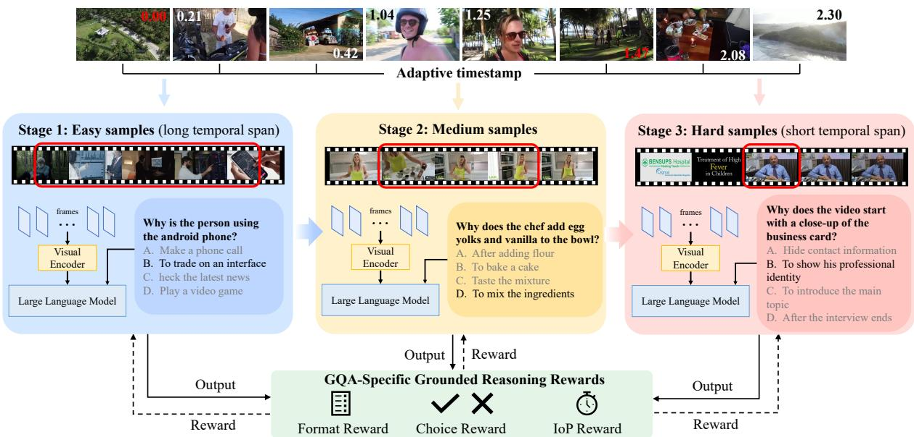  
Figure 1: Overview of LOVER method. Top: Video frames of adaptively rendered timestamps. Middle: Training sample organization according to evidence duration. Bottom: GQA rewards composing IoP, answer choice correctness, and format rewards.

## 2.3 Timestamp Representation in VideoLLMs

Most existing methods capture temporal information using temporal position embeddings (Ren et al., 2024; Lu et al., 2025; Gupta et al., 2025; Meinardus et al., 2024). Recently, NumPro (Wu et al., 2025) showed that rendering timestamps on frames can improve temporal reasoning. However, it uses fixed timestamp positions and font colors, which may occlude foreground content or blend into the background. Moreover, timestamp rendering has not been explored in RL-based temporal evidence reasoning. In contrast, our adaptive timestamp rendering dynamically adjusts timestamp positions and font colors according to frame content during RL post-training, yielding more effective temporal prompting and better performance.

## 3 Method

## 3.1 Problem and Solution Overview

Given a video V, a question Q, and candidate answers A, GQA aims to predict both the answer $A ^ { * }$ and the supporting temporal interval $\mathbf { g } = ( t _ { s } , t _ { e } )$ Following recent RL-based frameworks, the model autoregressively generates:

$$
Y = \{ \hat { t } _ { s } , \hat { t } _ { e } , \hat { A } , \hat { R } \}\tag{1}
$$

where $\hat { t } _ { s } , \hat { t } _ { e }$ denote predicted temporal boundaries, Aˆ is the predicted answer, and Rˆ denotes the reasoning process.

To solve GQA, we build upon existing MLLMs with RL post-training and propose LOVER (Fig. 1), featuring three key innovations for better performance. First, we introduce Long-to-Short Evidence Curriculum Learning, which organizes RL samples by evidence duration and progressively transfers grounded reasoning ability from long, easier evidences to short, challenging ones. Second, we design GQA Rewards, highlighting the advantage of IoP over IoU by emphasizing evidence spotting rather than strict temporal boundary alignment. Third, we propose Adaptive Timestamp Rendering, which improves timestamp perception by adaptively rendering timestamps with contentaware positions and colors on video frames. All three components are architecture-agnostic and can be seamlessly applied to different backbones for consistent gains. Details are provided in the following sections.

## 3.2 Long-to-Short Evidence Curriculum

To progressively transfer grounded reasoning ability from long to short video evidence, we introduce a Long-to-Short Evidence Curriculum. Given a temporal interval $\textbf { g } = \ ( t _ { s } , t _ { e } )$ with duration $d = t _ { e } - t _ { s } ,$ , we use d as an intrinsic measure of task difficulty: long intervals contain dense and redundant evidence with high localization tolerance, whereas short intervals provide sparse evidence that requires precise grounding. Importantly, this difficulty measure is derived directly from ground-truth annotations, without relying on model-dependent signals such as loss or confidence.

Step1: Original Video Frames

Training samples are divided into three stages according to descending evidence duration, using a 3:2:2 allocation ratio to emphasize long-evidence samples in early training. The model first learns coarse temporal alignment on long-evidence samples, and then progressively adapts to fine-grained grounding on shorter evidence.

## 3.3 GQA Rewards

Existing grounding and QA methods treat the two objectives separately and optimize IoU for grounding. IoU overly emphasizes precise time span alignment rather than evidence spotting, even though several key frames are sufficient to answer most questions (e.g., a single frame can answer most recognition questions). The noising temporal boundary annotations and increased task difficulty often lead to unintended-degree of performance improvements. Exact overlap is therefore a misaligned objective for GQA.

Under the above evidence spotting principle, we instead introduce IoP (Intersection over Prediction) as a better aligned reward for GQA. IoP directly incentivizes evidence precision rather than timespan overlap:

$$
\mathrm { I o P } ( { \hat { \mathbf { g } } } , \mathbf { g } ) = { \frac { | { \hat { \mathbf { g } } } \cap \mathbf { g } | } { | { \hat { \mathbf { g } } } | } }\tag{2}
$$

where $\hat { \bf g }$ and $\mathbf { g }$ denote the predicted and groundtruth time intervals, respectively. If a predicted interval gˆ falls into ground-truth g, it will get full reward for grounding precision.

The final GQA rewards combine grounded reasoning quality, answer correctness, and output format:

$$
\mathcal { R } = \lambda _ { 1 } \mathcal { R } _ { \mathrm { I o P } } + \lambda _ { 2 } \mathcal { R } _ { \mathrm { a n s } } + \lambda _ { 3 } \mathcal { R } _ { \mathrm { f o r m a t } }\tag{3}
$$

where ${ \mathcal { R } } _ { \mathrm { I o P } }$ serves as the grounded reasoning reward evaluating evidence spotting for $\mathrm { G Q A } , \mathcal { R } _ { \mathrm { a n s } }$ evaluates answer correctness, and $\mathcal { R } _ { \mathrm { f o r m a t } }$ encourages structured outputs.

## 3.4 Adaptive Timestamp Rendering

Recent approaches have shown the effectiveness of visual rendering for improved grounding (Yao et al., 2024b; Wu et al., 2025). Thus, we improve the temporal perception capability of MLLMs by explicitly rendering timestamps onto sampled frames:

$$
f _ { i } ^ { \prime } = \Phi ( f _ { i } , \ t _ { i } )\tag{4}
$$

where $f _ { i }$ is the sampled frame at time $t _ { i } ,$ and Φ(·) denotes timestamp rendering. However, fixed-style rendering may occlude visual content or blend into the background, weakening the visual prompting effect. We therefore introduce adaptive timestamp rendering (Fig. 2), which dynamically places timestamps in low-interference boundary regions and adaptively selects font colors based on local contrast for better readability (Detailed implementations are presented in the Appendix). This design requires no architectural modification, while providing explicit temporal cues to reduce ambiguity.

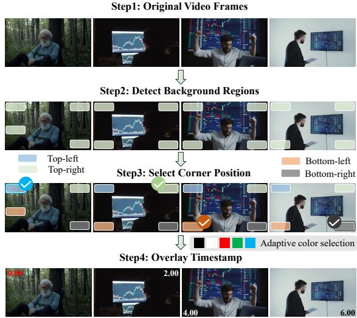  
Figure 2: Position- and color-adaptive time rendering. This figure illustrates the four-step pipeline: extracting original frames, detecting background regions, selecting low-interference corner positions, and overlaying timestamps with adaptively chosen font colors.

## 3.5 Overall Optimization

LOVER jointly integrates the long-to-short evidence curriculum, GQA Rewards, and backgroundaware adaptive timestamp rendering into a unified RL framework. The overall objective is:

$$
\operatorname* { m a x } _ { \theta } \operatorname { \mathbb { E } } _ { Y \sim \pi _ { \theta } } \left[ \mathcal { R } ( Y ) \right]\tag{5}
$$

where $\pi _ { \theta }$ denotes the policy model and $\mathcal { R } ( Y )$ denotes the combined evidence-aware reward. By jointly addressing evidence sparsity across training strategy, reward design, and input observability, LOVER enables stable and effective grounded video reasoning under reinforcement learning.

## 4 Experiments

## 4.1 Experimental Setup

Benchmarks. We evaluate LOVER on two standard GQA benchmarks. NExT-GQA (Xiao et al., 2024) contains 990 videos and 5,553 QAs, with an average video length of ∼40 seconds. Each video is associated with multiple questions involving causal reasoning (why/how) and temporal reasoning when/before/after), and the supporting evidence for different questions may overlap in time. Models are required to jointly predict answers and localize the supporting temporal interval. ReX-Time (Chen et al., 2024) includes 921 validation samples and 2,143 test samples. The videos are long, with an average length of ∼3 minutes. ReX-Time focuses on a more challenging scenario where the question and its answer evidence reside in different temporal segments of the video, necessitating cross-segment causal and temporal reasoning. For both datasets, we follow standard protocols for evaluation. Specially, Acc@GQA measures the percentages of correct answer with correct grounding (IoP≥0.5 for NExT-GQA or IoU≥0.5 for ReX-Time unless otherwise specified).We also include an additional evaluation benchmark, with its details provided in Appendix E.

<table><tr><td>Model</td><td>Size</td><td>mIoP</td><td>mIoU</td><td>IoP@.5</td><td>IoU@.5</td><td>GQA</td></tr><tr><td colspan="7">Agentic</td></tr><tr><td>LangRepo</td><td>7B</td><td>31.3</td><td>18.5</td><td>28.7</td><td>12.2</td><td>17.1</td></tr><tr><td>LLoVi (GPT-4)</td><td>-</td><td>37.3</td><td>20.0</td><td>36.9</td><td>15.3</td><td>24.3</td></tr><tr><td>VideoMind</td><td>7B</td><td>39.0</td><td>31.4</td><td>35.3</td><td>25.8</td><td>28.2</td></tr><tr><td>DeVi (Gemini-2)</td><td>-</td><td>39.7</td><td>23.6</td><td>38.9</td><td>19.5</td><td>28.9</td></tr><tr><td colspan="7">End-to-End</td></tr><tr><td>Temp(CLIP)</td><td>200M</td><td>25.7</td><td>12.1</td><td>25.5</td><td>8.9</td><td>16.0</td></tr><tr><td>SeViLA</td><td>4B</td><td>29.5</td><td>21.7</td><td>22.9</td><td>13.8</td><td>16.6</td></tr><tr><td>FrozenBiLM</td><td>890M</td><td>24.2</td><td>9.6</td><td>23.7</td><td>6.1</td><td>17.5</td></tr><tr><td>TOGA</td><td>7B</td><td>40.5</td><td>24.4</td><td>40.6</td><td>21.1</td><td>24.6</td></tr><tr><td>VideoChat-TPO</td><td>7B</td><td>35.6</td><td>27.7</td><td>32.8</td><td>23.4</td><td>25.5</td></tr><tr><td>Grounded-LLM</td><td>7B</td><td>34.5</td><td>21.1</td><td>34.4</td><td>18.0</td><td>26.7</td></tr><tr><td>VideoStream</td><td>8.3B</td><td>32.2</td><td>19.3</td><td>31.0</td><td>13.3</td><td>17.8</td></tr><tr><td>Qwen3-VL*</td><td>4B</td><td>32.1</td><td>19.4</td><td>27.3</td><td>12.5</td><td>22.1</td></tr><tr><td>Time-R1*</td><td>7B</td><td>36.0</td><td>30.7</td><td>31.9</td><td>25.3</td><td>26.1</td></tr><tr><td>LOVER(Qwen3-VL)</td><td>4B</td><td>36.2</td><td>20.4</td><td>35.3</td><td>16.7</td><td>27.5</td></tr><tr><td>LOVER(Time-R1)</td><td>7B</td><td>42.7</td><td>33.5</td><td>41.1</td><td>29.8</td><td>32.7</td></tr></table>

(a) NExT-GQA

<table><tr><td>Model</td><td>Size</td><td>mIoU</td><td>IoU@.3</td><td>IoU@.5</td><td>Acc</td><td>GQA</td></tr><tr><td colspan="7">Closed-source</td></tr><tr><td>Gemini-1.5-Pro</td><td></td><td>28.43</td><td>35.67</td><td>25.00</td><td>68.00</td><td>13.3</td></tr><tr><td>Claude-3-Opus</td><td></td><td>23.61</td><td>30.67</td><td>17.67</td><td>68.67</td><td>13.67</td></tr><tr><td>GPT-4V</td><td></td><td>26.74</td><td>33.33</td><td>22.00</td><td>63.33</td><td>16.67</td></tr><tr><td>Reka-Core</td><td></td><td>27.95</td><td>36.33</td><td>24.00</td><td>59.67</td><td>17.00</td></tr><tr><td>GPT-40</td><td></td><td>36.28</td><td>45.33</td><td>34.00</td><td>73.67</td><td>28.67</td></tr><tr><td colspan="7">Open-source</td></tr><tr><td>VTimeLLM</td><td>7B</td><td>20.14</td><td>28.84</td><td>17.41</td><td>36.16</td><td></td></tr><tr><td>TimeChat</td><td>7B</td><td>11.65</td><td>14.42</td><td>7.61</td><td>40.04</td><td></td></tr><tr><td>LITA</td><td>13B</td><td>21.49</td><td>29.49</td><td>16.29</td><td>34.44</td><td></td></tr><tr><td>Qwen3-VL*</td><td>4B</td><td>20.97</td><td>26.23</td><td>20.11</td><td>65.19</td><td>13.23</td></tr><tr><td>LOVER (Qwen3-VL)</td><td>4B</td><td>22.02</td><td>27.37</td><td>21.48</td><td>65.64</td><td>14.81</td></tr><tr><td>Time-R1*</td><td>7B</td><td>28.40</td><td>39.53</td><td>27.37</td><td>71.18</td><td>21.46</td></tr><tr><td>LOVER (Time-R1)</td><td>7B</td><td>29.39</td><td>41.64</td><td>27.37</td><td>72.93</td><td>21.87</td></tr></table>

(b) ReXTime  
Table 1: Results on NExT-GQA and ReXTime benchmarks.

Training Data. We start from Time-R1’s 2,500 temporally grounded video descriptions and reformulate them into GQA-style supervision via DeepSeek-assisted rewriting: converting each sample into a multiple-choice QA pair along with its corresponding temporal evidence interval.we partition the training set into three difficulty stages according to ground-truth evidence duration. The partition thresholds are set to 7s and 15s for short (0-7s), middle (7-15s) and long (≥15s) durations, which are determined following a training data ratio of 3:2:2.

Implementation Details. We instantiate LOVER with two recent backbones: Time-R1-7B (Wang et al., 2025c) and Qwen3-VL-4B (Bai et al., 2025). To test the reliability of LLM in data rewriting, we manually selected and examined 500 random samples, and achieved a pass rate of 96.8%. For details of the analysis on the quality of the training data, please refer to Appendix B.

## 4.2 Comparison with SOTAs

Table 1a presents results on NExT-GQA. LOVER (Time-R1) consistently outperforms all methods across different metrics. Moreover, the gains over baselines (Qwen3-VL or Time-R1) are pronounced for both temporal grounding and grounded QA. Table 1b further confirm LOVER’s steady improvements over baselines, and being the best among the open-source models. Yet, the shrunken improvements could be due to a deviated challenge that the evidences for question and answer are speared at different places of a video. Interestingly, both Tables 1a and 1b show that our method effectively improves IoU-based metrics even without IoU reward, demonstrating IoP as a reasonable or even superior alternative.

## 4.3 Analysis Across Evidence Durations

Table 2 breaks down performance across three evidence duration groups — long, medium, and short. LOVER consistently outperforms Time-R1 in Acc@GQA across all groups, and the superiority gets enhanced progressively as evidence duration decreases. The most substantial gains are observed on short-evidence samples. This pattern directly validates the design motivation of the Longto-Short Evidence Curriculum: by progressively exposing the model to harder short-evidence samples after establishing coarse alignment on longevidence ones, the model acquires more precise grounding capability where it is most needed.

Again, adaptive timestamp rendering contributes across all evidence-duration groups, with its benefit particularly evident on short-evidence samples where explicit temporal cues are most critical for disambiguating sparse visual evidence. Notably, Acc@QA remains largely stable across configurations, indicating that the grounding improvements stem from better temporal localization rather than from changes in answer generation.

<table><tr><td rowspan="2">Dataset</td><td rowspan="2">Metric</td><td colspan="3">Long</td><td colspan="3">Medium</td><td colspan="3">Short</td></tr><tr><td>Time-R1</td><td>LOVER(w/o TS)</td><td>LOVER</td><td>Time-R1</td><td>LOVER(w/o TS)</td><td>LOVER</td><td>Time-R1</td><td>LOVER(w/o TS)</td><td>LOVER</td></tr><tr><td rowspan="4">NExT-GQA</td><td>mIoP</td><td>76.06</td><td>80.48</td><td>82.06</td><td>52.49</td><td>55.79</td><td>61.13</td><td>27.06</td><td>29.77</td><td>33.23</td></tr><tr><td>IoP@0.5</td><td>80.56</td><td>85.17</td><td>85.97</td><td>57.60</td><td>60.70</td><td>65.70</td><td>19.59</td><td>23.31</td><td>29.48</td></tr><tr><td>Acc@QA</td><td>82.36</td><td>80.16</td><td>80.36</td><td>80.80</td><td>80.50</td><td>79.80</td><td>77.21</td><td>75.41</td><td>75.41</td></tr><tr><td>GQA(IoP≥0.5)</td><td>67.13</td><td>70.14</td><td>70.14</td><td>46.70</td><td>50.50</td><td>52.90</td><td>15.91</td><td>18.20</td><td>23.09</td></tr><tr><td rowspan="4">ReXTime</td><td>mIoP</td><td>53.19</td><td>62.47</td><td>60.50</td><td>39.11</td><td>39.94</td><td>46.44</td><td>25.73</td><td>25.32</td><td>29.93</td></tr><tr><td>IoP@0.5</td><td>57.42</td><td>64.37</td><td>63.86</td><td>45.38</td><td>43.85</td><td>51.15</td><td>20.24</td><td>21.67</td><td>26.19</td></tr><tr><td>Acc@QA</td><td>74.06</td><td>73.35</td><td>75.49</td><td>72.31</td><td>68.46</td><td>77.69</td><td>60.71</td><td>60.71</td><td>60.71</td></tr><tr><td>GQA(IoP≥0.5)</td><td>45.97</td><td>50.59</td><td>50.98</td><td>34.62</td><td>37.31</td><td>39.23</td><td>14.29</td><td>16.10</td><td>19.64</td></tr><tr><td rowspan="2">∆ GQA(IoP≥0.5)</td><td colspan="4">NExT-GQA</td><td colspan="4">+6.20 /+2.40</td><td colspan="2"></td></tr><tr><td colspan="2">ReXTime</td><td colspan="2">+3.01 / +0.00 +5.01 /+0.39</td><td colspan="4">+4.61 /+1.92</td><td colspan="2">+7.18 /+4.89 +5.35 /+3.54</td></tr></table>

Table 2: Performance across durations. LOVER’s gains grow progressively as evidence duration decreases, with the largest improvements on short-evidence samples. Also, adaptive timestamp rendering helps more on samples of short evidences. xx / xx: (LOVER vs. Time-R1) / (LOVER vs. its variant without timestamp (TS) rendering).

<table><tr><td rowspan="2">Methods</td><td rowspan="2">IoP</td><td rowspan="2">TS</td><td rowspan="2">CL</td><td colspan="2">GQA(IoP≥.5)</td></tr><tr><td>ReXT</td><td>NExT</td></tr><tr><td>Time-R1</td><td>x</td><td>x</td><td>x</td><td>38.04</td><td>26.06</td></tr><tr><td>Baseline</td><td>x</td><td>x</td><td>x</td><td>40.37</td><td>27.10</td></tr><tr><td>+ IoP</td><td>√</td><td>x</td><td>x</td><td>40.72</td><td>31.14</td></tr><tr><td>+ CL</td><td>x</td><td>x</td><td>√</td><td>41.43</td><td>31.76</td></tr><tr><td>+ TS (S)</td><td>√</td><td>√</td><td>x</td><td>41.54</td><td>31.17</td></tr><tr><td>+ TS (C)</td><td>√</td><td>√</td><td>x</td><td>41.96</td><td>31.72</td></tr><tr><td>+ TS (P)</td><td>√</td><td>√</td><td>x</td><td>41.87</td><td>31.67</td></tr><tr><td>+ TS (P, C)</td><td>√</td><td>√</td><td>x</td><td>42.36</td><td>32.02</td></tr><tr><td>+ CL</td><td>√</td><td>x</td><td>√</td><td>41.77</td><td>32.11</td></tr><tr><td>LOVER</td><td>√</td><td>√</td><td>√</td><td>43.06</td><td>32.69</td></tr></table>

Table 3: Ablation study of the three innovations in LOVER. Baseline: Finetune Time-R1 with reformulated GQA data with a reward combination of tIoU, answer correctness, and format. TS(S): fixed timestamp rendering. TS(C)/(P): adaptive timestamp color/position across frames. CL: Curriculum learning.

## 4.4 Ablation Study

Table 3 isolates the contribution of each LOVER component on both benchmarks. All ablations are conducted on the Time-R1-7B backbone, with each component added incrementally to evaluate its independent and combined effect.

The ablation results demonstrate that all three proposed components contribute consistently to GQA performance, with the full LOVER achieving the best results on both ReXTime and NExT-GQA. Starting from the finetuned baseline, introducing the IoP reward yields the remarkable improvement on NExT-GQA (+4%), highlighting the importance of evidence spotting over strict temporal overlap for grounded QA. Adding timestamp rendering (TS) further improves performance across both benchmarks, confirming the effectiveness of explicit temporal visual prompting. Among different variants, adaptive timestamp rendering consistently outperforms fixed rendering, and jointly adaptive position and color achieves the best performance, indicating that content-aware rendering better preserves timestamp visibility under diverse visual scenes. Curriculum learning (CL) also brings additional gains, particularly on NExT-GQA, validating the effectiveness of progressively transferring reasoning capability from long to short evidence intervals.

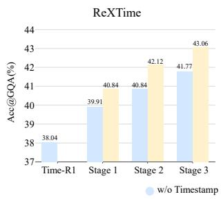

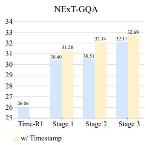

(a) Time-R1 backbone.  
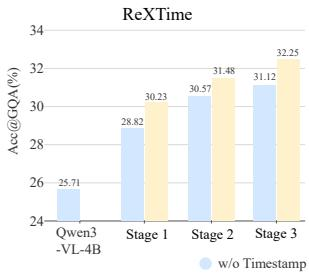

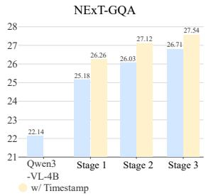  
(b) Qwen3-VL backbone.  
Figure 3: Acc@GQA across curriculum stages. The GQA performance consistently improves during curriculum learning, while adaptive timestamp rendering brings additional gains at each stage.

<table><tr><td>CL Schedule</td><td>mIoP</td><td>mIoU</td><td>IoP@0.5</td><td>IoU@0.5</td><td>Acc@QA</td><td>Acc@GQA</td></tr><tr><td>S3</td><td>47.44</td><td>31.30</td><td>49.36</td><td>29.99</td><td>69.31</td><td>37.92</td></tr><tr><td>S3-S2</td><td>47.78</td><td>28.36</td><td>48.77</td><td>26.14</td><td>70.83</td><td>37.92</td></tr><tr><td>S3-S2-S1</td><td>49.49</td><td>31.36</td><td>50.64</td><td>29.17</td><td>71.18</td><td>39.56</td></tr><tr><td>S2</td><td>48.78</td><td>31.37</td><td>48.77</td><td>28.47</td><td>71.76</td><td>38.62</td></tr><tr><td>S2-S1</td><td>49.56</td><td>31.21</td><td>51.11</td><td>30.81</td><td>73.75</td><td>40.72</td></tr><tr><td>S2-S1-S3</td><td>51.16</td><td>33.49</td><td>53.44</td><td>33.02</td><td>70.95</td><td>40.96</td></tr><tr><td>S1-S2-S3</td><td>51.60</td><td>29.39</td><td>53.92</td><td>27.37</td><td>72.93</td><td>43.06</td></tr></table>

Table 4: Analysis of curriculum ordering on ReXTime. The results demonstrate that the forward long-to-short ordering (S1→S2→S3) is critical, as the direction of difficulty progression (not merely stage coverage), determines grounded reasoning performance.
<table><tr><td rowspan="3">Question Type</td><td colspan="3">Causal</td><td colspan="4">Temporal</td></tr><tr><td>Why</td><td>How</td><td>Avg</td><td>Present</td><td>Past</td><td>Future</td><td>Avg</td></tr><tr><td>TOGA (Gupta et al., 2025)</td><td>26.10</td><td>27.40</td><td>26.41</td><td>23.40</td><td>18.00</td><td>18.10</td><td>20.05</td></tr><tr><td>Time-R1 (Wang et al., 2025c)</td><td>28.62</td><td>22.49</td><td>27.11</td><td>27.11</td><td>25.81</td><td>19.84</td><td>22.77</td></tr><tr><td>LOVER (Ours)</td><td>35.02</td><td>30.15</td><td>33.83</td><td>32.28</td><td>30.11</td><td>27.14</td><td>29.17</td></tr></table>

Table 5: Acc@GQA comparison across question types on NExT-GQA. LOVER consistently outperforms baselines across all question types, with the largest gain on future-oriented temporal reasoning.

## 4.5 Study of Curriculum Stages

Figure 3 shows the stage-wise Acc@GQA results. On both Time-R1-7B and Qwen3-VL-4B, performance improves steadily from stage 1 to stage 3, yielding over 11% gain on ReXTime and 12% on NExT-GQA compared with the corresponding baselines. The consistent trend across backbones demonstrates that the Long-to-Short Evidence Curriculum effectively transfers grounded reasoning ability from easier long-evidence samples to harder short-evidence ones. Adaptive timestamp rendering further provides consistent gains at every stage. In all settings, models with adaptive timestamps outperform those without rendering, indicating that explicit temporal cues complement curriculum-based training and jointly improve evidence grounding.

## 4.6 Reward-based vs. Evidence-based Curriculum

We implement a reward-based curriculum using the same GQA rewards as LOVER (IoP, format, and choice rewards). We rank samples by zero-shot reward scores and train progressively from highto low-reward samples. Table 6 shows this strategy improves IoP-related performance on NExT-GQA, but it underperforms our evidence-duration curriculum and degrades IoU-related metrics on ReXTime, indicating its sensitivity to reward design and potential optimization bias. In contrast, our curriculum relies solely on evidence duration as an intrinsic difficulty measure, making it more robust and model-agnostic.

<table><tr><td colspan="6">NExT-GQA</td></tr><tr><td>Method</td><td>mIoP</td><td>mIoU</td><td>IoP@0.5</td><td>IoU@0.5</td><td>Acc@GQA</td></tr><tr><td>baseline</td><td>36.0</td><td>30.7</td><td>31.9</td><td>25.3</td><td>26.1</td></tr><tr><td>Rewards</td><td>41.2</td><td>33.4</td><td>39.0</td><td>29.8</td><td>30.5</td></tr><tr><td>evidence duration</td><td>42.7</td><td>33.5</td><td>41.1</td><td>29.8</td><td>32.7</td></tr><tr><td colspan="6">ReXTime</td></tr><tr><td>Method</td><td>mIoU</td><td>IoU@0.3</td><td>IoU@0.5</td><td>Acc</td><td>Acc@GQA</td></tr><tr><td>baseline</td><td>28.40</td><td>39.53</td><td>27.37</td><td>71.18</td><td>21.46</td></tr><tr><td>Rewards</td><td>28.13</td><td>41.28</td><td>25.01</td><td>69.25</td><td>20.36</td></tr><tr><td>evidence duration</td><td>29.39</td><td>41.64</td><td>27.37</td><td>72.93</td><td>21.87</td></tr></table>

Table 6: An effectiveness comparison experiment between curriculum learning based on rewards and curriculum learning based on evidence duration.

<table><tr><td>Method</td><td>Time-R1</td><td>Stage 1</td><td>Stage 2</td><td>Stage 3</td></tr><tr><td>Relative</td><td>26.06</td><td>31.55</td><td>32.03</td><td>32.17</td></tr><tr><td>Absolute</td><td>26.06</td><td>31.28</td><td>32.14</td><td>32.69</td></tr></table>

Table 7: Comparison of curriculum learning based on absolute and relative evidence duration in terms of Acc@GQA on NExT-GQA.

## 4.7 Absolute vs. Relative Evidence Duration

In order to explore the scheme for defining the difficulty of evidence-based curriculum learning, we compared two curriculum strategies based on the duration of relative evidence and absolute evidence. The relative strategy was based on the proportion of the evidence duration to the total video duration of the sample, while the absolute strategy directly used the duration of the evidence segments as the difficulty measurement indicator.

Why is the woman selecting and preparing flowers to be put in the vase?  
What does the blonde man do before the group settles in the resort area?  
  
What does the man do after engaging in conversation and playful behavior with the woman?

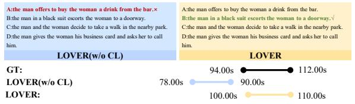

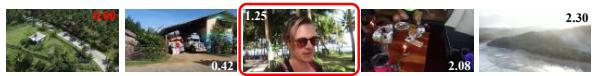

Why did the girl reach out her left hand after she looked at it?  
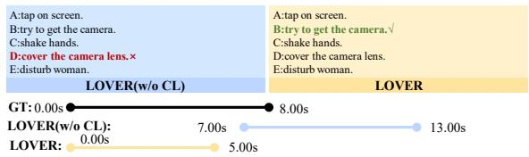

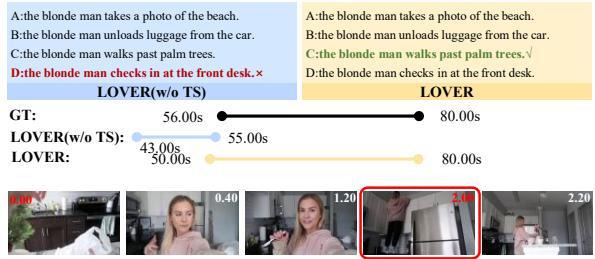

How does the person interact with the baby at the beginning?  
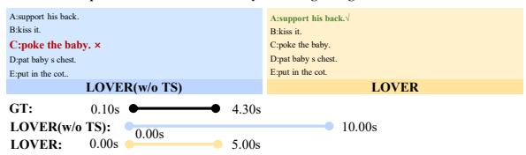

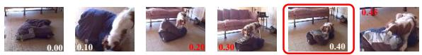

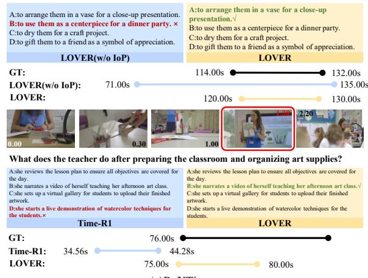  
(a)ReXTime

What does the dog do after dropping the pillow from its mouth? TN  
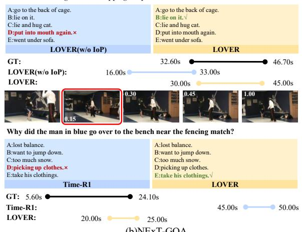  
(b)NExT-GQA  
Figure 4: GQA result visualization. The timestamps overlaid on video frames are formatted as MM.SS, while the temporal intervals displayed below are in seconds. LOVER demonstrates stronger evidence discovery capability than its ablated variants and Time-R1, producing temporal predictions that more accurately cover the ground-truth evidence regions and thereby brings more accurate answer.

Table 7 shows that during the curriculum training process, both strategies continuously improved performance based on the Time-R1 baseline. However, the relative strategy improved by 6.11% after three stages, while the absolute strategy improved by 6.63%. In contrast, the absolute evidence duration was more effective in estimating the difficulty of curriculum learning.

## 4.8 Effect of Curriculum Ordering

Table 4 analyzes the effect of curriculum ordering on ReXTime. Among all evaluated schedules, the forward ordering S1→S2→S3 — progressing from long to short evidence — consistently achieves the best performance across both grounding and grounded QA metrics. This result is not merely attributable to data coverage: the reverse schedule S3→S2→S1 exposes the model to the same three stages yet performs substantially worse, demonstrating that the ordering of difficulty, rather than stage inclusion alone, is the critical factor.

Training exclusively on short-evidence samples (S3) yields notably inferior grounded reasoning, suggesting that the model fails to establish the coarse temporal alignment necessary for reliable evidence localization when hard samples are introduced without prerequisite exposure to easier ones. Schedules that begin from medium-evidence samples (S2-first) show intermediate performance, further supporting the view that grounded reasoning ability is most stably acquired through a gradual transition from dense, redundant evidence to sparse, precisely localized evidence. Taken together, these results validate the long-to-short design principle underlying LOVER’s curriculum: effective sparseevidence reasoning depends on first building coarse alignment on long-evidence samples before adapting to finer-grained temporal localization.

## 5 Question-Type Analysis

Table 5 reports Acc@GQA across question categories on NExT-GQA. LOVER significantly improves over Time-R1 across all question types, with the largest gain in Future questions (“what happens next?”) (+7.3%, from 19.8% to 27.1%). Future reasoning demands strong causal reasoning capability where precise evidence grounding plays pivotal role. This conclusion is also consolidated by the consistent gains in causal categories (‘Why’, ‘How’). Thus, the strong improvements here have validated the strength of LOVER.

## 5.1 Qualitative Analysis

Figure 4 presents qualitative comparisons across ablation configurations on ReXTime and NExT-GQA. Without IoP reward (The 1st row), the model produces temporal predictions that deviate from the ground-truth evidence region, while the full LOVER recovers the correct evidence span and answers correctly. Without curriculum learning (The 2nd row), the model anchors to irrelevant segments, whereas LOVER with curriculum training identifies the correct evidence region across varying temporal difficulty. Removing timestamp rendering (The 3rd row) leads to inaccurate boundary prediction despite visually identifiable evidence, confirming that explicit temporal cues contribute to more reliable evidence spotting. Finally, compared to Time-R1, LOVER consistently discovers the supporting evidence in both long- and shortevidence cases, validating the overall effectiveness of the proposed framework.

## 6 Conclusion

We present LOVER, an RL-based post-training framework for grounded video QA that addresses the imbalanced difficulty of temporal evidence and the misalignment between existing reward objectives and GQA requirements. Through three architecture-agnostic components, namely long-toshort evidence curriculum, GQA-specific IoP rewards, and adaptive timestamp rendering, LOVER consistently improves grounded reasoning across backbones and benchmarks, with the most pronounced gains on short-evidence samples where existing methods fall short. With these efforts, we hope our designs and superior results help advance grounded reasoning for trustable MLLMs.

## Limitations

LOVER currently focuses primarily on temporal grounding over visual frames while overlooking auxiliary modalities such as audio and subtitles. Although visual evidence is sufficient for many grounding scenarios, some questions intrinsically rely on speech content, environmental sounds, or textual cues that cannot be fully inferred from frames alone. Extending LOVER toward multimodal evidence grounding may further improve grounded reasoning performance, particularly for audio-dependent causal and temporal questions.

Moreover, the current framework is evaluated mainly under multiple-choice GQA setting. Its effectiveness for open-ended GQA remains unexplored. Future work may investigate how to extend evidence-aware reward design from discrete answer selection to generative answer evaluation, enabling more flexible grounded reasoning and free-form response generation.

## Acknowledgments

This research is partly supported by the advanced computing resources provided by the Supercomputing Center of USTC.

## References

Shuai Bai, Yuxuan Cai, Ruizhe Chen, Keqin Chen, Xionghui Chen, Zesen Cheng, Lianghao Deng, Wei Ding, Chang Gao, Chunjiang Ge, and 1 others. 2025. Qwen3-vl technical report. arXiv preprint arXiv:2511.21631.

Yoshua Bengio, Jérôme Louradour, Ronan Collobert, and Jason Weston. 2009. Curriculum learning. In Proceedings of the 26th annual international conference on machine learning, pages 41–48.

Guo Chen, Yicheng Liu, Yifei Huang, Baoqi Pei, Jilan Xu, Yuping He, Tong Lu, Yali Wang, and Limin Wang. 2025. Cg-bench: Clue-grounded question answering benchmark for long video understanding. In International Conference on Learning Representations, volume 2025, pages 45647–45682.

Jr-Jen Chen, Yu-Chien Liao, Hsi-Che Lin, Yu-Chu Yu, Yen-Chun Chen, and Frank Wang. 2024. Rextime: A benchmark suite for reasoning-across-time in videos. Advances in Neural Information Processing Systems, 37:28662–28673.

Jisheng Dang, Huilin Song, Junbin Xiao, Bimei Wang, Han Peng, Haoxuan Li, Xun Yang, Meng Wang, and Tat-Seng Chua. 2025. Mupa: Towards multi-path agentic reasoning for grounded video question answering. arXiv preprint arXiv:2506.18071.

Lu Dong, Haiyu Zhang, Han Lin, Ziang Yan, Xiangyu Zeng, Hongjie Zhang, Yifei Huang, Yi Wang, Zhen-Hua Ling, Limin Wang, and 1 others. 2025. Videotgr1: Boosting video temporal grounding via curriculum reinforcement learning on reflected boundary annotations. arXiv preprint arXiv:2510.23397.

Kaituo Feng, Kaixiong Gong, Bohao Li, Zonghao Guo, Yibing Wang, Tianshuo Peng, Junfei Wu, Xiaoying Zhang, Benyou Wang, and Xiangyu Yue. 2025. Video-r1: Reinforcing video reasoning in mllms. arXiv preprint arXiv:2503.21776.

Samir Yitzhak Gadre, Gabriel Ilharco, Alex Fang, Jonathan Hayase, Georgios Smyrnis, Thao Nguyen, Ryan Marten, Mitchell Wortsman, Dhruba Ghosh, Jieyu Zhang, and 1 others. 2023. Datacomp: In search of the next generation of multimodal datasets. Advances in Neural Information Processing Systems, 36:27092–27112.

Ayush Gupta, Anirban Roy, Rama Chellappa, Nathaniel D Bastian, Alvaro Velasquez, and Susmit Jha. 2025. Toga: Temporally grounded open-ended video qa with weak supervision. In Proceedings of the IEEE/CVF International Conference on Computer Vision, pages 23593–23603.

Hongbo Jin, Kuanwei Lin, Wenhao Zhang, Yichen Jin, and Ge Li. 2025. Videocurl: Video curriculum reinforcement learning with orthogonal difficulty decomposition. arXiv preprint arXiv:2601.00887.

Minjoon Jung, Junbin Xiao, Byoung-Tak Zhang, and Angela Yao. 2025. On the consistency of video large language models in temporal comprehension. In 2025 IEEE/CVF Conference on Computer Vision and Pattern Recognition (CVPR), pages 13713– 13722. IEEE.

Jaewoo Lee, Boyang Li, and Sung Ju Hwang. 2024. Concept-skill transferability-based data selection for large vision-language models. In Proceedings of the 2024 Conference on Empirical Methods in Natural Language Processing, pages 5060–5080.

Bo Li, Yuanhan Zhang, Dong Guo, Renrui Zhang, Feng Li, Hao Zhang, Kaichen Zhang, Peiyuan Zhang, Yanwei Li, Ziwei Liu, and 1 others. 2024. Llavaonevision: Easy visual task transfer. arXiv preprint arXiv:2408.03326.

Haopeng Li, Qiuhong Ke, Mingming Gong, and Tom Drummond. 2025a. Answering from sure to uncertain: Uncertainty-aware curriculum learning for video question answering. BMVC.

KunChang Li, Yinan He, Yi Wang, Yizhuo Li, Wenhai Wang, Ping Luo, Yali Wang, Limin Wang, and Yu Qiao. 2025b. Videochat: Chat-centric video understanding. Science China Information Sciences, 68(10):200102.

Ji Lin, Hongxu Yin, Wei Ping, Pavlo Molchanov, Mohammad Shoeybi, and Song Han. 2024. Vila: On pretraining for visual language models. In Proceedings of the IEEE/CVF conference on computer vision and pattern recognition, pages 26689–26699.

Jiajun Liu, Yibing Wang, Hanghang Ma, Xiaoping Wu, Xiaoqi Ma, Xiaoming Wei, Jianbin Jiao, Enhua Wu, and Jie Hu. 2026. Kangaroo: A powerful videolanguage model supporting long-context video input: J. liu et al. International Journal of Computer Vision, 134(3):114.

Ruyang Liu, Chen Li, Haoran Tang, Yixiao Ge, Ying Shan, and Ge Li. 2024. St-llm: Large language models are effective temporal learners. In European Conference on Computer Vision, pages 1– 18. Springer.

Ye Liu, Kevin Qinghong Lin, Chang Wen Chen, and Mike Zheng Shou. 2025. Videomind: A chain-oflora agent for long video reasoning. arXiv preprint arXiv:2503.13444.

Yujie Lu, Yale Song, William Wang, Lorenzo Torresani, and Tushar Nagarajan. 2025. Vited: Video temporal evidence distillation. In Proceedings of the IEEE/CVF Conference on Computer Vision and Pattern Recognition, pages 8501–8511.

Yiwei Ma, Guohai Xu, Xiaoshuai Sun, Jiayi Ji, Jie Lou, Debing Zhang, and Rongrong Ji. 2025. Mllmselector: Necessity and diversity-driven high-value data selection for enhanced visual instruction tuning. arXiv preprint arXiv:2503.20502.

Muhammad Maaz, Hanoona Rasheed, Salman Khan, and Fahad Khan. 2024. Video-chatgpt: Towards detailed video understanding via large vision and language models. In Proceedings of the 62nd Annual Meeting of the Association for Computational Linguistics (Volume 1: Long Papers), pages 12585– 12602.

Boris Meinardus, Hector Rodriguez, Anil Batra, Anna Rohrbach, and Marcus Rohrbach. 2024. Chrono: A simple blueprint for representing time in mllms. arXiv preprint arXiv:2406.18113.

Juhong Min, Shyamal Buch, Arsha Nagrani, Minsu Cho, and Cordelia Schmid. 2024. Morevqa: Exploring modular reasoning models for video question answering. In Proceedings of the IEEE/CVF Conference on Computer Vision and Pattern Recognition, pages 13235–13245.

Shuhuai Ren, Linli Yao, Shicheng Li, Xu Sun, and Lu Hou. 2024. Timechat: A timesensitive multimodal large language model for long video understanding. In Proceedings of the IEEE/CVF Conference on Computer Vision and Pattern Recognition, pages 14313–14323.

Yudi Shi, Shangzhe Di, Qirui Chen, and Weidi Xie. 2025. Enhancing video-llm reasoning via agent-of-thoughts distillation. In Proceedings of the Computer Vision and Pattern Recognition Conference, pages 8523–8533.

Haibo Wang, Zhiyang Xu, Yu Cheng, Shizhe Diao, Yufan Zhou, Yixin Cao, Qifan Wang, Weifeng Ge, and Lifu Huang. 2024. Grounded-videollm: Sharpening fine-grained temporal grounding in video large language models. arXiv preprint arXiv:2410.03290.

Weiyun Wang, Zhangwei Gao, Lixin Gu, Hengjun Pu, Long Cui, Xingguang Wei, Zhaoyang Liu, Linglin Jing, Shenglong Ye, Jie Shao, and 1 others. 2025a. Internvl3. 5: Advancing open-source multimodal models in versatility, reasoning, and efficiency. arXiv preprint arXiv:2508.18265.

Xin Wang, Yudong Chen, and Wenwu Zhu. 2021. A survey on curriculum learning. IEEE transactions on pattern analysis and machine intelligence, 44(9):4555–4576.

Xiyao Wang, Zhengyuan Yang, Chao Feng, Hongjin Lu, Linjie Li, Chung-Ching Lin, Kevin Lin, Furong Huang, and Lijuan Wang. 2025b. Sota with less: Mcts-guided sample selection for data-efficient visual reasoning self-improvement. arXiv preprint arXiv:2504.07934.

Ye Wang, Ziheng Wang, Boshen Xu, Yang Du, Kejun Lin, Zihan Xiao, Zihao Yue, Jianzhong Ju, Liang Zhang, Dingyi Yang, and 1 others. 2025c. Time-r1: Post-training large vision language model for temporal video grounding. arXiv preprint arXiv:2503.13377.

Yongliang Wu, Xinting Hu, Yuyang Sun, Yizhou Zhou, Wenbo Zhu, Fengyun Rao, Bernt Schiele, and Xu Yang. 2025. Number it: Temporal grounding videos like flipping manga. In Proceedings of the Computer Vision and Pattern Recognition Conference, pages 13754–13765.

Junbin Xiao, Qingyun Li, Yusen Yang, Liang Qiu, and Angela Yao. 2025. Unleashing the power of llms for medical video answer localization. In International Conference on Medical Image Computing and Computer-Assisted Intervention, pages 669–679. Springer.

Junbin Xiao, Angela Yao, Yicong Li, and Tat-Seng Chua. 2024. Can i trust your answer? visually grounded video question answering. In Proceedings of the IEEE/CVF Conference on Computer Vision and Pattern Recognition, pages 13204–13214.

Ziang Yan, Xinhao Li, Yinan He, Zhengrong Yue, Xiangyu Zeng, Yali Wang, Yu Qiao, Limin Wang, and Yi Wang. 2025. Videochat-r1. 5: Visual test-time scaling to reinforce multimodal reasoning by iterative perception. arXiv preprint arXiv:2509.21100.

Yuan Yao, Tianyu Yu, Ao Zhang, Chongyi Wang, Junbo Cui, Hongji Zhu, Tianchi Cai, Haoyu Li, Weilin Zhao, Zhihui He, and 1 others. 2024a. Minicpm-v: A gpt-4v level mllm on your phone. arXiv preprint arXiv:2408.01800.

Yuan Yao, Ao Zhang, Zhengyan Zhang, Zhiyuan Liu, Tat-Seng Chua, and Maosong Sun. 2024b. Cpt: Colorful prompt tuning for pre-trained vision-language models. AI Open, 5:30–38.

Wenzheng Zeng, Difei Gao, Mike Zheng Shou, and Hwee Tou Ng. 2025a. Factorized learning for temporally grounded video-language models. In Proceedings of the IEEE/CVF International Conference on Computer Vision, pages 20683– 20693.

Xiangyu Zeng, Kunchang Li, Chenting Wang, Xinhao Li, Tianxiang Jiang, Ziang Yan, Songze Li, Yansong Shi, Zhengrong Yue, Yi Wang, and 1 others. 2025b. Timesuite: Improving mllms for long video understanding via grounded tuning. In International Conference on Learning Representations, volume 2025, pages 38057–38081.

Ce Zhang, Taixi Lu, Md Mohaiminul Islam, Ziyang Wang, Shoubin Yu, Mohit Bansal, and Gedas Bertasius. 2024a. A simple llm framework for long-range video question-answering. In Proceedings of the 2024 Conference on Empirical Methods in Natural Language Processing, pages 21715–21737.

Hang Zhang, Xin Li, and Lidong Bing. 2023. Videollama: An instruction-tuned audio-visual language model for video understanding. In Proceedings of the 2023 conference on empirical methods in natural language processing: system demonstrations, pages 543–553.

Peiyuan Zhang, Kaichen Zhang, Bo Li, Guangtao Zeng, Jingkang Yang, Yuanhan Zhang, Ziyue Wang, Haoran Tan, Chunyuan Li, and Ziwei Liu. 2024b. Long context transfer from language to vision. arXiv preprint arXiv:2406.16852.

Yuanhan Zhang, Jinming Wu, Wei Li, Bo Li, Zejun Ma, Ziwei Liu, and Chunyuan Li. 2024c. Llava-video: Video instruction tuning with synthetic data. arXiv preprint arXiv:2410.02713.

## A Prompt Templates

We provide the prompt templates used for training data construction and inference to ensure full reproducibility of LOVER.

## A.1 Question-Answer Pair Generation

Figure 5 shows the prompt template for reformatting Time-R1 training data into GQA-style supervision via DeepSeek. The template enforces causal or temporal keywords and structured multiple-choice formatting.

## A.2 Inference Prompt

Figures 6 and 7 show the inference templates without and with adaptive timestamp rendering, respectively. Both require the model to output reasoning in <think> tags, the predicted interval in <answer> tags, and the final choice in <choice> tags. The timestamp-enabled template additionally instructs the model to exploit rendered frame-level time references during grounded reasoning.

## B Data Quality Verification

Since our training data is constructed by converting textual descriptions into grounded question-answer pairs using LLMs, we further evaluate the quality of the generated annotations. We randomly sampled 500 QA instances (20% of the dataset) and manually inspected whether the questions require video understanding, whether the distractors are reasonable, and whether the annotated temporal intervals are correct.

The inspection process took approximately 10 hours and achieved an acceptance rate of 96.8%. This high-quality ratio is mainly attributed to the careful filtering process of the original Time-R1 dataset, where the source video descriptions were already manually curated. In our data construction pipeline, the LLM is only used to transform existing textual descriptions into GQA-style questions rather than generating new video content.

Furthermore, LOVER consistently improves performance despite the remaining noise in automatically generated annotations, demonstrating the robustness of our evidence-based curriculum learning framework under imperfect supervision.

## C Implementation Details of Adaptive Timestamp Rendering

This section describes the implementation of the adaptive timestamp rendering algorithm, which processes each sampled video frame independently through four sequential steps.

<table><tr><td>Models</td><td>Acc@QA</td><td>Acc@GQA</td></tr><tr><td>REXTIME</td><td></td><td></td></tr><tr><td>Qwen3-VL-4B</td><td>65.19</td><td>25.71</td></tr><tr><td>Stage 1</td><td>65.68</td><td>28.82</td></tr><tr><td>Stage 1</td><td>65.61</td><td>30.23</td></tr><tr><td>Stage 2</td><td>65.72</td><td>30.57</td></tr><tr><td>Stage 2</td><td>65.03</td><td>31.48</td></tr><tr><td>Stage 3</td><td>65.57</td><td>31.12</td></tr><tr><td>Stage 3</td><td>65.49</td><td>32.35</td></tr><tr><td>NExT-GQA</td><td></td><td></td></tr><tr><td>Qwen3-VL-4B</td><td>68.45</td><td>22.14</td></tr><tr><td>Stage 1</td><td>68.91</td><td>25.18</td></tr><tr><td>Stage 1</td><td>68.36</td><td>26.26</td></tr><tr><td>Stage 2</td><td>68.13</td><td>26.03</td></tr><tr><td>Stage 2</td><td>68.14</td><td>27.12</td></tr><tr><td>Stage 3</td><td>68.63</td><td>26.71</td></tr><tr><td>Stage 3</td><td>68.59</td><td>27.54</td></tr></table>

Table 8: Stage-wise Acc@QA and Acc@GQA of Qwen3-VL-4B on REXTIME and NExT-GQA across curriculum stages. Shaded rows indicate settings with adaptive timestamp rendering; plain rows are without timestamp rendering.This table demonstrates that Acc@GQA improves monotonically across stages while Acc@QA remains stable, confirming that curriculum training enhances temporal localization without compromising answer generation accuracy.

Step 1: Background Region Detection. Each video frame is first segmented into three color clusters via K-Means clustering on pixel RGB values. The cluster with the largest pixel count is treated as the dominant background. Connected component analysis is then applied to this cluster mask, and the largest connected component is retained as the primary background region, filtering out small isolated patches.

Step 2: Corner Position Selection. For each of the four frame corners (top-left, top-right, bottom-left, bottom-right), we identify the background pixel geometrically closest to that corner. The corner whose nearest background pixel lies closest to the actual frame corner is selected as the timestamp placement location, ensuring the timestamp occupies a corner-aligned background region with minimal foreground occlusion.

Step 3: Adaptive Font Color Selection. The font color is chosen from a fixed candidate set black, white, red, green, blue based on perceptual luminance contrast. The brightness of the background pixel at the selected position is computed via the standard luminance formula, and the candidate color with the maximum absolute brightness difference is selected, ensuring readability against varying background appearances.

<table><tr><td>Dataset</td><td>Run</td><td>mIoP</td><td>mIoU</td><td>IoP@0.5</td><td>IoU@0.5</td><td>Acc@GQA</td></tr><tr><td rowspan="4">NExT-GQA</td><td>Seed 1</td><td>42.7</td><td>33.5</td><td>41.1</td><td>29.7</td><td>32.7</td></tr><tr><td>Seed 2</td><td>42.8</td><td>33.7</td><td>41.3</td><td>29.9</td><td>32.8</td></tr><tr><td>Seed 3</td><td>42.7</td><td>33.4</td><td>41.1</td><td>29.8</td><td>32.7</td></tr><tr><td>Mean±Std</td><td>42.7 ± 0.0</td><td> ${ \bf 3 3 . 5 \pm 0 . 1 }$ </td><td> ${ \bf 4 1 . 2 \pm 0 . 1 }$ </td><td> ${ \bf 2 9 . 8 \pm 0 . 0 }$ </td><td>32.7 ± 0.0</td></tr></table>

<table><tr><td>Dataset</td><td>Run</td><td>mIoU</td><td>IoU@0.3</td><td>IoU@0.5</td><td>Acc</td><td>Acc@GQA</td></tr><tr><td rowspan="4">ReXTime</td><td>Seed 1</td><td>29.39</td><td>41.64</td><td>27.37</td><td>72.93</td><td>21.87</td></tr><tr><td>Seed 2</td><td>29.18</td><td>41.26</td><td>27.15</td><td>72.87</td><td>21.73</td></tr><tr><td>Seed 3</td><td>29.41</td><td>41.61</td><td>27.42</td><td>73.03</td><td>21.89</td></tr><tr><td>Mean±Std</td><td> ${ \bf 2 9 . 3 3 \pm 0 . 1 0 }$ </td><td> ${ \bf 4 1 . 5 0 \pm 0 . 1 7 }$ </td><td> ${ \bf 2 7 . 3 1 \pm 0 . 1 2 }$ </td><td> ${ \bf 7 2 . 9 4 \pm 0 . 0 7 }$ </td><td> ${ \bf 2 1 . 8 3 \pm 0 . 0 7 }$ </td></tr></table>

Table 9: Performance variance of LOVER under different random seeds on NExT-GQA and ReXTime. Mean and standard deviation are reported over three independent runs.

<table><tr><td>Model</td><td>mIoU ↑</td><td>Rec.@IoU ↑</td><td>Acc.@IoU ↑</td></tr><tr><td>Human</td><td>35.5</td><td>51.2</td><td>29.8</td></tr><tr><td>Video-LLAVA (7B) (Li et al., 2024)</td><td>1.13</td><td>1.96</td><td>0.59</td></tr><tr><td>VideoLLAMA (7B) (Zhang et al., 2023)</td><td>1.21</td><td>1.87</td><td>0.84</td></tr><tr><td>VideoChat2 (7B) (Li et al., 2025b)</td><td>1.28</td><td>1.98</td><td>0.94</td></tr><tr><td>ST-LLM (7B) (Liu et al., 2024)</td><td>2.23</td><td>2.86</td><td>1.13</td></tr><tr><td>ViLA (8B) (Lin et al., 2024)</td><td>1.56</td><td>2.89</td><td>1.35</td></tr><tr><td>MiniCPM-v2.6 (8B) (Yao et al., 2024a)</td><td>2.35</td><td>2.61</td><td>1.04</td></tr><tr><td>LongVA (7B) (Zhang et al., 2024b)</td><td>2.94</td><td>3.86</td><td>1.78</td></tr><tr><td>LLaVA-OneVision (7B) (Li et al., 2024)</td><td>1.63</td><td>1.78</td><td>1.08</td></tr><tr><td>Kangaroo (8B) (Liu et al., 2026)</td><td>2.56</td><td>2.81</td><td>1.94</td></tr><tr><td>Time-R1(7B) (Wang et al., 2025c)</td><td>2.68</td><td>3.14</td><td>1.47</td></tr><tr><td>LOVER(7B)</td><td>3.16</td><td>3.88</td><td>2.23</td></tr></table>

Table 10: Results on CG-Bench benchmarks. mIoU denotes the mean temporal IoU over all samples; Rec.@IoU is the average recall under IoU thresholds from 0.1 to 0.5; Acc.@IoU requires both a correct answer and a temporal localization IoU above the corresponding threshold.

Step 4: Timestamp Overlay. The real-world timestamp for each frame is computed from the segment start time and sampled frame rate, formatted as MM.SS, and rendered onto the frame using antialiased text. The rendered frame is subsequently passed to the visual encoder at the spatially resized resolution consumed by the model.

## D Stage-wise Results for Qwen3-VL-4B

Table 8 supplements the main paper results by reporting Acc@QA alongside Acc@GQA for Qwen3-VL-4B across curriculum stages, providing a more complete picture of how grounding and answering evolve jointly during training.

The key observation is that Acc@GQA improves monotonically across all three curriculum stages on both benchmarks, with and without adaptive timestamp rendering, mirroring the trend reported for

Time-R1-7B in Figures 3a and 3b. This consistency across backbones of different scales confirms the architecture-agnostic nature of the Long-to-Short Evidence Curriculum. Adaptive timestamp rendering provides additional gains at every stage, further corroborating the complementarity between curriculum training and explicit temporal cues established in the main ablation study (Table 3).

Crucially, Acc@QA remains largely stable throughout training, indicating that the observed Acc@GQA improvements stem from more accurate temporal localization rather than shifts in answer generation. This decoupling supports the central claim of LOVER: that evidence-aware curriculum design and IoP-based reward optimization improve grounded reasoning without compromising QA accuracy.

## E Evaluation on CG-Bench

To further evaluate the generalization ability of LOVER on long-video understanding, we extend our experiments to CG-Bench, a challenging cluegrounded question answering benchmark. The benchmark provides 12,129 question-answer pairs across perception, reasoning, and hallucination evaluation settings. Notably, all videos are longer than 30 minutes, making CG-Bench a challenging testbed for long-context video reasoning.

As shown in Table 10, LOVER achieves the best performance among all compared 7B/8B opensource models. Specifically, LOVER obtains 3.16 mIoU, 3.88 Rec.@IoU, and 2.23 Acc.@IoU, outperforming previous strong baselines such as Time-R1 and LongVA. These results demonstrate that our evidence-aware curriculum learning and temporal grounding strategy generalize effectively to challenging long-video scenarios.

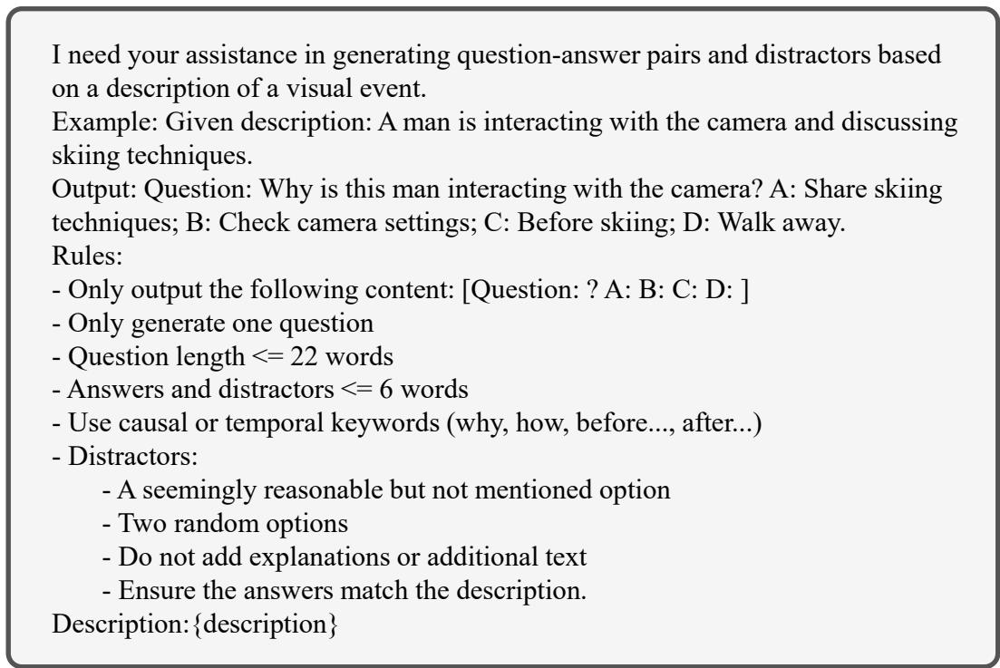  
Figure 5: Prompt template used to generate grounded question–answer pairs from video descriptions.

## F Performance Variance under Different Random Seeds

To evaluate the stability and reproducibility of LOVER we conduct experiments with three different random seeds on NExT-GQA and ReXTime. We report the mean and standard deviation of all evaluation metrics across independent runs.

As shown in Table 9, the variances are very small (e.g., 32.7 ± 0.0 on NExT-GQA and 21.83 ± 0.07 on ReXTime for Acc@GQA), demonstrating that LOVER is stable and reproducible. The minor differences on NExT-GQA are due to rounding to one decimal place, indicating that random seeds have a negligible impact on overall performance.

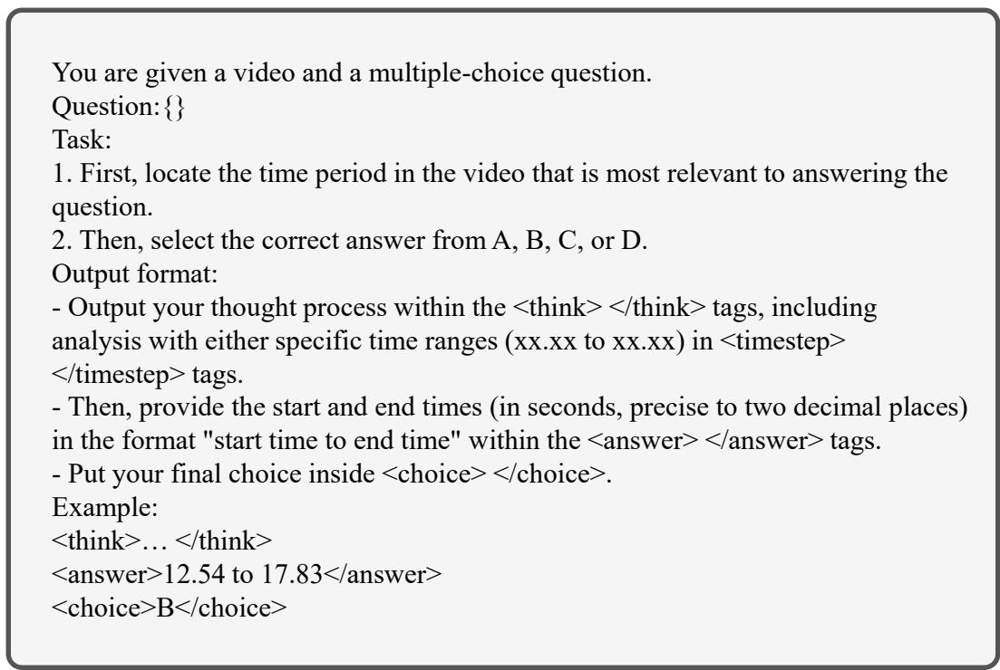  
Figure 6: Prompt template for grounded video question answering without timestamp rendering. This figure presents the inference prompt template that instructs the model to output its reasoning process, predicted temporal interval, and final answer choice in structured tags.

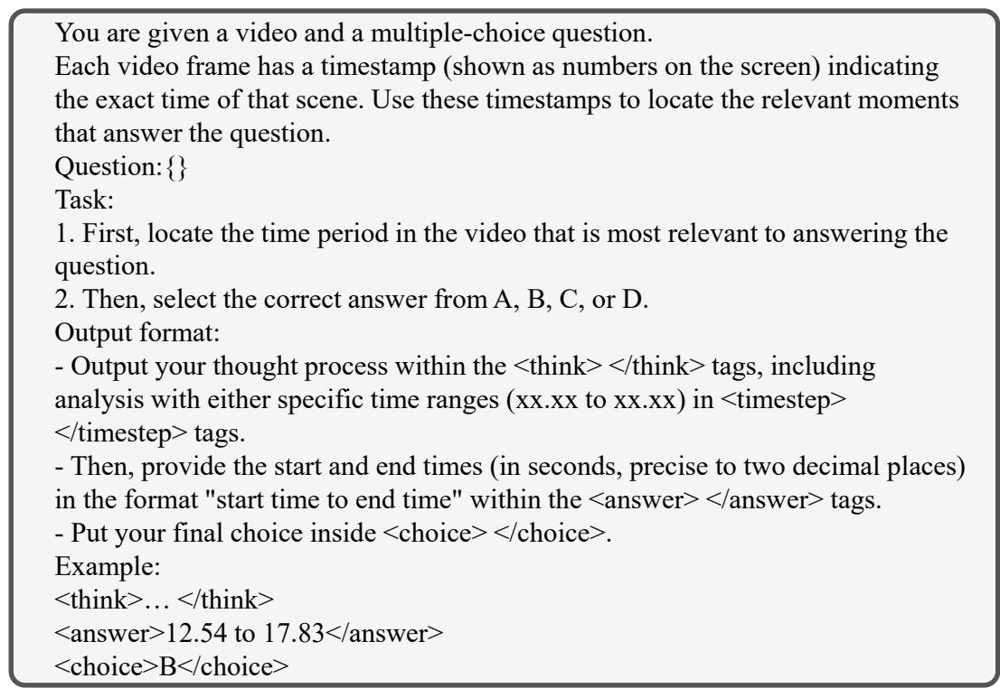  
Figure 7: Prompt template for grounded video question answering with adaptive timestamp rendering. This figure presents the inference prompt template used when frames carry rendered timestamps, additionally instructing the model to reference the visible frame-level time cues when localizing the relevant video segment.