# ModaLens: Measuring Image Sensitivity in Report-Conditioned Medical VLMs

Sebastián Andrés Cajas Ordóñez1, Maximin Lange2,1, Quang Bui3, Anqi Peter Li4, Felipe Ocampo Osorio1, Rafi Al Attrach1, Kushul Reddy Palakala5, Sahil Kapadia6, Zakaria Laouabdia Sellami7, Xinyue Zhang2, Ashley Zhang8, Leo Anthony Celi1,9

1MIT Critical Data, Massachusetts Institute of Technology 2King’s College London 3American International School Vienna 4Substrate Labs 5School of Computing, University of North Florida 6Department of Neuroscience, University of North Carolina at Chapel Hill 7Motork 8Collingwood School 9Beth Israel Deaconess Medical Center

## ABSTRACT

A radiology report can already answer a clinical question, so it is hard to tell whether a vision-language model also uses the image. ModaLens, a paired image-swap audit, measures how report availability changes image sensitivity: MedGemma-27B on 3,199 paired MIMIC-CXR cases from 293 patients, all 14 questions per case (13 finding-specific and one composite), each image replaced by one from another study, usually of the same patient, with question and report fixed. Under an explicit answer instruction, the model’s generated answer changes on 4.26% of trials with the report and 20.94% without it, a paired increase of 16.7 points (patient-clustered 95% CI [15.6, 17.7]), so report availability reduces image-swap sensitivity under this protocol; the original prompt with a lowercase first-token readout gives 4.70% against 17.07%, and substitutions also move continuous answer scores where the binary prediction does not change. The labels are derived from reports, which limits conclusions about visual correctness; the direction replicates in two further model lineages. Code, the exact prompts and a run record for every number are at https://github.com/criticaldata/MODALENS.

A One case, two inputs  
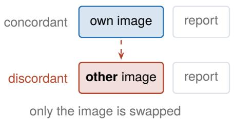

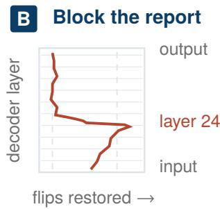

C Does the answer move?  
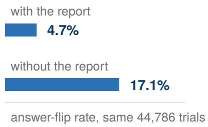  
Figure 1. (A) One case rendered twice: own image (concordant) or another study’s (discordant), report and question fixed. (B) Report-token attention knockout, cumulative from the plotted layer upward, 400 one-question cases: the flip rate rises toward the no-report rate when the block starts shallow, overshoots it at layer 22, and is at baseline from layer 32. Blocking from early layers raises image-swap sensitivity and blocking from later layers does not; this measures when direct access to report-token positions matters, not where report information stops being used (Appendix N, Figure 7). (C) All-14 flip rate, report present and absent.

## 1 Introduction

A radiology report can state an answer the image does not support: it may describe a prior study, be wrong, or name a finding that has since resolved. A model that follows the report is then correct only when the two agree, and a forced-choice output gives no signal when they do not. Whether that is a failure depends on the task; what can be measured is how much the output moves when the image changes and the report stays fixed. That is the line a per-modality failure framework for clinical multimodal models draws between loud failures, which the system flags, and silent ones [Bui et al., 2026]. Audits of this kind are one component of the broader engineering agenda for humble, accountable clinical decision support that Arslan et al. [2026] set out.

Answering from text without looking is well documented in general VQA [Goyal et al., 2017, Agrawal et al., 2018], persists in multimodal LLMs that miss visually obvious detail [Tong et al., 2024] and hallucinate objects [Rohrbach et al., 2018, Li et al., 2023b, Leng et al., 2024], and is an explicit debiasing target in medical VQA [Wan et al., 2025]. The closest work is Lotfinia et al. [2026], which scores image dependence apart from accuracy with target and control occlusions and same-label image swaps across nine systems, prompting with the finding question and no report. ModaLens instead makes report availability the manipulated factor, runs the same case twice on the same substitution, and reports the paired flip rate and margin change (Figure 1, the visual summary of the study).

We estimate how report availability changes image-swap sensitivity within the same cohort (Table 2); the limitations of that estimate are in Section 5.

## 2 Methods

ModaLens measures counterfactual answer sensitivity: every case is rendered twice, identical in every token except the image, the concordant input with the case’s own image and the discordant input with another study’s. The whole image is substituted, so the quantity measured is sensitivity to the image intervention, not grounding of the queried finding.

Cohort and units. MIMIC-CXR test split (Table 1); a case is one frontal image of a source study with its own substitute. The estimand is the average over trials; weighting studies or patients equally, dropping the cross-patient pairs or those with a blank view field, or keeping only pairs whose known views match gives paired diferences between 10.6 and 14.3 points (Appendix G).

<table><tr><td>Level</td><td>Count Note</td><td></td></tr><tr><td>Patients</td><td></td><td>293 resampling unit of the intervals</td></tr><tr><td>Source studies</td><td></td><td>2,816 344 contribute more than one case</td></tr><tr><td>Cases (one frontal image, one substitute)</td><td></td><td>3,199 3,180 within patient, 19 across patients</td></tr><tr><td>Substitute studies / images</td><td></td><td>1,953 / 2,093 reused up to 8 / 6 times; 376 reciprocal pairs</td></tr><tr><td>Questions per case</td><td></td><td>14 13 finding-specific plus one composite</td></tr><tr><td>Paired trials</td><td></td><td>44,786 9,347 with the asked finding&#x27;s label changed</td></tr></table>

Table 1. Cohort accounting; pair composition in Appendix Table 7.

Two question designs. All 14 questions (primary): on every case, 13 finding-specific questions, one per CheXpert finding, plus one composite question asking whether any acute cardiopulmonary finding is shown (Table 2). The composite question is scored against an any-finding target, yes if any of the 13

finding-specific targets is yes; the dataset’s own No Finding label never enters (Appendix Table 8). One question per case (secondary): only the case’s own primary labelled finding, or the composite question with target no on cases with no positive finding (Section 4.2, Appendix Table 23); a label-conditioned sample, not a finding-detection task.
<table><tr><td>Questions per case</td><td>Report</td><td>Order</td><td>Trials</td><td>Flip rate</td><td>Paired ∆, points</td><td>Ratio</td></tr><tr><td>All 14</td><td>present</td><td>image first</td><td>44,786</td><td>4.70% [4.35, 5.06]</td><td>reference</td><td>reference</td></tr><tr><td>All 14</td><td>absent</td><td>image first</td><td>44,786</td><td>17.07% [15.78, 18.39]</td><td>+12.4 [11.2, 13.6]</td><td>3.6 [3.4, 3.9]</td></tr><tr><td>All 14</td><td>present</td><td>text first</td><td>44,786</td><td>4.91% [4.62, 5.20]</td><td>+0.2 [–0.1, 0.5]</td><td>1.0 [1.0, 1.1]</td></tr><tr><td>All 14</td><td>absent</td><td>text first</td><td>44,786</td><td>12.75% [11.76, 13.76]</td><td>-4.3 [-5.4, -3.3]</td><td>0.7 [0.7, 0.8]</td></tr><tr><td>All 14</td><td>absent minus present</td><td>text first</td><td>44,786</td><td>report effect</td><td>+7.8 [6.9, 8.8]</td><td>2.6 [2.4, 2.9]</td></tr><tr><td>One</td><td>present</td><td>image first</td><td>3,199</td><td>1.41% [0.99, 1.90]</td><td>reference</td><td>reference</td></tr><tr><td>One</td><td>absent</td><td>image first</td><td>3,199</td><td>10.28% [8.72, 12.02]</td><td>+8.9 [7.5, 10.6]</td><td>7.3 [5.3, 10.5]</td></tr><tr><td>One</td><td>present</td><td>text first</td><td>3,199</td><td>2.84% [2.12, 3.71]</td><td>+1.4 [0.6, 2.3]</td><td>2.0 [1.4, 3.1]</td></tr></table>

Table 2. Primary MIMIC-CXR comparison and secondary prompt-order analysis (MedGemma-27B, 3,199 cases, 293 patients). Rows within a block share cases, substitutes and template; paired diferences and ratios are against the block’s reference row, and the two blocks are diferent units. The one-question report-present cell is 1.41% here, 45 of 3,199 cases, and 1.38%, 44 cases, in Tables 5, 18 and 19, which rerun that arm; the two runs difer on one case. The two all-14 text-first rate rows are paired against the all-14 image-first row of the same report condition, on identical case ids; the third gives the report efect within text first, so the two orders’ report efects can be read side by side. Brackets: 95% patient-clustered percentile bootstrap, 10,000 draws for the all-14 rows and 2,000 for the rest.

Sampling the discordant image. The substitute is chosen once per case: uniformly among the patient’s other frontal test-split studies whose CheXpert positive set difers from the source, failing that any other study of the patient, and for the 19 single-study patients a diferently labelled image from another patient. View and acquisition time are not matched; no pair exceeded the specified SSIM threshold of 0.9 (Appendix B and Table 7). Trials on which the substitution changes the asked finding’s CheXpert label are label-changed and reported separately. That label is not visual ground truth: CheXpert labels come from report text [Irvin et al., 2019], which the model reads in the concordant condition, and the substitute’s label comes from a report it never sees. Uncertain and absent labels count as negative; relabelling cannot change the flip rate, and under alternative policies the label-changed against label-unchanged diference never separates from zero (Appendix G).

Prompt and readout. The model’s own chat template, one user turn, no system prompt: an image block, then a text block reading Report: <report>, a blank line, and Question: <question>; text first swaps the two blocks. Nothing tells the model the report is historical or that it may be unreliable; instructions that treat it as historical context and that warn it may be wrong are tested in Appendix D. The question is a fixed template per finding with no answer-format instruction (Appendix Table 8). The lowercase first-token readout is the argmax over the logits of the lowercase yes and no tokens at the first generated position under greedy decoding; its change under substitution is the flip rate. Those tokens (ids in Appendix I) carry negligible probability mass, which sits on the capitalised variants, so the readout is a proxy. A validation under an explicit answer instruction compares it, on both designs, with the token-family and generated-answer readouts under an explicit instruction to answer Yes or No (Section 4.1, Appendix I); the headline prompt carries no such instruction. In the ablation arms of Appendix Table 23, deleting the image builds no image block, so none reaches the model, and deleting the report removes the “Report:” line; nothing else changes. One image per case, so a report-level label may refer to a view the model was not shown.

Statistics. Intervals for the MIMIC-CXR analyses on the full cohort are patient-clustered percentile bootstraps over the 293 patients: each bootstrap sample retains all trials belonging to each sampled patient, and paired diferences and ratios are computed inside each draw; 10,000 draws for the primary all-14 rates and for Appendix Table 23, 2,000 elsewhere. Subsets and other datasets state their resampling unit and method where they appear. The label-changed against label-unchanged comparison is a two-sided test that can reject equality but not establish it; no equivalence margin was pre-specified. Per-finding, per-category and per-layer analyses are exploratory and uncorrected for multiplicity.

## 3 Experimental setup

MedGemma-27B, the instruction-tuned release at revision 2d3e00e [Sellergren et al., 2025], built on Gemma 3 [Gemma Team et al., 2025]: 62 decoder layers, residual width 5376, bfloat16, one NVIDIA H200 or H100 per run under Python 3.11, PyTorch 2.10 and Transformers 5.3, with the exact versions of every package in each run record’s environment file. Experimental chronology, for reproducibility: the lowercase first-token readout under the plain prompt was run first; the explicit answer instruction, generated-answer scoring, the additional model families and the order rerun followed, and each is dated in its run record; images enter at the processor’s default preprocessing (896 by 896 pixels, 256 tokens, pan-and-scan of). MIMIC-CXR [Johnson et al., 2019a] is the primary dataset; its free-text reports pair with the 14 CheXpert labels [Irvin et al., 2019] the questions are built from. VQA-RAD [Lau et al., 2018], SLAKE [Liu et al., 2021], OmniMedVQA [Hu et al., 2024] and ProbMed [Yan et al., 2025] have no report (Appendix Table 6). MIMIC-CXR was used under the PhysioNet Credentialed Health Data License 1.5.0 and its data use agreement; VQA-RAD is the CC0 1.0 release archived on OSF, SLAKE the authors’ CC BY 4.0 release, OmniMedVQA its public open-access release under its published terms, which pass through each source dataset’s licence, and ProbMed its gated release under its dataset-card terms, an MIT licence over images that keep their upstream licences. MedGemma weights were used under the Health AI Developer Foundations terms of use, Qwen3.5-9B and Qwen3.5-27B [Qwen Team, 2026], LLaVA-NeXT on Mistral-7B [Liu et al., 2024, 2023] and the TorchXRayVision classifier under their Apache 2.0 licences. No dataset was redistributed, and no image or report left institutional hardware.

## 4 Results

## 4.1 Report availability and image sensitivity

The report efect. Under the explicit answer instruction, the model’s generated answer changes with the image on 20.94% of trials without the report against 4.26% with it, a paired diference of 16.7 points [15.6, 17.7] (Table 3); this is the primary estimate, and the token-family and lowercase readouts under the same instruction agree to within 0.6 points. The original prompt with the lowercase first-token readout, the paper’s first measurement, gives 17.07% against 4.70%, 12.37 points [11.19, 13.57] and a ratio of 3.6 (Table 2; Figure 1C), and is kept as a sensitivity analysis: adding the instruction changes the prompt, so the instructed estimate establishes the efect under that protocol rather than validating every output of the original one. The one-question design agrees in direction. The composite question’s wording, whether the image shows any acute cardiopulmonary finding, does not match its target, which is yes whenever any of the 13 finding-specific targets is, support devices and fracture included. Dropping it leaves the 13 finding-specific questions, 41,587 trials, and gives 4.78% with the report against 18.14% without, a paired diference of 13.36 points [12.16, 14.57] under the lowercase readout, and 4.42% [4.08, 4.77] against 19.93% [18.79, 21.07], 15.5 points [14.5, 16.5], under the generated answer, so the mismatch does not carry the efect and the 13 finding-specific questions are the analysis of record, with the 14-question figures kept for comparison (Appendix G). The report-absent rate is not uniform over findings, and the pooled 17.07% hides which ones carry it: five of the 14 sit at or below 4.1% because without the report the model answers yes on nearly every trial, at a yes rate of 97.8% to 100% (atelectasis and support devices flip on no trial at all), while the other nine run from 16.8% to 32.0%. The five are the same findings whose image-only specificity is at or near zero in Appendix Table 21, so the pooled efect varies substantially across findings: several report-absent readouts are nearly constant, and atelectasis and support devices show lower flip rates without the report than with it. The pooled increase should not be read as a uniform finding-level efect; the same pattern holds under the generated answer (Appendix Table 22), where atelectasis is 6.81% with the report against 4.63% without and support devices 11.03% against 1.44%. On VQA-RAD (� = 52), which has no report and questions the key marks image-decisive, the flip rate under a final-token yes/no readout is 61.5% [48.1, 75.0] with accuracy 0.731 on both images.

<table><tr><td>Readout</td><td>Report present</td><td>Report absent</td><td>Paired difference, points</td><td>Ratio</td></tr><tr><td>Lowercase first token</td><td>4.64% [4.29, 5.01]</td><td>20.72% [19.46, 21.93]</td><td>+16.1 [14.9, 17.2]</td><td>4.5</td></tr><tr><td>Token families</td><td>4.30% [3.99, 4.64]</td><td>21.03% [19.79, 22.27]</td><td>+16.7 [15.7, 17.8]</td><td>4.9</td></tr><tr><td>Generated answer</td><td>4.26% [3.95, 4.60]</td><td>20.94% [19.70, 22.13]</td><td>+16.7 [15.6, 17.7]</td><td>4.9</td></tr><tr><td>Lowercase first token, headline prompt</td><td>4.70% [4.35, 5.06]</td><td>17.07% [15.78, 18.39]</td><td>+12.4 [11.2, 13.6]</td><td>3.6</td></tr></table>

Table 3. All-14 design under the instruction to answer Yes or No (44,786 trials, 3,199 cases, 293 patients): flip rate under three readouts, paired diference absent minus present in points, ratio without interval; last row, the headline prompt without the instruction. Brackets: 95% patient-clustered percentile bootstrap, 10,000 draws for the lowercase headline row and 2,000 for the rest.

<table><tr><td></td><td>MedGemma-27B</td><td>MedGemma-4B</td></tr><tr><td>Concordant accuracy</td><td>0.648 [0.635, 0.662]</td><td>0.673 [0.661, 0.686]</td></tr><tr><td>Balanced accuracy</td><td>0.717 [0.710, 0.725]</td><td>0.708 [0.701, 0.714]</td></tr><tr><td>Discordant accuracy</td><td>0.589 [0.576, 0.602]</td><td>0.610 [0.598, 0.624]</td></tr><tr><td>Flip rate, label changed</td><td>4.30% [3.78, 4.85]</td><td>7.28% [6.59, 7.98]</td></tr><tr><td>Flip rate, label unchanged</td><td>4.81% [4.45, 5.19]</td><td>7.46% [6.93, 7.97]</td></tr><tr><td>Flip rate, all trials</td><td>4.70% [4.35, 5.06]</td><td>7.42% [6.94, 7.88]</td></tr></table>

Table 4. All 14 questions, report present, image first, MIMIC-CXR test (44,786 trials, 3,199 cases, 293 patients). Each image is scored against its own study’s report-derived label for the asked question; balanced accuracy is the mean of the yes and no recalls (majority 0.796). Brackets: 95% patient-clustered percentile bootstrap, 10,000 draws.

Continuous margins. We measure changes in the continuous margin log �(yes) − log �(no) across all trials, including those without a prediction flip. With the report present the mean absolute paired change is 0.690 [0.657, 0.726]; 32.2% of trials move by more than 0.5, against 4.7% that flip, and so do 33.0% of label-unchanged trials. Without the report the mean change is 2.307, larger than with it on 82.9% of trials (Figure 2A,B). The rise holds on every finding except support devices, whose mean change is 1.54 with the report and 1.57 without; pleural efusion moves most, 0.86 against 3.96 (Figure 2C). On label-changed trials the target-aligned change $y _ { d } ( m _ { d } - m _ { c } )$ , with $y _ { d } \in \{ - 1 , + 1 \}$ the substitute’s label, is 0.35 with the report and 1.44 without, positive on 57.9% and 65.4% of trials (Appendix G, Figure 4).

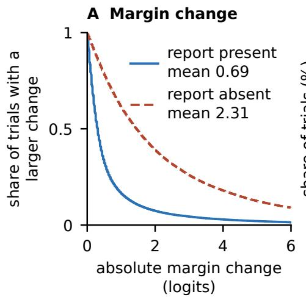

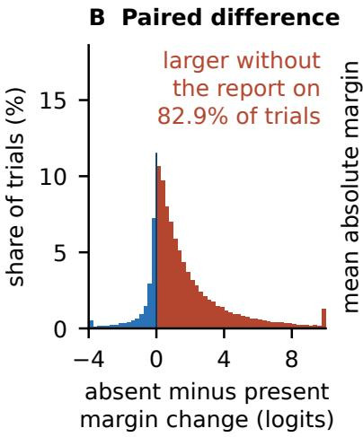

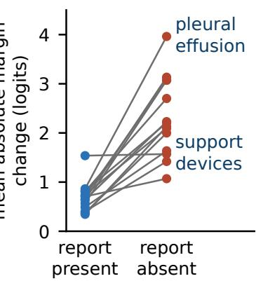  
Figure 2. (A) Share of the 44,786 trials whose absolute margin change $| m _ { d } - m _ { c } |$ exceeds �, with and without the report. (B) Paired diference on the same trial, report absent minus report present; tails fold into the end bins. (C) Mean absolute margin change per finding, report present to report absent.

Label alignment and transitions. With the report present the flip rate is about the same on label-changed and label-unchanged trials (Table 4), a clustered diference of −0.50 points [−1.03, +0.02]; no equivalence is claimed. Scored against each study’s own report-derived label for the asked finding, accuracy is 0.648 on the original image and 0.589 on the substitute [0.576, 0.602] (Table 4); 61.3% of label-changed trials go from correct on the original image to wrong on the substitute and 34.4% the reverse (Appendix Table 16).

Robustness. The 4B model flips 2.7 points more (Table 4), and under the answer instruction the paired report-presence diference is 13.3 points [11.2, 15.6] in Qwen3.5-9B, 19.60 points [17.00, 22.40] in Qwen3.5-27B and 12.75 points [11.10, 14.44] in LLaVA-NeXT on Mistral-7B, a third lineage, with image reading on that question set at chance without the report in every one of them (Appendix F). Redrawing the substitute image under two further seeds changes the one-question report efect by at most 0.34 points (Appendix G). The flip rate rises with the embedding distance between the images in both conditions; adjusting for distance and label change, the odds ratio for report presence is 0.12 [0.09, 0.17] (Appendix B). Where the classifier surrogate predicts a change in the queried finding, the report-absent flip rate is three times that where it predicts the same label for both images (Appendix K). Under manually annotated report labels the efect persists: on the 800 trials whose manual label changes, agreement with the substitute’s label is 0.378 with the report and 0.519 without (Appendix E). It holds under a second question template, with a template-by-report interaction of 1.7 points [−0.0, 3.4] (Appendix L). It holds with the answer options in either order, with an order-by-report interaction of −0.53 points [−1.36, 0.30] (Appendix M), and with an explicit Uncertain option ofered (Appendix M). Warning the model that the report may not describe the image and may be wrong leaves the efect intact: the one-question flip rate is 1.50% under the warning against 1.22% under the plain framing with the same answer instruction, a paired diference of +0.28 points [−0.13, 0.74] (Appendix D). On the headline unit, text-block order does not move the report-present rate, +0.2 points [−0.1, 0.5], and lowers the report-absent rate by 4.3 points; on the one-question design the report-present rate doubles (Table 2; Appendix H).

Readout validation. This validation uses an explicit answer instruction and covers both designs; the headline estimate of 4.70% against 17.07% is a result for the lowercase first-token readout under a prompt that carries no answer instruction. On the one-question design, with the instruction to answer Yes or No appended, the lowercase readout agrees with the generated answer on 98.8% of report-present and 91 to 93% of report-absent cases, and the three readouts agree on the report-presence diference (Table 5). Without the instruction the lowercase readout gives a smaller report-absent rate than the token-family readout, so the report-absent value depends on the readout choice; the direction of the report efect does not (Appendix I). The primary efect survives generated-answer scoring on its own unit: rerun with the same instruction, the all-14 design gives a generated-answer flip rate of 4.26% with the report against 20.94% without, a paired diference of 16.7 points [15.6, 17.7] (Appendix Table 3). The instruction raises the report-absent rate, from 17.07% to 20.72% under the lowercase readout on the same trials, and leaves the report-present rate within a tenth of a point of 4.70%, so the instructed prompt is not the headline prompt and the headline numbers stand. Under every readout the direction is the same and every interval on the diference excludes zero, with ratios of 4.5 to 4.9.

<table><tr><td>Prompt</td><td>Readout</td><td>Report present</td><td>Report absent</td><td>Paired difference, points</td></tr><tr><td>With instruction</td><td>lowercase first token</td><td>1.22%</td><td>18.26%</td><td>-17.0 [-19.4, -14.9]</td></tr><tr><td>With instruction</td><td>token families</td><td>0.84%</td><td>17.69%</td><td>-16.9[-18.8, -15.0]</td></tr><tr><td>With instruction</td><td>generated answer</td><td>0.84%</td><td>17.66%</td><td>-16.8 [-18.7, -15.0]</td></tr><tr><td>No instruction</td><td>lowercase first token</td><td>1.38%</td><td>10.28%</td><td>-8.9 [-10.6, -7.5]</td></tr><tr><td>No instruction</td><td>token families</td><td>1.09%</td><td>17.35%</td><td>-16.3 [-18.5, -14.2]</td></tr><tr><td>No instruction</td><td>generated answer</td><td>1.84%</td><td>11.57%</td><td>-9.7 [-11.5, -8.1]</td></tr></table>

Table 5. Readout validation, secondary one-question design (3,199 cases, 293 patients): flip rate under three readouts and two prompts, present minus absent in points. Per-cell intervals in Appendix Table 19; the all-14 design under the instruction is in Appendix Table 3. Brackets: 95% patient-clustered percentile bootstrap, 2,000 draws.

Text content. Text content also afects image sensitivity. In the one-question design, length-matched neutral prose and clinical boilerplate produce flip rates of 8.2% and 7.1%, compared with 10.3% without a report and 1.4% with the full report. Removing the sentences that mention the queried finding raises the rate to 11.6%. A sentence stating the reference answer reduces it to 3.1%, and replacing the target sentences with the opposite label reduces source-label accuracy to 4.3% (Appendix Table 18, Figure 5). These controls suggest that answer-bearing text contributes to the reduced sensitivity, although they do not isolate its contribution from changes in length and context.

## 4.2 Modality ablation: report versus image

On the all-14 design, scored against report-derived labels, the report alone reaches a pooled balanced accuracy of 0.770; adding the image lowers it to 0.717, the image with the question gives 0.665, and the question alone is at chance, answering yes throughout (Appendix Table 20). The two inputs interact: pooled over trials, the image raises balanced accuracy by 0.165 [0.158, 0.172] without the report and lowers it by 0.053 with it, a pooled interaction of −0.218. Macro-averaged over the 14 findings the image adds 0.076 without the report and the interaction is −0.128 [−0.141, −0.115], still negative. Pooling over trials matches the paper’s estimand, the average over trials; the macro average weights each finding equally and shows that the image-only gain is not uniform, since several findings sit at chance in that cell. Report only is the best cell on 9 of the 14 findings. The one-question design (Appendix Table 23) also ranks report only above the full arm. Both designs are scored against report-derived labels, so a fall when the image is added measures movement away from the report’s label and not a visual error; neither the all-14 interaction nor the one-question ranking shows that the image misleads.

## 4.3 Secondary analyses

Per-finding agreement, chance-corrected. Raw agreement rewards a skewed responder, so we also report Cohen’s � [Cohen, 1960] per finding (Appendix Table 10; all 14 in Table 32). Against chance the ranking changes: for support devices, agreement is 0.946 and � is 0.370, less than half the next lowest, because predictions are strongly skewed toward yes.

Flip rate by question type. On SLAKE, with no report, perceptual questions flip more often than knowledge questions: organ 81.0% and modality 80.0% against abnormality 36.0% and knowledge-graph 25.9% (Appendix Table 9). Sample sizes vary by category and no ordered-alternative test was run; comparisons are exploratory.

## 4.4 Image sensitivity across decoder layers

We next examined how image substitutions afect projected answer scores across decoder layers, with and without the report. We evaluated these trajectories alongside agreement with the final answer to assess where the intermediate readout was informative. We then used attention interventions to test the contribution of direct access to report-token positions (Figure 3; full analysis in Appendix N).

At each layer we project the residual stream through the output head and take the yes-minus-no margin, then average the absolute change in that margin between the two images over the 44,786 trials (Figure 3A). The change is small through the middle of the network and rises from about layer 46: with the report it is 0.04 at layer 25 and 1.31 at layer 46, ending at the published 0.690 at the output; without the report it is 0.05 and 4.54, ending at 2.307. The report-absent trajectory sits above the report-present one at every layer from 46 onward, which is the layerwise form of the headline efect. Figure 3B shows how far each layer’s projected answer agrees with the final answer: agreement is 0.55 with the report and 0.67 without at layer 25, against a majority-class floor, and it reaches 0.95 and 0.93 at layer 46. The intermediate readout carries a limited, non-persistent signal before layer 46 and tracks the final answer after it, so the layer-25 feature reported in Appendix N is retained as an observation about the projection and not read as the point at which the answer is decided. Figure 3C shows the attention intervention against its two controls; the trajectory and the intervention answer diferent questions, one describing projected responses across depth and the other the efect of interrupting a specified pathway, and Section 4.5 states what the intervention does and does not establish.

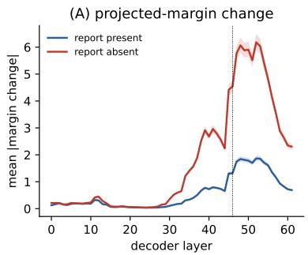

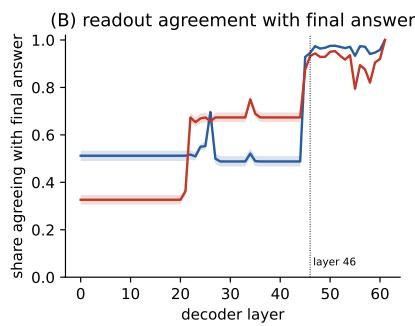

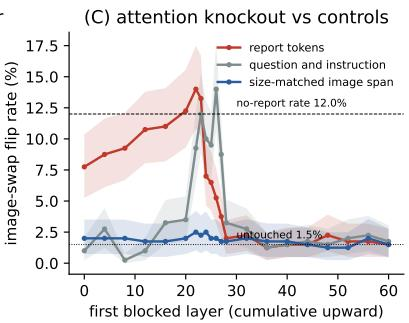  
Figure 3. (A) Mean absolute change in the projected yes/no margin between the two images at each decoder layer, report present and absent, 44,786 trials, patient-clustered 95% intervals; the layer-61 values are the published 0.690 and 2.307. (B) Share of trials whose projected answer at each layer equals the final answer. (C) Report-token attention knockout, cumulative from the plotted layer upward, against the question-and-instruction span and a size-matched image span, 400 one-question cases.

## 4.5 At what depth does the report take hold?

Cumulative blocking of attention to report-token positions increased image-swap sensitivity when initiated at early decoder layers, and the efect diminished for interventions initiated later. These result identify when direct access to report-token positions afects the measured response; they do not localise all downstream use of report information, since report-derived content may already have been copied into other positions before a later block starts. The estimates: masking the text stream’s attention to the report raises the image-swap flip rate from 1.50% to 7.75% when the block begins at layer 0, against 12.00% with no report, and is at baseline from layer 32. Single-layer blocking never exceeds 2.50%, which is consistent with redundant or distributed pathways and does not show that no layer carries the efect. The 14.00% at layer 22 overshoots the no-report rate and falls in the window where the question-and-instruction control also moves, so the report-specific comparison is confined to layers 0 to 20, where the paired diference clears zero against both controls and the two arms flip disjoint case sets. A higher flip rate under the block is not by itself a restored reading of the substituted image. Cross-condition residual patching adds no localisation, being a null against its wrong-donor control, 14.07% against a correct-donor maximum of 12.25% (Appendix N, Figure 7). This is a MIMIC-CXR result: the image-token knockout run on three further datasets does not separate from its control on VQA-RAD or OmniMedVQA, and the control comparison was unavailable for SLAKE, so it is reported as a negative and not generalised.

## 4.6 Negative results: steering and probe transfer

Two mechanistic analyses were tried and both are negative (Appendix N). Diference-of-means steering did not move the share of answers that track the substituted image below the scale that degraded the outputs, where the targeted direction did not separate from a random one, and changed it by 0.1 points at the largest scale. A linear probe fit under a frozen protocol and run once on a disjoint patient cohort fell from its test-split discrimination to chance. The paper makes no localisation claim beyond that bound.

## 5 Limitations

Label validity. The labels are report-derived throughout. The label-changed split measures consistency with the report, not with the image; the manually annotated report labels of Appendix E check the automated extraction, not the image. We did not obtain independent image annotations for this evaluation; the only image-level labels are the classifier surrogate of Appendix K. The audit says how much the readout moves with the image, and the opposite-label control says the readout follows the text when the two conflict. Neither says whether following the text was wrong: a report is an expert reading, and deferring to an accurate one may be rational. No chronology was supplied to the model, so Appendix D is a retrospective stratification, in which later and earlier substitutes give nearly the same report-agreement rate. An instruction asking the model to treat the report as historical context raised the flip rate by about half a point, and an explicit warning that the report may not describe the image and may be wrong changed it by +0.28 points [−0.13, 0.74] against the plain framing; these were framing interventions with no temporal consistency enforced, so they do not test the handling of reports that are in fact stale, and neither restores image sensitivity: under the warning the readout still matches the substituted image’s label on only 8.49% of the label-changed pairs (Appendix D).

Readout validity. The output is the lowercase first-token readout of a prompt that does not request a yes or no. It cannot flag conflicting or missing evidence, it records a shift that does not cross the boundary as no change, and its validation against generated answers, added after the initial analysis, covers both designs only under an explicit answer-format instruction that the headline prompt does not carry (Appendix I); under that instruction the primary efect keeps its direction and grows. The report-absent one-question rate depends on the readout (10.3% on the paper’s tokens, 17.4% on the token families); the report-present rate does not.

Sampling and prompt dependence. One substituted image per case, drawn without matching on view, positioning or the other thirteen labels, so a substitute can carry the same finding, which lowers the flip rate even for an image-conditioned model. The flip rate depends on text-block order, and the headline unit was rerun under both orders to bound that dependence (Table 2). The report efect survives the swap but shrinks: +7.8 points [6.9, 8.8] with the text block first against +12.4 [11.2, 13.6] with the image first, on identical trials, so the direction and its significance are robust to order while the magnitude is not. The order efect itself is a null with the report present, +0.2 points [−0.1, 0.5], which does not reproduce the one-question design’s +1.4 [0.6, 2.3], and it is negative with the report absent, −4.3 points [−5.4, −3.3]. That pooled figure is a net of large ofsetting per-finding efects rather than a uniform shift: text first lowers the report-absent rate on nine of the 14 findings and raises it on five, over a range from −21.7 to +14.3 points, and support devices moves from flipping on no trial to 8.07%. No flip rate in this paper should be read as an order-independent property of the model. Every report-availability estimate here comes from one dataset, the MIMIC-CXR test split, 293 patients at a single institution, frontal chest radiographs and English reports. No other dataset used in this paper pairs an image with a report, so the manipulated factor is untested outside that setting.

Generalisation. The headline rests on one model family and one snapshot; the model card lists MIMIC-CXR and SLAKE in training, which does not by itself establish exposure to these test cases. MedGemma-4B shows the same interaction with a larger efect. The efect is not specific to one lineage or one size: under the answer instruction it replicates in direction and significance across three families, MedGemma, Qwen3.5 at 9B and 27B, and LLaVA-NeXT on Mistral-7B. On the label-conditioned one-question set no model tested reads the substituted image above chance once the report is removed, so what generalises there is report anchoring, not image competence; on the all-14 unit the image does carry signal for MedGemma, which is why that claim is stated for the one-question set only (Section 4.2, Appendix F). Every layerwise readout uses the uncalibrated logit lens: the tuned lens [Belrose et al., 2023] scored below it on both readout datasets (Appendix Table 34), and activation patching [Meng et al., 2022] leaves the depth under-determined, so no depth claim rests on a projection, and the knockout below identifies when direct access to report-token positions matters rather than where report information stops being used. A calibration pass puts the shallowest depth at which the projection tracks the model’s own answer at layer 46 of 62 (Appendix N); everything shallower, the layer-25 feature of Figure 6 included, sits where the projection does not clear the best constant predictor of that answer, and that feature is a property of the report-present prompt rather than of the network. The one depth statement the paper does make is causal rather than projected, and it is a bound and not a locus: a cumulative attention block on the report restores image sensitivity when it begins at or below layer 22 and not from layer 28 upward, report-specific over layers 0 to 20, so the boundary sits near layer 24 of 62; the knockout is not equivalent to deleting the report, no single layer carries the efect, and cross-condition residual patching does not separate from a wrong-donor control at any depth (Appendix N). These metrics say whether the readout changes with the image, not competence.

## 6 Conclusion

On 44,786 paired MIMIC-CXR trials, removing the report raises the rate at which MedGemma-27B’s generated answer changes with the image from 4.26% to 20.94%, a paired diference of 16.7 points [15.6, 17.7] under an explicit answer instruction; the original prompt with a lowercase first-token readout gives 4.70% against 17.07%, 12.37 points [11.19, 13.57]. Continuous answer margins are also more sensitive to the image without the report. The direction of the report efect persists across the evaluated controls, under generated-answer scoring of both designs, and across three model families and two model sizes within two of them; since none of those models shows above-chance reading of the substituted image on the one-question set; on six finding-specific questions asked of every case, chosen by a prespecified prevalence rule so the selection cannot score on the label, the report efect holds at 13.1 to 20.9 points in all three (Appendix Table 13), what replicates there is report anchoring rather than image competence. These findings show that report availability changes measured image sensitivity; independent image annotations are needed to determine when this behaviour produces visually incorrect answers.

## Acknowledgements

This research was supported by Anthropic’s AI for Science program, by GPUs from NVIDIA Brev, and by the MIT ORCD cluster.

## References

Aishwarya Agrawal, Dhruv Batra, Devi Parikh, and Aniruddha Kembhavi. Don’t just assume; look and answer: Overcoming priors for visual question answering. In IEEE/CVF Conference on Computer Vision and Pattern Recognition (CVPR), pages 4971–4980, 2018. doi: 10.1109/CVPR.2018.00522. arXiv:1712.00377.

Guillaume Alain and Yoshua Bengio. Understanding intermediate layers using linear classifier probes. arXiv preprint arXiv:1610.01644, 2016.

Janan Arslan, Kurt Benke, Sebastián Andrés Cajas Ordóñez, Rowell Castro, Leo Anthony Celi, Gustavo Adolfo Cruz Suarez, Roben Delos Reyes, Justin Engelmann, Ari Ercole, Almog Hilel, Leo Kinyera, Maximin Lange, Torleif Markussen Lunde, Mackenzie J. Meni, Felipe Ocampo Osorio, Anna E. Premo, Jana Sedlakova, and Pritika Vig. Engineering framework for curiosity-driven and humble AI in clinical decision support. BMJ Health & Care Informatics, 33(1):e101877, 2026. doi: 10.1136/bmjhci-2025-101877.

Nora Belrose, Igor Ostrovsky, Lev McKinney, Zach Furman, Logan Smith, Danny Halawi, Stella Biderman, and Jacob Steinhardt. Eliciting latent predictions from transformers with the tuned lens. arXiv preprint arXiv:2303.08112, 2023.

Quang Bui, Shlok Jaiswal, Samuel Paik-Heintz, Kevin Zhou, Kaushik Madapati, Krittaphas Chaisutyakorn, Noah Dane Hebdon, Dimitrios Proios, Sebastián Andrés Cajas Ordóñez, Kacper Dobek, Boya Zhang, Aly Dhedhi, Ahram Han, Kushul Reddy Palakala, Rahul Gorijavolu, Jacques Kpodonu, and Leo Anthony Celi. Loud or silent? a reusable framework for per-modality failure analysis in multimodal clinical AI. arXiv preprint arXiv:2608.01462, 2026.

Jacob Cohen. A coeficient of agreement for nominal scales. Educational and Psychological Measurement, 20(1):37–46, 1960. doi: 10.1177/001316446002000104.

Joseph Paul Cohen, Joseph D. Viviano, Paul Bertin, Paul Morrison, Parsa Torabian, Matteo Guarrera, Matthew P. Lungren, Akshay Chaudhari, Rupert Brooks, Mohammad Hashir, and Hadrien Bertrand. TorchXRayVision: A library of chest X-ray datasets and models. In Proceedings ofthe 5th International Conference on Medical Imaging with Deep Learning, volume 172 of Proceedings of Machine Learning Research, pages 231–249, 2022. arXiv:2111.00595.

Yonatan Geifman and Ran El-Yaniv. Selective classification for deep neural networks. In Advances in Neural Information Processing Systems (NeurIPS), 2017. arXiv:1705.08500.

Gemma Team, Aishwarya Kamath, Johan Ferret, Shreya Pathak, Nino Vieillard, Ramona Merhej, Sarah Perrin, Tatiana Matejovicova, Alexandre Ramé, Morgane Rivière, et al. Gemma 3 technical report. arXiv preprint arXiv:2503.19786, 2025.

Yash Goyal, Tejas Khot, Douglas Summers-Stay, Dhruv Batra, and Devi Parikh. Making the V in VQA matter: Elevating the role of image understanding in visual question answering. In IEEE Conference on Computer Vision and Pattern Recognition (CVPR), pages 6325–6334, 2017. doi: 10.1109/CVPR.2017.670. arXiv:1612.00837.

Yutao Hu, Tianbin Li, Quanfeng Lu, Wenqi Shao, Junjun He, Yu Qiao, and Ping Luo. OmniMedVQA: A new large-scale comprehensive evaluation benchmark for medical LVLM. In IEEE/CVF Conference on Computer Vision and Pattern Recognition (CVPR), pages 22170–22183, 2024. doi: 10.1109/ CVPR52733.2024.02093. arXiv:2402.09181.

Jeremy Irvin, Pranav Rajpurkar, Michael Ko, Yifan Yu, Silviana Ciurea-Ilcus, Chris Chute, Henrik Marklund, Behzad Haghgoo, Robyn Ball, Katie Shpanskaya, Jayne Seekins, David A. Mong, Safwan S. Halabi, Jesse K. Sandberg, Ricky Jones, David B. Larson, Curtis P. Langlotz, Bhavik N. Patel, Matthew P. Lungren, and Andrew Y. Ng. CheXpert: A large chest radiograph dataset with uncertainty labels and expert comparison. In Proceedings of the AAAI Conference on Artificial Intelligence, volume 33, pages 590–597, 2019. doi: 10.1609/aaai.v33i01.3301590. arXiv:1901.07031.

Alistair E. W. Johnson, Tom J. Pollard, Seth J. Berkowitz, Nathaniel R. Greenbaum, Matthew P. Lungren, Chih-ying Deng, Roger G. Mark, and Steven Horng. MIMIC-CXR, a de-identified publicly available database of chest radiographs with free-text reports. Scientific Data, 6(1):317, 2019a. doi: 10.1038/s41597-019-0322-0.

Alistair E. W. Johnson, Tom J. Pollard, Nathaniel R. Greenbaum, Matthew P. Lungren, Chih-ying Deng, Yifan Peng, Zhiyong Lu, Roger G. Mark, Seth J. Berkowitz, and Steven Horng. MIMIC-CXR-JPG, a large publicly available database of labeled chest radiographs. arXiv preprint arXiv:1901.07042, 2019b.

Jason J. Lau, Soumya Gayen, Asma Ben Abacha, and Dina Demner-Fushman. A dataset of clinically generated visual questions and answers about radiology images. Scientific Data, 5(1):180251, 2018. doi: 10.1038/sdata.2018.251.

Sicong Leng, Hang Zhang, Guanzheng Chen, Xin Li, Shijian Lu, Chunyan Miao, and Lidong Bing. Mitigating object hallucinations in large vision-language models through visual contrastive decoding. In IEEE/CVF Conference on Computer Vision and Pattern Recognition (CVPR), pages 13872–13882, 2024. doi: 10.1109/CVPR52733.2024.01316. arXiv:2311.16922.

Kenneth Li, Oam Patel, Fernanda Viégas, Hanspeter Pfister, and Martin Wattenberg. Inference-time intervention: Eliciting truthful answers from a language model. In Advances in Neural Information Processing Systems (NeurIPS), 2023a. arXiv:2306.03341.

Yifan Li, Yifan Du, Kun Zhou, Jinpeng Wang, Wayne Xin Zhao, and Ji-Rong Wen. Evaluating object hallucination in large vision-language models. In Conference on Empirical Methods in Natural Language Processing (EMNLP), 2023b. arXiv:2305.10355.

Bo Liu, Li-Ming Zhan, Li Xu, Lin Ma, Yan Yang, and Xiao-Ming Wu. SLAKE: A semantically-labeled knowledge-enhanced dataset for medical visual question answering. In 2021 IEEE 18th International

Symposium on Biomedical Imaging (ISBI), pages 1650–1654, 2021. doi: 10.1109/ISBI48211.2021. 9434010.

Haotian Liu, Chunyuan Li, Qingyang Wu, and Yong Jae Lee. Visual instruction tuning. In Advances in Neural Information Processing Systems (NeurIPS), 2023. arXiv:2304.08485.

Haotian Liu, Chunyuan Li, Yuheng Li, Bo Li, Yuanhan Zhang, Sheng Shen, and Yong Jae Lee. LLaVA-NeXT: Improved reasoning, OCR, and world knowledge. Blog post, https://llavavl.github.io/blog/2024-01-30-llava-next/, January 2024.

Mahshad Lotfinia, Sebastian Ziegelmayer, Lisa Adams, Daniel Truhn, Andreas Maier, and Soroosh Tayebi Arasteh. Vision-language models for chest radiography do not always need the image. arXiv preprint arXiv:2606.17710, 2026.

Samuel Marks and Max Tegmark. The geometry of truth: Emergent linear structure in large language model representations of true/false datasets. In Conference on Language Modeling (COLM), 2024. arXiv:2310.06824.

Kevin Meng, David Bau, Alex Andonian, and Yonatan Belinkov. Locating and editing factual associations in GPT. In Advances in Neural Information Processing Systems (NeurIPS), 2022. arXiv:2202.05262.

nostalgebraist. interpreting GPT: the logit lens. Blog post, LessWrong, August 2020. https: //www.lesswrong.com/posts/AcKRB8wDpdaN6v6ru/interpreting-gpt-the-logit-lens.

Qwen Team. Qwen3.5: Towards native multimodal agents. https://qwen.ai/blog?id=qwen3.5, February 2026.

Nina Rimsky, Nick Gabrieli, Julian Schulz, Meg Tong, Evan Hubinger, and Alexander Matt Turner. Steering Llama 2 via contrastive activation addition. In Proceedings of the 62nd Annual Meeting of the Association for Computational Linguistics (Volume 1: Long Papers), pages 15504–15522, 2024. doi: 10.18653/v1/2024.acl-long.828. arXiv:2312.06681.

Anna Rohrbach, Lisa Anne Hendricks, Kaylee Burns, Trevor Darrell, and Kate Saenko. Object hallucination in image captioning. In Conference on Empirical Methods in Natural Language Processing (EMNLP), 2018. arXiv:1809.02156.

Andrew Sellergren, Sahar Kazemzadeh, Tiam Jaroensri, Atilla Kiraly, Madeleine Traverse, Timo Kohlberger, Shawn Xu, Fayaz Jamil, Cían Hughes, Charles Lau, et al. MedGemma technical report. arXiv preprint arXiv:2507.05201, 2025.

Shengbang Tong, Zhuang Liu, Yuexiang Zhai, Yi Ma, Yann LeCun, and Saining Xie. Eyes wide shut? exploring the visual shortcomings of multimodal LLMs. In IEEE/CVF Conference on Computer Vision and Pattern Recognition (CVPR), pages 9568–9578, 2024. doi: 10.1109/CVPR52733.2024.00914. arXiv:2401.06209.

Alexander Matt Turner, Lisa Thiergart, Gavin Leech, David Udell, Juan J. Vazquez, Ulisse Mini, and Monte MacDiarmid. Steering language models with activation engineering. arXiv preprint arXiv:2308.10248, 2023.

Xingyu Wan, Qiaoying Teng, Jun Chen, Yonghan Lu, Deqi Yuan, and Zhe Liu. Eliminating language bias for medical visual question answering with counterfactual contrastive training. In Medical Image Computing and Computer Assisted Intervention (MICCAI), Lecture Notes in Computer Science, pages 194–204. Springer, 2025. doi: 10.1007/978-3-032-04978-0\_19.

Qianqi Yan, Xuehai He, Xiang Yue, and Xin Eric Wang. Worse than random? an embarrassingly simple probing evaluation of large multimodal models in medical VQA. In Findings of the Association for Computational Linguistics: ACL 2025, pages 19188–19205, 2025. doi: 10.18653/v1/2025.findingsacl.981. arXiv:2405.20421.

## A Datasets, cohort and questions

<table><tr><td>Dataset</td><td>Role in this study</td><td>Additional clinical context</td></tr><tr><td></td><td>MIMIC-CXR [Johnson et al., 2019a] primary dataset, 14 questions per case free-text report</td><td></td></tr><tr><td>VQA-RAD [Lau et al., 2018]</td><td>image-decisive positive control</td><td>none (n=52)</td></tr><tr><td>SLAKE [Liu et al., 2021]</td><td>question-type breakdown</td><td>none</td></tr><tr><td>OmniMedVQA [Hu et al., 2024]</td><td>modality breadth, 4-way MCQ</td><td>none</td></tr><tr><td>ProbMed [Yan et al., 2025]</td><td>false-premise question axis</td><td>none (false-premise question)</td></tr></table>

Table 6. Datasets used. MIMIC-CXR, the only one pairing each image with a free-text report, carries the report-availability comparison and every headline number; VQA-RAD and SLAKE also appear in the body, as an image-decisive control and a question-type breakdown (Sections 4.1 and 4.3); OmniMedVQA and ProbMed appear only in the supplementary tables.

<table><tr><td>Group</td><td colspan="3">Item</td></tr><tr><td rowspan="2">Swap tier</td><td>Same patient, different study</td><td>3,180</td><td>99.4%</td></tr><tr><td>Different patient, different label</td><td>19</td><td>0.6%</td></tr><tr><td rowspan="5">Time gap, source to substitute study (days)</td><td>Minimum / Q1</td><td>0.007</td><td>15.0</td></tr><tr><td>Median / mean</td><td>141.3</td><td>342.0</td></tr><tr><td>Q3 / maximum</td><td>542.1</td><td>1,829</td></tr><tr><td>Substitute earlier / later</td><td>1,612</td><td>1,568</td></tr><tr><td>Gap under 1 day / under 7 days</td><td>3.2%</td><td>17.9%</td></tr><tr><td rowspan="4">View position, source → substitute</td><td>Gap under 30 days / over 365 days</td><td>32.8%</td><td>33.7%</td></tr><tr><td> $\mathrm { A P }  \mathrm { A P } / \mathrm { A P }  \mathrm { P A }$ </td><td>1,546</td><td>406</td></tr><tr><td> $\mathrm { P A } \to \mathrm { P A } / \mathrm { P A } \to \mathrm { A P }$ </td><td>363</td><td>431</td></tr><tr><td>Either view unlabelled Same view, both known</td><td>453</td><td>69.5%</td></tr><tr><td rowspan="4">CheXpert labels differing (of 14)</td><td></td><td>1,909 / 2,746</td><td></td></tr><tr><td>None / exactly one Exactly two / three or more</td><td>22</td><td>402</td></tr><tr><td>Median / mean</td><td>937</td><td>1,838</td></tr><tr><td>Asked answer changes (own finding)</td><td>3</td><td>2.89 72.6%</td></tr><tr><td rowspan="4">Reuse and reciprocity</td><td></td><td>2,321</td><td></td></tr><tr><td>Distinct substitute images / studies Maximum reuse of one image / study</td><td>2,093 6</td><td>1,953 8</td></tr><tr><td>Pairs whose reverse pair also exists</td><td></td><td>11.8%</td></tr><tr><td>Source studies / with more than one pair</td><td>376 2,816</td><td>344</td></tr></table>

Table 7. Composition of the 3,199 MIMIC-CXR discordant pairs (seed 0). Time gaps use the 3,180 same-patient pairs. Label diferences count CheXpert findings whose positive status difers between source and substitute.

<table><tr><td>Question</td><td>Question text</td><td>Target</td></tr><tr><td>13 finding-specific: Atelectasis, Enlarged Cardiomediastinum, Fracture, Lung Lesion, Lung Opacity, support devices? Pleural Effusion, Pleural Other, Pneumonia, Pneumothorax, Support Devices</td><td>Does this chest X-ray show Cardiomegaly, Consolidation, Edema, &lt;finding&gt;?, finding in lower case, image&#x27;s CheXpert positive set e.g. Does this chest X-ray show (report-derived)</td><td>yes iff the finding is in the</td></tr><tr><td>Composite (any finding)</td><td>Does this chest X-ray show any acute cardiopulmonary finding?</td><td>yes iff any of the 13 finding-specific targets is yes, no otherwise; the dataset&#x27;s No Finding label is not used</td></tr></table>

Table 8. The 14 question templates and target rules, 13 finding-specific and one composite. The one-question design asks each case only its primary positive finding, the first positive in fixed CheXpert order, or the composite question with target no on the 492 cases with none. No answer-format instruction is appended.

<table><tr><td>Content type</td><td>n</td><td>Flip rate</td><td>Concordant acc.</td></tr><tr><td>Organ</td><td>42</td><td>80.95% [69.05, 90.48]</td><td>0.857 [0.738, 0.952]</td></tr><tr><td>Modality</td><td>20</td><td>80.00% [60.00, 95.00]</td><td>0.900 [0.750, 1.000]</td></tr><tr><td>Position</td><td>10</td><td>40.00% [10.00, 70.00]</td><td>0.700 [0.400, 1.000]</td></tr><tr><td>Abnormality</td><td>50</td><td>36.00% [24.00, 50.00]</td><td>0.640 [0.500, 0.760]</td></tr><tr><td>Knowledge-graph 54</td><td></td><td>25.93% [14.81, 38.89]</td><td>0.593 [0.463, 0.722]</td></tr></table>

Table 9. SLAKE by question type, no report, 176 of the 186 cases; Plane $\scriptstyle ( n = 8 )$ and Color (�=2) are omitted for size. Sample sizes vary by category; comparisons are exploratory. Brackets: 95% percentile bootstrap over the cases in each category, 5,000 draws.

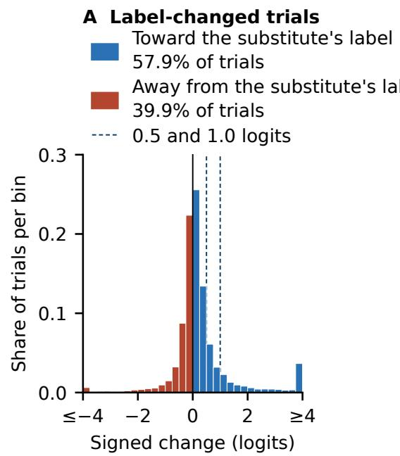

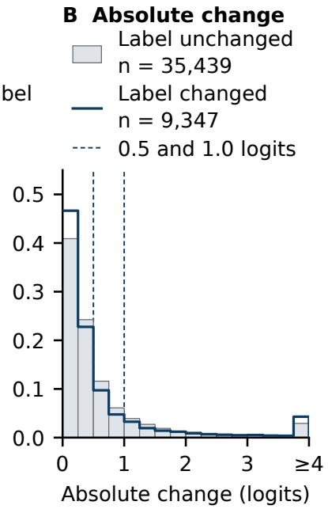  
Figure 4. Paired margin change, all 14 questions, report present, image first. (A) Signed, target-aligned change $y _ { d } ( m _ { d } - m _ { c } )$ on the 9,347 label-changed trials, shaded by direction; mean 0.35 [0.29, 0.41], median 0.08. (B) Absolute change $| m _ { d } - m _ { c } |$ on the 35,439 label-unchanged and the same 9,347 label-changed trials. End bins collect the tails.

A Full cohort, 3,199 cases unless noted  
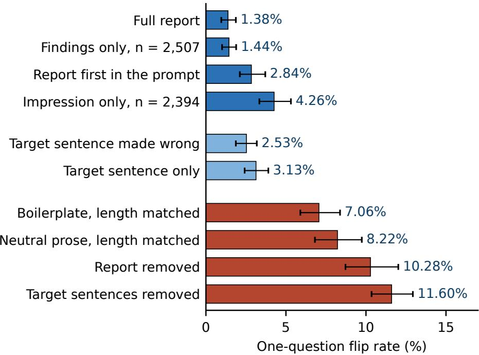

B Matched sections, 1,702 cases with both sections  
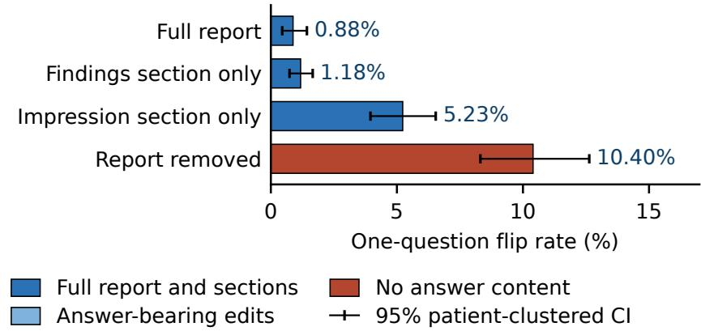  
Figure 5. One-question flip rate by text condition, MedGemma-27B, patient-clustered 95% intervals. (A) Full cohort, 3,199 cases unless noted (Appendix Table 18). (B) The 1,702 cases with both sections, all scored on the same cases: findings alone within 0.3 points of the full report, impression alone 4.4 points above it [3.0, 5.7].

## B How much the image changes

Two distances between the source and substitute images were computed for all 3,199 pairs. Structural similarity (SSIM) at the model’s 896 by 896 greyscale input has quartiles 0.462 / 0.528 / 0.586 and maximum 0.78; no pair exceeded the specified SSIM threshold of 0.9 (fraction above it 0.000). The cosine distance between MedGemma’s vision-tower (SigLIP, mean-pooled) embeddings, cohort-mean-centred, has quartiles 0.395 / 0.563 / 0.745 and a Spearman correlation of 0.16 with the time gap. With the report absent (one question per case, 329 flips) the flip rate rises with embedding distance, from 8.5% [6.3, 11.0] in the most similar quartile. The most distant quartile gives 14.5% [11.7, 17.4]. The diference is +6.0 points [2.5, 9.5]. With the report present (45 flips) the rise is from 0.6% to 1.9%, a diference of +1.3 [0.1, 2.5]. A logistic regression of flip on standardized embedding distance, label change and report presence (6,398 pair-condition rows, cluster-robust) gives an odds ratio of 1.30 per SD of distance [1.16, 1.46]. The odds ratio is 1.43 for a label change [1.05, 1.96]. It is 0.12 for report presence [0.09, 0.17].

## C Per-finding agreement

<table><tr><td>Finding</td><td>Observed agreement</td><td>Chance-expected</td><td>Raw excess</td><td>Cohen&#x27;s κ</td></tr><tr><td>Pneumothorax</td><td>0.992 [0.988, 0.995]</td><td>0.919</td><td>0.073</td><td>0.899 [0.837, 0.943]</td></tr><tr><td>Any finding (composite)</td><td>0.964 [0.957, 0.971]</td><td>0.501</td><td>0.463</td><td>0.927 [0.913, 0.941]</td></tr><tr><td>Atelectasis</td><td>0.951 [0.942, 0.960]</td><td>0.698</td><td>0.254</td><td>0.839 [0.807, 0.867]</td></tr><tr><td>Cardiomegaly</td><td>0.936 [0.923, 0.948]</td><td>0.500</td><td>0.435</td><td>0.871 [0.845, 0.896]</td></tr><tr><td>Support devices</td><td>0.946 [0.931, 0.959]</td><td>0.914</td><td>0.032</td><td>0.370 [0.271, 0.451]</td></tr></table>

Table 10. Five of 14 findings, each �=3,199; pooled observed agreement is 0.953. Chance-expected agreement is $p _ { c } p _ { d } + ( 1 - p _ { c } ) ( 1 - p _ { d } )$ from the condition-specific yes-rates, raw excess is observed minus expected, � is excess over one minus expected. � corrects for imbalance, not for grounding. Brackets: 95% patient-clustered percentile bootstrap over the 293 patients, 2,000 draws at seed 0. � depends on both branches’ marginals, so each draw rebuilds them from the resampled cases rather than averaging a per-case value; the three indicators are resampled jointly so the pairing is preserved. Support devices is the one finding whose interval is wide and low, [0.271, 0.451], which is what a 0.914 chance level leaves room for.

## D Retrospective chronology analysis of stale reports

No chronology was supplied to the model, so this is a retrospective stratification by chronology, not a test of whether the model reasons about staleness. By construction of the same-patient pairing, the model reads the source report and sees another study of the same patient, later than the report on 1,038 pairs and earlier on 1,130 among the 2,168 same-patient pairs (254 patients) whose asked-finding label difers between the two studies. These 2,168 are the same-patient subset of the 2,321 pairs whose swap changes the asked finding (Table 7) on which the substitute study also carries a CheXpert value for that finding: of the 3,180 same-patient pairs, 171 have no such value on the substitute and 841 carry the same value, leaving 2,168, while the 2,321 count is taken over all 3,199 pairs and includes the 19 cross-patient ones. Every pair here has a non-zero study-time gap; none was dropped for a missing one. Table 11 gives the agreement rates. With the report present the readout follows the report’s label at nearly the same rate for later and earlier substitutes, and the rate does not move with the time gap. The cell that most resembles the stale-report scenario, a finding labelled in a later study’s report that the shown report does not mention, has the lowest report-agreement rate; whether this corresponds to clinical harm is not measured here: in this pair set it is the composite any-finding question only, because the one-question design asks about the source study’s own positive finding.

<table><tr><td>Pairs</td><td>Agrees with report label</td><td>Agrees with substitute label</td></tr><tr><td>All 2,168, report present</td><td>0.912 [0.897, 0.926]</td><td>0.088 [0.074, 0.103]</td></tr><tr><td>All 2,168, report absent</td><td></td><td>0.321 [0.289, 0.351]</td></tr><tr><td>Present minus absent</td><td></td><td>-0.232 [-0.262, -0.202]</td></tr><tr><td>Substitute later (1,038), report present</td><td>0.899 [0.878, 0.919]</td><td></td></tr><tr><td>Substitute earlier (1,130), report present</td><td>0.924 [0.904, 0.942]</td><td></td></tr><tr><td>Later minus earlier</td><td>-0.025 [-0.054, +0.002]</td><td></td></tr><tr><td>Odds ratio per log day of time gap</td><td>0.94 [0.87, 1.01]</td><td></td></tr><tr><td>Later study&#x27;s finding not in the shown report (188)</td><td>0.824 [0.762, 0.878]</td><td></td></tr></table>

Table 11. Readout agreement by chronology on the 2,168 same-patient pairs whose asked-finding label difers between the two studies, one-question design, report-derived labels. Brackets: 95% patient-clustered percentile bootstrap over the 254 patients, 2,000 draws.

Sensitivity to an instruction treating the report as historical or as unreliable. We tested an instruction that asked the model to treat the report as historical context. This was a framing intervention; temporal consistency was not enforced. The report-present condition was rerun with one sentence placed before the report, stating that it describes an earlier study of the same patient and that the question is to be answered from the current image with the report as context only, under the same explicit answer instruction as Appendix I. No study dates were checked: for the original image the report belongs to the study shown, and a substitute may precede or follow it. Under this framing the readout changed with the image on 1.72% of pairs [1.25, 2.25], against 1.22% under the plain “Report:” label with the same instruction. Readout accuracy against the concordant label stays at 92.0% on the original image and 92.2% on the substitute. The paired diference is +0.50 points [0.07, 0.94], with the same sign under the generated-answer readout (+0.60 points) and the token-family readout. Against the no-report condition (18.26%) the gap is 16.54 points [14.46, 18.86], so the framing does not restore the sensitivity seen without the report. Against the report-present cell without the answer instruction (1.41%) the diference is +0.31 points [−0.27, 0.87]. The result measures sensitivity to the instruction, not performance when the supplied report is in fact historical.

An explicit reliability warning. The historical framing only relocates the report in time, so the report-present condition was also rerun under the stronger framing, one sentence before the report telling the model that the report may not describe this image and may be wrong, that the question is to be answered from the image and that the report is unverified context, with the same answer instruction; the readout changed with the image on 1.50% of pairs [1.06, 1.98]. Against the plain “Report:” label with the same instruction (1.22%) the paired diference is +0.28 points [−0.13, 0.74], not distinguishable from zero. Against the historical framing it is −0.22 points [−0.67, 0.22], also not distinguishable, and the token-family (1.47%) and generated-answer (1.38%) readouts give the same picture. Against the no-report condition under the same instruction (18.26%) the gap is −16.76 points [−18.93, −14.74], so the warning does not restore the sensitivity seen without the report. On the substituted image the readout still matches the report’s label on 93.12% of pairs and the shown image’s label on 32.89%, falling to 8.49% [7.22, 9.93] on the 2,321 pairs whose swap changes the asked finding. Format compliance rises to 99.94% and 99.87% on the two image sides from 99.28% and 99.50% under the historical framing, and the generated-answer flip rate shifts against the plain framing by +0.53 points [0.12, 0.97].

On the pairs where the framing is true. The historical instruction was applied to every pair, but it is a true statement only where the substitute image is a later study than the one the shown report describes. Chronology is reconstructed from the signed study gap in the pairing record for every same-patient pair, which splits the 3,180 into 1,568 where the substitute is a later study, so the shown report really is historical relative to the image, and 1,612 where it is earlier; there are no equal-date or undated pairs, and the counts reconcile with Table 11. Under the historical framing the image-swap flip rate is 1.72% on the later set and 1.74% on the earlier set, a diference of −0.02 points [−1.03, +1.06]; scoring the generated answer gives 1.66% against 0.99%, +0.67 [−0.27, +1.66]. Both intervals come from resampling the 276 patients once per draw and scoring both strata on that draw, since a patient can contribute pairs to both. We did not detect a diference between the strata: the instruction does not measurably restore image sensitivity on the pairs where what it says is the case. This is the nearest this data comes to a stale-report condition without independently dated images; no report was rewritten, and the absence of a detected diference is not evidence that stale reports are harmless.

## E Sensitivity analysis using manually annotated report labels

We repeated the analysis using the manually annotated report labels supplied with MIMIC-CXR-JPG: the 687 test-set reports annotated by a single radiologist to evaluate the automated labelers [Johnson et al., 2019b]. This checks sensitivity to automated label extraction, not the findings in the displayed images: the annotator read the report, not the image. Applied at study level, 291 of the 3,199 pairs (90 patients) have manual labels on both studies, 4,074 of the 44,786 trials. On those studies the automated and manual report labels agree on 0.943 [0.938, 0.947] (Cohen’s � 0.795; automated sensitivity 0.894, precision 0.773 against the manual label), which estimates agreement between automated and manual labels in this subset. Table 12 gives the readout on the 800 trials whose manual label of the asked finding difers between the two studies: the report efect keeps its direction. Scored against the manual rather than the automated label, concordant accuracy is 0.627 (balanced 0.712) with the report and 0.485 (balanced 0.644) without; the report-absent readouts answer yes on 73% of trials, so the balanced accuracies are the fair comparison.

<table><tr><td>Statistic</td><td>Report present</td><td>Report absent</td><td>Absent minus present</td></tr><tr><td>Flip rate, 800 manual-label-changed trials</td><td>3.13% [1.87, 4.48]</td><td>12.50% [9.60, 16.13] +9.4 points [6.1, 13.3]</td><td></td></tr><tr><td>Flip rate, 3,274 same-label trials Agrees with the substitute&#x27;s manual label, 0.378 [0.342, 0.410] 0.519 [0.487, 0.552] +0.141 [0.100, 0.187]</td><td>4.40%</td><td></td><td></td></tr><tr><td>800 trials Agrees with the source report&#x27;s label, 800 0.616 [0.580, 0.651]</td><td></td><td></td><td></td></tr><tr><td>trials Agrees with the substitute&#x27;s manual label, 0.053 [0.022, 0.088] 0.147 [0.087, 0.208]</td><td></td><td></td><td></td></tr><tr><td>150 trials, one-question design Agrees with the report, 717 trials whose 0.633 [0.596, 0.671] 0.481 [0.444, 0.518]</td><td></td><td></td><td></td></tr><tr><td>substitute&#x27;s manual label contradicts it The same 717 trials, one-question design 0.979 [0.956, 1.000]</td><td></td><td></td><td></td></tr></table>

Table 12. Readout under the manually annotated report labels of MIMIC-CXR-JPG, with and without the report, all 14 questions unless stated. Brackets: 95% patient-clustered percentile bootstrap over the 90 covered patients, 2,000 draws; unbracketed cells have none.

## F Other models: MedGemma-4B, a second family and a third

MedGemma-4B, run through the same four one-question cells on the same 3,199 cases, shows the same interaction with a larger efect. Its lowercase first-token readout changes on 3.16% of cases with the report [2.46, 3.92]. Without the report it changes on 19.01% [16.64, 21.40]. The paired diference is 15.85 points [13.45, 18.25]. The ratio is 6.0 [4.8, 7.8]. Balanced accuracy on the original image is 0.812 with the report and 0.810 without, in both cases scored against that image’s own study’s label. The 27B value in the report-absent cell of the same design is 0.479 (Table 23): without a report the 27B readout answers yes on 2,911 of the 3,199 cases, against 2,422 for 4B, so its specificity collapses to 0.06 while the 4B specificity stays at 0.77. The two numbers describe the same image and the same cell in diferent models, not the same model on diferent images. On the all-14 unit the 4B rates are 7.42% with the report and 22.52% without, a paired 15.1 points [13.8, 16.3], positive on all 14 findings. The ratio is 3.0 [2.8, 3.3]. On the same 44,786 trials the 4B model flips 2.7 points more than the 27B model (Table 4).

Qwen3.5-9B [Qwen Team, 2026] (a non-Gemma image-text model, revision c2022362) was run through the one-question design on the same 3,199 cases, report present and absent, both images, with the same prompt, its own chat template, thinking disabled and images capped at 802,816 pixels. Its token-family readout sums the probabilities of each answer family (the log-sum-exp of the logits, never a sum of raw logits) and takes the argmax between the two family probabilities at the first generated position; the yes family is token ids 9405, 9175, 9542 and 7179 and the no family 2083, 2665, 874 and 2233, the case and leading-whitespace variants of the two words in the Qwen3.5 vocabulary. Without an answer instruction this model answered yes on 3,197 of 3,199 report-absent cases, a saturated prior under which the report-presence efect could not be established, and its spontaneous first token was a bare yes or no on only 13 to 34% of cases. With the instruction “Answer with exactly Yes or No.” appended, as in Appendix I, every generation was a bare Yes or No, and the generated and token-family readouts agree on 0.984 to 0.997 of cases, so the readout is validated for this model. Under that instruction the report-presence efect replicates in direction and significance. With the report the answer moves on 1.3% of substitutions [0.9, 1.7]. Without it the answer moves on 14.5% [12.5, 16.9]. The paired diference is

13.3 points [11.2, 15.6] and the ratio 11.6. With the report the answer agrees with the report’s label on 0.916 of cases. Without it the answer agrees with the substituted image’s label at chance, balanced accuracy 0.48, although the asked finding’s label changes on 2,321 of the 3,199 substitutions. Image reading in this family is therefore weak, and the result is a replication of report anchoring, not of image competence: the model follows the report when it is shown one and moves with the image when it is not, without reading the image accurately. One H100.

A third lineage and a scale check. Two further models were run through the same one-question design on the same 3,199 cases and 293 patients, under the instruction “Answer with exactly Yes or No.”, with the token-family and generated readouts side by side and a patient-clustered percentile bootstrap of 2,000 draws at seed 0: LLaVA-NeXT on Mistral-7B [Liu et al., 2024, 2023] (revision 2424fdd4), a lineage that is neither Gemma nor Qwen, and Qwen3.5-27B, three times the size of the Qwen3.5-9B arm above. The report-presence efect holds in both (Table 14): the LLaVA-NeXT token-family readout moves on 2.59% of substitutions with the report and 15.35% without, a paired 12.75 points [11.10, 14.44] and a ratio of 5.92, while Qwen3.5-27B moves on 0.88% against 20.48%, a paired 19.60 points [17.00, 22.40] and a ratio of 23.39; the generated readout gives 12.91 points [11.25, 14.65] and 20.23 points [17.67, 22.92] on the same cases. Scale does not shrink the efect: 19.60 points at Qwen3.5-27B against 13.3 at Qwen3.5-9B, with MedGemma-27B at 0.84% against 17.69% under the same instruction. Both readouts are validated here: format compliance is 1.000 in all eight cells, none of the 25,592 generations was unscoreable, and the generated answer agrees with the token family on 0.9978 to 0.9987 of cases for LLaVA-NeXT and 0.9881 to 0.9984 for Qwen3.5-27B. What replicates is report anchoring and not image competence: with the report removed and the substituted image shown, agreement with that image’s own label is 0.518 (balanced 0.470 [0.452, 0.488]) for LLaVA-NeXT and 0.471 (balanced 0.516 [0.492, 0.539]) for Qwen3.5-27B, with 0.487 [0.462, 0.511] for Qwen3.5-9B, patient-clustered over 293 patients. The Qwen intervals include 0.5, which is insuficient evidence of above-chance reading and not evidence of equivalence to chance; the LLaVA-NeXT interval sits below 0.5, which on a label-conditioned set is consistent with following the source report rather than the image, both chance, while balanced accuracy against the case’s own report label is 0.925 and 0.943 with the report present and falls to 0.670 and 0.848 once the report is removed. The MedGemma arms complete the same cell: with the report removed and the substituted image shown, agreement with that image’s own label is balanced accuracy 0.480 for MedGemma-27B under the token-family readout with this instruction (0.515 under the paper’s lowercase readout, Appendix I) and 0.518 [0.492, 0.542] for MedGemma-4B under the paper’s readout without the instruction. No model tested in this paper shows above-chance reading of the substituted image on this one-question set. That set is label-conditioned, with target yes on 2,707 of 3,199 cases, and the statement does not carry to the primary all-14 unit: there the report-absent readout reaches balanced accuracy 0.665 [0.658, 0.672] on the original image against a question-only cell at 0.500 (Table 20), and 0.666 [0.659, 0.674] on the substituted image against that study’s own asked-finding label. The at-chance statement is about this question set, not about MedGemma’s image reading in general.

Questions selected independently of the source label. The one-question design asks a finding specific question on the 2,707 positive source cases and the composite question on the 492 negative ones, so a rule that answers yes to every finding-specific question and no to the composite scores perfectly on the source label without reading anything, and source-image accuracy on that design cannot establish competence. To remove the shortcut, the same four cells were rerun under the answer instruction with generated answers on a prespecified set of finding-specific questions asked of every case: the six findings whose source-label yes-rate lies between 20% and 80%, a rule fixed before any result was seen (atelectasis 22.3%, cardiomegaly 27.1%, edema 20.8%, lung opacity 32.0%, pleural efusion 32.4%, support devices 32.7%), 19,194 trials per model over the 293 patients, 9,531 of them label-changing (Table 13). The report efect survives the change of design in every model, at 13.1 to 20.9 points, the same order as MedGemma’s 16.7 under the same readout. Image-only balanced accuracy on the original image is above chance for the Qwen models, 0.635 [0.620, 0.651] and 0.664 [0.650, 0.678], which the label-conditioned design could not show, and near chance for LLaVA-NeXT, 0.538 [0.524, 0.553]; on the substitute image all three sit at or just above chance, 0.497 to 0.537. The Qwen models’ original-image scores come with sensitivity near 0.9 and specificity 0.3 to 0.4, a yes-bias, so above chance is not the same as competent. No question-only cell was run in this sweep, so that baseline is absent here rather than approximated. Per-finding report efects are in the record.

<table><tr><td rowspan="2">Model</td><td colspan="2">Generated-answer flip rate</td><td rowspan="2">Report effect points</td><td colspan="2">Image-only balanced accuracy</td><td rowspan="2">Follows sub. label no report</td></tr><tr><td>Report present</td><td>Report absent</td><td>Original image</td><td>Substitute image</td></tr><tr><td>Qwen3.5-9B</td><td>6.04% [5.5, 6.6]</td><td>19.09% [17.1, 21.4]</td><td>+13.1 [11.2, 15.1]</td><td>0.635 [0.620, 0.651]</td><td>0.532 [0.519, 0.545]</td><td>52.69%</td></tr><tr><td>Qwen3.5-27B</td><td>6.39% [5.9, 6.9]</td><td>23.90% [22.0, 25.9]</td><td>+17.5 [15.8, 19.3]</td><td>0.664 [0.650, 0.678]</td><td>0.537 [0.524, 0.551]</td><td>49.69%</td></tr><tr><td>LLaVA-NeXT-Mistral-7B</td><td>4.33% [3.9, 4.8]</td><td>25.24% [24.1, 26.3]</td><td>+20.9 [19.9, 21.9]</td><td>0.538 [0.524, 0.553]</td><td>0.497 [0.489, 0.505]</td><td>44.85%</td></tr></table>

Table 13. Cross-model results on six finding-specific questions selected by a prespecified prevalence rule and asked of every case, 19,194 trials per model, generated answers under the explicit instruction. Balanced accuracy is against each image’s own report-derived label with no report shown. The last column is the share of the 9,531 label-changing pairs whose no-report answer on the substitute image follows the substitute’s label. Brackets: 95% patient-clustered percentile bootstrap over 293 patients, 2,000 draws; the report efect resamples patients once per draw and scores both conditions on that draw.

<table><tr><td>Model</td><td>Report present</td><td>Report absent</td><td>Paired difference, points</td></tr><tr><td>MedGemma-27B</td><td>0.84% [0.50, 1.27]</td><td>17.69% [15.88, 19.61]</td><td>+16.9 [15.0, 18.8]</td></tr><tr><td>Qwen3.5-9B</td><td>1.3% [0.9, 1.7]</td><td>14.5% [12.5, 16.9]</td><td>+13.3 [11.2, 15.6]</td></tr><tr><td>Qwen3.5-27B</td><td>0.88% [0.56, 1.22]</td><td>20.48% [17.95, 23.26]</td><td>+19.60 [17.00, 22.40]</td></tr><tr><td>LLaVA-NeXT Mistral-7B</td><td></td><td>2.59% [1.97, 3.31]15.35% [13.65, 17.13]</td><td>+12.75 [11.10, 14.44]</td></tr></table>

Table 14. Four models on one axis: one-question design, 3,199 cases and 293 patients, token-family readout under the instruction to answer Yes or No, paired diference absent minus present in points. Brackets: 95% patient-clustered percentile bootstrap, 2,000 draws.

## G Sensitivity of the primary efect to pairing and label choices

<table><tr><td></td><td></td><td>Report</td><td>Report</td><td>Difference,</td></tr><tr><td>Subset or weighting</td><td>Trials</td><td>present</td><td>absent</td><td>points</td></tr><tr><td>All trials (primary)</td><td>44,786</td><td>4.70% [4.35, 5.06]</td><td>17.07% [15.78, 18.39]</td><td>+12.4 [11.2, 13.6]</td></tr><tr><td>Composite question excluded</td><td>41,587</td><td>4.78% [4.43, 5.16]</td><td>18.14% [16.83, 19.46]</td><td>+13.4 [12.2, 14.6] +12.3 [11.1, 13.4]</td></tr><tr><td>Cross-patient pairs excluded</td><td>44,520 26,726</td><td>4.70% [4.34, 5.07] 4.61% [4.15, 5.10]</td><td>16.99% [15.70, 18.26] 15.21% [13.85, 16.60]</td><td>+10.6 [9.3, 11.9]</td></tr><tr><td>Same known view Both views known</td><td>38,444</td><td>4.80% [4.43, 5.21]</td><td>16.80% [15.44, 18.20]</td><td>+12.0 [10.8, 13.3]</td></tr><tr><td>Known view mismatch</td><td>11,718</td><td>5.23% [4.68, 5.76]</td><td>20.43% [18.43, 22.49]</td><td>+15.2 [13.3, 17.2]</td></tr><tr><td>Equal-study weighting</td><td>44,786</td><td>4.70% [4.36, 5.06]</td><td>17.01% [15.71, 18.30]</td><td>+12.3 [11.2, 13.5]</td></tr><tr><td>Equal-patient weighting</td><td></td><td>44,786 4.46% [4.05, 4.89]</td><td>18.75% [17.62, 20.01]</td><td>+14.3 [13.2, 15.5]</td></tr></table>

Table 15. Primary efect under alternative pairings, weightings and question sets, all 14 questions unless stated, each subset resampled over its own patients. Same known view: AP to AP or PA to PA; both views known: 453 blank-view pairs excluded. Brackets: 95% patient-clustered percentile bootstrap, 10,000 draws for the primary row and 2,000 for the subsets.

Label policies (asked finding, both images, raw CheXpert values). With an uncertain label read as negative (the paper), positive or excluded, the label-changed group is 9,347, 10,626 or 8,660 trials (44,786, 44,786 or 42,032 retained). The flip rate on label-changed trials with the report present is 4.30%, 4.65% or 4.53%, against 4.81%, 4.72% or 4.79% on label-unchanged trials. The changed-minus-unchanged diference is −0.50 points [−1.03, 0.02] under the paper’s policy. It is −0.07 [−0.56, 0.42] with uncertain read as positive. It is −0.26 [−0.82, 0.27] with uncertain excluded. Concordant balanced accuracy is 0.717, 0.724 or 0.725, and the mean aligned margin change is 0.35, 0.34 or 0.37. Treating unmentioned findings as excluded rather than negative keeps 6,997 trials and gives +0.63 [−0.17, 1.48]. Without the report the label-changed trials flip less often than the unchanged ones under every policy (14.85% against 17.65% for the paper’s policy, −2.80 [−4.22, −1.31]).

Composite question excluded. The 13 finding-specific questions alone give 41,587 trials, 8,416 with the asked finding’s label changed; the composite question contributes 931 of the 9,347 label changes. With the report, 27B concordant accuracy is 0.649, balanced accuracy 0.767 and discordant accuracy 0.593 [0.579, 0.608]; the 4B values are 0.692, 0.791 and 0.624. The flip rate on label-changed against label-unchanged trials is 4.4% against 4.9% for 27B and 7.2% against 7.5% for 4B. The 27B flip rate on these questions is 4.78% with the report and 18.14% without, a paired diference of 13.36 points [12.16, 14.57] (Table 15); for 4B it is 7.46% against 21.96%, a diference of 14.51 points. The pooled balanced accuracies of the four modality cells become 0.767, 0.655, 0.837 and 0.500 and the macro-averaged 0.718, 0.580, 0.776 and 0.500, with interactions of −0.226 pooled and −0.139 macro-averaged [−0.152, −0.124]. The primary headline keeps all 14 questions.

Substitute resampling. The substitute image was redrawn under two further seeds on the same 3,199 cases, reports, questions and concordant images, one-question design, report present and absent, both images. With the report the flip rate was 1.38%, 1.34% and 1.31% under seeds 0, 1 and 2, a spread of 0.06 points; without it 10.28%, 10.00% and 10.32%, a spread of 0.31 points. The paired efect of removing the report was 8.91, 8.66 and 9.00 points. A 95% interval on that efect which resamples both the patients and the substitute draw is [7.32, 10.65]. Which cases flip changes with the substitute: with

the report 66 cases flip under at least one seed and 19 under all three, without it 554 and 139. The size of the report efect does not.
<table><tr><td>Model</td><td>Label</td><td>Report</td><td>Correct, correct</td><td>Correct, wrong</td><td>Wrong, correct</td><td>Wrong, wrong</td><td>Total</td></tr><tr><td>MedGemma-27B</td><td>Changed</td><td>present</td><td>297</td><td>5,730</td><td>3,215</td><td>105</td><td>9,347</td></tr><tr><td>MedGemma-27B</td><td>Changed</td><td>absent</td><td>1,058</td><td>4,014</td><td>3,945</td><td>330</td><td>9,347</td></tr><tr><td>MedGemma-27B</td><td>Unchanged</td><td>present</td><td>22,073</td><td>929</td><td>774</td><td>11,663</td><td>35,439</td></tr><tr><td>MedGemma-27B</td><td>Unchanged</td><td>absent</td><td>14,428</td><td>3,085</td><td>3,171</td><td>14,755</td><td>35,439</td></tr><tr><td>MedGemma-4B</td><td>Changed</td><td>present</td><td>520</td><td>5,577</td><td>3,090</td><td>160</td><td>9,347</td></tr><tr><td>MedGemma-4B</td><td>Changed</td><td>absent</td><td>1,824</td><td>3,566</td><td>3,503</td><td>454</td><td>9,347</td></tr><tr><td>MedGemma-4B</td><td>Unchanged</td><td>present</td><td>22,560</td><td>1,484</td><td>1,159</td><td>10,236</td><td>35,439</td></tr><tr><td>MedGemma-4B</td><td>Unchanged</td><td>absent</td><td>16,641</td><td>3,832</td><td>3,975</td><td>10,991</td><td>35,439</td></tr></table>

Table 16. Correctness on the original then the substitute image, each against its own study’s label for the asked finding, all 14 questions. Concordant correct is columns one and two, discordant correct one and three, flips one and four on changed rows and two and three on unchanged rows.

Of the 9,347 label-changed trials, 61.3% [60.2, 62.4] are correct on the original image and wrong on the substitute. Conditional on being correct on the original, that share is 0.951 with the report [0.943, 0.958]. Without the report it is 0.791 [0.766, 0.816]. On the 35,439 label-unchanged trials a change of correctness is exactly a flip: 1,703 trials change correctness with the report and 6,256 without. Both accuracies of Table 4 follow from the counts: with the report, the 27B readout is correct on the original image on 29,029 of 44,786 trials (0.648) and on the substitute on 26,359 (0.589), and the four flip cells sum to 2,105. Balanced accuracy on the substitute is 0.633 [0.626, 0.640] for 27B and 0.625 for 4B. Every accuracy in this paper is scored on the asked finding’s own label for the study whose image is shown, except the accuracy columns of the text-control table, which are agreement with the source study’s label and are named as such there.

Margins. Table 17 gives the margin statistics on the same 44,786 trials. Per finding, the aligned change with and without the report: pleural efusion 0.52 and 3.94, support devices 1.12 and 1.59, edema 0.32 and 2.45, pneumothorax 0.28 and 2.38, consolidation 0.18 and 2.31, cardiomegaly 0.28 and 0.99, the composite question 0.09 and 1.39; fracture, pleural other and enlarged cardiomediastinum are near zero in both.

<table><tr><td>Statistic</td><td>Report present</td><td>Report absent</td><td>Within-trial difference</td></tr><tr><td>Starting margin  $m _ { c }$  on the original</td><td>-3.47 / -0.31 / 8.23</td><td>-1.13 / 3.03 / 7.92</td><td></td></tr><tr><td>image, quartiles Flip rate, lowest / highest quartile of</td><td>15.1% / 0.15%</td><td>37.9% / 4.3%</td><td></td></tr><tr><td> $| m _ { c } |$  Mean absolute paired change</td><td></td><td>0.690 [0.657, 0.726]2.307 [2.203, 2.415]1.62 [1.53, 1.70]</td><td></td></tr><tr><td>Aligned change, label-changed trials</td><td>0.35 [0.29, 0.41]</td><td>1.44 [1.26, 1.62]</td><td></td></tr><tr><td>Aligned change, no-to-yes (4,637</td><td>0.63 [0.53, 0.74]</td><td></td><td></td></tr><tr><td>trials) Aligned change, yes-to-no (4,710</td><td>0.07 [0.05, 0.09]</td><td></td><td></td></tr><tr><td>trials) Aligned change, averaged over the 14 0.246 [0.199, 0.297] 1.227 [1.050, 1.407]</td><td></td><td></td><td></td></tr><tr><td>findings Absolute change above 0.5, share of trials</td><td>32.2% [30.8, 33.5]</td><td>78.0% [77.0, 79.0]</td><td></td></tr></table>

Table 17. Margin changes on the 44,786 all-14 trials. The absolute change is larger without the report on 82.9% of trials. Section 4.1 pools the aligned change over trials; the finding-averaged row weights findings equally. Brackets: 95% patient-clustered percentile bootstrap, 2,000 draws; unbracketed cells have none.

## H Text-control hierarchy

One-question design, full arm, both images, MedGemma-27B. Diferences are paired against the plain full report on each condition’s cases. The full-report row is a re-run of the one-question full arm on the same 3,199 cases: it gives 1.38% (44 flips) against the 1.41% (45 flips) of Table 2, a one-case diference between two runs of the same arm. Removing only the sentences that name the asked finding is not separated from removing the whole report (+1.3 points [−0.3, 2.7]). On the 1,702 cases carrying both sections, the findings section alone is within 0.3 points of the full report [−0.3, 0.9]. The impression alone is 4.4 points above it [3.0, 5.7]. Text-block order on the same design: with the text first the flip rate is 2.84% against 1.41% image first (Table 2); the per-arm counts are in Table 27.

<table><tr><td rowspan="2">Text shown with the image</td><td colspan="2">vs. full report,</td><td colspan="2">Source-label</td></tr><tr><td>Flip rate</td><td>points</td><td>agreement, original</td><td>agreement, substitute</td></tr><tr><td>Full report Findings section only (2,507</td><td>1.38% [0.96, 1.87]</td><td>reference +0.2 [–0.2, 0.6]</td><td>0.931 [0.919, 0.941] 0.927 [0.915, 0.939]</td><td>0.930 [0.919, 0.940] 0.925 [0.913, 0.937]</td></tr><tr><td>cases)</td><td>1.44% [1.01, 1.89]</td><td></td><td></td><td></td></tr><tr><td>Target sentences replaced by the opposite label</td><td>2.53% [1.87, 3.18]</td><td>+1.2 [0.3, 1.9]</td><td>0.043 [0.034, 0.053]</td><td>0.046 [0.037, 0.056]</td></tr><tr><td>One sentence stating the label Impression section only (2,394</td><td>3.13% [2.42, 3.90]</td><td>+1.8 [0.9, 2.6] +3.1 [2.2, 4.1]</td><td>0.845 [0.819, 0.868]</td><td>0.848 [0.822, 0.871] 0.866 [0.847, 0.883]</td></tr><tr><td>cases)</td><td>4.26% [3.34, 5.31]</td><td></td><td>0.873 [0.853, 0.891]</td><td></td></tr><tr><td>Clinical boilerplate, length matched</td><td>7.06% [5.90, 8.38]</td><td>+5.7 [4.5, 7.0]</td><td>0.787 [0.759, 0.813]</td><td>0.764 [0.736, 0.790]</td></tr><tr><td>Neutral prose, length matched</td><td>8.22% [6.81, 9.74]</td><td>+6.9 [5.4, 8.4]</td><td>0.799 [0.771, 0.823]</td><td>0.767 [0.737, 0.794]</td></tr><tr><td>Report removed</td><td>10.28% [8.72, 12.02]</td><td>+8.9 [7.5, 10.6]</td><td>0.773 [0.744, 0.799]</td><td>0.746</td></tr><tr><td>Target sentences removed</td><td>11.60% [10.35, 12.93]</td><td>+10.2 [9.0, 11.6]</td><td>0.743 [0.717, 0.767]</td><td>0.726 [0.699, 0.751]</td></tr></table>

Table 18. Text-control hierarchy, one-question design, 3,199 cases unless stated; accuracy is scored against the source study’s label. Sentences naming the asked finding were found by keyword lists (55 cases had none); section variants keep cases whose report has that section. Brackets: 95% patient-clustered percentile bootstrap, 2,000 draws; unbracketed cells have none.

## I Readout validation

This validation uses an explicit answer instruction and covers both designs. The one-question design was re-run with and without the instruction “Answer with exactly Yes or No.” appended to the question, eight tokens generated per case, report-present and report-absent arms, both images; the all-14 design was then rerun with the instruction (Table 3). Three readouts are compared: the paper’s lowercase first-token readout (argmax over the lowercase yes/no logits), the token-family readout (argmax over the summed probabilities of the yes and no variants) and the parsed generated answer. With the instruction, compliance is 100%. Without it the model answers “Yes” only when the label is yes and otherwise opens with “Based on the provided report”, so “no” answers are unscoreable within eight tokens.

<table><tr><td>Prompt</td><td>Arm</td><td>Lowercase first token</td><td>Token families</td><td>Generated answer</td></tr><tr><td>With instruction report present</td><td></td><td>1.22% [0.81, 1.67]</td><td>0.84% [0.50, 1.27]</td><td>0.84% [0.50, 1.27]</td></tr><tr><td>With instruction</td><td>report absent</td><td>18.26% [16.20, 20.57]</td><td>17.69% [15.88, 19.61]</td><td>17.66% [15.90, 19.55]</td></tr><tr><td>With instruction</td><td>paired difference</td><td>-17.0 [-19.4, -14.9]</td><td>-16.9 [-18.8, -15.0]</td><td>-16.8 [-18.7, -15.0]</td></tr><tr><td>No instruction</td><td>report present</td><td>1.38% [0.96, 1.87]</td><td>1.09% [0.69, 1.54]</td><td>1.84% [1.36, 2.37]</td></tr><tr><td>No instruction</td><td>report absent</td><td>10.28% [8.72, 12.02]</td><td>17.35% [15.31, 19.56]</td><td>11.57% [9.99, 13.32]</td></tr><tr><td>No instruction</td><td>paired difference</td><td>-8.9 [-10.6, -7.5]</td><td>-16.3 [-18.5, -14.2]</td><td>-9.7 [-11.5, -8.1]</td></tr></table>

Table 19. Flip rates of the one-question design under three readouts and two prompts, 3,199 cases; paired diference is report present minus absent, in points. No-instruction generated answers are three-state (yes, no, unscoreable). Brackets: 95% patient-clustered percentile bootstrap, 2,000 draws.

Every answer is the argmax over two output logits at the first generated position, the single tokens yes (id 4443) and no (id 1904) of the MedGemma-27B tokenizer at revision 2d3e00e, selected as the unique one-token continuations of the chat-template generation prompt. The capitalised and space-prefixed variants (Yes 10784, yes with a leading space 11262, Yes with a leading space 8438; No 3771, no with a leading space 951, No with a leading space 2301) enter only the token-family readout, where the model’s top-1 first token is the capitalised form. MedGemma-4B at revision 290cda5e maps the same eight strings to the same ids. The exact tokens the paper reads carry a mean first-position probability below $1 0 ^ { - 4 }$ in every condition. Under the explicit instruction, the lowercase readout agrees with generated answers on 98.8% of report-present cases and 91 to 93% of report-absent cases. The instruction changes the report-absent rate under the paper’s readout by +8.0 points but not under the family readout (+0.3 [−1.4, 2.0]), so the report-absent value is a property of the readout choice, and the report-presence efect is larger under the validated readouts. The order of the two options is tested in Appendix M.

The all-14 design under the instruction. The primary design, 44,786 trials on the same 3,199 cases and 293 patients, was rerun with the instruction appended and greedy generation, so the same trials can be scored by the generated answer and the token families as well as by the lowercase first-token readout (Table 3). Format compliance, the share of generations that open with Yes or No, is at least 0.9999 in every condition. The primary efect survives on its own unit under every readout: the paired diference is 16.1 points under the lowercase readout, 16.7 under the token families and 16.7 under the generated answer, with ratios of 4.5 to 4.9, and every interval on the diference excludes zero. Under the headline prompt, which carries no instruction, the same trials give 4.70% against 17.07%, a diference of 12.37 points; the instruction raises the report-absent rate by about four points and leaves the report-present rate within a tenth of a point under the lowercase readout, so the instructed prompt is a check on the readout and not a replacement for the headline. Table 3, the all-14 design under the instruction, is in the main text (Section 4.1).

## J Modality ablation on both designs

<table><tr><td colspan="2"></td><td colspan="2">Image +</td><td colspan="2">Report + question</td></tr><tr><td>Finding</td><td>Full</td><td>question</td><td></td><td></td></tr><tr><td>Atelectasis</td><td>0.623 [0.603, 0.646]</td><td>0.500 [0.500, 0.500]</td><td>0.823 [0.807, 0.839]</td><td>0.500 [0.500, 0.500]</td></tr><tr><td>Cardiomegaly</td><td>0.766 [0.743, 0.788]</td><td>0.656 [0.630, 0.682]</td><td>0.808 [0.789, 0.827]</td><td>0.500 [0.500, 0.500]</td></tr><tr><td>Consolidation</td><td>0.834 [0.809, 0.858]</td><td>0.645 [0.609, 0.685]</td><td>0.887 [0.861, 0.909]</td><td>0.500 [0.500, 0.500]</td></tr><tr><td>Edema</td><td>0.849 [0.829, 0.868]</td><td>0.658 [0.637, 0.681]</td><td>0.882 [0.867, 0.897]</td><td>0.500 [0.500, 0.500]</td></tr><tr><td></td><td>Enlarged cardiome- 0.480 [0.429, 0.530]</td><td>0.482 [0.432, 0.533]</td><td>0.511 [0.469, 0.559]</td><td>0.500 [0.500, 0.500]</td></tr><tr><td>diastinum Fracture</td><td>0.938 [0.903, 0.965]</td><td>0.586 [0.532, 0.642]</td><td>0.906 [0.857, 0.947]</td><td>0.500 [0.500, 0.500]</td></tr><tr><td>Lung lesion</td><td>0.696 [0.666, 0.725]</td><td>0.499 [0.483, 0.512]</td><td>0.772 [0.737, 0.804]</td><td>0.500 [0.500, 0.500]</td></tr><tr><td>Lung opacity</td><td>0.601 [0.583, 0.621]</td><td>0.503 [0.501, 0.505]</td><td>0.688 [0.668, 0.707]</td><td>0.500 [0.500, 0.500]</td></tr><tr><td>Pleural effusion</td><td>0.833 [0.811, 0.854]</td><td>0.740 [0.712, 0.768]</td><td>0.911 [0.897, 0.924]</td><td></td></tr><tr><td>Pleural other</td><td>0.608 [0.492, 0.717]</td><td>0.529 [0.428, 0.637]</td><td>0.580 [0.475, 0.694]</td><td>0.500 [0.500, 0.500] 0.500 [0.500, 0.500]</td></tr><tr><td>Pneumonia</td><td>0.714 [0.684, 0.742]</td><td>0.537 [0.505, 0.569]</td><td>0.710 [0.677, 0.742]</td><td>0.500 [0.500, 0.500]</td></tr><tr><td>Pneumothorax</td><td>0.853 [0.781, 0.903]</td><td>0.711 [0.663, 0.758]</td><td>0.830 [0.749, 0.889]</td><td>0.500 [0.500, 0.500]</td></tr><tr><td>Support devices</td><td>0.535 [0.525, 0.547]</td><td>0.500 [0.500, 0.500]</td><td>0.784 [0.757, 0.808]</td><td></td></tr><tr><td>Any finding</td><td>0.732 [0.712, 0.750]</td><td>0.524 [0.510, 0.543]</td><td>0.696 [0.680, 0.712]</td><td>0.500 [0.500, 0.500] 0.500 [0.500, 0.500]</td></tr><tr><td>(composite)</td><td></td><td></td><td></td><td></td></tr><tr><td>Pooled balanced accuracy</td><td>0.717 [0.710, 0.725]</td><td>0.665 [0.658, 0.672]</td><td>0.770 [0.764, 0.776]</td><td>0.500 [0.500, 0.500]</td></tr><tr><td>Macro-averaged</td><td>0.719 [0.706, 0.732]0.576 [0.564, 0.588]0.770 [0.759, 0.782]</td><td></td><td></td><td>0.500 [0.500, 0.500]</td></tr><tr><td>balanced accuracy</td><td></td><td></td><td></td><td></td></tr><tr><td>Pooled micro accuracy</td><td></td><td></td><td>0.648 [0.635, 0.662]0.504 [0.493, 0.516]0.772 [0.764, 0.781]</td><td>0.204 [0.194, 0.213]</td></tr><tr><td>Sensitivity</td><td>0.834 [0.817, 0.847]</td><td></td><td></td><td></td></tr><tr><td>Specificity</td><td>0.601 [0.580, 0.623] 0.394 [0.374, 0.415]</td><td>0.937 [0.926, 0.945]</td><td>0.767 [0.751, 0.781] 0.773 [0.760, 0.787]</td><td>1.000 [1.000, 1.000] 0.000 [0.000, 0.000]</td></tr></table>

Table 20. Balanced accuracy per finding, pooled and macro-averaged, four modality cells, all-14 design (44,786 trials, report-derived labels, majority 0.796). Interaction, image efect with the report minus without: −0.218 [−0.224, −0.212] pooled over trials. Macro-averaged over findings: −0.128 [−0.141, −0.115]. Brackets: 95% patient-clustered percentile bootstrap, 2,000 draws.

<table><tr><td></td><td colspan="2">Full</td><td colspan="2">Image + question</td><td colspan="2">Report + question</td></tr><tr><td>Finding</td><td>Sens.</td><td>Spec.</td><td>Sens.</td><td>Spec.</td><td>Sens.</td><td>Spec.</td></tr><tr><td>Atelectasis</td><td>0.999</td><td>0.247</td><td>1.000</td><td>0.000</td><td>0.993</td><td>0.652</td></tr><tr><td>Cardiomegaly</td><td>0.893</td><td>0.639</td><td>0.879</td><td>0.432</td><td>0.833</td><td>0.783</td></tr><tr><td>Consolidation</td><td>0.957</td><td>0.711</td><td>0.791</td><td>0.499</td><td>0.909</td><td>0.865</td></tr><tr><td>Edema</td><td>0.968</td><td>0.730</td><td>0.956</td><td>0.361</td><td>0.958</td><td>0.806</td></tr><tr><td>Enlarged</td><td>0.406</td><td>0.554</td><td>0.594</td><td>0.370</td><td>0.219</td><td>0.804</td></tr><tr><td>cardiomediastinum</td><td></td><td></td><td></td><td></td><td></td><td></td></tr><tr><td>Fracture</td><td>0.925</td><td>0.950</td><td>0.280</td><td>0.893</td><td>0.839</td><td>0.972</td></tr><tr><td>Lung lesion</td><td>0.952</td><td>0.441</td><td>0.976</td><td>0.022</td><td>0.911</td><td>0.633</td></tr><tr><td>Lung opacity</td><td>0.991</td><td>0.212</td><td>1.000</td><td>0.005</td><td>0.969</td><td>0.407</td></tr><tr><td>Pleural effusion</td><td>0.990</td><td>0.675</td><td>0.908</td><td>0.572</td><td>0.988</td><td>0.833</td></tr><tr><td>Pleural other</td><td>0.694</td><td>0.521</td><td>0.444</td><td>0.613</td><td>0.486</td><td>0.673</td></tr><tr><td>Pneumonia</td><td>0.679</td><td>0.749</td><td>0.746</td><td>0.327</td><td>0.560</td><td>0.861</td></tr><tr><td>Pneumothorax</td><td>0.723</td><td>0.983</td><td>0.607</td><td>0.814</td><td>0.670</td><td>0.991</td></tr><tr><td>Support devices</td><td>0.994</td><td>0.077</td><td>1.000</td><td>0.000</td><td>0.973</td><td>0.594</td></tr><tr><td>Any finding (composite)</td><td>0.589</td><td>0.876</td><td>0.994</td><td>0.055</td><td>0.444</td><td>0.947</td></tr><tr><td>Pooled</td><td>0.834</td><td>0.601</td><td>0.937</td><td>0.394</td><td>0.767</td><td>0.773</td></tr></table>

Table 21. Sensitivity and specificity per finding, three modality cells, all-14 design (44,786 trials, report-derived labels). Question only is omitted: it answers yes on every trial, so its sensitivity is 1.000 and its specificity 0.000 for every finding. These are the decomposition of the balanced accuracies in Table 20, which is their mean, and they are point estimates from the committed per-finding summary with no intervals computed. The decomposition is what the balanced accuracy hides: on the full arm, atelectasis, lung opacity and support devices sit at 0.999, 0.991 and 0.994 sensitivity against 0.247, 0.212 and 0.077 specificity, so a balanced accuracy near 0.6 for those findings is a near-constant yes rather than a discrimination. Removing the image raises specificity on all 14 findings, which is the same ordering the pooled row shows.

<table><tr><td>Finding</td><td>Report present</td><td>Report absent</td><td>Absent minus present</td></tr><tr><td>Atelectasis</td><td>6.81%</td><td>4.63%</td><td>-2.2</td></tr><tr><td>Cardiomegaly</td><td>6.06%</td><td>26.23%</td><td>+20.2</td></tr><tr><td>Consolidation</td><td>3.84%</td><td>30.73%</td><td>+26.9</td></tr><tr><td>Edema</td><td>2.50%</td><td>28.63%</td><td>+26.1</td></tr><tr><td>Enlarged cardiomediastinum</td><td>4.78%</td><td>24.29%</td><td>+19.5</td></tr><tr><td>Fracture</td><td>0.78%</td><td>7.00%</td><td>+6.2</td></tr><tr><td>Lung lesion</td><td>6.19%</td><td>26.95%</td><td>+20.8</td></tr><tr><td>Lung opacity</td><td>5.10%</td><td>12.38%</td><td>+7.3</td></tr><tr><td>Pleural effusion</td><td>5.22%</td><td>29.60%</td><td>+24.4</td></tr><tr><td>Pleural other</td><td>2.31%</td><td>21.76%</td><td>+19.5</td></tr><tr><td>Pneumonia</td><td>2.50%</td><td>33.17%</td><td>+30.7</td></tr><tr><td>Pneumothorax</td><td>0.31%</td><td>12.32%</td><td>+12.0</td></tr><tr><td>Support devices</td><td>11.03%</td><td>1.44%</td><td>-9.6</td></tr><tr><td>Any finding (composite)</td><td>2.13%</td><td>34.10%</td><td>+32.0</td></tr><tr><td>Pooled, 14 questions</td><td>4.26%</td><td>20.94%</td><td>+16.7 [15.6, 17.7]</td></tr><tr><td>Pooled, 13 finding-specific</td><td>4.42%</td><td>19.93%</td><td>+15.5 [14.5, 16.5]</td></tr></table>

Table 22. Image-swap flip rate of the generated answer per finding under the explicit answer instruction, all-14 design, 3,199 cases per finding. Two findings reverse the pooled direction: atelectasis and support devices flip less often without the report than with it. The pooled increase is therefore a positive pooled efect, not a consistent efect across findings. Intervals on the pooled rows are patient-clustered, 10,000 draws; per-finding rows are point estimates from the committed per-trial record.

Table 23 gives the same four cells on the secondary one-question design.
<table><tr><td>Arm</td><td>Report Image</td><td></td><td>Accuracy</td><td>Balanced acc.</td><td>∆ vs. full, paired</td></tr><tr><td>Full (reference)</td><td>√</td><td>√</td><td>0.931 [0.919, 0.941]</td><td>0.908</td><td>reference</td></tr><tr><td>Report + question</td><td>√</td><td>X</td><td>0.913 [0.900, 0.925]</td><td>0.927</td><td>–0.018 [–0.026, -0.009]</td></tr><tr><td>Question only</td><td>X</td><td>X</td><td>0.846 [0.822, 0.869]</td><td>0.500</td><td>-0.084 [-0.109, -0.062]</td></tr><tr><td>Image + question</td><td>X</td><td>√</td><td>0.773 [0.744, 0.799]</td><td>0.479</td><td>-0.158 [–0.184, -0.134]</td></tr></table>

Table 23. Modality ablation, one question per case (3,199 cases, 293 patients), question always present. Target yes on 2,707 cases and no on the 492 asked the composite question, so the majority rate 0.846 equals question-only accuracy. Both accuracy columns are on the original image, scored against its own study’s label; the MedGemma-4B counterparts are in Appendix F. Brackets: 95% patient-clustered percentile bootstrap, 10,000 draws; unbracketed cells have none.

## K Classifier-surrogate image labels

As a surrogate for image-level labels, not a reading, a DenseNet-121 chest X-ray classifier from TorchXRayVision [Cohen et al., 2022] version 1.5.4, the checkpoint the library names densenet121- res224-chex, trained on CheXpert only [Irvin et al., 2019] and so on neither these images nor these reports, scored all 3,300 shown images on CPU with the library’s own preprocessing: each image is read as 8-bit grayscale, mapped linearly to the library’s input range of −1024 to 1024, centre-cropped to a square on its long side and resized to 224 by 224 pixels with anti-aliasing, with no other normalisation.

Eleven of its output heads map one to one onto atelectasis, cardiomegaly, consolidation, edema, enlarged cardiomediastinum, fracture, lung lesion, lung opacity, pleural efusion (the head named Efusion), pneumonia and pneumothorax; the composite any-finding question takes the maximum of those eleven scores; pleural other and support devices have no head and are unlabelled on every trial, so the analysis covers twelve questions per case, 38,388 trials. Thresholds were applied not to the raw sigmoid probability but to the library’s operating-point-normalised score, a piecewise-linear rescaling under which each head’s CheXpert-fitted operating point (a raw probability between 0.053 for pneumothorax and 0.327 for lung opacity) sits at 0.5: an image is called present at or above 0.5 and absent below, and a trial is excluded whenever either of its two images scores within 0.1 of 0.5 on that scale, a band that on the raw probability scale is always 0.2 wide and starts at 0.8 times the operating point (0.16 to 0.36 for atelectasis, for example). The rule was fixed before any flip was examined. Of the 38,388 trials, 2,249 carry a classifier-predicted label change of the asked finding between the two images, 22,469 a classifier-predicted label preservation and 13,670 fall in the excluded band; the 6,398 trials on pleural other and support devices lie outside this denominator (Table 24). Against the report-derived labels on the 3,199 source images the surrogate’s AUROC runs from 0.53 (pneumonia) to 0.74 (pleural efusion) across the eleven heads and is 0.76 for the derived any-finding score; at the 0.5 rule it calls between 18% (pneumothorax) and 92% (atelectasis) of images positive, above one half for ten of the eleven heads, against report-label prevalences of 3% to 32%. Re-applying the same rule to the raw sigmoid probability instead (present at or above 0.5, excluded between 0.4 and 0.6) leaves every AUROC unchanged and keeps 29,147 trials (4,706 with a predicted change, 24,441 with a predicted preservation, 9,241 excluded). Under that rule the flip rate with the report is 7.44% on predicted changes [6.51, 8.37] against 3.64% on predicted preservations. Without the report it is 31.24% [28.22, 34.09] against 13.82%, the same direction as the primary rule.

<table><tr><td>Report and classifier-predicted subset</td><td>Flip rate</td><td>Agrees with substitute label</td><td>Paired report difference, points</td></tr><tr><td>Present, label change (2,249)</td><td>7.20% [6.03, 8.57]</td><td>0.422 [0.395, 0.451]</td><td>reference</td></tr><tr><td>Present, label preservation</td><td></td><td>4.44% [3.99, 4.87] 0.697 [0.678, 0.715]</td><td>reference</td></tr><tr><td>(22,469) Absent, label change</td><td></td><td></td><td>37.35% [32.63, 41.87]0.659 [0.624, 0.689] +30.1 [25.3, 34.6]</td></tr><tr><td>Absent, label preservation</td><td></td><td>12.06% [10.98, 13.17] 0.846 [0.831, 0.861]</td><td>+7.6 [6.6, 8.7]</td></tr><tr><td>Absent, change supported by</td><td></td><td>51.01% [41.35, 58.41]0.745 [0.686, 0.790] +44.9 [36.1, 52.2]</td><td></td></tr><tr><td>classifier and report labels (396)</td><td></td><td></td><td></td></tr></table>

Table 24. Flip rates where the classifier surrogate predicts a change in the queried finding or the same label for both images; last row: change supported by both classifier and report labels. Brackets: 95% patient-clustered percentile bootstrap, 2,000 draws; 293 patients on the classifier-only rows, 286 on the last.

Where the surrogate predicts a change in the queried finding, the readout without the report flips three times as often as where it predicts the same label for both images; the report-derived split shows no such separation on the same findings (4.55% against 4.69% with the report, 16.91% against 17.68% without).

## L A second question template

The one-question design was re-run with the template “Is <finding> present on this chest X-ray?” (“Is any acute cardiopulmonary finding present on this chest X-ray?” for the composite question) in place of “Does this chest X-ray show <finding>?”, report present and absent, both images, no answer instruction. The flip rate is 1.06% [0.70, 1.42] with the report. It is 8.28% [6.55, 10.15] without, against 1.38% and 10.28% under the default template on the same cases. The report-presence paired diference is −7.2 points [−9.2, −5.5] under the second template. It is −8.9 [−10.6, −7.5] under the default. The interaction is +1.7 [−0.0, +3.4]. The second template raises report-absent balanced accuracy from 0.479 to 0.621 (specificity 0.06 to 0.29) without changing the report-present value (0.908).

## M Answer order in the instruction

The four passes carrying the answer instruction were repeated with the two options reversed, from “Answer with exactly Yes or No.” to “Answer with exactly No or Yes.”, paired case by case with the default order on the same 3,199 cases. Under the paper’s readout the report-present flip rate is 0.97% reversed against 1.22% default, a diference of −0.25 points [−0.60, 0.09]. The report-absent rate is 18.54% against 18.26%, a diference of +0.28 points [−0.42, 0.99]. The report-presence diference is −17.57 points under the reversed order and −17.04 under the default; the gap between the orders is −0.53 points [−1.36, 0.30]. Under the generated answer the reversed order raises the report-absent flip rate by 1.22 points [0.51, 1.90], and by 1.09 points under the token families, an order of magnitude below the report efect. Reversing the order changed the answer on 0.59% to 1.78% of cases and lowered the yes rate by 0.47 to 1.03 points with the report and by up to 1.97 points under generation, a small shift toward the option listed first.

An explicit abstention option. Rerun on the same 3,199 cases with the model allowed to answer Yes, No or Uncertain, the report-absent condition never produced Uncertain on either image, and the report-present condition did so on 1.5% of cases [1.0, 2.0]. The image substitution left that rate unchanged, +0.06 points [−0.10, 0.22] substituted minus original. Counting a change to or from Uncertain as a change, the answer flipped with the substituted image on 1.1% of cases with the report and 18.3% without, a paired diference of 17.2 points [15.2, 19.3]. Under the forced yes-or-no instruction the same diference was 16.8 points [15.0, 18.7]. An explicit abstention option therefore neither weakens nor explains the report efect: the model abstains only when a report is present, and at the same rate whether or not the image agrees with it.

## N Layer-wise readouts and attention interventions

This appendix asks how the measured response to an image substitution evolves across decoder depth, and what an attention intervention adds to that description. We evaluated four approaches to characterising the efect across decoder layers.

Reading the answer ofeach layer fails, and it fails for a measurable reason. The projection does not track the model’s own answer until layer 46 of 62, so at every depth where the interesting change would happen it is reporting the lens rather than the network. The tuned lens, the standard remedy, scored below the uncalibrated logit lens on both readout datasets, so the fix does not rescue the instrument. The settling depth, the first layer at which the projected answer stops changing, is the most direct form of the question and gives one-question medians of 26 with the report and 23 without, but a shufled-pairing null reproduces the same per-case diference, so the statistic carries nothing about the pairing. A per-layer probe transfers to chance under a frozen protocol on a disjoint cohort.

Attention knockout provides an intervention-based comparison. Blocking the report’s influence on the text stream restores image sensitivity when the block starts shallow and does nothing when it starts deep, which measures the efect of access to report-token representations by depth. It is an intervention rather than a reading of a projection, which is what the first three approaches could not deliver, and it does not localise report information that has already left those positions. Cross-condition patching adds no localisation on top of it.

The order below follows that argument: the failed readout first, with the calibration results that limit its interpretation, then the intervention result, then the two negative interventions that motivated the question. Nothing here rests on the layerwise projection.

## N.1 The projection and its calibration

Both analyses are exploratory and negative; neither supports a mechanistic claim. The layerwise logit-lens projection [nostalgebraist, 2020] (at each of the 62 decoder layers, the fraction of report-present trials whose projected readout difers between the two runs) describes the projection only, and no accuracy, flip rate or margin change depends on it. Its output-layer value is the flip rate of Table 4, the per-split values are in Appendix Table 36, and it is not evidence of where a decision is made (Figure 6). Appendix Table 27 also counts pairs still apart at the final layer: flips count pairs whose final answer difers between the two images, while still apart counts pairs whose projected yes/no distributions at the final layer difer by more than 0.05 in total variation, whichever answer wins, so it exceeds the flip count (48 against 6 with the image first, 122 against 33 with the text first) and neither count implies the other.

A calibration pass on the cached readouts asked, at each of the 62 positions, whether the lens-projected yes/no answer agrees with the model’s own forced-choice output on the same trial, balanced over the two output classes and scored against the best constant predictor of that output. The projection clears both baselines only from layer 46 of 62, and layer 46 is the shallowest such depth in all 2,000 patient-clustered draws and in all eight arms (95% CI 46 to 46); balanced agreement there is 0.909 [0.894, 0.924] with the report and 0.760 [0.729, 0.790] without it. Below that depth the projection carries a limited and non-persistent signal rather than none: against a constant predictor, whose balanced agreement is 0.500, it reaches 0.648 at layer 25 and falls back; it emits a single constant answer at 37 of the 61 projected layers, and after a brief excursion at layer 25, where balanced agreement reaches 0.648 [0.628, 0.668], it falls back to within 0.002 of 0.500 at every layer from 28 to 45. The layer-25 feature is also prompt-specific: on the all-14 unit, readout disagreement at layer 25 is 0.2000 [0.179, 0.219] with the report against 0.0067 [0.005, 0.008] without it, a diference of 19.3 points [17.2, 21.3], and the report-absent curve rises only after layer 46. The settling depth, the first layer from which the projected answer stops changing, has one-question medians of 26 with the report and 23 without, a paired mean diference of 1.56 layers [0.88, 2.21] against a sign-flip null centred at zero, but a shufled-pairing null reproduces the same median per-case diference of 3.0, so the pairing carries nothing and the statistic is a diference of marginal distributions read some 20 layers shallower than layer 46. No projected claim in this paper is anchored to a depth below layer 46; the only depth statement below it is the causal bound from the attention knockout above, which does not use the lens. The layer-25 peak is a property of the report-present prompt rather than of the network, and the final entry of each stored row is the model’s own output logits rather than a projection, which is why the curve’s endpoint equals the flip rate exactly, 0.0470 [0.044, 0.051] with the report and 0.1707 [0.158, 0.183] without.

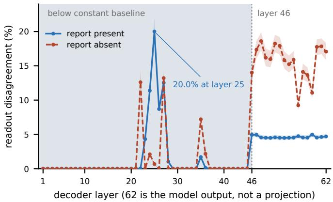  
Figure 6. Uncalibrated logit-lens projection: share of 44,786 trials, 14 findings pooled, whose projected yes/no readout difers between the two images, by layer. Below layer 46 (shaded) the projection does not clear the best constant predictor of the model’s output. The layer-25 peak, 20.0% with the report against 0.7% without, is a property of the report-present prompt rather than of the network and supports no claim.

## N.2 Report-token attention knockout

Causal depth: report-token attention knockout and cross-condition patching. Two interventions measure the efect of access to report-token representations, on MedGemma-27B and the one-question design. The first masks attention at decoder layer � so that chosen query positions cannot read the report’s key columns, cumulatively from � upward or at � alone, with the query scope either the answer position alone or every non-image position outside the blocked span. It covers 400 cases and 282 patients, 300 of them decisive, at 21 of 62 layers, with a 2,000-draw patient-clustered bootstrap.

Under the cumulative variant and the wider scope the flip rate is 7.75% [5.25, 10.35] from layer 0, 12.25% from layer 20 and a peak of 14.00% at layer 22, then 2.00% at layer 28 and baseline from layer 32, against in-run endpoints of 1.50% with the report and 12.00% without (Figure 7). Single-layer blocking never exceeds 2.50% and answer-position-only blocking never exceeds 2.00%, so no one layer carries the efect. Blocking the question and the instruction instead also restores flips, but only over layers 22 to 27, so there a flip rate cannot separate a restored image answer from one destroyed by not knowing what was asked.

Three readings confine the report-specific claim to layers 0 to 20. The paired patient-clustered diference clears zero against both controls at layers 0, 4, 8, 12, 16 and 20, on all cases and on the decisive subset, at layer 16 by +7.75 points [4.67, 11.03]. The arms flip disjoint cases over layers 0 to 27 (Jaccard 0.000 to 0.069, � −0.076 to +0.079) but the same cases in the inert region at layers 32 to 60 (Jaccard 0.250 to 0.500, � +0.387 to +0.662), so the statistic can see a shared efect and sees none here. Their destinations difer: over layers 0 to 20 the report arm holds report-label agreement on the substituted image at 0.6875 to 0.7400, near the measured no-report 0.7100, while the question-and-instruction arm drives it to 0.1725 to 0.2125, not an operating point at all. The span controls behave, a magnitude-matched image span flat at 0.0125 to 0.0250 at every depth and a report span size-matched to the shorter non-report text peaking at 4.75%, a dose dependence on how much of the report is blocked.

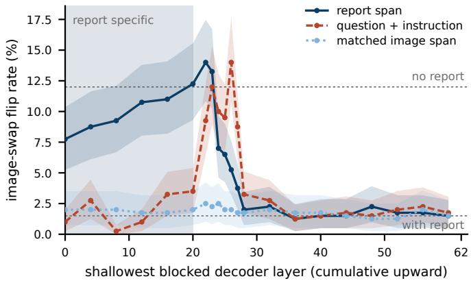  
Figure 7. Report-token attention knockout, cumulative from the plotted layer upward, wider query scope, 400 one-question cases. Blocking the report restores image sensitivity toward the no-report rate only when the block starts at or below layer 22; the question-and-instruction control moves only over layers 22 to 27. Shading: layers 0 to 20.

Two limits bound the reading. The instrument has a ceiling, since the answer position still reads the report directly and the report’s tokens still occupy their positions and shift every later rotary position, so blocking cumulatively from layer 0 yields 7.75% against a no-report 12.00%, and the intervention’s extent should not be read as its efect size. Layer 22 over-restores, 14.00% against that 12.00%, with its agreement destination unchanged at 0.7075, so the excess is added disruption rather than more removal. The second intervention patches the report-absent residual into the report-present run, at the answer position and over the two prompts’ longest common token sufix, against a wrong-donor control from a diferent patient. It is a null: the wrong donor reaches 14.07% [10.78, 17.65], above the correct donor’s maximum of 12.25%, and no depth separates from its control. Cumulative blocking of attention to report-token positions increased image-swap sensitivity when initiated at layers 0 to 20 and diminished for blocks initiated later. That identifies when direct access to report-token positions afects the measured response; it does not localise all downstream use of report information, since content copied out of those positions at an early layer is untouched by a later block, small single-layer efects do not show that no layer carries the efect, and a higher flip rate is not by itself a restored reading of the substituted image. Patching adds no localisation.

## N.3 Interventions that did not work: steering and probe transfer

Steering. Steering is scored on 1,721 test trials (12 findings, 150 cases each, the trials whose answer was the same on both images) by whether the steered answer on the substituted image matches that image’s answer key; this is an accuracy against the substituted key, not the flip rate of Table 4. Without steering, 835 of 1,721 (0.485) already match, because the substituted key often equals the original one. Adding the diference-of-means direction [Marks and Tegmark, 2024, Turner et al., 2023, Li et al., 2023a, Rimsky et al., 2024] at decoder layer 20 at the largest scale (6,000) changes this by two trials (837, 0.486), while injecting it at every layer or injecting a random direction of the same norm moves it down by 18 and 14 trials; degradation, the share of 1,209 originally correct answers that become wrong, is 0.167, 0.614 and 0.328. No arm separates from the random direction below the scale that degrades the answer. The prompt is the main experiment’s and the readout is the model output, not a layer projection; only the

largest scale is shown, the direction, layer choice and magnitude are as run, not normalised to activation norms, and the record carries no confidence intervals (Table 25).
<table><tr><td>Condition</td><td>Tracks-substitute rate</td><td>Degradation rate</td><td>∆ vs. scale 0</td></tr><tr><td>Targeted, layer 20</td><td>0.486 (837/1,721)</td><td>0.167</td><td>+0.001</td></tr><tr><td>Global, all layers</td><td>0.475 (817/1,721)</td><td>0.614</td><td>-0.010</td></tr><tr><td>Random direction</td><td>0.477 (821/1,721)</td><td>0.328</td><td>-0.008</td></tr></table>

Table 25. Diference-of-means steering on MIMIC-CXR, 12 findings, 150 cases each, largest scale (6,000). Tracks-substitute rate: share of 1,721 same-answer trials whose steered answer on the substitute matches its answer key, 0.485 before steering; not the flip rate of Table 4. Degradation: share of 1,209 originally correct answers turned wrong. No intervals.

Probe transfer. A linear probe [Alain and Bengio, 2016] was fit under a protocol frozen before the cohort was sampled, then run once on 650 patients disjoint from every patient used anywhere else in this study. The protocol is a configuration file whose SHA-256 hash (beginning a756e332) is recorded in every output of the run; it fixes the probe layer (20), the four probe findings, the split rule (650 patients drawn with seed 0 from the training pool, disjoint from the 293 test patients and from every patient in any cached store, 4,824 excluded, 1,811 available, checked in code), the six baseline values with their sources, and the test (two-sided, �=0.05, patient-clustered bootstrap with 10,000 resamples, equality rejected when the interval on the diference excludes zero), and it allows one run with no re-runs, added arms or filters. What the repository history verifies is narrower than a timestamp before the draw: the protocol hash a756e332 appears in every output of the run, which started on 2026-08-04, while the protocol file itself entered version control on 2026-09-03. The protocol was fixed before evaluation; that it was fixed before the cohort was drawn is the authors’ statement, not something the history can establish. Test-split values are the frozen baselines, case-weighted over 13 findings, hence 0.952 against the 14-finding 0.953 of Appendix Table 10. Every row of Table 26 rejects equality; the probe AUROC falls by 0.334, to a value not separable from chance.

<table><tr><td>Statistic</td><td>Fresh cohort (n=650)</td><td>Test split</td><td>Gap (fresh – test)</td></tr><tr><td>Unchanged-answer rate</td><td>93.95% [93.53, 94.37]</td><td>95.22%</td><td>-1.3 [-1.7, -0.9]</td></tr><tr><td>Never-diverged rate</td><td>57.10% [55.63, 58.47]</td><td>62.30%</td><td>-5.2 [-6.7, -3.8]</td></tr><tr><td>Settling layer, median</td><td>61.0 [61.0, 61.0]</td><td>60.8</td><td>+0.2 [0.2, 0.2]</td></tr><tr><td>Probe AUROC, layer 20</td><td>0.458 [0.414, 0.512]</td><td>0.792</td><td>-0.334 [-0.379, -0.280]</td></tr><tr><td>AURC [Geifman and El-Yaniv, 2017], probe</td><td>0.414 [0.390, 0.437]</td><td>0.490</td><td>-0.076 [-0.099, -0.053]</td></tr><tr><td>AURC, max-softmax</td><td>0.346 [0.323, 0.369]</td><td>0.374</td><td>–0.028 [–0.051, -0.005]</td></tr></table>

Table 26. Frozen-protocol replication on a disjoint MIMIC-CXR cohort; the pre-specified two-sided test at �=0.05 rejects equality in every row. Baselines are case-weighted over 13 findings (rates) or the four probe findings (AUROC, AURC) and are fixed constants. Brackets: 95% patient-clustered percentile bootstrap, 10,000 draws; unbracketed cells have none. The settling-layer row is a property of the projection, whose median sits well above the layer-46 informative depth in this arm and some 20 layers below it on the one-question unit, where the paired report-present minus report-absent diference is 1.56 layers [0.88, 2.21] and a shufled-pairing null reproduces it; the row supports no depth claim.

## N.4 The knockout does not transfer as a depth instrument outside MIMIC-CXR

The report-token knockout above is possible only on MIMIC-CXR, the one dataset here that pairs an image with a report. The nearest manipulation available elsewhere blocks attention to the image tokens instead, and it was run on three further datasets. It does not separate from its own control on any of them, so no cross-dataset depth claim is made. On VQA-RAD (�=52) blocking every image token changes the answer on 48.1% of cases [34.6, 61.5], and blocking a count-matched set of random tokens changes it on 51.9% [38.5, 65.4]: the control is not below the treatment. On OmniMedVQA the image block changes 8.0% of answers [5.6, 10.8] against 83.6% [80.1, 86.9] for the random-key control, which is not a control that has been matched to the manipulation at all. On SLAKE (�=186) the image block changes 36.6% [29.6, 43.6] and no control was run; its record marks the per-layer sweep exploratory and not a depth claim, and it is not read as one here. Two of these three records also fail the repository’s run-record schema and are listed among its grandfathered exceptions. The negative is reported because it bounds the paper: the depth result rests on the report-token knockout and its two controls on MIMIC-CXR, and on nothing else.

## O Cohort and labels

Arm: the manipulation a row applies. Flip rate: share of pairs whose final answer difers between the original and substituted image. Unchanged-answer rate: its complement, an agreement statistic. Settling layer: first layer from which the lens-projected answer no longer changes, a property of the projection. Never diverged: share of pairs whose projected answers never difer at any layer. n/r: not reported, unlike a measured zero. Answer space and readout: MIMIC-CXR, yes/no from the first answer-token logits with the report in context; OmniMedVQA, one of four option letters; VQA-RAD, SLAKE and ProbMed, yes/no from the final-token answer logits. Model revisions: MedGemma-27B 2d3e00e, MedGemma-4B 290cda5e, Qwen3.5-9B c2022362.

How the MIMIC-CXR cohort and the other case pools were paired and labelled. Case pools by release, which bound every later denominator (the MIMIC-CXR cohort is fixed in the main text): OmniMedVQA, swap-changed case mining, pool 127,995, 427 admissible pairs, 33 swap-changed cases; SLAKE, swap-changed case inventory, pool 186, 90 swap-changed cases, swap-changed rate 0.484; VQA-RAD, pool ceiling mining, 52 admissible pairs, leakage-rule ceiling 66; VQA-RAD, pool relaxation, image reuse, 52 admissible pairs, leakage-rule ceiling 66. The OmniMedVQA answer-key audit flags 104 of 427 cases (0.244) whose correct option’s text appears in the question; original-image accuracy is 0.576 overall and 0.607 on the 323 unflagged cases, and adversarial relabelling of every flagged case would bound it between 0.459 and 0.703; flip and unchanged-answer rates never read the key. On VQA-RAD, the automatic unchanged-answer label and the answer key’s own image-decisive marking agree on 0.726 of 266 question-image rows (92 questions), Cohen’s kappa 0.430.

## P Robustness of the main result

The headline design re-run with changed prompt, input order, resolution, report section, decoding and image content; none of it enters the main-text estimates. Swap tier, flip rate pooled and over pairs whose substitute shares the source or organ (hard, as in the main experiment) or not (easy): OmniMedVQA, same-source against cross-source, 427 pairs: 0.068 pooled, 0.068 hard; VQA-RAD, same-organ against

diferent-organ, 52 pairs: 0.615 pooled, 0.526 hard, 0.857 easy. Modality ablation on the MIMIC-CXR cohort, one question per case (its labelled finding), accuracy against the report-derived label as in Table 23: one input dropped (3,199 cases): 0.931 full prompt, 0.913 report plus question, 0.773 image plus question, 0.846 question alone; the image adds 0.018; one input dropped, re-run (3,199 cases): 0.931 full prompt, 0.913 report plus question, 0.773 image plus question, 0.846 question alone; the image adds 0.017. Response-bias floor of the unchanged-answer rate on MIMIC-CXR, the agreement a responder answering from its marginal alone would reach: over 7 per-finding evaluations, each over that finding’s 3,199 pairs, the floor runs from 0.500 to 0.919.
<table><tr><td>Manipulation</td><td>Arm</td><td>n</td><td>Flip rate</td><td>Flips</td><td>Settling layer Never div. Still apart</td><td></td><td></td></tr><tr><td>prompt wording</td><td>clinical wording, yes/no order</td><td>185</td><td>1.62% [0.55, 4.66]</td><td>3</td><td>59.0</td><td>64.32%</td><td>n/r</td></tr><tr><td>prompt wording</td><td>direct wording, no/yes order</td><td></td><td>1854.32% [2.21, 8.30]</td><td>8</td><td>62.0</td><td>64.86%</td><td>n/r</td></tr><tr><td>prompt wording</td><td>direct wording, yes/no order</td><td></td><td>185 1.62% [0.55, 4.66]</td><td>3</td><td>59.0</td><td>63.24%</td><td>n/r</td></tr><tr><td>prompt wording</td><td>impression wording, yes/no order 185</td><td></td><td>1.08% [0.30, 3.86]</td><td>2</td><td>59.0</td><td>61.08%</td><td>n/r</td></tr><tr><td>modality order</td><td>image before text</td><td>200</td><td>3.00%</td><td>6</td><td>59.0</td><td>25.50%</td><td>48</td></tr><tr><td>modality order</td><td>text before image</td><td>200</td><td>16.50%</td><td>33</td><td>62.0</td><td>2.50%</td><td>122</td></tr><tr><td>resolution</td><td>downsampled 2x</td><td>200</td><td>2.00%</td><td>4</td><td>n/r</td><td>n/r</td><td>47</td></tr><tr><td>resolution</td><td>downsampled 4x</td><td>200</td><td>2.00%</td><td>4</td><td>n/r</td><td>n/r</td><td>51</td></tr><tr><td>resolution</td><td>native resolution</td><td>200</td><td>3.00%</td><td>6</td><td>n/r</td><td>n/r</td><td>48</td></tr><tr><td>report section</td><td>findings and impression</td><td>200</td><td>3.00%</td><td>6</td><td>57.0</td><td>n/r</td><td>48</td></tr><tr><td>report section</td><td>findings only</td><td>200</td><td>2.50%</td><td>5</td><td>59.0</td><td>n/r</td><td>51</td></tr><tr><td>report section</td><td>impression only</td><td>200</td><td>25.50%</td><td>51</td><td>58.0</td><td>n/r</td><td>97</td></tr></table>

Table 27. MIMIC-CXR under another prompt wording, modality order, resolution or report section; Settling layer is the median over pairs, Still apart the pairs whose projections difer at the final layer. The main experiment: image first, native, both sections. Brackets: Wilson 95% intervals; unbracketed cells have none. These are 200-case pilots and are superseded on the full cohort: modality order is rerun on all 3,199 cases in Table 2 (2.84% text first against 1.41% image first), and impression only is rerun on the 2,394 cases that carry an impression, 4.26% [3.34, 5.31], and on the 1,702 cases carrying both sections in Appendix Table 18. Read the 25.50% here as a 200-case pilot, not as the paper’s estimate.

<table><tr><td>Dataset</td><td>Arm</td><td>n Samples</td><td></td><td>Swap flip, greedy</td><td>Floor at T=0</td><td>Floor at T=1</td></tr><tr><td>MIMIC-CXR</td><td>repeated decoding, 40-case pilot</td><td>40</td><td>5</td><td>0.00%</td><td>0.00%</td><td>42.50%</td></tr><tr><td>OmniMedVQA</td><td>repeated decoding, 40-case pilot</td><td>40</td><td>10</td><td>5.00%</td><td>0.00%</td><td>20.00%</td></tr><tr><td>VQA-RAD</td><td>repeated decoding, full pool</td><td>52</td><td>10</td><td>61.54% [48.08, 75.00]</td><td>0.00% [0.00, 0.00]</td><td>21.15% [11.54, 32.69]</td></tr></table>

Table 28. Decoding-noise floor: answer-change rate between repeats at temperature 0 and 1.0, beside the greedy swap flip rate. Runs decode greedily, so the temperature-0 floor is zero by construction; the temperature-1 floor is a same-input control. Brackets: 95% bootstrap intervals; unbracketed cells have none.

<table><tr><td>Dataset</td><td>Arm</td><td></td><td>n Agreement</td><td>95% CI</td><td>Agree</td><td>Disagree</td></tr><tr><td>MIMIC-CXR</td><td>blank image</td><td>200</td><td>97.50%</td><td>n/r</td><td>195</td><td>5</td></tr><tr><td>SLAKE</td><td>blank image</td><td>186</td><td></td><td>55.38%[48.39, 62.37]</td><td>103</td><td>83</td></tr><tr><td>VQA-RAD</td><td>blank image</td><td>52</td><td>61.54%</td><td>n/r</td><td>n/r</td><td>n/r</td></tr></table>

Table 29. Blank-image condition (image tokens present, content blank): share of cases whose answer with the blank image equals the answer with the real image. Agreement means only that the answer did not change. 95% CI: patient-level bootstrap, 10,000 draws. n/r: not recorded for that run.

<table><tr><td>Dataset</td><td>Arm</td><td>n</td><td>Clean acc.</td><td>Blur, max</td><td>Noise, max</td><td>Occlusion, max</td></tr><tr><td>OmniMedVQA</td><td>graded blur, noise and occlusion</td><td>427</td><td>0.576 [0.529, 0.623]</td><td>7.49% [5.15, 10.07]</td><td>6.79% [4.45, 9.37]</td><td>9.84% [7.03, 12.65]</td></tr><tr><td>SLAKE</td><td>graded blur, noise and occlusion</td><td>186</td><td>0.710 [0.645, 0.774]</td><td></td><td>24.19% [18.28, 30.65]17.20% [11.83, 22.58]</td><td>44.62% [37.63, 51.61]</td></tr><tr><td>VQA-RAD</td><td>graded corruption</td><td></td><td>52 0.731 [0.615, 0.846]</td><td>28.85%</td><td></td><td>34.62% 38.46% [25.00, 51.92]</td></tr></table>

Table 30. Graded image corruption: share of cases whose answer changes at the strongest blur, noise and occlusion, beside clean-image accuracy. VQA-RAD: corrected readout 0.731 supersedes the earlier double-normed 0.654. Brackets: 95% intervals (OmniMedVQA, bootstrap, 2,000 draws; SLAKE and VQA-RAD, bootstrap); unbracketed cells have none.

<table><tr><td>Dataset</td><td>Arm</td><td>n</td><td>Lowest dose</td><td>Highest dose</td><td>Trend  $\rho$ </td><td>Trend  $p$ </td></tr><tr><td>MIMIC-CXR</td><td>report length, text-side confound</td><td>185</td><td>2.13%</td><td>0.00%</td><td>-0.057</td><td>0.443</td></tr><tr><td>MIMIC-CXR</td><td>swap severity, label Hamming distance</td><td>185</td><td>0.00% [0.00, 29.91]</td><td>2.27% [0.63, 7.91]</td><td>0.044</td><td>0.549</td></tr><tr><td>SLAKE</td><td>swap severity, pixel distance</td><td></td><td></td><td>18647.83% [32.61, 63.04]62.50% [47.92, 75.00]</td><td>0.115</td><td>0.115</td></tr><tr><td>VQA-RAD</td><td>swap severity, divergence tertiles</td><td>52</td><td>12.50%</td><td>100.00%</td><td>n/r</td><td>n/r</td></tr></table>

Table 31. Swap-severity dose-response: flip rate in the lowest and highest bucket (each over its pairs), Spearman’s rank correlation with severity across buckets and its two-sided $p ;$ Arm names the severity measure. Brackets: 95% intervals (MIMIC-CXR, Wilson; SLAKE, bootstrap); unbracketed cells have none.

<table><tr><td>Finding</td><td></td><td>Observed Chance-expected Raw excess</td><td></td><td>Kappa</td></tr><tr><td>Atelectasis</td><td>0.951</td><td>0.698</td><td>0.254</td><td>0.839 [0.807, 0.867]</td></tr><tr><td>Cardiomegaly</td><td>0.936</td><td>0.500</td><td>0.435</td><td>0.871 [0.845, 0.896]</td></tr><tr><td>Consolidation</td><td>0.931</td><td>0.559</td><td>0.373</td><td>0.845 [0.818, 0.868]</td></tr><tr><td>Edema</td><td>0.963</td><td>0.514</td><td>0.449</td><td>0.923 [0.906, 0.940]</td></tr><tr><td>Enlarged Cardiomediastinum</td><td>0.951</td><td>0.505</td><td>0.446</td><td>0.901 [0.883, 0.919]</td></tr><tr><td>Fracture</td><td>0.988</td><td>0.861</td><td>0.126</td><td>0.910 [0.866, 0.948]</td></tr><tr><td>Lung Lesion</td><td>0.914</td><td>0.514</td><td>0.401</td><td>0.824 [0.800, 0.846]</td></tr><tr><td>Lung Opacity</td><td>0.960</td><td>0.763</td><td>0.197</td><td>0.832 [0.793, 0.865]</td></tr><tr><td>Pleural Effusion</td><td>0.940</td><td>0.504</td><td>0.436</td><td>0.880 [0.860, 0.898]</td></tr><tr><td>Pleural Other</td><td>0.956</td><td>0.500</td><td>0.455</td><td>0.911 [0.894, 0.927]</td></tr><tr><td>Pneumonia</td><td>0.950</td><td>0.583</td><td>0.367</td><td>0.880 [0.856, 0.903]</td></tr><tr><td>Pneumothorax</td><td>0.992</td><td>0.919</td><td>0.073</td><td>0.899 [0.837, 0.943]</td></tr><tr><td>Support Devices</td><td>0.946</td><td>0.914</td><td>0.032</td><td>0.370 [0.271, 0.451]</td></tr><tr><td>No Finding</td><td>0.964</td><td>0.501</td><td>0.463</td><td>0.927 [0.913, 0.941]</td></tr></table>

Table 32. Cohen’s kappa with condition-specific marginals, MIMIC-CXR, 14 findings: Observed is the finding’s unchanged-answer rate, Chance-expected is $p _ { c } p _ { d } + ( 1 - p _ { c } ) ( 1 - p _ { d } )$ from the two conditions’ yes-rates, Kappa the excess over 1 − expected. Per row: 3,199 pairs per finding. Brackets on kappa: 95% patient-clustered percentile bootstrap over the 293 patients, 2,000 draws at seed 0, resampling the agreement and both yes-rate indicators jointly so each draw rebuilds the marginals kappa depends on.

## Q Other datasets and models

These experiments evaluate the swap protocol on datasets without reports and through a second lens; they are not part of it. Accuracy under the swap on OmniMedVQA: all 427 of 427 swaps change the correct answer, so accuracy is scored against each condition’s ground truth (chance 0.25): 0.579 on the original image, 0.457 on the substituted one, a drop of 0.122 pooled, −0.003 on anatomy identification and 0.654 on disease diagnosis. Text-side symmetry, share of cases whose answer changes: on OmniMedVQA (427 cases), 0.232 for a question swap with the image unchanged, 0.021 for an option swap, 0.068 for an image swap and 0.750 for a uniform option reroll; on SLAKE (186 cases), 0.419 for a question swap with the image unchanged, 0.484 for an image swap and 0.500 for a uniform option reroll; on VQA-RAD (52 cases), 0.269 for a question swap with the image unchanged, 0.615 for an image swap. Open-ended generation, a frozen rule mapping the free-text answer to an option: on OmniMedVQA, 427 of 427 answers mapped and 426 also cleared the 0.500 first-token probability floor (chance 0.250); on SLAKE, 111 of 186 answers mapped and 0 also cleared the 0.500 first-token probability floor; on VQA-RAD, 4 of 52 answers mapped and 0 also cleared the 0.500 first-token probability floor.

<table><tr><td>Dataset</td><td>Arm</td><td>n</td><td>Both inputs</td><td>Question only</td><td>Image, no question</td><td>Neither</td><td>Image adds</td></tr><tr><td>OmniMedVQA</td><td>one input dropped, or both</td><td>427</td><td>0.576 [0.529, 0.623]</td><td>0.543 [0.496, 0.590]</td><td>0.508 [0.461, 0.555]</td><td>0.515 [0.468, 0.564]</td><td>+0.033 [0.002, 0.061]</td></tr><tr><td>SLAKE</td><td>one input dropped, or both</td><td></td><td>186 0.710 [0.645, 0.774]</td><td>0.500 [0.430, 0.570]</td><td></td><td></td><td>0.500 [0.430, 0.570] 0.500 [0.430, 0.570] +0.210 [0.118, 0.301]</td></tr><tr><td>VQA-RAD</td><td>inputs dropped</td><td></td><td>52 0.731 [0.615, 0.846] 0.538 [0.404, 0.673]</td><td></td><td>0.500</td><td></td><td>0.500 +0.192 [0.038, 0.346]</td></tr></table>

Table 33. Modality ablation without a report: accuracy against the answer key with both inputs, question only, image under a neutral prompt, or neither; chance 0.25 on OmniMedVQA, 0.5 elsewhere. VQA-RAD: corrected readout 0.731 supersedes the earlier 0.654. Brackets: 95% bootstrap intervals; unbracketed cells have none.

<table><tr><td>Dataset</td><td>Arm</td><td>n</td><td>Concordant</td><td>Discordant</td><td>Flip rate</td></tr><tr><td>SLAKE</td><td>logit lens, full pool</td><td>186</td><td>0.710 [0.645, 0.774]</td><td>0.710 [0.645, 0.774]</td><td>48.39% [41.40, 55.91]</td></tr><tr><td>SLAKE</td><td>tuned lens, full pool</td><td></td><td>186 0.661 [0.591, 0.731]</td><td>0.661 [0.591, 0.726]</td><td>34.41% [27.96, 41.40]</td></tr><tr><td>VQA-RAD</td><td>logit lens</td><td>52</td><td>0.731</td><td>0.731</td><td>61.54%</td></tr><tr><td>VQA-RAD</td><td>tuned lens, 2,000 steps</td><td>52</td><td>0.673</td><td>0.673</td><td>34.62%</td></tr></table>

Table 34. Readout comparison: concordant and discordant accuracy and flip rate of the answer projected at the final decoder layer by the output head (logit lens) or trained translator (tuned lens), not the model’s output. Brackets: 95% bootstrap intervals, 10,000 draws; unbracketed cells have none.

<table><tr><td>Dataset</td><td>Half</td><td>n</td><td></td><td>Unchanged</td><td>Never div.</td></tr><tr><td></td><td>OmniMedVQA development half</td><td>175</td><td>97.71% [95.43, 99.43]</td><td>2.29% [0.57, 4.57]</td><td>0.57%</td></tr><tr><td></td><td>OmniMedVQA replication half</td><td>252</td><td>90.08% [86.51, 93.65]</td><td>9.92% [6.35, 13.49]</td><td>7.54%</td></tr><tr><td>SLAKE</td><td>development half</td><td>92</td><td>50.00% [39.13, 59.78]</td><td>50.00% [40.22, 60.87]</td><td>13.04%</td></tr><tr><td>SLAKE</td><td>replication half</td><td></td><td>94 53.19% [43.62, 62.77]</td><td>46.81% [37.23, 56.38]10.64% [5.32, 17.02]</td><td></td></tr></table>

Table 35. Frozen-protocol replication without a report: split by swap group fixed before any outcome was seen, analysis fixed on the development half, replication half run once. Unchanged and flip rates are complements. Brackets: 95% bootstrap intervals; unbracketed cells have none.

## R Exploratory mechanistic analyses

Layer-wise projections and interventions, descriptive of the lens projection; the main text draws no mechanistic claim from them. Activation patching over flip cases only: OmniMedVQA, patching with no-op control, 29 flip cases of 427 over 62 layers: patching restores the original answer most often at layer 60 and on more than half the flip cases first at layer 44; never-diverged share 0.047; VQA-RAD, activation patching, 32 flip cases of 52 over 62 layers: patching restores the original answer most often at layer 58 and on more than half the flip cases first at layer 31; never-diverged share 0.038. Tuned-lens training for MedGemma-27B, one run each, not used by the main experiment: WikiText, 100 steps, best validation KL 829.1 at step 100, 100 steps, 208 s wall time; WikiText-103, 1,000 steps, best validation KL 233.4 at step 900, 1,000 steps, 1,270 s wall time; WikiText-103, 2,000 steps, best validation KL 195.4 at step 1,700, 2,000 steps, 2,492 s wall time, final validation KL 197.6; seed reproducibility check, 60 steps. Probes, a linear classifier of swap-induced answer change on the residual at the stated layer: OmniMedVQA, cross-model probe, LLaVA-1.5-7B, 22 swap-changed cases of 427, out-of-fold balanced accuracy 0.572 against a matched shufled null of 0.474; OmniMedVQA, leave-one-modality-out transfer, layer 45, 29 swap-changed cases of 427, 0 transfer folds above the null; VQA-RAD, leave-one-category-out transfer, layer 20, 32 swap-changed cases of 52; VQA-RAD, probe curve and stability, 32 swap-changed cases of 52, out-of-fold balanced accuracy 0.516 against a matched shufled null of 0.444. Saliency baselines against the probe, area under the risk-coverage curve (lower is better) for abstention: OmniMedVQA (layer 45, 427 cases), 0.354 with the probe’s score, 0.450 with image-token attention mass and 0.437 with the input gradient; VQA-RAD (layer 20, 52 cases), 0.199 with the probe’s score, 0.210 with image-token attention mass and 0.320 with the input gradient.

<table><tr><td>Dataset</td><td>Arm</td><td>n</td><td>Flip rate</td><td>Unchanged Peak div. Layers</td><td></td><td></td></tr><tr><td>MIMIC-CXR</td><td>test split, 300 cases</td><td>300</td><td>2.00%</td><td>98.00%</td><td>0.078</td><td>62</td></tr><tr><td>MIMIC-CXR</td><td>test split, 976 cases</td><td>976</td><td>1.43%</td><td>98.57%</td><td>0.076</td><td>62</td></tr><tr><td>MIMIC-CXR</td><td>train split, 300 cases</td><td>300</td><td>0.67%</td><td>99.33%</td><td>0.077</td><td>62</td></tr><tr><td>MIMIC-CXR</td><td>train split, 976 cases</td><td>976</td><td>0.92%</td><td>99.08%</td><td>0.074</td><td>62</td></tr><tr><td>MIMIC-CXR</td><td>validation split, 300 cases</td><td>300</td><td>1.33%</td><td>98.67%</td><td>0.072</td><td>62</td></tr><tr><td>MIMIC-CXR</td><td>validation split, 880 cases</td><td>880</td><td>1.02%</td><td>98.98%</td><td>0.076</td><td>62</td></tr><tr><td>ProbMed</td><td>cross-image, same question</td><td>2,634</td><td>39.86%</td><td>60.14%</td><td>0.633</td><td>62</td></tr><tr><td>ProbMed</td><td>full test set, 27B</td><td>6,158</td><td>68.87%</td><td>31.13%</td><td>1.000</td><td>62</td></tr><tr><td>ProbMed</td><td>full test set, 4B</td><td>6,158</td><td>71.65%</td><td>28.35%</td><td>1.000</td><td>34</td></tr></table>

Table 36. Settling depth by split: Peak div. is the median over pairs of the peak per-layer divergence between the two images’ projected answer distributions, Layers the decoder depth. The MIMIC-CXR rows are earlier, smaller samples than Table 4. No intervals were computed.

<table><tr><td>Dataset</td><td>Arm</td><td></td><td></td><td>n Cells Computable Significant Median, min Median, max</td><td></td><td></td><td></td></tr><tr><td>MIMIC-CXR</td><td>settling-definition grid</td><td>3,199</td><td>24</td><td>n/r</td><td>n/r</td><td>58.0</td><td>62.0</td></tr><tr><td>OmniMedVQA</td><td>definition grid, unchanged-answer cases</td><td>427</td><td>24</td><td>15</td><td>7</td><td>42.0</td><td>59.5</td></tr><tr><td>VQA-RAD</td><td>definition grid, unchanged-answer cases</td><td>52</td><td>24</td><td>5</td><td>0</td><td>35.0</td><td>61.0</td></tr></table>

Table 37. Settling-definition sensitivity over a divergence-metric by threshold grid: grid cells, computable cells, cells where the two conditions’ ordering stayed significant, and the range of the median settling layer over computable cells. No intervals were computed.

<table><tr><td>Dataset</td><td>Arm</td><td>n Layers</td><td>Peak layer</td><td></td><td>Peak-layer change</td><td>All-layer change</td><td>Random-key change</td></tr><tr><td>OmniMedVQA</td><td>image attention masked, layer sweep</td><td>427</td><td>62</td><td>8</td><td>8.20% [5.62, 11.01]</td><td>7.96% [5.62, 10.77]</td><td>83.61% [80.09, 86.89]</td></tr><tr><td>SLAKE</td><td>image attention masked, layer sweep</td><td>186</td><td>62</td><td>0</td><td>4.30% [1.61, 7.53]</td><td>36.56% [29.57, 43.55]</td><td>n/r</td></tr><tr><td>VQA-RAD</td><td>image attention masked, layer sweep</td><td>52</td><td>62</td><td></td><td>23 34.62% [21.15, 48.08]</td><td></td><td>48.08% [34.62, 61.54] 51.92% [38.46, 65.38]</td></tr></table>

Table 38. Attention knockout, layer-swept: share of cases whose answer changes with text-to-image attention masked at every layer, at the most efective layer only, or at random key positions of matched size. Nothing is localised. Brackets: 95% bootstrap intervals; unbracketed cells have none.

<table><tr><td>Dataset</td><td>Arm</td><td>n Layer</td><td>Cases steered</td><td></td><td></td><td>Flip Selective flip</td><td>Random flip</td></tr><tr><td>OmniMedVQA</td><td>positive control, answer axis</td><td>427</td><td>45</td><td>427</td><td>18.27%</td><td>n/r</td><td>21.78%</td></tr><tr><td>SLAKE</td><td>positive control, answer axis</td><td>186</td><td>61</td><td></td><td>186 56.99% [50.00, 63.98]</td><td>6.23%</td><td>n/r</td></tr><tr><td>VQA-RAD</td><td>positive control, answer axis</td><td>52</td><td>40</td><td>52</td><td>50.00%</td><td>n/r</td><td>11.54%</td></tr><tr><td>MIMIC-CXR</td><td>non-linear direction, layer 20</td><td>n/r</td><td>20</td><td>n/r</td><td>n/r</td><td>4.92%</td><td>n/r</td></tr><tr><td>MIMIC-CXR</td><td>per-layer efficacy sweep</td><td>200</td><td>48</td><td></td><td>187 41.18% [34.22, 48.13]</td><td></td><td>38.02% 19.79% [14.44, 25.67]</td></tr><tr><td>OmniMedVQA</td><td>layer sweep, sub-saturation scales</td><td>427</td><td>45</td><td>398</td><td>2.01%</td><td>1.60%</td><td>1.51%</td></tr><tr><td>SLAKE</td><td>steering 161 relative hi</td><td>186</td><td>61</td><td>98</td><td>38.78%</td><td>0.00%</td><td>38.78%</td></tr><tr><td>VQA-RAD</td><td>difference-of-means, random null</td><td>52</td><td>40</td><td>20</td><td>10.00%</td><td>10.00%</td><td>10.00%</td></tr><tr><td>VQA-RAD</td><td>per-layer efficacy sweep</td><td>52</td><td>8</td><td></td><td>20 60.00% [40.00, 80.00]</td><td></td><td>7.37% 70.00% [50.00, 90.00]</td></tr></table>

Table 39. Steering, positive controls (all cases steered) and sweeps (unchanged-answer cases), best cell: flip, share whose steered readout difers from the unsteered; selective flip, minus new errors among correct cases; random flip, largest under a magnitude-matched random direction. Brackets: 95% bootstrap intervals; unbracketed cells have none.

<table><tr><td>Dataset</td><td>Arm</td><td></td><td></td><td></td><td>n Probe layer AURC probe AURC max-softmax AURC random</td><td></td></tr><tr><td></td><td>OmniMedVQA abstention regime sweep</td><td>427</td><td>45</td><td>0.354</td><td>0.304</td><td>0.382</td></tr><tr><td>SLAKE</td><td>AURC, held-out layer selection 186</td><td></td><td>35</td><td>0.179</td><td>0.228</td><td>0.169</td></tr><tr><td>VQA-RAD</td><td>AURC, swap-grouped folds</td><td>52</td><td>20</td><td>0.199</td><td>0.134</td><td>n/r</td></tr></table>

Table 40. Abstention: area under the risk-coverage curve (lower is better) when the probe’s score, the answer’s maximum softmax or a random score decides which cases to abstain on; the probe is a linear classifier of swap-induced answer change. No intervals were computed.

## S Runs that did not yield an interpretable result

Experiments whose records judge the result not interpretable: obsolete runs on an earlier cohort, and a readout that disagrees with the model’s output. Reported for completeness; none is compared with the main text. Scale and finetuning on the MIMIC-CXR atelectasis cohort, one question per case, logit lens against the report-derived label, obsolete runs not comparable with Table 4: 4B against 27B, settling depth (3,199 cases), relative settling depth 0.735 for MedGemma-4B against 1.000 for MedGemma-27B under the report prompt; Gemma-3 against MedGemma, accuracy (3,199 cases), accuracy 0.433 for Gemma-3-27B against 0.415 for MedGemma-27B at layer 41 of 62, report condition unstated, majority baseline 0.777. The tuned-lens readout on the ProbMed test set, 6,158 pairs: flip rate 0.509, unchanged-answer rate 0.491, never-diverged share 0.008, for the answer projected by the text-trained translator at the final layer, which matches the model’s output on 0.607 of cases; not interpretable.