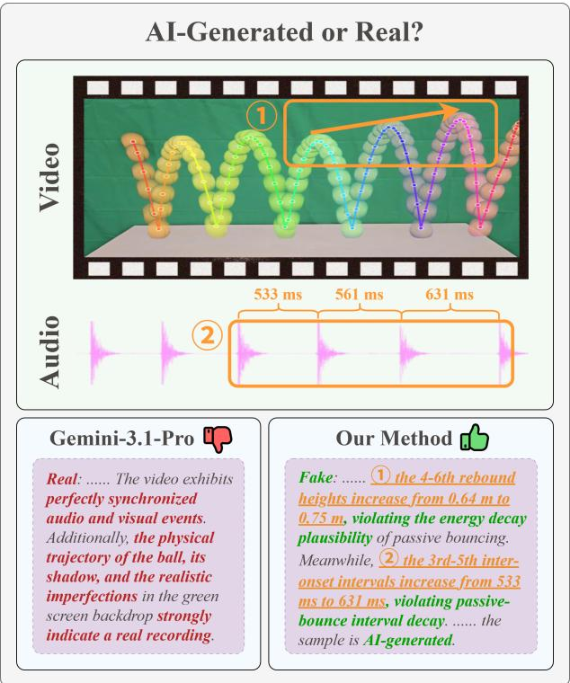
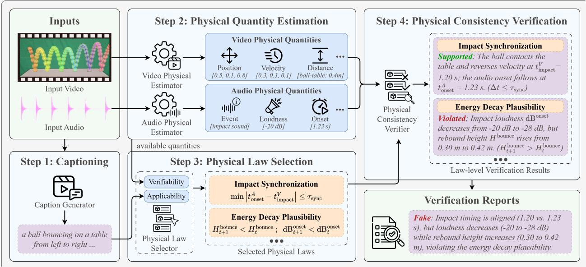
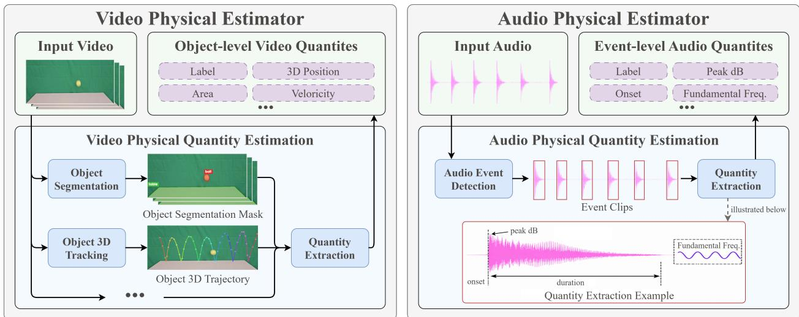
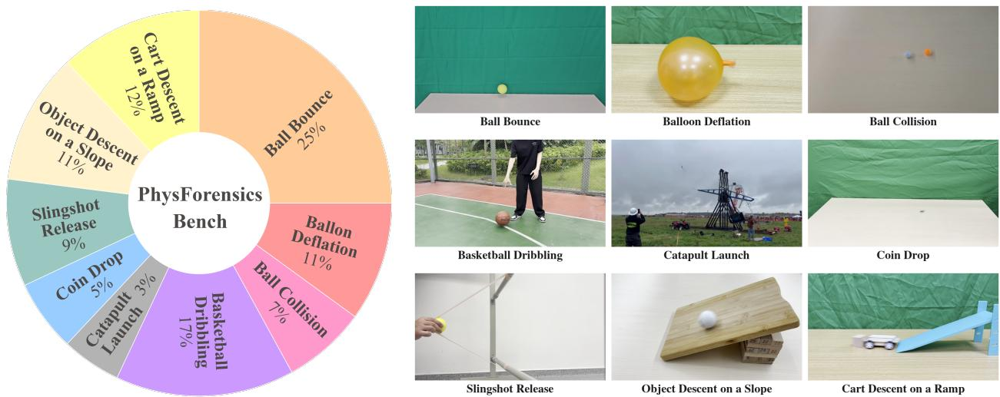

# PIVOT: Physics-Grounded Verification for AI-Generated Audio-Video Detection

Bo Zheng, Kangran Zhao, Xiaoyu Zhang, Weinan Guan, Zhiheng Li, Yize Chen, Haizhou Li, Qingshan Liu, Siwei Lyu, and Baoyuan Wu

Abstract—As generative models continue to advance, AI-generated content (AIGC) is becoming increasingly realistic, weakening the artifact cues commonly exploited by existing detectors. Nevertheless, faithfully reproducing the physical behavior of real-world events remains challenging for current generators. We therefore explore detecting AIGC by assessing whether the depicted event satisfies measurable constraints derived from physical laws. We introduce PIVOT, a physics-grounded AIGC detector, instantiated here for audio-video clips, that estimates physical quantities from video and audio, selects physical laws relevant to each clip, and verifies their measurable constraints. Beyond a real/fake decision, PIVOT returns supporting evidence that records the verification outcome, relevant time window, and supporting quantities for each applicable law. Although instantiated and evaluated here on audio-video data, the framework can, in principle, extend to other AIGC modalities whenever the physical quantities required for verification can be estimated reliably. We also introduce PhysForensics-Bench, comprising paired real and generated audio-video clips from nine event-centric scene families and two recent audio-video generators. On PhysForensics-Bench, PIVOT achieves 70.30% accuracy and 64.29% F1 score on Real+Seedance, and 72.16% accuracy and 65.82% F1 on Real+VEO. In comparison, direct inspection with Gemini 3.1 Pro obtains 53.96% accuracy and 60.09% F1 on Real+Seedance, and 57.22% accuracy and 63.44% F1 on Real+Veo. These results demonstrate the practical promise of physical-consistency verification as a structured and inspectable source of evidence that complements artifact-based AIGC detection.

Index Terms—AI-generated audio-video detection, physics-grounded verification, physical constraints, physical quantity estimation.

## I. INTRODUCTION

UDIO-VIDEO generation is rapidly advancing toent motion [1]–[3], while recent systems also generate synchronized sound [4]–[6]. As such media become easier to deploy in communication settings, fabricated events can more readily circulate as apparent recordings, making reliable authenticity assessment increasingly important [7], [8]. Existing detection research already provides valuable signals from visual appearance, frame consistency, and temporal dynamics [9]–[11], as well as audio-visual correspondence and local crossmodal inconsistencies [12]–[15]. However, some modelexposed artifact cues may become weaker or less stable as the generators evolve, as cross-generator evidence from image forensics suggests [16], [17]. This motivates the search for more durable evidence grounded in the properties of the depicted event itself.

  
Fig. 1. From artifact cues to physics-grounded verification. Direct foundation-model inspection is persuaded by surface realism, whereas PIVOT identifies physically implausible increases in rebound height and audio inter-onset interval and supports its AI-generated decision with evidence of physical inconsistency.

Physical laws offer a promising basis for such evidence because perceptual realism does not guaranty physical fidelity. Recent studies show that visually convincing generated videos can still violate physical commonsense in object interactions, material behavior, and action-centric events [18]–[20]. The similar challenge also exists in joint audio-video generation: a clip may look and sound plausible at first glance while remaining inconsistent in visual dynamics, acoustic behavior, or the physical relationship between an event and its sound [21], [22]. These findings suggest that physical laws can guide the interpretation of observations as evidence about the depicted event, complementing artifact cues whose reliability may change as generation techniques evolve.

Motivated by this gap, we formulate audio-video AIGC detection as physics-grounded verification: testing whether the depicted event is consistent with measurable constraints derived from physical laws. Audio-visual studies show that visible events can be associated with acoustic events and sound-producing objects from paired observations [23]–[25]. Besides, physical reasoning research has likewise studied object dynamics and latent physical properties from visual observations, as well as physical reasoning in simulated environments [26]–[29]. Together, these lines of research suggest that audiovideo observations can expose physical quantities and cross-modal relations useful for law-based consistency assessment. Given the depicted event and the available quantity estimates, a physical law that is relevant to the event and verifiable from the available quantities can be operationalized as one or more measurable constraints. The estimated quantities provide evidence supporting or contradicting these constraints. In principle, this formulation can extend to additional families of physical laws as reliable estimators for their required quantities become available. In the current instantiation, we focus on event-centric clips whose observable physical evidence is primarily derived from object motion, contact dynamics, scene geometry, and associated acoustic events.

Figure 1 illustrates this verification perspective. In the example, direct inspection with Gemini 3.1 Pro [30] classifies the clip as real based on the apparently synchronized audio and visual events, plausible ball trajectory and shadow, and realistic imperfections in the backdrop. Yet the measured event contains two physically implausible trends. First, the fourth through sixth rebound heights increase from 0.64 m to 0.75 m during passive bouncing (⃝1 ), violating the expected decay of mechanical energy.

Second, the third through fifth audio inter-onset intervals increase from 533 ms to 631 ms (⃝2 ), whereas successive impact intervals should shorten as a passive bouncing system loses energy. Rather than relying on an overall impression of realism, the proposed method PIVOT links these measurements to energy-decay and bounce-interval constraints and returns the corresponding laws, time windows, verification statuses, and supporting quantities as evidence for its decision.

We operationalize this formulation in PIVOT. Given a clip, PIVOT estimates structured physical quantities from the video and audio streams, selects laws that are relevant to the depicted event and measurable from the available quantity fields, and instantiates them as operational constraints. It then evaluates each applicable constraint as supported, violated, or uncertain and produces a real/fake decision together with supporting evidence organized by law and time window; non-applicable lawwindow pairs are omitted. This caption–estimate–select– verify design separates the observations, the physically expected behavior, and the verification outcome while allowing stronger physical estimators to be incorporated through the same quantity interface.

To evaluate this direction, we introduce PhysForensics-Bench, a physics-centric benchmark of paired real and generated audio-video clips spanning nine event-centric scene families and two recent generators, Veo 3.1 Fast [6] and Seedance 2.0 [5]. On the test split of PhysForensics-Bench, PIVOT achieves 70.30% accuracy and 64.29% F1 score on Real+Seedance, and 72.16% accuracy and 65.82% F1 score on Real+Veo. In comparison, direct inspection with Gemini 3.1 Pro obtains 53.96% accuracy and 60.09% F1 score on Real+Seedance, and 57.22% accuracy and 63.44% F1 score on Real+Veo.

Our contributions are threefold:

• We formulate audio-video AIGC detection as physics-grounded verification and instantiate this view in PIVOT, which selects event-relevant and measurable physical laws, verifies their constraints over estimated quantities, and returns supporting evidence organized by law and time window.

• We build PhysForensics-Bench, a physics-centric benchmark of paired real and generated audio-video clips spanning nine event-centric scene families and two recent generators.

• We demonstrate the practical potential of physical consistency verification on PhysForensics-Bench through comparisons with existing detectors and direct foundation-model inspection, together with ablations of the video and audio physical estimators.

  
Fig. 2. PIVOT inference pipeline. Step 1: Captioning generates clip captions without making a detection decision. Step 2: Physical Quantity Estimation extracts time-indexed video and audio quantities. Step 3: Physical Law Selection selects laws that are relevant to the depicted event and verifiable from the available quantities, then instantiates their physical constraints. Step 4: Physical Consistency Verification evaluates those constraints against the quantities and returns a real/fake decision with supporting evidence.

## II. RELATED WORK

a) AI-generated video detection: Video forensics has been widely studied in face manipulation and deepfake settings. MesoNet uses compact convolutional networks to detect facial video forgeries [31]. FaceForensics++ establishes a large-scale benchmark and dataset for manipulated-face detection [32]; Celeb-DF contributes high-quality celebrity DeepFake videos [33]; and DFDC provides a large face-swap video dataset [34]. Beyond these evaluation resources, F3- Net mines frequency-aware forgery clues [35], while LipForensics detects semantic irregularities in mouth motion using representations learned through visualspeech recognition [36]. X2-DFD combines an MLLM with specialized forgery-feature detectors to produce both deepfake decisions and human-readable explanations [37].

Recent work also studies general AI-generated content detection beyond face manipulation. SIDA distinguishes authentic, fully synthetic, and tampered social-media content, while localizing tampered regions and providing textual explanations [38]. So-Fake provides a largescale, generator-diverse benchmark with dedicated outof-domain evaluation using generators excluded from training [39]. DeCoF learns temporal artifacts through frame consistency [9]. DeMamba introduces the millionscale GenVideo benchmark and a plug-and-play module for spatial-temporal inconsistency analysis [40].

GenVidBench further provides 6.78 million videos with cross-source and cross-generator evaluation settings [41]. Among existing detectors, D3 [10] and NSG-VD [11] are particularly relevant to our physics-grounded perspective. D3 derives second-order temporal features motivated by Newtonian mechanics and uses their standard deviation as its detection score [10]. NSG-VD derives a Normalized Spatiotemporal Gradient from probabilityflow conservation and uses deep-kernel MMD to compare the NSG features of a test video with those of reference real videos as its detection metric [11]. These methods demonstrate the value of physics-inspired temporal priors for AI-generated video detection. Their published inference pipelines apply a predefined physicsinspired formulation across inputs, rather than explicitly determining which physical laws are relevant to each depicted event and verifiable from its available quantities. This distinction motivates the event-aware, measurability-constrained physical-consistency verification setting studied in our method.

b) AI-generated audio-video detection: Audiovisual fake media detection has also been studied in multimodal deepfake settings. FakeAVCeleb provides a multimodal dataset containing synthesized faces and voices [42], while LAV-DF introduces localized audio, visual, and audio-visual manipulations for detection and temporal localization [43]. AVFF learns audio-visual correspondence through self-supervised representation learning followed by supervised deepfake classification [12]. FGI targets fine-grained spatial and temporal audio-visual inconsistencies [44]. Astrid et al. further use temporal distance maps and locally inconsistent pseudo-fakes to capture local temporal mismatches [13]. SAVe combines facial manipulation cues with lip-speech misalignment while learning from authentic videos [14], whereas AVPF generates audiovisual pseudo-fakes from authentic samples to improve generalization [15]. DeepfakeBench-MM provides a unified evaluation framework spanning five multimodal datasets and eleven detectors, together with the Mega-MMDF dataset of human-centric audio-visual forgeries [45].

General audio-video AIGC detection remains less explored than face-centric audio-visual deepfake detection. MVAD broadens multimodal AIGC detection data beyond facial deepfakes [46]. AV-Phys Bench evaluates physical commonsense in joint audio-video generation and introduces AV-Phys Agent, which combines multimodal reasoning with deterministic acoustic measurement tools for rubric-based generation evaluation [21]. PhyAVBench evaluates the audio-physics sensitivity of text-to-audio-video generators through controlled paired prompts [22]. These studies expand general audio-video data and physics-aware generation evaluation, while most of the audio-visual detectors considered above are designed for facial manipulation, lip-speech alignment, or local cross-modal inconsistency. Authenticity detection of general physical events using per-law measurable evidence remains less studied.

c) Physical reasoning for perception: Physical reasoning has long supported scene understanding. Approximate physical simulation can explain human judgments about scene dynamics [26], and Newtonian scene understanding predicts forces and long-term object motion from static images [27]. Physics 101 learns object properties from unlabeled videos by encoding physical laws [28], while PHYRE provides a benchmark of classical-mechanics puzzles for physical reasoning [29].

Audio-visual learning provides complementary foundations. Visually Indicated Sounds predicts impact sounds from silent videos to capture material properties and physical interactions [47]. Look, Listen and Learn introduces audio-visual correspondence as a selfsupervised learning task [23]; Objects that Sound uses this correspondence for cross-modal retrieval and soundsource localization [24]; and multisensory scene analysis learns from the temporal alignment of video and audio [25].

Recent benchmarks directly evaluate physical commonsense in generated videos. VideoPhy evaluates physical plausibility in text-to-video outputs [18]; Phy-GenBench organizes evaluation around explicit physical laws [19]; and VideoPhy-2 extends this direction to action-centric physical commonsense [20]. Broader video-generation evaluation is complementary: VBench decomposes generation quality into fine-grained dimensions [48], EvalCrafter covers visual, content, motion, and text-video alignment quality [49], and FETV adds multi-aspect and temporal-aware evaluation of opendomain text-to-video generation [50].

Collectively, these studies provide complementary foundations in generated-video detection, audio-visual forensic analysis, physical perception, and physics-aware generation evaluation. PIVOT brings these directions together for authenticity detection: it selects physical laws according to the depicted event and the quantities available for measurement, instantiates their operational constraints, and returns physical-consistency verification records organized by law, time window, and estimated quantity.

## III. METHODOLOGY

PIVOT detects generated audio-video by testing whether the observed event is physically consistent. The inference pipeline in Figure 2 comprises four stages: captioning generates clip captions; physical quantity estimation recovers time-indexed video and audio quantities; physical law selection selects event-relevant and measurable laws and instantiates their constraints; and physical consistency verification evaluates those constraints and produces a structured report. This decomposition is the core framework contribution: physics-grounded AIGC detection should make the observed event and its physical quantities explicit, state which physical laws apply, and check the observed quantities against their constraints while retaining a structured decision trace. The resulting inference workflow is caption–estimate– select–verify.

## A. Captioning

The captioning stage generates concise captions for the input clip, collectively denoted by $B _ { i }$ :

$$
B _ { i } = B _ { \theta } ( \mathbf { x } _ { i } ) .\tag{1}
$$

It identifies the objects, surfaces, interactions, and temporal phases needed to determine which physical laws are relevant, without predicting whether the clip is real or generated. In the reported implementation, Gemini 3.1 Pro and GPT-5.5 independently describe the clip, and both descriptions are retained in $B _ { i }$ for downstream physical law selection.

  
Fig. 3. Illustrative implementations of the tool-agnostic physical quantity interface. Top: Basic visual attributes and kinematics are two example video branches; the latter illustrates one path for estimating position, velocity, and acceleration. External estimators may replace or extend either branch to expose other physical quantities. Bottom: The audio estimator localizes complementary sound events and spectral transients, fuses their temporal intervals, and produces event-level quantities such as onset, peak dB, F0, RMS, and HNR. The downstream framework consumes these structured quantities and does not depend on a particular estimator architecture.

## B. Physical Quantity Estimation

PIVOT treats video and audio physical estimators as external, replaceable modules. Rather than prescribing a particular estimator architecture, the framework requires only that each module expose named, time-aligned physical quantities that can be inspected by later stages. For a clip $\mathbf { x } _ { i } .$ we write this shared interface as

$$
M _ { i } = ( A _ { i } , V _ { i } ) .\tag{2}
$$

Here $A _ { i }$ contains event-level audio records, and $V _ { i }$ contains frame-level video records. Quantity fields retain their timestamps and, where applicable, units and coordinate conventions. Downstream components consume only these structured records, not estimator-specific hidden features. This interface allows improved or domainspecific estimation tools to be substituted without changing physical law selection or verification.

1) Video Physical Estimator: The video estimator interface can connect external models or procedures that provide the physical quantities required by the framework. The two branches at the top of Figure 3 are illustrative implementation examples rather than a fixed or exhaustive decomposition. The basic visual attributes branch applies object segmentation to the video frames, producing object labels and mask extents from which quantities such as visible object area can be derived. The kinematics branch applies 3D object tracking to recover each object’s trajectory in a common coordinate system, from which position, velocity, and acceleration can be estimated. Other external estimators can replace or extend these paths to provide object-pair relations or additional physical quantities.

Together, these records form the frame-level set $V _ { i } .$ The interface does not require a particular segmentation, geometry, or tracking model; it requires only consistent object identities, timestamps, field definitions, and coordinate conventions. Our current instantiation focuses on basic visual quantities and kinematic quantities, while the same interface can incorporate additional properties such as mass, volume, density, elasticity, or material when suitable estimators become available. Appendix D documents the concrete tools, calibration, and reconstruction procedure used in our experiments.

2) Audio Physical Estimator: The audio estimator interface, shown at the bottom of Figure 3, represents the waveform as temporally localized event records. An event–transient extractor combines complementary cues: low-band event detection identifies semantically recognizable sound regions, while high-band transient detection recovers brief spectral changes that may not receive a reliable semantic label. Their temporal intervals are fused before physical quantities are extracted, so both cues are described on a shared time axis aligned with the video.

For each detected interval, the resulting audio record can include the onset, envelope boundaries, duration, peak dB, RMS level, fundamental frequency (F0), harmonic-to-noise ratio (HNR), and spectral descriptors. These records form the event-level set $A _ { i } .$ As with the video interface, PIVOT depends on the fields and their temporal meaning rather than on a particular detector or acoustic backbone. Appendix F specifies the concrete audio tools, frequency bands, fusion rule, and thresholds used in our experiments.

Because full frame-level quantity sequences are unnecessarily long for prompt-based reasoning, PIVOT applies a lightweight, caption-conditioned compression step before law selection and verification:

$$
\tilde { M } _ { i } = \mathrm { C o m p r e s s } ( M _ { i } ; B _ { i } ) .\tag{3}
$$

The compressed representation preserves temporally informative quantity records and includes the metadata needed to interpret the retained rows. The concrete sampling strategies and serialization procedure are implementation details described in Appendix G.

## C. Physical Law Selection

The space of physical laws governing real-world events is broad, making exhaustive verification neither tractable nor useful. A meaningful test must satisfy two conditions: the law must be relevant to the event depicted in the clip, and its requirements must be covered by the physical quantities available to the framework. The Physical Law Selector therefore identifies applicable physical laws and specifies constraints that can be checked using the available quantities. This event-aware, measurability-constrained law selection uses the clip captions, available quantity fields, and a structured law schema. The available quantity specification is obtained from the field names in the compact quantity tables. The Physical Law Selector receives the clip captions $B _ { i }$ and these available fields, but it does not directly classify the clip. Instead, it selects a compact set of laws that are relevant to the depicted event and verifiable from the available quantities, then instantiates their constraints. Each selected law follows a constrained output schema containing its name, relative priority, physical basis, required audio and video fields, decision\_basis, applicability conditions, and failure conditions. The captions supply clip context, while the field specification restricts selection to laws that can be checked using the exposed quantities. Physical law selection is therefore

$$
L _ { i } = \mathcal { P } _ { \theta } \Big ( B _ { i } , \mathrm { F i e l d s } ( \tilde { M } _ { i } ) \Big ) .\tag{4}
$$

The decision\_basis states the equality, inequality, ordering, trend, or temporal relation to be checked. Either modality’s required-field list may be empty when that modality is not needed.

As one example, in a bouncing or collision scene, the selector may produce an impact synchronization check.

Its constraint requires an acoustic onset to be temporally consistent with a nearby visible contact, release, rebound, relation-distance extremum, velocity reversal, or acceleration peak. It specifies the audio onset fields and video quantities that can support or refute the relation. Applicability and failure conditions require the verifier to account for low frame rate, occlusion, missed audio events, and merged acoustic envelopes. During verification, the model compares measured onset\_ms values with the available event quantities, then returns support, violation, or uncertainty together with the quantities used in that judgment. This example is illustrative rather than a fixed template; additional checks associated with the selected laws are summarized in Appendix Section J.

The Physical Law Selector turns the clip captions and quantity specification into an explicit physics test. A generic audio-visual classifier can silently rely on any correlation in its representation; PIVOT instead requires the model to state the applicable physical laws and their constraints before the verifier checks the compact quantities against those constraints.

## D. Physical Consistency Verification

The Physical Consistency Verifier receives the selected laws, their physical constraints over the required quantities, the clip captions, and compressed audio and video quantities. For each law, it evaluates the constraint against the relevant quantities and records whether the constraint is supported, violated, or uncertain. The quantity observations supporting each judgment form the evidence reported with the decision. The compressed representation retains the timestamps, units, coordinate conventions, and sampling metadata needed to interpret each row. Here, verification denotes formula-guided consistency assessment conditioned on estimated physical quantities, rather than exact physical simulation or full system identification.

Each of three independent verification runs returns a binary label and a structured report:

$$
\left( \hat { y } _ { i } ^ { ( r ) } , R _ { i } ^ { ( r ) } \right) = \mathcal { V } _ { \boldsymbol { \theta } } \left( L _ { i } , B _ { i } , \tilde { M } _ { i } \right) , \qquad r \in \{ 1 , 2 , 3 \} .\tag{5}
$$

For each applicable law and time window, $R _ { i } ^ { ( r ) }$ records support, violate, or uncertain, together with confidence, the relevant quantity observations and values when available, and a textual explanation. Inapplicable laws are omitted. The final sample-level label is the majority vote over the three binary labels, while the final structured output retains the reports from all three runs:

$$
\hat { y } _ { i } = \mathrm { M o d e } \Big ( \hat { y } _ { i } ^ { ( 1 ) } , \hat { y } _ { i } ^ { ( 2 ) } , \hat { y } _ { i } ^ { ( 3 ) } \Big ) , \qquad R _ { i } = \{ R _ { i } ^ { ( r ) } \} _ { r = 1 } ^ { 3 } .\tag{6}
$$

Algorithm 1 PIVOT inference for audio-video clip $\mathbf { x } _ { i }$   
Require: Clip $\mathbf { x } _ { i }$   
Ensure: Label $\hat { y } _ { i }$ and verification reports $\{ R _ { i } ^ { ( r ) } \} _ { r = 1 } ^ { 3 }$   
1: $B _ { i }  B _ { \theta } ( \bar { \mathbf { x } _ { i } } )$   
2: $M _ { i } \gets \mathrm { P H Y S I C A L Q U }$ ANTITIE $\mathfrak { s } ( \mathbf { x } _ { i } )$   
3: $\tilde { M } _ { i } \gets \mathrm { C o M P R E S S } ( M _ { i } , \underline { { B } } _ { i } )$   
4: $L _ { i } \gets \mathcal { P } _ { \theta } ( B _ { i } , \mathrm { F I E L D S } ( \tilde { M } _ { i } ) )$   
5: for $r = 1 , 2 , 3$ do   
6: $( \hat { y } _ { i } ^ { ( r ) } , R _ { i } ^ { ( r ) } ) \gets \mathcal { V } _ { \theta } ( L _ { i } , B _ { i } , \tilde { M } _ { i } )$   
7: end for   
8: $\hat { y } _ { i } \gets \mathsf { M o D E } ( \hat { y } _ { i } ^ { ( 1 ) } , \hat { y } _ { i } ^ { ( 2 ) } , \hat { y } _ { i } ^ { ( 3 ) } )$   
9: return $\left( \hat { y } _ { i } , \{ R _ { i } ^ { ( r ) } \} _ { r = 1 } ^ { 3 } \right)$

Confidence values are retained in the structured reports but are neither averaged nor used to weight the votes. Each run-level label is not obtained by thresholding a hand-written law score; it is produced by the verifier’s structured report, which ties a generated decision to concrete violations such as a discontinuous visual trajectory, an implausible acoustic transient sequence, an acoustic onset without corresponding contact, or a rebound rhythm whose video events and audio timing disagree. Thus, PIVOT produces a detection result and its supporting evidence in the same structured output.

The selector-produced law weights communicate relative law priority to the verifier; they are not coefficients of a deterministic classifier. Weighted support and violation rates are retained only as report diagnostics and do not determine the run-level or final label. Each structured LLM verification call still produces the law-window states and one run-level binary label. The deterministic post-processing is the local majority vote over three such labels. Algorithm 1 summarizes the complete inference path.

## IV. PHYSFORENSICS-BENCH

PhysForensics-Bench is designed to evaluate AIGC detectors on event-centric audio-video clips for which physical-law consistency provides a relevant forensic signal. For example, trajectory-continuity constraints concern how positions and velocities evolve; energydecay checks assess rebound trends under dissipative conditions; and impact-synchronization checks require visible contact and acoustic onset to align temporally. This benchmark foregrounds event-centric physical behavior rather than face identity or artifacts tied to a single generator.

## A. Data Sources and Generation

The benchmark contains real captured clips and generated audio-video clips from Veo 3.1 Fast [6] and Seedance 2.0 [5]. For each real clip, we use the first frame as the visual reference image and provide a text prompt that describes the target physical event. The generation models then synthesize the full audio-video continuation. This design makes each generated clip a counterpart of a real clip: it shares the same initial visual context and high-level event description, while the model must synthesize the subsequent visual dynamics and sounds.

The construction is pair-oriented but not perfectly balanced. Some generation requests were blocked by platform safety or community-policy filters, for example when the reference frame contained a visible face or when the prompt was rejected by the platform. As a result, a small number of real clips do not have all corresponding generated variants.

## B. Physical Scene Taxonomy

PhysForensics-Bench covers nine scenes: ball bouncing, balloon deflation, ball collisions, basketball dribbling, catapult launches, coin drops, slingshot releases, object descent on a slope, and cart descent on a ramp. The scenes are deliberately short and event-centric. They create contacts, releases, rebounds, direction reversals, surface deformation, rolling/sliding acceleration, and repeated periodic impacts. These events stress different aspects of physical laws: timing, object relations, kinematic change, material-dependent sound, and energy trends. Table I summarizes the scene definitions, within-scene variation, and representative physical constraints, while Figure 4 provides a visual overview of the nine scene families. Most scenes are recorded around controlled short physical events. Catapult Launch is the main exception: its real clips are web-collected from YouTube, TikTok, and Reddit to cover diverse catapult designs, launch mechanisms, and viewpoints.

The scene set is designed to separate different kinds of physical quantities. Ball-bounce and basketball scenes emphasize repeated impact timing and decay; balloon deflation emphasizes visible deformation and airrelease sound; ball-collision and coin-drop scenes require sharper contact localization; and slope and ramp scenes require continuous motion reasoning rather than isolated impact detection. This organization makes the benchmark more than a collection of object categories: it asks whether detectors can handle several recurring physical constraints under different objects, surfaces, viewpoints, and motion patterns.

## C. Benchmark Split

We split the benchmark at the seed-clip level. Each real seed clip and all of its available Seedance and Veo counterparts are treated as one group and assigned to the same train, validation, or test split. This prevents clips that share the same initial frame and event description from appearing across different splits. The resulting split contains 878 training samples, 293 validation samples, and 293 test samples, with scene- and sourcelevel distributions reported in Table II. The training split is used for supervised baseline training, while the validation split supports external methods that require checkpoint selection or operating-point tuning. PIVOT uses neither split for detector adaptation. We preserve each clip’s native container, codec, frame rate, resolution, duration, and audio encoding rather than globally reencoding the benchmark. These attributes are not supplied to PIVOT as detection features: the visual path operates on decoded frames, infers the source frame rate, and expresses motion on a millisecond time axis; the audio path operates on decoded mono waveforms, normalizes amplitude, applies model-specific resampling for SED, and analyzes high-frequency transients at the native sample rate. File names, source labels, container metadata, codec identifiers, and bitrates are not included in the physical quantities or prompts. The generated clips contain no visible platform watermarks. This processing reduces direct dependence on acquisition and encoding settings, although we do not assume complete invariance to changes in compression quality or spatial resolution.

  
Fig. 4. PhysForensics-Bench overview. Left: a schematic taxonomy of the nine physical scene families, where wedge area does not indicate sample count. Right: one representative real frame from each scene.

## V. EXPERIMENTS

## A. Experimental Setup

We evaluate on our train/validation/test split described in Section IV. We report accuracy and F1 score, treating

AI-generated audio-video as the positive class. When a table reports generator-specific columns, Real+Seedance and Real+Veo denote binary subtasks formed by pairing all real clips with one generated source.

The main comparison includes methods without PhysForensics-Bench-specific detector training, i.e., no data from PhysForensics-Bench is adopted to train or fine-tune the detector parameters. Released checkpoints may nevertheless have been trained on their original source domains. PIVOT uses no PhysForensics-Bench labels for adaptation.

Unless otherwise stated, PIVOT uses the complete video and audio physical estimator architecture shown in Figure 3. Clip captions are produced independently by Gemini 3.1 Pro [30] and GPT-5.5 [51], and both captions are provided to the Physical Law Selector to reduce reliance on a single model. GPT-5.5 is used for physicsaware sampling strategy selection, physical-law selection, and physical-consistency verification. Each sample is verified independently three times to reduce stochastic verifier failures, and its final Real/Fake prediction is determined by majority voting over the three run-level labels; confidence values do not weight the vote. For visual trajectory reconstruction, we set the velocity and acceleration EMA coefficients to $\alpha _ { v } ~ = ~ 0 . 3 9 8 0$ and $\alpha _ { a } = 0 . 3 3 0 5$ , respectively. Both were selected on the Unity simulation data without using any PhysForensics-Bench labels.

All GPU-based runs, including baseline feature extraction, finetuning, and physical-estimator preprocessing, are run on eight NVIDIA RTX 3090 GPUs.

TABLE I  
PHYSICAL SCENES, REPRESENTATIVE PHYSICAL CONSTRAINTS, AND ILLUSTRATIVE RELATIONS AMONG PHYSICAL QUANTITIES IN PHYSFORENSICS-BENCH. THE FORMULAS SUMMARIZE EXPECTED RELATIONSHIPS AMONG THOSE QUANTITIES RATHER THAN A FIXED HAND-CODED LAW BANK; THE PHYSICAL LAW SELECTOR INSTANTIATES MEASURABLE CONSTRAINTS FOR THE DEPICTED EVENT AT RUNTIME.
<table><tr><td>Scene</td><td>Description</td><td>Representative physical constraints</td><td>Illustrative relations</td></tr><tr><td>Ball Bounce</td><td>Ping-pong, tennis, golf, and bouncy balls bounce on a tabletop, entering from the left, top, or right.</td><td>(1) Impact-sound synchronization; (2) rebound kinematics; (3) mechanical and acoustic energy decay. (1) Deformation-airflow coupling;</td><td>(1)  $\begin{array} { r } { \operatorname* { m i n } _ { m } \left| t _ { m } ^ { a } - t _ { n } ^ { v } \right| \leq \tau _ { \mathrm { s y n c } } ; } \end{array}$  (2)  $v _ { z } ( t _ { n } ^ { - } ) v _ { z } ( t _ { n } ^ { + } ) < 0 ;$  (3)  $H _ { n + 1 } ^ { \cdot } \leq H _ { n } , L _ { n + 1 } \leq L _ { n } .$ </td></tr><tr><td>Balloon Deflation</td><td>A balloon deflates on a tabletop, either upright or lying horizontally.</td><td>(2) deflation-onset synchronization; (3) airflow and rubber-timbre consistency. (1) Collision-sound</td><td>三②③  $- \dot { A } ( t ) \uparrow \Rightarrow E _ { \mathrm { a i r } } ( t ) \uparrow ;$   $\begin{array} { r } { \operatorname* { m i n } _ { m } | t _ { m } ^ { a } - t _ { \mathrm { d e f f } } ^ { v } | \leq \tau _ { \mathrm { s y n c } } ; } \end{array}$   $E _ { \mathrm { H F } } / E _ { \mathrm { t o t } } \in \breve { \mathcal { R } } _ { \mathrm { a i r / r u b b e r } } .$ </td></tr><tr><td>Ball Collision</td><td>An incoming ball is launched from the left or right and collides with another ball.</td><td>synchronization; (2) momentum-transfer consistency; (3) single-collision-single-transient correspondence.</td><td>(1)  $\begin{array} { r } { \operatorname* { m i n } _ { m } | t _ { m } ^ { a } - t _ { \mathrm { c o l } } ^ { v } | \leq \tau _ { \mathrm { s y n c } } ; } \end{array}$  (2)  $m _ { 1 } \Delta \mathbf { v } _ { 1 } \approx - m _ { 2 } \Delta \mathbf { v } _ { 2 } ;$  (3)  $N _ { a } ( [ t _ { \mathrm { c o l } } ^ { v } - \tau , t _ { \mathrm { c o l } } ^ { v } + \tau ] ) = 1 .$ </td></tr><tr><td>Basketball Dribbling</td><td>A person dribbles a basketball while stationary, approaching or leaving the camera, or moving left or right.</td><td>(1) Impact-sound synchronization; (2) dribble periodicity; (3) rebound-energy-loudness consistency.</td><td> $\begin{array} { r } { \operatorname* { m i n } _ { m } \left| t _ { m } ^ { a } - t _ { n } ^ { v } \right| \leq \tau _ { \mathrm { s y n c } } ; } \end{array}$   $\mathrm { V a r } ( \Delta \dot { t } _ { n } ) \leq \epsilon _ { p } ;$  (3)  $\mathrm { c o r r } ( H _ { n } , L _ { n } ) \stackrel { . } { > } 0 .$ </td></tr><tr><td>Catapult Launch</td><td>Web-collected videos show diverse catapult designs and viewpoints launching a projectile.</td><td>(1) Release synchronization; (2) projectile-trajectory continuity; (3) free-flight source and silence consistency. (1) Impact-sound synchronization;</td><td>(1)  $\begin{array} { r } { \operatorname* { m i n } _ { m } | t _ { m } ^ { a } - t _ { \mathrm { r e l } } ^ { v } | \leq \tau _ { \mathrm { s y n c } } ; } \end{array}$  (2)  $\ddot { \mathbf { p } } ( t ) \approx \mathbf { g } ;$  (3)  $\begin{array} { r } { \tilde { N } _ { \mathrm { u n e x p l a i n e d } } ( W _ { \mathrm { f l i g h t } } ) = 0 . } \end{array}$ </td></tr><tr><td>Coin Drop</td><td>Coins are dropped onto a tabletop or a foam board.</td><td>(2) bounce damping and acoustic decay; (3) surface-dependent timbre consistency.</td><td>日②③  $\begin{array} { r } { \operatorname* { m i n } _ { m } \left| t _ { m } ^ { a } - t _ { n } ^ { v } \right| \leq \tau _ { \mathrm { s y n c } } ; } \end{array}$   $H _ { n + 1 } < H _ { n } , L _ { n + 1 } < L _ { n } ;$   $f _ { c } ^ { \mathrm { t a b l e } } > f _ { c } ^ { \mathrm { f o a m } } .$ </td></tr><tr><td>Slingshot Release</td><td>A slingshot is pulled and released to shoot a ball.</td><td>(1) Release-onset synchronization; (2) elastic-energy and recoil consistency; (3) post-release vibration and flight continuity.</td><td>(1)  $\operatorname* { m i n } _ { m } | t _ { m } ^ { a } - t _ { \mathrm { r e l } } ^ { v } | \leq \tau _ { \mathrm { s y n c } } ;$  (2)  $\begin{array} { r } { \frac { 1 } { 2 } k x ^ { 2 } \approx \frac { 1 } { 2 } m v _ { 0 } ^ { 2 } + E _ { \mathrm { l o s s } } ; } \end{array}$  (3)  $\bar { \dot { \mathbf { p } } } ( t ) \approx \mathbf { g } , \dot { A } _ { \mathrm { v i b } } ( t ) < 0 .$ </td></tr><tr><td>Object Descent on a Slope</td><td>A ball or wooden block descends a low or high slope.</td><td>(1) Gravity-driven acceleration; (2) rolling/sliding friction consistency; (3) persistent surface-contact continuity.</td><td>Es  $0 < a _ { | | } \leq g \sin \theta ;$   $| v - r \dot { \omega } | \leq \epsilon _ { r }$  for rolling; (3)  $\begin{array} { r } { \bar { d } _ { o , s } ( t ) \le \epsilon _ { c } . } \end{array}$ </td></tr><tr><td>Cart Descent on a Ramp</td><td>A cart descends a ramp, with or without a terminal wooden block that creates an end collision.</td><td>(1) Gravity-driven descent; (2) rolling-speed-sound coupling; (3) terminal-impact synchronization.</td><td>(1)  $0 < a _ { | | } \leq g \sin \theta ;$  (2)  $\lambda _ { \mathrm { { r o l l } } } ( \dot { t } ) \propto \mathsf { \bar { v } } ( t ) / r ;$  (3)  $\operatorname* { m i n } _ { m } | t _ { m } ^ { a } - t _ { \mathrm { t e r m } } ^ { v } | \leq \tau _ { \mathrm { s y n c } } .$ </td></tr></table>

Here t<sup>v</sup> and t<sup>a</sup> denote visual-event and audio-onset times; $H _ { n } , L _ { n } .$ , and $\Delta t _ { n }$ denote rebound height, impact loudness, and inter-impact interval; $N _ { a } ( W )$ counts audio onsets in window W; and R, ϵ, and τ denote applicability-dependent plausible ranges or tolerances.

## B. Main Results

Table III reports methods without PhysForensics-Bench adaptation on the test split. D3 [10] is a trainingfree score method, so we use a validation-real target-FPR threshold to report Accuracy and F1. The direct LLM rows test prompt-only inspection: GPT-5.5 uses sampled video frames, while Gemini 3.1 Pro uses video input with audio. PIVOT uses no PhysForensics-Bench labels or benchmark-specific adaptation.

We report Real+Seedance and Real+Veo subtasks rather than a single overall score so the table exposes generator-specific behavior and prediction bias. A method that over-predicts generated videos can have high generated recall but will lose Accuracy and F1 once real samples are included in the paired subtask. We include FGI [44] to cover the audio-video detector modality; it is a human-centric audio-video deepfake detector rather than a general AIGC physical reasoning method, so its result should be read as an out-of-domain reference.

PIVOT achieves strong performance

TABLE II  
PHYSFORENSICS-BENCH DATA DISTRIBUTION BY SCENE, SPLIT,AND SOURCE. VEO DENOTES VEO 3.1 FAST, AND SEED. DENOTESSEEDANCE 2.
<table><tr><td>Scene</td><td>Total |</td><td>Train</td><td>Val.</td><td>Test </td><td>|Real</td><td>VEO</td><td>Seed.</td></tr><tr><td>Ball Bounce</td><td>366</td><td>219</td><td>72</td><td>75</td><td>122</td><td>122</td><td>122</td></tr><tr><td>Balloon Deflation</td><td>153</td><td>92</td><td>31</td><td>30</td><td>51</td><td>51</td><td>51</td></tr><tr><td>Ball Collision</td><td>108</td><td>66</td><td>21</td><td>21</td><td>36</td><td>36</td><td>36</td></tr><tr><td>Basketball Dribbling</td><td>242</td><td>145</td><td>49</td><td>48</td><td>104</td><td>52</td><td>86</td></tr><tr><td>Catapult Launch</td><td>42</td><td>24</td><td>9</td><td>9</td><td>14</td><td>14</td><td>14</td></tr><tr><td>Coin Drop</td><td>74</td><td>45</td><td>15</td><td>14</td><td>26</td><td>22</td><td>26</td></tr><tr><td>Slingshot Release</td><td>135</td><td>81</td><td>27</td><td>27</td><td>45</td><td>45</td><td>45</td></tr><tr><td>Object Descent on a Slope</td><td>167</td><td>101</td><td>33</td><td>33</td><td>56</td><td>55</td><td>56</td></tr><tr><td>Cart Descent on a Ramp</td><td>177</td><td>105</td><td>36</td><td>36</td><td>59</td><td>59</td><td>59</td></tr><tr><td>Total</td><td>1,464|</td><td>878</td><td>293</td><td>293</td><td>513</td><td>456</td><td>495</td></tr></table>

TABLE III

MAIN TEST-SET RESULTS FOR METHODS WITHOUT PHYSFORENSICS-BENCH ADAPTATION. SEEDANCE AND VEO DENOTE THE REAL+SEEDANCE AND REAL+VEO BINARY SUBTASKS, RESPECTIVELY. ACCURACY AND F1 ARE REPORTED AS PERCENTAGES.
<table><tr><td>Method</td><td>Modality</td><td colspan="2">Seedance</td><td colspan="2">VEO</td></tr><tr><td></td><td></td><td>Acc(%)</td><td>F1(%)</td><td>Acc(%)</td><td>F1(%)</td></tr><tr><td>NSG-VD [11]</td><td>Video</td><td>48.02</td><td>21.05</td><td>52.06</td><td>27.91</td></tr><tr><td>D3 [10]</td><td>Video</td><td>65.35</td><td>52.05</td><td>65.46</td><td>49.62</td></tr><tr><td>FGI [44]</td><td>Audio-video</td><td>49.50</td><td>22.73</td><td>45.88</td><td>7.08</td></tr><tr><td>GPT-5.5 [51]</td><td>Video</td><td>51.49</td><td>2.00</td><td>55.67</td><td>10.42</td></tr><tr><td>Gemini 3.1 Pro [30]</td><td>Audio-video</td><td>53.96</td><td>60.09</td><td>57.22</td><td>63.44</td></tr><tr><td>PIVOT</td><td>Audio-video</td><td>70.30</td><td>64.29</td><td>72.16</td><td>65.82</td></tr></table>

PhysForensics-Bench without using benchmark labels for detector training or operating-point calibration. Specifically, PIVOT performs best in all four generatorspecific metrics, achieving 70.30% Accuracy and 64.29% F1 on Seedance and 72.16% Accuracy and 65.82% F1 on Veo. Gemini 3.1 Pro has relatively high F1 but lower Accuracy, indicating a stronger bias toward predicting generated videos. Released video detectors and the out-of-domain FGI detector transfer poorly, showing that source-specific visual signals or face-centric audio-video cues do not directly solve our physical-event setting.

## C. Per-Scene Analysis

Table IV breaks down PIVOT performance by physical scene. Because PIVOT uses no PhysForensics-Bench labels for adaptation, this diagnostic view pools all completed training, validation, and test samples to provide more reliable scene-level estimates. Its values are therefore not directly comparable to the test-only results in Table III.

Performance is broadly associated with observability of the underlying physical process. Object descent on a slope is the strongest and most consistent scene, achieving 78.57%/72.73% Accuracy/F1 on Seedance and 80.18%/75.00% on Veo. Its sustained trajectory exposes position, velocity, acceleration, and object-surface relations over many frames. Ball bounce is also comparatively stable because repeated contacts permit several checks of rebound dynamics and impact-onset alignment. In contrast, balloon deflation remains below 50% Accuracy for both generators: gradual deformation and sustained airflow provide no sharply localized event, and the relevant shape changes are sensitive to mask and geometry estimation.

TABLE IV  
PER-SCENE DIAGNOSTIC RESULTS FOR PIVOT POOLED OVER ALL COMPLETED TRAIN, VALIDATION, AND TEST SAMPLES. ACCURACY AND F1 ARE REPORTED AS PERCENTAGES.
<table><tr><td rowspan="2">Scene</td><td colspan="2">Seedance</td><td colspan="2">VEO</td></tr><tr><td>Acc(%)</td><td>F1(%)</td><td>Acc(%)</td><td>F1(%)</td></tr><tr><td>Ball Bounce</td><td>68.03</td><td>69.29</td><td>63.52</td><td>63.37</td></tr><tr><td>Balloon Deflation</td><td>48.04</td><td>51.38</td><td>45.10</td><td>47.17</td></tr><tr><td>Ball Collision</td><td>69.44</td><td>62.07</td><td>68.06</td><td>59.65</td></tr><tr><td>Basketball Dribbling</td><td>67.37</td><td>62.20</td><td>77.56</td><td>71.54</td></tr><tr><td>Catapult Launch</td><td>64.29</td><td>61.54</td><td>71.43</td><td>71.43</td></tr><tr><td>Coin Drop</td><td>46.15</td><td>17.65</td><td>70.83</td><td>65.00</td></tr><tr><td>Slingshot Release</td><td>57.78</td><td>34.48</td><td>77.78</td><td>73.68</td></tr><tr><td>Object Descent on a Slope</td><td>78.57</td><td>72.73</td><td>80.18</td><td>75.00</td></tr><tr><td>Cart Descent on a Ramp</td><td>70.34</td><td>57.83</td><td>70.34</td><td>57.83</td></tr></table>

Coin drop reveals a different, generator-specific failure mode. The two paired subtasks both correctly classify 21 of 26 real clips, so their gap comes entirely from generated clips: PIVOT detects only 3 of 26 Seedance clips as fake, compared with 13 of 22 Veo clips. The Veo reports frequently identify a major audio onset before or after the visible surface contact, a missing onset at the first impact, or a late strong transient after the coin has nearly stopped. Seedance clips more often exhibit aligned first impacts and plausible acoustic decay; later sounds can be attributed to rolling or friction, while weak unmatched events are usually marked uncertain rather than violated. This yields 17.65% F1 on Seedance but 65.00% on Veo.

Slingshot release shows the same diagnosis: the realclip count is again fixed at 42 of 45, whereas generatedclip detections increase from 10 of 45 for Seedance to 28 of 45 for Veo. Thus, the generator gaps do not indicate a general bias on real videos; they measure how often each generator exposes violations that are observable through the selected quantities and laws. Overall, verification is strongest for sustained trajectories and repeated events, but weaker for subtle deformation, small objects, and brief contacts. These results motivate more accurate physical-quantity estimation for weakly observed events and should not be interpreted as a generator-wide quality ranking.

## VI. FUTURE DIRECTIONS

Our results indicate that physics-grounded verification is a promising direction for AIGC detection. The structured quantity representation in PIVOT, the selection of physical laws based jointly on event relevance and measurability, and the explicit verification records returned by the framework together provide a foundation for several future directions.

Broader physical coverage. The current implementation estimates object extent, three-dimensional kinematics, and event-level acoustic quantities, enabling the verification of constraints concerning event-onset anchoring, kinematic and energy continuity, material-acoustic consistency, source plausibility, and scene geometry. Future work can extend this foundation with direct estimators for physical quantities and properties that are not yet explicitly recovered, such as mass, volume, density, material properties, elasticity parameters, frictional parameters, and contact force. Additional quantity fields could support constraints involving illumination, reflection, refraction, acoustic propagation, resonance, and observable electromechanical processes. As these quantities become reliably measurable, the same selection-and-verification framework can expand from its current mechanics- and acoustics-oriented coverage to broader families of physical laws.

Uncertainty-aware and executable verification. A second direction is to make verification explicitly aware of measurement uncertainty. Future estimators can report calibrated confidence intervals, observation quality, and alternative measurement hypotheses together with their estimated quantities. The verifier can then propagate this information when assigning supported, violated, or uncertain states. Disagreement among estimators can expose measurement ambiguity, whereas consistent violations across independently estimated quantities or related constraints can strengthen the evidence of physical inconsistency. For constraints that admit precise numerical forms, semantic reasoning can also be separated from numerical execution: reasoning models can determine which laws are relevant to the depicted event and verifiable from the available quantities, while unitaware executable operators evaluate equations, inequalities, trends, and temporal relations reproducibly. This combination would retain the flexibility of event-aware, measurability-constrained law selection while making applicable numerical checks more reproducible and inspectable.

Broader evaluation and longitudinal testing. Future versions of PhysForensics-Bench can expand the physical domains, object categories, capture conditions, acoustic environments, and generator families represented in the benchmark. Matched cross-generator, cross-scene, and cross-law-family protocols can directly evaluate whether the verification framework remains effective on previously unseen generators and events. Longitudinal evaluation across successive generations of models can further examine whether the selected law families, measurable quantities, and observed violation patterns remain informative as generation technologies evolve. Such evaluations would directly test the robustness to evolving generators that motivates physics-grounded AIGC detection.

## VII. CONCLUSION

We presented PIVOT, a physics-grounded verification framework for AIGC detection that tests whether the depicted event is consistent with measurable constraints derived from physical laws. PIVOT estimates structured physical quantities from the video and audio streams, selects laws that are relevant to the event and verifiable from the available quantities, and assesses each applicable constraint as supported, violated, or uncertain. Beyond a real/fake decision, it returns supporting evidence specifying the tested law, relevant time window, verification outcome, and quantities used in the assessment.

We also introduced PhysForensics-Bench, comprising paired real and generated audio-video clips across nine event-centric scene families, with generated samples produced by Seedance 2.0 and Veo 3.1 Fast. On this benchmark, PIVOT achieves the highest accuracy and F1 score among the evaluated methods in the primary comparison, outperforming direct foundation-model inspection and the compared baselines. These results provide empirical support for physical-consistency verification as a practical strategy for AIGC detection.

More broadly, this work establishes event-aware, measurability-constrained physical-consistency verification as a complementary direction for AIGC detection. It connects physical perception with multimedia forensics and provides a framework in which advances in physical-quantity estimation and physical-law coverage can be incorporated as structured, inspectable evidence. This perspective opens a promising research direction for building AIGC detectors around explicit evidence from the physical behavior of depicted events, which may remain informative as generated media become increasingly realistic.

## APPENDIX

## A. LLM Agent Workflow

PIVOT uses prompted models inside the agent flow described in Section III. Captioning first generates clip captions from ordered frames or video input. Physical Quantity Estimation converts the raw streams into video and audio quantities. The Physical Law Selector then uses the clip captions and available quantity fields to select only laws whose constraints can be evaluated from those quantities. The Physical Consistency Verifier receives the selected laws and compressed quantities, checks the corresponding constraints, and reports support, violations, uncertainty, and a final real/fake verdict.

## B. Notation and Implementation Mapping

We summarize the symbols used in Section III before presenting the prompt examples. Prompted model mappings use calligraphic letters with θ, which denotes the model and prompting configuration of the corresponding stage rather than a shared trainable parameter tensor. Vector quantities use boldface, scalar quantities use ordinary italic letters, and deterministic procedures use upright function names.

The concrete backends used in our experiments are listed in Table V, while Table VI defines the remaining symbols.

## C. Prompt and Response Examples

This section reports representative prompt structures used by the main LLM agents and one verifier response example. Runtime prompts are filled with video frames, clip captions, sanitized audio/video physical quantities, and selected laws. For readability, the templates are translated and lightly abridged while preserving their task instructions, constraints, and output schemas.

## Captioning prompt.

The captioning prompt asks each model to produce a factual description of the clip.

Review the provided clip and produce a factual clip caption.   
Output JSON only:   
{   
"caption": string   
}   
Constraints:   
- The caption should be a concise factual paragraph, with no   
Markdown.   
- Describe the environment, objects, actions, interactions, and   
camera/view changes.   
- Follow the video timeline from beginning to end and include   
key transitions.   
- Keep it factual and do not introduce unsupported details.   
- Use the requested output language.

TABLE V  
PROMPTED MODEL MAPPINGS AND THEIR CONCRETE IMPLEMENTATIONS.
<table><tr><td>Symbol</td><td>Mapping</td><td>Implementation and role</td></tr><tr><td> $\scriptstyle { { \mathcal { B } } _ { \theta } }$ </td><td>Captioning mapping</td><td>Gemini 3.1 Pro and GPT-5.5 independently describe the clip; Bi retains both captions for downstream physical-law selection.</td></tr><tr><td> $\mathcal { P } _ { \theta }$ </td><td>Physical Law Selector</td><td>GPT-5.5 selects an event-relevant and measurable law set  $L _ { i }$  and encodes each physical constraint in its decision_basis.</td></tr><tr><td> $\nu _ { \theta }$ </td><td>Physical Consistency Verification and report generation</td><td>GPT-5.5 evaluates the selected laws and constraints and produces the run-level label, verification records, and summary in one API call. Each clip is evaluated in three independent calls before local majority voting.</td></tr></table>

TABLE VI

NOTATION USED THROUGHOUT THE METHOD. SECTION ROWS GROUP SYMBOLS BY THEIR ROLE IN THE PIPELINE.
<table><tr><td>Symbol</td><td>Definition and role</td></tr><tr><td>Core inference notation</td><td></td></tr><tr><td> $i , r$ </td><td>Clip index and verification-run index, respectively.</td></tr><tr><td> $\mathbf { x } _ { i }$ </td><td>Input audio-video clip.</td></tr><tr><td> $B _ { i }$ </td><td>Captions retained for clip ¿.</td></tr><tr><td> $M _ { i } = ( A _ { i } , V _ { i } )$ </td><td>Full event-level audio and frame-level video quantities.</td></tr><tr><td> $\tilde { M _ { i } }$ </td><td>Compact physical quantities supplied to law selection and verification.</td></tr><tr><td> $L _ { i }$ </td><td>Physical laws and constraints selected for clip i.</td></tr><tr><td> $\hat { y } _ { i } ^ { ( r ) } , R _ { i } ^ { ( r ) }$ </td><td>Binary label and structured report from verification run r.</td></tr><tr><td> $\hat { y } _ { i } , R _ { i }$ </td><td>Majority-voted label and the retained reports from all three runs.</td></tr><tr><td colspan="2">Video-estimator implementation notation</td></tr><tr><td> $o , ( u , v ) , t$ </td><td>Object index, image-plane pixel coordinates, and frame time.</td></tr><tr><td> $\Omega _ { o , t }$ </td><td>Object-mask pixels at time t.</td></tr><tr><td> $D _ { t } , K _ { t } , \hat { T } _ { t }$ </td><td>Metric depth map,  ${ \mathrm { 3 \times 3 } }$  camera-intrinsic matrix, and 4 × 4 world-to-camera transform.</td></tr><tr><td> $\mathbf { p } _ { t } ^ { c } , \mathbf { p } _ { t } ^ { w }$ </td><td>Reconstructed 3D point in the camera frame and the fixed world frame.</td></tr><tr><td> $\bar { \mathbf { u } } _ { o , t } , \bar { D } _ { o , t } , \mathbf { c } _ { o , t }$ </td><td>Mask centroid, median metric depth, and reconstructed object center.</td></tr><tr><td> ${ \bf v } _ { o , t } ^ { \mathrm { r a w } } , { \bf a } _ { o , t } ^ { \mathrm { r a w } }$ </td><td>Raw velocity and acceleration from backward finite differences.</td></tr><tr><td> $\mathbf { v } _ { o , t } , \mathbf { a } _ { o , t }$ </td><td>EMA-smoothed object velocity and acceleration.</td></tr><tr><td> $\Delta t , \alpha _ { v } , \alpha _ { a }$ </td><td>Frame-time step and velocity/acceleration EMA coefficients.</td></tr></table>

Physical-quantity input examples.

The verifier receives compressed physical quantities rather than raw waveforms, raw frames, or detector logits. The following abridged snippets come from the same generated ball-bounce example used below. They

## PREPRINT

illustrate the detailed records exposed to physical consistency verification; the Physical Law Selector receives only a compact summary of their available fields.

Audio event JSON keeps the aligned time origin, onset, acoustic envelope, detector sources, and nativerate spectral descriptors.

"audio\_meta": {   
"sample\_rate": 48000,   
"duration\_ms": 4020,   
"time\_origin": "aligned\_with\_video\_frame\_0"   
},   
"events": [   
{   
"event\_id": 0,   
"onset\_ms": 20,   
"active\_start\_ms": 0,   
"active\_end\_ms": 363,   
"duration\_ms": 363,   
"peak\_db": -23.566,   
"features": {   
"rms\_mean": 0.014,   
"hnr\_mean": -31.361,   
"centroid\_mean": 3963.245,   
"decay\_rate\_ms": 93,   
"spectral\_band": "0-8000Hz",   
"high\_band\_delta\_db": 60.378,   
"spectral\_novelty\_score": 60.378,   
"sample\_rate\_used": 48000   
},   
"labels": {   
"sed\_primary\_label": "Knock",   
"event\_type": "impact",   
"detector\_sources": ["pretrained\_sed",   
spectral\_proposal"]   
}   
},   
]

Compressed video-quantity CSV provides object identities, sampled trajectories, and relation distances. The example shows a ball and table; small min\_dist values around audio onsets support impact-synchronization checks, while object velocity and acceleration support trajectory-continuity checks. This is an excerpt from the sparse visual quantity table used by the verifier.

```csv
[Object Names]
obj_id,obj_name
1,<ball-1>
2,<table-2>
[Object Trajectories]
t_ms,obj_id,x,y,z,vx,vy,vz,ax,ay,az,distance_to_camera,
mask_area_px
458,1,-0.829,0.152,1.301,0.470,1.850,-0.448,3.374,2.698,-5.235,
1.551,13630
458,2,-0.038,0.365,1.128,-0.001,-0.004,-0.007,-0.006,0.076,
0.137,1.188,420179
500,1,-0.796,0.229,1.256,0.597,1.845,-0.695,2.881,0.043,-5.465,
1.508,12233
500,2,-0.038,0.365,1.126,0.001,-0.007,-0.022,0.035,-0.059,
-0.309,1.187,418449
542,1,-0.761,0.302,1.226,0.759,1.720,-0.712,3.337,-2.767,-3.471
,1.465,14292
[Relative Distances]
t_ms,obj1_id,obj2_id,centroid_distance,min_dist
458,1,2,0.837,0.093
500,1,2,0.781,0.011
542,1,2,0.723,0.004
625,1,2,0.756,0.028
667,1,2,0.776,0.083
```

## Physical-law-selection prompt.

The Physical Law Selector receives the clip captions and a compact field summary of the available physical quantities. It selects laws before seeing the full numerical tables, so every decision\_basis constraint must be evaluable from the available fields.

You are a physics-grounded audio-video law selector.   
Task:   
Do not perform verification in this stage. Using only the clip   
captions and the available audio/video quantity-field   
summary, select which physical laws should be checked   
later and assign each law a relative weight. Consider   
both clip semantics and observable physical quantities.   
Exclude any law whose required quantities are unavailable   
Selection requirements:   
- Select approximately three applicable physical-law checks as   
a prompting target; the returned law set may have a   
different size.   
- For each law, specify physical basis, audio fields, video   
fields, applicability, failure conditions, decision basis   
, and weight.   
- Law weights must sum to approximately 1.   
Return JSON only.   
Output schema:   
{   
"meta": {   
"scene\_understanding": "string",   
"selection\_principles": ["string"]   
},   
"law\_plan": [   
{   
"law\_name": "string",   
"display\_name": "string",   
"weight": 0.5,   
"physical\_basis": "string",   
"audio\_fields": ["string"],   
"video\_fields": ["string"],   
"decision\_basis": "string",   
"applicability": "string",   
"failure\_conditions": "string"   
}   
],   
"selection\_summary": "string"   
}   
Runtime input:   
<clip captions and audio/video quantity-field summary>

The field decision\_basis states the operational constraint; Figure 2 shows representative symbolic forms.

Physical-consistency-verification prompt.

The Physical Consistency Verifier receives the selected laws, their decision\_basis constraints, and compressed quantity tables. It is instructed to evaluate only those constraints rather than select new laws.

You are a physics-grounded audio-video law verifier.   
The preceding selection stage has already selected laws and   
wei hts from the cli ca tions and the observable fields.   
You may only use the given law names, physical bases,   
required audio/video fields, decision bases,   
applicability, failure conditions, and weights. Do not   
add new laws.   
If a law is irrelevant to a time window, omit it for that   
window. If it is relevant but evidence is insufficient,   
output uncertain. Mild deviations should be uncertain or   
low-severity; only strong evidence should produce a   
violation.   
For every decision, cite the relevant quantity fields,   
timestamps, and measured values when available.

Return JSON only:   
{   
"meta": {   
"window\_ms": number,   
"audio\_duration\_ms": number,   
"video\_duration\_ms": number   
},   
"window\_analysis": [   
"window\_ms": [number, number],   
"laws": {   
"<law\_name>": {   
"decision": "support|violate|uncertain",   
"confidence": number,   
"evidence": "string"   
}   
}   
}   
],   
"violations": [   
{"time\_ms": number, "law": "string", "evidence": "string",   
"severity": "low|medium|high"}   
],   
"final\_result": {   
"verdict": "physical\_plausible|partially\_plausible|   
physically\_implausible",   
"real\_or\_fake": "Real|Fake",   
"summary": "string"   
}   
}   
Runtime input:   
<selected laws, clip captions, field descriptions, audio CSV,   
video CSV>

## Verifier output example.

The following is an abridged example of a final verification response for a generated ball-bounce clip. The response is translated from the original model output and shows how PIVOT exposes the physical reason behind the decision, rather than returning only a binary label.

```jsonl
{
"violations": [
{
"time_ms": 20,
"law": "impact_synchronization",
"evidence": "A strong isolated audio onset appears at the
beginning of the clip, but the visible ball has not yet
contacted the table or any other surface. No plausible
visible source explains the transient.",
"severity": "high"
},
{
"time_ms": 1330,
"law": "bounce_energy_dissipation_consistency",
"evidence": "The second visible impact has lower visual
energy than the previous bounce, but the corresponding
audio transient becomes stronger. This is inconsistent
with a simple dissipative bouncing sequence.",
"severity": "medium"
}
],
"final_result": {
"verdict": "physically_implausible",
"real_or_fake": "Fake",
"summary": "Most bounce onsets align with visible table
contacts and rebound candidates, and the trajectory is
broadly gravity-consistent. However, an early unsourced
transient and an energy-ordering inconsistency indicate
imperfect audio-video physical plausibility."
}
}
```

## D. Video Physical Quantity Estimator

The video physical estimator combines a frozen object-understanding path with a simulation-calibrated geometry path. GroundingDINO detects scene objects from text labels [52], and SAM 2 propagates the resulting masks bidirectionally through the clip [53]. Frozen ViPE estimates camera intrinsics, camera motion, and dense near-metric depth. A lightweight ridgeregression adapter calibrates predicted intrinsics against known camera parameters, while a residual convolutional adapter predicts a log-depth correction from frozen depth and camera-aware pixel coordinates. The mask models are pretrained, and the intrinsics/depth adapters are fitted or trained only on the Unity simulation calibration set described below; none is trained on PhysForensics-Bench real/fake labels.

a) Geometric reconstruction and kinematics.: For reproducibility, we next specify how the concrete video backend converts its mask and geometry outputs into the kinematic quantities consumed by PIVOT. Let $\Omega _ { o , t }$ the mask pixels of object o at frame time $t , D _ { t } ( u , v )$ the depth map, $K _ { t } \in \bar { \mathbb { R } } ^ { 3 \times 3 }$ the camera-intrinsic matrix, and $\hat { T } _ { t } ~ \in ~ S E ( 3 ) ~ \subset ~ \mathbb { R } ^ { 4 \times 4 }$ the world-to-camera transform. Depth values and reconstructed 3D coordinates are expressed in meters. The camera frame follows the OpenCV convention, with right, down, and forward as positive x, y, and z, respectively. ViPE establishes a fixed world frame from its reference camera. Each masked pixel is back-projected into the camera frame and then mapped into this world frame:

$$
\begin{array} { r l } & { \mathbf { p } _ { t } ^ { c } ( u , v ) = D _ { t } ( u , v ) K _ { t } ^ { - 1 } [ u , v , 1 ] ^ { \top } \in \mathbb { R } ^ { 3 } , } \\ & { \mathbf { p } _ { t } ^ { w } ( u , v ) = \left( \hat { T } _ { t } ^ { - 1 } \left[ \mathbf { p } _ { t } ^ { c } ( u , v ) \right] \right) _ { 1 : 3 } , \qquad ( u , v ) \in \Omega _ { o , t } . } \end{array}\tag{7}
$$

The appended 1 allows rotation and translation in one matrix multiplication, while $( \cdot ) _ { 1 : 3 }$ retains the resulting 3D world coordinate. The object center is estimated from the 2D mask centroid and median object depth:

$$
\begin{array} { r l } & { \bar { \mathbf { u } } _ { o , t } = \displaystyle \frac { 1 } { | \Omega _ { o , t } | } \sum _ { ( u , v ) \in \Omega _ { o , t } } \left[ u , v , 1 \right] ^ { \top } , } \\ & { \bar { D } _ { o , t } = \mathrm { m e d i a n } \{ D _ { t } ( u , v ) : ( u , v ) \in \Omega _ { o , t } \} , } \\ & { \mathbf { c } _ { o , t } = \left( \hat { T } _ { t } ^ { - 1 } \left[ \stackrel { \bar { D } _ { o , t } K _ { t } ^ { - 1 } \bar { \mathbf { u } } _ { o , t } } { 1 } \right] \right) _ { 1 : 3 } . } \end{array}\tag{8}
$$

Raw velocities and accelerations are computed by backward finite differences and smoothed with separate exponential moving averages to suppress derivative noise from frame-level depth and mask jitter while retaining

the motion trend:

$$
\begin{array} { r l } & { \mathbf { v } _ { o , t } ^ { \mathrm { r a w } } = \frac { \mathbf { c } _ { o , t } - \mathbf { c } _ { o , t - \Delta t } } { \Delta t } , } \\ & { \mathbf { a } _ { o , t } ^ { \mathrm { r a w } } = \frac { \mathbf { v } _ { o , t } ^ { \mathrm { r a w } } - \mathbf { v } _ { o , t - \Delta t } ^ { \mathrm { r a w } } } { \Delta t } , } \\ & { \mathbf { v } _ { o , t } = \alpha _ { v } \mathbf { v } _ { o , t } ^ { \mathrm { r a w } } + ( 1 - \alpha _ { v } ) \mathbf { v } _ { o , t - \Delta t } , } \\ & { \mathbf { a } _ { o , t } = \alpha _ { a } \mathbf { a } _ { o , t } ^ { \mathrm { r a w } } + ( 1 - \alpha _ { a } ) \mathbf { a } _ { o , t - \Delta t } . } \end{array}\tag{9}
$$

Here, $\alpha _ { v }$ and $\alpha _ { a }$ control velocity and acceleration smoothing; their values are reported in Section V.

The video ablation removes these enhancement components: it restores ViPE’s default Track-Anything-style mask path [54], where GroundingDINO-seeded SAM masks are propagated by AOT/DeAOT [55]–[57], and bypasses the intrinsics and depth adapters. The downstream physical quantity estimation, sampling, lawselection, and verification stages remain unchanged.

## E. Unity Simulation Calibration Data

The simulation calibration set is used only to improve the quality of video-side quantity estimates. It is not part of PhysForensics-Bench and it does not contain real/fake labels. The source is a Unity ball-dropping simulation archive with known camera parameters, camera poses, object identities, object masks, and depth. We convert each simulated episode into a ViPE-style monocular run by exporting RGB frames, depth, object masks, camera pose, camera intrinsics, and object metadata. Each episode is rendered from four fixed cameras, so the final calibration set contains 260 physical episodes and 1,040 monocular object runs.

Splits are assigned by Unity simulation episode rather than by camera view. This prevents the same physical trajectory from appearing in both training and validation/test through different cameras. The split contains 208/26/26 episodes for train/validation/test, corresponding to 832/104/104 monocular runs. The object labels are common ball-like objects: basketball, baseball, golf ball, ping-pong ball, soccer ball, tennis ball, and volleyball. Each run contributes 90 frames with ground-truth depth, masks, intrinsics, camera pose, and object identity.

This supervision supports three video-estimator calibration choices. First, the GroundingDINO+SAM 2 bidirectional mask path is selected because it produces much cleaner object masks on held-out simulation runs than the default ViPE mask path. Second, the intrinsics adapter learns a small ridge-regression correction from predicted camera parameters to known camera parameters. Third, the residual depth adapter learns to correct frozen depth predictions using predicted depth and camera-aware pixel coordinates. These calibrations are applied before video physical quantity estimation on PhysForensics-Bench clips, but no PhysForensics-Bench labels are used in fitting or selecting them.

In the held-out Unity simulation audit, bidirectional GroundingDINO+SAM 2 masks achieved about 0.94 foreground IoU, while the default masks were about 0.54–0.55. The residual depth adapter reduced fullframe absolute relative error from 0.393 to 0.057 and object-region absolute relative error from 0.450 to 0.188. These results characterize physical-quantity estimation rather than PhysForensics-Bench detection results; they justify the calibrated components used by the final video physical estimator.

## F. Audio Physical Quantity Estimator

The audio JSON uses the same time origin as the video: all timestamps are aligned to video frame 0. The semantic path uses the PretrainedSED inference framework with a BEATs backbone [58], [59], following AudioSet and AudioSet Strong sound-event supervision [60], [61]. The input waveform is resampled to 16 kHz and processed in 10 s chunks, producing frame-level sound-event probabilities. We decode these probabilities into coarse semantic event regions with a probability threshold of 0.2, a median filter window of 9 frames, and a 50 ms minimum event duration. The audio agent then refines these coarse regions with waveform onsets and envelope boundaries.

The native-rate spectral path is designed for physical sounds that are brief, weakly semantic, or highfrequency. It computes STFT band novelty on the original waveform with a 25 ms window and a 10 ms hop. The active configuration uses bands 0–8 kHz, 8–16 kHz, and 16–24 kHz, skipping bands above Nyquist when the source sample rate is lower. For each band, power is converted to dB and compared with a causal 120 ms median baseline:

$$
\begin{array} { r } { \Delta _ { b } ( t ) = P _ { b } ( t ) - \mathrm { m e d i a n } ( P _ { b } ( t ^ { \prime } ) : t - 1 2 0 \mathrm { m s } \le t ^ { \prime } < t ) . } \\ { ( 1 0 ) } \end{array}
$$

A spectral proposal must pass a robust threshold of median novelty plus 6 MAD, at least 6 dB energy rise, and a peak floor of −75 dB. Proposal regions are padded by 20 ms, filtered to be at least 30 ms long, and merged within an 80 ms window. The proposal label is the neutral spectral\_transient; it does not inject a semantic sound class.

The main audio branch merges semantic and spectral proposals before feature extraction. Two regions are fused when they overlap or when their boundary gap is within 80 ms. The fused window is the temporal union of the regions; if a semantic label is present, it remains the primary semantic label, while detector\_sources records whether the event was proposed by pretrained\_sed, spectral\_proposal, or both. The event record keeps detector-source metadata, peak and RMS energy, HNR, spectral centroid, flux, zero-crossing rate, decay estimate, dominant spectral band, high-band energy rise, spectral novelty score, and the sample rate used by the spectral path. Spectral-only events are kept as physical transient candidates with no fabricated semantic label. Events proposed only by the semantic detector still receive native-rate spectral descriptors on their final event window, so weak or absent high-band content is represented by measured values rather than by deleting the field. The audio ablation removes the native-rate spectral-transient proposal branch and its spectral-only event fields while retaining the semantic event detector.

## G. Physics-Aware Quantity Compression

The full video quantity stream contains frame-level trajectories and relations, so directly placing every record in the verification prompt is unnecessarily expensive. Using the clip captions $B _ { i }$ , the sampler selector chooses from a fixed catalog of policies. The selected policy is then applied deterministically to M<sub>i</sub> to produce the compact representation $\tilde { M _ { i } }$ . The selector receives neither the real/fake label nor source-bearing sample identifiers. The catalog contains six choices: relation extrema, which retain object-pair distance extrema; kinematic extrema, which retain speed, acceleration, direction-change, and trajectory-turning events; kinematic–relation sparse, which combines the first two; area-change extrema, which retain visible-area and deformation changes; temporal uniform, which provides uniform coverage when no reliable event cue exists; and hybrid-event sparse, which combines relation, kinematic, and area-change candidates.

The selected deterministic sampler extracts visual core frames and retains the two neighboring frames on each side. The selected visual quantities are then converted from JSON into a compact CSV table. Audio quantities require less aggressive temporal sampling because the audio estimator first detects event intervals and then computes event-level quantities; these records are likewise converted from JSON into CSV. The two compact tables, together with sampling metadata, form $\tilde { M _ { i } }$ . This metadata tells the verifier that sparse visual rows are deliberately event-centered rather than missing dense observations. On a stratified 135-clip sample, compression reduces the verification input from approximately 154.3k to 8.9k tokens per clip, or about 94%. Appendix K provides the detailed calculation.

TABLE VII  
PHYSICAL-ESTIMATOR ABLATIONS ON THE TEST SPLIT. ACCURACY AND F1 ARE REPORTED AS PERCENTAGES.
<table><tr><td>Variant</td><td colspan="2">Seedance</td><td colspan="2">VEO</td></tr><tr><td></td><td>Acc(%)</td><td>F1(%)</td><td>Acc(%)</td><td>F1(%)</td></tr><tr><td>Full estimator</td><td>70.30</td><td>64.29</td><td>72.16</td><td>65.82</td></tr><tr><td>w/o video enhancement</td><td>60.40</td><td>54.55</td><td>62.89</td><td>57.14</td></tr><tr><td>w/o high-band branch</td><td>64.85</td><td>60.34</td><td>65.46</td><td>59.88</td></tr></table>

## H. Physical Quantity Estimator Ablations

Table VII measures the contribution of estimator enhancements by removing them from the complete architecture. Without video enhancement, Accuracy/F1 decrease from 70.30%/64.29% to 60.40%/54.55% on Seedance and from 72.16%/65.82% to 62.89%/57.14% on VEO. This ablation restores the default mask path and removes the Unity-calibrated intrinsics and depth adapters, showing that calibrated object geometry is important for reliable physical dynamics. Removing high-band transient detection yields 64.85%/60.34% on Seedance and 65.46%/59.88% on VEO. High-band transients therefore complement semantic sound events with additional physical timing and spectral information for physical-consistency verification.

## I. Qualitative Verification of Physical Constraints

Each selected law includes a decision\_basis that states its physical constraint over the required quantities. The formulas in Figure 2 and Table I are symbolic forms of such constraints: they identify the quantities to compare and the physical relation expected between them.

In the current implementation, most constraints are evaluated qualitatively or ordinally rather than as exact calibrated equalities. For example, the verifier checks whether successive rebound heights decrease during passive bouncing; it does not estimate gravitational acceleration and require it to equal $9 . 8 1 \mathrm { m } / \mathrm { s } ^ { 2 }$ . Monocular geometry, mask propagation, and acoustic-event localization are not yet accurate enough for universal absolute thresholds. Accordingly, the decision\_basis guides checks of temporal alignment, ordering, monotonic trends, and qualitative consistency, and the verifier returns support, violation, or uncertainty from the available quantities.

## J. Representative Physical Constraints

The Physical Law Selector operates under the constraints defined in Section III: each selected law must be relevant to the clip caption, supported by the available physical quantities, and specified through a structured schema containing its physical basis, operational check, applicability, and failure conditions. Across completed runs, the selected laws are operationalized through the recurring checks summarized below. The listed names identify these checks in the law\_name fields of the output schema.

• Onset-to-event anchoring. Examples include impact\_synchronization for ball-table impacts, release\_onset\_synchronization for slingshot release, and deflation\_onset\_ visual\_sync for balloon collapse. These checks use events[].onset\_ms as the temporal anchor and search nearby frames for contact, release, rebound, relation-distance minima, velocity changes, or area-change events.

• Kinematic and energy continuity. Examples include bounce\_energy\_dissipation\_ consistency, passive\_cart\_energy\_ continuity, and post\_release\_ trajectory\_continuity. These checks ask whether visual dynamics follow plausible gravity, inertia, dissipation, or projectile continuity, and whether the acoustic strength is compatible with the visible mechanical energy.

• Material and acoustic envelope consistency. Examples include material\_timbre\_ consistency for ping-pong-ball impacts, airflow\_rubber\_timbre\_consistency for balloon deflation, and rolling\_friction\_ envelope\_coverage for slope-descent scenes. These checks compare duration, decay, spectral novelty, and band energy with the material interaction implied by the video.

• Source-gating and negative plausibility. Examples include per\_event\_unattributed\_ transient\_coverage, pre\_contact\_ independent\_onset\_plausibility, and late\_or\_offscreen\_unsourced\_onset. These checks flag strong or repeated audio onsets when the visual stream has no plausible source, contact, release, or remaining visible activity.

• Scene-geometry and topology checks. Examples include static\_reference\_stability for fixed ramps or supports, topology\_ orientation\_continuity for balloon shape evolution, and post\_release\_free\_ flight\_continuity for catapult projectiles. These checks identify geometry-level violations that local audio-visual synchronization alone may miss.

## K. Compute Cost

Across 1,464 evaluated samples, complete PIVOT inference uses 10,248 successful API calls. Each sample uses two captioning calls, one sampler-selector call, one physical-law-selection call, and three physicalconsistency-verification calls. Normalized per sample, provider usage logs report 144.8k input tokens, 16.5k output tokens, and 161.8k total tokens, with 18.1% of the input served from cache; token counts are rounded to 0.1k. Failed retries and extra successful reruns are excluded. We report token consumption rather than dollar cost because provider prices can change.

We estimate the input-token reduction from physicalquantity compression on a stratified set of 135 clips, containing five clips for each scene–source combination. For every clip, we replace only the compressed audio and video CSV blocks with their original JSON quantity records. Provider usage logs show that the compressed prompts average 8.9k input tokens, while the raw quantity prompts average 154.3k input tokens, corresponding to about a 94% reduction. As a tokenizer-independent size check, the audio and video quantity blocks decrease from 294.7k to 8.4k characters on average, a 97.1% reduction. The visual sampler retains 31.2 of 90.3 frames on average (34.5%).

## REFERENCES

[1] U. Singer, A. Polyak, T. Hayes, X. Yin, J. An, S. Zhang, Q. Hu, H. Yang, O. Ashual, O. Gafni et al., “Make-a-video: Textto-video generation without text-video data,” in International Conference on Learning Representations, 2023.

[2] O. Bar-Tal, H. Chefer, O. Tov, C. Herrmann, R. Paiss, S. Zada, A. Ephrat, J. Hur, G. Liu, A. Raj et al., “Lumiere: A spacetime diffusion model for video generation,” in SIGGRAPH Asia Conference Papers, 2024.

[3] OpenAI, “Sora System Card,” 2024. [Online]. Available: https://openai.com/index/sora-system-card/

[4] A. Polyak, A. Zohar, A. Brown, A. Tjandra, A. Sinha, A. Lee, A. Vyas, B. Shi, C.-Y. Ma, C.-Y. Chuang et al., “Movie gen: A cast of media foundation models,” arXiv preprint arXiv:2410.13720, 2024.

[5] T. Seedance, D. Chen, L. Chen, X. Chen, Y. Chen, Z. Chen, Z. Chen, F. Cheng, T. Cheng, Y. Cheng et al., “Seedance 2.0: Advancing video generation for world complexity,” arXiv preprint arXiv:2604.14148, 2026.

[6] Google DeepMind, “Veo 3.1,” 2025. [Online]. Available: https://deepmind.google/models/veo/

[7] L. Verdoliva, “Media forensics and deepfakes: an overview,” IEEE Journal of Selected Topics in Signal Processing, vol. 14, no. 5, pp. 910–932, 2020.

[8] Y. Mirsky and W. Lee, “The creation and detection of deepfakes: A survey,” ACM Computing Surveys, vol. 54, no. 1, pp. 1–41, 2021.

[9] L. Ma, Z. Yan, Q. Guo, Y. Liao, H. Yu, and P. Zhou, “Detecting ai-generated video via frame consistency,” in IEEE International Conference on Multimedia and Expo, 2025.

[10] C. Zheng, R. Suo, C. Lin, Z. Zhao, L. Yang, S. Liu, M. Yang, C. Wang, and C. Shen, “D3: Training-free ai-generated video detection using second-order features,” in IEEE/CVF International Conference on Computer Vision, 2025.

[11] S. Zhang, Z. Lian, J. Yang, D. Li, G. Pang, F. Liu, B. Han, S. Li, and M. Tan, “Physics-driven spatiotemporal modeling for ai-generated video detection,” in Advances in Neural Information Processing Systems, 2025.

[12] T. Oorloff, S. Koppisetti, N. Bonettini, D. Solanki, B. Colman, Y. Yacoob, A. Shahriyari, and G. Bharaj, “Avff: Audio-visual feature fusion for video deepfake detection,” in IEEE/CVF Conference on Computer Vision and Pattern Recognition, 2024.

[13] M. Astrid, E. Ghorbel, and D. Aouada, “Audio-visual deepfake detection with local temporal inconsistencies,” in IEEE International Conference on Acoustics, Speech and Signal Processing, 2025.

[14] S. A. Shahzad, A. Hashmi, J. Yamagishi, Y. Yasuda, Y. Tsao, C.-W. Lin, Y.-T. Peng, and H.-M. Wang, “Save: Self-supervised audio-visual deepfake detection exploiting visual artifacts and audio-visual misalignment,” arXiv preprint arXiv:2603.25140, 2026.

[15] Z. Wei and Y. Li, “Generalizing video deepfake detection by self-generated audio-visual pseudo-fakes,” arXiv preprint arXiv:2604.09110, 2026.

[16] S.-Y. Wang, O. Wang, R. Zhang, A. Owens, and A. A. Efros, “Cnn-generated images are surprisingly easy to spot... for now,” in IEEE/CVF Conference on Computer Vision and Pattern Recognition, 2020.

[17] U. Ojha, Y. Li, and Y. J. Lee, “Towards universal fake image detectors that generalize across generative models,” in IEEE/CVF Conference on Computer Vision and Pattern Recognition, 2023.

[18] H. Bansal, Z. Lin, T. Xie, Z. Zong, M. Yarom, Y. Bitton, C. Jiang, Y. Sun, K.-W. Chang, and A. Grover, “Videophy: Evaluating physical commonsense for video generation,” in International Conference on Learning Representations, 2025.

[19] F. Meng, J. Liao, X. Tan, Q. Lu, W. Shao, K. Zhang, Y. Cheng, D. Li, and P. Luo, “Towards world simulator: Crafting physical

commonsense-based benchmark for video generation,” in International Conference on Machine Learning, 2025.

[20] H. Bansal, C. Peng, Y. Bitton, R. Goldenberg, A. Grover, and K.- W. Chang, “Videophy-2: A challenging action-centric physical commonsense evaluation in video generation,” in International Conference on Learning Representations, 2026.

[21] Z. Cui, X. Liu, H. Fang, M. Xu, J. Liu, Z. Xu, W. Pian, S. Deng, F. Du, C. Ge et al., “Do joint audio-video generation models understand physics?” arXiv preprint arXiv:2605.07061, 2026.

[22] T. Xie, W. Lei, K. Jiang, G. Huang, P. Zhang, C. Zhang, F. Ma, H. He, H. Zhang, J. He et al., “PhyAVBench: A challenging audio physics-sensitivity benchmark for physically grounded text-toaudio-video generation,” arXiv preprint arXiv:2512.23994, 2025.

[23] R. Arandjelovic and A. Zisserman, “Look, listen and learn,” in IEEE International Conference on Computer Vision, 2017.

[24] ——, “Objects that sound,” in European Conference on Computer Vision, 2018.

[25] A. Owens and A. A. Efros, “Audio-visual scene analysis with self-supervised multisensory features,” in European Conference on Computer Vision, 2018.

[26] P. W. Battaglia, J. B. Hamrick, and J. B. Tenenbaum, “Simulation as an engine of physical scene understanding,” Proceedings of the National Academy of Sciences, vol. 110, no. 45, pp. 18 327– 18 332, 2013.

[27] R. Mottaghi, H. Bagherinezhad, M. Rastegari, and A. Farhadi, “Newtonian scene understanding: Unfolding the dynamics of objects in static images,” in IEEE Conference on Computer Vision and Pattern Recognition, 2016.

[28] J. Wu, J. J. Lim, H. Zhang, J. B. Tenenbaum, and W. T. Freeman, “Physics 101: Learning physical object properties from unlabeled videos.” in British Machine Vision Conference, 2016.

[29] A. Bakhtin, L. van der Maaten, J. Johnson, L. Gustafson, and R. Girshick, “Phyre: A new benchmark for physical reasoning,” in Advances in Neural Information Processing Systems, 2019.

[30] Google DeepMind, “Gemini 3.1 Pro model card,” 2026. [Online]. Available: https://deepmind.google/models/ model-cards/gemini-3-1-pro/

[31] D. Afchar, V. Nozick, J. Yamagishi, and I. Echizen, “Mesonet: a compact facial video forgery detection network,” in IEEE International Workshop on Information Forensics and Security, 2018.

[32] A. Rossler, D. Cozzolino, L. Verdoliva, C. Riess, J. Thies, and M. Nießner, “Faceforensics++: Learning to detect manipulated facial images,” in IEEE/CVF International Conference on Computer Vision, 2019.

[33] Y. Li, X. Yang, P. Sun, H. Qi, and S. Lyu, “Celeb-df: A largescale challenging dataset for deepfake forensics,” in IEEE/CVF Conference on Computer Vision and Pattern Recognition, 2020.

[34] B. Dolhansky, J. Bitton, B. Pflaum, J. Lu, R. Howes, M. Wang, and C. C. Ferrer, “The deepfake detection challenge (dfdc) dataset,” arXiv preprint arXiv:2006.07397, 2020.

[35] Y. Qian, G. Yin, L. Sheng, Z. Chen, and J. Shao, “Thinking in frequency: Face forgery detection by mining frequency-aware clues,” in European Conference on Computer Vision, 2020.

[36] A. Haliassos, K. Vougioukas, S. Petridis, and M. Pantic, “Lips don’t lie: A generalisable and robust approach to face forgery detection,” in IEEE/CVF Conference on Computer Vision and Pattern Recognition, 2021.

[37] Y. Chen, Z. Yan, G. Cheng, K. Zhao, S. Lyu, and B. Wu, “X2- DFD: A framework for explainable and extendable deepfake detection,” in Advances in Neural Information Processing Systems, 2025.

[38] Z. Huang, J. Hu, X. Li, Y. He, X. Zhao, B. Peng, B. Wu, X. Huang, and G. Cheng, “SIDA: Social media image deepfake detection, localization and explanation with large multimodal model,” in IEEE/CVF Conference on Computer Vision and Pattern Recognition, 2025.

[39] Z. Huang, X. Li, X. Yang, B. Peng, X. Huang, B. Wu, D. Tao, M.- H. Yang, and G. Cheng, “So-Fake: Benchmarking social-media image forgery detection,” arXiv preprint arXiv:2505.18660, 2025.

[40] H. Chen, Y. Hong, Z. Huang, Z. Xu, Z. Gu, Y. Li, J. Lan, H. Zhu, J. Zhang, W. Wang et al., “Demamba: Ai-generated video detection on million-scale genvideo benchmark,” Science China Information Sciences, vol. 69, no. 6, p. 162103, 2026.

[41] Z. Ni, Q. Yan, M. Huang, T. Yuan, Y. Tang, H. Hu, X. Chen, and Y. Wang, “Genvidbench: A 6-million benchmark for ai-generated video detection,” in AAAI Conference on Artificial Intelligence, 2026.

[42] H. Khalid, S. Tariq, M. Kim, and S. S. Woo, “Fakeavceleb: A novel audio-video multimodal deepfake dataset,” in Neural Information Processing Systems Datasets and Benchmarks Track, 2021.

[43] Z. Cai, S. Ghosh, A. Dhall, T. Gedeon, K. Stefanov, and M. Hayat, “Glitch in the matrix: A large scale benchmark for content driven audio–visual forgery detection and localization,” Computer Vision and Image Understanding, vol. 236, p. 103818, 2023.

[44] M. Astrid, E. Ghorbel, and D. Aouada, “Detecting audio-visual deepfakes with fine-grained inconsistencies,” in British Machine Vision Conference, 2024.

[45] K. Zhao, Y. Chen, X. Zhang, Y. Chen, W. Guan, B. Chen, C. Sun, S. K. Datta, Q. Liu, S. Lyu, and B. Wu, “DeepfakeBench-MM: A comprehensive benchmark for multimodal deepfake detection,” arXiv preprint arXiv:2510.22622, 2025.

[46] M. Hu, Y. Diao, C. Miao, J. Li, Z. Li, and J. T. Zhou, “Mvad: A comprehensive multimodal video-audio dataset for aigc detection,” arXiv preprint arXiv:2512.00336, 2025.

[47] A. Owens, P. Isola, J. McDermott, A. Torralba, E. H. Adelson, and W. T. Freeman, “Visually indicated sounds,” in IEEE Conference on Computer Vision and Pattern Recognition, 2016.

[48] Z. Huang, Y. He, J. Yu, F. Zhang, C. Si, Y. Jiang, Y. Zhang, T. Wu, Q. Jin, N. Chanpaisit et al., “Vbench: Comprehensive benchmark suite for video generative models,” in IEEE/CVF Conference on Computer Vision and Pattern Recognition, 2024.

[49] Y. Liu, X. Cun, X. Liu, X. Wang, Y. Zhang, H. Chen, Y. Liu, T. Zeng, R. Chan, and Y. Shan, “Evalcrafter: Benchmarking and evaluating large video generation models,” in IEEE/CVF Conference on Computer Vision and Pattern Recognition, 2024.

[50] Y. Liu, L. Li, S. Ren, R. Gao, S. Li, S. Chen, X. Sun, and L. Hou, “Fetv: A benchmark for fine-grained evaluation of open-domain

text-to-video generation,” in Advances in Neural Information Processing Systems, 2023.

[51] OpenAI, “OpenAI API model documentation: GPT-5.5,” 2026. [Online]. Available: https://developers.openai.com/api/ docs/models/gpt-5.5

[52] S. Liu, Z. Zeng, T. Ren, F. Li, H. Zhang, J. Yang, Q. Jiang, C. Li, J. Yang, H. Su et al., “Grounding dino: Marrying dino with grounded pre-training for open-set object detection,” in European Conference on Computer Vision, 2024.

[53] N. Ravi, V. Gabeur, Y.-T. Hu, R. Hu, C. Ryali, T. Ma, H. Khedr, R. Radle, C. Rolland, L. Gustafson ¨ et al., “Sam 2: Segment anything in images and videos,” in International Conference on Learning Representations, 2025.

[54] J. Yang, M. Gao, Z. Li, S. Gao, F. Wang, and F. Zheng, “Track anything: Segment anything meets videos. arxiv 2023,” arXiv preprint arXiv:2304.11968, 2023.

[55] A. Kirillov, E. Mintun, N. Ravi, H. Mao, C. Rolland, L. Gustafson, T. Xiao, S. Whitehead, A. C. Berg, W.-Y. Lo et al., “Segment anything,” in IEEE/CVF International Conference on Computer Vision, 2023.

[56] Z. Yang, Y. Wei, and Y. Yang, “Associating objects with transformers for video object segmentation,” in Advances in Neural Information Processing Systems, 2021.

[57] Z. Yang and Y. Yang, “Decoupling features in hierarchical propagation for video object segmentation,” in Advances in Neural Information Processing Systems, 2022.

[58] F. Schmid, T. Morocutti, F. Foscarin, J. Schluter, P. Primus,¨ and G. Widmer, “Effective pre-training of audio transformers for sound event detection,” in IEEE International Conference on Acoustics, Speech and Signal Processing, 2025.

[59] S. Chen, Y. Wu, C. Wang, S. Liu, D. Tompkins, Z. Chen, W. Che, X. Yu, and F. Wei, “Beats: Audio pre-training with acoustic tokenizers,” in International Conference on Machine Learning, 2023.

[60] J. F. Gemmeke, D. P. Ellis, D. Freedman, A. Jansen, W. Lawrence, R. C. Moore, M. Plakal, and M. Ritter, “Audio set: An ontology and human-labeled dataset for audio events,” in IEEE International Conference on Acoustics, Speech and Signal Processing, 2017.

[61] S. Hershey, D. P. Ellis, E. Fonseca, A. Jansen, C. Liu, R. C. Moore, and M. Plakal, “The benefit of temporally-strong labels in audio event classification,” in IEEE International Conference on Acoustics, Speech and Signal Processing, 2021.