# BI-FLOWGS: BRIDGING GENERATIVE VIEW COMPLE-TION AND GAUSSIAN GEOMETRY THROUGH BIDIREC-TIONAL FLOW CO-REFINEMENT

Yuetong Wang Jinsheng Quan Yi Yang Yawei Luo†   
Zhejiang University   
†Corresponding author

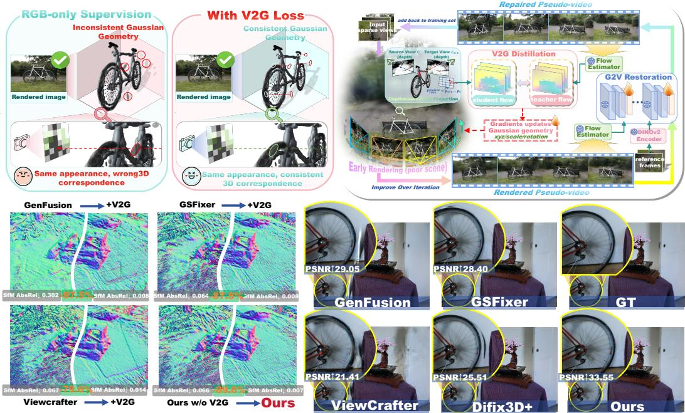  
Figure 1: Bi-FlowGS. Top left: V2G alleviates Geometry Cheating. Top right: V2G and G2V form a bidirectional flow loop between video restoration and Gaussian geometry optimization. Bottom: V2G consistently improves diverse diffusion-based reconstruction frameworks, while the complete Bi-FlowGS achieves strong rendering quality and geometric consistency.

## ABSTRACT

Sparse-view 3D scene reconstruction with 3D Gaussian Splatting (3DGS) is inherently underconstrained. Plausible renderings can also coexist with erroneous Gaussian geometry, as errors in positions or depths may be concealed by opacity, scale, and appearance; we term this failure mode Geometry Cheating. Existing regularization methods constrain geometry but remain limited to observed views, while video-diffusion-based methods complete unseen views yet mainly use them as RGB pseudo-supervision, underusing motion and temporal priors and lacking explicit geometry supervision. We present Bi-FlowGS, which uses optical flow to bridge generative view completion and Gaussian geometry regularization. Our plug-and-play Video-to-Geometry Flow Distillation (V2G) distills temporal correspondence priors from restored videos into Gaussian geometry to alleviate Geometry Cheating. Conversely, Geometry-to-Video Flow-Guided Restoration (G2V) uses the current 3DGS geometry to guide temporally consistent video restoration, providing more reliable generative supervision. Together, V2G and G2V form an implicit bidirectional co-refinement process, enabling restored videos and the optimized 3DGS scene to iteratively improve each other. Experiments demonstrate improved rendering quality and geometric consistency across wide-baseline and unbounded 360 benchmarks.

## 1 INTRODUCTION

3D Gaussian Splatting (3DGS) enables high-quality scene reconstruction and novel-view synthesis (Kerbl et al., 2023), but relies heavily on dense multi-view observations. Under sparse inputs, insufficient supervision often leads to overfitting, floaters, and unstable geometry. More critically, plausible RGB renderings can still arise from inaccurate Gaussian geometry: erroneous positions or depths can be concealed through compensation among opacity, scale, and appearance. We refer to this discrepancy between rendering fidelity and geometric correctness as Geometry Cheating.

Existing sparse-view reconstruction methods mainly follow two directions. (a) Regularizationbased methods reduce ambiguity through semantic, depth, structural, or geometric priors (Niemeyer et al., 2022; Wang et al., 2023; Xiong et al., 2023; Li et al., 2024; Chen et al., 2025), but remain largely tied to observed views and provide limited supervision for unseen regions. (b) Generative completion-based methods expand scene observability by synthesizing or restoring unseen views with image or video diffusion models (Zhou & Tulsiani, 2023; Gao et al., 2024; Yu et al., 2024; Wu et al., 2025b; Yin et al., 2025). However, generated views are typically used mainly as RGB pseudo-supervision, leaving video temporal-motion priors underexploited and Gaussian geometry without explicit supervision. Taken together, these limitations reveal a barrier between generative view completion and geometry regularization: (i) geometry regularization can refine Gaussian geometry but cannot expand beyond observed views; (ii) generative completion can recover unseen views but does not directly optimize Gaussian geometry.

To bridge this barrier, we present Bi-FlowGS, which uses optical flow as the central hub between generative view completion and Gaussian geometry optimization. (i) We introduce plug-and-play Video-to-Geometry Flow Distillation (V2G), which aligns teacher flow from restored videos with differentiable geometry-induced flow from 3DGS, distilling temporal-motion and implicit geometric priors into Gaussian geometry to directly supervise geometry optimization and alleviate Geometry Cheating. (ii) We further introduce Geometry-to-Video Flow-Guided Restoration (G2V) to improve the temporal correspondences of restored videos. Since reliable inter-frame correspondences are crucial for V2G supervision, G2V goes beyond conventional camera, coarse-geometry, or appearance conditioning (He et al., 2025; Kwak et al., 2024; Yu et al., 2024) by injecting cross-view flow and geometric cues from the current reconstructed 3DGS scene into video diffusion, translating static-scene cross-view correspondences into direct temporal-motion consistency guidance. Together with DINOv2 reference features (Oquab et al., 2023), it produces videos with sceneconsistent temporal motion and fine-grained texture details. (iii) Together, V2G and G2V form an implicit bidirectional co-refinement loop: improved videos provide more reliable teacher flow and pseudo-view supervision for 3DGS, while the optimized 3DGS scene provides more accurate flow and geometric guidance for subsequent video restoration, allowing both to iteratively improve each other.

As shown in Figure 1, V2G consistently improves Gaussian geometry across representative video-diffusion-based reconstruction frameworks, while G2V promotes temporally consistent video restoration to provide more reliable teacher-flow and pseudo-view supervision. Together, Bi-FlowGS further improves rendering fidelity and cross-view geometric consistency. Extensive experiments on wide-baseline and unbounded 360◦ sparse-view benchmarks demonstrate its effectiveness and generality.

Our contributions are summarized as follows:

• Video-to-Geometry Flow Distillation. We introduce plug-and-play V2G distillation that converts the temporal-motion and implicit geometric priors of video diffusion models into explicit supervision for Gaussian geometry, providing a new geometry-optimization mechanism for diffusion-completion-based sparse-view reconstruction.

• Geometry-to-Video Flow-Guided Restoration. We inject cross-view flow and geometric cues from the current reconstructed 3DGS scene into video diffusion, translating static-scene crossview correspondences into temporal-motion consistency guidance, while reference features preserve fine-grained texture details, thereby improving the reliability of teacher-flow and pseudo view supervision.

• Implicit Bidirectional Co-Refinement. We formulate an implicit bidirectional optimization loop that bridges generative view completion and Gaussian geometry refinement through opticalflow feedback, allowing video supervision and geometric guidance to mutually strengthen over iterations.

## 2 RELATED WORK

Conventional Sparse-View 3D Reconstruction. Sparse-view reconstruction is inherently underconstrained. NeRF-based methods reduce ambiguity through semantic, frequency, depth, or solution-space regularization (Jain et al., 2021; Niemeyer et al., 2022; Yang et al., 2023; Wang et al., 2023). Sparse-view 3DGS further introduces depth, structural, and Gaussian regularization (Xiong et al., 2023; Li et al., 2024; Zhu et al., 2024; Huang et al., 2024; Zhang et al., 2024; Park et al., 2025), while feed-forward methods directly predict Gaussian representations from sparse inputs (Charatan et al., 2024; Chen et al., 2024; Xu et al., 2025; Jiang et al., 2025). These methods improve reconstruction under sparse observations but cannot explicitly complete unseen viewpoints to provide additional supervision.

Diffusion-Based Generative View Completion. Diffusion models alleviate missing observations by synthesizing or refining unseen views (Zhou & Tulsiani, 2023; Gao et al., 2024; Sargent et al., 2024; Wu et al., 2024; 2025a; Paliwal et al., 2025; Topaloglu et al., 2026). Recent video-based˘ methods further alternate video generation or restoration with 3D reconstruction (Liu et al., 2026a; Wu et al., 2025b; Yin et al., 2025; Tang et al., 2026; Zhong et al., 2025; Wang et al., 2026). Gen-Fusion conditions video diffusion on reconstruction-derived RGB-D renderings (Wu et al., 2025b), while GSFixer introduces semantic and geometric reference features for video restoration (Yin et al., 2025). Other approaches incorporate camera, structural, or geometric priors into video generation (Yu et al., 2024; Liu et al., 2026a; Tang et al., 2026; Zhu et al., 2026; Ni et al., 2026; Liu et al., 2026b). Nevertheless, generated views are typically used as RGB or pseudo-view supervision, leaving their temporal correspondences underexploited for geometry optimization.

Direct Geometric Constraints for Sparse-View 3DGS. Beyond general regularization, recent methods explicitly introduce geometric constraints into 3DGS optimization (Hong et al., 2025). FewViewGS uses cross-view feature matching to enforce consistency on sampled novel views (Yin et al., 2024), while FDS leverages pretrained matching flow to guide geometry-induced radiance flow (Chen et al., 2025). These methods strengthen geometric supervision, but remain tied to observed-view correspondences or pretrained matching priors and do not exploit generatively completed views.

## 3 METHOD

Figure 2 illustrates Bi-FlowGS, which couples video restoration with Gaussian geometry optimization through optical flow. Given $K$ sparse images $\{ I _ { i } \} _ { i = 1 } ^ { K }$ and poses $\{ P _ { i } \} _ { i = 1 } ^ { K }$ , we reconstruct an initial Gaussian scene $\mathcal { G }$ and render an artifact-prone sequence $\mathcal { V } ^ { G }$ , which is restored to $\hat { \mathcal { V } }$ by a video diffusion model. The restored video serves two roles: its frames provide pseudo-view supervision, while the extracted optical flow serves as teacher flow for geometry optimization. Our V2G loss aligns this teacher flow with differentiable geometry-induced flow to explicitly supervise Gaussian geometry (Sec. 3.1). In the reverse direction, we introduce G2V, which uses flow and geometric cues from the optimized 3DGS scene with DINOv2 reference features to guide video restoration toward scene-consistent temporal motion and fine-grained textures (Sec. 3.2). Repeating these two directions enables restored videos and the 3DGS scene to iteratively improve each other through bidirectional feedback (Sec. 3.3).

## 3.1 VIDEO-TO-GEOMETRY FLOW DISTILLATION

Teacher flow from restored videos. Given a restored video $\widehat { \mathbf { V } } = \{ \widehat { I } _ { t } \} _ { t = 1 } ^ { T }$ along a known camera trajectory, we sample $( \widehat { I _ { i } } , \widehat { I _ { j } } )$ and estimate teacher flow with a frozen WAFT model (Wang & Deng, 2026): $\mathbf { F } _ { i  j } ^ { T } = \mathcal { F } _ { \mathrm { W A F T } } ( \widehat { I } _ { i } , \widehat { I } _ { j } )$ . Forward–backward consistency and flow confidence produce a validity mask ${ \bf M } ^ { T }$ and confidence map $\mathbf { C } ^ { T }$ . All teacher quantities are detached during Gaussian optimization.

Differentiable geometry-induced flow. For cameras $c _ { i }$ and $c _ { j }$ , the current Gaussian scene renders depths $D _ { i } ^ { G }$ and $D _ { i } ^ { G }$ . Each source pixel $\mathbf { p }$ is back-projected using $D _ { i } ^ { G } ( \mathbf { p } )$ , transformed to camera $j ,$ and reprojected onto the target view:

$$
{ \bf p } ^ { \prime } = \pi _ { j } \left( T _ { j } T _ { i } ^ { - 1 } \pi _ { i } ^ { - 1 } \left( { \bf p } , { \cal D } _ { i } ^ { G } ( { \bf p } ) \right) \right) , \qquad { \bf F } _ { i \to j } ^ { S } ( { \bf p } ) = { \bf p } ^ { \prime } - { \bf p } .\tag{1}
$$

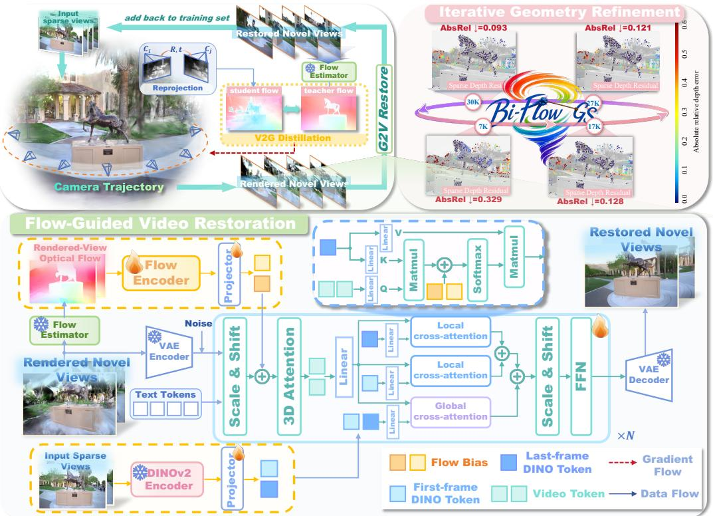  
Figure 2: Bi-FlowGS pipeline. Top left: V2G aligns teacher flow from restored views with differentiable geometry-induced flow, distilling temporal correspondence priors into Gaussian geometry. Top right: Iterative co-refinement progressively improves geometric consistency. Bottom: G2V uses 3DGS-derived flow and geometric cues, together with DINOv2 reference features, to guide temporally consistent video restoration, whose outputs provide pseudo-view and teacher-flow supervision, forming implicit bidirectional co-refinement.

Here, $T _ { i }$ and $T _ { j }$ are world-to-camera transformations, and $\pi _ { i } ^ { - 1 }$ and $\pi _ { j }$ denote back-projection and projection. A geometric-validity mask $\mathbf { M } ^ { G }$ excludes invalid depths, out-of-bound projections, and occluded correspondences determined by $D _ { j } ^ { G }$

With fixed cameras, the student flow is governed by rendered depth and directly reflects Gaussian geometry. Its principal gradient path is

$$
\frac { \partial \mathcal { L } _ { \mathrm { V 2 G } } } { \partial \boldsymbol { \Theta } _ { \mathcal { G } } } = \frac { \partial \mathcal { L } _ { \mathrm { V 2 G } } } { \partial \mathbf { F } _ { i  j } ^ { S } } \frac { \partial \mathbf { F } _ { i  j } ^ { S } } { \partial D _ { i } ^ { G } } \frac { \partial D _ { i } ^ { G } } { \partial \boldsymbol { \Theta } _ { \mathcal { G } } } ,\tag{2}
$$

where $\Theta _ { \mathcal { G } }$ denotes the Gaussian parameters involved in depth rendering, including the center coordinates $\pmb { \mu } .$ . Thus, flow errors provide explicit 3D supervision for Gaussian centers, reducing sparseview spatial ambiguity and mitigating Geometry Cheating.

Reliability-aware V2G loss. We define the pixel-wise reliability weight as $\begin{array} { r l } { \mathbf { W } ( \mathbf { p } ) } & { { } = } \end{array}$ $\mathbf { M } ^ { T } ( \mathbf { p } ) \dot { \mathbf { M } ^ { G } } ( \mathbf { p } ) ( \mathbf { C } ^ { T } ( \mathbf { p } ) ) ^ { \rceil }$ , where $\gamma$ controls confidence weighting. The V2G loss is

$$
\mathcal { L } _ { \mathrm { V 2 G } } = \frac { \sum _ { \mathbf { p } } \mathbf { W } ( \mathbf { p } ) \rho ( \mathbf { F } _ { i  j } ^ { S } ( \mathbf { p } ) - \mathbf { F } _ { i  j } ^ { T } ( \mathbf { p } ) ) } { \sum _ { \mathbf { p } } \mathbf { W } ( \mathbf { p } ) + \epsilon } ,\tag{3}
$$

where $\rho$ is the Smooth- $L _ { 1 }$ penalty over both flow components, and ϵ ensures numerical stability.

## 3.2 GEOMETRY-TO-VIDEO FLOW-GUIDED RESTORATION

Optical-flow conditioning (FlowCond) for video diffusion. We initialize the restoration model from a pretrained DiT-based CogVideoX model (Yang et al., 2025) and fine-tune it in latent space.

Given a rendered clip $\mathbf { V } ~ = ~ \{ I _ { t } \} _ { t = 1 } ^ { T }$ with endpoint reference views $I ^ { 0 }$ and $I ^ { 1 }$ , a frozen WAFT model (Wang & Deng, 2026) estimates consecutive flow $\mathbf { F } _ { t } = ( \mathbf { F } _ { x , t } , \mathbf { F } _ { y , t } )$ for $t = 1 , \dots , T - 1$

To improve robustness to unreliable intermediate renderings, we construct $\begin{array} { r l } { \mathbf { Q } ^ { F } } & { { } = } \end{array}$ $\mathbf { \mathrm { C o n c a i } } \mathbf { \dot { ( } } \mathbf { M } ^ { D } , \mathbf { G } ^ { D } , \mathbf { F } _ { x } , \mathbf { F } _ { y } \mathbf { ) }$ , where ${ \bf { M } } ^ { D }$ measures consistency between rendered and monocular depths, and $\mathbf { G } ^ { D }$ captures structural boundaries from normalized monocular depth. We adopt the flow encoder from FloVD (Jin et al., 2025) to extract block-aligned multi-scale features $\{ \Phi _ { l } ^ { F } \} _ { l = 1 } ^ { S } \ = \ E _ { \mathrm { f l o w } } ( \mathbf { Q } ^ { F } )$ . In parallel, a frozen DINOv2 encoder (Oquab et al., 2023) extracts endpoint reference tokens $\mathbf { S } ^ { r } = \bar { E } _ { \mathrm { D I N O } } ( I ^ { r } )$ for $r \in \{ 0 , 1 \}$

Geometry-to-Video flow-guided feature injection. We use flow for two complementary purposes: motion-consistent feature propagation and correspondence-aligned reference retrieval. First, multi scale flow features are injected before self-attention:

$$
\mathbf { H } _ { l } ^ { \mathrm { S A } } = \mathbf { H } _ { l } + \mathrm { A t t e n t i o n } _ { l } ^ { \mathrm { S A } } \left( \mathrm { N o r m } _ { 1 } ( \mathbf { H } _ { l } ) + \gamma _ { l } \Phi _ { l } ^ { F } \right) ,\tag{4}
$$

where $\mathbf { H } _ { l }$ denotes the input tokens of the l-th Transformer block and $\gamma _ { l }$ controls the injection strength. This encourages spatiotemporal feature propagation to follow the motion structure of the rendered sequence.

Second, flow guides appearance retrieval from the endpoint references. Let $\begin{array} { r l } { \mathbf { X } _ { l } } & { { } = } \end{array}$ $\mathrm { N o r m } _ { \mathrm { c r o s s } } ( \mathbf { H } _ { l } ^ { \mathrm { S A } } )$ . A global branch retrieves appearance from all reference tokens as $\mathbf { A } _ { l } ^ { \mathrm { g l o b a l } } =$ CrossAttention $\left( \mathbf { X } _ { l } , [ \mathbf { S } ^ { 0 } ; \mathbf { S } ^ { 1 } ] \right)$ , while a local branch uses flow-derived correspondence biases for spatially aligned retrieval:

$$
{ \bf A } _ { l , t } ^ { \mathrm { l o c a l } } = \sum _ { r = 0 } ^ { 1 } w _ { t } ^ { r } \mathrm { \ C r o s s A t t e n t i o n } _ { l } \left( { \bf X } _ { l , t } , { \bf S } ^ { r } ; { \bf B } _ { l , t } ^ { r , F } \right) .\tag{5}
$$

Here, $\mathbf { B } _ { l , t } ^ { r , F }$ denotes the flow-derived attention bias. We define $\tau _ { t } = ( t - 1 ) / ( T - 1 ) , w _ { t } ^ { 0 } = 1 - \tau _ { t }$ and $w _ { t } ^ { 1 } = \tau _ { t }$ to smoothly interpolate the two endpoint references along the camera trajectory.

Finally, the global and local features are fused and modulated by depth consistency. Defining $\widehat { \mathbf { M } } _ { l } ^ { D } =$ Resize $( \mathbf { M } ^ { D } )$ , we compute

$$
\mathbf { A } _ { l } = \left[ \mathbf { A } _ { l } ^ { \mathrm { g l o b a l } } + \alpha _ { l } ^ { \mathrm { l o c a l } } \left( \mathbf { A } _ { l } ^ { \mathrm { l o c a l } } - \mathbf { A } _ { l } ^ { \mathrm { g l o b a l } } \right) \right] \odot \left[ 1 + \alpha _ { l } ^ { \mathrm { c o n f } } \left( 1 - \widehat { \mathbf { M } } _ { l } ^ { D } \right) \right] .\tag{6}
$$

This design combines global appearance consistency with flow-guided local correspondence, while strengthening reference conditioning in geometrically unreliable regions.

## 3.3 RESTORED-VIDEO FEEDBACK OPTIMIZATION

Optimization objective. We apply the same photometric objective to both real and restored views (Kerbl et al., 2023; Wang et al., 2004):

$$
\mathcal { L } _ { \mathrm { p h o t o } } = \left( 1 - \lambda _ { \mathrm { S S I M } } \right) \mathcal { L } _ { 1 } + \lambda _ { \mathrm { S S I M } } \left( 1 - \mathrm { S S I M } \right) .\tag{7}
$$

The full objective is

$$
\begin{array} { r } { \mathcal { L } = \mathcal { L } _ { \mathrm { r e a l } } + \lambda _ { \mathrm { p s e u d o } } ( t ) \mathcal { L } _ { \mathrm { p s e u d o } } + \lambda _ { \mathrm { V 2 G } } \mathcal { L } _ { \mathrm { V 2 G } } , } \end{array}\tag{8}
$$

where $\lambda _ { \mathrm { p s e u d o } } ( t )$ is annealed over time and $\lambda _ { \mathrm { V 2 G } }$ controls the V2G term.

This yields an implicit bidirectional co-refinement loop: restored videos provide pseudo-view and teacher-flow supervision for 3DGS optimization, while the optimized 3DGS scene supplies more accurate flow guidance for subsequent video restoration.

## 4 EXPERIMENTS

## 4.1 EXPERIMENTAL SETUP

Training Data and Evaluation Benchmarks. We sample 800 scenes from DL3DV-10K (Ling et al., 2023). For each scene, we optimize 3DGS from 3, 6, or 9 views for 7,000 iterations to obtain imperfect reconstructions, then render two non-overlapping 49-frame clips and pair them with aligned real videos for fine-tuning. Real endpoint frames serve as references, while rendered clips are restoration inputs. DINOv2 features (Oquab et al., 2023) provide appearance cues. Adjacentframe flow is estimated by a frozen WAFT model (Wang & Deng, 2026) and encoded by the FloVD flow encoder (Jin et al., 2025), whose reprojection-flow design suits our rendered-view conditions.

We evaluate on 18 DL3DV-Benchmark scenes disjoint from training (Ling et al., 2023), 9 Mip-NeRF 360 scenes (Barron et al., 2022), 6 Tanks and Temples scenes (Knapitsch et al., 2017), and 16 CO3D scenes (Reizenstein et al., 2021), using PSNR, SSIM (Wang et al., 2004), and LPIPS (Zhang et al., 2018).

Implementation Details. We use the pretrained CogVideoX-5B-I2V (Yin et al., 2025; Yang et al., 2025) as the restoration backbone and fine-tune it on 49-frame clips at $4 8 0 \times 7 2 0$ . Training lasts 10,000 steps. We first optimize the conditioning modules for 2,000 steps with the diffusion backbone frozen, and then unfreeze the Transformer self-attention and cross-normalization layers for the remaining 8,000 steps. We use AdamW with BF16 precision and an effective batch size of 8. Learning rates are $2 \times 1 0 ^ { - 5 }$ for other trainable parameters and $1 \times 1 0 ^ { - 4 }$ for newly introduced scaling and gating parameters. Training is conducted on two NVIDIA RTX PRO 6000 Blackwell GPUs.

## 4.2 COMPARISON WITH STATE-OF-THE-ART METHODS

Quantitative Comparison. Tables 1 and 2 summarize results on four benchmarks. On Mip-NeRF 360, our method achieves the best PSNR and SSIM for all input-view settings, improving PSNR over the strongest baselines by 0.43, 0.34, and 0.38 dB with 3, 6, and 9 views, respectively. On Tanks and Temples, DL3DV-Benchmark, and CO3D, it ranks first in PSNR across all nine settings with an average gain of 0.71 dB, while achieving the best SSIM and LPIPS in eight of nine settings each. These results demonstrate consistent gains across datasets and sparsity levels.

Table 1: Rendering-quality comparison for sparse-view reconstruction on Mip-NeRF 360 under 3-, 6-, and 9-view settings. \* denotes results reproduced from ReconFusion, GenFusion, or GSFixer.
<table><tr><td rowspan="2">Method</td><td rowspan="2">Source</td><td colspan="3">PSNR↑</td><td colspan="3">SSIM↑</td><td colspan="3">LPIPS↓</td></tr><tr><td>3-view</td><td>6-view</td><td>9-view</td><td>3-view</td><td>6-view</td><td>9-view</td><td>3-view</td><td>6-view</td><td>9-view</td></tr><tr><td>ZeroNVS* (Sargent et al., 2024)</td><td>CVPR’24</td><td>14.44</td><td>15.51</td><td>15.99</td><td>0.316</td><td>0.337</td><td>0.350</td><td>0.680</td><td>0.663</td><td>0.655</td></tr><tr><td>ReconFusion* (Wu et al., 2024)</td><td>CVPR&#x27;24</td><td>15.50</td><td>16.93</td><td>18.19</td><td>0.358</td><td>0.401</td><td>0.432</td><td>0.585</td><td>0.544</td><td>0.511</td></tr><tr><td>3DGS* (Kerbl et al., 2023)</td><td>SIGGRAPH’23</td><td>13.06</td><td>14.96</td><td>16.79</td><td>0.251</td><td>0.355</td><td>0.447</td><td>0.576</td><td>0.505</td><td>0.446</td></tr><tr><td>2DGS* (Huang et al., 2024)</td><td>SIGGRAPH&#x27;24</td><td>13.07</td><td>15.02</td><td>16.67</td><td>0.243</td><td>0.338</td><td>0.423</td><td>0.580</td><td>0.506</td><td>0.449</td></tr><tr><td>FSGS* (Zhu et al., 2024)</td><td>ECCV&#x27;24</td><td>14.17</td><td>16.12</td><td>17.94</td><td>0.318</td><td>0.415</td><td>0.492</td><td>0.578</td><td>0.517</td><td>0.468</td></tr><tr><td>ViewCrafter (Yu et al., 2024)</td><td>TPAMI&#x27;25</td><td>13.33</td><td>15.21</td><td>16.87</td><td>0.281</td><td>0.362</td><td>0.436</td><td>0.586</td><td>0.503</td><td>0.442</td></tr><tr><td>GenFusion (Wu et al., 2025b)</td><td>CVPR&#x27;25</td><td>15.05</td><td>16.80</td><td>18.15</td><td>0.357</td><td>0.427</td><td>0.489</td><td>0.577</td><td>0.494</td><td>0.442</td></tr><tr><td>Difix3D+* (Wu et al., 2025a)</td><td>CVPR&#x27;25 Oral</td><td>13.92</td><td>15.94</td><td>17.54</td><td>0.298</td><td>0.382</td><td>0.452</td><td>0.578</td><td>0.468</td><td>0.391</td></tr><tr><td>GSFixer (Yin et al., 2025)</td><td>ICML&#x27;26</td><td>15.65</td><td>17.36</td><td>18.68</td><td>0.370</td><td>0.430</td><td>0.485</td><td>0.559</td><td>0.475</td><td>0.419</td></tr><tr><td>Bi-FlowGS (Ours)</td><td></td><td>16.08</td><td>17.70</td><td>19.06</td><td>0.388</td><td>0.446</td><td>0.501</td><td>0.541</td><td>0.468</td><td>0.413</td></tr></table>

Table 2: Rendering-quality comparison for sparse-view reconstruction on Tanks and Temples, DL3DV-Benchmark, and CO3D under sparse-view settings.
<table><tr><td rowspan="2">Method T&amp;T</td><td rowspan="2">Source</td><td colspan="3">PSNR↑</td><td rowspan="2"></td><td colspan="2">SSIM↑</td><td colspan="3">LPIPS↓</td></tr><tr><td>4-view</td><td>6-view</td><td>9-view 4-view</td><td>6-view</td><td>9-view</td><td>4-view</td><td>6-view</td><td>9-view</td></tr><tr><td>ViewCrafter (Yu et al., 2024)</td><td>TPAMI&#x27;25</td><td>12.38</td><td>14.00</td><td>15.83</td><td>0.452</td><td>0.496</td><td>0.542</td><td>0.533</td><td>0.475</td><td>0.420</td></tr><tr><td>GenFusion (Wu et al., 2025b)</td><td>CVPR&#x27;25</td><td>13.00</td><td>14.56</td><td>16.10</td><td>0.497</td><td>0.543</td><td>0.587</td><td>0.531</td><td>0.478</td><td>0.439</td></tr><tr><td>Difix3D+ (Wu et al., 2025a)</td><td>CVPR&#x27;25 Oral</td><td>13.44</td><td>14.65</td><td>15.62</td><td>0.451</td><td>0.473</td><td>0.492</td><td>0.481</td><td>0.446</td><td>0.419</td></tr><tr><td>GSFixer (Yin et al., 2025)</td><td>ICML&#x27;26</td><td>13.97</td><td>15.47</td><td>16.62</td><td>0.498</td><td>0.528</td><td>0.561</td><td>0.503</td><td>0.451</td><td>0.405</td></tr><tr><td>Bi-FlowĠS (Ours)</td><td></td><td>14.37</td><td>15.93</td><td>16.93</td><td>0.525</td><td>0.555</td><td>0.585</td><td>0.486</td><td>0.437</td><td>0.398</td></tr><tr><td>DL3DV</td><td></td><td>3-view</td><td>6-view</td><td>9-view</td><td>3-view</td><td>6-view</td><td>9-view</td><td>3-view</td><td>6-view</td><td>9-view</td></tr><tr><td>ViewCrafter (Yu et al., 2024)</td><td>TPAMI&#x27;25</td><td>12.79</td><td>15.97</td><td>17.90</td><td>0.385</td><td>0.508</td><td>0.583</td><td>0.549</td><td>0.437</td><td>0.370</td></tr><tr><td>GenFusion (Wu et al., 2025b)</td><td>CVPR&#x27;25</td><td>14.52</td><td>17.20</td><td>18.82</td><td>0.491</td><td>0.577</td><td>0.634</td><td>0.516</td><td>0.412</td><td>0.357</td></tr><tr><td>Difix3D+ (Wu et al., 2025a)</td><td>CVPR&#x27;25 Oral</td><td>14.17</td><td>16.70</td><td>18.30</td><td>0.429</td><td>0.528</td><td>0.589</td><td>0.492</td><td>0.389</td><td>0.336</td></tr><tr><td>GSFixer (Yin et al., 2025)</td><td>ICML&#x27;26</td><td>15.02</td><td>17.25</td><td>18.62</td><td>0.491</td><td>0.562</td><td>0.615</td><td>0.502</td><td>0.403</td><td>0.347</td></tr><tr><td>Bi-FlowĠS (Ours)</td><td></td><td>15.72</td><td>17.82</td><td>19.15</td><td>0.525</td><td>0.594</td><td>0.642</td><td>0.471</td><td>0.377</td><td>0.327</td></tr><tr><td>CO3D</td><td></td><td>3-view</td><td>6-view</td><td>9-view</td><td>3-view</td><td>6-view</td><td>9-view</td><td>3-view</td><td>6-view</td><td>9-view</td></tr><tr><td>ViewCrafter (Yu et al., 2024)</td><td>TPAMI&#x27;25</td><td>13.97</td><td>17.30</td><td>19.35</td><td>0.480</td><td>0.576</td><td>0.636</td><td>0.543</td><td>0.459</td><td>0.404</td></tr><tr><td>GenFusion (Wu et al., 2025b)</td><td>CVPR&#x27;25</td><td>15.24</td><td>17.39</td><td>19.45</td><td>0.590</td><td>0.616</td><td>0.660</td><td>0.512</td><td>0.470</td><td>0.420</td></tr><tr><td>Difix3D+ (Wu et al., 2025a)</td><td>CVPR&#x27;25 Oral</td><td>14.46</td><td>17.05</td><td>18.53</td><td>0.487</td><td>0.558</td><td>0.602</td><td>0.545</td><td>0.470</td><td>0.430</td></tr><tr><td>GSFixer (Yin et al., 2025)</td><td>ICML&#x27;26</td><td>15.04</td><td>17.74</td><td>18.97</td><td>0.571</td><td>0.605</td><td>0.634</td><td>0.509</td><td>0.458</td><td>0.422</td></tr><tr><td>Bi-FlowĠS (Ours)</td><td></td><td>15.92</td><td>19.33</td><td>20.78</td><td>0.595</td><td>0.650</td><td>0.682</td><td>0.474</td><td>0.398</td><td>0.359</td></tr></table>

GT

Qualitative Comparison. Figures 3 and 4 compare rendering quality and geometric consistency. To expose geometry cheating, we back-project shared COLMAP tracks (Schonberger & Frahm, 2016) using each method’s rendered depth and reproject them into held-out views. Several baselines pro duce plausible renderings despite larger reprojection errors, revealing discrepancies between appearance fidelity and underlying geometry. Across Tanks and Temples, CO3D, and DL3DV-Benchmark, our method better preserves the red railing, sign text and graphics, chair structures, and storefront details highlighted by the yellow insets.

Ours  
GSFixer  
Difix3D+  
GenFusion  
Viewcrafter  
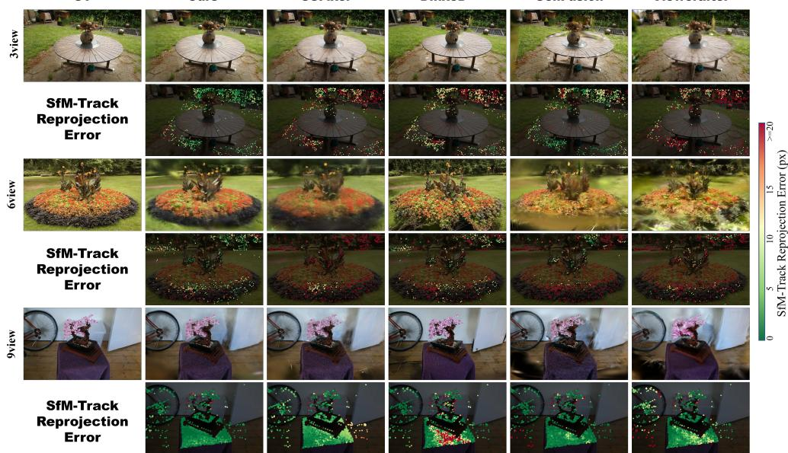  
Figure 3: Rendering quality and geometric consistency on Mip-NeRF 360. Novel-view renderings are paired with SfM-track reprojection error maps. Lower reprojection error indicates better geometric consistency.

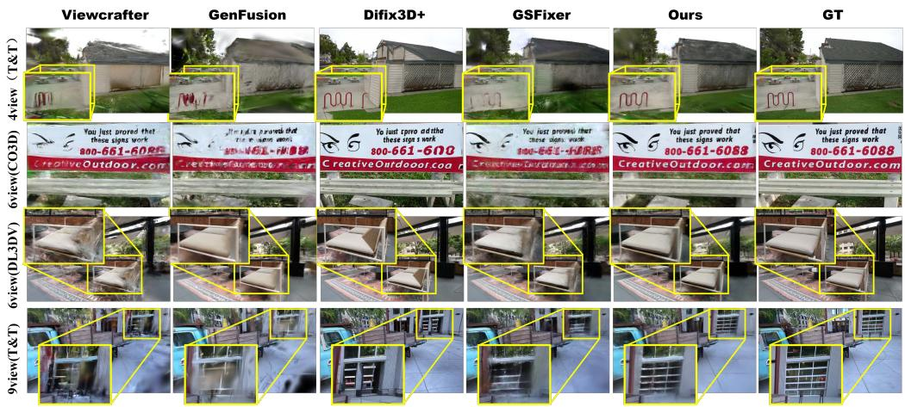  
Figure 4: Qualitative comparison across sparse-view benchmarks. Results are shown on Tanks and Temples, CO3D, and DL3DV-Benchmark.

## 4.3 ABLATION STUDIES

Plug-and-Play Generality of V2G.We integrate V2G into GenFusion, ViewCrafter, and GSFixer under identical training conditions for each baseline and its V2G variant. Since Mip-NeRF 360 lacks dense depth ground truth, geometry is evaluated against COLMAP/SfM sparse depths on identical robust tracks using standard depth metrics. As shown in Table 3, V2G consistently improves all three frameworks, yielding 10.70%–47.77% relative geometry gains. Our full model further achieves

48.01%, 51.49%, and 50.78% gains for 3, 6, and 9 views, with PSNR gains of 0.26, 0.35, and 0.29 dB with an additional cost of only 21.71–26.51 ms/step. Figure 5 further confirms the visual gains, demonstrating V2G generality and effective bidirectional co-refinement.  
Table 3: Ablation of V2G on Mip-NeRF 360 under 3-, 6-, and 9-view settings. Geo. Avg denotes the average relative gain across geometry metrics, and time is reported in ms/step.
<table><tr><td>Method</td><td colspan="10">PSNR↑ SSIM↑ LPIPS↓ AbsRel↓ SqRel↓ RMSE↓ RMSE-log↓ MedianRel↓ δ1 ↑</td><td> $\delta _ { 2 } \uparrow$ </td><td></td><td>δ3 ↑ Geo. Avg↑ Time↓</td></tr><tr><td colspan="10">3-view</td></tr><tr><td>GenFusion</td><td>15.05</td><td></td><td></td><td></td><td></td><td>0.1030</td><td>0.0903</td><td>0.0118</td><td>0.9689</td><td>0.9906 0.9962</td><td></td><td></td><td>27.39</td></tr><tr><td>GenFusion+V2G</td><td>15.20</td><td>0.357 0.360</td><td>0.577 0.574</td><td>0.0322 0.0232</td><td>0.0079 0.0068</td><td>0.0983</td><td>0.0855</td><td>0.0080</td><td>0.9839</td><td>0.9923</td><td>0.9959</td><td>+10.70%</td><td>37.58</td></tr><tr><td>ViewCrafter</td><td>13.33</td><td>0.281</td><td>0.586</td><td>0.1311</td><td>0.2636</td><td>0.6804</td><td>0.2381</td><td>0.0575</td><td>0.8125</td><td>0.9274 0.9709</td><td></td><td></td><td>27.03</td></tr><tr><td>ViewCrafter+V2G</td><td>13.37</td><td>0.285</td><td>0.583</td><td>0.0825</td><td>0.0525</td><td>0.3082</td><td>0.1948</td><td>0.0240</td><td>0.8804 0.9477 0.9806</td><td></td><td></td><td>+32.48%</td><td>42.68</td></tr><tr><td>GSFixer</td><td>15.65</td><td>0.370</td><td>0.559</td><td>0.1135</td><td>0.0824</td><td>0.3847</td><td>0.2328</td><td>0.0538</td><td>0.8407</td><td>0.9361</td><td>0.9667</td><td></td><td>27.38</td></tr><tr><td>GSFixer+V2G</td><td>15.77</td><td>0.371</td><td>0.545</td><td>0.0464</td><td>0.0116</td><td>0.1239</td><td>0.1276</td><td>0.0136</td><td>0.9376 0.9760 0.9936</td><td></td><td></td><td>+43.91%</td><td>50.55</td></tr><tr><td>Ours w/o V2G</td><td>15.82</td><td>0.374</td><td>0.555</td><td>0.1098</td><td>0.0595</td><td>0.3156</td><td>0.2239</td><td>0.0530</td><td>0.8508 0.9333 0.9689</td><td></td><td></td><td></td><td>26.40</td></tr><tr><td>Ours</td><td>16.08</td><td>0.388</td><td>0.541</td><td>0.0310</td><td>0.0080</td><td>0.1024</td><td>0.1008</td><td>0.0097</td><td>0.9647 0.9870 0.9928</td><td></td><td></td><td>+48.01%</td><td>48.11</td></tr><tr><td colspan="10">6-view</td><td></td><td></td><td></td><td></td></tr><tr><td>GenFusion</td><td></td><td></td><td>0.494</td><td></td><td></td><td></td><td>0.1240</td><td></td><td></td><td></td><td></td><td></td><td></td></tr><tr><td>GenFusion+V2G</td><td>16.80 16.94</td><td>0.427 0.431</td><td>0.494</td><td>0.0301 0.0191</td><td>0.0100 0.0065</td><td>0.1064 0.0912</td><td>0.0890</td><td>0.0070 0.0054</td><td>0.9799</td><td>0.9820</td><td>0.9603 0.9766 0.9843</td><td></td><td>27.96 38.43</td></tr><tr><td>ViewCrafter</td><td>15.21</td><td>0.362</td><td>0.503</td><td>0.0801</td><td>0.0813</td><td>0.3929</td><td>0.1749</td><td>0.0286</td><td>0.9046 0.9681</td><td></td><td>0.9974 0.9850</td><td>+17.39%</td><td>44.14</td></tr><tr><td>ViewCrafter+V2G</td><td>15.34</td><td>0.369</td><td>0.498</td><td>0.0326</td><td>0.0117</td><td>0.1483</td><td>0.0987</td><td>0.0078</td><td>0.9629</td><td>0.9878 0.9958</td><td></td><td>+41.64%</td><td>81.47</td></tr><tr><td>GSFixer</td><td>17.36</td><td>0.430</td><td>0.475</td><td>0.0851</td><td>0.0388</td><td>0.2555</td><td>0.1730</td><td>0.0376</td><td>0.8828</td><td>0.9654 0.9888</td><td></td><td></td><td>32.90</td></tr><tr><td>GSFixer+V2G</td><td>17.43</td><td>0.432</td><td>0.468</td><td>0.0318</td><td>0.0078</td><td>0.1069</td><td>0.1016</td><td>0.0090</td><td>0.9686 0.9933 0.9946</td><td></td><td></td><td>+41.42%</td><td>60.94</td></tr><tr><td>Ours w/o V2G</td><td>17.35</td><td>0.428</td><td>0.473</td><td>0.0831</td><td>0.0500</td><td>0.2986</td><td>0.1692</td><td>0.0361</td><td>0.8997</td><td>0.9652 0.9869</td><td></td><td></td><td>27.46</td></tr><tr><td>Ours</td><td>17.70</td><td>0.446</td><td>0.468</td><td>0.0182</td><td>0.0037</td><td>0.0738</td><td>0.0516</td><td>0.0066</td><td>0.9895 0.9968 0.9995</td><td></td><td></td><td>+51.49%</td><td>52.21</td></tr><tr><td colspan="10">9-view</td><td colspan="3"></td><td></td><td></td></tr><tr><td>GenFusion</td><td></td><td></td><td></td><td></td><td></td><td></td><td></td><td></td><td></td><td></td><td></td><td></td><td></td></tr><tr><td></td><td>18.15</td><td>0.489</td><td>0.442</td><td>0.0158</td><td>0.0044</td><td>0.0740</td><td>0.0679</td><td>0.0054</td><td>0.9877 0.9932 0.9971</td><td></td><td></td><td></td><td>26.57</td></tr><tr><td>GenFusion+V2G ViewCrafter</td><td>18.25 16.87</td><td>0.489 0.436</td><td>0.442 0.442</td><td>0.0115 0.0651</td><td>0.0026 0.0839</td><td>0.0613 0.4374</td><td>0.0416 0.1570</td><td>0.0047 0.0218</td><td>0.9947 0.9362</td><td>0.9980 0.9754 0.9873</td><td>0.9992</td><td>+17.18%</td><td>35.10 37.25</td></tr><tr><td>ViewCrafter+V2G</td><td>17.06</td><td>0.443</td><td>0.435</td><td>0.0278</td><td>0.0155</td><td>0.1806</td><td>0.1192</td><td>0.0059</td><td>0.9705</td><td>0.9854</td><td>0.9918</td><td>+37.47%</td><td>65.37</td></tr><tr><td>GSFixer</td><td>18.68</td><td>0.485</td><td>0.419</td><td>0.0662</td><td>0.0323</td><td>0.2528</td><td>0.1363</td><td>0.0284</td><td>0.9318 0.9802 0.9931</td><td></td><td></td><td></td><td>30.20</td></tr><tr><td>GSFixer+V2G</td><td>18.75</td><td>0.487</td><td>0.415</td><td>0.0174</td><td>0.0036</td><td>0.0836</td><td>0.0446</td><td>0.0067</td><td>0.9921 0.9984 0.9997</td><td></td><td></td><td>+47.77%</td><td>55.86</td></tr><tr><td>Ours w/o V2G</td><td>18.77</td><td>0.486</td><td>0.416</td><td>0.0762</td><td>0.0327</td><td>0.2450</td><td>0.1586</td><td>0.0342</td><td>0.9061 0.9702 0.9887</td><td></td><td></td><td></td><td>29.55</td></tr><tr><td>Ours</td><td>19.06</td><td>0.501</td><td>0.413</td><td>0.0158</td><td>0.0032</td><td>0.0708</td><td>0.0470</td><td>0.0062</td><td>0.9943 0.9974 0.9988</td><td></td><td></td><td>+50.78%</td><td>56.06</td></tr></table>

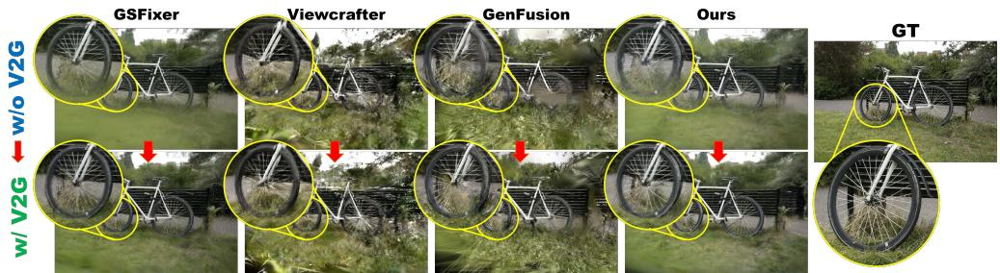  
Figure 5: Plug-and-play effectiveness of V2G. V2G consistently improves 3D geometry across different reconstruction frameworks.  
Table 4: Component ablation and V2G-weight sensitivity on Mip-NeRF 360 with 6 views.

(a) Component ablation
<table><tr><td>DINO</td><td>FlowCond</td><td>V2G</td><td>PSNR↑</td><td>SSIM↑</td><td>LPIPS↓</td></tr><tr><td>了</td><td>√</td><td>√</td><td>17.70</td><td>0.446</td><td>0.468</td></tr><tr><td>V</td><td>√</td><td>X</td><td>17.35</td><td>0.428</td><td>0.473</td></tr><tr><td></td><td>X</td><td>√</td><td>17.50</td><td>0.439</td><td>0.467</td></tr><tr><td>L</td><td>X</td><td>X</td><td>17.28</td><td>0.438</td><td>0.479</td></tr><tr><td>X</td><td>√</td><td>√</td><td>17.52</td><td>0.439</td><td>0.477</td></tr><tr><td>X</td><td>V</td><td>X</td><td>17.23</td><td>0.435</td><td>0.489</td></tr><tr><td>X</td><td>X</td><td>√</td><td>17.47</td><td>0.440</td><td>0.473</td></tr><tr><td>X</td><td>X</td><td>X</td><td>17.18</td><td>0.434</td><td>0.483</td></tr></table>

(b) V2G weight sensitivity  
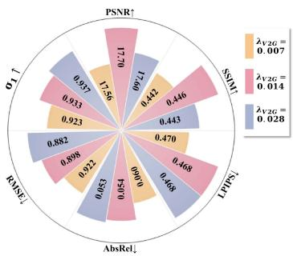

Component Ablation and Co-Refinement Dynamics. We first ablate DINO, FlowCond, and V2G on Mip-NeRF 360 under the 6-view setting. Table 4(a) shows that removing V2G drops PSNR by 0.35 dB and SSIM by 0.018. With FlowCond and V2G, DINO improves SSIM by 0.007 and reduces LPIPS by 0.009, indicating better texture preservation; with DINO and V2G, FlowCond adds 0.20 dB PSNR, reflecting effective motion guidance. Their combination balances appearance fidelity and motion consistency. Figure 6 further shows sharper details and lower SfM-track reprojection errors for the full model. Figure 7 further analyzes V2G alone and with G2V FlowCond. On Ignatius from Tanks and Temples, V2G improves both F-score and PSNR using ground-truth (GT) point clouds, validating geometry and rendering gains. On Bonsai, joint V2G and FlowCond achieves the lowest AbsRel and highest PSNR, demonstrating their mutual reinforcement and supporting implicit V2G–G2V co-refinement.

(b) Training dynamics  
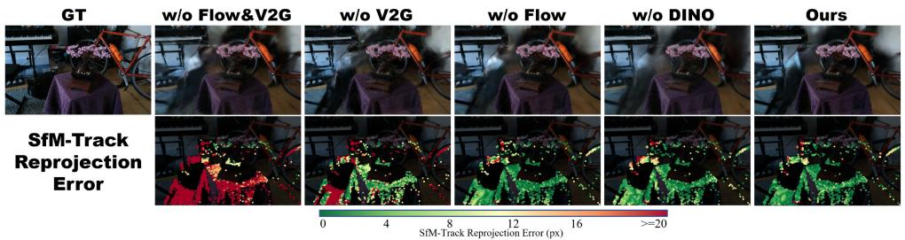  
Figure 6: Visualization of component ablation. The top row shows rendered results, and the bottom row visualizes SfM-track reprojection errors.

Sensitivity to the V2G Loss Weight. We evaluate λ on Mip-NeRF 360 under the 6-view setting. As shown in Table 4(b), $\lambda _ { \mathrm { V 2 G } } = 0 . 0 1 4$ achieves the best overall rendering quality, improving PSNR by 0.14 and 0.10 dB over 0.007 and 0.028, respectively. A larger weight slightly improves geometry but degrades PSNR and SSIM. We therefore use $\lambda _ { \mathrm { V 2 G } } = 0 . 0 1 4$ in all experiments.

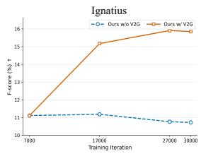

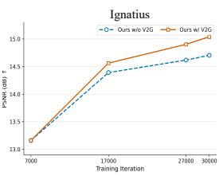

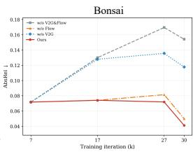

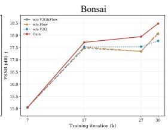  
Figure 7: Ablation training dynamics. Left: PSNR and Surface F-score with/without V2G on Ignatius (Tanks and Temples). Right: AbsRel and PSNR for V2G/FlowCond ablations on Bonsai (Mip-NeRF 360).

Comparison with FDS. We compare V2G with FDS (Flow Distillation Sampling (Chen et al., 2025)), a representative geometry-regularization method using observed-view correspondences, on all six Tanks and Temples scenes. Surface F-score is reported on the four scenes with ground-truth point clouds. Under identical settings, Figure 8(a) shows that V2G achieves better rendering metrics and Surface F-score, while Figure 8(b) shows stronger PSNR and F-score throughout training on Ignatius. This improvement reflects their different supervision sources: FDS relies on observed-view correspondences, whereas V2G distills motion and temporal correspondence priors from restored videos into Gaussian geometry, yielding better geometry and rendering quality.

(a) Rendering and geometry metrics

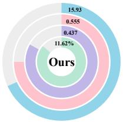

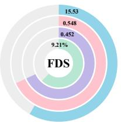

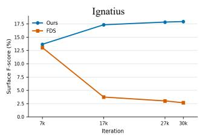

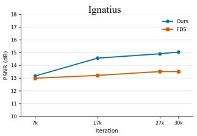  
Figure 8: Comparison with FDS on Tanks and Temples under 6 views. Rendering metrics are averaged over 6 scenes, and Surface F-score over 4 scenes with ground-truth point clouds.

## 5 CONCLUSION

We presented Bi-FlowGS, which bridges generative view completion and geometric regularization for sparse-view 3DGS through optical flow. V2G distills temporal correspondences from restored videos into Gaussian geometry to alleviate Geometry Cheating, while G2V feeds refined flow and geometric cues back into video restoration. Together, they form an implicit bidirectional co-refinement loop that improves both video supervision and Gaussian geometry. Experiments demonstrate consistent gains in rendering quality and geometric consistency, with V2G generalizing across reconstruction frameworks.

## AI USE STATEMENT

Generative AI tools were used to draft and revise parts of the manuscript, improve readability, and assist with LATEX formatting. All AI-assisted text and formatting were reviewed by the authors. The authors take responsibility for the final content, including all claims and artifacts produced with the aid of generative AI.

## REFERENCES

Jonathan T Barron, Ben Mildenhall, Dor Verbin, Pratul P Srinivasan, and Peter Hedman. Mip-nerf 360: Unbounded anti-aliased neural radiance fields. In Proceedings of the IEEE/CVF conference on computer vision and pattern recognition, pp. 5470–5479, 2022.

David Charatan, Sizhe Lester Li, Andrea Tagliasacchi, and Vincent Sitzmann. pixelsplat: 3d gaussian splats from image pairs for scalable generalizable 3d reconstruction. In Proceedings of the IEEE/CVF conference on computer vision and pattern recognition, pp. 19457–19467, 2024.

Lin-Zhuo Chen, Kangjie Liu, Youtian Lin, Zhihao Li, Siyu Zhu, Xun Cao, and Yao Yao. Flow distillation sampling: Regularizing 3d gaussians with pre-trained matching priors. In International Conference on Learning Representations, volume 2025, pp. 39372–39384, 2025.

Yuedong Chen, Haofei Xu, Chuanxia Zheng, Bohan Zhuang, Marc Pollefeys, Andreas Geiger, Tat-Jen Cham, and Jianfei Cai. Mvsplat: Efficient 3d gaussian splatting from sparse multi-view images. In European conference on computer vision, pp. 370–386. Springer, 2024.

David Eigen, Christian Puhrsch, and Rob Fergus. Depth map prediction from a single image using a multi-scale deep network. Advances in neural information processing systems, 27, 2014.

Ruiqi Gao, Aleksander Holynski, Philipp Henzler, Arthur Brussee, Ricardo Martin-Brualla, Pratul Srinivasan, Jonathan T Barron, and Ben Poole. Cat3d: Create anything in 3d with multi-view diffusion models. arXiv preprint arXiv:2405.10314, 2024.

Hao He, Yinghao Xu, Yuwei Guo, Gordon Wetzstein, Bo Dai, Hongsheng Li, and Ceyuan Yang. Cameractrl: Enabling camera control for video diffusion models. In The Thirteenth International Conference on Learning Representations, 2025.

Jonathan Ho and Tim Salimans. Classifier-free diffusion guidance. arXiv preprint arXiv:2207.12598, 2022.

Kai Hong, Yue Ming, Chuanchen Luo, Jiangwan Zhou, and Haotian Guo. Flowgs: End-to-end correspondence-guided 3d gaussian splatting from sparse unposed images. Neurocomputing, pp. 132104, 2025.

Binbin Huang, Zehao Yu, Anpei Chen, Andreas Geiger, and Shenghua Gao. 2d gaussian splatting for geometrically accurate radiance fields. In ACM SIGGRAPH 2024 conference papers, pp. 1–11, 2024.

Ajay Jain, Matthew Tancik, and Pieter Abbeel. Putting nerf on a diet: Semantically consistent fewshot view synthesis. In 2021 IEEE/CVF International Conference on Computer Vision (ICCV), pp. 5865–5874. IEEE, 2021.

Lihan Jiang, Yucheng Mao, Linning Xu, Tao Lu, Kerui Ren, Yichen Jin, Xudong Xu, Mulin Yu, Jiangmiao Pang, Feng Zhao, et al. Anysplat: Feed-forward 3d gaussian splatting from unconstrained views. ACM Transactions on Graphics (TOG), 44(6):1–16, 2025.

Wonjoon Jin, Qi Dai, Chong Luo, Seung-Hwan Baek, and Sunghyun Cho. Flovd: Optical flow meets video diffusion model for enhanced camera-controlled video synthesis. In Proceedings of the Computer Vision and Pattern Recognition Conference, pp. 2040–2049, 2025.

Bernhard Kerbl, Georgios Kopanas, Thomas Leimkuhler, George Drettakis, et al. 3d gaussian splat-¨ ting for real-time radiance field rendering. ACM Trans. Graph., 42(4):139–1, 2023.

Arno Knapitsch, Jaesik Park, Qian-Yi Zhou, and Vladlen Koltun. Tanks and temples: Benchmarking large-scale scene reconstruction. ACM Transactions on Graphics (ToG), 36(4):1–13, 2017.

Jeong-gi Kwak, Erqun Dong, Yuhe Jin, Hanseok Ko, Shweta Mahajan, and Kwang Moo Yi. Vivid-1-to-3: Novel view synthesis with video diffusion models. In Proceedings of the IEEE/CVF Conference on Computer Vision and Pattern Recognition, pp. 6775–6785, 2024.

Jiahe Li, Jiawei Zhang, Xiao Bai, Jin Zheng, Xin Ning, Jun Zhou, and Lin Gu. Dngaussian: Optimizing sparse-view 3d gaussian radiance fields with global-local depth normalization. In Proceedings ofthe IEEE/CVF conference on computer vision andpattern recognition, pp. 20775–20785, 2024.

Junnan Li, Dongxu Li, Silvio Savarese, and Steven Hoi. Blip-2: Bootstrapping language-image pre-training with frozen image encoders and large language models. In International conference on machine learning, pp. 19730–19742. PmLR, 2023.

Haotong Lin, Sili Chen, Junhao Liew, Donny Y Chen, Zhenyu Li, Guang Shi, Jiashi Feng, and Bingyi Kang. Depth anything 3: Recovering the visual space from any views. arXiv preprint arXiv:2511.10647, 2025.

Lu Ling, Yichen Sheng, Zhi Tu, Wentian Zhao, Cheng Xin, Kun Wan, Lantao Yu, Qianyu Guo, Zixun Yu, Yawen Lu, et al. Dl3dv-10k: A large-scale scene dataset for deep learning-based 3d vision. arXiv preprint arXiv:2312.16256, 3, 2023.

Fangfu Liu, Wenqiang Sun, Hanyang Wang, Yikai Wang, Haowen Sun, Junliang Ye, Jun Zhang, and Yueqi Duan. Reconx: Reconstruct any scene from sparse views with video diffusion model. IEEE Transactions on Image Processing, 2026a.

Xinhui Liu, Can Wang, Wei Jiang, Wei Wang, and Dong Xu. Gaussvid: Sparse-view gaussian splatting with 3d-aware video diffusion priors. arXiv preprint arXiv:2608.21849, 2026b.

Junfeng Ni, Yixin Chen, Zhifei Yang, Yu Liu, Ruijie Lu, Song-Chun Zhu, and Siyuan Huang. G4splat: Geometry-guided gaussian splatting with generative prior. In International Conference on Learning Representations, volume 2026, pp. 138924–138951, 2026.

Michael Niemeyer, Jonathan T Barron, Ben Mildenhall, Mehdi SM Sajjadi, Andreas Geiger, and Noha Radwan. Regnerf: Regularizing neural radiance fields for view synthesis from sparse inputs. In Proceedings of the IEEE/CVF conference on computer vision and pattern recognition, pp. 5480–5490, 2022.

Maxime Oquab, Timothee Darcet, Th´ eo Moutakanni, Huy Vo, Marc Szafraniec, Vasil Khalidov,´ Pierre Fernandez, Daniel Haziza, Francisco Massa, Alaaeldin El-Nouby, et al. Dinov2: Learning robust visual features without supervision. arXiv preprint arXiv:2304.07193, 2023.

Avinash Paliwal, Xilong Zhou, Wei Ye, Jinhui Xiong, Rakesh Ranjan, and Nima Khademi Kalantari. Ri3d: Few-shot gaussian splatting with repair and inpainting diffusion priors. In 2025 IEEE/CVF International Conference on Computer Vision (ICCV), pp. 25094–25103. IEEE, 2025.

Hyunwoo Park, Gun Ryu, and Wonjun Kim. Dropgaussian: Structural regularization for sparse-view gaussian splatting. In Proceedings of the computer vision and pattern recognition conference, pp. 21600–21609, 2025.

Jeremy Reizenstein, Roman Shapovalov, Philipp Henzler, Luca Sbordone, Patrick Labatut, and David Novotny. Common objects in 3d: Large-scale learning and evaluation of real-life 3d category reconstruction. In Proceedings of the IEEE/CVF international conference on computer vision, pp. 10901–10911, 2021.

Kyle Sargent, Zizhang Li, Tanmay Shah, Charles Herrmann, Hong-Xing Yu, Yunzhi Zhang, Eric Ryan Chan, Dmitry Lagun, Li Fei-Fei, Deqing Sun, et al. Zeronvs: Zero-shot 360-degree view synthesis from a single image. In Proceedings of the IEEE/CVF Conference on Computer Vision and Pattern Recognition, pp. 9420–9429, 2024.

Johannes L Schonberger and Jan-Michael Frahm. Structure-from-motion revisited. In Proceedings ofthe IEEE conference on computer vision and pattern recognition, pp. 4104–4113, 2016.

Jiaming Song, Chenlin Meng, and Stefano Ermon. Denoising diffusion implicit models. arXiv preprint arXiv:2010.02502, 2020.

Jimin Tang, Wenyuan Zhang, Junsheng Zhou, Zian Huang, Kanle Shi, Shenkun Xu, Yu-Shen Liu, and Zhizhong Han. Vidsplat: Gaussian splatting reconstruction with geometry-guided video diffusion priors. arXiv preprint arXiv:2605.11424, 2026.

Atakan Topaloglu, Kunyi Li, Michael Niemeyer, Nassir Navab, A Murat Tekalp, and Federico˘ Tombari. Oraclegs: Grounding generative priors for sparse-view gaussian splatting. In 2026 IEEE/CVF Winter Conference on Applications of Computer Vision (WACV), pp. 77–87. IEEE, 2026.

Guangcong Wang, Zhaoxi Chen, Chen Change Loy, and Ziwei Liu. Sparsenerf: Distilling depth ranking for few-shot novel view synthesis. In Proceedings ofthe IEEE/CVF international conference on computer vision, pp. 9065–9076, 2023.

Xinliang Wang, Yifeng Shi, and Zhenyu Wu. Artifactworld: Scaling 3d gaussian splatting artifact restoration via video generation models. arXiv preprint arXiv:2604.12251, 2026.

Yihan Wang and Jia Deng. Waft: Warping-alone field transforms for optical flow. In International Conference on Learning Representations, volume 2026, pp. 157389–157402, 2026.

Zhou Wang, Alan C Bovik, Hamid R Sheikh, and Eero P Simoncelli. Image quality assessment: from error visibility to structural similarity. IEEE transactions on image processing, 13(4):600– 612, 2004.

Jay Zhangjie Wu, Yuxuan Zhang, Haithem Turki, Xuanchi Ren, Jun Gao, Mike Zheng Shou, Sanja Fidler, Zan Gojcic, and Huan Ling. Difix3d+: Improving 3d reconstructions with single-step diffusion models. In Proceedings of the IEEE/CVF Conference on Computer Vision and Pattern Recognition, pp. 26024–26035, 2025a.

Rundi Wu, Ben Mildenhall, Philipp Henzler, Keunhong Park, Ruiqi Gao, Daniel Watson, Pratul P Srinivasan, Dor Verbin, Jonathan T Barron, Ben Poole, et al. Reconfusion: 3d reconstruction with diffusion priors. In Proceedings of the IEEE/CVF conference on computer vision and pattern recognition, pp. 21551–21561, 2024.

Sibo Wu, Congrong Xu, Binbin Huang, Andreas Geiger, and Anpei Chen. Genfusion: Closing the loop between reconstruction and generation via videos. In Proceedings of the Computer Vision and Pattern Recognition Conference, pp. 6078–6088, 2025b.

Haolin Xiong, Sairisheek Muttukuru, Rishi Upadhyay, Pradyumna Chari, and Achuta Kadambi. Sparsegs: Real-time 360 sparse view synthesis using gaussian splatting. arXiv e-prints, pp. arXiv– 2312, 2023.

Jiale Xu, Shenghua Gao, and Ying Shan. Freesplatter: Pose-free gaussian splatting for sparseview 3d reconstruction. In Proceedings of the IEEE/CVF International Conference on Computer Vision, pp. 25442–25452, 2025.

Jiawei Yang, Marco Pavone, and Yue Wang. Freenerf: Improving few-shot neural rendering with free frequency regularization. In Proceedings of the IEEE/CVF conference on computer vision and pattern recognition, pp. 8254–8263, 2023.

Zhuoyi Yang, Jiayan Teng, Wendi Zheng, Ming Ding, Shiyu Huang, Jiazheng Xu, Yuanming Yang, Wenyi Hong, Xiaohan Zhang, Guanyu Feng, et al. Cogvideox: Text-to-video diffusion models with an expert transformer. In International Conference on Learning Representations, volume 2025, pp. 83048–83077, 2025.

Ruihong Yin, Vladimir Yugay, Yue Li, Sezer Karaoglu, and Theo Gevers. Fewviewgs: Gaussian splatting with few view matching and multi-stage training. Advances in Neural Information Processing Systems, 37:127204–127225, 2024.

Xingyilang Yin, Qi Zhang, Jiahao Chang, Ying Feng, Qingnan Fan, Xi Yang, Chi-Man Pun, Huaqi Zhang, and Xiaodong Cun. Gsfixer: Improving 3d gaussian splatting with reference-guided video diffusion priors. arXiv preprint arXiv:2508.09667, 2025.

Wangbo Yu, Jinbo Xing, Li Yuan, Wenbo Hu, Xiaoyu Li, Zhipeng Huang, Xiangjun Gao, Tien-Tsin Wong, Ying Shan, and Yonghong Tian. Viewcrafter: Taming video diffusion models for high-fidelity novel view synthesis. arXiv preprint arXiv:2409.02048, 2024.

Jiawei Zhang, Jiahe Li, Xiaohan Yu, Lei Huang, Lin Gu, Jin Zheng, and Xiao Bai. Cor-gs: sparseview 3d gaussian splatting via co-regularization. In European conference on computer vision, pp. 335–352. Springer, 2024.

Richard Zhang, Phillip Isola, Alexei A Efros, Eli Shechtman, and Oliver Wang. The unreasonable effectiveness of deep features as a perceptual metric. In 2018 IEEE/CVF conference on computer vision and pattern recognition, pp. 586–595. IEEE, 2018.

Yingji Zhong, Zhihao Li, Dave Zhenyu Chen, Lanqing Hong, and Dan Xu. Taming video diffusion prior with scene-grounding guidance for 3d gaussian splatting from sparse inputs. In 2025 IEEE/CVF Conference on Computer Vision and Pattern Recognition (CVPR), pp. 6133–6143. IEEE, 2025.

Zhizhuo Zhou and Shubham Tulsiani. Sparsefusion: Distilling view-conditioned diffusion for 3d reconstruction. In Proceedings of the IEEE/CVF conference on computer vision and pattern recognition, pp. 12588–12597, 2023.

Liyuan Zhu, Manjunath Narayana, Michal Stary, Will Hutchcroft, Gordon Wetzstein, and Iro Armeni. Gaussfusion: Improving 3d reconstruction in the wild with a geometry-informed video generator. In Proceedings of the IEEE/CVF Conference on Computer Vision and Pattern Recognition, pp. 15432–15442, 2026.

Zehao Zhu, Zhiwen Fan, Yifan Jiang, and Zhangyang Wang. Fsgs: Real-time few-shot view synthesis using gaussian splatting. In European conference on computer vision, pp. 145–163. Springer, 2024.

## A DETAILS OF THE GEOMETRY-TO-VIDEO FLOW-GUIDED RESTORATION MODEL

Backbone and conditioning inputs. We build our Geometry-to-Video Flow-Guided Restoration (G2V) model upon CogVideoX-5B-I2V (Yang et al., 2025). Given an artifact-corrupted video rendered by the current 3DGS, its latent is concatenated channel-wise with the noisy target-video latent and processed by the video diffusion Transformer. Each clip contains 49 frames at 480 × 720.

Besides the rendered video, DINOv2 reference features and a Flow-Geometry condition are introduced through separate pathways. DINOv2 provides semantic and appearance cues from the endpoint references, while Flow-Geometry supplies motion and structural cues from the rendered sequence.

Flow-Geometry condition. For each clip, we construct a four-channel Flow-Geometry condition consisting of a depth-consistency mask, a monocular-depth gradient map, and normalized horizontal and vertical optical flow. The mask measures agreement between rendered and monocular depths, the gradient captures structural boundaries, and adjacent-frame flow describes inter-frame motion along the camera trajectory.

Monocular depth and adjacent-frame flow are estimated using the frozen Depth Anything 3 (DA3MONO-LARGE) (Lin et al., 2025) and WAFT (Wang & Deng, 2026) models, respectively. The condition is processed by a FlowEncoder initialized from FloVD (Jin et al., 2025) to produce multi-scale features. After spatial alignment and channel projection, they are injected as residual biases before Transformer self-attention, encouraging feature propagation to follow the rendered motion structure.

Flow-guided reference feature injection. We extract patch-level reference features from the first and last frames using a frozen DINOv2 ViT-L/14 encoder (Oquab et al., 2023), followed by a learnable projection into the Transformer hidden space. These features are injected through crossattention after self-attention and before the feed-forward layer.

Reference retrieval contains global and local branches. The global branch attends to all endpoint DINOv2 tokens to preserve semantic and appearance consistency. The local branch uses renderedview flow to locate approximate correspondence regions and aggregate nearby reference features, with endpoint contributions interpolated by frame position. Both branches share cross-attention projections, while depth consistency modulates injection strength. Thus, DINOv2 provides semantic and texture anchors, and flow provides correspondence guidance for local retrieval.

Diffusion objective and training. We train the model using the standard v-prediction objective. Given a clean video latent $\mathbf { z } _ { 0 }$ , Gaussian noise ϵ, and diffusion timestep t, the objective is

$$
\mathcal { L } _ { \mathrm { d i f f } } = \mathbb { E } _ { \mathbf { z } _ { 0 } , \epsilon , t } \left[ \| v _ { \theta } ( \mathbf { z } _ { t } , t , \mathcal { C } ) - v _ { t } \| _ { 2 } ^ { 2 } \right] ,\tag{9}
$$

where C denotes the rendered-video, Flow-Geometry, DINOv2, and text conditions. Here, velocity denotes the diffusion parameterization rather than optical flow or physical motion. No additional pixel-space, perceptual, or flow loss is used.

We sample 800 scenes from DL3DV-10K (Ling et al., 2023) and train for 10,000 steps in two stages. During the first 2,000 steps, we optimize the FlowEncoder, DINOv2 projector, multi-scale flow projectors, depth-gradient gates, and conditioning fusion parameters with the VAE and diffusion Transformer frozen. For the remaining 8,000 steps, we additionally unfreeze Transformer self-attention and cross-normalization layers. The DINOv2 backbone, VAE, shared cross-attention projections, and remaining Transformer modules stay frozen.

Training uses AdamW, BF16 precision, and an effective batch size of 8. Standard trainable modules use a learning rate of $2 \times 1 0 ^ { - 5 }$ , while newly introduced scaling and gating parameters use $1 \times 1 0 ^ { - 4 }$ The learning rate is warmed up for 10 steps and then kept constant.

Inference. At inference, we use DDIM sampling (Song et al., 2020) with 50 denoising steps and classifier-free guidance (Ho & Salimans, 2022) at a scale of 6.0. Each restored clip contains 49 frames at $4 8 0 \times 7 2 0$ . The 3DGS-rendered sequence serves as the control video, with the first and last frames as endpoint references, while Flow-Geometry is injected throughout denoising. Text prompts are generated from the first reference frame using BLIP-2 (Li et al., 2023) with a fixed quality-oriented suffix. All experiments use the same inference configuration.

## A.1 VIDEO SAMPLING TRAJECTORIES

We adopt dataset-specific trajectory sampling strategies to accommodate different scene scales and camera distributions.

Mip-NeRF 360 and Tanks and Temples. We construct a data-adaptive elliptical trajectory from the sparse input cameras. The orbit center is estimated as the point minimizing distances to the input camera optical axes, while the horizontal radii are determined by the spatial distribution of camera centers. A small height variation is introduced across restoration rounds to expand viewpoint coverage, with its amplitude gradually reduced for more conservative refinement.

CO3D and DL3DV-Benchmark. We construct bounded circular trajectories from the sparse input poses. For CO3D, PCA on camera centers estimates the dominant viewing plane, and the orbit radius is constrained by the observed coverage. For DL3DV-Benchmark, the orbit center and plane are estimated from the input camera distribution, while radius and height are determined by robust statistics to accommodate varying scene scales and irregular layouts. In both cases, trajectories remain within the observed camera coverage, with their phase varied across rounds to sample complementary viewpoints.

## B ADDITIONAL DETAILS OF VIDEO-TO-GEOMETRY DISTILLATION

Frame-pair sampling and teacher reliability. At each V2G update, we sample one local frame pair with temporal stride one or two from the restored clips. A frozen WAFT model (Wang & Deng, 2026) estimates bidirectional optical flow: the forward flow serves as teacher supervision, while the reverse flow is used only for forward–backward consistency. Pixels with invalid warps, flow magnitude above 96 pixels, or cycle error exceeding 0.08 min(H, W) are excluded. Teacher confidence is derived from cycle error and flow magnitude with a minimum threshold of 0.4. All teacher quantities are detached during Gaussian optimization.

Geometric validity and loss settings. Geometry-induced flow follows the reprojection formulation in Sec. 3.1. The source rendered depth remains differentiable, while the target depth is used only to mask invalid, out-of-bound, and occluded correspondences. Teacher and student flows are measured in pixels. We apply Smooth- $. L _ { 1 }$ with $\beta = 1$ to the horizontal and vertical components and average both terms. We set $\gamma = 1 . 5$ , clamp the normalization denominator to $1 0 ^ { - 6 }$ , and use $\lambda _ { \mathrm { V 2 G } } = \bar { 0 . 0 1 4 }$

Optimization details. V2G uses one sampled frame pair per optimization step. Its weight is linearly warmed up over the first 100 valid updates, and the weighted V2G contribution is capped at 0.9 times the current base reconstruction loss for stability. Restored clips and their control videos, rendered depths, and Flow-Geometry conditions are periodically regenerated from the latest Gaussian scene.

## B.1 SPARSE-DEPTH GEOMETRY METRICS AND REPROJECTION VISUALIZATION

Sparse-depth geometry metrics. Since Mip-NeRF 360 lacks dense geometry ground truth, we evaluate geometry using COLMAP/SfM (Schonberger & Frahm, 2016) sparse points. For each test view, sparse 3D points are projected into the image plane, with camera-space depths used as references; predicted depths are bilinearly sampled from the rendered depth map.

A point is valid when both depths are finite and positive and the rendered opacity exceeds 0.05. For fair comparison, we use the intersection of valid points across methods under each input-view setting. Since distant SfM points in unbounded scenes may have weak parallax and large depth outliers, we retain the nearest 85% of valid points by reference depth, focusing on near- to midrange geometry.

On the retained points, we compute (Eigen et al., 2014)

$$
{ \mathrm { A b s R e l } } = { \frac { 1 } { N } } \sum _ { i } { \frac { | d _ { i } - { \hat { d } } _ { i } | } { d _ { i } } } , \qquad { \mathrm { S q R e l } } = { \frac { 1 } { N } } \sum _ { i } { \frac { ( d _ { i } - { \hat { d } } _ { i } ) ^ { 2 } } { d _ { i } } } ,
$$

$$
\mathbf { R M S E } = \sqrt { \frac { 1 } { N } \sum _ { i } ( d _ { i } - \hat { d } _ { i } ) ^ { 2 } } , \qquad \mathbf { R M S E - l o g } = \sqrt { \frac { 1 } { N } \sum _ { i } ( \log d _ { i } - \log \hat { d } _ { i } ) ^ { 2 } } ,
$$

$$
\mathrm { M e d i a n R e l } = \mathrm { m e d i a n } \left( \frac { | d _ { i } - \hat { d } _ { i } | } { d _ { i } } \right) ,
$$

where $d _ { i }$ and $\hat { d } _ { i }$ denote reference and predicted depths. We also report

$$
\delta _ { k } = \frac { 1 } { N } \sum _ { i } \mathcal { k } \left( \operatorname* { m a x } \left( \frac { \hat { d } _ { i } } { d _ { i } } , \frac { d _ { i } } { \hat { d } _ { i } } \right) < 1 . 2 5 ^ { k } \right) , \qquad k = 1 , 2 , 3 .
$$

All metrics pool the retained sparse points across scenes and test views, characterizing sparse-depth accuracy and cross-view geometric consistency. A reported value of $\delta _ { k } = 1 . 0 0 0 0$ indicates that all retained points satisfy the corresponding threshold, up to the displayed precision.

Geo. Avg. We report Geo. Avg. as the average relative improvement over the eight geometry metrics. For lower-is-better metrics (AbsRel, SqRel, RMSE, RMSE-log, and MedianRel), improvement is $( m _ { \mathrm { b a s e } } - m ) / m _ { \mathrm { b a s e } } ;$ for higher-is-better metrics $( \delta _ { 1 } , \delta _ { 2 }$ , and $\delta _ { 3 } )$ , it is $( m - m _ { \mathrm { b a s e } } ) / m _ { \mathrm { b a s e } }$ . Geo. $\operatorname { A v g }$ . averages these eight improvements.

SfM-track reprojection error visualization. For qualitative geometry analysis, we visualize cross-view reprojection errors using fixed COLMAP/SfM tracks shared across methods. Given paired source and target views, we select SfM points visible in both. Each source pixel is backprojected using the rendered depth and reprojected into the target camera. The error is

$$
e ( \mathbf { p } ) = \| \hat { \mathbf { p } } _ { j  i } - \mathbf { p } _ { i } \| _ { 2 } ,
$$

where $\mathbf { p } _ { i }$ is the target-view SfM observation and $\hat { \mathbf { p } } _ { j  i }$ its reprojection from the source view. Lower error indicates better cross-view geometric consistency. All methods use identical SfM tracks and color scales.

## C COMPARISON PROTOCOL

All methods use sparse views and poses. We add V2G to GenFusion, ViewCrafter, and GSFixer, preserving their pipelines and optimization settings. Baselines and variants share identical reconstructed video trajectories, frame-pair poses, and test views. To ensure fairness, for ViewCrafter, we adapt it for iterative 3D Gaussian Splatting optimization with the given camera poses.

## D ADDITIONAL QUALITATIVE RESULTS

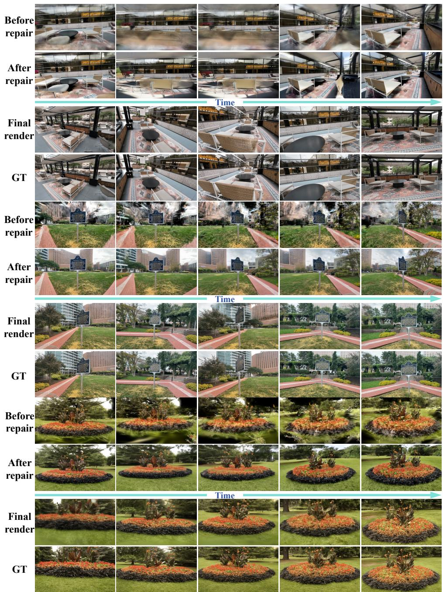  
Figure 9: Video restoration and reconstruction rendering results of our method across multiple datasets. Each row group compares the rendered video before and after restoration, followed by the final reconstruction and the ground-truth views.

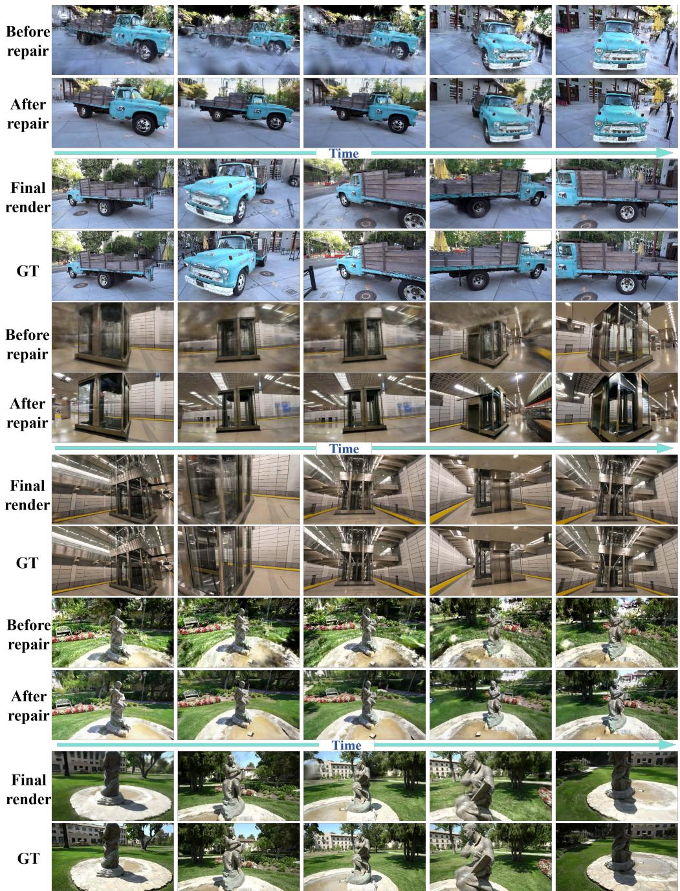  
Figure 10: Video restoration and reconstruction rendering results of our method across multiple datasets. Each row group compares the rendered video before and after restoration, followed by the final reconstruction and the ground-truth views.

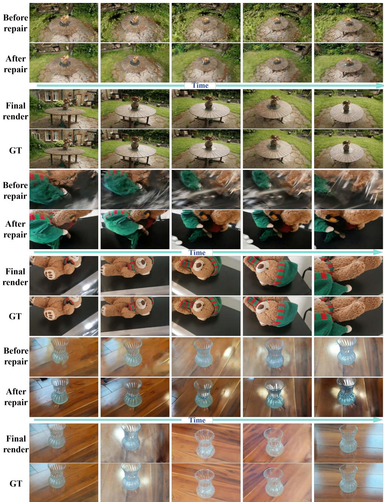  
Figure 11: Video restoration and reconstruction rendering results of our method across multiple datasets. Each row group compares the rendered video before and after restoration, followed by the final reconstruction and the ground-truth views.

Viewcrafter  
GenFusion  
Difix3D+  
GSFixer  
Ours  
GT  
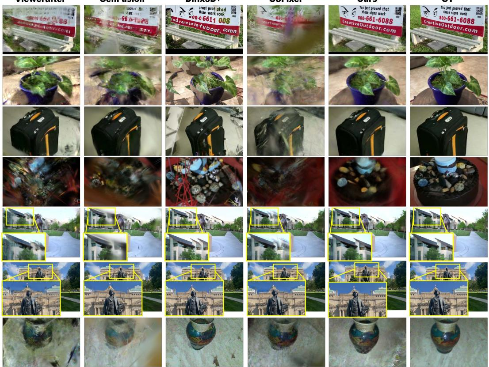  
Figure 12: Additional reconstruction quality comparison between our method and other methods. We compare ViewCrafter, GenFusion, Difix3D+, GSFixer, our method, and the ground-truth view across additional examples.

## E ADDITIONAL ABLATION TRAINING-PROCESS VISUALIZATIONS

Geometry F-score Evaluation. We evaluate geometry using the Tanks and Temples (T&T) evaluation protocol (Knapitsch et al., 2017). Following the official crop and alignment procedure, we apply three iterations of point-to-point ICP refinement and voxel-downsample both point sets using a voxel size of $\tau / 2$ . Let $\hat { X }$ and X denote the predicted and reference point sets, respectively. Precision and recall are then computed by bidirectional nearest-neighbor matching:

$$
P = \frac { 1 } { | \hat { X } | } \sum _ { \hat { x } \in \hat { X } } \mathbf { 1 } \left[ \operatorname* { m i n } _ { x \in X } \| \hat { x } - x \| _ { 2 } < \tau \right] , \qquad R = \frac { 1 } { | X | } \sum _ { x \in X } \mathbf { 1 } \left[ \operatorname* { m i n } _ { \hat { x } \in \hat { X } } \| x - \hat { x } \| _ { 2 } < \tau \right] .
$$

$$
F = { \frac { 2 P R } { P + R } } .
$$

Here, $\mathbf { 1 } [ \cdot ]$ denotes the indicator function. We use $\tau = 1$ cm for Barn, 5 mm for Caterpillar, 3 mm for Ignatius, and 5 mm for Truck. Percentages are obtained by multiplying $F$ by 100.

Surface F-score. For each checkpoint, we render the scene from normalized COLMAP views, fuse the valid depth maps into a TSDF, and extract zero-crossing surface points to form the predicted set $\hat { X }$ . This metric therefore compares the reconstructed surface with the T&T reference surface; see Figure 13.

Official F-score (Gaussian-center comparison). The predicted set $\hat { X }$ is formed directly from the XYZ coordinates of the reconstructed Gaussians. Neither rendering nor TSDF fusion is used. We then apply the same T&T matching protocol and equations; see Figure 14.

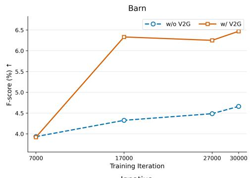

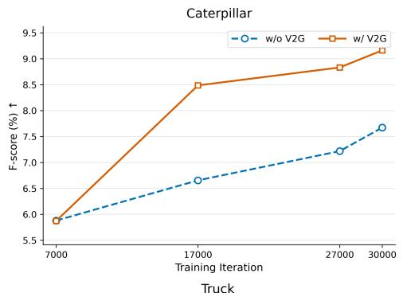

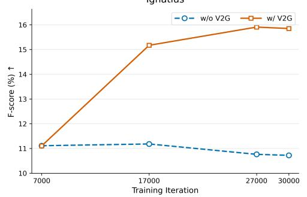

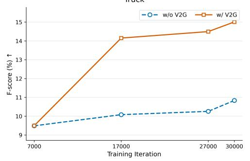

Figure 13: V2G ablation of Bi-FlowGS: surface F-score over training. Surface F-score on Barn, Caterpillar, Ignatius, and Truck for the complete model without V2G (Ours w/o V2G) and with V2G (Ours w/ V2G) across training iterations.  
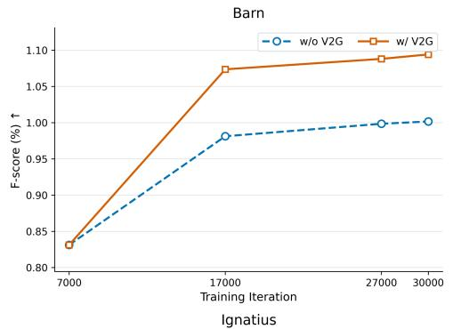

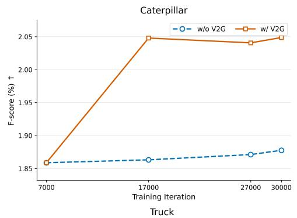

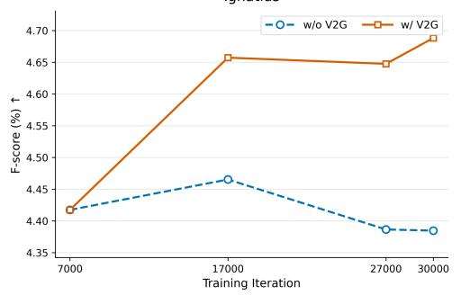

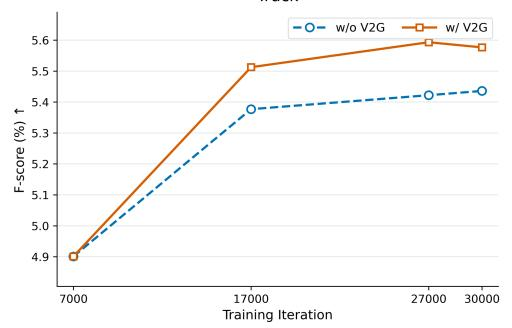  
Figure 14: V2G ablation of Bi-FlowGS: official F-score over training. official Gaussian-center Fscore on Barn, Caterpillar, Ignatius, and Truck for the complete model without V2G (Ours w/o V2G) and with V2G (Ours w/ V2G) across training iterations.

## F ADDITIONAL QUANTITATIVE RESULTS

This section reports supplementary per-scene rendering results for the complete Bi-FlowGS model on the evaluation benchmarks. For each benchmark, we list the results for every scene and inputview setting and report the corresponding scene-wise averages.

## F.1 MIP-NERF 360

Table 5: Per-scene rendering results on Mip-NeRF 360 under the 3-, 6-, and 9-view settings.
<table><tr><td colspan="13">(a) 3 input views</td></tr><tr><td rowspan="2">Scene</td><td colspan="3">ViewCrafter</td><td colspan="3">GenFusion</td><td colspan="3">GSFixer</td><td colspan="3">Ours</td></tr><tr><td></td><td></td><td></td><td></td><td></td><td></td><td></td><td></td><td>PSNR↑ SSIM↑ LPIPS↓ PSNR↑ SSIM↑ LPIPS↓ PSNR↑ SSIM↑ LPIPS↓ PSNR↑ SSIM↑ LPIPS↓</td><td></td><td></td><td></td></tr><tr><td>bicycle</td><td>13.52</td><td>0.198</td><td>0.632</td><td>14.69</td><td>0.245</td><td>0.640</td><td>16.29</td><td>0.286</td><td>0.609</td><td>15.99</td><td>0.290</td><td>0.598</td></tr><tr><td>bonsai</td><td>11.63</td><td>0.346</td><td>0.592</td><td>14.47</td><td>0.432</td><td>0.538</td><td>13.52</td><td>0.434</td><td>0.554</td><td>14.79</td><td>0.466</td><td>0.522</td></tr><tr><td>counter</td><td>13.20</td><td>0.336</td><td>0.543</td><td>14.93</td><td>0.466</td><td>0.517</td><td>15.18</td><td>0.468</td><td>0.501</td><td>15.45</td><td>0.492</td><td>0.489</td></tr><tr><td>flowers</td><td>11.08</td><td>0.158</td><td>0.674</td><td>12.58</td><td>0.200</td><td>0.694</td><td>13.54</td><td>0.208</td><td>0.655</td><td>13.97</td><td>0.217</td><td>0.630</td></tr><tr><td>garden</td><td>14.32</td><td>0.248</td><td>0.559</td><td>15.95</td><td>0.286</td><td>0.575</td><td>17.60</td><td>0.327</td><td>0.537</td><td>18.13</td><td>0.347</td><td>0.532</td></tr><tr><td>kitchen</td><td>14.51</td><td>0.326</td><td>0.540</td><td>16.30</td><td>0.424</td><td>0.532</td><td>16.31</td><td>0.419</td><td>0.508</td><td>16.78</td><td>0.446</td><td>0.481</td></tr><tr><td>room</td><td>13.66</td><td>0.424</td><td>0.488</td><td>16.31</td><td>0.569</td><td>0.430</td><td>15.61</td><td>0.542</td><td>0.437</td><td>16.05</td><td>0.571</td><td>0.422</td></tr><tr><td>stump</td><td>15.54</td><td>0.249</td><td>0.602</td><td>16.43</td><td>0.288</td><td>0.622</td><td>17.94</td><td>0.327</td><td>0.606</td><td>17.92</td><td>0.325</td><td>0.592</td></tr><tr><td>treehill</td><td>12.49</td><td>0.248</td><td>0.646</td><td>13.81</td><td>0.303</td><td>0.643</td><td>14.87</td><td>0.318</td><td>0.628</td><td>15.64</td><td>0.340</td><td>0.602</td></tr><tr><td>Average</td><td>13.33</td><td>0.281</td><td>0.586</td><td>15.05</td><td>0.357</td><td>0.577</td><td>15.65</td><td>0.370</td><td>0.559</td><td>16.08</td><td>0.388</td><td>0.541</td></tr></table>

(b) 6 input views
<table><tr><td>Scene</td><td colspan="3">ViewCrafter</td><td colspan="3">GenFusion</td><td colspan="3">GSFixer</td><td colspan="3">Ours</td></tr><tr><td></td><td></td><td></td><td></td><td></td><td></td><td>PSNR↑ SSIM↑ LPIPS↓ PSNR↑ SSIM↑ LPIPS↓ </td><td></td><td></td><td> PSNR↑ SSIM↑ LPIPS↓ PSNR↑ SSIM↑ LPIPS↓</td><td></td><td></td><td></td></tr><tr><td>bicycle</td><td>14.55</td><td>0.218</td><td>0.571</td><td>16.15</td><td>0.289</td><td>0.573</td><td>17.44</td><td>0.304</td><td>0.545</td><td>16.96</td><td>0.314</td><td>0.541</td></tr><tr><td>bonsai</td><td>15.24</td><td>0.487</td><td>0.472</td><td>16.76</td><td>0.551</td><td>0.432</td><td>17.40</td><td>0.555</td><td>0.436</td><td>18.48</td><td>0.586</td><td>0.420</td></tr><tr><td>counter</td><td>15.42</td><td>0.453</td><td>0.455</td><td>17.00</td><td>0.542</td><td>0.423</td><td>17.18</td><td>0.536</td><td>0.421</td><td>17.45</td><td>0.557</td><td>0.409</td></tr><tr><td>flowers</td><td>12.77</td><td>0.188</td><td>0.609</td><td>13.31</td><td>0.219</td><td>0.633</td><td>13.98</td><td>0.216</td><td>0.592</td><td>14.85</td><td>0.237</td><td>0.577</td></tr><tr><td>garden</td><td>16.75</td><td>0.370</td><td>0.443</td><td>18.59</td><td>0.392</td><td>0.452</td><td>19.03</td><td>0.403</td><td>0.429</td><td>19.15</td><td>0.424</td><td>0.430</td></tr><tr><td>kitchen</td><td>17.05</td><td>0.485</td><td>0.403</td><td>18.49</td><td>0.555</td><td>0.391</td><td>18.71</td><td>0.563</td><td>0.364</td><td>19.23</td><td>0.568</td><td>0.362</td></tr><tr><td>room</td><td>14.92</td><td>0.509</td><td>0.438</td><td>17.74</td><td>0.631</td><td>0.387</td><td>16.95</td><td>0.611</td><td>0.393</td><td>16.84</td><td>0.614</td><td>0.394</td></tr><tr><td>stump</td><td>16.37</td><td>0.286</td><td>0.560</td><td>17.33</td><td>0.308</td><td>0.572</td><td>18.95</td><td>0.337</td><td>0.543</td><td>18.95</td><td>0.342</td><td>0.540</td></tr><tr><td>treehill</td><td>13.81</td><td>0.264</td><td>0.574</td><td>15.78</td><td>0.352</td><td>0.581</td><td>16.59</td><td>0.346</td><td>0.549</td><td>17.37</td><td>0.374</td><td>0.536</td></tr><tr><td>Average</td><td>15.21</td><td>0.362</td><td>0.503</td><td>16.80</td><td>0.427</td><td>0.494</td><td>17.36</td><td>0.430</td><td>0.475</td><td>17.70</td><td>0.446</td><td>0.468</td></tr></table>

(c) 9 input views
<table><tr><td>Scene</td><td colspan="3">ViewCrafter</td><td colspan="3">GenFusion</td><td colspan="3">GSFixer</td><td colspan="3">Ours</td></tr><tr><td></td><td></td><td>PSNR↑ SSIM↑ LPIPS↓ PSNR↑ SSIM↑ LPIPS↓ PSNR↑ SSIM↑ LPIPS↓ PSNR↑ SSIM↑ LPIPS↓</td><td></td><td></td><td></td><td></td><td></td><td></td><td></td><td></td><td></td><td></td></tr><tr><td>bicycle</td><td>15.14</td><td>0.267</td><td>0.530</td><td>16.33</td><td>0.309</td><td>0.545</td><td>18.06</td><td>0.327</td><td>0.508</td><td>18.02</td><td>0.339</td><td>0.508</td></tr><tr><td>bonsai</td><td>17.82</td><td>0.607</td><td>0.376</td><td>18.94</td><td>0.658</td><td>0.342</td><td>19.37</td><td>0.657</td><td>0.356</td><td>20.01</td><td>0.672</td><td>0.343</td></tr><tr><td>counter</td><td>16.68</td><td>0.525</td><td>0.399</td><td>18.01</td><td>0.606</td><td>0.374</td><td>19.02</td><td>0.606</td><td>0.360</td><td>19.37</td><td>0.628</td><td>0.351</td></tr><tr><td>flowers</td><td>13.52</td><td>0.216</td><td>0.565</td><td>14.44</td><td>0.254</td><td>0.594</td><td>14.78</td><td>0.242</td><td>0.533</td><td>15.74</td><td>0.267</td><td>0.526</td></tr><tr><td>garden</td><td>18.54</td><td>0.447</td><td>0.378</td><td>19.85</td><td>0.471</td><td>0.396</td><td>20.16</td><td>0.480</td><td>0.364</td><td>20.38</td><td>0.493</td><td>0.369</td></tr><tr><td>kitchen</td><td>19.25</td><td>0.569</td><td>0.338</td><td>20.71</td><td>0.640</td><td>0.315</td><td>20.60</td><td>0.634</td><td>0.310</td><td>20.98</td><td>0.631</td><td>0.304</td></tr><tr><td>room</td><td>17.78</td><td>0.634</td><td>0.356</td><td>19.56</td><td>0.705</td><td>0.314</td><td>18.86</td><td>0.669</td><td>0.336</td><td>19.47</td><td>0.692</td><td>0.321</td></tr><tr><td>stump</td><td>18.28</td><td>0.345</td><td>0.507</td><td>19.03</td><td>0.372</td><td>0.526</td><td>19.75</td><td>0.382</td><td>0.496</td><td>19.69</td><td>0.392</td><td>0.494</td></tr><tr><td>treehill</td><td>14.85</td><td>0.319</td><td>0.530</td><td>16.46</td><td>0.384</td><td>0.569</td><td>17.54</td><td>0.365</td><td>0.509</td><td>17.90</td><td>0.398</td><td>0.501</td></tr><tr><td>Average</td><td>16.87</td><td>0.436</td><td>0.442</td><td>18.15</td><td>0.489</td><td>0.442</td><td>18.68</td><td>0.485</td><td>0.419</td><td>19.06</td><td>0.501</td><td>0.413</td></tr></table>

## F.2 PLUG-AND-PLAY V2G PER-SCENE RESULTS

This section evaluates plug-and-play Video-to-Geometry (V2G) independently of the complete Bi-FlowGS pipeline. Following Sec. 4.3, we augment GenFusion, ViewCrafter, and GSFixer with V2G while preserving each baseline’s reconstruction and optimization settings. We report nine Mip-NeRF 360 scenes under 3-, 6-, and 9-input-view settings. Tables 6–8 list PSNR, SSIM, LPIPS, and sparse-depth metrics computed on shared COLMAP/SfM tracks; dense geometry ground truth is unavailable for this benchmark. Rendering averages are arithmetic scene means and reproduce the main-paper aggregates, whereas geometry is pooled over shared points and is not a row-wise mean.

Table 6: Per-scene rendering and sparse-depth geometry results for the plug-and-play V2G evaluation on Mip-NeRF 360 with 3 input views. V2G is applied to GenFusion, ViewCrafter, and GSFixer; “Ours” denotes the complete Bi-FlowGS model. The “#Pts” column gives the retained shared SfM points used for geometry evaluation.
<table><tr><td rowspan="2">Scene</td><td rowspan="2">Method</td><td colspan="3">Rendering</td><td colspan="8">Geometry</td></tr><tr><td>PSNR↑</td><td>SSIM↑ LPIPS↓</td><td></td><td>#Pts</td><td>AbsRel↓</td><td>SqRel↓ RMSE↓</td><td>RMSE-log↓</td><td></td><td>MedianRel↓</td><td>δ1 ↑  $\delta _ { 2 }$ </td><td>↑ δ3 ↑</td></tr><tr><td rowspan="3">Bicycle</td><td>ViewCrafter+V2G</td><td>13.44</td><td>0.193</td><td>0.621</td><td>1318</td><td>0.1832</td><td>0.1103</td><td>0.4419</td><td>0.2917</td><td>0.1229</td><td>0.6419 0.8566</td><td>0.9651</td></tr><tr><td>GenFusion+V2G</td><td>14.56</td><td>0.235</td><td>0.627</td><td>1318</td><td>0.0435</td><td>0.0113</td><td>0.1330</td><td>0.0865</td><td>0.0229</td><td>0.9712 0.9924</td><td>0.9992</td></tr><tr><td>GSFixer+V2G</td><td>16.18</td><td>0.278</td><td>0.590</td><td>1318</td><td>0.1304</td><td>0.0676</td><td>0.3511</td><td>0.2596</td><td>0.0708</td><td>0.7671 0.8915</td><td>0.9598</td></tr><tr><td rowspan="3"></td><td>Ours</td><td>15.99</td><td>0.290</td><td>0.598</td><td>1318</td><td>0.0571</td><td>0.0138</td><td>0.1405 0.0908</td><td></td><td>0.0309</td><td>0.9704 0.9954</td><td>0.9992</td></tr><tr><td>ViewCrafter+V2G</td><td>11.94</td><td>0.340</td><td>0.586</td><td>16303</td><td>0.1179</td><td>0.0562</td><td>0.2442</td><td>0.2017</td><td>0.0505</td><td>0.8481</td><td>0.94890.9795</td></tr><tr><td>GenFusion+V2G</td><td>14.48</td><td>0.434</td><td>0.525</td><td>16303</td><td>0.0164</td><td>0.0073</td><td>0.0879 0.0513</td><td></td><td>0.0085</td><td>0.9956 0.9975 0.9980</td><td></td></tr><tr><td rowspan="3">Bonsai</td><td>GSFixer+V2G</td><td>13.71</td><td>0.432</td><td>0.549</td><td>16303</td><td>0.0500</td><td>0.0098</td><td>0.1046 0.1092</td><td></td><td>0.0201</td><td>0.9583</td><td>0.9836 0.9966</td></tr><tr><td>Ours</td><td>14.79</td><td>0.466</td><td>0.522</td><td>16303</td><td>0.0193</td><td>0.0036</td><td>0.0606</td><td>0.0493</td><td>0.0104</td><td>0.9934 0.9967</td><td>0.9988</td></tr><tr><td>ViewCrafter+V2G</td><td>13.17</td><td>0.343</td><td>0.542</td><td>13082</td><td>0.0480</td><td>0.0157 0.1644</td><td>0.1290</td><td></td><td>0.0145</td><td>0.9502 0.9831 0.9895</td><td></td></tr><tr><td rowspan="3">Counter</td><td>GenFusion+V2G</td><td>15.28</td><td>0.471</td><td>0.510</td><td>13082</td><td>0.0207</td><td>0.0088</td><td>0.1325</td><td>0.0938</td><td>0.0076</td><td>0.9842 0.9927</td><td>0.9945</td></tr><tr><td>GSFixer+V2G</td><td>15.46</td><td>0.476</td><td>0.494</td><td>13082</td><td>0.0700</td><td>0.0195</td><td>0.1489</td><td>0.1929</td><td>0.0158</td><td>0.8886</td><td>0.9262 0.9725</td></tr><tr><td>Ours</td><td>15.45</td><td>0.492</td><td>0.489</td><td>13082</td><td>0.0559</td><td>0.0139</td><td>0.1044</td><td>0.1736</td><td>0.0111</td><td>0.9079 0.9389</td><td>0.9710</td></tr><tr><td rowspan="3">Flowers</td><td>ViewCrafter+V2G</td><td>11.11</td><td>0.161</td><td>0.680</td><td>380</td><td>0.1032</td><td>0.0364</td><td>0.2411</td><td>0.2114</td><td>0.0522</td><td>0.8605</td><td>0.95000.9816</td></tr><tr><td>GenFusion+V2G</td><td>12.93</td><td>0.207</td><td>0.705</td><td>380</td><td>0.0872</td><td>0.0441</td><td>0.2156</td><td>0.2001</td><td>0.0311</td><td>0.8974</td><td>0.95790.9816</td></tr><tr><td>GSFixer+V2G</td><td>13.62</td><td>0.204</td><td>0.628</td><td>380</td><td>0.0866</td><td>0.0943 0.4186</td><td>0.1688</td><td></td><td>0.0315</td><td>0.9263</td><td>0.95790.9816</td></tr><tr><td rowspan="3"></td><td>Ours</td><td>13.97</td><td>0.217</td><td>0.630</td><td>380</td><td>0.1316</td><td>0.3086 0.7179</td><td>0.2309</td><td></td><td>0.0291</td><td>0.9289 0.9447</td><td>0.9658</td></tr><tr><td>ViewCrafter+V2G</td><td>14.25</td><td>0.251</td><td>0.557</td><td>11356</td><td>0.0853</td><td>0.0534</td><td>0.3309</td><td>0.1705</td><td>0.0319</td><td>0.8790 0.9595</td><td>0.9887</td></tr><tr><td>GenFusion+V2G</td><td>16.18</td><td>0.292</td><td>0.568</td><td>11356</td><td>0.0321</td><td>0.0088</td><td>0.1035</td><td>0.0801</td><td>0.0125</td><td>0.9768 0.9881 0.9989</td><td></td></tr><tr><td rowspan="3">Garden</td><td>GSFixer+V2G</td><td>17.58</td><td>0.325</td><td>0.527</td><td>11356</td><td>0.0295</td><td>0.0044</td><td>0.0913</td><td>0.0495</td><td>0.0162</td><td>0.9945 0.9989</td><td>0.9999</td></tr><tr><td>Ours</td><td>18.13</td><td>0.347</td><td>0.532</td><td>11356</td><td>0.0228</td><td>0.0029</td><td>0.0743</td><td>0.0401</td><td>0.0127</td><td>0.9963 0.9996</td><td>0.9998</td></tr><tr><td>ViewCrafter+V2G</td><td>14.63</td><td>0.339</td><td>0.531</td><td>27846</td><td>0.0400</td><td>0.0070</td><td>0.0955</td><td>0.0943</td><td>0.0160</td><td>0.9688</td><td>0.9914 0.9974</td></tr><tr><td rowspan="3">Kitchen</td><td>GenFusion+V2G</td><td>16.32</td><td>0.426</td><td>0.524</td><td>27846</td><td>0.0200</td><td>0.0071</td><td>0.0979</td><td>0.1153</td><td>0.0057</td><td></td><td>0.9814 0.9866 0.9900</td></tr><tr><td>GSFixer+V2G</td><td>16.29</td><td>0.419</td><td>0.493</td><td>27846</td><td>0.0504</td><td>0.0126</td><td>0.1132</td><td>0.1505</td><td>0.0105</td><td>0.9061</td><td>0.9712 0.9939</td></tr><tr><td>Ours</td><td>16.78</td><td>0.446</td><td>0.481</td><td>27846</td><td>0.0218</td><td>0.0055</td><td>0.0788</td><td>0.1100</td><td>0.0075</td><td>0.9792 0.9860</td><td>0.9884</td></tr><tr><td rowspan="3">Room</td><td>ViewCrafter+V2G</td><td>13.86</td><td>0.438</td><td>0.479</td><td>24295</td><td>0.0714</td><td>0.1034</td><td>0.4817</td><td>0.1893</td><td>0.0145</td><td>0.88800.9348</td><td>0.9849</td></tr><tr><td>GenFusion+V2G</td><td>16.42</td><td>0.569</td><td>0.425</td><td>24295</td><td>0.0162</td><td>0.0023</td><td>0.0615</td><td>0.0355</td><td>0.0071</td><td>0.99560.9992</td><td>1.0000</td></tr><tr><td>GSFixer+V2G</td><td>15.93</td><td>0.557</td><td>0.426</td><td>24295</td><td>0.0307</td><td>0.0076</td><td>0.1161</td><td>0.0786</td><td>0.0103</td><td>0.9708 0.9923</td><td>0.9998</td></tr><tr><td rowspan="3"></td><td>Ours</td><td>16.05</td><td>0.571</td><td>0.422</td><td>24295</td><td>0.0373</td><td>0.0094</td><td>0.1242</td><td>0.0876</td><td>0.0094</td><td>0.9443 0.9980</td><td>0.9998</td></tr><tr><td>ViewCrafter+V2G</td><td>15.34</td><td>0.248</td><td>0.612</td><td>2917</td><td>0.2006</td><td>0.0842</td><td>0.3299</td><td>0.3393</td><td>0.1461</td><td></td><td>0.62500.84260.9071</td></tr><tr><td>GenFusion+V2G</td><td>16.69</td><td>0.301</td><td>0.635</td><td>2917</td><td>0.0827</td><td>0.0163</td><td>0.1441</td><td>0.1318</td><td>0.0659</td><td>0.91640.9856 0.9815 0.9935 1.0000</td><td>1.0000</td></tr><tr><td rowspan="3">Stump Ours</td><td>GSFixer+V2G</td><td>17.94</td><td>0.320</td><td>0.587 2917</td></table>

Table 7: Per-scene rendering and sparse-depth geometry results for the plug-and-play V2G evaluation on Mip-NeRF 360 with 6 input views. The “#Pts” column gives the retained shared SfM points used for geometry evaluation.
<table><tr><td rowspan="2">Scene</td><td rowspan="2">Method</td><td colspan="3">Rendering</td><td colspan="8">Geometry</td></tr><tr><td>PSNR↑</td><td>SSIM↑ LPIPS↓</td><td></td><td>#Pts</td><td>AbsRel↓</td><td>SqRel↓ RMSE↓</td><td>RMSE-log↓</td><td>MedianRel↓</td><td></td><td>δ1 ↑ δ2 ↑</td><td>δ3 ↑</td></tr><tr><td rowspan="3">Bicycle</td><td>ViewCrafter+V2G</td><td>14.60</td><td>0.226</td><td>0.567</td><td>3035</td><td>0.1004</td><td>0.0572</td><td>0.3162</td><td>0.2569</td><td>0.0315</td><td>0.8329 0.9193</td><td>0.9545</td></tr><tr><td>GenFusion+V2G</td><td>16.19</td><td>0.292</td><td>0.576</td><td>3035</td><td>0.0310</td><td>0.0104</td><td>0.1194</td><td>0.0696</td><td>0.0113</td><td>0.9885 0.9970</td><td>0.9980</td></tr><tr><td>GSFixer+V2G</td><td>17.51</td><td>0.305</td><td>0.534</td><td>3035</td><td>0.0429</td><td>0.0120</td><td>0.1435 0.0954</td><td></td><td>0.0177</td><td>0.9671 0.9898</td><td>0.9957</td></tr><tr><td rowspan="3"></td><td>Ours</td><td>16.96</td><td>0.314</td><td>0.541</td><td>3035</td><td>0.0296</td><td>0.0064</td><td>0.0973 0.0600</td><td></td><td>0.0122</td><td>0.9862 0.9987</td><td>0.9993</td></tr><tr><td>ViewCrafter+V2G</td><td>15.28</td><td>0.497</td><td>0.465</td><td>28448</td><td>0.0183</td><td>0.0101</td><td>0.1524</td><td>0.0594</td><td>0.0063</td><td>0.98640.9959</td><td>0.9987</td></tr><tr><td>GenFusion+V2G</td><td>17.15</td><td>0.561</td><td>0.428</td><td>28448</td><td>0.0127</td><td>0.0062 0.0792</td><td>0.0476</td><td>0.0063</td><td></td><td>0.9964 0.9976 0.9982</td><td></td></tr><tr><td rowspan="3">Bonsai</td><td>GSFixer+V2G</td><td>17.65</td><td>0.563</td><td>0.434</td><td>28448</td><td>0.0469</td><td>0.0144 0.1660</td><td>0.1077</td><td></td><td>0.0215</td><td>0.9550 0.9915</td><td>0.9939</td></tr><tr><td>Ours</td><td>18.48</td><td>0.586</td><td>0.420</td><td>28448</td><td>0.0167</td><td>0.0045</td><td>0.0796</td><td>0.0472</td><td>0.0084</td><td>0.9914 0.9976</td><td>0.9989</td></tr><tr><td>ViewCrafter+V2G</td><td>15.40</td><td>0.461</td><td>0.448</td><td>21785</td><td>0.0218</td><td>0.0073 0.1270</td><td>0.0586</td><td>0.0070</td><td></td><td>0.9878 0.9972 0.9987</td><td></td></tr><tr><td rowspan="3">Counter</td><td>GenFusion+V2G</td><td>17.03</td><td>0.542</td><td>0.425</td><td>21785</td><td>0.0156</td><td>0.0027</td><td>0.0669</td><td>0.0396</td><td>0.0061</td><td>0.9947 0.9993 0.9996</td><td></td></tr><tr><td>GSFixer+V2G</td><td>17.23</td><td>0.537</td><td>0.420</td><td>21785</td><td>0.0615</td><td>0.0115</td><td>0.1192</td><td>0.1116</td><td>0.0241</td><td>0.9100 0.9969</td><td>0.9995</td></tr><tr><td>Ours</td><td>17.45</td><td>0.557</td><td>0.409</td><td>21785</td><td>0.0182</td><td>0.0031</td><td>0.0593 0.0485</td><td></td><td>0.0063</td><td>0.9897 0.9989</td><td>0.9995</td></tr><tr><td rowspan="3">Flowers</td><td>ViewCrafter+V2G</td><td>13.01</td><td>0.195</td><td>0.606</td><td>947</td><td>0.1022</td><td>0.0534</td><td>0.2889 0.2773</td><td></td><td>0.0272</td><td>0.8427</td><td>0.91340.9567</td></tr><tr><td>GenFusion+V2G</td><td>13.57</td><td>0.224</td><td>0.639</td><td>947</td><td>0.0444</td><td>0.0204</td><td>0.1289</td><td>0.1004</td><td>0.0189</td><td>0.9799</td><td>0.9937 0.9947</td></tr><tr><td>GSFixer+V2G</td><td>14.15</td><td>0.217 0.575</td><td>947</td><td>0.0783</td><td>0.0710</td><td>0.3196</td><td>0.1561</td><td>0.0208</td><td></td><td>0.93560.9747</td><td>0.9852</td></tr><tr><td rowspan="3"></td><td>Ours</td><td>14.85</td><td>0.237</td><td>0.577</td><td>947</td><td>0.0595</td><td>0.0635</td><td>0.2587 0.1369</td><td></td><td>0.0171</td><td>0.9736 0.9810</td><td>0.9894</td></tr><tr><td>ViewCrafter+V2G</td><td>16.70</td><td>0.366</td><td>0.442</td><td>21170</td><td>0.0418</td><td>0.0193</td><td>0.2010</td><td>0.1010</td><td>0.0128</td><td>0.9452 0.9854</td><td>0.9991</td></tr><tr><td>GenFusion+V2G</td><td>18.63</td><td>0.396</td><td>0.450</td><td>21170</td><td>0.0121</td><td>0.0011 0.0451</td><td>0.0269</td><td></td><td>0.0068</td><td>0.9983</td><td>0.9995 0.9999</td></tr><tr><td rowspan="3">Garden</td><td>GSFixer+V2G</td><td>18.90</td><td>0.407</td><td>0.423</td><td>21170</td><td>0.0367</td><td>0.0081</td><td>0.1132 0.0845</td><td></td><td>0.0127</td><td>0.9625 0.9997</td><td>0.9999</td></tr><tr><td>Ours</td><td>19.15</td><td>0.424</td><td>0.430</td><td>21170</td><td>0.0184</td><td>0.0028</td><td>0.0740</td><td>0.0415</td><td>0.0089</td><td>0.9941 0.9980</td><td>1.0000</td></tr><tr><td>ViewCrafter+V2G</td><td>17.06</td><td>0.492</td><td>0.396</td><td>54085</td><td>0.0113</td><td>0.0011 0.0345</td><td>0.0425</td><td></td><td>0.0041</td><td>0.9947 0.9977</td><td></td></tr><tr><td rowspan="3">Kitchen</td><td>GenFusion+V2G</td><td>18.66</td><td>0.562</td><td>0.385</td><td>54085</td><td>0.0303</td><td>0.0138</td><td>0.1322</td><td>0.1439</td><td>0.0036</td><td>0.94480.94510.9943</td><td>0.9987</td></tr><tr><td>GSFixer+V2G</td><td>18.64</td><td>0.566</td><td>0.363</td><td>54085</td><td>0.0176</td><td>0.0058</td><td>0.0735</td><td>0.1306</td><td>0.0040</td><td></td><td>0.9818 0.9856 0.9865</td></tr><tr><td>Ours</td><td>19.23</td><td>0.568</td><td>0.362</td><td>54085</td><td>0.0121</td><td>0.0015 0.0364</td><td></td><td>0.0540</td><td>0.0040</td><td>0.9884 0.9935</td><td>0.9997</td></tr><tr><td rowspan="3">Room</td><td>ViewCrafter+V2G</td><td>15.09</td><td>0.518</td><td>0.431</td><td>30456</td><td>0.0530</td><td>0.0174</td><td>0.1816</td><td></td><td>0.0148</td><td>0.9337 0.9843</td><td>0.9984</td></tr><tr><td>GenFusion+V2G</td><td>17.84</td><td>0.630</td><td>0.386</td><td>30456</td><td>0.0116</td><td>0.0014</td><td>0.0475</td><td>0.1168 0.0268</td><td>0.0059</td><td>0.9969 0.9998</td><td>1.0000</td></tr><tr><td>GSFixer+V2G</td><td>16.97</td><td>0.608</td><td>0.390</td><td>30456</td><td>0.0185</td><td>0.0023</td><td>0.0617</td><td>0.0401</td><td>0.0083</td><td>0.9949 0.9997</td><td>0.9999</td></tr><tr><td rowspan="2"></td><td>Ours</td><td>16.84</td><td>0.614</td><td>0.394</td><td>30456</td><td>0.0277</td><td>0.0065</td><td>0.1095</td><td>0.0591</td><td>0.0098</td><td>0.9849 0.9990</td><td>0.9997</td></tr><tr><td>ViewCrafter+V2G</td><td></td><td>0.295</td><td></td><td></td><td>0.1032</td><td>0.0381</td><td>0.2239</td><td>0.2274</td><td>0.0343</td><td>0.8030 0.9248</td><td></td></tr><tr><td rowspan="3">Stump</td><td>GenFusion+V2G</td><td>17.08 17.89</td><td>0.318</td><td>0.555 0.571</td><td>4482 4482</td><td>0.0246</td><td>0.0074</td><td>0.0854</td><td>0.1479</td><td>0.0077</td><td>0.9817 0.9844</td><td>0.9659 0.9851</td></tr><tr><td>GSFixer+V2G Ours 18.95</td><td>19.15</td><td>0.337</td><td>0.532 4482</td></table>

Table 8: Per-scene rendering and sparse-depth geometry results for the plug-and-play V2G evaluation on Mip-NeRF 360 with 9 input views. The “#Pts” column gives the retained shared SfM points used for geometry evaluation.
<table><tr><td rowspan="2">Scene</td><td rowspan="2">Method</td><td colspan="3">Rendering</td><td colspan="8">Geometry</td></tr><tr><td>PSNR↑</td><td>SSIM↑ LPIPS↓</td><td></td><td>#Pts</td><td>AbsRel↓ SqRel↓</td><td>RMSE↓</td><td>RMSE-log↓</td><td>MedianRel.↓</td><td></td><td>δ1 ↑</td><td>δ2 ↑ δ3 ↑</td></tr><tr><td rowspan="3">Bicycle</td><td>ViewCrafter+V2G</td><td>15.19</td><td>0.272</td><td>0.530</td><td>4984</td><td>0.0841</td><td>0.0287</td><td>0.2052 0.1843</td><td></td><td>0.0332</td><td>0.8826 0.9482</td><td>0.9858</td></tr><tr><td>GenFusion+V2G</td><td>16.48</td><td>0.313</td><td>0.548</td><td>4984</td><td>0.0281</td><td>0.0085</td><td>0.1287 0.0687</td><td></td><td>0.0107</td><td>0.9811 0.9952</td><td>0.9990</td></tr><tr><td>GSFixer+V2G</td><td>18.11</td><td>0.327</td><td>0.500</td><td>4984</td><td>0.0315</td><td>0.0049 0.0901</td><td>0.0543</td><td>0.0154</td><td></td><td>0.9928 0.9992</td><td>0.9996</td></tr><tr><td rowspan="3"></td><td>Ours</td><td>18.02</td><td>0.339</td><td>0.508</td><td>4984</td><td>0.0303</td><td>0.0050 0.0884</td><td>0.0590</td><td></td><td>0.0135</td><td>0.9858 0.9980</td><td>0.9998</td></tr><tr><td>ViewCrafter+V2G</td><td>17.71</td><td>0.610</td><td>0.369</td><td>42744</td><td>0.0145</td><td>0.0091</td><td>0.1467 0.0507</td><td></td><td>0.0050</td><td></td><td>0.9915 0.9962 0.9987</td></tr><tr><td>GenFusion+V2G</td><td>19.05</td><td>0.661</td><td>0.342</td><td>42744</td><td>0.0104</td><td>0.0051 0.0726</td><td>0.0431</td><td>0.0049</td><td></td><td>0.9967 0.9979</td><td>0.9986</td></tr><tr><td rowspan="3">Bonsai</td><td>GSFixer+V2G</td><td>19.47</td><td>0.658</td><td>0.352</td><td>42744</td><td>0.0196</td><td>0.0058 0.1083</td><td>0.0512</td><td>0.0082</td><td></td><td>0.9927</td><td>0.9976 0.9992</td></tr><tr><td>Ours</td><td>20.01</td><td>0.672</td><td>0.343</td><td>42744</td><td>0.0164</td><td>0.0045 0.0788</td><td>0.0435</td><td></td><td>0.0083</td><td>0.9965 0.9981</td><td>0.9990</td></tr><tr><td>ViewCrafter+V2G</td><td>17.11</td><td>0.533</td><td>0.387 29081</td><td>0.0160</td><td>0.0058</td><td>0.1153</td><td>0.0483</td><td>0.0058</td><td></td><td>0.99200.9974 0.9992</td><td></td></tr><tr><td rowspan="3">Counter</td><td>GenFusion+V2G</td><td>18.10</td><td>0.603</td><td>0.368</td><td>29081</td><td>0.0133</td><td>0.0026 0.0713</td><td>0.0390</td><td></td><td>0.0052</td><td></td><td>0.9959 0.9989 0.9995</td></tr><tr><td>GSFixer+V2G</td><td>19.05</td><td>0.606</td><td>0.357</td><td>29081</td><td>0.0166</td><td>0.0026</td><td>0.0685</td><td>0.0426</td><td>0.0066</td><td>0.9939</td><td>0.9985 0.9995</td></tr><tr><td>Ours</td><td>19.37</td><td>0.628</td><td>0.351</td><td>29081</td><td>0.0160</td><td>0.0029 0.0627</td><td>0.0434</td><td>0.0062</td><td></td><td>0.9966 0.9985</td><td>0.9993</td></tr><tr><td rowspan="3"></td><td>ViewCrafter+V2G</td><td>13.78</td><td>0.224</td><td>0.548</td><td>2410</td><td>0.0658</td><td>0.0288 0.2637</td><td>0.1470</td><td></td><td>0.0210</td><td></td><td>0.8954 0.9693 0.9946</td></tr><tr><td>GenFusion+V2G</td><td>14.57</td><td>0.251</td><td>0.606</td><td>2410</td><td>0.0357</td><td>0.0109</td><td>0.1416 0.0868</td><td></td><td>0.0150</td><td>0.9759</td><td>0.9929 0.9954</td></tr><tr><td>GSFixer+V2G</td><td>14.89</td><td>0.243 0.530</td><td>2410</td><td>0.0384</td><td>0.0394</td><td>0.2716</td><td>0.0905</td><td>0.0143</td><td>0.9784</td><td>0.9909</td><td>0.9963</td></tr><tr><td rowspan="3"></td><td>Ours</td><td>15.74</td><td>0.267</td><td>0.526</td><td>2410</td><td>0.0321</td><td>0.0163 0.1810</td><td>0.0730</td><td></td><td>0.0130</td><td>0.9842 0.9938</td><td>0.9967</td></tr><tr><td>ViewCrafter+V2G</td><td>18.60</td><td>0.453</td><td>0.373</td><td>27230</td><td>0.0201</td><td>0.0155</td><td>0.2044</td><td>0.0525</td><td>0.0071</td><td>0.9921</td><td>0.9975 0.9992</td></tr><tr><td>GenFusion+V2G</td><td>19.84</td><td>0.473</td><td>0.394</td><td>27230</td><td>0.0092</td><td>0.0007 0.0381</td><td>0.0198</td><td>0.0051</td><td></td><td>0.99900.9997</td><td>1.0000</td></tr><tr><td rowspan="3">Garden</td><td>GSFixer+V2G</td><td>20.15</td><td>0.481</td><td>0.364</td><td>27230</td><td>0.0193</td><td>0.0040 0.0947</td><td>0.0383</td><td></td><td>0.0089</td><td>0.9958 0.9992</td><td>0.9999</td></tr><tr><td>Ours</td><td>20.38</td><td>0.493</td><td>0.369</td><td>27230</td><td>0.0242</td><td>0.0075</td><td>0.1100</td><td>0.0900</td><td>0.0074</td><td>0.9757 0.9846</td><td>0.9926</td></tr><tr><td>ViewCrafter+V2G</td><td>19.33</td><td>0.576</td><td>0.335</td><td>63142</td><td>0.0206 0.0054</td><td>0.0812</td><td>0.0972</td><td></td><td>0.0040</td><td></td><td></td></tr><tr><td rowspan="3">Kitchen</td><td>GenFusion+V2G</td><td>20.79</td><td>0.645</td><td>0.311</td><td>63142</td><td>0.0056</td><td>0.0003 0.0188</td><td>0.0136</td><td></td><td>0.0034</td><td>0.9795 0.9882 0.9997</td><td>0.9938 0.9999 0.9999</td></tr><tr><td>GSFixer+V2G</td><td>20.48</td><td>0.634</td><td>0.309</td><td>63142</td><td>0.0067</td><td>0.0003</td><td>0.0227</td><td>0.0153</td><td>0.0037</td><td>0.9995</td><td>0.9998 1.0000</td></tr><tr><td>Ours</td><td>20.98</td><td>0.631 0.304</td><td></td><td>63142</td><td>0.0057</td><td>0.0002 0.0161</td><td>0.0123</td><td></td><td>0.0034</td><td>0.9997 0.9999</td><td>1.0000</td></tr><tr><td rowspan="3">Room</td><td>ViewCrafter+V2G</td><td>17.82</td><td>0.640</td><td>0.348</td><td></td><td>0.0488</td><td>0.0429</td><td></td><td></td><td>0.0079</td><td>0.93900.9645</td><td>0.9727</td></tr><tr><td>GenFusion+V2G</td><td>19.66</td><td>0.699</td><td>0.312</td><td>43187 43187</td><td>0.0100</td><td>0.0014</td><td>0.3056 0.0504</td><td>0.2114 0.0260</td><td>0.0047</td><td>0.9969</td><td>0.9998 1.0000</td></tr><tr><td>GSFixer+V2G</td><td>19.16</td><td>0.677</td><td>0.331</td><td>43187</td><td>0.0240</td><td>0.0054 0.0988</td><td></td><td>0.0634</td><td>0.0080</td><td>0.9759 0.9964</td><td>1.0000</td></tr><tr><td rowspan="2"></td><td>Ours</td><td>19.47</td><td>0.692</td><td>0.321</td><td>43187</td><td>0.0221</td><td>0.0034 0.0768</td><td></td><td>0.0487</td><td>0.0081</td><td>0.9939 0.9995</td><td>0.9999</td></tr><tr><td>ViewCrafter+V2G</td><td>18.39</td><td>0.350</td><td>0.502</td><td>6174</td><td>0.0727</td><td>0.0243</td><td>0.1743</td><td>0.1935</td><td>0.0137</td><td>0.8633 0.9279</td><td></td></tr><tr><td rowspan="3">Stump</td><td>GenFusion+V2G</td><td>19.00</td><td>0.376</td><td>0.529</td><td>6174</td><td>0.0422</td><td>0.0174 0.1567</td><td>0.1562</td><td></td><td>0.0056</td><td>0.9231</td><td>0.9759 0.95460.9841</td></tr><tr><td>GSFixer+V2G</td><td>19.86</td><td>0.381</td><td>0.490 6174</td></table>

## F.3 TANKS AND TEMPLES

Table 9: Per-scene rendering results on Tanks and Temples under the 4-, 6-, and 9-view settings.
<table><tr><td rowspan="3">Scene</td><td colspan="10">(a) 4 input views</td><td rowspan="2" colspan="3">Ours</td></tr><tr><td colspan="3">ViewCrafter</td><td colspan="3">GenFusion</td><td colspan="3">Difix3D+</td><td colspan="3">GSFixer</td></tr><tr><td></td><td></td><td>PSNR↑ SSIM↑ LPIPS↓ PSNR↑ SSIM↑ LPIPS↓ PSNR↑ SSIM↑ LPIPS↓ PSNR↑ SSIM↑ LPIPS↓ PSNR↑</td><td></td><td></td><td></td><td></td><td></td><td></td><td></td><td></td><td></td><td></td><td>SSIM↑ LPIPS↓</td><td></td></tr><tr><td>barn</td><td>12.78</td><td>0.447</td><td>0.538</td><td>12.90</td><td>0.474 0.576</td><td>13.45</td><td>0.442</td><td>0.485</td><td>15.01</td><td>0.492</td><td>0.514</td><td>15.46</td><td>0.519</td><td>0.500</td></tr><tr><td>caterpillar</td><td>12.17</td><td>0.376</td><td>0.558</td><td>12.35 0.408</td><td>0.548</td><td>13.09</td><td>0.379</td><td>0.511</td><td>13.67</td><td>0.414</td><td>0.537</td><td>13.93</td><td>0.437</td><td>0.514</td></tr><tr><td>family</td><td>11.42 12.91</td><td>0.449</td><td>0.554</td><td>12.46 0.521</td><td>0.535</td><td>13.33</td><td>0.463</td><td>0.493</td><td>13.06</td><td>0.523</td><td>0.511</td><td>13.57</td><td>0.554</td><td>0.493</td></tr><tr><td>horse</td><td></td><td>0.612</td><td>0.451</td><td>14.36 0.672</td><td>0.411</td><td>13.39</td><td>0.600</td><td>0.405</td><td>14.30</td><td>0.644</td><td>0.417</td><td>14.29</td><td>0.662</td><td>0.400</td></tr><tr><td>ignatius</td><td>12.28 12.72</td><td>0.346 0.484</td><td>0.566 0.528</td><td>12.88 0.374</td><td>0.582</td><td>12.87</td><td>0.322</td><td>0.520</td><td>13.43</td><td>0.376</td><td>0.542</td><td>14.19</td><td>0.407</td><td>0.526</td></tr><tr><td>truck Average</td><td>12.38</td><td>0.452</td><td></td><td>13.07 0.530</td><td>0.535</td><td>14.53</td><td>0.503</td><td>0.474</td><td>14.35</td><td>0.542</td><td>0.498</td><td>14.78</td><td>0.567</td><td>0.485</td></tr><tr><td></td><td></td><td>0.533</td><td>13.00</td><td>0.497</td><td>0.531</td><td>13.44</td><td>0.451</td><td>0.481</td><td>13.97</td><td>0.498</td><td>0.503</td><td>14.37</td><td>0.525</td><td>0.486</td></tr><tr><td colspan="10"></td><td rowspan="2" colspan="4"></td></tr><tr><td colspan="3">ViewCrafter</td><td colspan="3">GenFusion</td><td colspan="3">Difix3D+</td><td colspan="3">GSFixer</td><td colspan="3">Ours</td></tr><tr><td></td><td></td><td></td><td></td><td>PSNR↑ SSIM↑ LPIPS↓ PSNR↑ SSIM↑ LPIPS↓ PSNR↑ SSIM↑ LPIPS↓ PSNR↑ SSIM↑ LPIPS↓ PSNR↑ SSIM↑ LPIPS↓</td><td></td><td></td><td></td><td></td><td></td><td></td><td></td><td></td><td></td><td></td></tr><tr><td>barn</td><td>13.69</td><td>0.462 0.511</td><td>14.08</td><td>0.501</td><td>0.537</td><td>14.15</td><td>0.456</td><td>0.468</td><td>15.41</td><td>0.485</td><td>0.502</td><td>16.13</td><td>0.517</td><td>0.479</td></tr><tr><td>caterpillar</td><td>13.41</td><td>0.410 0.514</td><td></td><td>13.43 0.448</td><td>0.502</td><td>13.98</td><td>0.396</td><td>0.476</td><td>14.90</td><td>0.433</td><td>0.495</td><td>15.11</td><td>0.459</td><td>0.478</td></tr><tr><td>family</td><td>13.13</td><td>0.517</td><td>0.470</td><td>14.94 0.599</td><td>0.450</td><td>15.24</td><td>0.497</td><td>0.440</td><td>15.87</td><td>0.586</td><td>0.424</td><td>16.43</td><td>0.614</td><td>0.407</td></tr><tr><td>horse</td><td>15.83 13.51</td><td>0.668</td><td>0.375 0.508</td><td>16.09 0.713</td><td>0.357</td><td>15.16</td><td>0.624</td><td>0.362</td><td>16.76</td><td>0.691</td><td>0.346</td><td>16.56</td><td>0.709</td><td>0.344</td></tr><tr><td>ignatius</td><td>14.43</td><td>0.380</td><td></td><td>13.77 0.410</td><td>0.536</td><td>13.84</td><td>0.345</td><td>0.491</td><td>14.44</td><td>0.403</td><td>0.485</td><td>15.04</td><td>0.432</td><td>0.476</td></tr><tr><td>truck Average</td><td>14.00</td><td>0.537 0.473</td><td>15.06 14.56</td><td>0.583 0.543</td><td>0.483 0.478</td><td>15.55 14.65</td><td>0.519 0.473</td><td>0.443 0.446</td><td>15.42</td><td>0.568 0.528</td><td>0.454 0.451</td><td>16.30 15.93</td><td>0.598</td><td>0.440 0.437</td></tr><tr><td>0.496 0.475</td><td></td><td colspan="10">15.47</td><td rowspan="2">0.555</td><td rowspan="2"></td></tr><tr><td rowspan="2">Scene</td><td colspan="3">ViewCrafter</td><td colspan="3"></td><td colspan="3">(c) 9 input views</td><td colspan="3"></td><td colspan="3">Ours</td></tr><tr><td colspan="3">PSNR↑ SSIM↑ LPIPS↓ PSNR↑</td><td colspan="3">GenFusion</td><td colspan="3">Difix3D+</td><td colspan="3">GSFixer</td><td colspan="3"></td></tr><tr><td>barn</td><td></td><td></td><td></td><td></td><td></td><td>SSIM↑ LPIPS↓ PSNR↑</td><td></td><td>SSIM↑ LPIPS↓ PSNR↑</td><td></td><td></td><td></td><td></td><td>SSIM↑ LPIPS↓ PSNR↑</td><td>SSIM↑ LPIPS↓</td><td></td></tr><tr><td>caterpillar</td><td>14.92 15.24</td><td>0.482</td><td>0.481</td><td>15.75</td><td>0.529</td><td>0.508</td><td>14.78</td><td>0.480</td><td>0.448</td><td>16.22</td><td>0.494</td><td>0.473</td><td>16.60</td><td>0.530</td><td>0.463 0.439</td></tr><tr><td>family</td><td>17.19</td><td>0.456 0.615</td><td>0.459</td><td>15.54</td><td>0.499</td><td>0.469</td><td>15.44</td><td>0.419</td><td>0.440</td><td>16.16</td><td>0.469 0.641</td><td>0.446 0.352</td><td>16.47</td><td>0.492</td><td>0.337</td></tr><tr><td>horse</td><td>17.24</td><td>0.701</td><td>0.374 0.331</td><td>17.20</td><td>0.666</td><td>0.389</td><td>16.67</td><td>0.517</td><td>0.401</td><td>17.44</td><td></td><td></td><td>18.24</td><td>0.669</td><td>0.316</td></tr><tr><td>ignatius</td><td>14.81</td><td>0.421</td><td>0.449</td><td>16.83 15.31</td><td>0.742 0.465</td><td>0.334 0.491</td><td>16.00 14.79</td><td>0.638 0.366</td><td>0.338 0.464</td><td>17.83 15.67</td><td>0.720 0.443</td><td>0.310 0.433</td><td>17.38 16.15</td><td>0.730 0.468</td><td>0.427</td></tr><tr><td>truck</td><td>15.61</td><td>0.581</td><td>0.427</td><td>15.98</td><td>0.618</td><td>0.446</td><td>16.08</td><td>0.530</td><td>0.421</td><td>16.42</td><td>0.599</td><td>0.417</td><td>16.72</td><td>0.622</td><td>0.408 0.398</td></tr><tr><td>Average</td><td>15.83</td><td>0.542</td><td>0.420</td></table>

## F.4 CO3D

Table 10: Per-scene rendering results on CO3D with 3 input views. Scene identifiers retain the category and first two sequence components.
<table><tr><td rowspan="2">Scene</td><td colspan="3">ViewCrafter</td><td colspan="3">GenFusion</td><td colspan="3">Difix3D+</td><td colspan="3">GSFixer</td><td colspan="3">Ours</td></tr><tr><td>PSNR↑ SSIM↑ LPIPS↓ PSNR↑ SSIM↑ LPIPS↓ PSNR↑ SSIM↑ LPIPS↓ PSNR↑ SSIM↑ LPIPS↓ PSNR↑ SSIM↑ LPIPS↓</td><td></td><td></td><td></td><td></td><td></td><td></td><td></td><td></td><td></td><td></td><td></td><td></td><td></td><td></td></tr><tr><td>bench-167-18175</td><td>11.97</td><td>0.345</td><td>0.590</td><td>12.70</td><td>0.435</td><td>0.564</td><td>12.19</td><td>0.363</td><td>0.539</td><td>13.34</td><td>0.430</td><td>0.566</td><td>14.37</td><td>0.470</td><td>0.502</td></tr><tr><td>bench-185-19987</td><td>12.89</td><td>0.270</td><td>0.584</td><td>15.21</td><td>0.375</td><td>0.589</td><td>13.20</td><td>0.220</td><td>0.552</td><td>14.86</td><td>0.386</td><td>0.600</td><td>14.64</td><td>0.365</td><td>0.571</td></tr><tr><td>cake-201-21573</td><td>16.84</td><td>0.505</td><td>0.521</td><td>16.60</td><td>0.598</td><td>0.475</td><td>15.16</td><td>0.497</td><td>0.594</td><td>17.67</td><td>0.614</td><td>0.472</td><td>17.75</td><td>0.618</td><td>0.451</td></tr><tr><td>cake-201-21631</td><td>11.74</td><td>0.450</td><td>0.552</td><td>13.60</td><td>0.633</td><td>0.528</td><td>12.50</td><td>0.502</td><td>0.575</td><td>12.67</td><td>0.575</td><td>0.523</td><td>13.00</td><td>0.592</td><td>0.517</td></tr><tr><td>donut-198-21296</td><td>15.43</td><td>0.566</td><td>0.485</td><td>16.76</td><td>0.678</td><td>0.425</td><td>17.08</td><td>0.617</td><td>0.448</td><td>16.31</td><td>0.667</td><td>0.432</td><td>17.64</td><td>0.681</td><td>0.374</td></tr><tr><td>donut-290-30761</td><td>12.09</td><td>0.430</td><td>0.588</td><td>13.01</td><td>0.585</td><td>0.527</td><td>12.30</td><td>0.472</td><td>0.605</td><td>13.14</td><td>0.594</td><td>0.527</td><td>13.12</td><td>0.594</td><td>0.503</td></tr><tr><td>hydrant-134-15451</td><td>14.47</td><td>0.296</td><td>0.558</td><td>14.07</td><td>0.362</td><td>0.621</td><td>14.29</td><td>0.259</td><td>0.559</td><td>14.88</td><td>0.385</td><td>0.583</td><td>16.97</td><td>0.395</td><td>0.519</td></tr><tr><td>hydrant-147-16374</td><td>14.10</td><td>0.543</td><td>0.480</td><td>15.28</td><td>0.592</td><td>0.482</td><td>15.28</td><td>0.523</td><td>0.467</td><td>15.05</td><td>0.561</td><td>0.465</td><td>16.40</td><td>0.633</td><td>0.439</td></tr><tr><td>plant-188-20319</td><td>11.66</td><td>0.393</td><td>0.592</td><td>12.52</td><td>0.517</td><td>0.570</td><td>11.50</td><td>0.399</td><td>0.612</td><td>12.88</td><td>0.526</td><td>0.563</td><td>14.21</td><td>0.550</td><td>0.524</td></tr><tr><td>plant-188-20360</td><td>13.64</td><td>0.441</td><td>0.614</td><td>14.56</td><td>0.548</td><td>0.580</td><td>13.90</td><td>0.430</td><td>0.612</td><td>15.54</td><td>0.565</td><td>0.541</td><td>15.58</td><td>0.568</td><td>0.531</td></tr><tr><td>suitcase-197-21239</td><td>14.33</td><td>0.420</td><td>0.548</td><td>16.08</td><td>0.537</td><td>0.512</td><td>14.66</td><td>0.406</td><td>0.515</td><td>15.54</td><td>0.513</td><td>0.524</td><td>17.51</td><td>0.561</td><td>0.474</td></tr><tr><td>suitcase-247-26503</td><td>12.78</td><td>0.534</td><td>0.475</td><td>15.88</td><td>0.680</td><td>0.348</td><td>13.03</td><td>0.530</td><td>0.528</td><td>13.96</td><td>0.617</td><td>0.426</td><td>17.42</td><td>0.727</td><td>0.346</td></tr><tr><td>teddybear-118-13848</td><td>15.66</td><td>0.629</td><td>0.505</td><td>16.44</td><td>0.722</td><td>0.484</td><td>16.95</td><td>0.652</td><td>0.502</td><td>17.83</td><td>0.705</td><td>0.466</td><td>18.48</td><td>0.743</td><td>0.446</td></tr><tr><td>teddybear-159-17485</td><td>15.17</td><td>0.580</td><td>0.475</td><td>15.88</td><td>0.645</td><td>0.465</td><td>16.08</td><td>0.594</td><td>0.478</td><td>15.32</td><td>0.603</td><td>0.439</td><td>16.58</td><td>0.618</td><td>0.424</td></tr><tr><td>vase-101-11754</td><td>16.42</td><td>0.724</td><td>0.532</td><td>18.61</td><td>0.826</td><td>0.484</td><td>17.18</td><td>0.760</td><td>0.577</td><td>15.50</td><td>0.744</td><td>0.491</td><td>13.81</td><td>0.713</td><td>0.463</td></tr><tr><td>vase-118-13872</td><td>14.33</td><td>0.552</td><td>0.598</td><td>16.58</td><td>0.708</td><td>0.539</td><td>16.06</td><td>0.575</td><td>0.563</td><td>16.19</td><td>0.655</td><td>0.529</td><td>17.21</td><td>0.693</td><td>0.506</td></tr><tr><td>Average</td><td>13.97</td><td>0.480</td><td>0.543</td><td>15.24</td><td>0.590</td><td>0.512</td><td>14.46</td><td>0.487</td><td>0.545</td><td>15.04</td><td>0.571</td><td>0.509</td><td>15.92</td><td>0.595</td><td>0.474</td></tr></table>

Table 11: Per-scene rendering results on CO3D with 6 input views.
<table><tr><td>Scene</td><td colspan="3">ViewCrafter</td><td colspan="3">GenFusion</td><td colspan="3">Difix3D+</td><td colspan="3">GSFixer</td><td colspan="3">Ours</td></tr><tr><td></td><td>PSNR↑</td><td>SSIM↑ LPIPS↓</td><td></td><td>PSNR↑</td><td>SSIM↑</td><td>LPIPS↓</td><td>PSNR↑</td><td>SSIM↑ LPIPS↓</td><td></td><td>PSNR↑</td><td>SSIM↑</td><td>LPIPS↓</td><td>PSNR↑</td><td>SSIM↑</td><td>LPIPS↓</td></tr><tr><td>bench-167-18175</td><td>14.42</td><td>0.411</td><td>0.487</td><td>14.65</td><td>0.455</td><td>0.505</td><td>13.82</td><td>0.388</td><td>0.454</td><td>15.24</td><td>0.448</td><td>0.495</td><td>17.34</td><td>0.528</td><td>0.392</td></tr><tr><td>bench-185-19987</td><td>15.57</td><td>0.323</td><td>0.544</td><td>16.09</td><td>0.346</td><td>0.552</td><td>15.23</td><td>0.254</td><td>0.481</td><td>16.12</td><td>0.348</td><td>0.548</td><td>17.02</td><td>0.373</td><td>0.479</td></tr><tr><td>cake-201-21573</td><td>20.63</td><td>0.662</td><td>0.394</td><td>18.42</td><td>0.638</td><td>0.447</td><td>18.69</td><td>0.619</td><td>0.504</td><td>20.38</td><td>0.674</td><td>0.408</td><td>22.86</td><td>0.731</td><td>0.337</td></tr><tr><td>cake-201-21631</td><td>14.36</td><td>0.579</td><td>0.487</td><td>14.81</td><td>0.655</td><td>0.493</td><td>15.20</td><td>0.619</td><td>0.481</td><td>16.15</td><td>0.664</td><td>0.458</td><td>15.91</td><td>0.663</td><td>0.424</td></tr><tr><td>donut-198-21296</td><td>19.12</td><td>0.674</td><td>0.383</td><td>18.99</td><td>0.695</td><td>0.378</td><td>18.94</td><td>0.674</td><td>0.403</td><td>19.07</td><td>0.703</td><td>0.395</td><td>20.32</td><td>0.724</td><td>0.341</td></tr><tr><td>donut-290-30761</td><td>12.42</td><td>0.484</td><td>0.561</td><td>13.81</td><td>0.627</td><td>0.524</td><td>13.14</td><td>0.554</td><td>0.561</td><td>13.59</td><td>0.594</td><td>0.528</td><td>14.17</td><td>0.622</td><td>0.483</td></tr><tr><td>hydrant-134-15451</td><td>16.28</td><td>0.348</td><td>0.522</td><td>15.60</td><td>0.356</td><td>0.573</td><td>15.38</td><td>0.291</td><td>0.494</td><td>15.57</td><td>0.370</td><td>0.562</td><td>18.80</td><td>0.403</td><td>0.459</td></tr><tr><td>hydrant-147-16374</td><td>17.12</td><td>0.596</td><td>0.424</td><td>17.17</td><td>0.640</td><td>0.460</td><td>16.68</td><td>0.581</td><td>0.417</td><td>18.07</td><td>0.615</td><td>0.416</td><td>18.82</td><td>0.662</td><td>0.380</td></tr><tr><td>plant-188-20319</td><td>13.20</td><td>0.432</td><td>0.555</td><td>14.08</td><td>0.540</td><td>0.534</td><td>13.07</td><td>0.446</td><td>0.558</td><td>14.02</td><td>0.509</td><td>0.534</td><td>16.17</td><td>0.594</td><td>0.451</td></tr><tr><td>plant-188-20360</td><td>16.05</td><td>0.538</td><td>0.517</td><td>16.79</td><td>0.604</td><td>0.498</td><td>16.55</td><td>0.535</td><td>0.508</td><td>17.25</td><td>0.577</td><td>0.488</td><td>19.08</td><td>0.635</td><td>0.429</td></tr><tr><td>suitcase-197-21239</td><td>18.12</td><td>0.530</td><td>0.460</td><td>18.02</td><td>0.554</td><td>0.493</td><td>17.98</td><td>0.478</td><td>0.453</td><td>17.21</td><td>0.513</td><td>0.483</td><td>20.58</td><td>0.583</td><td>0.424</td></tr><tr><td>suitcase-247-26503</td><td>17.68</td><td>0.703</td><td>0.363</td><td>17.94</td><td>0.755</td><td>0.329</td><td>16.33</td><td>0.670</td><td>0.446</td><td>19.25</td><td>0.735</td><td>0.354</td><td>21.79</td><td>0.814</td><td>0.277</td></tr><tr><td>teddybear-118-13848</td><td>22.14</td><td>0.765</td><td>0.398</td><td>23.07</td><td>0.791</td><td>0.406</td><td>22.45</td><td>0.741</td><td>0.404</td><td>23.10</td><td>0.763</td><td>0.395</td><td>25.91</td><td>0.824</td><td>0.336</td></tr><tr><td>teddybear-159-17485</td><td>20.99</td><td>0.727</td><td>0.320</td><td>18.74</td><td>0.675</td><td>0.384</td><td>19.50</td><td>0.678</td><td>0.360</td><td>20.63</td><td>0.714</td><td>0.330</td><td>21.04</td><td>0.727</td><td>0.305</td></tr><tr><td>vase-101-11754</td><td>19.43 19.26</td><td>0.784</td><td>0.447</td><td>20.54</td><td>0.815</td><td>0.428</td><td>20.14</td><td>0.775</td><td>0.491</td><td>18.78</td><td>0.773</td><td>0.461</td><td>19.16</td><td>0.798</td><td>0.398</td></tr><tr><td>vase-118-13872</td><td></td><td>0.657</td><td>0.490</td><td>19.51</td><td>0.719</td><td>0.510</td><td>19.68</td><td>0.617</td><td>0.511</td><td>19.37</td><td>0.679</td><td>0.480</td><td>20.31</td><td>0.712</td><td>0.454</td></tr><tr><td>Average</td><td>17.30</td><td>0.576</td><td>0.459</td><td>17.39</td><td>0.616</td><td>0.470</td><td>17.05</td><td>0.558</td><td>0.470</td><td>17.74</td><td>0.605</td><td>0.458</td><td>19.33</td><td>0.650</td><td>0.398</td></tr></table>

Table 12: Per-scene rendering results on CO3D with 9 input views.
<table><tr><td>Scene</td><td colspan="3">ViewCrafter</td><td colspan="3">GenFusion</td><td colspan="3">Difix3D+</td><td colspan="3">GSFixer</td><td colspan="3">Ours</td></tr><tr><td></td><td>PSNR↑</td><td>SSIM↑ LPIPS↓</td><td></td><td>PSNR↑</td><td>SSIM↑</td><td>LPIPS↓</td><td>PSNR↑</td><td>SSIM↑ LPIPS↓</td><td></td><td>PSNR↑</td><td>SSIM↑</td><td>LPIPS↓</td><td>PSNR↑</td><td>SSIM↑</td><td>LPIPS↓</td></tr><tr><td>bench-167-18175</td><td>16.20</td><td>0.466</td><td>0.431</td><td>15.60</td><td>0.483</td><td>0.474</td><td>14.63</td><td>0.422</td><td>0.422</td><td>15.49</td><td>0.463</td><td>0.478</td><td>18.92</td><td>0.561</td><td>0.342</td></tr><tr><td>bench-185-19987</td><td>17.21</td><td>0.355</td><td>0.484</td><td>17.20</td><td>0.373</td><td>0.512</td><td>16.27</td><td>0.295</td><td>0.439</td><td>16.61</td><td>0.361</td><td>0.508</td><td>18.39</td><td>0.403</td><td>0.432</td></tr><tr><td>cake-201-21573</td><td>23.53</td><td>0.757</td><td>0.308</td><td>21.98</td><td>0.732</td><td>0.344</td><td>21.55</td><td>0.699</td><td>0.438</td><td>23.37</td><td>0.747</td><td>0.335</td><td>24.91</td><td>0.781</td><td>0.275</td></tr><tr><td>cake-201-21631</td><td>16.62</td><td>0.665</td><td>0.415</td><td>17.45</td><td>0.710</td><td>0.404</td><td>16.41</td><td>0.663</td><td>0.439</td><td>16.74</td><td>0.697</td><td>0.417</td><td>17.90</td><td>0.715</td><td>0.378</td></tr><tr><td>donut-198-21296</td><td>21.41</td><td>0.723</td><td>0.329</td><td>21.55</td><td>0.733</td><td>0.349</td><td>21.87</td><td>0.735</td><td>0.340</td><td>20.58</td><td>0.730</td><td>0.351</td><td>21.25</td><td>0.753</td><td>0.304</td></tr><tr><td>donut-290-30761</td><td>13.11</td><td>0.533</td><td>0.527</td><td>14.16</td><td>0.627</td><td>0.488</td><td>13.47</td><td>0.565</td><td>0.541</td><td>14.01</td><td>0.597</td><td>0.510</td><td>15.32</td><td>0.649</td><td>0.457</td></tr><tr><td>hydrant-134-15451</td><td>17.08</td><td>0.375</td><td>0.487</td><td>16.25</td><td>0.357</td><td>0.546</td><td>16.08</td><td>0.306</td><td>0.466</td><td>16.43</td><td>0.385</td><td>0.539</td><td>19.04</td><td>0.406</td><td>0.434</td></tr><tr><td>hydrant-147-16374</td><td>19.86</td><td>0.655</td><td>0.354</td><td>19.66</td><td>0.691</td><td>0.404</td><td>18.38</td><td>0.624</td><td>0.355</td><td>19.82</td><td>0.643</td><td>0.363</td><td>20.69</td><td>0.677</td><td>0.335</td></tr><tr><td>plant-188-20319</td><td>14.87</td><td>0.525</td><td>0.505</td><td>14.70</td><td>0.549</td><td>0.500</td><td>13.50</td><td>0.485</td><td>0.540</td><td>14.40</td><td>0.540</td><td>0.514</td><td>17.45</td><td>0.636</td><td>0.419</td></tr><tr><td>plant-188-20360</td><td>19.66</td><td>0.654</td><td>0.426</td><td>18.45</td><td>0.658</td><td>0.454</td><td>18.98</td><td>0.616</td><td>0.439</td><td>19.22</td><td>0.630</td><td>0.442</td><td>21.30</td><td>0.699</td><td>0.375</td></tr><tr><td>suitcase-197-21239</td><td>20.85</td><td>0.584</td><td>0.400</td><td>20.86</td><td>0.625</td><td>0.429</td><td>19.39</td><td>0.517</td><td>0.415</td><td>19.28</td><td>0.558</td><td>0.426</td><td>22.34</td><td>0.613</td><td>0.375</td></tr><tr><td>suitcase-247-26503</td><td>21.55</td><td>0.822</td><td>0.269</td><td>22.74</td><td>0.852</td><td>0.234</td><td>18.80</td><td>0.760</td><td>0.376</td><td>21.42</td><td>0.799</td><td>0.292</td><td>22.49</td><td>0.839</td><td>0.246</td></tr><tr><td>teddybear-118-13848</td><td>24.79</td><td>0.809</td><td>0.336</td><td>25.08</td><td>0.832</td><td>0.368</td><td>24.80</td><td>0.778</td><td>0.360</td><td>23.91</td><td>0.781</td><td>0.358</td><td>26.59</td><td>0.846</td><td>0.291</td></tr><tr><td>teddybear-159-17485</td><td>23.02</td><td>0.776</td><td>0.276</td><td>21.41</td><td>0.738</td><td>0.333</td><td>21.67</td><td>0.739</td><td>0.313</td><td>22.64</td><td>0.759</td><td>0.289</td><td>22.94</td><td>0.775</td><td>0.275</td></tr><tr><td>vase-101-11754</td><td>19.63</td><td>0.797</td><td>0.454</td><td>22.20</td><td>0.840</td><td>0.400</td><td>20.31</td><td>0.783</td><td>0.503</td><td>19.10</td><td>0.783</td><td>0.458</td><td>20.89</td><td>0.829</td><td>0.372</td></tr><tr><td>vase-118-13872</td><td>20.24</td><td>0.682</td><td>0.468</td><td>22.00</td><td>0.753</td><td>0.473</td><td>20.32</td><td>0.639</td><td>0.499</td><td>20.53</td><td>0.679</td><td>0.464</td><td>22.08</td><td>0.727</td><td>0.434</td></tr><tr><td>Average</td><td>19.35</td><td>0.636</td><td>0.404</td><td>19.45</td><td>0.660</td><td>0.420</td><td>18.53</td><td>0.602</td><td>0.430</td><td>18.97</td><td>0.634</td><td>0.422</td><td>20.78</td><td>0.682</td><td>0.359</td></tr></table>

## F.5 DL3DV-BENCHMARK

Table 13: Per-scene rendering results on DL3DV-Benchmark with 3 input views.
<table><tr><td rowspan="2">Scene</td><td colspan="3">ViewCrafter</td><td colspan="3">GenFusion</td><td colspan="3">Difix3D+</td><td colspan="3">GSFixer</td><td colspan="3">Ours</td></tr><tr><td></td><td></td><td>PSNR↑ SSIM↑ LPIPS↓ </td><td></td><td></td><td></td><td>PSNR↑ SSIM↑ LPIPS↓ PSNR↑ SSIM↑ LPIPS↓ </td><td></td><td></td><td></td><td></td><td></td><td>↓ PSNR↑ SSIM↑ LPIPS↓ PSNR↑ SSIM↑ LPIPS↓</td><td></td><td></td></tr><tr><td>073f5a9b98</td><td>10.59</td><td>0.161</td><td>0.617</td><td>11.33</td><td>0.222</td><td>0.683</td><td>11.09</td><td>0.146</td><td>0.602</td><td>12.58</td><td>0.237</td><td>0.632</td><td>13.17</td><td>0.257</td><td>0.620</td></tr><tr><td>093ef327b4</td><td>13.08</td><td>0.415</td><td>0.545</td><td>15.59</td><td>0.575</td><td>0.479</td><td>14.90</td><td>0.508</td><td>0.478</td><td>16.14</td><td>0.578</td><td>0.474</td><td>17.08</td><td>0.602</td><td>0.453</td></tr><tr><td>0bfdd020cf</td><td>13.27</td><td>0.334</td><td>0.552</td><td>15.65</td><td>0.463</td><td>0.517</td><td>15.12</td><td>0.382</td><td>0.456</td><td>16.34</td><td>0.457</td><td>0.487</td><td>17.24</td><td>0.496</td><td>0.453</td></tr><tr><td>1264931635</td><td>12.74</td><td>0.205</td><td>0.581</td><td>14.24</td><td>0.265</td><td>0.613</td><td>13.15</td><td>0.186</td><td>0.525</td><td>14.58</td><td>0.269</td><td>0.569</td><td>15.08</td><td>0.297</td><td>0.554</td></tr><tr><td>183dd248f6</td><td>14.59</td><td>0.491</td><td>0.508</td><td>16.64</td><td>0.620</td><td>0.441</td><td>16.91</td><td>0.573</td><td>0.461</td><td>17.09</td><td>0.621</td><td>0.456</td><td>17.47</td><td>0.653</td><td>0.425</td></tr><tr><td>41036716da</td><td>13.89</td><td>0.502</td><td>0.502</td><td>15.57</td><td>0.612</td><td>0.443</td><td>15.85</td><td>0.579</td><td>0.452</td><td>16.01</td><td>0.607</td><td>0.443</td><td>17.22</td><td>0.672</td><td>0.396</td></tr><tr><td>484c0aca40</td><td>12.72</td><td>0.511</td><td>0.527</td><td>13.98</td><td>0.603</td><td>0.467</td><td>13.52</td><td>0.566</td><td>0.492</td><td>14.24</td><td>0.602</td><td>0.463</td><td>14.90</td><td>0.643</td><td>0.439</td></tr><tr><td>493816813d</td><td>12.12</td><td>0.250</td><td>0.548</td><td>13.96</td><td>0.338</td><td>0.533</td><td>13.60</td><td>0.273</td><td>0.478</td><td>14.70</td><td>0.342</td><td>0.521</td><td>15.43</td><td>0.378</td><td>0.503</td></tr><tr><td>4ae797d07b</td><td>12.10</td><td>0.339</td><td>0.524</td><td>14.44</td><td>0.476</td><td>0.474</td><td>13.70</td><td>0.416</td><td>0.459</td><td>14.38</td><td>0.455</td><td>0.472</td><td>15.19</td><td>0.510</td><td>0.441</td></tr><tr><td>54bf355ca7</td><td>14.47</td><td>0.501</td><td>0.478</td><td>15.94</td><td>0.597</td><td>0.427</td><td>15.50</td><td>0.545</td><td>0.424</td><td>16.40</td><td>0.588</td><td>0.405</td><td>16.83</td><td>0.627</td><td>0.381</td></tr><tr><td>599ca3e04c</td><td>12.34</td><td>0.405</td><td>0.557</td><td>14.38</td><td>0.550</td><td>0.483</td><td>14.24</td><td>0.474</td><td>0.496</td><td>14.54</td><td>0.528</td><td>0.498</td><td>14.60</td><td>0.551</td><td>0.471</td></tr><tr><td>5a69d1027b</td><td>12.59</td><td>0.237</td><td>0.542</td><td>14.39</td><td>0.314</td><td>0.562</td><td>14.00</td><td>0.243</td><td>0.480</td><td>15.32</td><td>0.326</td><td>0.502</td><td>16.38</td><td>0.367</td><td>0.466</td></tr><tr><td>66fd66cbed</td><td>14.05</td><td>0.581</td><td>0.500</td><td>15.67</td><td>0.675</td><td>0.437</td><td>14.61</td><td>0.618</td><td>0.478</td><td>15.57</td><td>0.666</td><td>0.438</td><td>16.18</td><td>0.693</td><td>0.403</td></tr><tr><td>6d22162561</td><td>11.22</td><td>0.375</td><td>0.606</td><td>13.14</td><td>0.492</td><td>0.570</td><td>12.84</td><td>0.431</td><td>0.526</td><td>14.67</td><td>0.517</td><td>0.547</td><td>15.35</td><td>0.542</td><td>0.517</td></tr><tr><td>6e11e7f4fe</td><td>15.02</td><td>0.690</td><td>0.513</td><td>16.91</td><td>0.784</td><td>0.428</td><td>18.99</td><td>0.769</td><td>0.442</td><td>16.87</td><td>0.784</td><td>0.433</td><td>17.05</td><td>0.803</td><td>0.393</td></tr><tr><td>7da3db9905</td><td>12.80</td><td>0.422</td><td>0.544</td><td>14.43</td><td>0.545</td><td>0.479</td><td>13.75</td><td>0.477</td><td>0.451</td><td>13.67</td><td>0.504</td><td>0.521</td><td>15.00</td><td>0.559</td><td>0.457</td></tr><tr><td>9c8c0eOfad</td><td>11.62</td><td>0.204</td><td>0.627</td><td>13.05</td><td>0.287</td><td>0.664</td><td>11.66</td><td>0.174</td><td>0.573</td><td>14.13</td><td>0.293</td><td>0.592</td><td>14.93</td><td>0.311</td><td>0.564</td></tr><tr><td>a62c330f54</td><td>10.94</td><td>0.318</td><td>0.616</td><td>12.07</td><td>0.420</td><td>0.596</td><td>11.73</td><td>0.356</td><td>0.592</td><td>13.19</td><td>0.459</td><td>0.579</td><td>13.83</td><td>0.491</td><td>0.540</td></tr><tr><td>Average</td><td>12.79</td><td>0.385</td><td>0.549</td><td>14.52</td><td>0.491</td><td>0.516</td><td>14.17</td><td>0.429</td><td>0.492</td><td>15.02</td><td>0.491</td><td>0.502</td><td>15.72</td><td>0.525</td><td>0.471</td></tr></table>

Table 14: Per-scene rendering results on DL3DV-Benchmark with 6 input views.
<table><tr><td>Scene</td><td colspan="3">ViewCrafter</td><td colspan="3">GenFusion</td><td colspan="3">Difix3D+</td><td colspan="3">GSFixer</td><td colspan="3">Ours</td></tr><tr><td></td><td></td><td>PSNR↑ SSIM↑ LPIPS↓ PSNR↑ SSIM↑ LPIPS↓ PSNR↑ SSIM↑ LPIPS↓ PSNR↑ SSIM↑ LPIPS↓ PSNR↑ SSIM↑ LPIPS↓</td><td></td><td></td><td></td><td></td><td></td><td></td><td></td><td></td><td></td><td></td><td></td><td></td><td></td></tr><tr><td>073f5a9b98</td><td>11.99</td><td>0.192</td><td>0.577</td><td>12.26</td><td>0.228</td><td>0.642</td><td>12.44</td><td>0.177</td><td>0.561</td><td>13.51</td><td>0.244</td><td>0.590</td><td>13.82</td><td>0.261</td><td>0.565</td></tr><tr><td>093ef327b4</td><td>16.26</td><td>0.567</td><td>0.434</td><td>17.83</td><td>0.666</td><td>0.391</td><td>17.42</td><td>0.625</td><td>0.374</td><td>17.14</td><td>0.627</td><td>0.410</td><td>18.57</td><td>0.683</td><td>0.362</td></tr><tr><td>0bfdd020cf</td><td>16.19</td><td>0.449</td><td>0.437</td><td>17.83</td><td>0.535</td><td>0.417</td><td>17.38</td><td>0.465</td><td>0.367</td><td>18.16</td><td>0.511</td><td>0.400</td><td>18.46</td><td>0.542</td><td>0.383</td></tr><tr><td>1264931635</td><td>15.05</td><td>0.292</td><td>0.477</td><td>16.27</td><td>0.339</td><td>0.499</td><td>15.13</td><td>0.272</td><td>0.439</td><td>15.92</td><td>0.319</td><td>0.463</td><td>16.48</td><td>0.355</td><td>0.452</td></tr><tr><td>183dd248f6</td><td>18.89</td><td>0.648</td><td>0.390</td><td>19.77</td><td>0.704</td><td>0.358</td><td>19.78</td><td>0.673</td><td>0.360</td><td>19.85</td><td>0.700</td><td>0.364</td><td>19.99</td><td>0.720</td><td>0.343</td></tr><tr><td>41036716da</td><td>17.10</td><td>0.635</td><td>0.387</td><td>18.60</td><td>0.713</td><td>0.338</td><td>18.07</td><td>0.685</td><td>0.358</td><td>18.34</td><td>0.704</td><td>0.350</td><td>18.99</td><td>0.734</td><td>0.319</td></tr><tr><td>484c0aca40</td><td>14.89</td><td>0.616</td><td>0.428</td><td>15.41</td><td>0.655</td><td>0.406</td><td>15.08</td><td>0.632</td><td>0.395</td><td>15.77</td><td>0.653</td><td>0.404</td><td>16.17</td><td>0.676</td><td>0.385</td></tr><tr><td>493816813d</td><td>15.44</td><td>0.396</td><td>0.414</td><td>16.45</td><td>0.473</td><td>0.385</td><td>15.71</td><td>0.410</td><td>0.366</td><td>16.71</td><td>0.453</td><td>0.385</td><td>17.31</td><td>0.500</td><td>0.364</td></tr><tr><td>4ae797d07b</td><td>15.89</td><td>0.508</td><td>0.395</td><td>17.50</td><td>0.598</td><td>0.354</td><td>16.78</td><td>0.555</td><td>0.346</td><td>17.78</td><td>0.595</td><td>0.347</td><td>18.28</td><td>0.623</td><td>0.328</td></tr><tr><td>54bf355ca7</td><td>17.92</td><td>0.612</td><td>0.364</td><td>19.19</td><td>0.683</td><td>0.317</td><td>18.31</td><td>0.646</td><td>0.319</td><td>19.23</td><td>0.670</td><td>0.306</td><td>19.79</td><td>0.700</td><td>0.283</td></tr><tr><td>599ca3e04c</td><td>15.14</td><td>0.519</td><td>0.470</td><td>16.37</td><td>0.606</td><td>0.424</td><td>16.32</td><td>0.568</td><td>0.416</td><td>16.13</td><td>0.577</td><td>0.429</td><td>16.63</td><td>0.616</td><td>0.402</td></tr><tr><td>5a69d1027b</td><td>16.08</td><td>0.368</td><td>0.416</td><td>16.42</td><td>0.414</td><td>0.436</td><td>16.21</td><td>0.364</td><td>0.377</td><td>17.41</td><td>0.418</td><td>0.380</td><td>17.96</td><td>0.455</td><td>0.360</td></tr><tr><td>66fd66cbed</td><td>17.75</td><td>0.704</td><td>0.364</td><td>18.75</td><td>0.763</td><td>0.308</td><td>18.21</td><td>0.731</td><td>0.322</td><td>18.46</td><td>0.748</td><td>0.319</td><td>19.36</td><td>0.773</td><td>0.293</td></tr><tr><td>6d22162561</td><td>14.74</td><td>0.488</td><td>0.510</td><td>15.93</td><td>0.565</td><td>0.493</td><td>15.35</td><td>0.500</td><td>0.437</td><td>16.79</td><td>0.548</td><td>0.474</td><td>17.76</td><td>0.581</td><td>0.439</td></tr><tr><td>6e11e7f4fe</td><td>19.20</td><td>0.794</td><td>0.413</td><td>21.65</td><td>0.849</td><td>0.343</td><td>22.24</td><td>0.821</td><td>0.345</td><td>20.09</td><td>0.833</td><td>0.362</td><td>20.00</td><td>0.849</td><td>0.324</td></tr><tr><td>7da3db9905</td><td>15.53</td><td>0.556</td><td>0.425</td><td>17.27</td><td>0.656</td><td>0.367</td><td>15.94</td><td>0.593</td><td>0.341</td><td>16.48</td><td>0.608</td><td>0.394</td><td>17.72</td><td>0.649</td><td>0.361</td></tr><tr><td>9c8c0e0fad</td><td>14.35</td><td>0.290 0.502</td><td>0.506 0.452</td><td>15.70</td><td>0.354 0.581</td><td>0.512 0.423</td><td>14.49 15.67</td><td>0.269</td><td>0.450</td><td>16.14</td><td>0.345</td><td>0.463</td><td>16.60</td><td>0.377</td><td>0.438</td></tr><tr><td>a62c330f54</td><td>15.15</td><td>0.508</td><td>0.437</td><td>16.30 17.20</td><td>0.577</td><td>0.412</td><td>16.70</td><td>0.525 0.528</td><td>0.421 0.389</td><td>16.56 17.25</td><td>0.569 0.562</td><td>0.412 0.403</td><td>16.94</td><td>0.595</td><td>0.394</td></tr><tr><td>Average</td><td>15.97</td><td></td><td></td><td></td><td></td><td></td><td></td><td></td><td></td><td></td><td></td><td></td><td>17.82</td><td>0.594</td><td>0.377</td></tr></table>

Table 15: Per-scene rendering results on DL3DV-Benchmark with 9 input views.
<table><tr><td>Scene</td><td colspan="3">ViewCrafter</td><td colspan="3">GenFusion</td><td colspan="3">Difix3D+</td><td colspan="3">GSFixer</td><td colspan="3">Ours</td></tr><tr><td></td><td></td><td></td><td></td><td></td><td></td><td></td><td></td><td></td><td>PSNR↑ SSIM↑ LPIPS↓ PSNR↑ SSIM↑ LPIPS↓ PSNR↑ SSIM↑ LPIPS↓ PSNR↑ SSIM↑ LPIPS↓ PSNR↑ SSIM↑ LPIPS↓</td><td></td><td></td><td></td><td></td><td></td><td></td></tr><tr><td>073f5a9b98</td><td>13.36</td><td>0.249</td><td>0.531</td><td>13.96</td><td>0.283</td><td>0.578</td><td>13.67</td><td>0.225</td><td>0.520</td><td>14.64</td><td>0.282</td><td>0.538</td><td>14.88</td><td>0.297</td><td>0.518</td></tr><tr><td>093ef327b4</td><td>18.95</td><td>0.684</td><td>0.348</td><td>20.04</td><td>0.739</td><td>0.328</td><td>19.72</td><td>0.711</td><td>0.307</td><td>20.17</td><td>0.732</td><td>0.315</td><td>20.37</td><td>0.749</td><td>0.303</td></tr><tr><td>0bfdd020cf</td><td>17.77</td><td>0.502</td><td>0.391</td><td>18.96</td><td>0.572</td><td>0.386</td><td>18.04</td><td>0.499</td><td>0.340</td><td>18.97</td><td>0.539</td><td>0.362</td><td>19.24</td><td>0.569</td><td>0.348</td></tr><tr><td>1264931635</td><td>16.74</td><td>0.370</td><td>0.406</td><td>17.39</td><td>0.404</td><td>0.444</td><td>16.40</td><td>0.339</td><td>0.391</td><td>17.25</td><td>0.386</td><td>0.399</td><td>17.68</td><td>0.416</td><td>0.392</td></tr><tr><td>183dd248f6</td><td>20.98</td><td>0.715</td><td>0.334</td><td>21.79</td><td>0.760</td><td>0.312</td><td>21.35</td><td>0.725</td><td>0.312</td><td>21.52</td><td>0.747</td><td>0.313</td><td>21.91</td><td>0.769</td><td>0.293</td></tr><tr><td>41036716da</td><td>18.48</td><td>0.709</td><td>0.327</td><td>19.60</td><td>0.765</td><td>0.291</td><td>19.14</td><td>0.733</td><td>0.314</td><td>19.36</td><td>0.750</td><td>0.304</td><td>19.91</td><td>0.770</td><td>0.282</td></tr><tr><td>484c0aca40</td><td>16.95</td><td>0.684</td><td>0.361</td><td>17.00</td><td>0.701</td><td>0.359</td><td>16.82</td><td>0.683</td><td>0.343</td><td>17.18</td><td>0.691</td><td>0.360</td><td>17.87</td><td>0.719</td><td>0.337</td></tr><tr><td>493816813d</td><td>17.65</td><td>0.542</td><td>0.311</td><td>18.33</td><td>0.594</td><td>0.293</td><td>17.51</td><td>0.529</td><td>0.294</td><td>18.40</td><td>0.579</td><td>0.291</td><td>18.98</td><td>0.610</td><td>0.277</td></tr><tr><td>4ae797d07b</td><td>17.86</td><td>0.604</td><td>0.329</td><td>18.99</td><td>0.663</td><td>0.304</td><td>18.24</td><td>0.623</td><td>0.297</td><td>18.80</td><td>0.648</td><td>0.301</td><td>19.42</td><td>0.681</td><td>0.283</td></tr><tr><td>54bf355ca7</td><td>19.35</td><td>0.668</td><td>0.309</td><td>20.41</td><td>0.726</td><td>0.272</td><td>19.74</td><td>0.693</td><td>0.275</td><td>20.31</td><td>0.705</td><td>0.268</td><td>20.91</td><td>0.734</td><td>0.245</td></tr><tr><td>599ca3e04c</td><td>16.74</td><td>0.575</td><td>0.415</td><td>18.07</td><td>0.663</td><td>0.356</td><td>17.49</td><td>0.614</td><td>0.370</td><td>17.74</td><td>0.626</td><td>0.372</td><td>18.21</td><td>0.658</td><td>0.345</td></tr><tr><td>5a69d1027b</td><td>17.20</td><td>0.433</td><td>0.359</td><td>17.82</td><td>0.479</td><td>0.380</td><td>17.48</td><td>0.427</td><td>0.331</td><td>18.11</td><td>0.471</td><td>0.333</td><td>18.46</td><td>0.497</td><td>0.321</td></tr><tr><td>66fd66cbed</td><td>19.22</td><td>0.760</td><td>0.306</td><td>20.65</td><td>0.812</td><td>0.255</td><td>20.02</td><td>0.786</td><td>0.266</td><td>19.62</td><td>0.785</td><td>0.279</td><td>20.73</td><td>0.814</td><td>0.251</td></tr><tr><td>6d22162561</td><td>17.66</td><td>0.569</td><td>0.427</td><td>17.94</td><td>0.618</td><td>0.430</td><td>17.73</td><td>0.560</td><td>0.368</td><td>18.49</td><td>0.593</td><td>0.408</td><td>19.39</td><td>0.626</td><td>0.377</td></tr><tr><td>6e11e7f4fe</td><td>22.52</td><td>0.847</td><td>0.329</td><td>24.34</td><td>0.885</td><td>0.288</td><td>24.83</td><td>0.864</td><td>0.287</td><td>22.54</td><td>0.872</td><td>0.292</td><td>22.55</td><td>0.885</td><td>0.267</td></tr><tr><td>7da3db9905</td><td>17.84</td><td>0.640</td><td>0.357</td><td>18.66</td><td>0.699</td><td>0.332</td><td>17.58</td><td>0.650</td><td>0.297</td><td>17.25</td><td>0.654</td><td>0.346</td><td>18.79</td><td>0.691</td><td>0.317</td></tr><tr><td>9c8c0e0fad</td><td>15.91</td><td>0.365</td><td>0.429</td><td>16.84</td><td>0.410</td><td>0.452</td><td>16.01</td><td>0.345</td><td>0.388</td><td>17.03</td><td>0.397</td><td>0.405</td><td>17.30</td><td>0.427</td><td>0.388</td></tr><tr><td>a62c330f54</td><td>17.06</td><td>0.576</td><td>0.381 0.370</td><td>18.00 18.82</td><td>0.640</td><td>0.357</td><td>17.74 18.30</td><td>0.600</td><td>0.351 0.336</td><td>17.84 18.62</td><td>0.617 0.615</td><td>0.358</td><td>18.18</td><td>0.638</td><td>0.339</td></tr><tr><td>Average</td><td>17.90</td><td>0.583</td><td></td><td></td><td>0.634</td><td>0.357</td><td></td><td>0.589</td><td></td><td></td><td></td><td>0.347</td><td>19.15</td><td>0.642</td><td>0.327</td></tr></table>