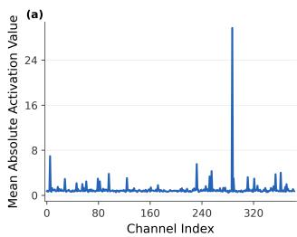
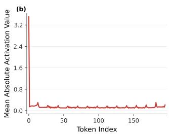
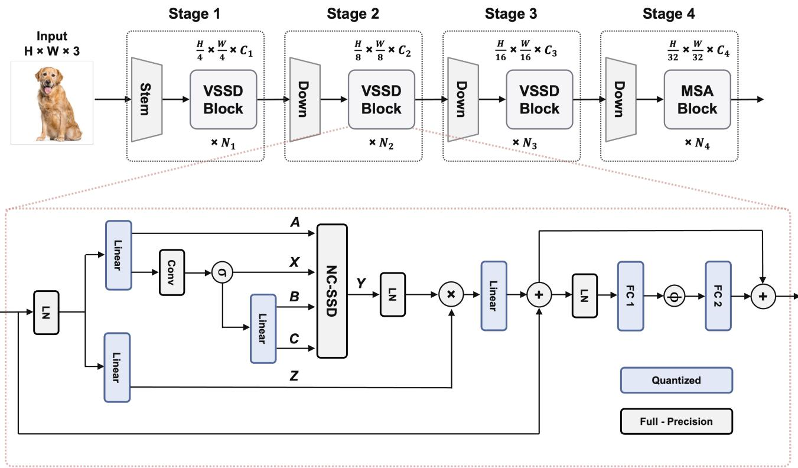
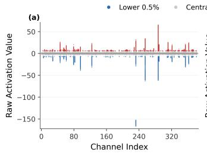
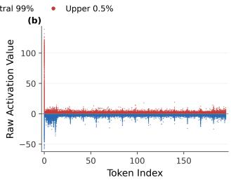
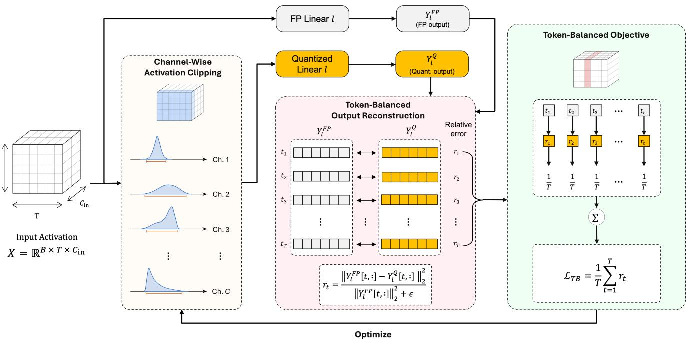
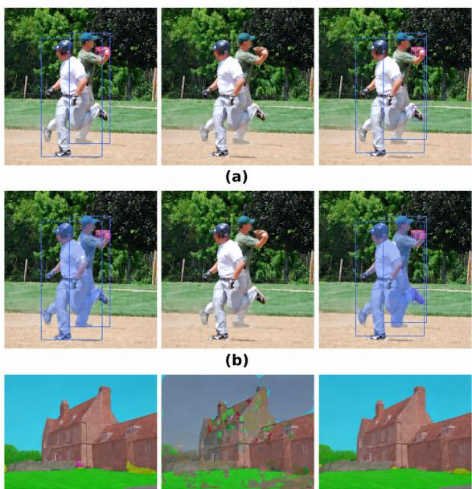
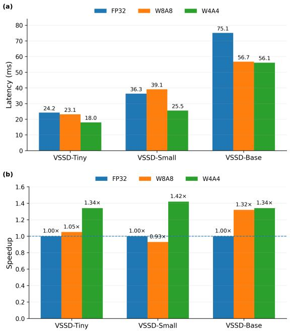

# Channel-Wise and Token-Aware Post-Training Quantization for Visual State Space Duality

Jonghyeon Lim Changhoon Yim Intelligent Image Processing Laboratory Department of Computer Science and Engineering, Konkuk University Seoul, Republic of Korea

flawhdgus@konkuk.ac.kr, cyim@konkuk.ac.kr

## Abstract

State space models (SSMs), particularly Mamba, have emerged as efficient alternatives to attention-based architectures and have been extended to vision through ViM, VMamba, and Visual State Space Duality (VSSD). Yet the low-bit post-training quantization (PTQ) behavior ofVSSD remains insufficiently understood. A weight–activation split on VSSD-Tiny identifies activation quantization as the dominant low-bit bottleneck, while representative inputs to selected VSSD-backbone linear layers exhibit strong channelwise magnitude variation and token-localized extremes. We propose the Channel-wise Token-balanced Output-Aware Clipping (CTOAC) method, which learns per-input-channel clipping bounds by minimizing a token-balanced reconstruction loss on the corresponding linear outputs. Only the selected linear layers and their input activations are quantized; other backbone operations retain their original precision. Across VSSD-Tiny, VSSD-Small, and VSSD-Base, the proposed CTOAC method retains ImageNet-1K accuracy and remains substantially more robust than the evaluated baselines at more aggressive precision settings. Applying the same quantization scope to VSSD backbones on COCO and ADE20K preserves strong object detection, instance segmentation, and semantic segmentation performance. An optimized RTX 4090 deployment configuration achieves up to 1.42× end-to-end speedup over FP32.

## 1. Introduction

Vision Transformers such as ViT [8] and Swin Transformer [22] provide strong visual representations, but global self-attention scales quadratically with token count. State space models offer a more efficient sequencemodeling alternative and have recently been extended to vision through ViM [40], VMamba [21], and VSSD [30]. Among these models, VSSD combines hierarchical visual representation learning with non-causal state space duality and achieves strong performance on classification and dense-prediction tasks, making it an important target for efficient low-bit deployment.

  
Figure 1. Activation analysis of representative linear inputs in late Stage 3 of VSSD-Tiny. (a) Mean absolute input activation across channels for the input-projection layer in the eighth VSSD block. (b) Mean absolute input activation across tokens for the output projection layer in the seventh VSSD block.

Post-training quantization converts pretrained weights and activations to low-bit representations using a small unlabeled calibration set [1, 15, 26], but its behavior is architecture dependent. On VSSD-Tiny, our weight–activation split retains 83.0% Top-1 accuracy with W4A32 from an FP32 baseline of 83.7%, whereas W32A4 falls to 2.4%. This asymmetry identifies activation quantization, rather than weight quantization, as the primary low-bit bottleneck.

Figure 1 indicates that this bottleneck is associated with heterogeneous channel ranges and token-localized activation extremes. Input magnitudes vary markedly across channels, while a small subset of token positions exhibits localized peaks. The proposed Channel-wise Tokenbalanced Output-Aware Clipping (CTOAC) method addresses the channel axis by learning independent clipping bounds and the token axis by normalizing linear-output reconstruction errors before aggregation. The optimized clipping bounds and activation quantization parameters are fixed for static inference.

Our contributions are summarized as follows:

• We identify activation quantization as the primary low-bit bottleneck in VSSD and characterize channel-wise magnitude variation and token-localized activation tails.

• We propose CTOAC, which combines learnable channelwise clipping with token-balanced linear-output reconstruction while retaining fixed quantization parameters at inference time.

• We validate CTOAC across three VSSD backbones, five precision settings, progressive clipping calibration, downstream dense-prediction tasks, and optimized GPU deployment.

## 2. Related work

## 2.1. State space and visual state space models

Structured state space models represent sequences through recurrent latent-state updates while permitting efficient parallel computation. S4 made this formulation practical for long-sequence modeling through a structured parameterization of the state space operator [10]. Mamba introduced input-dependent selective state transitions, allowing the model to control which information is retained or discarded according to the current input [9]. State Space Duality subsequently established a connection between structured state space computations and matrix transformations related to attention [5].

Several architectures have adapted these ideas to visual recognition. ViM processes image tokens using bidirectional Mamba blocks [40]. VMamba introduces a hierarchical architecture with multidirectional selective scans [21]. LocalMamba studies localized scanning windows for visual state space modeling [11]. Visual State Space Duality instead introduces non-causal state space duality and demonstrates competitive performance on image classification, object detection, instance segmentation, and semantic segmentation [30]. Our work studies the low-bit quantization behavior of VSSD and its linear-input activations.

## 2.2. Post-training quantization

Post-training quantization converts pretrained models to low-bit representations using a small calibration set without end-to-end retraining. Early work established integeronly inference and low-bit CNN quantization [1, 13], while AdaRound and BRECQ improved reconstruction by optimizing weight rounding or block outputs [15, 26]. SmoothQuant instead reduces activation quantization difficulty through channel-wise rescaling between activations and weights [34].

For Vision Transformers, PTQ methods address attention-specific outputs, non-uniform activations, and inter-channel variation. VT-PTQ, APQ-ViT, and PTQ4ViT introduce attention-aware calibration or scale selection [7,

23, 37], whereas FQ-ViT and AdaLog modify quantization formats for difficult activation distributions [19, 31]. RepQ-ViT, NoisyQuant, IGQ-ViT, OASQ, ERQ, and DopQ-ViT use reparameterization, grouping, perturbation, or outlieraware treatment to improve activation quantization [17, 20, 24, 25, 36, 38].

Recent reconstruction methods further approximate output sensitivity through Hessian- or Fisher-related objectives, including APHQ-ViT, FIMA-Q, and LS-ViT [12, 32, 33]. CTOAC differs from these approaches: it does not estimate second-order information or optimize weight rounding, but directly learns channel-wise activation clipping bounds through token-balanced reconstruction of linear outputs.

## 2.3. Quantization of Mamba-based models

PTQ4VM studies post-training quantization for Visual Mamba models, including ViM and VMamba, and introduces Per-Token Static quantization together with Joint Learning of Smoothing Scale and Step Size [4]. MambaQuant applies variance-aligned rotations to quantize models in the Mamba family [35]. Quamba provides a PTQ recipe for selective state space models [3], whereas SSDi8 focuses on 8-bit quantization for SSD architectures [14].

Recent work has also explored visual state space quantization from different directions. QMamba targets PTQ for vision state space models [16]. K-scaled quantization combines scaling and reparameterization for Vision Mamba [29]. ViM-VQ applies post-training vector quantization to Visual Mamba [6], while OuroMamba introduces a data-free quantization framework [27].

Despite this progress, the low-bit activation behavior of VSSD remains insufficiently characterized. These methods primarily focus on smoothing, rotation, quantizer design, or model-specific reconstruction. We instead study the interaction between channel-dependent activation ranges and token-dependent reconstruction weighting in non-causal VSSD linear layers.

## 3. Quantization challenges in VSSD

VSSD is a hierarchical visual backbone composed of successive spatial stages and non-causal state space duality blocks [30]. Figure 2 shows the hierarchical VSSD architecture and the internal structure of a VSSD block. We quantize the weights of the VSSD-backbone linear layers represented by the blue blocks and the activations directly entering them. All remaining backbone operations, including state space computations, convolutions, normalization, nonlinearities, residual paths, and softmax, retain their original full precision.

  
Figure 2. Overview of the hierarchical VSSD architecture and a VSSD block. Highlighted boxes denote the backbone linear layers and their direct input activations quantized by CTOAC; the remaining operations retain their original precision.

## 3.1. Activation quantization as the primary bottleneck

We first isolate the effects of weight and activation quantization using VSSD-Tiny with MinMax calibration. Table 1 compares FP32 inference with weight-only W4A32 and activation-only W32A4 under the same linear-layer quantization scope.

<table><tr><td>Bit-width</td><td>Top-1</td><td>Top-5</td></tr><tr><td>FP32</td><td>83.7</td><td>96.8</td></tr><tr><td>W4A32</td><td>83.0</td><td>96.5</td></tr><tr><td>W32A4</td><td>2.4</td><td>9.7</td></tr></table>

Table 1. Weight–activation split on VSSD-Tiny using MinMax calibration. Activation quantization is the primary low-bit bottleneck.

Reducing only the weights to 4 bits lowers Top-1 accuracy by 0.7 percentage points and Top-5 accuracy by 0.3 percentage points. In contrast, quantizing only the activations to 4 bits reduces Top-1 accuracy by 81.3 percentage points and Top-5 accuracy by 87.1 percentage points. Under the evaluated scope, VSSD weights remain comparatively robust under signed symmetric per-output-channel quantization, whereas 4-bit activations are highly sensitive to range selection.

This asymmetry motivates fixing the quantized weights before calibration and allocating the optimization to activation clipping. The next section examines the activation structure that makes a shared low-bit range ineffective.

## 3.2. Channel-wise magnitude variation and tokenlocalized extremes

For Fig. 1(a), we average absolute full-precision linear inputs over the batch and token dimensions for each input channel. For Fig. 1(b), we average over the batch and channel dimensions for each token position. The channel and token views use representative layers to analyze the two axes independently. These statistics are diagnostic only; CTOAC is applied uniformly to every target linear layer and does not depend on selecting these examples during calibration or inference.

Figure 1(a) shows that a small subset of channels has substantially larger magnitude than the rest, so a shared activation range either wastes resolution on lower-magnitude channels or clips larger channels too aggressively. Figure 1(b) shows localized token peaks. This does not require a dynamic per-token quantizer at inference; it indicates that an unnormalized reconstruction loss would let high-energy

tokens dominate calibration.

Whereas Fig. 1 summarizes average magnitude variation, Fig. 3 reveals that the observed heterogeneity is accompanied by localized raw-value tails rather than a uniform shift of the entire distribution. The central 99% of values remains near zero, while extreme positive and negative responses are concentrated in a small number of channels and token positions. Together, these observations motivate channel-wise clipping bounds and token-normalized output reconstruction.

  
Figure 3. Raw activation tails of representative VSSD-Tiny linear inputs. Blue and red points denote the lower and upper 0.5% of activation values, while gray points denote the central 99%. (a) Across input channels, extreme positive and negative values are concentrated in a small subset of channels. (b) Across tokens, extreme responses are concentrated at a small subset of token positions.

## 4. CTOAC

Figure 4 illustrates the overview of CTOAC method for a target linear layer. The FP branch provides a reference output, while the quantized branch applies channel-wise activation clipping, static activation quantization, and fixed lowbit weights. Their outputs are compared at each token position, and the resulting token-normalized errors are averaged to update only the clipping bounds.

## 4.1. Quantization formulation

Consider a linear layer l with input $X _ { l }$ and weight $W _ { l }$ :

$$
X _ { l } \in \mathbb { R } ^ { B \times T \times C _ { \mathrm { i n } } } ,\tag{1}
$$

$$
W _ { l } \in \mathbb { R } ^ { C _ { \mathrm { o u t } } \times C _ { \mathrm { i n } } } .\tag{2}
$$

The layer also has bias $b _ { l } .$ . Here, $B , T , C _ { \mathrm { i n } }$ , and $C _ { \mathrm { o u t } }$ denote the batch size, number of tokens, input channels, and output channels, respectively.

Given scale s, zero point z, and integer range $[ q _ { \mathrm { m i n } } , q _ { \mathrm { m a x } } ]$ , we define the quantization operator used during calibration as

$$
Q ( x ; s , z ) = s \left[ \mathrm { c l a m p } \left( \left\lfloor { \frac { x } { s } } \right\rceil + z , q _ { \mathrm { m i n } } , q _ { \mathrm { m a x } } \right) - z \right] .\tag{3}
$$

The input is rounded and clamped to the quantization range and then rescaled by s for reconstruction. During calibration, gradients through the rounding operation are approximated using the straight-through estimator (STE) [2].

Let $Q _ { W } ( \cdot )$ denote signed symmetric per-output-channel weight quantization. Activations use static affine asymmetric quantization. Biases and accumulations remain in high precision. The pretrained weight is quantized before activation calibration and then fixed:

$$
{ \cal W } _ { l } ^ { Q } = Q _ { W } ( W _ { l } ) .\tag{4}
$$

The quantized weight $W _ { l } ^ { Q }$ is fixed throughout calibration. The calibration stage does not optimize weight rounding, pretrained model parameters, or a task-level loss; only the channel-wise activation clipping bounds are updated.

## 4.2. Channel-wise activation clipping

For every input channel $c \in \{ 1 , \ldots , C _ { \mathrm { i n } } \}$ , CTOAC introduces a lower clipping bound $\alpha _ { l , c }$ and upper clipping bound $\beta _ { l , c }$ . For all batch indices n and token positions t, the clipped activation is

$$
\overline { { \boldsymbol X } } _ { l , n , t , c } = \mathrm { c l i p } ( \boldsymbol X _ { l , n , t , c } , \alpha _ { l , c } , \beta _ { l , c } ) .\tag{5}
$$

The bounds vary across input channels but are shared over all calibration samples and token positions. They are initialized from calibration activations and optimized independently.

Let $\mathcal { C } _ { A }$ denote static affine calibration of the activation quantizer at bit-width $b _ { a }$ . The shared scale and zero point for layer l are obtained as

$$
( s _ { l } , z _ { l } ) = \mathcal { C } _ { A } \big ( \overline { { X } } _ { l } ; b _ { a } \big ) .\tag{6}
$$

The clipped activation is then quantized using these parameters:

$$
X _ { l } ^ { Q } = Q \left( { \overline { { X } } } _ { l } ; s _ { l } , z _ { l } \right) .\tag{7}
$$

Although the clipping bounds are channel dependent, $s _ { l }$ and $z _ { l }$ are shared across the complete input of layer l. CTOAC therefore performs per-channel clipping followed by shared per-layer activation quantization rather than per-channel activation quantization. The optimized bounds and the resulting static activation quantization parameters are fixed after calibration.

## 4.3. Token-balanced linear-output reconstruction

The full-precision linear output is obtained as

$$
Y _ { l } ^ { \mathrm { F P } } = X _ { l } \cdot W _ { l } ^ { \top } + b _ { l } .\tag{8}
$$

The corresponding quantized output is obtained as

$$
Y _ { l } ^ { Q } = X _ { l } ^ { Q } \cdot ( W _ { l } ^ { Q } ) ^ { \top } + b _ { l } .\tag{9}
$$

  
Figure 4. Overview of CTOAC for a target linear layer. Each input channel has independent lower and upper clipping bounds. The full-precision and quantized outputs are compared at every token position, and their relative errors are averaged uniformly to optimize the clipping bounds. The optimized bounds and quantization parameters are fixed after calibration.

The dot operator (·) denotes matrix multiplication over the input-channel dimension. CTOAC optimizes the clipping bounds by preserving the output of the linear transformation rather than directly minimizing the difference between fullprecision and quantized activation tensors.

For token position $t ,$ the batch-averaged relative output error is

$$
r _ { t } = \frac { 1 } { B } \sum _ { n = 1 } ^ { B } \frac { \left\| Y _ { l } ^ { \mathrm { F P } } [ n , t , : ] - Y _ { l } ^ { Q } [ n , t , : ] \right\| _ { 2 } ^ { 2 } } { \left\| Y _ { l } ^ { \mathrm { F P } } [ n , t , : ] \right\| _ { 2 } ^ { 2 } + \epsilon } .\tag{10}
$$

Here, ϵ is a small constant used for numerical stability.

The token-balanced loss is defined as

$$
\mathcal { L } _ { \mathrm { T B } } = \frac { 1 } { T } \sum _ { t = 1 } ^ { T } r _ { t } ,\tag{11}
$$

which is equivalently represented as

$$
\mathcal { L } _ { \mathrm { T B } } = \frac { 1 } { B T } \sum _ { n = 1 } ^ { B } \sum _ { t = 1 } ^ { T } \frac { \left. Y _ { l } ^ { \mathrm { F P } } [ n , t , : ] - Y _ { l } ^ { Q } [ n , t , : ] \right. _ { 2 } ^ { 2 } } { \left. Y _ { l } ^ { \mathrm { F P } } [ n , t , : ] \right. _ { 2 } ^ { 2 } + \epsilon } .\tag{12}
$$

Because normalization precedes token averaging, each token contributes equally in relative-error terms; pooling before normalization would instead overweight high-energy tokens. We refer to $\mathcal { L } _ { \mathrm { T B } }$ as token-balanced normalized mean-squared error (TB-NMSE). No separate global reconstruction term is used.

Let

$$
\alpha _ { l } = [ \alpha _ { l , 1 } , \dots , \alpha _ { l , C _ { \mathrm { i n } } } ]\tag{13}
$$

and

$$
\beta _ { l } = [ \beta _ { l , 1 } , . . . , \beta _ { l , C _ { \mathrm { i n } } } ]\tag{14}
$$

denote the vectors of lower and upper clipping bounds. The calibration problem is

$$
\begin{array} { r } { ( \alpha _ { l } ^ { \star } , \beta _ { l } ^ { \star } ) = \underset { \alpha _ { l } , \beta _ { l } } { \arg \operatorname* { m i n } } \ \mathcal { L } _ { \mathrm { T B } } ( \alpha _ { l } , \beta _ { l } ) . } \end{array}\tag{15}
$$

## 4.4. Overall calibration procedure

Algorithm 1 summarizes the CTOAC procedure for a target linear layer.

The procedure is repeated for every target linear layer using the same calibration set. Once calibration is complete, $\bar { W _ { l } ^ { Q } } , \alpha _ { l } ^ { \star } , \beta _ { l } ^ { \star } , s _ { l } ,$ , and zl are fixed for inference. The fullprecision reference branch and reconstruction objective are removed, leaving only fixed channel-wise clipping, shared static activation quantization, and the low-bit linear operation.

## 5. Experiments

We evaluate VSSD-Tiny, VSSD-Small, and VSSD-Base on ImageNet-1K [28]. Classification calibration uses 256 training images, and final accuracy is measured on all 50,000 validation images. We use WiAj to denote $_ { i - }$ bit weight and $j \cdot$ -bit activation quantization, and evaluate W8A8, W6A6, W4A4, W4A3, and W3A3 settings.

<table><tr><td>Model</td><td>Method</td><td>W8A8</td><td>W6A6</td><td>W4A4</td><td>W4A3</td><td>W3A3</td></tr><tr><td rowspan="7">VSSD-Tiny FP32 : 83.7</td><td>MinMax</td><td>83.4</td><td>79.1</td><td>2.0</td><td>0.3</td><td>0.3</td></tr><tr><td>Truncation</td><td>79.5</td><td>72.2</td><td>10.2</td><td>1.1</td><td>1.6</td></tr><tr><td>SmoothQuant [34]</td><td>83.6</td><td>79.6</td><td>1.3</td><td>0.8</td><td>0.6</td></tr><tr><td>BRECQ [15]</td><td>83.6</td><td>77.9</td><td>19.1</td><td>0.1</td><td>0.1</td></tr><tr><td>PTQ4VM [4]</td><td>83.4</td><td>83.0</td><td>81.0</td><td>6.8</td><td>3.9</td></tr><tr><td>CTOAC</td><td>83.6</td><td>83.3</td><td>81.1</td><td>47.0</td><td>26.3</td></tr><tr><td>MinMax</td><td>84.5</td><td>83.1</td><td>0.6</td><td>0.3</td><td>0.3</td></tr><tr><td rowspan="5">VSSD-Small FP32: 84.6</td><td>Truncation</td><td>80.2</td><td>79.1</td><td>3.7</td><td>0.4</td><td>0.1</td></tr><tr><td>SmoothQuant [34]</td><td>84.5</td><td>83.5</td><td>1.3</td><td>0.2</td><td>0.2</td></tr><tr><td>BRECQ [15]</td><td>84.5</td><td>83.8</td><td>2.0</td><td>0.1</td><td>0.1</td></tr><tr><td>PTQ4VM [4]</td><td>84.2</td><td>84.0</td><td>82.3</td><td>4.7</td><td>2.8</td></tr><tr><td>CTOAC</td><td>84.6</td><td>84.5</td><td>83.2</td><td>41.0</td><td>42.2</td></tr><tr><td rowspan="6">VSSD-Base FP32: 85.4</td><td>MinMax</td><td>85.4</td><td>84.7</td><td>0.1</td><td>0.1</td><td>0.1</td></tr><tr><td>Truncation</td><td>83.4</td><td>81.3</td><td>1.0</td><td>0.1</td><td>0.2</td></tr><tr><td>SmoothQuant [34]</td><td>85.3</td><td>84.8</td><td>0.6</td><td>0.1</td><td>0.1</td></tr><tr><td>BRECQ [15]</td><td>85.3</td><td>84.9</td><td>0.1</td><td>0.1</td><td>0.1</td></tr><tr><td>PTQ4VM [4]</td><td>85.3</td><td>85.2</td><td>84.2</td><td>5.5</td><td>3.1</td></tr><tr><td>CTOAC</td><td>85.4</td><td>85.3</td><td>84.8</td><td>76.9</td><td>74.2</td></tr></table>

Table 2. ImageNet-1K Top-1 accuracy (%) under low-bit quantization. The result of FP32 baseline is shown with each model. The results of the proposed CTOAC method are shown in bold.

Algorithm 1 CTOAC procedure for a linear layer.   
Require: Full-precision weight $W _ { l } .$ , bias $b _ { l } ,$ calibration ac  
tivation $X _ { l }$ , activation bit-width $b _ { a }$ , and maximum iter  
ation count K   
Ensure: Calibrated $W _ { l } ^ { Q } , \alpha _ { l } ^ { \star } , \beta _ { l } ^ { \star } , s _ { l } ,$ , and $z _ { l }$   
1: $W _ { l } ^ { Q }  Q _ { W } ( W _ { l } )$   
2: $Y _ { l } ^ { \mathrm { v P } } \gets X _ { l } \cdot W _ { l } ^ { \dagger } + b _ { l }$   
3: Initialize $\alpha _ { l }$ and $\beta _ { l }$ from $X _ { l }$   
4: for $k = 1 , \ldots , K$ do   
5: $\overline { { X } } _ { l } \gets \mathrm { c l i p } ( X _ { l } ; \alpha _ { l } , \beta _ { l } )$ using Eq. (5)   
6: $( s _ { l } , z _ { l } ) \gets \mathcal { C } _ { A } ( \overline { { X } } _ { l } ; b _ { a } )$ using Eq. (6)   
7: $X _ { l } ^ { Q }  Q ( \overline { { X } } _ { l } ; s _ { l } , z _ { l } )$ using Eq. (7)   
8: $\begin{array} { r } { Y _ { l } ^ { \dot { Q } }  X _ { l } ^ { Q } \cdot ( W _ { l } ^ { Q } ) ^ { \top } + b _ { l } } \end{array}$ using Eq. (9)   
9: Compute $\mathcal { L } _ { \mathrm { T B } }$ using Eqs. (10) and (12)   
10: Update $\alpha _ { l }$ and $\beta _ { l }$   
11: end for   
12: Recompute $( s _ { l } , z _ { l } )$ using the optimized clipping   
bounds   
13: return $W _ { l } ^ { Q } , { \alpha _ { l } ^ { \star } } , \beta _ { l } ^ { \star } , s _ { l } ,$ and $z _ { l }$

For ImageNet classification, we compare CTOAC with MinMax, percentile-based Truncation, SmoothQuant [34],

BRECQ [15], and PTQ4VM [4] under the same calibration and evaluation protocol. For downstream tasks, we compare CTOAC with MinMax, Truncation, and SmoothQuant, which are applied consistently within the corresponding detection and segmentation pipelines. For every method, only the selected VSSD-backbone linear layers and their direct input activations are quantized; all other backbone operations retain their original full precision.

For each downstream task, the selected backbone linear layers and their direct input activations are recalibrated using unlabeled images from the corresponding training set, while the task-specific head remains in full precision. For COCO [18], we evaluate object detection and instance segmentation using box AP $\mathrm { A } \bar { \mathrm { P } } ^ { b }$ and mask AP $\mathrm { A P } ^ { m }$ , respectively. For ADE20K [39], we evaluate semantic segmentation using single-scale and multi-scale mIoU.

## 5.1. ImageNet classification

Table 2 shows that the main difficulty emerges when activation precision enters the 4-bit regime. CTOAC remains within 0.4 percentage points of FP32 at W8A8 and W6A6 across all three backbones, indicating that its calibration does not sacrifice accuracy at moderate precision. At W4A4, CTOAC improves over PTQ4VM by 0.1, 0.9, and 0.6 percentage points on VSSD-Tiny, VSSD-Small, and VSSD-Base, respectively, while the remaining baselines degrade severely.

The separation becomes much larger in the A3 settings. All evaluated baselines fall to single-digit accuracy, whereas CTOAC retains meaningful accuracy across all three models. VSSD-Base is particularly tolerant to aggressive quantization, retaining 76.9% at W4A3 and 74.2% at W3A3. These results indicate that the benefit of channelaware clipping and token-balanced reconstruction becomes more pronounced as the precision setting becomes more aggressive. Each precision setting is calibrated independently, so the resulting accuracies are not constrained to vary monotonically with bit width.

## 5.2. Progressive channel-wise clipping calibration

Table 3 progressively introduces the two design axes of CTOAC. The MinMax baseline uses an untrimmed shared activation range. Replacing it with fixed channel-wise clipping substantially improves all three models, confirming that a single range is poorly matched to heterogeneous channels. However, the recovered accuracy remains highly model dependent and far below the final result.

<table><tr><td>Model</td><td>MinMax (No Clipping)</td><td>Fixed Channel-wise Clipping</td><td>CTOAC</td></tr><tr><td>VSSD-Tiny</td><td>2.0</td><td>32.2</td><td>81.1</td></tr><tr><td>VSSD-Small</td><td>0.6</td><td>17.9</td><td>83.2</td></tr><tr><td>VSSD-Base</td><td>0.1</td><td>60.7</td><td>84.8</td></tr><tr><td></td><td></td><td></td><td></td></tr></table>

Table 3. Progressive W4A4 calibration analysis on ImageNet-1K. We begin with a shared MinMax activation range, introduce fixed channel-wise clipping, and finally optimize the channel-wise bounds using token-balanced linear-output reconstruction. Each entry reports Top-1 accuracy (%).

The complete CTOAC method further optimizes the channel-wise bounds using TB-NMSE on the corresponding linear outputs, restoring 81.1%, 83.2%, and 84.8% Top-1 accuracy. The progressive calibration analysis shows that static channel separation alone cannot resolve the W4A4 failure; the bounds must be calibrated with respect to their output distortion. This analysis shows that fixed channelwise clipping alone is insufficient, whereas the complete CTOAC calibration substantially recovers W4A4 accuracy.

## 5.3. Object detection and instance segmentation

Table 4 presents the object detection and instance segmentation results on COCO.

At W8A8 and W6A6, CTOAC remains within 0.2 AP of the corresponding FP32 models. At W4A4, it limits the degradation to 1.7 / 1.2 box and mask AP on VSSD-Tiny and 1.2 / 0.9 AP on VSSD-Small, whereas the calibration baselines collapse. The similar retention of box and mask AP indicates that the quantized backbone preserves both object-level localization and the spatial detail required for instance-mask prediction. This provides stronger evidence than classification alone because the full-precision downstream heads operate on features produced by the quantized backbone linear layers.

<table><tr><td>Model</td><td>Method</td><td>W8A8</td><td>W6A6</td><td>W4A4</td></tr><tr><td rowspan="3">VSSD-Tiny</td><td>MinMax</td><td>46.9 / 42.6 46.3 / 42.0</td><td rowspan="3">0.3 / 0.3 1.6 / 1.6</td></tr><tr><td>Truncation</td><td>44.5 / 40.544.1 / 40.0</td></tr><tr><td>CTOAC</td><td>FP32 : 47.0 / 42.6 SmoothQuant 46.9 / 42.646.5 / 42.1 0.6 / 0.6 47.0 / 42.646.8 / 42.6 45.3 / 41.4</td></tr><tr><td rowspan="3">VSSD-Small FP32 : 48.3 / 43.5</td><td>MinMax</td><td>48.3 / 43.4 47.9 / 43.0</td><td rowspan="3">0.0 / 0.0 0.3 / 0.3</td></tr><tr><td>Truncation</td><td>45.6 / 41.044.9 / 40.4</td></tr><tr><td>CTOAC</td><td>SmoothQuant48.2 / 43.447.8 / 43.0 0.1 / 0.1</td></tr></table>

Table 4. Object detection and instance segmentation on COCO. Each entry reports $\mathrm { A P } ^ { b } / \mathrm { A P } ^ { m }$ . CTOAC results are highlighted in bold.
<table><tr><td>Model</td><td>Method</td><td>W8A8</td><td>W6A6</td><td>W4A4</td></tr><tr><td></td><td>MinMax</td><td>47.8 / 48.647.3 / 48.1</td><td></td><td>0.9 / 1.0</td></tr><tr><td>VSSD-Tiny</td><td>Truncation</td><td>43.8 / 44.240.5 / 40.5</td><td></td><td>1.5 / 1.9</td></tr><tr><td>FP32 : 47.8 / 48.7</td><td></td><td>SmoothQuant47.8 / 48.647.4 / 48.3</td><td></td><td>1.2 / 1.3</td></tr><tr><td></td><td>CTOAC</td><td></td><td>47.8 / 48.647.5 / 48.245.1 / 46.3</td><td></td></tr></table>

Table 5. Semantic segmentation on ADE20K. Each entry reports single-scale / multi-scale mIoU. CTOAC results are highlighted in bold.

## 5.4. Semantic segmentation

Table 5 presents the semantic segmentation results on ADE20K.

On ADE20K, CTOAC reduces W4A4 single-scale and multi-scale mIoU by 2.7 and 2.4 points from FP32, respectively, while the other calibration baselines fall near zero. The comparable degradation under single- and multiscale evaluation indicates that the quantized backbone retains spatially coherent features across evaluation scales.

Figure 5 complements Tables 4 and 5 with qualitative comparisons under identical post-processing and visualization settings. Under W4A4, MinMax loses detections and produces fragmented masks, whereas CTOAC retains object instances, mask boundaries, and semantic regions that remain visually closer to FP32 across all three downstream tasks.

## 5.5. Deployment efficiency

Figure 6 evaluates CUTLASS-based low-bit deployment on an NVIDIA RTX 4090 at batch size 32. W4A4 provides consistent 1.34× ∼ 1.42× speedup across all three backbones, whereas W8A8 ranges from a slight slowdown to a 1.32× speedup. In particular, the similar W8A8 and W4A4 latency on VSSD-Base shows that end-to-end latency is not determined by arithmetic precision alone. Kernel efficiency, data-layout conversion, launch overhead, and the remaining original-precision operations can dominate the realized latency. Therefore the measurements demonstrate practical gains for the evaluated deployment configurations rather than a universal arithmetic-only 4-bit speedup.

FP32  
MinMax  
CTOAC  
  
(c)  
Figure 5. Qualitative comparison for VSSD-Tiny under W4A4 quantization. Columns show FP32, MinMax, and CTOAC. (a) Object detection, (b) Instance segmentation, and (c) Semantic segmentation.

## 6. Conclusion

We proposed the CTOAC method, which is an efficient post-training quantization method for selected VSSDbackbone linear layers and their direct input activations. Motivated by channel-wise magnitude variation and tokenlocalized activation tails, CTOAC learns channel-specific clipping bounds through token-balanced reconstruction of linear outputs. The learned bounds and shared per-layer activation quantizers are fixed after calibration, while all non-target backbone operations retain their original fullprecision.

Across VSSD-Tiny, VSSD-Small, and VSSD-Base, CTOAC preserves near-FP32 accuracy at W8A8 and W6A6, strong accuracy at W4A4, and substantially greater robustness than the evaluated baselines at A3 precision. The progressive analysis shows that fixed channel-wise clipping alone is insufficient and that the complete output-aware calibration is required to recover low-bit accuracy. After task-specific recalibration, the same quantization scope preserves features required for object detection and instance segmentation on COCO and semantic segmentation on ADE20K. With CUTLASS-based low-bit kernels, the evaluated W4A4 deployment configurations achieve up to 1.42× end-to-end speedup on an RTX 4090.

  
Figure 6. CUTLASS-based deployment efficiency of CTOAC on an RTX 4090 with batch size 32: (a) End-to-end inference latency and (b) Speedup over FP32.

These results establish channel-wise range adaptation and token-balanced output reconstruction as an effective calibration strategy for accurate and deployable low-bit VSSD models.

## Acknowledgments

This work was supported by the National Research Foundation of Korea (NRF) grant funded by the Korean government (MSIT) (RS-2026-25476371).

## References

[1] Ron Banner, Yury Nahshan, and Daniel Soudry. Post training 4-bit quantization of convolutional networks for rapiddeployment. In Advances in Neural Information Processing Systems, pages 7948–7956, 2019.

[2] Yoshua Bengio, Nicholas Leonard, and Aaron Courville.´ Estimating or propagating gradients through stochastic neurons for conditional computation. arXiv preprint arXiv:1308.3432, 2013.

[3] Hung-Yueh Chiang, Chi-Chih Chang, Natalia Frumkin, Kai-Chiang Wu, and Diana Marculescu. Quamba: A posttraining quantization recipe for selective state space models. In International Conference on Learning Representations, 2025.

[4] Younghyun Cho, Changhun Lee, Seonggon Kim, and Eunhyeok Park. PTQ4VM: Post-training quantization for visual Mamba. In Proceedings of the IEEE/CVF Winter Conference on Applications ofComputer Vision, pages 1176–1185, 2025.

[5] Tri Dao and Albert Gu. Transformers are SSMs: Generalized models and efficient algorithms through structured state space duality. In Proceedings of the 41st International Conference on Machine Learning, pages 10041–10071. PMLR, 2024.

[6] Juncan Deng, Shuaiting Li, Zeyu Wang, Kedong Xu, Hong Gu, and Kejie Huang. ViM-VQ: Efficient post-training vector quantization for visual Mamba. In Proceedings of the IEEE/CVF International Conference on Computer Vision, pages 24518–24527, 2025.

[7] Yifu Ding, Haotong Qin, Qinghua Yan, Zhenhua Chai, Junjie Liu, Xiaolin Wei, and Xianglong Liu. Towards accurate posttraining quantization for vision transformer. In Proceedings of the 30th ACM International Conference on Multimedia, pages 5380–5388, 2022.

[8] Alexey Dosovitskiy, Lucas Beyer, Alexander Kolesnikov, Dirk Weissenborn, Xiaohua Zhai, Thomas Unterthiner, Mostafa Dehghani, Matthias Minderer, Georg Heigold, Sylvain Gelly, Jakob Uszkoreit, and Neil Houlsby. An image is worth 16x16 words: Transformers for image recognition at scale. In International Conference on Learning Representations, 2021.

[9] Albert Gu and Tri Dao. Mamba: Linear-time sequence modeling with selective state spaces. In First Conference on Language Modeling, 2024.

[10] Albert Gu, Karan Goel, and Christopher Re. Efficiently mod-´ eling long sequences with structured state spaces. In International Conference on Learning Representations, 2022.

[11] Tao Huang, Xiaohuan Pei, Shan You, Fei Wang, Chen Qian, and Chang Xu. LocalMamba: Visual state space model with windowed selective scan. In Computer Vision – ECCV 2024 Workshops, pages 12–22. Springer, 2025.

[12] Hyunha Hwang, Xuan Truong Nguyen, and Hyuk-Jae Lee. LS-ViT: Least-squares hessian based block reconstruction for low-bit post-training quantization of vision transformers. In Proceedings of the IEEE/CVF Conference on Computer Vision and Pattern Recognition, pages 33588–33597, 2026.

[13] Benoit Jacob, Skirmantas Kligys, Bo Chen, Menglong Zhu, Matthew Tang, Andrew Howard, Hartwig Adam, and Dmitry Kalenichenko. Quantization and training of neural networks for efficient integer-arithmetic-only inference. In Proceed ings ofthe IEEE Conference on Computer Vision and Pattern Recognition, pages 2704–2713, 2018.

[14] Hyunwoo Kim, Byoungchan Ko, Minseok Kang, Minwoo Kim, Dongjin Lee, Jaehoon Lee, Sungroh Yoon, and Dahuin Jung. SSDi8: Accurate and efficient 8-bit quantization for state space duality. In International Conference on Learning Representations, 2026.

[15] Yuhang Li, Ruihao Gong, Xu Tan, Yang Yang, Peng Hu, Qi Zhang, Fengwei Yu, Wei Wang, and Shi Gu. BRECQ: Push ing the limit of post-training quantization by block recon struction. In International Conference on Learning Repre sentations, 2021.

[16] Yinglong Li, Xiaoyu Liu, Jiacheng Li, Ruikang Xu, Yinda Chen, and Zhiwei Xiong. QMamba: Post-training quantization for vision state space models. arXiv preprint arXiv:2501.13624, 2025.

[17] Zhikai Li, Junrui Xiao, Lianwei Yang, and Qingyi Gu. RepQ-ViT: Scale reparameterization for post-training quan tization of vision transformers. In Proceedings of the IEEE/CVF International Conference on Computer Vision, pages 17227–17236, 2023.

[18] Tsung-Yi Lin, Michael Maire, Serge Belongie, James Hays, Pietro Perona, Deva Ramanan, Piotr Dollar, and C. Lawrence´ Zitnick. Microsoft COCO: Common objects in context. In Computer Vision – ECCV 2014, pages 740–755. Springer, 2014.

[19] Yang Lin, Tianyu Zhang, Peiqin Sun, Zheng Li, and Shuchang Zhou. FQ-ViT: Post-training quantization for fully quantized vision transformer. In Proceedings of the Thirty-First International Joint Conference on Artificial In telligence, pages 1173–1179, 2022.

[20] Yijiang Liu, Huanrui Yang, Zhen Dong, Kurt Keutzer, Li Du, and Shanghang Zhang. NoisyQuant: Noisy bias-enhanced post-training activation quantization for vision transformers. In Proceedings of the IEEE/CVF Conference on Computer Vision and Pattern Recognition, pages 20321–20330, 2023.

[21] Yue Liu, Yunjie Tian, Yuzhong Zhao, Hongtian Yu, Lingxi Xie, Yaowei Wang, Qixiang Ye, Jianbin Jiao, and Yunfan Liu. VMamba: Visual state space model. In Advances in Neural Information Processing Systems, pages 103031– 103063, 2024.

[22] Ze Liu, Yutong Lin, Yue Cao, Han Hu, Yixuan Wei, Zheng Zhang, Stephen Lin, and Baining Guo. Swin transformer: Hierarchical vision transformer using shifted windows. In Proceedings of the IEEE/CVF International Conference on Computer Vision, pages 10012–10022, 2021.

[23] Zhenhua Liu, Yunhe Wang, Kai Han, Wei Zhang, Siwei Ma, and Wen Gao. Post-training quantization for vision transformer. In Advances in Neural Information Processing Sys tems, pages 28092–28103, 2021.

[24] Yuexiao Ma, Huixia Li, Xiawu Zheng, Feng Ling, Xuefeng Xiao, Rui Wang, Shilei Wen, Fei Chao, and Rongrong Ji. Outlier-aware slicing for post-training quantization in vision

transformer. In Proceedings of the 41st International Conference on Machine Learning, pages 33811–33825. PMLR, 2024.

[25] Jaehyeon Moon, Dohyung Kim, Junyong Cheon, and Bumsub Ham. Instance-aware group quantization for vision transformers. In Proceedings of the IEEE/CVF Conference on Computer Vision and Pattern Recognition, pages 16132– 16141, 2024.

[26] Markus Nagel, Rana Ali Amjad, Mart van Baalen, Christos Louizos, and Tijmen Blankevoort. Up or down? adaptive rounding for post-training quantization. In Proceedings of the 37th International Conference on Machine Learning, pages 7197–7206. PMLR, 2020.

[27] Akshat Ramachandran, Mingyu Lee, Huan Xu, Souvik Kundu, and Tushar Krishna. OuroMamba: A data-free quantization framework for vision Mamba. In Proceedings ofthe IEEE/CVF International Conference on Computer Vision, pages 21177–21186, 2025.

[28] Olga Russakovsky, Jia Deng, Hao Su, Jonathan Krause, Sanjeev Satheesh, Sean Ma, Zhiheng Huang, Andrej Karpathy, Aditya Khosla, Michael Bernstein, Alexander C. Berg, and Fei-Fei Li. ImageNet large scale visual recognition challenge. International Journal of Computer Vision, 115(3): 211–252, 2015.

[29] Bo-Yun Shi, Yi-Cheng Lo, An-Yeu Wu, and Yi-Min Tsai. Post-training quantization for vision Mamba with k-scaled quantization and reparameterization. In 2025 IEEE 35th International Workshop on Machine Learning for Signal Processing, pages 1–6, 2025.

[30] Yuheng Shi, Mingjia Li, Minjing Dong, and Chang Xu. VSSD: Vision Mamba with non-causal state space duality. In Proceedings of the IEEE/CVF International Conference on Computer Vision, pages 10819–10829, 2025.

[31] Zhuguanyu Wu, Jiaxin Chen, Hanwen Zhong, Di Huang, and Yunhong Wang. AdaLog: Post-training quantization for vision transformers with adaptive logarithm quantizer. In Computer Vision – ECCV 2024, pages 411–427. Springer, 2024.

[32] Zhuguanyu Wu, Shihe Wang, Jiayi Zhang, Jiaxin Chen, and Yunhong Wang. FIMA-Q: Post-training quantization for vision transformers by fisher information matrix approximation. In Proceedings of the IEEE/CVF Conference on Computer Vision and Pattern Recognition, pages 14891–14900, 2025.

[33] Zhuguanyu Wu, Jiayi Zhang, Jiaxin Chen, Jinyang Guo, Di Huang, and Yunhong Wang. APHQ-ViT: Post-training quantization with average perturbation hessian based reconstruction for vision transformers. In Proceedings of the IEEE/CVF Conference on Computer Vision and Pattern Recognition, pages 9686–9695, 2025.

[34] Guangxuan Xiao, Ji Lin, Mickael Seznec, Hao Wu, Julien Demouth, and Song Han. SmoothQuant: Accurate and efficient post-training quantization for large language models. In Proceedings ofthe 40th International Conference on Machine Learning, pages 38087–38099. PMLR, 2023.

[35] Zukang Xu, Yuxuan Yue, Xing Hu, Zhihang Yuan, Zixu Jiang, Zhixuan Chen, Jiangyong Yu, Chen Xu, Sifan Zhou, and Dawei Yang. MambaQuant: Quantizing the Mamba

family with variance aligned rotation methods. In International Conference on Learning Representations, 2025.

[36] Lianwei Yang, Haisong Gong, Haokun Lin, Yichen Wu, Caifeng Shan, Zhenan Sun, and Qingyi Gu. DopQ ViT: Towards distribution-friendly and outlier-aware posttraining quantization for vision transformers. arXiv preprint arXiv:2408.03291, 2024.

[37] Zhihang Yuan, Chenhao Xue, Yiqi Chen, Qiang Wu, and Guangyu Sun. PTQ4ViT: Post-training quantization for vision transformers with twin uniform quantization. In Com puter Vision – ECCV 2022, pages 191–207. Springer, 2022.

[38] Yunshan Zhong, Jiawei Hu, You Huang, Yuxin Zhang, and Rongrong Ji. ERQ: Error reduction for post-training quanti zation of vision transformers. In Proceedings of the 41st In ternational Conference on Machine Learning, pages 61664– 61680. PMLR, 2024.

[39] Bolei Zhou, Hang Zhao, Xavier Puig, Sanja Fidler, Adela Barriuso, and Antonio Torralba. Scene parsing through ADE20K dataset. In Proceedings of the IEEE Conference on Computer Vision and Pattern Recognition, pages 633–641, 2017.

[40] Lianghui Zhu, Bencheng Liao, Qian Zhang, Xinlong Wang, Wenyu Liu, and Xinggang Wang. Vision Mamba: Efficient visual representation learning with bidirectional state space model. In Proceedings of the 41st International Conference on Machine Learning, pages 62429–62442. PMLR, 2024.