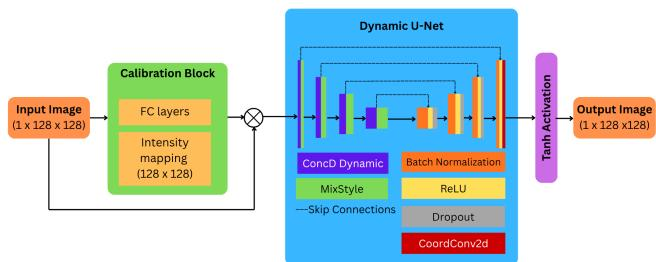
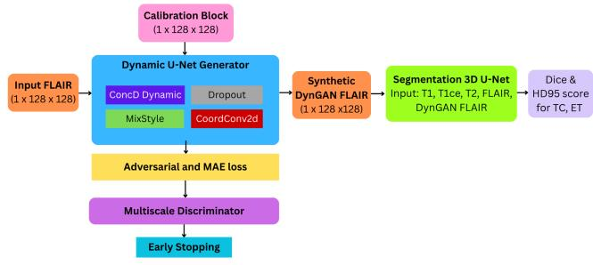

# DE-GAN - DYNAMIC PARAMETER TUNED GAN FOR 3D MEDICAL IMAGE SEGMENTATION: A STEP TOWARDS GENERALISATION

Zoha Usama1, Azadeh Alavi1,∗

1School of Computing Technologies, Royal Melbourne Institute of Technology University (RMIT), Melbourne, Australia

∗Corresponding author: azadeh.alavi@rmit.edu.au

## ABSTRACT

Brain tumor segmentation remains difficult because enhancing tumor (ET) has low contrast and overlaps surrounding tissue, while scanner and site variation causes domain shift. We propose DE-GAN, a contrast-enhancing conditional GAN that combines input-adaptive dynamic convolutions, style-aware feature mixing, and coordinate encoding to synthesize slice-adaptive FLAIR images. A label-guided, class-conditional target separates tumor-core (TC) and ET intensities while preserving anatomy. The generated FLAIR is concatenated with the original MR modalities and used to train a 3D U-Net. Across BraTS 2015, 2018, and 2019, DE-GAN improves segmentation over the baseline and static EnhGAN replacement on most reported TC/ET metrics, with the largest gains from retaining both original and enhanced FLAIR. Code and pretrained models are available at https://github.com/zkhansuri-ui/DE-GAN.

Index Terms— Brain tumor segmentation, MRI, generative adversarial network, dynamic convolution, domain generalization

## 1. INTRODUCTION

Accurate 3D brain tumor segmentation supports diagnosis, treatment planning, and response assessment. However, MR modalities exhibit overlapping class-conditional intensities, and scanner- and site-dependent acquisition changes can shift these distributions. Enhancing tumor (ET) is particularly difficult because it is often small and has irregular, boundarysensitive appearance. U-Net variants remain a strong basis for volumetric segmentation [1, 2, 3], but their performance can degrade when the image distribution changes.

EnhGAN [4] uses a conditional GAN and an analytic, class-aware intensity transformation to reduce overlap in brain-tumor MR images. Recent systems also explore attention, transformer, and post-processing changes [5, 6]. These approaches improve segmentation through model capacity or inference refinement, whereas fixed intensity targets do not adapt to slice-specific appearance. This motivates a contrast generator that can adjust its parameters and feature statistics from the input while preserving anatomical structure.

We propose Dynamic Enhancement GAN (DE-GAN), which produces an enhanced FLAIR image that is used alongside the original MR modalities. Our contributions are:

• an input-adaptive generator that combines dynamic convolution, MixStyle, and CoordConv to model acquisitiondependent appearance without scanner metadata;

• a label-guided, class-conditional target whose TC and ET statistics are computed from each training slice; and

• a two-stage 3D segmentation evaluation across BraTS 2015, 2018, and 2019, including an ablation of replacement versus augmentation with the original FLAIR.

## 2. METHOD

## 2.1. Problem Formulation

Let a multi-sequence MR volume be $I \in \mathbb { R } ^ { H \times W \times L \times 4 }$ with modalities {FLAIR, T1, T1ce, T2}. The segmentation network learns $F _ { \mathrm { s e g } } : I \to S ,$ where S contains voxel-wise labels for whole tumor, tumor core (TC), and enhancing tumor (ET). DE-GAN maps a normalized FLAIR slice $x \in$ R1×128×128 to an enhanced slice $\tilde { x } = G _ { \theta } ( x )$ . The enhanced slices are concatenated with the other modalities before 3D segmentation.

## 2.2. Dynamic Contrast Generator

Figure 2 summarizes the complete training and segmentation workflow, while Fig. 1 details the generator used to create the enhanced FLAIR slices. The generator is a 2D conditional module because the target transformation is defined on 128 × 128 slices; the enhanced slices are subsequently reassembled into volumes for 3D segmentation.

A voxel-calibration block first computes an attention map

$$
v = \mathrm { r e s h a p e } ( \sigma ( W _ { 2 } \sigma ( W _ { 1 } \mathrm { v e c } ( x ) ) ) ) , \qquad x _ { \mathrm { c a l } } = v \odot x ,\tag{1}
$$

where $W _ { 1 } , W _ { 2 }$ are learned projections, $\sigma ( \cdot )$ is the sigmoid function, and v is reshaped to the slice dimensions. The bounded map modulates the input element-wise, allowing informative intensity ranges to be emphasized before encoding. The calibrated slice is then processed by a U-Net encoder-decoder with three input-conditioned mechanisms.

  
Fig. 1. DE-GAN generator. A voxel-calibration block precedes a U-Net encoder-decoder with dynamic convolution, MixStyle, dropout, and CoordConv. Skip connections retain local anatomy while the output head synthesizes enhanced FLAIR intensity.

Dynamic convolution. Each dynamic layer mixes K candidate kernels, following the input-adaptive formulation in [7]:

$$
W _ { \mathrm { e f f } } ( f ) = \sum _ { k = 1 } ^ { K } \alpha _ { k } ( f ) W _ { k } , \qquad \alpha _ { k } ( f ) = \frac { \exp ( h _ { k } ( f ) ) } { \sum _ { j = 1 } ^ { K } \exp ( h _ { j } ( f ) ) } .\tag{2}
$$

The normalized coefficients let the generator adapt its response to each slice while keeping the mixture bounded. The gating function $h _ { k }$ is computed from the current feature representation, so the selected kernel mixture changes with image appearance rather than with a manually specified scanner label.

Style and position. MixStyle [8] perturbs intermediate feature statistics using

$$
( \mu ^ { \prime } , \sigma ^ { \prime } ) = \lambda ( \mu _ { 1 } , \sigma _ { 1 } ) + ( 1 - \lambda ) ( \mu _ { 2 } , \sigma _ { 2 } ) , \qquad \lambda \sim \mathrm { B e t a } ( \alpha , \alpha ) ,\tag{3}
$$

which exposes the generator to controlled style variation. For a feature map $f ,$ the mixed statistics are applied after instance normalization as $f ^ { \prime } = \sigma ^ { \prime } ( f - \mu _ { 1 } ) / \sigma _ { 1 } + \mu ^ { \prime }$ , where the statistics are computed channel-wise. At the final decoder stage, CoordConv [9] appends normalized coordinates $q _ { x } ( i ) = 2 i / ( W - 1 ) - 1 \mathrm { a n d } q _ { y } ( j ) = 2 j / ( H - 1 ) - 1$ to the feature map. Skip connections preserve spatial detail, while decoder dropout provides additional stochastic regularization during training. The final output is $\tilde { x } = G _ { \theta } ( x )$

The encoder progressively reduces spatial resolution while increasing feature width, and the decoder reverses this process with transposed convolutions. At each decoder level, the corresponding encoder feature is concatenated through a skip connection before the next convolutional block. Batch normalization and ReLU are used within the convolutional blocks, and the output head maps the final feature representation back to a single-channel FLAIR slice. This design separates contrast adaptation from anatomical detail recovery: dynamic layers and MixStyle respond to appearance, while skip connections and coordinate channels retain spatial correspondence.

## 2.3. Target and Adversarial Training

For a training slice with labels $s ,$ let $\Omega _ { c }$ denote the voxels of class $c \in \{ \mathrm { T C } , \mathrm { E T } \}$ and let $\Omega _ { \mathrm { b g } }$ denote background voxels. DE-GAN computes slice-specific means

$$
\mu _ { c } = \frac { 1 } { | \Omega _ { c } | } \sum _ { i \in \Omega _ { c } } x _ { i } , \qquad y _ { i } = \mu _ { s _ { i } } + ( x _ { i } - \mu _ { x } ) \frac { \tau } { \sigma _ { x } } ,\tag{4}
$$

where $\mu _ { x }$ and $\sigma _ { x }$ are the slice mean and standard deviation, and $\tau = 0 . 1$ . Here $\mu _ { s _ { i } }$ is the TC or ET mean for tumor voxels and $\mu _ { \mathrm { b g } }$ is a global background prior otherwise. This target retains the local deviations $( x _ { i } - \mu _ { x } )$ while moving the class centers toward separated intensity ranges. Labels are used only to construct training targets; at inference, $G _ { \theta }$ requires the FLAIR slice alone.

The discriminator receives paired slices $u = \mathrm { c o n c a t } ( x , \tilde { x } )$ and produces patch decisions at two scales:

$$
D _ { \psi } ( u ) = \left\{ D _ { \psi } ^ { ( 1 ) } ( u ) , D _ { \psi } ^ { ( 2 ) } ( \mathrm { A v g P o o l } ( u ) ) \right\} .\tag{5}
$$

The first discriminator observes the original resolution and the second observes an average-pooled pair. Their patch-level outputs assess local texture and coarser structural consistency without reducing the decision to a single image-level score. Let $u _ { 1 } ^ { \mathrm { r e a l } } = \mathrm { c o n c a t } ( x , y ) , u _ { 1 } ^ { \mathrm { f a k e } } = \mathrm { c o n c a t } ( x , G _ { \theta } ( x ) )$ , and let u denote the corresponding average-pooled pair. The generator is optimized with conditional adversarial and reconstruction losses:

$$
\begin{array} { r l } & { \mathcal { L } _ { \mathrm { D E - G A N } } = \alpha \mathcal { L } _ { \mathrm { c G A N } } + \beta \mathcal { L } _ { \mathrm { M A E } } , } \\ & { \quad \mathcal { L } _ { \mathrm { c G A N } } = \displaystyle \frac { 1 } { 2 } \sum _ { r = 1 } ^ { 2 } \left( \mathbb { E } _ { x , y } [ \log D _ { \psi } ^ { ( r ) } ( u _ { r } ^ { \mathrm { r e a l } } ) ] \right. } \\ & { \qquad \left. + \mathbb { E } _ { x } [ \log ( 1 - D _ { \psi } ^ { ( r ) } ( u _ { r } ^ { \mathrm { f a k e } } ) ) ] \right) , } \\ & { \quad \mathcal { L } _ { \mathrm { M A E } } = \mathbb { E } _ { x , y } \left[ \| y - G _ { \theta } ( x ) \| _ { 1 } \right] , } \end{array}\tag{6}
$$

with $\alpha = 0 . 1$ and $\beta = 1 . 0$ . The adversarial term encourages realistic conditional contrast, whereas the $\ell _ { 1 }$ term keeps the output close to the label-guided target and helps preserve anatomy. We train DE-GAN first, generate enhanced FLAIR volumes for all subjects, and then train the 3D segmentation network. This two-stage procedure isolates the effect of enhancement from adversarial optimization and prevents segmentation gradients from changing the generator during the ablation.

During the first stage, each training pair consists of an input FLAIR slice and its target produced from the corresponding annotation. After generator training, inference is applied independently to all slices of each subject and the resulting slices are stacked along the volume axis. During the second stage, the generated volumes are held fixed while the 3D U-Net is optimized for segmentation. Consequently, the B4, E4, D4, and D5 comparisons differ in their input channels rather than in the segmentation objective or inference procedure.

  
Fig. 2. DE-GAN applies voxel calibration and a dynamic U-Net generator to produce enhanced FLAIR slices. A twoscale discriminator evaluates real and synthetic pairs; the enhanced output is then fused with the original MR modalities for 3D segmentation.

Table 1. Segmentation performance across BraTS datasets. B4, E4, D4, and D5 are defined in the text. Best values within each dataset are bold; higher Dice and lower HD95 are better.
<table><tr><td rowspan="2">Dataset</td><td rowspan="2">Setting</td><td colspan="2">Dice</td><td colspan="2">HD95</td></tr><tr><td>TC</td><td>ET</td><td>TC</td><td>ET</td></tr><tr><td rowspan="4">BraTS 2018</td><td>B4</td><td>0.8432</td><td>0.7889</td><td>8.52</td><td>3.43</td></tr><tr><td>E4</td><td>0.8503</td><td>0.7959</td><td>7.11</td><td>3.03</td></tr><tr><td>D4</td><td>0.8639</td><td>0.8081</td><td>3.06</td><td>2.64</td></tr><tr><td>D5</td><td>0.8649</td><td>0.8203</td><td>2.15</td><td>1.69</td></tr><tr><td rowspan="4">BraTS 2015</td><td>B4</td><td>0.7549</td><td>0.7136</td><td>10.14</td><td>9.38</td></tr><tr><td>E4</td><td>0.7557</td><td>0.7156</td><td>9.99</td><td>9.32</td></tr><tr><td>D4</td><td>0.7603</td><td>0.7188</td><td>9.70</td><td>9.04</td></tr><tr><td>D5</td><td>0.8118</td><td>0.7350</td><td>9.00</td><td>8.24</td></tr><tr><td rowspan="4">BraTS 2019</td><td>B4</td><td>0.8081</td><td>0.8132</td><td>4.55</td><td>3.32</td></tr><tr><td>E4</td><td>0.8086</td><td>0.8162</td><td>4.50</td><td>3.39</td></tr><tr><td>D4</td><td>0.8115</td><td>0.8181</td><td>4.52</td><td>3.19</td></tr><tr><td>D5</td><td>0.8119</td><td>0.8152</td><td>4.49</td><td>3.14</td></tr></table>

## 3. EXPERIMENTS

## 3.1. Data and Implementation

We evaluate BraTS 2015, 2018, and 2019 [10, 11, 12]. Each dataset provides T1, T1ce, T2, and FLAIR volumes with tumor annotations. Volumes are resampled and normalized per subject. Differences between the releases are used as a practical distribution-shift proxy, although the comparison does not constitute a site-held-out test.

## 3.2. Training Setup

We use an 85/15 train-validation split and 128 × 128 FLAIR patches sampled from each subject. The 3D U-Net [13] is trained with sliding-window inference and overlap-aware fusion. All settings include T1, T1ce, and T2. B4 uses the original FLAIR; E4 replaces it with EnhGAN-FLAIR; D4 replaces it with DE-GAN-FLAIR; and D5 adds DE-GAN-FLAIR to the original four-channel input. The segmentation loss is weighted cross-entropy plus multiclass Dice loss,

$$
\begin{array} { r } { \mathcal { L } _ { \mathrm { s e g } } = \lambda _ { \mathrm { C E } } \mathcal { L } _ { \mathrm { C E } } ^ { \mathrm { w e i g h t e d } } + \lambda _ { \mathrm { D i c e } } \mathcal { L } _ { \mathrm { D i c e } } , } \end{array}\tag{7}
$$

with $\lambda _ { \mathrm { C E } } = \lambda _ { \mathrm { D i c e } } = 1$ . Both networks use Adam with learning rate $1 . 0 \times 1 0 ^ { - 4 }$ for 100 epochs and batch size 8. The generator uses base width 32; the two-scale discriminator uses base width 64 and receives paired two-channel inputs. No scanner or site metadata is supplied to either network. The same loss definitions and reported hyperparameters are used across the four input configurations.

## 3.3. Evaluation Protocol

The ablation isolates three effects: the baseline uses the original FLAIR, E4 replaces it with static EnhGAN output, D4 replaces it with DE-GAN output, and D5 augments the original FLAIR with DE-GAN output. We report Dice (higher is better) and 95th-percentile Hausdorff distance, HD95 (lower is better), for TC and ET. For predicted region P and reference region G, Dice is

$$
\operatorname { D i c e } ( P , G ) = { \frac { 2 | P \cap G | } { | P | + | G | } } ,\tag{8}
$$

and HD95 is the 95th percentile of the symmetric directed surface distances between P and G. Together, these metrics assess both overlap and boundary error, which is important for small ET regions.

The comparison is designed to distinguish replacement from augmentation. E4 tests whether a static synthetic FLAIR can substitute for the original channel, D4 tests the corresponding DE-GAN substitution, and D5 tests whether the learned contrast is complementary to the original signal. This isolates the contribution of the dynamic generator while keeping the downstream architecture fixed.

## 4. RESULTS AND DISCUSSION

Table 1 shows that D5 is best on all four measures for BraTS 2018 and 2015. On BraTS 2019, D5 gives the best TC Dice and both HD95 values, while D4 gives higher ET Dice (0.8181 versus 0.8152). Thus, retaining the original FLAIR provides complementary anatomical information, and slice-adaptive contrast improves the segmentation of small, boundary-sensitive regions under the evaluated settings.

Relative to B4, D5 increases TC and ET Dice by 0.0217 and 0.0314 on BraTS 2018, and by 0.0569 and 0.0214 on BraTS 2015. It also reduces TC/ET HD95 by 6.37/1.74 and 1.14/1.14, respectively. On BraTS 2019, the D5 gains over B4 are smaller (0.0038 TC Dice and 0.0020 ET Dice), but D5 still yields the best TC Dice and both HD95 values. The stronger results from D5 than from D4 indicate that the enhanced channel is most useful when it complements rather than replaces the original FLAIR.

Compared with E4, D4 improves both Dice values on all three datasets and reduces ET HD95 on all three. It also reduces TC HD95 on BraTS 2018 and 2015; the 2019 TC HD95 changes slightly from 4.50 to 4.52. Thus, the dynamic generator provides a consistent overlap benefit over static replacement, while the boundary result on BraTS 2019 indicates that the effect remains dependent on dataset and tumor subregion.

## 4.1. Analysis and Reproducibility

The ablation supports a specific interpretation of the proposed pipeline. First, the D5 configuration preserves the information in the measured FLAIR channel while exposing the segmentation network to a second, learned contrast representation. Its advantage over D4 is therefore consistent with complementary information rather than simple intensity replacement. Second, the D4-versus-E4 comparison holds the downstream architecture and input role fixed while changing the enhancement model. The improved Dice values indicate that input-adaptive contrast modeling is more useful than the static alternative in this comparison, although the BraTS 2019 TC boundary result shows that overlap and boundary improvements need not coincide.

The two-stage protocol also separates enhancement training from segmentation training. During generator training, annotation masks construct the class-conditional target; after this stage, the generator is applied slice by slice and the resulting volumes are kept fixed while the 3D U-Net is optimized. Labels are not required by the generator at inference, and no scanner or site metadata is provided to either network. All four configurations use the same segmentation loss, optimizer settings, train-validation split, patch size, and inference procedure, so the reported contrasts are attributable to the input construction under the stated implementation.

This design has practical and scientific consequences. The 2D generator can operate on individual 128 × 128 slices and can be reused before a volumetric segmenter, but independent slice processing does not explicitly enforce inter-slice consistency. Similarly, the release-to-release comparison is useful for testing sensitivity to distribution changes but cannot identify which acquisition factor caused a change in performance. The results should therefore be read as evidence for a complementary learned channel on the evaluated benchmarks, not as proof of scanner-invariant performance. A stronger validation would use held-out institutions or scanners, report repeated-seed variability and confidence intervals, and evaluate all BraTS regions, including WT.

Limitations. We report TC and ET and omit WT, so the findings do not cover the complete BraTS evaluation protocol. Comparisons across dataset versions provide a shift-oriented benchmark but do not replace a site-held-out evaluation with scanner metadata; further validation is needed to establish clinical generalization.

## 5. CONCLUSION

DE-GAN combines input-adaptive dynamic convolution, style mixing, and positional encoding with a label-guided contrast target for FLAIR enhancement. In a two-stage pipeline, the enhanced image complements the original MR modalities and improves most reported TC/ET measures across three BraTS versions, with the strongest and most consistent benefit from the D5 augmentation setting. Future work should evaluate whole-tumor performance, uncertainty, and explicit site-held-out generalization.

At inference, the enhancement module uses the FLAIR slice alone, so the learned channel can be inserted before an existing 3D segmentation workflow without scanner metadata or segmentation labels. This makes the method a practical augmentation component, but the present benchmark is not sufficient to establish robustness across unseen institutions or clinical safety. External validation and uncertainty-aware analysis remain necessary steps toward clinical translation.

## 6. REFERENCES

[1] Cecilia Diana-Albelda, Alvaro Garcia-Martin, and Jesus Bescos, “A review on deep learning methods for glioma segmentation, limitations, and future perspectives,” Journal of Imaging, vol. 11, no. 8, pp. 269, 2025.

[2] Olaf Ronneberger, Philipp Fischer, and Thomas Brox, “U-net: Convolutional networks for biomedical image segmentation,” in International Conference on Medical Image Computing and Computer-Assisted Intervention. Springer, 2015, pp. 234–241.

[3] Fabian Isensee, Paul F Jaeger, Simon A A Kohl, Jens Petersen, and Klaus H Maier-Hein, “nnu-net: a selfconfiguring method for deep learning-based biomedical image segmentation,” Nature Methods, vol. 18, no. 2, pp. 203–211, 2021.

[4] Mohammad Hamghalam and Amber L Simpson, “Medical image synthesis via conditional gans: Application to segmenting brain tumours,” Computers in Biology and Medicine, vol. 170, pp. 107982, 2024.

[5] Thien B Nguyen-Tat, Thien-Qua T Nguyen, Hieu-Nghia Nguyen, and Vuong M Ngo, “Enhancing brain tumor

segmentation in mri images: A hybrid approach using unet, attention mechanisms, and transformers,” Egyptian Informatics Journal, vol. 27, pp. 100528, 2024.

[6] Zhifan Jiang, Daniel Capellan-Martin, Abhijeet Parida, Xinyang Liu, Maria J Ledesma-Carbayo, Syed Muhammad Anwar, and Marius George Linguraru, “Enhancing generalizability in brain tumor segmentation: model ensemble with adaptive post-processing,” in 2024 IEEE International Symposium on Biomedical Imaging (ISBI). IEEE, 2024, pp. 1–4.

[7] Yinpeng Chen, Xiyang Dai, Mengchen Liu, Dongdong Chen, Lu Yuan, and Zicheng Liu, “Dynamic convolution: Attention over convolution kernels,” in Proceedings of the IEEE/CVF Conference on Computer Vision and Pattern Recognition, 2020, pp. 11030–11039.

[8] Kaiyang Zhou, Yongxin Yang, Yu Qiao, and Tao Xiang, “Domain generalization with mixstyle,” in International Conference on Learning Representations, 2021.

[9] Rosanne Y Liu, Joel Lehman, Piero Molino, Felipe Petroski Such, Eric Frank, Alex Sergeev, and Jason Yosinski, “An intriguing failing of convolutional neural networks and the coordconv solution,” in Advances in Neural Information Processing Systems, 2018, vol. 31, pp. 9605–9616.

[10] Bjoern H Menze, Andras Jakab, Stefan Bauer, Jayashree Kalpathy-Cramer, Keyvan Farahani, Justin Kirby, Yuliya Burren, Nicole Porz, Johannes Slotboom, Roland Wiest, et al., “The multimodal brain tumor image segmentation benchmark (brats),” IEEE Transactions on Medical Imaging, vol. 34, no. 10, pp. 1993–2024, 2015.

[11] Spyridon Bakas, Hamed Akbari, Aristeidis Sotiras, Michel Bilello, Martin Rozycki, Justin S Kirby, John B Freymann, Keyvan Farahani, and Christos Davatzikos, “Advancing the cancer genome atlas glioma mri collections with expert segmentation labels and radiomic features,” Scientific Data, vol. 4, no. 1, pp. 170117, 2017.

[12] Spyridon Bakas, Hamed Akbari, Aristeidis Sotiras, Michel Bilello, Martin Rozycki, Justin S Kirby, Keyvan Farahani, and Christos Davatzikos, “Identifying the best machine learning algorithms for brain tumor segmentation, progression assessment, and overall survival prediction in the brats challenge,” arXiv preprint arXiv:1811.02629, 2018.

[13] Ozgun Cicek, Ahmed Abdulkadir, Soeren S Lienkamp, Thomas Brox, and Olaf Ronneberger, “3d u-net: Learning dense volumetric segmentation from sparse annotation,” in International Conference on Medical Image Computing and Computer-Assisted Intervention. Springer, 2016, pp. 424–432.