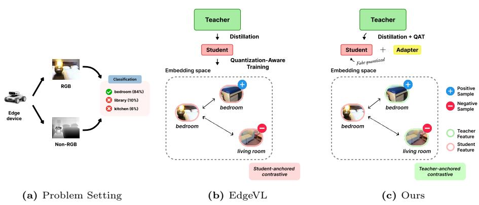
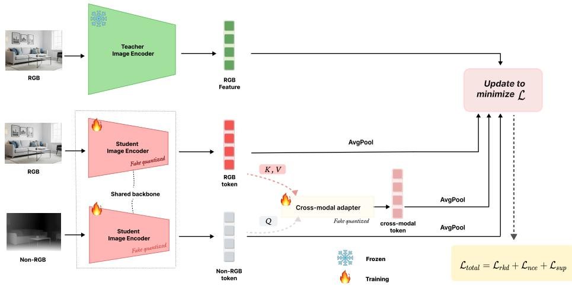
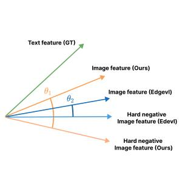
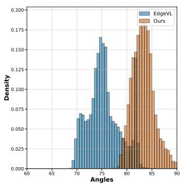
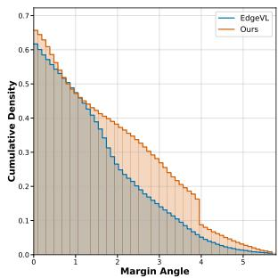

# Eficient Quantization-Aware Distillation with Cross-Modal Alignment for Edge Vision–Language Models

Jinwoo Jeon1, GyuYeop Do2, Yubin Lim2, Nam-Joon Kim2, Hyun Gon Ryu2, Hyuk-Jae Lee2, and Byung-Jun Lee1

1 Korea University

kevin04087@korea.ac.kr

2 Seoul National University

Abstract. Large-scale vision–language models (VLMs) such as CLIP enable strong open-vocabulary reasoning, yet deploying these capabilities on resource-constrained edge devices remains challenging. EdgeVL addresses this problem by distilling CLIP representations into lightweight multimodal encoders and applying quantization-aware training (QAT) for open-vocabulary classification (OVC) on edge devices. However, its two-stage optimization applies diferent objectives for distillation and QAT, and contrastive learning is performed within the quantized student space, which can result in inconsistent optimization and reduced training eficiency. Moreover, identical supervision across RGB and non-RGB modalities may lead to modality imbalance. We propose a unified framework for quantized semantic distillation tailored to edge deployment. By jointly optimizing distillation and quantization within a unified teacher-anchored framework, our method ensures consistent training under quantization, suppressing hard negatives and enlarging decision margins. Additionally, we design a lightweight cross-attention adapter that enhances non-RGB representations through RGB-guided semantic transfer, narrowing the modality gap. Experiments on EuroSAT and ScanNet demonstrate improvements in non-RGB accuracy while reducing training time.

Keywords: Edge Vision-Language Model · Distillation · Open Vocabulary Classification

## 1 Introduction

Recent advancements in large-scale vision–language models (VLMs), exemplified by CLIP [27], have significantly improved the ability to connect visual perception with semantic reasoning. While these models exhibit impressive zero-shot generalization and open-set recognition capabilities, transferring their knowledge to lightweight architectures is crucial for practical deployment on resource-limited edge platforms.

  
Fig. 1: Comparison of edge-oriented VLM adaptation frameworks. (a) An edge device collects RGB and non-RGB sensory inputs from its environment and performs open-vocabulary classification. Our goal is to adapt the edge model by distilling knowledge from a large teacher model deployed on a server. (b) Existing approaches perform knowledge distillation and quantization-aware training (QAT) in separate stages with diferent objectives. During QAT, contrastive learning is applied by optimizing the distance between positive and negative samples in the quantized student embedding space. (c) Our method unifies distillation and quantization in a single step with teacheranchored contrastive supervision. Additionally, we introduce a lightweight cross-modal adapter that enhances non-RGB representations using RGB features.

There has been growing interest in extending the capabilities of large-scale vision–language models to edge devices with limited resources. Prior work primarily focuses on improving eficiency through model compression techniques such as quantization and pruning [10, 18, 23]. While these approaches reduce computational and memory overhead, they do not address challenges posed by domain shift during real-world deployment [20,31,38]. Since human annotation is often unavailable in on-device settings, label-free adaptation is crucial for maintaining reliable performance. Furthermore, most VLMs are trained on large-scale RGB datasets, whereas edge devices frequently capture heterogeneous inputs such as depth. Enabling RGB-trained models to generalize to unseen modalities under strict computational constraints remains an open challenge. To address this practical setting, recent work has begun to explicitly consider edge-oriented vision–language model adaptation (Fig. 1a). As shown in Fig. 1b, EdgeVL [3] proposes to distill the semantic alignment learned by CLIP into a lightweight vision encoder that supports both RGB and non-RGB inputs while remaining deployment-ready. EdgeVL adopts a two-stage training paradigm: it first transfers semantic knowledge through distillation, where the same supervision signal is applied uniformly across modalities, and then performs quantization-aware training (QAT) with contrastive objectives. This shared cross-modal supervision strategy enables open-vocabulary classification on heterogeneous edge sensors under limited computational budgets.

Despite its efectiveness, EdgeVL has a fundamental limitation: the contrastive objective is applied solely within the student’s quantized embedding space. As optimization is driven by the student’s own representations, supervision becomes self-referential, refining internal feature relations without explicitly preserving alignment to the original CLIP semantic space. Under quantization noise, this self-driven training can gradually distort semantic structure, leading to insuficient suppression of semantically similar but incorrect classes.

To address this issue, we reformulate quantization from the perspective of semantic preservation. Instead of optimizing the student within its own embedding space, we anchor supervision directly to the frozen CLIP representations throughout quantization-aware training (QAT). By introducing a teacheranchored contrastive objective during QAT, we guide the student representations toward the CLIP semantic space. This supervision suppresses hard negatives and improves class separation under quantization while enabling eficient quantized training.

Cross-modal interaction between RGB and non-RGB modalities is an important direction in multimodal perception, yet it has not been explicitly explored in the EdgeVL setting. EdgeVL employs a shared backbone with identical supervision for RGB and non-RGB modalities, which improves parameter eficiency for edge deployment but treats each modality independently. In practice, RGB features are typically better aligned with CLIP semantics, and applying the same objective to both modalities can widen the modality gap and limit non-RGB performance. To address this limitation, we introduce a lightweight cross-modal adapter that enhances non-RGB representations through RGB guidance. The adapter is implemented using a cross-attention mechanism, where RGB features serve as keys and values and non-RGB features act as queries. This design selectively transfers semantically informative signals from RGB to non-RGB features, narrowing the modality gap while maintaining the eficiency required for edgelevel deployment. In summary, our contributions are threefold:

\- We unify distillation and quantization into a single stage with teacher-anchored contrastive supervision, which increases the decision margin while improving training eficiency, resulting in up to 5.3× faster training.

\- We propose a lightweight cross-modal adapter that enhances non-RGB representations through RGB-guided cross-modal interaction.

\- Our method improves both non-RGB and multimodal accuracy across the evaluated backbones on EuroSAT and ScanNet while reducing training time.

## 2 Related Work

## 2.1 Open-Vocabulary Recognition

Open-vocabulary classification aims to classify images into arbitrary categories, including those not seen during training. Vision–language models (VLMs) such as CLIP [27] and ALIGN [19] learn aligned image and text encoders using a contrastive objective that encourages corresponding image–text pairs to have higher similarity than non-matching pairs in a shared embedding space. These models have been widely adopted for open-vocabulary visual recognition tasks. Beyond image-level classification, recent works have extended this paradigm to more complex vision tasks such as object detection and segmentation. In openvocabulary segmentation, [22] generates mask proposals and learns mask embeddings aligned with CLIP’s text embedding space for mask classification. In open-vocabulary object detection, [5, 15] perform region classification by aligning bounding box features with text embeddings in the shared vision–language embedding space. EdgeVL [3] investigates open-vocabulary classification (OVC) in an edge deployment setting.

## 2.2 CLIP Distillation

Knowledge distillation (KD) transfers knowledge from a large teacher to a compact student model to improve eficiency while preserving performance [12, 37]. In vision–language models, CLIP distillation aims to transfer the semantic representations learned by CLIP into a lightweight student encoder [19,27]. Recent works explore feature-level, logit-level, and relation-level distillation strategies to better preserve the semantic structure of the teacher representations under model compression [7,34,36]. These approaches enable eficient open-vocabulary recognition while reducing computational overhead.

## 2.3 Model Compression

Model compression techniques reduce model size and computational cost for deployment on resource-constrained devices. Common strategies include pruning and quantization [10,18]. Pruning removes redundant parameters or connections in a network, reducing both memory footprint and computation while preserving predictive performance [10]. Quantization reduces numerical precision of weights and activations to improve hardware eficiency and accelerate inference [1, 18]. Quantization methods are broadly categorized into post-training quantization (PTQ) and quantization-aware training (QAT). PTQ converts a pretrained fullprecision model to low-bit representations without retraining, making it eficient for deployment but often susceptible to accuracy degradation under aggressive quantization [1]. In contrast, QAT incorporates quantization efects during training so that the model learns to compensate for quantization errors, typically achieving higher accuracy under low-bit settings [6, 18].

## 3 Method

## 3.1 Problem Formulation

We study annotation-free adaptation of an open-vocabulary vision model to heterogeneous edge sensors. An overview of the proposed framework is shown in Fig. 2. In practical deployments, multiple co-located sensors capture synchronized observations of the same scene, while semantic labels are unavailable.

  
Fig. 2: Overview of our method. A frozen CLIP encoder provides semantic supervision for a quantized student with a shared backbone supporting RGB and non-RGB inputs. RGB features are directly distilled toward the teacher embedding, while non-RGB features are enhanced through a cross-modal attention module using non-RGB queries and RGB keys and values. The student is trained with teacher-anchored contrastive learning and an RKD loss to preserve geometric structure in the embedding space. The student encoder and adapter are jointly optimized with quantization-aware training for eficient edge deployment, while the teacher remains frozen.

Unlabeled Synchronized Multi-Modal Data and Training. Let $\mathcal { U } = \{ ( \mathbf { x } _ { i } ^ { r } , \mathbf { x } _ { i } ^ { r ^ { \prime } } ) \} _ { i = 1 } ^ { M }$ denote an unlabeled adaptation set of synchronized sensor pairs, where $\mathbf { x } _ { i } ^ { r }$ is an RGB observation and $\mathbf { x } _ { i } ^ { r ^ { \prime } }$ is a corresponding heterogeneous observation $( \mathrm { e . g . }$ depth or thermal) captured from the same scene. We assume access to a frozen teacher VLM image encoder $E _ { 0 }$ (e.g., CLIP), which defines a semantic embedding space in $\mathbb { R } ^ { D }$ . Our objective is to learn an edge-eficient student image encoder $E _ { \theta }$ that supports heterogeneous modalities while remaining aligned with the teacher semantic space. During training, we leverage pseudo-labels predicted by the teacher model such as CLIP to distill semantic knowledge into the student encoder. The goal is to preserve the teacher’s open-vocabulary capabilities while adapting the student to heterogeneous inputs and enabling transfer across datasets.

Open-Vocabulary Inference. Given a class vocabulary C and the frozen text encoder T from the teacher VLM, we compute normalized text embeddings for all $c \in { \mathcal { C } }$ . For single-modality inference with a test input $\mathbf { x } _ { i } ^ { m }$ , where $m \in \{ r , r ^ { \prime } \}$ 2 prediction is performed via cosine similarity:

$$
\hat { y } _ { i } ^ { m } = \arg \operatorname* { m a x } _ { c \in \mathcal { C } } \left. \frac { E _ { \theta } ( \mathbf { x } _ { i } ^ { m } ) } { \| E _ { \theta } ( \mathbf { x } _ { i } ^ { m } ) \| _ { 2 } } , \frac { T ( c ) } { \| T ( c ) \| _ { 2 } } \right. .
$$

  
(a) margin angle

  
(b) hard negative angle

  
(c) cumulative density  
Fig. 3: Decision margin visualization. (a) Decision margin angle between the image embedding and the hardest negative class. Our method preserves alignment with the ground-truth text embedding while increasing angular separation from hard negatives. (b) Compared to ${ \mathrm { E d g e V L } } ,$ our model yields a larger angle between the ground-truth text embedding and the hardest negative class, resulting in a wider decision margin. (c) Cumulative density whose margin angle exceeds a given threshold. Our method retains more samples at larger margins, indicating improved separation from hard negatives.

## 3.2 End-to-End Quantization-Aware Distillation

EdgeVL [3] adopts a two-stage pipeline consisting of full-precision distillation followed by QAT with a triplet-based objective. However, the triplet loss is optimized solely within the quantized student embedding space using self-mined positives and negatives, which can deviate from the global CLIP geometry under quantization noise. As a result, semantically similar but incorrect classes may remain insuficiently separated. In contrast, we integrate contrastive supervision directly into the distillation stage and anchor student representations to the frozen teacher space. By aligning student embeddings with the original CLIP representations, our teacher-anchored objective preserves global semantic consistency and suppresses hard negative confusion under quantization (see Fig. 3).

Relational Knowledge Distillation (RKD). QAT can distort the geometry of the embedding space due to quantization noise. To preserve the global relational structure of the teacher representations under such perturbations, we first employ relational knowledge distillation (RKD) [26], which transfers pairwise and angular relations between samples from the teacher to the student. Given a minibatch $\{ \mathbf { x } _ { i } \} _ { i = 1 } ^ { B }$ (where each $\mathbf { x } _ { i }$ can be either $\mathbf { x } _ { i } ^ { r }$ or $\mathbf { x } _ { i } ^ { r ^ { \prime } }$ depending on the training stream), we define normalized student and teacher embeddings:

$$
\mathbf { s } _ { i } = \frac { E _ { \theta } ( \mathbf { x } _ { i } ) } { \Vert E _ { \theta } ( \mathbf { x } _ { i } ) \Vert _ { 2 } } , \qquad \mathbf { t } _ { i } = \frac { E _ { 0 } ( \mathbf { x } _ { i } ) } { \Vert E _ { 0 } ( \mathbf { x } _ { i } ) \Vert _ { 2 } } .
$$

Following [26], RKD aligns distance- and angle-wise relations:

$$
{ \mathcal { L } } _ { \mathrm { r k d - D } } = \sum _ { i < j } l _ { \delta } { \big ( } \| \mathbf { s } _ { i } - \mathbf { s } _ { j } \| _ { 2 } , \| \mathbf { t } _ { i } - \mathbf { t } _ { j } \| _ { 2 } { \big ) } ,
$$

$$
\mathcal { L } _ { \mathrm { r k d - A } } = \sum _ { i < j < k } l _ { \delta } ( \cos \angle ( { \bf s } _ { i } , { \bf s } _ { j } , { \bf s } _ { k } ) , \cos \angle ( { \bf t } _ { i } , { \bf t } _ { j } , { \bf t } _ { k } ) ) ,
$$

where

$$
\cos \angle ( { \bf s } _ { i } , { \bf s } _ { j } , { \bf s } _ { k } ) = \bigg \langle \frac { { \bf s } _ { j } - { \bf s } _ { i } } { \| { \bf s } _ { j } - { \bf s } _ { i } \| _ { 2 } } , ~ \frac { { \bf s } _ { k } - { \bf s } _ { i } } { \| { \bf s } _ { k } - { \bf s } _ { i } \| _ { 2 } } \bigg \rangle
$$

denotes the cosine of the angle at vertex $\mathbf { s } _ { i }$ formed by the triplet $\left( \mathbf { s } _ { i } , \mathbf { s } _ { j } , \mathbf { s } _ { k } \right)$ ， and analogously for cos $\angle ( \mathbf { t } _ { i } , \mathbf { t } _ { j } , \mathbf { t } _ { k } )$ , and $l _ { \delta }$ denotes the Huber loss [16]. RKD is defined as follows:

$$
\begin{array} { r } { \mathcal { L } _ { \mathrm { r k d } } = \mathcal { L } _ { \mathrm { r k d - D } } + \lambda \mathcal { L } _ { \mathrm { r k d - A } } . } \end{array}
$$

Teacher-Anchored Contrastive Objectives. While RKD helps preserve the relational geometry of the teacher space, it does not explicitly enforce instance-toteacher consistency. To stabilize semantic grounding under quantization, we incorporate teacher-anchored contrastive supervision that directly ties each quantized student embedding to its corresponding frozen teacher embedding. Specifically, we adopt a symmetric InfoNCE objective [27] between normalized student and teacher embeddings:

$$
\mathcal { L } _ { \mathrm { n c e } } = - \frac { 1 } { 2 B } \sum _ { i = 1 } ^ { B } \left[ \log \frac { \exp ( \mathbf { s } _ { i } ^ { \top } \mathbf { t } _ { i } ) } { \sum _ { j = 1 } ^ { B } \exp ( \mathbf { s } _ { i } ^ { \top } \mathbf { t } _ { j } ) } + \log \frac { \exp ( \mathbf { t } _ { i } ^ { \top } \mathbf { s } _ { i } ) } { \sum _ { j = 1 } ^ { B } \exp ( \mathbf { t } _ { i } ^ { \top } \mathbf { s } _ { j } ) } \right] .
$$

In contrast to self-referential contrastive learning performed purely within the student space [3], our formulation uses frozen teacher embeddings as immutable anchors, thereby explicitly suppressing representation drift caused by quantization noise. Low-confidence teacher predictions can introduce noisy pseudo-labels into class-aware supervision. We therefore retain training samples whose teacher confidence exceeds a threshold $\tau$ to reduce ambiguous pseudo-labels.

The instance-wise objective treats other samples as negatives even when they share the same pseudo-label. It therefore does not explicitly preserve categorylevel structure and can push same-class samples apart in the student space. To inject structured semantic knowledge from the teacher, we further incorporate a supervised contrastive objective built upon CLIP-derived pseudo-labels $\tilde { y } _ { i }$ Define the positive set

$$
\begin{array} { r } { \mathcal { P } ( i ) = \{ j \neq i | \tilde { y } _ { j } = \tilde { y } _ { i } \} . } \end{array}
$$

We minimize

$$
\mathcal { L } _ { \mathrm { s u p } } = - \frac { 1 } { B } \sum _ { i = 1 } ^ { B } \frac { 1 } { | \mathcal { P } ( i ) | } \sum _ { j \in \mathcal { P } ( i ) } \log \frac { \exp ( \mathbf { s } _ { i } ^ { \top } \mathbf { t } _ { j } ) } { \sum _ { k : k \notin \mathcal { P } ( i ) } \exp ( \mathbf { s } _ { i } ^ { \top } \mathbf { t } _ { k } ) } .
$$

This class-aware term promotes intra-class compactness and enlarges inter-class angular margins with respect to teacher semantics, complementing the instancelevel anchoring efect of $\mathcal { L } _ { \mathrm { n c e } }$

Distillation Objective. We train the student encoder by minimizing the combined teacher-anchored objective evaluated on its normalized embeddings s:

$$
\begin{array} { r } { \mathcal { L } _ { \mathrm { D i s t i l l } } ( \mathbf { s } ) = \mathcal { L } _ { \mathrm { r k d } } ( \mathbf { s } ) + \mathcal { L } _ { \mathrm { n c e } } ( \mathbf { s } ) + \mathcal { L } _ { \mathrm { s u p } } ( \mathbf { s } ) . } \end{array}
$$

Cross-Modal Attention Adapter. EdgeVL adopts a shared backbone with identical supervision for RGB and non-RGB modalities, but does not explicitly model cross-modal interaction. Since RGB features are typically better aligned with the teacher semantic space, applying the same supervision to both modalities can bias optimization toward RGB-dominant representations, limiting the semantic quality of non-RGB features. To address this limitation, we introduce a lightweight cross-modal adapter based on multi-head attention [33]. The adapter enhances non-RGB representations by allowing non-RGB tokens to attend to semantically richer RGB tokens. Given paired RGB and non-RGB inputs $\bigl ( \mathbf { x } _ { i } ^ { r } , \mathbf { x } _ { i } ^ { r ^ { \prime } } \bigr )$ ), the student backbone produces token embeddings

$$
\mathbf { Z } _ { i } ^ { r } , \mathbf { Z } _ { i } ^ { r ^ { \prime } } \in \mathbb { R } ^ { L \times D } ,
$$

where L denotes the number of output tokens and D is the token embedding dimension. Modality-specific pooled embeddings are obtained as

$$
\mathbf { s } _ { i } ^ { r } = \frac { \mathrm { P o o l } ( \mathbf { Z } _ { i } ^ { r } ) } { \| \mathrm { P o o l } ( \mathbf { Z } _ { i } ^ { r } ) \| _ { 2 } } , \qquad \mathbf { s } _ { i } ^ { r ^ { \prime } } = \frac { \mathrm { P o o l } ( \mathbf { Z } _ { i } ^ { r ^ { \prime } } ) } { \| \mathrm { P o o l } ( \mathbf { Z } _ { i } ^ { r ^ { \prime } } ) \| _ { 2 } } .
$$

To enhance the non-RGB representation, we apply cross-attention using non-RGB tokens as queries and RGB tokens as keys and values. For simplicity, we omit the sample index i below:

$$
\mathbf { Q } = \mathbf { Z } ^ { r ^ { \prime } } \mathbf { W } _ { Q } , \quad \mathbf { K } = \mathbf { Z } ^ { r } \mathbf { W } _ { K } , \quad \mathbf { V } = \mathbf { Z } ^ { r } \mathbf { W } _ { V } ,
$$

where $\mathbf { W } _ { Q } , \mathbf { W } _ { K } , \mathbf { W } _ { V } , \mathbf { W } _ { O } \in \mathbb { R } ^ { D \times D }$ are learnable projection matrices. The enhanced non-RGB tokens are computed as

$$
\mathbf { A } _ { h } = \mathrm { s o f t m a x } \left( \frac { \mathbf { Q } _ { h } \mathbf { K } _ { h } ^ { \top } } { \sqrt { D _ { h } } } \right) \mathbf { V } _ { h } .
$$

$$
\mathbf { U } ^ { r ^ { \prime } } = \mathrm { C o n c a t } ( \mathbf { A } _ { 1 } , \ldots , \mathbf { A } _ { H } ) \mathbf { W } _ { O } ,
$$

where H is the number of attention heads and $D _ { h } = D / H$ is the dimension of each head. The residual connection defines the adapted tokens as

$$
\begin{array} { r } { \tilde { \mathbf { Z } } _ { i } ^ { r ^ { \prime } } = \mathbf { Z } _ { i } ^ { r ^ { \prime } } + \mathbf { U } _ { i } ^ { r ^ { \prime } } . } \end{array}
$$

The final enhanced non-RGB embedding is then obtained by pooling these adapted tokens:

$$
\tilde { \mathbf { s } } _ { i } ^ { r ^ { \prime } } = \frac { \mathrm { P o o l } ( \tilde { \mathbf { Z } } _ { i } ^ { r ^ { \prime } } ) } { \lVert \mathrm { P o o l } ( \tilde { \mathbf { Z } } _ { i } ^ { r ^ { \prime } } ) \rVert _ { 2 } } .
$$

To preserve eficiency for edge deployment, the adapter uses only a single crossattention layer with a residual connection.

Final Training Objective with the Adapter. We apply the same teacher-anchored distillation objective to the normalized embeddings of RGB, non-RGB, and cross-modal features.

$$
\mathcal { L } _ { \mathrm { t o t a l } } = \mathcal { L } _ { \mathrm { D i s t i l l } } ( \mathbf { s } ^ { r } ) + \mathcal { L } _ { \mathrm { D i s t i l l } } ( \mathbf { s } ^ { r ^ { \prime } } ) + \mathcal { L } _ { \mathrm { D i s t i l l } } ( \tilde { \mathbf { s } } ^ { r ^ { \prime } } ) .
$$

Table 1: Overall accuracy comparison. Non-RGB and RGB indicate the top-1 accuracy for non-RGB and RGB inputs, respectively, and Avg denotes their average, all reported as percentages. The same notation applies to the subsequent tables. For each backbone, results that improve over EdgeVL are highlighted in bold.
<table><tr><td rowspan="2">Methods</td><td rowspan="2">Bits</td><td colspan="3">ScanNet (%) ↑</td><td colspan="3">EuroSAT (%) ↑</td></tr><tr><td>Non-RGB RGB</td><td></td><td>Avg</td><td>Non-RGB</td><td>RGB</td><td> $\operatorname { A v g }$ </td></tr><tr><td>Pretrained CLIP-B [27] Pretrained CLIP-G [27]</td><td>F32 F32</td><td>4.5 6.2</td><td>36.2 47.3</td><td>20.4 26.8</td><td>16.8 16.9</td><td>40.4 54.0</td><td>28.6 35.5</td></tr><tr><td>Frank [8] Gupta [13] CMKD [14] (non-RGB)</td><td>F32</td><td>8.3</td><td>21.7</td><td>15.0</td><td>49.2</td><td>37.9</td><td>43.5</td></tr><tr><td rowspan="4">CMKD [14] (RGB) Fida [32]</td><td>F32</td><td>16.0</td><td>17.5</td><td>16.8</td><td>54.2</td><td>42.4</td><td>48.3</td></tr><tr><td>F32</td><td>37.8</td><td>11.5</td><td>24.6</td><td>61.2</td><td>34.4</td><td>47.8</td></tr><tr><td>F32</td><td>4.0</td><td>42.5</td><td>23.2</td><td>20.1</td><td>62.4</td><td>41.2</td></tr><tr><td>F32</td><td>38.9</td><td>5.8</td><td>22.3</td><td>56.7</td><td>20.3</td><td>38.5</td></tr><tr><td rowspan="3">CQD [30] SKD [35] EdgeVL (DAT-T) [3]</td><td>F32 F32</td><td>40.1</td><td>6.7</td><td>23.4</td><td>62.4</td><td>36.4</td><td>49.4</td></tr><tr><td></td><td>31.2</td><td>37.8</td><td>34.5</td><td>22.9</td><td>50.3</td><td>36.6</td></tr><tr><td>Int8 Int8</td><td>47.9</td><td>52.0</td><td>49.9</td><td>61.0</td><td>65.7</td><td>63.3</td></tr><tr><td rowspan="3">EdgeVL (Swin-T) [3] EdgeVL (ViT-S) [3] Ours (DAT-T)</td><td>Int8</td><td>46.0 42.0</td><td>48.7</td><td>47.4</td><td>61.3</td><td>67.1</td><td>64.2</td></tr><tr><td></td><td></td><td>47.5</td><td>44.7</td><td>62.9</td><td>66.8</td><td>64.8</td></tr><tr><td>Int8</td><td>49.0</td><td>52.2</td><td>50.6</td><td>65.7</td><td>67.9</td><td>66.8</td></tr><tr><td>Ours (Swin-T)</td><td>Int8</td><td>47.2</td><td>50.4</td><td>48.8</td><td>65.0</td><td>66.7</td><td>65.9</td></tr><tr><td>Ours (ViT-S)</td><td>Int8</td><td>46.9</td><td>51.3</td><td>49.1</td><td>64.7</td><td>69.1</td><td>66.9</td></tr></table>

## 4 Experiments

## 4.1 Settings

Implementation Details We adopt the CLIP ViT-g-14 (ViT-G) model released by OpenCLIP [17] as the teacher network. For the student architecture, we employ ViT-S [21], DAT-T [9], and Swin-T [24] as shared backbone networks, following the setting of [3]. During training, the student models are optimized using AdamW [25] with an initial learning rate of $2 \times 1 0 ^ { - 4 }$ and a weight decay of 0.05. A cosine annealing schedule gradually decreases the learning rate to $5 \times 1 0 ^ { - 6 }$ over 30 epochs. For the confidence threshold τ , we empirically set it to 0.25 to balance data utilization and label noise, following [3]. For the CLIP text encoder, we use prompt templates of the form “a photo of a {scene category}.” or “a satellite image of a {scene category}.” to generate text embeddings. To enable cross-modal interaction, we introduce a lightweight cross-modal attention adapter implemented as a single-layer multi-head attention module. Although this module enables explicit fusion between RGB and non-RGB features, it adds 9 MB after quantization, equivalent to approximately 16% of the reported 56 MB Swin-T backbone size.

Dataset We conduct experiments on two benchmarks, EuroSAT [11] and Scan-Net [4]. Following [3], we apply a subsampling factor of 100 on ScanNet to reduce redundancy, resulting in 18,900 training, 5,300 validation, and 2,100 test RGB-

Table 2: Multimodal accuracy comparison between EdgeVL and Ours.
<table><tr><td>Methods</td><td>Bits</td><td>ScanNet (%) ↑ EuroSAT (%) ↑</td></tr><tr><td>EdgeVL (DAT-T) [3]</td><td>Int8</td><td>51.1 65.5</td></tr><tr><td>EdgeVL (Swin-T) [3]</td><td>Int8</td><td>49.4 66.8</td></tr><tr><td>EdgeVL (ViT-S) [3]</td><td>Int8</td><td>46.4 66.9</td></tr><tr><td>Ours (DAT-T)</td><td>Int8</td><td>51.6 71.4</td></tr><tr><td>Ours (Swin-T)</td><td>Int8</td><td>50.7 72.0</td></tr><tr><td>Ours (ViT-S)</td><td>Int8</td><td>51.0 70.8</td></tr></table>

Table 3: Overall eficiency comparison in terms of training time and throughput.
<table><tr><td rowspan=1 colspan=1>Methods</td><td rowspan=1 colspan=1>Bits</td><td rowspan=1 colspan=1>Training Time ↓</td><td rowspan=1 colspan=1>Throughput ↑</td></tr><tr><td rowspan=1 colspan=1>EdgeVL (ViT-S)</td><td rowspan=1 colspan=1>Int8</td><td rowspan=2 colspan=1>12 hours12 hours</td><td rowspan=2 colspan=1>461 images/s415 images/s</td></tr><tr><td rowspan=1 colspan=1>EdgeVL (Swin-T)</td><td rowspan=1 colspan=1>Int8</td></tr><tr><td rowspan=1 colspan=1>Ours (ViT-S)</td><td rowspan=2 colspan=1>Int8Int8</td><td rowspan=2 colspan=1>2.25 hours (↓81%)2.25 hours (↓ 81%)</td><td rowspan=2 colspan=1>351 images/s (↓ 23.9%)359 images/s (↓ 13.5%)</td></tr><tr><td rowspan=1 colspan=1>Ours (Swin-T)</td></tr></table>

D images across 21 indoor scene categories. Since the oficial test split does not provide labels, evaluation is conducted on the validation set. EuroSAT contains 27,000 satellite images across 13 spectral bands and 10 land-use classes, which we randomly split into 13,500 training and 13,500 testing samples.

Baselines We adapt several related methods for comparison, including EdgeVL [3] as a strong baseline. CMKD [14], Fida [32], and CQD [30] are modified to align non-RGB representations with those of a pre-trained RGB model and the CLIP visual encoder. SKD [35] is adapted for joint RGB and non-RGB training via hybrid mixup, while approaches inspired by Frank and Gupta [8,13] are considered for cross-modal transfer and unified embedding alignment. Following the original EdgeVL setting, we evaluate both EdgeVL and our method under 8-bit quantization for fair comparison.

Evaluation Metric We use top-1 accuracy as the evaluation metric. For both RGB and non-RGB evaluation, performance is measured using the modalityspecific features extracted from the shared backbone. The reported Avg score denotes the arithmetic mean of the RGB and non-RGB accuracies. In addition, we report multimodal accuracy to assess the efectiveness of feature fusion when both RGB and non-RGB inputs are available. This metric reflects performance under joint modality inference. For our method, multimodal performance is computed from the fused representation obtained via cross-attention, where non-RGB features serve as queries and RGB features act as keys and values. In contrast, since EdgeVL does not employ an explicit cross-attention mechanism, its multimodal representation is formed by simply averaging the RGB and non-RGB features extracted from the shared backbone. All other baselines are reported in full precision (FP32) using their best-performing backbones. In the main results, we report performance under the configuration that achieves the best non-RGB performance. For the cross-modal setting, results are reported using the configuration that yields the highest cross-modal performance.

Table 4: Accuracy on unseen datasets after training on ScanNet. For each backbone, results that improve over EdgeVL are highlighted in bold.
<table><tr><td rowspan="2">Methods</td><td rowspan="2">Bits</td><td colspan="2">NYUv2 (%)</td><td colspan="2">SUN-RGBD (%)</td></tr><tr><td>Non-RGB RGB</td><td>Avg</td><td>Non-RGB</td><td>RGB Avg</td></tr><tr><td>Pre-trained CLIP-G Pre-trained CLIP-B</td><td>F32 F32</td><td>25.7 22.6</td><td>69.7 47.7 62.2 42.4</td><td>18.0 15.2</td><td>54.3 36.2 47.2 31.2</td></tr><tr><td>EdgeVL (DAT-T)</td><td>Int8</td><td>51.1</td><td>54.3 52.7</td><td>28.6</td><td>31.8 30.2</td></tr><tr><td>EdgeVL (Swin-T)</td><td>Int8</td><td>43.4</td><td>43.3 43.4</td><td>30.0</td><td>31.4 30.7</td></tr><tr><td>EdgeVL (ViT-S)</td><td>Int8</td><td>41.0</td><td>40.5 40.8</td><td>25.8</td><td>28.0 27.0</td></tr><tr><td>Ours (DAT-T)</td><td>Int8</td><td>53.8</td><td>57.7 55.8</td><td>29.2</td><td>34.4 31.7</td></tr><tr><td>Ours (Swin-T)</td><td>Int8</td><td>47.9</td><td>43.1 45.5</td><td>24.8</td><td>30.0 27.4</td></tr><tr><td>Ours (ViT-S)</td><td>Int8</td><td>49.5</td><td>54.9 52.2</td><td>27.4</td><td>34.3 30.9</td></tr></table>

Table 5: Cross-dataset multimodal accuracy comparison between EdgeVL and our method.
<table><tr><td>Methods</td><td>Bits</td><td>NYUv2 (%) ↑</td><td>SUN-RGBD (%) ↑</td></tr><tr><td>EdgeVL (DAT-T) [3]</td><td>Int8</td><td>56.3</td><td>31.6</td></tr><tr><td>EdgeVL (Swin-T) [3]</td><td>Int8</td><td>54.3</td><td>34.6</td></tr><tr><td>EdgeVL (ViT-S) [3]</td><td>Int8</td><td>53.9</td><td>31.2</td></tr><tr><td>Ours (DAT-T)</td><td>Int8</td><td>57.7</td><td>34.3</td></tr><tr><td>Ours (Swin-T)</td><td>Int8</td><td>52.5</td><td>30.0</td></tr><tr><td>Ours (ViT-S)</td><td>Int8</td><td>56.6</td><td>35.0</td></tr></table>

## 4.2 Results

Main Result As shown in Tab. 1, under the same shared-backbone setting, our model improves non-RGB accuracy across all reported backbones on both datasets. RGB accuracy also improves in most cases, with a small decrease for Swin-T on EuroSAT (67.1% to 66.7%). On EuroSAT, we observe up to a 4.7 percentage point gain in non-RGB performance, while on ScanNet the improvement reaches 4.9 percentage points. In Tab. 2, we further compare multimodal accuracy on EuroSAT and ScanNet. The results show consistent improvements across datasets and backbone architectures, indicating that the proposed crossmodal adapter efectively facilitates cross-modal alignment.

Eficiency To evaluate eficiency, we measure both training time and inference throughput. For inference eficiency, throughput is measured after converting the trained model from ONNX to TensorRT. As shown in Tab. 3, our method significantly improves training eficiency, reducing the total training time by 81%, corresponding to a 5.3× speedup compared to the baseline. For inference eficiency, we additionally measure throughput when the cross-modal attention module is enabled. Although the proposed adapter introduces additional computation, throughput decreases from 461 to 351 images/s for ViT-S (23.9%) and from 415 to 359 images/s for Swin-T (13.5%). These results quantify the inference-throughput trade-of associated with the proposed method.

## 4.3 Cross-Dataset Generalization

To evaluate cross-dataset generalization, we train the model on ScanNet and test on NYUv2 [28] and SUN-RGBD [29]. SUN-RGBD contains 5,285 training and 5,050 testing RGB-D images annotated with 19 scene categories, collected from multiple RGB-D cameras. NYUv2 consists of 795 training and 654 testing images across 10 scene classes captured using a Kinect sensor. As shown in Tab. 4, our method consistently improves performance for both ViT-S and DAT-T backbones, indicating strong cross-dataset generalization. A similar trend is observed in multimodal accuracy for these two backbones (Tab. 5). However, Swin-T shows lower non-RGB and RGB accuracy on SUN-RGBD and lower multimodal accuracy on both unseen datasets than EdgeVL, indicating that the generalization gains are backbone-dependent.

## 4.4 Ablation Study

Ablation on Loss Components We conduct ablation studies on ScanNet [4] using a shared backbone ViT-S [2] to analyze the contribution of each loss component. Starting from a baseline loss, we progressively add additional objectives and evaluate the resulting classification accuracy. As shown in Tab. 6, using only RKD during QAT leads to poor performance, suggesting that preserving relational structure alone is insuficient to maintain semantic alignment under quantization. Adding InfoNCE significantly improves performance by enforcing instance-level alignment and enlarging the margin between positive and hard negative samples. However, instance-level contrastive learning alone is insuficient for complex indoor scenes such as ScanNet. Adding the pseudo-label-based supervised contrastive term yields the highest RGB and non-RGB accuracy among the evaluated loss configurations.

Robustness under Low-bit Quantization. To evaluate robustness under more aggressive quantization, we further reduce the precision to 6-bit and 4-bit on EuroSAT. Performance remains nearly unchanged at 6-bit, indicating robustness to moderate quantization. At 4-bit, accuracy decreases due to the limited numerical resolution (16 quantization levels), which can introduce larger distortions in cosine similarity computations. Despite this, the model still maintains over 50% non-RGB accuracy, demonstrating reasonable performance even under aggressive quantization.

Table 6: Efect of adding loss components  
Table 7: Robustness under lower bit-width.
<table><tr><td>Loss Terms</td><td>RGB</td><td>Non-RGB</td></tr><tr><td> $\mathcal { L } _ { \mathrm { r k d } }$ </td><td>3.8</td><td>5.1</td></tr><tr><td> $\mathcal { L } _ { \mathrm { r k d } } + \mathcal { L } _ { \mathrm { n c e } }$ </td><td>47.4</td><td>43.9</td></tr><tr><td> $\mathcal { L } _ { \mathrm { r k d } } + \mathcal { L } _ { \mathrm { n c e } } + \mathcal { L } _ { \mathrm { s u p } }$  (full)</td><td>50.4</td><td>47.2</td></tr></table>

<table><tr><td>Bits</td><td>RGB</td><td>Non-RGB</td></tr><tr><td>Int8</td><td>67.9</td><td>65.7</td></tr><tr><td>Int6</td><td>68.6</td><td>65.3</td></tr><tr><td>Int4</td><td>56.3</td><td>50.8</td></tr></table>

Table 8: Efect of the proposed cross-modal adapter.
<table><tr><td>Methods</td><td>RGB (%) ↑</td><td>Non-RGB (%) ↑</td></tr><tr><td>Ours (DAT-T)</td><td>71.4</td><td>71.4</td></tr><tr><td>Ours w/o Adapter (DAT-T)</td><td>69.2</td><td>69.2</td></tr><tr><td>Ours (Swin-T)</td><td>72.0</td><td>72.0</td></tr><tr><td>Ours w/o Adapter (Swin-T)</td><td>70.7</td><td>70.7</td></tr><tr><td>Ours (ViT-S)</td><td>70.8</td><td>70.8</td></tr><tr><td>Ours w/o Adapter (ViT-S)</td><td>69.5</td><td>69.5</td></tr></table>

Impact of the Cross-Modal Adapter To evaluate the efectiveness of the proposed cross-modal adapter, we remove both the adapter module and the cross-modal supervision, leaving only the shared backbone. In this configuration, RGB and non-RGB inputs are processed independently without explicit crossmodal interaction. The multimodal prediction is obtained by averaging the RGB and non-RGB feature representations. On EuroSAT, the reported accuracy gains over the configuration without the adapter range from 1.3 to 2.2 percentage points (Tab. 8). Because this ablation removes both the adapter and cross-modal supervision, it measures their combined contribution rather than isolating the efect of the adapter architecture.

## 5 Conclusion

We propose a unified quantization-aware distillation framework for edge VLMs that preserves CLIP semantics under low-bit training via teacher-anchored contrastive supervision. By anchoring quantized student embeddings to the frozen teacher space, the method suppresses hard negatives and enlarges angular margins, mitigating semantic drift caused by quantization. We further introduce a lightweight cross-modal attention adapter that transfers semantic cues from RGB to non-RGB features in shared-backbone settings. Experiments on EuroSAT and ScanNet demonstrate improvements in non-RGB and multimodal accuracy across the evaluated backbones.

## References

1. Banner, R., Nahshan, Y., Soudry, D.: Post training 4-bit quantization of convolutional networks for rapid-deployment. Advances in neural information processing systems 32 (2019)

2. Cai, H., Li, J., Hu, M., Gan, C., Han, S.: Eficientvit: Multi-Scale Linear Attention for High-Resolution Dense Prediction. arXiv (2022)

3. Cai, K., Duan, Z., Liu, G., Fleming, C., Lu, C.X.: Self-adapting large visuallanguage models to edge devices across visual modalities. In: European Conference on Computer Vision. pp. 301–318. Springer (2024)

4. Dai, A., Chang, A.X., Savva, M., Halber, M., Funkhouser, T., Nießner, M.: Scannet: Richly-annotated 3d Reconstructions of Indoor Scenes. arXiv (2017)

5. Du, P., Wang, Y., Sun, Y., Wang, L., Liao, Y., Zhang, G., Ding, E., Wang, Y., Wang, J., Liu, S.: Lami-detr: Open-vocabulary detection with language model instruction. In: European Conference on Computer Vision. pp. 312–328. Springer (2024)

6. Esser, S.K., McKinstry, J.L., Bablani, D., Appuswamy, R., Modha, D.S.: Learned step size quantization. arXiv preprint arXiv:1902.08153 (2019)

7. Gou, J., Yu, B., Maybank, S.J., Tao, D.: Knowledge distillation: A survey. International journal of computer vision 129(6), 1789–1819 (2021)

8. Hafner, F.M., Bhuyian, A., Kooij, J.F., Granger, E.: Cross-modal distillation for RGB-depth person re-identification. Computer Vision and Image Understanding 216, 103352 (2022)

9. Han, J., Pei, J., Tong, H.: Data mining: concepts and techniques. Morgan kaufmann (2022)

10. Han, S., Mao, H., Dally, W.J.: Deep compression: Compressing deep neural networks with pruning, trained quantization and hufman coding. arXiv preprint arXiv:1510.00149 (2015)

11. Helber, P., Bischke, B., Dengel, A., Borth, D.: Eurosat: A Novel Dataset and Deep Learning Benchmark for Land Use and Land Cover Classification. IEEE Journal of Selected Topics in Applied Earth Observations and Remote Sensing 12(7), 2217– 2226 (2018)

12. Hinton, G., Vinyals, O., Dean, J.: Distilling the Knowledge in a Neural Network. arXiv (2015)

13. Hofman, J., Gupta, S., Leong, J., Guadarrama, S., Darrell, T.: Cross-modal adaptation for RGB-D detection. In: 2016 IEEE International Conference on Robotics and Automation (ICRA). pp. 5032–5039. IEEE (2016)

14. Hong, Y., Dai, H., Ding, Y.: Cross-Modality Knowledge Distillation Network for Monocular 3d Object Detection. In: European Conference on Computer Vision (ECCV) (2022)

15. Huang, J., Zhang, J., Jiang, K., Lu, S.: Open-vocabulary object detection via language hierarchy. arXiv preprint arXiv:2410.20371 (2024)

16. Huber, P.J.: Robust estimation of a location parameter. In: Breakthroughs in statistics: Methodology and distribution, pp. 492–518. Springer (1992)

17. Ilharco, G., Wortsman, M., Wightman, R., Gordon, C., Carlini, N., Taori, R., Dave, A., Shankar, V., Namkoong, H., Miller, J., Hajishirzi, H., Farhadi, A., Schmidt, L.: Openclip (Jul 2021). https://doi.org/10.5281/zenodo.5143773, https://doi. org/10.5281/zenodo.5143773

18. Jacob, B., Kligys, S., Chen, B., Zhu, M., Tang, M., Howard, A., Adam, H., Kalenichenko, D.: Quantization and Training of Neural Networks for Eficient

Integer-Arithmetic-Only Inference. In: 2018 IEEE/CVF Conference on Computer Vision and Pattern Recognition. pp. 2704–2713. IEEE (2018)

19. Jia, C., Yang, Y., Xia, Y., Chen, Y.T., Parekh, Z., Pham, H., Le, Q.V., Sung, Y.H., Li, Z., Duerig, T.: Scaling Up Visual and Vision-Language Representation Learning With Noisy Text Supervision. In: International Conference on Machine Learning (ICML). pp. 4904–4916 (2021)

20. Koh, P.W., Sagawa, S., Marklund, H., Xie, S.M., Zhang, M., Balsubramani, A., Hu, W., Yasunaga, M., Phillips, R.L., Gao, I., et al.: Wilds: A benchmark of inthe-wild distribution shifts. In: International conference on machine learning. pp. 5637–5664. PMLR (2021)

21. Li, Y., Xu, S., Zhang, B., Cao, X., Gao, P., Guo, G.: Q-ViT: Accurate and Fully Quantized Low-bit Vision Transformer. In: Conference on Neural Information Processing Systems (NeurIPS). vol. 35, pp. 34451–34463 (2022)

22. Liang, F., Wu, B., Dai, X., Li, K., Zhao, Y., Zhang, H., Zhang, P., Vajda, P., Marculescu, D.: Open-vocabulary semantic segmentation with mask-adapted clip. In: Proceedings of the IEEE/CVF conference on computer vision and pattern recognition. pp. 7061–7070 (2023)

23. Liu, J., Niu, L., Yuan, Z., Yang, D., Wang, X., Liu, W.: Pd-Quant: Post-Training Quantization Based on Prediction Diference Metric. In: IEEE/CVF Conference on Computer Vision and Pattern Recognition (CVPR) (2023)

24. Liu, Z., Lin, Y., Cao, Y., Hu, H., Wei, Y., Zhang, Z., Lin, S., Guo, B.: Swin Transformer: Hierarchical Vision Transformer using Shifted Windows. arXiv (2021)

25. Loshchilov, I., Hutter, F., et al.: Fixing weight decay regularization in adam. arXiv preprint arXiv:1711.05101 5(5), 5 (2017)

26. Park, W., Kim, D., Lu, Y., Cho, M.: Relational knowledge distillation. In: Proceedings of the IEEE/CVF conference on computer vision and pattern recognition. pp. 3967–3976 (2019)

27. Radford, A., Kim, J.W., Hallacy, C., Ramesh, A., Goh, G., Agarwal, S., Sastry, G., Askell, A., Mishkin, P., Clark, J., Krueger, G., Sutskever, I.: [CLIP] Learning Transferable Visual Models From Natural Language Supervision. In: International Conference on Machine Learning (ICML). pp. 8748–8763 (2021)

28. Silberman, N., Hoiem, D., Kohli, P., Fergus, R.: Indoor Segmentation and Support Inference from RGBD Images. In: Computer Vision – ECCV 2012. pp. 746–760. Springer (2012)

29. Song, S., Lichtenberg, S.P., Xiao, J.: Sun rgb-d: A rgb-d scene understanding benchmark suite. In: Proceedings of the IEEE conference on computer vision and pattern recognition. pp. 567–576 (2015)

30. Su, J.C., Maji, S.: Adapting Models to Signal Degradation using Distillation. In: British Machine Vision Conference (BMVC) (2017)

31. Taori, R., Dave, A., Shankar, V., Carlini, N., Recht, B., Schmidt, L.: Measuring robustness to natural distribution shifts in image classification. Advances in Neural Information Processing Systems 33, 18583–18599 (2020)

32. Thoker, F.M., Gall, J.: Cross-Modal Knowledge Distillation for Action Recognition. In: 2019 IEEE International Conference on Image Processing (ICIP). pp. 6–10. IEEE (2019)

33. Vaswani, A., Shazeer, N., Parmar, N., Uszkoreit, J., Jones, L., Gomez, A.N., Kaiser, Ł., Polosukhin, I.: Attention is all you need. Advances in neural information processing systems 30 (2017)

34. Yang, C., An, Z., Huang, L., Bi, J., Yu, X., Yang, H., Diao, B., Xu, Y.: Clip-kd: An empirical study of clip model distillation. In: Proceedings of the IEEE/CVF Conference on Computer Vision and Pattern Recognition. pp. 15952–15962 (2024)

35. Yang, C., An, Z., Zhou, H., cai, l., Zhi, X., Wu, J., xu, y., Zhang, Q.: Mixskd: Self-Knowledge Distillation from Mixup for Image Recognition. In: European Conference on Computer Vision (ECCV) (2022)

36. Yang, K., Gu, T., An, X., Jiang, H., Dai, X., Feng, Z., Cai, W., Deng, J.: Clip-cid: Eficient clip distillation via cluster-instance discrimination. In: Proceedings of the AAAI Conference on Artificial Intelligence. vol. 39, pp. 21974–21982 (2025)

37. Zagoruyko, S., Komodakis, N.: Paying more attention to attention: Improving the performance of convolutional neural networks via attention transfer. arXiv preprint arXiv:1612.03928 (2016)

38. Zhou, K., Liu, Z., Qiao, Y., Xiang, T., Loy, C.C.: Domain generalization: A survey. IEEE transactions on pattern analysis and machine intelligence 45(4), 4396–4415 (2022)