# EgoPathBench: Evaluating Zero-Shot Egocentric Waypoint Decision-Making in Vision-Language Models

Yang Zhao, Zhuo Chen, Xubo Yang∗

Shanghai Jiao Tong University runder1103@sjtu.edu.cn, yangxubo@sjtu.edu.cn

## Abstract

Zero-shot waypoint navigation requires vision-language models to select, from the current first-person observation, a sequence of spatial actions that is feasible for the agent and reaches the goal, placing joint demands on the integrated spatial intelligence of today’s foundation VLMs. Existing spatial-intelligence benchmarks primarily evaluate isolated judgments of relations, directions, or targets and therefore do not directly measure the integrated navigation ability required to combine target recognition, action-consequence assessment, distance estimation, and path planning. To fill this evaluation gap, we introduce EgoPathBench, a dataset and fivetask benchmark for first-person waypoint decision-making. Each question presents an egocentric RGB image, a naturallanguage goal, and numbered visible waypoints; a model returns traversable candidates or an ordered route. Predictions are evaluated for candidate feasibility, adjacent-edge legality, and goal arrival under point-agent or embodied geometry. EgoPathBench contains 31,852 training, 1,345 validation, and 1,111 benchmark questions and retains at least one geometrically verified reference route for every route question. Across nine VLMs, the highest EgoPath Score is only 28.3. The top-ranked model reaches 35.9% success on Point Path, but only 2.9% and 4.0% on Embodied Path and Intent Path, respectively, showing that current models remain limited in forming complete, goal-consistent routes under embodiment constraints. Beyond the evaluation data, we release the corresponding training resource. Fine-tuning Qwen 3.5 4B on the released training split raises its EgoPath Score from 3.9 to 38.9 and improves all four reported evaluations across three external spatial benchmarks, with gains of 1.4–9.6 points.

## Introduction

Foundation vision-language models are increasingly used in embodied navigation to translate first-person observations and task goals into spatial actions. Recent work has explored VLMs or LLMs for explicit navigation reasoning, generalist navigation, visual next-step planning, and zero-shot Object-Nav (Zhou, Hong, and Wu 2024; Zheng et al. 2024; Zhang et al. 2024; Cai et al. 2025). Navigation decisions require more than recognizing objects or answering an individual spatial-relation question: a model must interpret the current environment, the intended target, and the available actions to make a goal-directed spatial choice. The integrated spatial intelligence of foundation VLMs is therefore an important basis for zero-shot navigation to generalize across new scenes and goals.

Existing evaluations characterize complementary parts of spatial and embodied reasoning. SpatialVLM and Spatial-Eval evaluate metric and relational spatial judgments; VSI-Bench studies spatial understanding and memory from video observations; and 3DSRBench evaluates reasoning about 3D structure (Chen et al. 2024; Wang et al. 2024; Yang et al. 2025; Ma et al. 2025). EmbSpatial-Bench, EgoThink, and OpenEQA extend evaluation to first-person or embodied observations (Du et al. 2024; Cheng et al. 2024; Majumdar et al. 2024). These benchmarks provide useful measurements of component abilities. Navigation evaluations provide a complementary view: NavBench studies navigation comprehension and sequential execution (Qiao et al. 2025a), while outcomes in full navigation systems may additionally depend on mapping, localization, memory, control, replanning, and recovery. NaviTrace evaluates two-dimensional navigation traces from a single real-world image against expert demonstrations using a semantic-aware score (Windecker et al. 2025). EgoPathBench complements these directions by isolating waypoint selection from the surrounding navigation system and directly evaluating whether a foundation VLM can choose a geometrically feasible, goal-consistent route over currently visible actions.

To fill this evaluation gap, we introduce EgoPathBench, a dataset and five-task benchmark for first-person waypoint decision-making. EgoPathBench uses waypoint selection in the current view as a controlled measurement substrate for integrated spatial intelligence. Each question presents an egocentric RGB image, a natural-language prompt, and numbered visible waypoints; the model returns a JSON list containing traversable candidates or an ordered route. Across five tasks, the benchmark organizes target recognition and grounding, waypoint-to-scene correspondence, geometric action consequences, distance and route eficiency, embodied feasibility, and multi-step route planning within a unified action-selection interface. The resulting construct tests whether these abilities jointly support a first-person decision with explicit action consequences. Figure 1 illustrates this motivation conceptually: the same scene can support familiar recognition and local spatial judgments, while forming a complete, legal, and goal-consistent waypoint route requires these abilities to operate jointly over an action sequence.

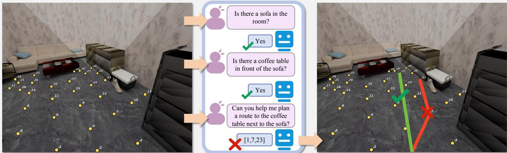  
Figure 1: Conceptual motivation for EgoPathBench. On the same first-person scene, familiar recognition and local spatial questions can be answered correctly. The right panel contrasts a complete, goal-reaching route with an incorrect route that violates the route and goal criteria. This contrast motivates evaluating integrated, embodiment-aware route decisions rather than component visual questions alone.

Point Traversability and Embodied Traversability ask which visible waypoints are feasible for a point agent or an embodied agent. Explicit Point-Goal Path and Explicit Embodied-Goal Path share the scene, target, and candidate space while asking the model to route the two agent types to an explicit target. Intent-Grounded Embodied Path instead describes the target through an intent and a visual cue, requiring target grounding together with embodied route selection. Point-agent and embodied tasks use the same observation and waypoint vocabulary, while the corresponding geometric feasibility graph defines the consequences of each selected action.

The ordered waypoint route makes these abilities jointly testable in a structured output. A model must select an appropriate immediate action, maintain agent-specific feasibility across every adjacent edge, and terminate at an acceptable goal. EgoPathBench therefore checks candidates, the required start, adjacent edges, the endpoint, and post-success route eficiency separately. A current-view waypoint route provides a verifiable joint spatial-decision output and a local planning representation that can be used within waypointbased zero-shot navigation systems. Evaluating this representation through a shared observation and action interface enables direct comparison of foundation-VLM spatial decisions independently of other navigation modules.

To align the model observation, displayed actions, and their consequences, we anchor every waypoint to a scene location and construct point-agent and embodied feasibility graphs from scene geometry. Targets, visible waypoints, legal edges, acceptable endpoints, and reference routes are fixed before prompt generation. Every route question retains at least one reference route that passes the construction and geometry checks and projects into the current view. The model receives only the RGB image with numbered waypoints and a natural-language prompt, while its prediction is evaluated using candidate feasibility, adjacent-edge legality, and goal arrival defined in the same scene.

EgoPathBench contains 31,852 training, 1,345 validation, and 1,111 benchmark questions. In addition to the benchmark split for unified model comparison, we release geometrygrounded training answers, legal reference routes, and Spatial CoT supervision, supporting both evaluation and the study of learned first-person spatial decision-making. We evaluate nine foundation VLMs, analyze where their waypoint routes fail, and examine the benchmark’s dependence on its paired visual interface and scene-grounded evaluator. We also train a Qwen 3.5 4B model to test whether the released supervision transfers to improved performance on EgoPathBench and external spatial tasks.

The results reveal a substantial gap in current models’ integrated spatial decision-making. The highest EgoPath Score across nine VLMs is 28.3. The top-ranked model reaches 35.9% success on Point Path, but only 2.9% and 4.0% on Embodied Path and Intent Path, respectively, showing a marked decline when a route must jointly satisfy embodiment and goal conditions. Fine-tuning Qwen 3.5 4B on the released training split raises its EgoPath Score from 3.9 to 38.9 and improves all four reported evaluations across three external spatial benchmarks, with gains of 1.4–9.6 points. These results show that EgoPathBench diferentiates current models first-person spatial decisions and that the released data provides efective supervision for this ability.

The contributions are:

• We introduce EgoPathBench, which uses five first-person waypoint-decision tasks to evaluate the integrated spatial intelligence of foundation VLMs through controlled, action-valued outputs.

• We construct and release 31,852 training, 1,345 validation, and 1,111 benchmark questions by aligning rendered observations, displayed waypoints, and resolved targets with point-agent and embodied feasibility graphs, together with legal reference routes and Spatial CoT su pervision.

• We systematically evaluate nine foundation VLMs, identify a major capability gap in embodied route decisions, and evaluate the released training resource on EgoPath-Bench and three external spatial benchmarks.

## Related Work

Foundation-model navigation and evaluation. R2R, REVERIE, RxR, and VLN-CE established vision-language navigation in discrete and continuous indoor environments (Anderson et al. 2018; Qi et al. 2020; Ku et al. 2020; Krantz et al. 2020). Foundation-model agents such as NavGPT, NaviLLM, and NaVid subsequently used language reasoning, generalist embodied modeling, and video-based planning for navigation (Zhou, Hong, and Wu 2024; Zheng et al. 2024; Zhang et al. 2024). Recent zero-shot systems organize spatial decisions through diferent interfaces. Smart-Way combines waypoint prediction with history-aware backtracking; VLFM, InstructNav, and CA-Nav use occupancy or value maps and sub-instruction constraints; AgenticNav and P2DNav expose pixel-level or hierarchical direction-togrounding actions; and DreamNav predicts trajectories rather than isolated points (Shi et al. 2025; Yokoyama et al. 2024; Long et al. 2024; Chen et al. 2025; Li et al. 2026; Sheng et al. 2026; Wang et al. 2025). Open-Nav studies spatio-temporal reasoning with open-source models, Nav-R1 learns structured navigation traces, and LHPR-VLN extends evaluation to decision consistency across long-horizon subtasks (Qiao et al. 2025b; Liu et al. 2025; Song et al. 2025). Across full navigation systems, outcomes can depend on diferent combinations of candidate generation, mapping, memory, control, and replanning over repeated observations. EgoPathBench measures a controlled capability within this process: given the current first-person observation and a shared vocabulary of visible spatial actions, can a foundation VLM form a geometrically feasible and goal-consistent waypoint decision?

NaviTrace is the closest evaluation to our setting. It presents a single real RGB image, a navigation instruction, and an embodiment description, and asks a VLM to produce a continuous trace in image space (Windecker et al. 2025). The prediction is scored by Dynamic Time Warping against human-annotated traces, endpoint error, and embodimentconditioned penalties derived from pixel semantics. Navi-Trace therefore measures agreement with expert navigation demonstrations under a score that combines trace similarity, endpoint accuracy, and embodiment-conditioned semantic penalties.

EgoPathBench difers in the supervision associated with each observation. Each image is registered to an underlying 3D scene representation, from which we derive visible waypoints, agent-specific feasibility, direct traversability between waypoints, and acceptable goal regions. This scene backing allows an arbitrary predicted route to be evaluated by the geometric outcomes of its selected actions: whether its waypoints are feasible, whether every consecutive transition satisfies the specified agent constraints, and whether the route reaches the goal. A reference route certifies that a geometrically valid solution exists, but is not the unique trajectory that a prediction must imitate. Thus, NaviTrace evaluates trajectory agreement defined by expert demonstrations and image semantics, whereas EgoPathBench evaluates waypoint-action outcomes defined by scene geometry.

Spatial intelligence and embodied reasoning. Existing spatial-intelligence benchmarks examine complementary components of foundation VLMs’ spatial ability. SpatialVLM and SpatialEval emphasize distance, direction, and spatial relations; VSI-Bench studies video-based spatial understanding and memory; ViewSpatial evaluates multiperspective spatial localization; and 3DSRBench focuses on 3D structure (Chen et al. 2024; Wang et al. 2024; Yang et al. 2025; Li et al. 2025a; Ma et al. 2025). EmbSpatial-Bench, EgoThink, and OpenEQA introduce first-person or embodied observations (Du et al. 2024; Cheng et al. 2024; Majumdar et al. 2024). Embodied3DBench further evaluates low-level embodied skills including grounding, afordance, and trajectory prediction; CapNav studies capability-conditioned navigation under agent-specific mobility constraints; and IndustryNav evaluates active planning and collision-aware navigation in dynamic industrial environments (Zhang et al. 2026; Su et al. 2026; Li et al. 2025b). Together, these benchmarks show that embodied spatial intelligence involves not only recognizing scene relations, but also determining where an agent can act and what spatial consequences its actions produce.

EgoPathBench organizes these abilities into a joint decision with an explicit action interpretation. A model must relate the target, candidate locations, agent constraints, and route structure in the current observation, then return either a traversable waypoint set or an ordered route. The prediction is evaluated through geometry-defined candidate feasibility, consecutive-edge legality, and goal attainment. EgoPathBench thereby connects low-level embodied spatial cues to ordered first-person waypoint decisions with explicit scene-grounded consequences.

## EgoPathBench Dataset and Benchmark Benchmark Formulation

EgoPathBench represents navigation decisions as selections over a visible waypoint vocabulary. Each example provides an egocentric RGB image with numbered candidate locations and a natural-language task. The model returns a JSON list of display IDs. For the two traversability tasks, the list denotes an unordered set of traversable candidates. For the three path tasks, it denotes an ordered route from a specified start to an acceptable goal.

Formally, an example consists of an egocentric observation o, a displayed waypoint set A, a target specification t, and a task-specific feasibility graph G. Every display ID in A is anchored to a 3D scene location. Given o, A, and t, the model predicts either a subset of A or an ordered sequence over A. Traversability tasks evaluate the feasibility of selected vertices. Route tasks additionally require the specified start, legal consecutive edges in G, and an endpoint in the acceptable goal set.

Point and Embodied tasks share the same observation and waypoint vocabulary but use diferent feasibility graphs. The point graph captures geometric connectivity without body width, whereas the embodied graph additionally accounts for the agent footprint. The same visually selected action can therefore have diferent consequences under the two agent models.

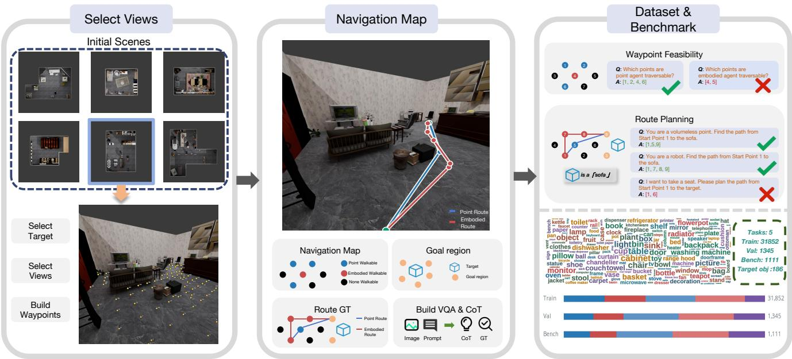  
Figure 2: EgoPathBench construction pipeline. We select scenes, first-person views, and targets, then build visible waypoints, point- and embodiment-specific navigation maps, goal regions, and geometry-verified reference routes. These fixed scene annotations support image-question and Spatial CoT generation, yielding two waypoint-feasibility tasks and three route-planning tasks across the training, validation, and benchmark splits.

EgoPathBench measures joint waypoint decision making from limited first-person visual evidence. The model must identify the target, associate displayed IDs with scene locations, and select actions that jointly satisfy traversability, embodiment, route continuity, and goal-reaching requirements. The model acts from the current observation, while the consequences of its choices are evaluated against the registered scene geometry.

## Five-Task Design

EgoPathBench contains two traversability tasks and three route tasks. The five tasks progressively introduce target grounding, embodiment, and route-composition requirements while retaining a common input and output interface.

Point Traversability asks the model to select all candidates traversable by a point agent. Embodied Traversability uses the same scene view and candidate space but accounts for the agent footprint, requiring suficient clearance at the selected locations. This paired design tests how embodiment changes action feasibility within the same observation.

Point Path provides an explicit target and asks for an ordered point-agent route. Embodied Path holds the target, view, and candidate space fixed but evaluates the route under embodied feasibility. Intent Path replaces the explicit object name with an intent and a visual cue. It therefore requires the model to resolve the intended object before selecting an embodied route.

## Data Construction and Annotation

Figure 2 summarizes the construction process. We first establish scene provenance and first-person scene–view records, then generate visible waypoints and geometric task labels. Natural-language questions and Spatial CoT are produced only after the target, action space, and reference route have been fixed. Quality filtering and challenge-set selection produce the final release.

Scenes, views, and targets. We use unified simulatable indoor assets normalized through InternScenes (Zhong et al. 2025). The scenes retained in our release derive from 3RScan (Wald et al. 2019), ScanNet (Dai et al. 2017), ARKitScenes (Baruch et al. 2021), and Matterport3D (Chang et al. 2017). We use these assets for scene geometry and rendering, and construct our own first-person observations, waypoint annotations, route labels, and question data.

<table><tr><td>Task</td><td>Goal</td><td colspan="3">Agent Output Scored constraints</td><td>N</td></tr><tr><td>Point Trav. Embodied</td><td></td><td>Point Set Emb. Set</td><td>Traversability Feasibility</td><td></td><td>146 146</td></tr><tr><td>Trav. Point Path</td><td>Explicit Point Route</td><td></td><td></td><td>Edges, endpoint</td><td></td></tr><tr><td>Embodied</td><td>Explicit Emb. Route</td><td></td><td></td><td>Footprint,</td><td>309 edges, 309</td></tr><tr><td>Path Intent Path</td><td>Intent</td><td>Emb. Route</td><td></td><td>goal Intent,</td><td>footprint, 201</td></tr></table>

Table 1: Five EgoPathBench tasks. The shared first-person waypoint interface is specialized by goal specification, agent geometry, output structure, evaluated constraints, and benchmark question count.

For each scene, we sample first-person cameras in traversable space and remove views whose immediate camera neighborhood is obstructed. Target instances are then filtered by frustum projection, observation distance, projected size, and visible surface evidence, excluding targets that are outside the image, too small, or heavily occluded. Shared camera parameters and scene geometry bind each retained target and RGB observation to a common scene–view record, which provides the spatial basis for subsequent waypoint and route annotation.

Waypoints and geometric labels. For each retained view, we project two types of markers into the image: ground action candidates and selected visible object- or structuralsurface locations used as non-traversable negatives. Depth, ray-visibility, and marker-spacing checks associate every displayed ID with a distinct scene location while reducing marker overlap and foreground occlusion. Route sheets use visible ground waypoints and explicitly insert the waypoints required by retained reference routes.

We evaluate ground actions under both point and embodied geometry. Traversability examples therefore mix feasible ground actions, clearance-sensitive ground actions, and visible surface negatives, so the task cannot be solved by selecting every displayed ID. Point and Embodied Traversability share the same view, while their labels follow the corresponding agent-feasibility conditions. Each displayed candidate stores its ID, image projection, and scene coordinate; the numbered RGB overlay and the geometric annotations therefore refer to the same action vocabulary.

Paired route construction. For each route unit, we anchor the start on visible floor near the bottom of the image and generate feasible goal locations around the target footprint. We then search separately through point and embodied free space, convert each continuous path into sparse route waypoints, and project the required waypoints back into the current image.

Construction checks route connectivity, task-specific feasibility, arrival in the target region, and the availability of every required waypoint through the displayed action interface. Routes that fail these checks are discarded. Point Path and Embodied Path consequently share the target, start, and scene view while retaining routes validated for their respective agent geometries. Every retained route question has at least one scene-verified reference route to its target.

Question text and Spatial CoT. Target identity, displayed waypoints, goal region, and reference-route identity are fixed before language generation. Explicit-target tasks name the required object directly. For Intent Path, we construct a viewspecific candidate universe from visible objects and generate a target description using supported relations, attributes, colors, or distance cues.

The resulting description is resolved again against the objects available in the current view. We retain it only when it uniquely identifies the fixed target without unsupported cues. Intent Path is derived from an accepted Embodied Path instance, so changing the linguistic specification does not change its target or route geometry.

The training split additionally includes Spatial CoT. GPT-

5.5 verbalizes the fixed target, candidates, feasibility labels, legal edges, and reference route into task-specific reasoning text. The exported answer is checked against the formal annotation, keeping language generation downstream of the geometric ground truth.

## Quality Control

Quality control applies geometry and view–action checks before language is attached. Candidate locations, route edges, and target regions share one scene coordinate system; disconnected or colliding routes, routes that miss the target region, and examples without required display waypoints are removed. The RGB image, waypoint overlay, and IDto-waypoint record come from the same rendered view, and point and embodied routes are validated under their corresponding agent geometries.

Prompts may describe only targets and scene facts fixed during construction. Explicit-target questions are checked against the selected target, while intent questions must resolve uniquely among objects visible from the current view. A full visual–language alignment audit then checks targets, prompts, displayed waypoints, reference routes, and answers across the formal release. Ambiguous or unsupported prompts are repaired or removed without changing the established geometric labels or route identities.

## Benchmark Selection and Release

After constructing the full question pool, we select the formal benchmark as a challenging subset emphasizing scene clutter, traversability boundaries, point–embodied feasibility diferences, competing targets, and route composition.

Selection operates on complete task bundles. Point and Embodied Traversability form a paired view bundle; Point Path and Embodied Path form a paired route bundle with a shared target and candidate space; eligible Intent Path questions accompany their corresponding embodied routes. Bundle-level selection prevents the benchmark from retaining only one side of a paired comparison.

We then select scenes while balancing task coverage, geometric dificulty, and scene diversity and limiting concentration within InternScenes. Splits are formed by source group, so the same original scan or related regions do not cross training, validation, and benchmark sets. The final release contains 31,852 training questions, 1,345 validation questions, and 1,111 benchmark questions across the five first-person waypoint-decision tasks.

## Experiments

## Experimental Setup

The benchmark contains 1,111 questions: 146 Point Traversability, 146 Embodied Traversability, 309 Point Path, 309 Embodied Path, and 201 Intent Path. Traversability uses candidate-level balanced accuracy (BA), the mean recall across the task-feasible and infeasible classes, and F1, the precision–recall harmonic mean for feasible candidates. For route tasks, valid path rate (VPR) measures complete route legality, success rate (SR) additionally requires an acceptable endpoint, and success weighted by path length (SPL)

<table><tr><td></td><td></td><td colspan="2">Point Trav.</td><td colspan="2">Embodied Trav.</td><td colspan="3">Point Path</td><td colspan="2">Embodied Path</td><td colspan="3">Intent Path</td></tr><tr><td>Model</td><td>Score</td><td>BA</td><td>F1</td><td>BA</td><td>F1</td><td>VPR</td><td>SR</td><td>SPL</td><td>VPR</td><td>SR</td><td>SPL</td><td>VPR</td><td>SR</td><td>SPL</td></tr><tr><td colspan="9">Zero-shot foundation VLMs</td><td></td><td></td><td></td><td></td><td></td><td></td></tr><tr><td>Gemini 3.1 Pro</td><td>28.3</td><td>76.5</td><td>79.0</td><td>72.7</td><td>56.2</td><td>63.7</td><td>35.9</td><td>28.7</td><td>9.1</td><td>2.9</td><td>2.4</td><td>10.4</td><td>4.0</td><td>3.3</td></tr><tr><td>GPT-5.5</td><td>27.3</td><td>74.1</td><td>77.1</td><td>77.3</td><td>62.5</td><td>60.5</td><td>31.1</td><td>24.8</td><td>5.5</td><td>1.3</td><td>1.3</td><td>9.0</td><td>1.5</td><td>1.4</td></tr><tr><td>Claude Opus 4.8</td><td>25.6</td><td>77.9</td><td>74.3</td><td>73.5</td><td>59.6</td><td>66.0</td><td>21.0</td><td>16.7</td><td>12.0</td><td>1.6</td><td>1.5</td><td>14.4</td><td>2.5</td><td>2.2</td></tr><tr><td>MiniMax M3</td><td>21.8</td><td>77.0</td><td>76.2</td><td>68.7</td><td>52.8</td><td>50.8</td><td>13.3</td><td>8.7</td><td>5.5</td><td>1.9</td><td>1.7</td><td>9.0</td><td>2.5</td><td>2.3</td></tr><tr><td>Qwen 3.6</td><td>16.4</td><td>67.4</td><td>72.1</td><td>64.8</td><td>49.1</td><td>49.2</td><td>15.2</td><td>10.9</td><td>2.6</td><td>1.0</td><td>0.9</td><td>5.0</td><td>1.5</td><td>1.3</td></tr><tr><td>Mistral L3</td><td>15.8</td><td>65.2</td><td>70.8</td><td>68.5</td><td>52.5</td><td>35.6</td><td>11.0</td><td>5.8</td><td>0.3</td><td>0.0</td><td>0.0</td><td>3.5</td><td>0.5</td><td>0.5</td></tr><tr><td>Llama 4</td><td>14.9</td><td>66.8</td><td>66.5</td><td>66.0</td><td>49.8</td><td>36.2</td><td>8.7</td><td>5.9</td><td>1.9</td><td>0.0</td><td>0.0</td><td>2.0</td><td>0.0</td><td>0.0</td></tr><tr><td>Kimi K2.6</td><td>9.7</td><td>60.2</td><td>69.8</td><td>57.8</td><td>44.2</td><td>40.5</td><td>11.7</td><td>8.2</td><td>1.3</td><td>0.7</td><td>0.5</td><td>1.5</td><td>0.5</td><td>0.4</td></tr><tr><td>Grok 4.3</td><td>1.4</td><td>52.3</td><td>58.4</td><td>50.0</td><td>35.8</td><td>18.4</td><td>2.6</td><td>1.2</td><td>5.2</td><td>0.0</td><td>0.0</td><td>3.5</td><td>0.0</td><td>0.0</td></tr><tr><td colspan="9">Training-resource study</td><td></td><td></td><td></td><td></td><td></td><td></td></tr><tr><td>Qwen3.5-4B base</td><td>3.9</td><td>54.6</td><td>55.6</td><td>54.9</td><td>33.1</td><td>9.1</td><td>0.7</td><td>0.1</td><td>0.3</td><td>0.0</td><td>0.0</td><td>0.0</td><td>0.0</td><td>0.0</td></tr><tr><td>+ EgoPathBench SFT</td><td>38.9</td><td>89.3</td><td>89.2</td><td>83.4</td><td>71.2</td><td>77.0</td><td>31.4</td><td>28.6</td><td>34.9</td><td>7.1</td><td>6.9</td><td>44.8</td><td>10.4</td><td>10.0</td></tr></table>

Table 2: EgoPathBench leaderboard (%). The upper block compares zero-shot foundation VLMs; the lower block compares Qwen3.5-4B before and after training on EgoPathBench. Score is the equal-weight five-task macro-average. BA/F1 evaluate traversability, while VPR, SR, and SPL evaluate route validity, goal-reaching success, and eficiency.

discounts successful routes that are longer than the shortest legal reference while assigning zero to failures. EgoPath Score equally averages chance-adjusted traversability BA and route SR across the five tasks. Formal definitions are provided in the supplementary material.

We evaluate nine foundation VLMs. Every model receives the same image, task prompt, visible waypoint IDs, and JSON output protocol, and every prediction is scored by the same evaluator. Endpoint identifiers, generation settings, training hyperparameters, and control-specific protocols are provided in the supplementary material.

## Zero-Shot VLM Results

Table 2 gives the complete zero-shot leaderboard. Gemini 3.1 Pro ranks first with an EgoPath Score of 28.3, followed by GPT-5.5 at 27.3 and Claude Opus 4.8 at 25.6.

Candidate-level traversability is markedly stronger than complete route construction. The best Point and Embodied Traversability BA values are 77.9% and 77.3%, with best F1 scores of 79.0% and 62.5%. For Point Path, the strongest VPR is 66.0%, but SR falls to 35.9% and SPL to 28.7%. Thus, plausible local actions do not by themselves produce a legal, goal-reaching route.

Tasks with embodiment constraints produce the largest drop. On Embodied Path, the best VPR, SR, and SPL are 12.0%, 2.9%, and 2.4%; on Intent Path, they are 14.4%, 4.0%, and 3.3%. The VPR–SR gap indicates complementary failures in edge legality and endpoint selection, while low

SPL largely reflects scarce complete successes.

Figure 4 places the zero-shot leaderboard against a samequestion human reference under the identical task interface. The human profile is higher on all five task axes and reaches an EgoPath Score of 54.2, compared with 28.6 for the strongest VLM on these questions. The human advantage appears in both candidate-feasibility judgments and all three route tasks, indicating that the gap is not driven by any single task or metric but reflects a broader limitation in first-person spatial decision-making.

## Where Complete Routes Fail

Figure 3 decomposes route predictions into five parallel diagnostics, ordered from output validity and target-endpoint selection to the legality of the initial action, the complete route, and their joint success. Across tasks, 96.3–96.8% of outputs are evaluable routes, so the output protocol is not the main bottleneck. Goal-consistent endpoint rates are much lower at 28.9% for Point Path, 4.8% for Embodied Path, and 5.2% for Intent Path, exposing substantial dificulty in grounding the requested target to a terminal waypoint. A model may recognize where the target object is yet fail to identify a nearby terminal waypoint that is feasible for the specified agent.

Initial action selection is considerably stronger: 96.0%, 90.4%, and 88.0% of predictions take a legal first edge. This local feasibility does not carry through the selected sequence. Full-route legality falls to 46.8% for Point Path,

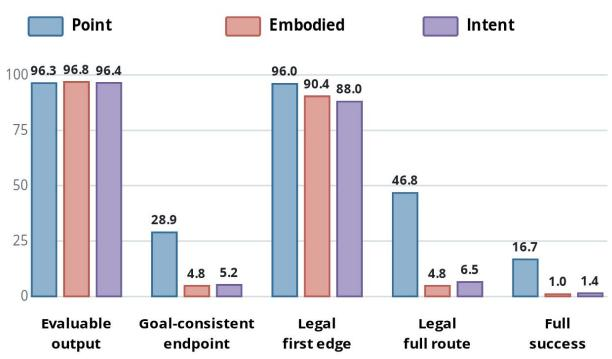  
Figure 3: Route diagnostics pooled over nine VLMs (%). Rates over all predictions measure evaluable output, goalconsistent endpoint selection, legal first action, full-route legality, and joint success.

4.8% for Embodied Path, and 6.5% for Intent Path; among predictions with a legal first edge, 51.3%, 94.7%, and 92.7% contain an illegal later edge. Joint success, which requires both complete-route legality and a goal-consistent endpoint, is only 16.7%, 1.0%, and 1.4%. The diagnostics therefore expose two distinct limitations: selecting the intended terminal waypoint and maintaining agent-specific feasibility from the current position to that endpoint.

This sufix failure persists after controlling for both ends of the decision. Among predictions with a legal first edge and acceptable goal, 42.2% of Point, 75.8% of Embodied, and 69.4% of Intent routes still contain an illegal intermediate edge. On the half of questions with fewer displayed waypoints, rates remain similar at 42.8%, 76.6%, and 67.3%, so the pattern is not confined to dense action overlays. Illegaledge incidence is already 90.6% and 88.4% on one-edgereference Embodied and Intent questions, rising to 94.0% and 92.4% for references with at least three edges. The central signal is whether the intermediate sequence remains valid under agent geometry; additional model-level and length-stratified results appear in the supplementary material.

Through experiments, we find that removing the image or mismatching the waypoint overlay degrades route performance, showing that predictions depend on the paired visual input rather than the prompt alone. Geometry perturbations preserve the released conclusions. The supplementary material reports the complete protocols, control results, humanreference details, and scene-consequence audit.

## Training-Resource Evaluation

We fine-tune Qwen3.5-4B on the released EgoPathBench training split. The base model and selected checkpoint use the same EgoPathBench contract and evaluation items from VSI-Bench Route Planning, SpatialEval-VTQA, and 3DSRBench (Yang et al. 2025; Wang et al. 2024; Ma et al. 2025). This evaluates the released training data in- and out-of-domain.

The lower block of Table 2 reports the in-domain comparison. The fine-tuned checkpoint improves every reported metric and reaches an EgoPath Score of 38.9.

The selected checkpoint improves all reported external evaluations. On VSI-Bench Route Planning, performance rises from 29.38% to 33.51% in the Full setting (+4.13) and from 20.18% to 24.56% in the Debiased setting (+4.38). Under the Full settings, accuracy also increases by 9.6 points on SpatialEval-VTQA and 1.4 points on 3DSRBench, showing transfer to spatial tasks outside EgoPathBench.

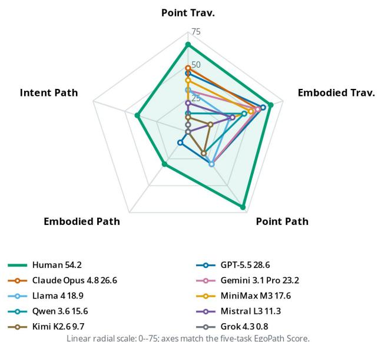

Figure 4: Same-question comparison of humans and nine VLMs across five tasks, with traversability measured by 2BA − 1, route performance by success rate, and EgoPath Score shown in the legend.
<table><tr><td>Benchmark</td><td>Setting</td><td>Base</td><td>SFT</td><td>∆</td></tr><tr><td>VSI-Bench Route Planning</td><td>Full</td><td>29.38</td><td>33.51</td><td>+4.13</td></tr><tr><td>SpatialEval-VTQA</td><td>Debiased Full</td><td>20.18</td><td>24.56</td><td>+4.38</td></tr><tr><td>3DSRBench</td><td>Full</td><td>61.8</td><td>71.4</td><td>+9.6</td></tr><tr><td></td><td></td><td>58.0</td><td>59.4</td><td>+1.4</td></tr></table>

Table 3: Performance of Qwen3.5-4B on three spatial benchmarks before and after supervised fine-tuning (SFT) on EgoPathBench (%).

## Conclusion

EgoPathBench evaluates whether VLMs turn first-person observations and goals into feasible, goal-reaching actions across five scene-grounded tasks spanning feasibility, grounding, route legality, goal arrival, and eficiency.

Across nine VLMs, the best EgoPath Score is 28.3; the leader reaches 35.9% Point Path success but only 2.9% and 4.0% on Embodied and Intent Path. Fine-tuning improves Qwen 3.5 4B from 3.9 to 38.9 and yields gains on all four reported evaluations across three external spatial benchmarks, supporting both evaluation and training. The gap between locally plausible actions and complete embodied routes identifies sustained geometric and goal consistency across multistep decisions as a central direction for future VLM research.

## References

Anderson, P.; Wu, Q.; Teney, D.; Bruce, J.; Johnson, M.; Sunderhauf, N.; Reid, I.; Gould, S.; and van den Hengel, A. 2018. Vision-and-Language Navigation: Interpreting Visually-Grounded Navigation Instructions in Real Environments. In Proceedings ofthe IEEE Conference on Computer Vision and Pattern Recognition.

Baruch, G.; Chen, Z.; Dehghan, A.; Dimry, T.; Feigin, Y.; Fu, P.; Gebauer, T.; Jofe, B.; Kurz, D.; Schwartz, A.; and Shulman, E. 2021. ARKitScenes: A Diverse Real-World Dataset for 3D Indoor Scene Understanding Using Mobile RGB-D Data. In Advances in Neural Information Processing Systems Datasets and Benchmarks Track.

Cai, Y.; He, X.; Wang, M.; Guo, H.; Yau, W.-Y.; and Lv, C. 2025. CL-CoTNav: Closed-Loop Hierarchical Chain-of-Thought for Zero-Shot Object-Goal Navigation with Vision-Language Models. arXiv preprint arXiv:2504.09000.

Chang, A.; Dai, A.; Funkhouser, T.; Halber, M.; Nießner, M.; Savva, M.; Song, S.; Zeng, A.; and Zhang, Y. 2017. Matterport3D: Learning from RGB-D Data in Indoor Environments. In Proceedings of the International Conference on 3D Vision.

Chen, B.; Xu, Z.; Kirmani, S.; Ichter, B.; Driess, D.; Florence, P.; Sadigh, D.; Guibas, L.; and Xia, F. 2024. SpatialVLM: Endowing Vision-Language Models with Spatial Reasoning Capabilities. In Proceedings of the IEEE/CVF Conference on Computer Vision and Pattern Recognition.

Chen, K.; An, D.; Huang, Y.; Xu, R.; Su, Y.; Ling, Y.; Reid, I.; and Wang, L. 2025. Constraint-Aware Zero-Shot Vision-Language Navigation in Continuous Environments. IEEE Transactions on Pattern Analysis and Machine Intelligence.

Cheng, S.; Guo, Z.; Wu, J.; Fang, K.; Li, P.; Liu, H.; and Liu, Y. 2024. EgoThink: Evaluating First-Person Perspective Thinking Capability of Vision-Language Models. arXiv preprint arXiv:2311.15596.

Dai, A.; Chang, A. X.; Savva, M.; Halber, M.; Funkhouser, T.; and Nießner, M. 2017. ScanNet: Richly-Annotated 3D Reconstructions of Indoor Scenes. In Proceedings of the IEEE Conference on Computer Vision and Pattern Recognition.

Du, M.; Wu, B.; Li, Z.; Huang, X.; and Wei, Z. 2024. EmbSpatial-Bench: Benchmarking Spatial Understanding for Embodied Tasks with Large Vision-Language Models. In Proceedings of the 62nd Annual Meeting of the Associationfor Computational Linguistics.

Krantz, J.; Wijmans, E.; Majumdar, A.; Batra, D.; and Lee, S. 2020. Beyond the Nav-Graph: Vision-and-Language Navigation in Continuous Environments. In Proceedings of the European Conference on Computer Vision.

Ku, A.; Anderson, P.; Patel, R.; Ie, E.; and Baldridge, J. 2020. Room-Across-Room: Multilingual Vision-and-Language Navigation with Dense Spatiotemporal Grounding. In Proceedings of the 2020 Conference on Empirical Methods in Natural Language Processing.

Li, D.; Li, H.; Wang, Z.; Yan, Y.; Zhang, H.; Chen, S.; Hou, G.; Jiang, S.; Zhang, W.; Shen, Y.; Lu, W.; and Zhuang,

Y. 2025a. ViewSpatial-Bench: Evaluating Multi-perspective Spatial Localization in Vision-Language Models. arXiv preprint arXiv:2505.21500.

Li, Y.; Li, C.; Shi, H.; Luo, J.; Cai, J.; Yang, M.; and Qin, T. 2026. AgenticNav: Zero-Shot Vision-and-Language Navigation as a Tool-Calling Harness. arXiv preprint arXiv:2606.10577.

Li, Y.; Li, L.; Dao, A.; Zhou, X.; Huang, W.; Ma, T.; Qiao, Y.; Mai, Z.; Lee, D.; Chen, Z.; Wang, P.; Yang, L.; Wang, T.; Tan, Z.; Li, S.; Bansal, M.; Ni, Y.; and Kong, Y. 2025b. IndustryNav: Exploring Spatial Reasoning of Embodied Agents in Dynamic Industrial Navigation. arXiv preprint arXiv:2511.17384.

Liu, Q.; Huang, T.; Zhang, Z.; and Tang, H. 2025. Nav-R1: Reasoning and Navigation in Embodied Scenes. arXiv preprint arXiv:2509.10884.

Long, Y.; Cai, W.; Wang, H.; Zhan, G.; and Dong, H. 2024. InstructNav: Zero-shot System for Generic Instruction Navigation in Unexplored Environment. In Proceedings of the Conference on Robot Learning.

Ma, W.; Chen, H.; Zhang, G.; de Melo, C. M.; Yuille, A.; and Chen, J. 2025. 3DSRBench: A Comprehensive 3D Spatial Reasoning Benchmark. In Proceedings of the IEEE/CVF International Conference on Computer Vision.

Majumdar, A.; et al. 2024. OpenEQA: Embodied Question Answering in the Era of Foundation Models. In Proceedings of the IEEE/CVF Conference on Computer Vision and Pattern Recognition.

Qi, Y.; Wu, Q.; Anderson, P.; Wang, X.; Wang, W. Y.; Shen, C.; and van den Hengel, A. 2020. REVERIE: Remote Embodied Visual Referring Expression in Real Indoor Environments. In Proceedings of the IEEE/CVF Conference on Computer Vision and Pattern Recognition.

Qiao, Y.; Hong, H.; Lyu, W.; An, D.; Zhang, S.; Xie, Y.; Wang, X.; and Wu, Q. 2025a. NavBench: Probing Multimodal Large Language Models for Embodied Navigation. In Advances in Neural Information Processing Systems.

Qiao, Y.; Lyu, W.; Wang, H.; Wang, Z.; Li, Z.; Zhang, Y.; Tan, M.; and Wu, Q. 2025b. Open-Nav: Exploring Zero-Shot Vision-and-Language Navigation in Continuous Environment with Open-Source LLMs. In Proceedings of the IEEE International Conference on Robotics and Automation (ICRA).

Sheng, K.; Wang, L.; Dai, H.; Li, J.; Qin, Y.; He, Z.; Liu, C.; and Chen, Q. 2026. P2DNav: Panorama-to-Downview Reasoning for Zero-shot Vision-and-Language Navigation. arXiv preprint arXiv:2605.19634.

Shi, X.; Li, Z.; Lyu, W.; Xia, J.; Dayoub, F.; Qiao, Y.; and Wu, Q. 2025. SmartWay: Enhanced Waypoint Prediction and Backtracking for Zero-Shot Vision-and-Language Navigation. In Proceedings of the IEEE/RSJ International Conference on Intelligent Robots and Systems.

Song, X.; Chen, W.; Liu, Y.; Chen, W.; Li, G.; and Lin, L. 2025. Towards Long-Horizon Vision-Language Navigation: Platform, Benchmark and Method. In Proceedings of the IEEE/CVF Conference on Computer Vision and Pattern Recognition.

Su, X.; Chen, R.; Liu, B.; Ma, J.; Di, Z.; Krishna, R.; and Froehlich, J. 2026. CapNav: Benchmarking Vision Language Models on Capability-conditioned Indoor Navigation. arXiv preprint arXiv:2602.18424.

Wald, J.; Dhamo, H.; Navab, N.; and Tombari, F. 2019. RIO: 3D Object Instance Re-Localization in Changing Indoor Environments. In Proceedings of the IEEE/CVF International Conference on Computer Vision.

Wang, J.; Ming, Y.; Shi, Z.; Vineet, V.; Wang, X.; Li, Y.; and Joshi, N. 2024. Is A Picture Worth A Thousand Words? Delving Into Spatial Reasoning for Vision Language Models.

Wang, Y.; Fang, Y.; Wang, T.; Feng, Y.; Tan, Y.; Zhang, S.; Liu, P.; Ji, Y.; and Xu, R. 2025. DreamNav: A Trajectory-Based Imaginative Framework for Zero-Shot Vision-and-Language Navigation. arXiv preprint arXiv:2509.11197.

Windecker, T.; Patel, M.; Reuss, M.; Schwarzkopf, R.; Cadena, C.; Lioutikov, R.; Hutter, M.; and Frey, J. 2025. NaviTrace: Evaluating Embodied Navigation of Vision-Language Models. arXiv preprint arXiv:2510.26909.

Yang, J.; Yang, S.; Gupta, A. W.; Han, R.; Fei-Fei, L.; and Xie, S. 2025. Thinking in Space: How Multimodal Large Language Models See, Remember, and Recall Spaces. In Proceedings ofthe IEEE/CVF Conference on Computer Vision and Pattern Recognition.

Yokoyama, N.; Ha, S.; Batra, D.; Wang, J.; and Bucher, B. 2024. VLFM: Vision-Language Frontier Maps for Zero-Shot Semantic Navigation. In Proceedings of the IEEE International Conference on Robotics and Automation.

Zhang, J.; Wang, K.; Xu, R.; Zhou, G.; Hong, Y.; Fang, X.; Wu, Q.; Zhang, Z.; and Wang, H. 2024. NaVid: Videobased VLM Plans the Next Step for Vision-and-Language Navigation. Robotics: Science and Systems.

Zhang, J.; Zhang, M.; Peng, Y.; Liu, H.; Wang, C.; Long, Y.; Huang, H.; Li, D.; Duan, N.; Shen, H.; and Dong, H. 2026. Embodied3DBench: Benchmarking Low-Level Embodied Spatial Intelligence of Vision Language Models. arXiv preprint arXiv:2605.29074.

Zheng, D.; Huang, S.; Zhao, L.; Zhong, Y.; and Wang, L. 2024. Towards Learning a Generalist Model for Embodied Navigation. In Proceedings ofthe IEEE/CVF Conference on Computer Vision and Pattern Recognition.

Zhong, W.; Cao, P.; Jin, Y.; Li, L.; Cai, W.; Lin, J.; Wang, H.; Lyu, Z.; Wang, T.; Dai, B.; Xu, X.; and Pang, J. 2025. InternScenes: A Large-scale Simulatable Indoor Scene Dataset with Realistic Layouts. In Advances in Neural Information Processing Systems Datasets and Benchmarks Track.

Zhou, G.; Hong, Y.; and Wu, Q. 2024. NavGPT: Explicit Reasoning in Vision-and-Language Navigation with Large Language Models. In Proceedings of the AAAI Conference on Artificial Intelligence.

## Evaluation Protocol and Reproducibility

Table S1 summarizes the observation, action, and scoring contract for each task. Traversability tasks require a set of locally feasible waypoint actions. Route tasks require an ordered sequence beginning at the specified start; every consecutive edge must be legal for the task’s agent geometry, and the final waypoint must belong to the acceptable goal set.

Prompt and output protocol. Every question stores the system prompt, user prompt, image, and visible-waypoint record used for evaluation. Table S2 gives the released prompt templates. Bracketed fields are filled from the fixed question record; the requested answer is always one JSON array of visible display IDs.

Route evaluator. The released sidecar applies ordered candidate-validity, start, direct-edge, and goal-membership checks; SPL is computed only after a route satisfies this success contract. Table S4 lists the complete check sequence.

Metric definitions. Task-feasible candidates are the positive class for traversability. Let P and R denote precision and recall, and let $V _ { i }$ indicate that route prediction i is parseable, uses valid IDs, begins at the required start, and contains only legal consecutive edges. Let $S _ { i }$ additionally require an acceptable endpoint. For N questions,

$$
\begin{array} { l l } { { \displaystyle { \mathrm { B A } } = \frac { \mathrm { T P R } + \mathrm { T N R } } { 2 } } , } & { { ~ F 1 = \displaystyle \frac { 2 P R } { P + R } } , } \\ { { \displaystyle { \mathrm { V P R } } = \frac { 1 } { N } \sum _ { i } V _ { i } , } } & { { ~ \mathrm { S R } = \frac { 1 } { N } \sum _ { i } S _ { i } , } } \\ { { \displaystyle { \mathrm { S P L } } = \frac { 1 } { N } \sum _ { i } S _ { i } \frac { \ell _ { i } } { \operatorname* { m a x } ( \ell _ { i } , p _ { i } ) } , } } & { { } } \end{array}
$$

where $\ell _ { i }$ is the shortest legal reference length to an acceptable goal and $p _ { i }$ is the predicted route length. Thus, unsuccessful routes receive zero SPL. With component metrics expressed in [0, 1], the reported aggregate is

$$
\begin{array} { c } { \mathrm { E g o P a t h S c o r e } = \displaystyle \frac { 1 0 0 } { 5 } \big [ ( 2 \mathrm { B A } _ { \mathrm { P T } } - 1 ) + ( 2 \mathrm { B A } _ { \mathrm { E T } } - 1 ) } \\ { + \mathrm { S R } _ { \mathrm { P P } } + \mathrm { S R } _ { \mathrm { E P } } + \mathrm { S R } _ { \mathrm { I P } } \big ] . } \end{array}
$$

Foundation VLM evaluation. The nine endpoint identifiers are claude-opus-4-8, gemini-3.1-pro-preview, gpt-5.5, grok-4.3-fast, kimi-k2.6, meta/llama-4-maverick-17b-128e-instruct, MiniMax-M3, mistralai/mistral-large-3- 675b-instruct-2512, and qwen3.6-plus. Each run uses an 8,192-token completion budget. Temperature is 0 and top-p is 1 where exposed; provider-native reasoning and unavailable controls retain their defaults. All endpoints receive the same task-specific prompt and JSON contract. Each leaderboard entry is one complete pass over the fixed 1,111 questions; intervals resample these fixed outputs.

Training-resource evaluation. We train Qwen3.5-4B with LoRA rank 8, alpha 16, and zero dropout while freezing the vision tower. Stage one uses per-device batch size 1, gradient accumulation 8, a cosine schedule from $1 0 ^ { - 4 }$ with 10% warmup, two epochs, and seed 42. Continuation from the final adapter uses two further epochs at $5 \times 1 0 ^ { - 5 }$ with 5% warmup. Both stages use bfloat16, a 4,096-token cutof, and maximum image area 262,144 pixels. We report continuation checkpoint 3,000. EgoPathBench and external evaluation use completion budgets of 8,192 and 4,096 tokens, respectively.

External evaluation uses the VSI-Bench Route Planning subset in both its Full and Debiased settings, together with SpatialEval-VTQA and 3DSRBench. The base model and selected checkpoint are evaluated on the same items and with the same protocol within each setting. VSI-Bench provides the navigation-focused video evaluation, while the other two benchmarks test transfer to complementary spatial tasks.

The SFT export contains one image-grounded conversation for every training question. Its assistant response contains the accepted GPT-written Spatial CoT followed by the geometry-verified JSON answer; format repair may normalize the surrounding tags and final answer line but does not replace the rationale. Table S3 reports the release audit.

<table><tr><td>Field</td><td>Value</td></tr><tr><td>Complete training rows</td><td>31852 /31852</td></tr><tr><td>Missing image / rationale</td><td>0/0</td></tr><tr><td>Rationale source</td><td>GPT-written, template</td></tr><tr><td>Format and answer audit</td><td>Pass</td></tr></table>

Table S3: Audit of the released EgoPathBench SFT export.

Software, compute, and release. Scene rendering and geometric annotation use Blender 4.4 and Python 3.12. Model training uses Python 3.10.20, PyTorch 2.12.0 with CUDA 13.0, Transformers 5.2.0, PEFT 0.15.1, Accelerate 1.6.0, and LLaMA-Factory on two NVIDIA A100 80GB GPUs. Upon publication, we will release the generated questions, annotations, training supervision, task prompts, construction and evaluation code, model configurations, and fixed prediction records under licenses permitting research use and consistent with the terms of the upstream scene assets.

Intervals and supporting controls. Main benchmark intervals use 10,000 scene-cluster bootstrap resamples with seed 20260717. The input-dependence control keeps the task and candidate count fixed while replacing the paired image– marker overlay; its matched results are reported in Table S5.

<table><tr><td>Task</td><td>Decision input</td><td>Output</td><td>Agent/goal</td><td>Primary scoring condition</td></tr><tr><td>Point Traversability</td><td>RGB with point candidates</td><td>ID set</td><td>Point agent; no goal</td><td>Candidate-wise traversability classification</td></tr><tr><td>Embodied Traversability</td><td>RGB with footprint-aware candidates</td><td>ID set</td><td>0.6 m body; no goal</td><td>Candidate-wise body-feasible classification</td></tr><tr><td>Point Path</td><td>RGB, start ID, explicit target</td><td>Ordered route</td><td>Point agent; explicit goal</td><td>Valid IDs, required start, legal edges, acceptable endpoint</td></tr><tr><td>Embodied Path</td><td>RGB, start ID, explicit target</td><td>Ordered route</td><td>0.6 m body; explicit goal</td><td>Point-Path checks plus footprint-aware edge legality</td></tr><tr><td>Intent Path</td><td>RGB, start ID, natural-language intent</td><td>Ordered route</td><td>0.6 m body; resolved goal</td><td>Intent-consistent endpoint and embodied route legality</td></tr></table>

Table S1: Interface and scoring contract for the five EgoPathBench tasks. All outputs use visible display IDs from the current first-person image.
<table><tr><td>Task</td><td>System prompt</td><td>User-prompt template</td></tr><tr><td>Point Traversabil- ity</td><td>tant.</td><td>You are a navigation perception assis- The image shows numbered candidate points. Output a JSON array of display IDs that are walkable.</td></tr><tr><td>Embodied Traversability Point Path</td><td>tant.</td><td>You are a navigation perception assis- The image shows numbered candidate points. The robot has diameter 0.6m. Output a JSON array of display IDs that are walkable for the robot. You are a navigation planning assis- The image shows numbered candidate points. Start at display ID 1. Navigate</td></tr><tr><td>Embodied Path</td><td>tant.</td><td>to the [explicit target]. Output a JSON array of display IDs representing a valid path. You are an embodied navigation robot. The image shows numbered candidate points. You are the robot, and your body</td></tr><tr><td>Intent Path</td><td>shown in the image.</td><td>Plan a collision-free path for your body diameter is 0.6 m. Start at display ID 1. Navigate to the [explicit target]. Return using the numbered candidate points a JSON array of display IDs representing a valid collision-free path for the robot. You are an embodied navigation robot. The image shows numbered candidate points. You are the robot, and your</td></tr><tr><td></td><td>Infer the target family from the request, the resolved target. resolve the final grounded target in the scene, and plan a collision-free path for your body.</td><td>A user gives you a short request that body diameter is 0.6 m. Start at display ID 1. A person says: “[intent request].&quot; implies the kind of object they want. Return a JSON array of display IDs representing a valid collision-free path to</td></tr></table>

Table S2: Released prompt templates for the five tasks. Bracketed fields are populated from the fixed question record.

The obstruction audit samples selected illegal edges at 0.05 m intervals in aligned depth and object-index renders and uses the formal 0.30 m embodied radius for swept-corridor checks. The strict visibility subset requires a target boundingbox short side of at least 64 pixels and at least 50% visible surface. Geometry sensitivity varies the nominal 0.30 m radius, 0.05 m occupancy grid, and 0.10 m goal ring as specified in Table S8.

Aggregate-score sensitivity. The primary EgoPath Score uses the equal-weight task macro-average defined in the main paper. Replacing route SR with SPL, or first averaging within the traversability and route families and then weighting the two families equally, preserves the complete nine-model ordering (Spearman ρ = 1.0 for both alternatives).

## Supporting Observation and Evaluator Analyses

The supporting analyses separate four properties of the benchmark. The input-dependence control tests whether predictions use the paired image and waypoint overlay.

The reference-route admission and visibility analyses characterize the registered first-person interface. The sceneconsequence audit inspects the geometric outcome associated with selected actions, and evaluator sensitivity tests whether conclusions depend on a particular discretization. These analyses play distinct roles; together they document the observation interface and the scene-grounded evaluation contract.

<table><tr><td>Stage</td><td>Pass condition</td><td>Outcome</td></tr><tr><td>Parse</td><td>One ordered ID list is recovered.</td><td>Format</td></tr><tr><td>Candidate</td><td>Every ID is visible and allowed.</td><td>Invalid ID</td></tr><tr><td>Start</td><td>The first ID matches the required Wrong start start.</td><td></td></tr><tr><td>Edge</td><td>Every consecutive pair is a legal Illegal edge direct edge.</td><td></td></tr><tr><td>Endpoint</td><td>The final ID is an acceptable goal. Wrong goal</td><td></td></tr><tr><td>Efficiency</td><td>A successful route is compared SPL with shortest references.</td><td></td></tr></table>

Table S4: Ordered evaluation contract for route-bearing tasks. SPL is applied after route success.

<table><tr><td>Model</td><td>Full</td><td></td><td>Text only Mismatched overlay</td></tr><tr><td>GPT-5.5</td><td>30.0/0.0/4.00.0/0.0/0.0</td><td></td><td>10.0/0.0/0.0</td></tr><tr><td>Claude Opus 4.828.0/0.0/0.0 0.0/0.0/0.0</td><td></td><td></td><td>4.0/0.0/0.0</td></tr><tr><td>Qwen 3.6</td><td>16.0/0.0/0.00.0/0.0/0.0</td><td></td><td>2.0/0.0/0.0</td></tr></table>

Table S5: Input-dependence route SR (%) on fixed paired questions. Cells report Point/Embodied/Intent Path.
<table><tr><td>Task</td><td></td><td></td><td>N Path proj. Mask pass BBox px</td><td></td><td>Surface</td></tr><tr><td>Point</td><td>309</td><td>100.0</td><td>100.0</td><td></td><td>37/8232.7/56.2</td></tr><tr><td>Embodied 309</td><td></td><td>100.0</td><td>100.0</td><td></td><td>37/8232.7/56.2</td></tr><tr><td>Intent</td><td>201</td><td>100.0</td><td>100.0</td><td></td><td>49/9331.2/53.1</td></tr></table>

Table S6: Reference-route admission checks for 819 route questions. Path projection covers every dense reference point; mask pass checks sparse and dense routes against the visibleobstacle mask. Target columns report P10/median.
<table><tr><td>Task</td><td>View</td><td>N</td><td>End/Full</td><td>Gap</td><td>Illegal</td></tr><tr><td>Point</td><td>All</td><td>309</td><td>28.9/16.7</td><td>12.2</td><td>49.5</td></tr><tr><td>Point</td><td>Strict</td><td>118</td><td>27.7/14.4</td><td>13.3</td><td>55.9</td></tr><tr><td>Embodied</td><td>All</td><td>309</td><td>4.8/1.0</td><td>3.7</td><td>92.0</td></tr><tr><td>Embodied</td><td>Strict</td><td>118</td><td>5.9/1.6</td><td>4.3</td><td>92.7</td></tr><tr><td>Intent</td><td>All</td><td>201</td><td>5.2/1.4</td><td>3.8</td><td>89.9</td></tr><tr><td>Intent</td><td>Strict</td><td>83</td><td>6.3/1.6</td><td>4.7</td><td>92.1</td></tr></table>

Table S7: Visibility sensitivity over nine VLMs (%). Strict additionally requires target bbox short side ≥ 64 px and visible surface ≥ 50%. End/Full reports endpoint hit/fullroute success.

Scene-consequence audit. We audit one selected illegal edge from each of the 5,563 route predictions containing at least one geometry-defined illegal edge: 1,377 Point, 2,559 Embodied, and 1,627 Intent predictions. Along each selected edge, we sample the swept corridor at 0.05 m intervals using the formal 0.30 m embodied radius and search aligned depth and object-index renders for obstruction evidence. An explicit registered obstruction is recovered for 4,934 cases (88.7%): 4,662 (83.8%) are supported by depth and a further 272 (4.9%) by the object-index render alone. The remaining 629 cases (11.3%) are inconclusive under the auxiliary renders rather than evidence that the geometry-defined edge label is incorrect. This audit makes the scene consequence of illegal predictions concrete; the evaluated model input remains only the RGB image with its waypoint overlay.

<table><tr><td>Variant</td><td colspan="3">Ref. Edge flip Success flip Rank ρ</td></tr><tr><td>Radius 0.25 m</td><td>100.0</td><td>2.4 0.2</td><td>1.00</td></tr><tr><td>Radius 0.35 m</td><td>67.6 8.5</td><td>0.5</td><td>1.00</td></tr><tr><td>Grid 0.04 m</td><td>91.6 5.3</td><td>0.9</td><td>1.00</td></tr><tr><td>Grid 0.06 m</td><td>89.5 6.0</td><td>1.1</td><td>1.00</td></tr><tr><td>Goal ring 0.05 m</td><td>99.8 0.0</td><td>0.1</td><td>1.00</td></tr><tr><td>Goal ring 0.15 m 100.0</td><td>0.0</td><td>0.1</td><td>1.00</td></tr></table>

Table S8: Geometry sensitivity on 819 route questions and nine-model outputs. Ref. is the fraction retaining a graph solution; edge and success flips are measured against the nominal contract.

Same-question human reference. We randomly sampled 10 questions from each of the five tasks, for 50 questions in total, and asked our volunteer to answer them. The human reference obtains an EgoPath Score of 54.2, compared with 28.6 for the strongest VLM on the same questions. Across the three route tasks, mean valid-path rate is 70.0% for the human answers and 26.7% for the strongest VLM results; mean success rate is 46.7% versus 13.3%. This exploratory comparison provides a same-interface reference rather than an estimate of a population-level human ceiling.

<table><tr><td>Evaluator</td><td>Score</td><td>Valid path</td></tr><tr><td>Human calibration</td><td>54.2</td><td>70.0</td></tr><tr><td>GPT-5.5</td><td>28.6</td><td>26.7</td></tr><tr><td>Claude Opus 4.8</td><td>26.6</td><td>23.3</td></tr><tr><td>Gemini 3.1 Pro</td><td>23.2</td><td>26.7</td></tr><tr><td>Llama 4</td><td>18.9</td><td>20.0</td></tr><tr><td>MiniMax M3</td><td>17.6</td><td>16.7</td></tr><tr><td>Qwen 3.6</td><td>15.6</td><td>20.0</td></tr><tr><td>Mistral L3</td><td>11.3</td><td>16.7</td></tr><tr><td>Kimi K2.6</td><td>9.7</td><td>13.3</td></tr><tr><td>Grok 4.3</td><td>0.8</td><td>10.0</td></tr></table>

Table S9: Same-question calibration on a fixed 50-question subset (10 per task; %). Score combines chance-adjusted traversability skill and route success; valid path is averaged over route tasks.

## Complete Dataset and Route Statistics

Release scale and route structure. Table S10 separates release scale from benchmark route structure. The scale block distinguishes scenes, scene–camera views, route units shared by paired questions, target instances, and questions. The structure block shows that route questions are not dominated by direct, unambiguous cases: they contain a median of four same-family objects, Embodied and Intent references require a median of two edges, and embodied routes spend a median 40% of their length in clearance-sensitive passages.

(a) Release scale
<table><tr><td>Split</td><td>Scenes</td><td>Views</td><td>Routes</td><td>Targets</td><td>Qs.</td></tr><tr><td>Train</td><td>2,942</td><td>6,483</td><td>7,843</td><td>6,144</td><td>31,852</td></tr><tr><td>Val</td><td>32</td><td>200</td><td>368</td><td>179</td><td>1,345</td></tr><tr><td>Benchmark</td><td>255</td><td>365</td><td>309</td><td>281</td><td>1,111</td></tr></table>

(b) Benchmark route structure
<table><tr><td>Signal</td><td>N Median</td><td></td><td>P90</td><td>Max</td></tr><tr><td>Same-type target ambiguity</td><td>819</td><td>4</td><td>8</td><td>16</td></tr><tr><td>Reference segments (Point Path)</td><td>309</td><td>1</td><td>2</td><td>3</td></tr><tr><td>Reference segments (Body Path)</td><td>309</td><td>2</td><td>3</td><td>9</td></tr><tr><td>Reference segments (Intent Path)</td><td>201</td><td>2</td><td>3</td><td>9</td></tr><tr><td>Reference path length Embodied narrow-passage fraction 510</td><td>819</td><td>3.2 m 40%</td><td>4.8 m 81%</td><td>8.5 m 100%</td></tr></table>

Table S10: Release scale and benchmark route structure. Views are scene–camera pairs; routes are scene–view–route tuples shared by paired route questions.

Failure after correct endpoints. Table S11 first selects predictions whose first edge is legal and whose endpoint is acceptable, then divides them into routes with an illegal later edge and routes whose complete edge sequence is legal. Of these predictions, 42.2% of Point, 75.8% of Embodied, and 69.4% of Intent routes still fail on a later edge. The rates remain nearly unchanged on the half of questions with fewer displayed waypoints, showing that dense waypoint overlays do not explain the failure.

(a) All benchmark questions
<table><tr><td>Task</td><td>First edge legal + endpoint correct</td><td>Illegal later edge</td><td>Complete route legal</td></tr><tr><td>Point</td><td>805</td><td>340 (42.2%)</td><td>465 (57.8%)</td></tr><tr><td>Embodied</td><td>120</td><td>91 (75.8%)</td><td>29 (24.2%)</td></tr><tr><td>Intent</td><td>85</td><td>59 (69.4%)</td><td>26 (30.6%)</td></tr></table>

(b) Fewer-waypoint subset (50% of questions)
<table><tr><td>Task</td><td>First edge legal + endpoint correct</td><td>Illegal later edge</td><td>Complete route legal</td></tr><tr><td>Point</td><td>495</td><td>212 (42.8%)</td><td>283 (57.2%)</td></tr><tr><td>Embodied</td><td>77</td><td>59 (76.6%)</td><td>18 (23.4%)</td></tr><tr><td>Intent</td><td>52</td><td>35 (67.3%)</td><td>17 (32.7%)</td></tr></table>

Table S11: Route outcomes after the first step and endpoint are correct, pooled over nine models. Each row divides these predictions into routes with an illegal later edge and routes whose complete edge sequence is legal. Panel (b) repeats the diagnostic on the half of questions with fewer displayed waypoints.

Efect of reference length. Table S12 stratifies route outcomes by the number of edges in the verified reference. Illegal-edge incidence rises with reference length, but it is already 90.6% for Embodied and 88.4% for Intent on questions whose reference contains only one edge, increasing to 94.0% and 92.4% for references with at least three edges. Route length therefore exacerbates, but does not by itself explain, the embodied-route failure.

<table><tr><td>Task</td><td>Edges</td><td>N</td><td>End hit</td><td>Success</td><td>Illegal edge</td></tr><tr><td>Point</td><td>1</td><td>250</td><td>29.5</td><td>17.8</td><td>47.2</td></tr><tr><td>Point</td><td>≥2</td><td>59</td><td>26.7</td><td>12.1</td><td>59.5</td></tr><tr><td>Embodied</td><td>1</td><td>135</td><td>4.4</td><td>1.6</td><td>90.6</td></tr><tr><td>Embodied</td><td>2</td><td>90</td><td>5.2</td><td>0.6</td><td>92.2</td></tr><tr><td>Embodied</td><td>≥3</td><td>84</td><td>4.9</td><td>0.5</td><td>94.0</td></tr><tr><td>Intent</td><td>1</td><td>91</td><td>5.4</td><td>2.3</td><td>88.4</td></tr><tr><td>Intent</td><td>2</td><td>56</td><td>7.5</td><td>1.4</td><td>90.1</td></tr><tr><td>Intent</td><td>≥3</td><td>54</td><td>2.5</td><td>0.0</td><td>92.4</td></tr></table>

Table S12: Route results by reference length, pooled over nine VLMs (%). N counts questions before model expansion.

## Same-Question Human and Model Outputs

Figures S1–S10 present two real questions from each EgoPathBench task. Every panel within a figure repeats the identical first-person image and visual candidate interface, then overlays the recorded answer from the human calibration or one of the nine evaluated VLMs. The overlays are generated from the returned waypoint IDs and the released evaluator records; they were not visible to respondents.

## Point Traversability: same-question Human and VLM outputs (example 1)

ocorrectly selectedx incorrectly selectedmissed feasible point

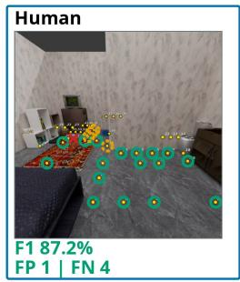

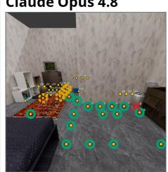  
F1 84.2% FP 1 | FN 5

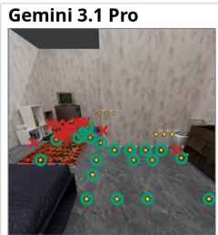  
F1 73.7% FP 15 | FN 0

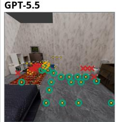  
F1 72.0% FP 11 | FN 3

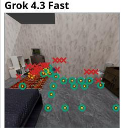  
F1 62.3% FP 21 | FN 2

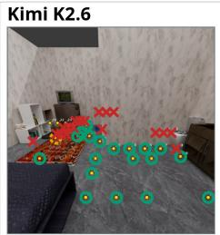  
F1 67.8% FP 18 | FN 1

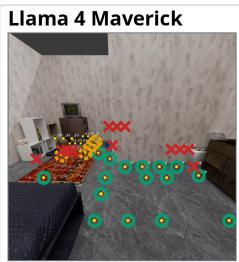  
F1 65.3% FP 12 | FN 5

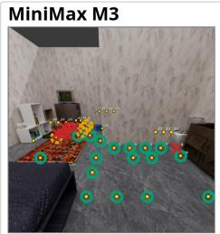  
Invalid ID 0

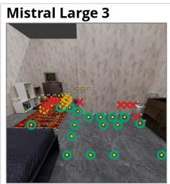  
F1 70.8% FP 10 | FN 4

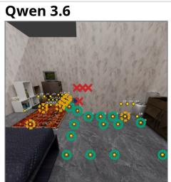  
F1 71.8% FP 4 |FN 7

Figure S1: Same-question outputs for Point Traversability. Each panel repeats the identical first-person input and overlays the actual Human or model response. Green rings denote correctly selected feasible points, red crosses denote incorrectly selected points, and dashed orange rings denote feasible points omitted from the returned set.

## Point Traversability: same-question Human and VLM outputs (example 2)

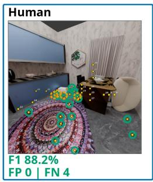

ocorrectly selectedx incorrectly selectedmissed feasible point

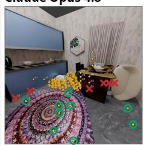  
F1 52.9% FP 6 | FN 10

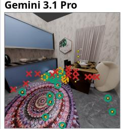  
F1 62.5% FP 14 | FN 4

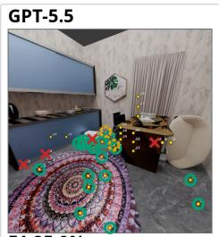  
F1 85.0% FP 4 | FN 2

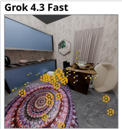

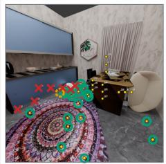  
F1 81.8% FP 7 FN 1

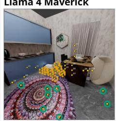  
F1 0.0% FP 0 | FN 19  
F1 59.3% FP 0 | FN 11

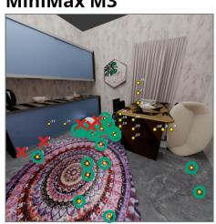  
F1 88.4% FP 5 | FN 0

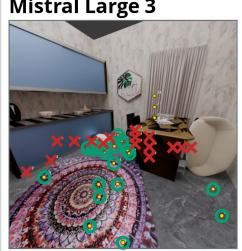  
F1 70.4% FP 16 | FN 0

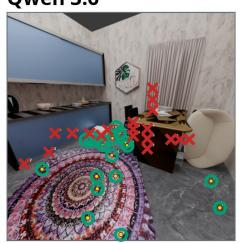  
F1 66.7% FP 19 | FN 0

Figure S2: Same-question outputs for Point Traversability. Each panel repeats the identical first-person input and overlays the actual Human or model response. Green rings denote correctly selected feasible points, red crosses denote incorrectly selected points, and dashed orange rings denote feasible points omitted from the returned set.

## Embodied Traversability: same-question Human and VLM outputs (example 1)

ocorrectly selectedxincorrectly selectedmissed feasible point

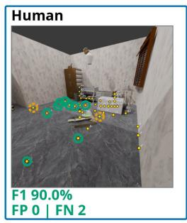

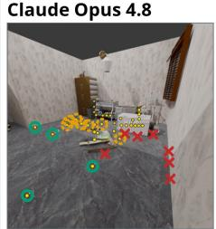  
F1 36.4% FP 7 | FN 7

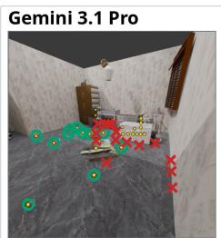  
F1 59.5% FP 15 | FN 0

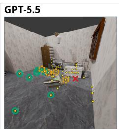  
F1 73.7% FP 1 | FN 4

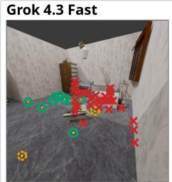  
Invalid ID 43

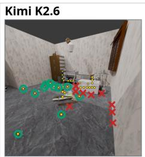  
F1 71.0% FP 9  FN 0

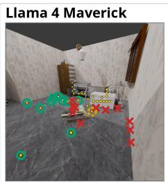  
F1 62.5% FP 11  FN 1

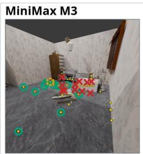  
F1 62.5% FP 11  FN 1

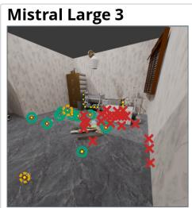  
F1 42.9% FP 22 | FN 2

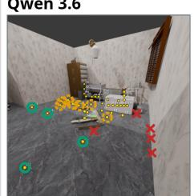  
F1 40.0% FP 5 | FN 7

Figure S3: Same-question outputs for Embodied Traversability. Each panel repeats the identical first-person input and overlays the actual Human or model response. Green rings denote correctly selected feasible points, red crosses denote incorrectly selected points, and dashed orange rings denote feasible points omitted from the returned set.

## Embodied Traversability: same-question Human and VLM outputs (example 2)

ocorrectly selectedx incorrectly selectedmissed feasible point

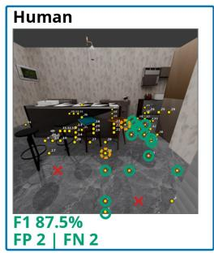

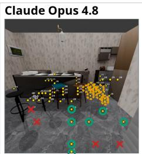  
F1 51.9% e FP 4 | FN 9

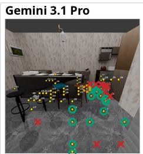  
F1 73.2% 0 FP 10 | FN 1

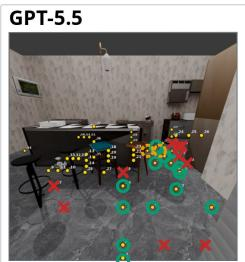

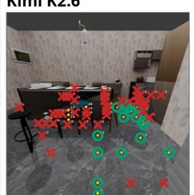

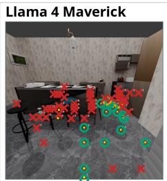  
0 F1 70.0% FP 10 | FN 2  
F1 44.4% FP 40 | FN 0  
F1 38.9% 0 FP 42 | FN 2

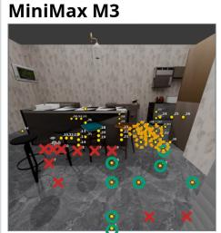  
F1 47.1% FP 10 | FN 8

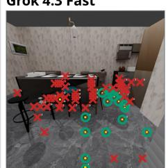  
F1 42.7% 0 FP 43 | FN 0

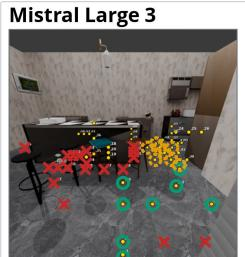  
F1 37.2% 0 FP 19 | FN 8

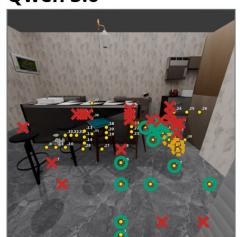  
F1 53.1% 0 FP 20 | FN 3

Figure S4: Same-question outputs for Embodied Traversability. Each panel repeats the identical first-person input and overlays the actual Human or model response. Green rings denote correctly selected feasible points, red crosses denote incorrectly selected points, and dashed orange rings denote feasible points omitted from the returned set.

## Point Path: same-question Human and VLM outputs (example 1)

valid route failed route required star correct goalwrong goal

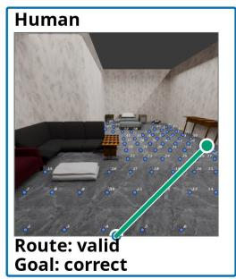

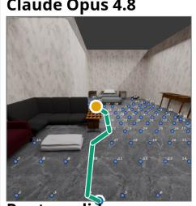  
Route: valid Goal: wrong

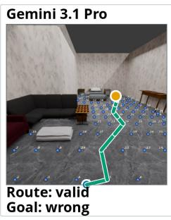

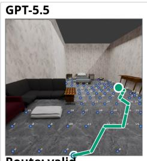  
Route: valid Goal: correct

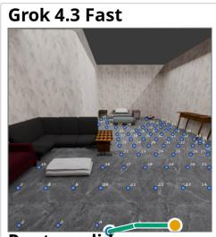  
Route: valid Goal: wrong

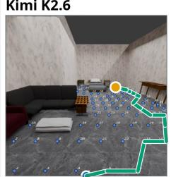  
Route: valid Goal: wrong

  
Route: valid Goal: correct

  
Route: valid Goal: wrong

  
Route: valid Goal: wrong

  
Route: valid Goal: wrong

Figure S5: Same-question outputs for Point Path. Each panel repeats the identical first-person input and overlays the actual Human or model response. The complete returned route is green when all consecutive edges are legal and red otherwise. The required start is blue; the returned endpoint is green for an acceptable goal and orange for a wrong goal.

## Point Path: same-question Human and VLM outputs (example 2)

  
Route: valid Goal: wrong  
valid route failed route required star correct goalwrong goal

  
Route: failed Goal: correct

  
Route: failed Goal: unavailable

  
Route: valid Goal: correct

  
Route: valid Goal: correct

  
Route: valid Goal: wrong

  
Route: valid Goal: wrong

  
Route: failed Goal: wrong

Figure S6: Same-question outputs for Point Path. Each panel repeats the identical first-person input and overlays the actual Human or model response. The complete returned route is green when all consecutive edges are legal and red otherwise. The required start is blue; the returned endpoint is green for an acceptable goal and orange for a wrong goal.

## Embodied Path: same-question Human and VLM outputs (example 1)

Start at ID 1. Goal: rack near the basket.

valid route failed route required star correct goalwrong goal

Kimi K2.6  
MiniMax M3  
Qwen 3.6  
Mistral Large 3  

  
Route: failed Goal: wrong

  
Route: failed Goal: wrong

GPT-5.5  
  
Route: failed Goal: wrong

  
Route: failed Goal: wrong

  
Route: failed Goal: wrong

  
Route: failed Goal: wrong

  
Route: failed Goal: wrong

  
Route: failed Goal: wrong

  
Route: failed Goal: wrong

Figure S7: Same-question outputs for Embodied Path. Each panel repeats the identical first-person input and overlays the actual Human or model response. The complete returned route is green when all consecutive edges are legal and red otherwise. The required start is blue; the returned endpoint is green for an acceptable goal and orange for a wrong goal.

## Embodied Path: same-question Human and VLM outputs (example 2)

Start at ID 1. Goal: monitor near the cup.

valid route failed route required star correct goalwrong goal

  
Route: failed Goal: wrong

  
Route: failed Goal: wrong  
Route: failed Goal: wrong  
Route: failed Goal: wrong

  
Route: failed Goal: wrong

  
Route: failed Goal: wrong

  
Route: failed Goal: wrong

Figure S8: Same-question outputs for Embodied Path. Each panel repeats the identical first-person input and overlays the actual Human or model response. The complete returned route is green when all consecutive edges are legal and red otherwise. The required start is blue; the returned endpoint is green for an acceptable goal and orange for a wrong goal.

Gemini 3.1 Pro

## Intent Path: same-question Human and VLM outputs (example 1)

Start at ID 1. Intent: I need a place to sit near the pillow, specifically thêifdlosuteoptiofailed route • required star correct goal  wrong goal

Llama 4 Maverick  
Kimi K2.6  

Claude Opus 4.8  
  
Route: failed Goal: wrong

  
Route:failed Goal: wrong

GPT-5.5  
  
Route: failed Goal: wrong

Grok 4.3 Fast  
  
Route: failed Goal: wrong

  
Route: failed Goal: wrong

  
Route: failed Goal: wrong

MiniMax M3  
  
Route: failed Goal: wrong

Mistral Large 3  
  
Route: failed Goal: wrong

  
Route: failed Goal: wrong

Figure S9: Same-question outputs for Intent Path. Each panel repeats the identical first-person input and overlays the actual Human or model response. The complete returned route is green when all consecutive edges are legal and red otherwise. The required start is blue; the returned endpoint is green for an acceptable goal and orange for a wrong goal.

## Intent Path: same-question Human and VLM outputs (example 2)

Start at ID 1. Intent: I need somewhere to put something away near thei booktspecifically thuclosesteoptien star correct goal  wrong goal

  
Route: failed Goal: wrong

  
Route: failed Goal: wrong

GPT-5.5  
  
Kimi K2.6  
Route: failed Goal: wrong

  
Route: valid Goal: wrong

  
Route: failed Goal: wrong

  
Route: failed Goal: wrong

  
Route: failed Goal: wrong

  
Route: failed Goal: wrong

Qwen 3.6  
  
Route: failed Goal: wrong

Figure S10: Same-question outputs for Intent Path. Each panel repeats the identical first-person input and overlays the actual Human or model response. The complete returned route is green when all consecutive edges are legal and red otherwise. The required start is blue; the returned endpoint is green for an acceptable goal and orange for a wrong goal.