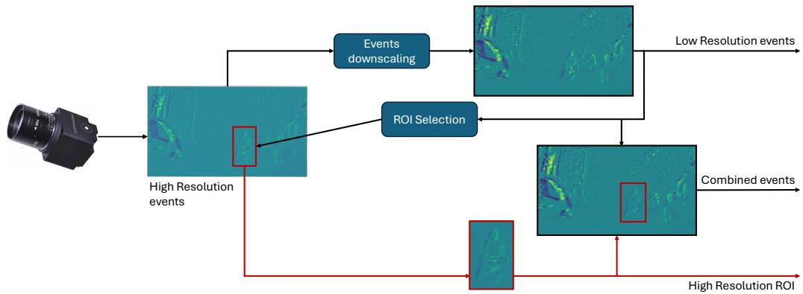
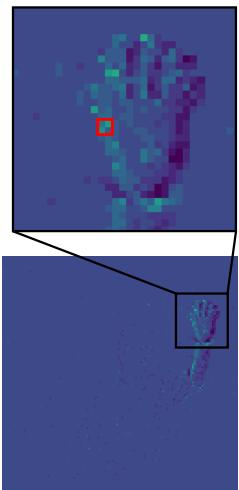
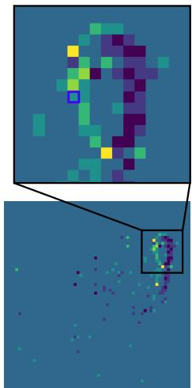
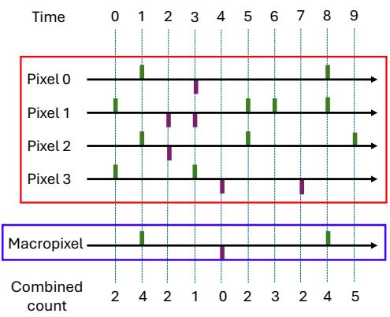
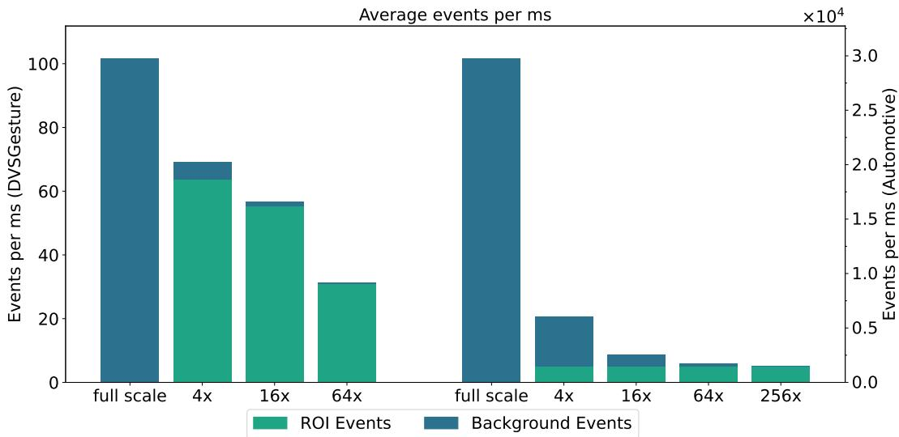
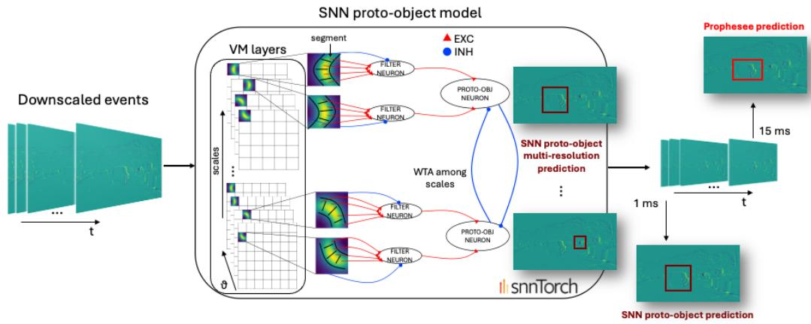
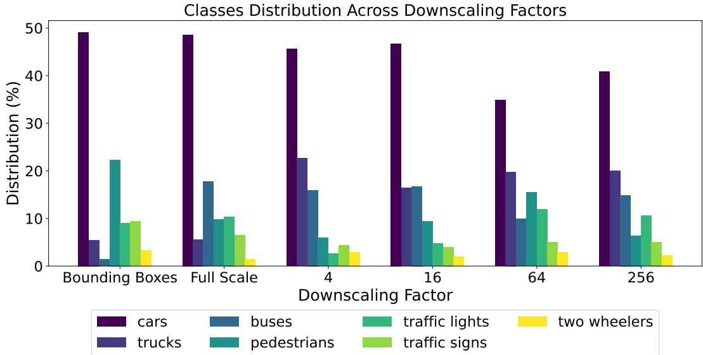
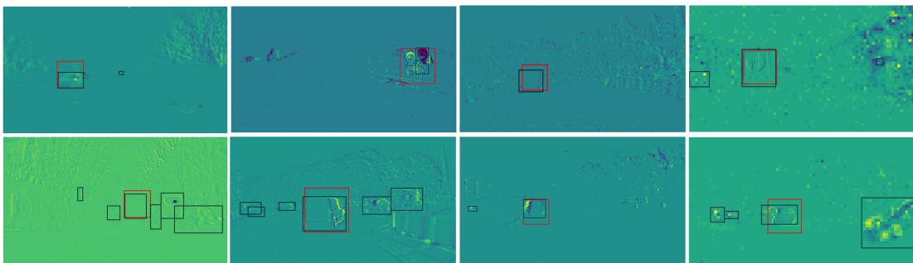

# Event-based Selective Attention for Multi-resolution Fast Region of Interest (ROI) Detection

Luca Peres∗   
International Centre for Neuromorphic   
Systems (ICNS)   
The University of Manchester   
Manchester, United Kingdom   
luca.peres-2@manchester.ac.uk

Chiara Bartolozzi Istituto Italiano di Tecnologia Genoa, Italy

chiara.bartolozzi@iit.it

Giulia D’Angelo∗   
Department of Cybernetics   
Faculty of Electrical Engineering   
Czech Technical University in Prague   
Prague, Czech Republic   
giulia.dangelo@fel.cvut.cz   
Oliver Rhodes   
International Centre for Neuromorphic   
Systems (ICNS)   
The University of Manchester   
Manchester, United Kingdom   
oliver.rhodes@manchester.ac.uk

## Abstract

Neuromorphic vision systems operate under strict constraints on bandwidth, memory, and energy, particularly at the edge, motivating early mechanisms for data reduction and selective processing. In this work, we investigate a multi-scale training-free, saliency-based, bottom-up visual attention model that operates directly on low-resolution event-based input and selects Regions of Interest (ROIs) from the visual scene. The model is evaluated across multiple downscaling factors applied to the incoming event stream, with input resolutions reduced by up to 256× relative to full resolution. Performance is assessed on the Prophesee Automotive dataset, the largest publicly available event-based dataset, demonstrating robust ROI selection across different scales on a real-world use-case. The proposed approach is capable of detecting ROIs belonging to multiple object classes, including various vehicle types, pedestrians, traffic lights, and traffic signs, with accuracy up to 70.8%, while operating at millisecond temporal resolution, 16× finer than the temporal resolution provided by the dataset ground truth. These results highlight the potential of combining early event downscaling with saliency-based attention as an effective front-end for efficient edge neuromorphic vision systems.

## 1 Introduction

The human visual system is constantly stimulated by an overwhelming stream of data from the surrounding environment. Mechanisms of selective visual attention [1] address this challenge by significantly reducing the amount of data to be processed, directing focus toward specific Regions of Interest (ROIs). Visual attention entails serial focalization over a sequence of specific targets in the visual scene [2] to ideally interact with an unconstrained and dynamic environment. Agents immersed in complex environments can take advantage of such mechanisms efficiently, organising their sensory inputs to perceive and explore their surroundings proficiently.

In biological systems, selective attention is coupled with foveation, whereby the high resolution region of the retina is shifted to focus on the ROI [3]. In current artificial vision systems, where the sensor has uniform resolution, one, or multiple ROIs can be selected and processed. This approach lowers data complexity and cost, enabling adaptive, energy-efficient vision for real-time applications [4], without compromising accuracy [5]. Additionally, in robotics, attention mechanisms have been extensively explored, aiming to model perception in agents also for socially interactive tasks [6]. Specifically, bio-inspired saliency approaches have shown effectiveness in tasks such as motion detection and exploratory gaze behavior [7, 8], including fast camera orientation towards human faces [9] and UAV obstacle avoidance guided by saliency cues [10].

Attention mechanisms distribute processing among different feature extractions, combining multiple conspicuity maps to produce a final saliency map that guides robot head movements in real-time [11]. In these models, spatially localised stimuli compete for attention using mechanisms like Winner-Take-All (WTA). Similar attention approaches have been applied, integrating cues from vision, audition, and haptics [12]. Other implementations focus their effort on introducing depth perception [13, 14, 15]. Motion also plays a significant role in attention mechanisms, essential for tracking objects or avoiding obstacles [16, 17]. The resulting saliency map can serve multiple purposes, including guiding selective visual attention [18], facilitating object recognition [19], and enabling object tracking [20]. These applications demonstrate the utility of saliency-based models in identifying ROIs for subsequent localised processing.

These studies represent valuable efforts in developing attention systems to enable agents to engage in visual exploration of their environment. However, despite their emphasis on minimising computations by focusing solely on the highly resolved portion of the visual field, neither of these studies addresses two significant constraints relevant in real-time applications: latency and energy consumption. One potential solution involves exploring a fully bio-inspired pipeline to bridge the gap between bioinspired software and hardware, thereby maximising the potential to reduce the computational burden and latency of the system by exploiting a sparse and event-based visual representation of the scene, based on event cameras.

Event cameras [21] operate more akin to biological eyes than frame-based cameras. Instead of sequentially scanning each pixel to measure incident light levels, event cameras have independent pixels that generate spikes when the incident light surpasses a threshold. These “pixel spikes" resemble the action potentials transmitted from the retina to the brain. The output of event cameras is asynchronous, sparse, and occurs only when there is a contrast between dark and light regions in the scene, detected as an illumination change for each pixel over time, essentially functioning as a dynamic edge extractor.

Mechanisms of selective attention have been significantly advanced through the use of neuromorphic circuits coupled with event cameras [22]. These mechanisms have been successfully implemented in humanoid robots equipped with neuromorphic cameras. This enables the robot to focus on the most salient regions of a scene [23].

Saliency-based models [24] typically involve three main stages: feature extraction, computation of individual feature maps, and integration and/or competition mechanisms to produce a final saliency map [25]. Additional recent works demonstrate the power of recurrent neural networks inspired by human sequential attention [20], saliency-based noise mitigation with center bias incorporation [26], and deep attention models predicting human fixations [27].

Recent event-driven, saliency-based approaches have investigated, incorporating Gestalt principles [28] to identify salient regions likely to contain objects using cues such as intensity and depth [29]. The integration of neuromorphic sensing and computing, through event-based sensors and Spiking Neural Networks (Spiking Neural Networks (SNNs)), enables efficient, parallel processing of sparse visual data, inspired by the brain’s computational principles [30]. These methods have demonstrated effectiveness in real-time applications [23]. Building on this, a fully SNN-based implementation of event-driven saliency has been deployed on neuromorphic hardware such as SpiNNaker for real-time performance [23]. Furthermore, the incorporation of recurrent connections in the visual attention model [29] has been shown to improve object presence estimation and enable biologically plausible segmentation [31].

An important component often overlooked in these approaches is the downscaling of visual input, which could substantially reduce processing demands and latency in real-time scenarios [32]. Previous studies have looked at identifying ROIs from a downsampled visual field, however, these focused on selecting fixed portions of the visual field [33].

  
Figure 1: Proposed pipeline for multi-resolution ROI detection. Visual events are downscaled, and low-resolution events are used to select relevant ROIs. Our proposed pipeline produces separate event streams, allowing for processing of low resolution and ROI events separated, or in conjunction.

The downscaling aspect is becoming more relevant in modern applications. Recent event cameras [34] can achieve high spatial resolutions, enabling more accuracy in computer vision tasks, however this results in generating streams of events which are too intensive to be processed by real-time embedded systems. The EU NimbleAI project [35] aims to address this issue, by developing an integrated sensing and processing architecture able to operate on and control multiple input resolutions and to select only relevant information from the visual field, while discarding what is redundant. This work, by extending the SNN saliency-based model [36, 23], proposes an early perception selective attention architecture able to identify ROIs, with the aim of controlling multi-resolution event cameras [35], and reducing down-stream processing.

This work builds on top of the neurmorphic, event-based, proto-object saliency model [23], adding multi-scale downscaling to further reduce the computational load and system latency. Key contributions include:

• The final learning-free implementation operates at 1 ms latency, an order of magnitude faster than previous studies [37], leveraging a lightweight shallow SNN with only two layers.

• A key extension of this work is its application to challenging real-world scenarios, such as automotive environments, where we demonstrate the model achieves 70% accuracy in detecting salient objects, and ignoring clutter and noise.

• We investigate the role of input downscaling in the process of ROI detection. We show that our model is robust to input degradation, achieving comparable performance with increasing downscaling factors, and is able to identify moving, rather than static, ROIs operating at 1 ms time resolution. This results in a significant reduction of processed data, over 19× on the considered automotive use case.

The paper is structured into the following sections. Section 2 presents an overview of the proposed pipeline and the methods used for this work, including an analysis of the potential benefits of such approach in terms of events reduction. Section 3 presents the experimental results. Finally, Section 4 summarises the contributions and draws conclusions.

## 2 Methods

Exploring the concept and potential of foveated sensing, as outlined in Section 1, requires sensing at multiple resolutions, and using this reduced resolution data to predict where in the visual field high-resolution sensing resource should be focused. While ideally this research would be performed on a multi-resolution hardware sensor, due to availability, this work explores a simulated sensor in order to observe the effect of resolution on ROI detection. The proposed pipeline is shown in Figure 1, demonstrating high-resolution sensor input on the left-hand side, and ROI output on the bottom. Two distinct steps are required to enable the proposed pipeline: downscaling, and ROI Selection. In this work, we focus on event data, and therefore downscale data produced using neuromorphic cameras (see Section 2.1 for algorithm details, and Section 2.2 for characterisation on common neuromorphic datasets). This downscaled data then forms the input to ROI selection models, which are able to predict where features of interest are occuring in the data stream. A number of techniques could be used for ROI detection, including trained classification and object-detection type networks. However, in this work, the focus is on low-latency ROI detection from generic event streams, and therefore a bottom-up saliency-based attention model is selected (see Section 2.3). It’s noted that for specific applications, alternative ROI selection algorithms may yield improved performance, however the overall pipeline of Figure 1 remains the same, with the goal to compress the incoming data stream, by sensing the general field of view in low resolution, and sensing only ROIs in high-resolution.

  
(a)

  
(b)  
Figure 2: Downscaling event resolution for a sample representing a subject waving their hand, extracted from the DvsGesture dataset [38], when applying a 4× scaling factor and log luminance reconstruction based on event count. The left side (a) shows first a frame (accumulated over 10 ms) with events represented at scale, and then the same frame downscaled. The two insets show the ROI enlarged, with pixels combined into a Macropixel as highlighted by the red and blue squares. The right side (b) presents the events generated by the pixels in the region in red in the fullscale frame (clockwise order, from top left) over the 10 ms of execution, and how these are downscaled according to the combined threshold into the blue pixel in the downscaled frame.

## 2.1 Downscaling

Spatial downscaling techniques reduce event throughput of event cameras and facilitate real-time processing in embedded systems [32, 39]. While there are multiple techniques which can be applied, most exploit the concept of Macropixels. A Macropixel is obtained by combining the events from multiple adjacent pixels from the sensor grid in a square fashion, as shown in red in Figure 2a left. The downscaled output consists of an array of Macropixels, as shown in Figure 2a right, generating events in a similar way to the original pixel. The downscaling factor corresponds to the number of original pixels belonging to each Macropixel (e.g. Figure 2a right, uses a $2 \times 2$ Macropixel, representing a 4× downscaling of Figure 2a left). Downscaling techniques leveraging Macropixels differ in the way the Macropixels are generated and how they produce events. The most effective event-based downscaling approaches [32] aim at reconstructing the log luminance of a Macropixel as the average of those pixels in the original sensor array which are part of the Macropixel. The work presented in this paper builds on this idea, extending on previous work [32], by estimating the mean log luminance of each Macropixel through a normalised event count of the pixels belonging to it. The mechanism is illustrated in Figure 2b, where the downscaled Macropixel composed of 4 pixels $( 2 \times 2 )$ , from the events represented in Figure 2a, in the full-scale sensor grid is shown. The output events of the pixels belonging to the Macropixel are accumulated and then checked against a contrast threshold to determine whether an event is generated. Downscaled events are generated only when the entire threshold interval is covered (in analogy to what happens for single pixels in the original sensor array), therefore the slope is tracked, providing information on when an extremum happens (an example of this is shown in Figure 2b, where the threshold for an OFF event is crossed at time 2, but an event is only generated at time 4, i.e. when the full threshold interval is covered and the threshold crossed).

This approach is useful for embedded real-world applications, as it allows for generating downscaled events in real time, while streamed from a sensor, as it does not require knowing when future events on the pixels involved in the downscaling process will be generated [32].

## 2.2 Characterisation

In this section we show the advantages of employing multi-resolution event processing in terms of output event reduction on datasets commonly used in the field. The analysis was performed on both the DvsGesture dataset [38] representing different human gestures and the 1 Mpx Prophesee Automotive dataset [37] for dynamic driving environments. Differently sized Macropixels were generated, yielding different downscaling factors, with dynamic ROIs on the most active area of the visual field in the case of the DvsGesture dataset, and matching the provided bounding boxes for the Automotive dataset.

For the DvsGesture dataset, downscaling using Macropixels of dimensions $2 \times 2 , 4 \times 4 ,$ , and $8 \times 8$ pixels was evaluated, corresponding to scaling factors of 4×, 16×, and 64×, respectively. The $8 \times 8$ macropixel case represents an extreme scenario, as the resulting visual field is reduced to a $1 6 \times 1 6$ pixel array. At such high downscaling levels, the averaging used in the log-luminance reconstruction introduces excessive noise, particularly given the relatively low original resolution of the DvsGesture recordings $( 1 2 8 \times 1 2 8$ pixels). Consequently, higher downscaling factors are excluded from our analysis. For the Automotive dataset, downscaling was performed using Macropixels of sizes $2 \times 2 .$ $4 \times 4 , 8 \times 8 ,$ , and $1 6 \times 1 6$

To evaluate the reduction in event count, in this experiment, we computed the total number of events generated by the sensor at full resolution and compared it with the corresponding number of events after downscaling (see Table 1). The downscaled event counts include background activity, which represent the total number of events recorded in the downscaled visual field, excluding those within the ROIs. Events occurring within the ROIs are reported separately to analyse the significant difference in event count from the background activity. The total event reduction factor is also reported for each donwscaling. This is calculated on the total event count, i.e. including both low resolution and ROI events. Additionally, Table 1 reports the temporal density, calculated over the number of events generated per millisecond; this metric is particularly relevant for real-time applications involving Spiking Neural Networks (SNNs), which frequently operate on neuromorphic hardware designed to emulate neural processing at millisecond-level temporal resolution [40, 41]. Following previous studies [32, 39], the temporal density of the event stream is useful to quantify the average activation probability of pixels across the full sensor array. This is computed according to Equation 1.

$$
D = { \frac { \sum _ { x , y } P _ { x , y } } { s } }\tag{1}
$$

Where $P _ { x , y }$ is the activation probability of each pixel in the considered time range, and s is the sensor size. $P _ { x , y }$ can be obtained from Equation 2, where $e _ { x , y } ( t )$ are the events generated by the pixel of coordinates $( x , y )$ at time $t ,$ and $\Delta \bar { t }$ is the time interval.

$$
P _ { x , y } = \frac { \sum _ { t } e _ { x , y } ( t ) } { \Delta t }\tag{2}
$$

The temporal density shows the distribution of events over the sensor, linking pixel activation to the amount of transmitted information. A high density corresponds to event data with high activation [39].

All listed metrics were measured for all applied downscaling factors, with results of all measurements, including event counts and temporal density, presented in Table 1. The time intervals used to evaluate the data presented in Table 1 are set to the average duration of one hand gesture $( \approx 6 \mathrm { ~ s ~ } [ 3 8 ] )$ for the DvsGesture dataset, and ∼ 10 s of recording for the Automotive dataset, and are obtained from execution on the entire dataset for both the cases. For both the experiments, the combined event count decreases, as expected, with increasing downscaling factors, showing up to a 3.25× reduction for the DvsGesture dataset, achieved with an $8 \times 8$ downscaling; and 19.6× for the Automotive dataset with a $1 6 \times 1 6$ downscaling. The temporal density exhibits a consistent decrease across both experiments, highlighting the effectiveness of the approach in reducing data volume. Once the system selects the ROI, the original non-downscaled events from the event camera pixels are retrieved at full resolution (ROI Events). In most cases, the number of events in the ROI is comparable to the total number of downscaled events in the background. For high scaling factors $( 1 6 \times \bar { 1 6 }$ for the Automotive dataset), the number of events in the ROIs is greater than the number of events in background (low resolution events).

DVSGesture Dataset
<table><tr><td>Downscaling</td><td>Combined Event Count</td><td>Background Event Count (LR)</td><td>ROI Event Count (HR)</td><td>Total Event Reduction Factor</td><td>Temporal Density</td></tr><tr><td>Full scale</td><td> $\overline { { 6 . 8 9 \times 1 0 ^ { 5 } } }$ </td><td>N/A</td><td>N/A</td><td>N/A</td><td> $6 . 2 0 5 { \times } 1 0 ^ { - 6 }$ </td></tr><tr><td> $2 \times 2$ </td><td> $4 . 6 9 \times 1 0 ^ { 5 }$ </td><td> $3 . 7 7 \times 1 0 ^ { 4 }$ </td><td> $4 . 3 1 \times 1 0 ^ { 5 }$ </td><td> $1 . 4 7 \times$ </td><td> $4 . 0 3 8 \times 1 0 ^ { - 6 }$ </td></tr><tr><td>4×4</td><td> $3 . 8 3 \times 1 0 ^ { 5 }$ </td><td> $9 . 5 4 \times 1 0 ^ { 3 }$ </td><td> $3 . 7 4 \times 1 0 ^ { 5 }$ </td><td>1.80×</td><td> $3 . 2 6 2 \times 1 0 ^ { - 6 }$ </td></tr><tr><td> $8 \times 8$ </td><td> $2 . 1 2 \times 1 0 ^ { 5 }$ </td><td> $2 . 2 0 \times 1 0 ^ { 3 }$ </td><td> $2 . 0 9 \times 1 0 ^ { 5 }$ </td><td> $3 . 2 5 \times$ </td><td> $1 . 7 9 7 \times 1 0 ^ { - 6 }$ </td></tr></table>

<table><tr><td>Downscaling</td><td>Combined Event Count</td><td>Background Event Count (LR)</td><td>ROI Event Count (HR)</td><td>Total Event Reduction Factor</td><td>Temporal Density</td></tr><tr><td>Full scale</td><td> $2 . 9 8 \times 1 0 ^ { 8 }$ </td><td>N/A</td><td>N/A</td><td>N/A</td><td> $\overline { { 3 . 1 9 7 \times 1 0 ^ { - 5 } } }$ </td></tr><tr><td> $2 \times 2$ </td><td> $5 . 9 8 \times 1 0 ^ { 7 }$ </td><td> $4 . 5 1 \times 1 0 ^ { 7 }$ </td><td> $1 . 4 7 \times 1 0 ^ { 7 }$ </td><td>4.98×</td><td> $6 . 1 3 1 \times 1 0 ^ { - 6 }$ </td></tr><tr><td> $4 \times 4$ </td><td> $2 . 5 5 \times 1 0 ^ { 7 }$ </td><td> $1 . 0 7 \times 1 0 ^ { 7 }$ </td><td> $1 . 4 7 \times 1 0 ^ { 7 }$ </td><td> $1 1 . 6 9 \times$ </td><td> $2 . 5 7 5 \times 1 0 ^ { - 6 }$ </td></tr><tr><td> $8 \times 8$ </td><td> $1 . 7 2 \times 1 0 ^ { 7 }$ </td><td> $2 . 4 4 \times 1 0 ^ { 6 }$ </td><td> $1 . 4 7 \times 1 0 ^ { 7 }$ </td><td> $1 7 . 3 2 \times$ </td><td> $1 . 7 3 1 \times 1 0 ^ { - 6 }$ </td></tr><tr><td> $1 6 \times 1 6$ </td><td> $1 . 5 2 \times 1 0 ^ { 7 }$ </td><td> $4 . 9 3 \times 1 0 ^ { 5 }$ </td><td> $1 . 4 7 \times 1 0 ^ { 7 }$ </td><td> $1 9 . 6 0 \times$ </td><td> $1 . 5 3 3 \times 1 0 ^ { - 6 }$ </td></tr></table>

Table 1: Execution results are reported for both the DvsGesture and Automotive datasets, showing the downscaling, the combined event count (HR+LR), the background events (LR), the ROI events (HR), total events reduction and the temporal density. The evaluated time intervals are 6s for the DvsGesture dataset (approximately the duration of one hand gesture), and ∼ 10s for the Automotive dataset. These values are obtained as average from execution on both the entire datasets.

  
Figure 3: Histogram representing the generated average events per ms for the DVSGesture (4 bars on left) and the Automotive ( 5 bars on the right) datasets, with increasing downscaling factor (Macropixel size). The proportion of events in the ROI and in background is shown in the form of stacked bars.

Figure 3 shows histograms with the number of generated events for each downsampling per millisecond, counted and averaged over the whole set, for both the DVSGesture (four bars on the left) and Automotive (the five bars on the right) datasets. Each bar shows the number of events that fall in the

  
Figure 4: Network structure. Events binned at 1 ms time resolution are filtered by Von Mises (VM) filters of different sizes and orientations at different scales, feeding into the filter neurons layer. Neighbouring filters with opposite convexities and the same size are then combined into the protoobject layer (grouping layer). Lateral inhibition in the proto-object layer selects a single ROI.

Low-Resolution (LR) Background area (dark blue) and those that fall in the High-Resolution (HR) ROI area (light blue). These values serve as useful indicators for estimating input requirements in resource and time constrained applications, such as real-time SNNs inference on embedded neuromorphic hardware [40]. The generated events per millisecond decrease of ≈ 70% with increasing downscaling factor for the DvsGesture dataset (up to 8 × 8 Macropixel) , and decrease of about 95% with a 16 × 16 downscaling for the Automotive dataset. This results in a reduction from ∼101 events per millisecond to ∼31 for the DVSGesture dataset, and from ∼29k to ∼1.5k for the Automotive case. With a downscaling factor reaching 256× (16 × 16 Macropixel), the efficacy of the approach starts to diminish, since the number of ROI events dominates the total event count. This is confirmed by the temporal density for the same case presented in Table 1. However, this did not impact the visual consistency, and further downscaling factors could still be applied. Table 1 shows that the reduction in temporal density is higher for the 1 Mpx sensor, compared to the DVS128 sensor, hence better compressing the per pixel activation.

## 2.3 Saliency-Based ROI Estimation

Building on top of the benefits presented in section 2.2 in terms of event reduction, this work focuses on the development of biologically-inspired saliency-based methods as a mechanism to guide ROI selection. This builds on the proto-object model initially developed by [42] for frame-based cameras and later adapted for event-driven cameras [29] and modified as SNN [23]. Its architecture includes two key layers: Border Ownership and the Grouping Pyramid. These layers incorporate principles of Gestalt psychology [28], including continuity and figure-ground organisation, to process closed object contours at multiple scales, ensuring scale invariance.

The implementation presented here is inspired by the SNN saliency-based visual attention model running on the SpiNNaker neuromorphic hardware [23]. The key contribution of our work lies in the model’s ability to track salient regions at different scales and generate adaptable ROIs over the detected proto-objects. The first layer of the saliency-based visual attention model, the Border Ownership Pyramid, takes advantage of von Mises (VM) filters, depicted in Figure 4, to detect close contours (See Eq. 3):

$$
V M _ { \theta } ( x , y ) = \frac { \exp ( \rho \cdot R _ { 0 } \cdot \cos ( a t a n 2 ( - y , x ) - \theta ) } { I _ { 0 } ( \sqrt { x ^ { 2 } + y ^ { 2 } } - R _ { 0 } ) }\tag{3}
$$

Where x and y represent the coordinates of the kernel centered at the origin, $R _ { 0 }$ denotes the radius of the filter, ρ controls the arc length of the active pixels within the kernel, influencing its convexity, θ specifies the orientation, and $I _ { 0 }$ refers to the modified Bessel Function of the first kind. The initial layer of the model employs m×l VM filters, with different sizes (in the following m=3) and a specific orientation (in the following l=8) positioned on the input layer with stride = 1. Each VM filter possesses a distinct receptive field, such that each incoming event activates a specific pixel within one of these filters. The kernels are connected to a single Filter Neuron via excitatory connections. Additionally, the Filter Neuron receives inhibitory input from the background of the VM kernel, enhancing the selectivity of the receptive field to curved shapes. This stage of the model represents the Border Ownership cells.

Filter Neurons of opposite orientations of the VM kernels are connected with each other to perceptually group the information resembling the Grouping cells layer, referred to as Proto-object Neurons, correlating to the presence of an object of a given size. These contribute to the formation of the saliency map. The filters are arranged into four rotational pairs (8 orientations), with each pair rotated 180 degrees relative to its counterpart. The outputs from all spatial scales and rotational pairs are then integrated to generate the final saliency map. A ROI is subsequently defined around the point of maximum saliency, by means of a WTA approach, where the most salient proto-object inhibits all the others, resulting in selection of a single ROI. The output of the network, therefore, provides the centre coordinates and bounding box of the ROI, as described in Section 2.3.

## 3 Experiments & Results

The presented model is tested against 4 different downscaling factors (4×, 16×, 64×, 256×), mirroring the analysis performed in Section 2.2, to show its efficacy on multiple resolutions. For each scaling factor, 3 different sizes of VM filters are applied alongside the scaling factor of the visual field, with the filter overlap kept at 99%. In order to quantitatively estimate the accuracy of the presented approach, the accuracy of the detected ROIs is checked against dataset’s annotations (bounding boxes) as ground truth, and the overlap between the detected ROIs and the bounding boxes is measured. Therefore only annotated datasets are suitable for such analysis. The overlap between ROIs and bounding boxes is obtained by calculating the percentage of the ROI, in terms of pixels, which lies within a single bounding box. Here we report the total average overlap of all the ROIs to the bounding boxes.

As an additional metric, we show the Intersection over Union (IoU) of the detected ROIs, compared to the dataset’s bounding boxes. The detected ROIs from the presented implementation are restricted to being square and assume pre-defined fixed-size dimensions, while the ground truth bounding boxes vary in shape and size. For this reason,the potential maximum IoU, obtained by aligning the top left corner of a ROI and the relative bounding box, is calculated, and the real IoU is divided by this value, obtaining a normalised IoU. This returns a relative measure of the IoU with respect to the maximum value that could be obtained if the ROI and the bounding box were aligned. The IoU metric is calculated according to Equation 4.

$$
I o U = { \frac { | R O I \cap B B | } { | R O I \cup B B | } }\tag{4}
$$

In equation 4, the term ROI refers to the region of interest detected by our model, while BB refers to the annotated bounding boxes from the dataset.

## 3.1 The Prophesee Automotive Dataset

The 1 Megapixel Prophesee Automotive Dataset [37] contains 14.6 hours of recordings taken from a car driving under different scenarios (city, highway, countryside, small villages and suburbs), under different light and weather conditions during daytime. The dataset is provided together with annotations, in the form of 25 million bounding boxes of cars, pedestrians, two-wheeled vehicles, trucks, buses, traffic signs and traffic lights with a time resolution of 16 ms. The data was recorded using a high resolution (1280 x 720) event camera [34], paired with a frame-based RGB camera, providing support in obtaining the labels [37]. To date, this is the largest publicly available event-based dataset.

Prophesee Automotive Dataset Statistics
<table><tr><td rowspan=1 colspan=1>Total Mean Bounding Box Size</td><td rowspan=1 colspan=4>105×126</td></tr><tr><td rowspan=1 colspan=1>Total Median Bounding Box Size</td><td rowspan=1 colspan=4>64×84</td></tr><tr><td rowspan=1 colspan=1>Class</td><td rowspan=1 colspan=1>Median BB Size</td><td rowspan=1 colspan=1>Mean BB Size</td><td rowspan=1 colspan=1>Percentage</td><td rowspan=1 colspan=1>Aspect Ratio</td></tr><tr><td rowspan=7 colspan=1>CarsPedestriansTraffic signsTraffic lightsTrucksTwo wheelersBuses</td><td rowspan=1 colspan=1>89×64</td><td rowspan=1 colspan=1>135×114</td><td rowspan=1 colspan=1>49.11%</td><td rowspan=1 colspan=1>1.18</td></tr><tr><td rowspan=1 colspan=1>58×112</td><td rowspan=1 colspan=1>29×84</td><td rowspan=1 colspan=1>22.30%</td><td rowspan=1 colspan=1>0.34</td></tr><tr><td rowspan=1 colspan=1>25×28</td><td rowspan=1 colspan=1>45×38</td><td rowspan=1 colspan=1>9.36%</td><td rowspan=1 colspan=1>1.18</td></tr><tr><td rowspan=2 colspan=1>21×44100×100</td><td rowspan=1 colspan=1>40×57</td><td rowspan=1 colspan=1>9.04%</td><td rowspan=1 colspan=1>0.70</td></tr><tr><td rowspan=1 colspan=1>159×182</td><td rowspan=1 colspan=1>5.46%</td><td rowspan=1 colspan=1>0.87</td></tr><tr><td rowspan=2 colspan=1>64×113146×127</td><td rowspan=1 colspan=1>101×163</td><td rowspan=1 colspan=1>3.27%</td><td rowspan=1 colspan=1>0.61</td></tr><tr><td rowspan=1 colspan=1>200×216</td><td rowspan=1 colspan=1>1.45%</td><td rowspan=1 colspan=1>0.92</td></tr></table>

Table 2: Statistics measured from the Prophesee automotive dataset per class.

The results presented for this work are based on this dataset, as it represents a real-world use case exhibiting a wide range of classes, with a spatial resolution high enough to allow for exploration of a range of downscaling factors. Other datasets were considered for this study, such as the SalMapIROS dataset [29] and the IBM DVSGesture dataset [38]. However, these were discarded due to a lack of labels to compare the detected ROIs with and due to a reduced input spatial resolution, as highlighted in Section 2.2. Furthermore, recordings from such datasets typically tend to be short and hand crafted, removing the real-world context that this study is seeking.

In order to best estimate the sizes for the detected ROIs, statistics analysis of the Automotive dataset’s bounding boxes was performed. This analysis is presented in Table 2. The average and median values for all the bounding boxes are computed and are respectively 105 × 126 and 64 × 84. Alongside these figures, statistics for each class are provided. These are the average and median bounding box sizes, the number of occurrences relative to the total number of bounding boxes for a given class (given as a percentage), and the mean aspect ratio of the boxes for that class. As can be seen from Table 2, Cars is the most prominent class (amounting to 49.11% of the bounding boxes), followed by Pedestrian (22.30%), Traffic signs (9.36%), Traffic lights (9.04%), Trucks (5.46%), Two wheelers (3.27%) and Buses(1.45%). Given these measurements, the following sizes were chosen for the ROIs to be selected by our model: 100 × 100, 120 × 120, 150 × 150. These take into account the total average size, but also the spread among classes. Larger sized ROIs were preferred to ensure the calculated performance scores do not yield higher results due to the identification of portions of bounding boxes, rather than full objects. The overlap scores are calculated in terms of ROI pixels overlapping labelled objects pixels. Should the former be fully contained in the latter, this would result in a 100% overlap. To avoid these cases, the ROI sizes were selected favouring the higher bounding box sizes, with respect to the average.

Another important aspect is the average aspect ratio of the bounding boxes from various classes. This metric indicates the average shape of a bounding box from a given class, where a value of 1 corresponds to a perfectly squared bounding box. Since the detected ROIs are squared in shape, the network will be more sensitive to bounding boxes of this sort. Therefore, classes such as pedestrians (with an aspect ratio of 0.34), two wheelers (with 0.61) and traffic lights (with 0.70) are expected to yield lower detection accuracy.

The model was run at 1 ms time resolution, predicting a ROI every timestep. This is 16 times finer than the time resolution at which the Automotive dataset bounding boxes are provided. This also aligns with on-line requirements for future mapping on neuromorphic hardware. Results are presented in Table 3, evaluated from the whole Prophesee Automotive dataset (14.6 hours of recording) for each downscaling factor. For each downscaling factor, we report the fraction of ROIs overlapping with the corresponding bounding box, the average overlap with standard deviation, and the normalised IoU average and standard deviation.

The number of ROIs overlapping with the bounding boxes of the dataset ranges from ∼ 71% at full scale, to ∼ 57% with a 256× downscaling factor. The average overlap is above 50% for all cases. These results show the robustness of the approach to various downscaling factors, achieving minimal degradation of performance even with aggressive downscaling factors, while reaching prediction with 1 ms time resolution. As described in Section 2.2, a 256× downscaling results in an event reduction of approximately 20× compared to a full scale representation. The accuracy in ROI detection using our method however only degrades by ∼ 14%, while maintaining a similar average overlap (∼ 51% against ∼ 59%). The most notable case is represented by the 4× downscaling, which yields a 5× reduction in events, and a ∼ 65% match for the ROIs (only a ∼ 6% reduction compared to the full scale case).

Mean ROI Overlap
<table><tr><td>Downscaling</td><td>Overlapping ROIs</td><td>Mean ROI Overlap</td><td>Stdev</td><td>Mean IoU</td><td>Stdev</td></tr><tr><td>Full scale</td><td>70.81%</td><td>58.67%</td><td>15.91%</td><td>61.54%</td><td>14.88%</td></tr><tr><td>4x</td><td>64.89%</td><td>55.67%</td><td>13.89%</td><td>59.82%</td><td>11.89%</td></tr><tr><td>16x</td><td>62.82%</td><td>53.25%</td><td>7.54%</td><td>56.59%</td><td>6.28%</td></tr><tr><td>64x</td><td>58.06%</td><td>52.84%</td><td>5.40%</td><td>57.09%</td><td>4.89%</td></tr><tr><td>256x</td><td>56.93%</td><td>50.61%</td><td>11.22%</td><td>52.11%</td><td>7.21%</td></tr></table>

Table 3: Mean accuracy values for ROI overlap and relative IoU for the various downscaling factors

  
Figure 5: Distribution of ROIs per class across the various downscaling factors. Dataset bounding boxes values are on the left.

Figure 5 shows the distribution of classes among the detected ROIs for each applied downscaling. For reference, the first provided case corresponds to the dataset bounding boxes, as shown in Table 2. The model achieves similar class distibutions for all the downscaling factors. The Cars class is the most prominent across different downscalings, being above 40% for all cases (except for 64× downscaling). This is due to multiple factors: Cars is by far the most common class, with 49% of occurrences in the ground truth. This also means that the bounding boxes’ mean size is mostly influenced by this value, contributing to the ROI sizes chosen for the model. Furthermore, elements belonging to Cars have on average an aspect ratio of 1.18, which makes them close to a square, therefore, more easily detectable by the network. Pedestrians, on the other hand, are not easily detected. This is shown by a large discrepancy between the bounding boxes dataset (at 22.3%) and the detected ROIs belonging to this class (ranging from 5.95% at 4× to 15% at 64×). This is mainly due to the nature of this class, which, on average, presents very rectangular elements, as evidenced by the low aspect ratio of 0.34. Despite this being the second most common class (at 22.30%), only a few elements of this are detected across all the scaling. This is confirmed by the better performance in detecting trucks and buses, which again are approximately square (with aspect ratios of 0.87 and 0.92, respectively) and aligned with the bounding boxes in size. This becomes more evident with increasing downscalings, especially for high factors, where lower resolution causes classes to be less identifiable.

As highlighted in Section 2.3, the model looks to identify a single ROI at a time, as the most salient portion of the visual field. In contrast, the annotations of the dataset often present multiple bounding boxes at the same time. For this reason, the class distribution presented in Figure 5 exhibits higher values for some specific classes (e.g. busses and trucks), compared to the dataset bounding boxes. This is not to be attributed to false predictions, as the identified classes are only marked based on the overlap measurements, but to a different distribution of such classes, due to the nature of the task and the configuration of the model.

  
Figure 6: Examples of detected ROIs (in red) compared with the dataset bounding boxes (in black) at different downscaling factors (1 per column from left to right 4×, 16×, 64×, 256×). Frames are generated at 16 ms (bounding boxes time resolution) and events are displayed as heatmaps.

Finally, Figure 6 shows examples of execution of the model. Eight separate cases are presented, randomly sampled from the 14.6 hours of recordings. Two cases per downscaling are reported. Each column represents one of the applied downscalings. Each frame is the result of event accumulation over the dataset bounding boxes period (i.e. 16 ms). Events are displayed as heatmaps, hence the variations in colour for the various cases. The red box corresponds to the ROI detected from the model, the black boxes are the dataset’s bounding boxes. For visual comparison, only the last identified ROI in the presented time interval is displayed. Inside each detected ROI, events are presented at the original resolution, showing the multi-resolution effect achieved by the approach. Various classes are detected here, including Cars, Trucks and Traffic signs. The presented samples show both good and bad overlap scores, where a good example is given by the top right case (256× downscaling), where a truck is identified with a high overlap score. A bad prediction is shown in the second column (16× downscaling), top frame, where, despite the ROI containing the traffic signs, this is considerably larger than the bounding boxes, resulting in a very low overlap score, since this is calculated in terms of proportion of ROI pixel overlapping with bounding box pixels. All the presented cases in Figure 6 show high event counts associated with trees in the background, and these are not influencing the network’s predictions, demonstrating the capability of the model to ignore noise and clutter.

## 4 Discussion

We proposed an efficient event-based, high temporal resolution, learning-free, scalable, and general approach for ROI detection. The system is a bottom-up model capable of extracting salient information at multiple resolutions from the visual scene at 1 ms temporal resolution. The system has been benchmarked against a real-world use-case, the Prophesee Automotive dataset, i.e. the largest event-based dataset available, showing an average of 62.7% ROI detection accuracy, and 16× faster than the ground truth.

The first experiment shows the benefits of event downscaling in terms of data reduction, showing a close to exponential decrease in the amount of input events from the high resolution to the largest downscaling factor.

The results show that our multi-scale approach is able to reduce information loss, caused by input event downscaling, by extracting high resolution ROIs from the visual field. While increasing downscaling factors introduces growing information distortion, our approach demonstrates robustness by achieving similar predictions across scales. This yields a more compact and efficient event representation with minimal loss of salient information

Previous studies [36] demonstrated that the detection of salient objects can reach an accuracy of 88.8% in office scenarios and 89.8% in challenging indoor and outdoor low-light conditions, as evaluated on the event-assisted low-light video object segmentation dataset [43]. Therefore, we compared our ROIs with the Automotive dataset bounding box annotations, achieving more than 70% overlap of ROIs at full scale, with mean normalised IoU values above 60%, indicating strong alignment with the ground truth. Even under downscaling, the overlap remains consistently high, with values above 56% for ROIs correspondence and mean normalised IoU above 50%. This demonstrates that our training-free strategy estimates well the location of meaningful ROIs. Furthermore, our presented method is able to perform ROI detection at 1 ms time resolution, achieving 1 order of magnitude higher resolution than ground truth lables provided with the Prophesee Automotive dataset. The results confirm that the model optimally detects cars, trucks, and buses within the objects in the dataset.

The results presented here are well aligned with the objectives of the NimbleAI project [35], targeting development of foveated vision systems. The presented model, due to its lightweight nature, can be deployed for real-time early perception and near-sensor selective attention, receiving as input low resolution events, as recorded by a multi-resolution Dynamic Vision Sensor (DVS) sensor, and it is able to produce coordinates for ROI selection, informing such a sensor where to focus higher resolution. This work paves the way for the development of digitally foveated event cameras by providing the tools to explore event reduction strategies which are application agnostic. The development of a paired hardware accelerator, as part of the NimbleAI project, will allow for the deployment of such a model in/near the foveated sensor, allowing for real-time control. It also paves the way for multi-sensor systems, where low-resolution always-on sensors can be paired with higher resolution sensors, which do not have the power or data-storage budgets to record a wide field of view or continuously. The presented approach could be implemented on the low-resolution sensor to help guide data capture from the higher resolution sensor, creating an overall system with unique energy, latency and resolution characteristics.

This strategy has the potential to be expanded and fine-tuned for more specialised tasks, by developing, for instance, top-down-based classifiers, which can inspect the selected ROI looking for applicationspecific features. Such classifiers can then feed back to the bottom-up model described here, indicating how good a prediction is, and subsequently steer the network output towards other portions of the visual field, in case of a bad estimate, or maintain the focus on the selected area, in case of a good one. This approach would allow for the development of more lightweight, therefore also faster, classifiers, which only need to focus on a ROI-sized input, rather than the entire full-resolution of the visual field, and are more specialised to best fit specific applications. Extensions to this approach are also possible to detect multiple ROIs at once, by relaxing the network’s output WTA mechanism, to select the top K most relevant objects. However, such a task has a different scope than what is explored in this work, and therefore is currently beyond our exploration. Future work could also include temporal integration as done by Chane et al. [44], where the accumulation of the events and the subsequent saliency map is generated from multi-scale spatiotemporal volumes. However, this would need to be traded off against the low-latency capability demonstrated in this work.

## Author Contributions

LP co-designed the selective attention model, developed the software implementation, ran the experiments and co-drafted the manuscript. GDA co-designed the model and co-drafted the manuscript. CB and OR supervised the research. All authors read, commented and approved the final manuscript.

## Funding

This research was supported through the NimbleAI project, funded via the Horizon Europe Research and Innovation programme (Grant Agreement 101070679), and UKRI under the UK government’s Horizon Europe funding guarantee (Grant Agreement 10039070); the Horizon Europe AIDA4Edge project (Grant Agreement 101160293), and under the UK government’s Horizon Europe funding guarantee (10116105); and the EPSRC Edgy Organism project (EP/Y030133/1). GDA acknowledges the financial support from the European Union’s HORIZON-MSCA-2023-PF-01-01 research and innovation programme under the Marie Skłodowska-Curie grant agreement ENDEAVOR No 101149664.

## Data Availability Statement

The data that support the findings of this study is available at the following URL: https://github.com/NimbleAI-Manchester/NimbleAI.

## References

[1] Giacomo Rizzolatti. Mechanisms of selective attention in mammals. In Advances in vertebrate neuroethology, pages 261–297. Springer, 1983.

[2] William James, Frederick Burkhardt, Fredson Bowers, and Ignas K Skrupskelis. The principles ofpsychology, volume 1. Macmillan London, 1890.

[3] Cesar Bandera and Peter D Scott. Foveal machine vision systems. In Conference Proceedings., IEEE International Conference on Systems, Man and Cybernetics, pages 596–599. IEEE, 1989.

[4] Mohammed Yeasin and Rajeev Sharma. Foveated vision sensor and image processing–a review. Machine Learning and Robot Perception, pages 57–98, 2005.

[5] Ekdeep Singh Lubana and Robert P Dick. Digital foveation: An energy-aware machine vision framework. IEEE Transactions on Computer-Aided Design ofIntegrated Circuits and Systems, 37(11):2371–2380, 2018.

[6] Cynthia Breazeal and Brian Scassellati. A context-dependent attention system for a social robot. rn, 255(3), 1999.

[7] Boris Schauerte, Benjamin Kühn, Kristian Kroschel, and Rainer Stiefelhagen. Multimodal saliency-based attention for object-based scene analysis. In 2011 IEEE/RSJ International Conference on Intelligent Robots and Systems, pages 1173–1179. IEEE, 2011.

[8] Jonas Ruesch, Manuel Lopes, Alexandre Bernardino, Jonas Hornstein, José Santos-Victor, and Rolf Pfeifer. Multimodal saliency-based bottom-up attention a framework for the humanoid robot icub. In 2008 IEEE International Conference on Robotics and Automation, pages 962–967. IEEE, 2008.

[9] Nicholas J Butko, Lingyun Zhang, Garrison W Cottrell, and Javier R Movellan. Visual saliency model for robot cameras. In 2008 IEEE International Conference on Robotics and Automation, pages 2398–2403. IEEE, 2008.

[10] Tao Ma, Jie Ma, Bin Fang, Fangyu Hu, Siwen Quan, and Huajun Du. Multi-scale decomposition based fusion of infrared and visible image via total variation and saliency analysis. Infrared Physics & Technology, 92:154–162, 2018.

[11] Ales Ude, Valentin Wyart, Li-Heng Lin, and Gordon Cheng. Distributed visual attention on a humanoid robot. In 5th IEEE-RAS International Conference on Humanoid Robots, 2005., pages 381–386. IEEE, 2005.

[12] Sethu Vijayakumar, Jörg Conradt, Tomohiro Shibata, and Stefan Schaal. Overt visual attention for a humanoid robot. In Proceedings 2001 IEEE/RSJ International Conference on Intelligent Robots and Systems. Expanding the Societal Role ofRobotics in the the Next Millennium (Cat. No. 01CH37180), volume 4, pages 2332–2337. IEEE, 2001.

[13] Nobuo Kawabata. Attention and depth perception. Perception, 15(5):563–572, 1986.

[14] Neil DB Bruce and John K Tsotsos. An attentional framework for stereo vision. In The 2nd Canadian Conference on Computer and Robot Vision (CRV’05), pages 88–95. IEEE, 2005.

[15] Giulia Pasquale, Tanis Mar, Carlo Ciliberto, Lorenzo Rosasco, and Lorenzo Natale. Enabling depth-driven visual attention on the icub humanoid robot: Instructions for use and new perspectives. Frontiers in Robotics and AI, 3:35, 2016.

[16] James Thompson and Raja Parasuraman. Attention, biological motion, and action recognition. Neuroimage, 59(1):4–13, 2012.

[17] Haofeng Li, Guanqi Chen, Guanbin Li, and Yizhou Yu. Motion guided attention for video salient object detection. In Proceedings of the IEEE/CVF International Conference on Computer Vision, pages 7274–7283, 2019.

[18] Silviu Minut and Sridhar Mahadevan. A reinforcement learning model of selective visual attention. In Proceedings of the fifth international conference on Autonomous agents, pages 457–464, 2001.

[19] Ueli Rutishauser, Dirk Walther, Christof Koch, and Pietro Perona. Is bottom-up attention useful for object recognition? In Proceedings of the 2004 IEEE Computer Society Conference on Computer Vision and Pattern Recognition, 2004. CVPR 2004., volume 2, pages II–II. IEEE, 2004.

[20] Volodymyr Mnih, Nicolas Heess, Alex Graves, et al. Recurrent models of visual attention. Advances in neural information processing systems, 27, 2014.

[21] G. Gallego, T. Delbruck, G. Orchard, C. Bartolozzi, B. Taba, A. Censi, S. Leutenegger, A. J. Davison, J. Conradt, K. Daniilidis, and D. Scaramuzza. Event-based vision: A survey. IEEE Transactions on Pattern Analysis &amp; Machine Intelligence, 44(01):154–180, jan 2022.

[22] Chiara Bartolozzi and Giacomo Indiveri. Selective attention in multi-chip address-event systems. Sensors, 9(7):5076–8098, 2009.

[23] Giulia D’Angelo, Adam Perrett, Massimiliano Iacono, Steve Furber, and Chiara Bartolozzi. Event driven bio-inspired attentive system for the icub humanoid robot on spinnaker. Neuromorphic Computing and Engineering, 2(2):024008, 2022.

[24] Laurent Itti, Christof Koch, and Ernst Niebur. A model of saliency-based visual attention for rapid scene analysis. IEEE Transactions on pattern analysis and machine intelligence, 20(11):1254–1259, 1998.

[25] Qi Zhao and Christof Koch. Learning saliency-based visual attention: A review. Signal Processing, 93(6):1401–1407, 2013.

[26] Na Tong, Huchuan Lu, Ying Zhang, and Xiang Ruan. Salient object detection via global and local cues. Pattern Recognition, 48(10):3258–3267, 2015.

[27] Matthias Kummerer, Thomas SA Wallis, Leon A Gatys, and Matthias Bethge. Understanding low-and high-level contributions to fixation prediction. In Proceedings of the IEEE international conference on computer vision, pages 4789–4798, 2017.

[28] Wolfgang Köhler. Gestalt psychology. Psychological research, 31(1):XVIII–XXX, 1967.

[29] Massimiliano Iacono, Giulia D’Angelo, Arren Glover, Vadim Tikhanoff, Ernst Niebur, and Chiara Bartolozzi. Proto-object based saliency for event-driven cameras. In IROS, pages 805–812, 2019.

[30] Mathias Gehrig, Sumit Bam Shrestha, Daniel Mouritzen, and Davide Scaramuzza. Event-based angular velocity regression with spiking networks, 2020.

[31] Giulia D’Angelo, Simone Voto, Massimiliano Iacono, Arren Glover, Ernst Niebur, and Chiara Bartolozzi. Event-driven figure-ground organisation model for the humanoid robot icub. Nature Communications, 2024.

[32] Amélie Gruel, Jean Martinet, María Teresa Serrano Gotarredona, and Bernabé Linares Barranco. Event data downscaling for embedded computer vision. In Proceedings of the 17th International Joint Conference on Computer Vision, Imaging and Computer Graphics Theory and Applications (2022), pp. 245-253. SciTePress, 2022.

[33] Amélie Gruel, Dalia Hareb, Antoine Grimaldi, Jean Martinet, Laurent Perrinet, Bernabé Linares-Barranco, and Teresa Serrano-Gotarredona. Stakes of neuromorphic foveation: a promising future for embedded event cameras. Biological Cybernetics, 117(4):389–406, 2023.

[34] Thomas Finateu, Atsumi Niwa, Daniel Matolin, Koya Tsuchimoto, Andrea Mascheroni, Etienne Reynaud, Pooria Mostafalu, Frederick Brady, Ludovic Chotard, Florian LeGoff, Hirotsugu Takahashi, Hayato Wakabayashi, Yusuke Oike, and Christoph Posch. 5.10 a 1280×720 backilluminated stacked temporal contrast event-based vision sensor with 4.86µm pixels, 1.066geps readout, programmable event-rate controller and compressive data-formatting pipeline. In 2020 IEEE International Solid- State Circuits Conference - (ISSCC), pages 112–114, 2020.

[35] Xabier Iturbe, Nassim Abderrahmane, Jaume Abella, Sergi Alcaide, Eric Beyne, Henri-Pierre Charles, Christelle Charpin, Lars Chittka, Angélica Dávila, Manil Dev Gomony, Arne Erdmann, Carles Estrada, Ander Fern ández, Anna Fontanelli, José Flich, Alejandro Hernán Gloriani, Radu Grosu, Carles Hernández, Daniele Ielmini, Eric Isusquiza, David Jackson, Maha Kooli, Nicola Lepri, Bernabé Linares-Barranco, Jean-Loup Lachese, Martxel Lasa, Menno Laurent, Eric Lindwer, Frank Linsenmaier, Mikel Luján, Karel Masarík, Nele Mentens, Orlando Moreira, Luca Peres, Jean-Philippe Noel, Arash Pourtaherian, Christoph Posch, Peter Priller, Zdenek Prikryl, Felix Resch, Oliver Rhodes, Todor Stefanov, Moritz Storring, Sander Stuijk, Michele Taliercio, Marcel van de Burgwal, Geert van der Plas, Elisa Vianello, and Pavel Zaykov. Nimbleai: Towards neuromorphic sensing-processing 3d-integrated chips. In Accepted for publication at DATE 2023, 2023.

[36] Giulia D Angelo, Victoria Clerico, Chiara Bartolozzi, Matej Hoffmann, P Michael Furlong, and Alexander Hadjiivanov. Wandering around: A bioinspired approach to visual attention through object motion sensitivity. arXiv preprint arXiv:2502.06747, 2025.

[37] Etienne Perot, Pierre de Tournemire, Davide Nitti, Jonathan Masci, and Amos Sironi. Learning to detect objects with a 1 megapixel event camera. In Proceedings of the 34th International Conference on Neural Information Processing Systems, NIPS’20, Red Hook, NY, USA, 2020. Curran Associates Inc.

[38] Arnon Amir, Brian Taba, David Berg, Timothy Melano, Jeffrey McKinstry, Carmelo Di Nolfo, Tapan Nayak, Alexander Andreopoulos, Guillaume Garreau, Marcela Mendoza, Jeff Kusnitz, Michael Debole, Steve Esser, Tobi Delbruck, Myron Flickner, and Dharmendra Modha. A low power, fully event-based gesture recognition system. In 2017 IEEE Conference on Computer Vision and Pattern Recognition (CVPR), pages 7388–7397, 2017.

[39] Amélie Gruel, Jean Martinet, Bernabé Linares-Barranco, and Teresa Serrano-Gotarredona. Performance comparison of dvs data spatial downscaling methods using spiking neural networks. In Proceedings of the IEEE/CVF Winter Conference on Applications of Computer Vision, pages 6494–6502, 2023.

[40] Oliver Rhodes, Luca Peres, Andrew G. D. Rowley, Andrew Gait, Luis A. Plana, Christian Brenninkmeijer, and Steve B. Furber. Real-time cortical simulation on neuromorphic hardware. Philosophical Transactions of the Royal Society A: Mathematical, Physical and Engineering Sciences, 378, Dec 2019.

[41] Luca Peres and Oliver Rhodes. Parallelization of Neural Processing on Neuromorphic Hardware. Frontiers in Neuroscience, 16, 2022.

[42] Alexander F. Russell, Stefan Mihala¸s, Rudiger von der Heydt, Ernst Niebur, and Ralph Etienne-Cummings. A model of proto-object based saliency. Vision Research, 94:1–15, 2014.

[43] Hebei Li, Jin Wang, Jiahui Yuan, Yue Li, Wenming Weng, Yansong Peng, Yueyi Zhang, Zhiwei Xiong, and Xiaoyan Sun. Event-assisted low-light video object segmentation. In Proceedings ofthe IEEE/CVF Conference on Computer Vision and Pattern Recognition, pages 3250–3259, 2024.

[44] Camille Simon Chane, Ernst Niebur, Ryad Benosman, and Sio-Hoi Ieng. An event-based implementation of saliency-based visual attention for rapid scene analysis, 2024.