Date of publication xxxx 00, 0000, date of current version xxxx 00, 0000. Digital Object Identifier

# EventEgoHands++: Event-based Egocentric 3D Hand Mesh Reconstruction with Real Dataset

RYOSEI HARA1, (Graduate Student Member, IEEE), WATARU IKEDA1, (Graduate Student Member, IEEE), MASASHI HATANO1, (Graduate Student Member, IEEE), MARIKO ISOGAWA1, 2, (Member, IEEE)

1Graduate School of Science and Technology, Keio University, Yokohama, Kanagawa 223-8522, Japan6 2JST Presto

Corresponding author: Ryosei Hara (e-mail: ryosei\_hara@keio.jp).

This research is supported by JST Presto JPMJPR22C1, JSPS KAKENHI 24K22296, and 25H01159, JST FOREST Program JPMJFR242I. W. Ikeda is supported by JST BOOST, Japan Grant Number JPMJBS2409. M. Hatano is supported by JST BOOST, Japanp Grant Number JPMJBS2409, and Amano Institute of Technology.

ABSTRACT 3D hand mesh reconstruction is a challenging yet essential task for downstream applications, including human-robot interaction and AR/VR. Although conventional cameras (e.g., RGB or depth cameras) have been widely adopted for this task, methods that rely on them struggle in low-light environments and under severe motion blur. To address these limitations, event-based cameras have recently attracted attention for their high dynamic range and high temporal resolution. However, applying event cameras to egocentric hand reconstruction remains challenging because camera wearer’s motion produces dense background events that obscure hand-specific signals. Although the first egocentric event-based approach mitigates this issue using hand segmentation, its binary hand mask does not distinguish between left and right hands. As a result, the model lacks instance-level hand information and predicts both hands even when only one or neither hand is present. This limitation leads to incorrect inter-hand relationships and degraded reconstruction accuracy. In this paper, we propose EventEgoHands++, a framework for event-based 3D hand mesh reconstruction from an egocentric viewpoint that overcomes these limitations. The proposed method incorporates a Hand Detector that estimates instance-level bounding boxes and masks for both the left and right hands. Moreover, we introduce Adaptive Attention, which dynamically gates the attention based on these detection results to accurately learn the spatial relationship and mutual interactions between the hands. To train and evaluate our framework, we extend the synthetic N-HOT3D dataset with bounding-box annotations and refined masks, and newly construct EEH-R, the largest real-world event-based egocentric hand dataset to date, comprising approximately 1M annotated frames captured in environments including low-light conditions. Extensive experiments on both synthetic and real datasets demonstrate that our method consistently outperforms the baselines. Our code and datasets are available at https://ryhara.github.io/EventEgoHandsV2/.

INDEX TERMS Egocentric vision, event-based vision, 3D hand mesh reconstruction, 3D hand pose estimation.

## I. INTRODUCTION

ANDS play a fundamental role in human interaction such as grasping objects, manipulating tools, and performing gestures rely heavily on hand motions. Therefore, reconstructing a 3D hand mesh from egocentric vision is important for applications such as human–computer interaction, AR/VR, and robotics. In particular, capturing fine-grained hand motions and shapes from the camera wearer’s viewpoint is essential for enabling immersive experiences and safe interactions.

However, conventional methods based on RGB(D) cameras [1]–[6] may encounter challenging situations when applied to egocentric vision. For example, in addition to rapid hand movements, the head motion of the camera wearer can cause motion blur. Moreover, in environments with varying illumination conditions, particularly in low-light settings, recognizing the hand can become challenging.

Recently, the use of event-based cameras, hereafter referred to as event cameras, has attracted increasing attention [7]. Event cameras provide high temporal resolution and a high dynamic range, enabling the capture of fast motions even in low-light environments where RGB cameras struggle. They also offer low power consumption and memoryefficient sensing, making them well suited for deployment on edge devices and wearable platforms.

However, most existing event-based 3D hand mesh reconstruction methods [8]–[11] focus on fixed third-person camera setups. In contrast, an egocentric perspective provides greater flexibility and mobility for capturing natural hand interactions, as illustrated in Fig. 1. One of the main challenges in using an event camera in a first-person setting is that camera motion generates a large number of events across the entire background, making it difficult to extract events corresponding to hand motion. In our earlier conference paper, we proposed EventEgoHands [12], the first framework for egocentric event-based hand reconstruction, which suppresses such background events with a hand segmentation module and established the feasibility of this task.

Nevertheless, EventEgoHands should be regarded as a first step, as it leaves three fundamental problems unresolved.

Lack of instance-level hand identity. The binary mask in [12] does not encode left/right hand identity, so the model always reconstructs both hands regardless of their actual visibility, which frequently breaks in egocentric video where hands often leave the field of view. This yields invalid outputs when only one or neither hand is present and degrades the estimated inter-hand relative positions.

Visibility agnostic interaction modeling. Its cross-attention is applied unconditionally between the two hand branches, forcing feature exchange with absent or misidentified hands. Such a fixed attention pathway cannot adapt to the constantly changing hand visibility inherent to egocentric interaction.

Unverified real-world applicability. Its validation was confined to synthetic data, although real event streams differ substantially from simulated ones in event density, temporal distribution, and sensor noise. Since no real-world egocentric event dataset existed, the effectiveness of this task on real sensor data remained unverified. In particular, performance under low-light conditions, the very scenario that motivates event cameras, had never been evaluated on real data.

To address these problems, we propose EventEgo-Hands++, a robust framework for event-based egocentric 3D hand mesh reconstruction. Our proposed method consists of two main stages: hand extraction and hand reconstruction. First, to resolve the inability to distinguish between left and right hands, we incorporate a Hand Detector in the hand extraction stage. This detector simultaneously estimates instance-level bounding boxes and masks, ensuring that each hand is accurately localized and identified only when present. Second, to address the performance degradation caused by fixed attention mechanisms, we introduce Adaptive Attention in the hand reconstruction stage. Unlike existing methods that apply cross-attention regardless of visibility, our Adaptive Attention dynamically selects the attention operations according to the detection results. This allows the model to effectively learn spatial correlations and inter-hand interactions by adapting to the visibility of each hand.

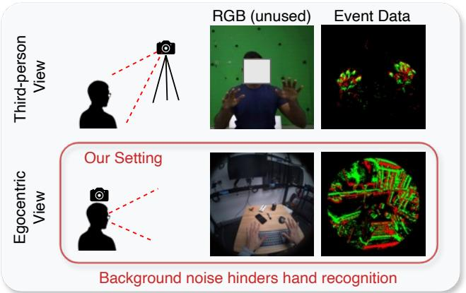  
FIGURE 1. Challenges of egocentric event-based cameras. While fixed third-person camera setups are limited to specific environments, egocentric viewpoints provide greater mobility and flexibility for capturing hand interactions. However, in egocentric event camera scenarios, the wearer’s motion generates numerous background events, which can obscure hand-related signals and make accurate hand recognition difficult.

In addition, to facilitate research in this field, we provide two datasets. Specifically, we extend N-HOT3D, the synthetic dataset introduced in [12], with refined segmentation masks and newly added bounding-box annotations, enlarging it to approximately 480K annotated frames. More importantly, we introduce EEH-R, a newly collected real-world dataset captured with an actual event camera in challenging egocentric scenarios, including low-light conditions. While event-based hand reconstruction on real event data has been explored only in third-person settings, EEH-R enables, for the first time, evaluation on real event data in egocentric settings. To the best of our knowledge, EEH-R is the largest real-world event-based egocentric hand dataset, containing approximately 1M annotated frames. The details of the two datasets, N-HOT3D and EEH-R, are summarized in Table 1.

Using both datasets, we validate the effectiveness of EventEgoHands++. On the synthetic N-HOT3D dataset, our method reduces mean MPJPE by 21.82 mm (33.7%) and MPVPE by 20.57 mm (34.0%) compared with the best existing method. On the EEH-R dataset, it further reduces MPJPE by 7.90 mm (18.8%) and MPVPE by 7.13 mm (18.1%).

Our technical contributions are summarized as follows:

• We propose EventEgoHands++, a robust event-based egocentric 3D hand mesh reconstruction framework that explicitly handles hand visibility and left/right hand identity under severe egocentric camera motion.

• We introduce two key methodological components: a Hand Detector that jointly estimates instance-level bounding boxes and masks for the left and right hands, and Adaptive Attention, which dynamically activates inter-hand attention based on detection results to model spatial relationships only when the corresponding hands are visible.

TABLE 1. Comparison of event-based hand datasets. The asterisk indicates that the corresponding annotation is available for a subset of the frames.
<table><tr><td>Type</td><td>Dataset</td><td>View</td><td>Hands</td><td>Subs.</td><td>Dur.</td><td>Seq.</td><td>#GT</td><td>Annotation</td></tr><tr><td rowspan="3">Synthetic</td><td>EventHands (Synthetic) [8]</td><td>Third</td><td>Single</td><td>一</td><td>100 h</td><td>-</td><td>360M</td><td>MANO</td></tr><tr><td>Ev2Hands-S [10]</td><td>Third</td><td>Both</td><td></td><td></td><td></td><td>28K</td><td>MANO, Event seg.</td></tr><tr><td>N-HOT3D (Ours)</td><td>Ego</td><td>Both</td><td>9</td><td>4.4 h</td><td>136</td><td>480K</td><td>MANO, Hand mask/bbox</td></tr><tr><td rowspan="4">Real</td><td>EventHands (Real) [8]</td><td>Third</td><td>Single</td><td>-</td><td>12.6 s</td><td>4</td><td>357</td><td>2D keypoints</td></tr><tr><td>Ev2Hands-R [10]</td><td>Third</td><td>Both</td><td>5</td><td>20.1 m</td><td>8</td><td>70K</td><td>3D keypoints</td></tr><tr><td>EvRealHands [9]</td><td>Third</td><td>Single</td><td>10</td><td>79 m</td><td>102</td><td>425K</td><td>MÁÑO</td></tr><tr><td>EEH-R (Ours)</td><td>Ego</td><td>Both</td><td>8</td><td>2.36 h</td><td>85</td><td>1M</td><td>MANO, (Hand mask/bbox)*</td></tr></table>

• We newly construct EEH-R, the first and largest realworld event-based egocentric hand dataset, containing approximately 1M annotated frames captured under both well-lit and low-light conditions. We further extend the synthetic N-HOT3D dataset with refined masks and newly added bounding-box annotations, enlarging it to approximately 480K annotated frames. Experiments on these datasets demonstrate the effectiveness of EventEgoHands++ against existing baselines.

The paper is structured as follows. Section II reviews related work on egocentric hand analysis, 3D hand pose estimation, and event-based 3D hand mesh reconstruction. Section III describes the proposed EventEgoHands++ framework, including the hand extraction and hand reconstruction stages. Section IV introduces the synthetic N-HOT3D dataset and the real-world EEH-R dataset. Section V presents the experimental setup, including implementation details, baseline methods, and evaluation metrics. Section VI reports the experimental results, including evaluations on both datasets, hand segmentation performance, ablation studies, and failure case analysis. Finally, Section VII concludes the paper.

## II. RELATED WORK

## A. HANDS IN EGOCENTRIC VIDEOS

Hands are the primary interface where humans interact with the world, making their analysis central to egocentric (firstperson) video understanding [13], [14]. Unlike exocentric (third-person) perspectives, egocentric video presents unique challenges, including frequent motion blur and severe occlusions during manipulation.

Early research in egocentric hand analysis focused on localization and segmentation [15]–[18]. Bambach et al. [19] introduced the EgoHands dataset, establishing a hands detection benchmark. The research focus has recently extended from hand-centric tasks toward full hand-object interaction understanding with the advent of the large-scale interaction understanding using massive benchmarks such as EPIC-KITCHENS [20], [21], Ego4D [22], and HOI4D [23]. Recent efforts prioritize hand-object detector [24], [25], joint handobject reconstruction [26], [27], and hand-object segmentation [28], [29].

In addition to understanding hand-object interaction, egocentric hand cues serve as a vital proxy for downstream applications such as action recognition [30]–[32] and anticipation [33]. Beyond the categorization of current and future actions, researchers have also focused on the temporal evolution of hand motion through hand forecasting [34]–[39]. These tasks are essential for proactive human-robot collaboration and augmented reality interfaces.

As a critical subfield, egocentric hand pose estimation has evolved alongside a progression of increasingly complex datasets. While early benchmarks like FPHA [40] laid the foundation, recent datasets like H2O [41], HoloAssist [42], ARCTIC [43], and Assembly101 [44] have introduced challenges involving bimanual interaction and articulated objects. The state-of-the-art has been further pushed by large-scale datasets such as Ego-Exo4D [45] and HOT3D [46]. Methodologically, recent literature has shifted toward leveraging Transformers for spatial-temporal dependencies, as seen in HTT [47], utilizing multi-view consistency to resolve egocentric occlusions, exemplified by AssemblyHands [48] and S2DHand [49], and addressing the task in the in-context learning [50]. A more general literature review of 3D hand pose estimation follows next.

## B. 3D HAND POSE ESTIMATION

Initial efforts in 3D hand pose estimation primarily relied on depth sensors [1]–[3] to capture the complex geometry of the hand. With the shift toward monocular RGB input, the field has largely converged on the use of parametric models to provide anatomical priors. The MANO model [51] has become the de facto standard in this field, offering a low-dimensional yet anatomically plausible representation of hand shape and pose. Boukhayma et al. [4] pioneered the first fully learnable pipeline to directly regress MANO parameters from a single image, followed by the use of intermediate representations like 2D heatmaps [52], iterative 2D alignment loops [53], and occlusion-robust methods [54].

On the other hand, non-parametric methods [55]–[57] have explored direct vertex regression using Graph Convolutional Networks (GCNs) [58], which have been widely used to exploit the inherent graph structure of the hand mesh. THOR-Net [59] further extended these to hand-object interaction, in which two hands and object poses are estimated. More recently, Transformer-based architectures, such as METRO [60] and Mesh Graphormer [61], have set new state-of-the-art benchmarks by modeling global interactions between vertices and joints without relying on a fixed kine-

matic tree.

However, the parametric approach remains highly favored for its robustness to occlusions and its ability to maintain valid hand topology. Recently, Pavlakos et al. [5] demonstrated that the performance of parametric reconstruction can be significantly enhanced by scaling up model capacity based on Vision Transformer (ViT) [62] backbones, following the success in body pose estimation [63], [64]. Recent imagebased 3D hand pose estimation methods [5], [6] achieve stateof-the-art accuracy across diverse datasets, and their encoders have also been shown to be useful for downstream tasks such as visibility estimation [65]. Several works [66]–[68] have extended their efforts to 4D hand mesh reconstruction that incorporates temporal information.

While monocular 3D hand mesh reconstruction has advanced significantly, conventional camera-based approaches often fail in low-light conditions and under motion blur caused by rapid hand or camera movement. To this end, this study explores the use of event cameras, which are robust in such extreme scenarios due to their high dynamic range and high temporal resolution.

## C. EVENT-BASED 3D HAND MESH RECONSTRUCTION

Event cameras output asynchronous streams of events by recording changes in pixel intensity. In recent years, event cameras have gained increasing popularity [7], [69]–[72] owing to their high dynamic range and high temporal resolution, which help address challenges such as low-light conditions and motion blur that conventional sensors, such as RGB or depth cameras, often fail to handle effectively.

In the context of 3D vision, event cameras are particularly advantageous as they provide nearly continuous trajectories of moving edges, allowing for the recovery of precise geometric structures and motion cues that are typically lost during fast movements in frame-based captures. Recently, event cameras have been utilized for several 3D tasks [73], such as 3D geometric reconstruction [74]–[77], non-rigid reconstruction [78], depth estimation [79], [80], human pose estimation [81]–[84], and 3D hand tracking [85].

3D hand mesh reconstruction is a central task for various applications, such as robotics or AR/VR. Some studies [86], [87] have utilized both RGB and event data to complement modality-specific information. Although these methods are robust, the hardware setup for inference is relatively expensive and unrealistic for real-world applications.

Several studies [8]–[11] tackle the 3D hand mesh reconstruction task using only event cameras during inference. While reconstruction methods in other domains often focus on task-specific network architectures [69], [74], event-based hand reconstruction has mainly emphasized event representations suitable for subsequent 3D hand estimation. EventHands [8] is a lightweight framework designed for fast hand motion reconstruction. It employs a frame-based 2D representation, termed Locally-Normalized Event Surfaces (LNES), which preserves relative temporal information and polarity within a short period of time. Ev2Hands [10] tackles the reconstruction of both hands via a point cloud-based approach. It preserves temporal information via a point cloud representation, termed Event Cloud, effectively leveraging the raw event data. EvHandPose [9] likewise adopts the LNES representation. In addition, it introduces motion representations based on shape flow and edges to effectively reduce motion ambiguity, and addresses the challenge of sparse annotations using a weakly supervised learning framework. Recently, RPEP [11] was proposed as a pre-training method that leverages labeled RGB images and unlabeled event data during training to improve 3D hand pose estimation. It uses an iterative module to generate realistic pseudo-events from static images, effectively capturing non-rigid hand articulations and reducing the need for scarce event-based annotations.

These event-based 3D hand mesh reconstruction methods are restricted to fixed third-person camera views. While there are a lot of works on 3D hand pose estimation using conventional cameras from an egocentric viewpoint [48], [88]–[91], capturing from egocentric perception using event cameras is relatively underexplored. Although an egocentric viewpoint offers greater flexibility and mobility than fixed thirdperson setups, it introduces a key challenge unique to event cameras: the wearer’s motion changes the brightness across the entire scene and generates numerous background events that obscure hand-related signals. EventEgoHands [12] pioneered an egocentric approach by estimating coarse hand regions and filtering events within them to mitigate egocentric background noise. However, it cannot distinguish between left and right hands and consistently predicts both regardless of their actual presence, which limits its practical use. Moreover, its reconstruction module indiscriminately applies cross-attention, hindering the effective learning of correlations between hands. To address these issues, we propose EventEgoHands++, which introduces instance-level detection and Adaptive Attention for more robust and flexible reconstruction.

## III. PROPOSED METHOD

We propose EventEgoHands++, a 3D hand mesh reconstruction method that relies solely on event data captured in dynamic egocentric scenes. As illustrated in Fig. 2, given an event frame $\textbf { \textit { I } } \in \ \mathbb { R } ^ { 2 \times H \times W }$ , EventEgoHands++ reconstructs 3D joint positions $\pmb { J } _ { l } , \pmb { J } _ { r } \in \mathbb { R } ^ { 2 0 \times \bar { 3 } }$ and mesh vertex positions $\boldsymbol { V } _ { l } , \boldsymbol { V } _ { r } ~ \in ~ \mathbb { R } ^ { 7 7 8 \times 3 }$ of both hands. Our approach comprises two main stages: 1) the Hand Extraction Stage, which employs a Hand Detector to estimate bounding boxes and masks for the left and right hands, thereby extracting events occurring within the hand regions, and 2) the Hand Reconstruction Stage, which reconstructs the 3D hand mesh from the extracted hand events by applying Adaptive Attention. These are described in Section III-A and Section III-B, respectively, followed by the description of the loss function in Section III-C. The overall workflow of EventEgoHands++ during training is summarized in Algorithm 1.

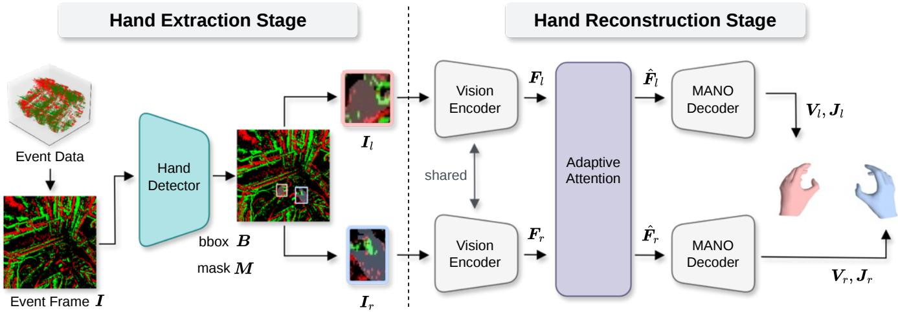  
FIGURE 2. Architecture of EventEgoHands++. The pipeline consists of two primary stages: (1) Hand Extraction Stage, where a hand detector identifies and extracts hand regions from event data, and (2) Hand Reconstruction Stage, which utilizes a vision encoder for feature extraction and estimates 3D hand poses through Adaptive Attention based on the detection results.

## A. HAND EXTRACTION STAGE

The Hand Detector takes an event frame $\pmb { I } \in \mathbb { R } ^ { 2 \times H \times W }$ as input and predicts instance-level hand bounding boxes $\pmb { B } =$ $\{ \pmb { b } _ { i } \} _ { i = 1 } ^ { N }$ with $\pmb { b } _ { i } = ( x _ { i } , y _ { i } , w _ { i } , h _ { i } ) \in \mathbb { R } ^ { 4 }$ , where $\left( { x _ { i } , y _ { i } } \right)$ denotes the center and $\left( w _ { i } , h _ { i } \right)$ the width and height of the bounding box. All coordinates are normalized by the image width and height. The module also predicts a hand region mask $M \in$ $\mathbb { R } ^ { N \times H \times W }$ , where N denotes the number of hand instances.

We adopt an instance segmentation framework rather than a mask-only estimation approach [12] because mask-only prediction tends to be unstable. By jointly learning bounding boxes and masks, the estimation becomes more robust. The predicted mask M is used to extract only the events within the hand region from the event frame I, yielding separate masked event frames for each hand: $\mathbf { \sigma } _ { I _ { l } , I _ { r } } \in \mathbf { \bar { \mathbb { R } } ^ { 2 \times H \times W } }$

We apply LNES [8], one of the event-frame representations, to generate I from raw events, as LNES is known to preserve temporal information through the use of temporal weighting. We adopt YOLO26 [92], the latest model in the widely used YOLO family for hand detection [6], [93], as our hand detector to jointly estimate bounding boxes and segmentation masks.

## B. HAND RECONSTRUCTION STAGE

The hand reconstruction stage takes filtered event frames $\pmb { I } _ { l } , \pmb { I } _ { r } \in \mathbb { R } ^ { 2 \times H \times W }$ from the hand extraction stage and estimates the 3D joint positions $J _ { l } , J _ { r } \in \mathbb { R } ^ { 2 0 \times 3 }$ and mesh vertex positions $V _ { l } , \bar { V } _ { r } \in \mathbf { \bar { \mathbb { R } } } ^ { 7 7 8 \times 3 }$ for each hand.

## 1) Feature Extraction

Given the masked event frames for the left and right hands, a shared backbone extracts spatial feature maps $F _ { l }$ and $\boldsymbol { F } _ { r }$ , each of size $C \times H ^ { \prime } \times W ^ { \prime }$ , where C denotes the channel dimension and $H ^ { \prime } , W ^ { \prime }$ denote the spatial resolution of the feature map. As the vision encoder, we employ EfficientNetV2-S [94], which has demonstrated strong performance in various hand pose estimation architectures [48], [90], [95].

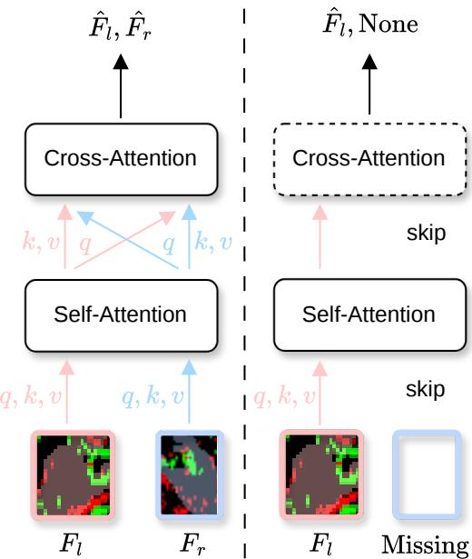  
FIGURE 3. Adaptive Attention. When both hands are detected, self-attention first refines intra-hand features, followed by cross-attention to capture inter-hand dependencies. When only one hand is detected, cross-attention is skipped and only self-attention is applied.

## 2) Adaptive Attention

To dynamically handle the presence or absence of each hand, we introduce Adaptive Attention, which selects attention operations based on the detection results. Let $m _ { l } , m _ { r } \in \{ 0 , 1 \}$ denote validity indicators for the left and right hands, obtained from the hand extraction stage, where $m _ { h } = 1$ indicates that the corresponding hand is detected $( e . g . , \mathrm { i f } h = l \mathrm { a n d } m _ { l } = 1 $ then it indicates that the left hand is detected). We describe the behavior of Adaptive Attention under three hand-detection conditions: (1) both hands are detected, (2) a single hand is detected, and (3) no hands are detected.

Algorithm 1 Training procedure of EventEgoHands++   
Require: Training set D = $\{ ( \pmb { I } , \pmb { J } ^ { \mathrm { g t } } , \pmb { V } ^ { \mathrm { g t } } , \pmb { \theta } ^ { \mathrm { g t } } , \pmb { \beta } ^ { \mathrm { g t } } ) \}$ , pre  
trained Hand Detector $\mathcal { D } _ { \mathrm { h a n d } } .$ , Hand Reconstructor ${ \mathcal { H } } _ { \phi } ,$   
MANO model M, loss weights $\lambda _ { \gamma } , \lambda _ { \delta } , \lambda _ { \epsilon } , \lambda _ { \zeta } ,$ learning   
rate $\eta ,$ number of epochs E   
Ensure: Optimized parameters ϕ of $\mathcal { H } _ { \phi }$   
1: for $e = 1 , \ldots , E$ do   
2: for each minibatch in D do   
3: // Hand Extraction Stage   
4: $B , M , c , s \gets \mathcal { D } _ { \mathrm { h a n d } } ( I )$ {c: hand-side labels (l/r), s:   
confidence scores}   
5: Select $M _ { l }$ and M using hand-side labels $\pmb { c }$ and   
confidence scores s   
6: Determine validity indicators $m _ { l } , m _ { r } \in \{ 0 , 1 \}$   
7: ${ \mathcal { H } } _ { \mathrm { v i s } } \gets \{ h \in \{ l , r \} \mid m _ { h } = 1 \}$   
8: // Hand Reconstruction Stage   
9: if $\mathcal { H } _ { \mathrm { v i s } } = \emptyset$ then   
{Condition 3: no hand detected}   
10: skip this sample   
11: end if   
12: for $h \in { \mathcal { H } } _ { \mathrm { v i s } }$ do   
13: $\pmb { I } _ { h }  \pmb { I } \odot \pmb { M } _ { h }$   
14: $F _ { h } \gets \mathrm { V }$ isionEncoder $\cdot ( I _ { h } )$   
15: end for   
16: //Adaptive Attention   
17: if $m _ { l } = 1$ and $m _ { r } = 1$ then   
{Condition 1: both hands detected}   
18: $\bar { \mathbfcal { F } } _ { h } \gets \mathrm { S e l f A t t n } _ { h } ( \mathbfcal { F } _ { h } ) , \quad h \in \{ l , r \}$   
19: $\hat { { \pmb F } } _ { l } \gets \mathrm { C r o s s A t t n } ( \bar { { \pmb F } } _ { l } , \bar { { \pmb F } } _ { r } )$   
20: $\hat { \pmb F } _ { r } \gets \mathrm { C r o s s A t t n } ( \bar { \pmb F } _ { r } , \bar { \pmb F } _ { l } )$   
21: else   
22: {Condition 2: single hand detected}   
23: $\hat { \pmb { F } } _ { h } \gets \mathrm { S e l f A t t n } _ { h } ( \pmb { F } _ { h } ) , \quad h \in \mathcal { H } _ { \mathrm { v i s } }$   
24: end if   
25: //MANO Decoder   
26: for $h \in { \mathcal { H } } _ { \mathrm { v i s } }$ do   
27: $( \pmb { \theta } _ { h } , \beta _ { h } , \pmb { t } _ { h } , \pmb { R } _ { h } ) \gets \mathrm { D e c o d e r } ( \hat { \pmb { F } } _ { h } )$   
28: $\hat { { \cal J } } _ { h } , \hat { V } _ { h } \gets { \mathcal { M } } ( \theta _ { h } , \beta _ { h } , t _ { h } , R _ { h } )$   
29: end for   
30: // Training Objective   
31: ${ \mathcal { L } } _ { \mathrm { h a n d } } \gets \lambda _ { \gamma } { \mathcal { L } } _ { \mathrm { j o i n t s } } + \lambda _ { \delta } { \mathcal { L } } _ { \mathrm { i n t e r h a n d } } + \lambda _ { \epsilon } { \mathcal { L } } _ { \mathrm { v e r t i c e s } } +$   
$\lambda _ { \zeta } \mathcal { L } _ { \mathrm { M A N O } }$   
32: Update ϕ using AdamW with learning rate η   
33: end for   
34: end for   
35: return $\phi$

Condition 1: Both hands detected $( m _ { l } { = } 1 , m _ { r } { = } 1 )$ . Each feature map is first refined independently by self-attention to model intra-hand spatial relationships, and then the two feature maps interact through bidirectional cross-attention to capture inter-hand dependencies:

$$
\begin{array} { r } { \bar { \boldsymbol { F } } _ { h } = \mathrm { S e l f A t t n } _ { h } ( \boldsymbol { F } _ { h } ) , \quad h \in \{ l , r \} , } \end{array}
$$

$$
\hat { \pmb F } _ { l } = \mathrm { C r o s s A t t n } ( \bar { \pmb F } _ { l } , \bar { \pmb F } _ { r } ) ,\tag{1}
$$

$$
\hat { \cal F } _ { r } = \mathrm { C r o s s A t t n } ( \bar { \cal F } _ { r } , \bar { \cal F } _ { l } ) .\tag{2}
$$

(3)

The self-attention layer (1) first refines each hand’s feature map by allowing each spatial position to attend to all other positions within the same hand feature map. In the subsequent cross-attention layers (2) and (3), each hand’s feature map serves as the query while the other hand’s feature map provides the keys and values, enabling bidirectional information exchange. This allows the model to capture inter-hand context such as relative hand positioning and coordinated finger configurations, building upon already-refined singlehand representations.

Condition 2: Single hand detected $( m _ { l } + m _ { r } = 1 )$ . Crossattention is disabled since the other hand’s feature map is unavailable, and only self-attention is applied to the detected hand:

$$
\hat { \cal F } _ { h } = \operatorname { S e l f A t t n } _ { h } ( { \cal F } _ { h } ) .\tag{4}
$$

Condition 3: Neither hand detected $( m _ { l } { = } 0 , m _ { r } { = } 0 )$ . If neither hand is detected, the subsequent processing is skipped.

Unlike masked attention, which applies masks to attention scores inside the attention operation, our Adaptive Attention switches the attention operations themselves. With masked attention, masking all tokens of an undetected hand corrupts the cross-attention output, which in turn destroys the features of the detected hand, while the masked attention computation itself is still executed. In contrast, our method skips the processing of the undetected hand entirely and processes the detected hand independently via self-attention, thereby avoiding both feature corruption and unnecessary computational overhead. We note that the self-attention and crossattention operations themselves are standard, and the novelty of Adaptive Attention lies in using per-hand visibility as an explicit control signal that determines which operations to apply.

## 3) MANO Decoder

Finally, each refined spatial feature map is converted into a feature vector via attention pooling, which is then mapped by a linear layer to the MANO [51] parameter space. These parameters are decoded by the MANO model to obtain the 3D hand joint positions J and mesh vertices V. MANO parameters for each hand consist of a pose vector $\pmb \theta \in \mathbb { R } ^ { 4 5 }$ a shape vector $\beta ~ \in ~ \mathbb { R } ^ { 1 0 }$ , a translation $\textbf { \textit { t } } \in \mathbb { R } ^ { 3 }$ , and a rotation $\pmb { R } \in \mathbb { R } ^ { 3 }$ . Using the MANO model M, we obtain sparse hand joints and dense hand mesh vertices for each hand individually as $J , V ~ = ~ \mathcal { M } ( \theta , \beta , t , R )$ . The resulting joint locations $\bar { J } \in \mathbb { R } ^ { 2 0 \times 3 }$ represent the 3D coordinates of the regressed hand joints, while the mesh vertices $V \in \mathbb { R } ^ { 7 7 8 \times 3 }$ correspond to the 3D coordinates of the hand surface. For simplicity, we use the same notation for the parameters and outputs of the left and right hands unless explicitly stated otherwise.

## C. TRAINING OBJECTIVE

To train our model, we use the loss functions adopted in the prior work [10], [12].

3D Hand Joints Loss. The loss terms used to assess the accuracy of the estimated 3D hand joints are defined as follows. The 3D hand joints loss $\mathcal { L } _ { \mathrm { j o i n t s } }$ is given by the L1 distance between the predicted and ground-truth joint positions, whereas the interaction hand joints loss $\mathcal { L } _ { \mathrm { i n t e r h a n d } }$ is the L2 distance between the predicted and ground-truth relative joint offsets of the left and right hands, measuring their positional consistency:

$$
\mathcal { L } _ { \mathrm { j o i n t s } } = \frac { 1 } { N _ { J } } \sum _ { i = 1 } ^ { N _ { J } } \Vert \hat { \pmb { J } } _ { i } - \pmb { J } _ { i } \Vert _ { 1 } ,\tag{5}
$$

$$
\mathcal { L } _ { \mathrm { i n t e r h a n d } } = \frac { 1 } { N _ { J } } \sum _ { i = 1 } ^ { N _ { J } } \Vert ( \hat { { \pmb J } } _ { \mathrm { l e f t } , i } - \hat { { \pmb J } } _ { \mathrm { r i g h t } , i } ) - ( { \pmb J } _ { \mathrm { l e f t } , i } - { \pmb J } _ { \mathrm { r i g h t } , i } ) \Vert _ { 2 } ,\tag{6}
$$

where $\hat { \ b { J } } _ { i }$ and $J _ { i }$ denote the predicted and ground-truth 3D coordinates of the i-th hand joint, and $N _ { J }$ is the total number of hand joints.

3D Hand Mesh Vertices Loss. The loss terms for assessing the accuracy of the estimated 3D hand mesh vertices are defined as follows. The 3D hand mesh vertices loss $\mathcal { L } _ { \mathrm { v e r t i c e s } }$ is given by the L1 distance between the predicted and groundtruth vertex positions, encouraging accurate reconstruction of the hand mesh structure:

$$
\mathcal { L } _ { \mathrm { v e r t i c e s } } = \frac { 1 } { N _ { V } } \sum _ { i = 1 } ^ { N _ { V } } \| \hat { V } _ { i } - V _ { i } \| _ { 1 } ,\tag{7}
$$

where $\hat { V } _ { i }$ and $V _ { i }$ represent the predicted and ground-truth 3D coordinates of the i-th hand mesh vertex, and $N _ { V }$ is the total number of vertices.

MANO Loss. The MANO loss quantifies the discrepancy between the predicted and ground-truth MANO pose θ and shape parameters $\beta .$ This term encourages the model to produce accurate hand pose and shape representations:

$$
\mathcal { L } _ { \mathrm { M A N O } } = \| \hat { \pmb { \theta } } - \pmb { \theta } \| _ { 2 } + \| \hat { \pmb { \beta } } - \pmb { \beta } \| _ { 2 } .\tag{8}
$$

Total Hand Loss. These four loss terms are linearly combined to form the final training objective $\mathcal { L } _ { \mathrm { h a n d } }$

$$
{ \mathcal { L } } _ { \mathrm { h a n d } } = \lambda _ { \gamma } { \mathcal { L } } _ { \mathrm { j o i n t s } } + \lambda _ { \delta } { \mathcal { L } } _ { \mathrm { i n t e r h a n d } } + \lambda _ { \epsilon } { \mathcal { L } } _ { \mathrm { v e r t i c e s } } + \lambda _ { \zeta } { \mathcal { L } } _ { \mathrm { M A N O } } ,\tag{9}
$$

where the balancing hyperparameters $\lambda _ { \gamma } , \lambda _ { \delta } , \lambda _ { \epsilon }$ , and $\lambda _ { \zeta }$ correspond to $\mathcal { L } _ { \mathrm { j o i n t s } } , \mathcal { L } _ { \mathrm { i n t e r h a n d } } , \mathcal { L } _ { \mathrm { v e r t i c e s } }$ , and $\mathcal { L } _ { \mathrm { M A N O } }$ , respectively.

## IV. DATASET COLLECTION

## A. SYNTHETIC DATASET: N-HOT3D

Training our model requires event data with ground-truth annotations of both hands from an egocentric viewpoint.

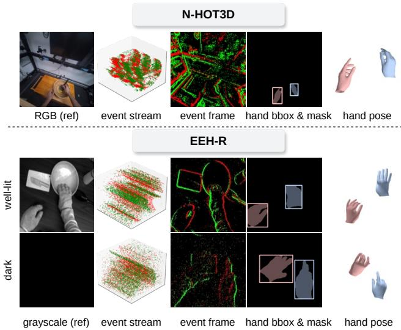  
FIGURE 4. Dataset samples. The top shows the synthetic dataset N-HOT3D, and the bottom shows the real-world dataset EEH-R.

However, no existing dataset provides egocentric event data with such annotations. To address this limitation, we first construct a synthetic event dataset, N-HOT3D, by applying the event simulator v2e [96] to the HOT3D dataset [46]. Specifically, we use a subset of the Aria glasses data within HOT3D, consisting of nine subjects. Sample data from N-HOT3D are illustrated in Fig. 4 (top).

For data generation, we utilize the MANO parameters and the camera extrinsic and intrinsic parameters provided by HOT3D. We first apply distortion correction to the videos and then convert them into event data using the simulator. The spatial resolution of the output events is set to $3 4 6 \times 2 6 0$ pixels, matching the resolution of the DAVIS346 event camera [97], which is also used in Ev2Hands [10]. Additionally, we project the provided 3D mesh ground-truth annotations onto 2D space to generate ground-truth hand segmentation masks. We also compute bounding box annotations from the projected meshes to enable detection training. The annotation quality of N-HOT3D depends on that of the original HOT3D annotations, since we directly use the MANO parameters and camera calibration provided by HOT3D. The released HOT3D annotations had already been manually and visually inspected for all frames to exclude lower-quality poses.

N-HOT3D is split by both subject identity and capture sequence. The training and validation sets share the same subjects but contain disjoint capture sequences, ensuring that no identical sequence appears in both splits. Specifically, we use subjects P0001, P0003, P0009, P0010, P0011, P0012, and P0015 for training and validation, while the evaluation set is composed of unseen subjects, P0002 and P0014. N-HOT3D contains a total of 480, 120 frames, divided into 334, 190 for training, 83, 760 for validation, and 62, 170 for evaluation. Compared to the preliminary version of N-HOT3D introduced in our earlier conference paper [12], this work extends the dataset in several aspects. First, we visually inspected all frames and regenerated the segmentation masks for frames where mask generation had failed in the previous version. As a result, the dataset composition has been updated from 447,704 frames in the previous version to 480,120 frames in this work. Second, we newly provide bounding box annotations computed from the projected meshes, enabling detection training in addition to segmentation. Finally, whereas the data split was not explicitly described in the previous version, we clearly define the splitting protocol in this work.

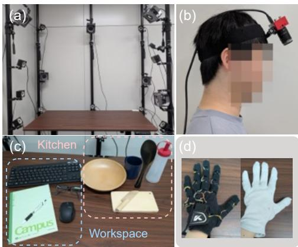  
FIGURE 5. Capture system setup. (a) Arrangement of OptiTrack cameras, (b) head-mounted DAVIS346 event camera, (c) objects from kitchen and workspace categories, (d) MoCap gloves (left) and plain fabric gloves worn over MoCap gloves (right).

## B. REAL DATASET: EEH-R

To evaluate the effectiveness of our proposed method on real event camera data, we construct a real-world dataset, EEH-R. Our dataset includes recordings of 8 subjects performing hand-object interactions under both well-lit and dark conditions. In total, it provides over two hours of recording across 85 sequences with 1, 019, 716 ground-truth annotations. Sample data from EEH-R are illustrated in Fig. 4 (bottom).

Capture System Setup. We design a capture system to simultaneously record egocentric event streams and accurate ground-truth hand/camera poses. An overview of our setup is illustrated in Fig. 5. For event data capture, we use a DAVIS346 [97], which provides both asynchronous events and synchronized grayscale frames. The grayscale frames are recorded at 30 fps.

To obtain precise local hand poses, we use MoCap Gloves [98] equipped with 16 IMU sensors, capable of capturing fine-grained finger articulations including finger curvature and palm arching. To preserve natural hand appearance in the event data, subjects wear plain fabric gloves over the MoCap gloves, concealing the sensors while maintaining texture characteristics similar to bare hands. For global positioning, we use an OptiTrack system consisting of 16 cameras (6 PrimeX22 and 10 PrimeX13) managed by Motive software [99]. Four optical markers are attached to both the top of the event camera, and another four optical markers are attached to the dorsal surface of each glove, enabling precise tracking of camera and hand positions. The ground-truth hand and camera poses are recorded at 120 fps. The average 3D calibration error of the motion-capture system was below 0.1972 mm, and the quality of the global hand and camera positions therefore depends on this calibration error.

TABLE 2. EEH-R dataset statistics by scene and lighting condition.
<table><tr><td>Scene</td><td>Lighting</td><td>#Sequences</td><td>#Annotations</td></tr><tr><td>Kitchen</td><td>Dark</td><td>23</td><td>287,566</td></tr><tr><td>Kitchen</td><td>Well-lit</td><td>19</td><td>238,340</td></tr><tr><td>Workspace</td><td>Dark</td><td>20</td><td>233,470</td></tr><tr><td>Workspace</td><td>Well-lit</td><td>23</td><td>260,340</td></tr><tr><td>Total</td><td></td><td>85</td><td>1,019,716</td></tr></table>

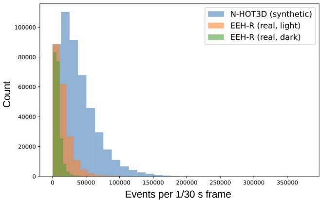

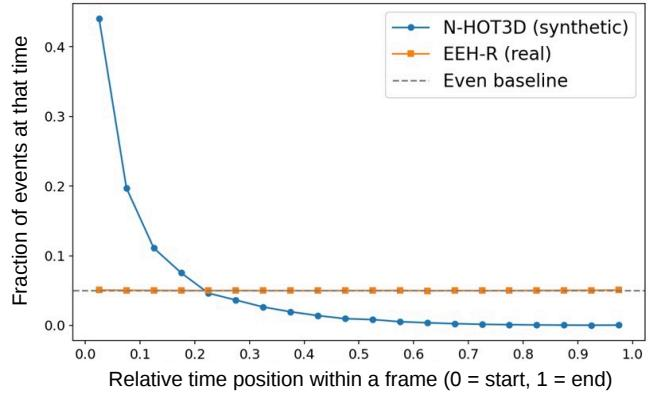  
FIGURE 6. Analysis of event characteristics in the synthetic and real-world datasets. (Top) Distribution of the number of events per frame (1/30 s). (Bottom) Temporal distribution of events within a frame (1/30 s).

Scenes. Our dataset covers two lighting conditions and two scene categories, recorded with eight subjects (6 male, 2 female). For lighting conditions, we capture sequences under both well-lit (average illuminance of 457 lux) and dark (average illuminance of 3.5 lux) conditions. For scene categories, we design kitchen and workspace scenarios to cover diverse hand-object interactions. The kitchen scene includes everyday objects such as bowls, spoons, cups, bottles, cutting boards, and knives, while the workspace scene contains notebooks, keyboards, mice, pens, and glasses. Each sequence lasts approximately 2 minutes, during which subjects freely interact with the objects. Multiple sequences were recorded for each combination of lighting and scene conditions. Detailed statistics of our dataset are summarized in Table 2.

Annotations. The MoCap gloves provide 16 joint positions per hand (wrist and three joints per finger) in the local glove coordinate system. Following prior hand pose dataset construction pipelines [100], [101], we obtain MANO parameter annotations by fitting the MANO hand model to the joint positions provided by the MoCap gloves.

In addition to 3D annotations, we construct 2D hand segmentation masks for a subset of scenes. For well-lit scenes, we apply SAM3 [102] to grayscale images to automatically generate ground-truth hand masks, resulting in 198,410 annotated frames. For dark scenes, where grayscale images lack sufficient contrast, we manually annotate segmentation masks for 1,000 event frames. As in the original HOT3D dataset, all frames in EEH-R were manually and visually inspected to remove lower-quality poses.

EEH-R is split by subject identity across training, validation, and evaluation. Specifically, subjects P05, P07, P08, and P09 are used for training, P03 and P04 for validation, and P06 and P10 for evaluation. The EEH-R dataset contains a total of 1, 019, 716 frames, divided into 636, 433 for training, 164, 727 for validation, and 218, 556 for evaluation. Approval for EEH-R dataset recording was obtained from the ethics committee of Keio University under 2025-131.

Domain Gap between Synthetic and Real Data. Compared with EEH-R, N-HOT3D involves more locomotion and head motion, which causes intense brightness changes across the entire scene. As shown in the top of Fig. 6, N-HOT3D consequently yields a larger number of events per frame. The bottom of Fig. 6 shows how events are distributed within the time window of each frame. While events in the real data occur almost uniformly over time, events in N-HOT3D are concentrated at the beginning of each frame, resulting in an unnatural temporal distribution, since they are synthetically generated by an event simulator. In addition, EEH-R contains sensor noise inherent to real event cameras. The visual differences between the two datasets can be observed in the event streams shown in Fig. 4.

Bias and Limitations. EEH-R was collected in a controlled laboratory environment. Extending the dataset to in-the-wild settings is a promising direction for future work. Although the IMU-based sensor gloves provide accurate ground truth, they inevitably alter the visual appearance of the hands. Adopting a marker-less motion capture system would allow bare-hand recordings, further increasing the appearance diversity of the hands.

## V. EXPERIMENTS

## A. IMPLEMENTATION DETAILS

For training and evaluation, we follow the official train/validation/test splits of the N-HOT3D and EEH-R datasets. Input event frames are center-cropped and resized to a resolution of $H \times W = 2 2 4 \times 2 2 4$ pixels. All experiments were conducted using a single NVIDIA RTX 6000 Ada Generation GPU.

The Hand Detector is implemented using the YOLO26 framework [92] along with its training and inference ecosystem. The model is initialized from pretrained YOLO26 weights and fine-tuned for our task. Since LNES consists of two channels, we adapt the network by introducing additional empty channels to match the expected input format. The segmentation model is trained using Adam [103] with a learning rate of $1 . 0 \times 1 0 ^ { - 3 }$ for 100 epochs with a batch size of 64. The predicted segmentation masks are dilated using a kerne size of $7 \times 7$ with one iteration to extend the hand regions. When multiple detections of the same hand (left or right) are produced, we select the one with the highest confidence score. The detection confidence threshold is set to 0.5 for N-HOT3D and 0.8 for EEH-R.

For the hand reconstruction stage, the EfficientNetV2-S backbone produces feature maps with channel dimension C = 1280 and spatial resolution $H ^ { \prime } \times W ^ { \prime } = 7 \times 7$ pixels. The backbone is initialized with ImageNet-1K pretrained weights. The model is trained using the AdamW [104] optimizer with a learning rate of $2 . 0 \times 1 0 ^ { - 5 }$ for 30 epochs with a batch size of 32. The total hand loss weights are set as $\lambda _ { \gamma } = 2 . 0 , \lambda _ { \delta } = 1 . 0$ $\lambda _ { \epsilon } = 2 . 0$ , and $\lambda _ { \zeta } = 1 . 0$

## B. BASELINE METHODS

We compare our method with the following baselines to show its performance in event-based 3D hand mesh reconstruction. EventHands [8] is a frame-based approach that operates solely on event data. As it is regarded as one of the state-ofthe-art methods for third-person event-based hand reconstruction, we adopt it as a baseline. Since this method predicts only a single hand at a time, we trained two separate models for the left and right hands on N-HOT3D and EEH-R.

Ev2Hands [10] leverages only event data and extracts the features using a point cloud-based representation. It is the only prior method that predicts both hands simultaneously. Since it requires event data annotated as left hand, right hand, or background, whose labels are not available in N-HOT3D or EEH-R, we first train the model on the annotated Ev2Hands-S [10] dataset and then fine-tune it on N-HOT3D and EEH-R. EventEgoHands [12] is the first egocentric hand mesh reconstruction method. This method estimates hand regions using mask-only estimation without distinguishing between left and right hands. The reconstruction stage is point cloud-based and employs only cross-attention between hand features to estimate hand meshes. Since this method does not differentiate between left and right hands, it always outputs two hands regardless of their presence.

## C. EVALUATION METRICS

Following Ev2Hands [10], we adopt the Percentage of Correct Keypoints (PCK) and the area under the PCK curve (AUC) with thresholds ranging from 0 to 100 millimeters (mm). We also use the Relative AUC (R-AUC) and Rightroot Relative AUC (RR-AUC) to assess the 3D hand pose estimation performance. The R-AUC is computed from joint positions expressed relative to the wrist of each hand, thereby measuring the accuracy of 3D joint positions for each hand independently. In contrast, RR-AUC is computed by expressing the joint positions of both hands relative to the right wrist, thereby evaluating the relative 3D configuration between the two hands. In addition, we report the Mean Per Joint Position Error (MPJPE) and Mean Per Vertex Position Error (MPVPE) in millimeters, which are standard metrics for 3D hand mesh reconstruction. Both MPJPE and MPVPE are computed after aligning each hand by its wrist joint position. For all the metrics above, only the hands successfully detected by the Hand Detector are included in the evaluation, and undetected hands are excluded from the aggregation of joint and mesh errors. The detection performance itself is evaluated separately using the metrics described below.

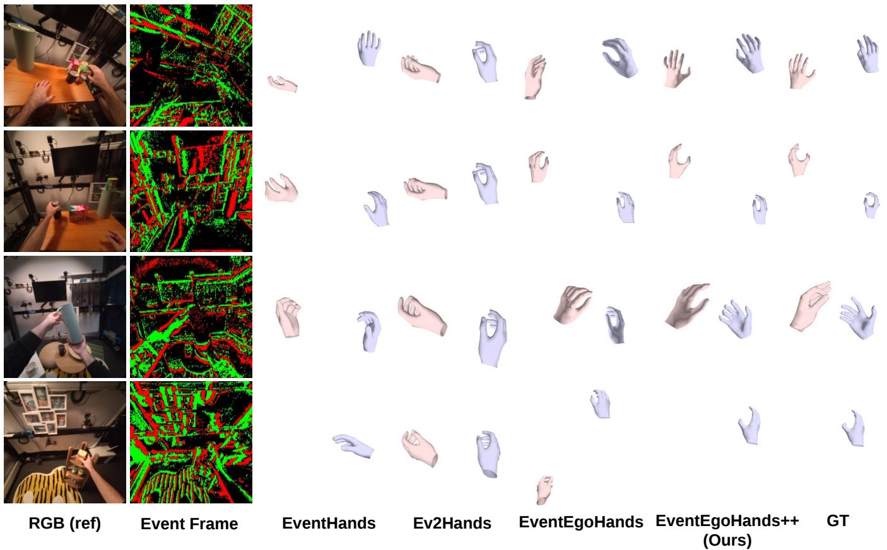  
FIGURE 7. Qualitative evaluation on N-HOT3D. We compared our method with EventHands [8], Ev2Hands [10] and EventEgoHands [12]. RGB images were not used as input and are shown for reference only. In order from the top, the scenes show ‘‘pouring from a can’’, ‘‘picking up a can’’, ‘‘holding a pot’’, and ‘‘picking up a carton’’.  
TABLE 3. Quantitative evaluation on N-HOT3D. We report the mean ± standard deviation over three runs with different random seeds. The best values are shown in bold.

Furthermore, to evaluate the performance of the Hand Detector, we employ the mean Average Precision (mAP) at different Intersection over Union (IoU) thresholds, namely mAP@50 and mAP@50–95. mAP@50 denotes the mAP at an IoU threshold of 0.5, while mAP@50–95 is averaged over IoU thresholds from 0.5 to 0.95 with a step size of 0.05. These metrics are widely used in instance segmentation and detection tasks, including the YOLO series [92].

## VI. RESULTS

## A. EVALUATION ON N-HOT3D DATASET

Quantitative Evaluation. Table 3 presents the quantitative results on the N-HOT3D dataset. Our method significantly outperforms all existing methods across all metrics. Compared to the closest baseline EventEgoHands, our enhanced model demonstrates superior precision, reducing MPJPE and MPVPE by 33.7% and 34.0%, respectively.

<table><tr><td></td><td>R-AUC (↑)</td><td></td><td>RR-AUC (↑) MPJPE [mm] (↓) MPVPE [mm] (↓)</td><td></td></tr><tr><td>EventHands [8]</td><td> $0 . 2 5 3 \pm 0 . 0 0 9$ </td><td> $0 . 1 9 0 \pm 0 . 0 0 8$ </td><td> $1 0 5 . 6 2 \pm 1 . 4 0$ </td><td> $9 7 . 2 9 \pm 1 . 2 9$ </td></tr><tr><td>Ev2Hands [10]</td><td> $0 . 2 3 6 \pm 0 . 0 0 1$ </td><td> $0 . 2 0 9 \pm 0 . 0 0 0$ </td><td> $1 1 2 . 5 6 \pm 0 . 4 6$ </td><td> $1 0 7 . 0 0 \pm 0 . 4 4$ </td></tr><tr><td>EventEgoHands [12]</td><td> $0 . 4 1 7 \pm 0 . 0 0 4$ </td><td> $0 . 2 6 1 \pm 0 . 0 2 1$ </td><td> $6 4 . 8 3 \pm 0 . 5 6$ </td><td> $6 0 . 5 3 \pm 0 . 5 2$ </td></tr><tr><td>Ours</td><td> $\mathbf { 0 . 6 6 1 \pm 0 . 0 0 4 }$ </td><td> ${ \bf 0 . 5 2 8 \pm 0 . 0 0 3 }$ </td><td> ${ \bf 4 3 . 0 1 \pm 0 . 2 7 }$ </td><td> ${ \bf 3 9 . 9 6 \pm 0 . 2 6 }$  </td></tr></table>

Qualitative Evaluation. Fig. 7 shows qualitative comparisons on the N-HOT3D dataset. Our method reconstructs hand meshes that are closest to the ground truth compared with other methods. EventHands, which estimates each hand independently, often produces inconsistent hand positions and fails to capture the spatial relationship between the two hands. Ev2Hands, which is based on point cloud processing, limits the number of input event points due to computational constraints. In egocentric settings where a large number of events are generated, uniform subsampling reduces the number of events belonging to the hand region, which prevents the model from learning sufficiently detailed hand shape representations and often results in nearly identical hand poses. EventEgoHands improves the spatial consistency between the two hands by filtering hand regions. However, the reconstructed hand poses lack diversity and tend to produce similar poses across different scenes.

TABLE 4. Quantitative evaluation on EEH-R under different lighting conditions. All values are reported as mean ± standard deviation over three runs with different random seeds. The best values are shown in bold.
<table><tr><td>Method</td><td>Lighting</td><td>R-AUC (↑)</td><td>RR-AUC (↑)</td><td>MPJPE [mm] (↓)</td><td>MPVPE [mm] (↓)</td></tr><tr><td rowspan="3">EventHands [8]</td><td>All</td><td> $0 . 5 8 3 \pm 0 . 0 0 4$ </td><td> $0 . 2 8 7 \pm 0 . 0 0 4$ </td><td> $4 2 . 0 8 \pm 0 . 4 4$ </td><td> $3 9 . 2 9 \pm 0 . 4 1$ </td></tr><tr><td>Well-lit</td><td> $0 . 5 9 1 \pm 0 . 0 0 5$ </td><td> $0 . 2 9 8 \pm 0 . 0 0 6$ </td><td> $4 1 . 3 8 \pm 0 . 5 9$ </td><td> $3 8 . 5 6 \pm 0 . 5 3$ </td></tr><tr><td>Dark</td><td> $0 . 5 7 6 \pm 0 . 0 0 3$ </td><td> $0 . 2 7 8 \pm 0 . 0 0 4$ </td><td> $4 2 . 7 1 \pm 0 . 3 5$ </td><td> $3 9 . 9 5 \pm 0 . 3 4$ </td></tr><tr><td rowspan="3">Ev2Hands [10]</td><td>All</td><td> $0 . 5 0 2 \pm 0 . 0 0 2$ </td><td> $0 . 2 5 0 \pm 0 . 0 0 4$ </td><td> $5 2 . 0 2 \pm 0 . 5 4$ </td><td> $4 8 . 5 9 \pm 0 . 4 8$ </td></tr><tr><td>Well-lit</td><td> $0 . 4 9 2 \pm 0 . 0 0 4$ </td><td> $0 . 2 6 2 \pm 0 . 0 0 2$ </td><td> $5 3 . 5 7 \pm 0 . 8 7$ </td><td> $5 0 . 0 5 \pm 0 . 8 0$ </td></tr><tr><td>Dark</td><td> $0 . 5 1 1 \pm 0 . 0 0 5$ </td><td> $0 . 2 3 9 \pm 0 . 0 0 6$ </td><td> $5 0 . 6 4 \pm 0 . 6 9$ </td><td> $4 7 . 2 9 \pm 0 . 6 1$ </td></tr><tr><td rowspan="3">EventEgoHands [12]</td><td>All</td><td> $0 . 4 7 8 \pm 0 . 0 0 8$ </td><td> $0 . 3 2 4 \pm 0 . 0 1 2$ </td><td> $5 6 . 5 9 \pm 1 . 6 9$ </td><td> $5 2 . 9 4 \pm 1 . 6 4$ </td></tr><tr><td>Well-lit</td><td> $0 . 4 8 1 \pm 0 . 0 0 3$ </td><td> $0 . 3 4 0 \pm 0 . 0 0 5$ </td><td> $5 6 . 2 7 \pm 1 . 1 3$ </td><td> $5 2 . 6 5 \pm 1 . 0 5$ </td></tr><tr><td>Dark</td><td> $0 . 4 7 5 \pm 0 . 0 1 8$ </td><td> $0 . 3 1 0 \pm 0 . 0 2 2$ </td><td> $5 6 . 9 5 \pm 3 . 3 5$ </td><td> $5 3 . 2 7 \pm 3 . 1 2$ </td></tr><tr><td rowspan="3">Ours</td><td>All</td><td> $0 . 6 9 1 \pm 0 . 0 0 3$ </td><td> $0 . 5 5 1 \pm 0 . 0 0 5$ </td><td> $3 4 . 1 8 \pm 0 . 2 2$ </td><td> $3 2 . 1 6 \pm 0 . 2 3$ </td></tr><tr><td>Well-lit</td><td> $\mathbf { 0 . 6 9 3 \pm 0 . 0 0 3 }$ </td><td> $\mathbf { 0 . 6 0 6 \pm 0 . 0 0 6 }$ </td><td> $\mathbf { 3 2 . 6 8 \pm 0 . 3 0 }$ </td><td> ${ \bf 3 0 . 6 8 \pm 0 . 2 9 }$ </td></tr><tr><td>Dark</td><td> $0 . 6 8 9 \pm 0 . 0 0 3$ </td><td> $0 . 4 7 6 \pm 0 . 0 0 5$ </td><td> $3 5 . 5 7 \pm 0 . 1 8$ </td><td> $3 3 . 5 3 \pm 0 . 2 2$ </td></tr></table>

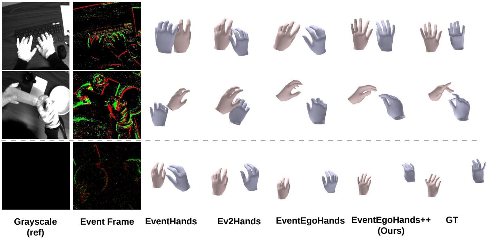  
FIGURE 8. Qualitative evaluation on EEH-R. We compared our method with EventHands [8], Ev2Hands [10] and EventEgoHands [12]. Grayscale images were not used as input and are shown for reference only. The grayscale images at the bottom are actual captured images, which appear almost empty due to the low-light environment. In order from the top, the scenes show ‘‘typing on a keyboard’’, ‘‘holding a bottle’’, and ‘‘using a spoon’’.

In contrast, the proposed method reconstructs more accurate hand shapes and better represents both inter-hand relationships and detailed finger motions such as fingertip positions and hand rotations. Notably, in scenes where only a single hand is visible, our approach predicts an accurate pose for the visible hand while correctly identifying the absence of the other. Whereas existing methods often produce incorrect poses or erroneously predict a second hand that is not present, our framework remains robust to such scenarios. This improvement is attributed to the Hand Detector and Adaptive Attention, which effectively learn both single-hand features and interactions between the two hands.

## B. EVALUATION ON EEH-R DATASET

Quantitative Evaluation. Table 4 shows the quantitative results on the real-world EEH-R dataset. Our method again achieves the best performance across all evaluation metrics. Compared with the best existing method, our method reduces MPJPE by 7.90 mm (18.8%) and MPVPE by 7.13 mm (18.1%). The improvement margin is smaller than that observed on the synthetic dataset. We attribute this difference to the characteristics of real-world data, where the camera is typically closer to the hands, resulting in larger hand regions and relatively easier detection. In contrast, the synthetic N-HOT3D dataset contains scenarios where the hands appear smaller due to larger interaction distances and fisheye distortion correction, making hand detection and reconstruction more challenging.

TABLE 5. Comparison of inference speed (FPS) across methods. Values are reported as the mean ± standard deviation.
<table><tr><td>Method</td><td>Segmentation</td><td>Hand</td><td>Overall</td></tr><tr><td>EventHands [8]</td><td>一</td><td> $4 1 5 . 8 8 \pm 1 4 3 . 6 5$ </td><td> $4 1 5 . 8 8 \pm 1 4 3 . 6 5$ </td></tr><tr><td>Ev2Hands [10]</td><td></td><td> $1 1 . 1 6 \pm 0 . 9 6$ </td><td> $1 1 . 1 6 \pm 0 . 9 6$ </td></tr><tr><td>EventEgoHands [12]</td><td> $2 0 9 . 4 4 \pm 3 9 . 2 4$ </td><td> $1 2 . 5 3 \pm 0 . 5 2$ </td><td> $1 2 . 4 1 \pm 0 . 3 5$ </td></tr><tr><td>Ours (Single Hand)</td><td> $1 4 9 . 9 4 \pm 3 6 . 1 8$ </td><td> $6 2 . 4 6 \pm 1 6 . 2 7$ </td><td> $4 5 . 4 2 \pm 9 . 1 0$ </td></tr><tr><td>Ours (Both Hands)</td><td> $1 6 0 . 2 8 \pm 3 5 . 9 1$ </td><td> $6 4 . 0 9 \pm 1 2 . 8 0$ </td><td> $3 9 . 8 7 \pm 6 . 6 3$ </td></tr></table>

Another notable observation is that the third-person baselines, EventHands and Ev2Hands, outperform the egocentric prior work EventEgoHands on several metrics. We attribute this to the characteristics of the real-world data. All sequences in EEH-R are captured during desk-based tasks, where the camera-to-hand distance is short and nearly constant, and the hands occupy a large portion of the frame, making hand detection itself easier, as also indicated by the mAP in Table 6. Furthermore, as shown in Fig. 6, the number of events per frame in EEH-R is smaller than in N-HOT3D, so handrelated events are relatively dominant within each frame, creating a setting closer to the third-person scenario where only hand events are observed. In addition, R-AUC, MPJPE, and MPVPE evaluate hand pose errors in wrist-relative coordinates, and the local hand poses show little difference across the baselines, as seen in Fig. 8. In contrast, EventEgoHands surpasses the third-person baselines on RR-AUC, which evaluates the relative position between the two hands, and this advantage is also evident in Fig. 8.

Qualitative Evaluation. Fig. 8 shows qualitative results on the EEH-R dataset. Consistent with the quantitative results, the differences between methods are smaller than those observed on the synthetic dataset. This is because EEH-R consists of static desk-based tasks with less subject motion than N-HOT3D.

Nevertheless, existing methods still exhibit limitations similar to those observed on the synthetic dataset. They often fail to accurately capture inter-hand relationships and fine details of intra-hand shape. In contrast, our method reconstructs hand meshes that are closest to the ground truth and produces more diverse hand poses across different scenes. These results demonstrate that the proposed method remains effective when applied to real event camera data, including challenging lowlight environments.

Runtime Analysis. Table 5 shows the inference speed of the proposed method and the baselines in frames per second (FPS), reported as the mean ± standard deviation over 100 samples. EventHands is extremely fast. However, as shown in Table 3 and Table 4, its accuracy is insufficient. Ev2Hands and EventEgoHands rely on point-cloud-based processing, which involves higher-dimensional inputs than image-based processing, resulting in low FPS, particularly for hand mesh reconstruction. In contrast, the proposed method is fast in both segmentation and hand mesh reconstruction, achieving practical inference speed in the overall pipeline. Moreover, when only one hand is detected, inference is slightly faster because certain operations, such as cross-attention in Adaptive Attention, are skipped.

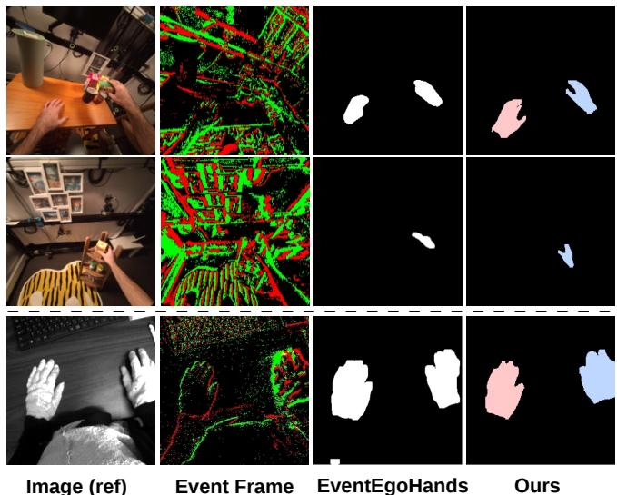  
FIGURE 9. Hand segmentation results. The top two rows correspond to N-HOT3D and the bottom row corresponds to EEH-R. Since the segmentation produced by EventEgoHands is a binary classification, the mask region is shown in white, whereas our method uses different colors for the left and right hands.

## C. HAND SEGMENTATION PERFORMANCE

We conduct an experiment to validate the effectiveness of the proposed Hand Detector. Table 6 compares the performance of the mask segmentation methods on the N-HOT3D and EEH-R datasets. Qualitative segmentation results are shown in Fig. 9.

The Hand Detector significantly outperforms the U-Net on the N-HOT3D dataset, improving mAP@50 from 0.272 to 0.750 and mAP@50–95 from 0.042 to 0.407. The improved accuracy on N-HOT3D, where hands occupy only a small portion of the frame, suggests the effectiveness of instance segmentation that jointly learns bounding boxes and masks, compared to the simple mask estimation performed by U-Net.

On EEH-R, we evaluate the performance under each lighting condition. Since EEH-R contains fewer events per frame and the hands are more visible within the scene, the mAP values are higher than those on N-HOT3D, and the Hand Detector performs slightly worse than the U-Net in terms of mAP@50. However, the Hand Detector outperforms the U-Net on mAP@50–95, which evaluates mask overlap more strictly. In particular, the improvement is substantial under the dark condition.

## D. ABLATION STUDY

We conduct ablation studies to evaluate the contribution of each component to the proposed framework. All experiments are performed on the N-HOT3D dataset.

TABLE 6. Performance comparison of segmentation methods on synthetic and real datasets. All values are reported as mean ± standard deviation over three runs with different random seeds. The best values are shown in bold.
<table><tr><td rowspan="2"></td><td rowspan="2">Method</td><td colspan="2">All</td><td colspan="2">Well-lit</td><td colspan="2">Dark</td></tr><tr><td> $\mathrm { m A P @ 5 0 ( \uparrow ) }$ </td><td> $\mathrm { m A P @ 5 0 - 9 5 ( \uparrow ) }$ </td><td> $\mathrm { m A P @ 5 0 ( \uparrow ) }$ </td><td> $\mathrm { m A P @ 5 0 - 9 5 ( \uparrow ) }$ </td><td> $\mathrm { m A P @ 5 0 ( \uparrow ) }$ </td><td> $\mathrm { m A P @ 5 0  – 9 5 ( \uparrow ) }$ </td></tr><tr><td rowspan="2">N-HOT3D</td><td>U-Net in EventEgoHands</td><td> $0 . 2 7 2 \pm 0 . 0 2 5$ </td><td> $0 . 0 4 2 \pm 0 . 0 0 6$ </td><td></td><td></td><td></td><td></td></tr><tr><td>Hand Detector</td><td> $\mathbf { 0 . 7 5 0 \pm 0 . 0 1 3 }$ </td><td> ${ \bf 0 . 4 0 7 \pm 0 . 0 1 2 }$ </td><td>1 -</td><td>1 -</td><td>--</td><td>--</td></tr><tr><td rowspan="2">EEH-R</td><td>U-Net in EventEgoHands</td><td> ${ \bf 0 . 9 2 8 \pm 0 . 0 0 3 }$ </td><td> $0 . 6 5 5 \pm 0 . 0 0 2$ </td><td> ${ \bf 0 . 9 2 9 \pm 0 . 0 0 3 }$ </td><td> $0 . 6 5 6 \pm 0 . 0 0 2$ </td><td> ${ \bf 0 . 8 9 9 \pm 0 . 0 2 5 }$ </td><td> $0 . 5 2 7 \pm 0 . 0 2 1$ </td></tr><tr><td>Hand Detector</td><td> $0 . 9 0 1 \pm 0 . 0 0 3$ </td><td>0.657 ± 0.005</td><td> $0 . 9 0 1 \pm 0 . 0 0 3$ </td><td> $\mathbf { 0 . 6 5 7 \pm 0 . 0 0 5 }$ </td><td> $0 . 8 8 7 \pm 0 . 0 9 5$ </td><td> $\mathbf { 0 . 6 3 9 \pm 0 . 0 9 1 }$ </td></tr></table>

TABLE 7. Ablation study on the proposed components on N-HOT3D. All values are reported as mean ± standard deviation over three runs with different random seeds. The best values are shown in bold.
<table><tr><td>Detector Attention |</td><td></td><td> $\mathbf { R } { - } \mathbf { A } \mathbf { U } \mathbf { C } \left( \uparrow \right)$ </td><td> $\mathbf { R } \mathbf { R } { - } \mathbf { A } \mathbf { U } \mathbf { C } \left( \uparrow \right)$ </td><td> $\mathbf { M P J P E } \left[ \mathbf { m m } \right] \left( \downarrow \right)$ </td><td> $\mathrm { M P V P E } \left[ \mathrm { m m } \right] \left( \downarrow \right)$ </td></tr><tr><td></td><td></td><td> $0 . 5 4 8 \pm 0 . 0 0 2$ </td><td> $0 . 3 8 9 \pm 0 . 0 0 2$ </td><td> $4 6 . 7 9 \pm 0 . 2 1$ </td><td> $4 3 . 7 9 \pm 0 . 1 9$ </td></tr><tr><td></td><td>√</td><td> $0 . 5 5 3 \pm 0 . 0 0 2$ </td><td> $0 . 3 9 4 \pm 0 . 0 0 2$ </td><td> $4 7 . 1 5 \pm 0 . 1 9$ </td><td> $4 3 . 7 8 \pm 0 . 1 8$ </td></tr><tr><td></td><td></td><td> $0 . 6 5 2 \pm 0 . 0 0 1$ </td><td> $0 . 4 6 9 \pm 0 . 0 0 2$ </td><td> $4 4 . 0 1 \pm 0 . 0 3$ </td><td> $4 1 . 0 4 \pm 0 . 0 3$ </td></tr><tr><td>&gt;&gt;</td><td>√</td><td> $\mathbf { 0 . 6 6 1 \pm 0 . 0 0 4 }$ </td><td> $\mathbf { 0 . 5 2 8 \pm 0 . 0 0 3 }$ </td><td> ${ \bf 4 3 . 0 1 \pm 0 . 2 7 }$ </td><td> ${ \bf 3 9 . 9 6 \pm 0 . 2 6 }$ </td></tr></table>

TABLE 8. Effect of introducing the Hand Detector to existing methods on N-HOT3D. All values are reported as mean ± standard deviation over three runs with different random seeds. Underline indicates improvement i hi h h d
<table><tr><td>Method</td><td> $\mathbf { R } { - } \mathbf { A U C } \left( \uparrow \right)$ </td><td></td><td></td><td>RR-AUC (↑) MPJPE [mm] (↓) MPVPE [mm] (↓)</td></tr><tr><td>EventHands [8]</td><td> $| 0 . 2 5 3 \pm 0 . 0 0 9$ </td><td> $0 . 1 9 0 \pm 0 . 0 0 8$ </td><td> $1 0 5 . 6 2 \pm 1 . 4 0$ </td><td> $9 7 . 2 9 \pm 1 . 2 9$ </td></tr><tr><td>EventHands w/ Detector</td><td> $\underline { { 0 . 2 9 3 \pm 0 . 0 0 1 } }$ </td><td> $\underline { { 0 . 2 3 4 \pm 0 . 0 0 7 } }$ </td><td> $1 0 8 . 0 9 \pm 4 . 7 7$ </td><td> $9 9 . 3 3 \pm 4 . 3 1$ </td></tr><tr><td>Ev2Hands [10]</td><td> $0 . 2 3 6 \pm 0 . 0 0 1$ </td><td> $0 . 2 0 9 \pm 0 . 0 0 0$ </td><td> $1 1 2 . 5 6 \pm 0 . 4 6$ </td><td> $1 0 7 . 0 0 \pm 0 . 4 4$ </td></tr><tr><td>Ev2Hands w/ Detector</td><td>0.242 ± 0.001</td><td> $\underline { { 0 . 2 1 4 \pm 0 . 0 0 1 } }$ </td><td> $\underline { { 1 1 0 . 0 5 \pm 0 . 0 7 } }$ </td><td>104.59 ± 0.06</td></tr><tr><td>EventEgoHands [12]</td><td> $0 . 4 1 7 \pm 0 . 0 0 4$ </td><td> $0 . 2 6 1 \pm 0 . 0 2 1$ </td><td> $6 4 . 8 3 \pm 0 . 5 6$ </td><td> $6 0 . 5 3 \pm 0 . 5 2$ </td></tr><tr><td>EventEgoHands w/ Detector</td><td> $\underline { { 0 . 4 3 7 \pm 0 . 0 1 3 } }$ </td><td> $\underline { { 0 . 2 7 7 \pm 0 . 0 1 2 } }$ </td><td> $6 8 . 6 4 \pm 4 . 6 5$ </td><td> $6 3 . 8 6 \pm 4 . 3 3$ </td></tr></table>

Effect of the proposed components. Table 7 shows the results when removing the Hand Detector and the Adaptive Attention. Even when both components are removed, the proposed framework still outperforms existing methods. This suggests that the frame-based architecture, which jointly models two hands, is more effective than previous single-hand or point-cloud-based approaches. Note that without the Hand Detector, the two hands cannot be localized or separated, so both hands are always treated as present $( m _ { l } = m _ { r } = 1 )$ and the Adaptive Attention always applies both self-attention and cross-attention.

When Adaptive Attention alone is introduced without the Hand Detector, the R-AUC slightly improves, while MPJPE slightly degrades. This indicates that attention alone is insufficient when hand regions are not properly localized; without the detector, the attention mechanism is always forced to process the entire frame, including background noise, rather than focusing on the actual hand instances.

In contrast, introducing the Hand Detector improves performance across all metrics, and combining it with Adaptive Attention yields further gains. In particular, the gain from Adaptive Attention is most pronounced in RR-AUC, which evaluates the relative position between the two hands, improving from 0.469 to 0.528 (a 12.6% relative improvement). These results indicate a complementary division of roles: the Hand Detector is the primary source of overall accuracy by localizing and identifying each hand, whereas Adaptive

TABLE 9. Ablation study of loss components on N-HOT3D. The best values are shown in bold.
<table><tr><td></td><td>LMANO Linterhand</td><td></td><td> $\begin{array} { r l } { \mathcal { L } _ { \mathrm { j o i n t s } } } & { { } \mathcal { L } _ { \mathrm { v e r t i c e s } } } \end{array}$ </td><td>R-AUC (↑)</td><td>RR-AUC (↑)</td><td></td><td>MPJPE [mm] (↓) MPVPE [mm] (↓)</td></tr><tr><td>√</td><td></td><td></td><td></td><td>0.095</td><td>0.073</td><td>153.64</td><td>142.10</td></tr><tr><td>√</td><td>√</td><td></td><td></td><td>0.311</td><td>0.239</td><td>80.12</td><td>74.00</td></tr><tr><td>√</td><td>√</td><td>√</td><td></td><td>0.657</td><td>0.521</td><td>43.50</td><td>40.43</td></tr><tr><td>√</td><td>√</td><td>√</td><td>√</td><td>0.661</td><td>0.528</td><td>43.01</td><td>39.96</td></tr></table>

TABLE 10. Comparison of Vision Encoders on N-HOT3D. The best values are shown in bold.
<table><tr><td>Vision Encoder</td><td>| Params [M] |</td><td>|R-AUC (↑)</td><td>RR-AUC (↑)</td><td>MPJPE (↓)</td><td>MPVPE (↓)</td></tr><tr><td>ResNet50 [105]</td><td>23.5</td><td>0.653</td><td>0.519</td><td>43.98</td><td>40.94</td></tr><tr><td>ViT-B [62]</td><td>85.8</td><td>0.610</td><td>0.478</td><td>47.14</td><td>44.06</td></tr><tr><td>EfficientNetV2-S [94] (Ours)</td><td>20.2</td><td>0.661</td><td>0.528</td><td>43.01</td><td>39.96</td></tr></table>

Attention specifically strengthens the inter-hand relative positioning.

General applicability of the Hand Detector. Table 8 evaluates the effect of integrating the Hand Detector into existing methods. Across all three methods, R-AUC and RR-AUC consistently improve after incorporating the proposed Hand Detector. These results indicate that extracting hand regions from event data is generally beneficial and can improve a wide range of existing hand reconstruction methods.

Loss Functions. Table 9 shows the ablation study on the loss components. We adopt the loss functions used in Ev2Hands and EventEgoHands, which also output two hands. The results show that combining all loss components achieves the best performance.

Vision Encoder. Table 10 shows the ablation study on the vision encoder. We compare EfficientNetV2-S [94] with ResNet50 [105], which has a comparable number of parameters and is widely used in vision tasks, and with ViT-B [62], which has recently been adopted in many vision tasks. The results confirm that EfficientNetV2-S, which is commonly employed in hand pose estimation studies [48], [90], [95], is also well suited for our task. As vision encoders continue to advance, our framework is expected to benefit from adopting newer encoders in the future.

Hand Detector. Table 11 shows the ablation study on the hand detector. We compare the adopted YOLO26 with its previous official version, YOLO11, and with RF-DETR, a Transformer-based detector widely used alongside YOLO. Although RF-DETR achieves a higher mAP@50, YOLO26 is the most balanced model in terms of both accuracy and speed, as indicated by mAP@50–95 and FPS.

TABLE 11. Comparison of Hand Detectors on N-HOT3D. The best values are shown in bold, and the second-best values are underlined.
<table><tr><td>Detector</td><td>mAP@50 (↑) mAP@50–95 (↑)</td><td></td><td>FPS</td></tr><tr><td>YOLO11 [106]</td><td>0.699</td><td>0.375</td><td>221.03</td></tr><tr><td>RF-DETR [107]</td><td>0.769</td><td>0.398</td><td>68.49</td></tr><tr><td>YOLO26 [92] (Ours)</td><td>0.750</td><td>0.407</td><td>209.54</td></tr></table>

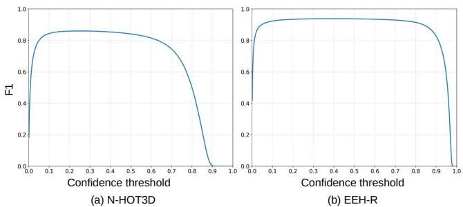  
FIGURE 10. F1 score of the Hand Detector at IoU = 0.5 for varying confidence thresholds. (a) N-HOT3D (synthetic). (b) EEH-R (real).

Detection Threshold Analysis. Fig. 10 shows the F1 score at IoU = 0.5 for varying confidence thresholds on the synthetic and real datasets. On both datasets, the F1 score remains stable over a range of thresholds before dropping sharply beyond a certain point. Since false positives introduce nonexistent hands into the subsequent reconstruction stage, we empirically select a relatively high threshold that does not substantially degrade the F1 score, namely 0.5 for the synthetic dataset and 0.8 for the real dataset.

Adaptive Attention. Table 12 shows the ablation study on the attention components in Adaptive Attention. Self-attention mainly improves wrist-relative pose accuracy, while crossattention improves RR-AUC, which evaluates the relative position between the two hands, by exchanging information across hands. Combining both achieves the best performance on all metrics.

Mask Dilation Kernel Size. Table 13 shows the ablation study on the kernel size used to dilate the masks estimated by the Hand Detector. Hand mesh reconstruction performance is highest with a kernel size of $5 \times 5 ~ \mathrm { o r } ~ 7 \times 7 .$ Dilating the mask compensates for incomplete or partially missing segmentation results, whereas an excessively large kernel includes more non-hand regions, indicating that there is a limit to the benefit of dilation. We adopt a kernel size of 7 × 7, which achieves the highest RR-AUC, as we prioritize the correct relative positioning of the two hands.

Cross-Dataset Evaluation. Table 14 shows the quantitative results of the cross-dataset evaluation. When the model is trained on N-HOT3D and evaluated on EEH-R, the performance drops substantially due to the domain gap between the two datasets. However, when the model pre-trained on N-HOT3D is fine-tuned on EEH-R, it achieves slightly higher accuracy than the model trained on EEH-R alone. This result indicates the potential of the synthetic dataset for pre-training. Impact of Dark-Scene Annotations on the Hand Detector. Since the number of manually annotated dark-scene masks is much smaller than that of the automatically generated welllit masks, we analyze how the amount of dark-scene supervision affects the detector performance on EEH-R. Table 15 compares models trained on each illumination condition separately. The model trained only on dark scenes performs worse under the dark condition than the model trained on both conditions, and its performance under the well-lit condition degrades substantially. This indicates that combining the automatically generated well-lit annotations with the manual dark-scene annotations is an effective supervision strategy.

TABLE 12. Ablation study of attention components on N-HOT3D. The best values are shown in bold.
<table><tr><td>SelfAttn</td><td>CrossAttn | R-AUC (↑)</td><td></td><td>RR-AUC (↑)</td><td>MPJPE [mm] (↓)</td><td>MPVPE [mm] (↓)</td></tr><tr><td rowspan="3">√</td><td></td><td>0.652</td><td>0.469</td><td>44.01</td><td>41.04</td></tr><tr><td></td><td>0.657</td><td>0.517</td><td>43.37</td><td>40.34</td></tr><tr><td>√</td><td>0.649</td><td>0.518</td><td>43.93</td><td>40.90</td></tr><tr><td>√</td><td>√</td><td>0.661</td><td>0.528</td><td>43.01</td><td>39.96</td></tr></table>

TABLE 13. Comparison of dilation kernel sizes on N-HOT3D. The best values are shown in bold, and the second-best values are underlined.
<table><tr><td>Method</td><td>R-AUC (↑)</td><td>RR-AUC (↑)</td><td>MPJPE [mm] (↓)</td><td>MPVPE [mm] (↓)</td></tr><tr><td>w/o dilation</td><td>0.636</td><td>0.467</td><td>44.84</td><td>41.71</td></tr><tr><td>kernel size 3</td><td>0.659</td><td>0.504</td><td>43.16</td><td>40.12</td></tr><tr><td>kernel size 5</td><td>0.667</td><td>0.525</td><td>42.60</td><td>39.58</td></tr><tr><td>kernel size 7</td><td>0.661</td><td>0.528</td><td>43.01</td><td>39.96</td></tr><tr><td>kernel size 9</td><td>0.644</td><td>0.520</td><td>44.30</td><td>41.16</td></tr></table>

We further analyze how many dark-scene annotations are required. We train the Hand Detector with all well-lit annotations in the training set while varying the ratio of darkscene annotations from 0% to 100%, and evaluate the models separately under the well-lit and dark conditions. As shown in Fig. 11, the performance under the well-lit condition remains almost constant for both metrics regardless of the dark-scene data ratio. Under the dark condition, mAP@50–95 increases with the ratio and saturates once the ratio reaches approximately 25% of the dark training set. This demonstrates that adding only a small number of manually annotated dark frames to the well-lit data is sufficient for reliable detection in dark scenes.

## E. FAILURE ANALYSIS

We identify three major failure patterns of the proposed method, as illustrated in Fig. 12.

Occlusion. When a hand is occluded by an object, the Hand Detector may fail to detect it. Even when the hand is detected, accurately reconstructing the occluded parts, such as the fingertips, remains difficult when they are hidden by the object, as shown in Fig. 12 (a). Since hands frequently interact with surrounding objects in daily activities, explicitly modeling object shape and hand–object contact is a promising direction. While current event-based approaches primarily focus on hand regions, modeling hand–object interactions remains largely unexplored. Inspired by RGB-based methods [108], [109], incorporating distinct feature representations for both hand and object regions is a promising direction for improving reconstruction accuracy in complex interaction scenarios. Sparse Events. Since an event camera only responds to brightness changes, events become sparse when the hand and head remain nearly static. In such cases, the hand may not be detected, as shown in Fig. 12 (b). This effect is more pronounced in low-light environments, where the detection performance is lower than in well-lit conditions, as indicated by the mAP in Table 6. Accumulating past events or introducing temporal processing would help mitigate this failure.

TABLE 14. Cross-dataset evaluation. The best values are shown in bold.
<table><tr><td>Train</td><td>Finetune</td><td>Test</td><td>R-AUC (↑)</td><td>RR-AUC (↑)</td><td>MPJPE [mm] (↓)</td><td>MPVPE [mm] (↓)</td></tr><tr><td>EEH-R</td><td></td><td>EEH-R</td><td>0.691</td><td>0.551</td><td>34.184</td><td>32.163</td></tr><tr><td>N-HOT3D</td><td></td><td>EEH-R</td><td>0.079</td><td>0.038</td><td>137.229</td><td>126.446</td></tr><tr><td>N-HOT3D</td><td>EEH-R</td><td>EEH-R</td><td>0.695</td><td>0.557</td><td>34.172</td><td>32.207</td></tr></table>

TABLE 15. Cross-illumination evaluation of the Hand Detector on EEH-R. Each model is trained and tested under different illumination conditions. The best values for each test condition are shown in bold.
<table><tr><td>Train</td><td>Test</td><td>mAP@50 (↑)</td><td>mAP@50–95 (↑)</td></tr><tr><td>Well-lit</td><td>Well-lit</td><td>0.935</td><td>0.679</td></tr><tr><td>Dark</td><td>Well-lit</td><td>0.425</td><td>0.201</td></tr><tr><td>All</td><td>Well-lit</td><td>0.901</td><td>0.657</td></tr><tr><td>Well-lit</td><td>Dark</td><td>0.749</td><td>0.366</td></tr><tr><td>Dark</td><td>Dark</td><td>0.792</td><td>0.548</td></tr><tr><td>All</td><td>Dark</td><td>0.887</td><td>0.639</td></tr><tr><td>Well-lit</td><td>All</td><td>0.934</td><td>0.678</td></tr><tr><td>Dark</td><td>All</td><td>0.427</td><td>0.202</td></tr><tr><td>All</td><td>All</td><td>0.928</td><td>0.655</td></tr></table>

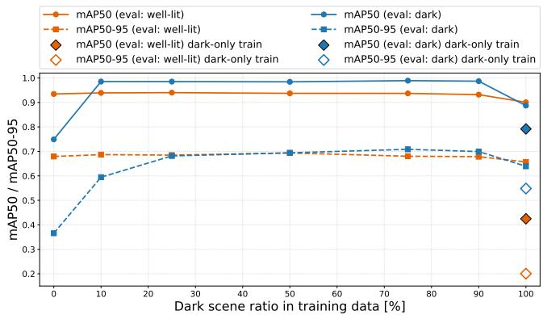  
FIGURE 11. Effect of the dark-scene data ratio on the performance of the Hand Detector on EEH-R. All well-lit annotations are used, while the ratio of dark-scene annotations in the training set is varied from 0% to 100%.

Jittering. Since the proposed method operates on a frameby-frame basis, the reconstructed hand meshes may exhibit temporal jittering across consecutive frames. As shown in the wrist trajectories in Fig. 12 (c), the predicted motion is less smooth than the ground truth. Note that such jittering is not specific to event-based methods, as frame-based RGB methods such as HaMeR [5] and WiLoR [6] also suffer from it. Leveraging the temporal nature of event streams and extending the framework to 4D hand mesh reconstruction is an important direction for future work. Recent approaches such as HaPTIC [66], which predicts coherent 4D hand trajectories from monocular videos by fusing temporal information across frames with attention and by directly estimating interframe depth changes rather than per-frame absolute depth, suggest promising strategies to resolve this issue.

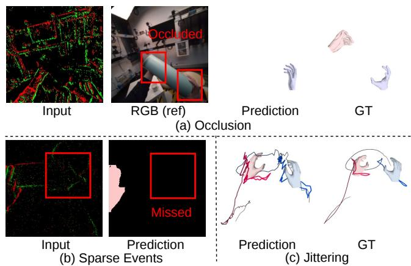  
FIGURE 12. Failure cases of the proposed method. (a) Missed detection and inaccurate pose estimation under severe occlusion by a held object. (b) Missed detection due to sparse events when the hand remains nearly static. (c) Temporal jittering in the predicted trajectory due to frame-by-frame estimation without temporal modeling. Red and blue lines indicate the wrist trajectories of the left and right hands, respectively.

## VII. CONCLUSION

In this paper, we propose EventEgoHands++, a framework for event-based egocentric 3D hand mesh reconstruction. To address the challenges of background noise and the inability of prior work to distinguish between hands, we introduce a Hand Detector that performs instance-level hand detection by jointly estimating bounding boxes and masks. Furthermore, to overcome the performance degradation caused by fixed attention that ignores hand visibility, we also propose Adaptive Attention that dynamically adjusts the attention process depending on the presence of detected hands. In addition, we extend the synthetic N-HOT3D dataset with refined masks and newly added bounding-box annotations, and newly construct the real-world EEH-R dataset. Experiments on both synthetic and real datasets demonstrate that the proposed method significantly improves reconstruction performance compared with existing approaches. We hope that this work contributes to advancing event-based hand reconstruction research and facilitates future studies on egocentric event-based vision systems.

## REFERENCES

[1] Liuhao Ge, Hui Liang, Junsong Yuan, and Daniel Thalmann. Robust 3d hand pose estimation in single depth images: from single-view cnn to multi-view cnns. In IEEE/CVF Conference on Computer Vision and Pattern Recognition (CVPR), pages 3593–3601, 2016.

[2] Chi Xu and Li Cheng. Efficient hand pose estimation from a single depth image. In IEEE/CVF International Conference on Computer Vision (ICCV), pages 3456–3462, 2013.

[3] Liuhao Ge, Hui Liang, Junsong Yuan, and Daniel Thalmann. Real-time 3d hand pose estimation with 3d convolutional neural networks. IEEE Transactions on Pattern Analysis and Machine Intelligence (TPAMI), 41(4):956–970, 2018.

[4] Adnane Boukhayma, Rodrigo de Bem, and Philip HS Torr. 3d hand shape and pose from images in the wild. In IEEE/CVF Conference on Computer Vision and Pattern Recognition (CVPR), pages 10835–10844, 2019.

[5] Georgios Pavlakos, Dandan Shan, Ilija Radosavovic, Angjoo Kanazawa, David Fouhey, and Jitendra Malik. Reconstructing Hands in 3D with Transformers. In IEEE/CVF Conference on Computer Vision and Pattern Recognition (CVPR), pages 9826–9836, 2024.

[6] Rolandos Alexandros Potamias, Jinglei Zhang, Jiankang Deng, and Stefanos Zafeiriou. WiLoR: End-to-end 3D Hand Localization and Reconstruction in-the-wild. In IEEE/CVF Conference on Computer Vision and Pattern Recognition (CVPR), pages 12242–12254, 2025.

[7] Guillermo Gallego, Tobi Delbruck, Garrick Orchard, Chiara Bartolozzi, Brian Taba, Andrea Censi, Stefan Leutenegger, Andrew J. Davison, Jorg Conradt, Kostas Daniilidis, and Davide Scaramuzza. Event-Based Vision: A Survey. IEEE Transactions on Pattern Analysis and Machine Intelligence (TPAMI), 44(01):154–180, 2022.

[8] Viktor Rudnev, Vladislav Golyanik, Jiayi Wang, Hans-Peter Seidel, Franziska Mueller, Mohamed Elgharib, and Christian Theobalt. EventHands: Real-Time Neural 3D Hand Pose Estimation From an Event Stream. In IEEE/CVF International Conference on Computer Vision (ICCV), pages 12365–12375, 2021.

[9] Jianping Jiang, Jiahe Li, Baowen Zhang, Xiaoming Deng, and Boxin Shi. EvHandPose: Event-Based 3D Hand Pose Estimation With Sparse Supervision. TPAMI, 46(9):6416–6430, 2024.

[10] Christen Millerdurai, Diogo Luvizon, Viktor Rudnev, André Jonas, Jiayi Wang, Christian Theobalt, and Vladislav Golyanik. 3D Pose Estimation of Two Interacting Hands from a Monocular Event Camera. In International Conference on 3D Vision, pages 291–301, 2024.

[11] Ruicong Liu, Takehiko Ohkawa, Tze Ho Elden Tse, Mingfang Zhang, Angela Yao, and Yoichi Sato. Leveraging RGB Images for Pre-Training of Event-Based Hand Pose Estimation. arXiv preprint arXiv:2509.16949, 2025.

[12] Ryosei Hara, Wataru Ikeda, Masashi Hatano, and Mariko Isogawa. EventEgoHands: Event-based Egocentric 3D Hand Mesh Reconstruction. In IEEE International Conference on Image Processing (ICIP), pages 1199– 1204, 2025.

[13] Andrea Bandini and José Zariffa. Analysis of the hands in egocentric vision: A survey. IEEE Transactions on Pattern Analysis and Machine Intelligence (TPAMI), 45(6):6846–6866, 2023.

[14] Chiara Plizzari, Gabriele Goletto, Antonino Furnari, Siddhant Bansal, Francesco Ragusa, Giovanni Maria Farinella, Dima Damen, and Tatiana Tommasi. An outlook into the future of egocentric vision. International Journal ofComputer Vision (IJCV), 132:4880–4936, 2024.

[15] Alireza Fathi, Xiaofeng Ren, and James M. Rehg. Learning to recognize objects in egocentric activities. In IEEE/CVF Conference on Computer Vision and Pattern Recognition (CVPR), pages 3281–3288, 2011.

[16] Stefan Lee, Sven Bambach, David J. Crandall, John M. Franchak, and Chen Yu. This hand is my hand: A probabilistic approach to hand disambiguation in egocentric video. In IEEE/CVF Conference on Computer Vision and Pattern Recognition Workshops (CVPRW), pages 557–564, 2014.

[17] Cheng Li and Kris M. Kitani. Model recommendation with virtual probes for egocentric hand detection. In IEEE/CVF International Conference on Computer Vision (ICCV), pages 2624–2631, 2013.

[18] Cheng Li and Kris M. Kitani. Pixel-level hand detection in ego-centric videos. In IEEE/CVF Conference on Computer Vision and Pattern Recognition (CVPR), pages 3570–3577, 2013.

[19] Sven Bambach, Stefan Lee, David J. Crandall, and Chen Yu. Lending a hand: Detecting hands and recognizing activities in complex egocentric interactions. In IEEE/CVF International Conference on Computer Vision (ICCV), pages 1949–1957, 2015.

[20] Dima Damen, Hazel Doughty, Giovanni Maria Farinella, Sanja Fidler, Antonino Furnari, Evangelos Kazakos, Davide Moltisanti, Jonathan Munro, Toby Perrett, Will Price, and Michael Wray. Scaling egocentric vision: The epic-kitchens dataset. In European Conference on Computer Vision (ECCV), pages 720–736, 2018.

[21] Dima Damen, Hazel Doughty, Giovanni Maria Farinella, Sanja Fi dler, Antonino Furnari, Evangelos Kazakos, Davide Moltisanti, Jonathan Munro, Toby Perrett, Will Price, and Michael Wray. The epic-kitchens dataset: Collection, challenges and baselines. IEEE Transactions on Pattern Analysis and Machine Intelligence (TPAMI), 43(11):4125–4141, 2021.

[22] Kristen Grauman, Andrew Westbury, Eugene Byrne, Zachary Chavis, Antonino Furnari, Rohit Girdhar, Jackson Hamburger, Hao Jiang, Miao Liu, Xingyu Liu, Miguel Martin, Tushar Nagarajan, Ilija Radosavovic, Santhosh Kumar Ramakrishnan, Fiona Ryan, Jayant Sharma, Michael Wray, Mengmeng Xu, Eric Zhongcong Xu, Chen Zhao, Siddhant Bansal, Dhruv Batra, Vincent Cartillier, Sean Crane, Tien Do, Morrie Doulaty, Akshay Erapalli, Christoph Feichtenhofer, Adriano Fragomeni, Qichen Fu, Abrham Gebreselasie, Cristina González, James Hillis, Xuhua Huang, Yifei Huang, Wenqi Jia, Weslie Khoo, Jáchym Kolář, Satwik Kottur, Anurag Kumar, Federico Landini, Chao Li, Yanghao Li, Zhenqiang Li, Karttikeya Mangalam, Raghava Modhugu, Jonathan Munro, Tullie Murrell, Takumi Nishiyasu, Will Price, Paola Ruiz, Merey Ramazanova, Leda Sari, Kiran Somasundaram, Audrey Southerland, Yusuke Sugano, Ruijie Tao, Minh Vo, Yuchen Wang, Xindi Wu, Takuma Yagi, Ziwei Zhao, Yunyi Zhu, Pablo Arbeláez, David Crandall, Dima Damen, Giovanni Maria Farinella, Christian Fuegen, Bernard Ghanem, Vamsi Krishna Ithapu, C. V. Jawahar, Hanbyul Joo, Kris Kitani, Haizhou Li, Richard Newcombe, Aude Oliva, Hyun Soo Park, James M. Rehg, Yoichi Sato, Jianbo Shi, Mike Zheng Shou, Antonio Torralba, Lorenzo Torresani, Mingfei Yan, and Jitendra Malik. Ego4d: Around the world in 3,000 hours of egocentric video. In IEEE/CVF Conference on Computer Vision and Pattern Recognition (CVPR), pages 18995–19012, 2022.

[23] Yunze Liu, Yun Liu, Che Jiang, Kangbo Lyu, Weikang Wan, Hao Shen, Boqiang Liang, Zhoujie Fu, He Wang, and Li Yi. Hoi4d: A 4d egocentric dataset for category-level human-object interaction. In IEEE/CVF Conference on Computer Vision and Pattern Recognition (CVPR), pages 21013–21022, 2022.

[24] Tianyi Cheng, Dandan Shan, Ayda Sultan Hassen, Richard Ely Locke Higgins, and David Fouhey. Towards a richer 2d understanding of hands at scale. In Conference on Neural Information Processing Systems (NeurIPS), 2023.

[25] Dandan Shan, Jiaqi Geng, Michelle Shu, and David Fouhey. Understanding human hands in contact at internet scale. In IEEE/CVF Conference on Computer Vision and Pattern Recognition (CVPR), pages 9866–9875, 2020.

[26] Chengbo Yuan, Geng Chen, Li Yi, and Yang Gao. Self-supervised monocular 4d scene reconstruction for egocentric videos. In IEEE/CVF International Conference on Computer Vision (ICCV), pages 8863–8874, 2025.

[27] Zhifan Zhu, Siddhant Bansal, Shashank Tripathi, and Dima Damen. Reconstructing objects along hand interaction timelines in egocentric video. arXiv preprint arXiv:2512.07394, 2025.

[28] Ahmad Darkhalil, Dandan Shan, Bin Zhu, Jian Ma, Amlan Kar, Richard Higgins, Sanja Fidler, David Fouhey, and Dima Damen. Epic-kitchens vi sor benchmark: Video segmentations and object relations. In Conference on Neural Information Processing Systems (NeurIPS), 2022.

[29] Lingzhi Zhang, Shenghao Zhou, Simon Stent, and Jianbo Shi. Finegrained egocentric hand-object segmentation: Dataset, model, and applications. In European Conference on Computer Vision (ECCV), pages 127–145, 2022.

[30] Masashi Hatano, Ryo Hachiuma, Ryo Fujii, and Hideo Saito. Multimodal cross-domain few-shot learning for egocentric action recognition. In European Conference on Computer Vision (ECCV), pages 182–199, 2024.

[31] Chuhan Zhang, Ankush Gputa, and Andrew Zisserman. Helping hands: An object-aware ego-centric video recognition model. In IEEE/CVF International Conference on Computer Vision (ICCV), pages 13901– 13912, 2023.

[32] Shaowei Liu, Subarna Tripathi, Somdeb Majumdar, and Xiaolong Wang. Joint hand motion and interaction hotspots prediction from egocentric videos. In IEEE/CVF Conference on Computer Vision and Pattern Recognition (CVPR), pages 3272–3282, 2022.

[33] Miao Liu, Siyu Tang, Yin Li, and James Rehg. Forecasting human object interaction: Joint prediction of motor attention and actions in first person

video. In European Conference on Computer Vision (ECCV), pages 704– 721, 2020.

[34] Masashi Hatano, Ryo Hachiuma, and Hideo Saito. Emag: Ego-motion aware and generalizable 2d hand forecasting from egocentric videos. In European Conference on Computer Vision Workshops (ECCVW), pages 119–136, 2024.

[35] Masashi Hatano, Zhifan Zhu, Hideo Saito, and Dima Damen. The invisible egohand: 3d hand forecasting through egobody pose estimation. arXiv preprint arXiv:2504.08654, 2025.

[36] Junyi Ma, Wentao Bao, Jingyi Xu, Guanzhong Sun, Xieyuanli Chen, and Hesheng Wang. Novel diffusion models for multimodal 3d hand trajectory prediction. In IEEE/RSJ International Conference on Intelligent Robots and Systems (IROS), pages 2408–2415, 2025.

[37] Junyi Ma, Xieyuanli Chen, Jingyi Xu, and Hesheng Wang. Diff-ip2d: Diffusion-based hand-object interaction prediction on egocentric videos. In IEEE/RSJ International Conference on Intelligent Robots and Systems (IROS), pages 4291–4298, 2025.

[38] Junyi Ma, Xieyuanli Chen, Wentao Bao, Jingyi Xu, and Hesheng Wang. Madiff: Motion-aware mamba diffusion models for hand trajectory prediction on egocentric videos. IEEE Transactions on Pattern Analysis and Machine Intelligence (TPAMI), 48(3):3250–3267, 2026.

[39] Wentao Bao, Lele Chen, Libing Zeng, Zhong Li, Yi Xu, Junsong Yuan, and Yu Kong. Uncertainty-aware state space transformer for egocentric 3d hand trajectory forecasting. In IEEE/CVF International Conference on Computer Vision (ICCV), pages 13702–13711, 2023.

[40] Guillermo Garcia-Hernando, Shanxin Yuan, Seungryul Baek, and Tae-Kyun Kim. First-person hand action benchmark with rgb-d videos and 3d hand pose annotations. In IEEE/CVF Conference on Computer Vision and Pattern Recognition (CVPR), pages 409–419, 2018.

[41] Taein Kwon, Bugra Tekin, Jan Stühmer, Federica Bogo, and Marc Pollefeys. H2o: Two hands manipulating objects for first person interaction recognition. In IEEE/CVF International Conference on Computer Vision (ICCV), pages 10138–10148, 2021.

[42] Xin Wang, Taein Kwon, Mahdi Rad, Bowen Pan, Ishani Chakraborty, Sean Andrist, Dan Bohus, Ashley Feniello, Bugra Tekin, Felipe Vieira Frujeri, Neel Joshi, and Marc Pollefeys. Holoassist: an egocentric human interaction dataset for interactive ai assistants in the real world. In IEEE/CVF International Conference on Computer Vision (ICCV), pages 20213–20224, 2023.

[43] Zicong Fan, Omid Taheri, Dimitrios Tzionas, Muhammed Kocabas, Manuel Kaufmann, Michael J. Black, and Otmar Hilliges. ARCTIC: A dataset for dexterous bimanual hand-object manipulation. In IEEE/CVF Conference on Computer Vision and Pattern Recognition (CVPR), pages 12943–12954, 2023.

[44] F. Sener, D. Chatterjee, D. Shelepov, K. He, D. Singhania, R. Wang, and A. Yao. Assembly101: A large-scale multi-view video dataset for understanding procedural activities. In IEEE/CVF Conference on Computer Vision and Pattern Recognition (CVPR), pages 21064–21074, 2022.

[45] Kristen Grauman, Andrew Westbury, Lorenzo Torresani, Kris Kitani, Jitendra Malik, Triantafyllos Afouras, Kumar Ashutosh, Vijay Baiyya, Siddhant Bansal, Bikram Boote, Eugene Byrne, Zach Chavis, Joya Chen, Feng Cheng, Fu-Jen Chu, Sean Crane, Avijit Dasgupta, Jing Dong, Maria Escobar, Cristhian Forigua, Abrham Gebreselasie, Sanjay Haresh, Jing Huang, Md Mohaiminul Islam, Suyog Jain, Rawal Khirodkar, Devansh Kukreja, Kevin J Liang, Jia-Wei Liu, Sagnik Majumder, Yongsen Mao, Miguel Martin, Effrosyni Mavroudi, Tushar Nagarajan, Francesco Ragusa, Santhosh Kumar Ramakrishnan, Luigi Seminara, Arjun Somayazulu, Yale Song, Shan Su, Zihui Xue, Edward Zhang, Jinxu Zhang, Angela Castillo, Changan Chen, Xinzhu Fu, Ryosuke Furuta, Cristina Gonzalez, Prince Gupta, Jiabo Hu, Yifei Huang, Yiming Huang, Weslie Khoo, Anush Kumar, Robert Kuo, Sach Lakhavani, Miao Liu, Mi Luo, Zhengyi Luo, Brighid Meredith, Austin Miller, Oluwatumininu Oguntola, Xiaqing Pan, Penny Peng, Shraman Pramanick, Merey Ramazanova, Fiona Ryan, Wei Shan, Kiran Somasundaram, Chenan Song, Audrey Southerland, Masatoshi Tateno, Huiyu Wang, Yuchen Wang, Takuma Yagi, Mingfei Yan, Xitong Yang, Zecheng Yu, Shengxin Cindy Zha, Chen Zhao, Ziwei Zhao, Zhifan Zhu, Jeff Zhuo, Pablo Arbelaez, Gedas Bertasius, Dima Damen, Jakob Engel, Giovanni Maria Farinella, Antonino Furnari, Bernard Ghanem, Judy Hoffman, C.V. Jawahar, Richard Newcombe, Hyun Soo Park, James M. Rehg, Yoichi Sato, Manolis Savva, Jianbo Shi, Mike Zheng Shou, and Michael Wray. Ego-exo4d: Understanding skilled human activity from first- and third-person perspectives. In IEEE/CVF Conference on Computer Vision and Pattern Recognition (CVPR), pages 19383–19400, 2024.

[46] Prithviraj Banerjee, Sindi Shkodrani, Pierre Moulon, Shreyas Hampali, Shangchen Han, Fan Zhang, Linguang Zhang, Jade Fountain, Edward Miller, Selen Basol, Richard Newcombe, Robert Wang, Jakob Julian Engel, and Tomas Hodan. Hot3d: Hand and object tracking in 3d from egocentric multi-view videos. In IEEE/CVF Conference on Computer Vision and Pattern Recognition (CVPR), pages 7061–7071, 2025.

[47] Yilin Wen, Hao Pan, Lei Yang, Jia Pan, Taku Komura, and Wenping Wang. Hierarchical temporal transformer for 3d hand pose estimation and action recognition from egocentric rgb videos. IEEE/CVF Conference on Computer Vision and Pattern Recognition (CVPR), pages 21243–21253, 2023.

[48] Takehiko Ohkawa, Kun He, Fadime Sener, Tomas Hodan, Luan Tran, and Cem Keskin. AssemblyHands: Towards Egocentric Activity Understand ing via 3D Hand Pose Estimation. In IEEE/CVF Conference on Computer Vision and Pattern Recognition (CVPR), pages 12999–13008, 2023.

[49] Ruicong Liu, Takehiko Ohkawa, Mingfang Zhang, and Yoichi Sato. Single-to-dual-view adaptation for egocentric 3d hand pose estimation. In IEEE/CVF Conference on Computer Vision and Pattern Recognition (CVPR), pages 677–686, 2024.

[50] Binzhu Xie, Shi Qiu, Sicheng Zhang, Yinqiao Wang, Hao Xu, Muzammal Naseer, Chi-Wing Fu, and Pheng-Ann Heng. Egohandicl: Egocentric 3d hand reconstruction with in-context learning. In International Conference on Learning Representations (ICLR), 2026.

[51] Javier Romero, Dimitrios Tzionas, and Michael J. Black. Embodied Hands: Modeling and Capturing Hands and Bodies Together. ACM Transactions on Graphics, 36(6), 2017.

[52] Xiong Zhang, Qiang Li, Hong Mo, Wenbo Zhang, and Wen Zheng. Endto-end hand mesh recovery from a monocular rgb image. In IEEE/CVF International Conference on Computer Vision (ICCV), pages 2354–2364, 2019.

[53] Seungryul Baek, Kwang In Kim, and Tae-Kyun Kim. Pushing the envelope for rgb-based dense 3d hand pose estimation via neural rendering. In IEEE/CVF Conference on Computer Vision and Pattern Recognition (CVPR), pages 1067–1076, 2019.

[54] JoonKyu Park, Yeonguk Oh, Gyeongsik Moon, Hongsuk Choi, and Kyoung Mu Lee. Handoccnet: Occlusion-robust 3d hand mesh estimation network. In IEEE/CVF Conference on Computer Vision and Pattern Recognition (CVPR), pages 1486–1495, 2022.

[55] Xingyu Chen, Yufeng Liu, Yajiao Dong, Xiong Zhang, Chongyang Ma, Yanmin Xiong, Yuan Zhang, and Xiaoyan Guo. Mobrecon: Mobilefriendly hand mesh reconstruction from monocular image. In IEEE/CVF Conference on Computer Vision and Pattern Recognition (CVPR), pages 20512–20522, 2022.

[56] Dominik Kulon, Haoyang Wang, Riza Alp Güler, Michael M. Bronstein, and Stefanos Zafeiriou. Single image 3d hand reconstruction with mesh convolutions. In British Machine Vision Conference (BMVC), 2019.

[57] Dominik Kulon, Riza Alp Guler, Iasonas Kokkinos, Michael M Bronstein, and Stefanos Zafeiriou. Weakly-supervised mesh-convolutional hand reconstruction in the wild. In IEEE/CVF Conference on Computer Vision and Pattern Recognition (CVPR), pages 4989–4999, 2020.

[58] Thomas N. Kipf and Max Welling. Semi-supervised classification with graph convolutional networks. In International Conference on Learning Representations (ICLR), 2017.

[59] Ahmed Tawfik Aboukhadra, Jameel Malik, Ahmed Elhayek, Nadia Robertini, and Didier Stricker. Thor-net: End-to-end graformer-based realistic two hands and object reconstruction with self-supervision. In Proceedings of the IEEE/CVF Winter Conference on Applications of Computer Vision (WACV), pages 1001–1010, 2023.

[60] Kevin Lin, Lijuan Wang, and Zicheng Liu. End-to-end human pose and mesh reconstruction with transformers. In IEEE/CVF Conference on Computer Vision and Pattern Recognition (CVPR), pages 1954–1963, 2021.

[61] Kevin Lin, Lijuan Wang, and Zicheng Liu. Mesh graphormer. In IEEE/CVF International Conference on Computer Vision (ICCV), pages 12919–12928, 2021.

[62] Alexey Dosovitskiy, Lucas Beyer, Alexander Kolesnikov, Dirk Weissenborn, Xiaohua Zhai, Thomas Unterthiner, Mostafa Dehghani, Matthias Minderer, Georg Heigold, Sylvain Gelly, Jakob Uszkoreit, and Neil Houlsby. An image is worth 16x16 words: Transformers for image recognition at scale. In International Conference on Learning Representations (ICLR), 2021.

[63] Zhongang Cai, Wanqi Yin, Ailing Zeng, Chen Wei, Qingping Sun, Yanjun Wang, Hui En Pang, Haiyi Mei, Mingyuan Zhang, Lei Zhang, Chen Change Loy, Lei Yang, and Ziwei Liu. Smpler-x: Scaling up

expressive human pose and shape estimation. In Conference on Neural Information Processing Systems (NeurIPS), pages 11454–11468, 2024.

[64] Shubham Goel, Georgios Pavlakos, Jathushan Rajasegaran, Angjoo Kanazawa, and Jitendra Malik. Humans in 4D: Reconstructing and tracking humans with transformers. In IEEE/CVF International Conference on Computer Vision (ICCV), pages 14783–14794, 2023.

[65] Ryosei Hara, Masashi Hatano, Rintaro Yanagi, Atsushi Hashimoto, Takuma Yagi, and Mariko Isogawa. Hand Visibility Detector: Per-Keypoint Visibility Estimation for Hands. arXiv preprint arXiv:2608.11574, 2026.

[66] Yufei Ye, Yao Feng, Omid Taheri, Haiwen Feng, Shubham Tulsiani, and Michael J. Black. Predicting 4D Hand Trajectory from Monocular Videos . In International Conference on 3D Vision, pages 860–870, 2026.

[67] Jinglei Zhang, Jiankang Deng, Chao Ma, and Rolandos Alexandros Potamias. Hawor: World-space hand motion reconstruction from egocentric videos. In IEEE/CVF Conference on Computer Vision and Pattern Recognition (CVPR), pages 1805–1815, 2025.

[68] Zhengdi Yu, Stefanos Zafeiriou, and Tolga Birdal. Dyn-hamr: Recovering 4d interacting hand motion from a dynamic camera. In IEEE/CVF Conference on Computer Vision and Pattern Recognition (CVPR), pages 27716–27726, 2025.

[69] Zeyu Xiao and Xinchao Wang. Event-based video super-resolution via state space models. In IEEE/CVF Conference on Computer Vision and Pattern Recognition (CVPR), pages 12564–12574, 2025.

[70] Toshiya Yura, Ashkan Mirzaei, and Igor Gilitschenski. Eventsplat: 3d gaussian splatting from moving event cameras for real-time rendering. In IEEE/CVF Conference on Computer Vision and Pattern Recognition (CVPR), pages 26876–26886, 2025.

[71] Ryota Maeda, Yunseong Moon, and Seung-Hwan Baek. Event ellipsometer: Event-based mueller-matrix video imaging. In IEEE/CVF Conference on Computer Vision and Pattern Recognition (CVPR), pages 21804– 21813, 2025.

[72] Christian Geckeler, Niklas Neugebauer, Manasi Muglikar, Davide Scaramuzza, and Stefano Mintchev. Event spectroscopy: Event-based multispectral and depth sensing using structured light. IEEE Robotics and Automation Letters (RA-L), 11(3):2658–2665, 2026.

[73] Aupendu Kar, Vishnu Raj, and Guan-Ming Su. Event camera guided visual media restoration & 3d reconstruction: A survey. arXiv preprint arXiv:2509.09971, 2025.

[74] Viktor Rudnev, Mohamed Elgharib, Christian Theobalt, and Vladislav Golyanik. Eventnerf: Neural radiance fields from a single colour event camera. In IEEE/CVF Conference on Computer Vision and Pattern Recognition (CVPR), pages 4992–5002, 2023.

[75] Takuya Nakabayashi, Navami Kairanda, Hideo Saito, and Vladislav Golyanik. Ev4dgs: Novel-view rendering of non-rigid objects from monocular event streams. In British Machine Vision Conference (BMVC), 2025.

[76] Hiroyuki Deguchi, Mana Masuda, Takuya Nakabayashi, and Hideo Saito. E2gs: Event enhanced gaussian splatting. In IEEE International Conference on Image Processing (ICIP), pages 1676–1682, 2024.

[77] Wangbo Yu, Chaoran Feng, Jianing Li, Jiye Tang, Jiashu Yang, Zhenyu Tang, Meng Cao, Xu Jia, Yuchao Yang, Li Yuan, et al. Evagaussians: Event stream assisted gaussian splatting from blurry images. In IEEE/CVF International Conference on Computer Vision (ICCV), pages 24780–24790, 2025.

[78] Yuxuan Xue, Haolong Li, Stefan Leutenegger, and Joerg Stueckler. Eventbased non-rigid reconstruction from contours. In British Machine Vision Conference (BMVC), 2022.

[79] Suman Ghosh and Guillermo Gallego. Event-based stereo depth estimation: A survey. IEEE Transactions on Pattern Analysis and Machine Intelligence (TPAMI), 47(10):9130–9149, 2025.

[80] Kenta Horikawa, Mariko Isogawa, Hideo Saito, and Shohei Mori. Dense depth from event focal stack. In Proceedings of the IEEE/CVF Winter Conference on Applications of Computer Vision (WACV), pages 4545– 4553, 2025.

[81] Wataru Ikeda, Masashi Hatano, Ryosei Hara, and Mariko Isogawa. Eventbased Egocentric Human Pose Estimation in Dynamic Environment. In IEEE International Conference on Image Processing (ICIP), pages 2336– 2341, 2025.

[82] Christen Millerdurai, Hiroyasu Akada, Jian Wang, Diogo Luvizon, Christian Theobalt, and Vladislav Golyanik. EventEgo3D: 3D Human Motion Capture from Egocentric Event Streams. In IEEE/CVF Conference on Computer Vision and Pattern Recognition (CVPR), pages 1186–1195, 2024.

[83] Christen Millerdurai, Hiroyasu Akada, Jian Wang, Diogo Luvizon, Alain Pagani, Didier Stricker, Christian Theobalt, and Vladislav Golyanik. EventEgo3D++: 3D Human Motion Capture from A Head-Mounted Event Camera. International Journal of Computer Vision (IJCV), 133(9):6432–6455, 2025.

[84] Ryosuke Hori, Mariko Isogawa, Dan Mikami, and Hideo Saito. Event-PointMesh: Human Mesh Recovery Solely From Event Point Clouds. IEEE Transactions on Visualization and Computer Graphics (TVCG), 31(09):5593–5610, 2025.

[85] Zhen Xu, Guorui Lu, Chang Gao, and Qinyu Chen. Evhand-fpv: Efficient event-based 3d hand tracking from first-person view. arXiv preprint arXiv:2509.13883, 2025.

[86] Joonkyu Park, Gyeongsik Moon, Weipeng Xu, Evan Kaseman, Takaaki Shiratori, and Kyoung Mu Lee. 3d hand sequence recovery from real blurry images and event stream. In European Conference on Computer Vision (ECCV), pages 343–359, 2024.

[87] Jianping Jiang, Xinyu Zhou, Bingxuan Wang, Xiaoming Deng, Chao Xu, and Boxin Shi. Complementing event streams and rgb frames for hand mesh reconstruction. In IEEE/CVF Conference on Computer Vision and Pattern Recognition (CVPR), pages 24944–24954, 2024.

[88] Aditya Prakash, Ruisen Tu, Matthew Chang, and Saurabh Gupta. 3D Hand Pose Estimation in Everyday Egocentric Images. In European Conference on Computer Vision (ECCV), pages 183–202, 2024.

[89] Franziska Mueller, Dushyant Mehta, Oleksandr Sotnychenko, Srinath Sridhar, Dan Casas, and Christian Theobalt. Real-Time Hand Tracking Under Occlusion From an Egocentric RGB-D Sensor. In IEEE/CVF International Conference on Computer Vision (ICCV), pages 1163–1172, 2017.

[90] Wiktor Mucha, Michael Wray, and Martin Kampel. Towards egocentric 3d hand pose estimation in unseen domains. In Proceedings of the IEEE/CVF Winter Conference on Applications of Computer Vision (WACV), pages 5776–5786, 2026.

[91] Fanqing Lin and Tony R. Martinez. Ego2HandsPose: A Dataset for Egocentric Two-hand 3D Global Pose Estimation. Proceedings of the IEEE/CVF Winter Conference on Applications of Computer Vision (WACV), pages 4363–4371, 2022.

[92] Glenn Jocher and Jing Qiu. Ultralytics YOLO26, 2026.

[93] Roi Papo, Sapir Gershov, Tom Friedman, Itay Or, Gil Bolotin, and Shlomi Laufer. RoHan: Robust Hand Detection in Operation Room. arXiv preprint arXiv:2501.08115, 2025.

[94] Mingxing Tan and Quoc Le. EfficientNetV2: Smaller Models and Faster Training. In Proceedings of the 38th International Conference on Machine Learning, volume 139 of Proceedings ofMachine Learning Research, pages 10096–10106, 2021.

[95] Wiktor Mucha and Martin Kampel. In my perspective, in my hands: Accurate egocentric 2d hand pose and action recognition. In IEEE International Conference on Automatic Face and Gesture Recognition (FG), pages 1–9, 2024.

[96] Yuhuang Hu, Shih-Chii Liu, and Tobi Delbruck. v2e: From video frames to realistic DVS events. In IEEE/CVF Conference on Computer Vision and Pattern Recognition Workshops (CVPRW), pages 1312–1321, 2021.

[97] iniVation. Davis346. https://inivation.com/wp-content/uploads/2019/08/ DAVIS346.pdf, 2019.

[98] AiQ Synertial Ltd. 16 imus mocap gloves. https://eu1.hubs.ly/ H0bkfKm0.

[99] OptiTrack. Motive. https://optitrack.com/software/motive.

[100] Shreyas Hampali, Mahdi Rad, Markus Oberweger, and Vincent Lepetit. Honnotate: A method for 3d annotation of hand and object poses. In IEEE/CVF Conference on Computer Vision and Pattern Recognition (CVPR), pages 3193–3203, 2020.

[101] Samarth Brahmbhatt, Chengcheng Tang, Christopher D. Twigg, Charles C. Kemp, and James Hays. ContactPose: A dataset of grasps with object contact and hand pose. In European Conference on Computer Vision (ECCV), 2020.

[102] Nicolas Carion, Laura Gustafson, Yuan-Ting Hu, Shoubhik Debnath, Ronghang Hu, Didac Suris, Chaitanya Ryali, Kalyan Vasudev Alwala, Haitham Khedr, Andrew Huang, Jie Lei, Tengyu Ma, Baishan Guo, Arpit Kalla, Markus Marks, Joseph Greer, Meng Wang, Peize Sun, Roman Rädle, Triantafyllos Afouras, Effrosyni Mavroudi, Katherine Xu, Tsung-Han Wu, Yu Zhou, Liliane Momeni, Rishi Hazra, Shuangrui Ding, Sagar Vaze, Francois Porcher, Feng Li, Siyuan Li, Aishwarya Kamath, Ho Kei Cheng, Piotr Dollár, Nikhila Ravi, Kate Saenko, Pengchuan Zhang, and Christoph Feichtenhofer. Sam 3: Segment anything with concepts. arXiv preprint arXiv:2511.16719, 2025.