# FLAT: Resampling Image and Text into 1D Flexible-Length Aligned Transmodal Tokens for Retrieval and Generation

Guangyu Sun1, Shlok Kumar Mishra1, Wentao Bao1, Robert Zhenheng Yang1, Xiao Wang1, Xiyuan Wang1, Yujunrong Ma1, Chen Yuan1, Max Xiangjun Fan1, Jun Xiao1, Jianpeng Cheng1

Meta AI

Traditional multimodal representation learning and generation are two stages: a contrastive or selfsupervised visual encoder is trained first, followed by a separate downstream generative model. This setup bottlenecks generative performance behind frozen embeddings. To bridge this gap, we revisit joint multimodal representation learning and generation to produce linearly interpolatable embed dings that are directly consumable by generative decoders. We present FLAT (Flexible-Length Aligned Transmodal representations), a representation pre-training framework that jointly optimizes a shared multimodal encoder alongside downstream text-to-image (T2I) and image-to-text (I2T) decoders. By combining contrastive alignment with bidirectional cross-modal generative objectives, FLAT ensures its representations function as both discriminative semantic descriptors and generative conditions. Architecturally, FLAT maps visual and textual inputs into a unified continuous 1D sequence space, applying nested dropout over prefix-K tokens to enable dynamic output lengths. A single pre-training stage allows FLAT to perform cross-modal retrieval and generation across variable prefix K, achieving a T2I GenEval score of 71.1. Task-specific fine-tuning aligns model performance with state-of-the-art baselines: 83.1 GenEval on T2I generation; 40.5 BLEU-4 and 138.6 CIDEr on MS-COCO image captioning; and Recall@5 scores of 86.8 (I2T) / 75.8 (T2I) on MS-COCO alongside 98.3 (I2T) / 93.6 (T2I) on Flickr30K. Finally, qualitative evaluations demonstrate that FLAT representations natively support linear interpolation, latent space arithmetic, and zero-shot composed retrieval.

Project Website: https://guangyusun.com/flat-website Correspondence: guangyu@meta.com jianpengcheng@meta.com Date: September 2026

∞Meta

## 1 Introduction

Traditional multimodal architectures separate modality representation learning from cross-modal generation. In representation learning, models like CLIP (Radford et al., 2021) align visual and textual features using contrastive objectives, or DINO (Caron et al., 2021) and JEPA (Assran et al., 2023) train visual with selfsupervision. In image-to-text (I2T) models, the frozen visual representations are connected to a transformer decoder and re-aligned with the text embedding space (Liu et al., 2023). Conversely, text-to-image (T2I) models rely on pre-trained, frozen text encoders: Stable Difusion and SDXL utilize CLIP text embeddings, SD3 combines CLIP and T5, PixArt and Sana and MetaQuery leverage frozen large language models (Radford et al., 2021; Rombach et al., 2022; Podell et al., 2024; Esser et al., 2024; Chen et al., 2024; Xie et al., 2025; Pan et al., 2025). This decoupling of representation learning and generative modeling bottlenecks generative performance behind frozen representations and requires re-alignment in generative model training.

To bridge this gap, recent unified multimodal models either jointly train representation encoders with transformer backbones using generative objectives, or bypass vision encoders to operate directly in pixel space (Agrawal et al., 2024; Diao et al., 2025; Liu et al., 2026). In this work, we revisit an alternative direction: retaining an explicit contrastive, linearly-interpolatable embedding space while simultaneously optimizing alignment and generation. We present FLAT (Flexible Length Aligned Transmodal representations), a representation pre-training framework that jointly trains a multimodal encoder with T2I and I2T decoders using dual bidirectional alignment and generative losses. Our central insight is that retrieval and generation are mutually reinforcing (Yu et al., 2022)—efective representations should serve as both discriminative semantic descriptors and generative conditions for either direction. We demonstrate that these combined objectives produce representations that are linearly-interpolatable and consistently enhance downstream tasks.

FLAT builds upon recent advances in 1D visual tokenization, which resample image grids into compact 1D token sequences to eliminate spatial redundancy (Yu et al., 2024; Bachmann et al., 2025). Similar techniques have been employed to compress lengthy text into summary vectors (Chevalier et al., 2023). Unlike prior visual tokenizers that focus on image reconstruction, FLAT resamples both visual and textual inputs into a unified 1D representation space via a shared multimodal encoder, producing continuous 1D representations that are contrastively aligned during generative training. FLAT incorporates nested dropout (Bachmann et al., 2025; Rippel et al., 2014; Kusupati et al., 2022) into sequence representation learning by optimizing over random prefix-K tokens per batch, enabling flexible sequence length selection at inference time.

We evaluate FLAT across T2I and I2T generation and retrieval. By varying the number of prefix-K tokens, one pre-trained FLAT model retrieves and synthesizes coarse-to-fine cross-modal outputs from the same encoder pass. After a single pre-training stage it reaches a GenEval score of 71.1 on T2I generation and, zero-shot, MS-COCO Recall@5 of 69.1 (I2T) and 64.6 (T2I). Task-specific fine-tuning then brings model performance on each task in line with published SOTA baselines: 83.1 GenEval on T2I generation, above every baseline we compare against including two 7B models that additionally rewrite the prompt; 40.5 BLEU-4 and 138.6 CIDEr on MS-COCO for I2T generation; and Recall@5 of 86.8 (I2T) / 75.8 (T2I) on MS-COCO and 98.3 (I2T) / 93.6 (T2I) on Flickr30K. On ImageNet linear probing the frozen representation reaches 81.8, above all published results for generative latent space. Finally, qualitative evaluations show that FLAT representations natively support interpolation, semantic arithmetic on latent space, and zero-shot composed retrieval.

## 2 Related Work

Decoupled Representation Learning and Generation. Contrastive representation learning methods in the CLIP family (Radford et al., 2021; Jia et al., 2021; Zhai et al., 2023; Sun et al., 2023) have established the benchmark for cross-modal alignment and retrieval. However, downstream multimodal generative models typically build on separately pretrained encoders. In I2T architectures such as BLIP-2 (Li et al., 2023b) and LLaVA (Liu et al., 2023), frozen visual encoders are connected to large language models through trainable adapters. Conversely, T2I models such as unCLIP (Ramesh et al., 2022), SDXL (Podell et al., 2024), SD3 (Esser et al., 2024), PixArt-α (Chen et al., 2024), and Sana (Xie et al., 2025) use frozen text or multimodal encoders as conditioning modules. This separation persists in many unified multimodal systems, which keep pretrained visual encoders, tokenizers, or VAEs frozen while training the components for understanding and generation (Wu et al., 2024a; Chameleon Team, 2024; Xie et al., 2024; Zhou et al., 2025; Pan et al., 2025; Chen et al., 2025a).

Joint Representation Learning and Generation. BLIP (Li et al., 2022) and CoCa (Yu et al., 2022) combine contrastive image–text alignment with text generation. MAGE (Li et al., 2023c) combines masked image generation with self-supervised representation learning, while DREAM (Li et al., 2026) jointly optimizes image–text contrastive alignment and masked image generation. Meanwhile, recent unified multimodal models process understanding and generation within a shared architecture using generative training (Huang et al., 2025; Liu et al., 2026; Diao et al., 2026). Another line develops unified visual tokenizers or encoders that support both semantic understanding and visual reconstruction (Wu et al., 2024b; Ma et al., 2025; Qu et al., 2025; Zhao et al., 2025; Lin et al., 2025; Fan et al., 2025; Yue et al., 2026; Zhang et al., 2026). FLAT instead jointly optimizes a variable-length continuous representation for contrastive retrieval and bidirectional cross-modal generation, covering both I2T and T2I.

Resampled1DRepresentations. TiTok (Yu et al., 2024), FlexTok (Bachmann et al., 2025) and GigaTok (Xiong et al., 2025) resample spatial image grids into compact 1D token sequences. AutoCompressor (Chevalier et al., 2023) resamples long text inputs into summary vectors. BLIP-2 (Li et al., 2023a) resamples image encoder outputs with learnable queries for image-text alignment. MiniGPT-5 (Zheng et al., 2023), DreamLLM (Dong et al., 2024), and MetaQuery (Pan et al., 2025) map or query multimodal LLM hidden states to condition image generation. In comparison, FLAT resamples both images and text into a shared continuous space as

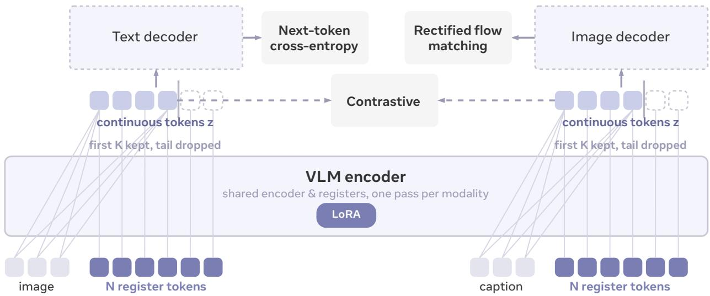  
Figure 1 FLAT architecture overview. A shared VLM encoder processes visual and textual inputs through register tokens, applying nested dropout to truncate sequences to variable prefix lengths during joint training. FLAT’s unified 1D continuous representation simultaneously drives contrastive alignment, autoregressive caption generation, and rectified-flow image synthesis.

1D sequence representations.

## 3 Method

## 3.1 Overview

FLAT is a representation pre-training framework which learns a multimodal encoder and two transmodal decoders jointly with contrastive and generative objectives. Given an input text or image, FLAT maps the input to an ordered sequence of continuous tokens, which we call the representation. The representation is contrastively aligned and read by both transmodal decoders. An overview of FLAT architecture is shown in Fig. 1.

Representation Encoder. let x denote an input of modality $m \in \{ \mathrm { i m g } , \mathrm { t x t } \}$ . FLAT appends N learnable register tokens $\boldsymbol { R } = \{ r _ { n } \} _ { n = 1 } ^ { N }$ to each input and encode the resulting sequence with a shared multimodal encoder $f _ { \mathrm { e n c } } ,$ which is a pre-trained Vision-Language Model (VLM) with a system prompt Represent the input. The hidden states at the register positions are linearly projected to obtain the representation z:

$$
\mathbf { z } = W _ { \mathrm { l a t } } f _ { \mathrm { e n c } } ( x , R ) \in \mathbb { R } ^ { N \times d } ,\tag{1}
$$

where d is the register dimension and $W _ { \mathrm { l a t } }$ the projection. The two modalities share the same registers and the same projection.

Representation Dropout. To enable variable sequence lengths, we apply nested dropout (Rippel et al., 2014) directly over the representation z. For each training batch, a keep-length K is sampled from a geometric ladder $\mathcal { K } = \{ 1 , 4 , 1 6 , 6 4 , 2 5 6 \}$ , and only the prefix sequence z is passed to the contrastive objective and downstream decoders. Sampling from a geometric ladder rather than continuous integers avoids wasting optimization steps on imperceptible length diferences. By default, FLAT samples uniformly from K. Appendix F.3 compares uniform sampling with other sampling strategies.

Compared to FlexTok (Bachmann et al., 2025), which maintains a fixed sequence length by padding tail positions with learned null embeddings, we find that directly truncating the representation to the prefix $\mathbf { z } _ { : K }$ yields better results in FLAT training setups (Appendix I). To ensure consistency, the target length K is sampled once per training step and broadcast globally across all ranks. This guarantees that both contrastive and generative objectives operate on the exact same sequence prefix at every optimization step.

Decoders. The truncated representation sequence $\mathbf { z } ; \kappa$ serves as the semantic condition for both the I2T and T2I decoders. Given a paired image-text input, the visual representation $\mathbf { z } _ { : K } ^ { \mathrm { i m g } }$ conditions caption generation, while the textual representation ${ \bf z } _ { : K } ^ { \mathrm { t x t } }$ conditions image synthesis. For each generative pathway, $\mathbf { z } _ { : K }$ is treated as a sequence of soft tokens and mapped into the respective decoder’s input dimension h:

$$
\mathbf { e } = \mathrm { R M S N o r m } ( \mathrm { M L P } ( \mathbf { z } _ { : K } ) ) ; \in ; \mathbb { R } ^ { K \times h } ,\tag{2}
$$

where the MLP projections consist of decoupled, task-specific parameters for the I2T and T2I decoders.

The I2T decoder is a standard autoregressive language model. The visual soft tokens eimg are prepended with a standard system prompt ("Describe the input") and fed as input tokens to autoregressively generate the corresponding text caption. The T2I decoder is a standard rectified flow transformer that denoises continuous VAE latents. The textual soft tokens $\mathbf { e } ^ { \mathrm { { t x t } } }$ act as semantic conditioning signals integrated via cross-attention mechanisms, guiding the flow-matching model to synthesize VAE latents decodable into the target image. The detailed, multi-task training objectives governing these decoders are formally defined in the next section.

## 3.2 Joint Training

Given a paired input text-image, FLAT is trained with both bidirectional contrastive loss and generation loss.   
Since soft tokens e is projected from representation z, we use z consistently as conditions in loss functions.

Contrastive Loss. We contrast corresponding register positions in the representation $\mathbf { z } _ { : K }$ . For an image–text pair (i, j) we define the similarity computed over their total K register positions as a late-interaction score between registers at matching positions:

$$
\begin{array} { r } { s _ { i j } ^ { ( K ) } = \frac { 1 } { K } \sum _ { n = 1 } ^ { K } \frac { ( z _ { i , n } ^ { \mathrm { i m g } } ) ^ { \top } \hat { z } _ { j , n } ^ { \mathrm { t x t } } } { \| z _ { i , n } ^ { \mathrm { i m g } } \| _ { 2 } \| z _ { j , n } ^ { \mathrm { t x t } } \| _ { 2 } } , } \end{array}\tag{3}
$$

and the contrastive loss $\mathcal { L } _ { \mathrm { a l i g n } } ^ { ( K ) }$ as

$$
\begin{array} { r } { \mathcal { L } _ { \mathrm { i 2 t } } ^ { ( K ) } = - \log \frac { \exp \left( s _ { i , i } ^ { ( K ) } \right) } { \sum _ { j = 1 } ^ { B _ { \mathrm { g l o b } } } \exp \left( s _ { i , j } ^ { ( K ) } \right) } , \quad \mathcal { L } _ { \mathrm { t 2 i } } ^ { ( K ) } = - \log \frac { \exp \left( s _ { i , i } ^ { ( K ) } \right) } { \sum _ { j = 1 } ^ { B _ { \mathrm { g l o b } } } \exp \left( s _ { j , i } ^ { ( K ) } \right) } , } \end{array}\tag{4}
$$

$$
\begin{array} { r } { \mathcal { L } _ { \mathrm { a l i g n } } = \frac { 1 } { 2 } \left( \mathcal { L } _ { \mathrm { i 2 t } } ^ { ( K ) } + \mathcal { L } _ { \mathrm { t 2 i } } ^ { ( K ) } \right) . } \end{array}\tag{5}
$$

where $B _ { \mathrm { g l o b } }$ denotes the size of the gathered global candidates from all ranks.

Generation Loss. For the same pair of image-text, we apply symmetrical generation losses for I2T and T2I respectively, both using the representations $\mathbf { z } _ { : K }$ as semantic conditions.

For I2T generation and an image input with representation $\mathbf { z } _ { : K } ^ { \mathrm { i m g } }$ , the loss over target caption y and decoder parameter θ is defined as:

$$
\begin{array} { r } { \mathcal { L } _ { \mathrm { t x t } } = - \sum _ { t } \log p _ { \theta } \Big ( y _ { t } \Big | y _ { < t } , \mathbf { z } _ { : K } ^ { \mathrm { i m g } } \Big ) } \end{array}\tag{6}
$$

For T2I generation and a text input, the representation ${ \bf z } _ { : K } ^ { \mathrm { t x t } }$ are used as semantic conditions for a flowmatching decoder. Let xˆ be the clean VAE image latent, $\epsilon \sim \mathcal { N } ( 0 , I )$ , and $t \in [ 0 , 1 ]$ . The noised VAE latent and target velocity used in flow matching are defined as

$$
\begin{array} { r } { \hat { x } _ { t } = ( 1 - t ) \hat { x } + t \epsilon , \qquad v ^ { \star } = \epsilon - \hat { x } . } \end{array}\tag{7}
$$

The conditional flow-matching objective over decoder parameter $\phi$ is defined as:

$$
\mathcal { L } _ { \mathrm { i m g } } = \mathbb { E } _ { \hat { x } , \epsilon , t } \Big [ \big \| v _ { \phi } \big ( \hat { x } _ { t } , t , \mathbf { z } _ { : K } ^ { \mathrm { t x t } } \big ) - \big ( \epsilon - \hat { x } \big ) \big \| _ { 2 } ^ { 2 } \Big ] .\tag{8}
$$

Training Objective. In representation pre-training, FLAT optimizes the total loss:

$$
{ \mathcal { L } } _ { \mathrm { t o t a l } } = \lambda _ { \mathrm { a l i g n } } { \mathcal { L } } _ { \mathrm { a l i g n } } + \lambda _ { \mathrm { t x t } } { \mathcal { L } } _ { \mathrm { t x t } } + \lambda _ { \mathrm { i m g } } { \mathcal { L } } _ { \mathrm { i m g } }\tag{9}
$$

In fine-tuning, we show that each task-specific objective can be optimized separately over one of the encoder and decoders to maximize model performance.

Table 1 Text-to-image synthesis on GenEval. FLAT achieves competitive scores while enabling inference-time sequence length selection. Evaluated from a single fine-tuned checkpoint across prefix lengths. † marks a system that rewrites the prompt before generating.
<table><tr><td>Method</td><td>Backbone</td><td>GenEval</td></tr><tr><td>Chameleon (Chameleon Team, 2024)</td><td>scratch 7B</td><td>0.39</td></tr><tr><td>Janus (Wu et al., 2024a)</td><td>DeepSeek 1.5B</td><td>0.61</td></tr><tr><td>Transfusion (Zhou et al., 2025)</td><td>scratch 7B</td><td>0.63</td></tr><tr><td>JanusFlow (Ma et al., 2024)</td><td>DeepSeek 1.5B</td><td>0.63</td></tr><tr><td>Emu3† (Wang et al., 2024)</td><td>scratch 7B</td><td>0.66</td></tr><tr><td>Show-o-512 (Xie et al., 2024)</td><td>Phi-1.5 1.3B</td><td>0.68</td></tr><tr><td>Janus-Pro-1B (Chen et al., 2025b)</td><td>DeepSeek 1.5B</td><td>0.73</td></tr><tr><td>MetaQuery-L (Pan et al., 2025)</td><td>Qwen2.5-VL 3B</td><td>0.78</td></tr><tr><td>Janus-Pro-7B (Chen et al., 2025b)</td><td>DeepSeek 7B</td><td>0.80</td></tr><tr><td>MetaQuery-XL† (Pan et al., 2025)</td><td>Qwen2.5-VL 7B</td><td>0.80</td></tr><tr><td>FLAT, K=1</td><td>Qwen3.5 2B</td><td>0.49</td></tr><tr><td>FLAT, K=4</td><td>Qwen3.5 2B</td><td>0.77</td></tr><tr><td>FLAT, K=16</td><td>Qwen3.5 2B</td><td>0.83</td></tr><tr><td>FLAT, K=64</td><td>Qwen3.5 2B</td><td>0.83</td></tr><tr><td>FLAT, K=256</td><td>Qwen3.5 2B</td><td>0.82</td></tr></table>

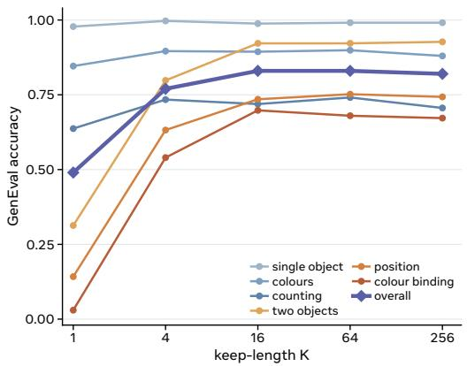  
Figure 2 GenEval accuracy across keep-lengths broken down by eval category. Smaller K can capture core entity and color, but larger K is needed to capture spatial relations, multi-object layouts and attribute bindings.

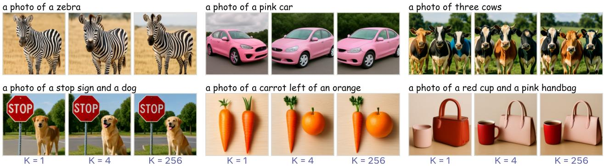  
Figure 3 Qualitative T2I synthesis across different prefix lengths. Large K provides more fine-grained visual details.

## 4 Experiments

We evaluate FLAT across generation, retrieval, and probing tasks to assess its unified 1D continuous representations. Our evaluation spans three core dimensions: (1) Generative Evaluation, demonstrating that the FLAT representation drives both T2I synthesis and I2T captioning competitively against specialized baselines; (2) Discriminative Evaluation, evaluating the FLAT representation directly with cross-modal retrieval, linear probing, and unsupervised clustering; and (3) Geometry Analysis, analyzing latent geometry to show that FLAT projects image and text into a unified representation space, natively unlocking emergent zero-shot linear interpolation, latent space arithmetic and composed retrieval. App. G further extends this evaluation to zero-shot generalization across multilingual prompts and video modalities.

## 4.1 Implementation Details

The representation encoder and text decoder are built on a Qwen3.5-2B backbone (Qwen Team, 2026) with diferent LoRA adapters, while the image decoder is initialized from SANA-1.6B (Xie et al., 2025). Full architectural, pre-training, and task-specific adaptation configurations are provided in App. B, together with a summary of the fine-tuning recipes in Table 7. All evaluations are conducted as a function of prefix length K. Specifically, we benchmark T2I synthesis on GenEval (Ghosh et al., 2023) without prompt rewriting; I2T captioning on the MS-COCO Karpathy test split; cross-modal retrieval on both the MS-COCO and Flickr30k Karpathy splits (Karpathy and Fei-Fei, 2015); and composed retrieval on the MMEB CIRR test split (Jiang et al., 2025; Liu et al., 2021) (see App. B.1 for full eval protocols). While our main result focuses on the final fine-tuned checkpoints, we report pre-trained, zero-shot performance across all tasks in App. C and task-only

Table 2 Image captioning on the MS-COCO Karpathy test split. FLAT matches or outperforms competitive baselines with less latent features. Column Latent Feat. represents latent feature shape which the text decoder is conditioned on. The metrics follow previous work: B@4 (BLEU-4), M (METEOR), R (ROUGE-L), C (CIDEr), S (SPICE).
<table><tr><td>Method</td><td>Latent Feat.</td><td>B@4</td><td>M</td><td>R</td><td>C</td><td>S</td></tr><tr><td rowspan="3">CrossFlow (Liu et al., 2025) SCD-Net (Luo et al., 2023) Florence-2-L (Xiao et al., 2024) CoCa (Yu et al., 2022)</td><td rowspan="3">4×32×32 N×512</td><td>36.4</td><td>27.8</td><td>57.1</td><td>116.2</td><td>20.4</td></tr><tr><td>37.3</td><td>28.1</td><td>58.0</td><td>118.0</td><td>21.6</td></tr><tr><td>40.9</td><td>33.9</td><td>一</td><td>143.3 143.6</td><td>24.7</td></tr><tr><td rowspan="3">BLIP-2 (Li et al., 2023b)</td><td rowspan="3">256×1408 32×768 1×64</td><td rowspan="3">43.7</td><td></td><td>一</td><td>145.8</td><td></td></tr><tr><td></td><td></td><td></td><td></td></tr><tr><td>35.3</td><td>28.7</td><td>57.7 122.0</td><td>22.0</td></tr><tr><td>FLAT, K=4</td><td>4×64</td><td>38.1</td><td>29.9</td><td>59.4</td><td>131.0</td><td>23.3</td></tr><tr><td>FLAT, K=16</td><td>16×64</td><td>39.6</td><td>30.8</td><td>60.4</td><td>136.2</td><td>24.1</td></tr><tr><td>FLAT, K=64</td><td>64×64</td><td>40.2</td><td>31.1</td><td>60.8</td><td>138.1</td><td>24.4</td></tr><tr><td>FLAT, K=256</td><td>256×64</td><td>40.5</td><td>31.2</td><td>60.8</td><td>138.6</td><td>24.4</td></tr></table>

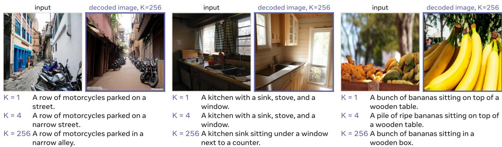  
Figure 4 Image captioning with fine-tuned I2T decoder. Small K generates semantically meaningful captions and larger K refines lexical details.

adaptation without FLAT pre-training in App. D.

## 4.2 Generative Evaluation

## 4.2.1 Text-to-Image Generation

For T2I generation, we continue training the image decoder from the pre-trained checkpoint for 8k steps on 120K clean image–text pairs (Table 7). As shown in Table 1, FLAT achieves a GenEval score of 0.83 using a 2B encoder without prompt rewriting, compared with 0.78 for MetaQuery-L under the same norewrite protocol. Categorical GenEval analysis further demonstrates a clear link between task complexity and required prefix length K (Fig. 2). While a single token (K=1) captures basic semantics like single object and color, relational and compositional tasks require larger prefixes. Complex categories—two objects, position, and color binding—score near zero at K=1 (e.g., 0.03 for color binding), but recover steeply by K=4 and K=16 (reaching 0.67). As shown in Fig. 3, K=1 generates only the main entity, while spatial arrangements, secondary entities, and attribute-object bindings emerge accurately as K increases.

## 4.2.2 Image-to-Text Generation

The I2T evaluation fine-tunes only the I2T-decoder LoRA with captioning loss on COCO Karpathy training+restval set for 5k steps (Table 7). As detailed in Table 2, performance improves steadily across all metrics as K increases. Qualitatively (Fig. 4), a single token (K=1) generates well-formed, coherent captions, while additional tokens enhance lexical precision (e.g., street → alley) and concrete detail (e.g., a shelf → a shelf with baskets). These qualitative refinements directly mirror the quantitative gains in Table 2. Even at K=1, FLAT outperforms baselines such as CrossFlow (Liu et al., 2025) and SCD-Net (Luo et al., 2023) across

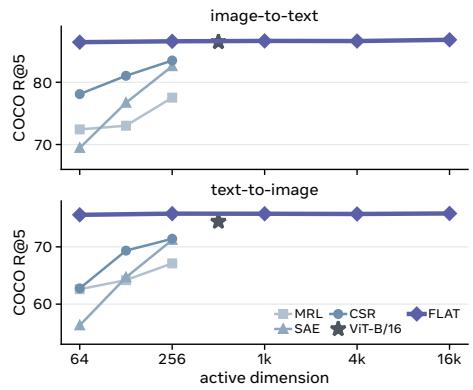  
Figure 5 MS-COCO retrieval accuracy across active dimensions. Unlike other variable-width baselines whose performance degrades sharply at reduced dimensions, FLAT maintains stable retrieval accuracy across all dimensions.

CIDEr, METEOR, and SPICE scores.

Table 3 T2I and I2T retrieval results across prefix K. The first token captures key cross-modal discriminability, keeping retrieval accuracy virtually unafected by prefix truncation. Performance is evaluated on the MS-COCO and Flickr30k Karpathy test splits.
<table><tr><td rowspan="2">K</td><td colspan="3">I→T</td><td colspan="3">T→I</td></tr><tr><td>R@1</td><td>R@5</td><td>R@10</td><td>R@1</td><td>R@5</td><td>R@10</td></tr><tr><td colspan="7">MS-COCO Karpathy 5k</td></tr><tr><td>1</td><td>63.00</td><td>86.44</td><td>92.50</td><td>47.76</td><td>75.59</td><td>84.67</td></tr><tr><td>4</td><td>63.40</td><td>86.58</td><td>92.58</td><td>47.93</td><td>75.80</td><td>84.71</td></tr><tr><td>16</td><td>63.30</td><td>86.64</td><td>92.56</td><td>47.94</td><td>75.78</td><td>84.72</td></tr><tr><td>64</td><td>63.32</td><td>86.62</td><td>92.56</td><td>47.73</td><td>75.74</td><td>84.69</td></tr><tr><td>256</td><td>63.54</td><td>86.82</td><td>92.62</td><td>47.98</td><td>75.83</td><td>84.78</td></tr><tr><td colspan="7">Flickr30k Karpathy 1k</td></tr><tr><td>1</td><td>90.50</td><td>98.10</td><td>99.50</td><td>76.94</td><td>93.52</td><td>96.48</td></tr><tr><td>4</td><td>91.20</td><td>98.30</td><td>99.50</td><td>77.40</td><td>93.58</td><td>96.54</td></tr><tr><td>16</td><td>90.80</td><td>98.30</td><td>99.60</td><td>77.32</td><td>93.60</td><td>96.54</td></tr><tr><td>64</td><td>90.90</td><td>98.20</td><td>99.40</td><td>76.88</td><td>93.72</td><td>96.54</td></tr><tr><td>256</td><td>90.80</td><td>98.20</td><td>99.30</td><td>76.26</td><td>93.16</td><td>96.40</td></tr></table>

## 4.3 Discriminative Evaluation

## 4.3.1 Cross-Modal Retrieva

For each benchmark, retrieval adapts the encoder LoRA, registers, and latent projection using contrastive loss on the corresponding training split. The reported checkpoints use 5k steps for COCO and 320 steps for Flickr30K (Table 7). Fig. 5 compares FLAT against representations that also support adaptive dimensionality from Wen et al. (2025), including MRL, SAE, and CSR. For FLAT, each token contains 64 dimensions, spanning from a 64-dimensional embedding (K=1) to a 16,384-dimensional embedding (K=256). Notably, FLAT’s retrieval performance remains virtually invariant across varying K, whereas baseline accuracy degrades sharply as K decreases. Table 3 reports detailed retrieval results across the K spectrum. Remarkably, a single token is suficient for retrieval: every metric stays within roughly one percentage point across a 256× reduction in width. This mirrors our observations in T2I and I2T generation, confirming that the first token carries suficient global semantics and discriminative power.

## 4.3.2 Linear Probing and Clustering

To directly evaluate the representation space, we perform linear probing and unsupervised clustering on FLAT representations. A single linear classifier trained on a frozen K=1 token achieves 73.3% top-1 accuracy, scaling to 81.2% at K=16. This outperforms all purely generative latent spaces and surpasses DREAM (Li et al., 2026) which jointly trains the representation encoder with an image decoder, at equivalent dimensionality. Furthermore, without fitting any parametric heads, k-means clustering on a single FLAT token cleanly recovers clusters aligned with ImageNet classes (Fig. 6).

## 4.4 Geometry Analysis

## 4.4.1 Geometry Visualization

As shown in Fig. 7, while dual-encoder models like CLIP and SigLIP2 sufer from a persistent modality gap despite strong retrieval performance (Radford et al., 2021; Tschannen et al., 2025; Liang et al., 2022), FLAT projects both modalities into a tighter embedding space. FLAT achieves significantly greater cross-modal overlap: a single register token cuts CLIP’s centroid distance by half, and the full 256 tokens reduces it to a quarter. This tightly aligned geometry enables zero-shot latent operations as below.

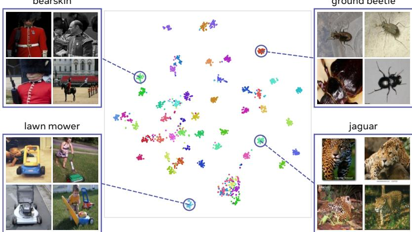  
Table 4 ImageNet-1K linear probing top-1 accuracy. FLAT outperforms both generative latent spaces and joint generativecontrastive models on ImageNet-1K linear probing. We evaluate this performance by fitting a single linear classifier on top of frozen, concatenated K tokens.  
Figure 6 Unsupervised k-means clustering with a single FLAT token. Clusters formed from frozen K=1 representations (64 dimensions) align with Ima geNet ground-truth classes without label supervision.

<table><tr><td>Method</td><td>Dim</td><td>Top-1</td></tr><tr><td>Generative Latent Spaces</td><td></td><td></td></tr><tr><td>SD-VAE latent</td><td>4</td><td>8.0</td></tr><tr><td>REPA (Leng et al., 2025)</td><td></td><td>62.5</td></tr><tr><td>MAE-B (He et al., 2022)</td><td>768</td><td>68.0</td></tr><tr><td>Jointly Contrastive and Generative</td><td></td><td></td></tr><tr><td>DREAM (Li et al., 2026)</td><td>1024</td><td>72.7</td></tr><tr><td>FLAT, K=1</td><td>64</td><td>73.3</td></tr><tr><td>FLAT, K=4</td><td>256</td><td>77.0</td></tr><tr><td>FLAT, K=16</td><td>1024</td><td>81.2</td></tr><tr><td>FLAT, K=64</td><td>4096</td><td>81.8</td></tr><tr><td>FLAT, K=256</td><td>16384</td><td>81.8</td></tr></table>

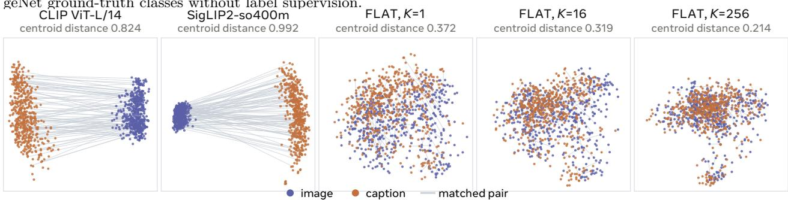  
Figure 7 PCA distributions for image-text pairs from MS-COCO. Dual-encoder baselines exhibit clear spatial separation between image and text representations, whereas FLAT projects both modalities into a highly overlapping latent space. Increasing prefix K further shrinks the cross-modal centroid distance.

## 4.4.2 Continuous Feature Interpolation

We perform linear interpolation between a pair of FLAT codes as $z _ { \alpha } = ( 1 - \alpha ) z _ { 1 } + \alpha z _ { 2 }$ , and decode each intermediate latent representation using both generative heads. As shown in Fig. 8, this yields smooth semantic transitions across the input image–text pairs. Both the image and text decoders generate intermediate concepts along the interpolation trajectory. Furthermore, the prefix length K dictates transition granularity: longer prefixes smoothly vary fine-grained attributes, whereas K=1 forms a coarser semantic average (App. F.4).

## 4.4.3 Latent Space Arithmetic

FLAT representations naturally support zero-shot arithmetic, $z _ { \mathrm { e d i t } } = z _ { 1 } - z _ { 2 } + z _ { 3 }$ , without explicit editing supervision. As shown in Fig. 9, subtracting sunrise and adding a full moon at night modifies the focal concept while preserving the surrounding scene context, with both decoders interpreting the composite representation consistently. Furthermore, these arithmetic operations can directly serve as queries for zero-shot composed image retrieval on CIRR (App. G.3).

## 4.5 Ablation Study on Training Loss Combinations

FLAT jointly optimizes a contrastive loss alongside bidirectional generation losses for I2T captioning and T2I synthesis. To evaluate the contribution of each objective, we train ablation variants across all seven non-empty loss combinations for 40k steps. Figure 10 and Table 5 present these variants along with their normalized and absolute eval scores at K=256. The full objective achieves strong performance across all five metrics, demonstrating that the symmetric contrastive and generative losses do not conflict, but rather mutually reinforce one another.

“A red sports car on a city street” → “A blue sailboat on the ocean”  
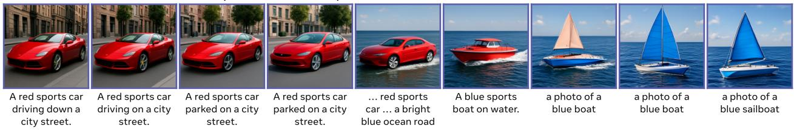

→ “A gray tiger cat sitting at a wooden table on a chair.”  
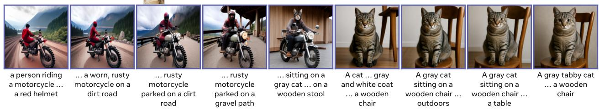

Figure 8 Continuous cross-modal feature interpolations. Linear interpolation between a pair of image–text produces smooth semantic transitions. Image and text decoders map the same representation to corresponding concepts.  
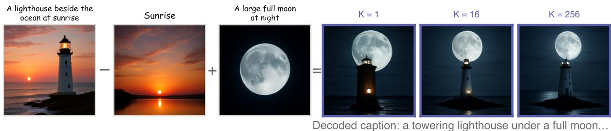  
Figure 9 Zero-shot token-wise arithmetic operation. Linear addition and subtraction modify the target concept in both image and text outputs while preserving the surrounding scene.

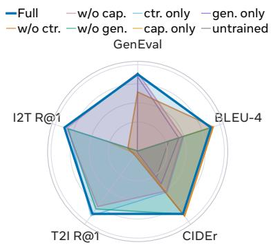

Table 5 Eval for different training loss combinations (absolute scores).
<table><tr><td rowspan="2">Losses</td><td>Retrieval</td><td></td><td>Captioning</td><td>Generation</td></tr><tr><td>I2T T2I</td><td>B@4</td><td>CIDEr</td><td>GenEval</td></tr><tr><td>Full</td><td>52.2</td><td>56.3</td><td>40.2 137.5</td><td>0.327</td></tr><tr><td>w/o contrastive</td><td>13.6</td><td>6.7 40.7</td><td>139.2</td><td>0.297</td></tr><tr><td>w/o captioning</td><td>51.5 53.6</td><td>33.9</td><td>117.1</td><td>0.329</td></tr><tr><td>w/o generation</td><td>51.2 54.5</td><td>40.0</td><td>137.8</td><td>0.003</td></tr><tr><td>ctr. only</td><td>51.0</td><td>57.0 34.2</td><td>118.0</td><td>0.003</td></tr><tr><td>cap. only</td><td>39.4</td><td>4.0 40.8</td><td>139.7</td><td>0.004</td></tr><tr><td>gen. only</td><td>0.6</td><td>1.1 33.1</td><td>110.8</td><td>0.323</td></tr><tr><td>untrained</td><td>0.2</td><td>0.0 30.8</td><td>105.0</td><td>0.000</td></tr></table>

Figure10 Evalfordifferenttraininglosscombinations (normalized scores).

We further quantify how the three losses reinforce one another using a Shapley value decomposition (Shapley, 1953) over all eight coalitions. The attribution matrices and prefix sweeps in App. H show that while each task is driven primarily by its matched loss, the other objectives generally provide complementary signals.

## 5 Conclusion

We introduce FLAT, a representation pre-training framework that resamples images and text into 1D flexiblelength, aligned, transmodal tokens. FLAT jointly optimizes a shared representation encoder alongside T2I and I2T decoders using bidirectional alignment and generation losses. This setup learns unified semantic representations not only useful for cross-modal retrieval but also as efective generative conditions for both decoders. Empirical results demonstrate that FLAT natively supports variable-length retrieval and synthesis, and with lightweight task-specific fine-tuning pushing T2I / I2T retrieval and generation performance to SOTA levels. Furthermore, qualitative analysis reveals that FLAT tokens enable zero-shot linear interpolation, latent space arithmetic, and composed retrieval.

## References

Pravesh Agrawal, Szymon Antoniak, Emma Bou Hanna, Baptiste Bout, Devendra Chaplot, Jessica Chudnovsky, Diogo Costa, Baudouin De Monicault, Saurabh Garg, Theophile Gervet, et al. Pixtral 12b. arXiv preprint arXiv:2410.07073, 2024.

Mahmoud Assran, Quentin Duval, Ishan Misra, Piotr Bojanowski, Pascal Vincent, Michael Rabbat, Yann LeCun, and Nicolas Ballas. Self-supervised learning from images with a joint-embedding predictive architecture. In 2023 IEEE/CVF Conference on Computer Vision and Pattern Recognition (CVPR), pages 15619–15629. IEEE, 2023.

Roman Bachmann, Jesse Allardice, David Mizrahi, Enrico Fini, Oğuzhan Fatih Kar, Elmira Amirloo, Alaaeldin El-Nouby, Amir Zamir, and Afshin Dehghan. FlexTok: Resampling images into 1d token sequences of flexible length. In International Conference on Machine Learning (ICML), 2025. arXiv:2502.13967.

Mathilde Caron, Hugo Touvron, Ishan Misra, Hervé Jégou, Julien Mairal, Piotr Bojanowski, and Armand Joulin. Emerging properties in self-supervised vision transformers. In 2021 IEEE/CVF international conference on com puter vision (ICCV), pages 9630–9640. IEEE, 2021.

Chameleon Team. Chameleon: Mixed-modal early-fusion foundation models. In arXiv preprint arXiv:2405.09818, 2024.

Jiuhai Chen, Zhiyang Xu, Xichen Pan, Yushi Hu, Can Qin, Tom Goldstein, Lifu Huang, Tianyi Zhou, Saining Xie, Silvio Savarese, et al. Blip3-o: A family of fully open unified multimodal models-architecture, training and dataset. arXiv preprint arXiv:2505.09568, 2025a.

Junsong Chen, Jincheng Yu, Chongjian Ge, Lewei Yao, Enze Xie, Yue Wu, Zhongdao Wang, James Kwok, Ping Luo, Huchuan Lu, and Zhenguo Li. Pixart-α: Fast training of difusion transformer for photorealistic text-to-image synthesis. In International Conference on Learning Representations (ICLR), 2024.

Xiaokang Chen, Zhiyu Wu, Xingchao Liu, Zizheng Pan, Wen Liu, Zhenda Xie, Xingkai Yu, and Chong Ruan. Janus-pro: Unified multimodal understanding and generation with data and model scaling. arXiv preprint arXiv:2501.17811, 2025b.

Alexis Chevalier, Alexander Wettig, Anirudh Ajith, and Danqi Chen. Adapting language models to compress contexts. In Empirical Methods in Natural Language Processing (EMNLP), pages 3829–3846, 2023.

Haiwen Diao, Xiaotong Li, Yufeng Cui, Yueze Wang, Haoge Deng, Ting Pan, Wenxuan Wang, Huchuan Lu, and Xinlong Wang. Evev2: Improved baselines for encoder-free vision-language models. In 2025 IEEE/CVF International Conference on Computer Vision (ICCV), pages 21014–21025. IEEE, 2025.

Haiwen Diao, Penghao Wu, Hanming Deng, Jiahao Wang, Shihao Bai, Silei Wu, Weichen Fan, Wenjie Ye, Wenwen Tong, Xiangyu Fan, et al. Sensenova-u1: Unifying multimodal understanding and generation with neo-unify architecture. arXiv preprint arXiv:2605.12500, 2026.

Runpei Dong, Yuang Peng, Zekun Qi, Zheng Ge, Jinrong Yang, Liang Zhao, Jianjian Sun, Hongyu Zhou, Haoran Wei, Xiangwen Kong, et al. Dreamllm: Synergistic multimodal comprehension and creation. In International Conference on Learning Representations, volume 2024, pages 6666–6702, 2024.

Patrick Esser, Sumith Kulal, Andreas Blattmann, Rahim Entezari, Jonas Müller, Harry Saini, Yam Levi, Dominik Lorenz, Axel Sauer, Frederic Boesel, Dustin Podell, Tim Dockhorn, Zion English, Kyle Lacey, Alex Goodwin, Yannik Marek, and Robin Rombach. Scaling rectified flow transformers for high-resolution image synthesis. In International Conference on Machine Learning (ICML), 2024.

Weichen Fan, Haiwen Diao, Quan Wang, Dahua Lin, and Ziwei Liu. The prism hypothesis: Harmonizing semantic and pixel representations via unified autoencoding. arXiv preprint arXiv:2512.19693, 2025.

Dhruba Ghosh, Hanna Hajishirzi, and Ludwig Schmidt. Geneval: An object-focused framework for evaluating textto-image alignment. In Advances in Neural Information Processing Systems (NeurIPS), 2023. arXiv:2310.11513.

Kaiming He, Xinlei Chen, Saining Xie, Yanghao Li, Piotr Dollár, and Ross Girshick. Masked autoencoders are scalable vision learners. In IEEE/CVF Conference on Computer Vision and Pattern Recognition (CVPR), 2022. arXiv:2111.06377.

Ziyuan Huang, DanDan Zheng, Cheng Zou, Rui Liu, Xiaolong Wang, Kaixiang Ji, Weilong Chai, Jianxin Sun, Libin Wang, Yongjie Lv, et al. Ming-univision: Joint image understanding and generation with a unified continuous tokenizer. arXiv preprint arXiv:2510.06590, 2025.

Chao Jia, Yinfei Yang, Ye Xia, Yi-Ting Chen, Zarana Parekh, Hieu Pham, Quoc V. Le, Yunhsuan Sung, Zhen Li, and Tom Duerig. Scaling up visual and vision-language representation learning with noisy text supervision. In International Conference on Machine Learning (ICML), pages 4904–4916, 2021.

Ziyan Jiang, Rui Meng, Xinyi Yang, Semih Yavuz, Yingbo Zhou, and Wenhu Chen. Vlm2vec: Training vision-language models for massive multimodal embedding tasks. In International Conference on Learning Representations (ICLR), 2025. arXiv:2410.05160.

Andrej Karpathy and Li Fei-Fei. Deep visual-semantic alignments for generating image descriptions. In Proceedings of the IEEE conference on computer vision and pattern recognition, pages 3128–3137, 2015.

Aditya Kusupati, Gantavya Bhatt, Aniket Rege, Matthew Wallingford, Aditya Sinha, Vivek Ramanujan, William Howard-Snyder, Kaifeng Chen, Sham Kakade, Prateek Jain, and Ali Farhadi. Matryoshka representation learning. In Advances in Neural Information Processing Systems (NeurIPS), 2022.

Xingjian Leng, Jaskirat Singh, Yunzhong Hou, Zhenchang Xing, Saining Xie, and Liang Zheng. REPA-E: Unlocking VAE for end-to-end tuning with latent difusion transformers. In IEEE/CVF International Conference on Computer Vision (ICCV), 2025.

Chao Li, Tianhong Li, Sai Vidyaranya Nuthalapati, Hong-You Chen, Satya Narayan Shukla, Jianpeng Cheng, Yonghuan Yang, Jun Xiao, Xiangjun Fan, Aashu Singh, Dina Katabi, and Shlok Kumar Mishra. Unifying contrastive and generative objectives for visual understanding and text-to-image generation. arXiv preprint arXiv:2603.02667, 2026. https://arxiv.org/abs/2603.02667.

Junnan Li, Dongxu Li, Caiming Xiong, and Steven Hoi. BLIP: Bootstrapping language-image pre-training for unified vision-language understanding and generation. In International Conference on Machine Learning (ICML), 2022. arXiv:2201.12086.

Junnan Li, Dongxu Li, Silvio Savarese, and Steven Hoi. Blip-2: Bootstrapping language-image pre-training with frozen image encoders and large language models. In International conference on machine learning, pages 19730–19742. PmLR, 2023a.

Junnan Li, Dongxu Li, Silvio Savarese, and Steven Hoi. BLIP-2: Bootstrapping language-image pre-training with frozen image encoders and large language models. In International Conference on Machine Learning (ICML), 2023b. arXiv:2301.12597.

Tianhong Li, Huiwen Chang, Shlok Mishra, Han Zhang, Dina Katabi, and Dilip Krishnan. Mage: Masked generative encoder to unify representation learning and image synthesis. In Proceedings of the IEEE/CVF conference on computer vision and pattern recognition, pages 2142–2152, 2023c.

Weixin Liang, Yuhui Zhang, Yongchan Kwon, Serena Yeung, and James Zou. Mind the gap: Understanding the modality gap in multi-modal contrastive representation learning. In Advances in Neural Information Processing Systems (NeurIPS), 2022. arXiv:2203.02053.

Haokun Lin, Teng Wang, Yixiao Ge, Yuying Ge, Zhichao Lu, Ying Wei, Qingfu Zhang, Zhenan Sun, and Ying Shan. Toklip: Marry visual tokens to clip for multimodal comprehension and generation. arXiv preprint arXiv:2505.05422, 2025.

Haotian Liu, Chunyuan Li, Qingyang Wu, and Yong Jae Lee. Visual instruction tuning. In Advances in Neural Information Processing Systems (NeurIPS), 2023.

Qihao Liu, Xi Yin, Alan Yuille, Andrew Brown, and Mannat Singh. Flowing from words to pixels: A noise-free framework for cross-modality evolution. In IEEE/CVF Conference on Computer Vision and Pattern Recognition (CVPR), 2025. arXiv:2412.15213.

Zheyuan Liu, Cristian Rodriguez-Opazo, Damien Teney, and Stephen Gould. Image retrieval on real-life images with pre-trained vision-and-language models. In IEEE/CVF International Conference on Computer Vision (ICCV), 2021. arXiv:2108.04024.

Zhiheng Liu, Weiming Ren, Xiaoke Huang, Shoufa Chen, Tianhong Li, Mengzhao Chen, Yatai Ji, Sen He, Jonas Schult, Belinda Zeng, et al. Tuna-2: Pixel embeddings beat vision encoders for multimodal understanding and generation. arXiv preprint arXiv:2604.24763, 2026.

Jianjie Luo, Yehao Li, Yingwei Pan, Ting Yao, Jianlin Feng, Hongyang Chao, and Tao Mei. Semantic-conditional difusion networks for image captioning. In IEEE/CVF Conference on Computer Vision and Pattern Recognition (CVPR), 2023. arXiv:2212.03099.

Chuofan Ma, Yi Jiang, Junfeng Wu, Jihan Yang, Xin Yu, Zehuan Yuan, Bingyue Peng, and Xiaojuan Qi. UniTok: A unified tokenizer for visual generation and understanding. In Advances in Neural Information Processing Systems (NeurIPS), 2025. arXiv:2502.20321.

Yiyang Ma, Xingchao Liu, Xiaokang Chen, Wen Liu, Chengyue Wu, Zhiyu Wu, Zizheng Pan, Zhenda Xie, Haowei Zhang, Xingkai Yu, Liang Zhao, Yisong Wang, Jiaying Liu, and Chong Ruan. Janusflow: Harmonizing autoregression and rectified flow for unified multimodal understanding and generation. arXiv preprint arXiv:2411.07975, 2024.

Xichen Pan, Satya Narayan Shukla, Aashu Singh, Zhuokai Zhao, Shlok Kumar Mishra, Jialiang Wang, Zhiyang Xu, Jiuhai Chen, Kunpeng Li, Felix Juefei-Xu, Ji Hou, and Saining Xie. Transfer between modalities with MetaQueries. arXiv preprint arXiv:2504.06256, 2025.

Dustin Podell, Zion English, Kyle Lacey, Andreas Blattmann, Tim Dockhorn, Jonas Müller, Joe Penna, and Robin Rombach. SDXL: Improving latent difusion models for high-resolution image synthesis. In International Conference on Learning Representations (ICLR), 2024. arXiv:2307.01952.

Liao Qu, Huichao Zhang, Yiheng Liu, Xu Wang, Yi Jiang, Yiming Gao, Hu Ye, Daniel K. Du, Zehuan Yuan, and Xinglong Wu. TokenFlow: Unified image tokenizer for multimodal understanding and generation. In IEEE/CVF Conference on Computer Vision and Pattern Recognition (CVPR), 2025.

Qwen Team. Qwen3.5-2B. https://huggingface.co/Qwen/Qwen3.5-2B, 2026.

Alec Radford, Jong Wook Kim, Chris Hallacy, Aditya Ramesh, Gabriel Goh, Sandhini Agarwal, Girish Sastry, Amanda Askell, Pamela Mishkin, Jack Clark, Gretchen Krueger, and Ilya Sutskever. Learning transferable visual models from natural language supervision. In International Conference on Machine Learning (ICML), 2021.

Aditya Ramesh, Prafulla Dhariwal, Alex Nichol, Casey Chu, and Mark Chen. Hierarchical text-conditional image generation with CLIP latents. arXiv preprint arXiv:2204.06125, 2022.

Oren Rippel, Michael A. Gelbart, and Ryan P. Adams. Learning ordered representations with nested dropout. In International Conference on Machine Learning (ICML), 2014.

Robin Rombach, Andreas Blattmann, Dominik Lorenz, Patrick Esser, and Bj"orn Ommer. High-resolution image synthesis with latent difusion models. In IEEE/CVF Conference on Computer Vision and Pattern Recognition (CVPR), pages 10684–10695, 2022.

Lloyd S. Shapley. A value for n-person games. In Harold W. Kuhn and Albert W. Tucker, editors, Contributions to the Theory of Games, Volume II, volume 28 of Annals of Mathematics Studies, pages 307–318. Princeton University Press, 1953. doi: 10.1515/9781400881970-018.

Quan Sun, Yuxin Fang, Ledell Wu, Xinlong Wang, and Yue Cao. Eva-clip: Improved training techniques for clip at scale. arXiv preprint arXiv:2303.15389, 2023.

Michael Tschannen, Alexey Gritsenko, Xiao Wang, Muhammad Ferjad Naeem, Ibrahim Alabdulmohsin, Nikhil Parthasarathy, Talfan Evans, Lucas Beyer, Ye Xia, Basil Mustafa, Olivier Hénaf, Jeremiah Harmsen, Andreas Steiner, and Xiaohua Zhai. Siglip 2: Multilingual vision-language encoders with improved semantic understanding, localization, and dense features. arXiv preprint arXiv:2502.14786, 2025.

Xinlong Wang, Xiaosong Zhang, Zhengxiong Luo, Quan Sun, Yufeng Cui, Jinsheng Wang, Fan Zhang, Yueze Wang, Zhen Li, Qiying Yu, Yingli Zhao, Yulong Ao, Xuebin Min, Tao Li, Boya Wu, Bo Zhao, Bowen Zhang, Liangdong

Wang, Guang Liu, Zheqi He, Xi Yang, Jingjing Liu, Yonghua Lin, Tiejun Huang, and Zhongyuan Wang. Emu3: Next-token prediction is all you need. arXiv preprint arXiv:2409.18869, 2024.

Tiansheng Wen, Yifei Wang, Zequn Zeng, Zhong Peng, Yudi Su, Xinyang Liu, Bo Chen, Hongwei Liu, Stefanie Jegelka, and Chenyu You. Beyond matryoshka: Revisiting sparse coding for adaptive representation. In International Conference on Machine Learning (ICML), 2025. arXiv:2503.01776.

Chengyue Wu, Xiaokang Chen, Zhiyu Wu, Yiyang Ma, Xingchao Liu, Zizheng Pan, Wen Liu, Zhenda Xie, Xingka Yu, Chong Ruan, and Ping Luo. Janus: Decoupling visual encoding for unified multimodal understanding and generation. arXiv preprint arXiv:2410.13848, 2024a.

Yecheng Wu, Zhuoyang Zhang, Junyu Chen, Haotian Tang, Dacheng Li, Yunhao Fang, Ligeng Zhu, Enze Xie, Hongxu Yin, Li Yi, Song Han, and Yao Lu. VILA-U: A unified foundation model integrating visual understanding and generation. arXiv preprint arXiv:2409.04429, 2024b.

Bin Xiao, Haiping Wu, Weijian Xu, Xiyang Dai, Houdong Hu, Yumao Lu, Michael Zeng, Ce Liu, and Lu Yuan. Florence-2: Advancing a unified representation for a variety of vision tasks. In IEEE/CVF Conference on Computer Vision and Pattern Recognition (CVPR), 2024. arXiv:2311.06242.

Enze Xie, Junsong Chen, Junyu Chen, Han Cai, Haotian Tang, Yujun Lin, Zhekai Zhang, Muyang Li, Ligeng Zhu, Yao Lu, and Song Han. SANA: Eficient high-resolution image synthesis with linear difusion transformers. In International Conference on Learning Representations (ICLR), 2025.

Jinheng Xie, Weijia Mao, Zechen Bai, David Junhao Zhang, Weihao Wang, Kevin Qinghong Lin, Yuchao Gu, Zhijie Chen, Zhenheng Yang, and Mike Zheng Shou. Show-o: One single transformer to unify multimodal understanding and generation. arXiv preprint arXiv:2408.12528, 2024.

Tianwei Xiong, Jun Hao Liew, Zilong Huang, Jiashi Feng, and Xihui Liu. Gigatok: Scaling visual tokenizers to 3 billion parameters for autoregressive image generation. In 2025 IEEE/CVF International Conference on Computer Vision (ICCV), pages 18770–18780. IEEE, 2025.

Jiahui Yu, Zirui Wang, Vijay Vasudevan, Legg Yeung, Mojtaba Seyedhosseini, and Yonghui Wu. CoCa: Contrastive captioners are image-text foundation models. In Transactions on Machine Learning Research, 2022. arXiv:2205.01917.

Qihang Yu, Mark Weber, Xueqing Deng, Xiaohui Shen, Daniel Cremers, and Liang-Chieh Chen. An image is worth 32 tokens for reconstruction and generation. In Advances in Neural Information Processing Systems (NeurIPS), 2024.

Zhengrong Yue, Haiyu Zhang, Xiangyu Zeng, Boyu Chen, Chenting Wang, Shaobin Zhuang, Lu Dong, Yi Wang, Limin Wang, and Yali Wang. Uniflow: A unified pixel flow tokenizer for visual understanding and generation. In International Conference on Learning Representations, volume 2026, pages 84741–84772, 2026.

Xiaohua Zhai, Basil Mustafa, Alexander Kolesnikov, and Lucas Beyer. Sigmoid loss for language image pre-training. In IEEE/CVF International Conference on Computer Vision (ICCV), pages 11975–11986, 2023.

Letian Zhang, Sucheng Ren, Yanqing Liu, Xianhang Li, Zeyu Wang, Yuyin Zhou, Huaxiu Yao, Zeyu Zheng, Weili Nie, Guilin Liu, et al. Openvision 3: A family of unified visual encoder for both understanding and generation. arXiv preprint arXiv:2601.15369, 2026.

Yue Zhao, Fuzhao Xue, Scott Reed, Linxi Fan, Yuke Zhu, Jan Kautz, Zhiding Yu, Philipp Krähenbühl, and De-An Huang. QLIP: Text-aligned visual tokenization unifies auto-regressive multimodal understanding and generation. arXiv preprint arXiv:2502.05178, 2025.

Kaizhi Zheng, Xuehai He, and Xin Eric Wang. Minigpt-5: Interleaved vision-and-language generation via generative vokens. arXiv preprint arXiv:2310.02239, 2023.

Chunting Zhou, Lili Yu, Arun Babu, Kushal Tirumala, Michihiro Yasunaga, Leonid Shamis, Jacob Kahn, Xuezhe Ma, Luke Zettlemoyer, and Omer Levy. Transfusion: Predict the next token and difuse images with one multi-modal model. In International Conference on Learning Representations (ICLR), 2025.

## Appendix

## A Overview

This appendix first details the implementation and evaluation protocols (Appendix B), followed by zeroshot results from the pre-trained checkpoint (Appendix C) and controlled task-only adaptation comparisons (Appendix D). We then provide expanded qualitative galleries (Appendix E), analyze flexible-length representations and sampling choices (Appendix F), examine zero-shot transfer and latent composition (Appendix G), and report loss and truncation ablations (Appendices H and I).

## B Implementation and evaluation details

FLAT is jointly pre-trained on 65.7M image–text pairs for 135k steps on 8 nodes using the config in Table 6. Table 7 summarizes the task-specific fine-tuning configs for checkpoints evaluated in Sec. 4

## B.1 Evaluation protocol

T2I Generation. We evaluate text-to-image (T2I) generation using GenEval (Ghosh et al., 2023) across all 553 prompts, generating 4 images per prompt with 20 sampling steps and a classifier-free guidance (CFG) scale of 4.5. To ensure controlled comparisons across prefix lengths, the initial noise vector is sampled once per prompt and reused. We do not apply prompt rewriting at any stage.

I2T Generation. We evaluate image captioning (I2T) on the MS-COCO Karpathy test split using greedy decoding. Generated captions are evaluated via pycocoevalcap, reporting standard metrics: BLEU-4 (B@4), METEOR (M), ROUGE-L (R), CIDEr (C), and SPICE (S).

• BLEU-4 (B@4): Measures n-gram precision (up to 4-grams) between generated and reference captions, incorporating a brevity penalty to discourage overly short outputs.

• METEOR (M): Computes an F-score based on unigram precision and recall, accounting for word stemming, synonymy, and paraphrase alignment.

• ROUGE-L (R): Evaluates structural word-order similarity using the Longest Common Subsequence (LCS) between predicted captions and ground-truth references.

• CIDEr (C): Computes TF-IDF–weighted n-gram cosine similarity to reward visually descriptive content while penalizing generic terms.

• SPICE (S): Converts captions into semantic scene graphs (objects, attributes, and relations) and calculates the F1-score over the extracted graph tuples.

Retrieval.We evaluate both text-to-image (T2I) and image-to-text (I2T) retrieval on the COCO Karpathy 5K and Flickr30K Karpathy 1K test splits, reporting direct retrieval recall without post-hoc reranking.

Composed Retrieval. Following the MMEB protocol (Jiang et al., 2025), we evaluate on CIRR (Liu et al., 2021) using 1,000 queries against a 1,000-image gallery. We perform latent space arithmetic by converting image editing instructions into add and remove clauses. Specifically, let $\mathbf { z } _ { \mathrm { r e f } }$ denote the original image representation and $\mathbf { z } _ { 0 }$ denote the representation of the neutral phrase "a photo". For an edit specified by added phrases A and removed phrases R, the composite query representation is formulated as:

$$
\mathbf { z } _ { q } = \mathbf { z } _ { \mathrm { r e f } } + \alpha \left[ \sum _ { a \in A } ( \mathbf { z } _ { a } - \mathbf { z } _ { 0 } ) - \sum _ { r \in R } ( \mathbf { z } _ { r } - \mathbf { z } _ { 0 } ) \right]
$$

After composition, we ℓ2-normalize each token representation and score the similarity with the late-interaction score defined in Eq. 3. We sweep $\alpha \in \{ 0 . 2 5 , 0 . 5 , 1 , 1 . 5 , 2 , 3 , 4 , 6 , 8 \}$ for each K on this diagnostic set. Table 14 reports all metrics using the α selected by Recall@1.

Table 6 FLAT model and pre-training configuration.
<table><tr><td>Component</td><td>Configuration</td></tr><tr><td>Encoder and text decoder</td><td></td></tr><tr><td>Model</td><td> $\mathrm { Q w e n 3 . 5 - 2 B } _ { \mathrm { ~ } }$  bfloat16, FlashAttention-2, gradient checkpointing</td></tr><tr><td>LoRA</td><td> $r { = } 1 6 , \alpha { = } 3 2 .$  dropout 0.05; on  $\mathrm { Q / K / V / O }$  and gate/up/down projections</td></tr><tr><td>Adapters</td><td>Two adapters sharing this configuration: encoder and caption decoder Frozen; 11.4M trainable across the adapter and register projections</td></tr><tr><td>Base weights</td><td></td></tr><tr><td>Register sequence</td><td> $N = 2 5 6 ,$  latent dimension  $d = 6 4$ </td></tr><tr><td>Register tokens Nested dropout</td><td> $p = 1 . 0 , \mathcal { K } = \{ 1 , 4 , 1 6 , 6 4 , 2 5 6 \}$  uniform; one shared K per optimization</td></tr><tr><td></td><td>step  $\left( \mathrm { A p p . ~ I } \right)$ </td></tr><tr><td>Truncation Minimum tokens</td><td>Tail dropped, not null-padded, so a prefix is a shorter sequence 1</td></tr><tr><td>Read-out head</td><td>MLP with norm matching and latent normalization</td></tr><tr><td>Quantizer</td><td>None; the representation stays continuous and is scored directly</td></tr><tr><td>Objectives</td><td></td></tr><tr><td>Loss weights</td><td>Contrastive 1.0; text generation 1.0; image generation 1.0</td></tr><tr><td>Contrastive objective</td><td>InfoNCE, temperature 0.07, cross-device negatives</td></tr><tr><td>Image conditioning</td><td>Text registers at every step (imagegen_image_cond_prob=0)</td></tr><tr><td>Encoder instruction</td><td>Represent the user&#x27;s input.</td></tr><tr><td>Caption instruction</td><td>Describe the input.</td></tr><tr><td>Image decoder</td><td></td></tr><tr><td>Model</td><td>SANA-1600M at 512 px, fully fine-tuned</td></tr><tr><td>Connector</td><td>16 Transformer layers, caption channels 2304, input scale 2.3452</td></tr><tr><td>Flow matching</td><td>Flow objective, shift 3.0, logit-normal t with mean 0 and std 1</td></tr><tr><td>CFG dropout</td><td>0.1</td></tr><tr><td>Data</td><td></td></tr><tr><td>Image resolution</td><td> $5 1 2 \times 5 1 2 ,$  giving a  $1 6 \times 1 6$  grid of 256 visual tokens</td></tr><tr><td>Maximum text length</td><td>128 tokens</td></tr><tr><td>Training data</td><td>67M image-text pairs</td></tr><tr><td>Approx. composition</td><td>Long-caption (30M), short-caption (33M), prompt-style (4M), and curated</td></tr><tr><td>Data workers</td><td>high-quality (0.1M) pairs 20 per rank, prefetch factor 6</td></tr><tr><td>Optimization</td><td></td></tr><tr><td>Optimizer</td><td>AdamW,  $\beta = ( 0 . 9 , 0 . 9 9 9 )$  , weight decay 0.0, gradient clip 1.0</td></tr><tr><td>Learning rate</td><td> $1 . 0 \times 1 0 ^ { - 4 }$  ; 500-step linear warm-up then cosine decay to zero</td></tr><tr><td>Batch size</td><td>16 per rank  $\times ~ 6 4$  ranks × 1 accumulation step = 1024 global</td></tr><tr><td>Hardware</td><td>8 nodes × 8 H200 GPUs</td></tr><tr><td>Precision</td><td>bfloat16</td></tr><tr><td>Training steps</td><td>135k pretraining</td></tr></table>

Table 7 Task-specific fine-tuning configs. Each column describes the config of the task-specific fine-tuned checkpoint evaluated in Sec. 4. All runs use AdamW, bfloat16, zero weight decay, direct prefix truncation, and uniform sampling over $\mathcal { K } = \{ 1 , 4 , 1 6 , 6 4 , 2 5 6 \}$ . Batch sizes are global; retrieval uses the global batch as cross-device in-batch negatives.
<table><tr><td rowspan="2"></td><td rowspan="2">T2I synthesis</td><td rowspan="2">I2T captioning</td><td colspan="2">Image-text retrieval</td></tr><tr><td>COCO</td><td>Flickr30k</td></tr><tr><td>Training data</td><td>120K high-quality image-text pairs</td><td>COCO Karpathy train+restval (113,287 images)</td><td>COCO Karpathy train+restval</td><td>Flickr30k Karpathy train</td></tr><tr><td>Updated parameters</td><td>Image decoder</td><td>Text decoder LoRA</td><td>Encoder LoRA, registers, and latent projection</td><td>Encoder LoRA, registers, and latent projection</td></tr><tr><td>Objective</td><td>T2I generation</td><td>I2T generation</td><td>T2I an I2T contrastive</td><td>T2I an I2T contrastive</td></tr><tr><td>Checkpoint step</td><td>8,000</td><td>5,000</td><td>5,000</td><td>320</td></tr><tr><td>Global batch</td><td>1,024</td><td>256</td><td>2,048</td><td>2,048</td></tr><tr><td>Learning rate</td><td>4×10−4</td><td>2×10−4</td><td>1×10−4</td><td>1×10−4</td></tr><tr><td>Warm-up steps</td><td>5,000</td><td>2,213</td><td>500</td><td>128</td></tr></table>

Linear Probing. For linear probing, we train a linear classification head on top of the frozen, concatenated prefix-K token representations. We train on all 1,281,167 ImageNet-1K training images for 20 epochs and evaluate performance on the 50,000-image validation split.

## C Evaluation Results of the pre-trained checkpoint

The jointly pre-trained checkpoint supports generation and retrieval without task-specific adaptation. We first evaluate generation across both modalities, followed by bidirectional retrieval.

T2I Generation. Table 8 reports GenEval results using the same prompt, sampling, and fixed-noise protocol as the fine-tuned checkpoint. Without task-specific tuning, the pre-trained model reaches an overall score of 0.71, with performance scaling from 0.32 using a single token to 0.71 with 256 tokens.

Table 8 GenEval for the pre-trained checkpoint. No prompt rewriting is applied.
<table><tr><td>K</td><td>1</td><td>4</td><td>16</td><td>64</td><td>256</td></tr><tr><td>GenEval</td><td>0.317</td><td>0.613</td><td>0.703</td><td>0.701</td><td>0.711</td></tr></table>

I2T Generation. We evaluate the pre-trained checkpoint directly on I2T captioning using the MS-COCO Karpathy test split. As shown in Table 9, performance steadily improves with larger prefix lengths, reaching 63.8 CIDEr and 16.3 SPICE at K=256. Although these absolute scores are lower than those of the finetuned checkpoint (Table 2), this gap is largely driven by stylistic diferences of training data: the pre-training corpus contains diverse descriptive text, whereas COCO favors short, literal captions. This distributional gap inherently penalizes overlap-based metrics, as semantically correct but longer or editorial descriptions introduce phrasing that diverges from compact reference captions.

Figure 11 qualitatively illustrates this phenomenon. Zero-shot generations reliably capture the central entities and actions, but often express them as detailed descriptions or title-style captions. For instance, at K=64, 99.6% of generated sequences properly terminate with an EOS token and average 10.8 words, yet 27.1% begin with quotation marks characteristic of image titles. These results indicate that while pre-trained representations already encode rich visual semantics, fine-tuning primarily serves to align decoder length and stylistic tone with COCO expectations. Consequently, part of the metric gains observed after fine-tuning reflects output-format alignment rather than improved semantic understanding alone.

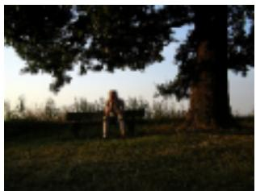

COCO reference

COCO reference

COCO reference

A lone man sitting on a bench on a hill next to a large tree.

A painting of a table with fruit on top of it.

Zero-shot, K = 64

A commercial airplane ascending into the sky.

Zero-shot, K = 64

"Solitary figure under the tree, seeking solace in nature."

Fine-tuned, K= 64

Zero-shot, K = 64

A person sitting on a bench under a tree.

"Still life with fruit, pitcher, and candle in ornate frame."

Fine-tuned, K= 64

A painting of a pitcher, oranges and a candle.

A sleek airplane soars through a clear sky, leaving a trail of light.

Fine-tuned, K= 64

A large jetliner flying through a gray sky.

COCO reference

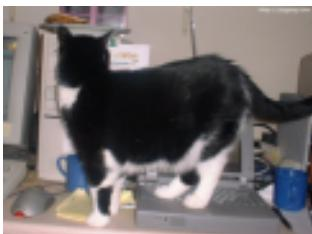

COCO reference

A black and white photo of a train sitting in a station.

COCO reference

A black and white cat standing on a laptop.

An owl sitting on a branch in a forest.

Zero-shot, K = 64

Zero-shot, K = 64

Zero-shot, K = 64

"Classic train at station, black and white."

Fine-tuned, K= 64

A curious owl perches on a tree branch in a forest setting.

A black and white cat stands on a laptop keyboard in an office setting.

A black and white photo of a train at a station.

Fine-tuned, K= 64

Fine-tuned, K= 64

A black and white cat standing on a laptop.

An owl sitting on a branch in a forest.

Figure 11 A comparison between the generated captions between pre-trained and fine-tuned checkpoints. Each example compares a COCO reference caption against outputs from the pre-trained and fine-tuned checkpoints. While zero-shot predictions from the pre-trained model reliably capture core entities and actions, fine-tuning aligns output length and phrasing with the COCO annotation style.

Table 9 Zero-shot I2T captioning evaluation for the pre-trained checkpoint. Greedy decoding is used to generate the captions.
<table><tr><td>K</td><td>B@4</td><td>M</td><td>R</td><td>C</td><td>S</td></tr><tr><td>1</td><td>11.0</td><td>17.9</td><td>37.2</td><td>46.1</td><td>12.5</td></tr><tr><td>4</td><td>13.4</td><td>20.2</td><td>39.8</td><td>57.2</td><td>14.6</td></tr><tr><td>16</td><td>14.5</td><td>21.3</td><td>41.3</td><td>62.1</td><td>15.7</td></tr><tr><td>64</td><td>14.9</td><td>21.6</td><td>41.6</td><td>63.5</td><td>16.2</td></tr><tr><td>256</td><td>15.0</td><td>21.7</td><td>41.7</td><td>63.8</td><td>16.3</td></tr></table>

Retrieval. Table 10 evaluates the pre-trained checkpoint on the full MS-COCO and Flickr30K Karpathy test splits without retrieval-specific fine-tuning. Even in this zero-shot setting, the learned representations efectively support bidirectional retrieval. However, zero-shot performance degrades slightly as the prefix length K increases. Task-specific fine-tuning substantially mitigates this sensitivity to K (Table 3).

Table 10 Zero-shot retrieval for the pre-trained checkpoint. Results are recall (%) on the COCO Karpathy 5k and Flickr30k Karpathy 1k test splits.
<table><tr><td></td><td colspan="3">Image → text</td><td colspan="3">Text → image</td></tr><tr><td>K</td><td>R@1</td><td>R@5</td><td>R@10</td><td>R@1</td><td>R@5</td><td>R@10</td></tr><tr><td colspan="7">MS-COCO Karpathy 5k</td></tr><tr><td>1</td><td>44.90</td><td>69.10</td><td>78.54</td><td>39.70</td><td>64.59</td><td>74.51</td></tr><tr><td>4</td><td>44.48</td><td>68.26</td><td>78.08</td><td>37.85</td><td>62.31</td><td>72.08</td></tr><tr><td>16</td><td>41.94</td><td>66.96</td><td>76.32</td><td>36.32</td><td>61.02</td><td>70.84</td></tr><tr><td>64</td><td>39.96</td><td>65.02</td><td>74.64</td><td>34.33</td><td>59.07</td><td>69.37</td></tr><tr><td>256</td><td>35.48</td><td>60.04</td><td>70.64</td><td>31.45</td><td>55.87</td><td>66.57</td></tr><tr><td colspan="7">Flickr30k Karpathy 1k</td></tr><tr><td>1</td><td>64.10</td><td>89.70</td><td>94.90</td><td>64.40</td><td>86.04</td><td>91.16</td></tr><tr><td>4</td><td>63.50</td><td>89.10</td><td>94.60</td><td>61.52</td><td>84.62</td><td>89.76</td></tr><tr><td>16</td><td>61.00</td><td>89.00</td><td>94.60</td><td>60.44</td><td>83.98</td><td>89.30</td></tr><tr><td>64</td><td>59.30</td><td>88.10</td><td>93.50</td><td>58.68</td><td>83.00</td><td>88.64</td></tr><tr><td>256</td><td>55.70</td><td>84.30</td><td>91.90</td><td>55.74</td><td>81.30</td><td>87.20</td></tr></table>

## D Effect of FLAT pre-training on task adaptation

We compare task-specific adaptation with and without FLAT pre-training. The task-only controls use the same architecture, training data, optimization budget, and evaluation protocol as the corresponding fine tuned FLAT models. They retain the public backbone initialization but begin with randomly initialized FLAT-specific parameters and receive no joint FLAT pre-training. Table 11 reports the complete prefixlength sweep. For T2I synthesis, the task-only model remains near 0.60 GenEval across all prefix lengths. FLAT pre-training improves GenEval by 0.16–0.24 for K ≥ 4 and reaches 0.83 at K=16 and $K { = } 6 4$ . Although the task-only model is higher at K=1, its performance does not increase with additional tokens. In contrast, the pre-trained initialization gains 0.34 from K=1 to K=16, showing that pre-training enables the image decoder to exploit wider prefixes for compositional generation. Pre-training also improves captioning by 9.0–10.9 BLEU-4 and 31.9–41.2 CIDEr across K. Its efect on retrieval is smaller and direction-dependent: image-to-text R@1 improves by 0.6–1.3 points, while the task-only model is 0.4–0.9 points higher for text-toimage R@1. These results show that the generative tasks benefit most from the representation learned during joint pre-training, whereas in-domain contrastive adaptation learns most of the retrieval interface directly.

Table 11 Task-specific adaptation with and without FLAT pre-training. T2I uses matched 8k-step recipes on 120K image– text pairs; captioning and retrieval use matched 5k-step recipes on the COCO Karpathy train+restval split. T2I is evaluated on GenEval without prompt rewriting. Captioning and retrieval are evaluated on the Karpathy 5k test split, with full galleries for retrieval.
<table><tr><td>Metric</td><td>Initialization</td><td>K=1</td><td> $K { = } 4$ </td><td> $K { = } 1 6$ </td><td> $K { = } 6 4$ </td><td> $K { = } 2 5 6$ </td></tr><tr><td rowspan="2">T2I GenEval</td><td>Task-only</td><td>0.60</td><td>0.61</td><td>0.61</td><td>0.60</td><td>0.59</td></tr><tr><td>FLAT pre-trained</td><td>0.49</td><td>0.77</td><td>0.83</td><td>0.83</td><td>0.82</td></tr><tr><td rowspan="2">Captioning B@4</td><td>Task-only</td><td>24.4</td><td>27.3</td><td>30.6</td><td>31.0</td><td>30.8</td></tr><tr><td>FLAT pre-trained</td><td>35.3</td><td>38.1</td><td>39.6</td><td>40.2</td><td>40.5</td></tr><tr><td rowspan="2">Captioning CIDEr</td><td>Task-only</td><td>80.8</td><td>91.5</td><td>104.3</td><td>105.3</td><td>105.0</td></tr><tr><td>FLAT pre-trained</td><td>122.0</td><td>131.0</td><td>136.2</td><td>138.1</td><td>138.6</td></tr><tr><td rowspan="2">I2T retrieval R@1</td><td>Task-only</td><td>62.44</td><td>62.38</td><td>62.28</td><td>62.72</td><td>62.24</td></tr><tr><td>FLAT pre-trained</td><td>63.00</td><td>63.40</td><td>63.30</td><td>63.32</td><td>63.54</td></tr><tr><td rowspan="2">T2I retrieval R@1</td><td>Task-only</td><td>48.62</td><td>48.54</td><td>48.49</td><td>48.53</td><td>48.43</td></tr><tr><td>FLAT pre-trained</td><td>47.76</td><td>47.93</td><td>47.94</td><td>47.73</td><td>47.98</td></tr></table>

## E Qualitative results for FLAT

The following galleries present a qualitative evaluation of FLAT. Text-to-image samples share the same initial noise across prefix lengths, while retrieval evaluations utilize task-specific checkpoints and full galleries as described in Table 7. Figures 12 and 13 evaluate performance on controlled compositional prompts, whereas Figure 14 extends this comparison to longer, free-form prompts. Figure 15 illustrates bidirectional retrieval results, and Figure 16 highlights representative failure cases across the primary tasks.

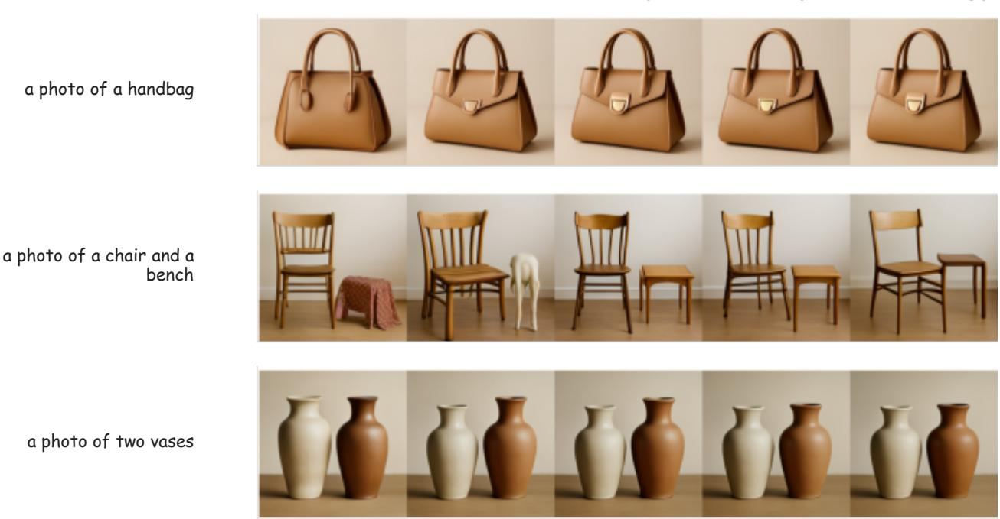  
Figure 12 Text-to-image gallery, part I. Samples are drawn from the fine-tuned checkpoint across the full prefix-length ladder. The initial noise is fixed within each row. These examples cover a single object, two-object composition, and counting.

K = 4  
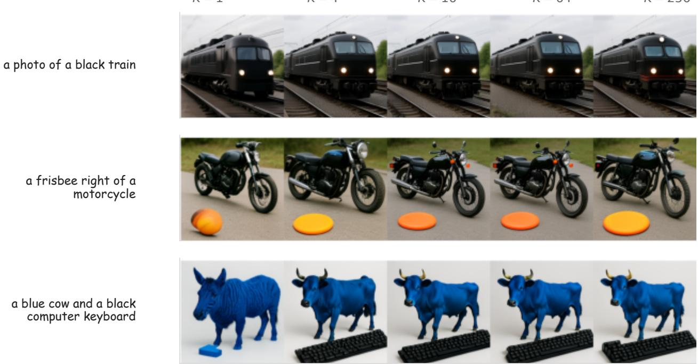  
K = 1  
K = 16  
K= 64  
Figure 13 Text-to-image gallery, part II. Additional samples covering color, spatial relations, and attribute–object binding, with fixed initial noise across prefix lengths.

Fresh fruits, vegetables, and berries illuminated by golden morning sunlight, photographed with a Sony α7 III and an 85mm f/1.2 lens

  
The father of Jesus Christ as a human being  
A rocky seashore with sandy patches, yellow snail shells, seaweed, and pine pollen on the waves; a concrete war fortress with orange lichen in the distance at sunrise

  
Mexican Buffy the Vampire Slayer and the ancestral line of slayers, ink illustration, colorful, magical realism, HD  
A cinematic and ultrarealistic rendering of a futuristic city street at dawn, complete with atmospheric lighting and realistic textures

  
Orobanche ramosa on a black background, shot on Fuji film, surreal, award-winning photograph, 8K, rich details

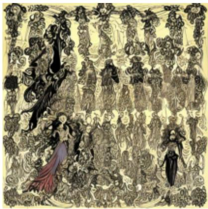

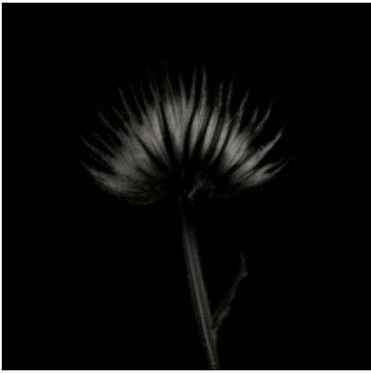  
Figure14 Text-to-imagegallerywithfree-formprompts. Samples at K=64 for longer prompts from MJHQ-30K, spanning photographic and illustrative styles across diverse subjects and scenes.

## (a) Image-to-text retrieval

  
query image target: rank 1

1 A man with a red helmet on a small moped on a dirt road.

2 A person riding a motorcycle on a road with a hill in the background.

3 A dump truck passing a gentleman on a bicycle loaded with wood benches.

  
query image target: rank 3

1 A plane on the runway is being led by a tow cart.

2 A large jetliner sitting on top of an airport tarmac.

3 A large jetliner sitting on top of an airport runway.

  
query image target: rank 1  
query image target: rank 2

1 A bunch of groceries are piled onto a table.

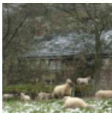

2 A table topped with lots of vegetables of different color and kind.

3 A counter with vegetables, knife and cutting board on it.

1 A sheep in the snow with other sheep around him.

2 A herd of sheep standing on top of snow covered field.

3 A bunch of lambs standing around in a field behind a fence.

## (b) Text-to-image retrieval

A girl is skateboarding down the Hollywood walk of fame.

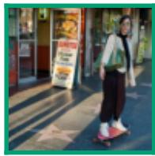  
rank 1 target

  
rank 2

  
rank 3

A sandwich wrapped in a bag, a to-go coffee cup and a drink sits on top of a white table.

  
rank 1

  
rank 2 target

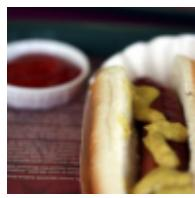  
rank 3

A small airplane flying through a blue sky.  
rank 1  

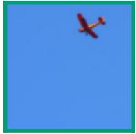  
rank 2 target

  
rank 3

A giraffe standing in front of green brush.  
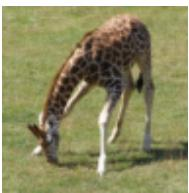  
rank 1

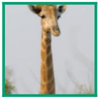  
rank 2 target

  
rank 3

Figure 15 Bidirectional retrieval galleries. Image-to-text (top) and text-to-image (bottom) retrieval results at K=16 on MS-COCO. A green box highlights the ground-truth target, while remaining images/texts show top-ranked retrieved candidates. Cases where the ground truth appears at rank 2 or 3 illustrate near-miss failures, where leading alternatives remain semantically consistent with the query.

FLAT, K = 64

## (a) Text-to-image synthesis

## FLAT, K = 64

modern ecommerce landing page, agriculture, plants, organic, science, simple, clean, minimalist, 4k

Minor miss: rendered text remains indistinct.

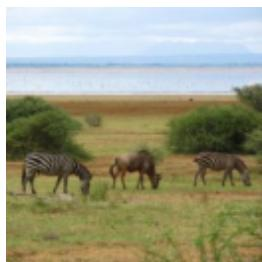

## (b) Image captioning

## reference

An antilope is eating grass in between two zebra.

FLAT, K = 64

A herd of zebra standing on top of a grass covered field.   
Minor miss: the antelope is   
omitted.

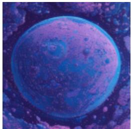

## FLAT, K = 64

a satellite view of a planet pink blue and purple with lot of city on the surface, retrofuturism, in space, cartoon style

Minor miss: the city structure is only weakly expressed.

## reference

A plane with water skies for landing gear coming in for a landing at a lake.

A small plane flying over a body of water. Minor miss: the pontoons and landing action are omitted.

## (c) Image-to-text retrieval

1 A plane on the runway is being led by a tow cart.

  
target: rank 3  
A sandwich wrapped in a bag, a to-go coffee cup and a drink sits on top of a white table.

2 A large jetliner sitting on top of an airport tarmac.

3 A large jetliner sitting on top of an airport runway.

## (d) Text-to-image retrieval

  
rank 1

  
rank 2 target

  
rank 3  
Figure 16 Representative failure cases across tasks. For text-to-image synthesis (top), the overall subject matter and style are preserved, though fine-grained layout or typography exhibits minor imperfections. For captioning (middle), the primary scene is described accurately, but secondary objects or actions are occasionally omitted. In bidirectional retrieval, ground-truth targets consistently rank near the top, preceded only by semantically close alternatives.

## F Flexible-length representation analysis

During training, FLAT samples K only from a list $\mathcal { K } = \{ 1 , 4 , 1 6 , 6 4 , 2 5 6 \}$ . We examine whether the other choice of K can be flexibly applied at test time.

## F.1 Generalization to unseen prefix lengths

In short, direct prefix truncation enables inference at arbitrary integer sequence lengths within 256. Figure 17 illustrates outputs generated from the same prompt and initial noise across both trained lengths and unseen intermediate lengths. Generations at unseen prefix lengths remain coherent and evolve smoothly with K.

A red passenger train crossing a stone bridge through snowy mountains at sunset

A silver robot cooking tomato soup in a modern kitchen, holding a wooden spoon

A traditional blue-and-white porcelain teapot beside two matching teacups on a bamboo tray

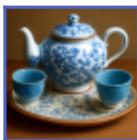

A red cube to the left of a blue sphere, with a small yellow cone centered above them, on a white background

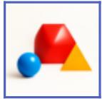

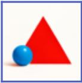

A glass terrarium containing a miniature glowing forest and a tiny waterfall on a dark wooden table

K = 1

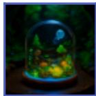  
K= 3

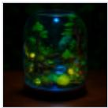

  
K = 4

  
K= 12

  
K= 16

  
K= 34

  
K= 64

  
K = 140

  
K= 256

Figure 17 Generation at trained and unseen prefix lengths. Blue borders indicate sequence lengths sampled during training, whereas gray borders denote unseen intermediate lengths. All columns share the same prompt, sampling configuration, and initial noise vector.

## F.2 Prefix-dependent compute

Because the representation encoder is causal, the hidden states of the first K registers are independent of subsequent register positions. At inference time, we can therefore process only the first K registers rather than encoding all N = 256 registers and truncating post-hoc. Table 12 reports single-batch inference FLOPs for the encoder and both decoders, counting each multiply–add operation as two FLOPs. Reducing K from 256 to 1 reduces encoder and I2T decoder compute by 50.0% and 71.1%, respectively. In contrast, T2I compute decreases by $1 3 . 8 \%$ , as its cost is overwhelmingly dominated by spatial denoising and VAE decoding rather than conditioning length.

Table 12 Encoder and decoder compute under prefix truncation. Absolute cost is reported in $\mathrm { T F L O P s ; }$ relative cost normalizes each component to its $K { = } 2 5 6$ setting.
<table><tr><td rowspan="2">K</td><td colspan="2">Encoder</td><td colspan="2">I2T decoder</td><td colspan="2">T2I decoder</td></tr><tr><td>TFLOPs</td><td>Relative</td><td>TFLOPs</td><td>Relative</td><td>TFLOPs</td><td>Relative</td></tr><tr><td>1</td><td>0.714</td><td>50.0%</td><td>0.289</td><td>28.9%</td><td>29.964</td><td>86.2%</td></tr><tr><td>4</td><td>0.723</td><td>50.6%</td><td>0.298</td><td>29.7%</td><td>30.020</td><td>86.4%</td></tr><tr><td>16</td><td>0.756</td><td>52.9%</td><td>0.331</td><td>33.1%</td><td>30.245</td><td>87.1%</td></tr><tr><td>64</td><td>0.891</td><td>62.3%</td><td>0.465</td><td>46.4%</td><td>31.144</td><td>89.6%</td></tr><tr><td>256</td><td>1.430</td><td>100.0%</td><td>1.002</td><td>100.0%</td><td>34.741</td><td>100.0%</td></tr></table>

## F.3 Prefix-length sampling strategies

We sample the prefix K from the ladder $\mathcal { K } = \{ 1 , 4 , 1 6 , 6 4 , 2 5 6 \}$ using three strategies: 1) Uniform assigns equal probability to every $K ; ~ 2 )$ Geometric samples K with $p ( K _ { r } ) \propto \beta ^ { r }$ , where $\beta = 1 . 3 ;$ and 3) Replay spends half of training on shorter prefixes and the other half on the full prefix.

Figure 18 compares the training loss through 40k steps. Uniform and Geometric sample every K throughout training, whereas Replay progressively unlocks longer prefixes.

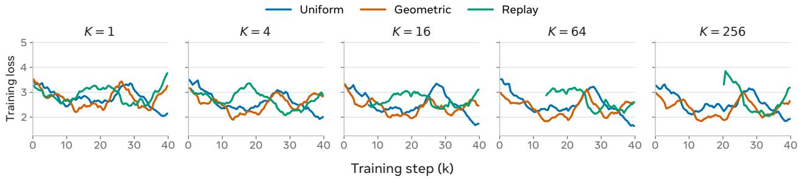

Figure 18 Training loss under different prefix-length sampling strategies. Training lasts 40k steps.
<table><tr><td>Metric</td><td>Sampling</td><td> $K { = } 1$ </td><td> $K { = } 4$ </td><td> $K { = } 1 6$ </td><td> $K { = } 6 4$ </td><td> $K = 2 5 6$ </td></tr><tr><td rowspan="3">GenEval(×100)↑</td><td>Uniform</td><td>33.0</td><td>32.5</td><td>32.4</td><td>31.9</td><td>32.7</td></tr><tr><td>Geometric</td><td>26.0</td><td>43.2</td><td>49.9</td><td>49.9</td><td>50.2</td></tr><tr><td>Replay</td><td>32.2</td><td>32.6</td><td>32.2</td><td>32.0</td><td>32.3</td></tr><tr><td rowspan="3">I2T R@1 ↑</td><td>Uniform</td><td>57.8</td><td>53.9</td><td>54.3</td><td>52.9</td><td>52.2</td></tr><tr><td>Geometric</td><td>56.1</td><td>52.6</td><td>53.1</td><td>52.2</td><td>51.8</td></tr><tr><td>Replay</td><td>59.1</td><td>55.7</td><td>55.8</td><td>54.5</td><td>52.1</td></tr><tr><td rowspan="3">T2I R@1 ↑</td><td>Uniform</td><td>62.4</td><td>60.1</td><td>58.4</td><td>56.7</td><td>56.3</td></tr><tr><td>Geometric</td><td>60.9</td><td>56.9</td><td>56.6</td><td>55.8</td><td>55.5</td></tr><tr><td>Replay</td><td>62.2</td><td>60.1</td><td>59.7</td><td>59.2</td><td>59.1</td></tr><tr><td rowspan="3">CIDEr ↑</td><td>Uniform</td><td>122.7</td><td>130.4</td><td>136.8</td><td>137.6</td><td>137.5</td></tr><tr><td>Geometric</td><td>123.0</td><td>129.6</td><td>137.0</td><td>137.3</td><td>138.3</td></tr><tr><td>Replay</td><td>121.5</td><td>131.3</td><td>136.5</td><td>137.5</td><td>137.5</td></tr></table>

Table 13 Downstream performance under different prefix-length sampling strategies.

Table 13 evaluates matched 40k-step checkpoints. Geometric favors generation for $K \geq 4 ,$ , Replay favors retrieval. However, no single strategy is universally optimal across all metrics and values of K.

## F.4 Latent interpolation

Figures 19 and 20 examine latent interpolation through both decoders. Across five prefix lengths, Figure 19 shows that longer prefixes transition multiple attributes smoothly, while shorter prefixes yield coarser blends. Figure 20 adds six $K { = } 2 5 6$ walks spanning identity, appearance, structure, context, and season; captions are condensed to keywords.

(a) “A white dog wearing a white and black helmet riding a bike in the park” → “An orange cat wearing sunglasses on a ship”  
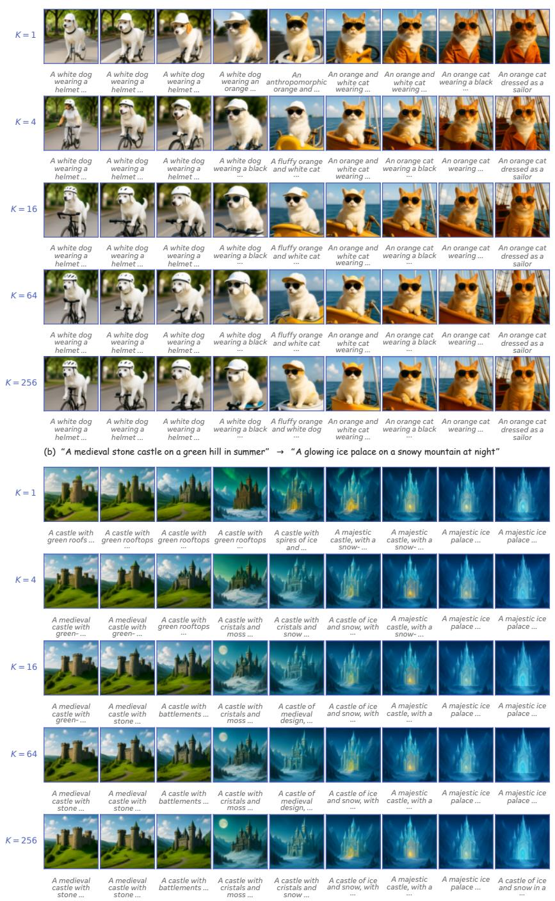  
Figure 19 Latent walks across prefix lengths. Two image–text pairs are interpolated at $K \in \{ 1 , 4 , 1 6 , 6 4 , 2 5 6 \}$ . Italic text under every image is produced by the I2T decoder.

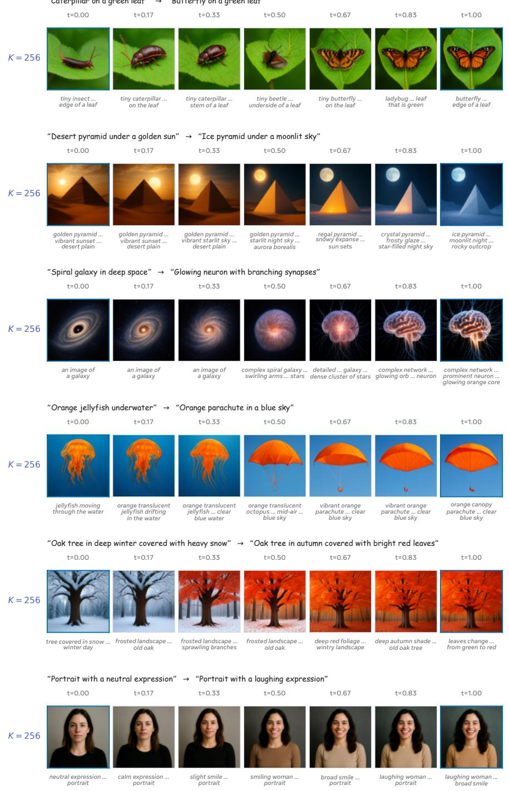  
Figure 20 Additional latent walks at K=256. Blue borders mark the two endpoints. Italic text under every image is produced by the I2T decoder.

## G Zero-shot transfer and latent composition

In this section, we demonstrate that the pre-trained FLAT representation natively supports zero-shot multilingual text understanding, multi-frame video understanding, and composed retrieval.

## G.1 Multilingual text and emoji understanding

We first show that the representation encoder inherits multilingual capabilities from its LLM backbone. Consequently, non-English prompts occupy a similar representation space to English, despite the model being trained exclusively on English data. Figure 21 demonstrates that French and Chinese prompts decode into images consistent with their English counterparts, while emoji sequences reliably decode into their corresponding visual referents.

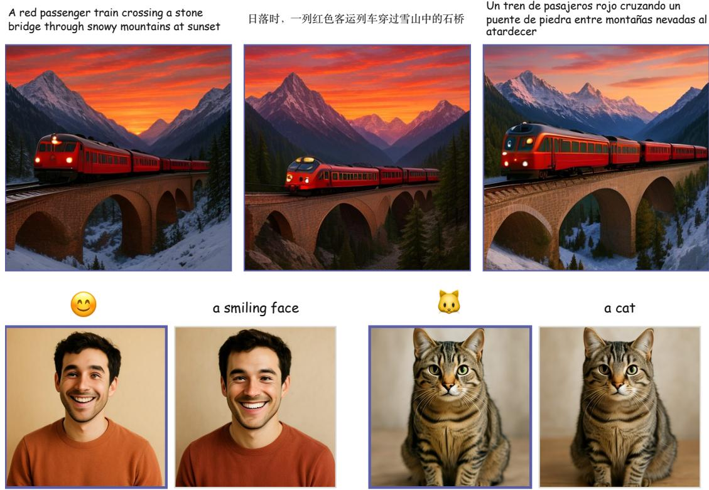  
Figure 21 Zero-shot multilingual text and emoji conditioned image generation. Although trained exclusively on English data, FLAT generalizes its understanding to non-English languages and emojis.

## G.2 Multi-frame video understanding

We next evaluate FLAT’s ability to process multi-frame video inputs despite being trained exclusively on static images. Specifically, we jointly encode 4 sampled frames using the representation encoder and decode the resulting sequence via the image generation head. Figure 22 shows examples from an aquarium scene and a cooking sequence. At K=64, the generated outputs preserve persistent objects and scene context while integrating information across the sampled frames. These results demonstrate that the FLAT representation naturally aggregates multi-frame context into a unified, thumbnail-like visual output.

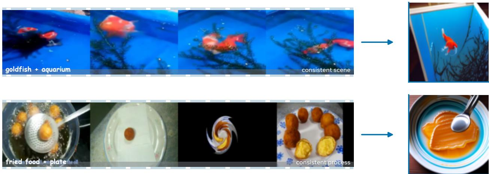  
Figure 22 Zero-shot multi-frame video semantic aggregation. Each row jointly encodes 4 sampled frames and decodes one image at K=64. The generated outputs preserve persistent objects and scene context across the sampled frames.

## G.3 Composed retrieval

We evaluate latent space arithmetic on the CIRR dataset without training on composed queries, following the protocol outlined in Appendix B.1. As shown in Table 14, using a prefix length of K=1 yields the strongest performance, demonstrating that an edit vector applied to a single token representation can efectively steer the global representation space. Figure 23 shows the images retrieved with the raw image and editing instructions with FLAT zero-shot.

Table 14 Zero-shot CIRR composed-retrieval diagnostic across keep-lengths. Each column uses the step size selected by Hit@1 from the common sweep in App. B.1; Hit@5 and Hit@10 are evaluated at the same selected value.
<table><tr><td>Metric</td><td>K=1</td><td>K=4</td><td>K=16</td><td>K=64</td><td>K=256</td></tr><tr><td>Hit@1</td><td>44.0</td><td>38.5</td><td>37.7</td><td>33.4</td><td>35.4</td></tr><tr><td>Hit@5</td><td>75.2</td><td>70.1</td><td>70.5</td><td>69.2</td><td>71.5</td></tr><tr><td>Hit@10</td><td>82.9</td><td>80.3</td><td>81.4</td><td>80.5</td><td>81.7</td></tr><tr><td>Selected α</td><td>3</td><td>4</td><td>8</td><td>8</td><td>3</td></tr></table>

Rank 3

Reference

Rank 1

Rank 2

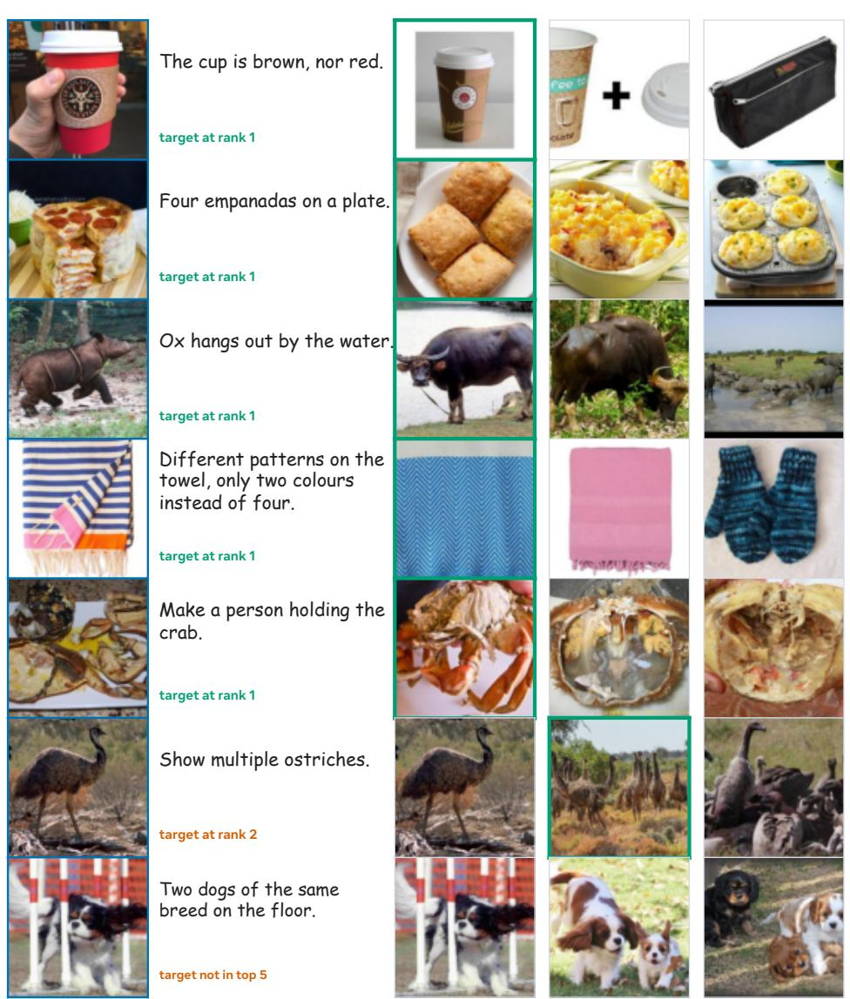  
Figure 23 Composed queries and the top-3 retrieval results. Green borders indicate the ground-truth targets. While the overall retrieval results reflect that editing instructions correctly, the final two rows also highlight a zero-shot limitation: simultaneously preserving the reference category while applying count edits remains challenging.

K=4

K=1

## H Ablation on the training loss contributions

FLAT pre-training incorporates three loss terms targeting retrieval, T2I generation, and I2T generation. We perform an ablation study by training models on diferent subsets of these losses to evaluate their individual and joint contributions. Table 15 reports downstream scores across all evaluated prefix lengths and loss combinations. Each variant uses the same initialization and 40k-step schedule, varying only the active loss components. Incorporating all three losses provides a clear advantage, yielding balanced, optimal performance across all metrics and prefix lengths K. Figure 24 plots the normalized evaluation scores for each ablated variant across all prefix lengths.

Table 15 Training loss ablation using all prefix lengths. $\mathcal { L } _ { \mathrm { c t r } } , \ \mathcal { L } _ { \mathrm { c a p } } ,$ , and ${ \mathcal { L } } _ { \mathrm { g e n } }$ denote contrastive, captioning, and imagegeneration loss respectively.
<table><tr><td colspan="6">k=1</td></tr><tr><td>Objectives</td><td>I2T</td><td></td><td>T2I B@4</td><td>CIDEr</td><td> $_ \mathrm { G e n . }$ </td></tr><tr><td>0</td><td>0.1</td><td>0.2</td><td>24.4</td><td></td><td>80.8 0.000</td></tr><tr><td> ${ \mathcal L } _ { \mathrm { c t r } }$ </td><td>50.7</td><td>57.2</td><td>33.9</td><td>117.3 0.001</td><td></td></tr><tr><td> $\mathcal { L } _ { \mathrm { c a p } }$ </td><td>48.2</td><td>46.3</td><td>35.9</td><td></td><td>123.3 0.004</td></tr><tr><td> $\mathcal { L } _ { \mathrm { g e n } }$ </td><td>41.7</td><td>49.6</td><td>32.1</td><td></td><td>106.60.328</td></tr><tr><td> $\mathcal { L } _ { \mathrm { c t r } } + \mathcal { L } _ { \mathrm { c a p } }$ </td><td>56.1</td><td>59.2</td><td>35.3</td><td></td><td>122.2 0.004</td></tr><tr><td> $\mathcal { L } _ { \mathrm { c t r } } + \mathcal { L } _ { \mathrm { g e n } }$ </td><td>52.6</td><td>54.1</td><td>33.8</td><td></td><td>117.2 0.280</td></tr><tr><td> $\mathcal { L } _ { \mathrm { c a p } } + \mathcal { L } _ { \mathrm { g e n } }$ </td><td>54.2</td><td>55.4</td><td>36.1</td><td></td><td>123.9 0.298</td></tr><tr><td> $\mathrm { A l l \dot { \ t h r e e } }$ </td><td>57.8</td><td>62.4</td><td>35.4</td><td></td><td>122.7 0.329</td></tr></table>

<table><tr><td>Objectives</td><td>I2T</td><td>T2I</td><td>B@4</td><td>CIDEr Gen.</td></tr><tr><td>0</td><td>0.2</td><td>0.0</td><td>30.6</td><td>104.3 0.000</td></tr><tr><td> ${ \mathcal L } _ { \mathrm { c t r } }$ </td><td>50.4</td><td>56.7</td><td>34.1</td><td>117.7 0.002</td></tr><tr><td> $\mathcal { L } _ { \mathrm { c a p } }$ </td><td>28.0</td><td>19.8</td><td>40.3</td><td>138.3 0.004</td></tr><tr><td> $\mathcal { L } _ { \mathrm { g e n } }$ </td><td>10.1</td><td>40.6</td><td>32.9</td><td>110.4 0.325</td></tr><tr><td> $\mathcal { L } _ { \mathrm { c t r } } + \mathcal { L } _ { \mathrm { c a p } }$ </td><td>53.5</td><td>56.0</td><td>40.0</td><td>137.2 0.003</td></tr><tr><td> $\mathcal { L } _ { \mathrm { c t r } } + \mathcal { L } _ { \mathrm { g e n } }$ </td><td>51.5</td><td>53.4</td><td>33.9</td><td>117.0 0.328</td></tr><tr><td> $\mathcal { L } _ { \mathrm { c a p } } + \mathcal { L } _ { \mathrm { g e n } }$ </td><td>41.6</td><td>41.0</td><td>40.1</td><td>137.8 0.294</td></tr><tr><td>All three</td><td>54.3</td><td>58.4</td><td>39.7</td><td>136.8 0.324</td></tr></table>

<table><tr><td colspan="5">k=4</td></tr><tr><td>Objectives</td><td>I2T</td><td>T2I B@4</td><td>CIDEr</td><td>Gen.</td></tr><tr><td>0</td><td>0.1</td><td>0.0 27.3</td><td>91.5</td><td>0.000</td></tr><tr><td> ${ \mathcal L } _ { \mathrm { c t r } }$ </td><td>50.8 57.0</td><td>34.1</td><td>118.1</td><td>0.002</td></tr><tr><td> $\mathcal { L } _ { \mathrm { c a p } }$ </td><td>26.4</td><td>21.2 38.7</td><td>133.7</td><td>0.005</td></tr><tr><td> $\mathcal { L } _ { \mathrm { g e n } }$ </td><td>41.8</td><td>50.1 32.1</td><td>107.0</td><td>0.323</td></tr><tr><td> $\mathcal { L } _ { \mathrm { c t r } } ^ { - } + \mathcal { L } _ { \mathrm { c a p } }$ </td><td>55.1</td><td>56.2 38.3</td><td>131.9</td><td>0.005</td></tr><tr><td> $\mathcal { L } _ { \mathrm { c t r } } + \mathcal { L } _ { \mathrm { g e n } }$ </td><td>52.4</td><td>54.7</td><td>34.1</td><td>117.4 0.309</td></tr><tr><td> $\mathcal { L } _ { \mathrm { c a p } } + \mathcal { L } _ { \mathrm { g e n } }$ </td><td>36.2</td><td>36.6</td><td>38.6</td><td>133.1 0.298</td></tr><tr><td>All three</td><td>53.9</td><td>60.1</td><td>37.6</td><td>130.4 0.325</td></tr></table>

<table><tr><td>Objectives</td><td>I2T</td><td>T2I</td><td>B@4</td><td>CIDEr Gen.</td></tr><tr><td> $\varnothing$ </td><td>0.2</td><td>0.0</td><td>31.0</td><td>105.3 0.000</td></tr><tr><td> ${ \mathcal L } _ { \mathrm { c t r } }$ </td><td>50.4</td><td>56.9</td><td>34.0</td><td>117.7 0.003</td></tr><tr><td> $\mathcal { L } _ { \mathrm { c a p } }$ </td><td>35.6</td><td>21.0</td><td>40.7</td><td>139.3 0.004</td></tr><tr><td> $\mathcal { L } _ { \mathrm { g e n } }$ </td><td>1.1</td><td>4.4</td><td>33.0</td><td>110.4 0.327</td></tr><tr><td> $\mathcal { L } _ { \mathrm { c t r } } + \mathcal { L } _ { \mathrm { c a p } }$ </td><td>52.7</td><td>54.8</td><td>39.9</td><td>137.8 0.004</td></tr><tr><td> $\mathcal { L } _ { \mathrm { c t r } } + \mathcal { L } _ { \mathrm { g e n } }$ </td><td>51.7</td><td>53.7</td><td>33.8</td><td>116.8 0.299</td></tr><tr><td> $\mathcal { L } _ { \mathrm { c a p } } + \mathcal { L } _ { \mathrm { g e n } }$ </td><td>42.7</td><td>37.3</td><td>40.5</td><td>138.7 0.296</td></tr><tr><td>All three</td><td>52.9</td><td>56.7</td><td>40.1</td><td>137.5 0.319</td></tr></table>

K=256
<table><tr><td colspan="6">K=256</td></tr><tr><td>Objectives</td><td>I2T</td><td></td><td>T2I B@4</td><td>CIDEr</td><td>Gen.</td></tr><tr><td>0</td><td>0.2</td><td>0.0</td><td>30.8</td><td>105.0</td><td>0.000</td></tr><tr><td> ${ \mathcal L } _ { \mathrm { c t r } }$ </td><td>51.0</td><td>57.0</td><td>34.2</td><td>118.0</td><td>0.003</td></tr><tr><td> $\mathcal { L } _ { \mathrm { c a p } }$ </td><td>39.4</td><td>4.0</td><td>40.8</td><td>139.7</td><td>0.004</td></tr><tr><td> $\mathcal { L } _ { \mathrm { g e n } }$ </td><td>0.6</td><td>1.1</td><td>33.1</td><td>110.8</td><td>0.323</td></tr><tr><td> $\mathcal { L } _ { \mathrm { c t r } } + \mathcal { L } _ { \mathrm { c a p } }$ </td><td>51.2</td><td>54.5</td><td>40.0</td><td>137.8</td><td>0.003</td></tr><tr><td> $\mathcal { L } _ { \mathrm { c t r } } + \mathcal { L } _ { \mathrm { g e n } }$ </td><td>51.5</td><td>53.6</td><td>33.9</td><td>117.1</td><td>0.329</td></tr><tr><td> $\mathcal { L } _ { \mathrm { c a p . } } + \mathcal { L } _ { \mathrm { g e n } }$ </td><td>13.6</td><td>6.7</td><td>40.7</td><td>139.2</td><td>0.297</td></tr><tr><td>All three</td><td>52.2</td><td>56.3</td><td>40.2</td><td></td><td>137.5 0.327</td></tr></table>

We also compute Shapley values (Shapley, 1953) to quantify the marginal contribution of each loss objective. For a loss component i and downstream metric v, the Shapley attribution is defined as:

$$
\phi _ { i } ( v ) = \sum _ { S \subseteq \mathcal { O } \setminus i } \frac { | S | ! ( | \mathcal { O } | - | S | - 1 ) ! } { | \mathcal { O } | ! } \left[ v ( S \cup i ) - v ( S ) \right] ,\tag{10}
$$

where O is the set of all three losses. Figure 25 visualizes these Shapley values across prefix lengths. The heatmaps normalize each attribution by $v ( \mathcal { O } ) - v ( \emptyset )$ , ensuring that each metric column sums to 100%. The task-aligned attribution structure becomes sharper as the prefix widens: contrastive learning increasingly accounts for retrieval performance, captioning dominates both text-generation metrics from $K { = } 1 6$ onward, and image generation consistently accounts for at least 95% of GenEval. Minor negative entries at $K { = } 1 6$ and $K { = } 2 5 6$ indicate that auxiliary loss contributions are not uniformly positive across all prefix lengths, although the primary task-aligned attributions remain dominant.

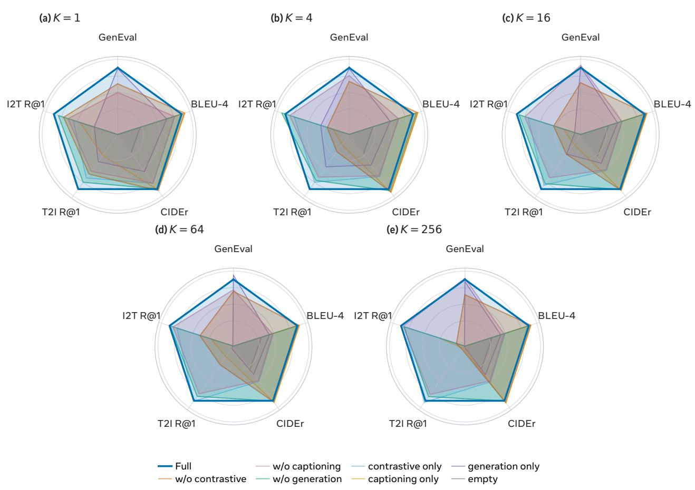  
Figure 24 Ablation on training loss. Eval performance at $K \in \{ 1 , 4 , 1 6 , 6 4 , 2 5 6 \}$ . Each axis is normalized at the same prefix length for plot.

(a) K = 1
<table><tr><td rowspan=4 colspan=1>ContrastiveCaptioningGeneration</td><td rowspan=1 colspan=1>I2T R@1</td><td rowspan=1 colspan=1>T2I R@1</td><td rowspan=1 colspan=1>BLEU-4</td><td rowspan=1 colspan=1>CIDEr</td><td rowspan=1 colspan=1>GenEval</td></tr><tr><td rowspan=1 colspan=1>37%</td><td rowspan=1 colspan=1>39%</td><td rowspan=1 colspan=1>28%</td><td rowspan=1 colspan=1>32%</td><td rowspan=1 colspan=1>1%</td></tr><tr><td rowspan=1 colspan=1>36%</td><td rowspan=1 colspan=1>31%</td><td rowspan=1 colspan=1>48%</td><td rowspan=1 colspan=1>47%</td><td rowspan=1 colspan=1>4%</td></tr><tr><td rowspan=1 colspan=1>27%</td><td rowspan=1 colspan=1>30%</td><td rowspan=1 colspan=1>24%</td><td rowspan=1 colspan=1>21%</td><td rowspan=1 colspan=1>95%</td></tr></table>

(b) K= 4
<table><tr><td rowspan=1 colspan=2>I2T R@1  T2I R@1</td><td rowspan=1 colspan=2>BLEU-4   CIDEr</td><td rowspan=1 colspan=1>GenEval</td></tr><tr><td rowspan=1 colspan=2>55%      56%</td><td rowspan=1 colspan=1>21%</td><td rowspan=1 colspan=1>24%</td><td rowspan=1 colspan=1>2%</td></tr><tr><td rowspan=1 colspan=1>17%</td><td rowspan=1 colspan=1>11%</td><td rowspan=1 colspan=1>66%</td><td rowspan=1 colspan=1>64%</td><td rowspan=1 colspan=1>1%</td></tr><tr><td rowspan=1 colspan=1>29%</td><td rowspan=1 colspan=1>34%</td><td rowspan=1 colspan=1>13%</td><td rowspan=1 colspan=1>11%</td><td rowspan=1 colspan=1>97%</td></tr></table>

(c) K= 16  
(d) K= 256
<table><tr><td rowspan=1 colspan=1>I2T R@1</td><td rowspan=1 colspan=1>T2I R@1</td><td rowspan=1 colspan=1>BLEU-4   CIDEr</td><td rowspan=1 colspan=1>GenEval</td></tr><tr><td rowspan=1 colspan=1>77%</td><td rowspan=1 colspan=1>94%</td><td rowspan=1 colspan=1>10%      14%</td><td rowspan=1 colspan=1>4%</td></tr><tr><td rowspan=1 colspan=1>30%</td><td rowspan=1 colspan=1>5%</td><td rowspan=1 colspan=1>81%      81%</td><td rowspan=1 colspan=1>-1%</td></tr><tr><td rowspan=1 colspan=1>-7%</td><td rowspan=1 colspan=1>2%</td><td rowspan=1 colspan=1>8%       5%</td><td rowspan=1 colspan=1>98%</td></tr></table>

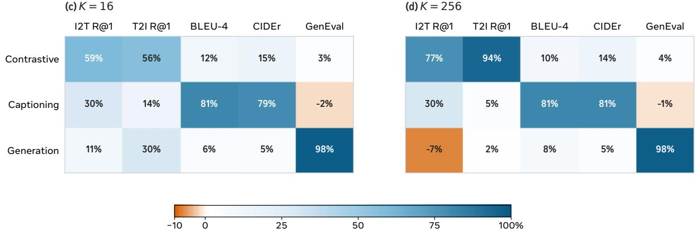  
Figure 25 Relative Shapley attribution at different prefix lengths. Cell values are percentages of the total improvement over the untrained checkpoint for each metric. Blue denotes positive attribution and orange denotes negative attribution.

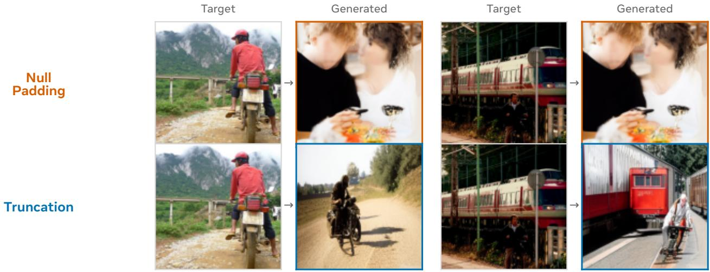

## I Truncated prefixes and null padding

Section 3.1 describes truncating the register sequence to its first K positions. An alternative strategy retains a fixed sequence length N and replaces positions $i \geq K$ with learned null embeddings, as in FlexTok (Bachmann et al., 2025). Empirically, we find that null-padded token sequences introduce optimization instabilities during FLAT joint training. Figure 26 illustrates these training dynamics. Under null padding, the gradient norm grows rapidly and spikes near 33k steps, causing the contrastive loss to collapse toward ln(1024)—the theoretical random-baseline value for the global batch. In contrast, prefix truncation remains stable throughout the same training window. As shown in Figure 27, null-padded conditioning loses semantic correspondence between the source image and its generated counterpart, whereas prefix truncation preserves recognizable semantic relationships. Because these runs follow their respective original training recipes (including difering K-sampling granularities and learning-rate schedules), we interpret these findings as qualitative evidence of training dynamics.

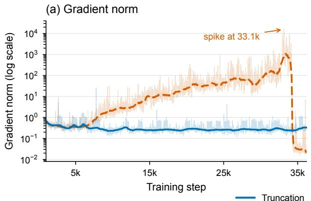

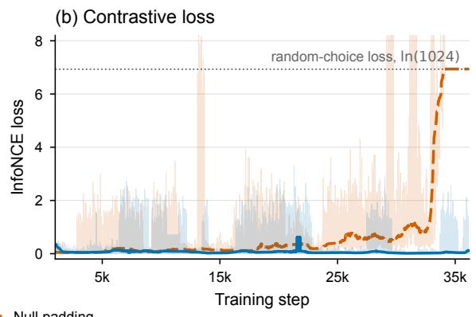  
Figure 26 Optimization behavior under truncation and null padding. Curves are smoothed with a 1,010-step rolling median; faint lines show the unsmoothed measurements. The null-padding run develops large gradient excursions before its contrastive loss approaches the random-choice value.  
Figure 27 Images generated by prefix truncation v.s. null padding at step 40k. Each column uses the same COCO target– caption pair and difusion noise.