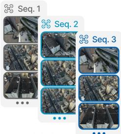
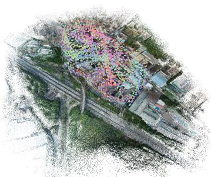
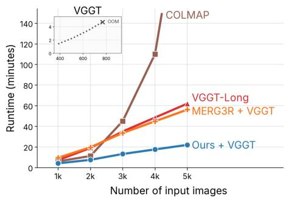
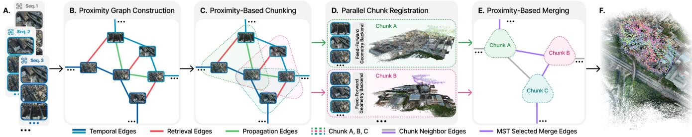
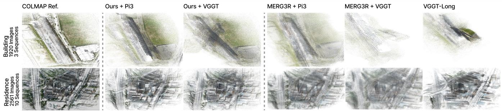
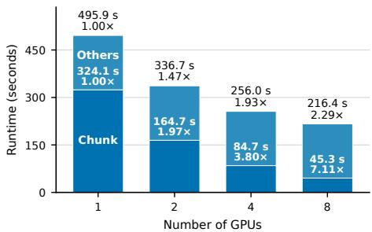

Input 3,000+ • • multi-sequence images

# G3AR: Graph-Guided Neural Visual Geometry for Scalable Multi-Sequence Aerial Registration

Jeng Wen Joshua Lean National Tsing Hua University Hsinchu, Taiwan joshualeanjw@gmail.com

Simon See   
NVIDIA   
Singapore, Singapore   
ssee@nvidia.com

Ting-Yu Yen National Tsing Hua University Hsinchu, Taiwan tingyus995@gmail.com

Hung-Kuo Chu National Tsing Hua University Hsinchu, Taiwan hkchu@cs.nthu.edu.tw

Wei-Fang Sun   
NVIDIA   
Taipei, Taiwan   
johnsons@nvidia.com

Shih-Hsuan Hung∗ National Tsing Hua University Hsinchu, Taiwan hungsh@cs.nthu.edu.tw

  
Dense point cloud & registered poses

Figure 1: G3AR registers thousands of multi-sequence aerial images into a coherent point cloud with lower runtime than prior long-context pipelines.

## Abstract

Full-context neural visual geometry is impractical for thousands of images, while sequence-based chunking poorly captures irregular non-local overlap in multi-sequence aerial collections. We present Graph-Guided Neural Visual Geometry for Aerial Registration (G3AR), a graph-guided framework for scalable dense neural geometry. Before local inference, G3AR builds a geometrically verified image-proximity graph that guides bounded overlapping chunks and induces a chunk graph whose maximum spanning tree defines alignment topology. Compatible backbones process chunks independently; shared-image predictions then estimate three-dimensional similarity (Sim(3)) transforms that register local cameras and geometry in a common frame. Across four real aerial scenes, G3AR improves pose error and runtime in matched VGGTand Pi3-backed comparisons, while its DA3 variant achieves the lowest pose error among evaluated neural-geometry methods.

## CCS Concepts

• Computing methodologies → Computer vision problems.

∗Corresponding author.

## Keywords

Neural visual geometry, aerial multi-sequence registration, image proximity graphs

## ACM Reference Format:

Jeng Wen Joshua Lean, Ting-Yu Yen, Wei-Fang Sun, Simon See, Hung-Kuo Chu, and Shih-Hsuan Hung. 2026. G3AR: Graph-Guided Neural Visual Geometry for Scalable Multi-Sequence Aerial Registration. In SIGGRAPH Asia 2026 Technical Communications (SA Technical Communications ’26), December 01–04, 2026, Kuala Lumpur, Malaysia. ACM, New York, NY, USA, 6 pages. https://doi.org/10.1145/3829339.3847824

## 1 Introduction

Feed-forward neural geometry models such as VGGT [2025], Pi3 [2026], and DA3 [2025] directly predict camera poses and dense geometry. Yet full-context inference over thousands of images is impractical. Long-context methods such as VGGT-Long [2026] and MERG3R [2026] therefore process and align chunks, making results depend on chunk composition and alignment topology.

Large aerial surveys span multiple flights without a reliable global temporal order: overlap crosses strips, revisits, or vehicles, while sequence boundaries may be unrelated. Scaling therefore requires reliable non-local connections for chunk formation and alignment without exhaustive matching or full-scene optimization.

We present G3AR: Graph-Guided Neural Visual Geometry for Scalable Multi-Sequence Aerial Registration, which adapts graph partitioning to dense neural geometry. A geometrically verified proximity graph guides bounded overlapping chunks for neural inference; their chunk graph defines a maximum spanning tree for shared-image Sim(3) alignment. Compatible backbones independently predict local cameras and geometry, supporting multi-GPU inference. Assembly requires no backbone retraining, global posegraph refinement, or post-assembly bundle adjustment. On four real aerial scenes, G3AR reduces pose error over matched VGGTand Pi3-backed baselines, while DA3 achieves the lowest evaluated neural pose error. On the 5,621-image synthetic Small City scene from MatrixCity [2023], its VGGT variant reduces pose error, pointcloud error, and runtime relative to VGGT-Long and MERG3R. With DA3, eight L40 GPUs achieve a 2.29× mean end-to-end speedup across the four real scenes.

  
Figure 2: Overview of G3AR. (A) Multiple aerial image sequences are provided as input. (B) Verified temporal, retrieval, and propagation edges organize the images into a proximity graph. (C) Graph partitioning and boundary expansion form bounded overlapping chunks. (D) A feed-forward geometry backbone predicts chunk-local camera poses and dense geometry in parallel. (E) A maximum spanning tree of the proximity-derived chunk graph selects shared-image Sim(3) alignments. (F) Composing the transformations registers the cameras and aligns the geometry in a common frame.

## 2 Related Work

COLMAP [2016] and GLOMAP [2024] combine verified matching, camera registration, and global optimization. GraphSfM [2020] partitions verified view graphs into overlapping clusters and merges independent reconstructions. FastMap [2026] and InstantSfM [2025] target eficiency; the supplement compares these systems and DAGSfM with G3AR. Feed-forward models VGGT [2025], Pi3 [2026], and DA3 [2025] predict cameras and dense geometry, while VGGT-Long [2026], SwiftVGGT [2026], and MERG3R [2026] scale through subset processing and alignment. G3AR adapts graph partitioning to neural geometry, using verified aerial proximity to jointly guide bounded inference chunks and inter-chunk Sim(3) alignment.

## 3 Method

Given images $\{ I _ { i } \} _ { i = 1 } ^ { N }$ from one or more flight sequences, G3AR builds a weighted proximity graph $\mathcal { G } = ( \mathcal { V } , \mathcal { E } , w )$ , where $\mathcal { V } = [ N ]$ indexes images, $\varepsilon$ contains geometrically verified temporal, retrieval, and propagation edges, and ��� measures verified overlap. As illustrated in Fig. 2, (A) multi-sequence aerial images are provided; (B) verified edges form a proximity graph; (C) each connected component is partitioned and expanded into bounded overlapping chunks {C�}; (D) a compatible feed-forward geometry backbone processes chunks independently in parallel; (E) a maximum spanning tree of the induced chunk graph selects shared-image Sim(3) alignments; and (F) composing these transformations registers cameras and aligns geometry.

## 3.1 Proximity Graph Construction

We propose temporal, retrieval, and propagation edges to recover local and non-local overlap without exhaustive pairing; geometric verification filters repetitive-structure matches and determines edge retention and weight. For image �, flight metadata and UltraVPR [Chen et al. 2025] provide neighborhoods $\Lambda _ { \mathrm { t e m p } } ( i )$ and $\mathcal { N } _ { \mathrm { r e t } } ( i )$ , respectively, yielding initial candidates $\widetilde { \mathcal { E } } _ { 0 } = \{ \{ i , j \} : j \in$ $N _ { \mathrm { t e m p } } ( i ) \cup N _ { \mathrm { r e t } } ( i ) \}$ . Temporal candidates preserve flight continuity; retrieval identifies revisits and cross-strip or cross-sequence overlap. For each candidate $\{ i , j \}$ , ALIKED [2023] and LightGlue [2023] produce tentative correspondences $\mathcal { M } _ { i j }$ . Fundamental-matrix verification with USAC [2013] and MAGSAC [2020] yields inliers $\widehat { \mathcal { M } } _ { i j }$ . Let $\rho _ { i } ( \widehat { M } _ { i j } )$ denote the fraction of grid cells in $I _ { i }$ containing an inlier. We define $w _ { i j } = | \widehat { \mathcal { M } } _ { i j } | \operatorname* { m a x } \{ \rho _ { i } ( \widehat { \mathcal { M } } _ { i j } ) , \rho _ { j } ( \widehat { \mathcal { M } } _ { i j } ) \}$ , with $w _ { i j } = 0$ upon verification failure. The operation Verify(·) retains pairs with $w _ { i j } \ \geq \ \tau ,$ where $\tau = 2 0 0$ , giving $\mathcal { E } _ { 0 } = \mathrm { V e r i f y } ( \widetilde { \mathcal { E } } _ { 0 } )$ and $\mathcal { G } _ { 0 } = ( \mathcal { V } , \mathcal { E } _ { 0 } , w )$ . For each retained retrieval proposal $i \longrightarrow j ,$ propagation proposes edges from � to unconnected neighbors of � in G0. Applying the same procedure gives $\mathcal { E } = \mathcal { E } _ { 0 } \cup \mathrm { V e r i f y } ( \widetilde { \mathcal { E } } _ { \mathrm { p r o p } } )$ UltraVPR only retrieves candidates; verified local geometry supports every final edge. We process $\mathcal { G } = ( \mathcal { V } , \mathcal { E } , w )$ independently per connected component.

## 3.2 Proximity-Based Chunking

We form bounded inference chunks that preserve high-proximity neighborhoods and share images for 3D alignment. Let $b _ { p }$ and $b _ { c }$ denote the partition budget and maximum expanded-chunk size. Weighted METIS partitioning [1998] favors low-weight cuts, producing disjoint partitions $\{ \mathcal { P } _ { k } \}$ that cover each component of $\mathcal { G }$ and satisfy $| \mathcal { P } _ { k } | \le b _ { p }$ . Components within budget remain unchanged; those without usable internal adjacency use sequential partitioning. For each $\mathcal { P } _ { k }$ , let $\bar { \mathcal { P } } _ { k }$ contain outside images connected to it by $\varepsilon .$ Adding the highest-proximity images from $\bar { \mathcal P } _ { k }$ forms $C _ { k }$ , subject to $| C _ { k } | \le b _ { c }$ . Shared images $O _ { k \ell } = C _ { k } \cap C _ { \ell }$ constrain subsequent Sim(3) alignment. A compatible feed-forward geometry backbone independently predicts chunk-local camera poses and dense geometry. Backbone-independent graph construction and chunking support VGGT, Pi3, and DA3, with chunk inference distributable across GPUs.

Table 1: Average camera pose estimation on four real aerial scenes. Values are Sim(3)-aligned and averaged equally across scenes. COLMAP and GLOMAP are unranked classical references. Among neural-geometry methods, the top-3 results are highlighted as first , second , and third .
<table><tr><td>Method</td><td>ATE RMSE ↓</td><td>ATE mean ↓</td><td>ATE median ↓</td><td>Runtime ↓</td><td>Max VRAM (GiB)</td></tr><tr><td>COLMAP [Schönberger and Frahm 2016]</td><td>0.031</td><td>0.022</td><td>0.016</td><td>61 min 17 s</td><td>N/A</td></tr><tr><td>GLOMAP [Pan et al. 2024]</td><td>3.570</td><td>3.207</td><td>3.177</td><td>27 min 00 s</td><td>N/A</td></tr><tr><td>VGGT-Long [Deng et al. 2026]</td><td>2.355</td><td>2.084</td><td>1.994</td><td>23 min 50 s</td><td>20.5</td></tr><tr><td>SwiftVGGT [Lee et al. 2026]</td><td>2.370</td><td>2.073</td><td>1.870</td><td>10 min 25 s</td><td>33.5</td></tr><tr><td>MERG3R + VGGT [Cheng et al. 2026]</td><td>2.556</td><td>2.288</td><td>2.170</td><td>23 min 54 s</td><td>20.9</td></tr><tr><td>MERG3R + Pi3 [Cheng et al. 2026]</td><td>1.030</td><td>0.900</td><td>0.835</td><td>21 min 14 s</td><td>19.3</td></tr><tr><td>Ours + VGGT</td><td>1.855</td><td>1.529</td><td>1.317</td><td>9 min 42 s</td><td>21.7</td></tr><tr><td>Ours + Pi3</td><td>0.733</td><td>0.483</td><td>0.384</td><td>9 min 38 s</td><td>19.7</td></tr><tr><td>Ours + DA3</td><td>0.653</td><td>0.403</td><td>0.301</td><td>10 min 23 s</td><td>26.7</td></tr></table>

## 3.3 Proximity-Based Merging

After chunk registration, we lift image proximity to a chunk graph for lightweight assembly. Expanded chunks induce $\displaystyle \mathcal { G } _ { C } = ( \mathcal { K } , \mathcal { E } _ { C } , \eta )$ , where $\mathcal { K } = \left[ N _ { C } \right]$ indexes chunks and $\{ k , \ell \} \in { \mathcal { E } } _ { C }$ when neighboring chunks share images, i.e., $O _ { k \ell } \neq \varnothing$ . Weights ��ℓ combine proximity evidence and shared-image overlap. A maximum spanning tree is extracted independently per connected component, prioritizing strong connections without sequential ordering. We define $\eta _ { k \ell } = | O _ { k \ell } |$ max ��� over cross-partition edges. For each selected edge $\{ k , \ell \}$ , dense predictions of images in $O _ { k \ell }$ provide corresponding 3D points in both chunk frames. Following VGGT-Long [2026], G3AR uses iteratively reweighted least squares to estimate a robust pairwise Sim(3) transformation, recovering relative scale, rotation, and translation. For each tree, we select a reference chunk and compose pairwise Sim(3) transformations along unique tree paths, placing all reachable cameras and geometry in a common frame. This tree-based assembly requires neither global pose-graph Levenberg-Marquardt refinement nor post-merge bundle adjustment.

## 4 Experiments

We evaluate Building and Rubble from Mill19 [2022] and Residence and Sci-Art from UrbanScene3D [2022] (1,657–2,998 images), plus the 5,621-image synthetic Small City scene from MatrixCity [2023], with ground-truth poses and a dense reference point cloud. We report camera coverage, Sim(3)-aligned ATE, end-to-end runtime, peak GPU memory, and Chamfer-L1 where available, using one NVIDIA L40 GPU unless noted. For controlled comparison, VGGT-Long, MERG3R, and G3AR use at most 95 images per chunk with a 35-image overlap target $( b _ { p } ~ = ~ 7 5 , ~ b _ { c } ~ = ~ 9 5 )$ , retaining their own chunking and alignment strategies. The supplement provides broader classical SfM comparisons, scaling details, and ablations of temporal-order dependence, alignment topology, and global optimization.

Quantitative Results. Full-context runs of VGGT [2025], Pi3 [2026], DA3 [2025], FastVGGT [2026], and LiteVGGT [2026] exceed 48 GiB and are omitted. G3AR reduces ATE and runtime relative to VGGT-Long and MERG3R with VGGT, and to MERG3R with Pi3. All three variants maintain full camera coverage; Ours + DA3 achieves the lowest ATE and Ours + Pi3 the shortest runtime among evaluated neural methods (Table 1). On Small City [2023],

Table 2: Small City results with VGGT local geometry. Errors are Sim(3)-aligned in dataset units.
<table><tr><td>Method</td><td>ATE RMSE ↓</td><td>Runtime ↓</td><td>Chamfer-L1 ↓</td></tr><tr><td>VGGT-Long</td><td>6.6277</td><td>44 min 55 s</td><td>2.7457</td></tr><tr><td>MERG3R + VGGT</td><td>5.2523</td><td>44 min 3 s</td><td>3.1699</td></tr><tr><td>Ours + VGGT</td><td>4.7639</td><td>24 min 8 s</td><td>1.3408</td></tr></table>

Table 3: DA3 chunk-image selection ablation, averaged equally over four real scenes.
<table><tr><td>Variant</td><td>ATE RMSE ↓</td></tr><tr><td>Temporal edges only</td><td>2.625</td></tr><tr><td>Temporal + retrieval edges</td><td>0.819</td></tr><tr><td>Temporal + retrieval + propagation edges</td><td>0.653</td></tr></table>

Ours + VGGT achieves the lowest ATE, Chamfer-L1, and runtime among the compared neural pipelines (Table 2).

Qualitative Results. On Building and Residence, graph-guided variants preserve coherent global layouts and broader extents than the displayed long-context baselines, while local geometry remains more difuse than COLMAP (Fig. 3).

Multi-GPU Scaling. Across four real scenes with DA3, eight warmed L40 GPUs achieve 7.11× mean chunk speedup at 88.9% eficiency and 2.29× mean end-to-end speedup (Fig. 4).

Ablations. Chunk-selection ablations with DA3 across four real scenes show that retrieval reduces ATE RMSE over temporal edges alone, with further gains from propagation (Table 3), supporting verified non-local edges for chunk selection.

## 5 Conclusion

G3AR uses graph-guided partitioning, shared-image overlap, and inter-chunk Sim(3) alignment to scale dense neural geometry for multi-sequence aerial registration. Across four real scenes, all three backbones retain full coverage and improve pose error over matched long-context counterparts; eight-GPU chunk inference achieves 7.11× mean speedup (2.29× end-to-end). Future work will improve graph robustness beyond aerial scenes and support incremental reconstruction.

  
Figure 3: Building and Residence point clouds under matched local inference budgets. Graph-guided variants retain broader roof, facade, and ground extents than the displayed long-context baselines.

  
Figure 4: Scaling over four real scenes. Labels show mean runtime and mean per-scene speedup relative to one GPU.

## Acknowledgments

We thank the anonymous reviewers. This work was supported by Taiwan’s National Science and Technology Council grants 114-2221-E-007-114-MY3, 113-2221-E-007-102-MY3, 114-2221-E-007-115-MY3, and 115-2634-F-007-003. We also thank NVIDIA Corporation and NVIDIA AI Technology Center (NVAITC) for providing access to the Taipei-1 supercomputer.

## References

Daniel Barath, Jana Noskova, Maksym Ivashechkin, and Jiří Matas. 2020. MAGSAC++, a Fast, Reliable and Accurate Robust Estimator. In Proceedings ofthe IEEE/CVF Conference on Computer Vision and Pattern Recognition. 1304–1312.

Chao Chen, Chunyu Li, Mengfan He, Jun Wang, Fei Xing, and Ziyang Meng. 2025. UltraVPR: Unsupervised Lightweight Rotation-Invariant Aerial Visual Place Recognition. IEEE Robotics and Automation Letters 10, 9 (2025), 9096–9103. doi:10.1109/ LRA.2025.3592075

Yu Chen, Shuhan Shen, Yisong Chen, and Guoping Wang. 2020. Graph-based Parallel Large Scale Structure from Motion. Pattern Recognition 107 (2020), 107537. doi:10. 1016/j.patcog.2020.107537

Leo Kaixuan Cheng, Abdus Shaikh, Ruofan Liang, Zhijie Wu, Yushi Guan, and Nandita Vijaykumar. 2026. MERG3R: A Divide-and-Conquer Approach to Large-Scale Neural Visual Geometry. In Proceedings ofthe IEEE/CVF Conference on Computer Vision and Pattern Recognition. 28969–28978.

Kai Deng, Zexin Ti, Jiawei Xu, Jian Yang, and Jin Xie. 2026. VGGT-Long: Chunk it, Loop it, Align it – Pushing VGGT’s Limits on Kilometer-scale Long RGB Sequences. In Proceedings ofthe IEEE International Conference on Robotics and Automation.

George Karypis and Vipin Kumar. 1998. A Fast and High Quality Multilevel Scheme for Partitioning Irregular Graphs. SIAM Journal on Scientific Computing 20, 1 (1998), 359–392. doi:10.1137/S1064827595287997

Jungho Lee, Minhyeok Lee, Sunghun Yang, Minseok Kang, and Sangyoun Lee. 2026. SwiftVGGT: A Scalable Visual Geometry Grounded Transformer for Large-Scale Scenes. In Proceedings ofthe IEEE/CVF Conference on Computer Vision and Pattern Recognition Findings. 447–456.

Jiahao Li, Haochen Wang, Muhammad Zubair Irshad, Igor Vasiljevic, Matthew R. Walter, Vitor Campagnolo Guizilini, and Greg Shakhnarovich. 2026. FastMap: Revisiting Structure from Motion through First-Order Optimization. In Proceedings ofthe International Conference on 3D Vision. 29–39. doi:10.1109/3DV69130.2026.00010

Yixuan Li, Lihan Jiang, Linning Xu, Yuanbo Xiangli, Zhenzhi Wang, Dahua Lin, and Bo Dai. 2023. MatrixCity: A Large-scale City Dataset for City-scale Neural Rendering and Beyond. In Proceedings of the IEEE/CVF International Conference on Computer Vision. 3205–3215.

Haotong Lin, Sili Chen, Jun Hao Liew, Donny Y. Chen, Zhenyu Li, Guang Shi, Jiashi Feng, and Bingyi Kang. 2025. Depth Anything 3: Recovering the Visual Space from Any Views. arXiv preprint arXiv:2511.10647.

Liqiang Lin, Yilin Liu, Yue Hu, Xingguang Yan, Ke Xie, and Hui Huang. 2022. Capturing, Reconstructing, and Simulating: The UrbanScene3D Dataset. In Proceedings of the European Conference on Computer Vision. 93–109. doi:10.1007/978-3-031-20074-8\_6

Philipp Lindenberger, Paul-Edouard Sarlin, and Marc Pollefeys. 2023. LightGlue: Local Feature Matching at Light Speed. In Proceedings of the IEEE/CVF International Conference on Computer Vision. 17627–17638.

Linfei Pan, Daniel Barath, Marc Pollefeys, and Johannes L. Schönberger. 2024. Global Structure-from-Motion Revisited. In Proceedings of the European Conference on Computer Vision. 58–77. doi:10.1007/978-3-031-73661-2\_4

Rahul Raguram, Ondřej Chum, Marc Pollefeys, Jiří Matas, and Jan-Michael Frahm. 2013. USAC: A Universal Framework for Random Sample Consensus. IEEE Transactions on Pattern Analysis and Machine Intelligence 35, 8 (2013), 2022–2038. doi:10.1109/ TPAMI.2012.257

Johannes L. Schönberger and Jan-Michael Frahm. 2016. Structure-from-Motion Revisited. In Proceedings ofthe IEEE Conference on Computer Vision and Pattern Recognition. 4104–4113.

You Shen, Zhipeng Zhang, Yansong Qu, Xiawu Zheng, Jiayi Ji, Shengchuan Zhang, and Liujuan Cao. 2026. FastVGGT: Fast Visual Geometry Transformer. In International Conference on Learning Representations.

Zhijian Shu, Cheng Lin, Tao Xie, Wei Yin, Ben Li, Zhiyuan Pu, Weize Li, Yao Yao, Xun Cao, Xiaoyang Guo, and Xiao-Xiao Long. 2026. LiteVGGT: Boosting Vanilla VGGT via Geometry-aware Cached Token Merging. In Proceedings ofthe IEEE/CVF Conference on Computer Vision and Pattern Recognition. 36422–36432.

Haithem Turki, Deva Ramanan, and Mahadev Satyanarayanan. 2022. Mega-NeRF: Scalable Construction ofLarge-Scale NeRFs for Virtual Fly-Throughs. In Proceedings ofthe IEEE/CVF Conference on Computer Vision and Pattern Recognition. 12922– 12931.

Jianyuan Wang, Minghao Chen, Nikita Karaev, Andrea Vedaldi, Christian Rupprecht, and David Novotny. 2025. VGGT: Visual Geometry Grounded Transformer. In Proceedings of the IEEE/CVF Conference on Computer Vision and Pattern Recognition. 5294–5306.

Yifan Wang, Jianjun Zhou, Haoyi Zhu, Wenzheng Chang, Yang Zhou, Zizun Li, Junyi Chen, Jiangmiao Pang, Chunhua Shen, and Tong He. 2026. �3: Permutation-Equivariant Visual Geometry Learning. In International Conference on Learning Representations.

Xiaoming Zhao, Xingming Wu, Weihai Chen, Peter C. Y. Chen, Qingsong Xu, and Zhengguo Li. 2023. ALIKED: A Lighter Keypoint and Descriptor Extraction Network via Deformable Transformation. IEEE Transactions on Instrumentation and Measurement 72 (2023), 1–16. doi:10.1109/TIM.2023.3271000

Jiankun Zhong, Zitong Zhan, Quankai Gao, Ziyu Chen, Haozhe Lou, Jiageng Mao, Ulrich Neumann, Chen Wang, and Yue Wang. 2025. InstantSfM: Towards GPU Native SfM for the Deep Learning Era. arXiv preprint arXiv:2510.13310.

## A Classical Structure-from-Motion Comparison

We compare G3AR with classical and learning-assisted structure-from-motion pipelines on the four real aerial scenes. Coverage is reported because DAGSfM, FastMap, and InstantSfM produce partial reconstructions; their pose errors are therefore evaluated on diferent camera subsets and are not directly comparable with full-coverage results.

Table 4: Comparison averaged equally across four real aerial scenes. Coverage is the percentage of input cameras registered. ATE values are Sim(3)-aligned. For methods marked †, ATE is computed only over registered cameras when available and is therefore not directly comparable with full-coverage results. Dashes denote unavailable values.
<table><tr><td>Method</td><td>Coverage</td><td>ATE RMSE ↓</td><td>ATE mean ↓</td><td>ATE median ↓</td><td>Runtime ↓</td><td>Max VRAM (GiB)</td></tr><tr><td>COLMAP [Schönberger and Frahm 2016]</td><td>100.0%</td><td>0.031</td><td>0.022</td><td>0.016</td><td>61 min 17 s</td><td>N/A</td></tr><tr><td>GLOMAP [Pan et al. 2024]</td><td>100.0%</td><td>3.570</td><td>3.207</td><td>3.177</td><td>27 min 00 s</td><td>N/A</td></tr><tr><td>DAGSfM† [Chen et al. 2020]</td><td>2.1%</td><td>1</td><td></td><td>1</td><td>104 min 51 s</td><td>N/A</td></tr><tr><td>FastMap† [Li et al. 2026]</td><td>96.4%</td><td>1.663</td><td>1.397</td><td>1.307</td><td>4 min 26 s</td><td>5.6</td></tr><tr><td>InstantSfM† [Zhong et al. 2025]</td><td>81.1%</td><td>3.235</td><td>2.854</td><td>2.732</td><td>8 min 55 s</td><td>22.6</td></tr><tr><td>Ours + VGGT</td><td>100.0%</td><td>1.855</td><td>1.529</td><td>1.317</td><td>9 min 42 s</td><td>21.7</td></tr><tr><td>Ours + Pi3</td><td>100.0%</td><td>0.733</td><td>0.483</td><td>0.384</td><td>9 min 38 s</td><td>19.7</td></tr><tr><td>Ours + DA3</td><td>100.0%</td><td>0.653</td><td>0.403</td><td>0.301</td><td>10 min 23 s</td><td>26.7</td></tr></table>

Among full-coverage methods, COLMAP has the lowest pose error but the longest runtime. All G3AR variants finish in approximately ten minutes; the Pi3- and DA3-backed variants also achieve lower ATE than GLOMAP.

## B Multi-GPU Strong Scaling

We measure steady-state strong scaling on Building, Rubble, Residence, and Sci-Art using DA3 and 1, 2, 4, and 8 NVIDIA L40 GPUs. Each point is the arithmetic mean of one timed run per scene; speedups are computed per scene against its one-GPU result before equal-weight averaging. Each scene uses fixed chunks generated with a target/maximum/overlap configuration of 75/95/35 images. Persistent workers are warmed before measurement, excluding process launch and model loading. Each proximity graph is constructed once, and its measured cost is included at every scale point. Chunks are assigned using image-count-weighted longest-processing-time scheduling.

Table 5: Strong scaling with DA3, averaged equally across four real scenes. End-to-end time includes proximity-graph construction, chunk registration, merging, and evaluation.
<table><tr><td>GPUs</td><td>Mean chunk time (s)</td><td>Mean end-to-end time (s)</td><td>Mean chunk speedup</td><td>Mean chunk efficiency</td><td>Mean end-to-end speedup</td></tr><tr><td>1</td><td>324.15</td><td>495.87</td><td>1.000×</td><td>100.0%</td><td>1.000×</td></tr><tr><td>2</td><td>164.71</td><td>336.68</td><td>1.967×</td><td>98.3%</td><td>1.471×</td></tr><tr><td>4</td><td>84.74</td><td>256.02</td><td>3.803×</td><td>95.1%</td><td>1.932×</td></tr><tr><td>8</td><td>45.31</td><td>216.37</td><td>7.113×</td><td>88.9%</td><td>2.289×</td></tr></table>

At eight GPUs, mean per-scene chunk speedup reaches 7.113× with 88.9% eficiency, while mean end-to-end speedup reaches 2.289×. The approximately 172-second mean graph, merging, and evaluation remainder therefore becomes the primary scaling bottleneck.

## C Limitations and Optional Reconnection

All reported experiments use the verification threshold � = 200 without edge promotion. If thresholding disconnects the proximity graph, its components are reconstructed independently, producing separate islands whose relative coordinate frames are not determined by the pipeline. Repetitive structures may also yield incorrect high-weight edges that survive verification. If selected for tree-based alignment, their errors can propagate along the tree.

The implementation also supports optional reconnection: among candidate edges between disconnected components, it promotes the edge with the highest verification score, even when that score falls below �. This option relaxes the acceptance threshold to recover connectivity, but a promoted edge may be incorrect and introduce alignment error. It was not used in the reported results

## D Additional Ablations

## D.1 Temporal-Order Robustness

We remove temporal candidates on Building to test whether G3AR requires temporal adjacency (Table 6). Standard retrieval registers only 14 of 21 partitions; wider retrieval restores all 21, with lower ATE but higher runtime than the default.

Table 6: Temporal-order ablation on Building with DA3. Standard and wide retrieval use (�, keep, ratio) = (50, 5, 3) and (300, 40, 10), respectively. †ATE is computed from a partial reconstruction and is not directly comparable with full-registration results.
<table><tr><td>Variant</td><td>Registered partitions</td><td>ATE RMSE ↓</td><td>Runtime ↓</td></tr><tr><td>Temp. + Retr. + Prop.</td><td>21/21</td><td>0.4192</td><td>5 min 00 s</td></tr><tr><td>Retr. + Prop.</td><td>14/21</td><td>0.7142†</td><td>4min 46 s</td></tr><tr><td>Wide Retr. + Prop.</td><td>21/21</td><td>0.3930</td><td>7 min 45 s</td></tr></table>

On this scene, temporal adjacency is an eficient proposal prior rather than a strict requirement: suficiently broad retrieval recovers complete registration, but at higher runtime.

## D.2 Chunk Alignment Topology

We compare three alignment topologies on Rubble using identical selected chunks (Table 7). The maximum spanning tree gives the lowest error, supporting verified chunk proximity as the criterion for selecting alignment edges in this setting.

Table 7: Chunk alignment-topology ablation on Rubble with DA3 using identical selected chunks.
<table><tr><td>Variant</td><td>ATE RMSE ↓</td></tr><tr><td>Maximum spanning tree</td><td>0.3227</td></tr><tr><td>Temporal chain</td><td>0.5663</td></tr><tr><td>Similarity-based Hamiltonian path</td><td>0.4462</td></tr></table>

## D.3 Global Optimization

We compare tree-based assembly with two global-optimization variants on Rubble (Table 8). Neither improves ATE in this ablation, and bundle adjustment substantially increases merge time, supporting maximum spanning tree assembly as the default.

Table 8: Global-optimization variants on Rubble with DA3. Levenberg–Marquardt uses all neighboring-chunk alignments as loop constraints; post-merge bundle adjustment follows the MERG3R settings.
<table><tr><td>Variant</td><td>Merge time ↓</td><td>ATE RMSE ↓</td></tr><tr><td>Ours</td><td>0 min 15 s</td><td>0.3227</td></tr><tr><td>Ours + Levenberg-Marquardt</td><td>0 min 20 s</td><td>0.4432</td></tr><tr><td>Ours + bundle adjustment</td><td>2 min 48 s</td><td>0.4419</td></tr></table>