# GRACE: GEOMETRY- AND RAY-AWARE CAMERA-EFFICIENT MULTI-VIEW PEDESTRIAN TRACKING

Taigo Sakai, Kazuhiro Hotta

Meijo university   
Department of Science Technology 1-501, Shiogamaguchi,   
Tempaku, Nagoya 468-8501, Japan

## ABSTRACT

Reducing the number of cameras reduces the deployment cost but removes views that correct BEV responses stretched away from true pedestrian positions by projection and short score drops that can split tracks in Bird’s-Eye View (BEV) tracking. We introduce GRACE, a camera-efficient multi-view tracker with three components. Volumetric-Guided Fusion combines homography-based BEV features with features lifted through 3D space. Ray Conditioning exposes each camera’s viewing direction to the fusion network. Its tracking component, BEV Track Recovery (BTR), uses lowconfidence detections only to continue existing tracks. The same detections cannot start new tracks. With two WildTrack cameras, GRACE improves MOTA from 83.54 for TrackTacular, our baseline, to 91.07.

Index Terms— multi-view pedestrian tracking, bird’s-eye view, few-camera tracking, volumetric fusion, ray conditioning

## 1. INTRODUCTION

Multi-view trackers aggregate calibrated camera features in bird’seye view (BEV), allowing overlapping views to correct occlusion and localization errors [1, 2, 3]. Fewer cameras reduce installation and communication costs, but a BEV response stretched away from a pedestrian’s true position is then less likely to be corrected by another view.

Two failures dominate this setting. First, homography maps features from a pedestrian’s body onto the ground plane, stretching the BEV response along the viewing direction. We call this stretching a directional projection error. Second, coverage changes near a fieldof-view boundary can lower the detection score for several frames and split one track into two identities. The second failure depends on whether a detection continues an existing track or starts a new one.

GRACE addresses the two failures with Volumetric-Guided Fusion (VGF), Ray Conditioning, and BEV Track Recovery (BTR). VGF balances homography-projected and volumetrically lifted features using camera coverage. Coverage shows how many cameras observe each ground-plane location but does not show the camera viewing directions. Ray Conditioning supplies the viewing direction at each ground-plane location in the BEV grid. BTR lets a lowconfidence detection continue an existing track. The same detection cannot start a new track.

TrackTacular is our primary tracking baseline because it also performs detection and tracking in BEV. Figure 1 shows the resulting camera–accuracy trade-off: GRACE reaches 91.07 MOTA with

Hiroki Kouno, Naoki Kato

Chubu Electric Power Co., Inc. 1-1 Higashishin-cho, Higashi-ku, Nagoya 461-8680, Japan

only two WildTrack cameras, compared with 83.54 for two-camera TrackTacular. The 90.73 seven-camera bar is an internal defaulttracker reference using the VGF + Ray detections.

Our contributions are as follows.

• We identify directional projection errors and track splits caused by short score drops as two failure modes in fewcamera BEV tracking.

• We introduce geometry-aware fusion and track recovery that use only calibration and past observations.

• We improve two-camera tracking on WildTrack and MultiviewX, reaching 91.07 MOTA on WildTrack and 79.36 MOTA on MultiviewX.

## 2. THE PROPOSED METHOD: GRACE

Figure 2 summarizes GRACE. VGF and Ray Conditioning improve BEV fusion from synchronized calibrated views. BTR preserves tracks through short detection gaps.

## 2.1. Problem Formulation

For K synchronized calibrated cameras, camera c provides image $\boldsymbol { x } _ { t } ^ { ( c ) }$ at frame t. The detector transforms all views to a common BEV and predicts a center heatmap

$$
P _ { t } \in \left[ 0 , 1 \right] ^ { Y \times X } ,\tag{1}
$$

whose local maxima define pedestrian positions. With few views, projection errors survive fusion and temporary score drops split trajectories. VGF and Ray Conditioning address projection errors. BTR addresses track splits caused by temporary score drops.

## 2.2. Volumetric-Guided Fusion

Homography projects a pedestrian’s body features onto the ground plane, spreading responses away from the true foot position along the viewing direction, as illustrated in Fig. 3. Volumetric projection instead lifts image features through calibrated 3D space before reducing them to BEV.

Let Ht be the homography-projected feature and Vt the volumetrically lifted feature. VGF also derives the coverage map m from calibration.

$$
m \in \left[ 0 , 1 \right] ^ { Y \times X } .\tag{2}
$$

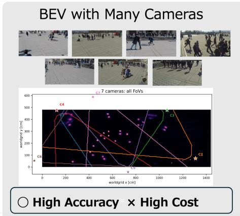

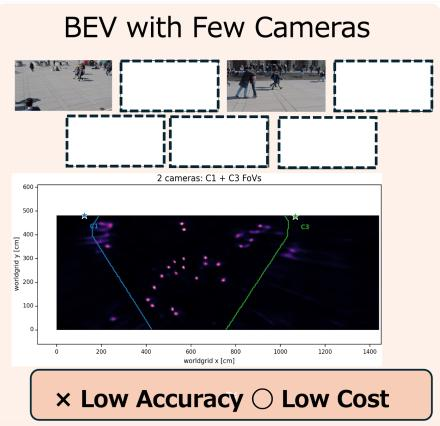

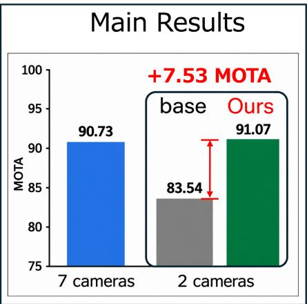  
Fig. 1. Few-camera tracking on WildTrack. GRACE reaches 91.07 MOTA with only two cameras, compared with 83.54 for two-camera TrackTacular. The 90.73 seven-camera bar uses VGF + Ray detections with the default tracker.

The fusion weight g is defined as

$$
g _ { \mathrm { l e a r n } } = \sigma ( \mathrm { C o n v } _ { 1 \times 1 } \left( \mathrm { c o n c a t } ( H _ { t } , V _ { t } , m ) \right) ) ,
$$

$$
\begin{array} { r } { g = \frac { 1 } { 2 } g _ { \mathrm { l e a r n } } + \frac { 1 } { 2 } ( 1 - m ) , } \end{array}\tag{3}
$$

(4)

$$
Z _ { t } = g \odot V _ { t } + ( 1 - g ) \odot H _ { t } .\tag{5}
$$

The coverage prior increases the volumetric weight where few cameras provide mutual correction. In overlapping regions, multiple homography features can reinforce a correctly localized response, so the learned gate can retain more of H . The learned term also adapts this balance to the observed features rather than using coverage alone.

## 2.3. Ray Conditioning

Figure 3 illustrates why viewing direction becomes important with few cameras. The conceptual example shows that projection can stretch pedestrian responses along the camera viewing direction. The actual TrackTacular BEV maps show the same tendency. With two cameras, directional spreading remains more visible, while additional views produce more concentrated responses.

This motivates Ray Conditioning. We explicitly provide the viewing direction of each camera during BEV fusion. Related multicamera 3D detectors encode 3D position, camera viewpoint, or ray geometry to relate image features to 3D space [4, 5, 6, 7, 8, 9].

Coverage does not identify the direction along which a projection error spreads. For the center $\mathbf { q } _ { i j }$ of ground-plane cell (i, j) in the BEV grid and calibrated camera position $\mathbf { o } ^ { ( c ) }$ , we define

$$
\mathbf { r } _ { i j } ^ { ( c ) } = \frac { \mathbf { q } _ { i j } - \mathbf { o } ^ { ( c ) } } { \| \mathbf { q } _ { i j } - \mathbf { o } ^ { ( c ) } \| _ { 2 } } = \left( r _ { x } ^ { ( c ) } , r _ { y } ^ { ( c ) } \right) .\tag{6}
$$

The fixed two-channel map $R ^ { ( c ) }$ is computed once from calibration and concatenated with camera $c \mathbf { \hat { s } }$ volumetric feature. Supplementary Fig. 1 visualizes both channels for WildTrack camera C1.

$$
\widetilde { \cal U } _ { t } ^ { \left( c \right) } = \rho \Big ( \mathrm { c o n c a t } \left( { \cal U } _ { t } ^ { \left( c \right) } , R ^ { \left( c \right) } \right) \Big ) ,\tag{7}
$$

The compressed features are fused as

$$
V _ { t } ^ { \mathrm { r a y } } = \psi _ { \mathrm { v o l } } \left( \{ \widetilde { U } _ { t } ^ { ( c ) } \} _ { c } \right) ,\tag{8}
$$

where ρ compresses each camera feature and $\psi _ { \mathrm { v o l } }$ fuses cameras. We substitute $V _ { t } ^ { \mathrm { { r a y } } }$ for $V _ { t }$ in Eq. 5. Unlike the scalar coverage map, $R ^ { ( c ) }$ distinguishes locations observed from different directions even when their camera counts match. Camera positions and BEV coordinates already provide the required supervision-free signal.

## 2.4. BEV Track Recovery

Online MOT predicts and associates objects over time [10]. Two examples are ByteTrack [11] and SGT [12]. ByteTrack uses low-score detections. SGT recovers missing detections to reduce fragmented trajectories.

Near a field-of-view boundary, a detection may fall below threshold for one or two frames. BTR retains the standard threshold $\tau = 0 . 5$ for new tracks, but matches existing tracks to detections down to $\tau - \delta$ with $\delta \ = \ 0 . 2$ using the normal association rule. A low-confidence detection cannot initialize a track, limiting false identities. If no detection exists, the motion model predicts for at most L = 2 frames when the previous confidence is at least 0.4. The track terminates if matching still fails. BTR remains online and never uses future observations.

## 3. EXPERIMENTAL SETUP

We evaluate on the standard BEV regions of WildTrack [13] and MultiviewX [1]. All methods use the same camera pair on each dataset. Figure 4 shows sample images from these two-camera settings: C1+C3 for WildTrack and C1+C6 for MultiviewX.

## 3.1. Camera Configuration

We select the two-camera setting using only camera calibration before evaluating any model. Our first criterion is complete coverage of the BEV evaluation area. Among all WildTrack two-camera pairs, $\mathrm { C } 1 { + } \mathrm { C } 3$ is the only pair that satisfies this requirement, and 44.98% of the BEV grid is visible from both cameras. This provides full scene coverage while retaining a substantial overlap for multi-view fusion. Figure 5 shows the resulting configuration. The pair is fixed for all WildTrack two-camera experiments. The MultiviewX C1+C6 pair covers 95.62% of the BEV evaluation area. Of this area 44.21% is visible from both cameras.

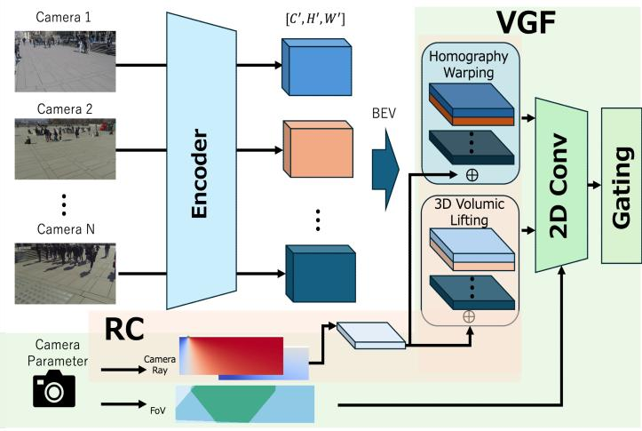

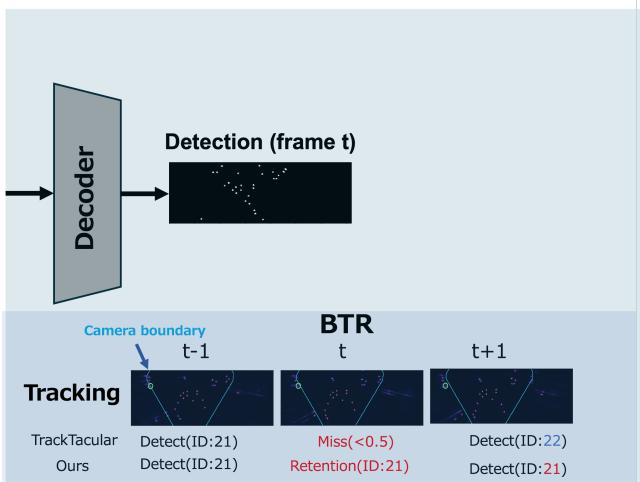  
Fig. 2. GRACE overview. VGF fuses projected and lifted features using coverage and ray geometry. BTR lets low-confidence detections continue existing tracks through short score drops.

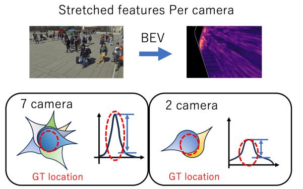  
Fig. 4. Sample images from the two-camera settings used in our experiments. Left: WildTrack C1+C3. Right: MultiviewX C1+C6.

(a) Conceptual illustration  
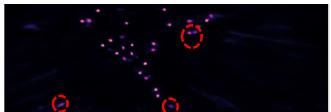

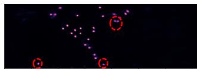  
(b) TrackTacular with 2 cameras  
(c) TrackTacular with 7 cameras

Fig. 3. Effect of camera count on BEV projection. Directional spreading is more visible with two cameras, while additional views produce more concentrated BEV responses.  
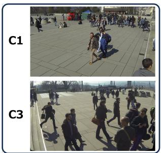

We follow TrackTacular preprocessing and its ResNet-18 training configuration [3, 14]. Methods implemented in our framework share the camera subset, input processing, detection threshold, and evaluator. CaMuViD and RMCS are detection-only comparison methods: CaMuViD predictions are converted to our WildTrack coordinates, and RMCS is trained on the selected pair. We report standard detection and tracking metrics [15, 16, 17].

We choose BTR parameters on WildTrack with two cameras and then fix the same values for all camera counts and for MultiviewX. Ray controls replace calibrated rays with zero, constant, or wrongcamera channels while leaving the remaining pipeline unchanged. VGF adds 2.16M parameters, Ray Conditioning 13,856, and BTR none. The full model runs at 12.66 fps on an RTX A6000, with 0.027 ms BTR overhead.

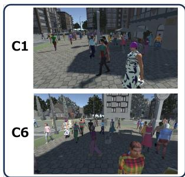

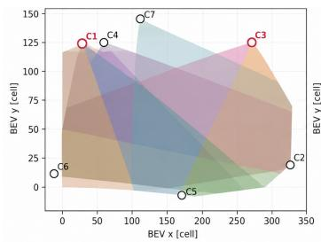

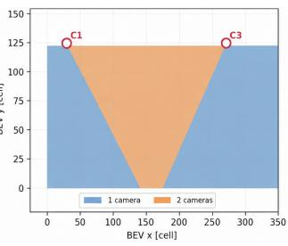  
Fig. 5. WildTrack camera configuration. The left panel shows the positions and fields of view of all seven cameras. The right panel shows the selected C1+C3 pair. Blue regions are observed by one camera and the orange region by both cameras. C1+C3 covers the complete BEV evaluation area, with 44.98% observed by both cameras.

## 4. RESULTS

## 4.1. WildTrack Results

Table 1 reports the main WildTrack comparison. With the same C1+C3 input, GRACE improves TrackTacular from 82.53 to 86.38 MODA and from 83.54 to 91.07 MOTA. CaMuViD and RMCS are detection-only methods, so only their tracking cells are omitted. The seven-camera block is limited to TrackTacular and GRACE.

Table 1. WildTrack results with two and seven cameras. CaMuViD and RMCS are detection-only. Bold: best within each camera count.
<table><tr><td>Method</td><td>Cams</td><td>MODA</td><td>MODP</td><td>Prec.</td><td>Recall</td><td>IDF1</td><td>MOTA</td><td>MOTP</td></tr><tr><td>TrackTacular [3]</td><td>2</td><td>83.54</td><td>69.53</td><td>97.93</td><td>84.31</td><td>83.81</td><td>83.54</td><td>79.73</td></tr><tr><td>LiftNet [3]</td><td>2</td><td>80.32</td><td>74.75</td><td>98.03</td><td>81.97</td><td>87.67</td><td>82.63</td><td>83.34</td></tr><tr><td>CaMuViD [18]</td><td>2</td><td>58.61</td><td>66.42</td><td>79.87</td><td>78.36</td><td></td><td>一</td><td></td></tr><tr><td>RMCS [19]</td><td>2</td><td>77.42</td><td>78.55</td><td>94.74</td><td>81.97</td><td></td><td></td><td>一</td></tr><tr><td>GRACE</td><td>2</td><td>86.38</td><td>76.86</td><td>97.76</td><td>88.41</td><td>94.21</td><td>91.07</td><td>84.37</td></tr><tr><td>TrackTacular [3]</td><td>7</td><td>88.50</td><td>78.56</td><td>97.42</td><td>91.39</td><td>94.00</td><td>89.71</td><td>84.90</td></tr><tr><td>GRACE</td><td>7</td><td>92.58</td><td>80.33</td><td>96.42</td><td>96.15</td><td>94.53</td><td>91.04</td><td>86.26</td></tr></table>

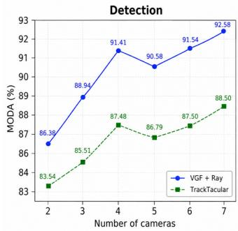

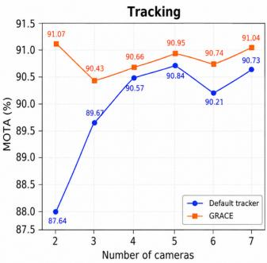  
Fig. 6. WildTrack camera-count study. BTR gives its largest gain with two cameras.

## 4.2. Camera-Count Study

Across two to seven WildTrack cameras (Fig. 6), VGF + Ray consistently improves detection: MODA rises from 86.38 to 92.58, versus 83.54 to 88.50 for TrackTacular. BTR adds 3.43 MOTA points with two cameras but at most 0.76 with three to seven. This concentration of gain supports its role in recovering gaps that additional views would otherwise cover. Parameters remain fixed.

## 4.3. MultiviewX Results

On MultiviewX (Table 2), GRACE reaches 79.36 MOTA with two cameras, 11.09 MOTA points above TrackTacular. MODA increases from 71.26 to 77.09 and IDF1 from 67.34 to 75.05. The six-camera block contains TrackTacular and GRACE. The C1+C6 block includes measured results for TrackTacular, LiftNet, and the detection-only method CaMuViD.

## 4.4. Component Contributions

Table 3 separates the three components on WildTrack C1+C3. Relative to TrackTacular, VGF adds 2.52 MODA, 7.43 IDF1, and 3.05 MOTA points. Ray Conditioning then adds 1.33 MODA and 1.54 recall points. Its 0.19-point precision reduction is small relative to the recall gain. BTR leaves detections unchanged, but raises IDF1 by 2.83 and MOTA by 3.43 points over VGF + Ray. Thus, VGF and rays modify spatial evidence, whereas BTR changes only temporal association.

The camera-count results also delimit where recovery is useful. At seven cameras, BTR changes MOTA from 90.73 to 91.04, compared with the 3.43-point gain at two cameras. The small sevencamera change is expected because overlapping views already reduce short detection gaps.

Table 2. MultiviewX results. Upper: TrackTacular and GRACE with six cameras. Lower: the same two-camera input for all methods. CaMuViD is a detection-only method. Bold: best within each camera count.
<table><tr><td>Method</td><td>Cams</td><td>MODA</td><td>MODP</td><td>Recall</td><td>IDF1</td><td>MOTA</td><td>MOTP</td></tr><tr><td>TrackTacular [3]</td><td>6</td><td>93.64</td><td>88.03</td><td>94.65</td><td>78.08</td><td>89.89</td><td>83.86</td></tr><tr><td>GRACE</td><td>6</td><td>95.69</td><td>87.72</td><td>96.50</td><td>78.21</td><td>87.39</td><td>83.48</td></tr><tr><td>TrackTacular [3]</td><td>2</td><td>71.26</td><td>84.09</td><td>71.71</td><td>67.34</td><td>68.27</td><td>82.56</td></tr><tr><td>LiftNet [3]</td><td>2</td><td>58.77</td><td>83.40</td><td>59.42</td><td>57.50</td><td>57.39</td><td>79.43</td></tr><tr><td>CaMuViD [18]</td><td>2</td><td>59.70</td><td>79.93</td><td>84.41</td><td></td><td></td><td></td></tr><tr><td>GRACE</td><td>2</td><td>77.09</td><td>78.50</td><td>77.67</td><td>75.05</td><td>79.36</td><td>78.88</td></tr></table>

Table 3. Component ablation on WildTrack C1+C3. BTR does not change the detector output.
<table><tr><td>Configuration</td><td>VGF</td><td>Ray</td><td>BTR</td><td>MODA</td><td>MODP</td><td>Prec.</td><td>Recall</td><td>IDF1</td><td>MOTA</td><td>MOTP</td></tr><tr><td>TrackTacular</td><td>一</td><td>一</td><td>一</td><td>82.53</td><td>69.53</td><td>97.93</td><td>84.31</td><td>83.81</td><td>83.54</td><td>79.73</td></tr><tr><td>VGF</td><td>√</td><td>一</td><td>=</td><td>85.05</td><td>74.34</td><td>97.95</td><td>86.87</td><td>91.24</td><td>86.59</td><td>82.35</td></tr><tr><td>VGF + Ray</td><td>√</td><td>√</td><td>一</td><td>86.38</td><td>76.86</td><td>97.76</td><td>88.41</td><td>91.38</td><td>87.64</td><td>84.33</td></tr><tr><td>GRACE</td><td>√</td><td>√</td><td>√</td><td>86.38</td><td>76.86</td><td>97.76</td><td>88.41</td><td>94.21</td><td>91.07</td><td>84.37</td></tr></table>

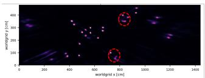  
(a) TrackTacular

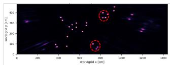  
(b) GRACE  
Fig. 7. BEV responses with the same two WildTrack cameras. TrackTacular shows directional spreading around several pedestrians, while GRACE produces more concentrated responses. Red circles highlight representative differences.

## 4.5. Effect of Ray Conditioning

Ray Conditioning reduces directional spreading in the two-camera setting. Figure 7 compares the BEV responses of TrackTacular and GRACE using the same two WildTrack cameras. TrackTacular produces elongated responses around several pedestrians, particularly along the camera viewing direction. GRACE produces more compact responses at the same locations, as highlighted by the red circles.

This qualitative difference supports the role of Ray Conditioning. By providing the viewing direction of each camera, Ray Conditioning helps the BEV fusion distinguish directional projection errors and concentrate the response around the pedestrian location.

## 5. CONCLUSION

GRACE uses coverage-aware volumetric fusion, calibrated viewing rays, and online track recovery to offset missing camera views. VGF and Ray Conditioning reduce directional BEV projection errors, while BTR preserves existing identities through short score drops without allowing weak detections to initialize tracks. With two cameras, GRACE reaches 91.07 MOTA on WildTrack and 79.36 on MultiviewX. The camera-count study further shows that recovery helps most when only two views remain.

## 6. REFERENCES

[1] Yunzhong Hou, Liang Zheng, and Stephen Gould, “Multiview detection with feature perspective transformation,” in European Conference on Computer Vision, 2020.

[2] Torben Teepe, Philipp Wolters, Johannes Gilg, Fabian Herzog, and Gerhard Rigoll, “Earlybird: Early-fusion for multi-view tracking in the bird’s eye view,” in IEEE/CVF Winter Conference on Applications of Computer Vision Workshops, 2024, pp. 102–111.

[3] Torben Teepe, Philipp Wolters, Johannes Gilg, Fabian Herzog, and Gerhard Rigoll, “Lifting multi-view detection and tracking to the bird’s eye view,” in IEEE/CVF Conference on Computer Vision and Pattern Recognition Workshops, 2024, pp. 667–676.

[4] Yingfei Liu, Tiancai Wang, Xiangyu Zhang, and Jian Sun, “Petr: Position embedding transformation for multi-view 3d object detection,” in European Conference on Computer Vision, 2022.

[5] Kaixin Xiong, Shi Gong, Xiaoqing Ye, Xiao Tan, Ji Wan, Errui Ding, Jingdong Wang, and Xiang Bai, “Cape: Camera view position embedding for multi-view 3d object detection,” in IEEE/CVF Conference on Computer Vision and Pattern Recognition, 2023.

[6] Changyong Shu, Jiajun Deng, Fisher Yu, and Yifan Liu, “3dppe: 3d point positional encoding for transformer-based multi-camera 3d object detection,” in IEEE/CVF International Conference on Computer Vision, 2023, pp. 3580–3589.

[7] Dian Chen, Jie Li, Vitor Guizilini, Rares Ambrus, and Adrien Gaidon, “Viewpoint equivariance for multi-view 3d object detection,” in IEEE/CVF Conference on Computer Vision and Pattern Recognition, 2023.

[8] Xiaomeng Chu, Jiajun Deng, Guoliang You, Yifan Duan, Yao Li, and Yanyong Zhang, “Rayformer: Improving query-based multi-camera 3d object detection via ray-centric strategies,” arXiv preprint arXiv:2407.14923, 2024.

[9] Feng Liu, Tengteng Huang, Qianjing Zhang, Haotian Yao, Chi Zhang, Fang Wan, Qixiang Ye, and Yanzhao Zhou, “Ray denoising: Depth-aware hard negative sampling for multi-view 3d object detection,” in European Conference on Computer Vision, 2024.

[10] Xingyi Zhou, Vladlen Koltun, and Philipp Krahenb¨ uhl,¨ “Tracking objects as points,” in European Conference on Computer Vision, 2020.

[11] Yifu Zhang, Peize Sun, Yi Jiang, Dongdong Yu, Fucheng Weng, Zehuan Yuan, Ping Luo, Wenyu Liu, and Xinggang Wang, “Bytetrack: Multi-object tracking by associating every detection box,” in European Conference on Computer Vision, 2022.

[12] Jeongseok Hyun, Myunggu Kang, Dongyoon Wee, and Dit-Yan Yeung, “Detection recovery in online multi-object tracking with sparse graph tracker,” in IEEE/CVF Winter Conference on Applications of Computer Vision, 2023, pp. 4850– 4859.

[13] Tatiana Chavdarova, Pierre Baque, St ´ ephane Bouquet, Andrii´ Maksai, Cijo Jose, Timur Bagautdinov, Louis Lettry, Pascal Fua, Luc Van Gool, and Franc¸ois Fleuret, “Wildtrack: A multicamera hd dataset for dense unscripted pedestrian detection,” in IEEE Conference on Computer Vision and Pattern Recognition, 2018, pp. 5030–5039.

[14] Kaiming He, Xiangyu Zhang, Shaoqing Ren, and Jian Sun, “Deep residual learning for image recognition,” in IEEE Conference on Computer Vision and Pattern Recognition, 2016.

[15] Jacinto C. Nascimento and Jorge S. Marques, “Performance evaluation of object detection algorithms for video surveillance,” IEEE Transactions on Multimedia, vol. 8, no. 4, pp. 761–773, 2006.

[16] Keni Bernardin and Rainer Stiefelhagen, “Evaluating multiple object tracking performance: The clear mot metrics,” EURASIP Journal on Image and Video Processing, vol. 2008, pp. 1–10, 2008.

[17] Ergys Ristani, Francesco Solera, Roger S. Zou, Rita Cucchiara, and Carlo Tomasi, “Performance measures and a data set for multi-target, multi-camera tracking,” in European Conference on Computer Vision Workshops, 2016, pp. 17–35.

[18] Amir Etefaghi Daryani, M. Usman Maqbool Bhutta, Byron Hernandez, and Henry Medeiros, “CaMuViD: Calibration-free multi-view detection,” in IEEE/CVF Conference on Computer Vision and Pattern Recognition, 2025, pp. 1220–1229.

[19] He Li, Jiajia Gui, Weihang Kong, and Xingchen Zhang, “Multi-view pedestrian detection via residual mask fusion and cosine similarity-based passive sampler for video surveillance systems,” Future Generation Computer Systems, vol. 181, pp. 108384, Aug. 2026.