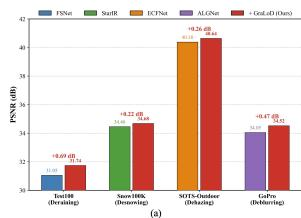
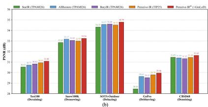
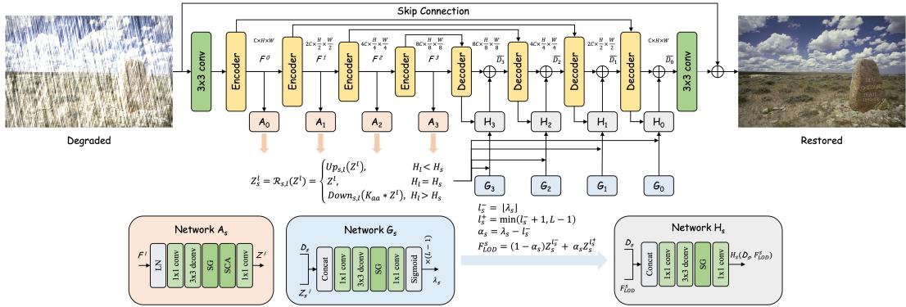
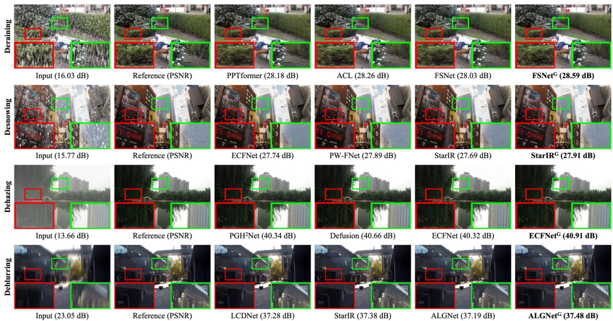
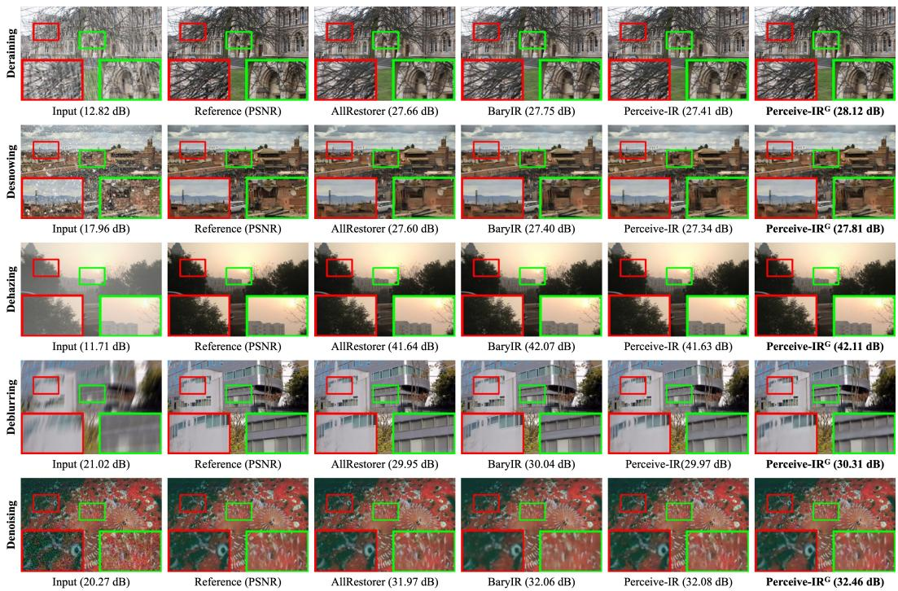
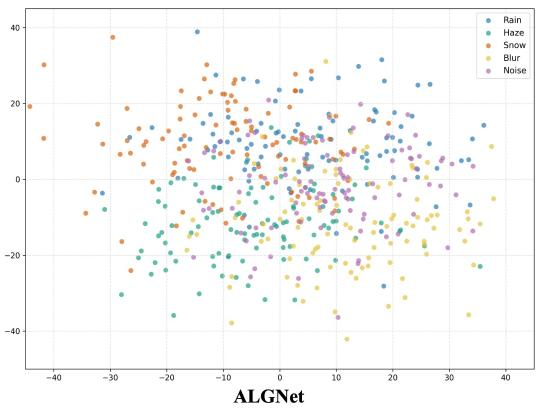
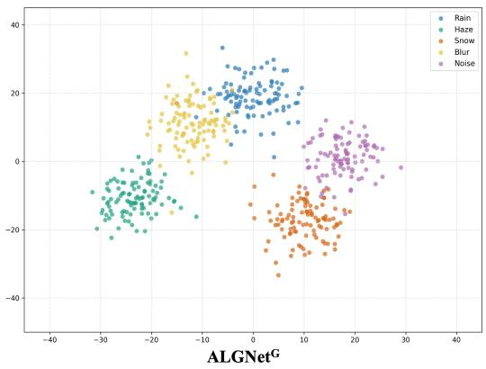
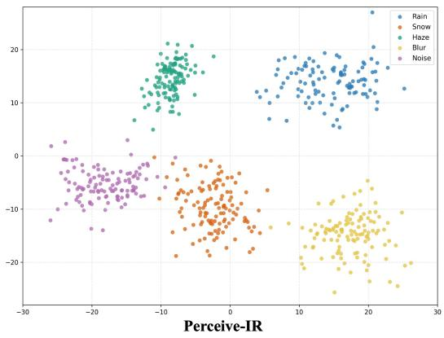
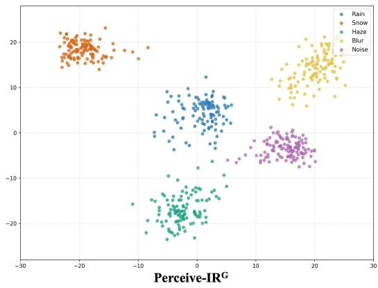

# GRALOD: GRAPHICS-INSPIRED CONTINUOUS LEVEL-OF-DETAIL LEARNING FOR IMAGE RESTORATION

Hu Gao & Lizhuang Ma Department of Computer Science Shanghai Jiao Tong University Shanghai, China {gao h, lzma}@sjtu.edu.cn

Yulong Chen   
Department of Architecture and Design   
Harbin Institute of Technology   
Heilongjiang, China   
{llong c}@hit.edu.cn

## ABSTRACT

The spatial support required for image restoration varies across degradation types, image regions, and reconstruction stages. However, most existing methods rely on predefined multi-scale hierarchies and aggregate features through fixed fusion or attention, leaving the representation scale itself largely determined by the network architecture. This limitation becomes more pronounced when a task-specific backbone is extended to heterogeneous degradations in all-in-one restoration. Inspired by level-of-detail (LOD) rendering in computer graphics, we propose GraLoD, a plug-and-play framework that treats restoration scale as a spatially varying and stage-dependent continuous variable. GraLoD reuses the native encoder hierarchy, aligns its multi-scale features into a shared LOD representation space, and predicts a stage-conditioned LOD field at each decoder stage. Each spatial location then continuously queries only two neighboring representation levels, enabling the effective restoration scale to adapt to both local image content and reconstruction progress. To prevent degenerate or arbitrary scale selection, we further introduce minimal-sufficient footprint calibration (MSFC) together with structure-aware regularization (SAR) to encourage restoration-effective and spatially coherent LOD assignments. GraLoD can be directly integrated into existing restoration backbones without redesigning their fundamental feature-processing blocks. Extensive experiments demonstrate consistent improvements in taskspecific and all-in-one restoration.

## 1 INTRODUCTION

Image restoration aims to recover high-quality images from observations degraded by corruptions. Recent CNN-, Transformer-, and state-space-based restorers have achieved strong performance by combining local feature extraction with increasingly effective long-range modeling Cui et al. (2026); Lin et al. (2026); Gao et al. (2024a). Most of these methods adopt hierarchical encoder–decoder architectures, in which high-resolution features preserve local details while lower-resolution features provide progressively broader contextual information.

However, the spatial context required for restoration is inherently non-uniform. Large or spatially extended degradations often require broader contextual reasoning, whereas fine textures, object boundaries, and thin structures depend more strongly on high-resolution representations. Such vari ation also occurs within the same image. Nevertheless, most restoration models typically use a predefined set of feature scales and combine them through skip connections, feature fusion, or attention. Although these mechanisms can adapt the contribution of different levels, the underlying representation scales remain discrete and fixed by the architecture. As a result, the model mainly learns how to combine predefined scales rather than which scale is most appropriate for each spatial location.

This limitation becomes more evident in all-in-one image restoration, where a single model must accommodate heterogeneous degradations with substantially different spatial characteristics. Several approaches improve such flexibility through degradation representations, prompts, or adaptive conditioning Zhang et al. (2026); Mao et al. (2026); Gao et al. (2024b). Scale-adaptive designs further adjust receptive fields or sampling locations according to degradation patterns He et al. (2025). These strategies improve degradation adaptation and spatial aggregation, but the resolution of the queried representation is still largely constrained by the predefined network hierarchy.

We therefore argue that restoration scale itself should be treated as a spatially varying variable. This perspective is closely related to level-of-detail (LOD) rendering in computer graphics. Classical mipmapping selects an appropriate representation resolution according to the spatial footprint of a rendered sample Williams (1983), and similar scale-aware principles have been adopted in neural rendering Barron et al. (2021). The underlying principle is that different samples should access representations at different resolutions according to the spatial support they require. Unlike rendering, however, image restoration does not have an explicitly known sampling footprint, the appropriate restoration scale must instead be inferred from the degraded observation and the current reconstruction state.

Inspired by this principle, we propose GraLoD, a plug-and-play framework that introduces continuous LOD adaptation into existing restoration backbones. Rather than constructing an additional feature pyramid, GraLoD directly reuses the native multi-scale features produced by the encoder and aligns them into a shared LOD representation space. At each decoder stage, a stage-conditioned LOD field is predicted according to both the current reconstruction state and the aligned encoder hierarchy. Each spatial location then continuously queries only two neighboring LOD levels, allowing the effective restoration scale to adapt not only across image regions but also throughout the coarseto-fine reconstruction process. The queried representation is injected through a lightweight residual adaptor, while the original encoder, decoder, and skip connections remain unchanged. To prevent the learned LOD field from degenerating into arbitrary multi-scale gating or collapsing toward a preferred level, we further introduce minimal-sufficient footprint calibration (MSFC). MSFC evaluates the local restoration utility of different representation levels and encourages each location to use the smallest spatial footprint sufficient for accurate reconstruction. In addition, structure-aware regularization (SAR) promotes coherent LOD assignments within homogeneous regions while allowing scale transitions around structural boundaries.

  
Figure 1: Effectiveness of GraLoD in different restoration settings. (a) GraLoD consistently improves representative taskspecific restoration backbones. (b) GraLoD further improves an all-in-one restorer and achieves strong performance across five degradation types.

GraLoD can be directly integrated into existing restoration models without redesigning their fundamental featureprocessing blocks. Under task-specific training, it improves restoration through spatially and stage-wise adaptive scale selection, while under multi-degradation training, the same mechanism enables existing backbones to accommodate heterogeneous restoration requirements and extend toward all-in-one restoration. As shown in Fig. 1, GraLoD con-

sistently improves representative task-specific backbones by up to 0.69 dB and further enhances unified restorers across five degradation types, achieving competitive or superior performance over existing all-in-one methods.

Our contributions are summarized as follows:

• We introduce a graphics-inspired formulation that treats restoration scale as a spatially varying and stage-dependent continuous representation variable rather than a predefined architectural choice.

• We propose GraLoD, a plug-and-play continuous LOD framework that reuses the native encoder hierarchy, aligns it into a shared LOD space, and performs stage-conditioned continuous scale querying without redesigning the underlying restoration backbone.

• We introduce minimal-sufficient footprint calibration (MSFC) and structure-aware regularization (SAR) to constrain LOD learning toward restoration-effective and spatially meaningful scale assignments.

• Extensive experiments demonstrate that GraLoD consistently improves existing backbones in task-specific and all-in-one restoration settings and generalizes effectively to diverse degradation conditions.

## 2 RELATED WORK

## 2.1 IMAGE RESTORATION

Image restoration has evolved from prior-driven formulations toward data-driven representation learning. Traditional methods rely on explicit structural assumptions or degradation models to constrain the inverse problem Rong et al. (2024); Feng et al. (2026), whereas recent CNN-, Transformer-, diffusion-, and Mamba-based approaches learn restoration priors directly from data Gao et al. (2025d); Lin et al. (2026); Zhang et al. (2025b). Task-specific methods have improved reconstruction through local–global feature interaction, spatial–frequency modeling, predictive filtering, and task-dependent priors. ALGNet Gao et al. (2024a) combines adaptive local and global representations, XYScanNet Liu et al. (2025) enhances long-range dependency modeling through alternating spatial scans, and EfDeRain+ Guo et al. (2025a) formulates deraining as a predictive filtering process. Other studies exploit frequency-domain representations Gao et al. (2025c), explicit image priors Su et al. (2025), or generative diffusion models Wen et al. (2024); Zeng et al. (2024). Although these designs substantially improve task-specific restoration, their feature hierarchies and scale configurations are generally fixed once the network architecture is determined, limiting their ability to adapt the effective restoration scale to spatially varying degradation patterns and image structures.

All-in-one image restoration aims to further handle multiple degradations within a single model. Existing methods mainly improve degradation perception, representation disentanglement, or conditional feature adaptation. AdaIR Cui et al. (2025) separates degradation-related and content-related information, Perceive-IR Zhang et al. (2025a) models both degradation category and severity, and BaryIR Tang et al. (2026) aligns heterogeneous degradation distributions through a shared representation. Other approaches enhance unified restoration through long-range interaction, multimodal conditioning, or vision-language priors Cui et al. (2026); Mao et al. (2026); Zeng et al. (2025).

These methods improve adaptation across degradation types, yet most still rely on predefined multiscale hierarchies and mainly adjust degradation representations, prompts, routing, or feature modulation. As a result, degradations with different spatial extents are still handled within the same discrete set of backbone resolutions, while representation scale itself is seldom treated as a spatially varying variable. GraLoD targets this limitation by introducing continuous representation-scale adaptation into restoration backbones. It supports both task-specific and all-in-one restoration without altering the backbone’s fundamental feature-processing blocks.

## 2.2 SCALE ADAPTATION AND LEVEL-OF-DETAIL REPRESENTATIONS

Multi-scale representations are widely used in image restoration to combine fine spatial details with broader contextual information. Encoder–decoder architectures typically form hierarchical features through progressive downsampling. Pyramid Attention Mei et al. (2023) extends non-local matching to multiple scales, while EPA-Net Hua et al. (2026) dynamically weights pyramid features. State-space and attention-based restorers also combine local and global representations to improve reconstruction. Spatial aggregation can also be adapted according to degradation characteristics. DeRestormer Lin et al. (2026) combines deformable attention with multi-scale aggregation for localized degradations, while DSASformer Wang et al. (2026) employs dynamic scale-aware sparse attention together with multi-scale detail enhancement. These methods provide greater flexibility in receptive fields, sampling locations, and cross-scale feature interaction, but the underlying representation levels remain predefined by the network hierarchy. Level-of-detail adaptation has long been studied in computer graphics. Classical mipmapping selects progressively filtered representations according to the projected sampling footprint Williams (1983). Mip-NeRF Barron et al. (2021) extends this idea to scale-aware neural rendering, while Mip-Splatting Yu et al. (2024) incorporates frequency-aware filtering for alias-free Gaussian rendering. Continuous LOD representations have also been explored to support smooth resolution changes within unified 3D scene representations Milef et al. (2025); Cheng et al. (2026).

  
Figure 2: Architecture of GraLoD. The native encoder hierarchy is aligned by $\mathbf { \mathcal { A } } _ { l }$ into an ordered LOD representation space and shared across decoder stages. At stage s, the aligned features are resized by $\mathcal { R } _ { s , l }$ and combined with $D _ { s }$ to predict the spatial LOD field through $\mathcal { G } _ { s }$ . Two neighboring LOD levels are then continuously interpolated to obtain $F _ { \mathrm { L O D } } ^ { s } ,$ which is injected into the decoder through the residual adaptor $\mathcal { H } _ { s }$ . The detailed structures of $\mathcal { A } _ { l } , \mathcal { G } _ { s }$ , and $\mathcal { H } _ { s }$ are shown at the bottom.

GraLoD brings this idea to image restoration by treating the representation scale required for local reconstruction as a spatially varying variable. Rather than selecting from fixed scales independently, it predicts a continuous LOD coordinate and queries neighboring levels in an ordered LOD representation space, while remaining compatible with existing restoration backbones.

## 3 METHOD

## 3.1 PROBLEM FORMULATION

Given a degraded image $\mathbf { y } \in \mathbb { R } ^ { H \times W \times 3 }$ , most models adopt an encoder–decoder architecture and naturally produce hierarchical features $F ^ { l } = \mathcal { E } _ { l } ( \mathbf { y } ) , l = 0 , \therefore , L - 1$ , where $F ^ { l }$ is ordered from fine to coarse resolution. Although these features provide different spatial supports, their usage is typically determined by predefined skip connections or multi-scale fusion. We instead treat restoration scale as a spatially varying continuous variable. For decoder stage $s ,$ we introduce an LOD field:

$$
\lambda _ { s } = \{ \lambda _ { s } ( \mathbf { p } ) | \mathbf { p } \in \Omega _ { s } \} , \qquad \lambda _ { s } ( \mathbf { p } ) \in [ 0 , L - 1 ] ,\tag{1}
$$

where $\Omega _ { s }$ denotes the spatial lattice of stage $s . \lambda _ { s } ( \mathbf { p } )$ describes the representation scale required to reconstruct location p at the current decoding stage. A smaller value emphasizes fine spatial evidence, whereas a larger value accesses representations with broader contextual support. In this paper, our GraLoD reuses the native encoder hierarchy and converts the discrete backbone scales into a continuously queryable LOD space.

## 3.2 GRALOD: PLUG-AND-PLAY CONTINUOUS LOD ADAPTATION

Figure 2 illustrates how GraLoD is integrated into a conventional encoder–decoder backbone. The native multi-scale encoder features are first aligned into a shared LOD representation space. At each decoder stage, GraLoD predicts a stage-specific spatial LOD field, queries the corresponding representation scale, and injects the resulting feature through a lightweight residual adaptor. In this way, the original encoder, decoder, and skip connections are fully preserved, while GraLoD only augments representation-scale selection. Encoder features from different stages vary in channel dimensionality, spatial resolution, and representation characteristics, making direct interpolation between them unsuitable. We therefore map each encoder feature into a shared space:

$$
Z ^ { l } = { \mathcal { A } } _ { l } ( F ^ { l } ) , \qquad l = 0 , \dots , L - 1 ,\tag{2}
$$

where $\boldsymbol { \mathcal { A } } _ { l }$ is a lightweight local refinement. The aligned hierarchy $\mathcal { Z } = Z ^ { 0 } , Z ^ { 1 } , \dotsc , Z ^ { L - 1 }$ forms an ordered LOD representation space, in which finer levels preserve detailed spatial information while deeper levels provide progressively broader contextual support. When resolution conversion is required, anti-aliased resampling is applied to reduce cross-scale inconsistency. This aligned hierarchy is constructed only once and shared by all decoder stages. Let $D _ { s }$ denote the feature entering decoder stage s. To match the spatial resolution of the current decoding stage, each $Z ^ { l }$ is aligned to $\Omega _ { s } \mathrm { : }$

$$
Z _ { s } ^ { l } = \mathcal { R } _ { s , l } ( Z ^ { l } ) , \qquad l = 0 , \ldots , L - 1 ,\tag{3}
$$

where $\mathcal { R } _ { s , l }$ denotes scale alignment. A lightweight estimator $\mathcal { G } _ { s }$ then predicts the LOD field:

$$
\lambda _ { s } = \mathcal { G } _ { s } ( D _ { s } , Z _ { s } ^ { 0 } , \ldots , Z _ { s } ^ { L - 1 } ) ,\tag{4}
$$

where each element $\lambda _ { s } ( \mathbf { p } )$ of $\lambda _ { s }$ represents the predicted LOD coordinate at location p. Conditioning scale selection on $D _ { s }$ allows the requested representation scale to depend jointly on spatial content and reconstruction progress. Given $\lambda _ { s } ( \mathbf { p } )$ , its two adjacent LOD levels are defined as $l _ { s } ^ { - } \left( \mathbf { p } \right) =$ $\lfloor \lambda _ { s } ( \mathbf { p } ) \rfloor , l _ { s } ^ { + } ( \mathbf { p } ) = \operatorname* { m i n } \bar { ( } l _ { s } ^ { - } ( \mathbf { p } ) + 1 , L - 1 )$ , with interpolation coefficient $\alpha _ { s } ( \mathbf { p } ) = \lambda _ { s } ( \mathbf { p } ) - l _ { s } ^ { - } ( \mathbf { p } )$ The continuously queried representation is then computed as:

$$
{ \cal F } _ { \mathrm { L O D } } ^ { s } ( { \bf p } ) = ( 1 - \alpha _ { s } ( { \bf p } ) ) Z _ { s } ^ { l _ { s } ^ { - } ( { \bf p } ) } ( { \bf p } ) + \alpha _ { s } ( { \bf p } ) Z _ { s } ^ { l _ { s } ^ { + } ( { \bf p } ) } ( { \bf p } ) .\tag{5}
$$

Unlike generic scale attention, which assigns independent weights to all feature levels, GraLoD represents scale with a single continuous coordinate along an ordered LOD axis and interpolates only between two neighboring levels. This formulation preserves the ordering of the representation scales and allows the queried scale to vary continuously across spatial locations and decoder stages. The continuity and gradient properties of the LOD query, together with the motivation for stage-conditioned prediction, are discussed in Appendix A.1.1. Finally, the queried representation is injected into the original decoder through a lightweight residual adaptor:

$$
\widetilde { D } _ { s } = D _ { s } + \mathcal { H } _ { s } ( D _ { s } , F _ { \mathrm { L O D } } ^ { s } ) ,\tag{6}
$$

where $\mathcal { H } _ { s }$ denotes the adaptor at decoder stage s. The enhanced feature $\widetilde { D } _ { s }$ is then processed by the original decoder stage together with its native skip connection. The aligned LOD hierarchy $\mathcal { Z }$ is shared across decoder stages, whereas the LOD estimator $\mathcal { G } _ { s }$ and residual adaptor $\mathcal { H } _ { s }$ are stage-specific. GraLoD therefore introduces representation-scale adaptation throughout decoding while preserving the original encoder, decoder, and skip connections. More details are provided in Appendix A.1.2.

## 3.3 LOD CALIBRATION AND STRUCTURAL REGULARIZATION

Although the reconstruction loss can guide the LOD field, it does not uniquely determine the appropriate representation scale. Different LOD assignments may produce similar reconstruction errors, causing the predicted coordinates to collapse toward a preferred level or behave as unconstrained multi-scale gating. We therefore introduce minimal-sufficient footprint calibration (MSFC), which encourages each location to use the smallest representation footprint that provides sufficient restoration accuracy. During training, a lightweight probe $\mathcal { P } _ { s }$ , shared across LOD levels within decoder stage s, evaluates each aligned representation as $\hat { \mathbf { x } } _ { s } ^ { l } = \mathcal { P } _ { s } ( \mathrm { C o n c a t } ( D _ { s } , Z _ { s } ^ { l } ) )$ . Let $\mathbf { x } _ { s }$ denote the clean target resized to the spatial resolution of stage s. The local restoration error is measured by:

$$
e _ { s , l } ( \mathbf { p } ) = \mathcal { A } _ { r } ( | \hat { \mathbf { x } } _ { s } ^ { l } - \mathbf { x } _ { s } | ) ( \mathbf { p } ) ,\tag{7}
$$

where $\boldsymbol { A } _ { \boldsymbol { r } }$ denotes local averaging. To discourage unnecessarily coarse representations, we define the scale cost as:

$$
c _ { s , l } ( \mathbf { p } ) = e _ { s , l } ( \mathbf { p } ) + \gamma l / ( L - 1 ) .\tag{8}
$$

A soft distribution over LOD levels is then obtained by $q _ { s , l } ( \mathbf { p } ) \propto \exp ( - c _ { s , l } ( \mathbf { p } ) / \tau )$ , and the corresponding target coordinate is $\begin{array} { r } { \lambda _ { s } ^ { * } ( \mathbf { p } ) = \sum _ { l = 0 } ^ { L - 1 } l q _ { s , l } ( \mathbf { p } ) } \end{array}$ . The predicted LOD field is calibrated toward this target through:

$$
\mathcal { L } _ { \mathrm { c a l } } = \frac { 1 } { S } \sum _ { s = 1 } ^ { S } \frac { 1 } { | \Omega _ { s } | } \sum _ { \mathbf { p } \in \Omega _ { s } } \left| \lambda _ { s } ( \mathbf { p } ) - \mathrm { s g } \left( \lambda _ { s } ^ { * } ( \mathbf { p } ) \right) \right| ,\tag{9}
$$

Table 1: Quantitative comparison of GraLoD-enhanced image restoration models across different degradation types. G denotes the integration of GraLoD into the corresponding backbone.
<table><tr><td rowspan="2">Methods</td><td colspan="2">Deraining</td><td rowspan="2">Methods</td><td colspan="2">Desnowing</td></tr><tr><td>PSNR ↑</td><td>SSIM ↑</td><td>PSNR ↑</td><td>SSIM ↑</td></tr><tr><td>EfDeRain+ Guo et al. (2025a)</td><td>31.10</td><td>0.911</td><td>MSP-Former Chen et al. (2023)</td><td>33.43</td><td>0.96</td></tr><tr><td>MHNet Gao et al. (2025d)</td><td>31.25</td><td>0.901</td><td>PEUNet Guo et al. (2025b)</td><td>34.11</td><td>0.96</td></tr><tr><td>PPTformer Wang et al. (2025)</td><td>31.48</td><td>0.922</td><td>ECFNet Gao et al. (2026)</td><td>34.26</td><td>0.96</td></tr><tr><td>ACL Gu et al. (2025)</td><td>31.51</td><td>0.914</td><td>PW-FNet Jiang et al. (2026)</td><td>34.50</td><td>0.95</td></tr><tr><td>FSNet Cui et al. (2023)</td><td>31.05</td><td>0.919</td><td>StarIR Cui et al. (2026)</td><td>34.46</td><td>0.96</td></tr><tr><td>FSNetG Cui et al. (2023)</td><td>31.74</td><td>0.921</td><td>StarIRG Cui et al. (2026)</td><td>34.68</td><td>0.96</td></tr><tr><td rowspan="2">Methods</td><td>Dehazing</td><td></td><td rowspan="2">Methods</td><td>Deblurring</td><td></td></tr><tr><td>PSNR ↑</td><td>SSIM↑</td><td>PSNR↑</td><td>SSIM↑</td></tr><tr><td>FDTANet Gao et al. (2025c)</td><td>34.73</td><td>0.989</td><td>FSNet (Cui et al., 2023)</td><td>33.29</td><td>0.963</td></tr><tr><td>PGH²Net Su et al. (2025)</td><td>37.52</td><td>0.989</td><td>LCDNet Gao et al. (2025a)</td><td>33.55</td><td>0.966</td></tr><tr><td>StarIR Cui et al. (2026)</td><td>38.98</td><td>0.991</td><td>MBMamba Gao et al. (2025b)</td><td>33.89</td><td>0.968</td></tr><tr><td>Defusion Luo et al. (2025)</td><td>37.41</td><td>0.993</td><td>StarIR Cui et al. (2026)</td><td>34.34</td><td>0.970</td></tr><tr><td>ECFNet Gao et al. (2026)</td><td>40.38</td><td>0.993</td><td>ALGNet Gao et al. (2024a)</td><td>34.05</td><td>0.969</td></tr><tr><td>ECFNetG Gao et al. (2026)</td><td>40.64</td><td>0.994</td><td>ALGNetG Gao et al. (2024a)</td><td>34.52</td><td>0.970</td></tr></table>

where $\operatorname { s g } ( \cdot )$ denotes stop-gradient. A coarser level is therefore favored only when the additional spatial support provides sufficient reconstruction benefit to compensate for its scale penalty. The probes are used only during training and are removed at inference. Further details of MSFC and probe training are provided in Appendix A.1.3. We further regularize the spatial organization of the LOD field using the clean image structure. For neighboring locations p and ${ \bf q } ,$ their affinity is defined as $w _ { \mathbf { p q } } ^ { s } = \exp ( - \beta \| \mathbf { x } _ { s } ( \mathbf { p } ) - \mathbf { x } _ { s } ( \mathbf { q } ) \| _ { 1 } )$ . The structure-aware regularization (SAR) is:

$$
\mathcal { L } _ { \mathrm { s t r } } = \frac { 1 } { S } \sum _ { s = 1 } ^ { S } \frac { 1 } { | \Omega _ { s } | } \sum _ { \mathbf { p } \in \Omega _ { s } } \sum _ { \mathbf { q } \in \mathcal { N } ( \mathbf { p } ) } w _ { \mathbf { p q } } ^ { s } \left| \lambda _ { s } ( \mathbf { p } ) - \lambda _ { s } ( \mathbf { q } ) \right| .\tag{10}
$$

This objective encourages similar LOD coordinates within homogeneous regions while allowing scale changes across structural boundaries. Further analysis is given in Appendix A.1.4. The overall training objective is:

$$
\begin{array} { r } { \mathcal { L } = \mathcal { L } _ { \mathrm { r e c } } + \lambda _ { \mathrm { c a l } } \mathcal { L } _ { \mathrm { c a l } } + \lambda _ { \mathrm { s t r } } \mathcal { L } _ { \mathrm { s t r } } + \lambda _ { \mathrm { p r o b e } } \mathcal { L } _ { \mathrm { p r o b e } } , } \end{array}\tag{11}
$$

where $\mathcal { L } _ { \mathrm { r e c } }$ follows the original objective of the underlying restoration backbone and $\mathcal { L } _ { \mathrm { p r o b e } }$ supervises the training-only scale probes. Additional training details and computational analysis are provided in Appendices A.1.5 and A.1.6.

## 4 EXPERIMENTS

In this section, we first present the comparison results, followed by the ablation studies. The experimental setup and more experiments are provided in Appendix A.2 and A.3.

## 4.1 RESULTS

## 4.1.1 PERFORMANCE IMPROVEMENT ON TASK-SPECIFIC RESTORATION

We first evaluate whether GraLoD can improve existing restoration models without changing their original network. As shown in Table 1, integrating GraLoD consistently improves representative restoration backbones across different degradation types. In deraining, GraLoD improves FSNet Cui et al. (2023) by 0.69 dB, allowing it to outperform the compared task-specific methods. Similar improvements are observed for desnowing, dehazing and deblurring, where StarIR Cui et al. (2026), ECFNet Gao et al. (2026) and ALGNet Gao et al. (2024a) gain 0.22 dB, 0.26 dB and 0.47 dB, respectively, while their structural similarity is also maintained or slightly improved. These results demonstrate that GraLoD reuses the native multi-scale hierarchy and adaptively determines the representation scale required at different spatial locations and reconstruction stages. The consistent gains support our motivation that even well-designed restorers can benefit from explicitly adapting the representation scale during reconstruction. Importantly, these improvements are obtained while preserving the original backbone architecture, highlighting the plug-and-play nature of GraLoD.

  
Figure 3: Qualitative comparison in the task-specific setting.

Table 2: Quantitative comparison in the all-in-one setting across CNN-, Transformer-, and Mambabased backbones. Results include task-specific (♦), task-aligned (♦), and all-in-one (♦) methods.
<table><tr><td rowspan="2">Methods</td><td colspan="2">Deraining</td><td colspan="2">Desnowing</td><td colspan="2">Dehazing</td><td colspan="2">Deblurring</td><td colspan="2">Denosing</td><td colspan="2">Average</td></tr><tr><td>PSNR ↑</td><td>SSIM ↑</td><td>PSNR ↑</td><td>SSIM ↑</td><td>PSNR ↑</td><td>SSIM ↑</td><td>PSNR ↑</td><td>SSIM ↑</td><td>PSNR ↑</td><td>SSIM ↑</td><td>PSNR ↑</td><td>SSIM↑</td></tr><tr><td>EfDeRain+ Guo et al. (2025a)</td><td>30.89</td><td>0.909</td><td>29.42</td><td>0.925</td><td>33.01</td><td>0.952</td><td>26.48</td><td>0.804</td><td>30.62</td><td>0.880</td><td>30.08</td><td>0.894</td></tr><tr><td>PGH2Net Su et al. (2025)</td><td>29.52</td><td>0.896</td><td>31.88</td><td>0.932</td><td>34.34</td><td>0.976</td><td>25.96</td><td>0.789</td><td>30.97</td><td>0.882</td><td>30.53</td><td>0.895</td></tr><tr><td>ALGNet Gao et al. (2024a)</td><td>28.99</td><td>0.896</td><td>30.89</td><td>0.924</td><td>32.76</td><td>0.968</td><td>29.41</td><td>0.882</td><td>30.97</td><td>0.881</td><td>30.60</td><td>0.910</td></tr><tr><td>ALGNetG Gao et al. (2024a)</td><td>30.71</td><td>0.901</td><td>32.92</td><td>0.946</td><td>34.09</td><td>0.978</td><td>29.59</td><td>0.881</td><td>31.21</td><td>0.883</td><td>31.70</td><td>0.918</td></tr><tr><td>ECFNet Gao et al. (2026)</td><td>30.44</td><td>0.890</td><td>32.54</td><td>0.932</td><td>33.99</td><td>0.978</td><td>27.58</td><td>0.836</td><td>31.10</td><td>0.882</td><td>31.13</td><td>0.904</td></tr><tr><td>MHNet Gao et al. (2025d)</td><td>30.26</td><td>0.888</td><td>31.94</td><td>0.941</td><td>33.98</td><td>0.976</td><td>27.41</td><td>0.830</td><td>31.33</td><td>0.882</td><td>30.98</td><td>0.903</td></tr><tr><td>StarIR Cui et al. (2026)</td><td>30.53</td><td>0.891</td><td>32.85</td><td>0.950</td><td>34.32</td><td>0.978</td><td>28.45</td><td>0.880</td><td>31.45</td><td>0.885</td><td>31.52</td><td>0.917</td></tr><tr><td>StarIRG Cui et al. (2026)</td><td>30.81</td><td>0.905</td><td>33.23</td><td>0.952</td><td>34.59</td><td>0.979</td><td>29.42</td><td>0.883</td><td>31.44</td><td>0.886</td><td>31.90</td><td>0.921</td></tr><tr><td>AllRestorer Mao et al. (2026)</td><td>30.71</td><td>0.903</td><td>33.17</td><td>0.951</td><td>34.57</td><td>0.978</td><td>29.63</td><td>0.882</td><td>31.39</td><td>0.885</td><td>31.89</td><td>0.920</td></tr><tr><td>BaryIR Tang et al. (2026)</td><td>30.82</td><td>0.907</td><td>33.05</td><td>0.948</td><td>34.60</td><td>0.979</td><td>29.52</td><td>0.881</td><td>31.32</td><td>0.884</td><td>31.86</td><td>0.920</td></tr><tr><td>Perceive-IR Zhang et al. (2025a)</td><td>30.93</td><td>0.902</td><td>32.99</td><td>0.948</td><td>34.52</td><td>0.980</td><td>29.79</td><td>0.889</td><td>31.44</td><td>0.885</td><td>31.93</td><td>0.921</td></tr><tr><td>Perceive-IRG Zhang et al. (2025a)</td><td>31.08</td><td>0.907</td><td>33.24</td><td>0.952</td><td>34.79</td><td>0.981</td><td>29.96</td><td>0.891</td><td>31.63</td><td>0.887</td><td>32.14</td><td>0.924</td></tr></table>

Figure 3 presents qualitative comparisons of GraLoD-enhanced task-specific restoration models across different degradation types. Consistent with the quantitative results, integrating GraLoD improves the visual quality of the restored images. Compared with the corresponding baseline models, the GraLoD-enhanced variants produce cleaner restoration results with improved structural fidelity and fewer degradation residuals.

## 4.1.2 CAPABILITY EXPANSION TOWARD ALL-IN-ONE RESTORATION

We further investigate whether GraLoD can extend existing restoration backbones toward all-inone restoration under multi-degradation training. Table 2 compares task-specific, task-aligned, and dedicated all-in-one methods under the same five-degradation setting. The most significant gain is obtained with ALGNet Gao et al. (2024a). After introducing GraLoD, its average performance improves by 1.10 dB, with improvements observed across all five restoration tasks. Particularly large gains are obtained for deraining, desnowing, and dehazing, reaching approximately 1.3–2.0 dB. This result indicates that a task-specific backbone can be effectively adapted to heterogeneous restoration requirements through spatially and stage-wise scale selection, without introducing degradationspecific branches or redesigning the backbone into a dedicated all-in-one architecture.

A similar trend is observed for the task-aligned StarIR Cui et al. (2026) backbone. GraLoD improves its average performance by 0.38 dB, with particularly evident improvement on deblurring. More importantly, StarIRG becomes competitive with dedicated all-in-one approaches and surpasses several of them in average restoration performance. GraLoD also remains beneficial when applied to a model already designed for all-in-one restoration. Adding GraLoD to Perceive-IR Zhang et al. (2025a) further improves its average performance by 0.21 dB and yields consistent gains across all five degradation types, resulting in the best overall performance among the compared methods. Figure 4 presents qualitative comparisons under the all-in-one restoration setting. Across all five degradation types, integrating GraLoD into Perceive-IR Zhang et al. (2025a) consistently improves visual restoration quality over the original model and remains competitive with or superior to dedi cated all-in-one methods.

  
Figure 4: Qualitative comparison in the all-in-one image restoration setting.

Table 3: Zero-shot generalization results on real-world degradation datasets.
<table><tr><td rowspan="2">Methods</td><td colspan="3">RealRain-1k-L</td><td colspan="3">RTTS</td><td colspan="2">SIDD</td></tr><tr><td>PSNR ↑</td><td>SSIM ↑</td><td>LPIPS ↓</td><td>FADE↓</td><td>BRISQUE↓</td><td>NIMA↑</td><td>PSNR ↑</td><td>SSIM ↑</td></tr><tr><td>ECFNet Gao et al. (2026)</td><td>23.69</td><td>0.756</td><td>0.401</td><td>1.394</td><td>29.105</td><td>4.372</td><td>24.33</td><td>0.471</td></tr><tr><td>Defusion Luo et al. (2025)</td><td>27.37</td><td>0.903</td><td>0.371</td><td>1.277</td><td>23.520</td><td>4.615</td><td>24.52</td><td>0.495</td></tr><tr><td>Perceive-IR Zhang et al. (2025a)</td><td>27.31</td><td>0.901</td><td>0.372</td><td>1.264</td><td>23.694</td><td>4.613</td><td>24.53</td><td>0.497</td></tr><tr><td>Perceive-IRG Zhang et al. (2025a)</td><td>27.61</td><td>0.904</td><td>0.366</td><td>1.243</td><td>23.489</td><td>4.620</td><td>24.59</td><td>0.497</td></tr></table>

## 4.1.3 ZERO-SHOT GENERALIZATION TO REAL-WORLD DEGRADATIONS

We evaluate the zero-shot generalization ability of GraLoD on real-world degradation datasets that are not used during training. As shown in Table 3, integrating GraLoD into Perceive-IR Zhang et al. (2025a) consistently improves its performance across real-world rain, haze, and noise degradations. On RealRain-1k-L Li et al. (2022), Perceive-IRG improves PSNR by 0.30 dB while also achieving better SSIM and LPIPS, indicating that GraLoD improves both reconstruction fidelity and perceptual quality under real rain patterns. Similar improvements are observed on RTTS Li et al. (2018b), where GraLoD consistently improves all three no-reference quality measures. These results suggest that the learned LOD adaptation remains effective even when the spatial characteristics of real-world haze differ from those encountered during training. On SIDD Abdelhamed et al. (2018), GraLoD further improves PSNR while maintaining the best SSIM, demonstrating that its benefit also transfers to real sensor noise.

Table 4: Ablation study on the individual components of GraLoD.
<table><tr><td>Settings</td><td>LOD</td><td>LFA</td><td>MSFC</td><td>SAR</td><td>PSNR</td><td>△ PSNR</td></tr><tr><td>(a)</td><td></td><td></td><td></td><td></td><td>30.60</td><td></td></tr><tr><td>(b)</td><td>V</td><td></td><td></td><td></td><td>31.01</td><td>+ 0.41 dB</td></tr><tr><td>(c)</td><td>レ</td><td>V</td><td></td><td></td><td>31.28</td><td>+ 0.68 dB</td></tr><tr><td>(d)</td><td>V</td><td>V</td><td>V</td><td></td><td>31.49</td><td>+ 0.89 dB</td></tr><tr><td>(e)</td><td>V</td><td>V</td><td>V</td><td>V</td><td>31.70</td><td>+ 1.10 dB</td></tr></table>

Table 5: Comparison of different multi-scale adaptation strategies.
<table><tr><td>Scale Adaptation Strategy</td><td>Finest only</td><td>Coarsest only</td><td>Average</td><td>Concat + Conv</td><td>Attention</td><td>GraLoD</td></tr><tr><td>PSNR</td><td>30.83</td><td>30.71</td><td>30.76</td><td>30.94</td><td>31.22</td><td>31.70</td></tr></table>

## 4.2 ABLATION STUDIES

## 4.2.1 EFFECT OF EACH COMPONENT

We investigate the contribution of the main components of GraLoD using ALGNet Gao et al. (2024a) as the base restoration model. As shown in Table 4, all components progressively improve the restoration performance over the original backbone. For the LOD-only variant, a minimal channel projection is used to make the native multi-scale encoder features dimensionally compatible, while the complete LOD feature alignment (LFA) proposed in GraLoD is disabled.

Introducing LOD alone improves the baseline by 0.41 dB, demonstrating that explicitly adapting the representation scale during decoding is beneficial even without the complete GraLoD design. This result supports our central motivation that the spatial support required for restoration should not be determined solely by the fixed multi-scale hierarchy of the backbone. Adding LFA further improves the performance by 0.27 dB, resulting in a cumulative gain of 0.68 dB over the baseline. This indicates that continuous scale querying benefits from first mapping heterogeneous encoder features into a better aligned LOD representation space. MSFC provides an additional 0.21 dB improvement. Unlike reconstruction supervision alone, which does not uniquely constrain the predicted scale assignment, MSFC encourages each spatial location to select the smallest representation footprint that provides sufficient restoration utility. The improvement suggests that explicitly calibrating the learned LOD field helps prevent arbitrary or biased scale selection. Finally, incorporating SAR yields a further 0.21 dB gain, bringing the overall improvement to 1.10 dB over the original backbone. This confirms that considering the spatial organization of the LOD field is complementary to scale calibration. MSFC determines which representation scale is locally appropriate, whereas SAR encourages these assignments to remain coherent within homogeneous regions while allowing transitions around structural boundaries.

## 4.2.2 CONTINUOUS LOD VERSUS CONVENTIONAL MULTI-SCALE ADAPTATION

A central distinction between GraLoD and conventional multi-scale restoration lies in how representations at different scales are utilized. As shown in Table 5, relying exclusively on either the finest or coarsest representation provides only limited improvements over the original backbone. Uni formly averaging the multi-scale features also yields a relatively small gain, indicating that simply increasing access to features from different resolutions is insufficient. Replacing fixed aggregation with learnable concatenation and convolution further improves the performance, demonstrating the benefit of adaptive multi-scale feature integration. A larger improvement is obtained with scale attention, which outperforms fixed-scale and conventional fusion strategies by dynamically adjusting the contribution of different feature levels. This observation confirms that the appropriate representation scale varies with image content and cannot be adequately captured by a fixed aggregation scheme. GraLoD further improves upon scale attention by 0.48 dB. Unlike attention-based fusion, which independently assigns weights to different feature levels, GraLoD preserves the ordering of the scale hierarchy and performs scale selection within a continuously queryable LOD space.

## 5 CONCLUSION

In this work, we introduced GraLoD, a plug-and-play framework that treats restoration scale as a spatially varying and stage-dependent continuous variable. GraLoD reuses the native encoder hierarchy, aligns it into an ordered LOD representation space, and continuously queries the representation scale required at each decoder stage. Minimal-Sufficient Footprint Calibration and structure-aware regularization further constrain the learned LOD field to remain restoration-effective and spatially meaningful. Extensive experiments demonstrate that GraLoD consistently improves existing taskspecific restoration models and, under multi-degradation training, enables conventional backbones to be extended toward competitive all-in-one restoration.

## AI USE STATEMENT

In this work, we used generative AI tools to assist with manuscript editing. GPT-based tools were used to improve the language, grammar, and readability of the manuscript without changing the underlying scientific content. The underlying data and numerical results in the figure were not generated or modified by AI.

All AI-assisted outputs were manually reviewed and verified by the authors. The authors take full responsibility for the final manuscript, including all text, figures, experimental results, scientific claims, and conclusions.

## REFERENCES

Abdelrahman Abdelhamed, Stephen Lin, and Michael S Brown. A high-quality denoising dataset for smartphone cameras. In Proceedings of the IEEE conference on computer vision and pattern recognition, pp. 1692–1700, 2018.

Eirikur Agustsson and Radu Timofte. Ntire 2017 challenge on single image super-resolution: Dataset and study. In 2017 IEEE Conference on Computer Vision and Pattern Recognition Workshops (CVPRW), pp. 1122–1131, 2017. doi: 10.1109/CVPRW.2017.150.

Pablo Arbelaez, Michael Maire, Charless Fowlkes, and Jitendra Malik. Contour detection and hier-´ archical image segmentation. IEEE Transactions on Pattern Analysis and Machine Intelligence, 33(5):898–916, 2011. doi: 10.1109/TPAMI.2010.161.

Jonathan T. Barron, Ben Mildenhall, Matthew Tancik, Peter Hedman, Ricardo Martin-Brualla, and Pratul P. Srinivasan. Mip-nerf: A multiscale representation for anti-aliasing neural radiance fields. In Proceedings of the IEEE/CVF International Conference on Computer Vision, pp. 5855–5864, 2021.

Liangyu Chen, Xiaojie Chu, Xiangyu Zhang, and Jian Sun. Simple baselines for image restoration. ECCV, 2022.

Sixiang Chen, Tian Ye, Yun Liu, Taodong Liao, Jingxia Jiang, Erkang Chen, and Peng Chen. Mspformer: Multi-scale projection transformer for single image desnowing. In ICASSP 2023 - 2023 IEEE International Conference on Acoustics, Speech and Signal Processing (ICASSP), pp. 1–5, 2023. doi: 10.1109/ICASSP49357.2023.10095605.

Wei-Ting Chen, Hao-Yu Fang, Jian-Jiun Ding, Cheng-Che Tsai, and Sy-Yen Kuo. Jstasr: Joint size and transparency-aware snow removal algorithm based on modified partial convolution and veiling effect removal. In Computer Vision–ECCV 2020: 16th European Conference, Glasgow, UK, August 23–28, 2020, Proceedings, Part XXI 16, pp. 754–770. Springer, 2020.

Wei-Ting Chen, Hao-Yu Fang, Cheng-Lin Hsieh, Cheng-Che Tsai, I Chen, Jian-Jiun Ding, Sy-Yen Kuo, et al. All snow removed: Single image desnowing algorithm using hierarchical dual-tree complex wavelet representation and contradict channel loss. In Proceedings of the IEEE/CVF International Conference on Computer Vision, pp. 4196–4205, 2021.

Zhigang Cheng, Mingchao Sun, Yu Liu, Zengye Ge, Luyang Tang, Mu Xu, Yangyan Li, and Peng Pan. Clod-gs: Continuous level-of-detail via 3d gaussian splatting. In International Conference on Learning Representations, 2026.

Lark Kwon Choi, Jaehee You, and Alan Conrad Bovik. Referenceless prediction of perceptual fog density and perceptual image defogging. IEEE Transactions on Image Processing, 24(11): 3888–3901, 2015.

Yuning Cui, Wenqi Ren, Xiaochun Cao, and Alois Knoll. Image restoration via frequency selection. TPAMI, pp. 1–16, 2023.

Yuning Cui, Syed Waqas Zamir, Salman Khan, Alois Knoll, Mubarak Shah, and Fahad Shahbaz Khan. AdaIR: Adaptive all-in-one image restoration via frequency mining and modulation. In The Thirteenth International Conference on Learning Representations, 2025.

Yuning Cui, Syed Waqas Zamir, Ming-Hsuan Yang, Alois Knoll, Fahad Shahbaz Khan, and Salman Khan. Starir: Convolutional image restoration with spatial-frequency fusion. IEEE Transactions on Pattern Analysis and Machine Intelligence, pp. 1–18, 2026.

Hansen Feng, Lizhi Wang, Yiqi Huang, Yuzhi Wang, Lin Zhu, and Hua Huang. Learning physicsinformed noise models from dark frames for low-light raw image denoising. IEEE Transactions on Pattern Analysis and Machine Intelligence, 48(4):3952–3969, 2026.

Rich Franzen. Kodak lossless true color image suite. source: http://r0k. us/graphics/kodak, 4(2):9, 1999.

Xueyang Fu, Jiabin Huang, Delu Zeng, Yue Huang, Xinghao Ding, and John Paisley. Removing rain from single images via a deep detail network. In 2017 IEEE Conference on Computer Vision and Pattern Recognition (CVPR), pp. 1715–1723, 2017. doi: 10.1109/CVPR.2017.186.

Hu Gao, Bowen Ma, Ying Zhang, Jingfan Yang, Jing Yang, and Depeng Dang. Learning enriched features via selective state spaces model for efficient image deblurring. In Proceedings of the 32nd ACM International Conference on Multimedia, pp. 710–718, 2024a.

Hu Gao, Jing Yang, Ying Zhang, Ning Wang, Jingfan Yang, and Depeng Dang. Prompt-based ingredient-oriented all-in-one image restoration. IEEE Transactions on Circuits and Systems for Video Technology, 34(10):9458–9471, 2024b.

Hu Gao, Xiaoning Lei, and Depeng Dang. Enhancing image restoration through learning contextrich and detail-accurate features. Neural Networks, pp. 108096, 2025a.

Hu Gao, Xiaoning Lei, Xichen Xu, Depeng Dang, and Lizhuang Ma. Mbmamba: When memory buffer meets mamba for structure-aware image deblurring. arXiv preprint arXiv:2508.12346, 2025b.

Hu Gao, Bowen Ma, Ying Zhang, Jingfan Yang, Jing Yang, and Depeng Dang. Frequency domain task-adaptive network for restoring images with combined degradations. Pattern Recognition, 158:111057, 2025c.

Hu Gao, Ying Zhang, Jing Yang, and Depeng Dang. Mixed hierarchy network for image restoration. Pattern Recognition, 161:111313, 2025d.

Hu Gao, Bowen Ma, Ying Zhang, Jingfan Yang, Jing Yang, Xingjian Wang, and Depeng Dang. Emphasizing crucial features for efficient image restoration. Pattern Recognition, pp. 113575, 2026.

Yubin Gu, Yuan Meng, Jiayi Ji, and Xiaoshuai Sun. Acl: Activating capability of linear attention for image restoration. In Proceedings of the Computer Vision and Pattern Recognition Conference, pp. 17913–17923, 2025.

Qing Guo, Hua Qi, Jingyang Sun, Felix Juefei-Xu, Lei Ma, Di Lin, Wei Feng, and Song Wang. Efficientderain+: Learning uncertainty-aware filtering via rainmix augmentation for high-efficiency deraining. International Journal of Computer Vision, 133(4):2111–2135, 2025a.

Xin Guo, Xi Wang, Xueyang Fu, and Zheng-Jun Zha. Deep unfolding network for image desnowing with snow shape prior. IEEE Transactions on Circuits and Systems for Video Technology, 35(5): 4740–4752, 2025b.

Xuyi He, Yuhui Quan, Ruotao Xu, and Hui Ji. A universal scale-adaptive deformable transformer for image restoration across diverse artifacts. In Proceedings of the IEEE/CVF Conference on Computer Vision and Pattern Recognition, pp. 12731–12741, 2025.

Xia Hua, Guoliang Xiang, Haiwen Yuan, Lu Zou, Lei Wang, and Hanyu Hong. An efficient and lightweight pyramid attention for image deblurring. Pattern Recognition, 172:112506, 2026. doi: 10.1016/j.patcog.2025.112506.

Jia-Bin Huang, Abhishek Singh, and Narendra Ahuja. Single image super-resolution from transformed self-exemplars. In 2015 IEEE Conference on Computer Vision and Pattern Recognition (CVPR), pp. 5197–5206, 2015.

Xingyu Jiang, Ning Gao, Hongkun Dou, Xiuhui Zhang, Xiaoqing Zhong, Yue Deng, and Hongjue Li. Global modeling matters: A fast, lightweight, and effective baseline for efficient image restoration. IEEE Transactions on Image Processing, 35:2740–2754, 2026.

Boyi Li, Wenqi Ren, Dengpan Fu, Dacheng Tao, Dan Feng, Wenjun Zeng, and Zhangyang Wang. Benchmarking single-image dehazing and beyond. TIP, 28(1):492–505, 2018a.

Boyi Li, Wenqi Ren, Dengpan Fu, Dacheng Tao, Dan Feng, Wenjun Zeng, and Zhangyang Wang. Benchmarking single-image dehazing and beyond. IEEE transactions on image processing, 28 (1):492–505, 2018b.

Chongyi Li, Chunle Guo, Wenqi Ren, Runmin Cong, Junhui Hou, Sam Kwong, and Dacheng Tao. An underwater image enhancement benchmark dataset and beyond. IEEE transactions on image processing, 29:4376–4389, 2019.

Wei Li, Qiming Zhang, Jing Zhang, Zhen Huang, Xinmei Tian, and Dacheng Tao. Toward realworld single image deraining: A new benchmark and beyond. arXiv preprint arXiv:2206.05514, 2022.

Yu Li, Robby T. Tan, Xiaojie Guo, Jiangbo Lu, and Michael S. Brown. Rain streak removal using layer priors. In 2016 IEEE Conference on Computer Vision and Pattern Recognition (CVPR), pp. 2736–2744, 2016. doi: 10.1109/CVPR.2016.299.

Bee Lim, Sanghyun Son, Heewon Kim, Seungjun Nah, and Kyoung Mu Lee. Enhanced deep resid ual networks for single image super-resolution. In Proceedings of the IEEE conference on computer vision and pattern recognition workshops, pp. 136–144, 2017.

Xiao Lin, Yilin Chen, Wei Huang, Qizhe Yang, and Jingyu Gong. Derestormer: Revisit versatile image restoration via deformable attention mechanism. Pattern Recognition, 177:113345, 2026. doi: 10.1016/j.patcog.2026.113345.

Hanzhou Liu, Chengkai Liu, Jiacong Xu, Peng Jiang, and Mi Lu. Xyscannet: An interpretable state space model for perceptual image deblurring. In Proceedings ofthe Computer Vision and Pattern Recognition Conference (CVPR), pp. 779–789, 2025.

Yun-Fu Liu, Da-Wei Jaw, Shih-Chia Huang, and Jenq-Neng Hwang. Desnownet: Context-aware deep network for snow removal. IEEE Transactions on Image Processing, 27(6):3064–3073, 2018. doi: 10.1109/TIP.2018.2806202

Wenyang Luo, Haina Qin, Zewen Chen, Libin Wang, Dandan Zheng, Yuming Li, Yufan Liu, Bing Li, and Weiming Hu. Visual-instructed degradation diffusion for all-in-one image restoration. In Proceedings of the IEEE/CVF Conference on Computer Vision and Pattern Recognition (CVPR), pp. 12764–12777, June 2025.

Kede Ma, Zhengfang Duanmu, Qingbo Wu, Zhou Wang, Hongwei Yong, Hongliang Li, and Lei Zhang. Waterloo exploration database: New challenges for image quality assessment models. IEEE Transactions on Image Processing, 26(2):1004–1016, 2016.

Jiawei Mao, Yu Yang, Xuesong Yin, Ling Shao, and Hao Tang. All-in-one transformer for image restoration under adverse weather degradations. IEEE Transactions on Pattern Analysis and Machine Intelligence, 48(6):6628–6641, 2026.

D. Martin, C. Fowlkes, D. Tal, and J. Malik. A database of human segmented natural images and its application to evaluating segmentation algorithms and measuring ecological statistics. In Proceedings Eighth IEEE International Conference on Computer Vision. ICCV 2001, volume 2, pp. 416–423 vol.2, 2001.

Yiqun Mei, Yuchen Fan, Yulun Zhang, Jiahui Yu, Yuqian Zhou, Ding Liu, Yun Fu, Thomas S. Huang, and Humphrey Shi. Pyramid attention network for image restoration. International Journal ofComputer Vision, 131:3207–3225, 2023. doi: 10.1007/s11263-023-01843-5.

Nicholas Milef, Dario Seyb, Todd Keeler, Thu Nguyen-Phuoc, Aljaz Bozic, Sushant Kondguli, and Carl Marshall. Learning fast 3d gaussian splatting rendering using continuous level of detail. Computer Graphics Forum, 44(2):e70069, 2025. doi: 10.1111/cgf.70069.

Anish Mittal, Anush K Moorthy, and Alan C Bovik. Blind/referenceless image spatial quality evaluator. In 2011 conference record of the forty fifth asilomar conference on signals, systems and computers (ASILOMAR), pp. 723–727. IEEE, 2011.

Seungjun Nah, Tae Hyun Kim, and Kyoung Mu Lee. Deep multi-scale convolutional neural network for dynamic scene deblurring. CVPR, pp. 257–265, 2016.

Karen Panetta, Chen Gao, and Sos Agaian. Human-visual-system-inspired underwater image quality measures. IEEE journal of oceanic engineering, 41(3):541–551, 2015.

Jianxiang Rong, Hua Huang, and Jia Li. Imu-assisted accurate blur kernel re-estimation in nonuniform camera shake deblurring. IEEE Transactions on Image Processing, 33:3823–3838, 2024.

Xiongfei Su, Siyuan Li, Yuning Cui, Miao Cao, Yulun Zhang, Zheng Chen, Zongliang Wu, Zedong Wang, Yuanlong Zhang, and Xin Yuan. Prior-guided hierarchical harmonization network for efficient image dehazing. In Proceedings of the AAAI Conference on Artificial Intelligence, volume 39, pp. 7042–7050, 2025.

Hossein Talebi and Peyman Milanfar. Nima: Neural image assessment. IEEE transactions on image processing, 27(8):3998–4011, 2018.

Xiaole Tang, Xiaoyi He, Jiayi Xu, Xiang Gu, and Jian Sun. Learning continuous wasserstein barycenter space for generalized all-in-one image restoration. IEEE Transactions on Pattern Analysis and Machine Intelligence, pp. 1–16, 2026. doi: 10.1109/TPAMI.2026.3669121.

Cong Wang, Jinshan Pan, Liyan Wang, and Wei Wang. Intra and inter parser-prompted transformers for effective image restoration. In Proceedings of the AAAI Conference on Artificial Intelligence, volume 39, pp. 7609–7618, 2025.

Wei Wang, Weimin Lei, Wei Zhang, Bojian Song, Guanghui Zhang, and Yuanze Meng. Dsasformer: Dynamic scale-aware sparse transformer for image restoration. Pattern Recognition, 174:112944, 2026. doi: 10.1016/j.patcog.2025.112944.

Yuanbo Wen, Tao Gao, and Ting Chen. Unpaired photo-realistic image deraining with energyinformed diffusion model. In Proceedings of the 32nd ACM International Conference on Multimedia, pp. 360–369, 2024.

Lance Williams. Pyramidal parametrics. In Proceedings of the 10th Annual Conference on Computer Graphics and Interactive Techniques, pp. 1–11. ACM, 1983. doi: 10.1145/800059.801126.

Miao Yang and Arcot Sowmya. An underwater color image quality evaluation metric. IEEE transactions on image processing, 24(12):6062–6071, 2015.

Wenhan Yang, Robby T. Tan, Jiashi Feng, Jiaying Liu, Zongming Guo, and Shuicheng Yan. Deep joint rain detection and removal from a single image. CVPR, pp. 1685–1694, 2016.

Zehao Yu, Anpei Chen, Binbin Huang, Torsten Sattler, and Andreas Geiger. Mip-splatting: Aliasfree 3d gaussian splatting. In Proceedings of the IEEE/CVF Conference on Computer Vision and Pattern Recognition, pp. 19447–19456, 2024.

Haijin Zeng, Jiezhang Cao, Kai Zhang, Yongyong Chen, Hiep Luong, and Wilfried Philips. Unmixing diffusion for self-supervised hyperspectral image denoising. In 2024 IEEE/CVF Conference on Computer Vision and Pattern Recognition (CVPR), pp. 27820–27830, 2024.

Haijin Zeng, Xiangming Wang, Yongyong Chen, Jingyong Su, and Jie Liu. Vision-language gradient descent-driven all-in-one deep unfolding networks. In Proceedings ofthe IEEE/CVF Conference on Computer Vision and Pattern Recognition (CVPR), pp. 7524–7533, June 2025.

He Zhang and Vishal M. Patel. Density-aware single image de-raining using a multi-stream dense network. CVPR, pp. 695–704, 2018.

He Zhang, Vishwanath A. Sindagi, and Vishal M. Patel. Image de-raining using a conditional generative adversarial network. TCSVT, 30:3943–3956, 2017.

Richard Zhang, Phillip Isola, Alexei A Efros, Eli Shechtman, and Oliver Wang. The unreasonable effectiveness of deep features as a perceptual metric. In Proceedings of the IEEE conference on computer vision and pattern recognition, pp. 586–595, 2018.

Xu Zhang, Jiaqi Ma, Guoli Wang, Qian Zhang, Huan Zhang, and Lefei Zhang. Perceive-ir: Learning to perceive degradation better for all-in-one image restoration. IEEE Transactions on Image Processing, pp. 1–1, 2025a.

Xu Zhang, Huan Zhang, Guoli Wang, Qian Zhang, Lefei Zhang, and Bo Du. Uniuir: Considering underwater image restoration as an all-in-one learner. IEEE Transactions on Image Processing, 34:6963–6977, 2025b.

Xu Zhang, Huan Zhang, Guoli Wang, Qian Zhang, and Lefei Zhang. Clearair: A human-visualperception-inspired all-in-one image restoration. In Proceedings of the AAAI Conference on Artificial Intelligence, pp. 12861–12869, 2026.

## A APPENDIX

## A.1 ADDITIONAL METHOD DETAILS

## A.1.1 PROPERTIES OF CONTINUOUS LOD QUERYING

As described in Sec. 3.2, GraLoD represents the required representation scale at decoder stage s by a continuous LOD coordinate $\lambda _ { s } ( \mathbf { p } ) \mathbf { \bar { \xi } } \in [ 0 , L - 1 ]$ . Unlike multi-scale attention that assigns independent weights to multiple feature levels, this coordinate lies on an ordered scale axis and determines only two neighboring levels for interpolation. We further discuss the continuity, differentiability, and stage-conditioned nature of this formulation below.

Continuous interpolation along the LOD axis. Consider a spatial location p for which $\lambda _ { s } ( \mathbf { p } ) \in$ $[ l , l + 1 ] ,$ where $l \in \{ 0 , \ldots , L - \overset { \_ } { 2 } \}$ . According to Eq. 5, the two neighboring levels are l and $l + 1$ and the queried representation can be written as

$$
\begin{array} { r l } & { F _ { \mathrm { L O D } } ^ { s } ( \mathbf { p } ) = \left( l + 1 - \lambda _ { s } ( \mathbf { p } ) \right) Z _ { s } ^ { l } ( \mathbf { p } ) } \\ & { ~ + \left( \lambda _ { s } ( \mathbf { p } ) - l \right) Z _ { s } ^ { l + 1 } ( \mathbf { p } ) . } \end{array}\tag{12}
$$

The interpolation coefficients are non-negative and sum to one. Therefore, $F _ { \mathrm { L O D } } ^ { s } ( \mathbf { p } )$ remains a convex combination of two neighboring representations.

The same operation can also be expressed using a triangular basis:

$$
F _ { \mathrm { L O D } } ^ { s } ( \mathbf { p } ) = \sum _ { l = 0 } ^ { L - 1 } \omega _ { l } \bigl ( \lambda _ { s } ( \mathbf { p } ) \bigr ) Z _ { s } ^ { l } ( \mathbf { p } ) ,\tag{13}
$$

where $\omega _ { l } ( \lambda ) = \operatorname* { m a x } \big ( 0 , 1 - | \lambda - l | \big )$ . For any $\begin{array} { r } { \lambda \in [ 0 , L - 1 ] , \sum _ { l = 0 } ^ { L - 1 } \omega _ { l } ( \lambda ) = 1 } \end{array}$ , and at most two adjacent weights are non-zero. This differs from generic scale attention, where all feature levels may receive independently learned weights. GraLoD instead restricts the query to a local neighborhood along the ordered scale axis.

Continuity. The queried representation changes continuously with the LOD coordinate. For an integer LOD value $\bar { k } ,$ the limits from the two adjacent intervals satisfy

$$
\operatorname* { l i m } _ { \lambda \to k ^ { - } } F _ { \mathrm { L O D } } ^ { s } ( \mathbf { p } ) = Z _ { s } ^ { k } ( \mathbf { p } ) = \operatorname* { l i m } _ { \lambda \to k ^ { + } } F _ { \mathrm { L O D } } ^ { s } ( \mathbf { p } ) .\tag{14}
$$

Thus, moving the predicted LOD coordinate across an integer boundary does not introduce a discontinuous change in the queried representation. This property avoids the abrupt feature switching associated with hard discrete-scale selection.

Gradient with respect to the LOD coordinate. For a non-integer coordinate $\lambda _ { s } ( \mathbf { p } ) \in ( l , l + 1 )$ ), differentiating Eq. 12 gives

$$
\frac { \partial F _ { \mathrm { L O D } } ^ { s } ( \mathbf { p } ) } { \partial \lambda _ { s } ( \mathbf { p } ) } = Z _ { s } ^ { l + 1 } ( \mathbf { p } ) - Z _ { s } ^ { l } ( \mathbf { p } ) .\tag{15}
$$

The reconstruction objective can therefore propagate gradients through the continuous query to the LOD estimator $\mathcal { G } _ { s }$ . The derivative is piecewise defined because the neighboring levels change at integer coordinates, while the queried representation itself remains continuous as shown above.

Why stage-conditioned LOD prediction? The representation scale required at a spatial location can change as reconstruction proceeds. A decoder feature $D _ { s }$ contains the intermediate reconstruction state available at stage s, and conditioning the estimator on $D _ { s }$ therefore allows GraLoD to update the LOD requirement at different stages:

$$
\lambda _ { s } = \mathcal { G } _ { s } ( D _ { s } , Z _ { s } ^ { 0 } , \ldots , Z _ { s } ^ { L - 1 } ) .\tag{16}
$$

A single LOD field shared by all decoder stages would instead assume that the required representation scale remains unchanged throughout reconstruction. Stage-conditioned prediction removes this restriction and allows each stage to determine its own scale requirements from the current feature state. This design does not impose a monotonic coarse-to-fine constraint on $\lambda _ { s } .$ . Although broader contextual representations may be useful for recovering large structures at some stages and finer representations may become more useful for local refinement at others, the LOD coordinate is learned independently at each decoder stage according to the image content and reconstruction state.

## A.1.2 INTEGRATION INTO EXISTING RESTORATION BACKBONES

GraLoD is designed as an auxiliary representation-scale adaptation mechanism rather than a new restoration backbone. It reuses the hierarchical features already produced by the encoder and leaves the original feature-processing blocks and skip connections unchanged. This section describes the feature alignment, resolution alignment, and decoder integration used in our implementation.

Feature alignment. Let $F ^ { l } \in \mathbb { R } ^ { H _ { l } \times W _ { l } \times C _ { l } } , l = 0 , \dots , L - 1$ , denote the native encoder features. Since their channel dimensions and representation characteristics differ across levels, each feature is first mapped into a common C-channel space as defined in Eq. 2:

$$
Z ^ { l } = { \mathcal { A } } _ { l } ( F ^ { l } ) .\tag{17}
$$

A lightweight implementation of $\mathbf { \mathcal { A } } _ { l }$ is

$$
\begin{array} { r } { \mathcal { A } _ { l } = L N \circ \mathrm { C o n v _ { 1 } } _ { \times 1 } \circ \mathrm { D W C o n v _ { 3 } } _ { \times 3 } \circ S G \circ S C A \circ \mathrm { C o n v _ { 1 } } _ { \times 1 } , } \end{array}\tag{18}
$$

where the first projection aligns the channel dimension, the depth-wise convolution, SG Chen et al. (2022) and SCA Chen et al. (2022) performs local refinement, and the final projection produces the aligned feature representation. Other lightweight projection blocks can be used without changing the GraLoD formulation. The resulting hierarchy $\bar { \mathcal { Z } } = \{ Z ^ { 0 } , Z ^ { 1 } , \ldots , Z ^ { L - 1 } \}$ is constructed once and shared by all decoder stages. Importantly, GraLoD does not construct an additional image or feature pyramid, it organizes the native encoder hierarchy into an ordered and queryable LOD representation space.

Resolution alignment. The aligned features $Z ^ { l }$ retain the spatial resolutions of their corresponding encoder levels. Before LOD estimation and interpolation at decoder stage s, they are mapped to the spatial lattice $\Omega _ { s }$ according to Eq. 3. We implement $\mathcal { R } _ { s , l }$ as

$$
\begin{array} { r } { \mathcal { R } _ { s , l } ( Z ^ { l } ) = \left\{ \begin{array} { l l } { \mathrm { U p } _ { s , l } ( Z ^ { l } ) , } & { H _ { l } < H _ { s } , } \\ { Z ^ { l } , } & { H _ { l } = H _ { s } , } \\ { \mathrm { D o w n } _ { s , l } \left( K _ { \mathrm { a a } } \ast Z ^ { l } \right) , } & { H _ { l } > H _ { s } , } \end{array} \right. } \end{array}\tag{19}
$$

where $H _ { s } \times W _ { s }$ denotes the spatial resolution of decoder stage s, $K _ { \mathrm { a a } }$ is a low-pass anti-aliasing kernel, and $\mathrm { U p } _ { s , l }$ and $\mathrm { D o w n } _ { s , l }$ denote the corresponding resizing operations. Anti-aliased filtering is applied before spatial reduction to suppress aliasing across LOD levels. Standard interpolation is sufficient when an aligned feature is upsampled to the decoder resolution.

After this operation, $Z _ { s } ^ { l } = \mathcal { R } _ { s , l } ( Z ^ { l } ) \in \mathbb { R } ^ { H _ { s } \times W _ { s } \times C }$ , so that all LOD levels are spatially compatible with $D _ { s }$ and can be used jointly by the LOD estimator.

Stage-wise LOD estimation and query. At decoder stage $s ,$ the current decoder feature and aligned LOD features are concatenated to predict $\lambda _ { s }$ . For every location $\mathbf { p } ,$ , the predicted coordinate determines the neighboring levels $l _ { s } ^ { - } \left( \mathbf { p } \right)$ and $l _ { s } ^ { + } \left( \mathbf { p } \right)$ , which are interpolated according to $\operatorname { E q . } 5 .$ . Only two neighboring levels contribute to $F _ { \mathrm { L O D } } ^ { s } ( \mathbf { p } )$ , regardless of the total number of levels $L .$

The aligned hierarchy $\mathcal { Z }$ is shared globally across decoder stages, while $\mathcal { G } _ { s }$ is stage-specific. This separation avoids repeatedly constructing scale representations while allowing the scale query to adapt to the reconstruction state at each stage.

Residual decoder integration. The queried feature is incorporated through the residual adaptor defined in Eq. 20:

$$
\widetilde { D } _ { s } = D _ { s } + \mathcal { H } _ { s } ( D _ { s } , F _ { \mathrm { L O D } } ^ { s } ) ,\tag{20}
$$

The residual form allows GraLoD to augment the original decoder representation without replacing it. The enhanced feature $\widetilde { D } _ { s }$ is subsequently processed by the native decoder block together with the original skip feature. Consequently, the backbone-specific encoder blocks, decoder blocks, and skip topology remain unchanged.

## A.1.3 FURTHER ANALYSIS OF MINIMAL-SUFFICIENT FOOTPRINT CALIBRATION

As introduced in Sec. 3.3, reconstruction supervision alone does not uniquely determine the LOD coordinate. MSFC provides an auxiliary target by comparing the local restoration utility of the aligned LOD levels while penalizing unnecessarily coarse representations.

Scale probes. At decoder stage $s ,$ each aligned representation $Z _ { s } ^ { l }$ is evaluated using a lightweight probe shared across all LOD levels:

$$
\hat { \mathbf { x } } _ { s } ^ { l } = \mathcal { P } _ { s } \left( \operatorname { C o n c a t } \left( D _ { s } , Z _ { s } ^ { l } \right) \right) , \qquad l = 0 , \dots , L - 1 .\tag{21}
$$

Sharing $\mathcal { P } _ { s }$ across levels prevents the comparison from being affected by level-specific prediction heads. The probes are auxiliary modules used only to estimate the relative restoration utility of different representation scales. The local reconstruction error is computed as:

$$
e _ { s , l } ( \mathbf { p } ) = \mathcal { A } _ { r } \left( \left| \hat { \mathbf { x } } _ { s } ^ { l } - \mathbf { x } _ { s } \right| \right) ( \mathbf { p } ) ,\tag{22}
$$

where $\mathcal { A } _ { r }$ averages the reconstruction error over a local neighborhood centered at p. Local averaging makes the estimated scale requirement depend on a spatial region rather than an isolated pixel.

Minimal-sufficient criterion. The scale cost combines the reconstruction error with a penalty that increases toward coarser LOD levels:

$$
c _ { s , l } ( \mathbf { p } ) = e _ { s , l } ( \mathbf { p } ) + \gamma \frac { l } { L - 1 } .\tag{23}
$$

Consider two levels l and k with $k > l .$ . The coarser level k is preferred over l only if

$$
c _ { s , k } ( \mathbf { p } ) < c _ { s , l } ( \mathbf { p } ) ,\tag{24}
$$

which is equivalent to

$$
e _ { s , l } ( \mathbf { p } ) - e _ { s , k } ( \mathbf { p } ) > \gamma \frac { k - l } { L - 1 } .\tag{25}
$$

Therefore, moving to a coarser representation is beneficial only when the reduction in local reconstruction error is large enough to compensate for the additional scale cost. This gives the “minimalsufficient” interpretation of MSFC: broader spatial support is selected only when it provides sufficient restoration benefit.

Soft LOD target. Instead of selecting the minimum-cost level through a hard discrete operation, we convert the scale costs into a soft distribution:

$$
q _ { s , l } ( \mathbf { p } ) = \frac { \exp \left( - c _ { s , l } ( \mathbf { p } ) / \tau \right) } { \sum _ { j = 0 } ^ { L - 1 } \exp \left( - c _ { s , j } ( \mathbf { p } ) / \tau \right) } .\tag{26}
$$

The corresponding continuous target coordinate is:

$$
\lambda _ { s } ^ { * } ( { \bf p } ) = \sum _ { l = 0 } ^ { L - 1 } l q _ { s , l } ( { \bf p } ) .\tag{27}
$$

The temperature τ controls the concentration of the distribution. A smaller τ produces a target closer to discrete scale selection, while a larger value distributes probability over a wider range of neighboring levels. In the limit $\tau  0$ , the soft target approaches the minimum-cost LOD level when the minimum is unique.

The stop-gradient operation in Eq. 9 prevents the predicted LOD field from changing its own calibration target through the target construction. The target therefore serves as auxiliary supervision for the LOD estimator rather than forming a trivial self-consistent solution.

Probe training. The probes are trained using the resized clean target:

$$
\mathcal { L } _ { \mathrm { p r o b e } } = \frac { 1 } { S } \sum _ { s = 1 } ^ { S } \frac { 1 } { L } \sum _ { l = 0 } ^ { L - 1 } \frac { 1 } { \left| \Omega _ { s } \right| } \left\| \hat { \mathbf { x } } _ { s } ^ { l } - \mathbf { x } _ { s } \right\| _ { 1 } .\tag{28}
$$

To keep the probes auxiliary, we detach their inputs from the restoration features during probe optimization:

$$
\hat { \mathbf { x } } _ { s } ^ { l } = \mathcal { P } _ { s } \left( \mathrm { s g } \left[ \mathrm { C o n c a t } ( D _ { s } , Z _ { s } ^ { l } ) \right] \right) .\tag{29}
$$

In this case, $\mathcal { L } _ { \mathrm { p r o b e } }$ updates the probe parameters without encouraging the restoration backbone to modify its representations solely to simplify the auxiliary prediction task. All probes are discarded after training.

## A.1.4 ANALYSIS OF STRUCTURE-AWARE LOD REGULARIZATION

MSFC determines which representation scale is locally useful, but applying the calibration independently at each location does not explicitly constrain the spatial organization of the predicted LOD field. Neighboring locations belonging to the same image structure are generally expected to require similar spatial support, whereas scale transitions should remain possible near structural boundaries.

For neighboring locations p and q at decoder stage s, we define the structure affinity as

$$
w _ { \mathbf { p q } } ^ { s } = \exp \left( - \beta \left\| \mathbf { x } _ { s } ( \mathbf { p } ) - \mathbf { x } _ { s } ( \mathbf { q } ) \right\| _ { 1 } \right) .\tag{30}
$$

When two neighboring locations have similar clean-image content, $w _ { \mathbf { p q } } ^ { s }$ approaches one, imposing a stronger penalty on differences between their LOD coordinates. Across an image boundary, the appearance difference increases and the corresponding affinity decreases, allowing the LOD field to vary more freely. The regularization term in Eq. 10 can therefore be viewed as an edge-aware total-variation constraint on the spatial LOD field:

$$
\mathcal { L } _ { \mathrm { s t r } } = \frac { 1 } { S } \sum _ { s = 1 } ^ { S } \frac { 1 } { | \Omega _ { s } | } \sum _ { \mathbf { p } \in \Omega _ { s } } \sum _ { \mathbf { q } \in \mathcal { N } ( \mathbf { p } ) } w _ { \mathbf { p q } } ^ { s } \left| \lambda _ { s } ( \mathbf { p } ) - \lambda _ { s } ( \mathbf { q } ) \right| .\tag{31}
$$

Unlike uniform smoothness regularization, the structure-aware weighting does not force the LOD field to be globally smooth. It favors locally coherent representation scales while preserving transitions around image structures. We use the resized clean target $\mathbf { x } _ { s }$ to construct the affinity only during training. Using the degraded observation directly could introduce degradation-induced edges into the regularization weights, causing rain streaks, noise, or other corruptions to be interpreted as scene boundaries. No clean image or structure weighting is required during inference.

## A.1.5 TRAINING STRATEGY

GraLoD is trained jointly with the underlying restoration backbone using Eq. 11. The reconstruction term $\mathcal { L } _ { \mathrm { r e c } }$ follows the original objective of each backbone, while $\mathcal { L } _ { \mathrm { c a l } }$ and $\mathcal { L } _ { \mathrm { s t r } }$ supervise the predicted LOD fields. The auxiliary probes are optimized with $\mathcal { L } _ { \mathrm { p r o b e } }$ and are removed after training.

At the beginning of training, the scale probes have not yet learned reliable estimates of the restoration utility of different LOD levels. We therefore allow the probe predictions to stabilize before applying strong calibration. The calibration coefficient can be gradually increased as

$$
\lambda _ { \mathrm { c a l } } ( t ) = \lambda _ { \mathrm { c a l } } ^ { \mathrm { m a x } } r ( t ) ,\tag{32}
$$

where t denotes the training iteration and $r ( t )$ increases from 0 to 1 during the warm-up period. For each decoder stage, the clean image is resized to the corresponding resolution to obtain $\mathbf { x } _ { s }$ Anti-aliased downsampling is used when spatial reduction is required. The same training procedure is used for task-specific and multi-degradation settings, without introducing degradation labels or task-dependent GraLoD branches. At inference, the clean targets, scale probes, MSFC target construction, and structure-aware weights are all removed. Only the shared LOD alignment, stagespecific LOD estimators, continuous queries, and residual adaptors are retained.

## A.1.6 COMPUTATIONAL COMPLEXITY

GraLoD reuses the multi-scale hierarchy already produced by the restoration backbone and therefore does not construct an additional feature pyramid. Its inference cost can be written as

$$
\mathcal { C } _ { \mathrm { G r a L o D } } = \mathcal { C } _ { \mathrm { b a s e } } + \mathcal { C } _ { \mathrm { a l i g n } } + \sum _ { s = 1 } ^ { S } \left( \mathcal { C } _ { \mathrm { L O D } } ^ { s } + \mathcal { C } _ { \mathrm { a d a p t } } ^ { s } \right) ,\tag{33}
$$

where $\mathcal { C } _ { \mathrm { a l i g n } }$ denotes the cost of constructing the shared aligned hierarchy, $\mathcal { C } _ { \mathrm { L O D } } ^ { s }$ is the cost of stage-wise LOD estimation and querying, and $\mathcal { C } _ { \mathrm { a d a p t } } ^ { s }$ denotes the residual adaptor overhead. The aligned hierarchy is constructed once and reused across decoder stages. The auxiliary probes and all target-dependent computations in MSFC and structure-aware regularization are required only during training and therefore do not contribute to inference-time complexity.

## A.2 EXPERIMENTAL SETUP

## A.2.1 DATASETS

i) Image deraining. For image deraining, we use 13,712 paired clean–rain images collected from multiple datasets Yang et al. (2016); Zhang et al. (2017); Fu et al. (2017); Li et al. (2016) for training. Evaluation is conducted on four commonly used benchmarks: Rain100H Yang et al. (2016), Rain100L Yang et al. (2016), Test100 Zhang et al. (2017), and Test1200 Zhang & Patel (2018).

ii) Image desnowing. For image desnowing, we use Snow100K Liu et al. (2018), SRRS Chen et al. (2020), and CSD Chen et al. (2021). Following the protocol of previous work Cui et al. (2023), 2,500 paired images are randomly sampled for training and 2,000 images are used for evaluation.

iii) Image dehazing. For image dehazing, we use the daytime synthetic subsets of RESIDE Li et al. (2018a), including the Indoor Training Set (ITS), Outdoor Training Set (OTS), and Synthetic Objective Testing Set (SOTS). Models are trained separately on ITS and OTS and evaluated on SOTS-Indoor and SOTS-Outdoor, respectively, each containing 500 paired images.

iv) Image deblurring. For image deblurring, we use the GoPro dataset Nah et al. (2016), which contains 2,103 training pairs and 1,111 testing pairs.

Table 6: Zero-shot generalization results on an unseen degradation type.
<table><tr><td rowspan="2">Methods</td><td colspan="2">UIEB</td><td rowspan="2">C60 UCIQE↑ UIQM↑</td></tr><tr><td>PSNR ↑ SSIM ↑</td><td>LPIPS ↓</td></tr><tr><td>ECFNet Gao et al. (2026)</td><td>20.49 0.856</td><td>0.223</td><td>0.539 2.517</td></tr><tr><td>ACL Gu et al. (2025)</td><td>20.94 0.867</td><td>0.201</td><td>0.552 2.485</td></tr><tr><td>Perceive-IR Zhang et al. (2025a)</td><td>21.77 0.891</td><td>0.169</td><td>0.557 2.555</td></tr><tr><td>Perceive-IRG Zhang et al. (2025a)</td><td>21.98 0.893</td><td>0.162</td><td>0.559 2.555</td></tr></table>

v) Image denoising. For image denoising, we construct a composite training set using 800 images from DIV2K Agustsson & Timofte (2017), 2,650 images from Flickr2K Lim et al. (2017), 400 images from BSD500 Arbelaez et al. (2011), and 4,744 images from WED Ma et al. (2016). Additive´ white Gaussian noise is synthesized with the noise level σ randomly sampled from {15, 25, 50}. Evaluation is conducted on CBSD68 Martin et al. (2001), Urban100 Huang et al. (2015), and Kodak24 Franzen (1999).

For the all-in-one setting, the training sets of the above restoration tasks are combined to form a mixed training set. For unified quantitative comparison, we report results on Test100 Zhang et al. (2017) for deraining, Snow100K Liu et al. (2018) for desnowing, SOTS-Outdoor Li et al. (2018a) for dehazing, GoPro Nah et al. (2016) for deblurring, and CBSD68 Martin et al. (2001) with $\sigma = 2 5$ for denoising.

## A.2.2 DEFAULT HYPERPARAMETERS

Unless otherwise specified, GraLoD is applied to all decoder stages of the restoration backbone. The native encoder hierarchy is reused to construct the shared LOD representation space, and the number of LOD levels L follows the number of selected encoder stages. For backbones with four major encoder stages, we use $L \ = \ 4 .$ . All aligned features are projected to the deepest encoder feature channel dimension through A .

For MSFC, the scale penalty is set to $\gamma = 0 . 0 5$ and the temperature of the soft LOD distribution is set to $\tau = 0 . 2 0$ . The local restoration error is computed using a $5 \times 5$ averaging window. For structureaware regularization, we set $\beta = 1 0$ . The loss weights are fixed as $\lambda _ { \mathrm { c a l } } = 0 . 1 0 , \lambda _ { \mathrm { s t r } } = 0 . 0 5$ , and $\lambda _ { \mathrm { p r o b e } } = 0 . 1 0$ . The reconstruction loss retains a weight of 1.

The same GraLoD configuration is used across CNN-, Transformer-, and state-space-based restoration backbones unless otherwise specified. The aligned LOD hierarchy is shared across decoder stages, whereas $\mathcal { G } _ { s }$ and $\mathcal { H } _ { s }$ are instantiated independently for each stage. All scale probes and target-dependent computations used by MSFC and structure-aware regularization are removed at inference.

## A.2.3 EVALUATION METRICS

We evaluate performance using both reference-based and no-reference metrics. The referencebased metrics include Peak Signal-to-Noise Ratio (PSNR), Structural Similarity Index (SSIM), and Learned Perceptual Image Patch Similarity (LPIPS) Zhang et al. (2018). The no-reference metrics include the Underwater Colour Image Quality Evaluation Metric (UCIQE) Yang & Sowmya (2015), Underwater Image Quality Measure (UIQM) Panetta et al. (2015), Fog Aware Density Evaluator (FADE) Choi et al. (2015), Blind/Referenceless Image Spatial Quality Evaluator (BRISQUE) Mittal et al. (2011), and Neural Image Assessment (NIMA) Talebi & Milanfar (2018). Among them, UCIQE and UIQM are specifically designed for underwater image restoration evaluation, while FADE, BRISQUE, and NIMA are commonly used to assess dehazing performance in real-world scenarios. For PSNR, SSIM, UCIQE, UIQM, and NIMA, higher values indicate better performance, whereas lower values are preferred for LPIPS, FADE, and BRISQUE. In the tables, the best and second-best results are highlighted in bold and underlined, respectively.

Table 7: Zero-shot generalization results on unseen noise levels.
<table><tr><td>Methods</td><td colspan="2">CBSD68 60</td><td colspan="2">Urban100</td></tr><tr><td>VLU-Net Zeng et al. (2025)</td><td>27.11</td><td>100 20.59</td><td>60 27.64</td><td>100 21.53</td></tr><tr><td>Perceive-IR Zhang et al. (2025a)</td><td>27.13</td><td>20.65</td><td>27.65</td><td>21.55</td></tr><tr><td>Defusion Luo et al. (2025)</td><td>27.11</td><td>20.72</td><td>27.67</td><td>21.49</td></tr><tr><td>Perceive-IRG Zhang et al. (2025a)</td><td>27.25</td><td>20.79</td><td>27.66</td><td>21.63</td></tr></table>

Table 8: Effect of applying GraLoD to different decoder stages.
<table><tr><td> $\overline { { D _ { 4 } } }$ </td><td> $\overline { { D _ { 3 } } }$ </td><td> $\overline { { D _ { 2 } } }$ </td><td> $\overline { { D _ { 1 } } }$ </td><td>PSNR↑</td></tr><tr><td>V</td><td></td><td></td><td></td><td>31.25</td></tr><tr><td>√</td><td>V</td><td></td><td></td><td>31.48</td></tr><tr><td>√</td><td>√</td><td>√</td><td></td><td>31.61</td></tr><tr><td>√</td><td>V</td><td>√</td><td>√</td><td>31.70</td></tr><tr><td></td><td>V</td><td>√</td><td></td><td>31.23</td></tr><tr><td></td><td>√</td><td>V</td><td>√</td><td>31.37</td></tr></table>

## A.3 MORE EXPERIMENTS

## A.3.1 GENERALIZATION TO AN UNSEEN DEGRADATION TYPE

We further evaluate whether GraLoD can generalize beyond the degradation types observed during training by testing on underwater image enhancement datasets. As shown in Table 6, integrating GraLoD into Perceive-IR Zhang et al. (2025a) consistently improves its performance on the unseen underwater degradation domain. On UIEB Li et al. (2019), Perceive-IRG improves PSNR by 0.21 dB while also achieving better SSIM and lower LPIPS, indicating improved reconstruction fidelity and perceptual quality despite the degradation type being absent from training. On C60 Li et al. (2019), GraLoD further improves UCIQE while maintaining the best UIQM performance. These gains are obtained without introducing underwater-specific supervision, task identifiers, or additional adaptation modules. Compared with the baseline Perceive-IR and other competing methods, Perceive-IRG achieves the best overall performance across both benchmarks. This result suggests that the benefit of GraLoD is not limited to interpolation among degradation patterns seen during training. Instead, its continuous and stage-wise representation-scale adaptation enables the backbone to adjust its spatial support according to previously unseen image characteristics.

## A.3.2 GENERALIZATION TO UNSEEN DEGRADATION SEVERITIES

We further evaluate the robustness of GraLoD to unseen degradation severities by testing on noise levels that are not included during training. As shown in Table 7, integrating GraLoD into Perceive-IR Zhang et al. (2025a) consistently improves its denoising performance on both CBSD68 Martin et al. (2001) and Urban100 Huang et al. (2015) under severe unseen noise levels. On CBSD68, Perceive- $. \mathrm { I R } ^ { \mathrm { \Delta } G }$ improves the baseline by 0.12 dB at noise level 60 and by 0.14 dB at noise level 100. Similar gains are observed on Urban100, where GraLoD improves the baseline under both unseen noise settings and achieves the best performance at the more challenging noise level 100. These improvements indicate that the learned LOD adaptation remains effective even when the degradation severity exceeds the range observed during training. Compared with existing restoration methods, Perceive-IRG achieves the best or highly competitive performance across all evaluated settings. Notably, the advantage of GraLoD is maintained as the noise level increases, suggesting that its benefit is not tied to a fixed degradation intensity. Instead, the stage-wise LOD mechanism can adapt the effective spatial support according to the severity of the corrupted observation, allowing the backbone to access broader contextual information when stronger degradation requires more extensive spatial reasoning.

These results further demonstrate that GraLoD improves generalization not only across real-world degradation distributions and unseen degradation types, but also across previously unseen degradation severities.

  
Figure 5: t-SNE visualization of feature representations for five degradation types with and without GraLoD. The top row compares ALGNet and $\mathbf { A L G N e t } ^ { G }$ , while the bottom row compares Perceive-IR and Perceive- $\cdot \mathrm { I R } ^ { G }$ . GraLoD leads to substantially clearer degradation-dependent organization for the task-specific ALGNet backbone, whereas the global cluster structure of the all-in-one Perceive-IR model remains largely unchanged.

Table 9: Comparison of different stage-wise LOD prediction strategies.
<table><tr><td>LOD Prediction</td><td>PSNR ↑</td></tr><tr><td>Stage-shared estimator</td><td>30.96</td></tr><tr><td>Stage-conditioned LOD</td><td>31.70</td></tr></table>

Table 10: Ablation study of LOD calibration strategies.
<table><tr><td>Calibration Strategy</td><td>PSNR ↑</td></tr><tr><td>No calibration Minimum reconstruction error Soft reconstruction-error target MSFC without scale penalty</td><td>31.52 31.57 31.62</td></tr></table>

## A.3.3 VISUALIZATION OF DEGRADATION REPRESENTATIONS

To further examine how GraLoD affects the learned feature representations, we visualize the feature distributions of different degradation types using t-SNE. Figure 5 compares the representations produced by ALGNet Gao et al. (2024a) and Perceive-IR Zhang et al. (2025a) before and after integrating GraLoD. Five degradation types, including rain, haze, snow, blur, and noise, are considered.

For the task-specific backbone ALGNet, the original representations show substantial overlap among different degradation types, indicating that its features are not explicitly organized according to degradation-dependent characteristics. After integrating GraLoD, the five degradation categories form substantially more compact and separable clusters. In particular, rain, haze, snow, blur, and noise occupy distinct regions in the embedding space. This observation suggests that continuous LOD adaptation helps a conventional restoration backbone organize features according to the different spatial support required by heterogeneous degradations. Such a change is consistent with the strong improvement obtained when GraLoD is used to extend a task-specific backbone toward multi-degradation restoration.

A different behavior is observed for Perceive-IR. Since Perceive-IR is designed for all-in-one restoration, its original features already exhibit clear degradation-dependent clustering. After GraLoD is introduced, the overall cluster structure remains largely unchanged, although local feature distributions are slightly reorganized. This indicates that the improvement brought by GraLoD does not primarily arise from further separating degradation categories. Instead, GraLoD complements the degradation-aware representation already learned by the all-in-one model by improving how hierarchical multi-scale features are selected and utilized during reconstruction.

These observations are consistent with the role of GraLoD in our formulation. GraLoD does not introduce explicit degradation labels or an additional degradation classification objective. It operates on the native encoder hierarchy and adaptively queries the representation scale required at each spatial location and decoder stage. Therefore, its effect can be more pronounced for a backbone whose original feature space is not strongly organized across degradation types, while for an all-inone model with an already discriminative degradation representation, the main benefit lies in more effective representation-scale adaptation rather than further restructuring the global degradation em bedding.

## A.3.4 EFFECT OF STAGE-WISE LOD ADAPTATION

GraLoD predicts an individual LOD field for each decoder stage rather than sharing one global scale assignment throughout reconstruction. We evaluate this design by applying GraLoD to different decoder stages and by comparing stage-conditioned LOD prediction with shared alternatives. Table 8 evaluates GraLoD when it is inserted into individual decoder stages, selected combinations of stages, and all decoder stages. This experiment examines whether adaptive scale selection should operate throughout coarse-to-fine reconstruction rather than only at a single resolution.

We further compare three LOD prediction strategies in Table 9, a shared LOD estimator applied independently at each stage, and the proposed stage-conditioned estimators. The latter explicitly condition scale selection on the current decoder state $D _ { s } ,$ , allowing the representation requirement to evolve during reconstruction.

Table 11: Effect of spatial regularization on the learned LOD field.
<table><tr><td>LOD Regularization</td><td>PSNR ↑</td></tr><tr><td>None</td><td>31.49</td></tr><tr><td>Uniform smoothness Structure-aware regularization</td><td>31.58 31.70</td></tr></table>

## A.3.5 EFFECT OF LOD CALIBRATION AND STRUCTURAL REGULARIZATION

We finally investigate whether explicit constraints are necessary for learning a meaningful LOD field. Without additional calibration, reconstruction supervision alone may allow different scale assignments to achieve similar errors, causing the predicted LOD to collapse toward a preferred level or behave similarly to unconstrained scale gating. Table 10 compares the proposed MSFC with variants using no calibration, minimum reconstruction-error supervision, and soft reconstructionerror supervision without the minimal-footprint penalty.

We additionally evaluate the role of structure-aware regularization in Table 11. Uniform smoothness encourages neighboring locations to share similar scales regardless of image structure, whereas the proposed formulation relaxes this constraint around structural boundaries.