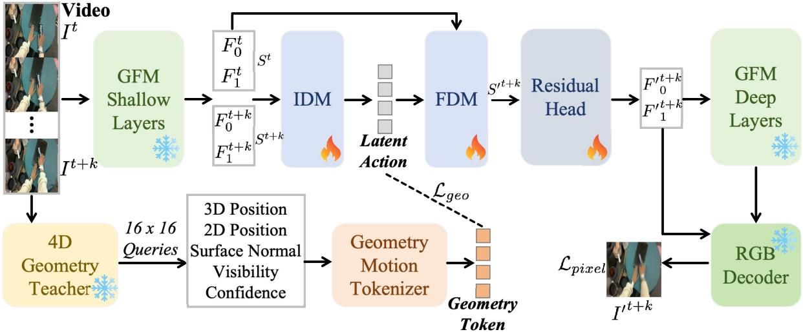
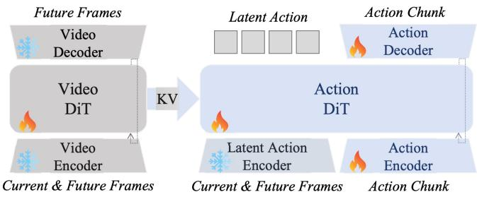
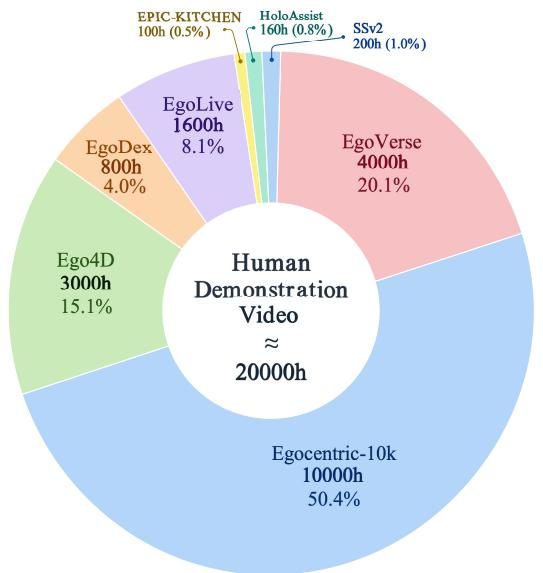
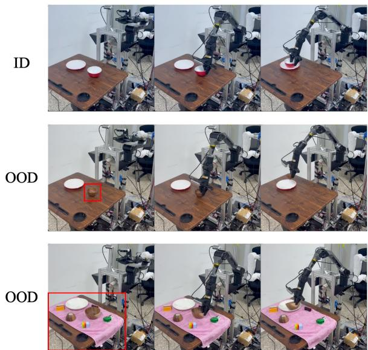
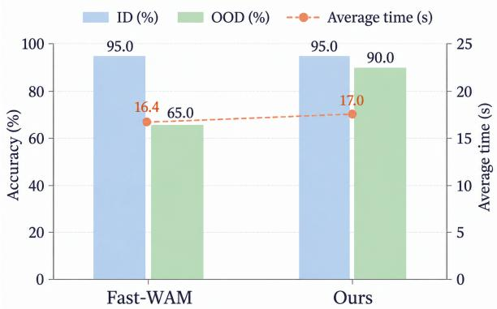
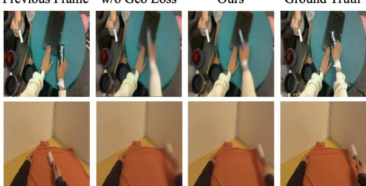

# GeoLAM: Learning Geometry-Grounded Latent Actions from Unlabeled Human Videos

Yifan Xie1∗, Hekun Tian1∗, Jinkun Liu1, YuAn Wang2, Qiao Sun3, and Wenbo Ding1†

Abstract— Human videos provide rich manipulation experience, but extracting action representations that preserve useful motion remains challenging. Visual reconstruction alone can entangle manipulation-related motion with appearance changes and camera movement. We present GeoLAM, a framework for learning geometry-grounded latent actions from action-free human videos. GeoLAM combines future-frame reconstruction through a frozen geometric feature hierarchy with motion supervision from a training-only 4D geometry teacher. The geometric representation provides a structural prior, while the teacher’s predictions yield spatially pooled targets capturing 3D displacement, residual image-plane motion, and surfaceorientation changes. Visibility and confidence weighting reduces the contribution of unreliable estimates, encouraging continuous latent actions to retain geometric motion without explicit hand-pose or hand-trajectory annotations. After video pretraining without action labels, the learned representation provides transition targets for a world-action model trained on action-labeled robot demonstrations. The model jointly denoises latent actions and executable action chunks, with future-video prediction used only as an auxiliary training task. Deployment therefore requires neither the geometry teacher nor futurevideo generation. Evaluations on a latent-action benchmark and robotic manipulation tasks demonstrate the strong performance of GeoLAM.

Index Terms— Human demonstration learning, Latent action model, Geometric foundation model.

## I. INTRODUCTION

Imitation learning has enabled fine-grained robot manipulation using demonstrations paired with executable actions [1]. Human videos offer a complementary source of everyday interaction experience at scale [2], but typically lack corresponding robot commands. Explicit motion reconstruction provides one route to recovering supervision: methods such as HaWoR [3] estimate world-space hand poses and trajectories from egocentric videos. However, occlusion and tracking failures complicate reliable motion estimation, and reconstructing hand and camera motion incurs additional preprocessing computation. The resulting human-motion estimates also require a mapping to the target robot’s control space. These challenges motivate learning an intermediate action representation directly from visual transitions, without requiring explicit hand-pose or handtrajectory annotations. Latent-action models offer this possibility by inferring compact transition variables from video and subsequently connecting them to executable actions [4].

The usefulness of such a representation depends on which aspects of a visual transition it preserves. Inverse and forward dynamics models can jointly learn latent actions through future-observation prediction, yet reconstruction alone does not ensure that the latent variables retain motion relevant to manipulation. Appearance variation, camera movement, and object motion can all contribute to the prediction objective, leaving the content of the action bottleneck ambiguous. Recent optical-flow-constrained and 3D-aware latent-action methods highlight the value of explicitly incorporating motion and geometry [5], [6]. Building on this direction, we focus on two complementary requirements: a geometric prior for the visual state and a direct constraint on the motion encoded by the latent transition. Geometric foundation models provide representations informed by scene structure [7], while a temporal learning signal can encourage the transition variable to preserve changes in that structure. For manipulation, we seek compact latent actions that retain spatial displacement and surface-orientation changes while reducing the influence of unreliable observations and static background.

We introduce GeoLAM, a framework for learning geometry-grounded latent actions from action-free human videos and using them for robot control. GeoLAM combines future-frame reconstruction through a frozen geometric feature hierarchy with explicit geometric motion supervision. The first constraint places transition modeling in a geometry-informed representation space. The second uses a training-only 4D teacher [8] to construct motion targets from predicted 3D displacements, residual image-plane motion, and surface-orientation changes. Visibility- and confidenceweighted spatial pooling reduces the contribution of unreliable estimates, providing geometric guidance without requiring explicit human-hand reconstruction. We pretrain this continuous latent-action representation on approximately 20,000 hours of human video without using action annotations. During subsequent training on action-labeled robot demonstrations, a world-action model jointly denoises latent actions and robot action chunks [9], using GeoLAM’s representation as the transition target. Future-video prediction remains an auxiliary training task [10]. Deployment requires neither the geometry teacher nor future-video generation. Evaluations on LARYBench [11] and robotic manipulation tasks demonstrate the strong performance of GeoLAM.

## II. RELATED WORK

Latent-action models recover compact transition variables from videos by coupling inverse and forward dynamics, pro-

## A. Latent Action Model for Manipulation

viding an intermediate representation for subsequent policy learning [4]. Existing studies differ in whether robot videos are included and whether robot actions supervise the latent space. Using robot videos without their action labels remains action-free, making this setting distinct from pretraining on human videos alone. LAPA [4] learns quantized latent actions without action labels and evaluates both robot-video and human-only pretraining. Other approaches mix human and robot videos, adding auxiliary prediction of robot states and actions when annotations are available [12], or supervise latent dynamics with end-effector motion regression on action-labeled frames [13]. Broader robot-learning pipelines also exploit action-labeled manipulation trajectories [14] and reconstructed human-motion priors [15]. World-action models further connect prediction to control through structured object states with persistent identities [16] or latent transition variables jointly denoised with robot action chunks [9]. Future-video prediction can also serve as an auxiliary training objective, allowing deployment without explicit futurevideo generation [10].

GeoLAM learns its latent-action encoder exclusively from action-free human RGB videos, without robot videos, robot action labels, or explicit hand-motion annotations. Reconstruction and teacher-derived geometric motion provide the learning signals. The encoder remains frozen during downstream training on action-labeled robot demonstrations, so policy learning uses its latent targets without reshaping the pretrained representation.

## B. Geometric Foundation Model for Manipulation

Geometric and predictive representations provide structural priors for understanding physical scenes. Predicting target-block embeddings from point-cloud context with a context-aware decoder supports transferable 3D representations [17], while geometric foundation models recover scene structure across RGB views [7]. Such pretrained features have been repurposed for multi-view generation [18] and robot policies that integrate perception, temporal prediction, and action decoding [19]. Broader studies of embodied interaction also investigate reasoning about the physical properties of objects [20] and local action correction using interaction feedback [21]. For latent-action learning, opticalflow supervision encourages the bottleneck to encode observable motion [5], while geometric feature alignment, RGB-D future reconstruction, and learning across viewpoints introduce 3D structural constraints [6]. Dynamic reconstruction models extend geometric prediction across time, providing point correspondences and surface normals together with visibility and confidence estimates [8]. These capabilities offer both spatial representations and temporal geometric cues for modeling interactions.

GeoLAM combines reconstruction through a frozen geometric feature hierarchy with explicit supervision of 3D displacement, residual image-plane motion, and surfaceorientation changes. Visibility- and confidence-weighted teacher targets constrain the latent transition during humanvideo pretraining. The geometry teacher is unnecessary for downstream policy training or deployment.

## III. METHOD

## A. Geometric Latent Action Learning

Latent-action models recover transition variables from action-free videos by coupling an inverse dynamics model (IDM) with a forward dynamics model (FDM) [4]. However, image prediction alone may entangle controllable motion with appearance changes and camera motion [5], [6]. As illustrated in Fig. 1, we reduce this ambiguity with two complementary constraints: geometry-aware future-frame reconstruction and training-only supervision from a 4D geometry teacher. We denote the two clip endpoints by It and $\mathbf { I } ^ { t + k }$

1) 3D Latent Representation: Rather than modeling dynamics directly in RGB space, we construct the visual state in the feature hierarchy of a frozen geometric foundation model (GFM). We instantiate the hierarchy with the Depth Anything 3 backbone and the multi-level reconstruction decoder of GLD [7], [18], following the broader principle of repurposing geometry-pretrained representations for action-conditioned prediction [19]. For each endpoint τ , the frozen shallow GFM yields ${ \bf F } _ { 0 : 1 } ^ { \tau } = \mathrm { s g } ( \mathcal { E } _ { \mathrm { g f m } } ^ { 0 : 1 } ( { \bf I } ^ { \tau } ) )$ , which a learned state encoder maps to $\mathbf { S } ^ { \tau } = \mathcal { E } _ { s } \big ( \mathbf { F } _ { 0 : 1 } ^ { \tau } \big )$ . The IDM represents the transition as ${ \bf M } ^ { t  t + k } = \mathcal { T } _ { \mathrm { i d m } } \big ( \phi _ { m } \big ( { \bf S } ^ { t + k } - { \bf S } ^ { t } \big ) \big )$ . Positionaware action queries then aggregate these transition features, and a deterministic bottleneck produces

$$
\begin{array} { r } { \mathbf { Z } ^ { t } = \mathcal { B } _ { \operatorname* { d e t } } \big ( \mathrm { C A } ( \mathbf { Q } _ { a } + \mathbf { P } _ { a } , \mathbf { M } ^ { t  t + k } ) \big ) . } \end{array}\tag{1}
$$

Here sg denotes stop-gradient and $\boldsymbol { B } _ { \mathrm { d e t } }$ compresses and lifts each action token without sampling or vector quantization. Operating on the state difference, rather than concatenating the endpoints, focuses the bottleneck on transition information.

The FDM conditions the current state on the complete latent-action token set to obtain $\widehat { \bf S } ^ { t + k } = \mathcal { T } _ { \mathrm { f d m } } ( { \bf S } ^ { t } ; { \bf Z } ^ { t } )$ Each residual head updates a shallow feature as $\widehat { \mathbf { F } } _ { \ell } ^ { t + k } =$ $\mathbf { F } _ { \ell } ^ { t } + h _ { \ell } ( \widehat { \mathbf { S } } ^ { t + k } )$ . The frozen deep GFM propagator and RGB decoder then reconstruct $\widehat { \mathbf { I } } ^ { t + k }$ from the predicted shallow features, yielding the photometric loss $\begin{array} { r } { \mathcal { L } _ { \mathrm { p i x e l } } = } \end{array}$ $\mathrm { M S E } ( \widehat { \mathbf { I } } ^ { t + k } , \mathbf { I } ^ { t + k } )$ . Both frozen modules remain differentiable with respect to the predicted features. This branch therefore needs neither depth labels nor camera parameters: its geometric inductive bias is inherited from the pretrained GFM.

2) 4D Geometric Teacher: Pixel reconstruction can exploit appearance cues without preserving physical scene motion. We therefore use a frozen implementation of D4RT [8] as a training-only, output-space geometry teacher. It processes a uniformly sampled clip between the endpoints, whereas the latent-action model observes only $\mathbf { I } ^ { t }$ and $\mathbf { I } ^ { t + k }$ Paired grid queries share the source point and reference camera but target the initial and final times. From their predicted 3D/2D positions, surface normals, visibility, and confidence, we construct interpretable motion targets without exposing hidden D4RT features. Unlike flow-only supervision [5], these targets also retain 3D displacement and surface-orientation change.

  
Fig. 1: Overview of GeoLAM. Frozen shallow GFM features encode the two video endpoints. The inverse dynamics model (IDM) compresses their transition into latent-action tokens, and the forward dynamics model (FDM) predicts future features from the current state and these tokens. Frozen deep GFM layers and an RGB decoder provide the reconstruction objective $\mathcal { L } _ { \mathrm { { p i x e l } } }$ . During training, a frozen 4D teacher converts reliable 3D/2D motion and surface-normal changes into geometry motion targets for $\mathcal { L } _ { \mathrm { g e o } }$ . Snowflakes and flames denote frozen and trainable modules, respectively.

We subtract the component-wise median from endpoint image-plane displacement to obtain residual motion $\mathbf { r } _ { i } ,$ , and derive a reliability weight $\omega _ { i }$ from endpoint visibility and confidence. The per-query descriptor comprises bounded, scene-normalized 3D displacement $\delta _ { i } ^ { 3 d }$ , residual 2D motion $\delta _ { i } ^ { 2 d }$ , normalized surface-orientation change $\delta _ { i } ^ { n }$ , and residualmotion magnitude $\delta _ { i } ^ { m }$

The tokenizer concatenates these cues as $\begin{array} { r l } { \phi _ { i } } & { { } = } \end{array}$ $[ \delta _ { i } ^ { 3 d } ; \delta _ { i } ^ { 2 d } ; \delta _ { i } ^ { n } ; \delta _ { i } ^ { m } ]$ and pools them over coarse spatial regions:

$$
\mathbf { m } _ { j } ^ { \star } = \frac { \sum _ { i \in \mathcal { R } _ { j } } a _ { i } \phi _ { i } } { \sum _ { i \in \mathcal { R } _ { j } } a _ { i } } .\tag{2}
$$

Here $a _ { i } = \omega _ { i } g ( \| \mathbf { r } _ { i } \| _ { 2 } )$ , and the bounded increasing function $g$ emphasizes observable motion. Stacking the regional tokens gives the teacher target M⋆. This reliability- and motionweighted pooling suppresses uncertain tracks and static background while retaining coarse spatial organization.

A lightweight position-aware projector cross-attends to all latent-action tokens and predicts $\widehat { \mathbf { M } } = h _ { \mathrm { g e o } } ( \mathbf { Z } ^ { t } )$ . It is supervised by $\mathcal { L } _ { \mathrm { g e o } } ~ = ~ \mathrm { M S E } ( \widehat { \bf M } , \mathrm { s g } ( { \bf M } ^ { \star } ) )$ . The complete training objective is

$$
\begin{array} { r } { \mathcal { L } ( n ) = \lambda _ { \mathrm { p i x e l } } \mathcal { L } _ { \mathrm { p i x e l } } + \lambda _ { \mathrm { g e o } } ( n ) \mathcal { L } _ { \mathrm { g e o } } . } \end{array}\tag{3}
$$

We first optimize reconstruction alone and then linearly increase the geometry weight. The teacher is never provided to the FDM and is discarded at inference. It affects the latent action only through $\mathcal { L } _ { \mathrm { g e o } }$ , encouraging geometry-predictive motion without adding test-time cost.

## B. Latent Action for World Action Model

World-action models can generate future observations before control [13] or use future prediction only during training [10]. We follow the efficient deployment pattern of Fast-WAM while giving the action generator an explicit transition variable: the continuous latent action from Sec. III-A is jointly denoised with the robot action chunk, and futurevideo prediction remains an auxiliary training task. Unlike codebook-derived targets [4], [9] or dynamics partially aligned with labeled end-effector motion [13], our target is a deterministic, geometry-grounded transition summary learned from action-free video.

1) Transition Targets and Visual Context: Figure 2 shows the two-branch training architecture. For a robot demonstration, let $\mathbf { A } ^ { t } = [ \mathbf { a } ^ { t } , \dots , \mathbf { a } ^ { t + H - 1 } ]$ be an H-step action chunk and let $\mathbf { I } _ { + } ^ { t } = [ \mathbf { I } ^ { t _ { 1 } } , \dots , \mathbf { I } ^ { t _ { T } } ]$ , with $t < t _ { 1 } < \cdot \cdot \cdot < t _ { T } = t + k$ contain its future frames. The terminal frame $\mathbf { I } ^ { t + k }$ is aligned with the state reached after the chunk. The values of k and H may differ because camera and control rates need not match. The four spatial latent-action queries summarize this interval and are not paired one-to-one with video frames or action steps. We denote the task embedding by $\ell ^ { t }$ and the current proprioceptive state by $\mathbf { q } ^ { t }$

During policy training, we freeze the latent-action encoder $\mathcal { E } _ { \mathrm { l a } }$ , comprising the GFM shallow layers and the trained IDM from Sec. III-A. It provides the target $\mathbf { Z } _ { \star } ^ { t } = \operatorname { s g } ( \mathcal { E } _ { \mathrm { l a } } ( \mathbf { I } ^ { t } , \mathbf { I } ^ { t + k } ) )$ A frozen framewise encoder ${ \mathcal { E } } _ { v }$ separately produces the current latent $\mathbf { V } _ { 0 } ^ { t } = \mathrm { s g } ( \mathcal { E } _ { v } ( \mathbf { I } ^ { t } ) )$ and future latents $\mathbf { V } _ { + } ^ { t } \ =$ $\mathrm { s g } ( \mathcal { E } _ { v } ( \mathbf { I } _ { + } ^ { t } ) )$ , preventing future information from entering the current anchor before attention. The FDM and geometry teacher supervise the IDM only in the preceding stage and are not loaded during world-action model training.

Following Fast-WAM [10], the future branch is trained but omitted at test time. A DiT-style video denoiser [22] applies conditional flow matching [23] to $\mathbf { V } _ { + } ^ { t }$ while keeping $\mathrm { \bf V } _ { 0 } ^ { t }$ clean. For $s \sim \mathcal { U } [ 0 , 1 ]$ , it receives $\mathbf { V } _ { + , s } ^ { t } = ( 1 - s ) \mathbf { V } _ { + } ^ { t } + s \epsilon _ { v }$ and predicts the target velocity $\mathbf { u } _ { \mathrm { v i d } } ^ { t } \mathbf { \epsilon } = \epsilon _ { v } - \mathbf { V } _ { + } ^ { t }$ as $\widehat { \mathbf { u } } _ { \mathrm { v i d } } ^ { t } .$

  
Fig. 2: Geometry-grounded latent actions for the world action model: during training, a frozen encoder supplies continuous transition targets and future-video prediction regularizes the Video DiT, whereas inference jointly denoises latent actions and action chunks using only cached currentobservation key–value features. Snowflakes and flames denote frozen and trainable modules, respectively.

A block-causal mask lets future tokens read the anchor but prevents the anchor from reading the future. The anchor uses a fixed clean-time embedding, and its layer-wise keys and values form $\mathbf { C } ^ { t }$ , the only Video-DiT features exposed to the Action DiT. Hence $\mathbf { C } ^ { t }$ depends on the current observation and $\ell ^ { t }$ , but not on the ground-truth future or s. The frozen video decoder is used only for qualitative visualization.

2) Coupled Transition–Control Flow: The Action DiT operates on two jointly denoised token sets. We adapt the joint latent–action denoising principle of LAWA [9], but replace its codebook-derived target with our continuous geometric representation. After standardizing both modalities with training-set statistics, we use one shared $\tau \sim \mathcal { U } [ 0 , 1 ]$ For m ∈ {lat, act}, let $\mathbf { x } ^ { \mathrm { { l a t } } } = \mathbf { Z } _ { \star } ^ { t }$ and ${ \bf x } ^ { \mathrm { a c t } } = { \bf A } ^ { t }$ . The noisy input is $\mathbf { x } _ { \tau } ^ { m } = ( 1 - \tau ) \mathbf { x } ^ { m } + \tau \epsilon _ { m }$ and its target velocity is $\mathbf { u } _ { m } = \epsilon _ { m } - \mathbf { x } ^ { m }$ , with independent Gaussian noise for the two modalities.

A learned projection embeds the noisy latent tokens, while the action encoder embeds the noisy action chunk. Modalityspecific positional embeddings distinguish the spatial transition queries from the temporal action tokens. The Action DiT conditions both sets on τ , Ct, ℓt, and $\mathbf { q } ^ { t } .$ . Latent tokens read only visual and latent tokens, whereas action tokens can additionally read the action stream. This prevents direct access to demonstrated actions when predicting the latent transition. Separate heads predict the latent and action velocities, with the action decoder serving as the velocity head at each integration step.

For each $m \in \{ \mathrm { v i d } , \mathrm { l a t } , \mathrm { a c t } \}$ , conditional flow matching minimizes $\mathcal { L } _ { m } = \mathbb { E } [ \| \widehat { \mathbf { u } } _ { m } - \mathbf { u } _ { m } \| _ { 2 } ^ { 2 } ]$ over valid tokens. The complete objective is

$$
{ \mathcal { L } } _ { \mathrm { w a m } } = \lambda _ { \mathrm { v i d } } { \mathcal { L } } _ { \mathrm { v i d } } + \lambda _ { \mathrm { l a t } } { \mathcal { L } } _ { \mathrm { l a t } } + \lambda _ { \mathrm { a c t } } { \mathcal { L } } _ { \mathrm { a c t } } .\tag{4}
$$

Padded steps are masked. The latent term aligns the predicted transition with the geometry-aware target, while the action term grounds it in executable control. All three losses update the Video DiT, with the latter two propagating through $\mathbf { C } ^ { t }$ Only the latent and action losses update the Action DiT. Both encoders and the video decoder remain frozen.

At inference, only the current observation is encoded. The Video DiT performs one fixed-clean-time anchor pass to populate $\mathbf { C } ^ { t }$ . The future-video stream, frozen video decoder, and latent-action target encoder are absent. Starting from Gaussian latent-action and action variables, we reuse this cache while integrating the coupled flow from $\tau = 1$ to $\tau \ = \ 0$ . The terminal action state is inverse-standardized to obtain the action chunk. The model thus predicts multistep controls as in action-chunking policies [1]. Following receding-horizon execution, only a short prefix is executed before replanning. The predicted latent action is therefore an online transition estimate for control rather than a robot command or a generated future frame.

## IV. EXPERIMENTS

## A. Implementation Details

Training. All models are trained with distributed data parallelism on 64 NVIDIA A800 GPUs using bfloat16 mixed precision. We optimize the latent-action model for 200,000 steps with AdamW, a learning rate of $1 0 ^ { - 4 }$ , and a per-GPU batch size of 32 (2,048 globally). RGB inputs are resized to $2 2 4 \times 2 2 4$ , while the frozen D4RT teacher processes four uniformly sampled context frames at 256×256. The IDM and FDM each use eight Transformer blocks. The IDM outputs four latent-action tokens through a 32-dimensional deterministic bottleneck. We train with $\mathcal { L } _ { \mathrm { { p i x e l } } }$ alone for 10,000 steps, then linearly ramp the geometry-loss weight from 0 to 1 over 1,000 steps. For WAM training, we initialize the video branch from Wan2.2-5B [24] and use nine-frame clips, an action expert with hidden width 1,024, and horizon $H = 3 2$ Following Fast-WAM [10], future-video prediction remains training-only, while the latent action is jointly denoised with the executable action chunk.

Data. Our action-free pretraining corpus contains 19,860 hours of human video selected from Egocentric-10K [26], EgoVerse [27], Ego4D [2], and EgoLive [28], together with EgoDex [29], Something-Something V2 [30], HoloAssist [31], and EPIC-KITCHENS-100 [32]. As summarized in Fig. 3, Egocentric-10K contributes roughly half of the mixture, while the remaining sources broaden its coverage of everyday, dexterous, and task-oriented interactions. We use RGB only, sample endpoint pairs at temporal strides in {5, 10, 15, 20}, and consume neither annotations nor camera parameters.

## B. Latent Action Benchmark

To assess whether our latent actions capture both finegrained motion and high-level action semantics, we evaluate GeoLAM on LARYBench [11]. Its probe-based evaluation measures how effectively latent representations support lowlevel control regression and semantic action classification. We report regression MSE on CALVIN, VLABench, Robo-COIN, and AgiBot, together with composite action classification accuracy on the human and robot subsets.

As shown in Table I, GeoLAM achieves the lowest regression MSE on all four datasets and the highest classification accuracy on both subsets among the compared methods.

TABLE I: Results on the control regression and composite action classification tasks of LARYBench [11]. Human and Robot denote the composite classification subsets. Accuracy is in percent. Best results among the compared methods are in bold.
<table><tr><td rowspan="2">Model</td><td colspan="5">Regression MSE↓</td><td colspan="3">Classification Accuracy ↑</td></tr><tr><td>CALVIN</td><td>VLABench</td><td>RoboCOIN</td><td>AgiBot</td><td>Avg.</td><td>Human</td><td>Robot</td><td>Avg.</td></tr><tr><td>LAPA [4]</td><td>0.96</td><td>0.95</td><td>0.96</td><td>1.00</td><td>0.97</td><td>14.61</td><td>23.64</td><td>19.13</td></tr><tr><td>UniVLA [25]</td><td>0.82</td><td>0.74</td><td>0.94</td><td>0.97</td><td>0.87</td><td>19.08</td><td>18.56</td><td>18.82</td></tr><tr><td>villa-X [12]</td><td>0.86</td><td>0.72</td><td>0.94</td><td>0.97</td><td>0.87</td><td>17.80</td><td>29.90</td><td>23.85</td></tr><tr><td>LAPA-DINOv3 [11]</td><td>0.50</td><td>0.25</td><td>0.82</td><td>0.84</td><td>0.60</td><td>64.19</td><td>27.04</td><td>45.62</td></tr><tr><td>Ours</td><td>0.27</td><td>0.09</td><td>0.40</td><td>0.42</td><td>0.29</td><td>74.19</td><td>68.25</td><td>71.22</td></tr></table>

  
Fig. 3: Composition of the human-video pretraining corpus. The selected clips total 19,860 hours (approximately 20,000 hours). Labels report the rounded duration and mixture share from each source.

Relative to LAPA-DINOv3, which has the best average scores among the compared baselines, GeoLAM reduces the average MSE from 0.60 to 0.29, a relative reduction of approximately 51.7%, and improves the average classification accuracy from 45.62% to 71.22%, a gain of 25.60 percentage points. Classification accuracy reaches 74.19% on human videos and 68.25% on robot videos. Although the latentaction model is pretrained exclusively on action-free human videos, its representations also support accurate prediction on the robot benchmarks. These results indicate that GeoLAM encodes both control-relevant motion information and high level action semantics.

## C. Robotic Manipulation

1) LIBERO and RoboTwin Benchmarks: To assess the downstream utility of the learned latent actions, we evaluate the resulting world action model on LIBERO [33] and RoboTwin 2.0 [39]. We compare task success rates against representative VLA and WAM baselines.

LIBERO. LIBERO comprises four task suites covering spatial relations, object variation, goal specification, and longhorizon manipulation. Table II shows that our model achieves an average success rate of 98.5%, matching LingBot-VA [38] and exceeding X-VLA [37] and Fast-WAM [10] by 0.4 and 0.9 percentage points, respectively. It achieves the best result on Goal, with a success rate of 98.2%, while remaining competitive on Spatial, Object, and Long. The largest gain over Fast-WAM is on Long, where success increases from 95.2% to 97.8%. These results support the effectiveness of the GeoLAM-based policy on extended manipulation sequences as well as shorter tasks.

TABLE II: Success rates (%) on LIBERO [33]. Best results among the compared methods are in bold.
<table><tr><td>Model</td><td>Spatial</td><td>Object</td><td>Goal</td><td>Long</td><td>Average</td></tr><tr><td>π0.5 [34]</td><td>98.8</td><td>98.2</td><td>98.0</td><td>92.4</td><td>96.9</td></tr><tr><td>OpenVLA-OFT [35]</td><td>97.6</td><td>98.4</td><td>97.9</td><td>94.5</td><td>97.1</td></tr><tr><td>Fast-WAM [10]</td><td>98.2</td><td>100.0</td><td>97.0</td><td>95.2</td><td>97.6</td></tr><tr><td>Motus [36]</td><td>96.8</td><td>99.8</td><td>96.6</td><td>97.6</td><td>97.7</td></tr><tr><td>X-VLA [37]</td><td>98.2</td><td>98.6</td><td>97.8</td><td>97.6</td><td>98.1</td></tr><tr><td>LingBot-VA [38]</td><td>98.5</td><td>99.6</td><td>97.2</td><td>98.5</td><td>98.5</td></tr><tr><td>Ours</td><td>98.5</td><td>99.8</td><td>98.2</td><td>97.8</td><td>98.5</td></tr></table>

TABLE III: Success rates (%) on RoboTwin 2.0 [39]. Rand. denotes randomized scenes. Best results among the compared methods are in bold.
<table><tr><td>Model</td><td>Clean</td><td>Rand.</td><td>Average</td></tr><tr><td>X-VLA [37]</td><td>72.80</td><td>72.84</td><td>72.8</td></tr><tr><td>π0.5 [34]</td><td>82.74</td><td>76.76</td><td>79.8</td></tr><tr><td>ABot-M0 [40]</td><td>86.06</td><td>85.08</td><td>85.6</td></tr><tr><td>Motus [36]</td><td>88.66</td><td>87.02</td><td>87.8</td></tr><tr><td>Fast-WAM [10]</td><td>91.88</td><td>91.78</td><td>91.8</td></tr><tr><td>LingBot-VA [38]</td><td>92.90</td><td>91.50</td><td>92.2</td></tr><tr><td>Ours</td><td>93.00</td><td>92.20</td><td>92.6</td></tr></table>

RoboTwin 2.0. RoboTwin 2.0 evaluates coordinated bimanual manipulation under clean and randomized scene settings. As shown in Table III, our model achieves success rates of 93.00% and 92.20% in these two settings, respectively, yielding an average of 92.6%. This exceeds LingBot-VA [38] and Fast-WAM by 0.4 and 0.8 percentage points, respectively, and ranks first among the compared methods in both settings. The success rate decreases by 0.8 percentage points under randomization, indicating that the policy maintains high performance across scene conditions. Together with the LIBERO results, this suggests that the learned latent actions can support policy execution across different manipulation tasks and embodiments.

  
Fig. 4: Real-world bowl-placement task on Agilex Piper. Representative executions of our policy, with time progressing from left to right. From top to bottom: the in-domain (ID) setting, an out-of-distribution (OOD) bowl, and an OOD scene with a different tabletop covering and additional distractors. Red boxes highlight the object and scene changes.

  
Fig. 5: Real-world success rates and execution time. Bars show in-domain (ID) and out-of-distribution (OOD) task success rates (left axis), and the dashed line shows average execution time in seconds (right axis). Each success rate is based on 20 trials. Our policy matches Fast-WAM in the ID setting and improves OOD success by 25 percentage points.

2) Real-World Experiments: We further evaluate the GeoLAM-based policy on an Agilex Piper robotic arm performing a tabletop pick-and-place task: grasping a small bowl and placing it on a plate. We use 100 real-world demonstration episodes for policy training and evaluate each method in 20 in-domain (ID) trials and 20 out-of-distribution (OOD) trials. The ID setting matches the training scenes, whereas the OOD evaluation covers changes to the manipulated object and the scene background. Figure 4 shows three representative execution sequences: the ID setup, a novel bowl, and an OOD scene with a different tabletop covering and additional distractors. The task objective remains unchanged across these conditions.

As summarized in Fig. 5, both our policy and Fast-WAM [10] achieve a 95.0% success rate in the ID setting. On the OOD evaluation, our policy reaches 90.0%, compared with 65.0% for Fast-WAM, an improvement of 25 percentage points. The success rate therefore drops by only 5 percentage points from ID to OOD for our policy, versus 30 percentage points for Fast-WAM. Average execution time is 17.0 s for our policy and 16.4 s for Fast-WAM, a difference of 0.6 s. These results show improved task success under the tested visual distribution shifts with a similar execution duration, supporting the utility of geometry-grounded latent actions for real-world manipulation.

## D. Ablation Study

We examine the reconstruction objective and the 4D geometry teacher using the LARYBench evaluation protocol in Sec. IV-B.

Reconstruction objective. The feature-reconstruction variants apply MSE only to the indicated predicted DA3 features, without RGB reconstruction or geometry supervision. The feature labels specify the supervision targets. The shallowfeature state representation is retained. As shown in Table IV, $F _ { 1 }$ provides a stronger single-level target than $F _ { 0 } .$ , improving both average MSE (0.54 vs. 0.57) and classification accuracy (66.18% vs. 65.10%). Joint $F _ { 0 } + F _ { 1 }$ reconstruction obtains the best average scores among the feature-reconstruction variants, with 0.49 MSE and 66.58% accuracy, although its regression gains are not uniform across datasets. In particular, it achieves the lowest CALVIN error of 0.22, compared with 0.27 for the full model. Pixel reconstruction through the frozen geometric hierarchy and RGB decoder yields 0.46 average MSE and 68.76% accuracy even without the teacher, indicating the value of the decoded-image reconstruction constraint.

4D geometric supervision. Adding the geometry teacher to pixel reconstruction reduces regression error on all four robot datasets and improves classification accuracy on both the human and robot subsets. Average MSE decreases from 0.46 to 0.29, a relative reduction of approximately 37.0%, while average classification accuracy increases from 68.76% to 71.22%, a gain of 2.46 percentage points. The full model therefore achieves the strongest aggregate results, supporting the complementary role of explicit motion supervision beyond the geometric prior already present in the reconstruction pathway.

Qualitative results. Figure 6 compares future-frame reconstructions for two human-video transitions. Without geometry supervision, the moving hand and held tool in the upper example have diffuse boundaries. The full model produces a more distinct wrist boundary and tool outline. In the lower example, the roller head is more compact and better separated from the cloth, while the static background layout is similar in both variants. These observations are consistent with supervision from displacement and surface-orientation changes derived from D4RT [8], whose reliable motion cues are emphasized by the pooling scheme in Sec. III-A. The qualitative improvement is concentrated in dynamic regions, but fine texture and hand details remain imperfect.

TABLE IV: Ablation of latent-action supervision on LARYBench [11]. $F _ { 0 }$ and $F _ { 1 }$ denote the two shallow DA3 feature levels. Feature-reconstruction variants use only MSE on the indicated levels. Pixel reconstruction uses $\mathcal { L } _ { \mathrm { { p i x e l } } }$ without the 4D teacher, while the full model additionally uses $\mathcal { L } _ { \mathrm { g e o } }$ . Classification accuracy is in percent. Best results are in bold.
<table><tr><td rowspan="2">Variant</td><td colspan="5">Regression MSE↓</td><td colspan="3">Classification Accuracy ↑</td></tr><tr><td>CALVIN</td><td>VLABench</td><td>RoboCOIN</td><td>AgiBot</td><td> $\operatorname { A v g } .$ </td><td>Human</td><td>Robot</td><td>Avg.</td></tr><tr><td>Feature reconstruction  $( F _ { 0 } )$ </td><td>0.50</td><td>0.23</td><td>0.79</td><td>0.79</td><td>0.57</td><td>67.48</td><td>62.73</td><td>65.10</td></tr><tr><td>Feature reconstruction  $( F _ { 1 } )$ </td><td>0.46</td><td>0.22</td><td>0.76</td><td>0.75</td><td>0.54</td><td>69.34</td><td>63.02</td><td>66.18</td></tr><tr><td>Feature reconstruction  $( F _ { 0 } + F _ { 1 } )$ </td><td>0.22</td><td>0.44</td><td>0.66</td><td>0.64</td><td>0.49</td><td>68.93</td><td>64.24</td><td>66.58</td></tr><tr><td>Pixel reconstruction (w/o Geo Loss)</td><td>0.41</td><td>0.13</td><td>0.66</td><td>0.65</td><td>0.46</td><td>70.88</td><td>66.64</td><td>68.76</td></tr><tr><td>GeoLAM (full)</td><td>0.27</td><td>0.09</td><td>0.40</td><td>0.42</td><td>0.29</td><td>74.19</td><td>68.25</td><td>71.22</td></tr></table>

w/o Geo Loss  
  
Ours  
Ground Truth  
Fig. 6: Qualitative effect of 4D geometric supervision. Each row shows a human-video transition. From left to right: the previous frame, reconstruction without D4RT supervision $( \mathcal { L } _ { \mathrm { p i x e l } }$ only), full GeoLAM reconstruction, and the groundtruth future frame. Geometry supervision reduces smearing around moving hands and tools and better preserves their outlines.

## V. CONCLUSIONS

In this paper, we presented GeoLAM, a framework for learning geometry-grounded latent actions from actionfree human videos and transferring them to robot control. GeoLAM combines future-frame reconstruction through a frozen geometric feature hierarchy with a training-only 4D teacher that supervises 3D displacement, residual imageplane motion, and surface-orientation changes. Reliabilityand motion-weighted spatial pooling encourages the continuous latent actions to retain informative geometric motion without explicit hand-pose or trajectory annotations. The frozen pretrained encoder supplies transition targets for a world-action model that jointly denoises latent actions and executable action chunks, while future-video prediction serves as an auxiliary training objective. Deployment requires neither the geometry teacher nor future-video generation. Results on LARYBench, LIBERO, RoboTwin 2.0, and a realworld manipulation task support the utility of the learned representation for motion and semantic prediction, as well as downstream control.

Future work will focus on improving the reliability of teacher-derived motion supervision under severe occlusion and complex camera motion. We also plan to evaluate GeoLAM on more diverse real-world tasks and robot embodiments, particularly long-horizon and contact-rich manipulation, to better understand its transfer capabilities and limitations.

## REFERENCES

[1] T. Z. Zhao, V. Kumar, S. Levine, and C. Finn, “Learning fine-grained bimanual manipulation with low-cost hardware,” in Proceedings of Robotics: Science and Systems, (Daegu, Republic of Korea), July 2023.

[2] K. Grauman, A. Westbury, E. Byrne, et al., “Ego4D: Around the world in 3,000 hours of egocentric video,” in Proceedings of the IEEE/CVF Conference on Computer Vision and Pattern Recognition, pp. 18995– 19012, 2022.

[3] J. Zhang, J. Deng, C. Ma, and R. A. Potamias, “HaWoR: World-space hand motion reconstruction from egocentric videos,” in Proceedings of the IEEE/CVF Conference on Computer Vision and Pattern Recognition, pp. 1805–1815, June 2025.

[4] S. Ye, J. Jang, B. Jeon, S. J. Joo, J. Yang, B. Peng, A. Mandlekar, R. Tan, Y.-W. Chao, B. Y. Lin, L. Liden, K. Lee, J. Gao, L. Zettlemoyer, D. Fox, and M. Seo, “Latent action pretraining from videos,” in International Conference on Learning Representations, 2025.

[5] X. Bu, J. Lyu, F. Sun, R. Yang, Z. Ma, and W. Li, “LAOF: Robust latent action learning with optical flow constraints,” in Proceedings of the IEEE/CVF Conference on Computer Vision and Pattern Recognition, pp. 27334–27344, 2026.

[6] J. Yang, J. Zhange, J. Li, H. Guo, W. Huang, J. Wang, P. Liu, and S.-T. Xia, “LAWM-3D: Learning 3D-Aware latent actions from human videos for generalizable robot world models,” arXiv preprint arXiv:2608.05706, 2026.

[7] H. Lin, S. Chen, J. H. Liew, D. Y. Chen, Z. Li, Y. Zhao, S. Peng, H. Guo, X. Zhou, G. Shi, J. Feng, and B. Kang, “Depth anything 3: Recovering the visual space from any views,” in International Conference on Learning Representations, 2026.

[8] C. Zhang, G. Le Moing, S. Koppula, I. Rocco, L. Momeni, J. Xie, S. Sun, R. Sukthankar, J. K. Barral, R. Hadsell, Z. Ghahramani, A. Zisserman, J. Zhang, and M. S. M. Sajjadi, “Efficiently reconstructing dynamic scenes one D4RT at a time,” in Proceedings of the IEEE/CVF Conference on Computer Vision and Pattern Recognition, pp. 7382– 7392, 2026.

[9] X. Li, Y. Zheng, S. Gu, H. Ma, F. Yu, Y. Zheng, X. Nie, S. Yuan, Y. Zang, W. Li, S. Tian, M. Liu, Y.-Q. Zhang, and W. Ding, “Latent action as intention enables efficient future imagination for world action models,” arXiv preprint arXiv:2608.24882, 2026.

[10] T. Yuan, Z. Dong, Y. Liu, and H. Zhao, “Fast-WAM: Do world action models need test-time future imagination?,” arXiv preprint arXiv:2603.16666, 2026.

[11] D. Nie, F. Chen, Q. Lv, J. Kuang, X. Li, X. Cao, and X. Cai, “LARY: A latent action representation yielding benchmark for generalizable vision-to-action alignment,” arXiv preprint arXiv:2604.11689, 2026.

[12] X. Chen, H. Wei, P. Zhang, C. Zhang, K. Wang, Y. Guo, R. Yang, Y. Wang, X. Xiao, L. Zhao, J. Chen, and J. Bian, “villa-X: Enhancing latent action modeling in vision-language-action models,” in International Conference on Learning Representations, 2026.

[13] Z. Shen, J. Liang, J. Lu, F. Jiang, Y. Wang, C. Wei, J. Liu, J. Yang, Q. Yu, J. You, C. Hao, G. He, C. Xie, and R. Wu, “LD4WAM: Learning latent dynamics from human videos for world action models,” arXiv preprint arXiv:2608.22403, 2026.

[14] Xiaomi Robotics Team, J. Guo, P. Jin, J. Li, P. Li, Y. Li, F. Liu, W. Peng, O. Qin, Y. Su, N. Sun, Q. Sun, R. Suo, H. Wang, Y. Wang, R. Wu, C. Xia, L. Zhang, J. Zhao, G. Chen, W. Chen, X. He, B. Li, Q. Li, Z. Li, H. Qu, W. Song, D. Xiang, Y. Xie, P. Xu, H. Ye, W. Ye, H. Zhao, and Q. Zhou, “Xiaomi-Robotics-1: Scaling vision-languageaction models with over 100K hours of real-world trajectories,” arXiv preprint arXiv:2607.15330, July 2026.

[15] Y. Xie, Y. Wang, G. Chen, J. Liu, Y. Sun, and W. Ding, “Learning human-intention priors from large-scale human demonstrations for robotic manipulation,” arXiv preprint arXiv:2604.24681, 2026.

[16] Y. Liu, P. Sun, S. Li, Y. Xie, L. Zhang, X. Chao, S. Dong, F. Chen, X.-P. Zhang, and W. Ding, “OA-WAM: Object-addressable world action model for robust robot manipulation,” arXiv preprint arXiv:2605.06481, May 2026.

[17] N. Hu, H. Cheng, Y. Xie, S. Li, and J. Zhu, “3D-JEPA: A joint embedding predictive architecture for 3D self-supervised representation learning,” arXiv preprint arXiv:2409.15803, 2024.

[18] W. Jang, S. Jeon, J. Han, J. Choi, M. Kwon, S. Kim, S. Xie, and S. Liu, “Repurposing geometric foundation models for multi-view diffusion,” arXiv preprint arXiv:2603.22275, 2026.

[19] J. Han, S. Jeon, J. Jung, R. Zurbrugg, H. An, T. Portela, M. Hutter,¨ M. Pollefeys, S. Kim, and S. Hong, “Geometric action model for robot policy learning,” arXiv preprint arXiv:2606.17046, 2026.

[20] Y. Xie, M. Li, S. Li, X. Li, G. Chen, F. Ma, F. R. Yu, and W. Ding, “Universal visuo-tactile video understanding for embodied interaction,” in Advances in Neural Information Processing Systems, vol. 38, pp. 127864–127883, Curran Associates, Inc., 2025.

[21] X. Li, Y. Xie, H. Liu, W. Hou, G. Chen, S. Li, and W. Ding, “Master micro residual correction with adaptive tactile fusion and force-mixed control for contact-rich manipulation,” arXiv preprint arXiv:2603.15152, 2026.

[22] W. Peebles and S. Xie, “Scalable diffusion models with transformers,” in Proceedings of the IEEE/CVF International Conference on Computer Vision, pp. 4195–4205, 2023.

[23] Y. Lipman, R. T. Q. Chen, H. Ben-Hamu, M. Nickel, and M. Le, “Flow matching for generative modeling,” in International Conference on Learning Representations, 2023.

[24] Wan Team, A. Wang, B. Ai, B. Wen, et al., “Wan: Open and advanced large-scale video generative models,” arXiv preprint arXiv:2503.20314, 2025.

[25] Q. Bu, Y. Yang, J. Cai, S. Gao, G. Ren, M. Yao, P. Luo, and H. Li, “Learning to act anywhere with task-centric latent actions,” in Proceedings of Robotics: Science and Systems, 2025.

[26] Build AI, “Egocentric-10k.” Hugging Face Datasets, 2025.

[27] R. Punamiya, S. Kareer, Z. Liu, et al., “EgoVerse: An egocentric human dataset for robot learning from around the world,” arXiv preprint arXiv:2604.07607, 2026.

[28] Y. Li, X. Wei, J. Luo, et al., “EgoLive: A large-scale egocentric dataset from real-world human tasks,” arXiv preprint arXiv:2604.23570, 2026.

[29] R. Hoque, P. Huang, D. J. Yoon, M. Sivapurapu, and J. Zhang, “EgoDex: Learning dexterous manipulation from large-scale egocentric video,” in International Conference on Learning Representations, 2026.

[30] R. Goyal, S. Ebrahimi Kahou, V. Michalski, J. Materzynska, S. Westphal, H. Kim, V. Haenel, I. Fruend, P. Yianilos, M. Mueller-Freitag, F. Hoppe, C. Thurau, I. Bax, and R. Memisevic, “The “something something” video database for learning and evaluating visual common sense,” in Proceedings of the IEEE International Conference on Computer Vision, pp. 5842–5850, 2017.

[31] X. Wang, T. Kwon, M. Rad, B. Pan, I. Chakraborty, S. Andrist, D. Bohus, A. Feniello, B. Tekin, F. V. Frujeri, N. Joshi, and M. Pollefeys,

“HoloAssist: An egocentric human interaction dataset for interactive AI assistants in the real world,” in Proceedings of the IEEE/CVF International Conference on Computer Vision, pp. 20270–20281, 2023.

[32] D. Damen, H. Doughty, G. M. Farinella, A. Furnari, E. Kazakos, J. Ma, D. Moltisanti, J. Munro, T. Perrett, W. Price, and M. Wray, “Rescaling egocentric vision: Collection, pipeline and challenges for EPIC-KITCHENS-100,” International Journal of Computer Vision, vol. 130, pp. 33–55, 2022.

[33] B. Liu, Y. Zhu, C. Gao, Y. Feng, Q. Liu, Y. Zhu, and P. Stone, “LIBERO: Benchmarking knowledge transfer for lifelong robot learning,” arXiv preprint arXiv:2306.03310, 2023.

[34] Physical Intelligence, K. Black, N. Brown, et al., “π0.5: A visionlanguage-action model with open-world generalization,” arXiv preprint arXiv:2504.16054, 2025.

[35] M. J. Kim, C. Finn, and P. Liang, “Fine-tuning vision-languageaction models: Optimizing speed and success,” arXiv preprint arXiv:2502.19645, 2025.

[36] H. Bi, H. Tan, S. Xie, Z. Wang, S. Huang, H. Liu, R. Zhao, Y. Feng, C. Xiang, Y. Rong, H. Zhao, H. Liu, Z. Su, L. Ma, H. Su, and J. Zhu, “Motus: A unified latent action world model,” arXiv preprint arXiv:2512.13030, 2025.

[37] J. Zheng, J. Li, Z. Wang, D. Liu, X. Kang, Y. Feng, Y. Zheng, J. Zou, Y. Chen, J. Zeng, T. Wang, Y.-Q. Zhang, J. Liu, and X. Zhan, “Xvla: Soft-prompted transformer as scalable cross-embodiment visionlanguage-action model,” in International Conference on Learning Representations (C. Vondrick, B. Hariharan, C. Raffel, L. Pinto, D. Yang, and A. Faust, eds.), vol. 2026, pp. 60580–60606, 2026.

[38] L. Li, Q. Zhang, Y. Luo, S. Yang, R. Wang, L. Zhang, M. Yu, Z. Gao, N. Xue, B. Zhou, X. Zhu, M. Ding, Y. Shen, and Y. Xu, “Causal World Modeling for Robot Control,” in Proceedings ofRobotics: Science and Systems, (Sydney, Australia), July 2026.

[39] T. Chen, Z. Chen, B. Chen, Z. Cai, Y. Liu, Z. Li, Q. Liang, X. Lin, Y. Ge, Z. Gu, W. Deng, Y. Guo, T. Nian, X. Xie, Q. Chen, K. Su, T. Xu, G. Liu, M. Hu, H.-a. Gao, K. Wang, Z. Liang, Y. Qin, X. Yang, P. Luo, and Y. Mu, “RoboTwin 2.0: A scalable data generator and benchmark with strong domain randomization for robust bimanual robotic manipulation,” arXiv preprint arXiv:2506.18088, 2025.

[40] Y. Yang, S. Zeng, T. Lin, X. Chang, D. Qi, J. Xiao, H. Liu, R. Chen, Y. Chen, D. Huo, F. Xiong, X. Wei, Z. Ma, and M. Xu, “ABot-M0: VLA foundation model for robotic manipulation with action manifold learning,” arXiv preprint arXiv:2602.11236, 2026.