# HLC-GS: Risk-Map-Guided Height-Layer Consistency Gaussian Splatting for DSM Reconstruction from Optical Satellite Imagery

Jie Yanga, Yingdong Pia,b,∗, Qiyan Luoa, Xiaoyu Wangc, Lekang Wena, Mi Wanga,b

aState Key Laboratory ofInformation Engineering in Surveying, Mapping and Remote Sensing, Wuhan University, 129 Luoyu Road, Wuhan, 430079, China bHubei Luojia Laboratory, 129 Luoyu Road, Wuhan, 430079, China

cSchool of Computer Science, Wuhan University, 129 Luoyu Road, Wuhan, 430079, China

## Abstract

A Digital Surface Model (DSM) is a fundamental geospatial data product for representing the elevation of the Earth’s surface. Recently, 3D Gaussian Splatting (3DGS) has shown considerable potential for DSM reconstruction from multi-view optical satellite imagery due to its explicit scene representation and eficient optimization. However, in 3DGS-based DSM generation, alpha2 weighted aggregation of Gaussian altitudes may blend splats from diferent height layers at the same rendered pixel or DSM sam-p pling location, producing non-physical intermediate elevations and height-layer mixing errors. To address this problem, we proposee HLC-GS, a risk-map-guided height-layer consistency Gaussian Splatting method for DSM reconstruction from optical satellite im-S agery. HLC-GS consists of a risk map module, a dominant-layer reliability correction module, and a secondary-layer suppression5 module. The risk map localizes high-risk pixels with abnormal height dispersion and unreliable dominant-layer responses, while the latter two modules regularize unreliable dominant-layer responses and suppress weakly supported far secondary-layer responses. Extensive experiments are conducted on the DFC2019 and IARPA2016 datasets. Compared with six state-of-the-art DSM reconstruction methods, HLC-GS achieves better overall accuracy. Compared with the latest and precision-enhanced EOGS, HLC-GS reduces the average MAE from 1.46 m to 1.18 m and the average RMSE from 2.78 m to 2.58 m over the evaluated scenes, while improving PAG2 5 from 86.09% to 88.61%. Overall, these results demonstrate that explicitly modeling per-pixel height-layers consistency alleviates height-layer mixing and improves the geometric quality of 3DGS-based DSM reconstruction from optica[ satellite imagery.

Keywords: Satellite photogrammetry, Digital surface model, 3D Gaussian Splatting, Height-layer consistencyv

## 1. Introduction

Digital Surface Models (DSMs) are fundamental geospatial data products that provide essential geometric foundations for numerous downstream applications, such as building extraction (Chen et al., 2024; Yuan et al., 2024), canopy modeling (Yin et al., 2023; Porras-Diaz et al., 2025), and multimodal semantic segmentation (Li et al., 2025; Ma et al., 2025). Given its wide coverage and cost efectiveness, satellite remote sensing has become an important modality for large-scale DSM ac-r quisition (Amadei et al., 2025; Yao et al., 2025). Consequently, developing robust algorithms for DSM reconstruction from optical satellite imagery remains an important topic in the Earth observation community (Li et al., 2024; Lu et al., 2021).

However, recovering accurate 3D geometric structures from satellite imagery remains challenging. Traditional photogrammetric workflows, particularly multi-view stereo (MVS) methods (d’Angelo and Kuschk, 2012; Yao et al., 2018; Gong and Fritsch, 2019), typically rely on reliable geometric matching across images. As a result, they are highly sensitive to weak textures, occlusions, shadows, and radiometric inconsistencies caused by multi-temporal satellite imagery acquisition. In recent years, Neural Radiance Fields (NeRF) methods (Semeraro et al., 2023; Zhou et al., 2024) have attempted to alleviate these issues by representing scenes as continuous volumetric radiance fields, thereby enabling diferentiable multi-view optimization and novel-view synthesis. However, such methods are computationally intensive and are primarily driven by photometric reconstruction objectives (Marí et al., 2022; Marí et al., 2023). For DSM generation, the surface height is usually inferred from implicit density or surface fields rather than directly represented by explicit geometric primitives, making the recovered geometry sensitive to photometric fitting ambiguities and representation uncertainty (Marí et al., 2023; Qu and Deng, 2023).

The emergence of 3D Gaussian Splatting (3DGS) (Kerbl et al., 2023) provides a computationally eficient and explicit alternative for 3D reconstruction from satellite imagery. By representing a scene with optimizable Gaussian primitives, 3DGS enables fast diferentiable splatting and allows the altitude of each primitive to be directly involved in DSM estimation (Aira et al., 2025). However, existing 3DGS-based DSM reconstruction from satellite imagery methods are still mainly driven by photometric rendering objectives, while DSM-oriented geometric reliability modeling remains less explored (Bai et al. 2025; Yihang Xu, 2026). In particular, the standard alphacompositing formulation aggregates projected Gaussian splats according to their compositing weights, but does not explicitly determine whether the splats contributing to the same rendered pixel correspond to a geometrically coherent surface or to different height layers. As a result, roof-level and ground-level primitives may jointly contribute to the same rendered pixel, and the resulting alpha-weighted elevation can be pulled toward an intermediate height that does not correspond to any physical surface in the scene. Such per-pixel height-layer mixing can substantially degrade the local geometric accuracy of the reconstructed DSM. Therefore, improving 3DGS for satellite imagebased DSM reconstruction requires a risk-aware height-layer consistency mechanism to localize unreliable pixels and selectively regulate dominant and secondary height-layer responses during Gaussian optimization.

To address this issue, we propose a risk-map-guided heightlayer consistency framework for 3DGS-based DSM reconstruction. Instead of treating all rendered pixels equally, HLC-GS first estimates a per-pixel height-layer mixing risk map to localize regions where height-layer conflicts are likely to occur. At each rendered pixel, we estimate candidate height layers and construct a support-aware layer score by jointly considering the accumulated compositing contribution and the opacity support quality of the contributing Gaussian splats. This score is used to select the dominant height layer and evaluate whether the selected dominant-layer response has a large compositing contribution but insuficient opacity support. Guided by the resulting risk map, HLC-GS regularizes unreliable dominant-layer responses and suppresses weakly supported far secondary-layer responses. This risk-aware height-layer consistency mechanism alleviates height-layer mixing and improves the geometric accuracy of DSM reconstruction from optical satellite imagery.

The main contributions of this paper are summarized as follows:

• We propose HLC-GS, a risk-map-guided height-layer consistency Gaussian Splatting framework for 3DGS-based DSM reconstruction from optical satellite imagery. HLC-GS addresses the per-pixel height-layer mixing problem caused by alpha-weighted elevation aggregation and improves both overall DSM accuracy and local geometric reconstruction quality.

• We design a continuous-valued HLC risk map to model per-pixel height-layer conflicts in 3DGS-based elevation rendering. By jointly considering projected height dispersion and dominant-layer unreliability, the risk map localizes geometrically unstable pixels and provides a spatial weighting cue for risk-aware Gaussian optimization.

• We develop height-layer consistency constraints consisting of dominant-layer reliability correction and secondarylayer suppression. The former regularizes unreliable dominant-layer responses with insuficient opacity support, while the latter suppresses weakly supported far secondary-layer responses and limits residual far-layer contributions, thereby reducing non-physical intermediate elevation aggregation.

• We conduct extensive experiments and diagnostic analyses on the DFC2019 (Bosch et al., 2019) and IARPA2016 (Bosch et al., 2016) benchmarks. Quantitative comparisons, qualitative visualizations, ablation studies, local ROI analysis, risk-stratified error analysis, riskmap localization analysis, eficiency comparison, and parameter sensitivity analysis demonstrate the efectiveness and robustness of HLC-GS for satellite image-based DSM reconstruction.

The remainder of this paper is organized as follows. Section 2 reviews related studies on traditional DSM reconstruction from satellite imagery, NeRF-based satellite scene reconstruction, and 3DGS-based satellite scene reconstruction. Section 3 presents the proposed risk-map-guided height-layer consistency framework in detail. Section 4 describes the experimental setup, including datasets and experimental design, evaluation metrics, implementation details, and comparative methods. Section 5 reports the quantitative and qualitative results, together with ablation studies and diagnostic analyses. Finally, Section 6 concludes this paper.

## 2. Related Work

In this section, we review related studies from three perspectives: traditional DSM reconstruction from satellite imagery, NeRF-based satellite scene reconstruction, and 3DGS-based satellite scene reconstruction.

## 2.1. Traditional DSM Reconstruction from Satellite Imagery

Traditional DSM reconstruction from satellite imagery is mainly built upon photogrammetric stereo matching, multiview depth estimation, and DSM fusion. Representative opensource pipelines, such as S2P and the Ames Stereo Pipeline (ASP), handle satellite sensor geometry through RPC or pushbroom camera models, perform stereo rectification and dense matching, and finally generate point clouds or elevation products (De Franchis et al., 2014; Shean et al., 2016; Beyer et al., 2018). MicMac has also been extended to multiview very-high-resolution satellite images, providing a complete photogrammetric solution for orientation refinement and dense reconstruction (Rupnik et al., 2016, 2017). Within these pipelines, dense matching methods such as Semi-Global Matching (SGM) and More Global Matching (MGM) remain widely used due to their balance between eficiency and robustness (Hirschmuller, 2008; Facciolo et al., 2015; Ghufar, 2016). At the same time, some work has also focused on multi temporal satellite image processing. A multi-temporal satellite image reconstruction workflow has been proposed, showing that a large number of multi-date images can help mitigate the efects of diferent acquisition dates, illumination changes, and vegetation variations (Facciolo et al., 2017). To address matching noise caused by illumination variations and temporal gaps in multi-temporal satellite imagery, Qin (2019a) pro posed an automated 3D reconstruction pipeline that employs a spectral-similarity-based adaptive 3D median filter for robust multi-view depth-map fusion. Qin (2019b) further investigated stereo-pair quality and showed that the intersection angle is not the only factor governing reconstruction accuracy. Stereo pairs with comparable intersection angles can still lead to significantly diferent reconstruction quality, particularly when they are subject to diferent sun-angle variations. To improve multiview DSM fusion, uncertainty-guided strategies have also been proposed to weight individual DSMs or depth maps according to matching confidence (Qin et al., 2022). Although these traditional approaches provide strong geometric foundations and remain important baselines for satellite DSM generation, their reconstruction quality still depends heavily on reliable image matching and stereo-pair configuration.

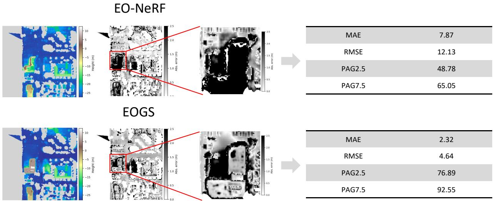  
Figure 1: Motivation of HLC-GS. A representative L-shaped building region from JAX\_260 is highlighted to illustrate the local height ambiguity problem in satellite image-based DSM reconstruction. Although EOGS (Aira et al., 2025) improves the local reconstruction accuracy compared with EO-NeRF (Marí et al., 2023), evident residual errors still remain around the highlighted building-boundary region. In this local ROI, EOGS yields an MAE of 2 32 m and an RMSE of 4 64 m, indicating that localized high-risk regions may still exhibit larger height errors than typical scene-level averages. This observation motivates HLC-GS to explicitly model per-pixel height-layer mixing risk and apply height-layer consistency constraints to geometrically unstable regions. All absolute-error maps share the same color range, where white indicates smaller absolute height errors and black indicates larger absolute height errors.

## 2.2. NeRF-based Satellite Scene Reconstruction

NeRF methods represent a 3D scene as a continuous radiance field parameterized by multi-layer perceptrons (MLPs), and optimize the scene representation through diferentiable volume rendering (Mildenhall et al., 2021). This formulation has inspired a series of NeRF methods for multi-date satellite image rendering and 3D reconstruction.

Early attempts adapted NeRF to satellite imagery by explicitly modeling illumination and acquisition conditions. For instance, S-NeRF introduced solar and sky illumination modeling to handle multi-temporal lighting variations (Derksen and Izzo, 2021), while Sat-NeRF incorporated the RPC camera model, shadow-aware rendering, and uncertainty weighting for robust multi-date 3D reconstruction from satellite imagery (Marí et al., 2022). EO-NeRF further improved elevation estimation by enforcing geometry-consistent shadow rendering (Marí et al., 2023).

To mitigate the ambiguous surface representation problem inherent in NeRF-based reconstruction, explicit geometric constraints have been increasingly introduced. Qu and Deng (2023) proposed Sat-Mesh, which represents scene geometry with a signed distance function (SDF) and incorporates multi-view stereo patch-matching constraints, enabling the extraction of dense DSMs and high-quality 3D meshes. Similarly, Wan et al. (2024) developed GC-NeRF to regularize satellite image-based DSM reconstruction through occupancy-guided ray sampling, Z-axis scene stretching, and multi-view DSM fusion. Additionally, recent accelerated variants, such as SatelliteRF, have significantly reduced the computational cost by utilizing compact feature encodings (Zhou et al., 2024).

Although these methods have advanced satellite scene modeling, they fundamentally rely on volume rendering and are predominantly driven by photometric reconstruction objectives. For DSM generation, surface heights are typically inferred from learned density or implicit surface fields rather than being explicitly represented. Consequently, the estimated heights remain highly sensitive to appearance fitting errors, density ambiguity, and sparse-view geometric uncertainty.

## 2.3. 3DGS-based Satellite Scene Reconstruction

3DGS represents scenes with explicit Gaussian primitives and enables eficient diferentiable rendering through tilebased rasterization (Kerbl et al., 2023). Its eficiency has motivated recent applications in satellite scene reconstruction. EOGS adapted 3DGS to satellite photogrammetry by introducing afine camera approximation, shadow modeling, and color correction for eficient DSM-oriented reconstruction (Aira et al., 2025). SatGS addressed multi-temporal remote sensing novel view synthesis with appearance-adaptive Gaussian modeling (Bai et al., 2025), while SA-GS further explored afine 3DGS, seasonal embeddings, and afine view augmentation for line-array satellite images (Yihang Xu, 2026). Among recent generalizable and generative extensions, SkySplat integrated RPC geometry into a generalizable 3DGS framework for multi-temporal sparse satellite images, highlighting the importance of satellite-specific camera modeling and sparse geometric cues (Huang et al., 2026). Skyfall-GS further extended satellite Gaussian Splatting toward immersive urban scene synthesis by combining 3D reconstruction from satellite imagery with difusion-based refinement (Lee et al., 2025). Despite their eficiency, existing 3DGS-based satellite reconstruction methods still rely heavily on photometric rendering objectives and standard alpha compositing, while DSM-oriented height-layer reliability modeling remains less explored. For DSM generation, projected Gaussian splats from diferent height layers may be alpha-composited at the same rendered pixel or DSM sampling location, which can pull the estimated elevation toward a non-physical intermediate height. Therefore, a DSMoriented reliability modeling mechanism is needed to localize high-risk pixels and selectively constrain unreliable dominantlayer responses and inconsistent secondary-layer responses during Gaussian optimization.

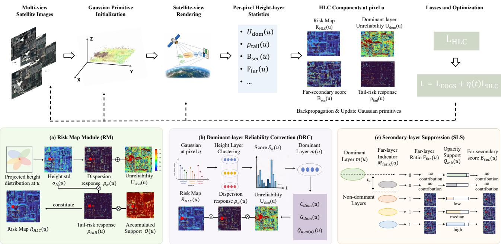  
Figure 2: Architecture of HLC-GS. HLC-GS extends the EOGS backbone with three height-layer-aware modules: the HLC risk map module (RM), dominant-layer reliability correction (DRC), and secondary-layer suppression (SLS). Given multi-view satellite images and their imaging models, the Gaussian scene representation is initialized and optimized following EOGS (Aira et al., 2025). During rendering, projected Gaussian splats are alpha-composited at rendered pixels or DSM sampling locations to compute per-pixel height-layer statistics and construct the HLC risk map, which localizes pixels with high height-layer mixing risk. DRC regularizes unreliable dominant-layer responses, while SLS suppresses weakly supported far secondary-layer responses and limits residual far-layer contributions. By jointly constraining unreliable dominant-layer responses and inconsistent secondary-layer responses, HLC-GS alleviates height-layer mixing and improves DSM reconstruction quality.

## 3. Methodology

## 3.1. Preliminaries and Problem Formulation

Given a set of multi-view satellite images with known imaging models, our goal is to reconstruct a DSM that represents the surface elevation of the observed scene. HLC-GS is built upon the EOGS framework (Aira et al., 2025), which represents a satellite scene as a set of anisotropic 3D Gaussian primitives and optimizes the scene through diferentiable rasterization adapted to satellite imaging geometry. The Gaussian primitives are denoted as $\mathcal { G } = \{ g _ { i } \} _ { i = 1 } ^ { K }$ , where each primitive is parameterized by its 3D center, covariance matrix, opacity, and appearance attributes.

During rasterization, projected Gaussian splats contributing to the same rendered pixel are aggregated through front-to-back alpha compositing. Omitting the view index for simplicity, let u ∈ Ω denote a valid pixel location, and let G(u) be the depthsorted set of Gaussian primitives contributing to u. Following EOGS, elevation rendering is obtained by replacing the color feature of each Gaussian with its real-world altitude. Denoting the altitude of the i-th Gaussian center as $h _ { i }$ and its alphacompositing weight at pixel u as ω (u), the alpha-weighted elevation statistic is written as

$$
H ( u ) = \frac { \sum _ { i \in { \mathcal { G } } ( u ) } \omega _ { i } ( u ) h _ { i } } { \sum _ { i \in { \mathcal { G } } ( u ) } \omega _ { i } ( u ) + \epsilon } ,\tag{1}
$$

where ϵ is a small constant for numerical stability, and H(u) denotes the alpha-composited altitude rendered at pixel u. The rendered altitude map is then combined with the imagecoordinate grid and back-projected to geospatial coordinates through the satellite camera model. The resulting 3D surface samples are rasterized onto the target DSM grid to generate the predicted DSM.

Although Eq. (1) is fully diferentiable, it implicitly assumes that the Gaussian splats contributing to a given pixel form a geometrically coherent height response. This assumption may be violated around building boundaries, occluded regions, and structural discontinuities, where Gaussian primitives from different height layers may jointly contribute to the same rendered pixel or DSM sampling location. In such cases, the alphaweighted elevation may be pulled toward a non-physical intermediate value that does not correspond to an actual surface in the scene. We refer to this geometric conflict as the per-pixel height-layer mixing problem in 3DGS-based elevation rendering, which motivates the design of HLC-GS.

To address this problem, we introduce a risk-map-guided height-layer consistency constraint into the EOGS (Aira et al., 2025) framework. Instead of imposing uniform height regularization on all rendered pixels, HLC-GS first estimates a perpixel height-layer mixing risk map $R _ { \mathrm { H L C } } ( u )$ to localize highrisk pixels where inconsistent height-layer responses are likely to coexist. In these high-risk regions, HLC-GS regularizes unreliable dominant-layer responses and suppresses weakly supported far secondary-layer responses, thereby reducing heightlayer mixing without enforcing a global single-layer height distribution. The overall framework of HLC-GS is illustrated in Fig. 2.

## 3.2. Risk Map Module (RM)

The risk map module is designed to quantify the potential height-layer mixing risk at each rendered pixel, thereby providing spatially adaptive weights for the subsequent height-layer consistency constraint. In contrast to uniform height regularization applied across all pixels, the proposed risk map specifically targets regions exhibiting abnormal projected height dispersion and unreliable dominant-layer responses.

Recalling the definitions from Section 3.1, let $u \in \Omega$ denote a valid pixel location, with $\mathcal { G } ( u )$ representing the depth-sorted set of contributing Gaussian primitives, and $\omega _ { i } ( u )$ denoting the alpha-compositing weight of the i-th primitive. To quantify the height dispersion, we first compute the weighted standard deviation of the projected Gaussian elevation responses at u:

$$
\sigma _ { h } ( u ) = \left( \frac { \sum _ { i \in { \mathcal { G } } ( u ) } \omega _ { i } ( u ) h _ { i } ^ { 2 } } { \sum _ { i \in { \mathcal { G } } ( u ) } \omega _ { i } ( u ) + \epsilon } - \left( \frac { \sum _ { i \in { \mathcal { G } } ( u ) } \omega _ { i } ( u ) h _ { i } } { \sum _ { i \in { \mathcal { G } } ( u ) } \omega _ { i } ( u ) + \epsilon } \right) ^ { 2 } \right) ^ { 1 / 2 } .\tag{2}
$$

where $h _ { i }$ denotes the altitude of the i-th Gaussian center. The value $\sigma _ { h } ( u )$ measures the weighted dispersion of Gaussian altitudes contributing to the same rendered pixel. A small $\sigma _ { h } ( u )$ indicates that the projected Gaussian splats are concentrated around similar altitudes, whereas a large value suggests that multiple height layers may jointly contribute to the elevation rendering at pixel u.

To make the risk estimation adaptive to diferent scenes, satellite views, and training stages, we normalize $\sigma _ { h } ( u )$ using the quantiles computed over valid pixels in the current rendered view. Let $Q _ { q } ( \sigma _ { h } )$ denote the q-th quantile of the set $\{ \sigma _ { h } ( u ) \ | \ u \in \Omega \}$ . The normalized height-dispersion response is then defined as

$$
\rho _ { \sigma } ( u ) = \mathrm { c l i p } \left( \frac { \sigma _ { h } ( u ) - Q _ { 0 . 7 5 } ( \sigma _ { h } ) } { Q _ { 0 . 9 5 } ( \sigma _ { h } ) - Q _ { 0 . 7 5 } ( \sigma _ { h } ) + \epsilon } , 0 , 1 \right) ,\tag{3}
$$

where $Q _ { 0 . 7 5 } ( \sigma _ { h } )$ and $Q _ { 0 . 9 5 } ( \sigma _ { h } )$ denote the 75th and 95th percentiles of the height standard deviations in the current rendered ${ \mathrm { v i e w } } ,$ respectively. This quantile-based normalization makes the risk response focus on pixels with relatively abnormal projected height dispersion, rather than treating all local height variations as equally risky.

To further account for extreme height-dispersion cases, we introduce a tail-risk response:

$$
\rho _ { \mathrm { t a i l } } ( u ) = \mathrm { c l i p } \bigg ( \frac { \sigma _ { h } ( u ) - Q _ { q _ { l } } ( \sigma _ { h } ) } { Q _ { q _ { h } } ( \sigma _ { h } ) - Q _ { q _ { l } } ( \sigma _ { h } ) + \epsilon } , 0 , 1 \bigg ) ,\tag{4}
$$

where $Q _ { q _ { l } } ( \sigma _ { h } )$ and $Q _ { q _ { h } } ( \sigma _ { h } )$ denote high-percentile thresholds of the valid height standard deviations. In our final configuration, we empirically set $q _ { l } = 0 . 9 0$ and $q _ { h } = 0 . 9 9$ . While $\rho _ { \sigma } ( u )$ captures generally abnormal height dispersion, $\rho _ { \mathrm { t a i l } } ( u )$ emphasizes extreme dispersion cases in the upper tail. The latter is used as an amplification factor in the final risk map rather than an independent risk term.

In addition to height dispersion, we further consider the reliability of the per-pixel height-layer structure. For the set of Gaussians $\mathcal { G } ( u )$ contributing to pixel u, we partition them into several candidate height layers based on their altitudes. Specifically, the contributing Gaussians are processed in altitude order, and each Gaussian is assigned to the nearest existing layer if its altitude diference from the layer representative is smaller than a dynamically determined height threshold $\tau _ { h } ;$ otherwise, a new height layer is initialized. To accommodate varying spatial resolutions and elevation variation scales, this height threshold is adaptively computed according to the ground sampling distance (GSD):

$$
\tau _ { h } = \mathrm { c l i p } \left( \eta _ { h } \cdot \mathrm { G S D } , \tau _ { \operatorname* { m i n } } , \tau _ { \operatorname* { m a x } } \right) ,\tag{5}
$$

where $\eta _ { h }$ is a predefined scale factor, while $\tau _ { \mathrm { m i n } }$ and $\tau _ { \mathrm { m a x } }$ serve as the lower and upper bounds for the layer-partition threshold, respectively. In our implementation, we empirically set $\eta _ { h } ~ =$ $2 . 0 , \tau _ { \mathrm { m i n } } = 0 . 5 \mathrm { m }$ , and $\tau _ { \operatorname* { m a x } } = 1 . 5 \mathrm { m }$ , and keep them fixed in all experiments without scene-specific tuning. This GSD-aware design helps maintain a physically meaningful layer-partition scale across datasets with diferent spatial resolutions.

For the k-th candidate height layer $C _ { k } ( u )$ , we compute its accumulated compositing contribution $W _ { k } ( u )$ and representative altitude $\bar { h } _ { k } ( u )$ as follows:

$$
{ \cal W } _ { k } ( u ) = \sum _ { i \in { \cal C } _ { k } ( u ) } \omega _ { i } ( u ) , \qquad \bar { h } _ { k } ( u ) = \frac { \sum _ { i \in { \cal C } _ { k } ( u ) } \omega _ { i } ( u ) h _ { i } } { W _ { k } ( u ) + \epsilon } .\tag{6}
$$

where $W _ { k } ( u )$ measures the accumulated compositing contribution of the k-th height layer to pixel $u ,$ and $\bar { h } _ { k } ( u )$ represents its alpha-weighted altitude.

Selecting the dominant height layer solely based on the accumulated contribution $W _ { k } ( u )$ may be sensitive to locally unstable Gaussians, as it does not explicitly account for opacity support quality. Therefore, we introduce an opacitysupport-aware layer score. For the k-th candidate height layer $C _ { k } ( u )$ , we define the opacity support quality as $Q _ { \alpha , k } ( u ) ~ =$ $\textstyle \sum _ { i \in C _ { k } ( u ) } \omega _ { i } ( u ) \alpha _ { i } ( u ) / ( W _ { k } ( u ) + \epsilon )$ , where $\alpha _ { i } ( u ) \in [ 0 , 1 ]$ denotes the screen-space opacity response of the projected Gaussian splat at pixel u. The term $Q _ { \alpha , k } ( u )$ measures the average opacity support quality of the Gaussians assigned to the k-th height layer.

Based on this support quality, the support-aware layer score and dominant-layer selection are defined as

$$
S _ { k } ( u ) = W _ { k } ( u ) \left( Q _ { \alpha , k } ( u ) + \epsilon \right) ^ { 1 / 2 } , \qquad m ( u ) = \arg \operatorname* { m a x } _ { k } S _ { k } ( u ) .\tag{7}
$$

where m(u) denotes the index of the selected dominant height layer, and the corresponding dominant altitude is given by $H _ { \mathrm { d o m } } ( u ) = \bar { h } _ { m ( u ) } ( u )$ . By jointly considering $W _ { k } ( u )$ and $Q _ { \alpha , k } ( u )$ the resulting score favors height layers with both large compositing contributions and reliable opacity support, thereby reducing the risk of selecting weakly supported layers as the dominant height layer.

To characterize whether the selected layer is clearly dominant in the candidate height-layer competition, we define the dominant-layer confidence and score gap as

$$
C _ { \mathrm { d o m } } ( u ) = \frac { S _ { m ( u ) } ( u ) } { \sum _ { k } S _ { k } ( u ) + \epsilon } , \qquad G _ { \mathrm { d o m } } ( u ) = \frac { S _ { m ( u ) } ( u ) - S _ { ( 2 ) } ( u ) } { S _ { m ( u ) } ( u ) + \epsilon } ,\tag{8}
$$

where $S _ { m ( u ) } ( u )$ denotes the score of the selected dominant height layer, and $S _ { ( 2 ) } ( u )$ denotes the second-largest score among all candidate height layers. If only one candidate layer exists, $S _ { ( 2 ) } ( u )$ is set to zero. The confidence $C _ { \mathrm { d o m } } ( u )$ measures the relative dominance of the selected layer, while the gap $G _ { \mathrm { d o m } } ( u )$ measures its separability from the strongest competing layer.

However, a clearly dominant layer is not necessarily reliable. Since $S _ { k } ( u )$ depends on the accumulated compositing contribution $W _ { k } ( u )$ , a layer may be selected as dominant even when its opacity support is insuficient. We therefore combine the dominance measures $C _ { \mathrm { d o m } } ( u )$ and $G _ { \mathrm { d o m } } ( u )$ with the support deficiency of the selected layer, $[ \tau _ { u } - Q _ { \alpha , m ( u ) } ( u ) ] .$ +, to define the dominant-layer unreliability:

$$
U _ { \mathrm { d o m } } ( u ) = \phi \left( C _ { \mathrm { d o m } } ( u ) ; \tau _ { c } \right) \phi \left( G _ { \mathrm { d o m } } ( u ) ; \tau _ { g } \right) \left[ \tau _ { u } - Q _ { \alpha , m ( u ) } ( u ) \right] _ { + } ,\tag{9}
$$

where $[ x ] _ { + } = \operatorname* { m a x } ( x , 0 ) , \tau _ { u }$ denotes the support-quality threshold, and $\phi ( x ; \tau ) = \mathrm { c l i p } ( ( x - \tau ) / ( 1 - \tau + \epsilon ) , 0 , 1 )$ is a softthresholding function. In our implementation, the confidence threshold, gap threshold, and support-quality threshold are set to $\tau _ { c } ~ = ~ 0 . 4 5 , ~ \tau _ { g } ~ = ~ 0 . 1 5$ , and $\tau _ { u } ~ = ~ 0 . 5 5$ , respectively, and are kept fixed in all experiments without scene-specific tuning. Thus, $U _ { \mathrm { d o m } } ( u )$ becomes large only when the selected layer is clearly dominant but has insuficient opacity support, highlighting dominant-layer responses that have large compositing contributions but insuficient opacity support.

Finally, we combine the height-dispersion response, dominant-layer unreliability, accumulated compositing support, and tail-risk amplification to define the height-layer consistency risk map:

$$
R _ { \mathrm { H L C } } ( u ) = \left( \rho _ { \sigma } ( u ) + U _ { \mathrm { d o m } } ( u ) \right) { \cal O } ( u ) \left( 1 + \rho _ { \mathrm { t a i l } } ( u ) \right) ,\tag{10}
$$

where $\begin{array} { r c l r } { O ( u ) } & { = } & { \sum _ { i \in { \mathcal G } ( u ) } \omega _ { i } ( u ) } & { = } & { \sum _ { k } W _ { k } ( u ) } \end{array}$ denotes the total accumulated compositing contribution at pixel u. The support term O(u) attenuates risk responses in weakly covered or background regions, while $\rho _ { \mathrm { t a i l } } ( u )$ amplifies extreme heightdispersion cases. Consequently, $R _ { \mathrm { H L C } } ( u )$ prioritizes suficiently supported pixels with abnormal height dispersion and unreliable dominant-layer responses, while further emphasizing extreme height-mixing cases.

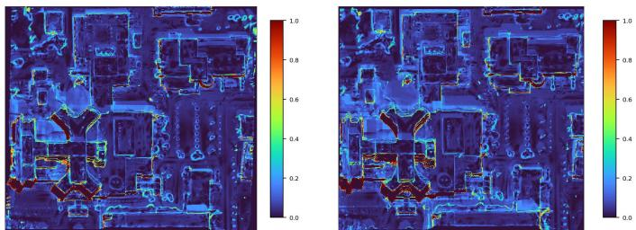  
Figure 3: Qualitative visualization of the computed HLC risk maps on representative test views under the HLC-GS setting. Warmer colors indicate higher risk values. High-risk responses are mainly concentrated around building boundaries, roof–ground transitions, and other geometrically complex regions.

To provide a qualitative illustration of the computed HLC risk map, Fig. 3 shows representative risk-map visualizations on test views under the HLC-GS setting. It can be observed that high-risk responses are mainly concentrated around building boundaries, roof–ground transitions, and other geometrically discontinuous regions, while relatively homogeneous areas tend to have lower risk values. This spatial distribution is consistent with the expected locations of height-layer mixing, where projected Gaussian splats from diferent elevation lay ers are more likely to jointly contribute. Therefore, the qualitative visualization provides intuitive support that the proposed risk map can efectively localize high-risk pixels for subsequent height-layer consistency regularization.

## 3.3. Dominant-layer Reliability Correction (DRC)

The dominant-layer reliability correction (DRC) module is designed to regularize unreliable dominant-layer responses through a risk-map-guided height-dispersion penalty. The term $U _ { \mathrm { d o m } } ( u )$ , defined in the risk map module, identifies selected dominant layers that are compositionally strong but lack suficient opacity support. Therefore, DRC combines $U _ { \mathrm { d o m } } ( u )$ with the HLC risk map $R _ { \mathrm { H L C } } ( u )$ to selectively penalize the associated height dispersion in high-risk pixels, reducing the reinforcement of unstable dominant-layer responses during optimization. The dominant-layer reliability correction loss is defined as

$$
\mathcal { L } _ { \mathrm { d o m } } = \frac { \sum _ { u \in \Omega } R _ { \mathrm { H L C } } ( u ) U _ { \mathrm { d o m } } ( u ) \rho _ { \sigma } ( u ) } { \sum _ { u \in \Omega } R _ { \mathrm { H L C } } ( u ) + \epsilon } .\tag{11}
$$

where $R _ { \mathrm { H L C } } ( u )$ acts as a continuous spatial weighting map that focuses the constraint on pixels with high height-layer mixing risk. The term $U _ { \mathrm { d o m } } ( u )$ identifies selected dominant height layers that have large compositing contributions but insuficient opacity support quality, and $\rho _ { \sigma } ( u )$ denotes the height-dispersion response to be penalized. Although $R _ { \mathrm { H L C } } ( u )$ already encodes the overall spatial risk, the additional product $U _ { \mathrm { d o m } } ( u ) \rho _ { \sigma } ( u )$ further restricts the penalty to pixels where dominant-layer unreliability and projected height dispersion occur simultaneously.

This loss produces strong penalties mainly when a pixel is in a high-risk region, the selected dominant height layer is unreliable, and the projected Gaussian height responses are highly dispersed. Therefore, it does not force all pixels to collapse into a single height layer. Instead, it selectively suppresses unreliable dominant-layer responses by penalizing their associated height dispersion, while encouraging the model to preserve surface structures with stable local support.

## 3.4. Secondary-layer Suppression (SLS)

The secondary-layer suppression module aims to reduce nondominant height responses that are far from the dominant height layer and may contaminate the final elevation estimate. Around building boundaries or occluded regions, secondary-layer responses may still participate in alpha compositing even when the dominant layer is correctly identified, pulling the rendered elevation toward a non-physical intermediate value. Therefore, this module does not enforce a single-layer height distribution everywhere, but selectively suppresses unreliable secondarylayer responses at high-risk pixels.

After obtaining the dominant height layer $H _ { \mathrm { d o m } } ( u )$ , we measure the distance between each non-dominant candidate layer and the dominant layer, and define the far-layer indicator as

$$
\begin{array} { r l r } & { \Delta H _ { k } ( u ) = \left| \bar { h } _ { k } ( u ) - H _ { \mathrm { d o m } } ( u ) \right| , } & \\ & { M _ { \mathrm { f a r } , k } ( u ) = \mathbb { I } \left( \Delta H _ { k } ( u ) > \tau _ { h } \right) , \qquad k \neq m ( u ) . } & \end{array}\tag{12}
$$

where $\bar { h } _ { k } ( u )$ denotes the representative altitude of the k-th candidate height layer, m(u) denotes the dominant-layer index, $\tau _ { h }$ is the GSD-aware height threshold used for height-layer partitioning, and I(·) is the indicator function, which equals 1 if $\Delta H _ { k } ( u ) > \tau _ { h }$ and 0 otherwise.

Furthermore, far secondary layers with insuficient opacity support are more likely to contaminate elevation rendering. Based on this observation, we define the weakly supported farlayer response score as

$$
B _ { \mathrm { s e c } } ( u ) = \frac { \sum _ { k \neq m ( u ) } W _ { k } ( u ) M _ { \mathrm { f a r } , k } ( u ) \left( 1 - Q _ { \alpha , k } ( u ) \right) } { O ( u ) + \epsilon } ,\tag{13}
$$

The score ${ \cal B } _ { \mathrm { s e c } } ( u )$ becomes large when far secondary layers have non-negligible compositing contributions but low opacity support quality, indicating unreliable far-layer contamination that may pull the rendered elevation toward a non-physical intermediate estimate.

The corresponding secondary-layer suppression loss is defined as

$$
\mathcal { L } _ { \mathrm { s e c } } = \frac { \sum _ { u \in \Omega } R _ { \mathrm { H L C } } ( u ) B _ { \mathrm { s e c } } ( u ) } { \sum _ { u \in \Omega } R _ { \mathrm { H L C } } ( u ) + \epsilon } .\tag{14}
$$

This loss penalizes weakly supported far secondary-layer responses at high-risk pixels, thereby reducing their contamination in DSM elevation rendering.

However, secondary layers with relatively high opacity support may still afect the final alpha-weighted elevation if they are far from the dominant layer and have non-negligible accumulated contributions. To control the overall far-layer contribution, we define the far-layer ratio as

$$
F _ { \mathrm { f a r } } ( u ) = \frac { \sum _ { k \neq m ( u ) } W _ { k } ( u ) M _ { \mathrm { f a r } , k } ( u ) } { O ( u ) + \epsilon } .\tag{15}
$$

Algorithm 1 Optimization procedure of HLC-GS   
Require: Multi-view optical satellite images with imaging   
models; initial Gaussian representation; maximum iteration   
$T ;$ activation iteration $T _ { \mathrm { s t a r t } }$   
Ensure: Optimized Gaussian representation and reconstructed   
DSM   
1: Initialize the Gaussian representation following the EOGS   
configuration   
2: for $t = 1$ to T do   
3: Render the current Gaussian representation   
4: Compute the EOGS reconstruction loss LEOGS   
5: if $t \ge T _ { \mathrm { s t a r t } }$ then   
6: RM: Construct $R _ { \mathrm { H L C } } ( u )$   
7: DRC: Compute ${ \mathcal { L } } _ { \mathrm { d o m } }$   
8: SLS: Identify far secondary layers   
9: SLS: Compute $\mathcal { L } _ { \mathrm { s e c } }$ and $\mathcal { L } _ { \mathrm { f a r } }$   
10: Assemble the HLC loss LHLC   
11: Set the total loss with η(t):   
12: $\mathcal { L } = \mathcal { L } _ { \mathrm { E O G S } } + \eta ( t ) \mathcal { L } _ { \mathrm { H L C } }$   
13: else   
14: Set $\mathcal { L } = \mathcal { L } _ { \mathrm { E O G S } }$   
15: end if   
16: Update Gaussian parameters by back-propagation   
17: end for   
18: Render the optimized representation into an altitude map   
19: Back-project samples and rasterize them onto the target   
DSM grid

Diferent from $B _ { \mathrm { s e c } } ( u ) , ~ F _ { \mathrm { f a r } } ( u )$ does not include the opacitysupport penalty and therefore measures the total compositing contribution of far secondary layers. It is used to limit residual far-layer accumulation even when the corresponding secondary layers are not extremely weakly supported.

Based on this definition, the far-layer suppression loss is formulated as

$$
\mathcal { L } _ { \mathrm { f a r } } = \frac { \sum _ { u \in \Omega } R _ { \mathrm { H L C } } ( u ) F _ { \mathrm { f a r } } ( u ) } { \sum _ { u \in \Omega } R _ { \mathrm { H L C } } ( u ) + \epsilon } .\tag{16}
$$

Although $\mathcal { L } _ { \mathrm { s e c } }$ and ${ \mathcal { L } } _ { \mathrm { f a r } }$ are both based on the same far-layer indicator, they serve diferent purposes. $\mathcal { L } _ { \mathrm { s e c } }$ is a support-aware penalty that suppresses far secondary layers with insuficient opacity support, whereas $\mathcal { L } _ { \mathrm { f a r } }$ is a support-agnostic constraint that limits the overall far-layer contribution. Together, they reduce the intermediate-height bias caused by multi-layer alpha compositing.

The overall optimization procedure of HLC-GS is summarized in Algorithm 1.

## 3.5. Overall Objective

We incorporate the height-layer consistency constraint into the original EOGS objective (Aira et al., 2025) as a lightweight regularization term. The complete HLC loss consists of three components:

$$
\mathcal { L } _ { \mathrm { H L C } } = \lambda _ { \mathrm { d o m } } \mathcal { L } _ { \mathrm { d o m } } + \lambda _ { \mathrm { s e c } } \mathcal { L } _ { \mathrm { s e c } } + \lambda _ { \mathrm { f a r } } \mathcal { L } _ { \mathrm { f a r } } ,\tag{17}
$$

where ${ \mathcal { L } } _ { \mathrm { d o m } }$ regularizes unreliable dominant-layer responses, $\mathcal { L } _ { \mathrm { s e c } }$ suppresses weakly supported far secondary-layer responses, and ${ \mathcal { L } } _ { \mathrm { f a r } }$ limits the total contribution of non-dominant height layers that are far from the dominant height. In our implementation, we empirically set the weights to $\lambda _ { \mathrm { d o m } } = 0 . 7 5$ $\lambda _ { \mathrm { s e c } } ~ = ~ 1 . 2 5 .$ , and $\lambda _ { \mathrm { f a r } } ~ = ~ 0 . 3 5$ The relatively large weights assigned to ${ \mathcal { L } } _ { \mathrm { d o m } }$ and $\mathcal { L } _ { \mathrm { s e c } }$ emphasize dominant-layer reliability correction and secondary-layer contamination suppression during the height-layer competition. Furthermore, the far-layer suppression term constrains the overall elevation contribution away from the dominant layer, improving robustness against large height deviations and roof-ground mixing. Since the Gaussian positions and opacities are highly unstable during the early stages of training, applying height-layer constraints too early may disrupt the fundamental image reconstruction process. Therefore, we adopt a delayed activation and linear warmup strategy for the total loss:

$$
\begin{array} { r } { \mathcal { L } = \mathcal { L } _ { \mathrm { E O G S } } + \eta ( t ) \mathcal { L } _ { \mathrm { H L C } } , } \end{array}\tag{18}
$$

where $\mathcal { L } _ { \mathrm { E O G S } }$ denotes the original EOGS loss. The weight η(t) is activated after 3000 iterations and linearly increased to $1 . 5 \times 1 0 ^ { - 2 }$ over the subsequent 1000 iterations. This strategy ensures that the height-layer constraint takes efect only after the coarse scene geometry has been established, thereby improving the DSM height consistency while maintaining the original image reconstruction quality.

## 4. Experiments

## 4.1. Datasets and Experimental Design

To comprehensively evaluate the efectiveness of the proposed HLC-GS, we design a series of experiments with reference to the experimental configuration of EOGS (Aira et al. 2025). Specifically, quantitative and qualitative comparisons are conducted to evaluate the overall DSM reconstruction accuracy and qualitative reconstruction quality. Local region-ofinterest (ROI) error analysis is used to examine local geometric improvements around representative building-boundary regions. Component ablation studies are performed to analyze the contribution of each proposed module, while error-stratified analysis, risk-stratified error analysis, and risk-map localization analysis are conducted to further investigate the behavior of the proposed height-layer consistency mechanism and HLC risk map. In addition, eficiency comparison and parameter sensitivity analysis are included to evaluate computational cost and robustness to the HLC weight.

We use seven satellite benchmark scenes from two public datasets: four AOIs from DFC2019 (Bosch et al., 2019) and three AOIs from IARPA2016 (Bosch et al., 2016). Each AOI consists of 10–20 cropped WorldView-3 image observations acquired from diferent viewpoints and dates. The image crops are non-orthorectified and are accompanied by imaging metadata, including rational polynomial camera (RPC) coeficients and local solar direction information. Following the preprocessing protocol adopted by EOGS (Aira et al., 2025), we use the bundle-adjusted RPC coeficients from EO-NeRF (Marí et al., 2023). Each crop covers an area of approximately 256 m × 256 m. The ground sampling distance is approximately 0 5 m for the DFC2019 scenes and 0 3 m for the IARPA2016 scenes.

## 4.2. Evaluation Metrics

Following prior satellite DSM evaluation protocols (Gao et al., 2023), we report Mean Absolute Error (MAE), Root Mean Square Error (RMSE), and Percentage of Accurate Grids (PAG). All metrics are computed over the valid non-forest DSM grid cells. MAE measures the average absolute height diference between the predicted DSM and the reference DSM, while RMSE gives larger penalties to large height deviations. PAG measures the percentage of valid DSM grid cells whose absolute height errors are below a predefined threshold. In this work, we report $\mathrm { P A G } _ { 2 . 5 }$ and $\mathrm { P A G } _ { 7 . 5 } ,$ , corresponding to heighterror thresholds of 2 5 m and 7 5 m, respectively.

## 4.3. Implementation Details

The proposed method is implemented in PyTorch based on EOGS (Aira et al., 2025). CUDA kernels are used for differentiable Gaussian rasterization and for computing viewdependent per-pixel height-layer statistics from projected Gaussian splats. For each AOI, Gaussian primitives are uniformly initialized in the 3D scene with an initial density of 0 13 Gaussians per cubic meter. The model is optimized using the Adam optimizer for 10 000 iterations. Gaussian pruning strategies and the learning rates for all attributes strictly follow the original EOGS settings (Aira et al., 2025). All experiments are conducted on a workstation equipped with an NVIDIA RTX PRO 6000 Blackwell Workstation Edition GPU.

In multi-temporal satellite scenes, forest canopies may change significantly across acquisition dates due to seasonal, illumination, and wind-induced variations, making their height and appearance less stable than man-made structures. Following the evaluation setting of EOGS (Aira et al., 2025), we use the provided forest mask to remove tree-covered areas from the valid evaluation region. Therefore, all reported MAE, RMSE, $\mathrm { P A G } _ { 2 . 5 }$ , and $\mathrm { P A G } _ { 7 . 5 }$ scores are computed only on non-forest valid DSM grid cells.

## 4.4. Comparative Methods

We compare the proposed HLC-GS with six representative methods for satellite image-based DSM reconstruction, including one traditional stereo pipeline, three NeRF-based methods, and two Gaussian-splatting-based methods. Specif ically, S2P (De Franchis et al., 2014) is selected as the traditional photogrammetric baseline, as it is a widely used satellite stereo pipeline for RPC-based image rectification, dense matching, and DSM generation. For NeRF-based reconstruction, SAT-NGP (Billouard et al., 2024) is included as an efficient hash-grid-based satellite radiance field method, while Sat-NeRF (Marí et al., 2022) and EO-NeRF (Marí et al., 2023) are selected as representative NeRF-based satellite scene reconstruction methods that account for multi-date observations and illumination efects. For Gaussian-splatting-based reconstruction, we compare with the original 3DGS (Kerbl et al., 2023) and EOGS (Aira et al., 2025), where EOGS is a recent Gaussian Splatting framework specifically adapted for Earth observation photogrammetry.

Table 1: Quantitative DSM reconstruction results on the JAX scenes. MAE and RMSE are reported in meters, while $\mathrm { P A G } _ { 2 . 5 }$ and $\mathrm { P A G } _ { 7 . 5 }$ are reported in percentage. Lower MAE/RMSE and higher PAG indicate better performance.
<table><tr><td rowspan="2">Method</td><td colspan="4">JAX 004</td><td colspan="4">JAX 068</td><td colspan="4">JAX 214</td><td colspan="4">JAX 260</td></tr><tr><td>MAE↓</td><td>RMSE↓</td><td> $\mathrm { P A G } _ { 2 . 5 } \ ^ { \prime }$ </td><td> $\mathrm { P A G } _ { 7 . 5 } \uparrow$ </td><td>MAE↓</td><td>RMSE↓</td><td> $\mathrm { P A G } _ { 2 . 5 } \uparrow$ </td><td> $\mathrm { P A G } _ { 7 . 5 } \uparrow$ </td><td>MAE↓</td><td>RMSE↓</td><td> $\mathrm { P A G } _ { 2 . 5 } \uparrow$ </td><td> $\mathrm { P A G } _ { 7 . 5 } \uparrow$ </td><td>MAE↓</td><td>RMSE↓</td><td> $\mathrm { P A G } _ { 2 . 5 } \uparrow$ </td><td> $\mathrm { P A G } _ { 7 . 5 } \uparrow$ </td></tr><tr><td>S2P (De Franchis et al., 2014)</td><td>0.83</td><td>1.64</td><td>90.22</td><td>98.99</td><td>2.09</td><td>4.60</td><td>86.39</td><td>95.70</td><td>3.56</td><td>7.97</td><td>75.12</td><td>86.22</td><td>3.21</td><td>5.17</td><td>67.47</td><td>95.33</td></tr><tr><td>SAT-NGP (Billouard et al., 2024)</td><td>1.08</td><td>1.78</td><td>91.70</td><td>98.89</td><td>1.39</td><td>2.48</td><td>87.37</td><td>97.82</td><td>1.96</td><td>4.15</td><td>80.52</td><td>96.38</td><td>1.49</td><td>2.47</td><td>85.21</td><td>98.43</td></tr><tr><td>3DGS (Kerbl et al., 2023)</td><td>4.52</td><td>5.62</td><td>32.93</td><td>82.02</td><td>9.06</td><td>11.73</td><td>18.24</td><td>50.84</td><td>11.62</td><td>15.69</td><td>15.04</td><td>42.98</td><td>6.52</td><td>8.29</td><td>23.88</td><td>65.30</td></tr><tr><td>Sat-NeRF (Marí et al., 2022)</td><td>4.29</td><td>5.44</td><td>37.31</td><td>82.15</td><td>2.22</td><td>3.82</td><td>76.67</td><td>95.12</td><td>3.44</td><td>6.81</td><td>62.48</td><td>90.21</td><td>4.93</td><td>6.33</td><td>31.47</td><td>79.33</td></tr><tr><td>EO-NeRF (Marí et al., 2023)</td><td>1.24</td><td>1.95</td><td>87.17</td><td>98.89</td><td>1.16</td><td>2.20</td><td>91.63</td><td>98.64</td><td>1.84</td><td>3.76</td><td>83.60</td><td>95.99</td><td>2.06</td><td>2.81</td><td>76.44</td><td>98.54</td></tr><tr><td>EOGS (Aira et al., 2025)</td><td>0.85</td><td>1.52</td><td>91.74</td><td>99.47</td><td>1.04</td><td>2.29</td><td>90.84</td><td>98.21</td><td>1.62</td><td>3.68</td><td>85.97</td><td>96.21</td><td>1.34</td><td>2.52</td><td>87.54</td><td>97.64</td></tr><tr><td>HLC-GS (ours)</td><td>0.67</td><td>1.32</td><td>93.73</td><td>99.48</td><td>0.74</td><td>1.91</td><td>93.62</td><td>98.72</td><td>1.29</td><td>3.57</td><td>88.29</td><td>95.52</td><td>1.08</td><td>2.17</td><td>89.03</td><td>98.56</td></tr></table>

Table 2: Quantitative DSM reconstruction results on the IARPA scenes. MAE and RMSE are reported in meters, while $\mathrm { P A G } _ { 2 . 5 }$ and $\mathrm { P A G } _ { 7 . 5 }$ are reported in percentage. Lower MAE/RMSE and higher PAG indicate better performance.
<table><tr><td rowspan="2">Method</td><td colspan="4">IARPA 001</td><td colspan="4">IARPA 002</td><td colspan="4">IARPA 003</td></tr><tr><td>MAE↓</td><td>RMSE↓</td><td> $\mathrm { P A G } _ { 2 . 5 } \uparrow$ </td><td> $\mathrm { P A G } _ { 7 . 5 } \uparrow$ </td><td>MAE↓</td><td>RMSE↓</td><td> $\mathrm { P A G } _ { 2 . 5 } \uparrow$ </td><td> $\mathrm { P A G } _ { 7 . 5 } \uparrow$ </td><td>MAE↓</td><td>RMSE↓</td><td> $\mathrm { P A G } _ { 2 . 5 }$ </td><td> $\mathrm { P A G } _ { 7 . 5 } \uparrow$ </td></tr><tr><td>S2P (De Franchis et al., 2014)</td><td>3.63</td><td>5.54</td><td>65.32</td><td>77.27</td><td>3.84</td><td>7.24</td><td>71.94</td><td>80.01</td><td>2.62</td><td>5.16</td><td>73.59</td><td>86.22</td></tr><tr><td>SAT-NGP (Billouard et al., 2024) 3DGS (Kerbl et al., 2023)</td><td>6.84</td><td>9.19</td><td>25.55</td><td>65.81</td><td>10.65</td><td>14.07</td><td>16.01</td><td>45.23</td><td>11.70</td><td>15.61</td><td>14.30</td><td>41.95</td></tr><tr><td>Sat-NeRF (Marí et al., 2022)</td><td>2.59</td><td>3.65</td><td>63.54</td><td>93.23</td><td>4.39</td><td>6.02</td><td>42.84</td><td>81.16</td><td>4.55</td><td>8.27</td><td>58.85</td><td>81.19</td></tr><tr><td>EO-NeRF (Marí et al., 2023)</td><td>2.85</td><td>3.97</td><td>65.65</td><td>91.77</td><td>2.44</td><td>4.50</td><td>77.65</td><td>91.56</td><td>2.36</td><td>3.98</td><td>73.62</td><td>92.76</td></tr><tr><td>EOGS (Aira et al., 2025)</td><td>1.44</td><td>2.30</td><td>82.70</td><td>98.42</td><td>1.85</td><td>3.26</td><td>82.72</td><td>94.44</td><td>2.05</td><td>3.91</td><td>81.13</td><td>94.86</td></tr><tr><td>HLC-GS (ours)</td><td>1.13</td><td>2.29</td><td>87.41</td><td>97.83</td><td>1.42</td><td>2.99</td><td>86.90</td><td>95.23</td><td>1.95</td><td>3.82</td><td>81.26</td><td>94.46</td></tr></table>

The results of the comparative methods are obtained either from the released implementations or reproduced by us under the same experimental settings. For all learning-based methods, we use the same training image splits and imaging parameters for consistency. For all reconstructed DSMs, we apply the same grid alignment, valid-region masking, and metric computation protocols to ensure a consistent evaluation.

## 5. Results and Discussion

## 5.1. Quantitative Results

To comprehensively evaluate the efectiveness of HLC-GS, we conduct quantitative experiments on seven AOIs, including four JAX scenes and three IARPA scenes, and compare the proposed method with representative DSM reconstruction methods. Tables 1 and 2 report the quantitative results on the JAX and IARPA benchmarks, respectively.

Overall, HLC-GS achieves the best average performance in terms of MAE and RMSE. Compared with baseline EOGS (Aira et al., 2025), HLC-GS reduces the average MAE from 1.46 m to 1.18 m and the average RMSE from 2.78 m to 2.58 m over the seven evaluated scenes, corresponding to relative improvements of 19.18% and 7.19%, respectively. In addition, HLC-GS improves $\mathrm { P A G } _ { 2 . 5 }$ from 86.09% to 88.61%, yielding a gain of 2.52 percentage points. On average over the seven evaluated scenes, HLC-GS achieves $\mathrm { P A G } _ { 2 . 5 }$ and $\mathrm { P A G } _ { 7 . 5 }$ values of 88.61% and 97.11%, respectively. These results indicate that the proposed height-layer consistency constraint improves the geometric accuracy of 3DGS-based DSM reconstruction, with more pronounced gains under the stricter $\mathrm { P A G } _ { 2 . 5 }$ threshold.

## 5.2. Qualitative Results

Figures 4 and 5 present the qualitative DSM reconstruction results on the seven scenes from the JAX and IARPA benchmarks, respectively. To provide a more intuitive comparison, we select a representative local region for each scene and show the zoomed-in DSM together with the corresponding absolute residual map. In the residual maps, pixel intensities are mapped such that colors closer to white indicate smaller absolute height errors, while those closer to black indicate larger errors. All residual maps are visualized using the same color scale within each scene for fair comparison.

As shown in the local details and residual maps, the comparative methods exhibit large and widespread residuals across these local regions. These errors are mainly reflected as blurred roof structures or roof-ground blending artifacts, which lead to darker residual responses in the corresponding error maps.

In contrast, HLC-GS generally produces cleaner building structures and lower residual responses in the selected local regions. Our method not only recovers more complete building structures with minimized elevation errors but also efectively mitigates the geometric artifacts near building boundaries. These visual observations are consistent with the quantitative improvements reported in Tables 1 and 2, indicating that the proposed height-layer consistency constraint improves the geometric quality of 3DGS-based DSM reconstruction.

## 5.3. Local ROI Error Analysis

To further quantify the local improvements observed in the qualitative comparisons, we conduct a local ROI error analysis on representative building boundary regions. The selected ROIs contain clear height discontinuities, where per-pixel heightlayer mixing is more likely to occur. For each ROI, all methods are evaluated on the same DSM grid region, and the absolute height error maps are generated using the same evaluation protocol as in the main experiments.

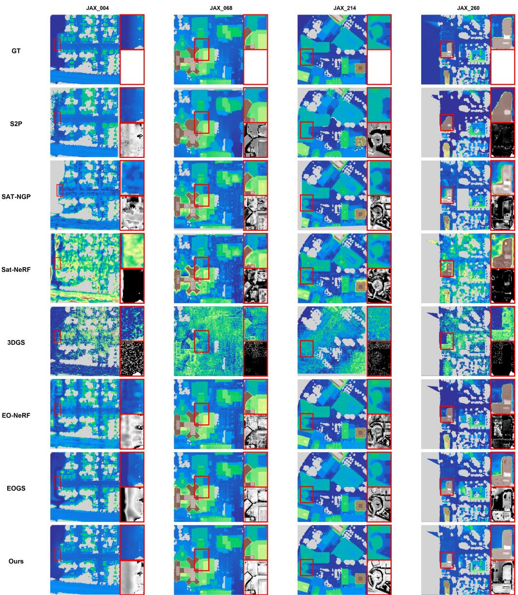  
Figure 4: Qualitative comparison of DSM reconstruction results on representative JAX scenes. Each group shows the DSM visualization, the zoomed-in local region, and the corresponding absolute height-error map.

Table 3: Local ROI error comparison between EOGS and HLC-GS on representative building-boundary regions. Both methods are evaluated within the same selected DSM grid regions.
<table><tr><td>Scene</td><td>Method</td><td>MAE</td><td>RMSE</td><td>PAG1</td><td>PAG2.5</td><td>PAG7.5</td></tr><tr><td>JAX_068</td><td>EOGS (Aira et al., 2025)</td><td>2.15</td><td>4.15</td><td>61.49</td><td>73.87</td><td>92.32</td></tr><tr><td>JAX_068</td><td>HLC-GS</td><td>1.49</td><td>3.32</td><td>71.89</td><td>86.00</td><td>94.75</td></tr><tr><td>IARPA_002</td><td>EOGS (Aira et al., 2025)</td><td>2.31</td><td>3.87</td><td>48.83</td><td>78.08</td><td>90.96</td></tr><tr><td>IARPA_002</td><td>HLC-GS</td><td>1.60</td><td>3.72</td><td>77.98</td><td>86.07</td><td>92.72</td></tr></table>

Fig. 6 shows the selected local regions and their corresponding absolute-error maps. Compared with EOGS (Aira et al., 2025), the proposed HLC-GS produces smaller residuals around building boundaries and preserves clearer height transitions between roofs and surrounding ground regions. This indicates that the proposed height-layer consistency constraint helps reduce the local height-averaging efect caused by multilayer Gaussian mixing.

The corresponding quantitative results are reported in Table 3. On these local ROIs, HLC-GS consistently achieves lower elevation errors than EOGS. Specifically, for the representative ROI selected from the JAX benchmark, the local MAE decreases from 2.15 m to 1.49 m. Similarly, for the IARPA ROI, the local MAE drops from 2.31 m to 1.60 m. These focused quantitative results are consistent with the qualitative observations and support the efectiveness of the proposed method in reducing height-layer mixing in geometrically complex regions.

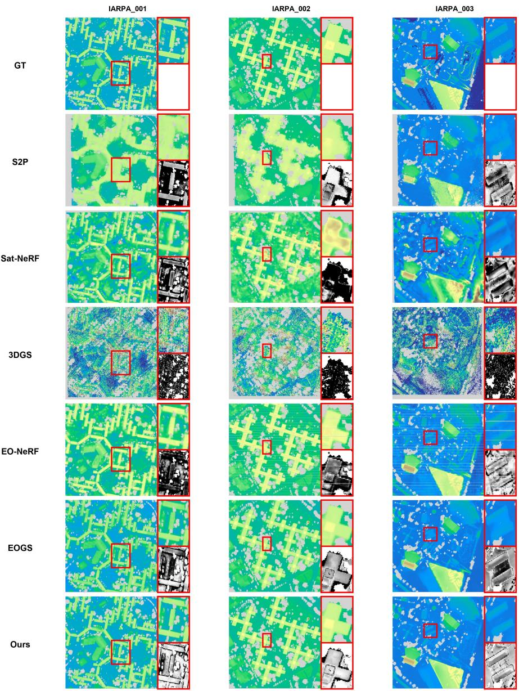  
Figure 5: Qualitative comparison of DSM reconstruction results on representative IARPA scenes. Each group shows the DSM visualization, the zoomed-in local region, and the corresponding absolute height-error map.

## 5.4. Ablation Study

## 5.4.1. Component Ablation Study

The component removal study further reveals the functional roles of RM, DRC, and SLS. The quantitative results are reported in Table 4.

• Variant (a) corresponds to the EOGS baseline (Aira et al., 2025). This variant yields the lowest overall accuracy, with an MAE of 1.46 m and an RMSE of 2.78 m. Compared with the HLC-GS model, its MAE increases by 0.28 m and $\mathrm { P A G } _ { 2 . 5 }$ decreases by 2.52 percentage points. This suggests that alpha-weighted Gaussian height aggregation alone may be insuficient to ensure geometric consistency in DSM reconstruction, motivating the need for additional geometric regularization.

• Variant (b) removes RM while retaining DRC and SLS. Its MAE increases from 1.18 m to 1 29 m, and $\mathrm { P A G } _ { 2 . 5 }$ decreases from 88 61% to 88 05%. This result indicates that the risk map helps localize high-risk pixels and improves the efectiveness of the height-layer constraints.

• Variant (c) removes DRC while retaining RM and SLS. This variant obtains an MAE of 1 25 m, but its RMSE increases to 2 68 m and $\mathrm { P A G } _ { 7 . 5 }$ decreases to 96 91%. These results indicate that DRC mainly contributes to reducing large elevation deviations by regularizing unreliable dominant-layer responses during training.

• Variant (d) removes SLS while retaining RM and DRC.

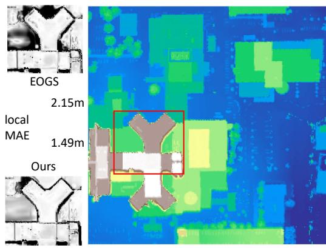

(a) JAX\_068  
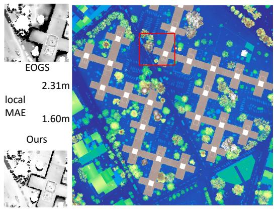  
(b) IARPA\_002  
Figure 6: Local ROI comparison on representative building-boundary regions. For each ROI, the local residual maps of EOGS (Aira et al., 2025) and HLC-GS are shown. White indicates smaller absolute height errors, while black indicates larger absolute height errors.

Its MAE increases to 1.43 m and $\mathrm { P A G } _ { 2 . 5 }$ decreases to 86.70%, indicating that weakly supported secondary-layer responses are an important source of DSM errors. This supports the importance of suppressing secondary-layer responses that are inconsistent with the dominant surface for alleviating height-layer mixing.

• Variant (e) integrates all three modules and achieves the best overall performance, with an MAE of 1.18 m, an RMSE of 2.58 m, $\mathrm { P A G } _ { 2 . 5 }$ of 88.61%, and $\mathrm { P A G } _ { 7 . 5 }$ of 97.11%. These results demonstrate that RM, DRC, and SLS are complementary and jointly improve DSM height accuracy.

In summary, RM localizes pixels with high height-layer mixing risk, DRC regularizes unreliable dominant-layer responses, and SLS suppresses inconsistent secondary heightlayer responses. Together, these modules alleviate the heightlayer mixing problem caused by alpha-weighted aggregation of Gaussian elevations, thereby improving the geometric accuracy of satellite image-based DSM reconstruction.

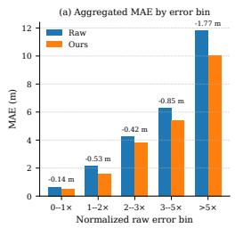

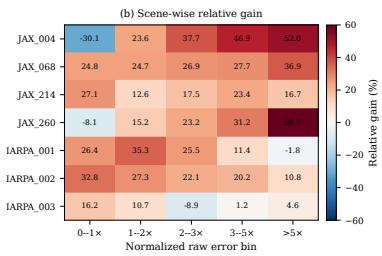  
Figure 7: Error-stratified analysis of HLC-GS across all scenes. (a) Pixelweighted aggregated MAE comparison between EOGS and HLC-GS. (b) Scene-wise relative MAE gain, where positive values indicate improvement over EOGS.

## 5.4.2. Error-Stratified Analysis

To further analyze where the proposed method brings improvements, we conduct an error-stratified analysis. For each scene, valid DSM grid cells are grouped according to the normalized EOGS absolute height error. Specifically, given the EOGS absolute error $e ^ { \mathrm { E O G S } } ( \bar { u } ) = | D ^ { \mathrm { E O G S } } ( u ) - D ^ { * } ( \bar { u } ) |$ at a valid grid cell u, we normalize it by the scene-specific EOGS MAE $m _ { s } .$ , and define the relative error ratio as $r ( u ) = e ^ { \mathrm { E O G S } } ( u ) / ( m _ { s } +$ ϵ). The valid grid cells are then divided into five intervals according to r(u): 0–1×, 1–2×, 2–3×, 3–5×, and $> 5 \times$ . This stratification avoids directly mixing scenes with diferent baseline error scales, allowing us to fairly examine whether the proposed method is efective in improving relatively high-error regions within each scene.

The aggregated results across all scenes are reported in Table 5. The proposed complete model consistently reduces the MAE across all normalized error bins. In the low-error interval 0–1×, the MAE is reduced from 0 66 m to 0 52 m, corresponding to a relative gain of 21 21%. For pixels exhibiting larger baseline errors, the absolute improvement becomes even more pronounced. Specifically, in the 3–5× interval, the MAE decreases by 0 85 m, while in the > 5× interval, the absolute reduction reaches 1 77 m. These quantitative results indicate that the proposed method is not merely limited to refining already accurate regions; more importantly, it efectively rectifies severe elevation errors that are highly associated with complex geometric ambiguities and height-layer conflicts.

Fig. 7 further illustrates the behavior of the proposed method under varying baseline error levels. The aggregated results in Fig. 7(a) show that the improvement is consistent across diferent baseline error levels and becomes more evident in high-error regions, suggesting that the proposed risk-aware height-layer consistency mechanism is particularly efective for pixels with severe elevation deviations.

The scene-wise relative gains depicted in Fig. 7(b) provide a more granular view of this trend. Most scenes achieve positive gains across the medium- and high-error intervals. This is especially evident in JAX\_004, JAX\_068, and JAX\_260, where the relative gains in the > 5× interval reach 52 0%, 36 9%, and 60 7%, respectively. These substantial improvements suggest that the proposed method efectively mitigates severe local height errors associated with complex height-layer mixing. Although a few intervals show negative gains, such as the lowerror intervals in JAX\_004 and JAX\_260, this mainly indicates that already accurate regions may occasionally be slightly overcorrected. Overall, the results demonstrate that the proposed method substantially improves DSM accuracy, particularly in regions prone to high initial errors.

Table 4: Ablation study of the proposed modules. MAE and RMSE are reported in meters, while $\mathrm { P A G } _ { 2 . 5 }$ and $\mathrm { P A G } _ { 7 . 5 }$ are reported in percentage. $\mathrm { P A G } _ { 2 . 5 }$ and $\mathrm { P A G } _ { 7 . 5 }$ denote the percentages of DSM grid cells whose absolute height errors are below 2 5 m and 7 5 m, respectively. The best results are highlighted in bold, and values in red indicate the performance degradation caused by removing the corresponding module compared with the HLC-GS model.
<table><tr><td rowspan="2">Variants</td><td colspan="3">Components</td><td rowspan="2">MAE↓</td><td rowspan="2">RMSE↓</td><td rowspan="2"> $\mathrm { P A G } _ { 2 . 5 } \uparrow$ </td><td rowspan="2"> $\mathrm { P A G } _ { 7 . 5 } \uparrow$ </td></tr><tr><td>RM</td><td>DRC</td><td>SLS</td></tr><tr><td>(a) EOGS</td><td>X</td><td>X</td><td>X</td><td>1.46↑0.28</td><td>2.78↑0.20</td><td> $8 6 . 0 9 \downarrow 2 . 5 2$ </td><td> $9 7 . 0 3 \downarrow 0 . 0 8 $ </td></tr><tr><td>(b) w/o RM</td><td>X</td><td>V</td><td>V</td><td>1.29↑0.11</td><td>2.63↑0.05</td><td>88.05↓0.56</td><td>97.08↓0.03</td></tr><tr><td>(c) w/o DRC</td><td>√</td><td>X</td><td>√</td><td>1.25↑0.07</td><td>2.68↑0.10</td><td>88.34↓0.27</td><td>96.91↓0.20</td></tr><tr><td>(d) w/o SLS</td><td>V</td><td>√</td><td>X</td><td>1.43↑0.25</td><td>2.70↑0.12</td><td>86.70↓1.91</td><td>97.01↓0.10</td></tr><tr><td>(e) HLC-GS</td><td>V</td><td>√</td><td>V</td><td>1.18</td><td>2.58</td><td>88.61</td><td>97.11</td></tr></table>

Table 5: Error-stratified comparison between EOGS and HLC-GS across all scenes. Error bins are defined by the baseline absolute height error normalized by the scene-specific EOGS MAE.
<table><tr><td>EOGS error bin</td><td>Pixels</td><td>EOGS MAE</td><td>HLC-GS MAE</td><td>∆MAE</td><td>Rel. gain</td></tr><tr><td>0-1×</td><td>2,062,682</td><td>0.66</td><td>0.52</td><td>0.14</td><td>21.21%</td></tr><tr><td>1-2×</td><td>311,223</td><td>2.14</td><td>1.61</td><td>0.53</td><td>24.77%</td></tr><tr><td>2-3×</td><td>158,238</td><td>4.24</td><td>3.83</td><td>0.41</td><td>9.67%</td></tr><tr><td>3-5×</td><td>130,117</td><td>6.26</td><td>5.41</td><td>0.85</td><td>13.58%</td></tr><tr><td>&gt; 5x</td><td>75,235</td><td>11.82</td><td>10.05</td><td>1.77</td><td>14.97%</td></tr></table>

## 5.4.3. Risk-stratified Error Analysis

Beyond the error-stratified analysis, we further examine whether the computed HLC risk map is correlated with errorprone DSM regions. To this end, valid DSM grid cells in each scene are ranked by their HLC risk scores and partitioned into ten risk deciles. The MAE and $\mathrm { P A G } _ { 2 . 5 }$ of the EOGS baseline (Aira et al., 2025) and HLC-GS are then evaluated within each decile. This distributional analysis examines whether higher-risk deciles correspond to larger baseline errors and whether HLC-GS provides stronger improvements in regions assigned higher risk by the proposed map.

As shown in Table $^ { 6 , }$ the highest-risk decile corresponds to the most challenging group. Specifically, the EOGS baseline yields an MAE of 2 60 m in the 10th risk decile, which is clearly higher than the errors in most lower-risk deciles. This suggests that the computed risk map can identify a high-risk tail of errorprone regions, although the lower and middle deciles are not strictly monotonic with respect to DSM error. With HLC-GS, the MAE in the highest-risk decile is reduced from 2 60 m to 2 31 m, while $\mathrm { P A G } _ { 2 . 5 }$ increases by 4 37 percentage points.

In addition, HLC-GS reduces MAE across all risk deciles, indicating that the proposed height-layer consistency constraint consistently improves upon the EOGS baseline. The largest $\mathrm { P A G } _ { 2 . 5 }$ gain appears in the highest-risk decile, further supporting the efectiveness of applying height-layer constraints to regions prone to severe geometric ambiguity and height-layer conflicts.

Table 6: Risk-stratified error analysis of the computed HLC risk map. DSM grid cells are divided into ten deciles according to their HLC risk scores. ∆MAE and $\Delta \mathrm { P A G } _ { 2 . 5 }$ denote the improvements from EOGS to HLC-GS.
<table><tr><td>Decile</td><td>Risk</td><td>EOGS MAE</td><td>HLC-GS MAE</td><td>∆MAE</td><td>EOGS PAG2.5</td><td>HLC-GS PAG2.5</td><td>∆PAG2.5</td></tr><tr><td>1</td><td>0.07</td><td>1.47</td><td>1.24</td><td>0.23</td><td>84.88</td><td>86.86</td><td>1.98</td></tr><tr><td>2</td><td>0.20</td><td>1.43</td><td>1.19</td><td>0.24</td><td>85.68</td><td>88.21</td><td>2.53</td></tr><tr><td>3</td><td>0.28</td><td>1.31</td><td>1.06</td><td>0.25</td><td>88.01</td><td>89.66</td><td>1.65</td></tr><tr><td>4</td><td>0.35</td><td>1.29</td><td>1.03</td><td>0.26</td><td>88.46</td><td>90.23</td><td>1.77</td></tr><tr><td>5</td><td>0.41</td><td>1.28</td><td>1.01</td><td>0.27</td><td>88.38</td><td>90.32</td><td>1.94</td></tr><tr><td>6</td><td>0.45</td><td>1.29</td><td>0.97</td><td>0.32</td><td>88.71</td><td>91.43</td><td>2.72</td></tr><tr><td>7</td><td>0.49</td><td>1.27</td><td>0.97</td><td>0.30</td><td>88.65</td><td>91.65</td><td>3.00</td></tr><tr><td>8</td><td>0.52</td><td>1.28</td><td>1.04</td><td>0.24</td><td>88.60</td><td>90.57</td><td>1.97</td></tr><tr><td>9</td><td>0.54</td><td>1.27</td><td>0.93</td><td>0.34</td><td>88.69</td><td>91.76</td><td>3.07</td></tr><tr><td>10</td><td>1.00</td><td>2.60</td><td>2.31</td><td>0.29</td><td>72.03</td><td>76.40</td><td>4.37</td></tr></table>

## 5.4.4. Risk-Map Localization Analysis

While the risk-stratified error analysis evaluates the full risk distribution, this analysis focuses on the most risky regions identified by the HLC risk map. To examine whether the proposed risk map can localize meaningful error-prone regions, we conduct a high-risk region analysis. For each scene, pixels are ranked according to their computed HLC risk scores, and the top 10% and top 20% high-risk pixels are selected for evaluation. The performance of the EOGS baseline (Aira et al., 2025) and the proposed HLC-GS is then compared within these regions using MAE and PAG metrics. This analysis examines whether the risk map tends to localize unreliable pixels where height-layer conflicts are more likely to occur, and whether the proposed height-layer consistency constraint can improve reconstruction accuracy in these challenging regions.

The aggregated results are reported in Table 7. The selected high-risk regions exhibit larger errors than the average DSM evaluation regions, indicating that the computed risk map assigns high scores to geometrically ambiguous areas rather than highlighting pixels arbitrarily. Specifically, the EOGS baseline reaches an MAE of 2 60 m in the top 10% risk pixels and 1 93 m in the top 20% risk pixels. After applying HLC-GS, the MAE is reduced by 0 29 m and 0 31 m in the top 10% and top 20% risk regions, respectively. Meanwhile, the $\mathrm { P A G } _ { 1 }$ metric increases by 12.34 and 11.77 percentage points, while $\mathrm { P A G } _ { 2 . 5 }$ increases by 4 37 and 3 72 percentage points. These results suggest that the proposed risk-aware height-layer consistency constraint improves DSM reconstruction accuracy in the high-risk regions localized by the risk map.

It is worth noting that the improvement in $\mathrm { P A G } _ { 7 . 5 }$ is relatively marginal, with gains of 0 29 and 0 33 percentage points in the top 10% and top 20% risk regions, respectively. This is mainly because $\mathrm { P A G } _ { 7 . 5 }$ is already close to saturation in these regions, leaving limited room for further improvement. In contrast, $\mathrm { P A G } _ { 1 }$ and $\mathrm { P A G } _ { 2 . 5 }$ are more sensitive to fine-grained DSM accuracy, and their consistent improvements better reflect the benefit of the proposed method in high-risk regions. As shown in Fig. 8, HLC-GS generally achieves positive gains in the top 10% and top 20% high-risk regions identified by the proposed HLC risk map. While a few individual cases, such as JAX\_260 and IARPA\_003 in the top 10% risk region, show limited or slightly negative MAE gains, most scenes exhibit positive MAE reductions and $\mathrm { P A G } _ { 2 . 5 }$ improvements. This suggests that the risk map can localize challenging regions where height-layer consistency constraints are beneficial, although a few highly ambiguous regions may still be afected by severe occlusions or unreliable Gaussian support. Overall, the positive gains in highrisk regions support both the localization ability of the risk map and the efectiveness of the proposed height-layer consistency constraint.

Table 7: Top-risk region analysis based on the computed HLC risk map. DSM grid cells are ranked by HLC risk score within each scene, and metrics are computed over the top 10% and top 20% high-risk pixels.
<table><tr><td>Region</td><td>EOGS MAE</td><td>Ours MAE</td><td>∆MAE</td><td> $\Delta \mathrm { P A G } _ { 1 }$ </td><td> $\Delta \mathrm { P A G } _ { 2 . 5 }$ </td><td> $\Delta \mathrm { P A G } _ { 7 . 5 }$ </td></tr><tr><td>Top 10% risk</td><td>2.60</td><td>2.31</td><td>0.29</td><td>12.34</td><td>4.37</td><td>0.29</td></tr><tr><td>Top 20% risk</td><td>1.93</td><td>1.62</td><td>0.31</td><td>11.77</td><td>3.72</td><td>0.33</td></tr></table>

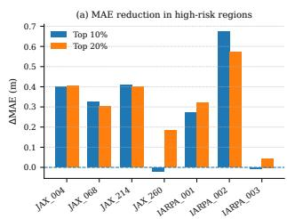

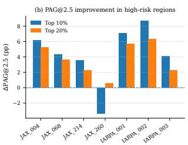  
Figure 8: Top-risk region analysis using the computed HLC risk map. Metrics are evaluated on the top 10% and top 20% high-risk DSM grid cells in each scene. (a) MAE reduction and (b) PAG2 5 improvement from EOGS to HLC-GS, where positive values indicate improvements.

## 5.5. Eficiency comparison

We report the average scene-level runtime of the proposed method and six comparative methods in Table 8. For most methods, the runtime is averaged over all seven AOIs; for SAT-NGP, the runtime is reported only on the JAX scenes. The results show several notable trends.

First, NeRF-based methods, including SAT-NGP (Billouard et al., 2024), Sat-NeRF (Marí et al., 2022), and EO-NeRF (Marí et al., 2023), generally require longer runtimes for scene optimization and DSM generation. Although these methods improve reconstruction quality over traditional pipelines in some cases, their computational cost remains relatively high, especially for EO-NeRF (Marí et al., 2023).

Second, 3DGS-based methods, such as the original 3DGS (Kerbl et al., 2023) and EOGS (Aira et al., 2025), are highly eficient. They require only 1.92 min and 5.98 min per scene, respectively. However, as shown in the quantitative DSM evaluation, their generated DSMs still sufer from noticeable height errors.

Table 8: Runtime comparison of diferent DSM reconstruction methods. Runtime is averaged over all evaluated scenes and reported in minutes.
<table><tr><td>Method</td><td>Runtime per scene (min)</td></tr><tr><td>S2P (De Franchis et al., 2014)</td><td>7.52</td></tr><tr><td>SAT-NGP (Billouard et al., 2024)</td><td>23.13</td></tr><tr><td>Sat-NeRF (Marí et al., 2022)</td><td>56.03</td></tr><tr><td>EO-NeRF (Marí et al., 2023)</td><td>748.80</td></tr><tr><td>3DGS (Kerbl et al., 2023)</td><td>1.92</td></tr><tr><td>EOGS (Aira et al., 2025)</td><td>5.98</td></tr><tr><td>Ours</td><td>6.71</td></tr></table>

Table 9: Parameter sensitivity analysis of the maximum HLC weight on JAX\_068. All results are evaluated using the same protocol as the main experiments.
<table><tr><td>HLC weight</td><td>MAE</td><td>RMSE</td><td> $\mathrm { P A G } _ { 2 . 5 }$ </td><td> $\mathrm { P A G } _ { 7 . 5 }$ </td></tr><tr><td> $1 . 0 \times 1 0 ^ { - 2 }$ </td><td>0.77</td><td>2.02</td><td>93.53</td><td>98.67</td></tr><tr><td> $1 . 5 \times 1 0 ^ { - 2 }$ </td><td>0.74</td><td>1.91</td><td>93.62</td><td>98.72</td></tr><tr><td> $1 . 8 7 5 \times 1 0 ^ { - 2 }$ </td><td>0.76</td><td>1.93</td><td>93.53</td><td>98.69</td></tr><tr><td> $2 . 2 5 \times 1 0 ^ { - 2 }$ </td><td>0.75</td><td>1.92</td><td>93.47</td><td>98.68</td></tr><tr><td> $3 . 0 { \times } 1 0 ^ { - 2 }$ </td><td>0.76</td><td>1.95</td><td>93.46</td><td>98.61</td></tr></table>

Compared with EOGS, the proposed method slightly increases the average runtime from 5.98 min to 6.71 min per scene. This moderate additional cost mainly comes from the proposed height-layer consistency optimization. Nevertheless, Ours remains much more eficient than all NeRF-based base lines and even the traditional S2P (De Franchis et al., 2014) pipeline (7.52 min), while consistently improving DSM reconstruction accuracy. These results indicate that the proposed method achieves a favorable balance between reconstruction accuracy and computational eficiency by preserving the eficiency advantage of 3DGS while substantially improving the geometric quality of the generated DSMs.

## 5.6. Parameter sensitivity analysis

To evaluate the sensitivity of the proposed method to the maximum global HLC weight, we conduct a parameter sensitivity analysis on the JAX\_068 scene. As shown in Table 9, the proposed method maintains stable performance when the maximum HLC weight varies from $1 . 0 { \times } 1 0 ^ { - 2 } \ \mathrm { t o } \ 3 . 0 { \times } 1 0 ^ { - 2 }$ . The MAE remains within a narrow range from 0.74 m to 0.77 m, and $\mathrm { P A G } _ { 2 . 5 }$ stays around 93.5% under diferent weight settings. This indicates that the proposed HLC-GS is not highly sensitive to moderate changes in the HLC weight.

Among the tested settings, $1 . 5 \times 1 0 ^ { - 2 }$ achieves the best overall performance, with an MAE of $0 . 7 4$ m, an RMSE of 1.91 m, $\mathrm { P A G } _ { 2 . 5 }$ of 93.62%, and $\mathrm { P A G } _ { 7 . 5 }$ of 98.72%. When the weight is further increased, the performance remains comparable but does not continue to improve, suggesting that an overly strong height-layer consistency constraint does not provide additional benefits. Therefore, we adopt $1 . 5 \times 1 0 ^ { - 2 }$ as the final maximum HLC weight to balance DSM accuracy and training stability.

## 5.7. Discussion

The experimental results suggest that the remaining errors of existing 3DGS-based DSM reconstruction methods are not solely related to rendered image quality, but also to the way surface elevations are derived from the optimized Gaussian representation. Although EOGS can produce visually plausible rendered images, DSM generation relies on alpha-weighted aggregation of Gaussian altitudes at rendered pixels. When projected Gaussian splats from diferent height layers jointly contribute to the same pixel, the estimated elevation may be pulled toward a non-physical intermediate height. This explains why residual DSM errors are still frequently observed around building boundaries, roof–ground transitions, and occluded regions, where height discontinuities are common.

The proposed HLC-GS addresses this problem by introducing a risk-map-guided height-layer consistency constraint. Instead of applying uniform height regularization to all rendered pixels, the risk map $R _ { \mathrm { H L C } } ( u )$ localizes pixels with abnormal height dispersion and unreliable dominant-layer responses, while further emphasizing extreme height-dispersion cases through upper-tail amplification. This design allows the HLC losses to focus on geometrically unstable regions while avoiding unnecessary penalties in stable regions. Moreover, the components of the HLC loss are complementary. The dominant-layer reliability correction term regularizes unreliable dominant-layer responses that have large compositing contributions but insuficient opacity support quality, while the secondary-layer and far-layer suppression terms restrict inconsistent non-dominant contributions. Their combined efect reduces both the reinforcement of unreliable dominant-layer responses and the contamination from inconsistent secondary layers.

The qualitative results across JAX and IARPA further suggest that HLC-GS is most beneficial in regions with height discontinuities, such as building boundaries and roof–ground transitions. This is consistent with the proposed motivation that height-layer consistency constraints can alleviate elevation errors caused by mixed Gaussian contributions from diferent height layers. Nevertheless, residual errors may still appear in highly complex regions afected by vegetation, shadows, occlusions, or insuficient multi-view observations, indicating that these factors may require additional modeling beyond heightlayer consistency.

Despite its efectiveness, HLC-GS still has several limitations. First, the proposed risk map regularizes height responses represented by existing Gaussian primitives, but it cannot fully recover geometric structures that are severely occluded or poorly observed in the input images. Second, in regions with dense vegetation or strong multi-temporal appearance variations, local DSM errors may be caused by land-cover changes rather than height-layer mixing alone. In addition, several thresholds and loss weights are empirically set, although the sensitivity analysis indicates that the method remains stable within a reasonable range of the maximum HLC weight. Future work will explore more adaptive risk estimation, stronger multi-view visibility modeling, and land-cover-aware reliability estimation for more robust large-area satellite image-based DSM reconstruction.

## 6. Conclusion

In this paper, we proposed HLC-GS, a risk-map-guided height-layer consistency Gaussian Splatting framework, to address the height-layer mixing problem in satellite image-based DSM reconstruction. While existing alpha-weighted elevation aggregation strategies may sufer from elevation ambiguity due to multi-layer Gaussian blending, HLC-GS introduces a perpixel height-layer mixing risk map to localize and constrain unstable regions. By jointly modeling dominant-layer reliability and secondary-layer inconsistency, our method suppresses unreliable height responses and reduces the risk of reinforcing weakly supported layers, thereby alleviating the intermediateheight bias caused by height-layer mixing.

Evaluations across seven regions of interest demonstrate that the proposed HLC-GS improves DSM reconstruction in terms of both overall height accuracy and the reconstruction of local building-structure preservation. Specifically, the proposed height-layer consistency constraints reduce elevation errors in geometrically challenging regions characterized by severe height discontinuities. Furthermore, parameter sensitivity analysis indicates that HLC-GS remains stable under moderate changes in the maximum HLC weight.

By improving the reliability of explicit elevation recovery from satellite imagery, HLC-GS provides a promising solution for satellite image-based DSM reconstruction and related downstream remote sensing applications, such as 3D city modeling, urban mapping, and geospatial analysis. In future work, we plan to extend this framework to eficient large-scale satellite scene reconstruction and explore its generalization capabilities across more diverse land-cover types, imaging conditions, and multi-source remote sensing data.

## Declaration of competing interest

The authors declare that they have no known competing financial interests or personal relationships that could have appeared to influence the work reported in this paper.

## Acknowledgements

This work was supported by the National Science Fund for Distinguished Young Scholars grant number 62425102, Hubei Province Strategic Talent Cultivation Project No. 2024DJA035, and LIESMARS Special Research Funding.

## References

Aira, L.S., Facciolo, G., Ehret, T., 2025. Gaussian splatting for eficient satellite image photogrammetry, in: Proceedings of the Computer Vision and Pattern Recognition Conference, pp. 5959–5969. doi:10.1109/CVPR52734.2025.00559.

Amadei, T., Meinhardt-Llopis, E., de Franchis, C., Anger, J., Ehret, T., Facciolo, G., 2025. s2p-hd: Gpu-accelerated binocular stereo pipeline for large-scale same-date stereo, in: Proceedings of the Computer Vision and Pattern Recognition Conference, pp. 2339–2348. doi:10.1109/cvprw67362. 2025.00220.

Bai, N., Yang, A., Chen, H., Du, C., 2025. Satgs: Remote sensing novel view synthesis using multi-temporal satellite images with appearance-adaptive 3dgs. Remote Sensing 17, 1609. doi:10.3390/rs17091609.

Beyer, R.A., Alexandrov, O., McMichael, S., 2018. The ames stereo pipeline: Nasa’s open source software for deriving and processing terrain data. Earth and Space Science 5, 537–548. doi:10.1029/2018ea000409.

Billouard, C., Derksen, D., Sarrazin, E., Vallet, B., 2024. Sat-ngp: Unleashing neural graphics primitives for fast relightable transient-free 3d reconstruction from satellite imagery, in: IGARSS 2024-2024 IEEE International Geoscience and Remote Sensing Symposium, IEEE. pp. 8749– 8753. doi:10.1109/igarss53475.2024.10641775.

Bosch, M., Foster, K., Christie, G., Wang, S., Hager, G.D., Brown, M., 2019. Semantic stereo for incidental satellite images, in: 2019 IEEE Winter Conference on Applications of Computer Vision (WACV), IEEE. pp. 1524–1532. doi:10.1109/wacv.2019.00167.

Bosch, M., Kurtz, Z., Hagstrom, S., Brown, M., 2016. A multiple view stereo benchmark for satellite imagery, in: 2016 IEEE Applied Imagery Pattern Recognition Workshop (AIPR), IEEE. pp. 1–9. doi:10.1109/aipr.2016. 8010543.

Chen, B., Pan, Z., Yang, J., Long, H., 2024. Acmfnet: Attention-based cross-modal fusion network for building extraction of remote sensing images. IEEE Transactions on Geoscience and Remote Sensing 62, 1–14. doi:10.1109/ tgrs.2024.3400979.

d’Angelo, P., Kuschk, G., 2012. Dense multi-view stereo from satellite imagery, in: 2012 IEEE international geoscience and remote sensing symposium, IEEE. pp. 6944–6947. doi:10. 1109/igarss.2012.6352565.

De Franchis, C., Meinhardt-Llopis, E., Michel, J., Morel, J.M., Facciolo, G., 2014. An automatic and modular stereo pipeline for pushbroom images, in: ISPRS Annals of the Photogrammetry, Remote Sensing and Spatial Information Sciences, pp. 49–56. doi:10.5194/ isprsannals-ii-3-49-2014.

Derksen, D., Izzo, D., 2021. Shadow neural radiance fields for multi-view satellite photogrammetry, in: Proceedings of the IEEE/CVF Conference on Computer Vision and Pattern Recognition, pp. 1152–1161. doi:10.1109/cvprw53098. 2021.00126.

Facciolo, G., De Franchis, C., Meinhardt, E., 2015. Mgm: A significantly more global matching for stereovision, in: BMVC 2015. doi:10.5244/c.29.90.

Facciolo, G., De Franchis, C., Meinhardt-Llopis, E., 2017. Automatic 3d reconstruction from multi-date satellite images, in: Proceedings of the IEEE Conference on Computer Vision and Pattern Recognition Workshops, pp. 57–66. doi:10.1109/cvprw.2017.198.

Gao, J., Liu, J., Ji, S., 2023. A general deep learning based framework for 3d reconstruction from multi-view stereo satellite images. ISPRS Journal of Photogrammetry and Remote Sensing 195, 446–461. doi:10.1016/j.isprsjprs. 2022.12.012.

Ghufar, S., 2016. Satellite stereo based digital surface model generation using semi global matching in object and image space. ISPRS Annals of the Photogrammetry, Remote Sensing and Spatial Information Sciences 3, 63–68. doi:10.5194/ISPRS-ANNALS-III-1-63-2016.

Gong, K., Fritsch, D., 2019. Dsm generation from high resolution multi-view stereo satellite imagery. Photogrammetric Engineering & Remote Sensing 85, 379–387. doi:10. 14358/pers.85.5.379.

Hirschmuller, H., 2008. Stereo processing by semiglobal matching and mutual information. IEEE Transactions on pattern analysis and machine intelligence 30, 328–341. doi:10. 1109/tpami.2007.1166.

Huang, X., Liu, X., Wan, Y., Zheng, Z., Zhang, B., Xiong, M., Pei, Y., Zhang, Y., 2026. Skysplat: Generalizable 3d gaussian splatting from multi-temporal sparse satellite images. Proceedings of the AAAI Conference on Artificial Intelligence 40, 5158–5166. doi:10.1609/aaai.v40i7.37430.

Kerbl, B., Kopanas, G., Leimkühler, T., Drettakis, G., 2023. 3d gaussian splatting for real-time radiance field rendering. ACM Trans. Graph. 42, 139–1. doi:10.1145/3592433.

Lee, J.Y., Liu, Y.R., Tsai, S.R., Chang, W.C., Wu, C.H., Chan, J., Zhao, Z., Lin, C.H., Liu, Y.L., 2025. Skyfall-GS: Syn thesizing immersive 3D urban scenes from satellite imagery. arXiv preprint arXiv:2510.15869.

Li, J., Wang, Z., Xu, N., You, Z., Huang, D.S., 2025. Vision foundation model-driven multiscale expert tuning for multimodal remote sensing semantic segmentation. IEEE Transactions on Geoscience and Remote Sensing 63, 1–17. doi:10.1109/tgrs.2025.3627904.

Li, W., Yang, H., Hu, Z., Zheng, J., Xia, G.S., He, C., 2024. 3d building reconstruction from monocular remote sensing images with multi-level supervisions, in: Proceedings of the IEEE/CVF Conference on Computer Vision and Pattern Recognition, pp. 27728–27737. doi:10.1109/cvpr52733. 2024.02619.

Lu, J., Li, Y., Zuo, Z., 2021. Satmvs: A novel 3d reconstruction pipeline for remote sensing satellite imagery, in: International Conference on Aerospace System Science and Engineering, Springer. pp. 521–538. doi:10.1007/ 978-981-16-8154-7\_39.

Ma, X., Zhang, X., Pun, M.O., Huang, B., 2025. A unified framework with multimodal fine-tuning for remote sensing semantic segmentation. IEEE Transactions on Geoscience and Remote Sensing doi:10.1109/tgrs.2025.3585238.

Marí, R., Facciolo, G., Ehret, T., 2023. Multi-date earth observation nerf: The detail is in the shadows, in: Proceedings of the IEEE/CVF Conference on Computer Vision and Pattern Recognition, pp. 2035–2045. doi:10.1109/cvprw59228. 2023.00197.

Marí, R., Facciolo, G., Ehret, T., 2022. Sat-nerf: Learning multi-view satellite photogrammetry with transient objects and shadow modeling using rpc cameras, in: 2022 IEEE/CVF Conference on Computer Vision and Pattern Recognition Workshops (CVPRW), pp. 1310–1320. doi:10. 1109/CVPRW56347.2022.00137.

Mildenhall, B., Srinivasan, P.P., Tancik, M., Barron, J.T., Ramamoorthi, R., Ng, R., 2021. Nerf: Representing scenes as neural radiance fields for view synthesis. Communications of the ACM 65, 99–106. doi:10.1145/3503250.

Porras-Diaz, N., Ramirez-Jaime, A., Arce, G.R., Stephen, M., 2025. Toward submeter satellite surface topography and vegetation mapping using lidar/rgb constrained generative difusion. IEEE Transactions on Geoscience and Remote Sensing 63, 1–14. doi:10.1109/tgrs.2025.3627143.

Qin, R., 2019a. Automated 3D recovery from very high resolution multi-view satellite images. arXiv preprint arXiv:1905.07475.

Qin, R., 2019b. A critical analysis of satellite stereo pairs for digital surface model generation and a matching quality prediction model. ISPRS Journal of Photogrammetry and Remote Sensing 154, 139–150. doi:10.1016/j.isprsjprs. 2019.06.005.

Qin, R., Ling, X., Farella, E.M., Remondino, F., 2022. Uncertainty-guided depth fusion from multi-view satellite images to improve the accuracy in large-scale dsm generation. Remote Sensing 14, 1309. doi:10.3390/rs14061309.

Qu, Y., Deng, F., 2023. Sat-mesh: Learning neural implicit surfaces for multi-view satellite reconstruction. Remote Sensing 15, 4297. doi:10.3390/rs15174297.

Rupnik, E., Daakir, M., Pierrot Deseilligny, M., 2017. Micmac– a free, open-source solution for photogrammetry. Open geospatial data, software and standards 2, 14. doi:10.1186/ s40965-017-0027-2.

Rupnik, E., Pierrot Deseilligny, M., Delorme, A., Klinger, Y., 2016. Refined satellite image orientation in the free open-source photogrammetric tools apero/micmac. IS-PRS Annals of the Photogrammetry, Remote Sensing and Spatial Information Sciences III-1, 83–90. doi:10.5194/ isprs-annals-III-1-83-2016.

Semeraro, F., Zhang, Y., Wu, W., Carroll, P., 2023. Nerf applied to satellite imagery for surface reconstruction. arXiv preprint arXiv:2304.04133.

Shean, D.E., Alexandrov, O., Moratto, Z.M., Smith, B.E., Joughin, I.R., Porter, C., Morin, P., 2016. An automated, open-source pipeline for mass production of digital elevation models (dems) from very-high-resolution commercial stereo satellite imagery. ISPRS Journal of Photogrammetry and Remote Sensing 116, 101–117. doi:10.1016/j.isprsjprs. 2016.03.012.

Wan, Q., Guan, Y., Zhao, Q., Wen, X., She, J., 2024. Constraining the geometry of nerfs for accurate dsm generation from multi-view satellite images. ISPRS International Journal of Geo-Information 13, 243. doi:10.3390/ijgi13070243.

Yao, X., Wang, X., Wu, H., Ping, C., Zhang, D., Xiong, H., 2025. Magiccity: Geometry-aware 3d city generation from satellite imagery with multi-view consistency, in: Proceedings of the IEEE/CVF International Conference on Computer Vision, pp. 25325–25334. doi:10.1109/iccv51701.2025. 02349.

Yao, Y., Luo, Z., Li, S., Fang, T., Quan, L., 2018. Mvsnet: Depth inference for unstructured multi-view stereo, in: Proceedings of the European conference on computer vision (ECCV), pp. 767–783. doi:10.1007/ 978-3-030-01237-3\_47.

Yihang Xu, Q.D., 2026. Sa-gs: Season-aware afine 3d gaussian splatting for satellite image rendering. ISPRS Journal of Photogrammetry and Remote Sensing 236, 474–486. doi:10.1016/j.isprsjprs.2026.04.018.

Yin, T., Montesano, P.M., Cook, B.D., Chavanon, E., Neigh, C.S., Shean, D., Peng, D., Lauret, N., Mkaouar, A., Morton, D.C., et al., 2023. Modeling forest canopy surface retrievals using very high-resolution spaceborne stereogrammetry:(i) methods and comparisons with actual data. Remote Sensing of Environment 298, 113825. doi:10.1016/j.rse.2023. 113825.

Yuan, X., Tian, J., Reinartz, P., 2024. A self-training approach using benchmark dataset and stereo-dsm for building extraction. IEEE Journal of Selected Topics in Applied Earth Observations and Remote Sensing 17, 11352–11364. doi:10.1109/jstars.2024.3412369.

Zhou, X., Wang, Y., Lin, D., Cao, Z., Li, B., Liu, J., 2024. Satelliterf: Accelerating 3d reconstruction in multi-view satellite images with eficient neural radiance fields. Applied Sciences 14, 2729. doi:10.3390/app14072729.