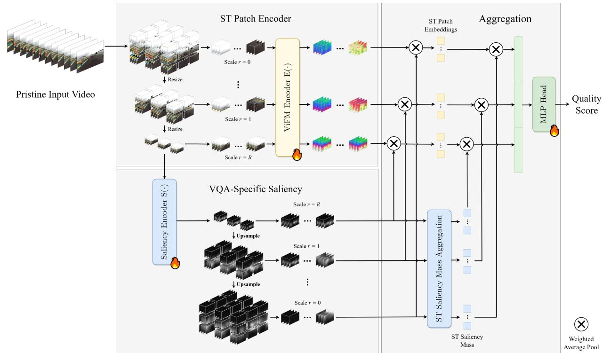
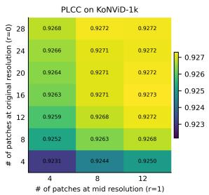
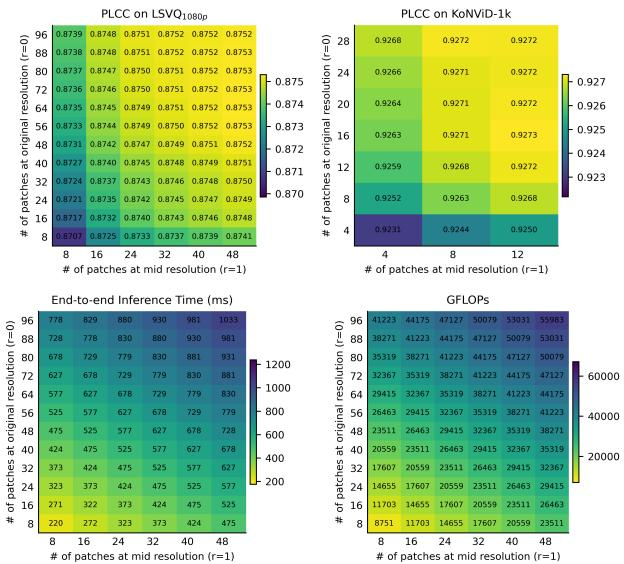
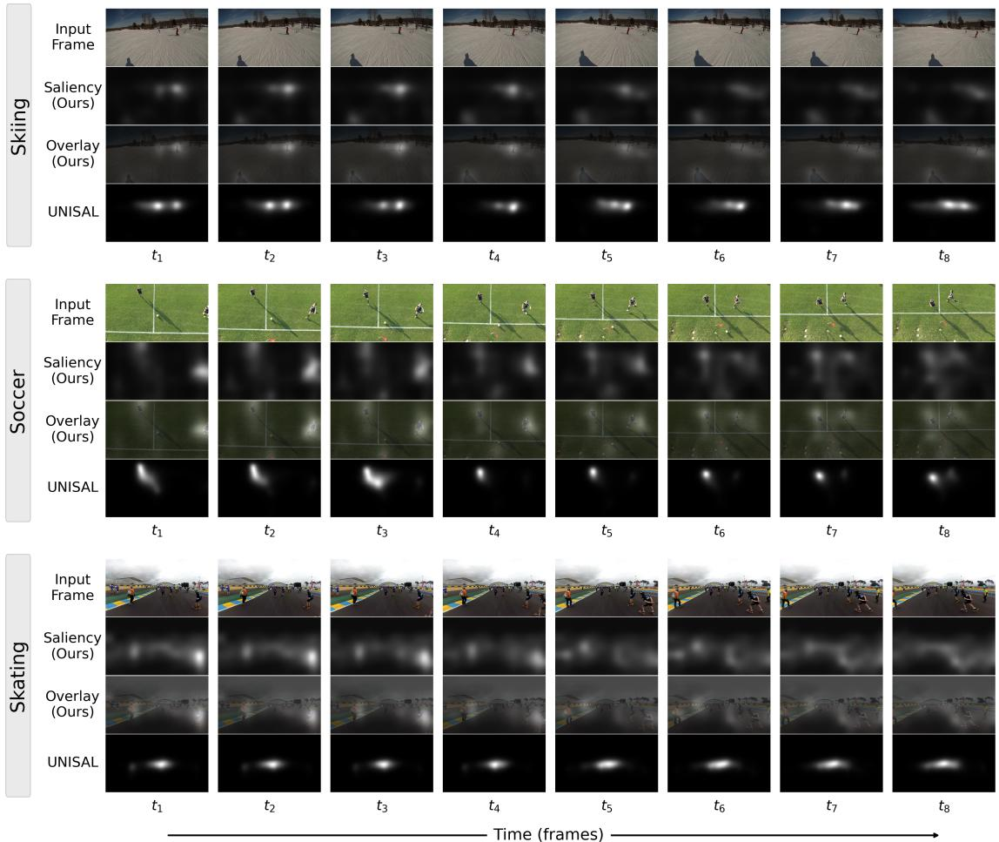

# High-Fidelity Video Quality Assessment with VQA-Specific Saliency

Hakan Emre Gedik1, Shashank Gupta1, Alan Bovik1,2

1 The University of Texas at Austin, 2 University of Colorado Boulder

{hakan.gedik, shashank.gupta}@utexas.edu Alan.Bovik@colorado.edu

## Abstract

No-reference video quality assessment (NR VQA) has recently seen promising progress with deep learning. However, video data is inherently large, and processing them with deep models incurs high computational cost. This challenge is particularly acute in VQA, where preserving original-resolution cues and dense temporal information is critical for accuracy. Existing efficiency-driven preprocessing strategies, such as fragmenting, reduce computation but alter the input data distribution, limiting effective reuse of pretrained video foundation models (ViFMs). To address these challenges, we propose High-Fidelity Video Quality Assessment (HFVQA), aframework built on fixedsize spatio-temporal (ST) patches that is fully compatible with pretrained ViFMs. HFVQA samples STpatches across multiple scales, including the original resolution, with minimal temporal subsampling to preserve low-level quality cues and semantic context. To limit computation, HFVQA introduces a lightweight auxiliary network trained end-toend with the ViFM encoder to learn VQA-specific saliency. Distilled directly from quality supervision, this saliency captures task-specific importance patterns, reflecting that video quality perception is dominated by a small subset of spatio-temporal regions. By combining high-fidelity spatiotemporal cues with learned, task-specific saliency, HFVQA achieves SOTA performance on standard NR VQA benchmarks while processing as little as 12% of candidate ST patches, making high-fidelity ViFM-based VQA computationally tractable.

## 1. Introduction

No-reference video quality assessment (NR-VQA) is a challenging problem due to the diversity of visual content and real-world distortions. Early approaches relied on handcrafted natural scene statistics (NSS) features [15, 19, 29, 30, 35, 41, 43], but such methods struggle to generalize beyond limited distortion models. More recently, deep learning–based methods [22, 27, 39, 48, 51–53, 59, 60, 64] have demonstrated strong performance by learning data-driven quality representations. However, video data is inherently large, and naively processing dense spatio-temporal signals with deep models incurs substantial computational cost. Therefore, how video data is processed has become a central design challenge for enabling practical VQA deployment [52, 53].

Unlike recognition-centric vision tasks, VQA depends not only on high-level semantics but also on low-level characteristics of visual signals. While aggressive spatial or temporal subsampling is often acceptable for semantic understanding, such strategies risk discarding quality-critical cues. For example, spatial downsampling can obscure artifacts related to sharpness or noise, while temporal subsampling may mask flicker and motion-related distortions. Consequently, input processing is a particularly critical design choice in VQA, as it must balance computational efficiency with the preservation of fine-grained quality cues.

However, some widely used NR VQA benchmarks contain distortions that are largely spatial or slowly varying in time, where heavy temporal subsampling (e.g., 3.2 FPS) incurs little performance degradation [40]. Partly for this reason, many SOTA methods [27, 33, 52, 53, 55] adopt sparse frame sampling to reduce computational cost. Such subsampling, however, limits sensitivity to high-frequency temporal artifacts such as flicker or fast motion, causing these methods to underperform on temporally challenging benchmarks.

Another challenge in deep VQA is the scarcity of annotated data. Subjective quality assessment studies are expensive and time-consuming, severely limiting the size of publicly available datasets. Moreover, supervision is typically restricted to a single scalar mean opinion score (MOS) per video, which provides weak and ambiguous guidance towards learning robust quality representations. These limitations are commonly mitigated through large-scale video pretraining, including supervised training on action recognition and instructional video datasets [4, 28, 38], as well as self-supervised approaches such as masked video modeling [42, 46] and video–text contrastive learning [50, 58, 65]. Pretraining provides transferable spatio-temporal priors that compensate for limited VQA supervision. However, pretrained video backbones implicitly assume a specific spatiotemporal input structure. Processing strategies that substantially alter this structure can induce distribution shift and undermine the effectiveness of pretraining. For example, fragmentation-based approaches [27, 52, 53] disrupt spatiotemporal continuity learned during pretraining, complicating reuse of pretrained architectures.

To effectively reuse pretrained video foundation models (ViFMs), we process video data by sampling fixed-size Spatio-Temporal (ST) patches that preserve the local structure assumed during pretraining. With fixed patch extents, input resolution introduces a trade-off: higher resolutions preserve low-level quality cues but provide limited semantics, while downsampling emphasizes global structure and semantics at the cost of low-level cues. To balance these complementary aspects, ST patches are sampled from both original-resolution videos and their resized variants. To capture fine-grained temporal quality aspects, patches are extracted at a denser temporal sampling than commonly adopted in prior VQA methods. By preserving originalresolution cues and dense temporal information, we achieve High-Fidelity Video Quality Assessment (HFVQA), where ST patches serve as the fundamental units processed by a pretrained ViFM encoder.

While preserving low-level quality cues, semantic context, and dense temporal information is desirable for accurate quality assessment, exhaustively encoding all ST patches is computationally prohibitive. However, perceived video quality is typically dominated by a relatively small subset of spatio-temporal regions [54]. We leverage this observation by introducing a lightweight saliency module that identifies quality-relevant regions and that guides the selection of a reduced set of ST patches for encoding, thereby substantially reducing computational cost.

Crucially, the saliency module is trained jointly with the ViFM encoder and produces dense importance maps that are used to select and aggregate ST patch features. Because this saliency is learned end-to-end under VQA supervision and is directly coupled to the encoder representations, it captures task-specific importance patterns tailored to VQA rather than generic visual saliency. We therefore refer to this mechanism as VQA-specific saliency.

Overall, we propose HFVQA, a VQA framework built on fixed-size ST patches that is fully compatible with pretrained ViFMs. HFVQA jointly preserves fine-grained quality cues, semantic context, and dense temporal information through multiscale and dense ST patch sampling. To make HFVQA computationally tractable, a lightweight, jointly trained VQA-specific saliency module selectively encodes only those spatio-temporal regions most critical to perceived video quality, enabling substantial efficiency gains without modifying the underlying video representation. Our main contributions are summarized as follows:

1. We propose HFVQA, a fragmentation-free VQA framework that processes video as fixed-size ST patches, preserving the local spatio-temporal structure assumed during ViFM pretraining and enabling distribution-faithful reuse of pretrained priors.

2. To make such ViFM-native processing tractable, we introduce a lightweight, end-to-end VQA-specific saliency mechanism that identifies quality-critical regions before encoding, unlike generic saliency or post-encoding pooling, selecting only a small subset of ST patches.

3. HFVQA attains SOTA on standard NR VQA benchmarks while encoding as little as 12% of candidate ST patches, with the largest gains on high-resolution and temporally challenging content.

## 2. Related Work

Early no-reference VQA methods [15, 19, 25, 29, 30, 35, 41, 43] relied on handcrafted features derived from natural scene statistics (NSS), which capture certain perceptual regularities of visual signals. While effective under limited conditions, these methods struggle to generalize across the wide diversity of content and authentic distortions commonly encountered in real-world videos.

Deep learning–based approaches have shown promise in overcoming these limitations. Early methods typically adopted pretrained backbones in an off-the-shelf manner, training lightweight adapters on top of or combining deep features with handcrafted NSS descriptors [5, 18, 44]. With advances in GPU hardware and the availability of larger datasets, end-to-end training became feasible, enabling backbone adaptation through fine-tuning on VQA datasets and leading to improved performance [22, 39, 48, 59, 60].

Despite their strong performance, deep learning–based VQA models often incur high computational cost, which is especially problematic in VQA, where preserving originalresolution spatial cues and dense temporal information is critical. To mitigate this issue, the FastVQA family [52, 53] introduced video fragmenting, a preprocessing strategy that aggressively reduces spatial redundancy while retaining original-resolution local structures. However, fragmenting has been criticized as obscuring semantic information [55], which is also important for quality assessment. Subsequent works such as DOVER [55], Zoom-VQA [64], and CLIF-VQA [26] addressed this limitation by augmenting fragment-based processing with additional branches operating on resized video to recover semantic context. MVQA [27] further refined fragmenting by selectively replacing fragments with patches from resized views. Collectively, these approaches reduce spatial redundancies and enable more efficient temporal modeling.

While these preprocessing strategies substantially reduce computational cost, they do so by significantly altering the input data distribution, which restricts architectural choices and complicates the direct adoption of recent ViFMs [2, 46, 49, 50, 65]. This limitation is particularly critical in VQA, where limited supervision is commonly mitigated through large-scale pretraining to transfer general-purpose spatio-temporal priors. Although it is theoretically possible to pretrain ViFMs directly on such preprocessed representations, ViFM pretraining is extremely compute-intensive and often relies on proprietary datasets [50, 65], making it impractical for most research settings. HFVQA addresses this challenge by preserving the local spatio-temporal structure of the input video through fixedsize ST patches, maintaining compatibility with pretrained ViFMs while mitigating computational cost via learned VQA-specific saliency.

Conventional visual saliency has been explored as a guiding signal in quality assessment models [3, 12, 21, 31, 36, 61–63], typically yielding modest but consistent performance gains. However, generic visual saliency does not necessarily align with the importances of spatio-temporal regions for VQA. HFVQA explicitly learns this notion through a lightweight auxiliary network trained end-to-end with MOS supervision, enabling the model to capture taskspecific importance patterns. We refer to this learned notion as VQA-specific saliency. Recent work such as ReLIQS [11] explores learning quality-aware saliency for image quality assessment, but does not model temporal dependencies in video.

Several existing NR VQA models, such as KVQ [33] and related approaches [20, 64], can also be interpreted as implicitly learning region importance from quality supervision. However, these methods typically estimate importance only after feature encoding, for example via importance-weighted pooling. As a result, they cannot prune spatio-temporal regions prior to encoding and therefore offer limited computational savings. By contrast, HFVQA learns VQA-specific saliency before encoding through a lightweight auxiliary network, enabling selective encoding of a small subset of quality-relevant regions and substantially reducing computational cost.

## 3. Method

## 3.1. Proposed Framework

We propose HFVQA, a high-fidelity VQA framework that preserves original-resolution spatial quality cues and dense temporal information through multiscale, temporally dense, ST patch sampling. HFVQA consists of three core components: (i) a pretrained ViFM that encodes ST patches into quality-aware representations, (ii) a lightweight saliency module that learns VQA-specific saliency over dense spatio-temporal regions, and (iii) an aggregation module that, guided by the learned saliency, fuses multiscale ST patch representations into a final quality prediction. As illustrated in Fig. 1, the pipeline proceeds as follows:

1. Sample fixed-size ST patches from the video at the original spatial resolution and its resized variants.

2. Encode each sampled ST patch independently using the pretrained ViFM.

3. Estimate VQA-specific saliency over spatio-temporal regions via the saliency module.

4. Aggregate ST patch representations into a quality score under the guidance of the learned saliency.

To be concrete, given an input video ${ \bf x } ^ { ( 0 ) } \in \mathrm { ~  ~ \Omega ~ }$ $\mathbb { R } ^ { \mathrm { T _ { 0 } \times 3 \times H _ { 0 } \times W _ { 0 } } }$ , we first construct a set of its spatially resized variants $\big \{ \mathbf { x } ^ { ( r ) } \in \mathbb { R } ^ { \mathbf { T } _ { 0 } \times 3 \times \mathbf { H } _ { r } \times \mathbf { W } _ { r } } \big \} _ { r = 0 } ^ { \mathbf { R } } .$ From each scale, fixed-size ST patches are then sampled according to a predefined strategy, yielding the collection $\{ \{ \mathbf { x } _ { i } ^ { ( r ) } \in$ $\mathbb { R } ^ { T \times \frac { 1 } { 3 } \times P \times P } \} _ { i = 0 } ^ { c _ { r } } \} _ { r = 0 } ^ { \mathbb { R } } ,$ where $T$ denotes the number of frames, and $P$ is the spatial patch size, and $c _ { r }$ is the number of ST patches at scale r . Each sampled ST patch is independently encoded by a pretrained ViFM $E ( \cdot )$ to obtain dense spatio-temporal feature representations:

$$
\begin{array} { r } { \pmb { \mathrm { e } } _ { i } ^ { ( r ) } = E ( \pmb { \mathrm { x } } _ { i } ^ { ( r ) } ) , \qquad \pmb { \mathrm { e } } _ { i } ^ { ( r ) } \in \mathbb { R } ^ { \frac { T } { T _ { s } } \times \frac { P } { P _ { s } } \times \frac { P } { P _ { s } } \times D } , } \end{array}\tag{1}
$$

where $T _ { s }$ and $P _ { s }$ denote the internal temporal and spatial patch sizes of the ViFM encoder, respectively, and D denotes the feature dimensionality.

In parallel, the saliency module S(·) estimates VQAspecific saliency using the coarsest scale in its original temporal dimension:

$$
\begin{array} { r } { \mathbf { s } ^ { ( R ) } = S ( \mathbf { x } ^ { ( R ) } ) , \qquad \mathbf { s } ^ { ( R ) } \in \mathbb { R } ^ { \frac { T _ { R } } { T _ { s } } \times \frac { H _ { R } } { P _ { s } } \times \frac { W _ { R } } { P _ { s } } } , } \end{array}\tag{2}
$$

where $\mathbf { s } ^ { ( R ) }$ is normalized to sum to 1. The saliency module $S ( \cdot )$ is implemented as a lightweight spatio-temporal encoder with significantly lower computational cost than $E ( \cdot )$ To ensure compatibility with the ViFM feature grid, $S ( \cdot )$ is equipped with lightweight adapters that align its temporal and spatial patching with the ViFM patch sizes $T _ { s }$ and $P _ { s }$ . To keep the computation resolution-agnostic and tractable, $S ( \cdot )$ operates exclusively on a predetermined coarsest scale $( H _ { R } , W _ { R } )$ with a fixed short spatial dimension. Saliency maps at higher spatial scales are obtained by spatially upsampling the coarsest-scale output to ensure spatio-temporal alignment with dense feature tokens across scales:

$$
\begin{array} { r } { \pmb { \mathscr { s } } ^ { ( r ) } = \mathrm { U p s a m p l } \mathbf { e } _ { \frac { H _ { r } } { P _ { s } } , \frac { W _ { r } } { P _ { s } } } \bigl ( \mathbf { s } ^ { ( R ) } \bigr ) , \qquad r = 0 , \ldots , R - 1 . } \end{array}\tag{3}
$$

For the i-th ST patch at scale r covering the spatiotemporal grid cells $\mathcal { R } _ { i } ^ { ( r ) }$ , the corresponding saliency subvolume is extracted from $\mathbf { s } ^ { ( r ) }$ as:

$$
\mathbf { s } _ { i } ^ { ( r ) } = \mathbf { s } ^ { ( r ) } \big \vert _ { \mathcal { R } _ { i } ^ { ( r ) } } , \qquad \mathbf { s } _ { i } ^ { ( r ) } \in \mathbb { R } ^ { \frac { T } { T _ { s } } \times \frac { P } { P _ { s } } \times \frac { P } { P _ { s } } } .\tag{4}
$$

  
Figure 1. HFVQA pipeline. Multi-scale ST patches are sampled, with VQA-specific saliency predicted by S(·) at the coarsest scale $( r = R )$ . Independently encoded patches are aggregated using the resulting saliency volumes.

Using this saliency sub-volume, we first perform withinpatch aggregation of dense ViFM features to obtain a single ST patch representation:

$$
\begin{array} { r l } & { \quad Z _ { i } ^ { ( r ) } = \displaystyle \sum _ { ( t ^ { \prime } , h ^ { \prime } , w ^ { \prime } ) \in \mathcal { R } _ { i } ^ { ( r ) } } \mathbf { s } _ { i } ^ { ( r ) } ( t ^ { \prime } , h ^ { \prime } , w ^ { \prime } ) , } \\ & { \mathbf { f } _ { i } ^ { ( r ) } = \displaystyle \sum _ { ( t , h , w ) \in \mathcal { R } _ { i } ^ { ( r ) } } \frac { \mathbf { s } _ { i } ^ { ( r ) } ( t , h , w ) } { Z _ { i } ^ { ( r ) } } \mathbf { e } _ { i } ^ { ( r ) } ( t , h , w ) , \quad \mathbf { f } _ { i } ^ { ( r ) } \in \mathbb { R } ^ { D } . } \end{array}\tag{5}
$$

Then, ST patch representations are aggregated within each scale using the saliency mass of each patch:

$$
\begin{array} { r l } & { \alpha _ { i } ^ { ( r ) } = \frac { \sum _ { ( t , h , w ) \in \mathcal { R } _ { i } ^ { ( r ) } } \mathbf { S } _ { i } ^ { ( r ) } ( t , h , w ) } { \sum _ { j = 1 } ^ { c _ { r } } \sum _ { ( t , h , w ) \in \mathcal { R } _ { j } ^ { ( r ) } } \mathbf { S } _ { j } ^ { ( r ) } ( t , h , w ) } , } \\ & { \mathbf { f } ^ { ( r ) } = \displaystyle \sum _ { i = 1 } ^ { c _ { r } } \alpha _ { i } ^ { ( r ) } \mathbf { f } _ { i } ^ { ( r ) } , \qquad \mathbf { f } ^ { ( r ) } \in \mathbb { R } ^ { D } , } \end{array}\tag{6}
$$

where $\alpha _ { i } ^ { ( r ) }$ represents the relative importance of ST patch i among patches at scale r and is normalized to sum to one within the scale. After obtaining the scale-level representations $\mathbf { f } ^ { ( r ) }$ , we concatenate them and pass the resulting multiscale feature to a regression head with a single hidden layer to predict a scalar quality score:

$$
p = { \mathrm { H e a d } } \left( [ \mathbf { f } ^ { ( 0 ) } , \ldots , \mathbf { f } ^ { ( R ) } ] \right) , \qquad p \in \mathbb { R } ,\tag{7}
$$

where [·, ·] denotes concatenation along the feature dimension.

## 3.2. Training Objective

Following prior work in image and video quality assessment [27, 33, 52, 53], we trained HFVQA end-to-end using a combination of margin-ranking and PLCC losses. Given a mini-batch of N videos with ground-truth MOS $\{ g _ { i } \} _ { i = 1 } ^ { N }$ and corresponding predictions $\{ p _ { i } \} _ { i = 1 } ^ { N }$ , the margin-ranking loss is defined as

$$
{ \mathcal { L } } _ { \mathrm { M R } } = { \frac { 2 } { N ( N - 1 ) } } \sum _ { i < j } \operatorname* { m a x } \left( 0 , \delta - \mathrm { s i g n } \left( g _ { i } - g _ { j } \right) \left( p _ { i } - p _ { j } \right) \right)\tag{8}
$$

where δ is the margin hyperparameter. For the same minibatch, the PLCC loss term is defined as:

$$
\mathcal { L } _ { \mathrm { P L C C } } = 1 - \frac { \sum _ { i = 1 } ^ { N } ( g _ { i } - \bar { g } ) ( p _ { i } - \bar { p } ) } { \sqrt { \sum _ { i = 1 } ^ { N } ( g _ { i } - \bar { g } ) ^ { 2 } \sum _ { i = 1 } ^ { N } ( p _ { i } - \bar { p } ) ^ { 2 } } } ,\tag{9}
$$

where $\bar { g }$ and $\bar { p }$ denote the batch means of the ground-truth MOS and predictions, respectively. Our final training objective is:

$$
\begin{array} { r } { \mathcal { L } = \lambda \mathcal { L } _ { \mathrm { M R } } + \left( { 1 - \lambda } \right) \mathcal { L } _ { \mathrm { P L C C } } , } \end{array}\tag{10}
$$

where $\lambda \in [ 0 , 1 ]$ controls the trade-off between the two loss terms.

Table 1. PLCC / SRCC of compared VQA models. Left: performance under LSVQ Pretraining (cross-dataset entries evaluated over the entire dataset). Right: median performance after task-specific Fine-Tuning. Best entries are bold and second best are underlined.
<table><tr><td rowspan="3">Methods</td><td colspan="4">LSVQ Pretraining</td><td colspan="4">Fine-Tuning</td></tr><tr><td colspan="2">Intra-dataset</td><td colspan="2">Cross-dataset</td><td colspan="4">Target Datasets</td></tr><tr><td> $\mathbf { L S V Q } _ { t e s t }$ </td><td>LSVQ1080p</td><td>KoNViD-1k</td><td>LIVE-VQC</td><td>KoNViD-1k</td><td>LIVE-VQC</td><td>YouTube-UGC</td><td>LBVD</td></tr><tr><td>TLVQM [15]</td><td>0.774 / 0.772</td><td>0.616 / 0.589</td><td>0.724 / 0.732</td><td>0.691 / 0.670</td><td>0.768 / 0.773</td><td>0.803 / 0.799</td><td>0.659 / 0.669</td><td>0.590 / 0.614</td></tr><tr><td>VIDEVAL [43]</td><td>0.783 / 0.794</td><td>0.554 / 0.545</td><td>0.741 / 0.751</td><td>0.640 / 0.630</td><td>0.780 / 0.783</td><td>0.751 / 0.752</td><td>0.773 / 0.779</td><td>0.697 / 0.707</td></tr><tr><td>Patch-VQ [59]</td><td>0.828 / 0.827</td><td>0.739 / 0.711</td><td>0.795 / 0.791</td><td>0.807 / 0.770</td><td>0.786 / 0.791</td><td>0.837 / 0.827</td><td>-1-</td><td>-/-</td></tr><tr><td>BVQA [17]</td><td>0.854 / 0.852</td><td>0.782 / 0.771</td><td>0.837 / 0.834</td><td>0.824 / 0.816</td><td>0.836 / 0.834</td><td>0.842 / 0.831</td><td>0.819 / 0.831</td><td>0.887 / 0.891</td></tr><tr><td>VSFA [18]</td><td>0.796 / 0.801</td><td>0.704 / 0.675</td><td>0.794 / 0.784</td><td>0.772 / 0.734</td><td>0.775 / 0.773</td><td>0.795 / 0.773</td><td>0.743 / 0.724</td><td>0.642 / 0.622</td></tr><tr><td>Fast-VQA [52]</td><td>0.874 / 0.872</td><td>0.809 / 0.770</td><td>0.862 / 0.864</td><td>0.841 / 0.824</td><td>0.889 / 0.890</td><td>0.852 / 0.845</td><td>0.853 / 0.857</td><td>0.809 / 0.804</td></tr><tr><td>FasterVQA [53]</td><td>0.874 / 0.873</td><td>0.811 / 0.772</td><td>0.863 / 0.863</td><td>0.837 / 0.813</td><td>0.898 / 0.895</td><td>0.858 / 0.843</td><td>0.859 / 0.863</td><td>0.837 / 0.813</td></tr><tr><td>DOVER [55]</td><td>0.879 / 0.881</td><td>0.827 / 0.782</td><td>0.872 / 0.871</td><td>0.841 / 0.812</td><td>0.899 / 0.897</td><td>0.852 / 0.812</td><td>0.873 / 0.877</td><td>0.824 / 0.824</td></tr><tr><td>Q-Align [56]</td><td>0.882 / 0.883</td><td>0.830 / 0.797</td><td>0.877 / 0.865</td><td>-/-</td><td>-1-</td><td>-1-</td><td></td><td>-1-</td></tr><tr><td>CLiF-VQA [26]</td><td>0.887 / 0.886</td><td>0.832 / 0.790</td><td>0.874 / 0.877</td><td>0.855 / 0.834</td><td>0.903 / 0.903</td><td>0.878 / 0.866</td><td>0.890 / 0.888</td><td>-1-</td></tr><tr><td>MBVQA [51]</td><td>0.895 / 0.895</td><td>0.844 / 0.809</td><td>0.884 / 0.878</td><td>0.844 / 0.806</td><td>0.905 / 0.901</td><td>0.880 / 0.860</td><td>0.877 / 0.876</td><td>-/-</td></tr><tr><td>KVQ [33]</td><td>0.897 / 0.896</td><td>0.846 / 0.814</td><td>0.892 / 0.890</td><td>0.843 / 0.820</td><td>0.915 / 0.909</td><td>0.879 / 0.859</td><td>0.905 / 0.903</td><td>0.828 / 0.824</td></tr><tr><td>MVQA [27]</td><td>0.899 / 0.898</td><td>0.846 / 0.812</td><td>0.887 / 0.885</td><td>0.873 / 0.852</td><td>0.925 / 0.925</td><td>0.895 / 0.878</td><td>0.903 / 0.901</td><td>-1-</td></tr><tr><td>HFVQA</td><td>0.906 / 0.903</td><td>0.873 / 0.842</td><td>0.891 / 0.893</td><td>0.862 / 0.856</td><td>0.927 / 0.926</td><td>0.915 / 0.905</td><td>0.921 / 0.919</td><td>0.902 / 0.904</td></tr></table>

## 4. Experiments

## 4.1. Datasets and Implementation Details

Datasets. We train and evaluate HFVQA on multiple standard NR VQA benchmarks, including LSVQ [59], LIVE-VQC [37], KoNViD-1k [14], LBVD [7] and YouTube-UGC [47]. LSVQ contains 38,811 videos, LIVE-VQC 585, KoNViD-1k 1,200, LBVD 1,013, and the latest version of YouTube-UGC 1,067. For LSVQ, we follow the official train/test split provided by the dataset. For the remaining benchmarks, we randomly generate training, validation, and test splits using a 70:10:20 ratio 10 times and report the median performance, following common practice in prior work. All datasets consist of real-world SDR videos with authentic distortions and are predominantly captured at a frame rate of 30 FPS.

Implementation Details. For the ViFM encoder E(·), we adopt the VideoPrism [65] ViViT-B [1] factorized encoder variant. To keep the saliency module S(·) light, we employ a VideoSwin-T [23] backbone pretrained on ImageNet-1k [8] and Kinetics-400 [4]. The ViFM encoder uses internal temporal and spatial patch sizes of $T _ { s } = 1$ and $P _ { s } =$ 18, respectively. To achieve dense spatio-temporal alignment with the ViFM feature grid, $S ( \cdot )$ is augmented with a lightweight decoder composed of residual blocks with depthwise 3D convolutions. Exact details of the decoder configuration are provided in the Supplementary Material.

We trained HFVQA end-to-end using the AdamW optimizer [24] with a cosine annealing learning rate schedule and an initial learning rate of $5 \times 1 0 ^ { - 6 }$ and a weight decay of $1 0 ^ { - 3 }$ for a total of 12 epochs. To avoid distorting pretrained representations [16], we froze the pretrained backbones during the first 4 epochs and optimized only the adapter modules, including the prediction head and the saliency decoder. All parameters were then unfrozen and jointly fine-tuned over the remaining 8 epochs. A batch size of 16 was used for LSVQ, while a batch size of 8 was used for the remaining datasets.

We use a spatial ST patch size of $P = 2 5 2$ and a temporal sampling rate of 10 FPS, where each patch spans $T = 1 6$ consecutive frames. ST patches are sampled from three spatial scales: the original resolution, a resized scale with the short edge set to 252, and an intermediate scale whose short edge is the average of the original short edge and 252. During training, four ST patches were randomly sampled at each scale. At evaluation time, we generated a candidate set of ST patches using uniform grid sampling and then pruned this set using the learned saliency. Further details on the evaluation-time patch sampling strategy are provided in Sec. 4.3.

All experiments were conducted using 4 NVIDIA H200 GPUs. We set $\lambda ~ = ~ 0 . 5$ to equally weight the marginranking and PLCC loss terms. Following standard practice in VQA, we evaluated performance using Spearman’s rank correlation coefficient (SRCC) and Pearson’s linear correlation coefficient (PLCC).

## 4.2. Main Results

Pretraining on LSVQ. Most public VQA datasets are relatively small, which limits their suitability for learning robust quality-aware representations from scratch. LSVQ is a notable exception and is therefore commonly used to pretrain VQA models, which are subsequently fine-tuned on smaller benchmarks. In this setting, we train HFVQA on the LSVQ training split and evaluate it on $\mathrm { L S V Q } _ { t e s t }$ and $\mathrm { L S V Q } _ { 1 0 8 0 p } .$ To assess cross-dataset generalization, we additionally report performance on the full KoNViD-1k and LIVE-VQC datasets.

  
Figure 2. PLCC on $\mathrm { L S V Q } _ { 1 0 8 0 p }$ and KoNViD-1k, together with end-to-end inference time and GFLOPs, as a function of the number of ST patches at scales $r = 0 , 1$ , with 6 patches fixed at the coarsest scale r = 2.

As shown in Tab. 1, HFVQA substantially outperformed classical NR VQA methods, including TLVQM [15] and VIDEVAL [43], as well as early deep learning–based baselines such as Patch-VQ [59], BVQA [17], and VSFA [18]. Compared to the fragmentation-based approaches in the FastVQA family [52, 53], HFVQA achieved consistent gains, outperforming FasterVQA by 0.032/0.030 PLCC/SRCC on $\mathrm { L S V Q } _ { t e s t } .$ and by 0.028/0.030 and 0.025/0.043 on KoNViD-1k and LIVE-VQC, respectively, in cross-dataset evaluation.

HFVQA matched or slightly outperformed recent SOTA methods such as KVQ [33] and MVQA [27] on benchmarks dominated by low- to mid-resolution content, where aggressive resizing or fragmenting incurs only limited loss of quality-critical information. On the highresolution $\mathrm { L S V Q } _ { 1 0 8 0 p }$ benchmark, however, where preserving original-resolution quality cues is essential, HFVQA established a new SOTA with 0.873/0.842 PLCC/SRCC, beating the previous best MVQA by 0.027/0.030.

These results suggest that preserving local spatiotemporal structure while utilizing pretrained ViFMs is effective for VQA, with particularly strong benefits at high resolutions where fine-grained quality cues are most critical.

Fine-tuning. We further evaluated HFVQA by finetuning the LSVQ-pretrained model on smaller NR VQA benchmarks, including LIVE-VQC, KoNViD-1k, LBVD, and YouTube-UGC. Following prior work, HFVQA is initialized from the same LSVQ-pretrained checkpoint used in the previous section. To reduce bias from dataset splits, we performed fine-tuning over 10 random train/validation/test splits and report the median PLCC/SRCC.

As shown in Tab. 1, HFVQA consistently outperformed prior methods across the evaluated benchmarks. On YouTube-UGC, which features a significant portion of high-resolution videos (≥1080p), HFVQA exceeded KVQ by 0.016/0.016 and MVQA by 0.018/0.018 in PLCC/SRCC, echoing the performance gains observed on high-resolution $\mathrm { L S V Q } _ { 1 0 8 0 p } .$ On the temporally challenging LBVD and LIVE-VQC datasets, HFVQA surpassed KVQ by 0.074/0.080 and FasterVQA by 0.065/0.091 on LBVD, while outperforming MVQA by 0.020/0.027 on LIVE-VQC.

These results demonstrate that the combination of dense temporal sampling and saliency-guided structural preservation generalizes robustly during fine-tuning, offering clear advantages when modeling high-resolution details and intricate temporal distortions.

## 4.3. Compute vs. Performance Tradeoff

We reduced the computational cost of HFVQA by limiting the number of ST patches encoded by the ViFM, guided by the learned VQA-specific saliency. Given an input video, we first constructed a candidate set of non-overlapping ST patches that densely covers the video. Each patch was assigned a saliency score by summing its corresponding saliency volume, and the $\mathrm { t o p } \mathrm { - } k _ { r }$ most salient patches were selected at each scale r for encoding.

Since ST patches were processed by a compute-intensive ViFM encoder, the number of encoded patches determined the trade-off between performance and efficiency. To analyze this trade-off and assess the effectiveness of the learned VQA-specific saliency, we visualized performance and efficiency metrics as a function of the number of encoded patches in Fig. 2. In all experiments, the number of patches at the coarsest scale (r = 2) was fixed to 6, while the numbers of patches at the original resolution (r = 0) and midscale (r = 1) were varied.

Specifically, we report PLCC on the high-resolution $\mathrm { L S V Q _ { 1 0 8 0 } } _ { p }$ dataset and the lower-resolution KoNViD-1k dataset, together with end-to-end inference time and GFLOPs. As shown in Fig. 2, performances on both datasets saturated rapidly as the number of encoded patches was increased, whereas inference time and GFLOPs grew approximately linearly with the total number of encoded patches.

This behavior indicates that using only a small subset of spatio-temporal regions was sufficient to capture most quality-relevant information, and that the learned VQAspecific saliency was effective at identifying these regions.

  
Figure 3. Consecutive video frames (top), learned VQA-specific saliency maps (second), overlays (third), and comparison with UNISAL (bottom). Best viewed zoomed in.

For example, a 1080 × 1920 video with 96 frames yielded 258 candidate ST patches under dense coverage. HFVQA encoded only 32 saliency-selected patches $( r _ { 0 } { = } 1 3 , ~ r _ { 1 } { = } 1 3$ r2=6), corresponding to 12% of the candidate set, yet achieved a PLCC of 0.873 on $\mathrm { L S V Q } _ { 1 0 8 0 p }$ and 0.927 on KoNViD-1k, matching or outperforming methods while reducing computation by an order of magnitude.

## 4.4. Qualitative Analysis of Learned Saliency

In Fig. 3, we visualized learned VQA-specific saliency for eight consecutive frames from three sample videos, alongside the corresponding input frames, overlay visualizations, and saliency maps from UNISAL [9].

The learned saliency consistently highlighted semantically meaningful regions across time. Compared to UNISAL, which produced sharper and more concentrated responses, the VQA-specific saliency is diffused over multiple semantically relevant areas within the scene. This behavior aligns with perceptual findings that distortions in semantically meaningful regions contribute more strongly to perceived quality degradation [6]. Additional qualitative results on more diverse content are provided in the Supplementary Material.

## 4.5. Efficiency of HFVQA

We reported the computational cost of HFVQA in terms of GFLOPs and end-to-end wall-clock latency in Tab. 2, alongside SOTA NR VQA models. HFVQA achieved manageable computational cost and latency that enable deployment on consumer-grade hardware, which is made possible by saliency-guided top-k selection of ST patches.

Compared to recent efficient NR VQA methods such as FastVQA, FasterVQA, KVQ, and MVQA, HFVQA incurs higher computational cost for two main reasons. First, we employ a VideoPrism [65] encoder based on ViViT-B [1] to utilize strong spatio-temporal priors from pretrained video foundation models. Unlike fragment-based preprocessing, HFVQA preserves the local spatio-temporal structure to remain compatible with ViFM pretraining. Second, these methods process 32 uniformly sampled frames per video (3.2 FPS for 10-second, 30 FPS clips), whereas HFVQA operates at 10 FPS, retaining denser temporal cues that directly drive its significant gains on temporally challenging datasets like LBVD and LIVE-VQC (Tabs. 1 and 3).

Table 2. GFLOPs and millisecond latencies (median of 100 runs). Values are formatted as GFLOPs / Latency. Unless specified, latency is measured on an NVIDIA H200.
<table><tr><td>Methods</td><td>540p</td><td>720p</td><td>1080p</td></tr><tr><td>VSFA [18] PatchVQ [59]  $\mathbf { B V Q A } \ [ 1 \ Y ]$ </td><td>6440 / 1506 9203 / 1792 17705 / 3145</td><td>11426 / 2556 13842 / 2968 31533 / 7813</td><td>25712 / 5291 36760 / 6556 70714 / 14340</td></tr><tr><td>FAST-VQA [52]</td><td>912 / 194 284 / 58</td><td>1232 / 267 284 / 58</td><td>2150 / 891 284 / 58</td></tr><tr><td>FasterVQA [53]</td><td>70 / 36</td><td>70/36</td><td>70 / 36</td></tr><tr><td>DOVER [55]</td><td>282/59</td><td>282 / 59</td><td>282 / 59</td></tr><tr><td>CLiF-VQA [26]</td><td>1432 / 522</td><td>1432 / 522</td><td>1432 / 522</td></tr><tr><td></td><td></td><td></td><td></td></tr><tr><td>KVQ [33]</td><td>353 / 93</td><td>353 / 93</td><td>353 / 93</td></tr><tr><td>MVQA [27]</td><td>403 / 130</td><td>403 / 130</td><td>403 / 130</td></tr><tr><td></td><td></td><td></td><td></td></tr><tr><td>HFVQA (H200)</td><td>12072 / 284</td><td>12072 / 284</td><td>12072 / 284</td></tr><tr><td>HFVQA (RTX 4090)</td><td>12072 / 679</td><td>12072 / 679</td><td>12072 / 679</td></tr></table>

While employing a lighter ViFM backbone would further reduce GFLOPs and latency, to the best of our knowledge, publicly available pretrained checkpoints for substantially lighter ViFMs remain limited. Importantly, HFVQA is fully plug-and-play with respect to the ViFM encoder: as more efficient pretrained backbones become available, the computational cost of HFVQA can be directly reduced without modifying the framework itself. In addition, future work may explore teacher–student distillation [13, 32, 57] to transfer ViFM knowledge into lighter student encoders for further efficiency gains. We also evaluated HFVQA with lighter pretrained video backbones (non-ViFMs). Results are provided in the Supplementary Material.

## 4.6. Ablation Studies

In all ablations, we followed the same protocol as Tab. 1 for ${ \mathrm { L S V Q } } _ { 1 0 8 0 p } ,$ , KoNViD-1k, LIVE-VQC, and LBVD.

VQA-specific saliency. Replacing saliency-guided topk selection and saliency-weighted aggregation (Eqs. (5) and (6)) with random sampling and uniform weighting consistently degraded performance (Tab. 3), with PLCC/SRCC drops of 0.010/0.011 on $\mathrm { L S V Q } _ { 1 0 8 0 p } ,$ , 0.024/0.022 on LIVE-VQC, 0.009/0.009 on KoNViD-1k, and 0.013/0.011 on LBVD, confirming that the learned saliency selects and weights quality-relevant regions effectively.

Multi-scale sampling. Restricting HFVQA to scale subsets and retraining (Tab. 3) showed that the original-resolution scale alone (r = 0) reduces performance most on highresolution content (0.039/0.041 on $\mathrm { L S V Q } _ { 1 0 8 0 p } ) .$ , reflecting limited semantic and global coverage, while the coarsest scale alone (r = 2) degrades fine-grained low-level cues. Adding the mid-scale $( r = 0 \& 1 )$ consistently helped, and the full setting $( r \ = \ 0 , 1 , 2 )$ was best across all datasets, capturing complementary high- and low-level quality cues. Temporal sampling rate. Dropping the sampling rate from 10 to 3 FPS reduces the computational footprint of the framework by 72% but reveals a trade-off. While the spatially dominated KoNViD-1k remained nearly unaffected (a 0.002/0.002 drop), performance on the temporally challenging LBVD dataset collapsed by 0.070/0.078, alongside a 0.025/0.023 degradation on LIVE-VQC. These results confirm that although internal sparse sampling offered substantial computational savings, capturing high-frequency temporal artifacts fundamentally requires both the dense sampling and the corresponding computational envelope maintained by the full HFVQA framework.

Table 3. Ablation results on $\mathrm { L S V Q } _ { 1 0 8 0 p } ,$ LIVE-VQC, KoNViD 1k, and LBVD, reported as PLCC / SRCC. A total of 32 ST patches are sampled, consistent with prior sections.
<table><tr><td>Setting</td><td> $| \mathbf { L S V Q } _ { 1 0 8 0 p }$ </td><td></td><td>LIVE-VQC | KoNViD-1k</td><td>LBVD</td></tr><tr><td colspan="5">Patch Sampling</td></tr><tr><td>Random Saliency</td><td>0.863 / 0.831 |0.891 / 0.893 |0.918 / 0.917 |0.889 / 0.893 0.873 / 0.842</td><td>0.915 / 0.905|0.927 / 0.926</td><td></td><td>0.902 / 0.904</td></tr><tr><td colspan="5">Scales</td></tr><tr><td> $r = 0$ </td><td>0.834 / 0.801 |0.894 / 0.886|0.914 / 0.912</td><td></td><td></td><td>|0.885 / 0.887</td></tr><tr><td> $r = 0 \& 1$   $r = 2$ </td><td>0.857 / 0.829 0.846 / 0.844</td><td>0.902 / 0.895 0.900 / 0.894</td><td>|0.922 / 0.922 0.921 / 0.920</td><td>0.894 / 0.895 0.892 / 0.892</td></tr><tr><td> $r = 0 \& 1 \& 2$ </td><td>0.873 / 0.842</td><td>0.915 / 0.905</td><td>0.927 / 0.926</td><td>0.902 / 0.904</td></tr><tr><td colspan="5">Temporal Sampling Rate</td></tr><tr><td>3 FPS</td><td>0.853 / 0.817 |0.890 / 0.882 |0.925 / 0.924 |0.832 / 0.826</td><td></td><td></td><td></td></tr><tr><td>10 FPS</td><td></td><td>0.873 / 0.842|0.915 / 0.905|0.927 / 0.926|0.902 / 0.904</td><td></td><td></td></tr></table>

## 5. Conclusion

We presented HFVQA, a high-fidelity NR VQA framework that preserves original-resolution and dense temporal cues through multiscale ST patch sampling. By operating without altering the video data, HFVQA remains fully compatible with pretrained ViFMs, enabling effective transfer of large-scale spatio-temporal priors to VQA. To address the prohibitive cost of exhaustive encoding, we introduced a lightweight, end-to-end trained VQA-specific saliency mechanism that guides top-k ST patch selection and aggregation. This design utilizes the observation that video quality perception is dominated by a small subset of spatio-temporal regions, allowing HFVQA to process as little as 12% of the input video volume while maintaining SOTA performance. Extensive experiments demonstrate that preserving local spatio-temporal structure and dense temporal sampling yields consistent gains, particularly on high-resolution benchmarks, and enables a controlled compute–performance tradeoff. We believe HFVQA provides a principled framework for high-fidelity VQA that integrates pretrained ViFMs with task-specific saliency for computeadaptive inference.

## References

[1] Anurag Arnab, Mostafa Dehghani, Georg Heigold, Chen Sun, Mario Luciˇ c, and Cordelia Schmid. Vivit: A video vi-´ sion transformer. In IEEE/CVF International Conference on Computer Vision (ICCV), pages 6816–6826, 2021. 5, 7

[2] Mahmoud Assran, Adrien Bardes, David Fan, Quentin Garrido, Russell Howes, Mojtaba Komeili, Matthew Muckley, Ammar Rizvi, Claire Roberts, Koustuv Sinha, Artem Zholus, Sergio Arnaud, Abha Gejji, Ada Martin, Francois Robert Hogan, Daniel Dugas, Piotr Bojanowski, Vasil Khalidov, Patrick Labatut, Francisco Massa, Marc Szafraniec, Kapil Krishnakumar, Yong Li, Xiaodong Ma, Sarath Chandar, Franziska Meier, Yann LeCun, Michael Rabbat, and Nicolas Ballas. V-jepa 2: Self-supervised video models enable understanding, prediction and planning. arXiv preprint arXiv:2506.09985, 2025. 3

[3] Tunc Ozan Aydin, Nikolce Stefanoski, Aljoscha Smolic, and Mark Arana. Saliency-weighted video quality assessment. US Patent US10699396B2, 2020. Issued June 30, 2020. 3

[4] Joao Carreira and Andrew Zisserman. Quo vadis, action recognition? a new model and the kinetics dataset. In Proceedings of the IEEE Conference on Computer Vision and Pattern Recognition, 2017. 1, 5

[5] Baoliang Chen, Lingyu Zhu, Guo Li, Fangbo Lu, Hongfei Fan, and Shiqi Wang. Learning generalized spatial-temporal deep feature representation for no-reference video quality assessment. IEEE Transactions on Circuits and Systems for Video Technology, 32(4):1903–1916, 2022. 2

[6] Chaofeng Chen, Jiadi Mo, Jingwen Hou, Haoning Wu, Liang Liao, Wenxiu Sun, Qiong Yan, and Weisi Lin. Topiq: A top-down approach from semantics to distortions for image quality assessment. IEEE Transactions on Image Processing, 33:2404–2418, 2024. 7

[7] Pengfei Chen, Leida Li, Yipo Huang, Fengfeng Tan, and Wenjun Chen. Qoe evaluation for live broadcasting video. In IEEE International Conference on Image Processing, pages 454–458, 2019. 5

[8] Jia Deng, Wei Dong, Richard Socher, Li-Jia Li, Kai Li, and Li Fei-Fei. Imagenet: A large-scale hierarchical image database. In IEEE Conference on Computer Vision and Pattern Recognition, pages 248–255, 2009. 5

[9] Richard Droste, Jianbo Jiao, and J. Alison Noble. Unified image and video saliency modeling. In Computer Vision – ECCV 2020: 16th European Conference, Glasgow, UK, August 23–28, 2020, Proceedings, Part V, page 419–435, Berlin, Heidelberg, 2020. Springer-Verlag. 7

[10] Fartash Faghri, Pavan Kumar Anasosalu Vasu, Cem Koc, Vaishaal Shankar, Alexander T Toshev, Oncel Tuzel, and Hadi Pouransari. MobileCLIP2: Improving multi-modal reinforced training. Transactions on Machine Learning Research, 2025. Featured Certification.

[11] Hakan Emre Gedik, Shashank Gupta, and Alan Bovik. Learning where to look and how to judge: Resolutionagnostic image quality assessment with quality-aware saliency. In IEEE/CVF Conference on Computer Vision and Pattern Recognition, pages 37507–37517, 2026. 3

[12] Ke Gu, Shiqi Wang, Huan Yang, Weisi Lin, Guangtao Zhai, Xiaokang Yang, and Wenjun Zhang. Saliency-guided quality assessment of screen content images. IEEE Transactions on Multimedia, 18(6):1098–1110, 2016. 3

[13] Geoffrey E. Hinton, Oriol Vinyals, and Jeffrey Dean. Distilling the knowledge in a neural network. ArXiv, abs/1503.02531, 2015. 8

[14] Vlad Hosu, Franz Hahn, Mohsen Jenadeleh, Hanhe Lin, Hui Men, Tamas Szir ´ anyi, Shujun Li, and Dietmar Saupe.´ The konstanz natural video database (konvid-1k). In International Conference on Quality of Multimedia Experience, pages 1–6, 2017. 5

[15] Jari Korhonen. Two-level approach for no-reference consumer video quality assessment. IEEE Transactions on Im age Processing, 28(12):5923–5938, 2019. 1, 2, 5, 6

[16] Ananya Kumar, Aditi Raghunathan, Robbie Matthew Jones, Tengyu Ma, and Percy Liang. Fine-tuning can distort pre trained features and underperform out-of-distribution. In International Conference on Learning Representations, 2022. 5

[17] Bowen Li, Weixia Zhang, Meng Tian, Guangtao Zhai, and Xianpei Wang. Blindly assess quality of in-the-wild videos via quality-aware pre-training and motion perception. IEEE Transactions on Circuits and Systems for Video Technology, 32(9):5944–5958, 2022. 5, 6, 8

[18] Dingquan Li, Tingting Jiang, and Ming Jiang. Quality assessment of in-the-wild videos. In ACM International Conference on Multimedia, page 2351–2359. Association for Computing Machinery, 2019. 2, 5, 6, 8

[19] Xuelong Li, Qun Guo, and Xiaoqiang Lu. Spatiotemporal statistics for video quality assessment. IEEE Transactions on Image Processing, 25(7):3329–3342, 2016. 1, 2

[20] Liqun Lin, Yang Zheng, Weiling Chen, Chengdong Lan, and Tiesong Zhao. Saliency-aware spatio-temporal artifact de tection for compressed video quality assessment. IEEE Sig nal Processing Letters, 30:693–697, 2023. 3

[21] Hantao Liu and Ingrid Heynderickx. Visual attention in objective image quality assessment: Based on eye-tracking data. IEEE Transactions on Circuits and Systems for Video Technology, 21(7):971–982, 2011. 3

[22] Wentao Liu, Zhengfang Duanmu, and Zhou Wang. Endto-end blind quality assessment of compressed videos using deep neural networks. In Proceedings of the 26th ACM In ternational Conference on Multimedia, page 546–554, New York, NY, USA, 2018. Association for Computing Machinery. 1, 2

[23] Ze Liu, Jia Ning, Yue Cao, Yixuan Wei, Zheng Zhang, Stephen Lin, and Han Hu. Video swin transformer. In IEEE/CVF Conference on Computer Vision and Pattern Recognition, pages 3192–3201, 2022. 5

[24] Ilya Loshchilov and Frank Hutter. Decoupled weight decay regularization. In International Conference on Learning Representations, 2019. 5

[25] Pavan C. Madhusudana, Neil Birkbeck, Yilin Wang, Balu Adsumilli, and Alan C. Bovik. St-greed: Space-time generalized entropic differences for frame rate dependent video quality prediction. IEEE Transactions on Image Processing, 30:7446–7457, 2021. 2

[26] Yachun Mi, Yan Shu, Yu Li, Chen Hui, Puchao Zhou, and Shaohui Liu. CLif-VQA: Enhancing video quality assessment by incorporating high-level semantic information related to human feelings. In ACM Multimedia, 2024. 2, 5, 8

[27] Yachun Mi, Yu Li, Weicheng Meng, Chaofeng Chen, Chen Hui, and Shaohui Liu. Mvqa: Mamba with unified sampling for efficient video quality assessment. In IEEE/CVF International Conference on Computer Vision, pages 18498–18509, 2025. 1, 2, 4, 5, 6, 8

[28] Antoine Miech, Dimitri Zhukov, Jean-Baptiste Alayrac, Makarand Tapaswi, Ivan Laptev, and Josef Sivic. Howto100m: Learning a text-video embedding by watching hundred million narrated video clips. In IEEE/CVF International Conference on Computer Vision (ICCV), pages 2630–2640, 2019. 1

[29] Anish Mittal, Anush Krishna Moorthy, and Alan Conrad Bovik. No-reference image quality assessment in the spatial domain. IEEE Transactions on Image Processing, 21 (12):4695–4708, 2012. 1, 2

[30] Anish Mittal, Michele A. Saad, and Alan C. Bovik. A completely blind video integrity oracle. IEEE Transactions on Image Processing, 25(1):289–300, 2016. 1, 2

[31] Anush Krishna Moorthy and Alan Conrad Bovik. Visual importance pooling for image quality assessment. IEEE Journal of Selected Topics in Signal Processing, 3(2):193–201, 2009. 3

[32] Renjing Pei, Jianzhuang Liu, Weimian Li, Bin Shao, Songcen Xu, Peng Dai, Juwei Lu, and Youliang Yan. Clipping: Distilling clip-based models with a student base for video-language retrieval. In IEEE/CVF Conference on Computer Vision and Pattern Recognition (CVPR), pages 18983– 18992, 2023. 8

[33] Yunpeng Qu, Kun Yuan, Qizhi Xie, Ming Sun, Chao Zhou, and Jian Wang. Kvq: Boosting video quality assessment via saliency-guided local perception. In IEEE/CVF Computer Vision and Pattern Recognition Conference, pages 2150– 2160, 2025. 1, 3, 4, 5, 6, 8

[34] Alec Radford, Jong Wook Kim, Chris Hallacy, Aditya Ramesh, Gabriel Goh, Sandhini Agarwal, Girish Sastry, Amanda Askell, Pamela Mishkin, Jack Clark, Gretchen Krueger, and Ilya Sutskever. Learning transferable visual models from natural language supervision. In International Conference on Machine Learning, pages 8748–8763. PMLR, 2021.

[35] Michele A. Saad, Alan C. Bovik, and Christophe Charrier. Blind prediction of natural video quality. IEEE Transactions on Image Processing, 23(3):1352–1365, 2014. 1, 2

[36] Soomin Seo, Sehwan Ki, and Munchurl Kim. A novel just-noticeable-difference-based saliency-channel attention residual network for full-reference image quality predictions. IEEE Transactions on Circuits and Systems for Video Technology, 31(7):2602–2616, 2021. 3

[37] Zeina Sinno and Alan Conrad Bovik. Large-scale study of perceptual video quality. IEEE Transactions on Image Processing, 28(2):612–627, 2019. 5

[38] Khurram Soomro, Amir Zamir, and Mubarak Shah. Ucf101:

A dataset of 101 human actions classes from videos in the wild. ArXiv, abs/1212.0402, 2012. 1

[39] Wei Sun, Xiongkuo Min, Wei Lu, and Guangtao Zhai. A deep learning based no-reference quality assessment model for ugc videos. In Proceedings of the 30th ACM International Conference on Multimedia, page 856–865, New York, NY, USA, 2022. Association for Computing Machinery. 1, 2

[40] W. Sun, W. Wen, X. Min, L. Lan, G. Zhai, and K. Ma. Analy sis of video quality datasets via design of minimalistic video quality models. IEEE Transactions on Pattern Analysis and Machine Intelligence, 46(11):7056–7071, 2024. 1

[41] Jacob Søgaard, Søren Forchhammer, and Jari Korhonen. No-reference video quality assessment using codec analysis. IEEE Transactions on Circuits and Systems for Video Technology, 25(10):1637–1650, 2015. 1, 2

[42] Z. Tong, Y. Song, J. Wang, and L. Wang. Videomae: masked autoencoders are data-efficient learners for self-supervised video pre-training. In International Conference on Neural Information Processing Systems, Red Hook, NY, USA, 2022. Curran Associates Inc. 1

[43] Zhengzhong Tu, Yilin Wang, Neil Birkbeck, Balu Adsumilli, and Alan C. Bovik. Ugc-vqa: Benchmarking blind video quality assessment for user generated content. IEEE Trans actions on Image Processing, 30:4449–4464, 2021. 1, 2, 5, 6

[44] Zhengzhong Tu, Xiangxu Yu, Yilin Wang, Neil Birkbeck, Balu Adsumilli, and Alan C. Bovik. Rapique: Rapid and accurate video quality prediction of user generated content. IEEE Open Journal of Signal Processing, 2:425–440, 2021. 2

[45] Pavan Kumar Anasosalu Vasu, Hadi Pouransari, Fartash Faghri, Raviteja Vemulapalli, and Oncel Tuzel. Mobileclip: Fast image-text models through multi-modal reinforced training. In IEEE/CVF Conference on Computer Vision and Pattern Recognition (CVPR), pages 15963–15974, 2024.

[46] L. Wang, B. Huang, Z. Zhao, Z. Tong, Y. He, Y. Wang, Y. Wang, and Y. Qiao. Videomae v2: Scaling video masked autoencoders with dual masking. In IEEE/CVF Conference on Computer Vision and Pattern Recognition (CVPR), pages 14549–14560, 2023. 1, 3

[47] Yilin Wang, Sasi Inguva, and Balu Adsumilli. Youtube ugc dataset for video compression research. In IEEE International Workshop on Multimedia Signal Processing, pages 1– 5, 2019. 5

[48] Yilin Wang, Junjie Ke, Hossein Talebi, Joong Gon Yim, Neil Birkbeck, Balu Adsumilli, Peyman Milanfar, and Feng Yang. Rich features for perceptual quality assessment of ugc videos. In IEEE/CVF Conference on Computer Vision and Pattern Recognition, pages 13430–13439, 2021. 1, 2

[49] Yi Wang, Kunchang Li, Yizhuo Li, Yinan He, Bingkun Huang, Zhiyu Zhao, Hongjie Zhang, Jilan Xu, Yi Liu, Zun Wang, Sen Xing, Guo Chen, Junting Pan, Jiashuo Yu, Yali Wang, Limin Wang, and Yu Qiao. Internvideo: General video foundation models via generative and discriminative learning. arXiv preprint arXiv:2212.03191, 2022. 3

[50] Yi Wang, Kunchang Li, Xinhao Li, Jiashuo Yu, Yinan He, Guo Chen, Baoqi Pei, Rongkun Zheng, Zun Wang, Yansong

Shi, Tianxiang Jiang, Songze Li, Jilan Xu, Hongjie Zhang, Yifei Huang, Yu Qiao, Yali Wang, and Limin Wang. Internvideo2: Scaling foundation models for multimodal video understanding. In Computer Vision – ECCV 2024, pages 396– 416, Cham, 2025. Springer Nature Switzerland. 1, 3

[51] Wen Wen, Mu Li, Yabin Zhang, Yiting Liao, Junlin Li, Li Zhang, and Kede Ma. Modular blind video quality assessment. In IEEE/CVF Conference on Computer Vision and Pattern Recognition (CVPR), pages 2763–2772, 2024. 1, 5, 8

[52] H. Wu, C. Chen, J. Hou, L. Liao, A. Wang, W. Sun, Q. Yan, and W. Lin. Fast-vqa: Efficient end-to-end video quality assessment with fragment sampling. In Computer Vision – ECCV 2022, pages 538–554. Springer Nature Switzerland, 2022. 1, 2, 4, 5, 6, 8

[53] H. Wu, C. Chen, L. Liao, J. Hou, W. Sun, Q. Yan, J. Gu, and W. Lin. Neighbourhood representative sampling for efficient end-to-end video quality assessment. IEEE Transactions on Pattern Analysis and Machine Intelligence, 45(12):15185– 15202, 2023. 1, 2, 4, 5, 6, 8

[54] Haoning Wu, Chaofeng Chen, Liang Liao, Jingwen Hou, Wenxiu Sun, Qiong Yan, and Weisi Lin. Discovqa: Temporal distortion-content transformers for video quality assessment. IEEE Transactions on Circuits and Systems for Video Technology, 33(9):4840–4854, 2023. 2

[55] Haoning Wu, Erli Zhang, Liang Liao, Chaofeng Chen, Jingwen Hou, Annan Wang, Wenxiu Sun, Qiong Yan, and Weisi Lin. Exploring video quality assessment on user generated contents from aesthetic and technical perspectives. In IEEE/CVF International Conference on Computer Vision (ICCV), pages 20087–20097, 2023. 1, 2, 5, 8

[56] Haoning Wu, Zicheng Zhang, Weixia Zhang, Chaofeng Chen, Liang Liao, Chunyi Li, Yixuan Gao, Annan Wang, Erli Zhang, Wenxiu Sun, Qiong Yan, Xiongkuo Min, Guangtao Zhai, and Weisi Lin. Q-align: Teaching LMMs for visual scoring via discrete text-defined levels. In Proceedings ofthe 41st International Conference on Machine Learning, pages 54015–54029. PMLR, 2024. 5

[57] Kan Wu, Houwen Peng, Zhenghong Zhou, Bin Xiao, Mengchen Liu, Lu Yuan, Hong Xuan, Michael Valenzuela, Xi Stephen Chen, Xinggang Wang, Hongyang Chao, and Han Hu. Tinyclip: Clip distillation via affinity mimicking and weight inheritance. In 2023 IEEE/CVF International Conference on Computer Vision (ICCV), pages 21913–21923, 2023. 8

[58] H. Xu, G. Ghosh, P. Huang, D. Okhonko, A. Aghajanyan, and F. Metze L. Zettlemoyer C. Feichtenhofer. Videoclip: Contrastive pre-training for zero-shot video-text understanding. In Conference on Empirical Methods in Natural Language Processing, 2021. 1

[59] Zhenqiang Ying, Maniratnam Mandal, Deepti Ghadiyaram, and Alan Bovik. Patch-vq: ‘patching up’ the video quality problem. In IEEE/CVF Conference on Computer Vision and Pattern Recognition, pages 14014–14024, 2021. 1, 2, 5, 6, 8

[60] Junyong You and Jari Korhonen. Deep neural networks for no-reference video quality assessment. In IEEE International Conference on Image Processing, pages 2349–2353, 2019. 1, 2

[61] Lin Zhang, Ying Shen, and Hongyu Li. Vsi: A visual saliency-induced index for perceptual image quality assessment. IEEE Transactions on Image Processing, 23(10): 4270–4281, 2014. 3

[62] Wei Zhang and Hantao Liu. Study of saliency in objective video quality assessment. IEEE Transactions on Image Pro cessing, 26(3):1275–1288, 2017.

[63] Wei Zhang, Ali Borji, Zhou Wang, Patrick Le Callet, and Hantao Liu. The application of visual saliency models in objective image quality assessment: A statistical evaluation. IEEE Transactions on Neural Networks and Learning Sys tems, 27(6):1266–1278, 2016. 3

[64] Kai Zhao, Kun Yuan, Ming Sun, and Xing Wen. Zoom-vqa: Patches, frames and clips integration for video quality assessment. In 2023 IEEE/CVF Conference on Computer Vision and Pattern Recognition Workshops, pages 1302–1310, 2023. 1, 2, 3

[65] Long Zhao, Nitesh Bharadwaj Gundavarapu, Liangzhe Yuan, Hao Zhou, Shen Yan, Jennifer J. Sun, Luke Friedman, Rui Qian, Tobias Weyand, Yue Zhao, Rachel Hornung, Florian Schroff, Ming-Hsuan Yang, David A Ross, Huisheng Wang, Hartwig Adam, Mikhail Sirotenko, Ting Liu, and Boqing Gong. VideoPrism: A foundational visual encoder for video understanding. In International Conference on Machine Learning, pages 60785–60811. PMLR, 2024. 1, 3, 5, 7