# HuMemSLAM: Efficient Human-Inspired Semantic Place Recognition for Robust Visual SLAM

Mayowa Adebambo, Sebastian Donnelly, Armand Amaritei, Andrew Bradley, Alexander Rast

Abstract— Autonomous systems require reliable place recognition for efficient and effective simultaneous localisation and mapping (SLAM). Traditional geometric visual SLAM approaches rely on low-level features and geometric consistency, but remain vulnerable to perceptual aliasing, where different places appear similar, and perceptual variation, where the same place appears different. Although semantic SLAM and modern learned visual place recognition (VPR) methods improve robustness under challenging perceptual conditions, real-time deployment requires both high retrieval accuracy and low latency. Inspired by human memory and perception, we propose HuMem-VPR, which exploits the bidirectional relationship between bottom-up perceptual evidence and top-down contextual reasoning to achieve high-level place understanding. We further introduce HuMemSLAM, the integration of HuMem-VPR with ORB-SLAM3. HuMem-VPR achieved the highest aggregate retrieval accuracy on the real-image benchmark, competitive accuracy on the CARLA benchmark, and approximately two to three times lower latency than the evaluated state-of-the-art VPR methods. Across the evaluated dataset families and online experiments, HuMemSLAM substantially improved integrated Recall @1 over ORB-SLAM3’s native retrieval while reducing the proposals submitted to its geometric backend.

## I. INTRODUCTION

Simultaneous Localisation and Mapping (SLAM) estimates an autonomous agent’s pose while constructing or maintaining a representation of its surroundings. Place recognition, determining whether the current location was previously visited, supports loop closure, relocalisation, drift correction, and map fusion [2]. As these operations occur online, place recognition must be both accurate and sufficiently fast for real-time deployment.

Geometric visual SLAM typically relies on low-level appearance and geometric consistency. ORB-SLAM, for example, uses ORB features and a Bag-of-Words (BoW) representation for retrieval before geometric verification [2], [3]. This creates two long-term challenges: perceptual aliasing, where distinct but repetitive locations appear similar, and perceptual variation, where illumination, season, weather, blur, or viewpoint makes the same place appear different. Severe change can degrade image texture and local correspondences, weakening both retrieval and geometric matching [4], [5].

Learned visual place recognition (VPR) and semantic SLAM improve robustness through higher-level representations that can remain discriminative when low-level appearance changes [6]–[9]. Yet online localisation requires not only accuracy and robustness to perceptual variation and aliasing, but also sufficiently low latency [10]. In autonomous driving, perception and localisation must satisfy tight timing constraints to support safe operation, particularly at high speeds [11]. Although recent VPR work addresses computational efficiency [12], latency remains an important deployment consideration. This motivates our central question: can humaninspired structured high-level semantic reasoning provide accurate and robust place hypotheses while preserving the low latency required by online visual SLAM?

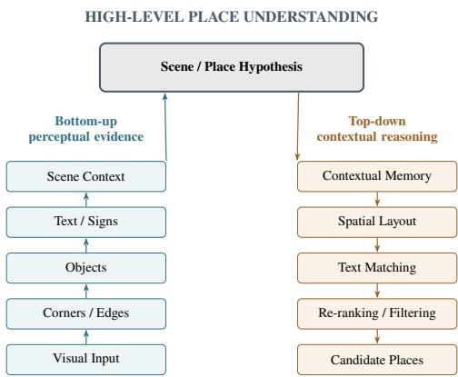  
Fig. 1. Conceptual motivation for HuMemSLAM: bottom-up perceptual evidence and top-down contextual reasoning for high-level place understanding.

Research in human visual cognition suggests that recognition combines bottom-up evidence with top-down context [13], [14], as illustrated in Fig. 1. We therefore propose HuMemSLAM, a human-inspired semantic place-recognition framework integrated with geometric visual SLAM. HuMem-VPR denotes its standalone semantic retrieval subsystem; HuMemSLAM denotes HuMem-VPR integrated with ORB-SLAM3. HuMem-VPR ranks historical keyframes using highlevel semantics, while ORB-SLAM3 verifies the resulting hypotheses and performs relocalisation, loop correction, or map fusion.

The main contributions of this work are:

1) HuMem-VPR, a human-inspired place recognition algorithm that corroborates holistic hypotheses of the scene representation with object-spatial and objectgrounded text information.

2) HuMemSLAM, the integration of HuMem-VPR with ORB-SLAM3 as a semantic retrieval layer over its existing map.

## II. RELATED WORK

## A. Visual Place Recognition under Perceptual Change

Visual place recognition (VPR) identifies previously observed locations despite viewpoint, illumination, weather, and seasonal change. Such variation and aliasing between visually similar but distinct places remain central challenges for longterm localisation [4], [5]. Modern VPR has increasingly shifted from handcrafted features and visual vocabularies towards learned global representations.

NetVLAD established end-to-end learned descriptor aggregation for large-scale place recognition [15]. EigenPlaces trains viewpoint-robust descriptors [6], while AnyLoc uses self-supervised foundation-model representations for crossdomain generalisation without VPR-specific retraining [7]. SALAD combines DINOv2 features with optimal-transport aggregation [8]; MegaLoc targets transfer across VPR, localisation, and landmark retrieval [9]. These approaches demonstrate the strength of learned global representations, but also illustrate that contemporary VPR systems occupy different trade-offs between retrieval accuracy, generalisation, robustness, and computational cost.

SVS-VPR uses aggregated semantic classes for coarse filtering, followed by learned local correspondences constrained by semantics and spatial consistency [16]. TextPlace uses recognised text and its spatio-temporal relationships as distinctive landmarks [17]. HuMem-VPR instead begins with a holistic scene representation and corroborates it through object-instance, spatial-layout, and object-grounded textual reasoning.

## B. Place Recognition within Visual SLAM

Within visual SLAM, retrieved places become hypotheses for geometric verification, loop closure, relocalisation, and map fusion. Classical systems use efficient BoW retrieval: DBoW2 combines binary visual words with geometric verification [3]; iBoW-LCD learns its vocabulary incrementally [18]; and RTAB-Map couples appearance-based loop closure with memory management [10].

ORB-SLAM3 uses retrieved keyframes for relocalisation, loop closure, and map merging while retaining geometric consistency checks [2]. SLGD-Loop adds global semantic similarity and salient local features in a coarse-to-fine detector for long-term appearance change [19]. These systems distinguish plausible retrieval from a valid geometric constraint; embedded VPR should therefore be assessed by both retrieval accuracy and the hypotheses passed to verification.

HuMem-VPR ranks historical ORB-SLAM3 keyframes, while the geometric backend establishes physical consistency and applies SLAM updates. We consequently evaluate it both standalone and through its effect on the downstream geometric pipeline.

## C. Biologically and Cognitively Inspired Place Recognition

Biological navigation has motivated alternative localisation representations. RatSLAM combines self-motion and landmarks through a continuous-attractor model of rodent hippocampal navigation [20]. Multi-scale extensions use parallel maps [21] or adaptive scale selection with coarse-to-fine recognition [22]. LPMP instead combines learned landmark identities (“what”) with spatial arrangement (“where”) [23].

HuMemSLAM draws from visual cognition rather than reproducing a neural circuit. Global scene structure can rapidly convey scene gist [13], while visual-recognition models emphasise interaction between perceptual evidence and top-down contextual predictions [14]. HuMemSLAM establishes a global scene hypothesis, then adds object-spatial and grounded-text evidence. Unlike spatial-cell models, this semantic representation is a retrieval layer over the ORB-SLAM3 map; geometry remains the final authority.

## III. HUMEMSLAM FRAMEWORK

## A. System Overview

HuMemSLAM integrates the standalone HuMem-VPR semantic retrieval subsystem with ORB-SLAM3 [2]. HuMem-VPR indexes ORB-SLAM3 keyframes for retrieval under appearance change, while the backend retains pose estimation and geometric verification.

For query keyframe $Q _ { t } ,$ , the semantic memory and bounded similarity are

$$
\mathcal { D } _ { t - 1 } = \{ K _ { 1 } , \ldots , K _ { t - 1 } \} , \qquad \Lambda ( Q _ { t } , K _ { i } ) \in [ 0 , 1 ] .\tag{1}
$$

To avoid trivial temporal neighbours, the eligible set is $\mathcal { C } _ { t } =$ $\{ K _ { i } \in \mathcal { D } _ { t - 1 } : | f _ { t } - f _ { i } | \geq 1 0 0 \}$ , where $f$ denotes the sourceframe identifier. Candidates are ordered by

$$
\pi _ { t } = \operatorname { a r g s o r t } _ { K _ { i } \in \mathcal C _ { t } } ^ { \downarrow } \Lambda ( Q _ { t } , K _ { i } ) .\tag{2}
$$

HuMem-VPR proposes where the camera may have been; ORB-SLAM3 tests geometric consistency and may trigger relocalisation, loop closure, map fusion, or pose correction (Fig. 2).

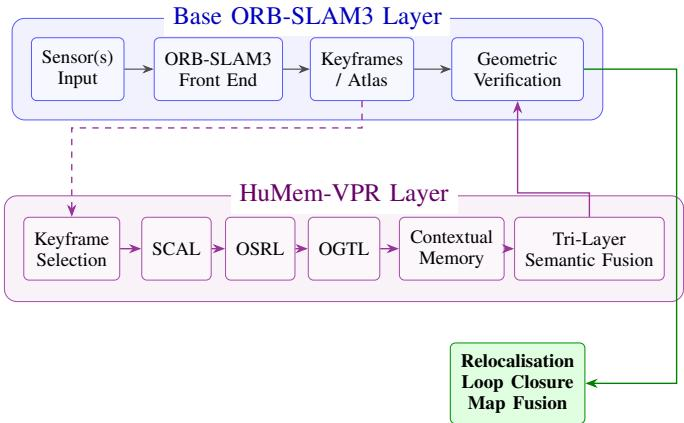  
Fig. 2. HuMemSLAM architecture. HuMem-VPR sequentially applies scenecontext, object-spatial, and object-grounded text reasoning; ORB-SLAM3 retains geometric verification and map updates.

## B. Semantic Keyframe Representation

Each semantic keyframe is represented as

$$
K _ { i } = \left( i , f _ { i } , t _ { i } , m _ { i } , { \bf T } _ { i } , S _ { i } , \mathcal { O } _ { i } \right) ,\tag{3}
$$

where i is the ORB-SLAM3 keyframe identifier, $f _ { i }$ is the source-frame identifier, $t _ { i }$ is the timestamp, $m _ { i }$ is the Atlas map identifier, $\mathbf { T } _ { i } \in S E ( 3 )$ is the estimated camera pose, $S _ { i }$ is the scene-context representation, and $\mathcal { O } _ { i }$ is the set of detected stable objects. Each object record stores its semantic class, detector confidence, spatial attributes, and associated textual observations.

## C. Scene Context Attention Layer (SCAL)

The Scene Context Attention Layer (SCAL) provides the initial global place hypothesis. For an image $I _ { i } ,$ , a 512- dimensional EigenPlaces descriptor $[ 6 ] { \bf e } _ { i } \in \mathbb { R } ^ { 5 \bar { 1 } 2 }$ is extracted. Its normalisation and non-negative cosine similarity are

$$
\hat { \mathbf { e } } _ { i } = \frac { \mathbf { e } _ { i } } { \Vert \mathbf { e } _ { i } \Vert _ { 2 } } , \qquad s _ { e } ( Q , C ) = \mathrm { c l i p } ( \hat { \mathbf { e } } _ { Q } ^ { \top } \hat { \mathbf { e } } _ { C } , 0 , 1 ) .\tag{4}
$$

Places365 scene labels provide contextual modulation [24]. Let $C _ { \mathrm { c a t } } ( Q , C ) \in [ 0 , 1 ]$ denote the compatibility between the scene categories of the query and candidate. With $\lambda _ { c } = 0 . 1 0 $ the modulated similarity is

$$
\tilde { s } _ { e } ( Q , C ) = s _ { e } ( Q , C ) \frac { 1 + \lambda _ { c } C _ { \mathrm { c a t } } ( Q , C ) } { 1 + \lambda _ { c } } .\tag{5}
$$

Short-term context combines the current and up to two preceding observations using ${ \pmb { \alpha } } = ( 0 . 5 , 0 . 3 , 0 . 2 )$ . The resulting score is

$$
S _ { s } ( Q , C ) = \sum _ { j = 0 } ^ { k - 1 } \alpha _ { j } \tilde { s } _ { e } \left( Q _ { t - j } , C _ { i - j } \right) , \qquad \sum _ { j } \alpha _ { j } = 1 ,\tag{6}
$$

where $k \leq 3$ depends on the available temporal history. SCAL passes only its top $K = 2 5$ candidates to object and textual comparison.

## D. Object-Spatial Reasoning Layer (OSRL)

The Object-Spatial Reasoning Layer (OSRL) evaluates whether candidate objects have spatial arrangements consistent with the query. A YOLOv26 segmentation model [25] supplies the semantic class, confidence, and image region for each detected object; HuMem-VPR derives the normalised centroid and area used for spatial reasoning from these regions. The YOLOv26 model is fine-tuned on the Mapillary Vistas dataset [26] and classes are restricted to predefined static environmental structures, including buildings, fences, street lights and billboards.

For a query object q and candidate object $c ,$ let $( x , y )$ denote the normalised object centroid and let a denote its normalised image area. Their squared spatial-layout distance is

$$
d _ { m } ^ { 2 } ( q , c ) = ( x _ { q } - x _ { c } ) ^ { 2 } + ( y _ { q } - y _ { c } ) ^ { 2 } + \lambda _ { a } ( a _ { q } - a _ { c } ) ^ { 2 } .\tag{7}
$$

With $\lambda _ { a } = 1$ , a Gaussian spatial kernel, same-class gate, and detector confidences $p _ { q } , p _ { c }$ define the pairwise score

$$
G ( q , c ) = \exp \left[ - \frac { d _ { m } ^ { 2 } ( q , c ) } { 2 \sigma _ { m } ^ { 2 } } \right] , \qquad \sigma _ { m } = 0 . 2 5 ,\tag{8}
$$

$$
\delta _ { c } ( q , c ) = 1 [ c _ { q } = c _ { c } ] ,\tag{9}
$$

$$
M _ { o } ( q , c ) = \delta _ { c } ( q , c ) \sqrt { p _ { q } p _ { c } } G ( q , c ) .\tag{10}
$$

For each semantic class r, HuMem-VPR constructs a pairwise similarity matrix and solves a maximum-weight oneto-one bipartite assignment using the Hungarian algorithm:

$$
\mathcal { A } _ { r } ^ { \star } = \arg \operatorname* { m a x } _ { \mathcal { A } _ { r } } \sum _ { ( u , v ) \in \mathcal { A } _ { r } } M _ { u v } ^ { ( r ) } .\tag{11}
$$

The final object-spatial similarity is query-normalised:

$$
S _ { o } ( Q , C ) = \frac { \displaystyle \sum _ { r } \omega _ { r } \sum _ { ( u , v ) \in A _ { r } ^ { \star } } M _ { u v } ^ { ( r ) } } { \displaystyle \sum _ { q \in \mathcal { O } _ { Q } } \omega _ { c _ { q } } } ,\tag{12}
$$

where $\omega _ { r }$ denotes the configured importance of semantic class $^ { r } \cdot$ The query-dependent denominator penalises missing candidate evidence and sparse, easily matched objects.

## E. Object-Grounded Textual Landmark Layer (OGTL)

The Object-Grounded Textual Landmark Layer (OGTL) treats text as a place-specific landmark only when it is grounded in a compatible semantic object. PP-OCRv5 Mobile [27] performs text detection and English text recognition within the detected object regions, and each resulting textual observation is stored in the corresponding object record. OCR observations are compared only when their supporting objects share the same semantic class and have sufficient spatial compatibility:

$$
\Gamma _ { T } ( q , c ) = { \bf 1 } [ c _ { q } = c _ { c } ] { \bf 1 } [ G ( q , c ) \geq \tau _ { g } ] , \qquad \tau _ { g } = 0 . 6 .\tag{13}
$$

For strings $a , b ,$ HuMem-VPR takes the strongest of normalised Levenshtein, token Jaccard, and compact substring similarities:

$$
L ( a , b ) = 1 - \frac { D _ { \mathrm { l e v } } ( a , b ) } { \operatorname* { m a x } ( | a | , | b | , 1 ) } ,\tag{14}
$$

$$
J ( a , b ) = \frac { | \operatorname { t o k } ( a ) \cap \operatorname { t o k } ( b ) | } { | \operatorname { t o k } ( a ) \cup \operatorname { t o k } ( b ) | } ,\tag{15}
$$

$$
S _ { \mathrm { s t r } } ( a , b ) = \operatorname* { m a x } \{ L ( a , b ) , J ( a , b ) , C ( a , b ) \} ,\tag{16}
$$

$$
M _ { T } ( u , v ) = S _ { \mathrm { s t r } } ( u , v ) p _ { u } p _ { v } .\tag{17}
$$

HuMem-VPR additionally assigns each textual observation a distinctiveness weight ${ \cal D } _ { T } ( u ) ~ \in ~ [ 0 , 1 ]$ , giving greater importance to longer, uncommon, and digit-bearing strings while reducing the influence of generic words.

For a text-bearing query object $q$ and candidate object $c ,$ the object-grounded text score is

$$
S _ { T } ( q , c ) = \frac { \displaystyle \sum _ { u \in \mathcal { T } _ { q } } D _ { T } ( u ) \operatorname* { m a x } _ { v \in \mathcal { T } _ { c } } M _ { T } ( u , v ) } { \displaystyle \sum _ { u \in \mathcal { T } _ { q } } D _ { T } ( u ) } .\tag{18}
$$

The keyframe-level textual similarity $S _ { t }$ is modulated by $E _ { t } = \sqrt { D _ { Q } D _ { C } } .$ , where $D _ { Q } , D _ { C }$ are the mean textual distinctiveness of the query and candidate. Distinctive landmarks therefore contribute more strongly than weak or generic OCR observations.

## F. Tri-Layer Callosal Semantic Fusion

The scene, object-spatial, and textual signals are combined using a scene-primary semantic fusion strategy. Scene recognition provides the initial place hypothesis, while object and textual information act as bounded corroborating evidence.

Object and textual support are first combined using $g _ { o } =$ 0.15 and $g _ { t } = 0 . 2 5$

$$
B ( Q , C ) = \exp \left( g _ { o } S _ { o } + g _ { t } E _ { t } S _ { t } , 0 , 1 \right) .\tag{19}
$$

The final raw HuMem-VPR similarity is

$$
\Lambda _ { \mathrm { r a w } } ( Q , C ) = S _ { s } + ( 1 - S _ { s } ) B ( Q , C ) ,\tag{20}
$$

Equation (20) gives the fusion an intuitive interpretation: semantic object and textual evidence reduce the remaining uncertainty in the scene-level hypothesis.

## G. Candidate Selection and Geometric Verification

Historical candidates are ranked using the fused HuMem-VPR similarity and are submitted for geometric verification when

$$
\Lambda _ { \mathrm { r a w } } ( Q , C ) > \tau _ { s } , \qquad \tau _ { s } = 0 . 7 0 .\tag{21}
$$

Up to five ranked semantic candidates are returned to ORB-SLAM3. During normal tracking, semantic retrieval is performed periodically, while retrieval is activated immediately when ORB-SLAM3 enters the RECENTLY LOST or LOST states. HuMem-VPR returns its semantic hypothesis to ORB-SLAM3, which then performs local-feature correspondence and robust geometric verification before accepting a relocalisation, loop closure, map fusion, or pose correction.

## H. Low-Latency Computational Design

For N global descriptors of dimension $d ,$ the initial SCAL retrieval has complexity $O ( N d )$ , while subsequent objectspatial and textual reasoning is restricted to the top $K = 2 5$ candidates. Likewise, the Hungarian assignment, with worstcase complexity $O ( n _ { r } ^ { 3 } )$ for a semantic class containing $n _ { r }$ objects, is applied only to small same-class object sets rather than the full semantic memory.

Neural inference is accelerated using TensorRT to reduce the runtime cost of the learned perception components. HuMem-VPR further operates asynchronously with respect to ORB-SLAM3 tracking and processes selected keyframes rather than every incoming frame. A bounded processing queue replaces stale pending work with the newest query when full, prioritising current localisation information and preventing semantic processing from blocking the tracking thread.

## IV. EXPERIMENTAL SETUP

ORB-SLAM3’s asynchronous modules can vary across runs because of thread scheduling, resource contention, and CPU/GPU timing. We therefore repeat every offline full SLAM and VPR comparison involving ORB-SLAM3 ten times and report arithmetic means; tracking failures and incomplete trajectories are reported separately.

## A. Datasets and Perceptual Conditions

Table I summarises the datasets and evaluated conditions.

The three dataset families provide complementary perceptual challenges as shown in Fig. 3. KITTI evaluates controlled image degradation on real driving imagery: sequence 06 corrupts the return traversal, whereas sequences 00 and 05 perturb only ground-truth-identified revisit regions. A condition denoted Bℓ/Dd applies a line-motion kernel of length ℓ pixels followed by exposure reduction retaining $( 1 0 0 - d ) \%$ of linear-light intensity. CARLA compares repeated traversals of the same route under controlled simulated weather and illumination changes. 4Seasons evaluates naturally occurring seasonal appearance variation and perceptual aliasing in structurally repetitive environments.

TABLE I  
DATASETS AND PERCEPTUAL CONDITIONS USED IN THE EVALUATION.
<table><tr><td>Dataset / route</td><td>Main challenge</td><td>Evaluated conditions</td></tr><tr><td>KITTI 00/05/06 [28]</td><td>Controlled blur and illumina- tion/exposure degradation on real stereo road imagery with ground-truth</td><td>Seq. 06: Clean, B15, D50, B15/D50, B15/D80, B35/D80, B35/D90; Seq. 00/05: Clean, B15/D80</td></tr><tr><td>CARLA Town10HD Opt [29]</td><td>Controlled weather and illumination change over repeated traversals</td><td>Clear Noon (reference), Deep Night, Dense Fog Overcast, Extreme Rain + Fog, Extreme Sunset Glare</td></tr><tr><td>4Seasons [30]</td><td>Natural seasonal Business Campus appearance variation</td><td>Fall, Winter</td></tr><tr><td>4Seasons Multi-level Garage</td><td>Perceptual aliasing across structurally similar locations</td><td>Dec., Feb., May traversals</td></tr></table>

## B. Query, Database and Comparison Protocol

The fixed VPR benchmark uses deterministic manifests shared by HuMem-VPR, native ORB-SLAM3 ORB/DBoW2, SALAD, and MegaLoc. A database frame c is a valid historical match for query $q$ if:

$$
\begin{array} { c c } { q - c \geq 1 0 0 , } & { \| \mathbf { t } _ { q } - \mathbf { t } _ { c } \| _ { 2 } \leq 5 \mathrm { m } , } \\ { \Delta R ( q , c ) \leq 3 0 ^ { \circ } . } \end{array}\tag{22}
$$

where $\Delta R$ is the geodesic orientation difference computed from rotation matrices for KITTI/CARLA and unit quaternions for 4Seasons. Only queries having at least one valid database match are eligible; at most 100 eligible queries are selected deterministically at approximately uniform index intervals. At query time, every method is restricted to database frames satisfying the 100-frame exclusion.

## C. HuMem-VPR Ablation Configurations

End-to-end layer ablations use four implemented configurations: SCAL, SCAL+OSRL, SCAL+OGTL, and Full (SCAL+OSRL+OGTL). In SCAL+OGTL, object similarity is disabled; however, YOLO remains active solely to provide object regions for OCR.

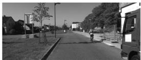  
(a) Clean

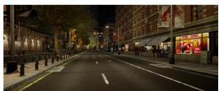  
(f) Deep Night

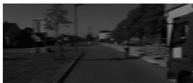  
(b) B15/D80

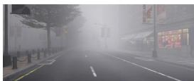  
(g) Dense Fog

  
(c) B35/D80

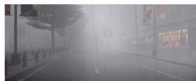  
(h) Extreme Rain + Fog

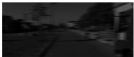  
(d) B35/D90

  
(i) Business Campus

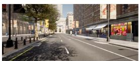  
(e) Clear Noon

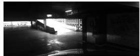  
(j) Multi-level Garage  
Fig. 3. Evaluation datasets and perceptual conditions.

## D. VPR Metrics and Latency Evaluation

Let $r _ { q }$ be the rank of the first valid historical match for query $q ,$ or infinity if none is returned. For N eligible queries,

$$
\begin{array} { c } { { \mathrm { R e c a l l @ } K = \displaystyle \frac { 1 } { N } \sum _ { q } \mathbb { I } [ r _ { q } \le K ] , } } \\ { { \mathrm { M R R } = \displaystyle \frac { 1 } { N } \sum _ { q } \frac { 1 } { r _ { q } } . } } \end{array}
$$

where $1 / \infty = 0 .$ We report Recall @1, Recall @5, and MRR. Latency uses 30 deterministically spaced queries (or all if fewer), ten neural-model warm-ups, and synchronised CUDA timing; image decoding and database construction are excluded. HuMem-VPR timing spans scene description, segmentation, OCR, semantic fusion, database comparison, and top-five ranking. ORB BoW spans grayscale conversion, native ORB extraction, vocabulary transformation, DBoW2 comparison, and ranking. Official PyTorch SALAD and MegaLoc implementations [8], [9] include preprocessing, inference, normalisation, cosine search, and ranking. We report mean, median, and 95th-percentile latency.

## E. Integrated SLAM Evaluation

At SLAM level, proposals use the same 5 m, 30◦, and 100-frame match rule for the offline runs; online matches must be within 5 m and at least 30 seconds older than the query. Recall @1, Recall @5, and MRR include logged queries with a qualifying historical keyframe. Geometry attempts, accepted seeds, loop corrections, and latencies are reported independently. A relocalisation episode starts in RECENTLY LOST or LOST; recovery is a return to OK.

(23)

For 4Seasons garage runs, cross-floor aliasing requires at most 5 m horizontal separation and at least 2.4 m height difference; both denied and accepted proposals are retained. Secondary measures are absolute pose error (APE), trajectory completeness, and map count. Source-frame-associated trajectories are evaluated per map with rigid alignment using evo ape [31]; global APE is reported only for single-map trajectories.

## F. Computational and Hardware Setup

Recorded runs were executed on an Intel Core Ultraseries 185H host with approximately 30.7 GiB RAM and an NVIDIA GeForce RTX 4070 Laptop GPU with 8188 MiB memory. The recorded environment is Ubuntu 22.04.5

LTS, ROS 2 Humble, CUDA 12.9, TensorRT 11.0.0.114, andPyTorch 2.8.0+cu129.

## G. Real-World Online Experiment

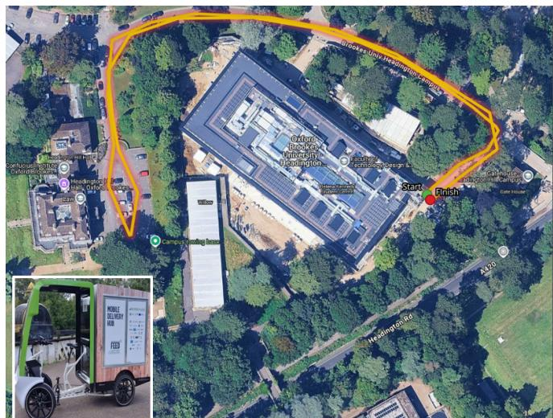  
Fig. 4. Online experimental route in Oxford Brookes University and GREEN-LOG teleoperated bike [1] used for real-time evaluation.

Fig. 4 illustrates the approximately 700 m route for the online experiment on a teleoperated delivery bike. The bike is equipped with a ZED 2i stereo camera and Ardusimple GPS with RTK corrections via an Ardusimple base station for ground-truth estimation. The experiments were carried out in stereo mode under two conditions: high-contrast sunny morning and rainy night. Each method was evaluated once per condition. In addition, each traversal comprises three laps to ensure multiple revisits.

## V. RESULTS

This section compares HuMem-VPR with SALAD, Mega-Loc, and ORB-BoW, and evaluates HuMemSLAM against ORB-SLAM3 under varied perceptual conditions.

## A. VPR Accuracy and Latency

Figure 5 and Table II show that HuMem-VPR offers a strong accuracy–latency compromise, achieving the highest aggregate Recall@1 on the real-image benchmark while operating 2–3 times faster than the learned baselines. The advantage is most evident under the severe KITTI B35/D80 perturbation, where HuMem-VPR reaches 0.91 Recall@1, suggesting that its layered semantic reasoning remains discriminative when blur and exposure degradation weaken appearance-based retrieval. However, this advantage is not universal. Under CARLA’s strongest visibility degradation, combined rain and fog, SALAD and MegaLoc retain higher recall. The results therefore suggest that HuMem-VPR is overall faster and most effective when higher-level semantic structure remains observable, while SALAD and MegaLoc are better able to tolerate extreme scene obscuration.

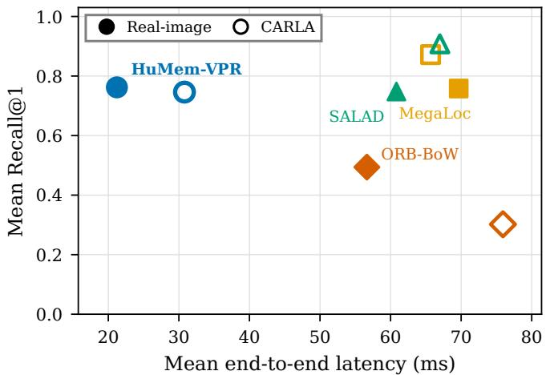  
Fig. 5. Standalone VPR accuracy–latency trade-off across real-image and CARLA benchmarks.  
TABLE II

VPR RESULTS: (A) AGGREGATE RETRIEVAL AND LATENCY; (B) CONDITION-LEVEL RECALL @1.  
(a) Aggregate benchmark results
<table><tr><td>Latency Method R@1 R@5 MRR (ms) Real-image benchmark</td></tr><tr><td>HuMem-VPR 0.762 0.926 0.829 21.2 MegaLoc 0.758 0.932 0.831 69.7 SALAD 0.748 0.932 0.825 60.8 ORB-BoW 0.4940.6940.579 56.6</td></tr><tr><td>CARLA benchmark HuMem-VPR 0.746 0.828 0.778 30.8 MegaLoc 0.872 0.962 0.908 65.7 SALAD 0.908 0.988 0.940 67.0 ORB-BoW 0.302 0.418 0.345 75.9</td></tr></table>

(b) Condition-level Recall @1
<table><tr><td colspan="5">Real-image benchmark</td></tr><tr><td>Condition</td><td>HuMem-VPR MegaLoc SALAD</td><td></td><td></td><td>ORB-BoW</td></tr><tr><td>Business Fall</td><td>0.43</td><td>0.48</td><td>0.41</td><td>0.41</td></tr><tr><td>Garage Feb.</td><td>0.53</td><td>0.59</td><td>0.59</td><td>0.47</td></tr><tr><td>KITTI Clean</td><td>0.98</td><td>0.98</td><td>0.98</td><td>0.93</td></tr><tr><td>KITTI B15/D80</td><td>0.96</td><td>0.96</td><td>0.97</td><td>0.55</td></tr><tr><td>KITTI B35/D80</td><td>0.91</td><td>0.78</td><td>0.79</td><td>0.11</td></tr></table>

CARLA benchmark
<table><tr><td>Condition</td><td>HuMem-VPR MegaLoc</td><td></td><td>SALAD</td><td>ORB-BoW</td></tr><tr><td>Clear Noon</td><td>1.00</td><td>1.00</td><td>1.00</td><td>0.99</td></tr><tr><td>Deep Night</td><td>0.93</td><td>1.00</td><td>0.99</td><td>0.16</td></tr><tr><td>Dense Fog</td><td>0.57</td><td>0.77</td><td>0.90</td><td>0.11</td></tr><tr><td>Sunset Glare</td><td>0.97</td><td>1.00</td><td>1.00</td><td>0.23</td></tr><tr><td>Rain + Fog</td><td>0.26</td><td>0.59</td><td>0.65</td><td>0.02</td></tr></table>

## B. Integrated SLAM and Verification Efficiency

Figure 6 and Table III show that HuMemSLAM improves mean retrieval across every dataset family while reducing proposals to geometric verification by 74–91%. More ORB-SLAM3 loop closures did not imply lower APE: despite 4 and 43 additional closures on KITTI 05 and 4Seasons Garage, respectively, its APE RMSE was higher (4.9 versus 3.2 m and 3.6 versus 3.0 m). This indicates that trajectory accuracy also depends on constraint quality and pose-graph optimisation.

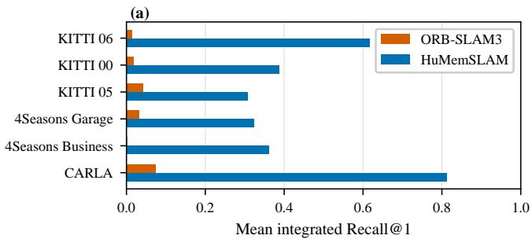

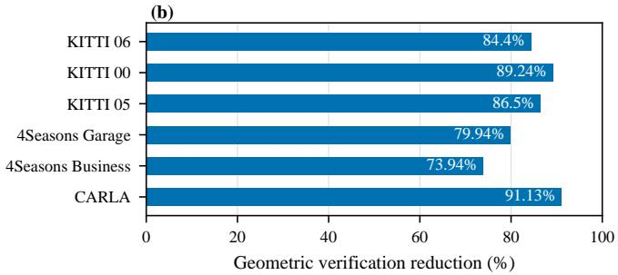  
Fig. 6. Integrated retrieval and verification efficiency: (a) mean Recall @1; (b) reduction in candidates submitted to the geometric backend.

## C. Perceptual Aliasing and System Failure Boundaries

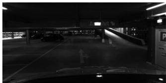  
(a) Lower level

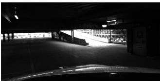  
(b) Upper level  
Fig. 7. Visually similar observations from different garage levels.

In the structurally repetitive and visually similar 4Seasons Garage environment (Fig. 7), ORB-SLAM3 produced 10 false loop closures and HuMemSLAM produced 1 (Table IV). Although HuMemSLAM remains susceptible to aliasing, it improves closure precision from approximately 92% to 99%.

Table V identifies two ORB-SLAM3 failure modes limiting HuMemSLAM. At B35/D80, HuMemSLAM retrieved candidates, but severe degradation prevented geometric verification. At B35/D90, the frontend generated no viable keyframes, so HuMemSLAM remained idle.

TABLE III  
INTEGRATED RETRIEVAL, VERIFICATION, CLOSURE, AND TRAJECTORY RESULTS. APE n IS THE NUMBER OF EVALUABLE GLOBAL TRAJECTORIES.
<table><tr><td></td><td colspan="2">Integrated R@1</td><td colspan="3">Verification attempts</td><td colspan="2">Applied closures</td><td colspan="2">APE n</td><td colspan="2">APE RMSE (m) ↓</td></tr><tr><td>Dataset</td><td>ORB</td><td>HuMem</td><td>ORB</td><td>HuMem</td><td>Red.</td><td>ORB</td><td>HuMem</td><td>ORB</td><td>HuMem</td><td>ORB</td><td>HuMem</td></tr><tr><td>KITTI 06</td><td>0.014</td><td>0.617</td><td>27,520</td><td>4,292</td><td>84.4%</td><td>53</td><td>58</td><td>60</td><td>59</td><td> $1 . 5 7 6 \pm 1 . 0 4 0$ </td><td> $1 . 7 4 6 \pm 1 . 0 2 1$ </td></tr><tr><td>KITTI 00</td><td>0.018</td><td>0.388</td><td>28,809</td><td>3,099</td><td>89.2%</td><td>62</td><td>62</td><td>20</td><td>19</td><td> $1 . 7 1 4 \pm 0 . 9 6 2$ </td><td> $1 . 8 6 5 \pm 1 . 0 9 3$ </td></tr><tr><td>KITTI 05</td><td>0.042</td><td>0.309</td><td>13,991</td><td>1,889</td><td>86.5%</td><td>34</td><td>30</td><td>10</td><td>11</td><td> $4 . 9 4 7 \pm 1 1 . 6 5 9$ </td><td> $3 . 1 7 1 \pm 6 . 3 7 2$ </td></tr><tr><td>4Seasons Garage</td><td>0.032</td><td>0.324</td><td>30,998</td><td>6,218</td><td>79.9%</td><td>124</td><td>81</td><td>29</td><td>29</td><td> $3 . 6 3 5 \pm 1 . 1 5 9$ </td><td> $2 . 9 8 9 \pm 0 . 9 8 2$ </td></tr><tr><td>4Seasons Business</td><td>0.003</td><td>0.362</td><td>55,484</td><td>14,460</td><td>73.9%</td><td>24</td><td>17</td><td>20</td><td>20</td><td> $5 . 5 9 6 \pm 1 . 3 1 0$ </td><td> $5 . 5 1 1 \pm 1 . 0 9 0$ </td></tr><tr><td>CARLA</td><td>0.074</td><td>0.813</td><td>62,456</td><td></td><td>5,54191.1%</td><td>24</td><td>28</td><td>7</td><td>4</td><td> $2 . 1 6 5 \pm 0 .$  487</td><td> $1 . 8 7 1 \pm 0 . 3 2 5$ </td></tr></table>

TABLE IV  
CLOSURE RELIABILITY IN THE 4SEASONS GARAGE. COUNTS ARE ACCEPTED GEOMETRIC CLOSURES; PRECISION IS THE VALID FRACTION.

Table VI shows that SCAL is a strong low-latency baseline. SCAL+OGTL gives higher mean Recall @1, whereas SCAL+OSRL gives higher mean Recall @5 and MRR at

<table><tr><td colspan="4">Condition-level Recall @1</td></tr><tr><td>Condition</td><td>SCAL OSRL</td><td>SCAL+ SCAL+ OGTL</td><td>Full</td></tr><tr><td>Business Fall</td><td>0.30 0.35</td><td>0.43</td><td>0.43</td></tr><tr><td>Garage Feb.</td><td>0.45 0.53</td><td>0.55</td><td>0.55</td></tr><tr><td>KITTI Clean</td><td>0.98 0.98</td><td>0.98</td><td>0.98</td></tr><tr><td>KITTI B15/D80</td><td>0.97 0.96</td><td>0.97</td><td>0.97</td></tr><tr><td>KITTI B35/D80</td><td>0.89 0.91</td><td>0.91</td><td>0.91</td></tr><tr><td>CARLA Clear Noon</td><td>1.00 1.00</td><td>1.00</td><td>1.00</td></tr><tr><td>CARLA Deep Night</td><td>0.92</td><td>0.93 0.93</td><td>0.93</td></tr><tr><td>CARLA Dense Fog</td><td>0.45</td><td>0.57 0.54</td><td>0.57</td></tr><tr><td>CARLA Rain + Fog</td><td>0.20</td><td>0.26 0.23</td><td>0.26</td></tr><tr><td>CARLA Sunset Glare</td><td>0.95</td><td>0.97 0.97</td><td>0.97</td></tr></table>

<table><tr><td>Sequence</td><td>Method</td><td>Accepted</td><td>Valid</td><td>False</td><td>Precision</td></tr><tr><td>Dec 2020</td><td>ORB-SLAM3</td><td>54</td><td>54</td><td>0</td><td>100.0%</td></tr><tr><td rowspan="3">Feb 2021</td><td>HuMemSLAM</td><td>36</td><td>36</td><td>0</td><td>100.0%</td></tr><tr><td>ORB-SLAM3</td><td>38</td><td>34</td><td>4</td><td>89.5%</td></tr><tr><td>HuMemSLAM</td><td>21</td><td>21</td><td>0</td><td>100.0%</td></tr><tr><td rowspan="2">May 2021</td><td>ORB-SLAM3</td><td>32</td><td>26</td><td>6</td><td>81.3%</td></tr><tr><td>HuMemSLAM</td><td>24</td><td>23</td><td>1</td><td>95.8%</td></tr><tr><td rowspan="2">Aggregate</td><td>ORB-SLAM3</td><td>124</td><td>114</td><td>10</td><td>91.9%</td></tr><tr><td>HuMemSLAM</td><td>81</td><td>80</td><td>1</td><td>98.8%</td></tr></table>

TABLE V

<table><tr><td colspan="5">Aggregate performance</td></tr><tr><td>Metric</td><td>SCAL</td><td>OSRL</td><td>SCAL+ SCAL+ OGTL</td><td>Full</td></tr><tr><td>Mean R@1 ↑</td><td>0.711</td><td>0.746</td><td>0.751</td><td>0.757</td></tr><tr><td>Mean R@5↑</td><td>0.842</td><td>0.878</td><td>0.870</td><td>0.877</td></tr><tr><td>Mean MRR ↑</td><td>0.797</td><td>0.804</td><td>0.798</td><td>0.803</td></tr><tr><td>Mean latency (ms) ↓</td><td>13.7</td><td>21.3</td><td>24.3</td><td>25.1</td></tr><tr><td>Mean p95 (ms) ↓</td><td>15.0</td><td>26.4</td><td>31.3</td><td>32.9</td></tr></table>

HUMEM-VPR ABLATION. FULL DENOTES SCAL+OSRL+OGTL.

HUMEMSLAM FAILURE BOUNDARIES UNDER SEVERE KITTI 06 DEGRADATION.
<table><tr><td>Condition</td><td>HuMemSLAM R@1</td><td>Verif. attempts</td><td>Closures</td><td>Observed boundary</td></tr><tr><td>B35/D80</td><td>0.667</td><td>972</td><td></td><td>0 Geometry rejects</td></tr><tr><td>B35/D90</td><td>N/A</td><td>0</td><td></td><td>0 No semantic query</td></tr></table>

TABLE VI

## D. Ablation Study

lower latency. Full achieves the best mean Recall @1 (0.757). Gains vary by condition: the best configuration improves Business Fall, Garage Feb., and CARLA Dense Fog by 13, 10, and 12 Recall @1 points over SCAL. Thus, OSRL and OGTL provide complementary, condition-dependent evidence for the global SCAL hypothesis.

## E. Real-World Online Evaluation

Fig. 8 shows that HuMemSLAM achieved higher Recall@1 than ORB-SLAM3, most notably under rainy-night condition, whilst reducing geometric verification attempts by approximately 63–65% across both traversals.

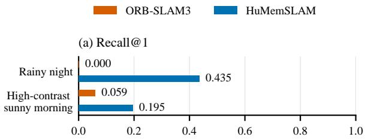

(b) Geometric-verification attempts  
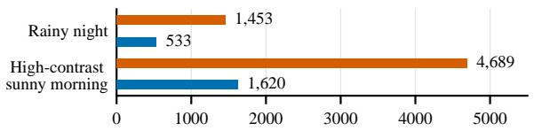  
Fig. 8. Real-world online evaluation: (a) Recall @1 and (b) geometricverification attempts on the two campus runs.

## VI. CONCLUSION

We presented HuMem-VPR, a novel human-inspired placerecognition method, and HuMemSLAM, its integration with ORB-SLAM3. Across the evaluated datasets, HuMemSLAM substantially improved integrated Recall @1 while reducing proposals to the geometric backend by approximately 74– 91%. In the perceptually aliased 4Seasons Garage, false loop closures were reduced from 10 to 1. HuMem-VPR also achieved the highest aggregate retrieval accuracy on the real-image benchmark and competitive CARLA performance while operating approximately two to three times faster than the evaluated learned VPR baselines. Severe-degradation experiments nevertheless exposed a dependency on the underlying geometric pipeline: successful semantic retrieval cannot yield a SLAM correction when viable keyframes or geometric correspondences are absent.

These results suggest that low-latency semantic retrieval can support more responsive visual SLAM while reducing unnecessary geometric computation, an increasingly important capability for autonomous vehicles operating at higher speeds or in rapidly changing environments. Future work will investigate learned local features to strengthen geometric verification under severe appearance degradation, alongside INT8 quantisation and further hardware-aware optimisation to reduce inference latency and memory requirements. Together, these directions aim towards robust semantic localisation under progressively tighter computational and temporal constraints.

## REFERENCES

[1] S. Donnelly, R. Anderson, G. Economides, J. Broughton, P. Ball, A. Rast, and A. Bradley, “Seg-jpeg: Simple visual semantic communications for remote operation of automated vehicles over unreliable wireless networks,” in 2026 15th International Symposium on Communication Systems, Networks and Digital Signal Processing (CSNDSP), 2026, pp. 1–6.

[2] C. Campos, R. Elvira, J. J. G. Rodr´ıguez, J. M. M. Montiel, and J. D. Tardos, “Orb-slam3: An accurate open-source library for visual,´ visual–inertial, and multimap slam,” IEEE Transactions on Robotics, vol. 37, no. 6, pp. 1874–1890, 2021.

[3] D. Galvez-L ´ opez and J. D. Tard ´ os, “Bags of binary words for fast ´ place recognition in image sequences,” IEEE Transactions on Robotics, vol. 28, no. 5, pp. 1188–1197, 2012.

[4] S. Lowry, N. Sunderhauf, P. Newman, J. J. Leonard, D. Cox, P. Corke,¨ and M. J. Milford, “Visual place recognition: A survey,” IEEE Transactions on Robotics, vol. 32, no. 1, pp. 1–19, 2016.

[5] C. Masone and B. Caputo, “A survey on deep visual place recognition,” IEEE Access, vol. 9, pp. 19 516–19 547, 2021.

[6] G. Berton, G. Trivigno, B. Caputo, and C. Masone, “Eigenplaces: Training viewpoint robust models for visual place recognition,” in Proceedings of the IEEE/CVF International Conference on Computer Vision (ICCV), 2023, pp. 11 080–11 090.

[7] N. Keetha, A. Mishra, J. Karhade, K. M. Jatavallabhula, S. Scherer, M. Krishna, and S. Garg, “Anyloc: Towards universal visual place recognition,” IEEE Robotics and Automation Letters, vol. 9, no. 2, pp. 1286–1293, 2024.

[8] S. Izquierdo and J. Civera, “Optimal transport aggregation for visual place recognition,” in Proceedings of the IEEE/CVF Conference on Computer Vision and Pattern Recognition (CVPR), 2024, pp. 17 658– 17 668.

[9] G. Berton and C. Masone, “Megaloc: One retrieval to place them all,” in Proceedings of the IEEE/CVF Conference on Computer Vision and Pattern Recognition Workshops (CVPRW), 2025, pp. 2886–2892.

[10] M. Labbe and F. Michaud, “Rtab-map as an open-source lidar and ´ visual simultaneous localization and mapping library for large-scale and long-term online operation,” Journal of Field Robotics, vol. 36, no. 2, pp. 416–446, 2019.

[11] S. Liu, L. Liu, J. Tang, B. Yu, Y. Wang, and W. Shi, “Edge computing for autonomous driving: Opportunities and challenges,” Proceedings of the IEEE, vol. 107, no. 8, pp. 1697–1716, 2019.

[12] A. Ali-bey, B. Chaib-draa, and P. Giguere, “MixVPR: Feature mixing \` for visual place recognition,” in Proceedings of the IEEE/CVF Winter Conference on Applications of Computer Vision (WACV), 2023, pp. 2997–3006.

[13] A. Oliva and A. Torralba, “Building the gist of a scene: The role of global image features in recognition,” in Progress in Brain Research, 2006, vol. 155, pp. 23–36.

[14] M. Bar, K. S. Kassam, A. S. Ghuman, J. Boshyan, A. M. Schmid, A. M. Dale, M. S. Ham¨ al¨ ainen, K. Marinkovic, D. L. Schacter, B. R.¨ Rosen, and E. Halgren, “Top-down facilitation of visual recognition,” Proceedings of the National Academy of Sciences, vol. 103, no. 2, pp. 449–454, 2006.

[15] R. Arandjelovic, P. Gronat, A. Torii, T. Pajdla, and J. Sivic, “Netvlad: Cnn architecture for weakly supervised place recognition,” in Proceedings of the IEEE Conference on Computer Vision and Pattern Recognition (CVPR), 2016, pp. 5297–5307.

[16] S. Arshad and T.-H. Park, “Svs-vpr: A semantic visual and spatial information-based hierarchical visual place recognition for autonomous navigation in challenging environmental conditions,” Sensors, vol. 24, no. 3, p. 906, 2024.

[17] Z. Hong, Y. Petillot, D. Lane, Y. Miao, and S. Wang, “Textplace: Visual place recognition and topological localization through reading scene texts,” in Proceedings of the IEEE/CVF International Conference on Computer Vision (ICCV), 2019, pp. 2861–2870.

[18] E. Garcia-Fidalgo and A. Ortiz, “ibow-lcd: An appearance-based loopclosure detection approach using incremental bags of binary words,” IEEE Robotics and Automation Letters, vol. 3, no. 4, pp. 3051–3057, 2018.

[19] S. Arshad and G.-W. Kim, “Slgd-loop: A semantic local and global descriptor-based loop closure detection for long-term autonomy,” IEEE Transactions on Intelligent Transportation Systems, vol. 25, no. 12, pp. 19 714–19 728, 2024.

[20] M. J. Milford, G. F. Wyeth, and D. Prasser, “Ratslam: A hippocampal model for simultaneous localization and mapping,” in Proceedings of the IEEE International Conference on Robotics and Automation (ICRA), vol. 1, 2004, pp. 403–408.

[21] Z. Chen, S. Lowry, A. Jacobson, M. E. Hasselmo, and M. Milford, “Bioinspired homogeneous multi-scale place recognition,” Neural Networks, vol. 72, pp. 48–61, 2015.

[22] C. Fan, Z. Chen, A. Jacobson, X. Hu, and M. Milford, “Biologicallyinspired visual place recognition with adaptive multiple scales,” Robotics and Autonomous Systems, vol. 96, pp. 224–237, 2017.

[23] S. Colomer, N. Cuperlier, G. Bresson, P. Gaussier, and O. Romain, “Lpmp: A bio-inspired model for visual localization in challenging environments,” Frontiers in Robotics and AI, vol. 8, p. 703811, 2022.

[24] B. Zhou, A. Lapedriza, A. Khosla, A. Oliva, and A. Torralba, “Places: A 10 million image database for scene recognition,” IEEE Transactions on Pattern Analysis and Machine Intelligence, vol. 40, no. 6, pp. 1452– 1464, 2018.

[25] G. Jocher, J. Qiu, M. Liu, S. Lyu, F. C. Akyon, and M. E. Kalfaoglu, “Ultralytics YOLO26: Unified real-time end-to-end vision models,” arXiv preprint arXiv:2606.03748, 2026.

[26] G. Neuhold, T. Ollmann, S. Rota Bulo, and P. Kontschieder, “The\` mapillary vistas dataset for semantic understanding of street scenes,” in Proceedings of the IEEE International Conference on Computer Vision (ICCV), 2017, pp. 4990–4999.

[27] C. Cui, Y. Zhang, T. Sun, X. Wang, H. Liu, M. Lin, Y. Zhang, T. Gao, C. Zhou, J. Liu, Z. Zhang, J. Zhang, J. Zhang, and Y. Liu, “PP-OCRv5: A specialized 5m-parameter model rivaling billion-parameter visionlanguage models on OCR tasks,” in Proceedings of the IEEE/CVF Conference on Computer Vision and Pattern Recognition (CVPR), 2026, pp. 2467–2476.

[28] A. Geiger, P. Lenz, and R. Urtasun, “Are we ready for autonomous driving? the KITTI vision benchmark suite,” in Proceedings of the IEEE Conference on Computer Vision and Pattern Recognition (CVPR), 2012, pp. 3354–3361.

[29] A. Dosovitskiy, G. Ros, F. Codevilla, A. Lopez, and V. Koltun,´ “CARLA: An open urban driving simulator,” in Proceedings of the Conference on Robot Learning (CoRL), ser. Proceedings of Machine Learning Research, vol. 78, 2017, pp. 1–16.

[30] P. Wenzel, R. Wang, N. Yang, Q. Cheng, Q. Khan, L. von Stumberg, N. Zeller, and D. Cremers, “4Seasons: A cross-season dataset for multiweather SLAM in autonomous driving,” in Proceedings of the German Conference on Pattern Recognition (GCPR), 2020, pp. 404–417.

[31] M. Grupp, “evo: Python package for the evaluation of odometry and SLAM,” Software repository, 2017.