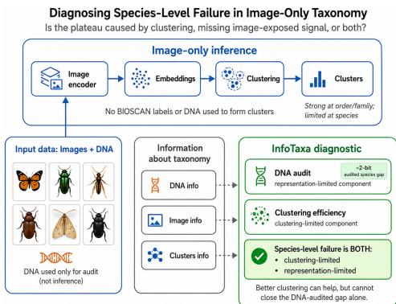
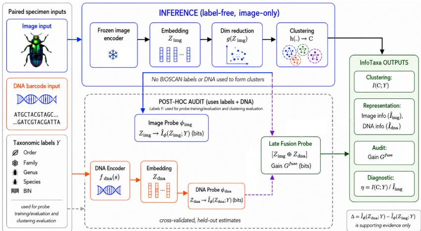
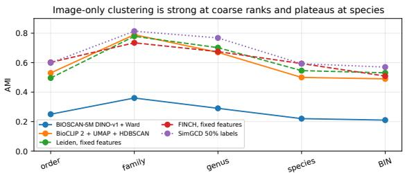
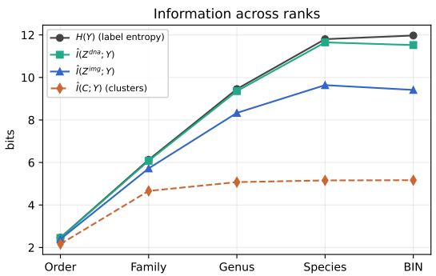
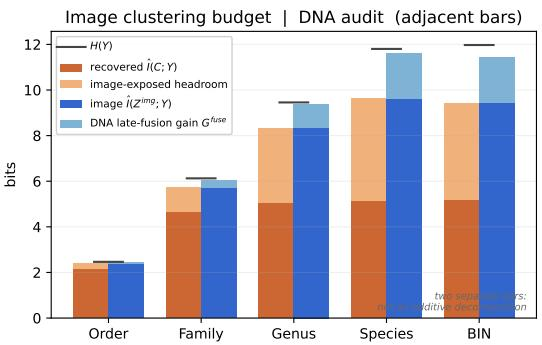
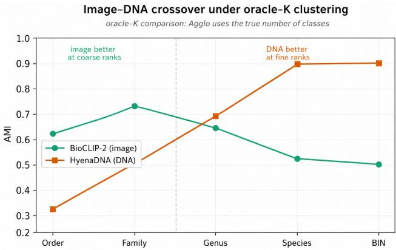
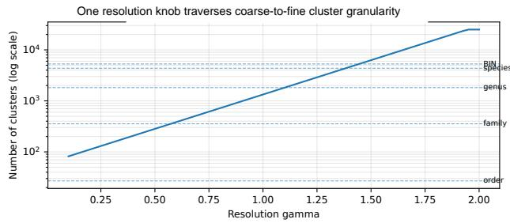
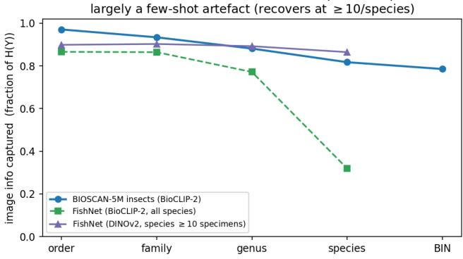

# InfoTaxa: Information-Calibrated Label-Free Clustering for Fine-Grained Visual Taxonomy

David Ahmedt-Aristizabal1, Mohammad Ali Armin1, Lars Petersson1 1 Imaging and Computer Vision Group, CSIRO, Australia

{David.Ahmedtaristizabal, Mohammadali.Armin, Lars.Petersson}@csiro.au.

## Abstract

Label-free clustering of frozen pretrained visual embeddings offers a scalable route to biodiversity monitoring, but image-only fine-grained taxonomy exhibits a consistent coarse-to-fine failure mode: clusters recover broad taxonomic structure yet plateau at species level. We study this behaviour on BIOSCAN-5M through an informationcalibrated clustering analysis. BioCLIP 2 features with UMAP and HDBSCAN reach 0.79 AMI at family and 0.67 at genus, substantially improving over the prior image baseline and remaining competitive with oracle-K, graphbased, and learned clustering heads on the same frozen features. To diagnose whether the remaining plateau is method-limited or information-limited, we introduce Info-Taxa, which combines clustering efficiency—the fraction ofprobe-estimated image information recovered by an unsupervised partition—with paired DNA as an audit signal only, not an inference input. The density pipeline recovers approximately 0.90 and 0.81 of the image-available information at order and family, respectively. Held-out latefusion probes show that adding DNA to the image embedding reduces species-level prediction error by approximately two bits. Robustness analyses cover multiple image encoders, described-species and rare-class subsets, probe diagnostics, and held-out-species coarse-rank generalisation and same-species retrieval. Thus, in the tested setting, species-level label-free clustering is both clustering-limited and representation-limited: improved clustering may recover additional image-exposed structure, but cannot close the DNA-audited information gap alone.

## 1. Introduction

Label-free clustering of frozen pretrained visual embeddings is an attractive route to scalable biodiversity monitoring. Images are inexpensive to collect, modern vision foundation models provide strong transferable representations, and cluster assignments can support taxonomic triage without exhaustive specimen-level annotation at inference [7, 16, 19, 24]. This setting is particularly relevant for insect biodiversity, where specimen volumes are large, expert labels are expensive, and many categories are longtailed [5]. Yet image-only fine-grained taxonomy exhibits a consistent coarse-to-fine failure mode: visual embeddings recover broad taxonomic structure but degrade sharply at the finest ranks, especially species [5, 7, 19].

  
Figure 1. InfoTaxa diagnoses label-free image clustering at inference. Visual embeddings are clustered without BIOSCAN labels, while paired DNA is used only as an audit signal to quantify the clustering-limited and representation-limited components of the species-level plateau.

This raises a central question: is fine-rank failure due to (i) suboptimal clustering, (ii) embedding geometry, or (iii) missing taxonomic signal in the representation? If the signal is present but poorly organised, stronger clustering or category-discovery methods should help [23, 25, 26]; if it is not exposed, improved clustering alone cannot close the gap.

Fine-grained biological taxonomy provides a natural testbed for this question because labels are organised hierarchically, from order and family to genus and species. Insects are especially challenging because species boundaries may be visually subtle or cryptic, and DNA barcoding is widely used when morphology is ambiguous [2, 8]. BIOSCAN-5M is therefore particularly useful: it provides paired specimen images, DNA barcodes, and Linnaean labels [5]. In this paper, the inference pipeline remains imageonly; paired DNA is used only as an audit signal to measure where current visual embeddings stop exposing fine-rank taxonomic information.

To make this distinction, we introduce InfoTaxa, an information-calibrated diagnostic framework for label-free clustering of frozen pretrained visual embeddings in finegrained taxonomy. InfoTaxa combines three rank-wise quantities: image-only clustering AMI, probe-estimated image information, and held-out image+DNA late-fusion gain $G ^ { \mathrm { f u s e } }$ . The first two define clustering efficiency, which measures clustering headroom; the third audits held-out signal beyond the frozen image embedding. Figure 1 summarises this setting: visual embeddings are clustered without BIOSCAN labels, while paired DNA is used only after clustering as an audit signal. A simple image-only pipeline, BioCLIP 2 features [7] with UMAP reduction [13] and HDBSCAN clustering [12], reaches 0.79 AMI at family and 0.67 AMI at genus on BIOSCAN-5M, substantially improving over the prior image baseline. However, it still plateaus at species level, motivating a diagnostic of whether the remaining error is clustering-limited or representationlimited.

At order and family, the density pipeline recovers approximately 0.90 and 0.81 of probe-estimated image information, respectively, indicating limited clustering headroom on the same frozen features. At species, clustering efficiency drops to 0.54, showing unrecovered imageexposed structure, while adding DNA to image yields a 1.99-bit held-out late-fusion gain. Throughout, $\dot { G } ^ { \mathrm { f u s e } }$ is the primary audit measure; the marginal DNA–image probe difference $\Delta$ is supporting evidence and is not interpreted as conditional mutual information. Supporting analyses cover additional encoders, label provenance, rare-class subsets, and probe diagnostics, while held-out-species analyses separately assess coarse-rank generalisation and samespecies retrieval. Thus, in the tested frozen representations, species-level label-free clustering is both clustering-limited and representation-limited: improved clustering may recover more image-exposed structure, but cannot remove the held-out DNA-audited signal beyond image alone.

Finally, InfoTaxa separates information content from clusterability: DNA embeddings expose at least as much taxonomic information as image embeddings at every rank, but image embeddings cluster better at coarse ranks. The image–DNA crossover is therefore geometric rather than informational. InfoTaxa is not a new clustering algorithm or mutual-information estimator; its contribution is the calibrated combination of standard clustering, held-out probes, and a paired auxiliary-modality audit to attribute the species-level failure mode. Our contributions are:

1. We formulate fine-grained visual taxonomy as label-free clustering of frozen pretrained image embeddings and report a strong BIOSCAN-5M operating point: Bio-CLIP 2 + UMAP + HDBSCAN reaches 0.79 family AMI and 0.67 genus AMI.

2. We introduce InfoTaxa, an information-calibrated diagnostic framework that uses clustering efficiency to quantify clustering headroom relative to probe-estimated image information.

3. We use paired DNA as an audit signal: held-out late fusion quantifies the species-level signal beyond image, while marginal modality-probe differences provide supporting robustness evidence.

## 2. Related work

Fine-grained visual recognition and biodiversity. Finegrained recognition involves visually subtle class boundaries, while biodiversity datasets additionally contain long-tailed classes, hierarchical labels, and many rare species [9, 24]. Biological vision foundation models address this setting through large-scale organism image pretraining and taxonomic structure. BioCLIP and Bio-CLIP 2 learn organism-centred representations using biological supervision [7, 19], whereas DINOv2 provides a non-biological visual control without taxonomic pretraining [16]. BIOSCAN-5M is particularly relevant because it pairs specimen images, DNA barcodes, and taxonomy at scale [5]. Prior work primarily evaluates classification or clustering performance; in contrast, InfoTaxa asks how much taxonomic information image embeddings expose at each rank, and whether the species-level plateau reflects clustering or missing image-exposed information.

Label-free clustering with frozen vision features. Strong frozen features can make simple clustering competitive with more elaborate learned objectives: SCAN learns a clustering head after self-supervised pretraining [23], while FINCH and graph-based methods recover structure from nearest-neighbour relations without a fixed parametric classifier [17]. Closest to our clustering protocol, Lowe et al. [10] benchmark frozen supervised and self-supervised encoders with conventional clusterers, including UMAPreduced features and AMI evaluation, and show that encoder choice often dominates clusterer choice. InfoTaxa differs by asking why fine-rank clustering fails: it calibrates the partition against probe-estimated image information and a paired DNA audit. In fine-grained taxonomy, a weak clustering score is ambiguous: it may reflect a poor clustering algorithm, unfavourable embedding geometry, or insufficient taxonomic information in the representation. We use label-free specifically for the clustering stage: no BIOSCAN taxonomic labels are used to form the partition, although frozen foundation models may have used external supervision during pretraining. InfoTaxa addresses this ambiguity by measuring how much probe-estimated image information is recovered by an unsupervised partition.

  
Figure 2. InfoTaxa overview. The top branch forms clusters from frozen image embeddings without BIOSCAN labels or paired DNA. Post-hoc evaluation uses taxonomic labels for cross-validated probes and clustering evaluation, while paired DNA is used only to measure held-out late-fusion gain beyond image; ∆ is supporting evidence. Together, clustering efficiency η and the DNA audit distinguish clustering headroom from the representation-limited component.

Category discovery and generalized discovery. Category discovery methods recover novel semantic classes when labelled and unlabelled data are mixed. Generalized category discovery (GCD) and SimGCD use partial supervision and often assume labelled examples or the true number of classes [25, 26]. These methods provide useful upperbound references, but do not match our benchmark-labelfree inference setting, where BIOSCAN taxonomic labels and the number of biological classes are unavailable when clusters are formed. We therefore compare methods by the information they receive—discovered K, oracle K, learned oracle-K heads, or semi-supervised labels—and use Info-Taxa to distinguish clustering inefficiency from limitations of the visual representation.

DNA barcoding as a calibration signal. DNA barcoding supports species identification when morphology is ambiguous or cryptic [2, 8]. Genomic models such as HyenaDNA provide sequence embeddings for biological tasks [15], while multimodal models such as CLIBD align image, DNA, and text representations [6]. These approaches show that DNA provides strong fine-rank taxonomic signal. Our goal is different: InfoTaxa does not use DNA for clustering, but uses paired DNA only as an audit signal to quantify species-level signal not exposed by current image embeddings.

Information-theoretic diagnostics. Information-theoretic ideas have informed representation learning, including the information bottleneck principle [20] and mutualinformation objectives in self-supervised learning [22]. Direct mutual-information estimation, however, is statistically delicate [11]. We therefore use held-out discriminative probes as practical lower bounds on the information exposed by frozen embeddings. Unlike work that uses mutual information mainly as a training objective or representationlearning principle, InfoTaxa combines probe-based bit budgets with clustering scores to diagnose fine-grained visual taxonomy rank by rank.

## 3. Method

We introduce InfoTaxa, an information-calibrated framework for diagnosing label-free clustering of frozen pretrained visual embeddings in fine-grained taxonomy. It combines an image-only inference pipeline, which reduces and partitions frozen visual embeddings without BIOSCAN labels or paired DNA, with a post-hoc audit that uses crossvalidated probes and paired DNA to measure clustering headroom and held-out taxonomic signal beyond image. Figure 2 summarises the framework. Although we instantiate InfoTaxa on insect taxonomy, the framework applies more generally to paired settings with three ingredients: a frozen representation whose unsupervised partition is being diagnosed, categorical or hierarchical evaluation labels, and an auxiliary paired modality used strictly post hoc as an audit signal. BIOSCAN-5M is our primary evaluation because it provides these ingredients at scale; broader validation across taxa, acquisition settings, and auxiliary modalities remains future work.

## 3.1. Problem setup

We consider a paired image–DNA dataset

$$
\mathcal { D } = \{ ( x _ { i } , s _ { i } , y _ { i } ^ { 1 } , \ldots , y _ { i } ^ { r } ) \} _ { i = 1 } ^ { N } ,\tag{1}
$$

where $x _ { i }$ is a specimen image, $s _ { i }$ is its paired DNA barcode sequence, and $y _ { i } ^ { r }$ is the taxonomic label at rank r. In BIOSCAN-5M, we evaluate order, family, genus, species, and barcode index number (BIN). Because BINs are barcode-derived, species is the main fine-rank biological endpoint and BIN is an additional diagnostic. The image-only pipeline uses only $x _ { i }$ to form cluster assignments. DNA barcodes and taxonomic labels are used only after clustering for evaluation, information measurement, and audit experiments.

## 3.2. Image-only clustering pipeline

For each image encoder, we extract and cache frozen visual embeddings

$$
z _ { i } ^ { \mathrm { i m g } } = f _ { \mathrm { i m g } } ( x _ { i } ) .\tag{2}
$$

No encoder is fine-tuned on BIOSCAN-5M. The imageonly inference path reduces each embedding and assigns a cluster label,

$$
c _ { i } = h \Big ( g \Big ( z _ { i } ^ { \mathrm { i m g } } \Big ) \Big ) ,\tag{3}
$$

where $g ( \cdot )$ is a dimensionality-reduction operator and $h ( \cdot )$ is an unsupervised clustering algorithm. We use label-free clustering at inference to mean that neither BIOSCAN taxonomic labels nor paired DNA is used to fit $g ( \cdot )$ or $h ( \cdot )$ This does not imply unsupervised encoder pretraining: Bio-CLIP 2 is biologically supervised, whereas DINOv2 is a non-biological visual control. Our default pipeline uses UMAP [13] followed by HDBSCAN [12], which discovers the number of clusters from embedding geometry. We also compare graph-based clustering, oracle-K methods, learned clustering heads, and semi-supervised categorydiscovery methods to test whether the coarse-to-fine plateau persists across alternative partitions of the same frozen features. Encoders, configurations, and evaluation protocols are specified in Sec. 4.1.

## 3.3. Probe-based information audit

Clustering shows what structure an unsupervised partition recovers; held-out probes estimate the taxonomic information exposed by frozen representations. For a modality $m \in \{ \mathrm { i m g } , \mathrm { d n a } \}$ , the probe predicts $Y _ { r }$ from $Z ^ { m }$ . DNA embeddings are extracted as

$$
z _ { i } ^ { \mathrm { d n a } } = f _ { \mathrm { d n a } } ( s _ { i } ) ,\tag{4}
$$

using HyenaDNA [15]. DNA is not used to construct the image-only clusters.

The primary probe is a shallow MLP trained under crossvalidation and evaluated out of sample; linear, wider, and non-parametric probes are used as diagnostics. Held-out cross-entropy gives a practical lower bound on the mutual information exposed by the frozen representation:

$$
\widehat { I } _ { \phi } ( Z ^ { m } ; Y _ { r } ) = \widehat { H } ( Y _ { r } ) - \mathrm { C E } _ { \phi } ( Y _ { r } \mid Z ^ { m } ) ,\tag{5}
$$

where $\widehat { H } ( Y _ { r } )$ is the label entropy in bits, estimated with a Miller–Madow correction [14]. We interpret probe estimates as lower bounds on representation information, not exact mutual information values.

We use paired DNA to audit predictive taxonomic signal beyond the image embedding. Our primary measure is the held-out late-fusion gain

$$
G _ { r } ^ { \mathrm { f u s e } } = \mathrm { C E } _ { \phi _ { \mathrm { i m g } } } ( Y _ { r } \mid Z ^ { \mathrm { i m g } } ) - \mathrm { C E } _ { \phi _ { \mathrm { f u s e } } } \left( Y _ { r } \mid [ Z ^ { \mathrm { i m g } } , Z ^ { \mathrm { d n a } } ] \right)\tag{6}
$$

where both terms are evaluated out of sample. A positive $G _ { r } ^ { \mathrm { f u s e } }$ means that adding DNA reduces held-out taxonomic prediction error. We interpret this as an operational incremental-prediction gain, not an exact conditional mutual-information estimate.

For supporting comparison between the two modalityspecific probes, we also report the marginal DNA–image probe difference

$$
\Delta _ { r } = \widehat { I } _ { \phi } ( Z ^ { \mathrm { d n a } } ; Y _ { r } ) - \widehat { I } _ { \phi } ( Z ^ { \mathrm { i m g } } ; Y _ { r } ) .\tag{7}
$$

Because $\Delta _ { i }$ is a difference of marginal lower-bound estimates, it is neither a lower bound on conditional mutual information nor the primary evidence that DNA adds signal beyond image. Agreement between $G _ { r } ^ { \mathrm { f u s e } }$ and $\Delta _ { r }$ provides a consistency check between the late-fusion audit and separate modality probes.

## 3.4. Clustering efficiency

To compare taxonomic association recovered by a clustering partition with the probe-predictive structure of the frozen image embedding, let $C$ denote the cluster assignments produced by the image-only pipeline. We define clustering efficiency as

$$
\eta _ { r } = \frac { \widehat { I } ( C ; Y _ { r } ) } { \widehat { I } _ { \phi } ( Z ^ { \mathrm { i m g } } ; Y _ { r } ) } .\tag{8}
$$

The numerator is plug-in mutual information in bits between cluster assignments and rank-r labels, and the denominator is probe-estimated image information. High $\eta _ { r }$ indicates that the partition recovers taxonomic association comparable in scale to that captured by the image probe; low $\eta _ { r }$ indicates substantial unrecovered probe-predictive structure. This ratio is a pipeline-specific empirical diagnostic, not a formal information bound. UMAP and HDB-SCAN are fitted transductively on the full evaluation set, so an assignment may depend on the embedding geometry of other specimens as well as its own embedding. We therefore do not invoke a per-specimen data-processing argument or interpret $\eta _ { r }$ as an exact fraction of individual image information recovered by clustering. Moreover, the denominator is a probe lower bound and plug-in cluster MI can be positively biased. We use $\eta _ { r }$ to compare clustering headroom across ranks under the evaluated protocol, not as an impossibility theorem.

## 3.5. Robustness protocols

We test whether the species-level audit is sensitive to encoder choice, label provenance—including placeholder or potentially barcode-informed species labels—rare classes, probe specification, or closed-label memorisation. We repeat the audit across multiple image encoders, restrict it to taxonomist-described species, remove low-count classes, vary probe families and capacities, and include a labelpermutation baseline. We separately assess generalisation to unseen species by excluding entire species from probe training. These probes predict family and genus only; species-level open-set evidence is measured by samespecies nearest-neighbour retrieval among held-out species. This distinguishes coarse-rank transfer from fine-grained retrieval without fitting a closed-set classifier for unseen species.

## 4. Experiments

## 4.1. Experimental setup

Dataset and taxonomic labels. We evaluate on BIOSCAN-5M [5], using the cropped 256 evaluation split, comprising 39,373 test images and 7,887 test-unseen images, for a total of 47,260 specimens. Each specimen has a cropped image, a DNA barcode, and taxonomic labels at five ranks: order, family, genus, species, and barcode index number (BIN). The combined evaluation set contains 27 orders, 355 families, 1,819 genera, 4,363 species, and 5,296 BINs. We treat species as the main fine-grained biological endpoint and BIN as an additional barcodederived diagnostic. At the species rank, BIOSCAN-5M contains both established scientific names and operational placeholder labels. Following the BIOSCAN-5M curation convention, labels with an established scientific name are treated as taxonomist-described species, whereas labels beginning with a lowercase letter, containing a period or numeral, or including “malaise” are treated as placeholders rather than established binomials [5]. Placeholders may reflect barcode-informed operational taxonomy, although their provenance is not uniform. The described-species audit excludes these placeholders, reducing but not eliminating possible dependence between barcode evidence and the target definition.

Representations and implementation. All encoders are frozen. Our primary image representation is BioCLIP 2 ViT-L/14 [7]; DINOv2 ViT-L/14 [16] provides a nonbiological visual control, and additional encoders are included in the robustness sweep. DNA embeddings are extracted with HyenaDNA [15]. All clustering results are label-free at inference: BIOSCAN taxonomic labels and paired DNA are not used to fit the dimensionality-reduction or clustering stages. BioCLIP 2 may use external biological supervision during pretraining; thus, our label-free claim concerns inference-time clustering rather than representation pretraining. Our headline image-only configuration, denoted H, uses BioCLIP 2 features, UMAP-50 [13], and HDBSCAN [12] with minimum cluster size 100. For comparison with the multi-resolution Leiden sweep, protocol R uses the same BioCLIP 2 + UMAP-50 features and selects the HDBSCAN minimum cluster size independently at each taxonomic rank from $\{ 1 0 , \ldots , 3 0 0 \}$

Table 1. Headline label-free BIOSCAN-5M AMI(global) under protocol H. Our values are mean ± standard deviation over five seeds; prior values are approximate readings from [5].
<table><tr><td>Method</td><td> $\overline { { \mathrm { ~ \ o r d e r } } }$ </td><td> $\mathrm { F a m i l y }$ </td><td> $\mathrm { G e n u s }$ </td><td> ${ \mathrm { S p e c i e s } }$ </td><td>BIN</td></tr><tr><td>BIOSCAN-5M DINO-v1 ViT-B + UMAP-50 + Ward [5]</td><td> $\overline { { \phantom { 1 0 } } } \sim . 2 5$ </td><td> $\sim . 3 6$ </td><td> $\sim . 2 9$ </td><td> $\sim . 2 2$ </td><td>~.21</td></tr><tr><td>BioCLIP 2 + UMAP-50 + HDBSCAN</td><td>.53±.003</td><td>.79±.002</td><td>.67±.003</td><td>.50±.001</td><td>.49±.001</td></tr></table>

Metrics. We report adjusted mutual information (AMI) for clustering. All AMI values are global: every specimen is included, and HDBSCAN noise assignments are retained as one additional cluster. For the information audit, we report probe-based mutual-information lower bounds in bits, their fraction of label entropy, the primary held-out late-fusion gain $G ^ { \mathrm { f u s e } }$ (Sec. 3.3)—the reduction in heldout cross-entropy when paired DNA is added to the image embedding— and the supporting marginal DNA–image probe difference ∆. Clustering efficiency uses plug-in mutual information between cluster assignments and taxonomic labels, normalised by probe-estimated image information. As defined in Sec. 3.4, it is a pipeline-specific diagnostic of clustering headroom rather than a forma recovered-information bound.

Baselines and comparison groups. We compare three baseline groups. First, BioCLIP 2 is the main biological encoder and DINOv2 the non-biological control. Second, on fixed BioCLIP 2 features, we compare discovered-K methods—HDBSCAN, Leiden [21], and FINCH [17]— oracle-K methods (k-means and Ward), learned clustering heads (SCAN [23], TURTLE [4], and TEMI [1]), and the semi-supervised SimGCD upper-bound baseline [26]. HDBSCAN uses headline configuration H; the remaining methods use representative fixed-feature operating points for their respective clustering regimes. Finally, we evaluate DNA-supervised image-only projections and DNArequiring upper bounds to test whether DNA supervision can recover species information from frozen image embeddings. Complete implementation and hyperparameterselection details are provided in the Supplementary Material.

## 4.2. Image-only clustering on BIOSCAN-5M

We first establish whether label-free image clustering provides a strong operating point before the DNA audit. Table 1 compares headline protocol H with the prior BIOSCAN-5M zero-shot image-clustering baseline of Gharaee et al. [5]. That baseline uses ImageNet-1K selfsupervised DINO-v1 ViT-B, UMAP-50, and Ward clustering on the combined test and test-unseen split. Its values are approximate readings from the published figure and therefore provide a benchmark reference rather than a matched reimplementation. Under protocol H, BioCLIP 2 increases family AMI from approximately 0.36 to 0.79 and genus AMI from approximately 0.29 to 0.67. This is a frozen-representation plus clustering operating point, not a claim that HDBSCAN itself is a new clustering method. Figure 3 visualises the corresponding coarse-to-fine pattern. The headline pipeline improves substantially over the prior reference, particularly at family and genus, but imageonly approaches decline at species and BIN. SimGCD is included only as a semi-supervised reference because it uses BIOSCAN labels. Table 2 tests whether this pattern depends on the clustering method. It compares representative partitions from frozen BioCLIP 2 representations across discovered-K, oracle-K, learned oracle-K, and semi-supervised regimes. HDBSCAN repeats headline protocol H, while the remaining methods use their methodspecific operating points. At family and genus, the headline density pipeline remains competitive with the non-semisupervised alternatives. At species, several alternatives— including FINCH, Leiden, TEMI, SCAN, and oracle-K methods—recover more structure than HDBSCAN H (e.g. FINCH: 0.594 versus 0.500). This establishes a clusteringlimited component of the species plateau: improved partitions can recover additional structure from the frozen image representation. However, oracle-K and learned methods still retain a pronounced fine-rank decline. InfoTaxa therefore uses the clustering-efficiency diagnostic in Sec. 4.3 to quantify this headroom, and the DNA audit in Sec. 4.4 to test the complementary representation question.

  
Figure 3. AMI across taxonomic ranks. The headline pipeline improves over the prior BIOSCAN-5M image baseline, while image-only methods retain a species/BIN decline. SimGCD uses BIOSCAN labels and is a semi-supervised reference.

Table 2. Representative clustering comparison on frozen Bio-CLIP 2, AMI(global). HDBSCAN uses headline protocol H; other rows use method-specific operating points. SimGCD uses BIOSCAN labels and is a semi-supervised reference.
<table><tr><td>Regime</td><td>Method</td><td>Order</td><td>Family</td><td>Genus</td><td>Species</td><td>BIN</td></tr><tr><td>K-discovery</td><td>HDBSCAN (H)</td><td>0.530</td><td>0.790</td><td>0.670</td><td>0.500</td><td>0.490</td></tr><tr><td>K-discovery</td><td>Leiden</td><td>0.496</td><td>0.779</td><td>0.702</td><td>0.546</td><td>0.531</td></tr><tr><td>K-discovery</td><td>FINCH</td><td>0.602</td><td>0.735</td><td>0.675</td><td>0.594</td><td>0.509</td></tr><tr><td>K-oracle</td><td>k-means@K</td><td>0.585</td><td>0.728</td><td>0.650</td><td>0.536</td><td>0.516</td></tr><tr><td>K-oracle</td><td>Ward@K</td><td>0.584</td><td>0.732</td><td>0.646</td><td>0.527</td><td>0.507</td></tr><tr><td>Deep</td><td>TEMI [1]</td><td>0.342</td><td>0.723</td><td>0.683</td><td>0.555</td><td>0.521</td></tr><tr><td>Deep</td><td>SCAN [23]</td><td>0.529</td><td>0.696</td><td>0.627</td><td>0.533</td><td>0.523</td></tr><tr><td>Deep</td><td>TURTLE [4]</td><td>0.526</td><td>0.469</td><td>0.405</td><td>0.290</td><td>0.290</td></tr><tr><td>Semi-sup.</td><td>SimGCD [26]</td><td>0.599</td><td>0.814</td><td>0.768</td><td>0.593</td><td>0.570</td></tr></table>

Table 3. Clustering-efficiency diagnostic for headline protocol H. Values are bits except for $\eta . \ { \widehat { I } } ( C ; Y )$ and η are mean ± standard deviation over five UMAP seeds; the image-probe estimate is fixed across seeds.
<table><tr><td>Quantity</td><td>Order</td><td>Family</td><td>Genus</td><td>Species</td><td>BIN</td></tr><tr><td> ${ \widehat { I } } ( C ; Y ) { \mathrm { ~ b i t s } }$ </td><td>2.16±.01</td><td>4.65±.03</td><td>5.09±.01</td><td>5.17±.02</td><td>5.18±.02</td></tr><tr><td> $\widehat { I _ { \phi } } ( Z ^ { \mathrm { i m g } } ; Y )$  bits</td><td>2.39</td><td>5.72</td><td>8.33</td><td>9.65</td><td>9.41</td></tr><tr><td>η</td><td>.90±.00</td><td>.81±.00</td><td>.61±.00</td><td>.54±.00</td><td>.55±.00</td></tr></table>

Table 4. Per-rank BIOSCAN-5M audit in bits. $G ^ { \mathrm { f u s e } }$ is the heldout late-fusion gain from adding DNA to image; ∆ is the supporting marginal DNA–image probe difference. $G ^ { \mathrm { f u s e } }$ and ∆ are mean ± standard deviation over three probe seeds.
<table><tr><td>Rank</td><td> $H ( Y )$ </td><td> $\widehat { I _ { \phi } } ( Z ^ { \mathrm { i m g } } ; Y )$ </td><td> $\widehat { I _ { \phi } } ( Z ^ { \mathrm { d n a } } ; Y )$ </td><td> $G ^ { \mathrm { f u s e } }$ </td><td>∆</td></tr><tr><td>Order</td><td>2.47</td><td>2.39</td><td>2.45</td><td> $0 . 0 6 { \pm } . 0 0$ </td><td> $0 . 0 6 { \pm } . 0 0$ </td></tr><tr><td>Family</td><td>6.13</td><td>5.72</td><td>6.08</td><td> $0 . 3 5 { \pm } . 0 0$ </td><td> $0 . 3 6 { \pm } . 0 0$ </td></tr><tr><td>Genus</td><td>9.46</td><td>8.33</td><td>9.36</td><td> $1 . 0 2 { \pm } . 0 1 $ </td><td> $1 . 0 3 { \pm } . 0 1 $ </td></tr><tr><td>Species</td><td>11.80</td><td>9.65</td><td>11.65</td><td> $1 . 9 9 \pm . 0 1 $ </td><td> $2 . 0 0 \pm . 0 1$ </td></tr><tr><td>BIN</td><td>11.97</td><td>9.41</td><td>11.52</td><td> $2 . 0 2 \pm . 0 1$ </td><td> $2 . 1 1 { \pm } . 0 0$ </td></tr></table>

## 4.3. Clustering efficiency

Section 4.2 shows that alternative partitions can recover additional species structure, but that the coarse-to-fine plateau persists across clustering regimes. InfoTaxa quantifies the remaining clustering headroom through clustering efficiency: the taxonomic association recovered by the current partition relative to probe-estimated image information. Table 3 reports this diagnostic for headline protocol H, with cluster MI and η averaged across five UMAP seeds. At order and family, η is 0.90 and 0.81, indicating that the density partition captures taxonomic association close in scale to that accessible to the image probe. Thus, the frozen representation is both informative and readily clusterable at coarse ranks, leaving limited clustering headroom. At genus and species, η falls to 0.61 and 0.54, respectively. The headline partition therefore leaves substantial probe-predictive image structure unrecovered at fine ranks, so improved clustering can still help. This is the clustering-limited component diagnosed by InfoTaxa. Section 4.4 then addresses the complementary question: whether paired DNA adds heldout predictive taxonomic signal beyond the frozen image embedding. Together, the two measurements distinguish recoverable clustering headroom from the representationlimited component of the species-level plateau.

## 4.4. DNA audit of the species-level plateau

Paired DNA is not used to construct the image-only clusters. To complement the clustering-headroom measurement in Sec. 4.3, InfoTaxa uses paired DNA as an audit signal to test whether it adds held-out predictive taxonomic signal beyond the frozen image embedding. Table 4 reports the primary held-out late-fusion gain $G ^ { \mathrm { f u s e } }$ , together with the supporting marginal DNA–image probe difference $\Delta .$ At coarse ranks, adding DNA provides little additional signal: $G ^ { \mathrm { f u s e } }$ is 0.06 bits at order and 0.35 bits at family. The gain increases to 1.02 bits at genus and 1.99 bits at species. Thus, when the image embedding is already available, paired DNA lowers held-out species cross-entropy by approximately two bits. This is the primary evidence that the species-level plateau cannot be attributed only to the current clustering partition. At species, the supporting marginal probe difference is $\Delta \ : = \ : 2 . 0 0$ bits, within 0.01 bits of the late-fusion gain. This agreement is consistent with the audit, but $\Delta$ is neither interpreted as conditional mutual information nor used as a formal decomposition of DNA-exclusive information. Figure 4 visualises the complementary clustering and DNA-audit diagnostics. Together with the clustering headroom in Table 3, these measurements give InfoTaxa its two-part diagnosis: stronger clustering may recover additional image-exposed structure, but cannot remove the held-out DNA-audited signal beyond image.

  
Figure 4. Information-calibrated view. Left: label entropy, image and DNA probe information, and cluster MI. Right: adjacent bars compare the image-clustering budget—cluster MI and image-exposed headroom—with the DNA audit—image-probe information and held-out late-fusion gain $G ^ { \mathrm { f u s e } } .$ —with $H ( Y )$ marked. This is a diagnostic comparison, not an additive mutual-information decomposition. At species, image-exposed clustering headroom exceeds the late-fusion gain.

Table 5. Robustness of the InfoTaxa DNA audit. Order–BIN columns report the supporting marginal DNA–image probe difference $\Delta$ in bits; the final column reports the primary species-level held-out late-fusion gain $G _ { \mathrm { s p } } ^ { \mathrm { f u s e } }$ in bits.
<table><tr><td>Configuration</td><td>Order</td><td>Family</td><td>Genus</td><td>Species</td><td>BIN</td><td> $G _ { \mathrm { s p } } ^ { \mathrm { f u s e } }$ </td></tr><tr><td>BioCLIP 2, all species</td><td>0.06</td><td>0.36</td><td>1.03</td><td>2.00</td><td>2.11</td><td>1.99</td></tr><tr><td>BioCLIP 2, taxonomist-described species</td><td>0.06</td><td>0.36</td><td>1.06</td><td>1.85</td><td>1.97</td><td>1.84</td></tr><tr><td>DINOv2, all species</td><td>0.08</td><td>0.65</td><td>1.86</td><td>3.50</td><td>3.62</td><td>3.45</td></tr></table>

## 4.5. Robustness of the DNA audit

We test whether the DNA audit used by InfoTaxa is sensitive to label provenance, encoder choice, class rarity, or probe specification. Table 5 provides the most direct controls. Restricting the evaluation to taxonomistdescribed species reduces the supporting marginal specieslevel DNA–image difference from 2.00 to 1.85 bits, while the primary held-out late-fusion gain remains 1.84 bits, compared with 1.99 bits on all species. Thus, the main result does not rest on placeholder labels alone. This control reduces, but cannot fully eliminate, possible dependence between barcode evidence and fine-rank target definitions. Species remains the primary biological endpoint; BIN is retained as an explicitly barcode-derived diagnostic. Table 6 extends this analysis across six externally pretrained frozen image encoders. For every encoder, the supporting marginal DNA–image difference increases towards species and BIN. More importantly, the primary species-level heldout late-fusion gain remains positive for all tested encoders, ranging from 1.99 to 4.77 bits. BioCLIP 2, the domainspecialised representation used by the headline pipeline, yields the smallest species-level gain among these externally pretrained encoders. These results support the scoped conclusion that the InfoTaxa audit is not an artefact of one visual encoder. The final row adds CLIBD [6], whose image tower is contrastively aligned to paired DNA on BIOSCAN-5M itself. CLIBD narrows the species-level late-fusion gain to 1.10 bits, but the audit gap remains above one bit at species and BIN; we therefore report CLIBD as an indomain robustness probe rather than as the headline operating point.

Table 6. Encoder-sweep robustness of the InfoTaxa DNA audit using the same HyenaDNA reference. ∆ is the supporting marginal DNA–image probe difference; $G ^ { \mathrm { f u s e } }$ is the primary held-out latefusion gain. $\bar { G } ^ { \mathrm { f u s e } }$ values are mean ± standard deviation over three probe seeds. †CLIBD [6] is contrastively pretrained with paired DNA on BIOSCAN-5M itself and is reported as an in-domain robustness probe.
<table><tr><td></td><td></td><td colspan="3">∆ (bits)</td><td colspan="3">Gfuse (bits)</td></tr><tr><td>Image encoder</td><td>Order</td><td>Family</td><td>Genus</td><td>Species</td><td>BIN</td><td>Species</td><td>BIN</td></tr><tr><td>BioCLIP 2 [7]</td><td>0.06</td><td>0.36</td><td>1.03</td><td>2.00</td><td>2.11</td><td> $1 . 9 9 \pm . 0 1$ </td><td>2.02±.01</td></tr><tr><td>DINOv2-L [16]</td><td>0.08</td><td>0.65</td><td>1.86</td><td>3.50</td><td>3.62</td><td> $3 . 4 5 \pm . 0 1$ </td><td> $3 . 5 2 \pm . 0 1$ </td></tr><tr><td>DINOv3-L [18]</td><td>0.12</td><td>0.77</td><td>2.11</td><td>3.91</td><td>4.04</td><td> $3 . 8 5 \pm . 0 1$ </td><td>3.91±.01</td></tr><tr><td>MetaCLIP-L [27]</td><td>0.19</td><td>1.10</td><td>2.68</td><td>4.45</td><td>4.56</td><td> $4 . 4 0 { \scriptstyle \pm . 0 1 }$ </td><td>4.43±.00</td></tr><tr><td>SigLIP-L [28]</td><td>0.20</td><td>1.06</td><td>2.64</td><td>4.39</td><td>4.51</td><td> $4 . 3 3 \pm . 0 1$ </td><td> $4 . 3 9 \pm . 0 1$ </td></tr><tr><td>EVA02-B [3]</td><td>0.19</td><td>1.05</td><td>2.77</td><td>4.83</td><td>4.96</td><td> $4 . 7 7 \pm . 0 1$ </td><td> $4 . 8 3 \pm . 0 1$ </td></tr><tr><td>CLIBD† [6]</td><td>0.02</td><td>0.22</td><td>0.58</td><td>1.11</td><td>1.20</td><td> $1 . 1 0 { \pm } . 0 1 $ </td><td>1.12±.01</td></tr></table>

Rare classes amplify the audit gap but do not create it. The held-out late-fusion species gain decreases from 2.00 bits for all species to 1.69, 1.30, and 0.97 bits when retaining only species with at least 5, 10, and 20 specimens, respectively. The gap therefore remains substantial among better-sampled classes. The held-out-species analysis addresses a separate generalisation question. When all specimens from selected species are excluded from probe training, image embeddings predict the family and genus of those unseen species better than DNA embeddings. Species-level open-set evidence is instead measured by same-species nearest-neighbour retrieval among heldout species, which strongly favours DNA (0.990 versus 0.780). This analysis therefore does not evaluate a closedset species classifier on unseen species; it contrasts coarse taxonomic transfer with fine-grained same-species retrieval. Finally, the probe diagnostics provide no evidence that the main result is caused by a weak image probe or detectable positive bias under the permutation check. The permutation baseline yields zero estimated MI, and the wider MLP does not improve the species-level image estimate. Full rare-class, held-out-species, and probe-diagnostic results are provided in the Supplementary Material. Together, these controls support the robustness of the InfoTaxa DNA audit while retaining Gfuse, rather than ∆, as the primary evidence of held-out signal beyond image.

## 4.6. Additional validation and operating modes

InfoTaxa further separates information content from clusterability. In the oracle-K agglomerative comparison in the Supplementary Material, DNA exposes at least as much probe-based taxonomic information as image at every rank, yet image embeddings cluster better at order and family, whereas DNA clusters better from genus to BIN. This image–DNA crossover therefore reflects embedding geometry rather than information content. Simple DNAsupervised image projections also do not improve species clustering over frozen BioCLIP 2; the strongest tested projection, CCA, reaches 0.510 species AMI on held-out testunseen, below the raw image baseline of 0.562. Finally, the multi-resolution Leiden sweep provides full-coverage triage partitions, while rank-tuned HDBSCAN protocol R provides a diagnostic reference with stronger family and genus AMI. These supporting analyses are consistent with the InfoTaxa diagnosis; full results are provided in the Supplementary Material.

## 5. Discussion and limitations

InfoTaxa shows that label-free clustering of frozen pretrained image embeddings varies strongly across the taxonomic hierarchy. BioCLIP 2 with UMAP and HDBSCAN provides a strong family/genus operating point, while species remains both clustering-limited and representationlimited. Lower clustering efficiency indicates unrecovered image-exposed structure that better partitions may recover, whereas the held-out late-fusion audit shows that paired DNA adds substantial predictive signal beyond the frozen image embedding. Here, label-free refers to inference-time clustering: BIOSCAN labels and paired DNA are not used to form clusters, although BioCLIP 2 receives biological supervision during pretraining. The marginal DNA–image difference supports the audit but is not interpreted as conditional mutual information.

The analysis is diagnostic rather than absolute. DNA is used only as a paired audit signal, probes are lower bounds, and clustering efficiency is a pipeline-specific ratio rather than a formal impossibility bound. The described-species control reduces, but cannot fully eliminate, possible dependence between barcode evidence and fine-rank labels. The audit localises the gap to the frozen image embedding as read out by held-out probes; it does not prove that raw images contain no further species cues or separate missing visual evidence from information discarded by the encoder. Probe-capacity, non-parametric, and permutation diagnostics provide no evidence that the gap is caused by probe underfitting or positive estimator bias, and CLIBD shows that DNA-aligned in-domain pretraining narrows but does not close the gap. Fine-tuning, richer image acquisition, metadata, additional sensing, or future biology-specialised encoders may expose further species cues. InfoTaxa is formulated as a paired-modality audit template, but its full empirical validation here is on BIOSCAN-5M; FishNet provides only a DNA-free check of the coarse-to-fine image falloff, not the paired-DNA audit. Broader validation across taxa, acquisition settings, and auxiliary modalities remains future work.

## 6. Conclusion

We introduced InfoTaxa, an information-calibrated framework for diagnosing label-free clustering from frozen pretrained visual embeddings. On BIOSCAN-5M, BioCLIP 2 with UMAP and HDBSCAN reaches 0.79 family and 0.67 genus AMI, competitive with representative graph-based, oracle-K, and learned alternatives. Label-free means that no BIOSCAN labels or paired DNA form the partition. At order and family, clustering efficiency shows that the density pipeline recovers most probe-estimated image information, leaving limited headroom. At species, Info-Taxa identifies two limitations. The current partition leaves image-exposed structure unrecovered, so improved clustering may help. However, paired DNA, used only as an audit signal, reduces held-out prediction cross-entropy by approximately two bits when added to image. This finding is robust across encoder, label-provenance, rare-class, and probe controls. Thus, species-level image-only clustering is both clustering-limited and representation-limited in the tested frozen embeddings: stronger clustering alone cannot eliminate the held-out signal beyond image, which may require richer visual representations or additional sensing.

## References

[1] Nikolas Adaloglou, Felix Michels, Hamza Kalisch, and Markus Kollmann. Exploring the Limits of Deep Image Clustering using Pretrained Models. In Proceedings of the British Machine Vision Conference, 2023. 5, 6

[2] David Bickford, David J. Lohman, Navjot S. Sodhi, Peter K. L. Ng, Rudolf Meier, Kevin Winker, Kristen K. Ingram, and Indraneil Das. Cryptic species as a window on diversity and conservation. Trends in Ecology & Evolution, 22(3): 148–155, 2007. 1, 3

[3] Yuxin Fang, Quan Sun, Xinggang Wang, Tiejun Huang, Xinlong Wang, and Yue Cao. EVA-02: A visual representation for neon genesis. Image and Vision Computing, 2024. 7, 1

[4] Artyom Gadetsky, Yulun Jiang, and Maria Brbic. Let Go of Your Labels with Unsupervised Transfer. In Proceedings of the 41st International Conference on Machine Learning, pages 14382–14407, 2024. 5, 6

[5] Zahra Gharaee, Scott C Lowe, ZeMing Gong, Pablo M Arias, Nicholas Pellegrino, Austin T Wang, Joakim B Haurum, Iuliia Zarubiieva, Lila Kari, Dirk Steinke, et al. Bioscan-5m: A multimodal dataset for insect biodiversity. Advances in Neural Information Processing Systems, 37: 36285–36313, 2024. 1, 2, 5

[6] ZeMing Gong, Austin Wang, Xiaoliang Huo, Joakim Bruslund Haurum, Scott C Lowe, Graham W Taylor, and Angel Chang. Clibd: Bridging vision and genomics for biodiversity monitoring at scale. In International Conference on Learning Representations, pages 92306–92336, 2025. 3, 7, 1

[7] Jianyang Gu, Sam Stevens, Elizabeth Campolongo, Matthew Thompson, Net Zhang, Jiaman Wu, Andrei Kopanev, Zheda Mai, Alexander White, James Balhoff, et al. Bioclip 2: Emergent properties from scaling hierarchical contrastive learning. Advances in Neural Information Processing Systems, 38:102778–102811, 2025. 1, 2, 5, 7

[8] Paul D. N. Hebert, Alina Cywinska, Shelley L. Ball, and Jeremy R. deWaard. Biological identifications through DNA barcodes. Proceedings of the Royal Society B: Biological Sciences, 270(1512):313–321, 2003. 1, 3

[9] Faizan Farooq Khan, Xiang Li, Andrew J Temple, and Mohamed Elhoseiny. Fishnet: A large-scale dataset and benchmark for fish recognition, detection, and functional trait prediction. In Proceedings ofthe IEEE/CVF international conference on computer vision, pages 20496–20506, 2023. 2, 3

[10] Scott C Lowe, Joakim Bruslund Haurum, Sageev Oore, Thomas B Moeslund, and Graham W Taylor. An empirical study into clustering of unseen datasets with self-supervised encoders. arXiv preprint arXiv:2406.02465, 2024. 2

[11] David McAllester and Karl Stratos. Formal limitations on the measurement of mutual information. In International Conference on Artificial Intelligence and Statistics, pages 875– 884. PMLR, 2020. 3

[12] Leland McInnes, John Healy, and Steve Astels. HDB-SCAN: Hierarchical density based clustering. Journal of Open Source Software, 2(11):205, 2017. 2, 4, 5

[13] Leland McInnes, John Healy, and James Melville. Umap: Uniform manifold approximation and projection for dimen-

sion reduction. arXiv preprint arXiv:1802.03426, 2018. 2, 4, 5

[14] George A. Miller. Note on the bias of information estimates. In Information Theory in Psychology: Problems and Meth ods, pages 95–100. Free Press, Glencoe, IL, 1955. 4

[15] Eric Nguyen, Michael Poli, Marjan Faizi, Armin Thomas, Michael Wornow, Callum Birch-Sykes, Stefano Massaroli, Aman Patel, Clayton Rabideau, Yoshua Bengio, et al. Hye nadna: Long-range genomic sequence modeling at single nucleotide resolution. pages 43177–43201, 2023. 3, 4, 5, 1

[16] Maxime Oquab, Timothee Darcet, Th´ eo Moutakanni, Huy´ Vo, Marc Szafraniec, Vasil Khalidov, Pierre Fernandez, Daniel Haziza, Francisco Massa, Alaaeldin El-Nouby, et al. Dinov2: Learning robust visual features without supervision. arXiv preprint arXiv:2304.07193, 2023. 1, 2, 5, 7

[17] Saquib Sarfraz, Vivek Sharma, and Rainer Stiefelhagen. Efficient parameter-free clustering using first neighbor relations. In Proceedings of the IEEE/CVF Conference on Computer Vision and Pattern Recognition (CVPR), 2019. 2, 5

[18] Oriane Simeoni, Huy V. Vo, Maximilian Seitzer, Federico´ Baldassarre, Maxime Oquab, et al. DINOv3. arXiv preprint arXiv:2508.10104, 2025. 7, 1

[19] Samuel Stevens, Jiaman Wu, Matthew J Thompson, Elizabeth G Campolongo, Chan Hee Song, David Edward Carlyn, Li Dong, Wasila M Dahdul, Charles Stewart, Tanya Berger-Wolf, et al. Bioclip: A vision foundation model for the tree of life. In Proceedings of the IEEE/CVF conference on computer vision and pattern recognition, pages 19412–19424, 2024. 1, 2

[20] Naftali Tishby, Fernando C. Pereira, and William Bialek. The information bottleneck method. In Proceedings of the 37th Annual Allerton Conference on Communication, Control, and Computing, pages 368–377, 1999. 3

[21] Vincent A. Traag, Ludo Waltman, and Nees Jan van Eck. From louvain to leiden: Guaranteeing well-connected com munities. Scientific Reports, 9(1):5233, 2019. 5

[22] Michael Tschannen, Josip Djolonga, Paul K. Rubenstein, Sylvain Gelly, and Mario Lucic. On mutual information maximization for representation learning. In International Conference on Learning Representations (ICLR), 2020. 3

[23] Wouter Van Gansbeke, Simon Vandenhende, Stamatios Georgoulis, Marc Proesmans, and Luc Van Gool. SCAN: Learning to classify images without labels. In Proceedings of the European Conference on Computer Vision (ECCV), 2020. 1, 2, 5, 6

[24] Grant Van Horn, Oisin Mac Aodha, Yang Song, Yin Cui, Chen Sun, Alex Shepard, Hartwig Adam, Pietro Perona, and Serge Belongie. The inaturalist species classification and detection dataset. In Proceedings of the IEEE Conference on Computer Vision and Pattern Recognition (CVPR), pages 8769–8778, 2018. 1, 2

[25] Sagar Vaze, Kai Han, Andrea Vedaldi, and Andrew Zisserman. Generalized category discovery. In Proceedings of the IEEE/CVF Conference on Computer Vision and Pattern Recognition (CVPR), pages 7492–7501, 2022. 1, 3

[26] Xin Wen, Bingchen Zhao, and Xiaojuan Qi. Parametric classification for generalized category discovery: A baseline

study. In Proceedings of the IEEE/CVF International Conference on Computer Vision (ICCV), 2023. 1, 3, 5, 6

[27] Hu Xu, Saining Xie, Xiaoqing Ellen Tan, Po-Yao Huang, Russell Howes, Vasu Sharma, Shang-Wen Li, Gargi Ghosh, Luke Zettlemoyer, and Christoph Feichtenhofer. Demystifying CLIP data. In International Conference on Learning Representations (ICLR), 2024. 7, 1

[28] Xiaohua Zhai, Basil Mustafa, Alexander Kolesnikov, and Lucas Beyer. Sigmoid loss for language image pre-training. In Proceedings of the IEEE/CVF International Conference on Computer Vision (ICCV), 2023. 7, 1

# InfoTaxa: Information-Calibrated Label-Free Clustering for Fine-Grained Visual Taxonomy

Supplementary Material

## A. Clustering and probe configurations

Operating-point selection. Table 7 documents the configurations used for the clustering comparison. For each method, it specifies the input representation, whether the number of clusters K is discovered or supplied as an oracle, whether BIOSCAN taxonomic labels are used to fit the method, the selection rule, and whether inference is transductive. The discovered-K density and graph methods use fixed configurations on UMAP-50 embeddings. Oracle-K methods receive only the rank cardinality, not the class assignments. Learned heads are trained selfsupervised on frozen features with oracle K. SimGCD alone uses BIOSCAN labels and is included as a semisupervised upper-bound reference. No label-free operating point is selected using test-set AMI.

Table 7. Clustering configurations and operating-point selection. “Oracle $K ^ { \prime \prime }$ supplies the true rank cardinality; “Labels fit” indicates whether BIOSCAN labels are used to train the method rather than only to evaluate it.
<table><tr><td>Method</td><td>Features</td><td>K</td><td>Labels fit</td><td>Transd.</td><td>Selection / grid</td></tr><tr><td>HDBSCAN (H)</td><td>UMAP-50</td><td>disc.</td><td>no</td><td>yes</td><td>fixed mcs=100</td></tr><tr><td>Leiden</td><td>UMAP-50</td><td>disc.</td><td>no</td><td>yes</td><td>fixed γ=1.0, SNN k=30</td></tr><tr><td>FINCH</td><td>UMAP-50</td><td>disc.</td><td>no</td><td>yes</td><td>last stable partition</td></tr><tr><td>k-means@K</td><td>UMAP-50</td><td>oracle</td><td>no</td><td>no</td><td>K= rank cardinality</td></tr><tr><td>Ward@K</td><td>UMAP-50</td><td>oracle</td><td>no</td><td>yes</td><td>K= rank cardinality</td></tr><tr><td>TEMI</td><td>raw</td><td>oracle</td><td>no</td><td>yes</td><td>default head, oracle K</td></tr><tr><td>SCAN</td><td>raw</td><td>oracle</td><td>no</td><td>yes</td><td>default head, oracle K</td></tr><tr><td>TURTLE</td><td>raw</td><td>oracle</td><td>no</td><td>yes</td><td>default head, oracle K</td></tr><tr><td>SimGCD</td><td>raw</td><td>oracle</td><td>yes</td><td>yes</td><td>50% labels (upper bound)</td></tr></table>

Encoder checkpoints. Table 8 lists the frozen checkpoints used for the encoder robustness analysis. All image features are extracted once and cached; no encoder is fine-tuned. CLIP-L denotes the MetaCLIP ViT-L/14 checkpoint [27]. CLIBD is included as an additional in-domain multimodal encoder; unlike the other image encoders, its released image tower was pretrained on BIOSCAN-5M with paired DNA and text supervision.

Table 8. Frozen encoder checkpoint identifiers used for the encoder robustness analysis, with embedding dimension d.
<table><tr><td>Encoder</td><td>Checkpoint</td><td>d</td></tr><tr><td>BioCLIP 2 [7]</td><td>imageomics/bioclip-2 (ViT-L/14)</td><td>768</td></tr><tr><td>DINOv2-L [16]</td><td>vit_large-patch14_dinov2.lvd142m</td><td>1024</td></tr><tr><td>DINOv3-L [18]</td><td>vit_large-patch16_dinov3.lvd1689m</td><td>1024</td></tr><tr><td>MetaCLIP-L [27]</td><td>vit_large-patch14_clip_224.metaclip-2pt5b</td><td>1024</td></tr><tr><td>SigLIP-L [28]</td><td>vit_large-patch16_siglip_256.webli</td><td>1024</td></tr><tr><td>EVA02-B [3]</td><td>eva02_base-patch14_224.mim_in22k</td><td>768</td></tr><tr><td>CLIBD [6]</td><td>bioscan-ml/clibd(ver_1_0,bioscan_5m/image_dna_4gpu)</td><td>768</td></tr><tr><td>DNA (HyenaDNA) [15]</td><td>LongSafari/hyenadna-tiny-1k-seqlen-hf</td><td>128</td></tr></table>

Seed uncertainty under a fixed representation. Table 9 quantifies sensitivity to five UMAP seeds for discovered-K and oracle-K clusterers operating on BioCLIP 2 + UMAP-50. Each method uses the same UMAP representation within a seed, and FINCH is evaluated at the hierarchy level whose cluster count is closest to the rank cardinality. Standard deviations are small $( \leq 0 . 0 1 5 )$ , indicating stable rankwise behaviour under this protocol. No label-free method is best at every rank; at species, Leiden and Ward recover more AMI than the fixed HDBSCAN configuration.

Table 9. Seed uncertainty for discovered-K and oracle-K clusterers on BioCLIP 2 + UMAP-50, reported as AMI(global), mean ± standard deviation over five UMAP seeds. Learned heads and SimGCD are not re-seeded in this analysis.
<table><tr><td>Regime</td><td>Method</td><td>Order</td><td>Family</td><td>Genus</td><td>Species</td><td>BIN</td></tr><tr><td>K-discovery</td><td>HDBSCAN (H)</td><td> $. 5 3 0 { \scriptstyle \pm . 0 0 3 }$ </td><td>.790±.006</td><td>.670±.001</td><td>.500±.001</td><td> $. 4 9 0 \pm . 0 0 1$ </td></tr><tr><td>K-discovery</td><td>Leiden</td><td> $. 5 0 9 { \scriptstyle \pm . 0 0 2 }$ </td><td> $. 7 9 3 \pm . 0 0 3$ </td><td> $. 7 0 0 { \scriptstyle \pm . 0 0 3 }$ </td><td> $. 5 4 0 { \scriptstyle \pm . 0 0 2 }$ </td><td> $. 5 2 5 { \scriptstyle \pm . 0 0 1 }$ </td></tr><tr><td>K-discovery</td><td>FINCH</td><td> $. 5 9 3 \pm . 0 1 5$ </td><td> $. 7 3 9 \pm . 0 0 4$ </td><td> $. 6 7 1 \pm . 0 0 2$ </td><td> $. 5 2 0 { \scriptstyle \pm . 0 0 0 }$ </td><td> $. 5 1 1 { \scriptstyle \pm . 0 0 0 }$ </td></tr><tr><td>K-oracle</td><td>k-means@K</td><td> $. 5 8 6 \pm . 0 0 4$ </td><td> $. 7 2 7 \pm . 0 0 1$ </td><td> $. 6 3 0 { \scriptstyle \pm . 0 0 1 }$ </td><td> $. 4 7 8 \pm . 0 0 1$ </td><td> $. 4 5 1 \pm . 0 0 1$ </td></tr><tr><td>K-oracle</td><td>Ward@K</td><td> $. 5 8 6 \pm . 0 0 2$ </td><td> $. 7 3 2 \pm . 0 0 1$ </td><td> $6 4 5 { \pm } . 0 0 2$ </td><td> $. 5 2 6 { \scriptstyle \pm . 0 0 1 }$ </td><td> $. 5 0 6 \pm . 0 0 1$ </td></tr></table>

CLIBD as an additional biological multimodal encoder. CLIBD [6] aligns image, DNA, and text representations with contrastive training on BIOSCAN-5M itself, making it a strong test of whether an in-domain multimoda image encoder changes the audit conclusions. We evaluate its released image tower as a frozen encoder under the same evaluation protocol: features are extracted once from the released test-split embeddings, row-aligned to our evaluation metadata using the released split identifiers, and never fine-tuned. Under five UMAP seeds with protocol H (UMAP-50 + HDBSCAN), CLIBD image embeddings obtain AMI(global) of 0.563±.013 at order, 0.776±.001 at family, 0.634±.003 at genus, 0.489±.002 at species, and 0.474±.002 at BIN. These values are comparable to the BioCLIP 2 headline operating point in Table 9. Under the probe audit, CLIBD exposes 10.54 bits of specieslevel image information and reduces the held-out species late-fusion gain to $G ^ { \mathrm { f u s e } } { = } 1 . 1 0 { \pm } . 0 1$ bits, with ∆=1.11; at BIN, $G ^ { \mathrm { f u s e } } { = } 1 . 1 2 { \pm } . 0 1$ bits. The gap therefore narrows but remains above one bit at both fine ranks. Because CLIBD pretraining uses BIOSCAN-5M and paired barcode information, its inference-time clustering remains label-free in our sense, but its pretraining overlaps the evaluation distribution more strongly than any other tested encoder. We therefore report it as an in-domain robustness probe rather than as the headline operating point.

## B. Rare-class control

BIOSCAN-5M is long-tailed, so rare species could inflate the measured late-fusion gain. Table 10 repeats the held-out late-fusion audit after retaining only species with at least 5, 10, or 20 specimens. The species-level gain decreases as rare classes are removed, but remains 0.97 bits with at least 20 specimens per species. Thus, the fine-rank gap is amplified by the long tail but is not solely a few-shot artefact.

Table 10. Rare-class control. Held-out late-fusion gain $G _ { r } ^ { \mathrm { f u s e } }$ from adding DNA to image, in bits, after retaining taxa with at least the stated number of specimens per species.
<table><tr><td>Rank</td><td>≥1</td><td>≥5</td><td>≥ 10</td><td> $\geq 2 0$ </td></tr><tr><td>Genus</td><td>1.02</td><td>0.93</td><td>0.82</td><td>0.69</td></tr><tr><td>Species</td><td>2.00</td><td>1.69</td><td>1.30</td><td>0.97</td></tr><tr><td>BIN</td><td>2.10</td><td>1.71</td><td>1.21</td><td>0.82</td></tr><tr><td>#Species</td><td>4363</td><td>3226</td><td>1732</td><td>923</td></tr></table>

## C. Held-out-species coarse-rank generalisation and same-species retrieval

Random specimen folds measure closed-label representation information because the same species can appear in both probe-training and evaluation folds. To assess coarserank generalisation beyond seen species, we exclude all specimens of selected species from probe training and evaluate family and genus prediction on those held-out species. As reported in Table 11, these species-held-out probes evaluate coarse-rank transfer only; they do not evaluate species classification.

Table 11. Held-out-species evaluation. Family and genus entries are held-out top-1 accuracy for probes evaluated on species excluded from training. Species-level open-set evidence is evaluated separately by same-species kNN@1 retrieval among held-out species. Joint denotes late fusion of image and DNA representations.
<table><tr><td>Protocol</td><td>Target</td><td>Image</td><td>DNA</td><td>Joint</td></tr><tr><td>Species-held-out probe</td><td>Genus</td><td>.732</td><td>.603</td><td>.810</td></tr><tr><td>Species-held-out probe</td><td>Family</td><td>.874</td><td>.745</td><td>.924</td></tr><tr><td>Held-out-species kNN@1 retrieval</td><td>Species</td><td>.780</td><td>.990</td><td>一</td></tr></table>

Species-level open-set evidence is instead measured by same-species nearest-neighbour retrieval among the heldout species. This retrieval test asks whether specimens of an unseen species remain close to conspecific specimens in the frozen embedding space, without fitting a closed-set species classifier. Table 11 shows that image embeddings predict the family and genus of unseen species better than DNA embeddings, whereas same-species retrieval strongly favours DNA.

## D. Probe diagnostics

Table 12 compares MLP and non-parametric kNN probes for BioCLIP 2 image embeddings. At family, the two probes agree closely. At species, kNN is weaker, indicating that the MLP provides the tighter lower bound among the tested probes in the high-class-count regime. The labelpermutation control yields zero estimated MI, showing no detectable positive bias under this permutation check.

Table 12. Probe diagnostics for BioCLIP 2 image embeddings. The MLP gives the tightest species-level lower bound among the tested probes; the permutation control yields zero estimated MI.
<table><tr><td>Rank</td><td>H(Y)</td><td>MLPMI</td><td>kNN MI</td><td>Permuted MI</td><td>Class-subset range</td></tr><tr><td>Family</td><td>6.13</td><td>5.73</td><td>5.58</td><td>0.000</td><td>[5.02, 5.47]</td></tr><tr><td>Species</td><td>11.80</td><td>9.65</td><td>8.47</td><td>0.000</td><td>[9.39, 9.42]</td></tr></table>

Table 13 extends the analysis to image, DNA, and latefusion representations across four taxonomic ranks and multiple probe families. Each entry reports held-out crossentropy CE and its implied lower bound MI = H(Y)−CE in bits. Reporting CE is necessary because the late-fusion gain $G ^ { \mathrm { f u s e } }$ is defined as a held-out CE reduction.

Across the tested probe families, the MLP is tied for or provides the largest lower bound in each setting; the wider MLP is close, while linear and kNN probes are generally looser. The image–DNA CE difference widens toward species and BIN. The image-probe permutation control yields MI = 0 at every rank because its held-out CE does not improve on the marginal predictor, showing no detectable positive bias under this check.

Table 13. Extended probe diagnostics on BioCLIP 2 image, HyenaDNA, and late-fusion features. Each cell is held-out CE / MI in bits under 4-fold cross-validation. The permutation column is an image-probe control with shuffled labels.
<table><tr><td>Rank</td><td>Modality</td><td>Linear</td><td>MLP</td><td>Wide</td><td>kNN</td><td>Perm. MI</td></tr><tr><td rowspan="3">Family</td><td>Image</td><td>0.39/5.73</td><td>0.40/5.73</td><td>0.44/5.69</td><td>0.54/5.58</td><td>0.00</td></tr><tr><td>DNA</td><td>1.19/4.94</td><td>0.05/6.08</td><td>0.05/6.07</td><td>0.58/5.54</td><td>=</td></tr><tr><td>Fusion</td><td>0.20/5.92</td><td>0.06/6.07</td><td>0.07/6.06</td><td></td><td>一</td></tr><tr><td rowspan="3">Genus</td><td>Image</td><td>1.14/8.32</td><td>1.12/8.33</td><td>1.23/8.23</td><td>1.65/7.81</td><td>0.00</td></tr><tr><td>DNA</td><td>1.16/8.29</td><td>0.10/9.35</td><td>0.14/9.32</td><td>0.93/8.53</td><td>一</td></tr><tr><td>Fusion</td><td>0.54/8.92</td><td>0.10/9.35</td><td>0.15/9.30</td><td></td><td>一</td></tr><tr><td rowspan="3">Species</td><td>Image</td><td>2.19/9.62</td><td>2.15/9.65</td><td>2.39/9.41</td><td>3.33/8.47</td><td>0.00</td></tr><tr><td>DNA</td><td>0.78/11.02</td><td>0.15/11.65</td><td>0.22/11.58</td><td>1.20/10.60</td><td>一</td></tr><tr><td>Fusion</td><td>0.95/10.85</td><td>0.17/11.63</td><td>0.29/11.51</td><td></td><td>1</td></tr><tr><td rowspan="3">BIN</td><td>Image</td><td>2.60/9.37</td><td>2.56/9.42</td><td>2.98/8.99</td><td>3.67/8.30</td><td>0.00</td></tr><tr><td>DNA</td><td>1.01/10.97</td><td>0.45/11.53</td><td>0.68/11.30</td><td>1.41/10.57</td><td>一</td></tr><tr><td>Fusion</td><td>1.33/10.64</td><td>0.54/11.43</td><td>0.98/10.99</td><td></td><td>=</td></tr></table>

## E. Image–DNA clusterability crossover

This experiment separates probe-exposed taxonomic information from clustering geometry. Figure 5 compares image and DNA embeddings under oracle-K agglomerative clustering. DNA exposes at least as much probe-based taxonomic information as image at every rank. Under this clustering comparison, however, image embeddings cluster better at order and family, whereas DNA embeddings perform better from genus through BIN. The crossover is therefore geometric rather than informational: DNA retains coarserank information, but image embeddings provide more clusterable coarse-rank geometry under oracle-K agglomerative clustering.

  
Figure 5. Image–DNA crossover under oracle-K agglomerative clustering. Image embeddings cluster better at order and family, whereas DNA embeddings perform better from genus through BIN. The crossover reflects embedding geometry rather than probe-exposed information.

Table 14. DNA-supervised image projections evaluated on heldout test unseen, AMI(global). None of the image-only projections improves species clustering over raw BioCLIP 2. Rows below the divider use DNA at inference and are reference comparisons.
<table><tr><td>Representation at inference</td><td>Family</td><td>Genus</td><td>Species</td><td>BIN</td></tr><tr><td>Raw image, BioCLIP 2</td><td>.683</td><td>.734</td><td>.562</td><td>.560</td></tr><tr><td>CCA image projection MLP-distilled DNA latent</td><td>.683</td><td>.727</td><td>.510</td><td>.508</td></tr><tr><td>Relational DNA-NT-Xent</td><td>.600 .680</td><td>.532 .704</td><td>.264 .497</td><td>.261 .494</td></tr><tr><td></td><td></td><td></td><td></td><td></td></tr><tr><td>CCA fusion, image ⊕ DNA DNA alone, HyenaDNA</td><td>.525 .442</td><td>.677 .586</td><td>.645 .650</td><td>.643 .650</td></tr></table>

## F. DNA-supervised image projections

This experiment tests whether simple DNA-supervised mappings can improve image-only clustering from frozen BioCLIP 2 features. Table 14 compares the raw image representation with a CCA image projection, MLP distillation from a DNA-side latent representation, and a relational contrastive variant in which DNA neighbours define positives. None of the tested image-only DNA-supervised representations improves species AMI over raw BioCLIP 2.

  
Figure 6. Cluster-count trajectory of a multi-resolution Leiden sweep over BioCLIP 2 + UMAP-50. One resolution parameter produces full-coverage partitions across a coarse-to-fine range of granularities; selected operating points need not match taxonomic class counts.

The final two rows use DNA at inference and are included as reference comparisons rather than image-only candidates. They show that DNA and image–DNA fusion can yield stronger fine-rank clustering, but do not alter the image-only result.

## G. Multi-resolution Leiden sweep

Taxonomy is hierarchical, whereas most clustering evaluations use one flat partition at a time. Figure 6 visualises a multi-resolution Leiden sweep on a shared-nearestneighbour graph over BioCLIP 2 + UMAP-50 embeddings. A single resolution parameter γ produces full-coverage partitions with progressively finer cluster granularity.

These partitions provide candidate operating points from family through fine ranks, but their cluster counts need not match taxonomic cardinalities. In particular, the selected species and BIN operating points both contain K = 3369 clusters, below the 4,363 species and 5,296 BINs in the evaluation set. The sweep should therefore be interpreted as a low-tuning, full-coverage triage mode rather than exact recovery of Linnaean class counts.

Table 15 compares the selected Leiden operating points with rank-tuned HDBSCAN protocol R. Protocol R selects HDBSCAN minimum cluster size independently at each rank using AMI, so it is a diagnostic reference rather than the fixed headline protocol H. Leiden provides full coverage and a single-resolution triage mode, whereas protocol R achieves higher family and genus AMI.

## H. External FishNet coarse-to-fine falloff

FishNet [9] provides an external DNA-free check of whether frozen image representations exhibit a coarse-tofine falloff. Figure 7 reports probe-estimated image information as a fraction of label entropy for BioCLIP 2 and DI-NOv2 across taxonomic ranks. For both encoders, this fraction is high at order and family and decreases toward finer

Table 15. Multi-resolution Leiden and rank-tuned HDBSCAN under protocol R on BioCLIP 2 + UMAP-50. AMI is global, with HDBSCAN noise retained in scoring. Protocol R is distinct from fixed headline protocol H.
<table><tr><td>Method</td><td>Order</td><td>Family</td><td>Genus</td><td>Species</td><td>BIN</td></tr><tr><td>Leiden multi-resolution AMI</td><td>.558</td><td>.739</td><td>.614</td><td>.502</td><td>.493</td></tr><tr><td>HDBSCAN protocol R AMI</td><td>.570</td><td>.806</td><td>.650</td><td>.492</td><td>.478</td></tr><tr><td>Leiden K/noise</td><td>111/0%</td><td>373/0%</td><td>1907/0%</td><td>3369/0%</td><td>3369/0%</td></tr><tr><td>HDBSCAN K/noise</td><td>35/8%</td><td>69/6%</td><td>250/14%</td><td>129/10%</td><td>250/14%</td></tr></table>

Fine-rank falloff: real, but the FishNet species drop is largely a few-shot artefact (recovers at ≥ 10/species)  
  
Figure 7. Coarse-to-fine image-information falloff on FishNet. Probe-estimated image information, expressed as a fraction of label entropy, is high at coarse ranks and decreases toward finer ranks for BioCLIP 2 and DINOv2. Because FishNet species are extremely sparse, the species-level estimate is not interpreted as evidence for an information ceiling.

ranks.

This result supports the presence of a coarse-to-fine falloff on a second biological dataset. It is not used to infer an information ceiling or a representation-limited component because FishNet does not provide the paired DNA audit used here, and its species labels are extremely sparse. The species-level estimate is therefore confounded by fewshot sampling.