# CARA: Collision-Aware Resolution Adaptation for Multiresolution Hash Encoding Based Image Fitting

Linfeng Ye1,3 , Zhixiang Chi1 , Shayan Mohajer Hamidi2 , En-hui Yang3 , and Konstantinos N. Plataniotis1

1University of Toronto 2Stanford University 3University of Waterloo linfeng.ye@mail.utoronto.ca; {zhxchi;kostas}@ece.utoronto.ca; smohajer@stanford.edu; ehyang@uwaterloo.ca

Abstract. Multiresolution hash encodings have recently enabled fast and high-fidelity implicit neural representations by storing multi-scale features in fixed-size hash tables along a geometric resolution schedule. However, the standard design is data-agnostic: diferent resolution levels receive identical hash-table capacity despite large diferences in image frequency content. As a result, some levels experience severe hash collisions while others underutilize parameters, leading to ineficient capacity allocation. To address this issue, we propose Collision-Aware Resolution Adaptation (CARA), a method that assigns per-level resolutions by balancing the efective information load across hash levels. This adaptive allocation reduces capacity bottlenecks and improves parameter eficiency. In addition, we introduce an invertible pixel-shufle transform that reduces hash load factors by redistributing spatial information, thereby mitigating collision-induced information loss without enlarging the hash tables. To support evaluation on extremely high-resolution data, we also curate, to the best of our knowledge, the first uncompressed wholeslide image dataset for academic research. Experiments on Kodak images, gigapixel natural images, and raw whole-slide images demonstrate that CARA consistently improves the fidelity–parameter trade-of. Our method matches state-of-the-art performance while using only 27.76% of the parameters, and achieves up to 6.11dB PSNR improvement at comparable parameter counts. Code is provided in the supplementary.

Keywords: Implicit neural representations · Information allocation

## 1 Introduction

Implicit neural representations (INRs) [38, 42] have reshaped signal processing and computer vision by replacing discrete grid-based representations with continuous coordinate-based functional mappings. By parameterizing signals using deep neural networks [3, 4, 7], INRs provide a flexible and expressive framework for representing images. However, conventional multi-layer perceptrons (MLPs) often sufer from a spectral bias toward low-frequency components, which hinders the recovery of fine-grained, high-frequency details [27]. While architectural techniques such as Fourier feature mappings and periodic activation functions partially alleviate this issue [24, 38, 42], focus has shifted toward hybrid gridbased representations, such as Instant-NGP [28, 41]. These methods accelerate optimization via multiresolution hash encoding, where spatial coordinates are mapped into a hierarchy of learnable hash tables and subsequently decoded by a lightweight MLP.

Despite their empirical success, existing multiresolution hash encoding-based methods sufer from two fundamental limitations as discussed in the sequel:

(i) Data-agnostic resolution schedules: They largely rely on data-agnostic encoding structures [28, 41, 43], which require manual hyperparameter tuning. In particular, they employ fixed, hand-crafted geometric resolution schedules that are shared across all images, regardless of spatial or temporal characteristics. However, images exhibit highly non-uniform information distributions across frequency bands (see Section 4.1). As a result, fixed resolution schedules may allocate excessive parameters to frequency regions with limited information content, while under-allocating capacity to information-dense regions that dominate perceptual error.

(ii) Information degradation due to hash collisions: Multiresolution hash encodings inherently sufer from hash collisions, where multiple grid vertices are mapped to the same table entry. The impact of such collisions varies significantly across resolution levels and depends on the underlying information density. Treating resolution assignment and collision behavior as independent design factors therefore leads to suboptimal parameter utilization.

We address both limitations with a unified framework. To address (i), we adapt per-level resolutions to balance the information load across frequency bands, preventing over-parameterization in sparse bands and under-capacity in information-dense bands, thereby significantly improving parameter eficiency. To address (ii), we apply an invertible pixel-shufle transform that reduces hash collision by lowering the efective load factor before hashing.

We refer to the resulting framework as collision-aware resolution adaptation (CARA), which formulates resolution selection as an information-allocation problem. To evaluate the efectiveness of the proposed method, we conduct experiments on Kodak Lossless True Color Image Suite [12],1 three gigapixel natural images (Pluto, Tokyo [26, 28], and Girl [28]) and four ultra-high resolution raw whole-slide images2. Our contributions can be summarized as follows:

– We formulate resolution selection as an information-allocation problem to equalize the information encoded across layers, significantly improving parameter eficiency.

– We propose an efective pixel-shufle approach to mitigate information loss caused by hash collisions.

– As elaborated in Sec. 5.3, we curate, to the best of our knowledge, the first public uncompressed whole-slide image (WSI) dataset for academic research, providing a challenging benchmark for high-resolution image fitting.

– Extensive experiments demonstrate that CARA outperforms state-of-theart baselines by a large margin; for instance, achieving equivalent fidelity to previous state-of-the-art using only 27.76% of the parameters.

## 2 Related Works

Implicit neural representations (INRs) parameterize signals as continuous functions through deep neural networks [38, 42]. In its standard formulation, an INR takes a coordinate as input and produces the signal value at that location [40]. However, conventional MLPs exhibit a spectral bias toward learning low-frequency components first, which can hinder the eficient recovery of high-frequency details [38]. A large body of work mitigates this bias by proposing novel input encodings and activations, including Fourier feature mappings and periodic activations [24, 30, 32, 38], modifying the input coordinate representation [20,42,45], or increasing model capacity [14,25]. These approaches expand the representable frequency content and improve optimization for fine-scale structures. Complementary to architectural changes, data-side transformations have been explored to improve INR fitting. Specifically, symmetric power transformations provide a reversible way to enforce range and approximate symmetry, demonstrating that input distributions materially afect INR optimization [57], and surprisingly, random pixel permutation [33] can accelerate the convergence.

Another line of work attempts to improve rendering quality by introducing learnable feature grids queried via interpolation, followed by a lightweight decoder [23, 28]. Overall, these approaches query points from a discrete grid and use the interpolated features as the input for a decoder. Various data structures have been proposed to improve eficiency, including 2D feature planes [31], sparse octree [51, 55], and hyperplanes [2, 13, 35, 37]. Such grid-based or hybrid representations substantially accelerate optimization and rendering. A particularly successful approach uses multiresolution hash-grid encoding [28], which stores features in hash tables across a geometric progression of resolutions. This significantly accelerates inference because the bulk of the signal information is stored in the grid, which can be accessed via fast O(1) lookups.

Despite these advancements, most methods predominantly utilize data-agnostic data structures and necessitate manual parameter tuning to maximize reconstruction fidelity. Prior work typically relies on heuristic choices for the number of levels and geometric growth rates [10, 28].

This study investigates grid resolution selection and collision modeling for multiresolution hash encoding. Instead of applying a fixed geometric progression of resolutions, collision-induced information degradation is quantified at each resolution, and grid resolutions are selected to equalize the information encoded per level. This approach prevents excessive capacity allocation to frequency bands with limited information, thereby enhancing parameter eficiency and improving reconstruction fidelity.

## 3 Notation and Preliminaries

## 3.1 Notation

Scalars are denoted by non-bold letters $\left( \mathrm { e . g . } , a , \beta \right)$ , vectors by bold lowercase letters $( \mathrm { e . g . , \bf x } )$ , and tensors by bold uppercase letters $( \mathrm { e . g . , \bf Y } )$ . For a positive integer n, we write $[ n ] \triangleq \{ 1 , \dots , n \}$ . We use $\| \cdot \|$ for the Euclidean norm.

For a target image Y of spatial size $H \times W , \mathbf { Y } [ i , j ]$ denotes the entry at pixel index $( i , j )$ . We associate pixel $( i , j )$ with its normalized center coordinate

$$
{ \bf x } _ { i j } \triangleq \Big ( \frac { j - \frac 1 2 } { W } , \frac { i - \frac 1 2 } { H } \Big ) \in [ 0 , 1 ] ^ { 2 } ,\tag{1}
$$

so that all spatial frequencies are measured in cycles per pixel. Given an image tensor Y with intensity alphabet $\mathcal { V } \triangleq \{ 0 , 1 , \dots , 2 5 5 \}$ , we define its empirical entropy as

$$
H ( \mathbf { Y } ) = - \sum _ { v \in \mathcal { V } } \hat { p } ( v ) \log _ { 2 } \hat { p } ( v ) ,\tag{2}
$$

where $\hat { p } ( v )$ is the empirical probability mass function given by normalized histogram counts of v. For a multi-channel image, we compute entropy per channel and sum the results. For real-valued (e.g., filtered) signals, we apply a uniform quantizer before histogram estimation and compute $H ( \cdot )$ on the quantized samples. Specifically, intensity-valued images use an 8-bit quantizer $Q _ { 8 } ( \cdot )$ with alphabet V, whereas residual signals use a signed 9-bit quantizer $Q _ { \varDelta } ( \cdot )$ with alphabet ${ \mathcal { V } } _ { \varDelta } \triangleq \left\{ - 2 5 5 , - 2 5 4 , \dots , 2 5 5 \right\}$ . Unless stated otherwise, $H ( \cdot )$ denotes the empirical entropy computed over the corresponding fixed discrete alphabet.

## 3.2 Instant Neural Graphics Primitives

Implicit neural representations (INRs) model a discrete signal as samples of a continuous function $\mathfrak { f } _ { \theta } : \varOmega \to \mathbb { R } ^ { c }$ , where c denotes the number of output channels and $\mathbf { x } \in \mathcal { Q } \subset \mathbb { R } ^ { 2 }$ represents spatial coordinates in the input domain. Given a set of training pairs $\{ ( \mathbf { x } _ { m } , \mathbf { y } _ { m } ) \} _ { m = 1 } ^ { M }$ , the network parameters θ are optimized by minimizing a reconstruction loss,

$$
\operatorname* { m i n } _ { \theta } \ \frac { 1 } { M } \sum _ { m = 1 } ^ { M } \left\| \mathfrak { f } _ { \theta } ( \mathbf { x } _ { m } ) - \mathbf { y } _ { m } \right\| ^ { 2 } .\tag{3}
$$

Coordinate-based MLPs can represent complex signals, but their optimization often sufers from spectral bias [27], exhibiting a preference for low-frequency components over high-frequency ones. This can slow convergence and reduce fidelity when the target contains rich high-frequency content [39, 42].

Instant neural graphics primitives (Instant-NGP) alleviates this limitation by combining a lightweight decoder with a trainable multiresolution hash encoding that provides spatially localized, multi-scale features [28]. Specifically, Instant-NGP parameterizes an INR as

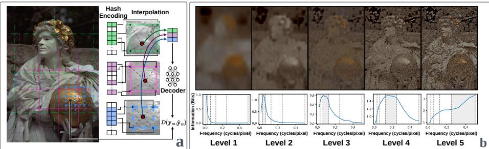  
Fig. 1: Panel (a) illustrates that Instant-NGP factorizes an implicit neural representation into a multiresolution hash encoding and a lightweight MLP decoder. A query coordinate is interpolated within each grid level. The resulting per-level features are concatenated. The decoder is trained by minimizing the reconstruction distortion $D ( \mathbf { y } _ { m } , \hat { \mathbf { y } } _ { m } )$ . Panel (b) shows that after training an Instant-NGP model with a 5-level hash grid, we isolate the contribution of each level by retaining only the target level. All other levels’ hash-table entries are replaced with their mean feature value. The resulting reconstructions demonstrate clear spectral stratification. Lower-resolution levels recover smooth, low-frequency structures. Higher-resolution levels progressively contribute fine, high-frequency components. This behavior is quantified by the information density $\mathcal { T } _ { f }$ , defined in Equation (7), and plotted against frequency. Vertical dashed lines indicate the sampling frequency of each feature grid level. This confirms that diferent hash-grid levels encode information from diferent frequency bands.

$$
\mathfrak { f } _ { \theta } ( \mathbf { x } ) = \mathfrak { g } _ { \theta } \left( \phi ( \mathbf { x } ) \right) , \quad \phi ( \mathbf { x } ) = \bigl [ \phi _ { 1 } ( \mathbf { x } ) ; \ldots ; \phi _ { L } ( \mathbf { x } ) \bigr ] ,\tag{4}
$$

where ${ \mathfrak { g } } _ { \theta }$ is a lightweight MLP and $\phi ( \mathbf { x } )$ concatenates the features from L resolution levels.

Assuming x is normalized to $\varOmega \ = \ [ 0 , 1 ] ^ { 2 }$ , level ℓ defines a 2D grid with resolution $N _ { \ell }$ per axis. Vertex embeddings are stored in a trainable table $\mathbf { E } _ { \ell } \in$ $\mathbb { R } ^ { T _ { \ell } \times F }$ , where $T _ { \ell }$ is the table size and F is the feature dimension. A hash function $\mathfrak { h } _ { \ell } : \mathbb { Z } ^ { 2 } \to [ T _ { \ell } ]$ maps integer grid coordinates to table indices, enabling memoryeficient parameterization at high efective resolutions.

For a query x, the level feature $\phi _ { \ell } ( \mathbf { x } ) \in \mathbb { R } ^ { F }$ is obtained by bilinear interpolation of the embeddings at the four neighboring grid vertices:

$$
\phi _ { \ell } ( { \mathbf { x } } ) = \sum _ { \delta \in \{ 0 , 1 \} ^ { 2 } } w _ { \ell , \delta } ( { \mathbf { x } } ) \ : { \mathbf { E } } _ { \ell } \big [ \mathfrak { h } _ { \ell } \big ( \big \vert N _ { \ell } { \mathbf { x } } \big \vert + \delta \big ) \big ] ,\tag{5}
$$

where $w _ { \ell , \delta } ( \mathbf { x } )$ are the standard bilinear interpolation weights that sum to 1. Instant-NGP chooses the per-level resolutions using a data-agnostic geometric progression, $N _ { \ell } ~ = ~ \lfloor N _ { \mathrm { m i n } } \lfloor ^ { \ell - 1 } \rfloor$ for $\ell \in \{ 1 , \ldots , L \}$ and a predefined base $b > 1$ . This yields grid spacing $\begin{array} { r } { \varDelta _ { \ell } \propto 1 / N _ { \ell } , } \end{array}$ so higher levels (larger $N _ { \ell } )$ can represent finer spatial variation. Concatenating features across levels provides a multi-scale representation: low-resolution levels primarily capture coarse, lowfrequency structure, while high-resolution levels encode finer, high-frequency details. As illustrated in Figure 1 panel (b), decoding with individual levels shows that higher-resolution grids recover high-frequency components, whereas lowerresolution grids represent the coarse structure of the signal.

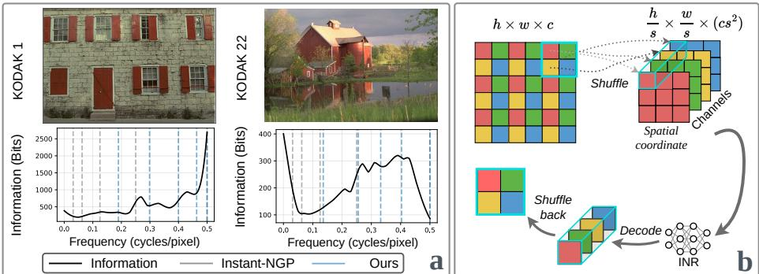  
Fig. 2: Method overview. Panel (a): diferent images have diferent information density I(f), defined in Equation (7), for two Kodak images, showing that diferent images concentrate information at diferent frequency ranges; the vertical dashed lines indicate the frequency cutofs implied by the fixed Instant-NGP schedule (gray) versus our collision-aware resolution schedule (blue), which aims to equalize the information being encoded by each level. Panel (b): pixel shufling to mitigate collision-induced information loss. We partition the image into non-overlapping patches, then shufle them into channels, thereby reducing the hash collision.

## 4 Methodology

As discussed previously, the multiresolution hash encoding in Instant-NGP can be interpreted as a sampling-and-interpolation system [5]. At level ℓ, a grid with resolution $N _ { \ell }$ per axis induces an efective sampling interval of $\varDelta _ { \ell } ^ { ( x ) } = w / N _ { \ell }$ and $\varDelta _ { \ell } ^ { ( y ) } = h / N _ { \ell }$ pixels along the horizontal and vertical directions, respectively. Under this interpretation, the corresponding Nyquist frequencies (in cycles per pixel) are

$$
f _ { \mathrm { N y q , \ell } } ^ { ( x ) } = \frac { N _ { \ell } } { 2 w } , \qquad f _ { \mathrm { N y q , \ell } } ^ { ( y ) } = \frac { N _ { \ell } } { 2 h } .\tag{6}
$$

Frequencies beyond these limits cannot be represented without aliasing at level ℓ and must therefore be captured by finer-resolution levels or by the MLP decoder.

This observation suggests that each level ℓ primarily contributes to modeling a specific spatial frequency band determined by its resolution. Since frequencies are measured in cycles per pixel, a level with resolution $N _ { \ell }$ per axis has an efective Nyquist limit $f _ { \mathrm { N y q } , \ell } ^ { ( x ) } = N _ { \ell } / ( 2 w )$ and $f _ { \mathrm { N y q } , \ell } ^ { ( y ) } = N _ { \ell } / ( 2 h )$ . Hence, there exists an approximate correspondence between a cutof frequency $f$ and a grid resolution $N _ { f } = 2 w f$ (assuming square images for simplicity).

To quantify the information content associated with a frequency band centered at $f ,$ we measure the entropy [52,54]increment between two adjacent spectral cutofs.

Let $\mathbf { Y } _ { \leq f }$ denote the low-pass filtered image retaining frequencies up to $f$ (in cycles per pixel). We define the band information density as

$$
\Im ( f ) = H ( \mathbf { Y } _ { \le f + \Delta f } - \mathbf { Y } _ { \le f } ) \cdot N _ { f } ^ { 2 } ,\tag{7}
$$

where $H ( \cdot )$ denotes the empirical Shannon entropy computed over pixel intensities, $\varDelta f$ is a small frequency increment (in cycles per pixel), and $N _ { f }$ is the grid resolution corresponding to cutof frequency $f .$ The multiplicative factor $\bar { N _ { f } ^ { 2 } }$ is the number of spatial samples at that resolution.

Remark 1 (Why entropy as an information proxy). Shannon’s source coding theorem [34, 49, 50, 53] implies that entropy quantifies the amount of information carried by a source. Accordingly, the quantity in Equation (7) can be interpreted as the new information introduced when increasing the efective cutof from f to $f + \Delta f$ (measured in cycles per pixel). The increment $H ( \mathbf { Y } _ { \leq f + \Delta f } - \mathbf { Y } _ { \leq f } )$ captures the average additional uncertainty (bits per sample) contributed by this narrow frequency band, while $N _ { f } ^ { 2 }$ denotes the number of spatial samples at the corresponding grid resolution. Their product therefore provides an estimate of the total information content of that refinement step. In this sense, $\Im ( f )$ serves as a practical proxy for the information budget that a grid level should allocate in order to faithfully model structures up to cutof frequency $f .$ We ablate alternative information proxies in Section 6.2.

Equipped with the information density measure $\Im ( f )$ , we visualize its distribution for two representative images from the Kodak dataset [12] in Panel (a) of Figure 2. The two images exhibit markedly diferent spectral information distributions. Kodak 1 shows relatively limited low-frequency information, with a substantial portion of its entropy concentrated in higher-frequency bands. In contrast, Kodak 22 distributes its information more heavily across low- and mid-frequency regions, with comparatively reduced high-frequency content.

Despite such variability, Instant-NGP employs a data-agnostic geometric resolution schedule designed to uniformly cover a wide frequency range. In the next section, we introduce our method for selecting per-level resolutions adaptively based on the measured information distribution of the input.

## 4.1 Collision-Aware Resolution Adaptation

In this section, we present collision-aware resolution adaptation $( C A R A )$ , which assigns per-level grid resolutions according to the input’s measured information density. Our goal is to determine a resolution schedule $\{ N _ { \ell } \} _ { \ell = 1 } ^ { L }$ such that each level is allocated a comparable efective information budget.

Let $\mathbf { Y } _ { \leq f }$ denote the input signal low-pass filtered to cutof frequency $f$ (in cycles per pixel).3 Building upon the information density measure $\Im ( f )$ defined in Equation (7), we first aim to equalize the information allocated to each hashgrid level. To this end, we partition the frequency axis into L disjoint bands $\{ \mathcal { F } _ { \ell } \} _ { \ell = 1 } ^ { L }$ such that each band carries the same total information:

$$
\mathcal { T } _ { \ell } \triangleq \sum _ { f \in \mathcal { F } _ { \ell } } \mathfrak { I } ( f ) = \tau , \quad \forall \ell \in [ L ] ,\tag{8}
$$

where $\tau$ is a shared target information budget. However, in hash encoding, the number of distinct trainable parameters at level ℓ is constrained by the hash table size T. Let $n _ { \ell } = N _ { \ell } ^ { 2 }$ denote the number of distinct grid vertices at that level. Since $n _ { \ell }$ may exceed $T ,$ , hashing induces collisions, where multiple grid vertices map to the same table entry. Assuming uniform hashing, the following proposition characterizes the expected reduction in usable capacity due to collisions.

## Proposition 1 (Efective Capacity under Uniform Hash Collisions).

Suppose $n _ { \ell }$ keys are inserted into a hash table of size T, with load factor $\alpha _ { \ell } = n _ { \ell } / T$ . Under uniform hashing, the expected number of distinct entries per inserted key is

$$
w _ { \ell } ^ { \mathrm { h a s h } } = \frac { 1 - e ^ { - \alpha _ { \ell } } } { \alpha _ { \ell } } .\tag{9}
$$

Accordingly, if B bits are stored across the $n _ { \ell }$ keys, the expected retrievable information scales as

$$
\begin{array} { r } { B _ { \mathrm { e f f } } = B \cdot w _ { \ell } ^ { \mathrm { h a s h } } . } \end{array}\tag{10}
$$

We defer the proof to the supplementary material due to the space limit. Following Proposition 1, we incorporate the collision factor into the per-level information by defining the efective information at level ℓ as

$$
\begin{array} { r } { \mathcal { T } _ { \mathrm { e f f } , \ell } = \mathcal { I } _ { \ell } \cdot w _ { \ell } ^ { \mathrm { h a s h } } . } \end{array}\tag{11}
$$

After obtaining the collision-aware efective information, we determine the perlevel resolutions so that diferent frequency bands carry comparable amounts of efective information.

Rather than discretizing frequency directly, we consider a monotone candidate set of grid resolutions $\bar { \{ N ^ { ( k ) } \} } _ { k = 1 } ^ { K }$ with $\bar { N ^ { ( 1 ) } } < \cdots < N ^ { ( K ) }$ , each implying a Nyquist cutof in cycles per pixel. Let $Y ^ { ( k ) }$ denote the input low-pass filtered to the Nyquist limit corresponding to resolution $N ^ { ( k ) }$ , and define ${ \bar { H } } _ { k } \triangleq H ( Y ^ { ( k ) } )$ , with $H _ { 0 }$ a coarse reference.

For each candidate $k ,$ we define the associated collision eficiency

$$
w _ { k } ^ { \mathrm { h a s h } } \triangleq \frac { 1 - e ^ { - \alpha _ { k } } } { \alpha _ { k } } , \quad \alpha _ { k } \triangleq \frac { ( N ^ { ( k ) } ) ^ { 2 } } { T } .\tag{12}
$$

A resolution schedule is specified by indices

$$
0 = k _ { 0 } < k _ { 1 } < \cdots < k _ { L } = K ,\tag{13}
$$

which partition the spectrum into L adjacent bands. The efective information carried by band $\ell ,$ corresponding to the interval between cutofs $k _ { \ell - 1 }$ and $k _ { \ell } ,$ is defined as

$$
\mathcal { T } _ { \ell } \triangleq w _ { k _ { \ell } } ^ { \mathrm { h a s h } } \sum _ { f \in \mathcal { F } _ { \ell } } \mathfrak { I } ( f ) ,\tag{14}
$$

which explicitly accounts for collision-induced capacity reduction at the selected resolution. We then select the cutofs by solving the min–max optimization

$$
\operatorname* { m i n } _ { \substack { 0 < k _ { 1 } < \cdots < k _ { L - 1 } < K } } \quad \operatorname* { m a x } _ { \ell \in [ L ] } \mathcal { T } _ { \ell } ,\tag{15}
$$

which seeks the tightest achievable uniform upper bound on per-band efective information.

Remark 2 (Why balance efective information and why min–max). Each hashgrid level has a bounded efective capacity: it uses a fixed-size table and its usable information is further reduced by collisions. Meanwhile, levels specialize to diferent frequency ranges (Figure 1 (b)), so reconstruction quality is often constrained by the most overloaded band: if one band contains much more information than its level can represent, the residual must be absorbed by other levels or the lightweight decoder, creating a capacity bottleneck, while over-allocating to a low-information band wastes parameters. We therefore balance per-band effective information as a load-balancing principle under a fixed per-level budget. Exact equality $\mathcal { T } _ { \ell } = \tau$ is generally infeasible under discrete candidate cutofs, so we minimize max $\mathsf { \Lambda } _ { : \ell \in [ L ] } \mathscr { T } _ { \ell } \left[ 1 \right] .$ , i.e., the tightest achievable uniform upper bound on per-band load, preventing any single band from becoming capacity-limiting.

The optimization problem in Equation (15) admits an exact solution via dynamic programming, as the objective decomposes over ordered band partitions with optimal substructure. We defer the detailed algorithm and pseudocode to the supplementary material. The resulting computational complexity is $O ( L K ^ { 2 } )$ , which is modest for typical candidate sizes K and negligible compared to the overall training cost of the INR, e.g., adding only 0.7 seconds to pre-processing for the Pluto gigapixel image.

While CARA optimizes the allocation of grid resolution across frequency bands, the efective capacity of each level remains constrained by hash collisions. To further alleviate collision-induced information loss without increasing the hash table size, we introduce an eficient strategy dubbed pixel shufling.

## 4.2 Reducing Hash Collisions via Pixel Shufling

The performance of Instant-NGP improves as the hash table size T increases, since a larger table reduces the load factor and thereby improves the collision eficiency $w ^ { \mathrm { h a s h } }$ . However, enlarging T incurs a linear increase in both memory usage and the number of trainable parameters. To reduce collisions without increasing T, we apply the pixel shufle operation [9, 36]. Given a target image $\mathbf { Y } \in \mathbb { R } ^ { h \times w \times c }$ and an integer shufle factor s, the pixel shufle transform $S _ { s }$ rearranges Y into a lower-resolution, higher-channel representation

$$
\tilde { \mathbf { Y } } = \mathcal { S } _ { s } ( \mathbf { Y } ) \in \mathbb { R } ^ { \frac { h } { s } \times \frac { w } { s } \times ( c s ^ { 2 } ) } .\tag{16}
$$

Each spatial coordinate in $\tilde { \mathbf Y }$ aggregates an $s \times s$ patch from the original image. Accordingly, the INR predicts a higher-dimensional vector

$$
\hat { \tilde { \bf y } } _ { m } = \mathfrak { f } _ { \boldsymbol \theta } ( \tilde { \mathbf { x } } _ { m } ) \in \mathbb { R } ^ { c s ^ { 2 } } ,\tag{17}
$$

and the full-resolution reconstruction is recovered via the inverse transform

$$
\hat { \mathbf { Y } } = { \cal S } _ { s } ^ { - 1 } ( \hat { \tilde { \mathbf { Y } } } ) .\tag{18}
$$

Importantly, pixel shufling preserves all original information while reducing the spatial resolution of the coordinate domain by a factor of s along each axis. Consequently, at level $\ell ,$ the number of distinct grid vertices decreases from $N _ { \ell } ^ { 2 }$ to $( N _ { \ell } / s ) ^ { 2 }$ . Under a fixed hash table size $T ,$ the load factor becomes

$$
\alpha _ { \ell } ^ { \prime } = \frac { ( N _ { \ell } / s ) ^ { 2 } } { T } = \frac { \alpha _ { \ell } } { s ^ { 2 } } .\tag{19}
$$

$\mathrm { B y }$ Proposition 1, reducing the load factor increases the collision eficiency factor $w ^ { \mathrm { h a s h } }$ , particularly when the original $\alpha _ { \ell }$ is large. Thus, pixel shufling efectively improves usable capacity and rendering fidelity without increasing $T .$ We defer the ablation study on s to the supplementary material.

## 5 Experiments

We evaluate the proposed method on three benchmarks: Kodak dataset, three gigapixel natural images, and ultra-high-resolution whole-slide images (WSIs). Unless otherwise specified, all models are trained with the Adam optimizer [19] with $( \beta _ { 1 } , \beta _ { 2 } , \epsilon ) = ( 0 . 9 , 0 . 9 9 , 1 0 ^ { - 1 5 } )$ , cosine annealing learning-rate decay, and an $\ell _ { 2 }$ reconstruction loss. Across all experiments, we employ the same multiresolution hash-grid architecture with feature dimension fixed to 2 at every level and the same number of levels for all methods and parameter budgets. To match diferent parameter budgets while keeping the architecture depth unchanged, we vary the hash-table size. For all experiments, we use anti-aliased resizing as the low-pass filter. For Kodak, we set K = 30 with uniform spacing in the frequency domain; for gigapixel images and WSIs, we set K = 200. Additional implementation details and wall-clock cost are provided in the supplementary material.

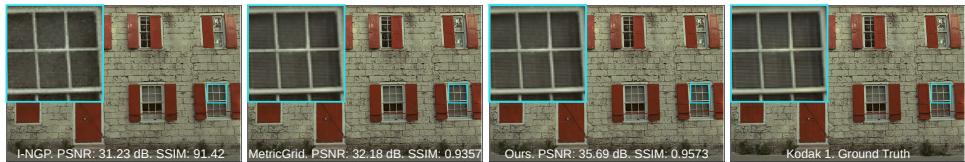  
Fig. 3: Qualitative comparison on the Kodak dataset. By selecting per-level resolutions (rather than using a fixed, data-agnostic schedule), our method better preserves highfrequency structures and textures, yielding sharper reconstructions than I-NGP and MetricGrid. (Best viewed digitally with zoom).

Table 1: Image fitting results on the Kodak dataset. All methods are trained with the same number of iterations and a comparable number of parameters. Our method achieves the highest PSNR and SSIM while requiring fewer parameters compared to all other methods. Bold and underlined values denote the best and second-best results.
<table><tr><td colspan="9">WIRE [32] SIREN [39] SCONE [22] I-NGP [28] NFFB [48] NeuRBF [6] MetricGrid [46]</td></tr><tr><td>Method Rep.</td><td>Implicit</td><td>Implicit</td><td>Implicit</td><td>Hybrid</td><td>Hybrid</td><td>Hybrid</td><td>Hybrid</td><td>Ours Hybrid</td></tr><tr><td>Params (K)</td><td>373</td><td>207</td><td>207</td><td>206</td><td>208</td><td>207</td><td>207</td><td>205</td></tr><tr><td>PSNR ↑</td><td>37.59</td><td>38.70</td><td>39.72</td><td>37.06</td><td>38.77</td><td>38.70</td><td>39.73</td><td>40.03</td></tr><tr><td>SSIM ↑</td><td>0.9596</td><td>0.9512</td><td>0.9662</td><td>0.9386</td><td>0.9537</td><td>0.9488</td><td>0.9568</td><td>0.9714</td></tr></table>

Table 2: Quantitative results of image fitting on the Kodak dataset. Comparing our method against the Gaussian primitive-based approach. Bold and underlined values denote the best and second-best results, respectively.
<table><tr><td>Method</td><td colspan="7">I-NGP [28] NeuRBF [6] Gaussian Splatting [18] GaussianImage [58] MetricGrid [46]</td><td colspan="2">Ours</td></tr><tr><td>Rep.</td><td>Hybrid</td><td>Hybrid</td><td>Explicit</td><td></td><td>Explicit</td><td colspan="2">Hybrid</td><td colspan="2">Hybrid</td></tr><tr><td>Params (K)</td><td>300</td><td>337</td><td>3540</td><td>560</td><td></td><td>533</td><td></td><td>341</td><td>471</td></tr><tr><td>PSNR ↑</td><td>43.88</td><td>43.78</td><td>43.69</td><td></td><td>44.08</td><td>335 44.51</td><td>45.77</td><td>46.24</td><td>48.00</td></tr><tr><td>SSIM ↑</td><td>0.9976</td><td>0.9964</td><td>0.9991</td><td></td><td>0.9985</td><td>0.9778 0.9897</td><td></td><td>0.9906</td><td>0.9987</td></tr></table>

## 5.1 Kodak Dataset

We first evaluate our approach on the Kodak dataset [12], which consists of 24 natural images with resolution of 768 × 512. We report PSNR and SSIM [47] to assess reconstruction fidelity. We compare against existing methods under comparable parameter budgets (around 207K), and train all models for the same number of iterations. Due to their relatively low resolution, we do not apply pixel shufle to the Kodak dataset. The results are presented in Table 1. As seen, our method achieves the best image fidelity in terms of both PSNR and SSIM with fewer parameters.

We further compare our method against Gaussian primitive-based representations, including Gaussian Splatting (GS) [18] and GaussianImage [58]. To align the comparison across parameter regimes, we report CARA under two budgets in Table 2. At 471K parameters, CARA uses only 13% of the trainable parameters of GS (3540K) while achieving substantially higher PSNR. Moreover, CARA attains the best PSNR overall and improves upon the strongest hybrid baseline, MetricGrid [46], by 2.23 dB, highlighting the benefit of assigning resolutions based on the input image.

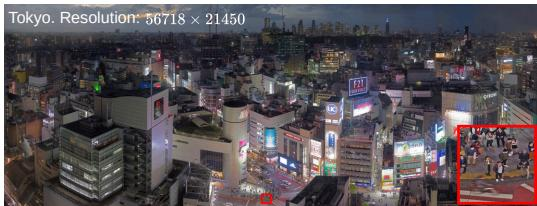

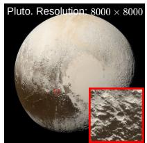

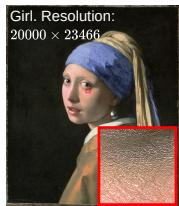

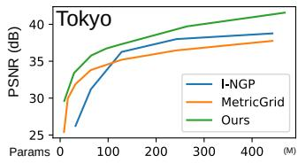

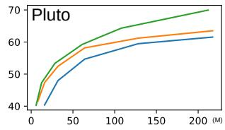

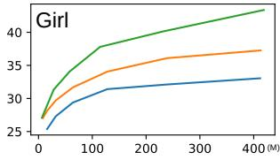  
Fig. 4: Gigapixel Image Fitting Performance. Top: Gigapixel images (Tokyo, Pluto, and Girl) with magnified crops highlighting fine-grained details. (Best viewed digitally with zoom). Bottom: Quantitative comparison of reconstruction quality (PSNR) vs. the number of trainable parameters (M). Across all three images, our method consistently outperforms Instant-NGP (I-NGP) and MetricGrid, achieving a superior Pareto frontier and higher fidelity at every parameter scale.

## 5.2 Gigapixel Natural Images

To evaluate CARA’s performance at scale, we conducted experiments on three canonical gigapixel images: Pluto, Tokyo, and Girl With a Pearl Earring (Girl). These images pose a significant challenge for implicit neural representations, given their high resolution and the need to preserve fine-grained details across vast spatial domains. We compare the reconstructed image fidelity under multiple parameter budgets against Instant-NGP [28], NeuRBF [6], and MetricGrid [56]. Figure 4 reports PSNR versus the number of trainable parameters, where our method consistently achieves a better fidelity–parameter trade-of across all three images. Quantitatively, Table 3 shows that we match MetricGrid’s best reported fidelity (37.26 dB) using only 114.61M parameters, 27.76% of Metric-Grid’s 412.8M parameter setting, demonstrating substantially improved parameter eficiency in the high-fidelity regime. Moreover, at a comparable large-model parameter budget, our method improves PSNR by 6.11 dB over the strongest baseline, demonstrating that collision-aware, data-adaptive resolution allocation yields consistent fidelity gains even in the high-capacity regime. Notably, in the low-parameter regime our method remains competitive, achieving higher image quality with 6.31M trainable parameters, which is 21.3% fewer than Metric-Grid’s 8.02M setting. Finally, Figure 5 visualizes per-pixel $\ell _ { 2 }$ error maps on a gigapixel example; under matched training protocols, our approach yields visibly lower residual error than both baselines, corroborating the benefit of adaptive resolution allocation. Similar trends can be observed for Tokyo and Pluto; we defer the detailed analysis and visualization to the supplementary material due to space constraints.

Table 3: Numerical comparison on gigapixel girl image fitting. We report PSNR (dB), SSIM and the corresponding number of trainable parameters (in millions). Our method maintains competitive fidelity in both the low-parameter and high-parameter regimes.
<table><tr><td>Method</td><td colspan="3">I-NGP [28]</td><td>NeuRBF [6]</td><td colspan="3">MetricGrid [46]</td><td colspan="4">Ours</td></tr><tr><td>Params (M)</td><td>8.01</td><td>32.01</td><td>412.8</td><td>115.4</td><td>8.02</td><td>32.02</td><td>412.8</td><td>8.02</td><td>28.24</td><td>114.6</td><td>418.5</td></tr><tr><td>PSNR ↑</td><td>21.51</td><td>27.3</td><td>33.05</td><td>31.56</td><td>27.03</td><td>29.70</td><td>37.06</td><td>27.53</td><td>31.33</td><td>37.07</td><td>43.37</td></tr><tr><td>SSIM↑</td><td>0.579</td><td>0.896</td><td>0.959</td><td>0.960</td><td>0.817</td><td>0.957</td><td>0.994</td><td>0.897</td><td>0.984</td><td>0.998</td><td>0.999</td></tr></table>

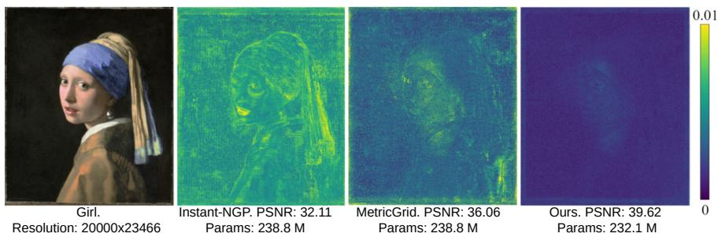  
Fig. 5: Qualitative comparison on a gigapixel image. The leftmost presents the groundtruth image, while the three panels on the right visualize the per-pixel $\ell _ { 2 }$ error maps of I-NGP, MetricGrid, and the proposed method, respectively.

## 5.3 Whole-Slide Images

WSIs [16, 29] are ultra–high-resolution digital scans of histopathology slides, and constitute the primary data modality for computational pathology [15, 53]. Unlike natural images, WSIs contain micro-scale cellular morphology and macroscale tissue architecture, requiring models to accurately represent structures across a wide spectrum of spatial frequencies. Their extreme spatial resolution and dense fine-grained texture pose significant challenges for conventional discrete representations.

In this section, we evaluate INRs to represent WSIs. Most publicly available WSI datasets are stored with aggressive JPEG compression [44], which introduces artifacts that can negatively afect downstream tasks [17]. To enable faithful evaluation, we collected four uncompressed H&E stained WSIs4 [11] at 40× magnification (Figure 6 Panel (a)). Compared with compressed WSIs used in prior work (Figure 6 Panel (b)), our raw scans preserve fine structural detail. We benchmark CARA against four INR baselines and summarize the results in Table 4. CARA consistently outperforms the state-of-the-art methods across all parameter settings.

Table 4: Numerical comparison on WSI image fitting. We report PSNR (dB) and the corresponding number of trainable parameters. Our method maintains competitive reconstruction fidelity in the low-parameter regime, while the high-capacity results are provided explicitly to facilitate direct numerical comparison in the large-model setting.
<table><tr><td>Method</td><td colspan="3">I-NGP [28]</td><td>NeurRBF [6]</td><td>CINR [21]</td><td colspan="3">MetricGrid [46]</td><td colspan="3">Ours</td></tr><tr><td>Params (M)</td><td>95.45</td><td>214.02</td><td>402.6</td><td>161.48</td><td>157.24</td><td>95.46</td><td>199.25</td><td>390.01</td><td>18.24</td><td>93.53</td><td>233.57</td></tr><tr><td>PSNR↑</td><td>40.97</td><td>41.68</td><td>42.06</td><td>40.30</td><td>40.69</td><td>41.06</td><td>42.19</td><td>43.03</td><td>41.24</td><td>42.24</td><td>44.02</td></tr></table>

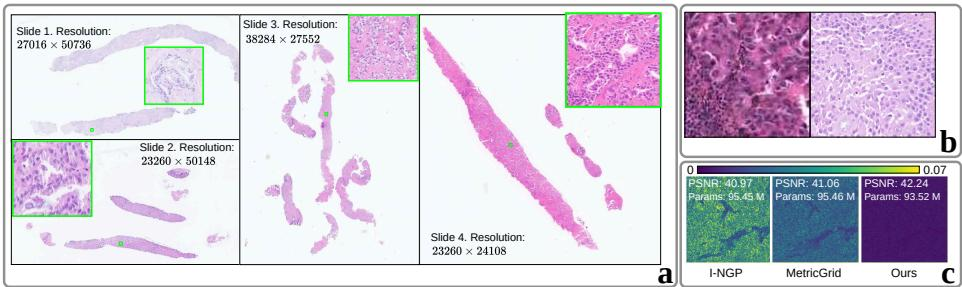  
Fig. 6: WSIs used for evaluation. Panel (a) four ultra-high-resolution WSIs from our collection; green boxes indicate regions shown at higher magnification, highlighting both global tissue architecture and cell-level morphology. Panel (b) patch-level visual comparison between a WSI patch from prior literature (left) and a patch from our raw scans (right): aggressive JPEG compression in the literature data introduces visible blocking artifacts, whereas our raw WSIs preserve fine structural detail. (Best viewed digitally with zoom). Panel (c) per-pixel $\ell _ { 2 }$ reconstruction error maps on a representative patch; CARA produces consistently lower error, indicating improved image fidelity.

## 6 Ablation Study

To justify our design choices, we ablate each component in this section. Due to space constraints, additional results are provided in the supplementary material.

## 6.1 Efect of Collision Modeling

We ablate collision modeling by setting the collision factor to $w ^ { \mathrm { h a s h } } \equiv 1$ while keeping the same entropy-based information estimator, hash-table size, number of levels, and training protocol. Table 5 shows that removing $w ^ { \mathrm { h a s h } }$ consistently

Table 5: Ablation of the collision factor $w ^ { \mathrm { h a s h } }$ on Kodak. Disabling collision modeling degrades PSNR/SSIM while typically requiring more parameters to reach comparable quality, highlighting the importance of explicitly accounting for hash collisions.
<table><tr><td colspan="4">W.O. Collision Factor</td><td colspan="3">W. Collision Factor</td></tr><tr><td>Params (K)</td><td>374</td><td>403</td><td>484</td><td>205</td><td>341</td><td>471</td></tr><tr><td>PSNR↑</td><td>40.32</td><td>43.97</td><td>47.97</td><td>41.03</td><td>46.24</td><td>48.00</td></tr><tr><td>SSIM ↑</td><td>0.9674</td><td>0.9973</td><td>0.9979</td><td>0.9714</td><td>0.9906</td><td>0.9987</td></tr></table>

hurts reconstruction quality (PSNR/SSIM) and is less parameter-eficient, indicating that explicitly modeling collisions is a key component for allocating capacity efectively in hash-based encoders.

## 6.2 Alternative Information Proxies for Resolution Scheduling

Table 6: Efect of alternative information proxies for resolution scheduling on Kodak. We replace the entropy-based band information in Equation (7) with an $\ell _ { 2 }$ energy proxy $\left( \mathrm { O u r s } \ + \ \ell _ { 2 } \right)$ ; variance proxy (Ours + var) and compare against the entropy proxy (Ours + entropy); entropy consistently yields higher PSNR/SSIM.
<table><tr><td>Method</td><td colspan="2">I-NGP [28]</td><td colspan="2">MetricGrid [46]</td><td colspan="2">Ours+l2</td><td colspan="2">Ours+var</td><td colspan="2">Ours+entropy</td></tr><tr><td>Params (K)</td><td>206</td><td>300</td><td>207</td><td>335</td><td>214</td><td>334</td><td>211</td><td>331</td><td>205</td><td>332</td></tr><tr><td>PSNR↑</td><td>37.06</td><td>43.88</td><td>39.73</td><td>44.51</td><td>38.52</td><td>43.60</td><td>38.74</td><td>44.94</td><td>41.03</td><td>46.63</td></tr><tr><td>SSIM ↑</td><td>0.9386</td><td>0.9964</td><td>0.9568</td><td>0.9978</td><td>0.9504</td><td>0.9913</td><td>0.9560</td><td>0.9893</td><td>0.9714</td><td>0.9982</td></tr></table>

As described in Section 4, our method uses empirical entropy to quantify the efective information in each frequency band. In this ablation, we replace the entropy term in Equation (7) with an $\ell _ { 2 }$ energy proxy or variance, and rerun the Kodak experiments under comparable parameter budgets. The results in Table 6 show a clear drop in both PSNR and SSIM when entropy is replaced by energy or variance. This behavior is expected: $\ell _ { 2 }$ energy characterizes average power but is largely insensitive to the underlying distribution of the band-residual signal, and variance is likewise a poor proxy for information. In contrast, entropy directly quantifies coding uncertainty, i.e., the expected number of bits required to describe samples under an optimal code, thereby aligning with our goal of equalizing efective representational demand across levels.

## 7 Conclusion

In this paper, we presented collision-aware resolution adaptation (CARA), a data-adaptive framework for optimizing multiresolution hash encodings in implicit neural representations. By equalizing efective information across levels and explicitly accounting for collision-induced capacity reduction, CARA improved parameter utilization without increasing model size. We also introduced a pixel-shufle strategy to further mitigate hash collisions in a parameter-eficient manner. Experiments showed consistent improvements in the fidelity–parameter trade-of across Kodak, gigapixel images, and whole-slide images, achieving comparable or better reconstruction quality with substantially fewer parameters. Limitations and future work are deferred to the supplementary material due to space constraints.

## References

1. Boyd, S., Vandenberghe, L.: Convex optimization. Cambridge university press (2004)

2. Chan, E.R., Lin, C.Z., Chan, M.A., Nagano, K., Pan, B., De Mello, S., Gallo, O., Guibas, L.J., Tremblay, J., Khamis, S., et al.: Eficient geometry-aware 3d generative adversarial networks. In: Proceedings of the IEEE/CVF conference on computer vision and pattern recognition. pp. 16123–16133 (2022)

3. Chen, A., Xu, Z., Wei, X., Tang, S., Su, H., Geiger, A.: Factor fields: A unified framework for neural fields and beyond. arXiv preprint arXiv:2302.01226 (2023)

4. Chen, H., He, B., Wang, H., Ren, Y., Lim, S.N., Shrivastava, A.: Nerv: Neural representations for videos. Advances in Neural Information Processing Systems 34, 21557–21568 (2021)

5. Chen, Y., Wu, Q., Harandi, M., Cai, J.: How far can we compress instant-ngpbased nerf? In: Proceedings of the IEEE/CVF Conference on Computer Vision and Pattern Recognition. pp. 20321–20330 (2024)

6. Chen, Z., Li, Z., Song, L., Chen, L., Yu, J., Yuan, J., Xu, Y.: Neurbf: A neural fields representation with adaptive radial basis functions. In: Proceedings of the IEEE/CVF International Conference on Computer Vision. pp. 4182–4194 (2023)

7. Chen, Z., Zhang, H.: Learning implicit fields for generative shape modeling. In: Proceedings of the IEEE/CVF conference on computer vision and pattern recognition. pp. 5939–5948 (2019)

8. Chi, Z., Gu, L., Liu, H., Wang, Z., Wu, Y., Wang, Y., Plataniotis, K.: Learning to adapt frozen clip for few-shot test-time domain adaptation. In: International Conference on Learning Representations. vol. 2025, pp. 66359–66380 (2025)

9. Chi, Z., Wu, Y., Gu, L., Liu, H., Wang, Z., Zhang, Y., Wang, Y., Plataniotis, K.: Plug-in feedback self-adaptive attention in clip for training-free open-vocabulary segmentation. In: Proceedings of the IEEE/CVF International Conference on Computer Vision. pp. 22815–22825 (2025)

10. Dai, T., Fan, J.: Characterizing and optimizing the spatial kernel of multi resolution hash encodings. In: The Fourteenth International Conference on Learning Representations (2026), https://openreview.net/forum?id=q05hC1Pzkr

11. Fischer, A.H., Jacobson, K.A., Rose, J., Zeller, R.: Hematoxylin and eosin staining of tissue and cell sections. Cold spring harbor protocols 2008(5), pdb–prot4986 (2008)

12. Franzen, R.: Kodak lossless true color image suite (1999), https://r0k.us/ graphics/kodak/

13. Fridovich-Keil, S., Meanti, G., Warburg, F.R., Recht, B., Kanazawa, A.: K-planes: Explicit radiance fields in space, time, and appearance. In: Proceedings of the IEEE/CVF conference on computer vision and pattern recognition. pp. 12479– 12488 (2023)

14. Hornik, K.: Approximation capabilities of multilayer feedforward networks. Neural networks 4(2), 251–257 (1991)

15. Hosseini, M.S., Bejnordi, B.E., Trinh, V.Q.H., Chan, L., Hasan, D., Li, X., Yang, S., Kim, T., Zhang, H., Wu, T., et al.: Computational pathology: a survey review and the way forward. Journal of Pathology Informatics 15, 100357 (2024)

16. Hosseini, M.S., Chan, L., Tse, G., Tang, M., Deng, J., Norouzi, S., Rowsell, C., Plataniotis, K.N., Damaskinos, S.: Atlas of digital pathology: A generalized hierarchical histological tissue type-annotated database for deep learning. In: Proceedings of the IEEE/CVF conference on computer vision and pattern recognition. pp. 11747–11756 (2019)

17. Ignatov, A., Malivenko, G.: Nct-crc-he: Not all histopathological datasets are equally useful. In: European Conference on Computer Vision. pp. 300–317. Springer (2024)

18. Kerbl, B., Kopanas, G., Leimkühler, T., Drettakis, G., et al.: 3d gaussian splatting for real-time radiance field rendering. ACM Trans. Graph. 42(4), 139–1 (2023)

19. Kingma, D.P., Ba, J.: Adam: A method for stochastic optimization. arXiv preprint arXiv:1412.6980 (2014)

20. Landgraf, Z., Hornung, A.S., Cabral, R.S.: Pins: progressive implicit networks for multi-scale neural representations. arXiv preprint arXiv:2202.04713 (2022)

21. Lee, D., Park, C., Lee, S., Lee, S., Kim, M.: Convolutional Implicit Neural Representation of pathology whole-slide images . In: proceedings of Medical Image Computing and Computer Assisted Intervention – MICCAI 2024. vol. LNCS 15007. Springer Nature Switzerland (October 2024)

22. Li, J.C.L., Liu, C., Huang, B., Wong, N.: Learning spatially collaged fourier bases for implicit neural representation. In: Proceedings of the AAAI Conference on Artificial Intelligence. vol. 38, pp. 13492–13499 (2024)

23. Liu, L., Gu, J., Zaw Lin, K., Chua, T.S., Theobalt, C.: Neural sparse voxel fields. Advances in Neural Information Processing Systems 33, 15651–15663 (2020)

24. Liu, Z., Zhu, H., Zhang, Q., Fu, J., Deng, W., Ma, Z., Guo, Y., Cao, X.: Finer: Flexible spectral-bias tuning in implicit neural representation by variable-periodic activation functions. In: Proceedings of the IEEE/CVF Conference on Computer Vision and Pattern Recognition. pp. 2713–2722 (2024)

25. Liu, Z., Wang, Y., Vaidya, S., Ruehle, F., Halverson, J., Soljacic, M., Hou, T.Y., Tegmark, M.: KAN: Kolmogorov–arnold networks. In: The Thirteenth International Conference on Learning Representations (2025), https://openreview.net/ forum?id=Ozo7qJ5vZi

26. Martel, J.N., Lindell, D.B., Lin, C.Z., Chan, E.R., Monteiro, M., Wetzstein, G.: Acorn: Adaptive coordinate networks for neural scene representation. arXiv preprint arXiv:2105.02788 (2021)

27. Mildenhall, B., Srinivasan, P.P., Tancik, M., Barron, J.T., Ramamoorthi, R., Ng, R.: Nerf: Representing scenes as neural radiance fields for view synthesis. Communications of the ACM 65(1), 99–106 (2021)

28. Müller, T., Evans, A., Schied, C., Keller, A.: Instant neural graphics primitives with a multiresolution hash encoding. ACM transactions on graphics (TOG) 41(4), 1–15 (2022)

29. Omoush, S.A., Alzyoud, J.A., El-Omari, N.K.T., Alzyoud, A.J.: The role of whole slide imaging in ai-based digital pathology: current challenges and future directions—an updated literature review. Journal of Molecular Pathology 7(1), 2 (2026)

30. Ramasinghe, S., Lucey, S.: Beyond periodicity: Towards a unifying framework for activations in coordinate-mlps. In: European Conference on Computer Vision. pp. 142–158. Springer (2022)

31. Reiser, C., Szeliski, R., Verbin, D., Srinivasan, P., Mildenhall, B., Geiger, A., Barron, J., Hedman, P.: Merf: Memory-eficient radiance fields for real-time view synthesis in unbounded scenes. ACM Transactions on Graphics (ToG) 42(4), 1–12 (2023)

32. Saragadam, V., LeJeune, D., Tan, J., Balakrishnan, G., Veeraraghavan, A., Baraniuk, R.G.: Wire: Wavelet implicit neural representations. In: Proceedings of the IEEE/CVF conference on computer vision and pattern recognition. pp. 18507– 18516 (2023)

33. Seo, J., Lee, S., Kim, K.I., Lee, J.: In search of a data transformation that accelerates neural field training. In: 2024 IEEE/CVF Conference on Computer Vision and Pattern Recognition (CVPR). pp. 4830–4839 (2024). https://doi.org/10. 1109/CVPR52733.2024.00462

34. Shannon, C.E.: A mathematical theory of communication. The Bell system technical journal 27(3), 379–423 (1948)

35. Shi, K., Zhou, X., Gu, S.: Improved implicit neural representation with fourier reparameterized training. In: Proceedings of the IEEE/CVF Conference on Computer Vision and Pattern Recognition. pp. 25985–25994 (2024)

36. Shi, W., Caballero, J., Huszár, F., Totz, J., Aitken, A.P., Bishop, R., Rueckert, D., Wang, Z.: Real-time single image and video super-resolution using an eficient sub-pixel convolutional neural network. In: 2016 IEEE Conference on Computer Vision and Pattern Recognition (CVPR). pp. 1874–1883 (2016). https://doi. org/10.1109/CVPR.2016.207

37. Shue, J.R., Chan, E.R., Po, R., Ankner, Z., Wu, J., Wetzstein, G.: 3d neural field generation using triplane difusion. In: Proceedings of the IEEE/CVF conference on computer vision and pattern recognition. pp. 20875–20886 (2023)

38. Sitzmann, V., Martel, J., Bergman, A., Lindell, D., Wetzstein, G.: Implicit neural representations with periodic activation functions. Advances in neural information processing systems 33, 7462–7473 (2020)

39. Sitzmann, V., Martel, J., Bergman, A., Lindell, D., Wetzstein, G.: Implicit neural representations with periodic activation functions. In: Larochelle, H., Ranzato, M., Hadsell, R., Balcan, M., Lin, H. (eds.) Advances in Neural Information Processing Systems. vol. 33, pp. 7462–7473. Curran Associates, Inc. (2020), https://proceedings.neurips.cc/paper\_files/paper/2020/file/ 53c04118df112c13a8c34b38343b9c10-Paper.pdf

40. Sun, J.M., Wu, T., Gao, L.: Recent advances in implicit representation-based 3d shape generation. Visual Intelligence 2(1), 9 (2024)

41. Takikawa, T., Müller, T., Nimier-David, M., Evans, A., Fidler, S., Jacobson, A., Keller, A.: Compact neural graphics primitives with learned hash probing. In: SIGGRAPH Asia 2023 Conference Papers. pp. 1–10 (2023)

42. Tancik, M., Srinivasan, P., Mildenhall, B., Fridovich-Keil, S., Raghavan, N., Singhal, U., Ramamoorthi, R., Barron, J., Ng, R.: Fourier features let networks learn high frequency functions in low dimensional domains. Advances in neural information processing systems 33, 7537–7547 (2020)

43. Tang, J.H., Chen, W., Yang, J., Wang, B., Liu, S., Yang, B., Gao, L.: Octfield: Hierarchical implicit functions for 3d modeling. arXiv preprint arXiv:2111.01067 (2021)

44. Wallace, G.K.: The jpeg still picture compression standard. Communications of the ACM 34(4), 30–44 (1991)

45. Wang, P.S., Liu, Y., Yang, Y.Q., Tong, X.: Spline positional encoding for learning 3d implicit signed distance fields. arXiv preprint arXiv:2106.01553 (2021)

46. Wang, S., Gao, Y., Li, S., Lv, C., Cai, X., Li, C., Yuan, H., Zhang, J.: Metricgrids: Arbitrary nonlinear approximation with elementary metric grids based implicit neural representation. In: Proceedings of the IEEE/CVF Conference on Computer Vision and Pattern Recognition. pp. 21381–21391 (2025)

47. Wang, Z., Bovik, A., Sheikh, H., Simoncelli, E.: Image quality assessment: from error visibility to structural similarity. IEEE Transactions on Image Processing 13(4), 600–612 (2004). https://doi.org/10.1109/TIP.2003.819861

48. Wu, Z., Jin, Y., Yi, K.M.: Neural fourier filter bank. In: Proceedings of the IEEE/CVF Conference on Computer Vision and Pattern Recognition. pp. 14153– 14163 (2023)

49. Yang, E.H., Hamidi, S.M., Ye, L., Tan, R., Yang, B.: Conditional mutual information constrained deep learning: Framework and preliminary results. In: 2024 IEEE International Symposium on Information Theory (ISIT). pp. 569–574 (2024). https://doi.org/10.1109/ISIT57864.2024.10619241

50. Yang, E.H., Mohajer Hamidi, S., Ye, L., Tan, R., Yang, B.: Conditional mutual information constrained deep learning for classification. IEEE Transactions on Neural Networks and Learning Systems 36(8), 15436–15448 (2025). https: //doi.org/10.1109/TNNLS.2025.3540014

51. Yang, R.: Tinc: Tree-structured implicit neural compression. In: Proceedings of the IEEE/CVF Conference on Computer Vision and Pattern Recognition. pp. 18517– 18526 (2023)

52. Ye, L., Chi, Z.: Normalized conditional mutual information surrogate loss for deep learning classifiers. In: Workshop on Scientific Methods for Understanding Deep Learning

53. Ye, L., Hamidi, S.M., Chi, Z., Li, G., Pilanci, M., Ogawa, T., Haseyama, M., Plataniotis, K.N.: ASMIL: Attention-stabilized multiple instance learning for whole-slide imaging. In: The Fourteenth International Conference on Learning Representations (2026), https://openreview.net/forum?id=CYmjrbQRyM

54. Ye, L., Mohajer Hamidi, S., Tan, R., YANG, E.H.: Bayes conditional distribution estimation for knowledge distillation based on conditional mutual information. In: Kim, B., Yue, Y., Chaudhuri, S., Fragkiadaki, K., Khan, M., Sun, Y. (eds.) International Conference on Learning Representations. vol. 2024, pp. 26722– 26754 (2024), https://proceedings.iclr.cc/paper\_files/paper/2024/file/ 718a3c5cf135894db6e718725f52ef9a-Paper-Conference.pdf

55. Yu, A., Li, R., Tancik, M., Li, H., Ng, R., Kanazawa, A.: Plenoctrees for real-time rendering of neural radiance fields. In: Proceedings of the IEEE/CVF international conference on computer vision. pp. 5752–5761 (2021)

56. Zhang, H.H., Zhang, T., Lin, B., Xue, Y., Zhu, Y., Liu, H., Gu, L., Ye, L., Wang, Z., Zuo, X., et al.: Widget2code: From visual widgets to ui code via multimodal llms. In: Proceedings of the IEEE/CVF Conference on Computer Vision and Pattern Recognition. pp. 20293–20302 (2026)

57. Zhang, W., Xie, S., Ren, C., Ge, S., Wang, M., Wang, Z.: Enhancing implicit neural representations via symmetric power transformation. In: Proceedings of the AAAI Conference on Artificial Intelligence. vol. 39, pp. 10157–10165 (2025)

58. Zhang, X., Ge, X., Xu, T., He, D., Wang, Y., Qin, H., Lu, G., Geng, J., Zhang, J.: Gaussianimage: 1000 fps image representation and compression by 2d gaussian splatting. In: European Conference on Computer Vision. pp. 327–345. Springer (2024)

# CARA: Collision-Aware Resolution Adaptation for Multiresolution Hash Encoding Based Image Fitting Supplementary Material

Linfeng Ye1,3 , Zhixiang Chi1 , Shayan Mohajer Hamidi2 , En-hui Yang3 , and Konstantinos N. Plataniotis1

1University of Toronto 2Stanford University 3University of Waterloo linfeng.ye@mail.utoronto.ca; {zhxchi;kostas}@ece.utoronto.ca; smohajer@stanford.edu; ehyang@uwaterloo.ca

## S1 Proof of Proposition 1.

Let $U _ { \ell }$ denote the number of distinct occupied table entries after the $n _ { \ell }$ keys are hashed into a table of size T. For each table entry $t \in [ T ]$ , define the indicator

$$
Z _ { t } \triangleq \mathbf { 1 } \{ { \mathrm { e n t r y ~ } } t { \mathrm { ~ i s ~ o c c u p i e d } } \} ,\tag{S1}
$$

so that

$$
U _ { \ell } = \sum _ { t = 1 } ^ { T } Z _ { t } .\tag{S2}
$$

Under uniform hashing, each key is mapped independently and uniformly to one of the $T$ table entries. Hence, for any fixed $t \in [ T ]$ ,

$$
\Pr ( Z _ { t } = 0 ) = \left( 1 - { \frac { 1 } { T } } \right) ^ { n _ { \ell } } , \qquad \operatorname* { P r } ( Z _ { t } = 1 ) = 1 - \left( 1 - { \frac { 1 } { T } } \right) ^ { n _ { \ell } } .\tag{S3}
$$

Therefore,

$$
\mathbb { E } [ U _ { \ell } ] = \sum _ { t = 1 } ^ { T } \mathbb { E } [ Z _ { t } ] = T \left( 1 - \left( 1 - \frac { 1 } { T } \right) ^ { n _ { \ell } } \right) .\tag{S4}
$$

Dividing by $n _ { \ell }$ and using $\alpha _ { \ell } = n _ { \ell } / T$ yields the exact finite-table occupancy factor

$$
\frac { \mathbb { E } [ U _ { \ell } ] } { n _ { \ell } } = \frac { 1 - \big ( 1 - \frac { 1 } { T } \big ) ^ { n _ { \ell } } } { \alpha _ { \ell } } .\tag{S5}
$$

Equivalently,

$$
{ \frac { \mathbb { E } [ U _ { \ell } ] } { n _ { \ell } } } = { \frac { 1 - \left( 1 - { \frac { 1 } { T } } \right) ^ { \alpha _ { \ell } T } } { \alpha _ { \ell } } } .\tag{S6}
$$

Now consider the large-table regime with fixed load factor $\alpha _ { \ell }$ . Using the standard limit

$$
\left( 1 - \frac { 1 } { T } \right) ^ { \alpha _ { \ell } T } \to e ^ { - \alpha _ { \ell } } \qquad \mathrm { a s } \ T \to \infty ,\tag{S7}
$$

we obtain

$$
\frac { \mathbb { E } [ U _ { \ell } ] } { n _ { \ell } } = \frac { 1 - e ^ { - \alpha _ { \ell } } } { \alpha _ { \ell } } \triangleq w _ { \ell } ^ { \mathrm { h a s h } } .\tag{S8}
$$

This proves the expression in Equation (9).

For the second claim, suppose that the pre-collision information associated with level ℓ is B bits distributed across the $n _ { \ell }$ logical keys, so that each key carries on average $B / n _ { \ell }$ bits. After hashing, collisions merge multiple logical keys into the same table entry, and only $U _ { \ell }$ distinct degrees of freedom remain retrievable. Under this first-order occupancy model,

$$
B _ { \mathrm { e f f } } = \frac { B } { n _ { \ell } } U _ { \ell } .\tag{S9}
$$

Taking expectations and applying the result above gives

$$
\mathbb { E } [ B _ { \mathrm { e f f } } ] = \frac { B } { n _ { \ell } } \mathbb { E } [ U _ { \ell } ] = B \cdot \frac { \mathbb { E } [ U _ { \ell } ] } { n _ { \ell } } = B \cdot w _ { \ell } ^ { \mathrm { h a s h } } .\tag{S10}
$$

In the next section, we examine the applicability of the uniform hashing assumption.

## S2 On the Uniform Hashing Assumption

Proposition 1 models collision-induced capacity reduction under the standard uniform-hashing assumption, yielding the closed-form eficiency factor $w _ { \ell } ^ { \mathrm { h a s h } } =$ $( 1 - e ^ { - \alpha _ { \ell } } ) / \alpha _ { \ell }$ , where $\alpha _ { \ell } = n _ { \ell } / T$ denotes the load factor at level \el . While assumption is not intended as a literal claim that the realized collision pattern of every level is exactly uniform. It serves as a tractable first-order model of how usable capacity decreases as the number of hashed vertices grows relative to the table size.

To assess whether a more exact collision statistic is beneficial in practice, we additionally replaced the analytic factor in Proposition 1 with an empirical occupancy ratio computed from the realized hash assignments. Specifically, for a candidate resolution $N ^ { ( k ) }$ , let $n _ { k } = ( N ^ { ( k ) } ) ^ { 2 }$ be the number of grid vertices and let $U _ { k }$ denote the number of distinct occupied hash entries after mapping these vertices into a table of size $T .$ . We then define the empirical collision eficiency as

$$
\hat { w } _ { k } ^ { \mathrm { e m p } } \triangleq \frac { U _ { k } } { n _ { k } } ,
$$

Table S1: Comparison of the uniform-hash model in CARA and an empirical occupancy-based alternative on Kodak and Tokyo. The empirical variant does not provide a consistent improvement in PSNR or SSIM across parameter budgets. This indicates that the analytic uniform-hash assumption is suficiently accurate for collisionaware resolution scheduling, while being simpler and more tractable.
<table><tr><td>Data</td><td colspan="4">Kodak</td><td colspan="4">Tokyo</td></tr><tr><td>Hash Model</td><td colspan="2">Uniform</td><td colspan="2">Empirical</td><td colspan="2">Uniform</td><td colspan="2">Empirical</td></tr><tr><td>Params</td><td>205K</td><td>341K</td><td>206K</td><td>344K</td><td>66.34M 123.4M</td><td></td><td>66.29</td><td>126.64 M</td></tr><tr><td>PSNR</td><td>41.03</td><td>46.24</td><td>41.07</td><td>46.03</td><td>35.01</td><td>37.22</td><td>35.04</td><td>37.17</td></tr><tr><td>SSIM</td><td>0.9714</td><td>0.9906</td><td>0.9713</td><td>0.9902</td><td>0.9145</td><td>0.9424</td><td>0.9163</td><td>0.9427</td></tr></table>

and substitute $\hat { w } _ { k } ^ { \mathrm { e m p } }$ for $w _ { k } ^ { \mathrm { h a s h } }$ in Equation (14), while keeping all other components unchanged.

Table S1 report the results on Kodak and Tokyo. In both cases, replacing the analytic uniform-hash model with the empirical occupancy estimate does not yield a consistent improvement in reconstruction quality, suggests that the dominant efect of collisions is already captured by the load factor $\alpha _ { k }$ under the uniform hashing assumption. In practice, moderate deviations from ideal uniform hashing only slightly perturb the per-band weights and therefore often lead to the same, or very similar, partition of the candidate resolutions. As a result, a more detailed empirical estimate of occupancy does not necessarily translate into better final PSNR or SSIM, while increasing the preprocessing time.

These results support the use of the uniform-hashing model in CARA. In particular, the uniform-hashing assumption serves as an efective surrogate for schedule construction: it preserves the essential monotonic dependence on load factor, integrates naturally into the collision-aware objective, and performs on par with empirical alternatives on both low-resolution and gigapixel images while remaining substantially simpler.

## S3 Dynamic Programming Solver for CARA Resolution Scheduling

In the main paper, a resolution schedule is specified by the ordered indices

$$
0 = k _ { 0 } < k _ { 1 } < \cdots < k _ { L } = K ,\tag{S11}
$$

which partition the candidate spectrum into $L$ adjacent bands. The efective information assigned to band ℓ is

$$
\mathcal { T } _ { \ell } \triangleq w _ { k _ { \ell } } ^ { \mathrm { h a s h } } \sum _ { f \in \mathcal { F } _ { \ell } } \mathfrak { I } ( f ) ,\tag{S12}
$$

and the final schedule is obtained by solving the min–max problem in Equation (15). Here we provide the exact dynamic programming solver used to compute this schedule.

Algorithm 1 Dynamic programming solver   
Require: Candidate resolutions $\{ N ^ { ( k ) } \} _ { k = 1 } ^ { K } ,$ , number of levels $L ,$ hash-table size $T ,$   
discretized information masses $\{ \psi _ { k } \} _ { k = 1 } ^ { K }$   
Ensure: Optimal cutofs $0 = k _ { 0 } < k _ { 1 } < \cdots < k _ { L } = K _ { ☉ }$ , selected resolutions $\{ N _ { \ell } \} _ { \ell = 1 } ^ { L }$   
optimal objective value $D [ L , K ]$   
1: $P  [ 0 ,$ cumsum $\left( \psi _ { 1 } , \dots , \psi _ { K } \right) ]$   
2: ${ \alpha } [ 1 { : } \dot { K } + 1 ] \gets \big ( ( N ^ { ( 1 ) } ) ^ { 2 } , \ldots , ( N ^ { ( \dot { K } ) } ) ^ { 2 } \big ) / T$   
3: $\bar { w [ 1 { : } K + 1 ] } \gets \big ( \mathrm { i } - \mathrm { e x p } ( - \alpha [ 1 { : } K + 1 ] ) \big ) / \alpha [ 1 { : } K + 1 ]$   
4: $D  + \infty , \quad \quad \cdot \pi  - 1$   
5: $D [ 1 , 1 ; K + 1 ] \gets w [ 1 ; K + 1 ] * P [ 1 ; K + 1 ] , \qquad \pi [ 1 , 1 ; K + 1 ] \gets 0$   
6: for $\ell = 2 , \ldots , L$ do   
7: for $k = \ell , \ldots , K$ do   
8: u $ \operatorname* { m a x } \Bigl ( D [ \ell - 1 , \ell - 1 ; k ] , w [ k ] \bigl ( P [ k ] - P [ \ell - 1 ; k ] \bigr ) \Bigr )$   
9: r ← arg min u; $D [ \ell , k ] \gets \mathbf { u } [ r ] ; \quad \pi [ \ell , k ] \gets ( \ell - \overset { \cdot } { 1 } ) + r$   
10: end for   
11: end for   
12: $k _ { L }  K$   
13: for $\ell = L , \ldots , 2$ do   
14: $k _ { \ell - 1 } \gets \Pi [ \ell , k _ { \ell } ]$   
15: end for   
16: for $\ell = 1 , \ldots , L$ do   
17: $N _ { \ell } \gets N ^ { ( k _ { \ell } ) }$   
18: end for   
19: return $\{ k _ { \ell } \} _ { \ell = 0 } ^ { L } , \{ N _ { \ell } \} _ { \ell = 1 } ^ { L } , D [ L , K ]$

Given the monotone candidate set of grid resolutions $\{ N ^ { ( k ) } \} _ { k = 1 } ^ { K }$ with $N ^ { ( 1 ) } <$ $\cdots < N ^ { ( K ) }$ , we first discretize the information density $\Im ( f )$ over the corresponding candidate intervals. Let $\psi _ { k }$ denote the discretized information mass associated with the k-th interval, such that for any band $\left( k _ { \ell - 1 } , k _ { \ell } \right]$

$$
\sum _ { j = k _ { \ell - 1 } + 1 } ^ { k _ { \ell } } \psi _ { j } = \sum _ { f \in \mathcal { F } _ { \ell } } \mathfrak { I } ( f ) .\tag{S13}
$$

For each candidate resolution $N ^ { ( k ) }$ , the collision eficiency is

$$
w _ { k } ^ { \mathrm { h a s h } } \triangleq \frac { 1 - e ^ { - \alpha _ { k } } } { \alpha _ { k } } , \qquad \alpha _ { k } \triangleq \frac { ( N ^ { ( k ) } ) ^ { 2 } } { T } ,\tag{S14}
$$

exactly as defined in Equation (14).

We define the dynamic programming state $D [ \ell , k ]$ as the minimum achievable value of \max \_{m \in [\el ]} \ $\mathrm { X } _ { m \in [ \ell ] } \mathcal { I } _ { m }$ when the first $k$ candidate intervals are partitioned into ℓ adjacent bands. The corresponding predecessor table is denoted by $\varPi [ \ell , k ]$ . The

recursion is

$$
{ \cal D } [ \ell , k ] = \operatorname * { m i n } _ { \substack { j \in \{ \ell - 1 , \ldots , k - 1 \} } } \operatorname* { m a x } \left( { \cal D } [ \ell - 1 , j ] , \ w _ { k } ^ { \mathrm { h a s h } } \sum _ { t = j + 1 } ^ { k } \psi _ { t } \right) , \qquad \ell = 2 , \ldots , L ,\tag{S15}
$$

with base case

$$
D [ 1 , k ] = w _ { k } ^ { \mathrm { h a s h } } \sum _ { t = 1 } ^ { k } \psi _ { t } .\tag{S16}
$$

That ${ \mathrm { i s } } ,$ for each feasible predecessor $j ,$ the last band contributes the collisionaware information $w _ { k } ^ { \mathrm { h a s h } } \dot { \sum _ { \mathrm { } t = j + 1 } } \psi _ { t }$ , while the earlier bands contribute the optimal bottleneck value $D [ \ell - 1 , \dot { \mathcal { I } } ]$ . We then choose the predecessor that minimizes the resulting worst-case load.

After filling the table, the optimal cutofs are recovered by backtracking: we set $k _ { L } = K$ , and for $\ell = L , L - 1 , \ldots , 2 .$ , we recursively obtain

$$
\begin{array} { r } { k _ { \ell - 1 } = { \cal I } [ \ell , k _ { \ell } ] . } \end{array}\tag{S17}
$$

The final per-level resolutions are then

$$
N _ { \ell } = N ^ { ( k _ { \ell } ) } , \qquad \ell \in [ L ] .\tag{S18}
$$

Algorithm 1 summarizes the resulting exact solver. Since the objective in Equation (15) decomposes over ordered band partitions and exhibits optimal substructure, the algorithm solves the problem exactly with time complexity $\mathcal { O } ( L K ^ { 2 } )$ and memory complexity $\mathcal O ( L K )$ .

Table S2: Wall-clock training time, reconstruction quality, and parameter count of Instant-NGP, MetricGrids, and CARA on the Kodak dataset and the Tokyo gigapixel image. All methods are trained for the same number of epochs.
<table><tr><td>Data</td><td colspan="4">Kodak</td><td colspan="4">Tokyo</td></tr><tr><td></td><td>PSNR</td><td>SSIM</td><td>Time Params (K)</td><td></td><td>PSNR</td><td>SSIM</td><td></td><td>Time Params (M)</td></tr><tr><td>Instant-NGP [28]</td><td>38.70</td><td>0.9386</td><td>589s</td><td>207</td><td>36.26</td><td>0.9281</td><td>2230s</td><td>128.0</td></tr><tr><td>MetricGrids [8]</td><td>39.73</td><td>0.9568</td><td>1722s</td><td>207</td><td>35.19</td><td>0.9578</td><td>4180s</td><td>128.1</td></tr><tr><td>Ours</td><td>41.03</td><td>0.9714</td><td>592s</td><td>205</td><td>37.22</td><td>0.9424</td><td>2252s</td><td>123.4</td></tr></table>

## S4 Implementation Details and Wall-Clock Cost

Our implementation of CARA follows the same training pipeline as the hybrid INR baselines, and largely follows the MetricGrid setting whenever applicable. The only method-specific modifications are the collision-aware resolution schedule and the optional pixel-shufle preprocessing. Unless otherwise specified, all models are optimized with Adam using $( \beta _ { 1 } , \beta _ { 2 } , \epsilon ) = ( 0 . 9 , 0 . 9 9 , 1 0 ^ { - 1 5 } )$ , cosine annealing learning-rate decay, and an $\ell _ { 2 }$ reconstruction loss.

Across all experiments, we use the same multiresolution hash-grid backbone for all hybrid methods. The feature dimension is fixed to F = 2 at every level, and the number of hash-grid levels and decoder architecture are kept unchanged across methods and parameter budgets. To match diferent parameter budgets while keeping the architecture depth fixed, we vary only the hash-table size T.

For Kodak, we follow the MetricGrid training protocol and train all methods for 20,000 optimization steps under comparable parameter budgets. As in the main paper, pixel shufle is not applied to Kodak owing to its relatively low resolution. For gigapixel natural images and WSIs, we use the same optimizer settings.

We also report the per-experiment wall-clock training time on Nvidia V100 GPUs, in Table S2. Since CARA only adaptively assigns the resolution schedule while leaving the underlying model architecture unchanged, it incurs only a negligible increase in training time relative to Instant-NGP, while achieving the best reconstruction fidelity. In contrast, MetricGrids relies on a more complex decoder, which substantially increases the training time.

## S5 Gigapixel Image Results

Table S3: Numerical comparison on gigapixel Pluto image fitting. We report PSNR (dB), SSIM and the corresponding number of trainable parameters (in millions). Our method maintains competitive fidelity in both the low and high-parameter regimes.
<table><tr><td>Method</td><td colspan="3">I-NGP [28]</td><td>NeuRBF [6]</td><td colspan="3">MetricGrid [46]</td><td colspan="4">Ours</td></tr><tr><td>Params (M)</td><td>16.01</td><td>64.01</td><td>217.3</td><td>57.46</td><td>8.02</td><td>128.02</td><td>217.4</td><td>7.89</td><td>48.07</td><td>108.23</td><td>202.9</td></tr><tr><td>PSNR↑</td><td>40.37</td><td>54.66</td><td>61.54</td><td>53.35</td><td>41.51</td><td>61.2</td><td>63.51</td><td>42.52</td><td>54.94</td><td>64.32</td><td>65.56</td></tr><tr><td>SSIM ↑</td><td>0.9584</td><td>0.9983</td><td>0.9996</td><td>0.9924</td><td>0.9585</td><td>0.9996</td><td>0.9998</td><td>0.9778</td><td>0.9873</td><td>0.9999</td><td>0.9999</td></tr></table>

We present the full quantitative and qualitative results on the remaining two gigapixel scenes, Tokyo and Pluto, complementing the Girl results reported in the main paper. These two images stress the resolution schedule in diferent ways. Tokyo contains dense, spatially varying high-frequency structures, whereas Pluto is smoother at the global scale but still requires accurate modeling of subtle multi-scale boundaries and texture variations. Together, they provide a useful test bed for evaluating whether a resolution schedule generalizes across diferent gigapixel images.

Table S3 shows that CARA also yields consistent gains on Pluto. In the low-parameter regime, CARA attains 42.52 dB with 7.89M parameters, outperforming both I-NGP (40.37 dB, 16.01M) and MetricGrid (41.51 dB, 8.02M). In the high-fidelity regime, CARA reaches 65.56 dB with 202.9M parameters, surpassing MetricGrid’s 63.51 dB at 217.4M parameters and I-NGP’s 61.54 dB at 217.3M parameters. The residual maps in Figure S1 are consistent with the quantitative results: CARA produces the smallest high-error regions and the lowest overall reconstruction error. Unlike Tokyo, where the weakness of non-adaptive schedules is especially pronounced, Pluto shows that even when a strong baseline performs well, collision-aware adaptation still leads to a better fidelity–parameter trade-of.

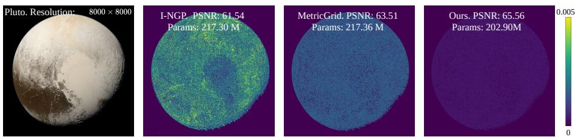  
Fig. S1: Qualitative comparison on the Pluto gigapixel image. The left panel presents the ground-truth image, while the remaining panels show per-pixel $\ell _ { 2 }$ error maps for Instant-NGP, MetricGrid, and the proposed method, respectively. Brighter colors correspond to larger reconstruction error. Although MetricGrid improves over Instant-NGP on this example, our method yields the lowest residual error overall and achieves the highest PSNR (65.56 dB) while using fewer parameters, indicating a superior fidelity– parameter trade-of.

Table S4: Numerical comparison on gigapixel Tokyo image fitting. We report PSNR (dB), SSIM and the corresponding number of trainable parameters (in millions). Our method maintains competitive fidelity in both the low and high-parameter regimes.
<table><tr><td>Method</td><td colspan="3">I-NGP [28]</td><td>NeuRBF [6]</td><td colspan="3">MetricGrid [46]</td><td colspan="4">Ours</td></tr><tr><td>Params (M)</td><td>8.01</td><td>128.0</td><td>442.4</td><td>131.7</td><td>16.01</td><td>128.1</td><td>442.6</td><td>6.55</td><td>66.34</td><td>123.4</td><td>468.0</td></tr><tr><td>PSNR↑</td><td>18.56</td><td>36.26</td><td>38.45</td><td>34.32</td><td>24.72</td><td>35.19</td><td>37.75</td><td>24.64</td><td>35.01</td><td>37.22</td><td>41.85</td></tr><tr><td>SSIM ↑</td><td>0.3212</td><td>0.9281</td><td>0.9362</td><td>0.8936</td><td>0.8173</td><td>0.9578</td><td>0.9423</td><td>0.8424</td><td>0.9145</td><td>0.94240.9916</td><td></td></tr></table>

Table S4 shows that Tokyo is a particularly challenging case for data-agnostic or hand-crafted schedules. In the low-parameter regime, CARA achieves 24.64 dB using only 6.55M parameters, which is comparable to MetricGrid’s 24.72 dB obtained with 16.01M parameters, while substantially outperforming I-NGP (21.51 dB). As the parameter budget increases, the benefit of data-adaptive allocation becomes even clearer: CARA is the only method in Table S4 to exceed 40 dB, reaching 41.85 dB. The qualitative comparison in Figure S2 further highlights this efect. At a comparable parameter budget, MetricGrid underperforms even I-NGP on this image, yielding larger high-error regions, whereas CARA produces the lowest residual error map and the highest reconstruction fidelity. This behavior indicates that fixed or heuristic schedules can be brittle on scenes with highly non-uniform frequency content, and highlights the necessity of adapting the per-level resolutions to the input image.

Taken together with the Girl results in the main paper, these experiments show that the optimal resolution allocation is strongly image-dependent. A dataagnostic schedule may be competitive on some scenes, but it is not reliably robust across gigapixel images. This is precisely where CARA becomes necessary. By selecting the per-level resolutions through collision-aware efective information balancing, CARA avoids overloading some levels while under-utilizing others, leading to more eficient use of parameters and consistently higher reconstruction fidelity across diverse gigapixel content.

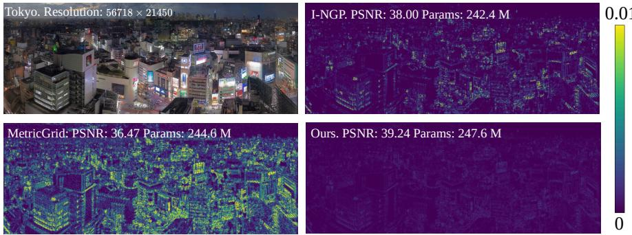  
Fig. S2: Qualitative comparison on the Tokyo gigapixel image. The left-up panel shows the ground-truth image, and the remaining panels visualize per-pixel $\ell _ { 2 }$ error maps for Instant-NGP, MetricGrid, and the proposed method, respectively. Brighter colors indicate larger reconstruction error. Notably, on this image, MetricGrid underperforms Instant-NGP despite using a comparable parameter budget, yielding both a lower PSNR (36.47 dB vs. 38.00 dB) and visibly larger high-error regions. In contrast, our method produces the lowest residual error and the highest reconstruction fidelity (39.24 dB), demonstrating the benefit of collision-aware, data-adaptive resolution allocation on challenging gigapixel scenes.

## S6 WSI Data Curation and Details

We collected four de-identified H&E-stained whole-slide images (WSIs) at 40× magnification through Huron Technologies using a TissueScope whole-slide scanner. The acquisition workflow consists of an initial setup stage, including preview scanning, verification, and batch pre-processing, followed by full-resolution whole-slide digitization with the TissueScope scanner. For this study, the scanned slides were directly exported in BigTIFF format, and the uncompressed exports were retained for all experiments. To maximize image fidelity and avoid confounding efects from downstream enhancement or compression, we retained only gamma correction, and performed no additional preprocessing after export. In particular, we did not apply stain normalization, denoising, deblurring, sharpening, contrast manipulation, or lossy compression. Hence, in this supplementary material, raw WSI denotes the direct scanner-exported TIFF data after minimal scanner-side conversion, but before any further computational preprocessing. All patient-identifiable information was removed before use.

Downsampled WSIs and their corresponding selected patch samples are shown in Figures S3 to S6.

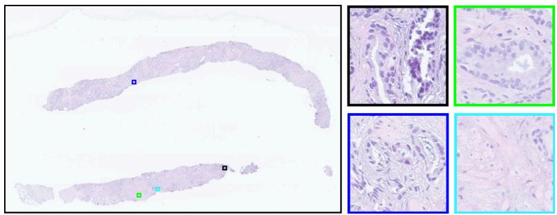  
Fig. S3: Slide 1 and selected patch regions. Left: downsampled WSIs, where colored boxes indicate the spatial locations of the sampled patches. Right: the corresponding high-resolution selected patches extracted from the marked regions.

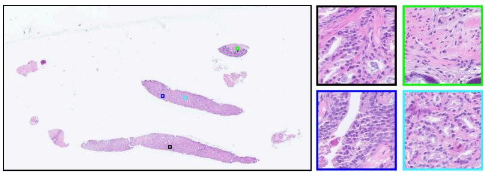  
Fig. S4: Slide 2 and selected patch regions. Left: downsampled WSIs, where colored boxes indicate the spatial locations of the sampled patches. Right: the corresponding high-resolution selected patches extracted from the marked regions.

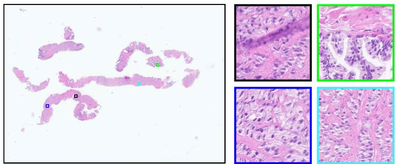  
Fig. S5: Slide 3 and selected patch regions. Left: downsampled WSIs, where colored boxes indicate the spatial locations of the sampled patches. Right: the corresponding high-resolution selected patches extracted from the marked regions.

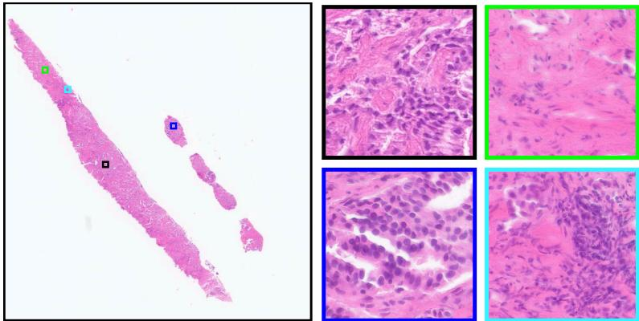  
Fig. S6: Slide 4 and selected patch regions. Left: downsampled WSIs, where colored boxes indicate the spatial locations of the sampled patches. Right: the corresponding high-resolution selected patches extracted from the marked regions.

## S7 Ablation Study

## S7.1 Ablation of the Low-Pass Filter Choice

As defined in Equation (7), CARA estimates the band information density from the low-pass sequence $\mathbf { Y } _ { \leq f }$ through

$$
\Im ( f ) = H ( \mathbf { Y } _ { \leq f + \Delta f } - \mathbf { Y } _ { \leq f } ) \cdot N _ { f } ^ { 2 } .
$$

Therefore, the choice of low-pass filter can afect the estimated information distribution across frequency bands, and hence the final resolution schedule selected by CARA. In the main paper, we use anti-aliased resizing as the default low-pass operator. Here, we justify this choice by comparing Gaussian filtering, anti-aliased resizing, and Butterworth filtering.

Table S5: Ablation of the low-pass filter used to estimate the band information density for CARA. We compare Gaussian filtering, Butterworth filtering, and anti-aliased resizing on Kodak and Pluto. Bold and underlined values denote the best and secondbest results.
<table><tr><td>Data</td><td colspan="3">Kodak</td><td colspan="3">Pluto</td></tr><tr><td>Filter</td><td>Gaussian Butterworth Resize</td><td></td><td></td><td>Gaussian Butterworth</td><td></td><td>Resize</td></tr><tr><td>Params</td><td>206.3 K</td><td>206 K</td><td>205 K</td><td>112.46 M</td><td>OOM</td><td>108.23 M</td></tr><tr><td>PSNR ↑</td><td>40.07</td><td>41.22</td><td>41.03</td><td>62.52</td><td>OOM</td><td>64.32</td></tr><tr><td>SSIM ↑</td><td>0.9576</td><td>0.9732</td><td>0.9714</td><td>0.9999</td><td>OOM</td><td>0.9999</td></tr></table>

Results on Kodak and the gigapixel Pluto image are reported in Table S5. A consistent trend is that Gaussian filtering performs the worst among the tested choices. This is observed on both Kodak and Pluto, suggesting that the corresponding low-pass sequence is less suitable for estimating the band information profile used by CARA, which in turn leads to inferior reconstruction performance. On Kodak, Butterworth filtering with $K = 2$ achieves the best result, while anti-aliased resizing remains very close. This indicates that CARA is not overly sensitive to the exact low-pass operator, as long as the filter provides a reliable coarse-to-fine decomposition for estimating $\Im ( f )$ . In particular, the small gap between Butterworth filtering and anti-aliased resizing on Kodak suggests that resize-based low-pass filtering is already suficient to recover a high-quality resolution schedule.

However, Butterworth filtering is much less practical for ultra-high-resolution inputs. In our implementation, it operates in the frequency domain and requires Fourier transforms over the full image, which leads to prohibitive memory usage and out-of-memory (OOM) errors on gigapixel images. As a result, we could not evaluate Butterworth filtering on Pluto and other ultra-high-resolution examples. By contrast, anti-aliased resizing scales well to gigapixel inputs, performs on par with Butterworth on Kodak, and substantially outperforms Gaussian filtering on Pluto.

Taken together, these results support the use of anti-aliased resizing as the default low-pass filter in all experiments. Although Butterworth filtering can provide a slight advantage on a moderate-resolution image such as Kodak, it does not scale to the gigapixel regime considered in this work. Anti-aliased resizing ofers the best overall trade-of between reconstruction quality and scalability, while remaining clearly more reliable than Gaussian filtering. Therefore, all experiments in the main paper use anti-aliased resizing to construct $\mathbf { Y } _ { \leq f }$ and compute $\Im ( f )$

Table S6: Ablation of the pixel-shufle folding factor s on the Tokyo gigapixel image across four comparable parameter budgets. We evaluate $s \in \{ 1 , 2 , 4 \}$ , where $s = 1$ denotes no pixel shufle. Moderate shufling $( s = 2 )$ is most efective in the compact regimes, improving PSNR from 18.69 to 24.64 dB at ∼6.6M parameters and from 26.38 to 31.76 dB at ∼24M parameters. In contrast, at larger budgets (∼91–93M and ∼239– 248M parameters), the best performance is achieved without shufling $( s = 1 )$ , while aggressive shufling $( s = 4 )$ is consistently inferior. These results show that pixel shufle is a budget-dependent collision-mitigation strategy: it is beneficial when hash collisions are severe, but its advantage diminishes once the model has suficient capacity.
<table><tr><td colspan="10">Tokyo Gigapixel Image Shuffle Factor PSNR ↑ SSIM ↑ Params (M) PSNR ↑ SSIM ↑ Params (M) PSNR ↑ SSIM ↑ Params (M) PSNR ↑ SSIM ↑ Params (M)</td></tr><tr><td></td><td></td><td></td><td></td><td></td><td></td><td></td><td></td><td></td><td></td><td></td><td></td><td></td></tr><tr><td>s = 1</td><td>18.69</td><td>0.3423</td><td>6.568</td><td>26.38</td><td>0.8134</td><td>25.39</td><td>35.52</td><td>0.9274</td><td>92.95</td><td>39.73</td><td>0.9612</td><td>247.6</td></tr><tr><td>s = 2</td><td>24.64</td><td>0.8424</td><td>6.599</td><td>31.76</td><td>0.9091</td><td>23.93</td><td>34.66</td><td>0.9024</td><td>91.11</td><td>37.74</td><td>0.9434</td><td>238.8</td></tr><tr><td>s = 4</td><td>18.21</td><td>0.4462</td><td>6.443</td><td>29.63</td><td>0.8612</td><td>22.42</td><td>32.52</td><td>0.8903</td><td>91.02</td><td>36.27</td><td>0.9225</td><td>236.4</td></tr></table>

## S7.2 Efect of Pixel Shufle Across Parameter Budgets

In Section 4.2 of the main paper, pixel shufle is introduced as a collisionmitigation mechanism for multiresolution hash encoding. For a shufle factor $s ,$ the spatial resolution is reduced by a factor of s along each axis, so the load factor at each hash-grid level decreases from $\alpha _ { \ell }$ to $\alpha _ { \ell } / s ^ { 2 }$ . Consequently, the potential benefit of pixel shufle should depend on the parameter regime: when the hash tables are heavily loaded, reducing collisions can noticeably improve the efective capacity of the encoder, whereas this advantage is expected to diminish once the model already has suficient capacity.

To evaluate this efect, we ablate the folding factor $s \in \{ 1 , 2 , 4 \}$ on the Tokyo gigapixel image across four comparable parameter budgets, where $s = 1$ corresponds to the original formulation without pixel shufle. For each setting, the shufle transform is applied before both schedule construction and INR training, and the full-resolution prediction is recovered by the inverse transform at test time. Across all experiments, we keep the backbone architecture, number of levels, feature dimension, optimizer, and training iterations unchanged, and vary only the hash-table size to obtain diferent parameter regimes.

The results in Table S6 show that the efect of pixel shufle is strongly budgetdependent. In the compact regimes, moderate shufling with s = 2 gives the best performance, improving PSNR from 18.69 to 24.64 dB at approximately 6.6M parameters and from 26.38 to 31.76 dB at approximately 24M parameters, while also improving SSIM in both cases. These gains are consistent with the collision analysis in Section 4.2: when the load factor is high, reducing collisions materially improves usable capacity.

However, this trend does not persist at larger budgets. At approximately 91–93M parameters, the best result is obtained with no shufle $( s = 1 )$ , which outperforms $s = 2$ by 0.86 dB PSNR and s = 4 by 3.00 dB. The same behavior becomes even clearer in the highest-budget regime (≈ 239–248M parameters), where $s = 1$ again yields the best reconstruction quality, exceeding $s = 2$ by 1.99 dB and $s = 4$ by 3.46 dB. This indicates that once collisions are no longer the dominant bottleneck, the advantage of shufling saturates, while the decoder must still predict a higher-dimensional output at each queried coordinate.

In short, Table S6 suggests that pixel shufle should be viewed as an optional collision-mitigation strategy for compact ultra-high-resolution models rather than a universally optimal design choice. Moderate shufling can substantially improve the fidelity–parameter trade-of when the encoder is collision-limited, but aggressive shufling is consistently suboptimal in our experiments, and even moderate shufling becomes unnecessary once suficient model capacity is available.

## S8 Limitations and Future Work

This work focuses on the encoder side of multiresolution hash-based implicit neural representations by adapting the per-level resolution schedule to the input image, while keeping the decoder architecture fixed. This design isolates the effect of collision-aware resolution allocation and preserves compatibility with the lightweight decoders commonly used in hash-grid INRs. At the same time, it means that CARA does not yet explore joint encoder–decoder co-design, which may provide additional gains by allowing the decoder to better exploit the improved multiscale representations produced by the adaptive schedule.

A promising direction for future work is to combine CARA with more expressive yet eficient decoders, so that adaptive resolution allocation and decoding capacity can be optimized jointly within a unified INR design. Another important direction is to develop spatially aware alternatives to pixel shufle that incorporate local image structure more explicitly while preserving computational and memory eficiency. We believe these extensions could further strengthen compact and high-fidelity implicit image representations.

## S9 Ethics Statement

The full-resolution WSIs used in this work will be publicly released upon acceptance. Due to the extremely large file size of the raw, uncompressed files, we provide subsampled WSIs and representative patches in the supplementary material. The use of these data complies with established standards for academic research. To protect privacy, all personally identifiable information and sensitive patient data have been strictly removed.

## S10 LLM Usage Statement

A large language model was used solely to polish the writing of this manuscript, such as correcting grammar, refining phrasing, and improving clarity. All core ideas, methods, experiments, results, and interpretations are entirely the authors’ own.