# Can MiniMax-H3 Reason About the Physical World? An Evaluation of Omni-Modal Generative Model

Haoyu Zhao1,∗,†, Zihao Zhao1,∗, Tianyu Deng1,∗, Ziqin Xu1,∗, Zihao Zhang2, Xudong Wang1, Jinxiang Guo1, Chen Gao1, Ziyi Ye2, Yeying Jin3,‡, Jiaxi Gu3,‡, Zuxuan Wu2, Shuicheng Yan1

1National University of Singapore 2Fudan University 3Tencent

## Abstract

Recent Omni-Modal Generative Models (Omni-Models) have advanced content generation toward unified modeling of text, images, video, and audio. MiniMax-H3 exemplifies this transition by combining multimodal context understanding with joint audio-visual generation in a shared latent framework. Its unified architecture raises a fundamental question: Can multimodal alignment improve the model’s world reasoning, and what new evaluation paradigms do omni-modal inputs enable? To investigate this question, this work introduces a comprehensive evaluation framework organized around four complementary dimensions of physical world reasoning. Unlike existing evaluation frameworks for video generation and world models, which are often constrained by limited input modalities and evaluation settings where prompts closely match the target video content, our evaluation is specifically designed to exploit the multimodal inputs of Omni-Model. We construct a diverse set of novel tasks that require models to integrate complementary information across modalities. Specifically, we consider four scenarios, including implicit prompts paired with multiple frames, audio-image, prefix-videos, and audio-video inputs. Every single modality provides only partial evidence about the underlying event, requiring the model to jointly reason over the complementary semantic cues to infer latent event states and future dynamics. Across 517 evaluation instances, MiniMax-H3 achieves an overall success rate of 41.97%. Video-based Decision Reasoning yields the highest success rate at 56.00%, while Audio-based Disambiguation Reasoning is the weakest, reaching only 27.40%. These results indicate that effective multimodal integration remains key to fully exploiting the benefits of diverse input modalities. The project is available at https://github.com/gulucaptain/MiniMax-H3-Reason.

## 1 Introduction

Omni-modal generative models (Omni-Models) have recently emerged as a new class of generative systems capable of processing heterogeneous inputs, including text, images, videos, and audio, within a unified architecture [Liu et al., 2025b, Li et al., 2025, Yang et al., 2025b, Luo et al., 2026, NVIDIA]. Compared with conventional generative models operating on one or two conditioning modalities, Omni-Model can receive multiple observations of the same underlying event and generate audiovisual content conditioned on their joint context. Recent models such as MiniMax-H3 [MiniMax, 2026] further combine multimodal context understanding with joint audio-visual generation, making it possible to provide the model with different forms of partial observations and inspect its interpretation through the generated result. Such a setting offers a natural interface for studying whether generative models can reason over complementary information describing the physical world.

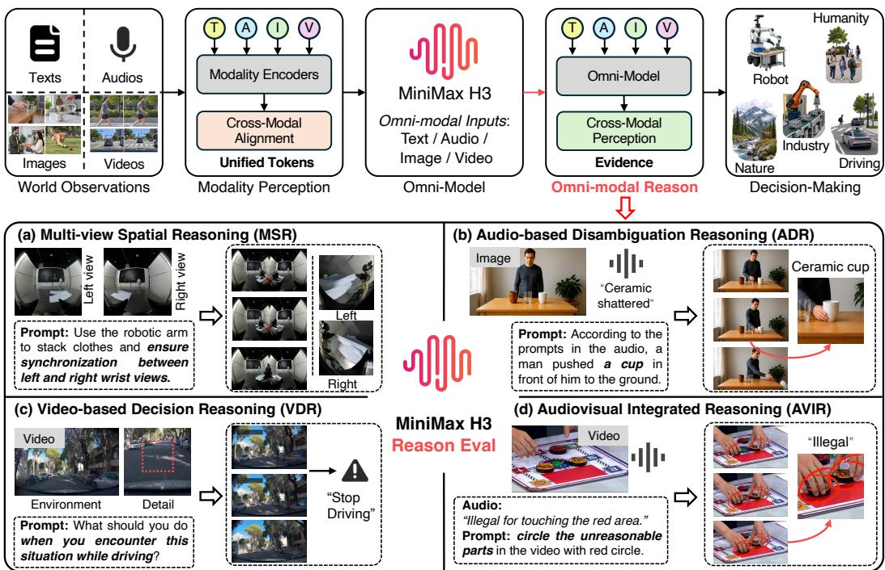  
Figure 1: Overview of our evaluation for the reasoning capability of MiniMax-H3. First, we illustrate how MiniMax-H3 progresses from world observation and modality perception to omnimodal model training, where the acquired multimodal knowledge is transformed into task-oriented decision-making through omni-modal reasoning. Second, we construct implicitly paired multimoda data to systematically evaluate it across four complementary dimensions of physical-world reasoning.

Understanding the reasoning capabilities of Omni-Model is a central issue for their use as generalpurpose generative models, and a particularly important question is whether they can infer an underlying event from multimodal evidence that is incomplete when considered separately. The omni-modal inputs create the possibility of grounding generation in substantially richer observations of the physical world. However, accepting multiple modalities is not equivalent to reasoning across them. A model may support omni-modal inputs while ignoring non-dominant evidence, failing to establish cross-modal correspondences, or relying primarily on semantic priors from the textual prompt. This distinction motivates the question of our work: Can multimodal alignment improve Omni-Model’s world reasoning, and what new evaluation paradigms do omni-modal inputs enable?

Existing general benchmarks, including VBench [Huang et al., 2024] for video generation and WorldModelBench [Li et al., 2026b] for world models, provide limited insight into this question. In most evaluations, the prompt explicitly describes the expected output, while additional modalities serve as redundant or local conditioning signals. Consequently, a model can often produce a plausible result without identifying the relationships among its inputs. Such benchmarks primarily measure whether the model can faithfully render a specified event, but reveal little about whether it can infer an event from distributed multimodal evidence. Put differently, existing benchmarks ask whether a model can generate what it is told; we instead ask whether it can determine what it should generate.

To this end, we introduce an evaluation framework based on implicit Omni-Model generation. Rather than describing the complete target event in the textual prompt, the key idea is that we deliberately omit critical event semantics and distribute the missing information across multiple input modalities. Each modality provides only partial evidence, and the intended event is recoverable only by aligning and jointly interpreting the observations. The model must therefore identify the relevant evidence, establish its cross-modal relationships, infer the underlying event, and complete that event through video generation. The generated video provides a behavioral readout of this process: its consistency with the multimodal evidence allows us to assess whether the model has recovered the missing semantics, rather than merely followed an explicit generation instruction.

Table 1: Comparison with existing evaluation benchmarks. Our evaluation extends beyond explicit text-image conditioning by introducing omni-modal inputs and implicit prompts, enabling the evaluation of multi-scene understanding, physical awareness, and multimodal reasoning.
<table><tr><td>Evaluation Sets</td><td># Examples</td><td>Input Modalities</td><td>Prompt Type</td><td>Multi Scene</td><td>Phys. Aaware</td><td>Reasoning</td></tr><tr><td>VBench [Huang et al., 2024]</td><td>800</td><td>T+I</td><td>Explicit</td><td>X</td><td>X</td><td>×</td></tr><tr><td>TC-Bench [Feng et al., 2024]</td><td>150</td><td>T+I</td><td>Explicit</td><td>x</td><td>×</td><td>×</td></tr><tr><td>VideoPhy [Bansal et al., 2025]</td><td>688</td><td>T+I</td><td>Explicit</td><td>X</td><td></td><td>×</td></tr><tr><td>WorldModelBench [Li et al., 2026b]</td><td>350</td><td>T+I</td><td>Explicit</td><td>x</td><td></td><td>×</td></tr><tr><td>Ours</td><td>517</td><td>T + I + A + V</td><td>Implicit</td><td>√</td><td>√</td><td></td></tr></table>

We instantiate this framework through four complementary evaluation settings, shown in Fig. 1. Multi-view Spatial Reasoning tests whether the model can associate entities and spatial relationships across multiple visual observations. Audio-based Disambiguation Reasoning uses acoustic evidence to resolve events that remain ambiguous from visual appearance alone. Video-based Decision Reasoning evaluates whether the model can infer a compatible event continuation from the dynamics observed in a prefix video. Finally, Audiovisual Integrated Reasoning requires the joint interpretation of temporally related visual and acoustic evidence. These settings examine cross-view association, semantic disambiguation, temporal reasoning, and audiovisual integration within Omni-Model.

We use MiniMax-H3 as a testbed to examine how reliably generated videos satisfy the requirements supported by their input observations. Our contributions are threefold:

• We introduce a framework for evaluating physical-world reasoning through video generation, continuation, and editing. Prompts leave task-relevant information unspecified, and outputs are assessed against semantic constraints supported by the input observations.

• We construct an expert-verified evaluation set of 517 instances across four reasoning scenarios and 29 subcategories, as summarized in Table 1. Each instance pairs input observations with an implicit task prompt and an annotated semantic target, supporting human evaluation against task-specific success criteria.

• Our quantitative evaluation and qualitative analysis reveal a gap between multimodal input support and reliable task completion in MiniMax-H3. Overall success is 41.97%, with video-based decision reasoning performing best at 56.00% and audio-based disambiguation performing worst at 27.40%. These findings expose a gap between supporting multimodal inputs and reliably translating the available evidence into successful task outcomes.

## 2 Related Work

Video generation evaluation. Video generation models focus on perceptual quality and semantic alignment [Huang et al., 2024, Zhao et al., 2024, Zheng et al., 2026], temporal compositionality [Feng et al., 2024, Zhao et al., 2026c,b], and physical faithfulness [Zheng et al., 2025, Bansal et al., 2025, 2026, Lin et al., 2026, Zhao et al., 2026a, Zhang et al., 2026c]. Beyond prompt-conditioned synthesis, Physics-IQ [Motamed et al., 2026] tests physical prediction from observed frames without disclosing future outcomes, while Morpheus [Tragoudaras et al., 2025] evaluates generated dynamics against physical laws. Evaluation also extends to multimodal settings: AV-Phys Bench [Cui et al., 2026] examines physical consistency within and across generated audio-video streams. ROVER [Liang et al., 2026] and OmniVideoBench [Li et al., 2026a] study cross-modal reasoning through textimage generation and audio-visual question answering, respectively. Our evaluation connects these directions by assessing whether observations support an inference expressed through video generation.

Reasoning through video generation. The zero-shot capabilities of video models [Wiedemer et al., 2025] have motivated benchmarks that evaluate generated sequences as task solutions. Video-ThinkBench [Tong et al., 2026], TiViBench [Chen et al., 2025], and Gen-ViRe [Liu et al., 2025a] probe visual, symbolic, and planning capabilities. RISE-Video [Liu et al., 2026] explicitly tests implicit world-rule reasoning, while Zhang et al. [2026b] examine the gap between causal perception and generated consequences. Building on these precedents, we focus on how task-relevant information is distributed across inputs. Our prompts leave the target inference unstated, requiring models to establish cross-view correspondences and infer responses from temporal context.

World-model evaluation. As General-Level [Fei et al., 2025] argues that stronger model capabilities bring us closer to human-level AI, several recent works have also sought to evaluate world models. WorldModelBench [Li et al., 2026b] evaluates instruction following and physics adherence in application-driven domains. WorldScore [Duan et al., 2025] assesses successive scene generation under specified camera trajectories, while WorldMark [Xu et al., 2026] and Omni-WorldBench [Wu et al., 2026] evaluate control alignment, world consistency, and action-dependent state transitions. These benchmarks test whether generated environments preserve spatial structure and respond coherently to interactions. Our framework complements them by examining how observations determine the event or response to generate: spatial tasks require integrating complementary views, and decision tasks require inferring an appropriate response from observed dynamics. Success is measured by whether the generated outcome satisfies the semantic requirements supported by the input evidence.

## 3 Reasoning Evaluation with MiniMax-H3

In this research, we present a systematic evaluation pipeline for Omni-Modes, with a particular focus on assessing the physical-world understanding and reasoning capabilities of MiniMax-H3. Compared with earlier generative models, such as Sora [Liu et al., 2024], LTX-Video [HaCohen et al., 2024], or the Wan series [Wan et al., 2025], whose conditioning modalities are primarily images and text, MiniMax-H3 supports compositional inputs across multiple modalities. By supporting complex multimodal inputs, Omni-Model can integrate complementary cross-modal evidence to perform reliable physical-world reasoning. In this section, we first compare the supported modality combinations of MiniMax-H3 with those of existing models. We then formulate physical-world reasoning tasks across four representative scenarios. Finally, we describe the construction of the evaluation data and the human annotation protocol for our evaluation.

## 3.1 What Do Omni-Models Enable?

Omni-Model provides a unified interface for conditioning generation on text, images, audio, and video, allowing different modalities to contribute complementary information about the same scene. Images describe visible entities and spatial layouts, video provides motion and state changes, audio offers event cues or spoken constraints, and text specifies the requested operation. This makes it possible to design tasks where part of the target behavior is intentionally left unspecified in the prompt and must instead be inferred from the observations. For example, audio can determine which object in an image should become active, while multiple views can provide the geometry needed to complete a manipulation. The generated video then makes the model’s interpretation observable through object motion and state tran-

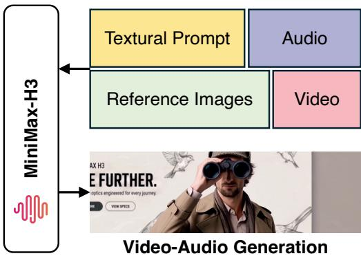  
Figure 2: Video-audio generation pipeline of MiniMax-H3, which is an open-weight, generalpurpose, omni-modal generation model.

sitions, enabling evaluation based on whether the output is consistent with the available evidence rather than whether it matches a single condition. Our study therefore tests whether the Omni-Model can use the provided evidence to satisfy generation, and answers whether multimodal input supports correct reasoning for the physical world.

## 3.2 Evaluation on Physical-World Reasoning Tasks

We evaluate the physical-world reasoning capabilities of MiniMax-H3 through four tasks: Multi-view Spatial Reasoning (MSR), Audio-based Disambiguation Reasoning (ADR), Video-based Decision Reasoning (VDR), and Audiovisual Integrated Reasoning (AVIR). These tasks probe whether the model can integrate spatial, temporal, and auditory evidence to support inferences expressed through video generation, continuation, or editing. Given a task prompt q and observations x, the model generates an output video:

$$
{ \hat { Y } } \sim p _ { \theta } ( Y \mid q , \mathbf { x } ) ,\tag{1}
$$

where $p _ { \theta }$ denotes the conditional distribution over output videos induced by MiniMax-H3. Text prompts specify the task without explicitly providing the target inference, requiring the model to derive it from the accompanying observations. We assess whether the output video reflects this inference while remaining consistent with the observed scene.

Multi-view Spatial Reasoning (MSR). MSR evaluates whether the model can integrate complementary views of a scene to infer its spatial structure (Fig. 1 (a)). Given K images $\bar { \mathbf { I } } = \{ I ^ { ( k ) } \} _ { k = 1 } ^ { \bar { K } }$ captured from different viewpoints, the model generates:

$$
{ \hat { Y } } _ { \mathrm { M S R } } \sim p _ { \theta } ( Y \mid q , \mathbf { I } ) .\tag{2}
$$

Instances are constructed so that the target spatial inference depends on evidence distributed across views. The model must establish cross-view correspondences, account for viewpoint changes and occlusions, and infer relationships that are not fully observable from a single image. The generated video is evaluated for consistency with the spatial relationships jointly supported by the input views.

Audio-based Disambiguation Reasoning (ADR). ADR evaluates whether audio can resolve ambiguity in a static visual observation (Fig. 1 (b)). Given an image I that admits multiple plausible interpretations and an audio input A that provides discriminative evidence, the model generates:

$$
\hat { Y } _ { \mathrm { A D R } } \sim p _ { \theta } ( Y \mid q , I , A ) .\tag{3}
$$

The image alone leaves the target interpretation underdetermined, while the audio provides evidence that distinguishes among plausible alternatives. The model must identify relevant acoustic cues, asso ciate them with the depicted objects or events, and generate a video consistent with the interpretation supported by both modalities. For example, when one of three cups made of different materials falls off a table, the resulting sound provides evidence for identifying which cup fell. ADR thus assesses whether acoustic evidence informs the model’s interpretation of an otherwise ambiguous visual scene.

Video-based Decision Reasoning (VDR). VDR evaluates whether the model can infer potential consequences of observed events and generate a continuation that reflects an appropriate response (Fig. 1 (c)). Given a prefix video $V _ { 1 : T } = ( V _ { 1 } , \dots , V _ { T } )$ , the model generates:

$$
\hat { Y } _ { \mathrm { V D R } } \sim p _ { \theta } ( Y \mid q , V _ { 1 : T } ) ,\tag{4}
$$

where Y denotes the video continuation. The prefix provides temporal evidence about motion, state changes, and interactions, from which the model must infer how an Omni-Model should respond without an explicit action specification in q. For example, a ball rolling into the road may indicate that a child could follow, motivating the vehicle to stop before the potential hazard becomes visible. Evaluation focuses on whether the model’s behavior in the generated continuation accounts for plausible consequences of the observed events while remaining consistent with the scene dynamics.

Audiovisual Integrated Reasoning (AVIR). AVIR evaluates whether the model can integrate video context with auditory evidence or spoken constraints to infer how a video should continue or be revised (Fig. 1 (d)). Given a video V and an audio input A, the model generates:

$$
{ \hat { Y } } _ { \mathrm { A V I R } } \sim p _ { \theta } ( Y \mid q , V , A ) .\tag{5}
$$

The video may be a prefix or a complete sequence, and the audio need not be temporally aligned with it. For video continuation, the model combines the observed dynamics with audio content to infer subsequent events. For video editing, it grounds spoken constraints in the video to identify erroneous content. Whereas ADR focuses on disambiguating a static observation, AVIR requires interpreting audio in the context of a sequence of visual events. This task assesses whether the continuation or revision incorporates the relevant audio content while maintaining consistency with the video.

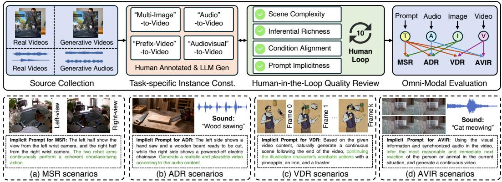  
Figure 3: Pipeline of evaluation data construction. We build implicit multimodal condition–prompt pairs in which the information required for correct generation is not explicitly stated in the prompt, but must be inferred from complementary visual and acoustic evidence.

## 3.3 Evaluation Data Construction and Human Annotation

We construct evaluation data through multimodal source collection, task-specific instance construction, and iterative human review, as illustrated in Fig. 3. Each instance pairs multimodal observations with an implicit task prompt and an annotated semantic target. The prompt specifies the requested generation operation but leaves task-relevant information to be inferred from the observations. The construction process focuses on whether the available evidence supports an assessable inference whose consequences can be expressed in the output video.

Source Collection. We collect real and synthetic visual and acoustic data, including images, videos, audio recordings, and clips produced by generative models, e.g., ChatGPT Voice [OpenAI, 2022] for audio generation and Seedance 2.0 [Seedance et al., 2026] for video generation. These sources support variation in scene configurations, object materials, viewpoints, event dynamics, and acoustic cues. Synthetic data additionally allow controlled construction of conditions that are difficult to obtain from existing recordings. Furthermore, we screen each source for perceptual quality, semantic coherence, and suitability for the intended task. Sources are excluded when visual artifacts or unclear event structure compromise the evidence required for evaluation.

Task-Specific Instance Construction. In the test data, we construct each instance by selecting the input observations, defining the output target, and specifying the video generation prompts. The inputs are organized according to the four reasoning scenarios: 1) MSR: Multiple views of the same scene provide complementary evidence for a spatial relation that is not fully specified by any individual view. 2) ADR: A static image admits multiple plausible interpretations, while an accompanying audio clip provides evidence for distinguishing among them. 3) VDR: A video prefix contains motion, state changes, or interactions that support an anticipatory response to be expressed in the continuation. 4) AVIR: A video prefix or complete sequence is paired with auditory evidence or spoken constraints to support continuation or corrective editing. For each instance, we identify the evidence supporting the target and the semantic requirements that a valid output should satisfy. These requirements concern the inference expressed by the generated video, rather than a unique realization of its appearance or motion.

Implicit Prompt Construction. Given the selected observations and semantic target, we construction a prompt that specifies the task while withholding the information to be inferred. We employ ChatGPT [OpenAI, 2022] and the open-source Qwen3 model [Yang et al., 2025a] to produce candidate formulations and linguistic variations, which are subsequently edited and verified by experts. We demonstrate that this prompt construction follows two criteria. First, the text alone should not disclose the target interpretation or generation. Second, the multimodal inputs should provide sufficient evidence to infer the generative results. For example, for AVIR tasks, audio input may specify a constraint, while identifying its violation and determining the required correction remain grounded in the video. So, we revise prompts that reveal the answer, obscure the requested generative content, or require assumptions unsupported by the inputs.

Iterative Expert Review. Finally, each paired condition-prompt candidate undergoes 10-loop expert review along four dimensions: 1) Scene complexity: The scene contains sufficient task-relevant objects, relations, or dynamics to support the intended evaluation. 2) Inferential richness: Satisfying the target requires spatiotemporal, physical, or semantic inference beyond directly reproducing the prompt. 3) Condition alignment: The inputs jointly support the annotated target, with any intentional discrepancy between the video and audio constraints defining the required correction in generations. 4) Prompt implicitness: The prompt leaves the target inference unstated while clearly specifying the task. Expert reviewers further verify that each condition-prompt pair provides sufficient evidence for the intended inference while allowing plausible variation in the generated video. Pairs that fail review are revised by adjusting the prompt or replacing the input conditions and then reassessed.

After data collection, filtering, and human verification, each accepted instance is represented as $\mathbf { \mathcal { E } } _ { i } = ( q _ { i } , \mathbf { x } _ { i } , \tau _ { i } )$ , where $q _ { i }$ denotes the implicit task prompt, x contains the input observations, and $\tau _ { i } ~ \in$ {MSR, ADR, VDR, AVIR} identifies the reasoning scenario. Depending on the scenario, the observations consist of multiple images, an image paired with audio, a video prefix, or a prefix or complete video paired with audio. Each condition-prompt pair is verified to support the intended inference through video generation for MiniMax-H3. As shown in Fig. 4, our evaluation set contains 4 domains and 29 subdomains, totaling 517 paired conditions.

## 4 Experiments

We evaluate whether MiniMax-H3 can generate videos that follow the spatial, temporal, and audiovisual constraints implied by multimodal inputs. Our analysis focuses on three aspects: overall success across the four reasoning scenarios, performance differences between task categories, and representative cases in the generated videos.

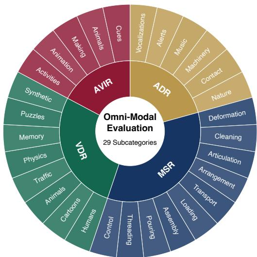  
Figure 4: Our evaluation set consists of 4 domains and 29 subdomains, totaling 517 paired conditions.

## 4.1 Evaluation Data and Protocol

Data sources and coverage. Our evaluation set contains 517 instances spanning four scenarios and 29 subcategories: MSR (200 instances; 10 subcategories), VDR (100; 8), ADR (146; 6), and AVIR (71; 5). Multi-view visual observations are derived from HiFi-UMI-2K [AI et al., 2026], VISTA-UMI-5K [Yang et al., 2026], HuMI-Unsheathe [Nai et al., 2026], Hy-Embodied-0.5-VLA-Data [Zhang et al., 2026a], and 10Kh-RealOmin-OpenData [GenRobot.AI, 2025]. Video sources include LLaVA-Video-178K [Zhang et al., 2024], and acoustic sources include FSD50K [Fonseca et al., 2021] and ESC-50 [Piczak, 2015]. These datasets complement the synthetic sources described in Sec. 3.3. All accepted instances undergo the same input-prompt construction and expert verification. Figs. 5- 8 show representative examples from the four evaluation scenarios. MSR focuses on household manipulation with multi-view observations, including large viewpoint changes and partial occlusions. ADR contains scenes with multiple objects that may produce different sounds, requiring the model to use audio cues to identify the corresponding event. VDR evaluates video continuation across human activities, animal motion, physical interactions, scene changes, and object dynamics. AVIR combines video with environmental audio or spoken instructions to evaluate audio-guided continuation and visual inconsistency detection.

Human evaluation. Three experts independently evaluate each generated video and then crosscheck their judgments using the corresponding inputs and task instructions. Since each sample may admit multiple valid outputs, evaluation is based on whether the generated video satisfies the intended task requirement rather than matching a single reference video. For MSR, reviewers check whether the generated video preserves the required spatial relations and coordinated actions across views. For ADR, they verify whether the generated event is consistent with the provided audio. For VDR, they evaluate whether the continuation follows the observed motion and task constraints. For AVIR, they assess whether the audio is correctly reflected in the relevant visual content. A visually plausible video is therefore considered unsuccessful if it does not satisfy the required task condition.

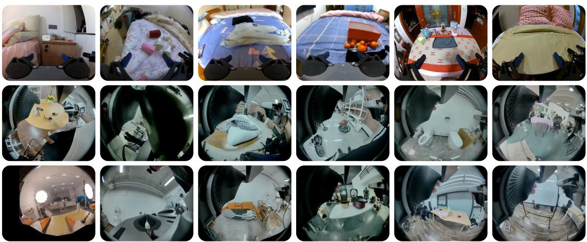  
Figure 5: MSR evaluation inputs. Household and tabletop manipulation scenes include substantial viewpoint variation, occlusion, and diverse object configurations.

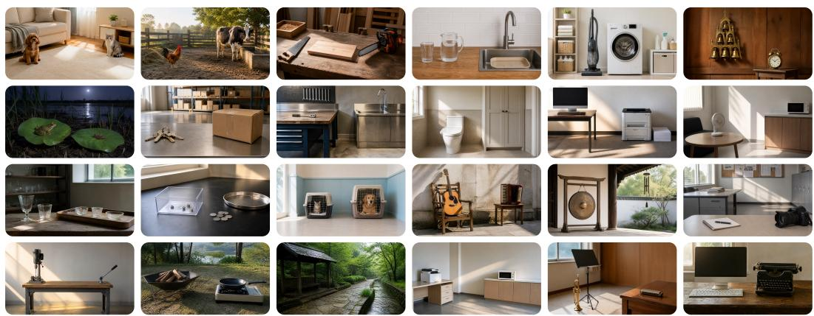  
Figure 6: ADR evaluation inputs. Scenes contain alternative candidate sound sources, including animals, instruments, tools, and appliances.

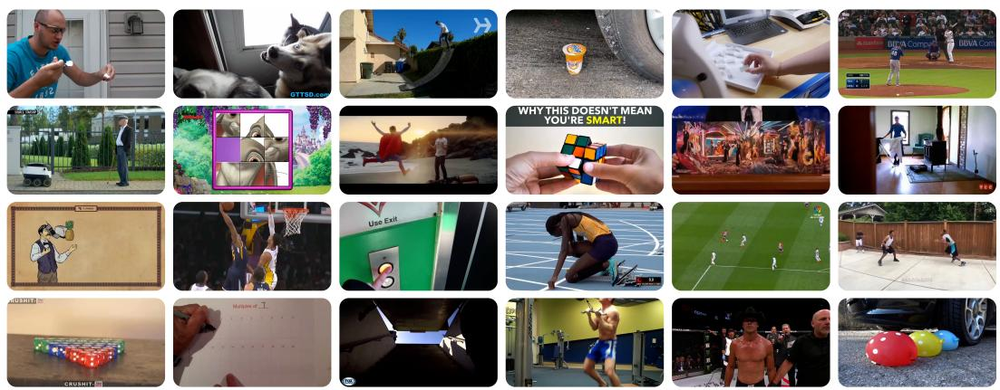  
Figure 7: VDR evaluation inputs. Selected video frames illustrate human and animal behavior, physical interactions, puzzles, and scene-memory settings.

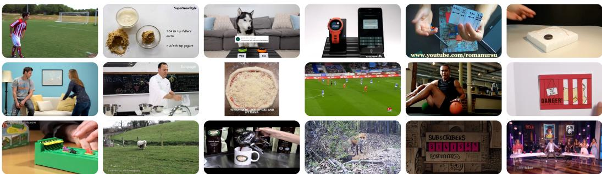  
Figure 8: AVIR evaluation inputs. Selected frames span activities, animation, animals, and cues. Video is paired with environmental sounds or spoken constraints for continuation or localization.

Table 2: Human-evaluated performance of MiniMax-H3 across four reasoning scenarios. Scenario-level and overall success rates are weighted by sample count. N: number of samples. SR: success rate (↑). Blank cells indicate no additional subcategories.
<table><tr><td colspan="3">MSR</td><td colspan="3">VDR</td><td colspan="3">ADR</td><td colspan="3">AVIR</td></tr><tr><td>Subcategory</td><td>N</td><td>SR (%)</td><td>Subcategory</td><td>N</td><td>SR (%)</td><td>Subcategory</td><td>N</td><td>SR (%)</td><td>Subcategory</td><td>N</td><td>SR (%)</td></tr><tr><td>Deformation</td><td>34</td><td>41.20</td><td>Humans</td><td>34</td><td>55.88</td><td>Vocalizations</td><td>16</td><td>31.30</td><td>Activities</td><td>14</td><td>57.14</td></tr><tr><td>Cleaning</td><td>27</td><td>33.30</td><td>Cartoons</td><td>5</td><td>20.00</td><td>Alerts</td><td>26</td><td>23.10</td><td>Animation</td><td>6</td><td>33.33</td></tr><tr><td>Articulation</td><td>26</td><td>34.60</td><td>Animals</td><td>11</td><td>63.64</td><td>Music</td><td>16</td><td>25.00</td><td>Making</td><td>21</td><td>52.38</td></tr><tr><td>Arrangement</td><td>23</td><td>47.80</td><td>Traffic</td><td>9</td><td>100.00</td><td>Machinery</td><td>34</td><td>17.60</td><td>Animals</td><td>10</td><td>30.00</td></tr><tr><td>Transport</td><td>23</td><td>34.80</td><td>Physics</td><td>10</td><td>50.00</td><td>Contact</td><td>32</td><td>21.90</td><td>Cues</td><td>20</td><td>50.00</td></tr><tr><td>Loading</td><td>20</td><td>50.00</td><td>Memory</td><td>6</td><td>66.67</td><td>Nature</td><td>22</td><td>54.50</td><td></td><td></td><td></td></tr><tr><td>Assembly</td><td>20</td><td>50.00</td><td>Puzzles</td><td>6</td><td>16.67</td><td></td><td></td><td></td><td></td><td></td><td></td></tr><tr><td>Pouring</td><td>12</td><td>58.30</td><td>Synthetic</td><td>19</td><td>52.63</td><td></td><td></td><td></td><td></td><td></td><td></td></tr><tr><td>Threading</td><td>8</td><td>75.00</td><td></td><td></td><td></td><td></td><td></td><td></td><td></td><td></td><td></td></tr><tr><td>Control</td><td>7</td><td>42.90</td><td></td><td></td><td></td><td></td><td></td><td></td><td></td><td></td><td></td></tr><tr><td>Overall</td><td>200</td><td>43.50</td><td>Overall</td><td>100</td><td>56.00</td><td>Overall</td><td>146</td><td>27.40</td><td>Overall</td><td>71</td><td>47.89</td></tr></table>

Overall success rate across all 517 samples: 41.97%.

Metric and scope. We use success rate (SR) as the main evaluation metric. For each task category, SR is computed as the percentage of samples that are judged successful according to the corresponding task-specific criteria. Given a subset D with binary labels $s _ { i } \in \{ 0 , 1 \}$ }, we compute:

$$
\mathrm { S R } ( \mathcal { D } ) = \frac { 1 0 0 } { \left| \mathcal { D } \right| } \sum _ { i \in \mathcal { D } } s _ { i } .\tag{6}
$$

The overall SR is computed over all evaluated samples. We report results for MiniMax-H3 as a representative omni-modal model, and use these experiments to analyze model performance across different physical-world reasoning scenarios and input conditions.

## 4.2 Quantitative Results

Overall reliability remains limited. Table 2 reports an overall SR of 41.97% across 517 instances for MiniMax-H3. Among the four scenarios, VDR achieves the highest SR (56.00%), followed by AVIR (47.89%), MSR (43.50%), and ADR (27.40%). These results show that the model still fails on more than half of the evaluated cases, despite supporting all required input modalities. The largest performance gap is observed between VDR and ADR, with a difference of 28.60 percentage points. This suggests that the model handles video-based continuation more reliably than audio-dependent

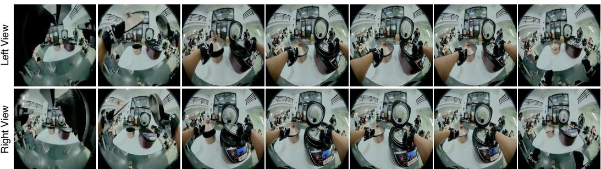  
Prompt: First-person video with side-by-side left and right wrist-camera views: the left half always shows the left wrist-camera feed, and the right half always shows the right wrist-camera feed. Both feeds synchronously capture the same scene at the same moment. The two hands actively grasp and manipulate objects in coordination, maintaining consistent left–right hand identities while completing the task: “Put the inner pot and the steamer tray into the rice cooker.” Start exactly from the provided first frame, follow the natural sequence of real-world actions, and transition accurately to the provided final frame.

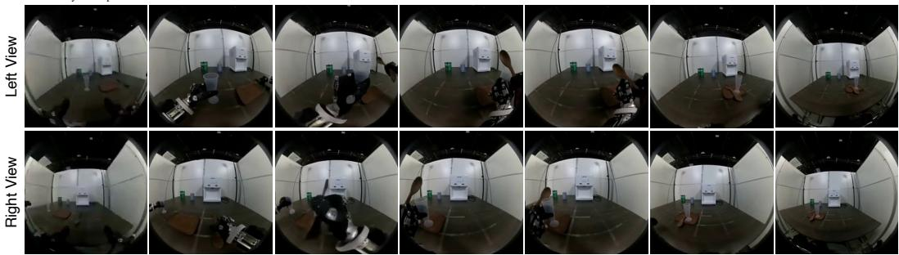  
Prompt: Using the first and last frames from the left and right wrist-mounted cameras in the same scene, generate a side-by-side, synchronized, continuous first-person dual-view manipulation video that completes “place the measuring cup and wooden spoon on the tray” and transitions naturally and accurately from the first frame to the last frame. The left half must always come from the left mechanical gripper’s wrist camera and the right half from the right gripper’s wrist camera; both cameras are rigidly mounted to their corresponding wrists, so viewpoint changes may only result from gripper motion. Free cameras, third-person views, swapped, mixed, or unsynchronized views are forbidden.

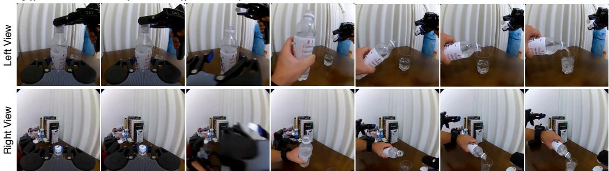  
Prompt: Using the first and last frames from the left and right wrist-mounted cameras in the same scene, generate a side-by-side, synchronized, continuous first-person dual-view manipulation video that completes “unscrew bottle cap and pour” and transitions naturally and accurately from the first frame to the last frame. The left half must always come from the left mechanical gripper’s wrist camera and the right half from the right gripper’s wrist camera; both cameras are rigidly mounted to their corresponding wrists, so viewpoint changes may only result from gripper motion. Free cameras, third-person views, swapped, mixed, or unsynchronized views are forbidden.

Figure 9: MSR results under paired-view conditioning. Each example shows the paired views together with the corresponding prompt.

reasoning on our test data. However, since the scenarios differ in data, prompts, and generation targets, the results mainly reflect task-level performance rather than a direct comparison between video and audio modalities.

Results across scenarios. Furthermore, in Table 2, we analyze that MSR reaches an SR of 43.50%. Performance varies notably across manipulation tasks: threading achieves 75.00% and pouring 58.30%, while cleaning, articulation, and transport remain around 33-35%. This suggests that maintaining spatial consistency across views is still difficult for several manipulation settings. VDR performs best overall, reaching 56.00% SR. The model handles human, animal, and traffic dynamics relatively well, but performance drops substantially on cartoons and puzzles, where success rates fall to 20.00% and 16.67%, respectively. ADR is the most challenging scenario, with an SR of only 27.40%. Nature sounds are handled better than other categories, whereas machinery, contact, and alert sounds remain difficult. This highlights the challenge of converting acoustic evidence into the correct visual event. Finally, AVIR reaches 47.89% SR. The model performs better on activities and making tasks, while animation and animal-related cases remain more difficult. Overall, the results show clear differences across reasoning scenarios and substantial room for improvement.

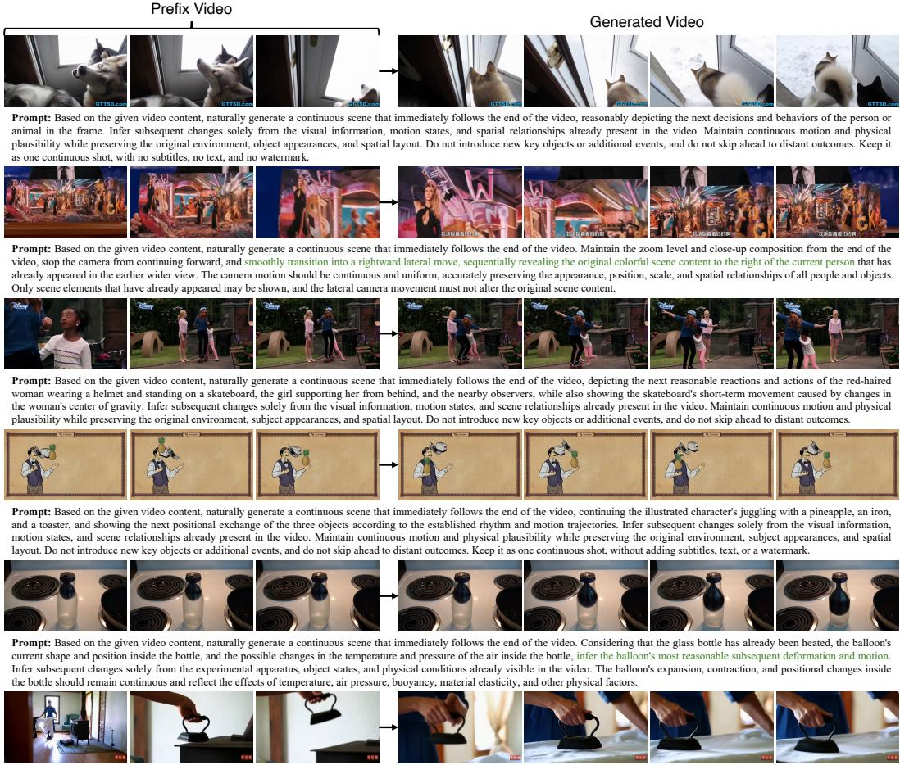  
Prompt: Based on the given video content, naturally generate a continuous scene that immediately follows the end of the video, depicting the person's next reasonable action while using the oldfashioned iron, along with the resulting changes in the relative positions of the iron, the hand, and the fabric being ironed. Infer subsequent changes solely from the visual information, motion states, and scene relationships already present in the video. Maintain continuous motion and physical plausibility while preserving the original environment, subject appearances, and spatial layout. Do not introduce new key objects or additional events, and do not skip ahead to distant outcomes. Keep it as one continuous shot, without adding subtitles, text, or a watermark.

Figure 10: VDR results conditioned on prefix videos. Each row shows observed frames on the left and generated continuation frames on the right, together with the corresponding instruction.

## 4.3 Qualitative Analysis

Figs 9-12 present representative qualitative results across the four evaluation scenarios. Overall, the model can generate visually plausible continuations and often follows the dominant cues provided by the input modalities. In MSR, it produces recognizable manipulation stages for tasks such as ricecooker assembly and utensil placement, while in VDR it generates reasonable short-term dynamics, such as a dog approaching a doorway or an iron contacting fabric. ADR and AVIR further show that audio can guide the generated visual content: the model opens the cabinet in response to the corresponding sound, produces paper motion for typewriter audio, and follows several spoken or environmental cues during continuation.

## 4.4 Failure Cases

Moreover, we also analyze the failure cases of the tested results. Figs. 13 and 14 reveal several recurring failure patterns across multimodal physical-world reasoning tasks. We list the failure types for audio and video inputs: 1) Incorrect evidence grounding: occurs when the model identifies a plausible event but associates the conditioning evidence with the wrong entity or action, as in the cat dog and cleaning-appliance examples. 2) Incomplete event realization: appears when the generated scene contains relevant objects but fails to instantiate the interaction implied by the input, such as typing or can opening. 3) Physical and configurational violations: arise when generated continuations break contact dynamics, object geometry, or valid state transitions, as observed in the skateboarding, rolling-object, puzzle, and Rubik’s-Cube cases. 4) temporal state inconsistency: occurs when

  
Prompt: A toilet with a visible flush control occupies the left, while a closed bathroom storage cabinet occupies the right; the tiled floor, walls, fixtures, and light form one continuous bathroom, establishing the spatial layout from the beginning of the shot. The camera holds a steady shot throughout the entire take, preserving the original composition and keeping all principal subjects and objects recognizable. All movements follow realistic physical behavior and remain consistent with the established spatial layout. No unrelated objects or unexpected scene changes appear, and the subjects, objects, and surrounding environment remain visually coherent from the first frame to the last.

  
Prompt: A camera with its shutter control visible sits on the left, while a pen and blank sheet of paper lie on the work surface on the right; the studio floor, backdrop, table, and lighting form one continuous room, establishing the spatial layout from the beginning of the shot. The camera holds a steady shot throughout the entire take, preserving the original composition and keeping all principal subjects and objects recognizable. All movements follow realistic physical behavior and remain consistent with the established spatial layout. No unrelated objects or unexpected scene changes appear, and the subjects, objects, and surrounding environment remain visually coherent from the first frame to the last.

  
Prompt: A computer keyboard sits on the desk on the left, while a laser printer with paper loaded sits on the right; the desktop, cabinets, wall, cables, and light form one continuous office workspace, establishing the spatial layout from the beginning of the shot. The camera holds a steady shot throughout the entire take, preserving the original composition and keeping all principal subjects and objects recognizable. All movements follow realistic physical behavior and remain consistent with the established spatial layout. No unrelated objects or unexpected scene changes appear, and the subjects, objects, and surrounding environment remain visually coherent from the first frame to the last.

  
Prompt: A switched-off desktop fan sits on the left, while a closed microwave sits on the right; the counter, cabinets, wall, floor, and light form one continuous break room, establishing the spatial layout from the beginning of the shot. The camera holds a steady shot throughout the entire take, preserving the original composition and keeping all principal subjects and objects recognizable. All movements follow realistic physical behavior and remain consistent with the established spatial layout. No unrelated objects or unexpected scene changes appear, and the subjects, objects, and surrounding environment remain visually coherent from the first frame to the last.

  
Prompt: A computer keyboard occupies the left side of the desk, while a vintage typewriter occupies the right; the desktop, filing cabinets, wall, cables, and light form one continuous office, establishing the spatial layout from the beginning of the shot. The camera holds a steady shot throughout the entire take, preserving the original composition and keeping all principal subjects and objects recognizable. All movements follow realistic physical behavior and remain consistent with the established spatial layout. No unrelated objects or unexpected scene changes appear, and the subjects, objects, and surrounding environment remain visually coherent from the first frame to the last.

Figure 11: ADR results conditioned on visual and acoustic inputs. Each row shows the input scene, acoustic cue, and generated frames. The cabinet-opening and typewriter examples produce visible events consistent with the supplied sounds.

previously established object states, motion trends, or scene content are not preserved throughout the continuation. These failures suggest a common challenge beyond perceptual plausibility: the model must convert multimodal evidence into the correct event while preserving the physical, spatial, and temporal constraints established by the observations.

For Omni-Models, the ability to jointly understand and reason across multiple modalities is essential. Generative Omni-Modal models further make this reasoning process observable through visual generation, where intermediate predictions can be interpreted as a form of Chain-of-Frames. The failure cases identified above therefore provide a concrete view of where current models still fall short, and suggest clearer directions for improving cross-modal grounding, physical reasoning, and temporally consistent generation in future Omni-Modal systems.

## 4.5 Discussion

Our experiments provide three main observations about physical-world reasoning in omni-modal generative models, particularly MiniMax-H3. 1) Visual plausibility does not guarantee physicalworld consistency. The model can often generate realistic videos, yet still violate important spatial, temporal, and audiovisual constraints. Typical failures include inconsistent embodiment across views, incorrect camera motion, incomplete state transitions, missing visual responses to audio cues, and imprecise audiovisual localization. 2) Multimodal support does not necessarily lead to effective

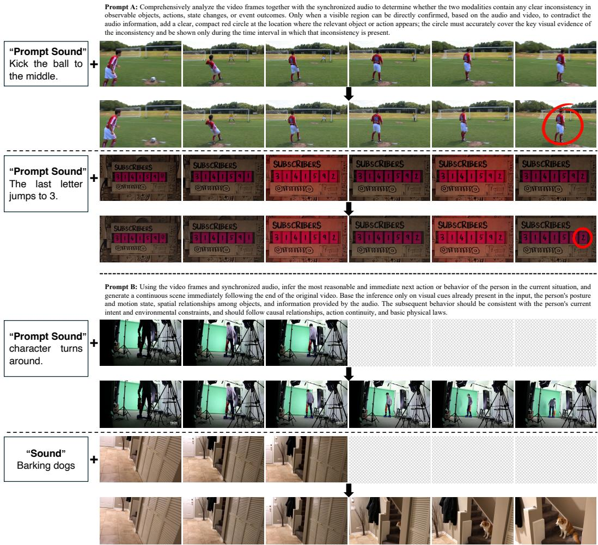  
Figure 12: AVIR results for discrepancy localization and audiovisual continuation. The upper examples localize visual content that conflicts with spoken constraints, while the lower examples continue the video from audiovisual inputs.

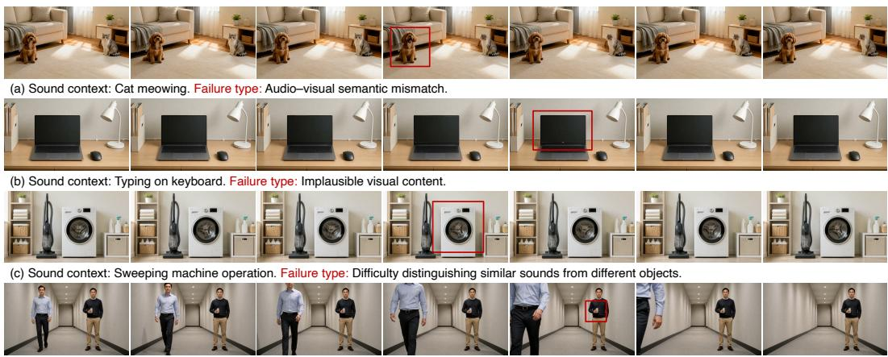  
(d) Sound context: Opening can. Failure type: Difficulty reasoning about small objects.

Figure 13: Representative ADR failure cases. Each row shows uniformly sampled video frames and identifies the input sound and failure type: (a) audio-visual semantic mismatch, (b) implausible visual content, (c) confusion between similar sound sources, and (d) failure to ground a small-object interaction. Red boxes highlight the regions relevant to each failure.

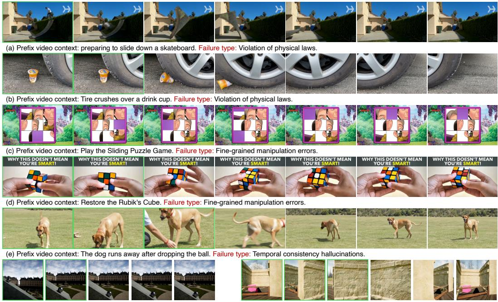  
(f) Context: The ball rolls down. Failure type: Violation of physical laws.  
(g) Context: Camera Pan. Failure type: Temporal consistency hallucinations.

Figure 14: Representative VDR failure cases. Green-bordered frames indicate the observed prefix, followed by sampled continuation frames. Panels (a), (b), and (f) illustrate violations of physical constraints; (c) and (d) illustrate fine-grained manipulation errors; and (e) and (g) illustrate temporal inconsistencies in object states and scene content.

multimodal reasoning. Although the model accepts images, videos, audio, and text as inputs, our results show that it does not always use these signals reliably to satisfy the task requirements. This gap is particularly evident in tasks that require acoustic grounding or coordination across multiple views. 3) Generation-based evaluation reflects the complete reasoning-and-generation process. A failed output may arise from incorrect input understanding, weak cross-modal integration, or errors during video generation. Further controlled experiments, such as removing individual modalities or replacing audio while keeping the visual input fixed, could help separate these factors.

## 5 Conclusion

In this work, we investigated physical-world reasoning in emerging Omni-Modal Generative Models through the lens of multimodal generation. Rather than evaluating generation under fully specified prompts, we constructed implicit condition–prompt pairs in which critical information must be recovered from complementary evidence distributed across multiple modalities. This formulation enables us to examine whether an Omni-Model can move beyond accepting heterogeneous inputs and effectively integrate them to infer latent event states, physical dynamics, and appropriate outcomes. Our evaluation of MiniMax-H3 demonstrates both the promise and the current limitations of this capability. While complementary multimodal evidence can support reasoning beyond explicitly stated instructions, the overall performance remains limited, revealing a substantial gap between omni-modal input support and effective physical-world reasoning. More broadly, our results suggest that omni-modal inputs provide not only a richer interface for content generation, but also a useful foundation for constructing new evaluation paradigms that probe reasoning through generation.

Looking forward, we plan to continuously expand and refine the evaluation set with more diverse physical-world scenarios, modality combinations, and reasoning requirements. We also aim to develop an automated evaluation framework that can reliably assess reasoning outcomes in generated content, enabling scalable and reproducible testing of future Omni-Models.

## References

Simple AI, Yuteng Wei, Jinming Ma, Jiawei Wang, Weitao Zhou, Yushen Zuo, Ke Rui, Minglei Li, Jinhao Zhang, Zhikang Pan, et al. Hifi-umi: Learning deployable manipulation policies from high-fidelity umi data alone. arXiv preprint arXiv:2607.25895, 2026.

Hritik Bansal, Zongyu Lin, Tianyi Xie, Zeshun Zong, Michal Yarom, Yonatan Bitton, Chenfanfu Jiang, Yizhou Sun, Kai-Wei Chang, and Aditya Grover. Videophy: Evaluating physical commonsense for video generation. In International Conference on Learning Representations, volume 2025, pages 102075–102121, 2025.

Hritik Bansal, Clark Peng, Yonatan Bitton, Roman Goldenberg, Aditya Grover, and Kai-Wei Chang. Videophy-2: A challenging action-centric physical commonsense evaluation in video generation. In International Conference on Learning Representations, volume 2026, pages 118456–118470, 2026.

Harold Haodong Chen, Disen Lan, Wen-Jie Shu, Qingyang Liu, Zihan Wang, Sirui Chen, Wenkai Cheng, Kanghao Chen, Hongfei Zhang, Zixin Zhang, et al. Tivibench: Benchmarking think-invideo reasoning for video generative models. arXiv preprint arXiv:2511.13704, 2025.

Zijun Cui, Xiulong Liu, Hao Fang, Mingwei Xu, Jiageng Liu, Zexin Xu, Weiguo Pian, Shijian Deng, Feiyu Du, Chenming Ge, et al. Do joint audio-video generation models understand physics? arXiv preprint arXiv:2605.07061, 2026.

Haoyi Duan, Hong-Xing Yu, Sirui Chen, Li Fei-Fei, and Jiajun Wu. Worldscore: A unified evaluation benchmark for world generation. In Proceedings ofthe IEEE/CVF international conference on computer vision, pages 27713–27724, 2025.

Hao Fei, Yuan Zhou, Juncheng Li, Xiangtai Li, Qingshan Xu, Bobo Li, Shengqiong Wu, Yaoting Wang, Junbao Zhou, Jiahao Meng, et al. On path to multimodal generalist: General-level and general-bench. In Forty-second International Conference on Machine Learning, 2025.

Weixi Feng, Jiachen Li, Michael Saxon, Tsu-jui Fu, Wenhu Chen, and William Yang Wang. Tc-bench: Benchmarking temporal compositionality in text-to-video and image-to-video generation. arXiv preprint arXiv:2406.08656, 2024.

Eduardo Fonseca, Xavier Favory, Jordi Pons, Frederic Font, and Xavier Serra. Fsd50k: an open dataset of human-labeled sound events. IEEE/ACM Transactions on Audio, Speech, and Language Processing, 30:829–852, 2021.

GenRobot.AI. 10kh realomni-open dataset. https://huggingface.co/datasets/ genrobot2025/10Kh-RealOmin-OpenData, 2025.

Yoav HaCohen, Nisan Chiprut, Benny Brazowski, Daniel Shalem, Dudu Moshe, Eitan Richardson, Eran Levin, Guy Shiran, Nir Zabari, Ori Gordon, et al. Ltx-video: Realtime video latent diffusion. arXiv preprint arXiv:2501.00103, 2024.

Ziqi Huang, Yinan He, Jiashuo Yu, Fan Zhang, Chenyang Si, Yuming Jiang, Yuanhan Zhang, Tianxing Wu, Qingyang Jin, Nattapol Chanpaisit, et al. Vbench: Comprehensive benchmark suite for video generative models. In 2024 IEEE/CVF Conference on Computer Vision and Pattern Recognition (CVPR), pages 21807–21818. IEEE, 2024.

Caorui Li, Yu Chen, Yiyan Ji, Jin Xu, Zhenyu Cui, Shihao Li, Yuanxing Zhang, Zhenghao Song, Dingling Zhang, Ying He, et al. Omnivideobench: Towards audio-visual understanding evaluation for omni mllms. In International Conference on Learning Representations, volume 2026, pages 138214–138236, 2026a.

Dacheng Li, Yunhao Fang, Yukang Chen, Shuo Yang, Shiyi Cao, Justin Wong, Michael Luo, Xiaolong Wang, Hongxu Yin, Joseph Gonzalez, et al. Worldmodelbench: Judging video generation models as world models. Advances in Neural Information Processing Systems, 38, 2026b.

Yadong Li, Jun Liu, Tao Zhang, Song Chen, Tianpeng Li, Zehuan Li, Lijun Liu, Lingfeng Ming, Guosheng Dong, Da Pan, et al. Baichuan-omni-1.5 technical report. arXiv preprint arXiv:2501.15368, 2025.

Yongyuan Liang, Wei Chow, Feng Li, Ziqiao Ma, Xiyao Wang, Jiageng Mao, Jiuhai Chen, Jiatao Gu, Yue Wang, and Furong Huang. Rover: Benchmarking reciprocal cross-modal reasoning for omnimodal generation. In International Conference on Learning Representations, volume 2026, pages 112094–112129, 2026.

Juyi Lin, Arash Akbari, Yumei He, Lin Zhao, Haichao Zhang, Arman Akbari, Xingchen Xu, Zoe Y Lu, Enfu Nan, Hokin Deng, et al. Phyground: Benchmarking physical reasoning in generative world models. arXiv preprint arXiv:2605.10806, 2026.

Mingxin Liu, Shuran Ma, Shibei Meng, Xiangyu Zhao, Zicheng Zhang, Shaofeng Zhang, Zhihang Zhong, Peixian Chen, Haoyu Cao, Xing Sun, et al. Rise-video: Can video generators decode implicit world rules? arXiv preprint arXiv:2602.05986, 2026.

Xinxin Liu, Zhaopan Xu, Ming Li, Kai Wang, Yong Jae Lee, and Yuzhang Shang. Can world simulators reason? gen-vire: A generative visual reasoning benchmark. arXiv preprint arXiv:2511.13853, 2025a.

Yixin Liu, Kai Zhang, Yuan Li, Zhiling Yan, Chujie Gao, Ruoxi Chen, Zhengqing Yuan, Yue Huang, Hanchi Sun, Jianfeng Gao, et al. Sora: A review on background, technology, limitations, and opportunities of large vision models. arXiv preprint arXiv:2402.17177, 2024.

Zuyan Liu, Yuhao Dong, Jiahui Wang, Ziwei Liu, Winston Hu, Jiwen Lu, and Yongming Rao. Ola: Pushing the frontiers of omni-modal language model. arXiv preprint arXiv:2502.04328, 2025b.

Run Luo, Xiaobo Xia, Lu Wang, Longze Chen, Renke Shan, Jing Luo, Min Yang, and Tat-Seng Chua. Next-omni: Towards any-to-any omnimodal foundation models with discrete flow matching. In International Conference on Learning Representations, volume 2026, pages 147298–147334, 2026.

MiniMax. Minimax h3: An open model breaking the boundaries between tasks and modalities. 2026. URL https://www.minimax.io/blog/minimax-h3.

Saman Motamed, Laura Culp, Kevin Swersky, Priyank Jaini, and Robert Geirhos. Do generative video models understand physical principles? In 2026 IEEE/CVF Winter Conference on Applications of Computer Vision (WACV), pages 948–958. IEEE, 2026.

Ruiqian Nai, Boyuan Zheng, Junming Zhao, Haodong Zhu, Sicong Dai, Zunhao Chen, Yihang Hu, Yingdong Hu, Tong Zhang, Chuan Wen, et al. Humanoid manipulation interface: Humanoid whole-body manipulation from robot-free demonstrations. arXiv preprint arXiv:2602.06643, 2026.

NVIDIA. What is an omni-model? URL https://www.nvidia.com/en-us/glossary/ omni-model/.

OpenAI. Chatgpt: Optimizing language models for dialogue. https://openai.com, 2022. Accessed: September 17, 2026.

Karol J Piczak. Esc: Dataset for environmental sound classification. In Proceedings of the 23rd ACM international conference on Multimedia, pages 1015–1018, 2015.

Team Seedance, De Chen, Liyang Chen, Xin Chen, Ying Chen, Zhuo Chen, Zhuowei Chen, Feng Cheng, Tianheng Cheng, Yufeng Cheng, et al. Seedance 2.0: Advancing video generation for world complexity. arXiv preprint arXiv:2604.14148, 2026.

Jingqi Tong, Yurong Mou, Hangcheng Li, Mingzhe Li, Yongzhuo Yang, Ming Zhang, Qiguang Chen, Tianyi Liang, Xiaomeng Hu, Yining Zheng, et al. Thinking with video: Video generation as a promising multimodal reasoning paradigm. In Proceedings of the IEEE/CVF Conference on Computer Vision and Pattern Recognition, pages 41121–41129, 2026.

Antonios Tragoudaras, Chenyu Zhang, Daniil Cherniavskii, Antonios Vozikis, Thijmen Nijdam, Derck WE Prinzhorn, Mark Bodracska, Nicu Sebe, Andrii Zadaianchuk, and Efstratios Gavves. Evaluating newtonian mechanics in video generative models with real physical systems. arXiv preprint arXiv:2504.02918, 2025.

Team Wan, Ang Wang, Baole Ai, Bin Wen, Chaojie Mao, Chen-Wei Xie, Di Chen, Feiwu Yu, Haiming Zhao, Jianxiao Yang, et al. Wan: Open and advanced large-scale video generative models. arXiv preprint arXiv:2503.20314, 2025.

Thaddäus Wiedemer, Yuxuan Li, Paul Vicol, Shixiang Shane Gu, Nick Matarese, Kevin Swersky, Been Kim, Priyank Jaini, and Robert Geirhos. Video models are zero-shot learners and reasoners. arXiv preprint arXiv:2509.20328, 2025.

Meiqi Wu, Zhixin Cai, Fufangchen Zhao, Xiaokun Feng, Rujing Dang, Bingze Song, Ruitian Tian, Jiashu Zhu, Jiachen Lei, Hao Dou, et al. Omni-worldbench: Towards a comprehensive interaction-centric evaluation for world models. arXiv preprint arXiv:2603.22212, 2026.

Xiaojie Xu, Zhengyuan Lin, Kang He, Yukang Feng, Xiaofeng Mao, Yuanyang Yin, Kaipeng Zhang, and Yongtao Ge. Worldmark: A unified benchmark suite for interactive video world models. arXiv preprint arXiv:2604.21686, 2026.

An Yang, Anfeng Li, Baosong Yang, Beichen Zhang, Binyuan Hui, Bo Zheng, Bowen Yu, Chang Gao, Chengen Huang, Chenxu Lv, et al. Qwen3 technical report. arXiv preprint arXiv:2505.09388, 2025a.

Qize Yang, Shimin Yao, Weixuan Chen, Shenghao Fu, Detao Bai, Jiaxing Zhao, Boyuan Sun, Bowen Yin, Xihan Wei, and Jingren Zhou. Humanomniv2: From understanding to omni-modal reasoning with context. arXiv preprint arXiv:2506.21277, 2025b.

Siyuan Yang, Linzheng Guo, Ouyang Lu, Daoran Zhang, Xinmiao Wang, Ting Xiao, Fangzheng Yan, Zhijun Chen, Yan Ding, Chao Yu, et al. Vista: Vision-grounded and physics-validated adaptation of umi data for vla training. arXiv preprint arXiv:2606.04708, 2026.

He Zhang, Lingzhu Xiang, Haitao Lin, Zeyu Huang, Minghui Wang, Dingyan Zhong, Yubo Dong, Yihao Wu, Yongming Rao, Dongsheng Zhang, et al. Hy-embodied-0.5-vla: From vision-languageaction models to a real-world robot learning stack. arXiv preprint arXiv:2606.14409, 2026a.

Yongheng Zhang, Guang Yang, Ruihan Hou, Qiguang Chen, Ziang Liu, Xiaolong Liu, Manman Zhang, Yanchao Hao, Zheng Wei, Hao Wu, et al. Thinking in video: Can video generators really reason about the real world? arXiv preprint arXiv:2607.17523, 2026b.

Yuanhan Zhang, Jinming Wu, Wei Li, Bo Li, Zejun Ma, Ziwei Liu, and Chunyuan Li. Video instruction tuning with synthetic data, 2024. URL https://arxiv. org/abs/2410.02713, 17(2):6, 2024.

Zihao Zhang, Haoyu Zhao, Siqian Yang, Yidi Wu, Yudong Jiang, and Zuxuan Wu. Speed: One-step pixel diffusion for high-quality video frame interpolation. arXiv preprint arXiv:2607.15585, 2026c.

Haoyu Zhao, Tianyi Lu, Jiaxi Gu, Xing Zhang, Qingping Zheng, Zuxuan Wu, Hang Xu, and Yu-Gang Jiang. Magdiff: Multi-alignment diffusion for high-fidelity video generation and editing. In European Conference on Computer Vision, pages 205–221. Springer, 2024.

Haoyu Zhao, Jiaxi Gu, Haoran Chen, Qingping Zheng, Yeying Jin, Hongyi Yang, Junqi Cheng, Yuang Zhang, Zenghui Lu, Huan Yu, et al. Cameranoise: Enabling faithful camera control in video diffusion through geometry-flow-guided noise warping. arXiv preprint arXiv:2605.30774, 2026a.

Haoyu Zhao, Jiaxi Gu, Shicong Wang, Tianyi Lu, Xing Zhang, Zuxuan Wu, Hang Xu, and Yu-Gang Jiang. Lstd: Long short-term temporal diffusion for video generation. IEEE Transactions on Multimedia, 2026b.

Haoyu Zhao, Zhongang Qi, Cong Wang, Qingping Zheng, Guansong Lu, Fei Chen, Hang Xu, Zuxuan Wu, and Yu-Gang Jiang. Dynamictrl: Rethinking the basic structure and the role of text for high-quality human image animation. IEEE Transactions on Multimedia, 2026c.

Dian Zheng, Ziqi Huang, Hongbo Liu, Kai Zou, Yinan He, Fan Zhang, Lulu Gu, Yuanhan Zhang, Jingwen He, Wei-Shi Zheng, et al. Vbench-2.0: Advancing video generation benchmark suite for intrinsic faithfulness. arXiv preprint arXiv:2503.21755, 2025.

Qingping Zheng, Bo Huang, Yang Liu, Haoyu Zhao, Ling Zheng, Zengmao Wang, Ying Li, and Jiankang Deng. Refocuseraser: Refocusing for small object removal with robust context-shadow repair. In International Conference on Learning Representations, volume 2026, pages 85175– 85201, 2026.