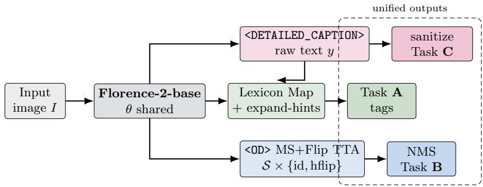

# CapMap-MS-TTA: 3rd Place Solution for the MUMU Track of the 8th LSVOS Challenge at ECCV 2026

Chengfeng Qiu1 Kaifeng Wei1

1Netease YiDun AI Lab, Hangzhou, China

qiuchengfeng@corp.netease.com, hzweikaifeng@corp.netease.com

Abstract. The MUMU track of the 8th Large-scale Video Object Segmentation (LSVOS) Challenge requires a single unified multimodal model to jointly solve image tagging (Task A), open-vocabulary object detection (Task B), and English captioning (Task C) under strict resource constraints (≤0.5B parameters and ≤8 GB peak GPU memory). We present CapMap-MS-TTA, a training-free submission built on Microsoft Florence-2-base (∼231M parameters), combining caption keyword mapping with multi-scale flip test-time augmentation. Task C uses the native <DETAILED\_CAPTION> pathway with length/token sanitization. Task A maps the same detailed caption into the oficial quality/scene/event vocabularies via an expanded keyword lexicon with whole-word matching and a lightweight expand-hints stage. Task B runs Florence-2 open detection (<OD>) with multi-scale and horizontal-flip test-time augmentation (TTA), followed by label-aware non-maximum suppression (NMS). Without fine-tuning, the system improves our reproduced Florence-2 baseline from 15.16 to a best public score of 16.4815, and ranks 3rd on the final MUMU leaderboard.

## 1 Introduction

The Large-scale Video Object Segmentation (LSVOS) Challenge series has become a major benchmark venue for advancing video segmentation under realistic conditions [2, 3, 5, 6]. The 8th LSVOS Challenge, held in conjunction with ECCV 2026, features four tracks:

MUMU Track (this report): Multi-task Unified Multimodal Understanding. Participants must deploy one shared model to produce (i) hierarchical image tags, (ii) object detections with open-vocabulary labels, and (iii) English captions, under tight compute limits. Evaluation is performed on a held-out still-image test set (1,038 images in the public phase we target).

– Classic VOS Track: Semi-supervised video object segmentation, typically evaluated on long, complex sequences such as LVOS [3] and MOSE [2], measuring temporal mask consistency given first-frame masks.

– Referring VOS (RVOS) Track: Language-conditioned video segmentation, commonly centered on motion-focused datasets such as MeViS [4], requiring joint vision–language grounding.

– Complex VOS Track (MOSEv2-style settings [5]): Stress-tests robustness to small objects, frequent appearance/disappearance, heavy occlusion, adverse weather/lighting, and other real-world factors.

Across tracks, LSVOS emphasizes generalization beyond curated short clips: long-term identity preservation, crowded scenes, and multimodal conditioning where applicable. Datasets historically associated with LSVOS include LVOS [3], MOSE / MOSEv2 [2, 5], and MeViS [4], while the MUMU track introduces a unified tagging–detection–captioning protocol on challenge images with an official Codabench evaluation pipeline. Unlike classic VOS, MUMU requires a single checkpoint to serve three heterogeneous outputs. Training three separate specialists violates the unified-model rule; large MLLMs often exceed the 0.5B / 8 GB budgets. We therefore adopt a compact vision–language foundation model—Florence-2-base [1]—and invest efort in prompt routing, deterministic post-processing, and detection TTA, rather than fine-tuning. Our best submission ranks 3rd on the final MUMU leaderboard with Final=16.4815 (A=26.49, B=5.45, C=44.05).

Contributions (1) A practical Florence-2 recipe for MUMU that maintains one backbone for all tasks. (2) Caption-driven Task A tagging with expanded lexicon and expand-hints fusion. (3) Multi-scale + flip OD TTA with NMS for Task B, yielding denser, more stable boxes.

## 2 Related Work

Unified vision–language models. Florence-2 [1] formulates vision tasks as sequence generation with task tokens (<CAPTION>, <DETAILED\_CAPTION>, <OD>, etc.), enabling one set of weights to cover captioning and detection. Other unified models exist, but Florence-2-base uniquely fits MUMU’s size limit while exposing native OD and detailed caption heads. MUMU adds strict parameter and memory budgets on top of the standard tagging–detection–captioning protocol, making compactness a first-class design goal.

Tagging from language. Zero-shot / weakly supervised tagging often maps free-form text to a closed vocabulary via lexicons or CLIP-style matching [7]. We adopt a lexicon-based pipeline: it is bit-stable across machines and produces tags guaranteed to lie inside the oficial vocabulary. The main cost is coverage of rare scene/event categories.

TTA for detection. Flips and multi-scale inference are standard in object detection [8, 9]. Because Florence-2 OD often outputs boxes without calibrated scores, we rely on geometric redundancy + NMS rather than score thresholding; when scores are constant, weighted averaging degenerates to plain averaging, so geometric NMS is the natural fusion rule.

  
Fig. 1: Overview of CapMap-MS-TTA. One Florence-2-base checkpoint θ serves all MUMU tasks. Task $\mathrm { A } / \mathrm { C }$ share the detailed-caption pathway; Task B uses multi-view OD $\mathrm { T T A } + \mathrm { N M S }$

## 3 Method

## 3.1 Unified Backbone

We use microsoft/Florence-2-base [1] with $| \theta | \approx 2 3 1 . 4 1 \times 1 0 ^ { 6 } \leq 0 . 5 \times 1 0 ^ { 9 }$ and peak memory $M _ { \mathrm { p e a k } } \approx 0 . 6 \mathrm { G B }$ at batch size $1 \ ( \leq 8 \mathrm { G B } )$ . All tasks share $\theta ;$ we do not fine-tune for the final submission. Florence-2 casts each task as conditional sequence generation $o = \operatorname { D e c o d e } ( f _ { \theta } ( I , \tau ) )$ , where $\tau$ is a task token. This choice is driven by three practical considerations: ample headroom under the 0.5B cap, native task tokens for both detailed captioning and open detection (one checkpoint, no task-specific heads), and peak memory well under 8 GB so the full pipeline runs on a single consumer GPU.

## 3.2 Task C: Detailed Captioning

For each image I, we set τ = <DETAILED\_CAPTION> and obtain raw text $y .$ The submitted caption is

$$
c = \pi _ { \leq 3 0 } ( \mathrm { T r u n c } _ { \leq 3 0 0 } ( \mathrm { N o r m } ( y ) ) ) ,\tag{1}
$$

where Norm collapses whitespace, Trunc≤300 enforces the character cap, and $\pi _ { \leq 3 0 }$ greedily drops trailing whitespace-separated evaluator tokens until the token count is $\leq ~ 3 0 .$ . Decoding uses beam search (num\_beams = 3), with batch\_size = 1 fixed: padding in larger batches changes Florence generations and breaks reproducibility. The pipeline is intentionally simple and deterministic. Florence’s detailed captions are often 50–80 words long, far exceeding the

30-token budget, so truncation is unavoidable; we preserve the leading subject and setting and accept the loss of trailing attribute lists.

## 3.3 Task A: Caption Keyword Mapping + Expand-Hints

MUMU Task A requires three tag lists from closed vocabularies $\mathcal { V } _ { q } \ ( \mathrm { q u a l i t y } ) , \mathcal { V } _ { s }$ (scene), and $\nu _ { e } ~ ( \mathrm { e v e n t } ) ;$ let $\mathcal { V } = \mathcal { V } _ { q } \cup \mathcal { V } _ { s } \cup \mathcal { V } _ { e }$

Lexicon matching. We maintain a phrase→tag dictionary $\mathcal { M }$ : phrase $\mapsto t \in \nu$ (e.g., “shopping mall”7→ shopping\_mall). For $\tilde { y } = \mathrm { l o w e r } ( y )$ , the hit set is

$\mathrm { M a p } ( y ; \mathcal { M } ) = \{ \mathcal { M } ( p ) \mid p \in \mathrm { d o m } ( \mathcal { M } )$ , p occurs in $\tilde { y }$ as a whole phrase} , (2)

i.e., whole-word / whole-phrase matching. This avoids substring pitfalls such as ski $\mathsf { \subset s k i n }$ and mall $\subset { \mathsf { s m a l 1 } }$ ; naive substring matching produced hundreds of false scene tags per thousand images in early versions of our lexicon.

Image-stat quality priors. Let G be the grayscale image and $\varDelta$ a discrete Laplacian operator. We compute $v = \mathrm { V a r } ( \varDelta G )$ and $\mu = \operatorname { M e a n } ( G )$ and produce heuristic quality tags $Q ( v , \mu ) \subseteq \mathcal { V } _ { q }$ (blur $/$ low-light / under-/over-exposure thresholds), used as a fallback when caption cues are weak.

Expand-hints fusion. Starting from a base-stage tag set $T _ { 0 }$ (same caption pathway),

$$
T \ : = \ : T _ { 0 } \cup \mathrm { M a p } ( y ; \mathcal { M } ) \cup Q ( v , \mu ) ,\tag{3}
$$

i.e., we only add tags, then apply indoor/outdoor cleanup:

$$
\begin{array} { r l r } & { \mathbf { i f } ~ \{ \mathrm { i n d o o r } , \mathrm { o u t d o o r } \} \subseteq T _ { s } } & { \mathbf { t h e n } ~ T _ { s } \gets T _ { s } \setminus \{ \mathrm { o u t d o o r } \} , } \\ & { \mathbf { e l s e ~ i f ~ } T _ { s } \cap \mathcal { Z } \neq \emptyset } & { \mathbf { t h e n ~ } T _ { s } \gets T _ { s } \cup \{ \mathrm { i n d o o r } \} , } \\ & { \mathbf { e l s e ~ i f ~ } T _ { s } \cap \mathcal { O } \neq \emptyset } & { \mathbf { t h e n ~ } T _ { s } \gets T _ { s } \cup \{ \mathrm { o u t d o o r } \} , } \end{array}\tag{4}
$$

where $T _ { s } = T \cap \mathcal { V } _ { s }$ and $\mathcal { T } , \mathcal { O }$ are indoor-/outdoor-indicative scene subsets. The add-only rule guarantees expand-hints never reduces recall relative to the base stage; the cleanup then removes mutually exclusive pairs.

## 3.4 Task B: Multi-Scale + Flip OD TTA

Let $\mathcal { S } = \{ 0 . 7 5 , 1 . 0 , 1 . 2 5 \}$ and $\mathrm { H } ( \cdot )$ denote horizontal flip. For scale s with resized size $( W _ { s } , H _ { s } )$ and original size $( W , H ) , \mathrm { ~ a ~ }$ box $b _ { s } = ( x _ { 1 } , y _ { 1 } , x _ { 2 } , y _ { 2 } )$ is mapped back by $\begin{array} { r } { \varPhi _ { s } ( \bar { b _ { s } } ) = ( x _ { 1 } \frac { \breve { W } } { W _ { s } } , y _ { 1 } \frac { H } { H _ { s } } , x _ { 2 } \frac { \dot { W } } { W _ { s } } , y _ { 2 } \frac { H } { H _ { s } } ) } \end{array}$ , and flip-space boxes are reflected before $\boldsymbol { \varPhi } _ { s } \colon \operatorname { H } ^ { - 1 } ( b ) = \bigl ( \bar { W } - x _ { 2 } , y _ { 1 } , W ^ { - } - x _ { 1 } , y _ { 2 } \bigr )$ . The proposal pool is

$$
\mathcal { P } = \bigcup _ { s \in S } \left( \phi _ { s } ( \operatorname { O D } ( I _ { s } ) ) \cup \phi _ { s } \bigl ( \mathrm { H } ^ { - 1 } ( \operatorname { O D } ( \mathrm { H } ( I _ { s } ) ) ) \bigr ) \right) .\tag{5}
$$

Label-aware NMS keeps a box b against kept set K if $\forall k \in { \cal { K } } \colon$ label(b) ̸= label(k) $\vee \mathrm { I o U } ( b , k ) \leq \tau$ , with $\tau = 0 . 5$ and $| \kappa | \leq 3 0 0 ;$ malformed labels (commas/colons/ length>60) are discarded for schema validity. The three scales balance coverage and cost: smaller scales recover small objects missed at native resolution, larger scales help crowded scenes, and the flip view adds complementary proposals for asymmetric objects. Florence OD often returns empty score lists; we then set $s ( b ) \equiv 0 . 8 5$ . With constant scores thresholding cannot rank boxes, so geometric TTA + NMS is our main source of gain.

## 3.5 Inference Recipe and Design Principles

Putting everything together: (i) y ← caption with τ = <DETAILED\_CAPTION>, c ← Eq. (1); (ii) T ← Eqs. (2)–(4) (Task A); (iii) K ← NMS on P from Eq. (5) (Task B); (iv) emit $\{ T , { \cal K } , c \}$ with oficial model\_info fields only (parameters\_m, gflops\_224, peak\_memory\_gb). Three principles guided all changes: do not hurt Task C (captioning dominates the Final score, so its path is fixed once matching the 15.16 run); prefer deterministic post-processing over fine-tuning; and spend test-time compute where scores improve.

## 4 Experiments

Setup. Public MUMU test split: 1,038 images. We do not use private labels; all ablations use online Codabench scores or ofline prediction statistics. Our reproduced baseline runs the oficial inference script unchanged (<DETAILED\_CAPTION> for C, oficial tag mapping for A, single-view <OD> for B), yielding Final=15.1568 (A=21.15, B=4.77, C=44.05). Task C is evaluated with CIDEr-D, SPICE, and CLIPScore; since C dominates the Final score, we preserve caption quality and mainly improve $\mathrm { A } / \mathrm { B }$ . Implementation: PyTorch + HuggingFace Transformers, trust\_remote\_code=True, FP16 on a single consumer GPU; full test inference with multi-scale TTA takes roughly 50–70 minutes at ∼0.25 img/s.

Main results. Table 1 summarizes the progression. Expand-hints + flip TTA lifts Final to 16.4496 (+1.29), with A ≈+5.3 and B ≈+0.6 while C is unchanged; multi-scale TTA further improves Final to 16.4815 via denser and more accurate boxes. Our best Task C run achieves CIDEr-D=41.26, SPICE=16.31, CLIPScore=75.52.

Task analysis. Task A: expand-hints lifts A from 21.15 to 26.49 (+5.34), almost entirely from recall; precision is preserved because we only add tags. Task B: flip TTA raises B from 4.77 to 5.34 (+0.57) by recovering boxes missed under horizontal asymmetry; adding multi-scale TTA increases average boxes per image from 9.93 to 11.44 and reduces empty detections from 17 to 16 (Table 2), giving the final 5.45. Task C: stays at 44.05 across all rows by design—the sanitization pipeline is applied identically and the <DETAILED\_CAPTION> path is never modified, which isolates the $\mathrm { A } / \mathrm { B }$ contributions.

Table 1: Public Codabench scores on the MUMU test set (1,038 images). $\mathrm { \ddot { \cdot } G i n t s \vec { \nu } = }$ expand-hints for Task $\mathrm { A ; \tilde { \Psi } F l i p ^ { \prime \prime } = }$ horizontal-flip OD TTA; “MS” = multi-scale OD TTA {0.75, 1.0, 1.25}. Row 3 is the final leaderboard entry with Final=16.4815.
<table><tr><td>Method</td><td>Final</td><td> $\mathrm { ~ A ~ } / \mathrm { ~ B ~ } / \mathrm { ~ C ~ }$ </td></tr><tr><td>Florence-2-base, bs=1 (baseline)</td><td>15.1568</td><td>21.15 4.77 / 44.05</td></tr><tr><td> $+ \ \mathrm { H i n t s } + \mathrm { F l i p \ T T A }$ </td><td>16.4496</td><td>26.49 5.34 / 44.05</td></tr><tr><td> $+ \ \mathrm { H i n t s } \ + \ \mathrm { M S } \mathrm { + F l i p \ T T A }$  (best)</td><td>16.4815</td><td>26.49 / 5.45 / 44.05</td></tr></table>

Table 2: Ofline Task B statistics on the full test set, same $\mathrm { A } / \mathrm { C }$ as the 16.4815 submission.
<table><tr><td>Detection recipe</td><td>Avg. #boxes Empty Max</td><td></td></tr><tr><td>Single-view OD (baseline)</td><td>8.91</td><td>19 74</td></tr><tr><td> $+ \ \mathrm { F l i p \ T T A } + \mathrm { N M S @ 0 . 5 }$ </td><td>9.93</td><td>84</td></tr><tr><td> $+ \mathrm { M S } \{ 0 . 7 5 , 1 , 1 . 2 5 \} + \mathrm { F l i p } + \mathrm { N M S @ 0 . 5 }$ </td><td>11.44</td><td>92</td></tr></table>

Ablations and negative results. Batch size: bs>1 changes captions due to padding and breaks reproducibility of the 15.16 baseline, so we fix bs=1. Florence-2-base-ft: the fine-tuned checkpoint underperformed (∼8 Final), likely due to distribution shift and shorter captions hurting C. Score thresholds: IoU sweeps at {0.4, 0.5, 0.6} change flip-only results by less than 0.1 Final. Prompt-Gen / Danbooru taggers: shorter captions (hurting C) and non-MUMU vocabularies; after remapping they still cannot outperform CapMap-MS-TTA. Substring lexicon bugs: early substring matching produced false tags such as snow from “skin” and shopping\_mall from “small”; whole-phrase matching plus cleanup was the single most impactful fix for Task A precision.

Error analysis. Task A: failures come from captions missing scene nouns (closeup portraits, product shots) and events requiring world knowledge. Task B: empty detections persist on textureless landscapes and abstract images where no clear object boundary exists. Task C: the 30-token limit forces aggressive truncation; a learned ranker selecting the best 30-token subsequence could recover some lost attribute information.

## 5 Discussion and Conclusion

MUMU rewards systems that are small, unified, and carefully post-processed. Our gains come almost entirely from (i) better use of Florence captions for closedvocabulary tagging and (ii) extra test-time compute for detection. Remaining headroom lies in Task C (better selection under the 30-token limit) and calibrated detection scores for smarter box fusion. Our system has three limitations: Task C is capped by the 30-token budget; Task B still produces empty detections on textureless imagery; and the Task A lexicon is hand-curated and may not cover rare categories in future phases. Promising future directions include fine-tuning Florence-2 within the 0.5B/8 GB envelope, learning a lightweight caption ranker, and calibrating OD scores for score-based fusion.

We described CapMap-MS-TTA, our 3rd-place submission to the MUMU Track of the 8th LSVOS Challenge at ECCV 2026, achieving a final score of 16.4815. Built on Florence-2-base, it combines detailed captioning, lexiconbased tagging with expand-hints, and multi-scale flip OD TTA under strict resource limits. The pipeline is training-free and reproducible, showing that careful prompting and TTA can be strong tools when model size is capped.

Acknowledgements. We thank the LSVOS Challenge organizers and Codabench maintainers for the evaluation platform and baseline releases.

## References

1. B. Xiao, H. Wu, W. Xu, X. Dai, H. Hu, Y. Lu, M. Zeng, C. Liu, and L. Yuan. Florence-2: Advancing a unified representation for a variety of vision tasks. In CVPR, 2024.

2. H. Ding, C. Liu, S. He, X. Jiang, and C. C. Loy. MOSE: A new dataset for video object segmentation in complex scenes. In ICCV, 2023.

3. L. Hong, W. Chen, Z. Liu, W. Zhang, P. Guo, Z. Chen, J. Han, and H. Li. LVOS: A long video object segmentation benchmark. In ICCV, 2023.

4. H. Ding, C. Liu, S. He, X. Jiang, and C. C. Loy. MeViS: A large-scale benchmark for video segmentation with referring expressions. In ICCV, 2023.

5. H. Ding, K. Ying, C. Liu, S. He, X. Jiang, Y.-G. Jiang, P. H. S. Torr, and S. Bai. MOSEv2: More diverse video object segmentation with complex scenes. arXiv:2508.05630, 2025.

6. C. Liu, H. Ding, K. Ying, L. Hong, N. Xu, L. Yang, Y. Fan, M. Gao, J. Chen, Y. Miao, G. Wu, Z. Qin, J. Han, Z. Zhang, S. Ding, X. Dong, Y. Zang, Y. Cao, J. Wang, C. S. Lim, J. Moon, D. Cho, T. Li, Y. Li, Y. Yang, A. Yan, L. Cao, F. Lu, R. Hong, Y. Jiang, F. Zhu, Y. Xie, H. Zhang, Z. Liu, S. Ruan, Q. Niu, D. Gong, S. Chen, T. Zhang, Y. Zhou, H. Yuan, L. Qi, X. Li, S. Ji, A. Nekrasov, A. Athar, D. de Geus, A. Hermans, and B. Leibe. LSVOS 2025 Challenge Report: Advances in complex video object segmentation. arXiv:2510.11063, 2025.

7. A. Radford, J. W. Kim, C. Hallacy, et al. Learning transferable visual models from natural language supervision. In ICML, 2021.

8. W. Liu, D. Anguelov, D. Erhan, C. Szegedy, S. Reed, C.-Y. Fu, and A. C. Berg. SSD: Single shot multibox detector. In ECCV, 2016.

9. T.-Y. Lin, P. Dollár, R. Girshick, K. He, B. Hariharan, and S. Belongie. Feature pyramid networks for object detection. In CVPR, 2017.

10. T. Li, Y. Li, and Y. Yang. The 1st Solution for MOSE Challenge 2025: CGFSeg. arXiv:2509.03142, 2025.