# Copy What Is Seen, Generate What Is Not: Training-Free Anomaly-Aware Video Restoration

Zhida Qu1 Shengchao Chen2,\*

1Department of Computer Science and Engineering, Tandon School of Engineering, New York University

2Australian AI Institute, University of Technology Sydney

zq2195@nyu.edu shengchao.chen.uts@gmail.com

## Abstract

A surveillance system that detects an anomaly often has to repair the footage as well, yet the two tasks are studied in isolation: training-free anomaly detectors stop at a score or a label, while training-free video editing answers to a user prompt rather than to a detector. This paper proposes AVR (Anomaly-aware Video Restoration), which closes that gap with frozen pretrained models alone and generates content only where the clip offers no evidence to copy. Motion evidence first gates open-vocabulary proposals into spatiotemporal masks. A background prior computed from the clip thenfills every pixel the anomaly ever uncovers, leaving diffusion to synthesize only what no frame showed, and a frozen verifier decides per clip whether to trust a classical, a prior-anchored, or a background-conditioned restorer. Extensive experiments on three surveillance datasets, under both full-reference anomaly injection and real anomalies, show that AVR leadsfull-framefidelity under oracle masks, matches three trained video inpainters inside the edited region, and outperforms a detect-then-generate pipeline on the masks it produces itself, while suppressing both the residual anomaly and theflicker offree diffusion.

## 1. Introduction

Video anomaly detection (VAD) is a core component of intelligent surveillance, elderly-care, and industrial-safety systems [19, 23]. Over the past decade it has progressed from reconstruction- and prediction-based deep models [2, 4] to, most recently, paradigms built on vision–language and multimodal large language models [1, 42]. In parallel, diffusion-based video generation and inpainting have reached a quality level at which detected anomalous content can, in principle, be removed and plausibly restored rather than merely flagged [16, 21]. A system that both detects and repairs anomalies must bring the two together.

Each capability already exists on its own, and only the interface between them is missing. Detection has become training-free through language-model reasoning [42, 44] or embedding geometry [14], and recent pipelines localize anomalies down to pixel level [7, 15], yet the output ends at a score or a mask while the anomaly stays in the video (Fig. 1a). Editing is training-free as well, from per-video tuning [41] to inference without any optimization [16], but every edit is steered by a prompt or a reference, so a person still decides what to change and where (Fig. 1b). Video inpainting [22, 45] is closest, since flow-guided propagation already exploits frames where the background is visible, yet it starts from a mask that some other system must supply, and it treats every pixel as equally unknown.

Chaining the two components, however, fails in three ways (Fig. 1c). First, a detector reports a score or a box rather than a region a generator can act on, so given the whole frame it rewrites parts that were never anomalous. Second, even with the right region, the generator has no reason to reproduce the background it occludes, and no constraint links what it invents in one frame to the next. Third, any repair that requires collecting footage and fine-tuning a model for the scene is unavailable in exactly the setting that motivates the task, where anomalies are rare. All three share one cause: the information that would resolve them is already present in the clip, yet each stage of the existing chain discards it before the next stage can use it.

To address these challenges, this paper proposes AVR (Anomaly-aware Video Restoration), a training-free framework that connects anomaly detection to anomaly-guided restoration using only frozen pretrained models, and that falls back on generation only where the clip provides no evidence to copy (Fig. 1d). Specifically, an anomaly-aware localization module gates open-vocabulary grounding by motion evidence, so proposals survive only where the video supports them. A conditional restoration module then fills the masked regions from a temporal-median background prior and mask-conditioned diffusion, and a frozen verifier selects per clip among classical, prior-anchored and background-conditioned restorers. The two modules form an end-to-end detect-and-restore pipeline with no datasetspecific training or fine-tuning. Our contributions are:

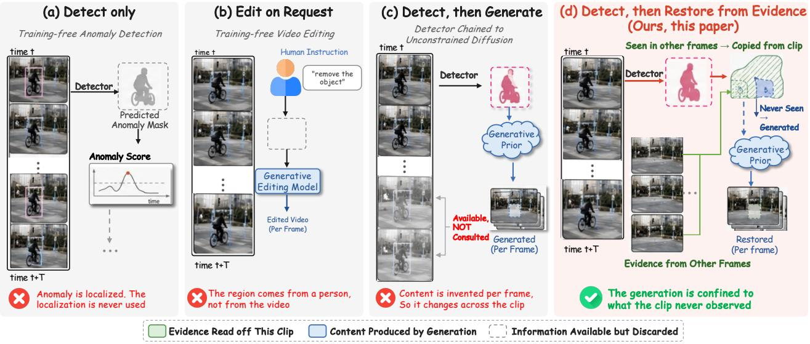  
Figure 1. Comparison with existing paradigms. (a) Detection localizes and stops, (b) editing needs a person to supply the region, and (c) chaining the two fills from a generative prior alone. (d) AVR copies every pixel seen elsewhere and generates only what no frame observed.

• We propose AVR, which turns detected anomalies directly into restored video at inference time, with every component of it a frozen public checkpoint.

• We design an anomaly-aware localization module that gates open-vocabulary proposals by motion evidence, with a fallback that keeps static anomalies detectable.

• We design a conditional restoration module that anchors diffusion to a background prior and selects per clip among classical, prior-anchored and background-conditioned restorers with a single frozen, reference-free verifier.

• Experiments on three surveillance benchmarks and real anomalies validate AVR against trained video inpainters and detect-then-generate pipelines, under both oracle masks and the detected masks AVR itself produces.

## 2. Related Work

Training-Free Video Anomaly Detection. Classical VAD trains reconstruction- or prediction-based models on normal data [1], from autoencoders that learn temporal reg ularity [13] and memory modules that refuse to reconstruct unseen patterns [10] to predictors scored by forecast error [25], and ranks snippets under multiple-instance supervision where only video-level labels exist [37]. Recent work instead reuses frozen foundation models [3, 5]: LAVAD [42] chains a captioner and a large language model to score anomalies without target-dataset training, AnomalyAgent [44] brings agentic reasoning to zero-/few-shot detection beyond video, and SphereVAD [14] performs geodesic inference on hypersphere embeddings, while resource-aware variants target edge deployment [19, 20]. Two recent pipelines push past scoring to pixel-level output, TAO [15] by recasting detection as SAM2 tracking of anomalous objects and LAVIDA [7] by training a SAM-initialized mask decoder on pseudo-anomalies so that no anomaly data is needed. Localization without targetdomain labels is therefore within reach, through a tracker, a trained decoder or frozen checkpoints alone. Every one of these systems stops at finding the anomaly, however, and none of them repairs the footage it has flagged.

Training-Free Video Editing. Video editing has shifted from per-video optimization [41] to tuning-free inference: Text2Video-Zero [16] turns image diffusion models into zero-shot video generators, FateZero [31] and Token-Flow [9] carry attention maps and diffusion features across frames, and AnyV2V [18] generalizes it to broad video-tovideo tasks. All are steered by a prompt or a reference edit, so what to change, and where, still rests with a person.

Video Inpainting. Given a mask, video inpainting fills it coherently across time. Before learned models, region filling copied exemplar patches under a confidence-driven ordering [6], extended to space-time patches so that missing content was borrowed rather than invented [40]. Flowguided propagation now dominates: E2FGVI [22] makes flow completion, feature propagation and content hallucination end-to-end trainable, and ProPainter [45] strengthens propagation with dual-domain features and a maskguided sparse transformer. Diffusion has since reached the same task, either by resampling a frozen denoiser inside the mask [27] or by training for it: DiffuEraser [21] injects a propagated prior into a video diffusion model, FloED [12] adds a flow branch and a flow-attention cache to cut the cost of doing so, and OmnimatteZero [35] removes objects training-free by reusing a pretrained one, at a compute cost that is itself an active concern [36]. Inference-time guidance keeps the weights frozen and instead steers the sampling trajectory, as GradPaint [11] does by backpropagating a coherence loss against the known region at every denoising step. Table 1 places these methods alongside the two families above, where no prior entry both finds its own region and distinguishes the content it puts there: those that produce content receive the region from elsewhere, and those that find a region produce none. AVR does both, deriving its region from motion-gated detection and then dividing that region by evidence rather than filling it uniformly.

Table 1. Comparison of method families along the two inputs a detect-and-restore system requires. Content follows the colour code of Fig. 1: Y pixels copied from other frames of the same clip, # pixels produced by a generative prior rather than observed.
<table><tr><td></td><td>Method</td><td>Region</td><td>Content</td><td>Train</td><td>Temporal model</td></tr><tr><td rowspan="4">Detect</td><td>LAVAD [42]</td><td>Q Detector</td><td></td><td>x</td><td></td></tr><tr><td>SphereVAD [14]</td><td>Q Detector</td><td></td><td>x</td><td></td></tr><tr><td>T2V-Zero [16]</td><td>User</td><td></td><td>x</td><td>Attention</td></tr><tr><td>TokenFlow [9]</td><td>User</td><td></td><td>x</td><td>Feature prop.</td></tr><tr><td rowspan="4">Ilnpant</td><td>E2FGVI [22]</td><td>Given</td><td>田</td><td>√</td><td>Learned prop.</td></tr><tr><td>ProPainter [45]</td><td>Given</td><td>日</td><td>√</td><td>Learned prop.</td></tr><tr><td>DiffuEraser [21]</td><td>Given</td><td>田</td><td>√</td><td>Learned prop.</td></tr><tr><td>OmnimatteZero [35]</td><td>Given</td><td>7</td><td>x</td><td>Layer decomp.</td></tr><tr><td colspan="2">AVR (Ours)</td><td>Q Detector</td><td>→</td><td>x</td><td>Noise + flow blend</td></tr></table>

## 3. Methodology

Problem Formulation. Given a video $X = \{ x _ { 1 } , \ldots , x _ { n } \}$ with frames $x _ { i } \in \mathbb { R } ^ { H \times W \times 3 }$ , we seek a training-free map ping from the observed video to its restored counterpart,

$$
X ^ { \prime } = \mathcal { G } \big ( X , { \mathcal { D } } ( X ) \big ) ,\tag{1}
$$

where the anomaly-aware localization module D outputs a spatio-temporal mask $M \ = \ \{ m _ { 1 } , \ldots , m _ { n } \} , \ m _ { i } \in$ $\{ 0 , \bar { 1 } \} ^ { H \times W }$ , and the conditional restoration module $\mathcal { G }$ replaces the masked content while preserving unmasked pixels. Both reuse frozen pretrained parameters. Two properties shape what $\mathcal { G }$ can be. It must operate without a reference, since at inference the clean video behind the anomaly does not exist, and the region it edits is not homogeneous: writing $U = \{ p \ : \ \exists i , \ m _ { i } ( p ) \ = \ 1 \}$ for the pixels the anomaly ever occupies, part of U is visible in some other frame of the clip and the rest is not:

$$
U _ { \mathrm { { o b s } } } = \{ p \in U : \exists i , m _ { i } ( p ) = 0 \} , \qquad U _ { \mathrm { { g e n } } } = U \setminus U _ { \mathrm { { o b s } } } .\tag{2}
$$

Only $U _ { \mathrm { g e n } }$ has to be invented, since $U _ { \mathrm { o b s } }$ can be recovered from observation. Restorers that propagate across frames exploit part of $U _ { \mathrm { o b s } }$ implicitly, but none makes the split explicit or conditions the choice of restorer on it. The split is the exact boundary of what observation determines.

Proposition 1. Fix the masks, let $U \neq \emptyset ,$ , and let the unmasked observations on U agree with a background that is constant in time, with each channel in $[ 0 , r ]$ . Among all estimators that read only unmasked pixels, the smallest worstcase mean squared error on U, summed over the three channels, equals ${ \scriptstyle \frac { 3 } { 4 } } r ^ { 2 } | U _ { g e n } | / | U | ,$ , and it is attained by copying each pixel of U b from a frame where it is unmasked and returning the midpoint ofthe range on $U _ { g e n }$

Proof. The estimator is exact on $U _ { \mathrm { o b s } } .$ , since every unmasked frame reports the same background there, and on $U _ { \mathrm { g e n } }$ each channel lies in $[ 0 , r ]$ , so the midpoint is off by at most $r / 2$ and the squared error per pixel is at most ${ \scriptstyle { \frac { 3 } { 4 } } } r ^ { 2 }$ . For the lower bound, fix any estimator and let the backgrounds $b ^ { ( 0 ) }$ and $b ^ { ( 1 ) }$ agree with the observation on $U _ { \mathrm { o b s } }$ while taking the values 0 and r on every channel of $U _ { \mathrm { g e n } }$ . Both induce the same observation, so the estimator returns a single $\hat { b }$ for the two, and $t ^ { 2 } + ( t - r ) ^ { 2 } \geq r ^ { 2 } / 2$ gives

$$
\begin{array} { r } { R ( \widehat { b } , b ^ { ( 0 ) } ) + R ( \widehat { b } , b ^ { ( 1 ) } ) \geq \frac { 3 } { 2 } r ^ { 2 } | U _ { \mathrm { g e n } } | / | U | , } \end{array}
$$

so the worse of the two matches the upper bound. Both degenerate cases follow at once, since one of the two sums over U is then empty and the argument is unchanged.

A copy is therefore provably exact on $U _ { \mathrm { o b s } }$ , whereas on $U _ { \mathrm { g e n } }$ a prior is all that remains, and the ratio itself is fixed by the anomaly rather than by any choice of restorer.

Corollary 1. Enlarging the set offrames leaves $| U _ { g e n } | / | U |$ non-increasing, so the bound ofProp. 1 never worsens with a longer clip. Ifan object occludes the same pixels throughout the window, however, the ratio stays at one for every sub-window, and a longer clip changes nothing.

Any frame that leaves a pixel unmasked moves it from $U _ { \mathrm { g e n } }$ to $U _ { \mathrm { o b s } }$ and never back, so the ratio can only fall, whereas an object that is never once uncovered leaves $U _ { \mathrm { o b s } }$ empty for every sub-window of the given clip.

Overview. Fig. 2 shows the workflow. Stage one grounds an anomaly prompt on every frame and keeps only the proposals that motion evidence supports, which turns a detector output into the spatio-temporal mask M. Stage two computes a background prior from the clip itself, fills M from that prior wherever the clip ever exposed the pixel and from diffusion on the remainder that Prop. 1 shows no estimator can recover, blends each restored frame against its flowwarped predecessor, and lets a frozen verifier choose among the candidates. Neither stage fits a parameter to the target scene, so the only quantity that changes from clip to clip is the evidence that is contained in the clip itself.

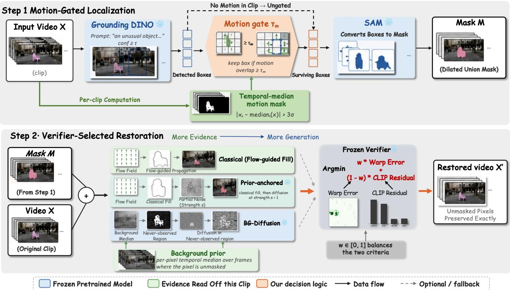  
Figure 2. The AVR pipeline. Step 1 turns a detection into the mask M, keeping open-vocabulary boxes only where motion measured on the clip corroborates them. Step 2 turns M back into video, running three restorers ordered from copying observed pixels to synthesising never-observed ones and letting a frozen verifier pick one per clip. Pixels outside M are untouched, and no component is trained.

Anomaly-Aware Localization. Anomalies are openended by definition, so the detector cannot be a closedset classifier. For each frame $x _ { i } ,$ an open-vocabulary detector (Grounding DINO [24]) grounds a fixed anomaly prompt P and keeps boxes above a confidence threshold τ , $B _ { i } = \{ b : \operatorname { c o n f } ( b ) \geq \tau \}$ . A promptable segmenter (SAM [17]) converts the boxes into pixel masks, whose union, after dilation $\rho _ { \delta } .$ , forms the frame mask

$$
\begin{array} { r } { m _ { i } = \rho _ { \delta } \Big ( \bigcup _ { b \in \mathcal { B } _ { i } } \mathrm { S A M } ( x _ { i } , b ) \Big ) , } \end{array}\tag{3}
$$

with $m _ { i } ~ = ~ \mathbf { 0 }$ when no box survives. Open-vocabulary grounding alone is noisy on surveillance footage, firing on benign scene structure. We therefore gate proposals by motion evidence: a temporal-median background subtraction marks every pixel whose deviation exceeds the frame’s mean deviation by κ standard deviations, and a box is kept only if at least a fraction $\tau _ { m }$ of its area is covered by that motion mask. A clip with no motion evidence anywhere falls back to ungated detection, so gating can shrink a mask but never empty one. Gating keeps the promptable, openworld interface of grounding intact, while discarding each proposal that the video itself does not support.

Background-Conditioned Restoration. The clip itself provides a strong prior for what the occluded background should look like. We form a background image B¯ by taking, at every pixel, the temporal median over the frames where that pixel is not masked. Writing u for the indicator of $U _ { \mathrm { g e n } }$ in Eq. (2), the pixels observed in no frame at all, the restoration composites three sources:

$$
\hat { x } _ { i } = ( 1 - m _ { i } ) \odot x _ { i } + m _ { i } \odot \big [ ( 1 - u ) \odot \bar { B } + u \odot \mathcal { G } _ { \mathrm { d i f f } } ( c _ { i } , u ) \big ] ,\tag{4}
$$

where $c _ { i } = \left( 1 - m _ { i } \right) \odot x _ { i } + m _ { i } \odot \bar { B }$ is the frame with the prior already composited into the mask and $\mathcal { G } _ { \mathrm { d i f f } }$ is a frozen inpainting diffusion model (Stable Diffusion inpainting, built on latent diffusion [34]) run under a neutral background prompt. Every pixel the clip ever exposes is copied from B¯, and open-ended generation is invoked only on the set where, by Prop. 1, no estimator could do better.

Prior-Anchored Refinement. Copying alone fails when the exposed background is only partly observed, and free generation ignores what was observed. A third restorer sits between the extremes: we fill the mask with a flow-guided classical operator in the spirit of exemplar-based completion [6], then run diffusion on that fill at strength $s < 1$ , so sampling starts from a partially noised classical fill rather than pure noise [30]. Diffusion then refines an existing estimate instead of inventing one. DiffuEraser [21] learns the same anchoring, whereas frozen weights leave this one candidate among several rather than the fixed answer.

Table 2. Restoration under oracle masks. $\mathrm { P S N R _ { r e g } }$ is measured inside the anomaly region, bold for best and underlined for second best.
<table><tr><td></td><td colspan="4">CUHK Avenue</td><td colspan="4">UCSD Ped2</td><td colspan="4">ShanghaiTech</td></tr><tr><td>Method</td><td>PSNR↑</td><td> $\mathrm { P S N R } _ { \mathrm { r e g } } \uparrow$ </td><td>LPIPS↓</td><td>FVD↓</td><td>PSNR↑</td><td> $\mathrm { P S N R } _ { \mathrm { r e g } } \uparrow$ </td><td>LPIPS↓</td><td>FVD↓</td><td>PSNR↑</td><td> $\mathrm { P S N R } _ { \mathrm { r e g } } \uparrow$ </td><td>LPIPS↓</td><td>FVD↓</td></tr><tr><td>Classical (Spatial)</td><td>39.76</td><td>18.79</td><td>0.008</td><td>5.86</td><td>48.84</td><td>27.96</td><td>0.004</td><td>2.78</td><td>52.09</td><td>31.22</td><td>0.004</td><td>1.97</td></tr><tr><td>Classical (Flow)</td><td>40.36</td><td>19.50</td><td>0.007</td><td>6.12</td><td>49.31</td><td>28.61</td><td>0.004</td><td>2.51</td><td>51.88</td><td>31.26</td><td>0.004</td><td>2.30</td></tr><tr><td>ProPainter [45]]</td><td>43.73</td><td>25.34</td><td>0.004</td><td>0.64</td><td>50.56</td><td>32.08</td><td>0.004</td><td>0.49</td><td>53.88</td><td>35.21</td><td>0.003</td><td>0.64</td></tr><tr><td>E2FGVI [22]</td><td>45.97</td><td>27.34</td><td>0.004</td><td>0.57</td><td>51.90</td><td>33.33</td><td>0.004</td><td>0.53</td><td>55.26</td><td>36.41</td><td>0.004</td><td>0.67</td></tr><tr><td>FloED [12]</td><td>45.39</td><td>26.19</td><td>0.005</td><td>0.77</td><td>51.00</td><td>32.47</td><td>0.004</td><td>0.51</td><td>54.35</td><td>35.95</td><td>0.004</td><td>0.76</td></tr><tr><td>DiffuEraser [21]</td><td>31.98</td><td>12.40</td><td>0.037</td><td>8.98</td><td>34.28</td><td>14.01</td><td>0.056</td><td>15.64</td><td>36.22</td><td>16.91</td><td>0.084</td><td>20.22</td></tr><tr><td>OmnimatteZero [35]</td><td>31.74</td><td>11.31</td><td>0.038</td><td>12.18</td><td>32.24</td><td>12.13</td><td>0.050</td><td>15.95</td><td>35.23</td><td>15.72</td><td>0.051</td><td>18.62</td></tr><tr><td>AVR (Ours)</td><td>47.27</td><td>27.17</td><td>0.004</td><td>0.55</td><td>52.63</td><td>32.61</td><td>0.003</td><td>0.45</td><td>56.98</td><td>37.83</td><td>0.002</td><td>0.56</td></tr></table>

Verifier-Guided Selection. No single restorer wins on every clip: the classical operator is safest under clean motion, the background prior when the scene is mostly static, and diffusion where no observation exists. Rather than fixing this choice at design time, we run all three candidates and let a frozen verifier pick one per clip. We refer to the three as Classical (the flow-guided fill alone), Prioranchored (that fill refined by diffusion) and BG-diffusion (the background-conditioned fill of Eq. (4)). The verifier is reference-free, selecting over the pool with two noreference signals scored inside the mask:

$$
k ^ { \star } = \arg \operatorname* { m i n } _ { k } \ w \widetilde { E } _ { \mathrm { w a r p } } ^ { ( k ) } + ( 1 - w ) \widetilde { R } _ { \mathrm { C L I P } } ^ { ( k ) } ,\tag{5}
$$

where k indexes the pool, $w \in [ 0 , 1 ]$ balances flow warping error against the mean CLIP [32] anomaly residual inside the mask, and e· denotes min–max normalization across the pool. The cost is paid at inference rather than in training [28], and neither the candidates nor the verifier has any parameter that is fitted on the target data at any stage.

Temporal Consistency. Restoring each frame on its own leaves the mask free to change content between neighbours, which reads as flicker. Two mechanisms enforce coherence. First, all frames share a common diffusion noise seed, a lightweight analogue of the correlated noise used in zeroshot video generation [16]. Second, each restored frame is blended, inside the mask, with its predecessor warped forward by dense optical flow $\mathcal { W } _ { i - 1 \to i }$ (Farneback):¨

$$
x _ { i } ^ { \prime } = m _ { i } \odot [ \lambda \hat { x } _ { i } + ( 1 - \lambda ) \mathcal { W } _ { i - 1  i } ( x _ { i - 1 } ^ { \prime } ) ] + ( 1 - m _ { i } ) \odot x _ { i } ,\tag{6}
$$

for $i \geq 2 ,$ , with $x _ { 1 } ^ { \prime } = \hat { x } _ { 1 }$ . The blend weight λ trades spatial fidelity to the current restoration against temporal fidelity to the propagated history, and setting $\lambda { = } 1$ removes the blend altogether and restores every frame independently.

## 4. Experiments and Results

Implementation Details. We adopt public checkpoints throughout and keep every one of them frozen. Localization runs Grounding DINO-tiny [24] under the fixed prompt “an unusual object. an anomaly. aforeign object.” followed by SAM ViT-B [17] or SAM2-hiera-large [33], and restoration runs Stable Diffusion v1.5 inpainting [34] at $5 1 2 ^ { 2 }$ with 25 denoising steps and guidance 7.5. A single Farneback¨ estimator [8] supplies all optical flow, serving the temporal blend, the warping error and the flow-guided fill alike, while the verifier scores candidates with CLIP ViT-B/32 [32]. We fix $\tau = 0 . 2 5 , ~ \tau _ { m } = 0 . 3 5 , ~ \kappa = 3 , ~ s = 0 . 7 , ~ w = 0 . 5$ and $\lambda { = } 0 . 5 ,$ dilate masks by δ=5 pixels after detection and 7 before inpainting, and implement everything in PyTorch on two NVIDIA RTX A5500 GPUs each with 24 GB of memory.

Benchmarks and Metrics. Real anomalies come with no clean reference, so we build anomaly-injection benchmarks from the normal portions of CUHK Avenue [26], UCSD Ped2 [29] and ShanghaiTech [25], each holding 60 non-overlapping clips (16 frames, $2 5 6 ^ { 2 } )$ split evenly over a static object, a moving object and a local appearance flicker, with the pre-injection clip as reference. Fidelity: full-frame PSNR, SSIM and LPIPS [43], plus $\mathrm { P S N R _ { r e g } }$ inside the ground-truth region, which covers only ∼0.5–1.2% of the frame. Temporal behaviour, which framewise fidelity misses [38]: tLP, Farneback warping error, and FVD [¨ 39] on R3D-18 Kinetics features, shared by every FVD number here and so not comparable to published I3D values. Anomaly removal: Mask IoU, and residual drop (RD), which uses no text prompt and no cropping. Each video supplies its own temporal-median reference, both it and every frame are cut into a 4×4 grid and embedded with frozen CLIP ViT-B/32 [32], and a cell scores one minus the cosine similarity. With a(V ) the mean of that map inside the region, RD is the relative reduction $\big ( a ( X ) - a ( X ^ { \prime } ) \big ) / a ( X )$ Rescoring with DINO preserves every ranking and sign, so RD does not rest on the verifier’s backbone. We also run 20 anomalous ShanghaiTech test clips, which injection cannot cover, under the no-reference measures alone.

Table 3. End-to-end comparison. The base row chains a per-frame detector with unconstrained inpainting, while ProPainter, E2FGVI and FloED restore the same motion-gated masks as AVR, hence identical Mask IoU. Best per column in bold, second best underlined.
<table><tr><td>Benchmark</td><td>Method</td><td>PSNR↑</td><td> $\mathrm { P S N R } _ { \mathrm { r e g } } \uparrow$ </td><td>SSIM↑</td><td>LPIPS↓</td><td>tLP↓</td><td>FVD↓</td><td>Warp↓</td><td>RD↑</td><td>IoU↑</td></tr><tr><td rowspan="6">CUHK Avenue</td><td>Grounded-SD (base)</td><td>29.00</td><td>15.78</td><td>0.972</td><td>0.048</td><td>0.036</td><td>46.13</td><td>1.93</td><td>-1.202</td><td>0.097</td></tr><tr><td>ProPainter (SAM2 masks)</td><td>28.63</td><td>13.38</td><td>0.974</td><td>0.057</td><td>0.017</td><td>51.32</td><td>1.18</td><td>-0.117</td><td>0.095</td></tr><tr><td>ProPainter (gated masks)</td><td>32.52</td><td>14.63</td><td>0.986</td><td>0.035</td><td>0.012</td><td>28.33</td><td>1.09</td><td>-0.201</td><td>0.205</td></tr><tr><td>E2FGVI (gated masks)</td><td>33.34</td><td>15.05</td><td>0.987</td><td>0.033</td><td>0.014</td><td>28.16</td><td>1.13</td><td>-0.238</td><td>0.205</td></tr><tr><td>FloED (gated masks)</td><td>32.72</td><td>14.89</td><td>0.986</td><td>0.038</td><td>0.016</td><td>29.97</td><td>1.15</td><td>-0.271</td><td>0.205</td></tr><tr><td>AVR (Ours)</td><td>33.79</td><td>15.00</td><td>0.988</td><td>0.031</td><td>0.013</td><td>27.07</td><td>1.10</td><td>+0.123</td><td>0.205</td></tr><tr><td rowspan="6">UCSD Ped2</td><td>Grounded-SD (base)</td><td>33.25</td><td>21.53</td><td>0.984</td><td>0.022</td><td>0.043</td><td>22.38</td><td>1.64</td><td>-6.796</td><td>0.288</td></tr><tr><td>ProPainter (SAM2 masks)</td><td>36.54</td><td>21.60</td><td>0.960</td><td>0.075</td><td>0.025</td><td>30.80</td><td>1.14</td><td>-1.256</td><td>0.299</td></tr><tr><td>ProPainter (gated masks)</td><td>41.80</td><td>25.45</td><td>0.995</td><td>0.015</td><td>0.020</td><td>6.04</td><td>1.04</td><td>-0.685</td><td>0.375</td></tr><tr><td>E2FGVI (gated masks)</td><td>43.52</td><td>26.73</td><td>0.995</td><td>0.016</td><td>0.023</td><td>6.70</td><td>1.08</td><td>-0.763</td><td>0.375</td></tr><tr><td>FloED (gated masks)</td><td>41.96</td><td>25.81</td><td>0.995</td><td>0.018</td><td>0.026</td><td>6.34</td><td>1.11</td><td>-0.806</td><td>0.375</td></tr><tr><td>AVR (Ours)</td><td>44.00</td><td>25.89</td><td>0.996</td><td>0.013</td><td>0.021</td><td>5.86</td><td>1.03</td><td>-0.970</td><td>0.375</td></tr><tr><td rowspan="6">ShanghaiTech</td><td>Grounded-SD (base)</td><td>22.23</td><td>19.32</td><td>0.715</td><td>0.381</td><td>0.401</td><td>134.09</td><td>23.36</td><td>-14.383</td><td>0.119</td></tr><tr><td>ProPainter (SAM2 masks)</td><td>25.50</td><td>16.48</td><td>0.831</td><td>0.320</td><td>0.031</td><td>104.61</td><td>2.17</td><td>-0.648</td><td>0.135</td></tr><tr><td>ProPainter (gated masks)</td><td>38.53</td><td>20.88</td><td>0.993</td><td>0.036</td><td>0.013</td><td>17.14</td><td>0.47</td><td>-0.271</td><td>0.343</td></tr><tr><td>E2FGVI (gated masks)</td><td>39.06</td><td>21.94</td><td>0.993</td><td>0.037</td><td>0.015</td><td>18.26</td><td>0.51</td><td>-0.122</td><td>0.343</td></tr><tr><td>FloED (gated masks)</td><td>38.62</td><td>21.70</td><td>0.993</td><td>0.040</td><td>0.016</td><td>18.41</td><td>0.49</td><td>-0.297</td><td>0.343</td></tr><tr><td>AVR (Ours)</td><td>40.08</td><td>22.91</td><td>0.994</td><td>0.036</td><td>0.013</td><td>17.37</td><td>0.47</td><td>+0.255</td><td>0.343</td></tr></table>

Restoration Quality. Table 2 compares restorers under oracle masks, so the trained inpainters ProPainter, E2FGVI and FloED [12] differ from AVR only in how they fill the hole. AVR attains the best full-frame PSNR and FVD on all three benchmarks, and inside the region it leads on ShanghaiTech and stays within a decibel of the strongest trained inpainter elsewhere. Anchoring the fill to the clip’s own observed background therefore matches dedicated training on the pixels it edits. DiffuEraser and OmnimatteZero trail on every metric, exhibiting exactly the content hallucination that this evaluation protocol is built to expose.

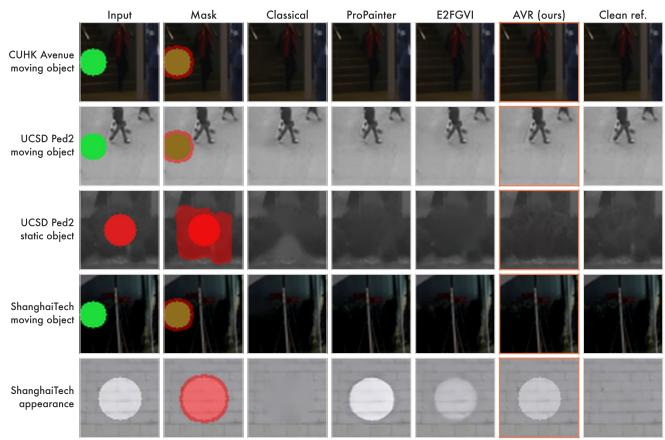  
Figure 3. End-to-end restoration under detected masks. All restorers share the same motion-gated masks, one median clip per row.

End-to-End Comparison. Table 3 evaluates the full pipeline with detection included, and Fig. 3 shows the same masks and restorers clip by clip. AVR gains 17.9 dB over the Grounded-Stable-Diffusion (Grounded-SD) base on ShanghaiTech, turns the residual drop positive, and leads ProPainter, E2FGVI and FloED on PSNR and SSIM on every benchmark while alone producing the masks it is scored on. The two ProPainter rows attribute that gain, since motion-gated masks by themselves lift its ShanghaiTech PSNR by 13 dB. Restoration quality therefore follows the evidence that a given mask exposes rather than the raw capacity of whichever restorer happens to fill it.

Table 4. Ablation study. The SAM2 rows predate the background prior, so their pool holds two restorers instead of three. Bold: the best result, and underlined: the second best.
<table><tr><td></td><td></td><td colspan="2">CUHK Avenue</td><td colspan="2">UCSD Ped2</td><td colspan="2">ShanghaiTech</td></tr><tr><td>Detector</td><td>Restorer</td><td>PSNR↑</td><td>RD↑</td><td>PSNR↑</td><td>RD↑</td><td>PSNR↑</td><td>RD↑</td></tr><tr><td>SAM2</td><td>Prior-anchored</td><td>27.84</td><td>-0.255</td><td>34.86</td><td>-2.550</td><td>23.90</td><td>-1.413</td></tr><tr><td>SAM2</td><td>Selection (2 cand.)</td><td>28.59</td><td>-0.071</td><td>37.25</td><td>-1.220</td><td>24.79</td><td>-0.870</td></tr><tr><td></td><td>Motion-gated BG-diffusion</td><td>33.19</td><td>+0.145</td><td>43.23</td><td>-4.282</td><td>39.74</td><td>-0.072</td></tr><tr><td>Motion-gated</td><td>Selection (3 cand.)</td><td>33.79</td><td>+0.123</td><td>44.00</td><td>-0.970</td><td>40.08</td><td>+0.255</td></tr></table>

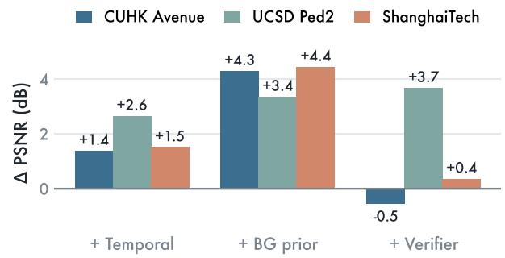  
Figure 4. PSNR that each mechanism adds to the preceding stage under oracle masks, from per-frame diffusion onward.

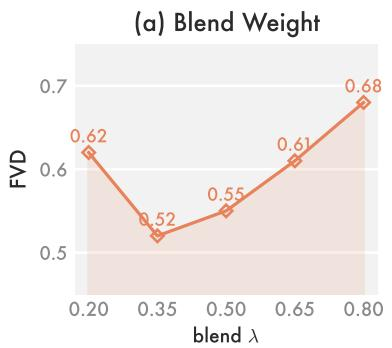

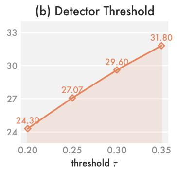

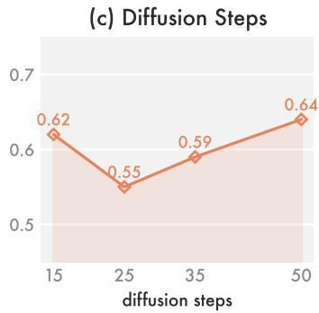  
Figure 5. FVD sensitivity on Avenue to blend λ, detector threshold τ and diffusion steps. Panel (b) is measured end to end while (a) and (c) use oracle masks, which puts its FVD an order of magnitude higher.

Ablations. Table 4 traces the end-to-end gains to their two sources. Motion gating carries fidelity, raising PSNR by 5.2–15.3 dB over the SAM2 detector, while verifier selection acts on removal, turning ShanghaiTech RD positive at nearly unchanged PSNR. The two are therefore complementary rather than redundant. Under oracle masks, Fig. 4 separates the restorer’s stages, and the background prior is the largest contributor on every benchmark.

Detector and Hyperparameters. Table 5 varies the detector with the restorer held fixed, including TAO [15], which tracks anomalous objects into a mask. Motion gating leads every alternative on every metric on both benchmarks, so demanding independent motion evidence behind each semantic proposal beats open-vocabulary grounding and tracking alike. Fig. 5 sweeps λ, τ and the diffusion steps, where FVD is minimized near λ ≈ 0.35 while the τ trend reverses across the three benchmarks, so we keep one shared setting across every run and benchmark.

Table 5. Detector study with the restoration module held fixed at BG-diffusion. Best per column in bold, second best underlined.
<table><tr><td></td><td colspan="4">CUHK Avenue</td><td colspan="4">ShanghaiTech</td></tr><tr><td>Detector</td><td>PSNR↑</td><td>LPIPS↓</td><td>FVD↓</td><td>IoU↑</td><td>PSNR↑</td><td>LPIPS↓</td><td>FVD↓</td><td>IoU↑</td></tr><tr><td>Heuristic</td><td>31.07</td><td>0.035</td><td>20.67</td><td>0.177</td><td>32.86</td><td>0.058</td><td>34.63</td><td>0.334</td></tr><tr><td>Grounded-SAM</td><td>30.60</td><td>0.045</td><td>24.79</td><td>0.097</td><td>29.15</td><td>0.251</td><td>95.35</td><td>0.119</td></tr><tr><td>Grounded-SAM2</td><td>30.14</td><td>0.050</td><td>45.36</td><td>0.095</td><td>26.84</td><td>0.326</td><td>121.62</td><td>0.128</td></tr><tr><td>TAO [15]</td><td>32.12</td><td>0.038</td><td>23.78</td><td>0.117</td><td>35.59</td><td>0.103</td><td>25.23</td><td>0.257</td></tr><tr><td>Motion-gated (ours)</td><td>33.19</td><td>0.032</td><td>20.17</td><td>0.205</td><td>39.74</td><td>0.047</td><td>20.47</td><td>0.343</td></tr></table>

Selection Analysis. Fig. 6 shows how the verifier distributes its choices, and the split tracks mask quality rather than dataset. Under oracle masks it picks Classical or Prior-anchored on 35–56% of clips, while under detected masks, which may cover clean background, it retreats to BG-diffusion on 87–93%. The pool is therefore not redundant, and the verifier turns conservative exactly when localization is unreliable. Against a per-clip oracle it recovers most of the remaining headroom on Ped2, where it beats every fixed candidate, and a smaller share on ShanghaiTech, while on Avenue one candidate dominates nearly every clip and leaves little to select. The last row of Fig. 3 shows the residual failure mode, where the classical candidate clears an appearance change that the verifier declines.

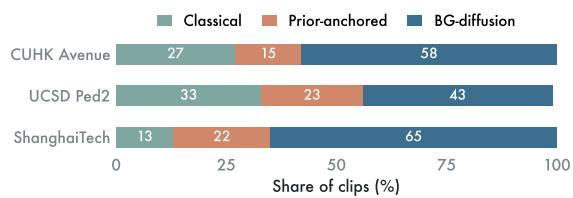  
Figure 6. Restorer chosen by the frozen verifier, as a share of the 60 oracle-mask clips available in each benchmark.

Efficiency. Table 6 reports inference cost per 16-frame clip and per frame, with the pipeline split into stages and totals under the same masks. The two diffusion candidates dominate, the verifier adds under four seconds, and AVR runs at roughly 2.4 times its single-restorer variant, while ProPainter is about eight times faster. This is the price of selection, paid at inference rather than training.

Table 6. Inference cost on CUHK Avenue per 16-frame clip on an RTX A5500, under the same motion-gated masks. Clip medians, warm-up excluded, peak memory in GB.
<table><tr><td></td><td>Sec/clip</td><td>Sec/frame</td><td>Peak mem.</td></tr><tr><td>Detection (Grounding DINO + SAM)</td><td>6.81</td><td>0.43</td><td rowspan="6">9.2</td></tr><tr><td>Motion gate</td><td>0.05</td><td>&lt;0.01</td></tr><tr><td>Classical</td><td>0.21</td><td>0.01</td></tr><tr><td>Prior-anchored</td><td>19.11</td><td>1.19</td></tr><tr><td>BG-diffusion</td><td>20.74</td><td>1.30</td></tr><tr><td>Verifier</td><td>3.72</td><td>0.23</td></tr><tr><td>Grounded-SD (base)</td><td>25.48</td><td>1.59</td><td>4.6</td></tr><tr><td>ProPainter (gated masks)</td><td>7.54</td><td>0.47</td><td>2.7</td></tr><tr><td>AVR (single restorer)</td><td>25.84</td><td>1.62</td><td>4.6</td></tr><tr><td>AVR (full)</td><td>62.52</td><td>3.91</td><td>9.2</td></tr></table>

Table 7. 20 real ShanghaiTech test anomalies, evaluated without a reference. Flicker is measured inside each pipeline’s own detected region, and “impr.” counts clips whose flicker decreased.
<table><tr><td></td><td colspan="2">Flicker↓</td><td colspan="2">Warp Err.↓</td><td colspan="2"></td></tr><tr><td>Pipeline</td><td>before</td><td>after</td><td>before</td><td>after</td><td>RD↑</td><td>impr.</td></tr><tr><td>Grounded-SD (base)</td><td>12.77</td><td>27.71</td><td>0.95</td><td>3.22</td><td>-0.513</td><td>7/20</td></tr><tr><td>AVR (Ours)</td><td>21.12</td><td>3.32</td><td>0.95</td><td>0.84</td><td>+0.721</td><td>20/20</td></tr></table>

Real Anomalies. Table 7 leaves the injection protocol entirely. On 20 genuine ShanghaiTech anomalies AVR cuts flicker in the removed region more than six-fold, brings warping error below the input video’s own, and reaches a positive residual drop, while the base degrades on all three counts. An evidence-anchored fill therefore generalizes to anomalies the protocol never synthesized. Re-running the detector over the restored clips agrees, with the fraction of frames still firing dropping from 1.00 to 0.42.

Failure Analysis. Fig. 7 splits RD by anomaly type and locates every negative number in the paper. Moving objects and local appearance changes are removed cleanly on all benchmarks, while static objects are negative everywhere. The cause is structural: a static object occludes the same pixels in every frame, so $U _ { \mathrm { g e n } }$ grows to fill U in Eq. (2) and Eq. (4) degenerates to unconstrained generation, which is Prop. 1 at $| U _ { \mathrm { g e n } } | / | U | = 1$ . Detection shows the same asymmetry, since most clips with no surviving proposal are static objects, which supply neither the motion evidence that admits them nor the observations to repair them.

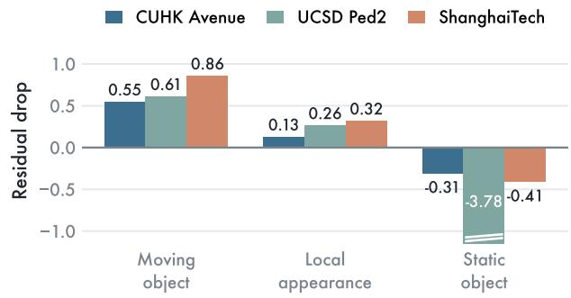  
Figure 7. Residual drop by anomaly type, end to end on all three benchmarks, with the axis truncated at −1.15.

Case Study. Fig. 8 places AVR beside ProPainter on identical detected masks with a clean reference. A moving object exposes its background in other frames and the prior recovers it outright, an appearance change is only partly reversed by either restorer, and a static object by neither, since half of it falls outside the mask and none is ever uncovered. Fig. 9 turns to real anomalies, where per-frame diffusion removes a cyclist but invents a pedestrian in one frame and a potted plant twelve later, while AVR keeps the walkway stable. Each hallucination is locally plausible, the failure full-frame metrics miss and region scoring catches.

Input  
Mask  
ProPainter  
AVR (Ours)  
Clean ref.  
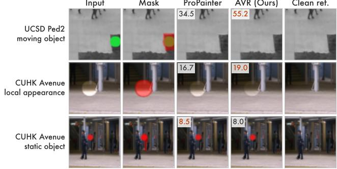  
Figure 8. Case study on injected anomalies, with ProPainter and AVR restoring identical detected masks. Numbers give the region PSNR in decibels obtained on that one particular clip.  
Input (real anomaly)  
Per-frame diffusion  
AVR (ours)

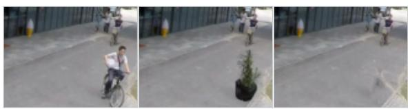

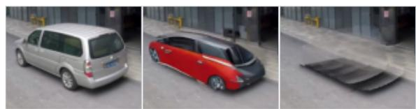

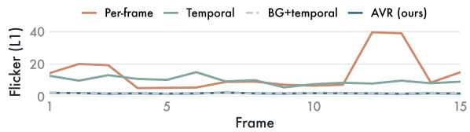  
Figure 9. Real anomalies under detected masks. Rows 1–2 show a cyclist with its flicker curve, and row 3 a parked car.

## 5. Conclusion

This paper proposes AVR, a training-free framework that couples anomaly detection to restoration and generates content only where the clip offers no evidence to copy. A localization module gates open-vocabulary proposals by motion evidence, and a restoration module fills the mask from a background prior, leaving a frozen verifier to decide how much remains to be generated. Extensive results on three surveillance benchmarks and on real anomalies demonstrate both the effectiveness and the superiority of AVR.

## References

[1] Moshira Abdalla, Sajid Javed, Muaz Al Radi, Anwaar Ulhaq, and Naoufel Werghi. Video anomaly detection in 10 years: A survey and outlook. Neural Computing and Applications, 37(32):26321–26364, 2025. 1, 2

[2] Shengchao Chen, Ting Shu, Huan Zhao, Qilin Wan, Jincan Huang, and Cailing Li. Dynamic multiscale fusion generative adversarial network for radar image extrapolation. IEEE Transactions on Geoscience and Remote Sensing, 60:1–11, 2022. 1

[3] Shengchao Chen, Guodong Long, Tao Shen, and Jing Jiang. Prompt federated learning for weather forecasting: Toward foundation models on meteorological data. arXiv preprint arXiv:2301.09152, 2023. 2

[4] Shengchao Chen, Ting Shu, Huan Zhao, Guo Zhong, and Xunlai Chen. Tempee: Temporal–spatial parallel transformer for radar echo extrapolation beyond autoregression. IEEE Transactions on Geoscience and Remote Sensing, 61: 1–14, 2023. 1

[5] Shengchao Chen, Guodong Long, Michael Blumenstein, and Jing Jiang. Fedal: Federated dataset learning for general time series foundation models. In International Conference on Learning Representations, pages 98850–98885, 2026. 2

[6] Antonio Criminisi, Patrick Perez, and Kentaro Toyama. Re-´ gion filling and object removal by exemplar-based image inpainting. IEEE Transactions on Image Processing, 13(9): 1200–1212, 2004. 2, 4

[7] Zunkai Dai, Ke Li, Jiajia Liu, Jie Yang, and Yuanyuan Qiao. No need for real anomaly: MLLM empowered zero-shot video anomaly detection. arXiv preprint arXiv:2602.19248, 2026. 1, 2

[8] Gunnar Farneback. Two-frame motion estimation based on¨ polynomial expansion. In Image Analysis, Scandinavian Conference on Image Analysis, pages 363–370. Springer, 2003. 5

[9] Michal Geyer, Omer Bar Tal, Shai Bagon, and Tali Dekel. TokenFlow: Consistent diffusion features for consistent video editing. In International Conference on Learning Representations, pages 1608–1620, 2024. 2, 3

[10] Dong Gong, Lingqiao Liu, Vuong Le, Budhaditya Saha, Moussa Reda Mansour, Svetha Venkatesh, and Anton van den Hengel. Memorizing normality to detect anomaly: Memory-augmented deep autoencoder for unsupervised anomaly detection. In Proceedings of the IEEE/CVF International Conference on Computer Vision, pages 1705–1714, 2019. 2

[11] Asya Grechka, Guillaume Couairon, and Matthieu Cord. GradPaint: Gradient-guided inpainting with diffusion models. Computer Vision and Image Understanding, 240: 103928, 2024. 3

[12] Bohai Gu, Hao Luo, Song Guo, Peiran Dong, and Qihua Zhou. Coherent video inpainting using optical flow-guided

efficient diffusion. arXiv preprint arXiv:2412.00857, 2024. 3, 5, 6

[13] Mahmudul Hasan, Jonghyun Choi, Jan Neumann, Amit K. Roy-Chowdhury, and Larry S. Davis. Learning temporal regularity in video sequences. In Proceedings ofthe IEEE Con ference on Computer Vision and Pattern Recognition, pages 733–742, 2016. 2

[14] Chao Huang, Penfei Wei, Wei Wang, Jie Wen, Zhihua Wang, Li Shen, Wenqi Ren, and Xiaochun Cao. SphereVAD: Training-free video anomaly detection via geodesic inference on the unit hypersphere. arXiv preprint arXiv:2605.08003, 2026. 1, 2, 3

[15] Yuzhi Huang, Chenxin Li, Haitao Zhang, Zixu Lin, Yunlong Lin, Hengyu Liu, Wuyang Li, Xinyu Liu, Jiechao Gao, Yue Huang, Xinghao Ding, and Yixuan Yuan. Track any anomalous object: A granular video anomaly detection pipeline. In Proceedings of the IEEE/CVF Conference on Computer Vision and Pattern Recognition, pages 8689–8699, 2025. 1, 2, 7

[16] Levon Khachatryan, Andranik Movsisyan, Vahram Tadevosyan, Roberto Henschel, Zhangyang Wang, Shant Navasardyan, and Humphrey Shi. Text2Video-Zero: Textto-image diffusion models are zero-shot video generators. In Proceedings of the IEEE/CVF International Conference on Computer Vision, pages 15908–15918, 2023. 1, 2, 3, 5

[17] Alexander Kirillov, Eric Mintun, Nikhila Ravi, Hanzi Mao, Chloe Rolland, Laura Gustafson, Tete Xiao, Spencer White head, Alexander C. Berg, Wan-Yen Lo, Piotr Dollar, and´ Ross Girshick. Segment anything. In Proceedings of the IEEE/CVF International Conference on Computer Vision, pages 3992–4003, 2023. 4, 5

[18] Max Ku, Cong Wei, Weiming Ren, Harry Yang, and Wenhu Chen. AnyV2V: A tuning-free framework for any videoto-video editing tasks. Transactions on Machine Learning Research, 2024. 2

[19] Hoangcong Le, Cheng-Kai Lu, and Chen-Chien Hsu. Video anomaly detection for edge-based IoT systems: A survey of input modalities and real-time applications. Intelligent Systems with Applications, page 200635, 2026. 1, 2

[20] Guo Li, Jiandian Zeng, Yang Li, Zihao Peng, Ke Chen, and Tian Wang. MemoVAD: Resource-efficient video anomaly detection via dynamic semantic memory in edge computing scenarios. arXiv preprint arXiv:2606.07669, 2026. 2

[21] Xiaowen Li, Haolan Xue, Peiran Ren, and Liefeng Bo. DiffuEraser: A diffusion model for video inpainting. arXiv preprint arXiv:2501.10018, 2025. 1, 3, 4, 5

[22] Zhen Li, Cheng-Ze Lu, Jianhua Qin, Chun-Le Guo, and Ming-Ming Cheng. Towards an end-to-end framework for flow-guided video inpainting. In Proceedings of the IEEE/CVF Conference on Computer Vision and Pattern Recognition, pages 17541–17550, 2022. 1, 2, 3, 5

[23] Jing Liu, Yang Liu, Jieyu Lin, Jielin Li, Liang Cao, Peng Sun, Bo Hu, Liang Song, Azzedine Boukerche, and Victor C. M. Leung. Networking systems for video anomaly detection: A tutorial and survey. ACM Computing Surveys, 57 (10):1–37, 2025. 1

[24] Shilong Liu, Zhaoyang Zeng, Tianhe Ren, Feng Li, Hao Zhang, Jie Yang, Chunyuan Li, Jianwei Yang, Hang Su, Jun

Zhu, and Lei Zhang. Grounding DINO: Marrying DINO with grounded pre-training for open-set object detection. In Proceedings of the European Conference on Computer Vision, pages 38–55, 2024. 4, 5

[25] Wen Liu, Weixin Luo, Dongze Lian, and Shenghua Gao. Future frame prediction for anomaly detection — a new baseline. In Proceedings of the IEEE/CVF Conference on Computer Vision and Pattern Recognition, pages 6536–6545, 2018. 2, 5

[26] Cewu Lu, Jianping Shi, and Jiaya Jia. Abnormal event detection at 150 fps in MATLAB. In Proceedings of the IEEE International Conference on Computer Vision, pages 2720– 2727, 2013. 5

[27] Andreas Lugmayr, Martin Danelljan, Andres Romero, Fisher Yu, Radu Timofte, and Luc Van Gool. RePaint: Inpainting using denoising diffusion probabilistic models. In Proceedings of the IEEE/CVF Conference on Computer Vision and Pattern Recognition, pages 11451–11461, 2022. 3

[28] Nanye Ma, Shangyuan Tong, Haolin Jia, Hexiang Hu, Yu-Chuan Su, Mingda Zhang, Xuan Yang, Yandong Li, Tommi Jaakkola, Xuhui Jia, and Saining Xie. Inference-time scaling for diffusion models beyond scaling denoising steps. arXiv preprint arXiv:2501.09732, 2025. 5

[29] Vijay Mahadevan, Weixin Li, Viral Bhalodia, and Nuno Vasconcelos. Anomaly detection in crowded scenes. In Proceedings of the IEEE Conference on Computer Vision and Pattern Recognition, pages 1975–1981, 2010. 5

[30] Chenlin Meng, Yutong He, Yang Song, Jiaming Song, Jiajun Wu, Jun-Yan Zhu, and Stefano Ermon. SDEdit: Guided image synthesis and editing with stochastic differential equations. In Proceedings of the International Conference on Learning Representations, 2022. 4

[31] Chenyang Qi, Xiaodong Cun, Yong Zhang, Chenyang Lei, Xintao Wang, Ying Shan, and Qifeng Chen. FateZero: Fusing attentions for zero-shot text-based video editing. In Proceedings of the IEEE/CVF International Conference on Computer Vision, pages 15886–15896, 2023. 2

[32] Alec Radford, Jong Wook Kim, Chris Hallacy, Aditya Ramesh, Gabriel Goh, Sandhini Agarwal, Girish Sastry, Amanda Askell, Pamela Mishkin, Jack Clark, Gretchen Krueger, and Ilya Sutskever. Learning transferable visual models from natural language supervision. In Proceedings ofthe International Conference on Machine Learning, pages 8748–8763, 2021. 5

[33] Nikhila Ravi, Valentin Gabeur, Yuan-Ting Hu, Ronghang Hu, Chaitanya Ryali, Tengyu Ma, Haitham Khedr, Roman Radle, Chloe Rolland, Laura Gustafson, Eric Mintun, Junt-¨ ing Pan, Kalyan Vasudev Alwala, Nicolas Carion, Chao-Yuan Wu, Ross Girshick, Piotr Dollar, and Christoph Feicht-´ enhofer. SAM 2: Segment anything in images and videos. In International Conference on Learning Representations, pages 28085–28128, 2025. 5

[34] Robin Rombach, Andreas Blattmann, Dominik Lorenz, Patrick Esser, and Bjorn Ommer. High-resolution image¨ synthesis with latent diffusion models. In Proceedings of the IEEE/CVF Conference on Computer Vision and Pattern Recognition, pages 10674–10685, 2022. 4, 5

[35] Dvir Samuel, Matan Levy, Nir Darshan, Gal Chechik, and Rami Ben-Ari. OmnimatteZero: Fast training-free omnimatte with pre-trained video diffusion models. In Proceed ings of the SIGGRAPH Asia 2025 Conference Papers, pages 1–11, 2025. 3, 5

[36] Shitong Shao, Lichen Bai, Pengfei Wan, James Kwok, and Zeke Xie. Efficient video diffusion models: Advancements and challenges. arXiv preprint arXiv:2604.15911, 2026. 3

[37] Waqas Sultani, Chen Chen, and Mubarak Shah. Real-world anomaly detection in surveillance videos. In Proceedings of the IEEE Conference on Computer Vision and Pattern Recognition, pages 6479–6488, 2018. 2

[38] Ryan Szeto and Jason J. Corso. The DEVIL is in the details: A diagnostic evaluation benchmark for video inpainting. In Proceedings of the IEEE/CVF Conference on Computer Vi sion and Pattern Recognition, pages 21022–21031, 2022. 5

[39] Thomas Unterthiner, Sjoerd Van Steenkiste, Karol Kurach, Raphael Marinier, Marcin Michalski, and Sylvain Gelly. To wards accurate generative models of video: A new metric & challenges. arXiv preprint arXiv:1812.01717, 2018. 5

[40] Yonatan Wexler, Eli Shechtman, and Michal Irani. Spacetime completion of video. IEEE Transactions on Pattern Analysis and Machine Intelligence, 29(3):463–476, 2007. 2

[41] Jay Zhangjie Wu, Yixiao Ge, Xintao Wang, Stan Weixian Lei, Yuchao Gu, Yufei Shi, Wynne Hsu, Ying Shan, Xiaohu Qie, and Mike Zheng Shou. Tune-A-Video: One-shot tuning of image diffusion models for text-to-video generation. In Proceedings of the IEEE/CVF International Conference on Computer Vision, pages 7589–7599, 2023. 1, 2

[42] Luca Zanella, Willi Menapace, Massimiliano Mancini, Yim ing Wang, and Elisa Ricci. Harnessing large language models for training-free video anomaly detection. In Proceedings of the IEEE/CVF Conference on Computer Vision and Pat tern Recognition, pages 18527–18536, 2024. 1, 2, 3

[43] Richard Zhang, Phillip Isola, Alexei A. Efros, Eli Shechtman, and Oliver Wang. The unreasonable effectiveness of deep features as a perceptual metric. In Proceedings of the IEEE/CVF Conference on Computer Vision and Pattern Recognition, pages 586–595, 2018. 5

[44] Yi Zhang, Jiawen Zhu, Lele Fu, and Guansong Pang. AnomalyAgent: Training-free agentic models for zero-/fewshot anomaly detection. arXiv preprint arXiv:2605.30140, 2026. 1, 2

[45] Shangchen Zhou, Chongyi Li, Kelvin C. K. Chan, and Chen Change Loy. ProPainter: Improving propagation and transformer for video inpainting. In Proceedings of the IEEE/CVF International Conference on Computer Vision, pages 10477–10486, 2023. 1, 2, 3, 5