# FIVE-VLA: Fast and EffectIVE Autonomous Driving with Recurrent Action Memory

Kemal Oksuz1,2, Alexandru Buburuzan¹,2, Yuhan Yao¹, Puneet K. Dokania1,2\* 1Robert Bosch GmbH, Germany 2Five AI Ltd., United Kingdom {kemal.oksuz,alexandru.buburuzan,dokania.puneet}@bosch.com yuhan.yao@de.bosch.com

## Abstract

State-of-the-art vision-language-action models (VLA) for autonomous driving face critical limitations: excessive parameter counts, inefficient high-resolution image processing, and lack of temporal memory. We introduce Fast and EffectIVE VLA (FIVE-VLA) to address these through two key contributions. First, we employ an efficient vision encoder that processes high-resolution (448 × 896) images while generating only 98 tokens, over 5× fewer than existing approaches, and bypass text generation entirely for single-pass trajectory prediction. Second, we propose Recurrent Action Memory (RAM), a lightweight module that conditions action prediction on previous action tokens, providing temporal context critical for manoeuvres such as overtaking and emergency braking. With only 641M parameters, FIVE-VLA completes ～10% more routes without traffic rule infractions than the previous state-of-the-art VLA on the challenging Bench2Drive closed-loop driving benchmark. Non-reactive open-loop simulation on the large-scale real-world NVIDIA Physical AI AV dataset shows 10.2% and 7.7% lower collision-violation rates than SimLingo in single- and four-view settings, respectively. Additionally, FIVE-VLA runs at \~30 fps on an A100 and \~4 fps on a T4 GPU (proxy to an edge device), representing an 8–30× speedup over previous methods.

## 1 Introduction

Vision language action models (VLAs) hold great promise for autonomous driving (AD), offering rich semantic understanding and strong generalisation through large-scale pre-training. However, stateof-the-art (SOTA) VLAs [1–10] adapted to driving contexts through domain-specific fine-tuning of foundation models (FMs) [11–17] introduce critical limitations regarding computational inefficiency and the absence of memory mechanisms.

Despite the requirement for VLAs to operate on vehicular edge devices, their efficiency remains suboptimal mainly due to three compounding factors. First, many VLAs generate text during inference, either chain-of-thought (CoT) reasoning [2, 3, 18] or superfluous tokens such as “waypoints:" [18], which, requires multiple forward passes due to autoregressive (AR) generation, substantially increasing latency. Second, most models have large parameter counts (e.g., 7B) [1–7, 19–21]: ORION [1], for instance, achieves merely \~1 fps on an A100 GPU. Third, higher-resolution images can improve driving performance [22], but many existing VLAs use vision encoders pretrained at relatively low resolutions (224 × 224 to 448 × 448) [4, 6, 19, 23, 24]. To retain high-resolution detail, SimLingo [18] processes a 448 × 896 image as two 448 × 448 tiles. Each tile contributes 256 vision tokens, resulting in 512 vision tokens, thereby increasing its computational cost and inference latency.

Furthermore, the driving task substantially benefits from temporal context, as illustrated by the emergency-braking scene in Fig. 1(a). However, the majority of VLAs lack memory mechanisms [3–

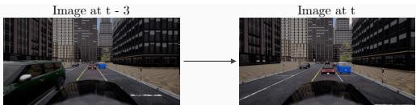  
(a) Emergency Braking: Need for Temporal Memory

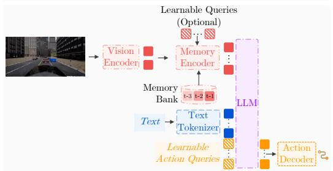

(c) Tiny Recursive Model (TRM): Recursive Output Refinement  
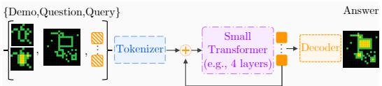

(b) Vision-Domain Temporal Baselines  
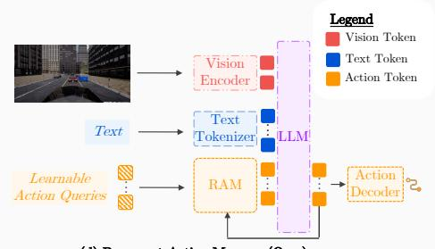  
(d) Recurrent Action Memory (Ours)  
Figure 1: (a) Emergency-braking scenario illustrating the potential value of temporal context. A single frame may reveal a potential hazard, while successive observations can help assess the motion of other agents relative to the ego vehicle and the urgency of braking. (b) Temporal vision baselines (Flex, QT-Former, sliding window) fuse past and current frame features: Sliding Window concatenates frames without learnable queries, while Flex and QT-Former use self- and cross-attention, respectively. (c) Tiny Recursive Model iteratively refines predictions by conditioning on previously generated outputs, illustrated on ARC-AGI [31] (few demonstrations followed by a question and a query for answer). (d) Recurrent Action Memory (RAM) extends this to VLAs by conditioning action prediction on previous action tokens, operating in the action space rather than the vision domain, preserving the integrity of VLM (vision encoder, text tokenizer, large language model (LLM)).

5, 18, 23]. A simple alternative is to supply past ego waypoints [2, 10, 24], but this can encourage extrapolation of recorded expert motion rather than scene understanding, limiting robustness when the history instead reflects the model's own closed-loop driving [25–27]. A few alternative approaches operate in the vision domain (Fig. 1(b)): sliding window [2, 10, 19] concatenate historical vision tokens with the current frame, generally exceeding the token counts seen during vision language model (VLM) pre-training, while Flex [28] and Q-Former-based [29] approaches [1, 20] compress vision tokens via additional transformer blocks, effectively replacing the pre-trained vision-language adapter of the VLM [16, 30]. These strategies fundamentally differ from the design choices of the underlying VLM backbone used to build the VLA, potentially undermining the transfer learning from the VLM by requiring significant amount of data for fine-tuning [24, 28]. This naturally motivates an alternative memory design that is better aligned with the pre-trained VLM's architecture while capturing the temporal context essential for safe driving.

Recurrent modelling constitutes a particularly well-suited approach for designing memory mechanisms to process streaming video data [32–35], as is common in AD systems. Recent developments have demonstrated that recursive architectures, such as the Hierarchical Reasoning Model [36] and the Tiny Recursive Model (TRM) [37], can achieve exceptional performance on reasoning tasks including ARC-AGI [31] and Sudoku puzzles. As shown in Fig. 1(c), these models recursively refine their own solutions by conditioning on previously generated outputs and intermediate reasoning states. The analogy to AD is natural: just as these tasks require consistent reasoning over a fixed problem state, driving requires consistent decision-making over a slowly evolving scene, where adjacent frames share strong similarity. However, the effectiveness of such approaches in streaming perception tasks within larger-scale VLA frameworks remains unexplored.

In this paper, we introduce FIVE-VLA (Fast and EffectIVE VLA for AD) to address the aforementioned limitations. FIVE-VLA uses FastVLM [30] as the backbone VLM, which strategically combines convolutional and attention operations to enable highly efficient processing of high-resolution images on edge devices, generating only 98 tokens from 448 × 896 images, a greater than 5× compression over SimLingo [18]. Crucially, FIVE-VLA can bypass text generation entirely, directly predicting actions without CoT reasoning or superfluous tokens, eliminating a key source of latency. Central to FIVE-VLA is Recurrent Action Memory (RAM), a lightweight memory module that is aligned with the design choices of the VLM backbone, thereby maximising the benefits derived from the large-scale pre-training. As illustrated in Fig. 1(d), RAM conditions the current action prediction on the action tokens generated at the previous time step, establishing a recurrent feedback loop. Analogous to recursive modelling approaches [36, 37], this mechanism reduces the model's reliance on inferring actions from scratch at each time step, enabling more effective utilisation of the LLM and yielding temporally consistent, higher-quality driving decisions.

Our main contributions can be summarised as:

• We propose FIVE-VLA, an efficient and effective VLA achieving (i) approximately 77% and 67% Success Rate on the Bench2Drive benchmark and Fail2Drive generalisation split, respectively, outperforming SimLingo, the previous SOTA VLA, by an absolute margin of at least 10% on both; (ii) around 10% less collision rate than SimLingo in open-loop non-reactive simulation on the large-scale real-world NVIDIA Physical AI AV dataset; and (iii) \~30 fps on A100 and 4 fps on T4, corresponding to \~30× and \~8× higher throughput compared to ORION and SimLingo, respectively.

• We introduce RAM, a lightweight memory mechanism that recursively conditions action prediction on tokens from the previous time step. RAM selectively improves capabilities where temporal reasoning is most critical, including giving way, overtaking, emergency braking, and driving smoothness.

## 2 Background

Problem Formulation. The observation set of AD models typically comprises a subset of the following: (i) sensor readings $\mathbf { X } _ { \mathrm { s e n s o r } }$ , such as camera and LiDAR data; (ii) the ego vehicle state $\mathbf { X } _ { \mathrm { s t a t e } } .$ including velocity and other dynamic parameters; and (iii) a route indicator $\bar { \mathbf { X } } _ { \mathrm { r o u t e } } .$ which can take the form of either GPS target coordinates or high-level commands such as {go straight, turn $l e f t ,$ turn $r i g h t \}$ . Each type of observation can encompass T time steps, e.g., for the sensor readings, $\dot { \mathbf { X } } _ { \mathrm { s e n s o r } } = \{ \mathbf { X } _ { \mathrm { s e n s o r } } ^ { i } \} _ { i = t - T + 1 } ^ { t }$ . We represent all observations by $\mathbf { X } = \mathbf { \bar { \{ X _ { \mathrm { s e n s o r } } } , X _ { \mathrm { s t a t e } } , X _ { \mathrm { r o u t e } } \} }$ . Given X, the AD model is thus tasked with determining a safe trajectory $\mathbf { O _ { t r a j } } \in \mathbb { R } ^ { k \times p }$ for the ego vehicle to follow at time step $t ,$ where k represents the prediction horizon and p denotes the dimensionality of the output at each time step (commonly $p = 2$ for bird's-eye view (BEV)).

SOTA in Autonomous Driving. Two mainstream approaches currently dominate benchmark leaderboards [38–41]. First, an end-to-end (E2E)-AD model $\operatorname f _ { \theta } ( \cdot )$ directly produces the output trajectory $\mathbf { O _ { t r a j } }$ from the observation set, i.e., $\mathbf { O _ { t r a j } } = \mathbf { f } _ { \theta } ( \mathbf { X } )$ , where the sensory data typically includes either camera data alone [22, 42–45] or a combination of camera and LiDAR [46–49]. Regardless of the sensing modality, these approaches generally encode sensory data in BEV space, from which $\mathbf { O _ { t r a j } }$ is obtained. Second, VLAs employ FMs as their backbone and adapt them to driving tasks through fine-tuning. Different from E2E-AD models, VLAs enhance driving performance by leveraging the learned representations of FMs and exploit their language interface for various purposes, including CoT reasoning and visual question answering (VQA). We denote the input and output text sequences to the FM as T and $\mathbf { O _ { t e x t } } .$ , respectively, where each comprises a sequence of text tokens: $\mathbf { T } = \{ \mathbf { T } ^ { ( j ) } \} _ { j = 1 } ^ { n }$ and $\mathbf { O _ { t e x t } } = \{ \mathbf { O _ { t e x t } ^ { ( j ) } } \} _ { j = 1 } ^ { m } ,$ with n and m denoting their respective sequence lengths. While various architectural choices exist for constructing VLAs [50], a typical VLA generates $\mathbf { O _ { t r a j } }$ through a two-stage process. First, the text output $\bf { O } _ { t e x t }$ is generated using the fine-tuned FM $\ g _ { \theta } ( \cdot , \cdot )$ , as $\mathbf { O _ { t e x t } } = \displaystyle \mathrm { g } _ { \theta } ( \mathbf { X } , \mathbf { T } )$ , in an AR manner, where each subsequent token of $\bf { O } _ { t e x t }$ is conditioned on preceding tokens, requiring multiple passes through $\mathrm { g } _ { \boldsymbol { \theta } } \big ( \cdot , \cdot \big )$ . Second, $\mathbf { O _ { t r a j } }$ is obtained by incorporating the text output: $\mathbf { O _ { t r a j } } = \mathrm { h } _ { \phi } ( \mathbf { g } _ { \theta } ^ { - } ( \mathbf { X } , \mathbf { T } , \mathbf { O _ { t e x t } } ) )$ , with $\mathrm { h } _ { \phi } ( \cdot )$ denoting the action decoder to yield $\mathbf { O _ { t r a j } }$ from the representations of the FM. These models typically rely exclusively on camera data and demonstrate strong performance. However, utilising a large model and the AR generation of $\bf { O } _ { t e x t }$ generally result in high inference latency.

## 3 FIVE-VLA: Fast and EffectIVE VLA

To address the limitations of VLAs in AD regarding inefficiency and lack of temporal memory (Sec. 1), FIVE-VLA incorporates three key design choices: (i) an efficient driving mode predicting trajectories in a single forward pass without text generation (Sec. 3.2), (ii) FastVLM [30] as the VLM backbone for efficient high-resolution image processing on edge devices (Sec. 3.3), and (iii) RAM, a novel lightweight memory module capturing temporal dependencies in the action domain (Sec. 4).

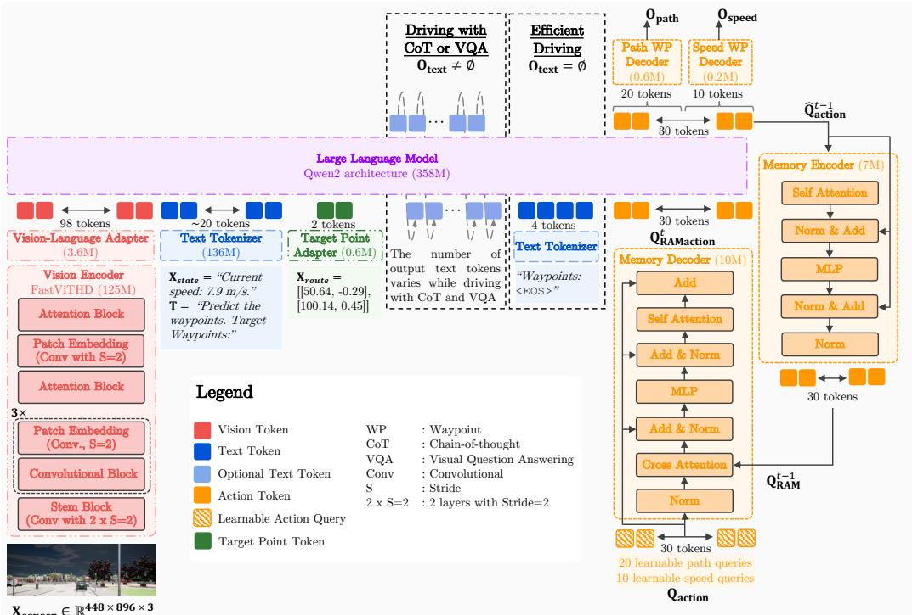  
Figure 2: Overview of FIVE-VLA, showing the single-view closed-loop configuration. FIVE-VLA uses front image, ego velocity, target points and input text to produce path and speed waypoints RAM (orange blocks) conditions the action tokens $\mathbf { Q _ { a c t i o n } }$ on the output action tokens from the previous time step $\hat { \mathbf { Q } } _ { \mathbf { a c t i o n } } ^ { t - 1 } .$ It has 641M parameters, and yields the trajectory in a single pass using efficient driving mode.

## 3.1 Overview of FIVE-VLA

In the single-view configuration shown in Fig. 2, FIVE-VLA uses the front camera image $\mathbf { X } _ { \mathrm { s e n s o r } } \in \mathbb { R } ^ { 4 4 8 \times 8 9 6 \times 3 }$ , the ego velocity provided in text format $\mathbf { X } _ { \mathrm { s t a t e } }$ , two subsequent target points for navigational conditioning $\mathbf { X } _ { \mathrm { r o u t e } } \in \mathbb { R } ^ { \tilde { 2 } \times \frac { 1 } { 2 } }$ , and the text input T to produce $\mathbf { O _ { t e x t } } \dot { = } \mathbf { g } _ { \theta } ( \bar { \mathbf { X } } , \bar { \mathbf { T } } ) . \mathbf { g } _ { \theta } ( \cdot , \cdot )$ includes vision encoder, vision-language adapter, text tokenizer, target point adapter and an LLM. Then, the learnable action queries $\mathbf { Q _ { a c t i o n } }$ are decoded as the trajectory through two components, $\mathbf { O _ { t r a j } } = \{ \mathbf { O _ { p a t h } } , \mathbf { O _ { s p e e d } } \} ;$ (i) path waypoints $\mathbf { O _ { p a t h } } \in \mathbb { R } ^ { N _ { \mathrm { p a t h } } \times 2 }$ , representing positions in the ego frame sampled at 1-metre intervals along the path for steering control; and (ii) speed waypoints $\bf { \bar { O } } _ { s p e e d } \in \mathbb { R } ^ { \cal N _ { \mathrm { s p e e d } } \times 2 }$ , representing ego-frame positions at fixed future time intervals. The waypoint counts and prediction horizons are dataset-specific. This can be expressed as:

$$
\mathrm { O } _ { \mathrm { p a t h } } , \mathrm { O } _ { \mathrm { s p e e d } } = \mathrm { h } _ { \phi } \big ( \mathrm { g } _ { \theta } \big ( \mathrm { \mathbf { X } } , \mathrm { \mathbf { T } } , \mathrm { O } _ { \mathrm { t e x t } } , \mathrm { R A M } _ { \psi } \big ( \mathbf { Q } _ { \mathrm { a c t i o n } } , \hat { \mathrm { \mathbf { Q } } } _ { \mathrm { a c t i o n } } ^ { t - 1 } \big ) \big ) \big ) ,\tag{1}
$$

where $\mathrm { R A M } _ { \psi } ( \cdot , \cdot )$ produces the action tokens fed to the LLM using: (i) learnable action queries $\mathbf { Q _ { a c t i o n } } \in \mathbb { R } ^ { N \times d _ { m o d e l } }$ , where $d _ { m o d e l }$ is the token embedding size and $N = N _ { \mathrm { p a t h } } + N _ { \mathrm { s p e e d } } .$ and (ii) $\hat { \mathbf { Q } } _ { \mathbf { a c t i o n } } ^ { t - 1 } \in \mathbb { R } ^ { N \times d _ { m o d e l } }$ as the output action tokens of the LLM from the previous time step $t - 1$ At initialisation $( t = 0 )$ , since no prior RAM information exists, we directly propagate $\mathbf { Q _ { a c t i o n } }$ to the model, i.e., $\operatorname { R A M } _ { \psi } ( \mathbf { Q } _ { \mathbf { a c t i o n } } , \hat { \mathbf { Q } } _ { \mathbf { a c t i o n } } ^ { t - 1 } ) = \mathbf { Q } _ { \mathbf { a c t i o n } } .$ This allows FIVE-VLA to operate both with and without RAM, where RAM serves to augment $\mathbf { Q _ { a c t i o n } }$ with temporal context. Finally, $\mathrm { h } _ { \phi } ( \cdot )$ comprises path and speed waypoint decoders, each of which is an MLP processing corresponding representations in the predicted action tokens at current time step $\hat { \mathbf { Q } } _ { \mathbf { a c t i o n } } ^ { t } .$

## 3.2 Capabilities of FIVE-VLA

FIVE-VLA has three main capabilities: efficient driving without CoT, driving with CoT reasoning, and VQA capabilities. To facilitate training of the RAM across these capabilities, we structure training examples as temporal streams of length T (comprising T consecutive examples). Each stream, denoted as $\{ \mathbf { X } ^ { i } , \mathbf { T } ^ { i } , \mathbf { O _ { t e x t } ^ { i } } , \mathbf { O _ { p a t h } ^ { i } } , \mathbf { O _ { s p e e d } ^ { \it i } } \} _ { i = t - T + 1 } ^ { t }$ , consists exclusively of examples from a single capability, determined solely by the input text T, as we detail below:

Efficient Driving. When T =“Predict the waypoints.", SimLingo generates $\mathbf { O _ { t e x t } } = ^ { \epsilon } W a y p o i n t s . ^ { , , }$ requiring four tokens to be produced by the LLM in an AR fashion $( \mathrm { i . e . , \hbar ^ { * } w { a } y ^ { 0 } , \hbar ^ { * } p o i n t s ^ { 0 } , \hbar ^ { * } ; \Omega ^ { 0 } , }$ ${ < } \mathrm { E } 0 \mathrm { S } > )$ prior to trajectory generation, increasing its inference latency. In contrast, recognizing that $\mathbf { O _ { t e x t } }$ remains invariant across different inputs, we append these four tokens to the input token sequence. This simple insight bypasses generating $\bf { O } _ { t e x t }$ entirely, enabling single-pass trajectory generation via Eq.(1) alone with $\mathbf { O _ { t e x t } } = \varnothing .$ and yielding the same trajectory output $( \mathbf { O _ { p a t h } } , \mathbf { \bar { O _ { s p e e d } } } )$ . Efficient driving is the default operational mode of FIVE-VLA due to its efficiency.

Driving with CoT Reasoning. $\operatorname { I f } \mathbf { T } = { } ^ { \cdots } W h$ at should the ego do next?", the model first generates text $\bf { O } _ { t e x t }$ containing CoT reasoning, which subsequently informs trajectory generation in Eq.(1).

VQA Capability. The model supports free-form queries through the text interface T to enhance model explainability. In this mode, FIVE-VLA generates text, $\mathbf { O _ { t e x t } }$ , prior to trajectory generation.

## 3.3 VLM Backbone

For AD models to be deployable on vehicular platforms, they must efficiently process high-resolution images on edge devices. Existing VLAs are commonly constrained by either their inability to leverage high-resolution images owing to the resolution constraints of their pretrained vision encoders, or their reliance on an excessive number of tokens, which impedes practical deployment. To address these limitations, we employ FastVLM [30] as our backbone, which is specifically designed to enable efficient processing of high-resolution images on edge devices while maintaining high accuracy. FastVLM combines FastViTHD vision encoder [30, 51] with Qwen2 LLM [52], where the primary advantage of FastVLM lies in its vision encoder, which we elaborate upon next.

We utilise images with 448×896 resolution. If processed by a ViT model [53] as a vision encoder, which commonly uses 14× 14 patches [11, 53, 54], such images yield 2048 tokens. Given this substantial token count, efficiency-oriented approaches aim to reduce the number of tokens to be passed to the LLM [18, 55–57]. For instance, Mini-Intern-VL [55], used as the backbone VLM in SimLingo, employs pixel unshuffling [58] within the InternViT-300M vision encoder to compress the token count to one-quarter of the original, though still yielding 512 tokens. Also, since the vision encoder is trained on 448×448 images, processing a 448×896 resolution image requires partitioning it into two separate tiles, thereby preventing cross-tile interactions within the vision encoder.

Alternatively, FastViTHD integrates convolutional [59, 60] and attention layers [61], as illustrated in Fig. 2. In this architecture, a subset of the convolutional layers is employed with a stride of 2 to progressively reduce the spatial dimensions of the representations, thereby decreasing the number of tokens before the subsequent attention layers. This yields only 98 tokens from a 448×896 image, representing approximately 21 × and 5× reductions compared to the ViT and InternViT-300M, respectively. Also, FastViTHD comprises merely 125M parameters, substantially fewer than the commonly employed ViT with 300M parameters (i.e., ViT-L). This architecture further enhances representation learning efficacy by eliminating the need for tile-based partitioning, thereby enabling global token interactions throughout the entire image within the vision encoder.

To our knowledge, we are the first to tailor FastVLM to a VLA for AD. For this, we use the smallest FastVLM with only around 620M parameters pretrained on images with resolution up to 1024× 1024, and fine-tune it by incorporating the AD-specific modules (Fig. 2). The resulting FIVE-VLA has only 641M parameters and runs more efficiently than its counterparts especially on edge devices.

## 4 RAM: Recurrent Action Memory

The ability to leverage temporal information is essential for AD, yet existing memory mechanisms operate in the vision domain, undermining the transfer learning from the pre-trained VLM. We introduce RAM, which instead operates in the action domain by conditioning the current action prediction on the action tokens from previous time step, preserving the integrity of the VLM (Fig. 1(d)).

RAM Design. The orange modules in Fig. 2 illustrate the architecture of RAM, which comprises two lightweight components. First, a memory encoder RAMEncoder(·), one transformer block with self-attention, encodes the updated action queries from the previous time step $\hat { \mathbf { Q } } _ { \mathbf { a c t i o n } } ^ { t - 1 }$ to obtain

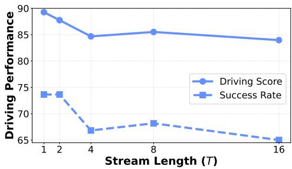  
(a) Changes in performance wrt. stream length.

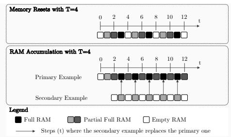  
(b) Different ways of using RAM at inference  
Figure 3: (a) Constructing batches from streaming data hurts the performance as stream length T increases. (b) RAM reset vs accumulation. RAM accumulation prefills RAM using a secondary example during inference before it replaces the primary one.

RAM state $\mathbf { Q } _ { \mathbf { R A M } } ^ { t - 1 }$

$$
\mathbf { Q } _ { \mathbf { R A M } } ^ { t - 1 } = \operatorname { R A M E n c o d e r } ( \hat { \mathbf { Q } } _ { \mathbf { a c t i o n } } ^ { t - 1 } ) .\tag{2}
$$

Second, a memory decoder RAMDecoder(·, ·) conditions on $\mathbf { Q } _ { \mathbf { R A M } } ^ { t - 1 }$ to yield the action tokens to be fed to the LLM at time step t, $\mathbf { Q } _ { \mathbf { R A M a c t i o n } } ^ { t }$ . RAMDecoder(·, ·) is another single transformer block with cross-attention, in which the action queries $\mathbf { Q _ { a c t i o n } }$ attend to the RAM state $\mathbf { Q } _ { \mathbf { R A M } } ^ { t - 1 }$

$$
\mathbf { Q } _ { \mathbf { R A M a c t i o n } } ^ { t } = \mathbf { R A M D e c o d e r } ( \mathbf { Q } _ { \mathbf { a c t i o n } } , \mathbf { Q } _ { \mathbf { R A M } } ^ { t - 1 } ) .\tag{3}
$$

As shown in Fig. 2 (orange blocks), since $\mathbf { Q _ { a c t i o n } }$ is not normalised by design, we apply layer normalisation [62] prior to cross-attention to ensure magnitude compatibility with $\mathbf { Q } _ { \mathbf { R A M } } ^ { t - 1 } .$ Conversely, normalisation is not applied before feeding the updated action tokens into the LLM to preserve their original characteristics. RAM includes only 2 transformer blocks, which is notably smaller compared to the memory mechanisms in the vision domain, typically with 8 blocks [1, 28]. Despite its simplicity in design, training a recursive module and using it during inference require careful design choices, which we detail in the following sections.

## 4.1 Fine-tuning FIVE-VLA with RAM

We now describe the training procedure for FIVE-VLA, which proceeds in two stages: first fine-tuning without RAM, then incorporating RAM in a second stage.

Why fine-tune RAM? Training models with memory mechanisms requires batches composed of sequential data streams, which inherently contain temporally-correlated observations. Such temporal correlation can degrade performance, primarily due to violations of the independent and identically distributed (IID) sampling assumption fundamental to stochastic gradient descent [63–67]. Correlated gradients reduce the informativeness of each training batch, as consecutive samples typically provide redundant information [66]. This poses a significant challenge when training VLAs, as GPU memory limitations often prevent increasing the batch size B to offset reduced data diversity.

In our setting, a batch comprises K distinct streams, each of length T, yielding $B = K \times T$ training examples. With B fixed due to memory limitations, increasing the stream length T necessitates a proportional decrease in the number of streams K, thereby reducing intra-batch variability and, consequently, gradient informativeness. This presents a trade-off between longer streams to enable memory mechanisms and batch diversity.

To empirically quantify this effect, we train FIVE-VLA without RAM using data streams rather than IID sampling of individual observations, similar to Han et al. [66]. We use SimLingo dataset [18] for training while systematically varying the stream length from $T = 1$ (equivalent to IID sampling) to $T \ = \ { \bar { 1 6 } }$ , maintaining a constant batch size of $B ^ { ^ { - } } = 3 2$ We evaluate driving performance on the Bench2Drive closed-loop benchmark using both driving score (DS) and success rate (SR) metrics. As illustrated in Fig. 3(a), both metrics degrade substantially as stream length increases beyond $T = 2$ . These results show that VLAs trained with data streams could suffer from an inherent performance disadvantage attributable to reduced intra-batch variability. Therefore, to avoid potential performance degradation, we incorporate RAM through fine-tuning after completing the initial training of FIVE-VLA without RAM.

How to fine-tune RAM? Proper initialisation of newly incorporated components is crucial for successful fine-tuning of FMs [68, 69]. For instance, parameter-efficient fine-tuning techniques [69– 71], such as LoRA, typically learn a residual added to existing blocks in FMs, expressed as W + ∆W, where W represents the pretrained block parameters and ∆W denotes the learned residual, commonly implemented as a matrix factorisation, e.g., $\Delta \mathbf { W } = \mathbf { B } \mathbf { A }$ [69]. To preserve pretrained knowledge and facilitate fine-tuning, ∆W is typically initialised as $\pmb { \Delta } \mathbf { W } = \mathbf { 0 }$ at the start of the fine-tuning, e.g., by initialising $\mathbf B = \mathbf 0$

Similarly, to preserve the knowledge of FIVE-VLA after incorporating RAM module, we ensure that $\mathbf { Q } _ { \mathbf { R A M a c t i o n } } ^ { t } = \mathrm { R A M } _ { \psi } ( \mathbf { Q } _ { \mathbf { a c t i o n } } , \hat { \mathbf { Q } } _ { \mathbf { a c t i o n } } ^ { t - 1 } ) = \mathbf { Q } _ { \mathbf { a c t i o n } }$ at initialisation. We achieve this through careful initialisation of the memory decoder $( \operatorname { F i g } . 2 )$ , specifically by setting the linear output projection layers of both cross-attention and self-attention mechanisms, as well as the second linear layer of the MLP, to zero. This ensures that, at the beginning of fine-tuning with RAM modules, Qaction propagates exclusively through the skip connections, while the action tokens generated in the last time step $\hat { \mathbf { Q } } _ { \mathbf { a c t i o n } } ^ { t - 1 }$ do not contribute to $\mathbf { Q } _ { \mathbf { R A M a c t i o n } } ^ { t }$ . During RAM fine-tuning, we optimise only the action decoders and LLM along with the RAM modules. While less critical than initialisation, we also employ gradient accumulation and stop gradient flow across time steps.

## 4.2 Using RAM at Inference: RAM Accumulation

It is well known that the sequence models, whether recursive or autoregressive, can exhibit poor generalisation beyond the sequence (or context) length on which they were trained [72–76]. Due to the memory constraints of GPUs, the training sequence length is naturally set to a small number such as $T = 4 .$ However, the driving scenarios are substantially longer than $T _ { \ast }$ raising the question of how to utilise RAM effectively at inference.

One naïve approach is to reset RAM every T time steps during inference, as shown in Fig. 3(b). This ensures that the sequence length at inference is within the training sequence length $\check { T } .$ However, RAM becomes empty after each reset, thereby depriving the model of valuable temporal information. Alternatively, we introduce RAM accumulation, where we employ a secondary instance during inference to accumulate information in memory while the model relies on the primary instance to generate waypoints. At time $t ,$ the secondary instance is identical to the primary instance in terms of vision, language and target points, and only differs in RAM state. As shown in Fig. 3(b), we initialise the secondary instance with an empty RAM, and it becomes the primary one at every T/2 steps, where the primary example reaches the sequence length.

## 5 Experiments

Our experiments show that (i) FIVE-VLA outperforms existing VLAs and E2E-AD methods; (ii) it is more efficient than its counterparts (up to 8× faster than SimLingo); (iii) RAM improves driving especially in safety-critical scenarios requiring temporal understanding, such as emergency braking.

Closed-Loop Experimental Setup. We train FIVE-VLA on SimLingo dataset [18], curated in CARLA [77] with PDMLite expert [78, 79] including \~2M images at 4 fps, providing 140 hours of driving data with CoT and VQA annotations. For closed-loop driving, steering and acceleration are obtained via two PID controllers [80] from path and speed waypoints. Unless otherwise noted we use efficient driving with RAM accumulation for inference, and report average results over three evaluation seeds. We evaluate on (i) Bench2Drive [41], a common benchmark, and (ii) Fail2Drive [81], a recent generalisation benchmark, both of which use (i) driving score (DS), route completion weighted by infraction penalties, and (ii) success rate (SR), proportion of routes completed without violations.

Open-Loop Experimental Setup. To evaluate on real-world data, we train FIVE-VLA and SimLingo on the NVIDIA Physical AI AV dataset [82], using \~860 hours for training and \~350 hours for testing, with driving supervision only. All models use only the driving data during training, i.e., no language supervision. During both training and evaluation, we perturb navigation target points derived from the recorded future ego trajectory with Student's t distribution to mitigate expert-trajectory leakage while preserving coarse route guidance. We report average and final displacement errors (ADE/FDE) over a 3-second speed-waypoint horizon and their path counterparts over 30 metres, together with at-fault collision (NC-V) and time-to-collision violation (TTC-V) percentages from

Table 1: Comparison with SOTA on Bench2Drive and Fail2Drive generalisation benchmark. FIVE-VLA outperforms all approaches. M: Multi-view, S: Single view, L: LiDAR. Improvements (in green and red) are specified in comparison to the underlined best camera-only baseline.
<table><tr><td></td><td></td><td></td><td></td><td colspan="2">Bench2Drive</td><td colspan="2">Fail2Drive In-Dist.</td><td colspan="3">Fail2Drive Generalisation</td><td rowspan="2">Venue</td></tr><tr><td>Method</td><td>Sensors</td><td>CoT</td><td>DS↑</td><td>SR(%)↑</td><td>Mean Ability ↑</td><td>DS ↑ SR(%) ↑ HM ↑</td><td></td><td>DS↑</td><td>SR(%) ↑</td><td>HM↑</td></tr><tr><td colspan="9">E2E-AD Approaches</td><td></td><td></td><td></td></tr><tr><td>UniAD [42]</td><td>M</td><td></td><td>45.81</td><td>16.36</td><td>15.55</td><td>47.5 36.3</td><td>41.2</td><td>44.0 (-7.4%)</td><td>27.6 (-24.0%)</td><td>33.9 (-17.6%)</td><td>CVPR23</td></tr><tr><td>TCP [83]</td><td></td><td></td><td>59.90</td><td>30.00</td><td>34.22</td><td>24.7 39.1</td><td>30.3</td><td>24.5 (-0.8%)</td><td>31.4 (-19.7%)</td><td>27.5 (-9.1%)</td><td>NeurIPS22</td></tr><tr><td>DriveTransformer [84]</td><td>M</td><td></td><td>63.46</td><td>35.01</td><td>38.60</td><td></td><td></td><td></td><td></td><td></td><td>ICLR25</td></tr><tr><td>Raw2Drive [85]</td><td>M</td><td></td><td>71.36</td><td>50.24</td><td>53.34</td><td></td><td></td><td></td><td></td><td></td><td>NeurIPS25</td></tr><tr><td>VADv2 [43]</td><td>M</td><td></td><td>76.15</td><td>50.46</td><td></td><td></td><td></td><td></td><td></td><td></td><td>ICLR26</td></tr><tr><td>PGS [86]</td><td>M</td><td></td><td>78.08</td><td>48.64</td><td>53.40</td><td></td><td></td><td></td><td></td><td></td><td>NeurIPS25</td></tr><tr><td>GaussianFusion [46]</td><td>S, L</td><td></td><td>79.10</td><td>54.40</td><td>56.30</td><td></td><td></td><td></td><td></td><td></td><td>NeurIPS25</td></tr><tr><td>Transfuser++ [49]</td><td>S,L</td><td></td><td>84.21 67.27</td><td></td><td>64.39</td><td>83.3 78.5</td><td>80.8</td><td>75.4 (-9.5%)</td><td>61.1 (-22.2%)</td><td>67.5 (-16.5%)</td><td>ICCV23</td></tr><tr><td>HiP-AD [87]</td><td>M</td><td></td><td>86.77 69.09</td><td></td><td>65.98</td><td>70.7</td><td>72.4</td><td>67.1 (-9.4%)</td><td>56.7 (-19.8%)</td><td>61.5 (-15.1%)</td><td>ICCV25</td></tr><tr><td>BridgeDrive [48]</td><td>S,L</td><td></td><td>87.99</td><td>74.99</td><td>73.15</td><td>74.1</td><td></td><td></td><td></td><td></td><td>ICLR26</td></tr><tr><td colspan="10">Vision-Language-Action Models M</td><td></td></tr><tr><td>DriveMoE [8]</td><td>M</td><td>x 74.22 x</td><td>48.64</td><td>47.91</td><td></td><td></td><td></td><td></td><td></td><td></td><td>CVPR26</td></tr><tr><td>ORION [1]</td><td></td><td>77.74</td><td>54.62</td><td>54.72</td><td>53.0</td><td>52.0</td><td>52.5</td><td>51.2 (-3.4%)</td><td>46.0 (-11.5%)</td><td>48.5 (-7.7%)</td><td>ICCV25</td></tr><tr><td>AutoVLA [2]</td><td></td><td>78.84</td><td>57.73</td><td></td><td></td><td></td><td></td><td></td><td></td><td></td><td>NeurIPS25</td></tr><tr><td>SimLingo [18]</td><td></td><td>√ 85.07</td><td>67.27</td><td>67.03</td><td></td><td>82.6 79.3</td><td>80.9</td><td>71.7 (-13.2%)</td><td>55.0 (-30.6%)</td><td>62.2 (-23.1%)</td><td>CVPR25</td></tr><tr><td>FIVE-VLA</td><td></td><td>90.95</td><td>77.27</td><td>78.75</td><td></td><td>83.7</td><td>84.8</td><td>77.5 (-9.9%)</td><td>67.0 (-20.0%)</td><td>71.9 (-15.3%)</td><td></td></tr><tr><td></td><td>S</td><td>x (+4.18)</td><td></td><td>(+8.18)</td><td>(+11.72)</td><td>86.0 (+3.4) (+4.4)</td><td>(+3.9)</td><td>(+5.8)</td><td>(+10.3)</td><td>(+9.7)</td><td>Ours</td></tr></table>

Table 2: Single- and four-view results on NVIDIA Physical AI AV. Errors in metres; NC-V/TTC-V: no at-fault collision and time to collision violation percentages on non-reactive NAVSIM-style simulation [40]. Bold: best per view setting.  
Table 3: Efficiency. SimLingo is reported without CoT for fair fps comparison, so the numbers slightly differ from Tab. 1. OOM: Out-of-memory. AutoVLA reports 1 fps, the GPU type is not specified.
<table><tr><td></td><td></td><td>Vision</td><td>Speed (3 s)</td><td>Path (30 m)</td><td></td><td>Safety (%)</td></tr><tr><td>Method</td><td>Views Tokens|</td><td></td><td>|ADE ↓ FDE ↓</td><td>|ADE ↓ FDE ↓</td><td></td><td>[NC-V ↓ TTC-V ↓</td></tr><tr><td>SimLingo [18]</td><td>1</td><td>512</td><td>0.550 1.466</td><td>0.218 0.420</td><td>0.87</td><td>1.26</td></tr><tr><td>FIVE-VLA (w/o RAM)</td><td>1</td><td>98</td><td>0.549 1.464</td><td>0.213</td><td>0.405 0.84</td><td>1.25</td></tr><tr><td>FIVE-VLA</td><td>1</td><td>98</td><td>0.402 1.128</td><td>0.207 0.392</td><td>0.78</td><td>1.16</td></tr><tr><td>SimLingo [18]</td><td>4</td><td>2048</td><td>0.504 1.358</td><td>0.206 0.407</td><td>0.82</td><td>1.21</td></tr><tr><td>FIVE-VLA</td><td>4</td><td>392</td><td>0.391 1.100</td><td>0.197</td><td>0.379 0.75</td><td>1.15</td></tr></table>

<table><tr><td rowspan="2">Method</td><td rowspan="2">#Params ↓</td><td colspan="2">|Throughput (fps ↑) T4 A100 H200</td><td rowspan="2">Accuracy SR ↑ (%)↑</td></tr><tr><td></td><td>DS</td></tr><tr><td>ORION [1]</td><td>7B</td><td>OOM 0.98</td><td>2.13</td><td>77.74 54.62</td></tr><tr><td>AutoVLA [2]</td><td>3B</td><td>~1</td><td></td><td>78.84 57.73</td></tr><tr><td>SimLingo [18]</td><td>1B</td><td>0.50 7.99</td><td>14.14</td><td>85.8868.18</td></tr><tr><td>FIVE-VLA</td><td>641M</td><td>3.89 29.96 56.71</td><td></td><td>90.95 77.27</td></tr></table>

NAVSIM-style [40] non-reactive simulation. Lower is better for all six metrics. Metric definitions are detailed in Sec. A.

## 5.1 Comparison with State-of-the-art

Closed-Loop Driving on Bench2Drive. Tab. 1 compares FIVE-VLA with SOTA on Bench2Drive benchmark with 220 challenging scenarios such as overtaking and merging [41]. Compared to SimLingo, the previous SOTA VLA, FIVE-VLA achieves a 10% absolute gain in SR (77.27% vs. 67.27%), \~6 points higher DS (90.95 vs. 85.07), and a \~12 points gain in mean ability score (see Tab. A.16 for individual abilities). These significant gains stem from two complementary factors: RAM and using FastVLM, mainly helping for effective processing of high-resolution images without tile-based partitioning, unlike SimLingo (see Sec. 5.3 for ablations). FIVE-VLA establishes a new SOTA, surpassing all VLA and E2E-AD approaches. Despite using only a single front-facing camera, FIVE-VLA outperforms BridgeDrive, the leading camera-LiDAR approach, by \~3 DS and \~2 SR.

Generalisation Performance on Fail2Drive. Fail2Drive [81] stress-tests AD models on 100 indistribution (ID) and 100 generalisation scenarios featuring out-of-distribution (OOD) hazards such as animals and unconventional vehicle parking, reporting the harmonic mean (HM) of DS and SR as the final performance measure. As shown in Tab. 1, FIVE-VLA establishes a new SOTA across both splits, outperforming SimLingo by 3.9 HM on the ID split. More critically, this gap widens to 9.7 HM on the generalisation split, indicating that the gains from RAM and effective high-resolution perception reflect genuinely stronger scene understanding rather than overfitting to the training distribution (refer to Fig. A.5 for qualitative examples). FIVE-VLA's smaller performance drop when transitioning from ID to generalisation compared to SimLingo (-9.9% vs. -13.2% in DS; -20.0% vs. -30.6% in SR) further supports this conclusion. Taken together with the Bench2Drive results, these consistent gains suggest that FIVE-VLA's closed-loop driving improvements are systematic rather than benchmark-specific.

Open-loop and Multi-View Evaluation on NVIDIA Physical AI AV. To show that FIVE-VLA has competitive driving performance in the real world, we scaled FIVE-VLA to NVIDIA Physical AI AV dataset as the largest publicly available real-world driving dataset, capturing a diverse distribution of weather conditions, lighting, and complex interactions. Tab. 2 shows that, without RAM, FIVE-VLA performs slightly better than SimLingo (speed ADE: 0.549 vs. 0.550 m; NC-V: 0.84% vs. 0.87%) using 98 rather than 512 vision tokens. As expected, adding RAM mainly improves speed behaviour of the model (speed ADE gain by 26.7%) with a milder benefit to path ADE (2.8%). More crucially, safety of the model improves significantly: 7% and ～ 10% relative NC-V gain in comparison to FIVE-VLA (w/o RAM) and SimLingo. Four-view FIVE-VLA further reduces speed ADE (from 0.402 to 0.391 m), path ADE (from 0.207 to 0.197 m) and violation percentages. Compared with four-view SimLingo, it achieves 22.4% lower speed ADE and 7.7% lower NC-V with 392 rather than 2048 vision tokens. The qualitative examples in Fig. 4 illustrate differences in braking, following, and turning clearance, consistent with the aggregate results. These results complement our closed-loop findings and show that FIVE-VLA benefits from additional camera views while retaining its relative visual-token reduction.

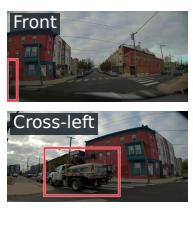

Temporal comparisons  
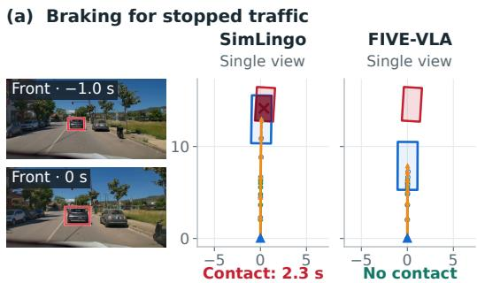  
Multiview comparisons

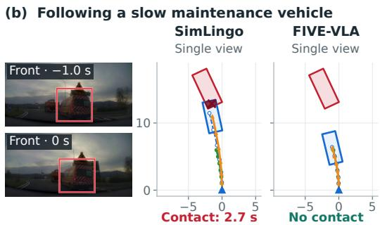

(c) Clearing a left-corner parked car  
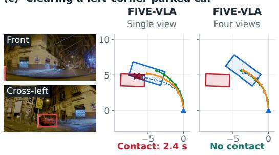

(d) Clearing a parked work truck FIVE-VLA  
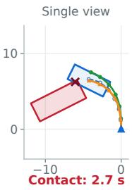

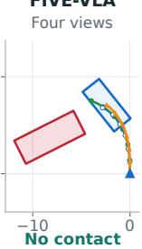  
Expert -o-PredictionSimulationEgo at 3 sCounterpart at 3 s  
Figure 4: Qualitative comparisons on NVIDIA Physical AI AV. Top: (a) braking for stopped traffic and (b) following a slow maintenance vehicle, comparing single-view SimLingo and FIVE-VLA. Bottom: (c) clearing a parked car and (d) a work truck, comparing single- and four-view FIVE-VLA. Each panel shows two images and paired BEVs: temporal images are 1 s apart (fixed crop in (a)); multiview images are front/cross-left. Footprints are synchronised at +3 s; crosses mark overlap and red labels give first at-fault contact times. Rollouts are open-loop and non-reactive.

Efficiency. We measure throughput as frames-per-second (fps) of the single-view FIVE-VLA and SimLingo models trained on the SimLingo dataset [18] on three GPU types: Tesla T4 (16GB VRAM 130 INT8 TOPS) as a proxy for vehicular edge devices (e.g., Qualcomm QC8775); A100 (80GB VRAM, 624-1248 INT8 TOPS), a mid-tier GPU; and H200 (141GB VRAM), a high-end GPU. Tab. 3 shows that FIVE-VLA is consistently more efficient thanks to its efficient driving mode and FastVLM backbone. On a Tesla T4, FIVE-VLA achieves 3.89 fps, \~8× faster than SimLingo, while ORION fails entirely due to out-of-memory. On higher-end GPUs, FIVE-VLA is nearly 4× and 30× faster than SimLingo and ORION on A100, and exceeds 50 fps on H200. With 641M parameters, FIVE-VLA is around 9%, 21% and 64% the size of ORION, AutoVLA and SimLingo, respectively.

## 5.2 Is Recurrent Action Memory Useful?

Contribution of RAM. To demonstrate the contribution of RAM, we compare FIVE-VLA (including RAM) with the FIVE-VLA variant obtained after the first stage training (without RAM) in terms of overall performance and individual driving abilities. Tab. 4 shows that RAM yields notable gains in overall performance with +2.46 DS and +4.24 SR. Examining individual abilities reveals an expected pattern: capabilities that inherently benefit from temporal context show the most significant improvements. Specifically, give-way scenarios exhibit the largest gain (+26.67 points), followed by overtaking (+7.40 points) and emergency braking (+6.11 points). These results align with the intuition that RAM's temporal modelling is particularly valuable for manoeuvres requiring anticipation over time. In contrast, merging and traffic sign recognition show minimal change (+0.83 and +1.22 points, respectively). This modest impact is anticipated, as merging performance is primarily limited by the lack of multi-view spatial information rather than temporal context, while traffic sign recognition can be effectively performed from static images. Last but not least, being informed by the previous action tokens, RAM improves the smoothness metric substantially as well (more than 10% relative gain). These findings validate that RAM selectively enhances capabilities where temporal reasoning provides the most value, while having minimal effect on other abilities.

Table 4: The contribution of RAM. RAM notably improves abilities requiring temporal context (>5% relative gain), such as emergency brake, giving way and overtaking, and the smoothness (a.k.a. comfortness). Relative gain: a/b — 1 where a and b are the performances with and without RAM.
<table><tr><td rowspan="2">RAM</td><td colspan="2"></td><td rowspan="2"></td><td rowspan="2"></td><td colspan="6">Ability↑</td></tr><tr><td>DS↑ SR(%) ↑</td><td>Efficiency ↑</td><td>Smoothness ↑</td><td>Over- Merging</td><td>Emergency Brake</td><td>Give</td><td>Traffic</td><td>Mean</td></tr><tr><td>x</td><td>88.49</td><td>73.03</td><td>262.56</td><td>25.90</td><td>59.17</td><td>taking 76.30</td><td>81.67</td><td>Way 50.00</td><td>Sign 84.39</td><td>70.30</td></tr><tr><td>√</td><td>90.95</td><td>77.27</td><td>255.07</td><td>28.54</td><td>60.00</td><td>83.70</td><td>87.78</td><td>76.67</td><td>85.61</td><td>78.75</td></tr><tr><td>(Absolute gain)</td><td>(+2.46)</td><td>(+4.24)</td><td>(-7.49)</td><td>(+2.64)</td><td>(+0.83)</td><td>(+7.40)</td><td>(+6.11)</td><td>(+26.67)</td><td>(+1.22)</td><td>(+8.45)</td></tr><tr><td>(Relative gain)</td><td>(+2.78%)</td><td>(+5.81%)</td><td>(-2.85%)</td><td>(+10.19%)</td><td>(+1.40%)</td><td>(+9.70%)</td><td>(+7.48%)</td><td>(+53.34%)</td><td>(+1.45%)</td><td>(+12.02%)</td></tr></table>

Table 6: Comparison with vision-domain temporal baselines. RAM has the best performance and is the smallest learned module. All methods use single-view FIVE-VLA.

Table 5: Explicit action-history baselines. Singleview FIVE-VLA. History: recorded expert motion (open-loop) or model-controlled motion (closedloop). Speed ADE/FDE: metres over 3 s.
<table><tr><td rowspan="2" colspan="2"></td><td colspan="5">Closed-loop</td><td colspan="2">Open-loop</td></tr><tr><td>Bench2Drive</td><td></td><td>[Fail2Drive ID|</td><td></td><td>Fail2Drive Gen.</td><td></td><td>NVIDIA</td></tr><tr><td></td><td>RAM History input| DS ↑ SR(%) ↑|DS ↑ SR(%) ↑|DS ↑</td><td>73.03</td><td></td><td></td><td></td><td>SR(%)↑</td><td>|ADE ↓ FDE ↓</td><td></td></tr><tr><td>x</td><td>None</td><td>|88.49</td><td>|83.5 77.9</td><td>78.0</td><td>75.9</td><td>61.0</td><td>0.549 0.373</td><td>1.464</td></tr><tr><td>x x</td><td>3 waypoints 10 waypoints</td><td>84.54 64.39 85.95 70.00</td><td>76.1</td><td>69.0 67.0</td><td>68.7 73.2</td><td>56.0 60.0</td><td>0.358</td><td>1.078 1.038</td></tr><tr><td></td><td></td><td></td><td></td><td></td><td></td><td></td><td></td><td></td></tr><tr><td>」</td><td>None</td><td>|90.95</td><td>77.27 86.0</td><td>83.7</td><td>77.5</td><td>67.0</td><td>0.402</td><td>1.128</td></tr></table>

<table><tr><td>Approach</td><td>#Params ↓</td><td>Throughput (fps) ↑ T4 A100 H200</td><td>DS ↑ SR(%) ↑</td></tr><tr><td>No Memory</td><td></td><td>5.35 30.85 59.22</td><td>88.49 73.03</td></tr><tr><td>Sliding Window</td><td></td><td>3.22 28.21 56.08</td><td>87.09 69.70</td></tr><tr><td>Flex [28]</td><td>56M</td><td>4.66 26.99 54.01</td><td>87.14 70.11</td></tr><tr><td>QT-Former [1]</td><td>77M</td><td>5.6428.01 54.02</td><td>87.37 71.06</td></tr><tr><td>RAM</td><td>17M</td><td>3.89 29.96 56.71</td><td>90.95 77.27</td></tr></table>

Comparison with explicit action history. To test whether past ego waypoints can substitute for latent action-token recurrence of RAM, we augment the no-RAM variant of FIVE-VLA with the previous 3 or 10 ego positions, encoded through an MLP (similar to target points) and supplied to the LLM. Tab. 5 shows that adding waypoint history improves open-loop metrics (ADE/FDE) but significantly degrades closed-loop performances (DS/SR). However, the open-loop improvements do not establish improved driving as these errors are measured with recorded expert history. Specifically, this divergence between open- and closed-loop reflects the well-documented copycat shortcut and covariate shift problems [25-27]: In open-loop, the model receives perfect expert history and minimises error by simply extrapolating past motion rather than understanding the visual scene. However, in closed-loop driving, the model must feed back its own imperfect predictions, causing small geometric errors to compound catastrophically. For example, Bench2Drive SR drops from 73.03% to 64.39% and 70.00%, whereas RAM reaches 77.27%. In contrast, RAM recurrently uses its own latent action tokens and improves closed-loop DS/SR over the no-memory baseline, without explicit past ego-waypoint inputs.

Comparison with vision-domain temporal baselines. We replace RAM with sliding window, Flex [28] and QT-Former [1] in FIVE-VLA to investigate their potential as temporal memory mechanisms. As training with streams can degrade performance due to reduced intra-batch variability (see Sec. 4.1), we evaluate these approaches under two regimes. First, incorporated from the second training stage with the same 4-epoch budget as RAM, none of the vision-domain baselines produce gains over the no-memory baseline (Tab. 6). Unlike RAM, these approaches depart from the pretrained VLM's design (sliding window exceeds pretraining vision-token counts, while Flex and QT-Former insert modules with randomly initialised queries between the vision encoder and LLM), potentially hindering transfer learning. Second, incorporating them from the first training stage with gradient accumulation and up to 60 epochs of training yields marginal gains, yet still falls short of both the no-memory baseline and RAM (results are included in App. A.4). We argue that these departures from the pretrained VLM's design can disrupt its representations, making recovery difficult with the

Table 7: Component ablations from SimLingo to Table 8: The effect of different RAM infer-FIVE-VLA. After the backbone replacement, effi- ence modes. RAM accumulation outperforms cient driving and RAM are tested separately and bypassing RAM, unboundedly using it or rejointly. All modes omit CoT. setting.
<table><tr><td>Model</td><td>Image Enc.</td><td>Efficient Driving</td><td>RAM</td><td>fps (T4) ↑ DS ↑ SR (%) ↑</td><td></td><td></td></tr><tr><td>SimLingo [18]</td><td>InternViT</td><td>x</td><td>x</td><td>0.50</td><td>85.88</td><td>68.18</td></tr><tr><td>• FastVLM</td><td>FastViTHD</td><td>X</td><td>X</td><td>2.20</td><td>88.49</td><td>73.03</td></tr><tr><td>• Efficient Driving</td><td>FastViTHD</td><td>√</td><td>x</td><td>5.35</td><td>88.49</td><td>73.03</td></tr><tr><td>• RAM</td><td>FastViTHD</td><td>x</td><td>√</td><td>1.46</td><td>90.95</td><td>77.27</td></tr><tr><td>FIVE-VLA</td><td>FastViTHD</td><td>√</td><td>√</td><td>3.89</td><td>90.95</td><td>77.27</td></tr></table>

<table><tr><td>RAM</td><td>RAM Inference Mode</td><td>DS ↑</td><td>SR(%)↑</td></tr><tr><td>X</td><td>N/A</td><td>88.49</td><td>73.03</td></tr><tr><td>√</td><td>Bypass</td><td>88.23</td><td>72.42</td></tr><tr><td>√</td><td>Unbounded</td><td>89.74</td><td>73.94</td></tr><tr><td>√</td><td>Reset</td><td>90.21</td><td>75.91</td></tr><tr><td>√</td><td>Accumulation</td><td>90.95</td><td>77.27</td></tr></table>

140 hours of closed-loop training data available. In contrast, RAM operates in the action domain preserving the pretrained VLM while still capturing the temporal dependencies critical for driving, and achieves the best driving performance with only 17M parameter count (Tab. 6).

## 5.3 Ablation Analyses

Contribution of Main Design Choices. Tab. 7 evaluates the individual and combined contributions of FIVE-VLA's main components to efficiency and driving. As both FastVLM and SimLingo's backbone share the same Qwen2 LLM architecture [52], one key difference lies in the image encoder. Using FastViTHD instead of InternViT [55] yields a substantial gain of 4.85 SR and a ～ 4× speed-up on T4, confirming the importance of FastViTHD, which processes high-resolution images without tile-based partitioning. Adding efficient driving mode brings a further \~ 2× speed-up at no cost to driving performance, as it eliminates AR text generation. RAM also provides substantial gains (4.24 SR, 2.46 DS) with only a modest efficiency cost. Combining all three, FIVE-VLA reaches 77.27% SR and 3.89 fps on T4, a 9.09 points SR gain and \~8× speed-up over SimLingo without CoT. Notably, efficient driving mode and RAM address orthogonal bottlenecks as the former reduces the latency while the latter captures temporal dependencies, making them complementary.

RAM inference modes. To isolate the benefit of accumulation, we evaluate the same trained FIVE-VLA model under four distinct RAM inference modes in Tab. 8. First, we use a bypass strategy where action tokens are passed directly to the LLM at each time step, effectively disabling RAM. As expected, this yields 88.23 DS, similar to the model trained without RAM (88.49 DS), confirming again that the gains are attributable to RAM. Second, we test using RAM in an unbounded manner that continuously aggregates memory without considering the training stream length. While this (89.74 DS) outperforms bypassing RAM, it remains suboptimal, likely due to the inference streaming length exceeding the training one. In contrast, reset and accumulation, the strategies aligned with training, yield gains of around 2 points in DS and 3-4 points in SR over the baseline without RAM, where accumulation performs the best.

## 6 Conclusions

We presented FIVE-VLA, an efficient and effective VLA for AD that establishes a new SOTA on Bench2Drive and Fail2Drive. FIVE-VLA addresses three critical limitations of existing VLAs: it processes 448 × 896 images with only 98 vision tokens via FastVLM, bypasses text generation entirely, and introduces RAM, a lightweight memory module conditioning action prediction on previous action tokens without modifying the backbone VLM. With only 641M parameters, FIVE-VLA outperforms the previous SOTA VLA by an absolute margin of 10% in success rate and runs 8× faster on edge-device GPUs. Experiments on the NVIDIA Physical AI AV dataset further demonstrate that FIVE-VLA's benefits extend beyond simulation to real-world and multi-view settings.

## Acknowledgments and Disclosure of Funding

We gratefully acknowledge Hamza Adnan for his contributions to adapting NAVSIM-style nonreactive simulation, Alexey Zakharov for his thoughtful feedback and constructive suggestions on the manuscript, Anthony Knittel for stimulating technical discussions and valuable exchanges of ideas throughout the project, and Alexander Bartler for data preparation and support. We also thank our other colleagues at Bosch (including FIVE AI) who had direct or indirect support in helping us make faster progress.

## References

[1] Haoyu Fu, Diankun Zhang, Zongchuang Zhao, Jianfeng Cui, Dingkang Liang, Chong Zhang, Dingyuan Zhang, Hongwei Xie, Bing Wang, and Xiang Bai. ORION: A holistic end-to-end autonomous driving framework by vision-language instructed action generation. In IEEE/CVF International Conference on Computer Vision (ICCV), 2025.

[2] Zewei Zhou, Tianhui Cai, Seth Z. Zhao, Yun Zhang, Zhiyu Huang, Bolei Zhou, and Jiaqi Ma. AutoVLA: A vision-language-action model for end-to-end autonomous driving with adaptive reasoning and reinforcement fine-tuning. In Advances in Neural Information Processing Systems (NeurIPS), 2025.

[3] Jimuyang Zhang, Zanming Huang, Arijit Ray, and Eshed Ohn-Bar. Feedback-guided autonomous driving. In IEEE/CVF Conference on Computer Vision and Pattern Recognition (CVPR), 2024.

[4] Yichen Xie, Runsheng Xu, Tong He, Jyh-Jing Hwang, Katie Luo, Jingwei Ji, Hubert Lin, Letian Chen, Yiren Lu, Zhaoqi Leng, Dragomir Anguelov, and Mingxing Tan. S4-Driver: Scalable self-supervised driving multimodal large language model with spatio-temporal visual representation. In IEEE/CVF Conference on Computer Vision and Pattern Recognition (CVPR), 2025.

[5] Shihao Wang, Zhiding Yu, Xiaohui Jiang, Shiyi Lan, Min Shi, Nadine Chang, Jan Kautz, Ying Li, and Jose M. Alvarez. OmniDrive: A holistic vision-language dataset for autonomous driving with counterfactual reasoning. In IEEE/CVF Conference on Computer Vision and Pattern Recognition (CVPR), 2025.

[6] Erfei Cui, Wenhai Wang, Zhiqi Li, Jiangwei Xie, Haoming Zou, Hanming Deng, Gen Luo, Lewei Lu, Xizhou Zhu, and Jifeng Dai. DriveMLM: Aligning multi-modal large language models with behavioral planning states for autonomous driving. Visual Intelligence, 3(1):22, 2025.

[7] Hao Shao, Yuxuan Hu, Letian Wang, Steven L. Waslander, Yu Liu, and Hongsheng Li. LMDrive: Closed-loop end-to-end driving with large language models. In IEEE/CVF Conference on Computer Vision and Pattern Recognition (CVPR), 2024.

[8] Zhenjie Yang, Yilin Chai, Xiaosong Jia, Qifeng Li, Yuqian Shao, Xuekai Zhu, Haisheng Su, and Junchi Yan. DriveMoE: Mixture-of-experts for vision-language-action model in end-to-end autonomous driving. In IEEE/CVF Conference on Computer Vision and Pattern Recognition (CVPR), 2026.

[9] Xingcheng Zhou, Xuyuan Han, Feng Yang, Yunpu Ma, Volker Tresp, and Alois Knoll. Open-DriveVLA: Towards end-to-end autonomous driving with large vision language action model. In AAAI Conference on Artificial Intelligence, 2026.

[10] Jyh-Jing Hwang, Runsheng Xu, Hubert Lin, Wei-Chih Hung, Jingwei Ji, Kristy Choi, Di Huang, Tong He, Paul Covington, Benjamin Sapp, Yin Zhou, James Guo, Dragomir Anguelov, and Mingxing Tan. EMMA: End-to-end multimodal model for autonomous driving. Transactions on Machine Learning Research (TMLR), 2025. ISSN 2835-8856. URL https : //openreview. net/forum?id=kH3t5lm0U8.

[11] Alec Radford, Jong Wook Kim, Chris Hallacy, Aditya Ramesh, Gabriel Goh, Sandhini Agarwal, Girish Sastry, Amanda Askell, Pamela Mishkin, Jack Clark, Gretchen Krueger, and Ilya Sutskever. Learning transferable visual models from natural language supervision. In International Conference on Machine Learning (ICML), 2021.

[12] Jinze Bai, Shuai Bai, Yunfei Chu, Zeyu Cui, Kai Dang, Xiaodong Deng, Yang Fan, Wenbin Ge, Yu Han, Fei Huang, Binyuan Hui, Luo Ji, Mei Li, Junyang Lin, Runji Lin, Dayiheng Liu, Gao Liu, Chengqiang Lu, Keming Lu, Jianxin Ma, Rui Men, Xingzhang Ren, Xuancheng Ren, Chuanqi Tan, Sinan Tan, Jianhong Tu, Peng Wang, Shijie Wang, Wei Wang, Shengguang Wu, Benfeng Xu, Jin Xu, An Yang, Hao Yang, Jian Yang, Shusheng Yang, Yang Yao, Bowen Yu, Hongyi Yuan, Zheng Yuan, Jianwei Zhang, Xingxuan Zhang, Yichang Zhang, Zhenru Zhang, Chang Zhou, Jingren Zhou, Xiaohuan Zhou, and Tianhang Zhu. Qwen technical report, 2023. URL https://arxiv.org/abs/2309.16609.

[13] Zhe Chen, Jiannan Wu, Wenhai Wang, Weijie Su, Guo Chen, Sen Xing, Muyan Zhong, Qinglong Zhang, Xizhou Zhu, Lewei Lu, et al. InternVL: Scaling up vision foundation models and aligning for generic visual-linguistic tasks. In IEEE/CVF Conference on Computer Vision and Pattern Recognition (CVPR), 2024.

[14] OpenAI. Chatgpt: Optimizing language models for dialogue, 2022. Last Accessed: 2025-08-01, https://chat.openai.com/.

[15] OpenAI. GPT-4 technical report, 2024. URL https://arxiv.org/abs/2303.08774.

[16] Haotian Liu, Chunyuan Li, Qingyang Wu, and Yong Jae Lee. Visual instruction tuning. In Advances in Neural Information Processing Systems (NeurIPS), 2023.

[17] Gemini Team. Gemini: A family of highly capable multimodal models, 2025. URL https: //arxiv.org/abs/2312.11805.

[18] Katrin Renz, Long Chen, Elahe Arani, and Oleg Sinavski. SimLingo: Vision-only closed-loop autonomous driving with language-action alignment. In IEEE/CVF Conference on Computer Vision and Pattern Recognition (CVPR), 2025.

[19] Xiaoyu Tian, Junru Gu, Bailin Li, Yicheng Liu, Yang Wang, Zhiyong Zhao, Kun Zhan, Peng Jia, Xianpeng Lang, and Hang Zhao. DriveVLM: The convergence of autonomous driving and large vision-language models. In Conference on Robot Learning (CoRL), 2024.

[20] Xuesong Chen, Linjiang Huang, Tao Ma, Rongyao Fang, Shaoshuai Shi, and Hongsheng Li. SOLVE: Synergy of language-vision and end-to-end networks for autonomous driving. In IEEE/CVF Conference on Computer Vision and Pattern Recognition (CVPR), 2025.

[21] Deepti Hegde, Rajeev Yasarla, Hong Cai, Shizhong Han, Apratim Bhattacharyya, Shweta Mahajan, Litian Liu, Risheek Garrepalli, Vishal M. Patel, and Fatih Porikli. Distilling multimodal large language models for autonomous driving. In IEEE/CVF Conference on Computer Vision and Pattern Recognition (CVPR), 2025.

[22] Bo Jiang, Shaoyu Chen, Qing Xu, Bencheng Liao, Jiajie Chen, Helong Zhou, Qian Zhang, Wenyu Liu, Chang Huang, and Xinggang Wang. VAD: Vectorized scene representation for efficient autonomous driving. In IEEE/CVF International Conference on Computer Vision (ICCV), 2023.

[23] Zhenhua Xu, Yan Bai, Yujia Zhang, Zhuoling Li, Fei Xia, Kwan-Yee K. Wong, Jianqiang Wang, and Hengshuang Zhao. DriveGPT4-V2: Harnessing large language model capabilities for enhanced closed-loop autonomous driving. In IEEE/CVF Conference on Computer Vision and Pattern Recognition (CVPR), 2025.

[24] NVIDIA, :, Yan Wang, Wenjie Luo, Junjie Bai, Yulong Cao, Tong Che, Ke Chen, Yuxiao Chen, Jenna Diamond, Yifan Ding, Wenhao Ding, Liang Feng, Greg Heinrich, Jack Huang, Peter Karkus, Boyi Li, Pinyi Li, Tsung-Yi Lin, Dongran Liu, Ming-Yu Liu, Langechuan Liu, Zhijian Liu, Jason Lu, Yunxiang Mao, Pavlo Molchanov, Lindsey Pavao, Zhenghao Peng, Mike Ranzinger, Ed Schmerling, Shida Shen, Yunfei Shi, Sarah Tariq, Ran Tian, Tilman Wekel, Xinshuo Weng, Tianjun Xiao, Eric Yang, Xiaodong Yang, Yurong You, Xiaohui Zeng, Wenyuan Zhang, Boris Ivanovic, and Marco Pavone. Alpamayo-R1: Bridging reasoning and action prediction for generalizable autonomous driving in the long tail, 2026. URL https://arxiv.org/abs/2511.00088.

[25] Chuan Wen, Jierui Lin, Trevor Darrell, Dinesh Jayaraman, and Yang Gao. Fighting copycat agents in behavioral cloning from observation histories. In Advances in Neural Information Processing Systems (NeurIPS), 2020.

[26] Felipe Codevilla, Eder Santana, Antonio Lopez, and Adrien Gaidon. Exploring the limitations of behavior cloning for autonomous driving. In IEEE/CVF International Conference on Computer Vision (ICCV), pages 9329–9338, 2019.

[27] Pim de Haan, Dinesh Jayaraman, and Sergey Levine. Causal confusion in imitation learning. In Advances in Neural Information Processing Systems (NeurIPS), 2019.

[28] Jiawei Yang, Ziyu Chen, Yurong You, Yan Wang, Yiming Li, Yuxiao Chen, Boyi Li, Boris Ivanovic, Marco Pavone, and Yue Wang. Towards efficient and effective multi-camera encoding for end-to-end driving, 2025. URL https://arxiv.org/abs/2512.10947.

[29] Junnan Li, Dongxu Li, Silvio Savarese, and Steven Hoi. BLIP-2: Bootstrapping language-image pre-training with frozen image encoders and large language models. In International Conference on Machine Learning (ICML), 2023.

[30] Pavan Kumar Anasosalu Vasu, Fartash Faghri, Chun-Liang Li, Cem Koc, Nate True, Albert Antony, Gokul Santhanam, James Gabriel, Peter Grasch, Oncel Tuzel, and Hadi Pouransari. FastVLM: Efficient vision encoding for vision language models. In IEEE/CVF Conference on Computer Vision and Pattern Recognition (CVPR), 2025.

[31] Francois Chollet, Mike Knoop, Gregory Kamradt, and Bryan Landers. ARC prize 2024: Technical report, 2025. URL https://arxiv.org/abs/2412.04604.

[32] Subarna Tripathi, Zachary C. Lipton, Serge Belongie, and Truong Nguyen. Context matters: Refining object detection in video with recurrent neural networks. In The British Machine Vision Conference (BMVC), 2016.

[33] Lin Wu, Chunhua Shen, and Anton van den Hengel. Deep recurrent convolutional networks for video-based person re-identification: An end-to-end approach, 2016. URL https://arxiv. org/abs/1606.01609.

[34] Jeff Donahue, Lisa Anne Hendricks, Marcus Rohrbach, Subhashini Venugopalan, Sergio Guadarrama, Kate Saenko, and Trevor Darrell. Long-term recurrent convolutional networks for visual recognition and description. IEEE Transactions on Pattern Analysis and Machine Intelligence (TPAMI), 39(4):677–691, 2017.

[35] Daniel Zoran, Nikhil Parthasarathy, Yi Yang, Drew A Hudson, João Carreira, and Andrew Zisserman. Recurrent video masked autoencoders. In IEEE/CVF Conference on Computer Vision and Pattern Recognition (CVPR), pages 17744–17755, 2026.

[36] Guan Wang, Jin Li, Yuhao Sun, Xing Chen, Changling Liu, Yue Wu, Meng Lu, Sen Song, and Yasin Abbasi Yadkori. Hierarchical reasoning model, 2025. URL https://arxiv.org/abs/ 2506.21734.

[37] Alexia Jolicoeur-Martineau. Less is more: Recursive reasoning with tiny networks, 2025. URL https://arxiv.org/abs/2510.04871.

[38] Holger Caesar, Varun Bankiti, Alex H. Lang, Sourabh Vora, Venice Erin Liong, Qiang Xu, Anush Krishnan, Yu Pan, Giancarlo Baldan, and Oscar Beijbom. nuScenes: A multimodal dataset for autonomous driving. In IEEE/CVF Conference on Computer Vision and Pattern Recognition (CVPR), 2020.

[39] Pei Sun, Henrik Kretzschmar, Xerxes Dotiwalla, Aurelien Chouard, Vijaysai Patnaik, Paul Tsui, James Guo, Yin Zhou, Yuning Chai, Benjamin Caine, Vijay Vasudevan, Wei Han, Jiquan Ngiam, Hang Zhao, Aleksei Timofeev, Scott Ettinger, Maxim Krivokon, Amy Gao, Aditya Joshi, Yu Zhang, Jonathon Shlens, Zhifeng Chen, and Dragomir Anguelov. Scalability in perception for autonomous driving: Waymo open dataset. In IEEE/CVF Conference on Computer Vision and Pattern Recognition (CVPR), 2020.

[40] Daniel Dauner, Marcel Hallgarten, Tianyu Li, Xinshuo Weng, Zhiyu Huang, Zetong Yang, Hongyang Li, Igor Gilitschenski, Boris Ivanovic, Marco Pavone, Andreas Geiger, and Kashyap Chitta. NAVSIM: Data-driven non-reactive autonomous vehicle simulation and benchmarking. In Advances in Neural Information Processing Systems (NeurIPS), 2024.

[41] Xiaosong Jia, Zhenjie Yang, Qifeng Li, Zhiyuan Zhang, and Junchi Yan. Bench2Drive: Towards multi-ability benchmarking of closed-loop end-to-end autonomous driving. In NeurIPS 2024 Datasets and Benchmarks Track, 2024.

[42] Yihan Hu, Jiazhi Yang, Li Chen, Keyu Li, Chonghao Sima, Xizhou Zhu, Siqi Chai, Senyao Du, Tianwei Lin, Wenhai Wang, Lewei Lu, Xiaosong Jia, Qiang Liu, Jifeng Dai, Yu Qiao, and Hongyang Li. Planning-oriented autonomous driving. In IEEE/CVF Conference on Computer Vision and Pattern Recognition (CVPR), 2023.

[43] Bo Jiang, Shaoyu Chen, Hao Gao, Bencheng Liao, Qian Zhang, Wenyu Liu, and Xinggang Wang. VADv2: End-to-end vectorized autonomous driving via probabilistic planning. In International Conference on Learning Representations (ICLR), 2026.

[44] Wenzhao Zheng, Ruiqi Song, Xianda Guo, Chenming Zhang, and Long Chen. GenAD: Generative end-to-end autonomous driving. In Aleš Leonardis, Elisa Ricci, Stefan Roth, Olga Russakovsky, Torsten Sattler, and Gül Varol, editors, European Conference on Computer Vision (ECCV), 2024.

[45] Xinshuo Weng, Boris Ivanovic, Yan Wang, Yue Wang, and Marco Pavone. PARA-Drive: Parallelized architecture for real-time autonomous driving. In IEEE/CVF Conference on Computer Vision and Pattern Recognition (CVPR), 2024.

[46] Shuai Liu, Quanmin Liang, Zefeng Li, Boyang Li, and Kai Huang. GaussianFusion: Gaussianbased multi-sensor fusion for end-to-end autonomous driving. In Advances in Neural Information Processing Systems (NeurIPS), 2025.

[47] Bencheng Liao, Shaoyu Chen, Haoran Yin, Bo Jiang, Cheng Wang, Sixu Yan, Xinbang Zhang, Xiangyu Li, Ying Zhang, Qian Zhang, and Xinggang Wang. DiffusionDrive: Truncated diffusion model for end-to-end autonomous driving. In IEEE/CVF Conference on Computer Vision and Pattern Recognition (CVPR), 2025.

[48] Shu Liu, Wenlin Chen, Weihao Li, Zheng Wang, Lijin Yang, Jianing Huang, Yipin Zhang, Zhongzhan Huang, Ze Cheng, and Hao Yang. BridgeDrive: Diffusion bridge policy for closedloop trajectory planning in autonomous driving. In International Conference on Learning Representations (ICLR), 2026.

[49] Bernhard Jaeger, Kashyap Chitta, and Andreas Geiger. Hidden biases of end-to-end driving models. In IEEE/CVF International Conference on Computer Vision (ICCV), 2023.

[50] Kemal Oksuz, Alexandru Buburuzan, Anthony Knittel, Yuhan Yao, and Puneet K. Dokania. Foundation models for trajectory planning in autonomous driving: A review of progress and open challenges. Transactions on Machine Learning Research (TMLR), 2026. ISSN 2835-8856. URL https://openreview.net/forum?id=E2L5J202Bk. Survey Certification.

[51] Pavan Kumar Anasosalu Vasu, James Gabriel, Jeff Zhu, Oncel Tuzel, and Anurag Ranjan. FastViT: A fast hybrid vision transformer using structural reparameterization. In IEEE/CVF International Conference on Computer Vision (ICCV), 2023.

[52] An Yang, Baosong Yang, Binyuan Hui, Bo Zheng, Bowen Yu, Chang Zhou, Chengpeng Li, Chengyuan Li, Dayiheng Liu, Fei Huang, Guanting Dong, Haoran Wei, Huan Lin, Jialong Tang, Jialin Wang, Jian Yang, Jianhong Tu, Jianwei Zhang, Jianxin Ma, Jianxin Yang, Jin Xu, Jingren Zhou, Jinze Bai, Jinzheng He, Junyang Lin, Kai Dang, Keming Lu, Keqin Chen, Kexin Yang, Mei Li, Mingfeng Xue, Na Ni, Pei Zhang, Peng Wang, Ru Peng, Rui Men, Ruize Gao, Runji Lin, Shijie Wang, Shuai Bai, Sinan Tan, Tianhang Zhu, Tianhao Li, Tianyu Liu, Wenbin Ge, Xiaodong Deng, Xiaohuan Zhou, Xingzhang Ren, Xinyu Zhang, Xipin Wei, Xuancheng Ren, Xuejing Liu, Yang Fan, Yang Yao, Yichang Zhang, Yu Wan, Yunfei Chu, Yuqiong Liu, Zeyu Cui, Zhenru Zhang, Zhifang Guo, and Zhihao Fan. Qwen2 technical report, 2024. URL https://arxiv.org/abs/2407.10671.

[53] Alexey Dosovitskiy, Lucas Beyer, Alexander Kolesnikov, Dirk Weissenborn, Xiaohua Zhai, Thomas Unterthiner, Mostafa Dehghani, Matthias Minderer, Georg Heigold, Sylvain Gelly, Jakob Uszkoreit, and Neil Houlsby. An image is worth 16x16 words: Transformers for image recognition at scale. In International Conference on Learning Representations (ICLR), 2021.

[54] Xiaohua Zhai, Basil Mustafa, Alexander Kolesnikov, and Lucas Beyer. Sigmoid loss for language image pre-training. In IEEE/CVF International Conference on Computer Vision (ICCV), 2023.

[55] Zhangwei Gao, Zhe Chen, Erfei Cui, Yiming Ren, Weiyun Wang, Jinguo Zhu, Hao Tian, Shenglong Ye, Junjun He, Xizhou Zhu, et al. Mini-InternVL: a flexible-transfer pocket multimodal model with 5% parameters and 90% performance. Visual Intelligence, 2(1):1–17, 2024.

[56] Yuzhang Shang, Mu Cai, Bingxin Xu, Yong Jae Lee, and Yan Yan. LLaVA-PruMerge: Adaptive token reduction for efficient large multimodal models. In IEEE/CVF International Conference on Computer Vision (ICCV), 2025.

[57] Mu Cai, Jianwei Yang, Jianfeng Gao, and Yong Jae Lee. Matryoshka multimodal models. In International Conference on Learning Representations (ICLR), 2025.

[58] Wenzhe Shi, Jose Caballero, Ferenc Huszár, Johannes Totz, Andrew P. Aitken, Rob Bishop, Daniel Rueckert, and Zehan Wang. Real-time single image and video super-resolution using an efficient sub-pixel convolutional neural network. In IEEE/CVF Conference on Computer Vision and Pattern Recognition (CVPR), 2016.

[59] Y. Lecun, L. Bottou, Y. Bengio, and P. Haffner. Gradient-based learning applied to document recognition. Proceedings of the IEEE, 86(11):2278–2324, 1998.

[60] Andrew G. Howard, Menglong Zhu, Bo Chen, Dmitry Kalenichenko, Weijun Wang, Tobias Weyand, Marco Andreetto, and Hartwig Adam. MobileNets: Efficient convolutional neural networks for mobile vision applications, 2017. URL https://arxiv.org/abs/1704.04861.

[61] Ashish Vaswani, Noam Shazeer, Niki Parmar, Jakob Uszkoreit, Llion Jones, Aidan N Gomez, Łukasz Kaiser, and Illia Polosukhin. Attention is all you need. In Advances in Neural Information Processing Systems (NeurIPS), 2017.

[62] Jimmy Lei Ba, Jamie Ryan Kiros, and Geoffrey E. Hinton. Layer normalization, 2016. URL https://arxiv.org/abs/1607.06450.

[63] Volodymyr Mnih, Koray Kavukcuoglu, David Silver, Andrei A. Rusu, Joel Veness, Marc G. Bellemare, Alex Graves, Martin Riedmiller, Andreas K. Fidjeland, Georg Ostrovski, Stig Petersen, Charles Beattie, Amir Sadik, Ioannis Antonoglou, Helen King, Dharshan Kumaran, Daan Wierstra, Shane Legg, and Demis Hassabis. Human-level control through deep reinforcement learning. Nature, 518(7540):529–533, 2015.

[64] Tom Schaul, John Quan, Ioannis Antonoglou, and David Silver. Prioritized experience replay. In International Conference on Learning Representations (ICLR), 2016.

[65] João Carreira, Michael King, Viorica Pătrăucean, Dilara Gokay, Cătălin Ionescu, Yi Yang, Daniel Zoran, Joseph Heyward, Carl Doersch, Yusuf Aytar, Dima Damen, and Andrew Zisserman. Learning from one continuous video stream. In IEEE/CVF Conference on Computer Vision and Pattern Recognition (CVPR), 2024.

[66] Tengda Han, Dilara Gokay, Joseph Heyward, Chuhan Zhang, Daniel Zoran, Viorica Pătrăucean, João Carreira, Dima Damen, and Andrew Zisserman. Learning from streaming video with orthogonal gradients. In IEEE/CVF Conference on Computer Vision and Pattern Recognition (CVPR), 2025.

[67] Murat Dundar, Balaji Krishnapuram, Jinbo Bi, and R. Bharat Rao. Learning classifiers when the training data is not IID. In Proceedings of the 20th International Joint Conference on Artifical Intelligence, IJCAI'07, page 756–761. Morgan Kaufmann Publishers Inc., 2007.

[68] Jean-Baptiste Alayrac, Jeff Donahue, Pauline Luc, Antoine Miech, Iain Barr, Yana Hasson, Karel Lenc, Arthur Mensch, Katie Millicah, Malcolm Reynolds, Roman Ring, Eliza Rutherford, Serkan Cabi, Tengda Han, Zhitao Gong, Sina Samangooei, Marianne Monteiro, Jacob Menick, Sebastian Borgeaud, Andrew Brock, Aida Nematzadeh, Sahand Sharifzadeh, Mikolaj Binkowski, Ricardo Barreira, Oriol Vinyals, Andrew Zisserman, and Karen Simonyan. Flamingo: a visual language model for few-shot learning. In Advances in Neural Information Processing Systems (NeurIPS), 2022.

[69] Edward J Hu, Yelong Shen, Phillip Wallis, Zeyuan Allen-Zhu, Yuanzhi Li, Shean Wang, Lu Wang, and Weizhu Chen. LoRA: Low-rank adaptation of large language models. In International Conference on Learning Representations (ICLR), 2022.

[70] Tim Dettmers, Artidoro Pagnoni, Ari Holtzman, and Luke Zettlemoyer. QLoRA: Efficient finetuning of quantized LLMs. In Advances in Neural Information Processing Systems (NeurIPS), 2023.

[71] Qingru Zhang, Minshuo Chen, Alexander Bukharin, Pengcheng He, Yu Cheng, Weizhu Chen and Tuo Zhao. Adaptive budget allocation for parameter-efficient fine-tuning. In International Conference on Learning Representations (ICLR), 2023.

[72] Ricardo Buitrago and Albert Gu. Understanding and improving length generalization in recurrent models. In International Conference on Machine Learning (ICML), 2025.

[73] Ofir Press, Noah Smith, and Mike Lewis. Train short, test long: Attention with linear biases enables input length extrapolation. In International Conference on Learning Representations (ICLR), 2022.

[74] Dawei Zhu, Nan Yang, Liang Wang, Yifan Song, Wenhao Wu, Furu Wei, and Sujian Li. PoSE: Efficient context window extension of LLMs via positional skip-wise training. In International Conference on Learning Representations (ICLR), 2024.

[75] Guangxuan Xiao, Yuandong Tian, Beidi Chen, Song Han, and Mike Lewis. Efficient streaming language models with attention sinks. In International Conference on Learning Representations (ICLR), 2024.

[76] Ruyi Xu, Guangxuan Xiao, Yukang Chen, Liuning He, Kelly Peng, Yao Lu, and Song Han. StreamingVLM: Real-time understanding for infinite video streams. In International Conference on Learning Representations (ICLR), 2026.

[77] Alexey Dosovitskiy, German Ros, Felipe Codevilla, Antonio Lopez, and Vladlen Koltun. CARLA: An open urban driving simulator. In Sergey Levine, Vincent Vanhoucke, and Ken Goldberg, editors, Proceedings of the 1st Annual Conference on Robot Learning, volume 78 of Proceedings of Machine Learning Research, pages 1–16. PMLR, 2017.

[78] Jens Beißwenger. PDM-Lite: A rule-based planner for CARLA leaderboard 2.0. Technical report, University of Tübingen, 2024. URL https://github. com/OpenDriveLab/DriveLM/ blob/DriveLM-CARLA/pdm\_lite/docs/report.pdf.

[79] Chonghao Sima, Katrin Renz, Kashyap Chitta, Li Chen, Hanxue Zhang, Chengen Xie, Jens Beißwenger, Ping Luo, Andreas Geiger, and Hongyang Li. DriveLM: Driving with graph visual question answering. In European Conference on Computer Vision (ECCV), 2024.

[80] Stuart Bennett. The past of PID controllers. Annual Reviews in Control, 25:43–53, 2001. ISSN 1367-5788.

[81] Simon Gerstenecker, Andreas Geiger, and Katrin Renz. Fail2Drive: Benchmarking closed-loop driving generalization, 2026. URL https://arxiv.org/abs/2604.08535.

[82] NVIDIA. NVIDIA physical AI autonomous vehicles dataset, 2026. URL https:// huggingface.co/datasets/nvidia/PhysicalAI-Autonomous-Vehicles.

[83] Penghao Wu, Xiaosong Jia, Li Chen, Junchi Yan, Hongyang Li, and Yu Qiao. Trajectoryguided control prediction for end-to-end autonomous driving: A simple yet strong baseline. In Advances in Neural Information Processing Systems (NeurIPS), 2022.

[84] Xiaosong Jia, Junqi You, Zhiyuan Zhang, and Junchi Yan. DriveTransformer: Unified transformer for scalable end-to-end autonomous driving. In International Conference on Learning Representations (ICLR), 2025.

[85] Zhenjie Yang, Xiaosong Jia, Qifeng Li, Xue Yang, Maoqing Yao, and Junchi Yan. Raw2Drive: Reinforcement learning with aligned world models for end-to-end autonomous driving (in CARLA v2). In Advances in Neural Information Processing Systems (NeurIPS), 2025.

[86] Yi Huang, Zhan Qu, Lihui Jiang, Bingbing Liu, and Hongbo Zhang. Prioritizing perceptionguided self-supervision: A new paradigm for causal modeling in end-to-end autonomous driving. In Advances in Neural Information Processing Systems (NeurIPS), 2025.

[87] Yingqi Tang, Zhuoran Xu, Zhaotie Meng, and Erkang Cheng. HiP-AD: Hierarchical and multi-granularity planning with deformable attention for autonomous driving in a single decoder. In IEEE/CVF International Conference on Computer Vision (ICCV), 2025.

[88] An Yang, Anfeng Li, Baosong Yang, Beichen Zhang, Binyuan Hui, Bo Zheng, Bowen Yu, Chang Gao, Chengen Huang, Chenxu Lv, Chujie Zheng, Dayiheng Liu, Fan Zhou, Fei Huang, Feng Hu, Hao Ge, Haoran Wei, Huan Lin, Jialong Tang, Jian Yang, Jianhong Tu, Jianwei Zhang, Jianxin Yang, Jiaxi Yang, Jing Zhou, Jingren Zhou, Junyang Lin, Kai Dang, Keqin Bao, Kexin Yang, Le Yu, Lianghao Deng, Mei Li, Mingfeng Xue, Mingze Li, Pei Zhang, Peng Wang, Qin Zhu, Rui Men, Ruize Gao, Shixuan Liu, Shuang Luo, Tianhao Li, Tianyi Tang, Wenbiao Yin, Xingzhang Ren, Xinyu Wang, Xinyu Zhang, Xuancheng Ren, Yang Fan, Yang Su, Yichang Zhang, Yinger Zhang, Yu Wan, Yuqiong Liu, Zekun Wang, Zeyu Cui, Zhenru Zhang, Zhipeng Zhou, and Zihan Qiu. Qwen3 technical report, 2025. URL https://arxiv.org/abs/2505.09388.

## APPENDICES

## Contents

1 Introduction 1   
2 Background 3   
3 FIVE-VLA: Fast and EffectIVE VLA 3   
3.1 Overview of FIVE-VLA 4   
3.2 Capabilities of FIVE-VLA 4   
3.3 VLM Backbone 5   
4 RAM: Recurrent Action Memory 5   
4.1 Fine-tuning FIVE-VLA with RAM 6   
4.2 Using RAM at Inference: RAM Accumulation 7   
5 Experiments 7   
5.1 Comparison with State-of-the-art 8   
5.2 Is Recurrent Action Memory Useful? 9   
5.3 Ablation Analyses 11   
6 Conclusions 11   
A Further Details and Experiments 20   
A.1 Training Protocol 20   
A.2 Open-Loop Evaluation Details and Further Experimental Results on NVIDIA Dataset 20   
A.2.1 Displacement Metrics 20   
A.2.2 NAVSIM-Style Non-Reactive Simulation . 20   
A.2.3 Further Results on NVIDIA Physical AI AV 22   
A.3 Robustness of RAM. 23   
A.3.1 Effect of Perturbations on RAM 23   
A.3.2 The Effect of Different Camera Frequency on RAM 24   
A.4 Further Details and Discussions on Other Memory Mechanisms 24   
A.4.1 Implementation Details on Action-History Baselines 25   
A.4.2 Implementation details on Vision-based Temporal Baselines 25   
A.4.3 Further Experiments and Discussions 25   
A.5 Further Results on Fail2Drive and Bench2Drive Benchmarks . 27   
A.6 Further Discussions on Efficiency 28   
A.7 Language Capabilities 29   
A.7.1 DriveLM-CARLA VQA Evaluation 29   
A.7.2 Closed-Loop Driving with CoT Reasoning. 30   
A.7.3 Qualitative Examples 31   
A.8 Main Limitations 34

## A Further Details and Experiments

In this section, we present further details on the NVIDIA real-world and multi-view evaluation, followed by additional experiments probing the robustness of RAM to corrupted memory and different inference camera frequencies. We then provide extended discussions and results on alternative visionbased memory mechanisms, supplementary closed-loop evaluations on Bench2Drive and Fail2Drive, and an analysis of the impact of AR text generation on throughput. Finally, we showcase the language capabilities and VQA performance of FIVE-VLA and discuss the main limitations of our work.

## A.1 Training Protocol

Unless otherwise specified, closed-loop FIVE-VLA is trained for six epochs without RAM, followed by four epochs of RAM fine-tuning. On NVIDIA Physical AI AV, SimLingo and FIVE-VLA without RAM are trained for one epoch; single- and four-view RAM models initialise from their respective no-memory checkpoints at epoch 0.5 and fine-tune for two epochs. Extending training without RAM does not recover the gains from RAM fine-tuning in either setting (Tabs. A.10 and A.15). For both open- and closed-loop experiments, RAM fine-tuning uses streams of $T = 4$ observations.

## A.2 Open-Loop Evaluation Details and Further Experimental Results on NVIDIA Dataset

We evaluate the open-loop models on held-out NVIDIA Physical AI AV clips using two complementary metric families: displacement errors on the directly predicted waypoints, and NAVSIM-style [40] scores on controller-executed trajectories. The following details apply to both single-view and four-view models.

## A.2.1 Displacement Metrics

Let ${ \bf O } _ { q }$ denote the predicted speed or path sequence $( \mathbf { O _ { s p e e d } }$ or $\mathbf { O _ { p a t h } } ;$ Sec. 3.1), with $q \in$ {speed, path}, and $\mathbf { O } _ { a } ^ { * }$ its corresponding expert targets. Writing $[ \cdot ] _ { i }$ for the i-th waypoint, average displacement error (ADE) and final displacement error (FDE) are

$$
\begin{array} { l } { { \displaystyle \mathrm { A D E } _ { q } = \frac { 1 } { H _ { q } } \sum _ { i = 1 } ^ { H _ { q } } \bigl \| [ \mathbf { O } _ { q } ] _ { i } - [ \mathbf { O } _ { q } ^ { * } ] _ { i } \bigr \| _ { 2 } } , } \\ { { \displaystyle \mathrm { F D E } _ { q } = \bigl \| [ \mathbf { O } _ { q } ] _ { H _ { q } } - [ \mathbf { O } _ { q } ^ { * } ] _ { H _ { q } } \bigr \| _ { 2 } . } } \end{array}\tag{A.4}
$$

For speed waypoints, $H _ { \mathrm { s p e e d } } = 3 0$ : waypoint i is compared with the expert position at future time 0.1i seconds. These errors measure time-aligned position accuracy, not scalar speed error.

For path waypoints, we construct the ground truth from the expert driving by using entire future. We connect consecutive positions to form a polyline, whose arc length is the cumulative horizontal distance between them. We estimate the current ego's arc-length coordinate $s _ { 0 }$ by local projection onto this polyline, then linearly interpolate the recorded positions at $s _ { 0 } + i$ metres for $i = 1 , \ldots , 3 0$ . Transforming these positions into the current ego frame gives the ground-truth path waypoints $[ \mathbf { O _ { p a t h } } ^ { * } ] _ { i }$ Each predicted waypoint $[ \mathbf { O _ { p a t h } } ]$ i is compared directly with its corresponding interpolated target $( H _ { \mathrm { p a t h } } = 3 0 )$ . Path FDE therefore uses the target 30 metres ahead along the recorded path.

All errors are in metres and compare direct model predictions with expert targets, not the simulated ego rollout. A frame contributes only when its recorded ground truth covers the full horizon of the corresponding metric. In particular, frames with less than 30 metres of remaining recorded path are excluded from path ADE/FDE rather than scored against padded endpoints. We average each metric over its valid frames, equivalently weighting clip-level means by that metric's valid-frame count.

## A.2.2 NAVSIM-Style Non-Reactive Simulation

We adapt the NAVSIM [40] scoring approach to native NVIDIA clips. At each scored observation, the open-loop evaluator reuses the predicted path and speed waypoints to simulate a 3-second ego rollout. Surrounding traffic follows recorded trajectories and does not react to the ego. The next model input remains the next recorded observation, not a simulated observation; the simulated ego and controller state are reinitialised for each scored observation.

Ego rollout and controller. The ego starts at the origin of the current ego frame, with zero relative heading and its recorded speed. A kinematic bicycle model follows the predicted path using purepursuit steering referenced to the rear axle, with adaptive lookahead max(2 m, (0.2 s)v) for current speed v. The controller selects the first usable waypoint meeting the lookahead distance, or the farthest usable waypoint when none reaches it, and floors the steering denominator at the minimum lookahead distance. If the path cannot provide a valid lookahead point, steering falls back to the speed-waypoint geometry. Longitudinal target speeds are obtained from consecutive speed-waypoint displacements divided by 0.1 seconds, including the displacement from the origin to the first waypoint A PID controller uses gains $( K _ { P } , K _ { I } , K _ { D } ) = \mathsf { \bar { ( } { 5 . 0 , 0 . 0 1 , 0 . 0 3 } ) }$ and a five-step integral window. Each 0.1-second waypoint interval is integrated using five 0.02-second substeps: longitudinal control updates at each substep, while steering is held fixed within the interval. The resulting 30 simulated poses are scored at offsets $0 . 1 , 0 . 2 , \ldots , 3 . 0$ seconds.

Vehicle geometry and recorded traffic. Ego length, width, and wheelbase are read from the clip's vehicle metadata; the bounding-box centre offset from the rear axle approximates the centre-of-gravity location for the bicycle model. Clips lacking the required vehicle metadata are skipped. All available obstacle classes are retained. Recorded obstacle boxes are transformed from their capture-time rig frames into the fixed ego frame of the scored observation using recorded egomotion, then interpolated to the simulation timestamps. Future boxes are aligned with the simulated future poses, while boxes at the initial observation are used to exclude tracks already overlapping the ego before the rollout. Missing obstacle labels, missing egomotion, or a scored timestamp outside the obstacle-label coverage exclude NC and TTC for that observation.

No at-fault collisions (NC). Our adapted NC is binary: $\mathrm { N C } _ { i } \in \{ 0 , 1 \}$ for each scored observation i; there is no 0.5 penalty. At each rollout step, the planar oriented ego box is tested for intersection with the recorded obstacle boxes. A contact with an obstacle ahead of the ego (its centre lies in the ego's forward half-plane) or stopped (speed below 0.005 m/s) sets NC to zero, irrespective of obstacle class; otherwise NC is one. Moving lateral/rear contacts are not classified as at-fault, and subsequent contacts with those tracks are ignored within the rollout. Tracks already overlapping the ego at the initial observation are excluded. Thus, NC= 1 means no qualifying at-fault contact, not necessarily no contact; this rule approximates rather than fully determines collision responsibility.

Time-to-collision compliance (TTC). At each eligible rollout step, the ego box is projected at its current speed and heading, and tested against the recorded future obstacle boxes. The nominal one-second lookahead is sampled at offsets 0, 0.3, 0.6, 0.9 seconds. A projected intersection with an obstacle ahead of the current ego pose gives a score of zero; otherwise the score is one. Steps with ego speed below 0.005 m/s are skipped.

NC and TTC violation percentages. For each scored observation i, $\mathrm { N C } _ { i } , \mathrm { T T C } _ { i } \in \{ 0 , 1 \}$ indicate whether its 3-second rollout is free of the respective violations. Let VNC and VTTC denote the sets of observations with valid annotations for the respective metrics. We report their complementary violation percentages as

$$
\mathrm { N C - V } = \frac { 1 0 0 } { | \mathcal { V } _ { \mathrm { N C } } | } \sum _ { i \in \mathcal { V } _ { \mathrm { N C } } } \left( 1 - \mathrm { N C } _ { i } \right) = 1 0 0 ( 1 - \mathrm { N C } ) ,
$$

$$
\mathrm { T T C - V } = \frac { 1 0 0 } { | \mathcal { V } _ { \mathrm { T T C } } | } \sum _ { i \in \mathcal { V } _ { \mathrm { T T C } } } ( 1 - \mathrm { T T C } _ { i } ) = 1 0 0 ( 1 - \mathrm { T T C } ) .\tag{A.5}
$$

Here, NC and TTC denote the unscaled dataset-level means in [0, 1]. As in the main paper, NC-V (%) is the at-fault collision percentage under the attribution rule above, and $T T C - V ( \% )$ is the TTCviolation percentage; both are lower-is-better. Each denominator counts valid evaluated observations, with unavailable observations excluded rather than treated as violation-free; an empty valid set yields an unavailable metric, not zero. These percentages count observations whose rollouts contain at least one qualifying violation, not unique collision events, and overlapping rollout horizons can refer to the same recorded traffic interaction.

Ego progress (EP). The recorded future ego trajectory over the 3-second horizon defines the reference polyline. We project the first and last simulated positions onto this polyline, divide their non-negative arc-length difference by the reference polyline length, and clip the ratio to [0, 1].

Table A.9: NAVSIM-style evaluation on NVIDIA Physical AI AV. Left: NC-V/TTC-V violation percentages, as in Tab. 2. Right: the five-score suite, with mean scores scaled to 0–100; NC/TTC report compliance, and PDMS uses the adapted formula in eq. (A.6). FIVE-VLA includes RAM unless noted otherwise. Bold: best within each camera setting.
<table><tr><td colspan="2"></td><td colspan="2">Safety violations (%)</td><td colspan="5">NAVSIM-style scores (0–100)</td></tr><tr><td>Method</td><td>Cameras</td><td>NC-V ↓</td><td>TTC-V↓</td><td>NC↑</td><td>EP↑</td><td>TTC ↑</td><td>Comfort ↑</td><td>PDMS ↑</td></tr><tr><td>SimLingo [18]</td><td>1</td><td>0.87</td><td>1.26</td><td>99.13</td><td>95.55</td><td>98.74</td><td>99.37</td><td>97.02</td></tr><tr><td>FIVE-VLA (w/o RAM)</td><td>1</td><td>0.84</td><td>1.25</td><td>99.16</td><td>95.48</td><td>98.75</td><td>99.45</td><td>97.03</td></tr><tr><td>FIVE-VLA</td><td>1</td><td>0.78</td><td>1.16</td><td>99.22</td><td>96.02</td><td>98.84</td><td>99.39</td><td>97.32</td></tr><tr><td>SimLingo [18]</td><td>4</td><td>0.82</td><td>1.21</td><td>99.18</td><td>95.79</td><td>98.79</td><td>99.33</td><td>97.17</td></tr><tr><td>FIVE-VLA</td><td>4</td><td>0.75</td><td>1.15</td><td>99.25</td><td>96.06</td><td>98.85</td><td>99.32</td><td>97.35</td></tr></table>

Comfort (C). Comfort is a binary check on longitudinal acceleration, lateral acceleration, and yaw rate. For the 30-sample rollout, speed and unwrapped heading are smoothed using a nine-sample, second-order Savitzky-Golay filter; kinematic derivatives are estimated with the same filter, excluding four samples at each boundary. The thresholds are $a _ { \mathrm { l o n g } } \in [ - 4 . 0 5 , 2 . 4 0 ] \mathrm { m } / \mathrm { s } ^ { 2 } , | a _ { \mathrm { l a t } } | \leq 4 . 8 9 \mathrm { m } / \mathrm { s } ^ { \tilde { 2 } }$ and $| \dot { \psi } | \leq 0 . 9 5 \mathrm { r a d / s } .$ The upper and lower longitudinal limits, lateral acceleration, and yaw rate are checked separately, each permitting at most one violating sample; yaw rate is checked only above 0.5 m/s. Jerk and yaw acceleration are not evaluated because their numerical estimates are unreliable over these short trajectories.

Adapted PDM score (PDMS) and aggregation. Drivable-area compliance (DAC) is omitted because the required map annotations are unavailable in this evaluation. When all remaining components are available, the per-observation score is

$$
\mathrm { P D M S } = \mathrm { N C } \frac { 5 \mathrm { E P } + 5 \mathrm { T T C } + 2 \mathrm { C } } { 1 2 } .\tag{A.6}
$$

All components in eq. (A.6) are unscaled per-observation scores in [0, 1]; a qualifying at-fault collision therefore sets PDMS to zero. Unavailable components are omitted: additive weights are renormalised over the available components, and the NC multiplicative gate is omitted when NC cannot be computed. Without NC and TTC, the aggregate reflects only progress and comfort, not safety compliance. Each submetric is averaged over its valid observations; PDMS is computed per observation before averaging, rather than reconstructed from the reported mean submetrics. The supplementary five-score suite reports NC, EP, TTC, comfort, and PDMS as 100 times their respective means, all higher-is-better. Its NC and TTC columns are compliance percentages, equal to 100 – NC-V and 100 — TTC-V before rounding. This adapted suite omits map-based compliance and modifies collision attribution and comfort checks, so it is not the official NAVSIM benchmark score.

## A.2.3 Further Results on NVIDIA Physical AI AV

NAVSIM-style evaluation results. Tab. A.9 reports the main-paper safety measures alongside the five-score NAVSIM-style suite used in our adaptation. NC/TTC and NC-V/TTC-V describe the same outcomes, not independent evidence; violation percentages make differences between near-ceiling compliance scores easier to read. FIVE-VLA with RAM achieves the highest NC, EP, TTC, and adapted PDMS in both view settings. For single-view FIVE-VLA, adding RAM increases EP from 95.48 to 96.02 and PDMS from 97.03 to 97.32: improved collision and TTC compliance accompanies greater progress along the recorded expert trajectory. Four-view FIVE-VLA attains the highest EP (96.06) and PDMS (97.35), although the gains over its single-view counterpart are small. Comfort is not uniformly improved: it decreases from 99.45 to 99.39 with single-view RAM, and four-view FIVE-VLA scores 99.32 versus SimLingo's 99.33. Thus, the suite indicates a better progress-safety balance with small comfort trade-offs under this non-reactive protocol, not a guarantee of reactive closed-loop safety.

Effect of Training Duration. We train models without RAM on NVIDIA dataset for 1 epoch, as further training results in a worse performance in our experiments. We compare single-view FIVE-VLA without RAM trained for one and two epochs to test whether extending no-memory training recovers the gains from recurrent memory. Separately, we compare one and two epochs of RAM fine-tuning, both initialised from the same no-memory checkpoint at epoch 0.5. Table A.10 shows that extending no-memory training from one to two epochs increases speed ADE/FDE from 0.549/1.464 to 0.570/1.526 m (3.9%/4.2%), rather than recovering the memory models’accuracy. Extending RAM fine-tuning from one to two epochs reduces ADE/FDE from 0.412/1.150 to 0.402/1.128 m (2.3%/1.9%) and slightly improves path errors and violation percentages.

Table A.10: Single-view training-duration ablation on NVIDIA Physical AI AV. Epochs count base training without RAM, or fresh RAM fine-tuning from the no-memory epoch-0.5 checkpoint. Errors are in metres; NC-V/TTC-V are percentages; EP/C/PDMS are on a 0–100 scale. Bold: best at displayed precision.
<table><tr><td rowspan="2">RAM</td><td rowspan="2">Epochs</td><td colspan="2">Speed (3 s)</td><td colspan="2">Path (30 m)</td><td colspan="5">Non-reactive evaluation</td></tr><tr><td>ADE↓</td><td>FDE↓</td><td>ADE↓</td><td>FDE↓</td><td>NC-V↓</td><td>TTC-V ↓</td><td>EP↑</td><td>C↑</td><td>PDMS ↑</td></tr><tr><td>x</td><td>1</td><td>0.549</td><td>1.464</td><td>0.213</td><td>0.405</td><td>0.84</td><td>1.25</td><td>95.48</td><td>99.45</td><td>97.03</td></tr><tr><td>x</td><td>2</td><td>0.570</td><td>1.526</td><td>0.214</td><td>0.406</td><td>0.86</td><td>1.26</td><td>95.55</td><td>99.45</td><td>97.05</td></tr><tr><td>√</td><td>1</td><td>0.412</td><td>1.150</td><td>0.211</td><td>0.400</td><td>0.79</td><td>1.17</td><td>96.03</td><td>99.35</td><td>97.31</td></tr><tr><td></td><td>2</td><td>0.402</td><td>1.128</td><td>0.207</td><td>0.392</td><td>0.78</td><td>1.16</td><td>96.02</td><td>99.39</td><td>97.32</td></tr></table>

## A.3 Robustness of RAM

Here, we discuss the robustness of RAM in open-loop and closed-loop experiments.

## A.3.1 Effect of Perturbations on RAM

Protocol and reference conditions. RAM is a streaming memory: at observation t, the previous action-token array $\hat { \mathbf { Q } } _ { \mathbf { a c t i o n } } ^ { t - 1 }$ conditions the current trajectory prediction. We probe its sensitivity by corrupting the memory read before the memory encoder, at inference only, on a fixed 10% subset of NVIDIA test clips (approximately 35 hours, open-loop). All conditions use the same checkpoint and clip subset, without retraining. Clean uses unperturbed RAM accumulation; Ignore-RAM bypasses memory conditioning in the same checkpoint, rather than substituting a separately trained no-memory model. Ignore-RAM is a reference for the benefit of using memory, not an upper bound on error under arbitrary corruption. We report the displacement metrics defined in Sec. A.2.

Perturbations. We apply each perturbation separately to the retrieved array before it enters the memory encoder.

• Noise: $\hat { \mathbf { Q } } _ { \mathbf { a c t i o n } } ^ { t - 1 } \mapsto \hat { \mathbf { Q } } _ { \mathbf { a c t i o n } } ^ { t - 1 } + \sigma r _ { t - 1 } \epsilon$ , where the entries of € are independent standard Gaussian variables and $r _ { t - 1 } = \operatorname* { m a x } ( \operatorname { R M S } ( \hat { \mathbf { Q } } _ { \mathbf { a c t i o n } } ^ { t - 1 } ) , 1 0 ^ { - 6 } )$ . RMS is computed over the retrieved tensor's elements, so $\sigma \in \{ 0 . 5 , 1 . 0 , 2 . 0 \}$ scales noise relative to feature magnitude rather than specifying an absolute embedding-space deviation.

• Wrong action: With probability $p \in \{ 0 . 2 5 , 0 . 5 \}$ , replace the retrieved array with a modelgenerated memory from a fixed bank built by farthest-point sampling in standardised action-descriptor space. Each candidate is described by the two-dimensional endpoint $( x _ { \mathrm { { 3 s } } } , y _ { \mathrm { { 3 s } } } )$ of its predicted speed-waypoint trajectory, encoding forward progress and lateral displacement, rather than a velocity vector. Candidates are ranked by Euclidean distance from the previous prediction's descriptor after per-coordinate standardisation; a replacement is sampled uniformly from the eight most distant candidates. The bank remains fixed during evaluation, and replacement is applied only when a compatible state and previous descriptor are available.

• Dropped frame: With probability $p \in \{ 0 . 2 5 , 0 . 5 \}$ , retrieve the preceding cached memory, nominally $\mathbf { \hat { Q } } _ { \mathbf { a c t i o n } } ^ { t - 2 }$ instead of $\hat { \mathbf { Q } } _ { \mathbf { a c t i o n } } ^ { t - 1 } ,$ when a shape-compatible cache is available. This models a stale memory read: it does not discard the current image or skip the memory write, and it does not accumulate an arbitrarily long delay across consecutive perturbations.

Results and limitations. In Tab. A.11, ignoring RAM raises trajectory ADE by approximately 32% and FDE by 26% relative to Clean. Moderate noise $( \sigma \leq 1 )$ and stale-memory reads retain lower trajectory errors than Ignore-RAM; at $p = 0 . 5 ,$ stale reads increase ADE by approximately 8%. This tolerance is not universal: stronger noise $( \sigma = 2 )$ exceeds the Ignore-RAM reference, and wrong-action injection is the most damaging stressor, raising ADE by approximately 145% at $p = 0 . 5$ . Path errors remain close to Clean under noise and stale reads, but increase from 0.220/0.416 to 0.254/0.500 under the strongest wrong-action condition. The larger changes in time-parameterised trajectory errors are consistent with sensitivity in motion timing and longitudinal dynamics.

Table A.11: Inference-time robustness of RAM on a fixed 10% NVIDIA test subset. All errors are in metres; lower is better. Ignore-RAM disables memory conditioning in the same checkpoint The clean subset result is distinct from the full-test result in Tab. 2.
<table><tr><td rowspan="2">Condition</td><td colspan="2">Trajectory (3 s)</td><td colspan="2">Path (30 m)</td></tr><tr><td>ADE↓</td><td>FDE↓</td><td>ADE↓</td><td>FDE↓</td></tr><tr><td>Clean</td><td>0.415</td><td>1.153</td><td>0.220</td><td>0.416</td></tr><tr><td>Ignore-RAM</td><td>0.548</td><td>1.454</td><td>0.219</td><td>0.410</td></tr><tr><td>Noise,  $\sigma = 0 . 5$ </td><td>0.432</td><td>1.188</td><td>0.216</td><td>0.410</td></tr><tr><td>Noise,  $\sigma = 1 . 0$ </td><td>0.497</td><td>1.324</td><td>0.213</td><td>0.401</td></tr><tr><td>Noise,  $\sigma = 2 . 0$ </td><td>0.612</td><td>1.565</td><td>0.219</td><td>0.414</td></tr><tr><td>Wrong action,  $p = 0 . 2 5$ </td><td>0.741</td><td>1.778</td><td>0.238</td><td>0.465</td></tr><tr><td>Wrong action,  $p = 0 . 5$ </td><td>1.015</td><td>2.293</td><td>0.254</td><td>0.500</td></tr><tr><td>Dropped frame,  $p = 0 . 2 5$ </td><td>0.430</td><td>1.181</td><td>0.216</td><td>0.412</td></tr><tr><td>Dropped frame,  $p = 0 . 5$ </td><td>0.448</td><td>1.215</td><td>0.214</td><td>0.400</td></tr></table>

Table A.12: The effect of the difference in training and evaluation camera frequency. Fps-aligned Reset ensures that during inference, RAM uses historical action tokens with the same frequency of the training. Fps-aligned Reset performs similar to Reset.
<table><tr><td>RAM</td><td>RAM Inference Mode</td><td>DS↑</td><td>SR(%)↑</td></tr><tr><td>x</td><td>N/A</td><td>88.49</td><td>73.03</td></tr><tr><td>√</td><td>fps-aligned Reset</td><td>90.02</td><td>76.21</td></tr><tr><td>√</td><td>Reset</td><td>90.21</td><td>75.91</td></tr></table>

## A.3.2 The Effect of Different Camera Frequency on RAM

Bench2Drive closed-loop evaluation provides images to the models at 20 fps by default, while SimLingo driving dataset we use for training is collected at 4fps. Considering that RAM is a memory module, which should provide useful information about the temporal dynamics, here we investigate whether this difference in the sensor frequency between training and evaluation affects the driving capabilities of FIVE-VLA.

To investigate this, we design a RAM inference mode, called fps-aligned reset, as a RAM reset variant that enables RAM to process information at 4 fps, matching the training camera frequency. Specifically, we maintain a queue of previous action tokens $[ \hat { \mathbf { Q } } _ { \mathbf { a c t i o n } } ^ { t - 5 } , \hat { \mathbf { Q } } _ { \mathbf { a c t i o n } } ^ { t - 4 } , \hat { \mathbf { Q } } _ { \mathbf { a c t i o n } } ^ { t - 3 } , \hat { \mathbf { Q } } _ { \mathbf { a c t i o n } } ^ { t - 2 } ,$ $\hat { \mathbf { Q } } _ { \mathbf { a c t i o n } } ^ { t - 1 } ]$ , and provide $\hat { \mathbf { Q } } _ { \mathbf { a c t i o n } } ^ { t - 5 }$ to RAM at the current time step t, accounting for the $5 \times$ difference in camera frequency between training (4 fps) and inference (20 fps).

We evaluate FIVE-VLA with fps-aligned reset and compare it with standard reset in Tab. A.12. The results show that fps-aligned reset performs very similarly to RAM reset, demonstrating the model's robustness to this frequency difference. As motivated in Sec. 1, this observation is aligned with its similarity to TRM. As the scenes evolve slowly, similar to TRM, RAM decreases the reliance on inferring actions from scratch at each time step, resulting in more effective utilisation of the LLM. Having learned to benefit from the previous frames, FIVE-VLA becomes robust to this frequency difference.

## A.4 Further Details and Discussions on Other Memory Mechanisms

In this section, we elaborate on our implementation details on other memory mechanisms we compared with. We also present additional experiments for sliding window, Flex, and QT-Former, where we trained these models for an extended duration from the first stage of training.

## A.4.1 Implementation Details on Action-History Baselines

Input construction. The explicit action-history baselines in Tab. 5 use FIVE-VLA without RAM, retaining a single current image, current ego speed, and navigational inputs. We add $L \in \{ 3 , 1 0 \}$ past two-dimensional ego positions in metres, transformed into the current ego frame and ordered from oldest to newest, excluding the current origin. Positions are sampled at 4 Hz for the closed-loop setting and 10 Hz for the open-loop setting. A dedicated MLP, with dimensions $2  2 5 6  5 1 2 $ 896 and ReLU activations between linear layers, maps each position to one LLM input embedding. The resulting L history tokens are inserted after the speed input and before navigation, using the same embedding-insertion mechanism as target points but separate MLP weights.

Training and evaluation histories. These baselines are trained without a RAM fine-tuning stage. Training and open-loop evaluation use recorded ego-pose histories, excluding samples without a complete history. Closed-loop evaluation instead buffers online ego-pose estimates from the modelcontrolled vehicle within each route. Thus, these inputs describe past realised ego motion, not stored arrays of previously predicted future waypoints or steering/throttle/brake commands. In contrast, RAM recurrently conditions on its own previous latent action tokens in both evaluation settings.

## A.4.2 Implementation details on Vision-based Temporal Baselines

We train all approaches with a stream length of $T = 4 .$ The Sliding window approach tokenises each image separately using the vision encoder before feeding all tokens to LLM. As our image encoder outputs 98 tokens per image, this results in 392 tokens being propagated to the LLM. For sliding window and Flex, we include two implementations: (i) the standard one, where all images are fed through the entire model, and (ii) an efficient one, where we cache previous vision representations and propagate only the image at the last time step to the vision encoder. These implementations produce identical performance but differ in efficiency only. We used the efficient one while reporting the results in the main paper.

For Flex [28], we implement both vanilla Flex and the variant of Flex with interleaving, where the model receives supervision at intermediate time steps. We use a compression rate of 5, as it is one of the tested settings in [24, 28] and we do not require very large compression given that our vision encoder already generates relatively few tokens. Specifically, this results in 20 tokens per image (down from 98 tokens per image). With 4 images, the total number of learnable scene queries is 80. We add time step encodings to the images. The Flex module, consisting of 8 self-attention-based transformer blocks, receives 472 tokens (80 learnable scene tokens and 392 image tokens) as input, drops the image tokens at its output, and propagates only the scene tokens to the LLM. When training Flex with interleaving, we follow the description in the original paper, where we set the attention mask such that the ¿-th time step only uses the first $( i + 1 ) \bar { \times 2 0 }$ scene tokens where $i \in \{ 0 , 1 , 2 , 3 \}$

For QT-Former, we similarly use a compression rate of 5 and introduce 16 history queries following [1]. We add time step encodings to the vision representations in the memory bank. To match the stream length of 4, the memory bank stores representations from the previous 3 time steps. To analyse all approaches under similar supervision settings, we do not use perception supervision for QT-Former. Accordingly, only 36 tokens (20 scene and 16 history tokens) are fed to the LLM from the QT-Former.

For all vision-based memory approaches, we account for the difference between training camera frequency (4 fps) and evaluation camera frequency (20 fps) by employing a queue, through which we propagate historical images during inference following the training camera frequency (4 fps) to avoid potential domain shift.

## A.4.3 Further Experiments and Discussions

Unlike the experiments in Sec. 5, where memory mechanisms are incorporated in the second training stage (similar to RAM), here we integrate them from the beginning to assess their performance in this configuration. We replace RAM with alternative memory mechanisms in FIVE-VLA for these experiments. Given that model performance can degrade due to temporally-correlated data (as discussed in Sec. 4.1), we employ gradient accumulation during training. Lines 2–17 in Tab. A.13 present results for different memory mechanisms.

Table A.13: Comparison with other memory mechanisms trained from initialisation. We train FIVE-VLA by replacing RAM with alternative memory mechanisms, incorporating them from the beginning of training rather than in the second stage. The best configuration for each memory mechanism is underlined. For two-stage training results, see Tab. 6. Grad. Acc.: Gradient accumulation.
<table><tr><td>#</td><td>Method</td><td>Training Strategy</td><td># Epochs</td><td>Grad. Acc. Steps</td><td>DS ↑</td><td>SR(%) ↑</td></tr><tr><td>1</td><td>No Memory</td><td>Finetune FastVLM</td><td>6</td><td>1</td><td>88.49</td><td>73.03</td></tr><tr><td>2</td><td>Sliding Window</td><td>Finetune FastVLM</td><td>6</td><td>1</td><td>74.21</td><td>46.21</td></tr><tr><td>3</td><td>Sliding Window</td><td>Finetune FastVLM</td><td>12</td><td>2</td><td>84.01</td><td>60.91</td></tr><tr><td>4</td><td>Sliding Window</td><td>Finetune FastVLM</td><td>20</td><td>2</td><td>83.73</td><td>64.24</td></tr><tr><td>5</td><td>Sliding Window</td><td>Finetune FastVLM</td><td>40</td><td>4</td><td>84.37</td><td>66.52</td></tr><tr><td>6</td><td>Sliding Window</td><td>Finetune FastVLM</td><td>30</td><td>2</td><td>86.75</td><td>70.91</td></tr><tr><td>7</td><td>Sliding Window</td><td>Finetune FastVLM</td><td>60</td><td>4</td><td>86.76</td><td>71.06</td></tr><tr><td>8</td><td>Sliding Window</td><td>Finetune FastVLM</td><td>40</td><td>2</td><td>85.12</td><td>67.73</td></tr><tr><td>9</td><td>QT-Former</td><td>Finetune FastVLM</td><td>12</td><td>2</td><td>82.47</td><td>63.94</td></tr><tr><td>10</td><td>QT-Former</td><td>Finetune FastVLM</td><td>20</td><td>2</td><td>86.20</td><td>68.64</td></tr><tr><td>11</td><td>QT-Former</td><td>Finetune FastVLM</td><td>30</td><td>2</td><td>87.21</td><td>69.70</td></tr><tr><td>12</td><td>QT-Former</td><td>Finetune FastVLM</td><td>40</td><td>2</td><td>85.90</td><td>69.55</td></tr><tr><td>13</td><td>Flex</td><td>Finetune FastVLM</td><td>12</td><td>2</td><td>75.62</td><td>51.52</td></tr><tr><td>14</td><td>Flex</td><td>Finetune FastVLM</td><td>30</td><td>2</td><td>85.30</td><td>68.74</td></tr><tr><td>15</td><td>Flex with interleaving</td><td>Finetune FastVLM</td><td>30</td><td>2</td><td>81.33</td><td>58.03</td></tr><tr><td>16</td><td>Flex</td><td>Finetune FastVLM</td><td>40</td><td>2</td><td>84.30</td><td>65.80</td></tr><tr><td>17</td><td>Flex with interleaving</td><td>Finetune FastVLM</td><td>40</td><td>2</td><td>81.85</td><td>61.52</td></tr><tr><td>18</td><td>RAM Reset</td><td>Finetune #1</td><td>4</td><td>4</td><td>90.21</td><td>75.91</td></tr><tr><td>19</td><td>RAM Accumulation</td><td>Finetune #1</td><td>4</td><td>4</td><td>90.95</td><td>77.27</td></tr></table>

The necessity for longer training. As the first set of experiments, we train models for 12 epochs with gradient accumulation of 2, matching the number of updates in the baseline model (trained for 6 epochs without gradient accumulation). However, all alternative memory mechanisms perform poorly under this regime. Sliding window, QT-Former, and Flex achieve only 61%, 64%, and 52% success rates, respectively (L3, L9, L13 in Tab. A.13). Gradually increasing training epochs improves the success rate nearly to 71%, 70% and 69% for sliding window, QT-Former and Flex respectively approaching the baseline performance (around 73% in L1). This shows that incorporating these memory mechanisms from initialisation requires substantially more training updates than the baseline (L1) as well as fine-tuning RAM (L18, L19).

Impact of gradient accumulation. We investigate the effect of increasing gradient accumulation from 2 to 4, focusing on the sliding window approach due to its simplicity. To maintain comparable training updates, we proportionally increase the number of epochs. We test two regimes: (i) a shorter regime comparing 20 epochs with gradient accumulation of 2 versus 40 epochs with gradient accumulation of 4 (L4 vs. L5); and (ii) a longer regime comparing 30 versus 60 epochs (L6 vs. L7). While higher gradient accumulation benefits the shorter training regime, the improvement is negligible for the longer regime. For a more substantial effect on gradient accumulation, please compare L2 vs L3, where the numbers of training updates are also equal, and increasing the steps of the gradient accumulation from 1 to 2 improves the success rate by more than 14 points. Consequently, we maintain gradient accumulation at 2 for all approaches.

Interleaving in Flex. Unlike Yang et al. [28], we observe no benefit from using interleaving in Flex with FIVE-VLA (compare L14 vs. L15 and L16 vs. L17). We note several key differences in datasets and experimental setup. Critically, our training data may lack the diversity and scale necessary for the model to learn implicit vision token allocation across time steps when using interleaving (which is also a concern for training Flex without interleaving as we elaborate in the discussions below). While we train on 140 hours of Carla simulation data, Yang et al. [28] utilise 20000 hours of real-world driving data. Additionally, Yang et al. [28] employ open-loop evaluation metrics, while we use a closed-loop simulation benchmark. Prior work has shown weak correlation between these metric types [41].

Further discussions on efficiency. In Tab. A.14, RAM Reset takes about 18× and 9× less memorymodule time than Flex and QT-Former on T4 (1.43 ms vs. 25.52 ms and 13.04 ms, respectively).

Table A.14: Comparison with other memory mechanisms. We replace RAM by each in FIVE-VLA. RAM is the smallest learned module, has the best driving performance and lowest memory time, commonly resulting in the highest throughput. mem.(ms): memory module time; mem.(%): percentage of inference time in the memory module, 100 × fps × mem.(ms)/1000. Bold: Best, underlined: Second best. No memory is included as a baseline in gray font.
<table><tr><td rowspan="2">Memory Type</td><td rowspan="2" colspan="2">#Params #Vision Memory↓Tokens↓fps↑ mem.(ms)↓ mem.(%)↓</td><td colspan="2">T4</td><td colspan="2"></td><td colspan="2">A100</td><td colspan="2">H200</td><td rowspan="2" colspan="2">DS↑ SR(%)↑</td></tr><tr><td></td><td></td><td></td><td></td><td>fps↑ mem.(ms)↓mem.(%)↓</td><td></td><td>fps↑ mem.(ms)↓mem.(%)↓</td><td></td></tr><tr><td>No Memory</td><td></td><td>98</td><td>5.35</td><td></td><td></td><td>30.85</td><td></td><td></td><td>59.22</td><td></td><td></td><td>88.49 73.03</td></tr><tr><td>Sliding Window</td><td></td><td>392</td><td>1.60</td><td></td><td></td><td>19.93</td><td></td><td></td><td>34.08</td><td></td><td>87.09</td><td>69.70</td></tr><tr><td>+efficient impl.</td><td></td><td></td><td>3.22</td><td></td><td></td><td>28.21</td><td></td><td></td><td>56.08</td><td></td><td></td><td></td></tr><tr><td>Flex [28]</td><td>56M</td><td></td><td>1.94</td><td>24.99</td><td>4.85</td><td>19.10</td><td>3.06</td><td>5.84</td><td>33.31</td><td>1.62</td><td>5.40 87.14</td><td>70.11</td></tr><tr><td>+efficient impl.</td><td></td><td>80</td><td>4.66</td><td>25.52</td><td>11.89</td><td>26.99</td><td>3.06</td><td>8.26</td><td>54.01</td><td>1.56</td><td>8.43</td><td></td></tr><tr><td>QT-Former [1]</td><td>77M</td><td>36</td><td>5.64</td><td>13.04</td><td>7.35</td><td>28.01</td><td>4.26</td><td>11.93</td><td>54.02</td><td>2.13</td><td>11.51 87.37</td><td>71.06</td></tr><tr><td>RAM Reset</td><td>17M</td><td>98</td><td>5.15</td><td>1.43</td><td>0.74</td><td>30.11</td><td>0.56</td><td>1.69</td><td>58.82</td><td>0.32</td><td>1.88 90.21</td><td>75.91</td></tr><tr><td>RAM Accumulation</td><td>17M</td><td>2×98</td><td>3.89</td><td>2.03</td><td>0.79</td><td>29.96</td><td>0.67</td><td>2.01</td><td>56.71</td><td>0.41</td><td>2.33 90.95</td><td>77.27</td></tr></table>

Table A.15: Comparison with models trained longer without RAM.
<table><tr><td>Training Length</td><td>RAM</td><td>DS ↑</td><td>SR(%) ↑</td></tr><tr><td>6 epochs</td><td>X</td><td>88.49</td><td>73.03</td></tr><tr><td>10 epochs</td><td>x</td><td>87.83</td><td>72.73</td></tr><tr><td>6 epochs+fine-tuning</td><td>x</td><td>88.70</td><td>73.94</td></tr><tr><td>6 epochs+fine-tuning</td><td>√</td><td>90.95</td><td>77.27</td></tr></table>

Across devices and RAM modes, the module accounts for 0.74%-2.33% of inference time, but this does not measure the total overhead of recurrence. Accumulation also processes a secondary state in the LLM. On T4, throughput is 5.15 fps with Reset, 3.89 fps with accumulation, and 5.35 fps without memory.

Discussions. The best performance achieved using vision-based memory mechanisms (DS: 86.76, SR: 71.06% in L7) approaches but does not surpass the baseline model (L1). This underperformance can be attributed to several factors. For sliding window, we propagate 392 vision tokens to FastVLM, which was originally trained with 256 tokens (from 1024-resolution images). This exceeds the training configuration of FastVLM, which also lacks video data in its pretraining. Our training set may therefore be insufficient for the model to adapt to higher token counts or temporal sequences. For QT-Former and Flex, randomly initialised modules are inserted between the vision encoder and LLM, disrupting the pretrained FastVLM (trained on 40M samples). Consequently, either our training dataset is inadequate for training these modules from scratch (to highlight again, Flex is trained with 20000 hours of data while we use 140 hours), or alternative training strategies, potentially involving multi-stages, are necessary. These factors require further investigation, which is beyond the scope of this work.

## A.5 Further Results on Fail2Drive and Bench2Drive Benchmarks

Comparison with longer trained-models. We also investigate if our gain originates simply due to longer training of the model or it is the contribution of the RAM. For this purpose, we introduce two additional baselines that are trained longer without RAM, where we (i) train a model for 10 epochs, the same training budget with our models, and (ii) fine-tune the same checkpoint we use for the same number of training iterations we use for RAM. Tab. A.15 shows that both options perform similar to the model trained for 6 epochs, hence FIVE-VLA did not have an unfair advantage due to further fine-tuning in the second stage.

Individual Ability Scores on Bench2Drive. Tab. A.16 compares individual ability scores of FIVE-VLA with existing E2E-AD and VLAs, again showing the superiority of FIVE-VLA.

Detailed Fail2Drive Results. Beyond the aggregate scores presented in Sec. 5 and Tab. 1, Tab. A.17 decomposes generalisation performance along Fail2Drive's four evaluation axes: Visual-Longitudinal, Visual-Lateral, Behaviour, and Robustness. FIVE-VLA improves over the best camera-only baseline on every axis, with the largest gains on Visual-Lateral (60.6 vs. 45.9, +14.7), Behaviour (51.3 vs. 42.6, +8.7), and Robustness (94.6 vs. 86.8, +7.8); the last drops only 1.8% relative to in-distribution, suggesting that FIVE-VLA does not overreact to benign novelty. Fig. A.5 illustrates these strengths qualitatively across three of the four axes: in (a), the ego decelerates due to a very small animal crossing the road, a class absent from training, and resumes once the path is clear, a Visual-Longitudinal case; in (b), it correctly ignores an irrelevant OOD object that does not obstruct its lane, the kind of distractor probed by the Robustness axis; and in (c), it executes a lane change around a vehicle parked at an unconventional angle, the “BadParking" case targeted by the Visual-Lateral axis.

Table A.16: Comparison with SOTA on Bench2Drive in terms of Driving Score (DS), Success Rate (SR%), and specialised abilities. FIVE-VLA reaches SOTA, outperforming all approaches. M: Multi-view, S: Single view, L: LiDAR. Improvements (in green and red) are specified in comparison to the underlined best camera-only baseline.
<table><tr><td></td><td>Sensors</td><td></td><td></td><td></td><td colspan="6">Ability↑ Emergency</td><td rowspan="2">Venue</td></tr><tr><td>Method</td><td></td><td>CoT</td><td>DS↑</td><td>SR(%) ↑</td><td>Merging</td><td>Over- taking</td><td>Brake</td><td>Give Way</td><td>Traffic Sign</td><td>Mean</td></tr><tr><td>E2E-AD Approaches</td><td>M</td><td></td><td></td><td></td><td></td><td></td><td></td><td></td><td></td><td></td><td></td></tr><tr><td>VAD [22]</td><td></td><td></td><td>42.35</td><td>15.00</td><td>8.11</td><td>24.44</td><td>18.44</td><td>20.00</td><td>19.15</td><td>18.07</td><td>ICCV23</td></tr><tr><td>DriveTransformer [84]</td><td>M</td><td></td><td>63.46</td><td>35.01</td><td>17.57</td><td>35.00</td><td>48.36</td><td>40.00</td><td>52.10</td><td>38.60</td><td>ICLR25</td></tr><tr><td>Raw2Drive [85]</td><td>M</td><td></td><td>71.36</td><td>50.24</td><td>43.35</td><td>51.11</td><td>60.00</td><td>50.00</td><td>62.26</td><td>53.34</td><td>NeurIPS25</td></tr><tr><td>VADv2 [43]</td><td>M</td><td></td><td>76.15</td><td>50.46</td><td></td><td></td><td></td><td></td><td></td><td></td><td>ICLR26</td></tr><tr><td>PGS [86]</td><td>M</td><td></td><td>78.08</td><td>48.64</td><td>35.00</td><td>73.33</td><td>55.00</td><td>60.00</td><td>43.68</td><td>53.40</td><td>NeurIPS25</td></tr><tr><td>GaussianFusion [46]</td><td>S,L</td><td></td><td>79.10</td><td>54.40</td><td>36.60</td><td>64.40</td><td>66.50</td><td>53.30</td><td>60.80</td><td>56.30</td><td>NeurIPS25</td></tr><tr><td>Transfuser++ [49]</td><td>S,L</td><td></td><td>84.21</td><td>67.27</td><td>58.75</td><td>57.77</td><td>83.33</td><td>40.00</td><td>82.11</td><td>64.39</td><td>ICCV23</td></tr><tr><td>BridgeDrive [48]</td><td>S, L</td><td></td><td>87.99</td><td>74.99</td><td>69.92</td><td>66.67</td><td>90.00</td><td>50.00</td><td>89.47</td><td>73.15</td><td>ICLR26</td></tr><tr><td colspan="2">Vision-Language-Action Models</td><td></td><td></td><td></td><td></td><td></td><td></td><td></td><td></td><td></td><td></td></tr><tr><td>DriveMoE [8]</td><td>M</td><td>x</td><td>74.22</td><td>48.64</td><td>34.67</td><td>40.00</td><td>65.45</td><td>40.00</td><td>59.44</td><td>47.91</td><td>CVPR26</td></tr><tr><td>ORION [1]</td><td>M</td><td>x</td><td>77.74</td><td>54.62</td><td>25.00</td><td>71.11</td><td>78.33</td><td>30.00</td><td>69.15</td><td>54.72</td><td>ICCV25</td></tr><tr><td>AutoVLA [2]</td><td>M</td><td>√</td><td>78.84</td><td>57.73</td><td></td><td></td><td></td><td></td><td></td><td></td><td>NeurIPS25</td></tr><tr><td>SimLingo [18]</td><td>S</td><td>√</td><td>85.07</td><td>67.27</td><td>54.01</td><td>57.04</td><td>88.33</td><td>53.33</td><td>82.45</td><td>67.03</td><td>CVPR25</td></tr><tr><td>FIVE-VLA</td><td>S</td><td>x</td><td>90.95±1.2 (+5.88)</td><td>77.27±1.6 (+10.00)</td><td>60.00±3.3 (+5.99)</td><td>83.70±3.4 (+10.37)</td><td>87.78±2.6 (-0.55)</td><td>76.67±5.8 (+16.67)</td><td>85.61±1.9 (+3.16)</td><td>78.75±0.4 (+11.72)</td><td>Ours</td></tr></table>

## A.6 Further Discussions on Efficiency

The Impact of Autoregressive Text Generation on Efficiency To quantify the effect of the AR text generation for FIVE-VLA and SimLingo, we measure throughput on a T4 GPU across three operating modes: efficient driving, driving, and driving with CoT. Efficient driving obtains trajectories in one LLM forward pass without text generation. Driving generates the four-token “Waypoints:"/EOS prefix in four passes and processes the action queries in a fifth; driving with CoT adds a variable number of reasoning tokens. When both RAM accumulation states are active, they are batched in the trajectory-prediction call, not counted as two sequential passes.

To demonstrate the effect clearly also by comparing FIVE-VLA with SimLingo, we modify each model to support all three modes. For SimLingo's efficient driving mode, we append four tokens to the input text (Way', points", ":", <EOS>) during inference following Sec. 3.2. Conversely, for FIVE-VLA's driving mode, we remove these tokens and follow SimLingo's standard implementation

Tab. A.18 presents the results, demonstrating that text generation substantially reduces throughput. Compared to efficient driving, the superfluous text output in driving mode decreases throughput by more than 2× for both models (e.g., from 3.89 fps to 1.46 fps for FIVE-VLA). The impact is even more pronounced with CoT, where each model requires approximately 25 passes to generate a trajectory, resulting in nearly 10× lower throughput (from 3.89 fps to 0.39 fps for FIVE-VLA). This highlights a critical challenge for deploying CoT reasoning in real-world applications, despite its benefits for explainability. Finally, FIVE-VLA maintains approximately 3× higher throughput than SimLingo across all modes, demonstrating the efficiency gains attributable to FIVE-VLA's architectural design.

Full version of Tab. 3. Tab. A.19 provides a full version of Tab. 3 excluded from the main text considering the space constraints. Additionally, this includes the peak VRAM and the total number of tokens propagated through the LLM. In the single-view closed-loop configuration, FIVE-VLA forwards 2 × 164 tokens, compared to 577 for SimLingo and 599 for ORION. It operates within a 1.68GB VRAM budget, compared to 2.02GB for SimLingo, and 28.93GB for ORION which exceeds the 16GB VRAM capacity of a Tesla T4 and consistent with the OOM observed at the edge tier.

Table A.17: Results on Fail2Drive. In-Distribution evaluates on known CARLA scenarios; Generalisation measures robustness in OOD scenarios. Visual-lon/lat denote longitudinal/lateral perception scenarios. M: Multi-view, S: Single view, L: LiDAR. Improvements (in green and red) are specified in comparison to the underlined best camera-only baseline
<table><tr><td rowspan="2">Method</td><td rowspan="2">Sensors!</td><td colspan="3">In-Distribution</td><td colspan="2">Generalisation</td><td colspan="2">Per-class metrics (HM ↑)</td></tr><tr><td>DS ↑ SR(%) ↑HM ↑|</td><td></td><td></td><td>DS ↑ SR(%) ↑</td><td>HM↑</td><td>Visual-lon Visual-lat Behaviour Robustness</td><td></td></tr><tr><td>Transfuser++|</td><td>S, L</td><td>83.3</td><td>78.5</td><td>80.8</td><td>|75.4 (-9.5%) 61.1 (-22.2%) 67.5 (-16.5%)|</td><td></td><td>|77.0 (-7.8%) 40.4 (-30.6%) 47.2 (-43.9%) 93.7 (-2.2%)</td><td></td></tr><tr><td>TCP</td><td>S</td><td>24.7</td><td>39.1</td><td>30.3</td><td>24.5 (-0.8%) 31.4 (-19.7%) 27.5 (-9.1%)</td><td></td><td>|31.4 (-10.3%) 6.2 (-1.4%) 22.1 (-30.6%) 42.8 (3.6%)</td><td></td></tr><tr><td>UniAD</td><td>M</td><td>47.5</td><td>36.3</td><td>41.2</td><td>44.0 (-7.4%) 27.6 (-24.0%) 33.9 (-17.6%)</td><td></td><td>26.3 (4.6%) 13.0 (84.2%) 17.9 (-67.9%) 66.3 (-4.7%)</td><td></td></tr><tr><td>ORION</td><td>M</td><td>53.0</td><td>52.0</td><td>52.5</td><td>51.2 (-3.4%) 46.0 (-11.5%) 48.5 (-7.7%)</td><td></td><td>53.0 (-9.6%) 34.0 (47.9%) 35.4 (-34.0%) 66.0 (-8.4%)</td><td></td></tr><tr><td>HiP-AD</td><td>M</td><td>74.1</td><td>70.7</td><td>72.4</td><td>67.1 (-9.4%) 56.7 (-19.8%) 61.5 (-15.1%)</td><td></td><td>70.9 (-5.6%) 40.8 (-27.1%) 42.6 (-46.6%) 82.3 (4.1%)</td><td></td></tr><tr><td>SimLingo</td><td>S</td><td>82.6</td><td>79.3</td><td>80.9</td><td>71.7 (-13.2%) 55.0 (-30.6%) 62.2 (-23.1%)</td><td></td><td>71.1 (-9.0%) 45.9 (-32.2%) 31.2 (-64.2%)</td><td>86.8 (-5.9%)</td></tr><tr><td>FIVE-VLA</td><td>S</td><td>86.0 (+3.4)</td><td>83.7 (+4.4)</td><td>84.8 (+3.9)</td><td>77.5 (-9.9%) 67.0 (-20.0%) 71.9 (-15.3%) (+5.8) (+10.3)</td><td>(+9.7)</td><td>73.9 (-9.3%) 60.6 (-16.5%) 51.3 (-43.2%) (+2.8) (+14.7) (+8.7)</td><td>94.6 (-1.8%)</td></tr></table>

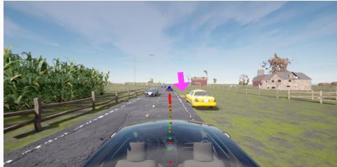

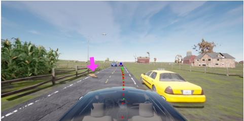  
(a) OOD object: an animal

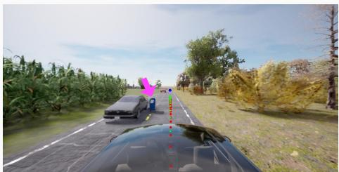  
(b) OOD object that can be safely driven past

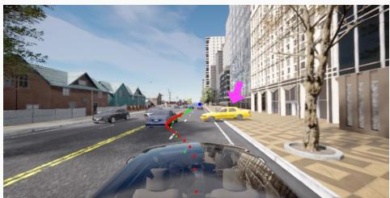  
(c) Unconventional parking scenario  
Figure A.5: Qualitative examples on Fail2Drive scenarios. (a) The ego decelerates as an animal crosses the road and resumes once the path is clear; an unusually positioned vehicle is also parked on the roadside. These animals and parking cars on the roadside do not exist in the training set, making this an OOD scenario. (b) A bin as an OOD object lies outside the drivable corridor, so the ego proceeds without deviation. (c) The ego correctly plans a lane change to avoid a vehicle parked in an unconventional manner, unseen during training. Objects of interest are indicated by a magenta arrow; red: path waypoints, green: speed waypoints, blue: target points.

## A.7 Language Capabilities

Here, we include qualitative and quantitative results to demonstrate the language capabilities of the model trained for closed-loop driving. To this end, we report quantitative VQA results, present closedloop driving results with CoT reasoning, include qualitative results for VQA and using high-level commands for navigational conditioning.

## A.7.1 DriveLM-CARLA VQA Evaluation

Dataset and inference. We evaluate FIVE-VLA and SimLingo on DriveLM-CARLA [79], without additional training or adaptation for this evaluation. We use the same 200 randomly selected routes for both models, comprising 9,428 key frames and 266,952 question-answer pairs spanning perception (46%), prediction (32%), and planning (22%). Each question is answered independently using the front-camera image and recorded ego-state inputs through the model's VQA interface, with memory state reset between questions. This assesses the existing checkpoints’ driving-related language capability and it is not an evaluation of temporal RAM reasoning in the answer stream.

Table A.18: Effect of text generation on throughput for SimLingo and FIVE-VLA on a T4 GPU. We report fps and, in parentheses, the mean number of sequential LLM forward passes per trajectory. Efficient Driving supplies the fixed four-token prefix as input, requiring one pass; Driving generates the four tokens and then predicts the trajectory, requiring five (Sec. 3.2). Gray font shows modes not available in the standard implementation of a model. Text generation substantially reduces the throughput. FIVE-VLA achieves \~ 3× higher throughput than SimLingo across all modes. RAM accumulation is used with FIVE-VLA.
<table><tr><td>Model</td><td>Efficient Driving</td><td>Driving</td><td>Driving with CoT</td></tr><tr><td>SimLingo</td><td>1.06 (1)</td><td>0.50 (5)</td><td>0.13 (25.30)</td></tr><tr><td>FIVE-VLA</td><td>3.89 (1)</td><td>1.46 (5)</td><td>0.39 (24.55)</td></tr></table>

Table A.19: Space and time efficiency comparison with VLAs. #Tokens includes the number of tokens propagated to the LLM. For SimLingo and ORION, we measure time efficiency and #Tokens without CoT for a fair comparison. Mem.(GB) denotes peak GPU VRAM utilisation on A100 during inference. OOM: Out-of-memory for ORION on T4. \*: As trained models are not public for AutoVLA and DriveMoE, the throughput and #Tokens are incomplete. AutoVLA reports ～ 1 fps as throughput, although the GPU type is not specified. DriveMoE does not report throughput.
<table><tr><td rowspan="2">Method</td><td colspan="3">Space</td><td colspan="3">Throughput in fps ↑</td><td rowspan="2">DS↑</td><td rowspan="2">SR(%) ↑</td></tr><tr><td>#Params↓</td><td>#Tokens↓</td><td>VRAM (GB) ↓</td><td>T4</td><td>A100</td><td>H200</td></tr><tr><td>DriveMoE* [8]</td><td>3B</td><td></td><td></td><td></td><td></td><td></td><td>74.22</td><td>48.64</td></tr><tr><td>ORION [1]</td><td>7B</td><td>599</td><td>28.93</td><td>OOM</td><td>0.98</td><td>2.13</td><td>77.74</td><td>54.62</td></tr><tr><td>AutoVLA* [2]</td><td>3B</td><td></td><td></td><td></td><td>~1</td><td></td><td>78.84</td><td>57.73</td></tr><tr><td>SimLingo [18]</td><td>1B</td><td>577</td><td>2.02</td><td>0.50</td><td>7.99</td><td>14.14</td><td>85.88</td><td>68.18</td></tr><tr><td>FIVE-VLA</td><td>641M</td><td>2x164</td><td>1.68</td><td>3.89</td><td>29.96</td><td>56.71</td><td>90.95</td><td>77.27</td></tr></table>

Scoring protocol. Following DriveLM's use of complementary language metrics, we report SPICE, BLEU-4, ROUGE-L, CIDEr, and METEOR, together with an LLM Judge-score. We replace the ChatGPT judge with the open-weight Qwen3-30B-A3B-Instruct-2507 model [88]2, applying the same reference-answer rubric to both models. The judge receives the generated and ground-truth answers and scores content agreement from 0 to 100, explicitly ignoring sentence structure and assigning zero to completely different content; it does not inspect the image or independently verify the driving scene. The scoring implementation uses temperature 0.6 with thinking disabled and averages valid returned scores. Standard captioning metrics use the same answer normalisation and evaluator for both models: answer prefixes and end-of-message markers are removed, and the evaluator processes chunks of up to 500 pairs, combining chunk-level metrics weighted by the number of pairs. Only Judge-score is reported on a 0-100 scale; the remaining metrics retain their evaluator scales.

Results and scope. FIVE-VLA outperforms SimLingo on all six reported metrics in Tab. A.20, including a 10.96-point gain in Judge-score. The complementary gains in semantic-content metrics and lexical-overlap metrics support stronger agreement with reference answers, providing evidence that efficient trajectory prediction need not come at the expense of driving-related language capability in this evaluation.

## A.7.2 Closed-Loop Driving with CoT Reasoning.

Tab. A.21 compares how driving performance of SimLingo and FIVE-VLA changes when driving with CoT is used. We observe that the driving performance of the models slightly degrades for both models. For example, the success rate drops around 1.8 points for SimLingo and 3.3 points for FIVE-VLA when driving with CoT reasoning is used. However, the gap between SimLingo and FIVE-VLA still remains substantial.

Table A.20: Language performance on DriveLM-CARLA without additional training. Both models answer the same 266,952 VQA pairs. All metrics are higher-is-better; Judge-score uses Qwen3 rather than ChatGPT and is on a 0–100 scale. The last row gives absolute differences computed from the displayed scores, not relative percentages.
<table><tr><td>Model</td><td>Judge-score</td><td>SPICE</td><td>BLEU-4</td><td>ROUGE-L</td><td>CIDEr</td><td>METEOR</td></tr><tr><td>SimLingo [18]</td><td>71.80</td><td>0.8724</td><td>0.7207</td><td>0.8477</td><td>7.0825</td><td>0.5057</td></tr><tr><td>FIVE-VLA (Ours)</td><td>82.76</td><td>0.9113</td><td>0.8164</td><td>0.9023</td><td>8.0742</td><td>0.5754</td></tr><tr><td>Absolute gain</td><td>+10.96</td><td>+0.0389</td><td>+0.0957</td><td>+0.0546</td><td>+0.9917</td><td>+0.0697</td></tr></table>

Table A.21: Closed-loop evaluation results on Bench2Drive benchmark with different driving modes of SimLingo and FIVE-VLA.
<table><tr><td>Model</td><td>Driving Mode</td><td>FastVLM</td><td>RAM</td><td>DS↑</td><td>SR(%) ↑</td></tr><tr><td rowspan="2">SimLingo</td><td>Driving w.CoT</td><td>x</td><td>x</td><td>85.84</td><td>66.36</td></tr><tr><td>Driving</td><td>x</td><td>x</td><td>85.88</td><td>68.18</td></tr><tr><td rowspan="3">FIVE-VLA</td><td>Efficient Driving</td><td>√</td><td>X</td><td>88.49</td><td>73.03</td></tr><tr><td>Driving w.CoT</td><td>√</td><td>√</td><td>88.74</td><td>73.94</td></tr><tr><td>Efficient Driving</td><td>√</td><td>√</td><td>90.95</td><td>77.27</td></tr></table>

## A.7.3 Qualitative Examples

In this section, we provide qualitative results obtained with our model and compare them with Sim-Lingo. These experiments suggest that FIVE-VLA preserves the language capabilities of SimLingo in CoT reasoning, VQA and the ability to process high-level commands.

CoT Reasoning and VQA. As qualitative examples, we provide CoT reasoning also by including a total of 8 VQA examples across three different scenarios. We collect these scenarios randomly while paying attention to their diversity (night time pedestrian crossing, urban driving with construction zone blocking the road, highway exit). We compare FIVE-VLA with SimLingo in all cases to provide relative insights on the performance of our model. Overall, we observe that both models produce very similar textual responses. We also notice that the trajectories generated in CoT reasoning mode and VQA are very similar, thus we only display the former in Fig. A.6-Fig. A.8, for brevity.

In Fig. A.6, we present a nighttime driving scenario where a pedestrian is crossing the route. In the commentary section, when asked “What should the ego do next?", FIVE-VLA provides a more comprehensive response (“Follow the route. Decelerate due to the pedestrian intersecting your path.") compared to SimLingo (“Follow the route. Maintain the reduced speed due to the pedestrian intersecting your path."). FIVE-VLA correctly identifies the need to decelerate, while SimLingo suggests maintaining an already reduced speed, which may not adequately respond to the dynamic situation. For the VQA questions, both models demonstrate similar perception capabilities. When asked "Does the ego vehicle need to brake? Why?", both models hallucinate a gray bicycle in the scene. Regarding lane changes, FIVE-VLA correctly states the ego vehicle can “stay on its current lane," matching SimLingo's response. Both models accurately identify “1 pedestrian" when asked “How many pedestrians are there?", demonstrating consistent perception accuracy. Overall, in this example, FIVE-VLA shows more appropriate situational reasoning, particularly in identifying the immediate need to decelerate for the pedestrian.

Second, in Fig. A.7, we present an urban driving scenario with a construction zone blocking the road requiring the ego to navigate around the obstruction. In driving with CoT reasoning, both models provide identical and appropriate responses: “Go around the construction site. Wait for a gap in the traffic before changing lanes to the lane with oncoming traffic." This shows that both models correctly understand the need to wait for safe traffic conditions before executing the lane change manoeuvre around the construction zone. For the VQA, both models show consistent reasoning capabilities as well. When asked “Does the ego vehicle need to change lanes or deviate from the lane centre due to an upcoming construction?", both models correctly respond that “The ego vehicle must change to the opposite lane to circumvent the construction warning," demonstrating accurate scene understanding and appropriate action planning. Regarding the potential threat from nearby vehicles, when asked “The ego vehicle follows the road. Is the black car that is nearby to the front left of the ego vehicle potentially crossing the path of the ego vehicle?", both FIVE-VLA and SimLingo correctly identify that "No, the black car is not crossing paths with the ego vehicle." This suggests that both models are able to handle spatial relationships and provide safe and contextually appropriate responses in this scenario.

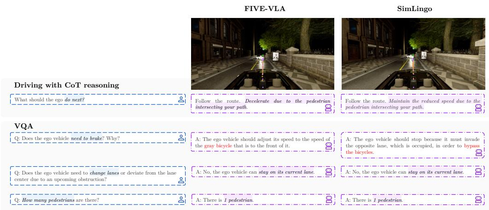

Figure A.6: Qualitative example for CoT reasoning and VQA. A night scene where a pedestrian crossing the street. The trajectory is obtained in CoT reasoning mode. purple: path waypoints, orange: speed waypoints, green: target points.  
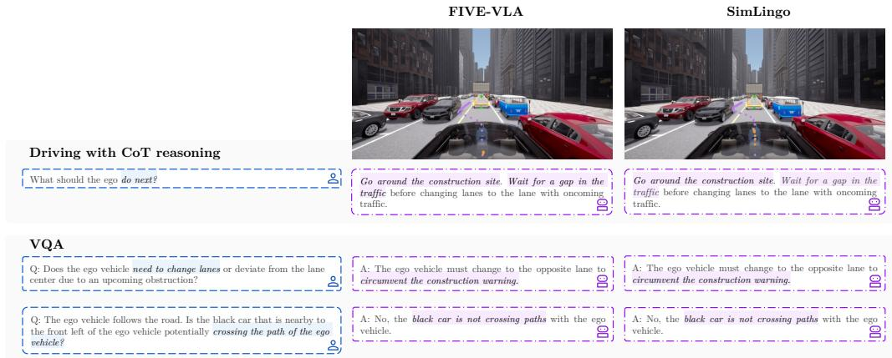

Figure A.7: Qualitative example for CoT reasoning and VQA. An urban driving scene with construction zone blocking the road. The trajectory is obtained in CoT reasoning mode. purple: path waypoints, orange: speed waypoints, green: target points.  
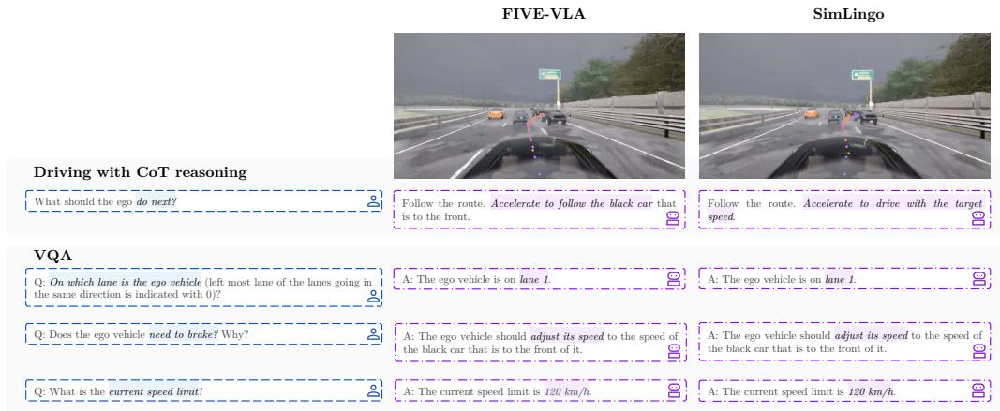  
Figure A.8: Qualitative example for CoT reasoning and VQA. A scene where the ego should exit the highway. The trajectory is obtained in CoT reasoning mode. purple: path waypoints, orange: speed waypoints, green: target points.

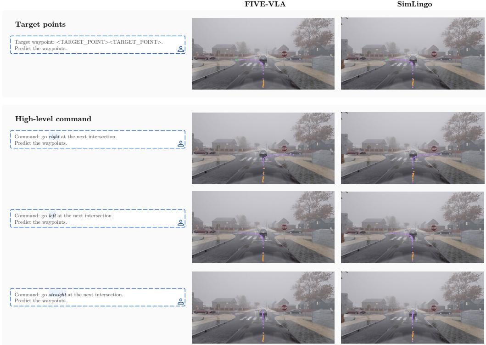  
Figure A.9: Qualitative example for following high-level commands in an intersection. The path waypoints are planned accordingly, while the speed waypoints keep the vehicle stopped considering the stop sign ahead. purple: path waypoints, orange: speed waypoints, green: target points.

Finally, in Fig. A.8, we present a highway scenario where the ego vehicle should exit the highway. As the CoT reasoning, FIVE-VLA responds “Follow the route. Accelerate to follow the black car that is to the front," while SimLingo provides “Follow the route. Accelerate to drive with the target speed." Both responses appropriately identify the need to accelerate; however, FIVE-VLA's reasoning is more specific by referencing the black car ahead, while SimLingo focuses on matching the target speed, which may be more aligned with general highway driving principles. For the VQA, both models demonstrate consistent perception and reasoning. When asked “On which lane is the ego vehicle (leftmost lane of the lanes going in the same direction is indicated with 0)?", both correctly identify “The ego vehicle is on lane 1."Regarding braking, when asked “Does the ego vehicle need to brake? Why?", both models provide identical responses: “The ego vehicle should adjust its speed to the speed of the black car that is to the front of it," showing appropriate behaviour. For the speed limit question “What is the current speed limit?", both models accurately respond “The current speed limit is 120 km/h," reflecting appropriate use of contextual cues. Overall, FIVE-VLA shows comparable performance to SimLingo in this highway scenario, with both models providing safe driving suggestions grounded in the environmental context.

High-level Commands. We present two qualitative examples to demonstrate the capability of FIVE-VLA in following high-level commands for navigational conditioning instead of target points. In Fig. A.9, we show an intersection scenario where FIVE-VLA conditions on target points as well as different high-level commands. In the first row with target points (in green), the models generate similar trajectories (i.e., path waypoints). When switching to high-level command conditioning, FIVE-VLA demonstrates its ability to adapt its trajectory based on different navigational instructions. In the second row, when given the command “go right at the next intersection,"FIVE-VLA generates a path that appropriately curves to the right. In the third row, with the command “go left at the next intersection," FIVE-VLA produces a trajectory that curves to the left, with the path waypoints clearly deviating leftward from the straight trajectory. Finally, in the fourth row, when instructed to “go straight at the next intersection,"FIVE-VLA maintains a path similar to the baseline, continuing straight through the intersection. Please note that the speed waypoints prevent the ego from moving considering the stop sign regardless of the navigational command.

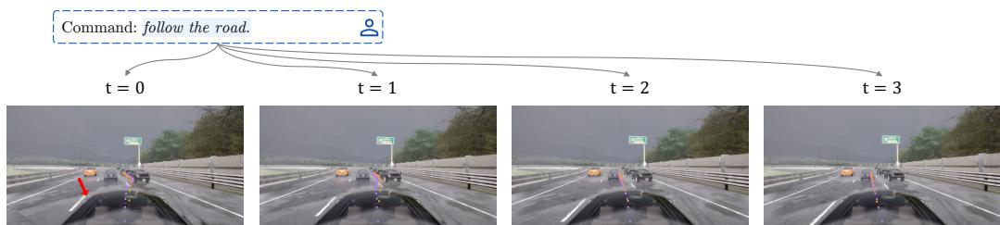  
Figure A.10: Qualitative example showing the smooth change in trajectory across time steps thanks to RAM The model is prompted to follow the road, instead of being guided to exit the highway. For the highway exit, the ego vehicle has begun changing lanes to the right, as evidenced by the lane gap highlighted with a red arrow at t = 0. When prompted to “follow the road", FIVE-VLA predicts a trajectory that smoothly adapts over time.

In Fig. A.10, we demonstrate FIVE-VLA's smooth adaptation of its trajectory when following highlevel commands thanks to RAM. Specifically, when given the high-level command "follow the road," FIVE-VLA gradually overrides the initial intent which was guided by previous target points, with the trajectory following the road at t = 3.

These examples demonstrate that FIVE-VLA successfully interprets and executes high-level navigational commands adjusting its planned trajectory accordingly while maintaining safe driving behaviour. The model shows consistent understanding of directional commands and translates them into appropriate path planning decisions at the intersection.

## A.8 Main Limitations

Here we discuss two main limitations of the FIVE-VLA.

Short temporal memory. RAM conditions action prediction on action tokens from the preceding time step, aggregating a temporal context of T=4 steps. Consistent with the intuition underlying TRM [37], this compact horizon already yields meaningful performance gains. As driving scenes evolve slowly, adjacent frames share strong visual similarity, allowing the LLM to exploit its recurrent context more effectively rather than inferring actions from scratch at each step. While this design preserves computational efficiency and proves sufficient for the evaluated scenarios, it may be inadequate for manoeuvres requiring longer-horizon temporal reasoning. Equipping VLAs with scalable long-horizon memory thus remains an important open challenge.

LiDAR- and Radar-free perception. FIVE-VLA relies exclusively on RGB camera input, foregoing the depth and range accuracy provided by LiDAR and Radar. While camera-only models have shown competitive performance on closed-loop benchmarks (Tab. 1), LiDAR and Radar typically add extra reliability for 3D perception in safety-critical real-world scenarios. Integrating these sensors within the VLA framework without sacrificing the efficiency gains of FIVE-VLA is an open challenge.