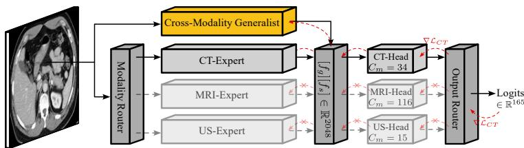
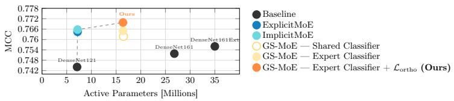
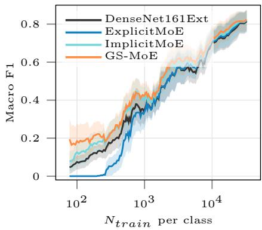
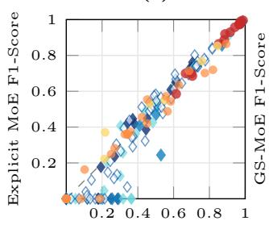
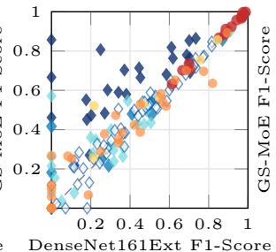
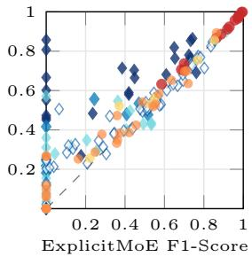

# Generalist-Specialist Mixture-of-Experts for Rare Pathology Detection in Multimodal Imaging

Johannes Kaiser1,2,∗ , Florian Braunmiller1,∗, Daniel Rückert1,3 , and Georgios Kaissis2

1 Chair for AI in Healthcare and Medicine, Technical University of Munich (TUM) and TUM University Hospital, Munich, Germany

2 Hasso Plattner Institute for Digital Engineering, University of Potsdam, Potsdam, Germany

3 Department of Computing, Imperial College London, UK

Abstract. AI models for multimodal medical imaging must balance modality-specific specialization with cross-modal shared representations, a trade-of that pure Mixture-of-Experts (MoE) architectures currently fail to satisfy. Expert-based routing improves in-domain learning but may sacrifice cross-modal signals, which appear particularly important for rare (low-prevalence) pathologies in our experiments. To resolve this, we introduce Generalist-Specialist-MoE (GS-MoE), a two-branch MoE architecture that couples a cross-modal generalist model with distinct modality-specific specialists (experts) via domain-constrained feature fusion. On RadImageNet (1.35M images, 165 pathologies, three modalities), GS-MoE recovers detection of six low-prevalence pathologies on which every baseline scores F1 = 0, with per-class gains up to +0.60 F1. It attains this while even slightly exceeding dense and specialist-only MoE aggregate baselines (MCC 0.770), while using ∼53% fewer active parameters at inference than the strongest investigated dense model.

Keywords: Mixture of Experts · MoE.

## 1 Introduction

Medical imaging analysis has shifted from small, single-organ cohorts to large, multimodal, multi-organ datasets such as RadImageNet [26], comprising 1.35 million instances across 165 pathologies of varying prevalence. While such largescale datasets enable learning generalized representations, monolithic architectures struggle to reconcile the heterogeneity [23], arising naturally from variations in patient demographics, anatomy/pathology, and imaging modalities.

Jointly training a single model across diverse imaging modalities exposes a fundamental conflict between two competing transfer efects. Negative transfer [17,36] occurs when conflicting gradients across weakly related modalities hinder learning, degrading performance on low-prevalence data groups [11]. Positive transfer arises when shared anatomical structures provide a synergistic signal, benefiting low-prevalence classes with limited in-domain data [32,15].

To benefit low-prevalence data groups (i.e., classes with few training samples we use as a data-driven proxy for rarity, without implying clinical rarity), this motivates a clear desideratum: an architecture must simultaneously minimize negative transfer efects while retaining the potential benefits of cross-modal positive transfer. Unfortunately, this cannot be resolved trivially, as avoiding negative transfer requires training on highly related data, while positive transfer requires incorporating unrelated data to augment the limited in-domain information on low-prevalence pathologies.

To address this conflict, we propose the use of Generalist-Specialist Mixtureof-Experts (GS-MoE), a dual-stream MoE architecture that combines a modalitygated MoE with experts acting as specialists on a related subset of the data with a global generalist trained on all available multimodal data. MoEs address this by distributing data across distinct experts, operating on well-aligned subsets, while still being capable of processing diverse, multimodal datasets.

MoEs have gained substantial traction driven by their ability to scale model capacity to trillions of parameters [10,16,24] with minimal computational overhead by activating only a sparse subset of experts [27,9,2,12]. The modularity of MoEs enables GS-MoE to scale to large datasets by splitting data into wellaligned subsets with domain-specific experts. In vision, prior work focuses mostly on MoE vision transformers with patch-wise experts [2,13,29,33,6], but also extends to CNN-based instance-wise routing [35] and interpretability [29].

We build on instance-wise routing [35,7] by routing inputs based on the imaging modality. Like uni-modal monolithic architectures, modality-gated MoEs cannot benefit from positive transfer learning. To address this shortcoming and fulfill our aforementioned desideratum, unlike prior works in MoE-based medical image classification [21,25], segmentation [28,5,34], and VLMs [18,19], we introduce an additional generalist branch alongside the MoE. Conceptually, the MoE provides modality-specific latent encodings of the input, which are augmented by shared cross-modal information from a general branch to benefit from multimodal transfer learning [37]. Our contributions are as follows:

1. We identify cross-domain gradient interference as a likely driver of lowprevalence collapse under modality routing, and propose GS-MoE, a sparse dual-stream architecture that isolates it while retaining positive transfer.

2. We make six low-prevalence pathologies detectable that every dense and specialist-only MoE baseline fails entirely (F1 = 0) with gains up to +0.60 F1, attributed to cross-modal positive transfer via the generalist.

3. These tail gains come without aggregate cost, as GS-MoE also leads all baselines in overall MCC (0.770) while using ∼53% fewer active parameters at inference than the strongest dense baseline, at matched total parameters.

We expect the modular design of GS-MoE to enable scalability across new tasks, modalities, and patient demographics.

  
Fig. 1: Schematic representation of GS-MoE with the Expert Classifier. Showing an exemplary forward (black) and backward (red) pass for a CT input. Training is performed in stages, with each part trained on its relevant subset of data.

## 2 Methods

## 2.1 Routing Strategies: Implicit vs. Explicit

multimodal classification induces two competing transfer efects: Negative transfer occurs when the gradient signal of weakly related data distributions across modalities is conflicting during joint optimization, hindering modality-specific feature learning [17,36]. Positive transfer arises when shared (anatomy, intensity etc.) structures across distributions provide a complementary signal, potentially benefiting low-prevalence classes with limited in-domain data [32,15].

Explicit routing uses a metadata-trained assignment to route data to a (modality-)specific expert. Focusing on a single modality prevents negative transfer but limits positive transfer. Implicit routing learns assignments end-to-end, enabling transfer learning. Yet without careful initialization, implicit routing collapses to a single expert, yielding uninterpretable, ineficient routing while reliable metadata goes unused. Neither approach simultaneously ensures interpretable routing, cross-modal feature sharing, and prevents negative transfer efects, a limitation GS-MoE resolves.

## 2.2 Generalist-Specialist-MoE (GS-MoE)

To resolve this trade-of, we propose Generalist-Specialist-MoE (GS-MoE), schematized in Fig. 1: a two-branch architecture coupling a cross-modal generalist with modality-specific experts that reduce exposure to cross-domain negative transfer. The Generalist Branch acts as an always-active shared pathway, analogous to shared-expert isolation in MoE architectures [8], but realized as a full-capacity branch pre-trained across all modalities that also seeds the specialists, learning a shared representation $\mathbf { f } _ { g } ~ \in ~ \mathbb { R } ^ { d }$ benefiting from positive transfer. The Specialist Branch is an MoE with explicit routing: a frozen metadata-trained router identifies modality m and activates the relevant expert, yielding domainconstrained features $\mathbf { f } _ { s } \in \mathbb { R } ^ { d }$ while keeping routing interpretable by construction. The branches are fused by concatenation, $\mathbf { f } _ { \mathrm { f u s e d } } ~ = ~ [ \mathbf { f } _ { g } \| \mathbf { f } _ { s } ] ~ \in ~ \mathbb { R } ^ { 2 d }$ , and jointly fine-tuned with the router frozen. To enforce complementary representations, we apply a cosine orthogonality penalty inspired by [1], as $\mathcal { L } _ { \mathrm { o r t h o } } =$ $\begin{array} { r } { B ^ { - 1 } \sum _ { i } ( \mathbf { f } _ { g } ^ { \top } \mathbf { f } _ { s } \| \hat { \mathbf { f } } _ { g } \| ^ { - 1 } \| \mathbf { f } _ { s } \| ^ { - 1 } ) ^ { 2 } } \end{array}$ , with B the batch size.

## 2.3 Domain-Constrained Optimization: Why Shared Heads Fail

$\mathbf { f } _ { \mathrm { f u s e d } }$ exposes a structural vulnerability when passed through a shared output head. Consider D domains with $| C _ { m } |$ classes in domain m and $| C _ { \mathrm { t o t a l } } | =$ $\textstyle \sum _ { m } | C _ { m } |$ . A shared head $\phi _ { \mathrm { s h a r e d } } : \mathbb { R } ^ { 2 d } \stackrel { \cdot } { \to } \mathbb { \tilde { R } } ^ { | C _ { \mathrm { t o t a l } } | }$ applied to a domain-m sample computes the loss over all $| C _ { \mathrm { t o t a l } } |$ , including clinically impossible ones. Gradients then flow through all $| C _ { \mathrm { t o t a l } } |$ outputs, with the $\left. C _ { \mathrm { t o t a l } } \right. - \left. C _ { m } \right.$ non-domain outputs diluting the signal. We address this via modality-specific network heads $\left\{ \phi _ { m } \right\}$ , each mapping $\mathbb { R } ^ { 2 d } \to \mathbb { R } ^ { | C _ { m } | }$ . While restricting predictions to the modality’s valid-label subset is an established masking operation [3], our contribution is the finding that its benefit is not difuse but concentrated on low-prevalence classes, consistent with removal of cross-domain gradient interference where indomain data is scarcest. We ablate this in Table 3 and find that this raises MRclass macro-F1 from 0.4092 to 0.4537 (+0.045) on low-prevalence classes. During training, metadata selects the correct head, inducing $\begin{array} { r } { \mathcal { L } _ { \mathrm { C E } _ { m } } = - \sum _ { c \in C _ { m } } y _ { c } \log \hat { p } _ { c } , } \end{array}$ with $\mathcal { L } = \mathcal { L } _ { \mathrm { C E } _ { m } } + \lambda \mathcal { L } _ { \mathrm { o r t h o } }$ At inference, At inference produces produces $| C _ { m } |$ logits, which a fixed, expert-knowledge-driven logits, which a fixed, expert-knowledge-driven

$\phi _ { m }$ assignment matrix maps to the global $| C _ { \mathrm { t o t a l } } |$ |-dimensional label space.

## 3 Experimental Setup

Dataset. We evaluate on RadImageNet [26], a large multimodal pathology classification dataset with 1.35M 2D images across Computed Tomography (CT), Magnetic Resonance (MR), and Ultrasound (US), comprising 165 classes: $| C _ { \mathrm { C T } } | =$ $3 4 , | C _ { \mathrm { M R } } | = 1 1 6 , | C _ { \mathrm { U S } } | = 1 5$ . All models use the oficial train/val/test splits. Generalist-Specialist-MoE (GS-MoE) We implement GS-MoE with DenseNet121 (pre-classifier output dimensionality $d = 1 0 2 4 )$ for both generalist and specialists, yielding $\mathbf { f } _ { \mathrm { f u s e d } } \ \in \ \mathbb { R } ^ { 2 0 4 8 }$ with domain-specific expert classifiers $\phi _ { m } \colon 2 0 4 8 \to 1 0 2 4 \to | C _ { m } |$ and modality router, a lightweight DenseNet29 (4 blocks, growth rate = 8, ∼61k params, $> 9 9 . 9 \%$ modality prediction accuracy). Routing is modality-based, which outperforms modality × anatomy experts. Training follows a three-stage curriculum (ablated in Table 1): (1) generalist pre-training on all 165 classes, (2) specialist generation via sparse upcycling [22] from the converged generalist and modality-specific fine-tuning, and (3) GS-MoE construction and joint fine-tuning of branches and classifiers. This procedure preserves cross-modal features while enabling high-capacity, low-cost training. Baselines. As commonly used in medical imaging classification tasks [4,30], we consider DenseNet121 (7.1M), DenseNet161 (26.8M) [14], and a parametermatched DenseNet161Ext (blocks: 6/12/36/38, 35.0M) trained on the full corpus as dense monolithic baselines. As MoE baselines, we use ExplicitMoE, identical to GS-MoE but without the generalist branch, and ImplicitMoE, which shares the architecture yet is trained end-to-end. Remark: While we use DenseNets due to slightly higher performance, our findings directly translate to ViT-T/ViT-S backbones, indicating the efect is architectural (see Section 5). Training Setup and Metrics. Models are trained until convergence with AdamW, cosine annealing $( T _ { 0 } = 4 )$ , on $2 2 4 \times 2 2 4$ inputs with random afine and horizontal flips.

Hyperparameters are empirically optimized. We report Matthews Correlation Coeficient (MCC) as the primary metric for its robustness to class imbalance, alongside macro-F1.

## 4 Results

## 4.1 Aggregate Results

Table 1 summarizes test-set performance across all architectures. Without sparse upcycling MoEs collapse to ExplicitMoE MCC of 0.639 and ImplicitMoE MCC of 0.691. Mean and standard deviation are computed across 9 seeds throughout. The ranking in terms of MCC across DenseNet161 < ExplicitMoE < GS-MoE (Expert) is statistically significant $( p < 0 . 0 5$ , paired t-test). At inference, GS-MoE activates only the generalist, the frozen router, and one expert (∼16.4M parameters), using ∼53% fewer active parameters than DenseNet161Ext (35.0M parameters). This reduction is structurally guaranteed by routing and is Paretooptimal in terms of parameter eficiency (see Fig. 2).

Table 1: MoEs outperform dense models. GS-MoE achieves top MCC/F1 with ∼53% fewer active params. than DenseNet161Ext. Best in family, Best overall.
<table><tr><td>Family</td><td>Model</td><td>MCC</td><td>macro-F1</td><td>Active Params Total Params</td><td></td></tr><tr><td rowspan="3">Baseline</td><td>DenseNet121</td><td> $\overline { { 0 . 7 4 4 ^ { \pm 0 . 0 2 2 } } }$ </td><td> $\overline { { 0 . 7 5 1 ^ { \pm 0 . 0 2 0 } } }$ </td><td>7.1M</td><td>7.1M</td></tr><tr><td>DenseNet161</td><td> $0 . 7 5 2 ^ { \pm 0 . 0 1 8 }$ </td><td> $0 . 7 5 9 ^ { \pm 0 . 0 1 6 }$ </td><td>26.8M</td><td>26.8M</td></tr><tr><td>DenseNet161Ext</td><td> $0 . 7 5 6 ^ { \pm 0 . 0 1 2 }$ </td><td> $0 . 7 6 3 ^ { \pm 0 . 0 1 0 }$ </td><td>35.0M</td><td>35.0M</td></tr><tr><td rowspan="2">MoE</td><td>Explicit</td><td> $0 . 7 6 4 ^ { \pm 0 . 0 0 3 }$ </td><td> $\overline { { 0 . 7 7 1 ^ { \pm 0 . 0 0 4 } } }$ </td><td>7.2M</td><td>21.4M</td></tr><tr><td>Implicit</td><td> $0 . 7 6 6 ^ { \pm 0 . 0 0 5 }$ </td><td> $0 . 7 7 2 ^ { \pm 0 . 0 0 6 }$ </td><td>7.2M</td><td>21.4M</td></tr><tr><td rowspan="2"> $\mathrm { G S - M o E }$ </td><td>Shared Classifier</td><td> $0 . 7 6 2 ^ { \pm 0 . 0 0 5 }$ </td><td> $0 . 7 6 8 ^ { \pm 0 . 0 0 5 }$ </td><td>16.5M</td><td>30.8M</td></tr><tr><td>Expert Classifier</td><td> $\mathbf { 0 . 7 7 0 ^ { \pm 0 . 0 0 3 } }$ </td><td> $\mathbf { 0 . 7 7 6 ^ { \pm 0 . 0 0 4 } }$ </td><td>16.4M</td><td>35.0M</td></tr></table>

  
Fig. 2: MCC vs. active parameters. Dashed line: Pareto frontier. GS-MoE (Expert Classifier $+ \ L _ { o r t h o } )$ is Pareto optimal w.r.t. parameter eficiency, outperforming explicitly and implicitly routed MoE as well as dense models.

## 4.2 Routing Strategies Face Mutually Exclusive Failure Modes

Our evaluations show that monolithic models and baseline MoEs face mutually exclusive failure modes, motivating the proposed generalist-specialist MoE.

Negative transfer and pre-training. Scaling monolithic capacity shows diminishing returns: DenseNet161Ext improves over DenseNet121 by only +1.2 pp in MCC at 4.9× more parameters, indicating an architectural ceiling. GS-MoE resolves this limit and outperforms DenseNet121 by +2.6 pp, with matched total and ∼53% fewer active parameters.

Cost of explicit routing on MR domains. Explicit routing improves visually isolated domains (CT-Lung +0.041, US +0.008 group/modality aggregated F1) but degrades all eight MR groups (e.g., MR-Brain −0.087, MR-Abdomen −0.064, MR-Hip −0.051, MR-Ankle −0.035). At the pathology level, as evidenced in Fig. 3, ExplicitMoE improves on none of the 20% lowest-performing classes relative to DenseNet161, with brain-pituitary collapsing $0 . 7 2 7  0 . 0 0 0$ AF-coalition $0 . 4 0 0  0 . 0 0 0$ , and AF-spring ligament $0 . 3 1 6  0 . 0 0 0 .$ , indicating that ExplicitMoE may not efectively leverage cross-domain information for these classes.

Implicit routing recovers representation but not semantics. Without pre-training, ImplicitMoE deposits 93.6% of inputs to a single expert despite an auxiliary load-balancing loss [31]. Sparse upcycling restores a distributed routing profile (41.5/34.5/24.0%). Clustering analysis reveals that the router forms datadriven groups: one expert specializes in CT-Lung imagery (91.1% CT, 90.5% lung), while the remaining experts process a heterogeneous mix. Despite this, as the only baseline model, ImplicitMoE outperforms DenseNet161 across all 11 anatomical groups, with the largest gains on MR-Ankle (+0.083), MR-Spine (+0.050). Nonetheless, lacking explicit global cross-modal features, both routing strategies fail on the low-prevalence classes (Fig. 3).

## 4.3 Hard Class Recovery: A Qualitative Capability Gap

While ExplicitMoE mitigates negative transfer, gaining slightly on distinct modal ities (US, CT-Lung), it lacks positive transfer during fine-tuning, degrading cross-modal knowledge acquired during pre-training. As illustrated in Fig. 4 (a), this leads to performance collapse $( \mathrm { F } 1 = 0 )$ on some MR-pathologies. In contrast, GS-MoE architecturally augments experts with cross-modal features from a dedicated generalist branch. GS-MoE recovers performance on collapsed pathologies, particularly within the MR-Ankle/Foot group (Fig. 4 (b, c)), and significantly $( p \textless 0 . 0 0 1$ , paired t-test) outperforms all baselines on low-prevalence classes (Fig. 3), with the strongest recovery in the MR-Abdomen group (+0.057), the weakest-performing group overall. Crucially, GS-MoE achieves non-zero F1 on six low-prevalence pathologies (< 100 samples) where all baselines, including DenseNet161Ext trained with focal loss $( \gamma \in \{ 1 , 2 , 5 \} ,$ ) and post-hoc classifier rebalancing (τ -normalization, $\tau \in [ 0 , 1 ] )$ [20], fail entirely $( \mathrm { F } 1 = 0 )$ , with recoveries as large as +0.60 (lisfranc pathology), +0.56 (spring ligament) and +0.56 (coalition) (Table 2). These gains are consistent with the generalist branch providing expert-complementary information. This is evidenced by GS-MoE outperforming the explicit specialist-only MoE across most pathologies (Fig. 4 (c)), while only difering by the generalist. As the parameter-matched DenseNet161Ext does not recover the tail (Fig. 3) despite equal capacity, we attribute the low-prevalence recovery to the generalist branch. The recovered signal is cross-modal by nature, a capability unimodal experts cannot provide. Decoupling generalist (cross-modal) and specialist (unimodal) knowledge may yield a more efective feature representation than specialist-only MoEs and monolithic models.

Fig. 3: Sliding-window (width=20) macro F1 (90% CI) over prevalenceordered classes. ExplicitMoE trails all baselines on low-prevalence classes due to a lack of cross-domain information; GS-MoE recovers this regime, matching or improving throughout.  
Table 2: Top per-class gains/losses of GS-MoE vs. per-class best baseline. Classes marked with ∗ have F1 $\mathit { \Theta } = \mathit { \Theta } 0$ across all baselines and recover through cross-modal information. AF: Ankle/Foot, Abd: Abdomen, Sp: Spine.
<table><tr><td>Category</td><td> $N _ { \mathrm { t r a i n } } / _ { N _ { \mathrm { t e s t } } }$ </td><td>F1 Δ</td></tr><tr><td>Lisfranc MR-AF</td><td> $^ { 3 7 \% }$ </td><td> $\overline { { + 0 . 6 0 ^ { \pm 0 . 1 2 * } } }$ </td></tr><tr><td>Spring Lig. MR-AF</td><td> $^ { 8 3 } / 5$ </td><td> $+ 0 . 5 6 ^ { \pm 0 . 2 0 * }$ </td></tr><tr><td>Coalition MR-AF</td><td> $5 0 \%$ </td><td> $+ 0 . 5 6 ^ { \pm 0 . 3 6 * }$ </td></tr><tr><td>Hematoma MR-AF</td><td> $1 6 5 \text{‰}$ </td><td> $+ 0 . 5 5 ^ { \pm 0 . 0 4 }$ </td></tr><tr><td>Extensor MR-AF</td><td> $5 3 6 \text{‰}$ </td><td> $+ 0 . 4 4 ^ { \pm 0 . 0 3 }$ </td></tr><tr><td>Intra-Art. Mass MR-AF</td><td> $45 5 \text{‰}$ </td><td> $+ 0 . 4 0 ^ { \pm 0 . 0 3 }$ </td></tr><tr><td>Neoplasm MR-AF</td><td> $7 4 5 \% _ { 5 }$ </td><td> $+ 0 . 3 3 ^ { \pm 0 . 0 2 }$ </td></tr><tr><td>Prostate MR-Abd</td><td> $^ { 5 3 } \%$ </td><td> $+ 0 . 2 4 ^ { \pm 0 . 2 6 }$ </td></tr><tr><td>Prostate Les. CT-Abd</td><td> $78 \text{‰}$ </td><td> $- 0 . 0 5 ^ { \pm 0 . 0 2 }$ </td></tr><tr><td>Bladder CT-Abd</td><td> $1 4 7 \% _ { 1 5 7 }$ </td><td> $- 0 . 0 7 ^ { \pm 0 . 0 2 }$ </td></tr><tr><td>Renal Les.  $\mathbf { M R - A b d }$ </td><td> $^ { 1 6 2 7 } / _ { 2 3 4 }$ </td><td> $- 0 . 1 0 ^ { \pm 0 . 0 2 }$ </td></tr><tr><td>Normal  $\mathrm { C T _ { C T - A b d } }$ </td><td></td><td> $5 7 4 3 2 / 6 6 8 9 - 0 . 1 1 ^ { \pm 0 . 0 3 }$ </td></tr></table>

## 4.4 Ablation

Table 3 ablates the contribution of each part of GS-MoE and finds that Generalist, Specialist, Domain Head, and $\mathcal { L } _ { o r t h o }$ all improve MCC. The gap between the Shared Classifier and Expert Classifier isolates the efect of the shared output head (Section 2.3), as they are identical except for the output head (Table 3). The shared head degrades disproportionately on low-prevalence MR classes: with all else held fixed, switching to domain-constrained heads raises the MR-classaveraged F1 from 0.4092 to 0.4537 (+0.045, 11% relative). Moreover, the gain from domain-specific heads points to a benefit from modality-specific processing of cross-domain information.

(a)  

(b)  

(c)  
  
Fig. 4: Per-pathology F1-score comparison (165 classes). (a) ExplicitMoE improves on distinct modalities (US, CT-Lung) but collapses on MR-AF/Brain, with several classes reaching zero. (b) GS-MoE (Expert Classifier $+ \ L _ { o r t h o } )$ recovers the MR-AF cluster, outperforming the DenseNet161, including several classes at x=0 (zero-baseline performance). (c) GS-MoE (Expert Classifier + $L _ { o r t h o } )$ strongly exceeds ExplicitMoE, particularly in MRI, attributed to explicit generalist-driven cross-domain knowledge.

Table 3: Ablation of Domain-Constrained Optimization. The gap between the Shared Classifier and Expert Classifier isolates the efect of the expert head. DenseNet161Ext and ExplicitMoE serve as reference points.
<table><tr><td>Model Variant</td><td>Generalist</td><td>Specialist</td><td>Domain Head</td><td> $\mathcal { L } _ { \mathrm { o r t h o } }$ </td><td>MCC</td></tr><tr><td>DenseNet161Ext</td><td>√</td><td>X</td><td>x</td><td>X</td><td>0.756</td></tr><tr><td>ExplicitMoE</td><td>x</td><td>√</td><td>√</td><td>x</td><td>0.764</td></tr><tr><td>GS-MoE (Shared Classifier)</td><td>√</td><td>√</td><td>x</td><td>X</td><td>0.762</td></tr><tr><td>GS-MoE (Expert Classifier)</td><td>√</td><td>√</td><td>√</td><td>x</td><td>0.765</td></tr><tr><td>GS-MoE (Expert  $\mathrm { C } . \mathrm { ~ + ~ } \mathcal { L } _ { \mathrm { o r t h o } } )$ </td><td>√</td><td>√</td><td>√</td><td>√</td><td>0.770</td></tr></table>

## 5 Discussion

GS-MoE mitigates the fundamental conflict between modality-specific specialization and cross-modal sharing: low-prevalence collapse under modality routing is consistent with cross-domain gradient interference, recoverable via an alwaysactive generalist. Coupling a modality-routed specialist MoE with this generalist preserves interpretable routing while retaining shared cross-modal representations. We show that GS-MoE outperforms all investigated baselines, with the margin most pronounced in low-prevalence classes. While we showed results on dense backbones, we found the same trends with transformer backbones, with MCC of: ViT-T/S baselines 0.726/0.737, ExplicitMoE-ViT-T 0.741, GS-MoE-ViT-T 0.745. Although absolute MCC is lower than for DenseNet, the ordering (GS-MoE > ExplicitMoE > Dense) and the low-prevalence recovery are fully preserved, indicating the generalist-specialist efect is architectural rather than backbone-specific. The limitations of our work directly motivate future work extending GS-MoE to (volumetric) segmentation, integrating report-grounded supervision, developing hierarchical experts conditioned on anatomy and demographics, potentially as hierarchical MoEs, and ablations across diferent model sizes. In summary, GS-MoE shows that metadata-supervised specialization and learned generalist features contribute complementary gains, a practical step toward rare-pathology-aware multimodal imaging.

## References

1. Bousmalis, K., Trigeorgis, G., Silberman, N., Krishnan, D., Erhan, D.: Domain separation networks. In: NeurIPS (2016)

2. Cai, W., Jiang, J., Wang, F., Tang, J., Kim, S., Huang, J.: A survey on mixture of experts in large language models. IEEE Transactions on Knowledge and Data Engineering (2025)

3. Cao, Y., Gu, Q.: Generalization bounds of stochastic gradient descent for wide and deep neural networks. In: Wallach, H., Larochelle, H., Beygelzimer, A., d'Alché- Buc, F., Fox, E., Garnett, R. (eds.) NeurIPS. vol. 32 (2019)

4. Chambon, P., Delbrouck, J.B., Sounack, T., Huang, S.C., Chen, Z., Varma, M., Truong, S.Q., Chuong, C.T., Langlotz, C.P.: Chexpert plus: Augmenting a large chest x-ray dataset with text radiology reports, patient demographics and additional image formats (2024), arXiv:2405.19538

5. Chen, Q., Zhu, L., He, H., Zhang, X., Zeng, S., Ren, Q., Lu, Y.: Low-rank mixtureof-experts for continual medical image segmentation. In: MICCAI. Springer (2024)

6. Chen, T., Chen, X., Du, X., Rashwan, A., Yang, F., Chen, H., Wang, Z., Li, Y.: Adamv-moe: Adaptive multi-task vision mixture-of-experts. In: ICCV (2023)

7. Chopra, S., Sanchez-Rodriguez, G., Mao, L., Feola, A.J., Li, J., Kira, Z.: Medmoe: Modality-specialized mixture of experts for medical vision-language understanding (2025), arXiv:2506.08356

8. Dai, D., Deng, C., Zhao, C., Xu, R., Gao, H., Chen, D., Li, J., Zeng, W., Yu, X., Wu, Y., Xie, Z., Li, Y., Huang, P., Luo, F., Ruan, C., Sui, Z., Liang, W.: DeepSeekMoE: Towards ultimate expert specialization in mixture-of-experts language models. In: Proceedings of the 62nd Annual Meeting of the ACL (Volume 1: Long Papers). Association for Computational Linguistics (2024)

9. Fedus, W., Dean, J., Zoph, B.: A review of sparse expert models in deep learning (2022), arXiv:2209.01667

10. Fedus, W., Zoph, B., Shazeer, N.: Switch transformers: Scaling to trillion parameter models with simple and eficient sparsity. Journal of Machine Learning Research 23(120) (2022)

11. Fu, Y., Huang, S., Feng, Z., Ma, Y.: Rdam: Domain adaptation under small and class-imbalanced samples. Knowledge-Based Systems (2025)

12. Gan, W., Ning, Z., Qi, Z., Yu, P.: Mixture of experts (moe): A big data perspective. Information Fusion 127 (2025)

13. Han, X., Wei, L., Dou, Z., Sun, Y., Han, Z., Tian, Q.: Vimoe: An empirical study of designing vision mixture-of-experts. IEEE Transactions on Image Processing (2025)

14. Huang, G., Liu, Z., Van Der Maaten, L., Weinberger, K.Q.: Densely connected convolutional networks. In: Proceedings of the IEEE conference on computer vision and pattern recognition. pp. 4700–4708 (2017)

15. Huang, Z.A., Hu, Y., Liu, R., Xue, X., Zhu, Z., Song, L., Tan, K.C.: Federated multi-task learning for joint diagnosis of multiple mental disorders on mri scans. IEEE Transactions on Biomedical Engineering 70 (2023)

16. Jiang, A.Q., Sablayrolles, A., et al.: Mixtral of experts (2024), arXiv:2401.04088

17. Jiang, J., Chen, B., Pan, J., Wang, X., Liu, D., Jiang, J., Long, M.: Forkmerge: Mitigating negative transfer in auxiliary-task learning. NeurIPS (2023)

18. Jiang, S., Zheng, T., Zhang, Y., Jin, Y., Yuan, L., Liu, Z.: Med-moe: Mixture of domain-specific experts for lightweight medical vision-language models. In: Findings of the ACL: EMNLP 2024 (2024)

19. Jiang, Y., Shen, Y.: M4oe: A foundation model for medical multimodal image segmentation with mixture of experts. In: MICCAI. Springer (2024)

20. Kang, B., Xie, S., Rohrbach, M., Yan, Z., Gordo, A., Feng, J., Kalantidis, Y.: Decoupling representation and classifier for long-tailed recognition. In: ICLR (2020)

21. Kanwal, N., Khoraminia, F., Kiraz, U., Mosquera-Zamudio, A., Monteagudo, C., Janssen, E., Zuiverloon, T., Rong, C., Engan, K.: Equipping computational pathology systems with artifact processing pipelines: a showcase for computation and performance trade-ofs. BMC Medical Informatics and Decision Making 24 (2024)

22. Komatsuzaki, A., Puigcerver, J., Lee-Thorp, J., Ruiz, C.R., Mustafa, B., Ainslie, J., Tay, Y., Dehghani, M., Houlsby, N.: Sparse upcycling: Training mixture-of-experts from dense checkpoints. In: ICLR (2023)

23. Lakkapragada, A., Sleiman, E., Surabhi, S., Wall, D.P.: Mitigating negative transfer in multi-task learning with exponential moving average loss weighting strategies. In: AAAI. vol. 37 (2023)

24. Lepikhin, D., Lee, H., Xu, Y., Chen, D., Firat, O., Huang, Y., Krikun, M., Shazeer, N., Chen, Z.: Gshard: Scaling giant models with conditional computation and automatic sharding. In: ICLR (2021)

25. Li, J., Zhang, Y., Shu, W., Feng, X., Wang, Y., Yan, P., Li, X., Sha, C., He, M.: M4: Multi-proxy multi-gate mixture of experts network for multiple instance learning in histopathology image analysis. Medical Image Analysis 103 (2025)

26. Mei, X., Liu, Z., Robson, P.M., Marinelli, B., Huang, M., Doshi, A., Jacobi, A., Cao, C., Link, K.E., Yang, T., et al.: Radimagenet: An open radiologic deep learning research dataset for efective transfer learning. Radiology: Artificial Intelligence 4(5) (2022)

27. Mu, S., Lin, S.: A comprehensive survey of mixture-of-experts: Algorithms, theory, and applications (2026), arXiv:2503.07137

28. Ou, Y., Yuan, Y., Huang, X., Wong, S.T., Volpi, J., Wang, J.Z., Wong, K.: Patcher: Patch transformers with mixture of experts for precise medical image segmentation. In: MICCAI. Springer (2022)

29. Riquelme, C., Puigcerver, J., Mustafa, B., Neumann, M., Jenatton, R., Susano Pinto, A., Keysers, D., Houlsby, N.: Scaling vision with sparse mixture of experts. In: NeurIPS. vol. 34 (2021)

30. Santamato, V., Marengo, A.: Multilabel classification of radiology image concepts using deep learning. Applied Sciences 15(9), 5140 (2025)

31. Shazeer, N., et al.: Outrageously large neural networks: The sparsely-gated mixture-of-experts layer. In: ICLR (2017)

32. Verma, A.: How can we tame the long-tail of chest x-ray datasets? (2023), arXiv:2309.04293

33. Videau, M., Leite, A., Schoenauer, M., Teytaud, O.: Mixture of experts in image classification: What’s the sweet spot? (2025), arXiv:2411.18322

34. Wang, G., Ye, J., Cheng, J., Li, T., Chen, Z., Cai, J., He, J., Zhuang, B.: Sammed3d-moe: Towards a non-forgetting segment anything model via mixture of experts for 3d medical image segmentation. In: MICCAI. Springer (2024)

35. Wang, X., Yu, F., Dunlap, L., Ma, Y.A., Wang, R., Mirhoseini, A., Darrell, T., Gonzalez, J.E.: Deep mixture of experts via shallow embedding. In: Proceedings of The 35th Uncertainty in Artificial Intelligence Conference. vol. 115 (2020)

36. Wang, Z., Dai, Z., Póczos, B., Carbonell, J.: Characterizing and avoiding negative transfer. In: CVPR (2019)

37. Wu, J., Hu, X., Wang, Y., Pang, B., Soricut, R.: Omni-smola: Boosting generalist multimodal models with soft mixture of low-rank experts. In: CVPR. pp. 14205– 14215 (2024)