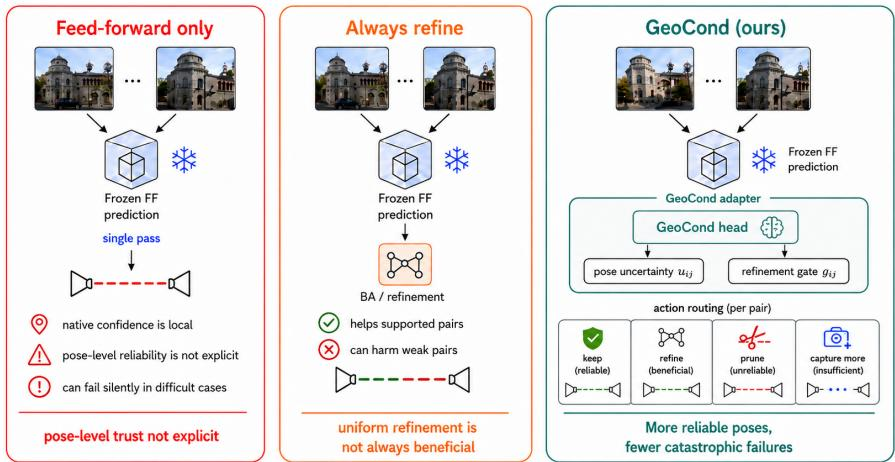
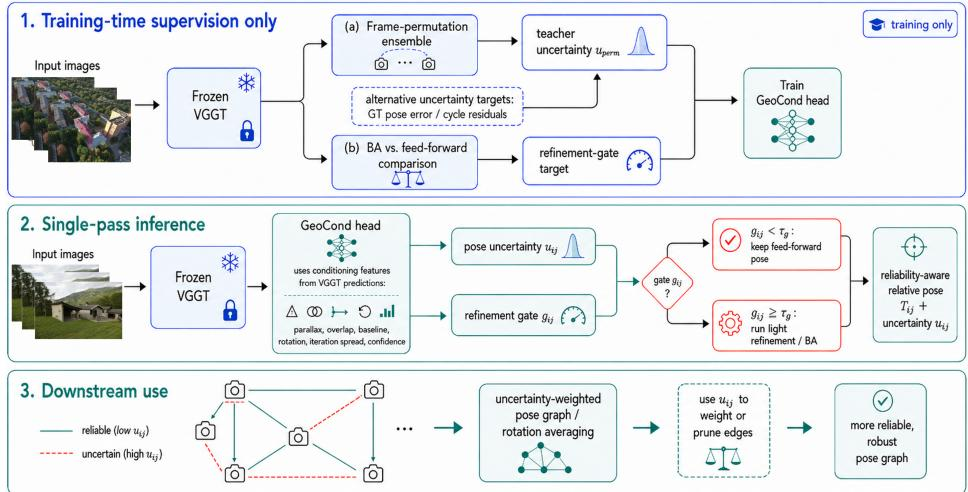
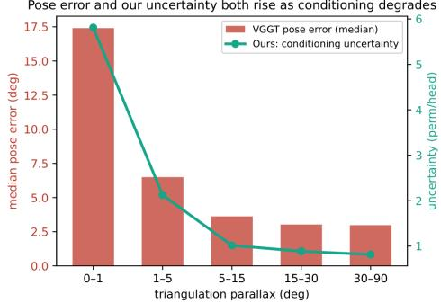
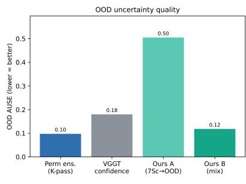
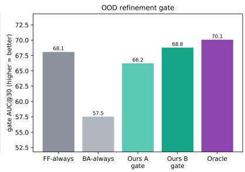
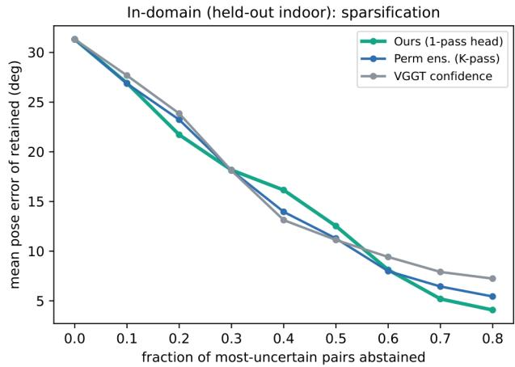
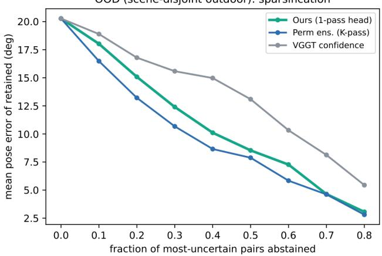
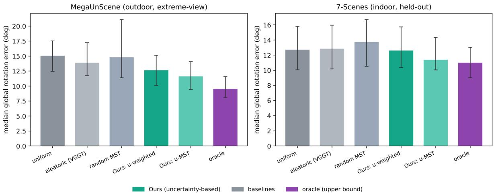

# GeoCond: A Conditioning-Aware Reliability Adapter for Feed-Forward 3D Reconstruction

David Ahmedt-Aristizabal1, Mohammad Ali Armin1, Russell Tsuchida2, Lars Petersson1 1 CSIRO, Australia, 2 Monash University, Australia

{David.Ahmedtaristizabal, Lars.Petersson}@csiro.au, russell.tsuchida@monash.edu

  
Figure 1. GeoCond as a pose-level reliability adapter. Feed-forward-only prediction provides no explicit pose-level trust signal and can fail silently in difficult cases, while uniformly applying bundle adjustment may help supported pairs but harm weak ones. GeoCond augments a frozen feed-forward backbone with conditioning features to predict pose uncertainty and a refinement gate, selectively keeping, refining, pruning, or requesting additional views for each relative pose.

## Abstract

Feed-forward 3Dfoundation models such as VGGTpredict cameras, depth, and point maps in a single pass, but can fail silently under low overlap, low parallax, and extreme relative rotation. Stratified analyses over these factors show that thesefailures are governed by geometric conditioning and are poorly captured by native aleatoric confidence. We introduce GeoCond, a lightweight reliability adapter for frozen feed-forward 3D backbones. GeoCond reads the backbone’s predicted geometry and outputs poselevel uncertainty and a refinement gate. During training, it can be supervised by frame-permutation orbit variance, ground-truth pose error when labels are available, or cycle residuals from unlabelled independent pose graphs. At inference, the default head requires only one backbone pass and a small MLP. On VGGT, GeoCond improves out-ofdistribution (OOD) AUSE (area under the sparsificationerror curve; lower is better) from 0.32 to 0.20 over native confidence, transfers zero-shot to outdoor extreme-view scenes, and avoids the collapse caused by applying bundle adjustment uniformly. Across multiple backbones, cycledistilled variants provide a ground-truth-free adaptation route, including cases where permutation variance vanishes on equivariant models. The same reliability signal supports gated refinement, pose-graph weighting, calibration, curation, and capture decisions. Reliable feed-forward 3D reconstruction requires not only predicting geometry, but also knowing when that geometry should be trusted.

## 1. Introduction

Feed-forward 3D reconstruction models—from DUSt3R [30] and MASt3R [14] to VGGT [27] and recent successors [10, 28, 31]—have made multi-view geometry increasingly accessible. Given one or more unposed images, they predict camera parameters, depth, dense point maps, and tracks in a single forward pass, often without the iterative optimization used in classical SfM/MVS pipelines [19, 23]. This makes them attractive front-ends for reconstruction, localization, robotics, and mapping. However, their reliability remains difficult to assess: a predicted pose can be wrong, yet the model provides no reliable pose-level signal that the output should not be trusted.

The missing layer is pose-level reliability. Feed-forward 3D backbones emit per-pixel, per-point, or per-track confidence, but these signals do not answer the downstream question: should this relative camera pose be trusted? A pair can contain many confident local predictions and still be globally ill-conditioned if the views barely overlap, the camera motion has little triangulation parallax, or a large relative rotation leaves weak correspondences. In these regimes, the pose can fail while native confidence remains weakly informative.

Geometric conditioning also determines whether refinement is beneficial. Bundle adjustment (BA) is often used as a post-processing step for feed-forward estimates, and learned or test-time refinement has been explored in related pipelines [6, 26]. On a frozen VGGT, BA can improve pairs with sufficient track support but corrupt low-overlap pairs whose geometric constraints are weak. Thus, the relevant question is not only how to refine a feed-forward prediction, but whether refinement should be applied at all.

We address this problem with GeoCond, a lightweight conditioning-aware reliability adapter attached to a frozen feed-forward 3D backbone (Figure 1). GeoCond uses seven interpretable features computed from the backbone’s own predictions: predicted parallax, co-visibility, baseline, relative rotation, camera-head rotation and translation correction, and aggregated aleatoric confidence. During training, it can be supervised by frame-permutation orbit variance, target-domain pose error when labels exist, or cycle residuals from unlabelled independent pose graphs. At inference, the default head requires only one backbone pass and produces a pose-level uncertainty score and a refinement gate for each relative pose. Our contributions are:

1. We identify geometric conditioning as a primary driver of feed-forward relative-pose failure, with direct evidence for low parallax, low overlap, and large relative rotation on indoor and outdoor data, and show that native aleatoric confidence is a poor predictor of these poselevel errors.

2. We introduce GeoCond, a lightweight reliability adapter that predicts pose-level uncertainty and refinement decisions from a frozen backbone’s own predicted geometry and analyse which inputs carry the reliability signal.

3. We propose three reliability-supervision settings: framepermutation distillation, supervised target-domain training, and ground-truth-free cycle-residual distillation.

4. We show that refinement is conditioning-dependent: BA can help well-supported pairs but harm low-overlap cases, motivating a learned gate rather than uniform refinement.

5. We demonstrate that the predicted reliability signal transfers to out-of-distribution (OOD) outdoor extremeview data, generalizes across backbones, and supports downstream pose-graph weighting, calibration, curation, and adaptive capture.

## 2. Related work

Feed-forward 3D reconstruction. Classical SfM/MVS estimates camera motion and structure through matching, triangulation, and bundle adjustment [19, 23]. Feed-forward models instead predict geometry directly. DUSt3R [30] and MASt3R [14] regress point maps, while later systems extend this paradigm to spatial memory, many-view inference, streaming, and long sequences [5, 25, 29, 32, 36]. VGGT [27] predicts cameras, depth, point maps, and tracks, with extensions for permutation equivariance, metric scale, efficiency, and dense SLAM [10, 17, 28, 31]. Despite these advances, existing models do not expose a pose-level reliability signal for deciding whether a relative pose should be trusted.

Robustness of feed-forward 3D. Recent analyses study failure modes of feed-forward 3D models, including distractor-view rejection [9], emergent epipolar geometry in intermediate layers [3], attention degradation with sequence length [15], and catastrophic errors under minimal-overlap extreme views [34]. Our work targets this regime directly, but rather than filtering views or modifying the backbone, we predict pose uncertainty and use it to abstain, downweight, refine, or adapt unreliable relative poses.

Uncertainty for 3D regression. Deep uncertainty is commonly separated into aleatoric and epistemic components [11], with MC dropout, ensembles, and evidential learning as standard estimators [8, 12, 20]. Feed-forward 3D backbones typically output per-pixel or per-point confidence, while Trust3R [35] models evidential uncertainty for dense geometry. Our target is different: pose-level reliability under geometric degeneracy, including low overlap, low parallax, and extreme relative rotation. We supervise it using frame-permutation orbit variance, pose error, or cycle residuals from unlabelled pose graphs.

Refinement and pose-graph consistency. Bundle adjustment remains central to classical reconstruction [23], and recent learned systems incorporate or approximate geometric refinement through differentiable BA, recurrent dense BA, relative-pose regression, geometric-consistency distillation, or test-time refinement [6, 7, 16, 22, 26]. These methods improve or amortize estimation; we instead show that refinement itself is conditioning-dependent and should be gated rather than applied uniformly. Classical SfM also uses loop constraints, rotation averaging, and robust synchronization to reject inconsistent edges [4, 13, 33]. We use the same geometric principle to turn cycle residuals into an unlabelled teacher for a deployable feed-forward reliability head.

  
Figure 2. Overview of GeoCond. In the default VGGT setting, training uses a frozen backbone to generate an uncertainty teacher from frame-permutation orbit variance and a refinement target from BA-vs-feed-forward comparison. More generally, the reliability teacher can also come from target-domain pose errors or cycle residuals from unlabeled pose graphs. At inference, the backbone runs once and a lightweight GeoCond head predicts pose uncertainty $u _ { i j }$ and a refinement gate $g _ { i j }$ from conditioning features derived from the backbone’s own predictions. The predicted uncertainty can also weight or prune edges in a downstream pose graph.

## 3. Method

## 3.1. Overview

Our goal is to augment a frozen feed-forward 3D backbone with a lightweight reliability layer. We introduce GeoCond, a conditioning-aware head that predicts pose-level uncertainty and decides whether geometric refinement should be applied. Figure 2 summarizes the method.

Training and inference are separated. In the default VGGT setting, the frozen backbone provides two supervision signals: a frame-permutation ensemble, which yields an uncertainty teacher, and a comparison between bundleadjusted and feed-forward poses, which provides the target for a refinement gate. More generally, the uncertainty target can also come from target-domain pose errors when labels are available, or from cycle residuals in unlabelled independent pose graphs. In all cases, the backbone remains frozen and only the GeoCond head is optimised.

At inference, the backbone runs once. From its predictions, we extract compact conditioning features such as parallax, overlap, baseline, relative rotation, and confidence, and pass them to the GeoCond head. The head outputs a pose-level uncertainty score $u _ { i j }$ and a refinement gate $g _ { i j }$ for each image pair. The gate determines whether to keep the feed-forward pose or apply light geometric refinement, while the uncertainty can be used to rank, prune, calibrate, or weight relative poses in downstream systems such as pose-graph fusion.

## 3.2. Setup and pose error

Let $\mathcal { T } = \{ I _ { 1 } , \ldots , I _ { S } \}$ be a set of S input images. A frozen feed-forward 3D backbone predicts per-frame extrinsics $E _ { i }$ intrinsics $K _ { i }$ , depth maps $D _ { i }$ , point maps, native confidence maps $A _ { i } ,$ and optionally camera tokens $z _ { i }$ . We denote by $\hat { T } _ { i } \in S E ( 3 )$ the predicted world-to-camera pose and by $\hat { \mathbf { c } } _ { i }$ its camera centre.

For an image pair $( i , j )$ , the feed-forward relative pose is

$$
\hat { T } _ { i j } ^ { \mathrm { F F } } = \hat { T } _ { j } \hat { T } _ { i } ^ { - 1 } = ( \hat { R } _ { i j } , \hat { \mathbf { t } } _ { i j } ) ,\tag{1}
$$

where $\hat { R } _ { i j } ~ \in ~ S O ( 3 )$ is the relative rotation and $\hat { \mathbf { t } } _ { i j }$ denotes the relative translation direction. Translation vectors are normalised to unit length when computing angular translation error. Given the ground-truth relative pose $T _ { i j } ^ { \star } = ( R _ { i j } ^ { \star } , { \bf t } _ { i j } ^ { \star } )$ , we define the pairwise pose error as

$$
e _ { i j } = \operatorname* { m a x } \left( d _ { R } ( \hat { R } _ { i j } , R _ { i j } ^ { \star } ) , d _ { t } ( \hat { \mathbf { t } } _ { i j } , \mathbf { t } _ { i j } ^ { \star } ) \right) ,\tag{2}
$$

where

$$
\begin{array} { r l } & { d _ { R } ( R _ { 1 } , R _ { 2 } ) = \cos ^ { - 1 } \left( \frac { \mathrm { t r } ( R _ { 1 } ^ { \top } R _ { 2 } ) - 1 } { 2 } \right) , } \\ & { ~ d _ { t } ( \mathbf { t } _ { 1 } , \mathbf { t } _ { 2 } ) = \cos ^ { - 1 } \left( \frac { \mathbf { t } _ { 1 } ^ { \top } \mathbf { t } _ { 2 } } { \| \mathbf { t } _ { 1 } \| _ { 2 } \| \mathbf { t } _ { 2 } \| _ { 2 } } \right) . } \end{array}\tag{3}
$$

As in prior work [26], we report relative-pose AUC@τ over thresholds $\tau \in \{ 5 , 1 0 , 2 0 , 3 0 \}$ degrees. Uncertainty quality is measured by AUSE, where lower is better because the uncertainty removes high-error pairs earlier.

## 3.3. Conditioning features

Our central hypothesis is that feed-forward pose error is governed by geometric conditioning. We therefore construct a low-dimensional per-pair conditioning vector from a single frozen forward pass:

$$
\phi _ { i j } = [ \hat { \alpha } _ { i j } , \hat { \rho } _ { i j } , \hat { b } _ { i j } , \hat { \theta } _ { i j } , \hat { s } _ { i j } ^ { R } , \hat { s } _ { i j } ^ { t } , \hat { a } _ { i j } ] ,\tag{4}
$$

where $\hat { \alpha } _ { i j }$ is predicted parallax, $\hat { \rho } _ { i j }$ is predicted co-visibility or overlap, $\hat { b } _ { i j } = \lVert \hat { \mathbf { c } } _ { i } - \hat { \mathbf { c } } _ { j } \rVert _ { 2 }$ is predicted baseline, $\hat { \theta } _ { i j } =$ $d _ { R } ( \hat { R } _ { i j } , I )$ is relative rotation magnitude, $\hat { s } _ { i j } ^ { R }$ and $\hat { s } _ { i j } ^ { t }$ measure the first-to-last correction made by the backbone’s iterative camera head, for rotation and translation respectively, and $\hat { a } _ { i j }$ is the negated mean per-pixel depth confidence over the two frames, so larger values indicate lower native confidence.

We compute parallax as the median triangulation angle induced by the predicted depths, intrinsics, and camera poses. Co-visibility is estimated from the fraction of mutually valid projected evidence between the two predicted views, using the backbone’s predicted geometry and validity/confidence masks. The camera-head correction terms capture instability in the backbone’s own pose estimate, and Sec. 4.3 ablates each conditioning feature. These scalars are deliberately interpretable and backbone-facing: they describe regimes where relative pose is poorly conditioned, such as low parallax, low overlap, small baseline, or extreme rotation. Unless otherwise stated, this scalars-only representation is the default input to GeoCond. We evaluate optional camera-token variants as an ablation, but find that token-based variants are more prone to domain overfitting.

## 3.4. Reliability supervision signals

GeoCond can be trained from different reliability signals depending on the available supervision. In the default VGGT setting, we use frame-permutation orbit variance as a training-time epistemic teacher. When labelled targetdomain poses are available, the same head can be supervised directly from pose error or failure labels. When no ground truth is available, cycle residuals from independent pairwise pose graphs provide a self-supervised reliability signal. These alternatives use the same GeoCond architecture and differ only in the target used to supervise the uncertainty output.

Frame-permutation orbit variance. For non-equivariant multi-view backbones such as VGGT, image ordering is a nuisance variable: the relative pose should not change when the same image set is re-ordered. Let $\pi _ { k } , k = 1 , \ldots , K$ denote K random permutations of the input set. For each permutation, we run the frozen backbone and recover

$$
\hat { T } _ { i j } ^ { ( k ) } = \hat { T } _ { j } ^ { ( k ) } \left( \hat { T } _ { i } ^ { ( k ) } \right) ^ { - 1 } .\tag{5}
$$

We define the orbit-variance teacher as the average angular spread of translation directions:

$$
u _ { i j } ^ { \mathrm { p e r m } } = \frac { 2 } { K ( K - 1 ) } \sum _ { a < b } d _ { t } \left( \hat { \mathbf { t } } _ { i j } ^ { ( a ) } , \hat { \mathbf { t } } _ { i j } ^ { ( b ) } \right) .\tag{6}
$$

If the relative pose changes substantially under harmless reorderings of the same input set, the backbone is unstable for that pair. This teacher requires K backbone passes only during training; inference is single-pass. The teacher is intentionally backbone-specific: for permutation-equivariant models such as $\pi ^ { 3 }$ [31], orbit variance can vanish.

Ground-truth supervision. When labelled target-domain poses exist, the same head can be trained directly from pose error $e _ { i j }$ or from binary failure labels such as $\mathbf { 1 } [ e _ { i j } > \tau ]$ This supervised setting is useful under strong domain shift, where the mapping from conditioning features to error may change.

Cycle-residual distillation. When no labels exist, independent pairwise estimates form pose graphs whose loops should close. For a triangle $( i , j , k )$ , the composed rotation should satisfy

$$
R _ { i j } R _ { j k } R _ { k i } = I .\tag{7}
$$

We define a cycle residual for an edge by averaging $\angle ( R _ { i j } R _ { j k } R _ { k i } , I )$ over triangles incident to that edge. This residual requires no ground truth and only small matrix multiplications after independent edges are estimated. We use it either as a direct reliability score or as a teacher for a distilled head. This provides a ground-truth-free adaptation setting that also applies when the permutation teacher is uninformative for equivariant backbones.

## 3.5. GeoCond head

GeoCond is a small MLP applied independently to each image pair. Its default input is the standardized conditioning vector $\phi _ { i j }$ together with a compact representation of the current feed-forward relative pose,

$$
\psi ( \hat { T } _ { i j } ^ { \mathrm { F F } } ) = ( q _ { i j } , \hat { \mathbf { t } } _ { i j } ) ,\tag{8}
$$

where $q _ { i j }$ is the relative rotation represented as a unit quaternion and $\hat { \mathbf { t } } _ { i j }$ is the unit translation direction. We use the scalars-only conditioning features by default and evaluate camera-token variants as an ablation. Let

$$
\mathbf { h } _ { i j } = f _ { \theta } \left( \phi _ { i j } , \psi ( \hat { T } _ { i j } ^ { \mathrm { F F } } ) \right)\tag{9}
$$

be the shared pair representation produced by the GeoCond MLP. The head predicts three quantities:

$$
\hat { u } _ { i j } = h _ { u } ( { \bf h } _ { i j } ) , \hat { g } _ { i j } = \sigma ( h _ { g } ( { \bf h } _ { i j } ) ) , \hat { r } _ { i j } = h _ { r } ( { \bf h } _ { i j } ) ,\tag{10}
$$

where $\hat { u } _ { i j }$ is a pose-level uncertainty score, $\hat { g } _ { i j } \in [ 0 , 1 ]$ is a refinement gate, and $\hat { r } _ { i j }$ parameterizes an optional feedforward SE(3) residual. The residual branch is optional and is used only to test whether geometric refinement can be amortized into a single forward pass.

The uncertainty output is trained from a reliability target $y _ { i j } ^ { u }$ . For continuous targets, such as log orbit variance, pose error, or cycle residuals, we use

$$
\mathcal { L } _ { u } = \left( \hat { u } _ { i j } - y _ { i j } ^ { u } \right) ^ { 2 } .\tag{11}
$$

In the default VGGT setting,

$$
y _ { i j } ^ { u } = \log \left( 1 + u _ { i j } ^ { \mathrm { p e r m } } \right) .\tag{12}
$$

When training from ground-truth pose error or cycle residuals, $y _ { i j } ^ { u }$ is replaced by the corresponding normalized reliability target. For binary failure targets, such as $\mathbf { 1 } [ e _ { i j } > \tau ]$ we replace the squared loss with a binary cross-entropy loss.

The refinement gate predicts whether BA improves the feed-forward pose. Let $\bar { e } _ { i j } ^ { \mathrm { F F } }$ and $e _ { i j } ^ { \mathrm { B A } }$ be the pose errors before and after BA during training. The gate target is

$$
y _ { i j } ^ { g } = \mathbf { 1 } \left[ e _ { i j } ^ { \mathrm { B A } } < e _ { i j } ^ { \mathrm { F F } } \right] ,\tag{13}
$$

with loss

$$
\begin{array} { r } { \mathcal { L } _ { g } = \mathrm { B C E } \left( \hat { g } _ { i j } , y _ { i j } ^ { g } \right) . } \end{array}\tag{14}
$$

The optional residual branch is supervised by the better of the feed-forward and BA estimates:

$$
T _ { i j } ^ { \star } = \Bigg \{ { T } _ { i j } ^ { \mathrm { B A } } , \quad e _ { i j } ^ { \mathrm { B A } } < e _ { i j } ^ { \mathrm { F F } } ,\tag{15}
$$

Writing this target as $( q _ { i j } ^ { \star } , \hat { \mathbf { t } } _ { i j } ^ { \star } )$ , the residual branch predicts a corrected pose $( \tilde { q } _ { i j } , \tilde { \mathbf { t } } _ { i j } )$ and is trained with

$$
\mathcal { L } _ { r } = \left( 1 - \left| \tilde { q } _ { i j } ^ { \top } q _ { i j } ^ { \star } \right| \right) + \left( 1 - \tilde { \mathbf { t } } _ { i j } ^ { \top } \hat { \mathbf { t } } _ { i j } ^ { \star } \right) .\tag{16}
$$

Quaternions and translation directions are normalized before computing the residual loss.

The full training objective is

$$
\begin{array} { r } { \bar { \mathcal { L } } = \bar { \mathcal { L } } _ { u } + \mathcal { L } _ { g } + \lambda _ { r } \mathcal { L } _ { r } , } \end{array}\tag{17}
$$

with $\lambda _ { r } = 2$ when the residual branch is enabled and $\lambda _ { r } = 0$ otherwise. All backbone parameters remain frozen; only the GeoCond head is optimized.

## 3.6. Deployment decisions

At inference, GeoCond adds only a small MLP on top of the frozen backbone: 19.6k parameters and 0.17 ms per ten pairs (0.2% of a 95.6 ms backbone pass). The seven conditioning scalars take 3.5 ms per five-frame tuple in a batched GPU implementation; the K=6 teacher is trainingonly, while one BA call costs 4.0 s. We use its outputs in four ways. First, for refinement control, the final relative pose is

$$
T _ { i j } ^ { \mathrm { o u t } } = \left\{ \begin{array} { l l } { T _ { i j } ^ { \mathrm { r e f } } , } & { \hat { g } _ { i j } \geq \tau _ { g } , } \\ { T _ { i j } ^ { \mathrm { F F } } , } & { \mathrm { o t h e r w i s e } , } \end{array} \right.\tag{18}
$$

where $T _ { i j } ^ { \mathrm { r e f } }$ is obtained either from BA or from the optional residual branch. Second, for selective prediction, highuncertainty pairs can be abstained from or pruned. Third, for pose-graph fusion, we weight each edge by

$$
w _ { i j } = \exp ( - \gamma \hat { u } _ { i j } )\tag{19}
$$

before rotation averaging:

$$
\operatorname* { m i n } _ { \{ R _ { i } \} _ { i \in \mathcal { V } } } \sum _ { ( i , j ) \in \mathcal { E } } w _ { i j } d _ { R } \left( R _ { j } R _ { i } ^ { - 1 } , \hat { R } _ { i j } \right) ^ { 2 } .\tag{20}
$$

Finally, for risk-controlled decisions, we apply Platt scaling [18] to map $\hat { u } _ { i j }$ into a catastrophic-failure probability $\mathbb { P } ( e _ { i j } > \tau )$ and use calibrated thresholds for pseudo-label curation and adaptive capture.

Table 1. Geometric conditioning predicts pose error across datasets. Low/high parallax columns show median pose error in degrees; AUSE ↓ compares conditioning-based uncertainty with native VGGT confidence; the better of the two is in bold
<table><tr><td>Dataset</td><td>n</td><td>err low par.</td><td>err high par.</td><td>cond. AUSE</td><td>native AUSE</td></tr><tr><td>7-Scenes heads</td><td>2200</td><td>17.4</td><td>3.0</td><td>0.172</td><td>0.417</td></tr><tr><td>7-Scenes chess</td><td>1600</td><td>10.8</td><td>2.7</td><td>0.157</td><td>0.370</td></tr><tr><td>7-Scenes office</td><td>700</td><td>22.6</td><td>10.0</td><td>0.173</td><td>0.186</td></tr><tr><td>MegaUnScene</td><td>900</td><td>44.2</td><td>3.3</td><td>0.163</td><td>0.323</td></tr><tr><td>MegaDepth-1500</td><td>1500</td><td>=</td><td>一</td><td>0.261</td><td>0.616</td></tr><tr><td>ScanNet-1500</td><td>1500</td><td>8.6</td><td>2.2</td><td>0.230</td><td>0.386</td></tr></table>

## 4. Experiments

We evaluate whether geometric conditioning explains feedforward 3D failures, and whether GeoCond provides a useful reliability signal for uncertainty estimation, refinement control, adaptation, and downstream pose fusion. We ask whether pose error follows geometric conditioning; whether native aleatoric confidence captures this error; whether a single-pass head can approximate a more expensive teacher; whether the same reliability signal adapts across domains and backbones; and whether uncertainty supports downstream control decisions.

Datasets and protocol. The core experiments use frozen VGGT-1B. Our main indoor benchmark is 7- Scenes [21]; our out-of-distribution (OOD) benchmark is MegaUnScene [34], an outdoor extreme-view benchmark with low overlap and large rotations. Additional tests use MegaDepth-1500, ScanNet-1500, and multiple feedforward backbones: $\pi ^ { 3 }$ [31], DUSt3R [30], Fast3R [32], CUT3R [29], and MapAnything [10]. Unless stated otherwise, heads are evaluated scene-disjoint from their training data. We report AUSE for uncertainty ranking and AUC@30 for pose accuracy or retained-pose quality. AUSE is the normalized area between the sparsification curve $S _ { u } ( f )$ , obtained by removing the fraction $f$ of pairs with highest predicted uncertainty, and the oracle curve $S _ { o } ( f )$ obtained by removing pairs by true error: $\int _ { 0 } ^ { 0 . 9 } [ S _ { u } ( f ) -$ $S _ { o } ( f ) ] \operatorname { d } f / S _ { u } ( 0 )$ ; lower is better. AUC@τ is the mean fraction of pairs with $e _ { i j } \leq t$ over integer thresholds $t \leq \tau$ degrees, times 100 [26].

## 4.1. Geometric conditioning explains pose failure

We first test whether VGGT’s pose failures are explained by geometric conditioning. On 7-Scenes, pose error is strongly parallax-dependent: the median pairwise error increases from approximately $3 . 0 ^ { \circ }$ at high parallax to 17.4◦ below $1 ^ { \circ }$ parallax, with 22% of low-parallax pairs becoming catastrophic failures above 30◦. The frame-permutation orbit variance tracks this degradation, while VGGT’s native aleatoric confidence remains weakly informative.

Table 1 shows the same trend across indoor, outdoor extreme-view, and standard two-view benchmarks. Where parallax buckets are available, low-parallax pairs have substantially higher median error than high-parallax pairs. On MegaUnScene, for example, the median error rises from $3 . 3 ^ { \circ }$ to 44.2◦, while conditioning-based AUSE is 0.163 compared with 0.323 for native confidence. Figure 3 visualizes this behaviour. These results support the central claim that pose reliability is governed by geometric conditioning rather than per-pixel confidence alone. Table 2 further stratifies the analysis by overlap and relative rotation. Low-overlap and high-rotation pairs are substantially more failure-prone: in 7-Scenes office, overlap < 0.01 gives median error $4 2 . 2 ^ { \circ }$ with 54% catastrophic pairs, and relative rotation $\geq ~ 9 0 ^ { \circ }$ gives $8 5 . 5 ^ { \circ }$ with 63% catastrophic pairs. On MegaUnScene, the corresponding catastrophic rates are 32% and 40%. OOD, GeoCond improves over native confidence in every bin, including low overlap (0.251 vs. 0.429 AUSE) and high rotation (0.357 vs. 0.547 AUSE).

  
Figure 3. Conditioning explains failures and decisions. Left: pose error and orbit-variance uncertainty rise as parallax degrades, while native confidence remains weakly informative. Right: on the OOD outdoor extreme-view benchmark, the orbit teacher and one-pass head outperform native confidence as reliability signals, and the gate avoids the damage caused by applying BA uniformly.

Table 2. Pose error and uncertainty quality stratified by groundtruth overlap and relative rotation on held-out 7-Scenes office and OOD MegaUnScene pairs. AUSE ↓ compares native confidence and GeoCond within each bin; the better value is bold.
<table><tr><td>Dataset</td><td>bin</td><td>n</td><td>med. err</td><td>cat. rate</td><td>native / GeoCond AUSE</td></tr><tr><td>7-Scenes office</td><td>overlap &lt; 0.01</td><td>227</td><td>42.2</td><td>54%</td><td>0.263 / 0.284</td></tr><tr><td>7-Scenes office</td><td>overlap 0.01–0.3</td><td>112</td><td>6.8</td><td>11%</td><td>0.189 / 0.064</td></tr><tr><td>7-Scenes office</td><td>overlap ≥ 0.3</td><td>361</td><td>7.4</td><td>19%</td><td>0.213 / 0.142</td></tr><tr><td>7-Scenes office</td><td>rel. rotation &lt; 30°</td><td>362</td><td>7.6</td><td>19%</td><td>0.207 / 0.139</td></tr><tr><td>7-Scenes office</td><td>rel. rotation 30°–90°</td><td>179</td><td>11.0</td><td>20%</td><td>0.231 / 0.141</td></tr><tr><td>7-Scenes office</td><td>rel. rotation ≥ 90°</td><td>159</td><td>85.5</td><td>63%</td><td>0.178 / 0.204</td></tr><tr><td>MegaUnScene (OOD)</td><td>overlap &lt; 0.01</td><td>491</td><td>11.3</td><td>32%</td><td>0.429 / 0.251</td></tr><tr><td>MegaUnScene (OOD)</td><td>overlap 0.01–0.3</td><td>305</td><td>3.5</td><td>5%</td><td>0.193 / 0.165</td></tr><tr><td>MegaUnScene (OOD)</td><td>overlap ≥ 0.3</td><td>104</td><td>10.0</td><td>27%</td><td>0.385 / 0.285</td></tr><tr><td>MegaUnScene (OOD)</td><td>rel. rotation  $< 3 0 ^ { \circ }$ </td><td>323</td><td>5.7</td><td>14%</td><td>0.333 / 0.207</td></tr><tr><td>MegaUnScene (OOD)</td><td>rel. rotation  $3 0 ^ { \circ } - 9 0 ^ { \circ }$ </td><td>400</td><td>5.2</td><td>21%</td><td>0.239 / 0.149</td></tr><tr><td>MegaUnScene (OOD)</td><td>rel. rotation ≥ 90°</td><td>177</td><td>18.7</td><td>40%</td><td>0.547 / 0.357</td></tr></table>

## 4.2. Single-pass uncertainty and gated refinement

We evaluate three VGGT settings: in-domain distillation, where a single-pass head is trained to match the orbitvariance teacher on held-out 7-Scenes tuples; zero-shot OOD transfer, where the head is trained only on 7-Scenes and tested directly on MegaUnScene; and a scene-disjoint general head, trained on a 7-Scenes+MegaUnScene mix and evaluated on held-out indoor and outdoor scenes for the main baseline comparison.

Table 3. Scene-disjoint generalization of one head trained on 7-Scenes+MegaUnScene and evaluated on held-out indoor and outdoor scenes. AUSE ↓ measures uncertainty ranking; final AUC@30 ↑ is measured after the refinement decision. Best nonoracle deployable value per column is bold; teacher and oracle rows sit below the rule.
<table><tr><td></td><td colspan="2">Uncertainty AUSE ↓</td><td colspan="2">Final AUC@30 ↑</td></tr><tr><td>Method</td><td>indoor</td><td>outdoor/OOD</td><td>indoor</td><td>outdoor/OOD</td></tr><tr><td>Native aleatoric (VGGT)</td><td>0.19</td><td>0.32</td><td></td><td></td></tr><tr><td>GeoCond one-pass</td><td>0.17</td><td>0.20</td><td>53.5</td><td>58.4</td></tr><tr><td>Feed-forward always</td><td>一</td><td>一</td><td>51.6</td><td>60.3</td></tr><tr><td>BA always</td><td>=</td><td>=</td><td>53.6</td><td>38.4</td></tr><tr><td>Orbit variance (K=6, teacher)</td><td>0.17</td><td>0.16</td><td>1</td><td>1</td></tr><tr><td>Oracle</td><td>1</td><td></td><td>56.0</td><td>60.9</td></tr></table>

In-domain distillation. On held-out 7-Scenes tuples, Geo-Cond distils the K-pass orbit teacher into one forward pass: AUSE 0.24 versus 0.22 for the teacher and 0.44 for native confidence. Its gated refinement reaches 85.6 AUC@30, outperforming feed-forward-only (82.1) and BA-always (84.1), with an oracle of 88.4. A scalars-only head performs at least as well (AUSE 0.20, gated AUC@30 86.1), making it our default model.

Zero-shot OOD transfer. On MegaUnScene, the same conditioning principle holds under extreme viewpoint changes (maximum rotation 179.6◦, 46% zero-overlap pairs, and 23% catastrophic failures). The K-pass orbit teacher is a strong OOD predictor (AUSE 0.10, Spearman 0.74). The scalars-only head trained only on 7-Scenes transfers zero-shot to MegaUnScene, reaching AUSE 0.12 and Spearman 0.74 at 1× inference cost, whereas the cameratoken variant fails to transfer (AUSE 0.51).

Scene-disjoint general head. Table 3 reports the main scene-disjoint comparison. The one-pass head matches the orbit teacher indoors (AUSE 0.17) and improves over native aleatoric confidence OOD (0.20 vs. 0.32), while trailing the K=6 teacher (0.16). For refinement, the gate improves over feed-forward-only indoors (53.5 vs. 51.6 AUC@30) and matches BA-always within 0.1 AUC@30 (53.5 vs. 53.6). OOD, the gate strongly avoids the collapse of BA-always (58.4 vs. 38.4), but remains below FF-always (60.3). This indicates that, in the OOD setting, the main value of the gate is preventing harmful refinement rather than improving every feed-forward estimate.

Table 4. Scene-disjoint uncertainty baselines. AUSE ↓ evaluates how well each score ranks pose error; the orbit ensemble is a training teacher, not an oracle.
<table><tr><td>Uncertainty predictor</td><td>indoor</td><td>OOD</td></tr><tr><td>Native aleatoric (VGGT)</td><td>0.186</td><td>0.323</td></tr><tr><td>Parallax heuristic</td><td>0.756</td><td>0.560</td></tr><tr><td>Learned: tokens-only</td><td>0.152</td><td>0.227</td></tr><tr><td>Learned: tokens+conditioning</td><td>0.132</td><td>0.224</td></tr><tr><td>Learned: attention statistics</td><td>0.147</td><td>0.293</td></tr><tr><td>Learned: conditioning+attention</td><td>0.118</td><td>0.204</td></tr><tr><td>Learned: heteroscedastic-NLL</td><td>0.312</td><td>0.339</td></tr><tr><td>Learned: conditioning (ours, error-sup.)</td><td>0.124</td><td>0.196</td></tr><tr><td>GeoCond deployed head (Tab. 3)</td><td>0.168</td><td>0.204</td></tr><tr><td>Orbit variance (K=6, teacher)</td><td>0.173</td><td>0.163</td></tr></table>

Pose accuracy across thresholds. Indoors, the gate improves AUC@5/10/20 over feed-forward-only by 1.7–2.4 points; OOD it remains 1.4–2.0 points below feed-forwardonly but 14.3–21.6 points above BA-always. Thus, Geo-Cond acts mainly as a control signal: it avoids harmful refinement while ranking poses by risk.

## 4.3. Comparison with uncertainty baselines

We compare GeoCond with uncertainty baselines on the same scene-disjoint splits. Table 4 includes native VGGT aleatoric confidence, a predicted-parallax heuristic, a tokenonly learned head, a heteroscedastic Gaussian-NLL head, and our conditioning head. The error-supervised conditioning head gives the best single-pass OOD AUSE and the best indoor AUSE among heads that do not read backbone-internal signals. The token-only head is competitive indoors but degrades OOD, while the parallax heuristic alone is insufficient in the scene-disjoint multi-view setting. Backbone-internal signals follow the same pattern: adding camera tokens (0.132/0.224) or attention statistics (0.147/0.293 alone, 0.118/0.204 with conditioning) improves the indoor split but degrades OOD relative to the scalars-only head. We therefore keep the interpretable scalars as the default input. The orbit teacher is included as a training-time teacher and error-predictive baseline, not as an oracle upper bound; a learned head can therefore exceed it on some splits. Because the supervision target changes, Table 4 reports the error-supervised conditioning head and the deployed orbit-distilled multi-task head from Table 3 as separate rows.

Per-feature ablation. Table 5 retrains the deployed head with one feature or feature group removed. The largest OOD degradation comes from removing the camera-head correction (0.209 → 0.273), while the largest indoor degradation comes from removing native confidence (0.165 → 0.210). Individual geometric scalars are partly redundant, but using only the four basic geometric scalars degrades to 0.365/0.359, showing that no single hand-designed cue carries the head.

Table 5. Which features matter. The deployed GeoCond head is retrained in the protocol of Table 3 after removing one feature/group; mean±std over five seeds, $\Delta$ is the paired AUSE change against the full head, where positive is worse.
<table><tr><td rowspan="2">Input set</td><td colspan="2">indoor AUSE ↓</td><td colspan="2">OOD AUSE ↓</td></tr><tr><td>AUSE</td><td>∆</td><td>AUSE</td><td>∆</td></tr><tr><td>all conditioning features (default)</td><td>0.165±0.006</td><td>+0.000</td><td>0.209±0.004</td><td>+0.000</td></tr><tr><td>- parallax</td><td>0.149±0.003</td><td>-0.016</td><td>0.213±0.003</td><td>+0.003</td></tr><tr><td>— overlap / co-visibility</td><td>0.157±0.003</td><td>-0.008</td><td>0.215±0.003</td><td>+0.005</td></tr><tr><td>— baseline</td><td>0.161±0.006</td><td>-0.004</td><td>0.202±0.004</td><td>-0.007</td></tr><tr><td>— relative rotation</td><td>0.172±0.008</td><td>+0.007</td><td>0.200±0.004</td><td>-0.009</td></tr><tr><td>– camera-head correction (rot. + trans.)</td><td>0.191±0.003</td><td>+0.026</td><td>0.273±0.005</td><td>+0.064</td></tr><tr><td>— native confidence</td><td>0.210±0.005</td><td>+0.045</td><td>0.227±0.006</td><td>+0.017</td></tr><tr><td>native confidence only</td><td>0.250±0.020</td><td>+0.085</td><td>0.339±0.003</td><td>+0.130</td></tr><tr><td>geometry only (parallax, overlap, baseline, rotation)</td><td>0.365±0.016</td><td>+0.200</td><td>0.359±0.009</td><td>+0.149</td></tr></table>

We also compare against stronger epistemic-UQ baselines. A five-member deep ensemble [12] and MCdropout [8] obtain OOD AUSE 0.20 and 0.197, respectively, comparable to our single-pass head but requiring roughly five backbone passes. This shows that GeoCond provides similar OOD ranking quality to more expensive epistemic baselines while preserving single-pass inference. Additional sparsification diagnostics and standard two-view results are provided in the supplementary material.

## 4.4. Adaptation across domains and backbones

The practical question is not whether one training recipe wins everywhere, but which adaptation setting should be used. We evaluate three settings on independent MegaUnScene edge sets: zero-shot transfer, ground-truthsupervised target training, and ground-truth-free cycle distillation. Table 6 shows that no single source dominates all backbones. Native confidence is strong for some models, zero-shot transfer is effective for VGGT-like settings, and target supervision helps under domain or backbone shift. Most importantly, cycle-distilled heads provide a ground-truth-free adaptation route and work even for $\pi ^ { 3 }$ where frame-permutation orbit variance vanishes because the model is permutation-equivariant. When independent cycles are available at inference, rank fusion with cycle residuals gives the strongest score, but this requires independent-edge graphs rather than a single joint pass.

## 4.5. Reliability as a control signal

A rank is useful, but deployment often requires a control decision. We therefore evaluate whether GeoCond can turn pose reliability into calibrated risk, risk-controlled curation, adaptive capture, and downstream geometric control.

Calibration. We Platt-scale [18] $\hat { u } _ { i j }$ into $\mathbb { P } ( e _ { i j } > \tau )$ on held-out splits. The supplementary calibration table reports post-hoc calibration for catastrophic error $( \tau = 3 0 ^ { \circ } )$ . The calibrated GeoCond head has low ECE (0.061 in-domain, 0.038 OOD) and strong failure discrimination (AUROC

Table 6. Condensed adaptation results on independent MegaUn-Scene edge sets. Values are AUSE ↓. Cycle-distilled heads provide a ground-truth-free target-backbone adaptation route; cycle fusion uses raw cycle residuals at inference and is not a singlepass score; best single-pass value per row in bold
<table><tr><td>Backbone</td><td>Native</td><td>Zero-shot</td><td>GT-sup.</td><td> ${ \mathrm { C y c l e - d i s t . } }$ </td><td>Cycle fusion</td></tr><tr><td>VGGT</td><td>0.279</td><td>0.230</td><td>0.230</td><td>0.287</td><td>0.108</td></tr><tr><td>π³</td><td>0.333</td><td>0.286</td><td>0.221</td><td>0.187</td><td>0.108</td></tr><tr><td>DUSt3R</td><td>0.182</td><td>0.460</td><td>0.162</td><td>0.211</td><td>0.119</td></tr><tr><td>Fast3R</td><td>0.238</td><td>0.230</td><td>0.184</td><td>0.185</td><td>0.132</td></tr><tr><td>CUT3R</td><td>0.391</td><td>0.334</td><td>0.314</td><td>0.305</td><td>0.150</td></tr><tr><td>MapAnything</td><td>0.209</td><td>0.496</td><td>0.240</td><td>0.251</td><td>0.147</td></tr></table>

Table 7. Reliability-driven control. Left: adaptive capture reports average frames needed to match all-8-frame accuracy. Right: pseudo-label yield at controlled catastrophic-label rate on OOD MegaUnScene.
<table><tr><td colspan="4">Adaptive capture</td><td colspan="4">Pseudo-label curation</td></tr><tr><td>Policy</td><td>strict</td><td>5%</td><td>α</td><td>Native</td><td>Ours</td><td>Oracle</td><td>risk</td></tr><tr><td> $_ \mathrm { O r a c l e }$ </td><td>2.10</td><td></td><td>0.05</td><td>18%</td><td>38%</td><td>82%</td><td>0.047</td></tr><tr><td>GeoCond set-u</td><td>3.04</td><td>2.86</td><td>0.10</td><td>36%</td><td>64%</td><td>86%</td><td>0.095</td></tr><tr><td>set-u + native</td><td>3.27</td><td>2.77</td><td>0.20</td><td>86%</td><td>92%</td><td>97%</td><td>0.197</td></tr><tr><td>Native confidence</td><td>3.85</td><td>3.33</td><td>一</td><td>一</td><td>一</td><td>一</td><td>一</td></tr><tr><td>Best fixed-N</td><td>4.00</td><td>3.00</td><td>1</td><td>一</td><td>一</td><td>1</td><td>一</td></tr><tr><td>Capture all 8</td><td>8.00</td><td>8.00</td><td>一</td><td>一</td><td>一</td><td>一</td><td>一</td></tr></table>

0.85 and 0.80). Native confidence can also be calibrated, but is less discriminative OOD, with AUROC dropping to 0.66. Thus, GeoCond provides a more useful calibrated risk signal for control decisions.

Risk-controlled curation and adaptive capture. The calibrated reliability signal also supports threshold-based control decisions (Table 7). For pseudo-label curation, we keep labels whose calibrated uncertainty falls below a split-conformal threshold at a target catastrophic-label rate α [1, 2, 24]. On MegaUnScene, at $\alpha { = } 0 . 1 0 .$ , GeoCond keeps 64% of pose pseudo-labels versus 36% for native confidence at the same realised risk. The same signal can guide capture: stopping when a set-level aggregate of pairwise calibrated uncertainties (set-u in Table 7) falls below a conformal threshold reaches the accuracy of using all eight frames with about 3.0 frames on average, compared with 3.85 frames for native-confidence stopping and 4.0 frames for the best fixed-N policy.

Pose-graph fusion. We test whether predicted uncertainty helps when independent pairwise relative poses are fused by rotation averaging. On MegaUnScene, GeoCond reduces median global rotation error from 15.1◦ [12.5, 17.5] with uniform weighting to $1 2 . 7 ^ { \circ } \ : [ 1 0 . 1 , 1 5 . 1 ]$ with uncertainty weighting and $1 1 . 6 ^ { \circ } [ 9 . 4 , 1 4 . 1 ]$ with an uncertaintyselected tree $N = 6 ,$ 80 view sets; full plot in the supplementary material). These outperform random-tree selection $( 1 4 . 8 ^ { \circ } )$ and native-confidence weighting (13.9◦), with oracle at $9 . 6 ^ { \circ }$ . On held-out 7-Scenes, gains are smaller and not statistically significant, as expected when catastrophic edges are less frequent.

## 5. Discussion and limitations

Our results suggest that reliability in feed-forward 3D reconstruction is not only a matter of improving the backbone, but also of estimating when its predictions should be trusted. GeoCond does not modify the backbone or directly improve every feed-forward pose estimate. Instead, it makes the output usable: it predicts which relative poses are reliable, when refinement should be applied, which edges should be down-weighted or pruned, and when additional capture is necessary. This is why the same signal appears in gated refinement, pose-graph weighting, pseudo-label curation, and adaptive capture. The direct pose-accuracy benefit is therefore setting-dependent: the gate improves accuracy when refinement often helps, and mainly prevents harmfu refinement when it does not.

The one-pass head is not a claim that distillation always beats its teacher: the orbit-variance ensemble remains stronger when its K-pass budget is available. The head’s advantages are deployment cost, compatibility with downstream decisions, and adaptability through other teachers. In particular, cycle-residual distillation provides a groundtruth-free adaptation route and works for equivariant models where permutation variance vanishes.

The signal helps most where native confidence is blind, such as indoor low-parallax and low-overlap cases and outdoor extreme-view data with large relative rotations. It may require target-domain supervision or calibration when native confidence already tracks the dominant failure mode. Absolute failure-probability calibration is also domain-specific; ranking transfers more robustly than the probability scale. Finally, our evaluation remains centred on relative-pose AUC, uncertainty ranking, retainedpair quality, and rotation-averaging front ends; full downstream SfM/SLAM trajectory-error evaluation remains future work.

## 6. Conclusion

Feed-forward 3D models are fast enough to become building blocks, but need a trust interface. We presented Geo-Cond, a conditioning-aware reliability adapter for frozen feed-forward 3D backbones. GeoCond reads backbonepredicted geometry, estimates pose-level reliability, and converts it into decisions about refinement, pruning, calibration, capture, and pose-graph fusion. On VGGT, Geo-Cond distils a training-time orbit-variance teacher into a single-pass uncertainty predictor and learns when to invoke BA. Across domains and backbones, it improves pose-error ranking over native confidence, supports ground-truth-free cycle-residual adaptation, and makes downstream geometric estimation more robust. The broader lesson is that feedforward 3D systems should expose not only geometry, but also reliability over that geometry.

## References

[1] Anastasios N Angelopoulos and Stephen Bates. Conformal prediction: A gentle introduction. Foundations and Trends in Machine Learning, 16(4):494–591, 2023. 8

[2] Stephen Bates, Anastasios Angelopoulos, Lihua Lei, Jitendra Malik, and Michael Jordan. Distribution-free, riskcontrolling prediction sets. Journal of the ACM (JACM), 68 (6):1–34, 2021. 8

[3] Jelena Bratulic, Sudhanshu Mittal, Thomas Brox, and Chris-´ tian Rupprecht. On geometric understanding and learned priors in feed-forward 3d reconstruction models. arXiv preprint arXiv:2512.11508, 2025. 2

[4] Avishek Chatterjee and Venu Madhav Govindu. Efficient and robust large-scale rotation averaging. In Proceedings of the IEEE international conference on computer vision, pages 521–528, 2013. 2

[5] Kai Deng, Zexin Ti, Jiawei Xu, Jian Yang, and Jin Xie. Vggt-long: Chunk it, loop it, align it–pushing vggt’s limits on kilometer-scale long rgb sequences. arXiv preprint arXiv:2507.16443, 2025. 2

[6] Youming Deng, Songyou Peng, Junyi Zhang, Kathryn Heal, Tiancheng Sun, John Flynn, Steve Marschner, and Lucy Chai. Selfi: Self-improving reconstruction engine via 3d geometric feature alignment. In Proceedings ofthe IEEE/CVF Conference on Computer Vision and Pattern Recognition, pages 7351–7361, 2026. 2

[7] Siyan Dong, Shuzhe Wang, Shaohui Liu, Lulu Cai, Qingnan Fan, Juho Kannala, and Yanchao Yang. Reloc3r: Large-scale training of relative camera pose regression for generalizable, fast, and accurate visual localization. In Proceedings of the Computer Vision and Pattern Recognition Conference, pages 16739–16752, 2025. 2

[8] Yarin Gal and Zoubin Ghahramani. Dropout as a bayesian approximation: Representing model uncertainty in deep learning. In international conference on machine learning, pages 1050–1059. PMLR, 2016. 2, 7

[9] Jisang Han, Sunghwan Hong, Jaewoo Jung, Wooseok Jang, Honggyu An, Qianqian Wang, Seungryong Kim, and Chen Feng. Emergent outlier view rejection in visual geometry grounded transformers. In Proceedings of the IEEE/CVF Conference on Computer Vision and Pattern Recognition, pages 427–437, 2026. 2

[10] Nikhil Keetha, Norman Muller, Johannes Sch ¨ onberger,¨ Lorenzo Porzi, Yuchen Zhang, Tobias Fischer, Arno Knapitsch, Duncan Zauss, Ethan Weber, Nelson Antunes, et al. Mapanything: Universal feed-forward metric 3d reconstruction; map-anything. github. io. In 2026 International Conference on 3D Vision (3DV), pages 499–509. IEEE, 2026. 1, 2, 5

[11] Alex Kendall and Yarin Gal. What uncertainties do we need in bayesian deep learning for computer vision? Advances in neural information processing systems, 30, 2017. 2

[12] Balaji Lakshminarayanan, Alexander Pritzel, and Charles Blundell. Simple and scalable predictive uncertainty estimation using deep ensembles. Advances in neural information processing systems, 30, 2017. 2, 7

[13] Gilad Lerman and Yunpeng Shi. Robust group synchroniza tion via cycle-edge message passing. Foundations of Com putational Mathematics, 22(6):1665–1741, 2022. 2

[14] Vincent Leroy, Yohann Cabon, and Jer´ ome Revaud. Ground-ˆ ing image matching in 3d with mast3r. In European confer ence on computer vision, pages 71–91. Springer, 2024. 1, 2

[15] Huan Li, Longjun Luo, Yuling Shi, and Xiaodong Gu. Analyzing the mechanism of attention collapse in vggt from a dy namics perspective. arXiv preprint arXiv:2512.21691, 2025. 2

[16] Jingxing Li, Yongjae Lee, and Deliang Fan. Geloc3r: Enhancing relative camera pose regression with geometric con sistency regularization. arXiv preprint arXiv:2509.23038, 2025. 2

[17] Riku Murai, Eric Dexheimer, and Andrew J Davison. Mast3r-slam: Real-time dense slam with 3d reconstruction priors. In Proceedings of the Computer Vision and Pattern Recognition Conference, pages 16695–16705, 2025. 2

[18] John Platt et al. Probabilistic outputs for support vector machines and comparisons to regularized likelihood methods. Advances in large margin classifiers, 10(3):61–74, 1999. 5, 7

[19] Johannes Lutz Schonberger and Jan-Michael Frahm.¨ Structure-from-motion revisited. In Proceedings ofthe IEEE Conference on Computer Vision and Pattern Recognition, pages 4104–4113, 2016. 1, 2

[20] Murat Sensoy, Lance Kaplan, and Melih Kandemir. Evidential deep learning to quantify classification uncertainty. Ad vances in neural information processing systems, 31, 2018. 2

[21] Jamie Shotton, Ben Glocker, Christopher Zach, Shahram Izadi, Antonio Criminisi, and Andrew Fitzgibbon. Scene coordinate regression forests for camera relocalization in rgb-d images. In Proceedings of the IEEE conference on computer vision and pattern recognition, pages 2930–2937, 2013. 5

[22] Zachary Teed and Jia Deng. Droid-slam: Deep visual slam for monocular, stereo, and rgb-d cameras. Advances in neural information processing systems, 34:16558–16569, 2021. 2

[23] Bill Triggs, Philip F. McLauchlan, Richard I. Hartley, and Andrew W. Fitzgibbon. Bundle adjustment—a modern synthesis. In Vision Algorithms: Theory and Practice, pages 298–372. Springer, 2000. 1, 2

[24] Vladimir Vovk, Alexander Gammerman, and Glenn Shafer. Algorithmic learning in a random world. Springer, 2005. 8

[25] Hengyi Wang and Lourdes Agapito. 3d reconstruction with spatial memory. In 2025 International Conference on 3D Vision (3DV), pages 78–89. IEEE, 2025. 2

[26] Jianyuan Wang, Nikita Karaev, Christian Rupprecht, and David Novotny. Vggsfm: Visual geometry grounded deep structure from motion. In Proceedings ofthe IEEE/CVF con ference on computer vision and pattern recognition, pages 21686–21697, 2024. 2, 3, 5

[27] Jianyuan Wang, Minghao Chen, Nikita Karaev, Andrea Vedaldi, Christian Rupprecht, and David Novotny. Vggt: Visual geometry grounded transformer. In Proceedings of the

Computer Vision and Pattern Recognition Conference, pages 5294–5306, 2025. 1, 2

[28] Jianyuan Wang, Minghao Chen, Shangzhan Zhang, Nikita Karaev, Johannes Schonberger, Patrick Labatut, Piotr Bo-¨ janowski, David Novotny, Andrea Vedaldi, and Christian Rupprecht. Vggt-ω. arXiv preprint arXiv:2605.15195, 2026. 1, 2

[29] Qianqian Wang, Yifei Zhang, Aleksander Holynski, Alexei A Efros, and Angjoo Kanazawa. Continuous 3d perception model with persistent state. In Proceedings of the Computer Vision and Pattern Recognition Conference, pages 10510–10522, 2025. 2, 5

[30] Shuzhe Wang, Vincent Leroy, Yohann Cabon, Boris Chidlovskii, and Jerome Revaud. Dust3r: Geometric 3d vision made easy. In Proceedings of the IEEE/CVF conference on computer vision and pattern recognition, pages 20697– 20709, 2024. 1, 2, 5

[31] Yifan Wang, Jianjun Zhou, Haoyi Zhu, Wenzheng Chang, Yang Zhou, Zizun Li, Junyi Chen, Jiangmiao Pang, Chunhua Shen, and Tong He. π3: Scalable permutation-equivariant visual geometry learning. arXiv e-prints, pages arXiv–2507, 2025. 1, 2, 4, 5

[32] Jianing Yang, Alexander Sax, Kevin J Liang, Mikael Henaff, Hao Tang, Ang Cao, Joyce Chai, Franziska Meier, and Matt Feiszli. Fast3r: Towards 3d reconstruction of 1000+ images in one forward pass. In Proceedings of the Computer Vision and Pattern Recognition Conference, pages 21924–21935, 2025. 2, 5

[33] Christopher Zach, Manfred Klopschitz, and Marc Pollefeys. Disambiguating visual relations using loop constraints. In Proceedings of the IEEE Conference on Computer Vision and Pattern Recognition, 2010. 2

[34] Yiwen Zhang, Joseph Tung, Ruojin Cai, David Fouhey, and Hadar Averbuch-Elor. Emergent extreme-view geometry in 3d foundation models. In Proceedings of the IEEE/CVF Conference on Computer Vision and Pattern Recognition, pages 36411–36421, 2026. 2, 5

[35] Zihao Zhu, Wenyuan Zhao, Nuo Chen, Chao Tian, and Zhiwen Fan. Trust it or not: Evidential uncertainty for feed-forward 3d reconstruction with trust3r. arXiv preprint arXiv:2605.19539, 2026. 2

[36] Dong Zhuo, Wenzhao Zheng, Jiahe Guo, Yuqi Wu, Jie Zhou, and Jiwen Lu. Streaming 4d visual geometry transformer. arXiv preprint arXiv:2507.11539, 2025. 2

OOD (scene-disjoint outdoor): sparsification

# GeoCond: A Conditioning-Aware Reliability Adapter for Feed-Forward 3D Reconstruction

Supplementary Material

  
Figure 4. Sparsification curves: mean pose error of retained pairs after abstaining from the most uncertain predictions. The one-pass head and the orbit teacher track pose error substantially better than native confidence.

## A. Sparsification and two-view uncertainty

Figure 4 shows the operational meaning of AUSE: when the most uncertain pairs are removed, retained-pair error decreases substantially faster for the one-pass head and the orbit teacher than for native confidence. Table 8 shows that on standard two-view benchmarks, simple geometric cues such as predicted parallax and orbit disagreement are already strong uncertainty signals. This supports the interpretation that GeoCond is most useful when multiple conditioning cues must be combined, as in multi-view and extreme-view settings.

Table 8. Uncertainty predictors on standard two-view benchmarks, measured by AUSE ↓. Predicted parallax and orbit disagreement are strong cues on these pairs; GeoCond remains competitive, with its main advantage in multi-view and extreme-view settings.
<table><tr><td>Benchmark</td><td>Native</td><td>RANSAC-inlier</td><td>Pred. parallax</td><td>Orbit</td><td>Ours</td></tr><tr><td>MegaDepth-1500 (n=1500)</td><td>0.616</td><td>0.874</td><td>0.245</td><td>0.190</td><td>0.261</td></tr><tr><td>ScanNet-1500 (n=1500)</td><td>0.386</td><td>0.832</td><td>0.202</td><td>0.181</td><td>0.230</td></tr></table>

## B. Calibration of catastrophic-pose failure

Table 9 reports post-hoc calibration for catastrophic error. Native confidence achieves low ECE after calibration, but its OOD AUROC is substantially weaker. This supports the main-paper conclusion that GeoCond is more useful for OOD control decisions because it remains discriminative after calibration.

Table 9. Post-hoc calibration of catastrophic-failure probability $\mathbb { P } ( e _ { i j } ~ > ~ 3 0 ^ { \circ } )$ . Native confidence can be calibrated but is less discriminative OOD.
<table><tr><td></td><td colspan="3">Indoor</td><td colspan="3">OOD</td></tr><tr><td>Score</td><td>ECE↓</td><td>Brier ↓</td><td>AUROC↑</td><td>ECE↓</td><td>Brier ↓</td><td>AUROC↑</td></tr><tr><td>Native confidence</td><td>0.034</td><td>0.146</td><td>0.83</td><td>0.008</td><td>0.163</td><td>0.66</td></tr><tr><td>GeoCond</td><td>0.061</td><td>0.143</td><td>0.85</td><td>0.038</td><td>0.142</td><td>0.80</td></tr></table>

## C. Downstream pose-graph fusion

Figure 5 visualizes the downstream rotation-averaging experiment discussed in main-paper Sec. 4.5. The figure reports median global rotation error with bootstrap 95% confidence intervals for independent pairwise VGGT estimates.

## D. Streaming frame reduction

For a bounded memory stream, we keep a fixed-size buffer and evict the highest-uncertainty frame when a new frame arrives. Table 10 shows that uncertainty-driven eviction tracks the offline ceiling on hard Co3D object orbits, especially under high discard rates.

## E. Cheap and noisy backbone variants

The same reliability signal can trade compute for quality. Table 11 shows that reducing VGGT input resolution hurts raw accuracy, but uncertainty pruning recovers much of the loss. A 364-pixel pass with head-pruning approaches the full 518-pixel pass without pruning (81.0 vs. 82.3 AUC@30 on MegaDepth at 50% kept; 79.6 vs. 83.1 on ScanNet).

  
Figure 5. Downstream pose-graph fusion from independent pairwise VGGT estimates (N = 6, 80 view sets). Bars show median global rotation error with bootstrap 95% CIs. Uncertainty-weighted and uncertainty-selected edges improve rotation averaging on MegaUnScene; gains are smaller indoors.

Table 10. Streaming frame reduction on hard Co3D object orbits. Entries report median pose error in degrees, with largest uncovered gap in parentheses. Lower is better for both.
<table><tr><td>Policy</td><td>50% discard</td><td>70% discard</td><td>90% discard</td></tr><tr><td>Full set (no discard)</td><td></td><td>67.8 (0.00)</td><td></td></tr><tr><td>Uniform every k-th</td><td>2.8 (0.11)</td><td>67.1 (0.19)</td><td>60.1 (0.49)</td></tr><tr><td>Reservoir random</td><td>67.3 (0.21)</td><td>66.3 (0.29)</td><td>53.2 (0.65)</td></tr><tr><td>Overlap heuristic</td><td>1.3 (0.12)</td><td>1.3 (0.27)</td><td>31.9 (0.72)</td></tr><tr><td>VGGT aleatoric</td><td>1.1 (0.11)</td><td>1.3 (0.48)</td><td>2.6 (0.81)</td></tr><tr><td>uo aleatoric fusion</td><td>1.2 (0.11)</td><td>1.3 (0.43)</td><td>1.8 (0.66)</td></tr><tr><td>GeoCond u-eviction</td><td>1.1 (0.11)</td><td>1.3 (0.28)</td><td>1.8 (0.58)</td></tr><tr><td>Batch min-u offline ceiling</td><td>1.2 (0.11)</td><td>1.2 (0.27)</td><td>1.6 (0.56)</td></tr></table>

The same trend holds for weaker or noisy variants such as StreamVGGT, QuantVGGT, DUSt3R, and CUT3R.

## F. Feed-forward residual

We also test whether a single-pass SE(3) residual can replace inference-time BA. A naive residual is worse than the feed-forward pose; a small delta-from-FF residual is safe but does not recover BA’s gains (office 51.8 vs. 51.6 AUC@30; OOD 60.1 vs. 60.3). Thus, the practical value comes from deciding when to refine rather than amortizing BA itself.

## G. Repeated-seed stability

Across five repeated-seed runs, the scene-disjoint general head remains stable: uncertainty AUSE is 0.165±0.006 indoors and 0.209±0.004 OOD, while final AUC@30 after gating is 53.3±0.1 indoors and 57.6±0.5 OOD. These values are consistent with the single-run headline table in the main paper.

## H. Pose accuracy across thresholds

Table 12 lists the AUC@5/10/20/30 values behind the threshold analysis of main-paper Sec. 4.2. At every threshold, the gate improves on feed-forward-only indoors and, OOD, sits between feed-forward-only and BA-always, far above the latter.

## I. Seed robustness of the learned heads

Table 13 extends the seed analysis to every learned row of main-paper Table 4, under both supervision targets. The seed spread is 0.002–0.03 AUSE and the ranking of the rows is unchanged, showing that the distinction between the error-supervised head in main-paper Table 4 and the deployed head in main-paper Table 3 is seed-stable. The lower block retrains the backbone-internal variants in the multi-task protocol of main-paper Table 3; every internalsignal variant is worse than the conditioning head on both splits, and the multi-layer camera tokens are unstable across seeds, consistent with the token-overfitting observation in main-paper Sec. 4.2.

Table 11. Cheap-resolution and weak-variant rescue. We report AUC@30 for all pairs and for the kept half after pruning. Head-pruning uses the GeoCond reliability score and is the deployed selector; bold marks the recommended selector for the weak-variant rows. For VGGT resolution rows, values are MegaDepth / ScanNet.
<table><tr><td>Variant / resolution</td><td>ms/pair</td><td>base/ref</td><td>all</td><td>random 50%</td><td>native 50%</td><td>head 50%</td></tr><tr><td>VGGT 224px (MD/SN)</td><td>51</td><td></td><td>53.8 / 43.7</td><td>53.8 / 44.1</td><td>57.3 / 46.4</td><td>60.7 / 50.5</td></tr><tr><td>VGGT 364px (MD/SN)</td><td>55</td><td>一</td><td>73.8 / 74.4</td><td>73.8 / 74.5</td><td>73.7 / 76.4</td><td>81.0 / 79.6</td></tr><tr><td>VGGT 518px (MD/SN)</td><td>70</td><td></td><td>82.3 / 83.1</td><td>82.1 / 83.5</td><td>82.5 / 86.0</td><td>90.4 / 91.3</td></tr><tr><td>StreamVGGT</td><td>75</td><td>69.5</td><td>60.8</td><td>60.0</td><td>68.5</td><td>77.7</td></tr><tr><td>QuantVGGT W4A4</td><td>30</td><td>69.5</td><td>63.8</td><td>63.1</td><td>75.0</td><td>82.7</td></tr><tr><td>DUSt3R 224-linear</td><td>104</td><td>47.9</td><td>44.6</td><td>44.9</td><td>65.0</td><td>70.8</td></tr><tr><td>CUT3R 224-linear</td><td>64</td><td>55.0</td><td>44.7</td><td>44.7</td><td>60.2</td><td>64.1</td></tr></table>

Table 12. Relative-pose AUC at several thresholds for the refinement policies of main-paper Table 3. The same pairs are used as in the main headline table; gate denotes the seed-0 deployed head, with the five-seed mean shown below. The oracle row is included as an upper reference, and the best non-oracle value per column is bold.
<table><tr><td rowspan="2">Policy</td><td colspan="4">indoor (7-Scenes office)</td><td colspan="4">outdoor/OOD (MegaUnScene)</td></tr><tr><td>@5</td><td>@10</td><td>@20</td><td>@30</td><td>@5</td><td>@10</td><td>@20</td><td>@30</td></tr><tr><td>Feed-forward always</td><td>14.1</td><td>26.5</td><td>43.0</td><td>51.6</td><td>25.1</td><td>39.7</td><td>53.0</td><td>60.3</td></tr><tr><td>BA always</td><td>16.8</td><td>30.0</td><td>45.0</td><td>53.6</td><td>9.4</td><td>17.5</td><td>29.5</td><td>38.4</td></tr><tr><td>GeoCond gate</td><td>15.8</td><td>28.9</td><td>44.8</td><td>53.5</td><td>23.7</td><td>38.0</td><td>51.0</td><td>58.4</td></tr><tr><td>5-seed mean</td><td>15.7±0.1</td><td>28.7±0.1</td><td>44.6±0.1</td><td>53.3±0.1</td><td>23.1±0.3</td><td>37.2±0.4</td><td>50.1±0.5</td><td>57.6±0.5</td></tr><tr><td>Oracle gate</td><td>18.9</td><td>32.5</td><td>48.0</td><td>56.0</td><td>25.9</td><td>40.3</td><td>53.6</td><td>60.9</td></tr></table>

Table 13. Five-seed mean±std of the learned heads on the pairs of main-paper Table 4, under both supervision targets, and of heads reading backbone-internal signals in the multi-task protocol of main-paper Table 3.
<table><tr><td rowspan="2">Uncertainty predictor</td><td colspan="2">AUSE↓</td><td colspan="2">Spearman ↑</td></tr><tr><td>indoor</td><td>OOD</td><td>indoor</td><td>OOD</td></tr><tr><td>Native aleatoric (VGGT)</td><td>0.186±0.000</td><td>0.323±0.000</td><td>0.59±0.00</td><td>0.46±0.00</td></tr><tr><td>Parallax heuristic</td><td>0.756±0.000</td><td>0.560±0.000</td><td>0.09±0.00</td><td>0.17±0.00</td></tr><tr><td>Learned: tokens-only (error-sup.)</td><td>0.150±0.012</td><td>0.234±0.017</td><td>0.70±0.02</td><td>0.61±0.02</td></tr><tr><td>Learned: tokens-only (orbit-distilled)</td><td>0.220±0.029</td><td>0.269±0.009</td><td>0.63±0.02</td><td>0.57±0.02</td></tr><tr><td>Learned: tokens+conditioning (error-sup.)</td><td>0.150±0.012</td><td>0.228±0.011</td><td>0.71±0.02</td><td>0.62±0.02</td></tr><tr><td>Learned: tokens+conditioning (orbit-distilled)</td><td>0.190±0.011</td><td>0.260±0.022</td><td>0.65±0.01</td><td>0.60±0.02</td></tr><tr><td>Learned: heteroscedastic-NLL (error-sup.)</td><td>0.328±0.024</td><td>0.364±0.018</td><td>0.50±0.03</td><td>0.46±0.02</td></tr><tr><td>Learned: attention/feature statistics (error-sup.)</td><td>0.144±0.006</td><td>0.299±0.021</td><td>0.69±0.01</td><td>0.53±0.02</td></tr><tr><td>Learned: attention/feature statistics (orbit-distilled)</td><td>0.199±0.018</td><td>0.319±0.014</td><td>0.61±0.02</td><td>0.47±0.01</td></tr><tr><td>Learned: conditioning+attention stats (error-sup.)</td><td>0.107±0.009</td><td>0.213±0.010</td><td>0.78±0.01</td><td>0.69±0.01</td></tr><tr><td>Learned: conditioning+attention stats (orbit-distilled)</td><td>0.155±0.011</td><td>0.245±0.011</td><td>0.71±0.01</td><td>0.60±0.02</td></tr><tr><td>Learned: conditioning (ours, error-sup.)</td><td>0.125±0.005</td><td>0.198±0.002</td><td>0.80±0.00</td><td>0.68±0.00</td></tr><tr><td>Learned: conditioning (ours, orbit-distilled)</td><td>0.163±0.007</td><td>0.199±0.002</td><td>0.73±0.01</td><td>0.67±0.00</td></tr><tr><td>GeoCond deployed head (main-paper Table 3)</td><td>0.165±0.006</td><td>0.209±0.004</td><td>0.72±0.01</td><td>0.66±0.00</td></tr><tr><td>Orbit variance (K=6, teacher)</td><td>0.173±0.000</td><td>0.163±0.000</td><td>0.72±0.00</td><td>0.70±0.00</td></tr><tr><td colspan="5">Backbone-internal signals, main-paper Table 3 protocol</td></tr><tr><td>conditioning (default head)</td><td>0.165±0.006</td><td>0.209±0.004</td><td>0.72±0.01</td><td>0.66±0.00</td></tr><tr><td>camera tokens only</td><td>0.235±0.028</td><td>0.247±0.014</td><td>0.60±0.03</td><td>0.60±0.01</td></tr><tr><td>conditioning + camera tokens</td><td>0.219±0.015</td><td>0.252±0.018</td><td>0.61±0.02</td><td>0.59±0.01</td></tr><tr><td>attention / feature statistics only</td><td>0.206±0.016</td><td>0.313±0.008</td><td>0.60±0.02</td><td>0.50±0.02</td></tr><tr><td>conditioning + attention / feature statistics</td><td>0.150±0.007</td><td>0.231±0.008</td><td>0.71±0.01</td><td>0.63±0.01</td></tr><tr><td>multi-layer camera tokens only</td><td>0.287±0.141</td><td>0.318±0.020</td><td>0.54±0.15</td><td>0.51±0.02</td></tr><tr><td>conditioning + multi-layer camera tokens</td><td>0.313±0.113</td><td>0.307±0.023</td><td>0.51±0.11</td><td>0.52±0.03</td></tr><tr><td>relative pose ψ only</td><td>0.621±0.033</td><td>0.640±0.025</td><td>0.14±0.04</td><td>0.01±0.01</td></tr></table>