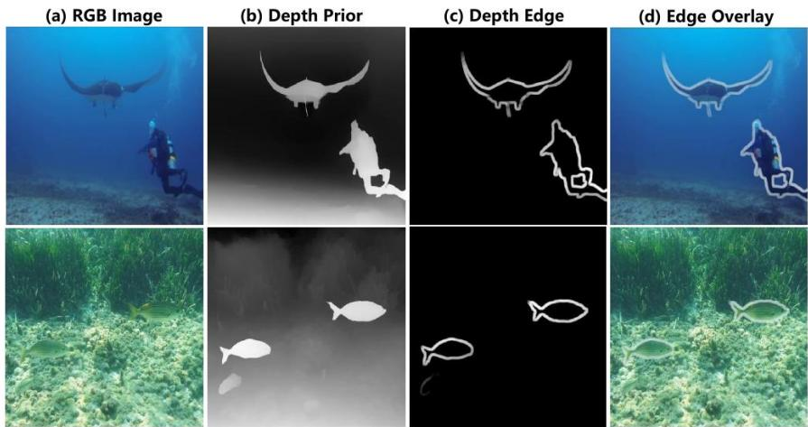
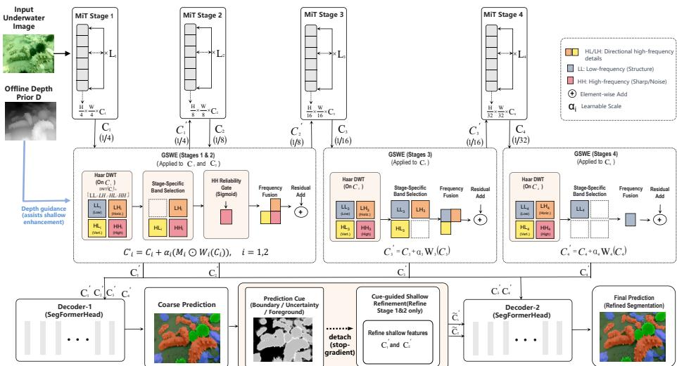
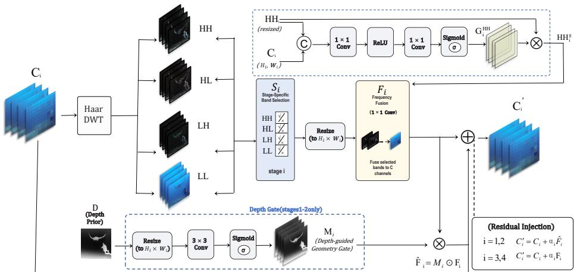
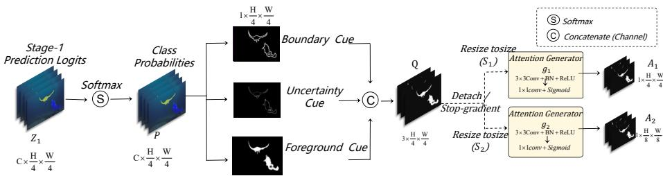
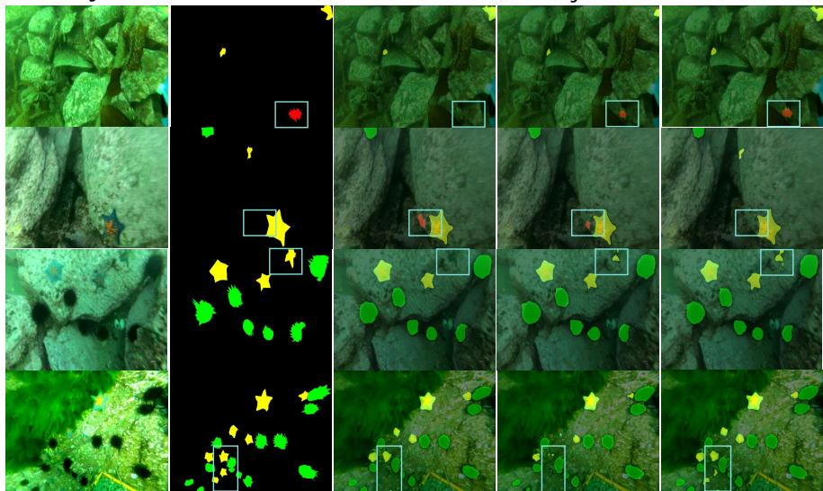

# GeoCueFormer: Geometry-Guided Wavelet Representation and Prediction-Cued Dual-Stage Decoder for Underwater Semantic Segmentation

Xian Wu1, Xinjin Li2, Yiliu Xu3, Yining Liu4, and Yong Jiang1B

1 Southwest University of Science and Technology, Mianyang, China wuxian@mails.swust.edu.cn, jiang\_yong@swust.edu.cn 2 Columbia University, New York, United States

Carnegie Mellon University, Pittsburgh, United States

4 University of California, Berkeley, CA, United States

Abstract Underwater semantic segmentation is essential for marine ecosystem monitoring, yet remains challenging due to severe visual degradation. Light absorption and scattering often lead to color shifts, low contrast, and blurred boundaries, making shallow detail features unreliable. Existing underwater segmentation methods improve RGB feature aggregation or boundary prediction, but still lack an explicit mechanism to distinguish structure-related details from degradation-induced responses. To address this limitation, we propose GeoCueFormer, a lightweight framework that combines geometry-constrained frequency enhancement with prediction-cued refinement. GeoCueFormer performs stage-specific wavelet enhancement on hierarchical encoder features to complement shallow boundary details while preserving deep structural semantics. A depth-derived spatial gate constrains shallow frequency enhancement toward geometry-consistent regions, and a prediction-cued dual-stage decoder further refines ambiguous high-resolution features.GeoCueFormer obtains 82.23% and 73.04% mIoU on SUIM and DUT, respectively.Under comparable model complexity and standard benchmark settings on SUIM and DUT, it achieves SOTA performance while maintaining a favorable accuracy-complexity trade-of. These results show that distinguishing structural details from degradation-induced interference is more efective for underwater segmentation.

Keywords: Underwater Semantic Segmentation · Geometry Prior · Wavelet Transform · Dual-Stage Decoder · Vision Transformer

## 1 Introduction

Underwater semantic segmentation assigns pixel-level labels to underwater scenes and supports applications such as marine ecosystem monitoring and underwater robotic perception. However, underwater images are often degraded by light absorption, scattering, turbidity, and low illumination, leading to color shifts, reduced contrast, and blurred boundaries. These degradations make dense prediction dificult, especially for boundary-sensitive and low-contrast regions.

  
Fig. 1. Motivation of depth-guided geometric cues.

A key challenge is that shallow high-resolution features are both necessary and unreliable. They preserve local boundaries and fine details, but these responses can be mixed with background textures, scattering artifacts, and illumination variations in degraded underwater images. Deep features provide more stable semantics but lack spatial precision. Thus, directly enhancing or fusing shallow details may introduce degradation-induced interference together with useful structural cues.

Existing underwater segmentation methods mainly improve RGB feature aggregation, high-resolution representation, attention recalibration, or boundary prediction. While these designs enhance contextual modeling and boundary awareness, they provide limited explicit modeling of whether fine details correspond to real structures or degradation-induced responses. This motivates our core question: how can a lightweight segmentation model exploit structurerelated details while suppressing degradation interference?

We introduce GeoCueFormer, a lightweight SegFormer-B0-based framework that combines frequency separation, geometric reliability, and prediction-guided refinement. Geometry-Guided Stage-Specific Wavelet Enhancement selects different wavelet bands for diferent encoder stages and uses a depth-derived spatial gate to constrain shallow frequency injection. Prediction-Cued Dual-Stage Decoder further uses the first-stage prediction to refine ambiguous high-resolution features before final decoding. This design avoids uniform frequency amplification and keeps deep semantic features stable.

Our contributions are summarized as follows:

– We formulate degraded underwater segmentation as a reliability-aware detail modeling problem, aiming to separate structure-related cues from degradationinduced interference.

– We propose GeoCueFormer, a lightweight framework that combines geometryguided stage-specific wavelet enhancement with prediction-cued dual-stage refinement.

Experiments on SUIM and DUT demonstrate that GeoCueFormer achieves SOTA-level performance under comparable model complexity and standard benchmark settings, while ablations and sensitivity analyses further validate the efectiveness of the proposed design.

To facilitate reproducibility, the source code is publicly available at https: //github.com/xianw-u/GeoCueformer.

## 2 Related Work

## 2.1 Underwater Semantic Segmentation

Underwater images are often degraded by absorption, scattering, and turbidity, leading to color casts, low contrast, blurred boundaries, and detail loss. These degradations weaken pixel-level discrimination and make underwater semantic segmentation challenging. To address this issue, recent methods have introduced degradation-aware network designs. UISS-Net [2] enhances boundary-region features to reduce pixel-level confusion near object edges. UWSegFormer [9] adapts SegFormer to low-quality underwater images through image-quality-aware attention, multi-scale aggregation, and edge-aware supervision. UHRS-Net [8] emphasizes high-resolution representation to preserve local details and boundary structures. These studies highlight the importance of modeling degraded boundaries and insuficient feature responses, while reliable structural cues remain less explored.

## 2.2 Transformer-Based Semantic Segmentation

Transformers have been widely adopted in dense prediction tasks due to their ability to model long-range dependencies beyond local convolutions. Swin Transformer [3] introduces shifted-window attention for eficient hierarchical representation, while SegFormer [6] combines a hierarchical Transformer encoder with a lightweight MLP decoder. SegFormer’s hierarchical features are well suited to underwater semantic segmentation, as shallow features preserve boundary details while deep features capture semantic context. However, underwater degradations can still weaken the reliability of hierarchical features, making it important to enhance structural information while suppressing degradation-induced interference.

  
Fig. 2. Overall architecture of GeoCueFormer.

## 2.3 Multi-scale feature fusion

High-level features provide rich semantics but limited spatial resolution, whereas low-level features preserve fine details with weaker semantics, making multiscale fusion essential for integrating their complementary strengths. However, the semantic gap across hierarchical features makes direct fusion insuficient for fully exploiting cross-scale complementarity.

Representative methods such as DeepLabv3+ [1] and HRNet [5] improve segmentation by integrating high-level semantic context with low-level spatial details or maintaining high-resolution representations.

These methods demonstrate the efectiveness of cross-level fusion. However, in degraded underwater scenes, low-level details can be unreliable, and direct fusion may introduce noise along with useful boundary cues. Therefore, underwater semantic segmentation requires hierarchical feature integration with reliabilityaware and scale-selective enhancement.

## 3 Method

GeoCueFormer is a lightweight framework for degraded underwater semantic segmentation. As shown in Fig. 2, it uses SegFormer-B0 to extract hierarchical features from an underwater RGB image I and introduces a precomputed single-channel depth prior D as auxiliary geometric guidance. The encoded features are enhanced by Geometry-Guided Stage-Specific Wavelet Enhancement (GSWE) and then decoded by the Prediction-Cued Dual-Stage Decoder (PCDD) to produce the final segmentation result.

Depth-prior generation. We generate monocular depth maps using the pretrained Depth Anything V2 Small model [24], without fine-tuning or joint optimization with GeoCueFormer. All depth maps are generated ofline before segmentation training and evaluation. Each depth prediction is resized to the original image resolution using bicubic interpolation and independently normalized to [0, 1], resulting in a single-channel depth prior for each RGB image.

## 3.1 Geometry-Guided Stage-Specific Wavelet Enhancement

Diferent encoding stages of SegFormer-B0 play distinct roles: shallow features are sensitive to high-frequency details, whereas deep features require stable structural semantics. Therefore, GeoCueFormer adopts stage-specific wavelet enhancement instead of a uniform frequency enhancement strategy.

As shown in Fig. 2, given the output feature $C _ { i } \in \mathbb { R } ^ { d _ { i } \times H _ { i } \times \smile }$ from the i-th encoding stage, we apply the Haar discrete wavelet transform $\mathcal { W } ( \cdot )$ to obtain one low-frequency component and three directional high-frequency components:

$$
\{ L L _ { i } , L H _ { i } , H L _ { i } , H H _ { i } \} = \mathcal { W } ( C _ { i } ) .\tag{1}
$$

The Haar wavelet is used for its simplicity and eficiency, where $L L _ { i }$ mainly represents low-frequency structural information, and $L H _ { i } , H L _ { i } $ and $H H _ { i }$ encode directional high-frequency responses related to boundaries and textures. Rather than reconstructing the original features using inverse wavelet transform, we use these sub-bands as frequency-domain cues for selective fusion.

We therefore adopt a stage-specific frequency-band selection strategy:

$$
\begin{array} { l l } { { S _ { 1 } = \{ L H _ { 1 } , H L _ { 1 } , H H _ { 1 } \} , } } & { { S _ { 2 } = \{ L H _ { 2 } , H L _ { 2 } , H H _ { 2 } \} , } } \\ { { } } & { { S _ { 3 } = \{ L L _ { 3 } , L H _ { 3 } , H L _ { 3 } \} , ~ S _ { 4 } = \{ L L _ { 4 } \} . } } \end{array}\tag{2}
$$

  
Fig. 3. Stage-Specific Wavelet Representation with Geometry-Guided Gating

Accordingly, shallow stages retain high-frequency bands for boundary and detail compensation, intermediate stages combine structural and contour cues, and deep stages keep only the low-frequency band to avoid high-frequency interference. Since DWT sub-bands have lower spatial resolution than the original encoded features, the selected bands are aligned to the spatial size of $C _ { i }$ via bilinear interpolation, denoted as $\mathcal { R } _ { i } ( \cdot )$

For shallow stages $i = 1 , 2 , H H _ { i }$ captures strong local variations but may also introduce unstable high-frequency responses. Therefore, we generate a highfrequency reliability gate from the original encoded feature and the aligned $H H _ { i }$ component:

$$
\begin{array} { r l } & { \bar { H H } _ { i } = \mathcal { R } _ { i } ( H H _ { i } ) , } \\ & { G _ { i } ^ { H H } = \sigma \big ( \psi _ { i } \left( [ C _ { i } , \bar { H H } _ { i } ] \right) \big ) , } \\ & { H H _ { i } ^ { g } = G _ { i } ^ { H H } \odot \bar { H H } _ { i } , \quad i = 1 , 2 . } \end{array}\tag{3}
$$

where $\psi _ { i } ( \cdot )$ is a lightweight mapping function, $\sigma ( \cdot )$ is the sigmoid activation, and ⊙ denotes element-wise multiplication. The gated component $H H _ { i } ^ { g }$ replaces $H H _ { i }$ in shallow frequency fusion.

The selected bands at each stage are spatially aligned and channel-wise concatenated to form the band-fusion input $B _ { i }$ , where the gated component $H H _ { i } ^ { g }$ is used for $i = 1 , 2$ and the selected bands are directly used for $i = 3 , 4$ . A lightweight fusion function $\varPhi _ { i } ( \cdot )$ maps $B _ { i }$ to the frequency-enhanced feature $F _ { i }$ with the same channel dimension as $C _ { i }$

To regulate the spatial injection of shallow frequency enhancement, GeoCue-Former generates a geometric spatial gate from the precomputed depth prior D and reinjects the enhanced features into the original encoded features through a residual connection:

$$
\begin{array} { r l } & { M _ { i } = \sigma ( \eta _ { i } ( D _ { i } ) ) , \quad \widehat { F } _ { i } = M _ { i } \odot F _ { i } , \quad i = 1 , 2 , } \\ & { C _ { i } ^ { \prime } = \left\{ C _ { i } + \alpha _ { i } \widehat { F } _ { i } , \quad i = 1 , 2 , \right. } \\ & { \left. C _ { i } + \alpha _ { i } F _ { i } , \quad i = 3 , 4 . \right. } \end{array}\tag{4}
$$

where $D _ { i } = \mathrm { R e s i z e } _ { \mathrm { b i l i n e a r } } ( D , H _ { i } , W _ { i } ) , \eta _ { i } ( \cdot )$ denotes the depth-gating function, and $\alpha _ { i }$ is a learnable residual scaling factor initialized to 0.1. This enables geometry-aware shallow frequency enhancement while preserving the original hierarchical representations.

In implementation, the selected wavelet bands are concatenated along the channel dimension and fused by $\mathrm { ~ a ~ } 1 \times 1$ Conv-BN-ReLU block, which projects them back to the original channel dimension of each encoding stage. The depth gate uses a $3 \times 3$ convolution followed by ReLU, a $1 \times 1$ convolution, and sigmoid activation, with 8 hidden channels.

## 3.2 Prediction-Cued Dual-Stage Decoder

To exploit the spatial discriminative information in the initial prediction, PCDD first fuses the enhanced multi-scale features to produce a coarse segmentation

  
Fig. 4. Prediction-Cued Dual-Stage Decoder.

prediction. As shown in Fig. 4, given the enhanced features $\{ C _ { i } ^ { \prime } \} _ { i = 1 } ^ { 4 }$ from Sec. 3.1, the first-stage decoder $H _ { 1 } ( \cdot )$ outputs coarse segmentation logits and the corresponding class probability map:

$$
Z _ { 1 } = H _ { 1 } ( C _ { 1 } ^ { \prime } , C _ { 2 } ^ { \prime } , C _ { 3 } ^ { \prime } , C _ { 4 } ^ { \prime } ) , \quad P ^ { ( 1 ) } = \mathrm { S o f t m a x } ( Z _ { 1 } ) .\tag{5}
$$

where $P ^ { ( 1 ) }$ denotes the first-stage class probability map. It is not used as the final inference output, but is used to construct prediction cues, while $Z _ { 1 }$ serves only as an auxiliary supervision term during training.

Both decoders adopt SegFormerHead with input channels [32, 64, 160, 256], decoder embedding dimension 256, intermediate channel dimension 128, dropout ratio 0.1, and 6 output classes.

Based on $P ^ { ( 1 ) }$ , we construct the boundary cue $B _ { p }$ , uncertainty cue $U _ { p }$ , and foreground cue $F _ { p }$ to describe local probability variations, low-confidence regions, and non-background responses, respectively. The three cues are concatenated along the channel dimension to form the prediction cue map $Q \mathrm { { : } }$

$$
\begin{array} { r l r } {  { { \cal B } _ { p } = \frac { 1 } { K } \sum _ { k = 1 } ^ { K } ( | \nabla _ { x } P _ { k } ^ { ( 1 ) } | + | \nabla _ { y } P _ { k } ^ { ( 1 ) } | ) , } } \\ & { } & { \quad U _ { p } = 1 - \operatorname* { m a x } _ { k } P _ { k } ^ { ( 1 ) } , \quad F _ { p } = 1 - P _ { \mathrm { b g } } ^ { ( 1 ) } , } \\ & { } & { \quad Q = \mathrm { S G } ( \mathrm { C o n c a t } ( { \cal B } _ { p } , U _ { p } , F _ { p } ) ) . } \end{array}\tag{6}
$$

where $K$ is the number of classes, $P _ { \mathrm { b g } } ^ { ( 1 ) }$ denotes the background probability, and SG(·) denotes stop-gradient operation. Thus, Q serves solely as a second-stage spatial modulation signal, preventing gradients from propagating back to the first-stage prediction branch through the cues. The prediction cue map $Q$ has three channels corresponding to boundary, uncertainty, and foreground cues.

The prediction cue map Q modulates only the first two shallow high-resolution features. After being aligned to each feature size, $Q$ is mapped to the spatial weight $A _ { j }$ by a lightweight function, and the modulated feature is given by:

$$
\widetilde { C } _ { j } = C _ { j } ^ { \prime } \odot ( 1 + \lambda _ { j } A _ { j } ) , \quad j = 1 , 2 .\tag{7}
$$

where $\lambda _ { j }$ is a constrained learnable scaling factor controlling the cue modulation strength. Deep features are kept unchanged, i.e., $\widetilde { C } _ { i } = C _ { i } ^ { \prime } , i = 3 , 4$

The cue-to-weight mapping uses a $3 \times 3$ Conv-BN-ReLU block followed by a $1 \times 1$ convolution and sigmoid activation, with 16 hidden channels, producing a one-channel spatial modulation weight $A _ { j }$ for each shallow feature.

The second-stage decoder $H _ { 2 }$ re-fuses the modulated multi-scale features and outputs the final logits $Z _ { 2 }$ for inference. During training, the second-stage output is supervised as the main prediction, while the first-stage output is used for auxiliary supervision:

$$
\mathcal { L } = \mathcal { L } _ { \mathrm { C E } } ( \widetilde { Z } _ { 2 } , Y ) + 0 . 4 \mathcal { L } _ { \mathrm { C E } } ( \widetilde { Z } _ { 1 } , Y ) ,\tag{8}
$$

where $\widetilde { Z } _ { 1 }$ and ${ \widetilde { Z } } _ { 2 }$ denote the logits resized to the ground-truth label size, and Y is the semantic segmentation ground truth.

## 4 Experiments

## 4.1 Experimental Settings

We evaluate GeoCueFormer on SUIM [25] and DUT-USEG (DUT) [26] using mean Intersection over Union (mIoU), Params, and GFLOPs. Results of compared methods are collected from their original papers or published comparison tables. GeoCueFormer uses a precomputed monocular depth prior generated offline from the input RGB image, and the reported complexity excludes the ofline depth estimator. Unless otherwise specified, additional analyses are conducted on SUIM.

Implementation details. Experiments are implemented in MMSegmentation. We initialize the MiT-B0 backbone with ImageNet-pretrained weights and train with AdamW, using a base learning rate of $6 \times 1 0 ^ { - 5 }$ , betas of (0.9, 0.999), and weight decay of 0.01. We use a poly schedule with 1500-iteration linear warm-up, power 1.0, and minimum learning rate 0. Training images are randomly resized within 0.5–2.0, cropped to $4 8 0 \times 6 4 0$ , horizontally flipped with probability 0.5, and photometrically distorted. The batch size is 8, with 160k iterations on SUIM and 40k on DUT. Both segmentation heads use cross-entropy loss, and the firststage PCDD loss is weighted by 0.4. Evaluation uses single-scale testing without flip augmentation.

## 4.2 Comparison with State-of-the-Art Methods

Table 1 reports the SUIM comparison. GeoCueFormer achieves 82.23% mIoU with 4.28M parameters and 13.58 GFLOPs, providing a favorable accuracycomplexity trade-of and outperforming larger models such as Swin Transformer, UperNet, and Mask2Former.

RMP-Net [22] reports 84.52% mIoU on SUIM, but uses 78.449M parameters and 202.46G GFLOPs, about 18.3× and 14.9× those of GeoCueFormer. WaterBiSeg-Net [23] reports 85.7% mIoU under a five-class marine-debris protocol, which difers from our six-class setting. We therefore focus on methods with consistent category protocols and comparable evaluation settings.

Table 2 presents the DUT comparison. GeoCueFormer achieves 73.04% mIoU, the best reported performance among existing published methods on DUT, showing consistent gains under weak foreground-background contrast and ambiguous boundaries.

## 4.3 Qualitative Comparison

Image

Baseline

GT  
UWSegFormer  
Ours  
  
Fig. 5. Qualitative comparison of segmentation results. Cyan boxes highlight challenging regions with low contrast, small objects, or ambiguous boundaries.

Fig. 5 compares GeoCueFormer with SegFormer and UWSegFormer. GeoCue-Former produces more complete regions and clearer boundaries in challenging underwater scenes.

## 4.4 Ablation Study

Table 3 evaluates each component on SUIM. Wavelet enhancement and PCDD individually improve SegFormer, but their direct combination without geometric guidance does not bring further gains, indicating that unconstrained frequency cues may disturb prediction-cued refinement. By embedding geometric guidance into stage-specific wavelet enhancement, GSWE improves the reliability of frequency representation, and the full model achieves the best performance, confirming the complementarity between GSWE and PCDD. We omit a “geometry guidance only” variant because geometric guidance is used to constrain the shallow wavelet branch rather than as an independent module.

Table 1. Comparison with state-of-the-art methods on the SUIM dataset. N/R denotes unavailable results.
<table><tr><td>Method</td><td>GFLOPs↓</td><td>Params↓</td><td>mIoU (%)↑</td></tr><tr><td>GeoCueFormer (Ours)</td><td>13.58</td><td>4.28M</td><td>82.23</td></tr><tr><td>UWSegFormer [9]</td><td>3.21</td><td>21.78M</td><td>82.12</td></tr><tr><td>LVT [10]</td><td>10.51</td><td>3.83M</td><td>80.72</td></tr><tr><td>Swin Transformer [3]</td><td>276</td><td>58.94M</td><td>80.70</td></tr><tr><td>SegFormer [6]</td><td>7.94</td><td>3.72M</td><td>80.57</td></tr><tr><td>MSNet [11]</td><td>N/R</td><td>6.2M</td><td>79.83</td></tr><tr><td>Swin-EMA-FPN SegFormer [12]</td><td>26.51</td><td>91.86M</td><td>77.00</td></tr><tr><td>DDRNet-s [13]</td><td>5.35</td><td>5.7M</td><td>73.44</td></tr><tr><td>UperNet [14]</td><td>44.48</td><td>122.88M</td><td>72.70</td></tr><tr><td>Mask2Former [15]</td><td>226.63</td><td>44.63M</td><td>72.55</td></tr><tr><td>UISS-Net / USS-NET [2]</td><td>342</td><td>75.42M</td><td>72.09</td></tr><tr><td>PIDNet-s [16]</td><td>6.96</td><td>7.6M</td><td>71.46</td></tr><tr><td>MaskFormer [17]</td><td>53.22</td><td>41.27M</td><td>71.07</td></tr><tr><td>DeepLabV3+ [1]</td><td>80.06</td><td>41.22M</td><td>71.03</td></tr><tr><td>KNet [18]</td><td>37.83</td><td>60.34M</td><td>70.54</td></tr><tr><td>PSPNet [7]</td><td>61.68</td><td>46.61M</td><td>69.76</td></tr><tr><td>ISANet [19]</td><td>28.09</td><td>35.34M</td><td>68.76</td></tr></table>

Table 2. Comparison with state-of-the-art methods on the DUT dataset. N/R denotes unavailable results.
<table><tr><td>Method</td><td>GFLOPs (↓)</td><td>Params (↓)</td><td>mIoU (%)</td></tr><tr><td>GeoCueFormer (Ours)</td><td>13.58</td><td>4.28M</td><td>73.04</td></tr><tr><td>UWSegFormer [9]</td><td>3.21</td><td>21.78M</td><td>71.41</td></tr><tr><td>Lightweight DeepLabv3+ [1]</td><td>39.612</td><td>6.628M</td><td>71.18</td></tr><tr><td>SegFormer [6]</td><td>7.94</td><td>3.72M</td><td>70.81</td></tr><tr><td>UHRS-Net [8]</td><td>N/R</td><td>N/R</td><td>70.09</td></tr><tr><td>HRNetv2 [5]</td><td>90.972</td><td>29.540M</td><td>70.09</td></tr><tr><td>Swin Transformer [3]</td><td>276</td><td>58.94M</td><td>69.35</td></tr><tr><td>DDRNet [13]</td><td>5.35</td><td>5.70M</td><td>69.15</td></tr><tr><td>PSPNet [7]</td><td>61.68</td><td>46.708M</td><td>68.51</td></tr><tr><td>UISS-Net [2]</td><td>342</td><td>N/R</td><td>67.87</td></tr><tr><td>PIDNet [16]</td><td>6.96</td><td>7.60M</td><td>67.79</td></tr><tr><td>DeepLabv3+ [1]</td><td>80.06</td><td>5.814M</td><td>67.63</td></tr><tr><td>U-Net [20]</td><td>238</td><td>43.933M</td><td>67.19</td></tr><tr><td>FCN [4]</td><td>46.11</td><td>9.71M</td><td>62.75</td></tr><tr><td>SeaFormer [21]</td><td>7.55</td><td>14.00M</td><td>57.54</td></tr></table>

Table 3. Ablation study of the main components on SUIM.
<table><tr><td>Variant</td><td>Wavelet</td><td>Depth</td><td>PCDD</td><td>mIoU (%)</td></tr><tr><td>SegFormer Baseline</td><td>×</td><td>×</td><td>×</td><td>80.57</td></tr><tr><td>+ Wavelet</td><td>√</td><td>×</td><td>×</td><td>80.98</td></tr><tr><td>+ Two-stage Decoder</td><td>×</td><td>×</td><td>√</td><td>81.42</td></tr><tr><td>+ Wavelet + Two-stage Decoder</td><td>√</td><td>×</td><td>√</td><td>81.21</td></tr><tr><td>+ Wavelet + Depth</td><td>√</td><td>√</td><td>×</td><td>81.58</td></tr><tr><td>Full Model</td><td>√</td><td>√</td><td>√</td><td>82.23</td></tr></table>

## 4.5 Analysis of Frequency Strategy and Depth Injection

Table 4 compares frequency-band strategies. Full-band fusion improves the baseline but remains below the stage-specific design, indicating that indiscriminate band fusion may introduce redundant textures and unstable high-frequency responses.

Table 4. Analysis of frequency-band selection strategy on SUIM.
<table><tr><td>Variant</td><td>Frequency strategy</td><td>Decoder</td><td>mIoU (%)</td></tr><tr><td>Baseline</td><td>一</td><td>Single</td><td>80.57</td></tr><tr><td>Full-stage Full-band</td><td> $\mathrm { L L } / \mathrm { L H } / \mathrm { H L } / \mathrm { H H }$ </td><td>Two-stage</td><td>80.91</td></tr><tr><td>GeoCueFormer</td><td>Specific / Selective</td><td>Two-stage</td><td>82.23</td></tr></table>

Table 5 compares depth-injection positions. Shallow-stage guidance performs best, while all-stage gating reduces mIoU, suggesting that excessive deep geometric modulation can disturb semantic representations.

Table 5. Analysis of depth-guidance injection position on SUIM.
<table><tr><td>Setting</td><td>Depth-guidance stages</td><td>mIoU (%)</td></tr><tr><td>GeoCueFormer</td><td>Stage 1 + Stage 2</td><td>82.23</td></tr><tr><td>Depth-All</td><td> $\mathrm { S t a g e \ 1 + S t a g e \ 2 + S t a g e \ 3 + S t a g e \ 4 }$ </td><td>80.06</td></tr></table>

## 4.6 Hyperparameter Study on Residual Scale Initialization

Table 6 studies the residual scale initialization. The best result is obtained at $\alpha _ { \mathrm { i n i t } } ~ = ~ 0 . 1$ , balancing backbone semantics with frequency and geometry enhancement, while a larger value may disturb pretrained representations.

Table 6. Analysis of the initial residual scale $\alpha _ { \mathrm { i n i t } }$ on SUIM.
<table><tr><td>Setting</td><td> $\alpha _ { \mathrm { i n i t } }$ </td><td>mIoU (%)</td></tr><tr><td>GeoCueFormer</td><td>0.01</td><td>80.40</td></tr><tr><td>GeoCueFormer</td><td>0.05</td><td>81.44</td></tr><tr><td>GeoCueFormer</td><td>0.10</td><td>82.23</td></tr><tr><td>GeoCueFormer</td><td>0.20</td><td>81.09</td></tr></table>

## 5 Conclusion

We proposed GeoCueFormer, a lightweight underwater segmentation framework that integrates geometry-guided frequency representation and prediction-cued refinement. By combining stage-specific wavelet enhancement, depth-based reliability gating, and a dual-stage decoder, GeoCueFormer improves degraded boundary and low-contrast object perception with a small parameter footprint and moderate computational cost. Experiments on SUIM and DUT show that GeoCueFormer achieves SOTA-level performance under comparable model complexity and standard benchmark settings, while maintaining a favorable accuracycomplexity trade-of. Future work will explore learnable frequency-band selection for more adaptive underwater representation.

## References

1. Chen, L.C., Zhu, Y., Papandreou, G., Schrof, F., Adam, H.: Encoder-decoder with atrous separable convolution for semantic image segmentation. In: ECCV, LNCS, vol. 11211, pp. 833–851. Springer, Cham (2018). https://doi.org/10.1007/ 978-3-030-01234-2\_49

2. He, Z., Cao, L., Luo, J., Xu, X., Tang, J., Xu, J., Xu, G., Chen, Z.: UISS-Net: Underwater image semantic segmentation network for improving boundary segmentation accuracy of underwater images. Aquaculture International 32(5), 5625–5638 (2024). https://doi.org/10.1007/s10499-024-01439-x

3. Liu, Z., Lin, Y., Cao, Y., Hu, H., Wei, Y., Zhang, Z., Lin, S., Guo, B.: Swin Transformer: Hierarchical vision transformer using shifted windows. In: ICCV, pp. 10012–10022 (2021)

4. Long, J., Shelhamer, E., Darrell, T.: Fully convolutional networks for semantic segmentation. In: CVPR, pp. 3431–3440 (2015). https://doi.org/10.1109/CVPR. 2015.7298965

5. Wang, J., Sun, K., Cheng, T., Jiang, B., Deng, C., Zhao, Y., Liu, D., Mu, Y., Tan, M., Wang, X., Liu, W., Xiao, B.: Deep high-resolution representation learning for visual recognition. IEEE Trans. Pattern Anal. Mach. Intell. 43(10), 3349–3364 (2021). https://doi.org/10.1109/TPAMI.2020.2983686

6. Xie, E., Wang, W., Yu, Z., Anandkumar, A., Alvarez, J.M., Luo, P.: SegFormer: Simple and eficient design for semantic segmentation with transformers. In: NeurIPS (2021)

7. Zhao, H., Shi, J., Qi, X., Wang, X., Jia, J.: Pyramid scene parsing network. In: CVPR, pp. 2881–2890 (2017). https://doi.org/10.1109/CVPR.2017.660

8. Zhou, Z., Zheng, L.: UHRS-Net: underwater high-resolution semantic segmentation network. Signal Image Video Process. 19, 921 (2025). https://doi.org/10.1007/ s11760-025-04463-3

9. Zuo, X., Jiang, J., Shen, J., Yang, W.: Improving underwater semantic segmentation with underwater image quality attention and multi-scale aggregation attention. Pattern Anal. Appl. 28, 80 (2025). https://doi.org/10.1007/ s10044-025-01460-7

10. Yang, C., Wang, Y., Zhang, J., Zhang, H., Wei, Z., Lin, Z., Yuille, A.: Lite vision transformer with enhanced self-attention. In: CVPR, pp. 11998–12008 (2022)

11. Liu, Y., Ding, J., Xu, M., Huang, Z., Qiang, Y.: A multi-supervised network for real-time and accurate semantic segmentation in underwater scenes. J. Mar. Sci. Eng. 14(4), 340 (2026). https://doi.org/10.3390/jmse14040340

12. Chen, B., Zhao, W., Zhang, Q., Li, M., Qi, M., Tang, Y.: Semantic segmentation of underwater images based on the improved SegFormer. Front. Mar. Sci. 12, 1522160 (2025). https://doi.org/10.3389/fmars.2025.1522160

13. Hong, Y., Pan, H., Sun, W., Jia, Y.: Deep dual-resolution networks for real-time and accurate semantic segmentation of road scenes. arXiv preprint arXiv:2101.06085 (2021)

14. Xiao, T., Liu, Y., Zhou, B., Jiang, Y., Sun, J.: Unified perceptual parsing for scene understanding. In: ECCV, pp. 418–434 (2018)

15. Cheng, B., Misra, I., Schwing, A.G., Kirillov, A., Girdhar, R.: Masked-attention mask transformer for universal image segmentation. In: CVPR, pp. 1290–1299 (2022)

16. Xu, J., Xiong, Z., Bhattacharyya, S.P.: PIDNet: A real-time semantic segmentation network inspired by PID controller. In: CVPR, pp. 19529–19539 (2023)

17. Cheng, B., Schwing, A.G., Kirillov, A.: Per-pixel classification is not all you need for semantic segmentation. In: NeurIPS (2021)

18. Zhang, W., Pang, J., Chen, K., Loy, C.C.: K-Net: Towards unified image segmentation. In: NeurIPS (2021)

19. Huang, L., Yuan, Y., Guo, J., Zhang, C., Chen, X., Wang, J.: Interlaced sparse self-attention for semantic segmentation. arXiv preprint arXiv:1907.12273 (2019)

20. Ronneberger, O., Fischer, P., Brox, T.: U-Net: Convolutional networks for biomedical image segmentation. In: MICCAI, LNCS, vol. 9351, pp. 234–241. Springer, Cham (2015)

21. Wan, Q., Huang, Z., Lu, J., Yu, G., Zhang, L.: SeaFormer: Squeeze-enhanced axial transformer for mobile semantic segmentation. In: ICLR (2023)

22. Chen, J., Tang, J., Lin, S., Liang, W., Su, B., Yan, J., Zhou, D., Wang, L., Lai, Y., Yang, B.: RMP-Net: A structural reparameterization and subpixel superresolution-based marine scene segmentation network. Front. Mar. Sci. 9, 1032287 (2022). https://doi.org/10.3389/fmars.2022.1032287

23. Zhang, W., Wei, B., Li, Y., Li, H., Song, T.: WaterBiSeg-Net: An underwater bilateral segmentation network for marine debris segmentation. Marine Pollution Bulletin 205, 116644 (2024). https://doi.org/10.1016/j.marpolbul.2024.116644

24. Yang, L., Kang, B., Huang, Z., Zhao, Z., Xu, X., Feng, J., Zhao, H.: Depth Anything V2. arXiv preprint arXiv:2406.09414 (2024)

25. Islam, M.J., Edge, C., Xiao, Y., Luo, P., Mehtaz, M., Morse, C., Enan, S.S., Sattar, J.: Semantic segmentation of underwater imagery: Dataset and benchmark. In: 2020 IEEE/RSJ International Conference on Intelligent Robots and Systems (IROS), pp. 1769–1776. IEEE (2020). https://doi.org/10.1109/IROS45743.2020. 9340821

26. Ma, Z., Li, H., Fan, X., Luo, Z., Li, J., Wang, Z.: A real scene underwater semantic segmentation method and related dataset. J. Beijing Univ. Aeronaut. Astronaut. 48(8), 1515–1524 (2022). https://doi.org/10.13700/j.bh.1001-5965.2021.0527 (in Chinese)