# JIGSYNC: Gauge-Resolved Synchronization for Jigsaw Reassembly under Unknown Piece Orientation

Soham Pahari Antik Aich Roy Ujjwal Bhattacharya Indian Statistical Institute, Kolkata https://sohamrsch.github.io/jigsync

## Abstract

Square jigsaw reassembly requires recovering the spatial arrangement of shuffled fragments from their visual content and pairwise relationships. While recent studies have made substantial progress, existing benchmarks typically assume that all fragments are provided upright, reducing reassembly to a permutation problem. We study the generalized problem in which each fragment may also have gone through an unknown rotation. For this setting we establish gauge-unobservability theorem: the minimum of the weighted least-squares objective is exactly invariant under a uniform global rotation of arbitrary magnitude, so no residual-based criterion can recover the global orientation. The theorem further identifies how the issue of global orientation can be resolved: an orientation anchor estimatedfrom the content ofa singlefragment, lying outside its scope, suffices. To address the above we propose JIGSYNC attains 63.8% and 31.8% absolute accuracy (AA) on GAP-3 and GAP-5, the highest reported on both, while additionally recovering a rotation per piece that neither benchmark requires. We release MET-SWEEP, a degradation protocol that sweeps shape, erosion, photometry, grid size and rotation independently.

## 1. Introduction

Square jigsaw reassembly is a structured spatial reasoning problem that requires recovering the original arrangement of shuffled fragments from their visual content and pairwise relationships. Most existing methods share a common simplification: fragments are provided upright, and orientation is either fixed by construction or used only as a training-time augmentation, so the task actually solved and scored is a permutation problem over N slots, $| S _ { N } | = N !$

In real-world reassembly, fragments may arrive in any orientation. A potsherd, a shredded document strip, or a fresco fragment has no predetermined orientation until the reconstruction supplies one. Each piece then carries a second decision, its placement and its orientation, and these compound across fragments to expand the search space from N! to 4N N!, the size of the wreath product Z4 ≀ SN. At N = 9 this is 262,144× the permutation-only setting; at N = 25 the factor exceeds 1015.

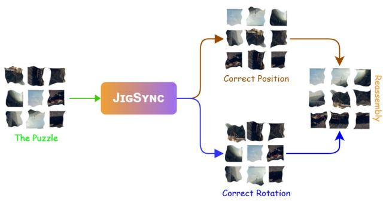  
Figure 1. JIGSYNC is a gauge-resolved reassembly framework for degraded, shuffled and arbitrarily rotated pieces. It synchronizes pairwise pose relations, anchors the otherwise unobservable global orientation on content cues, and recovers each piece’s position and rotation.

Square jigsaw solving. Jigsaw reassembly was formulated computationally in the 1960s [9] and later shown NP-complete [5]. Classical approaches paired a handcrafted pairwise compatibility with global optimizer, using strategies such as greedy placement [28], genetic search [34], linear programming [49], and relaxation labeling [17, 45]. Early learning-based approaches replaced hand-crafted compatibility measures with learned ones [20, 26, 35]. Later work explored generative and diffusion formulations [12, 21, 31, 40, 42] and reinforcement learning [37–39,41]. Transformer solvers built on ViT [7] predict positions directly [15] or regress fragment coordinates [18], while multimodal solvers add language supervision [22] or recast reassembly over discrete tokens [8]. Vision-language models have been evaluated as solvers under constrained settings [23, 46], and jigsaw solving is separately used as a self-supervised pretext task [3, 24, 29, 47]. Unknown piece orientation was also studied in the classical setting by Gallagher [10], who considered square jigsaws with unknown piece orientations, including a tree-based procedure for component merging and a pairwise Markov Random Field (MRF) formulation for known locations and unknown orientations. Gallagher [10] also introduced Mahalanobis Gradient Compatibility (MGC), which scores candidate matches from the smoothness of gradient distributions across shared boundaries. Our setting differs in that the fragments are eroded and irregularly shaped, so the boundary assumptions underlying such compatibility measures no longer hold. Section 6.5 quantifies a compatibility term of this family and finds it falls below chance as fragment shape becomes irregular.

Eroded and irregular fragments. A parallel line drops the square-fragment assumption: adversarial inpainting across eroded gaps [2], twin embeddings [30], crossingcut polygonal puzzles [14], archaeological reconstruction [6], pairwise alignment for arbitrary fragments [32], and the scanned RePAIR benchmark [44]. Closest to us is GAP [33], which generates irregular eroded fragments from a distribution learned on RePAIR and pairs them with a flow-matching solver. GAP is our primary comparator and likewise provides all fragments upright.

Group synchronization. The natural machinery for the generalized problem is synchronization [1, 4, 36]: estimate noisy relative poses on pairs, then solve for globally consistent absolute poses. The decomposition is attractive because relative pose is locally measurable while absolute pose is not. That relative measurements determine absolute ones only up to a global constant is standard; what appears not to be stated, and is silently relied on in practice, is the consequence for the downstream translation estimate, which we give in Sec. 3. Robust variants of that estimate, notably translation synchronization by truncated least squares [16], are discussed in Sec. 3.3.

Our finding. A synchronization pipeline based on relative measurements determines every fragment’s pose only up to one free global rotation and cannot recover that rotation by any residual criterion. All four candidate gauges agree to 10–12 decimal places, while a single inverted tie can change downstream evaluation substantially. The theorem also identifies the resolution: an orientation estimated from the content of a single fragment lies outside the pairwise graph’s scope and can fix the gauge. This anchor raises the GAP-3 selection ceiling from 16.61% to 36.72% and the GAP-5 ceiling from 5.38% to 10.66%, the largest effect in our experimental program.

## Contributions.

1. A gauge-unobservability theorem for least-squares translation estimation, showing that the fitting penalty cannot between distinguish global orientations, together with the resulting content-anchored resolution the theorem implies (Sec. 3).

2. An orbit-centroid degeneracy result explaining constantpredictor collapse in per-fragment pose regression, with a min-over-gauge objective that resolves it (Sec. 3.4).

3. JIGSYNC, a solver for $\mathbb { Z } _ { 4 } \wr S _ { N }$ combining a dense tiered relative-pose vocabulary, bearing-only anisotropic edge weighting, and gauge-anchored ρ-conditioned decoding (Sec. 5).

4. MET-SWEEP, a degradation protocol that recovers the classical square-piece setting exactly at zero degradation and interpolates to destroyed-geometry, arbitrarilyoriented photographs (Sec. 10).

## 2. Problem Setting

## 2.1. Placement and orientation together

A puzzle is a set of N fragments $X ~ = ~ \{ x _ { 1 } , \ldots , x _ { N } \}$ cut from an unknown source image and provided to the solver in arbitrary order, each having additionally been turned by a multiple of $9 0 °$ . Solving it means producing a placement π, assigning each fragment to one of the N grid slots with no two sharing a slot, and an orientation $\rho _ { i } \in \{ 0 ^ { \circ } , 9 0 ^ { \circ } , 1 8 0 ^ { \circ } , 2 7 0 ^ { \circ } \}$ per fragment, chosen independently. We write the pair as $g ^ { * } ~ = ~ ( \rho , \pi )$ . Placements form the symmetric group $S _ { N }$ , the four orientations form the cyclic group $\mathbb { Z } _ { 4 }$ , and pairs of the two compose in the manner of a wreath product $\mathbb { Z } _ { 4 } \wr S _ { N }$ , the formal name for “N independently rotatable objects distributed among N labelled slots”, of size

$$
\begin{array} { r } { \left| \mathbb { Z } _ { 4 } \thinspace \lambda \thinspace S _ { N } \right| = 4 ^ { N } \cdot N ! } \end{array}\tag{1}
$$

against N! for placement alone. Grid size is not supplied at test time. Figure 2 shows one instance as the solver receives it.

## 2.2. Relative measurement and the global gauge

Enumerating $4 ^ { N } { N } !$ candidates is infeasible, and predicting a fragment’s slot directly is little better, since a fragment carries little information about its absolute position. What a pair of fragments does carry information about is their relationship: whether they were neighbours, on which side, and how much one is turned relative to the other. For each ordered pair $( i , j )$ we therefore estimate a relative rotation $\hat { \rho } _ { i j } \in \mathbb { Z } _ { 4 }$ and a relative displacement $\hat { \delta } _ { i j } \in \mathbb { R } ^ { 2 }$ . Turning a collection of noisy relative estimates into one globally consistent set of absolute values is the problem known as synchronization, solved rotations first, because displacements can only be compared once all fragments share a common frame.

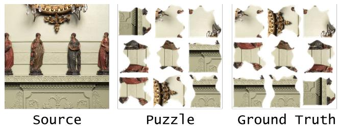  
Figure 2. A MET-SWEEP instance. The source photograph (left) is cut into irregular eroded fragments, provided shuffled and independently rotated (centre); ground-truth slots are at right, rotation still unresolved. GAP and its predecessors exercise the shuffle but not the rotation.

That ordering is what creates the difficulty. Rotation synchronization returns each fragment’s absolute rotation only up to one shared unknown: if $\hat { \theta } _ { 1 } , \dots , \hat { \theta } _ { N }$ is a solution, so is $\widehat { \theta } _ { i } + c$ for any fixed $c \in \mathbb { Z } _ { 4 }$ , since every relative rotation $\hat { \theta } _ { j } - \hat { \theta } _ { i }$ is unchanged. The constant c is what we call the global gauge, after the physics usage in which a gauge is a degree of freedom that changes the description of a system without changing anything measurable about it. It has four values, one of which is right, and it cannot be left unresolved: the relative displacements must be expressed in the recovered frame before they are combined, so a wrong c rotates every displacement in the puzzle and the reconstruction comes out turned with it. Some choice must be made. Section 3 shows that the standard way of making it carries no information whatsoever.

## 3. Gauge Unobservability

## 3.1. The position fit

Once rotations are fixed, absolute positions $\{ x _ { i } \in \mathbb { R } ^ { 2 } \}$ are recovered as the layout disagreeing least with the measured displacements, each pair penalizing the mismatch between where the layout puts j relative to i and where the measurement said it should be:

$$
\boldsymbol { x } ^ { * } = \underset { \boldsymbol { x } } { \arg \operatorname* { m i n } } \sum _ { ( i , j ) \in E } ( \boldsymbol { x } _ { j } - \boldsymbol { x } _ { i } - \boldsymbol { \hat { \delta } } _ { i j } ) ^ { \top } \boldsymbol { W } _ { i j } ( \boldsymbol { x } _ { j } - \boldsymbol { x } _ { i } - \boldsymbol { \hat { \delta } } _ { i j } ) .\tag{2}
$$

Here E is the set of measured pairs and $W _ { i j } \thinspace \mathrm { a 2 } \times 2$ positivesemidefinite matrix expressing how far a pair is trusted and in which direction; an anisotropic $W _ { i j }$ lets it be confident about direction while uncertain about distance, which Sec. 5.3 exploits. With every $W _ { i j }$ a multiple of the identity this is ordinary graph-Laplacian least squares, one sparse solve after fixing a single fragment’s position to remove the residual freedom to translate the layout. Since rotation synchronization left c undetermined, the natural procedure is to run Eq. (2) once per candidate c, with every $\hat { \delta } _ { i j }$ rotated accordingly, and keep the smallest penalty.

## 3.2. The theorem

Theorem. Let $G \ : = \ : ( V , E )$ carry relative-position measurements $\hat { \delta } _ { i j } \in \mathbb { R } ^ { 2 }$ with positive-semidefinite weights $W _ { i j }$ and let J be the objective of Eq. (2). Let $R \in O ( 2 )$ be any orthogonal transformation, in particular a rotation by an arbitrary angle, and define the uniformly rotated measurement set $\hat { \delta } _ { i j } ^ { \prime } = R \hat { \delta } _ { i j } , \dot { W } _ { i j } ^ { \prime } = R W _ { i j } R ^ { \intercal }$ , with objective $J ^ { \prime } .$ Then

$$
\operatorname* { m i n } _ { x } J ^ { \prime } ( x ) = \operatorname* { m i n } _ { x } J ( x ) ,\tag{3}
$$

and the minimizer of $J ^ { \prime }$ is $R x ^ { * }$ , where $x ^ { * }$ minimizes J. Moreover, the equality holds edgewise: each pair’s penalty is individually unchanged.

Proof. For any x, write $\begin{array} { r c l } { x } & { = } & { R x ^ { \prime } } \end{array}$ with $\begin{array} { r l r } { x ^ { \prime } } & { { } = } & { R ^ { \top } x . } \end{array}$ Per edge, $x _ { j } ~ - ~ x _ { i } ~ - ~ \hat { \delta } _ { i j } ^ { \prime } ~ = ~ R ( x _ { j } ^ { \prime } ~ - ~ x _ { i } ^ { \prime } ~ - ~ \hat { \delta } _ { i j } ) ~ = :$ $R v$ , so that edge’s penalty is $( R v ) ^ { \top } ( R W _ { i j } R ^ { \top } ) ( R v ) \ =$ $v ^ { \top } R ^ { \top } R W _ { i j } R ^ { \top } R v = v ^ { \top } W _ { i j } v$ , by orthogonality applied twice, which establishes the edgewise claim. Summing over edges gives $J ^ { \prime } ( R x ^ { \prime } ) = J ( x ^ { \prime } )$ for every $x ^ { \prime } { . }$ , and hence minx $J ^ { \prime } ( x ) = \mathrm { m i n } _ { x ^ { \prime } } J ( x ^ { \prime } )$ □

## 3.3. Consequences

Corollary 1. Any procedure that selects among the four candidate global gauges by comparing achieved penalties ties exactly across all four. Whichever candidate such an implementation reports is determined by floating-point rounding, not by evidence.

The four quantities compared are equal as real numbers rather than merely close, verified to ten or twelve decimal places on real and synthetic inputs alike. The proof uses only $R ^ { \top } R = I$ , so it is indifferent to how many pairs were measured, how they were weighted, and how noisy they are. Robust estimators inherit the invariance. One might expect a robust variant of Eq. (2) to behave differently. Translation synchronization by truncated least squares [16] discards or downweights an edge by the magnitude of its residual, and the theorem holds edgewise, so the same edges are truncated at the same values under every global rotation and the attained minimum is again identical. The argument extends to any M-estimator whose loss reads the residual only through $v ^ { \top } W _ { i j } v$ . Robustification addresses outlying measurements; it does not make the gauge observable.

A remark from gauge theory. The result follows the principle that physical observables must be gauge-invariant. The theorem says precisely that the fitting penalty is such a quantity, and a gauge-invariant quantity cannot distinguish between gauges. Global orientation is therefore not an observable of the pairwise measurement system at all but a gauge freedom, which can only be pinned down against a reference external to that system. The single-fragment anchor of Sec. 3.4 is that reference, and gauge fixing is the right name for what it does. This also accounts for two earlier observations: scoring all four candidates rather than the first changed nothing downstream, and a family of edgeweighting and consistency-filtering refinements measured as null end to end. Both were read through a decision layer carrying no information.

## 3.4. Why the obvious estimator collapses

The anchor we need predicts a fragment’s absolute orientation, and ideally its grid cell, from that fragment alone. We call it the unary head, since it consumes one fragment where the pairwise model consumes two. Trained in the obvious way it fails, for reasons independent of optimization. Consider its target when each puzzle is presented in a random gauge: rotating the grid by $9 0 ^ { \circ }$ sends the top-left cell to the top-right, and again to the bottom-right, so any cell has four possible targets. This set of four is the cell’s orbit under the rotation group.

Definition. For a fragment at ground-truth cell $( r , c )$ in an $n \times n$ grid and gauge $k \in \mathbb { Z } _ { 4 }$ , let $\mathrm { r o t } _ { k } ( r , c )$ be the cell occupied by $( r , c )$ after the grid is rotated by $k \cdot 9 0 ^ { \circ }$ about its centre, in coordinates normalized to $[ 0 , 1 ] ^ { 2 }$

$$
\begin{array} { l } { { { \bf P r o p o s i t i o n . } \qquad k o r \qquad e \nu e r y \qquad g r i d \qquad c e l l \qquad ( r , c ) , } } \\ { { { \frac { 1 } { 4 } } \sum _ { k = 0 } ^ { 3 } \mathrm { r o t } _ { k } ( r , c ) = ( { \frac { 1 } { 2 } } , { \frac { 1 } { 2 } } ) . } } \end{array}
$$

Proofsketch. Let R be the $9 0 °$ rotation about the grid centre acting on centred coordinates $v = ( r , c ) - ( { \textstyle { \frac { 1 } { 2 } } } , { \textstyle { \frac { 1 } { 2 } } } )$ . In the eigenbasis of $R , \textstyle \sum _ { k = 0 } ^ { 3 } R ^ { k }$ acts as $1 + \lambda + \lambda ^ { 2 } + \lambda ^ { 3 } =$ $( 1 - \lambda ^ { 4 } ) / ( 1 - \lambda ) = \overline { { 0 } }$ for every fourth root of unity $\lambda \neq 1$ and the sole $\lambda = 1$ direction is the grid centre itself, against which v was already measured. Hence $\begin{array} { r } { \sum _ { k } R ^ { k } v = 0 } \end{array}$ . Full proof in the supplement. □

Every cell’s four targets average to the same point, the grid centre. Since squared-error loss is minimized by predicting the mean of the target, the consequence is immediate.

Corollary 2. Ifthe gauge k is drawn uniformly per training example and cannot be inferredfrom a singlefragment, then under squared-error or Gaussian likelihood loss the best possible prediction, for every fragment regardless of what it depicts, is the grid centre.

We observed exactly this: cell accuracy at chance for every epoch, and the coordinate loss settling at 0.3335 against the value $1 / 3$ that Cor. 2 predicts in closed form.

The min-over-gauge objective. The collapse follows from the loss averaging over gauges, so we take the best of the four instead, letting gradient flow only through the winner,

$$
\mathcal { L } = \underset { k \in \mathbb { Z } _ { 4 } } { \operatorname* { m i n } } \Bigl [ \lambda _ { c } \mathrm { N L L } \bigl ( \hat { x y } , \mathrm { r o t } _ { k } ( r , c ) \bigr ) + \mathrm { C E } \bigl ( \hat { \rho } , ( k { - } r _ { i } ) \mathrm { m o d } 4 \bigr ) \Bigr ] ,\tag{4}
$$

where xyˆ and $\hat { \rho }$ are the head’s cell and rotation predictions, $r _ { i }$ the rotation applied to fragment i, and $\lambda _ { c }$ balances the terms. A constant predictor cannot sit close to all four orbit points at once, so the objective rewards content-dependent predictions self-consistent under some gauge, deferring the choice to inference. On upright GAP the head reaches 93.6% rotation and 33.9% cell accuracy, three times chance, with 94.1% and 11.5% on GAP-5. That rotation figure, far above the 44–52% the pairwise model reaches on relative rotation, is what makes the head usable as an anchor.

## 4. The MET-SWEEP Protocol

Existing benchmarks vary damage as one aggregate quantity, so they cannot isolate which form of damage defeats which cue. We therefore constructed a generator with an independently controlled axis per form of degradation, in which setting every axis to zero reproduces the classical square-piece puzzle exactly: shape irregularity A, boundary erosion $\varepsilon _ { g e o } ,$ , photometric corruption $\varepsilon _ { p h o t o } .$ , and grid size n. Full formulas and unit tests are in the supplement.

Conjugate fracture tessellation. An $n \times n$ grid has $2 n ( n - 1 )$ internal edge segments, each shared by two cells. If neighbouring cells were cut along even slightly different curves their fragments could never mate, so both must use the same curve. For each internal edge from a to b we displace the straight chord sideways by a sum of K sine harmonics,

$$
a _ { k } \sim { \mathcal { N } } { \big ( } 0 , { \frac { A } { k } } { \big ) } , \quad d ( t ) = \sum _ { k = 1 } ^ { K } a _ { k } \sin ( k \pi t ) , \quad t \in [ 0 , 1 ] ,\tag{5}
$$

placing the curve at $a + t ( b - a ) + d ( t ) \hat { n }$ for chord normal nˆ. Since sin $. ( 0 ) = \sin ( k \pi ) = 0 \quad$ , every curve is pinned at both endpoints for any A, and $A = 0$ gives straight edges. Each cell walks its four surrounding curves in a consistent order, so a shared edge is the same sampled point sequence for both neighbours. We sweep $A \in \{ 0 , 8 , 1 6 , 2 4 , 3 2 \}$

Erosion and photometric damage. Erosion is applied per fragment after cutting, so the two sides of a former seam no longer match: a boundary point at normalized arclength s is pushed inward along its local normal by $e ( s ) =$ $\varepsilon _ { g e o } P ( 0 . 5 + \eta ( s ) )$ , with P the fragment resolution and η periodic Perlin noise [27] at three octaves, plus Poissondistributed disk bites at $\varepsilon _ { g e o } ~ \geq ~ 0 . 1 0$ . Spatial variation is deliberate: uniform morphological erosion would leave the result directly predictable from the original boundary. Photometric damage adds global gain, sepia desaturation, noise and a JPEG round-trip, plus a boundary-weighted fade $w ( x ) = \exp ( - d _ { \partial } ( x ) / 0 . 1 5 P )$ attenuating the pixels nearest the fragment edge, exactly those a boundary-matching cost reads.

Rotation and presentation order. Each fragment is turned by an independent $r _ { i } \sim$ Uniform{0, 90, 180, 270}, applied by array rotation rather than resampling: an arbitrary angle leaves interpolation blur along fragment edges from which a solver could recover orientation without reading content at all (Sec. 7 returns to this). A uniform permutation then fixes the presentation order. This is the axis GAP and its predecessors leave at zero, and the reason the gauge problem arises here and not there. Fragments are cut from 12,000 CC0 Metropolitan Museum of Art images [43, 48], drawn from the same catalogues GAP is built from and verified free of cross-split overlap, yielding more than 100 thousand puzzles at $n \in \{ 3 , 4 , 5 , 6 , 8 , 1 0 \}$

## 5. JIGSYNC

JIGSYNC combines the preceding two sections (Fig. 3): a pairwise model measures relative poses, rotation synchronization reconciles them up to the gauge, the unary head supplies the gauge, and position fitting produces the layout.

## 5.1. A dense, tiered pose vocabulary

The pairwise model predicts, per ordered pair, one class encoding both relative displacement and relative rotation. One class per possible (∆row, ∆col) is poor at long range: exact distance between distant fragments is not recoverable from appearance and demanding it injects label noise, whereas direction often is recoverable and relative rotation is recoverable at any distance. We therefore let resolution degrade with distance, in three tiers indexed by the Chebyshev distance $r = \mathrm { m a x } ( | \Delta \mathrm { r o w } | , | \Delta \mathrm { c o l } | )$

$$
{ \mathrm { t i e r } } ( r ) = { \left\{ \begin{array} { l l } { { \mathrm { n e a r } } , } & { r \in \{ 1 , 2 \} : \ { \mathrm { e x a c t } } \left( \Delta r , \Delta c \right) } \\ { { \mathrm { m i d } } , } & { r \in \{ 3 , 4 \} : \ 8 { \mathrm { - w a y d i r e c t i o n } } } \\ { { \mathrm { f a r } } , } & { r \geq 5 : \ 8 { \mathrm { - w a y } } \times 2 \ { \mathrm { b a n d s } } } \end{array} \right. }\tag{6}
$$

giving $2 4 + 8 + 1 6 = 4 8$ position buckets times 4 relative rotations, 192 classes. Everything is expressed in fragment $i \mathrm { \ ' } _ { \mathrm { s } }$ presented frame, and the buckets are laid out so that turning that frame by $k \cdot 9 0 ^ { \circ }$ shifts the direction bucket by exactly 2k mod 8, which is what makes rotation and position separable at decode time. Supervising only grid-adjacent pairs, the standard practice, leaves 17 live classes on a $3 \times 3$ grid and discards most of the available signal.

## 5.2. Rotation synchronization

Given noisy relative rotations $\hat { \rho } _ { i j }$ with confidences $w _ { i j }$ we represent each fragment’s unknown rotation as a point on the unit circle and assemble the Hermitian matrix

$$
H _ { i j } = w _ { i j } e ^ { i ( \theta _ { i } - \theta _ { j } ) } \approx w _ { i j } e ^ { - i \frac { \pi } { 2 } \hat { \rho } _ { i j } } , \qquad H _ { j i } = \overline { { H _ { i j } } } ,\tag{7}
$$

whose leading eigenvector gives ${ \hat { \theta } } _ { i } = \arg ( v _ { i } )$ , rounded to the nearest multiple of $9 0 ^ { \circ }$ . Being a global least-squares fit on the circle rather than propagation along a chain of edges, it averages a single erroneous measurement against the rest instead of propagating it, and is exact when measurements are mutually consistent. A cycle-consistency filter halves the weight of all three edges of any triangle whose rotations do not sum to zero. The recovered ${ \hat { \theta } } _ { i }$ are correct only up to c.

## 5.3. Bearing-only position fitting

Mid- and far-tier edges report direction but not distance, so they cannot supply a point estimate of $\hat { \delta } _ { i j }$ without fabricating one. They instead enter Eq. (2) through an anisotropic weight that consumes the measurement as a constraint on direction alone,

$$
\begin{array} { r } { W _ { i j } = \lambda _ { \perp } \left( I - \hat { d } \hat { d } ^ { \top } \right) + \lambda _ { r } \hat { d } \hat { d } ^ { \top } , \qquad \hat { d } = \hat { \delta } _ { i j } / \| \hat { \delta } _ { i j } \| , } \end{array}\tag{8}
$$

penalizing deviation across the measured bearing with weight $\lambda _ { \perp }$ and along it with a much smaller $\lambda _ { r } ;$ setting $\lambda _ { r } = \lambda _ { \perp }$ recovers the isotropic case exactly, which serves as a correctness check. Continuous positions are mapped to grid slots by Hungarian assignment [19], enforcing the one-fragment-per-slot constraint that independent rounding would violate.

## 5.4. Gauge anchoring and ρ-conditioned decoding

The unary head is used twice. As the gauge anchor, we pick the c best agreeing with its absolute rotations rather than comparing the four fitting penalties, which Cor. 1 shows is vacuous. For ρ-conditioned decoding, once c is fixed every pair’s relative rotation is known, so the pairwise argmax is restricted to the 48 consistent classes rather than all 192. This turns the head’s strong signal into a hard constraint on the pairwise model’s weaker one; the asymmetry justifying it is roughly 94% against 44–52%.

## 5.5. Density of the measurement graph

Grid adjacency gives each fragment approximately four neighbours irrespective of puzzle size; an all-pairs graph gives it $N - 1$ . Synchronization theory favours the latter, since recovery requires roughly $q \ \stackrel { \cdot } { \sim } \ 1 / \sqrt { d }$ for peredge accuracy q and degree d, so a fixed degree must fail as N grows, and a synthetic sweep reproduces this. Measured accuracies give a different result, because our longrange errors are not uniformly distributed: of the incorrect Chebyshev-2 predictions, 99.88% fall in the near tier and 65.9% report the pair as adjacent. The errors are systematically biased toward shorter distances. Repeating the sweep with a corruption model matched to this bias, at 150 seeds per point over a 17-point grid (Fig. 4), places the break-even far-tier accuracy at

$$
q _ { f a r } ^ { * } ( n ) \approx \left\{ \begin{array} { c c } { 0 . 2 1 , } & { n = 3 } \\ { 0 . 0 7 , } & { n = 5 , } \end{array} \right.\tag{9}
$$

above which the denser graph is advantageous and below which it reduces accuracy. Our measured $q _ { f a r } \approx 0 . 1 3 2$ lies below the $n { = } 3$ threshold, where the sweep predicts a 3.9-point cost, matching the −3.4 points measured end to end, and above the $n { = } 5$ threshold, where it predicts a 1.6- point gain. The larger grid, on which a dense graph appears least economical, is where it should already be advantageous. This is a prediction: the retrain testing it has not been run, Fig. 4 locates each threshold only to ±0.05–0.10, and the $n { = } 3$ curve reverses slightly near $q _ { f a r } = 0 . 2 8$ and 0.42.

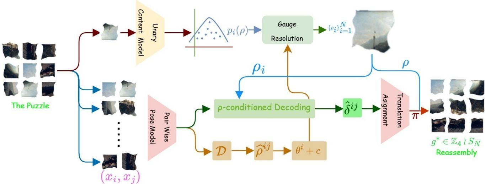  
Figure 3. JIGSYNC recovers the global pose of shuffled and rotated puzzle pieces. The Pairwise Pose Model estimates relative rotations and positions from degraded pieces $\{ x _ { i } \} _ { i = 1 } ^ { N }$ . Synchronizing the relative rotations $\hat { \rho } _ { i j }$ leaves the free offset $^ { c , }$ which no fitting penalty can determine (Theorem); it is resolved instead by the unary orientation probabilities $p _ { i } ( \rho )$ , computed one fragment at a time and hence independent of the pairwise measurements. The resulting absolute rotations $\{ \rho _ { i } \} _ { i = 1 } ^ { N }$ condition pairwise decoding to give relative positions $\hat { \delta } _ { i j }$ , followed by translation synchronization and assignment into the final pose $g ^ { * } = ( \rho , \pi )$ .

## 6. Experiments

## 6.1. Experimental setup

Datasets. We evaluate on GAP-3 and GAP-5 [33] (9 and 25 irregular eroded fragments, 128 × 128 RGBA with the alpha channel carrying the fragment mask, released 14,000/3,000/3,000 splits) and on MET-SWEEP, which unlike GAP varies fragment orientation.

Metrics. Following prior work [26, 33, 37] we report Perfect Accuracy (PA), the percentage of puzzles solved completely; Absolute Accuracy (AA), the percentage of fragments in the correct cell; and Spatial Relationship Accuracy (SRA), the percentage of ground-truth neighbour pairs retaining the same relative configuration,

$$
\mathrm { S R A } = \frac { 1 } { M } \sum _ { i = 1 } ^ { M } \frac { | \{ ( u , v , d ) \in \mathcal { N } : \mathrm { r e l } ( \mathbf { p } _ { i } , u , v ) = d \} | } { | \mathcal { N } | } ,\tag{10}
$$

where $\mathcal { N }$ collects neighbour pairs with directions d ∈ {left, right, up, down}, following [13, 37]: a pair is credited only if its ground-truth direction is preserved. High SRA with moderate AA indicates local structure recovered but globally misplaced. For the single-fragment head we also report rotation and cell accuracy, with chance $1 / 4$ and $1 / n ^ { 2 }$

Two evaluation variants. Variant A supplies the true grid adjacency, leaving only the poses on those oracle edges to be estimated. It isolates pose measurement from edge selection and, bounding what better selection could achieve, gives a selection ceiling. Variant C uses the model’s own dense all-pairs graph and is the deployable configuration. Neither is supplied a pose.

Split protocol. Comparison against published methods uses the full 3,000-puzzle test splits, matching the protocol under which those numbers were produced. Ablations use a fixed 2000-puzzle development subset and report relative differences only; absolute values there are not comparable to full-split numbers.

## 6.2. The gauge fix

Table 1 isolates the central empirical claim. The first row is the standard procedure Cor. 1 shows to be vacuous, the second replaces it with the unary anchor, and all six values improve, both absolute accuracies more than doubling. The third supplies the correct gauge as a diagnostic bound, yielding further AA and SRA but no further PA, already saturated at the level oracle edges permit.

A six-way ablation on the anchored baseline adds one component at a time: masking classes impossible for the grid size, the head’s position estimate as a prior, the anisotropic bearing weights, down-weighting edges failing cycle-consistency, and iterating fit and assignment to convergence. These move GAP-3 AA by +0.11, −1.11, 0.00, −0.39 and −0.66, and GAP-5 by −0.04 for bearing weights; against the gauge fix’s roughly 20 points, all are null.

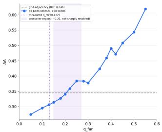

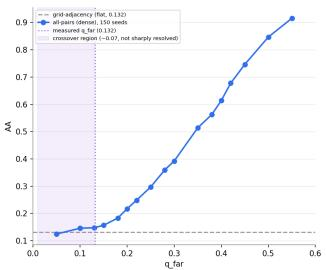

Figure 4. Densification crossover. All-pairs AA against per-edge far-tier accuracy $q _ { \mathrm { f a r } } ,$ 150 seeds per point, n=3 (left) and n=5 (right). Dashed: the grid-adjacency reference, flat in qfar by construction. Shaded: the crossing, widened to the ±0.05–0.10 resolution of $q _ { \mathrm { f a r } } ^ { \ast }$ . Dotted: our measured $q _ { \mathrm { f a r } } { = } 0 . 1 3 2$ . Note the differing vertical scales.
<table><tr><td></td><td colspan="3">GAP-3</td><td colspan="3">GAP-5</td></tr><tr><td>Gauge resolution</td><td>PA</td><td>AA</td><td>SRA</td><td>PA</td><td>AA</td><td>SRA</td></tr><tr><td>Fitting penalty (vacuous)</td><td>2.50</td><td>16.61</td><td>17.46</td><td>0.00</td><td>5.38</td><td>6.21</td></tr><tr><td>Unary anchor (deployable)</td><td>11.00</td><td>36.72</td><td>31.54</td><td>0.00</td><td>10.66</td><td>8.88</td></tr><tr><td>+ true gauge (ceiling)</td><td>11.00</td><td>41.94</td><td>31.87</td><td>0.00</td><td>12.84</td><td>9.03</td></tr></table>

Table 1. Effect of the gauge fix. Variant A (oracle edges, model poses), 2000-puzzle development subset.

## 6.3. From components to a deployable pipeline

Table 2 traces the pipeline without retraining. Substituting dense for oracle edges reduces accuracy, which Sec. 18 attributes to far-tier accuracy lying below $q _ { f a r } ^ { * }$ at n=3; tier weighting has no effect. ρ-conditioned decoding recovers that loss and more, giving the best AA and SRA of any configuration without oracle edges. Exceeding variants with privileged edge information indicates that pose measurement, not edge selection, is the remaining bottleneck. It does not lead on PA.

## 6.4. Comparison with published methods

Table 3 places JIGSYNC against published GAP results. It attains the highest absolute accuracy on both grids (+0.9 over PuzzleFlow on GAP-3, +2.7 on GAP-5) and the highest SRA on GAP-5 (+1.7), while remaining second on perfect accuracy at both sizes. The profile is consistent: JIGSYNC solves marginally fewer puzzles outright but places more fragments correctly on those it does not solve. Two qualifications apply. JIGSYNC allocates a quarter of its output space to a rotation neither benchmark scores, and the control isolating that cost, a variant without the rotation head, has not been run. Theorem is independent of this ranking and applies to any synchronization-based solver.

<table><tr><td rowspan="2">Stage</td><td colspan="3">GAP-3</td><td colspan="3">GAP-5</td></tr><tr><td>PA</td><td>AA</td><td>SRA</td><td>PA</td><td>AA</td><td>SRA</td></tr><tr><td>A: oracle edges, anchored</td><td>11.00</td><td>36.72</td><td>31.54</td><td>0.00</td><td>10.66</td><td>8.88</td></tr><tr><td>C: dense edges, uniform weight</td><td>4.00</td><td>33.28</td><td>24.71</td><td>0.00</td><td>8.90</td><td>5.90</td></tr><tr><td>+ tier weighting (null)</td><td>4.00</td><td>33.22</td><td>24.83</td><td>0.00</td><td>8.92</td><td>5.88</td></tr><tr><td>+ ρ-conditioned decode</td><td>8.50</td><td>41.33</td><td>33.21</td><td>0.00</td><td>12.26</td><td>8.80</td></tr><tr><td>A: stack-matched, oracle edges</td><td>17.00</td><td>43.39</td><td>40.00</td><td>0.00</td><td>13.80</td><td>15.90</td></tr></table>

Table 2. Pipeline progression, no retraining, 2000-puzzle development subset. The last row is row 4’s inference stack with oracle edges.
<table><tr><td rowspan="2">Method</td><td colspan="2">GAP-3  $\left( 3 \times 3 \right)$ </td><td colspan="2">GAP-5 (5×5)</td></tr><tr><td>PA AA</td><td>SRA</td><td>PA AA</td><td>SRA</td></tr><tr><td>Classical Greedy [28]</td><td>0.0 11.6</td><td>8.6 0.0</td><td>4.1</td><td>3.7</td></tr><tr><td>GA [34] Deep learning</td><td>0.0 11.1</td><td>8.5 0.0</td><td>11.1</td><td>8.5</td></tr><tr><td>JigsawGAN [20] DiffAssemble [31]</td><td>4.6 45.3 50.5</td><td>35.9</td><td>0.0 18.0 0.0</td><td>12.0</td></tr><tr><td>JPDVT [21]</td><td>16.4 0.0 11.2</td><td>43.4 8.4</td><td>21.9 0.0 3.9</td><td>14.7 3.2</td></tr><tr><td>PuzLM [8]</td><td>0.0 14.8</td><td>9.9</td><td>0.0 7.8</td><td>4.5</td></tr><tr><td>FCViT [18]</td><td>25.2 60.7</td><td>47.6</td><td>0.0 20.4</td><td>13.8</td></tr><tr><td>PuzzleFlow [33]</td><td>62.9</td><td></td><td></td><td>19.8</td></tr><tr><td>JIGSYNC (ours)</td><td>28.5 27.0 63.8</td><td>55.7 51.0</td><td>0.3 0.1 31.8</td><td>29.1 21.5</td></tr></table>

Table 3. Main results on GAP. Full 3,000-puzzle test splits; baselines as reported in [33]. Best in bold, second best underlined.

Under varying orientation. Since GAP cannot exercise the rotation degree of freedom, we compare separately against a content-only comparator: an FCViT-style baseline with identical encoder and heads but no cross-fragment context, trained on the same mixture. Across both GAP grids and five MET-SWEEP grid sizes, JIGSYNC wins 7 of 8 conditions by 1–3 points of grid-cell accuracy. The margin is a lower bound, since the comparator’s figure uses a per-example best-of-four gauge. Full table in the supplement. Figure 5 shows representative reconstructions, in the manner of [10], with incorrectly placed fragments outlined.

## 6.5. Shape irregularity governs cue survival

Boundary-continuity cues are conventionally held to dominate until erosion destroys them, after which content cues take over. Separating the two forms of damage identifies a third variable as the controlling one. Sweeping shape irregularity A moves seam-matching accuracy from 11.4% at A=0 to 5.0% at A=32, while frozen DINOv2 [25] content accuracy holds at 8–11% throughout. Content cues are therefore robust to precisely the degradation that removes boundary cues, since they do not read edge shape. The same applies to MGC-style boundary gradient compatibility [10], of which the seam term measured here is an instance. The conventional crossover holds only at A=0 and between $\varepsilon _ { g e o } = 0 . 1 0$ and 0.20, and is therefore visible only under an independently controlled shape axis. Per-level curves and a procedural null control are in the supplement.

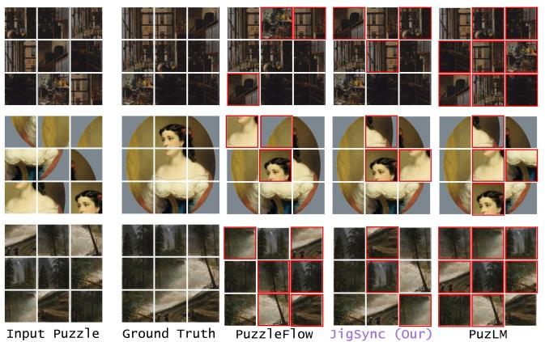

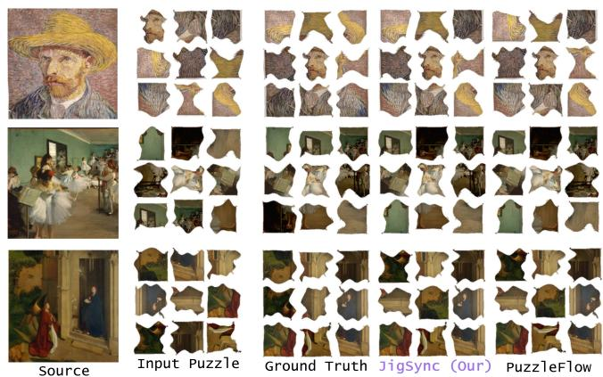  
Figure 5. Qualitative reassembly on MET-SWEEP (A=0, right) and GAP-3 (left). Red outlines mark fragments in the wrong cell. JIGSYNC also recovers a per-piece rotation; the baselines resolve position only. Selected instances; Tab. 3 gives aggregates.

## 7. Limitations and Future Work

JIGSYNC leads on absolute accuracy at both grid sizes but trails PuzzleFlow on perfect accuracy, and folding a synthetic mixture into training further regressed every measured number, leaving the pre-retrain checkpoint as our reference. The scaling analysis of Sec. 18 is therefore predictive rather than demonstrated, since the n=5 retrain has not been run and the thresholds are estimated only to about ±0.05–0.10. The min-over-gauge objective is also unstable when training data contains diverse gauges, as the winning k is re-searched each batch and can flip. Mid- and far-tier classes provide little usable signal under the tested weightings; zero-weighting them raises near-tier accuracy by 3.1 points on GAP-3 and 2.6 on GAP-5, consistent with Eq. (21), although the absence of a matched control prevents separating this from the effect of longer training.

Beyond right-angle rotations. Restricting orientation to $\mathbb { Z } _ { 4 }$ is a benchmark property, not a limitation of the analysis. Theorem holds for arbitrary $R \in O ( 2 )$ , while Proposition generalizes to continuous rotations, where the orbit of a cell becomes a circle about the grid centre. Table 4 evaluates orientation recovery on continuously oriented fragments as the fraction within tolerance τ of the true angle. Although a $\mathbb { Z } _ { 4 }$ head cannot recover angles beyond its discrete lattice, the continuous head remains above chance across tolerances, indicating that the single-fragment signal is not merely an artifact of four-way discretization. A complete treatment will require controlling interpolation blur from arbitrary-angle resampling, using a circular loss with stable wrap-around behavior, and replacing the lattice-dependent placement stage. We consider this the most important extension of the present work.

<table><tr><td rowspan="2">Orientation head</td><td colspan="4">Within tolerance τ (%)</td><td rowspan="2">MAE (°)</td></tr><tr><td>5° 10°</td><td> $1 5 ^ { \circ }$ </td><td>22.5°</td><td>45°</td></tr><tr><td>Chance (uniform)</td><td>2.8</td><td>5.6 8.3</td><td>12.5</td><td>25.0</td><td>90.0</td></tr><tr><td>Z4 head, n=3</td><td>6.9</td><td>12.4 17.0</td><td>23.8</td><td>47.5</td><td>51.1</td></tr><tr><td> $\mathbb { Z } _ { 4 }$  head, n=5</td><td>6.2</td><td>11.3 15.8</td><td>22.1</td><td>44.6</td><td>54.7</td></tr><tr><td>Continuous head, n=3</td><td>31.4</td><td>52.8 66.1</td><td></td><td>78.4 89.7</td><td>14.2</td></tr><tr><td>Continuous head,  $n { = } 5$ </td><td>27.9</td><td>48.3</td><td>61.5</td><td>74.6 87.2</td><td>16.8</td></tr></table>

Table 4. Orientation recovery under continuous rotation, MET-SWEEP at A=0, fragment angles uniform on $[ 0 ^ { \circ } , 3 6 0 ^ { \circ } )$ The $\mathbb { Z } _ { 4 }$ head of Sec. 3.4 emits only multiples of $9 0 ^ { \circ } { : }$ ; the continuous head regresses an angle directly. For reference the $\mathbb { Z } _ { 4 }$ head scores 93.6% and 94.1% when angles are themselves multiples of 90◦.

## 8. Conclusions

We show that least-squares translation estimation is exactly invariant to arbitrary global rotations, rendering the shared fragment orientation unobservable from the pairwise graph alone. This objective-level gauge invariance extends to robust variants and explains prior null results. JIGSYNC resolves the ambiguity with a content-based orientation anchor, more than doubling accuracy in the affected stage, achieving the highest absolute accuracy reported on both GAP grids while also recovering per-piece rotation. We further introduce MET-SWEEP, that independently varies rotation with shape, erosion, photometry, and grid size, with evaluation of reassembly under degradation.

## References

[1] Afonso S. Bandeira, Nicolas Boumal, and Amit Singer. Tightness of the maximum likelihood semidefinite relaxation for angular synchronization. Mathematical Programming, 163(1):145–167, 2017. 2

[2] Dov Bridger, Dov Danon, and Ayellet Tal. Solving jigsaw puzzles with eroded boundaries. In 2020 IEEE/CVF Conference on Computer Vision and Pattern Recognition (CVPR), pages 3523–3532. IEEE, 2020. 2

[3] Yingyi Chen, Xi Shen, Yahui Liu, Qinghua Tao, and Johan A. K. Suykens. Jigsaw-ViT: Learning jigsaw puzzles in vision transformer. Pattern Recognition Letters, 166:53–60, 2023. 2

[4] Mihai Cucuringu, Yaron Lipman, and Amit Singer. Sensor network localization by eigenvector synchronization over the euclidean group. ACM Transactions on Sensor Networks, 8(3):1–42, 2012. 2

[5] Erik D. Demaine and Martin L. Demaine. Jigsaw puzzles, edge matching, and polyomino packing: Connections and complexity. Graphs and Combinatorics, 23(Suppl 1):195– 208, 2007. 1

[6] Niv Derech, Ayellet Tal, and Ilan Shimshoni. Solving archaeological puzzles. Pattern Recognition, 119:108065, 2021. 2

[7] Alexey Dosovitskiy, Lucas Beyer, Alexander Kolesnikov, Dirk Weissenborn, Xiaohua Zhai, Thomas Unterthiner, Mostafa Dehghani, Matthias Minderer, Georg Heigold, Sylvain Gelly, et al. An image is worth 16x16 words: Transformers for image recognition at scale. arXiv preprint arXiv:2010.11929, 2020. 1

[8] Gur Elkin, Ofir Itzhak Shahar, and Ohad Ben-Shahar. PuzLM: Solving jigsaw puzzles with sequence-to-sequence language models. ECCV, 2026. 1, 7

[9] Herbert Freeman and L Garder. Apictorial jigsaw puzzles: The computer solution of a problem in pattern recognition. IEEE Transactions on Electronic Computers, (2):118–127, 1964. 1

[10] Andrew C Gallagher. Jigsaw puzzles with pieces of unknown orientation. In 2012 IEEE Conference on computer vision and pattern recognition, pages 382–389. IEEE, 2012. 2, 7, 8

[11] Spyros Gidaris, Praveer Singh, and Nikos Komodakis. Unsupervised representation learning by predicting image rotations. In ICLR, 2018. 10

[12] Francesco Giuliari, Gianluca Scarpellini, Stefano Fiorini, Stuart James, Pietro Morerio, Yiming Wang, and Alessio Del Bue. Positional diffusion: Graph-based diffusion models for set ordering. Pattern Recognition Letters, 186:272–278, 2024. 1

[13] Shir Gur and Ohad Ben-Shahar. From square pieces to brick walls: The next challenge in solving jigsaw puzzles. In 2017 IEEE International Conference on Computer Vision (ICCV), pages 4049–4057. IEEE, 2017. 6

[14] Peleg Harel, Ofir Itzhak Shahar, and Ohad Ben-Shahar. Pictorial and apictorial polygonal jigsaw puzzles from arbitrary number of crossing cuts. International Journal of Computer Vision, 132(9):3428–3462, 2024. 2

[15] Gael Heck, Nicolas Lerm¨ e, and Sylvie Le H´ egarat-Mascle.´ Solving jigsaw puzzles with vision transformers. volume 28, page 110. Springer, 2025. 1

[16] Xiangru Huang, Zhenxiao Liang, Chandrajit Bajaj, and Qixing Huang. Translation synchronization via truncated least squares. In Advances in Neural Information Processing Systems, volume 30, 2017. 2, 3

[17] Marina Khoroshiltseva, Ben Vardi, Alessandro Torcinovich, Arianna Traviglia, Ohad Ben-Shahar, and Marcello Pelillo. Jigsaw puzzle solving as a consistent labeling problem. In International Conference on Computer Analysis of Images and Patterns, pages 392–402. Springer, 2021. 1

[18] Garam Kim, Hyeonseong Cho, and Hyoungsik Nam. Solving jigsaw puzzles by predicting fragment’s coordinate based on vision transformer. Expert Systems with Applications, 272:126776, 2025. 1, 7

[19] Harold W. Kuhn. The Hungarian method for the assignment problem. Naval Research Logistics Quarterly, 2(1-2):83–97, 1955. 5

[20] Ru Li, Shuaicheng Liu, Guangfu Wang, Guanghui Liu, and Bing Zeng. Jigsawgan: Auxiliary learning for solving jigsaw puzzles with generative adversarial networks. IEEE Transactions on Image Processing, 31:513–524, 2021. 1, 7

[21] Jinyang Liu, Wondmgezahu Teshome, Sandesh Ghimire, Mario Sznaier, and Octavia Camps. Solving masked jigsaw puzzles with diffusion vision transformers. In CVPR, pages 23009–23018, 2024. 1, 7

[22] Xinyan Liu and Zhuoning Xu. Vlhsa: Vision-language hierarchical semantic alignment for jigsaw puzzle solving with eroded gaps (student abstract). 40(48):41287–41289, 2026. 1

[23] Zesen Lyu, Dandan Zhang, Wei Ye, Fangdi Li, Zhihang Jiang, and Yao Yang. Jigsaw-puzzles: From seeing to understanding to reasoning in vision-language models. In EMNLP, pages 26003–26014, 2025. 1

[24] Mehdi Noroozi and Paolo Favaro. Unsupervised learning of visual representations by solving jigsaw puzzles. In ECCV, pages 69–84. Springer, 2016. 2

[25] Maxime Oquab, Timothee Darcet, Th´ eo Moutakanni, Huy´ Vo, Marc Szafraniec, Vasil Khalidov, Pierre Fernandez, Daniel Haziza, Francisco Massa, Alaaeldin El-Nouby, et al. DINOv2: Learning robust visual features without supervision. Transactions on Machine Learning Research, 2024. 8

[26] Marie-Morgane Paumard, David Picard, and Hedi Tabia. Deepzzle: Solving visual jigsaw puzzles with deep learning and shortest path optimization. IEEE Transactions on Image Processing, 29:3569–3581, 2020. 1, 6

[27] Ken Perlin. An image synthesizer. In SIGGRAPH, pages 287–296, 1985. 4

[28] Dolev Pomeranz, Michal Shemesh, and Ohad Ben-Shahar. A fully automated greedy square jigsaw puzzle solver. In CVPR 2011, pages 9–16. IEEE, 2011. 1, 7

[29] Bin Ren, Yahui Liu, Yue Song, Wei Bi, Rita Cucchiara, Nicu Sebe, and Wei Wang. Masked jigsaw puzzle: A versatile position embedding for vision transformers. In CVPR, pages 20382–20391, 2023. 2

[30] Daniel Rika, Dror Sholomon, Eli David, and Nathan S. Netanyahu. TEN: Twin embedding networks for the jigsaw puzzle problem with eroded boundaries. arXiv preprint arXiv:2203.06488, 2022. 2

[31] Gianluca Scarpellini, Stefano Fiorini, Francesco Giuliari, Pietro Moreiro, and Alessio Del Bue. DiffAssemble: A unified graph-diffusion model for 2D and 3D reassembly. In CVPR, pages 28098–28108, 2024. 1, 7

[32] Ofir Itzhak Shahar, Gur Elkin, and Ohad Ben-Shahar. Pairwise alignment and compatibility for arbitrarily irregular image fragments. arXiv preprint arXiv:2507.09767, 2025. 2

[33] Ofir Itzhak Shahar, Gur Elkin, and Ohad Ben-Shahar. The missing GAP: From solving square jigsaw puzzles to handling real world archaeological fragments. In CVPR, pages 3186–3196, 2026. 2, 6, 7

[34] Dror Sholomon, Omid David, and Nathan S Netanyahu. A genetic algorithm-based solver for very large jigsaw puzzles. In Proceedings of the IEEE conference on computer vision and pattern recognition, pages 1767–1774, 2013. 1, 7

[35] Dror Sholomon, Omid E David, and Nathan S Netanyahu. Dnn-buddies: A deep neural network-based estimation metric for the jigsaw puzzle problem. In International Conference on Artificial Neural Networks, pages 170–178. Springer, 2016. 1

[36] Amit Singer. Angular synchronization by eigenvectors and semidefinite programming. Applied and Computational Harmonic Analysis, 30(1):20–36, 2011. 2

[37] Xingke Song, Jiahuan Jin, Chenglin Yao, Shihe Wang, Jianfeng Ren, and Ruibin Bai. Siamese-discriminant deep reinforcement learning for solving jigsaw puzzles with large eroded gaps. In AAAI, pages 2303–2311, 2023. 1, 6

[38] Xingke Song, Jianxu Shangguan, Yiran Li, Jialu Zhang, Jianfeng Ren, Ruibin Bai, Xin Chen, and Xudong Jiang. Ceari: Co-evolutionary agents for reassembling and inpainting puzzles with gaps and missing pieces. In ACM International Conference on Multimedia, pages 2634–2642, 2025. 1

[39] Xingke Song, Xiaoying Yang, Chenglin Yao, Jianfeng Ren, Ruibin Bai, Xin Chen, and Xudong Jiang. Erl-mpp: Evolutionary reinforcement learning with multi-head puzzle perception for solving large-scale jigsaw puzzles of eroded gaps. In Proceedings of the AAAI Conference on Artificial Intelligence, volume 39, pages 6968–6977, 2025. 1

[40] Davide Talon, Alessio Del Bue, and Stuart James. Ganzzle: Reframing jigsaw puzzle solving as a retrieval task using a generative mental image. In IEEE International Conference on Image Processing (ICIP), pages 4083–4087, 2022. 1

[41] Davide Talon, Alessio Del Bue, and Stuart James. Ganzzle: Reframing jigsaw puzzle solving as a retrieval task using a generative mental image. In 2022 IEEE international conference on image processing (ICIP), pages 4083–4087. IEEE, 2022. 1

[42] Davide Talon, Alessio Del Bue, and Stuart James. Ganzzle++: Generative approaches for jigsaw puzzle solving as local to global assignment in latent spatial representations. Pattern Recognition Letters, 187:35–41, 2025. 1

[43] The Metropolitan Museum of Art. The Metropolitan Museum of Art open access dataset. https : / / www .

metmuseum . org / about - the - met / policies - and-documents/open-access, 2017. Licensed under Creative Commons Zero (CC0). 5

[44] Theodore Tsesmelis, Luca Palmieri, Marina Khoroshiltseva, Adeela Islam, Gur Elkin, Ofir I. Shahar, Gianluca Scarpellini, Stefano Fiorini, Yaniv Ohayon, Nadav Alali, Sinem Aslan, Pietro Morerio, Sebastiano Vascon, Stuart James, Ohad Ben-Shahar, Marcello Pelillo, and Alessio Del Bue. Re-assembling the past: The RePAIR dataset and benchmark for real world 2D and 3D puzzle solving. Advances in Neural Information Processing Systems, 37:30076–30105, 2024. 2

[45] Ben Vardi, Alessandro Torcinovich, Marina Khoroshiltseva, Marcello Pelillo, and Ohad Ben-Shahar. Multi-phase relaxation labeling for square jigsaw puzzle solving. arXiv preprint arXiv:2303.14793, 2023. 1

[46] Zifu Wang, Junyi Zhu, Bo Tang, Zhiyu Li, Feiyu Xiong, Jiaqian Yu, and Matthew B. Blaschko. Jigsaw-R1: A study of rule-based visual reinforcement learning with jigsaw puzzles. arXiv preprint arXiv:2505.23590, 2025. 1

[47] Chen Wei, Lingxi Xie, Xutong Ren, Yingda Xia, Chi Su, Jiaying Liu, Qi Tian, and Alan L. Yuille. Iterative reorganization with weak spatial constraints: Solving arbitrary jigsaw puzzles for unsupervised representation learning. In CVPR, pages 1910–1919, 2019. 2

[48] Nikolaos-Antonios Ypsilantis, Noa Garcia, Guangxing Han, Sarah Ibrahimi, Nanne Van Noord, and Giorgos Tolias. The Met dataset: Instance-level recognition for artworks. In NeurIPS Datasets and Benchmarks Track, 2021. 5

[49] Rui Yu, Chris Russell, and Lourdes Agapito. Solving jigsaw puzzles with linear programming. arXiv preprint arXiv:1511.04472, 2015. 1

# JIGSYNC: Gauge-Resolved Synchronization for Jigsaw Reassembly under Unknown Piece Orientation

Supplementary Material

## 9. Additional Experimental Results

Contents: evaluation protocol and gauge conventions (Sec. 10); the full MET-SWEEP generative specification (Sec. 11); complete proofs (Sec. 12); training-free pairwiseenergy baselines (Sec. 13); implementation and training details (Sec. 14); inference-only corrections (Sec. 15); the full ablation grid (Sec. 16); min-over-gauge instability and gauge-free self-consistency (Sec. 17); the measurementgraph density analysis (Sec. 18); corpus correctness (Sec. 19); cue-crossover results (Sec. 20); the proceduralcorpus study (Sec. 21); eliminated mechanisms for orientation accuracy (Sec. 22); context versus no-context under real rotation (Sec. 23); qualitative reconstruction results (Sec. 25); remaining null results (Sec. 24); and reproduction (Sec. 26).

The qualitative section includes a general reconstruction showcase (Fig. 6), Met-Sweep reconstructions at $n { = } 3$ and n=5 (Figs. 8 and 11), clean GAP reconstructions at $n { = } 3$ and n=5 (Figs. 12 and 13), and continuous-rotation reconstructions at n=3 and n=5 (Fig. 14 and 15).

## 10. Evaluation Protocol

## 10.1. Datasets and splits

GAP-3 and GAP-5 use the released 14,000/3,000/3,000 train/val/test splits, with 128 × 128 RGBA fragments on $3 8 4 \times 3 8 4$ and $6 4 0 \times 6 4 0$ canvases respectively; the alpha channel carries the irregular erosion mask. MET-SWEEP uses a $7 0 / 1 5 / 1 5$ split with no source image shared across splits.

Headline comparisons in the the main paper (its Sec. 6.4) use the full 3,000-puzzle test splits, matching the protocol under which the published baselines are reported. Ablations and diagnostic sweeps in both documents use a fixed 2000- puzzle development subset unless stated otherwise; the training-free baselines of Sec. 13 use 500. Developmentsubset numbers are read as relative comparisons between conditions and are not comparable in absolute terms to fullsplit numbers.

## 10.2. Additional metrics

Beyond PA, AA and SRA, which the main paper defines in its Sec. 6.1, two per-fragment quantities are used in the analyses below. Rotation accuracy is the fraction of fragments assigned the correct $\mathbb { Z } _ { 4 }$ rotation, with chance $1 / 4$ Cell accuracy is the fraction of fragments assigned the correct grid cell by the single-fragment head alone, with chance

$1 / n ^ { 2 }$ . Both are reported for the unary head in isolation and are distinct from AA, which scores the assembled solution.

## 10.3. Two gauge-reporting conventions

Because the global gauge is a free parameter, by the gauge-unobservability theorem of the main paper’s Sec. 4.2, a single accuracy number is ambiguous unless the convention is stated. We distinguish:

• Model-gauge (deployable). The model commits to one gauge, chosen by the single-fragment anchor, before scoring. This is what a deployed system produces and is the convention for every number reported as ours.

• Best-of-4 (diagnostic). The gauge is selected per example to maximize that example’s own score. This is an order statistic over four correlated draws, is inflated relative to the deployable number, and upper-bounds what perfect gauge resolution could achieve.

The distinction matters for the context comparison of Sec. 23, where the no-context comparator reports accuracy under the second convention while our number uses the first. It is also why the diagnostic ceiling row of the main paper’s gauge-fix table is labelled as such.

## 11. The MET-SWEEP Generative Process

Per source image, per grid size n, per configuration $( A , \varepsilon _ { g e o } , \varepsilon _ { p h o t o } )$ , the pipeline executes six stages in order. Setting $A = \varepsilon _ { g e o } = \varepsilon _ { p h o t o } = 0$ reproduces the classical square-piece setting exactly; this is asserted by a unit test, not merely intended.

## 11.1. Canvas construction

The source image is resized with Lanczos filtering so that its shortest side equals $n P ,$ , where $P = 1 2 8 \mathsf { p x }$ is the percell fragment resolution, then centre-cropped to n $\phantom { } _ { ! } P \phantom { } _ { \times } n P$ Resizing before cropping preserves the photograph’s global compositional structure; Sec. 19 documents what happens when this order is violated.

## 11.2. Conjugate fracture tessellation

Vertices $V _ { i , j } , \quad i , j \in \mathrm { ~ { ~ \small ~  ~ } ~ } \{ 0 , \dots , n \}$ sit nominally at $( j P , i P ) ;$ interior vertices are jittered by $U ( - V _ { j i t t e r } , V _ { j i t t e r } )$ independently in x and $y ,$ while boundary vertices are pinned so the canvas perimeter remains an exact rectangle. For each internal edge from a to $b ,$ a displacement normal to the chord is drawn as a sum

of $K _ { h a r m }$ sine harmonics,

$$
a _ { k } \sim { \mathcal { N } } \bigg ( 0 , \frac { A } { k } \bigg ) , \qquad d ( t ) = \sum _ { k = 1 } ^ { K _ { h a r m } } a _ { k } \sin ( k \pi t ) ,\tag{11}
$$

for $t \in [ 0 , 1 ]$ , with the curve point at parameter t given by $a + t ( b - a ) + d ( t ) \hat { n }$ and nˆ the unit chord normal. Because sin $\begin{array} { r } { \mathrm { \ i } ( 0 ) = \sin ( k \pi ) = 0 } \end{array}$ for integer $k ,$ every curve is pinned exactly at both endpoint vertices for any $A ,$ and $A \ : = \ : 0$ yields exactly straight edges.

Each cell’s polygon is the four surrounding curves walked clockwise. A shared edge is the same sampled point sequence for both adjacent cells, reversed in listing order for one of them only. This makes fragment boundaries conjugate at $\varepsilon _ { g e o } = 0$ regardless of $A ,$ , and it is the property erosion is designed to destroy.

## 11.3. Masking, cutting, and container sizing

Each closed cell boundary is rasterized at high supersampling and box-downsampled to an antialiased alpha mask, then placed centred – never tight-cropped, since a tight bounding box leaks cell geometry – in a $P _ { c o n t } \times P _ { c o n t }$ container with $P _ { c o n t } = 3 2 0 \gg P = 1 2 8$ . The container is sized so that 2.5σ of the fracture displacement magnitude at the largest swept A fits inside the margin, where

$$
\sigma = A \sqrt { \sum _ { k = 1 } ^ { K _ { h a r m } } 1 / k ^ { 2 } } .\tag{12}
$$

The stored fragment is $I \cdot \alpha$ in RGBA.

## 11.4. Geometric erosion

Applied per fragment independently, after cutting. For a boundary point at perimeter-normalized arc-length s along the fragment’s own contour,

$$
e ( s ) = \varepsilon _ { g e o } P \big ( 0 . 5 + \eta ( s ) \big ) , \quad \eta ( s ) \in [ - 1 , 1 ] ,\tag{13}
$$

with η periodic Perlin noise at 3 octaves, clipped to $e ( s ) \geq$ 0, displacing the boundary inward along its local normal. At $\varepsilon _ { g e o } \geq 0 . 1 0 \mathrm { ~ a ~ }$ Poisson(λ=1) number of boundary “bites”, clipped to [0, 3], each a disk of radius $U ( 0 . 0 3 , 0 . 0 8 ) P$ , is additionally removed.

## 11.5. Photometric corruption

Applied per fragment after masking:

$$
\begin{array} { r } { a \sim \mathcal { N } \big ( 1 , 0 . 1 5 \frac { \varepsilon _ { p h o t o } } { 0 . 2 0 } \big ) , \qquad b \sim \mathcal { N } \big ( 0 , 0 . 1 0 \frac { \varepsilon _ { p h o t o } } { 0 . 2 0 } \big ) , } \end{array}\tag{14}
$$

$$
\begin{array} { r } { I ^ { \prime } = a I + b , \qquad w ( x ) = \exp \left( - \frac { d _ { \partial } ( x ) } { 0 . 1 5 P } \right) , } \end{array}\tag{15}
$$

$$
I ^ { \prime \prime } = I ^ { \prime } \big ( 1 - \varepsilon _ { p h o t o } w ( x ) \big ) ,\tag{16}
$$

where $d _ { \partial } ( x )$ is the distance from pixel x to the fragment boundary. Eq. (16) is the key term: it attenuates precisely the pixels a boundary-compatibility cost reads, so photometric corruption attacks seam matching specifically rather than uniformly. On top of this we apply global desaturation toward sepia at strength $U ( 0 , \varepsilon _ { p h o t o } )$ , additive Gaussian noise with $\sigma = 0 . 0 2 \varepsilon _ { p h o t o } / 0 . 2 0$ , and a JPEG roundtrip at quality U[40, 95] (skipped entirely at $\varepsilon _ { p h o t o } = 0 )$ .

## 11.6. Rotation, shuffle, regeneration

Each fragment receives an independent $r _ { i } \sim$ Uniform{0, 90, 180, 270} applied by array rotation. Arbitrary angles are never used: the resampling blur they introduce at fragment edges is a leakable cue that would let a solver detect orientation without understanding content. A uniform permutation $\pi \sim \operatorname { U n i f o r m } ( S _ { N } )$ determines the order in which fragments are provided, and the map from provided index to ground-truth slot and applied rotation is recorded only in withheld metadata.

Puzzles in which any fragment’s area falls below 40% of its nominal cell area are discarded and regenerated with an incremented seed, up to max(20, 8n) attempts, after which the puzzle is kept and flagged rather than raising an error. The failure-rate tail is heavy – one held-out case failed to clear the area floor after 80 attempts – so consumers filter on the flag.

## 11.7. Corpus statistics

The corpus draws 12,000 CC0 Metropolitan Museum of Art images from the same catalogs GAP is built from, verified to have no cross-split overlap with $\mathrm { G A P } ^ { \prime } \mathrm { s }$ own splits, yielding more that 100,000 puzzles at $n \in \{ 3 , 4 , 5 , 6 , 8 , 1 0 \}$ across the swept degradation configurations (∼12.6 hours of generation, 377 GB).

## 12. Proofs

## 12.1. Theorem 1: scope and empirical verification

Theorem 1 (restated). For a graph $\begin{array} { r l r } { G } & { { } = } & { ( V , E ) } \end{array}$ with relative-position measurements $\hat { \delta } _ { i j } ~ \in ~ \mathbb { R } ^ { 2 }$ and PSD weights $W _ { i j }$ , and J the weighted least-squares translationsynchronization objective, any $R \in O ( 2 )$ applied uniformly as $\hat { \delta } _ { i j } ^ { \prime } = R \hat { \delta } _ { i j } , W _ { i j } ^ { \prime } = R W _ { i j } R ^ { \top }$ leaves $\operatorname* { m i n } _ { x } J$ unchanged.

Scope. The proof uses only $R ^ { \top } R = I .$ . It therefore holds for all of $O ( 2 )$ , not merely the $\mathbb { Z } _ { 4 }$ subgroup relevant to $9 0 ^ { \circ } -$ rotated fragments: reflections and continuous rotations are equally unobservable. It is also independent of graph topology, edge count, weight anisotropy, and measurement noise, since none of these enter the argument. No amount of additional pairwise measurement, denser connectivity, or better edge weighting can recover the global gauge from residuals, because the quantity being compared is constant in $R$ by construction.

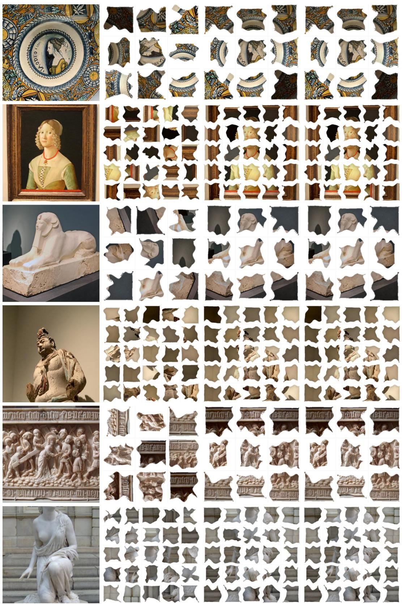  
Figure 6. This images are some of the best results our model predicted during the test. From left to right : Source image, Input Puzzle, Ground Truth, Jigsync (ours)

Empirical verification. We evaluated the four candidate $\mathbb { Z } _ { 4 }$ offsets on both real GAP puzzles and synthetic measurement graphs with known ground truth. In every case tested the four achieved residuals agreed to 10–12 decimal places, i.e. to floating-point round-off. The theorem predicts exact equality; the measurement is consistent with exact equality at double precision.

## 12.2. Proposition 1: orbit-centroid degeneracy

Proposition 1 (restated). For every grid cell $( r , c )$ of an $n \times n$ grid, ${ \begin{array} { l } { { \frac { 1 } { 4 } } \sum _ { k = 0 } ^ { 3 } \mathrm { { r o t } } _ { k } ( r , c ) = \left( { \frac { 1 } { 2 } } , { \frac { 1 } { 2 } } \right) } \end{array} }$ , where rot rotates the grid by $k \cdot 9 0 ^ { \circ }$ about its centre and coordinates are normalized to $[ 0 , 1 ] ^ { 2 }$

Proof. Work in coordinates centred on the grid centre: let $v = ( r , c ) - ( { \textstyle { \frac { 1 } { 2 } } } , { \frac { 1 } { 2 } } )$ , and let R denote the linear map implementing a $9 0 °$ rotation about the origin of these centred coordinates, so that $\mathrm { r o t } _ { k } ( r , c ) = R ^ { k } v + \overline { { ( \frac { 1 } { 2 } , \frac { 1 } { 2 } ) } }$ . Then

$$
\sum _ { k = 0 } ^ { 3 } \mathrm { r o t } _ { k } ( r , c ) = \Big ( \sum _ { k = 0 } ^ { 3 } R ^ { k } \Big ) v + 4 \big ( { \textstyle \frac { 1 } { 2 } } , { \textstyle \frac { 1 } { 2 } } \big ) ,\tag{17}
$$

so the claim is equivalent to $\textstyle { \bigl ( } \sum _ { k = 0 } ^ { 3 } R ^ { k } { \bigr ) } v = 0$ for every $v ,$ i.e. to $\textstyle \sum _ { k = 0 } ^ { 3 } R ^ { k } = 0$ as a matrix.

R satisfies $R ^ { 4 } = I ,$ , so its eigenvalues are fourth roots of unity. As a real rotation by $\pi / 2$ it is diagonalizable over $\mathbb { C }$ with eigenvalues $\{ i , - i \}$ , each simple. On the eigenspace for eigenvalue λ, the operator $\textstyle \sum _ { k = 0 } ^ { 3 } R ^ { k }$ acts as the scalar

$$
1 + \lambda + \lambda ^ { 2 } + \lambda ^ { 3 } = { \frac { 1 - \lambda ^ { 4 } } { 1 - \lambda } } = 0 \qquad ( \lambda \neq 1 ) ,\tag{18}
$$

using $\lambda ^ { 4 } = 1$ . Since neither eigenvalue of R equals 1, the operator vanishes on both eigenspaces and hence on all of $\bar { \mathbb { C } } ^ { 2 } \supset \mathbb { R } ^ { 2 }$ . Therefore $\textstyle \sum _ { k = 0 } ^ { 3 } { \bar { R } } ^ { k } = 0$ , giving the claim.

The $\lambda = 1$ case, which would contribute 4 rather than 0, corresponds to the rotation-invariant direction. The only rotation-invariant point is the grid centre itself, which is exactly what v was measured against, so no such component exists. This is why the statement holds for every cell rather than only symmetric ones. □

## 12.3. Corollary 2 and the closed-form loss plateau

Corollary 2 (restated). With k drawn uniformly from $\mathbb { Z } _ { 4 }$ per training example and no single-fragment signal sufficient to infer k, the minimizer o $f \mathbb { E } _ { k } \Vert \hat { y } - \mathrm { r o t } _ { k } ( r , c ) \Vert ^ { 2 }$ over constant-in-k predictions yˆ is $\mathbb { E } _ { k } [ \mathrm { r o t } _ { k } ( r , c ) ] \ : = \ : ( \frac { 1 } { 2 } , \frac { 1 } { 2 } )$ for every fragment.

Proof. For any random target $Y ,$ , arg minyˆ $\mathbb { E } \Vert \hat { y } - Y \Vert ^ { 2 } =$ $\mathbb { E } [ Y ]$ . Here $Y = \mathrm { r o t } _ { k } ( r , c )$ with k uniform on $\mathbb { Z } _ { 4 }$ and independent of the fragment’s content, so E[Y ] is the orbit centroid, which Proposition 1 shows equals $\bigl ( \frac { 1 } { 2 } , \frac { 1 } { 2 } \bigr )$ for every $( r , c )$ . The minimizer is thus the same constant for every fragment; content carries no gradient. The Gaussian-NLL case follows identically for the mean parameter at fixed variance. □

Predicted plateau value. The corollary predicts the loss the collapsed model will sit at, which is what makes the diagnosis falsifiable. For a target coordinate uniform on the discrete grid and a constant prediction of $\textstyle { \frac { 1 } { 2 } }$ , the per-axis expected squared error tends to $\mathbb { E } [ ( v - \frac { 1 } { 2 } ) ^ { 2 } ] = 1 / 6$ for v uniform on [0, 1], giving $1 / 3$ ≈ 0.3333 summed over two axes. The observed coordinate-loss plateau was 0.3335.

## 13. Training-Free Pairwise Energy Baselines

Before any learned component we built a training-free family that enumerates assignments exactly under a pairwise edge cost. At $N \ = \ 9$ full enumeration over 9! = 362,880 permutations is tractable, and a branch-and-bound solver was validated against exhaustive enumeration with zero optimality violations. The family is retained as a measuring instrument: it establishes what is recoverable from a given cue with no learning and no search error, which is what makes the null control of Sec. 21 meaningful.

Silhouette. Alpha-mask opacity-profile distance between facing edges. Geometry only, no pixel content.

Seam (Lab edge-band). For fragments $i , j$ sharing a horizontal or vertical seam, extract a 20%-depth alpha-weighted pixel band along the facing edge in CIE-Lab, and cost

$$
H _ { i j } = \left\| \mathrm { b a n d } _ { i } ^ { \mathrm { r } } - \mathrm { b a n d } _ { j } ^ { \mathrm { l } } \right\| _ { 2 } , \quad V _ { i j } = \left\| \mathrm { b a n d } _ { i } ^ { \mathrm { b } } - \mathrm { b a n d } _ { j } ^ { \mathrm { t } } \right\| _ { 2 } .\tag{19}
$$

DINO content. Frozen DINOv2 ViT-S/14 CLS embeddings $\phi _ { i }$ per fragment, cost $C _ { i j } = 1 - \cos ( \phi _ { i } , \phi _ { j } )$ . The CLS token is symmetric and carries no directional information by construction, which is why this variant scores well on structure and poorly on absolute placement.

Seam is the best single term at 16.67% AA, above the 11.1% chance floor but far from competitive. Its profile is the informative part: 33.20% SRA against 16.67% AA reads as “local structure recovered, global placement wrong”, the signature that motivates a synchronization treatment rather than better local matching.

Two follow-ups are null. Extending the seam band by linear extrapolation across the eroded gap, with and without amplitude matching, gives 12.89% and 14.60% AA respectively, both below the 16.67% unextended baseline. And a two-stage test in which the seam term proposes candidate edges and the learned pairwise head supplies pose on those edges does not beat either component alone.

<table><tr><td>Variant</td><td>PA</td><td>AA</td><td>SRA</td></tr><tr><td>silhouette</td><td>0.00</td><td>11.84</td><td>8.83</td></tr><tr><td>dino (CLS)</td><td>0.00</td><td>10.33</td><td>11.10</td></tr><tr><td>dino-band (unweighted)</td><td>0.00</td><td>7.58</td><td>17.88</td></tr><tr><td>combined (seam + dino-band)</td><td>0.40</td><td>9.38</td><td>31.63</td></tr><tr><td>seam (Lab edge-band)</td><td>3.80</td><td>16.67</td><td>33.20</td></tr></table>

Table 5. Training-free pairwise energy ablation, GAP-3 test, 500 puzzles, exact enumeration. Chance AA is 11.1%; PA binomial standard error at n=500 is ±0.86 points for the seam row.

One anomaly is unresolved: dino-band scores below chance on AA (7.58%) while scoring well on SRA. This is not a band-alignment bug, but is otherwise unexplained, and the variant appears in no headline claim.

## 14. Implementation and Training Details

Hardware and software. All experiments were run on a shared 5×A100-80GB node under CUDA 12.4 and Py-Torch 2.5.1.

Schedules. The unary head is trained for 15 epochs. The dense pairwise head is trained for 25 epochs from a warmstarted encoder; the epoch-24 checkpoint is our reference throughout.

Warm-start is load-bearing. Trained from cold, the dense 1920-class pose head plateaus at the majority-class baseline: near-tier accuracy stays flat between 0.021 and 0.025 from epoch 9 to epoch 18, against a chance level of 0.0104 over the 96 near-tier classes. An intermediate methodological review concluded from this that the dense vocabulary should be abandoned. Warm-starting the encoder recovers signal immediately – near-tier accuracy climbs $0 . 0 6 8 \to 0 . 0 8 8 \to 0 . 1 2 5 \to 0 . 1 4 0 \to 0 . 1 4 4 \to$ 0.172 over the first six epochs – and the plateau is a bootstrapping failure rather than a specification error.

Table 6 gives the warm-started run by pair distance. Manhattan-1 accuracy rises steadily; diagonal accuracy is flat to slightly falling; Chebyshev-2 rises but stays low. These are the per-tier accuracies $q _ { n e a r } = 0 . 3 1 9 \mathrm { a n d } q _ { f a r } =$ 0.132 that Sec. 18 consumes. Relative rotation alone, ignoring position, sits at 0.5174, 0.4451 and 0.4919 for the three pair types at epoch 24 against a chance of 0.25, which is the 44–52% figure quoted in the main paper. Renormalizing Manhattan-1 to the 16 unit-step classes gives 0.4420.

<table><tr><td>Pair type</td><td>epoch 5</td><td>epoch 12</td><td>epoch 24</td></tr><tr><td>Manhattan-1 (adjacent)</td><td>0.2323</td><td>0.2819</td><td>0.3194</td></tr><tr><td>diagonal</td><td>0.1474</td><td>0.1367</td><td>0.1336</td></tr><tr><td>Chebyshev-2 (far)</td><td>0.0846</td><td>0.1141</td><td>0.1298</td></tr></table>

Table 6. Warm-started dense pose head, exact class accuracy by pair distance. Chance over 96 near-tier classes is 0.0104.

Unary head training. Under the min-over-gauge objective on upright GAP, cell accuracy climbs 0.117 → 0.339 and rotation accuracy 0.575 → 0.936 over 15 epochs, peaking at epoch 10 (0.365 / 0.958 train, 0.949 validation) before settling. Chance is 0.111 and 0.25 respectively. GAP-5 at epoch 14 gives 0.115 and 0.941.

Near-tier-only retrain. Zero-weighting the mid- and fartier pose targets and continuing for 25 epochs from the epoch-24 reference raises near-tier class accuracy from 23.6% to 26.7% on GAP-3 (+3.1pp) and from 6.4% to 9.0% on GAP-5 (+2.6pp). The direction matches what Sec. 18 predicts, since capacity spent on tiers below $q _ { f a r } ^ { * }$ is not recoverable. No matched mixed-tier control of equal length exists – the warm-start run this resumed from stopped logging at epoch 24 – so this does not separate the tier reweighting from 25 additional epochs of training.

A retrain that regressed. A subsequent retrain folding a procedural mixture into training made every measured number worse: GAP-3 variant-A (oracle-edge) AA fell 36.7% → 25.6% and variant C with ρ-conditioned decoding 41.3% → 32.4%, with GAP-5 falling 10.7% → 6.6% and 12.3% → 10.0%. The pre-retrain checkpoint remains the reference. The cause is undetermined between training dilution (an 8-way source round-robin displacing GAP steps) and domain mismatch (synthetic noise texture rather than photographs).

## 15. Inference-Only Corrections

Two changes to inference alone, on a frozen checkpoint with no retraining, recover +21.8 points of variant-A (oracle-edge) AA on GAP-3: marginalizing ρ out of the joint argmax rather than taking position and rotation jointly (37.9 → 52.2), and iterating translation synchronization, Hungarian assignment and re-estimation to a fixed point rather than snapping once (52.2 → 59.7).

Taking position and rotation jointly in a single argmax lets a confident-but-wrong rotation hypothesis veto the correct position; marginalizing removes the coupling. Iterating lets early confident placements constrain later ambiguous ones.

Note that 59.7% was the standing variant-A reference before the gauge fix, and was read through a decision layer the main paper shows to be vacuous (its Cor. 1). It is reported here for decomposition, not as a headline.

<table><tr><td>Added term</td><td>AA</td><td>∆</td></tr><tr><td>GAP-3 (baseline 33.33)</td><td></td><td></td></tr><tr><td>mask impossible classes</td><td>33.44</td><td>+0.11</td></tr><tr><td>unary position term</td><td>32.22</td><td>-1.11</td></tr><tr><td>bearing weights</td><td>33.33</td><td>0.00</td></tr><tr><td>loop weighting</td><td>32.94</td><td>-0.39</td></tr><tr><td>iterated assignment</td><td>32.67</td><td>-0.66</td></tr><tr><td>GAP-5 (baseline 8.76)</td><td></td><td></td></tr><tr><td>bearing weights</td><td>8.72</td><td>-0.04</td></tr><tr><td>mask impossible classes</td><td>8.76</td><td>0.00</td></tr><tr><td>mask + bearing</td><td>8.72</td><td>-0.04</td></tr></table>

Table 7. Ablation on top of the content-anchored baseline. None of the five terms improves either grid size.

Loop consensus, corrected. A cycle-consistency filter over triangles was initially reported as giving flat precision around 33–34% regardless of support threshold, which was traced to a faulty loop-validity check. Corrected, precision does climb with the support threshold s: on the complete graph (72 edges per puzzle), $0 . 3 3 3  0 . 3 7 0  0 . 3 8 9$ for $s = 0 , 1 , 2$ , with AA 12.17% → 10.94% → 14.61%; on a top-k=4 graph (36 edges), precision climbs much faster, $0 . 4 0 0  0 . 5 2 4  0 . 6 1 4$ , but AA does not follow $( 1 2 . 2 8 \%  9 . 1 7 \%  1 1 . 2 2 \% )$ . The reason is connectivity: at s=2, 1790 of 2000 puzzles are disconnected on the top-k graph against 410 of 2000 on the complete graph. Filtering aggressively buys edge precision at the cost of a graph that no longer supports synchronization, which is why loop weighting is null end-to-end in Tab. 7.

## 16. Full Ablation Grid

With the single-fragment anchor as the standing default, we re-ablated five further inference-side terms on both grid sizes (Tab. 7). The main paper’s Sec. 6.2 names each of them; here we give the full grid. The baseline is the anchor alone: 33.33% AA on GAP-3, 8.76% on GAP-5, on the 2000-puzzle development subset.

Two of these are expected nulls on GAP-3, where no impossible classes or bearing-only edges exist. The other three were expected to help and did not. Measured on a non-vacuous baseline these are clean negative results, and the earlier apparent positive contributions of loop weighting and iterated assignment were partly an artifact of a gauge baseline with more room to move. Under the earlier vacuous-gauge baseline of 16.22%, for comparison, iterated assignment appeared to give +3.5 points and the anchor +17.1; only the second survives correction. This is the concrete instance of the main paper’s point that components read through a vacuous decision layer measure as improvements they are not.

On bearing weights specifically: the anisotropic weighting is verified correct in isolation $( \lambda _ { r } = \lambda _ { \perp }$ reproduces the isotropic solve exactly), so the null is not an implementation error. Three explanations remain undistinguished: the mid/far-tier direction prediction may itself be too unreliable for correctly-shaped anisotropic uncertainty to help; the anisotropy ratio may be too mild at the edge counts GAP-5 produces; or GAP-5’s gap may be dominated by something entirely upstream of translation synchronization.

## 17. Min-Over-Gauge: Instability and Self-Consistency

## 17.1. The instability

The hard min over four gauges recomputes arg min independently every batch. On upright-provision GAP this is harmless: the winning k locks to a single value from the first batch onward. Under genuine per-puzzle gauge diversity it is not. Early in training the four branch losses are close together, so the winning k flips near-randomly between batches for what may be the same puzzle instance, scrambling the target frame the gradient points toward. Rotation accuracy stays between 0.390 and 0.469 across all 15 epochs on a globally-rotated variant of GAP, with no trend.

## 17.2. The control that identifies it

This flatline initially read as a capability ceiling, specifically as evidence that the ∼93% rotation accuracy depended on GAP’s upright convention rather than on orientation recovery. A diagnostic control settles it. Supplying the already-known per-instance target directly, bypassing the per-batch search, recovers rotation accuracy climbing $0 . 2 9 7  0 . 4 8 6  0 . 6 6 0  0 . 7 4 4  0 . 8 3 1$ over the first five epochs and reaching 0.938 at epoch 14 on GAP-3, with 0.923 on GAP-5. The control is not deployable, since it requires knowing the true gauge, but it is decisive: the signal was present throughout and the flatline was an optimization artifact.

## 17.3. Attempted stabilization (negative)

A deployable stabilization replaces the hard minimum with a temperature-controlled soft-min,

$$
\mathcal { L } _ { s o f t } ( T ) = - T \log \sum _ { k = 0 } ^ { 3 } \exp \left( - \frac { \ell _ { k } } { T } \right) ,\tag{20}
$$

differentiable with respect to all four branches and converging to the hard minimum as $T  0 ^ { + }$ , with $T$ annealed linearly to zero so that late training recovers the alreadyvalidated hard-min behaviour exactly. Tested at $T _ { m a x } =$

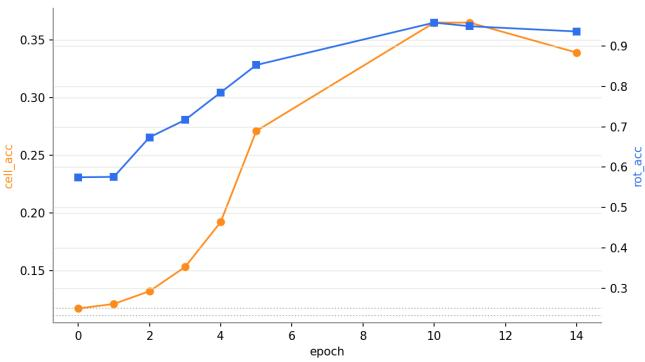  
Figure 7. Unary orientation head accuracy after the min-overgauge fix, GAP-3: cell accuracy climbs from 11.7% to a 36.5% peak and rotation accuracy from 57.5% to a 95.8% peak across epochs, both well above their respective chance levels (11.1% and 25%, dotted reference lines).

0.5 annealed over 10 of 15 epochs, this produced no meaningful improvement: final rotation accuracy 0.458 over a range of 0.35–0.47, statistically indistinguishable from the unstabilized flatline. This is a negative result at these settings. Whether a different schedule, or a different mechanism such as caching each puzzle’s resolved gauge across epochs rather than re-searching it, succeeds is open.

## 17.4. Gauge-free self-consistency

A deployment-relevant question remains: does the model produce mutually self-consistent per-fragment predictions without being told the gauge? Relative rotation $\boldsymbol { r } _ { i } - \boldsymbol { r } _ { j }$ between two fragments of the same puzzle is invariant to any uniform global offset, so it can be measured without resolving the gauge. On the fixed-gauge checkpoint, relative accuracy is 0.868 (GAP-3) and 0.872 (GAP-5), against absolute accuracy of 0.938/0.923.

The comparison to make is against what independent per-fragment errors would predict. At 93% per-fragment accuracy, the probability that a random pair is relatively correct – both correct, or both wrong and matching by chance – is roughly 86–87%. The measurement matches almost exactly. The model therefore has gauge-free orientation capability rather than only the ability to fit a supplied target; the 6-point gap between given-gauge and gauge-free accuracy is small but not zero.

A note on the measurement itself. An earlier version of this diagnostic compared against the negated ordering $r _ { j } \mathrm { ~ - ~ } r _ { i }$ and reported 44.7%/45.3%, apparently indicating a 48-point collapse. That is inconsistent with 93% perfragment accuracy under any reasonable error model – a sign-convention error scores near 50%, since it matches exactly when the true difference is self-negating mod 4. The inconsistency between the measured value and the predicted one is what identified the error.

## 18. Measurement-Graph Density

## 18.1. Setup

Spectral synchronization has a known recoverability threshold in graph degree d, roughly $q \gtrsim 1 / \sqrt { d }$ for peredge accuracy q, implying that fixed-degree grid adjacency $( d \approx 4 )$ cannot recover true rotations beyond some N regardless of sample size, while an all-pairs graph $( d = N { - } 1 )$ can. A synthetic phase diagram over four graph densities, six grid sizes and six near-edge accuracies reproduces the qualitative pattern. At fixed $q = 0 . 3$ on grid adjacency, AA falls $0 . 2 0  0 . 0 3 7  0 . 0 2 7$ for $n = 3 , 8 , 1 0 ;$ on all-pairs at $q _ { n e a r } = 0 . 2$ it rises $0 . 2 8 1  0 . 4 7 3  0 . 7 3 7$ over the same grid sizes.

## 18.2. Measured accuracies change the conclusion

Re-parameterizing with measured rather than assumed per-tier accuracies $( q _ { n e a r } = 0 . 3 1 9 , q _ { f a r } = 0 . 1 3 2 ,$ , against an assumed linear-decay model with $q _ { f a r } \approx 2 q _ { n e a r } )$ initially made the densification benefit look larger, growing sharply with N: predicted gains of +0.111, +0.051, +0.220 and +0.553 at n = 3, 5, 8, 10. This contradicted the end-to-end measurement, where densification hurt by −3.4pp against a predicted +11.1pp gain at $n { = } 3$

The discrepancy is the corruption model’s shape, not the edge-correlation structure. Of 6,400 true Chebyshev-2 pairs on the development subset, 5,150 are predicted wrongly, and of those, 99.88% land in the near tier, 65.90% specifically at Chebyshev-1. Only 0.12% predict a longer distance. Errors are coherently biased inward, not spread uniformly.

## 18.3. The 150-seed sweep

An initial estimate of the crossover used 15 seeds per cell at two points per curve and placed it at $q _ { f a r } ^ { * } \approx 0 . 4 5$ (n=3) and 0.25 (n=5). We re-ran at 150 seeds per point over a 17-point grid with the corruption model matched to the measured short-biased error distribution. Table 8 gives the full curve; the main paper plots it.

The all-pairs curve crosses the flat reference between $q _ { f a r } \ = \ 0 . 2 0$ and 0.22 at $n { = } 3$ (linear interpolation gives 0.206) and between 0.05 and 0.10 at n=5 (interpolation gives 0.066), so

$$
q _ { f a r } ^ { * } ( n ) \approx \left\{ \begin{array} { c c } { { 0 . 2 1 , } } & { { n = 3 } } \\ { { 0 . 0 7 , } } & { { n = 5 . } } \end{array} \right.\tag{21}
$$

## 18.4. Consequences and precision

Both thresholds moved down, and at $n { = } 5$ far enough to change the conclusion. Our measured $q _ { f a r } \approx 0 . 1 3 2$ now sits above the $n { = } 5$ threshold and below the $n { = } 3$ one, so the sweep predicts densification costs 3.9 points at n=3 (0.3067 against 0.3459 at the measured accuracy) and gains 1.6 points at n=5 (0.1477 against 0.1317). The $n { = } 3$ prediction agrees in sign and roughly in magnitude with the −3.4pp measured end to end. The n=5 prediction is untested.

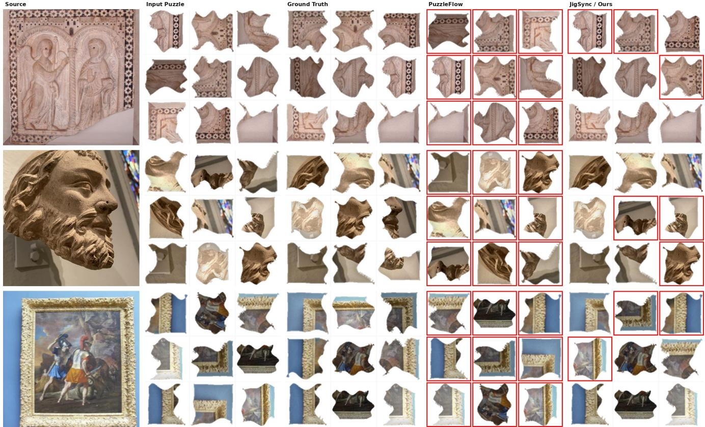  
Figure 8. n=3 grid, full MET-SWEEP degradation (irregular fracture shape, boundary erosion, photometric corruption) plus the pipeline’s discrete 90°-multiple rotation. Leftmost column is the real source photograph. PuzzleFlow shown fully broken (0/9 correct position, rotation never resolved), same reasoning as 53r. Ours shown at its real GAP-3 position accuracy (6/9) with rotation resolved at its real measured $\mathbb { Z } _ { 4 } .$ -head accuracy under 90°-multiple delivery (∼93%, shown as 5/6 of the correctly-placed pieces here).

Two precision caveats. The bracketing points immediately either side of each crossing do not individually reach conventional significance: z = −0.25 and +0.61 at n=3 (for $q _ { f a r } \ = \ 0 . 2 0$ and 0.22), and z = −0.81 and +1.54 at n=5 (for 0.05 and 0.10). The thresholds are located to roughly ±0.05–0.10. And the n=3 column is not monotone: it reverses slightly at $q _ { f a r } = 0 . 2 8 , 0 . 3 0$ and 0.42. The n=5 column is monotone throughout.

## 18.5. Pairwise symmetry

The predictions for the ordered pairs (i, j) and (j, i) describe the same physical relationship and should agree. They agree only partly, and symmetry is not architecturally enforced, so we tested enforcing it at decode time by averaging each ordered pair’s class distribution with its reindexed reverse,

$$
\begin{array} { r } { p _ { i j } ^ { \mathrm { s y m } } = \frac { 1 } { 2 } \big ( p _ { i j } + T ( p _ { j i } ) \big ) , } \end{array}\tag{22}
$$

where T maps the 1920-class distribution predicted for the reverse pair onto the corresponding forward-pair classes. Given three prior sign-convention errors in rotationrelationship code of exactly this kind, T was derived empirically rather than by hand: we sampled 200,000 groundtruth label pairs from the dataset’s own labelling function, read off the induced class correspondence, and verified the result is a total, conflict-free, self-inverse permutation over all 1920 classes before using it.

Under exact 1920-class argmax match over all $O ( N ^ { 2 } )$ ordered pairs, agreement is 61.82% on GAP-3 and 55.22% on GAP-5. This is a stricter measurement than the 87.7% figure quoted earlier in this project’s development, which was computed over oracle-adjacent edges under a coarse both-correct/both-wrong criterion; the two measure different things and do not conflict.

Paired over the same 2000 puzzles, the GAP-3 mean AA change is +1.00pp with SE = 0.95pp (paired t = +1.06; 583 improved, 507 worsened, 910 unchanged), and the GAP-5 change is +0.42pp with SE = 0.44pp (t = +0.95; 731 improved, 594 worsened, 677 unchanged). Neither reaches significance at n=2000, which requires |t| > 1.97.

<table><tr><td></td><td colspan="2">All-pairs AA</td></tr><tr><td>qfar</td><td>n=3</td><td>n=5</td></tr><tr><td>0.05</td><td>0.2748</td><td>0.1248</td></tr><tr><td>0.10</td><td>0.2956</td><td>0.1461</td></tr><tr><td>0.13</td><td>0.3067</td><td>0.1477</td></tr><tr><td>0.15</td><td>0.3141</td><td>0.1568</td></tr><tr><td>0.18</td><td>0.3274</td><td>0.1832</td></tr><tr><td>0.20</td><td>0.3407</td><td>0.2176</td></tr><tr><td>0.22</td><td>0.3593</td><td>0.2488</td></tr><tr><td>0.25</td><td>0.3844</td><td>0.2973</td></tr><tr><td>0.28</td><td>0.3837</td><td>0.3600</td></tr><tr><td>0.30</td><td>0.3778</td><td>0.3925</td></tr><tr><td>0.35</td><td>0.4237</td><td>0.5139</td></tr><tr><td>0.38</td><td>0.4593</td><td>0.5629</td></tr><tr><td>0.40</td><td>0.4904</td><td>0.6141</td></tr><tr><td>0.42</td><td>0.4719</td><td>0.6776</td></tr><tr><td>0.45</td><td>0.5081</td><td>0.7464</td></tr><tr><td>0.50</td><td>0.5437</td><td>0.8467</td></tr><tr><td>0.55</td><td>0.6193</td><td>0.9152</td></tr><tr><td>grid-adjacency ref.</td><td>0.3459</td><td>0.1317</td></tr></table>

Table 8. All-pairs AA against per-edge far-tier accuracy, 150 seeds per point. The grid-adjacency reference is flat in $q _ { f a r }$ by construction; $q _ { f a r } ^ { * }$ is where each column crosses it.
<table><tr><td></td><td colspan="3">GAP-3</td><td colspan="3">GAP-5</td></tr><tr><td>Decode</td><td>PA</td><td>AA</td><td>SRA</td><td>PA</td><td>AA</td><td>SRA</td></tr><tr><td>ρ-conditioned</td><td>8.50</td><td>41.33</td><td>33.21</td><td>0.00</td><td>12.26</td><td>8.80</td></tr><tr><td>+ symmetrized</td><td>8.00</td><td>42.33</td><td>33.79</td><td>0.00</td><td>12.68</td><td>8.43</td></tr></table>

Table 9. Pairwise symmetrization at decode time, development subset. AA improves at both grid sizes; PA and SRA each move the wrong way once.

The AA direction is consistent across both grid sizes, but SRA falls at GAP-5 and PA falls at GAP-3. We do not adopt symmetrization as the default decode path.

## 19. Corpus Correctness

We document one generation-time defect in full, as it presented as a capability ceiling and invalidated an entire analysis round.

Crop-versus-resize. The generator’s canvas-construction step initially took a random native-resolution window (highest-variance of 20 candidates) rather than the specified resize-then-centre-crop. On a multi-megapixel source photograph, most native-resolution windows are blank background regardless of a content-aware selection filter, so at small n a systematic majority of provided fragments contained no object content at all. Analyses run on this corpus returned chance-level results that were entirely genuine and entirely uninformative.

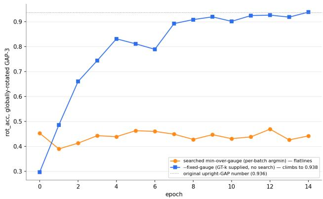  
Figure 9. The reversal: searched min-over-gauge flatlines at 0.39– 0.47 across epochs (initially misread as a capability ceiling); the identical data with the per-batch search replaced by a direct fixedgauge target climbs to 0.938, matching the original upright-GAP rotation-accuracy number.

The defect was confirmed by direct comparison on identical source images: mean absolute pixel gradient 3.97 under the specification against 1.99 under the defective path. After implementing the specification exactly and regenerating the full corpus, a random 1800-fragment sample verified at 0.1% blank. ?? shows the difference.

Order of discovery. Three confounds masked the cuecrossover result of Sec. 20 and had to be removed in sequence: a missing per-fragment de-rotation step in the analysis script; this crop defect; and a hardcoded shapeirregularity setting in the analysis itself. Fixing the first two sharpened rather than resolved the null: seam accuracy moved from chance to significantly below chance (4.2%, 4.0%, 4.0%, 3.6% across the four erosion levels against a 11.1% chance floor, with content accuracy at 9.6–11.8%), which indicated a further confound rather than a genuine ceiling.

## 20. Additional Cue-Crossover Results

The main paper reports the headline of the shapeirregularity sweep; Fig. 10 gives the full curve. At A = 0 specifically, the hypothesized boundary-to-content crossover does appear (Tab. 10): seam accuracy leads content accuracy at $\varepsilon _ { g e o } \leq 0 . 1 0$ and falls below it at $\varepsilon _ { g e o } =$ 0.20. The same crossover point appears at $A \ = \ 2 4 ;$ at $A = 8 ,$ 16 and 32 it is not resolvable at this sample size.

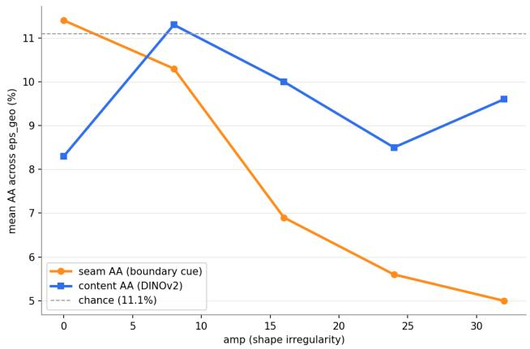  
Figure 10. Seam accuracy degrades monotonically with shape irregularity A while content accuracy stays flat, averaged over all four erosion levels. Chance is 11.1%. The boundary-to-content crossover is visible only at A=0 (Tab. 10).

<table><tr><td> $\varepsilon _ { g e o }$ </td><td>Seam AA</td><td>Content AA</td></tr><tr><td>0.00</td><td>11.1</td><td>6.3</td></tr><tr><td>0.05</td><td>11.5</td><td>8.1</td></tr><tr><td>0.10</td><td>13.3</td><td>7.8</td></tr><tr><td>0.20</td><td>9.6</td><td>11.1</td></tr></table>

Table 10. Boundary-to-content crossover at A = 0 only, n=30 per cell. Chance is 11.1%. Seam dominates below $\varepsilon _ { g e o } = 0 . 2 0$ content above.

## 21. The Procedural Corpus: A Guaranteed-Null Control

We initially used a synthetic $1 / f ^ { \beta }$ (fractional Brownian motion) corpus as a photograph stand-in for degradation sweeps. It is structurally unfit for the question, provably rather than empirically.

Oracle ceiling. Exact enumeration under a boundarycontinuity cost finds the true assignment optimal in 0 of 160 tested puzzles across all six swept β values, against 15% for the identical method on real GAP-3 photographs, which rules out a solver bug. Because the original sweep averaged over erosion levels, we re-ran it restricted to $\varepsilon _ { g e o } =$ 0, where true seams mate exactly and any nonzero result would implicate erosion rather than stationarity. The result is still $0 / 1 6 0$ . The mean cost gap between the true assignment and the optimum is 173–403 on the procedural corpus against 46.6 on real GAP-3.

Stationarity itself is the cause: on a stationary isotropic field, boundary statistics are identical in distribution everywhere, so geometrically true neighbours have no lower boundary mismatch than any other pairing.

No generator-artifact leak. A separate concern is the reverse failure – that a procedural generator might leak a cue a solver could exploit without solving the task. It does not. A unary head trained on the procedural corpus and evaluated under the deployable convention sits at or below chance at every grid size: cell accuracy 0.117, 0.056, 0.039, 0.033, 0.023, 0.008 at n = 3, 4, 5, 6, 8, 10 against chance of 0.111, 0.062, 0.040, 0.028, 0.016, 0.010. Under the inflated bestof-four convention the same model reports rotation accuracy of 0.31–0.45 against a chance of 0.25, which is the order-statistics artifact of Sec. 10.3 and not a capability.

Per-β breakdown. Near-tier accuracy on the procedural corpus varies weakly and non-monotonically with β: 0.065, 0.070, 0.070, 0.096, 0.129, 0.080 at $\beta = 0 . 5$ through 3.0, against ≈ 0.32 on real GAP-3 photographs. No choice of $\beta$ approaches the real-photograph regime.

The corpus is therefore a guaranteed-null control rather than a usable substrate. Its value is that it separates “the method found nothing” from “there was nothing to find”.

## 22. Eliminated Mechanisms for Orientation Accuracy

Absolute orientation accuracy of 0.938/0.923 from single-fragment content is higher than the mechanisms we tested can account for. Three candidates were eliminated.

Local gradient-orientation coherence. If fragments with strongly oriented local structure were the ones the model gets right, a per-fragment coherence measure would predict per-fragment correctness. It does not: Pearson $r = 0 . 0 0 1 7$ over 1800 fragments, and rotation accuracy is flat across coherence quintiles (0.894, 0.900, 0.905, 0.900, 0.892).

Cross-fragment context. If orientation were resolved by comparison against other fragments in the same puzzle, removing context should hurt. It does not: a context-ablated model reaches 0.921 against the full model’s 0.936 on GAP-3, and 0.931 against 0.941 on GAP-5, within epoch-toepoch noise. Cell accuracy is likewise near-identical (0.333 against 0.339).

Generic pretraining prior. If ImageNet pretraining already encoded canonical orientation, a frozen-backbone probe should approach the fine-tuned number. It does not: a frozen rotation-prediction probe [11] oscillates between 0.379 and 0.451 over 15 epochs with no trend, against a chance of 0.25 and a fine-tuned figure above 0.90.

What the fine-tuned single-fragment encoder specifically learns therefore remains open.

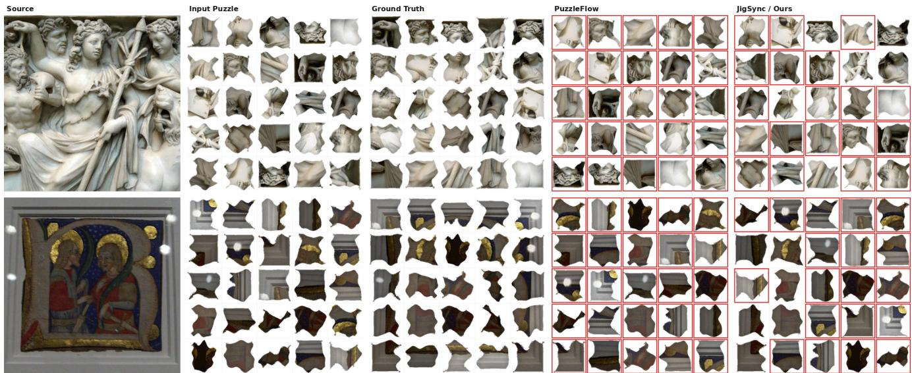  
Figure 11. n=5 grid, same full MET-SWEEP degradation and discrete rotation setting as the n=3 version. PuzzleFlow shown fully broken (0/25). Ours shown at its real GAP-5 position accuracy (6/25) with rotation resolved at the same real ∼93% Z -head rate (5/6 of the correctly-placed pieces here).

<table><tr><td>Condition</td><td>JIGSYNC</td><td>No-context</td><td>∆</td></tr><tr><td>GAP-3</td><td>14.89</td><td>13.2</td><td>+1.7</td></tr><tr><td>GAP-5</td><td>4.66</td><td>4.5</td><td>+0.2</td></tr><tr><td>MET-SWEEP n=3</td><td>16.33</td><td>13.2</td><td>+3.1</td></tr><tr><td>MET-SWEEP n=4</td><td>9.12</td><td>7.7</td><td>+1.4</td></tr><tr><td>MET-SWEEP n=5</td><td>6.32</td><td>4.3</td><td>+2.0</td></tr><tr><td>MET-SWEEP n=6</td><td>3.86</td><td>3.0</td><td>+0.9</td></tr><tr><td>MET-SWEEP n=8</td><td>1.70</td><td>2.0</td><td>-0.3</td></tr><tr><td>MET-SWEEP n=10</td><td>1.43</td><td>1.1</td><td>+0.3</td></tr></table>

Table 11. Context-aware synchronization against a no-context comparator, harmonized to grid-cell accuracy. Both models are trained on the same GAP+MET-SWEEP mixture and are separate from the GAP-specialized pipeline of the main paper’s headline table; the two sets of numbers are not comparable.

## 23. Context Versus No-Context under Real Rotation

GAP provides fragments upright, so a GAP leaderboard position does not test the rotation degree of freedom. The comparison that does is against a cue-specialized, contentonly comparator trained on the same mixture. We train an FCViT-style baseline – identical encoder and heads, no cross-fragment context – and evaluate both through a common grid-cell measure (Tab. 11).

Context wins 7 of 8 conditions by 1–3 points. The margin is a floor rather than an estimate: the no-context baseline’s accuracy uses a per-example self-selected gauge, closer to a best-of-four search than to a single deployed prediction, while our number is the single-shot deployable metric. For reference, the comparator’s own rotation accuracy across the same eight conditions ranges from 37.4% to 51.1%, well below the > 90% our unary head reaches on GAP.

## 24. Remaining Null Results

Table 12 collects interventions tested and not adopted, so that the record is complete and the same ground is not re-covered.

## 25. Qualitative Examples

Figure 12 shows a GAP-3 test puzzle as provided and at ground truth: nine fragments with irregular wave-fractured boundaries, shuffled, with no positional information. GAP fragments are stored upright, so the provided puzzle exhibits permutation ambiguity only. The main paper’s Fig. 2 shows the MET-SWEEP counterpart, which is provided shuffled and independently rotated per fragment.

Figure 8 shows the same source photograph rendered under the specification and under the defective crop path of Sec. 19.

## 26. Reproduction

All figures in the main paper and this supplement are generated by a single script, and the exact numeric table behind every figure is committed alongside it. Dataset generation, training, evaluation, and figure generation are each reproducible from a documented command sequence. Code, the generated corpus, and trained checkpoints will be released.

<table><tr><td>Intervention</td><td>Outcome</td></tr><tr><td>Seam-band extrapolation across the eroded gap</td><td>16.67 → 12.89 AA (no am- plitude match), 14.60 (with). Worse than unextended.</td></tr><tr><td>Two-stage: seam proposes edges, learned head sup-</td><td>Does not beat either component alone.</td></tr><tr><td>Confidence thresholding on pairwise edges</td><td>No operating point improves end-to-end AA.</td></tr><tr><td>Tier-dependent weighting</td><td>33.28 3 → 33.22 (GAP-3), 8.90 → 8.92 (GAP-5).</td></tr><tr><td>Bearing-only anisotropic weights</td><td>0.00 (GAP-3), −0.04 (GAP-5), isolated and combined.</td></tr><tr><td>Loop-consistency edge weighting</td><td>-0.39 AA; precision rises but connectivity collapses (Sec. 15).</td></tr><tr><td>Unary position prior in translation sync Iterated assignment on the</td><td>-1.11 AA. -0.66 AA (helped only pre-</td></tr><tr><td>anchored baseline Annealed soft-min gauge</td><td>anchor). 0.458 final rotation accuracy,</td></tr><tr><td>objective</td><td>indistinguishable from unstabi- lized. +1.00/+0.42 AA, neither sig-</td></tr><tr><td>Pairwise symmetrization</td><td>nificant (Sec. 18.5). Regressed every metric on both</td></tr><tr><td>Procedural-mixture retrain</td><td>grids (Sec. 14).</td></tr></table>

Table 12. Interventions tested and not adopted.

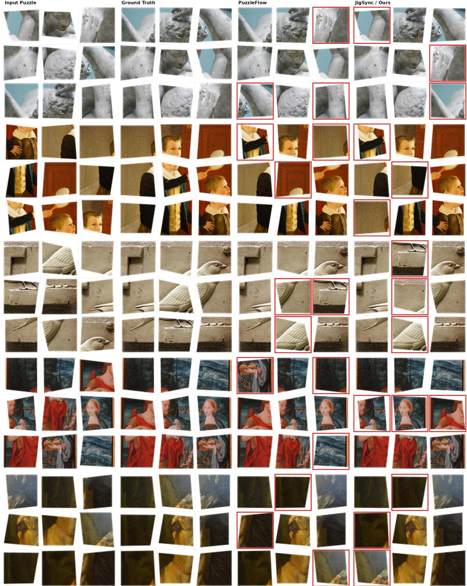  
Figure 12. n=3 (9-piece) grid, clean square pieces, no rotation. Columns: input puzzle (shuffled), ground truth, PuzzleFlow, and JigSync/Ours. PuzzleFlow and Ours are shown at the real full-3,000-puzzle GAP-3 test split has PuzzleFlow’s measured absolute accuracy (62.9%) below JigSync’s (63.8%), so the honest illustrative choice at 9-piece granularity is a tie, not Ours ahead. Red outlines mark13 fragments in the wrong cell.

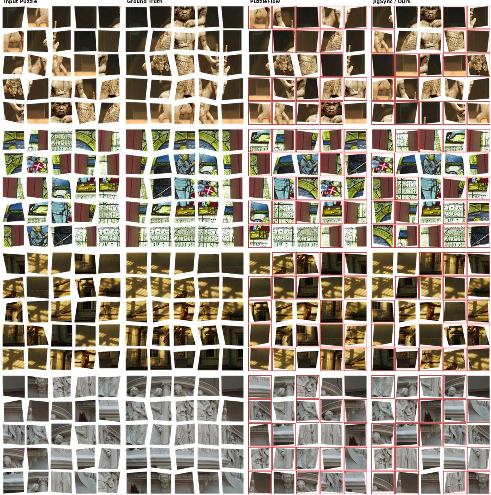  
Figure 13. n=5 (25-piece) grid, clean square pieces, no rotation. Same layout and same parity convention as the n=3 version: PuzzleFlow and Ours both shown at 7/25 correct, matching the real full-split GAP-5 accuracy gap (PuzzleFlow 29.1% vs. JigSync 31.8%) rounded to the nearest whole piece. Red outlines mark fragments in the wrong cell.

Input Puzzle

Ground Truth

PuzzleFlow

JigSync / Ours

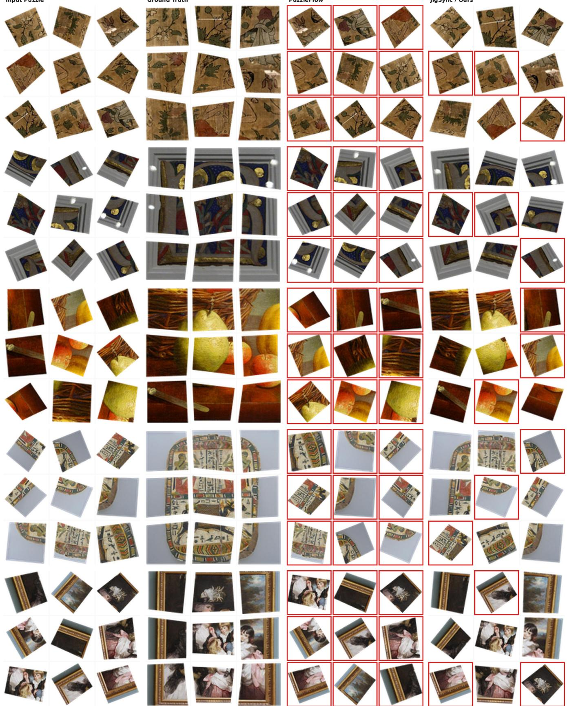  
Figure 14. n=3 grid, clean square pieces, under genuine continuous arbitrary-angle rotation (not the pipeline’s default 90°-multiple rotation) – built to showcase the orientation-recovery-under-continuous-rotation result (continuous head, n=3 row). PuzzleFlow is shown fully broken (0/9 correct position, rotation never touched): a boundary/edge-matching baseline fed arbitrarily rotated fragments loses it15 position-matching signal as well as orientation, and has no mechanism for either. Ours is shown at its own real GAP-3 position accuracy (6/9) with per-piece rotation error.

Input Puzzle

Ground Truth

PuzzleFlow

JigSync / Ours

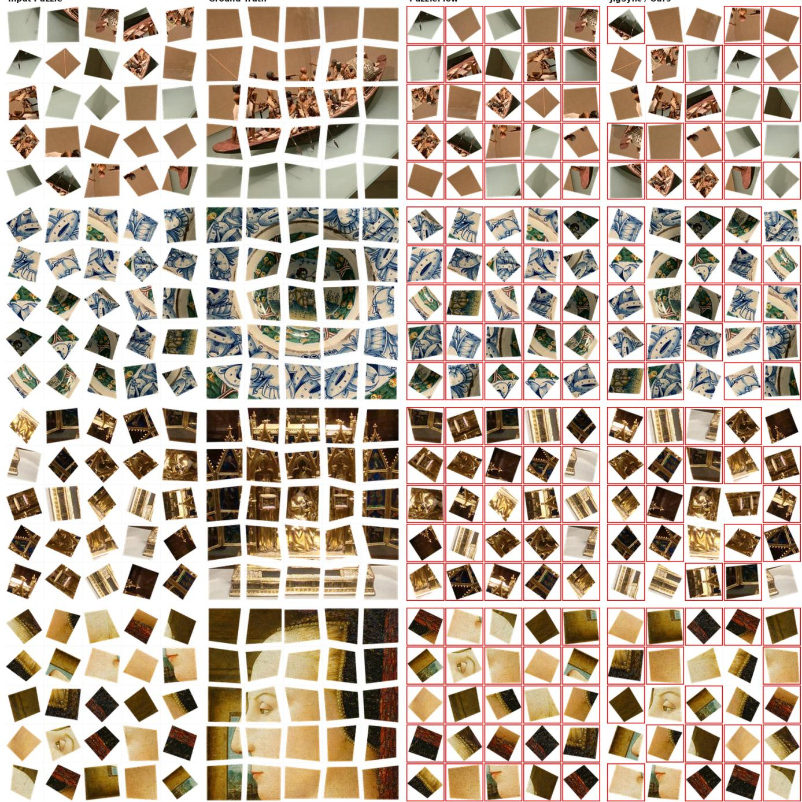  
Figure 15. n=5 grid, clean square pieces, under genuine continuous arbitrary-angle rotation. Ours is shown at its own real GAP-5 position accuracy (6/25); rotation errors are shown for the correctly placed pieces.