# NormLift: From Lifted Features To Semantic Reliability In 3D Gaussian Splatting

Yihan Zang Da Li Dominik Engel Shinkyu Park Ivan Viola CEMSE Division, King Abdullah University of Science and Technology {yihan.zang, da.li, dominik.engel, shinkyu.park, ivan.viola}@kaust.edu.sa

## Abstract

Training-free weighted aggregation is widely used to lift 2D semantic features onto 3D Gaussians for open-vocabulary scene understanding, yet its theoretical role remains insufficiently understood. Existing analyses typically justify this operation from the rendering side, treating Gaussian features as linearly composable Euclidean variables for reconstructing 2D feature maps. However, this view does not match downstream 3D usage, where each Gaussian is often queried independently in a cosine-based embedding space. We revisit feature lifting from the 3D side and formulate per-Gaussian assignment as a cosine alignment problem on the CLIP unit sphere. Under this objective, the ℓ -normalized semantic back-projected feature emerges as the closed-form solution, providing a complementary interpretation of the standard lifting rule from the perspective of per-Gaussian semantic assignment. The same formulation further yields a norm decomposition into intra-view and inter-view consistency, suggesting that feature magnitude itself can serve as a semantic reliability signal. Calibrated by effective multi-view support, this reliability score guides a mode-voting refinement that preserves CLIP feature validity by avoiding linear averaging. Experiments on open-vocabulary 3D semantic segmentation show that NormLift is an efficient, training-free framework that achieves strong performance across evaluation protocols.

## 1 Introduction

3D Gaussian Splatting (3DGS) [Kerbl et al., 2023] has recently emerged as an efficient and highquality representation for 3D scene reconstruction [Wang et al., 2026b], with broad applications in generation, editing, and downstream 3D tasks [Tang et al., 2024, Yi et al., 2024, Dong and Wang, 2025, Wu et al., 2024a]. Building on this representation, a growing line of work extends 3DGS for open-vocabulary 3D scene understanding by lifting 2D foundation-model features, most prominently CLIP [Radford et al., 2021], onto the 3D Gaussian primitives [Guo et al., 2024, Qu et al., 2024, Sun et al., 2025, Alegret et al., 2026, Jang and Kim, 2025]. The dominant strategy is a simple weighted aggregation: each Gaussian receives the average of the 2D features it contributes to, weighted by its alpha-blending contribution along each pixel ray. This operation, introduced into the 3DGS literature by Joseph et al. [2025] as feature back-projection, mirrors the classical back-projection operation in computed tomography, which redistributes projection measurements back into the image domain during reconstruction [Kak and Slaney, 1988, Natterer, 2001]. Following this terminology, we refer to its CLIP-feature instantiation as semantic back-projection.

Despite its widespread adoption, the role of back-projection has been analyzed almost from the rendering side, where the formula arises as an approximate solution to a 2D feature reconstruction objective, derived under simplifying assumptions or characterized by bounded approximation guarantees. In this view, each Gaussian feature is treated as a Euclidean component to be linearly composed through alpha blending. However, this is not how Gaussians are typically used in downstream 3D tasks: each is queried independently as a semantic primitive on the CLIP feature space, where similarity is measured by cosine on the unit sphere rather than by Euclidean reconstruction error. This mismatch motivates a complementary, 3D-side perspective on the same lifting operation, one that reflects the geometry of CLIP and the way each Gaussian is consumed downstream.

Once the lifting solution is fixed by this objective, the remaining quality of the lifted features depends on the data side. Two kinds of inconsistency dominate in practice: the same Gaussian may receive conflicting features within a single view (intra-view inconsistency) or across different views (interview inconsistency). The same derivation yields an algebraic identity that factors the norm of the back-projected feature into two terms in [0, 1], capturing intra-view concentration and inter-view agreement, respectively. This makes the norm itself a structural per-Gaussian indicator of feature consistency, obtained from the lifting formulation rather than from external visibility heuristics. Calibrated by an effective view count to discount single-view dominance, the norm yields a per-Gaussian reliability score that, in our experiments, aligns monotonically with downstream accuracy and captures information largely complementary to opacity (Sec. 4.1, Appendix E.2).

Experiments on ScanNet show that NormLift consistently improves over prior training-free and training-based baselines on open-vocabulary 3D semantic segmentation. The reliability score is largely independent of opacity except in a small zero-evidence regime, capturing a per-Gaussian signal beyond what visibility-based heuristics provide. Its reliability-guided KNN refinement is lightweight, running 6.7× faster than SFS’s post-lifting pipeline with matched peak memory. The lifted features further transfer to a 2D rendering-based protocol on LERF-OVS, where NormLift attains the best mean localization accuracy. In summary, our contributions are:

• We formulate per-Gaussian feature lifting as a cosine alignment problem on the CLIP unit sphere and show that the $\ell _ { 2 } \cdot$ -normalized back-projected feature is its closed-form optimum. This complements existing rendering-side analyses with a 3D-side interpretation that reflects the cosine geometry.

• We find that the back-projected norm itself encodes data-side quality—algebraically factoring into intra-view and inter-view consistency—and, calibrated by effective multi-view support, yields a per-Gaussian reliability score $\overset { \cdot } { R } ( j )$ that is largely independent of opacity outside a small zero-evidence regime.

• Guided by $R ( j )$ , we design a mode-voting refinement that copies a single observed CLIP direction from spatial neighbors rather than linearly averaging them, in accordance with the non-linearity of the CLIP semantic manifold.

• NormLift is training-free, consistently improves over prior training-free and training-based baselines on ScanNet, and runs 6.7× faster than SFS in the post-lifting stage at matched peak memory.

## 2 Related Work

## 2.1 Open-vocabulary 3D understanding with Gaussian splatting

Existing open-vocabulary 3DGS methods can be broadly grouped into training-based, groupingbased, and training-free approaches. Training-based methods learn semantic Gaussian features through rendering-based supervision, including LangSplat [Qin et al., 2024], LEGaussians [Shi et al., 2024], Feature 3DGS [Zhou et al., 2024], N2F2 [Bhalgat et al., 2024], and GAGS [Peng et al., 2026]. These methods distill CLIP or other foundation-model features into Gaussian representations, often using scene-specific compression, quantization, or granularity-aware supervision to improve 2D open-vocabulary rendering. Grouping-based methods instead introduce object-, instance-, or hierarchy-level structures to improve 3D semantic consistency, including OpenGaussian [Wu et al., 2024b], GaussianGraph [Wang et al., 2025], SuperGSeg [Liang et al., 2026], VoteSplat [Jiang et al., 2025], LaGa [Cen et al., 2025], and THGS [Dai et al., 2025]. These methods are effective at producing structured semantic representations, but typically depend on per-scene optimization, learned embeddings, or scene-level grouping stages.

A recent line of training-free methods removes gradient-based semantic optimization and directly transfers 2D features to Gaussians using rendering or visibility weights. Although these methods differ in their implementation details, they largely revolve around the same core operation: a renderingweighted aggregation of 2D features onto 3D Gaussians, or a variant of this operation. Gradient-Weighted Back-Projection [Joseph et al., 2025], from which we adopt the back-projection terminology, performs a fast training-free lifting via gradient-based contribution weights; LBG [Chacko et al., 2025] performs visibility-weighted lifting without per-scene training; Occam’s LGS [Cheng et al., 2024] derives a probabilistic weighted aggregation rule; SFS [Xiong et al., 2026] formulates feature lifting as a sparse linear inverse problem with a closed-form solution under a global $L _ { 2 }$ reconstruction objective; LUDVIG [Marrie et al., 2025] interprets lifting as inverse rendering and further refines features with DINOv2-based graph diffusion; Dr.Splat [Jun-Seong et al., 2025] registers top-k Gaussians per ray with product quantization for compact storage; and VALA [Wang et al., 2026a] introduces visibility-aware gating with a cosine geometric median for multi-view aggregation. A common feature of these analyses is that Gaussian features are treated as Euclidean variables that are linearly composed through alpha blending to reproduce 2D feature maps, which leads to approximate, bounded, or post-refined formulations on the rendering side.

Our work belongs to this training-free family, but studies the same lifting operation from a complementary perspective. Instead of asking which Gaussian features best reconstruct the 2D feature maps, we ask, for each Gaussian independently, which unit direction on the CLIP sphere is most supported by the 2D observations it contributes to. Under this 3D-side formulation, the $\ell _ { 2 }$ -normalized back-projected feature appears directly as the closed-form optimum, and unit normalization is handled by the objective itself rather than as a post-processing step. This per-Gaussian view is complementary to rendering-side analyses and matches the cosine-based geometry under which lifted features are actually queried downstream.

## 2.2 Per-Gaussian reliability and filtering

Several recent methods use reliability- or visibility-related cues to stabilize semantic Gaussians. Occam’s LGS [Cheng et al., 2024] filters Gaussians with negligible rendering contributions; VALA [Wang et al., 2026a] uses marginal ray contributions to gate visible Gaussians and aggregates multi-view features with a cosine geometric median; and ReLaGS [Xie et al., 2026] removes low-contribution Gaussians through maximum-weight pruning. Other methods improve robustness through feature assignment or grouping mechanisms: Dr.Splat [Jun-Seong et al., 2025] registers CLIP features to dominant Gaussians along each ray with product quantization, OpenGaussian [Wu et al., 2024b] uses codebook-based feature discretization and instance-level 3D–2D association, and LaGa [Cen et al., 2025] builds object-level view-aggregated descriptors after scene decomposition.

These designs are effective but obtain their reliability cues externally to the lifting operation, from visibility statistics, rendering contributions, feature assignment, or object-level grouping. The closest in spirit is VALA, which performs robust multi-view aggregation via a cosine geometric median; this can be viewed as defining a separate aggregation rule on top of the lifted features. In contrast, our reliability signal is obtained internally from the same lifting formulation: the norm of the back-projected feature algebraically factors into intra-view and inter-view consistency, and is then calibrated by effective multi-view support. The lifted direction $u _ { j } ^ { \star } = f _ { j } / \| f _ { j } \|$ and the reliability score $R ( j )$ are therefore two outputs of a single per-Gaussian objective, rather than the result of two separate stages. We further show empirically that $R ( j )$ overlaps with opacity-based signals only at the zero-evidence boundary and is largely independent of opacity for the remaining 84% of Gaussians (Sec. 4.1, Appendix E.2), indicating that it provides information complementary to existing visibility and rendering-based cues.

## 3 Method

As illustrated in Figure 1, this section recasts the widely-used back-projection heuristic as the closed-form optimum of a per-Gaussian cosine alignment problem, and shows that the norm of the back-projected feature, calibrated by effective view support, yields a reliability score for KNN mode voting refinement. Section 3.1 revisits the standard feature lifting setup and distills three geometric properties of CLIP features. Section 3.2 formulates per-Gaussian lifting as a constrained optimization on the CLIP unit sphere, whose closed-form solution coincides with the $\ell _ { 2 }$ -normalized back-projected feature. Section 3.3 shows that the same norm admits an algebraic decomposition into intra- and inter-view consistency, yielding the optimal direction (its unit vector) and a reliability measure (its norm) simultaneously; we calibrate this norm by effective multi-view support to obtain $R ( j )$ . Section 3.4 then leverages $R ( j )$ in a mode-voting procedure to refine unreliable Gaussians.

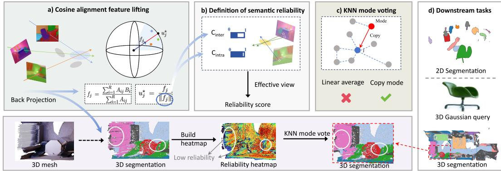  
Figure 1: Method overview of NormLift. Top: a) Per-Gaussian features are lifted via cosine alignment on the CLIP sphere, giving the closed-form $u _ { j } ^ { \star } = f _ { j } / \| f _ { j } \| .$ . b) The norm $\| f _ { j } \|$ factors into intra- and inter-view consistency, calibrated to the reliability score $R ( j )$ by effective view support. c) KNN mode voting copies the most-supported neighbor’s feature, avoiding the blur of linear averaging. d) NormLift supports 2D and 3D downstream tasks. Bottom: a visualization of the 3D segmentation pipeline. The framework is training-free and operates entirely at the per-Gaussian level.

## 3.1 Preliminary

## 3.1.1 3D Gaussian splatting

A 3D Gaussian Splatting (3DGS) [Kerbl et al., 2023] scene is represented by a set of 3D Gaussian primitives, which are parameterized by their position, covariance, opacity, and color. Images are rendered through a fixed depth-sorted alpha-blending pipeline.

Although 3D Gaussian Splatting is implemented via screen-space rasterization, its alpha-compositing process can be interpreted in a ray-centric manner for analysis: each pixel corresponds to a viewing ray, and the Gaussians projected onto that pixel can be ordered by depth and composited in a frontto-back manner. This view is only used as an analytical description of the rasterized compositing process, and does not imply that standard 3DGS performs ray casting.

Consider all pixel observations in the training views, indexed by $i \in \{ 1 , \ldots , R \}$ . For each pixel/ray i, let the contributing Gaussians be ordered according to their depth along the corresponding camera direction. The contribution weight of Gaussian j to observation i is given by the standard alphacompositing rule:

$$
A _ { i j } = \alpha _ { i j } \prod _ { k < j } \bigl ( 1 - \alpha _ { i k } \bigr ) ,\tag{1}
$$

where $\alpha _ { i j } \in [ 0 , 1 ]$ denotes the opacity contribution of Gaussian $j$ to ray $i ,$ and $k < j$ indicates Gaussians that are closer to the camera in the same compositing order. The rendered color can then be written as

$$
C _ { i } = \sum _ { j = 1 } ^ { P } A _ { i j } c _ { j } \ + \ \left( 1 - \sum _ { j = 1 } ^ { P } A _ { i j } \right) C _ { b } ,\tag{2}
$$

where $c _ { j }$ is the color attribute of Gaussian $j$ in standard 3DGS and $C _ { b }$ is the background color. In this work, we use the same compositing weights $A _ { i j }$ as the bridge between 2D semantic observations and 3D Gaussian primitives. In particular, while $c _ { j }$ denotes RGB color in standard rendering, the same weighted compositing can be applied to a semantic feature attribute when analyzing feature lifting.

## 3.1.2 Back-projection

Given a trained 3DGS scene, the goal of feature lifting is to assign each Gaussian j a semantic feature $u _ { j } \in \mathbb { R } ^ { F }$ that supports downstream tasks such as open-vocabulary segmentation and querying. The supervision comes from 2D semantic observations $\{ B _ { i } \} _ { i = 1 } ^ { R }$ , one per rendering ray, obtained by applying a foundation model such as CLIP [Radford et al., 2021] to the rendered views. In this paper, we concentrate on the CLIP features, which are normalized, in line with the unit spherical geometry.

The prototype of the widely used training-free strategy is to aggregate the 2D observations onto each Gaussian using the alpha-blending weights from Eq. (1). Concretely, for each Gaussian j, one forms

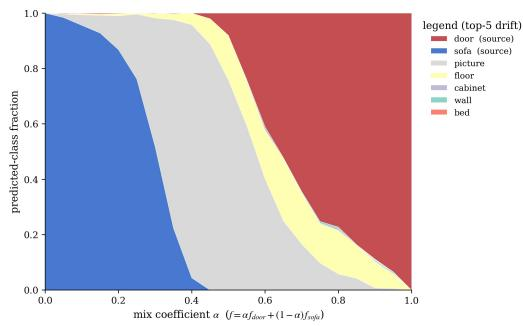

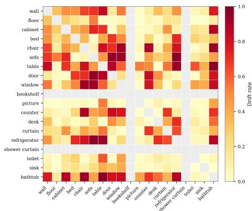  
Figure 2: Semantic drift from linear interpolation of CLIP features. Left: mixing the source features of door and sofa as $f = \alpha f _ { \mathrm { d o o r } } + ( 1 - \alpha ) f _ { \mathrm { s o f a } }$ . The predicted class drifts to unrelated categories (e.g. picture,floor) for $\alpha \in [ 0 . 3 , 0 . 7 ]$ , with neither source class dominating in this regime. Right: pairwise drift rate at $\alpha { = } 0 . 5$ across the 19 ScanNet classes used in our protocol; the overall drift rate is 33.6%.

the rendering-weighted average

$$
f _ { j } \ = \ { \frac { \sum _ { i = 1 } ^ { R } A _ { i j } \ B _ { i } } { \sum _ { i = 1 } ^ { R } A _ { i j } } } ,\tag{3}
$$

which is typically further $\ell _ { 2 } \cdot$ -normalized for downstream use, in line with the spherical geometry of CLIP.

## 3.1.3 Geometric properties of CLIP features

Before formulating feature lifting from the 3D perspective, we first clarify three geometric properties of CLIP-like embeddings that are essential for analyzing the behavior of lifted Gaussian features. These follow from how CLIP is trained and consumed; they are objective characteristics of the feature space, not assumptions we impose.

Property 1 Sphere constraint: CLIP features lie on the unit hypersphere $S ^ { F - 1 }$ , since both image and text encoders are $\ell _ { 2 }$ -normalized before the contrastive objective [Radford et al., 2021]. Any lifted feature $u _ { j }$ compared against CLIP queries must satisfy $\| u _ { j } \| = 1$

Property 2 Directional semantics: CLIP is trained with a cosine objective. Semantic similarity is measured by cosine, not Euclidean distance.

Property 3 Non-linearity of the semantic manifold: The CLIP semantic manifold is not globally closed under linear combination. Small-angle mixtures may remain locally coherent, but mixtures of semantically distant features may induce semantic drift. Figure 2 shows that a linear combination of CLIP features from two distinct objects may lead to semantic drift.

## 3.2 Per-Gaussian cosine alignment problem

## 3.2.1 Problem formulation

Building on the properties of CLIP features, we formulate per-Gaussian feature lifting as an optimization problem on the CLIP unit sphere. Let $u _ { j } \in S ^ { F - 1 }$ denote the semantic feature to be assigned to Gaussian $j .$ We define the per-Gaussian cosine alignment problem as

$$
u _ { j } ^ { * } \ : = \ : \arg \operatorname* { m a x } _ { u \in S ^ { F - 1 } } \sum _ { i = 1 } ^ { R } A _ { i j } \ : \langle u , B _ { i } \rangle , \qquad j = 1 , \ldots , P .\tag{4}
$$

Eq. (4) defines a contribution-weighted semantic consensus for each Gaussian. For a fixed Gaussian $j ,$ each observation contributes a scalar agreement $\left. u , B _ { i } \right.$ between the candidate Gaussian feature u and the 2D CLIP direction $B _ { i } ,$ weighted by the alpha-compositing contribution $A _ { i j }$ . Thus, the objective averages semantic agreements rather than assuming that CLIP features themselves are physically composable through rendering. The linear combination that appears below is only a consequence of the linearity of the inner product, not an assumption that mixed CLIP features form a valid semantic feature. This gives a 3D-side view of lifting: each Gaussian is treated as an independent semantic primitive whose unit feature is chosen to best agree with its contribution-weighted observations.

By linearity of the inner product, the objective can be rewritten as ma $\mathrm { x } _ { \parallel u \parallel = 1 } \langle u , f _ { j } \rangle$ , where $f _ { j }$ is the back-projected feature in Eq. (3). For $\bar { f _ { j } } \neq 0$ , Cauchy–Schwarz gives

$$
u _ { j } ^ { \star } = \frac { f _ { j } } { \parallel f _ { j } \parallel } , \qquad \mathrm { w i t h ~ o p t i m a l ~ v a l u e } \parallel f _ { j } \parallel .\tag{5}
$$

We note that $f _ { j }$ is weight-normalized (divided by $\textstyle \sum _ { i } A _ { i j } )$ but not unit-normalized; as a convex combination of unit vectors, it satisfies $\lVert f _ { j } \rVert \in [ 0 , \dot { 1 } ] ,$ , a property used in Sec. 3.3. Appendix D shows the full three-step derivation, together with the treatment of the boundary case $f _ { j } = 0$

The derivation is simple; the key point is the objective it solves. Under the per-Gaussian cosinealignment view, the standard back-projection rule followed by $\ell _ { 2 }$ normalization is not merely a post-processing heuristic, but the closed-form solution to a semantic agreement objective on the CLIP sphere.

## 3.2.2 What the back-projected norm measures

Where the residual error lives: Since $u _ { j } ^ { \star }$ is the unique maximizer of Eq. (4) for $f _ { j } \neq 0 ( \mathrm { A p } \cdot$ pendix D), the formulation itself introduces no further error. Any mismatch between $u _ { j } ^ { \star }$ and the true semantic identity of Gaussian $j$ must therefore come from the observations themselves: the 2D features $\{ B _ { i } \}$ may be noisy, inconsistent across views, or contaminated by pixels that mix multiple semantic regions.

The norm as a data-side consistency signal: The norm $\| f _ { j } \|$ provides a natural handle on this observational uncertainty. Because $\bar { u _ { j } ^ { \star } } = f _ { j } / \| f _ { j } \|$ already absorbs the geometric content of the optimum, the magnitude $\| f _ { j } \|$ is free to encode something else: how strongly the contributionweighted observations agree with their own resultant direction. The next section makes this precise by decomposing $\| f _ { j } \|$ into intra-view and inter-view consistency factors, which we then calibrate into a per-Gaussian reliability score.

## 3.3 Semantic reliability score

## 3.3.1 Norm decomposition: an algebraic identity

We now make the decomposition explicit. The norm $\| f _ { j } \|$ admits an algebraic factorization into two terms in [0, 1], capturing within-view and across-view consistency respectively. The factorization follows directly from how $f _ { j }$ aggregates per-view averages, and should be read as an algebraic identity rather than a theorem.

Let ${ \mathcal { R } } _ { v } \subseteq \{ 1 , \dots , R \}$ denote the set of pixel/ray observations from view v. For Gaussian $j ,$ , define the per-view weight and per-view aggregation as

$$
\begin{array} { r } { W _ { j } ^ { ( v ) } : = \displaystyle \sum _ { i \in { \mathcal R } _ { v } } A _ { i j } , \qquad f _ { j } ^ { ( v ) } : = \frac { \sum _ { i \in { \mathcal R } _ { v } } A _ { i j } B _ { i } } { W _ { j } ^ { ( v ) } } . } \end{array}\tag{6}
$$

The global feature can then be written as $\begin{array} { r } { f _ { j } = \big ( \sum _ { v } W _ { j } ^ { ( v ) } f _ { j } ^ { ( v ) } \big ) / \big ( \sum _ { v } W _ { j } ^ { ( v ) } \big ) } \end{array}$ . Multiplying the numerator and denominator by $\textstyle \sum _ { v } W _ { j } ^ { ( v ) } \| f _ { j } ^ { ( v ) } \|$ yields

$$
\| f _ { j } \| = \frac { \left\| \sum _ { v } W _ { j } ^ { ( v ) } f _ { j } ^ { ( v ) } \right\| } { \sum _ { v } W _ { j } ^ { ( v ) } } = \underbrace { \sum _ { v } W _ { j } ^ { ( v ) } \| f _ { j } ^ { ( v ) } \| } _ { \sum _ { v } W _ { j } ^ { ( v ) } } \cdot \underbrace { \left\| \sum _ { v } W _ { j } ^ { ( v ) } f _ { j } ^ { ( v ) } \right\| } _ { \sum _ { v } W _ { j } ^ { ( v ) } \| f _ { j } ^ { ( v ) } \| } .\tag{7}
$$

The two factors separate complementary sources of consistency. $C _ { \mathrm { i n t r a } } ( j )$ captures within-view concentration, decreasing when a view assigns mixed semantic directions to Gaussian $j . C _ { \mathrm { i n t e r } } ( j )$ captures cross-view agreement through a weighted mean resultant length over the per-view directions $\{ f _ { j } ^ { ( v ) } / \Vert f _ { j } ^ { ( v ) } \Vert \} _ { \iota }$ [Mardia and Jupp, 2009]. Therefore, $\| f _ { j } \|$ is high only when the supporting observations agree both within and across views, making it a structural indicator of semantic consistency.

Since a single dominant view can still yield a high norm, we further calibrate it with effective multi-view support.

## 3.3.2 Calibrating with effective views

The norm $\| f _ { j } \|$ alone does not distinguish many agreeing views from a single dominant one. To make this distinction explicit, we calibrate $\| f _ { j } \|$ by the classical effective sample size [Kish, 1965] applied to the per-view rendering weights, $\begin{array} { r } { N _ { \mathrm { e f f } } ( j ) : = \left( \sum _ { v } W _ { j } ^ { ( v ) } \right) ^ { 2 } / \sum _ { v } \bigl ( W _ { j } ^ { ( v ) } \bigr ) ^ { 2 } } \end{array}$ , which equals 1 when one view dominates and grows toward the visible-view count when the weights are uniform. This reflects how many views effectively contribute rather than how many merely see the Gaussian. We define the per-Gaussian semantic reliability score as

$$
R ( j ) : = \| f _ { j } \| \cdot \frac { N _ { \mathrm { e f f } } ( j ) } { N _ { \mathrm { e f f } } ( j ) + \beta } .\tag{8}
$$

The shrinkage factor is a standard Bayesian mean-shrinkage with prior strength $\beta ;$ we use $\beta = 1$ (one “virtual $\mathrm { v i e w } ^ { \prime \prime } )$ and analyze its sensitivity in Appendix $\mathrm { C } , R ( j )$ is high only when the lifted feature is both directionally consistent and backed by non-trivial multi-view evidence.

Appendix E.1 shows $R ( j )$ aligns more monotonically with downstream accuracy than $\| f _ { j } \|$ alone. Appendix E.2 shows it also overlaps with opacity mainly in the zero-evidence regime $( \bar { R ( j ) } = 0$ ${ \sim } 1 \mathrm { \dot { 6 } \% }$ of Gaussians on ScanNet) and is largely uncorrelated with opacity for the remaining Gaussians, providing a signal complementary to opacity- and visibility-based heuristics.

## 3.4 Reliability-guided KNN mode-voting refinement

The reliability score $R ( j )$ flags which Gaussians carry trustworthy lifted semantics, leaving open how to correct the rest. The non-linearity of the CLIP semantic manifold (Section 3.1.3, Property 3) suggests a constraint: linearly averaging neighboring CLIP features can drift off-manifold, so refinement should instead copy a single coherent direction from nearby candidates rather than blend them.

Neighbor mode selection: For each Gaussian $i ,$ we form a candidate set $\mathcal { N } _ { K } ^ { + } ( i ) : = \mathcal { N } _ { K } ( i ) \cup \{ i \}$ from its K nearest spatial neighbors and itself (KNN in 3D Euclidean space). Rather than averaging their features, we select one candidate by a reliability-weighted support score. For each $j \in \mathcal { N } _ { K } ^ { \mp } ( i )$

$$
S _ { i j } = R ( j ) \sum _ { k \in \mathcal { N } _ { K } ^ { + } ( i ) } R ( k ) d _ { i k } g _ { j k } ,\tag{9}
$$

where $d _ { i k } = \exp ( - \| \mu _ { i } - \mu _ { k } \| ^ { 2 } / ( 2 \sigma _ { d } ^ { 2 } ) )$ is a spatial decay and $g _ { j k } = \sigma ( ( \langle u _ { k } ^ { \star } , u _ { j } ^ { \star } \rangle - \tau ) / \gamma )$ is a soft semantic-agreement gate. The score has a simple voting structure: each neighbor k casts a vote for candidate $j ,$ weighted by its own reliability $\dot { R } ( k )$ , its spatial closeness $d _ { i k }$ to the target i, and its semantic agreement $g _ { j k }$ with j; the outer factor $R ( j )$ then scales by the candidate’s own reliability. A candidate is thus supported when reliable neighbors near i agree with it.

Conservative replacement: Le $j ^ { \star } = \arg \operatorname* { m a x } _ { j \in \mathcal { N } _ { K } ( i ) } S _ { i j }$ be the best neighbor excluding i. We replace $u _ { i } ^ { \star }$ only if a margin condition holds:

$$
u _ { i } ^ { \star } \gets u _ { j ^ { \star } } ^ { \star } \quad \mathrm { i f f } \quad S _ { i j ^ { \star } } > S _ { i i } + \Delta ,\tag{10}
$$

and keep $u _ { i } ^ { \star }$ otherwise. The margin ∆ guards against overwriting features when neighborhood evidence is only marginally stronger. The hyperparameters $( \sigma _ { d } , \tau , \gamma , \bar { \Delta } )$ are fixed across all experiments; defaults and a sensitivity analysis are provided in Appendix C. Because every refined feature is an existing $u _ { k } ^ { \star }$ , the procedure stays on $S ^ { F ^ { \bot } - 1 }$ by construction and never forms a CLIP direction by linear combination.

## 4 Experiment

In this section, we evaluate NormLift. Section 4.1 reports our main results on open-vocabulary 3D semantic segmentation on ScanNet with each Gaussian queried as an independent 3D semantic primitive. Section 4.2 ablates each component of the reliability score and refinement procedure. We further evaluate 2D rendering on LERF-OVS in Appendix G: although the 2D protocol composites Gaussians rather than querying them independently, our formulation remains competitive, indicating reasonable 2D generalization. All the experiments were completed on one NVIDIA Tesla V100 GPU and one NVIDIA RTX 4090 GPU.

Table 1: Open-vocabulary 3D semantic segmentation on ScanNet under the OpenGaussian [Wu et al., 2024b] protocol. T-F denotes training-free methods. Best and second-best results are highlighted.
<table><tr><td colspan="2"></td><td colspan="2">19 cls.</td><td colspan="2">15 cls.</td><td colspan="2">10 cls.</td></tr><tr><td>Method</td><td>T-F</td><td>mIoU</td><td>mAcc</td><td>mIoU</td><td>mAcc</td><td>mIoU</td><td>mAcc</td></tr><tr><td>LangSplat [Qin et al., 2024]</td><td>x</td><td>3.78</td><td>9.11</td><td>5.35</td><td>13.20</td><td>8.40</td><td>22.06</td></tr><tr><td>OpenGaussian [Wu et al., 2024b]</td><td>x</td><td>24.73</td><td>41.54</td><td>30.13</td><td>48.25</td><td>38.29</td><td>55.19</td></tr><tr><td>LaGa [Cen et al., 2025]</td><td>x</td><td>32.50</td><td>49.10</td><td>35.50</td><td>53.50</td><td>42.60</td><td>63.20</td></tr><tr><td>THGS [Dai et al., 2025]</td><td>√</td><td>34.39</td><td>50.74</td><td>39.61</td><td>57.07</td><td>46.38</td><td>64.74</td></tr><tr><td>VALA [Wang et al., 2026a]</td><td>√</td><td>32.11</td><td>50.05</td><td>35.10</td><td>54.77</td><td>46.21</td><td>65.61</td></tr><tr><td>Occam&#x27;s LGS [Cheng et al., 2024]</td><td>V</td><td>31.93</td><td>48.93</td><td>34.25</td><td>53.71</td><td>45.16</td><td>64.39</td></tr><tr><td>SFS [Xiong et al., 2026]</td><td>√</td><td>33.33</td><td>51.35</td><td>36.43</td><td>55.38</td><td>44.74</td><td>63.53</td></tr><tr><td>LUDVIG [Marrie et al., 2025]</td><td>√</td><td>33.90</td><td>51.40</td><td>37.40</td><td>57.20</td><td>46.40</td><td>66.20</td></tr><tr><td>NormLift</td><td></td><td></td><td>35.77 54.02</td><td>39.62</td><td>59.26 48.93</td><td></td><td>68.83</td></tr></table>

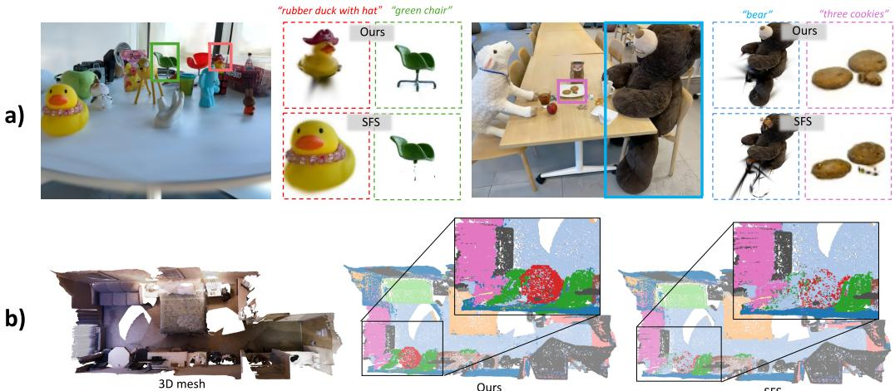  
Figure 3: Qualitative comparison with SFS [Xiong et al., 2026] under the same training-free protocol. NormLift improves text-query retrieval on LERF scenes and produces sharper, more complete 3D segmentation on ScanNet, especially in the zoomed-in regions.

## 4.1 Open-vocabulary 3D experiments

We evaluate NormLift on ScanNet [Dai et al., 2017] for open-vocabulary 3D semantic segmentation, following the OpenGaussian protocol [Wu et al., 2024b] (Appendix F).

Table 1 compares NormLift with both training-based language-field methods and recent training-free lifting methods. NormLift achieves the best mIoU and mAcc, outperforming both families. Visual comparisons in Figure 3 show that NormLift produces more complete object boundaries and more details than SFS [Xiong et al., 2026], particularly on thin structures and Gaussians with limited multi-view coverage, consistent with the behavior expected from the reliability score and refinement procedure.

## 4.2 Ablation study

Component ablation: Table 2 shows that each component contributes to NormLift. Removing refinement causes the largest drop, reducing mIoU by 2.4–4.4 points across label granularities. Within refinement, removing reliability weights reduces 19-class mIoU by 1.3 points, and replacing mode selection with distance-weighted linear averaging reduces it by 0.6 points. These results support reliability-aware mode voting, which selects a coherent neighbor feature instead of averaging nearby

Table 2: Ablation of NormLift components on ScanNet under the OpenGaussian protocol with 19/15/10 label granularities. Each variant changes one component while keeping the others fixed. Reliability-weighted mode voting gives the strongest result.
<table><tr><td rowspan="2">Variant</td><td colspan="2">19 cls.</td><td colspan="2">15 cls.</td><td colspan="2">10 cls.</td></tr><tr><td>mIoU</td><td>mAcc</td><td>mIoU</td><td>mAcc</td><td>mIoU</td><td>mAcc</td></tr><tr><td>w/o refinement</td><td>32.94</td><td>50.45</td><td>36.30</td><td>55.57</td><td>45.34</td><td>64.18</td></tr><tr><td>plain KNN voting</td><td>34.06</td><td>51.83</td><td>38.07</td><td>57.79</td><td>46.94</td><td>66.12</td></tr><tr><td>linear averaging</td><td>34.78</td><td>52.36</td><td>39.27</td><td>58.73</td><td>48.50</td><td>67.21</td></tr><tr><td>norm-only reliability</td><td>32.87</td><td>50.41</td><td>36.26</td><td>55.24</td><td>45.08</td><td>64.10</td></tr><tr><td>support-only reliability</td><td>33.67</td><td>51.64</td><td>37.95</td><td>57.20</td><td>47.02</td><td>65.79</td></tr><tr><td>Full NormLift</td><td>35.77</td><td>54.02</td><td>39.62</td><td>59.26</td><td>48.93</td><td>68.83</td></tr></table>

Table 3: Wall-clock time and peak GPU memory on LERF-OVS using an NVIDIA Tesla V100 GPU. NormLift and SFS share the same lifting stage, while NormLift is faster in post-lifting and reduces end-to-end runtime with similar memory use.
<table><tr><td rowspan="2">Scene</td><td rowspan="2">Lift (s)</td><td colspan="2">Post-Lift (s)</td><td colspan="2">Total (s)</td><td rowspan="2">Mem (GB)</td></tr><tr><td>SFS</td><td>Ours</td><td>SFS</td><td>Ours</td></tr><tr><td>Figurines</td><td>449.2</td><td>379.5</td><td>34.8</td><td>828.8</td><td>484.0</td><td>7.48</td></tr><tr><td>Ramen</td><td>131.0</td><td>117.9</td><td>10.8</td><td>248.9</td><td>141.8</td><td>4.71</td></tr><tr><td>Teatime</td><td>189.5</td><td>532.3</td><td>101.2</td><td>721.8</td><td>290.7</td><td>15.17</td></tr><tr><td>Waldo</td><td>200.3</td><td>406.1</td><td>67.0</td><td>606.3</td><td>267.3</td><td>12.09</td></tr><tr><td>Mean</td><td>242.5</td><td>359.0</td><td>53.5</td><td>601.5</td><td>295.9</td><td>9.86</td></tr><tr><td>Speedup</td><td>一</td><td>6.7×</td><td></td><td>2.0×</td><td></td><td></td></tr></table>

CLIP features. Using only one factor of $R ( j )$ also hurts performance: the norm-only variant is unstable under single-view dominance, while the view-diversity-only variant remains 1.7 mIoU points below the full score at 19 classes.

Runtime: Table 3 compares NormLift with SFS on LERF-OVS. Since both methods share the same lifting stage, the difference comes from post-lifting. NormLift takes 53.5 s on average for reliability computation and mode voting, compared with 359.0 s for SFS, yielding a 6.7× post-lifting speedup and a 2.0× end-to-end speedup (295.9 s vs. 601.5 s). Peak GPU memory is essentially identical between the two methods, since it is dominated by the shared back-projection stage and the post-lifting operations of both methods operate on aggregated per-Gaussian features. Appendix H shows more details.

## 5 Conclusion

We present NormLift, a training-free framework for feature lifting in 3D Gaussian Splatting. By recasting per-Gaussian feature lifting as a cosine alignment problem on the CLIP unit sphere, we show that the standard back-projection rule together with $\ell _ { 2 }$ normalization is exactly the closed-form optimum of a 3D-side per-Gaussian objective, complementing existing rendering-side analyses. From the same formulation, the back-projected norm algebraically factors into intra- and inter-view consistency, and calibrated by effective multi-view support yields a per-Gaussian reliability score. This score guides a mode-based refinement that respects the non-linearity of the CLIP feature space.

Experiments show that NormLift consistently improves over prior training-free and training-based baselines on ScanNet open-vocabulary 3D semantic segmentation, runs 6.7× faster than SFS in the post-lifting stage at matched peak memory, and transfers competitively to 2D rendering on LERF-OVS. Further analysis shows that the reliability score is largely independent of opacity outside a small zero-evidence regime, providing a per-Gaussian signal beyond what visibility-based heuristics offer. We hope this 3D-side view of feature lifting motivates future work that designs lifting objectives directly in the geometry under which lifted features are used downstream.

Limitations: (1) The framework takes the alpha-compositing weights $A _ { i j }$ and the underlying 3DGS geometry as fixed inputs, so geometric artifacts in the reconstruction propagate into lifting. (2) The lifted features inherit CLIP’s own limitations on fine-grained categories, compositional concepts, and objects outside its training distribution. (3) Our 3D evaluation is restricted to ScanNet indoor scenes; generalization to building-scale, outdoor, or dynamic scenes remains to be verified. (4) The mode-voting refinement requires at least some spatial neighbors of an unreliable Gaussian to themselves be reliable; regions with systematically unreliable neighborhoods cannot be recovered without additional cues such as active view planning.

## References

Elena Alegret, Kunyi Li, Sen Wang, Siyun Liang, Michael Niemeyer, Stefano Gasperini, Nassir Navab, and Federico Tombari. Gala: Guided attention with language alignment for open vocabulary gaussian splatting. In 2026 International Conference on 3D Vision (3DV), pages 1717–1727. IEEE, 2026.

Yash Bhalgat, Iro Laina, Joao F Henriques, Andrew Zisserman, and Andrea Vedaldi. N2f2: Hierarchical scene understanding with nested neural feature fields. In European Conference on Computer Vision, pages 197–214. Springer, 2024.

Jiazhong Cen, Xudong Zhou, Jiemin Fang, Changsong Wen, Lingxi Xie, Xiaopeng Zhang, Wei Shen, and Qi Tian. Tackling view-dependent semantics in 3d language Gaussian splatting. In International Conference on Machine Learning, 2025.

Rohan Chacko, Nicolai Häni, Eldar Khaliullin, Lin Sun, and Douglas Lee. Lifting by gaussians: A simple, fast and flexible method for 3d instance segmentation. In 2025 IEEE/CVF Winter Conference on Applications ofComputer Vision (WACV), pages 3497–3507. IEEE, 2025.

Jiahuan Cheng, Jan-Nico Zaech, Luc Van Gool, and Danda Pani Paudel. Occam’s LGS: An efficient approach for language Gaussian splatting, 2024.

Angela Dai, Angel X Chang, Manolis Savva, Maciej Halber, Thomas Funkhouser, and Matthias Nießner. Scannet: Richly-annotated 3d reconstructions of indoor scenes. In Proceedings ofthe IEEE conference on computer vision and pattern recognition, pages 5828–5839, 2017.

Shaohui Dai, Yansong Qu, Zheyan Li, Xinyang Li, Shengchuan Zhang, and Liujuan Cao. Trainingfree hierarchical scene understanding for gaussian splatting with superpoint graphs. In Proceedings ofthe 33rd ACM International Conference on Multimedia, pages 3673–3682, 2025.

Jiahua Dong and Yu-Xiong Wang. 3DGS-Drag: Dragging Gaussians for intuitive point-based 3D editing. In International Conference on Learning Representations, 2025.

Jun Guo, Xiaojian Ma, Yue Fan, Huaping Liu, and Qing Li. Semantic Gaussians: Open-vocabulary scene understanding with 3D Gaussian splatting. arXiv preprint arXiv:2403.15624, 2024.

SungMin Jang and Wonjun Kim. Identity-aware language Gaussian splatting for open-vocabulary 3D semantic segmentation. In Proceedings of the IEEE/CVF International Conference on Computer Vision, pages 20467–20476, 2025.

Minchao Jiang, Shunyu Jia, Jiaming Gu, Xiaoyuan Lu, Guangming Zhu, Anqi Dong, and Liang Zhang. Votesplat: Hough voting gaussian splatting for 3d scene understanding. In Proceedings of the IEEE/CVF International Conference on Computer Vision, pages 6456–6465, 2025.

Joji Joseph, Bharadwaj Amrutur, and Shalabh Bhatnagar. Gradient-weighted feature back-projection: A fast alternative to feature distillation in 3d gaussian splatting. In Proceedings of the SIGGRAPH Asia 2025 Conference Papers, pages 1–12, 2025.

Kim Jun-Seong, GeonU Kim, Kim Yu-Ji, Yu-Chiang Frank Wang, Jaesung Choe, and Tae-Hyun Oh. Dr. splat: Directly referring 3d gaussian splatting via direct language embedding registration. In 2025 IEEE/CVF Conference on Computer Vision and Pattern Recognition (CVPR), pages 14137–14146. IEEE, 2025.

Avinash C. Kak and Malcolm Slaney. Principles ofComputerized Tomographic Imaging. IEEE Press, 1988.

Bernhard Kerbl, Georgios Kopanas, Thomas Leimkühler, and George Drettakis. 3d Gaussian splatting for real-time radiance field rendering. ACM Transactions on Graphics, 42(4):139:1–139:14, 2023.

Justin Kerr, Chung Min Kim, Ken Goldberg, Angjoo Kanazawa, and Matthew Tancik. Lerf: Language embedded radiance fields. In Proceedings of the IEEE/CVF international conference on computer vision, pages 19729–19739, 2023.

Leslie Kish. Survey Sampling. John Wiley & Sons, 1965.

Siyun Liang, Sen Wang, Kunyi Li, Michael Niemeyer, Stefano Gasperini, Hendrik PA Lensch, Nassir Navab, and Federico Tombari. Supergseg: Open-vocabulary 3d segmentation with structured super-gaussians. In 2026 International Conference on 3D Vision (3DV), pages 1650–1659. IEEE, 2026.

Kanti V. Mardia and Peter E. Jupp. Directional Statistics. John Wiley & Sons, 2009.

Juliette Marrie, Romain Ménégaux, Michael Arbel, Diane Larlus, and Julien Mairal. Ludvig: Learning-free uplifting of 2d visual features to gaussian splatting scenes. In 2025 IEEE/CVF International Conference on Computer Vision (ICCV), pages 7440–7450. IEEE, 2025.

Frank Natterer. The Mathematics of Computerized Tomography. SIAM, 2001.

Yuning Peng, Haiping Wang, Yuan Liu, Chenglu Wen, Zhen Dong, and Bisheng Yang. Gags: Granularity-aware feature distillation for language gaussian splatting. In Proceedings of the AAAI Conference on Artificial Intelligence, volume 40, pages 8376–8384, 2026.

Minghan Qin, Wanhua Li, Jiawei Zhou, Haoqian Wang, and Hanspeter Pfister. Langsplat: 3d language gaussian splatting. In Proceedings ofthe IEEE/CVF Conference on Computer Vision and Pattern Recognition, pages 20051–20060, 2024.

Yansong Qu, Shaohui Dai, Xinyang Li, Jianghang Lin, Liujuan Cao, Shengchuan Zhang, and Rongrong Ji. GOI: Find 3D Gaussians of interest with an optimizable open-vocabulary semanticspace hyperplane. In Proceedings of the ACM International Conference on Multimedia, pages 5328–5337, 2024.

Alec Radford, Jong Wook Kim, Chris Hallacy, Aditya Ramesh, Gabriel Goh, Sandhini Agarwal, Girish Sastry, Amanda Askell, Pamela Mishkin, Jack Clark, et al. Learning transferable visual models from natural language supervision. In International Conference on Machine Learning, pages 8748–8763, 2021.

Jin-Chuan Shi, Miao Wang, Hao-Bin Duan, and Shao-Hua Guan. Language embedded 3d Gaussians for open-vocabulary scene understanding. In Proceedings of the IEEE/CVF Conference on Computer Vision and Pattern Recognition, pages 5333–5343, 2024.

Wei Sun, Yanzhao Zhou, Jianbin Jiao, and Yuan Li. CAGS: Open-vocabulary 3D scene understanding with context-aware Gaussian splatting. arXiv preprint arXiv:2504.11893, 2025.

Jiaxiang Tang, Jiawei Ren, Hang Zhou, Ziwei Liu, and Gang Zeng. DreamGaussian: Generative Gaussian splatting for efficient 3D content creation. In International Conference on Learning Representations, 2024.

Sen Wang, Kunyi Li, Siyun Liang, Elena Alegret, Jing Ma, Nassir Navab, and Stefano Gasperini. Visibility-aware language aggregation for open-vocabulary segmentation in 3d gaussian splatting. In 2026 International Conference on 3D Vision (3DV), pages 1791–1800. IEEE, 2026a.

Xihan Wang, Dianyi Yang, Yu Gao, Yufeng Yue, Yi Yang, and Mengyin Fu. Gaussiangraph: 3d gaussian-based scene graph generation for open-world scene understanding. In 2025 IEEE/RSJ International Conference on Intelligent Robots and Systems (IROS), pages 4091–4098. IEEE, 2025.

Yixian Wang, Haolin Yu, Jiadong Tang, Yu Gao, Xihan Wang, Yufeng Yue, and Yi Yang. Filtergs: Traversal-free parallel filtering and adaptive shrinking for large-scale lod 3d gaussian splatting. In Proceedings ofthe IEEE/CVF Conference on Computer Vision and Pattern Recognition (CVPR), pages 26052–26061, June 2026b.

Tong Wu, Yu-Jie Yuan, Ling-Xiao Zhang, Jie Yang, Yan-Pei Cao, Ling-Qi Yan, and Lin Gao. Recent advances in 3d gaussian splatting. Computational Visual Media, 10(4):613–642, 2024a.

Yanmin Wu, Jiarui Meng, Haijie Li, Chenming Wu, Yahao Shi, Xinhua Cheng, Chen Zhao, Haocheng Feng, Errui Ding, Jingdong Wang, et al. Opengaussian: Towards point-level 3d gaussian-based open vocabulary understanding. Advances in Neural Information Processing Systems, 37:19114– 19138, 2024b.

Yaxu Xie, Abdalla Arafa, Alireza Javanmardi, Christen Millerdurai, Jia Cheng Hu, Shaoxiang Wang, Alain Pagani, and Didier Stricker. Relags: Relational language gaussian splatting. In Proceedings ofthe IEEE/CVF Conference on Computer Vision and Pattern Recognition (CVPR), pages 23826–23836, June 2026.

Butian Xiong, Rong Liu, Kenneth Xu, Meida Chen, and Andrew Feng. Splat feature solver. In International Conference on Learning Representations, 2026.

Taoran Yi, Jiemin Fang, Junjie Wang, Guanjun Wu, Lingxi Xie, Xiaopeng Zhang, Wenyu Liu, Qi Tian, and Xinggang Wang. GaussianDreamer: Fast generation from text to 3D Gaussians by bridging 2D and 3D diffusion models. In Proceedings of the IEEE/CVF Conference on Computer Vision and Pattern Recognition, pages 6796–6807, 2024.

Shijie Zhou, Haoran Chang, Sicheng Jiang, Zhiwen Fan, Zehao Zhu, Dejia Xu, Pradyumna Chari, Suya You, Zhangyang Wang, and Achuta Kadambi. Feature 3DGS: Supercharging 3d Gaussian splatting to enable distilled feature fields. In Proceedings ofthe IEEE/CVF Conference on Computer Vision and Pattern Recognition, pages 21676–21685, 2024.

## A Why a 3D-side formulation is needed

Sections 3.1.2 and the CLIP non-linear properties highlight a mismatch between the standard backprojection rule and the geometry of the feature space in which lifted semantics are ultimately used. Back-projection produces an unconstrained Euclidean feature $f _ { j }$ , while downstream CLIP-based queries compare unit-normalized directions on the semantic sphere. This raises a basic question: should feature lifting be understood as a rendering-side reconstruction problem, or as a per-Gaussian semantic assignment problem on the CLIP sphere?

Most existing analyses take the rendering-side view. In this view, Gaussian features are treated as variables that are linearly composed through alpha blending to reconstruct 2D feature maps. This perspective is useful because it mirrors the standard 3DGS rendering pipeline and leads to tractable formulations. For example, existing methods justify or implement feature lifting through weighted aggregation, inverse rendering, or closed-form approximations to 2D reconstruction objectives. However, this view has two limitations for open-vocabulary semantic lifting.

The important distinction is not whether a linear combination appears algebraically, but what is being modeled as linear. In rendering-side feature reconstruction, the expression $\textstyle \sum _ { j } A _ { i j } u _ { j }$ is treated as a rendered semantic feature, implicitly extending RGB alpha compositing to CLIP-like embeddings. This assumes that semantic features can be combined as Euclidean quantities and compared to a target 2D feature.

In our 3D-side formulation, the starting point is different. We do not define a rendered semantic feature by linearly blending Gaussian features. Instead, for each Gaussian, we aggregate scalar cosine agreements $\left. u , B _ { i } \right.$ between a candidate unit direction and its supporting 2D observations. The back-projected vector $\textstyle \sum _ { i } A _ { i j } B _ { i }$ appears only after using the linearity of the inner product:

$$
\sum _ { i } A _ { i j } \langle u , B _ { i } \rangle = \left. u , \sum _ { i } A _ { i j } B _ { i } \right. .
$$

Thus, the linear combination is an algebraic sufficient statistic for weighted semantic agreement, not a claim that interpolated CLIP features are themselves valid semantic observations. This is why the solution can still take the form of normalized back-projection while the interpretation remains different from rendering-side linear reconstruction.

## B Per-Gaussian independence and the role of Property 3

A key structural feature of Eq. (4) is that the feature estimation problem decomposes across Gaussians. For a fixed Gaussian $j ,$ solving for $u _ { j }$ only involves its own rendering weights $\{ A _ { i j } \} _ { i = 1 } ^ { R }$ and the corresponding 2D semantic observations $\{ B _ { i } \} _ { i = 1 } ^ { R }$ . It does not depend on the feature estimates $u _ { k }$ of other Gaussians $k \neq j$ . In other words, Eq. (4) defines a per-Gaussian semantic consensus problem rather than a joint 2D feature reconstruction problem.

Importantly, this per-Gaussian formulation does not assume that each pixel is explained by a single Gaussian. A training observation $B _ { i }$ may still contribute to multiple Gaussians whenever $A _ { i j } > 0$ for several j. This faithfully reflects the standard alpha-compositing process in 3DGS, where a rendered pixel may receive contributions from many Gaussians along the same camera ray. The decoupling occurs only at the feature estimation stage: once the geometry and alpha-compositing weights are fixed, each Gaussian independently aggregates the semantic observations assigned to it by its own rendering weights.

This is different from optimization-based feature rendering, where one typically minimizes a global reconstruction objective of the form

$$
\operatorname* { m i n } _ { \{ u _ { j } \} } \sum _ { i = 1 } ^ { R } \left\| \boldsymbol B _ { i } - \sum _ { j = 1 } ^ { P } A _ { i j } \boldsymbol u _ { j } \right\| _ { 2 } ^ { 2 } .\tag{11}
$$

In such a formulation, the rendered feature $\sum _ { j } A _ { i j } u _ { j }$ couples all Gaussians that contribute to the same pixel observation i. Consequently, the estimate of one Gaussian feature depends on the estimates of other Gaussians sharing the same pixel/ray. This coupling is natural for RGB reconstruction, where colors are Euclidean quantities and alpha blending is physically meaningful. However, it is less appropriate for CLIP-like semantic features, whose meaningful representations lie on a non-linear semantic manifold.

Property 3 explains the main issue. CLIP-like features are compared by their directions on the unit sphere, and semantically meaningful features are not generally closed under arbitrary linear combinations. Therefore, a linear mixture of features from distinct objects may move away from either original semantic concept and drift off the semantic manifold. The global reconstruction objective in Eq. (11) implicitly treats the rendered semantic feature $\textstyle \sum _ { j } A _ { i j } u _ { j } ^ { - }$ as a valid Euclidean superposition of Gaussian semantics. This assumption can become problematic when a pixel receives non-negligible contributions from multiple semantically different Gaussians.

Our formulation avoids this solver-side linear-superposition assumption. Each Gaussian is assigned an independent unit direction on the CLIP sphere:

$$
u _ { j } ^ { \star } = \arg \operatorname* { m a x } _ { u \in S ^ { F - 1 } } \sum _ { i = 1 } ^ { R } A _ { i j } \langle u , B _ { i } \rangle .\tag{12}
$$

Thus, the semantic identity of Gaussian $j$ is determined by the contribution-weighted observations that support it, rather than by forcing all Gaussians sharing a pixel to jointly reconstruct a single 2D feature through a Euclidean sum. Other Gaussians still influence $u _ { j } ^ { \star }$ indirectly through occlusion, depth ordering, and alpha compositing, which are already encoded in the fixed weights $\bar { A } _ { i j }$ . However, their semantic feature estimates do not enter the optimization for $u _ { j } ^ { \star }$

We therefore distinguish two notions of coupling. At the data level, observations remain shared: the same $B _ { i }$ may provide evidence for multiple Gaussians with different weights $A _ { i j }$ . At the solver level, the semantic feature estimates are decoupled: each Gaussian extracts its own semantically meaningful direction from the shared observations without being constrained to participate in a linear reconstruction of them. This distinction is central to our 3D-side interpretation of feature lifting.

## C Hyperparameter Sensitivity

We analyze the sensitivity of NormLift to its six hyperparameters: the shrinkage strength $\beta$ in the reliability score (Eq. 8), and the neighborhood size $\dot { K }$ , spatial decay $\sigma _ { d } ,$ semantic threshold $\tau ,$ gate sharpness γ, and replacement margin $\Delta$ in the refinement procedure (Eqs. 9–10). For each hyperparameter, we vary its value across five points around the default while keeping the others fixed at their defaults. All sweeps are conducted on the 10 ScanNet scenes used in our main evaluation, with the 19-class OpenGaussian protocol. Results are shown in Fig. 4.

Overall stability: Across all six hyperparameters and all tested values, NormLift’s mIoU lies within [34.0, 35.95], a range of less than 2.0 points around the main-experiment result of 35.77. No hyperparameter exhibits a sharp performance collapse within the tested range, indicating that NormLift performs robustly under reasonable hyperparameter choices and does not require careful per-scene tuning.

β

Highly stable hyperparameters: Four of the six hyperparameters are highly stable. The replacement margin $\Delta$ varies by less than 0.1 point across the tested range $[ 0 , \bar { 0 } . 3 \bar { ] }$ , indicating that the conservative replacement rule (Eq. 10) is not sensitive to the exact margin value. The neighborhood size K varies by less than $0 . 7$ points across [12, 60], with the curve already flat above $K \approx 3 0$ . The spatial decay $\sigma _ { d }$ and the semantic threshold τ both saturate at the default value: performance is slightly lower for values smaller than the default and remains stable for larger values, indicating that the defaults sit on the plateau of the sensitivity curve.

Single-peaked hyperparameters: $\beta$ and $\gamma \colon$ The shrinkage strength $\beta$ and the gate sharpness $\gamma$ exhibit single-peaked curves with the default values located near the maximum. The fall-off on both sides is mild and bounded: $\beta$ varies by at most 1.4 points across {0.25, 0.5, 1, 2, 4}, and $\gamma$ varies by at most 1.8 points across the tested range. The shape is consistent with the role of these parameters: an overly large $\beta$ over-shrinks the reliability score and suppresses informative signals, while an overly large γ flattens the semantic-agreement gate and reduces its discriminative power.

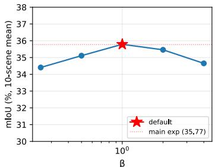

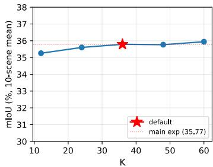

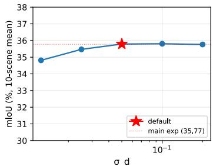

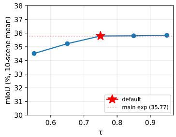

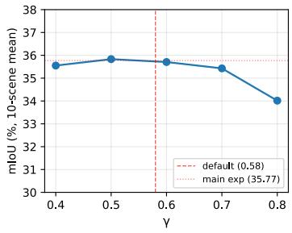

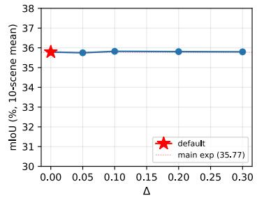  
Figure 4: Hyperparameter sensitivity on ScanNet (10-scene mean, 19 classes). Each subplot shows mIoU as a function of one hyperparameter, with the others fixed at their defaults. The default value is marked by a red star (or a dashed vertical line when the default does not coincide with the swept points), and the dotted red line indicates the main-experiment mIoU (35.77). Across all six hyperparameters, mIoU stays within [34.0, 35.95], demonstrating that NormLift is robust to reasonable hyperparameter choices.

## D Closed-form derivation of the per-Gaussian cosine alignment problem

We provide the full derivation of the closed-form solution stated in $\operatorname { E q } .$ . (5). The argument proceeds in three steps: reduction by linearity, application of the Cauchy–Schwarz inequality, and treatment of the boundary case.

Step 1: Reduction by linearity. By linearity of the inner product, the objective in Eq. (4) can be rewritten as

$$
\sum _ { i = 1 } ^ { R } A _ { i j } \langle u , B _ { i } \rangle = \Big \langle u , \sum _ { i = 1 } ^ { R } A _ { i j } B _ { i } \Big \rangle = \Big ( \sum _ { i = 1 } ^ { R } A _ { i j } \Big ) \Big \langle u , \frac { \sum _ { i = 1 } ^ { R } A _ { i j } B _ { i } } { \sum _ { i = 1 } ^ { R } A _ { i j } } \Big \rangle = W _ { j } \langle u , f _ { j } \rangle ,\tag{13}
$$

where $\begin{array} { r } { W _ { j } : = \sum _ { i = 1 } ^ { R } A _ { i j } } \end{array}$ is the total rendering weight of Gaussian $j$ and $f _ { j }$ is the back-projected feature defined in $\operatorname { E q . } \left( 3 \right)$ . Since $W _ { j } > 0$ is independent of u and does not affect the maximizer, the constrained problem reduces to

$$
\operatorname* { m a x } _ { u \in S ^ { F - 1 } } \langle u , f _ { j } \rangle .\tag{14}
$$

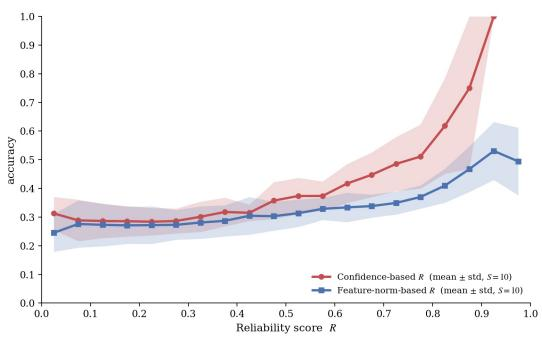

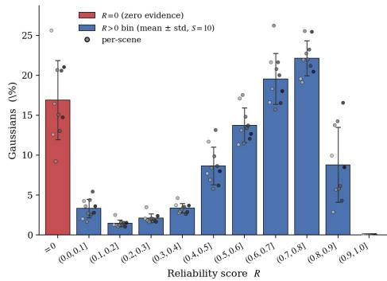  
Figure 5: Reliability calibration and distribution on ScanNet. Left: the proposed reliability score R aligns more monotonically with downstream accuracy than the feature-norm-based score, showing the benefit of effective multi-view calibration. Right: Gaussian distribution over reliability intervals, with zero-evidence Gaussians $( R = 0 )$ shown in red and nonzero bins shown in blue. The results indicate that R provides an informative per-Gaussian signal for identifying unreliable primitives and guiding refinement.

Step 2: Cauchy–Schwarz. For any unit vector u, the Cauchy–Schwarz inequality yields

$$
\langle u , f _ { j } \rangle \leq \| u \| \| f _ { j } \| = \| f _ { j } \| ,\tag{15}
$$

with equality if and only if u is a non-negative scalar multiple of $f _ { j }$ . Combined with the unit-norm constraint $\lVert \dot { u } \rVert = 1$ , the unique maximizer for $f _ { j } \neq 0$ is $u \overset { \cdot } { = } f _ { j } / \| \overset { \cdot } { f } _ { j } \|$ , and the optimal value of the objective equals $\| f _ { j } |$ ∥.

Step 3: Boundary case. If $f _ { j } = 0$ , then $\langle u , f _ { j } \rangle = 0$ for every unit vector $u ,$ and the objective is identically zero on $S ^ { F - 1 }$ . The maximizer is therefore not unique in this degenerate case. This “empty-evidence” regime corresponds to Gaussians whose contribution-weighted observations cancel out or whose total rendering support is negligible. Such Gaussians are identified by the reliability score $R ( j ) = 0$ in Sec. 3.3, and are corrected by the mode-voting refinement procedure in Sec. 3.4. We further characterize this regime empirically in Appendix E.2, where we show that it largely overlaps with very-low-opacity Gaussians.

Summary. Combining the three steps, the closed-form solution to Eq. (4) is

$$
u _ { j } ^ { \star } = { \frac { f _ { j } } { \| f _ { j } \| } } \quad ( { \mathrm { f o r ~ } } f _ { j } \neq 0 ) , \qquad { \mathrm { w i t h ~ o p t i m a l ~ v a l u e ~ } } \| f _ { j } \| .\tag{16}
$$

Thus $u _ { j } ^ { \star }$ coincides with the $\ell _ { 2 }$ -normalized back-projected feature, and the optimal value of the cosine alignment objective is exactly $\| f _ { j } \|$ . The latter identity is what makes $\| f _ { j } \|$ meaningful beyond a normalization constant: it is itself the optimal attained value of the per-Gaussian alignment objective, and we revisit this fact when analyzing the structural meaning of the norm in Sec. 3.3.

## E Reliability calibration and distribution on ScanNet

## E.1 The trend of accuracy and reliability

Figure 5 left part illustrates why effective-view calibration is necessary. Using $\| f _ { j } \|$ alone as a confidence signal produces a non-monotonic relationship with downstream accuracy: accuracy actually drops when $\| f _ { j } \|$ approaches one. This counterintuitive behavior arises because a near-unit norm can be inflated by single-view dominance rather than genuine multi-view agreement, and Gaussians supported by only one dominant view are unstable in practice. Calibrating $\| f _ { j } \|$ by $N _ { \mathrm { e f f } }$ removes this confound: the resulting reliability score $R ( j )$ exhibits a monotonically increasing, approximately exponential relationship with accuracy, confirming that $R ( j )$ is a far more faithful per-Gaussian confidence measure than $\ \bar { | | } \ f _ { j } { | | }$ alone.

Table 4: Empirical characterization of the zero-evidence subset $\mathcal { G } _ { 0 }$ versus the remaining Gaussians on ScanNet, averaged over 10 scenes. Zero-evidence Gaussians have much lower opacity, see-count, and downstream accuracy, indicating that $R ( j ) = 0$ isolates a physically and semantically distinct regime.
<table><tr><td>Group</td><td>Ratio</td><td>Mean opacity</td><td> $\% \mathrm { \ o p a c i t y < 0 . 1 }$ </td><td>Mean see-count</td><td>Acc</td></tr><tr><td>All</td><td>100%</td><td>0.622</td><td>23.95%</td><td>9.85</td><td>44.78%</td></tr><tr><td> $\mathcal { G } _ { 0 }$ </td><td>15.94%</td><td>0.042</td><td>86.32%</td><td>0.112</td><td>35.61%</td></tr><tr><td> $R ( j ) > 0$ </td><td>84.06%</td><td>0.731</td><td>12.01%</td><td>11.86</td><td>46.21%</td></tr></table>

## E.2 Reliability score versus opacity

Figure 5 right part shows there is an abnormal peak in the number of Gaussians at the point where the reliability is 0. A natural question for any per-Gaussian reliability measure is whether it provides information beyond opacity-related signals, such as visibility or rendering weight. This comparison is important because opacity-based statistics have been used to remove noisy or weakly supported Gaussians in prior work [Cheng et al., 2024].

We analyze this relationship on the 10 ScanNet scenes used in our experiments. We separate the Gaussians into two regimes. The first is the zero-evidence subset

$$
\mathcal { G } _ { 0 } : = \{ j : R ( j ) = 0 \} ,\tag{17}
$$

which occurs when the back-projection accumulates no semantic evidence for Gaussian $j .$ . This regime corresponds to a semantic observability gap: the primitive exists in the 3D Gaussian representation, but receives negligible semantic support from the training views. The second regime contains the remaining Gaussians with $R ( j ) > 0$

Zero-evidence Gaussians align with opacity-based intuition: The zero-evidence subset $\mathcal { G } _ { 0 }$ accounts for $1 5 . 9 4 \% \pm 4 . 1 4 \%$ of all Gaussians and has sharply different physical properties from the remaining Gaussians, as shown in Table 4. Its mean opacity is only 0.042, compared to 0.731 for Gaussians with $R ( j ) > 0$ . Moreover, 86.32% of zero-evidence Gaussians have opacity below 0.1, compared with only 12.01% in the nonzero-reliability regime. Their mean see-count is also nearly zero (0.112 versus 11.86). These statistics indicate that $\mathcal { G } _ { 0 }$ mostly consists of primitives that are barely observed by the training views.

This physical distinction is also reflected semantically. The downstream accuracy of $\mathcal { G } _ { 0 }$ is substantially lower than that of the remaining Gaussians (35.61% versus 46.21%). Thus, $R ( j ) = 0$ is not merely a numerical artifact: it identifies a class of primitives that are both weakly observed and semantically unreliable. At this boundary, the reliability score agrees with the intuition captured by opacity.

Beyond zero evidence, reliability is largely independent of opacity: The agreement between reliability and opacity does not extend to the remaining 84.06% of Gaussians with $\bar { R } ( j ) > 0$ . Pooling all Gaussians from this regime across all 10 scenes, the rank-based correlations between $R ( j )$ and opacity are essentially zero:

$$
\rho _ { \mathrm { S p e a r m a n } } = 0 . 0 0 2 \quad ( p = 0 . 3 1 ) , \qquad \tau _ { \mathrm { K e n d a l l } } = 2 \times 1 0 ^ { - 4 } \quad ( p = 0 . 9 2 ) .
$$

The overlap between low-reliability and low-opacity Gaussians is also weak. The Jaccard overlap between the lowest-20% Gaussians ranked by $R ( j )$ and those ranked by opacity is 0.162, which is below the independence baseline of 0.20. In addition, the mean opacity across reliability quintiles is nearly flat:

$$
0 . 5 6 , 0 . 6 5 , 0 . 6 3 , 0 . 6 2 , 0 . 6 0 ,
$$

from the lowest to highest reliability bins, showing no monotonic trend.

These results indicate that, once the zero-evidence boundary is excluded, $R ( j )$ and opacity capture different properties. Opacity reflects the physical contribution or visibility of a Gaussian in rendering, whereas $R ( j )$ measures the semantic consistency and effective multi-view support of the lifted feature.

Implication: The reliability score overlaps with opacity mainly at the boundary case $\mathcal { G } _ { 0 } .$ , where Gaussians receive almost no semantic evidence and are also physically weakly observed. For the majority of Gaussians with $R ( j ) > 0$ , opacity is nearly uninformative about semantic reliability. In this regime, $R ( j )$ provides an additional signal that is not captured by opacity-based filtering. This distinction explains why our reliability score can guide semantic refinement beyond simply removing low-opacity or weakly visible Gaussians.

## F ScanNet evaluation protocol

We follow the experimental protocol of OpenGaussian [Wu et al., 2024b] for 3D semantic segmentation on ScanNet [Dai et al., 2017]. This appendix details the protocol for completeness.

For scene reconstruction, we initialize Gaussian Splatting from the raw scanned point clouds provided by ScanNet. Densification and position optimization are disabled, so all Gaussian primitives stay aligned with the input point cloud throughout reconstruction; only the remaining geometric and appearance attributes are optimized. This keeps the spatial layout of the Gaussians directly comparable to the ground-truth point cloud at evaluation time.

The features on 2D images follow the same process of LangSplat [Qin et al., 2024] and we chose the L-level features.

Each method then constructs its semantic field on top of the reconstructed Gaussian scenes following its own design. At test time, every Gaussian primitive is classified by its open-vocabulary feature and compared against the ground-truth ScanNet point-cloud labels. We report mIoU and mAcc, providing a 3D point-level evaluation of semantic understanding.

We adopt the three label granularities defined by OpenGaussian. The 19-class set covers the most common ScanNet object categories: wall, floor, cabinet, bed, chair, sofa, table, door, window, bookshelf, picture, counter, desk, curtain, refrigerator, shower curtain, toilet, sink, bathtub. The 15-class subset removes picture, refrigerator, shower curtain, and bathtub; the 10-class subset further removes cabinet, counter, desk, curtain, and sink.

OpenGaussian evaluates on 10 randomly selected ScanNet scenes: scene0000\_00, scene0062\_00, scene0070\_00, scene0097\_00, scene0140\_00, scene0200\_00, scene0347\_00, scene0400\_00, scene0590\_00, and scene0645\_00. We use the same set of scenes for all experiments.

## G Open-vocabulary 2D semantic segmentation

We further evaluate NormLift on 2D open-vocabulary segmentation as a complementary metric. Experiments are conducted on LERF-OVS [Kerr et al., 2023, Qin et al., 2024], covering four scenes: figurines, ramen, teatime, and waldo kitchen. Following the evaluation protocol used in SFS [Xiong et al., 2026], we render 2D feature maps from the lifted Gaussian features and obtain object masks from text-query relevancy maps. All methods use the same Gaussian geometry trained for 30k iterations, so performance differences come only from the feature lifting strategy.

Table 5 compares NormLift with SFS [Xiong et al., 2026] and Occam’s LGS [Cheng et al., 2024] using mIoU, mAcc, and locAcc. NormLift is competitive in mIoU and mAcc, and achieves the best mean localization accuracy, indicating more reliable semantic grounding. Qualitative results in Fig. 6 show comparable segmentation masks and more stable localization responses.

Dataset and protocol: We evaluate 2D open-vocabulary segmentation on the LERF-OVS benchmark [Kerr et al., 2023, Qin et al., 2024], which contains four real-world tabletop scenes: figurines, ramen, teatime, and waldo kitchen. Each scene provides ground-truth polygon annotations for 8–17 object categories per validation frame, with 22 validation frames in total. The scenes contain objects with varying scale, density, and semantic ambiguity, making them a challenging testbed for open-vocabulary feature lifting.

We follow the evaluation protocol used in the SFS [Xiong et al., 2026] codebase. For each method, we first render 2D feature maps from the lifted Gaussian features and then obtain query-specific relevancy maps using CLIP text queries. All methods use the same Gaussian geometry trained for

Table 5: Semantic segmentation and localization on LERF scenes.
<table><tr><td rowspan="2">Scene</td><td colspan="3">mIoU↑</td><td colspan="3">mAcc ↑</td><td colspan="3">locAcc ↑</td></tr><tr><td>SFS</td><td>Occam&#x27;s</td><td>Ours</td><td>SFS</td><td>Occam&#x27;s</td><td>Ours</td><td>SFS</td><td>Occam&#x27;s</td><td>Ours</td></tr><tr><td>Figurines</td><td>0.569</td><td>0.593</td><td>0.588</td><td>0.635</td><td>0.669</td><td>0.678</td><td>0.886</td><td>0.843</td><td>0.899</td></tr><tr><td>Ramen</td><td>0.273</td><td>0.369</td><td>0.287</td><td>0.458</td><td>0.632</td><td>0.500</td><td>0.474</td><td>0.731</td><td>0.544</td></tr><tr><td>Teatime</td><td>0.636</td><td>0.639</td><td>0.650</td><td>0.775</td><td>0.790</td><td>0.796</td><td>0.923</td><td>0.857</td><td>0.906</td></tr><tr><td>Waldo</td><td>0.531</td><td>0.487</td><td>0.521</td><td>0.695</td><td>0.703</td><td>0.720</td><td>0.777</td><td>0.753</td><td>0.877</td></tr><tr><td>Mean</td><td>0.502</td><td>0.522</td><td>0.511</td><td>0.641</td><td>0.699</td><td>0.674</td><td>0.765</td><td>0.796</td><td>0.807</td></tr></table>

30k iterations on each scene, ensuring that the comparison reflects the feature lifting strategy rather than differences in reconstruction quality.

Metrics: We report three metrics: mean Intersection-over-Union (mIoU), mean class accuracy (mAcc), and localization accuracy (locAcc). For each category $c ,$ let $\hat { M } _ { c }$ denote the predicted mask obtained from the relevancy map $^ { a _ { c } , }$ and let $M _ { c }$ denote the ground-truth mask. We compute

$$
\mathrm { m I o U } = \frac { 1 } { C } \sum _ { c = 1 } ^ { C } \frac { { \lvert \hat { M } _ { c } \cap M _ { c } \rvert } } { { \lvert \hat { M } _ { c } \cup M _ { c } \rvert } } , \qquad \mathrm { m A c c } = \frac { 1 } { C } \sum _ { c = 1 } ^ { C } \frac { { \lvert \hat { M } _ { c } \cap M _ { c } \rvert } } { { \lvert M _ { c } \rvert } } .\tag{18}
$$

Localization accuracy measures whether the peak response of the relevancy map falls inside the ground-truth mask:

$$
\mathrm { l o c A c c } = \frac { 1 } { C } \sum _ { c = 1 } ^ { C } \mathbf { 1 } \bigg [ \mathrm { a r g } \operatorname* { m a x } _ { ( x , y ) } a _ { c } ( x , y ) \in M _ { c } \bigg ] .\tag{19}
$$

Here, mIoU measures region overlap, mAcc captures per-class recall, and locAcc evaluates whether the strongest semantic response is correctly localized [Kerr et al., 2023].

Mask thresholding: To convert a continuous relevancy map into a binary mask, we use the same background-relative thresholding strategy for all methods. A pixel is assigned to category c if its relevancy exceeds the maximum background relevancy by a fixed margin of 0.02:

$$
\hat { M } _ { c } ( x , y ) = \mathbf { 1 } \bigg [ a _ { c } ( x , y ) > \operatorname* { m a x } _ { b \in \mathcal { B } } a _ { b } ( x , y ) + 0 . 0 2 \bigg ] ,\tag{20}
$$

where

$$
{ \mathcal { B } } = { \{ ^ { * } \mathrm { f l o o r " , ^ { * } w a l l " , ^ { * } c e i l i n g " , ^ { * } b a c k g r o u n d " , ^ { * } o b j e c t " , ^ { * } t h i n g s " , ^ { * } s t u f f " , ^ { * } t e x t u r e " } \} } .
$$

This thresholding rule is applied consistently to SFS, Occam’s LGS, and NormLift.

## H Details of run time comparison

This appendix provides per-scene timing and memory details that supplement the runtime comparison reported in the main paper. All measurements are taken on a single NVIDIA RTX 4090 GPU, with one warm-up run followed by a timed run. CUDA synchronization is enforced before and after each measured stage.

Pipeline alignment. NormLift and SFS share the same lifting algorithm (rendering-weighted aggregation of CLIP features onto 3D Gaussians, Eq. 3) and therefore have identical lifting times per scene. The two methods diverge in the post-lifting stages. SFS performs product quantization to compress the lifted features into a codebook, followed by a refinement stage. NormLift instead computes a per-Gaussian reliability score $R ( j ) ( { \mathrm { E q } } .$ . 8) and applies KNN mode-voting refinement (Sec. 3.4). For a fair comparison, the reliability stage and the quantization stage are placed in the same column of Table 3 as the corresponding post-lifting bookkeeping operation in each method, even though they are not the same operation.

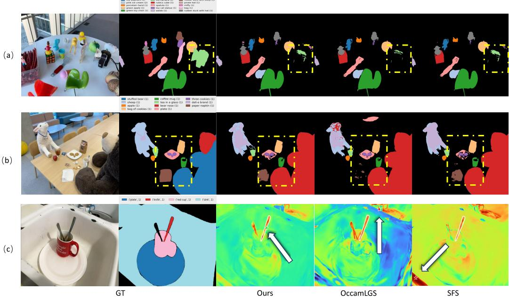  
Figure 6: Qualitative comparison of semantic segmentation and localization across scenes. (a,b) Segmentation results on figurines and teatime. (c) Localization visualization on waldo kitchen. From left to right: input RGB image, ground-truth segmentation, SFS [Xiong et al., 2026], OccamLGS [Cheng et al., 2024], and ours. Our method produces comparable segmentation masks and yields more accurate and stable localization responses, as highlighted by the arrows.

Table 6: Wall-clock time and peak GPU memory on LERF-OVS, on a single NVIDIA RTX 4090. NormLift and SFS share the same lifting algorithm and thus the same lifting time per scene. The two methods differ in the post-lifting stages: SFS applies product quantization followed by refinement, whereas NormLift computes a reliability score and applies KNN mode-voting refinement.
<table><tr><td>Method</td><td>Scene</td><td>#Gauss.</td><td>Lift (s)</td><td>Rel. / Quant. (s)</td><td>Refine (s)</td><td>Total (s)</td><td>Mem (GB)</td></tr><tr><td rowspan="5">SFS</td><td>figurines</td><td>951,644</td><td>449.24</td><td>99.53</td><td>280.00</td><td>828.77</td><td>7.48</td></tr><tr><td>ramen</td><td>479,180</td><td>131.02</td><td>25.78</td><td>92.17</td><td>248.97</td><td>4.71</td></tr><tr><td>teatime</td><td>1,929,418</td><td>189.45</td><td>343.38</td><td>188.95</td><td>721.78</td><td>15.16</td></tr><tr><td>waldo_kitchen</td><td>1,537,735</td><td>200.25</td><td>225.47</td><td>180.62</td><td>606.34</td><td>12.09</td></tr><tr><td>Mean</td><td>1,224,494</td><td>242.49</td><td>173.54</td><td>185.44</td><td>601.46</td><td>9.86</td></tr><tr><td rowspan="5">NormLift</td><td>figurines</td><td>951,644</td><td>449.24</td><td>3.21</td><td>31.59</td><td>484.04</td><td>7.48</td></tr><tr><td>ramen</td><td>479,180</td><td>131.02</td><td>0.54</td><td>10.29</td><td>141.85</td><td>4.71</td></tr><tr><td>teatime</td><td>1,929,418</td><td>189.45</td><td>0.80</td><td>100.40</td><td>290.65</td><td>15.17</td></tr><tr><td>waldo_kitchen</td><td>1,537,735</td><td>200.25</td><td>0.90</td><td>66.10</td><td>267.25</td><td>12.09</td></tr><tr><td>Mean</td><td>1,224,494</td><td>242.49</td><td>1.36</td><td>52.10</td><td>295.95</td><td>9.86</td></tr></table>

Per-stage timing. Table 3 reports the per-scene wall-clock time and peak GPU memory of NormLift and SFS on the four LERF-OVS scenes. The reliability score computation in NormLift takes only 1.36 s on average, two orders of magnitude faster than SFS’s product quantization stage (173.54 s). The KNN mode-voting refinement takes 52.10 s on average, 3.6× faster than SFS’s refinement (185.44 s). Combining the two post-lifting stages, NormLift is 6.7× faster than SFS in total postlifting time, which translates to a 2.0× end-to-end speedup (295.95 s vs. 601.46 s on average).

Memory. Peak GPU memory is essentially identical between NormLift and SFS across all four scenes (mean 9.86 GB, per-scene differences within 0.01 GB). This is expected because the dominant memory cost arises from loading the Gaussian parameters and the per-view CLIP feature maps in the lifting stage, which is shared by both methods. The post-lifting stages of both methods operate on aggregated per-Gaussian features and do not raise the peak. NormLift’s speedup is therefore not obtained at the cost of additional memory.

Scene-level observations. Total runtime scales roughly with the number of Gaussians, but the post-lifting stage of SFS is more strongly affected by scene size than NormLift’s. For example, on teatime (1.9M Gaussians), SFS spends 532.33 s in post-lifting (quantization plus refinement), while NormLift spends only 101.20 s, a 5.3× difference. On the smallest scene ramen (0.5M Gaussians), the gap widens to 10.9×. This indicates that NormLift’s per-Gaussian operations scale more favorably with scene complexity than SFS’s quantization-based pipeline.