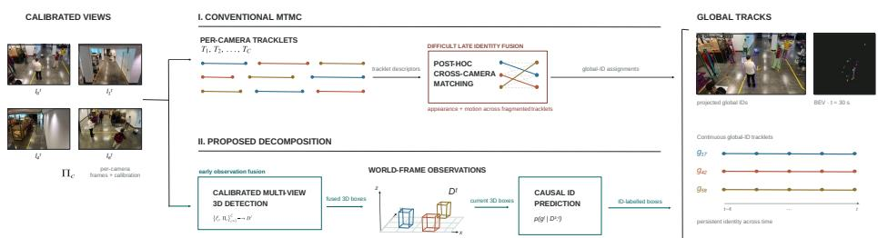
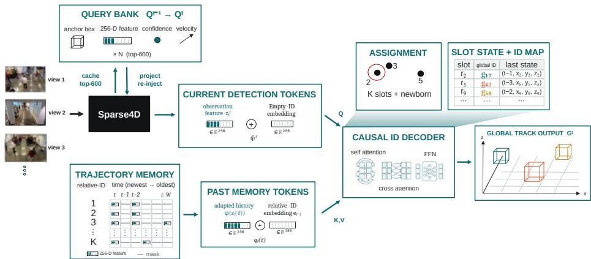
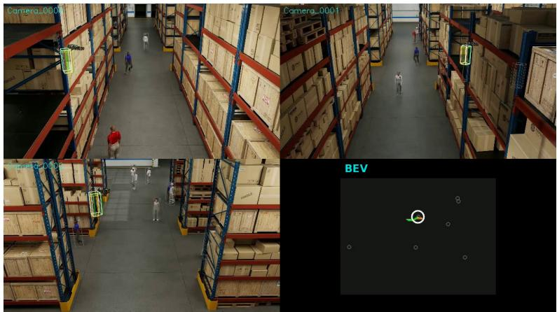

# Online Multi-Camera 3D Tracking via ID Prediction over Recurrent Sparse Queries

Pragyan Shrestha, Haruto Nakayama, and Atom Scott

Playbox Inc., Tokyo, Japan {pragyan,haruto.nakayama,atom}@playbox.co

Abstract. Online multi-camera 3D tracking must maintain scene-global identities across synchronized views, yet query-based trackers carry these identities only implicitly in the instance bank, where they fragment upon query interruption. We present an online architecture that recovers association accuracy by predicting IDs explicitly over recurrent sparse queries. An outside-in Sparse4D detector fuses calibrated views into world-frame 3D detections while propagating a sparse query bank, and a causal MOTIP ID decoder associates detections against a finite trajectory memory. We adapt MOTIP’s relative-ID prediction and recycledslot runtime to globally fused 3D observations, and introduce metric spatial gating and proximity-based newborn recovery. On the oficial 2026 AI City Challenge Track 1 test set, our method raises HOTA from 29.63 with native instance-bank identities to 38.01, primarily through an AssA increase from 20.83 to 31.10, and ranks third on the public leaderboard. Full-sequence validation over all 9,000 frames of each scene shows that decoupled ID training improves HOTA over native identities, whereas continuing detector training alongside the detached ID objective produces scene-dependent gains and losses.

Keywords: Multi-Target Multi-Camera Tracking · Recurrent Sparse Queries · ID Prediction · AI City Challenge

## 1 Introduction

Large indoor facilities increasingly rely on networks of calibrated cameras for live monitoring. Their central perception problem is 3D Multi-Target Multi-Camera (MTMC) tracking. At every frame, the system must recover each agent’s 3D bounding box and maintain one identity across cameras and time. Track 1 of the 2026 AI City Challenge instantiates this setting as seven-class 3D tracking from synchronized, calibrated cameras in warehouse scenes [20]. Unlike commonly used pedestrian-only benchmarks such as WILDTRACK and MultiviewX [4,9], the challenge requires metric 3D boxes and scene-global identities for multiple object classes.

A common MTMC design first detects and tracks objects independently in each camera and then associates the resulting tracklets across views using appearance and spatio-temporal constraints [16]. This late-aggregation decomposition is modular, but fragmented tracklets and identity errors produced by the per-camera trackers must be resolved during cross-camera fusion. Other methods reduce this separation through global spatial-temporal association [5, 30]. Early-aggregation methods instead combine calibrated views in a shared bird’seye-view or 3D representation before temporal association [21–24].

Query-based camera-only 3D trackers provide another alternative by carrying object-centric state between frames [6, 10, 17, 28]. Several of these methods add learned association or extra query persistence under occlusion, so a missed detection does not necessarily destroy an identity. Sparse4D v3 instead attaches native IDs to cached recurrent queries in a bounded instance bank [13]. After a query leaves the bank, that assignment provides no explicit mechanism for recovering its previous scene-global identity. MOTIP [7] addresses the analogous association problem in single-camera 2D tracking by predicting each current detection’s identity from an in-context window of historical trajectory tokens.

We transfer this formulation to online multi-camera 3D tracking (Fig. 1). Our detector follows the outside-in Sparse4D adaptation of Wang et al. [25], building on recurrent sparse temporal fusion [12,13]. It fuses all cameras into world-frame 3D detections and propagates sparse instance queries between frames. We retain this recurrent detection path and compare against its native instance-bank ID assignment, while a separate ID-prediction decoder maintains the longer-lived association state. The decoder associates each accepted detection against a sliding memory of past trajectory tokens. Following MOTIP, a bounded relative-ID vocabulary supports in-context classification, while recycled labels are mapped to monotonically allocated output IDs. We adapt this runtime to scene-global 3D tracks. Identity can therefore survive a short interruption even after its detector query leaves the instance bank.

World-frame geometry also constrains assignment. We mask identity claims that require physically implausible motion and reconnect newborn predictions that occur beside a recently silent track. These geometric constraints are independent of the learned token representation. We evaluate explicit 3D position in the token, but do not assume that it is complementary to the detector query feature.

The online system placed third on the 2026 full-test public leaderboard. On the oficial test server, ID prediction with geometric constraints raises the recurrent detector’s native tracking from 29.63 to 38.01 HOTA, improving association while detection remains essentially unchanged. Validation ablations show that continuing detector training alongside the detached ID objective is scenedependent. It helps the scene the pretrained detector handles worst and harms the one it handles best. We further ablate the ID-token input and the geometric constraints.

Our central contribution is the adaptation and evaluation of causal ID prediction over recurrent, globally fused multi-camera 3D detections. Unlike post-hoc cross-camera trajectory fusion, association acts directly on a single world-frame observation stream. Unlike native query propagation, the identity layer has its own trajectory memory. Our additions to the MOTIP runtime are metric spatial gating and proximity-based newborn recovery. We evaluate the design over each full 9,000-frame validation sequence, comparing against native instance-bank identities and ablating detector training, token composition, and geometric constraints.

  
Fig. 1: Diference in multi-camera tracking fusion strategies. Conventional MTMC first forms per-camera tracklets and then performs dificult post-hoc crosscamera fusion. Our decomposition instead fuses calibrated views into one world-frame 3D observation stream before online ID prediction.

## 2 Related Work

Multi-target multi-camera tracking. A common late-aggregation MTMC pipeline performs detection and tracking separately in each camera, then associates tracklets across cameras using appearance, camera geometry, and temporal consistency [16]. Such pipelines are vulnerable to fragmentation and identity errors produced before cross-camera fusion. For online association, ReST [5] matches detections spatially across cameras before temporal graph association, while GMT [30] directly matches new detections to multi-view global trajectories. For overlapping cameras, MVDet [9] and MVDeTr [8] instead aggregate multi-view evidence on a bird’s-eye-view plane for pedestrian detection. Early-Bird [21], TrackTacular [22], and DepthTrack [23] extend BEV aggregation to temporal tracking. Most closely related to our decomposition, MCBLT [24] first produces globally fused 3D BEV detections and then performs long-sequence association with hierarchical graph neural networks. We likewise associate a single globally fused 3D observation stream, but use online in-context ID prediction rather than hierarchical graph optimization.

Recurrent query-based 3D tracking. DETR-style detectors [3, 31] represent objects as sparse queries. In 2D tracking, MOTR [27] and TrackFormer [15] propagate identity-preserving track queries, whereas MeMOT [1] stores track embeddings in an explicit spatio-temporal memory. Camera-based 3D trackers subsequently extended query propagation across multiple views. MUTR3D [28] introduces multi-view 3D track queries, PF-Track [17] uses historical queries and motion prediction for occlusion handling, and DQTrack [10] separates object and track queries. ADA-Track [6] alternates multi-view detection with learned query association using appearance and geometry. Sparse4D [11–13] instead performs sparse deformable multi-view aggregation and recurrently carries instance features between frames. Its outside-in adaptation [25] places these queries in a shared world frame for fixed camera networks and supplies the detector used in our system.

ID prediction and geometric constraints. MOTIP [7] decouples object detection from association and formulates the latter as in-context ID prediction. Its decoder classifies current detections using recent trajectory tokens labeled with relative identities. Its runtime also recycles concluded relative labels and maps them to monotonically allocated output IDs. We retain these mechanisms while transferring MOTIP from single-camera 2D tracking to globally fused multicamera 3D detections. Geometric rejection is well established in tracking-bydetection. DeepSORT [26] uses Mahalanobis gating, ByteTrack [29] associates every detection including low-score boxes, and OC-SORT [2] improves motion estimation under occlusion. Track-aware initialization has also been used to suppress spurious newborn tracks [18]. Our spatial gate and proximity-based newborn recovery adapt these ideas to metric world-frame distances after learned ID prediction.

## 3 Method

## 3.1 Problem Formulation and Tracker State

At frame t, C synchronized cameras provide images $\mathcal { T } ^ { t } = \{ I _ { c } ^ { t } \} _ { c = . } ^ { C }$ and fixed calibrations $\{ \pi _ { c } \} _ { c = 1 } ^ { C }$ . The required output is a set of world-frame oriented boxes $b _ { i } ^ { t } = ( x , y , z , w , l , h , \theta )$ , class labels $y _ { i } ^ { t }$ , confidence scores, and scene-global identities $g _ { i } ^ { t }$ . The tracker is strictly causal. Output at t may depend on frames 1:t, but never on a future frame.

Our state separates detection continuity from identity continuity.

$$
{ \cal S } ^ { t } = ( \mathcal { Q } ^ { t } , \mathcal { M } ^ { t } , \mu ^ { t } ) .\tag{1}
$$

Here $\mathcal { Q } ^ { t }$ is $\mathrm { S p a r s e 4 D ^ { \prime } s }$ recurrent instance bank, $\mathcal { M } ^ { t }$ is a finite window of accepted trajectory tokens, and $\mu ^ { t }$ maps the decoder’s bounded relative-ID slots to monotonically allocated global IDs. The number accumulated over a scene is unbounded, although at most K slots can be active simultaneously. A frame update factors as

$$
( { \cal D } ^ { t } , \mathcal { Q } ^ { t } ) = F _ { \theta } ( { \cal T } ^ { t } , \{ { \cal I } _ { c } \} , \mathcal { Q } ^ { t - 1 } ) ,\tag{2}
$$

$$
( \mathcal G ^ { t } , \mathcal M ^ { t } , \mu ^ { t } ) = A _ { \psi } ( \mathcal D ^ { t } , \mathcal M ^ { t - 1 } , \mu ^ { t - 1 } ) ,\tag{3}
$$

Here $F _ { \theta }$ is the recurrent multi-view detector and $A _ { \psi }$ the ID-prediction runtime.   
Fig. 2 details their recurrent state updates.

## 3.2 Recurrent Multi-View 3D Detection

We adopt the outside-in Sparse4D detector [13, 25]. A shared ResNet-101 and FPN encode every camera. Nine hundred sparse 3D anchor queries sample the projected multi-camera feature maps and are repeatedly refined by deformable aggregation, self-attention, and box/class heads. Because fusion occurs before tracking, overlapping camera observations produce one world-frame detection stream rather than separate per-camera tracklets.

  
Fig. 2: Architecture details. The recurrent detector fuses all calibrated views with query bank $\nsubseteq { t - 1 }$ to produce world-frame observations and $\mathcal { Q } ^ { t }$ . Detections query the finite trajectory memory $\boldsymbol { \mathcal { M } } ^ { t - 1 }$ for relative identities. Geometric masking, discrete assignment, newborn handling, and the MOTIP least-recently-used (LRU) slot lifecycle map those labels through $\mu ^ { t }$ to scene-global IDs. Only Qt, Mt, and $\mu ^ { t }$ cross the frame boundary.

For every accepted detection, the final decoder layer emits

$$
d _ { i } ^ { t } = ( b _ { i } ^ { t } , y _ { i } ^ { t } , p _ { i } ^ { t } , f _ { i } ^ { t } ) ,\tag{4}
$$

where $p _ { i } ^ { t }$ is the detection confidence and $f _ { i } ^ { t } \in \mathbb { R } ^ { 2 5 6 }$ is its sparse query feature. The instance bank retains the top 600 queries and re-injects them at the next timestamp after projecting their anchor centers with predicted velocity. We reset the bank only at a scene boundary and otherwise carry it through the complete sequence.

The instance bank is deliberately not the final identity store. Its query IDs are allocated monotonically and remain attached to cached queries, but a query can be removed when its confidence falls. A later reappearance then receives a new native ID. The association layer therefore consumes detector boxes and features as observations and maintains identity state separately.

## 3.3 From Sparse Detections to Trajectory Tokens

For each detection, we construct one of three observation features.

$$
z _ { i } ^ { t } \in \big \{ f _ { i } ^ { t } , \ \gamma ( c _ { i } ^ { t } ) , \ f _ { i } ^ { t } + \gamma ( c _ { i } ^ { t } ) \big \} ,\tag{5}
$$

corresponding to query-only, position-only, and combined tokens. The submitted configuration uses the combined form with a 256-dimensional Fourier encoding γ. It applies sine and cosine at 42 geometrically spaced frequencies from 1 to 10 to each metric $( x , y , z )$ coordinate and zero-pads the resulting 252 values. Section 4.3 compares the three forms. We call $f _ { i } ^ { t }$ a detector query feature, rather than a pure appearance embedding. It is optimized for classification and box regression and can already contain spatial information.

Following MOTIP, a residual feed-forward trajectory adapter $\phi$ transforms stored history features, while current features bypass it. Each stored observation is paired with the learned embedding of a relative identity slot $r \in \{ 0 , \ldots , K { - } 1 \}$

$$
\begin{array} { r } { q _ { i } ^ { \tau } = \left[ \phi ( z _ { i } ^ { \tau } ) \parallel e _ { r } \right] \in \mathbb { R } ^ { 5 1 2 } . } \end{array}\tag{6}
$$

Each current detection uses the same observation feature but enters the decoder with $\tilde { q } _ { i } ^ { t } = [ z _ { i } ^ { t } \lVert e _ { \emptyset } ]$ , where $e _ { \emptyset }$ is a dedicated empty-ID embedding. Consequently, the decoder must infer identity from the trajectory context rather than read it from the current token.

## 3.4 Causal ID Prediction in 3D

Following MOTIP [7], association is formulated as in-context classification. The memory $\mathcal { M } ^ { t - 1 }$ stores accepted tokens from the preceding $W = 2 9$ frames, one fewer than the 30-frame training clip so that the learned relative-time bias is never indexed beyond its range. A binary mask distinguishes a missing observation from an inactive trajectory column.

Six decoder layers cross-attend from the current detections to the flattened trajectory memory. A causal mask blocks tokens at the current or a future timestamp, and each attention head receives a learned bias indexed by token age. From the second layer onward, self-attention among the current detections lets them resolve competing claims. The final head produces

$$
\ell _ { i } ^ { t } \in \mathbb { R } ^ { K + 1 } , \qquad K = 1 2 8 ,\tag{7}
$$

covering K relative-ID slots and a separate newborn label. The relative labels make the classification problem bounded even though the number of global identities accumulated over a scene is not.

## 3.5 Geometry-Constrained Assignment and ID Lifecycle

Spatial feasibility. Let $\boldsymbol { u } _ { i } ^ { t } = ( x _ { i } ^ { t } , y _ { i } ^ { t } )$ be a detection’s ground-plane center, and let $( t _ { r } , \hat { u } _ { r } )$ be the last observation of relative slot r. Before discrete assignment, the probability of slot r is masked when

$$
\lVert u _ { i } ^ { t } - \hat { u } _ { r } \rVert _ { 2 } > \rho _ { \mathrm { g a t e } } + \eta \operatorname* { m a x } ( t - t _ { r } , 1 ) ,\tag{8}
$$

with $\rho _ { \mathrm { g a t e } } = 2 . 5$ m and $\eta = 0 . 1 5 \mathrm { m / f r a m e }$ . This is an output constraint on the ID classifier. It does not require position to be present in the learned token.

Newborn recovery. A briefly missed object may reappear with a degraded feature and be labeled newborn, creating a duplicate identity beside a silent trajectory. For every unclaimed newborn, we collect every unclaimed live identity inside $\rho _ { \mathrm { n e w } } + \eta \operatorname* { m a x } ( t - t _ { r } , 1 )$ , with $\rho _ { \mathrm { n e w } } = 0 . 8 \mathrm { m }$ , and assign greedily by increasing distance. Each detection and each silent identity is used at most once. A newborn with no such neighbor opens a new identity.

Algorithm 1 Causal ID assignment and lifecycle (one frame t)   
Input: detections $\mathcal { D } ^ { t }$ , memory $\mathcal { M } ^ { t - 1 }$ , slot map $\mu ^ { t - 1 }$ , LRU queue   
Output: global IDs $\mathcal { G } ^ { t }$ , memory $\mathcal { M } ^ { t }$ , slot map $\mu ^ { t }$   
1: $\ell _ { i } \gets \mathrm { I D } .$ -decoder logits over K slots + newborn ▷ Sec. 3.4   
2: mask every pair $( i , r )$ violating the spatial gate ▷ Eq. (8)   
3: object-max assignment, each detection and slot used at most once   
4: demote claims with slot probability $< \theta _ { \mathrm { i d } }$ to newborn   
5: discard newborns with detector score $p _ { i } ^ { t } < \theta _ { \mathrm { n e w } }$   
6: resume the nearest unclaimed live slot within $\rho _ { \mathrm { n e w } } + \eta$ max $\left( t - t _ { r } , 1 \right)$   
7: discard excess newborns if fewer than K slots remain this frame   
8: assign LRU slots to remaining newborns, then purge and remap $\mu ^ { \textit { t } }$   
9: $\mathcal { G } _ { i } ^ { t }  \mu ^ { t } ( r )$ for every accepted assignment $( i , r )$   
10: append accepted tokens to $\mathcal { M } ^ { t }$ , trim to window $W ,$ and drop empty slots

Assignment and lifecycle. Algorithm 1 summarizes the complete causal update for one frame, with $\theta _ { \mathrm { i d } } = 0 . 2$ and $\theta _ { \mathrm { n e w } } = 0 . 6$ . An identity remains live while at least one unmasked token survives in the window. Following MOTIP, relative slots are reusable implementation labels, and only the global IDs produced through $\mu ^ { t }$ are written to the challenge output. An LRU queue moves assigned slots to the back, while newborns receive the oldest currently unclaimed slots. Reuse purges the old tokens and remaps $\mu ^ { t }$ to fresh global IDs. If existing claims and newborns exceed K in one frame, excess newborn detections are discarded. This preserves unique labels but bounds concurrent accepted identities by $K = 1 2 8$ . All tracker state is reset once per scene.

## 3.6 Training Strategy

For ID-decoder training, we process 30-frame clips at random temporal stride 1–4 through the recurrent detector. Detector outputs are Hungarian-matched to ground-truth boxes and classes, and only matched query features construct the ID-training tokens. For each clip, six augmentation groups independently map tracks to random relative IDs. First observations are newborn. With probability 0.5 per track, temporal occlusion masks a random contiguous span, and with probability 0.5 per slot, identity-switch augmentation exchanges trajectory observations within a frame. These augmentations prevent copying a fixed slot layout, and every decoder layer receives cross-entropy supervision.

Our primary model freezes the detector and optimizes only the ID-prediction modules. This isolates association learning from changes in detection. For the detector-adaptation analysis, we first converge the ID components and then continue training the recurrent detector and ID modules at lower learning rates. The objectives remain decoupled. ID-loss gradients are detached from the detector.

## 4 Experiments

## 4.1 Setup

The 2026 AI City Challenge Track 1 dataset [20] contains 20 training, three validation, and five test warehouse scenes, with synchronized 1080p video at 30 fps, calibrated cameras, and seven agent classes. We add 15 warehouse scenes from the 2025 edition [19] for training after checking that their camera rigs do not overlap the 2026 validation rigs. For ablation studies, we use the validation scenes from the 2026 edition. Warehouse\_020 and Warehouse\_021 share identical calibration and ground truth but use diferent appearance renderings. Warehouse\_022 is a distinct four-camera scene. We report them separately rather than averaging the duplicated scenario.

The challenge evaluates 3D boxes and scene-global identities with per-class 3D HOTA aggregated across scenes [20]. Each validation sequence contains 9,000 frames. We report the HOTA family (HOTA, DetA, AssA, and LocA) [14] over every complete sequence using the oficial NVIDIA 3D-IoU evaluator.

The detector starts from NVIDIA’s synthetic-warehouse Sparse4D checkpoint [25]. Its optional visibility-weighted ReID branch is disabled in the submitted configuration. The ID decoder therefore receives the final 256-dimensional detector query feature described in Sec. 3.3, rather than a ReID-trained appearance embedding. Following the oficial MOTIP codebase, we retain its trajectorymodeling module. Immediately before ID decoding, it applies residual feedforward transformations to the stored history, while current detection features bypass it. All images are resized to $5 4 0 \times 9 6 0$ . The ID decoder is optimized for 6,000 steps with AdamW, learning rate $4 \times 1 0 ^ { - 4 }$ , weight decay $1 0 ^ { - 3 }$ , 200 warm-up steps, and gradient clipping at 1.0. Training uses bf16 on eight A100 GPUs with one recurrent clip per GPU. The continued-detector variant resumes the converged ID model for 5,000 steps with detector/ID learning rates of $2 \times 1 0 ^ { - 5 } / 1 0 ^ { - 4 }$ Both modules update, but the ID-loss gradient remains detached from the detector.

Runtime. On one NVIDIA RTX PRO 6000 Blackwell Max-Q GPU and a Threadripper 9970X, the TensorRT detector with the PyTorch ID layer processes the 16-camera scenes at 30.8–32.1 FPS and the four-camera scene at 58.6 FPS. These 9,000-frame averages exclude JPEG decoding and host-to-device transfer. Against all-PyTorch inference at 6.7 and 22.9 FPS, respectively, this is a 2.6– 4.8× speedup. The ID layer adds 5.5–7.3 ms per frame, while TensorRT reduces validation HOTA by 0.40–1.78 points across the scenes.

Test submission. The leaderboard entry (Table 1) was produced by the frozendetector system (NGC-initialized frozen detector + MOTIP) run online over the five test scenes at detection threshold 0.4 with the geometric constraints of Sec. 3.5.

Table 1: Public leaderboard of Track 1, 2026 AI City Challenge (full test set, snapshot from August 15, 2026, top five of ten shown). The last row is our baseline, the recurrent Sparse4D tracker with its native instance-bank identities [25], evaluated through the same oficial server.
<table><tr><td>Rank Team</td><td colspan="3">HOTA DETA AsSA LoCA</td></tr><tr><td>1</td><td>EVA</td><td>56.54</td><td>55.64 49.39 79.56</td></tr><tr><td>2</td><td>SKKU-AL-T1</td><td>52.01</td><td>45.31 56.50 76.24</td></tr><tr><td>3</td><td>Playbox (ours)</td><td>38.01</td><td>40.26 31.10 75.18</td></tr><tr><td>4</td><td>VTX_QDTers</td><td>34.18</td><td>29.47 33.11 17.68</td></tr><tr><td>5</td><td>TU-YMLab</td><td>25.88</td><td>26.52 30.62 69.70</td></tr><tr><td></td><td>Sparse4D [25]</td><td>29.63</td><td>39.57 20.83 75.17</td></tr></table>

## 4.2 Challenge Result

Table 1 reports the public test result. The baseline row uses the same recurrent detector but reports its native, monotonically allocated instance IDs, which remain attached to queries only while cached. Both entries were scored by the oficial evaluation server on the full test set. Adding ID prediction with the geometric constraints raises HOTA from 29.63 to 38.01, with the gain concentrated in association (AssA 20.83 → 31.10) while detection and localization change less (DetA $3 9 . 5 7  4 0 . 2 6$ , LocA 75.17 → 75.18). The small DetA change arises because the ID runtime discards low-confidence newborns, whereas native IDs retain detections at the detector threshold. Compared with the two leading entries, our largest remaining deficit is likewise association. AssA is 31.10, while LocA is within one point of second place.

## 4.3 Ablation Studies

Our ablations isolate three design questions. First, we test whether ID prediction improves over the detector’s native instance-bank identities and whether its training should remain decoupled from the detector. The decoupled variant freezes the detector while optimizing the ID modules. The continued-detector variant updates both modules after ID convergence while keeping their loss gradients decoupled. Second, we vary the ID-token source and position encoding to test whether performance depends on a particular feature composition. Third, we disable the spatial gate and newborn recovery independently to distinguish the learned decoder’s contribution from explicit geometric constraints. The native versus decoupled comparison and the latter two studies fix the upstream detector. The retained output can still vary slightly because newborn score filtering depends on the predicted identity. Table 2 reports DetA explicitly because continued detector training also alters the detections.

Table 2 first compares native instance-bank identities with decoupled ID prediction at a fixed detector. ID prediction improves HOTA on all three scenes for both detector initializations, +4.84, +1.17, and +0.95 points on Warehouse\_020,

Table 2: Native identities and detector–ID training strategy. Full 9,000-frame validation sequences at threshold 0.4. Native-ID rows use the corresponding detector’s instance-bank identities. “Decoupled” freezes the submitted detector while training the ID modules. “Continued det.” resumes the converged ID model and updates both modules with ID-loss gradients detached from the detector. Best per scene and metric in bold.
<table><tr><td rowspan="2">System</td><td colspan="3">Warehouse_020</td><td colspan="3">Warehouse_021</td><td colspan="3">Warehouse_022</td></tr><tr><td>HOTA</td><td>DETA</td><td>AssA</td><td>HOTA</td><td>DETA</td><td>AssA</td><td>HOTA</td><td>DETA</td><td>AssA</td></tr><tr><td>Submitted frozen det. (native IDs)</td><td>41.06</td><td>49.38</td><td>37.68</td><td>5.98</td><td>10.33</td><td>4.20</td><td>13.43</td><td>28.19</td><td>6.56</td></tr><tr><td>+ ID pred. (decoupled)</td><td>45.90</td><td>49.48</td><td>44.50</td><td>7.15</td><td>10.21</td><td>5.48</td><td>14.38</td><td>28.05</td><td>7.54</td></tr><tr><td>+ ID pred. (continued det.)</td><td>31.05</td><td>33.43</td><td>30.71</td><td>15.32</td><td>16.70</td><td>15.22</td><td>14.52</td><td>26.71</td><td>8.50</td></tr><tr><td>Finetuned detector (native IDs)</td><td>26.11</td><td>26.09</td><td>29.30</td><td>16.16</td><td>16.45</td><td>21.81</td><td>8.02</td><td>12.97</td><td>6.17</td></tr><tr><td>+ ID pred. (decoupled)</td><td>27.16</td><td>26.32</td><td>30.98</td><td>16.20</td><td>16.73</td><td>18.71</td><td>9.23</td><td>14.55</td><td>6.89</td></tr><tr><td>+ ID pred. (continued det.)</td><td>25.23</td><td>25.47</td><td>28.21</td><td>19.54</td><td>16.82</td><td>30.12</td><td>10.20</td><td>17.05</td><td>6.44</td></tr></table>

Warehouse\_021, and Warehouse\_022 from the submitted frozen detector, and +1.05, +0.04, and +1.21 points from the finetuned one. For the submitted detector, the improvement is attributable to association, since freezing holds DetA to within 0.14 points while AssA rises by 6.82, 1.28, and 0.98 points. The finetuned rows do not decompose as cleanly, since AssA falls from 21.81 to 18.71 on Warehouse\_021. The association benefit is therefore consistent under the submitted frozen detector but not universal.

The paired baseline uses the exact detector weights stored in the submitted checkpoint. They originate from the public NGC model but include one warmup update before freezing (maximum parameter diference $9 . 5 { \times } 1 0 ^ { - 7 } )$ . A clean rerun reproduces both paired rows to 0.01 on every reported metric. A separate raw-NGC rerun gives native-ID HOTA of 38.20, 5.97, and 13.47. We retain the exact-weight baseline so that its diference from the decoupled row isolates the association layer.

The same table then compares decoupled and continued-detector training. The latter gives its largest gains on Warehouse\_021, the scene the submitted detector handles worst (+8.17 and +3.34 HOTA for the submitted and finetuned initializations), and smaller gains on Warehouse\_022 (+0.14 and +0.97), but hurts Warehouse\_020, the scene it handles best (−14.85 and −1.93). Three validation scenes, efectively two because Warehouse\_020 and Warehouse\_021 difer only in rendering, cannot settle which strategy generalizes. We therefore keep the detector frozen in the submitted system.

In the matched 2k comparison, the detector-query token is strongest on all three scenes (Table 3). Its margin over Fourier-encoded position alone is nevertheless small, 0.23, 0.32, and 0.22 HOTA on W020, W021, and W022. Encoding sensitivity is not consistent across scenes. Replacing the Fourier position code with a learnable linear map costs 3.42 HOTA and 5.73 AssA on W020, but changes both metrics by at most 0.18 on the other scenes. The deployed 6k combined checkpoint has the highest observed values, but its additional training prevents attributing those diferences to token composition. We therefore retain it as the submitted configuration and restrict this table to within-table comparisons at threshold 0.3, rather than treating it as evidence that query and position features are complementary.

Table 3: ID-token source and position encoding. Frozen recurrent detector, geometric constraints enabled, threshold 0.3, and full 9,000-frame validation sequences. The first three rows use matched 2k-iteration decoders. The deployed combined model was trained for 6k iterations and is shown for context, not as part of the controlled comparison. DetA varies by at most 0.6 across rows on every scene and is omitted. Best among the matched 2k rows in bold.
<table><tr><td rowspan="3">Token source</td><td rowspan="3">Encoding</td><td colspan="2">W020</td><td colspan="2">W021</td><td colspan="2">W022</td></tr><tr><td>HOTA AsSA HOTA AsSA HOTA AsSA</td><td></td><td></td><td></td><td></td><td></td></tr><tr><td>Detector query</td><td>none</td><td>45.57</td><td>43.98</td><td>7.19</td><td>5.51</td><td>14.32</td><td>7.58</td></tr><tr><td>3D position</td><td>Fourier</td><td>45.34</td><td>43.64</td><td>6.87</td><td>5.22</td><td>14.10</td><td>7.34</td></tr><tr><td>3D position</td><td>linear</td><td>41.92</td><td>37.91</td><td>6.88</td><td>5.25</td><td>14.28</td><td>7.43</td></tr><tr><td>Query + position Fourier</td><td></td><td>45.94</td><td>44.69</td><td>7.27</td><td>5.55</td><td>14.54</td><td>7.65</td></tr></table>

Table 4: Geometric constraints on the frozen-detector ID model (full 9,000-frame validation sequences, threshold 0.4). DetA varies by at most 0.09 across configurations on every scene and is omitted.
<table><tr><td colspan="3">Spatial Newborn</td><td>W020</td><td>W021</td><td>W022</td></tr><tr><td>gate</td><td>recovery</td><td>HOTA AssA</td><td></td><td>HOTA AsSA HOTA AsSA</td><td></td></tr><tr><td>x</td><td>x</td><td>44.31 41.37</td><td>7.11</td><td>5.32</td><td>12.57 5.77</td></tr><tr><td>√</td><td>x</td><td>45.85 44.29</td><td>7.35</td><td>5.68</td><td>11.46 4.82</td></tr><tr><td>x</td><td>√</td><td>45.66 44.21</td><td>7.04</td><td>5.23</td><td>14.24 7.38</td></tr><tr><td>√</td><td>√</td><td>45.90 44.50</td><td>7.15</td><td>5.48</td><td>14.38 7.54</td></tr></table>

Combining Tables 2 and 4 isolates the complete progression under the same frozen submitted detector and threshold 0.4. Native IDs, unconstrained ID prediction, and constrained ID prediction respectively yield 41.06 → 44.31 → 45.90 HOTA on W020, 5.98 → 7.11 → 7.15 on W021, and 13.43 → 12.57 → 14.38 on W022. Thus the learned decoder alone improves two scenes, while the geometric runtime is necessary to improve over native IDs on W022.

The constraints act almost entirely on association, with DetA varying by at most 0.09 in Table 4. Their usefulness, however, is scene-dependent. On W020 either constraint recovers most of the gain, +1.54 HOTA from the gate and +1.35 from recovery, versus +1.59 together. On the sparse W022 they are not interchangeable. The gate alone reduces HOTA by 1.11, whereas newborn recovery alone recovers nearly the full +1.81 gain. Localization is much weaker there (LocA 46 vs. 77). The gate’s degradation is consistent with localization error causing a fixed metric threshold to reject genuine re-claims, while newborn recovery can reconnect detections after assignment. On W021 all efects are within

  
Fig. 3: Short-term identity confusion. Three synchronized camera views and the bottom-right BEV show a close crossing on Warehouse\_022. One continuously observed person’s predicted identity changes from 245 (green) to 229 (orange), while the nearest other track is 0.1 m away. White denotes the corresponding ground-truth trajectory.

0.25 HOTA of the unconstrained model. The deployed combination is best or near-best on all three scenes, and newborn recovery is more consistent than the fixed spatial gate.

## 4.4 Limitations

The dominant residual error of the proposed method is associative rather than positional (Sec. 4.2). To characterize it, we match predictions to ground truth frame by frame with a 1 m ground-plane gate. Person errors are observed as short-lived confusions when two trajectories approach within the gate radius and separate again (Fig. 3). Inspected vehicle and robot errors also follow detection gaps exceeding the decoder’s 29-frame history. These qualitative examples expose two properties of the architecture. The ID token is built from a detector query optimized for classification and 3D box regression rather than from a feature trained specifically for re-identification, making spatially adjacent instances of the same class harder to distinguish. Moreover, assignment is restricted to identities observed within the history window, so a trajectory whose final token has left that window necessarily receives a new identity. A dedicated appearance embedding could address the first failure mode, but recovery beyond the window would additionally require a longer or compressed identity memory. We leave both extensions to future work.

The frozen detector still upper-bounds association quality. Across W020 and W021, which share geometry and identities but difer in rendered appearance, pretrained DetA falls from 49.38 to 10.33.

## 5 Conclusion

We presented an online multi-camera 3D tracking architecture that couples recurrent, globally fused sparse detections with causal ID prediction. We retain MOTIP’s relative-ID decoder and recycled-slot runtime, adapt them to recurrent world-frame 3D observations, and add metric spatial gating and proximitybased newborn recovery. On the oficial test set, adding this association layer to the frozen detector raises HOTA from 29.63 to 38.01. Validation shows that decoupled ID training improves HOTA over native instance-bank identities. The remaining errors motivate a dedicated appearance embedding for close crossings and identity memory that outlasts the decoder’s temporal window.

## References

1. Cai, J., Xu, M., Li, W., Xiong, Y., Xia, W., Tu, Z., Soatto, S.: MeMOT: Multiobject tracking with memory. In: CVPR (2022)

2. Cao, J., Pang, J., Weng, X., Khirodkar, R., Kitani, K.: Observation-centric SORT: Rethinking SORT for robust multi-object tracking. In: CVPR (2023)

3. Carion, N., Massa, F., Synnaeve, G., Usunier, N., Kirillov, A., Zagoruyko, S.: Endto-end object detection with transformers. In: ECCV (2020)

4. Chavdarova, T., Baqué, P., Bouquet, S., Maksai, A., Jose, C., Bagautdinov, T., Lettry, L., Fua, P., Van Gool, L., Fleuret, F.: WILDTRACK: A multi-camera HD dataset for dense unscripted pedestrian detection. In: CVPR (2018)

5. Cheng, C.C., Qiu, M.X., Chiang, C.K., Lai, S.H.: ReST: A reconfigurable spatialtemporal graph model for multi-camera multi-object tracking. In: ICCV. pp. 10051–10060 (2023)

6. Ding, S., Schneider, L., Cordts, M., Gall, J.: ADA-Track: End-to-end multi-camera 3d multi-object tracking with alternating detection and association. In: CVPR. pp. 15184–15194 (2024)

7. Gao, R., Qi, J., Wang, L.: Multiple object tracking as ID prediction. In: CVPR. pp. 27883–27893 (2025)

8. Hou, Y., Zheng, L.: Multiview detection with shadow transformer (and viewcoherent data augmentation). In: ACM Multimedia (2021)

9. Hou, Y., Zheng, L., Gould, S.: Multiview detection with feature perspective transformation. In: ECCV (2020)

10. Li, Y., Yu, Z., Philion, J., Anandkumar, A., Fidler, S., Jia, J., Alvarez, J.: End-toend 3d tracking with decoupled queries. In: ICCV. pp. 18302–18311 (2023)

11. Lin, X., Lin, T., Pei, Z., Huang, L., Su, Z.: Sparse4d: Multi-view 3d object detection with sparse spatial-temporal fusion. arXiv preprint arXiv:2211.10581 (2022)

12. Lin, X., Lin, T., Pei, Z., Huang, L., Su, Z.: Sparse4d v2: Recurrent temporal fusion with sparse model. arXiv preprint arXiv:2305.14018 (2023)

13. Lin, X., Pei, Z., Lin, T., Huang, L., Su, Z.: Sparse4d v3: Advancing end-to-end 3d detection and tracking. arXiv preprint arXiv:2311.11722 (2023)

14. Luiten, J., Ošep, A., Dendorfer, P., Torr, P., Geiger, A., Leal-Taixé, L., Leibe, B.: HOTA: A higher order metric for evaluating multi-object tracking. IJCV 129, 548–578 (2021)

15. Meinhardt, T., Kirillov, A., Leal-Taixé, L., Feichtenhofer, C.: Trackformer: Multiobject tracking with transformers. In: CVPR (2022)

16. Nguyen, D.M.H., Henschel, R., Rosenhahn, B., Sonntag, D., Swoboda, P.: LMGP: Lifted multicut meets geometry projections for multi-camera multi-object tracking. In: CVPR. pp. 8866–8875 (2022)

17. Pang, Z., Li, J., Tokmakov, P., Chen, D., Zagoruyko, S., Wang, Y.X.: Standing between past and future: Spatio-temporal modeling for multi-camera 3d multiobject tracking. In: CVPR. pp. 17928–17938 (2023)

18. Shim, K., Ko, K., Yang, Y., Kim, C.: Focusing on tracks for online multi-object tracking. In: CVPR. pp. 11687–11696 (2025)

19. Tang, Z., Wang, S., Anastasiu, D.C., Chang, M.C., Sharma, A., Kong, Q., Kobori, N., Gochoo, M., Batnasan, G., Otgonbold, M.E., Alnajjar, F., Hsieh, J.W., Kornuta, T., Li, X., Zhao, Y., Zhang, H., Radhakrishnan, S., Jain, A., Kumar, R., Murali, V.N., Wang, Y., Pusegaonkar, S.S., Wang, Y., Biswas, S., Wu, X., Zheng, Z., Chakraborty, P., Chellappa, R.: The 9th AI city challenge. In: ICCV Workshops. pp. 5526–5535 (2025)

20. Tang, Z., Wang, S., Anastasiu, D.C., Chang, M.C., et al.: The 10th AI city challenge. In: ECCV Workshops. Malmö, Sweden (2026)

21. Teepe, T., Wolters, P., Gilg, J., Herzog, F., Rigoll, G.: Earlybird: Early-fusion for multi-view tracking in the bird’s eye view. In: WACV Workshops (2024)

22. Teepe, T., Wolters, P., Gilg, J., Herzog, F., Rigoll, G.: Lifting multi-view detection and tracking to the bird’s eye view. In: CVPR Workshops. pp. 667–676 (2024)

23. Tran, T.H.P., Tran, D.N.N., Huynh, N.D.M., Tran, C.D., Pham, L.H., Ho, Q.P.N., Nguyen, H.H., Vu, D.K., Jeon, H.M., Jeon, H.J., Phan, S.H., Le Ba Khanh, T., Jeon, J.W.: Depthtrack: Cluster meets BEV for multi-camera multi-target 3d tracking. In: ICCV Workshops. pp. 5348–5357 (2025)

24. Wang, Y., Meinhardt, T., Cetintas, O., Yang, C.Y., Pusegaonkar, S., Missaoui, B., Biswas, S., Tang, Z., Leal-Taixé, L.: MCBLT: Multi-camera multi-object 3d tracking in long videos. In: ICCV Workshops. pp. 5304–5313 (2025)

25. Wang, Y., Pusegaonkar, S., Wang, Y., Li, A., Kumar, V., Sethi, C., Aiyer, G., He, Y., Thakkar, K., Rathi, S., Rupde, B., Tang, Z., Biswas, S.: A unified 3d object perception framework for real-time outside-in multi-camera systems. arXiv preprint arXiv:2601.10819 (2026)

26. Wojke, N., Bewley, A., Paulus, D.: Simple online and realtime tracking with a deep association metric. In: ICIP. pp. 3645–3649 (2017)

27. Zeng, F., Dong, B., Zhang, Y., Wang, T., Zhang, X., Wei, Y.: MOTR: End-to-end multiple-object tracking with transformer. In: ECCV (2022)

28. Zhang, T., Chen, X., Wang, Y., Wang, Y., Zhao, H.: MUTR3D: A multi-camera tracking framework via 3d-to-2d queries. In: CVPR Workshops. pp. 4537–4546 (2022)

29. Zhang, Y., Sun, P., Jiang, Y., Yu, D., Weng, F., Yuan, Z., Luo, P., Liu, W., Wang, X.: Bytetrack: Multi-object tracking by associating every detection box. In: ECCV (2022)

30. Zhen, Y., Xu, M., Wang, Q., Fan, B., Dong, J., Zhao, T., Fan, H.: GMT: Efective global framework for multi-camera multi-target tracking. In: CVPR. pp. 28201– 28210 (2026)

31. Zhu, X., Su, W., Lu, L., Li, B., Wang, X., Dai, J.: Deformable DETR: Deformable transformers for end-to-end object detection. In: ICLR (2021)