# PULSE: UNLOCKING PRACTICAL IMAGE COMPRES-SION ON SINGLE-THREAD CPU

Zhaoyang Jia1∗ Tianyu Zhang‡ Zihan Zheng1∗ Wenxuan Xie2 Jiahao Li2 Bin Li2 Houqiang Li1 Yan Lu2

1University of Science and Technology of China

2Microsoft Research Asia ‡Independent Researcher

## ABSTRACT

Despite recent progress in learned image compression, existing methods remain computationally expensive on resource-constrained hardware, particularly CPUs. We introduce PULSE, a practical codec that enables (1) low-latency decoding on diverse hardware platforms with an ultra-low-complexity 5.2 kMAC/pixel neural receiver, and (2) efficient bit-exact entropy coding with an integer linear CDF predictor and a meta prior. To recover compression performance under this tight budget, we introduce an agentic evolution process guided by heuristic probes that iteratively improves the architecture through human–LLM collaboration. PULSE decodes a 1080p image in 126 ms on a single CPU thread while achieving compression performance comparable to HM. After perceptual optimization, PULSE competes with larger perceptual codecs like MS-ILLM. Codes are at https://github.com/microsoft/GenCodec/tree/main/PULSE.

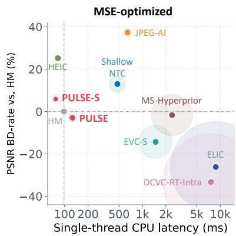

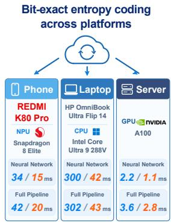  
1080p Enc. / Dec. Time

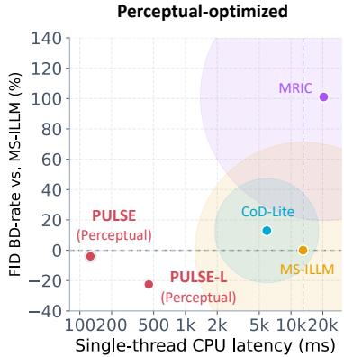  
Figure 1: PULSE targets practical image compression on resource-constrained hardware. Its 5.2 kMAC/pixel receiver decodes a 1080p image in 126 ms on a single thread of an AMD EPYC 9V84, while enabling bit-exact entropy coding across devices like REDMI K80 Pro. On the CLIC Professional validation set, PULSE matches HM and its perceptual variant competes with larger codecs such as MS-ILLM (Muckley et al., 2023). Latency is measuredfor thefull decoding pipeline, including network inference and entropy decoding. Circle radius denotes the decoding complexity.

## 1 INTRODUCTION

Pioneering learned image compression systems (Balle et al., 2017; 2018; Minnen et al., 2018) used´ neural receivers requiring roughly 80 kMAC/pixel. Subsequent work improved rate–distortion performance by scaling receiver complexity to several hundred kMAC/pixel (Cheng et al., 2020; He et al., 2022b; Jiang et al., 2025; Liu et al., 2023), making real-time decoding challenging even on

GPUs. To bridge this deployment gap, instance-adaptive codecs reduce receiver complexity to below 5 kMAC/pixel, but shift substantial computation to per-image optimization during encoding (Ladune et al., 2023; Kim et al., 2024). Another line of work pursues efficient end-to-end codecs: EVC reduces receiver complexity to about 110 kMAC/pixel, Shallow NTC to approximately 20 kMAC/pixel, while DCVC-RT reorganizes computation to achieve real-time GPU throughput (Wang et al., 2023; Yang & Mandt, 2023; Jia et al., 2025). Despite these advances, such systems remain challenging to deploy at scale on resource-constrained edge devices, particularly CPUs.

We propose PULSE to target the missing operating point: an ultra-low-complexity, highly parallel and end-to-end codec, with a sender and a receiver around 45 and 5.2 kMAC/pixel, respectively. We use a single CPU thread as a stringent deployment stress test, while retaining bounded-pass entropy dependencies and accelerator-friendly operators so that the same model can benefit from NPUs and GPUs for practical implementation. We make PULSE practical by solving three core questions.

How to design a codec under an ultra-low-complexity budget? Under such a stringent constraint, every channel and operator must be placed where it brings the greatest compression benefit. PICO searches over millions of architectures, incurring substantial candidate-training costs and relying on statically predefined networks (Tatwawadi et al., 2026). We instead introduce an agentic evolution process that uses heuristic probes to inform architecture design through human–LLM collaboration. With only seven evolution rounds and 22 training runs, PULSE achieves compression performance comparable to HM on the CLIC Professional validation set. It decodes a 1080p image in 126 ms on a single thread of an AMD EPYC 9V84 CPU.

How to maintain bit-exact entropy coding across devices with minimal loss? Platform-dependent floating-point round-off can change the selected CDF and desynchronize the remaining bitstream. PULSE addresses this with one integer linear projection from the hyperlatent to the main-latent CDF bucket, which requires only 1.6 ms for a 1080p image on a single CPU thread. In practice, this compact entropy-control path can execute on CPU for bit-exact entropy coding, while the remaining parts run efficiently on accelerators. With a meta prior to improve hyperlatent coding, this scheme outperforms existing integerization-based methods in rate-distortion loss.

How to effectively improve perceptual quality? We separate perceptual training into two stages: an LPIPS-augmented pre-training stage to establish detail synthesis capability, and a preferenceoptimization stage that jointly improves pixel fidelity, distribution alignment, and text and facial quality. The optimized model competes with larger perceptual codecs.

Together, these components address key bottlenecks in practical image compression on resourceconstrained hardware. As illustrated in Figure 1, PULSE enables practical compression across phones, laptops, and servers with low computational cost. On edge devices like REDMI K80 Pro, it takes 42 ms for encoding and 20 ms for decoding at 1080p. We expect further system-level optimization to improve its efficiency for real-world applications.

## 2 PULSE ARCHITECTURE

PULSE is an asymmetrical, variable-rate, cross-platform codec designed for ultra-low-complexity decoding. As illustrated in Figure 2, it consists of an analysis transform, a two-step entropy model, and a synthesis transform. All modules are designed with highly parallel computation to enable efficient implementation across different hardware platforms. We build it with depthwise convolution blocks (DCB) with a channel attention layer (Hu et al., 2018), which is used throughout modules.

Analysis transform. Given an image $x \in [ 0 , 1 ] ^ { 3 \times H \times W }$ , a stride-16 patch embedding produces a feature at 1/16 spatial resolution. Four DCBs are then applied, followed by a 1 × 1 projection:

$$
y = \mathrm { E n c o d e r } ( x ) \in \mathbb { R } ^ { C _ { y } \times H / 1 6 \times W / 1 6 } .\tag{1}
$$

Entropy model and coding. Unlike the raster-ordered entropy model of Cool-Chic (Ladune et al., 2023), PULSE uses two bounded passes. A hyper encoder (Balle et al., 2018) maps ´ y to a hyperlatent z at 1/64 input resolution. The rounded zˆ is coded by a QP-conditioned Meta Prior, which selects among a compact bank of factorized priors (Balle et al., 2017; Jia et al., 2025), and a hyper decoder´ restores a $C _ { y }$ -channel feature at the resolution of y:

$$
z = \mathrm { H y p e r E n c o d e r } ( y ) \in \mathbb { R } ^ { C _ { z } \times H / 6 4 \times W / 6 4 } , \qquad h = \mathrm { H y p e r D e c o d e r } ( \hat { z } ) .\tag{2}
$$

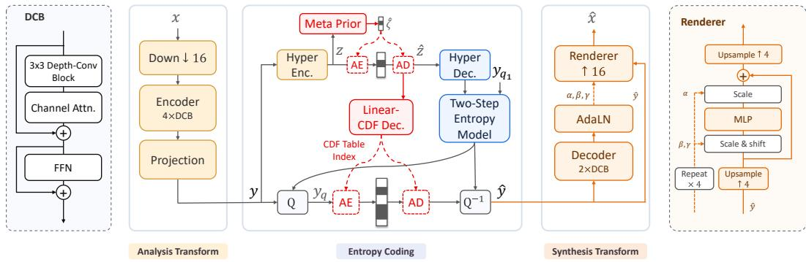  
Figure 2: PULSE architecture. It consists of an encoder at 1/16 resolution, a decoupled linear CDF index decoder with a meta prior, a two-step entropy model, and a decoder with an AdaLN-modulated pixel renderer. AE and AD denote arithmetic encoding and decoding, respectively.

Following the dual spatial prior of DCVC-HEM (Li et al., 2022), a spatial–channel checkerboard partitions y into complementary masks $m _ { 0 }$ and $m _ { 1 }$ . The first entropy step predicts a quantization step $q$ and a mean $\mu _ { 0 }$ from h. After decoding the first part, the second step refines $\mu _ { 1 }$ from $( h , \hat { y } _ { 0 } )$ , then

$$
y _ { q _ { i } } = \mathrm { r o u n d } ( y / q - \mu _ { i } ) \odot m _ { i } , \qquad { \hat { y } } _ { i } = q \left( y _ { q _ { i } } + \mu _ { i } \right) \odot m _ { i } , \qquad { \hat { y } } = { \hat { y } } _ { 0 } + { \hat { y } } _ { 1 } .\tag{3}
$$

The centered symbols are modeled by a discretized zero-mean Gaussian. Scale prediction is independent of the nonlinear mean path: one projection maps zˆ directly to a continuous coordinate in a shared Gaussian CDF table. Both passes reuse these scale coordinates, while only their $\mu _ { i }$ differ. Section 3 specifies the Meta Prior and deterministic integer implementation.

Synthesis transform. The synthesis transform separates spatial feature processing from patchwise pixel rendering. The decoder consisting of two DCBs first processes yˆ for spatial correlation modeling. In parallel, a content branch upsamples yˆ by four to a 1/4-resolution rendering grid. The low-resolution body generates AdaLN modulation parameters $( \alpha , \beta , \gamma )$ (Peebles & Xie, 2023) for a residual pointwise MLP on this grid. Finally, every grid vector is projected to a 4 × 4 RGB patch and rearranged by PixelShuffle (Shi et al., 2016):

$$
\hat { x } = \mathrm { R e n d e r e r } ( \hat { y } , \mathrm { D e c o d e r } ( \hat { y } ) ) .\tag{4}
$$

## 3 BIT-EXACT LINEAR CDF DECODING WITH A META PRIOR

Platform-dependent floating-point round-off is particularly dangerous inside an entropy decoder: a single change in a CDF-table index can desynchronize every subsequent rANS symbol (Duda, 2013). The conventional solution is to integerize the entire entropy model (He et al., 2022a), ensuring deterministic execution of the CPU subgraph from zˆ to CDF. However, as shown in Table 1, this introduces substantial CPU overhead and quantization loss under an ultra-low complexity budget. In PULSE, we instead simplify the entropy-control path to the minimum computation required for bit-exact CDF selection while preserving coding efficiency.

Linear scale decoder. We first follow Parnamaa et al. (2026) to derive the scale directly from¨ zˆ using a learned LUT, which is extremely fast but incurs a substantial rate-distortion loss. We then integerize only the independent hyper scale decoder (Ascenso et al., 2023), rather than the entire entropy model, which effectively alleviates both issues. This inspires us to take a step further: can we significantly simplify the hyper scale decoder while retaining its compression ratio? Surprisingly, we find that a simple linear projection from zˆ to the scale provides an effective middle ground. The linear decoder is more robust to quantization, incurring only about 1.5% BD-rate loss at INT8 precision compared to the full hyper scale decoder, while reducing CPU time from 28.1 ms to 1.2 ms.

As shown in Figure 3, CDF selection based on log σ reveals two limitations. Firstly, the σ → log σ path must also execute in INT8, adding 2.9 ms of latency. Secondly, uniform quantization makes zˆ a fixed-step additive representation, whereas Gaussian CDF indices are uniformly spaced in log-scale. Consequently, affine scale decoding induces a scale-dependent CDF-index sensitivity, with the same latent step causing larger index changes at small scales and smaller changes at large scales.

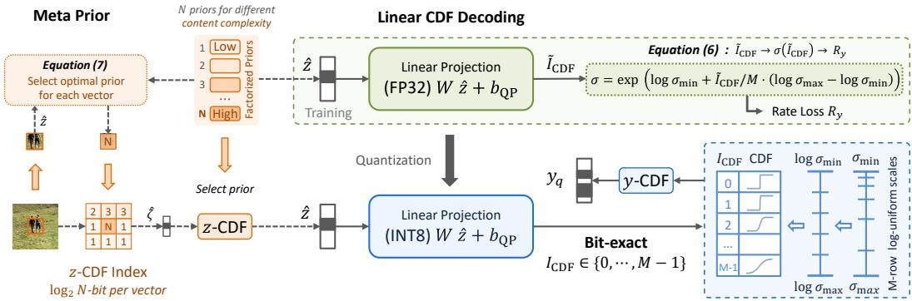  
Figure 3: Bit-exact entropy coding path. Meta Prior transmits $\hat { \zeta }$ to select CDFs for zˆ with different content complexities. An integer linear projection maps zˆ to CDF indices for entropy coding of $y _ { q }$

Linear CDF decoder. To address this, we propose a simple but effective solution: directly predict the CDF index instead of scale. Specifically, a linear projection predicts a continuous coordinate $\tilde { I } _ { C D F }$ in a shared M-row log-spaced Gaussian CDF table:

$$
\tilde { I } _ { C D F } = W \hat { z } + b _ { \mathrm { Q P } } , \qquad I _ { \mathrm { C D F } } = \Bigl \lfloor \mathrm { c l i p } ( \tilde { I } _ { C D F } , 0 , M - 1 ) \Bigr \rfloor .\tag{5}
$$

Here $b _ { \mathrm { Q P } }$ is a learned per- $\mathbf { \nabla \cdot Q P }$ bias. During training, the bounded coordinate is mapped to

$$
\sigma ( \tilde { I } _ { C D F } ) = \exp \left( \log \sigma _ { \operatorname* { m i n } } + \tilde { I } _ { C D F } / M \cdot ( \log \sigma _ { \operatorname* { m a x } } - \log \sigma _ { \operatorname* { m i n } } ) \right)\tag{6}
$$

for differentiable Gaussian likelihood evaluation. We empirically set $\sigma _ { \mathrm { m i n } } = 0 . 1 1 , \sigma _ { \mathrm { m a x } } = 2 5 6$ and $M = 6 4$ . At inference, entropy coding consumes $I _ { \mathrm { C D F } }$ directly, eliminating the runtime exponential and logarithm. Linear CDF decoding eliminates the log σ computation to reduce CPU time to 1.6 ms, while achieving a lower BD-rate than the INT8 hyper scale decoder on the CLIC test set.

Meta Prior. The extreme simplification of the linear CDF decoder shifts more rate-modeling responsibility onto zˆ. However, the inflexible factorized prior uses the same prior distribution for zˆ across all images and cannot adapt to different image contents. Empirically, we observe that zˆ accounts for about half of the bitstream for images with low content complexity. As shown in Table 1, it leads to a substantial degradation on the low-content-complexity (LC) subset.

To address this issue, we introduce a meta prior that enables content-adaptive entropy modeling with minimal additional decoding complexity. Specifically, after training the entire model, we post-train only the factorized prior into a bank of N prior models. Each prior model is fitted to hyperlatent vectors from regions of different content complexity, with other modules fixed. We then allow each zˆ vector at a different spatial position to select its own prior model, using an expectation-maximization (EM) procedure to jointly optimize the prior models and their assignments. More details are provided in Appendix B. At inference, for each spatial position r in zˆ, the encoder evaluates the quantized-CDF coding cost $\ell _ { q , k } ( \hat { z } _ { r } )$ under every prior bank and transmits the best bank index:

$$
k _ { r } ^ { \star } = \arg \operatorname* { m i n } _ { k \in \{ 0 , \ldots , N - 1 \} } \ell _ { q , k } ( \hat { z } _ { r } ) , \qquad R _ { z } = \sum _ { r } \left[ \log _ { 2 } N + \ell _ { q , k _ { r } ^ { \star } } ( \hat { z } _ { r } ) \right] .\tag{7}
$$

A single log N-bit index is shared by all channels at each spatial position, serving as meta-prior information. The decoder reads this metadata and selects the corresponding fixed CDF bank to decode $\hat { z } _ { r }$ without additional neural-network inference. Unlike some prior works that select competing priors for main latents (Brummer & De Vleeschouwer, 2021), meta prior adapts zˆ coding to compensate for the reduced capacity of the linear CDF decoder, particularly in low-content-complexity regions. This brings a 9.8% bitrate saving on low-complexity images and a 2.4% saving on the overall set.

In deployment, the linear CDF activation and weights are INT8, accumulation is INT32, and the output is a UINT8 CDF index. Meta Prior bank indices are coded with fixed-length coding, and can be further improved with merge coding.

Table 1: Ablation of bit-exact entropy-coding designs. BD-rate is measured on the CLIC test set and a subset of images with low content complexity (LC subset). Latency is measured for a 1080p image on one AMD EPYC 9V84 CPU thread.
<table><tr><td>Method</td><td colspan="2">CLIC test set Float INT8</td><td colspan="2">LC subset Float INT8</td><td colspan="2">Single-thread CPU Time  $\hat { z } \to \sigma$  λ → CDF</td></tr><tr><td>Integerize full entropy model + LUT seale deeoder (Pärnamaa et al., 2026)</td><td>1.5%</td><td>5.7%</td><td>3.1%</td><td>7.8%</td><td>85.9 ms</td><td>86.0 ms</td></tr><tr><td>+ Hyper scale decoder (Ascenso et al., 2023)</td><td>29.7% -0.1%</td><td>29.7% 3.2%</td><td>59.6% 2.1%</td><td>59.6% 6.4%</td><td>0.5 ms 28.1 ms</td><td>0.5 ms 29.2 ms</td></tr><tr><td>+ Linear scale decoder</td><td>4.5%</td><td>4.5%</td><td>11.8%</td><td>12.0%</td><td>1.2 ms</td><td>4.1 ms</td></tr><tr><td></td><td></td><td></td><td></td><td></td><td></td><td></td></tr><tr><td>+ Linear CDF decoder</td><td>2.4%</td><td>2.4%</td><td>9.8%</td><td>9.9%</td><td>N/A</td><td>1.6 ms</td></tr><tr><td>+ Meta Prior → Proposal</td><td>0.0%</td><td>0.04%</td><td>0.0%</td><td>0.04%</td><td>N/A</td><td>1.6 ms</td></tr></table>

## 4 AGENTIC EVOLUTION WITH HEURISTIC PROBES

Under an ultra-low complexity budget, every channel and operator matters, making architectureparameter allocation critical to compression performance. We evolve the neural receiver through four stages: probe, analyze, reallocate, and train, as illustrated in Figure 4. The analysis transform is fixed throughout the process to isolate receiver design.

## 4.1 HEURISTIC REPRESENTATION PROBES

Given a trained network, we probe representations at selected interfaces. For layer $l \in \{ 1 , \cdots , L \}$ we examine the input latent $a ^ { \overset { \triangledown } { } }$ with $C ^ { \hat { l } }$ channels. We measure two complementary properties.

Redundancy probe with PCA dimension. The latent $a ^ { l }$ may contain redundant channels if its allocated dimension exceeds what is required to preserve end-task performance. We fit a datasetshared PCA basis and reconstruct it from its first c principal components, denoted by $\Pi _ { c } ( a ^ { l } )$ . We then find the smallest dimension whose relative rate–distortion loss increase is at most $\epsilon = 1 \% \mathrm { : }$

$$
C _ { \mathrm { P C A } } ^ { l } = \operatorname* { m i n } _ { c } \left\{ c : \mathcal { L } _ { \mathrm { R D } } ( \Pi _ { c } ( a ^ { l } ) ) - \mathcal { L } _ { \mathrm { R D } } ( a ^ { l } ) \leq \epsilon \cdot \mathcal { L } _ { \mathrm { R D } } ( a ^ { l } ) \right\} .\tag{8}
$$

The ratio $C _ { \mathrm { P C A } } ^ { l } / C ^ { l }$ suggests utilization of the allocated channel subspace. A small ratio indicates potentially reclaimable channel redundancy.

Headroom probe with latent optimization. The PCA probe suggests redundancy but does not assess whether upstream computation produces the best representation the downstream network can exploit. We therefore optimize $a ^ { l }$ independently for each image while freezing all downstream parameters. For decoder-side interfaces, the coded symbols are already fixed, so this intervention keeps the rate unchanged and directly measures an oracle PSNR gain:

$$
\begin{array} { r } { a ^ { l * } = \arg \underset { a ^ { l } } { \operatorname* { m i n } } D \big ( F _ { > l } ( a ^ { l } ) , x \big ) , \qquad G _ { \mathrm { O P T } } ^ { l } = \mathrm { P S N R } \big ( F _ { > l } ( a ^ { l * } ) , x \big ) - \mathrm { P S N R } \big ( F _ { > l } ( a ^ { l } ) , x \big ) . } \end{array}\tag{9}
$$

Entropy-side interfaces use the rate–distortion objective, as detailed in Appendix D. A large $G _ { \mathrm { O P T } } ^ { l }$ indicates that the downstream network can benefit from a more informative value at this interface.

## 4.2 HUMAN–LLM COLLABORATIVE ANALYSIS

The LLM agent receives $\{ C _ { \mathrm { P C A } } { } ^ { l } , G _ { \mathrm { O P T } } ^ { l } \} _ { l = 1 } ^ { L }$ together with the network graph, parameter sharing, exact component costs, and the history of previous rounds. With this comprehensive context, the LLM interprets the probe results in the architectural context and proposes fixed-budget changes for empirical validation. The human researcher then reviews the hypotheses, implementation feasibility and budget accounting, and selects candidates for training.

In practice, some bottlenecks cannot be addressed by changing parameters in the predefined search space. Both the LLM agent and the human researcher may therefore introduce a spark: a new architectural mechanism or adjustable factor motivated by the probe evidence. This allows the optimization space itself to evolve as new bottlenecks are discovered.

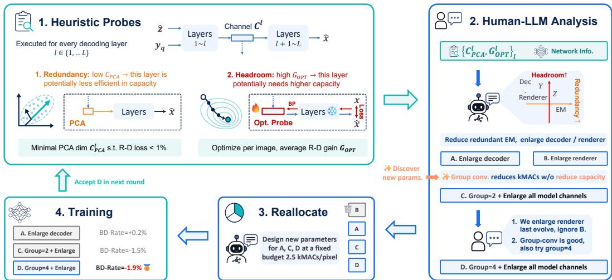  
Figure 4: Agentic evolution, illustrated for round E4→E5 in the complete trajectory in Figure 10. Layer-wise probes measure redundancy and headroom. A human researcher and an LLM agent interpret the evidence to propose fixed-budget reallocations, and validate them by training.

Discussion: comparison with NAS. Agentic evolution differs from conventional NAS in two respects. First, heuristic probes help prioritize candidate directions before from-scratch training instead of enumerating a large static search space. Second, the human–LLM process is open-ended: probe evidence can motivate new parameters or mechanisms through sparks rather than restricting all candidates to search axes fixed in advance.

## 4.3 FIXED-BUDGET REALLOCATION AND FROM-SCRATCH TRAINING

Each selected proposal is profiled before training to ensure that parameter reallocation remains within a fixed complexity budget. The remaining candidates are trained from scratch with the same data, rate range, optimizer, and schedule. Finally, the candidate with the best compression performance is selected as the promotion for the next round.

## 4.4 EVOLUTION AT 2.5 KMAC/PIXEL AND SCALING TO DIFFERENT SIZES

The complete trajectory of seven generations is reported in Appendix D (Figure 10). Across the full trajectory, human–LLM collaboration alternates between reallocating known parameters and introducing new search axes. In detail, the depth and width of different modules are jointly adjusted step by step, and three rounds discover new parameters including the renderer resolution, group convolution and FFN width. The final E7 achieves a 10.2% BD-rate reduction relative to E1. Finally, we adjust the channel dimensions to multiples of 16 for efficient inference of PULSE-S, and then enlarge channels to scale the decoding complexity to 5.2 and 20 kMAC/pixel, resulting in the PULSE and PULSE-L models, respectively.

Discussion: scope and generalization. We study human–LLM co-design for ultra-low-complexity image codecs, rather than task-agnostic architecture search. The workflow is history-dependent, with insights from earlier rounds guiding subsequent decisions. Thus, the contributions of human and LLM agents cannot be cleanly separated post hoc. Within this setting, the workflow enables effective architecture evolution with few training runs. Generalization to other tasks may require task-specific search spaces and objectives, which we leave for future work.

## 5 PERCEPTUAL AND REGION-OF-INTEREST OPTIMIZATION

This section introduces the techniques used to improve the subjective reconstruction quality of PULSE. When optimized with MSE alone, the decoder tends to over-smooth uncertain details, resulting in

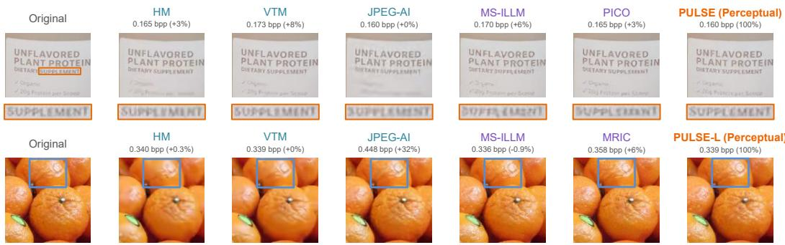  
Figure 5: Visual comparison. PULSE achieves comparable or better visual quality after perceptual and ROI optimization. More results are in Appendix C.4.

blurry textures and local structures. Inspired by perceptual codecs (Mentzer et al., 2020; Muckley et al., 2023), we adopt a two-stage perceptual optimization process.

Stage I: LPIPS-First Perceptual Pre-Training. The first stage establishes the model’s detail synthesis capability by emphasizing the LPIPS loss (Zhang et al., 2018):

$$
{ \mathcal { L } } _ { \mathrm { S t a g e ~ I } } = R _ { y } + R _ { z } + \lambda \left[ \phi _ { \mathrm { M S E } } D _ { \mathrm { M S E } } + \phi _ { \mathrm { L P I P S } } ^ { \mathrm { I } } D _ { \mathrm { L P I P S } } \right] .\tag{10}
$$

where $\phi _ { \mathrm { L P I P S } } ^ { \mathrm { I } }$ is set substantially higher than in prior work (Muckley et al., 2023) to encourage stronger perceptual detail synthesis.

Stage II: Preference Optimization. The second stage aligns reconstruction quality with perceptual preference criteria. We make three modifications: (1) reduce the LPIPS weight back to mitigate its artifacts and imperfect perceptual alignment; (2) introduce adversarial training with a DINOv2-based discriminator (Oquab et al., 2024) for distribution-level alignment; and (3) introduce region-of-interest (ROI) optimization for semantically important regions, e.g., small text and face regions.

We pre-detect text- and face-rich images and store their corresponding ROI boxes. Within these regions, we increase the MSE and LPIPS weights and introduce semantic feature alignment:

$$
\mathcal { L } _ { \mathrm { S t a g e \ I I } } = R _ { y } + R _ { z } + \lambda \big [ \phi _ { \mathrm { M S E } } D _ { \mathrm { M S E } } + \phi _ { \mathrm { L P I P S } } ^ { \mathrm { I I } } D _ { \mathrm { L P I P S } } + \phi _ { \mathrm { G A N } } D _ { \mathrm { G A N } } + \phi _ { \mathrm { R O I } } D _ { \mathrm { R O I } } \big ] .\tag{11}
$$

$$
D _ { \mathrm { R O I } } = \phi _ { \mathrm { F a c e N e t } } D _ { \mathrm { F a c e N e t } } + \phi _ { \mathrm { C R N N } } D _ { \mathrm { C R N N } } ,\tag{12}
$$

where $\phi _ { \mathrm { L P I P S } } ^ { \mathrm { I } } = 4 \times \phi _ { \mathrm { L P I P S } } ^ { \mathrm { I I } }$ . FaceNet (Schroff et al., 2015) uses square face crops with contextual regions, while the CRNN-CNN teacher (Shi et al., 2017) uses aspect-preserving text crops. This stage jointly improves pixel fidelity, perceptual quality, and ROI quality, which is verified in Table 8.

## 6 EXPERIMENTS

## 6.1 EXPERIMENTAL SETUP

Training. PULSE is optimized using SOAP (Vyas et al., 2025), requiring 15 hours for the MSE version and 36 hours for the perceptual version on a single NVIDIA H100 GPU. More details of training schedules and datasets are in Appendix B. PULSE supports eight quantization parameters in a single model through the module-bank formulation (Jia et al., 2025), and each quantization parameter is trained with its corresponding λ.

Benchmarks and metrics. We use the CLIC Professional validation set (CLIC Organizers, 2020) for comparison. For MSE-optimized compression, we compare with Mean-Scale Hyperprior (Minnen et al., 2018), ELIC (He et al., 2022b), EVC (Wang et al., 2023), DCVC-RT-Intra (Jia et al., 2025), Shallow NTC (Yang & Mandt, 2023), HM-16.25 (Sullivan et al., 2012), and VTM-17.0 (Bross et al., 2021). For perceptual compression, we compare with MRIC (Agustsson et al., 2023), MS-ILLM (Muckley et al., 2023), and CoD-Lite (Jia et al., 2026). HiFiC and PICO comparisons on matched datasets are in the appendix. We report PSNR and patch-based FID (Heusel et al., 2017)

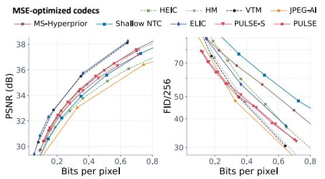

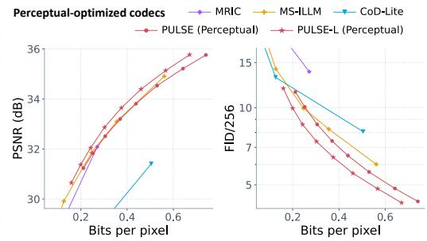  
Figure 6: Rate–distortion curves. CLIC Professional validation results for MSE-optimized codecs (left) and perceptually optimized codecs (right). More results are in Appendix C.3.

Table 2: Ablation studies. BD-Rate (↓) is measured in terms of PSNR and FID for the MSE- and perceptual-optimized versions, respectively. Decoder speed is measured on 1080p images on an NPU.
<table><tr><td>Decoder structure</td><td>PSNR</td><td>FID</td><td>Speed</td></tr><tr><td>Progressive Upsampling</td><td>1.1%</td><td>5.8%</td><td>0.9×</td></tr><tr><td>Single Low-Res. Decoder</td><td>12.0%</td><td>18.4%</td><td>1.6×</td></tr><tr><td>Low-Res. Decoder + Renderer</td><td>0.0%</td><td>0.0%</td><td>1.0×</td></tr></table>

<table><tr><td>Architecture search</td><td>#Trains ↓</td><td>PSNR</td></tr><tr><td>No Search</td><td>1</td><td>0.0%</td></tr><tr><td>Hardware-aware NAS</td><td>1280</td><td>-7.5%</td></tr><tr><td>Agentic Evolution</td><td>22</td><td>-10.2%</td></tr></table>

$( 2 5 6 \times 2 5 6 .$ , overlapping) (Mentzer et al., 2020). BD-rate follows Bjøntegaard (2001). We evaluate $\mathrm { b p p } \geq 0 . 0 5$ , so ultra-low-bitrate results may differ from prior reports.

Complexity. We report the parameters and multiply–accumulate operations exercised by each sender and receiver. Latency is measured at 1088 × 1920 on a single AMD EPYC 9V84 CPU thread.

## 6.2 EXPERIMENTAL RESULTS

Comparison results. Figure 6 and Table 3 report comparisons with MSE- and perceptual-optimized codecs. PULSE-S encodes a 1080p image in 920 ms and decodes it in 77 ms, faster than all compared codecs, including software-implemented HEIC. It also achieves a lower PSNR-based BD-rate of +5.9%, compared to +25.2% for HEIC. PULSE achieves a −2.9% BD-rate relative to HM-16.25 with 9× faster encoding, while competing with the much larger MS-ILLM after perceptual optimization. PULSE-L achieves a −22.5% FID-based BD-rate relative to MS-ILLM with substantially fewer computations. Figure 5 shows text and natural-texture examples for visual comparison, and more examples are in the appendix.

Ablation study. As shown in Table 2, under the same decoding complexity, our rendering-based decoder outperforms the progressive upsampling decoder (Balle et al., 2017) in both compression´ efficiency and NPU inference speed. The single low-resolution decoder (Jia et al., 2025) is faster but incurs a relatively large performance loss. Our scheme achieves the best overall trade-off. Compared to hardware-aware NAS (Tatwawadi et al., 2026), the proposed agentic evolution uses fewer training runs to achieve better performance.

## 6.3 PRACTICAL IMPLEMENTATION

In prior sections, we focus on single-thread CPU execution as a pressure test. To assess practical deployment, we evaluate PULSE across diverse platforms, including an Intel Core Ultra 9 288V CPU, NVIDIA A100 and H100 GPUs, and a Qualcomm Snapdragon 8 Elite NPU. Executing the linear CDF decoding on the CPU verifies bit-exact entropy decoding across all devices. Figure 1 shows that the low complexity translates to high throughput on capable hardware. On a REDMI K80 Pro with a Snapdragon NPU, the complete encoding and decoding pipelines take 42 ms and 20 ms, respectively, for 1080p images. Overall, these results provide an indication that PULSE’s ultra-low-complexity design can translate into practical deployment.

Table 3: Complexity and rate–distortion performance. Time measurements use 1088 × 1920 inputs on a single-thread CPU. BD-rate is evaluated on the CLIC Professional validation set. VBR denotes variable bitrates within one model, and BE denotes bit-exact entropy coding across platforms.
<table><tr><td rowspan="2">Method</td><td rowspan="2"></td><td rowspan="2">VBR BE</td><td rowspan="2">Target</td><td colspan="3">Encoding</td><td colspan="3">Decoding</td><td colspan="2">BD-rate ↓</td></tr><tr><td>Params</td><td>kMAC/px</td><td>Time</td><td>Params</td><td>kMAC/px</td><td>Time</td><td>on PSNR</td><td>on FID</td></tr><tr><td>HEIC</td><td>√</td><td>√</td><td>MSE</td><td>libheif + x265</td><td></td><td>1.4 s</td><td>libheif + libde265</td><td></td><td>80 ms</td><td>+25.2%</td><td>+2680%</td></tr><tr><td>HM-16.25</td><td>√</td><td>√</td><td>MSE</td><td>HM Encoder</td><td></td><td>8.8 s</td><td colspan="2">HM Decoder</td><td>98 ms</td><td>0.0%</td><td>+2450%</td></tr><tr><td>VTM-17.0</td><td>√</td><td>√</td><td>MSE</td><td>VTM Encoder</td><td></td><td>249 s</td><td colspan="2">VTM Decoder</td><td>189 ms</td><td>-23.4%</td><td>+2660%</td></tr><tr><td>JPEG-AI</td><td>×</td><td>√</td><td>MSE</td><td>7.1 M</td><td>56</td><td>2.6 s</td><td>4.4M</td><td>8.1</td><td>643 ms</td><td>+37.4%</td><td>+1720%</td></tr><tr><td>MS-Hyperprior</td><td>×</td><td>×</td><td>MSE</td><td>14M</td><td>112</td><td>2.1 s</td><td>12M</td><td>109</td><td>2.4 s</td><td>-1.7%</td><td>+3830%</td></tr><tr><td>ELIC</td><td>×</td><td>×</td><td>MSE</td><td>26M</td><td>335</td><td>6.5 s</td><td>24M</td><td>332</td><td>8.8 s</td><td>-26.2%</td><td>+3430%</td></tr><tr><td>EVC-S</td><td>√</td><td>×</td><td>MSE</td><td>12M</td><td>71</td><td>1.4 s</td><td>11M</td><td>79</td><td>1.4 s</td><td>-14.3%</td><td>+3040%</td></tr><tr><td>DCVC-RT-Intra</td><td>√</td><td>×</td><td>MSE</td><td>31M</td><td>258</td><td>5.4 s</td><td>36M</td><td>362</td><td>7.6 s</td><td>-33.2%</td><td>+3200%</td></tr><tr><td>Shallow NTC</td><td>×</td><td>X</td><td>MSE</td><td>23M</td><td>277</td><td>5.6 s</td><td>10 M</td><td>21</td><td>476 ms</td><td>+13.0%</td><td>+5590%</td></tr><tr><td>MRIC</td><td>×</td><td>×</td><td>Perc.</td><td>74M</td><td>823</td><td>16 s</td><td>71M</td><td>829</td><td>20 s</td><td>+46.1%</td><td>+101.0%</td></tr><tr><td>MS-ILLM</td><td>×</td><td>X</td><td>Perc.</td><td>25M</td><td>98</td><td>2.2 s</td><td>170 M</td><td>675</td><td>13 s</td><td>+38.0%</td><td>0.0%</td></tr><tr><td>CoD-Lite</td><td>×</td><td>√</td><td>Perc.</td><td>28M</td><td>344</td><td>7.0 s</td><td>52M</td><td>219</td><td>5.9 s</td><td>+218.8%</td><td>+12.9%</td></tr><tr><td>PICO</td><td>√</td><td>√</td><td>Perc.</td><td>5.6M</td><td>75</td><td>2.0 s</td><td>4.3M</td><td>46</td><td>1.2 s</td><td>N/A</td><td>N/A‡</td></tr><tr><td>PULSE-S</td><td>√</td><td>√</td><td>MSE</td><td>13M</td><td>45</td><td>920 ms</td><td>1.0 M</td><td>2.7</td><td>77 ms</td><td>+5.9%</td><td>+2530%</td></tr><tr><td>PULSE</td><td>√</td><td>√</td><td>MSE</td><td>13M</td><td>45</td><td>920 ms</td><td>1.7 M</td><td>5.2</td><td>126 ms</td><td>-2.9%</td><td>+2420%</td></tr><tr><td>PULSE-L</td><td></td><td></td><td>Perc.</td><td>13M</td><td>45</td><td>920 ms</td><td>1.7 M</td><td>5.2</td><td>126 ms</td><td>+45.5%</td><td>-4.1%</td></tr><tr><td></td><td>√</td><td>√</td><td>Perc.</td><td>15M</td><td>48</td><td>972 ms</td><td>5.7 M</td><td>20</td><td>420 ms</td><td>+30.8%</td><td>-22.5%</td></tr></table>

‡ PICO complexity and timing use our local reproduction. We compare with its released 300-image reconstructions in Appendix C.2.

## 7 RELATED WORK

Efficient neural codecs. Recent work reduces neural decoding complexity through lightweight contexts, networks, and architectures. ELIC reduces serial context (He et al., 2022b), EVC uses mask decay (Wang et al., 2023), FastNIC targets low-complexity compression (Zhang et al., 2025), and DCVC-RT and Shallow NTC reduce operation complexity or depth (Jia et al., 2025; Yang & Mandt, 2023). We instead explicitly target ultra-low-complexity, end-to-end decoding on a single CPU thread. Cool-Chic and C3 use tiny image-specific decoders, which require substantial per-image optimization for encoding (Ladune et al., 2023; Kim et al., 2024). In addition, their highly sequential entropy model limits implementation efficiency.

Perceptual neural codecs. Another line targets perceptual quality by modeling richer image details. HiFiC and MS-ILLM enlarge synthesis networks to model realistic texture (Mentzer et al., 2020; Muckley et al., 2023). CoD-Lite enables real-time diffusion-based decoding, while PICO uses hardware-aware NAS to balance perceptual quality and efficiency (Jia et al., 2026; Tatwawadi et al., 2026). However, perceptual compression on resource-constrained hardware remains underexplored.

Cross-platform Compression. Post-training quantization can make probability prediction deterministic across platforms (He et al., 2022a). JPEG AI standardizes integer hyper scale decoder (Ascenso et al., 2023; Tatwawadi et al., 2026). However, their scale decoding still relies on a large network. On devices with only an NPU as an accelerator, this bit-exact computation may fall back to the host CPU, where running such a large network is less efficient. MLVC encodes scales into the hyperlatent using a lookup table, but incurs a considerable coding cost (Parnamaa et al., 2026). Thus, a simple-to-deploy¨ scheme with low coding loss is still needed.

## 8 CONCLUSION

PULSE demonstrates that practical learned image compression is possible under an extreme computational budget. With a receiver complexity of 5.2 kMAC/pixel, it decodes a 1080p image in 126 ms on a single CPU thread while achieving HM-comparable compression performance. Agentic evolution recovers performance under this tight budget, while a meta prior and integer linear CDF predictor enable bit-exact entropy coding across platforms. Perceptual optimization further enables it to compete with larger perceptual codecs such as MS-ILLM.

Limitation. Although we deploy PULSE across heterogeneous devices to demonstrate its practical applicability, further optimization is needed for real-world deployment. While ROI processing improves visual quality for practical applications, PULSE is not specifically optimized for screen content, games, or artistic images, and its performance may degrade on these contents. Thus, PULSE should be viewed as an academic prototype rather than a ready-to-use software system.

## REFERENCES

Eirikur Agustsson and Radu Timofte. NTIRE 2017 challenge on single image super-resolution: Dataset and study. In IEEE Conference on Computer Vision and Pattern Recognition Workshops, pp. 1122–1131, 2017. doi: 10.1109/CVPRW.2017.150.

Eirikur Agustsson, David Minnen, George Toderici, and Fabian Mentzer. Multi-realism image compression with a conditional generator. In IEEE/CVF Conference on Computer Vision and Pattern Recognition, 2023.

Joao Ascenso, Elena Alshina, and Touradj Ebrahimi. The JPEG AI standard: Providing efficient˜ human and machine visual data consumption. IEEE MultiMedia, 30(1):100–111, 2023. doi: 10.1109/MMUL.2023.3245919.

Johannes Balle, Valero Laparra, and Eero P. Simoncelli. End-to-end optimized image compression.´ In International Conference on Learning Representations, 2017.

Johannes Balle, David Minnen, Saurabh Singh, Sung Jin Hwang, and Nick Johnston. Variational im-´ age compression with a scale hyperprior. In International Conference on Learning Representations, 2018.

Gisle Bjøntegaard. Calculation of average PSNR differences between RD-curves. Technical Report VCEG-M33, ITU-T Video Coding Experts Group, April 2001.

Benjamin Bross, Ye-Kui Wang, Yan Ye, Shan Liu, Jianle Chen, Gary J. Sullivan, and Jens-Rainer Ohm. Overview of the versatile video coding (VVC) standard and its applications. IEEE Transactions on Circuits and Systemsfor Video Technology, 31(10):3736–3764, 2021. doi: 10.1109/TCSVT.2021. 3101953.

Benoit Brummer and Christophe De Vleeschouwer. End-to-end optimized image compression with competition of prior distributions. In 2021 IEEE/CVF Conference on Computer Vision and Pattern Recognition Workshops (CVPRW), pp. 1890–1894. IEEE, 2021.

Zhengxue Cheng, Heming Sun, Masaru Takeuchi, and Jiro Katto. Learned image compression with discretized gaussian mixture likelihoods and attention modules. In IEEE/CVF Conference on Computer Vision and Pattern Recognition, pp. 7939–7948, 2020. doi: 10.1109/CVPR42600.2020. 00796.

CLIC Organizers. CLIC 2020: Challenge on learned image compression. Dataset documentation: https://www.tensorflow.org/datasets/catalog/clic, 2020.

Keyan Ding, Kede Ma, Shiqi Wang, and Eero P. Simoncelli. Image quality assessment: Unifying structure and texture similarity. IEEE Transactions on Pattern Analysis and Machine Intelligence, 44(5):2567–2581, 2022. doi: 10.1109/TPAMI.2020.3045810.

Jarek Duda. Asymmetric numeral systems: Entropy coding combining speed of huffman coding with compression rate of arithmetic coding. arXiv preprint arXiv:1311.2540, 2013.

Dailan He, Ziming Yang, Yuan Chen, Qi Zhang, Hongwei Qin, and Yan Wang. Post-training quantization for cross-platform learned image compression. arXiv preprint arXiv:2202.07513, 2022a.

Dailan He, Ziming Yang, Weikun Peng, Rui Ma, Hongwei Qin, and Yan Wang. ELIC: Efficient learned image compression with unevenly grouped space-channel contextual adaptive coding. In IEEE/CVF Conference on Computer Vision and Pattern Recognition, pp. 5718–5727, 2022b. doi: 10.1109/CVPR52688.2022.00563.

Martin Heusel, Hubert Ramsauer, Thomas Unterthiner, Bernhard Nessler, and Sepp Hochreiter. GANs trained by a two time-scale update rule converge to a local nash equilibrium. In Advances in Neural Information Processing Systems, volume 30, pp. 6626–6637, 2017.

Jie Hu, Li Shen, and Gang Sun. Squeeze-and-excitation networks. In IEEE/CVF Conference on Computer Vision and Pattern Recognition, pp. 7132–7141, 2018. doi: 10.1109/CVPR.2018.00745.

Zhaoyang Jia, Bin Li, Jiahao Li, Wenxuan Xie, Linfeng Qi, Houqiang Li, and Yan Lu. Towards practical real-time neural video compression. In IEEE/CVF Conference on Computer Vision and Pattern Recognition, pp. 12543–12552, 2025. doi: 10.1109/CVPR52734.2025.01170.

Zhaoyang Jia, Naifu Xue, Zihan Zheng, Jiahao Li, Bin Li, Xiaoyi Zhang, Zongyu Guo, Yuan Zhang, Houqiang Li, and Yan Lu. CoD-Lite: Real-time diffusion-based generative image compression. arXiv preprint arXiv:2604.12525, 2026.

Wei Jiang, Jiayu Yang, Yongqi Zhai, Feng Gao, and Ronggang Wang. MLIC++: Linear complexity multi-reference entropy modeling for learned image compression. ACM Transactions on Multimedia Computing, Communications, and Applications, 21(5):1–25, 2025. doi: 10.1145/3719011.

Hyunjik Kim, Matthias Bauer, Lucas Theis, Jonathan Richard Schwarz, and Emilien Dupont. C3: High-performance and low-complexity neural compression from a single image or video. In IEEE/CVF Conference on Computer Vision and Pattern Recognition, pp. 9347–9358, 2024. doi: 10.1109/CVPR52733.2024.00893.

Alexander Kirillov, Eric Mintun, Nikhila Ravi, Hanzi Mao, Chloe Rolland, Laura Gustafson, Tete Xiao, Spencer Whitehead, Alexander C. Berg, Wan-Yen Lo, Piotr Dollar, and Ross Girshick.´ Segment anything. In IEEE/CVF International Conference on Computer Vision, pp. 4015–4026, 2023. doi: 10.1109/ICCV51070.2023.00371.

Alina Kuznetsova, Hassan Rom, Neil Alldrin, Jasper Uijlings, Ivan Krasin, Jordi Pont-Tuset, Shahab Kamali, Stefan Popov, Matteo Malloci, Alexander Kolesnikov, Tom Duerig, and Vittorio Ferrari. The open images dataset v4: Unified image classification, object detection, and visual relationship detection at scale. International Journal of Computer Vision, 128(7):1956–1981, 2020. doi: 10.1007/s11263-020-01316-z.

Theo Ladune, Pierrick Philippe, F´ elix Henry, Gordon Clare, and Thomas Leguay. COOL-CHIC:´ Coordinate-based low complexity hierarchical image codec. In IEEE/CVF International Conference on Computer Vision, pp. 13515–13522, 2023. doi: 10.1109/ICCV51070.2023.01243.

Jiahao Li, Bin Li, and Yan Lu. Hybrid spatial-temporal entropy modelling for neural video compression. In Proceedings ofthe 30th ACM International Conference on Multimedia, pp. 1503–1511, 2022. doi: 10.1145/3503161.3547845.

Bee Lim, Sanghyun Son, Heewon Kim, Seungjun Nah, and Kyoung Mu Lee. Enhanced deep residual networks for single image super-resolution. In IEEE Conference on Computer Vision and Pattern Recognition Workshops, pp. 1132–1140, 2017. doi: 10.1109/CVPRW.2017.151.

Jinming Liu, Heming Sun, and Jiro Katto. Learned image compression with mixed transformercnn architectures. In IEEE/CVF Conference on Computer Vision and Pattern Recognition, pp. 14388–14397, 2023. doi: 10.1109/CVPR52729.2023.01383.

Fabian Mentzer, George D. Toderici, Michael Tschannen, and Eirikur Agustsson. High-fidelity generative image compression. In Advances in Neural Information Processing Systems, volume 33, 2020.

David Minnen, Johannes Balle, and George D. Toderici. Joint autoregressive and hierarchical priors´ for learned image compression. In Advances in Neural Information Processing Systems, volume 31, 2018.

Matthew J. Muckley, Alaaeldin El-Nouby, Karen Ullrich, Herve J´ egou, and Jakob Verbeek. Improving´ statistical fidelity for neural image compression with implicit local likelihood models. In Proceedings ofthe 40th International Conference on Machine Learning, volume 202 of Proceedings of Machine Learning Research, pp. 25426–25443, 2023.

Maxime Oquab, Timothee Darcet, Th´ eo Moutakanni, Huy Vo, Marc Szafraniec, Vasil Khalidov,´ Pierre Fernandez, Daniel Haziza, Francisco Massa, Alaaeldin El-Nouby, et al. DINOv2: Learning robust visual features without supervision. Transactions on Machine Learning Research, 2024.

Tanel Parnamaa, Martin Lumiste, Ardi Loot, Evgenii Indenbom, Andrei Znobishchev, and Ando¨ Saabas. MLVC: Multi-platform learned video codec for real-world deployment. arXiv preprint arXiv:2606.28027, 2026.

William Peebles and Saining Xie. Scalable diffusion models with transformers. In IEEE/CVF International Conference on Computer Vision, pp. 4195–4205, 2023. doi: 10.1109/ICCV51070. 2023.00387.

Florian Schroff, Dmitry Kalenichenko, and James Philbin. FaceNet: A unified embedding for face recognition and clustering. In IEEE Conference on Computer Vision and Pattern Recognition, pp. 815–823, 2015. doi: 10.1109/CVPR.2015.7298682.

Baoguang Shi, Xiang Bai, and Cong Yao. An end-to-end trainable neural network for image-based sequence recognition and its application to scene text recognition. IEEE Transactions on Pattern Analysis and Machine Intelligence, 39(11):2298–2304, 2017. doi: 10.1109/TPAMI.2016.2646371.

Wenzhe Shi, Jose Caballero, Ferenc Huszar, Johannes Totz, Andrew P. Aitken, Rob Bishop, Daniel´ Rueckert, and Zehan Wang. Real-time single image and video super-resolution using an efficient sub-pixel convolutional neural network. In IEEE Conference on Computer Vision and Pattern Recognition, pp. 1874–1883, 2016. doi: 10.1109/CVPR.2016.207.

Gary J. Sullivan, Jens-Rainer Ohm, Woo-Jin Han, and Thomas Wiegand. Overview of the high efficiency video coding (HEVC) standard. IEEE Transactions on Circuits and Systemsfor Video Technology, 22(12):1649–1668, 2012. doi: 10.1109/TCSVT.2012.2221191.

Kedar Tatwawadi, Parisa Rahimzadeh, Zhanghao Sun, Zhiqi Chen, Ziyun Yang, Sanjay Nair, Divija Hasteer, and Oren Rippel. What matters in practical learned image compression. In IEEE/CVF Conference on Computer Vision and Pattern Recognition, pp. 12095–12105, 2026.

Nikhil Vyas, Depen Morwani, Rosie Zhao, Itai Shapira, David Brandfonbrener, Lucas Janson, and Sham M. Kakade. SOAP: Improving and stabilizing shampoo using adam for language modeling. In International Conference on Learning Representations, 2025.

Guo-Hua Wang, Jiahao Li, Bin Li, and Yan Lu. EVC: Towards real-time neural image compression with mask decay. In International Conference on Learning Representations, 2023.

Yibo Yang and Stephan Mandt. Computationally-efficient neural image compression with shallow decoders. In IEEE/CVF International Conference on Computer Vision, pp. 530–540, 2023. doi: 10.1109/ICCV51070.2023.00055.

Haotian Zhang, Yuqi Li, Li Li, and Dong Liu. Learning switchable priors for neural image compression. IEEE Transactions on Circuits and Systems for Video Technology, 35(11):11567–11582, 2025. doi: 10.1109/TCSVT.2025.3577134.

Richard Zhang, Phillip Isola, Alexei A. Efros, Eli Shechtman, and Oliver Wang. The unreasonable effectiveness of deep features as a perceptual metric. In IEEE/CVF Conference on Computer Vision and Pattern Recognition, pp. 586–595, 2018. doi: 10.1109/CVPR.2018.00068.

## A MODEL DETAILS

This section introduces more detail of implementation of PULSE.

## A.1 COMPONENT COMPLEXITY ANALYSIS

Table 4 reports the component accounting of PULSE. The MSE and perceptual models use the same deployed topology and therefore have the same parameter and MAC counts.

Table 4: Component accounting for PULSE.
<table><tr><td rowspan="2">Component</td><td rowspan="2">Sender</td><td rowspan="2">Receiver</td><td colspan="2">PULSE</td><td colspan="2">PULSE-S</td><td colspan="2">PULSE-L</td></tr><tr><td>kMAC/px</td><td>Param.</td><td>kMAC/px</td><td>Param.</td><td>kMAC/px</td><td>Param.</td></tr><tr><td>Analysis transform</td><td>√</td><td>X</td><td>43.22</td><td>12.1M</td><td>43.08</td><td>11.1M</td><td>43.21</td><td>12.1M</td></tr><tr><td>Hyper encoder</td><td>√</td><td>X</td><td>0.45</td><td>0.30M</td><td>0.31</td><td>0.19M</td><td>0.93</td><td>0.66M</td></tr><tr><td>Hyper decoder</td><td>√</td><td>√</td><td>0.24</td><td>0.15M</td><td>0.16</td><td>0.09M</td><td>0.44</td><td>0.32M</td></tr><tr><td>Entropy model step-1</td><td>√</td><td>√</td><td>0.58</td><td>0.17M</td><td>0.48</td><td>0.13M</td><td>1.35</td><td>0.41M</td></tr><tr><td>Entropy model step-2</td><td>√</td><td>√</td><td>0.74</td><td>0.21M</td><td>0.61</td><td>0.16M</td><td>1.67</td><td>0.50M</td></tr><tr><td>Linear-CDF predictor</td><td>√</td><td>√</td><td>0.12</td><td>0.50M</td><td>0.08</td><td>0.33M</td><td>0.18</td><td>0.74M</td></tr><tr><td>Synthesis transform</td><td>X</td><td>√</td><td>3.53</td><td>0.71M</td><td>1.43</td><td>0.26M</td><td>16.34</td><td>3.70M</td></tr><tr><td>Neural sender</td><td>√</td><td>X</td><td>45.35</td><td>13.5M</td><td>44.73</td><td>12.0M</td><td>47.78</td><td>14.8M</td></tr><tr><td>Neural receiver</td><td>X</td><td>√</td><td>5.21</td><td>1.74M</td><td>2.77</td><td>0.98M</td><td>19.98</td><td>5.69M</td></tr></table>

## A.2 LATENCY ANALYSIS

Table 5 breaks down the end-to-end CPU latency of PULSE. Neural inference dominates the runtime, while non-neural processing takes only 7 ms for either encoding or decoding. PULSE-S retains the same encoding latency but lowers end-to-end decoding latency from 126 ms to 77 ms, a 38.9% reduction. PULSE-L is slower due to increased complexity.

Table 5: Single-thread CPU end-to-end latency of PULSE. Others includes non-neural processing, such as entropy coding and CDF indexing.
<table><tr><td>Model</td><td>Pipeline</td><td>Neural inference</td><td>Others</td><td>Total</td></tr><tr><td rowspan="2">PULSE-S</td><td>Encoding</td><td>913 ms</td><td>7 ms</td><td>920 ms</td></tr><tr><td>Decoding</td><td>70 ms</td><td>7 ms</td><td>77 ms</td></tr><tr><td rowspan="2">PULSE</td><td>Encoding</td><td>913 ms</td><td>7 ms</td><td>920 ms</td></tr><tr><td>Decoding</td><td>119 ms</td><td>7 ms</td><td>126 ms</td></tr><tr><td rowspan="2">PULSE-L</td><td>Encoding</td><td>963 ms</td><td>9 ms</td><td>972 ms</td></tr><tr><td>Decoding</td><td>411 ms</td><td>9 ms</td><td>420 ms</td></tr></table>

## A.3 CROSS-DEVICE ENTROPY CODING VALIDATION

As shown in Figure 1, we validate the linear CDF decoded index and latent-symbol decoding paths on three platforms: (1) a REDMI K80 Pro phone using the Snapdragon 8 Elite NPU, (2) an HP OmniBook Ultra Flip 14 laptop using only its Intel Core Ultra 9 288V CPU, and (3) a server using an NVIDIA A100 GPU. Although the laptop also includes an NPU, we disable NPU acceleration to characterize CPU-only performance. For all devices, we deploy entropy coding and linear CDF decoding on there CPUs. Table 6 reports zero CDF-index and decoded-symbol mismatches.

## B TRAINING DETAILS

This section details the training process of PULSE.

Table 6: Cross-device entropy coding bit-exact validation. Mismatch counts both CDF-index and decoded-symbol mismatches.
<table><tr><td>Environment</td><td>Platform</td><td>Neural backend</td><td>CPU backend</td><td>Mismatch</td></tr><tr><td>Phone</td><td>REDMI K80 Pro</td><td>NPU: Snapdragon 8 Elite</td><td>Snapdragon 8 Elite</td><td>0</td></tr><tr><td>Laptop</td><td>HP OmniBook Ultra Flip 14</td><td>CPU: Intel Core Ultra 9 288V</td><td>Intel Core Ultra 9 288V</td><td>0</td></tr><tr><td>Server</td><td>GPU server</td><td>GPU: NVIDIA A100</td><td>AMD EPYC 9V84</td><td>0</td></tr></table>

## B.1 MAIN TRAINING PROCESS

Table 7 summarizes the complete schedules. During training, we normalize the input images to [−1, 1]. When training on 512 low-resolution crops, we use the a subset of 4.8 M randomly sampled images from SAM-1B (Kirillov et al., 2023) and Open Images (Kuznetsova et al., 2020). When training on 1024 high-resolution crops, we use 4,035 images: 800 DIV2K images (Agustsson & Timofte, 2017), 2,650 Flickr2K images (Lim et al., 2017), and 585 CLIC training images (CLIC Organizers, 2020). The ROI stages use the same data as 1024 high-resolution crops, augmented with offline extracted face and text boxes.

Table 7: Training schedules.
<table><tr><td>Model</td><td>Stage</td><td>Crop</td><td>Steps</td><td>Batch</td><td>λ range</td><td>Learning-rate schedule</td></tr><tr><td rowspan="2">MSE</td><td>LR training</td><td>512</td><td>500k</td><td>8</td><td>24-672</td><td> $1 0 ^ { - 3 } ( 2 0 0 \mathrm { k } )  1 0 ^ { - 4 } ( 2 0 0 \mathrm { k } )  1 0 ^ { - 5 } ( 1 0 0 \mathrm { k } )$ </td></tr><tr><td>HR training</td><td>1024</td><td>50k</td><td>8</td><td>24-672</td><td> $1 0 ^ { - 4 } ( 4 0 \mathbf { k } )  1 0 ^ { - 5 } ( 1 0 \mathbf { k } )$ </td></tr><tr><td rowspan="3">Perceptual</td><td>Stage I LR</td><td>512</td><td>300k</td><td>16</td><td>0.5-12.5</td><td> $1 0 ^ { - 3 } ( 2 0 0 \mathrm { k } )  1 0 ^ { - 4 } ( 1 0 0 \mathrm { k } )$ </td></tr><tr><td>Stage I HR</td><td>1024</td><td>50k</td><td>16</td><td>0.5-12.5</td><td> $1 0 ^ { - 4 } ( 4 0 \mathbf { k } )  1 0 ^ { - 5 } ( 1 0 \mathbf { k } )$ </td></tr><tr><td>Stage II</td><td>1024</td><td>20k</td><td>32</td><td>3-25</td><td> $1 0 ^ { - 4 } ( 1 0 \mathbf { k } )  1 0 ^ { - 5 } ( 1 0 \mathbf { k } )$ </td></tr></table>

## B.2 MORE DETAILS OF PERCEPTUAL AND ROI OPTIMIZATION

Hyperparameters. For perceptual optimization, we set $\phi _ { \mathrm { M S E } } ~ = ~ 5 $ and define $D _ { \mathrm { { L P I P S } } } \ =$ $D _ { \mathrm { L P I P S - V G G } } + 0 . 5 D _ { \mathrm { L P I P S - A l e x } } ,$ . We use $\phi _ { \mathrm { L P I P S } } ^ { \mathrm { I } } = 1$ and $\phi _ { \mathrm { L P I P S } } ^ { \mathrm { I I } } = 0 . 2 5$ . In Stage II, we set $\phi _ { \mathrm { G A N } } = 0 . 0 0 5 ,$ , ϕROI = 0.0125, ϕFaceNet = 1, and $\phi _ { \mathrm { C R N N } } = 2 .$ We additionally apply ROIrestricted MSE and LPIPS supervision, each with an additional weight of 0.125.

GAN Training. For latent-conditioned adversarial training, we extract features from blocks 3, 6, 9, and 12 of a frozen DINOv2 ViT-B/14 backbone. At each block, the detached latent yˆ is resized and projected, then concatenated with the image features for discrimination. We use a hinge discriminator loss and the negative mean fake-image logit as $D _ { \mathrm { G A N } }$

Effectiveness of Perceptual Training Designs. As shown in Table 8, we examine the effectiveness of each design. LPIPS-first perceptual pre-training assigns a larger weight to the LPIPS loss, encouraging stronger perceptual detail synthesis, with consistent improvements in LPIPS-VGG, FID, and regional reconstruction quality. Adversarial training with a DINO-based projected GAN loss plays a key role in improving perceptual realism: removing the GAN loss substantially degrades FID by 49.8%. ROI training primarily benefits perceptually important regions, with its removal causing large degradations of 37.7% and 20.8% in face and text PSNR, respectively, while having a relatively limited effect on the overall metrics. These designs provide complementary benefits, and their combination achieves the best overall perceptual quality.

Table 8: Ablation study on perceptual training designs. BD-Rate is measured.
<table><tr><td>Training variant</td><td>PSNR</td><td>LPIPS-VGG</td><td>FID</td><td>Face PSNR</td><td>Text PSNR</td></tr><tr><td>Stage I w/o high LPIPS weight</td><td>-0.4%</td><td>+6.0%</td><td>+5.7%</td><td>+6.1%</td><td>+1.6%</td></tr><tr><td>Stage II w/o GAN Loss</td><td>-3.6%</td><td>-6.4%</td><td>+49.8%</td><td>-4.1%</td><td>-4.5%</td></tr><tr><td>Stage II w/o ROI</td><td>+0.2%</td><td>-2.4%</td><td>-3.7%</td><td>+37.7%</td><td>+20.8%</td></tr><tr><td>Proposed perceptual optimization</td><td>0.0%</td><td>0.0%</td><td>0.0%</td><td>0.0%</td><td>0.0%</td></tr></table>

## B.3 META PRIOR POST-TRAINING

After main training, we expand the factorized prior into N = 64 banks for each QP and fit them in two stages. All other codec parameters remain fixed during this procedure.

Complexity-stratified initialization. For each hyperlatent location, we compute three luminance statistics from the corresponding input region: mean absolute gradient, local standard deviation, and coarse-scale standard deviation interpolated to the hyperlatent grid. Each statistic is normalized by its 75th percentile over the fitting set and clipped to [0, 4]. Their weighted sum, with weights (0.5, 0.3, 0.2), defines the complexity score. We partition these locations into N quantile bins, copy the pretrained QP-specific factorized prior into every bank, and fit each bank to the hyperlatent vectors in its bin. This initializes banks specialized to different local content complexities, rather than assigning one bank to an entire image.

Spatially adaptive hard-EM refinement. We replace the complexity-based assignments with position-wise minimum-cost assignments. In detail, we adopt an expectation-maximization (EM) procedure to jointly optimize the prior models and their assignment. The hard E-step selects

$$
k _ { q , r } ^ { \star } = \arg \operatorname* { m i n } _ { k \in \{ 1 , \dots , N \} } \left[ - \sum _ { c = 1 } ^ { Z } \log _ { 2 } p _ { q , k , c } ( \hat { z } _ { q , r , c } ) \right] ,\tag{13}
$$

where $p _ { q , k , c }$ is the discrete probability mass of channel c in bank k at QP q. The M-step refits each bank by minimizing its normalized cross-entropy on the channel-wise symbol histograms of its currently assigned vectors. Thus, different positions in the same image can use different banks, regardless of their initial complexity bins.

We fit Meta Prior on hyperlatents extracted from $5 1 2 \times 5 1 2$ crops of 4,035 high-resolution images. Fitting starts with a 500-step initialization, followed by six 300-step refinements, totaling 2,300 optimizer steps per QP. Each fitting stage uses a learning rate of $1 0 ^ { - 2 }$ with cosine decay to $2 \times 1 0 ^ { - 4 }$ Optimization is full-batch over the aggregated hyperlatent histograms for each QP.

## C EVALUATION DETAILS

This section details the training process of PULSE.

## C.1 TIME MEASUREMENT

Latency is measured on a single CPU thread at 1088 × 1920, without hardware codec acceleration.   
Neural inference uses batch size one and one inference stream.

HEIC. We use libheif 1.17.6 with x265 3.5 for encoding and libde265 1.0.15 for decoding. Encoding uses 8-bit YCbCr 4:2:0, preset=slow, and tune=psnr, with additional codec worker threads disabled. We also evaluated YCbCr 4:4:4, but observed worse rate–distortion performance and lower coding speed, possibly reflecting less effective optimization for 4:4:4 in this implementation. The benchmark operates on in-memory RGB inputs and bitstreams. Disk I/O is excluded.

HM & VTM. We use HM-16.25 and VTM-17.0 reference implementations with 8-bit YUV 4:4:4 and intra-only coding. Their timings use the native YUV interface and do not include RGB conversion. To reduce the effect of fixed command-line initialization overhead, we measure identical 5-frame and 15-frame runs and estimating the per-picture latency as $( T _ { 1 5 } - T _ { 5 } ) / 1 0$

Neural codecs. For compared neural codec, we evaluate the supported combinations of BF16, FP16, and FP32 precision with OpenVINO and PyTorch, and report the fastest measured configuration under the same single-thread constraint. Model loading, graph conversion and compilation, and warm-up are excluded from steady-state inference timing. Entropy coding is included in the reported codec latency, using the same rANS implementation as in PULSE for consistent timing.

## C.2 BASELINE IMPLEMENTATIONS

For all methods, we use their officially released implementations, with the following exceptions.

For HiFiC (Mentzer et al., 2020), we were unable to obtain usable official pretrained models during our experiments in September 2026. We therefore use the officially published rate–distortion measurements released with TensorFlow Compression.1.

For MS-Hyperprior (Minnen et al., 2018), ELIC (He et al., 2022b), and MRIC (Agustsson et al., 2023), our measurements use third-party implementations and their pretrained models. Specifically, we use CompressAI’s mbt2018-mean model for MS-Hyperprior, VincentChandelier’s reimplementation for ELIC,2 and Nikolai10’s TensorFlow reimplementation for MRIC.3

For PICO (Tatwawadi et al., 2026), we reproduce their architecture based on the published specifications for complexity and latency measurements. PICO does not release an implementation, but provides reconstructions for a 300-image subset of the CLIC 2020 test set (CLIC Organizers, 2020). We therefore use the same subset for comparison in Figure 7 and Table 9. PULSE-L is 2.1× and 2.9× faster for encoding and decoding, respectively, while achieving better BD-Rate on PSNR and FID.

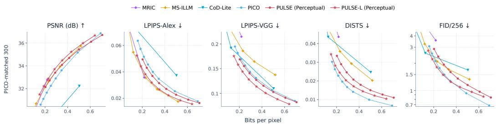  
Figure 7: Rate–distortion curves on the 300-image CLIC test subset released by PICO.

Table 9: BD-rate comparison on PICO-matched 300-image CLIC test subset. Anchor: MS-ILLM.
<table><tr><td>Method</td><td>PSNR</td><td>LPIPS-Alex</td><td>LPIPS-VGG</td><td>DISTS</td><td>FID</td></tr><tr><td>MRIC</td><td>-1.2%</td><td>+9.7%</td><td>+58.5%</td><td>+51.1%</td><td>+98.4%</td></tr><tr><td>MS-ILLM</td><td>0%</td><td>0%</td><td>0%</td><td>0%</td><td>0%</td></tr><tr><td>CoD-Lite</td><td>+160%</td><td>+109.4%</td><td>-39.7%</td><td>-1.3%</td><td>+9.4%</td></tr><tr><td>PICO</td><td>+18.2%</td><td>+50.7%</td><td>-30.6%</td><td>-52.3%</td><td>-6%</td></tr><tr><td>PULSE (Perceptual)</td><td>+2.2%</td><td>+31.1%</td><td>-38.2%</td><td>-29.3%</td><td>+12.7%</td></tr><tr><td>PULSE-L (Perceptual)</td><td>-7.1%</td><td>+8.9%</td><td>-48.9%</td><td>-45.2%</td><td>-18.2%</td></tr></table>

## C.3 COMPARISON ON MORE BENCHMARKS

In Figures 8, 9 and Tables 11–15, we present rate-distortion curves and BD-Rates across more metrics and benchmarks. We evaluate PSNR, LPIPS with VGG and AlexNet, DISTS (Ding et al., 2022), and FID on Kodak, Tecnick, DIV2K, CLIC Professional validation, and CLIC test sets. We compute FID using overlapping 64 × 64 patches for Kodak and overlapping 256 × 256 patches for all other benchmarks. Across all benchmarks and metrics, PULSE achieves competitive performance with substantially lower complexity.

## C.4 ADDITIONAL VISUAL EXAMPLES

Figure 11 and Figure 12 provide additional visual comparison examples on text and natural content.   
We do not include facial comparison to avoid personally identifiable information.

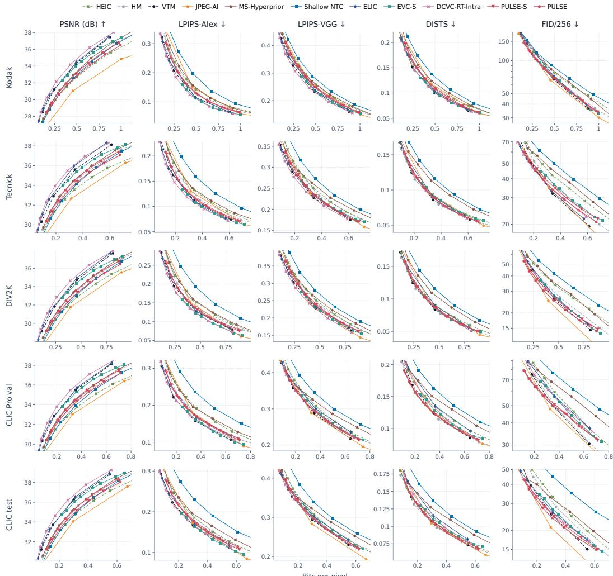  
Figure 8: Rate-distortion curves on more benchmarks for MSE-optimized codecs.

## D AGENTIC EVOLUTION PROTOCOL

All E1–E7 generations follow the same human–LLM agentic research loop described in the paper.

Table 10: Illustrations on each evolution.
<table><tr><td>Transition</td><td>Main change</td><td>Motivation</td></tr><tr><td>E1→E2</td><td>Move rendering to a 1/4-resolution grid</td><td>relieve the narrow full-resolution renderer</td></tr><tr><td>E2→E3</td><td>Replace four narrow blocks with one wider block</td><td>concentrate low-resolution capacity</td></tr><tr><td>E3→E4</td><td>Increase main and hyper latent capacity</td><td>address pressure in shared representations</td></tr><tr><td>E4→E5</td><td>Introduce grouped pointwise convolution</td><td>reclaim entropy-model computation</td></tr><tr><td>E5→E6</td><td>Reallocate internal width to the main latent</td><td>strengthen shared latent capacity</td></tr><tr><td>E6→E7</td><td>Reduce FFN channels and increase decoder depth</td><td>improve nonlinear decoder processing</td></tr><tr><td>E7→stop</td><td>Train three further candidates</td><td>none improves E7</td></tr></table>

## D.1 IMPLEMENTATION DETAILS

For LLM agent, we use gpt-5.6-sol with high reasoning effort. The model receives the probe summaries, network graph, parameter-sharing constraints, component-level MAC accounting, and the complete history of earlier rounds. Each interaction produces two to four candidate suggestions.

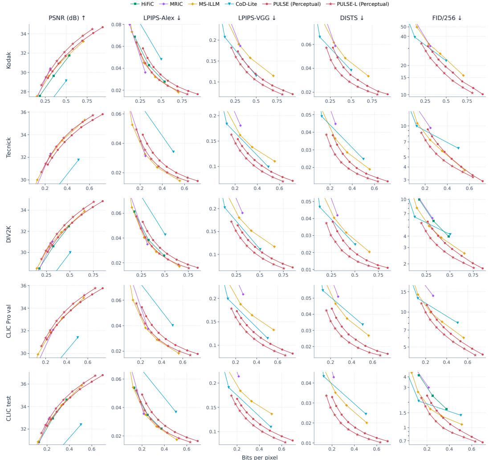  
Figure 9: Rate-distortion curves on more benchmarks for perceptual-optimized codecs.

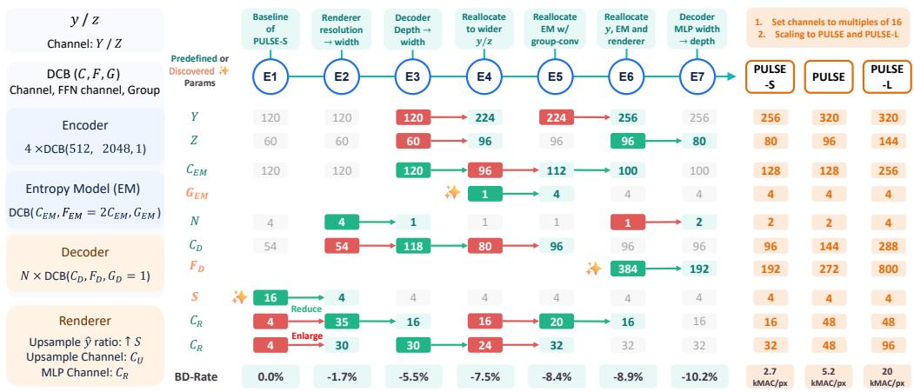  
Figure 10: Full agentic evolution process and final parameters at different scales.

A human researcher checks their interpretation, implementation feasibility, and budget accounting, then fixes three architectures for full training in every round.

Table 11: BD-Rate comparison on PSNR. Anchor: HM-16.25.
<table><tr><td>Method</td><td>Kodak</td><td>Tecnick</td><td>DIV2K</td><td>CLIC pro val</td><td>CLIC test</td></tr><tr><td>HEIC</td><td>+14.3%</td><td>+28.4%</td><td>+21.1%</td><td>+25.2%</td><td>+16.9%</td></tr><tr><td>HM-16.25</td><td>0%</td><td>0%</td><td>0%</td><td>0%</td><td>0%</td></tr><tr><td>VTM-17.0</td><td>-21.3%</td><td>-23.8%</td><td>-22.8%</td><td>-23.4%</td><td>-23%</td></tr><tr><td>JPEG-AI</td><td>+54.3%</td><td>+41.2%</td><td>+33%</td><td>+37.4%</td><td>+33.2%</td></tr><tr><td>MS-Hyperprior</td><td>-2.2%</td><td>-4.6%</td><td>-3.3%</td><td>-1.7%</td><td>-2%</td></tr><tr><td>Shallow NTC</td><td>+6.3%</td><td>+9.9%</td><td>+9.3%</td><td>+13%</td><td>+11.9%</td></tr><tr><td>ELIC</td><td>-25.1%</td><td>-32%</td><td>-27.6%</td><td>-26.2%</td><td>-26.2%</td></tr><tr><td>EVC-S</td><td>-12.6%</td><td>-14.3%</td><td>-13.5%</td><td>-14.3%</td><td>-13.2%</td></tr><tr><td>DCVC-RT-Intra</td><td>-31.1%</td><td>-36.4%</td><td>-33.3%</td><td>-33.2%</td><td>-33.7%</td></tr><tr><td>PULSE-S</td><td>+9.9%</td><td>+7.7%</td><td>+6.5%</td><td>+5.9%</td><td>+9.4%</td></tr><tr><td>PULSE</td><td>+1.2%</td><td>-2.1%</td><td>-2.4%</td><td>-2.9%</td><td>+0.3%</td></tr><tr><td>HiFiC</td><td>+61.9%</td><td></td><td>+37.3%</td><td></td><td>+45.1%</td></tr><tr><td>MRIC</td><td>+22.2%</td><td>+18.3%</td><td>+22.3%</td><td>+46.1%</td><td>+29.1%</td></tr><tr><td>MS-ILLM</td><td>+39.6%</td><td>+23%</td><td>+23.3%</td><td>+38%</td><td>+38.7%</td></tr><tr><td>CoD-Lite</td><td>+167.9%</td><td>+162.2%</td><td>+145.8%</td><td>+218.8%</td><td>+232.8%</td></tr><tr><td>PULSE (Perceptual)</td><td>+38.8%</td><td>+42.4%</td><td>+33.7%</td><td>+45.5%</td><td>+49.6%</td></tr><tr><td>PULSE-L (Perceptual)</td><td>+24.4%</td><td>+26%</td><td>+19.4%</td><td>+30.8%</td><td>+34.5%</td></tr></table>

Table 12: BD-Rate comparison on LPIPS-Alex. Anchor: MS-ILLM.
<table><tr><td>Method</td><td>Kodak</td><td>Tecnick</td><td>DIV2K</td><td>CLIC pro val</td><td>CLIC test</td></tr><tr><td>HEIC</td><td>+890%</td><td>+820%</td><td>+900%</td><td>+1420%</td><td>+1330%</td></tr><tr><td>HM-16.25</td><td>+840%</td><td>+800%</td><td>+880%</td><td>+1340%</td><td>+1450%</td></tr><tr><td>VTM-17.0</td><td>+740%</td><td>+690%</td><td>+790%</td><td>+1140%</td><td>+1250%</td></tr><tr><td>JPEG-AI</td><td>+830%</td><td>+700%</td><td>+760%</td><td>+1130%</td><td>+1120%</td></tr><tr><td>MS-Hyperprior</td><td>+1010%</td><td>+920%</td><td>+1000%</td><td>+1630%</td><td>+1640%</td></tr><tr><td>Shallow NTC</td><td>+1530%</td><td>+1300%</td><td>+1540%</td><td>+2410%</td><td>+2360%</td></tr><tr><td>ELIC</td><td>+770%</td><td>+600%</td><td>+760%</td><td>+1100%</td><td>+1110%</td></tr><tr><td>EVC-S</td><td>+530%</td><td>+710%</td><td>+700%</td><td>+1320%</td><td>+1460%</td></tr><tr><td>DCVC-RT-Intra</td><td>+710%</td><td>+550%</td><td>+680%</td><td>+970%</td><td>+980%</td></tr><tr><td>PULSE-S</td><td>+850%</td><td>+770%</td><td>+880%</td><td>+1410%</td><td>+1500%</td></tr><tr><td>PULSE</td><td>+860%</td><td>+770%</td><td>+890%</td><td>+1410%</td><td>+1520%</td></tr><tr><td>HiFiC</td><td>+12%</td><td></td><td>+9.4%</td><td></td><td>+7.8%</td></tr><tr><td>MRIC</td><td>-8.7%</td><td>+7.7%</td><td>+6.6%</td><td>+23.1%</td><td>+10.8%</td></tr><tr><td>MS-ILLM</td><td>0%</td><td>0%</td><td>0%</td><td>0%</td><td>0%</td></tr><tr><td>CoD-Lite</td><td>+61.2%</td><td>+98.7%</td><td>+70.3%</td><td>+96.8%</td><td>+111.5%</td></tr><tr><td>PULSE (Perceptual)</td><td>+25.2%</td><td>+31.7%</td><td>+25.6%</td><td>+32.2%</td><td>+31.9%</td></tr><tr><td>PULSE-L (Perceptual)</td><td>+4.9%</td><td>+10.4%</td><td>+5.8%</td><td>+9.9%</td><td>+9.4%</td></tr></table>

All three candidates are trained from scratch with the same data, QP range, optimizer, and schedule. The human researcher reviews the measured rate–distortion curves and promotes the best improving candidate. If no candidate improves the current parent, the search terminates.

## D.2 FULL EVOLUTION TRAJECTORY

As shown in Figure 10, the reported search contains one initial model training, seven rounds with three trained candidates per round, and several finalized model trainig at different scale. Six rounds promote E2 through E7. In the final round after E7, all three candidates underperform E7, so the search stops. Table 10 records the changes and motivations at high level.

Table 13: BD-Rate comparison on LPIPS-VGG. Anchor: MS-ILLM.
<table><tr><td>Method</td><td>Kodak</td><td>Tecnick</td><td>DIV2K</td><td>CLIC pro val</td><td>CLIC test</td></tr><tr><td>HEIC</td><td>+330%</td><td>+340%</td><td>+290%</td><td>+520%</td><td>+530%</td></tr><tr><td>HM-16.25</td><td>+300%</td><td>+330%</td><td>+270%</td><td>+490%</td><td>+560%</td></tr><tr><td>VTM-17.0</td><td>+260%</td><td>+270%</td><td>+230%</td><td>+480%</td><td>+540%</td></tr><tr><td>JPEG-AI</td><td>+270%</td><td>+240%</td><td>+200%</td><td>+360%</td><td>+370%</td></tr><tr><td>MS-Hyperprior</td><td>+300%</td><td>+350%</td><td>+290%</td><td>+570%</td><td>+580%</td></tr><tr><td>Shallow NTC</td><td>+460%</td><td>+540%</td><td>+450%</td><td>+950%</td><td>+1000%</td></tr><tr><td>ELIC</td><td>+310%</td><td>+280%</td><td>+270%</td><td>+590%</td><td>+600%</td></tr><tr><td>EVC-S</td><td>+180%</td><td>+260%</td><td>+190%</td><td>+470%</td><td>+530%</td></tr><tr><td>DCVC-RT-Intra</td><td>+270%</td><td>+250%</td><td>+230%</td><td>+500%</td><td>+510%</td></tr><tr><td>PULSE-S</td><td>+310%</td><td>+300%</td><td>+270%</td><td>+500%</td><td>+570%</td></tr><tr><td>PULSE</td><td>+300%</td><td>+280%</td><td>+250%</td><td>+510%</td><td>+580%</td></tr><tr><td>HiFiC</td><td></td><td></td><td></td><td></td><td></td></tr><tr><td>MRIC</td><td>+8.9%</td><td>+37.8%</td><td>+39.3%</td><td>+61.1%</td><td>+60.1%</td></tr><tr><td>MS-ILLM</td><td>0%</td><td>0%</td><td>0%</td><td>0%</td><td>0%</td></tr><tr><td>CoD-Lite</td><td>-39.3%</td><td>-26.6%</td><td>-34.8%</td><td>-36.9%</td><td>-38.3%</td></tr><tr><td>PULSE (Perceptual)</td><td>-24.7%</td><td>-25.3%</td><td>-28.6%</td><td>-35.8%</td><td>-38.1%</td></tr><tr><td>PULSE-L (Perceptual)</td><td>-38.8%</td><td>-37%</td><td>-41%</td><td>-47.5%</td><td>-48.9%</td></tr></table>

Table 14: BD-Rate comparison on DISTS. Anchor: MS-ILLM.
<table><tr><td>Method</td><td>Kodak</td><td>Tecnick</td><td>DIV2K</td><td>CLIC pro val</td><td>CLIC test</td></tr><tr><td>HEIC</td><td>+550%</td><td>+590%</td><td>+570%</td><td>+1070%</td><td>+920%</td></tr><tr><td>HM-16.25</td><td>+480%</td><td>+560%</td><td>+500%</td><td>+960%</td><td>+960%</td></tr><tr><td>VTM-17.0</td><td>+570%</td><td>+630%</td><td>+610%</td><td>+1160%</td><td>+1130%</td></tr><tr><td>JPEG-AI</td><td>+560%</td><td>+550%</td><td>+540%</td><td>+910%</td><td>+860%</td></tr><tr><td>MS-Hyperprior</td><td>+680%</td><td>+890%</td><td>+790%</td><td>+1500%</td><td>+1410%</td></tr><tr><td>Shallow NTC</td><td>+980%</td><td>+1090%</td><td>+1070%</td><td>+2090%</td><td>+1920%</td></tr><tr><td>ELIC</td><td>+670%</td><td>+680%</td><td>+710%</td><td>+1290%</td><td>+1190%</td></tr><tr><td>EVC-S</td><td>+420%</td><td>+650%</td><td>+560%</td><td>+1270%</td><td>+1330%</td></tr><tr><td>DCVC-RT-Intra</td><td>+630%</td><td>+620%</td><td>+660%</td><td>+1200%</td><td>+1090%</td></tr><tr><td>PULSE-S</td><td>+640%</td><td>+680%</td><td>+660%</td><td>+1130%</td><td>+1160%</td></tr><tr><td>PULSE</td><td>+630%</td><td>+670%</td><td>+630%</td><td>+1160%</td><td>+1210%</td></tr><tr><td>HiFiC</td><td></td><td></td><td></td><td></td><td></td></tr><tr><td>MRIC</td><td>+11.4%</td><td>+47.5%</td><td>+33.3%</td><td>+40.3%</td><td>+51.2%</td></tr><tr><td>MS-ILLM</td><td>0%</td><td>0%</td><td>0%</td><td>0%</td><td>0%</td></tr><tr><td>CoD-Lite</td><td>-35.3%</td><td>+2.6%</td><td>-26.4%</td><td>-7%</td><td>+1.2%</td></tr><tr><td>PULSE (Perceptual)</td><td>-22.6%</td><td>-12.5%</td><td>-22.4%</td><td>-28.8%</td><td>-29.6%</td></tr><tr><td>PULSE-L (Perceptual)</td><td>-43%</td><td>-32.4%</td><td>-42.8%</td><td>-47.1%</td><td>-45.6%</td></tr></table>

Table 15: BD-Rate comparison on FID. Anchor: MS-ILLM.
<table><tr><td>Method</td><td>Kodak</td><td>Tecnick</td><td>DIV2K</td><td>CLIC pro val</td><td>CLIC test</td></tr><tr><td>HEIC</td><td>+770%</td><td>+1770%</td><td>+1940%</td><td>+2680%</td><td>+4820%</td></tr><tr><td>HM-16.25</td><td>+630%</td><td>+1630%</td><td>+1700%</td><td>+2450%</td><td>+4890%</td></tr><tr><td>VTM-17.0</td><td>+730%</td><td>+1480%</td><td>+1700%</td><td>+2660%</td><td>+3820%</td></tr><tr><td>JPEG-AI</td><td>+530%</td><td>+1140%</td><td>+1130%</td><td>+1720%</td><td>+2540%</td></tr><tr><td>MS-Hyperprior</td><td>+800%</td><td>+2060%</td><td>+2120%</td><td>+3830%</td><td>+4980%</td></tr><tr><td>Shallow NTC</td><td>+1010%</td><td>+2800%</td><td>+2990%</td><td>+5590%</td><td>+8750%</td></tr><tr><td>ELIC</td><td>+970%</td><td>+1360%</td><td>+1750%</td><td>+3430%</td><td>+3820%</td></tr><tr><td>EVC-S</td><td>+480%</td><td>+1820%</td><td>+1620%</td><td>+3040%</td><td>+4890%</td></tr><tr><td>DCVC-RT-Intra</td><td>+840%</td><td>+1330%</td><td>+1700%</td><td>+3200%</td><td>+3510%</td></tr><tr><td>PULSE-S</td><td>+630%</td><td>+1650%</td><td>+1600%</td><td>+2530%</td><td>+4010%</td></tr><tr><td>PULSE</td><td>+640%</td><td>+1520%</td><td>+1480%</td><td>+2420%</td><td>+3700%</td></tr><tr><td>HiFiC</td><td></td><td></td><td>+42.8%</td><td></td><td>+85.1%</td></tr><tr><td>MRIC</td><td>+8.1%</td><td>+63.8%</td><td>+55.6%</td><td>+101%</td><td>+107.1%</td></tr><tr><td>MS-ILLM</td><td>0%</td><td>0%</td><td>0%</td><td>0%</td><td>0%</td></tr><tr><td>CoD-Lite</td><td>-26.4%</td><td>+17.2%</td><td>-6.4%</td><td>+12.9%</td><td>+14.2%</td></tr><tr><td>PULSE (Perceptual)</td><td>-16.7%</td><td>+12%</td><td>-1.7%</td><td>-4.1%</td><td>+17.8%</td></tr><tr><td>PULSE-L (Perceptual)</td><td>-33.3%</td><td>-17.9%</td><td>-27.3%</td><td>-22.5%</td><td>-17.2%</td></tr></table>

  
Figure 11: More visual examples on text contents.

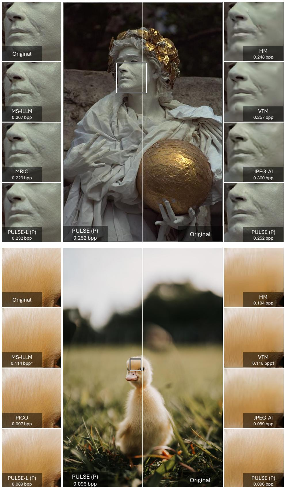  
Figure 12: More visual examples on natural contents.